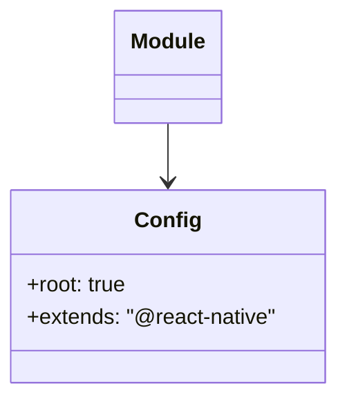

# Diagram: mobile/FreightVerifyMobileTracking/.eslintrc.js

> Auto-generated by Obscura crawlers

## Mermaid

### SVG

<svg id="container" width="251.7109375" xmlns="http://www.w3.org/2000/svg" class="classDiagram" height="294" viewBox="0 0 251.7109375 294" role="graphics-document document" aria-roledescription="class"><g><defs><marker id="container_class-aggregationStart" class="marker aggregation class" refX="18" refY="7" markerWidth="190" markerHeight="240" orient="auto"><path d="M 18,7 L9,13 L1,7 L9,1 Z"></path></marker></defs><defs><marker id="container_class-aggregationEnd" class="marker aggregation class" refX="1" refY="7" markerWidth="20" markerHeight="28" orient="auto"><path d="M 18,7 L9,13 L1,7 L9,1 Z"></path></marker></defs><defs><marker id="container_class-extensionStart" class="marker extension class" refX="18" refY="7" markerWidth="190" markerHeight="240" orient="auto"><path d="M 1,7 L18,13 V 1 Z"></path></marker></defs><defs><marker id="container_class-extensionEnd" class="marker extension class" refX="1" refY="7" markerWidth="20" markerHeight="28" orient="auto"><path d="M 1,1 V 13 L18,7 Z"></path></marker></defs><defs><marker id="container_class-compositionStart" class="marker composition class" refX="18" refY="7" markerWidth="190" markerHeight="240" orient="auto"><path d="M 18,7 L9,13 L1,7 L9,1 Z"></path></marker></defs><defs><marker id="container_class-compositionEnd" class="marker composition class" refX="1" refY="7" markerWidth="20" markerHeight="28" orient="auto"><path d="M 18,7 L9,13 L1,7 L9,1 Z"></path></marker></defs><defs><marker id="container_class-dependencyStart" class="marker dependency class" refX="6" refY="7" markerWidth="190" markerHeight="240" orient="auto"><path d="M 5,7 L9,13 L1,7 L9,1 Z"></path></marker></defs><defs><marker id="container_class-dependencyEnd" class="marker dependency class" refX="13" refY="7" markerWidth="20" markerHeight="28" orient="auto"><path d="M 18,7 L9,13 L14,7 L9,1 Z"></path></marker></defs><defs><marker id="container_class-lollipopStart" class="marker lollipop class" refX="13" refY="7" markerWidth="190" markerHeight="240" orient="auto"><circle stroke="black" fill="transparent" cx="7" cy="7" r="6"></circle></marker></defs><defs><marker id="container_class-lollipopEnd" class="marker lollipop class" refX="1" refY="7" markerWidth="190" markerHeight="240" orient="auto"><circle stroke="black" fill="transparent" cx="7" cy="7" r="6"></circle></marker></defs><g class="root"><g class="clusters"></g><g class="edgePaths"><path d="M125.855,92L125.855,96.167C125.855,100.333,125.855,108.667,125.855,116C125.855,123.333,125.855,129.667,125.855,132.833L125.855,136" id="id_Module_Config_1" class="edge-thickness-normal edge-pattern-solid relation" style=";;;" data-edge="true" data-et="edge" data-id="id_Module_Config_1" data-points="W3sieCI6MTI1Ljg1NTQ2ODc1LCJ5Ijo5Mn0seyJ4IjoxMjUuODU1NDY4NzUsInkiOjExN30seyJ4IjoxMjUuODU1NDY4NzUsInkiOjE0Mn1d" marker-end="url(#container_class-dependencyEnd)"></path></g><g class="edgeLabels"><g class="edgeLabel"><g class="label" data-id="id_Module_Config_1" transform="translate(0, 0)"><foreignObject width="0" height="0">

</foreignObject></g></g></g><g class="nodes"><g class="node default" id="classId-Module-0" transform="translate(125.85546875, 50)"><g class="basic label-container"><path d="M-39.09375 -42 L39.09375 -42 L39.09375 42 L-39.09375 42" stroke="none" stroke-width="0" fill="#ECECFF" style=""></path><path d="M-39.09375 -42 C-10.199321388858412 -42, 18.695107222283177 -42, 39.09375 -42 M-39.09375 -42 C-23.02557507179646 -42, -6.9574001435929205 -42, 39.09375 -42 M39.09375 -42 C39.09375 -22.33684148718029, 39.09375 -2.673682974360581, 39.09375 42 M39.09375 -42 C39.09375 -12.940587822313777, 39.09375 16.118824355372446, 39.09375 42 M39.09375 42 C17.654617072354203 42, -3.7845158552915947 42, -39.09375 42 M39.09375 42 C9.435929601513322 42, -20.221890796973355 42, -39.09375 42 M-39.09375 42 C-39.09375 24.784841139526616, -39.09375 7.569682279053232, -39.09375 -42 M-39.09375 42 C-39.09375 20.27104341077228, -39.09375 -1.457913178455442, -39.09375 -42" stroke="#9370DB" stroke-width="1.3" fill="none" stroke-dasharray="0 0" style=""></path></g><g class="annotation-group text" transform="translate(0, -18)"></g><g class="label-group text" transform="translate(-27.09375, -18)"><g class="label" style="font-weight: bolder" transform="translate(0,-12)"><foreignObject width="54.1875" height="24">

Module

</foreignObject></g></g><g class="members-group text" transform="translate(-27.09375, 30)"></g><g class="methods-group text" transform="translate(-27.09375, 60)"></g><g class="divider" style=""><path d="M-39.09375 6 C-20.34088303313451 6, -1.5880160662690201 6, 39.09375 6 M-39.09375 6 C-10.157834295879244 6, 18.778081408241512 6, 39.09375 6" stroke="#9370DB" stroke-width="1.3" fill="none" stroke-dasharray="0 0" style=""></path></g><g class="divider" style=""><path d="M-39.09375 24 C-8.709188789379372 24, 21.675372421241256 24, 39.09375 24 M-39.09375 24 C-21.42002582204144 24, -3.7463016440828767 24, 39.09375 24" stroke="#9370DB" stroke-width="1.3" fill="none" stroke-dasharray="0 0" style=""></path></g></g><g class="node default" id="classId-Config-1" transform="translate(125.85546875, 214)"><g class="basic label-container"><path d="M-117.85546875 -72 L117.85546875 -72 L117.85546875 72 L-117.85546875 72" stroke="none" stroke-width="0" fill="#ECECFF" style=""></path><path d="M-117.85546875 -72 C-54.268555944303245 -72, 9.31835686139351 -72, 117.85546875 -72 M-117.85546875 -72 C-33.337269637815055 -72, 51.18092947436989 -72, 117.85546875 -72 M117.85546875 -72 C117.85546875 -26.987312470659205, 117.85546875 18.02537505868159, 117.85546875 72 M117.85546875 -72 C117.85546875 -38.64741104797546, 117.85546875 -5.29482209595092, 117.85546875 72 M117.85546875 72 C55.59147601454329 72, -6.672516720913421 72, -117.85546875 72 M117.85546875 72 C63.09274315946061 72, 8.330017568921221 72, -117.85546875 72 M-117.85546875 72 C-117.85546875 33.84801228339465, -117.85546875 -4.303975433210695, -117.85546875 -72 M-117.85546875 72 C-117.85546875 39.57735182940096, -117.85546875 7.154703658801921, -117.85546875 -72" stroke="#9370DB" stroke-width="1.3" fill="none" stroke-dasharray="0 0" style=""></path></g><g class="annotation-group text" transform="translate(0, -48)"></g><g class="label-group text" transform="translate(-22.9296875, -48)"><g class="label" style="font-weight: bolder" transform="translate(0,-12)"><foreignObject width="45.859375" height="24">

Config

</foreignObject></g></g><g class="members-group text" transform="translate(-105.85546875, 0)"><g class="label" style="" transform="translate(0,-12)"><foreignObject width="76.28125" height="24">

+root: true

</foreignObject></g><g class="label" style="" transform="translate(0,12)"><foreignObject width="188.78125" height="24">

+extends: "@react-native"

</foreignObject></g></g><g class="methods-group text" transform="translate(-105.85546875, 72)"></g><g class="divider" style=""><path d="M-117.85546875 -24 C-38.78157101365446 -24, 40.29232672269109 -24, 117.85546875 -24 M-117.85546875 -24 C-48.99730627880048 -24, 19.86085619239904 -24, 117.85546875 -24" stroke="#9370DB" stroke-width="1.3" fill="none" stroke-dasharray="0 0" style=""></path></g><g class="divider" style=""><path d="M-117.85546875 48 C-47.48419781821565 48, 22.887073113568704 48, 117.85546875 48 M-117.85546875 48 C-31.186264566426246 48, 55.48293961714751 48, 117.85546875 48" stroke="#9370DB" stroke-width="1.3" fill="none" stroke-dasharray="0 0" style=""></path></g></g></g></g></g></svg>
