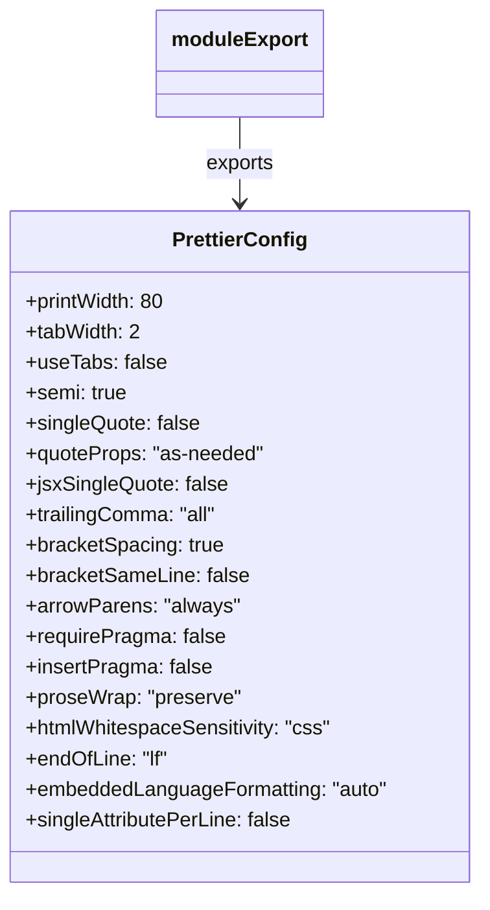

# Diagram: mobile/FreightVerifyMobileTracking/.prettierrc.js

> Auto-generated by Obscura crawlers

## Mermaid

### SVG

<svg id="container" width="378.109375" xmlns="http://www.w3.org/2000/svg" class="classDiagram" height="702" viewBox="0 0 378.109375 702" role="graphics-document document" aria-roledescription="class"><g><defs><marker id="container_class-aggregationStart" class="marker aggregation class" refX="18" refY="7" markerWidth="190" markerHeight="240" orient="auto"><path d="M 18,7 L9,13 L1,7 L9,1 Z"></path></marker></defs><defs><marker id="container_class-aggregationEnd" class="marker aggregation class" refX="1" refY="7" markerWidth="20" markerHeight="28" orient="auto"><path d="M 18,7 L9,13 L1,7 L9,1 Z"></path></marker></defs><defs><marker id="container_class-extensionStart" class="marker extension class" refX="18" refY="7" markerWidth="190" markerHeight="240" orient="auto"><path d="M 1,7 L18,13 V 1 Z"></path></marker></defs><defs><marker id="container_class-extensionEnd" class="marker extension class" refX="1" refY="7" markerWidth="20" markerHeight="28" orient="auto"><path d="M 1,1 V 13 L18,7 Z"></path></marker></defs><defs><marker id="container_class-compositionStart" class="marker composition class" refX="18" refY="7" markerWidth="190" markerHeight="240" orient="auto"><path d="M 18,7 L9,13 L1,7 L9,1 Z"></path></marker></defs><defs><marker id="container_class-compositionEnd" class="marker composition class" refX="1" refY="7" markerWidth="20" markerHeight="28" orient="auto"><path d="M 18,7 L9,13 L1,7 L9,1 Z"></path></marker></defs><defs><marker id="container_class-dependencyStart" class="marker dependency class" refX="6" refY="7" markerWidth="190" markerHeight="240" orient="auto"><path d="M 5,7 L9,13 L1,7 L9,1 Z"></path></marker></defs><defs><marker id="container_class-dependencyEnd" class="marker dependency class" refX="13" refY="7" markerWidth="20" markerHeight="28" orient="auto"><path d="M 18,7 L9,13 L14,7 L9,1 Z"></path></marker></defs><defs><marker id="container_class-lollipopStart" class="marker lollipop class" refX="13" refY="7" markerWidth="190" markerHeight="240" orient="auto"><circle stroke="black" fill="transparent" cx="7" cy="7" r="6"></circle></marker></defs><defs><marker id="container_class-lollipopEnd" class="marker lollipop class" refX="1" refY="7" markerWidth="190" markerHeight="240" orient="auto"><circle stroke="black" fill="transparent" cx="7" cy="7" r="6"></circle></marker></defs><g class="root"><g class="clusters"></g><g class="edgePaths"><path d="M189.055,92L189.055,98.167C189.055,104.333,189.055,116.667,189.055,128C189.055,139.333,189.055,149.667,189.055,154.833L189.055,160" id="id_moduleExport_PrettierConfig_1" class="edge-thickness-normal edge-pattern-solid relation" style=";;;" data-edge="true" data-et="edge" data-id="id_moduleExport_PrettierConfig_1" data-points="W3sieCI6MTg5LjA1NDY4NzUsInkiOjkyfSx7IngiOjE4OS4wNTQ2ODc1LCJ5IjoxMjl9LHsieCI6MTg5LjA1NDY4NzUsInkiOjE2Nn1d" marker-end="url(#container_class-dependencyEnd)"></path></g><g class="edgeLabels"><g class="edgeLabel" transform="translate(189.0546875, 129)"><g class="label" data-id="id_moduleExport_PrettierConfig_1" transform="translate(-27.3046875, -12)"><foreignObject width="54.609375" height="24">

exports

</foreignObject></g></g></g><g class="nodes"><g class="node default" id="classId-PrettierConfig-0" transform="translate(189.0546875, 430)"><g class="basic label-container"><path d="M-181.0546875 -264 L181.0546875 -264 L181.0546875 264 L-181.0546875 264" stroke="none" stroke-width="0" fill="#ECECFF" style=""></path><path d="M-181.0546875 -264 C-76.79588035357278 -264, 27.462926792854432 -264, 181.0546875 -264 M-181.0546875 -264 C-104.80975730004494 -264, -28.56482710008987 -264, 181.0546875 -264 M181.0546875 -264 C181.0546875 -99.65306827861181, 181.0546875 64.69386344277638, 181.0546875 264 M181.0546875 -264 C181.0546875 -115.64505960106118, 181.0546875 32.709880797877645, 181.0546875 264 M181.0546875 264 C89.09156548132295 264, -2.8715565373541097 264, -181.0546875 264 M181.0546875 264 C42.17366650667361 264, -96.70735448665278 264, -181.0546875 264 M-181.0546875 264 C-181.0546875 147.02581526059762, -181.0546875 30.05163052119525, -181.0546875 -264 M-181.0546875 264 C-181.0546875 118.77276196215453, -181.0546875 -26.454476075690934, -181.0546875 -264" stroke="#9370DB" stroke-width="1.3" fill="none" stroke-dasharray="0 0" style=""></path></g><g class="annotation-group text" transform="translate(0, -240)"></g><g class="label-group text" transform="translate(-51.015625, -240)"><g class="label" style="font-weight: bolder" transform="translate(0,-12)"><foreignObject width="102.03125" height="24">

PrettierConfig

</foreignObject></g></g><g class="members-group text" transform="translate(-169.0546875, -192)"><g class="label" style="" transform="translate(0,-12)"><foreignObject width="111.609375" height="24">

+printWidth: 80

</foreignObject></g><g class="label" style="" transform="translate(0,12)"><foreignObject width="90.234375" height="24">

+tabWidth: 2

</foreignObject></g><g class="label" style="" transform="translate(0,36)"><foreignObject width="109.15625" height="24">

+useTabs: false

</foreignObject></g><g class="label" style="" transform="translate(0,60)"><foreignObject width="80.46875" height="24">

+semi: true

</foreignObject></g><g class="label" style="" transform="translate(0,84)"><foreignObject width="137.484375" height="24">

+singleQuote: false

</foreignObject></g><g class="label" style="" transform="translate(0,108)"><foreignObject width="189.046875" height="24">

+quoteProps: "as-needed"

</foreignObject></g><g class="label" style="" transform="translate(0,132)"><foreignObject width="158.125" height="24">

+jsxSingleQuote: false

</foreignObject></g><g class="label" style="" transform="translate(0,156)"><foreignObject width="151.8125" height="24">

+trailingComma: "all"

</foreignObject></g><g class="label" style="" transform="translate(0,180)"><foreignObject width="156.703125" height="24">

+bracketSpacing: true

</foreignObject></g><g class="label" style="" transform="translate(0,204)"><foreignObject width="174.953125" height="24">

+bracketSameLine: false

</foreignObject></g><g class="label" style="" transform="translate(0,228)"><foreignObject width="166.109375" height="24">

+arrowParens: "always"

</foreignObject></g><g class="label" style="" transform="translate(0,252)"><foreignObject width="156.59375" height="24">

+requirePragma: false

</foreignObject></g><g class="label" style="" transform="translate(0,276)"><foreignObject width="146.40625" height="24">

+insertPragma: false

</foreignObject></g><g class="label" style="" transform="translate(0,300)"><foreignObject width="169.1875" height="24">

+proseWrap: "preserve"

</foreignObject></g><g class="label" style="" transform="translate(0,324)"><foreignObject width="242.453125" height="24">

+htmlWhitespaceSensitivity: "css"

</foreignObject></g><g class="label" style="" transform="translate(0,348)"><foreignObject width="114.6875" height="24">

+endOfLine: "lf"

</foreignObject></g><g class="label" style="" transform="translate(0,372)"><foreignObject width="287.09375" height="24">

+embeddedLanguageFormatting: "auto"

</foreignObject></g><g class="label" style="" transform="translate(0,396)"><foreignObject width="212.28125" height="24">

+singleAttributePerLine: false

</foreignObject></g></g><g class="methods-group text" transform="translate(-169.0546875, 264)"></g><g class="divider" style=""><path d="M-181.0546875 -216 C-77.08815126330057 -216, 26.878384973398852 -216, 181.0546875 -216 M-181.0546875 -216 C-57.27658390162023 -216, 66.50151969675954 -216, 181.0546875 -216" stroke="#9370DB" stroke-width="1.3" fill="none" stroke-dasharray="0 0" style=""></path></g><g class="divider" style=""><path d="M-181.0546875 240 C-100.62064172476936 240, -20.186595949538713 240, 181.0546875 240 M-181.0546875 240 C-38.60307592892852 240, 103.84853564214296 240, 181.0546875 240" stroke="#9370DB" stroke-width="1.3" fill="none" stroke-dasharray="0 0" style=""></path></g></g><g class="node default" id="classId-moduleExport-1" transform="translate(189.0546875, 50)"><g class="basic label-container"><path d="M-63.609375 -42 L63.609375 -42 L63.609375 42 L-63.609375 42" stroke="none" stroke-width="0" fill="#ECECFF" style=""></path><path d="M-63.609375 -42 C-24.593808143973533 -42, 14.421758712052934 -42, 63.609375 -42 M-63.609375 -42 C-34.37969723057129 -42, -5.150019461142577 -42, 63.609375 -42 M63.609375 -42 C63.609375 -16.95131954426842, 63.609375 8.097360911463163, 63.609375 42 M63.609375 -42 C63.609375 -11.451044118273437, 63.609375 19.097911763453126, 63.609375 42 M63.609375 42 C37.28224785935928 42, 10.955120718718561 42, -63.609375 42 M63.609375 42 C35.08629833649239 42, 6.563221672984774 42, -63.609375 42 M-63.609375 42 C-63.609375 10.670807309941225, -63.609375 -20.65838538011755, -63.609375 -42 M-63.609375 42 C-63.609375 11.915243150874108, -63.609375 -18.169513698251784, -63.609375 -42" stroke="#9370DB" stroke-width="1.3" fill="none" stroke-dasharray="0 0" style=""></path></g><g class="annotation-group text" transform="translate(0, -18)"></g><g class="label-group text" transform="translate(-51.609375, -18)"><g class="label" style="font-weight: bolder" transform="translate(0,-12)"><foreignObject width="103.21875" height="24">

moduleExport

</foreignObject></g></g><g class="members-group text" transform="translate(-51.609375, 30)"></g><g class="methods-group text" transform="translate(-51.609375, 60)"></g><g class="divider" style=""><path d="M-63.609375 6 C-14.45577432967945 6, 34.6978263406411 6, 63.609375 6 M-63.609375 6 C-17.202184246158694 6, 29.20500650768261 6, 63.609375 6" stroke="#9370DB" stroke-width="1.3" fill="none" stroke-dasharray="0 0" style=""></path></g><g class="divider" style=""><path d="M-63.609375 24 C-33.82189562486559 24, -4.03441624973118 24, 63.609375 24 M-63.609375 24 C-28.40510571049323 24, 6.799163579013538 24, 63.609375 24" stroke="#9370DB" stroke-width="1.3" fill="none" stroke-dasharray="0 0" style=""></path></g></g></g></g></g></svg>
