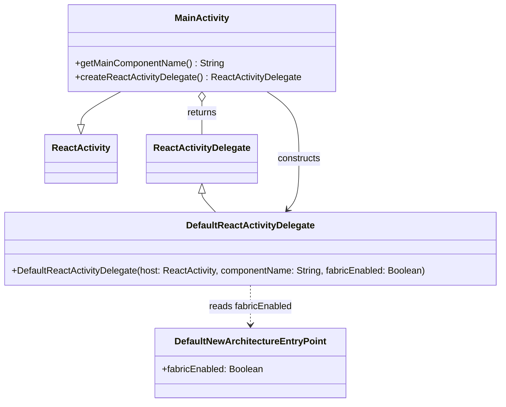

# Diagram: mobile/FreightVerifyMobileTracking/android/app/src/main/java/com/freightverifymobiletracking/MainActivity.kt

> Auto-generated by Obscura crawlers

## Mermaid

### SVG

<svg id="container" width="866.828125" xmlns="http://www.w3.org/2000/svg" class="classDiagram" height="694" viewBox="0 0 866.828125 694" role="graphics-document document" aria-roledescription="class"><g><defs><marker id="container_class-aggregationStart" class="marker aggregation class" refX="18" refY="7" markerWidth="190" markerHeight="240" orient="auto"><path d="M 18,7 L9,13 L1,7 L9,1 Z"></path></marker></defs><defs><marker id="container_class-aggregationEnd" class="marker aggregation class" refX="1" refY="7" markerWidth="20" markerHeight="28" orient="auto"><path d="M 18,7 L9,13 L1,7 L9,1 Z"></path></marker></defs><defs><marker id="container_class-extensionStart" class="marker extension class" refX="18" refY="7" markerWidth="190" markerHeight="240" orient="auto"><path d="M 1,7 L18,13 V 1 Z"></path></marker></defs><defs><marker id="container_class-extensionEnd" class="marker extension class" refX="1" refY="7" markerWidth="20" markerHeight="28" orient="auto"><path d="M 1,1 V 13 L18,7 Z"></path></marker></defs><defs><marker id="container_class-compositionStart" class="marker composition class" refX="18" refY="7" markerWidth="190" markerHeight="240" orient="auto"><path d="M 18,7 L9,13 L1,7 L9,1 Z"></path></marker></defs><defs><marker id="container_class-compositionEnd" class="marker composition class" refX="1" refY="7" markerWidth="20" markerHeight="28" orient="auto"><path d="M 18,7 L9,13 L1,7 L9,1 Z"></path></marker></defs><defs><marker id="container_class-dependencyStart" class="marker dependency class" refX="6" refY="7" markerWidth="190" markerHeight="240" orient="auto"><path d="M 5,7 L9,13 L1,7 L9,1 Z"></path></marker></defs><defs><marker id="container_class-dependencyEnd" class="marker dependency class" refX="13" refY="7" markerWidth="20" markerHeight="28" orient="auto"><path d="M 18,7 L9,13 L14,7 L9,1 Z"></path></marker></defs><defs><marker id="container_class-lollipopStart" class="marker lollipop class" refX="13" refY="7" markerWidth="190" markerHeight="240" orient="auto"><circle stroke="black" fill="transparent" cx="7" cy="7" r="6"></circle></marker></defs><defs><marker id="container_class-lollipopEnd" class="marker lollipop class" refX="1" refY="7" markerWidth="190" markerHeight="240" orient="auto"><circle stroke="black" fill="transparent" cx="7" cy="7" r="6"></circle></marker></defs><g class="root"><g class="clusters"></g><g class="edgePaths"><path d="M215.495,158L204.364,164.167C193.233,170.333,170.972,182.667,159.842,192.125C148.711,201.583,148.711,208.167,148.711,211.458L148.711,214.75" id="id_MainActivity_ReactActivity_1" class="edge-thickness-normal edge-pattern-solid relation" style=";;;" data-edge="true" data-et="edge" data-id="id_MainActivity_ReactActivity_1" data-points="W3sieCI6MjE1LjQ5NDY5ODY2MDcxNDI4LCJ5IjoxNTh9LHsieCI6MTQ4LjcxMDkzNzUsInkiOjE5NX0seyJ4IjoxNDguNzEwOTM3NSwieSI6MjMyfV0=" marker-end="url(#container_class-extensionEnd)"></path><path d="M350.867,175.25L350.867,178.542C350.867,181.833,350.867,188.417,350.867,197.875C350.867,207.333,350.867,219.667,350.867,225.833L350.867,232" id="id_MainActivity_ReactActivityDelegate_2" class="edge-thickness-normal edge-pattern-solid relation" style=";;;" data-edge="true" data-et="edge" data-id="id_MainActivity_ReactActivityDelegate_2" data-points="W3sieCI6MzUwLjg2NzE4NzUsInkiOjE1OH0seyJ4IjozNTAuODY3MTg3NSwieSI6MTk1fSx7IngiOjM1MC44NjcxODc1LCJ5IjoyMzJ9XQ==" marker-start="url(#container_class-aggregationStart)"></path><path d="M350.867,333.25L350.867,334.542C350.867,335.833,350.867,338.417,354.776,343.875C358.684,349.333,366.501,357.667,370.41,361.833L374.318,366" id="id_ReactActivityDelegate_DefaultReactActivityDelegate_3" class="edge-thickness-normal edge-pattern-solid relation" style=";;;" data-edge="true" data-et="edge" data-id="id_ReactActivityDelegate_DefaultReactActivityDelegate_3" data-points="W3sieCI6MzUwLjg2NzE4NzUsInkiOjMxNn0seyJ4IjozNTAuODY3MTg3NSwieSI6MzQxfSx7IngiOjM3NC4zMTgwMDQyNjEzNjM2LCJ5IjozNjZ9XQ==" marker-start="url(#container_class-extensionStart)"></path><path d="M461.421,158L470.511,164.167C479.601,170.333,497.781,182.667,506.871,202C515.961,221.333,515.961,247.667,515.961,272C515.961,296.333,515.961,318.667,512.737,333.271C509.512,347.875,503.064,354.749,499.839,358.187L496.615,361.624" id="id_MainActivity_DefaultReactActivityDelegate_4" class="edge-thickness-normal edge-pattern-solid relation" style=";;;" data-edge="true" data-et="edge" data-id="id_MainActivity_DefaultReactActivityDelegate_4" data-points="W3sieCI6NDYxLjQyMTAzNzk0NjQyODU2LCJ5IjoxNTh9LHsieCI6NTE1Ljk2MDkzNzUsInkiOjE5NX0seyJ4Ijo1MTUuOTYwOTM3NSwieSI6Mjc0fSx7IngiOjUxNS45NjA5Mzc1LCJ5IjozNDF9LHsieCI6NDkyLjUxMDEyMDczODYzNjQsInkiOjM2Nn1d" marker-end="url(#container_class-dependencyEnd)"></path><path d="M433.414,492L433.414,498.167C433.414,504.333,433.414,516.667,433.414,528C433.414,539.333,433.414,549.667,433.414,554.833L433.414,560" id="id_DefaultReactActivityDelegate_DefaultNewArchitectureEntryPoint_5" class="edge-thickness-normal edge-pattern-dashed relation" style=";;;" data-edge="true" data-et="edge" data-id="id_DefaultReactActivityDelegate_DefaultNewArchitectureEntryPoint_5" data-points="W3sieCI6NDMzLjQxNDA2MjUsInkiOjQ5Mn0seyJ4Ijo0MzMuNDE0MDYyNSwieSI6NTI5fSx7IngiOjQzMy40MTQwNjI1LCJ5Ijo1NjZ9XQ==" marker-end="url(#container_class-dependencyEnd)"></path></g><g class="edgeLabels"><g class="edgeLabel"><g class="label" data-id="id_MainActivity_ReactActivity_1" transform="translate(0, 0)"><foreignObject width="0" height="0">

</foreignObject></g></g><g class="edgeLabel" transform="translate(350.8671875, 195)"><g class="label" data-id="id_MainActivity_ReactActivityDelegate_2" transform="translate(-26.265625, -12)"><foreignObject width="52.53125" height="24">

returns

</foreignObject></g></g><g class="edgeLabel"><g class="label" data-id="id_ReactActivityDelegate_DefaultReactActivityDelegate_3" transform="translate(0, 0)"><foreignObject width="0" height="0">

</foreignObject></g></g><g class="edgeLabel" transform="translate(515.9609375, 274)"><g class="label" data-id="id_MainActivity_DefaultReactActivityDelegate_4" transform="translate(-37.84375, -12)"><foreignObject width="75.6875" height="24">

constructs

</foreignObject></g></g><g class="edgeLabel" transform="translate(433.4140625, 529)"><g class="label" data-id="id_DefaultReactActivityDelegate_DefaultNewArchitectureEntryPoint_5" transform="translate(-72.34375, -12)"><foreignObject width="144.6875" height="24">

reads fabricEnabled

</foreignObject></g></g></g><g class="nodes"><g class="node default" id="classId-MainActivity-0" transform="translate(350.8671875, 83)"><g class="basic label-container"><path d="M-228.77734375 -75 L228.77734375 -75 L228.77734375 75 L-228.77734375 75" stroke="none" stroke-width="0" fill="#ECECFF" style=""></path><path d="M-228.77734375 -75 C-120.35437334571071 -75, -11.931402941421425 -75, 228.77734375 -75 M-228.77734375 -75 C-49.79558254927423 -75, 129.18617865145154 -75, 228.77734375 -75 M228.77734375 -75 C228.77734375 -38.47831815986127, 228.77734375 -1.9566363197225343, 228.77734375 75 M228.77734375 -75 C228.77734375 -38.61177075693929, 228.77734375 -2.223541513878587, 228.77734375 75 M228.77734375 75 C84.8508003635375 75, -59.075743022924996 75, -228.77734375 75 M228.77734375 75 C113.46625632341073 75, -1.8448311031785352 75, -228.77734375 75 M-228.77734375 75 C-228.77734375 20.335338666906537, -228.77734375 -34.329322666186926, -228.77734375 -75 M-228.77734375 75 C-228.77734375 33.21557719123755, -228.77734375 -8.5688456175249, -228.77734375 -75" stroke="#9370DB" stroke-width="1.3" fill="none" stroke-dasharray="0 0" style=""></path></g><g class="annotation-group text" transform="translate(0, -51)"></g><g class="label-group text" transform="translate(-44.9921875, -51)"><g class="label" style="font-weight: bolder" transform="translate(0,-12)"><foreignObject width="89.984375" height="24">

MainActivity

</foreignObject></g></g><g class="members-group text" transform="translate(-216.77734375, -3)"></g><g class="methods-group text" transform="translate(-216.77734375, 27)"><g class="label" style="" transform="translate(0,-12)"><foreignObject width="257.015625" height="24">

+getMainComponentName() : String

</foreignObject></g><g class="label" style="" transform="translate(0,12)"><foreignObject width="388.5625" height="24">

+createReactActivityDelegate() : ReactActivityDelegate

</foreignObject></g></g><g class="divider" style=""><path d="M-228.77734375 -27 C-128.87598796715156 -27, -28.97463218430312 -27, 228.77734375 -27 M-228.77734375 -27 C-70.39752250845532 -27, 87.98229873308935 -27, 228.77734375 -27" stroke="#9370DB" stroke-width="1.3" fill="none" stroke-dasharray="0 0" style=""></path></g><g class="divider" style=""><path d="M-228.77734375 -3 C-123.07867577801291 -3, -17.380007806025816 -3, 228.77734375 -3 M-228.77734375 -3 C-61.734861653532676 -3, 105.30762044293465 -3, 228.77734375 -3" stroke="#9370DB" stroke-width="1.3" fill="none" stroke-dasharray="0 0" style=""></path></g></g><g class="node default" id="classId-ReactActivity-1" transform="translate(148.7109375, 274)"><g class="basic label-container"><path d="M-59.90625 -42 L59.90625 -42 L59.90625 42 L-59.90625 42" stroke="none" stroke-width="0" fill="#ECECFF" style=""></path><path d="M-59.90625 -42 C-23.743416226408634 -42, 12.419417547182732 -42, 59.90625 -42 M-59.90625 -42 C-30.268515163931806 -42, -0.6307803278636115 -42, 59.90625 -42 M59.90625 -42 C59.90625 -13.478786425053773, 59.90625 15.042427149892454, 59.90625 42 M59.90625 -42 C59.90625 -15.765158144097157, 59.90625 10.469683711805686, 59.90625 42 M59.90625 42 C18.173495598512226 42, -23.55925880297555 42, -59.90625 42 M59.90625 42 C23.000838333556594 42, -13.904573332886812 42, -59.90625 42 M-59.90625 42 C-59.90625 24.25718620074101, -59.90625 6.514372401482021, -59.90625 -42 M-59.90625 42 C-59.90625 23.100988991668775, -59.90625 4.2019779833375495, -59.90625 -42" stroke="#9370DB" stroke-width="1.3" fill="none" stroke-dasharray="0 0" style=""></path></g><g class="annotation-group text" transform="translate(0, -18)"></g><g class="label-group text" transform="translate(-47.90625, -18)"><g class="label" style="font-weight: bolder" transform="translate(0,-12)"><foreignObject width="95.8125" height="24">

ReactActivity

</foreignObject></g></g><g class="members-group text" transform="translate(-47.90625, 30)"></g><g class="methods-group text" transform="translate(-47.90625, 60)"></g><g class="divider" style=""><path d="M-59.90625 6 C-24.23059740545591 6, 11.44505518908818 6, 59.90625 6 M-59.90625 6 C-30.847303371353487 6, -1.7883567427069735 6, 59.90625 6" stroke="#9370DB" stroke-width="1.3" fill="none" stroke-dasharray="0 0" style=""></path></g><g class="divider" style=""><path d="M-59.90625 24 C-13.562456919846603 24, 32.78133616030679 24, 59.90625 24 M-59.90625 24 C-15.235236803279996 24, 29.43577639344001 24, 59.90625 24" stroke="#9370DB" stroke-width="1.3" fill="none" stroke-dasharray="0 0" style=""></path></g></g><g class="node default" id="classId-ReactActivityDelegate-2" transform="translate(350.8671875, 274)"><g class="basic label-container"><path d="M-92.25 -42 L92.25 -42 L92.25 42 L-92.25 42" stroke="none" stroke-width="0" fill="#ECECFF" style=""></path><path d="M-92.25 -42 C-39.08347114014095 -42, 14.083057719718099 -42, 92.25 -42 M-92.25 -42 C-40.447052514706506 -42, 11.355894970586988 -42, 92.25 -42 M92.25 -42 C92.25 -17.616965560597823, 92.25 6.766068878804354, 92.25 42 M92.25 -42 C92.25 -14.92321708438918, 92.25 12.153565831221641, 92.25 42 M92.25 42 C19.940645174394447 42, -52.368709651211105 42, -92.25 42 M92.25 42 C30.421803358783244 42, -31.406393282433513 42, -92.25 42 M-92.25 42 C-92.25 16.96009502504589, -92.25 -8.079809949908217, -92.25 -42 M-92.25 42 C-92.25 23.123767058895147, -92.25 4.247534117790295, -92.25 -42" stroke="#9370DB" stroke-width="1.3" fill="none" stroke-dasharray="0 0" style=""></path></g><g class="annotation-group text" transform="translate(0, -18)"></g><g class="label-group text" transform="translate(-80.25, -18)"><g class="label" style="font-weight: bolder" transform="translate(0,-12)"><foreignObject width="160.5" height="24">

ReactActivityDelegate

</foreignObject></g></g><g class="members-group text" transform="translate(-80.25, 30)"></g><g class="methods-group text" transform="translate(-80.25, 60)"></g><g class="divider" style=""><path d="M-92.25 6 C-35.16729005330107 6, 21.915419893397853 6, 92.25 6 M-92.25 6 C-33.204753224015526 6, 25.840493551968947 6, 92.25 6" stroke="#9370DB" stroke-width="1.3" fill="none" stroke-dasharray="0 0" style=""></path></g><g class="divider" style=""><path d="M-92.25 24 C-20.296818190512937 24, 51.656363618974126 24, 92.25 24 M-92.25 24 C-27.360932932795194 24, 37.52813413440961 24, 92.25 24" stroke="#9370DB" stroke-width="1.3" fill="none" stroke-dasharray="0 0" style=""></path></g></g><g class="node default" id="classId-DefaultReactActivityDelegate-3" transform="translate(433.4140625, 429)"><g class="basic label-container"><path d="M-425.4140625 -63 L425.4140625 -63 L425.4140625 63 L-425.4140625 63" stroke="none" stroke-width="0" fill="#ECECFF" style=""></path><path d="M-425.4140625 -63 C-218.9606276852912 -63, -12.5071928705824 -63, 425.4140625 -63 M-425.4140625 -63 C-204.8188510416877 -63, 15.776360416624584 -63, 425.4140625 -63 M425.4140625 -63 C425.4140625 -28.230183246087023, 425.4140625 6.539633507825954, 425.4140625 63 M425.4140625 -63 C425.4140625 -22.450668759702033, 425.4140625 18.098662480595934, 425.4140625 63 M425.4140625 63 C249.6192226391533 63, 73.82438277830659 63, -425.4140625 63 M425.4140625 63 C168.03897273416442 63, -89.33611703167117 63, -425.4140625 63 M-425.4140625 63 C-425.4140625 20.373012005490317, -425.4140625 -22.253975989019366, -425.4140625 -63 M-425.4140625 63 C-425.4140625 31.319585649077045, -425.4140625 -0.36082870184591087, -425.4140625 -63" stroke="#9370DB" stroke-width="1.3" fill="none" stroke-dasharray="0 0" style=""></path></g><g class="annotation-group text" transform="translate(0, -39)"></g><g class="label-group text" transform="translate(-106.953125, -39)"><g class="label" style="font-weight: bolder" transform="translate(0,-12)"><foreignObject width="213.90625" height="24">

DefaultReactActivityDelegate

</foreignObject></g></g><g class="members-group text" transform="translate(-413.4140625, 9)"></g><g class="methods-group text" transform="translate(-413.4140625, 39)"><g class="label" style="" transform="translate(0,-12)"><foreignObject width="719.875" height="24">

+DefaultReactActivityDelegate(host: ReactActivity, componentName: String, fabricEnabled: Boolean)

</foreignObject></g></g><g class="divider" style=""><path d="M-425.4140625 -15 C-160.3648638564469 -15, 104.6843347871062 -15, 425.4140625 -15 M-425.4140625 -15 C-216.3572418428425 -15, -7.300421185685025 -15, 425.4140625 -15" stroke="#9370DB" stroke-width="1.3" fill="none" stroke-dasharray="0 0" style=""></path></g><g class="divider" style=""><path d="M-425.4140625 9 C-145.43559107344294 9, 134.54288035311413 9, 425.4140625 9 M-425.4140625 9 C-204.75039838263814 9, 15.913265734723723 9, 425.4140625 9" stroke="#9370DB" stroke-width="1.3" fill="none" stroke-dasharray="0 0" style=""></path></g></g><g class="node default" id="classId-DefaultNewArchitectureEntryPoint-4" transform="translate(433.4140625, 626)"><g class="basic label-container"><path d="M-162.67578125 -60 L162.67578125 -60 L162.67578125 60 L-162.67578125 60" stroke="none" stroke-width="0" fill="#ECECFF" style=""></path><path d="M-162.67578125 -60 C-59.174050111180506 -60, 44.32768102763899 -60, 162.67578125 -60 M-162.67578125 -60 C-41.61792355963155 -60, 79.4399341307369 -60, 162.67578125 -60 M162.67578125 -60 C162.67578125 -13.245086430582226, 162.67578125 33.50982713883555, 162.67578125 60 M162.67578125 -60 C162.67578125 -29.335190963430442, 162.67578125 1.329618073139116, 162.67578125 60 M162.67578125 60 C41.07649131826 60, -80.52279861348 60, -162.67578125 60 M162.67578125 60 C35.89876130905064 60, -90.87825863189872 60, -162.67578125 60 M-162.67578125 60 C-162.67578125 35.54229920112892, -162.67578125 11.08459840225784, -162.67578125 -60 M-162.67578125 60 C-162.67578125 34.92209042199859, -162.67578125 9.844180843997172, -162.67578125 -60" stroke="#9370DB" stroke-width="1.3" fill="none" stroke-dasharray="0 0" style=""></path></g><g class="annotation-group text" transform="translate(0, -36)"></g><g class="label-group text" transform="translate(-125.4296875, -36)"><g class="label" style="font-weight: bolder" transform="translate(0,-12)"><foreignObject width="250.859375" height="24">

DefaultNewArchitectureEntryPoint

</foreignObject></g></g><g class="members-group text" transform="translate(-150.67578125, 12)"><g class="label" style="" transform="translate(0,-12)"><foreignObject width="175.921875" height="24">

+fabricEnabled: Boolean

</foreignObject></g></g><g class="methods-group text" transform="translate(-150.67578125, 60)"></g><g class="divider" style=""><path d="M-162.67578125 -12 C-88.82328867715347 -12, -14.970796104306942 -12, 162.67578125 -12 M-162.67578125 -12 C-54.69738369433556 -12, 53.28101386132889 -12, 162.67578125 -12" stroke="#9370DB" stroke-width="1.3" fill="none" stroke-dasharray="0 0" style=""></path></g><g class="divider" style=""><path d="M-162.67578125 36 C-56.32242371484787 36, 50.030933820304256 36, 162.67578125 36 M-162.67578125 36 C-63.556261345107885 36, 35.56325855978423 36, 162.67578125 36" stroke="#9370DB" stroke-width="1.3" fill="none" stroke-dasharray="0 0" style=""></path></g></g></g></g></g></svg>
