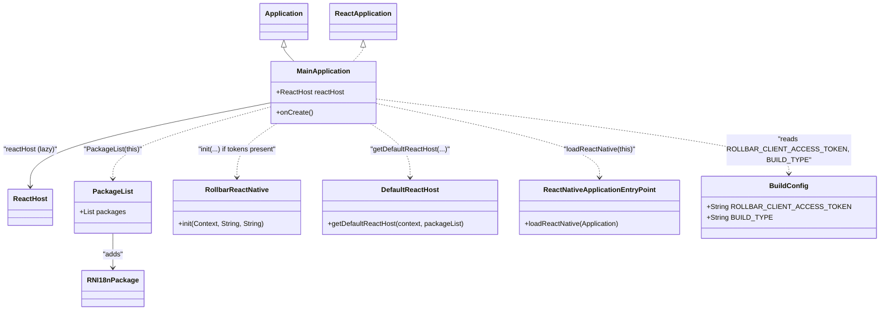

# Diagram: mobile/FreightVerifyMobileTracking/android/app/src/main/java/com/freightverifymobiletracking/MainApplication.kt

> Auto-generated by Obscura crawlers

## Mermaid

### SVG

<svg id="container" width="1969.921875" xmlns="http://www.w3.org/2000/svg" class="classDiagram" height="718" viewBox="0 0 1969.921875 718" role="graphics-document document" aria-roledescription="class"><g><defs><marker id="container_class-aggregationStart" class="marker aggregation class" refX="18" refY="7" markerWidth="190" markerHeight="240" orient="auto"><path d="M 18,7 L9,13 L1,7 L9,1 Z"></path></marker></defs><defs><marker id="container_class-aggregationEnd" class="marker aggregation class" refX="1" refY="7" markerWidth="20" markerHeight="28" orient="auto"><path d="M 18,7 L9,13 L1,7 L9,1 Z"></path></marker></defs><defs><marker id="container_class-extensionStart" class="marker extension class" refX="18" refY="7" markerWidth="190" markerHeight="240" orient="auto"><path d="M 1,7 L18,13 V 1 Z"></path></marker></defs><defs><marker id="container_class-extensionEnd" class="marker extension class" refX="1" refY="7" markerWidth="20" markerHeight="28" orient="auto"><path d="M 1,1 V 13 L18,7 Z"></path></marker></defs><defs><marker id="container_class-compositionStart" class="marker composition class" refX="18" refY="7" markerWidth="190" markerHeight="240" orient="auto"><path d="M 18,7 L9,13 L1,7 L9,1 Z"></path></marker></defs><defs><marker id="container_class-compositionEnd" class="marker composition class" refX="1" refY="7" markerWidth="20" markerHeight="28" orient="auto"><path d="M 18,7 L9,13 L1,7 L9,1 Z"></path></marker></defs><defs><marker id="container_class-dependencyStart" class="marker dependency class" refX="6" refY="7" markerWidth="190" markerHeight="240" orient="auto"><path d="M 5,7 L9,13 L1,7 L9,1 Z"></path></marker></defs><defs><marker id="container_class-dependencyEnd" class="marker dependency class" refX="13" refY="7" markerWidth="20" markerHeight="28" orient="auto"><path d="M 18,7 L9,13 L14,7 L9,1 Z"></path></marker></defs><defs><marker id="container_class-lollipopStart" class="marker lollipop class" refX="13" refY="7" markerWidth="190" markerHeight="240" orient="auto"><circle stroke="black" fill="transparent" cx="7" cy="7" r="6"></circle></marker></defs><defs><marker id="container_class-lollipopEnd" class="marker lollipop class" refX="1" refY="7" markerWidth="190" markerHeight="240" orient="auto"><circle stroke="black" fill="transparent" cx="7" cy="7" r="6"></circle></marker></defs><g class="root"><g class="clusters"></g><g class="edgePaths"><path d="M648.719,109.25L648.719,110.542C648.719,111.833,648.719,114.417,652.538,119.875C656.357,125.333,663.995,133.667,667.814,137.833L671.633,142" id="id_Application_MainApplication_1" class="edge-thickness-normal edge-pattern-solid relation" style=";;;" data-edge="true" data-et="edge" data-id="id_Application_MainApplication_1" data-points="W3sieCI6NjQ4LjcxODc1LCJ5Ijo5Mn0seyJ4Ijo2NDguNzE4NzUsInkiOjExN30seyJ4Ijo2NzEuNjMyNzMxOTU4NzYyOSwieSI6MTQyfV0=" marker-start="url(#container_class-extensionStart)"></path><path d="M826.531,109.25L826.531,110.542C826.531,111.833,826.531,114.417,822.712,119.875C818.893,125.333,811.255,133.667,807.436,137.833L803.617,142" id="id_ReactApplication_MainApplication_2" class="edge-thickness-normal edge-pattern-dashed relation" style=";;;" data-edge="true" data-et="edge" data-id="id_ReactApplication_MainApplication_2" data-points="W3sieCI6ODI2LjUzMTI1LCJ5Ijo5Mn0seyJ4Ijo4MjYuNTMxMjUsInkiOjExN30seyJ4Ijo4MDMuNjE3MjY4MDQxMjM3MSwieSI6MTQyfV0=" marker-start="url(#container_class-extensionStart)"></path><path d="M618.172,237.822L526.928,256.018C435.685,274.215,253.198,310.607,161.954,342.97C70.711,375.333,70.711,403.667,70.711,417.833L70.711,432" id="id_MainApplication_ReactHost_3" class="edge-thickness-normal edge-pattern-solid relation" style=";;;" data-edge="true" data-et="edge" data-id="id_MainApplication_ReactHost_3" data-points="W3sieCI6NjE4LjE3MTg3NSwieSI6MjM3LjgyMjA1ODIyMDU4MjIyfSx7IngiOjcwLjcxMDkzNzUsInkiOjM0N30seyJ4Ijo3MC43MTA5Mzc1LCJ5Ijo0Mzh9XQ==" marker-end="url(#container_class-dependencyEnd)"></path><path d="M845.314,286L860.52,296.167C875.726,306.333,906.139,326.667,921.345,347.5C936.551,368.333,936.551,389.667,936.551,400.333L936.551,411" id="id_MainApplication_DefaultReactHost_4" class="edge-thickness-normal edge-pattern-dashed relation" style=";;;" data-edge="true" data-et="edge" data-id="id_MainApplication_DefaultReactHost_4" data-points="W3sieCI6ODQ1LjMxNDE0NDczNjg0MjEsInkiOjI4Nn0seyJ4Ijo5MzYuNTUwNzgxMjUsInkiOjM0N30seyJ4Ijo5MzYuNTUwNzgxMjUsInkiOjQxN31d" marker-end="url(#container_class-dependencyEnd)"></path><path d="M857.078,239.076L942.763,257.063C1028.448,275.051,1199.818,311.025,1285.503,339.679C1371.188,368.333,1371.188,389.667,1371.188,400.333L1371.188,411" id="id_MainApplication_ReactNativeApplicationEntryPoint_5" class="edge-thickness-normal edge-pattern-dashed relation" style=";;;" data-edge="true" data-et="edge" data-id="id_MainApplication_ReactNativeApplicationEntryPoint_5" data-points="W3sieCI6ODU3LjA3ODEyNSwieSI6MjM5LjA3NjA4MjY2NzQ1NTg2fSx7IngiOjEzNzEuMTg3NSwieSI6MzQ3fSx7IngiOjEzNzEuMTg3NSwieSI6NDE3fV0=" marker-end="url(#container_class-dependencyEnd)"></path><path d="M618.172,246.981L557.795,263.651C497.418,280.32,376.664,313.66,316.287,341.497C255.91,369.333,255.91,391.667,255.91,402.833L255.91,414" id="id_MainApplication_PackageList_6" class="edge-thickness-normal edge-pattern-dashed relation" style=";;;" data-edge="true" data-et="edge" data-id="id_MainApplication_PackageList_6" data-points="W3sieCI6NjE4LjE3MTg3NSwieSI6MjQ2Ljk4MDY0MzY5NjQyOTU4fSx7IngiOjI1NS45MTAxNTYyNSwieSI6MzQ3fSx7IngiOjI1NS45MTAxNTYyNSwieSI6NDIwfV0=" marker-end="url(#container_class-dependencyEnd)"></path><path d="M255.91,540L255.91,548.167C255.91,556.333,255.91,572.667,255.91,586C255.91,599.333,255.91,609.667,255.91,614.833L255.91,620" id="id_PackageList_RNI18nPackage_7" class="edge-thickness-normal edge-pattern-solid relation" style=";;;" data-edge="true" data-et="edge" data-id="id_PackageList_RNI18nPackage_7" data-points="W3sieCI6MjU1LjkxMDE1NjI1LCJ5Ijo1NDB9LHsieCI6MjU1LjkxMDE1NjI1LCJ5Ijo1ODl9LHsieCI6MjU1LjkxMDE1NjI1LCJ5Ijo2MjZ9XQ==" marker-end="url(#container_class-dependencyEnd)"></path><path d="M629.936,286L614.73,296.167C599.524,306.333,569.111,326.667,553.905,347.5C538.699,368.333,538.699,389.667,538.699,400.333L538.699,411" id="id_MainApplication_RollbarReactNative_8" class="edge-thickness-normal edge-pattern-dashed relation" style=";;;" data-edge="true" data-et="edge" data-id="id_MainApplication_RollbarReactNative_8" data-points="W3sieCI6NjI5LjkzNTg1NTI2MzE1NzksInkiOjI4Nn0seyJ4Ijo1MzguNjk5MjE4NzUsInkiOjM0N30seyJ4Ijo1MzguNjk5MjE4NzUsInkiOjQxN31d" marker-end="url(#container_class-dependencyEnd)"></path><path d="M857.078,229.191L1011.473,248.826C1165.868,268.461,1474.659,307.73,1629.054,336.532C1783.449,365.333,1783.449,383.667,1783.449,392.833L1783.449,402" id="id_MainApplication_BuildConfig_9" class="edge-thickness-normal edge-pattern-dashed relation" style=";;;" data-edge="true" data-et="edge" data-id="id_MainApplication_BuildConfig_9" data-points="W3sieCI6ODU3LjA3ODEyNSwieSI6MjI5LjE5MTE0MzM0OTEwNzg4fSx7IngiOjE3ODMuNDQ5MjE4NzUsInkiOjM0N30seyJ4IjoxNzgzLjQ0OTIxODc1LCJ5Ijo0MDh9XQ==" marker-end="url(#container_class-dependencyEnd)"></path></g><g class="edgeLabels"><g class="edgeLabel"><g class="label" data-id="id_Application_MainApplication_1" transform="translate(0, 0)"><foreignObject width="0" height="0">

</foreignObject></g></g><g class="edgeLabel"><g class="label" data-id="id_ReactApplication_MainApplication_2" transform="translate(0, 0)"><foreignObject width="0" height="0">

</foreignObject></g></g><g class="edgeLabel" transform="translate(70.7109375, 347)"><g class="label" data-id="id_MainApplication_ReactHost_3" transform="translate(-62.7109375, -12)"><foreignObject width="125.421875" height="24">

"reactHost (lazy)"

</foreignObject></g></g><g class="edgeLabel" transform="translate(936.55078125, 347)"><g class="label" data-id="id_MainApplication_DefaultReactHost_4" transform="translate(-91.671875, -12)"><foreignObject width="183.34375" height="24">

"getDefaultReactHost(...)"

</foreignObject></g></g><g class="edgeLabel" transform="translate(1371.1875, 347)"><g class="label" data-id="id_MainApplication_ReactNativeApplicationEntryPoint_5" transform="translate(-84.4609375, -12)"><foreignObject width="168.921875" height="24">

"loadReactNative(this)"

</foreignObject></g></g><g class="edgeLabel" transform="translate(255.91015625, 347)"><g class="label" data-id="id_MainApplication_PackageList_6" transform="translate(-67.03125, -12)"><foreignObject width="134.0625" height="24">

"PackageList(this)"

</foreignObject></g></g><g class="edgeLabel" transform="translate(255.91015625, 589)"><g class="label" data-id="id_PackageList_RNI18nPackage_7" transform="translate(-23.8046875, -12)"><foreignObject width="47.609375" height="24">

"adds"

</foreignObject></g></g><g class="edgeLabel" transform="translate(538.69921875, 347)"><g class="label" data-id="id_MainApplication_RollbarReactNative_8" transform="translate(-92.4765625, -12)"><foreignObject width="184.953125" height="24">

"init(...) if tokens present"

</foreignObject></g></g><g class="edgeLabel" transform="translate(1783.44921875, 347)"><g class="label" data-id="id_MainApplication_BuildConfig_9" transform="translate(-122.3671875, -36)"><foreignObject width="244.734375" height="72">

"reads ROLLBAR_CLIENT_ACCESS_TOKEN, BUILD_TYPE"

</foreignObject></g></g></g><g class="nodes"><g class="node default" id="classId-Application-0" transform="translate(648.71875, 50)"><g class="basic label-container"><path d="M-53.6796875 -42 L53.6796875 -42 L53.6796875 42 L-53.6796875 42" stroke="none" stroke-width="0" fill="#ECECFF" style=""></path><path d="M-53.6796875 -42 C-20.909004379122628 -42, 11.861678741754744 -42, 53.6796875 -42 M-53.6796875 -42 C-23.776874257011784 -42, 6.125938985976433 -42, 53.6796875 -42 M53.6796875 -42 C53.6796875 -13.700044245994281, 53.6796875 14.599911508011438, 53.6796875 42 M53.6796875 -42 C53.6796875 -10.014265920288874, 53.6796875 21.97146815942225, 53.6796875 42 M53.6796875 42 C19.354917771454673 42, -14.969851957090654 42, -53.6796875 42 M53.6796875 42 C19.1831649555331 42, -15.313357588933798 42, -53.6796875 42 M-53.6796875 42 C-53.6796875 23.853493113885133, -53.6796875 5.706986227770265, -53.6796875 -42 M-53.6796875 42 C-53.6796875 9.928159095087487, -53.6796875 -22.143681809825026, -53.6796875 -42" stroke="#9370DB" stroke-width="1.3" fill="none" stroke-dasharray="0 0" style=""></path></g><g class="annotation-group text" transform="translate(0, -18)"></g><g class="label-group text" transform="translate(-41.6796875, -18)"><g class="label" style="font-weight: bolder" transform="translate(0,-12)"><foreignObject width="83.359375" height="24">

Application

</foreignObject></g></g><g class="members-group text" transform="translate(-41.6796875, 30)"></g><g class="methods-group text" transform="translate(-41.6796875, 60)"></g><g class="divider" style=""><path d="M-53.6796875 6 C-29.45812954146867 6, -5.236571582937337 6, 53.6796875 6 M-53.6796875 6 C-11.291418748528578 6, 31.096850002942844 6, 53.6796875 6" stroke="#9370DB" stroke-width="1.3" fill="none" stroke-dasharray="0 0" style=""></path></g><g class="divider" style=""><path d="M-53.6796875 24 C-26.584099569963268 24, 0.5114883600734643 24, 53.6796875 24 M-53.6796875 24 C-22.917548198428317 24, 7.844591103143365 24, 53.6796875 24" stroke="#9370DB" stroke-width="1.3" fill="none" stroke-dasharray="0 0" style=""></path></g></g><g class="node default" id="classId-ReactApplication-1" transform="translate(826.53125, 50)"><g class="basic label-container"><path d="M-74.1328125 -42 L74.1328125 -42 L74.1328125 42 L-74.1328125 42" stroke="none" stroke-width="0" fill="#ECECFF" style=""></path><path d="M-74.1328125 -42 C-43.566603077017746 -42, -13.000393654035491 -42, 74.1328125 -42 M-74.1328125 -42 C-33.8689724719719 -42, 6.394867556056198 -42, 74.1328125 -42 M74.1328125 -42 C74.1328125 -24.28684368061328, 74.1328125 -6.573687361226561, 74.1328125 42 M74.1328125 -42 C74.1328125 -8.98331994809115, 74.1328125 24.0333601038177, 74.1328125 42 M74.1328125 42 C24.633867692581305 42, -24.86507711483739 42, -74.1328125 42 M74.1328125 42 C21.955396068242734 42, -30.22202036351453 42, -74.1328125 42 M-74.1328125 42 C-74.1328125 20.39235762599499, -74.1328125 -1.2152847480100206, -74.1328125 -42 M-74.1328125 42 C-74.1328125 22.046408971634786, -74.1328125 2.092817943269573, -74.1328125 -42" stroke="#9370DB" stroke-width="1.3" fill="none" stroke-dasharray="0 0" style=""></path></g><g class="annotation-group text" transform="translate(0, -18)"></g><g class="label-group text" transform="translate(-62.1328125, -18)"><g class="label" style="font-weight: bolder" transform="translate(0,-12)"><foreignObject width="124.265625" height="24">

ReactApplication

</foreignObject></g></g><g class="members-group text" transform="translate(-62.1328125, 30)"></g><g class="methods-group text" transform="translate(-62.1328125, 60)"></g><g class="divider" style=""><path d="M-74.1328125 6 C-16.724500277052094 6, 40.68381194589581 6, 74.1328125 6 M-74.1328125 6 C-15.232308625983677 6, 43.668195248032646 6, 74.1328125 6" stroke="#9370DB" stroke-width="1.3" fill="none" stroke-dasharray="0 0" style=""></path></g><g class="divider" style=""><path d="M-74.1328125 24 C-33.76949019306037 24, 6.593832113879259 24, 74.1328125 24 M-74.1328125 24 C-26.14228589828494 24, 21.848240703430122 24, 74.1328125 24" stroke="#9370DB" stroke-width="1.3" fill="none" stroke-dasharray="0 0" style=""></path></g></g><g class="node default" id="classId-MainApplication-2" transform="translate(737.625, 214)"><g class="basic label-container"><path d="M-119.453125 -72 L119.453125 -72 L119.453125 72 L-119.453125 72" stroke="none" stroke-width="0" fill="#ECECFF" style=""></path><path d="M-119.453125 -72 C-31.266730782202387 -72, 56.919663435595226 -72, 119.453125 -72 M-119.453125 -72 C-42.5432254356397 -72, 34.366674128720604 -72, 119.453125 -72 M119.453125 -72 C119.453125 -22.798620331022974, 119.453125 26.402759337954052, 119.453125 72 M119.453125 -72 C119.453125 -19.71516052999523, 119.453125 32.56967894000954, 119.453125 72 M119.453125 72 C34.168869234078954 72, -51.11538653184209 72, -119.453125 72 M119.453125 72 C48.6737523834331 72, -22.105620233133806 72, -119.453125 72 M-119.453125 72 C-119.453125 31.92199833582429, -119.453125 -8.156003328351417, -119.453125 -72 M-119.453125 72 C-119.453125 23.694890803389455, -119.453125 -24.61021839322109, -119.453125 -72" stroke="#9370DB" stroke-width="1.3" fill="none" stroke-dasharray="0 0" style=""></path></g><g class="annotation-group text" transform="translate(0, -48)"></g><g class="label-group text" transform="translate(-59.21875, -48)"><g class="label" style="font-weight: bolder" transform="translate(0,-12)"><foreignObject width="118.4375" height="24">

MainApplication

</foreignObject></g></g><g class="members-group text" transform="translate(-107.453125, 0)"><g class="label" style="" transform="translate(0,-12)"><foreignObject width="155.6875" height="24">

+ReactHost reactHost

</foreignObject></g></g><g class="methods-group text" transform="translate(-107.453125, 48)"><g class="label" style="" transform="translate(0,-12)"><foreignObject width="83.015625" height="24">

+onCreate()

</foreignObject></g></g><g class="divider" style=""><path d="M-119.453125 -24 C-71.28909527013334 -24, -23.125065540266675 -24, 119.453125 -24 M-119.453125 -24 C-67.3986707989842 -24, -15.344216597968398 -24, 119.453125 -24" stroke="#9370DB" stroke-width="1.3" fill="none" stroke-dasharray="0 0" style=""></path></g><g class="divider" style=""><path d="M-119.453125 24 C-61.316564998750145 24, -3.1800049975002906 24, 119.453125 24 M-119.453125 24 C-25.080760042214166 24, 69.29160491557167 24, 119.453125 24" stroke="#9370DB" stroke-width="1.3" fill="none" stroke-dasharray="0 0" style=""></path></g></g><g class="node default" id="classId-ReactHost-3" transform="translate(70.7109375, 480)"><g class="basic label-container"><path d="M-49.4140625 -42 L49.4140625 -42 L49.4140625 42 L-49.4140625 42" stroke="none" stroke-width="0" fill="#ECECFF" style=""></path><path d="M-49.4140625 -42 C-19.283239152818204 -42, 10.847584194363591 -42, 49.4140625 -42 M-49.4140625 -42 C-23.264810225278087 -42, 2.8844420494438268 -42, 49.4140625 -42 M49.4140625 -42 C49.4140625 -23.00382562583835, 49.4140625 -4.007651251676698, 49.4140625 42 M49.4140625 -42 C49.4140625 -24.393433269197885, 49.4140625 -6.7868665383957705, 49.4140625 42 M49.4140625 42 C21.76544301253597 42, -5.883176474928057 42, -49.4140625 42 M49.4140625 42 C25.506072125727112 42, 1.5980817514542238 42, -49.4140625 42 M-49.4140625 42 C-49.4140625 8.96924572658645, -49.4140625 -24.0615085468271, -49.4140625 -42 M-49.4140625 42 C-49.4140625 15.051744883665336, -49.4140625 -11.896510232669328, -49.4140625 -42" stroke="#9370DB" stroke-width="1.3" fill="none" stroke-dasharray="0 0" style=""></path></g><g class="annotation-group text" transform="translate(0, -18)"></g><g class="label-group text" transform="translate(-37.4140625, -18)"><g class="label" style="font-weight: bolder" transform="translate(0,-12)"><foreignObject width="74.828125" height="24">

ReactHost

</foreignObject></g></g><g class="members-group text" transform="translate(-37.4140625, 30)"></g><g class="methods-group text" transform="translate(-37.4140625, 60)"></g><g class="divider" style=""><path d="M-49.4140625 6 C-22.78820237484141 6, 3.8376577503171774 6, 49.4140625 6 M-49.4140625 6 C-22.150072434668527 6, 5.113917630662947 6, 49.4140625 6" stroke="#9370DB" stroke-width="1.3" fill="none" stroke-dasharray="0 0" style=""></path></g><g class="divider" style=""><path d="M-49.4140625 24 C-20.616790166543655 24, 8.18048216691269 24, 49.4140625 24 M-49.4140625 24 C-22.648475141764525 24, 4.11711221647095 24, 49.4140625 24" stroke="#9370DB" stroke-width="1.3" fill="none" stroke-dasharray="0 0" style=""></path></g></g><g class="node default" id="classId-PackageList-4" transform="translate(255.91015625, 480)"><g class="basic label-container"><path d="M-85.78515625 -60 L85.78515625 -60 L85.78515625 60 L-85.78515625 60" stroke="none" stroke-width="0" fill="#ECECFF" style=""></path><path d="M-85.78515625 -60 C-19.235882878570663 -60, 47.31339049285867 -60, 85.78515625 -60 M-85.78515625 -60 C-41.88072448155896 -60, 2.023707286882086 -60, 85.78515625 -60 M85.78515625 -60 C85.78515625 -16.8592235911606, 85.78515625 26.2815528176788, 85.78515625 60 M85.78515625 -60 C85.78515625 -33.23528298478904, 85.78515625 -6.470565969578075, 85.78515625 60 M85.78515625 60 C42.733125460967244 60, -0.31890532806551164 60, -85.78515625 60 M85.78515625 60 C44.0262853700826 60, 2.2674144901651943 60, -85.78515625 60 M-85.78515625 60 C-85.78515625 19.48893313749985, -85.78515625 -21.0221337250003, -85.78515625 -60 M-85.78515625 60 C-85.78515625 24.33213563541147, -85.78515625 -11.335728729177063, -85.78515625 -60" stroke="#9370DB" stroke-width="1.3" fill="none" stroke-dasharray="0 0" style=""></path></g><g class="annotation-group text" transform="translate(0, -36)"></g><g class="label-group text" transform="translate(-43.1640625, -36)"><g class="label" style="font-weight: bolder" transform="translate(0,-12)"><foreignObject width="86.328125" height="24">

PackageList

</foreignObject></g></g><g class="members-group text" transform="translate(-73.78515625, 12)"><g class="label" style="" transform="translate(0,-12)"><foreignObject width="104.40625" height="24">

+List packages

</foreignObject></g></g><g class="methods-group text" transform="translate(-73.78515625, 60)"></g><g class="divider" style=""><path d="M-85.78515625 -12 C-43.37056300274884 -12, -0.9559697554976765 -12, 85.78515625 -12 M-85.78515625 -12 C-43.90336792611447 -12, -2.0215796022289396 -12, 85.78515625 -12" stroke="#9370DB" stroke-width="1.3" fill="none" stroke-dasharray="0 0" style=""></path></g><g class="divider" style=""><path d="M-85.78515625 36 C-40.79826884828558 36, 4.188618553428839 36, 85.78515625 36 M-85.78515625 36 C-44.40919267859077 36, -3.0332291071815405 36, 85.78515625 36" stroke="#9370DB" stroke-width="1.3" fill="none" stroke-dasharray="0 0" style=""></path></g></g><g class="node default" id="classId-RNI18nPackage-5" transform="translate(255.91015625, 668)"><g class="basic label-container"><path d="M-67.4140625 -42 L67.4140625 -42 L67.4140625 42 L-67.4140625 42" stroke="none" stroke-width="0" fill="#ECECFF" style=""></path><path d="M-67.4140625 -42 C-25.236154832462276 -42, 16.941752835075448 -42, 67.4140625 -42 M-67.4140625 -42 C-18.605052954512942 -42, 30.203956590974116 -42, 67.4140625 -42 M67.4140625 -42 C67.4140625 -13.224980992193824, 67.4140625 15.550038015612351, 67.4140625 42 M67.4140625 -42 C67.4140625 -9.936580653241151, 67.4140625 22.126838693517698, 67.4140625 42 M67.4140625 42 C32.91331576863754 42, -1.5874309627249232 42, -67.4140625 42 M67.4140625 42 C14.033363615678859 42, -39.34733526864228 42, -67.4140625 42 M-67.4140625 42 C-67.4140625 12.681402954598525, -67.4140625 -16.63719409080295, -67.4140625 -42 M-67.4140625 42 C-67.4140625 14.14374160536218, -67.4140625 -13.71251678927564, -67.4140625 -42" stroke="#9370DB" stroke-width="1.3" fill="none" stroke-dasharray="0 0" style=""></path></g><g class="annotation-group text" transform="translate(0, -18)"></g><g class="label-group text" transform="translate(-55.4140625, -18)"><g class="label" style="font-weight: bolder" transform="translate(0,-12)"><foreignObject width="110.828125" height="24">

RNI18nPackage

</foreignObject></g></g><g class="members-group text" transform="translate(-55.4140625, 30)"></g><g class="methods-group text" transform="translate(-55.4140625, 60)"></g><g class="divider" style=""><path d="M-67.4140625 6 C-13.524453808643933 6, 40.36515488271213 6, 67.4140625 6 M-67.4140625 6 C-20.914219693060367 6, 25.585623113879265 6, 67.4140625 6" stroke="#9370DB" stroke-width="1.3" fill="none" stroke-dasharray="0 0" style=""></path></g><g class="divider" style=""><path d="M-67.4140625 24 C-17.044035767823267 24, 33.325990964353466 24, 67.4140625 24 M-67.4140625 24 C-14.418111140965117 24, 38.57784021806977 24, 67.4140625 24" stroke="#9370DB" stroke-width="1.3" fill="none" stroke-dasharray="0 0" style=""></path></g></g><g class="node default" id="classId-RollbarReactNative-6" transform="translate(538.69921875, 480)"><g class="basic label-container"><path d="M-147.00390625 -63 L147.00390625 -63 L147.00390625 63 L-147.00390625 63" stroke="none" stroke-width="0" fill="#ECECFF" style=""></path><path d="M-147.00390625 -63 C-79.20881121116922 -63, -11.41371617233844 -63, 147.00390625 -63 M-147.00390625 -63 C-31.086953037055252 -63, 84.8300001758895 -63, 147.00390625 -63 M147.00390625 -63 C147.00390625 -20.335457193584062, 147.00390625 22.329085612831875, 147.00390625 63 M147.00390625 -63 C147.00390625 -24.886185350032434, 147.00390625 13.227629299935131, 147.00390625 63 M147.00390625 63 C58.74967479077705 63, -29.5045566684459 63, -147.00390625 63 M147.00390625 63 C69.1121396249646 63, -8.779627000070803 63, -147.00390625 63 M-147.00390625 63 C-147.00390625 22.90860462520952, -147.00390625 -17.18279074958096, -147.00390625 -63 M-147.00390625 63 C-147.00390625 13.049404454910182, -147.00390625 -36.90119109017964, -147.00390625 -63" stroke="#9370DB" stroke-width="1.3" fill="none" stroke-dasharray="0 0" style=""></path></g><g class="annotation-group text" transform="translate(0, -39)"></g><g class="label-group text" transform="translate(-70.4765625, -39)"><g class="label" style="font-weight: bolder" transform="translate(0,-12)"><foreignObject width="140.953125" height="24">

RollbarReactNative

</foreignObject></g></g><g class="members-group text" transform="translate(-135.00390625, 9)"></g><g class="methods-group text" transform="translate(-135.00390625, 39)"><g class="label" style="" transform="translate(0,-12)"><foreignObject width="199.53125" height="24">

+init(Context, String, String)

</foreignObject></g></g><g class="divider" style=""><path d="M-147.00390625 -15 C-76.65134160279815 -15, -6.29877695559631 -15, 147.00390625 -15 M-147.00390625 -15 C-59.66606887646749 -15, 27.671768497065017 -15, 147.00390625 -15" stroke="#9370DB" stroke-width="1.3" fill="none" stroke-dasharray="0 0" style=""></path></g><g class="divider" style=""><path d="M-147.00390625 9 C-56.11607068698716 9, 34.771764876025685 9, 147.00390625 9 M-147.00390625 9 C-48.82920381205224 9, 49.345498625895516 9, 147.00390625 9" stroke="#9370DB" stroke-width="1.3" fill="none" stroke-dasharray="0 0" style=""></path></g></g><g class="node default" id="classId-DefaultReactHost-7" transform="translate(936.55078125, 480)"><g class="basic label-container"><path d="M-200.84765625 -63 L200.84765625 -63 L200.84765625 63 L-200.84765625 63" stroke="none" stroke-width="0" fill="#ECECFF" style=""></path><path d="M-200.84765625 -63 C-62.100291748903516 -63, 76.64707275219297 -63, 200.84765625 -63 M-200.84765625 -63 C-49.33501260843957 -63, 102.17763103312086 -63, 200.84765625 -63 M200.84765625 -63 C200.84765625 -23.610916923203142, 200.84765625 15.778166153593716, 200.84765625 63 M200.84765625 -63 C200.84765625 -30.726659769414518, 200.84765625 1.5466804611709648, 200.84765625 63 M200.84765625 63 C50.63612892919659 63, -99.57539839160683 63, -200.84765625 63 M200.84765625 63 C49.307703033424986 63, -102.23225018315003 63, -200.84765625 63 M-200.84765625 63 C-200.84765625 33.580075845936626, -200.84765625 4.160151691873253, -200.84765625 -63 M-200.84765625 63 C-200.84765625 32.1259317727361, -200.84765625 1.2518635454722045, -200.84765625 -63" stroke="#9370DB" stroke-width="1.3" fill="none" stroke-dasharray="0 0" style=""></path></g><g class="annotation-group text" transform="translate(0, -39)"></g><g class="label-group text" transform="translate(-64.1171875, -39)"><g class="label" style="font-weight: bolder" transform="translate(0,-12)"><foreignObject width="128.234375" height="24">

DefaultReactHost

</foreignObject></g></g><g class="members-group text" transform="translate(-188.84765625, 9)"></g><g class="methods-group text" transform="translate(-188.84765625, 39)"><g class="label" style="" transform="translate(0,-12)"><foreignObject width="313.578125" height="24">

+getDefaultReactHost(context, packageList)

</foreignObject></g></g><g class="divider" style=""><path d="M-200.84765625 -15 C-86.61653995111872 -15, 27.61457634776255 -15, 200.84765625 -15 M-200.84765625 -15 C-112.91204422286164 -15, -24.976432195723277 -15, 200.84765625 -15" stroke="#9370DB" stroke-width="1.3" fill="none" stroke-dasharray="0 0" style=""></path></g><g class="divider" style=""><path d="M-200.84765625 9 C-76.19250572610565 9, 48.4626447977887 9, 200.84765625 9 M-200.84765625 9 C-95.38648541618895 9, 10.074685417622106 9, 200.84765625 9" stroke="#9370DB" stroke-width="1.3" fill="none" stroke-dasharray="0 0" style=""></path></g></g><g class="node default" id="classId-ReactNativeApplicationEntryPoint-8" transform="translate(1371.1875, 480)"><g class="basic label-container"><path d="M-183.7890625 -63 L183.7890625 -63 L183.7890625 63 L-183.7890625 63" stroke="none" stroke-width="0" fill="#ECECFF" style=""></path><path d="M-183.7890625 -63 C-92.66001045525613 -63, -1.5309584105122553 -63, 183.7890625 -63 M-183.7890625 -63 C-66.36122680129328 -63, 51.06660889741343 -63, 183.7890625 -63 M183.7890625 -63 C183.7890625 -17.980374017896096, 183.7890625 27.039251964207807, 183.7890625 63 M183.7890625 -63 C183.7890625 -25.914983426113956, 183.7890625 11.170033147772088, 183.7890625 63 M183.7890625 63 C64.50501145355109 63, -54.77903959289782 63, -183.7890625 63 M183.7890625 63 C95.55076818868258 63, 7.312473877365164 63, -183.7890625 63 M-183.7890625 63 C-183.7890625 26.372586481839, -183.7890625 -10.254827036321998, -183.7890625 -63 M-183.7890625 63 C-183.7890625 16.337224262682398, -183.7890625 -30.325551474635205, -183.7890625 -63" stroke="#9370DB" stroke-width="1.3" fill="none" stroke-dasharray="0 0" style=""></path></g><g class="annotation-group text" transform="translate(0, -39)"></g><g class="label-group text" transform="translate(-124, -39)"><g class="label" style="font-weight: bolder" transform="translate(0,-12)"><foreignObject width="248" height="24">

ReactNativeApplicationEntryPoint

</foreignObject></g></g><g class="members-group text" transform="translate(-171.7890625, 9)"></g><g class="methods-group text" transform="translate(-171.7890625, 39)"><g class="label" style="" transform="translate(0,-12)"><foreignObject width="219.578125" height="24">

+loadReactNative(Application)

</foreignObject></g></g><g class="divider" style=""><path d="M-183.7890625 -15 C-108.43086243005166 -15, -33.07266236010332 -15, 183.7890625 -15 M-183.7890625 -15 C-40.502181959313475 -15, 102.78469858137305 -15, 183.7890625 -15" stroke="#9370DB" stroke-width="1.3" fill="none" stroke-dasharray="0 0" style=""></path></g><g class="divider" style=""><path d="M-183.7890625 9 C-46.36280929521965 9, 91.0634439095607 9, 183.7890625 9 M-183.7890625 9 C-88.07998222783955 9, 7.629098044320898 9, 183.7890625 9" stroke="#9370DB" stroke-width="1.3" fill="none" stroke-dasharray="0 0" style=""></path></g></g><g class="node default" id="classId-BuildConfig-9" transform="translate(1783.44921875, 480)"><g class="basic label-container"><path d="M-178.47265625 -72 L178.47265625 -72 L178.47265625 72 L-178.47265625 72" stroke="none" stroke-width="0" fill="#ECECFF" style=""></path><path d="M-178.47265625 -72 C-96.69346738443676 -72, -14.914278518873516 -72, 178.47265625 -72 M-178.47265625 -72 C-53.24963137725153 -72, 71.97339349549694 -72, 178.47265625 -72 M178.47265625 -72 C178.47265625 -38.73492443268757, 178.47265625 -5.469848865375141, 178.47265625 72 M178.47265625 -72 C178.47265625 -37.507409908712106, 178.47265625 -3.014819817424211, 178.47265625 72 M178.47265625 72 C92.97825014784485 72, 7.483844045689693 72, -178.47265625 72 M178.47265625 72 C57.03902740495026 72, -64.39460144009948 72, -178.47265625 72 M-178.47265625 72 C-178.47265625 35.802928257173576, -178.47265625 -0.3941434856528474, -178.47265625 -72 M-178.47265625 72 C-178.47265625 37.54274764496365, -178.47265625 3.0854952899272945, -178.47265625 -72" stroke="#9370DB" stroke-width="1.3" fill="none" stroke-dasharray="0 0" style=""></path></g><g class="annotation-group text" transform="translate(0, -48)"></g><g class="label-group text" transform="translate(-41.8359375, -48)"><g class="label" style="font-weight: bolder" transform="translate(0,-12)"><foreignObject width="83.671875" height="24">

BuildConfig

</foreignObject></g></g><g class="members-group text" transform="translate(-166.47265625, 0)"><g class="label" style="" transform="translate(0,-12)"><foreignObject width="291.109375" height="24">

+String ROLLBAR_CLIENT_ACCESS_TOKEN

</foreignObject></g><g class="label" style="" transform="translate(0,12)"><foreignObject width="139.59375" height="24">

+String BUILD_TYPE

</foreignObject></g></g><g class="methods-group text" transform="translate(-166.47265625, 72)"></g><g class="divider" style=""><path d="M-178.47265625 -24 C-38.49503741286469 -24, 101.48258142427062 -24, 178.47265625 -24 M-178.47265625 -24 C-61.2645307865028 -24, 55.943594676994394 -24, 178.47265625 -24" stroke="#9370DB" stroke-width="1.3" fill="none" stroke-dasharray="0 0" style=""></path></g><g class="divider" style=""><path d="M-178.47265625 48 C-67.16070534789844 48, 44.151245554203115 48, 178.47265625 48 M-178.47265625 48 C-68.6042954457288 48, 41.26406535854241 48, 178.47265625 48" stroke="#9370DB" stroke-width="1.3" fill="none" stroke-dasharray="0 0" style=""></path></g></g></g></g></g></svg>
