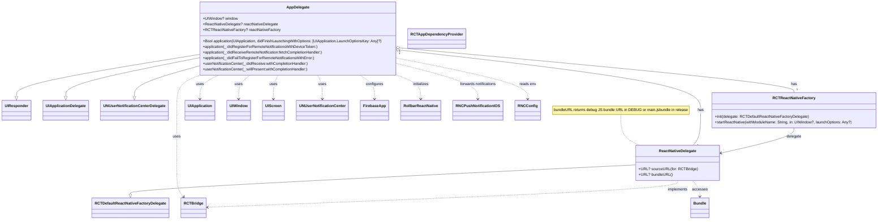

# Diagram: mobile/FreightVerifyMobileTracking/ios/FreightVerifyMobileTracking/AppDelegate.swift

> Auto-generated by Obscura crawlers

## Mermaid

### SVG

<svg id="container" width="3627.703125" xmlns="http://www.w3.org/2000/svg" class="classDiagram" height="934" viewBox="0 0 3627.703125 934" role="graphics-document document" aria-roledescription="class"><g><defs><marker id="container_class-aggregationStart" class="marker aggregation class" refX="18" refY="7" markerWidth="190" markerHeight="240" orient="auto"><path d="M 18,7 L9,13 L1,7 L9,1 Z"></path></marker></defs><defs><marker id="container_class-aggregationEnd" class="marker aggregation class" refX="1" refY="7" markerWidth="20" markerHeight="28" orient="auto"><path d="M 18,7 L9,13 L1,7 L9,1 Z"></path></marker></defs><defs><marker id="container_class-extensionStart" class="marker extension class" refX="18" refY="7" markerWidth="190" markerHeight="240" orient="auto"><path d="M 1,7 L18,13 V 1 Z"></path></marker></defs><defs><marker id="container_class-extensionEnd" class="marker extension class" refX="1" refY="7" markerWidth="20" markerHeight="28" orient="auto"><path d="M 1,1 V 13 L18,7 Z"></path></marker></defs><defs><marker id="container_class-compositionStart" class="marker composition class" refX="18" refY="7" markerWidth="190" markerHeight="240" orient="auto"><path d="M 18,7 L9,13 L1,7 L9,1 Z"></path></marker></defs><defs><marker id="container_class-compositionEnd" class="marker composition class" refX="1" refY="7" markerWidth="20" markerHeight="28" orient="auto"><path d="M 18,7 L9,13 L1,7 L9,1 Z"></path></marker></defs><defs><marker id="container_class-dependencyStart" class="marker dependency class" refX="6" refY="7" markerWidth="190" markerHeight="240" orient="auto"><path d="M 5,7 L9,13 L1,7 L9,1 Z"></path></marker></defs><defs><marker id="container_class-dependencyEnd" class="marker dependency class" refX="13" refY="7" markerWidth="20" markerHeight="28" orient="auto"><path d="M 18,7 L9,13 L14,7 L9,1 Z"></path></marker></defs><defs><marker id="container_class-lollipopStart" class="marker lollipop class" refX="13" refY="7" markerWidth="190" markerHeight="240" orient="auto"><circle stroke="black" fill="transparent" cx="7" cy="7" r="6"></circle></marker></defs><defs><marker id="container_class-lollipopEnd" class="marker lollipop class" refX="1" refY="7" markerWidth="190" markerHeight="240" orient="auto"><circle stroke="black" fill="transparent" cx="7" cy="7" r="6"></circle></marker></defs><g class="root"><g class="clusters"></g><g class="edgePaths"><path d="M2547.047,487L2547.047,502.667C2547.047,518.333,2547.047,549.667,2560.079,571.5C2573.111,593.333,2599.175,605.667,2612.207,611.833L2625.24,618" id="edgeNote1" class="edge-thickness-normal edge-pattern-dotted relation" style="fill: none;;;fill: none" data-edge="true" data-et="edge" data-id="edgeNote1" data-points="W3sieCI6MjU0Ny4wNDY4NzUsInkiOjQ4N30seyJ4IjoyNTQ3LjA0Njg3NSwieSI6NTgxfSx7IngiOjI2MjUuMjM5NTcxNzA3NTg5LCJ5Ijo2MTh9XQ=="></path><path d="M803.781,234.181L681.008,254.651C558.234,275.121,312.688,316.06,189.914,345.322C67.141,374.583,67.141,392.167,67.141,400.958L67.141,409.75" id="id_AppDelegate_UIResponder_1" class="edge-thickness-normal edge-pattern-solid relation" style=";;;" data-edge="true" data-et="edge" data-id="id_AppDelegate_UIResponder_1" data-points="W3sieCI6ODAzLjc4MTI1LCJ5IjoyMzQuMTgxNDAzNzMwMTg3Mzh9LHsieCI6NjcuMTQwNjI1LCJ5IjozNTd9LHsieCI6NjcuMTQwNjI1LCJ5Ijo0Mjd9XQ==" marker-end="url(#container_class-extensionEnd)"></path><path d="M803.781,249.08L714.793,267.067C625.805,285.054,447.828,321.027,358.84,347.805C269.852,374.583,269.852,392.167,269.852,400.958L269.852,409.75" id="id_AppDelegate_UIApplicationDelegate_2" class="edge-thickness-normal edge-pattern-solid relation" style=";;;" data-edge="true" data-et="edge" data-id="id_AppDelegate_UIApplicationDelegate_2" data-points="W3sieCI6ODAzLjc4MTI1LCJ5IjoyNDkuMDgwNDM1MjcxNzM4MDN9LHsieCI6MjY5Ljg1MTU2MjUsInkiOjM1N30seyJ4IjoyNjkuODUxNTYyNSwieSI6NDI3fV0=" marker-end="url(#container_class-extensionEnd)"></path><path d="M803.781,284.739L761.794,296.783C719.807,308.826,635.833,332.913,593.846,353.748C551.859,374.583,551.859,392.167,551.859,400.958L551.859,409.75" id="id_AppDelegate_UNUserNotificationCenterDelegate_3" class="edge-thickness-normal edge-pattern-solid relation" style=";;;" data-edge="true" data-et="edge" data-id="id_AppDelegate_UNUserNotificationCenterDelegate_3" data-points="W3sieCI6ODAzLjc4MTI1LCJ5IjoyODQuNzM5NDI2NzY2NzUzMn0seyJ4Ijo1NTEuODU5Mzc1LCJ5IjozNTd9LHsieCI6NTUxLjg1OTM3NSwieSI6NDI3fV0=" marker-end="url(#container_class-extensionEnd)"></path><path d="M2615.914,701.374L2269.781,718.645C1923.647,735.916,1231.38,770.458,885.247,791.021C539.113,811.583,539.113,818.167,539.113,821.458L539.113,824.75" id="id_ReactNativeDelegate_RCTDefaultReactNativeFactoryDelegate_4" class="edge-thickness-normal edge-pattern-solid relation" style=";;;" data-edge="true" data-et="edge" data-id="id_ReactNativeDelegate_RCTDefaultReactNativeFactoryDelegate_4" data-points="W3sieCI6MjYxNS45MTQwNjI1LCJ5Ijo3MDEuMzczOTIxMDMzNTgwMn0seyJ4Ijo1MzkuMTEzMjgxMjUsInkiOjgwNX0seyJ4Ijo1MzkuMTEzMjgxMjUsInkiOjg0Mn1d" marker-end="url(#container_class-extensionEnd)"></path><path d="M1662.783,214.978L1866.189,238.648C2069.595,262.319,2476.407,309.659,2679.813,351.996C2883.219,394.333,2883.219,431.667,2883.219,469C2883.219,506.333,2883.219,543.667,2877.741,568.5C2872.264,593.333,2861.309,605.667,2855.832,611.833L2850.355,618" id="id_AppDelegate_ReactNativeDelegate_5" class="edge-thickness-normal edge-pattern-solid relation" style=";;;" data-edge="true" data-et="edge" data-id="id_AppDelegate_ReactNativeDelegate_5" data-points="W3sieCI6MTY0NS42NDg0Mzc1LCJ5IjoyMTIuOTg0MDE3MDMzNDIzODd9LHsieCI6Mjg4My4yMTg3NSwieSI6MzU3fSx7IngiOjI4ODMuMjE4NzUsInkiOjQ2OX0seyJ4IjoyODgzLjIxODc1LCJ5Ijo1ODF9LHsieCI6Mjg1MC4zNTQ2NjY1NzM2NjEsInkiOjYxOH1d" marker-start="url(#container_class-aggregationStart)"></path><path d="M1662.823,205.234L1931.571,230.529C2200.319,255.823,2737.816,306.411,3006.564,337.872C3275.313,369.333,3275.313,381.667,3275.313,387.833L3275.313,394" id="id_AppDelegate_RCTReactNativeFactory_6" class="edge-thickness-normal edge-pattern-solid relation" style=";;;" data-edge="true" data-et="edge" data-id="id_AppDelegate_RCTReactNativeFactory_6" data-points="W3sieCI6MTY0NS42NDg0Mzc1LCJ5IjoyMDMuNjE3ODA3Njg5NDUwM30seyJ4IjozMjc1LjMxMjUsInkiOjM1N30seyJ4IjozMjc1LjMxMjUsInkiOjM5NH1d" marker-start="url(#container_class-aggregationStart)"></path><path d="M3275.313,544L3275.313,550.167C3275.313,556.333,3275.313,568.667,3222.329,586.905C3169.346,605.143,3063.379,629.287,3010.396,641.358L2957.413,653.43" id="id_RCTReactNativeFactory_ReactNativeDelegate_7" class="edge-thickness-normal edge-pattern-solid relation" style=";;;" data-edge="true" data-et="edge" data-id="id_RCTReactNativeFactory_ReactNativeDelegate_7" data-points="W3sieCI6MzI3NS4zMTI1LCJ5Ijo1NDR9LHsieCI6MzI3NS4zMTI1LCJ5Ijo1ODF9LHsieCI6Mjk1MS41NjI1LCJ5Ijo2NTQuNzYzMDIyMTc4NDI4Nn1d" marker-end="url(#container_class-dependencyEnd)"></path><path d="M821.04,320L805.083,326.167C789.126,332.333,757.211,344.667,741.254,369.5C725.297,394.333,725.297,431.667,725.297,469C725.297,506.333,725.297,543.667,725.297,581C725.297,618.333,725.297,655.667,725.297,693C725.297,730.333,725.297,767.667,729.996,791.745C734.696,815.823,744.095,826.647,748.795,832.058L753.494,837.47" id="id_AppDelegate_RCTBridge_8" class="edge-thickness-normal edge-pattern-dashed relation" style=";;;" data-edge="true" data-et="edge" data-id="id_AppDelegate_RCTBridge_8" data-points="W3sieCI6ODIxLjA0MDIxNjE1OTMyNjQsInkiOjMyMH0seyJ4Ijo3MjUuMjk2ODc1LCJ5IjozNTd9LHsieCI6NzI1LjI5Njg3NSwieSI6NDY5fSx7IngiOjcyNS4yOTY4NzUsInkiOjU4MX0seyJ4Ijo3MjUuMjk2ODc1LCJ5Ijo2OTN9LHsieCI6NzI1LjI5Njg3NSwieSI6ODA1fSx7IngiOjc1Ny40Mjg1NTAyMzczNDE4LCJ5Ijo4NDJ9XQ==" marker-end="url(#container_class-dependencyEnd)"></path><path d="M898.819,320L885.937,326.167C873.054,332.333,847.289,344.667,834.406,361.5C821.523,378.333,821.523,399.667,821.523,410.333L821.523,421" id="id_AppDelegate_UIApplication_9" class="edge-thickness-normal edge-pattern-dashed relation" style=";;;" data-edge="true" data-et="edge" data-id="id_AppDelegate_UIApplication_9" data-points="W3sieCI6ODk4LjgxOTE5OTMxOTk0ODIsInkiOjMyMH0seyJ4Ijo4MjEuNTIzNDM3NSwieSI6MzU3fSx7IngiOjgyMS41MjM0Mzc1LCJ5Ijo0Mjd9XQ==" marker-end="url(#container_class-dependencyEnd)"></path><path d="M1028.064,320L1020.29,326.167C1012.516,332.333,996.969,344.667,989.195,361.5C981.422,378.333,981.422,399.667,981.422,410.333L981.422,421" id="id_AppDelegate_UIWindow_10" class="edge-thickness-normal edge-pattern-dashed relation" style=";;;" data-edge="true" data-et="edge" data-id="id_AppDelegate_UIWindow_10" data-points="W3sieCI6MTAyOC4wNjM1MzIyMjE1MDI2LCJ5IjozMjB9LHsieCI6OTgxLjQyMTg3NSwieSI6MzU3fSx7IngiOjk4MS40MjE4NzUsInkiOjQyN31d" marker-end="url(#container_class-dependencyEnd)"></path><path d="M1143.693,320L1140.49,326.167C1137.288,332.333,1130.882,344.667,1127.679,361.5C1124.477,378.333,1124.477,399.667,1124.477,410.333L1124.477,421" id="id_AppDelegate_UIScreen_11" class="edge-thickness-normal edge-pattern-dashed relation" style=";;;" data-edge="true" data-et="edge" data-id="id_AppDelegate_UIScreen_11" data-points="W3sieCI6MTE0My42OTMyMjc4MTczNTc0LCJ5IjozMjB9LHsieCI6MTEyNC40NzY1NjI1LCJ5IjozNTd9LHsieCI6MTEyNC40NzY1NjI1LCJ5Ijo0Mjd9XQ==" marker-end="url(#container_class-dependencyEnd)"></path><path d="M1305.736,320L1308.939,326.167C1312.142,332.333,1318.548,344.667,1321.75,361.5C1324.953,378.333,1324.953,399.667,1324.953,410.333L1324.953,421" id="id_AppDelegate_UNUserNotificationCenter_12" class="edge-thickness-normal edge-pattern-dashed relation" style=";;;" data-edge="true" data-et="edge" data-id="id_AppDelegate_UNUserNotificationCenter_12" data-points="W3sieCI6MTMwNS43MzY0NTk2ODI2NDI2LCJ5IjozMjB9LHsieCI6MTMyNC45NTMxMjUsInkiOjM1N30seyJ4IjoxMzI0Ljk1MzEyNSwieSI6NDI3fV0=" marker-end="url(#container_class-dependencyEnd)"></path><path d="M1477.864,320L1487.871,326.167C1497.878,332.333,1517.892,344.667,1527.899,361.5C1537.906,378.333,1537.906,399.667,1537.906,410.333L1537.906,421" id="id_AppDelegate_FirebaseApp_13" class="edge-thickness-normal edge-pattern-dashed relation" style=";;;" data-edge="true" data-et="edge" data-id="id_AppDelegate_FirebaseApp_13" data-points="W3sieCI6MTQ3Ny44NjQzNzQxOTA0MTQ1LCJ5IjozMjB9LHsieCI6MTUzNy45MDYyNSwieSI6MzU3fSx7IngiOjE1MzcuOTA2MjUsInkiOjQyN31d" marker-end="url(#container_class-dependencyEnd)"></path><path d="M1630.903,320L1646.959,326.167C1663.016,332.333,1695.129,344.667,1711.186,361.5C1727.242,378.333,1727.242,399.667,1727.242,410.333L1727.242,421" id="id_AppDelegate_RollbarReactNative_14" class="edge-thickness-normal edge-pattern-dashed relation" style=";;;" data-edge="true" data-et="edge" data-id="id_AppDelegate_RollbarReactNative_14" data-points="W3sieCI6MTYzMC45MDI3NDg1NDI3NDYyLCJ5IjozMjB9LHsieCI6MTcyNy4yNDIxODc1LCJ5IjozNTd9LHsieCI6MTcyNy4yNDIxODc1LCJ5Ijo0Mjd9XQ==" marker-end="url(#container_class-dependencyEnd)"></path><path d="M1645.648,274.557L1697.964,288.298C1750.279,302.038,1854.909,329.519,1907.224,353.926C1959.539,378.333,1959.539,399.667,1959.539,410.333L1959.539,421" id="id_AppDelegate_RNCPushNotificationIOS_15" class="edge-thickness-normal edge-pattern-dashed relation" style=";;;" data-edge="true" data-et="edge" data-id="id_AppDelegate_RNCPushNotificationIOS_15" data-points="W3sieCI6MTY0NS42NDg0Mzc1LCJ5IjoyNzQuNTU3MzAyNzEzNzY1NX0seyJ4IjoxOTU5LjUzOTA2MjUsInkiOjM1N30seyJ4IjoxOTU5LjUzOTA2MjUsInkiOjQyN31d" marker-end="url(#container_class-dependencyEnd)"></path><path d="M1645.648,250.957L1731.202,268.631C1816.755,286.305,1987.862,321.652,2073.415,349.993C2158.969,378.333,2158.969,399.667,2158.969,410.333L2158.969,421" id="id_AppDelegate_RNCConfig_16" class="edge-thickness-normal edge-pattern-dashed relation" style=";;;" data-edge="true" data-et="edge" data-id="id_AppDelegate_RNCConfig_16" data-points="W3sieCI6MTY0NS42NDg0Mzc1LCJ5IjoyNTAuOTU3Mjg1NDM0MTQ5MDd9LHsieCI6MjE1OC45Njg3NSwieSI6MzU3fSx7IngiOjIxNTguOTY4NzUsInkiOjQyN31d" marker-end="url(#container_class-dependencyEnd)"></path><path d="M2783.738,768L2783.738,774.167C2783.738,780.333,2783.738,792.667,2461.352,811.633C2138.966,830.599,1494.193,856.197,1171.807,868.997L849.421,881.796" id="id_ReactNativeDelegate_RCTBridge_17" class="edge-thickness-normal edge-pattern-dashed relation" style=";;;" data-edge="true" data-et="edge" data-id="id_ReactNativeDelegate_RCTBridge_17" data-points="W3sieCI6Mjc4My43MzgyODEyNSwieSI6NzY4fSx7IngiOjI3ODMuNzM4MjgxMjUsInkiOjgwNX0seyJ4Ijo4NDMuNDI1NzgxMjUsInkiOjg4Mi4wMzM4MzIwOTE5OTg4fV0=" marker-end="url(#container_class-dependencyEnd)"></path><path d="M2847.082,768L2852.291,774.167C2857.499,780.333,2867.915,792.667,2873.124,804C2878.332,815.333,2878.332,825.667,2878.332,830.833L2878.332,836" id="id_ReactNativeDelegate_Bundle_18" class="edge-thickness-normal edge-pattern-dashed relation" style=";;;" data-edge="true" data-et="edge" data-id="id_ReactNativeDelegate_Bundle_18" data-points="W3sieCI6Mjg0Ny4wODIzMTAyNjc4NTczLCJ5Ijo3Njh9LHsieCI6Mjg3OC4zMzIwMzEyNSwieSI6ODA1fSx7IngiOjI4NzguMzMyMDMxMjUsInkiOjg0Mn1d" marker-end="url(#container_class-dependencyEnd)"></path></g><g class="edgeLabels"><g class="edgeLabel"><g class="label" data-id="edgeNote1" transform="translate(0, 0)"><foreignObject width="0" height="0">

</foreignObject></g></g><g class="edgeLabel"><g class="label" data-id="id_AppDelegate_UIResponder_1" transform="translate(0, 0)"><foreignObject width="0" height="0">

</foreignObject></g></g><g class="edgeLabel"><g class="label" data-id="id_AppDelegate_UIApplicationDelegate_2" transform="translate(0, 0)"><foreignObject width="0" height="0">

</foreignObject></g></g><g class="edgeLabel"><g class="label" data-id="id_AppDelegate_UNUserNotificationCenterDelegate_3" transform="translate(0, 0)"><foreignObject width="0" height="0">

</foreignObject></g></g><g class="edgeLabel"><g class="label" data-id="id_ReactNativeDelegate_RCTDefaultReactNativeFactoryDelegate_4" transform="translate(0, 0)"><foreignObject width="0" height="0">

</foreignObject></g></g><g class="edgeLabel" transform="translate(2883.21875, 469)"><g class="label" data-id="id_AppDelegate_ReactNativeDelegate_5" transform="translate(-12.703125, -12)"><foreignObject width="25.40625" height="24">

has

</foreignObject></g></g><g class="edgeLabel" transform="translate(3275.3125, 357)"><g class="label" data-id="id_AppDelegate_RCTReactNativeFactory_6" transform="translate(-12.703125, -12)"><foreignObject width="25.40625" height="24">

has

</foreignObject></g></g><g class="edgeLabel" transform="translate(3275.3125, 581)"><g class="label" data-id="id_RCTReactNativeFactory_ReactNativeDelegate_7" transform="translate(-31.296875, -12)"><foreignObject width="62.59375" height="24">

delegate

</foreignObject></g></g><g class="edgeLabel" transform="translate(725.296875, 581)"><g class="label" data-id="id_AppDelegate_RCTBridge_8" transform="translate(-16.4921875, -12)"><foreignObject width="32.984375" height="24">

uses

</foreignObject></g></g><g class="edgeLabel" transform="translate(821.5234375, 357)"><g class="label" data-id="id_AppDelegate_UIApplication_9" transform="translate(-16.4921875, -12)"><foreignObject width="32.984375" height="24">

uses

</foreignObject></g></g><g class="edgeLabel" transform="translate(981.421875, 357)"><g class="label" data-id="id_AppDelegate_UIWindow_10" transform="translate(-16.4921875, -12)"><foreignObject width="32.984375" height="24">

uses

</foreignObject></g></g><g class="edgeLabel" transform="translate(1124.4765625, 357)"><g class="label" data-id="id_AppDelegate_UIScreen_11" transform="translate(-16.4921875, -12)"><foreignObject width="32.984375" height="24">

uses

</foreignObject></g></g><g class="edgeLabel" transform="translate(1324.953125, 357)"><g class="label" data-id="id_AppDelegate_UNUserNotificationCenter_12" transform="translate(-16.4921875, -12)"><foreignObject width="32.984375" height="24">

uses

</foreignObject></g></g><g class="edgeLabel" transform="translate(1537.90625, 357)"><g class="label" data-id="id_AppDelegate_FirebaseApp_13" transform="translate(-37.3046875, -12)"><foreignObject width="74.609375" height="24">

configures

</foreignObject></g></g><g class="edgeLabel" transform="translate(1727.2421875, 357)"><g class="label" data-id="id_AppDelegate_RollbarReactNative_14" transform="translate(-34.7578125, -12)"><foreignObject width="69.515625" height="24">

initializes

</foreignObject></g></g><g class="edgeLabel" transform="translate(1959.5390625, 357)"><g class="label" data-id="id_AppDelegate_RNCPushNotificationIOS_15" transform="translate(-79.28125, -12)"><foreignObject width="158.5625" height="24">

forwards notifications

</foreignObject></g></g><g class="edgeLabel" transform="translate(2158.96875, 357)"><g class="label" data-id="id_AppDelegate_RNCConfig_16" transform="translate(-35.0546875, -12)"><foreignObject width="70.109375" height="24">

reads env

</foreignObject></g></g><g class="edgeLabel" transform="translate(2783.73828125, 805)"><g class="label" data-id="id_ReactNativeDelegate_RCTBridge_17" transform="translate(-43.0625, -12)"><foreignObject width="86.125" height="24">

implements

</foreignObject></g></g><g class="edgeLabel" transform="translate(2878.33203125, 805)"><g class="label" data-id="id_ReactNativeDelegate_Bundle_18" transform="translate(-31.53125, -12)"><foreignObject width="63.0625" height="24">

accesses

</foreignObject></g></g><g class="edgeTerminals" transform="translate(1661.2972865822296, 229.9062940100786)"><g class="inner" transform="translate(0, 0)"><foreignObject style="width: 9px; height: 12px;">
1
</foreignObject></g></g><g class="edgeTerminals" transform="translate(1661.6658649833385, 220.1916440585484)"><g class="inner" transform="translate(0, 0)"><foreignObject style="width: 9px; height: 12px;">
1
</foreignObject></g></g><g class="edgeTerminals" transform="translate(2868.191006328825, 609.8772360780224)"><g class="inner" transform="translate(0, 0)"></g><foreignObject style="width: 9px; height: 12px;">
1
</foreignObject></g><g class="edgeTerminals" transform="translate(3285.3125, 371.5)"><g class="inner" transform="translate(0, 0)"></g><foreignObject style="width: 9px; height: 12px;">
1
</foreignObject></g></g><g class="nodes"><g class="node default" id="classId-AppDelegate-0" transform="translate(1224.71484375, 164)"><g class="basic label-container"><path d="M-420.93359375 -156 L420.93359375 -156 L420.93359375 156 L-420.93359375 156" stroke="none" stroke-width="0" fill="#ECECFF" style=""></path><path d="M-420.93359375 -156 C-96.59306217071389 -156, 227.74746940857221 -156, 420.93359375 -156 M-420.93359375 -156 C-152.2060745316299 -156, 116.52144468674021 -156, 420.93359375 -156 M420.93359375 -156 C420.93359375 -32.14836044572755, 420.93359375 91.7032791085449, 420.93359375 156 M420.93359375 -156 C420.93359375 -52.98544123658091, 420.93359375 50.02911752683818, 420.93359375 156 M420.93359375 156 C135.65334590667095 156, -149.6269019366581 156, -420.93359375 156 M420.93359375 156 C240.16147746170773 156, 59.389361173415466 156, -420.93359375 156 M-420.93359375 156 C-420.93359375 42.72604069502178, -420.93359375 -70.54791860995644, -420.93359375 -156 M-420.93359375 156 C-420.93359375 38.7346023943968, -420.93359375 -78.5307952112064, -420.93359375 -156" stroke="#9370DB" stroke-width="1.3" fill="none" stroke-dasharray="0 0" style=""></path></g><g class="annotation-group text" transform="translate(0, -132)"></g><g class="label-group text" transform="translate(-46.6171875, -132)"><g class="label" style="font-weight: bolder" transform="translate(0,-12)"><foreignObject width="93.234375" height="24">

AppDelegate

</foreignObject></g></g><g class="members-group text" transform="translate(-408.93359375, -84)"><g class="label" style="" transform="translate(0,-12)"><foreignObject width="147.796875" height="24">

+UIWindow? window

</foreignObject></g><g class="label" style="" transform="translate(0,12)"><foreignObject width="315" height="24">

+ReactNativeDelegate? reactNativeDelegate

</foreignObject></g><g class="label" style="" transform="translate(0,36)"><foreignObject width="319.46875" height="24">

+RCTReactNativeFactory? reactNativeFactory

</foreignObject></g></g><g class="methods-group text" transform="translate(-408.93359375, 12)"><g class="label" style="" transform="translate(0,-12)"><foreignObject width="771.25" height="24">

+Bool application(UIApplication, didFinishLaunchingWithOptions: [UIApplication.LaunchOptionsKey: Any]?)

</foreignObject></g><g class="label" style="" transform="translate(0,12)"><foreignObject width="492.796875" height="24">

+application(_:didRegisterForRemoteNotificationsWithDeviceToken:)

</foreignObject></g><g class="label" style="" transform="translate(0,36)"><foreignObject width="517.8125" height="24">

+application(_:didReceiveRemoteNotification:fetchCompletionHandler:)

</foreignObject></g><g class="label" style="" transform="translate(0,60)"><foreignObject width="480.015625" height="24">

+application(_:didFailToRegisterForRemoteNotificationsWithError:)

</foreignObject></g><g class="label" style="" transform="translate(0,84)"><foreignObject width="453.984375" height="24">

+userNotificationCenter(_:didReceive:withCompletionHandler:)

</foreignObject></g><g class="label" style="" transform="translate(0,108)"><foreignObject width="455.3125" height="24">

+userNotificationCenter(_:willPresent:withCompletionHandler:)

</foreignObject></g></g><g class="divider" style=""><path d="M-420.93359375 -108 C-172.50632003448047 -108, 75.92095368103907 -108, 420.93359375 -108 M-420.93359375 -108 C-201.24741732585218 -108, 18.438759098295634 -108, 420.93359375 -108" stroke="#9370DB" stroke-width="1.3" fill="none" stroke-dasharray="0 0" style=""></path></g><g class="divider" style=""><path d="M-420.93359375 -12 C-119.4168551167233 -12, 182.0998835165534 -12, 420.93359375 -12 M-420.93359375 -12 C-100.43516097522433 -12, 220.06327179955133 -12, 420.93359375 -12" stroke="#9370DB" stroke-width="1.3" fill="none" stroke-dasharray="0 0" style=""></path></g></g><g class="node default" id="classId-UIResponder-1" transform="translate(67.140625, 469)"><g class="basic label-container"><path d="M-59.140625 -42 L59.140625 -42 L59.140625 42 L-59.140625 42" stroke="none" stroke-width="0" fill="#ECECFF" style=""></path><path d="M-59.140625 -42 C-20.191788920273986 -42, 18.75704715945203 -42, 59.140625 -42 M-59.140625 -42 C-30.141478396701654 -42, -1.142331793403308 -42, 59.140625 -42 M59.140625 -42 C59.140625 -12.820929706172286, 59.140625 16.358140587655427, 59.140625 42 M59.140625 -42 C59.140625 -24.291443511049152, 59.140625 -6.582887022098305, 59.140625 42 M59.140625 42 C19.738556106565305 42, -19.66351278686939 42, -59.140625 42 M59.140625 42 C23.223841835534635 42, -12.69294132893073 42, -59.140625 42 M-59.140625 42 C-59.140625 11.432485084504489, -59.140625 -19.135029830991023, -59.140625 -42 M-59.140625 42 C-59.140625 19.060799538126137, -59.140625 -3.8784009237477264, -59.140625 -42" stroke="#9370DB" stroke-width="1.3" fill="none" stroke-dasharray="0 0" style=""></path></g><g class="annotation-group text" transform="translate(0, -18)"></g><g class="label-group text" transform="translate(-47.140625, -18)"><g class="label" style="font-weight: bolder" transform="translate(0,-12)"><foreignObject width="94.28125" height="24">

UIResponder

</foreignObject></g></g><g class="members-group text" transform="translate(-47.140625, 30)"></g><g class="methods-group text" transform="translate(-47.140625, 60)"></g><g class="divider" style=""><path d="M-59.140625 6 C-34.96074746489086 6, -10.780869929781723 6, 59.140625 6 M-59.140625 6 C-16.59407430877482 6, 25.952476382450357 6, 59.140625 6" stroke="#9370DB" stroke-width="1.3" fill="none" stroke-dasharray="0 0" style=""></path></g><g class="divider" style=""><path d="M-59.140625 24 C-35.20757564965952 24, -11.274526299319042 24, 59.140625 24 M-59.140625 24 C-27.25345683364789 24, 4.633711332704223 24, 59.140625 24" stroke="#9370DB" stroke-width="1.3" fill="none" stroke-dasharray="0 0" style=""></path></g></g><g class="node default" id="classId-UIApplicationDelegate-2" transform="translate(269.8515625, 469)"><g class="basic label-container"><path d="M-93.5703125 -42 L93.5703125 -42 L93.5703125 42 L-93.5703125 42" stroke="none" stroke-width="0" fill="#ECECFF" style=""></path><path d="M-93.5703125 -42 C-53.97726638294565 -42, -14.384220265891301 -42, 93.5703125 -42 M-93.5703125 -42 C-43.518757101803395 -42, 6.53279829639321 -42, 93.5703125 -42 M93.5703125 -42 C93.5703125 -21.82174505373695, 93.5703125 -1.6434901074739017, 93.5703125 42 M93.5703125 -42 C93.5703125 -19.880417763705783, 93.5703125 2.2391644725884348, 93.5703125 42 M93.5703125 42 C40.40396942928888 42, -12.762373641422244 42, -93.5703125 42 M93.5703125 42 C32.44568899042638 42, -28.678934519147234 42, -93.5703125 42 M-93.5703125 42 C-93.5703125 23.84183899280188, -93.5703125 5.683677985603758, -93.5703125 -42 M-93.5703125 42 C-93.5703125 25.041889436450298, -93.5703125 8.083778872900595, -93.5703125 -42" stroke="#9370DB" stroke-width="1.3" fill="none" stroke-dasharray="0 0" style=""></path></g><g class="annotation-group text" transform="translate(0, -18)"></g><g class="label-group text" transform="translate(-81.5703125, -18)"><g class="label" style="font-weight: bolder" transform="translate(0,-12)"><foreignObject width="163.140625" height="24">

UIApplicationDelegate

</foreignObject></g></g><g class="members-group text" transform="translate(-81.5703125, 30)"></g><g class="methods-group text" transform="translate(-81.5703125, 60)"></g><g class="divider" style=""><path d="M-93.5703125 6 C-23.30608294344681 6, 46.95814661310638 6, 93.5703125 6 M-93.5703125 6 C-32.910915084542204 6, 27.748482330915593 6, 93.5703125 6" stroke="#9370DB" stroke-width="1.3" fill="none" stroke-dasharray="0 0" style=""></path></g><g class="divider" style=""><path d="M-93.5703125 24 C-21.082632910878885 24, 51.40504667824223 24, 93.5703125 24 M-93.5703125 24 C-27.309739232151912 24, 38.950834035696175 24, 93.5703125 24" stroke="#9370DB" stroke-width="1.3" fill="none" stroke-dasharray="0 0" style=""></path></g></g><g class="node default" id="classId-UNUserNotificationCenterDelegate-3" transform="translate(551.859375, 469)"><g class="basic label-container"><path d="M-138.4375 -42 L138.4375 -42 L138.4375 42 L-138.4375 42" stroke="none" stroke-width="0" fill="#ECECFF" style=""></path><path d="M-138.4375 -42 C-66.99998198725788 -42, 4.437536025484235 -42, 138.4375 -42 M-138.4375 -42 C-43.08355263360096 -42, 52.27039473279808 -42, 138.4375 -42 M138.4375 -42 C138.4375 -18.723760606232787, 138.4375 4.552478787534426, 138.4375 42 M138.4375 -42 C138.4375 -12.031977928482554, 138.4375 17.93604414303489, 138.4375 42 M138.4375 42 C30.809924840623424 42, -76.81765031875315 42, -138.4375 42 M138.4375 42 C31.560124532182712 42, -75.31725093563458 42, -138.4375 42 M-138.4375 42 C-138.4375 10.088282577006979, -138.4375 -21.823434845986043, -138.4375 -42 M-138.4375 42 C-138.4375 15.764770195530417, -138.4375 -10.470459608939166, -138.4375 -42" stroke="#9370DB" stroke-width="1.3" fill="none" stroke-dasharray="0 0" style=""></path></g><g class="annotation-group text" transform="translate(0, -18)"></g><g class="label-group text" transform="translate(-126.4375, -18)"><g class="label" style="font-weight: bolder" transform="translate(0,-12)"><foreignObject width="252.875" height="24">

UNUserNotificationCenterDelegate

</foreignObject></g></g><g class="members-group text" transform="translate(-126.4375, 30)"></g><g class="methods-group text" transform="translate(-126.4375, 60)"></g><g class="divider" style=""><path d="M-138.4375 6 C-61.63290264311233 6, 15.171694713775338 6, 138.4375 6 M-138.4375 6 C-31.472573815085028 6, 75.49235236982994 6, 138.4375 6" stroke="#9370DB" stroke-width="1.3" fill="none" stroke-dasharray="0 0" style=""></path></g><g class="divider" style=""><path d="M-138.4375 24 C-71.398116314824 24, -4.358732629647989 24, 138.4375 24 M-138.4375 24 C-81.2670600499058 24, -24.096620099811588 24, 138.4375 24" stroke="#9370DB" stroke-width="1.3" fill="none" stroke-dasharray="0 0" style=""></path></g></g><g class="node default" id="classId-ReactNativeDelegate-4" transform="translate(2783.73828125, 693)"><g class="basic label-container"><path d="M-167.82421875 -75 L167.82421875 -75 L167.82421875 75 L-167.82421875 75" stroke="none" stroke-width="0" fill="#ECECFF" style=""></path><path d="M-167.82421875 -75 C-60.06550095483031 -75, 47.693216840339375 -75, 167.82421875 -75 M-167.82421875 -75 C-51.76449243985732 -75, 64.29523387028536 -75, 167.82421875 -75 M167.82421875 -75 C167.82421875 -27.439563299335923, 167.82421875 20.120873401328154, 167.82421875 75 M167.82421875 -75 C167.82421875 -33.26816819550211, 167.82421875 8.463663608995773, 167.82421875 75 M167.82421875 75 C63.79222984686679 75, -40.23975905626642 75, -167.82421875 75 M167.82421875 75 C33.756588126299135 75, -100.31104249740173 75, -167.82421875 75 M-167.82421875 75 C-167.82421875 28.75522065837046, -167.82421875 -17.489558683259077, -167.82421875 -75 M-167.82421875 75 C-167.82421875 32.73090568358856, -167.82421875 -9.53818863282288, -167.82421875 -75" stroke="#9370DB" stroke-width="1.3" fill="none" stroke-dasharray="0 0" style=""></path></g><g class="annotation-group text" transform="translate(0, -51)"></g><g class="label-group text" transform="translate(-76.2890625, -51)"><g class="label" style="font-weight: bolder" transform="translate(0,-12)"><foreignObject width="152.578125" height="24">

ReactNativeDelegate

</foreignObject></g></g><g class="members-group text" transform="translate(-155.82421875, -3)"></g><g class="methods-group text" transform="translate(-155.82421875, 27)"><g class="label" style="" transform="translate(0,-12)"><foreignObject width="235.359375" height="24">

+URL? sourceURL(for: RCTBridge)

</foreignObject></g><g class="label" style="" transform="translate(0,12)"><foreignObject width="136.234375" height="24">

+URL? bundleURL()

</foreignObject></g></g><g class="divider" style=""><path d="M-167.82421875 -27 C-36.65640429160496 -27, 94.51141016679009 -27, 167.82421875 -27 M-167.82421875 -27 C-51.81848630405294 -27, 64.18724614189412 -27, 167.82421875 -27" stroke="#9370DB" stroke-width="1.3" fill="none" stroke-dasharray="0 0" style=""></path></g><g class="divider" style=""><path d="M-167.82421875 -3 C-81.67215564453467 -3, 4.4799074609306615 -3, 167.82421875 -3 M-167.82421875 -3 C-34.21355195831137 -3, 99.39711483337726 -3, 167.82421875 -3" stroke="#9370DB" stroke-width="1.3" fill="none" stroke-dasharray="0 0" style=""></path></g></g><g class="node default" id="classId-RCTDefaultReactNativeFactoryDelegate-5" transform="translate(539.11328125, 884)"><g class="basic label-container"><path d="M-155.265625 -42 L155.265625 -42 L155.265625 42 L-155.265625 42" stroke="none" stroke-width="0" fill="#ECECFF" style=""></path><path d="M-155.265625 -42 C-59.340511264777035 -42, 36.58460247044593 -42, 155.265625 -42 M-155.265625 -42 C-66.69510862278909 -42, 21.875407754421815 -42, 155.265625 -42 M155.265625 -42 C155.265625 -16.67406260888934, 155.265625 8.65187478222132, 155.265625 42 M155.265625 -42 C155.265625 -17.83531194257535, 155.265625 6.329376114849303, 155.265625 42 M155.265625 42 C50.01927211289576 42, -55.227080774208474 42, -155.265625 42 M155.265625 42 C65.28037921938264 42, -24.704866561234724 42, -155.265625 42 M-155.265625 42 C-155.265625 15.564779704085517, -155.265625 -10.870440591828967, -155.265625 -42 M-155.265625 42 C-155.265625 21.64920482312339, -155.265625 1.2984096462467818, -155.265625 -42" stroke="#9370DB" stroke-width="1.3" fill="none" stroke-dasharray="0 0" style=""></path></g><g class="annotation-group text" transform="translate(0, -18)"></g><g class="label-group text" transform="translate(-143.265625, -18)"><g class="label" style="font-weight: bolder" transform="translate(0,-12)"><foreignObject width="286.53125" height="24">

RCTDefaultReactNativeFactoryDelegate

</foreignObject></g></g><g class="members-group text" transform="translate(-143.265625, 30)"></g><g class="methods-group text" transform="translate(-143.265625, 60)"></g><g class="divider" style=""><path d="M-155.265625 6 C-81.9246716468481 6, -8.583718293696194 6, 155.265625 6 M-155.265625 6 C-31.371757192737704 6, 92.52211061452459 6, 155.265625 6" stroke="#9370DB" stroke-width="1.3" fill="none" stroke-dasharray="0 0" style=""></path></g><g class="divider" style=""><path d="M-155.265625 24 C-31.95018736696619 24, 91.36525026606762 24, 155.265625 24 M-155.265625 24 C-84.80032038383686 24, -14.335015767673724 24, 155.265625 24" stroke="#9370DB" stroke-width="1.3" fill="none" stroke-dasharray="0 0" style=""></path></g></g><g class="node default" id="classId-RCTReactNativeFactory-6" transform="translate(3275.3125, 469)"><g class="basic label-container"><path d="M-344.390625 -75 L344.390625 -75 L344.390625 75 L-344.390625 75" stroke="none" stroke-width="0" fill="#ECECFF" style=""></path><path d="M-344.390625 -75 C-99.3662363813778 -75, 145.6581522372444 -75, 344.390625 -75 M-344.390625 -75 C-90.89791205096984 -75, 162.59480089806033 -75, 344.390625 -75 M344.390625 -75 C344.390625 -37.77827659879151, 344.390625 -0.556553197583014, 344.390625 75 M344.390625 -75 C344.390625 -32.17458349641819, 344.390625 10.650833007163627, 344.390625 75 M344.390625 75 C85.01894485108738 75, -174.35273529782523 75, -344.390625 75 M344.390625 75 C176.28826178310027 75, 8.185898566200535 75, -344.390625 75 M-344.390625 75 C-344.390625 25.6117313041563, -344.390625 -23.7765373916874, -344.390625 -75 M-344.390625 75 C-344.390625 30.657914803211256, -344.390625 -13.684170393577489, -344.390625 -75" stroke="#9370DB" stroke-width="1.3" fill="none" stroke-dasharray="0 0" style=""></path></g><g class="annotation-group text" transform="translate(0, -51)"></g><g class="label-group text" transform="translate(-84.21875, -51)"><g class="label" style="font-weight: bolder" transform="translate(0,-12)"><foreignObject width="168.4375" height="24">

RCTReactNativeFactory

</foreignObject></g></g><g class="members-group text" transform="translate(-332.390625, -3)"></g><g class="methods-group text" transform="translate(-332.390625, 27)"><g class="label" style="" transform="translate(0,-12)"><foreignObject width="394.40625" height="24">

+init(delegate: RCTDefaultReactNativeFactoryDelegate)

</foreignObject></g><g class="label" style="" transform="translate(0,12)"><foreignObject width="580.5625" height="24">

+startReactNative(withModuleName: String, in: UIWindow?, launchOptions: Any?)

</foreignObject></g></g><g class="divider" style=""><path d="M-344.390625 -27 C-172.90371606895638 -27, -1.4168071379127696 -27, 344.390625 -27 M-344.390625 -27 C-177.72449281872952 -27, -11.058360637459032 -27, 344.390625 -27" stroke="#9370DB" stroke-width="1.3" fill="none" stroke-dasharray="0 0" style=""></path></g><g class="divider" style=""><path d="M-344.390625 -3 C-169.60484559053523 -3, 5.180933818929532 -3, 344.390625 -3 M-344.390625 -3 C-102.75880741504614 -3, 138.87301016990773 -3, 344.390625 -3" stroke="#9370DB" stroke-width="1.3" fill="none" stroke-dasharray="0 0" style=""></path></g></g><g class="node default" id="classId-RCTBridge-7" transform="translate(793.90234375, 884)"><g class="basic label-container"><path d="M-49.5234375 -42 L49.5234375 -42 L49.5234375 42 L-49.5234375 42" stroke="none" stroke-width="0" fill="#ECECFF" style=""></path><path d="M-49.5234375 -42 C-11.505904311742817 -42, 26.511628876514365 -42, 49.5234375 -42 M-49.5234375 -42 C-20.50551589178273 -42, 8.512405716434543 -42, 49.5234375 -42 M49.5234375 -42 C49.5234375 -21.42402421241361, 49.5234375 -0.8480484248272191, 49.5234375 42 M49.5234375 -42 C49.5234375 -18.771399105308767, 49.5234375 4.4572017893824665, 49.5234375 42 M49.5234375 42 C15.087631696909916 42, -19.348174106180167 42, -49.5234375 42 M49.5234375 42 C28.678239256617154 42, 7.833041013234308 42, -49.5234375 42 M-49.5234375 42 C-49.5234375 14.961799988530583, -49.5234375 -12.076400022938834, -49.5234375 -42 M-49.5234375 42 C-49.5234375 18.01762035350882, -49.5234375 -5.964759292982357, -49.5234375 -42" stroke="#9370DB" stroke-width="1.3" fill="none" stroke-dasharray="0 0" style=""></path></g><g class="annotation-group text" transform="translate(0, -18)"></g><g class="label-group text" transform="translate(-37.5234375, -18)"><g class="label" style="font-weight: bolder" transform="translate(0,-12)"><foreignObject width="75.046875" height="24">

RCTBridge

</foreignObject></g></g><g class="members-group text" transform="translate(-37.5234375, 30)"></g><g class="methods-group text" transform="translate(-37.5234375, 60)"></g><g class="divider" style=""><path d="M-49.5234375 6 C-10.067993929350642 6, 29.387449641298716 6, 49.5234375 6 M-49.5234375 6 C-17.665387370555603 6, 14.192662758888794 6, 49.5234375 6" stroke="#9370DB" stroke-width="1.3" fill="none" stroke-dasharray="0 0" style=""></path></g><g class="divider" style=""><path d="M-49.5234375 24 C-13.240221781642127 24, 23.042993936715746 24, 49.5234375 24 M-49.5234375 24 C-17.819636699830344 24, 13.884164100339312 24, 49.5234375 24" stroke="#9370DB" stroke-width="1.3" fill="none" stroke-dasharray="0 0" style=""></path></g></g><g class="node default" id="classId-UIApplication-8" transform="translate(821.5234375, 469)"><g class="basic label-container"><path d="M-61.2265625 -42 L61.2265625 -42 L61.2265625 42 L-61.2265625 42" stroke="none" stroke-width="0" fill="#ECECFF" style=""></path><path d="M-61.2265625 -42 C-17.514238246618632 -42, 26.198086006762736 -42, 61.2265625 -42 M-61.2265625 -42 C-24.232314983299247 -42, 12.761932533401506 -42, 61.2265625 -42 M61.2265625 -42 C61.2265625 -21.60670103151572, 61.2265625 -1.2134020630314382, 61.2265625 42 M61.2265625 -42 C61.2265625 -16.809706686815336, 61.2265625 8.380586626369329, 61.2265625 42 M61.2265625 42 C20.56265696331981 42, -20.10124857336038 42, -61.2265625 42 M61.2265625 42 C34.00820965800161 42, 6.789856816003223 42, -61.2265625 42 M-61.2265625 42 C-61.2265625 15.96181946560208, -61.2265625 -10.07636106879584, -61.2265625 -42 M-61.2265625 42 C-61.2265625 16.575597001181187, -61.2265625 -8.848805997637626, -61.2265625 -42" stroke="#9370DB" stroke-width="1.3" fill="none" stroke-dasharray="0 0" style=""></path></g><g class="annotation-group text" transform="translate(0, -18)"></g><g class="label-group text" transform="translate(-49.2265625, -18)"><g class="label" style="font-weight: bolder" transform="translate(0,-12)"><foreignObject width="98.453125" height="24">

UIApplication

</foreignObject></g></g><g class="members-group text" transform="translate(-49.2265625, 30)"></g><g class="methods-group text" transform="translate(-49.2265625, 60)"></g><g class="divider" style=""><path d="M-61.2265625 6 C-12.935942287494733 6, 35.354677925010535 6, 61.2265625 6 M-61.2265625 6 C-25.46396771897067 6, 10.298627062058657 6, 61.2265625 6" stroke="#9370DB" stroke-width="1.3" fill="none" stroke-dasharray="0 0" style=""></path></g><g class="divider" style=""><path d="M-61.2265625 24 C-17.040866011247033 24, 27.144830477505934 24, 61.2265625 24 M-61.2265625 24 C-32.017535229245 24, -2.8085079584899972 24, 61.2265625 24" stroke="#9370DB" stroke-width="1.3" fill="none" stroke-dasharray="0 0" style=""></path></g></g><g class="node default" id="classId-UIWindow-9" transform="translate(981.421875, 469)"><g class="basic label-container"><path d="M-48.671875 -42 L48.671875 -42 L48.671875 42 L-48.671875 42" stroke="none" stroke-width="0" fill="#ECECFF" style=""></path><path d="M-48.671875 -42 C-10.461229510271728 -42, 27.749415979456543 -42, 48.671875 -42 M-48.671875 -42 C-22.639946948394922 -42, 3.3919811032101563 -42, 48.671875 -42 M48.671875 -42 C48.671875 -9.84703755462322, 48.671875 22.30592489075356, 48.671875 42 M48.671875 -42 C48.671875 -9.781255965034298, 48.671875 22.437488069931405, 48.671875 42 M48.671875 42 C20.656806320112132 42, -7.358262359775736 42, -48.671875 42 M48.671875 42 C26.72683518552819 42, 4.781795371056383 42, -48.671875 42 M-48.671875 42 C-48.671875 17.867065452320038, -48.671875 -6.265869095359925, -48.671875 -42 M-48.671875 42 C-48.671875 15.362076554468775, -48.671875 -11.27584689106245, -48.671875 -42" stroke="#9370DB" stroke-width="1.3" fill="none" stroke-dasharray="0 0" style=""></path></g><g class="annotation-group text" transform="translate(0, -18)"></g><g class="label-group text" transform="translate(-36.671875, -18)"><g class="label" style="font-weight: bolder" transform="translate(0,-12)"><foreignObject width="73.34375" height="24">

UIWindow

</foreignObject></g></g><g class="members-group text" transform="translate(-36.671875, 30)"></g><g class="methods-group text" transform="translate(-36.671875, 60)"></g><g class="divider" style=""><path d="M-48.671875 6 C-18.329341820696854 6, 12.013191358606292 6, 48.671875 6 M-48.671875 6 C-21.731614313041263 6, 5.208646373917475 6, 48.671875 6" stroke="#9370DB" stroke-width="1.3" fill="none" stroke-dasharray="0 0" style=""></path></g><g class="divider" style=""><path d="M-48.671875 24 C-14.318145667981064 24, 20.035583664037873 24, 48.671875 24 M-48.671875 24 C-19.798591820023073 24, 9.074691359953853 24, 48.671875 24" stroke="#9370DB" stroke-width="1.3" fill="none" stroke-dasharray="0 0" style=""></path></g></g><g class="node default" id="classId-UIScreen-10" transform="translate(1124.4765625, 469)"><g class="basic label-container"><path d="M-44.3828125 -42 L44.3828125 -42 L44.3828125 42 L-44.3828125 42" stroke="none" stroke-width="0" fill="#ECECFF" style=""></path><path d="M-44.3828125 -42 C-14.178676241265592 -42, 16.025460017468816 -42, 44.3828125 -42 M-44.3828125 -42 C-23.762727983533328 -42, -3.142643467066655 -42, 44.3828125 -42 M44.3828125 -42 C44.3828125 -8.671381782045486, 44.3828125 24.657236435909027, 44.3828125 42 M44.3828125 -42 C44.3828125 -10.643510824483133, 44.3828125 20.712978351033733, 44.3828125 42 M44.3828125 42 C16.709325592963097 42, -10.964161314073806 42, -44.3828125 42 M44.3828125 42 C23.141160712248347 42, 1.8995089244966934 42, -44.3828125 42 M-44.3828125 42 C-44.3828125 10.293904109274813, -44.3828125 -21.412191781450375, -44.3828125 -42 M-44.3828125 42 C-44.3828125 21.53653986543611, -44.3828125 1.073079730872223, -44.3828125 -42" stroke="#9370DB" stroke-width="1.3" fill="none" stroke-dasharray="0 0" style=""></path></g><g class="annotation-group text" transform="translate(0, -18)"></g><g class="label-group text" transform="translate(-32.3828125, -18)"><g class="label" style="font-weight: bolder" transform="translate(0,-12)"><foreignObject width="64.765625" height="24">

UIScreen

</foreignObject></g></g><g class="members-group text" transform="translate(-32.3828125, 30)"></g><g class="methods-group text" transform="translate(-32.3828125, 60)"></g><g class="divider" style=""><path d="M-44.3828125 6 C-24.513848931967033 6, -4.6448853639340655 6, 44.3828125 6 M-44.3828125 6 C-24.231788307707646 6, -4.080764115415292 6, 44.3828125 6" stroke="#9370DB" stroke-width="1.3" fill="none" stroke-dasharray="0 0" style=""></path></g><g class="divider" style=""><path d="M-44.3828125 24 C-10.747836303009741 24, 22.887139893980518 24, 44.3828125 24 M-44.3828125 24 C-15.948207902497405 24, 12.48639669500519 24, 44.3828125 24" stroke="#9370DB" stroke-width="1.3" fill="none" stroke-dasharray="0 0" style=""></path></g></g><g class="node default" id="classId-UNUserNotificationCenter-11" transform="translate(1324.953125, 469)"><g class="basic label-container"><path d="M-106.09375 -42 L106.09375 -42 L106.09375 42 L-106.09375 42" stroke="none" stroke-width="0" fill="#ECECFF" style=""></path><path d="M-106.09375 -42 C-38.19163587317962 -42, 29.71047825364076 -42, 106.09375 -42 M-106.09375 -42 C-61.94421949458816 -42, -17.794688989176322 -42, 106.09375 -42 M106.09375 -42 C106.09375 -9.10766825912603, 106.09375 23.78466348174794, 106.09375 42 M106.09375 -42 C106.09375 -22.10434524662149, 106.09375 -2.208690493242983, 106.09375 42 M106.09375 42 C27.72440828271523 42, -50.64493343456954 42, -106.09375 42 M106.09375 42 C54.30726899024468 42, 2.5207879804893594 42, -106.09375 42 M-106.09375 42 C-106.09375 16.14162193329458, -106.09375 -9.71675613341084, -106.09375 -42 M-106.09375 42 C-106.09375 20.597454849827884, -106.09375 -0.8050903003442329, -106.09375 -42" stroke="#9370DB" stroke-width="1.3" fill="none" stroke-dasharray="0 0" style=""></path></g><g class="annotation-group text" transform="translate(0, -18)"></g><g class="label-group text" transform="translate(-94.09375, -18)"><g class="label" style="font-weight: bolder" transform="translate(0,-12)"><foreignObject width="188.1875" height="24">

UNUserNotificationCenter

</foreignObject></g></g><g class="members-group text" transform="translate(-94.09375, 30)"></g><g class="methods-group text" transform="translate(-94.09375, 60)"></g><g class="divider" style=""><path d="M-106.09375 6 C-31.710543212581214 6, 42.67266357483757 6, 106.09375 6 M-106.09375 6 C-47.283097848193854 6, 11.527554303612291 6, 106.09375 6" stroke="#9370DB" stroke-width="1.3" fill="none" stroke-dasharray="0 0" style=""></path></g><g class="divider" style=""><path d="M-106.09375 24 C-27.679436552467152 24, 50.734876895065696 24, 106.09375 24 M-106.09375 24 C-54.894188838089796 24, -3.694627676179593 24, 106.09375 24" stroke="#9370DB" stroke-width="1.3" fill="none" stroke-dasharray="0 0" style=""></path></g></g><g class="node default" id="classId-FirebaseApp-12" transform="translate(1537.90625, 469)"><g class="basic label-container"><path d="M-56.859375 -42 L56.859375 -42 L56.859375 42 L-56.859375 42" stroke="none" stroke-width="0" fill="#ECECFF" style=""></path><path d="M-56.859375 -42 C-22.90767157707368 -42, 11.044031845852643 -42, 56.859375 -42 M-56.859375 -42 C-30.64822755209025 -42, -4.437080104180502 -42, 56.859375 -42 M56.859375 -42 C56.859375 -23.167217190300022, 56.859375 -4.334434380600044, 56.859375 42 M56.859375 -42 C56.859375 -12.802448636275003, 56.859375 16.395102727449995, 56.859375 42 M56.859375 42 C12.870883068316154 42, -31.117608863367693 42, -56.859375 42 M56.859375 42 C22.76615476556551 42, -11.32706546886898 42, -56.859375 42 M-56.859375 42 C-56.859375 15.566084784870394, -56.859375 -10.867830430259211, -56.859375 -42 M-56.859375 42 C-56.859375 9.676294177958738, -56.859375 -22.647411644082524, -56.859375 -42" stroke="#9370DB" stroke-width="1.3" fill="none" stroke-dasharray="0 0" style=""></path></g><g class="annotation-group text" transform="translate(0, -18)"></g><g class="label-group text" transform="translate(-44.859375, -18)"><g class="label" style="font-weight: bolder" transform="translate(0,-12)"><foreignObject width="89.71875" height="24">

FirebaseApp

</foreignObject></g></g><g class="members-group text" transform="translate(-44.859375, 30)"></g><g class="methods-group text" transform="translate(-44.859375, 60)"></g><g class="divider" style=""><path d="M-56.859375 6 C-19.136856972669847 6, 18.585661054660306 6, 56.859375 6 M-56.859375 6 C-14.056812249829619 6, 28.745750500340762 6, 56.859375 6" stroke="#9370DB" stroke-width="1.3" fill="none" stroke-dasharray="0 0" style=""></path></g><g class="divider" style=""><path d="M-56.859375 24 C-21.725404642566176 24, 13.408565714867649 24, 56.859375 24 M-56.859375 24 C-16.35954265513397 24, 24.140289689732057 24, 56.859375 24" stroke="#9370DB" stroke-width="1.3" fill="none" stroke-dasharray="0 0" style=""></path></g></g><g class="node default" id="classId-RollbarReactNative-13" transform="translate(1727.2421875, 469)"><g class="basic label-container"><path d="M-82.4765625 -42 L82.4765625 -42 L82.4765625 42 L-82.4765625 42" stroke="none" stroke-width="0" fill="#ECECFF" style=""></path><path d="M-82.4765625 -42 C-19.713457736257475 -42, 43.04964702748505 -42, 82.4765625 -42 M-82.4765625 -42 C-38.54314715351377 -42, 5.3902681929724565 -42, 82.4765625 -42 M82.4765625 -42 C82.4765625 -22.04133649447314, 82.4765625 -2.0826729889462783, 82.4765625 42 M82.4765625 -42 C82.4765625 -10.140095083506143, 82.4765625 21.719809832987714, 82.4765625 42 M82.4765625 42 C17.813084434602146 42, -46.85039363079571 42, -82.4765625 42 M82.4765625 42 C43.56054419588165 42, 4.644525891763294 42, -82.4765625 42 M-82.4765625 42 C-82.4765625 12.26976796303462, -82.4765625 -17.46046407393076, -82.4765625 -42 M-82.4765625 42 C-82.4765625 16.90555780878623, -82.4765625 -8.188884382427538, -82.4765625 -42" stroke="#9370DB" stroke-width="1.3" fill="none" stroke-dasharray="0 0" style=""></path></g><g class="annotation-group text" transform="translate(0, -18)"></g><g class="label-group text" transform="translate(-70.4765625, -18)"><g class="label" style="font-weight: bolder" transform="translate(0,-12)"><foreignObject width="140.953125" height="24">

RollbarReactNative

</foreignObject></g></g><g class="members-group text" transform="translate(-70.4765625, 30)"></g><g class="methods-group text" transform="translate(-70.4765625, 60)"></g><g class="divider" style=""><path d="M-82.4765625 6 C-41.748055735144774 6, -1.0195489702895486 6, 82.4765625 6 M-82.4765625 6 C-32.86070390603855 6, 16.755154687922897 6, 82.4765625 6" stroke="#9370DB" stroke-width="1.3" fill="none" stroke-dasharray="0 0" style=""></path></g><g class="divider" style=""><path d="M-82.4765625 24 C-30.728647728110978 24, 21.019267043778044 24, 82.4765625 24 M-82.4765625 24 C-18.35370583557072 24, 45.76915082885856 24, 82.4765625 24" stroke="#9370DB" stroke-width="1.3" fill="none" stroke-dasharray="0 0" style=""></path></g></g><g class="node default" id="classId-RNCPushNotificationIOS-14" transform="translate(1959.5390625, 469)"><g class="basic label-container"><path d="M-99.8203125 -42 L99.8203125 -42 L99.8203125 42 L-99.8203125 42" stroke="none" stroke-width="0" fill="#ECECFF" style=""></path><path d="M-99.8203125 -42 C-22.080343442646992 -42, 55.659625614706016 -42, 99.8203125 -42 M-99.8203125 -42 C-33.42109652132663 -42, 32.978119457346736 -42, 99.8203125 -42 M99.8203125 -42 C99.8203125 -22.000065690758223, 99.8203125 -2.0001313815164465, 99.8203125 42 M99.8203125 -42 C99.8203125 -15.863935188019283, 99.8203125 10.272129623961433, 99.8203125 42 M99.8203125 42 C57.84308863495524 42, 15.865864769910473 42, -99.8203125 42 M99.8203125 42 C30.793438372057395 42, -38.23343575588521 42, -99.8203125 42 M-99.8203125 42 C-99.8203125 16.828771213245872, -99.8203125 -8.342457573508256, -99.8203125 -42 M-99.8203125 42 C-99.8203125 16.463559196305745, -99.8203125 -9.07288160738851, -99.8203125 -42" stroke="#9370DB" stroke-width="1.3" fill="none" stroke-dasharray="0 0" style=""></path></g><g class="annotation-group text" transform="translate(0, -18)"></g><g class="label-group text" transform="translate(-87.8203125, -18)"><g class="label" style="font-weight: bolder" transform="translate(0,-12)"><foreignObject width="175.640625" height="24">

RNCPushNotificationIOS

</foreignObject></g></g><g class="members-group text" transform="translate(-87.8203125, 30)"></g><g class="methods-group text" transform="translate(-87.8203125, 60)"></g><g class="divider" style=""><path d="M-99.8203125 6 C-20.25636383923805 6, 59.3075848215239 6, 99.8203125 6 M-99.8203125 6 C-55.408543262356325 6, -10.99677402471265 6, 99.8203125 6" stroke="#9370DB" stroke-width="1.3" fill="none" stroke-dasharray="0 0" style=""></path></g><g class="divider" style=""><path d="M-99.8203125 24 C-23.246912295416195 24, 53.32648790916761 24, 99.8203125 24 M-99.8203125 24 C-30.003293253609698 24, 39.813725992780604 24, 99.8203125 24" stroke="#9370DB" stroke-width="1.3" fill="none" stroke-dasharray="0 0" style=""></path></g></g><g class="node default" id="classId-RNCConfig-15" transform="translate(2158.96875, 469)"><g class="basic label-container"><path d="M-49.609375 -42 L49.609375 -42 L49.609375 42 L-49.609375 42" stroke="none" stroke-width="0" fill="#ECECFF" style=""></path><path d="M-49.609375 -42 C-17.47181184425778 -42, 14.665751311484442 -42, 49.609375 -42 M-49.609375 -42 C-23.956751660776327 -42, 1.6958716784473467 -42, 49.609375 -42 M49.609375 -42 C49.609375 -17.94117690847813, 49.609375 6.117646183043739, 49.609375 42 M49.609375 -42 C49.609375 -14.559916788873164, 49.609375 12.880166422253673, 49.609375 42 M49.609375 42 C27.209888838355432 42, 4.810402676710865 42, -49.609375 42 M49.609375 42 C10.64977933314836 42, -28.30981633370328 42, -49.609375 42 M-49.609375 42 C-49.609375 12.190353693557785, -49.609375 -17.61929261288443, -49.609375 -42 M-49.609375 42 C-49.609375 24.94329732264816, -49.609375 7.88659464529632, -49.609375 -42" stroke="#9370DB" stroke-width="1.3" fill="none" stroke-dasharray="0 0" style=""></path></g><g class="annotation-group text" transform="translate(0, -18)"></g><g class="label-group text" transform="translate(-37.609375, -18)"><g class="label" style="font-weight: bolder" transform="translate(0,-12)"><foreignObject width="75.21875" height="24">

RNCConfig

</foreignObject></g></g><g class="members-group text" transform="translate(-37.609375, 30)"></g><g class="methods-group text" transform="translate(-37.609375, 60)"></g><g class="divider" style=""><path d="M-49.609375 6 C-23.535141662582678 6, 2.539091674834644 6, 49.609375 6 M-49.609375 6 C-17.862260004866844 6, 13.884854990266312 6, 49.609375 6" stroke="#9370DB" stroke-width="1.3" fill="none" stroke-dasharray="0 0" style=""></path></g><g class="divider" style=""><path d="M-49.609375 24 C-23.932107191382986 24, 1.7451606172340277 24, 49.609375 24 M-49.609375 24 C-20.108301071661668 24, 9.392772856676665 24, 49.609375 24" stroke="#9370DB" stroke-width="1.3" fill="none" stroke-dasharray="0 0" style=""></path></g></g><g class="node default" id="classId-RCTAppDependencyProvider-16" transform="translate(1811.4375, 164)"><g class="basic label-container"><path d="M-115.7890625 -42 L115.7890625 -42 L115.7890625 42 L-115.7890625 42" stroke="none" stroke-width="0" fill="#ECECFF" style=""></path><path d="M-115.7890625 -42 C-47.397881702840465 -42, 20.99329909431907 -42, 115.7890625 -42 M-115.7890625 -42 C-34.87200349762976 -42, 46.045055504740475 -42, 115.7890625 -42 M115.7890625 -42 C115.7890625 -10.3693504497796, 115.7890625 21.2612991004408, 115.7890625 42 M115.7890625 -42 C115.7890625 -14.324410293722348, 115.7890625 13.351179412555304, 115.7890625 42 M115.7890625 42 C29.107935217462 42, -57.573192065076 42, -115.7890625 42 M115.7890625 42 C46.12534229374995 42, -23.538377912500096 42, -115.7890625 42 M-115.7890625 42 C-115.7890625 18.241500060172715, -115.7890625 -5.51699987965457, -115.7890625 -42 M-115.7890625 42 C-115.7890625 23.764192684549425, -115.7890625 5.528385369098849, -115.7890625 -42" stroke="#9370DB" stroke-width="1.3" fill="none" stroke-dasharray="0 0" style=""></path></g><g class="annotation-group text" transform="translate(0, -18)"></g><g class="label-group text" transform="translate(-103.7890625, -18)"><g class="label" style="font-weight: bolder" transform="translate(0,-12)"><foreignObject width="207.578125" height="24">

RCTAppDependencyProvider

</foreignObject></g></g><g class="members-group text" transform="translate(-103.7890625, 30)"></g><g class="methods-group text" transform="translate(-103.7890625, 60)"></g><g class="divider" style=""><path d="M-115.7890625 6 C-32.12721048191406 6, 51.534641536171875 6, 115.7890625 6 M-115.7890625 6 C-44.23012674035181 6, 27.328809019296386 6, 115.7890625 6" stroke="#9370DB" stroke-width="1.3" fill="none" stroke-dasharray="0 0" style=""></path></g><g class="divider" style=""><path d="M-115.7890625 24 C-49.15981288738118 24, 17.469436725237642 24, 115.7890625 24 M-115.7890625 24 C-42.181113463362266 24, 31.42683557327547 24, 115.7890625 24" stroke="#9370DB" stroke-width="1.3" fill="none" stroke-dasharray="0 0" style=""></path></g></g><g class="node default" id="classId-Bundle-17" transform="translate(2878.33203125, 884)"><g class="basic label-container"><path d="M-37.6875 -42 L37.6875 -42 L37.6875 42 L-37.6875 42" stroke="none" stroke-width="0" fill="#ECECFF" style=""></path><path d="M-37.6875 -42 C-18.97167281436738 -42, -0.255845628734761 -42, 37.6875 -42 M-37.6875 -42 C-9.260758263320895 -42, 19.16598347335821 -42, 37.6875 -42 M37.6875 -42 C37.6875 -24.901496578999094, 37.6875 -7.802993157998188, 37.6875 42 M37.6875 -42 C37.6875 -13.541575945571129, 37.6875 14.916848108857742, 37.6875 42 M37.6875 42 C8.731879473755871 42, -20.223741052488258 42, -37.6875 42 M37.6875 42 C8.563818484633305 42, -20.55986303073339 42, -37.6875 42 M-37.6875 42 C-37.6875 16.76098238925205, -37.6875 -8.478035221495901, -37.6875 -42 M-37.6875 42 C-37.6875 14.918622331974227, -37.6875 -12.162755336051546, -37.6875 -42" stroke="#9370DB" stroke-width="1.3" fill="none" stroke-dasharray="0 0" style=""></path></g><g class="annotation-group text" transform="translate(0, -18)"></g><g class="label-group text" transform="translate(-25.6875, -18)"><g class="label" style="font-weight: bolder" transform="translate(0,-12)"><foreignObject width="51.375" height="24">

Bundle

</foreignObject></g></g><g class="members-group text" transform="translate(-25.6875, 30)"></g><g class="methods-group text" transform="translate(-25.6875, 60)"></g><g class="divider" style=""><path d="M-37.6875 6 C-15.224984187498276 6, 7.237531625003449 6, 37.6875 6 M-37.6875 6 C-15.408468454279731 6, 6.870563091440538 6, 37.6875 6" stroke="#9370DB" stroke-width="1.3" fill="none" stroke-dasharray="0 0" style=""></path></g><g class="divider" style=""><path d="M-37.6875 24 C-15.487334019168124 24, 6.712831961663753 24, 37.6875 24 M-37.6875 24 C-21.522043112502875 24, -5.356586225005749 24, 37.6875 24" stroke="#9370DB" stroke-width="1.3" fill="none" stroke-dasharray="0 0" style=""></path></g></g><g class="node undefined" id="note0" transform="translate(2547.046875, 469)"><g class="basic label-container"><path d="M-288.46875 -18 L288.46875 -18 L288.46875 18 L-288.46875 18" stroke="none" stroke-width="0" fill="#fff5ad" style="fill:#fff5ad !important;stroke:#aaaa33 !important"></path><path d="M-288.46875 -18 C-83.46873391304729 -18, 121.53128217390542 -18, 288.46875 -18 M-288.46875 -18 C-100.14230252967565 -18, 88.18414494064871 -18, 288.46875 -18 M288.46875 -18 C288.46875 -8.026515567506477, 288.46875 1.9469688649870456, 288.46875 18 M288.46875 -18 C288.46875 -10.105883330718369, 288.46875 -2.2117666614367373, 288.46875 18 M288.46875 18 C160.0539594442403 18, 31.639168888480583 18, -288.46875 18 M288.46875 18 C86.52523654664074 18, -115.41827690671852 18, -288.46875 18 M-288.46875 18 C-288.46875 10.72084652865016, -288.46875 3.441693057300318, -288.46875 -18 M-288.46875 18 C-288.46875 8.0092939781781, -288.46875 -1.9814120436438003, -288.46875 -18" stroke="#aaaa33" stroke-width="1.3" fill="none" stroke-dasharray="0 0" style="fill:#fff5ad !important;stroke:#aaaa33 !important"></path></g><g class="label" style="text-align:left !important;white-space:nowrap !important" transform="translate(-282.46875, -12)"><rect></rect><foreignObject width="564.9375" height="24">

bundleURL returns debug JS bundle URL in DEBUG or main.jsbundle in release

</foreignObject></g></g></g></g></g></svg>
