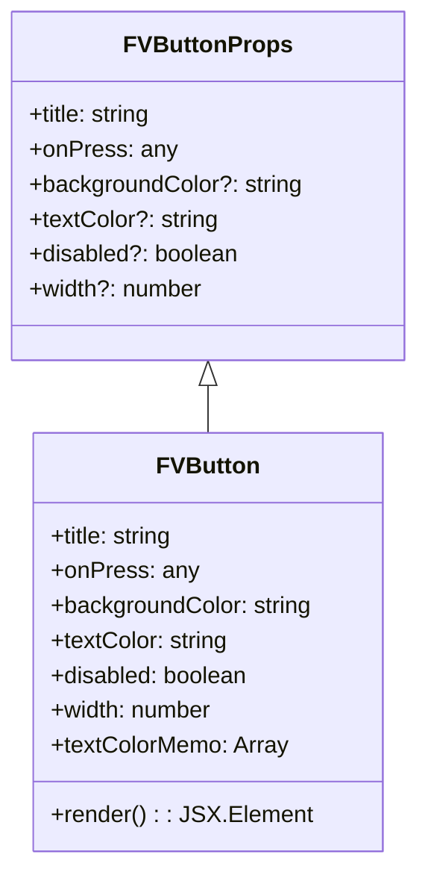
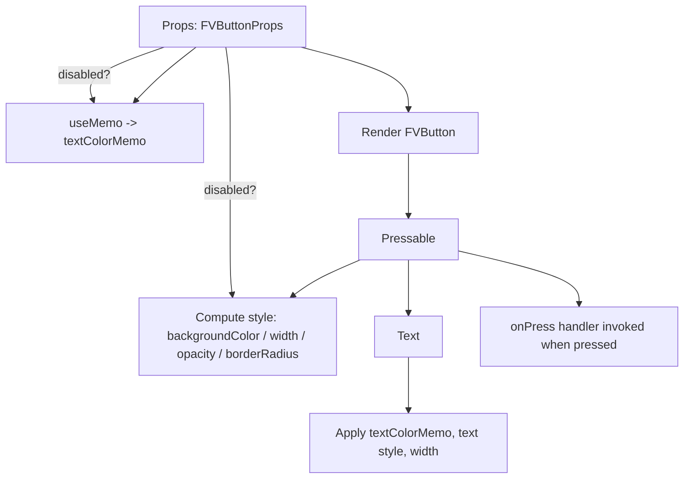

# Diagram: mobile/FreightVerifyMobileTracking/src/components/atoms/button.tsx

> Auto-generated by Obscura crawlers

## Diagram 1

### SVG

<svg id="container" width="282.2890625" xmlns="http://www.w3.org/2000/svg" class="classDiagram" height="594" viewBox="0 0 282.2890625 594" role="graphics-document document" aria-roledescription="class"><g><defs><marker id="container_class-aggregationStart" class="marker aggregation class" refX="18" refY="7" markerWidth="190" markerHeight="240" orient="auto"><path d="M 18,7 L9,13 L1,7 L9,1 Z"></path></marker></defs><defs><marker id="container_class-aggregationEnd" class="marker aggregation class" refX="1" refY="7" markerWidth="20" markerHeight="28" orient="auto"><path d="M 18,7 L9,13 L1,7 L9,1 Z"></path></marker></defs><defs><marker id="container_class-extensionStart" class="marker extension class" refX="18" refY="7" markerWidth="190" markerHeight="240" orient="auto"><path d="M 1,7 L18,13 V 1 Z"></path></marker></defs><defs><marker id="container_class-extensionEnd" class="marker extension class" refX="1" refY="7" markerWidth="20" markerHeight="28" orient="auto"><path d="M 1,1 V 13 L18,7 Z"></path></marker></defs><defs><marker id="container_class-compositionStart" class="marker composition class" refX="18" refY="7" markerWidth="190" markerHeight="240" orient="auto"><path d="M 18,7 L9,13 L1,7 L9,1 Z"></path></marker></defs><defs><marker id="container_class-compositionEnd" class="marker composition class" refX="1" refY="7" markerWidth="20" markerHeight="28" orient="auto"><path d="M 18,7 L9,13 L1,7 L9,1 Z"></path></marker></defs><defs><marker id="container_class-dependencyStart" class="marker dependency class" refX="6" refY="7" markerWidth="190" markerHeight="240" orient="auto"><path d="M 5,7 L9,13 L1,7 L9,1 Z"></path></marker></defs><defs><marker id="container_class-dependencyEnd" class="marker dependency class" refX="13" refY="7" markerWidth="20" markerHeight="28" orient="auto"><path d="M 18,7 L9,13 L14,7 L9,1 Z"></path></marker></defs><defs><marker id="container_class-lollipopStart" class="marker lollipop class" refX="13" refY="7" markerWidth="190" markerHeight="240" orient="auto"><circle stroke="black" fill="transparent" cx="7" cy="7" r="6"></circle></marker></defs><defs><marker id="container_class-lollipopEnd" class="marker lollipop class" refX="1" refY="7" markerWidth="190" markerHeight="240" orient="auto"><circle stroke="black" fill="transparent" cx="7" cy="7" r="6"></circle></marker></defs><g class="root"><g class="clusters"></g><g class="edgePaths"><path d="M141.145,265.25L141.145,266.542C141.145,267.833,141.145,270.417,141.145,275.875C141.145,281.333,141.145,289.667,141.145,293.833L141.145,298" id="id_FVButtonProps_FVButton_1" class="edge-thickness-normal edge-pattern-solid relation" style=";;;" data-edge="true" data-et="edge" data-id="id_FVButtonProps_FVButton_1" data-points="W3sieCI6MTQxLjE0NDUzMTI1LCJ5IjoyNDh9LHsieCI6MTQxLjE0NDUzMTI1LCJ5IjoyNzN9LHsieCI6MTQxLjE0NDUzMTI1LCJ5IjoyOTh9XQ==" marker-start="url(#container_class-extensionStart)"></path></g><g class="edgeLabels"><g class="edgeLabel"><g class="label" data-id="id_FVButtonProps_FVButton_1" transform="translate(0, 0)"><foreignObject width="0" height="0">

</foreignObject></g></g></g><g class="nodes"><g class="node default" id="classId-FVButtonProps-0" transform="translate(141.14453125, 128)"><g class="basic label-container"><path d="M-133.14453125 -120 L133.14453125 -120 L133.14453125 120 L-133.14453125 120" stroke="none" stroke-width="0" fill="#ECECFF" style=""></path><path d="M-133.14453125 -120 C-69.80207229152943 -120, -6.459613333058854 -120, 133.14453125 -120 M-133.14453125 -120 C-56.083632633425964 -120, 20.977265983148072 -120, 133.14453125 -120 M133.14453125 -120 C133.14453125 -59.59009527813685, 133.14453125 0.8198094437262995, 133.14453125 120 M133.14453125 -120 C133.14453125 -45.57149530967112, 133.14453125 28.857009380657757, 133.14453125 120 M133.14453125 120 C56.20875274019774 120, -20.727025769604523 120, -133.14453125 120 M133.14453125 120 C69.666215105797 120, 6.187898961594001 120, -133.14453125 120 M-133.14453125 120 C-133.14453125 39.24646496367994, -133.14453125 -41.50707007264012, -133.14453125 -120 M-133.14453125 120 C-133.14453125 66.08916817390283, -133.14453125 12.178336347805669, -133.14453125 -120" stroke="#9370DB" stroke-width="1.3" fill="none" stroke-dasharray="0 0" style=""></path></g><g class="annotation-group text" transform="translate(0, -96)"></g><g class="label-group text" transform="translate(-54.2109375, -96)"><g class="label" style="font-weight: bolder" transform="translate(0,-12)"><foreignObject width="108.421875" height="24">

FVButtonProps

</foreignObject></g></g><g class="members-group text" transform="translate(-121.14453125, -48)"><g class="label" style="" transform="translate(0,-12)"><foreignObject width="86.859375" height="24">

+title: string

</foreignObject></g><g class="label" style="" transform="translate(0,12)"><foreignObject width="98.8125" height="24">

+onPress: any

</foreignObject></g><g class="label" style="" transform="translate(0,36)"><foreignObject width="188.078125" height="24">

+backgroundColor?: string

</foreignObject></g><g class="label" style="" transform="translate(0,60)"><foreignObject width="130.25" height="24">

+textColor?: string

</foreignObject></g><g class="label" style="" transform="translate(0,84)"><foreignObject width="145.359375" height="24">

+disabled?: boolean

</foreignObject></g><g class="label" style="" transform="translate(0,108)"><foreignObject width="120.4375" height="24">

+width?: number

</foreignObject></g></g><g class="methods-group text" transform="translate(-121.14453125, 120)"></g><g class="divider" style=""><path d="M-133.14453125 -72 C-37.081660374700505 -72, 58.98121050059899 -72, 133.14453125 -72 M-133.14453125 -72 C-64.54795816451802 -72, 4.048614920963956 -72, 133.14453125 -72" stroke="#9370DB" stroke-width="1.3" fill="none" stroke-dasharray="0 0" style=""></path></g><g class="divider" style=""><path d="M-133.14453125 96 C-50.984966972908 96, 31.174597304184005 96, 133.14453125 96 M-133.14453125 96 C-27.645460415198315 96, 77.85361041960337 96, 133.14453125 96" stroke="#9370DB" stroke-width="1.3" fill="none" stroke-dasharray="0 0" style=""></path></g></g><g class="node default" id="classId-FVButton-1" transform="translate(141.14453125, 442)"><g class="basic label-container"><path d="M-119.33203125 -144 L119.33203125 -144 L119.33203125 144 L-119.33203125 144" stroke="none" stroke-width="0" fill="#ECECFF" style=""></path><path d="M-119.33203125 -144 C-58.414059549925085 -144, 2.50391215014983 -144, 119.33203125 -144 M-119.33203125 -144 C-62.54407097769436 -144, -5.756110705388721 -144, 119.33203125 -144 M119.33203125 -144 C119.33203125 -72.8232551720855, 119.33203125 -1.6465103441709914, 119.33203125 144 M119.33203125 -144 C119.33203125 -82.49371895557914, 119.33203125 -20.98743791115828, 119.33203125 144 M119.33203125 144 C58.748740507181914 144, -1.834550235636172 144, -119.33203125 144 M119.33203125 144 C26.756665094011964 144, -65.81870106197607 144, -119.33203125 144 M-119.33203125 144 C-119.33203125 71.1113244566326, -119.33203125 -1.7773510867347966, -119.33203125 -144 M-119.33203125 144 C-119.33203125 33.48962896362012, -119.33203125 -77.02074207275976, -119.33203125 -144" stroke="#9370DB" stroke-width="1.3" fill="none" stroke-dasharray="0 0" style=""></path></g><g class="annotation-group text" transform="translate(0, -120)"></g><g class="label-group text" transform="translate(-33.2890625, -120)"><g class="label" style="font-weight: bolder" transform="translate(0,-12)"><foreignObject width="66.578125" height="24">

FVButton

</foreignObject></g></g><g class="members-group text" transform="translate(-107.33203125, -72)"><g class="label" style="" transform="translate(0,-12)"><foreignObject width="86.859375" height="24">

+title: string

</foreignObject></g><g class="label" style="" transform="translate(0,12)"><foreignObject width="98.8125" height="24">

+onPress: any

</foreignObject></g><g class="label" style="" transform="translate(0,36)"><foreignObject width="181.375" height="24">

+backgroundColor: string

</foreignObject></g><g class="label" style="" transform="translate(0,60)"><foreignObject width="123.546875" height="24">

+textColor: string

</foreignObject></g><g class="label" style="" transform="translate(0,84)"><foreignObject width="138.015625" height="24">

+disabled: boolean

</foreignObject></g><g class="label" style="" transform="translate(0,108)"><foreignObject width="113.578125" height="24">

+width: number

</foreignObject></g><g class="label" style="" transform="translate(0,132)"><foreignObject width="163.265625" height="24">

+textColorMemo: Array

</foreignObject></g></g><g class="methods-group text" transform="translate(-107.33203125, 120)"><g class="label" style="" transform="translate(0,-12)"><foreignObject width="172.34375" height="24">

+render() : : JSX.Element

</foreignObject></g></g><g class="divider" style=""><path d="M-119.33203125 -96 C-53.803680476006164 -96, 11.724670297987672 -96, 119.33203125 -96 M-119.33203125 -96 C-26.729338791523716 -96, 65.87335366695257 -96, 119.33203125 -96" stroke="#9370DB" stroke-width="1.3" fill="none" stroke-dasharray="0 0" style=""></path></g><g class="divider" style=""><path d="M-119.33203125 96 C-34.71671930914438 96, 49.89859263171124 96, 119.33203125 96 M-119.33203125 96 C-45.78536359919879 96, 27.761304051602423 96, 119.33203125 96" stroke="#9370DB" stroke-width="1.3" fill="none" stroke-dasharray="0 0" style=""></path></g></g></g></g></g></svg>

## Diagram 2

### SVG

<svg id="container" width="900.515625" xmlns="http://www.w3.org/2000/svg" class="flowchart" height="630" viewBox="0 0 900.515625 630" role="graphics-document document" aria-roledescription="flowchart-v2"><g><marker id="container_flowchart-v2-pointEnd" class="marker flowchart-v2" viewBox="0 0 10 10" refX="5" refY="5" markerUnits="userSpaceOnUse" markerWidth="8" markerHeight="8" orient="auto"><path d="M 0 0 L 10 5 L 0 10 z" class="arrowMarkerPath" style="stroke-width: 1; stroke-dasharray: 1, 0;"></path></marker><marker id="container_flowchart-v2-pointStart" class="marker flowchart-v2" viewBox="0 0 10 10" refX="4.5" refY="5" markerUnits="userSpaceOnUse" markerWidth="8" markerHeight="8" orient="auto"><path d="M 0 5 L 10 10 L 10 0 z" class="arrowMarkerPath" style="stroke-width: 1; stroke-dasharray: 1, 0;"></path></marker><marker id="container_flowchart-v2-circleEnd" class="marker flowchart-v2" viewBox="0 0 10 10" refX="11" refY="5" markerUnits="userSpaceOnUse" markerWidth="11" markerHeight="11" orient="auto"><circle cx="5" cy="5" r="5" class="arrowMarkerPath" style="stroke-width: 1; stroke-dasharray: 1, 0;"></circle></marker><marker id="container_flowchart-v2-circleStart" class="marker flowchart-v2" viewBox="0 0 10 10" refX="-1" refY="5" markerUnits="userSpaceOnUse" markerWidth="11" markerHeight="11" orient="auto"><circle cx="5" cy="5" r="5" class="arrowMarkerPath" style="stroke-width: 1; stroke-dasharray: 1, 0;"></circle></marker><marker id="container_flowchart-v2-crossEnd" class="marker cross flowchart-v2" viewBox="0 0 11 11" refX="12" refY="5.2" markerUnits="userSpaceOnUse" markerWidth="11" markerHeight="11" orient="auto"><path d="M 1,1 l 9,9 M 10,1 l -9,9" class="arrowMarkerPath" style="stroke-width: 2; stroke-dasharray: 1, 0;"></path></marker><marker id="container_flowchart-v2-crossStart" class="marker cross flowchart-v2" viewBox="0 0 11 11" refX="-1" refY="5.2" markerUnits="userSpaceOnUse" markerWidth="11" markerHeight="11" orient="auto"><path d="M 1,1 l 9,9 M 10,1 l -9,9" class="arrowMarkerPath" style="stroke-width: 2; stroke-dasharray: 1, 0;"></path></marker><g class="root"><g class="clusters"></g><g class="edgePaths"><path d="M258.195,62L250.246,68.167C242.297,74.333,226.398,86.667,213.027,98.518C199.655,110.369,188.81,121.737,183.387,127.421L177.965,133.106" id="L_Props_UseMemo_0" class="edge-thickness-normal edge-pattern-solid edge-thickness-normal edge-pattern-solid flowchart-link" style=";" data-edge="true" data-et="edge" data-id="L_Props_UseMemo_0" data-points="W3sieCI6MjU4LjE5NTMxMjUsInkiOjYyfSx7IngiOjIxMC41LCJ5Ijo5OX0seyJ4IjoxNzUuMjAzOTQ3MzY4NDIxMDQsInkiOjEzNn1d" marker-end="url(#container_flowchart-v2-pointEnd)"></path><path d="M396.257,62L419.841,68.167C443.424,74.333,490.591,86.667,514.174,100.333C537.758,114,537.758,129,537.758,136.5L537.758,144" id="L_Props_Render_0" class="edge-thickness-normal edge-pattern-solid edge-thickness-normal edge-pattern-solid flowchart-link" style=";" data-edge="true" data-et="edge" data-id="L_Props_Render_0" data-points="W3sieCI6Mzk2LjI1NzIwMjE0ODQzNzUsInkiOjYyfSx7IngiOjUzNy43NTc4MTI1LCJ5Ijo5OX0seyJ4Ijo1MzcuNzU3ODEyNSwieSI6MTQ4fV0=" marker-end="url(#container_flowchart-v2-pointEnd)"></path><path d="M537.758,202L537.758,210.167C537.758,218.333,537.758,234.667,537.758,248.333C537.758,262,537.758,273,537.758,278.5L537.758,284" id="L_Render_Pressable_0" class="edge-thickness-normal edge-pattern-solid edge-thickness-normal edge-pattern-solid flowchart-link" style=";" data-edge="true" data-et="edge" data-id="L_Render_Pressable_0" data-points="W3sieCI6NTM3Ljc1NzgxMjUsInkiOjIwMn0seyJ4Ijo1MzcuNzU3ODEyNSwieSI6MjUxfSx7IngiOjUzNy43NTc4MTI1LCJ5IjoyODh9XQ==" marker-end="url(#container_flowchart-v2-pointEnd)"></path><path d="M474.215,342L464.409,346.167C454.603,350.333,434.991,358.667,420.107,366.603C405.224,374.539,395.069,382.077,389.991,385.846L384.913,389.616" id="L_Pressable_Styles_0" class="edge-thickness-normal edge-pattern-solid edge-thickness-normal edge-pattern-solid flowchart-link" style=";" data-edge="true" data-et="edge" data-id="L_Pressable_Styles_0" data-points="W3sieCI6NDc0LjIxNDkxODg3MDE5MjMsInkiOjM0Mn0seyJ4Ijo0MTUuMzc4OTA2MjUsInkiOjM2N30seyJ4IjozODEuNzAxNjM0NDU3MjM2OCwieSI6MzkyfV0=" marker-end="url(#container_flowchart-v2-pointEnd)"></path><path d="M537.758,342L537.758,346.167C537.758,350.333,537.758,358.667,537.758,370.333C537.758,382,537.758,397,537.758,404.5L537.758,412" id="L_Pressable_TextNode_0" class="edge-thickness-normal edge-pattern-solid edge-thickness-normal edge-pattern-solid flowchart-link" style=";" data-edge="true" data-et="edge" data-id="L_Pressable_TextNode_0" data-points="W3sieCI6NTM3Ljc1NzgxMjUsInkiOjM0Mn0seyJ4Ijo1MzcuNzU3ODEyNSwieSI6MzY3fSx7IngiOjUzNy43NTc4MTI1LCJ5Ijo0MTZ9XQ==" marker-end="url(#container_flowchart-v2-pointEnd)"></path><path d="M537.758,470L537.758,478.167C537.758,486.333,537.758,502.667,537.758,514.333C537.758,526,537.758,533,537.758,536.5L537.758,540" id="L_TextNode_ApplyTextStyle_0" class="edge-thickness-normal edge-pattern-solid edge-thickness-normal edge-pattern-solid flowchart-link" style=";" data-edge="true" data-et="edge" data-id="L_TextNode_ApplyTextStyle_0" data-points="W3sieCI6NTM3Ljc1NzgxMjUsInkiOjQ3MH0seyJ4Ijo1MzcuNzU3ODEyNSwieSI6NTE5fSx7IngiOjUzNy43NTc4MTI1LCJ5Ijo1NDR9XQ==" marker-end="url(#container_flowchart-v2-pointEnd)"></path><path d="M602.539,329.988L629.202,336.156C655.865,342.325,709.19,354.663,735.853,366.331C762.516,378,762.516,389,762.516,394.5L762.516,400" id="L_Pressable_OnPress_0" class="edge-thickness-normal edge-pattern-solid edge-thickness-normal edge-pattern-solid flowchart-link" style=";" data-edge="true" data-et="edge" data-id="L_Pressable_OnPress_0" data-points="W3sieCI6NjAyLjUzOTA2MjUsInkiOjMyOS45ODc3OTkzNjczNzQ2fSx7IngiOjc2Mi41MTU2MjUsInkiOjM2N30seyJ4Ijo3NjIuNTE1NjI1LCJ5Ijo0MDR9XQ==" marker-end="url(#container_flowchart-v2-pointEnd)"></path><path d="M297.219,62L298.182,68.167C299.146,74.333,301.073,86.667,302.036,105.5C303,124.333,303,149.667,303,175C303,200.333,303,225.667,303,249C303,272.333,303,293.667,303,313C303,332.333,303,349.667,303.461,361.839C303.923,374.011,304.845,381.023,305.306,384.528L305.768,388.034" id="L_Props_Styles_0" class="edge-thickness-normal edge-pattern-solid edge-thickness-normal edge-pattern-solid flowchart-link" style=";" data-edge="true" data-et="edge" data-id="L_Props_Styles_0" data-points="W3sieCI6Mjk3LjIxODc1LCJ5Ijo2Mn0seyJ4IjozMDMsInkiOjk5fSx7IngiOjMwMywieSI6MTc1fSx7IngiOjMwMywieSI6MjUxfSx7IngiOjMwMywieSI6MzE1fSx7IngiOjMwMywieSI6MzY3fSx7IngiOjMwNi4yODk0NzM2ODQyMTA1LCJ5IjozOTJ9XQ==" marker-end="url(#container_flowchart-v2-pointEnd)"></path><path d="M216.024,62L198.443,68.167C180.863,74.333,145.701,86.667,130.122,98.373C114.542,110.079,118.546,121.159,120.547,126.698L122.549,132.238" id="L_Props_UseMemo_2" class="edge-thickness-normal edge-pattern-solid edge-thickness-normal edge-pattern-solid flowchart-link" style=";" data-edge="true" data-et="edge" data-id="L_Props_UseMemo_2" data-points="W3sieCI6MjE2LjAyNDI5MTk5MjE4NzUsInkiOjYyfSx7IngiOjExMC41MzkwNjI1LCJ5Ijo5OX0seyJ4IjoxMjMuOTA4MjAzMTI1LCJ5IjoxMzZ9XQ==" marker-end="url(#container_flowchart-v2-pointEnd)"></path></g><g class="edgeLabels"><g class="edgeLabel"><g class="label" data-id="L_Props_UseMemo_0" transform="translate(0, 0)"><foreignObject width="0" height="0">

</foreignObject></g></g><g class="edgeLabel"><g class="label" data-id="L_Props_Render_0" transform="translate(0, 0)"><foreignObject width="0" height="0">

</foreignObject></g></g><g class="edgeLabel"><g class="label" data-id="L_Render_Pressable_0" transform="translate(0, 0)"><foreignObject width="0" height="0">

</foreignObject></g></g><g class="edgeLabel"><g class="label" data-id="L_Pressable_Styles_0" transform="translate(0, 0)"><foreignObject width="0" height="0">

</foreignObject></g></g><g class="edgeLabel"><g class="label" data-id="L_Pressable_TextNode_0" transform="translate(0, 0)"><foreignObject width="0" height="0">

</foreignObject></g></g><g class="edgeLabel"><g class="label" data-id="L_TextNode_ApplyTextStyle_0" transform="translate(0, 0)"><foreignObject width="0" height="0">

</foreignObject></g></g><g class="edgeLabel"><g class="label" data-id="L_Pressable_OnPress_0" transform="translate(0, 0)"><foreignObject width="0" height="0">

</foreignObject></g></g><g class="edgeLabel" transform="translate(303, 251)"><g class="label" data-id="L_Props_Styles_0" transform="translate(-34.921875, -12)"><foreignObject width="69.84375" height="24">

disabled?

</foreignObject></g></g><g class="edgeLabel" transform="translate(144.7198, 87.01077)"><g class="label" data-id="L_Props_UseMemo_2" transform="translate(-34.921875, -12)"><foreignObject width="69.84375" height="24">

disabled?

</foreignObject></g></g></g><g class="nodes"><g class="node default" id="flowchart-Props-0" transform="translate(293, 35)"><rect class="basic label-container" style="" x="-107.9453125" y="-27" width="215.890625" height="54"></rect><g class="label" style="" transform="translate(-77.9453125, -12)"><rect></rect><foreignObject width="155.890625" height="24">

Props: FVButtonProps

</foreignObject></g></g><g class="node default" id="flowchart-UseMemo-1" transform="translate(138, 175)"><rect class="basic label-container" style="" x="-130" y="-39" width="260" height="78"></rect><g class="label" style="" transform="translate(-100, -24)"><rect></rect><foreignObject width="200" height="48">

useMemo -&gt; textColorMemo

</foreignObject></g></g><g class="node default" id="flowchart-Render-3" transform="translate(537.7578125, 175)"><rect class="basic label-container" style="" x="-91.0390625" y="-27" width="182.078125" height="54"></rect><g class="label" style="" transform="translate(-61.0390625, -12)"><rect></rect><foreignObject width="122.078125" height="24">

Render FVButton

</foreignObject></g></g><g class="node default" id="flowchart-Pressable-5" transform="translate(537.7578125, 315)"><rect class="basic label-container" style="" x="-64.78125" y="-27" width="129.5625" height="54"></rect><g class="label" style="" transform="translate(-34.78125, -12)"><rect></rect><foreignObject width="69.5625" height="24">

Pressable

</foreignObject></g></g><g class="node default" id="flowchart-Styles-7" transform="translate(313, 443)"><rect class="basic label-container" style="" x="-130" y="-51" width="260" height="102"></rect><g class="label" style="" transform="translate(-100, -36)"><rect></rect><foreignObject width="200" height="72">

Compute style: backgroundColor / width / opacity / borderRadius

</foreignObject></g></g><g class="node default" id="flowchart-TextNode-9" transform="translate(537.7578125, 443)"><rect class="basic label-container" style="" x="-44.7578125" y="-27" width="89.515625" height="54"></rect><g class="label" style="" transform="translate(-14.7578125, -12)"><rect></rect><foreignObject width="29.515625" height="24">

Text

</foreignObject></g></g><g class="node default" id="flowchart-ApplyTextStyle-11" transform="translate(537.7578125, 583)"><rect class="basic label-container" style="" x="-130" y="-39" width="260" height="78"></rect><g class="label" style="" transform="translate(-100, -24)"><rect></rect><foreignObject width="200" height="48">

Apply textColorMemo, text style, width

</foreignObject></g></g><g class="node default" id="flowchart-OnPress-13" transform="translate(762.515625, 443)"><rect class="basic label-container" style="" x="-130" y="-39" width="260" height="78"></rect><g class="label" style="" transform="translate(-100, -24)"><rect></rect><foreignObject width="200" height="48">

onPress handler invoked when pressed

</foreignObject></g></g></g></g></g></svg>
