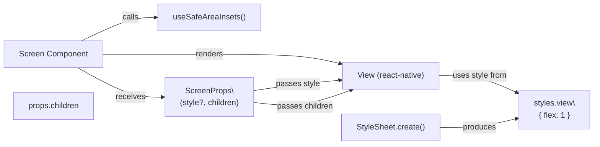

# Diagram: mobile/FreightVerifyMobileTracking/src/components/atoms/screen.tsx

> Auto-generated by Obscura crawlers

## Mermaid

### SVG

<svg id="container" width="1314.9375" xmlns="http://www.w3.org/2000/svg" class="flowchart" height="291" viewBox="0 0 1314.9375 291" role="graphics-document document" aria-roledescription="flowchart-v2"><g><marker id="container_flowchart-v2-pointEnd" class="marker flowchart-v2" viewBox="0 0 10 10" refX="5" refY="5" markerUnits="userSpaceOnUse" markerWidth="8" markerHeight="8" orient="auto"><path d="M 0 0 L 10 5 L 0 10 z" class="arrowMarkerPath" style="stroke-width: 1; stroke-dasharray: 1, 0;"></path></marker><marker id="container_flowchart-v2-pointStart" class="marker flowchart-v2" viewBox="0 0 10 10" refX="4.5" refY="5" markerUnits="userSpaceOnUse" markerWidth="8" markerHeight="8" orient="auto"><path d="M 0 5 L 10 10 L 10 0 z" class="arrowMarkerPath" style="stroke-width: 1; stroke-dasharray: 1, 0;"></path></marker><marker id="container_flowchart-v2-circleEnd" class="marker flowchart-v2" viewBox="0 0 10 10" refX="11" refY="5" markerUnits="userSpaceOnUse" markerWidth="11" markerHeight="11" orient="auto"><circle cx="5" cy="5" r="5" class="arrowMarkerPath" style="stroke-width: 1; stroke-dasharray: 1, 0;"></circle></marker><marker id="container_flowchart-v2-circleStart" class="marker flowchart-v2" viewBox="0 0 10 10" refX="-1" refY="5" markerUnits="userSpaceOnUse" markerWidth="11" markerHeight="11" orient="auto"><circle cx="5" cy="5" r="5" class="arrowMarkerPath" style="stroke-width: 1; stroke-dasharray: 1, 0;"></circle></marker><marker id="container_flowchart-v2-crossEnd" class="marker cross flowchart-v2" viewBox="0 0 11 11" refX="12" refY="5.2" markerUnits="userSpaceOnUse" markerWidth="11" markerHeight="11" orient="auto"><path d="M 1,1 l 9,9 M 10,1 l -9,9" class="arrowMarkerPath" style="stroke-width: 2; stroke-dasharray: 1, 0;"></path></marker><marker id="container_flowchart-v2-crossStart" class="marker cross flowchart-v2" viewBox="0 0 11 11" refX="-1" refY="5.2" markerUnits="userSpaceOnUse" markerWidth="11" markerHeight="11" orient="auto"><path d="M 1,1 l 9,9 M 10,1 l -9,9" class="arrowMarkerPath" style="stroke-width: 2; stroke-dasharray: 1, 0;"></path></marker><g class="root"><g class="clusters"></g><g class="edgePaths"><path d="M162.268,82L178.459,74.167C194.65,66.333,227.032,50.667,256.398,42.833C285.763,35,312.112,35,325.286,35L338.461,35" id="L_Screen_Insets_0" class="edge-thickness-normal edge-pattern-solid edge-thickness-normal edge-pattern-solid flowchart-link" style=";" data-edge="true" data-et="edge" data-id="L_Screen_Insets_0" data-points="W3sieCI6MTYyLjI2ODE1ODc4Mzc4Mzc4LCJ5Ijo4Mn0seyJ4IjoyNTkuNDE0MDYyNSwieSI6MzV9LHsieCI6MzQyLjQ2MDkzNzUsInkiOjM1fV0=" marker-end="url(#container_flowchart-v2-pointEnd)"></path><path d="M204.922,109L214.004,109C223.086,109,241.25,109,281.081,109C320.911,109,382.409,109,448.375,109C514.341,109,584.776,109,632.947,112.107C681.118,115.214,707.024,121.429,719.977,124.536L732.931,127.643" id="L_Screen_ViewComp_0" class="edge-thickness-normal edge-pattern-solid edge-thickness-normal edge-pattern-solid flowchart-link" style=";" data-edge="true" data-et="edge" data-id="L_Screen_ViewComp_0" data-points="W3sieCI6MjA0LjkyMTg3NSwieSI6MTA5fSx7IngiOjI1OS40MTQwNjI1LCJ5IjoxMDl9LHsieCI6NDQzLjkwNjI1LCJ5IjoxMDl9LHsieCI6NjU1LjIxMDkzNzUsInkiOjEwOX0seyJ4Ijo3MzYuODIwMzEyNSwieSI6MTI4LjU3NjI5MTEzMDk2NTM2fV0=" marker-end="url(#container_flowchart-v2-pointEnd)"></path><path d="M154.481,136L171.97,145.833C189.459,155.667,224.436,175.333,250.341,185.167C276.245,195,293.076,195,301.491,195L309.906,195" id="L_Screen_Props_0" class="edge-thickness-normal edge-pattern-solid edge-thickness-normal edge-pattern-solid flowchart-link" style=";" data-edge="true" data-et="edge" data-id="L_Screen_Props_0" data-points="W3sieCI6MTU0LjQ4MTEwNDY1MTE2Mjc4LCJ5IjoxMzZ9LHsieCI6MjU5LjQxNDA2MjUsInkiOjE5NX0seyJ4IjozMTMuOTA2MjUsInkiOjE5NX1d" marker-end="url(#container_flowchart-v2-pointEnd)"></path><path d="M573.906,178.389L587.457,176.657C601.008,174.926,628.109,171.463,654.598,168.577C681.086,165.69,706.961,163.381,719.899,162.226L732.836,161.071" id="L_Props_ViewComp_0" class="edge-thickness-normal edge-pattern-solid edge-thickness-normal edge-pattern-solid flowchart-link" style=";" data-edge="true" data-et="edge" data-id="L_Props_ViewComp_0" data-points="W3sieCI6NTczLjkwNjI1LCJ5IjoxNzguMzg4OTE1NTkxMzc3OTh9LHsieCI6NjU1LjIxMDkzNzUsInkiOjE2OH0seyJ4Ijo3MzYuODIwMzEyNSwieSI6MTYwLjcxNTc5ODY0ODk0MzEyfV0=" marker-end="url(#container_flowchart-v2-pointEnd)"></path><path d="M573.906,208.535L587.457,209.946C601.008,211.357,628.109,214.178,658.5,209.483C688.89,204.788,722.569,192.576,739.408,186.47L756.247,180.364" id="L_Props_ViewComp_2" class="edge-thickness-normal edge-pattern-solid edge-thickness-normal edge-pattern-solid flowchart-link" style=";" data-edge="true" data-et="edge" data-id="L_Props_ViewComp_2" data-points="W3sieCI6NTczLjkwNjI1LCJ5IjoyMDguNTM0OTU3NjY2Mjg0Nn0seyJ4Ijo2NTUuMjEwOTM3NSwieSI6MjE3fSx7IngiOjc2MC4wMDc4MTI1LCJ5IjoxNzl9XQ==" marker-end="url(#container_flowchart-v2-pointEnd)"></path><path d="M932.117,152L945.496,152C958.875,152,985.633,152,1017.203,158.606C1048.773,165.212,1085.154,178.423,1103.345,185.029L1121.536,191.635" id="L_ViewComp_StylesView_0" class="edge-thickness-normal edge-pattern-solid edge-thickness-normal edge-pattern-solid flowchart-link" style=";" data-edge="true" data-et="edge" data-id="L_ViewComp_StylesView_0" data-points="W3sieCI6OTMyLjExNzE4NzUsInkiOjE1Mn0seyJ4IjoxMDEyLjM5MDYyNSwieSI6MTUyfSx7IngiOjExMjUuMjk2MDcwNzcyMDU4OCwieSI6MTkzfV0=" marker-end="url(#container_flowchart-v2-pointEnd)"></path><path d="M932.422,256L945.75,256C959.078,256,985.734,256,1011.736,253.564C1037.738,251.127,1063.084,246.254,1075.758,243.818L1088.431,241.381" id="L_StyleSheetCreate_StylesView_0" class="edge-thickness-normal edge-pattern-solid edge-thickness-normal edge-pattern-solid flowchart-link" style=";" data-edge="true" data-et="edge" data-id="L_StyleSheetCreate_StylesView_0" data-points="W3sieCI6OTMyLjQyMTg3NSwieSI6MjU2fSx7IngiOjEwMTIuMzkwNjI1LCJ5IjoyNTZ9LHsieCI6MTA5Mi4zNTkzNzUsInkiOjI0MC42MjYxNDIxMDAyMTI3N31d" marker-end="url(#container_flowchart-v2-pointEnd)"></path></g><g class="edgeLabels"><g class="edgeLabel" transform="translate(259.4140625, 35)"><g class="label" data-id="L_Screen_Insets_0" transform="translate(-16.4453125, -12)"><foreignObject width="32.890625" height="24">

calls

</foreignObject></g></g><g class="edgeLabel" transform="translate(443.90625, 109)"><g class="label" data-id="L_Screen_ViewComp_0" transform="translate(-27.75, -12)"><foreignObject width="55.5" height="24">

renders

</foreignObject></g></g><g class="edgeLabel" transform="translate(259.4140625, 195)"><g class="label" data-id="L_Screen_Props_0" transform="translate(-29.4921875, -12)"><foreignObject width="58.984375" height="24">

receives

</foreignObject></g></g><g class="edgeLabel" transform="translate(655.2109375, 168)"><g class="label" data-id="L_Props_ViewComp_0" transform="translate(-43.7421875, -12)"><foreignObject width="87.484375" height="24">

passes style

</foreignObject></g></g><g class="edgeLabel" transform="translate(669.18536, 211.93279)"><g class="label" data-id="L_Props_ViewComp_2" transform="translate(-56.3046875, -12)"><foreignObject width="112.609375" height="24">

passes children

</foreignObject></g></g><g class="edgeLabel" transform="translate(1012.390625, 152)"><g class="label" data-id="L_ViewComp_StylesView_0" transform="translate(-54.96875, -12)"><foreignObject width="109.9375" height="24">

uses style from

</foreignObject></g></g><g class="edgeLabel" transform="translate(1012.390625, 256)"><g class="label" data-id="L_StyleSheetCreate_StylesView_0" transform="translate(-33.4765625, -12)"><foreignObject width="66.953125" height="24">

produces

</foreignObject></g></g></g><g class="nodes"><g class="node default" id="flowchart-Screen-0" transform="translate(106.4609375, 109)"><rect class="basic label-container" style="" x="-98.4609375" y="-27" width="196.921875" height="54"></rect><g class="label" style="" transform="translate(-68.4609375, -12)"><rect></rect><foreignObject width="136.921875" height="24">

Screen Component

</foreignObject></g></g><g class="node default" id="flowchart-Insets-1" transform="translate(443.90625, 35)"><rect class="basic label-container" style="" x="-101.4453125" y="-27" width="202.890625" height="54"></rect><g class="label" style="" transform="translate(-71.4453125, -12)"><rect></rect><foreignObject width="142.890625" height="24">

useSafeAreaInsets()

</foreignObject></g></g><g class="node default" id="flowchart-ViewComp-2" transform="translate(834.46875, 152)"><rect class="basic label-container" style="" x="-97.6484375" y="-27" width="195.296875" height="54"></rect><g class="label" style="" transform="translate(-67.6484375, -12)"><rect></rect><foreignObject width="135.296875" height="24">

View (react-native)

</foreignObject></g></g><g class="node default" id="flowchart-StyleSheetCreate-3" transform="translate(834.46875, 256)"><rect class="basic label-container" style="" x="-97.953125" y="-27" width="195.90625" height="54"></rect><g class="label" style="" transform="translate(-67.953125, -12)"><rect></rect><foreignObject width="135.90625" height="24">

StyleSheet.create()

</foreignObject></g></g><g class="node default" id="flowchart-StylesView-4" transform="translate(1199.6484375, 220)"><rect class="basic label-container" style="" x="-107.2890625" y="-27" width="214.578125" height="54"></rect><g class="label" style="" transform="translate(-77.2890625, -12)"><rect></rect><foreignObject width="154.578125" height="24">

styles.view\n{ flex: 1 }

</foreignObject></g></g><g class="node default" id="flowchart-Props-5" transform="translate(443.90625, 195)"><rect class="basic label-container" style="" x="-130" y="-39" width="260" height="78"></rect><g class="label" style="" transform="translate(-100, -24)"><rect></rect><foreignObject width="200" height="48">

ScreenProps\n(style?, children)

</foreignObject></g></g><g class="node default" id="flowchart-Children-6" transform="translate(106.4609375, 213)"><rect class="basic label-container" style="" x="-82.359375" y="-27" width="164.71875" height="54"></rect><g class="label" style="" transform="translate(-52.359375, -12)"><rect></rect><foreignObject width="104.71875" height="24">

props.children

</foreignObject></g></g></g></g></g></svg>
