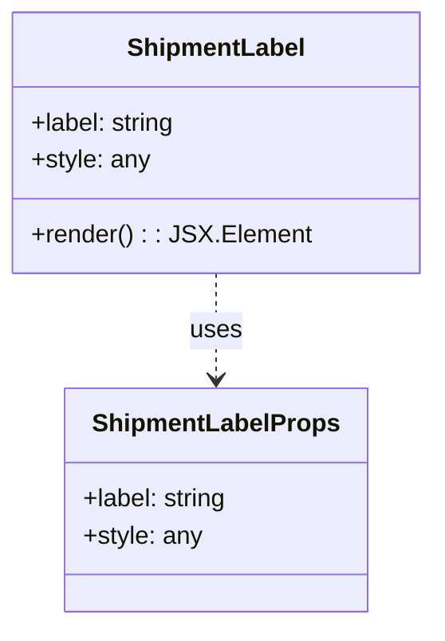
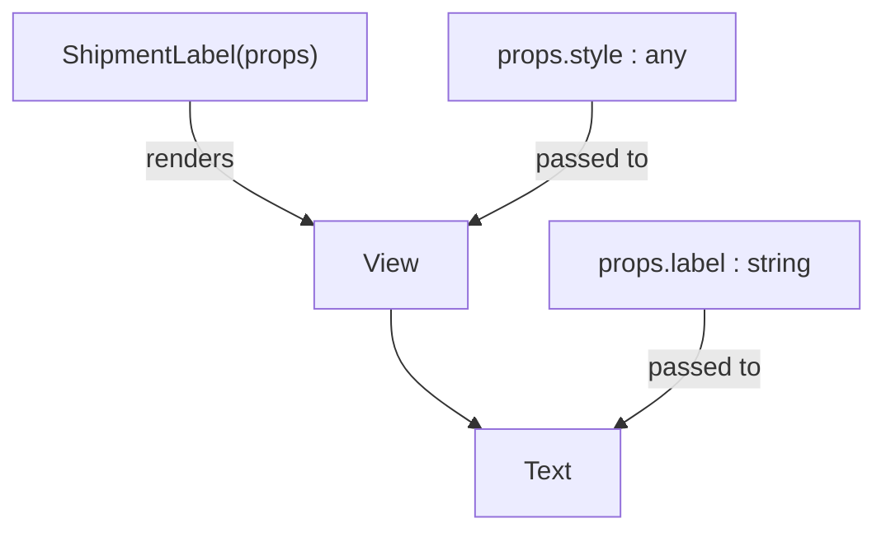

# Diagram: mobile/FreightVerifyMobileTracking/src/components/atoms/shipment-label.tsx

> Auto-generated by Obscura crawlers

## Diagram 1

### SVG

<svg id="container" width="267.4296875" xmlns="http://www.w3.org/2000/svg" class="classDiagram" height="402" viewBox="0 0 267.4296875 402" role="graphics-document document" aria-roledescription="class"><g><defs><marker id="container_class-aggregationStart" class="marker aggregation class" refX="18" refY="7" markerWidth="190" markerHeight="240" orient="auto"><path d="M 18,7 L9,13 L1,7 L9,1 Z"></path></marker></defs><defs><marker id="container_class-aggregationEnd" class="marker aggregation class" refX="1" refY="7" markerWidth="20" markerHeight="28" orient="auto"><path d="M 18,7 L9,13 L1,7 L9,1 Z"></path></marker></defs><defs><marker id="container_class-extensionStart" class="marker extension class" refX="18" refY="7" markerWidth="190" markerHeight="240" orient="auto"><path d="M 1,7 L18,13 V 1 Z"></path></marker></defs><defs><marker id="container_class-extensionEnd" class="marker extension class" refX="1" refY="7" markerWidth="20" markerHeight="28" orient="auto"><path d="M 1,1 V 13 L18,7 Z"></path></marker></defs><defs><marker id="container_class-compositionStart" class="marker composition class" refX="18" refY="7" markerWidth="190" markerHeight="240" orient="auto"><path d="M 18,7 L9,13 L1,7 L9,1 Z"></path></marker></defs><defs><marker id="container_class-compositionEnd" class="marker composition class" refX="1" refY="7" markerWidth="20" markerHeight="28" orient="auto"><path d="M 18,7 L9,13 L1,7 L9,1 Z"></path></marker></defs><defs><marker id="container_class-dependencyStart" class="marker dependency class" refX="6" refY="7" markerWidth="190" markerHeight="240" orient="auto"><path d="M 5,7 L9,13 L1,7 L9,1 Z"></path></marker></defs><defs><marker id="container_class-dependencyEnd" class="marker dependency class" refX="13" refY="7" markerWidth="20" markerHeight="28" orient="auto"><path d="M 18,7 L9,13 L14,7 L9,1 Z"></path></marker></defs><defs><marker id="container_class-lollipopStart" class="marker lollipop class" refX="13" refY="7" markerWidth="190" markerHeight="240" orient="auto"><circle stroke="black" fill="transparent" cx="7" cy="7" r="6"></circle></marker></defs><defs><marker id="container_class-lollipopEnd" class="marker lollipop class" refX="1" refY="7" markerWidth="190" markerHeight="240" orient="auto"><circle stroke="black" fill="transparent" cx="7" cy="7" r="6"></circle></marker></defs><g class="root"><g class="clusters"></g><g class="edgePaths"><path d="M133.715,176L133.715,182.167C133.715,188.333,133.715,200.667,133.715,212C133.715,223.333,133.715,233.667,133.715,238.833L133.715,244" id="id_ShipmentLabel_ShipmentLabelProps_1" class="edge-thickness-normal edge-pattern-dashed relation" style=";;;" data-edge="true" data-et="edge" data-id="id_ShipmentLabel_ShipmentLabelProps_1" data-points="W3sieCI6MTMzLjcxNDg0Mzc1LCJ5IjoxNzZ9LHsieCI6MTMzLjcxNDg0Mzc1LCJ5IjoyMTN9LHsieCI6MTMzLjcxNDg0Mzc1LCJ5IjoyNTB9XQ==" marker-end="url(#container_class-dependencyEnd)"></path></g><g class="edgeLabels"><g class="edgeLabel" transform="translate(133.71484375, 213)"><g class="label" data-id="id_ShipmentLabel_ShipmentLabelProps_1" transform="translate(-16.4921875, -12)"><foreignObject width="32.984375" height="24">

uses

</foreignObject></g></g></g><g class="nodes"><g class="node default" id="classId-ShipmentLabel-0" transform="translate(133.71484375, 92)"><g class="basic label-container"><path d="M-125.71484375 -84 L125.71484375 -84 L125.71484375 84 L-125.71484375 84" stroke="none" stroke-width="0" fill="#ECECFF" style=""></path><path d="M-125.71484375 -84 C-32.33810493883328 -84, 61.038633872333435 -84, 125.71484375 -84 M-125.71484375 -84 C-53.85390798286967 -84, 18.007027784260657 -84, 125.71484375 -84 M125.71484375 -84 C125.71484375 -30.844235994779176, 125.71484375 22.31152801044165, 125.71484375 84 M125.71484375 -84 C125.71484375 -40.73180146345911, 125.71484375 2.536397073081787, 125.71484375 84 M125.71484375 84 C46.56571117749344 84, -32.58342139501312 84, -125.71484375 84 M125.71484375 84 C41.140521716556236 84, -43.43380031688753 84, -125.71484375 84 M-125.71484375 84 C-125.71484375 22.834092481426353, -125.71484375 -38.331815037147294, -125.71484375 -84 M-125.71484375 84 C-125.71484375 41.59343792595216, -125.71484375 -0.8131241480956817, -125.71484375 -84" stroke="#9370DB" stroke-width="1.3" fill="none" stroke-dasharray="0 0" style=""></path></g><g class="annotation-group text" transform="translate(0, -60)"></g><g class="label-group text" transform="translate(-55.0859375, -60)"><g class="label" style="font-weight: bolder" transform="translate(0,-12)"><foreignObject width="110.171875" height="24">

ShipmentLabel

</foreignObject></g></g><g class="members-group text" transform="translate(-113.71484375, -12)"><g class="label" style="" transform="translate(0,-12)"><foreignObject width="94.09375" height="24">

+label: string

</foreignObject></g><g class="label" style="" transform="translate(0,12)"><foreignObject width="76.28125" height="24">

+style: any

</foreignObject></g></g><g class="methods-group text" transform="translate(-113.71484375, 60)"><g class="label" style="" transform="translate(0,-12)"><foreignObject width="172.34375" height="24">

+render() : : JSX.Element

</foreignObject></g></g><g class="divider" style=""><path d="M-125.71484375 -36 C-64.15043725086672 -36, -2.586030751733432 -36, 125.71484375 -36 M-125.71484375 -36 C-37.008136312561675 -36, 51.69857112487665 -36, 125.71484375 -36" stroke="#9370DB" stroke-width="1.3" fill="none" stroke-dasharray="0 0" style=""></path></g><g class="divider" style=""><path d="M-125.71484375 36 C-62.07384681609874 36, 1.5671501178025267 36, 125.71484375 36 M-125.71484375 36 C-27.003052822143502 36, 71.708738105713 36, 125.71484375 36" stroke="#9370DB" stroke-width="1.3" fill="none" stroke-dasharray="0 0" style=""></path></g></g><g class="node default" id="classId-ShipmentLabelProps-1" transform="translate(133.71484375, 322)"><g class="basic label-container"><path d="M-97.05078125 -72 L97.05078125 -72 L97.05078125 72 L-97.05078125 72" stroke="none" stroke-width="0" fill="#ECECFF" style=""></path><path d="M-97.05078125 -72 C-41.51163590867427 -72, 14.027509432651456 -72, 97.05078125 -72 M-97.05078125 -72 C-34.53549912641989 -72, 27.979782997160214 -72, 97.05078125 -72 M97.05078125 -72 C97.05078125 -20.371287792363944, 97.05078125 31.257424415272112, 97.05078125 72 M97.05078125 -72 C97.05078125 -36.78135123670533, 97.05078125 -1.562702473410667, 97.05078125 72 M97.05078125 72 C44.044545634803924 72, -8.961689980392151 72, -97.05078125 72 M97.05078125 72 C33.438642612493254 72, -30.173496025013492 72, -97.05078125 72 M-97.05078125 72 C-97.05078125 16.717109886606664, -97.05078125 -38.56578022678667, -97.05078125 -72 M-97.05078125 72 C-97.05078125 38.08460086366933, -97.05078125 4.16920172733866, -97.05078125 -72" stroke="#9370DB" stroke-width="1.3" fill="none" stroke-dasharray="0 0" style=""></path></g><g class="annotation-group text" transform="translate(0, -48)"></g><g class="label-group text" transform="translate(-76.0078125, -48)"><g class="label" style="font-weight: bolder" transform="translate(0,-12)"><foreignObject width="152.015625" height="24">

ShipmentLabelProps

</foreignObject></g></g><g class="members-group text" transform="translate(-85.05078125, 0)"><g class="label" style="" transform="translate(0,-12)"><foreignObject width="94.09375" height="24">

+label: string

</foreignObject></g><g class="label" style="" transform="translate(0,12)"><foreignObject width="76.28125" height="24">

+style: any

</foreignObject></g></g><g class="methods-group text" transform="translate(-85.05078125, 72)"></g><g class="divider" style=""><path d="M-97.05078125 -24 C-37.23176183271351 -24, 22.58725758457298 -24, 97.05078125 -24 M-97.05078125 -24 C-23.403388890732288 -24, 50.244003468535425 -24, 97.05078125 -24" stroke="#9370DB" stroke-width="1.3" fill="none" stroke-dasharray="0 0" style=""></path></g><g class="divider" style=""><path d="M-97.05078125 48 C-55.67889635357321 48, -14.307011457146416 48, 97.05078125 48 M-97.05078125 48 C-28.602224067732124 48, 39.84633311453575 48, 97.05078125 48" stroke="#9370DB" stroke-width="1.3" fill="none" stroke-dasharray="0 0" style=""></path></g></g></g></g></g></svg>

## Diagram 2

### SVG

<svg id="container" width="543.6015625" xmlns="http://www.w3.org/2000/svg" class="flowchart" height="326" viewBox="0 0 543.6015625 326" role="graphics-document document" aria-roledescription="flowchart-v2"><g><marker id="container_flowchart-v2-pointEnd" class="marker flowchart-v2" viewBox="0 0 10 10" refX="5" refY="5" markerUnits="userSpaceOnUse" markerWidth="8" markerHeight="8" orient="auto"><path d="M 0 0 L 10 5 L 0 10 z" class="arrowMarkerPath" style="stroke-width: 1; stroke-dasharray: 1, 0;"></path></marker><marker id="container_flowchart-v2-pointStart" class="marker flowchart-v2" viewBox="0 0 10 10" refX="4.5" refY="5" markerUnits="userSpaceOnUse" markerWidth="8" markerHeight="8" orient="auto"><path d="M 0 5 L 10 10 L 10 0 z" class="arrowMarkerPath" style="stroke-width: 1; stroke-dasharray: 1, 0;"></path></marker><marker id="container_flowchart-v2-circleEnd" class="marker flowchart-v2" viewBox="0 0 10 10" refX="11" refY="5" markerUnits="userSpaceOnUse" markerWidth="11" markerHeight="11" orient="auto"><circle cx="5" cy="5" r="5" class="arrowMarkerPath" style="stroke-width: 1; stroke-dasharray: 1, 0;"></circle></marker><marker id="container_flowchart-v2-circleStart" class="marker flowchart-v2" viewBox="0 0 10 10" refX="-1" refY="5" markerUnits="userSpaceOnUse" markerWidth="11" markerHeight="11" orient="auto"><circle cx="5" cy="5" r="5" class="arrowMarkerPath" style="stroke-width: 1; stroke-dasharray: 1, 0;"></circle></marker><marker id="container_flowchart-v2-crossEnd" class="marker cross flowchart-v2" viewBox="0 0 11 11" refX="12" refY="5.2" markerUnits="userSpaceOnUse" markerWidth="11" markerHeight="11" orient="auto"><path d="M 1,1 l 9,9 M 10,1 l -9,9" class="arrowMarkerPath" style="stroke-width: 2; stroke-dasharray: 1, 0;"></path></marker><marker id="container_flowchart-v2-crossStart" class="marker cross flowchart-v2" viewBox="0 0 11 11" refX="-1" refY="5.2" markerUnits="userSpaceOnUse" markerWidth="11" markerHeight="11" orient="auto"><path d="M 1,1 l 9,9 M 10,1 l -9,9" class="arrowMarkerPath" style="stroke-width: 2; stroke-dasharray: 1, 0;"></path></marker><g class="root"><g class="clusters"></g><g class="edgePaths"><path d="M118.508,62L118.508,68.167C118.508,74.333,118.508,86.667,130.904,99.193C143.301,111.72,168.094,124.44,180.49,130.8L192.886,137.161" id="L_ShipmentLabel_View_0" class="edge-thickness-normal edge-pattern-solid edge-thickness-normal edge-pattern-solid flowchart-link" style=";" data-edge="true" data-et="edge" data-id="L_ShipmentLabel_View_0" data-points="W3sieCI6MTE4LjUwNzgxMjUsInkiOjYyfSx7IngiOjExOC41MDc4MTI1LCJ5Ijo5OX0seyJ4IjoxOTYuNDQ1MzEyNSwieSI6MTM4Ljk4NjQ3MjA5ODcwMzZ9XQ==" marker-end="url(#container_flowchart-v2-pointEnd)"></path><path d="M243.25,190L243.25,196.167C243.25,202.333,243.25,214.667,252.067,226.634C260.884,238.601,278.519,250.201,287.336,256.001L296.153,261.802" id="L_View_Text_0" class="edge-thickness-normal edge-pattern-solid edge-thickness-normal edge-pattern-solid flowchart-link" style=";" data-edge="true" data-et="edge" data-id="L_View_Text_0" data-points="W3sieCI6MjQzLjI1LCJ5IjoxOTB9LHsieCI6MjQzLjI1LCJ5IjoyMjd9LHsieCI6Mjk5LjQ5NTIzOTI1NzgxMjUsInkiOjI2NH1d" marker-end="url(#container_flowchart-v2-pointEnd)"></path><path d="M437.828,190L437.828,196.167C437.828,202.333,437.828,214.667,429.011,226.634C420.194,238.601,402.559,250.201,393.742,256.001L384.925,261.802" id="L_PropsLabel_Text_0" class="edge-thickness-normal edge-pattern-solid edge-thickness-normal edge-pattern-solid flowchart-link" style=";" data-edge="true" data-et="edge" data-id="L_PropsLabel_Text_0" data-points="W3sieCI6NDM3LjgyODEyNSwieSI6MTkwfSx7IngiOjQzNy44MjgxMjUsInkiOjIyN30seyJ4IjozODEuNTgyODg1NzQyMTg3NSwieSI6MjY0fV0=" marker-end="url(#container_flowchart-v2-pointEnd)"></path><path d="M367.992,62L367.992,68.167C367.992,74.333,367.992,86.667,355.596,99.193C343.199,111.72,318.406,124.44,306.01,130.8L293.614,137.161" id="L_PropsStyle_View_0" class="edge-thickness-normal edge-pattern-solid edge-thickness-normal edge-pattern-solid flowchart-link" style=";" data-edge="true" data-et="edge" data-id="L_PropsStyle_View_0" data-points="W3sieCI6MzY3Ljk5MjE4NzUsInkiOjYyfSx7IngiOjM2Ny45OTIxODc1LCJ5Ijo5OX0seyJ4IjoyOTAuMDU0Njg3NSwieSI6MTM4Ljk4NjQ3MjA5ODcwMzZ9XQ==" marker-end="url(#container_flowchart-v2-pointEnd)"></path></g><g class="edgeLabels"><g class="edgeLabel" transform="translate(118.5078125, 99)"><g class="label" data-id="L_ShipmentLabel_View_0" transform="translate(-27.75, -12)"><foreignObject width="55.5" height="24">

renders

</foreignObject></g></g><g class="edgeLabel"><g class="label" data-id="L_View_Text_0" transform="translate(0, 0)"><foreignObject width="0" height="0">

</foreignObject></g></g><g class="edgeLabel" transform="translate(437.828125, 227)"><g class="label" data-id="L_PropsLabel_Text_0" transform="translate(-35.046875, -12)"><foreignObject width="70.09375" height="24">

passed to

</foreignObject></g></g><g class="edgeLabel" transform="translate(367.9921875, 99)"><g class="label" data-id="L_PropsStyle_View_0" transform="translate(-35.046875, -12)"><foreignObject width="70.09375" height="24">

passed to

</foreignObject></g></g></g><g class="nodes"><g class="node default" id="flowchart-ShipmentLabel-0" transform="translate(118.5078125, 35)"><rect class="basic label-container" style="" x="-110.5078125" y="-27" width="221.015625" height="54"></rect><g class="label" style="" transform="translate(-80.5078125, -12)"><rect></rect><foreignObject width="161.015625" height="24">

ShipmentLabel(props)

</foreignObject></g></g><g class="node default" id="flowchart-PropsLabel-1" transform="translate(437.828125, 163)"><rect class="basic label-container" style="" x="-97.7734375" y="-27" width="195.546875" height="54"></rect><g class="label" style="" transform="translate(-67.7734375, -12)"><rect></rect><foreignObject width="135.546875" height="24">

props.label : string

</foreignObject></g></g><g class="node default" id="flowchart-PropsStyle-2" transform="translate(367.9921875, 35)"><rect class="basic label-container" style="" x="-88.9765625" y="-27" width="177.953125" height="54"></rect><g class="label" style="" transform="translate(-58.9765625, -12)"><rect></rect><foreignObject width="117.953125" height="24">

props.style : any

</foreignObject></g></g><g class="node default" id="flowchart-View-4" transform="translate(243.25, 163)"><rect class="basic label-container" style="" x="-46.8046875" y="-27" width="93.609375" height="54"></rect><g class="label" style="" transform="translate(-16.8046875, -12)"><rect></rect><foreignObject width="33.609375" height="24">

View

</foreignObject></g></g><g class="node default" id="flowchart-Text-6" transform="translate(340.5390625, 291)"><rect class="basic label-container" style="" x="-44.7578125" y="-27" width="89.515625" height="54"></rect><g class="label" style="" transform="translate(-14.7578125, -12)"><rect></rect><foreignObject width="29.515625" height="24">

Text

</foreignObject></g></g></g></g></g></svg>
