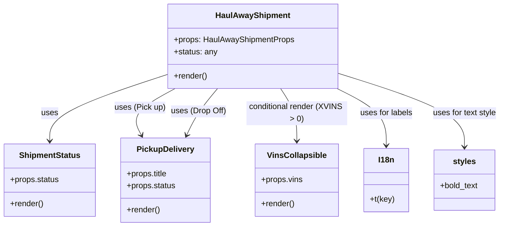

# Diagram: mobile/FreightVerifyMobileTracking/src/components/molecules/haul-away-shipment.tsx


> Auto-generated by Obscura crawlers

## Diagram 1



### SVG

<svg id="container" width="988.42578125" xmlns="http://www.w3.org/2000/svg" class="classDiagram" height="450" viewBox="0 0 988.42578125 450" role="graphics-document document" aria-roledescription="class"><style>#container{font-family:"trebuchet ms",verdana,arial,sans-serif;font-size:16px;fill:#333;}@keyframes edge-animation-frame{from{stroke-dashoffset:0;}}@keyframes dash{to{stroke-dashoffset:0;}}#container .edge-animation-slow{stroke-dasharray:9,5!important;stroke-dashoffset:900;animation:dash 50s linear infinite;stroke-linecap:round;}#container .edge-animation-fast{stroke-dasharray:9,5!important;stroke-dashoffset:900;animation:dash 20s linear infinite;stroke-linecap:round;}#container .error-icon{fill:#552222;}#container .error-text{fill:#552222;stroke:#552222;}#container .edge-thickness-normal{stroke-width:1px;}#container .edge-thickness-thick{stroke-width:3.5px;}#container .edge-pattern-solid{stroke-dasharray:0;}#container .edge-thickness-invisible{stroke-width:0;fill:none;}#container .edge-pattern-dashed{stroke-dasharray:3;}#container .edge-pattern-dotted{stroke-dasharray:2;}#container .marker{fill:#333333;stroke:#333333;}#container .marker.cross{stroke:#333333;}#container svg{font-family:"trebuchet ms",verdana,arial,sans-serif;font-size:16px;}#container p{margin:0;}#container g.classGroup text{fill:#9370DB;stroke:none;font-family:"trebuchet ms",verdana,arial,sans-serif;font-size:10px;}#container g.classGroup text .title{font-weight:bolder;}#container .nodeLabel,#container .edgeLabel{color:#131300;}#container .edgeLabel .label rect{fill:#ECECFF;}#container .label text{fill:#131300;}#container .labelBkg{background:#ECECFF;}#container .edgeLabel .label span{background:#ECECFF;}#container .classTitle{font-weight:bolder;}#container .node rect,#container .node circle,#container .node ellipse,#container .node polygon,#container .node path{fill:#ECECFF;stroke:#9370DB;stroke-width:1px;}#container .divider{stroke:#9370DB;stroke-width:1;}#container g.clickable{cursor:pointer;}#container g.classGroup rect{fill:#ECECFF;stroke:#9370DB;}#container g.classGroup line{stroke:#9370DB;stroke-width:1;}#container .classLabel .box{stroke:none;stroke-width:0;fill:#ECECFF;opacity:0.5;}#container .classLabel .label{fill:#9370DB;font-size:10px;}#container .relation{stroke:#333333;stroke-width:1;fill:none;}#container .dashed-line{stroke-dasharray:3;}#container .dotted-line{stroke-dasharray:1 2;}#container #compositionStart,#container .composition{fill:#333333!important;stroke:#333333!important;stroke-width:1;}#container #compositionEnd,#container .composition{fill:#333333!important;stroke:#333333!important;stroke-width:1;}#container #dependencyStart,#container .dependency{fill:#333333!important;stroke:#333333!important;stroke-width:1;}#container #dependencyStart,#container .dependency{fill:#333333!important;stroke:#333333!important;stroke-width:1;}#container #extensionStart,#container .extension{fill:transparent!important;stroke:#333333!important;stroke-width:1;}#container #extensionEnd,#container .extension{fill:transparent!important;stroke:#333333!important;stroke-width:1;}#container #aggregationStart,#container .aggregation{fill:transparent!important;stroke:#333333!important;stroke-width:1;}#container #aggregationEnd,#container .aggregation{fill:transparent!important;stroke:#333333!important;stroke-width:1;}#container #lollipopStart,#container .lollipop{fill:#ECECFF!important;stroke:#333333!important;stroke-width:1;}#container #lollipopEnd,#container .lollipop{fill:#ECECFF!important;stroke:#333333!important;stroke-width:1;}#container .edgeTerminals{font-size:11px;line-height:initial;}#container .classTitleText{text-anchor:middle;font-size:18px;fill:#333;}#container .label-icon{display:inline-block;height:1em;overflow:visible;vertical-align:-0.125em;}#container .node .label-icon path{fill:currentColor;stroke:revert;stroke-width:revert;}#container :root{--mermaid-font-family:"trebuchet ms",verdana,arial,sans-serif;}</style><g><defs><marker id="container_class-aggregationStart" class="marker aggregation class" refX="18" refY="7" markerWidth="190" markerHeight="240" orient="auto"><path d="M 18,7 L9,13 L1,7 L9,1 Z"></path></marker></defs><defs><marker id="container_class-aggregationEnd" class="marker aggregation class" refX="1" refY="7" markerWidth="20" markerHeight="28" orient="auto"><path d="M 18,7 L9,13 L1,7 L9,1 Z"></path></marker></defs><defs><marker id="container_class-extensionStart" class="marker extension class" refX="18" refY="7" markerWidth="190" markerHeight="240" orient="auto"><path d="M 1,7 L18,13 V 1 Z"></path></marker></defs><defs><marker id="container_class-extensionEnd" class="marker extension class" refX="1" refY="7" markerWidth="20" markerHeight="28" orient="auto"><path d="M 1,1 V 13 L18,7 Z"></path></marker></defs><defs><marker id="container_class-compositionStart" class="marker composition class" refX="18" refY="7" markerWidth="190" markerHeight="240" orient="auto"><path d="M 18,7 L9,13 L1,7 L9,1 Z"></path></marker></defs><defs><marker id="container_class-compositionEnd" class="marker composition class" refX="1" refY="7" markerWidth="20" markerHeight="28" orient="auto"><path d="M 18,7 L9,13 L1,7 L9,1 Z"></path></marker></defs><defs><marker id="container_class-dependencyStart" class="marker dependency class" refX="6" refY="7" markerWidth="190" markerHeight="240" orient="auto"><path d="M 5,7 L9,13 L1,7 L9,1 Z"></path></marker></defs><defs><marker id="container_class-dependencyEnd" class="marker dependency class" refX="13" refY="7" markerWidth="20" markerHeight="28" orient="auto"><path d="M 18,7 L9,13 L14,7 L9,1 Z"></path></marker></defs><defs><marker id="container_class-lollipopStart" class="marker lollipop class" refX="13" refY="7" markerWidth="190" markerHeight="240" orient="auto"><circle stroke="black" fill="transparent" cx="7" cy="7" r="6"></circle></marker></defs><defs><marker id="container_class-lollipopEnd" class="marker lollipop class" refX="1" refY="7" markerWidth="190" markerHeight="240" orient="auto"><circle stroke="black" fill="transparent" cx="7" cy="7" r="6"></circle></marker></defs><g class="root"><g class="clusters"></g><g class="edgePaths"><path d="M332.012,147.359L293.043,160.299C254.074,173.239,176.137,199.12,137.168,221.226C98.199,243.333,98.199,261.667,98.199,270.833L98.199,280" id="id_HaulAwayShipment_ShipmentStatus_1" class="edge-thickness-normal edge-pattern-solid relation" style=";;;" data-edge="true" data-et="edge" data-id="id_HaulAwayShipment_ShipmentStatus_1" data-points="W3sieCI6MzMyLjAxMTcxODc1LCJ5IjoxNDcuMzU4OTQ0MzUwMTY2Nzh9LHsieCI6OTguMTk5MjE4NzUsInkiOjIyNX0seyJ4Ijo5OC4xOTkyMTg3NSwieSI6Mjg2fV0=" marker-end="url(#container_class-dependencyEnd)"></path><path d="M345.256,176L330.336,184.167C315.416,192.333,285.575,208.667,274.537,224.118C263.5,239.568,271.266,254.137,275.148,261.421L279.031,268.705" id="id_HaulAwayShipment_PickupDelivery_2" class="edge-thickness-normal edge-pattern-solid relation" style=";;;" data-edge="true" data-et="edge" data-id="id_HaulAwayShipment_PickupDelivery_2" data-points="W3sieCI6MzQ1LjI1NjM3MzM1NTI2MzEsInkiOjE3Nn0seyJ4IjoyNTUuNzM0Mzc1LCJ5IjoyMjV9LHsieCI6MjgxLjg1MzQxMjgyODk0NzQsInkiOjI3NH1d" marker-end="url(#container_class-dependencyEnd)"></path><path d="M429.513,176L422.784,184.167C416.056,192.333,402.598,208.667,392.456,224.095C382.314,239.523,375.488,254.047,372.075,261.308L368.662,268.57" id="id_HaulAwayShipment_PickupDelivery_3" class="edge-thickness-normal edge-pattern-solid relation" style=";;;" data-edge="true" data-et="edge" data-id="id_HaulAwayShipment_PickupDelivery_3" data-points="W3sieCI6NDI5LjUxMjk1MjMwMjYzMTU2LCJ5IjoxNzZ9LHsieCI6Mzg5LjE0MDYyNSwieSI6MjI1fSx7IngiOjM2Ni4xMDk5OTE3NzYzMTU4LCJ5IjoyNzR9XQ==" marker-end="url(#container_class-dependencyEnd)"></path><path d="M553.946,176L559.315,184.167C564.684,192.333,575.422,208.667,580.791,226C586.16,243.333,586.16,261.667,586.16,270.833L586.16,280" id="id_HaulAwayShipment_VinsCollapsible_4" class="edge-thickness-normal edge-pattern-solid relation" style=";;;" data-edge="true" data-et="edge" data-id="id_HaulAwayShipment_VinsCollapsible_4" data-points="W3sieCI6NTUzLjk0NjM0MDQ2MDUyNjQsInkiOjE3Nn0seyJ4Ijo1ODYuMTYwMTU2MjUsInkiOjIyNX0seyJ4Ijo1ODYuMTYwMTU2MjUsInkiOjI4Nn1d" marker-end="url(#container_class-dependencyEnd)"></path><path d="M664.413,176L680.522,184.167C696.631,192.333,728.849,208.667,744.958,227.5C761.066,246.333,761.066,267.667,761.066,278.333L761.066,289" id="id_HaulAwayShipment_I18n_5" class="edge-thickness-normal edge-pattern-solid relation" style=";;;" data-edge="true" data-et="edge" data-id="id_HaulAwayShipment_I18n_5" data-points="W3sieCI6NjY0LjQxMzQ0NTcyMzY4NDIsInkiOjE3Nn0seyJ4Ijo3NjEuMDY2NDA2MjUsInkiOjIyNX0seyJ4Ijo3NjEuMDY2NDA2MjUsInkiOjI5NX1d" marker-end="url(#container_class-dependencyEnd)"></path><path d="M665.434,145.11L707.229,158.425C749.025,171.74,832.616,198.37,874.411,222.852C916.207,247.333,916.207,269.667,916.207,280.833L916.207,292" id="id_HaulAwayShipment_styles_6" class="edge-thickness-normal edge-pattern-solid relation" style=";;;" data-edge="true" data-et="edge" data-id="id_HaulAwayShipment_styles_6" data-points="W3sieCI6NjY1LjQzMzU5Mzc1LCJ5IjoxNDUuMTA5OTAzMDY1MjM0NDh9LHsieCI6OTE2LjIwNzAzMTI1LCJ5IjoyMjV9LHsieCI6OTE2LjIwNzAzMTI1LCJ5IjoyOTh9XQ==" marker-end="url(#container_class-dependencyEnd)"></path></g><g class="edgeLabels"><g class="edgeLabel" transform="translate(98.19921875, 225)"><g class="label" data-id="id_HaulAwayShipment_ShipmentStatus_1" transform="translate(-16.4921875, -12)"><foreignObject width="32.984375" height="24"><div xmlns="http://www.w3.org/1999/xhtml" class="labelBkg" style="display: table-cell; white-space: nowrap; line-height: 1.5; max-width: 200px; text-align: center;"><span class="edgeLabel"><p>uses</p></span></div></foreignObject></g></g><g class="edgeLabel" transform="translate(276.14154, 213.83011)"><g class="label" data-id="id_HaulAwayShipment_PickupDelivery_2" transform="translate(-50.1484375, -12)"><foreignObject width="100.296875" height="24"><div xmlns="http://www.w3.org/1999/xhtml" class="labelBkg" style="display: table-cell; white-space: nowrap; line-height: 1.5; max-width: 200px; text-align: center;"><span class="edgeLabel"><p>uses (Pick up)</p></span></div></foreignObject></g></g><g class="edgeLabel" transform="translate(392.11247, 221.39306)"><g class="label" data-id="id_HaulAwayShipment_PickupDelivery_3" transform="translate(-54.875, -12)"><foreignObject width="109.75" height="24"><div xmlns="http://www.w3.org/1999/xhtml" class="labelBkg" style="display: table-cell; white-space: nowrap; line-height: 1.5; max-width: 200px; text-align: center;"><span class="edgeLabel"><p>uses (Drop Off)</p></span></div></foreignObject></g></g><g class="edgeLabel" transform="translate(586.16015625, 225)"><g class="label" data-id="id_HaulAwayShipment_VinsCollapsible_4" transform="translate(-100, -24)"><foreignObject width="200" height="48"><div xmlns="http://www.w3.org/1999/xhtml" class="labelBkg" style="display: table; white-space: break-spaces; line-height: 1.5; max-width: 200px; text-align: center; width: 200px;"><span class="edgeLabel"><p>conditional render (XVINS &gt; 0)</p></span></div></foreignObject></g></g><g class="edgeLabel" transform="translate(761.06640625, 225)"><g class="label" data-id="id_HaulAwayShipment_I18n_5" transform="translate(-52.9375, -12)"><foreignObject width="105.875" height="24"><div xmlns="http://www.w3.org/1999/xhtml" class="labelBkg" style="display: table-cell; white-space: nowrap; line-height: 1.5; max-width: 200px; text-align: center;"><span class="edgeLabel"><p>uses for labels</p></span></div></foreignObject></g></g><g class="edgeLabel" transform="translate(916.20703125, 225)"><g class="label" data-id="id_HaulAwayShipment_styles_6" transform="translate(-64.21875, -12)"><foreignObject width="128.4375" height="24"><div xmlns="http://www.w3.org/1999/xhtml" class="labelBkg" style="display: table-cell; white-space: nowrap; line-height: 1.5; max-width: 200px; text-align: center;"><span class="edgeLabel"><p>uses for text style</p></span></div></foreignObject></g></g></g><g class="nodes"><g class="node default" id="classId-HaulAwayShipment-0" transform="translate(498.72265625, 92)"><g class="basic label-container"><path d="M-166.7109375 -84 L166.7109375 -84 L166.7109375 84 L-166.7109375 84" stroke="none" stroke-width="0" fill="#ECECFF" style=""></path><path d="M-166.7109375 -84 C-93.1680854037514 -84, -19.62523330750281 -84, 166.7109375 -84 M-166.7109375 -84 C-87.92649718357639 -84, -9.142056867152775 -84, 166.7109375 -84 M166.7109375 -84 C166.7109375 -30.908697628921672, 166.7109375 22.182604742156656, 166.7109375 84 M166.7109375 -84 C166.7109375 -47.812266078544326, 166.7109375 -11.624532157088652, 166.7109375 84 M166.7109375 84 C55.88417231963807 84, -54.94259286072386 84, -166.7109375 84 M166.7109375 84 C95.51346469400691 84, 24.315991888013826 84, -166.7109375 84 M-166.7109375 84 C-166.7109375 49.353938366055274, -166.7109375 14.707876732110549, -166.7109375 -84 M-166.7109375 84 C-166.7109375 20.555592968137923, -166.7109375 -42.888814063724155, -166.7109375 -84" stroke="#9370DB" stroke-width="1.3" fill="none" stroke-dasharray="0 0" style=""></path></g><g class="annotation-group text" transform="translate(0, -60)"></g><g class="label-group text" transform="translate(-70.78125, -60)"><g class="label" style="font-weight: bolder" transform="translate(0,-12)"><foreignObject width="141.5625" height="24"><div xmlns="http://www.w3.org/1999/xhtml" style="display: table-cell; white-space: nowrap; line-height: 1.5; max-width: 190px; text-align: center;"><span class="nodeLabel markdown-node-label" style=""><p>HaulAwayShipment</p></span></div></foreignObject></g></g><g class="members-group text" transform="translate(-154.7109375, -12)"><g class="label" style="" transform="translate(0,-12)"><foreignObject width="238.640625" height="24"><div xmlns="http://www.w3.org/1999/xhtml" style="display: table-cell; white-space: nowrap; line-height: 1.5; max-width: 296px; text-align: center;"><span class="nodeLabel markdown-node-label" style=""><p>+props: HaulAwayShipmentProps</p></span></div></foreignObject></g><g class="label" style="" transform="translate(0,12)"><foreignObject width="86.3125" height="24"><div xmlns="http://www.w3.org/1999/xhtml" style="display: table-cell; white-space: nowrap; line-height: 1.5; max-width: 144px; text-align: center;"><span class="nodeLabel markdown-node-label" style=""><p>+status: any</p></span></div></foreignObject></g></g><g class="methods-group text" transform="translate(-154.7109375, 60)"><g class="label" style="" transform="translate(0,-12)"><foreignObject width="66.609375" height="24"><div xmlns="http://www.w3.org/1999/xhtml" style="display: table-cell; white-space: nowrap; line-height: 1.5; max-width: 124px; text-align: center;"><span class="nodeLabel markdown-node-label" style=""><p>+render()</p></span></div></foreignObject></g></g><g class="divider" style=""><path d="M-166.7109375 -36 C-38.21778786956952 -36, 90.27536176086096 -36, 166.7109375 -36 M-166.7109375 -36 C-72.37562514286141 -36, 21.95968721427718 -36, 166.7109375 -36" stroke="#9370DB" stroke-width="1.3" fill="none" stroke-dasharray="0 0" style=""></path></g><g class="divider" style=""><path d="M-166.7109375 36 C-96.36755797152775 36, -26.02417844305549 36, 166.7109375 36 M-166.7109375 36 C-51.25177528524995 36, 64.2073869295001 36, 166.7109375 36" stroke="#9370DB" stroke-width="1.3" fill="none" stroke-dasharray="0 0" style=""></path></g></g><g class="node default" id="classId-ShipmentStatus-1" transform="translate(98.19921875, 358)"><g class="basic label-container"><path d="M-90.19921875 -72 L90.19921875 -72 L90.19921875 72 L-90.19921875 72" stroke="none" stroke-width="0" fill="#ECECFF" style=""></path><path d="M-90.19921875 -72 C-47.403868281051494 -72, -4.608517812102988 -72, 90.19921875 -72 M-90.19921875 -72 C-39.797735480316724 -72, 10.603747789366551 -72, 90.19921875 -72 M90.19921875 -72 C90.19921875 -19.366113414321312, 90.19921875 33.267773171357376, 90.19921875 72 M90.19921875 -72 C90.19921875 -36.416965962274766, 90.19921875 -0.8339319245495318, 90.19921875 72 M90.19921875 72 C26.005457964793678 72, -38.188302820412645 72, -90.19921875 72 M90.19921875 72 C40.852980936260494 72, -8.493256877479013 72, -90.19921875 72 M-90.19921875 72 C-90.19921875 41.48739012344339, -90.19921875 10.974780246886787, -90.19921875 -72 M-90.19921875 72 C-90.19921875 39.49837335730949, -90.19921875 6.996746714618979, -90.19921875 -72" stroke="#9370DB" stroke-width="1.3" fill="none" stroke-dasharray="0 0" style=""></path></g><g class="annotation-group text" transform="translate(0, -48)"></g><g class="label-group text" transform="translate(-58.5859375, -48)"><g class="label" style="font-weight: bolder" transform="translate(0,-12)"><foreignObject width="117.171875" height="24"><div xmlns="http://www.w3.org/1999/xhtml" style="display: table-cell; white-space: nowrap; line-height: 1.5; max-width: 165px; text-align: center;"><span class="nodeLabel markdown-node-label" style=""><p>ShipmentStatus</p></span></div></foreignObject></g></g><g class="members-group text" transform="translate(-78.19921875, 0)"><g class="label" style="" transform="translate(0,-12)"><foreignObject width="97.8125" height="24"><div xmlns="http://www.w3.org/1999/xhtml" style="display: table-cell; white-space: nowrap; line-height: 1.5; max-width: 155px; text-align: center;"><span class="nodeLabel markdown-node-label" style=""><p>+props.status</p></span></div></foreignObject></g></g><g class="methods-group text" transform="translate(-78.19921875, 48)"><g class="label" style="" transform="translate(0,-12)"><foreignObject width="66.609375" height="24"><div xmlns="http://www.w3.org/1999/xhtml" style="display: table-cell; white-space: nowrap; line-height: 1.5; max-width: 124px; text-align: center;"><span class="nodeLabel markdown-node-label" style=""><p>+render()</p></span></div></foreignObject></g></g><g class="divider" style=""><path d="M-90.19921875 -24 C-31.710508629353306 -24, 26.778201491293387 -24, 90.19921875 -24 M-90.19921875 -24 C-54.001079346722875 -24, -17.80293994344575 -24, 90.19921875 -24" stroke="#9370DB" stroke-width="1.3" fill="none" stroke-dasharray="0 0" style=""></path></g><g class="divider" style=""><path d="M-90.19921875 24 C-52.461217893415395 24, -14.723217036830789 24, 90.19921875 24 M-90.19921875 24 C-22.41822001232667 24, 45.36277872534666 24, 90.19921875 24" stroke="#9370DB" stroke-width="1.3" fill="none" stroke-dasharray="0 0" style=""></path></g></g><g class="node default" id="classId-PickupDelivery-2" transform="translate(326.62890625, 358)"><g class="basic label-container"><path d="M-88.23046875 -84 L88.23046875 -84 L88.23046875 84 L-88.23046875 84" stroke="none" stroke-width="0" fill="#ECECFF" style=""></path><path d="M-88.23046875 -84 C-32.68479231139137 -84, 22.86088412721726 -84, 88.23046875 -84 M-88.23046875 -84 C-49.25694576084671 -84, -10.283422771693424 -84, 88.23046875 -84 M88.23046875 -84 C88.23046875 -29.837649938127782, 88.23046875 24.324700123744435, 88.23046875 84 M88.23046875 -84 C88.23046875 -23.290600107071256, 88.23046875 37.41879978585749, 88.23046875 84 M88.23046875 84 C40.2746414530834 84, -7.681185843833205 84, -88.23046875 84 M88.23046875 84 C23.580982155498077 84, -41.068504439003846 84, -88.23046875 84 M-88.23046875 84 C-88.23046875 49.853674491306066, -88.23046875 15.707348982612132, -88.23046875 -84 M-88.23046875 84 C-88.23046875 21.10255022694441, -88.23046875 -41.79489954611118, -88.23046875 -84" stroke="#9370DB" stroke-width="1.3" fill="none" stroke-dasharray="0 0" style=""></path></g><g class="annotation-group text" transform="translate(0, -60)"></g><g class="label-group text" transform="translate(-54.6484375, -60)"><g class="label" style="font-weight: bolder" transform="translate(0,-12)"><foreignObject width="109.296875" height="24"><div xmlns="http://www.w3.org/1999/xhtml" style="display: table-cell; white-space: nowrap; line-height: 1.5; max-width: 157px; text-align: center;"><span class="nodeLabel markdown-node-label" style=""><p>PickupDelivery</p></span></div></foreignObject></g></g><g class="members-group text" transform="translate(-76.23046875, -12)"><g class="label" style="" transform="translate(0,-12)"><foreignObject width="82.109375" height="24"><div xmlns="http://www.w3.org/1999/xhtml" style="display: table-cell; white-space: nowrap; line-height: 1.5; max-width: 139px; text-align: center;"><span class="nodeLabel markdown-node-label" style=""><p>+props.title</p></span></div></foreignObject></g><g class="label" style="" transform="translate(0,12)"><foreignObject width="97.8125" height="24"><div xmlns="http://www.w3.org/1999/xhtml" style="display: table-cell; white-space: nowrap; line-height: 1.5; max-width: 155px; text-align: center;"><span class="nodeLabel markdown-node-label" style=""><p>+props.status</p></span></div></foreignObject></g></g><g class="methods-group text" transform="translate(-76.23046875, 60)"><g class="label" style="" transform="translate(0,-12)"><foreignObject width="66.609375" height="24"><div xmlns="http://www.w3.org/1999/xhtml" style="display: table-cell; white-space: nowrap; line-height: 1.5; max-width: 124px; text-align: center;"><span class="nodeLabel markdown-node-label" style=""><p>+render()</p></span></div></foreignObject></g></g><g class="divider" style=""><path d="M-88.23046875 -36 C-50.79915222892298 -36, -13.367835707845956 -36, 88.23046875 -36 M-88.23046875 -36 C-51.79874850930272 -36, -15.367028268605438 -36, 88.23046875 -36" stroke="#9370DB" stroke-width="1.3" fill="none" stroke-dasharray="0 0" style=""></path></g><g class="divider" style=""><path d="M-88.23046875 36 C-50.536617760206994 36, -12.842766770413988 36, 88.23046875 36 M-88.23046875 36 C-25.9866787077151 36, 36.2571113345698 36, 88.23046875 36" stroke="#9370DB" stroke-width="1.3" fill="none" stroke-dasharray="0 0" style=""></path></g></g><g class="node default" id="classId-VinsCollapsible-3" transform="translate(586.16015625, 358)"><g class="basic label-container"><path d="M-80.93359375 -72 L80.93359375 -72 L80.93359375 72 L-80.93359375 72" stroke="none" stroke-width="0" fill="#ECECFF" style=""></path><path d="M-80.93359375 -72 C-17.999781210795113 -72, 44.93403132840977 -72, 80.93359375 -72 M-80.93359375 -72 C-30.723234317556773 -72, 19.487125114886453 -72, 80.93359375 -72 M80.93359375 -72 C80.93359375 -15.936923813775351, 80.93359375 40.1261523724493, 80.93359375 72 M80.93359375 -72 C80.93359375 -41.32272851342779, 80.93359375 -10.645457026855588, 80.93359375 72 M80.93359375 72 C40.06342760718892 72, -0.8067385356221592 72, -80.93359375 72 M80.93359375 72 C28.090171155193765 72, -24.75325143961247 72, -80.93359375 72 M-80.93359375 72 C-80.93359375 31.09443132794425, -80.93359375 -9.8111373441115, -80.93359375 -72 M-80.93359375 72 C-80.93359375 39.023348888054436, -80.93359375 6.046697776108871, -80.93359375 -72" stroke="#9370DB" stroke-width="1.3" fill="none" stroke-dasharray="0 0" style=""></path></g><g class="annotation-group text" transform="translate(0, -48)"></g><g class="label-group text" transform="translate(-55.9296875, -48)"><g class="label" style="font-weight: bolder" transform="translate(0,-12)"><foreignObject width="111.859375" height="24"><div xmlns="http://www.w3.org/1999/xhtml" style="display: table-cell; white-space: nowrap; line-height: 1.5; max-width: 161px; text-align: center;"><span class="nodeLabel markdown-node-label" style=""><p>VinsCollapsible</p></span></div></foreignObject></g></g><g class="members-group text" transform="translate(-68.93359375, 0)"><g class="label" style="" transform="translate(0,-12)"><foreignObject width="81.9375" height="24"><div xmlns="http://www.w3.org/1999/xhtml" style="display: table-cell; white-space: nowrap; line-height: 1.5; max-width: 139px; text-align: center;"><span class="nodeLabel markdown-node-label" style=""><p>+props.vins</p></span></div></foreignObject></g></g><g class="methods-group text" transform="translate(-68.93359375, 48)"><g class="label" style="" transform="translate(0,-12)"><foreignObject width="66.609375" height="24"><div xmlns="http://www.w3.org/1999/xhtml" style="display: table-cell; white-space: nowrap; line-height: 1.5; max-width: 124px; text-align: center;"><span class="nodeLabel markdown-node-label" style=""><p>+render()</p></span></div></foreignObject></g></g><g class="divider" style=""><path d="M-80.93359375 -24 C-37.15822517295909 -24, 6.617143404081816 -24, 80.93359375 -24 M-80.93359375 -24 C-29.644139711372212 -24, 21.645314327255576 -24, 80.93359375 -24" stroke="#9370DB" stroke-width="1.3" fill="none" stroke-dasharray="0 0" style=""></path></g><g class="divider" style=""><path d="M-80.93359375 24 C-42.55427603123132 24, -4.1749583124626355 24, 80.93359375 24 M-80.93359375 24 C-46.74006847685201 24, -12.546543203704019 24, 80.93359375 24" stroke="#9370DB" stroke-width="1.3" fill="none" stroke-dasharray="0 0" style=""></path></g></g><g class="node default" id="classId-I18n-4" transform="translate(761.06640625, 358)"><g class="basic label-container"><path d="M-43.97265625 -63 L43.97265625 -63 L43.97265625 63 L-43.97265625 63" stroke="none" stroke-width="0" fill="#ECECFF" style=""></path><path d="M-43.97265625 -63 C-11.857622582610041 -63, 20.257411084779918 -63, 43.97265625 -63 M-43.97265625 -63 C-17.58079392427477 -63, 8.811068401450463 -63, 43.97265625 -63 M43.97265625 -63 C43.97265625 -24.960894290063777, 43.97265625 13.078211419872446, 43.97265625 63 M43.97265625 -63 C43.97265625 -30.66681515641389, 43.97265625 1.666369687172221, 43.97265625 63 M43.97265625 63 C11.936780391850363 63, -20.099095466299275 63, -43.97265625 63 M43.97265625 63 C9.586850803803785 63, -24.79895464239243 63, -43.97265625 63 M-43.97265625 63 C-43.97265625 25.775489433940606, -43.97265625 -11.449021132118787, -43.97265625 -63 M-43.97265625 63 C-43.97265625 24.784822279331706, -43.97265625 -13.430355441336587, -43.97265625 -63" stroke="#9370DB" stroke-width="1.3" fill="none" stroke-dasharray="0 0" style=""></path></g><g class="annotation-group text" transform="translate(0, -39)"></g><g class="label-group text" transform="translate(-15.3203125, -39)"><g class="label" style="font-weight: bolder" transform="translate(0,-12)"><foreignObject width="30.640625" height="24"><div xmlns="http://www.w3.org/1999/xhtml" style="display: table-cell; white-space: nowrap; line-height: 1.5; max-width: 80px; text-align: center;"><span class="nodeLabel markdown-node-label" style=""><p>I18n</p></span></div></foreignObject></g></g><g class="members-group text" transform="translate(-31.97265625, 9)"></g><g class="methods-group text" transform="translate(-31.97265625, 39)"><g class="label" style="" transform="translate(0,-12)"><foreignObject width="48.625" height="24"><div xmlns="http://www.w3.org/1999/xhtml" style="display: table-cell; white-space: nowrap; line-height: 1.5; max-width: 106px; text-align: center;"><span class="nodeLabel markdown-node-label" style=""><p>+t(key)</p></span></div></foreignObject></g></g><g class="divider" style=""><path d="M-43.97265625 -15 C-19.854492527679977 -15, 4.263671194640047 -15, 43.97265625 -15 M-43.97265625 -15 C-22.2808273973691 -15, -0.5889985447382031 -15, 43.97265625 -15" stroke="#9370DB" stroke-width="1.3" fill="none" stroke-dasharray="0 0" style=""></path></g><g class="divider" style=""><path d="M-43.97265625 9 C-18.83306585504736 9, 6.306524539905283 9, 43.97265625 9 M-43.97265625 9 C-13.190392369061513 9, 17.591871511876974 9, 43.97265625 9" stroke="#9370DB" stroke-width="1.3" fill="none" stroke-dasharray="0 0" style=""></path></g></g><g class="node default" id="classId-styles-5" transform="translate(916.20703125, 358)"><g class="basic label-container"><path d="M-61.16796875 -60 L61.16796875 -60 L61.16796875 60 L-61.16796875 60" stroke="none" stroke-width="0" fill="#ECECFF" style=""></path><path d="M-61.16796875 -60 C-26.61356102799884 -60, 7.9408466940023175 -60, 61.16796875 -60 M-61.16796875 -60 C-17.770078888407845 -60, 25.62781097318431 -60, 61.16796875 -60 M61.16796875 -60 C61.16796875 -30.128755582028436, 61.16796875 -0.25751116405687213, 61.16796875 60 M61.16796875 -60 C61.16796875 -24.13782507913116, 61.16796875 11.724349841737677, 61.16796875 60 M61.16796875 60 C25.504943378083347 60, -10.158081993833306 60, -61.16796875 60 M61.16796875 60 C22.511201162612323 60, -16.145566424775353 60, -61.16796875 60 M-61.16796875 60 C-61.16796875 30.526007960626764, -61.16796875 1.0520159212535276, -61.16796875 -60 M-61.16796875 60 C-61.16796875 14.584314357668106, -61.16796875 -30.83137128466379, -61.16796875 -60" stroke="#9370DB" stroke-width="1.3" fill="none" stroke-dasharray="0 0" style=""></path></g><g class="annotation-group text" transform="translate(0, -36)"></g><g class="label-group text" transform="translate(-21.6796875, -36)"><g class="label" style="font-weight: bolder" transform="translate(0,-12)"><foreignObject width="43.359375" height="24"><div xmlns="http://www.w3.org/1999/xhtml" style="display: table-cell; white-space: nowrap; line-height: 1.5; max-width: 92px; text-align: center;"><span class="nodeLabel markdown-node-label" style=""><p>styles</p></span></div></foreignObject></g></g><g class="members-group text" transform="translate(-49.16796875, 12)"><g class="label" style="" transform="translate(0,-12)"><foreignObject width="76.65625" height="24"><div xmlns="http://www.w3.org/1999/xhtml" style="display: table-cell; white-space: nowrap; line-height: 1.5; max-width: 134px; text-align: center;"><span class="nodeLabel markdown-node-label" style=""><p>+bold_text</p></span></div></foreignObject></g></g><g class="methods-group text" transform="translate(-49.16796875, 60)"></g><g class="divider" style=""><path d="M-61.16796875 -12 C-24.77499748061203 -12, 11.617973788775942 -12, 61.16796875 -12 M-61.16796875 -12 C-19.224333244671556 -12, 22.71930226065689 -12, 61.16796875 -12" stroke="#9370DB" stroke-width="1.3" fill="none" stroke-dasharray="0 0" style=""></path></g><g class="divider" style=""><path d="M-61.16796875 36 C-18.571992813237557 36, 24.023983123524886 36, 61.16796875 36 M-61.16796875 36 C-19.665131914339092 36, 21.837704921321816 36, 61.16796875 36" stroke="#9370DB" stroke-width="1.3" fill="none" stroke-dasharray="0 0" style=""></path></g></g></g></g></g></svg>

## Diagram 2

```mermaid
flowchart TD
    A[Start: HaulAwayShipment.render] --> B[Container View]
    B --> C[Row View]
    C --> D[ShipmentStatus(status)]
    B --> E[Center View: "Pick_up_locations" (I18n.t)]
    E --> F[PD Atom View]
    F --> G[PickupDelivery(title="Pick up", status)]
    B --> H[Center View: "Drop_off_locations" (I18n.t)]
    H --> I[Container View]
    I --> J[PickupDelivery(title="Drop Off", status)]
    B --> K[Text wrapper for XVINS check]
    K --> L{status.XVINS > 0}
    L -- yes --> M[VinsCollapsible(vins)]
    L -- no --> N[Nothing]
    M --> Z[End render]
    N --> Z
```

> SVG rendering failed for this diagram.
