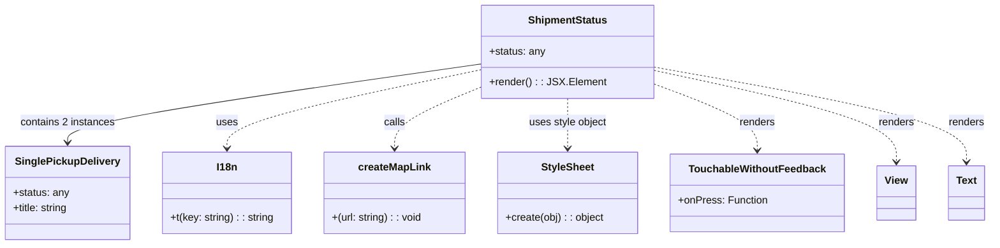
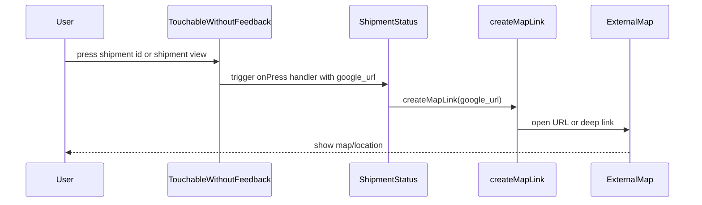

# Diagram: mobile/FreightVerifyMobileTracking/src/components/molecules/shipment-status.tsx

> Auto-generated by Obscura crawlers

## Diagram 1

### SVG

<svg id="container" width="1512.0078125" xmlns="http://www.w3.org/2000/svg" class="classDiagram" height="378" viewBox="0 0 1512.0078125 378" role="graphics-document document" aria-roledescription="class"><g><defs><marker id="container_class-aggregationStart" class="marker aggregation class" refX="18" refY="7" markerWidth="190" markerHeight="240" orient="auto"><path d="M 18,7 L9,13 L1,7 L9,1 Z"></path></marker></defs><defs><marker id="container_class-aggregationEnd" class="marker aggregation class" refX="1" refY="7" markerWidth="20" markerHeight="28" orient="auto"><path d="M 18,7 L9,13 L1,7 L9,1 Z"></path></marker></defs><defs><marker id="container_class-extensionStart" class="marker extension class" refX="18" refY="7" markerWidth="190" markerHeight="240" orient="auto"><path d="M 1,7 L18,13 V 1 Z"></path></marker></defs><defs><marker id="container_class-extensionEnd" class="marker extension class" refX="1" refY="7" markerWidth="20" markerHeight="28" orient="auto"><path d="M 1,1 V 13 L18,7 Z"></path></marker></defs><defs><marker id="container_class-compositionStart" class="marker composition class" refX="18" refY="7" markerWidth="190" markerHeight="240" orient="auto"><path d="M 18,7 L9,13 L1,7 L9,1 Z"></path></marker></defs><defs><marker id="container_class-compositionEnd" class="marker composition class" refX="1" refY="7" markerWidth="20" markerHeight="28" orient="auto"><path d="M 18,7 L9,13 L1,7 L9,1 Z"></path></marker></defs><defs><marker id="container_class-dependencyStart" class="marker dependency class" refX="6" refY="7" markerWidth="190" markerHeight="240" orient="auto"><path d="M 5,7 L9,13 L1,7 L9,1 Z"></path></marker></defs><defs><marker id="container_class-dependencyEnd" class="marker dependency class" refX="13" refY="7" markerWidth="20" markerHeight="28" orient="auto"><path d="M 18,7 L9,13 L14,7 L9,1 Z"></path></marker></defs><defs><marker id="container_class-lollipopStart" class="marker lollipop class" refX="13" refY="7" markerWidth="190" markerHeight="240" orient="auto"><circle stroke="black" fill="transparent" cx="7" cy="7" r="6"></circle></marker></defs><defs><marker id="container_class-lollipopEnd" class="marker lollipop class" refX="1" refY="7" markerWidth="190" markerHeight="240" orient="auto"><circle stroke="black" fill="transparent" cx="7" cy="7" r="6"></circle></marker></defs><g class="root"><g class="clusters"></g><g class="edgePaths"><path d="M744.211,98.053L637.186,113.211C530.16,128.368,316.109,158.684,209.084,179.009C102.059,199.333,102.059,209.667,102.059,214.833L102.059,220" id="id_ShipmentStatus_SinglePickupDelivery_1" class="edge-thickness-normal edge-pattern-solid relation" style=";;;" data-edge="true" data-et="edge" data-id="id_ShipmentStatus_SinglePickupDelivery_1" data-points="W3sieCI6NzQ0LjIxMDkzNzUsInkiOjk4LjA1MjY5OTY5ODUxMDgyfSx7IngiOjEwMi4wNTg1OTM3NSwieSI6MTg5fSx7IngiOjEwMi4wNTg1OTM3NSwieSI6MjI2fV0=" marker-end="url(#container_class-dependencyEnd)"></path><path d="M744.211,106.43L677.842,120.192C611.473,133.953,478.734,161.477,412.365,181.905C345.996,202.333,345.996,215.667,345.996,222.333L345.996,229" id="id_ShipmentStatus_I18n_2" class="edge-thickness-normal edge-pattern-dashed relation" style=";;;" data-edge="true" data-et="edge" data-id="id_ShipmentStatus_I18n_2" data-points="W3sieCI6NzQ0LjIxMDkzNzUsInkiOjEwNi40Mjk5MTIxNjcyODM0Mn0seyJ4IjozNDUuOTk2MDkzNzUsInkiOjE4OX0seyJ4IjozNDUuOTk2MDkzNzUsInkiOjIzNX1d" marker-end="url(#container_class-dependencyEnd)"></path><path d="M744.211,132.053L720.969,141.544C697.728,151.035,651.245,170.018,628.003,186.175C604.762,202.333,604.762,215.667,604.762,222.333L604.762,229" id="id_ShipmentStatus_createMapLink_3" class="edge-thickness-normal edge-pattern-dashed relation" style=";;;" data-edge="true" data-et="edge" data-id="id_ShipmentStatus_createMapLink_3" data-points="W3sieCI6NzQ0LjIxMDkzNzUsInkiOjEzMi4wNTI5NjM1NTkxOTgwMn0seyJ4Ijo2MDQuNzYxNzE4NzUsInkiOjE4OX0seyJ4Ijo2MDQuNzYxNzE4NzUsInkiOjIzNX1d" marker-end="url(#container_class-dependencyEnd)"></path><path d="M871.676,152L871.676,158.167C871.676,164.333,871.676,176.667,871.676,189.5C871.676,202.333,871.676,215.667,871.676,222.333L871.676,229" id="id_ShipmentStatus_StyleSheet_4" class="edge-thickness-normal edge-pattern-dashed relation" style=";;;" data-edge="true" data-et="edge" data-id="id_ShipmentStatus_StyleSheet_4" data-points="W3sieCI6ODcxLjY3NTc4MTI1LCJ5IjoxNTJ9LHsieCI6ODcxLjY3NTc4MTI1LCJ5IjoxODl9LHsieCI6ODcxLjY3NTc4MTI1LCJ5IjoyMzV9XQ==" marker-end="url(#container_class-dependencyEnd)"></path><path d="M999.141,128.177L1025.961,138.314C1052.781,148.451,1106.422,168.726,1133.242,186.03C1160.063,203.333,1160.063,217.667,1160.063,224.833L1160.063,232" id="id_ShipmentStatus_TouchableWithoutFeedback_5" class="edge-thickness-normal edge-pattern-dashed relation" style=";;;" data-edge="true" data-et="edge" data-id="id_ShipmentStatus_TouchableWithoutFeedback_5" data-points="W3sieCI6OTk5LjE0MDYyNSwieSI6MTI4LjE3NzIxMTU4OTI1NTk2fSx7IngiOjExNjAuMDYyNSwieSI6MTg5fSx7IngiOjExNjAuMDYyNSwieSI6MjM4fV0=" marker-end="url(#container_class-dependencyEnd)"></path><path d="M999.141,107.9L1060.892,121.417C1122.643,134.934,1246.146,161.967,1307.897,185.65C1369.648,209.333,1369.648,229.667,1369.648,239.833L1369.648,250" id="id_ShipmentStatus_View_6" class="edge-thickness-normal edge-pattern-dashed relation" style=";;;" data-edge="true" data-et="edge" data-id="id_ShipmentStatus_View_6" data-points="W3sieCI6OTk5LjE0MDYyNSwieSI6MTA3LjkwMDQ2MzU5ODQ5NzAzfSx7IngiOjEzNjkuNjQ4NDM3NSwieSI6MTg5fSx7IngiOjEzNjkuNjQ4NDM3NSwieSI6MjU2fV0=" marker-end="url(#container_class-dependencyEnd)"></path><path d="M999.141,102.981L1078.66,117.317C1158.18,131.654,1317.219,160.327,1396.738,184.83C1476.258,209.333,1476.258,229.667,1476.258,239.833L1476.258,250" id="id_ShipmentStatus_Text_7" class="edge-thickness-normal edge-pattern-dashed relation" style=";;;" data-edge="true" data-et="edge" data-id="id_ShipmentStatus_Text_7" data-points="W3sieCI6OTk5LjE0MDYyNSwieSI6MTAyLjk4MDYxNjc3NDI0MzU3fSx7IngiOjE0NzYuMjU3ODEyNSwieSI6MTg5fSx7IngiOjE0NzYuMjU3ODEyNSwieSI6MjU2fV0=" marker-end="url(#container_class-dependencyEnd)"></path></g><g class="edgeLabels"><g class="edgeLabel" transform="translate(102.05859375, 189)"><g class="label" data-id="id_ShipmentStatus_SinglePickupDelivery_1" transform="translate(-73.40625, -12)"><foreignObject width="146.8125" height="24">

contains 2 instances

</foreignObject></g></g><g class="edgeLabel" transform="translate(345.99609375, 189)"><g class="label" data-id="id_ShipmentStatus_I18n_2" transform="translate(-16.4921875, -12)"><foreignObject width="32.984375" height="24">

uses

</foreignObject></g></g><g class="edgeLabel" transform="translate(604.76171875, 189)"><g class="label" data-id="id_ShipmentStatus_createMapLink_3" transform="translate(-16.4453125, -12)"><foreignObject width="32.890625" height="24">

calls

</foreignObject></g></g><g class="edgeLabel" transform="translate(871.67578125, 189)"><g class="label" data-id="id_ShipmentStatus_StyleSheet_4" transform="translate(-60.6484375, -12)"><foreignObject width="121.296875" height="24">

uses style object

</foreignObject></g></g><g class="edgeLabel" transform="translate(1160.0625, 189)"><g class="label" data-id="id_ShipmentStatus_TouchableWithoutFeedback_5" transform="translate(-27.75, -12)"><foreignObject width="55.5" height="24">

renders

</foreignObject></g></g><g class="edgeLabel" transform="translate(1369.6484375, 189)"><g class="label" data-id="id_ShipmentStatus_View_6" transform="translate(-27.75, -12)"><foreignObject width="55.5" height="24">

renders

</foreignObject></g></g><g class="edgeLabel" transform="translate(1476.2578125, 189)"><g class="label" data-id="id_ShipmentStatus_Text_7" transform="translate(-27.75, -12)"><foreignObject width="55.5" height="24">

renders

</foreignObject></g></g></g><g class="nodes"><g class="node default" id="classId-ShipmentStatus-0" transform="translate(871.67578125, 80)"><g class="basic label-container"><path d="M-127.46484375 -72 L127.46484375 -72 L127.46484375 72 L-127.46484375 72" stroke="none" stroke-width="0" fill="#ECECFF" style=""></path><path d="M-127.46484375 -72 C-68.72595747928266 -72, -9.987071208565311 -72, 127.46484375 -72 M-127.46484375 -72 C-47.7280862155682 -72, 32.008671318863605 -72, 127.46484375 -72 M127.46484375 -72 C127.46484375 -20.546695642643172, 127.46484375 30.906608714713656, 127.46484375 72 M127.46484375 -72 C127.46484375 -31.482005118544585, 127.46484375 9.03598976291083, 127.46484375 72 M127.46484375 72 C48.43495951907936 72, -30.594924711841287 72, -127.46484375 72 M127.46484375 72 C35.24197885724553 72, -56.980886035508945 72, -127.46484375 72 M-127.46484375 72 C-127.46484375 14.49965749576809, -127.46484375 -43.00068500846382, -127.46484375 -72 M-127.46484375 72 C-127.46484375 14.931247730391725, -127.46484375 -42.13750453921655, -127.46484375 -72" stroke="#9370DB" stroke-width="1.3" fill="none" stroke-dasharray="0 0" style=""></path></g><g class="annotation-group text" transform="translate(0, -48)"></g><g class="label-group text" transform="translate(-58.5859375, -48)"><g class="label" style="font-weight: bolder" transform="translate(0,-12)"><foreignObject width="117.171875" height="24">

ShipmentStatus

</foreignObject></g></g><g class="members-group text" transform="translate(-115.46484375, 0)"><g class="label" style="" transform="translate(0,-12)"><foreignObject width="86.3125" height="24">

+status: any

</foreignObject></g></g><g class="methods-group text" transform="translate(-115.46484375, 48)"><g class="label" style="" transform="translate(0,-12)"><foreignObject width="172.34375" height="24">

+render() : : JSX.Element

</foreignObject></g></g><g class="divider" style=""><path d="M-127.46484375 -24 C-44.55593439720408 -24, 38.35297495559183 -24, 127.46484375 -24 M-127.46484375 -24 C-70.58240874283999 -24, -13.699973735679976 -24, 127.46484375 -24" stroke="#9370DB" stroke-width="1.3" fill="none" stroke-dasharray="0 0" style=""></path></g><g class="divider" style=""><path d="M-127.46484375 24 C-51.30618812897555 24, 24.852467492048902 24, 127.46484375 24 M-127.46484375 24 C-30.715590136428034 24, 66.03366347714393 24, 127.46484375 24" stroke="#9370DB" stroke-width="1.3" fill="none" stroke-dasharray="0 0" style=""></path></g></g><g class="node default" id="classId-SinglePickupDelivery-1" transform="translate(102.05859375, 298)"><g class="basic label-container"><path d="M-94.05859375 -72 L94.05859375 -72 L94.05859375 72 L-94.05859375 72" stroke="none" stroke-width="0" fill="#ECECFF" style=""></path><path d="M-94.05859375 -72 C-37.5194223604766 -72, 19.019749029046807 -72, 94.05859375 -72 M-94.05859375 -72 C-24.145068997074247 -72, 45.768455755851505 -72, 94.05859375 -72 M94.05859375 -72 C94.05859375 -34.772641362052866, 94.05859375 2.454717275894268, 94.05859375 72 M94.05859375 -72 C94.05859375 -33.48091354770383, 94.05859375 5.038172904592344, 94.05859375 72 M94.05859375 72 C34.41725614992911 72, -25.22408145014178 72, -94.05859375 72 M94.05859375 72 C24.064305721530815 72, -45.92998230693837 72, -94.05859375 72 M-94.05859375 72 C-94.05859375 21.83114329849505, -94.05859375 -28.3377134030099, -94.05859375 -72 M-94.05859375 72 C-94.05859375 30.358707856405054, -94.05859375 -11.282584287189891, -94.05859375 -72" stroke="#9370DB" stroke-width="1.3" fill="none" stroke-dasharray="0 0" style=""></path></g><g class="annotation-group text" transform="translate(0, -48)"></g><g class="label-group text" transform="translate(-77.2578125, -48)"><g class="label" style="font-weight: bolder" transform="translate(0,-12)"><foreignObject width="154.515625" height="24">

SinglePickupDelivery

</foreignObject></g></g><g class="members-group text" transform="translate(-82.05859375, 0)"><g class="label" style="" transform="translate(0,-12)"><foreignObject width="86.3125" height="24">

+status: any

</foreignObject></g><g class="label" style="" transform="translate(0,12)"><foreignObject width="86.859375" height="24">

+title: string

</foreignObject></g></g><g class="methods-group text" transform="translate(-82.05859375, 72)"></g><g class="divider" style=""><path d="M-94.05859375 -24 C-48.98570434996416 -24, -3.9128149499283182 -24, 94.05859375 -24 M-94.05859375 -24 C-50.884291710429984 -24, -7.709989670859969 -24, 94.05859375 -24" stroke="#9370DB" stroke-width="1.3" fill="none" stroke-dasharray="0 0" style=""></path></g><g class="divider" style=""><path d="M-94.05859375 48 C-24.58322827885098 48, 44.89213719229804 48, 94.05859375 48 M-94.05859375 48 C-42.46516091859027 48, 9.128271912819457 48, 94.05859375 48" stroke="#9370DB" stroke-width="1.3" fill="none" stroke-dasharray="0 0" style=""></path></g></g><g class="node default" id="classId-I18n-2" transform="translate(345.99609375, 298)"><g class="basic label-container"><path d="M-99.87890625 -63 L99.87890625 -63 L99.87890625 63 L-99.87890625 63" stroke="none" stroke-width="0" fill="#ECECFF" style=""></path><path d="M-99.87890625 -63 C-51.92332586234285 -63, -3.9677454746856995 -63, 99.87890625 -63 M-99.87890625 -63 C-39.50258311991791 -63, 20.873740010164184 -63, 99.87890625 -63 M99.87890625 -63 C99.87890625 -13.953737428770424, 99.87890625 35.09252514245915, 99.87890625 63 M99.87890625 -63 C99.87890625 -31.409142216951807, 99.87890625 0.18171556609638628, 99.87890625 63 M99.87890625 63 C25.0463099295077 63, -49.7862863909846 63, -99.87890625 63 M99.87890625 63 C54.48786812990658 63, 9.09683000981316 63, -99.87890625 63 M-99.87890625 63 C-99.87890625 25.3090715158935, -99.87890625 -12.381856968213, -99.87890625 -63 M-99.87890625 63 C-99.87890625 25.814543170727674, -99.87890625 -11.370913658544652, -99.87890625 -63" stroke="#9370DB" stroke-width="1.3" fill="none" stroke-dasharray="0 0" style=""></path></g><g class="annotation-group text" transform="translate(0, -39)"></g><g class="label-group text" transform="translate(-15.3203125, -39)"><g class="label" style="font-weight: bolder" transform="translate(0,-12)"><foreignObject width="30.640625" height="24">

I18n

</foreignObject></g></g><g class="members-group text" transform="translate(-87.87890625, 9)"></g><g class="methods-group text" transform="translate(-87.87890625, 39)"><g class="label" style="" transform="translate(0,-12)"><foreignObject width="160.4375" height="24">

+t(key: string) : : string

</foreignObject></g></g><g class="divider" style=""><path d="M-99.87890625 -15 C-22.104239680927762 -15, 55.670426888144476 -15, 99.87890625 -15 M-99.87890625 -15 C-56.0281457105452 -15, -12.177385171090407 -15, 99.87890625 -15" stroke="#9370DB" stroke-width="1.3" fill="none" stroke-dasharray="0 0" style=""></path></g><g class="divider" style=""><path d="M-99.87890625 9 C-52.8889953776072 9, -5.899084505214404 9, 99.87890625 9 M-99.87890625 9 C-33.084756261903706 9, 33.70939372619259 9, 99.87890625 9" stroke="#9370DB" stroke-width="1.3" fill="none" stroke-dasharray="0 0" style=""></path></g></g><g class="node default" id="classId-createMapLink-3" transform="translate(604.76171875, 298)"><g class="basic label-container"><path d="M-108.88671875 -63 L108.88671875 -63 L108.88671875 63 L-108.88671875 63" stroke="none" stroke-width="0" fill="#ECECFF" style=""></path><path d="M-108.88671875 -63 C-39.10602783481001 -63, 30.674663080379986 -63, 108.88671875 -63 M-108.88671875 -63 C-23.285325106557238 -63, 62.316068536885524 -63, 108.88671875 -63 M108.88671875 -63 C108.88671875 -20.784444503079683, 108.88671875 21.431110993840633, 108.88671875 63 M108.88671875 -63 C108.88671875 -16.686030174003065, 108.88671875 29.62793965199387, 108.88671875 63 M108.88671875 63 C33.208369665106375 63, -42.46997941978725 63, -108.88671875 63 M108.88671875 63 C38.82624687356471 63, -31.234225002870573 63, -108.88671875 63 M-108.88671875 63 C-108.88671875 32.629499040369474, -108.88671875 2.258998080738948, -108.88671875 -63 M-108.88671875 63 C-108.88671875 21.982084185893797, -108.88671875 -19.035831628212406, -108.88671875 -63" stroke="#9370DB" stroke-width="1.3" fill="none" stroke-dasharray="0 0" style=""></path></g><g class="annotation-group text" transform="translate(0, -39)"></g><g class="label-group text" transform="translate(-53.7265625, -39)"><g class="label" style="font-weight: bolder" transform="translate(0,-12)"><foreignObject width="107.453125" height="24">

createMapLink

</foreignObject></g></g><g class="members-group text" transform="translate(-96.88671875, 9)"></g><g class="methods-group text" transform="translate(-96.88671875, 39)"><g class="label" style="" transform="translate(0,-12)"><foreignObject width="140.046875" height="24">

+(url: string) : : void

</foreignObject></g></g><g class="divider" style=""><path d="M-108.88671875 -15 C-48.0845545495808 -15, 12.717609650838398 -15, 108.88671875 -15 M-108.88671875 -15 C-39.52120819886483 -15, 29.844302352270347 -15, 108.88671875 -15" stroke="#9370DB" stroke-width="1.3" fill="none" stroke-dasharray="0 0" style=""></path></g><g class="divider" style=""><path d="M-108.88671875 9 C-39.82501062863594 9, 29.236697492728126 9, 108.88671875 9 M-108.88671875 9 C-32.1268227500876 9, 44.633073249824804 9, 108.88671875 9" stroke="#9370DB" stroke-width="1.3" fill="none" stroke-dasharray="0 0" style=""></path></g></g><g class="node default" id="classId-StyleSheet-4" transform="translate(871.67578125, 298)"><g class="basic label-container"><path d="M-108.02734375 -63 L108.02734375 -63 L108.02734375 63 L-108.02734375 63" stroke="none" stroke-width="0" fill="#ECECFF" style=""></path><path d="M-108.02734375 -63 C-38.48144563605284 -63, 31.06445247789432 -63, 108.02734375 -63 M-108.02734375 -63 C-33.5755980506778 -63, 40.876147648644405 -63, 108.02734375 -63 M108.02734375 -63 C108.02734375 -31.61163439619793, 108.02734375 -0.2232687923958565, 108.02734375 63 M108.02734375 -63 C108.02734375 -31.80057098562559, 108.02734375 -0.601141971251181, 108.02734375 63 M108.02734375 63 C41.724569434896836 63, -24.57820488020633 63, -108.02734375 63 M108.02734375 63 C43.70376631418563 63, -20.619811121628743 63, -108.02734375 63 M-108.02734375 63 C-108.02734375 25.209343335697966, -108.02734375 -12.581313328604068, -108.02734375 -63 M-108.02734375 63 C-108.02734375 34.62952583527726, -108.02734375 6.259051670554527, -108.02734375 -63" stroke="#9370DB" stroke-width="1.3" fill="none" stroke-dasharray="0 0" style=""></path></g><g class="annotation-group text" transform="translate(0, -39)"></g><g class="label-group text" transform="translate(-39.6328125, -39)"><g class="label" style="font-weight: bolder" transform="translate(0,-12)"><foreignObject width="79.265625" height="24">

StyleSheet

</foreignObject></g></g><g class="members-group text" transform="translate(-96.02734375, 9)"></g><g class="methods-group text" transform="translate(-96.02734375, 39)"><g class="label" style="" transform="translate(0,-12)"><foreignObject width="152.421875" height="24">

+create(obj) : : object

</foreignObject></g></g><g class="divider" style=""><path d="M-108.02734375 -15 C-29.273947516139117 -15, 49.479448717721766 -15, 108.02734375 -15 M-108.02734375 -15 C-49.88931442564519 -15, 8.248714898709622 -15, 108.02734375 -15" stroke="#9370DB" stroke-width="1.3" fill="none" stroke-dasharray="0 0" style=""></path></g><g class="divider" style=""><path d="M-108.02734375 9 C-48.80325276624237 9, 10.420838217515254 9, 108.02734375 9 M-108.02734375 9 C-54.12978913808143 9, -0.23223452616285556 9, 108.02734375 9" stroke="#9370DB" stroke-width="1.3" fill="none" stroke-dasharray="0 0" style=""></path></g></g><g class="node default" id="classId-TouchableWithoutFeedback-5" transform="translate(1160.0625, 298)"><g class="basic label-container"><path d="M-130.359375 -60 L130.359375 -60 L130.359375 60 L-130.359375 60" stroke="none" stroke-width="0" fill="#ECECFF" style=""></path><path d="M-130.359375 -60 C-71.42178281352963 -60, -12.484190627059263 -60, 130.359375 -60 M-130.359375 -60 C-28.21343074912896 -60, 73.93251350174208 -60, 130.359375 -60 M130.359375 -60 C130.359375 -26.376130726930704, 130.359375 7.247738546138592, 130.359375 60 M130.359375 -60 C130.359375 -12.634859072183126, 130.359375 34.73028185563375, 130.359375 60 M130.359375 60 C41.277175198705564 60, -47.80502460258887 60, -130.359375 60 M130.359375 60 C51.41127072455596 60, -27.536833550888076 60, -130.359375 60 M-130.359375 60 C-130.359375 12.259942413091728, -130.359375 -35.48011517381654, -130.359375 -60 M-130.359375 60 C-130.359375 21.66638699217919, -130.359375 -16.667226015641617, -130.359375 -60" stroke="#9370DB" stroke-width="1.3" fill="none" stroke-dasharray="0 0" style=""></path></g><g class="annotation-group text" transform="translate(0, -36)"></g><g class="label-group text" transform="translate(-101.140625, -36)"><g class="label" style="font-weight: bolder" transform="translate(0,-12)"><foreignObject width="202.28125" height="24">

TouchableWithoutFeedback

</foreignObject></g></g><g class="members-group text" transform="translate(-118.359375, 12)"><g class="label" style="" transform="translate(0,-12)"><foreignObject width="135.578125" height="24">

+onPress: Function

</foreignObject></g></g><g class="methods-group text" transform="translate(-118.359375, 60)"></g><g class="divider" style=""><path d="M-130.359375 -12 C-55.27393137683572 -12, 19.81151224632856 -12, 130.359375 -12 M-130.359375 -12 C-27.56815793163321 -12, 75.22305913673358 -12, 130.359375 -12" stroke="#9370DB" stroke-width="1.3" fill="none" stroke-dasharray="0 0" style=""></path></g><g class="divider" style=""><path d="M-130.359375 36 C-52.3661499635958 36, 25.627075072808395 36, 130.359375 36 M-130.359375 36 C-74.34618823863946 36, -18.333001477278913 36, 130.359375 36" stroke="#9370DB" stroke-width="1.3" fill="none" stroke-dasharray="0 0" style=""></path></g></g><g class="node default" id="classId-View-6" transform="translate(1369.6484375, 298)"><g class="basic label-container"><path d="M-29.2265625 -42 L29.2265625 -42 L29.2265625 42 L-29.2265625 42" stroke="none" stroke-width="0" fill="#ECECFF" style=""></path><path d="M-29.2265625 -42 C-17.30539037037836 -42, -5.3842182407567165 -42, 29.2265625 -42 M-29.2265625 -42 C-16.632516180977902 -42, -4.038469861955804 -42, 29.2265625 -42 M29.2265625 -42 C29.2265625 -24.338659915460987, 29.2265625 -6.677319830921974, 29.2265625 42 M29.2265625 -42 C29.2265625 -8.489984238924478, 29.2265625 25.020031522151044, 29.2265625 42 M29.2265625 42 C14.623038705035801 42, 0.019514910071602998 42, -29.2265625 42 M29.2265625 42 C14.69983400176053 42, 0.1731055035210609 42, -29.2265625 42 M-29.2265625 42 C-29.2265625 20.598985099803187, -29.2265625 -0.8020298003936261, -29.2265625 -42 M-29.2265625 42 C-29.2265625 16.513631870860358, -29.2265625 -8.972736258279284, -29.2265625 -42" stroke="#9370DB" stroke-width="1.3" fill="none" stroke-dasharray="0 0" style=""></path></g><g class="annotation-group text" transform="translate(0, -18)"></g><g class="label-group text" transform="translate(-17.2265625, -18)"><g class="label" style="font-weight: bolder" transform="translate(0,-12)"><foreignObject width="34.453125" height="24">

View

</foreignObject></g></g><g class="members-group text" transform="translate(-17.2265625, 30)"></g><g class="methods-group text" transform="translate(-17.2265625, 60)"></g><g class="divider" style=""><path d="M-29.2265625 6 C-15.254853263041129 6, -1.2831440260822582 6, 29.2265625 6 M-29.2265625 6 C-6.68342763731021 6, 15.85970722537958 6, 29.2265625 6" stroke="#9370DB" stroke-width="1.3" fill="none" stroke-dasharray="0 0" style=""></path></g><g class="divider" style=""><path d="M-29.2265625 24 C-8.892034079130198 24, 11.442494341739604 24, 29.2265625 24 M-29.2265625 24 C-9.656384846638595 24, 9.91379280672281 24, 29.2265625 24" stroke="#9370DB" stroke-width="1.3" fill="none" stroke-dasharray="0 0" style=""></path></g></g><g class="node default" id="classId-Text-7" transform="translate(1476.2578125, 298)"><g class="basic label-container"><path d="M-27.3828125 -42 L27.3828125 -42 L27.3828125 42 L-27.3828125 42" stroke="none" stroke-width="0" fill="#ECECFF" style=""></path><path d="M-27.3828125 -42 C-6.283376822258429 -42, 14.816058855483142 -42, 27.3828125 -42 M-27.3828125 -42 C-14.14700213154925 -42, -0.9111917630985005 -42, 27.3828125 -42 M27.3828125 -42 C27.3828125 -12.719905072902126, 27.3828125 16.560189854195748, 27.3828125 42 M27.3828125 -42 C27.3828125 -19.168975785670987, 27.3828125 3.662048428658025, 27.3828125 42 M27.3828125 42 C9.592633966054883 42, -8.197544567890233 42, -27.3828125 42 M27.3828125 42 C16.25926329723835 42, 5.1357140944767 42, -27.3828125 42 M-27.3828125 42 C-27.3828125 13.219295599039349, -27.3828125 -15.561408801921303, -27.3828125 -42 M-27.3828125 42 C-27.3828125 18.228633160553667, -27.3828125 -5.542733678892667, -27.3828125 -42" stroke="#9370DB" stroke-width="1.3" fill="none" stroke-dasharray="0 0" style=""></path></g><g class="annotation-group text" transform="translate(0, -18)"></g><g class="label-group text" transform="translate(-15.3828125, -18)"><g class="label" style="font-weight: bolder" transform="translate(0,-12)"><foreignObject width="30.765625" height="24">

Text

</foreignObject></g></g><g class="members-group text" transform="translate(-15.3828125, 30)"></g><g class="methods-group text" transform="translate(-15.3828125, 60)"></g><g class="divider" style=""><path d="M-27.3828125 6 C-12.142407776150337 6, 3.0979969476993254 6, 27.3828125 6 M-27.3828125 6 C-11.061420972256272 6, 5.259970555487456 6, 27.3828125 6" stroke="#9370DB" stroke-width="1.3" fill="none" stroke-dasharray="0 0" style=""></path></g><g class="divider" style=""><path d="M-27.3828125 24 C-7.4748290786277956 24, 12.433154342744409 24, 27.3828125 24 M-27.3828125 24 C-7.3509622213105 24, 12.680888057379 24, 27.3828125 24" stroke="#9370DB" stroke-width="1.3" fill="none" stroke-dasharray="0 0" style=""></path></g></g></g></g></g></svg>

## Diagram 2

### SVG

<svg id="container" width="1430" xmlns="http://www.w3.org/2000/svg" height="411" viewBox="-50 -10 1430 411" role="graphics-document document" aria-roledescription="sequence"><g><rect x="1180" y="325" fill="#eaeaea" stroke="#666" width="150" height="65" name="MapApp" rx="3" ry="3" class="actor actor-bottom"></rect><text x="1255" y="357.5" dominant-baseline="central" alignment-baseline="central" class="actor actor-box" style="text-anchor: middle; font-size: 16px; font-weight: 400;"><tspan x="1255" dy="0">ExternalMap</tspan></text></g><g><rect x="948" y="325" fill="#eaeaea" stroke="#666" width="150" height="65" name="MapUtil" rx="3" ry="3" class="actor actor-bottom"></rect><text x="1023" y="357.5" dominant-baseline="central" alignment-baseline="central" class="actor actor-box" style="text-anchor: middle; font-size: 16px; font-weight: 400;"><tspan x="1023" dy="0">createMapLink</tspan></text></g><g><rect x="686" y="325" fill="#eaeaea" stroke="#666" width="150" height="65" name="Component" rx="3" ry="3" class="actor actor-bottom"></rect><text x="761" y="357.5" dominant-baseline="central" alignment-baseline="central" class="actor actor-box" style="text-anchor: middle; font-size: 16px; font-weight: 400;"><tspan x="761" dy="0">ShipmentStatus</tspan></text></g><g><rect x="294.5" y="325" fill="#eaeaea" stroke="#666" width="221" height="65" name="UI" rx="3" ry="3" class="actor actor-bottom"></rect><text x="405" y="357.5" dominant-baseline="central" alignment-baseline="central" class="actor actor-box" style="text-anchor: middle; font-size: 16px; font-weight: 400;"><tspan x="405" dy="0">TouchableWithoutFeedback</tspan></text></g><g><rect x="0" y="325" fill="#eaeaea" stroke="#666" width="150" height="65" name="User" rx="3" ry="3" class="actor actor-bottom"></rect><text x="75" y="357.5" dominant-baseline="central" alignment-baseline="central" class="actor actor-box" style="text-anchor: middle; font-size: 16px; font-weight: 400;"><tspan x="75" dy="0">User</tspan></text></g><g><line id="actor4" x1="1255" y1="65" x2="1255" y2="325" class="actor-line 200" stroke-width="0.5px" stroke="#999" name="MapApp"></line><g id="root-4"><rect x="1180" y="0" fill="#eaeaea" stroke="#666" width="150" height="65" name="MapApp" rx="3" ry="3" class="actor actor-top"></rect><text x="1255" y="32.5" dominant-baseline="central" alignment-baseline="central" class="actor actor-box" style="text-anchor: middle; font-size: 16px; font-weight: 400;"><tspan x="1255" dy="0">ExternalMap</tspan></text></g></g><g><line id="actor3" x1="1023" y1="65" x2="1023" y2="325" class="actor-line 200" stroke-width="0.5px" stroke="#999" name="MapUtil"></line><g id="root-3"><rect x="948" y="0" fill="#eaeaea" stroke="#666" width="150" height="65" name="MapUtil" rx="3" ry="3" class="actor actor-top"></rect><text x="1023" y="32.5" dominant-baseline="central" alignment-baseline="central" class="actor actor-box" style="text-anchor: middle; font-size: 16px; font-weight: 400;"><tspan x="1023" dy="0">createMapLink</tspan></text></g></g><g><line id="actor2" x1="761" y1="65" x2="761" y2="325" class="actor-line 200" stroke-width="0.5px" stroke="#999" name="Component"></line><g id="root-2"><rect x="686" y="0" fill="#eaeaea" stroke="#666" width="150" height="65" name="Component" rx="3" ry="3" class="actor actor-top"></rect><text x="761" y="32.5" dominant-baseline="central" alignment-baseline="central" class="actor actor-box" style="text-anchor: middle; font-size: 16px; font-weight: 400;"><tspan x="761" dy="0">ShipmentStatus</tspan></text></g></g><g><line id="actor1" x1="405" y1="65" x2="405" y2="325" class="actor-line 200" stroke-width="0.5px" stroke="#999" name="UI"></line><g id="root-1"><rect x="294.5" y="0" fill="#eaeaea" stroke="#666" width="221" height="65" name="UI" rx="3" ry="3" class="actor actor-top"></rect><text x="405" y="32.5" dominant-baseline="central" alignment-baseline="central" class="actor actor-box" style="text-anchor: middle; font-size: 16px; font-weight: 400;"><tspan x="405" dy="0">TouchableWithoutFeedback</tspan></text></g></g><g><line id="actor0" x1="75" y1="65" x2="75" y2="325" class="actor-line 200" stroke-width="0.5px" stroke="#999" name="User"></line><g id="root-0"><rect x="0" y="0" fill="#eaeaea" stroke="#666" width="150" height="65" name="User" rx="3" ry="3" class="actor actor-top"></rect><text x="75" y="32.5" dominant-baseline="central" alignment-baseline="central" class="actor actor-box" style="text-anchor: middle; font-size: 16px; font-weight: 400;"><tspan x="75" dy="0">User</tspan></text></g></g><g></g><defs><symbol id="computer" width="24" height="24"><path transform="scale(.5)" d="M2 2v13h20v-13h-20zm18 11h-16v-9h16v9zm-10.228 6l.466-1h3.524l.467 1h-4.457zm14.228 3h-24l2-6h2.104l-1.33 4h18.45l-1.297-4h2.073l2 6zm-5-10h-14v-7h14v7z"></path></symbol></defs><defs><symbol id="database" fill-rule="evenodd" clip-rule="evenodd"><path transform="scale(.5)" d="M12.258.001l.256.004.255.005.253.008.251.01.249.012.247.015.246.016.242.019.241.02.239.023.236.024.233.027.231.028.229.031.225.032.223.034.22.036.217.038.214.04.211.041.208.043.205.045.201.046.198.048.194.05.191.051.187.053.183.054.18.056.175.057.172.059.168.06.163.061.16.063.155.064.15.066.074.033.073.033.071.034.07.034.069.035.068.035.067.035.066.035.064.036.064.036.062.036.06.036.06.037.058.037.058.037.055.038.055.038.053.038.052.038.051.039.05.039.048.039.047.039.045.04.044.04.043.04.041.04.04.041.039.041.037.041.036.041.034.041.033.042.032.042.03.042.029.042.027.042.026.043.024.043.023.043.021.043.02.043.018.044.017.043.015.044.013.044.012.044.011.045.009.044.007.045.006.045.004.045.002.045.001.045v17l-.001.045-.002.045-.004.045-.006.045-.007.045-.009.044-.011.045-.012.044-.013.044-.015.044-.017.043-.018.044-.02.043-.021.043-.023.043-.024.043-.026.043-.027.042-.029.042-.03.042-.032.042-.033.042-.034.041-.036.041-.037.041-.039.041-.04.041-.041.04-.043.04-.044.04-.045.04-.047.039-.048.039-.05.039-.051.039-.052.038-.053.038-.055.038-.055.038-.058.037-.058.037-.06.037-.06.036-.062.036-.064.036-.064.036-.066.035-.067.035-.068.035-.069.035-.07.034-.071.034-.073.033-.074.033-.15.066-.155.064-.16.063-.163.061-.168.06-.172.059-.175.057-.18.056-.183.054-.187.053-.191.051-.194.05-.198.048-.201.046-.205.045-.208.043-.211.041-.214.04-.217.038-.22.036-.223.034-.225.032-.229.031-.231.028-.233.027-.236.024-.239.023-.241.02-.242.019-.246.016-.247.015-.249.012-.251.01-.253.008-.255.005-.256.004-.258.001-.258-.001-.256-.004-.255-.005-.253-.008-.251-.01-.249-.012-.247-.015-.245-.016-.243-.019-.241-.02-.238-.023-.236-.024-.234-.027-.231-.028-.228-.031-.226-.032-.223-.034-.22-.036-.217-.038-.214-.04-.211-.041-.208-.043-.204-.045-.201-.046-.198-.048-.195-.05-.19-.051-.187-.053-.184-.054-.179-.056-.176-.057-.172-.059-.167-.06-.164-.061-.159-.063-.155-.064-.151-.066-.074-.033-.072-.033-.072-.034-.07-.034-.069-.035-.068-.035-.067-.035-.066-.035-.064-.036-.063-.036-.062-.036-.061-.036-.06-.037-.058-.037-.057-.037-.056-.038-.055-.038-.053-.038-.052-.038-.051-.039-.049-.039-.049-.039-.046-.039-.046-.04-.044-.04-.043-.04-.041-.04-.04-.041-.039-.041-.037-.041-.036-.041-.034-.041-.033-.042-.032-.042-.03-.042-.029-.042-.027-.042-.026-.043-.024-.043-.023-.043-.021-.043-.02-.043-.018-.044-.017-.043-.015-.044-.013-.044-.012-.044-.011-.045-.009-.044-.007-.045-.006-.045-.004-.045-.002-.045-.001-.045v-17l.001-.045.002-.045.004-.045.006-.045.007-.045.009-.044.011-.045.012-.044.013-.044.015-.044.017-.043.018-.044.02-.043.021-.043.023-.043.024-.043.026-.043.027-.042.029-.042.03-.042.032-.042.033-.042.034-.041.036-.041.037-.041.039-.041.04-.041.041-.04.043-.04.044-.04.046-.04.046-.039.049-.039.049-.039.051-.039.052-.038.053-.038.055-.038.056-.038.057-.037.058-.037.06-.037.061-.036.062-.036.063-.036.064-.036.066-.035.067-.035.068-.035.069-.035.07-.034.072-.034.072-.033.074-.033.151-.066.155-.064.159-.063.164-.061.167-.06.172-.059.176-.057.179-.056.184-.054.187-.053.19-.051.195-.05.198-.048.201-.046.204-.045.208-.043.211-.041.214-.04.217-.038.22-.036.223-.034.226-.032.228-.031.231-.028.234-.027.236-.024.238-.023.241-.02.243-.019.245-.016.247-.015.249-.012.251-.01.253-.008.255-.005.256-.004.258-.001.258.001zm-9.258 20.499v.01l.001.021.003.021.004.022.005.021.006.022.007.022.009.023.01.022.011.023.012.023.013.023.015.023.016.024.017.023.018.024.019.024.021.024.022.025.023.024.024.025.052.049.056.05.061.051.066.051.07.051.075.051.079.052.084.052.088.052.092.052.097.052.102.051.105.052.11.052.114.051.119.051.123.051.127.05.131.05.135.05.139.048.144.049.147.047.152.047.155.047.16.045.163.045.167.043.171.043.176.041.178.041.183.039.187.039.19.037.194.035.197.035.202.033.204.031.209.03.212.029.216.027.219.025.222.024.226.021.23.02.233.018.236.016.24.015.243.012.246.01.249.008.253.005.256.004.259.001.26-.001.257-.004.254-.005.25-.008.247-.011.244-.012.241-.014.237-.016.233-.018.231-.021.226-.021.224-.024.22-.026.216-.027.212-.028.21-.031.205-.031.202-.034.198-.034.194-.036.191-.037.187-.039.183-.04.179-.04.175-.042.172-.043.168-.044.163-.045.16-.046.155-.046.152-.047.148-.048.143-.049.139-.049.136-.05.131-.05.126-.05.123-.051.118-.052.114-.051.11-.052.106-.052.101-.052.096-.052.092-.052.088-.053.083-.051.079-.052.074-.052.07-.051.065-.051.06-.051.056-.05.051-.05.023-.024.023-.025.021-.024.02-.024.019-.024.018-.024.017-.024.015-.023.014-.024.013-.023.012-.023.01-.023.01-.022.008-.022.006-.022.006-.022.004-.022.004-.021.001-.021.001-.021v-4.127l-.077.055-.08.053-.083.054-.085.053-.087.052-.09.052-.093.051-.095.05-.097.05-.1.049-.102.049-.105.048-.106.047-.109.047-.111.046-.114.045-.115.045-.118.044-.12.043-.122.042-.124.042-.126.041-.128.04-.13.04-.132.038-.134.038-.135.037-.138.037-.139.035-.142.035-.143.034-.144.033-.147.032-.148.031-.15.03-.151.03-.153.029-.154.027-.156.027-.158.026-.159.025-.161.024-.162.023-.163.022-.165.021-.166.02-.167.019-.169.018-.169.017-.171.016-.173.015-.173.014-.175.013-.175.012-.177.011-.178.01-.179.008-.179.008-.181.006-.182.005-.182.004-.184.003-.184.002h-.37l-.184-.002-.184-.003-.182-.004-.182-.005-.181-.006-.179-.008-.179-.008-.178-.01-.176-.011-.176-.012-.175-.013-.173-.014-.172-.015-.171-.016-.17-.017-.169-.018-.167-.019-.166-.02-.165-.021-.163-.022-.162-.023-.161-.024-.159-.025-.157-.026-.156-.027-.155-.027-.153-.029-.151-.03-.15-.03-.148-.031-.146-.032-.145-.033-.143-.034-.141-.035-.14-.035-.137-.037-.136-.037-.134-.038-.132-.038-.13-.04-.128-.04-.126-.041-.124-.042-.122-.042-.12-.044-.117-.043-.116-.045-.113-.045-.112-.046-.109-.047-.106-.047-.105-.048-.102-.049-.1-.049-.097-.05-.095-.05-.093-.052-.09-.051-.087-.052-.085-.053-.083-.054-.08-.054-.077-.054v4.127zm0-5.654v.011l.001.021.003.021.004.021.005.022.006.022.007.022.009.022.01.022.011.023.012.023.013.023.015.024.016.023.017.024.018.024.019.024.021.024.022.024.023.025.024.024.052.05.056.05.061.05.066.051.07.051.075.052.079.051.084.052.088.052.092.052.097.052.102.052.105.052.11.051.114.051.119.052.123.05.127.051.131.05.135.049.139.049.144.048.147.048.152.047.155.046.16.045.163.045.167.044.171.042.176.042.178.04.183.04.187.038.19.037.194.036.197.034.202.033.204.032.209.03.212.028.216.027.219.025.222.024.226.022.23.02.233.018.236.016.24.014.243.012.246.01.249.008.253.006.256.003.259.001.26-.001.257-.003.254-.006.25-.008.247-.01.244-.012.241-.015.237-.016.233-.018.231-.02.226-.022.224-.024.22-.025.216-.027.212-.029.21-.03.205-.032.202-.033.198-.035.194-.036.191-.037.187-.039.183-.039.179-.041.175-.042.172-.043.168-.044.163-.045.16-.045.155-.047.152-.047.148-.048.143-.048.139-.05.136-.049.131-.05.126-.051.123-.051.118-.051.114-.052.11-.052.106-.052.101-.052.096-.052.092-.052.088-.052.083-.052.079-.052.074-.051.07-.052.065-.051.06-.05.056-.051.051-.049.023-.025.023-.024.021-.025.02-.024.019-.024.018-.024.017-.024.015-.023.014-.023.013-.024.012-.022.01-.023.01-.023.008-.022.006-.022.006-.022.004-.021.004-.022.001-.021.001-.021v-4.139l-.077.054-.08.054-.083.054-.085.052-.087.053-.09.051-.093.051-.095.051-.097.05-.1.049-.102.049-.105.048-.106.047-.109.047-.111.046-.114.045-.115.044-.118.044-.12.044-.122.042-.124.042-.126.041-.128.04-.13.039-.132.039-.134.038-.135.037-.138.036-.139.036-.142.035-.143.033-.144.033-.147.033-.148.031-.15.03-.151.03-.153.028-.154.028-.156.027-.158.026-.159.025-.161.024-.162.023-.163.022-.165.021-.166.02-.167.019-.169.018-.169.017-.171.016-.173.015-.173.014-.175.013-.175.012-.177.011-.178.009-.179.009-.179.007-.181.007-.182.005-.182.004-.184.003-.184.002h-.37l-.184-.002-.184-.003-.182-.004-.182-.005-.181-.007-.179-.007-.179-.009-.178-.009-.176-.011-.176-.012-.175-.013-.173-.014-.172-.015-.171-.016-.17-.017-.169-.018-.167-.019-.166-.02-.165-.021-.163-.022-.162-.023-.161-.024-.159-.025-.157-.026-.156-.027-.155-.028-.153-.028-.151-.03-.15-.03-.148-.031-.146-.033-.145-.033-.143-.033-.141-.035-.14-.036-.137-.036-.136-.037-.134-.038-.132-.039-.13-.039-.128-.04-.126-.041-.124-.042-.122-.043-.12-.043-.117-.044-.116-.044-.113-.046-.112-.046-.109-.046-.106-.047-.105-.048-.102-.049-.1-.049-.097-.05-.095-.051-.093-.051-.09-.051-.087-.053-.085-.052-.083-.054-.08-.054-.077-.054v4.139zm0-5.666v.011l.001.02.003.022.004.021.005.022.006.021.007.022.009.023.01.022.011.023.012.023.013.023.015.023.016.024.017.024.018.023.019.024.021.025.022.024.023.024.024.025.052.05.056.05.061.05.066.051.07.051.075.052.079.051.084.052.088.052.092.052.097.052.102.052.105.051.11.052.114.051.119.051.123.051.127.05.131.05.135.05.139.049.144.048.147.048.152.047.155.046.16.045.163.045.167.043.171.043.176.042.178.04.183.04.187.038.19.037.194.036.197.034.202.033.204.032.209.03.212.028.216.027.219.025.222.024.226.021.23.02.233.018.236.017.24.014.243.012.246.01.249.008.253.006.256.003.259.001.26-.001.257-.003.254-.006.25-.008.247-.01.244-.013.241-.014.237-.016.233-.018.231-.02.226-.022.224-.024.22-.025.216-.027.212-.029.21-.03.205-.032.202-.033.198-.035.194-.036.191-.037.187-.039.183-.039.179-.041.175-.042.172-.043.168-.044.163-.045.16-.045.155-.047.152-.047.148-.048.143-.049.139-.049.136-.049.131-.051.126-.05.123-.051.118-.052.114-.051.11-.052.106-.052.101-.052.096-.052.092-.052.088-.052.083-.052.079-.052.074-.052.07-.051.065-.051.06-.051.056-.05.051-.049.023-.025.023-.025.021-.024.02-.024.019-.024.018-.024.017-.024.015-.023.014-.024.013-.023.012-.023.01-.022.01-.023.008-.022.006-.022.006-.022.004-.022.004-.021.001-.021.001-.021v-4.153l-.077.054-.08.054-.083.053-.085.053-.087.053-.09.051-.093.051-.095.051-.097.05-.1.049-.102.048-.105.048-.106.048-.109.046-.111.046-.114.046-.115.044-.118.044-.12.043-.122.043-.124.042-.126.041-.128.04-.13.039-.132.039-.134.038-.135.037-.138.036-.139.036-.142.034-.143.034-.144.033-.147.032-.148.032-.15.03-.151.03-.153.028-.154.028-.156.027-.158.026-.159.024-.161.024-.162.023-.163.023-.165.021-.166.02-.167.019-.169.018-.169.017-.171.016-.173.015-.173.014-.175.013-.175.012-.177.01-.178.01-.179.009-.179.007-.181.006-.182.006-.182.004-.184.003-.184.001-.185.001-.185-.001-.184-.001-.184-.003-.182-.004-.182-.006-.181-.006-.179-.007-.179-.009-.178-.01-.176-.01-.176-.012-.175-.013-.173-.014-.172-.015-.171-.016-.17-.017-.169-.018-.167-.019-.166-.02-.165-.021-.163-.023-.162-.023-.161-.024-.159-.024-.157-.026-.156-.027-.155-.028-.153-.028-.151-.03-.15-.03-.148-.032-.146-.032-.145-.033-.143-.034-.141-.034-.14-.036-.137-.036-.136-.037-.134-.038-.132-.039-.13-.039-.128-.041-.126-.041-.124-.041-.122-.043-.12-.043-.117-.044-.116-.044-.113-.046-.112-.046-.109-.046-.106-.048-.105-.048-.102-.048-.1-.05-.097-.049-.095-.051-.093-.051-.09-.052-.087-.052-.085-.053-.083-.053-.08-.054-.077-.054v4.153zm8.74-8.179l-.257.004-.254.005-.25.008-.247.011-.244.012-.241.014-.237.016-.233.018-.231.021-.226.022-.224.023-.22.026-.216.027-.212.028-.21.031-.205.032-.202.033-.198.034-.194.036-.191.038-.187.038-.183.04-.179.041-.175.042-.172.043-.168.043-.163.045-.16.046-.155.046-.152.048-.148.048-.143.048-.139.049-.136.05-.131.05-.126.051-.123.051-.118.051-.114.052-.11.052-.106.052-.101.052-.096.052-.092.052-.088.052-.083.052-.079.052-.074.051-.07.052-.065.051-.06.05-.056.05-.051.05-.023.025-.023.024-.021.024-.02.025-.019.024-.018.024-.017.023-.015.024-.014.023-.013.023-.012.023-.01.023-.01.022-.008.022-.006.023-.006.021-.004.022-.004.021-.001.021-.001.021.001.021.001.021.004.021.004.022.006.021.006.023.008.022.01.022.01.023.012.023.013.023.014.023.015.024.017.023.018.024.019.024.02.025.021.024.023.024.023.025.051.05.056.05.06.05.065.051.07.052.074.051.079.052.083.052.088.052.092.052.096.052.101.052.106.052.11.052.114.052.118.051.123.051.126.051.131.05.136.05.139.049.143.048.148.048.152.048.155.046.16.046.163.045.168.043.172.043.175.042.179.041.183.04.187.038.191.038.194.036.198.034.202.033.205.032.21.031.212.028.216.027.22.026.224.023.226.022.231.021.233.018.237.016.241.014.244.012.247.011.25.008.254.005.257.004.26.001.26-.001.257-.004.254-.005.25-.008.247-.011.244-.012.241-.014.237-.016.233-.018.231-.021.226-.022.224-.023.22-.026.216-.027.212-.028.21-.031.205-.032.202-.033.198-.034.194-.036.191-.038.187-.038.183-.04.179-.041.175-.042.172-.043.168-.043.163-.045.16-.046.155-.046.152-.048.148-.048.143-.048.139-.049.136-.05.131-.05.126-.051.123-.051.118-.051.114-.052.11-.052.106-.052.101-.052.096-.052.092-.052.088-.052.083-.052.079-.052.074-.051.07-.052.065-.051.06-.05.056-.05.051-.05.023-.025.023-.024.021-.024.02-.025.019-.024.018-.024.017-.023.015-.024.014-.023.013-.023.012-.023.01-.023.01-.022.008-.022.006-.023.006-.021.004-.022.004-.021.001-.021.001-.021-.001-.021-.001-.021-.004-.021-.004-.022-.006-.021-.006-.023-.008-.022-.01-.022-.01-.023-.012-.023-.013-.023-.014-.023-.015-.024-.017-.023-.018-.024-.019-.024-.02-.025-.021-.024-.023-.024-.023-.025-.051-.05-.056-.05-.06-.05-.065-.051-.07-.052-.074-.051-.079-.052-.083-.052-.088-.052-.092-.052-.096-.052-.101-.052-.106-.052-.11-.052-.114-.052-.118-.051-.123-.051-.126-.051-.131-.05-.136-.05-.139-.049-.143-.048-.148-.048-.152-.048-.155-.046-.16-.046-.163-.045-.168-.043-.172-.043-.175-.042-.179-.041-.183-.04-.187-.038-.191-.038-.194-.036-.198-.034-.202-.033-.205-.032-.21-.031-.212-.028-.216-.027-.22-.026-.224-.023-.226-.022-.231-.021-.233-.018-.237-.016-.241-.014-.244-.012-.247-.011-.25-.008-.254-.005-.257-.004-.26-.001-.26.001z"></path></symbol></defs><defs><symbol id="clock" width="24" height="24"><path transform="scale(.5)" d="M12 2c5.514 0 10 4.486 10 10s-4.486 10-10 10-10-4.486-10-10 4.486-10 10-10zm0-2c-6.627 0-12 5.373-12 12s5.373 12 12 12 12-5.373 12-12-5.373-12-12-12zm5.848 12.459c.202.038.202.333.001.372-1.907.361-6.045 1.111-6.547 1.111-.719 0-1.301-.582-1.301-1.301 0-.512.77-5.447 1.125-7.445.034-.192.312-.181.343.014l.985 6.238 5.394 1.011z"></path></symbol></defs><defs><marker id="arrowhead" refX="7.9" refY="5" markerUnits="userSpaceOnUse" markerWidth="12" markerHeight="12" orient="auto-start-reverse"><path d="M -1 0 L 10 5 L 0 10 z"></path></marker></defs><defs><marker id="crosshead" markerWidth="15" markerHeight="8" orient="auto" refX="4" refY="4.5"><path fill="none" stroke="#000000" stroke-width="1pt" d="M 1,2 L 6,7 M 6,2 L 1,7" style="stroke-dasharray: 0, 0;"></path></marker></defs><defs><marker id="filled-head" refX="15.5" refY="7" markerWidth="20" markerHeight="28" orient="auto"><path d="M 18,7 L9,13 L14,7 L9,1 Z"></path></marker></defs><defs><marker id="sequencenumber" refX="15" refY="15" markerWidth="60" markerHeight="40" orient="auto"><circle cx="15" cy="15" r="6"></circle></marker></defs><text x="239" y="80" text-anchor="middle" dominant-baseline="middle" alignment-baseline="middle" class="messageText" dy="1em" style="font-size: 16px; font-weight: 400;">press shipment id or shipment view</text><line x1="76" y1="113" x2="401" y2="113" class="messageLine0" stroke-width="2" stroke="none" marker-end="url(#arrowhead)" style="fill: none;"></line><text x="582" y="128" text-anchor="middle" dominant-baseline="middle" alignment-baseline="middle" class="messageText" dy="1em" style="font-size: 16px; font-weight: 400;">trigger onPress handler with google_url</text><line x1="406" y1="161" x2="757" y2="161" class="messageLine0" stroke-width="2" stroke="none" marker-end="url(#arrowhead)" style="fill: none;"></line><text x="891" y="176" text-anchor="middle" dominant-baseline="middle" alignment-baseline="middle" class="messageText" dy="1em" style="font-size: 16px; font-weight: 400;">createMapLink(google_url)</text><line x1="762" y1="209" x2="1019" y2="209" class="messageLine0" stroke-width="2" stroke="none" marker-end="url(#arrowhead)" style="fill: none;"></line><text x="1138" y="224" text-anchor="middle" dominant-baseline="middle" alignment-baseline="middle" class="messageText" dy="1em" style="font-size: 16px; font-weight: 400;">open URL or deep link</text><line x1="1024" y1="257" x2="1251" y2="257" class="messageLine0" stroke-width="2" stroke="none" marker-end="url(#arrowhead)" style="fill: none;"></line><text x="667" y="272" text-anchor="middle" dominant-baseline="middle" alignment-baseline="middle" class="messageText" dy="1em" style="font-size: 16px; font-weight: 400;">show map/location</text><line x1="1254" y1="305" x2="79" y2="305" class="messageLine1" stroke-width="2" stroke="none" marker-end="url(#arrowhead)" style="stroke-dasharray: 3, 3; fill: none;"></line></svg>
