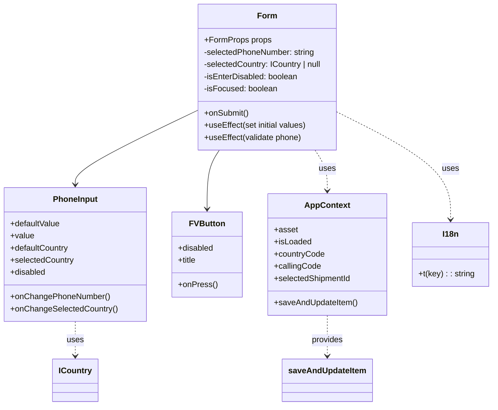

# Diagram: mobile/FreightVerifyMobileTracking/src/components/organisms/form.tsx


> Auto-generated by Obscura crawlers

## Diagram 1



### SVG

<svg id="container" width="954.28125" xmlns="http://www.w3.org/2000/svg" class="classDiagram" height="800" viewBox="0 0 954.28125 800" role="graphics-document document" aria-roledescription="class"><style>#container{font-family:"trebuchet ms",verdana,arial,sans-serif;font-size:16px;fill:#333;}@keyframes edge-animation-frame{from{stroke-dashoffset:0;}}@keyframes dash{to{stroke-dashoffset:0;}}#container .edge-animation-slow{stroke-dasharray:9,5!important;stroke-dashoffset:900;animation:dash 50s linear infinite;stroke-linecap:round;}#container .edge-animation-fast{stroke-dasharray:9,5!important;stroke-dashoffset:900;animation:dash 20s linear infinite;stroke-linecap:round;}#container .error-icon{fill:#552222;}#container .error-text{fill:#552222;stroke:#552222;}#container .edge-thickness-normal{stroke-width:1px;}#container .edge-thickness-thick{stroke-width:3.5px;}#container .edge-pattern-solid{stroke-dasharray:0;}#container .edge-thickness-invisible{stroke-width:0;fill:none;}#container .edge-pattern-dashed{stroke-dasharray:3;}#container .edge-pattern-dotted{stroke-dasharray:2;}#container .marker{fill:#333333;stroke:#333333;}#container .marker.cross{stroke:#333333;}#container svg{font-family:"trebuchet ms",verdana,arial,sans-serif;font-size:16px;}#container p{margin:0;}#container g.classGroup text{fill:#9370DB;stroke:none;font-family:"trebuchet ms",verdana,arial,sans-serif;font-size:10px;}#container g.classGroup text .title{font-weight:bolder;}#container .nodeLabel,#container .edgeLabel{color:#131300;}#container .edgeLabel .label rect{fill:#ECECFF;}#container .label text{fill:#131300;}#container .labelBkg{background:#ECECFF;}#container .edgeLabel .label span{background:#ECECFF;}#container .classTitle{font-weight:bolder;}#container .node rect,#container .node circle,#container .node ellipse,#container .node polygon,#container .node path{fill:#ECECFF;stroke:#9370DB;stroke-width:1px;}#container .divider{stroke:#9370DB;stroke-width:1;}#container g.clickable{cursor:pointer;}#container g.classGroup rect{fill:#ECECFF;stroke:#9370DB;}#container g.classGroup line{stroke:#9370DB;stroke-width:1;}#container .classLabel .box{stroke:none;stroke-width:0;fill:#ECECFF;opacity:0.5;}#container .classLabel .label{fill:#9370DB;font-size:10px;}#container .relation{stroke:#333333;stroke-width:1;fill:none;}#container .dashed-line{stroke-dasharray:3;}#container .dotted-line{stroke-dasharray:1 2;}#container #compositionStart,#container .composition{fill:#333333!important;stroke:#333333!important;stroke-width:1;}#container #compositionEnd,#container .composition{fill:#333333!important;stroke:#333333!important;stroke-width:1;}#container #dependencyStart,#container .dependency{fill:#333333!important;stroke:#333333!important;stroke-width:1;}#container #dependencyStart,#container .dependency{fill:#333333!important;stroke:#333333!important;stroke-width:1;}#container #extensionStart,#container .extension{fill:transparent!important;stroke:#333333!important;stroke-width:1;}#container #extensionEnd,#container .extension{fill:transparent!important;stroke:#333333!important;stroke-width:1;}#container #aggregationStart,#container .aggregation{fill:transparent!important;stroke:#333333!important;stroke-width:1;}#container #aggregationEnd,#container .aggregation{fill:transparent!important;stroke:#333333!important;stroke-width:1;}#container #lollipopStart,#container .lollipop{fill:#ECECFF!important;stroke:#333333!important;stroke-width:1;}#container #lollipopEnd,#container .lollipop{fill:#ECECFF!important;stroke:#333333!important;stroke-width:1;}#container .edgeTerminals{font-size:11px;line-height:initial;}#container .classTitleText{text-anchor:middle;font-size:18px;fill:#333;}#container .label-icon{display:inline-block;height:1em;overflow:visible;vertical-align:-0.125em;}#container .node .label-icon path{fill:currentColor;stroke:revert;stroke-width:revert;}#container :root{--mermaid-font-family:"trebuchet ms",verdana,arial,sans-serif;}</style><g><defs><marker id="container_class-aggregationStart" class="marker aggregation class" refX="18" refY="7" markerWidth="190" markerHeight="240" orient="auto"><path d="M 18,7 L9,13 L1,7 L9,1 Z"></path></marker></defs><defs><marker id="container_class-aggregationEnd" class="marker aggregation class" refX="1" refY="7" markerWidth="20" markerHeight="28" orient="auto"><path d="M 18,7 L9,13 L1,7 L9,1 Z"></path></marker></defs><defs><marker id="container_class-extensionStart" class="marker extension class" refX="18" refY="7" markerWidth="190" markerHeight="240" orient="auto"><path d="M 1,7 L18,13 V 1 Z"></path></marker></defs><defs><marker id="container_class-extensionEnd" class="marker extension class" refX="1" refY="7" markerWidth="20" markerHeight="28" orient="auto"><path d="M 1,1 V 13 L18,7 Z"></path></marker></defs><defs><marker id="container_class-compositionStart" class="marker composition class" refX="18" refY="7" markerWidth="190" markerHeight="240" orient="auto"><path d="M 18,7 L9,13 L1,7 L9,1 Z"></path></marker></defs><defs><marker id="container_class-compositionEnd" class="marker composition class" refX="1" refY="7" markerWidth="20" markerHeight="28" orient="auto"><path d="M 18,7 L9,13 L1,7 L9,1 Z"></path></marker></defs><defs><marker id="container_class-dependencyStart" class="marker dependency class" refX="6" refY="7" markerWidth="190" markerHeight="240" orient="auto"><path d="M 5,7 L9,13 L1,7 L9,1 Z"></path></marker></defs><defs><marker id="container_class-dependencyEnd" class="marker dependency class" refX="13" refY="7" markerWidth="20" markerHeight="28" orient="auto"><path d="M 18,7 L9,13 L14,7 L9,1 Z"></path></marker></defs><defs><marker id="container_class-lollipopStart" class="marker lollipop class" refX="13" refY="7" markerWidth="190" markerHeight="240" orient="auto"><circle stroke="black" fill="transparent" cx="7" cy="7" r="6"></circle></marker></defs><defs><marker id="container_class-lollipopEnd" class="marker lollipop class" refX="1" refY="7" markerWidth="190" markerHeight="240" orient="auto"><circle stroke="black" fill="transparent" cx="7" cy="7" r="6"></circle></marker></defs><g class="root"><g class="clusters"></g><g class="edgePaths"><path d="M375.988,220.197L337.592,238.998C299.197,257.798,222.405,295.399,184.009,319.366C145.613,343.333,145.613,353.667,145.613,358.833L145.613,364" id="id_Form_PhoneInput_1" class="edge-thickness-normal edge-pattern-solid relation" style=";;;" data-edge="true" data-et="edge" data-id="id_Form_PhoneInput_1" data-points="W3sieCI6Mzc1Ljk4ODI4MTI1LCJ5IjoyMjAuMTk3MDQ5NTkyNjI4MjJ9LHsieCI6MTQ1LjYxMzI4MTI1LCJ5IjozMzN9LHsieCI6MTQ1LjYxMzI4MTI1LCJ5IjozNzB9XQ==" marker-end="url(#container_class-dependencyEnd)"></path><path d="M423.162,296L419.217,302.167C415.273,308.333,407.385,320.667,403.44,340C399.496,359.333,399.496,385.667,399.496,398.833L399.496,412" id="id_Form_FVButton_2" class="edge-thickness-normal edge-pattern-solid relation" style=";;;" data-edge="true" data-et="edge" data-id="id_Form_FVButton_2" data-points="W3sieCI6NDIzLjE2MTY4ODUzNTkxMTYsInkiOjI5Nn0seyJ4IjozOTkuNDk2MDkzNzUsInkiOjMzM30seyJ4IjozOTkuNDk2MDkzNzUsInkiOjQxOH1d" marker-end="url(#container_class-dependencyEnd)"></path><path d="M607.37,296L611.314,302.167C615.258,308.333,623.147,320.667,627.091,334C631.035,347.333,631.035,361.667,631.035,368.833L631.035,376" id="id_Form_AppContext_3" class="edge-thickness-normal edge-pattern-dashed relation" style=";;;" data-edge="true" data-et="edge" data-id="id_Form_AppContext_3" data-points="W3sieCI6NjA3LjM2OTU2MTQ2NDA4ODQsInkiOjI5Nn0seyJ4Ijo2MzEuMDM1MTU2MjUsInkiOjMzM30seyJ4Ijo2MzEuMDM1MTU2MjUsInkiOjM4Mn1d" marker-end="url(#container_class-dependencyEnd)"></path><path d="M654.543,222.807L690.668,241.172C726.793,259.538,799.043,296.269,835.168,331.301C871.293,366.333,871.293,399.667,871.293,416.333L871.293,433" id="id_Form_I18n_4" class="edge-thickness-normal edge-pattern-dashed relation" style=";;;" data-edge="true" data-et="edge" data-id="id_Form_I18n_4" data-points="W3sieCI6NjU0LjU0Mjk2ODc1LCJ5IjoyMjIuODA2OTE4Nzk3OTMyOTJ9LHsieCI6ODcxLjI5Mjk2ODc1LCJ5IjozMzN9LHsieCI6ODcxLjI5Mjk2ODc1LCJ5Ijo0Mzl9XQ==" marker-end="url(#container_class-dependencyEnd)"></path><path d="M145.613,634L145.613,640.167C145.613,646.333,145.613,658.667,145.613,670C145.613,681.333,145.613,691.667,145.613,696.833L145.613,702" id="id_PhoneInput_ICountry_5" class="edge-thickness-normal edge-pattern-dashed relation" style=";;;" data-edge="true" data-et="edge" data-id="id_PhoneInput_ICountry_5" data-points="W3sieCI6MTQ1LjYxMzI4MTI1LCJ5Ijo2MzR9LHsieCI6MTQ1LjYxMzI4MTI1LCJ5Ijo2NzF9LHsieCI6MTQ1LjYxMzI4MTI1LCJ5Ijo3MDh9XQ==" marker-end="url(#container_class-dependencyEnd)"></path><path d="M631.035,622L631.035,630.167C631.035,638.333,631.035,654.667,631.035,668C631.035,681.333,631.035,691.667,631.035,696.833L631.035,702" id="id_AppContext_saveAndUpdateItem_6" class="edge-thickness-normal edge-pattern-dashed relation" style=";;;" data-edge="true" data-et="edge" data-id="id_AppContext_saveAndUpdateItem_6" data-points="W3sieCI6NjMxLjAzNTE1NjI1LCJ5Ijo2MjJ9LHsieCI6NjMxLjAzNTE1NjI1LCJ5Ijo2NzF9LHsieCI6NjMxLjAzNTE1NjI1LCJ5Ijo3MDh9XQ==" marker-end="url(#container_class-dependencyEnd)"></path></g><g class="edgeLabels"><g class="edgeLabel"><g class="label" data-id="id_Form_PhoneInput_1" transform="translate(0, 0)"><foreignObject width="0" height="0"><div xmlns="http://www.w3.org/1999/xhtml" class="labelBkg" style="display: table-cell; white-space: nowrap; line-height: 1.5; max-width: 200px; text-align: center;"><span class="edgeLabel"></span></div></foreignObject></g></g><g class="edgeLabel"><g class="label" data-id="id_Form_FVButton_2" transform="translate(0, 0)"><foreignObject width="0" height="0"><div xmlns="http://www.w3.org/1999/xhtml" class="labelBkg" style="display: table-cell; white-space: nowrap; line-height: 1.5; max-width: 200px; text-align: center;"><span class="edgeLabel"></span></div></foreignObject></g></g><g class="edgeLabel" transform="translate(631.03515625, 333)"><g class="label" data-id="id_Form_AppContext_3" transform="translate(-16.4921875, -12)"><foreignObject width="32.984375" height="24"><div xmlns="http://www.w3.org/1999/xhtml" class="labelBkg" style="display: table-cell; white-space: nowrap; line-height: 1.5; max-width: 200px; text-align: center;"><span class="edgeLabel"><p>uses</p></span></div></foreignObject></g></g><g class="edgeLabel" transform="translate(871.29296875, 333)"><g class="label" data-id="id_Form_I18n_4" transform="translate(-16.4921875, -12)"><foreignObject width="32.984375" height="24"><div xmlns="http://www.w3.org/1999/xhtml" class="labelBkg" style="display: table-cell; white-space: nowrap; line-height: 1.5; max-width: 200px; text-align: center;"><span class="edgeLabel"><p>uses</p></span></div></foreignObject></g></g><g class="edgeLabel" transform="translate(145.61328125, 671)"><g class="label" data-id="id_PhoneInput_ICountry_5" transform="translate(-16.4921875, -12)"><foreignObject width="32.984375" height="24"><div xmlns="http://www.w3.org/1999/xhtml" class="labelBkg" style="display: table-cell; white-space: nowrap; line-height: 1.5; max-width: 200px; text-align: center;"><span class="edgeLabel"><p>uses</p></span></div></foreignObject></g></g><g class="edgeLabel" transform="translate(631.03515625, 671)"><g class="label" data-id="id_AppContext_saveAndUpdateItem_6" transform="translate(-31.3125, -12)"><foreignObject width="62.625" height="24"><div xmlns="http://www.w3.org/1999/xhtml" class="labelBkg" style="display: table-cell; white-space: nowrap; line-height: 1.5; max-width: 200px; text-align: center;"><span class="edgeLabel"><p>provides</p></span></div></foreignObject></g></g></g><g class="nodes"><g class="node default" id="classId-Form-0" transform="translate(515.265625, 152)"><g class="basic label-container"><path d="M-139.27734375 -144 L139.27734375 -144 L139.27734375 144 L-139.27734375 144" stroke="none" stroke-width="0" fill="#ECECFF" style=""></path><path d="M-139.27734375 -144 C-54.17462167111657 -144, 30.928100407766863 -144, 139.27734375 -144 M-139.27734375 -144 C-61.44187680407806 -144, 16.393590141843873 -144, 139.27734375 -144 M139.27734375 -144 C139.27734375 -36.53126407544475, 139.27734375 70.9374718491105, 139.27734375 144 M139.27734375 -144 C139.27734375 -78.37173461751013, 139.27734375 -12.743469235020257, 139.27734375 144 M139.27734375 144 C32.443613819153455 144, -74.39011611169309 144, -139.27734375 144 M139.27734375 144 C31.27156755222599 144, -76.73420864554802 144, -139.27734375 144 M-139.27734375 144 C-139.27734375 75.49481991508354, -139.27734375 6.989639830167079, -139.27734375 -144 M-139.27734375 144 C-139.27734375 81.82919086604372, -139.27734375 19.65838173208742, -139.27734375 -144" stroke="#9370DB" stroke-width="1.3" fill="none" stroke-dasharray="0 0" style=""></path></g><g class="annotation-group text" transform="translate(0, -120)"></g><g class="label-group text" transform="translate(-18.2578125, -120)"><g class="label" style="font-weight: bolder" transform="translate(0,-12)"><foreignObject width="36.515625" height="24"><div xmlns="http://www.w3.org/1999/xhtml" style="display: table-cell; white-space: nowrap; line-height: 1.5; max-width: 87px; text-align: center;"><span class="nodeLabel markdown-node-label" style=""><p>Form</p></span></div></foreignObject></g></g><g class="members-group text" transform="translate(-127.27734375, -72)"><g class="label" style="" transform="translate(0,-12)"><foreignObject width="131.265625" height="24"><div xmlns="http://www.w3.org/1999/xhtml" style="display: table-cell; white-space: nowrap; line-height: 1.5; max-width: 189px; text-align: center;"><span class="nodeLabel markdown-node-label" style=""><p>+FormProps props</p></span></div></foreignObject></g><g class="label" style="" transform="translate(0,12)"><foreignObject width="221.46875" height="24"><div xmlns="http://www.w3.org/1999/xhtml" style="display: table-cell; white-space: nowrap; line-height: 1.5; max-width: 279px; text-align: center;"><span class="nodeLabel markdown-node-label" style=""><p>-selectedPhoneNumber: string</p></span></div></foreignObject></g><g class="label" style="" transform="translate(0,36)"><foreignObject width="236.296875" height="24"><div xmlns="http://www.w3.org/1999/xhtml" style="display: table-cell; white-space: nowrap; line-height: 1.5; max-width: 294px; text-align: center;"><span class="nodeLabel markdown-node-label" style=""><p>-selectedCountry: ICountry | null</p></span></div></foreignObject></g><g class="label" style="" transform="translate(0,60)"><foreignObject width="187.40625" height="24"><div xmlns="http://www.w3.org/1999/xhtml" style="display: table-cell; white-space: nowrap; line-height: 1.5; max-width: 245px; text-align: center;"><span class="nodeLabel markdown-node-label" style=""><p>-isEnterDisabled: boolean</p></span></div></foreignObject></g><g class="label" style="" transform="translate(0,84)"><foreignObject width="145.15625" height="24"><div xmlns="http://www.w3.org/1999/xhtml" style="display: table-cell; white-space: nowrap; line-height: 1.5; max-width: 203px; text-align: center;"><span class="nodeLabel markdown-node-label" style=""><p>-isFocused: boolean</p></span></div></foreignObject></g></g><g class="methods-group text" transform="translate(-127.27734375, 72)"><g class="label" style="" transform="translate(0,-12)"><foreignObject width="88.609375" height="24"><div xmlns="http://www.w3.org/1999/xhtml" style="display: table-cell; white-space: nowrap; line-height: 1.5; max-width: 146px; text-align: center;"><span class="nodeLabel markdown-node-label" style=""><p>+onSubmit()</p></span></div></foreignObject></g><g class="label" style="" transform="translate(0,12)"><foreignObject width="203.53125" height="24"><div xmlns="http://www.w3.org/1999/xhtml" style="display: table-cell; white-space: nowrap; line-height: 1.5; max-width: 261px; text-align: center;"><span class="nodeLabel markdown-node-label" style=""><p>+useEffect(set initial values)</p></span></div></foreignObject></g><g class="label" style="" transform="translate(0,36)"><foreignObject width="193.25" height="24"><div xmlns="http://www.w3.org/1999/xhtml" style="display: table-cell; white-space: nowrap; line-height: 1.5; max-width: 251px; text-align: center;"><span class="nodeLabel markdown-node-label" style=""><p>+useEffect(validate phone)</p></span></div></foreignObject></g></g><g class="divider" style=""><path d="M-139.27734375 -96 C-63.173091061683024 -96, 12.931161626633951 -96, 139.27734375 -96 M-139.27734375 -96 C-43.0479166383313 -96, 53.1815104733374 -96, 139.27734375 -96" stroke="#9370DB" stroke-width="1.3" fill="none" stroke-dasharray="0 0" style=""></path></g><g class="divider" style=""><path d="M-139.27734375 48 C-34.66608891757119 48, 69.94516591485763 48, 139.27734375 48 M-139.27734375 48 C-79.6810064066429 48, -20.084669063285773 48, 139.27734375 48" stroke="#9370DB" stroke-width="1.3" fill="none" stroke-dasharray="0 0" style=""></path></g></g><g class="node default" id="classId-PhoneInput-1" transform="translate(145.61328125, 502)"><g class="basic label-container"><path d="M-137.61328125 -132 L137.61328125 -132 L137.61328125 132 L-137.61328125 132" stroke="none" stroke-width="0" fill="#ECECFF" style=""></path><path d="M-137.61328125 -132 C-41.72328691229244 -132, 54.166707425415126 -132, 137.61328125 -132 M-137.61328125 -132 C-44.51913434541693 -132, 48.57501255916614 -132, 137.61328125 -132 M137.61328125 -132 C137.61328125 -45.01986272752377, 137.61328125 41.960274544952455, 137.61328125 132 M137.61328125 -132 C137.61328125 -34.230388748594265, 137.61328125 63.53922250281147, 137.61328125 132 M137.61328125 132 C33.7857020212907 132, -70.0418772074186 132, -137.61328125 132 M137.61328125 132 C55.59906709674486 132, -26.41514705651028 132, -137.61328125 132 M-137.61328125 132 C-137.61328125 58.55144356935813, -137.61328125 -14.897112861283745, -137.61328125 -132 M-137.61328125 132 C-137.61328125 69.16286774872907, -137.61328125 6.325735497458126, -137.61328125 -132" stroke="#9370DB" stroke-width="1.3" fill="none" stroke-dasharray="0 0" style=""></path></g><g class="annotation-group text" transform="translate(0, -108)"></g><g class="label-group text" transform="translate(-42.3671875, -108)"><g class="label" style="font-weight: bolder" transform="translate(0,-12)"><foreignObject width="84.734375" height="24"><div xmlns="http://www.w3.org/1999/xhtml" style="display: table-cell; white-space: nowrap; line-height: 1.5; max-width: 135px; text-align: center;"><span class="nodeLabel markdown-node-label" style=""><p>PhoneInput</p></span></div></foreignObject></g></g><g class="members-group text" transform="translate(-125.61328125, -60)"><g class="label" style="" transform="translate(0,-12)"><foreignObject width="99.28125" height="24"><div xmlns="http://www.w3.org/1999/xhtml" style="display: table-cell; white-space: nowrap; line-height: 1.5; max-width: 157px; text-align: center;"><span class="nodeLabel markdown-node-label" style=""><p>+defaultValue</p></span></div></foreignObject></g><g class="label" style="" transform="translate(0,12)"><foreignObject width="46.71875" height="24"><div xmlns="http://www.w3.org/1999/xhtml" style="display: table-cell; white-space: nowrap; line-height: 1.5; max-width: 104px; text-align: center;"><span class="nodeLabel markdown-node-label" style=""><p>+value</p></span></div></foreignObject></g><g class="label" style="" transform="translate(0,36)"><foreignObject width="116.265625" height="24"><div xmlns="http://www.w3.org/1999/xhtml" style="display: table-cell; white-space: nowrap; line-height: 1.5; max-width: 174px; text-align: center;"><span class="nodeLabel markdown-node-label" style=""><p>+defaultCountry</p></span></div></foreignObject></g><g class="label" style="" transform="translate(0,60)"><foreignObject width="125.484375" height="24"><div xmlns="http://www.w3.org/1999/xhtml" style="display: table-cell; white-space: nowrap; line-height: 1.5; max-width: 183px; text-align: center;"><span class="nodeLabel markdown-node-label" style=""><p>+selectedCountry</p></span></div></foreignObject></g><g class="label" style="" transform="translate(0,84)"><foreignObject width="70.484375" height="24"><div xmlns="http://www.w3.org/1999/xhtml" style="display: table-cell; white-space: nowrap; line-height: 1.5; max-width: 128px; text-align: center;"><span class="nodeLabel markdown-node-label" style=""><p>+disabled</p></span></div></foreignObject></g></g><g class="methods-group text" transform="translate(-125.61328125, 84)"><g class="label" style="" transform="translate(0,-12)"><foreignObject width="194.265625" height="24"><div xmlns="http://www.w3.org/1999/xhtml" style="display: table-cell; white-space: nowrap; line-height: 1.5; max-width: 252px; text-align: center;"><span class="nodeLabel markdown-node-label" style=""><p>+onChangePhoneNumber()</p></span></div></foreignObject></g><g class="label" style="" transform="translate(0,12)"><foreignObject width="208.859375" height="24"><div xmlns="http://www.w3.org/1999/xhtml" style="display: table-cell; white-space: nowrap; line-height: 1.5; max-width: 266px; text-align: center;"><span class="nodeLabel markdown-node-label" style=""><p>+onChangeSelectedCountry()</p></span></div></foreignObject></g></g><g class="divider" style=""><path d="M-137.61328125 -84 C-50.2837277116725 -84, 37.045825826655005 -84, 137.61328125 -84 M-137.61328125 -84 C-47.83462680877386 -84, 41.944027632452276 -84, 137.61328125 -84" stroke="#9370DB" stroke-width="1.3" fill="none" stroke-dasharray="0 0" style=""></path></g><g class="divider" style=""><path d="M-137.61328125 60 C-78.91566445055744 60, -20.218047651114887 60, 137.61328125 60 M-137.61328125 60 C-60.96150079536241 60, 15.690279659275177 60, 137.61328125 60" stroke="#9370DB" stroke-width="1.3" fill="none" stroke-dasharray="0 0" style=""></path></g></g><g class="node default" id="classId-FVButton-2" transform="translate(399.49609375, 502)"><g class="basic label-container"><path d="M-66.26953125 -84 L66.26953125 -84 L66.26953125 84 L-66.26953125 84" stroke="none" stroke-width="0" fill="#ECECFF" style=""></path><path d="M-66.26953125 -84 C-22.01967071694417 -84, 22.23018981611166 -84, 66.26953125 -84 M-66.26953125 -84 C-13.841811469386045 -84, 38.58590831122791 -84, 66.26953125 -84 M66.26953125 -84 C66.26953125 -44.546949086463265, 66.26953125 -5.093898172926529, 66.26953125 84 M66.26953125 -84 C66.26953125 -50.0738859465308, 66.26953125 -16.147771893061602, 66.26953125 84 M66.26953125 84 C30.367528416089527 84, -5.534474417820945 84, -66.26953125 84 M66.26953125 84 C33.95366638567394 84, 1.6378015213478818 84, -66.26953125 84 M-66.26953125 84 C-66.26953125 47.99188629821457, -66.26953125 11.983772596429134, -66.26953125 -84 M-66.26953125 84 C-66.26953125 44.71825003563004, -66.26953125 5.436500071260085, -66.26953125 -84" stroke="#9370DB" stroke-width="1.3" fill="none" stroke-dasharray="0 0" style=""></path></g><g class="annotation-group text" transform="translate(0, -60)"></g><g class="label-group text" transform="translate(-33.2890625, -60)"><g class="label" style="font-weight: bolder" transform="translate(0,-12)"><foreignObject width="66.578125" height="24"><div xmlns="http://www.w3.org/1999/xhtml" style="display: table-cell; white-space: nowrap; line-height: 1.5; max-width: 116px; text-align: center;"><span class="nodeLabel markdown-node-label" style=""><p>FVButton</p></span></div></foreignObject></g></g><g class="members-group text" transform="translate(-54.26953125, -12)"><g class="label" style="" transform="translate(0,-12)"><foreignObject width="70.484375" height="24"><div xmlns="http://www.w3.org/1999/xhtml" style="display: table-cell; white-space: nowrap; line-height: 1.5; max-width: 128px; text-align: center;"><span class="nodeLabel markdown-node-label" style=""><p>+disabled</p></span></div></foreignObject></g><g class="label" style="" transform="translate(0,12)"><foreignObject width="37.140625" height="24"><div xmlns="http://www.w3.org/1999/xhtml" style="display: table-cell; white-space: nowrap; line-height: 1.5; max-width: 95px; text-align: center;"><span class="nodeLabel markdown-node-label" style=""><p>+title</p></span></div></foreignObject></g></g><g class="methods-group text" transform="translate(-54.26953125, 60)"><g class="label" style="" transform="translate(0,-12)"><foreignObject width="75.25" height="24"><div xmlns="http://www.w3.org/1999/xhtml" style="display: table-cell; white-space: nowrap; line-height: 1.5; max-width: 133px; text-align: center;"><span class="nodeLabel markdown-node-label" style=""><p>+onPress()</p></span></div></foreignObject></g></g><g class="divider" style=""><path d="M-66.26953125 -36 C-25.318648248263763 -36, 15.632234753472474 -36, 66.26953125 -36 M-66.26953125 -36 C-21.117332135848486 -36, 24.03486697830303 -36, 66.26953125 -36" stroke="#9370DB" stroke-width="1.3" fill="none" stroke-dasharray="0 0" style=""></path></g><g class="divider" style=""><path d="M-66.26953125 36 C-15.284108806178573 36, 35.701313637642855 36, 66.26953125 36 M-66.26953125 36 C-24.73298397211176 36, 16.80356330577648 36, 66.26953125 36" stroke="#9370DB" stroke-width="1.3" fill="none" stroke-dasharray="0 0" style=""></path></g></g><g class="node default" id="classId-AppContext-3" transform="translate(631.03515625, 502)"><g class="basic label-container"><path d="M-115.26953125 -120 L115.26953125 -120 L115.26953125 120 L-115.26953125 120" stroke="none" stroke-width="0" fill="#ECECFF" style=""></path><path d="M-115.26953125 -120 C-36.11633346275916 -120, 43.036864324481684 -120, 115.26953125 -120 M-115.26953125 -120 C-66.07682079744279 -120, -16.88411034488557 -120, 115.26953125 -120 M115.26953125 -120 C115.26953125 -47.96134589708545, 115.26953125 24.077308205829098, 115.26953125 120 M115.26953125 -120 C115.26953125 -58.421204403122914, 115.26953125 3.157591193754172, 115.26953125 120 M115.26953125 120 C68.16670455207668 120, 21.063877854153375 120, -115.26953125 120 M115.26953125 120 C38.31989196769335 120, -38.6297473146133 120, -115.26953125 120 M-115.26953125 120 C-115.26953125 68.31776150481559, -115.26953125 16.6355230096312, -115.26953125 -120 M-115.26953125 120 C-115.26953125 25.763100470380635, -115.26953125 -68.47379905923873, -115.26953125 -120" stroke="#9370DB" stroke-width="1.3" fill="none" stroke-dasharray="0 0" style=""></path></g><g class="annotation-group text" transform="translate(0, -96)"></g><g class="label-group text" transform="translate(-42.4453125, -96)"><g class="label" style="font-weight: bolder" transform="translate(0,-12)"><foreignObject width="84.890625" height="24"><div xmlns="http://www.w3.org/1999/xhtml" style="display: table-cell; white-space: nowrap; line-height: 1.5; max-width: 133px; text-align: center;"><span class="nodeLabel markdown-node-label" style=""><p>AppContext</p></span></div></foreignObject></g></g><g class="members-group text" transform="translate(-103.26953125, -48)"><g class="label" style="" transform="translate(0,-12)"><foreignObject width="45.578125" height="24"><div xmlns="http://www.w3.org/1999/xhtml" style="display: table-cell; white-space: nowrap; line-height: 1.5; max-width: 103px; text-align: center;"><span class="nodeLabel markdown-node-label" style=""><p>+asset</p></span></div></foreignObject></g><g class="label" style="" transform="translate(0,12)"><foreignObject width="73.28125" height="24"><div xmlns="http://www.w3.org/1999/xhtml" style="display: table-cell; white-space: nowrap; line-height: 1.5; max-width: 131px; text-align: center;"><span class="nodeLabel markdown-node-label" style=""><p>+isLoaded</p></span></div></foreignObject></g><g class="label" style="" transform="translate(0,36)"><foreignObject width="99.453125" height="24"><div xmlns="http://www.w3.org/1999/xhtml" style="display: table-cell; white-space: nowrap; line-height: 1.5; max-width: 157px; text-align: center;"><span class="nodeLabel markdown-node-label" style=""><p>+countryCode</p></span></div></foreignObject></g><g class="label" style="" transform="translate(0,60)"><foreignObject width="91.875" height="24"><div xmlns="http://www.w3.org/1999/xhtml" style="display: table-cell; white-space: nowrap; line-height: 1.5; max-width: 149px; text-align: center;"><span class="nodeLabel markdown-node-label" style=""><p>+callingCode</p></span></div></foreignObject></g><g class="label" style="" transform="translate(0,84)"><foreignObject width="152.96875" height="24"><div xmlns="http://www.w3.org/1999/xhtml" style="display: table-cell; white-space: nowrap; line-height: 1.5; max-width: 210px; text-align: center;"><span class="nodeLabel markdown-node-label" style=""><p>+selectedShipmentId</p></span></div></foreignObject></g></g><g class="methods-group text" transform="translate(-103.26953125, 96)"><g class="label" style="" transform="translate(0,-12)"><foreignObject width="164.09375" height="24"><div xmlns="http://www.w3.org/1999/xhtml" style="display: table-cell; white-space: nowrap; line-height: 1.5; max-width: 221px; text-align: center;"><span class="nodeLabel markdown-node-label" style=""><p>+saveAndUpdateItem()</p></span></div></foreignObject></g></g><g class="divider" style=""><path d="M-115.26953125 -72 C-67.40359576826843 -72, -19.537660286536862 -72, 115.26953125 -72 M-115.26953125 -72 C-26.558435875798637 -72, 62.15265949840273 -72, 115.26953125 -72" stroke="#9370DB" stroke-width="1.3" fill="none" stroke-dasharray="0 0" style=""></path></g><g class="divider" style=""><path d="M-115.26953125 72 C-39.09034516175073 72, 37.088840926498534 72, 115.26953125 72 M-115.26953125 72 C-30.50298438825243 72, 54.26356247349514 72, 115.26953125 72" stroke="#9370DB" stroke-width="1.3" fill="none" stroke-dasharray="0 0" style=""></path></g></g><g class="node default" id="classId-I18n-4" transform="translate(871.29296875, 502)"><g class="basic label-container"><path d="M-74.98828125 -63 L74.98828125 -63 L74.98828125 63 L-74.98828125 63" stroke="none" stroke-width="0" fill="#ECECFF" style=""></path><path d="M-74.98828125 -63 C-36.749489115277456 -63, 1.4893030194450887 -63, 74.98828125 -63 M-74.98828125 -63 C-18.702823937476715 -63, 37.58263337504657 -63, 74.98828125 -63 M74.98828125 -63 C74.98828125 -21.61858231226646, 74.98828125 19.762835375467077, 74.98828125 63 M74.98828125 -63 C74.98828125 -21.851521119661278, 74.98828125 19.296957760677444, 74.98828125 63 M74.98828125 63 C34.205037578267714 63, -6.578206093464573 63, -74.98828125 63 M74.98828125 63 C19.053750017486145 63, -36.88078121502771 63, -74.98828125 63 M-74.98828125 63 C-74.98828125 37.1917327132323, -74.98828125 11.383465426464596, -74.98828125 -63 M-74.98828125 63 C-74.98828125 33.05603281130743, -74.98828125 3.112065622614871, -74.98828125 -63" stroke="#9370DB" stroke-width="1.3" fill="none" stroke-dasharray="0 0" style=""></path></g><g class="annotation-group text" transform="translate(0, -39)"></g><g class="label-group text" transform="translate(-15.3203125, -39)"><g class="label" style="font-weight: bolder" transform="translate(0,-12)"><foreignObject width="30.640625" height="24"><div xmlns="http://www.w3.org/1999/xhtml" style="display: table-cell; white-space: nowrap; line-height: 1.5; max-width: 80px; text-align: center;"><span class="nodeLabel markdown-node-label" style=""><p>I18n</p></span></div></foreignObject></g></g><g class="members-group text" transform="translate(-62.98828125, 9)"></g><g class="methods-group text" transform="translate(-62.98828125, 39)"><g class="label" style="" transform="translate(0,-12)"><foreignObject width="110.65625" height="24"><div xmlns="http://www.w3.org/1999/xhtml" style="display: table-cell; white-space: nowrap; line-height: 1.5; max-width: 169px; text-align: center;"><span class="nodeLabel markdown-node-label" style=""><p>+t(key) : : string</p></span></div></foreignObject></g></g><g class="divider" style=""><path d="M-74.98828125 -15 C-21.691173811738764 -15, 31.60593362652247 -15, 74.98828125 -15 M-74.98828125 -15 C-33.32350280929198 -15, 8.341275631416039 -15, 74.98828125 -15" stroke="#9370DB" stroke-width="1.3" fill="none" stroke-dasharray="0 0" style=""></path></g><g class="divider" style=""><path d="M-74.98828125 9 C-44.17138179494988 9, -13.354482339899768 9, 74.98828125 9 M-74.98828125 9 C-21.923560016214687 9, 31.141161217570627 9, 74.98828125 9" stroke="#9370DB" stroke-width="1.3" fill="none" stroke-dasharray="0 0" style=""></path></g></g><g class="node default" id="classId-ICountry-5" transform="translate(145.61328125, 750)"><g class="basic label-container"><path d="M-43.09375 -42 L43.09375 -42 L43.09375 42 L-43.09375 42" stroke="none" stroke-width="0" fill="#ECECFF" style=""></path><path d="M-43.09375 -42 C-25.083627587873707 -42, -7.073505175747414 -42, 43.09375 -42 M-43.09375 -42 C-10.27360749308702 -42, 22.54653501382596 -42, 43.09375 -42 M43.09375 -42 C43.09375 -23.770272089203743, 43.09375 -5.540544178407487, 43.09375 42 M43.09375 -42 C43.09375 -19.63321358373417, 43.09375 2.7335728325316566, 43.09375 42 M43.09375 42 C21.931680850279456 42, 0.7696117005589116 42, -43.09375 42 M43.09375 42 C9.208694275703166 42, -24.676361448593667 42, -43.09375 42 M-43.09375 42 C-43.09375 22.23898981431176, -43.09375 2.4779796286235225, -43.09375 -42 M-43.09375 42 C-43.09375 23.085416937194083, -43.09375 4.170833874388165, -43.09375 -42" stroke="#9370DB" stroke-width="1.3" fill="none" stroke-dasharray="0 0" style=""></path></g><g class="annotation-group text" transform="translate(0, -18)"></g><g class="label-group text" transform="translate(-31.09375, -18)"><g class="label" style="font-weight: bolder" transform="translate(0,-12)"><foreignObject width="62.1875" height="24"><div xmlns="http://www.w3.org/1999/xhtml" style="display: table-cell; white-space: nowrap; line-height: 1.5; max-width: 111px; text-align: center;"><span class="nodeLabel markdown-node-label" style=""><p>ICountry</p></span></div></foreignObject></g></g><g class="members-group text" transform="translate(-31.09375, 30)"></g><g class="methods-group text" transform="translate(-31.09375, 60)"></g><g class="divider" style=""><path d="M-43.09375 6 C-14.548559006171729 6, 13.996631987656542 6, 43.09375 6 M-43.09375 6 C-20.393353532135933 6, 2.307042935728134 6, 43.09375 6" stroke="#9370DB" stroke-width="1.3" fill="none" stroke-dasharray="0 0" style=""></path></g><g class="divider" style=""><path d="M-43.09375 24 C-15.25078882309047 24, 12.592172353819059 24, 43.09375 24 M-43.09375 24 C-9.094775569980236 24, 24.90419886003953 24, 43.09375 24" stroke="#9370DB" stroke-width="1.3" fill="none" stroke-dasharray="0 0" style=""></path></g></g><g class="node default" id="classId-saveAndUpdateItem-6" transform="translate(631.03515625, 750)"><g class="basic label-container"><path d="M-85.6328125 -42 L85.6328125 -42 L85.6328125 42 L-85.6328125 42" stroke="none" stroke-width="0" fill="#ECECFF" style=""></path><path d="M-85.6328125 -42 C-28.42456701773014 -42, 28.78367846453972 -42, 85.6328125 -42 M-85.6328125 -42 C-38.53260151013185 -42, 8.567609479736305 -42, 85.6328125 -42 M85.6328125 -42 C85.6328125 -19.294487862993623, 85.6328125 3.411024274012753, 85.6328125 42 M85.6328125 -42 C85.6328125 -20.764870466263424, 85.6328125 0.47025906747315105, 85.6328125 42 M85.6328125 42 C22.15358611743998 42, -41.32564026512004 42, -85.6328125 42 M85.6328125 42 C26.749598078723814 42, -32.13361634255237 42, -85.6328125 42 M-85.6328125 42 C-85.6328125 9.65216965333991, -85.6328125 -22.69566069332018, -85.6328125 -42 M-85.6328125 42 C-85.6328125 21.647863832996283, -85.6328125 1.2957276659925654, -85.6328125 -42" stroke="#9370DB" stroke-width="1.3" fill="none" stroke-dasharray="0 0" style=""></path></g><g class="annotation-group text" transform="translate(0, -18)"></g><g class="label-group text" transform="translate(-73.6328125, -18)"><g class="label" style="font-weight: bolder" transform="translate(0,-12)"><foreignObject width="147.265625" height="24"><div xmlns="http://www.w3.org/1999/xhtml" style="display: table-cell; white-space: nowrap; line-height: 1.5; max-width: 196px; text-align: center;"><span class="nodeLabel markdown-node-label" style=""><p>saveAndUpdateItem</p></span></div></foreignObject></g></g><g class="members-group text" transform="translate(-73.6328125, 30)"></g><g class="methods-group text" transform="translate(-73.6328125, 60)"></g><g class="divider" style=""><path d="M-85.6328125 6 C-31.051986196027684 6, 23.52884010794463 6, 85.6328125 6 M-85.6328125 6 C-25.32095436354419 6, 34.99090377291162 6, 85.6328125 6" stroke="#9370DB" stroke-width="1.3" fill="none" stroke-dasharray="0 0" style=""></path></g><g class="divider" style=""><path d="M-85.6328125 24 C-31.444771016572552 24, 22.743270466854895 24, 85.6328125 24 M-85.6328125 24 C-24.140055824362257 24, 37.352700851275486 24, 85.6328125 24" stroke="#9370DB" stroke-width="1.3" fill="none" stroke-dasharray="0 0" style=""></path></g></g></g></g></g></svg>

## Diagram 2

```mermaid
flowchart LR
  A[Component mount / focus changes] --> B[Read app context: asset, countryCode, callingCode, isLoaded, selectedShipmentId]
  B --> C[setSelectedCountry(getCountryByCca2(countryCode || "US"))]
  B --> D[setSelectedPhoneNumber(asset?.replace(callingCode,""))]
  D --> E[PhoneInput onChangePhoneNumber -> update selectedPhoneNumber]
  E --> F[Validation effect: isValidPhoneNumber(selectedPhoneNumber, selectedCountry) ? enable Enter : disable Enter]
  C --> F
  F --> G[FVButton disabled = !isLoaded || isEnterDisabled]
  G --> H[User presses Enter -> onSubmit]
  H --> I[saveAndUpdateItem("countryCode", selectedCountry?.cca2 || "US")]
  H --> J[saveAndUpdateItem("callingCode", selectedCountry?.idd?.root?.replace("+","") || "1")]
  H --> K[props.getShipments(callingCode + phoneNumberWithoutSpaces)]
  K --> L[Navigate to TrackingMenu / fetch shipments]
```

> SVG rendering failed for this diagram.
