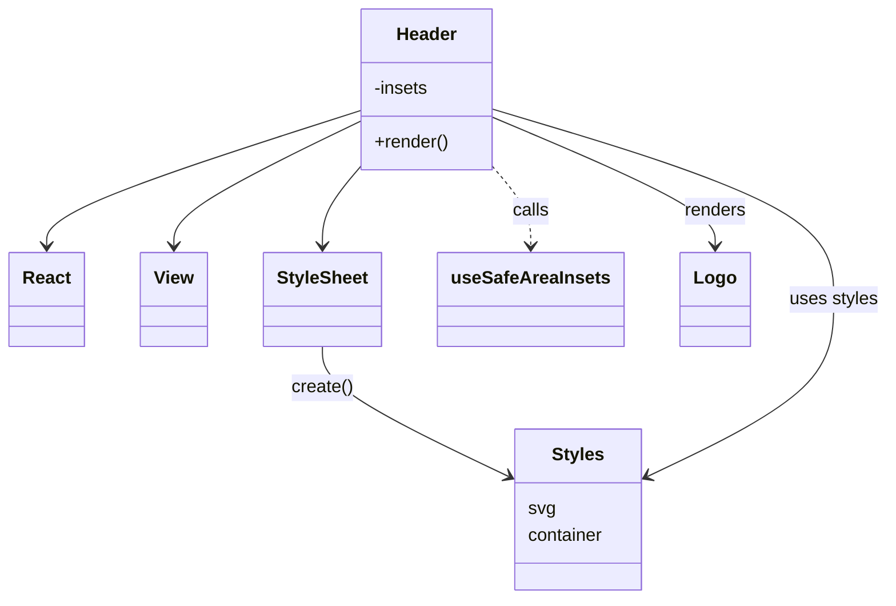

# Diagram: mobile/FreightVerifyMobileTracking/src/components/organisms/header.tsx

> Auto-generated by Obscura crawlers

## Mermaid

### SVG

<svg id="container" width="774.875" xmlns="http://www.w3.org/2000/svg" class="classDiagram" height="536" viewBox="0 0 774.875 536" role="graphics-document document" aria-roledescription="class"><g><defs><marker id="container_class-aggregationStart" class="marker aggregation class" refX="18" refY="7" markerWidth="190" markerHeight="240" orient="auto"><path d="M 18,7 L9,13 L1,7 L9,1 Z"></path></marker></defs><defs><marker id="container_class-aggregationEnd" class="marker aggregation class" refX="1" refY="7" markerWidth="20" markerHeight="28" orient="auto"><path d="M 18,7 L9,13 L1,7 L9,1 Z"></path></marker></defs><defs><marker id="container_class-extensionStart" class="marker extension class" refX="18" refY="7" markerWidth="190" markerHeight="240" orient="auto"><path d="M 1,7 L18,13 V 1 Z"></path></marker></defs><defs><marker id="container_class-extensionEnd" class="marker extension class" refX="1" refY="7" markerWidth="20" markerHeight="28" orient="auto"><path d="M 1,1 V 13 L18,7 Z"></path></marker></defs><defs><marker id="container_class-compositionStart" class="marker composition class" refX="18" refY="7" markerWidth="190" markerHeight="240" orient="auto"><path d="M 18,7 L9,13 L1,7 L9,1 Z"></path></marker></defs><defs><marker id="container_class-compositionEnd" class="marker composition class" refX="1" refY="7" markerWidth="20" markerHeight="28" orient="auto"><path d="M 18,7 L9,13 L1,7 L9,1 Z"></path></marker></defs><defs><marker id="container_class-dependencyStart" class="marker dependency class" refX="6" refY="7" markerWidth="190" markerHeight="240" orient="auto"><path d="M 5,7 L9,13 L1,7 L9,1 Z"></path></marker></defs><defs><marker id="container_class-dependencyEnd" class="marker dependency class" refX="13" refY="7" markerWidth="20" markerHeight="28" orient="auto"><path d="M 18,7 L9,13 L14,7 L9,1 Z"></path></marker></defs><defs><marker id="container_class-lollipopStart" class="marker lollipop class" refX="13" refY="7" markerWidth="190" markerHeight="240" orient="auto"><circle stroke="black" fill="transparent" cx="7" cy="7" r="6"></circle></marker></defs><defs><marker id="container_class-lollipopEnd" class="marker lollipop class" refX="1" refY="7" markerWidth="190" markerHeight="240" orient="auto"><circle stroke="black" fill="transparent" cx="7" cy="7" r="6"></circle></marker></defs><g class="root"><g class="clusters"></g><g class="edgePaths"><path d="M315.082,99.153L269.312,114.128C223.542,129.102,132.001,159.051,86.231,179.192C40.461,199.333,40.461,209.667,40.461,214.833L40.461,220" id="id_Header_React_1" class="edge-thickness-normal edge-pattern-solid relation" style=";;;" data-edge="true" data-et="edge" data-id="id_Header_React_1" data-points="W3sieCI6MzE1LjA4MjAzMTI1LCJ5Ijo5OS4xNTMyNzcwNTQ3NTQzN30seyJ4Ijo0MC40NjA5Mzc1LCJ5IjoxODl9LHsieCI6NDAuNDYwOTM3NSwieSI6MjI2fV0=" marker-end="url(#container_class-dependencyEnd)"></path><path d="M315.082,108.812L287.926,122.177C260.771,135.541,206.46,162.271,179.304,180.802C152.148,199.333,152.148,209.667,152.148,214.833L152.148,220" id="id_Header_View_2" class="edge-thickness-normal edge-pattern-solid relation" style=";;;" data-edge="true" data-et="edge" data-id="id_Header_View_2" data-points="W3sieCI6MzE1LjA4MjAzMTI1LCJ5IjoxMDguODEyMDAzOTUwNzU2NjN9LHsieCI6MTUyLjE0ODQzNzUsInkiOjE4OX0seyJ4IjoxNTIuMTQ4NDM3NSwieSI6MjI2fV0=" marker-end="url(#container_class-dependencyEnd)"></path><path d="M315.082,150.419L309.736,156.849C304.391,163.279,293.699,176.14,288.354,187.737C283.008,199.333,283.008,209.667,283.008,214.833L283.008,220" id="id_Header_StyleSheet_3" class="edge-thickness-normal edge-pattern-solid relation" style=";;;" data-edge="true" data-et="edge" data-id="id_Header_StyleSheet_3" data-points="W3sieCI6MzE1LjA4MjAzMTI1LCJ5IjoxNTAuNDE5MTMwOTU5NTY1NDh9LHsieCI6MjgzLjAwNzgxMjUsInkiOjE4OX0seyJ4IjoyODMuMDA3ODEyNSwieSI6MjI2fV0=" marker-end="url(#container_class-dependencyEnd)"></path><path d="M432.168,150.419L437.514,156.849C442.859,163.279,453.551,176.14,458.896,187.737C464.242,199.333,464.242,209.667,464.242,214.833L464.242,220" id="id_Header_useSafeAreaInsets_4" class="edge-thickness-normal edge-pattern-dashed relation" style=";;;" data-edge="true" data-et="edge" data-id="id_Header_useSafeAreaInsets_4" data-points="W3sieCI6NDMyLjE2Nzk2ODc1LCJ5IjoxNTAuNDE5MTMwOTU5NTY1NDh9LHsieCI6NDY0LjI0MjE4NzUsInkiOjE4OX0seyJ4Ijo0NjQuMjQyMTg3NSwieSI6MjI2fV0=" marker-end="url(#container_class-dependencyEnd)"></path><path d="M432.168,105.555L464.028,119.463C495.888,133.37,559.608,161.185,591.468,180.259C623.328,199.333,623.328,209.667,623.328,214.833L623.328,220" id="id_Header_Logo_5" class="edge-thickness-normal edge-pattern-solid relation" style=";;;" data-edge="true" data-et="edge" data-id="id_Header_Logo_5" data-points="W3sieCI6NDMyLjE2Nzk2ODc1LCJ5IjoxMDUuNTU1MDgxMDMzNzI3NTV9LHsieCI6NjIzLjMyODEyNSwieSI6MTg5fSx7IngiOjYyMy4zMjgxMjUsInkiOjIyNn1d" marker-end="url(#container_class-dependencyEnd)"></path><path d="M283.008,310L283.008,316.167C283.008,322.333,283.008,334.667,309.505,353.833C336.003,373,388.997,399.001,415.495,412.001L441.992,425.001" id="id_StyleSheet_Styles_6" class="edge-thickness-normal edge-pattern-solid relation" style=";;;" data-edge="true" data-et="edge" data-id="id_StyleSheet_Styles_6" data-points="W3sieCI6MjgzLjAwNzgxMjUsInkiOjMxMH0seyJ4IjoyODMuMDA3ODEyNSwieSI6MzQ3fSx7IngiOjQ0Ny4zNzg5MDYyNSwieSI6NDI3LjY0MzcwOTg5MDEwOTl9XQ==" marker-end="url(#container_class-dependencyEnd)"></path><path d="M432.168,98.04L481.364,113.2C530.56,128.36,628.952,158.68,678.148,187.007C727.344,215.333,727.344,241.667,727.344,268C727.344,294.333,727.344,320.667,700.846,346.833C674.349,373,621.354,399.001,594.857,412.001L568.359,425.001" id="id_Header_Styles_7" class="edge-thickness-normal edge-pattern-solid relation" style=";;;" data-edge="true" data-et="edge" data-id="id_Header_Styles_7" data-points="W3sieCI6NDMyLjE2Nzk2ODc1LCJ5Ijo5OC4wNDAyNzUyMDA5ODk0OH0seyJ4Ijo3MjcuMzQzNzUsInkiOjE4OX0seyJ4Ijo3MjcuMzQzNzUsInkiOjI2OH0seyJ4Ijo3MjcuMzQzNzUsInkiOjM0N30seyJ4Ijo1NjIuOTcyNjU2MjUsInkiOjQyNy42NDM3MDk4OTAxMDk5fV0=" marker-end="url(#container_class-dependencyEnd)"></path></g><g class="edgeLabels"><g class="edgeLabel"><g class="label" data-id="id_Header_React_1" transform="translate(0, 0)"><foreignObject width="0" height="0">

</foreignObject></g></g><g class="edgeLabel"><g class="label" data-id="id_Header_View_2" transform="translate(0, 0)"><foreignObject width="0" height="0">

</foreignObject></g></g><g class="edgeLabel"><g class="label" data-id="id_Header_StyleSheet_3" transform="translate(0, 0)"><foreignObject width="0" height="0">

</foreignObject></g></g><g class="edgeLabel" transform="translate(464.2421875, 189)"><g class="label" data-id="id_Header_useSafeAreaInsets_4" transform="translate(-16.4453125, -12)"><foreignObject width="32.890625" height="24">

calls

</foreignObject></g></g><g class="edgeLabel" transform="translate(623.328125, 189)"><g class="label" data-id="id_Header_Logo_5" transform="translate(-27.75, -12)"><foreignObject width="55.5" height="24">

renders

</foreignObject></g></g><g class="edgeLabel" transform="translate(283.0078125, 347)"><g class="label" data-id="id_StyleSheet_Styles_6" transform="translate(-27.6171875, -12)"><foreignObject width="55.234375" height="24">

create()

</foreignObject></g></g><g class="edgeLabel" transform="translate(727.34375, 268)"><g class="label" data-id="id_Header_Styles_7" transform="translate(-39.53125, -12)"><foreignObject width="79.0625" height="24">

uses styles

</foreignObject></g></g></g><g class="nodes"><g class="node default" id="classId-Header-0" transform="translate(373.625, 80)"><g class="basic label-container"><path d="M-58.54296875 -72 L58.54296875 -72 L58.54296875 72 L-58.54296875 72" stroke="none" stroke-width="0" fill="#ECECFF" style=""></path><path d="M-58.54296875 -72 C-25.02425659383134 -72, 8.494455562337322 -72, 58.54296875 -72 M-58.54296875 -72 C-17.289549587983366 -72, 23.963869574033268 -72, 58.54296875 -72 M58.54296875 -72 C58.54296875 -31.60621047457314, 58.54296875 8.787579050853722, 58.54296875 72 M58.54296875 -72 C58.54296875 -15.90471984884195, 58.54296875 40.1905603023161, 58.54296875 72 M58.54296875 72 C22.75749393879503 72, -13.027980872409941 72, -58.54296875 72 M58.54296875 72 C26.755629849483356 72, -5.031709051033289 72, -58.54296875 72 M-58.54296875 72 C-58.54296875 30.283848620279286, -58.54296875 -11.432302759441427, -58.54296875 -72 M-58.54296875 72 C-58.54296875 17.26325491072916, -58.54296875 -37.47349017854168, -58.54296875 -72" stroke="#9370DB" stroke-width="1.3" fill="none" stroke-dasharray="0 0" style=""></path></g><g class="annotation-group text" transform="translate(0, -48)"></g><g class="label-group text" transform="translate(-26.4765625, -48)"><g class="label" style="font-weight: bolder" transform="translate(0,-12)"><foreignObject width="52.953125" height="24">

Header

</foreignObject></g></g><g class="members-group text" transform="translate(-46.54296875, 0)"><g class="label" style="" transform="translate(0,-12)"><foreignObject width="49.78125" height="24">

-insets

</foreignObject></g></g><g class="methods-group text" transform="translate(-46.54296875, 48)"><g class="label" style="" transform="translate(0,-12)"><foreignObject width="66.609375" height="24">

+render()

</foreignObject></g></g><g class="divider" style=""><path d="M-58.54296875 -24 C-11.836995523721775 -24, 34.86897770255645 -24, 58.54296875 -24 M-58.54296875 -24 C-24.957208222319032 -24, 8.628552305361936 -24, 58.54296875 -24" stroke="#9370DB" stroke-width="1.3" fill="none" stroke-dasharray="0 0" style=""></path></g><g class="divider" style=""><path d="M-58.54296875 24 C-21.092333219094805 24, 16.35830231181039 24, 58.54296875 24 M-58.54296875 24 C-14.685795646430236 24, 29.171377457139528 24, 58.54296875 24" stroke="#9370DB" stroke-width="1.3" fill="none" stroke-dasharray="0 0" style=""></path></g></g><g class="node default" id="classId-React-1" transform="translate(40.4609375, 268)"><g class="basic label-container"><path d="M-32.4609375 -42 L32.4609375 -42 L32.4609375 42 L-32.4609375 42" stroke="none" stroke-width="0" fill="#ECECFF" style=""></path><path d="M-32.4609375 -42 C-10.929931517382087 -42, 10.601074465235826 -42, 32.4609375 -42 M-32.4609375 -42 C-8.999747744336968 -42, 14.461442011326064 -42, 32.4609375 -42 M32.4609375 -42 C32.4609375 -22.278804997541936, 32.4609375 -2.5576099950838724, 32.4609375 42 M32.4609375 -42 C32.4609375 -19.096326206963905, 32.4609375 3.80734758607219, 32.4609375 42 M32.4609375 42 C9.573818097346624 42, -13.313301305306751 42, -32.4609375 42 M32.4609375 42 C10.46061928324734 42, -11.53969893350532 42, -32.4609375 42 M-32.4609375 42 C-32.4609375 23.322134502131554, -32.4609375 4.6442690042631085, -32.4609375 -42 M-32.4609375 42 C-32.4609375 18.811718009018623, -32.4609375 -4.376563981962754, -32.4609375 -42" stroke="#9370DB" stroke-width="1.3" fill="none" stroke-dasharray="0 0" style=""></path></g><g class="annotation-group text" transform="translate(0, -18)"></g><g class="label-group text" transform="translate(-20.4609375, -18)"><g class="label" style="font-weight: bolder" transform="translate(0,-12)"><foreignObject width="40.921875" height="24">

React

</foreignObject></g></g><g class="members-group text" transform="translate(-20.4609375, 30)"></g><g class="methods-group text" transform="translate(-20.4609375, 60)"></g><g class="divider" style=""><path d="M-32.4609375 6 C-12.170780285664765 6, 8.11937692867047 6, 32.4609375 6 M-32.4609375 6 C-10.760469802140175 6, 10.93999789571965 6, 32.4609375 6" stroke="#9370DB" stroke-width="1.3" fill="none" stroke-dasharray="0 0" style=""></path></g><g class="divider" style=""><path d="M-32.4609375 24 C-18.816920394793808 24, -5.172903289587616 24, 32.4609375 24 M-32.4609375 24 C-13.88634660059876 24, 4.688244298802481 24, 32.4609375 24" stroke="#9370DB" stroke-width="1.3" fill="none" stroke-dasharray="0 0" style=""></path></g></g><g class="node default" id="classId-View-2" transform="translate(152.1484375, 268)"><g class="basic label-container"><path d="M-29.2265625 -42 L29.2265625 -42 L29.2265625 42 L-29.2265625 42" stroke="none" stroke-width="0" fill="#ECECFF" style=""></path><path d="M-29.2265625 -42 C-13.779133924772733 -42, 1.6682946504545342 -42, 29.2265625 -42 M-29.2265625 -42 C-7.970360532821978 -42, 13.285841434356044 -42, 29.2265625 -42 M29.2265625 -42 C29.2265625 -16.303427941955874, 29.2265625 9.393144116088251, 29.2265625 42 M29.2265625 -42 C29.2265625 -14.375840877046215, 29.2265625 13.24831824590757, 29.2265625 42 M29.2265625 42 C6.395581283561203 42, -16.435399932877594 42, -29.2265625 42 M29.2265625 42 C10.93494796788666 42, -7.356666564226678 42, -29.2265625 42 M-29.2265625 42 C-29.2265625 22.10273123406194, -29.2265625 2.2054624681238835, -29.2265625 -42 M-29.2265625 42 C-29.2265625 21.969896460623175, -29.2265625 1.939792921246351, -29.2265625 -42" stroke="#9370DB" stroke-width="1.3" fill="none" stroke-dasharray="0 0" style=""></path></g><g class="annotation-group text" transform="translate(0, -18)"></g><g class="label-group text" transform="translate(-17.2265625, -18)"><g class="label" style="font-weight: bolder" transform="translate(0,-12)"><foreignObject width="34.453125" height="24">

View

</foreignObject></g></g><g class="members-group text" transform="translate(-17.2265625, 30)"></g><g class="methods-group text" transform="translate(-17.2265625, 60)"></g><g class="divider" style=""><path d="M-29.2265625 6 C-15.741177853074477 6, -2.2557932061489545 6, 29.2265625 6 M-29.2265625 6 C-6.9910649338416135 6, 15.244432632316773 6, 29.2265625 6" stroke="#9370DB" stroke-width="1.3" fill="none" stroke-dasharray="0 0" style=""></path></g><g class="divider" style=""><path d="M-29.2265625 24 C-16.696352249398537 24, -4.166141998797073 24, 29.2265625 24 M-29.2265625 24 C-7.1065872118968585 24, 15.013388076206283 24, 29.2265625 24" stroke="#9370DB" stroke-width="1.3" fill="none" stroke-dasharray="0 0" style=""></path></g></g><g class="node default" id="classId-StyleSheet-3" transform="translate(283.0078125, 268)"><g class="basic label-container"><path d="M-51.6328125 -42 L51.6328125 -42 L51.6328125 42 L-51.6328125 42" stroke="none" stroke-width="0" fill="#ECECFF" style=""></path><path d="M-51.6328125 -42 C-17.73544720191032 -42, 16.161918096179363 -42, 51.6328125 -42 M-51.6328125 -42 C-15.321759571559646 -42, 20.989293356880708 -42, 51.6328125 -42 M51.6328125 -42 C51.6328125 -9.14070483325888, 51.6328125 23.71859033348224, 51.6328125 42 M51.6328125 -42 C51.6328125 -11.094184614044032, 51.6328125 19.811630771911936, 51.6328125 42 M51.6328125 42 C21.9737036613827 42, -7.6854051772346 42, -51.6328125 42 M51.6328125 42 C14.122637365406725 42, -23.38753776918655 42, -51.6328125 42 M-51.6328125 42 C-51.6328125 17.9739690891904, -51.6328125 -6.052061821619198, -51.6328125 -42 M-51.6328125 42 C-51.6328125 9.325772730258258, -51.6328125 -23.348454539483484, -51.6328125 -42" stroke="#9370DB" stroke-width="1.3" fill="none" stroke-dasharray="0 0" style=""></path></g><g class="annotation-group text" transform="translate(0, -18)"></g><g class="label-group text" transform="translate(-39.6328125, -18)"><g class="label" style="font-weight: bolder" transform="translate(0,-12)"><foreignObject width="79.265625" height="24">

StyleSheet

</foreignObject></g></g><g class="members-group text" transform="translate(-39.6328125, 30)"></g><g class="methods-group text" transform="translate(-39.6328125, 60)"></g><g class="divider" style=""><path d="M-51.6328125 6 C-13.305571096895534 6, 25.021670306208932 6, 51.6328125 6 M-51.6328125 6 C-21.1061666394166 6, 9.4204792211668 6, 51.6328125 6" stroke="#9370DB" stroke-width="1.3" fill="none" stroke-dasharray="0 0" style=""></path></g><g class="divider" style=""><path d="M-51.6328125 24 C-12.812342324633065 24, 26.00812785073387 24, 51.6328125 24 M-51.6328125 24 C-17.638356353779166 24, 16.35609979244167 24, 51.6328125 24" stroke="#9370DB" stroke-width="1.3" fill="none" stroke-dasharray="0 0" style=""></path></g></g><g class="node default" id="classId-useSafeAreaInsets-4" transform="translate(464.2421875, 268)"><g class="basic label-container"><path d="M-79.6015625 -42 L79.6015625 -42 L79.6015625 42 L-79.6015625 42" stroke="none" stroke-width="0" fill="#ECECFF" style=""></path><path d="M-79.6015625 -42 C-43.525333682773926 -42, -7.449104865547852 -42, 79.6015625 -42 M-79.6015625 -42 C-20.59086114748891 -42, 38.41984020502218 -42, 79.6015625 -42 M79.6015625 -42 C79.6015625 -21.694086244107577, 79.6015625 -1.3881724882151545, 79.6015625 42 M79.6015625 -42 C79.6015625 -11.818035043143048, 79.6015625 18.363929913713903, 79.6015625 42 M79.6015625 42 C38.46672912122823 42, -2.668104257543547 42, -79.6015625 42 M79.6015625 42 C21.33204919873623 42, -36.93746410252754 42, -79.6015625 42 M-79.6015625 42 C-79.6015625 18.740374267144375, -79.6015625 -4.51925146571125, -79.6015625 -42 M-79.6015625 42 C-79.6015625 11.62714444491413, -79.6015625 -18.74571111017174, -79.6015625 -42" stroke="#9370DB" stroke-width="1.3" fill="none" stroke-dasharray="0 0" style=""></path></g><g class="annotation-group text" transform="translate(0, -18)"></g><g class="label-group text" transform="translate(-67.6015625, -18)"><g class="label" style="font-weight: bolder" transform="translate(0,-12)"><foreignObject width="135.203125" height="24">

useSafeAreaInsets

</foreignObject></g></g><g class="members-group text" transform="translate(-67.6015625, 30)"></g><g class="methods-group text" transform="translate(-67.6015625, 60)"></g><g class="divider" style=""><path d="M-79.6015625 6 C-43.32273022240821 6, -7.043897944816422 6, 79.6015625 6 M-79.6015625 6 C-28.467826916713733 6, 22.665908666572534 6, 79.6015625 6" stroke="#9370DB" stroke-width="1.3" fill="none" stroke-dasharray="0 0" style=""></path></g><g class="divider" style=""><path d="M-79.6015625 24 C-25.551827219297138 24, 28.497908061405724 24, 79.6015625 24 M-79.6015625 24 C-44.39304790280877 24, -9.184533305617535 24, 79.6015625 24" stroke="#9370DB" stroke-width="1.3" fill="none" stroke-dasharray="0 0" style=""></path></g></g><g class="node default" id="classId-Logo-5" transform="translate(623.328125, 268)"><g class="basic label-container"><path d="M-29.484375 -42 L29.484375 -42 L29.484375 42 L-29.484375 42" stroke="none" stroke-width="0" fill="#ECECFF" style=""></path><path d="M-29.484375 -42 C-12.298091839629471 -42, 4.888191320741058 -42, 29.484375 -42 M-29.484375 -42 C-13.030040884308868 -42, 3.424293231382265 -42, 29.484375 -42 M29.484375 -42 C29.484375 -14.791825744181018, 29.484375 12.416348511637963, 29.484375 42 M29.484375 -42 C29.484375 -18.19562349234418, 29.484375 5.608753015311642, 29.484375 42 M29.484375 42 C12.354312808199833 42, -4.775749383600335 42, -29.484375 42 M29.484375 42 C7.771246959188563 42, -13.941881081622874 42, -29.484375 42 M-29.484375 42 C-29.484375 14.746255321217486, -29.484375 -12.507489357565028, -29.484375 -42 M-29.484375 42 C-29.484375 15.903354934841069, -29.484375 -10.193290130317862, -29.484375 -42" stroke="#9370DB" stroke-width="1.3" fill="none" stroke-dasharray="0 0" style=""></path></g><g class="annotation-group text" transform="translate(0, -18)"></g><g class="label-group text" transform="translate(-17.484375, -18)"><g class="label" style="font-weight: bolder" transform="translate(0,-12)"><foreignObject width="34.96875" height="24">

Logo

</foreignObject></g></g><g class="members-group text" transform="translate(-17.484375, 30)"></g><g class="methods-group text" transform="translate(-17.484375, 60)"></g><g class="divider" style=""><path d="M-29.484375 6 C-13.423072172239543 6, 2.638230655520914 6, 29.484375 6 M-29.484375 6 C-11.976998955962728 6, 5.530377088074545 6, 29.484375 6" stroke="#9370DB" stroke-width="1.3" fill="none" stroke-dasharray="0 0" style=""></path></g><g class="divider" style=""><path d="M-29.484375 24 C-16.470991186033757 24, -3.4576073720675176 24, 29.484375 24 M-29.484375 24 C-6.7213021432243 24, 16.0417707135514 24, 29.484375 24" stroke="#9370DB" stroke-width="1.3" fill="none" stroke-dasharray="0 0" style=""></path></g></g><g class="node default" id="classId-Styles-6" transform="translate(505.17578125, 456)"><g class="basic label-container"><path d="M-57.796875 -72 L57.796875 -72 L57.796875 72 L-57.796875 72" stroke="none" stroke-width="0" fill="#ECECFF" style=""></path><path d="M-57.796875 -72 C-12.882069383027243 -72, 32.03273623394551 -72, 57.796875 -72 M-57.796875 -72 C-29.01355340195361 -72, -0.2302318039072233 -72, 57.796875 -72 M57.796875 -72 C57.796875 -38.473952885119886, 57.796875 -4.947905770239771, 57.796875 72 M57.796875 -72 C57.796875 -19.55528327937774, 57.796875 32.88943344124452, 57.796875 72 M57.796875 72 C19.626572449057868 72, -18.543730101884265 72, -57.796875 72 M57.796875 72 C20.58145199048125 72, -16.633971019037503 72, -57.796875 72 M-57.796875 72 C-57.796875 14.632975266555604, -57.796875 -42.73404946688879, -57.796875 -72 M-57.796875 72 C-57.796875 18.59171905573735, -57.796875 -34.8165618885253, -57.796875 -72" stroke="#9370DB" stroke-width="1.3" fill="none" stroke-dasharray="0 0" style=""></path></g><g class="annotation-group text" transform="translate(0, -48)"></g><g class="label-group text" transform="translate(-22.390625, -48)"><g class="label" style="font-weight: bolder" transform="translate(0,-12)"><foreignObject width="44.78125" height="24">

Styles

</foreignObject></g></g><g class="members-group text" transform="translate(-45.796875, 0)"><g class="label" style="" transform="translate(0,-12)"><foreignObject width="23.375" height="24">

svg

</foreignObject></g><g class="label" style="" transform="translate(0,12)"><foreignObject width="69.203125" height="24">

container

</foreignObject></g></g><g class="methods-group text" transform="translate(-45.796875, 72)"></g><g class="divider" style=""><path d="M-57.796875 -24 C-31.701313038438734 -24, -5.605751076877468 -24, 57.796875 -24 M-57.796875 -24 C-28.45952444030656 -24, 0.8778261193868815 -24, 57.796875 -24" stroke="#9370DB" stroke-width="1.3" fill="none" stroke-dasharray="0 0" style=""></path></g><g class="divider" style=""><path d="M-57.796875 48 C-27.610309838985003 48, 2.5762553220299935 48, 57.796875 48 M-57.796875 48 C-20.006458947934703 48, 17.783957104130593 48, 57.796875 48" stroke="#9370DB" stroke-width="1.3" fill="none" stroke-dasharray="0 0" style=""></path></g></g></g></g></g></svg>
