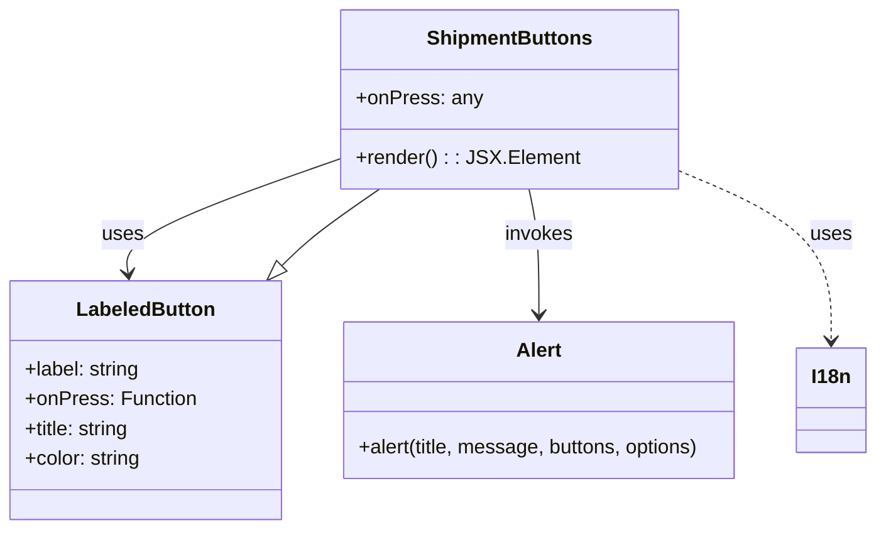

# Diagram: mobile/FreightVerifyMobileTracking/src/components/organisms/shipment-buttons.tsx


> Auto-generated by Obscura crawlers

## Diagram 1



### SVG

<svg id="container" width="705.1015625" xmlns="http://www.w3.org/2000/svg" class="classDiagram" height="426" viewBox="0 0 705.1015625 426" role="graphics-document document" aria-roledescription="class"><style>#container{font-family:"trebuchet ms",verdana,arial,sans-serif;font-size:16px;fill:#333;}@keyframes edge-animation-frame{from{stroke-dashoffset:0;}}@keyframes dash{to{stroke-dashoffset:0;}}#container .edge-animation-slow{stroke-dasharray:9,5!important;stroke-dashoffset:900;animation:dash 50s linear infinite;stroke-linecap:round;}#container .edge-animation-fast{stroke-dasharray:9,5!important;stroke-dashoffset:900;animation:dash 20s linear infinite;stroke-linecap:round;}#container .error-icon{fill:#552222;}#container .error-text{fill:#552222;stroke:#552222;}#container .edge-thickness-normal{stroke-width:1px;}#container .edge-thickness-thick{stroke-width:3.5px;}#container .edge-pattern-solid{stroke-dasharray:0;}#container .edge-thickness-invisible{stroke-width:0;fill:none;}#container .edge-pattern-dashed{stroke-dasharray:3;}#container .edge-pattern-dotted{stroke-dasharray:2;}#container .marker{fill:#333333;stroke:#333333;}#container .marker.cross{stroke:#333333;}#container svg{font-family:"trebuchet ms",verdana,arial,sans-serif;font-size:16px;}#container p{margin:0;}#container g.classGroup text{fill:#9370DB;stroke:none;font-family:"trebuchet ms",verdana,arial,sans-serif;font-size:10px;}#container g.classGroup text .title{font-weight:bolder;}#container .nodeLabel,#container .edgeLabel{color:#131300;}#container .edgeLabel .label rect{fill:#ECECFF;}#container .label text{fill:#131300;}#container .labelBkg{background:#ECECFF;}#container .edgeLabel .label span{background:#ECECFF;}#container .classTitle{font-weight:bolder;}#container .node rect,#container .node circle,#container .node ellipse,#container .node polygon,#container .node path{fill:#ECECFF;stroke:#9370DB;stroke-width:1px;}#container .divider{stroke:#9370DB;stroke-width:1;}#container g.clickable{cursor:pointer;}#container g.classGroup rect{fill:#ECECFF;stroke:#9370DB;}#container g.classGroup line{stroke:#9370DB;stroke-width:1;}#container .classLabel .box{stroke:none;stroke-width:0;fill:#ECECFF;opacity:0.5;}#container .classLabel .label{fill:#9370DB;font-size:10px;}#container .relation{stroke:#333333;stroke-width:1;fill:none;}#container .dashed-line{stroke-dasharray:3;}#container .dotted-line{stroke-dasharray:1 2;}#container #compositionStart,#container .composition{fill:#333333!important;stroke:#333333!important;stroke-width:1;}#container #compositionEnd,#container .composition{fill:#333333!important;stroke:#333333!important;stroke-width:1;}#container #dependencyStart,#container .dependency{fill:#333333!important;stroke:#333333!important;stroke-width:1;}#container #dependencyStart,#container .dependency{fill:#333333!important;stroke:#333333!important;stroke-width:1;}#container #extensionStart,#container .extension{fill:transparent!important;stroke:#333333!important;stroke-width:1;}#container #extensionEnd,#container .extension{fill:transparent!important;stroke:#333333!important;stroke-width:1;}#container #aggregationStart,#container .aggregation{fill:transparent!important;stroke:#333333!important;stroke-width:1;}#container #aggregationEnd,#container .aggregation{fill:transparent!important;stroke:#333333!important;stroke-width:1;}#container #lollipopStart,#container .lollipop{fill:#ECECFF!important;stroke:#333333!important;stroke-width:1;}#container #lollipopEnd,#container .lollipop{fill:#ECECFF!important;stroke:#333333!important;stroke-width:1;}#container .edgeTerminals{font-size:11px;line-height:initial;}#container .classTitleText{text-anchor:middle;font-size:18px;fill:#333;}#container .label-icon{display:inline-block;height:1em;overflow:visible;vertical-align:-0.125em;}#container .node .label-icon path{fill:currentColor;stroke:revert;stroke-width:revert;}#container :root{--mermaid-font-family:"trebuchet ms",verdana,arial,sans-serif;}</style><g><defs><marker id="container_class-aggregationStart" class="marker aggregation class" refX="18" refY="7" markerWidth="190" markerHeight="240" orient="auto"><path d="M 18,7 L9,13 L1,7 L9,1 Z"></path></marker></defs><defs><marker id="container_class-aggregationEnd" class="marker aggregation class" refX="1" refY="7" markerWidth="20" markerHeight="28" orient="auto"><path d="M 18,7 L9,13 L1,7 L9,1 Z"></path></marker></defs><defs><marker id="container_class-extensionStart" class="marker extension class" refX="18" refY="7" markerWidth="190" markerHeight="240" orient="auto"><path d="M 1,7 L18,13 V 1 Z"></path></marker></defs><defs><marker id="container_class-extensionEnd" class="marker extension class" refX="1" refY="7" markerWidth="20" markerHeight="28" orient="auto"><path d="M 1,1 V 13 L18,7 Z"></path></marker></defs><defs><marker id="container_class-compositionStart" class="marker composition class" refX="18" refY="7" markerWidth="190" markerHeight="240" orient="auto"><path d="M 18,7 L9,13 L1,7 L9,1 Z"></path></marker></defs><defs><marker id="container_class-compositionEnd" class="marker composition class" refX="1" refY="7" markerWidth="20" markerHeight="28" orient="auto"><path d="M 18,7 L9,13 L1,7 L9,1 Z"></path></marker></defs><defs><marker id="container_class-dependencyStart" class="marker dependency class" refX="6" refY="7" markerWidth="190" markerHeight="240" orient="auto"><path d="M 5,7 L9,13 L1,7 L9,1 Z"></path></marker></defs><defs><marker id="container_class-dependencyEnd" class="marker dependency class" refX="13" refY="7" markerWidth="20" markerHeight="28" orient="auto"><path d="M 18,7 L9,13 L14,7 L9,1 Z"></path></marker></defs><defs><marker id="container_class-lollipopStart" class="marker lollipop class" refX="13" refY="7" markerWidth="190" markerHeight="240" orient="auto"><circle stroke="black" fill="transparent" cx="7" cy="7" r="6"></circle></marker></defs><defs><marker id="container_class-lollipopEnd" class="marker lollipop class" refX="1" refY="7" markerWidth="190" markerHeight="240" orient="auto"><circle stroke="black" fill="transparent" cx="7" cy="7" r="6"></circle></marker></defs><g class="root"><g class="clusters"></g><g class="edgePaths"><path d="M278.145,125.489L247.876,136.074C217.608,146.659,157.072,167.83,127.513,183.591C97.955,199.352,99.375,209.704,100.086,214.88L100.796,220.056" id="id_ShipmentButtons_LabeledButton_1" class="edge-thickness-normal edge-pattern-solid relation" style=";;;" data-edge="true" data-et="edge" data-id="id_ShipmentButtons_LabeledButton_1" data-points="W3sieCI6Mjc4LjE0NDUzMTI1LCJ5IjoxMjUuNDg4NzI2Nzk4NzYxNzd9LHsieCI6OTYuNTM1MTU2MjUsInkiOjE4OX0seyJ4IjoxMDEuNjExMTM3MjE4MDQ1MTIsInkiOjIyNn1d" marker-end="url(#container_class-dependencyEnd)"></path><path d="M423.935,152L425.281,158.167C426.627,164.333,429.32,176.667,430.666,193.5C432.012,210.333,432.012,231.667,432.012,242.333L432.012,253" id="id_ShipmentButtons_Alert_2" class="edge-thickness-normal edge-pattern-solid relation" style=";;;" data-edge="true" data-et="edge" data-id="id_ShipmentButtons_Alert_2" data-points="W3sieCI6NDIzLjkzNTIwNjQyMjAxODMsInkiOjE1Mn0seyJ4Ijo0MzIuMDExNzE4NzUsInkiOjE4OX0seyJ4Ijo0MzIuMDExNzE4NzUsInkiOjI1OX1d" marker-end="url(#container_class-dependencyEnd)"></path><path d="M538.293,134.205L560.208,143.338C582.122,152.47,625.952,170.735,647.867,194.034C669.781,217.333,669.781,245.667,669.781,259.833L669.781,274" id="id_ShipmentButtons_I18n_3" class="edge-thickness-normal edge-pattern-dashed relation" style=";;;" data-edge="true" data-et="edge" data-id="id_ShipmentButtons_I18n_3" data-points="W3sieCI6NTM4LjI5Mjk2ODc1LCJ5IjoxMzQuMjA1MzYxNDA5Nzk2OX0seyJ4Ijo2NjkuNzgxMjUsInkiOjE4OX0seyJ4Ijo2NjkuNzgxMjUsInkiOjI4MH1d" marker-end="url(#container_class-dependencyEnd)"></path><path d="M224.377,213.886L228.581,209.738C232.786,205.59,241.195,197.295,254.373,186.981C267.551,176.667,285.498,164.333,294.472,158.167L303.445,152" id="id_LabeledButton_ShipmentButtons_4" class="edge-thickness-normal edge-pattern-solid relation" style=";;;" data-edge="true" data-et="edge" data-id="id_LabeledButton_ShipmentButtons_4" data-points="W3sieCI6MjEyLjA5NjU2OTU0ODg3MjIsInkiOjIyNn0seyJ4IjoyNDkuNjAzNTE1NjI1LCJ5IjoxODl9LHsieCI6MzAzLjQ0NTM4NDE3NDMxMTksInkiOjE1Mn1d" marker-start="url(#container_class-extensionStart)"></path></g><g class="edgeLabels"><g class="edgeLabel" transform="translate(169.71334, 163.40859)"><g class="label" data-id="id_ShipmentButtons_LabeledButton_1" transform="translate(-16.4921875, -12)"><foreignObject width="32.984375" height="24"><div xmlns="http://www.w3.org/1999/xhtml" class="labelBkg" style="display: table-cell; white-space: nowrap; line-height: 1.5; max-width: 200px; text-align: center;"><span class="edgeLabel"><p>uses</p></span></div></foreignObject></g></g><g class="edgeLabel" transform="translate(432.01171875, 189)"><g class="label" data-id="id_ShipmentButtons_Alert_2" transform="translate(-27.5859375, -12)"><foreignObject width="55.171875" height="24"><div xmlns="http://www.w3.org/1999/xhtml" class="labelBkg" style="display: table-cell; white-space: nowrap; line-height: 1.5; max-width: 200px; text-align: center;"><span class="edgeLabel"><p>invokes</p></span></div></foreignObject></g></g><g class="edgeLabel" transform="translate(669.78125, 189)"><g class="label" data-id="id_ShipmentButtons_I18n_3" transform="translate(-16.4921875, -12)"><foreignObject width="32.984375" height="24"><div xmlns="http://www.w3.org/1999/xhtml" class="labelBkg" style="display: table-cell; white-space: nowrap; line-height: 1.5; max-width: 200px; text-align: center;"><span class="edgeLabel"><p>uses</p></span></div></foreignObject></g></g><g class="edgeLabel"><g class="label" data-id="id_LabeledButton_ShipmentButtons_4" transform="translate(0, 0)"><foreignObject width="0" height="0"><div xmlns="http://www.w3.org/1999/xhtml" class="labelBkg" style="display: table-cell; white-space: nowrap; line-height: 1.5; max-width: 200px; text-align: center;"><span class="edgeLabel"></span></div></foreignObject></g></g></g><g class="nodes"><g class="node default" id="classId-ShipmentButtons-0" transform="translate(408.21875, 80)"><g class="basic label-container"><path d="M-130.07421875 -72 L130.07421875 -72 L130.07421875 72 L-130.07421875 72" stroke="none" stroke-width="0" fill="#ECECFF" style=""></path><path d="M-130.07421875 -72 C-26.61223294461834 -72, 76.84975286076332 -72, 130.07421875 -72 M-130.07421875 -72 C-75.4347557766313 -72, -20.795292803262626 -72, 130.07421875 -72 M130.07421875 -72 C130.07421875 -15.236140385189827, 130.07421875 41.527719229620345, 130.07421875 72 M130.07421875 -72 C130.07421875 -21.165767039626388, 130.07421875 29.668465920747224, 130.07421875 72 M130.07421875 72 C45.717360821094374 72, -38.63949710781125 72, -130.07421875 72 M130.07421875 72 C53.87940603035433 72, -22.315406689291336 72, -130.07421875 72 M-130.07421875 72 C-130.07421875 26.257526301045623, -130.07421875 -19.484947397908755, -130.07421875 -72 M-130.07421875 72 C-130.07421875 42.500566212732735, -130.07421875 13.001132425465464, -130.07421875 -72" stroke="#9370DB" stroke-width="1.3" fill="none" stroke-dasharray="0 0" style=""></path></g><g class="annotation-group text" transform="translate(0, -48)"></g><g class="label-group text" transform="translate(-63.8046875, -48)"><g class="label" style="font-weight: bolder" transform="translate(0,-12)"><foreignObject width="127.609375" height="24"><div xmlns="http://www.w3.org/1999/xhtml" style="display: table-cell; white-space: nowrap; line-height: 1.5; max-width: 176px; text-align: center;"><span class="nodeLabel markdown-node-label" style=""><p>ShipmentButtons</p></span></div></foreignObject></g></g><g class="members-group text" transform="translate(-118.07421875, 0)"><g class="label" style="" transform="translate(0,-12)"><foreignObject width="98.8125" height="24"><div xmlns="http://www.w3.org/1999/xhtml" style="display: table-cell; white-space: nowrap; line-height: 1.5; max-width: 156px; text-align: center;"><span class="nodeLabel markdown-node-label" style=""><p>+onPress: any</p></span></div></foreignObject></g></g><g class="methods-group text" transform="translate(-118.07421875, 48)"><g class="label" style="" transform="translate(0,-12)"><foreignObject width="172.34375" height="24"><div xmlns="http://www.w3.org/1999/xhtml" style="display: table-cell; white-space: nowrap; line-height: 1.5; max-width: 230px; text-align: center;"><span class="nodeLabel markdown-node-label" style=""><p>+render() : : JSX.Element</p></span></div></foreignObject></g></g><g class="divider" style=""><path d="M-130.07421875 -24 C-69.99348548693956 -24, -9.91275222387911 -24, 130.07421875 -24 M-130.07421875 -24 C-56.27461944147703 -24, 17.524979867045943 -24, 130.07421875 -24" stroke="#9370DB" stroke-width="1.3" fill="none" stroke-dasharray="0 0" style=""></path></g><g class="divider" style=""><path d="M-130.07421875 24 C-42.73953052159521 24, 44.59515770680957 24, 130.07421875 24 M-130.07421875 24 C-73.09914597336382 24, -16.124073196727636 24, 130.07421875 24" stroke="#9370DB" stroke-width="1.3" fill="none" stroke-dasharray="0 0" style=""></path></g></g><g class="node default" id="classId-LabeledButton-1" transform="translate(114.78125, 322)"><g class="basic label-container"><path d="M-106.78125 -96 L106.78125 -96 L106.78125 96 L-106.78125 96" stroke="none" stroke-width="0" fill="#ECECFF" style=""></path><path d="M-106.78125 -96 C-47.28683658129517 -96, 12.207576837409661 -96, 106.78125 -96 M-106.78125 -96 C-49.32603042791012 -96, 8.129189144179762 -96, 106.78125 -96 M106.78125 -96 C106.78125 -53.74417812212924, 106.78125 -11.488356244258483, 106.78125 96 M106.78125 -96 C106.78125 -22.756409316386353, 106.78125 50.48718136722729, 106.78125 96 M106.78125 96 C23.686638613417216 96, -59.40797277316557 96, -106.78125 96 M106.78125 96 C45.355852714862685 96, -16.06954457027463 96, -106.78125 96 M-106.78125 96 C-106.78125 20.25881833369887, -106.78125 -55.48236333260226, -106.78125 -96 M-106.78125 96 C-106.78125 56.62856754283108, -106.78125 17.257135085662156, -106.78125 -96" stroke="#9370DB" stroke-width="1.3" fill="none" stroke-dasharray="0 0" style=""></path></g><g class="annotation-group text" transform="translate(0, -72)"></g><g class="label-group text" transform="translate(-53.984375, -72)"><g class="label" style="font-weight: bolder" transform="translate(0,-12)"><foreignObject width="107.96875" height="24"><div xmlns="http://www.w3.org/1999/xhtml" style="display: table-cell; white-space: nowrap; line-height: 1.5; max-width: 157px; text-align: center;"><span class="nodeLabel markdown-node-label" style=""><p>LabeledButton</p></span></div></foreignObject></g></g><g class="members-group text" transform="translate(-94.78125, -24)"><g class="label" style="" transform="translate(0,-12)"><foreignObject width="94.09375" height="24"><div xmlns="http://www.w3.org/1999/xhtml" style="display: table-cell; white-space: nowrap; line-height: 1.5; max-width: 152px; text-align: center;"><span class="nodeLabel markdown-node-label" style=""><p>+label: string</p></span></div></foreignObject></g><g class="label" style="" transform="translate(0,12)"><foreignObject width="135.578125" height="24"><div xmlns="http://www.w3.org/1999/xhtml" style="display: table-cell; white-space: nowrap; line-height: 1.5; max-width: 193px; text-align: center;"><span class="nodeLabel markdown-node-label" style=""><p>+onPress: Function</p></span></div></foreignObject></g><g class="label" style="" transform="translate(0,36)"><foreignObject width="86.859375" height="24"><div xmlns="http://www.w3.org/1999/xhtml" style="display: table-cell; white-space: nowrap; line-height: 1.5; max-width: 145px; text-align: center;"><span class="nodeLabel markdown-node-label" style=""><p>+title: string</p></span></div></foreignObject></g><g class="label" style="" transform="translate(0,60)"><foreignObject width="94.65625" height="24"><div xmlns="http://www.w3.org/1999/xhtml" style="display: table-cell; white-space: nowrap; line-height: 1.5; max-width: 153px; text-align: center;"><span class="nodeLabel markdown-node-label" style=""><p>+color: string</p></span></div></foreignObject></g></g><g class="methods-group text" transform="translate(-94.78125, 96)"></g><g class="divider" style=""><path d="M-106.78125 -48 C-28.1455622278837 -48, 50.4901255442326 -48, 106.78125 -48 M-106.78125 -48 C-21.634162310187747 -48, 63.512925379624505 -48, 106.78125 -48" stroke="#9370DB" stroke-width="1.3" fill="none" stroke-dasharray="0 0" style=""></path></g><g class="divider" style=""><path d="M-106.78125 72 C-27.84683619687604 72, 51.08757760624792 72, 106.78125 72 M-106.78125 72 C-52.453709351641265 72, 1.8738312967174693 72, 106.78125 72" stroke="#9370DB" stroke-width="1.3" fill="none" stroke-dasharray="0 0" style=""></path></g></g><g class="node default" id="classId-Alert-2" transform="translate(432.01171875, 322)"><g class="basic label-container"><path d="M-160.44921875 -63 L160.44921875 -63 L160.44921875 63 L-160.44921875 63" stroke="none" stroke-width="0" fill="#ECECFF" style=""></path><path d="M-160.44921875 -63 C-63.44550388136217 -63, 33.55821098727566 -63, 160.44921875 -63 M-160.44921875 -63 C-49.67995613328003 -63, 61.08930648343994 -63, 160.44921875 -63 M160.44921875 -63 C160.44921875 -27.335266831186864, 160.44921875 8.329466337626272, 160.44921875 63 M160.44921875 -63 C160.44921875 -15.644087535766737, 160.44921875 31.711824928466527, 160.44921875 63 M160.44921875 63 C64.4779743328977 63, -31.493270084204596 63, -160.44921875 63 M160.44921875 63 C83.91278927829286 63, 7.376359806585725 63, -160.44921875 63 M-160.44921875 63 C-160.44921875 33.78882765509513, -160.44921875 4.5776553101902735, -160.44921875 -63 M-160.44921875 63 C-160.44921875 12.755372584565272, -160.44921875 -37.489254830869456, -160.44921875 -63" stroke="#9370DB" stroke-width="1.3" fill="none" stroke-dasharray="0 0" style=""></path></g><g class="annotation-group text" transform="translate(0, -39)"></g><g class="label-group text" transform="translate(-17.7734375, -39)"><g class="label" style="font-weight: bolder" transform="translate(0,-12)"><foreignObject width="35.546875" height="24"><div xmlns="http://www.w3.org/1999/xhtml" style="display: table-cell; white-space: nowrap; line-height: 1.5; max-width: 85px; text-align: center;"><span class="nodeLabel markdown-node-label" style=""><p>Alert</p></span></div></foreignObject></g></g><g class="members-group text" transform="translate(-148.44921875, 9)"></g><g class="methods-group text" transform="translate(-148.44921875, 39)"><g class="label" style="" transform="translate(0,-12)"><foreignObject width="279.125" height="24"><div xmlns="http://www.w3.org/1999/xhtml" style="display: table-cell; white-space: nowrap; line-height: 1.5; max-width: 336px; text-align: center;"><span class="nodeLabel markdown-node-label" style=""><p>+alert(title, message, buttons, options)</p></span></div></foreignObject></g></g><g class="divider" style=""><path d="M-160.44921875 -15 C-68.07786733993206 -15, 24.29348407013589 -15, 160.44921875 -15 M-160.44921875 -15 C-33.137533063912144 -15, 94.17415262217571 -15, 160.44921875 -15" stroke="#9370DB" stroke-width="1.3" fill="none" stroke-dasharray="0 0" style=""></path></g><g class="divider" style=""><path d="M-160.44921875 9 C-66.61960341252704 9, 27.210011924945917 9, 160.44921875 9 M-160.44921875 9 C-75.10978831031423 9, 10.229642129371541 9, 160.44921875 9" stroke="#9370DB" stroke-width="1.3" fill="none" stroke-dasharray="0 0" style=""></path></g></g><g class="node default" id="classId-I18n-3" transform="translate(669.78125, 322)"><g class="basic label-container"><path d="M-27.3203125 -42 L27.3203125 -42 L27.3203125 42 L-27.3203125 42" stroke="none" stroke-width="0" fill="#ECECFF" style=""></path><path d="M-27.3203125 -42 C-10.22910277268684 -42, 6.86210695462632 -42, 27.3203125 -42 M-27.3203125 -42 C-6.06094463287619 -42, 15.19842323424762 -42, 27.3203125 -42 M27.3203125 -42 C27.3203125 -16.72353263673676, 27.3203125 8.55293472652648, 27.3203125 42 M27.3203125 -42 C27.3203125 -23.1753386631873, 27.3203125 -4.350677326374601, 27.3203125 42 M27.3203125 42 C14.966462666765187 42, 2.612612833530374 42, -27.3203125 42 M27.3203125 42 C7.20006166101297 42, -12.92018917797406 42, -27.3203125 42 M-27.3203125 42 C-27.3203125 20.933523539779706, -27.3203125 -0.13295292044058726, -27.3203125 -42 M-27.3203125 42 C-27.3203125 13.14572084359829, -27.3203125 -15.708558312803419, -27.3203125 -42" stroke="#9370DB" stroke-width="1.3" fill="none" stroke-dasharray="0 0" style=""></path></g><g class="annotation-group text" transform="translate(0, -18)"></g><g class="label-group text" transform="translate(-15.3203125, -18)"><g class="label" style="font-weight: bolder" transform="translate(0,-12)"><foreignObject width="30.640625" height="24"><div xmlns="http://www.w3.org/1999/xhtml" style="display: table-cell; white-space: nowrap; line-height: 1.5; max-width: 80px; text-align: center;"><span class="nodeLabel markdown-node-label" style=""><p>I18n</p></span></div></foreignObject></g></g><g class="members-group text" transform="translate(-15.3203125, 30)"></g><g class="methods-group text" transform="translate(-15.3203125, 60)"></g><g class="divider" style=""><path d="M-27.3203125 6 C-14.818888672781204 6, -2.3174648455624087 6, 27.3203125 6 M-27.3203125 6 C-13.764823356198079 6, -0.20933421239615768 6, 27.3203125 6" stroke="#9370DB" stroke-width="1.3" fill="none" stroke-dasharray="0 0" style=""></path></g><g class="divider" style=""><path d="M-27.3203125 24 C-10.958803699098446 24, 5.402705101803107 24, 27.3203125 24 M-27.3203125 24 C-6.142549388998631 24, 15.035213722002737 24, 27.3203125 24" stroke="#9370DB" stroke-width="1.3" fill="none" stroke-dasharray="0 0" style=""></path></g></g></g></g></g></svg>

## Diagram 2

```mermaid
flowchart LR
  subgraph PauseFlow["Pause Button Flow"]
    P_Button[LabeledButton: Pause]
    P_Alert[Alert.alert(PauseTracking, STW_Text6-7)]
    P_OK[OK]
    P_Cancel[Cancel]
    P_Action[props.onPress("Stop")]
    P_Noop[null]
    P_Button --> P_Alert
    P_Alert --> P_OK
    P_Alert --> P_Cancel
    P_OK --> P_Action
    P_Cancel --> P_Noop
  end

  subgraph TransferFlow["Transfer Button Flow"]
    T_Button[LabeledButton: Transfer]
    T_Alert[Alert.alert(TransferShip, STW_Text1011)]
    T_OK[OK]
    T_Cancel[Cancel]
    T_Action[props.onPress("Transfer")]
    T_Noop[null]
    T_Button --> T_Alert
    T_Alert --> T_OK
    T_Alert --> T_Cancel
    T_OK --> T_Action
    T_Cancel --> T_Noop
  end

  subgraph CompleteFlow["Complete Button Flow"]
    C_Button[LabeledButton: CompleteDelivery]
    C_Alert[Alert.alert(CompleteShip, STW_Text5)]
    C_OK[OK]
    C_Cancel[Cancel]
    C_Action[props.onPress("Complete")]
    C_Noop[null]
    C_Button --> C_Alert
    C_Alert --> C_OK
    C_Alert --> C_Cancel
    C_OK --> C_Action
    C_Cancel --> C_Noop
  end

  P_Button --- T_Button
  T_Button --- C_Button
```

> SVG rendering failed for this diagram.
