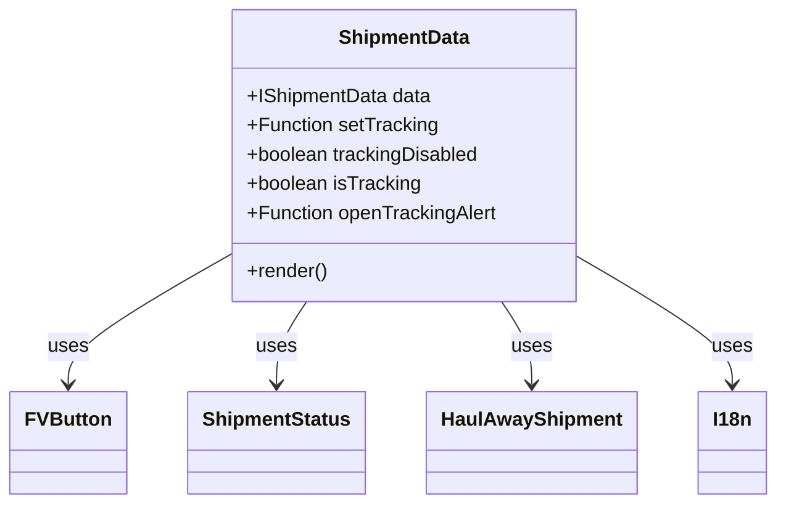

# Diagram: mobile/FreightVerifyMobileTracking/src/components/organisms/shipment-data.tsx


> Auto-generated by Obscura crawlers

## Diagram 1



### SVG

<svg id="container" width="617.953125" xmlns="http://www.w3.org/2000/svg" class="classDiagram" height="414" viewBox="0 0 617.953125 414" role="graphics-document document" aria-roledescription="class"><style>#container{font-family:"trebuchet ms",verdana,arial,sans-serif;font-size:16px;fill:#333;}@keyframes edge-animation-frame{from{stroke-dashoffset:0;}}@keyframes dash{to{stroke-dashoffset:0;}}#container .edge-animation-slow{stroke-dasharray:9,5!important;stroke-dashoffset:900;animation:dash 50s linear infinite;stroke-linecap:round;}#container .edge-animation-fast{stroke-dasharray:9,5!important;stroke-dashoffset:900;animation:dash 20s linear infinite;stroke-linecap:round;}#container .error-icon{fill:#552222;}#container .error-text{fill:#552222;stroke:#552222;}#container .edge-thickness-normal{stroke-width:1px;}#container .edge-thickness-thick{stroke-width:3.5px;}#container .edge-pattern-solid{stroke-dasharray:0;}#container .edge-thickness-invisible{stroke-width:0;fill:none;}#container .edge-pattern-dashed{stroke-dasharray:3;}#container .edge-pattern-dotted{stroke-dasharray:2;}#container .marker{fill:#333333;stroke:#333333;}#container .marker.cross{stroke:#333333;}#container svg{font-family:"trebuchet ms",verdana,arial,sans-serif;font-size:16px;}#container p{margin:0;}#container g.classGroup text{fill:#9370DB;stroke:none;font-family:"trebuchet ms",verdana,arial,sans-serif;font-size:10px;}#container g.classGroup text .title{font-weight:bolder;}#container .nodeLabel,#container .edgeLabel{color:#131300;}#container .edgeLabel .label rect{fill:#ECECFF;}#container .label text{fill:#131300;}#container .labelBkg{background:#ECECFF;}#container .edgeLabel .label span{background:#ECECFF;}#container .classTitle{font-weight:bolder;}#container .node rect,#container .node circle,#container .node ellipse,#container .node polygon,#container .node path{fill:#ECECFF;stroke:#9370DB;stroke-width:1px;}#container .divider{stroke:#9370DB;stroke-width:1;}#container g.clickable{cursor:pointer;}#container g.classGroup rect{fill:#ECECFF;stroke:#9370DB;}#container g.classGroup line{stroke:#9370DB;stroke-width:1;}#container .classLabel .box{stroke:none;stroke-width:0;fill:#ECECFF;opacity:0.5;}#container .classLabel .label{fill:#9370DB;font-size:10px;}#container .relation{stroke:#333333;stroke-width:1;fill:none;}#container .dashed-line{stroke-dasharray:3;}#container .dotted-line{stroke-dasharray:1 2;}#container #compositionStart,#container .composition{fill:#333333!important;stroke:#333333!important;stroke-width:1;}#container #compositionEnd,#container .composition{fill:#333333!important;stroke:#333333!important;stroke-width:1;}#container #dependencyStart,#container .dependency{fill:#333333!important;stroke:#333333!important;stroke-width:1;}#container #dependencyStart,#container .dependency{fill:#333333!important;stroke:#333333!important;stroke-width:1;}#container #extensionStart,#container .extension{fill:transparent!important;stroke:#333333!important;stroke-width:1;}#container #extensionEnd,#container .extension{fill:transparent!important;stroke:#333333!important;stroke-width:1;}#container #aggregationStart,#container .aggregation{fill:transparent!important;stroke:#333333!important;stroke-width:1;}#container #aggregationEnd,#container .aggregation{fill:transparent!important;stroke:#333333!important;stroke-width:1;}#container #lollipopStart,#container .lollipop{fill:#ECECFF!important;stroke:#333333!important;stroke-width:1;}#container #lollipopEnd,#container .lollipop{fill:#ECECFF!important;stroke:#333333!important;stroke-width:1;}#container .edgeTerminals{font-size:11px;line-height:initial;}#container .classTitleText{text-anchor:middle;font-size:18px;fill:#333;}#container .label-icon{display:inline-block;height:1em;overflow:visible;vertical-align:-0.125em;}#container .node .label-icon path{fill:currentColor;stroke:revert;stroke-width:revert;}#container :root{--mermaid-font-family:"trebuchet ms",verdana,arial,sans-serif;}</style><g><defs><marker id="container_class-aggregationStart" class="marker aggregation class" refX="18" refY="7" markerWidth="190" markerHeight="240" orient="auto"><path d="M 18,7 L9,13 L1,7 L9,1 Z"></path></marker></defs><defs><marker id="container_class-aggregationEnd" class="marker aggregation class" refX="1" refY="7" markerWidth="20" markerHeight="28" orient="auto"><path d="M 18,7 L9,13 L1,7 L9,1 Z"></path></marker></defs><defs><marker id="container_class-extensionStart" class="marker extension class" refX="18" refY="7" markerWidth="190" markerHeight="240" orient="auto"><path d="M 1,7 L18,13 V 1 Z"></path></marker></defs><defs><marker id="container_class-extensionEnd" class="marker extension class" refX="1" refY="7" markerWidth="20" markerHeight="28" orient="auto"><path d="M 1,1 V 13 L18,7 Z"></path></marker></defs><defs><marker id="container_class-compositionStart" class="marker composition class" refX="18" refY="7" markerWidth="190" markerHeight="240" orient="auto"><path d="M 18,7 L9,13 L1,7 L9,1 Z"></path></marker></defs><defs><marker id="container_class-compositionEnd" class="marker composition class" refX="1" refY="7" markerWidth="20" markerHeight="28" orient="auto"><path d="M 18,7 L9,13 L1,7 L9,1 Z"></path></marker></defs><defs><marker id="container_class-dependencyStart" class="marker dependency class" refX="6" refY="7" markerWidth="190" markerHeight="240" orient="auto"><path d="M 5,7 L9,13 L1,7 L9,1 Z"></path></marker></defs><defs><marker id="container_class-dependencyEnd" class="marker dependency class" refX="13" refY="7" markerWidth="20" markerHeight="28" orient="auto"><path d="M 18,7 L9,13 L14,7 L9,1 Z"></path></marker></defs><defs><marker id="container_class-lollipopStart" class="marker lollipop class" refX="13" refY="7" markerWidth="190" markerHeight="240" orient="auto"><circle stroke="black" fill="transparent" cx="7" cy="7" r="6"></circle></marker></defs><defs><marker id="container_class-lollipopEnd" class="marker lollipop class" refX="1" refY="7" markerWidth="190" markerHeight="240" orient="auto"><circle stroke="black" fill="transparent" cx="7" cy="7" r="6"></circle></marker></defs><g class="root"><g class="clusters"></g><g class="edgePaths"><path d="M179.656,210.849L158.595,223.208C137.534,235.566,95.411,260.283,74.35,277.808C53.289,295.333,53.289,305.667,53.289,310.833L53.289,316" id="id_ShipmentData_FVButton_1" class="edge-thickness-normal edge-pattern-solid relation" style=";;;" data-edge="true" data-et="edge" data-id="id_ShipmentData_FVButton_1" data-points="W3sieCI6MTc5LjY1NjI1LCJ5IjoyMTAuODQ5MzMyMDY4MDM0MTZ9LHsieCI6NTMuMjg5MDYyNSwieSI6Mjg1fSx7IngiOjUzLjI4OTA2MjUsInkiOjMyMn1d" marker-end="url(#container_class-dependencyEnd)"></path><path d="M243.128,248L239.134,254.167C235.14,260.333,227.152,272.667,223.158,284C219.164,295.333,219.164,305.667,219.164,310.833L219.164,316" id="id_ShipmentData_ShipmentStatus_2" class="edge-thickness-normal edge-pattern-solid relation" style=";;;" data-edge="true" data-et="edge" data-id="id_ShipmentData_ShipmentStatus_2" data-points="W3sieCI6MjQzLjEyNzcxMTk4MjQ4NDA3LCJ5IjoyNDh9LHsieCI6MjE5LjE2NDA2MjUsInkiOjI4NX0seyJ4IjoyMTkuMTY0MDYyNSwieSI6MzIyfV0=" marker-end="url(#container_class-dependencyEnd)"></path><path d="M398.568,248L402.562,254.167C406.555,260.333,414.543,272.667,418.537,284C422.531,295.333,422.531,305.667,422.531,310.833L422.531,316" id="id_ShipmentData_HaulAwayShipment_3" class="edge-thickness-normal edge-pattern-solid relation" style=";;;" data-edge="true" data-et="edge" data-id="id_ShipmentData_HaulAwayShipment_3" data-points="W3sieCI6Mzk4LjU2NzYwMDUxNzUxNTksInkiOjI0OH0seyJ4Ijo0MjIuNTMxMjUsInkiOjI4NX0seyJ4Ijo0MjIuNTMxMjUsInkiOjMyMn1d" marker-end="url(#container_class-dependencyEnd)"></path><path d="M462.039,212.676L482.138,224.73C502.237,236.784,542.435,260.892,562.534,278.113C582.633,295.333,582.633,305.667,582.633,310.833L582.633,316" id="id_ShipmentData_I18n_4" class="edge-thickness-normal edge-pattern-solid relation" style=";;;" data-edge="true" data-et="edge" data-id="id_ShipmentData_I18n_4" data-points="W3sieCI6NDYyLjAzOTA2MjUsInkiOjIxMi42NzY0OTk5OTI1MzkyMn0seyJ4Ijo1ODIuNjMyODEyNSwieSI6Mjg1fSx7IngiOjU4Mi42MzI4MTI1LCJ5IjozMjJ9XQ==" marker-end="url(#container_class-dependencyEnd)"></path></g><g class="edgeLabels"><g class="edgeLabel" transform="translate(53.2890625, 285)"><g class="label" data-id="id_ShipmentData_FVButton_1" transform="translate(-16.4921875, -12)"><foreignObject width="32.984375" height="24"><div xmlns="http://www.w3.org/1999/xhtml" class="labelBkg" style="display: table-cell; white-space: nowrap; line-height: 1.5; max-width: 200px; text-align: center;"><span class="edgeLabel"><p>uses</p></span></div></foreignObject></g></g><g class="edgeLabel" transform="translate(219.1640625, 285)"><g class="label" data-id="id_ShipmentData_ShipmentStatus_2" transform="translate(-16.4921875, -12)"><foreignObject width="32.984375" height="24"><div xmlns="http://www.w3.org/1999/xhtml" class="labelBkg" style="display: table-cell; white-space: nowrap; line-height: 1.5; max-width: 200px; text-align: center;"><span class="edgeLabel"><p>uses</p></span></div></foreignObject></g></g><g class="edgeLabel" transform="translate(422.53125, 285)"><g class="label" data-id="id_ShipmentData_HaulAwayShipment_3" transform="translate(-16.4921875, -12)"><foreignObject width="32.984375" height="24"><div xmlns="http://www.w3.org/1999/xhtml" class="labelBkg" style="display: table-cell; white-space: nowrap; line-height: 1.5; max-width: 200px; text-align: center;"><span class="edgeLabel"><p>uses</p></span></div></foreignObject></g></g><g class="edgeLabel" transform="translate(582.6328125, 285)"><g class="label" data-id="id_ShipmentData_I18n_4" transform="translate(-16.4921875, -12)"><foreignObject width="32.984375" height="24"><div xmlns="http://www.w3.org/1999/xhtml" class="labelBkg" style="display: table-cell; white-space: nowrap; line-height: 1.5; max-width: 200px; text-align: center;"><span class="edgeLabel"><p>uses</p></span></div></foreignObject></g></g></g><g class="nodes"><g class="node default" id="classId-ShipmentData-0" transform="translate(320.84765625, 128)"><g class="basic label-container"><path d="M-141.19140625 -120 L141.19140625 -120 L141.19140625 120 L-141.19140625 120" stroke="none" stroke-width="0" fill="#ECECFF" style=""></path><path d="M-141.19140625 -120 C-34.32617337171486 -120, 72.53905950657028 -120, 141.19140625 -120 M-141.19140625 -120 C-67.75513495240239 -120, 5.6811363451952275 -120, 141.19140625 -120 M141.19140625 -120 C141.19140625 -32.776896442329345, 141.19140625 54.44620711534131, 141.19140625 120 M141.19140625 -120 C141.19140625 -45.51825861607466, 141.19140625 28.963482767850678, 141.19140625 120 M141.19140625 120 C67.50116192211046 120, -6.189082405779089 120, -141.19140625 120 M141.19140625 120 C45.4945529245127 120, -50.20230040097459 120, -141.19140625 120 M-141.19140625 120 C-141.19140625 31.882986898982452, -141.19140625 -56.234026202035096, -141.19140625 -120 M-141.19140625 120 C-141.19140625 41.60936111536111, -141.19140625 -36.78127776927778, -141.19140625 -120" stroke="#9370DB" stroke-width="1.3" fill="none" stroke-dasharray="0 0" style=""></path></g><g class="annotation-group text" transform="translate(0, -96)"></g><g class="label-group text" transform="translate(-51.9921875, -96)"><g class="label" style="font-weight: bolder" transform="translate(0,-12)"><foreignObject width="103.984375" height="24"><div xmlns="http://www.w3.org/1999/xhtml" style="display: table-cell; white-space: nowrap; line-height: 1.5; max-width: 153px; text-align: center;"><span class="nodeLabel markdown-node-label" style=""><p>ShipmentData</p></span></div></foreignObject></g></g><g class="members-group text" transform="translate(-129.19140625, -48)"><g class="label" style="" transform="translate(0,-12)"><foreignObject width="152.5" height="24"><div xmlns="http://www.w3.org/1999/xhtml" style="display: table-cell; white-space: nowrap; line-height: 1.5; max-width: 210px; text-align: center;"><span class="nodeLabel markdown-node-label" style=""><p>+IShipmentData data</p></span></div></foreignObject></g><g class="label" style="" transform="translate(0,12)"><foreignObject width="156.96875" height="24"><div xmlns="http://www.w3.org/1999/xhtml" style="display: table-cell; white-space: nowrap; line-height: 1.5; max-width: 215px; text-align: center;"><span class="nodeLabel markdown-node-label" style=""><p>+Function setTracking</p></span></div></foreignObject></g><g class="label" style="" transform="translate(0,36)"><foreignObject width="193.046875" height="24"><div xmlns="http://www.w3.org/1999/xhtml" style="display: table-cell; white-space: nowrap; line-height: 1.5; max-width: 250px; text-align: center;"><span class="nodeLabel markdown-node-label" style=""><p>+boolean trackingDisabled</p></span></div></foreignObject></g><g class="label" style="" transform="translate(0,60)"><foreignObject width="143.8125" height="24"><div xmlns="http://www.w3.org/1999/xhtml" style="display: table-cell; white-space: nowrap; line-height: 1.5; max-width: 202px; text-align: center;"><span class="nodeLabel markdown-node-label" style=""><p>+boolean isTracking</p></span></div></foreignObject></g><g class="label" style="" transform="translate(0,84)"><foreignObject width="206.390625" height="24"><div xmlns="http://www.w3.org/1999/xhtml" style="display: table-cell; white-space: nowrap; line-height: 1.5; max-width: 264px; text-align: center;"><span class="nodeLabel markdown-node-label" style=""><p>+Function openTrackingAlert</p></span></div></foreignObject></g></g><g class="methods-group text" transform="translate(-129.19140625, 96)"><g class="label" style="" transform="translate(0,-12)"><foreignObject width="66.609375" height="24"><div xmlns="http://www.w3.org/1999/xhtml" style="display: table-cell; white-space: nowrap; line-height: 1.5; max-width: 124px; text-align: center;"><span class="nodeLabel markdown-node-label" style=""><p>+render()</p></span></div></foreignObject></g></g><g class="divider" style=""><path d="M-141.19140625 -72 C-62.0527896659258 -72, 17.0858269181484 -72, 141.19140625 -72 M-141.19140625 -72 C-38.553370775576 -72, 64.084664698848 -72, 141.19140625 -72" stroke="#9370DB" stroke-width="1.3" fill="none" stroke-dasharray="0 0" style=""></path></g><g class="divider" style=""><path d="M-141.19140625 72 C-41.01575569743892 72, 59.15989485512216 72, 141.19140625 72 M-141.19140625 72 C-64.84436673389256 72, 11.502672782214887 72, 141.19140625 72" stroke="#9370DB" stroke-width="1.3" fill="none" stroke-dasharray="0 0" style=""></path></g></g><g class="node default" id="classId-FVButton-1" transform="translate(53.2890625, 364)"><g class="basic label-container"><path d="M-45.2890625 -42 L45.2890625 -42 L45.2890625 42 L-45.2890625 42" stroke="none" stroke-width="0" fill="#ECECFF" style=""></path><path d="M-45.2890625 -42 C-18.03825540331257 -42, 9.212551693374863 -42, 45.2890625 -42 M-45.2890625 -42 C-14.076373706798861 -42, 17.136315086402277 -42, 45.2890625 -42 M45.2890625 -42 C45.2890625 -22.524387419801975, 45.2890625 -3.0487748396039507, 45.2890625 42 M45.2890625 -42 C45.2890625 -15.619355722628331, 45.2890625 10.761288554743338, 45.2890625 42 M45.2890625 42 C21.29867185253106 42, -2.691718794937877 42, -45.2890625 42 M45.2890625 42 C20.866019345650848 42, -3.557023808698304 42, -45.2890625 42 M-45.2890625 42 C-45.2890625 11.605487697638587, -45.2890625 -18.789024604722826, -45.2890625 -42 M-45.2890625 42 C-45.2890625 10.327178576374166, -45.2890625 -21.345642847251668, -45.2890625 -42" stroke="#9370DB" stroke-width="1.3" fill="none" stroke-dasharray="0 0" style=""></path></g><g class="annotation-group text" transform="translate(0, -18)"></g><g class="label-group text" transform="translate(-33.2890625, -18)"><g class="label" style="font-weight: bolder" transform="translate(0,-12)"><foreignObject width="66.578125" height="24"><div xmlns="http://www.w3.org/1999/xhtml" style="display: table-cell; white-space: nowrap; line-height: 1.5; max-width: 116px; text-align: center;"><span class="nodeLabel markdown-node-label" style=""><p>FVButton</p></span></div></foreignObject></g></g><g class="members-group text" transform="translate(-33.2890625, 30)"></g><g class="methods-group text" transform="translate(-33.2890625, 60)"></g><g class="divider" style=""><path d="M-45.2890625 6 C-22.711352210264412 6, -0.13364192052882373 6, 45.2890625 6 M-45.2890625 6 C-12.281007367833283 6, 20.727047764333435 6, 45.2890625 6" stroke="#9370DB" stroke-width="1.3" fill="none" stroke-dasharray="0 0" style=""></path></g><g class="divider" style=""><path d="M-45.2890625 24 C-15.776904504025616 24, 13.735253491948768 24, 45.2890625 24 M-45.2890625 24 C-27.107646144823928 24, -8.926229789647856 24, 45.2890625 24" stroke="#9370DB" stroke-width="1.3" fill="none" stroke-dasharray="0 0" style=""></path></g></g><g class="node default" id="classId-ShipmentStatus-2" transform="translate(219.1640625, 364)"><g class="basic label-container"><path d="M-70.5859375 -42 L70.5859375 -42 L70.5859375 42 L-70.5859375 42" stroke="none" stroke-width="0" fill="#ECECFF" style=""></path><path d="M-70.5859375 -42 C-28.767844148058195 -42, 13.05024920388361 -42, 70.5859375 -42 M-70.5859375 -42 C-17.17758458988132 -42, 36.23076832023736 -42, 70.5859375 -42 M70.5859375 -42 C70.5859375 -11.073431110668533, 70.5859375 19.853137778662933, 70.5859375 42 M70.5859375 -42 C70.5859375 -15.217098623049218, 70.5859375 11.565802753901565, 70.5859375 42 M70.5859375 42 C30.77978053428579 42, -9.026376431428417 42, -70.5859375 42 M70.5859375 42 C18.35254728258289 42, -33.88084293483422 42, -70.5859375 42 M-70.5859375 42 C-70.5859375 24.54955949133736, -70.5859375 7.099118982674717, -70.5859375 -42 M-70.5859375 42 C-70.5859375 23.522464759746317, -70.5859375 5.044929519492634, -70.5859375 -42" stroke="#9370DB" stroke-width="1.3" fill="none" stroke-dasharray="0 0" style=""></path></g><g class="annotation-group text" transform="translate(0, -18)"></g><g class="label-group text" transform="translate(-58.5859375, -18)"><g class="label" style="font-weight: bolder" transform="translate(0,-12)"><foreignObject width="117.171875" height="24"><div xmlns="http://www.w3.org/1999/xhtml" style="display: table-cell; white-space: nowrap; line-height: 1.5; max-width: 165px; text-align: center;"><span class="nodeLabel markdown-node-label" style=""><p>ShipmentStatus</p></span></div></foreignObject></g></g><g class="members-group text" transform="translate(-58.5859375, 30)"></g><g class="methods-group text" transform="translate(-58.5859375, 60)"></g><g class="divider" style=""><path d="M-70.5859375 6 C-16.333749420590628 6, 37.918438658818744 6, 70.5859375 6 M-70.5859375 6 C-29.36387712737976 6, 11.858183245240483 6, 70.5859375 6" stroke="#9370DB" stroke-width="1.3" fill="none" stroke-dasharray="0 0" style=""></path></g><g class="divider" style=""><path d="M-70.5859375 24 C-19.220833113861893 24, 32.144271272276214 24, 70.5859375 24 M-70.5859375 24 C-25.463918568303463 24, 19.658100363393075 24, 70.5859375 24" stroke="#9370DB" stroke-width="1.3" fill="none" stroke-dasharray="0 0" style=""></path></g></g><g class="node default" id="classId-HaulAwayShipment-3" transform="translate(422.53125, 364)"><g class="basic label-container"><path d="M-82.78125 -42 L82.78125 -42 L82.78125 42 L-82.78125 42" stroke="none" stroke-width="0" fill="#ECECFF" style=""></path><path d="M-82.78125 -42 C-35.53561998162802 -42, 11.710010036743967 -42, 82.78125 -42 M-82.78125 -42 C-27.194145247832758 -42, 28.392959504334485 -42, 82.78125 -42 M82.78125 -42 C82.78125 -21.00567561222075, 82.78125 -0.01135122444149772, 82.78125 42 M82.78125 -42 C82.78125 -10.458723758801096, 82.78125 21.08255248239781, 82.78125 42 M82.78125 42 C46.475339782591185 42, 10.16942956518237 42, -82.78125 42 M82.78125 42 C32.36566662403887 42, -18.049916751922254 42, -82.78125 42 M-82.78125 42 C-82.78125 8.500248703034352, -82.78125 -24.999502593931297, -82.78125 -42 M-82.78125 42 C-82.78125 11.38565258993254, -82.78125 -19.22869482013492, -82.78125 -42" stroke="#9370DB" stroke-width="1.3" fill="none" stroke-dasharray="0 0" style=""></path></g><g class="annotation-group text" transform="translate(0, -18)"></g><g class="label-group text" transform="translate(-70.78125, -18)"><g class="label" style="font-weight: bolder" transform="translate(0,-12)"><foreignObject width="141.5625" height="24"><div xmlns="http://www.w3.org/1999/xhtml" style="display: table-cell; white-space: nowrap; line-height: 1.5; max-width: 190px; text-align: center;"><span class="nodeLabel markdown-node-label" style=""><p>HaulAwayShipment</p></span></div></foreignObject></g></g><g class="members-group text" transform="translate(-70.78125, 30)"></g><g class="methods-group text" transform="translate(-70.78125, 60)"></g><g class="divider" style=""><path d="M-82.78125 6 C-27.852841547628145 6, 27.07556690474371 6, 82.78125 6 M-82.78125 6 C-49.45790395485098 6, -16.134557909701954 6, 82.78125 6" stroke="#9370DB" stroke-width="1.3" fill="none" stroke-dasharray="0 0" style=""></path></g><g class="divider" style=""><path d="M-82.78125 24 C-21.506770953839684 24, 39.76770809232063 24, 82.78125 24 M-82.78125 24 C-43.19995649151925 24, -3.6186629830385044 24, 82.78125 24" stroke="#9370DB" stroke-width="1.3" fill="none" stroke-dasharray="0 0" style=""></path></g></g><g class="node default" id="classId-I18n-4" transform="translate(582.6328125, 364)"><g class="basic label-container"><path d="M-27.3203125 -42 L27.3203125 -42 L27.3203125 42 L-27.3203125 42" stroke="none" stroke-width="0" fill="#ECECFF" style=""></path><path d="M-27.3203125 -42 C-14.597369216221134 -42, -1.8744259324422679 -42, 27.3203125 -42 M-27.3203125 -42 C-14.845827741814716 -42, -2.3713429836294324 -42, 27.3203125 -42 M27.3203125 -42 C27.3203125 -17.831242910096794, 27.3203125 6.337514179806412, 27.3203125 42 M27.3203125 -42 C27.3203125 -14.108756733697621, 27.3203125 13.782486532604757, 27.3203125 42 M27.3203125 42 C7.020265519592002 42, -13.279781460815997 42, -27.3203125 42 M27.3203125 42 C13.117445838969363 42, -1.0854208220612733 42, -27.3203125 42 M-27.3203125 42 C-27.3203125 24.108639479992647, -27.3203125 6.217278959985293, -27.3203125 -42 M-27.3203125 42 C-27.3203125 10.258994948906956, -27.3203125 -21.482010102186088, -27.3203125 -42" stroke="#9370DB" stroke-width="1.3" fill="none" stroke-dasharray="0 0" style=""></path></g><g class="annotation-group text" transform="translate(0, -18)"></g><g class="label-group text" transform="translate(-15.3203125, -18)"><g class="label" style="font-weight: bolder" transform="translate(0,-12)"><foreignObject width="30.640625" height="24"><div xmlns="http://www.w3.org/1999/xhtml" style="display: table-cell; white-space: nowrap; line-height: 1.5; max-width: 80px; text-align: center;"><span class="nodeLabel markdown-node-label" style=""><p>I18n</p></span></div></foreignObject></g></g><g class="members-group text" transform="translate(-15.3203125, 30)"></g><g class="methods-group text" transform="translate(-15.3203125, 60)"></g><g class="divider" style=""><path d="M-27.3203125 6 C-9.899808519072174 6, 7.520695461855652 6, 27.3203125 6 M-27.3203125 6 C-12.143902690949464 6, 3.0325071181010728 6, 27.3203125 6" stroke="#9370DB" stroke-width="1.3" fill="none" stroke-dasharray="0 0" style=""></path></g><g class="divider" style=""><path d="M-27.3203125 24 C-7.305594602173009 24, 12.709123295653981 24, 27.3203125 24 M-27.3203125 24 C-10.353441371985944 24, 6.613429756028111 24, 27.3203125 24" stroke="#9370DB" stroke-width="1.3" fill="none" stroke-dasharray="0 0" style=""></path></g></g></g></g></g></svg>

## Diagram 2

```mermaid
flowchart TD
    Start([Start]) --> CheckHaulway{shipment.haulway === true}
    CheckHaulway -- yes --> HaulAway[HaulAwayShipment(status)]
    CheckHaulway -- no --> Status[ShipmentStatus(status)]
    HaulAway --> DisplayBtn
    Status --> DisplayBtn
    DisplayBtn[Render FVButton] --> PointerEvents{isTracking && trackingDisabled}
    PointerEvents -- true --> DisabledPointer[View pointerEvents="none"]
    PointerEvents -- false --> EnabledPointer[View pointerEvents="auto"]
    DisabledPointer --> ButtonAction
    EnabledPointer --> ButtonAction
    ButtonAction{Button pressed} --> CheckTracking{isTracking && trackingDisabled}
    CheckTracking -- true --> Alert[openTrackingAlert()]
    CheckTracking -- false --> StartTracking[setTracking(shipment)]
    Alert --> End([End])
    StartTracking --> End
```

> SVG rendering failed for this diagram.
