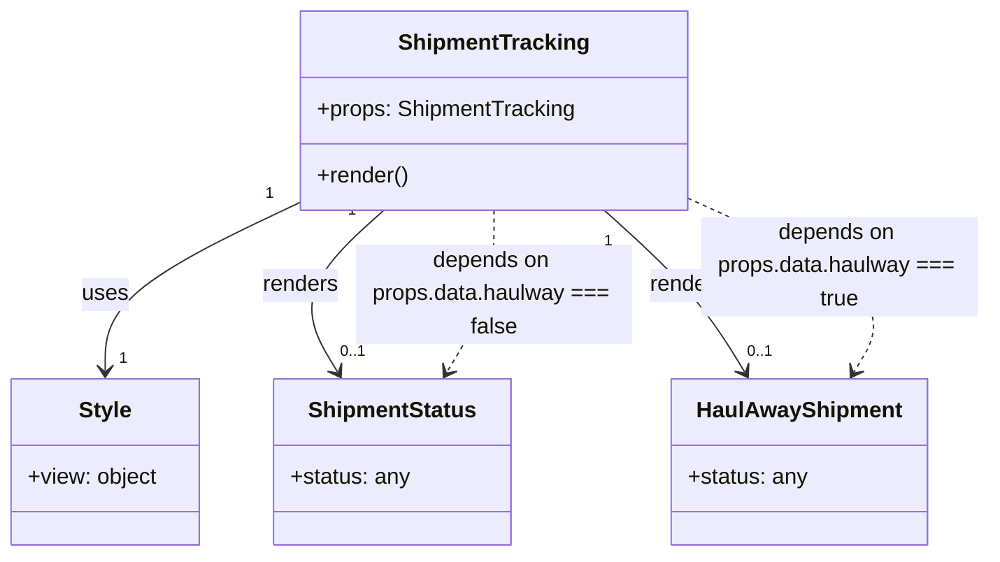

# Diagram: mobile/FreightVerifyMobileTracking/src/components/organisms/shipment-tracking.tsx


> Auto-generated by Obscura crawlers

## Diagram 1



### SVG

<svg id="container" width="715.219482421875" xmlns="http://www.w3.org/2000/svg" class="classDiagram" height="402" viewBox="0 0 715.219482421875 402" role="graphics-document document" aria-roledescription="class"><style>#container{font-family:"trebuchet ms",verdana,arial,sans-serif;font-size:16px;fill:#333;}@keyframes edge-animation-frame{from{stroke-dashoffset:0;}}@keyframes dash{to{stroke-dashoffset:0;}}#container .edge-animation-slow{stroke-dasharray:9,5!important;stroke-dashoffset:900;animation:dash 50s linear infinite;stroke-linecap:round;}#container .edge-animation-fast{stroke-dasharray:9,5!important;stroke-dashoffset:900;animation:dash 20s linear infinite;stroke-linecap:round;}#container .error-icon{fill:#552222;}#container .error-text{fill:#552222;stroke:#552222;}#container .edge-thickness-normal{stroke-width:1px;}#container .edge-thickness-thick{stroke-width:3.5px;}#container .edge-pattern-solid{stroke-dasharray:0;}#container .edge-thickness-invisible{stroke-width:0;fill:none;}#container .edge-pattern-dashed{stroke-dasharray:3;}#container .edge-pattern-dotted{stroke-dasharray:2;}#container .marker{fill:#333333;stroke:#333333;}#container .marker.cross{stroke:#333333;}#container svg{font-family:"trebuchet ms",verdana,arial,sans-serif;font-size:16px;}#container p{margin:0;}#container g.classGroup text{fill:#9370DB;stroke:none;font-family:"trebuchet ms",verdana,arial,sans-serif;font-size:10px;}#container g.classGroup text .title{font-weight:bolder;}#container .nodeLabel,#container .edgeLabel{color:#131300;}#container .edgeLabel .label rect{fill:#ECECFF;}#container .label text{fill:#131300;}#container .labelBkg{background:#ECECFF;}#container .edgeLabel .label span{background:#ECECFF;}#container .classTitle{font-weight:bolder;}#container .node rect,#container .node circle,#container .node ellipse,#container .node polygon,#container .node path{fill:#ECECFF;stroke:#9370DB;stroke-width:1px;}#container .divider{stroke:#9370DB;stroke-width:1;}#container g.clickable{cursor:pointer;}#container g.classGroup rect{fill:#ECECFF;stroke:#9370DB;}#container g.classGroup line{stroke:#9370DB;stroke-width:1;}#container .classLabel .box{stroke:none;stroke-width:0;fill:#ECECFF;opacity:0.5;}#container .classLabel .label{fill:#9370DB;font-size:10px;}#container .relation{stroke:#333333;stroke-width:1;fill:none;}#container .dashed-line{stroke-dasharray:3;}#container .dotted-line{stroke-dasharray:1 2;}#container #compositionStart,#container .composition{fill:#333333!important;stroke:#333333!important;stroke-width:1;}#container #compositionEnd,#container .composition{fill:#333333!important;stroke:#333333!important;stroke-width:1;}#container #dependencyStart,#container .dependency{fill:#333333!important;stroke:#333333!important;stroke-width:1;}#container #dependencyStart,#container .dependency{fill:#333333!important;stroke:#333333!important;stroke-width:1;}#container #extensionStart,#container .extension{fill:transparent!important;stroke:#333333!important;stroke-width:1;}#container #extensionEnd,#container .extension{fill:transparent!important;stroke:#333333!important;stroke-width:1;}#container #aggregationStart,#container .aggregation{fill:transparent!important;stroke:#333333!important;stroke-width:1;}#container #aggregationEnd,#container .aggregation{fill:transparent!important;stroke:#333333!important;stroke-width:1;}#container #lollipopStart,#container .lollipop{fill:#ECECFF!important;stroke:#333333!important;stroke-width:1;}#container #lollipopEnd,#container .lollipop{fill:#ECECFF!important;stroke:#333333!important;stroke-width:1;}#container .edgeTerminals{font-size:11px;line-height:initial;}#container .classTitleText{text-anchor:middle;font-size:18px;fill:#333;}#container .label-icon{display:inline-block;height:1em;overflow:visible;vertical-align:-0.125em;}#container .node .label-icon path{fill:currentColor;stroke:revert;stroke-width:revert;}#container :root{--mermaid-font-family:"trebuchet ms",verdana,arial,sans-serif;}</style><g><defs><marker id="container_class-aggregationStart" class="marker aggregation class" refX="18" refY="7" markerWidth="190" markerHeight="240" orient="auto"><path d="M 18,7 L9,13 L1,7 L9,1 Z"></path></marker></defs><defs><marker id="container_class-aggregationEnd" class="marker aggregation class" refX="1" refY="7" markerWidth="20" markerHeight="28" orient="auto"><path d="M 18,7 L9,13 L1,7 L9,1 Z"></path></marker></defs><defs><marker id="container_class-extensionStart" class="marker extension class" refX="18" refY="7" markerWidth="190" markerHeight="240" orient="auto"><path d="M 1,7 L18,13 V 1 Z"></path></marker></defs><defs><marker id="container_class-extensionEnd" class="marker extension class" refX="1" refY="7" markerWidth="20" markerHeight="28" orient="auto"><path d="M 1,1 V 13 L18,7 Z"></path></marker></defs><defs><marker id="container_class-compositionStart" class="marker composition class" refX="18" refY="7" markerWidth="190" markerHeight="240" orient="auto"><path d="M 18,7 L9,13 L1,7 L9,1 Z"></path></marker></defs><defs><marker id="container_class-compositionEnd" class="marker composition class" refX="1" refY="7" markerWidth="20" markerHeight="28" orient="auto"><path d="M 18,7 L9,13 L1,7 L9,1 Z"></path></marker></defs><defs><marker id="container_class-dependencyStart" class="marker dependency class" refX="6" refY="7" markerWidth="190" markerHeight="240" orient="auto"><path d="M 5,7 L9,13 L1,7 L9,1 Z"></path></marker></defs><defs><marker id="container_class-dependencyEnd" class="marker dependency class" refX="13" refY="7" markerWidth="20" markerHeight="28" orient="auto"><path d="M 18,7 L9,13 L14,7 L9,1 Z"></path></marker></defs><defs><marker id="container_class-lollipopStart" class="marker lollipop class" refX="13" refY="7" markerWidth="190" markerHeight="240" orient="auto"><circle stroke="black" fill="transparent" cx="7" cy="7" r="6"></circle></marker></defs><defs><marker id="container_class-lollipopEnd" class="marker lollipop class" refX="1" refY="7" markerWidth="190" markerHeight="240" orient="auto"><circle stroke="black" fill="transparent" cx="7" cy="7" r="6"></circle></marker></defs><g class="root"><g class="clusters"></g><g class="edgePaths"><path d="M218.77,145.613L195.021,156.844C171.272,168.076,123.775,190.538,100.026,210.936C76.277,231.333,76.277,249.667,76.277,258.833L76.277,268" id="id_ShipmentTracking_Style_1" class="edge-thickness-normal edge-pattern-solid relation" style=";;;" data-edge="true" data-et="edge" data-id="id_ShipmentTracking_Style_1" data-points="W3sieCI6MjE4Ljc2OTUzMTI1LCJ5IjoxNDUuNjEzMjg0MDcxMzM3M30seyJ4Ijo3Ni4yNzczNDM3NSwieSI6MjEzfSx7IngiOjc2LjI3NzM0Mzc1LCJ5IjoyNzR9XQ==" marker-end="url(#container_class-dependencyEnd)"></path><path d="M277.527,152L266.233,162.167C254.938,172.333,232.35,192.667,226.742,212.147C221.134,231.626,232.506,250.253,238.192,259.566L243.878,268.879" id="id_ShipmentTracking_ShipmentStatus_2" class="edge-thickness-normal edge-pattern-solid relation" style=";;;" data-edge="true" data-et="edge" data-id="id_ShipmentTracking_ShipmentStatus_2" data-points="W3sieCI6Mjc3LjUyNjc1NjM0Mzk4NDk3LCJ5IjoxNTJ9LHsieCI6MjA5Ljc2MTcxODc1LCJ5IjoyMTN9LHsieCI6MjQ3LjAwNDQ4NzM0NTA0MTMzLCJ5IjoyNzR9XQ==" marker-end="url(#container_class-dependencyEnd)"></path><path d="M437.497,152L448.791,162.167C460.085,172.333,482.673,192.667,499.654,212.147C516.634,231.626,528.006,250.253,533.692,259.566L539.378,268.879" id="id_ShipmentTracking_HaulAwayShipment_3" class="edge-thickness-normal edge-pattern-solid relation" style=";;;" data-edge="true" data-et="edge" data-id="id_ShipmentTracking_HaulAwayShipment_3" data-points="W3sieCI6NDM3LjQ5NjY4MTE1NjAxNTAzLCJ5IjoxNTJ9LHsieCI6NTA1LjI2MTcxODc1LCJ5IjoyMTN9LHsieCI6NTQyLjUwNDQ4NzM0NTA0MTMsInkiOjI3NH1d" marker-end="url(#container_class-dependencyEnd)"></path><path d="M357.512,152L357.512,162.167C357.512,172.333,357.512,192.667,351.826,212.147C346.14,231.626,334.768,250.253,329.082,259.566L323.396,268.879" id="id_ShipmentTracking_ShipmentStatus_4" class="edge-thickness-normal edge-pattern-dashed relation" style=";;;" data-edge="true" data-et="edge" data-id="id_ShipmentTracking_ShipmentStatus_4" data-points="W3sieCI6MzU3LjUxMTcxODc1LCJ5IjoxNTJ9LHsieCI6MzU3LjUxMTcxODc1LCJ5IjoyMTN9LHsieCI6MzIwLjI2ODk1MDE1NDk1ODcsInkiOjI3NH1d" marker-end="url(#container_class-dependencyEnd)"></path><path d="M496.254,142.446L522.38,154.205C548.507,165.964,600.759,189.482,621.199,210.554C641.64,231.626,630.268,250.253,624.582,259.566L618.896,268.879" id="id_ShipmentTracking_HaulAwayShipment_5" class="edge-thickness-normal edge-pattern-dashed relation" style=";;;" data-edge="true" data-et="edge" data-id="id_ShipmentTracking_HaulAwayShipment_5" data-points="W3sieCI6NDk2LjI1MzkwNjI1LCJ5IjoxNDIuNDQ1NzIyMjkyNzI0Mn0seyJ4Ijo2NTMuMDExNzE4NzUsInkiOjIxM30seyJ4Ijo2MTUuNzY4OTUwMTU0OTU4NywieSI6Mjc0fV0=" marker-end="url(#container_class-dependencyEnd)"></path></g><g class="edgeLabels"><g class="edgeLabel" transform="translate(76.27734375, 213)"><g class="label" data-id="id_ShipmentTracking_Style_1" transform="translate(-16.4921875, -12)"><foreignObject width="32.984375" height="24"><div xmlns="http://www.w3.org/1999/xhtml" class="labelBkg" style="display: table-cell; white-space: nowrap; line-height: 1.5; max-width: 200px; text-align: center;"><span class="edgeLabel"><p>uses</p></span></div></foreignObject></g></g><g class="edgeLabel" transform="translate(217.08469, 206.40808)"><g class="label" data-id="id_ShipmentTracking_ShipmentStatus_2" transform="translate(-27.75, -12)"><foreignObject width="55.5" height="24"><div xmlns="http://www.w3.org/1999/xhtml" class="labelBkg" style="display: table-cell; white-space: nowrap; line-height: 1.5; max-width: 200px; text-align: center;"><span class="edgeLabel"><p>renders</p></span></div></foreignObject></g></g><g class="edgeLabel" transform="translate(497.93875, 206.40808)"><g class="label" data-id="id_ShipmentTracking_HaulAwayShipment_3" transform="translate(-27.75, -12)"><foreignObject width="55.5" height="24"><div xmlns="http://www.w3.org/1999/xhtml" class="labelBkg" style="display: table-cell; white-space: nowrap; line-height: 1.5; max-width: 200px; text-align: center;"><span class="edgeLabel"><p>renders</p></span></div></foreignObject></g></g><g class="edgeLabel" transform="translate(357.51171875, 213)"><g class="label" data-id="id_ShipmentTracking_ShipmentStatus_4" transform="translate(-100, -36)"><foreignObject width="200" height="72"><div xmlns="http://www.w3.org/1999/xhtml" class="labelBkg" style="display: table; white-space: break-spaces; line-height: 1.5; max-width: 200px; text-align: center; width: 200px;"><span class="edgeLabel"><p>depends on props.data.haulway === false</p></span></div></foreignObject></g></g><g class="edgeLabel" transform="translate(607.2195, 192.38963)"><g class="label" data-id="id_ShipmentTracking_HaulAwayShipment_5" transform="translate(-100, -36)"><foreignObject width="200" height="72"><div xmlns="http://www.w3.org/1999/xhtml" class="labelBkg" style="display: table; white-space: break-spaces; line-height: 1.5; max-width: 200px; text-align: center; width: 200px;"><span class="edgeLabel"><p>depends on props.data.haulway === true</p></span></div></foreignObject></g></g><g class="edgeTerminals" transform="translate(196.53663871895353, 139.53475776046872)"><g class="inner" transform="translate(0, 0)"><foreignObject style="width: 9px; height: 12px;"><div xmlns="http://www.w3.org/1999/xhtml" style="display: inline-block; padding-right: 1px; white-space: nowrap;"><span class="edgeLabel">1</span></div></foreignObject></g></g><g class="edgeTerminals" transform="translate(254.48468939462188, 152.55962641729798)"><g class="inner" transform="translate(0, 0)"><foreignObject style="width: 9px; height: 12px;"><div xmlns="http://www.w3.org/1999/xhtml" style="display: inline-block; padding-right: 1px; white-space: nowrap;"><span class="edgeLabel">1</span></div></foreignObject></g></g><g class="edgeTerminals" transform="translate(440.467722333402, 174.8565740622807)"><g class="inner" transform="translate(0, 0)"><foreignObject style="width: 9px; height: 12px;"><div xmlns="http://www.w3.org/1999/xhtml" style="display: inline-block; padding-right: 1px; white-space: nowrap;"><span class="edgeLabel">1</span></div></foreignObject></g></g><g class="edgeTerminals" transform="translate(86.2773418749999, 251.49999839285715)"><g class="inner" transform="translate(0, 0)"></g><foreignObject style="width: 9px; height: 12px;"><div xmlns="http://www.w3.org/1999/xhtml" style="display: inline-block; padding-right: 1px; white-space: nowrap;"><span class="edgeLabel">1</span></div></foreignObject></g><g class="edgeTerminals" transform="translate(245.68784910175856, 246.24735488330032)"><g class="inner" transform="translate(0, 0)"></g><foreignObject style="width: 36px; height: 12px;"><div xmlns="http://www.w3.org/1999/xhtml" style="display: inline-block; padding-right: 1px; white-space: nowrap;"><span class="edgeLabel">0..1</span></div></foreignObject></g><g class="edgeTerminals" transform="translate(541.1878491017585, 246.24735488330032)"><g class="inner" transform="translate(0, 0)"></g><foreignObject style="width: 36px; height: 12px;"><div xmlns="http://www.w3.org/1999/xhtml" style="display: inline-block; padding-right: 1px; white-space: nowrap;"><span class="edgeLabel">0..1</span></div></foreignObject></g></g><g class="nodes"><g class="node default" id="classId-ShipmentTracking-0" transform="translate(357.51171875, 80)"><g class="basic label-container"><path d="M-138.7421875 -72 L138.7421875 -72 L138.7421875 72 L-138.7421875 72" stroke="none" stroke-width="0" fill="#ECECFF" style=""></path><path d="M-138.7421875 -72 C-58.002209262177445 -72, 22.73776897564511 -72, 138.7421875 -72 M-138.7421875 -72 C-76.21270307604337 -72, -13.683218652086722 -72, 138.7421875 -72 M138.7421875 -72 C138.7421875 -30.965380735729255, 138.7421875 10.06923852854149, 138.7421875 72 M138.7421875 -72 C138.7421875 -20.387905855386762, 138.7421875 31.224188289226475, 138.7421875 72 M138.7421875 72 C45.679756368176086 72, -47.38267476364783 72, -138.7421875 72 M138.7421875 72 C51.6488902092848 72, -35.4444070814304 72, -138.7421875 72 M-138.7421875 72 C-138.7421875 36.71368657159174, -138.7421875 1.4273731431834733, -138.7421875 -72 M-138.7421875 72 C-138.7421875 27.341770283065735, -138.7421875 -17.31645943386853, -138.7421875 -72" stroke="#9370DB" stroke-width="1.3" fill="none" stroke-dasharray="0 0" style=""></path></g><g class="annotation-group text" transform="translate(0, -48)"></g><g class="label-group text" transform="translate(-66.03125, -48)"><g class="label" style="font-weight: bolder" transform="translate(0,-12)"><foreignObject width="132.0625" height="24"><div xmlns="http://www.w3.org/1999/xhtml" style="display: table-cell; white-space: nowrap; line-height: 1.5; max-width: 181px; text-align: center;"><span class="nodeLabel markdown-node-label" style=""><p>ShipmentTracking</p></span></div></foreignObject></g></g><g class="members-group text" transform="translate(-126.7421875, 0)"><g class="label" style="" transform="translate(0,-12)"><foreignObject width="187.453125" height="24"><div xmlns="http://www.w3.org/1999/xhtml" style="display: table-cell; white-space: nowrap; line-height: 1.5; max-width: 245px; text-align: center;"><span class="nodeLabel markdown-node-label" style=""><p>+props: ShipmentTracking</p></span></div></foreignObject></g></g><g class="methods-group text" transform="translate(-126.7421875, 48)"><g class="label" style="" transform="translate(0,-12)"><foreignObject width="66.609375" height="24"><div xmlns="http://www.w3.org/1999/xhtml" style="display: table-cell; white-space: nowrap; line-height: 1.5; max-width: 124px; text-align: center;"><span class="nodeLabel markdown-node-label" style=""><p>+render()</p></span></div></foreignObject></g></g><g class="divider" style=""><path d="M-138.7421875 -24 C-54.28697384021355 -24, 30.168239819572904 -24, 138.7421875 -24 M-138.7421875 -24 C-45.28784805033513 -24, 48.16649139932974 -24, 138.7421875 -24" stroke="#9370DB" stroke-width="1.3" fill="none" stroke-dasharray="0 0" style=""></path></g><g class="divider" style=""><path d="M-138.7421875 24 C-28.70645141556099 24, 81.32928466887802 24, 138.7421875 24 M-138.7421875 24 C-49.24589852046651 24, 40.25039045906698 24, 138.7421875 24" stroke="#9370DB" stroke-width="1.3" fill="none" stroke-dasharray="0 0" style=""></path></g></g><g class="node default" id="classId-ShipmentStatus-1" transform="translate(283.63671875, 334)"><g class="basic label-container"><path d="M-84.44921875 -60 L84.44921875 -60 L84.44921875 60 L-84.44921875 60" stroke="none" stroke-width="0" fill="#ECECFF" style=""></path><path d="M-84.44921875 -60 C-45.45500042623882 -60, -6.460782102477637 -60, 84.44921875 -60 M-84.44921875 -60 C-41.769141592405674 -60, 0.9109355651886517 -60, 84.44921875 -60 M84.44921875 -60 C84.44921875 -29.365121413134244, 84.44921875 1.269757173731513, 84.44921875 60 M84.44921875 -60 C84.44921875 -29.308333398179027, 84.44921875 1.3833332036419463, 84.44921875 60 M84.44921875 60 C49.62196244981894 60, 14.794706149637875 60, -84.44921875 60 M84.44921875 60 C36.731249577942776 60, -10.986719594114447 60, -84.44921875 60 M-84.44921875 60 C-84.44921875 16.05051974136436, -84.44921875 -27.898960517271277, -84.44921875 -60 M-84.44921875 60 C-84.44921875 31.72600864445387, -84.44921875 3.45201728890774, -84.44921875 -60" stroke="#9370DB" stroke-width="1.3" fill="none" stroke-dasharray="0 0" style=""></path></g><g class="annotation-group text" transform="translate(0, -36)"></g><g class="label-group text" transform="translate(-58.5859375, -36)"><g class="label" style="font-weight: bolder" transform="translate(0,-12)"><foreignObject width="117.171875" height="24"><div xmlns="http://www.w3.org/1999/xhtml" style="display: table-cell; white-space: nowrap; line-height: 1.5; max-width: 165px; text-align: center;"><span class="nodeLabel markdown-node-label" style=""><p>ShipmentStatus</p></span></div></foreignObject></g></g><g class="members-group text" transform="translate(-72.44921875, 12)"><g class="label" style="" transform="translate(0,-12)"><foreignObject width="86.3125" height="24"><div xmlns="http://www.w3.org/1999/xhtml" style="display: table-cell; white-space: nowrap; line-height: 1.5; max-width: 144px; text-align: center;"><span class="nodeLabel markdown-node-label" style=""><p>+status: any</p></span></div></foreignObject></g></g><g class="methods-group text" transform="translate(-72.44921875, 60)"></g><g class="divider" style=""><path d="M-84.44921875 -12 C-29.57393552778057 -12, 25.30134769443886 -12, 84.44921875 -12 M-84.44921875 -12 C-46.599474852347605 -12, -8.74973095469521 -12, 84.44921875 -12" stroke="#9370DB" stroke-width="1.3" fill="none" stroke-dasharray="0 0" style=""></path></g><g class="divider" style=""><path d="M-84.44921875 36 C-22.53409353030571 36, 39.38103168938858 36, 84.44921875 36 M-84.44921875 36 C-19.18363991206614 36, 46.08193892586772 36, 84.44921875 36" stroke="#9370DB" stroke-width="1.3" fill="none" stroke-dasharray="0 0" style=""></path></g></g><g class="node default" id="classId-HaulAwayShipment-2" transform="translate(579.13671875, 334)"><g class="basic label-container"><path d="M-90.546875 -60 L90.546875 -60 L90.546875 60 L-90.546875 60" stroke="none" stroke-width="0" fill="#ECECFF" style=""></path><path d="M-90.546875 -60 C-38.05638852143631 -60, 14.434097957127378 -60, 90.546875 -60 M-90.546875 -60 C-28.972052186636816 -60, 32.60277062672637 -60, 90.546875 -60 M90.546875 -60 C90.546875 -34.905063957316536, 90.546875 -9.810127914633071, 90.546875 60 M90.546875 -60 C90.546875 -15.783796926173451, 90.546875 28.432406147653097, 90.546875 60 M90.546875 60 C38.70633466261773 60, -13.134205674764544 60, -90.546875 60 M90.546875 60 C51.76734177400293 60, 12.987808548005859 60, -90.546875 60 M-90.546875 60 C-90.546875 19.89981802074975, -90.546875 -20.200363958500503, -90.546875 -60 M-90.546875 60 C-90.546875 15.718018138076168, -90.546875 -28.563963723847664, -90.546875 -60" stroke="#9370DB" stroke-width="1.3" fill="none" stroke-dasharray="0 0" style=""></path></g><g class="annotation-group text" transform="translate(0, -36)"></g><g class="label-group text" transform="translate(-70.78125, -36)"><g class="label" style="font-weight: bolder" transform="translate(0,-12)"><foreignObject width="141.5625" height="24"><div xmlns="http://www.w3.org/1999/xhtml" style="display: table-cell; white-space: nowrap; line-height: 1.5; max-width: 190px; text-align: center;"><span class="nodeLabel markdown-node-label" style=""><p>HaulAwayShipment</p></span></div></foreignObject></g></g><g class="members-group text" transform="translate(-78.546875, 12)"><g class="label" style="" transform="translate(0,-12)"><foreignObject width="86.3125" height="24"><div xmlns="http://www.w3.org/1999/xhtml" style="display: table-cell; white-space: nowrap; line-height: 1.5; max-width: 144px; text-align: center;"><span class="nodeLabel markdown-node-label" style=""><p>+status: any</p></span></div></foreignObject></g></g><g class="methods-group text" transform="translate(-78.546875, 60)"></g><g class="divider" style=""><path d="M-90.546875 -12 C-36.391672224843 -12, 17.763530550314 -12, 90.546875 -12 M-90.546875 -12 C-50.64485069099755 -12, -10.742826381995101 -12, 90.546875 -12" stroke="#9370DB" stroke-width="1.3" fill="none" stroke-dasharray="0 0" style=""></path></g><g class="divider" style=""><path d="M-90.546875 36 C-50.9741518946631 36, -11.401428789326204 36, 90.546875 36 M-90.546875 36 C-34.93745601867535 36, 20.671962962649303 36, 90.546875 36" stroke="#9370DB" stroke-width="1.3" fill="none" stroke-dasharray="0 0" style=""></path></g></g><g class="node default" id="classId-Style-3" transform="translate(76.27734375, 334)"><g class="basic label-container"><path d="M-68.27734375 -60 L68.27734375 -60 L68.27734375 60 L-68.27734375 60" stroke="none" stroke-width="0" fill="#ECECFF" style=""></path><path d="M-68.27734375 -60 C-18.85163487059024 -60, 30.574074008819522 -60, 68.27734375 -60 M-68.27734375 -60 C-24.351698566106883 -60, 19.573946617786234 -60, 68.27734375 -60 M68.27734375 -60 C68.27734375 -13.929590249793321, 68.27734375 32.14081950041336, 68.27734375 60 M68.27734375 -60 C68.27734375 -14.386600423298809, 68.27734375 31.226799153402382, 68.27734375 60 M68.27734375 60 C14.235777491969777 60, -39.805788766060445 60, -68.27734375 60 M68.27734375 60 C27.240995008626996 60, -13.795353732746008 60, -68.27734375 60 M-68.27734375 60 C-68.27734375 23.158585566255233, -68.27734375 -13.682828867489533, -68.27734375 -60 M-68.27734375 60 C-68.27734375 25.833456411358874, -68.27734375 -8.333087177282252, -68.27734375 -60" stroke="#9370DB" stroke-width="1.3" fill="none" stroke-dasharray="0 0" style=""></path></g><g class="annotation-group text" transform="translate(0, -36)"></g><g class="label-group text" transform="translate(-18.5234375, -36)"><g class="label" style="font-weight: bolder" transform="translate(0,-12)"><foreignObject width="37.046875" height="24"><div xmlns="http://www.w3.org/1999/xhtml" style="display: table-cell; white-space: nowrap; line-height: 1.5; max-width: 86px; text-align: center;"><span class="nodeLabel markdown-node-label" style=""><p>Style</p></span></div></foreignObject></g></g><g class="members-group text" transform="translate(-56.27734375, 12)"><g class="label" style="" transform="translate(0,-12)"><foreignObject width="94.03125" height="24"><div xmlns="http://www.w3.org/1999/xhtml" style="display: table-cell; white-space: nowrap; line-height: 1.5; max-width: 152px; text-align: center;"><span class="nodeLabel markdown-node-label" style=""><p>+view: object</p></span></div></foreignObject></g></g><g class="methods-group text" transform="translate(-56.27734375, 60)"></g><g class="divider" style=""><path d="M-68.27734375 -12 C-27.28779519074932 -12, 13.701753368501357 -12, 68.27734375 -12 M-68.27734375 -12 C-16.135333702631485 -12, 36.00667634473703 -12, 68.27734375 -12" stroke="#9370DB" stroke-width="1.3" fill="none" stroke-dasharray="0 0" style=""></path></g><g class="divider" style=""><path d="M-68.27734375 36 C-37.86315437669166 36, -7.4489650033833215 36, 68.27734375 36 M-68.27734375 36 C-36.09688981525792 36, -3.9164358805158344 36, 68.27734375 36" stroke="#9370DB" stroke-width="1.3" fill="none" stroke-dasharray="0 0" style=""></path></g></g></g></g></g></svg>

## Diagram 2

```mermaid
flowchart TD
    A[props.data (shipments)] --> B{shipments.haulway === true?}
    B -- Yes --> C[HaulAwayShipment\n(status={shipments})]
    B -- No --> D[ShipmentStatus\n(status={shipments})]
    C --> E[wrapped in View (style.view)]
    D --> E
    E --> F[Rendered output]
```

> SVG rendering failed for this diagram.
