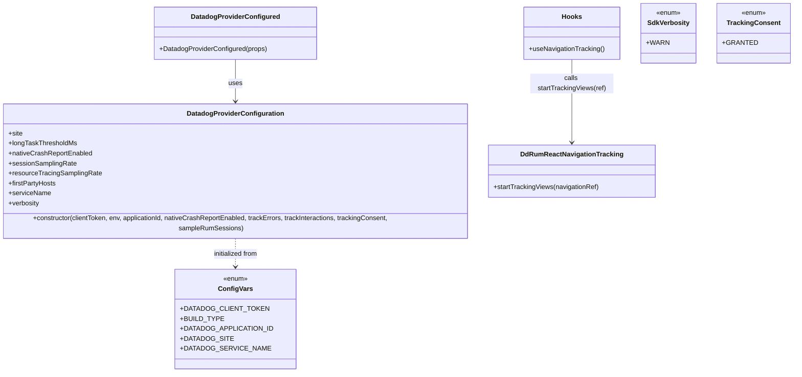

# Diagram: mobile/FreightVerifyMobileTracking/src/monitoring/datadog.tsx


> Auto-generated by Obscura crawlers

## Diagram 1

```mermaid
flowchart TD
  A[Start] --> B{Environment}
  B -->|__DEV__ true| C[No Datadog Config]
  B -->|__DEV__ false & all Config vars present| D[Create DatadogProviderConfiguration]
  D --> E[Set site, thresholds, sampling rates, hosts, serviceName, verbosity]
  E --> F[config available]
  C --> F2[config undefined]
  F --> G[DatadogProviderConfigured returns <DatadogProvider configuration={config}>children</DatadogProvider>]
  F2 --> H[DatadogProviderConfigured returns children directly]
  subgraph NavigationTracking
    I[useNavigationTracking hook]
    I --> J[ref = React.useRef(null)]
    I --> K[onReady -> DdRumReactNavigationTracking.startTrackingViews(ref.current)]
    K --> L[starts tracking views]
  end
```

> SVG rendering failed for this diagram.

## Diagram 2



### SVG

<svg id="container" width="1918.89453125" xmlns="http://www.w3.org/2000/svg" class="classDiagram" height="884" viewBox="0 0 1918.89453125 884" role="graphics-document document" aria-roledescription="class"><style>#container{font-family:"trebuchet ms",verdana,arial,sans-serif;font-size:16px;fill:#333;}@keyframes edge-animation-frame{from{stroke-dashoffset:0;}}@keyframes dash{to{stroke-dashoffset:0;}}#container .edge-animation-slow{stroke-dasharray:9,5!important;stroke-dashoffset:900;animation:dash 50s linear infinite;stroke-linecap:round;}#container .edge-animation-fast{stroke-dasharray:9,5!important;stroke-dashoffset:900;animation:dash 20s linear infinite;stroke-linecap:round;}#container .error-icon{fill:#552222;}#container .error-text{fill:#552222;stroke:#552222;}#container .edge-thickness-normal{stroke-width:1px;}#container .edge-thickness-thick{stroke-width:3.5px;}#container .edge-pattern-solid{stroke-dasharray:0;}#container .edge-thickness-invisible{stroke-width:0;fill:none;}#container .edge-pattern-dashed{stroke-dasharray:3;}#container .edge-pattern-dotted{stroke-dasharray:2;}#container .marker{fill:#333333;stroke:#333333;}#container .marker.cross{stroke:#333333;}#container svg{font-family:"trebuchet ms",verdana,arial,sans-serif;font-size:16px;}#container p{margin:0;}#container g.classGroup text{fill:#9370DB;stroke:none;font-family:"trebuchet ms",verdana,arial,sans-serif;font-size:10px;}#container g.classGroup text .title{font-weight:bolder;}#container .nodeLabel,#container .edgeLabel{color:#131300;}#container .edgeLabel .label rect{fill:#ECECFF;}#container .label text{fill:#131300;}#container .labelBkg{background:#ECECFF;}#container .edgeLabel .label span{background:#ECECFF;}#container .classTitle{font-weight:bolder;}#container .node rect,#container .node circle,#container .node ellipse,#container .node polygon,#container .node path{fill:#ECECFF;stroke:#9370DB;stroke-width:1px;}#container .divider{stroke:#9370DB;stroke-width:1;}#container g.clickable{cursor:pointer;}#container g.classGroup rect{fill:#ECECFF;stroke:#9370DB;}#container g.classGroup line{stroke:#9370DB;stroke-width:1;}#container .classLabel .box{stroke:none;stroke-width:0;fill:#ECECFF;opacity:0.5;}#container .classLabel .label{fill:#9370DB;font-size:10px;}#container .relation{stroke:#333333;stroke-width:1;fill:none;}#container .dashed-line{stroke-dasharray:3;}#container .dotted-line{stroke-dasharray:1 2;}#container #compositionStart,#container .composition{fill:#333333!important;stroke:#333333!important;stroke-width:1;}#container #compositionEnd,#container .composition{fill:#333333!important;stroke:#333333!important;stroke-width:1;}#container #dependencyStart,#container .dependency{fill:#333333!important;stroke:#333333!important;stroke-width:1;}#container #dependencyStart,#container .dependency{fill:#333333!important;stroke:#333333!important;stroke-width:1;}#container #extensionStart,#container .extension{fill:transparent!important;stroke:#333333!important;stroke-width:1;}#container #extensionEnd,#container .extension{fill:transparent!important;stroke:#333333!important;stroke-width:1;}#container #aggregationStart,#container .aggregation{fill:transparent!important;stroke:#333333!important;stroke-width:1;}#container #aggregationEnd,#container .aggregation{fill:transparent!important;stroke:#333333!important;stroke-width:1;}#container #lollipopStart,#container .lollipop{fill:#ECECFF!important;stroke:#333333!important;stroke-width:1;}#container #lollipopEnd,#container .lollipop{fill:#ECECFF!important;stroke:#333333!important;stroke-width:1;}#container .edgeTerminals{font-size:11px;line-height:initial;}#container .classTitleText{text-anchor:middle;font-size:18px;fill:#333;}#container .label-icon{display:inline-block;height:1em;overflow:visible;vertical-align:-0.125em;}#container .node .label-icon path{fill:currentColor;stroke:revert;stroke-width:revert;}#container :root{--mermaid-font-family:"trebuchet ms",verdana,arial,sans-serif;}</style><g><defs><marker id="container_class-aggregationStart" class="marker aggregation class" refX="18" refY="7" markerWidth="190" markerHeight="240" orient="auto"><path d="M 18,7 L9,13 L1,7 L9,1 Z"></path></marker></defs><defs><marker id="container_class-aggregationEnd" class="marker aggregation class" refX="1" refY="7" markerWidth="20" markerHeight="28" orient="auto"><path d="M 18,7 L9,13 L1,7 L9,1 Z"></path></marker></defs><defs><marker id="container_class-extensionStart" class="marker extension class" refX="18" refY="7" markerWidth="190" markerHeight="240" orient="auto"><path d="M 1,7 L18,13 V 1 Z"></path></marker></defs><defs><marker id="container_class-extensionEnd" class="marker extension class" refX="1" refY="7" markerWidth="20" markerHeight="28" orient="auto"><path d="M 1,1 V 13 L18,7 Z"></path></marker></defs><defs><marker id="container_class-compositionStart" class="marker composition class" refX="18" refY="7" markerWidth="190" markerHeight="240" orient="auto"><path d="M 18,7 L9,13 L1,7 L9,1 Z"></path></marker></defs><defs><marker id="container_class-compositionEnd" class="marker composition class" refX="1" refY="7" markerWidth="20" markerHeight="28" orient="auto"><path d="M 18,7 L9,13 L1,7 L9,1 Z"></path></marker></defs><defs><marker id="container_class-dependencyStart" class="marker dependency class" refX="6" refY="7" markerWidth="190" markerHeight="240" orient="auto"><path d="M 5,7 L9,13 L1,7 L9,1 Z"></path></marker></defs><defs><marker id="container_class-dependencyEnd" class="marker dependency class" refX="13" refY="7" markerWidth="20" markerHeight="28" orient="auto"><path d="M 18,7 L9,13 L14,7 L9,1 Z"></path></marker></defs><defs><marker id="container_class-lollipopStart" class="marker lollipop class" refX="13" refY="7" markerWidth="190" markerHeight="240" orient="auto"><circle stroke="black" fill="transparent" cx="7" cy="7" r="6"></circle></marker></defs><defs><marker id="container_class-lollipopEnd" class="marker lollipop class" refX="1" refY="7" markerWidth="190" markerHeight="240" orient="auto"><circle stroke="black" fill="transparent" cx="7" cy="7" r="6"></circle></marker></defs><g class="root"><g class="clusters"></g><g class="edgePaths"><path d="M587.016,143L587.016,152.667C587.016,162.333,587.016,181.667,587.016,198.5C587.016,215.333,587.016,229.667,587.016,236.833L587.016,244" id="id_DatadogProviderConfigured_DatadogProviderConfiguration_1" class="edge-thickness-normal edge-pattern-solid relation" style=";;;" data-edge="true" data-et="edge" data-id="id_DatadogProviderConfigured_DatadogProviderConfiguration_1" data-points="W3sieCI6NTg3LjAxNTYyNSwieSI6MTQzfSx7IngiOjU4Ny4wMTU2MjUsInkiOjIwMX0seyJ4Ijo1ODcuMDE1NjI1LCJ5IjoyNTB9XQ==" marker-end="url(#container_class-dependencyEnd)"></path><path d="M1413.516,143L1413.516,152.667C1413.516,162.333,1413.516,181.667,1413.516,214C1413.516,246.333,1413.516,291.667,1413.516,314.333L1413.516,337" id="id_Hooks_DdRumReactNavigationTracking_2" class="edge-thickness-normal edge-pattern-solid relation" style=";;;" data-edge="true" data-et="edge" data-id="id_Hooks_DdRumReactNavigationTracking_2" data-points="W3sieCI6MTQxMy41MTU2MjUsInkiOjE0M30seyJ4IjoxNDEzLjUxNTYyNSwieSI6MjAxfSx7IngiOjE0MTMuNTE1NjI1LCJ5IjozNDN9XQ==" marker-end="url(#container_class-dependencyEnd)"></path><path d="M587.016,562L587.016,568.167C587.016,574.333,587.016,586.667,587.016,598C587.016,609.333,587.016,619.667,587.016,624.833L587.016,630" id="id_DatadogProviderConfiguration_ConfigVars_3" class="edge-thickness-normal edge-pattern-dashed relation" style=";;;" data-edge="true" data-et="edge" data-id="id_DatadogProviderConfiguration_ConfigVars_3" data-points="W3sieCI6NTg3LjAxNTYyNSwieSI6NTYyfSx7IngiOjU4Ny4wMTU2MjUsInkiOjU5OX0seyJ4Ijo1ODcuMDE1NjI1LCJ5Ijo2MzZ9XQ==" marker-end="url(#container_class-dependencyEnd)"></path></g><g class="edgeLabels"><g class="edgeLabel" transform="translate(587.015625, 201)"><g class="label" data-id="id_DatadogProviderConfigured_DatadogProviderConfiguration_1" transform="translate(-16.4921875, -12)"><foreignObject width="32.984375" height="24"><div xmlns="http://www.w3.org/1999/xhtml" class="labelBkg" style="display: table-cell; white-space: nowrap; line-height: 1.5; max-width: 200px; text-align: center;"><span class="edgeLabel"><p>uses</p></span></div></foreignObject></g></g><g class="edgeLabel" transform="translate(1413.515625, 201)"><g class="label" data-id="id_Hooks_DdRumReactNavigationTracking_2" transform="translate(-100, -24)"><foreignObject width="200" height="48"><div xmlns="http://www.w3.org/1999/xhtml" class="labelBkg" style="display: table; white-space: break-spaces; line-height: 1.5; max-width: 200px; text-align: center; width: 200px;"><span class="edgeLabel"><p>calls startTrackingViews(ref)</p></span></div></foreignObject></g></g><g class="edgeLabel" transform="translate(587.015625, 599)"><g class="label" data-id="id_DatadogProviderConfiguration_ConfigVars_3" transform="translate(-54.9765625, -12)"><foreignObject width="109.953125" height="24"><div xmlns="http://www.w3.org/1999/xhtml" class="labelBkg" style="display: table-cell; white-space: nowrap; line-height: 1.5; max-width: 200px; text-align: center;"><span class="edgeLabel"><p>initialized from</p></span></div></foreignObject></g></g></g><g class="nodes"><g class="node default" id="classId-DatadogProviderConfiguration-0" transform="translate(587.015625, 406)"><g class="basic label-container"><path d="M-579.015625 -156 L579.015625 -156 L579.015625 156 L-579.015625 156" stroke="none" stroke-width="0" fill="#ECECFF" style=""></path><path d="M-579.015625 -156 C-328.3286277866481 -156, -77.64163057329614 -156, 579.015625 -156 M-579.015625 -156 C-313.11959781585597 -156, -47.22357063171194 -156, 579.015625 -156 M579.015625 -156 C579.015625 -41.51486575269625, 579.015625 72.9702684946075, 579.015625 156 M579.015625 -156 C579.015625 -71.80971422358911, 579.015625 12.380571552821777, 579.015625 156 M579.015625 156 C189.65987587714255 156, -199.6958732457149 156, -579.015625 156 M579.015625 156 C345.4420205926109 156, 111.86841618522186 156, -579.015625 156 M-579.015625 156 C-579.015625 65.04558678568542, -579.015625 -25.90882642862917, -579.015625 -156 M-579.015625 156 C-579.015625 92.51046332454392, -579.015625 29.02092664908784, -579.015625 -156" stroke="#9370DB" stroke-width="1.3" fill="none" stroke-dasharray="0 0" style=""></path></g><g class="annotation-group text" transform="translate(0, -132)"></g><g class="label-group text" transform="translate(-111.140625, -132)"><g class="label" style="font-weight: bolder" transform="translate(0,-12)"><foreignObject width="222.28125" height="24"><div xmlns="http://www.w3.org/1999/xhtml" style="display: table-cell; white-space: nowrap; line-height: 1.5; max-width: 269px; text-align: center;"><span class="nodeLabel markdown-node-label" style=""><p>DatadogProviderConfiguration</p></span></div></foreignObject></g></g><g class="members-group text" transform="translate(-567.015625, -84)"><g class="label" style="" transform="translate(0,-12)"><foreignObject width="34.234375" height="24"><div xmlns="http://www.w3.org/1999/xhtml" style="display: table-cell; white-space: nowrap; line-height: 1.5; max-width: 92px; text-align: center;"><span class="nodeLabel markdown-node-label" style=""><p>+site</p></span></div></foreignObject></g><g class="label" style="" transform="translate(0,12)"><foreignObject width="163.671875" height="24"><div xmlns="http://www.w3.org/1999/xhtml" style="display: table-cell; white-space: nowrap; line-height: 1.5; max-width: 221px; text-align: center;"><span class="nodeLabel markdown-node-label" style=""><p>+longTaskThresholdMs</p></span></div></foreignObject></g><g class="label" style="" transform="translate(0,36)"><foreignObject width="200.453125" height="24"><div xmlns="http://www.w3.org/1999/xhtml" style="display: table-cell; white-space: nowrap; line-height: 1.5; max-width: 258px; text-align: center;"><span class="nodeLabel markdown-node-label" style=""><p>+nativeCrashReportEnabled</p></span></div></foreignObject></g><g class="label" style="" transform="translate(0,60)"><foreignObject width="162.21875" height="24"><div xmlns="http://www.w3.org/1999/xhtml" style="display: table-cell; white-space: nowrap; line-height: 1.5; max-width: 220px; text-align: center;"><span class="nodeLabel markdown-node-label" style=""><p>+sessionSamplingRate</p></span></div></foreignObject></g><g class="label" style="" transform="translate(0,84)"><foreignObject width="222.265625" height="24"><div xmlns="http://www.w3.org/1999/xhtml" style="display: table-cell; white-space: nowrap; line-height: 1.5; max-width: 280px; text-align: center;"><span class="nodeLabel markdown-node-label" style=""><p>+resourceTracingSamplingRate</p></span></div></foreignObject></g><g class="label" style="" transform="translate(0,108)"><foreignObject width="113.9375" height="24"><div xmlns="http://www.w3.org/1999/xhtml" style="display: table-cell; white-space: nowrap; line-height: 1.5; max-width: 171px; text-align: center;"><span class="nodeLabel markdown-node-label" style=""><p>+firstPartyHosts</p></span></div></foreignObject></g><g class="label" style="" transform="translate(0,132)"><foreignObject width="100.859375" height="24"><div xmlns="http://www.w3.org/1999/xhtml" style="display: table-cell; white-space: nowrap; line-height: 1.5; max-width: 158px; text-align: center;"><span class="nodeLabel markdown-node-label" style=""><p>+serviceName</p></span></div></foreignObject></g><g class="label" style="" transform="translate(0,156)"><foreignObject width="74.9375" height="24"><div xmlns="http://www.w3.org/1999/xhtml" style="display: table-cell; white-space: nowrap; line-height: 1.5; max-width: 132px; text-align: center;"><span class="nodeLabel markdown-node-label" style=""><p>+verbosity</p></span></div></foreignObject></g></g><g class="methods-group text" transform="translate(-567.015625, 132)"><g class="label" style="" transform="translate(0,-12)"><foreignObject width="1022.890625" height="24"><div xmlns="http://www.w3.org/1999/xhtml" style="display: table-cell; white-space: nowrap; line-height: 1.5; max-width: 1080px; text-align: center;"><span class="nodeLabel markdown-node-label" style=""><p>+constructor(clientToken, env, applicationId, nativeCrashReportEnabled, trackErrors, trackInteractions, trackingConsent, sampleRumSessions)</p></span></div></foreignObject></g></g><g class="divider" style=""><path d="M-579.015625 -108 C-179.44703309403508 -108, 220.12155881192984 -108, 579.015625 -108 M-579.015625 -108 C-232.3145160792095 -108, 114.38659284158098 -108, 579.015625 -108" stroke="#9370DB" stroke-width="1.3" fill="none" stroke-dasharray="0 0" style=""></path></g><g class="divider" style=""><path d="M-579.015625 108 C-345.58400867845336 108, -112.15239235690672 108, 579.015625 108 M-579.015625 108 C-186.1562312830991 108, 206.70316243380182 108, 579.015625 108" stroke="#9370DB" stroke-width="1.3" fill="none" stroke-dasharray="0 0" style=""></path></g></g><g class="node default" id="classId-ConfigVars-1" transform="translate(587.015625, 756)"><g class="basic label-container"><path d="M-130.7890625 -120 L130.7890625 -120 L130.7890625 120 L-130.7890625 120" stroke="none" stroke-width="0" fill="#ECECFF" style=""></path><path d="M-130.7890625 -120 C-57.30739391437412 -120, 16.174274671251766 -120, 130.7890625 -120 M-130.7890625 -120 C-63.80960896369088 -120, 3.1698445726182456 -120, 130.7890625 -120 M130.7890625 -120 C130.7890625 -38.44158124145228, 130.7890625 43.11683751709543, 130.7890625 120 M130.7890625 -120 C130.7890625 -60.64633317653246, 130.7890625 -1.2926663530649165, 130.7890625 120 M130.7890625 120 C50.651742709693565 120, -29.48557708061287 120, -130.7890625 120 M130.7890625 120 C39.31368585771581 120, -52.16169078456838 120, -130.7890625 120 M-130.7890625 120 C-130.7890625 47.75705109507737, -130.7890625 -24.485897809845255, -130.7890625 -120 M-130.7890625 120 C-130.7890625 38.44134514303887, -130.7890625 -43.11730971392225, -130.7890625 -120" stroke="#9370DB" stroke-width="1.3" fill="none" stroke-dasharray="0 0" style=""></path></g><g class="annotation-group text" transform="translate(-29.53125, -96)"><g class="label" style="" transform="translate(0,-12)"><foreignObject width="59.0625" height="24"><div xmlns="http://www.w3.org/1999/xhtml" style="display: table-cell; white-space: nowrap; line-height: 1.5; max-width: 109px; text-align: center;"><span class="nodeLabel markdown-node-label" style=""><p>«enum»</p></span></div></foreignObject></g></g><g class="label-group text" transform="translate(-38.53125, -72)"><g class="label" style="font-weight: bolder" transform="translate(0,-12)"><foreignObject width="77.0625" height="24"><div xmlns="http://www.w3.org/1999/xhtml" style="display: table-cell; white-space: nowrap; line-height: 1.5; max-width: 125px; text-align: center;"><span class="nodeLabel markdown-node-label" style=""><p>ConfigVars</p></span></div></foreignObject></g></g><g class="members-group text" transform="translate(-118.7890625, -24)"><g class="label" style="" transform="translate(0,-12)"><foreignObject width="186.125" height="24"><div xmlns="http://www.w3.org/1999/xhtml" style="display: table-cell; white-space: nowrap; line-height: 1.5; max-width: 243px; text-align: center;"><span class="nodeLabel markdown-node-label" style=""><p>+DATADOG_CLIENT_TOKEN</p></span></div></foreignObject></g><g class="label" style="" transform="translate(0,12)"><foreignObject width="93.109375" height="24"><div xmlns="http://www.w3.org/1999/xhtml" style="display: table-cell; white-space: nowrap; line-height: 1.5; max-width: 150px; text-align: center;"><span class="nodeLabel markdown-node-label" style=""><p>+BUILD_TYPE</p></span></div></foreignObject></g><g class="label" style="" transform="translate(0,36)"><foreignObject width="199.046875" height="24"><div xmlns="http://www.w3.org/1999/xhtml" style="display: table-cell; white-space: nowrap; line-height: 1.5; max-width: 256px; text-align: center;"><span class="nodeLabel markdown-node-label" style=""><p>+DATADOG_APPLICATION_ID</p></span></div></foreignObject></g><g class="label" style="" transform="translate(0,60)"><foreignObject width="112.890625" height="24"><div xmlns="http://www.w3.org/1999/xhtml" style="display: table-cell; white-space: nowrap; line-height: 1.5; max-width: 170px; text-align: center;"><span class="nodeLabel markdown-node-label" style=""><p>+DATADOG_SITE</p></span></div></foreignObject></g><g class="label" style="" transform="translate(0,84)"><foreignObject width="190.03125" height="24"><div xmlns="http://www.w3.org/1999/xhtml" style="display: table-cell; white-space: nowrap; line-height: 1.5; max-width: 247px; text-align: center;"><span class="nodeLabel markdown-node-label" style=""><p>+DATADOG_SERVICE_NAME</p></span></div></foreignObject></g></g><g class="methods-group text" transform="translate(-118.7890625, 120)"></g><g class="divider" style=""><path d="M-130.7890625 -48 C-70.30546089022329 -48, -9.821859280446589 -48, 130.7890625 -48 M-130.7890625 -48 C-77.79115212293708 -48, -24.793241745874155 -48, 130.7890625 -48" stroke="#9370DB" stroke-width="1.3" fill="none" stroke-dasharray="0 0" style=""></path></g><g class="divider" style=""><path d="M-130.7890625 96 C-45.172641221810764 96, 40.44378005637847 96, 130.7890625 96 M-130.7890625 96 C-49.280675482295976 96, 32.22771153540805 96, 130.7890625 96" stroke="#9370DB" stroke-width="1.3" fill="none" stroke-dasharray="0 0" style=""></path></g></g><g class="node default" id="classId-DatadogProviderConfigured-2" transform="translate(587.015625, 80)"><g class="basic label-container"><path d="M-192.26171875 -63 L192.26171875 -63 L192.26171875 63 L-192.26171875 63" stroke="none" stroke-width="0" fill="#ECECFF" style=""></path><path d="M-192.26171875 -63 C-79.81941749508917 -63, 32.62288375982166 -63, 192.26171875 -63 M-192.26171875 -63 C-82.39647228582373 -63, 27.468774178352533 -63, 192.26171875 -63 M192.26171875 -63 C192.26171875 -31.22128509753948, 192.26171875 0.5574298049210427, 192.26171875 63 M192.26171875 -63 C192.26171875 -29.184309844052997, 192.26171875 4.631380311894006, 192.26171875 63 M192.26171875 63 C112.94142887917917 63, 33.62113900835834 63, -192.26171875 63 M192.26171875 63 C56.90897826064011 63, -78.44376222871978 63, -192.26171875 63 M-192.26171875 63 C-192.26171875 19.692390247538853, -192.26171875 -23.615219504922294, -192.26171875 -63 M-192.26171875 63 C-192.26171875 26.211647131215038, -192.26171875 -10.576705737569924, -192.26171875 -63" stroke="#9370DB" stroke-width="1.3" fill="none" stroke-dasharray="0 0" style=""></path></g><g class="annotation-group text" transform="translate(0, -39)"></g><g class="label-group text" transform="translate(-101.3828125, -39)"><g class="label" style="font-weight: bolder" transform="translate(0,-12)"><foreignObject width="202.765625" height="24"><div xmlns="http://www.w3.org/1999/xhtml" style="display: table-cell; white-space: nowrap; line-height: 1.5; max-width: 249px; text-align: center;"><span class="nodeLabel markdown-node-label" style=""><p>DatadogProviderConfigured</p></span></div></foreignObject></g></g><g class="members-group text" transform="translate(-180.26171875, 9)"></g><g class="methods-group text" transform="translate(-180.26171875, 39)"><g class="label" style="" transform="translate(0,-12)"><foreignObject width="259.140625" height="24"><div xmlns="http://www.w3.org/1999/xhtml" style="display: table-cell; white-space: nowrap; line-height: 1.5; max-width: 317px; text-align: center;"><span class="nodeLabel markdown-node-label" style=""><p>+DatadogProviderConfigured(props)</p></span></div></foreignObject></g></g><g class="divider" style=""><path d="M-192.26171875 -15 C-54.071781971921126 -15, 84.11815480615775 -15, 192.26171875 -15 M-192.26171875 -15 C-105.49955442077204 -15, -18.737390091544086 -15, 192.26171875 -15" stroke="#9370DB" stroke-width="1.3" fill="none" stroke-dasharray="0 0" style=""></path></g><g class="divider" style=""><path d="M-192.26171875 9 C-89.91840699650096 9, 12.424904756998075 9, 192.26171875 9 M-192.26171875 9 C-87.70075377723961 9, 16.860211195520776 9, 192.26171875 9" stroke="#9370DB" stroke-width="1.3" fill="none" stroke-dasharray="0 0" style=""></path></g></g><g class="node default" id="classId-Hooks-3" transform="translate(1413.515625, 80)"><g class="basic label-container"><path d="M-114.22265625 -63 L114.22265625 -63 L114.22265625 63 L-114.22265625 63" stroke="none" stroke-width="0" fill="#ECECFF" style=""></path><path d="M-114.22265625 -63 C-38.530304707366014 -63, 37.16204683526797 -63, 114.22265625 -63 M-114.22265625 -63 C-27.72751866951434 -63, 58.76761891097132 -63, 114.22265625 -63 M114.22265625 -63 C114.22265625 -36.15848650632064, 114.22265625 -9.316973012641292, 114.22265625 63 M114.22265625 -63 C114.22265625 -24.98904342472654, 114.22265625 13.021913150546922, 114.22265625 63 M114.22265625 63 C67.34532478888906 63, 20.46799332777813 63, -114.22265625 63 M114.22265625 63 C54.396887101791755 63, -5.42888204641649 63, -114.22265625 63 M-114.22265625 63 C-114.22265625 33.34073894633767, -114.22265625 3.681477892675346, -114.22265625 -63 M-114.22265625 63 C-114.22265625 23.53537704958447, -114.22265625 -15.929245900831063, -114.22265625 -63" stroke="#9370DB" stroke-width="1.3" fill="none" stroke-dasharray="0 0" style=""></path></g><g class="annotation-group text" transform="translate(0, -39)"></g><g class="label-group text" transform="translate(-22.9140625, -39)"><g class="label" style="font-weight: bolder" transform="translate(0,-12)"><foreignObject width="45.828125" height="24"><div xmlns="http://www.w3.org/1999/xhtml" style="display: table-cell; white-space: nowrap; line-height: 1.5; max-width: 95px; text-align: center;"><span class="nodeLabel markdown-node-label" style=""><p>Hooks</p></span></div></foreignObject></g></g><g class="members-group text" transform="translate(-102.22265625, 9)"></g><g class="methods-group text" transform="translate(-102.22265625, 39)"><g class="label" style="" transform="translate(0,-12)"><foreignObject width="181.53125" height="24"><div xmlns="http://www.w3.org/1999/xhtml" style="display: table-cell; white-space: nowrap; line-height: 1.5; max-width: 239px; text-align: center;"><span class="nodeLabel markdown-node-label" style=""><p>+useNavigationTracking()</p></span></div></foreignObject></g></g><g class="divider" style=""><path d="M-114.22265625 -15 C-67.53470519663833 -15, -20.846754143276655 -15, 114.22265625 -15 M-114.22265625 -15 C-39.488335854204635 -15, 35.24598454159073 -15, 114.22265625 -15" stroke="#9370DB" stroke-width="1.3" fill="none" stroke-dasharray="0 0" style=""></path></g><g class="divider" style=""><path d="M-114.22265625 9 C-45.12753926642361 9, 23.96757771715278 9, 114.22265625 9 M-114.22265625 9 C-39.432665818540784 9, 35.35732461291843 9, 114.22265625 9" stroke="#9370DB" stroke-width="1.3" fill="none" stroke-dasharray="0 0" style=""></path></g></g><g class="node default" id="classId-DdRumReactNavigationTracking-4" transform="translate(1413.515625, 406)"><g class="basic label-container"><path d="M-197.484375 -63 L197.484375 -63 L197.484375 63 L-197.484375 63" stroke="none" stroke-width="0" fill="#ECECFF" style=""></path><path d="M-197.484375 -63 C-95.42221918160075 -63, 6.639936636798495 -63, 197.484375 -63 M-197.484375 -63 C-117.32413867321281 -63, -37.16390234642563 -63, 197.484375 -63 M197.484375 -63 C197.484375 -21.637308232312733, 197.484375 19.725383535374533, 197.484375 63 M197.484375 -63 C197.484375 -15.53850822983447, 197.484375 31.92298354033106, 197.484375 63 M197.484375 63 C54.13017493514147 63, -89.22402512971706 63, -197.484375 63 M197.484375 63 C75.43862977842905 63, -46.60711544314191 63, -197.484375 63 M-197.484375 63 C-197.484375 29.38111110453135, -197.484375 -4.237777790937301, -197.484375 -63 M-197.484375 63 C-197.484375 35.23521685069933, -197.484375 7.470433701398655, -197.484375 -63" stroke="#9370DB" stroke-width="1.3" fill="none" stroke-dasharray="0 0" style=""></path></g><g class="annotation-group text" transform="translate(0, -39)"></g><g class="label-group text" transform="translate(-116.828125, -39)"><g class="label" style="font-weight: bolder" transform="translate(0,-12)"><foreignObject width="233.65625" height="24"><div xmlns="http://www.w3.org/1999/xhtml" style="display: table-cell; white-space: nowrap; line-height: 1.5; max-width: 281px; text-align: center;"><span class="nodeLabel markdown-node-label" style=""><p>DdRumReactNavigationTracking</p></span></div></foreignObject></g></g><g class="members-group text" transform="translate(-185.484375, 9)"></g><g class="methods-group text" transform="translate(-185.484375, 39)"><g class="label" style="" transform="translate(0,-12)"><foreignObject width="254.140625" height="24"><div xmlns="http://www.w3.org/1999/xhtml" style="display: table-cell; white-space: nowrap; line-height: 1.5; max-width: 312px; text-align: center;"><span class="nodeLabel markdown-node-label" style=""><p>+startTrackingViews(navigationRef)</p></span></div></foreignObject></g></g><g class="divider" style=""><path d="M-197.484375 -15 C-81.06289277963972 -15, 35.35858944072055 -15, 197.484375 -15 M-197.484375 -15 C-91.39941061438752 -15, 14.68555377122496 -15, 197.484375 -15" stroke="#9370DB" stroke-width="1.3" fill="none" stroke-dasharray="0 0" style=""></path></g><g class="divider" style=""><path d="M-197.484375 9 C-113.31228743564851 9, -29.14019987129703 9, 197.484375 9 M-197.484375 9 C-103.50043806727955 9, -9.516501134559093 9, 197.484375 9" stroke="#9370DB" stroke-width="1.3" fill="none" stroke-dasharray="0 0" style=""></path></g></g><g class="node default" id="classId-SdkVerbosity-5" transform="translate(1639.5, 80)"><g class="basic label-container"><path d="M-61.76171875 -72 L61.76171875 -72 L61.76171875 72 L-61.76171875 72" stroke="none" stroke-width="0" fill="#ECECFF" style=""></path><path d="M-61.76171875 -72 C-28.35349705271102 -72, 5.054724644577959 -72, 61.76171875 -72 M-61.76171875 -72 C-15.415720046987097 -72, 30.930278656025806 -72, 61.76171875 -72 M61.76171875 -72 C61.76171875 -20.94578356996317, 61.76171875 30.108432860073663, 61.76171875 72 M61.76171875 -72 C61.76171875 -22.813343970643857, 61.76171875 26.373312058712287, 61.76171875 72 M61.76171875 72 C18.43848439160528 72, -24.884749966789443 72, -61.76171875 72 M61.76171875 72 C29.753588443093193 72, -2.254541863813614 72, -61.76171875 72 M-61.76171875 72 C-61.76171875 41.205617848031395, -61.76171875 10.41123569606279, -61.76171875 -72 M-61.76171875 72 C-61.76171875 27.35915115434657, -61.76171875 -17.28169769130686, -61.76171875 -72" stroke="#9370DB" stroke-width="1.3" fill="none" stroke-dasharray="0 0" style=""></path></g><g class="annotation-group text" transform="translate(-29.53125, -48)"><g class="label" style="" transform="translate(0,-12)"><foreignObject width="59.0625" height="24"><div xmlns="http://www.w3.org/1999/xhtml" style="display: table-cell; white-space: nowrap; line-height: 1.5; max-width: 109px; text-align: center;"><span class="nodeLabel markdown-node-label" style=""><p>«enum»</p></span></div></foreignObject></g></g><g class="label-group text" transform="translate(-48.5390625, -24)"><g class="label" style="font-weight: bolder" transform="translate(0,-12)"><foreignObject width="97.078125" height="24"><div xmlns="http://www.w3.org/1999/xhtml" style="display: table-cell; white-space: nowrap; line-height: 1.5; max-width: 144px; text-align: center;"><span class="nodeLabel markdown-node-label" style=""><p>SdkVerbosity</p></span></div></foreignObject></g></g><g class="members-group text" transform="translate(-49.76171875, 24)"><g class="label" style="" transform="translate(0,-12)"><foreignObject width="50.984375" height="24"><div xmlns="http://www.w3.org/1999/xhtml" style="display: table-cell; white-space: nowrap; line-height: 1.5; max-width: 108px; text-align: center;"><span class="nodeLabel markdown-node-label" style=""><p>+WARN</p></span></div></foreignObject></g></g><g class="methods-group text" transform="translate(-49.76171875, 72)"></g><g class="divider" style=""><path d="M-61.76171875 0 C-19.208469905541776 0, 23.34477893891645 0, 61.76171875 0 M-61.76171875 0 C-17.121566052564233 0, 27.518586644871533 0, 61.76171875 0" stroke="#9370DB" stroke-width="1.3" fill="none" stroke-dasharray="0 0" style=""></path></g><g class="divider" style=""><path d="M-61.76171875 48 C-20.49354864002325 48, 20.7746214699535 48, 61.76171875 48 M-61.76171875 48 C-26.84157479606452 48, 8.078569157870959 48, 61.76171875 48" stroke="#9370DB" stroke-width="1.3" fill="none" stroke-dasharray="0 0" style=""></path></g></g><g class="node default" id="classId-TrackingConsent-6" transform="translate(1831.078125, 80)"><g class="basic label-container"><path d="M-79.81640625 -72 L79.81640625 -72 L79.81640625 72 L-79.81640625 72" stroke="none" stroke-width="0" fill="#ECECFF" style=""></path><path d="M-79.81640625 -72 C-21.614685363673246 -72, 36.58703552265351 -72, 79.81640625 -72 M-79.81640625 -72 C-38.05719776653773 -72, 3.7020107169245335 -72, 79.81640625 -72 M79.81640625 -72 C79.81640625 -16.59355275275645, 79.81640625 38.8128944944871, 79.81640625 72 M79.81640625 -72 C79.81640625 -29.981461822452175, 79.81640625 12.03707635509565, 79.81640625 72 M79.81640625 72 C43.76540966136748 72, 7.714413072734956 72, -79.81640625 72 M79.81640625 72 C35.280755253080876 72, -9.254895743838247 72, -79.81640625 72 M-79.81640625 72 C-79.81640625 38.736275267739614, -79.81640625 5.472550535479229, -79.81640625 -72 M-79.81640625 72 C-79.81640625 24.084273439165514, -79.81640625 -23.83145312166897, -79.81640625 -72" stroke="#9370DB" stroke-width="1.3" fill="none" stroke-dasharray="0 0" style=""></path></g><g class="annotation-group text" transform="translate(-29.53125, -48)"><g class="label" style="" transform="translate(0,-12)"><foreignObject width="59.0625" height="24"><div xmlns="http://www.w3.org/1999/xhtml" style="display: table-cell; white-space: nowrap; line-height: 1.5; max-width: 109px; text-align: center;"><span class="nodeLabel markdown-node-label" style=""><p>«enum»</p></span></div></foreignObject></g></g><g class="label-group text" transform="translate(-60.6328125, -24)"><g class="label" style="font-weight: bolder" transform="translate(0,-12)"><foreignObject width="121.265625" height="24"><div xmlns="http://www.w3.org/1999/xhtml" style="display: table-cell; white-space: nowrap; line-height: 1.5; max-width: 169px; text-align: center;"><span class="nodeLabel markdown-node-label" style=""><p>TrackingConsent</p></span></div></foreignObject></g></g><g class="members-group text" transform="translate(-67.81640625, 24)"><g class="label" style="" transform="translate(0,-12)"><foreignObject width="75" height="24"><div xmlns="http://www.w3.org/1999/xhtml" style="display: table-cell; white-space: nowrap; line-height: 1.5; max-width: 132px; text-align: center;"><span class="nodeLabel markdown-node-label" style=""><p>+GRANTED</p></span></div></foreignObject></g></g><g class="methods-group text" transform="translate(-67.81640625, 72)"></g><g class="divider" style=""><path d="M-79.81640625 0 C-47.65232348542597 0, -15.488240720851934 0, 79.81640625 0 M-79.81640625 0 C-40.23250248185431 0, -0.6485987137086227 0, 79.81640625 0" stroke="#9370DB" stroke-width="1.3" fill="none" stroke-dasharray="0 0" style=""></path></g><g class="divider" style=""><path d="M-79.81640625 48 C-17.937766256717843 48, 43.94087373656431 48, 79.81640625 48 M-79.81640625 48 C-47.19530798194978 48, -14.574209713899563 48, 79.81640625 48" stroke="#9370DB" stroke-width="1.3" fill="none" stroke-dasharray="0 0" style=""></path></g></g></g></g></g></svg>
