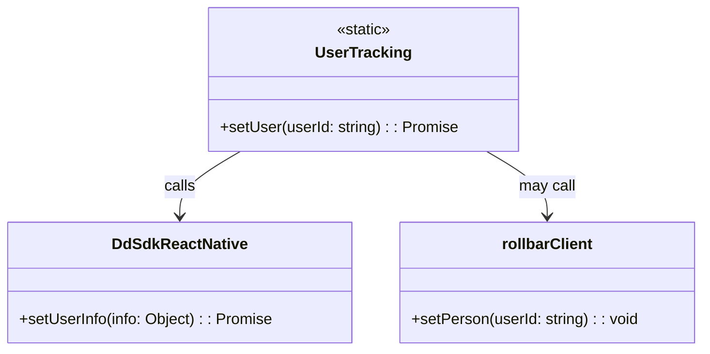

# Diagram: mobile/FreightVerifyMobileTracking/src/monitoring/tracking.ts


> Auto-generated by Obscura crawlers

## Diagram 1



### SVG

<svg id="container" width="729.390625" xmlns="http://www.w3.org/2000/svg" class="classDiagram" height="366" viewBox="0 0 729.390625 366" role="graphics-document document" aria-roledescription="class"><style>#container{font-family:"trebuchet ms",verdana,arial,sans-serif;font-size:16px;fill:#333;}@keyframes edge-animation-frame{from{stroke-dashoffset:0;}}@keyframes dash{to{stroke-dashoffset:0;}}#container .edge-animation-slow{stroke-dasharray:9,5!important;stroke-dashoffset:900;animation:dash 50s linear infinite;stroke-linecap:round;}#container .edge-animation-fast{stroke-dasharray:9,5!important;stroke-dashoffset:900;animation:dash 20s linear infinite;stroke-linecap:round;}#container .error-icon{fill:#552222;}#container .error-text{fill:#552222;stroke:#552222;}#container .edge-thickness-normal{stroke-width:1px;}#container .edge-thickness-thick{stroke-width:3.5px;}#container .edge-pattern-solid{stroke-dasharray:0;}#container .edge-thickness-invisible{stroke-width:0;fill:none;}#container .edge-pattern-dashed{stroke-dasharray:3;}#container .edge-pattern-dotted{stroke-dasharray:2;}#container .marker{fill:#333333;stroke:#333333;}#container .marker.cross{stroke:#333333;}#container svg{font-family:"trebuchet ms",verdana,arial,sans-serif;font-size:16px;}#container p{margin:0;}#container g.classGroup text{fill:#9370DB;stroke:none;font-family:"trebuchet ms",verdana,arial,sans-serif;font-size:10px;}#container g.classGroup text .title{font-weight:bolder;}#container .nodeLabel,#container .edgeLabel{color:#131300;}#container .edgeLabel .label rect{fill:#ECECFF;}#container .label text{fill:#131300;}#container .labelBkg{background:#ECECFF;}#container .edgeLabel .label span{background:#ECECFF;}#container .classTitle{font-weight:bolder;}#container .node rect,#container .node circle,#container .node ellipse,#container .node polygon,#container .node path{fill:#ECECFF;stroke:#9370DB;stroke-width:1px;}#container .divider{stroke:#9370DB;stroke-width:1;}#container g.clickable{cursor:pointer;}#container g.classGroup rect{fill:#ECECFF;stroke:#9370DB;}#container g.classGroup line{stroke:#9370DB;stroke-width:1;}#container .classLabel .box{stroke:none;stroke-width:0;fill:#ECECFF;opacity:0.5;}#container .classLabel .label{fill:#9370DB;font-size:10px;}#container .relation{stroke:#333333;stroke-width:1;fill:none;}#container .dashed-line{stroke-dasharray:3;}#container .dotted-line{stroke-dasharray:1 2;}#container #compositionStart,#container .composition{fill:#333333!important;stroke:#333333!important;stroke-width:1;}#container #compositionEnd,#container .composition{fill:#333333!important;stroke:#333333!important;stroke-width:1;}#container #dependencyStart,#container .dependency{fill:#333333!important;stroke:#333333!important;stroke-width:1;}#container #dependencyStart,#container .dependency{fill:#333333!important;stroke:#333333!important;stroke-width:1;}#container #extensionStart,#container .extension{fill:transparent!important;stroke:#333333!important;stroke-width:1;}#container #extensionEnd,#container .extension{fill:transparent!important;stroke:#333333!important;stroke-width:1;}#container #aggregationStart,#container .aggregation{fill:transparent!important;stroke:#333333!important;stroke-width:1;}#container #aggregationEnd,#container .aggregation{fill:transparent!important;stroke:#333333!important;stroke-width:1;}#container #lollipopStart,#container .lollipop{fill:#ECECFF!important;stroke:#333333!important;stroke-width:1;}#container #lollipopEnd,#container .lollipop{fill:#ECECFF!important;stroke:#333333!important;stroke-width:1;}#container .edgeTerminals{font-size:11px;line-height:initial;}#container .classTitleText{text-anchor:middle;font-size:18px;fill:#333;}#container .label-icon{display:inline-block;height:1em;overflow:visible;vertical-align:-0.125em;}#container .node .label-icon path{fill:currentColor;stroke:revert;stroke-width:revert;}#container :root{--mermaid-font-family:"trebuchet ms",verdana,arial,sans-serif;}</style><g><defs><marker id="container_class-aggregationStart" class="marker aggregation class" refX="18" refY="7" markerWidth="190" markerHeight="240" orient="auto"><path d="M 18,7 L9,13 L1,7 L9,1 Z"></path></marker></defs><defs><marker id="container_class-aggregationEnd" class="marker aggregation class" refX="1" refY="7" markerWidth="20" markerHeight="28" orient="auto"><path d="M 18,7 L9,13 L1,7 L9,1 Z"></path></marker></defs><defs><marker id="container_class-extensionStart" class="marker extension class" refX="18" refY="7" markerWidth="190" markerHeight="240" orient="auto"><path d="M 1,7 L18,13 V 1 Z"></path></marker></defs><defs><marker id="container_class-extensionEnd" class="marker extension class" refX="1" refY="7" markerWidth="20" markerHeight="28" orient="auto"><path d="M 1,1 V 13 L18,7 Z"></path></marker></defs><defs><marker id="container_class-compositionStart" class="marker composition class" refX="18" refY="7" markerWidth="190" markerHeight="240" orient="auto"><path d="M 18,7 L9,13 L1,7 L9,1 Z"></path></marker></defs><defs><marker id="container_class-compositionEnd" class="marker composition class" refX="1" refY="7" markerWidth="20" markerHeight="28" orient="auto"><path d="M 18,7 L9,13 L1,7 L9,1 Z"></path></marker></defs><defs><marker id="container_class-dependencyStart" class="marker dependency class" refX="6" refY="7" markerWidth="190" markerHeight="240" orient="auto"><path d="M 5,7 L9,13 L1,7 L9,1 Z"></path></marker></defs><defs><marker id="container_class-dependencyEnd" class="marker dependency class" refX="13" refY="7" markerWidth="20" markerHeight="28" orient="auto"><path d="M 18,7 L9,13 L14,7 L9,1 Z"></path></marker></defs><defs><marker id="container_class-lollipopStart" class="marker lollipop class" refX="13" refY="7" markerWidth="190" markerHeight="240" orient="auto"><circle stroke="black" fill="transparent" cx="7" cy="7" r="6"></circle></marker></defs><defs><marker id="container_class-lollipopEnd" class="marker lollipop class" refX="1" refY="7" markerWidth="190" markerHeight="240" orient="auto"><circle stroke="black" fill="transparent" cx="7" cy="7" r="6"></circle></marker></defs><g class="root"><g class="clusters"></g><g class="edgePaths"><path d="M249.118,158L238.61,164.167C228.102,170.333,207.086,182.667,196.578,194C186.07,205.333,186.07,215.667,186.07,220.833L186.07,226" id="id_UserTracking_DdSdkReactNative_1" class="edge-thickness-normal edge-pattern-solid relation" style=";;;" data-edge="true" data-et="edge" data-id="id_UserTracking_DdSdkReactNative_1" data-points="W3sieCI6MjQ5LjExODE5ODkzOTczMjE0LCJ5IjoxNTh9LHsieCI6MTg2LjA3MDMxMjUsInkiOjE5NX0seyJ4IjoxODYuMDcwMzEyNSwieSI6MjMyfV0=" marker-end="url(#container_class-dependencyEnd)"></path><path d="M504.718,158L515.226,164.167C525.734,170.333,546.75,182.667,557.258,194C567.766,205.333,567.766,215.667,567.766,220.833L567.766,226" id="id_UserTracking_rollbarClient_2" class="edge-thickness-normal edge-pattern-solid relation" style=";;;" data-edge="true" data-et="edge" data-id="id_UserTracking_rollbarClient_2" data-points="W3sieCI6NTA0LjcxNzczODU2MDI2NzksInkiOjE1OH0seyJ4Ijo1NjcuNzY1NjI1LCJ5IjoxOTV9LHsieCI6NTY3Ljc2NTYyNSwieSI6MjMyfV0=" marker-end="url(#container_class-dependencyEnd)"></path></g><g class="edgeLabels"><g class="edgeLabel" transform="translate(186.0703125, 195)"><g class="label" data-id="id_UserTracking_DdSdkReactNative_1" transform="translate(-16.4453125, -12)"><foreignObject width="32.890625" height="24"><div xmlns="http://www.w3.org/1999/xhtml" class="labelBkg" style="display: table-cell; white-space: nowrap; line-height: 1.5; max-width: 200px; text-align: center;"><span class="edgeLabel"><p>calls</p></span></div></foreignObject></g></g><g class="edgeLabel" transform="translate(567.765625, 195)"><g class="label" data-id="id_UserTracking_rollbarClient_2" transform="translate(-29.8515625, -12)"><foreignObject width="59.703125" height="24"><div xmlns="http://www.w3.org/1999/xhtml" class="labelBkg" style="display: table-cell; white-space: nowrap; line-height: 1.5; max-width: 200px; text-align: center;"><span class="edgeLabel"><p>may call</p></span></div></foreignObject></g></g></g><g class="nodes"><g class="node default" id="classId-UserTracking-0" transform="translate(376.91796875, 83)"><g class="basic label-container"><path d="M-159.6484375 -75 L159.6484375 -75 L159.6484375 75 L-159.6484375 75" stroke="none" stroke-width="0" fill="#ECECFF" style=""></path><path d="M-159.6484375 -75 C-40.886460918483266 -75, 77.87551566303347 -75, 159.6484375 -75 M-159.6484375 -75 C-56.754105730948424 -75, 46.14022603810315 -75, 159.6484375 -75 M159.6484375 -75 C159.6484375 -27.936802809759264, 159.6484375 19.12639438048147, 159.6484375 75 M159.6484375 -75 C159.6484375 -38.06648105199318, 159.6484375 -1.1329621039863582, 159.6484375 75 M159.6484375 75 C46.313029193097336 75, -67.02237911380533 75, -159.6484375 75 M159.6484375 75 C75.84870009171344 75, -7.951037316573121 75, -159.6484375 75 M-159.6484375 75 C-159.6484375 37.35606412028379, -159.6484375 -0.28787175943242005, -159.6484375 -75 M-159.6484375 75 C-159.6484375 19.194746590040808, -159.6484375 -36.610506819918385, -159.6484375 -75" stroke="#9370DB" stroke-width="1.3" fill="none" stroke-dasharray="0 0" style=""></path></g><g class="annotation-group text" transform="translate(-29.0234375, -51)"><g class="label" style="" transform="translate(0,-12)"><foreignObject width="58.046875" height="24"><div xmlns="http://www.w3.org/1999/xhtml" style="display: table-cell; white-space: nowrap; line-height: 1.5; max-width: 108px; text-align: center;"><span class="nodeLabel markdown-node-label" style=""><p>«static»</p></span></div></foreignObject></g></g><g class="label-group text" transform="translate(-47.578125, -27)"><g class="label" style="font-weight: bolder" transform="translate(0,-12)"><foreignObject width="95.15625" height="24"><div xmlns="http://www.w3.org/1999/xhtml" style="display: table-cell; white-space: nowrap; line-height: 1.5; max-width: 144px; text-align: center;"><span class="nodeLabel markdown-node-label" style=""><p>UserTracking</p></span></div></foreignObject></g></g><g class="members-group text" transform="translate(-147.6484375, 21)"></g><g class="methods-group text" transform="translate(-147.6484375, 51)"><g class="label" style="" transform="translate(0,-12)"><foreignObject width="247.71875" height="24"><div xmlns="http://www.w3.org/1999/xhtml" style="display: table-cell; white-space: nowrap; line-height: 1.5; max-width: 305px; text-align: center;"><span class="nodeLabel markdown-node-label" style=""><p>+setUser(userId: string) : : Promise</p></span></div></foreignObject></g></g><g class="divider" style=""><path d="M-159.6484375 -3 C-76.14254633672583 -3, 7.363344826548342 -3, 159.6484375 -3 M-159.6484375 -3 C-36.4385300737236 -3, 86.7713773525528 -3, 159.6484375 -3" stroke="#9370DB" stroke-width="1.3" fill="none" stroke-dasharray="0 0" style=""></path></g><g class="divider" style=""><path d="M-159.6484375 21 C-36.47274422760226 21, 86.70294904479547 21, 159.6484375 21 M-159.6484375 21 C-95.03384781350066 21, -30.419258127001314 21, 159.6484375 21" stroke="#9370DB" stroke-width="1.3" fill="none" stroke-dasharray="0 0" style=""></path></g></g><g class="node default" id="classId-DdSdkReactNative-1" transform="translate(186.0703125, 295)"><g class="basic label-container"><path d="M-178.0703125 -63 L178.0703125 -63 L178.0703125 63 L-178.0703125 63" stroke="none" stroke-width="0" fill="#ECECFF" style=""></path><path d="M-178.0703125 -63 C-101.3582443178078 -63, -24.646176135615605 -63, 178.0703125 -63 M-178.0703125 -63 C-91.52038712444798 -63, -4.970461748895957 -63, 178.0703125 -63 M178.0703125 -63 C178.0703125 -29.850270151725574, 178.0703125 3.299459696548851, 178.0703125 63 M178.0703125 -63 C178.0703125 -13.062306938174125, 178.0703125 36.87538612365175, 178.0703125 63 M178.0703125 63 C59.87421282808474 63, -58.32188684383053 63, -178.0703125 63 M178.0703125 63 C59.767491881552345 63, -58.53532873689531 63, -178.0703125 63 M-178.0703125 63 C-178.0703125 22.617521110054916, -178.0703125 -17.764957779890167, -178.0703125 -63 M-178.0703125 63 C-178.0703125 15.873208668551172, -178.0703125 -31.253582662897657, -178.0703125 -63" stroke="#9370DB" stroke-width="1.3" fill="none" stroke-dasharray="0 0" style=""></path></g><g class="annotation-group text" transform="translate(0, -39)"></g><g class="label-group text" transform="translate(-67.75, -39)"><g class="label" style="font-weight: bolder" transform="translate(0,-12)"><foreignObject width="135.5" height="24"><div xmlns="http://www.w3.org/1999/xhtml" style="display: table-cell; white-space: nowrap; line-height: 1.5; max-width: 183px; text-align: center;"><span class="nodeLabel markdown-node-label" style=""><p>DdSdkReactNative</p></span></div></foreignObject></g></g><g class="members-group text" transform="translate(-166.0703125, 9)"></g><g class="methods-group text" transform="translate(-166.0703125, 39)"><g class="label" style="" transform="translate(0,-12)"><foreignObject width="264.390625" height="24"><div xmlns="http://www.w3.org/1999/xhtml" style="display: table-cell; white-space: nowrap; line-height: 1.5; max-width: 322px; text-align: center;"><span class="nodeLabel markdown-node-label" style=""><p>+setUserInfo(info: Object) : : Promise</p></span></div></foreignObject></g></g><g class="divider" style=""><path d="M-178.0703125 -15 C-35.93111861161057 -15, 106.20807527677886 -15, 178.0703125 -15 M-178.0703125 -15 C-52.01178928377362 -15, 74.04673393245275 -15, 178.0703125 -15" stroke="#9370DB" stroke-width="1.3" fill="none" stroke-dasharray="0 0" style=""></path></g><g class="divider" style=""><path d="M-178.0703125 9 C-85.44534507802521 9, 7.179622343949575 9, 178.0703125 9 M-178.0703125 9 C-43.26069715991309 9, 91.54891818017381 9, 178.0703125 9" stroke="#9370DB" stroke-width="1.3" fill="none" stroke-dasharray="0 0" style=""></path></g></g><g class="node default" id="classId-rollbarClient-2" transform="translate(567.765625, 295)"><g class="basic label-container"><path d="M-153.625 -63 L153.625 -63 L153.625 63 L-153.625 63" stroke="none" stroke-width="0" fill="#ECECFF" style=""></path><path d="M-153.625 -63 C-32.07078544666631 -63, 89.48342910666739 -63, 153.625 -63 M-153.625 -63 C-55.196304693608326 -63, 43.23239061278335 -63, 153.625 -63 M153.625 -63 C153.625 -14.936796596800164, 153.625 33.12640680639967, 153.625 63 M153.625 -63 C153.625 -13.408368007300567, 153.625 36.18326398539887, 153.625 63 M153.625 63 C48.78078093416627 63, -56.06343813166745 63, -153.625 63 M153.625 63 C33.9039103383229 63, -85.8171793233542 63, -153.625 63 M-153.625 63 C-153.625 35.91853387854317, -153.625 8.837067757086352, -153.625 -63 M-153.625 63 C-153.625 19.193485311288278, -153.625 -24.613029377423445, -153.625 -63" stroke="#9370DB" stroke-width="1.3" fill="none" stroke-dasharray="0 0" style=""></path></g><g class="annotation-group text" transform="translate(0, -39)"></g><g class="label-group text" transform="translate(-45.953125, -39)"><g class="label" style="font-weight: bolder" transform="translate(0,-12)"><foreignObject width="91.90625" height="24"><div xmlns="http://www.w3.org/1999/xhtml" style="display: table-cell; white-space: nowrap; line-height: 1.5; max-width: 141px; text-align: center;"><span class="nodeLabel markdown-node-label" style=""><p>rollbarClient</p></span></div></foreignObject></g></g><g class="members-group text" transform="translate(-141.625, 9)"></g><g class="methods-group text" transform="translate(-141.625, 39)"><g class="label" style="" transform="translate(0,-12)"><foreignObject width="237.296875" height="24"><div xmlns="http://www.w3.org/1999/xhtml" style="display: table-cell; white-space: nowrap; line-height: 1.5; max-width: 295px; text-align: center;"><span class="nodeLabel markdown-node-label" style=""><p>+setPerson(userId: string) : : void</p></span></div></foreignObject></g></g><g class="divider" style=""><path d="M-153.625 -15 C-79.26837117398502 -15, -4.9117423479700335 -15, 153.625 -15 M-153.625 -15 C-92.01519565665531 -15, -30.405391313310616 -15, 153.625 -15" stroke="#9370DB" stroke-width="1.3" fill="none" stroke-dasharray="0 0" style=""></path></g><g class="divider" style=""><path d="M-153.625 9 C-74.38063817056425 9, 4.863723658871493 9, 153.625 9 M-153.625 9 C-84.13005238497028 9, -14.635104769940568 9, 153.625 9" stroke="#9370DB" stroke-width="1.3" fill="none" stroke-dasharray="0 0" style=""></path></g></g></g></g></g></svg>

## Diagram 2

```mermaid
flowchart TD
    A[call UserTracking.setUser(userId)] --> B[await DdSdkReactNative.setUserInfo({id: userId})]
    B --> C{rollbarClient exists?}
    C -- yes --> D[rollbarClient.setPerson(userId)]
    C -- no --> E[no-op]
```

> SVG rendering failed for this diagram.
