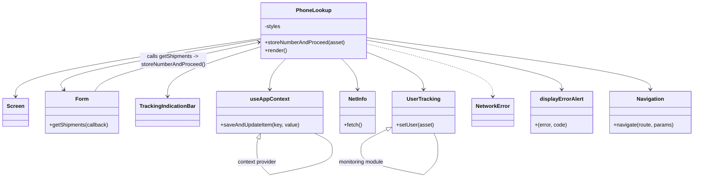
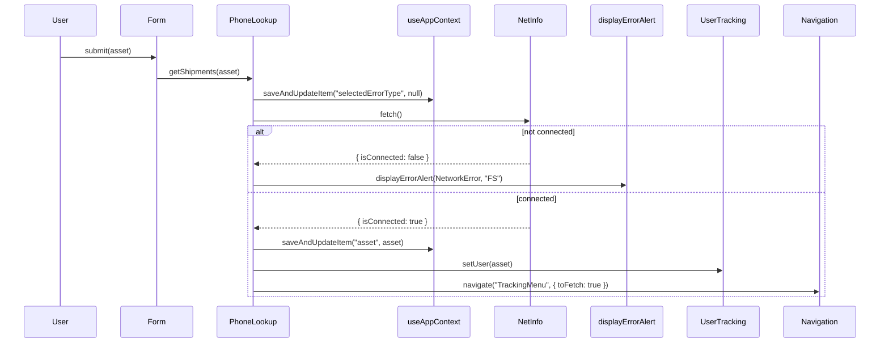

# Diagram: mobile/FreightVerifyMobileTracking/src/scenes/phone-lookup.tsx

> Auto-generated by Obscura crawlers

## Diagram 1

### SVG

<svg id="container" width="2044.4765625" xmlns="http://www.w3.org/2000/svg" class="classDiagram" height="532.25" viewBox="0 0 2044.4765625 532.25" role="graphics-document document" aria-roledescription="class"><g><defs><marker id="container_class-aggregationStart" class="marker aggregation class" refX="18" refY="7" markerWidth="190" markerHeight="240" orient="auto"><path d="M 18,7 L9,13 L1,7 L9,1 Z"></path></marker></defs><defs><marker id="container_class-aggregationEnd" class="marker aggregation class" refX="1" refY="7" markerWidth="20" markerHeight="28" orient="auto"><path d="M 18,7 L9,13 L1,7 L9,1 Z"></path></marker></defs><defs><marker id="container_class-extensionStart" class="marker extension class" refX="18" refY="7" markerWidth="190" markerHeight="240" orient="auto"><path d="M 1,7 L18,13 V 1 Z"></path></marker></defs><defs><marker id="container_class-extensionEnd" class="marker extension class" refX="1" refY="7" markerWidth="20" markerHeight="28" orient="auto"><path d="M 1,1 V 13 L18,7 Z"></path></marker></defs><defs><marker id="container_class-compositionStart" class="marker composition class" refX="18" refY="7" markerWidth="190" markerHeight="240" orient="auto"><path d="M 18,7 L9,13 L1,7 L9,1 Z"></path></marker></defs><defs><marker id="container_class-compositionEnd" class="marker composition class" refX="1" refY="7" markerWidth="20" markerHeight="28" orient="auto"><path d="M 18,7 L9,13 L1,7 L9,1 Z"></path></marker></defs><defs><marker id="container_class-dependencyStart" class="marker dependency class" refX="6" refY="7" markerWidth="190" markerHeight="240" orient="auto"><path d="M 5,7 L9,13 L1,7 L9,1 Z"></path></marker></defs><defs><marker id="container_class-dependencyEnd" class="marker dependency class" refX="13" refY="7" markerWidth="20" markerHeight="28" orient="auto"><path d="M 18,7 L9,13 L14,7 L9,1 Z"></path></marker></defs><defs><marker id="container_class-lollipopStart" class="marker lollipop class" refX="13" refY="7" markerWidth="190" markerHeight="240" orient="auto"><circle stroke="black" fill="transparent" cx="7" cy="7" r="6"></circle></marker></defs><defs><marker id="container_class-lollipopEnd" class="marker lollipop class" refX="1" refY="7" markerWidth="190" markerHeight="240" orient="auto"><circle stroke="black" fill="transparent" cx="7" cy="7" r="6"></circle></marker></defs><g class="root"><g class="clusters"></g><g class="edgePaths"><path d="M767.1,115.603L646.721,133.836C526.342,152.069,285.585,188.534,165.207,217.434C44.828,246.333,44.828,267.667,44.828,278.333L44.828,289" id="id_PhoneLookup_Screen_1" class="edge-thickness-normal edge-pattern-solid relation" style=";;;" data-edge="true" data-et="edge" data-id="id_PhoneLookup_Screen_1" data-points="W3sieCI6NzY3LjA5OTYwOTM3NSwieSI6MTE1LjYwMzIzOTM4ODY4ODgzfSx7IngiOjQ0LjgyODEyNSwieSI6MjI1fSx7IngiOjQ0LjgyODEyNSwieSI6Mjk1fV0=" marker-end="url(#container_class-dependencyEnd)"></path><path d="M767.1,118.925L664.775,136.604C562.451,154.283,357.803,189.642,261.3,214.702C164.797,239.763,176.439,254.526,182.26,261.907L188.082,269.289" id="id_PhoneLookup_Form_2" class="edge-thickness-normal edge-pattern-solid relation" style=";;;" data-edge="true" data-et="edge" data-id="id_PhoneLookup_Form_2" data-points="W3sieCI6NzY3LjA5OTYwOTM3NSwieSI6MTE4LjkyNDc2NTU1ODM5NzI3fSx7IngiOjE1My4xNTQyOTY4NzUsInkiOjIyNX0seyJ4IjoxOTEuNzk2OTk3MDcwMzEyNSwieSI6Mjc0fV0=" marker-end="url(#container_class-dependencyEnd)"></path><path d="M767.1,140.268L721.506,154.39C675.913,168.512,584.726,196.756,539.132,221.545C493.539,246.333,493.539,267.667,493.539,278.333L493.539,289" id="id_PhoneLookup_TrackingIndicationBar_3" class="edge-thickness-normal edge-pattern-solid relation" style=";;;" data-edge="true" data-et="edge" data-id="id_PhoneLookup_TrackingIndicationBar_3" data-points="W3sieCI6NzY3LjA5OTYwOTM3NSwieSI6MTQwLjI2ODE2MzQzNzk2NDh9LHsieCI6NDkzLjUzOTA2MjUsInkiOjIyNX0seyJ4Ijo0OTMuNTM5MDYyNSwieSI6Mjk1fV0=" marker-end="url(#container_class-dependencyEnd)"></path><path d="M840.817,176L832.833,184.167C824.849,192.333,808.882,208.667,800.898,224C792.914,239.333,792.914,253.667,792.914,260.833L792.914,268" id="id_PhoneLookup_useAppContext_4" class="edge-thickness-normal edge-pattern-solid relation" style=";;;" data-edge="true" data-et="edge" data-id="id_PhoneLookup_useAppContext_4" data-points="W3sieCI6ODQwLjgxNjcxNDYzODE1NzksInkiOjE3Nn0seyJ4Ijo3OTIuOTE0MDYyNSwieSI6MjI1fSx7IngiOjc5Mi45MTQwNjI1LCJ5IjoyNzR9XQ==" marker-end="url(#container_class-dependencyEnd)"></path><path d="M1005.054,176L1013.038,184.167C1021.022,192.333,1036.989,208.667,1044.973,224C1052.957,239.333,1052.957,253.667,1052.957,260.833L1052.957,268" id="id_PhoneLookup_NetInfo_5" class="edge-thickness-normal edge-pattern-solid relation" style=";;;" data-edge="true" data-et="edge" data-id="id_PhoneLookup_NetInfo_5" data-points="W3sieCI6MTAwNS4wNTQzNzkxMTE4NDIxLCJ5IjoxNzZ9LHsieCI6MTA1Mi45NTcwMzEyNSwieSI6MjI1fSx7IngiOjEwNTIuOTU3MDMxMjUsInkiOjI3NH1d" marker-end="url(#container_class-dependencyEnd)"></path><path d="M1078.771,155.925L1106.837,167.437C1134.902,178.95,1191.033,201.975,1219.099,220.654C1247.164,239.333,1247.164,253.667,1247.164,260.833L1247.164,268" id="id_PhoneLookup_UserTracking_6" class="edge-thickness-normal edge-pattern-solid relation" style=";;;" data-edge="true" data-et="edge" data-id="id_PhoneLookup_UserTracking_6" data-points="W3sieCI6MTA3OC43NzE0ODQzNzUsInkiOjE1NS45MjQ2MDQ2ODA1ODE5Mn0seyJ4IjoxMjQ3LjE2NDA2MjUsInkiOjIyNX0seyJ4IjoxMjQ3LjE2NDA2MjUsInkiOjI3NH1d" marker-end="url(#container_class-dependencyEnd)"></path><path d="M1078.771,120.415L1174.368,137.846C1269.964,155.277,1461.156,190.138,1556.752,214.736C1652.348,239.333,1652.348,253.667,1652.348,260.833L1652.348,268" id="id_PhoneLookup_displayErrorAlert_7" class="edge-thickness-normal edge-pattern-solid relation" style=";;;" data-edge="true" data-et="edge" data-id="id_PhoneLookup_displayErrorAlert_7" data-points="W3sieCI6MTA3OC43NzE0ODQzNzUsInkiOjEyMC40MTQ5MTAzMzgyMTY1Mn0seyJ4IjoxNjUyLjM0NzY1NjI1LCJ5IjoyMjV9LHsieCI6MTY1Mi4zNDc2NTYyNSwieSI6Mjc0fV0=" marker-end="url(#container_class-dependencyEnd)"></path><path d="M1078.771,112.89L1218.155,131.575C1357.538,150.26,1636.304,187.63,1775.687,213.482C1915.07,239.333,1915.07,253.667,1915.07,260.833L1915.07,268" id="id_PhoneLookup_Navigation_8" class="edge-thickness-normal edge-pattern-solid relation" style=";;;" data-edge="true" data-et="edge" data-id="id_PhoneLookup_Navigation_8" data-points="W3sieCI6MTA3OC43NzE0ODQzNzUsInkiOjExMi44OTA0ODgyNzM5ODMwN30seyJ4IjoxOTE1LjA3MDMxMjUsInkiOjIyNX0seyJ4IjoxOTE1LjA3MDMxMjUsInkiOjI3NH1d" marker-end="url(#container_class-dependencyEnd)"></path><path d="M1078.771,131.342L1140.601,146.952C1202.431,162.562,1326.09,193.781,1387.92,220.057C1449.75,246.333,1449.75,267.667,1449.75,278.333L1449.75,289" id="id_PhoneLookup_NetworkError_9" class="edge-thickness-normal edge-pattern-dashed relation" style=";;;" data-edge="true" data-et="edge" data-id="id_PhoneLookup_NetworkError_9" data-points="W3sieCI6MTA3OC43NzE0ODQzNzUsInkiOjEzMS4zNDI0NjU5NTY1NzEyM30seyJ4IjoxNDQ5Ljc1LCJ5IjoyMjV9LHsieCI6MTQ0OS43NSwieSI6Mjk1fV0=" marker-end="url(#container_class-dependencyEnd)"></path><path d="M278.622,274L283.437,265.833C288.251,257.667,297.88,241.333,378.316,216.824C458.752,192.315,609.993,159.63,685.614,143.288L761.235,126.945" id="id_Form_PhoneLookup_10" class="edge-thickness-normal edge-pattern-solid relation" style=";;;" data-edge="true" data-et="edge" data-id="id_Form_PhoneLookup_10" data-points="W3sieCI6Mjc4LjYyMTk0ODI0MjE4NzUsInkiOjI3NH0seyJ4IjozMDcuNTA5NzY1NjI1LCJ5IjoyMjV9LHsieCI6NzY3LjA5OTYwOTM3NSwieSI6MTI1LjY3Nzc4OTEzMjI2OTk2fV0=" marker-end="url(#container_class-dependencyEnd)"></path><path d="M757.298,415.716L756.598,417.263C755.898,418.811,754.498,421.905,753.798,427.619C753.098,433.333,753.098,441.667,753.098,445.833L753.098,450" id="useAppContext-cyclic-special-1" class="edge-thickness-normal edge-pattern-solid relation" style=";;;" data-edge="true" data-et="edge" data-id="useAppContext-cyclic-special-1" data-points="W3sieCI6NzY0LjQwOTEzNTI5ODI5NTUsInkiOjQwMH0seyJ4Ijo3NTMuMDk3NjU2MjUsInkiOjQyNX0seyJ4Ijo3NTMuMDk3NjU2MjUsInkiOjQ1MH1d" marker-start="url(#container_class-extensionStart)"></path><path d="M753.098,450.1L753.098,456.267C753.098,462.433,753.098,474.767,759.725,487.101C766.353,499.434,779.609,511.769,786.236,517.936L792.864,524.103" id="useAppContext-cyclic-special-mid" class="edge-thickness-normal edge-pattern-solid relation" style=";;;" data-edge="true" data-et="edge" data-id="useAppContext-cyclic-special-mid" data-points="W3sieCI6NzUzLjA5NzY1NjI1LCJ5Ijo0NTAuMTAwMDAwMDAxNDkwMX0seyJ4Ijo3NTMuMDk3NjU2MjUsInkiOjQ4Ny4xMDAwMDAwMDE0OTAxfSx7IngiOjc5Mi44NjQwNjI0OTkyNTQ5LCJ5Ijo1MjQuMTAzNDczOTU0MjUzNn1d"></path><path d="M792.964,524.14L823.322,517.967C853.679,511.793,914.394,499.447,944.752,487.098C975.109,474.75,975.109,462.4,975.109,452.05C975.109,441.7,975.109,433.35,966.483,425.008C957.856,416.667,940.603,408.333,931.976,404.167L923.349,400" id="useAppContext-cyclic-special-2" class="edge-thickness-normal edge-pattern-solid relation" style=";;;" data-edge="true" data-et="edge" data-id="useAppContext-cyclic-special-2" data-points="W3sieCI6NzkyLjk2NDA2MjUwMDc0NTEsInkiOjUyNC4xMzk4MzIzNDIwMzQ1fSx7IngiOjk3NS4xMDkzNzUsInkiOjQ4Ny4xMDAwMDAwMDE0OTAxfSx7IngiOjk3NS4xMDkzNzUsInkiOjQ1MC4wNTAwMDAwMDA3NDUwNn0seyJ4Ijo5NzUuMTA5Mzc1LCJ5Ijo0MjV9LHsieCI6OTIzLjM0OTM0MzAzOTc3MjcsInkiOjQwMH1d"></path><path d="M1140.326,388.602L1127.767,394.669C1115.207,400.735,1090.088,412.867,1077.528,423.1C1064.969,433.333,1064.969,441.667,1064.969,445.833L1064.969,450" id="UserTracking-cyclic-special-1" class="edge-thickness-normal edge-pattern-solid relation" style=";;;" data-edge="true" data-et="edge" data-id="UserTracking-cyclic-special-1" data-points="W3sieCI6MTE1NS44NTkzNzUsInkiOjM4MS4wOTk5OTU3MTIwMTkyfSx7IngiOjEwNjQuOTY4NzUsInkiOjQyNX0seyJ4IjoxMDY0Ljk2ODc1LCJ5Ijo0NTB9XQ==" marker-start="url(#container_class-extensionStart)"></path><path d="M1064.969,450.1L1064.969,456.267C1064.969,462.433,1064.969,474.767,1095.326,487.107C1125.684,499.447,1186.399,511.793,1216.757,517.967L1247.114,524.14" id="UserTracking-cyclic-special-mid" class="edge-thickness-normal edge-pattern-solid relation" style=";;;" data-edge="true" data-et="edge" data-id="UserTracking-cyclic-special-mid" data-points="W3sieCI6MTA2NC45Njg3NSwieSI6NDUwLjEwMDAwMDAwMTQ5MDF9LHsieCI6MTA2NC45Njg3NSwieSI6NDg3LjEwMDAwMDAwMTQ5MDF9LHsieCI6MTI0Ny4xMTQwNjI0OTkyNTUsInkiOjUyNC4xMzk4MzIzNDIwMzQ1fV0="></path><path d="M1247.214,524.109L1254.694,517.941C1262.174,511.773,1277.134,499.436,1284.614,487.093C1292.094,474.75,1292.094,462.4,1292.094,452.05C1292.094,441.7,1292.094,433.35,1289.966,425.008C1287.839,416.667,1283.584,408.333,1281.457,404.167L1279.33,400" id="UserTracking-cyclic-special-2" class="edge-thickness-normal edge-pattern-solid relation" style=";;;" data-edge="true" data-et="edge" data-id="UserTracking-cyclic-special-2" data-points="W3sieCI6MTI0Ny4yMTQwNjI1MDA3NDUsInkiOjUyNC4xMDg3Njg5MTEzNzQ4fSx7IngiOjEyOTIuMDkzNzUsInkiOjQ4Ny4xMDAwMDAwMDE0OTAxfSx7IngiOjEyOTIuMDkzNzUsInkiOjQ1MC4wNTAwMDAwMDA3NDUwNn0seyJ4IjoxMjkyLjA5Mzc1LCJ5Ijo0MjV9LHsieCI6MTI3OS4zMjk2MzQyMzI5NTQ1LCJ5Ijo0MDB9XQ=="></path></g><g class="edgeLabels"><g class="edgeLabel"><g class="label" data-id="id_PhoneLookup_Screen_1" transform="translate(0, 0)"><foreignObject width="0" height="0">

</foreignObject></g></g><g class="edgeLabel"><g class="label" data-id="id_PhoneLookup_Form_2" transform="translate(0, 0)"><foreignObject width="0" height="0">

</foreignObject></g></g><g class="edgeLabel"><g class="label" data-id="id_PhoneLookup_TrackingIndicationBar_3" transform="translate(0, 0)"><foreignObject width="0" height="0">

</foreignObject></g></g><g class="edgeLabel"><g class="label" data-id="id_PhoneLookup_useAppContext_4" transform="translate(0, 0)"><foreignObject width="0" height="0">

</foreignObject></g></g><g class="edgeLabel"><g class="label" data-id="id_PhoneLookup_NetInfo_5" transform="translate(0, 0)"><foreignObject width="0" height="0">

</foreignObject></g></g><g class="edgeLabel"><g class="label" data-id="id_PhoneLookup_UserTracking_6" transform="translate(0, 0)"><foreignObject width="0" height="0">

</foreignObject></g></g><g class="edgeLabel"><g class="label" data-id="id_PhoneLookup_displayErrorAlert_7" transform="translate(0, 0)"><foreignObject width="0" height="0">

</foreignObject></g></g><g class="edgeLabel"><g class="label" data-id="id_PhoneLookup_Navigation_8" transform="translate(0, 0)"><foreignObject width="0" height="0">

</foreignObject></g></g><g class="edgeLabel"><g class="label" data-id="id_PhoneLookup_NetworkError_9" transform="translate(0, 0)"><foreignObject width="0" height="0">

</foreignObject></g></g><g class="edgeLabel" transform="translate(509.50568, 181.34655)"><g class="label" data-id="id_Form_PhoneLookup_10" transform="translate(-100, -24)"><foreignObject width="200" height="48">

calls getShipments -&gt; storeNumberAndProceed()

</foreignObject></g></g><g class="edgeLabel"><g class="label" data-id="useAppContext-cyclic-special-1" transform="translate(0, 0)"><foreignObject width="0" height="0">

</foreignObject></g></g><g class="edgeLabel" transform="translate(753.09765625, 487.1000000014901)"><g class="label" data-id="useAppContext-cyclic-special-mid" transform="translate(-59.6328125, -12)"><foreignObject width="119.265625" height="24">

context provider

</foreignObject></g></g><g class="edgeLabel"><g class="label" data-id="useAppContext-cyclic-special-2" transform="translate(0, 0)"><foreignObject width="0" height="0">

</foreignObject></g></g><g class="edgeLabel"><g class="label" data-id="UserTracking-cyclic-special-1" transform="translate(0, 0)"><foreignObject width="0" height="0">

</foreignObject></g></g><g class="edgeLabel" transform="translate(1064.96875, 487.1000000014901)"><g class="label" data-id="UserTracking-cyclic-special-mid" transform="translate(-69.859375, -12)"><foreignObject width="139.71875" height="24">

monitoring module

</foreignObject></g></g><g class="edgeLabel"><g class="label" data-id="UserTracking-cyclic-special-2" transform="translate(0, 0)"><foreignObject width="0" height="0">

</foreignObject></g></g></g><g class="nodes"><g class="node default" id="classId-PhoneLookup-0" transform="translate(922.935546875, 92)"><g class="basic label-container"><path d="M-155.8359375 -84 L155.8359375 -84 L155.8359375 84 L-155.8359375 84" stroke="none" stroke-width="0" fill="#ECECFF" style=""></path><path d="M-155.8359375 -84 C-39.0149584075411 -84, 77.8060206849178 -84, 155.8359375 -84 M-155.8359375 -84 C-33.07683473464918 -84, 89.68226803070164 -84, 155.8359375 -84 M155.8359375 -84 C155.8359375 -20.806666220875215, 155.8359375 42.38666755824957, 155.8359375 84 M155.8359375 -84 C155.8359375 -41.25833855136726, 155.8359375 1.4833228972654808, 155.8359375 84 M155.8359375 84 C49.95841679513025 84, -55.919103909739505 84, -155.8359375 84 M155.8359375 84 C63.71641079550051 84, -28.403115908998984 84, -155.8359375 84 M-155.8359375 84 C-155.8359375 39.65877959806046, -155.8359375 -4.682440803879075, -155.8359375 -84 M-155.8359375 84 C-155.8359375 27.00822313389125, -155.8359375 -29.9835537322175, -155.8359375 -84" stroke="#9370DB" stroke-width="1.3" fill="none" stroke-dasharray="0 0" style=""></path></g><g class="annotation-group text" transform="translate(0, -60)"></g><g class="label-group text" transform="translate(-49.90625, -60)"><g class="label" style="font-weight: bolder" transform="translate(0,-12)"><foreignObject width="99.8125" height="24">

PhoneLookup

</foreignObject></g></g><g class="members-group text" transform="translate(-143.8359375, -12)"><g class="label" style="" transform="translate(0,-12)"><foreignObject width="48.296875" height="24">

-styles

</foreignObject></g></g><g class="methods-group text" transform="translate(-143.8359375, 36)"><g class="label" style="" transform="translate(0,-12)"><foreignObject width="237.765625" height="24">

+storeNumberAndProceed(asset)

</foreignObject></g><g class="label" style="" transform="translate(0,12)"><foreignObject width="66.609375" height="24">

+render()

</foreignObject></g></g><g class="divider" style=""><path d="M-155.8359375 -36 C-55.99454311717635 -36, 43.8468512656473 -36, 155.8359375 -36 M-155.8359375 -36 C-71.35302692246863 -36, 13.129883655062741 -36, 155.8359375 -36" stroke="#9370DB" stroke-width="1.3" fill="none" stroke-dasharray="0 0" style=""></path></g><g class="divider" style=""><path d="M-155.8359375 12 C-69.61539572581813 12, 16.605146048363736 12, 155.8359375 12 M-155.8359375 12 C-70.39029702719594 12, 15.055343445608116 12, 155.8359375 12" stroke="#9370DB" stroke-width="1.3" fill="none" stroke-dasharray="0 0" style=""></path></g></g><g class="node default" id="classId-Screen-1" transform="translate(44.828125, 337)"><g class="basic label-container"><path d="M-36.828125 -42 L36.828125 -42 L36.828125 42 L-36.828125 42" stroke="none" stroke-width="0" fill="#ECECFF" style=""></path><path d="M-36.828125 -42 C-9.821923172692465 -42, 17.18427865461507 -42, 36.828125 -42 M-36.828125 -42 C-9.221582278067064 -42, 18.38496044386587 -42, 36.828125 -42 M36.828125 -42 C36.828125 -12.567903220002872, 36.828125 16.864193559994256, 36.828125 42 M36.828125 -42 C36.828125 -25.000983199098687, 36.828125 -8.001966398197375, 36.828125 42 M36.828125 42 C17.831828532760067 42, -1.164467934479866 42, -36.828125 42 M36.828125 42 C17.495963884285576 42, -1.836197231428848 42, -36.828125 42 M-36.828125 42 C-36.828125 21.709074991891246, -36.828125 1.4181499837824916, -36.828125 -42 M-36.828125 42 C-36.828125 23.495336174389703, -36.828125 4.990672348779405, -36.828125 -42" stroke="#9370DB" stroke-width="1.3" fill="none" stroke-dasharray="0 0" style=""></path></g><g class="annotation-group text" transform="translate(0, -18)"></g><g class="label-group text" transform="translate(-24.828125, -18)"><g class="label" style="font-weight: bolder" transform="translate(0,-12)"><foreignObject width="49.65625" height="24">

Screen

</foreignObject></g></g><g class="members-group text" transform="translate(-24.828125, 30)"></g><g class="methods-group text" transform="translate(-24.828125, 60)"></g><g class="divider" style=""><path d="M-36.828125 6 C-9.26382314786606 6, 18.30047870426788 6, 36.828125 6 M-36.828125 6 C-21.04096539848853 6, -5.2538057969770655 6, 36.828125 6" stroke="#9370DB" stroke-width="1.3" fill="none" stroke-dasharray="0 0" style=""></path></g><g class="divider" style=""><path d="M-36.828125 24 C-12.71126635822949 24, 11.405592283541019 24, 36.828125 24 M-36.828125 24 C-17.602377240765808 24, 1.6233705184683842 24, 36.828125 24" stroke="#9370DB" stroke-width="1.3" fill="none" stroke-dasharray="0 0" style=""></path></g></g><g class="node default" id="classId-Form-2" transform="translate(241.48046875, 337)"><g class="basic label-container"><path d="M-109.82421875 -63 L109.82421875 -63 L109.82421875 63 L-109.82421875 63" stroke="none" stroke-width="0" fill="#ECECFF" style=""></path><path d="M-109.82421875 -63 C-59.5898960690818 -63, -9.355573388163606 -63, 109.82421875 -63 M-109.82421875 -63 C-27.681518488789678 -63, 54.461181772420645 -63, 109.82421875 -63 M109.82421875 -63 C109.82421875 -20.869376402178162, 109.82421875 21.261247195643676, 109.82421875 63 M109.82421875 -63 C109.82421875 -18.374113271719516, 109.82421875 26.25177345656097, 109.82421875 63 M109.82421875 63 C34.33942163121671 63, -41.14537548756658 63, -109.82421875 63 M109.82421875 63 C37.63139072760461 63, -34.56143729479078 63, -109.82421875 63 M-109.82421875 63 C-109.82421875 27.395674194681618, -109.82421875 -8.208651610636764, -109.82421875 -63 M-109.82421875 63 C-109.82421875 23.890990831819757, -109.82421875 -15.218018336360487, -109.82421875 -63" stroke="#9370DB" stroke-width="1.3" fill="none" stroke-dasharray="0 0" style=""></path></g><g class="annotation-group text" transform="translate(0, -39)"></g><g class="label-group text" transform="translate(-18.2578125, -39)"><g class="label" style="font-weight: bolder" transform="translate(0,-12)"><foreignObject width="36.515625" height="24">

Form

</foreignObject></g></g><g class="members-group text" transform="translate(-97.82421875, 9)"></g><g class="methods-group text" transform="translate(-97.82421875, 39)"><g class="label" style="" transform="translate(0,-12)"><foreignObject width="177.390625" height="24">

+getShipments(callback)

</foreignObject></g></g><g class="divider" style=""><path d="M-109.82421875 -15 C-39.925023426080045 -15, 29.97417189783991 -15, 109.82421875 -15 M-109.82421875 -15 C-31.072881259504257 -15, 47.678456230991486 -15, 109.82421875 -15" stroke="#9370DB" stroke-width="1.3" fill="none" stroke-dasharray="0 0" style=""></path></g><g class="divider" style=""><path d="M-109.82421875 9 C-40.30673713980812 9, 29.21074447038376 9, 109.82421875 9 M-109.82421875 9 C-34.342272283261636 9, 41.13967418347673 9, 109.82421875 9" stroke="#9370DB" stroke-width="1.3" fill="none" stroke-dasharray="0 0" style=""></path></g></g><g class="node default" id="classId-TrackingIndicationBar-3" transform="translate(493.5390625, 337)"><g class="basic label-container"><path d="M-92.234375 -42 L92.234375 -42 L92.234375 42 L-92.234375 42" stroke="none" stroke-width="0" fill="#ECECFF" style=""></path><path d="M-92.234375 -42 C-47.34189544750547 -42, -2.4494158950109437 -42, 92.234375 -42 M-92.234375 -42 C-47.63316452007988 -42, -3.0319540401597607 -42, 92.234375 -42 M92.234375 -42 C92.234375 -22.800999511803933, 92.234375 -3.601999023607867, 92.234375 42 M92.234375 -42 C92.234375 -16.592405107882723, 92.234375 8.815189784234555, 92.234375 42 M92.234375 42 C54.005512143018095 42, 15.77664928603619 42, -92.234375 42 M92.234375 42 C37.5722305013822 42, -17.0899139972356 42, -92.234375 42 M-92.234375 42 C-92.234375 9.481514919622022, -92.234375 -23.036970160755956, -92.234375 -42 M-92.234375 42 C-92.234375 17.219359382152305, -92.234375 -7.56128123569539, -92.234375 -42" stroke="#9370DB" stroke-width="1.3" fill="none" stroke-dasharray="0 0" style=""></path></g><g class="annotation-group text" transform="translate(0, -18)"></g><g class="label-group text" transform="translate(-80.234375, -18)"><g class="label" style="font-weight: bolder" transform="translate(0,-12)"><foreignObject width="160.46875" height="24">

TrackingIndicationBar

</foreignObject></g></g><g class="members-group text" transform="translate(-80.234375, 30)"></g><g class="methods-group text" transform="translate(-80.234375, 60)"></g><g class="divider" style=""><path d="M-92.234375 6 C-19.53377793397594 6, 53.16681913204812 6, 92.234375 6 M-92.234375 6 C-22.30305052661437 6, 47.62827394677126 6, 92.234375 6" stroke="#9370DB" stroke-width="1.3" fill="none" stroke-dasharray="0 0" style=""></path></g><g class="divider" style=""><path d="M-92.234375 24 C-44.448819121517786 24, 3.3367367569644273 24, 92.234375 24 M-92.234375 24 C-24.320993718083784 24, 43.59238756383243 24, 92.234375 24" stroke="#9370DB" stroke-width="1.3" fill="none" stroke-dasharray="0 0" style=""></path></g></g><g class="node default" id="classId-useAppContext-4" transform="translate(792.9140625, 337)"><g class="basic label-container"><path d="M-157.140625 -63 L157.140625 -63 L157.140625 63 L-157.140625 63" stroke="none" stroke-width="0" fill="#ECECFF" style=""></path><path d="M-157.140625 -63 C-93.44354973033288 -63, -29.746474460665766 -63, 157.140625 -63 M-157.140625 -63 C-93.1569346000808 -63, -29.17324420016162 -63, 157.140625 -63 M157.140625 -63 C157.140625 -13.972467351782925, 157.140625 35.05506529643415, 157.140625 63 M157.140625 -63 C157.140625 -29.13267418458925, 157.140625 4.734651630821503, 157.140625 63 M157.140625 63 C91.0227736773653 63, 24.904922354730587 63, -157.140625 63 M157.140625 63 C72.731417881491 63, -11.677789237018004 63, -157.140625 63 M-157.140625 63 C-157.140625 28.868882913196607, -157.140625 -5.262234173606785, -157.140625 -63 M-157.140625 63 C-157.140625 14.972242612695517, -157.140625 -33.055514774608966, -157.140625 -63" stroke="#9370DB" stroke-width="1.3" fill="none" stroke-dasharray="0 0" style=""></path></g><g class="annotation-group text" transform="translate(0, -39)"></g><g class="label-group text" transform="translate(-55.296875, -39)"><g class="label" style="font-weight: bolder" transform="translate(0,-12)"><foreignObject width="110.59375" height="24">

useAppContext

</foreignObject></g></g><g class="members-group text" transform="translate(-145.140625, 9)"></g><g class="methods-group text" transform="translate(-145.140625, 39)"><g class="label" style="" transform="translate(0,-12)"><foreignObject width="234.984375" height="24">

+saveAndUpdateItem(key, value)

</foreignObject></g></g><g class="divider" style=""><path d="M-157.140625 -15 C-42.21369040279761 -15, 72.71324419440478 -15, 157.140625 -15 M-157.140625 -15 C-40.33449746261998 -15, 76.47163007476004 -15, 157.140625 -15" stroke="#9370DB" stroke-width="1.3" fill="none" stroke-dasharray="0 0" style=""></path></g><g class="divider" style=""><path d="M-157.140625 9 C-79.42885694878669 9, -1.717088897573376 9, 157.140625 9 M-157.140625 9 C-42.28243658492312 9, 72.57575183015376 9, 157.140625 9" stroke="#9370DB" stroke-width="1.3" fill="none" stroke-dasharray="0 0" style=""></path></g></g><g class="node default" id="classId-NetInfo-5" transform="translate(1052.95703125, 337)"><g class="basic label-container"><path d="M-52.90234375 -63 L52.90234375 -63 L52.90234375 63 L-52.90234375 63" stroke="none" stroke-width="0" fill="#ECECFF" style=""></path><path d="M-52.90234375 -63 C-22.06798961587249 -63, 8.766364518255017 -63, 52.90234375 -63 M-52.90234375 -63 C-18.916465185733678 -63, 15.069413378532644 -63, 52.90234375 -63 M52.90234375 -63 C52.90234375 -17.12545610718479, 52.90234375 28.749087785630422, 52.90234375 63 M52.90234375 -63 C52.90234375 -29.878461207093252, 52.90234375 3.243077585813495, 52.90234375 63 M52.90234375 63 C24.490616726311085 63, -3.9211102973778296 63, -52.90234375 63 M52.90234375 63 C27.142251753095653 63, 1.3821597561913066 63, -52.90234375 63 M-52.90234375 63 C-52.90234375 20.932476590091156, -52.90234375 -21.13504681981769, -52.90234375 -63 M-52.90234375 63 C-52.90234375 35.03983552559913, -52.90234375 7.079671051198254, -52.90234375 -63" stroke="#9370DB" stroke-width="1.3" fill="none" stroke-dasharray="0 0" style=""></path></g><g class="annotation-group text" transform="translate(0, -39)"></g><g class="label-group text" transform="translate(-27.2109375, -39)"><g class="label" style="font-weight: bolder" transform="translate(0,-12)"><foreignObject width="54.421875" height="24">

NetInfo

</foreignObject></g></g><g class="members-group text" transform="translate(-40.90234375, 9)"></g><g class="methods-group text" transform="translate(-40.90234375, 39)"><g class="label" style="" transform="translate(0,-12)"><foreignObject width="54.59375" height="24">

+fetch()

</foreignObject></g></g><g class="divider" style=""><path d="M-52.90234375 -15 C-14.300527196535441 -15, 24.301289356929118 -15, 52.90234375 -15 M-52.90234375 -15 C-17.353425655585035 -15, 18.19549243882993 -15, 52.90234375 -15" stroke="#9370DB" stroke-width="1.3" fill="none" stroke-dasharray="0 0" style=""></path></g><g class="divider" style=""><path d="M-52.90234375 9 C-11.186639696106027 9, 30.529064357787945 9, 52.90234375 9 M-52.90234375 9 C-27.598836291700692 9, -2.295328833401385 9, 52.90234375 9" stroke="#9370DB" stroke-width="1.3" fill="none" stroke-dasharray="0 0" style=""></path></g></g><g class="node default" id="classId-UserTracking-6" transform="translate(1247.1640625, 337)"><g class="basic label-container"><path d="M-91.3046875 -63 L91.3046875 -63 L91.3046875 63 L-91.3046875 63" stroke="none" stroke-width="0" fill="#ECECFF" style=""></path><path d="M-91.3046875 -63 C-24.65946940875942 -63, 41.98574868248116 -63, 91.3046875 -63 M-91.3046875 -63 C-21.405503369172436 -63, 48.49368076165513 -63, 91.3046875 -63 M91.3046875 -63 C91.3046875 -14.769865181687102, 91.3046875 33.460269636625796, 91.3046875 63 M91.3046875 -63 C91.3046875 -19.462739134050565, 91.3046875 24.07452173189887, 91.3046875 63 M91.3046875 63 C51.24872176560269 63, 11.192756031205377 63, -91.3046875 63 M91.3046875 63 C28.350989371798285 63, -34.60270875640343 63, -91.3046875 63 M-91.3046875 63 C-91.3046875 26.692789472817246, -91.3046875 -9.614421054365508, -91.3046875 -63 M-91.3046875 63 C-91.3046875 30.47960493400111, -91.3046875 -2.040790131997781, -91.3046875 -63" stroke="#9370DB" stroke-width="1.3" fill="none" stroke-dasharray="0 0" style=""></path></g><g class="annotation-group text" transform="translate(0, -39)"></g><g class="label-group text" transform="translate(-47.578125, -39)"><g class="label" style="font-weight: bolder" transform="translate(0,-12)"><foreignObject width="95.15625" height="24">

UserTracking

</foreignObject></g></g><g class="members-group text" transform="translate(-79.3046875, 9)"></g><g class="methods-group text" transform="translate(-79.3046875, 39)"><g class="label" style="" transform="translate(0,-12)"><foreignObject width="111.03125" height="24">

+setUser(asset)

</foreignObject></g></g><g class="divider" style=""><path d="M-91.3046875 -15 C-52.229390328093515 -15, -13.154093156187031 -15, 91.3046875 -15 M-91.3046875 -15 C-50.10371231723577 -15, -8.902737134471536 -15, 91.3046875 -15" stroke="#9370DB" stroke-width="1.3" fill="none" stroke-dasharray="0 0" style=""></path></g><g class="divider" style=""><path d="M-91.3046875 9 C-48.848275890841094 9, -6.391864281682189 9, 91.3046875 9 M-91.3046875 9 C-32.44121383120837 9, 26.422259837583255 9, 91.3046875 9" stroke="#9370DB" stroke-width="1.3" fill="none" stroke-dasharray="0 0" style=""></path></g></g><g class="node default" id="classId-NetworkError-7" transform="translate(1449.75, 337)"><g class="basic label-container"><path d="M-61.28125 -42 L61.28125 -42 L61.28125 42 L-61.28125 42" stroke="none" stroke-width="0" fill="#ECECFF" style=""></path><path d="M-61.28125 -42 C-27.14491964785553 -42, 6.991410704288938 -42, 61.28125 -42 M-61.28125 -42 C-25.732131324379253 -42, 9.816987351241494 -42, 61.28125 -42 M61.28125 -42 C61.28125 -17.734669859023125, 61.28125 6.53066028195375, 61.28125 42 M61.28125 -42 C61.28125 -18.814307224581434, 61.28125 4.371385550837132, 61.28125 42 M61.28125 42 C33.46351400749242 42, 5.645778014984835 42, -61.28125 42 M61.28125 42 C17.53356706982286 42, -26.214115860354283 42, -61.28125 42 M-61.28125 42 C-61.28125 14.681819239873775, -61.28125 -12.63636152025245, -61.28125 -42 M-61.28125 42 C-61.28125 23.769254602189935, -61.28125 5.538509204379871, -61.28125 -42" stroke="#9370DB" stroke-width="1.3" fill="none" stroke-dasharray="0 0" style=""></path></g><g class="annotation-group text" transform="translate(0, -18)"></g><g class="label-group text" transform="translate(-49.28125, -18)"><g class="label" style="font-weight: bolder" transform="translate(0,-12)"><foreignObject width="98.5625" height="24">

NetworkError

</foreignObject></g></g><g class="members-group text" transform="translate(-49.28125, 30)"></g><g class="methods-group text" transform="translate(-49.28125, 60)"></g><g class="divider" style=""><path d="M-61.28125 6 C-29.40934776227914 6, 2.4625544754417206 6, 61.28125 6 M-61.28125 6 C-19.81107752827912 6, 21.659094943441758 6, 61.28125 6" stroke="#9370DB" stroke-width="1.3" fill="none" stroke-dasharray="0 0" style=""></path></g><g class="divider" style=""><path d="M-61.28125 24 C-13.856766282431224 24, 33.56771743513755 24, 61.28125 24 M-61.28125 24 C-26.81490173932832 24, 7.65144652134336 24, 61.28125 24" stroke="#9370DB" stroke-width="1.3" fill="none" stroke-dasharray="0 0" style=""></path></g></g><g class="node default" id="classId-displayErrorAlert-8" transform="translate(1652.34765625, 337)"><g class="basic label-container"><path d="M-91.31640625 -63 L91.31640625 -63 L91.31640625 63 L-91.31640625 63" stroke="none" stroke-width="0" fill="#ECECFF" style=""></path><path d="M-91.31640625 -63 C-23.530630250282826 -63, 44.25514574943435 -63, 91.31640625 -63 M-91.31640625 -63 C-40.227734460422155 -63, 10.86093732915569 -63, 91.31640625 -63 M91.31640625 -63 C91.31640625 -36.57776638994621, 91.31640625 -10.155532779892425, 91.31640625 63 M91.31640625 -63 C91.31640625 -22.720014080348726, 91.31640625 17.55997183930255, 91.31640625 63 M91.31640625 63 C44.47561249379869 63, -2.365181262402615 63, -91.31640625 63 M91.31640625 63 C43.449348832497535 63, -4.417708585004931 63, -91.31640625 63 M-91.31640625 63 C-91.31640625 32.33007367357985, -91.31640625 1.6601473471597004, -91.31640625 -63 M-91.31640625 63 C-91.31640625 36.78320861386521, -91.31640625 10.566417227730419, -91.31640625 -63" stroke="#9370DB" stroke-width="1.3" fill="none" stroke-dasharray="0 0" style=""></path></g><g class="annotation-group text" transform="translate(0, -39)"></g><g class="label-group text" transform="translate(-62.3984375, -39)"><g class="label" style="font-weight: bolder" transform="translate(0,-12)"><foreignObject width="124.796875" height="24">

displayErrorAlert

</foreignObject></g></g><g class="members-group text" transform="translate(-79.31640625, 9)"></g><g class="methods-group text" transform="translate(-79.31640625, 39)"><g class="label" style="" transform="translate(0,-12)"><foreignObject width="96.234375" height="24">

+(error, code)

</foreignObject></g></g><g class="divider" style=""><path d="M-91.31640625 -15 C-52.278675003402654 -15, -13.240943756805308 -15, 91.31640625 -15 M-91.31640625 -15 C-26.94820992175015 -15, 37.4199864064997 -15, 91.31640625 -15" stroke="#9370DB" stroke-width="1.3" fill="none" stroke-dasharray="0 0" style=""></path></g><g class="divider" style=""><path d="M-91.31640625 9 C-49.800965476379034 9, -8.285524702758067 9, 91.31640625 9 M-91.31640625 9 C-46.47880479034906 9, -1.6412033306981186 9, 91.31640625 9" stroke="#9370DB" stroke-width="1.3" fill="none" stroke-dasharray="0 0" style=""></path></g></g><g class="node default" id="classId-Navigation-9" transform="translate(1915.0703125, 337)"><g class="basic label-container"><path d="M-121.40625 -63 L121.40625 -63 L121.40625 63 L-121.40625 63" stroke="none" stroke-width="0" fill="#ECECFF" style=""></path><path d="M-121.40625 -63 C-50.52373923728 -63, 20.358771525440005 -63, 121.40625 -63 M-121.40625 -63 C-25.347134613965835 -63, 70.71198077206833 -63, 121.40625 -63 M121.40625 -63 C121.40625 -32.04648644692386, 121.40625 -1.0929728938477155, 121.40625 63 M121.40625 -63 C121.40625 -32.01023107787809, 121.40625 -1.020462155756185, 121.40625 63 M121.40625 63 C68.40138781401777 63, 15.396525628035533 63, -121.40625 63 M121.40625 63 C41.38228926799111 63, -38.641671464017776 63, -121.40625 63 M-121.40625 63 C-121.40625 16.45225665135368, -121.40625 -30.095486697292642, -121.40625 -63 M-121.40625 63 C-121.40625 35.28195335223735, -121.40625 7.563906704474711, -121.40625 -63" stroke="#9370DB" stroke-width="1.3" fill="none" stroke-dasharray="0 0" style=""></path></g><g class="annotation-group text" transform="translate(0, -39)"></g><g class="label-group text" transform="translate(-39.171875, -39)"><g class="label" style="font-weight: bolder" transform="translate(0,-12)"><foreignObject width="78.34375" height="24">

Navigation

</foreignObject></g></g><g class="members-group text" transform="translate(-109.40625, 9)"></g><g class="methods-group text" transform="translate(-109.40625, 39)"><g class="label" style="" transform="translate(0,-12)"><foreignObject width="179.640625" height="24">

+navigate(route, params)

</foreignObject></g></g><g class="divider" style=""><path d="M-121.40625 -15 C-28.313352969592643 -15, 64.77954406081471 -15, 121.40625 -15 M-121.40625 -15 C-56.40767325782333 -15, 8.590903484353333 -15, 121.40625 -15" stroke="#9370DB" stroke-width="1.3" fill="none" stroke-dasharray="0 0" style=""></path></g><g class="divider" style=""><path d="M-121.40625 9 C-62.29682898572058 9, -3.1874079714411607 9, 121.40625 9 M-121.40625 9 C-30.05546650344192 9, 61.29531699311616 9, 121.40625 9" stroke="#9370DB" stroke-width="1.3" fill="none" stroke-dasharray="0 0" style=""></path></g></g><g class="label edgeLabel" id="useAppContext---useAppContext---1" transform="translate(753.09765625, 450.05000000074506)"><rect width="0.1" height="0.1"></rect><g class="label" style="" transform="translate(0, 0)"><rect></rect><foreignObject width="0" height="0">

</foreignObject></g></g><g class="label edgeLabel" id="useAppContext---useAppContext---2" transform="translate(792.9140625, 524.1500000022352)"><rect width="0.1" height="0.1"></rect><g class="label" style="" transform="translate(0, 0)"><rect></rect><foreignObject width="0" height="0">

</foreignObject></g></g><g class="label edgeLabel" id="UserTracking---UserTracking---1" transform="translate(1064.96875, 450.05000000074506)"><rect width="0.1" height="0.1"></rect><g class="label" style="" transform="translate(0, 0)"><rect></rect><foreignObject width="0" height="0">

</foreignObject></g></g><g class="label edgeLabel" id="UserTracking---UserTracking---2" transform="translate(1247.1640625, 524.1500000022352)"><rect width="0.1" height="0.1"></rect><g class="label" style="" transform="translate(0, 0)"><rect></rect><foreignObject width="0" height="0">

</foreignObject></g></g></g></g></g></svg>

## Diagram 2

### SVG

<svg id="container" width="1872" xmlns="http://www.w3.org/2000/svg" height="751" viewBox="-50 -10 1872 751" role="graphics-document document" aria-roledescription="sequence"><g><rect x="1622" y="665" fill="#eaeaea" stroke="#666" width="150" height="65" name="Nav" rx="3" ry="3" class="actor actor-bottom"></rect><text x="1697" y="697.5" dominant-baseline="central" alignment-baseline="central" class="actor actor-box" style="text-anchor: middle; font-size: 16px; font-weight: 400;"><tspan x="1697" dy="0">Navigation</tspan></text></g><g><rect x="1422" y="665" fill="#eaeaea" stroke="#666" width="150" height="65" name="Tracking" rx="3" ry="3" class="actor actor-bottom"></rect><text x="1497" y="697.5" dominant-baseline="central" alignment-baseline="central" class="actor actor-box" style="text-anchor: middle; font-size: 16px; font-weight: 400;"><tspan x="1497" dy="0">UserTracking</tspan></text></g><g><rect x="1222" y="665" fill="#eaeaea" stroke="#666" width="150" height="65" name="Alert" rx="3" ry="3" class="actor actor-bottom"></rect><text x="1297" y="697.5" dominant-baseline="central" alignment-baseline="central" class="actor actor-box" style="text-anchor: middle; font-size: 16px; font-weight: 400;"><tspan x="1297" dy="0">displayErrorAlert</tspan></text></g><g><rect x="1022" y="665" fill="#eaeaea" stroke="#666" width="150" height="65" name="NetInfo" rx="3" ry="3" class="actor actor-bottom"></rect><text x="1097" y="697.5" dominant-baseline="central" alignment-baseline="central" class="actor actor-box" style="text-anchor: middle; font-size: 16px; font-weight: 400;"><tspan x="1097" dy="0">NetInfo</tspan></text></g><g><rect x="822" y="665" fill="#eaeaea" stroke="#666" width="150" height="65" name="AppContext" rx="3" ry="3" class="actor actor-bottom"></rect><text x="897" y="697.5" dominant-baseline="central" alignment-baseline="central" class="actor actor-box" style="text-anchor: middle; font-size: 16px; font-weight: 400;"><tspan x="897" dy="0">useAppContext</tspan></text></g><g><rect x="418" y="665" fill="#eaeaea" stroke="#666" width="150" height="65" name="PhoneLookup" rx="3" ry="3" class="actor actor-bottom"></rect><text x="493" y="697.5" dominant-baseline="central" alignment-baseline="central" class="actor actor-box" style="text-anchor: middle; font-size: 16px; font-weight: 400;"><tspan x="493" dy="0">PhoneLookup</tspan></text></g><g><rect x="200" y="665" fill="#eaeaea" stroke="#666" width="150" height="65" name="Form" rx="3" ry="3" class="actor actor-bottom"></rect><text x="275" y="697.5" dominant-baseline="central" alignment-baseline="central" class="actor actor-box" style="text-anchor: middle; font-size: 16px; font-weight: 400;"><tspan x="275" dy="0">Form</tspan></text></g><g><rect x="0" y="665" fill="#eaeaea" stroke="#666" width="150" height="65" name="User" rx="3" ry="3" class="actor actor-bottom"></rect><text x="75" y="697.5" dominant-baseline="central" alignment-baseline="central" class="actor actor-box" style="text-anchor: middle; font-size: 16px; font-weight: 400;"><tspan x="75" dy="0">User</tspan></text></g><g><line id="actor7" x1="1697" y1="65" x2="1697" y2="665" class="actor-line 200" stroke-width="0.5px" stroke="#999" name="Nav"></line><g id="root-7"><rect x="1622" y="0" fill="#eaeaea" stroke="#666" width="150" height="65" name="Nav" rx="3" ry="3" class="actor actor-top"></rect><text x="1697" y="32.5" dominant-baseline="central" alignment-baseline="central" class="actor actor-box" style="text-anchor: middle; font-size: 16px; font-weight: 400;"><tspan x="1697" dy="0">Navigation</tspan></text></g></g><g><line id="actor6" x1="1497" y1="65" x2="1497" y2="665" class="actor-line 200" stroke-width="0.5px" stroke="#999" name="Tracking"></line><g id="root-6"><rect x="1422" y="0" fill="#eaeaea" stroke="#666" width="150" height="65" name="Tracking" rx="3" ry="3" class="actor actor-top"></rect><text x="1497" y="32.5" dominant-baseline="central" alignment-baseline="central" class="actor actor-box" style="text-anchor: middle; font-size: 16px; font-weight: 400;"><tspan x="1497" dy="0">UserTracking</tspan></text></g></g><g><line id="actor5" x1="1297" y1="65" x2="1297" y2="665" class="actor-line 200" stroke-width="0.5px" stroke="#999" name="Alert"></line><g id="root-5"><rect x="1222" y="0" fill="#eaeaea" stroke="#666" width="150" height="65" name="Alert" rx="3" ry="3" class="actor actor-top"></rect><text x="1297" y="32.5" dominant-baseline="central" alignment-baseline="central" class="actor actor-box" style="text-anchor: middle; font-size: 16px; font-weight: 400;"><tspan x="1297" dy="0">displayErrorAlert</tspan></text></g></g><g><line id="actor4" x1="1097" y1="65" x2="1097" y2="665" class="actor-line 200" stroke-width="0.5px" stroke="#999" name="NetInfo"></line><g id="root-4"><rect x="1022" y="0" fill="#eaeaea" stroke="#666" width="150" height="65" name="NetInfo" rx="3" ry="3" class="actor actor-top"></rect><text x="1097" y="32.5" dominant-baseline="central" alignment-baseline="central" class="actor actor-box" style="text-anchor: middle; font-size: 16px; font-weight: 400;"><tspan x="1097" dy="0">NetInfo</tspan></text></g></g><g><line id="actor3" x1="897" y1="65" x2="897" y2="665" class="actor-line 200" stroke-width="0.5px" stroke="#999" name="AppContext"></line><g id="root-3"><rect x="822" y="0" fill="#eaeaea" stroke="#666" width="150" height="65" name="AppContext" rx="3" ry="3" class="actor actor-top"></rect><text x="897" y="32.5" dominant-baseline="central" alignment-baseline="central" class="actor actor-box" style="text-anchor: middle; font-size: 16px; font-weight: 400;"><tspan x="897" dy="0">useAppContext</tspan></text></g></g><g><line id="actor2" x1="493" y1="65" x2="493" y2="665" class="actor-line 200" stroke-width="0.5px" stroke="#999" name="PhoneLookup"></line><g id="root-2"><rect x="418" y="0" fill="#eaeaea" stroke="#666" width="150" height="65" name="PhoneLookup" rx="3" ry="3" class="actor actor-top"></rect><text x="493" y="32.5" dominant-baseline="central" alignment-baseline="central" class="actor actor-box" style="text-anchor: middle; font-size: 16px; font-weight: 400;"><tspan x="493" dy="0">PhoneLookup</tspan></text></g></g><g><line id="actor1" x1="275" y1="65" x2="275" y2="665" class="actor-line 200" stroke-width="0.5px" stroke="#999" name="Form"></line><g id="root-1"><rect x="200" y="0" fill="#eaeaea" stroke="#666" width="150" height="65" name="Form" rx="3" ry="3" class="actor actor-top"></rect><text x="275" y="32.5" dominant-baseline="central" alignment-baseline="central" class="actor actor-box" style="text-anchor: middle; font-size: 16px; font-weight: 400;"><tspan x="275" dy="0">Form</tspan></text></g></g><g><line id="actor0" x1="75" y1="65" x2="75" y2="665" class="actor-line 200" stroke-width="0.5px" stroke="#999" name="User"></line><g id="root-0"><rect x="0" y="0" fill="#eaeaea" stroke="#666" width="150" height="65" name="User" rx="3" ry="3" class="actor actor-top"></rect><text x="75" y="32.5" dominant-baseline="central" alignment-baseline="central" class="actor actor-box" style="text-anchor: middle; font-size: 16px; font-weight: 400;"><tspan x="75" dy="0">User</tspan></text></g></g><g></g><defs><symbol id="computer" width="24" height="24"><path transform="scale(.5)" d="M2 2v13h20v-13h-20zm18 11h-16v-9h16v9zm-10.228 6l.466-1h3.524l.467 1h-4.457zm14.228 3h-24l2-6h2.104l-1.33 4h18.45l-1.297-4h2.073l2 6zm-5-10h-14v-7h14v7z"></path></symbol></defs><defs><symbol id="database" fill-rule="evenodd" clip-rule="evenodd"><path transform="scale(.5)" d="M12.258.001l.256.004.255.005.253.008.251.01.249.012.247.015.246.016.242.019.241.02.239.023.236.024.233.027.231.028.229.031.225.032.223.034.22.036.217.038.214.04.211.041.208.043.205.045.201.046.198.048.194.05.191.051.187.053.183.054.18.056.175.057.172.059.168.06.163.061.16.063.155.064.15.066.074.033.073.033.071.034.07.034.069.035.068.035.067.035.066.035.064.036.064.036.062.036.06.036.06.037.058.037.058.037.055.038.055.038.053.038.052.038.051.039.05.039.048.039.047.039.045.04.044.04.043.04.041.04.04.041.039.041.037.041.036.041.034.041.033.042.032.042.03.042.029.042.027.042.026.043.024.043.023.043.021.043.02.043.018.044.017.043.015.044.013.044.012.044.011.045.009.044.007.045.006.045.004.045.002.045.001.045v17l-.001.045-.002.045-.004.045-.006.045-.007.045-.009.044-.011.045-.012.044-.013.044-.015.044-.017.043-.018.044-.02.043-.021.043-.023.043-.024.043-.026.043-.027.042-.029.042-.03.042-.032.042-.033.042-.034.041-.036.041-.037.041-.039.041-.04.041-.041.04-.043.04-.044.04-.045.04-.047.039-.048.039-.05.039-.051.039-.052.038-.053.038-.055.038-.055.038-.058.037-.058.037-.06.037-.06.036-.062.036-.064.036-.064.036-.066.035-.067.035-.068.035-.069.035-.07.034-.071.034-.073.033-.074.033-.15.066-.155.064-.16.063-.163.061-.168.06-.172.059-.175.057-.18.056-.183.054-.187.053-.191.051-.194.05-.198.048-.201.046-.205.045-.208.043-.211.041-.214.04-.217.038-.22.036-.223.034-.225.032-.229.031-.231.028-.233.027-.236.024-.239.023-.241.02-.242.019-.246.016-.247.015-.249.012-.251.01-.253.008-.255.005-.256.004-.258.001-.258-.001-.256-.004-.255-.005-.253-.008-.251-.01-.249-.012-.247-.015-.245-.016-.243-.019-.241-.02-.238-.023-.236-.024-.234-.027-.231-.028-.228-.031-.226-.032-.223-.034-.22-.036-.217-.038-.214-.04-.211-.041-.208-.043-.204-.045-.201-.046-.198-.048-.195-.05-.19-.051-.187-.053-.184-.054-.179-.056-.176-.057-.172-.059-.167-.06-.164-.061-.159-.063-.155-.064-.151-.066-.074-.033-.072-.033-.072-.034-.07-.034-.069-.035-.068-.035-.067-.035-.066-.035-.064-.036-.063-.036-.062-.036-.061-.036-.06-.037-.058-.037-.057-.037-.056-.038-.055-.038-.053-.038-.052-.038-.051-.039-.049-.039-.049-.039-.046-.039-.046-.04-.044-.04-.043-.04-.041-.04-.04-.041-.039-.041-.037-.041-.036-.041-.034-.041-.033-.042-.032-.042-.03-.042-.029-.042-.027-.042-.026-.043-.024-.043-.023-.043-.021-.043-.02-.043-.018-.044-.017-.043-.015-.044-.013-.044-.012-.044-.011-.045-.009-.044-.007-.045-.006-.045-.004-.045-.002-.045-.001-.045v-17l.001-.045.002-.045.004-.045.006-.045.007-.045.009-.044.011-.045.012-.044.013-.044.015-.044.017-.043.018-.044.02-.043.021-.043.023-.043.024-.043.026-.043.027-.042.029-.042.03-.042.032-.042.033-.042.034-.041.036-.041.037-.041.039-.041.04-.041.041-.04.043-.04.044-.04.046-.04.046-.039.049-.039.049-.039.051-.039.052-.038.053-.038.055-.038.056-.038.057-.037.058-.037.06-.037.061-.036.062-.036.063-.036.064-.036.066-.035.067-.035.068-.035.069-.035.07-.034.072-.034.072-.033.074-.033.151-.066.155-.064.159-.063.164-.061.167-.06.172-.059.176-.057.179-.056.184-.054.187-.053.19-.051.195-.05.198-.048.201-.046.204-.045.208-.043.211-.041.214-.04.217-.038.22-.036.223-.034.226-.032.228-.031.231-.028.234-.027.236-.024.238-.023.241-.02.243-.019.245-.016.247-.015.249-.012.251-.01.253-.008.255-.005.256-.004.258-.001.258.001zm-9.258 20.499v.01l.001.021.003.021.004.022.005.021.006.022.007.022.009.023.01.022.011.023.012.023.013.023.015.023.016.024.017.023.018.024.019.024.021.024.022.025.023.024.024.025.052.049.056.05.061.051.066.051.07.051.075.051.079.052.084.052.088.052.092.052.097.052.102.051.105.052.11.052.114.051.119.051.123.051.127.05.131.05.135.05.139.048.144.049.147.047.152.047.155.047.16.045.163.045.167.043.171.043.176.041.178.041.183.039.187.039.19.037.194.035.197.035.202.033.204.031.209.03.212.029.216.027.219.025.222.024.226.021.23.02.233.018.236.016.24.015.243.012.246.01.249.008.253.005.256.004.259.001.26-.001.257-.004.254-.005.25-.008.247-.011.244-.012.241-.014.237-.016.233-.018.231-.021.226-.021.224-.024.22-.026.216-.027.212-.028.21-.031.205-.031.202-.034.198-.034.194-.036.191-.037.187-.039.183-.04.179-.04.175-.042.172-.043.168-.044.163-.045.16-.046.155-.046.152-.047.148-.048.143-.049.139-.049.136-.05.131-.05.126-.05.123-.051.118-.052.114-.051.11-.052.106-.052.101-.052.096-.052.092-.052.088-.053.083-.051.079-.052.074-.052.07-.051.065-.051.06-.051.056-.05.051-.05.023-.024.023-.025.021-.024.02-.024.019-.024.018-.024.017-.024.015-.023.014-.024.013-.023.012-.023.01-.023.01-.022.008-.022.006-.022.006-.022.004-.022.004-.021.001-.021.001-.021v-4.127l-.077.055-.08.053-.083.054-.085.053-.087.052-.09.052-.093.051-.095.05-.097.05-.1.049-.102.049-.105.048-.106.047-.109.047-.111.046-.114.045-.115.045-.118.044-.12.043-.122.042-.124.042-.126.041-.128.04-.13.04-.132.038-.134.038-.135.037-.138.037-.139.035-.142.035-.143.034-.144.033-.147.032-.148.031-.15.03-.151.03-.153.029-.154.027-.156.027-.158.026-.159.025-.161.024-.162.023-.163.022-.165.021-.166.02-.167.019-.169.018-.169.017-.171.016-.173.015-.173.014-.175.013-.175.012-.177.011-.178.01-.179.008-.179.008-.181.006-.182.005-.182.004-.184.003-.184.002h-.37l-.184-.002-.184-.003-.182-.004-.182-.005-.181-.006-.179-.008-.179-.008-.178-.01-.176-.011-.176-.012-.175-.013-.173-.014-.172-.015-.171-.016-.17-.017-.169-.018-.167-.019-.166-.02-.165-.021-.163-.022-.162-.023-.161-.024-.159-.025-.157-.026-.156-.027-.155-.027-.153-.029-.151-.03-.15-.03-.148-.031-.146-.032-.145-.033-.143-.034-.141-.035-.14-.035-.137-.037-.136-.037-.134-.038-.132-.038-.13-.04-.128-.04-.126-.041-.124-.042-.122-.042-.12-.044-.117-.043-.116-.045-.113-.045-.112-.046-.109-.047-.106-.047-.105-.048-.102-.049-.1-.049-.097-.05-.095-.05-.093-.052-.09-.051-.087-.052-.085-.053-.083-.054-.08-.054-.077-.054v4.127zm0-5.654v.011l.001.021.003.021.004.021.005.022.006.022.007.022.009.022.01.022.011.023.012.023.013.023.015.024.016.023.017.024.018.024.019.024.021.024.022.024.023.025.024.024.052.05.056.05.061.05.066.051.07.051.075.052.079.051.084.052.088.052.092.052.097.052.102.052.105.052.11.051.114.051.119.052.123.05.127.051.131.05.135.049.139.049.144.048.147.048.152.047.155.046.16.045.163.045.167.044.171.042.176.042.178.04.183.04.187.038.19.037.194.036.197.034.202.033.204.032.209.03.212.028.216.027.219.025.222.024.226.022.23.02.233.018.236.016.24.014.243.012.246.01.249.008.253.006.256.003.259.001.26-.001.257-.003.254-.006.25-.008.247-.01.244-.012.241-.015.237-.016.233-.018.231-.02.226-.022.224-.024.22-.025.216-.027.212-.029.21-.03.205-.032.202-.033.198-.035.194-.036.191-.037.187-.039.183-.039.179-.041.175-.042.172-.043.168-.044.163-.045.16-.045.155-.047.152-.047.148-.048.143-.048.139-.05.136-.049.131-.05.126-.051.123-.051.118-.051.114-.052.11-.052.106-.052.101-.052.096-.052.092-.052.088-.052.083-.052.079-.052.074-.051.07-.052.065-.051.06-.05.056-.051.051-.049.023-.025.023-.024.021-.025.02-.024.019-.024.018-.024.017-.024.015-.023.014-.023.013-.024.012-.022.01-.023.01-.023.008-.022.006-.022.006-.022.004-.021.004-.022.001-.021.001-.021v-4.139l-.077.054-.08.054-.083.054-.085.052-.087.053-.09.051-.093.051-.095.051-.097.05-.1.049-.102.049-.105.048-.106.047-.109.047-.111.046-.114.045-.115.044-.118.044-.12.044-.122.042-.124.042-.126.041-.128.04-.13.039-.132.039-.134.038-.135.037-.138.036-.139.036-.142.035-.143.033-.144.033-.147.033-.148.031-.15.03-.151.03-.153.028-.154.028-.156.027-.158.026-.159.025-.161.024-.162.023-.163.022-.165.021-.166.02-.167.019-.169.018-.169.017-.171.016-.173.015-.173.014-.175.013-.175.012-.177.011-.178.009-.179.009-.179.007-.181.007-.182.005-.182.004-.184.003-.184.002h-.37l-.184-.002-.184-.003-.182-.004-.182-.005-.181-.007-.179-.007-.179-.009-.178-.009-.176-.011-.176-.012-.175-.013-.173-.014-.172-.015-.171-.016-.17-.017-.169-.018-.167-.019-.166-.02-.165-.021-.163-.022-.162-.023-.161-.024-.159-.025-.157-.026-.156-.027-.155-.028-.153-.028-.151-.03-.15-.03-.148-.031-.146-.033-.145-.033-.143-.033-.141-.035-.14-.036-.137-.036-.136-.037-.134-.038-.132-.039-.13-.039-.128-.04-.126-.041-.124-.042-.122-.043-.12-.043-.117-.044-.116-.044-.113-.046-.112-.046-.109-.046-.106-.047-.105-.048-.102-.049-.1-.049-.097-.05-.095-.051-.093-.051-.09-.051-.087-.053-.085-.052-.083-.054-.08-.054-.077-.054v4.139zm0-5.666v.011l.001.02.003.022.004.021.005.022.006.021.007.022.009.023.01.022.011.023.012.023.013.023.015.023.016.024.017.024.018.023.019.024.021.025.022.024.023.024.024.025.052.05.056.05.061.05.066.051.07.051.075.052.079.051.084.052.088.052.092.052.097.052.102.052.105.051.11.052.114.051.119.051.123.051.127.05.131.05.135.05.139.049.144.048.147.048.152.047.155.046.16.045.163.045.167.043.171.043.176.042.178.04.183.04.187.038.19.037.194.036.197.034.202.033.204.032.209.03.212.028.216.027.219.025.222.024.226.021.23.02.233.018.236.017.24.014.243.012.246.01.249.008.253.006.256.003.259.001.26-.001.257-.003.254-.006.25-.008.247-.01.244-.013.241-.014.237-.016.233-.018.231-.02.226-.022.224-.024.22-.025.216-.027.212-.029.21-.03.205-.032.202-.033.198-.035.194-.036.191-.037.187-.039.183-.039.179-.041.175-.042.172-.043.168-.044.163-.045.16-.045.155-.047.152-.047.148-.048.143-.049.139-.049.136-.049.131-.051.126-.05.123-.051.118-.052.114-.051.11-.052.106-.052.101-.052.096-.052.092-.052.088-.052.083-.052.079-.052.074-.052.07-.051.065-.051.06-.051.056-.05.051-.049.023-.025.023-.025.021-.024.02-.024.019-.024.018-.024.017-.024.015-.023.014-.024.013-.023.012-.023.01-.022.01-.023.008-.022.006-.022.006-.022.004-.022.004-.021.001-.021.001-.021v-4.153l-.077.054-.08.054-.083.053-.085.053-.087.053-.09.051-.093.051-.095.051-.097.05-.1.049-.102.048-.105.048-.106.048-.109.046-.111.046-.114.046-.115.044-.118.044-.12.043-.122.043-.124.042-.126.041-.128.04-.13.039-.132.039-.134.038-.135.037-.138.036-.139.036-.142.034-.143.034-.144.033-.147.032-.148.032-.15.03-.151.03-.153.028-.154.028-.156.027-.158.026-.159.024-.161.024-.162.023-.163.023-.165.021-.166.02-.167.019-.169.018-.169.017-.171.016-.173.015-.173.014-.175.013-.175.012-.177.01-.178.01-.179.009-.179.007-.181.006-.182.006-.182.004-.184.003-.184.001-.185.001-.185-.001-.184-.001-.184-.003-.182-.004-.182-.006-.181-.006-.179-.007-.179-.009-.178-.01-.176-.01-.176-.012-.175-.013-.173-.014-.172-.015-.171-.016-.17-.017-.169-.018-.167-.019-.166-.02-.165-.021-.163-.023-.162-.023-.161-.024-.159-.024-.157-.026-.156-.027-.155-.028-.153-.028-.151-.03-.15-.03-.148-.032-.146-.032-.145-.033-.143-.034-.141-.034-.14-.036-.137-.036-.136-.037-.134-.038-.132-.039-.13-.039-.128-.041-.126-.041-.124-.041-.122-.043-.12-.043-.117-.044-.116-.044-.113-.046-.112-.046-.109-.046-.106-.048-.105-.048-.102-.048-.1-.05-.097-.049-.095-.051-.093-.051-.09-.052-.087-.052-.085-.053-.083-.053-.08-.054-.077-.054v4.153zm8.74-8.179l-.257.004-.254.005-.25.008-.247.011-.244.012-.241.014-.237.016-.233.018-.231.021-.226.022-.224.023-.22.026-.216.027-.212.028-.21.031-.205.032-.202.033-.198.034-.194.036-.191.038-.187.038-.183.04-.179.041-.175.042-.172.043-.168.043-.163.045-.16.046-.155.046-.152.048-.148.048-.143.048-.139.049-.136.05-.131.05-.126.051-.123.051-.118.051-.114.052-.11.052-.106.052-.101.052-.096.052-.092.052-.088.052-.083.052-.079.052-.074.051-.07.052-.065.051-.06.05-.056.05-.051.05-.023.025-.023.024-.021.024-.02.025-.019.024-.018.024-.017.023-.015.024-.014.023-.013.023-.012.023-.01.023-.01.022-.008.022-.006.023-.006.021-.004.022-.004.021-.001.021-.001.021.001.021.001.021.004.021.004.022.006.021.006.023.008.022.01.022.01.023.012.023.013.023.014.023.015.024.017.023.018.024.019.024.02.025.021.024.023.024.023.025.051.05.056.05.06.05.065.051.07.052.074.051.079.052.083.052.088.052.092.052.096.052.101.052.106.052.11.052.114.052.118.051.123.051.126.051.131.05.136.05.139.049.143.048.148.048.152.048.155.046.16.046.163.045.168.043.172.043.175.042.179.041.183.04.187.038.191.038.194.036.198.034.202.033.205.032.21.031.212.028.216.027.22.026.224.023.226.022.231.021.233.018.237.016.241.014.244.012.247.011.25.008.254.005.257.004.26.001.26-.001.257-.004.254-.005.25-.008.247-.011.244-.012.241-.014.237-.016.233-.018.231-.021.226-.022.224-.023.22-.026.216-.027.212-.028.21-.031.205-.032.202-.033.198-.034.194-.036.191-.038.187-.038.183-.04.179-.041.175-.042.172-.043.168-.043.163-.045.16-.046.155-.046.152-.048.148-.048.143-.048.139-.049.136-.05.131-.05.126-.051.123-.051.118-.051.114-.052.11-.052.106-.052.101-.052.096-.052.092-.052.088-.052.083-.052.079-.052.074-.051.07-.052.065-.051.06-.05.056-.05.051-.05.023-.025.023-.024.021-.024.02-.025.019-.024.018-.024.017-.023.015-.024.014-.023.013-.023.012-.023.01-.023.01-.022.008-.022.006-.023.006-.021.004-.022.004-.021.001-.021.001-.021-.001-.021-.001-.021-.004-.021-.004-.022-.006-.021-.006-.023-.008-.022-.01-.022-.01-.023-.012-.023-.013-.023-.014-.023-.015-.024-.017-.023-.018-.024-.019-.024-.02-.025-.021-.024-.023-.024-.023-.025-.051-.05-.056-.05-.06-.05-.065-.051-.07-.052-.074-.051-.079-.052-.083-.052-.088-.052-.092-.052-.096-.052-.101-.052-.106-.052-.11-.052-.114-.052-.118-.051-.123-.051-.126-.051-.131-.05-.136-.05-.139-.049-.143-.048-.148-.048-.152-.048-.155-.046-.16-.046-.163-.045-.168-.043-.172-.043-.175-.042-.179-.041-.183-.04-.187-.038-.191-.038-.194-.036-.198-.034-.202-.033-.205-.032-.21-.031-.212-.028-.216-.027-.22-.026-.224-.023-.226-.022-.231-.021-.233-.018-.237-.016-.241-.014-.244-.012-.247-.011-.25-.008-.254-.005-.257-.004-.26-.001-.26.001z"></path></symbol></defs><defs><symbol id="clock" width="24" height="24"><path transform="scale(.5)" d="M12 2c5.514 0 10 4.486 10 10s-4.486 10-10 10-10-4.486-10-10 4.486-10 10-10zm0-2c-6.627 0-12 5.373-12 12s5.373 12 12 12 12-5.373 12-12-5.373-12-12-12zm5.848 12.459c.202.038.202.333.001.372-1.907.361-6.045 1.111-6.547 1.111-.719 0-1.301-.582-1.301-1.301 0-.512.77-5.447 1.125-7.445.034-.192.312-.181.343.014l.985 6.238 5.394 1.011z"></path></symbol></defs><defs><marker id="arrowhead" refX="7.9" refY="5" markerUnits="userSpaceOnUse" markerWidth="12" markerHeight="12" orient="auto-start-reverse"><path d="M -1 0 L 10 5 L 0 10 z"></path></marker></defs><defs><marker id="crosshead" markerWidth="15" markerHeight="8" orient="auto" refX="4" refY="4.5"><path fill="none" stroke="#000000" stroke-width="1pt" d="M 1,2 L 6,7 M 6,2 L 1,7" style="stroke-dasharray: 0, 0;"></path></marker></defs><defs><marker id="filled-head" refX="15.5" refY="7" markerWidth="20" markerHeight="28" orient="auto"><path d="M 18,7 L9,13 L14,7 L9,1 Z"></path></marker></defs><defs><marker id="sequencenumber" refX="15" refY="15" markerWidth="60" markerHeight="40" orient="auto"><circle cx="15" cy="15" r="6"></circle></marker></defs><g><line x1="482" y1="267" x2="1708" y2="267" class="loopLine"></line><line x1="1708" y1="267" x2="1708" y2="645" class="loopLine"></line><line x1="482" y1="645" x2="1708" y2="645" class="loopLine"></line><line x1="482" y1="267" x2="482" y2="645" class="loopLine"></line><line x1="482" y1="413" x2="1708" y2="413" class="loopLine" style="stroke-dasharray: 3, 3;"></line><polygon points="482,267 532,267 532,280 523.6,287 482,287" class="labelBox"></polygon><text x="507" y="280" text-anchor="middle" dominant-baseline="middle" alignment-baseline="middle" class="labelText" style="font-size: 16px; font-weight: 400;">alt</text><text x="1120" y="285" text-anchor="middle" class="loopText" style="font-size: 16px; font-weight: 400;"><tspan x="1120">[not connected]</tspan></text><text x="1095" y="431" text-anchor="middle" class="loopText" style="font-size: 16px; font-weight: 400;">[connected]</text></g><text x="174" y="80" text-anchor="middle" dominant-baseline="middle" alignment-baseline="middle" class="messageText" dy="1em" style="font-size: 16px; font-weight: 400;">submit(asset)</text><line x1="76" y1="113" x2="271" y2="113" class="messageLine0" stroke-width="2" stroke="none" marker-end="url(#arrowhead)" style="fill: none;"></line><text x="383" y="128" text-anchor="middle" dominant-baseline="middle" alignment-baseline="middle" class="messageText" dy="1em" style="font-size: 16px; font-weight: 400;">getShipments(asset)</text><line x1="276" y1="161" x2="489" y2="161" class="messageLine0" stroke-width="2" stroke="none" marker-end="url(#arrowhead)" style="fill: none;"></line><text x="694" y="176" text-anchor="middle" dominant-baseline="middle" alignment-baseline="middle" class="messageText" dy="1em" style="font-size: 16px; font-weight: 400;">saveAndUpdateItem("selectedErrorType", null)</text><line x1="494" y1="209" x2="893" y2="209" class="messageLine0" stroke-width="2" stroke="none" marker-end="url(#arrowhead)" style="fill: none;"></line><text x="794" y="224" text-anchor="middle" dominant-baseline="middle" alignment-baseline="middle" class="messageText" dy="1em" style="font-size: 16px; font-weight: 400;">fetch()</text><line x1="494" y1="257" x2="1093" y2="257" class="messageLine0" stroke-width="2" stroke="none" marker-end="url(#arrowhead)" style="fill: none;"></line><text x="797" y="317" text-anchor="middle" dominant-baseline="middle" alignment-baseline="middle" class="messageText" dy="1em" style="font-size: 16px; font-weight: 400;">{ isConnected: false }</text><line x1="1096" y1="350" x2="497" y2="350" class="messageLine1" stroke-width="2" stroke="none" marker-end="url(#arrowhead)" style="stroke-dasharray: 3, 3; fill: none;"></line><text x="894" y="365" text-anchor="middle" dominant-baseline="middle" alignment-baseline="middle" class="messageText" dy="1em" style="font-size: 16px; font-weight: 400;">displayErrorAlert(NetworkError, "FS")</text><line x1="494" y1="398" x2="1293" y2="398" class="messageLine0" stroke-width="2" stroke="none" marker-end="url(#arrowhead)" style="fill: none;"></line><text x="797" y="458" text-anchor="middle" dominant-baseline="middle" alignment-baseline="middle" class="messageText" dy="1em" style="font-size: 16px; font-weight: 400;">{ isConnected: true }</text><line x1="1096" y1="491" x2="497" y2="491" class="messageLine1" stroke-width="2" stroke="none" marker-end="url(#arrowhead)" style="stroke-dasharray: 3, 3; fill: none;"></line><text x="694" y="506" text-anchor="middle" dominant-baseline="middle" alignment-baseline="middle" class="messageText" dy="1em" style="font-size: 16px; font-weight: 400;">saveAndUpdateItem("asset", asset)</text><line x1="494" y1="539" x2="893" y2="539" class="messageLine0" stroke-width="2" stroke="none" marker-end="url(#arrowhead)" style="fill: none;"></line><text x="994" y="554" text-anchor="middle" dominant-baseline="middle" alignment-baseline="middle" class="messageText" dy="1em" style="font-size: 16px; font-weight: 400;">setUser(asset)</text><line x1="494" y1="587" x2="1493" y2="587" class="messageLine0" stroke-width="2" stroke="none" marker-end="url(#arrowhead)" style="fill: none;"></line><text x="1094" y="602" text-anchor="middle" dominant-baseline="middle" alignment-baseline="middle" class="messageText" dy="1em" style="font-size: 16px; font-weight: 400;">navigate("TrackingMenu", { toFetch: true })</text><line x1="494" y1="635" x2="1693" y2="635" class="messageLine0" stroke-width="2" stroke="none" marker-end="url(#arrowhead)" style="fill: none;"></line></svg>
