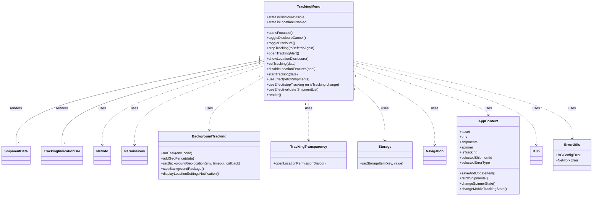

# Diagram: mobile/FreightVerifyMobileTracking/src/scenes/tracking-menu.tsx


> Auto-generated by Obscura crawlers

## Diagram 1



### SVG

<svg id="container" width="2694.359375" xmlns="http://www.w3.org/2000/svg" class="classDiagram" height="906" viewBox="0 0 2694.359375 906" role="graphics-document document" aria-roledescription="class"><style>#container{font-family:"trebuchet ms",verdana,arial,sans-serif;font-size:16px;fill:#333;}@keyframes edge-animation-frame{from{stroke-dashoffset:0;}}@keyframes dash{to{stroke-dashoffset:0;}}#container .edge-animation-slow{stroke-dasharray:9,5!important;stroke-dashoffset:900;animation:dash 50s linear infinite;stroke-linecap:round;}#container .edge-animation-fast{stroke-dasharray:9,5!important;stroke-dashoffset:900;animation:dash 20s linear infinite;stroke-linecap:round;}#container .error-icon{fill:#552222;}#container .error-text{fill:#552222;stroke:#552222;}#container .edge-thickness-normal{stroke-width:1px;}#container .edge-thickness-thick{stroke-width:3.5px;}#container .edge-pattern-solid{stroke-dasharray:0;}#container .edge-thickness-invisible{stroke-width:0;fill:none;}#container .edge-pattern-dashed{stroke-dasharray:3;}#container .edge-pattern-dotted{stroke-dasharray:2;}#container .marker{fill:#333333;stroke:#333333;}#container .marker.cross{stroke:#333333;}#container svg{font-family:"trebuchet ms",verdana,arial,sans-serif;font-size:16px;}#container p{margin:0;}#container g.classGroup text{fill:#9370DB;stroke:none;font-family:"trebuchet ms",verdana,arial,sans-serif;font-size:10px;}#container g.classGroup text .title{font-weight:bolder;}#container .nodeLabel,#container .edgeLabel{color:#131300;}#container .edgeLabel .label rect{fill:#ECECFF;}#container .label text{fill:#131300;}#container .labelBkg{background:#ECECFF;}#container .edgeLabel .label span{background:#ECECFF;}#container .classTitle{font-weight:bolder;}#container .node rect,#container .node circle,#container .node ellipse,#container .node polygon,#container .node path{fill:#ECECFF;stroke:#9370DB;stroke-width:1px;}#container .divider{stroke:#9370DB;stroke-width:1;}#container g.clickable{cursor:pointer;}#container g.classGroup rect{fill:#ECECFF;stroke:#9370DB;}#container g.classGroup line{stroke:#9370DB;stroke-width:1;}#container .classLabel .box{stroke:none;stroke-width:0;fill:#ECECFF;opacity:0.5;}#container .classLabel .label{fill:#9370DB;font-size:10px;}#container .relation{stroke:#333333;stroke-width:1;fill:none;}#container .dashed-line{stroke-dasharray:3;}#container .dotted-line{stroke-dasharray:1 2;}#container #compositionStart,#container .composition{fill:#333333!important;stroke:#333333!important;stroke-width:1;}#container #compositionEnd,#container .composition{fill:#333333!important;stroke:#333333!important;stroke-width:1;}#container #dependencyStart,#container .dependency{fill:#333333!important;stroke:#333333!important;stroke-width:1;}#container #dependencyStart,#container .dependency{fill:#333333!important;stroke:#333333!important;stroke-width:1;}#container #extensionStart,#container .extension{fill:transparent!important;stroke:#333333!important;stroke-width:1;}#container #extensionEnd,#container .extension{fill:transparent!important;stroke:#333333!important;stroke-width:1;}#container #aggregationStart,#container .aggregation{fill:transparent!important;stroke:#333333!important;stroke-width:1;}#container #aggregationEnd,#container .aggregation{fill:transparent!important;stroke:#333333!important;stroke-width:1;}#container #lollipopStart,#container .lollipop{fill:#ECECFF!important;stroke:#333333!important;stroke-width:1;}#container #lollipopEnd,#container .lollipop{fill:#ECECFF!important;stroke:#333333!important;stroke-width:1;}#container .edgeTerminals{font-size:11px;line-height:initial;}#container .classTitleText{text-anchor:middle;font-size:18px;fill:#333;}#container .label-icon{display:inline-block;height:1em;overflow:visible;vertical-align:-0.125em;}#container .node .label-icon path{fill:currentColor;stroke:revert;stroke-width:revert;}#container :root{--mermaid-font-family:"trebuchet ms",verdana,arial,sans-serif;}</style><g><defs><marker id="container_class-aggregationStart" class="marker aggregation class" refX="18" refY="7" markerWidth="190" markerHeight="240" orient="auto"><path d="M 18,7 L9,13 L1,7 L9,1 Z"></path></marker></defs><defs><marker id="container_class-aggregationEnd" class="marker aggregation class" refX="1" refY="7" markerWidth="20" markerHeight="28" orient="auto"><path d="M 18,7 L9,13 L1,7 L9,1 Z"></path></marker></defs><defs><marker id="container_class-extensionStart" class="marker extension class" refX="18" refY="7" markerWidth="190" markerHeight="240" orient="auto"><path d="M 1,7 L18,13 V 1 Z"></path></marker></defs><defs><marker id="container_class-extensionEnd" class="marker extension class" refX="1" refY="7" markerWidth="20" markerHeight="28" orient="auto"><path d="M 1,1 V 13 L18,7 Z"></path></marker></defs><defs><marker id="container_class-compositionStart" class="marker composition class" refX="18" refY="7" markerWidth="190" markerHeight="240" orient="auto"><path d="M 18,7 L9,13 L1,7 L9,1 Z"></path></marker></defs><defs><marker id="container_class-compositionEnd" class="marker composition class" refX="1" refY="7" markerWidth="20" markerHeight="28" orient="auto"><path d="M 18,7 L9,13 L1,7 L9,1 Z"></path></marker></defs><defs><marker id="container_class-dependencyStart" class="marker dependency class" refX="6" refY="7" markerWidth="190" markerHeight="240" orient="auto"><path d="M 5,7 L9,13 L1,7 L9,1 Z"></path></marker></defs><defs><marker id="container_class-dependencyEnd" class="marker dependency class" refX="13" refY="7" markerWidth="20" markerHeight="28" orient="auto"><path d="M 18,7 L9,13 L14,7 L9,1 Z"></path></marker></defs><defs><marker id="container_class-lollipopStart" class="marker lollipop class" refX="13" refY="7" markerWidth="190" markerHeight="240" orient="auto"><circle stroke="black" fill="transparent" cx="7" cy="7" r="6"></circle></marker></defs><defs><marker id="container_class-lollipopEnd" class="marker lollipop class" refX="1" refY="7" markerWidth="190" markerHeight="240" orient="auto"><circle stroke="black" fill="transparent" cx="7" cy="7" r="6"></circle></marker></defs><g class="root"><g class="clusters"></g><g class="edgePaths"><path d="M1201.063,276.479L1012.884,313.899C824.706,351.319,448.349,426.16,260.171,492.746C71.992,559.333,71.992,617.667,71.992,646.833L71.992,676" id="id_TrackingMenu_ShipmentData_1" class="edge-thickness-normal edge-pattern-solid relation" style=";;;" data-edge="true" data-et="edge" data-id="id_TrackingMenu_ShipmentData_1" data-points="W3sieCI6MTIwMS4wNjI1LCJ5IjoyNzYuNDc4NjU2MjA0MTA3ODR9LHsieCI6NzEuOTkyMTg3NSwieSI6NTAxfSx7IngiOjcxLjk5MjE4NzUsInkiOjY3Nn1d"></path><path d="M1201.063,283.89L1047.255,320.075C893.448,356.26,585.833,428.63,432.026,493.982C278.219,559.333,278.219,617.667,278.219,646.833L278.219,676" id="id_TrackingMenu_TrackingIndicationBar_2" class="edge-thickness-normal edge-pattern-solid relation" style=";;;" data-edge="true" data-et="edge" data-id="id_TrackingMenu_TrackingIndicationBar_2" data-points="W3sieCI6MTIwMS4wNjI1LCJ5IjoyODMuODg5NjYxODQ1MTMwNTV9LHsieCI6Mjc4LjIxODc1LCJ5Ijo1MDF9LHsieCI6Mjc4LjIxODc1LCJ5Ijo2NzZ9XQ=="></path><path d="M1201.063,293.085L1077.496,327.738C953.93,362.39,706.797,431.695,583.23,494.514C459.664,557.333,459.664,613.667,459.664,641.833L459.664,670" id="id_TrackingMenu_NetInfo_3" class="edge-thickness-normal edge-pattern-dashed relation" style=";;;" data-edge="true" data-et="edge" data-id="id_TrackingMenu_NetInfo_3" data-points="W3sieCI6MTIwMS4wNjI1LCJ5IjoyOTMuMDg1MTY0MjU1OTgwNTR9LHsieCI6NDU5LjY2NDA2MjUsInkiOjUwMX0seyJ4Ijo0NTkuNjY0MDYyNSwieSI6Njc2fV0=" marker-end="url(#container_class-dependencyEnd)"></path><path d="M1201.063,303.474L1101.745,336.395C1002.427,369.316,803.792,435.158,704.474,496.246C605.156,557.333,605.156,613.667,605.156,641.833L605.156,670" id="id_TrackingMenu_Permissions_4" class="edge-thickness-normal edge-pattern-dashed relation" style=";;;" data-edge="true" data-et="edge" data-id="id_TrackingMenu_Permissions_4" data-points="W3sieCI6MTIwMS4wNjI1LCJ5IjozMDMuNDczOTIwNTQyNTUwNDV9LHsieCI6NjA1LjE1NjI1LCJ5Ijo1MDF9LHsieCI6NjA1LjE1NjI1LCJ5Ijo2NzZ9XQ==" marker-end="url(#container_class-dependencyEnd)"></path><path d="M1201.063,353.701L1158.605,378.251C1116.147,402.801,1031.232,451.9,988.774,493.117C946.316,534.333,946.316,567.667,946.316,584.333L946.316,601" id="id_TrackingMenu_BackgroundTracking_5" class="edge-thickness-normal edge-pattern-dashed relation" style=";;;" data-edge="true" data-et="edge" data-id="id_TrackingMenu_BackgroundTracking_5" data-points="W3sieCI6MTIwMS4wNjI1LCJ5IjozNTMuNzAxMjM0MTY4MDQ0Nn0seyJ4Ijo5NDYuMzE2NDA2MjUsInkiOjUwMX0seyJ4Ijo5NDYuMzE2NDA2MjUsInkiOjYwN31d" marker-end="url(#container_class-dependencyEnd)"></path><path d="M1404.621,464L1404.621,470.167C1404.621,476.333,1404.621,488.667,1404.621,519.5C1404.621,550.333,1404.621,599.667,1404.621,624.333L1404.621,649" id="id_TrackingMenu_TrackingTransparency_6" class="edge-thickness-normal edge-pattern-dashed relation" style=";;;" data-edge="true" data-et="edge" data-id="id_TrackingMenu_TrackingTransparency_6" data-points="W3sieCI6MTQwNC42MjEwOTM3NSwieSI6NDY0fSx7IngiOjE0MDQuNjIxMDkzNzUsInkiOjUwMX0seyJ4IjoxNDA0LjYyMTA5Mzc1LCJ5Ijo2NTV9XQ==" marker-end="url(#container_class-dependencyEnd)"></path><path d="M1608.18,390.701L1632.368,409.084C1656.557,427.468,1704.935,464.234,1729.124,507.284C1753.313,550.333,1753.313,599.667,1753.313,624.333L1753.313,649" id="id_TrackingMenu_Storage_7" class="edge-thickness-normal edge-pattern-dashed relation" style=";;;" data-edge="true" data-et="edge" data-id="id_TrackingMenu_Storage_7" data-points="W3sieCI6MTYwOC4xNzk2ODc1LCJ5IjozOTAuNzAxMzM4NzEwNTgwODR9LHsieCI6MTc1My4zMTI1LCJ5Ijo1MDF9LHsieCI6MTc1My4zMTI1LCJ5Ijo2NTV9XQ==" marker-end="url(#container_class-dependencyEnd)"></path><path d="M1608.18,329.793L1670.108,358.327C1732.036,386.862,1855.893,443.931,1917.822,500.632C1979.75,557.333,1979.75,613.667,1979.75,641.833L1979.75,670" id="id_TrackingMenu_Navigation_8" class="edge-thickness-normal edge-pattern-dashed relation" style=";;;" data-edge="true" data-et="edge" data-id="id_TrackingMenu_Navigation_8" data-points="W3sieCI6MTYwOC4xNzk2ODc1LCJ5IjozMjkuNzkyOTMzNjQ5Mzg1NjV9LHsieCI6MTk3OS43NSwieSI6NTAxfSx7IngiOjE5NzkuNzUsInkiOjY3Nn1d" marker-end="url(#container_class-dependencyEnd)"></path><path d="M1608.18,301.948L1710.581,335.123C1812.983,368.298,2017.786,434.649,2120.188,472.991C2222.59,511.333,2222.59,521.667,2222.59,526.833L2222.59,532" id="id_TrackingMenu_AppContext_9" class="edge-thickness-normal edge-pattern-dashed relation" style=";;;" data-edge="true" data-et="edge" data-id="id_TrackingMenu_AppContext_9" data-points="W3sieCI6MTYwOC4xNzk2ODc1LCJ5IjozMDEuOTQ3NTQwNTkyMTY4MX0seyJ4IjoyMjIyLjU4OTg0Mzc1LCJ5Ijo1MDF9LHsieCI6MjIyMi41ODk4NDM3NSwieSI6NTM4fV0=" marker-end="url(#container_class-dependencyEnd)"></path><path d="M1608.18,288.021L1747.079,323.517C1885.979,359.014,2163.779,430.007,2302.678,493.67C2441.578,557.333,2441.578,613.667,2441.578,641.833L2441.578,670" id="id_TrackingMenu_I18n_10" class="edge-thickness-normal edge-pattern-dashed relation" style=";;;" data-edge="true" data-et="edge" data-id="id_TrackingMenu_I18n_10" data-points="W3sieCI6MTYwOC4xNzk2ODc1LCJ5IjoyODguMDIwNTAzOTUzNDk5Nzd9LHsieCI6MjQ0MS41NzgxMjUsInkiOjUwMX0seyJ4IjoyNDQxLjU3ODEyNSwieSI6Njc2fV0=" marker-end="url(#container_class-dependencyEnd)"></path><path d="M1608.18,281.027L1773.921,317.689C1939.663,354.352,2271.146,427.676,2436.887,487.505C2602.629,547.333,2602.629,593.667,2602.629,616.833L2602.629,640" id="id_TrackingMenu_ErrorUtils_11" class="edge-thickness-normal edge-pattern-dashed relation" style=";;;" data-edge="true" data-et="edge" data-id="id_TrackingMenu_ErrorUtils_11" data-points="W3sieCI6MTYwOC4xNzk2ODc1LCJ5IjoyODEuMDI3Mjc1MDk4NjMzOH0seyJ4IjoyNjAyLjYyODkwNjI1LCJ5Ijo1MDF9LHsieCI6MjYwMi42Mjg5MDYyNSwieSI6NjQ2fV0=" marker-end="url(#container_class-dependencyEnd)"></path></g><g class="edgeLabels"><g class="edgeLabel" transform="translate(71.9921875, 501)"><g class="label" data-id="id_TrackingMenu_ShipmentData_1" transform="translate(-27.75, -12)"><foreignObject width="55.5" height="24"><div xmlns="http://www.w3.org/1999/xhtml" class="labelBkg" style="display: table-cell; white-space: nowrap; line-height: 1.5; max-width: 200px; text-align: center;"><span class="edgeLabel"><p>renders</p></span></div></foreignObject></g></g><g class="edgeLabel" transform="translate(278.21875, 501)"><g class="label" data-id="id_TrackingMenu_TrackingIndicationBar_2" transform="translate(-27.75, -12)"><foreignObject width="55.5" height="24"><div xmlns="http://www.w3.org/1999/xhtml" class="labelBkg" style="display: table-cell; white-space: nowrap; line-height: 1.5; max-width: 200px; text-align: center;"><span class="edgeLabel"><p>renders</p></span></div></foreignObject></g></g><g class="edgeLabel" transform="translate(459.6640625, 501)"><g class="label" data-id="id_TrackingMenu_NetInfo_3" transform="translate(-16.4921875, -12)"><foreignObject width="32.984375" height="24"><div xmlns="http://www.w3.org/1999/xhtml" class="labelBkg" style="display: table-cell; white-space: nowrap; line-height: 1.5; max-width: 200px; text-align: center;"><span class="edgeLabel"><p>uses</p></span></div></foreignObject></g></g><g class="edgeLabel" transform="translate(605.15625, 501)"><g class="label" data-id="id_TrackingMenu_Permissions_4" transform="translate(-16.4921875, -12)"><foreignObject width="32.984375" height="24"><div xmlns="http://www.w3.org/1999/xhtml" class="labelBkg" style="display: table-cell; white-space: nowrap; line-height: 1.5; max-width: 200px; text-align: center;"><span class="edgeLabel"><p>uses</p></span></div></foreignObject></g></g><g class="edgeLabel" transform="translate(946.31640625, 501)"><g class="label" data-id="id_TrackingMenu_BackgroundTracking_5" transform="translate(-16.4921875, -12)"><foreignObject width="32.984375" height="24"><div xmlns="http://www.w3.org/1999/xhtml" class="labelBkg" style="display: table-cell; white-space: nowrap; line-height: 1.5; max-width: 200px; text-align: center;"><span class="edgeLabel"><p>uses</p></span></div></foreignObject></g></g><g class="edgeLabel" transform="translate(1404.62109375, 501)"><g class="label" data-id="id_TrackingMenu_TrackingTransparency_6" transform="translate(-16.4921875, -12)"><foreignObject width="32.984375" height="24"><div xmlns="http://www.w3.org/1999/xhtml" class="labelBkg" style="display: table-cell; white-space: nowrap; line-height: 1.5; max-width: 200px; text-align: center;"><span class="edgeLabel"><p>uses</p></span></div></foreignObject></g></g><g class="edgeLabel" transform="translate(1753.3125, 501)"><g class="label" data-id="id_TrackingMenu_Storage_7" transform="translate(-16.4921875, -12)"><foreignObject width="32.984375" height="24"><div xmlns="http://www.w3.org/1999/xhtml" class="labelBkg" style="display: table-cell; white-space: nowrap; line-height: 1.5; max-width: 200px; text-align: center;"><span class="edgeLabel"><p>uses</p></span></div></foreignObject></g></g><g class="edgeLabel" transform="translate(1979.75, 501)"><g class="label" data-id="id_TrackingMenu_Navigation_8" transform="translate(-16.4921875, -12)"><foreignObject width="32.984375" height="24"><div xmlns="http://www.w3.org/1999/xhtml" class="labelBkg" style="display: table-cell; white-space: nowrap; line-height: 1.5; max-width: 200px; text-align: center;"><span class="edgeLabel"><p>uses</p></span></div></foreignObject></g></g><g class="edgeLabel" transform="translate(2222.58984375, 501)"><g class="label" data-id="id_TrackingMenu_AppContext_9" transform="translate(-16.4921875, -12)"><foreignObject width="32.984375" height="24"><div xmlns="http://www.w3.org/1999/xhtml" class="labelBkg" style="display: table-cell; white-space: nowrap; line-height: 1.5; max-width: 200px; text-align: center;"><span class="edgeLabel"><p>uses</p></span></div></foreignObject></g></g><g class="edgeLabel" transform="translate(2441.578125, 501)"><g class="label" data-id="id_TrackingMenu_I18n_10" transform="translate(-16.4921875, -12)"><foreignObject width="32.984375" height="24"><div xmlns="http://www.w3.org/1999/xhtml" class="labelBkg" style="display: table-cell; white-space: nowrap; line-height: 1.5; max-width: 200px; text-align: center;"><span class="edgeLabel"><p>uses</p></span></div></foreignObject></g></g><g class="edgeLabel" transform="translate(2602.62890625, 501)"><g class="label" data-id="id_TrackingMenu_ErrorUtils_11" transform="translate(-16.4921875, -12)"><foreignObject width="32.984375" height="24"><div xmlns="http://www.w3.org/1999/xhtml" class="labelBkg" style="display: table-cell; white-space: nowrap; line-height: 1.5; max-width: 200px; text-align: center;"><span class="edgeLabel"><p>uses</p></span></div></foreignObject></g></g><g class="edgeTerminals" transform="translate(1180.973024070896, 265.1798530186828)"><g class="inner" transform="translate(0, 0)"><foreignObject style="width: 9px; height: 12px;"><div xmlns="http://www.w3.org/1999/xhtml" style="display: inline-block; padding-right: 1px; white-space: nowrap;"><span class="edgeLabel">1</span></div></foreignObject></g></g><g class="edgeTerminals" transform="translate(1180.5924305154947, 273.29597475248585)"><g class="inner" transform="translate(0, 0)"><foreignObject style="width: 9px; height: 12px;"><div xmlns="http://www.w3.org/1999/xhtml" style="display: inline-block; padding-right: 1px; white-space: nowrap;"><span class="edgeLabel">1</span></div></foreignObject></g></g><g class="edgeTerminals" transform="translate(1180.16225019708, 283.36767856359114)"><g class="inner" transform="translate(0, 0)"><foreignObject style="width: 9px; height: 12px;"><div xmlns="http://www.w3.org/1999/xhtml" style="display: inline-block; padding-right: 1px; white-space: nowrap;"><span class="edgeLabel">1</span></div></foreignObject></g></g><g class="edgeTerminals" transform="translate(1179.7317368162583, 294.7418835844926)"><g class="inner" transform="translate(0, 0)"><foreignObject style="width: 9px; height: 12px;"><div xmlns="http://www.w3.org/1999/xhtml" style="display: inline-block; padding-right: 1px; white-space: nowrap;"><span class="edgeLabel">1</span></div></foreignObject></g></g><g class="edgeTerminals" transform="translate(1178.4043007962343, 349.47559284238855)"><g class="inner" transform="translate(0, 0)"><foreignObject style="width: 9px; height: 12px;"><div xmlns="http://www.w3.org/1999/xhtml" style="display: inline-block; padding-right: 1px; white-space: nowrap;"><span class="edgeLabel">1</span></div></foreignObject></g></g><g class="edgeTerminals" transform="translate(1389.621091875, 481.4999983928572)"><g class="inner" transform="translate(0, 0)"><foreignObject style="width: 9px; height: 12px;"><div xmlns="http://www.w3.org/1999/xhtml" style="display: inline-block; padding-right: 1px; white-space: nowrap;"><span class="edgeLabel">1</span></div></foreignObject></g></g><g class="edgeTerminals" transform="translate(1613.0364963912798, 413.2326809234932)"><g class="inner" transform="translate(0, 0)"><foreignObject style="width: 9px; height: 12px;"><div xmlns="http://www.w3.org/1999/xhtml" style="display: inline-block; padding-right: 1px; white-space: nowrap;"><span class="edgeLabel">1</span></div></foreignObject></g></g><g class="edgeTerminals" transform="translate(1617.796445376651, 350.7397227601987)"><g class="inner" transform="translate(0, 0)"><foreignObject style="width: 9px; height: 12px;"><div xmlns="http://www.w3.org/1999/xhtml" style="display: inline-block; padding-right: 1px; white-space: nowrap;"><span class="edgeLabel">1</span></div></foreignObject></g></g><g class="edgeTerminals" transform="translate(1620.2047599241293, 321.61089650767656)"><g class="inner" transform="translate(0, 0)"><foreignObject style="width: 9px; height: 12px;"><div xmlns="http://www.w3.org/1999/xhtml" style="display: inline-block; padding-right: 1px; white-space: nowrap;"><span class="edgeLabel">1</span></div></foreignObject></g></g><g class="edgeTerminals" transform="translate(1621.4208165848447, 306.8864142375742)"><g class="inner" transform="translate(0, 0)"><foreignObject style="width: 9px; height: 12px;"><div xmlns="http://www.w3.org/1999/xhtml" style="display: inline-block; padding-right: 1px; white-space: nowrap;"><span class="edgeLabel">1</span></div></foreignObject></g></g><g class="edgeTerminals" transform="translate(1622.0269508272825, 299.4528898225816)"><g class="inner" transform="translate(0, 0)"><foreignObject style="width: 9px; height: 12px;"><div xmlns="http://www.w3.org/1999/xhtml" style="display: inline-block; padding-right: 1px; white-space: nowrap;"><span class="edgeLabel">1</span></div></foreignObject></g></g><g class="edgeTerminals" transform="translate(81.99218874999995, 653.5000010714285)"><g class="inner" transform="translate(0, 0)"></g><foreignObject style="width: 9px; height: 12px;"><div xmlns="http://www.w3.org/1999/xhtml" style="display: inline-block; padding-right: 1px; white-space: nowrap;"><span class="edgeLabel">*</span></div></foreignObject></g><g class="edgeTerminals" transform="translate(288.21875, 653.5)"><g class="inner" transform="translate(0, 0)"></g><foreignObject style="width: 9px; height: 12px;"><div xmlns="http://www.w3.org/1999/xhtml" style="display: inline-block; padding-right: 1px; white-space: nowrap;"><span class="edgeLabel">1</span></div></foreignObject></g></g><g class="nodes"><g class="node default" id="classId-TrackingMenu-0" transform="translate(1404.62109375, 236)"><g class="basic label-container"><path d="M-203.55859375 -228 L203.55859375 -228 L203.55859375 228 L-203.55859375 228" stroke="none" stroke-width="0" fill="#ECECFF" style=""></path><path d="M-203.55859375 -228 C-49.70567112609007 -228, 104.14725149781987 -228, 203.55859375 -228 M-203.55859375 -228 C-117.45284584086589 -228, -31.34709793173178 -228, 203.55859375 -228 M203.55859375 -228 C203.55859375 -47.81170031487636, 203.55859375 132.37659937024728, 203.55859375 228 M203.55859375 -228 C203.55859375 -48.97730396386666, 203.55859375 130.04539207226668, 203.55859375 228 M203.55859375 228 C65.8445073770558 228, -71.86957899588839 228, -203.55859375 228 M203.55859375 228 C55.6603119332907 228, -92.2379698834186 228, -203.55859375 228 M-203.55859375 228 C-203.55859375 129.82347150047423, -203.55859375 31.646943000948482, -203.55859375 -228 M-203.55859375 228 C-203.55859375 81.55050074433493, -203.55859375 -64.89899851133015, -203.55859375 -228" stroke="#9370DB" stroke-width="1.3" fill="none" stroke-dasharray="0 0" style=""></path></g><g class="annotation-group text" transform="translate(0, -204)"></g><g class="label-group text" transform="translate(-50.8203125, -204)"><g class="label" style="font-weight: bolder" transform="translate(0,-12)"><foreignObject width="101.640625" height="24"><div xmlns="http://www.w3.org/1999/xhtml" style="display: table-cell; white-space: nowrap; line-height: 1.5; max-width: 150px; text-align: center;"><span class="nodeLabel markdown-node-label" style=""><p>TrackingMenu</p></span></div></foreignObject></g></g><g class="members-group text" transform="translate(-191.55859375, -156)"><g class="label" style="" transform="translate(0,-12)"><foreignObject width="176.15625" height="24"><div xmlns="http://www.w3.org/1999/xhtml" style="display: table-cell; white-space: nowrap; line-height: 1.5; max-width: 234px; text-align: center;"><span class="nodeLabel markdown-node-label" style=""><p>+state isDiscloureVisible</p></span></div></foreignObject></g><g class="label" style="" transform="translate(0,12)"><foreignObject width="185.65625" height="24"><div xmlns="http://www.w3.org/1999/xhtml" style="display: table-cell; white-space: nowrap; line-height: 1.5; max-width: 243px; text-align: center;"><span class="nodeLabel markdown-node-label" style=""><p>+state isLocationDisabled</p></span></div></foreignObject></g></g><g class="methods-group text" transform="translate(-191.55859375, -84)"><g class="label" style="" transform="translate(0,-12)"><foreignObject width="115.25" height="24"><div xmlns="http://www.w3.org/1999/xhtml" style="display: table-cell; white-space: nowrap; line-height: 1.5; max-width: 173px; text-align: center;"><span class="nodeLabel markdown-node-label" style=""><p>+useIsFocused()</p></span></div></foreignObject></g><g class="label" style="" transform="translate(0,12)"><foreignObject width="178.359375" height="24"><div xmlns="http://www.w3.org/1999/xhtml" style="display: table-cell; white-space: nowrap; line-height: 1.5; max-width: 236px; text-align: center;"><span class="nodeLabel markdown-node-label" style=""><p>+toggleDiscloureCancel()</p></span></div></foreignObject></g><g class="label" style="" transform="translate(0,36)"><foreignObject width="130.75" height="24"><div xmlns="http://www.w3.org/1999/xhtml" style="display: table-cell; white-space: nowrap; line-height: 1.5; max-width: 188px; text-align: center;"><span class="nodeLabel markdown-node-label" style=""><p>+toggleDiscloure()</p></span></div></foreignObject></g><g class="label" style="" transform="translate(0,60)"><foreignObject width="219.953125" height="24"><div xmlns="http://www.w3.org/1999/xhtml" style="display: table-cell; white-space: nowrap; line-height: 1.5; max-width: 277px; text-align: center;"><span class="nodeLabel markdown-node-label" style=""><p>+stopTracking(toBefetchAgain)</p></span></div></foreignObject></g><g class="label" style="" transform="translate(0,84)"><foreignObject width="149.90625" height="24"><div xmlns="http://www.w3.org/1999/xhtml" style="display: table-cell; white-space: nowrap; line-height: 1.5; max-width: 207px; text-align: center;"><span class="nodeLabel markdown-node-label" style=""><p>+openTrackingAlert()</p></span></div></foreignObject></g><g class="label" style="" transform="translate(0,108)"><foreignObject width="193.21875" height="24"><div xmlns="http://www.w3.org/1999/xhtml" style="display: table-cell; white-space: nowrap; line-height: 1.5; max-width: 251px; text-align: center;"><span class="nodeLabel markdown-node-label" style=""><p>+showLocationDisclosure()</p></span></div></foreignObject></g><g class="label" style="" transform="translate(0,132)"><foreignObject width="133.125" height="24"><div xmlns="http://www.w3.org/1999/xhtml" style="display: table-cell; white-space: nowrap; line-height: 1.5; max-width: 190px; text-align: center;"><span class="nodeLabel markdown-node-label" style=""><p>+setTracking(data)</p></span></div></foreignObject></g><g class="label" style="" transform="translate(0,156)"><foreignObject width="227.8125" height="24"><div xmlns="http://www.w3.org/1999/xhtml" style="display: table-cell; white-space: nowrap; line-height: 1.5; max-width: 285px; text-align: center;"><span class="nodeLabel markdown-node-label" style=""><p>+disableLocationFeatures(bool)</p></span></div></foreignObject></g><g class="label" style="" transform="translate(0,180)"><foreignObject width="144.953125" height="24"><div xmlns="http://www.w3.org/1999/xhtml" style="display: table-cell; white-space: nowrap; line-height: 1.5; max-width: 202px; text-align: center;"><span class="nodeLabel markdown-node-label" style=""><p>+startTracking(data)</p></span></div></foreignObject></g><g class="label" style="" transform="translate(0,204)"><foreignObject width="198.453125" height="24"><div xmlns="http://www.w3.org/1999/xhtml" style="display: table-cell; white-space: nowrap; line-height: 1.5; max-width: 256px; text-align: center;"><span class="nodeLabel markdown-node-label" style=""><p>+useEffect(fetchShipments)</p></span></div></foreignObject></g><g class="label" style="" transform="translate(0,228)"><foreignObject width="332.296875" height="24"><div xmlns="http://www.w3.org/1999/xhtml" style="display: table-cell; white-space: nowrap; line-height: 1.5; max-width: 390px; text-align: center;"><span class="nodeLabel markdown-node-label" style=""><p>+useEffect(stopTracking on isTracking change)</p></span></div></foreignObject></g><g class="label" style="" transform="translate(0,252)"><foreignObject width="242.359375" height="24"><div xmlns="http://www.w3.org/1999/xhtml" style="display: table-cell; white-space: nowrap; line-height: 1.5; max-width: 300px; text-align: center;"><span class="nodeLabel markdown-node-label" style=""><p>+useEffect(validate ShipmentList)</p></span></div></foreignObject></g><g class="label" style="" transform="translate(0,276)"><foreignObject width="66.609375" height="24"><div xmlns="http://www.w3.org/1999/xhtml" style="display: table-cell; white-space: nowrap; line-height: 1.5; max-width: 124px; text-align: center;"><span class="nodeLabel markdown-node-label" style=""><p>+render()</p></span></div></foreignObject></g></g><g class="divider" style=""><path d="M-203.55859375 -180 C-52.06162565772908 -180, 99.43534243454184 -180, 203.55859375 -180 M-203.55859375 -180 C-120.07120242393673 -180, -36.58381109787345 -180, 203.55859375 -180" stroke="#9370DB" stroke-width="1.3" fill="none" stroke-dasharray="0 0" style=""></path></g><g class="divider" style=""><path d="M-203.55859375 -108 C-93.72912573509159 -108, 16.10034227981683 -108, 203.55859375 -108 M-203.55859375 -108 C-104.90540937250476 -108, -6.252224995009527 -108, 203.55859375 -108" stroke="#9370DB" stroke-width="1.3" fill="none" stroke-dasharray="0 0" style=""></path></g></g><g class="node default" id="classId-ShipmentData-1" transform="translate(71.9921875, 718)"><g class="basic label-container"><path d="M-63.9921875 -42 L63.9921875 -42 L63.9921875 42 L-63.9921875 42" stroke="none" stroke-width="0" fill="#ECECFF" style=""></path><path d="M-63.9921875 -42 C-37.85153777391617 -42, -11.710888047832341 -42, 63.9921875 -42 M-63.9921875 -42 C-25.99108974887183 -42, 12.010008002256342 -42, 63.9921875 -42 M63.9921875 -42 C63.9921875 -17.485659600716538, 63.9921875 7.028680798566924, 63.9921875 42 M63.9921875 -42 C63.9921875 -18.188139640212594, 63.9921875 5.623720719574813, 63.9921875 42 M63.9921875 42 C25.448618519707537 42, -13.094950460584926 42, -63.9921875 42 M63.9921875 42 C16.10862760714754 42, -31.77493228570492 42, -63.9921875 42 M-63.9921875 42 C-63.9921875 8.435799485749257, -63.9921875 -25.128401028501486, -63.9921875 -42 M-63.9921875 42 C-63.9921875 11.511902094462162, -63.9921875 -18.976195811075677, -63.9921875 -42" stroke="#9370DB" stroke-width="1.3" fill="none" stroke-dasharray="0 0" style=""></path></g><g class="annotation-group text" transform="translate(0, -18)"></g><g class="label-group text" transform="translate(-51.9921875, -18)"><g class="label" style="font-weight: bolder" transform="translate(0,-12)"><foreignObject width="103.984375" height="24"><div xmlns="http://www.w3.org/1999/xhtml" style="display: table-cell; white-space: nowrap; line-height: 1.5; max-width: 153px; text-align: center;"><span class="nodeLabel markdown-node-label" style=""><p>ShipmentData</p></span></div></foreignObject></g></g><g class="members-group text" transform="translate(-51.9921875, 30)"></g><g class="methods-group text" transform="translate(-51.9921875, 60)"></g><g class="divider" style=""><path d="M-63.9921875 6 C-38.254190298912725 6, -12.51619309782545 6, 63.9921875 6 M-63.9921875 6 C-14.978353063277488 6, 34.03548137344502 6, 63.9921875 6" stroke="#9370DB" stroke-width="1.3" fill="none" stroke-dasharray="0 0" style=""></path></g><g class="divider" style=""><path d="M-63.9921875 24 C-30.035085195466756 24, 3.9220171090664877 24, 63.9921875 24 M-63.9921875 24 C-32.98995815046172 24, -1.987728800923442 24, 63.9921875 24" stroke="#9370DB" stroke-width="1.3" fill="none" stroke-dasharray="0 0" style=""></path></g></g><g class="node default" id="classId-TrackingIndicationBar-2" transform="translate(278.21875, 718)"><g class="basic label-container"><path d="M-92.234375 -42 L92.234375 -42 L92.234375 42 L-92.234375 42" stroke="none" stroke-width="0" fill="#ECECFF" style=""></path><path d="M-92.234375 -42 C-27.885604117453923 -42, 36.463166765092154 -42, 92.234375 -42 M-92.234375 -42 C-37.73421365689301 -42, 16.765947686213977 -42, 92.234375 -42 M92.234375 -42 C92.234375 -18.986640521293843, 92.234375 4.026718957412314, 92.234375 42 M92.234375 -42 C92.234375 -13.940233958946088, 92.234375 14.119532082107824, 92.234375 42 M92.234375 42 C52.88431614787204 42, 13.534257295744084 42, -92.234375 42 M92.234375 42 C32.57261959811584 42, -27.089135803768315 42, -92.234375 42 M-92.234375 42 C-92.234375 13.294084099750911, -92.234375 -15.411831800498177, -92.234375 -42 M-92.234375 42 C-92.234375 12.767587817375723, -92.234375 -16.464824365248553, -92.234375 -42" stroke="#9370DB" stroke-width="1.3" fill="none" stroke-dasharray="0 0" style=""></path></g><g class="annotation-group text" transform="translate(0, -18)"></g><g class="label-group text" transform="translate(-80.234375, -18)"><g class="label" style="font-weight: bolder" transform="translate(0,-12)"><foreignObject width="160.46875" height="24"><div xmlns="http://www.w3.org/1999/xhtml" style="display: table-cell; white-space: nowrap; line-height: 1.5; max-width: 209px; text-align: center;"><span class="nodeLabel markdown-node-label" style=""><p>TrackingIndicationBar</p></span></div></foreignObject></g></g><g class="members-group text" transform="translate(-80.234375, 30)"></g><g class="methods-group text" transform="translate(-80.234375, 60)"></g><g class="divider" style=""><path d="M-92.234375 6 C-20.661313238723395 6, 50.91174852255321 6, 92.234375 6 M-92.234375 6 C-21.330957013802603 6, 49.57246097239479 6, 92.234375 6" stroke="#9370DB" stroke-width="1.3" fill="none" stroke-dasharray="0 0" style=""></path></g><g class="divider" style=""><path d="M-92.234375 24 C-30.880316450383155 24, 30.47374209923369 24, 92.234375 24 M-92.234375 24 C-55.16430689863815 24, -18.094238797276304 24, 92.234375 24" stroke="#9370DB" stroke-width="1.3" fill="none" stroke-dasharray="0 0" style=""></path></g></g><g class="node default" id="classId-NetInfo-3" transform="translate(459.6640625, 718)"><g class="basic label-container"><path d="M-39.2109375 -42 L39.2109375 -42 L39.2109375 42 L-39.2109375 42" stroke="none" stroke-width="0" fill="#ECECFF" style=""></path><path d="M-39.2109375 -42 C-16.618514738018614 -42, 5.973908023962771 -42, 39.2109375 -42 M-39.2109375 -42 C-11.581834438106963 -42, 16.047268623786074 -42, 39.2109375 -42 M39.2109375 -42 C39.2109375 -12.090719824414176, 39.2109375 17.818560351171648, 39.2109375 42 M39.2109375 -42 C39.2109375 -24.22580534180207, 39.2109375 -6.451610683604137, 39.2109375 42 M39.2109375 42 C17.646218050766528 42, -3.918501398466944 42, -39.2109375 42 M39.2109375 42 C18.283393416718702 42, -2.644150666562595 42, -39.2109375 42 M-39.2109375 42 C-39.2109375 17.9521275711157, -39.2109375 -6.095744857768601, -39.2109375 -42 M-39.2109375 42 C-39.2109375 23.283455978265756, -39.2109375 4.566911956531513, -39.2109375 -42" stroke="#9370DB" stroke-width="1.3" fill="none" stroke-dasharray="0 0" style=""></path></g><g class="annotation-group text" transform="translate(0, -18)"></g><g class="label-group text" transform="translate(-27.2109375, -18)"><g class="label" style="font-weight: bolder" transform="translate(0,-12)"><foreignObject width="54.421875" height="24"><div xmlns="http://www.w3.org/1999/xhtml" style="display: table-cell; white-space: nowrap; line-height: 1.5; max-width: 104px; text-align: center;"><span class="nodeLabel markdown-node-label" style=""><p>NetInfo</p></span></div></foreignObject></g></g><g class="members-group text" transform="translate(-27.2109375, 30)"></g><g class="methods-group text" transform="translate(-27.2109375, 60)"></g><g class="divider" style=""><path d="M-39.2109375 6 C-12.482243166308386 6, 14.246451167383228 6, 39.2109375 6 M-39.2109375 6 C-21.192431698442043 6, -3.1739258968840858 6, 39.2109375 6" stroke="#9370DB" stroke-width="1.3" fill="none" stroke-dasharray="0 0" style=""></path></g><g class="divider" style=""><path d="M-39.2109375 24 C-19.403623346836152 24, 0.4036908063276954 24, 39.2109375 24 M-39.2109375 24 C-17.252795132953807 24, 4.705347234092386 24, 39.2109375 24" stroke="#9370DB" stroke-width="1.3" fill="none" stroke-dasharray="0 0" style=""></path></g></g><g class="node default" id="classId-Permissions-4" transform="translate(605.15625, 718)"><g class="basic label-container"><path d="M-56.28125 -42 L56.28125 -42 L56.28125 42 L-56.28125 42" stroke="none" stroke-width="0" fill="#ECECFF" style=""></path><path d="M-56.28125 -42 C-24.564635032918808 -42, 7.151979934162384 -42, 56.28125 -42 M-56.28125 -42 C-15.909581191505211 -42, 24.462087616989578 -42, 56.28125 -42 M56.28125 -42 C56.28125 -23.36625597541015, 56.28125 -4.732511950820303, 56.28125 42 M56.28125 -42 C56.28125 -20.529517754749087, 56.28125 0.9409644905018268, 56.28125 42 M56.28125 42 C30.028743557123242 42, 3.7762371142464843 42, -56.28125 42 M56.28125 42 C24.456876513077457 42, -7.3674969738450855 42, -56.28125 42 M-56.28125 42 C-56.28125 20.90776916223445, -56.28125 -0.1844616755310966, -56.28125 -42 M-56.28125 42 C-56.28125 24.425340230256264, -56.28125 6.850680460512528, -56.28125 -42" stroke="#9370DB" stroke-width="1.3" fill="none" stroke-dasharray="0 0" style=""></path></g><g class="annotation-group text" transform="translate(0, -18)"></g><g class="label-group text" transform="translate(-44.28125, -18)"><g class="label" style="font-weight: bolder" transform="translate(0,-12)"><foreignObject width="88.5625" height="24"><div xmlns="http://www.w3.org/1999/xhtml" style="display: table-cell; white-space: nowrap; line-height: 1.5; max-width: 137px; text-align: center;"><span class="nodeLabel markdown-node-label" style=""><p>Permissions</p></span></div></foreignObject></g></g><g class="members-group text" transform="translate(-44.28125, 30)"></g><g class="methods-group text" transform="translate(-44.28125, 60)"></g><g class="divider" style=""><path d="M-56.28125 6 C-25.684242759128477 6, 4.9127644817430465 6, 56.28125 6 M-56.28125 6 C-17.08449282972012 6, 22.11226434055976 6, 56.28125 6" stroke="#9370DB" stroke-width="1.3" fill="none" stroke-dasharray="0 0" style=""></path></g><g class="divider" style=""><path d="M-56.28125 24 C-29.425189761109134 24, -2.569129522218269 24, 56.28125 24 M-56.28125 24 C-17.476989146556235 24, 21.32727170688753 24, 56.28125 24" stroke="#9370DB" stroke-width="1.3" fill="none" stroke-dasharray="0 0" style=""></path></g></g><g class="node default" id="classId-BackgroundTracking-5" transform="translate(946.31640625, 718)"><g class="basic label-container"><path d="M-234.87890625 -111 L234.87890625 -111 L234.87890625 111 L-234.87890625 111" stroke="none" stroke-width="0" fill="#ECECFF" style=""></path><path d="M-234.87890625 -111 C-136.29181918301487 -111, -37.70473211602976 -111, 234.87890625 -111 M-234.87890625 -111 C-51.53314201727437 -111, 131.81262221545126 -111, 234.87890625 -111 M234.87890625 -111 C234.87890625 -52.502181080907285, 234.87890625 5.995637838185431, 234.87890625 111 M234.87890625 -111 C234.87890625 -44.146482363947655, 234.87890625 22.70703527210469, 234.87890625 111 M234.87890625 111 C115.32998787332234 111, -4.218930503355324 111, -234.87890625 111 M234.87890625 111 C58.89355672256886 111, -117.09179280486228 111, -234.87890625 111 M-234.87890625 111 C-234.87890625 65.7889284452877, -234.87890625 20.577856890575404, -234.87890625 -111 M-234.87890625 111 C-234.87890625 23.091077138394056, -234.87890625 -64.81784572321189, -234.87890625 -111" stroke="#9370DB" stroke-width="1.3" fill="none" stroke-dasharray="0 0" style=""></path></g><g class="annotation-group text" transform="translate(0, -87)"></g><g class="label-group text" transform="translate(-74.4609375, -87)"><g class="label" style="font-weight: bolder" transform="translate(0,-12)"><foreignObject width="148.921875" height="24"><div xmlns="http://www.w3.org/1999/xhtml" style="display: table-cell; white-space: nowrap; line-height: 1.5; max-width: 197px; text-align: center;"><span class="nodeLabel markdown-node-label" style=""><p>BackgroundTracking</p></span></div></foreignObject></g></g><g class="members-group text" transform="translate(-222.87890625, -39)"></g><g class="methods-group text" transform="translate(-222.87890625, -9)"><g class="label" style="" transform="translate(0,-12)"><foreignObject width="143.15625" height="24"><div xmlns="http://www.w3.org/1999/xhtml" style="display: table-cell; white-space: nowrap; line-height: 1.5; max-width: 201px; text-align: center;"><span class="nodeLabel markdown-node-label" style=""><p>+runTask(env, code)</p></span></div></foreignObject></g><g class="label" style="" transform="translate(0,12)"><foreignObject width="148.203125" height="24"><div xmlns="http://www.w3.org/1999/xhtml" style="display: table-cell; white-space: nowrap; line-height: 1.5; max-width: 206px; text-align: center;"><span class="nodeLabel markdown-node-label" style=""><p>+addGeoFence(data)</p></span></div></foreignObject></g><g class="label" style="" transform="translate(0,36)"><foreignObject width="371.296875" height="24"><div xmlns="http://www.w3.org/1999/xhtml" style="display: table-cell; white-space: nowrap; line-height: 1.5; max-width: 429px; text-align: center;"><span class="nodeLabel markdown-node-label" style=""><p>+setBackgroundGeolocation(env, timeout, callback)</p></span></div></foreignObject></g><g class="label" style="" transform="translate(0,60)"><foreignObject width="194.046875" height="24"><div xmlns="http://www.w3.org/1999/xhtml" style="display: table-cell; white-space: nowrap; line-height: 1.5; max-width: 251px; text-align: center;"><span class="nodeLabel markdown-node-label" style=""><p>+stopBackgroundPackage()</p></span></div></foreignObject></g><g class="label" style="" transform="translate(0,84)"><foreignObject width="276" height="24"><div xmlns="http://www.w3.org/1999/xhtml" style="display: table-cell; white-space: nowrap; line-height: 1.5; max-width: 333px; text-align: center;"><span class="nodeLabel markdown-node-label" style=""><p>+displayLocationSettingsNotification()</p></span></div></foreignObject></g></g><g class="divider" style=""><path d="M-234.87890625 -63 C-139.35156408069275 -63, -43.82422191138551 -63, 234.87890625 -63 M-234.87890625 -63 C-131.92286941498702 -63, -28.96683257997404 -63, 234.87890625 -63" stroke="#9370DB" stroke-width="1.3" fill="none" stroke-dasharray="0 0" style=""></path></g><g class="divider" style=""><path d="M-234.87890625 -39 C-88.04592536333433 -39, 58.78705552333133 -39, 234.87890625 -39 M-234.87890625 -39 C-130.95341809054275 -39, -27.027929931085538 -39, 234.87890625 -39" stroke="#9370DB" stroke-width="1.3" fill="none" stroke-dasharray="0 0" style=""></path></g></g><g class="node default" id="classId-TrackingTransparency-6" transform="translate(1404.62109375, 718)"><g class="basic label-container"><path d="M-173.42578125 -63 L173.42578125 -63 L173.42578125 63 L-173.42578125 63" stroke="none" stroke-width="0" fill="#ECECFF" style=""></path><path d="M-173.42578125 -63 C-86.3294205702612 -63, 0.7669401094775878 -63, 173.42578125 -63 M-173.42578125 -63 C-54.465652347031366 -63, 64.49447655593727 -63, 173.42578125 -63 M173.42578125 -63 C173.42578125 -33.6612146417239, 173.42578125 -4.3224292834478035, 173.42578125 63 M173.42578125 -63 C173.42578125 -26.131593503552004, 173.42578125 10.736812992895992, 173.42578125 63 M173.42578125 63 C101.44903313897532 63, 29.472285027950647 63, -173.42578125 63 M173.42578125 63 C98.77640982937378 63, 24.127038408747552 63, -173.42578125 63 M-173.42578125 63 C-173.42578125 28.02963626759778, -173.42578125 -6.940727464804439, -173.42578125 -63 M-173.42578125 63 C-173.42578125 13.686951852338211, -173.42578125 -35.62609629532358, -173.42578125 -63" stroke="#9370DB" stroke-width="1.3" fill="none" stroke-dasharray="0 0" style=""></path></g><g class="annotation-group text" transform="translate(0, -39)"></g><g class="label-group text" transform="translate(-79.8515625, -39)"><g class="label" style="font-weight: bolder" transform="translate(0,-12)"><foreignObject width="159.703125" height="24"><div xmlns="http://www.w3.org/1999/xhtml" style="display: table-cell; white-space: nowrap; line-height: 1.5; max-width: 207px; text-align: center;"><span class="nodeLabel markdown-node-label" style=""><p>TrackingTransparency</p></span></div></foreignObject></g></g><g class="members-group text" transform="translate(-161.42578125, 9)"></g><g class="methods-group text" transform="translate(-161.42578125, 39)"><g class="label" style="" transform="translate(0,-12)"><foreignObject width="243" height="24"><div xmlns="http://www.w3.org/1999/xhtml" style="display: table-cell; white-space: nowrap; line-height: 1.5; max-width: 300px; text-align: center;"><span class="nodeLabel markdown-node-label" style=""><p>+openLocationPermissionDialog()</p></span></div></foreignObject></g></g><g class="divider" style=""><path d="M-173.42578125 -15 C-39.707709275992414 -15, 94.01036269801517 -15, 173.42578125 -15 M-173.42578125 -15 C-40.8171678876154 -15, 91.7914454747692 -15, 173.42578125 -15" stroke="#9370DB" stroke-width="1.3" fill="none" stroke-dasharray="0 0" style=""></path></g><g class="divider" style=""><path d="M-173.42578125 9 C-54.64924048337912 9, 64.12730028324177 9, 173.42578125 9 M-173.42578125 9 C-82.39136619465562 9, 8.643048860688765 9, 173.42578125 9" stroke="#9370DB" stroke-width="1.3" fill="none" stroke-dasharray="0 0" style=""></path></g></g><g class="node default" id="classId-Storage-7" transform="translate(1753.3125, 718)"><g class="basic label-container"><path d="M-125.265625 -63 L125.265625 -63 L125.265625 63 L-125.265625 63" stroke="none" stroke-width="0" fill="#ECECFF" style=""></path><path d="M-125.265625 -63 C-59.17275244474604 -63, 6.9201201105079235 -63, 125.265625 -63 M-125.265625 -63 C-34.84620218737473 -63, 55.57322062525054 -63, 125.265625 -63 M125.265625 -63 C125.265625 -29.195502130262952, 125.265625 4.608995739474096, 125.265625 63 M125.265625 -63 C125.265625 -14.272097901284795, 125.265625 34.45580419743041, 125.265625 63 M125.265625 63 C53.06088363044188 63, -19.143857739116243 63, -125.265625 63 M125.265625 63 C39.64181902555522 63, -45.981986948889556 63, -125.265625 63 M-125.265625 63 C-125.265625 12.858611393500915, -125.265625 -37.28277721299817, -125.265625 -63 M-125.265625 63 C-125.265625 12.987994684388674, -125.265625 -37.02401063122265, -125.265625 -63" stroke="#9370DB" stroke-width="1.3" fill="none" stroke-dasharray="0 0" style=""></path></g><g class="annotation-group text" transform="translate(0, -39)"></g><g class="label-group text" transform="translate(-28.078125, -39)"><g class="label" style="font-weight: bolder" transform="translate(0,-12)"><foreignObject width="56.15625" height="24"><div xmlns="http://www.w3.org/1999/xhtml" style="display: table-cell; white-space: nowrap; line-height: 1.5; max-width: 105px; text-align: center;"><span class="nodeLabel markdown-node-label" style=""><p>Storage</p></span></div></foreignObject></g></g><g class="members-group text" transform="translate(-113.265625, 9)"></g><g class="methods-group text" transform="translate(-113.265625, 39)"><g class="label" style="" transform="translate(0,-12)"><foreignObject width="198.453125" height="24"><div xmlns="http://www.w3.org/1999/xhtml" style="display: table-cell; white-space: nowrap; line-height: 1.5; max-width: 256px; text-align: center;"><span class="nodeLabel markdown-node-label" style=""><p>+setStorageItem(key, value)</p></span></div></foreignObject></g></g><g class="divider" style=""><path d="M-125.265625 -15 C-46.76703614970013 -15, 31.731552700599735 -15, 125.265625 -15 M-125.265625 -15 C-75.14111659904302 -15, -25.016608198086033 -15, 125.265625 -15" stroke="#9370DB" stroke-width="1.3" fill="none" stroke-dasharray="0 0" style=""></path></g><g class="divider" style=""><path d="M-125.265625 9 C-71.95565958072932 9, -18.645694161458636 9, 125.265625 9 M-125.265625 9 C-27.8485641584587 9, 69.5684966830826 9, 125.265625 9" stroke="#9370DB" stroke-width="1.3" fill="none" stroke-dasharray="0 0" style=""></path></g></g><g class="node default" id="classId-Navigation-8" transform="translate(1979.75, 718)"><g class="basic label-container"><path d="M-51.171875 -42 L51.171875 -42 L51.171875 42 L-51.171875 42" stroke="none" stroke-width="0" fill="#ECECFF" style=""></path><path d="M-51.171875 -42 C-22.932481297246937 -42, 5.306912405506125 -42, 51.171875 -42 M-51.171875 -42 C-13.406914612401408 -42, 24.358045775197184 -42, 51.171875 -42 M51.171875 -42 C51.171875 -20.137708157016412, 51.171875 1.7245836859671755, 51.171875 42 M51.171875 -42 C51.171875 -24.86123876084711, 51.171875 -7.722477521694223, 51.171875 42 M51.171875 42 C28.90934574321986 42, 6.646816486439718 42, -51.171875 42 M51.171875 42 C16.087808170007733 42, -18.996258659984534 42, -51.171875 42 M-51.171875 42 C-51.171875 13.414320629841875, -51.171875 -15.17135874031625, -51.171875 -42 M-51.171875 42 C-51.171875 11.345203617970629, -51.171875 -19.309592764058742, -51.171875 -42" stroke="#9370DB" stroke-width="1.3" fill="none" stroke-dasharray="0 0" style=""></path></g><g class="annotation-group text" transform="translate(0, -18)"></g><g class="label-group text" transform="translate(-39.171875, -18)"><g class="label" style="font-weight: bolder" transform="translate(0,-12)"><foreignObject width="78.34375" height="24"><div xmlns="http://www.w3.org/1999/xhtml" style="display: table-cell; white-space: nowrap; line-height: 1.5; max-width: 128px; text-align: center;"><span class="nodeLabel markdown-node-label" style=""><p>Navigation</p></span></div></foreignObject></g></g><g class="members-group text" transform="translate(-39.171875, 30)"></g><g class="methods-group text" transform="translate(-39.171875, 60)"></g><g class="divider" style=""><path d="M-51.171875 6 C-13.98485339212683 6, 23.20216821574634 6, 51.171875 6 M-51.171875 6 C-30.575508244657605 6, -9.97914148931521 6, 51.171875 6" stroke="#9370DB" stroke-width="1.3" fill="none" stroke-dasharray="0 0" style=""></path></g><g class="divider" style=""><path d="M-51.171875 24 C-18.98149926635525 24, 13.2088764672895 24, 51.171875 24 M-51.171875 24 C-15.015830057236698 24, 21.140214885526603 24, 51.171875 24" stroke="#9370DB" stroke-width="1.3" fill="none" stroke-dasharray="0 0" style=""></path></g></g><g class="node default" id="classId-AppContext-9" transform="translate(2222.58984375, 718)"><g class="basic label-container"><path d="M-141.66796875 -180 L141.66796875 -180 L141.66796875 180 L-141.66796875 180" stroke="none" stroke-width="0" fill="#ECECFF" style=""></path><path d="M-141.66796875 -180 C-74.87258340029744 -180, -8.077198050594887 -180, 141.66796875 -180 M-141.66796875 -180 C-57.59037641473712 -180, 26.487215920525756 -180, 141.66796875 -180 M141.66796875 -180 C141.66796875 -37.38291004637097, 141.66796875 105.23417990725807, 141.66796875 180 M141.66796875 -180 C141.66796875 -57.96621378608377, 141.66796875 64.06757242783246, 141.66796875 180 M141.66796875 180 C42.19703276244783 180, -57.273903225104334 180, -141.66796875 180 M141.66796875 180 C46.54809741845524 180, -48.571773913089515 180, -141.66796875 180 M-141.66796875 180 C-141.66796875 74.77200340326779, -141.66796875 -30.455993193464423, -141.66796875 -180 M-141.66796875 180 C-141.66796875 102.19885124598902, -141.66796875 24.397702491978038, -141.66796875 -180" stroke="#9370DB" stroke-width="1.3" fill="none" stroke-dasharray="0 0" style=""></path></g><g class="annotation-group text" transform="translate(0, -156)"></g><g class="label-group text" transform="translate(-42.4453125, -156)"><g class="label" style="font-weight: bolder" transform="translate(0,-12)"><foreignObject width="84.890625" height="24"><div xmlns="http://www.w3.org/1999/xhtml" style="display: table-cell; white-space: nowrap; line-height: 1.5; max-width: 133px; text-align: center;"><span class="nodeLabel markdown-node-label" style=""><p>AppContext</p></span></div></foreignObject></g></g><g class="members-group text" transform="translate(-129.66796875, -108)"><g class="label" style="" transform="translate(0,-12)"><foreignObject width="45.578125" height="24"><div xmlns="http://www.w3.org/1999/xhtml" style="display: table-cell; white-space: nowrap; line-height: 1.5; max-width: 103px; text-align: center;"><span class="nodeLabel markdown-node-label" style=""><p>+asset</p></span></div></foreignObject></g><g class="label" style="" transform="translate(0,12)"><foreignObject width="33.84375" height="24"><div xmlns="http://www.w3.org/1999/xhtml" style="display: table-cell; white-space: nowrap; line-height: 1.5; max-width: 91px; text-align: center;"><span class="nodeLabel markdown-node-label" style=""><p>+env</p></span></div></foreignObject></g><g class="label" style="" transform="translate(0,36)"><foreignObject width="83.90625" height="24"><div xmlns="http://www.w3.org/1999/xhtml" style="display: table-cell; white-space: nowrap; line-height: 1.5; max-width: 141px; text-align: center;"><span class="nodeLabel markdown-node-label" style=""><p>+shipments</p></span></div></foreignObject></g><g class="label" style="" transform="translate(0,60)"><foreignObject width="63.125" height="24"><div xmlns="http://www.w3.org/1999/xhtml" style="display: table-cell; white-space: nowrap; line-height: 1.5; max-width: 121px; text-align: center;"><span class="nodeLabel markdown-node-label" style=""><p>+spinner</p></span></div></foreignObject></g><g class="label" style="" transform="translate(0,84)"><foreignObject width="80.140625" height="24"><div xmlns="http://www.w3.org/1999/xhtml" style="display: table-cell; white-space: nowrap; line-height: 1.5; max-width: 138px; text-align: center;"><span class="nodeLabel markdown-node-label" style=""><p>+isTracking</p></span></div></foreignObject></g><g class="label" style="" transform="translate(0,108)"><foreignObject width="152.96875" height="24"><div xmlns="http://www.w3.org/1999/xhtml" style="display: table-cell; white-space: nowrap; line-height: 1.5; max-width: 210px; text-align: center;"><span class="nodeLabel markdown-node-label" style=""><p>+selectedShipmentId</p></span></div></foreignObject></g><g class="label" style="" transform="translate(0,132)"><foreignObject width="138.5" height="24"><div xmlns="http://www.w3.org/1999/xhtml" style="display: table-cell; white-space: nowrap; line-height: 1.5; max-width: 196px; text-align: center;"><span class="nodeLabel markdown-node-label" style=""><p>+selectedErrorType</p></span></div></foreignObject></g></g><g class="methods-group text" transform="translate(-129.66796875, 84)"><g class="label" style="" transform="translate(0,-12)"><foreignObject width="164.09375" height="24"><div xmlns="http://www.w3.org/1999/xhtml" style="display: table-cell; white-space: nowrap; line-height: 1.5; max-width: 221px; text-align: center;"><span class="nodeLabel markdown-node-label" style=""><p>+saveAndUpdateItem()</p></span></div></foreignObject></g><g class="label" style="" transform="translate(0,12)"><foreignObject width="131.765625" height="24"><div xmlns="http://www.w3.org/1999/xhtml" style="display: table-cell; white-space: nowrap; line-height: 1.5; max-width: 189px; text-align: center;"><span class="nodeLabel markdown-node-label" style=""><p>+fetchShipments()</p></span></div></foreignObject></g><g class="label" style="" transform="translate(0,36)"><foreignObject width="163.96875" height="24"><div xmlns="http://www.w3.org/1999/xhtml" style="display: table-cell; white-space: nowrap; line-height: 1.5; max-width: 221px; text-align: center;"><span class="nodeLabel markdown-node-label" style=""><p>+changeSpinnerState()</p></span></div></foreignObject></g><g class="label" style="" transform="translate(0,60)"><foreignObject width="216.890625" height="24"><div xmlns="http://www.w3.org/1999/xhtml" style="display: table-cell; white-space: nowrap; line-height: 1.5; max-width: 274px; text-align: center;"><span class="nodeLabel markdown-node-label" style=""><p>+changeMobileTrackingState()</p></span></div></foreignObject></g></g><g class="divider" style=""><path d="M-141.66796875 -132 C-30.32964742406503 -132, 81.00867390186994 -132, 141.66796875 -132 M-141.66796875 -132 C-84.35164319523606 -132, -27.03531764047213 -132, 141.66796875 -132" stroke="#9370DB" stroke-width="1.3" fill="none" stroke-dasharray="0 0" style=""></path></g><g class="divider" style=""><path d="M-141.66796875 60 C-80.95832222042065 60, -20.248675690841296 60, 141.66796875 60 M-141.66796875 60 C-63.514243845171734 60, 14.639481059656532 60, 141.66796875 60" stroke="#9370DB" stroke-width="1.3" fill="none" stroke-dasharray="0 0" style=""></path></g></g><g class="node default" id="classId-I18n-10" transform="translate(2441.578125, 718)"><g class="basic label-container"><path d="M-27.3203125 -42 L27.3203125 -42 L27.3203125 42 L-27.3203125 42" stroke="none" stroke-width="0" fill="#ECECFF" style=""></path><path d="M-27.3203125 -42 C-7.19000433843717 -42, 12.94030382312566 -42, 27.3203125 -42 M-27.3203125 -42 C-15.697859992492655 -42, -4.075407484985309 -42, 27.3203125 -42 M27.3203125 -42 C27.3203125 -11.78153203756754, 27.3203125 18.43693592486492, 27.3203125 42 M27.3203125 -42 C27.3203125 -11.771884194829958, 27.3203125 18.456231610340083, 27.3203125 42 M27.3203125 42 C10.487265491018476 42, -6.345781517963047 42, -27.3203125 42 M27.3203125 42 C13.519396254532467 42, -0.28151999093506674 42, -27.3203125 42 M-27.3203125 42 C-27.3203125 15.493614836422775, -27.3203125 -11.012770327154449, -27.3203125 -42 M-27.3203125 42 C-27.3203125 16.891588604935837, -27.3203125 -8.216822790128326, -27.3203125 -42" stroke="#9370DB" stroke-width="1.3" fill="none" stroke-dasharray="0 0" style=""></path></g><g class="annotation-group text" transform="translate(0, -18)"></g><g class="label-group text" transform="translate(-15.3203125, -18)"><g class="label" style="font-weight: bolder" transform="translate(0,-12)"><foreignObject width="30.640625" height="24"><div xmlns="http://www.w3.org/1999/xhtml" style="display: table-cell; white-space: nowrap; line-height: 1.5; max-width: 80px; text-align: center;"><span class="nodeLabel markdown-node-label" style=""><p>I18n</p></span></div></foreignObject></g></g><g class="members-group text" transform="translate(-15.3203125, 30)"></g><g class="methods-group text" transform="translate(-15.3203125, 60)"></g><g class="divider" style=""><path d="M-27.3203125 6 C-6.200503976438132 6, 14.919304547123737 6, 27.3203125 6 M-27.3203125 6 C-9.413959538760555 6, 8.49239342247889 6, 27.3203125 6" stroke="#9370DB" stroke-width="1.3" fill="none" stroke-dasharray="0 0" style=""></path></g><g class="divider" style=""><path d="M-27.3203125 24 C-11.803338108837593 24, 3.7136362823248135 24, 27.3203125 24 M-27.3203125 24 C-14.7950421091143 24, -2.2697717182286006 24, 27.3203125 24" stroke="#9370DB" stroke-width="1.3" fill="none" stroke-dasharray="0 0" style=""></path></g></g><g class="node default" id="classId-ErrorUtils-11" transform="translate(2602.62890625, 718)"><g class="basic label-container"><path d="M-83.73046875 -72 L83.73046875 -72 L83.73046875 72 L-83.73046875 72" stroke="none" stroke-width="0" fill="#ECECFF" style=""></path><path d="M-83.73046875 -72 C-21.062960712446284 -72, 41.60454732510743 -72, 83.73046875 -72 M-83.73046875 -72 C-28.225155294693586 -72, 27.280158160612828 -72, 83.73046875 -72 M83.73046875 -72 C83.73046875 -40.24159703764681, 83.73046875 -8.483194075293625, 83.73046875 72 M83.73046875 -72 C83.73046875 -17.327842171698357, 83.73046875 37.344315656603285, 83.73046875 72 M83.73046875 72 C34.181281249358186 72, -15.367906251283628 72, -83.73046875 72 M83.73046875 72 C18.791569439602767 72, -46.147329870794465 72, -83.73046875 72 M-83.73046875 72 C-83.73046875 23.265969122276815, -83.73046875 -25.46806175544637, -83.73046875 -72 M-83.73046875 72 C-83.73046875 25.480898665796694, -83.73046875 -21.038202668406612, -83.73046875 -72" stroke="#9370DB" stroke-width="1.3" fill="none" stroke-dasharray="0 0" style=""></path></g><g class="annotation-group text" transform="translate(0, -48)"></g><g class="label-group text" transform="translate(-34.9765625, -48)"><g class="label" style="font-weight: bolder" transform="translate(0,-12)"><foreignObject width="69.953125" height="24"><div xmlns="http://www.w3.org/1999/xhtml" style="display: table-cell; white-space: nowrap; line-height: 1.5; max-width: 119px; text-align: center;"><span class="nodeLabel markdown-node-label" style=""><p>ErrorUtils</p></span></div></foreignObject></g></g><g class="members-group text" transform="translate(-71.73046875, 0)"><g class="label" style="" transform="translate(0,-12)"><foreignObject width="108.484375" height="24"><div xmlns="http://www.w3.org/1999/xhtml" style="display: table-cell; white-space: nowrap; line-height: 1.5; max-width: 167px; text-align: center;"><span class="nodeLabel markdown-node-label" style=""><p>+BGConfigError</p></span></div></foreignObject></g><g class="label" style="" transform="translate(0,12)"><foreignObject width="104.390625" height="24"><div xmlns="http://www.w3.org/1999/xhtml" style="display: table-cell; white-space: nowrap; line-height: 1.5; max-width: 163px; text-align: center;"><span class="nodeLabel markdown-node-label" style=""><p>+NetworkError</p></span></div></foreignObject></g></g><g class="methods-group text" transform="translate(-71.73046875, 72)"></g><g class="divider" style=""><path d="M-83.73046875 -24 C-44.25962374041507 -24, -4.7887787308301455 -24, 83.73046875 -24 M-83.73046875 -24 C-17.10169716995415 -24, 49.5270744100917 -24, 83.73046875 -24" stroke="#9370DB" stroke-width="1.3" fill="none" stroke-dasharray="0 0" style=""></path></g><g class="divider" style=""><path d="M-83.73046875 48 C-25.94705876713528 48, 31.836351215729437 48, 83.73046875 48 M-83.73046875 48 C-45.47798486185526 48, -7.225500973710524 48, 83.73046875 48" stroke="#9370DB" stroke-width="1.3" fill="none" stroke-dasharray="0 0" style=""></path></g></g></g></g></g></svg>

## Diagram 2

```mermaid
flowchart TD
    A[setTracking(data)] --> B{Network connected?}
    B -- No --> C[displayErrorAlert(NetworkError) and return]
    B -- Yes --> D{isTracking && selectedErrorType == "LO"?}
    D -- Yes --> E[displayErrorAlert(BGConfigError("LO")) and return]
    D -- No --> F[showLocationDisclosure()]
    F --> G[Request iOS/Android permissions]
    G --> H{Permissions granted?}
    H -- Yes --> I[disableLocationFeatures(false)]
    I --> J[setStorageItem id, creator, org_id]
    J --> K[changeSpinnerState(true)]
    K --> L[setBackgroundGeolocation(env, timeout, -> startTracking(data))]
    L --> M{setBackgroundGeolocation succeeded?}
    M -- Yes --> N[startTracking: runTask -> changeMobileTrackingState(true) -> addGeoFence -> navigate Tracking]
    M -- No --> O[changeSpinnerState(false)]
    H -- No --> P{Platform == android?}
    P -- Yes --> Q[openLocationPermissionDialog()]
    P -- No --> R[disableLocationFeatures(true) and displayLocationSettingsNotification()]
```

> SVG rendering failed for this diagram.
