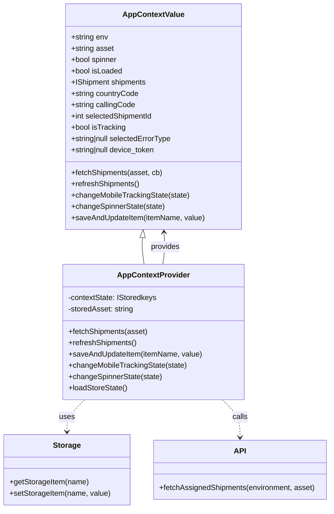

# Diagram: mobile/FreightVerifyMobileTracking/src/store/app-context.tsx


> Auto-generated by Obscura crawlers

## Diagram 1



### SVG

<svg id="container" width="703.3671875" xmlns="http://www.w3.org/2000/svg" class="classDiagram" height="1082" viewBox="0 0 703.3671875 1082" role="graphics-document document" aria-roledescription="class"><style>#container{font-family:"trebuchet ms",verdana,arial,sans-serif;font-size:16px;fill:#333;}@keyframes edge-animation-frame{from{stroke-dashoffset:0;}}@keyframes dash{to{stroke-dashoffset:0;}}#container .edge-animation-slow{stroke-dasharray:9,5!important;stroke-dashoffset:900;animation:dash 50s linear infinite;stroke-linecap:round;}#container .edge-animation-fast{stroke-dasharray:9,5!important;stroke-dashoffset:900;animation:dash 20s linear infinite;stroke-linecap:round;}#container .error-icon{fill:#552222;}#container .error-text{fill:#552222;stroke:#552222;}#container .edge-thickness-normal{stroke-width:1px;}#container .edge-thickness-thick{stroke-width:3.5px;}#container .edge-pattern-solid{stroke-dasharray:0;}#container .edge-thickness-invisible{stroke-width:0;fill:none;}#container .edge-pattern-dashed{stroke-dasharray:3;}#container .edge-pattern-dotted{stroke-dasharray:2;}#container .marker{fill:#333333;stroke:#333333;}#container .marker.cross{stroke:#333333;}#container svg{font-family:"trebuchet ms",verdana,arial,sans-serif;font-size:16px;}#container p{margin:0;}#container g.classGroup text{fill:#9370DB;stroke:none;font-family:"trebuchet ms",verdana,arial,sans-serif;font-size:10px;}#container g.classGroup text .title{font-weight:bolder;}#container .nodeLabel,#container .edgeLabel{color:#131300;}#container .edgeLabel .label rect{fill:#ECECFF;}#container .label text{fill:#131300;}#container .labelBkg{background:#ECECFF;}#container .edgeLabel .label span{background:#ECECFF;}#container .classTitle{font-weight:bolder;}#container .node rect,#container .node circle,#container .node ellipse,#container .node polygon,#container .node path{fill:#ECECFF;stroke:#9370DB;stroke-width:1px;}#container .divider{stroke:#9370DB;stroke-width:1;}#container g.clickable{cursor:pointer;}#container g.classGroup rect{fill:#ECECFF;stroke:#9370DB;}#container g.classGroup line{stroke:#9370DB;stroke-width:1;}#container .classLabel .box{stroke:none;stroke-width:0;fill:#ECECFF;opacity:0.5;}#container .classLabel .label{fill:#9370DB;font-size:10px;}#container .relation{stroke:#333333;stroke-width:1;fill:none;}#container .dashed-line{stroke-dasharray:3;}#container .dotted-line{stroke-dasharray:1 2;}#container #compositionStart,#container .composition{fill:#333333!important;stroke:#333333!important;stroke-width:1;}#container #compositionEnd,#container .composition{fill:#333333!important;stroke:#333333!important;stroke-width:1;}#container #dependencyStart,#container .dependency{fill:#333333!important;stroke:#333333!important;stroke-width:1;}#container #dependencyStart,#container .dependency{fill:#333333!important;stroke:#333333!important;stroke-width:1;}#container #extensionStart,#container .extension{fill:transparent!important;stroke:#333333!important;stroke-width:1;}#container #extensionEnd,#container .extension{fill:transparent!important;stroke:#333333!important;stroke-width:1;}#container #aggregationStart,#container .aggregation{fill:transparent!important;stroke:#333333!important;stroke-width:1;}#container #aggregationEnd,#container .aggregation{fill:transparent!important;stroke:#333333!important;stroke-width:1;}#container #lollipopStart,#container .lollipop{fill:#ECECFF!important;stroke:#333333!important;stroke-width:1;}#container #lollipopEnd,#container .lollipop{fill:#ECECFF!important;stroke:#333333!important;stroke-width:1;}#container .edgeTerminals{font-size:11px;line-height:initial;}#container .classTitleText{text-anchor:middle;font-size:18px;fill:#333;}#container .label-icon{display:inline-block;height:1em;overflow:visible;vertical-align:-0.125em;}#container .node .label-icon path{fill:currentColor;stroke:revert;stroke-width:revert;}#container :root{--mermaid-font-family:"trebuchet ms",verdana,arial,sans-serif;}</style><g><defs><marker id="container_class-aggregationStart" class="marker aggregation class" refX="18" refY="7" markerWidth="190" markerHeight="240" orient="auto"><path d="M 18,7 L9,13 L1,7 L9,1 Z"></path></marker></defs><defs><marker id="container_class-aggregationEnd" class="marker aggregation class" refX="1" refY="7" markerWidth="20" markerHeight="28" orient="auto"><path d="M 18,7 L9,13 L1,7 L9,1 Z"></path></marker></defs><defs><marker id="container_class-extensionStart" class="marker extension class" refX="18" refY="7" markerWidth="190" markerHeight="240" orient="auto"><path d="M 1,7 L18,13 V 1 Z"></path></marker></defs><defs><marker id="container_class-extensionEnd" class="marker extension class" refX="1" refY="7" markerWidth="20" markerHeight="28" orient="auto"><path d="M 1,1 V 13 L18,7 Z"></path></marker></defs><defs><marker id="container_class-compositionStart" class="marker composition class" refX="18" refY="7" markerWidth="190" markerHeight="240" orient="auto"><path d="M 18,7 L9,13 L1,7 L9,1 Z"></path></marker></defs><defs><marker id="container_class-compositionEnd" class="marker composition class" refX="1" refY="7" markerWidth="20" markerHeight="28" orient="auto"><path d="M 18,7 L9,13 L1,7 L9,1 Z"></path></marker></defs><defs><marker id="container_class-dependencyStart" class="marker dependency class" refX="6" refY="7" markerWidth="190" markerHeight="240" orient="auto"><path d="M 5,7 L9,13 L1,7 L9,1 Z"></path></marker></defs><defs><marker id="container_class-dependencyEnd" class="marker dependency class" refX="13" refY="7" markerWidth="20" markerHeight="28" orient="auto"><path d="M 18,7 L9,13 L14,7 L9,1 Z"></path></marker></defs><defs><marker id="container_class-lollipopStart" class="marker lollipop class" refX="13" refY="7" markerWidth="190" markerHeight="240" orient="auto"><circle stroke="black" fill="transparent" cx="7" cy="7" r="6"></circle></marker></defs><defs><marker id="container_class-lollipopEnd" class="marker lollipop class" refX="1" refY="7" markerWidth="190" markerHeight="240" orient="auto"><circle stroke="black" fill="transparent" cx="7" cy="7" r="6"></circle></marker></defs><g class="root"><g class="clusters"></g><g class="edgePaths"><path d="M346.23,562L347.104,555.833C347.978,549.667,349.726,537.333,350.122,525.996C350.517,514.658,349.559,504.316,349.08,499.145L348.601,493.974" id="id_AppContextProvider_AppContextValue_1" class="edge-thickness-normal edge-pattern-solid relation" style=";;;" data-edge="true" data-et="edge" data-id="id_AppContextProvider_AppContextValue_1" data-points="W3sieCI6MzQ2LjIyOTk2MTU4NDk0NDc2LCJ5Ijo1NjJ9LHsieCI6MzUxLjQ3NDYwOTM3NSwieSI6NTI1fSx7IngiOjM0OC4wNDc2MDEyNTIyNTYzLCJ5Ijo0ODh9XQ==" marker-end="url(#container_class-dependencyEnd)"></path><path d="M179.16,850L172.879,856.167C166.599,862.333,154.038,874.667,147.757,886C141.477,897.333,141.477,907.667,141.477,912.833L141.477,918" id="id_AppContextProvider_Storage_2" class="edge-thickness-normal edge-pattern-dashed relation" style=";;;" data-edge="true" data-et="edge" data-id="id_AppContextProvider_Storage_2" data-points="W3sieCI6MTc5LjE1OTY5MjI0NzkyODE4LCJ5Ijo4NTB9LHsieCI6MTQxLjQ3NjU2MjUsInkiOjg4N30seyJ4IjoxNDEuNDc2NTYyNSwieSI6OTI0fV0=" marker-end="url(#container_class-dependencyEnd)"></path><path d="M472.477,850L478.758,856.167C485.038,862.333,497.599,874.667,503.88,888C510.16,901.333,510.16,915.667,510.16,922.833L510.16,930" id="id_AppContextProvider_API_3" class="edge-thickness-normal edge-pattern-dashed relation" style=";;;" data-edge="true" data-et="edge" data-id="id_AppContextProvider_API_3" data-points="W3sieCI6NDcyLjQ3NzAyNjUwMjA3MTgsInkiOjg1MH0seyJ4Ijo1MTAuMTYwMTU2MjUsInkiOjg4N30seyJ4Ijo1MTAuMTYwMTU2MjUsInkiOjkzNn1d" marker-end="url(#container_class-dependencyEnd)"></path><path d="M301.998,505.176L301.692,508.48C301.386,511.784,300.774,518.392,301.342,527.863C301.91,537.333,303.659,549.667,304.533,555.833L305.407,562" id="id_AppContextValue_AppContextProvider_4" class="edge-thickness-normal edge-pattern-solid relation" style=";;;" data-edge="true" data-et="edge" data-id="id_AppContextValue_AppContextProvider_4" data-points="W3sieCI6MzAzLjU4OTExNzQ5Nzc0MzcsInkiOjQ4OH0seyJ4IjozMDAuMTYyMTA5Mzc1LCJ5Ijo1MjV9LHsieCI6MzA1LjQwNjc1NzE2NTA1NTI0LCJ5Ijo1NjJ9XQ==" marker-start="url(#container_class-extensionStart)"></path></g><g class="edgeLabels"><g class="edgeLabel" transform="translate(351.474609375, 525)"><g class="label" data-id="id_AppContextProvider_AppContextValue_1" transform="translate(-31.3125, -12)"><foreignObject width="62.625" height="24"><div xmlns="http://www.w3.org/1999/xhtml" class="labelBkg" style="display: table-cell; white-space: nowrap; line-height: 1.5; max-width: 200px; text-align: center;"><span class="edgeLabel"><p>provides</p></span></div></foreignObject></g></g><g class="edgeLabel" transform="translate(141.4765625, 887)"><g class="label" data-id="id_AppContextProvider_Storage_2" transform="translate(-16.4921875, -12)"><foreignObject width="32.984375" height="24"><div xmlns="http://www.w3.org/1999/xhtml" class="labelBkg" style="display: table-cell; white-space: nowrap; line-height: 1.5; max-width: 200px; text-align: center;"><span class="edgeLabel"><p>uses</p></span></div></foreignObject></g></g><g class="edgeLabel" transform="translate(510.16015625, 887)"><g class="label" data-id="id_AppContextProvider_API_3" transform="translate(-16.4453125, -12)"><foreignObject width="32.890625" height="24"><div xmlns="http://www.w3.org/1999/xhtml" class="labelBkg" style="display: table-cell; white-space: nowrap; line-height: 1.5; max-width: 200px; text-align: center;"><span class="edgeLabel"><p>calls</p></span></div></foreignObject></g></g><g class="edgeLabel"><g class="label" data-id="id_AppContextValue_AppContextProvider_4" transform="translate(0, 0)"><foreignObject width="0" height="0"><div xmlns="http://www.w3.org/1999/xhtml" class="labelBkg" style="display: table-cell; white-space: nowrap; line-height: 1.5; max-width: 200px; text-align: center;"><span class="edgeLabel"></span></div></foreignObject></g></g></g><g class="nodes"><g class="node default" id="classId-AppContextValue-0" transform="translate(325.818359375, 248)"><g class="basic label-container"><path d="M-185.8984375 -240 L185.8984375 -240 L185.8984375 240 L-185.8984375 240" stroke="none" stroke-width="0" fill="#ECECFF" style=""></path><path d="M-185.8984375 -240 C-97.71749589890754 -240, -9.536554297815087 -240, 185.8984375 -240 M-185.8984375 -240 C-66.33385378743947 -240, 53.23072992512107 -240, 185.8984375 -240 M185.8984375 -240 C185.8984375 -64.65150537425461, 185.8984375 110.69698925149078, 185.8984375 240 M185.8984375 -240 C185.8984375 -61.46876030983867, 185.8984375 117.06247938032266, 185.8984375 240 M185.8984375 240 C108.10151627328491 240, 30.30459504656983 240, -185.8984375 240 M185.8984375 240 C104.96088953921063 240, 24.023341578421253 240, -185.8984375 240 M-185.8984375 240 C-185.8984375 57.638303619721455, -185.8984375 -124.72339276055709, -185.8984375 -240 M-185.8984375 240 C-185.8984375 61.31186550587128, -185.8984375 -117.37626898825744, -185.8984375 -240" stroke="#9370DB" stroke-width="1.3" fill="none" stroke-dasharray="0 0" style=""></path></g><g class="annotation-group text" transform="translate(0, -216)"></g><g class="label-group text" transform="translate(-62.359375, -216)"><g class="label" style="font-weight: bolder" transform="translate(0,-12)"><foreignObject width="124.71875" height="24"><div xmlns="http://www.w3.org/1999/xhtml" style="display: table-cell; white-space: nowrap; line-height: 1.5; max-width: 173px; text-align: center;"><span class="nodeLabel markdown-node-label" style=""><p>AppContextValue</p></span></div></foreignObject></g></g><g class="members-group text" transform="translate(-173.8984375, -168)"><g class="label" style="" transform="translate(0,-12)"><foreignObject width="79.71875" height="24"><div xmlns="http://www.w3.org/1999/xhtml" style="display: table-cell; white-space: nowrap; line-height: 1.5; max-width: 137px; text-align: center;"><span class="nodeLabel markdown-node-label" style=""><p>+string env</p></span></div></foreignObject></g><g class="label" style="" transform="translate(0,12)"><foreignObject width="91.6875" height="24"><div xmlns="http://www.w3.org/1999/xhtml" style="display: table-cell; white-space: nowrap; line-height: 1.5; max-width: 149px; text-align: center;"><span class="nodeLabel markdown-node-label" style=""><p>+string asset</p></span></div></foreignObject></g><g class="label" style="" transform="translate(0,36)"><foreignObject width="100.25" height="24"><div xmlns="http://www.w3.org/1999/xhtml" style="display: table-cell; white-space: nowrap; line-height: 1.5; max-width: 158px; text-align: center;"><span class="nodeLabel markdown-node-label" style=""><p>+bool spinner</p></span></div></foreignObject></g><g class="label" style="" transform="translate(0,60)"><foreignObject width="110.40625" height="24"><div xmlns="http://www.w3.org/1999/xhtml" style="display: table-cell; white-space: nowrap; line-height: 1.5; max-width: 168px; text-align: center;"><span class="nodeLabel markdown-node-label" style=""><p>+bool isLoaded</p></span></div></foreignObject></g><g class="label" style="" transform="translate(0,84)"><foreignObject width="162.5625" height="24"><div xmlns="http://www.w3.org/1999/xhtml" style="display: table-cell; white-space: nowrap; line-height: 1.5; max-width: 220px; text-align: center;"><span class="nodeLabel markdown-node-label" style=""><p>+IShipment shipments</p></span></div></foreignObject></g><g class="label" style="" transform="translate(0,108)"><foreignObject width="145.3125" height="24"><div xmlns="http://www.w3.org/1999/xhtml" style="display: table-cell; white-space: nowrap; line-height: 1.5; max-width: 203px; text-align: center;"><span class="nodeLabel markdown-node-label" style=""><p>+string countryCode</p></span></div></foreignObject></g><g class="label" style="" transform="translate(0,132)"><foreignObject width="137.75" height="24"><div xmlns="http://www.w3.org/1999/xhtml" style="display: table-cell; white-space: nowrap; line-height: 1.5; max-width: 195px; text-align: center;"><span class="nodeLabel markdown-node-label" style=""><p>+string callingCode</p></span></div></foreignObject></g><g class="label" style="" transform="translate(0,156)"><foreignObject width="176.875" height="24"><div xmlns="http://www.w3.org/1999/xhtml" style="display: table-cell; white-space: nowrap; line-height: 1.5; max-width: 234px; text-align: center;"><span class="nodeLabel markdown-node-label" style=""><p>+int selectedShipmentId</p></span></div></foreignObject></g><g class="label" style="" transform="translate(0,180)"><foreignObject width="117.25" height="24"><div xmlns="http://www.w3.org/1999/xhtml" style="display: table-cell; white-space: nowrap; line-height: 1.5; max-width: 175px; text-align: center;"><span class="nodeLabel markdown-node-label" style=""><p>+bool isTracking</p></span></div></foreignObject></g><g class="label" style="" transform="translate(0,204)"><foreignObject width="218.890625" height="24"><div xmlns="http://www.w3.org/1999/xhtml" style="display: table-cell; white-space: nowrap; line-height: 1.5; max-width: 276px; text-align: center;"><span class="nodeLabel markdown-node-label" style=""><p>+string|null selectedErrorType</p></span></div></foreignObject></g><g class="label" style="" transform="translate(0,228)"><foreignObject width="183.734375" height="24"><div xmlns="http://www.w3.org/1999/xhtml" style="display: table-cell; white-space: nowrap; line-height: 1.5; max-width: 241px; text-align: center;"><span class="nodeLabel markdown-node-label" style=""><p>+string|null device_token</p></span></div></foreignObject></g></g><g class="methods-group text" transform="translate(-173.8984375, 120)"><g class="label" style="" transform="translate(0,-12)"><foreignObject width="194.890625" height="24"><div xmlns="http://www.w3.org/1999/xhtml" style="display: table-cell; white-space: nowrap; line-height: 1.5; max-width: 252px; text-align: center;"><span class="nodeLabel markdown-node-label" style=""><p>+fetchShipments(asset, cb)</p></span></div></foreignObject></g><g class="label" style="" transform="translate(0,12)"><foreignObject width="146.5625" height="24"><div xmlns="http://www.w3.org/1999/xhtml" style="display: table-cell; white-space: nowrap; line-height: 1.5; max-width: 204px; text-align: center;"><span class="nodeLabel markdown-node-label" style=""><p>+refreshShipments()</p></span></div></foreignObject></g><g class="label" style="" transform="translate(0,36)"><foreignObject width="252.984375" height="24"><div xmlns="http://www.w3.org/1999/xhtml" style="display: table-cell; white-space: nowrap; line-height: 1.5; max-width: 310px; text-align: center;"><span class="nodeLabel markdown-node-label" style=""><p>+changeMobileTrackingState(state)</p></span></div></foreignObject></g><g class="label" style="" transform="translate(0,60)"><foreignObject width="200.078125" height="24"><div xmlns="http://www.w3.org/1999/xhtml" style="display: table-cell; white-space: nowrap; line-height: 1.5; max-width: 257px; text-align: center;"><span class="nodeLabel markdown-node-label" style=""><p>+changeSpinnerState(state)</p></span></div></foreignObject></g><g class="label" style="" transform="translate(0,84)"><foreignObject width="285.4375" height="24"><div xmlns="http://www.w3.org/1999/xhtml" style="display: table-cell; white-space: nowrap; line-height: 1.5; max-width: 343px; text-align: center;"><span class="nodeLabel markdown-node-label" style=""><p>+saveAndUpdateItem(itemName, value)</p></span></div></foreignObject></g></g><g class="divider" style=""><path d="M-185.8984375 -192 C-49.908881544143696 -192, 86.08067441171261 -192, 185.8984375 -192 M-185.8984375 -192 C-49.14945064515308 -192, 87.59953620969384 -192, 185.8984375 -192" stroke="#9370DB" stroke-width="1.3" fill="none" stroke-dasharray="0 0" style=""></path></g><g class="divider" style=""><path d="M-185.8984375 96 C-43.14999553801556 96, 99.59844642396888 96, 185.8984375 96 M-185.8984375 96 C-85.54348576951826 96, 14.811465960963488 96, 185.8984375 96" stroke="#9370DB" stroke-width="1.3" fill="none" stroke-dasharray="0 0" style=""></path></g></g><g class="node default" id="classId-AppContextProvider-1" transform="translate(325.818359375, 706)"><g class="basic label-container"><path d="M-191.44140625 -144 L191.44140625 -144 L191.44140625 144 L-191.44140625 144" stroke="none" stroke-width="0" fill="#ECECFF" style=""></path><path d="M-191.44140625 -144 C-92.94409012003071 -144, 5.553226009938584 -144, 191.44140625 -144 M-191.44140625 -144 C-93.62814342727232 -144, 4.185119395455359 -144, 191.44140625 -144 M191.44140625 -144 C191.44140625 -43.04615711248849, 191.44140625 57.907685775023026, 191.44140625 144 M191.44140625 -144 C191.44140625 -76.98099467258537, 191.44140625 -9.961989345170736, 191.44140625 144 M191.44140625 144 C42.822339607721915 144, -105.79672703455617 144, -191.44140625 144 M191.44140625 144 C72.00962322406683 144, -47.42215980186634 144, -191.44140625 144 M-191.44140625 144 C-191.44140625 30.528189583428613, -191.44140625 -82.94362083314277, -191.44140625 -144 M-191.44140625 144 C-191.44140625 30.276656085214242, -191.44140625 -83.44668782957152, -191.44140625 -144" stroke="#9370DB" stroke-width="1.3" fill="none" stroke-dasharray="0 0" style=""></path></g><g class="annotation-group text" transform="translate(0, -120)"></g><g class="label-group text" transform="translate(-73.4453125, -120)"><g class="label" style="font-weight: bolder" transform="translate(0,-12)"><foreignObject width="146.890625" height="24"><div xmlns="http://www.w3.org/1999/xhtml" style="display: table-cell; white-space: nowrap; line-height: 1.5; max-width: 195px; text-align: center;"><span class="nodeLabel markdown-node-label" style=""><p>AppContextProvider</p></span></div></foreignObject></g></g><g class="members-group text" transform="translate(-179.44140625, -72)"><g class="label" style="" transform="translate(0,-12)"><foreignObject width="189.8125" height="24"><div xmlns="http://www.w3.org/1999/xhtml" style="display: table-cell; white-space: nowrap; line-height: 1.5; max-width: 247px; text-align: center;"><span class="nodeLabel markdown-node-label" style=""><p>-contextState: IStoredkeys</p></span></div></foreignObject></g><g class="label" style="" transform="translate(0,12)"><foreignObject width="141.015625" height="24"><div xmlns="http://www.w3.org/1999/xhtml" style="display: table-cell; white-space: nowrap; line-height: 1.5; max-width: 199px; text-align: center;"><span class="nodeLabel markdown-node-label" style=""><p>-storedAsset: string</p></span></div></foreignObject></g></g><g class="methods-group text" transform="translate(-179.44140625, 0)"><g class="label" style="" transform="translate(0,-12)"><foreignObject width="169.59375" height="24"><div xmlns="http://www.w3.org/1999/xhtml" style="display: table-cell; white-space: nowrap; line-height: 1.5; max-width: 227px; text-align: center;"><span class="nodeLabel markdown-node-label" style=""><p>+fetchShipments(asset)</p></span></div></foreignObject></g><g class="label" style="" transform="translate(0,12)"><foreignObject width="146.5625" height="24"><div xmlns="http://www.w3.org/1999/xhtml" style="display: table-cell; white-space: nowrap; line-height: 1.5; max-width: 204px; text-align: center;"><span class="nodeLabel markdown-node-label" style=""><p>+refreshShipments()</p></span></div></foreignObject></g><g class="label" style="" transform="translate(0,36)"><foreignObject width="285.4375" height="24"><div xmlns="http://www.w3.org/1999/xhtml" style="display: table-cell; white-space: nowrap; line-height: 1.5; max-width: 343px; text-align: center;"><span class="nodeLabel markdown-node-label" style=""><p>+saveAndUpdateItem(itemName, value)</p></span></div></foreignObject></g><g class="label" style="" transform="translate(0,60)"><foreignObject width="252.984375" height="24"><div xmlns="http://www.w3.org/1999/xhtml" style="display: table-cell; white-space: nowrap; line-height: 1.5; max-width: 310px; text-align: center;"><span class="nodeLabel markdown-node-label" style=""><p>+changeMobileTrackingState(state)</p></span></div></foreignObject></g><g class="label" style="" transform="translate(0,84)"><foreignObject width="200.078125" height="24"><div xmlns="http://www.w3.org/1999/xhtml" style="display: table-cell; white-space: nowrap; line-height: 1.5; max-width: 257px; text-align: center;"><span class="nodeLabel markdown-node-label" style=""><p>+changeSpinnerState(state)</p></span></div></foreignObject></g><g class="label" style="" transform="translate(0,108)"><foreignObject width="125.78125" height="24"><div xmlns="http://www.w3.org/1999/xhtml" style="display: table-cell; white-space: nowrap; line-height: 1.5; max-width: 183px; text-align: center;"><span class="nodeLabel markdown-node-label" style=""><p>+loadStoreState()</p></span></div></foreignObject></g></g><g class="divider" style=""><path d="M-191.44140625 -96 C-99.24653386255648 -96, -7.051661475112951 -96, 191.44140625 -96 M-191.44140625 -96 C-45.848518619558746 -96, 99.74436901088251 -96, 191.44140625 -96" stroke="#9370DB" stroke-width="1.3" fill="none" stroke-dasharray="0 0" style=""></path></g><g class="divider" style=""><path d="M-191.44140625 -24 C-67.2935069320681 -24, 56.854392385863804 -24, 191.44140625 -24 M-191.44140625 -24 C-96.90847542694219 -24, -2.3755446038843786 -24, 191.44140625 -24" stroke="#9370DB" stroke-width="1.3" fill="none" stroke-dasharray="0 0" style=""></path></g></g><g class="node default" id="classId-Storage-2" transform="translate(141.4765625, 999)"><g class="basic label-container"><path d="M-133.4765625 -75 L133.4765625 -75 L133.4765625 75 L-133.4765625 75" stroke="none" stroke-width="0" fill="#ECECFF" style=""></path><path d="M-133.4765625 -75 C-61.585873805441835 -75, 10.30481488911633 -75, 133.4765625 -75 M-133.4765625 -75 C-26.812124711409723 -75, 79.85231307718055 -75, 133.4765625 -75 M133.4765625 -75 C133.4765625 -42.97504464489614, 133.4765625 -10.950089289792274, 133.4765625 75 M133.4765625 -75 C133.4765625 -32.86968579742655, 133.4765625 9.260628405146903, 133.4765625 75 M133.4765625 75 C62.2960819618182 75, -8.884398576363594 75, -133.4765625 75 M133.4765625 75 C41.836362865797085 75, -49.80383676840583 75, -133.4765625 75 M-133.4765625 75 C-133.4765625 44.748802141350495, -133.4765625 14.49760428270099, -133.4765625 -75 M-133.4765625 75 C-133.4765625 15.07886372798167, -133.4765625 -44.84227254403666, -133.4765625 -75" stroke="#9370DB" stroke-width="1.3" fill="none" stroke-dasharray="0 0" style=""></path></g><g class="annotation-group text" transform="translate(0, -51)"></g><g class="label-group text" transform="translate(-28.078125, -51)"><g class="label" style="font-weight: bolder" transform="translate(0,-12)"><foreignObject width="56.15625" height="24"><div xmlns="http://www.w3.org/1999/xhtml" style="display: table-cell; white-space: nowrap; line-height: 1.5; max-width: 105px; text-align: center;"><span class="nodeLabel markdown-node-label" style=""><p>Storage</p></span></div></foreignObject></g></g><g class="members-group text" transform="translate(-121.4765625, -3)"></g><g class="methods-group text" transform="translate(-121.4765625, 27)"><g class="label" style="" transform="translate(0,-12)"><foreignObject width="168.671875" height="24"><div xmlns="http://www.w3.org/1999/xhtml" style="display: table-cell; white-space: nowrap; line-height: 1.5; max-width: 226px; text-align: center;"><span class="nodeLabel markdown-node-label" style=""><p>+getStorageItem(name)</p></span></div></foreignObject></g><g class="label" style="" transform="translate(0,12)"><foreignObject width="214.875" height="24"><div xmlns="http://www.w3.org/1999/xhtml" style="display: table-cell; white-space: nowrap; line-height: 1.5; max-width: 272px; text-align: center;"><span class="nodeLabel markdown-node-label" style=""><p>+setStorageItem(name, value)</p></span></div></foreignObject></g></g><g class="divider" style=""><path d="M-133.4765625 -27 C-64.47085232262961 -27, 4.534857854740778 -27, 133.4765625 -27 M-133.4765625 -27 C-77.43962026702003 -27, -21.402678034040065 -27, 133.4765625 -27" stroke="#9370DB" stroke-width="1.3" fill="none" stroke-dasharray="0 0" style=""></path></g><g class="divider" style=""><path d="M-133.4765625 -3 C-58.90570732650018 -3, 15.665147846999645 -3, 133.4765625 -3 M-133.4765625 -3 C-41.978893825803794 -3, 49.51877484839241 -3, 133.4765625 -3" stroke="#9370DB" stroke-width="1.3" fill="none" stroke-dasharray="0 0" style=""></path></g></g><g class="node default" id="classId-API-3" transform="translate(510.16015625, 999)"><g class="basic label-container"><path d="M-185.20703125 -63 L185.20703125 -63 L185.20703125 63 L-185.20703125 63" stroke="none" stroke-width="0" fill="#ECECFF" style=""></path><path d="M-185.20703125 -63 C-50.08455988124177 -63, 85.03791148751645 -63, 185.20703125 -63 M-185.20703125 -63 C-80.08782873747747 -63, 25.03137377504507 -63, 185.20703125 -63 M185.20703125 -63 C185.20703125 -20.195487382575074, 185.20703125 22.609025234849852, 185.20703125 63 M185.20703125 -63 C185.20703125 -26.991163911706685, 185.20703125 9.017672176586629, 185.20703125 63 M185.20703125 63 C50.54654103418454 63, -84.11394918163091 63, -185.20703125 63 M185.20703125 63 C80.98578754992691 63, -23.235456150146177 63, -185.20703125 63 M-185.20703125 63 C-185.20703125 32.18778493406089, -185.20703125 1.3755698681217865, -185.20703125 -63 M-185.20703125 63 C-185.20703125 13.96786819545241, -185.20703125 -35.06426360909518, -185.20703125 -63" stroke="#9370DB" stroke-width="1.3" fill="none" stroke-dasharray="0 0" style=""></path></g><g class="annotation-group text" transform="translate(0, -39)"></g><g class="label-group text" transform="translate(-11.8671875, -39)"><g class="label" style="font-weight: bolder" transform="translate(0,-12)"><foreignObject width="23.734375" height="24"><div xmlns="http://www.w3.org/1999/xhtml" style="display: table-cell; white-space: nowrap; line-height: 1.5; max-width: 73px; text-align: center;"><span class="nodeLabel markdown-node-label" style=""><p>API</p></span></div></foreignObject></g></g><g class="members-group text" transform="translate(-173.20703125, 9)"></g><g class="methods-group text" transform="translate(-173.20703125, 39)"><g class="label" style="" transform="translate(0,-12)"><foreignObject width="334.546875" height="24"><div xmlns="http://www.w3.org/1999/xhtml" style="display: table-cell; white-space: nowrap; line-height: 1.5; max-width: 392px; text-align: center;"><span class="nodeLabel markdown-node-label" style=""><p>+fetchAssignedShipments(environment, asset)</p></span></div></foreignObject></g></g><g class="divider" style=""><path d="M-185.20703125 -15 C-37.46384481753887 -15, 110.27934161492226 -15, 185.20703125 -15 M-185.20703125 -15 C-92.1848130709615 -15, 0.8374051080770073 -15, 185.20703125 -15" stroke="#9370DB" stroke-width="1.3" fill="none" stroke-dasharray="0 0" style=""></path></g><g class="divider" style=""><path d="M-185.20703125 9 C-81.52480747942036 9, 22.15741629115928 9, 185.20703125 9 M-185.20703125 9 C-66.28338770331754 9, 52.64025584336491 9, 185.20703125 9" stroke="#9370DB" stroke-width="1.3" fill="none" stroke-dasharray="0 0" style=""></path></g></g></g></g></g></svg>

## Diagram 2

```mermaid
sequenceDiagram
participant UI as App (consumer)
participant Provider as AppContextProvider
participant Fetcher as fetchAssignedShipments
participant API as RemoteAPI
participant Storage as LocalStorage
participant Alert as displayErrorAlert

UI->>Provider: fetchShipments(asset)
Provider->>Provider: updateContextState(spinner=true, shipments=empty, asset)
loop for each env in EnvironmentNames
  Provider->>Fetcher: fetchAssignedShipments(env, asset)
  Fetcher->>API: HTTP GET Constants.API_GET_ASSET?mobile=asset
  API-->>Fetcher: HTTP response (status, body)
  alt response.status != 200
    Fetcher->>Alert: displayErrorAlert(ShipmentServerError)
    break
  else
    alt body.meta.totalCount > 0
      break
    end
  end
end
Provider->>Storage: setStorageItem("env", env)
Provider->>Provider: updateContextState({env, shipments: body, spinner:false})
Provider-->>UI: context updated (shipments, env, spinner=false)
```

> SVG rendering failed for this diagram.
