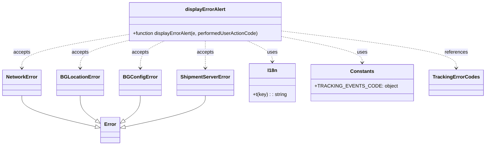
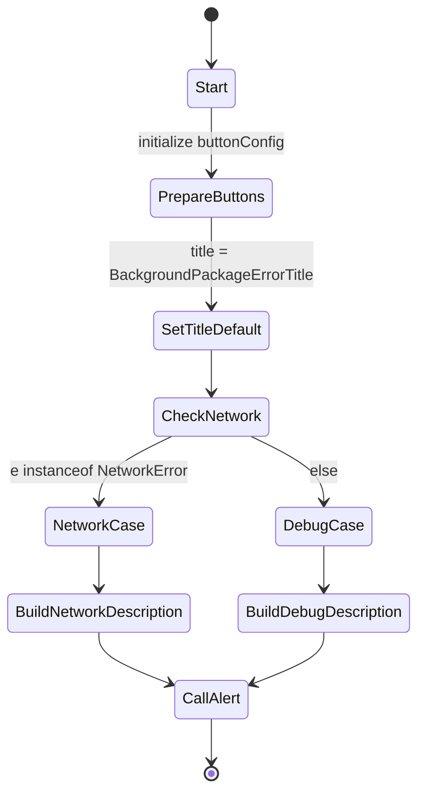

# Diagram: mobile/FreightVerifyMobileTracking/src/utils/alert-utils.ts


> Auto-generated by Obscura crawlers

## Diagram 1

```mermaid
flowchart TD
    DisplayErrorAlert[displayErrorAlert(e, performedUserActionCode)]
    e[Error instance]
    IsNetworkError{e instanceof NetworkError?}
    NetworkBranch[Set title = NetworkErrTitle\ndescription = NetworkErrDesc + " \\nNetworkError: No internet"]
    ElseBranch[debugMessage = e.name + ": " + e.message\ndescription = TRACKING_EVENTS_CODE[performedUserActionCode] + "\\n\\nActionToPerform\\n\\n" + debugMessage]
    ButtonConfig[buttonConfig: [{ text: I18n.t("OK"), onPress: () => null }]]
    AlertCall[Alert.alert(title, description, buttonConfig, { cancelable: false })]

    DisplayErrorAlert --> e
    DisplayErrorAlert --> IsNetworkError
    IsNetworkError -->|yes| NetworkBranch
    IsNetworkError -->|no| ElseBranch
    NetworkBranch --> AlertCall
    ElseBranch --> AlertCall
    DisplayErrorAlert --> ButtonConfig
    DisplayErrorAlert --> AlertCall
```

> SVG rendering failed for this diagram.

## Diagram 2



### SVG

<svg id="container" width="1503.203125" xmlns="http://www.w3.org/2000/svg" class="classDiagram" height="476" viewBox="0 0 1503.203125 476" role="graphics-document document" aria-roledescription="class"><style>#container{font-family:"trebuchet ms",verdana,arial,sans-serif;font-size:16px;fill:#333;}@keyframes edge-animation-frame{from{stroke-dashoffset:0;}}@keyframes dash{to{stroke-dashoffset:0;}}#container .edge-animation-slow{stroke-dasharray:9,5!important;stroke-dashoffset:900;animation:dash 50s linear infinite;stroke-linecap:round;}#container .edge-animation-fast{stroke-dasharray:9,5!important;stroke-dashoffset:900;animation:dash 20s linear infinite;stroke-linecap:round;}#container .error-icon{fill:#552222;}#container .error-text{fill:#552222;stroke:#552222;}#container .edge-thickness-normal{stroke-width:1px;}#container .edge-thickness-thick{stroke-width:3.5px;}#container .edge-pattern-solid{stroke-dasharray:0;}#container .edge-thickness-invisible{stroke-width:0;fill:none;}#container .edge-pattern-dashed{stroke-dasharray:3;}#container .edge-pattern-dotted{stroke-dasharray:2;}#container .marker{fill:#333333;stroke:#333333;}#container .marker.cross{stroke:#333333;}#container svg{font-family:"trebuchet ms",verdana,arial,sans-serif;font-size:16px;}#container p{margin:0;}#container g.classGroup text{fill:#9370DB;stroke:none;font-family:"trebuchet ms",verdana,arial,sans-serif;font-size:10px;}#container g.classGroup text .title{font-weight:bolder;}#container .nodeLabel,#container .edgeLabel{color:#131300;}#container .edgeLabel .label rect{fill:#ECECFF;}#container .label text{fill:#131300;}#container .labelBkg{background:#ECECFF;}#container .edgeLabel .label span{background:#ECECFF;}#container .classTitle{font-weight:bolder;}#container .node rect,#container .node circle,#container .node ellipse,#container .node polygon,#container .node path{fill:#ECECFF;stroke:#9370DB;stroke-width:1px;}#container .divider{stroke:#9370DB;stroke-width:1;}#container g.clickable{cursor:pointer;}#container g.classGroup rect{fill:#ECECFF;stroke:#9370DB;}#container g.classGroup line{stroke:#9370DB;stroke-width:1;}#container .classLabel .box{stroke:none;stroke-width:0;fill:#ECECFF;opacity:0.5;}#container .classLabel .label{fill:#9370DB;font-size:10px;}#container .relation{stroke:#333333;stroke-width:1;fill:none;}#container .dashed-line{stroke-dasharray:3;}#container .dotted-line{stroke-dasharray:1 2;}#container #compositionStart,#container .composition{fill:#333333!important;stroke:#333333!important;stroke-width:1;}#container #compositionEnd,#container .composition{fill:#333333!important;stroke:#333333!important;stroke-width:1;}#container #dependencyStart,#container .dependency{fill:#333333!important;stroke:#333333!important;stroke-width:1;}#container #dependencyStart,#container .dependency{fill:#333333!important;stroke:#333333!important;stroke-width:1;}#container #extensionStart,#container .extension{fill:transparent!important;stroke:#333333!important;stroke-width:1;}#container #extensionEnd,#container .extension{fill:transparent!important;stroke:#333333!important;stroke-width:1;}#container #aggregationStart,#container .aggregation{fill:transparent!important;stroke:#333333!important;stroke-width:1;}#container #aggregationEnd,#container .aggregation{fill:transparent!important;stroke:#333333!important;stroke-width:1;}#container #lollipopStart,#container .lollipop{fill:#ECECFF!important;stroke:#333333!important;stroke-width:1;}#container #lollipopEnd,#container .lollipop{fill:#ECECFF!important;stroke:#333333!important;stroke-width:1;}#container .edgeTerminals{font-size:11px;line-height:initial;}#container .classTitleText{text-anchor:middle;font-size:18px;fill:#333;}#container .label-icon{display:inline-block;height:1em;overflow:visible;vertical-align:-0.125em;}#container .node .label-icon path{fill:currentColor;stroke:revert;stroke-width:revert;}#container :root{--mermaid-font-family:"trebuchet ms",verdana,arial,sans-serif;}</style><g><defs><marker id="container_class-aggregationStart" class="marker aggregation class" refX="18" refY="7" markerWidth="190" markerHeight="240" orient="auto"><path d="M 18,7 L9,13 L1,7 L9,1 Z"></path></marker></defs><defs><marker id="container_class-aggregationEnd" class="marker aggregation class" refX="1" refY="7" markerWidth="20" markerHeight="28" orient="auto"><path d="M 18,7 L9,13 L1,7 L9,1 Z"></path></marker></defs><defs><marker id="container_class-extensionStart" class="marker extension class" refX="18" refY="7" markerWidth="190" markerHeight="240" orient="auto"><path d="M 1,7 L18,13 V 1 Z"></path></marker></defs><defs><marker id="container_class-extensionEnd" class="marker extension class" refX="1" refY="7" markerWidth="20" markerHeight="28" orient="auto"><path d="M 1,1 V 13 L18,7 Z"></path></marker></defs><defs><marker id="container_class-compositionStart" class="marker composition class" refX="18" refY="7" markerWidth="190" markerHeight="240" orient="auto"><path d="M 18,7 L9,13 L1,7 L9,1 Z"></path></marker></defs><defs><marker id="container_class-compositionEnd" class="marker composition class" refX="1" refY="7" markerWidth="20" markerHeight="28" orient="auto"><path d="M 18,7 L9,13 L1,7 L9,1 Z"></path></marker></defs><defs><marker id="container_class-dependencyStart" class="marker dependency class" refX="6" refY="7" markerWidth="190" markerHeight="240" orient="auto"><path d="M 5,7 L9,13 L1,7 L9,1 Z"></path></marker></defs><defs><marker id="container_class-dependencyEnd" class="marker dependency class" refX="13" refY="7" markerWidth="20" markerHeight="28" orient="auto"><path d="M 18,7 L9,13 L14,7 L9,1 Z"></path></marker></defs><defs><marker id="container_class-lollipopStart" class="marker lollipop class" refX="13" refY="7" markerWidth="190" markerHeight="240" orient="auto"><circle stroke="black" fill="transparent" cx="7" cy="7" r="6"></circle></marker></defs><defs><marker id="container_class-lollipopEnd" class="marker lollipop class" refX="1" refY="7" markerWidth="190" markerHeight="240" orient="auto"><circle stroke="black" fill="transparent" cx="7" cy="7" r="6"></circle></marker></defs><g class="root"><g class="clusters"></g><g class="edgePaths"><path d="M69.281,313L69.281,320.667C69.281,328.333,69.281,343.667,107.344,360.596C145.407,377.525,221.532,396.05,259.594,405.313L297.657,414.575" id="id_NetworkError_Error_1" class="edge-thickness-normal edge-pattern-solid relation" style=";;;" data-edge="true" data-et="edge" data-id="id_NetworkError_Error_1" data-points="W3sieCI6NjkuMjgxMjUsInkiOjMxM30seyJ4Ijo2OS4yODEyNSwieSI6MzU5fSx7IngiOjMxNC40MTc5Njg3NSwieSI6NDE4LjY1Mzg4ODE3MTYxNTg1fV0=" marker-end="url(#container_class-extensionEnd)"></path><path d="M252.188,313L252.188,320.667C252.188,328.333,252.188,343.667,260.232,357.165C268.276,370.663,284.364,382.327,292.408,388.158L300.452,393.99" id="id_BGLocationError_Error_2" class="edge-thickness-normal edge-pattern-solid relation" style=";;;" data-edge="true" data-et="edge" data-id="id_BGLocationError_Error_2" data-points="W3sieCI6MjUyLjE4NzUsInkiOjMxM30seyJ4IjoyNTIuMTg3NSwieSI6MzU5fSx7IngiOjMxNC40MTc5Njg3NSwieSI6NDA0LjExNTA1MTM1NDY2NDE2fV0=" marker-end="url(#container_class-extensionEnd)"></path><path d="M437.023,313L437.023,320.667C437.023,328.333,437.023,343.667,428.979,357.165C420.935,370.663,404.847,382.327,396.803,388.158L388.759,393.99" id="id_BGConfigError_Error_3" class="edge-thickness-normal edge-pattern-solid relation" style=";;;" data-edge="true" data-et="edge" data-id="id_BGConfigError_Error_3" data-points="W3sieCI6NDM3LjAyMzQzNzUsInkiOjMxM30seyJ4Ijo0MzcuMDIzNDM3NSwieSI6MzU5fSx7IngiOjM3NC43OTI5Njg3NSwieSI6NDA0LjExNTA1MTM1NDY2NDE2fV0=" marker-end="url(#container_class-extensionEnd)"></path><path d="M639.391,313L639.391,320.667C639.391,328.333,639.391,343.667,598.095,360.719C556.798,377.772,474.206,396.544,432.91,405.93L391.614,415.316" id="id_ShipmentServerError_Error_4" class="edge-thickness-normal edge-pattern-solid relation" style=";;;" data-edge="true" data-et="edge" data-id="id_ShipmentServerError_Error_4" data-points="W3sieCI6NjM5LjM5MDYyNSwieSI6MzEzfSx7IngiOjYzOS4zOTA2MjUsInkiOjM1OX0seyJ4IjozNzQuNzkyOTY4NzUsInkiOjQxOS4xMzg4NTkwNzM3NDI4fV0=" marker-end="url(#container_class-extensionEnd)"></path><path d="M395.453,134L371.575,140.167C347.698,146.333,299.943,158.667,276.065,173.5C252.188,188.333,252.188,205.667,252.188,214.333L252.188,223" id="id_displayErrorAlert_BGLocationError_5" class="edge-thickness-normal edge-pattern-dashed relation" style=";;;" data-edge="true" data-et="edge" data-id="id_displayErrorAlert_BGLocationError_5" data-points="W3sieCI6Mzk1LjQ1MjY1NjI1LCJ5IjoxMzR9LHsieCI6MjUyLjE4NzUsInkiOjE3MX0seyJ4IjoyNTIuMTg3NSwieSI6MjI5fV0=" marker-end="url(#container_class-dependencyEnd)"></path><path d="M511.899,134L499.42,140.167C486.941,146.333,461.982,158.667,449.503,173.5C437.023,188.333,437.023,205.667,437.023,214.333L437.023,223" id="id_displayErrorAlert_BGConfigError_6" class="edge-thickness-normal edge-pattern-dashed relation" style=";;;" data-edge="true" data-et="edge" data-id="id_displayErrorAlert_BGConfigError_6" data-points="W3sieCI6NTExLjg5OTI5Njg3NSwieSI6MTM0fSx7IngiOjQzNy4wMjM0Mzc1LCJ5IjoxNzF9LHsieCI6NDM3LjAyMzQzNzUsInkiOjIyOX1d" marker-end="url(#container_class-dependencyEnd)"></path><path d="M389.168,114.89L335.854,124.242C282.539,133.594,175.91,152.297,122.596,170.315C69.281,188.333,69.281,205.667,69.281,214.333L69.281,223" id="id_displayErrorAlert_NetworkError_7" class="edge-thickness-normal edge-pattern-dashed relation" style=";;;" data-edge="true" data-et="edge" data-id="id_displayErrorAlert_NetworkError_7" data-points="W3sieCI6Mzg5LjE2Nzk2ODc1LCJ5IjoxMTQuODkwMjg5NjkyMjE5MTR9LHsieCI6NjkuMjgxMjUsInkiOjE3MX0seyJ4Ijo2OS4yODEyNSwieSI6MjI5fV0=" marker-end="url(#container_class-dependencyEnd)"></path><path d="M639.391,134L639.391,140.167C639.391,146.333,639.391,158.667,639.391,173.5C639.391,188.333,639.391,205.667,639.391,214.333L639.391,223" id="id_displayErrorAlert_ShipmentServerError_8" class="edge-thickness-normal edge-pattern-dashed relation" style=";;;" data-edge="true" data-et="edge" data-id="id_displayErrorAlert_ShipmentServerError_8" data-points="W3sieCI6NjM5LjM5MDYyNSwieSI6MTM0fSx7IngiOjYzOS4zOTA2MjUsInkiOjE3MX0seyJ4Ijo2MzkuMzkwNjI1LCJ5IjoyMjl9XQ==" marker-end="url(#container_class-dependencyEnd)"></path><path d="M774.302,134L787.507,140.167C800.713,146.333,827.124,158.667,840.33,170C853.535,181.333,853.535,191.667,853.535,196.833L853.535,202" id="id_displayErrorAlert_I18n_9" class="edge-thickness-normal edge-pattern-dashed relation" style=";;;" data-edge="true" data-et="edge" data-id="id_displayErrorAlert_I18n_9" data-points="W3sieCI6Nzc0LjMwMTY3OTY4NzUsInkiOjEzNH0seyJ4Ijo4NTMuNTM1MTU2MjUsInkiOjE3MX0seyJ4Ijo4NTMuNTM1MTU2MjUsInkiOjIwOH1d" marker-end="url(#container_class-dependencyEnd)"></path><path d="M889.613,122.152L929.439,130.293C969.264,138.435,1048.915,154.717,1088.741,168.525C1128.566,182.333,1128.566,193.667,1128.566,199.333L1128.566,205" id="id_displayErrorAlert_Constants_10" class="edge-thickness-normal edge-pattern-dashed relation" style=";;;" data-edge="true" data-et="edge" data-id="id_displayErrorAlert_Constants_10" data-points="W3sieCI6ODg5LjYxMzI4MTI1LCJ5IjoxMjIuMTUxODg5NzM4fSx7IngiOjExMjguNTY2NDA2MjUsInkiOjE3MX0seyJ4IjoxMTI4LjU2NjQwNjI1LCJ5IjoyMTF9XQ==" marker-end="url(#container_class-dependencyEnd)"></path><path d="M889.613,103.391L976.662,114.659C1063.711,125.927,1237.809,148.464,1324.857,168.398C1411.906,188.333,1411.906,205.667,1411.906,214.333L1411.906,223" id="id_displayErrorAlert_TrackingErrorCodes_11" class="edge-thickness-normal edge-pattern-dashed relation" style=";;;" data-edge="true" data-et="edge" data-id="id_displayErrorAlert_TrackingErrorCodes_11" data-points="W3sieCI6ODg5LjYxMzI4MTI1LCJ5IjoxMDMuMzkwNjI3MjEyMjMyNzd9LHsieCI6MTQxMS45MDYyNSwieSI6MTcxfSx7IngiOjE0MTEuOTA2MjUsInkiOjIyOX1d" marker-end="url(#container_class-dependencyEnd)"></path></g><g class="edgeLabels"><g class="edgeLabel"><g class="label" data-id="id_NetworkError_Error_1" transform="translate(0, 0)"><foreignObject width="0" height="0"><div xmlns="http://www.w3.org/1999/xhtml" class="labelBkg" style="display: table-cell; white-space: nowrap; line-height: 1.5; max-width: 200px; text-align: center;"><span class="edgeLabel"></span></div></foreignObject></g></g><g class="edgeLabel"><g class="label" data-id="id_BGLocationError_Error_2" transform="translate(0, 0)"><foreignObject width="0" height="0"><div xmlns="http://www.w3.org/1999/xhtml" class="labelBkg" style="display: table-cell; white-space: nowrap; line-height: 1.5; max-width: 200px; text-align: center;"><span class="edgeLabel"></span></div></foreignObject></g></g><g class="edgeLabel"><g class="label" data-id="id_BGConfigError_Error_3" transform="translate(0, 0)"><foreignObject width="0" height="0"><div xmlns="http://www.w3.org/1999/xhtml" class="labelBkg" style="display: table-cell; white-space: nowrap; line-height: 1.5; max-width: 200px; text-align: center;"><span class="edgeLabel"></span></div></foreignObject></g></g><g class="edgeLabel"><g class="label" data-id="id_ShipmentServerError_Error_4" transform="translate(0, 0)"><foreignObject width="0" height="0"><div xmlns="http://www.w3.org/1999/xhtml" class="labelBkg" style="display: table-cell; white-space: nowrap; line-height: 1.5; max-width: 200px; text-align: center;"><span class="edgeLabel"></span></div></foreignObject></g></g><g class="edgeLabel" transform="translate(252.1875, 171)"><g class="label" data-id="id_displayErrorAlert_BGLocationError_5" transform="translate(-27.421875, -12)"><foreignObject width="54.84375" height="24"><div xmlns="http://www.w3.org/1999/xhtml" class="labelBkg" style="display: table-cell; white-space: nowrap; line-height: 1.5; max-width: 200px; text-align: center;"><span class="edgeLabel"><p>accepts</p></span></div></foreignObject></g></g><g class="edgeLabel" transform="translate(437.0234375, 171)"><g class="label" data-id="id_displayErrorAlert_BGConfigError_6" transform="translate(-27.421875, -12)"><foreignObject width="54.84375" height="24"><div xmlns="http://www.w3.org/1999/xhtml" class="labelBkg" style="display: table-cell; white-space: nowrap; line-height: 1.5; max-width: 200px; text-align: center;"><span class="edgeLabel"><p>accepts</p></span></div></foreignObject></g></g><g class="edgeLabel" transform="translate(69.28125, 171)"><g class="label" data-id="id_displayErrorAlert_NetworkError_7" transform="translate(-27.421875, -12)"><foreignObject width="54.84375" height="24"><div xmlns="http://www.w3.org/1999/xhtml" class="labelBkg" style="display: table-cell; white-space: nowrap; line-height: 1.5; max-width: 200px; text-align: center;"><span class="edgeLabel"><p>accepts</p></span></div></foreignObject></g></g><g class="edgeLabel" transform="translate(639.390625, 171)"><g class="label" data-id="id_displayErrorAlert_ShipmentServerError_8" transform="translate(-27.421875, -12)"><foreignObject width="54.84375" height="24"><div xmlns="http://www.w3.org/1999/xhtml" class="labelBkg" style="display: table-cell; white-space: nowrap; line-height: 1.5; max-width: 200px; text-align: center;"><span class="edgeLabel"><p>accepts</p></span></div></foreignObject></g></g><g class="edgeLabel" transform="translate(853.53515625, 171)"><g class="label" data-id="id_displayErrorAlert_I18n_9" transform="translate(-16.4921875, -12)"><foreignObject width="32.984375" height="24"><div xmlns="http://www.w3.org/1999/xhtml" class="labelBkg" style="display: table-cell; white-space: nowrap; line-height: 1.5; max-width: 200px; text-align: center;"><span class="edgeLabel"><p>uses</p></span></div></foreignObject></g></g><g class="edgeLabel" transform="translate(1128.56640625, 171)"><g class="label" data-id="id_displayErrorAlert_Constants_10" transform="translate(-16.4921875, -12)"><foreignObject width="32.984375" height="24"><div xmlns="http://www.w3.org/1999/xhtml" class="labelBkg" style="display: table-cell; white-space: nowrap; line-height: 1.5; max-width: 200px; text-align: center;"><span class="edgeLabel"><p>uses</p></span></div></foreignObject></g></g><g class="edgeLabel" transform="translate(1411.90625, 171)"><g class="label" data-id="id_displayErrorAlert_TrackingErrorCodes_11" transform="translate(-37.828125, -12)"><foreignObject width="75.65625" height="24"><div xmlns="http://www.w3.org/1999/xhtml" class="labelBkg" style="display: table-cell; white-space: nowrap; line-height: 1.5; max-width: 200px; text-align: center;"><span class="edgeLabel"><p>references</p></span></div></foreignObject></g></g></g><g class="nodes"><g class="node default" id="classId-displayErrorAlert-0" transform="translate(639.390625, 71)"><g class="basic label-container"><path d="M-250.22265625 -63 L250.22265625 -63 L250.22265625 63 L-250.22265625 63" stroke="none" stroke-width="0" fill="#ECECFF" style=""></path><path d="M-250.22265625 -63 C-71.05117474288048 -63, 108.12030676423905 -63, 250.22265625 -63 M-250.22265625 -63 C-104.09355709866591 -63, 42.03554205266818 -63, 250.22265625 -63 M250.22265625 -63 C250.22265625 -37.06287612757694, 250.22265625 -11.125752255153877, 250.22265625 63 M250.22265625 -63 C250.22265625 -36.05550410780961, 250.22265625 -9.11100821561923, 250.22265625 63 M250.22265625 63 C133.53542669537705 63, 16.84819714075411 63, -250.22265625 63 M250.22265625 63 C135.09557589997274 63, 19.96849554994546 63, -250.22265625 63 M-250.22265625 63 C-250.22265625 13.954481942880832, -250.22265625 -35.091036114238335, -250.22265625 -63 M-250.22265625 63 C-250.22265625 18.161958681348338, -250.22265625 -26.676082637303324, -250.22265625 -63" stroke="#9370DB" stroke-width="1.3" fill="none" stroke-dasharray="0 0" style=""></path></g><g class="annotation-group text" transform="translate(0, -39)"></g><g class="label-group text" transform="translate(-62.3984375, -39)"><g class="label" style="font-weight: bolder" transform="translate(0,-12)"><foreignObject width="124.796875" height="24"><div xmlns="http://www.w3.org/1999/xhtml" style="display: table-cell; white-space: nowrap; line-height: 1.5; max-width: 172px; text-align: center;"><span class="nodeLabel markdown-node-label" style=""><p>displayErrorAlert</p></span></div></foreignObject></g></g><g class="members-group text" transform="translate(-238.22265625, 9)"></g><g class="methods-group text" transform="translate(-238.22265625, 39)"><g class="label" style="" transform="translate(0,-12)"><foreignObject width="414.046875" height="24"><div xmlns="http://www.w3.org/1999/xhtml" style="display: table-cell; white-space: nowrap; line-height: 1.5; max-width: 471px; text-align: center;"><span class="nodeLabel markdown-node-label" style=""><p>+function displayErrorAlert(e, performedUserActionCode)</p></span></div></foreignObject></g></g><g class="divider" style=""><path d="M-250.22265625 -15 C-105.54726050930392 -15, 39.12813523139215 -15, 250.22265625 -15 M-250.22265625 -15 C-65.4540735507486 -15, 119.3145091485028 -15, 250.22265625 -15" stroke="#9370DB" stroke-width="1.3" fill="none" stroke-dasharray="0 0" style=""></path></g><g class="divider" style=""><path d="M-250.22265625 9 C-144.8197605481871 9, -39.41686484637424 9, 250.22265625 9 M-250.22265625 9 C-110.43868404257049 9, 29.345288164859028 9, 250.22265625 9" stroke="#9370DB" stroke-width="1.3" fill="none" stroke-dasharray="0 0" style=""></path></g></g><g class="node default" id="classId-BGLocationError-1" transform="translate(252.1875, 271)"><g class="basic label-container"><path d="M-71.625 -42 L71.625 -42 L71.625 42 L-71.625 42" stroke="none" stroke-width="0" fill="#ECECFF" style=""></path><path d="M-71.625 -42 C-24.67027460359644 -42, 22.28445079280712 -42, 71.625 -42 M-71.625 -42 C-28.53448353573542 -42, 14.556032928529163 -42, 71.625 -42 M71.625 -42 C71.625 -19.365795787424066, 71.625 3.2684084251518684, 71.625 42 M71.625 -42 C71.625 -21.07074990916212, 71.625 -0.14149981832424174, 71.625 42 M71.625 42 C29.676595284993965 42, -12.27180943001207 42, -71.625 42 M71.625 42 C40.62587997823347 42, 9.626759956466948 42, -71.625 42 M-71.625 42 C-71.625 10.976584190936464, -71.625 -20.046831618127072, -71.625 -42 M-71.625 42 C-71.625 12.8358723315892, -71.625 -16.3282553368216, -71.625 -42" stroke="#9370DB" stroke-width="1.3" fill="none" stroke-dasharray="0 0" style=""></path></g><g class="annotation-group text" transform="translate(0, -18)"></g><g class="label-group text" transform="translate(-59.625, -18)"><g class="label" style="font-weight: bolder" transform="translate(0,-12)"><foreignObject width="119.25" height="24"><div xmlns="http://www.w3.org/1999/xhtml" style="display: table-cell; white-space: nowrap; line-height: 1.5; max-width: 169px; text-align: center;"><span class="nodeLabel markdown-node-label" style=""><p>BGLocationError</p></span></div></foreignObject></g></g><g class="members-group text" transform="translate(-59.625, 30)"></g><g class="methods-group text" transform="translate(-59.625, 60)"></g><g class="divider" style=""><path d="M-71.625 6 C-29.582877576417324 6, 12.459244847165351 6, 71.625 6 M-71.625 6 C-39.31602394147833 6, -7.007047882956655 6, 71.625 6" stroke="#9370DB" stroke-width="1.3" fill="none" stroke-dasharray="0 0" style=""></path></g><g class="divider" style=""><path d="M-71.625 24 C-16.295156922416858 24, 39.034686155166284 24, 71.625 24 M-71.625 24 C-22.555000315895533 24, 26.514999368208933 24, 71.625 24" stroke="#9370DB" stroke-width="1.3" fill="none" stroke-dasharray="0 0" style=""></path></g></g><g class="node default" id="classId-BGConfigError-2" transform="translate(437.0234375, 271)"><g class="basic label-container"><path d="M-63.2109375 -42 L63.2109375 -42 L63.2109375 42 L-63.2109375 42" stroke="none" stroke-width="0" fill="#ECECFF" style=""></path><path d="M-63.2109375 -42 C-36.85702423975144 -42, -10.503110979502871 -42, 63.2109375 -42 M-63.2109375 -42 C-17.34770243949589 -42, 28.51553262100822 -42, 63.2109375 -42 M63.2109375 -42 C63.2109375 -11.49039094764128, 63.2109375 19.01921810471744, 63.2109375 42 M63.2109375 -42 C63.2109375 -16.432409692000473, 63.2109375 9.135180615999055, 63.2109375 42 M63.2109375 42 C31.496892244301318 42, -0.21715301139736454 42, -63.2109375 42 M63.2109375 42 C34.573865705500445 42, 5.9367939110008905 42, -63.2109375 42 M-63.2109375 42 C-63.2109375 24.895202782701208, -63.2109375 7.790405565402416, -63.2109375 -42 M-63.2109375 42 C-63.2109375 8.61087297809437, -63.2109375 -24.77825404381126, -63.2109375 -42" stroke="#9370DB" stroke-width="1.3" fill="none" stroke-dasharray="0 0" style=""></path></g><g class="annotation-group text" transform="translate(0, -18)"></g><g class="label-group text" transform="translate(-51.2109375, -18)"><g class="label" style="font-weight: bolder" transform="translate(0,-12)"><foreignObject width="102.421875" height="24"><div xmlns="http://www.w3.org/1999/xhtml" style="display: table-cell; white-space: nowrap; line-height: 1.5; max-width: 151px; text-align: center;"><span class="nodeLabel markdown-node-label" style=""><p>BGConfigError</p></span></div></foreignObject></g></g><g class="members-group text" transform="translate(-51.2109375, 30)"></g><g class="methods-group text" transform="translate(-51.2109375, 60)"></g><g class="divider" style=""><path d="M-63.2109375 6 C-27.536300763129013 6, 8.138335973741974 6, 63.2109375 6 M-63.2109375 6 C-15.741982958810802 6, 31.726971582378397 6, 63.2109375 6" stroke="#9370DB" stroke-width="1.3" fill="none" stroke-dasharray="0 0" style=""></path></g><g class="divider" style=""><path d="M-63.2109375 24 C-24.477625137058922 24, 14.255687225882156 24, 63.2109375 24 M-63.2109375 24 C-35.13662210022958 24, -7.06230670045916 24, 63.2109375 24" stroke="#9370DB" stroke-width="1.3" fill="none" stroke-dasharray="0 0" style=""></path></g></g><g class="node default" id="classId-NetworkError-3" transform="translate(69.28125, 271)"><g class="basic label-container"><path d="M-61.28125 -42 L61.28125 -42 L61.28125 42 L-61.28125 42" stroke="none" stroke-width="0" fill="#ECECFF" style=""></path><path d="M-61.28125 -42 C-31.365227124031758 -42, -1.4492042480635163 -42, 61.28125 -42 M-61.28125 -42 C-36.36347042527443 -42, -11.44569085054885 -42, 61.28125 -42 M61.28125 -42 C61.28125 -19.5822813451363, 61.28125 2.8354373097274035, 61.28125 42 M61.28125 -42 C61.28125 -22.79288667200753, 61.28125 -3.5857733440150596, 61.28125 42 M61.28125 42 C36.73985162170281 42, 12.198453243405616 42, -61.28125 42 M61.28125 42 C32.13321968864972 42, 2.9851893772994345 42, -61.28125 42 M-61.28125 42 C-61.28125 17.120016032866932, -61.28125 -7.759967934266136, -61.28125 -42 M-61.28125 42 C-61.28125 21.958445430361852, -61.28125 1.9168908607237043, -61.28125 -42" stroke="#9370DB" stroke-width="1.3" fill="none" stroke-dasharray="0 0" style=""></path></g><g class="annotation-group text" transform="translate(0, -18)"></g><g class="label-group text" transform="translate(-49.28125, -18)"><g class="label" style="font-weight: bolder" transform="translate(0,-12)"><foreignObject width="98.5625" height="24"><div xmlns="http://www.w3.org/1999/xhtml" style="display: table-cell; white-space: nowrap; line-height: 1.5; max-width: 147px; text-align: center;"><span class="nodeLabel markdown-node-label" style=""><p>NetworkError</p></span></div></foreignObject></g></g><g class="members-group text" transform="translate(-49.28125, 30)"></g><g class="methods-group text" transform="translate(-49.28125, 60)"></g><g class="divider" style=""><path d="M-61.28125 6 C-23.498447749129348 6, 14.284354501741305 6, 61.28125 6 M-61.28125 6 C-18.636124312268677 6, 24.009001375462645 6, 61.28125 6" stroke="#9370DB" stroke-width="1.3" fill="none" stroke-dasharray="0 0" style=""></path></g><g class="divider" style=""><path d="M-61.28125 24 C-12.839914992401283 24, 35.601420015197434 24, 61.28125 24 M-61.28125 24 C-26.442697939536487 24, 8.395854120927027 24, 61.28125 24" stroke="#9370DB" stroke-width="1.3" fill="none" stroke-dasharray="0 0" style=""></path></g></g><g class="node default" id="classId-ShipmentServerError-4" transform="translate(639.390625, 271)"><g class="basic label-container"><path d="M-89.15625 -42 L89.15625 -42 L89.15625 42 L-89.15625 42" stroke="none" stroke-width="0" fill="#ECECFF" style=""></path><path d="M-89.15625 -42 C-22.825474862712696 -42, 43.50530027457461 -42, 89.15625 -42 M-89.15625 -42 C-24.989210380930814 -42, 39.17782923813837 -42, 89.15625 -42 M89.15625 -42 C89.15625 -10.625542305985881, 89.15625 20.748915388028237, 89.15625 42 M89.15625 -42 C89.15625 -20.596579758339125, 89.15625 0.80684048332175, 89.15625 42 M89.15625 42 C34.07357360248628 42, -21.009102795027445 42, -89.15625 42 M89.15625 42 C48.843175452663914 42, 8.530100905327828 42, -89.15625 42 M-89.15625 42 C-89.15625 13.689143143516567, -89.15625 -14.621713712966866, -89.15625 -42 M-89.15625 42 C-89.15625 22.676128987260746, -89.15625 3.3522579745214927, -89.15625 -42" stroke="#9370DB" stroke-width="1.3" fill="none" stroke-dasharray="0 0" style=""></path></g><g class="annotation-group text" transform="translate(0, -18)"></g><g class="label-group text" transform="translate(-77.15625, -18)"><g class="label" style="font-weight: bolder" transform="translate(0,-12)"><foreignObject width="154.3125" height="24"><div xmlns="http://www.w3.org/1999/xhtml" style="display: table-cell; white-space: nowrap; line-height: 1.5; max-width: 203px; text-align: center;"><span class="nodeLabel markdown-node-label" style=""><p>ShipmentServerError</p></span></div></foreignObject></g></g><g class="members-group text" transform="translate(-77.15625, 30)"></g><g class="methods-group text" transform="translate(-77.15625, 60)"></g><g class="divider" style=""><path d="M-89.15625 6 C-42.44549221992112 6, 4.265265560157758 6, 89.15625 6 M-89.15625 6 C-38.3225070879998 6, 12.511235824000394 6, 89.15625 6" stroke="#9370DB" stroke-width="1.3" fill="none" stroke-dasharray="0 0" style=""></path></g><g class="divider" style=""><path d="M-89.15625 24 C-41.5098253299044 24, 6.1365993401911965 24, 89.15625 24 M-89.15625 24 C-50.52530268245274 24, -11.89435536490548 24, 89.15625 24" stroke="#9370DB" stroke-width="1.3" fill="none" stroke-dasharray="0 0" style=""></path></g></g><g class="node default" id="classId-Error-5" transform="translate(344.60546875, 426)"><g class="basic label-container"><path d="M-30.1875 -42 L30.1875 -42 L30.1875 42 L-30.1875 42" stroke="none" stroke-width="0" fill="#ECECFF" style=""></path><path d="M-30.1875 -42 C-13.19620840983034 -42, 3.7950831803393186 -42, 30.1875 -42 M-30.1875 -42 C-11.257636677800036 -42, 7.672226644399927 -42, 30.1875 -42 M30.1875 -42 C30.1875 -10.676513883494565, 30.1875 20.64697223301087, 30.1875 42 M30.1875 -42 C30.1875 -24.107613539688355, 30.1875 -6.21522707937671, 30.1875 42 M30.1875 42 C12.225388294400965 42, -5.736723411198071 42, -30.1875 42 M30.1875 42 C12.391411012995366 42, -5.404677974009267 42, -30.1875 42 M-30.1875 42 C-30.1875 24.03026888310317, -30.1875 6.0605377662063376, -30.1875 -42 M-30.1875 42 C-30.1875 15.064964691805926, -30.1875 -11.870070616388148, -30.1875 -42" stroke="#9370DB" stroke-width="1.3" fill="none" stroke-dasharray="0 0" style=""></path></g><g class="annotation-group text" transform="translate(0, -18)"></g><g class="label-group text" transform="translate(-18.1875, -18)"><g class="label" style="font-weight: bolder" transform="translate(0,-12)"><foreignObject width="36.375" height="24"><div xmlns="http://www.w3.org/1999/xhtml" style="display: table-cell; white-space: nowrap; line-height: 1.5; max-width: 87px; text-align: center;"><span class="nodeLabel markdown-node-label" style=""><p>Error</p></span></div></foreignObject></g></g><g class="members-group text" transform="translate(-18.1875, 30)"></g><g class="methods-group text" transform="translate(-18.1875, 60)"></g><g class="divider" style=""><path d="M-30.1875 6 C-12.154096912249969 6, 5.879306175500062 6, 30.1875 6 M-30.1875 6 C-10.41664748151905 6, 9.3542050369619 6, 30.1875 6" stroke="#9370DB" stroke-width="1.3" fill="none" stroke-dasharray="0 0" style=""></path></g><g class="divider" style=""><path d="M-30.1875 24 C-13.974698417255222 24, 2.238103165489555 24, 30.1875 24 M-30.1875 24 C-9.909182554371899 24, 10.369134891256202 24, 30.1875 24" stroke="#9370DB" stroke-width="1.3" fill="none" stroke-dasharray="0 0" style=""></path></g></g><g class="node default" id="classId-I18n-6" transform="translate(853.53515625, 271)"><g class="basic label-container"><path d="M-74.98828125 -63 L74.98828125 -63 L74.98828125 63 L-74.98828125 63" stroke="none" stroke-width="0" fill="#ECECFF" style=""></path><path d="M-74.98828125 -63 C-40.62348482518842 -63, -6.25868840037684 -63, 74.98828125 -63 M-74.98828125 -63 C-20.01166418836648 -63, 34.96495287326704 -63, 74.98828125 -63 M74.98828125 -63 C74.98828125 -18.550378949442994, 74.98828125 25.899242101114012, 74.98828125 63 M74.98828125 -63 C74.98828125 -35.79987416121423, 74.98828125 -8.599748322428454, 74.98828125 63 M74.98828125 63 C24.93247031345434 63, -25.123340623091323 63, -74.98828125 63 M74.98828125 63 C43.86541249673493 63, 12.742543743469874 63, -74.98828125 63 M-74.98828125 63 C-74.98828125 23.630765639913285, -74.98828125 -15.73846872017343, -74.98828125 -63 M-74.98828125 63 C-74.98828125 33.794567421202494, -74.98828125 4.589134842404988, -74.98828125 -63" stroke="#9370DB" stroke-width="1.3" fill="none" stroke-dasharray="0 0" style=""></path></g><g class="annotation-group text" transform="translate(0, -39)"></g><g class="label-group text" transform="translate(-15.3203125, -39)"><g class="label" style="font-weight: bolder" transform="translate(0,-12)"><foreignObject width="30.640625" height="24"><div xmlns="http://www.w3.org/1999/xhtml" style="display: table-cell; white-space: nowrap; line-height: 1.5; max-width: 80px; text-align: center;"><span class="nodeLabel markdown-node-label" style=""><p>I18n</p></span></div></foreignObject></g></g><g class="members-group text" transform="translate(-62.98828125, 9)"></g><g class="methods-group text" transform="translate(-62.98828125, 39)"><g class="label" style="" transform="translate(0,-12)"><foreignObject width="110.65625" height="24"><div xmlns="http://www.w3.org/1999/xhtml" style="display: table-cell; white-space: nowrap; line-height: 1.5; max-width: 169px; text-align: center;"><span class="nodeLabel markdown-node-label" style=""><p>+t(key) : : string</p></span></div></foreignObject></g></g><g class="divider" style=""><path d="M-74.98828125 -15 C-32.228327290516816 -15, 10.531626668966368 -15, 74.98828125 -15 M-74.98828125 -15 C-41.8307684339172 -15, -8.6732556178344 -15, 74.98828125 -15" stroke="#9370DB" stroke-width="1.3" fill="none" stroke-dasharray="0 0" style=""></path></g><g class="divider" style=""><path d="M-74.98828125 9 C-29.336925323997157 9, 16.314430602005686 9, 74.98828125 9 M-74.98828125 9 C-43.94504532587913 9, -12.901809401758257 9, 74.98828125 9" stroke="#9370DB" stroke-width="1.3" fill="none" stroke-dasharray="0 0" style=""></path></g></g><g class="node default" id="classId-Constants-7" transform="translate(1128.56640625, 271)"><g class="basic label-container"><path d="M-150.04296875 -60 L150.04296875 -60 L150.04296875 60 L-150.04296875 60" stroke="none" stroke-width="0" fill="#ECECFF" style=""></path><path d="M-150.04296875 -60 C-39.32370992778333 -60, 71.39554889443335 -60, 150.04296875 -60 M-150.04296875 -60 C-65.99162919260237 -60, 18.05971036479525 -60, 150.04296875 -60 M150.04296875 -60 C150.04296875 -22.846008354728966, 150.04296875 14.307983290542069, 150.04296875 60 M150.04296875 -60 C150.04296875 -23.575478494147397, 150.04296875 12.849043011705206, 150.04296875 60 M150.04296875 60 C41.395690525026126 60, -67.25158769994775 60, -150.04296875 60 M150.04296875 60 C34.633409984249155 60, -80.77614878150169 60, -150.04296875 60 M-150.04296875 60 C-150.04296875 16.67344282955407, -150.04296875 -26.65311434089186, -150.04296875 -60 M-150.04296875 60 C-150.04296875 32.760561970874626, -150.04296875 5.521123941749252, -150.04296875 -60" stroke="#9370DB" stroke-width="1.3" fill="none" stroke-dasharray="0 0" style=""></path></g><g class="annotation-group text" transform="translate(0, -36)"></g><g class="label-group text" transform="translate(-36.5390625, -36)"><g class="label" style="font-weight: bolder" transform="translate(0,-12)"><foreignObject width="73.078125" height="24"><div xmlns="http://www.w3.org/1999/xhtml" style="display: table-cell; white-space: nowrap; line-height: 1.5; max-width: 122px; text-align: center;"><span class="nodeLabel markdown-node-label" style=""><p>Constants</p></span></div></foreignObject></g></g><g class="members-group text" transform="translate(-138.04296875, 12)"><g class="label" style="" transform="translate(0,-12)"><foreignObject width="239.546875" height="24"><div xmlns="http://www.w3.org/1999/xhtml" style="display: table-cell; white-space: nowrap; line-height: 1.5; max-width: 297px; text-align: center;"><span class="nodeLabel markdown-node-label" style=""><p>+TRACKING_EVENTS_CODE: object</p></span></div></foreignObject></g></g><g class="methods-group text" transform="translate(-138.04296875, 60)"></g><g class="divider" style=""><path d="M-150.04296875 -12 C-81.32331951173299 -12, -12.60367027346598 -12, 150.04296875 -12 M-150.04296875 -12 C-74.79742349555622 -12, 0.44812175888756656 -12, 150.04296875 -12" stroke="#9370DB" stroke-width="1.3" fill="none" stroke-dasharray="0 0" style=""></path></g><g class="divider" style=""><path d="M-150.04296875 36 C-56.57862297560246 36, 36.885722798795086 36, 150.04296875 36 M-150.04296875 36 C-81.45910245812945 36, -12.875236166258901 36, 150.04296875 36" stroke="#9370DB" stroke-width="1.3" fill="none" stroke-dasharray="0 0" style=""></path></g></g><g class="node default" id="classId-TrackingErrorCodes-8" transform="translate(1411.90625, 271)"><g class="basic label-container"><path d="M-83.296875 -42 L83.296875 -42 L83.296875 42 L-83.296875 42" stroke="none" stroke-width="0" fill="#ECECFF" style=""></path><path d="M-83.296875 -42 C-38.490290790715754 -42, 6.316293418568492 -42, 83.296875 -42 M-83.296875 -42 C-21.4153646012221 -42, 40.4661457975558 -42, 83.296875 -42 M83.296875 -42 C83.296875 -16.346476372159493, 83.296875 9.307047255681013, 83.296875 42 M83.296875 -42 C83.296875 -18.482953067935906, 83.296875 5.034093864128188, 83.296875 42 M83.296875 42 C42.67749586159057 42, 2.0581167231811435 42, -83.296875 42 M83.296875 42 C38.78371749783288 42, -5.729440004334236 42, -83.296875 42 M-83.296875 42 C-83.296875 17.782322180755468, -83.296875 -6.435355638489064, -83.296875 -42 M-83.296875 42 C-83.296875 22.087291581924376, -83.296875 2.1745831638487516, -83.296875 -42" stroke="#9370DB" stroke-width="1.3" fill="none" stroke-dasharray="0 0" style=""></path></g><g class="annotation-group text" transform="translate(0, -18)"></g><g class="label-group text" transform="translate(-71.296875, -18)"><g class="label" style="font-weight: bolder" transform="translate(0,-12)"><foreignObject width="142.59375" height="24"><div xmlns="http://www.w3.org/1999/xhtml" style="display: table-cell; white-space: nowrap; line-height: 1.5; max-width: 190px; text-align: center;"><span class="nodeLabel markdown-node-label" style=""><p>TrackingErrorCodes</p></span></div></foreignObject></g></g><g class="members-group text" transform="translate(-71.296875, 30)"></g><g class="methods-group text" transform="translate(-71.296875, 60)"></g><g class="divider" style=""><path d="M-83.296875 6 C-40.78599233670693 6, 1.7248903265861344 6, 83.296875 6 M-83.296875 6 C-19.63283706486859 6, 44.03120087026282 6, 83.296875 6" stroke="#9370DB" stroke-width="1.3" fill="none" stroke-dasharray="0 0" style=""></path></g><g class="divider" style=""><path d="M-83.296875 24 C-27.994035308622664 24, 27.308804382754673 24, 83.296875 24 M-83.296875 24 C-31.20141262955262 24, 20.894049740894758 24, 83.296875 24" stroke="#9370DB" stroke-width="1.3" fill="none" stroke-dasharray="0 0" style=""></path></g></g></g></g></g></svg>

## Diagram 3



### SVG

<svg id="container" width="446.921875" xmlns="http://www.w3.org/2000/svg" class="statediagram" height="820" viewBox="0 0 446.921875 820" role="graphics-document document" aria-roledescription="stateDiagram"><style>#container{font-family:"trebuchet ms",verdana,arial,sans-serif;font-size:16px;fill:#333;}@keyframes edge-animation-frame{from{stroke-dashoffset:0;}}@keyframes dash{to{stroke-dashoffset:0;}}#container .edge-animation-slow{stroke-dasharray:9,5!important;stroke-dashoffset:900;animation:dash 50s linear infinite;stroke-linecap:round;}#container .edge-animation-fast{stroke-dasharray:9,5!important;stroke-dashoffset:900;animation:dash 20s linear infinite;stroke-linecap:round;}#container .error-icon{fill:#552222;}#container .error-text{fill:#552222;stroke:#552222;}#container .edge-thickness-normal{stroke-width:1px;}#container .edge-thickness-thick{stroke-width:3.5px;}#container .edge-pattern-solid{stroke-dasharray:0;}#container .edge-thickness-invisible{stroke-width:0;fill:none;}#container .edge-pattern-dashed{stroke-dasharray:3;}#container .edge-pattern-dotted{stroke-dasharray:2;}#container .marker{fill:#333333;stroke:#333333;}#container .marker.cross{stroke:#333333;}#container svg{font-family:"trebuchet ms",verdana,arial,sans-serif;font-size:16px;}#container p{margin:0;}#container defs #statediagram-barbEnd{fill:#333333;stroke:#333333;}#container g.stateGroup text{fill:#9370DB;stroke:none;font-size:10px;}#container g.stateGroup text{fill:#333;stroke:none;font-size:10px;}#container g.stateGroup .state-title{font-weight:bolder;fill:#131300;}#container g.stateGroup rect{fill:#ECECFF;stroke:#9370DB;}#container g.stateGroup line{stroke:#333333;stroke-width:1;}#container .transition{stroke:#333333;stroke-width:1;fill:none;}#container .stateGroup .composit{fill:white;border-bottom:1px;}#container .stateGroup .alt-composit{fill:#e0e0e0;border-bottom:1px;}#container .state-note{stroke:#aaaa33;fill:#fff5ad;}#container .state-note text{fill:black;stroke:none;font-size:10px;}#container .stateLabel .box{stroke:none;stroke-width:0;fill:#ECECFF;opacity:0.5;}#container .edgeLabel .label rect{fill:#ECECFF;opacity:0.5;}#container .edgeLabel{background-color:rgba(232,232,232, 0.8);text-align:center;}#container .edgeLabel p{background-color:rgba(232,232,232, 0.8);}#container .edgeLabel rect{opacity:0.5;background-color:rgba(232,232,232, 0.8);fill:rgba(232,232,232, 0.8);}#container .edgeLabel .label text{fill:#333;}#container .label div .edgeLabel{color:#333;}#container .stateLabel text{fill:#131300;font-size:10px;font-weight:bold;}#container .node circle.state-start{fill:#333333;stroke:#333333;}#container .node .fork-join{fill:#333333;stroke:#333333;}#container .node circle.state-end{fill:#9370DB;stroke:white;stroke-width:1.5;}#container .end-state-inner{fill:white;stroke-width:1.5;}#container .node rect{fill:#ECECFF;stroke:#9370DB;stroke-width:1px;}#container .node polygon{fill:#ECECFF;stroke:#9370DB;stroke-width:1px;}#container #statediagram-barbEnd{fill:#333333;}#container .statediagram-cluster rect{fill:#ECECFF;stroke:#9370DB;stroke-width:1px;}#container .cluster-label,#container .nodeLabel{color:#131300;}#container .statediagram-cluster rect.outer{rx:5px;ry:5px;}#container .statediagram-state .divider{stroke:#9370DB;}#container .statediagram-state .title-state{rx:5px;ry:5px;}#container .statediagram-cluster.statediagram-cluster .inner{fill:white;}#container .statediagram-cluster.statediagram-cluster-alt .inner{fill:#f0f0f0;}#container .statediagram-cluster .inner{rx:0;ry:0;}#container .statediagram-state rect.basic{rx:5px;ry:5px;}#container .statediagram-state rect.divider{stroke-dasharray:10,10;fill:#f0f0f0;}#container .note-edge{stroke-dasharray:5;}#container .statediagram-note rect{fill:#fff5ad;stroke:#aaaa33;stroke-width:1px;rx:0;ry:0;}#container .statediagram-note rect{fill:#fff5ad;stroke:#aaaa33;stroke-width:1px;rx:0;ry:0;}#container .statediagram-note text{fill:black;}#container .statediagram-note .nodeLabel{color:black;}#container .statediagram .edgeLabel{color:red;}#container #dependencyStart,#container #dependencyEnd{fill:#333333;stroke:#333333;stroke-width:1;}#container .statediagramTitleText{text-anchor:middle;font-size:18px;fill:#333;}#container :root{--mermaid-font-family:"trebuchet ms",verdana,arial,sans-serif;}</style><g><defs><marker id="container_stateDiagram-barbEnd" refX="19" refY="7" markerWidth="20" markerHeight="14" markerUnits="userSpaceOnUse" orient="auto"><path d="M 19,7 L9,13 L14,7 L9,1 Z"></path></marker></defs><g class="root"><g class="clusters"></g><g class="edgePaths"><path d="M227.074,22L227.074,26.167C227.074,30.333,227.074,38.667,227.158,47.083C227.241,55.5,227.408,64,227.491,68.25L227.574,72.5" id="edge0" class="edge-thickness-normal edge-pattern-solid transition" style="fill:none;;;fill:none" data-edge="true" data-et="edge" data-id="edge0" data-points="W3sieCI6MjI3LjA3NDIxODc1LCJ5IjoyMn0seyJ4IjoyMjcuMDc0MjE4NzUsInkiOjQ3fSx7IngiOjIyNy41NzQyMTg3NSwieSI6NzIuNX1d" marker-end="url(#container_stateDiagram-barbEnd)"></path><path d="M227.574,112.5L227.491,118.583C227.408,124.667,227.241,136.833,227.241,149.167C227.241,161.5,227.408,174,227.491,180.25L227.574,186.5" id="edge1" class="edge-thickness-normal edge-pattern-solid transition" style="fill:none;;;fill:none" data-edge="true" data-et="edge" data-id="edge1" data-points="W3sieCI6MjI3LjU3NDIxODc1LCJ5IjoxMTIuNX0seyJ4IjoyMjcuMDc0MjE4NzUsInkiOjE0OX0seyJ4IjoyMjcuNTc0MjE4NzUsInkiOjE4Ni41fV0=" marker-end="url(#container_stateDiagram-barbEnd)"></path><path d="M227.574,226.5L227.491,234.583C227.408,242.667,227.241,258.833,227.241,275.167C227.241,291.5,227.408,308,227.491,316.25L227.574,324.5" id="edge2" class="edge-thickness-normal edge-pattern-solid transition" style="fill:none;;;fill:none" data-edge="true" data-et="edge" data-id="edge2" data-points="W3sieCI6MjI3LjU3NDIxODc1LCJ5IjoyMjYuNX0seyJ4IjoyMjcuMDc0MjE4NzUsInkiOjI3NX0seyJ4IjoyMjcuNTc0MjE4NzUsInkiOjMyNC41fV0=" marker-end="url(#container_stateDiagram-barbEnd)"></path><path d="M227.574,364.5L227.491,368.583C227.408,372.667,227.241,380.833,227.241,389.167C227.241,397.5,227.408,406,227.491,410.25L227.574,414.5" id="edge3" class="edge-thickness-normal edge-pattern-solid transition" style="fill:none;;;fill:none" data-edge="true" data-et="edge" data-id="edge3" data-points="W3sieCI6MjI3LjU3NDIxODc1LCJ5IjozNjQuNX0seyJ4IjoyMjcuMDc0MjE4NzUsInkiOjM4OX0seyJ4IjoyMjcuNTc0MjE4NzUsInkiOjQxNC41fV0=" marker-end="url(#container_stateDiagram-barbEnd)"></path><path d="M185.388,454.5L172.297,460.583C159.207,466.667,133.025,478.833,120.018,491.167C107.01,503.5,107.177,516,107.26,522.25L107.344,528.5" id="edge4" class="edge-thickness-normal edge-pattern-solid transition" style="fill:none;;;fill:none" data-edge="true" data-et="edge" data-id="edge4" data-points="W3sieCI6MTg1LjM4ODA4OTM2NDAzNTEsInkiOjQ1NC41fSx7IngiOjEwNi44NDM3NSwieSI6NDkxfSx7IngiOjEwNy4zNDM3NSwieSI6NTI4LjV9XQ==" marker-end="url(#container_stateDiagram-barbEnd)"></path><path d="M269.76,454.5L282.684,460.583C295.608,466.667,321.457,478.833,334.464,491.167C347.471,503.5,347.638,516,347.721,522.25L347.805,528.5" id="edge5" class="edge-thickness-normal edge-pattern-solid transition" style="fill:none;;;fill:none" data-edge="true" data-et="edge" data-id="edge5" data-points="W3sieCI6MjY5Ljc2MDM0ODEzNTk2NDkzLCJ5Ijo0NTQuNX0seyJ4IjozNDcuMzA0Njg3NSwieSI6NDkxfSx7IngiOjM0Ny44MDQ2ODc1LCJ5Ijo1MjguNX1d" marker-end="url(#container_stateDiagram-barbEnd)"></path><path d="M107.344,568.5L107.26,572.583C107.177,576.667,107.01,584.833,107.01,593.167C107.01,601.5,107.177,610,107.26,614.25L107.344,618.5" id="edge6" class="edge-thickness-normal edge-pattern-solid transition" style="fill:none;;;fill:none" data-edge="true" data-et="edge" data-id="edge6" data-points="W3sieCI6MTA3LjM0Mzc1LCJ5Ijo1NjguNX0seyJ4IjoxMDYuODQzNzUsInkiOjU5M30seyJ4IjoxMDcuMzQzNzUsInkiOjYxOC41fV0=" marker-end="url(#container_stateDiagram-barbEnd)"></path><path d="M107.344,658.5L107.26,662.583C107.177,666.667,107.01,674.833,120.618,684.093C134.225,693.353,161.607,703.705,175.298,708.882L188.988,714.058" id="edge7" class="edge-thickness-normal edge-pattern-solid transition" style="fill:none;;;fill:none" data-edge="true" data-et="edge" data-id="edge7" data-points="W3sieCI6MTA3LjM0Mzc1LCJ5Ijo2NTguNX0seyJ4IjoxMDYuODQzNzUsInkiOjY4M30seyJ4IjoxODguOTg4MjgxMjUsInkiOjcxNC4wNTgwMTAzMzE3MTk2fV0=" marker-end="url(#container_stateDiagram-barbEnd)"></path><path d="M347.805,568.5L347.721,572.583C347.638,576.667,347.471,584.833,347.471,593.167C347.471,601.5,347.638,610,347.721,614.25L347.805,618.5" id="edge8" class="edge-thickness-normal edge-pattern-solid transition" style="fill:none;;;fill:none" data-edge="true" data-et="edge" data-id="edge8" data-points="W3sieCI6MzQ3LjgwNDY4NzUsInkiOjU2OC41fSx7IngiOjM0Ny4zMDQ2ODc1LCJ5Ijo1OTN9LHsieCI6MzQ3LjgwNDY4NzUsInkiOjYxOC41fV0=" marker-end="url(#container_stateDiagram-barbEnd)"></path><path d="M347.805,658.5L347.721,662.583C347.638,666.667,347.471,674.833,333.864,684.093C320.257,693.353,293.208,703.705,279.684,708.882L266.16,714.058" id="edge9" class="edge-thickness-normal edge-pattern-solid transition" style="fill:none;;;fill:none" data-edge="true" data-et="edge" data-id="edge9" data-points="W3sieCI6MzQ3LjgwNDY4NzUsInkiOjY1OC41fSx7IngiOjM0Ny4zMDQ2ODc1LCJ5Ijo2ODN9LHsieCI6MjY2LjE2MDE1NjI1LCJ5Ijo3MTQuMDU4MDEwMzMxNzE5Nn1d" marker-end="url(#container_stateDiagram-barbEnd)"></path><path d="M227.574,748.5L227.491,752.583C227.408,756.667,227.241,764.833,227.158,773.083C227.074,781.333,227.074,789.667,227.074,793.833L227.074,798" id="edge10" class="edge-thickness-normal edge-pattern-solid transition" style="fill:none;;;fill:none" data-edge="true" data-et="edge" data-id="edge10" data-points="W3sieCI6MjI3LjU3NDIxODc1LCJ5Ijo3NDguNX0seyJ4IjoyMjcuMDc0MjE4NzUsInkiOjc3M30seyJ4IjoyMjcuMDc0MjE4NzUsInkiOjc5OH1d" marker-end="url(#container_stateDiagram-barbEnd)"></path></g><g class="edgeLabels"><g class="edgeLabel"><g class="label" data-id="edge0" transform="translate(0, 0)"><foreignObject width="0" height="0"><div xmlns="http://www.w3.org/1999/xhtml" class="labelBkg" style="display: table-cell; white-space: nowrap; line-height: 1.5; max-width: 200px; text-align: center;"><span class="edgeLabel"></span></div></foreignObject></g></g><g class="edgeLabel" transform="translate(227.07421875, 149)"><g class="label" data-id="edge1" transform="translate(-80.0078125, -12)"><foreignObject width="160.015625" height="24"><div xmlns="http://www.w3.org/1999/xhtml" class="labelBkg" style="display: table-cell; white-space: nowrap; line-height: 1.5; max-width: 200px; text-align: center;"><span class="edgeLabel"><p>initialize buttonConfig</p></span></div></foreignObject></g></g><g class="edgeLabel" transform="translate(227.07421875, 275)"><g class="label" data-id="edge2" transform="translate(-105.671875, -24)"><foreignObject width="211.34375" height="48"><div xmlns="http://www.w3.org/1999/xhtml" class="labelBkg" style="display: table; white-space: break-spaces; line-height: 1.5; max-width: 200px; text-align: center; width: 200px;"><span class="edgeLabel"><p>title = BackgroundPackageErrorTitle</p></span></div></foreignObject></g></g><g class="edgeLabel"><g class="label" data-id="edge3" transform="translate(0, 0)"><foreignObject width="0" height="0"><div xmlns="http://www.w3.org/1999/xhtml" class="labelBkg" style="display: table-cell; white-space: nowrap; line-height: 1.5; max-width: 200px; text-align: center;"><span class="edgeLabel"></span></div></foreignObject></g></g><g class="edgeLabel" transform="translate(106.84375, 491)"><g class="label" data-id="edge4" transform="translate(-94.734375, -12)"><foreignObject width="189.46875" height="24"><div xmlns="http://www.w3.org/1999/xhtml" class="labelBkg" style="display: table-cell; white-space: nowrap; line-height: 1.5; max-width: 200px; text-align: center;"><span class="edgeLabel"><p>e instanceof NetworkError</p></span></div></foreignObject></g></g><g class="edgeLabel" transform="translate(347.3046875, 491)"><g class="label" data-id="edge5" transform="translate(-14.8046875, -12)"><foreignObject width="29.609375" height="24"><div xmlns="http://www.w3.org/1999/xhtml" class="labelBkg" style="display: table-cell; white-space: nowrap; line-height: 1.5; max-width: 200px; text-align: center;"><span class="edgeLabel"><p>else</p></span></div></foreignObject></g></g><g class="edgeLabel"><g class="label" data-id="edge6" transform="translate(0, 0)"><foreignObject width="0" height="0"><div xmlns="http://www.w3.org/1999/xhtml" class="labelBkg" style="display: table-cell; white-space: nowrap; line-height: 1.5; max-width: 200px; text-align: center;"><span class="edgeLabel"></span></div></foreignObject></g></g><g class="edgeLabel"><g class="label" data-id="edge7" transform="translate(0, 0)"><foreignObject width="0" height="0"><div xmlns="http://www.w3.org/1999/xhtml" class="labelBkg" style="display: table-cell; white-space: nowrap; line-height: 1.5; max-width: 200px; text-align: center;"><span class="edgeLabel"></span></div></foreignObject></g></g><g class="edgeLabel"><g class="label" data-id="edge8" transform="translate(0, 0)"><foreignObject width="0" height="0"><div xmlns="http://www.w3.org/1999/xhtml" class="labelBkg" style="display: table-cell; white-space: nowrap; line-height: 1.5; max-width: 200px; text-align: center;"><span class="edgeLabel"></span></div></foreignObject></g></g><g class="edgeLabel"><g class="label" data-id="edge9" transform="translate(0, 0)"><foreignObject width="0" height="0"><div xmlns="http://www.w3.org/1999/xhtml" class="labelBkg" style="display: table-cell; white-space: nowrap; line-height: 1.5; max-width: 200px; text-align: center;"><span class="edgeLabel"></span></div></foreignObject></g></g><g class="edgeLabel"><g class="label" data-id="edge10" transform="translate(0, 0)"><foreignObject width="0" height="0"><div xmlns="http://www.w3.org/1999/xhtml" class="labelBkg" style="display: table-cell; white-space: nowrap; line-height: 1.5; max-width: 200px; text-align: center;"><span class="edgeLabel"></span></div></foreignObject></g></g></g><g class="nodes"><g class="node default" id="state-root_start-0" transform="translate(227.07421875, 15)"><circle class="state-start" r="7" width="14" height="14"></circle></g><g class="node  statediagram-state" id="state-Start-1" transform="translate(227.07421875, 92)"><g class="basic label-container outer-path"><path d="M-20.5234375 -20 C-4.487674326741075 -20, 11.54808884651785 -20, 20.5234375 -20 C20.5234375 -20, 20.5234375 -20, 20.5234375 -20 C20.62608435757657 -19.99575449456652, 20.728731215153136 -19.991508989133035, 20.936334227361662 -19.982922465033347 C21.043675767830724 -19.969542355967544, 21.151017308299785 -19.95616224690174, 21.34641045140367 -19.931806517013612 C21.473714116663295 -19.905113745397657, 21.60101778192292 -19.8784209737817, 21.750864935703998 -19.847001329696653 C21.8934290992926 -19.80455813926636, 22.035993262881203 -19.76211494883606, 22.146934846023417 -19.729086208503173 C22.299159081690583 -19.6696881274269, 22.451383317357752 -19.610290046350627, 22.531914623264846 -19.578866633275286 C22.67029992430027 -19.511214181963524, 22.808685225335694 -19.443561730651762, 22.90317446518537 -19.397368756032446 C23.00587567691277 -19.33617211693985, 23.10857688864017 -19.274975477847253, 23.258178290612136 -19.185832391312644 C23.369745263101766 -19.10617510402741, 23.481312235591396 -19.02651781674218, 23.59450106344834 -18.94570254698197 C23.714515622350326 -18.84405540064126, 23.834530181252312 -18.742408254300546, 23.909845358128706 -18.678619553365657 C24.00687003766212 -18.58159487383224, 24.10389471719554 -18.484570194298822, 24.202057053365657 -18.386407858128706 C24.25987421733362 -18.318143261626208, 24.317691381301586 -18.24987866512371, 24.46914004698197 -18.07106356344834 C24.556132068855938 -17.94922365598981, 24.643124090729906 -17.82738374853128, 24.709269891312644 -17.734740790612136 C24.75602948721333 -17.65626806351322, 24.802789083114018 -17.577795336414308, 24.920806256032446 -17.37973696518537 C24.965862430168162 -17.287573087892252, 25.010918604303882 -17.195409210599138, 25.102304133275286 -17.008477123264846 C25.133413926857486 -16.92874955523562, 25.16452372043969 -16.849021987206395, 25.252523708503173 -16.623497346023417 C25.299193074927153 -16.466737707504453, 25.34586244135113 -16.309978068985487, 25.370438829696653 -16.227427435703994 C25.401121115804415 -16.08109690336888, 25.431803401912177 -15.934766371033769, 25.455244017013612 -15.82297295140367 C25.475358248343877 -15.66160710859003, 25.495472479674145 -15.500241265776388, 25.506359965033347 -15.412896727361662 C25.509794217564256 -15.32986415657707, 25.51322847009516 -15.246831585792478, 25.5234375 -15 C25.5234375 -15, 25.5234375 -15, 25.5234375 -15 C25.5234375 -8.544301132014757, 25.5234375 -2.0886022640295145, 25.5234375 15 C25.5234375 15, 25.5234375 15, 25.5234375 15 C25.51807730981213 15.129597450154781, 25.512717119624263 15.259194900309561, 25.506359965033347 15.412896727361662 C25.49111681858917 15.535184431659639, 25.47587367214499 15.657472135957615, 25.455244017013612 15.822972951403669 C25.433526632148855 15.926547909183057, 25.411809247284097 16.030122866962444, 25.370438829696653 16.227427435703994 C25.3239495492321 16.383582176148153, 25.27746026876755 16.53973691659231, 25.252523708503173 16.623497346023417 C25.210450142555203 16.73132265455481, 25.168376576607237 16.8391479630862, 25.102304133275286 17.008477123264846 C25.055068566151448 17.105099020169785, 25.007832999027606 17.20172091707472, 24.920806256032446 17.379736965185366 C24.84661769891083 17.50424142859501, 24.772429141789218 17.628745892004652, 24.709269891312644 17.734740790612133 C24.646482401673794 17.82268014139805, 24.583694912034943 17.910619492183965, 24.46914004698197 18.07106356344834 C24.379627994842114 18.17675024370169, 24.290115942702258 18.282436923955043, 24.202057053365657 18.386407858128706 C24.13006308666833 18.458401824826034, 24.058069119970998 18.530395791523365, 23.909845358128706 18.678619553365657 C23.832963904788866 18.743734822796455, 23.75608245144903 18.808850092227253, 23.59450106344834 18.94570254698197 C23.520253631295816 18.99871419461554, 23.44600619914329 19.05172584224911, 23.258178290612136 19.185832391312644 C23.162693923133062 19.242728724640354, 23.06720955565399 19.29962505796806, 22.90317446518537 19.397368756032446 C22.75887775886684 19.467911117292065, 22.614581052548314 19.538453478551684, 22.531914623264846 19.578866633275286 C22.449697258252396 19.610947948655085, 22.367479893239945 19.64302926403488, 22.146934846023417 19.729086208503173 C22.00198408072564 19.772239921046978, 21.85703331542787 19.81539363359078, 21.750864935703998 19.847001329696653 C21.631730433675454 19.871981207909453, 21.512595931646914 19.896961086122253, 21.34641045140367 19.931806517013612 C21.24060329867789 19.944995364846676, 21.13479614595211 19.95818421267974, 20.936334227361662 19.982922465033347 C20.794912892994116 19.988771694689696, 20.65349155862657 19.99462092434604, 20.5234375 20 C20.5234375 20, 20.5234375 20, 20.5234375 20 C12.213052087336326 20, 3.902666674672652 20, -20.5234375 20 C-20.5234375 20, -20.5234375 20, -20.5234375 20 C-20.678255686202505 19.993596672453084, -20.83307387240501 19.987193344906164, -20.936334227361662 19.982922465033347 C-21.049428144785942 19.968825322927845, -21.162522062210222 19.954728180822343, -21.34641045140367 19.931806517013612 C-21.508138455829204 19.897895720515876, -21.669866460254738 19.863984924018137, -21.750864935703994 19.847001329696653 C-21.87751032836176 19.809297362708115, -22.004155721019522 19.77159339571958, -22.146934846023417 19.729086208503173 C-22.274821522804437 19.679184672373125, -22.402708199585458 19.629283136243078, -22.531914623264846 19.578866633275286 C-22.633376692936945 19.529264849869655, -22.734838762609044 19.47966306646402, -22.90317446518537 19.397368756032446 C-23.043604314248864 19.31369072880744, -23.184034163312354 19.230012701582435, -23.258178290612133 19.185832391312644 C-23.37580262265168 19.10185023243602, -23.49342695469123 19.017868073559402, -23.59450106344834 18.94570254698197 C-23.6596851363584 18.890494453407392, -23.724869209268462 18.835286359832814, -23.909845358128706 18.67861955336566 C-23.995785886488143 18.592679025006223, -24.08172641484758 18.506738496646786, -24.202057053365657 18.386407858128706 C-24.28394566070946 18.289722162137572, -24.36583426805326 18.193036466146438, -24.469140046981966 18.07106356344834 C-24.517289143929915 18.003626557272657, -24.565438240877867 17.936189551096973, -24.709269891312644 17.734740790612133 C-24.78820103448108 17.602277240871082, -24.867132177649516 17.46981369113003, -24.920806256032446 17.37973696518537 C-24.97322735929648 17.27250788456607, -25.02564846256051 17.16527880394677, -25.102304133275286 17.00847712326485 C-25.13517662583056 16.92423214492496, -25.168049118385834 16.839987166585075, -25.252523708503173 16.623497346023417 C-25.279926874462188 16.531451734112057, -25.307330040421206 16.4394061222007, -25.370438829696653 16.227427435703994 C-25.401782681607926 16.077941751374574, -25.4331265335192 15.928456067045156, -25.455244017013612 15.82297295140367 C-25.46892890076766 15.71318636475662, -25.482613784521714 15.60339977810957, -25.506359965033347 15.412896727361664 C-25.512919757858096 15.254295559523436, -25.519479550682846 15.09569439168521, -25.5234375 15 C-25.5234375 15, -25.5234375 15, -25.5234375 15 C-25.5234375 3.7145751467372836, -25.5234375 -7.570849706525433, -25.5234375 -15 C-25.5234375 -15, -25.5234375 -15, -25.5234375 -15 C-25.519414661129893 -15.097263276427974, -25.51539182225979 -15.194526552855947, -25.506359965033347 -15.41289672736166 C-25.48676380286424 -15.570106375217959, -25.467167640695127 -15.727316023074257, -25.455244017013612 -15.822972951403669 C-25.435517751934167 -15.917051823490347, -25.41579148685472 -16.011130695577027, -25.370438829696653 -16.227427435703994 C-25.333309261781444 -16.352143455884686, -25.29617969386624 -16.47685947606538, -25.252523708503173 -16.623497346023417 C-25.19949154019486 -16.759407145468614, -25.146459371886547 -16.89531694491381, -25.10230413327529 -17.008477123264846 C-25.047520410712167 -17.120539018905585, -24.99273668814904 -17.23260091454632, -24.920806256032446 -17.379736965185366 C-24.86643736737334 -17.47097973322551, -24.812068478714238 -17.562222501265655, -24.709269891312644 -17.734740790612133 C-24.63223011286927 -17.84264171386881, -24.555190334425898 -17.95054263712549, -24.46914004698197 -18.07106356344834 C-24.363946939502817 -18.19526483075518, -24.258753832023665 -18.319466098062012, -24.20205705336566 -18.386407858128706 C-24.09264407089202 -18.49582084060234, -23.983231088418382 -18.60523382307598, -23.909845358128706 -18.678619553365657 C-23.788932065200736 -18.78102788859792, -23.668018772272763 -18.88343622383018, -23.59450106344834 -18.945702546981966 C-23.511071067172388 -19.005270419384146, -23.42764107089643 -19.064838291786323, -23.258178290612136 -19.185832391312644 C-23.121112046606754 -19.267506144962592, -22.984045802601376 -19.34917989861254, -22.903174465185366 -19.397368756032446 C-22.793612922647913 -19.450930130446476, -22.68405138011046 -19.50449150486051, -22.53191462326485 -19.578866633275286 C-22.39664451624796 -19.63164919282351, -22.26137440923107 -19.684431752371736, -22.14693484602342 -19.729086208503173 C-22.013029112474978 -19.768951672625736, -21.879123378926536 -19.808817136748303, -21.750864935703994 -19.847001329696653 C-21.60023227054163 -19.87858567819818, -21.449599605379262 -19.91017002669971, -21.346410451403674 -19.931806517013612 C-21.19196447207692 -19.951058188259772, -21.03751849275016 -19.97030985950593, -20.936334227361662 -19.982922465033347 C-20.792176789758116 -19.988884860756627, -20.64801935215457 -19.994847256479908, -20.5234375 -20 C-20.5234375 -20, -20.5234375 -20, -20.5234375 -20" stroke="none" stroke-width="0" fill="#ECECFF" style=""></path><path d="M-20.5234375 -20 C-6.747654792012844 -20, 7.028127915974313 -20, 20.5234375 -20 M-20.5234375 -20 C-4.652905084960743 -20, 11.217627330078514 -20, 20.5234375 -20 M20.5234375 -20 C20.5234375 -20, 20.5234375 -20, 20.5234375 -20 M20.5234375 -20 C20.5234375 -20, 20.5234375 -20, 20.5234375 -20 M20.5234375 -20 C20.653760124843483 -19.994609816365145, 20.784082749686963 -19.989219632730286, 20.936334227361662 -19.982922465033347 M20.5234375 -20 C20.634447416548785 -19.995408595888804, 20.745457333097566 -19.990817191777612, 20.936334227361662 -19.982922465033347 M20.936334227361662 -19.982922465033347 C21.062208919045787 -19.96723220107777, 21.188083610729915 -19.95154193712219, 21.34641045140367 -19.931806517013612 M20.936334227361662 -19.982922465033347 C21.051054485738646 -19.968622599739504, 21.165774744115627 -19.95432273444566, 21.34641045140367 -19.931806517013612 M21.34641045140367 -19.931806517013612 C21.503564139579407 -19.898854853771827, 21.66071782775514 -19.86590319053004, 21.750864935703998 -19.847001329696653 M21.34641045140367 -19.931806517013612 C21.45762390692523 -19.908487507597787, 21.568837362446796 -19.88516849818196, 21.750864935703998 -19.847001329696653 M21.750864935703998 -19.847001329696653 C21.907264384182778 -19.800439196493713, 22.063663832661558 -19.753877063290776, 22.146934846023417 -19.729086208503173 M21.750864935703998 -19.847001329696653 C21.898943458136987 -19.80291644350887, 22.047021980569973 -19.758831557321084, 22.146934846023417 -19.729086208503173 M22.146934846023417 -19.729086208503173 C22.251615530188637 -19.688239678790517, 22.356296214353854 -19.64739314907786, 22.531914623264846 -19.578866633275286 M22.146934846023417 -19.729086208503173 C22.25717102096154 -19.686071919564128, 22.367407195899666 -19.643057630625083, 22.531914623264846 -19.578866633275286 M22.531914623264846 -19.578866633275286 C22.616011350673855 -19.537754248405307, 22.70010807808286 -19.496641863535327, 22.90317446518537 -19.397368756032446 M22.531914623264846 -19.578866633275286 C22.63834958133069 -19.526833752871493, 22.744784539396534 -19.4748008724677, 22.90317446518537 -19.397368756032446 M22.90317446518537 -19.397368756032446 C23.021263193893606 -19.327003146999097, 23.13935192260184 -19.256637537965748, 23.258178290612136 -19.185832391312644 M22.90317446518537 -19.397368756032446 C23.031335336251868 -19.32100145285722, 23.15949620731837 -19.244634149681996, 23.258178290612136 -19.185832391312644 M23.258178290612136 -19.185832391312644 C23.334900028138225 -19.1310541235981, 23.411621765664314 -19.076275855883562, 23.59450106344834 -18.94570254698197 M23.258178290612136 -19.185832391312644 C23.370268287037543 -19.105801672114907, 23.48235828346295 -19.025770952917167, 23.59450106344834 -18.94570254698197 M23.59450106344834 -18.94570254698197 C23.67501230226686 -18.877513006070174, 23.755523541085378 -18.80932346515838, 23.909845358128706 -18.678619553365657 M23.59450106344834 -18.94570254698197 C23.671791273571063 -18.880241078215793, 23.74908148369379 -18.814779609449616, 23.909845358128706 -18.678619553365657 M23.909845358128706 -18.678619553365657 C24.01482685415889 -18.573638057335472, 24.11980835018907 -18.46865656130529, 24.202057053365657 -18.386407858128706 M23.909845358128706 -18.678619553365657 C24.01456834759365 -18.573896563900714, 24.119291337058595 -18.469173574435768, 24.202057053365657 -18.386407858128706 M24.202057053365657 -18.386407858128706 C24.290618247176628 -18.28184385418283, 24.379179440987603 -18.177279850236957, 24.46914004698197 -18.07106356344834 M24.202057053365657 -18.386407858128706 C24.293349221179078 -18.278619399271147, 24.384641388992502 -18.17083094041359, 24.46914004698197 -18.07106356344834 M24.46914004698197 -18.07106356344834 C24.549529599588002 -17.958470989564475, 24.629919152194034 -17.84587841568061, 24.709269891312644 -17.734740790612136 M24.46914004698197 -18.07106356344834 C24.546714871216302 -17.96241326193545, 24.624289695450635 -17.853762960422557, 24.709269891312644 -17.734740790612136 M24.709269891312644 -17.734740790612136 C24.784364871275386 -17.608715153401096, 24.859459851238128 -17.482689516190057, 24.920806256032446 -17.37973696518537 M24.709269891312644 -17.734740790612136 C24.757779983110154 -17.65333035235141, 24.806290074907665 -17.57191991409068, 24.920806256032446 -17.37973696518537 M24.920806256032446 -17.37973696518537 C24.95859258244987 -17.302443799085573, 24.9963789088673 -17.22515063298578, 25.102304133275286 -17.008477123264846 M24.920806256032446 -17.37973696518537 C24.984561288228225 -17.24932396237667, 25.048316320424004 -17.118910959567977, 25.102304133275286 -17.008477123264846 M25.102304133275286 -17.008477123264846 C25.1455809316806 -16.897568194221975, 25.18885773008591 -16.786659265179107, 25.252523708503173 -16.623497346023417 M25.102304133275286 -17.008477123264846 C25.133657288015616 -16.928125874038923, 25.165010442755946 -16.847774624813, 25.252523708503173 -16.623497346023417 M25.252523708503173 -16.623497346023417 C25.282090843875462 -16.52418308898178, 25.31165797924775 -16.42486883194014, 25.370438829696653 -16.227427435703994 M25.252523708503173 -16.623497346023417 C25.278320903657928 -16.53684609495383, 25.304118098812687 -16.45019484388424, 25.370438829696653 -16.227427435703994 M25.370438829696653 -16.227427435703994 C25.3892144307436 -16.137882488288348, 25.407990031790547 -16.048337540872698, 25.455244017013612 -15.82297295140367 M25.370438829696653 -16.227427435703994 C25.391825509677247 -16.125429681838803, 25.413212189657838 -16.02343192797361, 25.455244017013612 -15.82297295140367 M25.455244017013612 -15.82297295140367 C25.47549596924742 -15.660502246599142, 25.49574792148122 -15.498031541794614, 25.506359965033347 -15.412896727361662 M25.455244017013612 -15.82297295140367 C25.473628683505922 -15.6754824927991, 25.49201334999823 -15.527992034194531, 25.506359965033347 -15.412896727361662 M25.506359965033347 -15.412896727361662 C25.51276410811199 -15.258058823419951, 25.519168251190635 -15.10322091947824, 25.5234375 -15 M25.506359965033347 -15.412896727361662 C25.510756894846025 -15.306588765841488, 25.515153824658707 -15.200280804321313, 25.5234375 -15 M25.5234375 -15 C25.5234375 -15, 25.5234375 -15, 25.5234375 -15 M25.5234375 -15 C25.5234375 -15, 25.5234375 -15, 25.5234375 -15 M25.5234375 -15 C25.5234375 -3.2770048092560984, 25.5234375 8.445990381487803, 25.5234375 15 M25.5234375 -15 C25.5234375 -4.933955654445372, 25.5234375 5.1320886911092565, 25.5234375 15 M25.5234375 15 C25.5234375 15, 25.5234375 15, 25.5234375 15 M25.5234375 15 C25.5234375 15, 25.5234375 15, 25.5234375 15 M25.5234375 15 C25.519473428155713 15.09584242074327, 25.51550935631143 15.191684841486541, 25.506359965033347 15.412896727361662 M25.5234375 15 C25.51769815188444 15.138764643652133, 25.511958803768877 15.277529287304265, 25.506359965033347 15.412896727361662 M25.506359965033347 15.412896727361662 C25.492835513104776 15.521396254299223, 25.479311061176205 15.629895781236781, 25.455244017013612 15.822972951403669 M25.506359965033347 15.412896727361662 C25.488202329945384 15.558565833049183, 25.47004469485742 15.704234938736706, 25.455244017013612 15.822972951403669 M25.455244017013612 15.822972951403669 C25.4372758860352 15.90866689747744, 25.41930775505678 15.994360843551211, 25.370438829696653 16.227427435703994 M25.455244017013612 15.822972951403669 C25.426085114768785 15.962038132948726, 25.396926212523955 16.101103314493784, 25.370438829696653 16.227427435703994 M25.370438829696653 16.227427435703994 C25.331053485875294 16.359720473588666, 25.291668142053936 16.492013511473335, 25.252523708503173 16.623497346023417 M25.370438829696653 16.227427435703994 C25.338147198688322 16.335893112269353, 25.30585556767999 16.444358788834716, 25.252523708503173 16.623497346023417 M25.252523708503173 16.623497346023417 C25.196370311571396 16.767406168887213, 25.14021691463962 16.911314991751013, 25.102304133275286 17.008477123264846 M25.252523708503173 16.623497346023417 C25.196769040717417 16.76638431366241, 25.141014372931657 16.909271281301407, 25.102304133275286 17.008477123264846 M25.102304133275286 17.008477123264846 C25.051954444874966 17.111469057056112, 25.00160475647465 17.214460990847375, 24.920806256032446 17.379736965185366 M25.102304133275286 17.008477123264846 C25.056093906313905 17.103001653344275, 25.009883679352527 17.197526183423705, 24.920806256032446 17.379736965185366 M24.920806256032446 17.379736965185366 C24.838798256980553 17.517364145351667, 24.75679025792866 17.65499132551797, 24.709269891312644 17.734740790612133 M24.920806256032446 17.379736965185366 C24.848917330322777 17.500382149130726, 24.777028404613105 17.62102733307609, 24.709269891312644 17.734740790612133 M24.709269891312644 17.734740790612133 C24.6371267340872 17.835783569142432, 24.56498357686176 17.936826347672728, 24.46914004698197 18.07106356344834 M24.709269891312644 17.734740790612133 C24.654935741274628 17.810840502630104, 24.60060159123661 17.886940214648074, 24.46914004698197 18.07106356344834 M24.46914004698197 18.07106356344834 C24.36305089327808 18.196322790533575, 24.256961739574187 18.321582017618812, 24.202057053365657 18.386407858128706 M24.46914004698197 18.07106356344834 C24.41236390616558 18.138099026238372, 24.355587765349195 18.205134489028406, 24.202057053365657 18.386407858128706 M24.202057053365657 18.386407858128706 C24.09648491930012 18.491979992194242, 23.990912785234585 18.597552126259778, 23.909845358128706 18.678619553365657 M24.202057053365657 18.386407858128706 C24.123237815660957 18.465227095833406, 24.044418577956257 18.544046333538105, 23.909845358128706 18.678619553365657 M23.909845358128706 18.678619553365657 C23.817697148155467 18.75666510608759, 23.725548938182232 18.83471065880952, 23.59450106344834 18.94570254698197 M23.909845358128706 18.678619553365657 C23.827258985405564 18.748566643041617, 23.74467261268242 18.818513732717577, 23.59450106344834 18.94570254698197 M23.59450106344834 18.94570254698197 C23.511161588179437 19.005205788627364, 23.427822112910537 19.06470903027276, 23.258178290612136 19.185832391312644 M23.59450106344834 18.94570254698197 C23.50414526751451 19.010215345294714, 23.413789471580674 19.074728143607462, 23.258178290612136 19.185832391312644 M23.258178290612136 19.185832391312644 C23.129106330830048 19.26274258552461, 23.000034371047963 19.339652779736575, 22.90317446518537 19.397368756032446 M23.258178290612136 19.185832391312644 C23.175387942083987 19.235164731155677, 23.092597593555833 19.28449707099871, 22.90317446518537 19.397368756032446 M22.90317446518537 19.397368756032446 C22.77173542741689 19.46162538615547, 22.640296389648412 19.525882016278498, 22.531914623264846 19.578866633275286 M22.90317446518537 19.397368756032446 C22.773171801543526 19.46092318563316, 22.64316913790168 19.52447761523387, 22.531914623264846 19.578866633275286 M22.531914623264846 19.578866633275286 C22.3866210124368 19.635560376147467, 22.241327401608753 19.692254119019648, 22.146934846023417 19.729086208503173 M22.531914623264846 19.578866633275286 C22.41630364514826 19.623978176922584, 22.30069266703168 19.669089720569882, 22.146934846023417 19.729086208503173 M22.146934846023417 19.729086208503173 C22.04735224552904 19.758733233182696, 21.947769645034665 19.78838025786222, 21.750864935703998 19.847001329696653 M22.146934846023417 19.729086208503173 C22.043998517095602 19.75973168139695, 21.94106218816779 19.79037715429073, 21.750864935703998 19.847001329696653 M21.750864935703998 19.847001329696653 C21.618958456330283 19.874659209942337, 21.48705197695657 19.90231709018802, 21.34641045140367 19.931806517013612 M21.750864935703998 19.847001329696653 C21.611765318078447 19.87616745242826, 21.472665700452893 19.90533357515987, 21.34641045140367 19.931806517013612 M21.34641045140367 19.931806517013612 C21.24682699517547 19.94421958188729, 21.147243538947272 19.95663264676097, 20.936334227361662 19.982922465033347 M21.34641045140367 19.931806517013612 C21.22900041577304 19.946441662692468, 21.11159038014241 19.961076808371327, 20.936334227361662 19.982922465033347 M20.936334227361662 19.982922465033347 C20.81572745408482 19.987910798074907, 20.69512068080797 19.99289913111647, 20.5234375 20 M20.936334227361662 19.982922465033347 C20.77803219260158 19.989469885622466, 20.6197301578415 19.996017306211584, 20.5234375 20 M20.5234375 20 C20.5234375 20, 20.5234375 20, 20.5234375 20 M20.5234375 20 C20.5234375 20, 20.5234375 20, 20.5234375 20 M20.5234375 20 C5.618742200400822 20, -9.285953099198355 20, -20.5234375 20 M20.5234375 20 C11.731568809072034 20, 2.939700118144067 20, -20.5234375 20 M-20.5234375 20 C-20.5234375 20, -20.5234375 20, -20.5234375 20 M-20.5234375 20 C-20.5234375 20, -20.5234375 20, -20.5234375 20 M-20.5234375 20 C-20.629871584517893 19.995597853701547, -20.736305669035787 19.991195707403097, -20.936334227361662 19.982922465033347 M-20.5234375 20 C-20.663384988972716 19.994211729040096, -20.803332477945435 19.98842345808019, -20.936334227361662 19.982922465033347 M-20.936334227361662 19.982922465033347 C-21.094576122957186 19.96319763331773, -21.25281801855271 19.94347280160211, -21.34641045140367 19.931806517013612 M-20.936334227361662 19.982922465033347 C-21.051418832694534 19.968577183938816, -21.1665034380274 19.954231902844285, -21.34641045140367 19.931806517013612 M-21.34641045140367 19.931806517013612 C-21.474352567247166 19.904979876387767, -21.602294683090662 19.878153235761925, -21.750864935703994 19.847001329696653 M-21.34641045140367 19.931806517013612 C-21.47431496194172 19.90498776139114, -21.60221947247977 19.87816900576867, -21.750864935703994 19.847001329696653 M-21.750864935703994 19.847001329696653 C-21.840646740995663 19.820272128169076, -21.930428546287327 19.793542926641503, -22.146934846023417 19.729086208503173 M-21.750864935703994 19.847001329696653 C-21.830782804915277 19.82320874917476, -21.910700674126556 19.799416168652872, -22.146934846023417 19.729086208503173 M-22.146934846023417 19.729086208503173 C-22.246388288271138 19.69027935491607, -22.345841730518856 19.651472501328968, -22.531914623264846 19.578866633275286 M-22.146934846023417 19.729086208503173 C-22.239203972291747 19.693082683710273, -22.33147309856008 19.657079158917373, -22.531914623264846 19.578866633275286 M-22.531914623264846 19.578866633275286 C-22.622813403149664 19.534428927576457, -22.713712183034485 19.489991221877624, -22.90317446518537 19.397368756032446 M-22.531914623264846 19.578866633275286 C-22.63486642704841 19.528536563240298, -22.737818230831977 19.47820649320531, -22.90317446518537 19.397368756032446 M-22.90317446518537 19.397368756032446 C-22.99310024903414 19.343784619616226, -23.08302603288291 19.290200483200007, -23.258178290612133 19.185832391312644 M-22.90317446518537 19.397368756032446 C-22.979994763394387 19.351593794029455, -23.056815061603405 19.30581883202646, -23.258178290612133 19.185832391312644 M-23.258178290612133 19.185832391312644 C-23.354068187951395 19.117368320542823, -23.449958085290653 19.048904249773, -23.59450106344834 18.94570254698197 M-23.258178290612133 19.185832391312644 C-23.33017852197466 19.134425214204015, -23.402178753337182 19.08301803709539, -23.59450106344834 18.94570254698197 M-23.59450106344834 18.94570254698197 C-23.674194664892255 18.878205509601667, -23.75388826633617 18.810708472221368, -23.909845358128706 18.67861955336566 M-23.59450106344834 18.94570254698197 C-23.66891234481377 18.882679406493416, -23.7433236261792 18.819656266004863, -23.909845358128706 18.67861955336566 M-23.909845358128706 18.67861955336566 C-23.97570701761828 18.612757893876083, -24.041568677107858 18.54689623438651, -24.202057053365657 18.386407858128706 M-23.909845358128706 18.67861955336566 C-24.008716576858355 18.57974833463601, -24.107587795588003 18.48087711590636, -24.202057053365657 18.386407858128706 M-24.202057053365657 18.386407858128706 C-24.308799875879135 18.260376845738374, -24.415542698392613 18.134345833348043, -24.469140046981966 18.07106356344834 M-24.202057053365657 18.386407858128706 C-24.283260676607213 18.290530921338842, -24.364464299848766 18.19465398454898, -24.469140046981966 18.07106356344834 M-24.469140046981966 18.07106356344834 C-24.564642243613818 17.93730441463158, -24.660144440245666 17.80354526581482, -24.709269891312644 17.734740790612133 M-24.469140046981966 18.07106356344834 C-24.531843336544203 17.983242142207246, -24.59454662610644 17.89542072096615, -24.709269891312644 17.734740790612133 M-24.709269891312644 17.734740790612133 C-24.77284430329882 17.628049161093752, -24.836418715285 17.521357531575372, -24.920806256032446 17.37973696518537 M-24.709269891312644 17.734740790612133 C-24.773787423804425 17.62646640066497, -24.838304956296202 17.518192010717804, -24.920806256032446 17.37973696518537 M-24.920806256032446 17.37973696518537 C-24.97678462261642 17.265231386141437, -25.032762989200396 17.15072580709751, -25.102304133275286 17.00847712326485 M-24.920806256032446 17.37973696518537 C-24.96134955442215 17.296804322777888, -25.00189285281185 17.213871680370406, -25.102304133275286 17.00847712326485 M-25.102304133275286 17.00847712326485 C-25.159745544901295 16.86126740163791, -25.217186956527303 16.71405768001097, -25.252523708503173 16.623497346023417 M-25.102304133275286 17.00847712326485 C-25.16011981699113 16.86030822447638, -25.21793550070698 16.71213932568791, -25.252523708503173 16.623497346023417 M-25.252523708503173 16.623497346023417 C-25.289611991377217 16.4989199998515, -25.32670027425126 16.37434265367958, -25.370438829696653 16.227427435703994 M-25.252523708503173 16.623497346023417 C-25.287440561004882 16.506213705901498, -25.32235741350659 16.38893006577958, -25.370438829696653 16.227427435703994 M-25.370438829696653 16.227427435703994 C-25.39601360242653 16.105455751626444, -25.421588375156414 15.983484067548893, -25.455244017013612 15.82297295140367 M-25.370438829696653 16.227427435703994 C-25.38747528905499 16.14617683533298, -25.404511748413324 16.064926234961966, -25.455244017013612 15.82297295140367 M-25.455244017013612 15.82297295140367 C-25.4687562520984 15.714571433744261, -25.48226848718319 15.606169916084854, -25.506359965033347 15.412896727361664 M-25.455244017013612 15.82297295140367 C-25.465846989042813 15.737910913002684, -25.476449961072014 15.652848874601698, -25.506359965033347 15.412896727361664 M-25.506359965033347 15.412896727361664 C-25.513023880226786 15.251778112751362, -25.51968779542022 15.090659498141058, -25.5234375 15 M-25.506359965033347 15.412896727361664 C-25.509966059864393 15.325709392819395, -25.51357215469544 15.238522058277125, -25.5234375 15 M-25.5234375 15 C-25.5234375 15, -25.5234375 15, -25.5234375 15 M-25.5234375 15 C-25.5234375 15, -25.5234375 15, -25.5234375 15 M-25.5234375 15 C-25.5234375 6.194497833465675, -25.5234375 -2.6110043330686494, -25.5234375 -15 M-25.5234375 15 C-25.5234375 6.702634169846352, -25.5234375 -1.5947316603072963, -25.5234375 -15 M-25.5234375 -15 C-25.5234375 -15, -25.5234375 -15, -25.5234375 -15 M-25.5234375 -15 C-25.5234375 -15, -25.5234375 -15, -25.5234375 -15 M-25.5234375 -15 C-25.518132070394685 -15.128273461337384, -25.512826640789367 -15.256546922674767, -25.506359965033347 -15.41289672736166 M-25.5234375 -15 C-25.51755132829891 -15.142314510660631, -25.511665156597818 -15.284629021321262, -25.506359965033347 -15.41289672736166 M-25.506359965033347 -15.41289672736166 C-25.489143481646725 -15.551015470571569, -25.4719269982601 -15.689134213781479, -25.455244017013612 -15.822972951403669 M-25.506359965033347 -15.41289672736166 C-25.493390757145388 -15.516941824939757, -25.48042154925743 -15.620986922517853, -25.455244017013612 -15.822972951403669 M-25.455244017013612 -15.822972951403669 C-25.43036268864854 -15.941637447656593, -25.40548136028347 -16.060301943909515, -25.370438829696653 -16.227427435703994 M-25.455244017013612 -15.822972951403669 C-25.43751744882052 -15.90751483172706, -25.41979088062742 -15.992056712050449, -25.370438829696653 -16.227427435703994 M-25.370438829696653 -16.227427435703994 C-25.338206616500944 -16.335693531354888, -25.30597440330524 -16.443959627005786, -25.252523708503173 -16.623497346023417 M-25.370438829696653 -16.227427435703994 C-25.34369838301712 -16.317247012795267, -25.316957936337584 -16.40706658988654, -25.252523708503173 -16.623497346023417 M-25.252523708503173 -16.623497346023417 C-25.213858123763313 -16.722588747243798, -25.17519253902345 -16.82168014846418, -25.10230413327529 -17.008477123264846 M-25.252523708503173 -16.623497346023417 C-25.205529991242592 -16.74393192171223, -25.158536273982016 -16.86436649740105, -25.10230413327529 -17.008477123264846 M-25.10230413327529 -17.008477123264846 C-25.03988116113735 -17.136165353673906, -24.977458188999417 -17.263853584082966, -24.920806256032446 -17.379736965185366 M-25.10230413327529 -17.008477123264846 C-25.058180779461345 -17.09873288609148, -25.0140574256474 -17.188988648918116, -24.920806256032446 -17.379736965185366 M-24.920806256032446 -17.379736965185366 C-24.843969859712022 -17.508685076125484, -24.767133463391595 -17.6376331870656, -24.709269891312644 -17.734740790612133 M-24.920806256032446 -17.379736965185366 C-24.84920175013982 -17.499904831090344, -24.777597244247193 -17.620072696995322, -24.709269891312644 -17.734740790612133 M-24.709269891312644 -17.734740790612133 C-24.656371792038914 -17.808829188391652, -24.60347369276519 -17.88291758617117, -24.46914004698197 -18.07106356344834 M-24.709269891312644 -17.734740790612133 C-24.63545310034656 -17.838127639043172, -24.561636309380475 -17.941514487474212, -24.46914004698197 -18.07106356344834 M-24.46914004698197 -18.07106356344834 C-24.36928982011951 -18.188956503531422, -24.269439593257047 -18.306849443614503, -24.20205705336566 -18.386407858128706 M-24.46914004698197 -18.07106356344834 C-24.391492839530716 -18.16274144804923, -24.313845632079463 -18.254419332650116, -24.20205705336566 -18.386407858128706 M-24.20205705336566 -18.386407858128706 C-24.09220051716901 -18.49626439432535, -23.982343980972367 -18.606120930522, -23.909845358128706 -18.678619553365657 M-24.20205705336566 -18.386407858128706 C-24.13447383594222 -18.453991075552146, -24.066890618518777 -18.52157429297559, -23.909845358128706 -18.678619553365657 M-23.909845358128706 -18.678619553365657 C-23.815906008444323 -18.75818212403942, -23.72196665875994 -18.837744694713184, -23.59450106344834 -18.945702546981966 M-23.909845358128706 -18.678619553365657 C-23.840427374590778 -18.73741358632227, -23.77100939105285 -18.796207619278885, -23.59450106344834 -18.945702546981966 M-23.59450106344834 -18.945702546981966 C-23.502442112179782 -19.011431374830714, -23.410383160911223 -19.07716020267946, -23.258178290612136 -19.185832391312644 M-23.59450106344834 -18.945702546981966 C-23.49864076370731 -19.01414548547283, -23.402780463966284 -19.082588423963696, -23.258178290612136 -19.185832391312644 M-23.258178290612136 -19.185832391312644 C-23.152976843879422 -19.248518847094775, -23.047775397146708 -19.311205302876903, -22.903174465185366 -19.397368756032446 M-23.258178290612136 -19.185832391312644 C-23.1662326296291 -19.240620113255442, -23.074286968646064 -19.295407835198237, -22.903174465185366 -19.397368756032446 M-22.903174465185366 -19.397368756032446 C-22.77564718339374 -19.459713045185822, -22.64811990160211 -19.522057334339202, -22.53191462326485 -19.578866633275286 M-22.903174465185366 -19.397368756032446 C-22.78160892711919 -19.456798526273037, -22.660043389053016 -19.516228296513628, -22.53191462326485 -19.578866633275286 M-22.53191462326485 -19.578866633275286 C-22.411653927793207 -19.625792502264584, -22.291393232321568 -19.672718371253882, -22.14693484602342 -19.729086208503173 M-22.53191462326485 -19.578866633275286 C-22.454479073426462 -19.60908207858416, -22.37704352358808 -19.63929752389303, -22.14693484602342 -19.729086208503173 M-22.14693484602342 -19.729086208503173 C-22.052171343797042 -19.75729852546694, -21.95740784157066 -19.785510842430707, -21.750864935703994 -19.847001329696653 M-22.14693484602342 -19.729086208503173 C-22.05606993139271 -19.75613786565197, -21.965205016762 -19.783189522800765, -21.750864935703994 -19.847001329696653 M-21.750864935703994 -19.847001329696653 C-21.59615842034126 -19.87943987475862, -21.44145190497853 -19.91187841982059, -21.346410451403674 -19.931806517013612 M-21.750864935703994 -19.847001329696653 C-21.61343185551868 -19.87581801627345, -21.475998775333366 -19.904634702850245, -21.346410451403674 -19.931806517013612 M-21.346410451403674 -19.931806517013612 C-21.241172941547976 -19.94492435893697, -21.135935431692275 -19.958042200860326, -20.936334227361662 -19.982922465033347 M-21.346410451403674 -19.931806517013612 C-21.233448210758684 -19.94588724562569, -21.120485970113698 -19.95996797423777, -20.936334227361662 -19.982922465033347 M-20.936334227361662 -19.982922465033347 C-20.84473070192202 -19.98671121487101, -20.75312717648238 -19.99049996470868, -20.5234375 -20 M-20.936334227361662 -19.982922465033347 C-20.852624689715928 -19.986384717120746, -20.768915152070193 -19.98984696920814, -20.5234375 -20 M-20.5234375 -20 C-20.5234375 -20, -20.5234375 -20, -20.5234375 -20 M-20.5234375 -20 C-20.5234375 -20, -20.5234375 -20, -20.5234375 -20" stroke="#9370DB" stroke-width="1.3" fill="none" stroke-dasharray="0 0" style=""></path></g><g class="label" style="" transform="translate(-17.5234375, -12)"><rect></rect><foreignObject width="35.046875" height="24"><div xmlns="http://www.w3.org/1999/xhtml" style="display: table-cell; white-space: nowrap; line-height: 1.5; max-width: 200px; text-align: center;"><span class="nodeLabel"><p>Start</p></span></div></foreignObject></g></g><g class="node  statediagram-state" id="state-PrepareButtons-2" transform="translate(227.07421875, 206)"><g class="basic label-container outer-path"><path d="M-59.203125 -20 C-19.273090357325295 -20, 20.65694428534941 -20, 59.203125 -20 C59.203125 -20, 59.203125 -20, 59.203125 -20 C59.3009270150415 -19.995954878736015, 59.398729030083 -19.99190975747203, 59.61602172736166 -19.982922465033347 C59.74417583965816 -19.966948071594746, 59.87232995195467 -19.950973678156142, 60.02609795140367 -19.931806517013612 C60.17783206102506 -19.899991219895387, 60.329566170646444 -19.86817592277716, 60.430552435703994 -19.847001329696653 C60.54110952454733 -19.81408705827612, 60.65166661339066 -19.781172786855585, 60.82662234602342 -19.729086208503173 C60.904908487251085 -19.698538861404277, 60.98319462847874 -19.66799151430538, 61.211602123264846 -19.578866633275286 C61.289494454427576 -19.54078739290714, 61.3673867855903 -19.502708152538997, 61.582861965185366 -19.397368756032446 C61.68652125153184 -19.335601228381663, 61.790180537878314 -19.273833700730876, 61.937865790612136 -19.185832391312644 C62.04952338566314 -19.106110400762233, 62.16118098071415 -19.026388410211823, 62.27418856344834 -18.94570254698197 C62.39603130803612 -18.84250700634941, 62.51787405262391 -18.739311465716852, 62.589532858128706 -18.678619553365657 C62.67511936841838 -18.593033043075984, 62.76070587870805 -18.507446532786307, 62.88174455336566 -18.386407858128706 C62.978777319778914 -18.271841487312038, 63.07581008619216 -18.15727511649537, 63.14882754698197 -18.07106356344834 C63.20445013544793 -17.993159281132495, 63.26007272391388 -17.915254998816646, 63.388957391312644 -17.734740790612136 C63.45402453580573 -17.625544032715503, 63.51909168029882 -17.51634727481887, 63.60049375603245 -17.37973696518537 C63.67178149007729 -17.233915574464934, 63.743069224122124 -17.0880941837445, 63.78199163327529 -17.008477123264846 C63.83036954657676 -16.88449515714657, 63.878747459878234 -16.760513191028295, 63.932211208503176 -16.623497346023417 C63.96209633427739 -16.523114978049957, 63.99198146005161 -16.4227326100765, 64.05012632969665 -16.227427435703994 C64.07725053860068 -16.098066151666817, 64.10437474750472 -15.96870486762964, 64.13493151701361 -15.82297295140367 C64.14864299396244 -15.712973021615804, 64.16235447091125 -15.60297309182794, 64.18604746503335 -15.412896727361662 C64.19096095593738 -15.294099470136914, 64.19587444684143 -15.175302212912165, 64.203125 -15 C64.203125 -15, 64.203125 -15, 64.203125 -15 C64.203125 -6.294229689473207, 64.203125 2.411540621053586, 64.203125 15 C64.203125 15, 64.203125 15, 64.203125 15 C64.19779048717855 15.128976628673131, 64.1924559743571 15.257953257346262, 64.18604746503335 15.412896727361662 C64.16735891720239 15.562825065272772, 64.14867036937143 15.712753403183882, 64.13493151701361 15.822972951403669 C64.10404509599408 15.970277047775156, 64.07315867497454 16.117581144146644, 64.05012632969665 16.227427435703994 C64.00684966382852 16.372791193938106, 63.96357299796039 16.518154952172218, 63.932211208503176 16.623497346023417 C63.87640056244361 16.766527773683183, 63.82058991638404 16.909558201342954, 63.78199163327529 17.008477123264846 C63.732456047319765 17.109803783888445, 63.68292046136424 17.211130444512044, 63.60049375603245 17.379736965185366 C63.51623672998654 17.521138499644945, 63.43197970394063 17.662540034104524, 63.388957391312644 17.734740790612133 C63.29319299070057 17.868867178952684, 63.197428590088485 18.002993567293235, 63.14882754698197 18.07106356344834 C63.07231746641586 18.161398844872952, 62.99580738584976 18.25173412629756, 62.88174455336566 18.386407858128706 C62.820920287270965 18.4472321242234, 62.76009602117627 18.508056390318096, 62.589532858128706 18.678619553365657 C62.51525637544656 18.741528525193242, 62.440979892764425 18.804437497020825, 62.27418856344834 18.94570254698197 C62.20194811116269 18.99728123853307, 62.12970765887705 19.04885993008417, 61.937865790612136 19.185832391312644 C61.86578156593657 19.228785266040635, 61.793697341261016 19.271738140768626, 61.582861965185366 19.397368756032446 C61.47503039416593 19.4500843989055, 61.367198823146495 19.502800041778553, 61.211602123264846 19.578866633275286 C61.10258066998596 19.621406936352063, 60.993559216707084 19.66394723942884, 60.82662234602342 19.729086208503173 C60.723933657087954 19.75965795577693, 60.621244968152496 19.790229703050684, 60.430552435703994 19.847001329696653 C60.338167237337835 19.866372468741655, 60.245782038971676 19.885743607786658, 60.02609795140367 19.931806517013612 C59.905393455967015 19.946852316679035, 59.78468896053036 19.961898116344454, 59.61602172736166 19.982922465033347 C59.50382775926534 19.987562841878802, 59.39163379116903 19.992203218724253, 59.203125 20 C59.203125 20, 59.203125 20, 59.203125 20 C30.046356377396872 20, 0.8895877547937445 20, -59.203125 20 C-59.203125 20, -59.203125 20, -59.203125 20 C-59.358008471038595 19.993593972252288, -59.51289194207719 19.987187944504576, -59.61602172736166 19.982922465033347 C-59.718127567098165 19.97019498538325, -59.82023340683467 19.957467505733156, -60.02609795140367 19.931806517013612 C-60.16990352951698 19.901653658132048, -60.31370910763029 19.871500799250487, -60.430552435703994 19.847001329696653 C-60.55993311679282 19.808483032059804, -60.689313797881645 19.769964734422953, -60.82662234602342 19.729086208503173 C-60.97879462120403 19.66970840247167, -61.130966896384635 19.61033059644017, -61.211602123264846 19.578866633275286 C-61.29201157715971 19.539556846586052, -61.372421031054586 19.500247059896818, -61.582861965185366 19.397368756032446 C-61.69721834039128 19.329227146953972, -61.8115747155972 19.2610855378755, -61.937865790612136 19.185832391312644 C-62.0639858808617 19.095784377664312, -62.19010597111127 19.005736364015984, -62.27418856344834 18.94570254698197 C-62.37903133848264 18.85690524610299, -62.48387411351694 18.768107945224006, -62.589532858128706 18.67861955336566 C-62.67542056865949 18.592731842834876, -62.761308279190274 18.506844132304092, -62.88174455336566 18.386407858128706 C-62.98650348461044 18.262719221733118, -63.09126241585521 18.139030585337526, -63.14882754698197 18.07106356344834 C-63.20520000014698 17.992109030275333, -63.26157245331199 17.913154497102322, -63.388957391312644 17.734740790612133 C-63.457618240385926 17.61951301826031, -63.52627908945921 17.504285245908488, -63.60049375603244 17.37973696518537 C-63.63719539812684 17.304662556331763, -63.67389704022124 17.229588147478154, -63.78199163327528 17.00847712326485 C-63.81624917058212 16.920682579436473, -63.850506707888954 16.832888035608097, -63.932211208503176 16.623497346023417 C-63.9625784824496 16.52149547088756, -63.992945756396026 16.419493595751707, -64.05012632969665 16.227427435703994 C-64.07056084252179 16.129970775231936, -64.09099535534692 16.032514114759877, -64.13493151701361 15.82297295140367 C-64.14821524592807 15.716404617929063, -64.16149897484253 15.609836284454454, -64.18604746503335 15.412896727361664 C-64.19230470608771 15.261610586902615, -64.19856194714207 15.110324446443565, -64.203125 15 C-64.203125 15, -64.203125 15, -64.203125 15 C-64.203125 5.577224172918653, -64.203125 -3.845551654162694, -64.203125 -15 C-64.203125 -15, -64.203125 -15, -64.203125 -15 C-64.1990690896199 -15.098062871818858, -64.1950131792398 -15.196125743637715, -64.18604746503335 -15.41289672736166 C-64.1756601951989 -15.496228301104063, -64.16527292536443 -15.579559874846465, -64.13493151701361 -15.822972951403669 C-64.1060036097484 -15.960936467374822, -64.07707570248319 -16.098899983345973, -64.05012632969665 -16.227427435703994 C-64.02081763074871 -16.325873620098296, -63.99150893180077 -16.4243198044926, -63.932211208503176 -16.623497346023417 C-63.894709373344746 -16.719606312671303, -63.85720753818632 -16.81571527931919, -63.78199163327529 -17.008477123264846 C-63.72745654253332 -17.120030434386475, -63.672921451791346 -17.231583745508104, -63.60049375603245 -17.379736965185366 C-63.55299218386027 -17.459454889133074, -63.505490611688096 -17.539172813080786, -63.388957391312644 -17.734740790612133 C-63.31125685798163 -17.84356715866971, -63.233556324650614 -17.95239352672729, -63.14882754698197 -18.07106356344834 C-63.08608279068877 -18.145146157215414, -63.02333803439557 -18.219228750982484, -62.88174455336566 -18.386407858128706 C-62.81675974704747 -18.451392664446896, -62.75177494072928 -18.516377470765086, -62.589532858128706 -18.678619553365657 C-62.51574666133996 -18.741113274223604, -62.441960464551215 -18.803606995081548, -62.27418856344834 -18.945702546981966 C-62.16819714513708 -19.021378965099114, -62.062205726825816 -19.097055383216265, -61.937865790612136 -19.185832391312644 C-61.80677496373198 -19.26394556920025, -61.67568413685182 -19.34205874708785, -61.582861965185366 -19.397368756032446 C-61.45817949820067 -19.458322299971, -61.33349703121597 -19.519275843909554, -61.211602123264846 -19.578866633275286 C-61.10389365257377 -19.620894608956494, -60.99618518188268 -19.662922584637702, -60.82662234602342 -19.729086208503173 C-60.73185942464635 -19.757298352540605, -60.637096503269284 -19.78551049657804, -60.430552435703994 -19.847001329696653 C-60.29606811868418 -19.875199725656554, -60.161583801664364 -19.90339812161646, -60.02609795140367 -19.931806517013612 C-59.9344053433504 -19.94323598868804, -59.84271273529713 -19.95466546036247, -59.61602172736166 -19.982922465033347 C-59.53325066602094 -19.98634590145365, -59.45047960468021 -19.989769337873952, -59.203125 -20 C-59.203125 -20, -59.203125 -20, -59.203125 -20" stroke="none" stroke-width="0" fill="#ECECFF" style=""></path><path d="M-59.203125 -20 C-31.357309399752726 -20, -3.511493799505452 -20, 59.203125 -20 M-59.203125 -20 C-21.31917192025103 -20, 16.56478115949794 -20, 59.203125 -20 M59.203125 -20 C59.203125 -20, 59.203125 -20, 59.203125 -20 M59.203125 -20 C59.203125 -20, 59.203125 -20, 59.203125 -20 M59.203125 -20 C59.35349571184151 -19.993780621353327, 59.50386642368302 -19.987561242706658, 59.61602172736166 -19.982922465033347 M59.203125 -20 C59.36760537323803 -19.993197041441213, 59.53208574647605 -19.986394082882423, 59.61602172736166 -19.982922465033347 M59.61602172736166 -19.982922465033347 C59.72579172951596 -19.969239648534163, 59.83556173167026 -19.95555683203498, 60.02609795140367 -19.931806517013612 M59.61602172736166 -19.982922465033347 C59.72938047461591 -19.968792311923966, 59.842739221870154 -19.954662158814585, 60.02609795140367 -19.931806517013612 M60.02609795140367 -19.931806517013612 C60.18180182067685 -19.899158848827835, 60.33750568995003 -19.866511180642053, 60.430552435703994 -19.847001329696653 M60.02609795140367 -19.931806517013612 C60.12037757453938 -19.912038158865656, 60.214657197675095 -19.892269800717695, 60.430552435703994 -19.847001329696653 M60.430552435703994 -19.847001329696653 C60.559789893219914 -19.808525671564894, 60.68902735073583 -19.770050013433135, 60.82662234602342 -19.729086208503173 M60.430552435703994 -19.847001329696653 C60.510260298008625 -19.823271270939742, 60.589968160313255 -19.799541212182834, 60.82662234602342 -19.729086208503173 M60.82662234602342 -19.729086208503173 C60.91912605430334 -19.69299114952531, 61.01162976258326 -19.656896090547445, 61.211602123264846 -19.578866633275286 M60.82662234602342 -19.729086208503173 C60.95859019978833 -19.677592192172362, 61.090558053553245 -19.626098175841555, 61.211602123264846 -19.578866633275286 M61.211602123264846 -19.578866633275286 C61.356348444533474 -19.508104468660157, 61.5010947658021 -19.43734230404503, 61.582861965185366 -19.397368756032446 M61.211602123264846 -19.578866633275286 C61.311015490856036 -19.530266399288152, 61.410428858447226 -19.48166616530102, 61.582861965185366 -19.397368756032446 M61.582861965185366 -19.397368756032446 C61.68499824779264 -19.336508741629043, 61.78713453039991 -19.275648727225636, 61.937865790612136 -19.185832391312644 M61.582861965185366 -19.397368756032446 C61.670318605535094 -19.345255909789316, 61.75777524588482 -19.293143063546182, 61.937865790612136 -19.185832391312644 M61.937865790612136 -19.185832391312644 C62.06064693820935 -19.09816833689662, 62.18342808580657 -19.010504282480593, 62.27418856344834 -18.94570254698197 M61.937865790612136 -19.185832391312644 C62.0694621085474 -19.091874426248904, 62.20105842648266 -18.997916461185163, 62.27418856344834 -18.94570254698197 M62.27418856344834 -18.94570254698197 C62.355259641468976 -18.877038846452997, 62.43633071948961 -18.808375145924025, 62.589532858128706 -18.678619553365657 M62.27418856344834 -18.94570254698197 C62.353255691052645 -18.87873610587795, 62.43232281865695 -18.811769664773934, 62.589532858128706 -18.678619553365657 M62.589532858128706 -18.678619553365657 C62.66207212963392 -18.60608028186044, 62.73461140113914 -18.533541010355222, 62.88174455336566 -18.386407858128706 M62.589532858128706 -18.678619553365657 C62.6545582792585 -18.61359413223586, 62.7195837003883 -18.54856871110606, 62.88174455336566 -18.386407858128706 M62.88174455336566 -18.386407858128706 C62.94131747075485 -18.316070247478976, 63.00089038814406 -18.245732636829246, 63.14882754698197 -18.07106356344834 M62.88174455336566 -18.386407858128706 C62.93765680674484 -18.32039238530838, 62.993569060124024 -18.25437691248806, 63.14882754698197 -18.07106356344834 M63.14882754698197 -18.07106356344834 C63.205116163899866 -17.992226450245237, 63.261404780817756 -17.913389337042133, 63.388957391312644 -17.734740790612136 M63.14882754698197 -18.07106356344834 C63.23806604610493 -17.946077268835804, 63.327304545227896 -17.821090974223264, 63.388957391312644 -17.734740790612136 M63.388957391312644 -17.734740790612136 C63.44731825540713 -17.636798623381466, 63.50567911950162 -17.538856456150796, 63.60049375603245 -17.37973696518537 M63.388957391312644 -17.734740790612136 C63.44364338387101 -17.64296585356434, 63.498329376429375 -17.551190916516546, 63.60049375603245 -17.37973696518537 M63.60049375603245 -17.37973696518537 C63.64676150719066 -17.285094767480587, 63.69302925834887 -17.190452569775804, 63.78199163327529 -17.008477123264846 M63.60049375603245 -17.37973696518537 C63.66697891295437 -17.243739402988716, 63.73346406987629 -17.107741840792063, 63.78199163327529 -17.008477123264846 M63.78199163327529 -17.008477123264846 C63.83489534908738 -16.872896519354292, 63.887799064899475 -16.737315915443737, 63.932211208503176 -16.623497346023417 M63.78199163327529 -17.008477123264846 C63.81857497361932 -16.914722057089048, 63.855158313963344 -16.820966990913245, 63.932211208503176 -16.623497346023417 M63.932211208503176 -16.623497346023417 C63.97606039910717 -16.476210511100806, 64.01990958971116 -16.328923676178196, 64.05012632969665 -16.227427435703994 M63.932211208503176 -16.623497346023417 C63.97843021624345 -16.468250435657218, 64.02464922398373 -16.313003525291016, 64.05012632969665 -16.227427435703994 M64.05012632969665 -16.227427435703994 C64.06989692546271 -16.133137140878233, 64.08966752122876 -16.03884684605247, 64.13493151701361 -15.82297295140367 M64.05012632969665 -16.227427435703994 C64.07730307687824 -16.097815585131624, 64.10447982405982 -15.968203734559255, 64.13493151701361 -15.82297295140367 M64.13493151701361 -15.82297295140367 C64.15474949562682 -15.663983787499085, 64.17456747424002 -15.504994623594497, 64.18604746503335 -15.412896727361662 M64.13493151701361 -15.82297295140367 C64.14825331173283 -15.716099236104295, 64.16157510645205 -15.60922552080492, 64.18604746503335 -15.412896727361662 M64.18604746503335 -15.412896727361662 C64.19211342302364 -15.26623538499624, 64.19817938101392 -15.119574042630815, 64.203125 -15 M64.18604746503335 -15.412896727361662 C64.19179860509583 -15.273846980718838, 64.19754974515831 -15.134797234076014, 64.203125 -15 M64.203125 -15 C64.203125 -15, 64.203125 -15, 64.203125 -15 M64.203125 -15 C64.203125 -15, 64.203125 -15, 64.203125 -15 M64.203125 -15 C64.203125 -3.7102931746747725, 64.203125 7.579413650650455, 64.203125 15 M64.203125 -15 C64.203125 -7.584231574715704, 64.203125 -0.1684631494314086, 64.203125 15 M64.203125 15 C64.203125 15, 64.203125 15, 64.203125 15 M64.203125 15 C64.203125 15, 64.203125 15, 64.203125 15 M64.203125 15 C64.19861017615783 15.10915837635155, 64.19409535231566 15.2183167527031, 64.18604746503335 15.412896727361662 M64.203125 15 C64.1972229506244 15.142698397437108, 64.19132090124877 15.285396794874218, 64.18604746503335 15.412896727361662 M64.18604746503335 15.412896727361662 C64.17441407084917 15.506225297889262, 64.16278067666497 15.599553868416862, 64.13493151701361 15.822972951403669 M64.18604746503335 15.412896727361662 C64.16945474536752 15.546011344046956, 64.15286202570168 15.679125960732248, 64.13493151701361 15.822972951403669 M64.13493151701361 15.822972951403669 C64.1118899444419 15.932863249943217, 64.08884837187017 16.042753548482764, 64.05012632969665 16.227427435703994 M64.13493151701361 15.822972951403669 C64.10314765740128 15.974557128684403, 64.07136379778895 16.126141305965138, 64.05012632969665 16.227427435703994 M64.05012632969665 16.227427435703994 C64.01623653840771 16.341261238024643, 63.982346747118775 16.455095040345288, 63.932211208503176 16.623497346023417 M64.05012632969665 16.227427435703994 C64.01081126167962 16.359484421322957, 63.9714961936626 16.491541406941923, 63.932211208503176 16.623497346023417 M63.932211208503176 16.623497346023417 C63.886738138009214 16.740034838042625, 63.84126506751525 16.856572330061834, 63.78199163327529 17.008477123264846 M63.932211208503176 16.623497346023417 C63.89563804402272 16.71722633369591, 63.85906487954226 16.8109553213684, 63.78199163327529 17.008477123264846 M63.78199163327529 17.008477123264846 C63.72157017081241 17.1320712001948, 63.66114870834953 17.255665277124756, 63.60049375603245 17.379736965185366 M63.78199163327529 17.008477123264846 C63.72131075169778 17.132601850475417, 63.66062987012026 17.25672657768599, 63.60049375603245 17.379736965185366 M63.60049375603245 17.379736965185366 C63.541328852555544 17.479028484603923, 63.48216394907863 17.578320004022483, 63.388957391312644 17.734740790612133 M63.60049375603245 17.379736965185366 C63.51594775976833 17.52162345424381, 63.43140176350421 17.66350994330225, 63.388957391312644 17.734740790612133 M63.388957391312644 17.734740790612133 C63.340560252193185 17.802525201464377, 63.29216311307373 17.87030961231662, 63.14882754698197 18.07106356344834 M63.388957391312644 17.734740790612133 C63.33998236086683 17.803334588626644, 63.29100733042102 17.871928386641155, 63.14882754698197 18.07106356344834 M63.14882754698197 18.07106356344834 C63.05695248559609 18.17954024344642, 62.96507742421021 18.2880169234445, 62.88174455336566 18.386407858128706 M63.14882754698197 18.07106356344834 C63.07821859120054 18.15443140000554, 63.007609635419115 18.237799236562736, 62.88174455336566 18.386407858128706 M62.88174455336566 18.386407858128706 C62.7980699122704 18.470082499223967, 62.714395271175135 18.553757140319224, 62.589532858128706 18.678619553365657 M62.88174455336566 18.386407858128706 C62.77646612861981 18.49168628287455, 62.67118770387397 18.596964707620398, 62.589532858128706 18.678619553365657 M62.589532858128706 18.678619553365657 C62.514867296086116 18.74185805860195, 62.44020173404353 18.80509656383824, 62.27418856344834 18.94570254698197 M62.589532858128706 18.678619553365657 C62.466548305877254 18.78278215575925, 62.34356375362581 18.886944758152843, 62.27418856344834 18.94570254698197 M62.27418856344834 18.94570254698197 C62.15938906546577 19.02766781310809, 62.0445895674832 19.10963307923421, 61.937865790612136 19.185832391312644 M62.27418856344834 18.94570254698197 C62.20176249839971 18.997413763498614, 62.12933643335108 19.049124980015257, 61.937865790612136 19.185832391312644 M61.937865790612136 19.185832391312644 C61.8069775153393 19.26382487463976, 61.67608924006647 19.341817357966878, 61.582861965185366 19.397368756032446 M61.937865790612136 19.185832391312644 C61.840139451399544 19.244064649822967, 61.74241311218696 19.30229690833329, 61.582861965185366 19.397368756032446 M61.582861965185366 19.397368756032446 C61.47142217052227 19.451848351959388, 61.35998237585917 19.506327947886334, 61.211602123264846 19.578866633275286 M61.582861965185366 19.397368756032446 C61.43849061915632 19.467947606423092, 61.29411927312727 19.53852645681374, 61.211602123264846 19.578866633275286 M61.211602123264846 19.578866633275286 C61.10492145986449 19.620493557307142, 60.99824079646414 19.662120481339, 60.82662234602342 19.729086208503173 M61.211602123264846 19.578866633275286 C61.11835825107535 19.615250505106886, 61.025114378885846 19.651634376938485, 60.82662234602342 19.729086208503173 M60.82662234602342 19.729086208503173 C60.67566080202308 19.774029407399546, 60.52469925802275 19.81897260629592, 60.430552435703994 19.847001329696653 M60.82662234602342 19.729086208503173 C60.73196829900948 19.757265939238337, 60.63731425199554 19.7854456699735, 60.430552435703994 19.847001329696653 M60.430552435703994 19.847001329696653 C60.33262701699253 19.86753413078868, 60.23470159828106 19.888066931880708, 60.02609795140367 19.931806517013612 M60.430552435703994 19.847001329696653 C60.331772195099816 19.86771336809114, 60.23299195449564 19.88842540648563, 60.02609795140367 19.931806517013612 M60.02609795140367 19.931806517013612 C59.91397486132456 19.945782645616738, 59.801851771245445 19.959758774219868, 59.61602172736166 19.982922465033347 M60.02609795140367 19.931806517013612 C59.90004645358124 19.94751881983135, 59.77399495575881 19.96323112264908, 59.61602172736166 19.982922465033347 M59.61602172736166 19.982922465033347 C59.4557912116991 19.9895496481826, 59.29556069603654 19.996176831331848, 59.203125 20 M59.61602172736166 19.982922465033347 C59.463212978978596 19.989242681617277, 59.31040423059554 19.99556289820121, 59.203125 20 M59.203125 20 C59.203125 20, 59.203125 20, 59.203125 20 M59.203125 20 C59.203125 20, 59.203125 20, 59.203125 20 M59.203125 20 C23.958284636689953 20, -11.286555726620094 20, -59.203125 20 M59.203125 20 C30.79734781357803 20, 2.3915706271560566 20, -59.203125 20 M-59.203125 20 C-59.203125 20, -59.203125 20, -59.203125 20 M-59.203125 20 C-59.203125 20, -59.203125 20, -59.203125 20 M-59.203125 20 C-59.33646412544427 19.994485052977417, -59.46980325088854 19.988970105954834, -59.61602172736166 19.982922465033347 M-59.203125 20 C-59.344282759636876 19.99416167187515, -59.48544051927375 19.988323343750306, -59.61602172736166 19.982922465033347 M-59.61602172736166 19.982922465033347 C-59.714398520354834 19.970659810575057, -59.812775313348 19.95839715611677, -60.02609795140367 19.931806517013612 M-59.61602172736166 19.982922465033347 C-59.73796731831626 19.96772196297295, -59.859912909270854 19.95252146091255, -60.02609795140367 19.931806517013612 M-60.02609795140367 19.931806517013612 C-60.15669970747601 19.904422208475662, -60.28730146354834 19.877037899937708, -60.430552435703994 19.847001329696653 M-60.02609795140367 19.931806517013612 C-60.127805618067285 19.910480661922897, -60.2295132847309 19.88915480683218, -60.430552435703994 19.847001329696653 M-60.430552435703994 19.847001329696653 C-60.540616006890616 19.81423398484839, -60.650679578077245 19.781466640000122, -60.82662234602342 19.729086208503173 M-60.430552435703994 19.847001329696653 C-60.56214397208503 19.80782483192157, -60.69373550846607 19.768648334146487, -60.82662234602342 19.729086208503173 M-60.82662234602342 19.729086208503173 C-60.93160460458453 19.688122004096083, -61.036586863145644 19.64715779968899, -61.211602123264846 19.578866633275286 M-60.82662234602342 19.729086208503173 C-60.97852609381767 19.66981318218297, -61.13042984161192 19.61054015586277, -61.211602123264846 19.578866633275286 M-61.211602123264846 19.578866633275286 C-61.326542921452315 19.522675501016792, -61.441483719639784 19.466484368758298, -61.582861965185366 19.397368756032446 M-61.211602123264846 19.578866633275286 C-61.32787708116139 19.522023270078353, -61.44415203905794 19.46517990688142, -61.582861965185366 19.397368756032446 M-61.582861965185366 19.397368756032446 C-61.71640264284719 19.317795783936038, -61.84994332050902 19.238222811839634, -61.937865790612136 19.185832391312644 M-61.582861965185366 19.397368756032446 C-61.674000001718944 19.343062273805565, -61.765138038252516 19.288755791578687, -61.937865790612136 19.185832391312644 M-61.937865790612136 19.185832391312644 C-62.07216518532451 19.08994446652531, -62.20646458003688 18.994056541737976, -62.27418856344834 18.94570254698197 M-61.937865790612136 19.185832391312644 C-62.06757466653369 19.09322203394467, -62.19728354245524 19.000611676576696, -62.27418856344834 18.94570254698197 M-62.27418856344834 18.94570254698197 C-62.3491850171219 18.882183790829924, -62.42418147079545 18.81866503467788, -62.589532858128706 18.67861955336566 M-62.27418856344834 18.94570254698197 C-62.38264537501436 18.853844313299657, -62.491102186580385 18.761986079617344, -62.589532858128706 18.67861955336566 M-62.589532858128706 18.67861955336566 C-62.69874910517233 18.569403306322034, -62.80796535221595 18.46018705927841, -62.88174455336566 18.386407858128706 M-62.589532858128706 18.67861955336566 C-62.671202876254696 18.596949535239666, -62.752872894380694 18.515279517113672, -62.88174455336566 18.386407858128706 M-62.88174455336566 18.386407858128706 C-62.98291358096088 18.266957812962794, -63.084082608556116 18.14750776779688, -63.14882754698197 18.07106356344834 M-62.88174455336566 18.386407858128706 C-62.94749570453119 18.308775620643363, -63.01324685569673 18.231143383158017, -63.14882754698197 18.07106356344834 M-63.14882754698197 18.07106356344834 C-63.24013052671665 17.943185783832202, -63.33143350645133 17.815308004216064, -63.388957391312644 17.734740790612133 M-63.14882754698197 18.07106356344834 C-63.19794963023129 18.00226380516776, -63.24707171348062 17.933464046887178, -63.388957391312644 17.734740790612133 M-63.388957391312644 17.734740790612133 C-63.46424859073149 17.608385854665, -63.539539790150336 17.48203091871786, -63.60049375603244 17.37973696518537 M-63.388957391312644 17.734740790612133 C-63.473368881256974 17.593080032283872, -63.557780371201304 17.451419273955608, -63.60049375603244 17.37973696518537 M-63.60049375603244 17.37973696518537 C-63.67094390057782 17.235628891170823, -63.741394045123194 17.091520817156272, -63.78199163327528 17.00847712326485 M-63.60049375603244 17.37973696518537 C-63.647307129333655 17.28397867954812, -63.69412050263487 17.188220393910868, -63.78199163327528 17.00847712326485 M-63.78199163327528 17.00847712326485 C-63.827298439323975 16.892365730500718, -63.87260524537267 16.77625433773659, -63.932211208503176 16.623497346023417 M-63.78199163327528 17.00847712326485 C-63.83776073208156 16.865553172089868, -63.89352983088785 16.722629220914886, -63.932211208503176 16.623497346023417 M-63.932211208503176 16.623497346023417 C-63.963750718697746 16.51755799873831, -63.995290228892316 16.411618651453207, -64.05012632969665 16.227427435703994 M-63.932211208503176 16.623497346023417 C-63.97363715180955 16.484350055292737, -64.01506309511592 16.345202764562057, -64.05012632969665 16.227427435703994 M-64.05012632969665 16.227427435703994 C-64.0776753090206 16.09604032864148, -64.10522428834456 15.964653221578965, -64.13493151701361 15.82297295140367 M-64.05012632969665 16.227427435703994 C-64.06845547845441 16.140011716889834, -64.08678462721217 16.052595998075674, -64.13493151701361 15.82297295140367 M-64.13493151701361 15.82297295140367 C-64.15134463031723 15.691299221597843, -64.16775774362084 15.559625491792014, -64.18604746503335 15.412896727361664 M-64.13493151701361 15.82297295140367 C-64.15041411510418 15.698764253153751, -64.16589671319475 15.574555554903831, -64.18604746503335 15.412896727361664 M-64.18604746503335 15.412896727361664 C-64.19060009960032 15.30282417196966, -64.1951527341673 15.192751616577654, -64.203125 15 M-64.18604746503335 15.412896727361664 C-64.19054627419625 15.304125550256046, -64.19504508335915 15.195354373150426, -64.203125 15 M-64.203125 15 C-64.203125 15, -64.203125 15, -64.203125 15 M-64.203125 15 C-64.203125 15, -64.203125 15, -64.203125 15 M-64.203125 15 C-64.203125 4.361786869967238, -64.203125 -6.276426260065524, -64.203125 -15 M-64.203125 15 C-64.203125 5.034188625291412, -64.203125 -4.931622749417176, -64.203125 -15 M-64.203125 -15 C-64.203125 -15, -64.203125 -15, -64.203125 -15 M-64.203125 -15 C-64.203125 -15, -64.203125 -15, -64.203125 -15 M-64.203125 -15 C-64.19827125175203 -15.117352812975405, -64.19341750350407 -15.23470562595081, -64.18604746503335 -15.41289672736166 M-64.203125 -15 C-64.19959911920066 -15.085247938063763, -64.1960732384013 -15.170495876127527, -64.18604746503335 -15.41289672736166 M-64.18604746503335 -15.41289672736166 C-64.17412726362835 -15.508526200576078, -64.16220706222335 -15.604155673790496, -64.13493151701361 -15.822972951403669 M-64.18604746503335 -15.41289672736166 C-64.17157963032375 -15.528964515549545, -64.15711179561414 -15.645032303737427, -64.13493151701361 -15.822972951403669 M-64.13493151701361 -15.822972951403669 C-64.10591089178187 -15.96137865963361, -64.07689026655014 -16.09978436786355, -64.05012632969665 -16.227427435703994 M-64.13493151701361 -15.822972951403669 C-64.10741576625999 -15.954201584147533, -64.07990001550637 -16.0854302168914, -64.05012632969665 -16.227427435703994 M-64.05012632969665 -16.227427435703994 C-64.0214337230338 -16.32380420259159, -63.99274111637095 -16.42018096947918, -63.932211208503176 -16.623497346023417 M-64.05012632969665 -16.227427435703994 C-64.00735478918267 -16.371094507782075, -63.964583248668674 -16.514761579860153, -63.932211208503176 -16.623497346023417 M-63.932211208503176 -16.623497346023417 C-63.90129103241266 -16.702738966068843, -63.87037085632214 -16.78198058611427, -63.78199163327529 -17.008477123264846 M-63.932211208503176 -16.623497346023417 C-63.89118300385669 -16.728643623141163, -63.850154799210195 -16.833789900258907, -63.78199163327529 -17.008477123264846 M-63.78199163327529 -17.008477123264846 C-63.72894083841374 -17.116994258634442, -63.6758900435522 -17.225511394004037, -63.60049375603245 -17.379736965185366 M-63.78199163327529 -17.008477123264846 C-63.71621189547141 -17.14303172759207, -63.65043215766753 -17.27758633191929, -63.60049375603245 -17.379736965185366 M-63.60049375603245 -17.379736965185366 C-63.54278139021299 -17.476590811886748, -63.48506902439352 -17.573444658588127, -63.388957391312644 -17.734740790612133 M-63.60049375603245 -17.379736965185366 C-63.54771921541277 -17.468304071980185, -63.49494467479309 -17.556871178775, -63.388957391312644 -17.734740790612133 M-63.388957391312644 -17.734740790612133 C-63.29870665083738 -17.861144817449226, -63.20845591036212 -17.98754884428632, -63.14882754698197 -18.07106356344834 M-63.388957391312644 -17.734740790612133 C-63.31354472553528 -17.84036280078712, -63.23813205975792 -17.945984810962106, -63.14882754698197 -18.07106356344834 M-63.14882754698197 -18.07106356344834 C-63.05852845300066 -18.177679502247948, -62.96822935901935 -18.284295441047554, -62.88174455336566 -18.386407858128706 M-63.14882754698197 -18.07106356344834 C-63.0753100607245 -18.15786549544945, -63.001792574467025 -18.24466742745056, -62.88174455336566 -18.386407858128706 M-62.88174455336566 -18.386407858128706 C-62.78149648498824 -18.486655926506124, -62.68124841661082 -18.586903994883542, -62.589532858128706 -18.678619553365657 M-62.88174455336566 -18.386407858128706 C-62.78803000248058 -18.480122409013777, -62.694315451595514 -18.573836959898852, -62.589532858128706 -18.678619553365657 M-62.589532858128706 -18.678619553365657 C-62.48335586146805 -18.768546882319114, -62.37717886480739 -18.858474211272572, -62.27418856344834 -18.945702546981966 M-62.589532858128706 -18.678619553365657 C-62.522541233382846 -18.735358565252586, -62.455549608636986 -18.792097577139515, -62.27418856344834 -18.945702546981966 M-62.27418856344834 -18.945702546981966 C-62.17262839381521 -19.018215114354497, -62.07106822418208 -19.090727681727024, -61.937865790612136 -19.185832391312644 M-62.27418856344834 -18.945702546981966 C-62.15121275050431 -19.03350558978416, -62.02823693756027 -19.12130863258635, -61.937865790612136 -19.185832391312644 M-61.937865790612136 -19.185832391312644 C-61.801322629267894 -19.26719445535065, -61.66477946792365 -19.34855651938866, -61.582861965185366 -19.397368756032446 M-61.937865790612136 -19.185832391312644 C-61.84570102696558 -19.240750670104752, -61.75353626331903 -19.29566894889686, -61.582861965185366 -19.397368756032446 M-61.582861965185366 -19.397368756032446 C-61.47622235015007 -19.44950168713207, -61.369582735114776 -19.501634618231694, -61.211602123264846 -19.578866633275286 M-61.582861965185366 -19.397368756032446 C-61.455979586650116 -19.459397771194826, -61.32909720811487 -19.521426786357203, -61.211602123264846 -19.578866633275286 M-61.211602123264846 -19.578866633275286 C-61.1243268131672 -19.61292156495168, -61.037051503069556 -19.646976496628074, -60.82662234602342 -19.729086208503173 M-61.211602123264846 -19.578866633275286 C-61.13121847329426 -19.610232430825413, -61.05083482332368 -19.641598228375543, -60.82662234602342 -19.729086208503173 M-60.82662234602342 -19.729086208503173 C-60.7264663176797 -19.75890395005007, -60.62631028933598 -19.788721691596965, -60.430552435703994 -19.847001329696653 M-60.82662234602342 -19.729086208503173 C-60.680737437732525 -19.772518027465505, -60.53485252944163 -19.815949846427838, -60.430552435703994 -19.847001329696653 M-60.430552435703994 -19.847001329696653 C-60.3220001614142 -19.869762348086034, -60.2134478871244 -19.89252336647542, -60.02609795140367 -19.931806517013612 M-60.430552435703994 -19.847001329696653 C-60.296703400299236 -19.875066521109556, -60.16285436489448 -19.903131712522455, -60.02609795140367 -19.931806517013612 M-60.02609795140367 -19.931806517013612 C-59.89595709712418 -19.94802855758213, -59.7658162428447 -19.96425059815065, -59.61602172736166 -19.982922465033347 M-60.02609795140367 -19.931806517013612 C-59.87032400729293 -19.95122371889747, -59.714550063182195 -19.970640920781328, -59.61602172736166 -19.982922465033347 M-59.61602172736166 -19.982922465033347 C-59.502140965566106 -19.987632608182263, -59.38826020377055 -19.99234275133118, -59.203125 -20 M-59.61602172736166 -19.982922465033347 C-59.50596105213132 -19.987474608233196, -59.395900376900975 -19.99202675143305, -59.203125 -20 M-59.203125 -20 C-59.203125 -20, -59.203125 -20, -59.203125 -20 M-59.203125 -20 C-59.203125 -20, -59.203125 -20, -59.203125 -20" stroke="#9370DB" stroke-width="1.3" fill="none" stroke-dasharray="0 0" style=""></path></g><g class="label" style="" transform="translate(-56.203125, -12)"><rect></rect><foreignObject width="112.40625" height="24"><div xmlns="http://www.w3.org/1999/xhtml" style="display: table-cell; white-space: nowrap; line-height: 1.5; max-width: 200px; text-align: center;"><span class="nodeLabel"><p>PrepareButtons</p></span></div></foreignObject></g></g><g class="node  statediagram-state" id="state-SetTitleDefault-3" transform="translate(227.07421875, 344)"><g class="basic label-container outer-path"><path d="M-56.734375 -20 C-26.517472766255036 -20, 3.699429467489928 -20, 56.734375 -20 C56.734375 -20, 56.734375 -20, 56.734375 -20 C56.84803234909296 -19.995299097268813, 56.961689698185914 -19.99059819453763, 57.14727172736166 -19.982922465033347 C57.24830892495205 -19.970328191487848, 57.349346122542435 -19.957733917942353, 57.55734795140367 -19.931806517013612 C57.66520556584738 -19.909191153477014, 57.77306318029108 -19.886575789940416, 57.961802435703994 -19.847001329696653 C58.04529306311913 -19.822145092972598, 58.12878369053427 -19.79728885624854, 58.35787234602342 -19.729086208503173 C58.50057366928546 -19.673403979378087, 58.643274992547504 -19.617721750253004, 58.742852123264846 -19.578866633275286 C58.8293302523851 -19.536590052048332, 58.91580838150536 -19.494313470821382, 59.114111965185366 -19.397368756032446 C59.24401932748907 -19.3199607699663, 59.373926689792775 -19.242552783900155, 59.469115790612136 -19.185832391312644 C59.59663337357889 -19.09478658704252, 59.72415095654565 -19.003740782772393, 59.80543856344834 -18.94570254698197 C59.915035566928445 -18.852878620008713, 60.02463257040855 -18.760054693035453, 60.120782858128706 -18.678619553365657 C60.18869082194877 -18.610711589545595, 60.25659878576883 -18.54280362572553, 60.41299455336566 -18.386407858128706 C60.513188145127096 -18.26810950787548, 60.613381736888535 -18.14981115762225, 60.68007754698197 -18.07106356344834 C60.75031555735831 -17.97268910910213, 60.820553567734656 -17.874314654755924, 60.920207391312644 -17.734740790612136 C60.963813155134254 -17.661560876662914, 61.00741891895586 -17.58838096271369, 61.13174375603245 -17.37973696518537 C61.18232865066032 -17.276263909365646, 61.23291354528819 -17.172790853545923, 61.31324163327529 -17.008477123264846 C61.347897535400094 -16.91966165790444, 61.38255343752489 -16.83084619254404, 61.463461208503176 -16.623497346023417 C61.491347322007414 -16.52982954190303, 61.51923343551166 -16.436161737782648, 61.58137632969665 -16.227427435703994 C61.61206209405602 -16.08108031482632, 61.64274785841539 -15.934733193948642, 61.66618151701361 -15.82297295140367 C61.677192116369504 -15.734640734488503, 61.688202715725396 -15.646308517573335, 61.71729746503335 -15.412896727361662 C61.72402071431101 -15.25034354685857, 61.730743963588665 -15.087790366355476, 61.734375 -15 C61.734375 -15, 61.734375 -15, 61.734375 -15 C61.734375 -6.002100500060029, 61.734375 2.9957989998799412, 61.734375 15 C61.734375 15, 61.734375 15, 61.734375 15 C61.730401781593514 15.096063564228354, 61.72642856318703 15.192127128456708, 61.71729746503335 15.412896727361662 C61.70664932878072 15.4983210944472, 61.69600119252809 15.583745461532736, 61.66618151701361 15.822972951403669 C61.64251894039124 15.935824954067696, 61.61885636376888 16.048676956731725, 61.58137632969665 16.227427435703994 C61.534521860849416 16.384808822302734, 61.48766739200219 16.542190208901477, 61.463461208503176 16.623497346023417 C61.43316574562905 16.701137963306582, 61.40287028275492 16.77877858058975, 61.31324163327529 17.008477123264846 C61.275704234997534 17.085261098716305, 61.238166836719785 17.162045074167768, 61.13174375603245 17.379736965185366 C61.072775021762084 17.478699270197477, 61.01380628749172 17.577661575209586, 60.920207391312644 17.734740790612133 C60.82648941355868 17.866000985406618, 60.73277143580473 17.997261180201104, 60.68007754698197 18.07106356344834 C60.595065645528784 18.17143692582612, 60.51005374407559 18.271810288203902, 60.41299455336566 18.386407858128706 C60.29960485297621 18.49979755851815, 60.18621515258677 18.613187258907598, 60.120782858128706 18.678619553365657 C60.035921452528626 18.750493497598995, 59.951060046928546 18.822367441832334, 59.80543856344834 18.94570254698197 C59.72145670190606 19.005664443610872, 59.637474840363765 19.06562634023977, 59.469115790612136 19.185832391312644 C59.36230636197537 19.24947699633756, 59.255496933338605 19.313121601362475, 59.114111965185366 19.397368756032446 C58.995882468095616 19.4551676352171, 58.87765297100586 19.512966514401757, 58.742852123264846 19.578866633275286 C58.63603810384203 19.62054559298858, 58.52922408441922 19.662224552701872, 58.35787234602342 19.729086208503173 C58.24496671172398 19.76269967219979, 58.132061077424545 19.796313135896412, 57.961802435703994 19.847001329696653 C57.839606592571776 19.87262310363769, 57.71741074943956 19.898244877578726, 57.55734795140367 19.931806517013612 C57.4285385522187 19.94786259187768, 57.29972915303373 19.963918666741744, 57.14727172736166 19.982922465033347 C56.98987757344633 19.989432335392966, 56.832483419530995 19.995942205752588, 56.734375 20 C56.734375 20, 56.734375 20, 56.734375 20 C16.676452035841606 20, -23.381470928316787 20, -56.734375 20 C-56.734375 20, -56.734375 20, -56.734375 20 C-56.855903391847235 19.994973548532403, -56.97743178369447 19.98994709706481, -57.14727172736166 19.982922465033347 C-57.23401460125646 19.97210997707834, -57.32075747515126 19.961297489123332, -57.55734795140367 19.931806517013612 C-57.67346988773264 19.907458307402283, -57.789591824061596 19.883110097790958, -57.961802435703994 19.847001329696653 C-58.116084867558335 19.80106945965013, -58.27036729941268 19.755137589603606, -58.35787234602342 19.729086208503173 C-58.439408504776985 19.697270700630423, -58.52094466353054 19.665455192757676, -58.742852123264846 19.578866633275286 C-58.82877367844051 19.536862144470042, -58.91469523361618 19.4948576556648, -59.114111965185366 19.397368756032446 C-59.22723102884655 19.329964424604103, -59.34035009250774 19.26256009317576, -59.469115790612136 19.185832391312644 C-59.58577930570716 19.102536242548783, -59.7024428208022 19.019240093784923, -59.80543856344834 18.94570254698197 C-59.91192601502665 18.855512276126, -60.01841346660496 18.76532200527003, -60.120782858128706 18.67861955336566 C-60.181992511228955 18.61740990026541, -60.243202164329205 18.55620024716516, -60.41299455336566 18.386407858128706 C-60.47018617316475 18.318881840230762, -60.52737779296384 18.25135582233282, -60.68007754698197 18.07106356344834 C-60.74304947028372 17.982865897245258, -60.806021393585475 17.89466823104218, -60.920207391312644 17.734740790612133 C-60.98485820782294 17.626242721220997, -61.049509024333226 17.517744651829858, -61.13174375603244 17.37973696518537 C-61.179837751276075 17.281359125495335, -61.22793174651971 17.182981285805305, -61.31324163327528 17.00847712326485 C-61.34424298697257 16.92902746284304, -61.37524434066986 16.849577802421233, -61.463461208503176 16.623497346023417 C-61.5104501033771 16.46566443036039, -61.55743899825103 16.307831514697362, -61.58137632969665 16.227427435703994 C-61.61265521376903 16.07825159720605, -61.6439340978414 15.929075758708107, -61.66618151701361 15.82297295140367 C-61.682997649384376 15.68806601271339, -61.69981378175514 15.553159074023112, -61.71729746503335 15.412896727361664 C-61.72238752433032 15.289830439990439, -61.7274775836273 15.166764152619212, -61.734375 15 C-61.734375 15, -61.734375 15, -61.734375 15 C-61.734375 6.244981044096319, -61.734375 -2.5100379118073626, -61.734375 -15 C-61.734375 -15, -61.734375 -15, -61.734375 -15 C-61.73088510164025 -15.084377962884078, -61.72739520328049 -15.168755925768156, -61.71729746503335 -15.41289672736166 C-61.702896416513376 -15.528428725262517, -61.688495367993404 -15.64396072316337, -61.66618151701361 -15.822972951403669 C-61.64697066634215 -15.91459369946308, -61.62775981567068 -16.006214447522492, -61.58137632969665 -16.227427435703994 C-61.54444372955443 -16.35148185279772, -61.50751112941221 -16.475536269891442, -61.463461208503176 -16.623497346023417 C-61.41137953930565 -16.756971225014283, -61.35929787010812 -16.89044510400515, -61.31324163327529 -17.008477123264846 C-61.27312435571604 -17.090538326135007, -61.233007078156795 -17.172599529005165, -61.13174375603245 -17.379736965185366 C-61.054272680173575 -17.509750205822527, -60.97680160431471 -17.63976344645969, -60.920207391312644 -17.734740790612133 C-60.85146687413204 -17.831017875240303, -60.78272635695145 -17.927294959868473, -60.68007754698197 -18.07106356344834 C-60.59055089019557 -18.17676748737528, -60.501024233409176 -18.282471411302218, -60.41299455336566 -18.386407858128706 C-60.31702956067868 -18.482372850815686, -60.2210645679917 -18.578337843502663, -60.120782858128706 -18.678619553365657 C-60.03030472538845 -18.75525062282444, -59.93982659264819 -18.831881692283226, -59.80543856344834 -18.945702546981966 C-59.73621941806013 -18.99512406687074, -59.66700027267193 -19.04454558675952, -59.469115790612136 -19.185832391312644 C-59.335813010498825 -19.26526360723916, -59.20251023038551 -19.344694823165675, -59.114111965185366 -19.397368756032446 C-59.029637007092234 -19.438666046616767, -58.94516204899911 -19.479963337201088, -58.742852123264846 -19.578866633275286 C-58.617762064916285 -19.627676925506737, -58.49267200656772 -19.676487217738185, -58.35787234602342 -19.729086208503173 C-58.233049467166936 -19.766247589624527, -58.10822658831046 -19.803408970745885, -57.961802435703994 -19.847001329696653 C-57.804317402433625 -19.880022468698773, -57.64683236916326 -19.91304360770089, -57.55734795140367 -19.931806517013612 C-57.407996215458 -19.950423191484536, -57.258644479512334 -19.969039865955462, -57.14727172736166 -19.982922465033347 C-57.059192791330766 -19.986565436774743, -56.97111385529987 -19.99020840851614, -56.734375 -20 C-56.734375 -20, -56.734375 -20, -56.734375 -20" stroke="none" stroke-width="0" fill="#ECECFF" style=""></path><path d="M-56.734375 -20 C-16.261797888260013 -20, 24.210779223479975 -20, 56.734375 -20 M-56.734375 -20 C-17.095391342529922 -20, 22.543592314940156 -20, 56.734375 -20 M56.734375 -20 C56.734375 -20, 56.734375 -20, 56.734375 -20 M56.734375 -20 C56.734375 -20, 56.734375 -20, 56.734375 -20 M56.734375 -20 C56.87807431231719 -19.994056552478725, 57.02177362463438 -19.98811310495745, 57.14727172736166 -19.982922465033347 M56.734375 -20 C56.89151474567888 -19.993500652042872, 57.048654491357766 -19.987001304085748, 57.14727172736166 -19.982922465033347 M57.14727172736166 -19.982922465033347 C57.2582211604157 -19.969092632625827, 57.36917059346974 -19.955262800218307, 57.55734795140367 -19.931806517013612 M57.14727172736166 -19.982922465033347 C57.26762822823927 -19.967920042844476, 57.38798472911687 -19.9529176206556, 57.55734795140367 -19.931806517013612 M57.55734795140367 -19.931806517013612 C57.68006240066032 -19.906076002803317, 57.80277684991696 -19.880345488593022, 57.961802435703994 -19.847001329696653 M57.55734795140367 -19.931806517013612 C57.702429439263874 -19.901386127991366, 57.847510927124084 -19.87096573896912, 57.961802435703994 -19.847001329696653 M57.961802435703994 -19.847001329696653 C58.04866923814171 -19.821139962119215, 58.13553604057943 -19.795278594541777, 58.35787234602342 -19.729086208503173 M57.961802435703994 -19.847001329696653 C58.10130640240578 -19.80546919935293, 58.24081036910758 -19.76393706900921, 58.35787234602342 -19.729086208503173 M58.35787234602342 -19.729086208503173 C58.458811821768435 -19.68969950284608, 58.55975129751346 -19.65031279718898, 58.742852123264846 -19.578866633275286 M58.35787234602342 -19.729086208503173 C58.44391013141679 -19.69551416046483, 58.529947916810166 -19.661942112426484, 58.742852123264846 -19.578866633275286 M58.742852123264846 -19.578866633275286 C58.84439735708421 -19.529224193395436, 58.94594259090357 -19.479581753515586, 59.114111965185366 -19.397368756032446 M58.742852123264846 -19.578866633275286 C58.83339528911938 -19.534602776682462, 58.92393845497392 -19.490338920089638, 59.114111965185366 -19.397368756032446 M59.114111965185366 -19.397368756032446 C59.222490645476846 -19.332789079984085, 59.330869325768326 -19.268209403935725, 59.469115790612136 -19.185832391312644 M59.114111965185366 -19.397368756032446 C59.221973758746664 -19.333097077622543, 59.329835552307955 -19.26882539921264, 59.469115790612136 -19.185832391312644 M59.469115790612136 -19.185832391312644 C59.54159388492154 -19.134084026617824, 59.61407197923094 -19.082335661923008, 59.80543856344834 -18.94570254698197 M59.469115790612136 -19.185832391312644 C59.597159491261195 -19.09441094623745, 59.72520319191026 -19.002989501162254, 59.80543856344834 -18.94570254698197 M59.80543856344834 -18.94570254698197 C59.8778691427653 -18.884356975555203, 59.95029972208226 -18.823011404128437, 60.120782858128706 -18.678619553365657 M59.80543856344834 -18.94570254698197 C59.89747827810091 -18.867748885109265, 59.98951799275348 -18.789795223236563, 60.120782858128706 -18.678619553365657 M60.120782858128706 -18.678619553365657 C60.1971394181181 -18.602262993376264, 60.27349597810749 -18.525906433386876, 60.41299455336566 -18.386407858128706 M60.120782858128706 -18.678619553365657 C60.19280586386779 -18.60659654762657, 60.26482886960688 -18.534573541887482, 60.41299455336566 -18.386407858128706 M60.41299455336566 -18.386407858128706 C60.48493441290416 -18.301468626474875, 60.55687427244267 -18.216529394821045, 60.68007754698197 -18.07106356344834 M60.41299455336566 -18.386407858128706 C60.48974248319573 -18.295791748608792, 60.566490413025804 -18.20517563908888, 60.68007754698197 -18.07106356344834 M60.68007754698197 -18.07106356344834 C60.72822027583211 -18.003635476348585, 60.77636300468224 -17.936207389248832, 60.920207391312644 -17.734740790612136 M60.68007754698197 -18.07106356344834 C60.751577244024766 -17.970922006977474, 60.823076941067555 -17.870780450506608, 60.920207391312644 -17.734740790612136 M60.920207391312644 -17.734740790612136 C60.96322056660265 -17.662555368536214, 61.006233741892665 -17.59036994646029, 61.13174375603245 -17.37973696518537 M60.920207391312644 -17.734740790612136 C60.99677203681316 -17.6062487363919, 61.07333668231368 -17.47775668217167, 61.13174375603245 -17.37973696518537 M61.13174375603245 -17.37973696518537 C61.1702004473443 -17.301072545776652, 61.20865713865614 -17.22240812636793, 61.31324163327529 -17.008477123264846 M61.13174375603245 -17.37973696518537 C61.19649583808817 -17.247284464289912, 61.26124792014389 -17.114831963394458, 61.31324163327529 -17.008477123264846 M61.31324163327529 -17.008477123264846 C61.34405324210218 -16.92951373727051, 61.374864850929065 -16.850550351276173, 61.463461208503176 -16.623497346023417 M61.31324163327529 -17.008477123264846 C61.37269774791071 -16.85610416033201, 61.43215386254613 -16.703731197399172, 61.463461208503176 -16.623497346023417 M61.463461208503176 -16.623497346023417 C61.49821058501488 -16.50677624783563, 61.53295996152659 -16.39005514964785, 61.58137632969665 -16.227427435703994 M61.463461208503176 -16.623497346023417 C61.48876528567826 -16.538502449049965, 61.51406936285335 -16.453507552076513, 61.58137632969665 -16.227427435703994 M61.58137632969665 -16.227427435703994 C61.61015835104245 -16.090159681586233, 61.63894037238825 -15.952891927468471, 61.66618151701361 -15.82297295140367 M61.58137632969665 -16.227427435703994 C61.599346130496336 -16.141725525887427, 61.61731593129602 -16.05602361607086, 61.66618151701361 -15.82297295140367 M61.66618151701361 -15.82297295140367 C61.67878635011139 -15.721851040108591, 61.69139118320916 -15.620729128813512, 61.71729746503335 -15.412896727361662 M61.66618151701361 -15.82297295140367 C61.678112452746376 -15.727257362353226, 61.69004338847915 -15.631541773302782, 61.71729746503335 -15.412896727361662 M61.71729746503335 -15.412896727361662 C61.721192801652776 -15.318716171135225, 61.72508813827221 -15.224535614908788, 61.734375 -15 M61.71729746503335 -15.412896727361662 C61.723432335584846 -15.264569232881417, 61.72956720613635 -15.116241738401174, 61.734375 -15 M61.734375 -15 C61.734375 -15, 61.734375 -15, 61.734375 -15 M61.734375 -15 C61.734375 -15, 61.734375 -15, 61.734375 -15 M61.734375 -15 C61.734375 -4.756469129923914, 61.734375 5.487061740152171, 61.734375 15 M61.734375 -15 C61.734375 -8.81113631316382, 61.734375 -2.6222726263276392, 61.734375 15 M61.734375 15 C61.734375 15, 61.734375 15, 61.734375 15 M61.734375 15 C61.734375 15, 61.734375 15, 61.734375 15 M61.734375 15 C61.728976534567856 15.130522860240642, 61.72357806913571 15.261045720481286, 61.71729746503335 15.412896727361662 M61.734375 15 C61.73069911895163 15.088874609714258, 61.72702323790326 15.177749219428518, 61.71729746503335 15.412896727361662 M61.71729746503335 15.412896727361662 C61.69950863756815 15.555607084494168, 61.681719810102955 15.698317441626672, 61.66618151701361 15.822972951403669 M61.71729746503335 15.412896727361662 C61.70245658357634 15.531957272360161, 61.68761570211933 15.65101781735866, 61.66618151701361 15.822972951403669 M61.66618151701361 15.822972951403669 C61.63661869501053 15.96396451460876, 61.60705587300745 16.104956077813853, 61.58137632969665 16.227427435703994 M61.66618151701361 15.822972951403669 C61.63575298558586 15.96809327217639, 61.60532445415811 16.11321359294911, 61.58137632969665 16.227427435703994 M61.58137632969665 16.227427435703994 C61.55527974773074 16.31508430934553, 61.52918316576483 16.402741182987068, 61.463461208503176 16.623497346023417 M61.58137632969665 16.227427435703994 C61.54328743962726 16.355365762199025, 61.50519854955786 16.48330408869406, 61.463461208503176 16.623497346023417 M61.463461208503176 16.623497346023417 C61.416109691105774 16.744848884876074, 61.368758173708365 16.866200423728735, 61.31324163327529 17.008477123264846 M61.463461208503176 16.623497346023417 C61.40625554535931 16.770102896070174, 61.34904988221544 16.91670844611693, 61.31324163327529 17.008477123264846 M61.31324163327529 17.008477123264846 C61.26986160055113 17.097212398499657, 61.22648156782698 17.185947673734464, 61.13174375603245 17.379736965185366 M61.31324163327529 17.008477123264846 C61.24672164670791 17.144545930640028, 61.18020166014053 17.28061473801521, 61.13174375603245 17.379736965185366 M61.13174375603245 17.379736965185366 C61.07533175135735 17.474408524310334, 61.01891974668226 17.569080083435303, 60.920207391312644 17.734740790612133 M61.13174375603245 17.379736965185366 C61.08162378895967 17.463849122755388, 61.03150382188688 17.547961280325413, 60.920207391312644 17.734740790612133 M60.920207391312644 17.734740790612133 C60.86507075452241 17.81196445525841, 60.809934117732176 17.889188119904688, 60.68007754698197 18.07106356344834 M60.920207391312644 17.734740790612133 C60.828717295820596 17.86288064215246, 60.73722720032855 17.99102049369279, 60.68007754698197 18.07106356344834 M60.68007754698197 18.07106356344834 C60.60161909744051 18.163699279775184, 60.52316064789906 18.25633499610203, 60.41299455336566 18.386407858128706 M60.68007754698197 18.07106356344834 C60.6172939331402 18.145192036236306, 60.554510319298444 18.219320509024275, 60.41299455336566 18.386407858128706 M60.41299455336566 18.386407858128706 C60.31212652965738 18.487275881836982, 60.211258505949104 18.58814390554526, 60.120782858128706 18.678619553365657 M60.41299455336566 18.386407858128706 C60.32459805764607 18.474804353848292, 60.236201561926485 18.563200849567874, 60.120782858128706 18.678619553365657 M60.120782858128706 18.678619553365657 C60.031000635709184 18.75466121684854, 59.94121841328966 18.830702880331422, 59.80543856344834 18.94570254698197 M60.120782858128706 18.678619553365657 C60.00084609379883 18.78020081106479, 59.88090932946895 18.881782068763926, 59.80543856344834 18.94570254698197 M59.80543856344834 18.94570254698197 C59.73594620930636 18.9953191341716, 59.666453855164384 19.044935721361227, 59.469115790612136 19.185832391312644 M59.80543856344834 18.94570254698197 C59.730517028281845 18.999195494916563, 59.65559549311535 19.05268844285116, 59.469115790612136 19.185832391312644 M59.469115790612136 19.185832391312644 C59.35107265159827 19.256170834784594, 59.23302951258441 19.32650927825654, 59.114111965185366 19.397368756032446 M59.469115790612136 19.185832391312644 C59.35160735784893 19.255852219016663, 59.23409892508572 19.325872046720686, 59.114111965185366 19.397368756032446 M59.114111965185366 19.397368756032446 C59.01265971481584 19.44696573907356, 58.91120746444632 19.496562722114668, 58.742852123264846 19.578866633275286 M59.114111965185366 19.397368756032446 C59.03920700738198 19.433987558556172, 58.964302049578606 19.470606361079902, 58.742852123264846 19.578866633275286 M58.742852123264846 19.578866633275286 C58.60515143430071 19.63259760884237, 58.46745074533656 19.686328584409452, 58.35787234602342 19.729086208503173 M58.742852123264846 19.578866633275286 C58.62211679651635 19.625977703963514, 58.50138146976785 19.67308877465174, 58.35787234602342 19.729086208503173 M58.35787234602342 19.729086208503173 C58.22585668732067 19.768388972964168, 58.09384102861793 19.80769173742516, 57.961802435703994 19.847001329696653 M58.35787234602342 19.729086208503173 C58.24488095948335 19.76272520174794, 58.13188957294329 19.796364194992712, 57.961802435703994 19.847001329696653 M57.961802435703994 19.847001329696653 C57.871711604103126 19.865891390620735, 57.781620772502265 19.88478145154482, 57.55734795140367 19.931806517013612 M57.961802435703994 19.847001329696653 C57.828329201088835 19.874987723970214, 57.694855966473675 19.902974118243776, 57.55734795140367 19.931806517013612 M57.55734795140367 19.931806517013612 C57.45861015853956 19.94411417005889, 57.35987236567544 19.95642182310416, 57.14727172736166 19.982922465033347 M57.55734795140367 19.931806517013612 C57.41540152025846 19.949500121203798, 57.273455089113256 19.967193725393983, 57.14727172736166 19.982922465033347 M57.14727172736166 19.982922465033347 C57.011605999888296 19.98853364102766, 56.87594027241494 19.994144817021976, 56.734375 20 M57.14727172736166 19.982922465033347 C57.057683964225085 19.98662784232545, 56.9680962010885 19.99033321961755, 56.734375 20 M56.734375 20 C56.734375 20, 56.734375 20, 56.734375 20 M56.734375 20 C56.734375 20, 56.734375 20, 56.734375 20 M56.734375 20 C23.749406068513075 20, -9.23556286297385 20, -56.734375 20 M56.734375 20 C18.574670967285712 20, -19.585033065428576 20, -56.734375 20 M-56.734375 20 C-56.734375 20, -56.734375 20, -56.734375 20 M-56.734375 20 C-56.734375 20, -56.734375 20, -56.734375 20 M-56.734375 20 C-56.82653816721165 19.996188103207427, -56.918701334423304 19.99237620641485, -57.14727172736166 19.982922465033347 M-56.734375 20 C-56.859434250447805 19.994827511140443, -56.98449350089562 19.989655022280886, -57.14727172736166 19.982922465033347 M-57.14727172736166 19.982922465033347 C-57.231957508083994 19.972366393474882, -57.31664328880632 19.961810321916413, -57.55734795140367 19.931806517013612 M-57.14727172736166 19.982922465033347 C-57.26781061970902 19.96789730777148, -57.38834951205638 19.952872150509613, -57.55734795140367 19.931806517013612 M-57.55734795140367 19.931806517013612 C-57.67526906428416 19.90708105975047, -57.79319017716465 19.882355602487326, -57.961802435703994 19.847001329696653 M-57.55734795140367 19.931806517013612 C-57.71146040969755 19.89949253262029, -57.86557286799143 19.867178548226967, -57.961802435703994 19.847001329696653 M-57.961802435703994 19.847001329696653 C-58.09814488301553 19.806410424455734, -58.234487330327056 19.765819519214816, -58.35787234602342 19.729086208503173 M-57.961802435703994 19.847001329696653 C-58.0809102824178 19.811541387362166, -58.2000181291316 19.77608144502768, -58.35787234602342 19.729086208503173 M-58.35787234602342 19.729086208503173 C-58.5095478191799 19.669902255223032, -58.66122329233638 19.610718301942892, -58.742852123264846 19.578866633275286 M-58.35787234602342 19.729086208503173 C-58.45323295003268 19.691876385352483, -58.548593554041936 19.654666562201793, -58.742852123264846 19.578866633275286 M-58.742852123264846 19.578866633275286 C-58.88597367433019 19.50889877041221, -59.02909522539554 19.438930907549132, -59.114111965185366 19.397368756032446 M-58.742852123264846 19.578866633275286 C-58.8334104665317 19.5345953568977, -58.92396880979855 19.490324080520114, -59.114111965185366 19.397368756032446 M-59.114111965185366 19.397368756032446 C-59.198970507663745 19.346804040089687, -59.283829050142124 19.29623932414693, -59.469115790612136 19.185832391312644 M-59.114111965185366 19.397368756032446 C-59.227102773190694 19.330040848386755, -59.34009358119603 19.262712940741064, -59.469115790612136 19.185832391312644 M-59.469115790612136 19.185832391312644 C-59.544029287409536 19.132345182663272, -59.61894278420693 19.0788579740139, -59.80543856344834 18.94570254698197 M-59.469115790612136 19.185832391312644 C-59.5768569800473 19.10890666062575, -59.68459816948246 19.031980929938854, -59.80543856344834 18.94570254698197 M-59.80543856344834 18.94570254698197 C-59.87069545161654 18.89043278202962, -59.93595233978474 18.835163017077274, -60.120782858128706 18.67861955336566 M-59.80543856344834 18.94570254698197 C-59.87880538188154 18.883564021472555, -59.95217220031475 18.82142549596314, -60.120782858128706 18.67861955336566 M-60.120782858128706 18.67861955336566 C-60.19133739507745 18.608065016416916, -60.26189193202619 18.537510479468175, -60.41299455336566 18.386407858128706 M-60.120782858128706 18.67861955336566 C-60.18913367333503 18.610268738159338, -60.25748448854135 18.54191792295301, -60.41299455336566 18.386407858128706 M-60.41299455336566 18.386407858128706 C-60.49016442294696 18.295293565285892, -60.567334292528265 18.204179272443074, -60.68007754698197 18.07106356344834 M-60.41299455336566 18.386407858128706 C-60.48742899162496 18.29852328294482, -60.56186342988427 18.210638707760936, -60.68007754698197 18.07106356344834 M-60.68007754698197 18.07106356344834 C-60.76484752233501 17.95233582578017, -60.849617497688044 17.833608088112, -60.920207391312644 17.734740790612133 M-60.68007754698197 18.07106356344834 C-60.72901833418669 18.002517726077077, -60.777959121391405 17.933971888705813, -60.920207391312644 17.734740790612133 M-60.920207391312644 17.734740790612133 C-60.983832211717434 17.627964564852036, -61.047457032122225 17.521188339091943, -61.13174375603244 17.37973696518537 M-60.920207391312644 17.734740790612133 C-60.97641145500813 17.640418201477836, -61.03261551870362 17.546095612343535, -61.13174375603244 17.37973696518537 M-61.13174375603244 17.37973696518537 C-61.190379216974506 17.259796212759046, -61.24901467791657 17.13985546033272, -61.31324163327528 17.00847712326485 M-61.13174375603244 17.37973696518537 C-61.1987869798313 17.242597858946112, -61.26583020363015 17.10545875270686, -61.31324163327528 17.00847712326485 M-61.31324163327528 17.00847712326485 C-61.36352808311998 16.87960399717523, -61.41381453296467 16.75073087108561, -61.463461208503176 16.623497346023417 M-61.31324163327528 17.00847712326485 C-61.36640917198082 16.87222039922419, -61.41957671068635 16.73596367518353, -61.463461208503176 16.623497346023417 M-61.463461208503176 16.623497346023417 C-61.49148800498602 16.529356996107772, -61.51951480146886 16.435216646192128, -61.58137632969665 16.227427435703994 M-61.463461208503176 16.623497346023417 C-61.489717443139035 16.535304208516592, -61.515973677774895 16.447111071009765, -61.58137632969665 16.227427435703994 M-61.58137632969665 16.227427435703994 C-61.59869126147242 16.144848739475336, -61.61600619324818 16.062270043246677, -61.66618151701361 15.82297295140367 M-61.58137632969665 16.227427435703994 C-61.602722972570675 16.125620627555712, -61.624069615444704 16.023813819407433, -61.66618151701361 15.82297295140367 M-61.66618151701361 15.82297295140367 C-61.67790175328556 15.728947692722683, -61.6896219895575 15.634922434041695, -61.71729746503335 15.412896727361664 M-61.66618151701361 15.82297295140367 C-61.67866214616576 15.722847462693071, -61.69114277531791 15.622721973982474, -61.71729746503335 15.412896727361664 M-61.71729746503335 15.412896727361664 C-61.72255209713238 15.28585143649174, -61.72780672923141 15.158806145621813, -61.734375 15 M-61.71729746503335 15.412896727361664 C-61.7225137141472 15.286779451512627, -61.72772996326104 15.16066217566359, -61.734375 15 M-61.734375 15 C-61.734375 15, -61.734375 15, -61.734375 15 M-61.734375 15 C-61.734375 15, -61.734375 15, -61.734375 15 M-61.734375 15 C-61.734375 6.439031225453165, -61.734375 -2.121937549093669, -61.734375 -15 M-61.734375 15 C-61.734375 5.533818008423067, -61.734375 -3.9323639831538664, -61.734375 -15 M-61.734375 -15 C-61.734375 -15, -61.734375 -15, -61.734375 -15 M-61.734375 -15 C-61.734375 -15, -61.734375 -15, -61.734375 -15 M-61.734375 -15 C-61.72799336094166 -15.154293806895312, -61.72161172188331 -15.308587613790625, -61.71729746503335 -15.41289672736166 M-61.734375 -15 C-61.729323701858256 -15.122129129041578, -61.72427240371651 -15.244258258083157, -61.71729746503335 -15.41289672736166 M-61.71729746503335 -15.41289672736166 C-61.70363038836595 -15.522540457167747, -61.689963311698556 -15.632184186973832, -61.66618151701361 -15.822972951403669 M-61.71729746503335 -15.41289672736166 C-61.697554753826054 -15.571282060665299, -61.67781204261877 -15.729667393968935, -61.66618151701361 -15.822972951403669 M-61.66618151701361 -15.822972951403669 C-61.6404702119059 -15.94559578824926, -61.614758906798194 -16.068218625094854, -61.58137632969665 -16.227427435703994 M-61.66618151701361 -15.822972951403669 C-61.636400653517356 -15.965004402173038, -61.60661979002111 -16.107035852942406, -61.58137632969665 -16.227427435703994 M-61.58137632969665 -16.227427435703994 C-61.53631282411252 -16.37879308274515, -61.49124931852838 -16.530158729786308, -61.463461208503176 -16.623497346023417 M-61.58137632969665 -16.227427435703994 C-61.535648729236726 -16.381023738111786, -61.4899211287768 -16.53462004051958, -61.463461208503176 -16.623497346023417 M-61.463461208503176 -16.623497346023417 C-61.420044338629616 -16.734765247474254, -61.376627468756055 -16.846033148925088, -61.31324163327529 -17.008477123264846 M-61.463461208503176 -16.623497346023417 C-61.40948742063169 -16.761820309592704, -61.35551363276021 -16.900143273161987, -61.31324163327529 -17.008477123264846 M-61.31324163327529 -17.008477123264846 C-61.26250909844118 -17.11225218195348, -61.211776563607074 -17.216027240642116, -61.13174375603245 -17.379736965185366 M-61.31324163327529 -17.008477123264846 C-61.24594958239575 -17.146125213432967, -61.178657531516215 -17.283773303601084, -61.13174375603245 -17.379736965185366 M-61.13174375603245 -17.379736965185366 C-61.08073664598273 -17.465337940769867, -61.02972953593301 -17.55093891635437, -60.920207391312644 -17.734740790612133 M-61.13174375603245 -17.379736965185366 C-61.06840730947197 -17.48602923719113, -61.00507086291149 -17.592321509196893, -60.920207391312644 -17.734740790612133 M-60.920207391312644 -17.734740790612133 C-60.84353684015636 -17.84212457887734, -60.76686628900007 -17.94950836714255, -60.68007754698197 -18.07106356344834 M-60.920207391312644 -17.734740790612133 C-60.86873740889969 -17.806828986276468, -60.81726742648673 -17.878917181940807, -60.68007754698197 -18.07106356344834 M-60.68007754698197 -18.07106356344834 C-60.58444506762007 -18.183976618467625, -60.48881258825816 -18.296889673486913, -60.41299455336566 -18.386407858128706 M-60.68007754698197 -18.07106356344834 C-60.58327645836561 -18.1853563928071, -60.48647536974926 -18.299649222165865, -60.41299455336566 -18.386407858128706 M-60.41299455336566 -18.386407858128706 C-60.33314755670472 -18.46625485478964, -60.25330056004379 -18.54610185145057, -60.120782858128706 -18.678619553365657 M-60.41299455336566 -18.386407858128706 C-60.322041058621075 -18.47736135287329, -60.231087563876486 -18.568314847617874, -60.120782858128706 -18.678619553365657 M-60.120782858128706 -18.678619553365657 C-60.01256412438129 -18.770276145421406, -59.90434539063388 -18.861932737477154, -59.80543856344834 -18.945702546981966 M-60.120782858128706 -18.678619553365657 C-60.00285740771041 -18.778497315077487, -59.88493195729211 -18.878375076789318, -59.80543856344834 -18.945702546981966 M-59.80543856344834 -18.945702546981966 C-59.72166140373527 -19.005518289314004, -59.63788424402219 -19.065334031646042, -59.469115790612136 -19.185832391312644 M-59.80543856344834 -18.945702546981966 C-59.69375661127716 -19.02544192818192, -59.582074659105984 -19.105181309381873, -59.469115790612136 -19.185832391312644 M-59.469115790612136 -19.185832391312644 C-59.34106057571746 -19.262136737074748, -59.21300536082278 -19.338441082836848, -59.114111965185366 -19.397368756032446 M-59.469115790612136 -19.185832391312644 C-59.372017419295595 -19.24369046217659, -59.274919047979054 -19.30154853304054, -59.114111965185366 -19.397368756032446 M-59.114111965185366 -19.397368756032446 C-58.97157230059711 -19.467052151930712, -58.829032636008854 -19.536735547828975, -58.742852123264846 -19.578866633275286 M-59.114111965185366 -19.397368756032446 C-58.98817114304282 -19.458937472322486, -58.862230320900274 -19.52050618861253, -58.742852123264846 -19.578866633275286 M-58.742852123264846 -19.578866633275286 C-58.64258306709948 -19.61799174040063, -58.54231401093412 -19.657116847525973, -58.35787234602342 -19.729086208503173 M-58.742852123264846 -19.578866633275286 C-58.63302624616712 -19.621720823500205, -58.523200369069386 -19.664575013725123, -58.35787234602342 -19.729086208503173 M-58.35787234602342 -19.729086208503173 C-58.243902026256414 -19.763016642796828, -58.1299317064894 -19.79694707709048, -57.961802435703994 -19.847001329696653 M-58.35787234602342 -19.729086208503173 C-58.27363062083835 -19.754166056721722, -58.18938889565327 -19.77924590494027, -57.961802435703994 -19.847001329696653 M-57.961802435703994 -19.847001329696653 C-57.84325270981837 -19.871858593246337, -57.72470298393275 -19.896715856796018, -57.55734795140367 -19.931806517013612 M-57.961802435703994 -19.847001329696653 C-57.8319248203522 -19.874233801892487, -57.7020472050004 -19.90146627408832, -57.55734795140367 -19.931806517013612 M-57.55734795140367 -19.931806517013612 C-57.41735957250712 -19.949256050245538, -57.27737119361057 -19.96670558347746, -57.14727172736166 -19.982922465033347 M-57.55734795140367 -19.931806517013612 C-57.404661336419984 -19.950838883723115, -57.251974721436305 -19.969871250432615, -57.14727172736166 -19.982922465033347 M-57.14727172736166 -19.982922465033347 C-57.0130478705476 -19.988474004816062, -56.878824013733535 -19.994025544598777, -56.734375 -20 M-57.14727172736166 -19.982922465033347 C-57.035259422054835 -19.98755532825025, -56.923247116748 -19.99218819146715, -56.734375 -20 M-56.734375 -20 C-56.734375 -20, -56.734375 -20, -56.734375 -20 M-56.734375 -20 C-56.734375 -20, -56.734375 -20, -56.734375 -20" stroke="#9370DB" stroke-width="1.3" fill="none" stroke-dasharray="0 0" style=""></path></g><g class="label" style="" transform="translate(-53.734375, -12)"><rect></rect><foreignObject width="107.46875" height="24"><div xmlns="http://www.w3.org/1999/xhtml" style="display: table-cell; white-space: nowrap; line-height: 1.5; max-width: 200px; text-align: center;"><span class="nodeLabel"><p>SetTitleDefault</p></span></div></foreignObject></g></g><g class="node  statediagram-state" id="state-CheckNetwork-5" transform="translate(227.07421875, 434)"><g class="basic label-container outer-path"><path d="M-54.6796875 -20 C-31.327227017316247 -20, -7.974766534632494 -20, 54.6796875 -20 C54.6796875 -20, 54.6796875 -20, 54.6796875 -20 C54.84243161281268 -19.9932688537036, 55.00517572562537 -19.9865377074072, 55.09258422736166 -19.982922465033347 C55.21924801085047 -19.96713384088689, 55.34591179433928 -19.951345216740435, 55.50266045140367 -19.931806517013612 C55.662969334821554 -19.898193278900195, 55.823278218239444 -19.864580040786777, 55.907114935703994 -19.847001329696653 C56.01432177489009 -19.815084470813826, 56.12152861407618 -19.783167611931002, 56.30318484602342 -19.729086208503173 C56.43667158351359 -19.676999521903642, 56.57015832100377 -19.624912835304116, 56.688164623264846 -19.578866633275286 C56.82728558568069 -19.510854539029275, 56.96640654809654 -19.442842444783267, 57.059424465185366 -19.397368756032446 C57.196962043130185 -19.31541414831565, 57.334499621075 -19.233459540598854, 57.414428290612136 -19.185832391312644 C57.50202331121661 -19.12329074869798, 57.589618331821086 -19.060749106083314, 57.75075106344834 -18.94570254698197 C57.845308660649174 -18.865616347372228, 57.939866257850014 -18.785530147762486, 58.066095358128706 -18.678619553365657 C58.15443179405456 -18.5902831174398, 58.24276822998042 -18.501946681513942, 58.35830705336566 -18.386407858128706 C58.418549588176944 -18.315279631682678, 58.47879212298824 -18.244151405236654, 58.62539004698197 -18.07106356344834 C58.6975506911179 -17.96999629297603, 58.769711335253824 -17.86892902250372, 58.865519891312644 -17.734740790612136 C58.92642927752137 -17.63252165142471, 58.98733866373011 -17.530302512237284, 59.07705625603245 -17.37973696518537 C59.132957860985705 -17.265388404566778, 59.188859465938954 -17.151039843948187, 59.25855413327529 -17.008477123264846 C59.30045595358924 -16.901091961071405, 59.342357773903196 -16.793706798877967, 59.408773708503176 -16.623497346023417 C59.44327216926902 -16.50761905896924, 59.47777063003486 -16.391740771915067, 59.52668882969665 -16.227427435703994 C59.55240792409079 -16.10476745004802, 59.57812701848492 -15.98210746439204, 59.61149401701361 -15.82297295140367 C59.622444101521204 -15.73512621311996, 59.633394186028795 -15.64727947483625, 59.66260996503335 -15.412896727361662 C59.6669814770025 -15.307203312638164, 59.671352988971655 -15.201509897914667, 59.6796875 -15 C59.6796875 -15, 59.6796875 -15, 59.6796875 -15 C59.6796875 -8.279964286250516, 59.6796875 -1.5599285725010326, 59.6796875 15 C59.6796875 15, 59.6796875 15, 59.6796875 15 C59.67313633651428 15.158392529656336, 59.66658517302857 15.316785059312672, 59.66260996503335 15.412896727361662 C59.64403877333302 15.56188357908727, 59.62546758163269 15.710870430812879, 59.61149401701361 15.822972951403669 C59.584700079229 15.95075910024556, 59.55790614144439 16.078545249087455, 59.52668882969665 16.227427435703994 C59.48751088538297 16.35902383092256, 59.448332941069275 16.49062022614113, 59.408773708503176 16.623497346023417 C59.378041190716175 16.70225803905401, 59.34730867292917 16.781018732084597, 59.25855413327529 17.008477123264846 C59.21020022533206 17.10738662287967, 59.161846317388836 17.206296122494493, 59.07705625603245 17.379736965185366 C59.02937811256259 17.459751214004783, 58.98169996909274 17.539765462824203, 58.865519891312644 17.734740790612133 C58.78559064968598 17.846688658856102, 58.70566140805931 17.958636527100072, 58.62539004698197 18.07106356344834 C58.5523752548301 18.157271965640515, 58.47936046267823 18.243480367832685, 58.35830705336566 18.386407858128706 C58.28971281690039 18.455002094593972, 58.221118580435125 18.52359633105924, 58.066095358128706 18.678619553365657 C57.940009986137234 18.785408416112773, 57.81392461414577 18.892197278859893, 57.75075106344834 18.94570254698197 C57.66494594257041 19.006966225755296, 57.57914082169249 19.068229904528618, 57.414428290612136 19.185832391312644 C57.33129232955644 19.23537067152151, 57.24815636850074 19.28490895173037, 57.059424465185366 19.397368756032446 C56.9403245878572 19.455593138187876, 56.82122471052903 19.513817520343306, 56.688164623264846 19.578866633275286 C56.59592753005498 19.61485765872999, 56.503690436845105 19.65084868418469, 56.30318484602342 19.729086208503173 C56.14533241272888 19.776080914027762, 55.98747997943433 19.823075619552352, 55.907114935703994 19.847001329696653 C55.817011601269975 19.865894012189166, 55.72690826683596 19.88478669468168, 55.50266045140367 19.931806517013612 C55.38358838617474 19.946648834465844, 55.26451632094581 19.96149115191808, 55.09258422736166 19.982922465033347 C54.99160096796856 19.987099163536996, 54.890617708575455 19.99127586204064, 54.6796875 20 C54.6796875 20, 54.6796875 20, 54.6796875 20 C26.578783992512953 20, -1.5221195149740936 20, -54.6796875 20 C-54.6796875 20, -54.6796875 20, -54.6796875 20 C-54.76537655222773 19.996455874583873, -54.85106560445546 19.992911749167746, -55.09258422736166 19.982922465033347 C-55.23276478569917 19.96544897665909, -55.372945344036665 19.947975488284833, -55.50266045140367 19.931806517013612 C-55.6609517169638 19.89861632887739, -55.819242982523924 19.865426140741175, -55.907114935703994 19.847001329696653 C-56.03820664068686 19.807973638176115, -56.169298345669716 19.768945946655574, -56.30318484602342 19.729086208503173 C-56.40538124454162 19.68920905005805, -56.50757764305983 19.649331891612924, -56.688164623264846 19.578866633275286 C-56.832196825053515 19.50845358040098, -56.97622902684218 19.438040527526677, -57.059424465185366 19.397368756032446 C-57.145461721974414 19.34610167881225, -57.23149897876347 19.29483460159205, -57.414428290612136 19.185832391312644 C-57.50891870911008 19.118367529229985, -57.603409127608025 19.05090266714733, -57.75075106344834 18.94570254698197 C-57.86519327101297 18.848774941478908, -57.97963547857759 18.751847335975846, -58.066095358128706 18.67861955336566 C-58.16878513339434 18.575929778100026, -58.271474908659975 18.47324000283439, -58.35830705336566 18.386407858128706 C-58.438515955034944 18.291705386879926, -58.518724856704225 18.197002915631142, -58.62539004698197 18.07106356344834 C-58.71534648855407 17.94507172787149, -58.80530293012616 17.819079892294635, -58.865519891312644 17.734740790612133 C-58.94134115103336 17.60749629870084, -59.01716241075409 17.48025180678955, -59.07705625603244 17.37973696518537 C-59.12880781516976 17.273877458967817, -59.18055937430708 17.168017952750265, -59.25855413327528 17.00847712326485 C-59.29757429367815 16.9084770224988, -59.33659445408102 16.80847692173275, -59.408773708503176 16.623497346023417 C-59.433109253107276 16.541755692608977, -59.45744479771137 16.460014039194537, -59.52668882969665 16.227427435703994 C-59.55247552877736 16.104445028513332, -59.57826222785806 15.98146262132267, -59.61149401701361 15.82297295140367 C-59.63026872216511 15.67235341886451, -59.649043427316606 15.52173388632535, -59.66260996503335 15.412896727361664 C-59.66799500925445 15.28269836208637, -59.67338005347555 15.152499996811077, -59.6796875 15 C-59.6796875 15, -59.6796875 15, -59.6796875 15 C-59.6796875 4.173723538939051, -59.6796875 -6.652552922121899, -59.6796875 -15 C-59.6796875 -15, -59.6796875 -15, -59.6796875 -15 C-59.67327250306721 -15.155100325940323, -59.66685750613441 -15.310200651880647, -59.66260996503335 -15.41289672736166 C-59.64905083178631 -15.521674484179934, -59.635491698539276 -15.630452240998208, -59.61149401701361 -15.822972951403669 C-59.58737041470033 -15.938023686409052, -59.56324681238704 -16.053074421414433, -59.52668882969665 -16.227427435703994 C-59.502149061740006 -16.30985506326756, -59.47760929378336 -16.392282690831124, -59.408773708503176 -16.623497346023417 C-59.36810791194906 -16.727714850799337, -59.327442115394945 -16.83193235557526, -59.25855413327529 -17.008477123264846 C-59.20218959356272 -17.123772632069137, -59.145825053850146 -17.239068140873425, -59.07705625603245 -17.379736965185366 C-59.01292584499433 -17.48736168150721, -58.948795433956214 -17.594986397829054, -58.865519891312644 -17.734740790612133 C-58.79997824999091 -17.826537570837456, -58.734436608669164 -17.918334351062775, -58.62539004698197 -18.07106356344834 C-58.518597573204005 -18.197153198975872, -58.41180509942604 -18.323242834503407, -58.35830705336566 -18.386407858128706 C-58.2671879354793 -18.477526976015067, -58.176068817592935 -18.568646093901428, -58.066095358128706 -18.678619553365657 C-58.000521028621755 -18.734158177417353, -57.934946699114796 -18.789696801469045, -57.75075106344834 -18.945702546981966 C-57.662073320587886 -19.009017238428825, -57.57339557772744 -19.072331929875684, -57.414428290612136 -19.185832391312644 C-57.282649640447985 -19.264355422916307, -57.15087099028383 -19.34287845451997, -57.059424465185366 -19.397368756032446 C-56.958748337586506 -19.446586315770926, -56.858072209987654 -19.495803875509406, -56.688164623264846 -19.578866633275286 C-56.568710304268954 -19.625477853187355, -56.449255985273055 -19.672089073099425, -56.30318484602342 -19.729086208503173 C-56.21194682491037 -19.75624894426445, -56.12070880379732 -19.783411680025722, -55.907114935703994 -19.847001329696653 C-55.80412263176665 -19.86859654489799, -55.70113032782932 -19.890191760099327, -55.50266045140367 -19.931806517013612 C-55.3767230369057 -19.94750459935978, -55.25078562240773 -19.96320268170595, -55.09258422736166 -19.982922465033347 C-54.960221752033014 -19.988397017508348, -54.827859276704366 -19.993871569983348, -54.6796875 -20 C-54.6796875 -20, -54.6796875 -20, -54.6796875 -20" stroke="none" stroke-width="0" fill="#ECECFF" style=""></path><path d="M-54.6796875 -20 C-31.315037154842265 -20, -7.950386809684531 -20, 54.6796875 -20 M-54.6796875 -20 C-20.493861660063693 -20, 13.691964179872613 -20, 54.6796875 -20 M54.6796875 -20 C54.6796875 -20, 54.6796875 -20, 54.6796875 -20 M54.6796875 -20 C54.6796875 -20, 54.6796875 -20, 54.6796875 -20 M54.6796875 -20 C54.77026351628425 -19.99625374825536, 54.8608395325685 -19.992507496510722, 55.09258422736166 -19.982922465033347 M54.6796875 -20 C54.789008908674255 -19.995478433091083, 54.89833031734851 -19.990956866182167, 55.09258422736166 -19.982922465033347 M55.09258422736166 -19.982922465033347 C55.25407412918707 -19.962792769763393, 55.41556403101247 -19.94266307449344, 55.50266045140367 -19.931806517013612 M55.09258422736166 -19.982922465033347 C55.21475084748197 -19.967694411716174, 55.336917467602284 -19.952466358399, 55.50266045140367 -19.931806517013612 M55.50266045140367 -19.931806517013612 C55.661129759937864 -19.8985789971915, 55.81959906847205 -19.865351477369387, 55.907114935703994 -19.847001329696653 M55.50266045140367 -19.931806517013612 C55.58508334499809 -19.91452425361487, 55.6675062385925 -19.89724199021613, 55.907114935703994 -19.847001329696653 M55.907114935703994 -19.847001329696653 C56.056404971997985 -19.802555760205177, 56.20569500829198 -19.758110190713698, 56.30318484602342 -19.729086208503173 M55.907114935703994 -19.847001329696653 C55.99951154507154 -19.819493667267427, 56.091908154439096 -19.791986004838197, 56.30318484602342 -19.729086208503173 M56.30318484602342 -19.729086208503173 C56.4266849966292 -19.68089630019808, 56.550185147234984 -19.63270639189298, 56.688164623264846 -19.578866633275286 M56.30318484602342 -19.729086208503173 C56.41879922350947 -19.683973338417793, 56.534413600995514 -19.638860468332414, 56.688164623264846 -19.578866633275286 M56.688164623264846 -19.578866633275286 C56.772142929453345 -19.53781214101236, 56.856121235641844 -19.49675764874943, 57.059424465185366 -19.397368756032446 M56.688164623264846 -19.578866633275286 C56.78926684493477 -19.52944076883839, 56.890369066604705 -19.480014904401493, 57.059424465185366 -19.397368756032446 M57.059424465185366 -19.397368756032446 C57.14665167027878 -19.34539262352754, 57.23387887537219 -19.29341649102264, 57.414428290612136 -19.185832391312644 M57.059424465185366 -19.397368756032446 C57.16217196659783 -19.336144534274535, 57.2649194680103 -19.274920312516624, 57.414428290612136 -19.185832391312644 M57.414428290612136 -19.185832391312644 C57.48949489183471 -19.132235868204802, 57.56456149305728 -19.07863934509696, 57.75075106344834 -18.94570254698197 M57.414428290612136 -19.185832391312644 C57.500968559382336 -19.124043827032928, 57.58750882815254 -19.062255262753208, 57.75075106344834 -18.94570254698197 M57.75075106344834 -18.94570254698197 C57.85342058041895 -18.858745901790577, 57.956090097389556 -18.771789256599185, 58.066095358128706 -18.678619553365657 M57.75075106344834 -18.94570254698197 C57.830729537280035 -18.877964234996703, 57.91070801111172 -18.810225923011437, 58.066095358128706 -18.678619553365657 M58.066095358128706 -18.678619553365657 C58.139318781823405 -18.605396129670957, 58.212542205518105 -18.532172705976254, 58.35830705336566 -18.386407858128706 M58.066095358128706 -18.678619553365657 C58.17458775211918 -18.57012715937518, 58.28308014610966 -18.4616347653847, 58.35830705336566 -18.386407858128706 M58.35830705336566 -18.386407858128706 C58.45530623922563 -18.271881135796374, 58.552305425085606 -18.157354413464045, 58.62539004698197 -18.07106356344834 M58.35830705336566 -18.386407858128706 C58.45140297433065 -18.2764897119494, 58.544498895295646 -18.16657156577009, 58.62539004698197 -18.07106356344834 M58.62539004698197 -18.07106356344834 C58.70040849237019 -17.965993693282257, 58.7754269377584 -17.860923823116178, 58.865519891312644 -17.734740790612136 M58.62539004698197 -18.07106356344834 C58.717140440402154 -17.942559141976282, 58.80889083382234 -17.814054720504224, 58.865519891312644 -17.734740790612136 M58.865519891312644 -17.734740790612136 C58.92633753769978 -17.632675610710407, 58.98715518408691 -17.53061043080868, 59.07705625603245 -17.37973696518537 M58.865519891312644 -17.734740790612136 C58.91135532968448 -17.65781899996083, 58.957190768056314 -17.58089720930953, 59.07705625603245 -17.37973696518537 M59.07705625603245 -17.37973696518537 C59.13148905420674 -17.268392896855353, 59.185921852381036 -17.15704882852534, 59.25855413327529 -17.008477123264846 M59.07705625603245 -17.37973696518537 C59.11708557214116 -17.29785569033816, 59.157114888249865 -17.21597441549095, 59.25855413327529 -17.008477123264846 M59.25855413327529 -17.008477123264846 C59.30938567183205 -16.878207054528904, 59.36021721038881 -16.747936985792965, 59.408773708503176 -16.623497346023417 M59.25855413327529 -17.008477123264846 C59.31169394577899 -16.87229145538973, 59.36483375828269 -16.73610578751461, 59.408773708503176 -16.623497346023417 M59.408773708503176 -16.623497346023417 C59.433416391115664 -16.54072403422448, 59.458059073728144 -16.457950722425544, 59.52668882969665 -16.227427435703994 M59.408773708503176 -16.623497346023417 C59.43259085689053 -16.54349695480671, 59.456408005277886 -16.463496563590002, 59.52668882969665 -16.227427435703994 M59.52668882969665 -16.227427435703994 C59.55198612764998 -16.106779089516568, 59.57728342560331 -15.98613074332914, 59.61149401701361 -15.82297295140367 M59.52668882969665 -16.227427435703994 C59.54856130490332 -16.12311281816743, 59.570433780109994 -16.01879820063087, 59.61149401701361 -15.82297295140367 M59.61149401701361 -15.82297295140367 C59.6310496658368 -15.666088320700801, 59.650605314659984 -15.509203689997934, 59.66260996503335 -15.412896727361662 M59.61149401701361 -15.82297295140367 C59.628799671870055 -15.684138832639736, 59.64610532672649 -15.545304713875801, 59.66260996503335 -15.412896727361662 M59.66260996503335 -15.412896727361662 C59.6667268603742 -15.31335937513561, 59.670843755715055 -15.213822022909559, 59.6796875 -15 M59.66260996503335 -15.412896727361662 C59.6678747226496 -15.285606624056397, 59.67313948026586 -15.158316520751132, 59.6796875 -15 M59.6796875 -15 C59.6796875 -15, 59.6796875 -15, 59.6796875 -15 M59.6796875 -15 C59.6796875 -15, 59.6796875 -15, 59.6796875 -15 M59.6796875 -15 C59.6796875 -7.104810157663113, 59.6796875 0.7903796846737734, 59.6796875 15 M59.6796875 -15 C59.6796875 -3.4573348420299403, 59.6796875 8.08533031594012, 59.6796875 15 M59.6796875 15 C59.6796875 15, 59.6796875 15, 59.6796875 15 M59.6796875 15 C59.6796875 15, 59.6796875 15, 59.6796875 15 M59.6796875 15 C59.67493758968392 15.114842243251232, 59.670187679367835 15.229684486502464, 59.66260996503335 15.412896727361662 M59.6796875 15 C59.67473771057235 15.119674874611356, 59.6697879211447 15.23934974922271, 59.66260996503335 15.412896727361662 M59.66260996503335 15.412896727361662 C59.64979945268708 15.515668694517075, 59.63698894034081 15.618440661672487, 59.61149401701361 15.822972951403669 M59.66260996503335 15.412896727361662 C59.65154822801627 15.50163919469412, 59.640486490999194 15.590381662026575, 59.61149401701361 15.822972951403669 M59.61149401701361 15.822972951403669 C59.58406290822381 15.953797908111808, 59.556631799434 16.08462286481995, 59.52668882969665 16.227427435703994 M59.61149401701361 15.822972951403669 C59.58171806560379 15.964980975358623, 59.55194211419397 16.106988999313575, 59.52668882969665 16.227427435703994 M59.52668882969665 16.227427435703994 C59.500732838360534 16.31461207374445, 59.47477684702441 16.4017967117849, 59.408773708503176 16.623497346023417 M59.52668882969665 16.227427435703994 C59.49850266023296 16.322103110025836, 59.470316490769264 16.416778784347677, 59.408773708503176 16.623497346023417 M59.408773708503176 16.623497346023417 C59.36349786162689 16.739529397228523, 59.318222014750596 16.855561448433626, 59.25855413327529 17.008477123264846 M59.408773708503176 16.623497346023417 C59.3697862035049 16.723413758159882, 59.330798698506634 16.823330170296344, 59.25855413327529 17.008477123264846 M59.25855413327529 17.008477123264846 C59.205036489066984 17.117949214236738, 59.15151884485868 17.227421305208633, 59.07705625603245 17.379736965185366 M59.25855413327529 17.008477123264846 C59.19181861598121 17.144986805788196, 59.12508309868714 17.281496488311546, 59.07705625603245 17.379736965185366 M59.07705625603245 17.379736965185366 C58.99706486036501 17.513979848203526, 58.917073464697566 17.648222731221683, 58.865519891312644 17.734740790612133 M59.07705625603245 17.379736965185366 C59.01562337866407 17.482834635893838, 58.954190501295685 17.585932306602306, 58.865519891312644 17.734740790612133 M58.865519891312644 17.734740790612133 C58.8040182276855 17.820879230016754, 58.74251656405837 17.907017669421375, 58.62539004698197 18.07106356344834 M58.865519891312644 17.734740790612133 C58.79658767365446 17.831286368464696, 58.72765545599627 17.92783194631726, 58.62539004698197 18.07106356344834 M58.62539004698197 18.07106356344834 C58.55800065035349 18.15063007369673, 58.49061125372502 18.230196583945112, 58.35830705336566 18.386407858128706 M58.62539004698197 18.07106356344834 C58.52915649194239 18.184686307179213, 58.432922936902806 18.298309050910085, 58.35830705336566 18.386407858128706 M58.35830705336566 18.386407858128706 C58.29535819087856 18.449356720615807, 58.232409328391455 18.512305583102904, 58.066095358128706 18.678619553365657 M58.35830705336566 18.386407858128706 C58.248528432103804 18.49618647939056, 58.13874981084195 18.605965100652412, 58.066095358128706 18.678619553365657 M58.066095358128706 18.678619553365657 C57.99690517734938 18.73722064722761, 57.92771499657006 18.79582174108956, 57.75075106344834 18.94570254698197 M58.066095358128706 18.678619553365657 C57.99878457548346 18.735628878204626, 57.931473792838226 18.79263820304359, 57.75075106344834 18.94570254698197 M57.75075106344834 18.94570254698197 C57.66972657285137 19.003552921340948, 57.588702082254386 19.061403295699925, 57.414428290612136 19.185832391312644 M57.75075106344834 18.94570254698197 C57.669055166730196 19.004032296097524, 57.587359270012044 19.06236204521308, 57.414428290612136 19.185832391312644 M57.414428290612136 19.185832391312644 C57.316363887391155 19.244266092247685, 57.21829948417017 19.30269979318273, 57.059424465185366 19.397368756032446 M57.414428290612136 19.185832391312644 C57.288895020423 19.26063398421175, 57.16336175023387 19.335435577110854, 57.059424465185366 19.397368756032446 M57.059424465185366 19.397368756032446 C56.95915290537749 19.446388534629598, 56.858881345569614 19.49540831322675, 56.688164623264846 19.578866633275286 M57.059424465185366 19.397368756032446 C56.94412417561551 19.45373563291889, 56.82882388604564 19.510102509805336, 56.688164623264846 19.578866633275286 M56.688164623264846 19.578866633275286 C56.59350757161903 19.615801929441872, 56.49885051997321 19.652737225608462, 56.30318484602342 19.729086208503173 M56.688164623264846 19.578866633275286 C56.560268715191214 19.628771771466887, 56.43237280711759 19.67867690965849, 56.30318484602342 19.729086208503173 M56.30318484602342 19.729086208503173 C56.18705768824175 19.763658761294767, 56.07093053046008 19.798231314086358, 55.907114935703994 19.847001329696653 M56.30318484602342 19.729086208503173 C56.1923072525241 19.76209589829397, 56.08142965902479 19.795105588084766, 55.907114935703994 19.847001329696653 M55.907114935703994 19.847001329696653 C55.76758714156344 19.876257231602356, 55.62805934742288 19.90551313350806, 55.50266045140367 19.931806517013612 M55.907114935703994 19.847001329696653 C55.808773761209075 19.86762130560924, 55.710432586714155 19.888241281521832, 55.50266045140367 19.931806517013612 M55.50266045140367 19.931806517013612 C55.39027091137499 19.945815858568317, 55.27788137134631 19.95982520012302, 55.09258422736166 19.982922465033347 M55.50266045140367 19.931806517013612 C55.398671647543004 19.944768707897012, 55.29468284368233 19.95773089878041, 55.09258422736166 19.982922465033347 M55.09258422736166 19.982922465033347 C54.95962721681304 19.98842160766694, 54.82667020626442 19.993920750300536, 54.6796875 20 M55.09258422736166 19.982922465033347 C54.97302967972286 19.987867277700598, 54.85347513208406 19.992812090367845, 54.6796875 20 M54.6796875 20 C54.6796875 20, 54.6796875 20, 54.6796875 20 M54.6796875 20 C54.6796875 20, 54.6796875 20, 54.6796875 20 M54.6796875 20 C31.99025910625315 20, 9.300830712506297 20, -54.6796875 20 M54.6796875 20 C18.589375526916463 20, -17.500936446167074 20, -54.6796875 20 M-54.6796875 20 C-54.6796875 20, -54.6796875 20, -54.6796875 20 M-54.6796875 20 C-54.6796875 20, -54.6796875 20, -54.6796875 20 M-54.6796875 20 C-54.77312245435092 19.996135501702252, -54.866557408701844 19.9922710034045, -55.09258422736166 19.982922465033347 M-54.6796875 20 C-54.80621361235638 19.994766841283127, -54.93273972471277 19.989533682566254, -55.09258422736166 19.982922465033347 M-55.09258422736166 19.982922465033347 C-55.20605418479835 19.968778449589184, -55.319524142235025 19.954634434145017, -55.50266045140367 19.931806517013612 M-55.09258422736166 19.982922465033347 C-55.183309544399556 19.971613566058245, -55.27403486143744 19.96030466708314, -55.50266045140367 19.931806517013612 M-55.50266045140367 19.931806517013612 C-55.64225699488631 19.902536199886768, -55.78185353836895 19.87326588275992, -55.907114935703994 19.847001329696653 M-55.50266045140367 19.931806517013612 C-55.61173106467428 19.908936814369095, -55.720801677944884 19.88606711172458, -55.907114935703994 19.847001329696653 M-55.907114935703994 19.847001329696653 C-56.04217398681393 19.80679250805943, -56.17723303792386 19.76658368642221, -56.30318484602342 19.729086208503173 M-55.907114935703994 19.847001329696653 C-56.05153293006796 19.80400622993204, -56.19595092443191 19.761011130167425, -56.30318484602342 19.729086208503173 M-56.30318484602342 19.729086208503173 C-56.40550599469056 19.689160372398884, -56.5078271433577 19.649234536294593, -56.688164623264846 19.578866633275286 M-56.30318484602342 19.729086208503173 C-56.43047966255482 19.679415616959172, -56.55777447908623 19.629745025415172, -56.688164623264846 19.578866633275286 M-56.688164623264846 19.578866633275286 C-56.83589851450292 19.506643934698918, -56.983632405741 19.43442123612255, -57.059424465185366 19.397368756032446 M-56.688164623264846 19.578866633275286 C-56.81796691005425 19.515410161948697, -56.94776919684366 19.45195369062211, -57.059424465185366 19.397368756032446 M-57.059424465185366 19.397368756032446 C-57.16326821253144 19.335491313483583, -57.26711195987752 19.273613870934724, -57.414428290612136 19.185832391312644 M-57.059424465185366 19.397368756032446 C-57.181722436364886 19.324494982898248, -57.304020407544414 19.251621209764046, -57.414428290612136 19.185832391312644 M-57.414428290612136 19.185832391312644 C-57.540818934632206 19.095591205985077, -57.667209578652276 19.005350020657513, -57.75075106344834 18.94570254698197 M-57.414428290612136 19.185832391312644 C-57.53095068077425 19.102637003814177, -57.647473070936364 19.019441616315714, -57.75075106344834 18.94570254698197 M-57.75075106344834 18.94570254698197 C-57.842394605679836 18.86808442603388, -57.93403814791133 18.790466305085793, -58.066095358128706 18.67861955336566 M-57.75075106344834 18.94570254698197 C-57.868178996283234 18.846246161168782, -57.98560692911813 18.746789775355595, -58.066095358128706 18.67861955336566 M-58.066095358128706 18.67861955336566 C-58.130425736466385 18.61428917502798, -58.194756114804065 18.549958796690298, -58.35830705336566 18.386407858128706 M-58.066095358128706 18.67861955336566 C-58.15853133197653 18.586183579517833, -58.25096730582436 18.493747605670006, -58.35830705336566 18.386407858128706 M-58.35830705336566 18.386407858128706 C-58.42485498419765 18.307834864668852, -58.491402915029646 18.229261871208998, -58.62539004698197 18.07106356344834 M-58.35830705336566 18.386407858128706 C-58.425484986272615 18.30709102262453, -58.492662919179566 18.22777418712035, -58.62539004698197 18.07106356344834 M-58.62539004698197 18.07106356344834 C-58.675065497820135 18.00148876563698, -58.724740948658294 17.931913967825626, -58.865519891312644 17.734740790612133 M-58.62539004698197 18.07106356344834 C-58.676189184532774 17.99991494447349, -58.72698832208358 17.928766325498636, -58.865519891312644 17.734740790612133 M-58.865519891312644 17.734740790612133 C-58.934603437132495 17.618803641590127, -59.003686982952345 17.502866492568124, -59.07705625603244 17.37973696518537 M-58.865519891312644 17.734740790612133 C-58.93149995017873 17.62401196471796, -58.99748000904483 17.51328313882378, -59.07705625603244 17.37973696518537 M-59.07705625603244 17.37973696518537 C-59.147615853071954 17.235405002515545, -59.218175450111474 17.09107303984572, -59.25855413327528 17.00847712326485 M-59.07705625603244 17.37973696518537 C-59.134844717572996 17.261528777727225, -59.19263317911356 17.14332059026908, -59.25855413327528 17.00847712326485 M-59.25855413327528 17.00847712326485 C-59.30509294991906 16.88920835794302, -59.35163176656283 16.76993959262119, -59.408773708503176 16.623497346023417 M-59.25855413327528 17.00847712326485 C-59.30152020127171 16.898364528011474, -59.344486269268124 16.7882519327581, -59.408773708503176 16.623497346023417 M-59.408773708503176 16.623497346023417 C-59.43374914372 16.539606337928834, -59.458724578936824 16.455715329834256, -59.52668882969665 16.227427435703994 M-59.408773708503176 16.623497346023417 C-59.44567981158543 16.49953193098524, -59.48258591466768 16.375566515947064, -59.52668882969665 16.227427435703994 M-59.52668882969665 16.227427435703994 C-59.55936057810657 16.071608722575807, -59.59203232651649 15.915790009447615, -59.61149401701361 15.82297295140367 M-59.52668882969665 16.227427435703994 C-59.549706797590694 16.117649713034375, -59.572724765484736 16.00787199036476, -59.61149401701361 15.82297295140367 M-59.61149401701361 15.82297295140367 C-59.623659102275965 15.72537890448102, -59.63582418753831 15.627784857558371, -59.66260996503335 15.412896727361664 M-59.61149401701361 15.82297295140367 C-59.62493701652272 15.715126874160491, -59.63838001603183 15.60728079691731, -59.66260996503335 15.412896727361664 M-59.66260996503335 15.412896727361664 C-59.66885231390562 15.261970646668917, -59.67509466277789 15.111044565976169, -59.6796875 15 M-59.66260996503335 15.412896727361664 C-59.66863492799769 15.267226553340066, -59.67465989096203 15.12155637931847, -59.6796875 15 M-59.6796875 15 C-59.6796875 15, -59.6796875 15, -59.6796875 15 M-59.6796875 15 C-59.6796875 15, -59.6796875 15, -59.6796875 15 M-59.6796875 15 C-59.6796875 5.899007284380971, -59.6796875 -3.2019854312380573, -59.6796875 -15 M-59.6796875 15 C-59.6796875 5.196755000438415, -59.6796875 -4.60648999912317, -59.6796875 -15 M-59.6796875 -15 C-59.6796875 -15, -59.6796875 -15, -59.6796875 -15 M-59.6796875 -15 C-59.6796875 -15, -59.6796875 -15, -59.6796875 -15 M-59.6796875 -15 C-59.67384578583721 -15.14123962648643, -59.66800407167442 -15.28247925297286, -59.66260996503335 -15.41289672736166 M-59.6796875 -15 C-59.67593701531909 -15.090678359247445, -59.672186530638186 -15.18135671849489, -59.66260996503335 -15.41289672736166 M-59.66260996503335 -15.41289672736166 C-59.651759469800396 -15.499944513551505, -59.64090897456745 -15.586992299741349, -59.61149401701361 -15.822972951403669 M-59.66260996503335 -15.41289672736166 C-59.64868364832411 -15.524620202953491, -59.63475733161488 -15.63634367854532, -59.61149401701361 -15.822972951403669 M-59.61149401701361 -15.822972951403669 C-59.589039701464934 -15.930062492773523, -59.566585385916255 -16.03715203414338, -59.52668882969665 -16.227427435703994 M-59.61149401701361 -15.822972951403669 C-59.58979807507063 -15.926445643199768, -59.56810213312765 -16.029918334995866, -59.52668882969665 -16.227427435703994 M-59.52668882969665 -16.227427435703994 C-59.48819766686428 -16.356716972591244, -59.44970650403191 -16.486006509478493, -59.408773708503176 -16.623497346023417 M-59.52668882969665 -16.227427435703994 C-59.491339069489285 -16.346165187176695, -59.455989309281925 -16.464902938649395, -59.408773708503176 -16.623497346023417 M-59.408773708503176 -16.623497346023417 C-59.37424613372439 -16.711983936581664, -59.339718558945606 -16.80047052713991, -59.25855413327529 -17.008477123264846 M-59.408773708503176 -16.623497346023417 C-59.37367081434068 -16.713458353799584, -59.33856792017818 -16.803419361575752, -59.25855413327529 -17.008477123264846 M-59.25855413327529 -17.008477123264846 C-59.221737458625135 -17.083786834972205, -59.18492078397498 -17.159096546679564, -59.07705625603245 -17.379736965185366 M-59.25855413327529 -17.008477123264846 C-59.212239585481 -17.103215045018725, -59.16592503768672 -17.197952966772604, -59.07705625603245 -17.379736965185366 M-59.07705625603245 -17.379736965185366 C-59.02301216538785 -17.470434651826423, -58.96896807474324 -17.561132338467484, -58.865519891312644 -17.734740790612133 M-59.07705625603245 -17.379736965185366 C-59.00686373823133 -17.49753520932528, -58.93667122043021 -17.615333453465194, -58.865519891312644 -17.734740790612133 M-58.865519891312644 -17.734740790612133 C-58.81714983531715 -17.80248726918913, -58.76877977932167 -17.87023374776612, -58.62539004698197 -18.07106356344834 M-58.865519891312644 -17.734740790612133 C-58.779884144229605 -17.854681117034897, -58.69424839714656 -17.97462144345766, -58.62539004698197 -18.07106356344834 M-58.62539004698197 -18.07106356344834 C-58.54867408980702 -18.161641922925686, -58.47195813263207 -18.25222028240303, -58.35830705336566 -18.386407858128706 M-58.62539004698197 -18.07106356344834 C-58.56373772113824 -18.143856327021016, -58.502085395294515 -18.21664909059369, -58.35830705336566 -18.386407858128706 M-58.35830705336566 -18.386407858128706 C-58.2573020247356 -18.487412886758765, -58.15629699610554 -18.588417915388824, -58.066095358128706 -18.678619553365657 M-58.35830705336566 -18.386407858128706 C-58.24323564067195 -18.501479270822415, -58.12816422797824 -18.616550683516124, -58.066095358128706 -18.678619553365657 M-58.066095358128706 -18.678619553365657 C-57.991695413655 -18.74163309199671, -57.917295469181305 -18.804646630627765, -57.75075106344834 -18.945702546981966 M-58.066095358128706 -18.678619553365657 C-57.989720185760625 -18.74330602468649, -57.91334501339254 -18.80799249600732, -57.75075106344834 -18.945702546981966 M-57.75075106344834 -18.945702546981966 C-57.681263536381195 -18.99531568770641, -57.61177600931405 -19.04492882843085, -57.414428290612136 -19.185832391312644 M-57.75075106344834 -18.945702546981966 C-57.66485733822551 -19.007029488041606, -57.57896361300268 -19.068356429101247, -57.414428290612136 -19.185832391312644 M-57.414428290612136 -19.185832391312644 C-57.30561261945391 -19.250672457398366, -57.19679694829569 -19.315512523484088, -57.059424465185366 -19.397368756032446 M-57.414428290612136 -19.185832391312644 C-57.3178934134151 -19.243354692562175, -57.221358536218055 -19.300876993811706, -57.059424465185366 -19.397368756032446 M-57.059424465185366 -19.397368756032446 C-56.97134905694801 -19.44042619943835, -56.88327364871064 -19.483483642844256, -56.688164623264846 -19.578866633275286 M-57.059424465185366 -19.397368756032446 C-56.943833513533086 -19.453877728952442, -56.828242561880806 -19.510386701872438, -56.688164623264846 -19.578866633275286 M-56.688164623264846 -19.578866633275286 C-56.549610465526996 -19.632930633391283, -56.411056307789146 -19.686994633507283, -56.30318484602342 -19.729086208503173 M-56.688164623264846 -19.578866633275286 C-56.535356316331125 -19.638492619666984, -56.382548009397404 -19.69811860605868, -56.30318484602342 -19.729086208503173 M-56.30318484602342 -19.729086208503173 C-56.17980672026152 -19.765817467992456, -56.05642859449961 -19.802548727481735, -55.907114935703994 -19.847001329696653 M-56.30318484602342 -19.729086208503173 C-56.17251542106856 -19.767988181812402, -56.0418459961137 -19.80689015512163, -55.907114935703994 -19.847001329696653 M-55.907114935703994 -19.847001329696653 C-55.79173874480175 -19.871193172935353, -55.6763625538995 -19.89538501617405, -55.50266045140367 -19.931806517013612 M-55.907114935703994 -19.847001329696653 C-55.80934527466933 -19.867501471838242, -55.71157561363467 -19.88800161397983, -55.50266045140367 -19.931806517013612 M-55.50266045140367 -19.931806517013612 C-55.347755561074344 -19.95111539145659, -55.19285067074502 -19.970424265899563, -55.09258422736166 -19.982922465033347 M-55.50266045140367 -19.931806517013612 C-55.41329081397663 -19.94294643070145, -55.32392117654959 -19.954086344389292, -55.09258422736166 -19.982922465033347 M-55.09258422736166 -19.982922465033347 C-54.98119387003827 -19.98752960429137, -54.869803512714874 -19.9921367435494, -54.6796875 -20 M-55.09258422736166 -19.982922465033347 C-54.97927437737953 -19.987608995094995, -54.8659645273974 -19.992295525156642, -54.6796875 -20 M-54.6796875 -20 C-54.6796875 -20, -54.6796875 -20, -54.6796875 -20 M-54.6796875 -20 C-54.6796875 -20, -54.6796875 -20, -54.6796875 -20" stroke="#9370DB" stroke-width="1.3" fill="none" stroke-dasharray="0 0" style=""></path></g><g class="label" style="" transform="translate(-51.6796875, -12)"><rect></rect><foreignObject width="103.359375" height="24"><div xmlns="http://www.w3.org/1999/xhtml" style="display: table-cell; white-space: nowrap; line-height: 1.5; max-width: 200px; text-align: center;"><span class="nodeLabel"><p>CheckNetwork</p></span></div></foreignObject></g></g><g class="node  statediagram-state" id="state-NetworkCase-6" transform="translate(106.84375, 548)"><g class="basic label-container outer-path"><path d="M-50.078125 -20 C-16.51828305722036 -20, 17.041558885559283 -20, 50.078125 -20 C50.078125 -20, 50.078125 -20, 50.078125 -20 C50.17288716721915 -19.99608060777197, 50.267649334438296 -19.992161215543938, 50.49102172736166 -19.982922465033347 C50.598046436688946 -19.96958184892818, 50.70507114601623 -19.956241232823015, 50.90109795140367 -19.931806517013612 C51.05261198850656 -19.900037364250014, 51.204126025609455 -19.868268211486413, 51.305552435703994 -19.847001329696653 C51.40857018316738 -19.816331617454622, 51.51158793063076 -19.78566190521259, 51.70162234602342 -19.729086208503173 C51.85026541300413 -19.67108550378457, 51.99890847998485 -19.61308479906597, 52.086602123264846 -19.578866633275286 C52.225258648538244 -19.511081588513086, 52.36391517381164 -19.443296543750883, 52.457861965185366 -19.397368756032446 C52.58321147562166 -19.322676660179045, 52.70856098605795 -19.247984564325648, 52.812865790612136 -19.185832391312644 C52.91189555133858 -19.11512650117381, 53.010925312065034 -19.04442061103497, 53.14918856344834 -18.94570254698197 C53.24592747899815 -18.86376886497124, 53.342666394547955 -18.781835182960513, 53.464532858128706 -18.678619553365657 C53.52414305495469 -18.61900935653967, 53.58375325178068 -18.55939915971369, 53.75674455336566 -18.386407858128706 C53.821314194360795 -18.31017062706551, 53.88588383535593 -18.233933396002318, 54.02382754698197 -18.07106356344834 C54.07480653175197 -17.99966305277042, 54.125785516521965 -17.928262542092497, 54.263957391312644 -17.734740790612136 C54.32503619788093 -17.632237327375623, 54.38611500444921 -17.52973386413911, 54.47549375603245 -17.37973696518537 C54.543180334783656 -17.24128185535678, 54.610866913534856 -17.102826745528194, 54.65699163327529 -17.008477123264846 C54.71276234143953 -16.865549047658895, 54.76853304960377 -16.722620972052948, 54.807211208503176 -16.623497346023417 C54.83352571237555 -16.535108485601267, 54.859840216247925 -16.446719625179117, 54.92512632969665 -16.227427435703994 C54.94420677815545 -16.136428604314396, 54.963287226614234 -16.045429772924802, 55.00993151701361 -15.82297295140367 C55.02924211735321 -15.668054215118289, 55.04855271769281 -15.513135478832908, 55.06104746503335 -15.412896727361662 C55.067327322786475 -15.261063765542064, 55.07360718053961 -15.109230803722465, 55.078125 -15 C55.078125 -15, 55.078125 -15, 55.078125 -15 C55.078125 -7.87273085437001, 55.078125 -0.7454617087400202, 55.078125 15 C55.078125 15, 55.078125 15, 55.078125 15 C55.07368900426388 15.107252488465623, 55.06925300852777 15.214504976931245, 55.06104746503335 15.412896727361662 C55.04367954579042 15.552230360376875, 55.02631162654749 15.691563993392087, 55.00993151701361 15.822972951403669 C54.97740336620082 15.978106816187905, 54.94487521538803 16.13324068097214, 54.92512632969665 16.227427435703994 C54.88293340825759 16.369150960569513, 54.840740486818525 16.510874485435032, 54.807211208503176 16.623497346023417 C54.75076861393283 16.76814731891582, 54.69432601936247 16.91279729180822, 54.65699163327529 17.008477123264846 C54.58590667142344 17.15388373683496, 54.51482170957158 17.299290350405073, 54.47549375603245 17.379736965185366 C54.39528219412639 17.51434933482604, 54.31507063222033 17.648961704466714, 54.263957391312644 17.734740790612133 C54.20559579866565 17.816481286971037, 54.147234206018645 17.89822178332994, 54.02382754698197 18.07106356344834 C53.9375562552549 18.172923885112695, 53.85128496352783 18.274784206777053, 53.75674455336566 18.386407858128706 C53.69735638242287 18.445796029071495, 53.63796821148008 18.50518420001428, 53.464532858128706 18.678619553365657 C53.37935428053871 18.750762128571505, 53.29417570294873 18.822904703777358, 53.14918856344834 18.94570254698197 C53.056730721315986 19.01171617743335, 52.96427287918363 19.07772980788473, 52.812865790612136 19.185832391312644 C52.67419197886606 19.268464047417584, 52.53551816711999 19.35109570352252, 52.457861965185366 19.397368756032446 C52.316371759942584 19.46653910251909, 52.17488155469981 19.53570944900573, 52.086602123264846 19.578866633275286 C51.94645343373173 19.633552821628516, 51.80630474419861 19.68823900998175, 51.70162234602342 19.729086208503173 C51.58564484660177 19.76361420607055, 51.46966734718012 19.79814220363793, 51.305552435703994 19.847001329696653 C51.16360196621043 19.876765213204973, 51.02165149671687 19.90652909671329, 50.90109795140367 19.931806517013612 C50.78548300983875 19.946217904450528, 50.66986806827383 19.960629291887447, 50.49102172736166 19.982922465033347 C50.338049151889166 19.989249457555818, 50.18507657641668 19.995576450078293, 50.078125 20 C50.078125 20, 50.078125 20, 50.078125 20 C17.703001212931426 20, -14.672122574137148 20, -50.078125 20 C-50.078125 20, -50.078125 20, -50.078125 20 C-50.21597629086551 19.994298428435126, -50.353827581731025 19.988596856870256, -50.49102172736166 19.982922465033347 C-50.64247225616447 19.96404417630561, -50.79392278496727 19.945165887577872, -50.90109795140367 19.931806517013612 C-51.04168449841682 19.902328617975556, -51.182271045429964 19.8728507189375, -51.305552435703994 19.847001329696653 C-51.44490157949434 19.80551529213072, -51.5842507232847 19.76402925456479, -51.70162234602342 19.729086208503173 C-51.78240747159023 19.697563754689273, -51.863192597157045 19.666041300875374, -52.086602123264846 19.578866633275286 C-52.21963944384036 19.513828650299203, -52.35267676441587 19.448790667323117, -52.457861965185366 19.397368756032446 C-52.5795145289442 19.324879562245727, -52.70116709270304 19.252390368459004, -52.812865790612136 19.185832391312644 C-52.905390124993694 19.11977128630783, -52.997914459375245 19.05371018130302, -53.14918856344834 18.94570254698197 C-53.24481217576181 18.864713478627415, -53.340435788075276 18.783724410272864, -53.464532858128706 18.67861955336566 C-53.54139214153309 18.60176026996128, -53.61825142493747 18.524900986556894, -53.75674455336566 18.386407858128706 C-53.82883010916474 18.30129660322507, -53.900915664963826 18.21618534832143, -54.02382754698197 18.07106356344834 C-54.108875149630585 17.95194698455919, -54.1939227522792 17.832830405670038, -54.263957391312644 17.734740790612133 C-54.308561005647356 17.659886267430466, -54.353164619982074 17.5850317442488, -54.47549375603244 17.37973696518537 C-54.542531710183646 17.242608638182674, -54.60956966433485 17.10548031117998, -54.65699163327528 17.00847712326485 C-54.709691845851594 16.873418053450383, -54.7623920584279 16.738358983635916, -54.807211208503176 16.623497346023417 C-54.85311351933191 16.46931420183141, -54.89901583016065 16.3151310576394, -54.92512632969665 16.227427435703994 C-54.95657497870287 16.077441951110792, -54.98802362770909 15.927456466517587, -55.00993151701361 15.82297295140367 C-55.02877698657074 15.671785713453936, -55.04762245612787 15.5205984755042, -55.06104746503335 15.412896727361664 C-55.06676823079586 15.274581363583673, -55.07248899655837 15.13626599980568, -55.078125 15 C-55.078125 15, -55.078125 15, -55.078125 15 C-55.078125 6.29131728747196, -55.078125 -2.4173654250560794, -55.078125 -15 C-55.078125 -15, -55.078125 -15, -55.078125 -15 C-55.07226504826691 -15.14168057028238, -55.066405096533806 -15.283361140564761, -55.06104746503335 -15.41289672736166 C-55.04988470940391 -15.502449613608755, -55.03872195377447 -15.592002499855852, -55.00993151701361 -15.822972951403669 C-54.99233466773425 -15.90689617385933, -54.974737818454884 -15.990819396314992, -54.92512632969665 -16.227427435703994 C-54.88345758235515 -16.367390290812217, -54.84178883501365 -16.507353145920437, -54.807211208503176 -16.623497346023417 C-54.749943115426156 -16.770262890276797, -54.692675022349135 -16.917028434530174, -54.65699163327529 -17.008477123264846 C-54.60215688549584 -17.120643392653847, -54.54732213771638 -17.232809662042843, -54.47549375603245 -17.379736965185366 C-54.39543804937218 -17.51408777597519, -54.315382342711914 -17.64843858676502, -54.263957391312644 -17.734740790612133 C-54.20493484775436 -17.81740700632014, -54.14591230419607 -17.900073222028144, -54.02382754698197 -18.07106356344834 C-53.93665747945505 -18.17398506769434, -53.84948741192814 -18.276906571940337, -53.75674455336566 -18.386407858128706 C-53.69494493381176 -18.448207477682597, -53.633145314257874 -18.51000709723649, -53.464532858128706 -18.678619553365657 C-53.35164219977585 -18.774233063718704, -53.23875154142301 -18.86984657407175, -53.14918856344834 -18.945702546981966 C-53.04727758158095 -19.01846558947544, -52.94536659971355 -19.091228631968914, -52.812865790612136 -19.185832391312644 C-52.673336036189156 -19.26897407854771, -52.533806281766175 -19.352115765782774, -52.457861965185366 -19.397368756032446 C-52.361097303746796 -19.444674116483963, -52.264332642308226 -19.491979476935477, -52.086602123264846 -19.578866633275286 C-51.971023582670554 -19.62396551976211, -51.855445042076255 -19.669064406248935, -51.70162234602342 -19.729086208503173 C-51.60419060207224 -19.758092895445966, -51.50675885812105 -19.78709958238876, -51.305552435703994 -19.847001329696653 C-51.185461249945654 -19.872181803393143, -51.06537006418732 -19.89736227708963, -50.90109795140367 -19.931806517013612 C-50.7811878424237 -19.946753296510472, -50.66127773344372 -19.961700076007332, -50.49102172736166 -19.982922465033347 C-50.385171504163594 -19.98730046264898, -50.279321280965526 -19.99167846026462, -50.078125 -20 C-50.078125 -20, -50.078125 -20, -50.078125 -20" stroke="none" stroke-width="0" fill="#ECECFF" style=""></path><path d="M-50.078125 -20 C-29.886550705833304 -20, -9.694976411666609 -20, 50.078125 -20 M-50.078125 -20 C-25.73103216980357 -20, -1.3839393396071387 -20, 50.078125 -20 M50.078125 -20 C50.078125 -20, 50.078125 -20, 50.078125 -20 M50.078125 -20 C50.078125 -20, 50.078125 -20, 50.078125 -20 M50.078125 -20 C50.207207934516035 -19.99466109033636, 50.33629086903206 -19.989322180672723, 50.49102172736166 -19.982922465033347 M50.078125 -20 C50.22276016160931 -19.994017845465685, 50.36739532321861 -19.98803569093137, 50.49102172736166 -19.982922465033347 M50.49102172736166 -19.982922465033347 C50.6051522118014 -19.968696114984116, 50.719282696241144 -19.954469764934885, 50.90109795140367 -19.931806517013612 M50.49102172736166 -19.982922465033347 C50.59423217975066 -19.97005729555971, 50.69744263213966 -19.957192126086074, 50.90109795140367 -19.931806517013612 M50.90109795140367 -19.931806517013612 C51.04110644948088 -19.9024498220917, 51.18111494755809 -19.87309312716979, 51.305552435703994 -19.847001329696653 M50.90109795140367 -19.931806517013612 C51.02332843363937 -19.906177480016353, 51.145558915875064 -19.880548443019094, 51.305552435703994 -19.847001329696653 M51.305552435703994 -19.847001329696653 C51.4296489561701 -19.810056194837383, 51.5537454766362 -19.773111059978113, 51.70162234602342 -19.729086208503173 M51.305552435703994 -19.847001329696653 C51.42243211258082 -19.812204742263713, 51.53931178945765 -19.777408154830777, 51.70162234602342 -19.729086208503173 M51.70162234602342 -19.729086208503173 C51.81591302809857 -19.684489845969907, 51.93020371017372 -19.63989348343664, 52.086602123264846 -19.578866633275286 M51.70162234602342 -19.729086208503173 C51.78744930317788 -19.69559642589893, 51.87327626033235 -19.662106643294685, 52.086602123264846 -19.578866633275286 M52.086602123264846 -19.578866633275286 C52.18735008450585 -19.529613956209015, 52.28809804574686 -19.48036127914274, 52.457861965185366 -19.397368756032446 M52.086602123264846 -19.578866633275286 C52.1858186099626 -19.530362648492062, 52.28503509666036 -19.481858663708838, 52.457861965185366 -19.397368756032446 M52.457861965185366 -19.397368756032446 C52.532299925046445 -19.35301335955963, 52.606737884907524 -19.308657963086812, 52.812865790612136 -19.185832391312644 M52.457861965185366 -19.397368756032446 C52.590691727378974 -19.318219397607212, 52.72352148957259 -19.239070039181982, 52.812865790612136 -19.185832391312644 M52.812865790612136 -19.185832391312644 C52.94725312282511 -19.08988168035668, 53.081640455038084 -18.99393096940071, 53.14918856344834 -18.94570254698197 M52.812865790612136 -19.185832391312644 C52.89627391252125 -19.1262801369082, 52.97968203443036 -19.066727882503756, 53.14918856344834 -18.94570254698197 M53.14918856344834 -18.94570254698197 C53.262933541947696 -18.84936546437445, 53.37667852044706 -18.753028381766935, 53.464532858128706 -18.678619553365657 M53.14918856344834 -18.94570254698197 C53.26559279562955 -18.847113191394996, 53.38199702781076 -18.748523835808022, 53.464532858128706 -18.678619553365657 M53.464532858128706 -18.678619553365657 C53.546753862508425 -18.59639854898594, 53.62897486688814 -18.514177544606216, 53.75674455336566 -18.386407858128706 M53.464532858128706 -18.678619553365657 C53.57471939192228 -18.568433019572083, 53.68490592571585 -18.458246485778513, 53.75674455336566 -18.386407858128706 M53.75674455336566 -18.386407858128706 C53.819839619374285 -18.311911654462193, 53.882934685382914 -18.237415450795684, 54.02382754698197 -18.07106356344834 M53.75674455336566 -18.386407858128706 C53.811529275727885 -18.321723658664492, 53.866313998090114 -18.25703945920028, 54.02382754698197 -18.07106356344834 M54.02382754698197 -18.07106356344834 C54.07464113668046 -17.999894702981237, 54.12545472637895 -17.928725842514133, 54.263957391312644 -17.734740790612136 M54.02382754698197 -18.07106356344834 C54.11806332289136 -17.939078147214225, 54.21229909880075 -17.80709273098011, 54.263957391312644 -17.734740790612136 M54.263957391312644 -17.734740790612136 C54.34574924684922 -17.597476346067573, 54.42754110238581 -17.460211901523014, 54.47549375603245 -17.37973696518537 M54.263957391312644 -17.734740790612136 C54.31044066723725 -17.656731788266555, 54.35692394316185 -17.578722785920974, 54.47549375603245 -17.37973696518537 M54.47549375603245 -17.37973696518537 C54.51748757076066 -17.29383724418327, 54.55948138548886 -17.20793752318117, 54.65699163327529 -17.008477123264846 M54.47549375603245 -17.37973696518537 C54.52103552816104 -17.286579781321347, 54.56657730028963 -17.193422597457324, 54.65699163327529 -17.008477123264846 M54.65699163327529 -17.008477123264846 C54.7006543805995 -16.896579091912244, 54.744317127923715 -16.784681060559645, 54.807211208503176 -16.623497346023417 M54.65699163327529 -17.008477123264846 C54.69789212530232 -16.90365814554012, 54.738792617329345 -16.798839167815395, 54.807211208503176 -16.623497346023417 M54.807211208503176 -16.623497346023417 C54.85105358591558 -16.47623339620794, 54.89489596332799 -16.328969446392467, 54.92512632969665 -16.227427435703994 M54.807211208503176 -16.623497346023417 C54.83809399139056 -16.51976390687825, 54.86897677427793 -16.41603046773308, 54.92512632969665 -16.227427435703994 M54.92512632969665 -16.227427435703994 C54.953487111266206 -16.092168666199754, 54.981847892835766 -15.956909896695514, 55.00993151701361 -15.82297295140367 M54.92512632969665 -16.227427435703994 C54.95411144143716 -16.08919109908014, 54.98309655317768 -15.950954762456282, 55.00993151701361 -15.82297295140367 M55.00993151701361 -15.82297295140367 C55.02181505603667 -15.72763760109477, 55.03369859505973 -15.63230225078587, 55.06104746503335 -15.412896727361662 M55.00993151701361 -15.82297295140367 C55.02476480330715 -15.703973338385836, 55.03959808960069 -15.584973725368002, 55.06104746503335 -15.412896727361662 M55.06104746503335 -15.412896727361662 C55.0649264132351 -15.3191124065427, 55.06880536143686 -15.225328085723739, 55.078125 -15 M55.06104746503335 -15.412896727361662 C55.064619804421966 -15.326525524171918, 55.06819214381058 -15.240154320982176, 55.078125 -15 M55.078125 -15 C55.078125 -15, 55.078125 -15, 55.078125 -15 M55.078125 -15 C55.078125 -15, 55.078125 -15, 55.078125 -15 M55.078125 -15 C55.078125 -4.383664066049926, 55.078125 6.232671867900148, 55.078125 15 M55.078125 -15 C55.078125 -6.152484063715917, 55.078125 2.6950318725681655, 55.078125 15 M55.078125 15 C55.078125 15, 55.078125 15, 55.078125 15 M55.078125 15 C55.078125 15, 55.078125 15, 55.078125 15 M55.078125 15 C55.073710308394084 15.106737402087264, 55.06929561678816 15.213474804174528, 55.06104746503335 15.412896727361662 M55.078125 15 C55.07278147936716 15.12919441747298, 55.06743795873431 15.25838883494596, 55.06104746503335 15.412896727361662 M55.06104746503335 15.412896727361662 C55.049419223636754 15.506183959798856, 55.03779098224016 15.599471192236047, 55.00993151701361 15.822972951403669 M55.06104746503335 15.412896727361662 C55.04560094823195 15.536815964506072, 55.03015443143055 15.660735201650482, 55.00993151701361 15.822972951403669 M55.00993151701361 15.822972951403669 C54.981287615267924 15.959581982943233, 54.952643713522235 16.096191014482798, 54.92512632969665 16.227427435703994 M55.00993151701361 15.822972951403669 C54.992648934602705 15.905397366436864, 54.9753663521918 15.98782178147006, 54.92512632969665 16.227427435703994 M54.92512632969665 16.227427435703994 C54.90017594238715 16.311234309360977, 54.87522555507765 16.39504118301796, 54.807211208503176 16.623497346023417 M54.92512632969665 16.227427435703994 C54.891308619341665 16.341019122435423, 54.85749090898668 16.454610809166855, 54.807211208503176 16.623497346023417 M54.807211208503176 16.623497346023417 C54.75791911210809 16.749822162620426, 54.708627015713006 16.876146979217435, 54.65699163327529 17.008477123264846 M54.807211208503176 16.623497346023417 C54.773614529104535 16.709598256183217, 54.7400178497059 16.795699166343017, 54.65699163327529 17.008477123264846 M54.65699163327529 17.008477123264846 C54.6046338144563 17.11557675348275, 54.5522759956373 17.222676383700648, 54.47549375603245 17.379736965185366 M54.65699163327529 17.008477123264846 C54.61395167566209 17.09651676374153, 54.5709117180489 17.18455640421821, 54.47549375603245 17.379736965185366 M54.47549375603245 17.379736965185366 C54.431715757831846 17.453205925717644, 54.38793775963124 17.52667488624992, 54.263957391312644 17.734740790612133 M54.47549375603245 17.379736965185366 C54.398992323345425 17.508122934616647, 54.3224908906584 17.63650890404793, 54.263957391312644 17.734740790612133 M54.263957391312644 17.734740790612133 C54.20200332710268 17.82151285645695, 54.140049262892724 17.908284922301767, 54.02382754698197 18.07106356344834 M54.263957391312644 17.734740790612133 C54.183266966736575 17.847754761909194, 54.102576542160506 17.960768733206255, 54.02382754698197 18.07106356344834 M54.02382754698197 18.07106356344834 C53.956211662221826 18.150897487728475, 53.88859577746168 18.23073141200861, 53.75674455336566 18.386407858128706 M54.02382754698197 18.07106356344834 C53.96672084384832 18.13848932042885, 53.90961414071468 18.205915077409358, 53.75674455336566 18.386407858128706 M53.75674455336566 18.386407858128706 C53.64289242162288 18.500259989871484, 53.5290402898801 18.61411212161426, 53.464532858128706 18.678619553365657 M53.75674455336566 18.386407858128706 C53.64004365732603 18.503108754168334, 53.5233427612864 18.61980965020796, 53.464532858128706 18.678619553365657 M53.464532858128706 18.678619553365657 C53.3737016724006 18.75554964345202, 53.2828704866725 18.83247973353838, 53.14918856344834 18.94570254698197 M53.464532858128706 18.678619553365657 C53.37284204009771 18.756277714873445, 53.28115122206671 18.833935876381236, 53.14918856344834 18.94570254698197 M53.14918856344834 18.94570254698197 C53.045964186060594 19.01940333585279, 52.942739808672854 19.09310412472361, 52.812865790612136 19.185832391312644 M53.14918856344834 18.94570254698197 C53.02254348667701 19.03612539380227, 52.895898409905676 19.126548240622565, 52.812865790612136 19.185832391312644 M52.812865790612136 19.185832391312644 C52.7094943121829 19.247428422669053, 52.60612283375366 19.30902445402546, 52.457861965185366 19.397368756032446 M52.812865790612136 19.185832391312644 C52.7323408585812 19.233814835926175, 52.65181592655028 19.28179728053971, 52.457861965185366 19.397368756032446 M52.457861965185366 19.397368756032446 C52.36277226886608 19.443855275932734, 52.2676825725468 19.49034179583302, 52.086602123264846 19.578866633275286 M52.457861965185366 19.397368756032446 C52.34435332423652 19.452859749279558, 52.23084468328768 19.50835074252667, 52.086602123264846 19.578866633275286 M52.086602123264846 19.578866633275286 C51.972955440707224 19.62321170641703, 51.8593087581496 19.66755677955878, 51.70162234602342 19.729086208503173 M52.086602123264846 19.578866633275286 C52.003646400711744 19.61123605666148, 51.92069067815864 19.64360548004767, 51.70162234602342 19.729086208503173 M51.70162234602342 19.729086208503173 C51.588436817489715 19.76278300032368, 51.47525128895601 19.796479792144183, 51.305552435703994 19.847001329696653 M51.70162234602342 19.729086208503173 C51.58803508341652 19.76290260173922, 51.47444782080962 19.79671899497527, 51.305552435703994 19.847001329696653 M51.305552435703994 19.847001329696653 C51.16237404041148 19.877022682169795, 51.01919564511897 19.90704403464294, 50.90109795140367 19.931806517013612 M51.305552435703994 19.847001329696653 C51.22219244648549 19.864480081385224, 51.13883245726698 19.8819588330738, 50.90109795140367 19.931806517013612 M50.90109795140367 19.931806517013612 C50.78789828613331 19.94591684057438, 50.674698620862955 19.96002716413515, 50.49102172736166 19.982922465033347 M50.90109795140367 19.931806517013612 C50.81166250895338 19.942954633289045, 50.7222270665031 19.954102749564477, 50.49102172736166 19.982922465033347 M50.49102172736166 19.982922465033347 C50.39546093069211 19.98687488881978, 50.299900134022565 19.990827312606218, 50.078125 20 M50.49102172736166 19.982922465033347 C50.37034360688343 19.987913749016986, 50.249665486405206 19.992905033000625, 50.078125 20 M50.078125 20 C50.078125 20, 50.078125 20, 50.078125 20 M50.078125 20 C50.078125 20, 50.078125 20, 50.078125 20 M50.078125 20 C13.958315016361134 20, -22.161494967277733 20, -50.078125 20 M50.078125 20 C20.57623370764118 20, -8.92565758471764 20, -50.078125 20 M-50.078125 20 C-50.078125 20, -50.078125 20, -50.078125 20 M-50.078125 20 C-50.078125 20, -50.078125 20, -50.078125 20 M-50.078125 20 C-50.18273090960766 19.995673467575152, -50.28733681921533 19.991346935150307, -50.49102172736166 19.982922465033347 M-50.078125 20 C-50.22416371152507 19.99395979421176, -50.37020242305014 19.987919588423523, -50.49102172736166 19.982922465033347 M-50.49102172736166 19.982922465033347 C-50.61729033277492 19.967183099782638, -50.74355893818818 19.95144373453193, -50.90109795140367 19.931806517013612 M-50.49102172736166 19.982922465033347 C-50.63713413474138 19.964709572447077, -50.7832465421211 19.946496679860807, -50.90109795140367 19.931806517013612 M-50.90109795140367 19.931806517013612 C-51.020127818547245 19.906848578429038, -51.13915768569082 19.88189063984446, -51.305552435703994 19.847001329696653 M-50.90109795140367 19.931806517013612 C-51.02422780506726 19.90598890165866, -51.147357658730854 19.88017128630371, -51.305552435703994 19.847001329696653 M-51.305552435703994 19.847001329696653 C-51.42857992668119 19.810374458705606, -51.551607417658374 19.77374758771456, -51.70162234602342 19.729086208503173 M-51.305552435703994 19.847001329696653 C-51.394826581978094 19.820423264806884, -51.484100728252194 19.79384519991711, -51.70162234602342 19.729086208503173 M-51.70162234602342 19.729086208503173 C-51.85201235535482 19.670403844764067, -52.00240236468622 19.611721481024965, -52.086602123264846 19.578866633275286 M-51.70162234602342 19.729086208503173 C-51.79603036454521 19.692248085363122, -51.89043838306699 19.655409962223068, -52.086602123264846 19.578866633275286 M-52.086602123264846 19.578866633275286 C-52.211478307366825 19.517818386808738, -52.33635449146881 19.45677014034219, -52.457861965185366 19.397368756032446 M-52.086602123264846 19.578866633275286 C-52.198869628037265 19.52398239453258, -52.31113713280968 19.46909815578988, -52.457861965185366 19.397368756032446 M-52.457861965185366 19.397368756032446 C-52.567493809745365 19.332042356160926, -52.67712565430536 19.26671595628941, -52.812865790612136 19.185832391312644 M-52.457861965185366 19.397368756032446 C-52.583954836334634 19.322233713338374, -52.7100477074839 19.247098670644306, -52.812865790612136 19.185832391312644 M-52.812865790612136 19.185832391312644 C-52.90158528104317 19.122487892673306, -52.99030477147421 19.05914339403397, -53.14918856344834 18.94570254698197 M-52.812865790612136 19.185832391312644 C-52.90846295465509 19.117577328099102, -53.00406011869804 19.04932226488556, -53.14918856344834 18.94570254698197 M-53.14918856344834 18.94570254698197 C-53.21236162942572 18.89219768939683, -53.2755346954031 18.83869283181169, -53.464532858128706 18.67861955336566 M-53.14918856344834 18.94570254698197 C-53.259507932552914 18.852266807533514, -53.36982730165749 18.75883106808506, -53.464532858128706 18.67861955336566 M-53.464532858128706 18.67861955336566 C-53.543827078003275 18.59932533349109, -53.623121297877844 18.520031113616522, -53.75674455336566 18.386407858128706 M-53.464532858128706 18.67861955336566 C-53.56405620503557 18.579096206458793, -53.66357955194244 18.479572859551926, -53.75674455336566 18.386407858128706 M-53.75674455336566 18.386407858128706 C-53.83719222903224 18.291423466954033, -53.91763990469883 18.196439075779363, -54.02382754698197 18.07106356344834 M-53.75674455336566 18.386407858128706 C-53.842397363945274 18.28527777577527, -53.928050174524884 18.184147693421835, -54.02382754698197 18.07106356344834 M-54.02382754698197 18.07106356344834 C-54.10499154186263 17.957386315670938, -54.186155536743286 17.84370906789354, -54.263957391312644 17.734740790612133 M-54.02382754698197 18.07106356344834 C-54.100809694322635 17.9632433575732, -54.1777918416633 17.855423151698062, -54.263957391312644 17.734740790612133 M-54.263957391312644 17.734740790612133 C-54.34098450857257 17.605472608637417, -54.41801162583249 17.476204426662697, -54.47549375603244 17.37973696518537 M-54.263957391312644 17.734740790612133 C-54.30931046137322 17.65862851843765, -54.35466353143381 17.582516246263168, -54.47549375603244 17.37973696518537 M-54.47549375603244 17.37973696518537 C-54.52253283431241 17.283516992634727, -54.569571912592366 17.187297020084085, -54.65699163327528 17.00847712326485 M-54.47549375603244 17.37973696518537 C-54.52658405633323 17.275230085537608, -54.57767435663401 17.17072320588985, -54.65699163327528 17.00847712326485 M-54.65699163327528 17.00847712326485 C-54.7074015223971 16.87928764942005, -54.75781141151891 16.75009817557525, -54.807211208503176 16.623497346023417 M-54.65699163327528 17.00847712326485 C-54.69600516295073 16.908494015596816, -54.735018692626184 16.808510907928785, -54.807211208503176 16.623497346023417 M-54.807211208503176 16.623497346023417 C-54.84087221551481 16.510432016543895, -54.87453322252644 16.397366687064377, -54.92512632969665 16.227427435703994 M-54.807211208503176 16.623497346023417 C-54.85403343488776 16.46622425994763, -54.900855661272345 16.308951173871847, -54.92512632969665 16.227427435703994 M-54.92512632969665 16.227427435703994 C-54.9500949438177 16.108346654592335, -54.97506355793876 15.989265873480678, -55.00993151701361 15.82297295140367 M-54.92512632969665 16.227427435703994 C-54.946996936985 16.123121726678384, -54.96886754427336 16.01881601765277, -55.00993151701361 15.82297295140367 M-55.00993151701361 15.82297295140367 C-55.02799642744885 15.678047726577963, -55.04606133788409 15.533122501752256, -55.06104746503335 15.412896727361664 M-55.00993151701361 15.82297295140367 C-55.02330290217648 15.715701398195206, -55.036674287339345 15.608429844986741, -55.06104746503335 15.412896727361664 M-55.06104746503335 15.412896727361664 C-55.06610020103906 15.290732833974376, -55.071152937044786 15.168568940587088, -55.078125 15 M-55.06104746503335 15.412896727361664 C-55.06452389295575 15.328844449625336, -55.068000320878156 15.24479217188901, -55.078125 15 M-55.078125 15 C-55.078125 15, -55.078125 15, -55.078125 15 M-55.078125 15 C-55.078125 15, -55.078125 15, -55.078125 15 M-55.078125 15 C-55.078125 3.5265977506301844, -55.078125 -7.946804498739631, -55.078125 -15 M-55.078125 15 C-55.078125 8.691263795976248, -55.078125 2.3825275919524973, -55.078125 -15 M-55.078125 -15 C-55.078125 -15, -55.078125 -15, -55.078125 -15 M-55.078125 -15 C-55.078125 -15, -55.078125 -15, -55.078125 -15 M-55.078125 -15 C-55.07407567288311 -15.097903703189305, -55.07002634576622 -15.19580740637861, -55.06104746503335 -15.41289672736166 M-55.078125 -15 C-55.0720528676472 -15.146810624687534, -55.0659807352944 -15.29362124937507, -55.06104746503335 -15.41289672736166 M-55.06104746503335 -15.41289672736166 C-55.04800676099159 -15.517515400778944, -55.03496605694984 -15.622134074196227, -55.00993151701361 -15.822972951403669 M-55.06104746503335 -15.41289672736166 C-55.04301236868789 -15.557582769508898, -55.02497727234243 -15.702268811656133, -55.00993151701361 -15.822972951403669 M-55.00993151701361 -15.822972951403669 C-54.98697496320948 -15.932457776847917, -54.96401840940534 -16.041942602292163, -54.92512632969665 -16.227427435703994 M-55.00993151701361 -15.822972951403669 C-54.98053746758944 -15.963159601271178, -54.95114341816527 -16.10334625113869, -54.92512632969665 -16.227427435703994 M-54.92512632969665 -16.227427435703994 C-54.88406412379589 -16.365352954026186, -54.84300191789512 -16.503278472348377, -54.807211208503176 -16.623497346023417 M-54.92512632969665 -16.227427435703994 C-54.89345464342715 -16.33381075459865, -54.861782957157644 -16.440194073493313, -54.807211208503176 -16.623497346023417 M-54.807211208503176 -16.623497346023417 C-54.773017028036186 -16.711129520186898, -54.7388228475692 -16.79876169435038, -54.65699163327529 -17.008477123264846 M-54.807211208503176 -16.623497346023417 C-54.74824514375153 -16.774614418738167, -54.68927907899989 -16.925731491452918, -54.65699163327529 -17.008477123264846 M-54.65699163327529 -17.008477123264846 C-54.60900306069851 -17.106639317443058, -54.56101448812174 -17.20480151162127, -54.47549375603245 -17.379736965185366 M-54.65699163327529 -17.008477123264846 C-54.596022968358206 -17.1331905207055, -54.53505430344112 -17.257903918146155, -54.47549375603245 -17.379736965185366 M-54.47549375603245 -17.379736965185366 C-54.394841071391426 -17.51508963429465, -54.31418838675041 -17.65044230340394, -54.263957391312644 -17.734740790612133 M-54.47549375603245 -17.379736965185366 C-54.40525668444423 -17.497609980227562, -54.33501961285602 -17.615482995269762, -54.263957391312644 -17.734740790612133 M-54.263957391312644 -17.734740790612133 C-54.211299290431874 -17.80849304972792, -54.1586411895511 -17.882245308843714, -54.02382754698197 -18.07106356344834 M-54.263957391312644 -17.734740790612133 C-54.1744936841805 -17.860042508667032, -54.08502997704836 -17.98534422672193, -54.02382754698197 -18.07106356344834 M-54.02382754698197 -18.07106356344834 C-53.96805362768587 -18.1369157055254, -53.912279708389775 -18.20276784760246, -53.75674455336566 -18.386407858128706 M-54.02382754698197 -18.07106356344834 C-53.95528064139645 -18.15199674193982, -53.88673373581093 -18.2329299204313, -53.75674455336566 -18.386407858128706 M-53.75674455336566 -18.386407858128706 C-53.690702082077806 -18.45245032941656, -53.62465961078995 -18.51849280070441, -53.464532858128706 -18.678619553365657 M-53.75674455336566 -18.386407858128706 C-53.64434363708775 -18.498808774406612, -53.531942720809845 -18.611209690684518, -53.464532858128706 -18.678619553365657 M-53.464532858128706 -18.678619553365657 C-53.40079797184249 -18.732600248479773, -53.33706308555628 -18.786580943593886, -53.14918856344834 -18.945702546981966 M-53.464532858128706 -18.678619553365657 C-53.34616870171621 -18.778868880100937, -53.22780454530371 -18.879118206836218, -53.14918856344834 -18.945702546981966 M-53.14918856344834 -18.945702546981966 C-53.02727745628289 -19.03274540446958, -52.905366349117436 -19.119788261957193, -52.812865790612136 -19.185832391312644 M-53.14918856344834 -18.945702546981966 C-53.05284189039344 -19.014492749344264, -52.95649521733854 -19.083282951706565, -52.812865790612136 -19.185832391312644 M-52.812865790612136 -19.185832391312644 C-52.714119421494864 -19.244672455718252, -52.615373052377585 -19.303512520123856, -52.457861965185366 -19.397368756032446 M-52.812865790612136 -19.185832391312644 C-52.69934144072362 -19.25347822091385, -52.58581709083511 -19.321124050515056, -52.457861965185366 -19.397368756032446 M-52.457861965185366 -19.397368756032446 C-52.32677295051108 -19.461454270291576, -52.19568393583679 -19.525539784550702, -52.086602123264846 -19.578866633275286 M-52.457861965185366 -19.397368756032446 C-52.36476859055266 -19.442879333728662, -52.27167521591995 -19.488389911424882, -52.086602123264846 -19.578866633275286 M-52.086602123264846 -19.578866633275286 C-51.97842103055263 -19.621079026641407, -51.870239937840424 -19.66329142000753, -51.70162234602342 -19.729086208503173 M-52.086602123264846 -19.578866633275286 C-51.95117499067156 -19.631710464393553, -51.81574785807828 -19.684554295511816, -51.70162234602342 -19.729086208503173 M-51.70162234602342 -19.729086208503173 C-51.57317393194561 -19.767326958225564, -51.444725517867795 -19.805567707947958, -51.305552435703994 -19.847001329696653 M-51.70162234602342 -19.729086208503173 C-51.61343898977193 -19.755339531133153, -51.52525563352044 -19.78159285376313, -51.305552435703994 -19.847001329696653 M-51.305552435703994 -19.847001329696653 C-51.18409830318841 -19.87246758327577, -51.06264417067282 -19.897933836854886, -50.90109795140367 -19.931806517013612 M-51.305552435703994 -19.847001329696653 C-51.19521093723526 -19.870137508944765, -51.084869438766525 -19.893273688192878, -50.90109795140367 -19.931806517013612 M-50.90109795140367 -19.931806517013612 C-50.77447728860903 -19.947589766171145, -50.647856625814384 -19.963373015328678, -50.49102172736166 -19.982922465033347 M-50.90109795140367 -19.931806517013612 C-50.739588721556466 -19.951938621518973, -50.57807949170927 -19.97207072602433, -50.49102172736166 -19.982922465033347 M-50.49102172736166 -19.982922465033347 C-50.38606111553501 -19.987263668050492, -50.281100503708345 -19.991604871067633, -50.078125 -20 M-50.49102172736166 -19.982922465033347 C-50.37908062136148 -19.987552383425143, -50.26713951536129 -19.99218230181694, -50.078125 -20 M-50.078125 -20 C-50.078125 -20, -50.078125 -20, -50.078125 -20 M-50.078125 -20 C-50.078125 -20, -50.078125 -20, -50.078125 -20" stroke="#9370DB" stroke-width="1.3" fill="none" stroke-dasharray="0 0" style=""></path></g><g class="label" style="" transform="translate(-47.078125, -12)"><rect></rect><foreignObject width="94.15625" height="24"><div xmlns="http://www.w3.org/1999/xhtml" style="display: table-cell; white-space: nowrap; line-height: 1.5; max-width: 200px; text-align: center;"><span class="nodeLabel"><p>NetworkCase</p></span></div></foreignObject></g></g><g class="node  statediagram-state" id="state-DebugCase-8" transform="translate(347.3046875, 548)"><g class="basic label-container outer-path"><path d="M-42.8515625 -20 C-23.448406504016138 -20, -4.045250508032275 -20, 42.8515625 -20 C42.8515625 -20, 42.8515625 -20, 42.8515625 -20 C42.94163537760569 -19.99627455822504, 43.03170825521139 -19.992549116450075, 43.26445922736166 -19.982922465033347 C43.36022769536944 -19.970984937945424, 43.455996163377215 -19.959047410857497, 43.67453545140367 -19.931806517013612 C43.823401434261505 -19.900592602836788, 43.97226741711934 -19.869378688659964, 44.078989935703994 -19.847001329696653 C44.22045439205615 -19.804885536295732, 44.3619188484083 -19.76276974289481, 44.47505984602342 -19.729086208503173 C44.627910979607144 -19.669443511100788, 44.780762113190875 -19.6098008136984, 44.860039623264846 -19.578866633275286 C44.958798672675876 -19.530586275954928, 45.057557722086905 -19.48230591863457, 45.231299465185366 -19.397368756032446 C45.31807394052721 -19.345662391904636, 45.40484841586906 -19.293956027776826, 45.586303290612136 -19.185832391312644 C45.67731041040168 -19.120854556705265, 45.768317530191226 -19.055876722097885, 45.92262606344834 -18.94570254698197 C45.99533483507787 -18.884121358685338, 46.0680436067074 -18.82254017038871, 46.237970358128706 -18.678619553365657 C46.33736879476092 -18.579221116733446, 46.43676723139313 -18.479822680101233, 46.53018205336566 -18.386407858128706 C46.60200189789478 -18.301610327928692, 46.6738217424239 -18.21681279772868, 46.79726504698197 -18.07106356344834 C46.861350183867586 -17.981306744611285, 46.92543532075321 -17.891549925774225, 47.037394891312644 -17.734740790612136 C47.09039428773901 -17.645796327084128, 47.14339368416537 -17.55685186355612, 47.24893125603245 -17.37973696518537 C47.3203509068913 -17.233645734308883, 47.39177055775015 -17.087554503432393, 47.43042913327529 -17.008477123264846 C47.47028900723869 -16.906325021076952, 47.51014888120209 -16.80417291888906, 47.580648708503176 -16.623497346023417 C47.61137044309153 -16.52030485857899, 47.642092177679885 -16.41711237113456, 47.69856382969665 -16.227427435703994 C47.726314196506074 -16.095079867682013, 47.75406456331549 -15.962732299660036, 47.78336901701361 -15.82297295140367 C47.79678863225911 -15.715314473743305, 47.81020824750461 -15.60765599608294, 47.83448496503335 -15.412896727361662 C47.8403201859501 -15.27181409309019, 47.84615540686685 -15.130731458818717, 47.8515625 -15 C47.8515625 -15, 47.8515625 -15, 47.8515625 -15 C47.8515625 -5.487056303908544, 47.8515625 4.025887392182913, 47.8515625 15 C47.8515625 15, 47.8515625 15, 47.8515625 15 C47.84648134637039 15.122850968186258, 47.84140019274078 15.245701936372514, 47.83448496503335 15.412896727361662 C47.81703534901241 15.55288577043071, 47.79958573299147 15.692874813499756, 47.78336901701361 15.822972951403669 C47.755401443076046 15.956356427720669, 47.72743386913847 16.089739904037668, 47.69856382969665 16.227427435703994 C47.65270022099353 16.381480581747617, 47.60683661229041 16.53553372779124, 47.580648708503176 16.623497346023417 C47.528590767122346 16.75691041583163, 47.47653282574152 16.890323485639843, 47.43042913327529 17.008477123264846 C47.3599881804854 17.152566395243017, 47.289547227695515 17.29665566722119, 47.24893125603245 17.379736965185366 C47.170241040495284 17.51179618619142, 47.09155082495812 17.643855407197478, 47.037394891312644 17.734740790612133 C46.97317144467889 17.824691324304304, 46.908947998045136 17.91464185799648, 46.79726504698197 18.07106356344834 C46.69145568772974 18.195992437848744, 46.58564632847751 18.320921312249148, 46.53018205336566 18.386407858128706 C46.420974097728994 18.495615813765372, 46.311766142092324 18.604823769402035, 46.237970358128706 18.678619553365657 C46.14172732581963 18.76013324369538, 46.045484293510555 18.8416469340251, 45.92262606344834 18.94570254698197 C45.855107403719394 18.99390994344639, 45.78758874399045 19.042117339910806, 45.586303290612136 19.185832391312644 C45.48289466868398 19.24745055539037, 45.37948604675583 19.30906871946809, 45.231299465185366 19.397368756032446 C45.12420558819745 19.449723762268682, 45.01711171120953 19.50207876850492, 44.860039623264846 19.578866633275286 C44.76142395210943 19.617346587567766, 44.66280828095402 19.655826541860247, 44.47505984602342 19.729086208503173 C44.3929100871984 19.753543251352134, 44.310760328373384 19.7780002942011, 44.078989935703994 19.847001329696653 C43.96229994524905 19.871468647732858, 43.8456099547941 19.895935965769066, 43.67453545140367 19.931806517013612 C43.56967455750034 19.944877413807465, 43.46481366359701 19.957948310601317, 43.26445922736166 19.982922465033347 C43.17257250600228 19.986722927940896, 43.0806857846429 19.99052339084844, 42.8515625 20 C42.8515625 20, 42.8515625 20, 42.8515625 20 C16.736502479434805 20, -9.378557541130391 20, -42.8515625 20 C-42.8515625 20, -42.8515625 20, -42.8515625 20 C-42.93692769418714 19.996469269451513, -43.02229288837428 19.992938538903026, -43.26445922736166 19.982922465033347 C-43.35363600056979 19.971806591845322, -43.44281277377793 19.9606907186573, -43.67453545140367 19.931806517013612 C-43.76688741746444 19.91244234605029, -43.859239383525214 19.89307817508697, -44.078989935703994 19.847001329696653 C-44.231260747131465 19.80166834499903, -44.383531558558936 19.756335360301406, -44.47505984602342 19.729086208503173 C-44.618795842359816 19.673000248691654, -44.76253183869621 19.616914288880132, -44.860039623264846 19.578866633275286 C-44.97483297617496 19.522747582620642, -45.089626329085064 19.466628531965995, -45.231299465185366 19.397368756032446 C-45.30474923217492 19.353602194700866, -45.37819899916447 19.309835633369286, -45.586303290612136 19.185832391312644 C-45.71959388478887 19.090664736263637, -45.8528844789656 18.99549708121463, -45.92262606344834 18.94570254698197 C-46.03261998416153 18.852542448260504, -46.14261390487472 18.759382349539038, -46.237970358128706 18.67861955336566 C-46.30982104718855 18.606768864305817, -46.381671736248386 18.534918175245977, -46.53018205336566 18.386407858128706 C-46.60759618925595 18.295005160599846, -46.68501032514624 18.20360246307099, -46.79726504698197 18.07106356344834 C-46.850450985336494 17.996572021952744, -46.90363692369102 17.922080480457147, -47.037394891312644 17.734740790612133 C-47.11025927174574 17.61245858241893, -47.183123652178836 17.490176374225726, -47.24893125603244 17.37973696518537 C-47.30135737737841 17.272497619915416, -47.35378349872437 17.16525827464546, -47.43042913327528 17.00847712326485 C-47.4662849592405 16.916586516651478, -47.502140785205704 16.824695910038102, -47.580648708503176 16.623497346023417 C-47.62220193490791 16.483922518901785, -47.66375516131264 16.344347691780154, -47.69856382969665 16.227427435703994 C-47.72641475026062 16.094600304836515, -47.7542656708246 15.961773173969034, -47.78336901701361 15.82297295140367 C-47.80208899993151 15.672792426410966, -47.820808982849414 15.52261190141826, -47.83448496503335 15.412896727361664 C-47.83943706191792 15.29316606358557, -47.844389158802485 15.173435399809476, -47.8515625 15 C-47.8515625 15, -47.8515625 15, -47.8515625 15 C-47.8515625 6.372696926462957, -47.8515625 -2.2546061470740852, -47.8515625 -15 C-47.8515625 -15, -47.8515625 -15, -47.8515625 -15 C-47.845743696527435 -15.14068569706784, -47.839924893054864 -15.281371394135679, -47.83448496503335 -15.41289672736166 C-47.82269179681377 -15.50750708049663, -47.810898628594195 -15.602117433631602, -47.78336901701361 -15.822972951403669 C-47.753332951230036 -15.96622151769127, -47.723296885446466 -16.10947008397887, -47.69856382969665 -16.227427435703994 C-47.66983714402956 -16.32391867194903, -47.641110458362455 -16.420409908194063, -47.580648708503176 -16.623497346023417 C-47.54281266321623 -16.720462819825133, -47.50497661792929 -16.817428293626854, -47.43042913327529 -17.008477123264846 C-47.3855439743099 -17.100291183435772, -47.340658815344504 -17.1921052436067, -47.24893125603245 -17.379736965185366 C-47.204385296457446 -17.454494731195858, -47.159839336882435 -17.52925249720635, -47.037394891312644 -17.734740790612133 C-46.960317121917456 -17.842694923507512, -46.88323935252227 -17.95064905640289, -46.79726504698197 -18.07106356344834 C-46.69315203996807 -18.19398955854564, -46.58903903295417 -18.316915553642936, -46.53018205336566 -18.386407858128706 C-46.44313838101719 -18.473451530477167, -46.356094708668735 -18.560495202825628, -46.237970358128706 -18.678619553365657 C-46.147132904547846 -18.755554952052513, -46.05629545096698 -18.83249035073937, -45.92262606344834 -18.945702546981966 C-45.789517014367256 -19.04074058132409, -45.656407965286164 -19.135778615666215, -45.586303290612136 -19.185832391312644 C-45.47299196441748 -19.253351286344216, -45.35968063822283 -19.320870181375792, -45.231299465185366 -19.397368756032446 C-45.13683632045714 -19.443548973524234, -45.04237317572892 -19.489729191016018, -44.860039623264846 -19.578866633275286 C-44.71565496164323 -19.635205703066525, -44.571270300021624 -19.691544772857764, -44.47505984602342 -19.729086208503173 C-44.346873842149485 -19.767248835323052, -44.21868783827556 -19.805411462142928, -44.078989935703994 -19.847001329696653 C-43.96776542890621 -19.870322656321427, -43.85654092210842 -19.8936439829462, -43.67453545140367 -19.931806517013612 C-43.54587959538383 -19.947843452742106, -43.417223739364 -19.963880388470596, -43.26445922736166 -19.982922465033347 C-43.11033816380915 -19.98929695937418, -42.956217100256644 -19.995671453715016, -42.8515625 -20 C-42.8515625 -20, -42.8515625 -20, -42.8515625 -20" stroke="none" stroke-width="0" fill="#ECECFF" style=""></path><path d="M-42.8515625 -20 C-11.632000021235552 -20, 19.587562457528897 -20, 42.8515625 -20 M-42.8515625 -20 C-24.755836441612605 -20, -6.660110383225209 -20, 42.8515625 -20 M42.8515625 -20 C42.8515625 -20, 42.8515625 -20, 42.8515625 -20 M42.8515625 -20 C42.8515625 -20, 42.8515625 -20, 42.8515625 -20 M42.8515625 -20 C42.93658827197002 -19.996483308058256, 43.02161404394004 -19.992966616116515, 43.26445922736166 -19.982922465033347 M42.8515625 -20 C42.981586599827104 -19.994622163451155, 43.11161069965421 -19.989244326902305, 43.26445922736166 -19.982922465033347 M43.26445922736166 -19.982922465033347 C43.42568810792395 -19.96282530602991, 43.58691698848625 -19.942728147026468, 43.67453545140367 -19.931806517013612 M43.26445922736166 -19.982922465033347 C43.351206202660464 -19.972109465838866, 43.43795317795927 -19.96129646664438, 43.67453545140367 -19.931806517013612 M43.67453545140367 -19.931806517013612 C43.76649172560394 -19.91252531390861, 43.85844799980421 -19.893244110803607, 44.078989935703994 -19.847001329696653 M43.67453545140367 -19.931806517013612 C43.7784005765383 -19.91002829045252, 43.882265701672935 -19.88825006389143, 44.078989935703994 -19.847001329696653 M44.078989935703994 -19.847001329696653 C44.23671384074308 -19.800044888691595, 44.39443774578216 -19.753088447686537, 44.47505984602342 -19.729086208503173 M44.078989935703994 -19.847001329696653 C44.20724596910216 -19.808817854184102, 44.335502002500334 -19.77063437867155, 44.47505984602342 -19.729086208503173 M44.47505984602342 -19.729086208503173 C44.61905107766875 -19.67290065556506, 44.76304230931408 -19.616715102626944, 44.860039623264846 -19.578866633275286 M44.47505984602342 -19.729086208503173 C44.61222843571139 -19.67556285871794, 44.749397025399354 -19.622039508932705, 44.860039623264846 -19.578866633275286 M44.860039623264846 -19.578866633275286 C44.9835937168147 -19.51846471749587, 45.10714781036455 -19.45806280171646, 45.231299465185366 -19.397368756032446 M44.860039623264846 -19.578866633275286 C44.98793142136512 -19.5163441429572, 45.11582321946539 -19.453821652639117, 45.231299465185366 -19.397368756032446 M45.231299465185366 -19.397368756032446 C45.360009451523425 -19.320674251176456, 45.488719437861484 -19.243979746320466, 45.586303290612136 -19.185832391312644 M45.231299465185366 -19.397368756032446 C45.34450844354243 -19.329910847074682, 45.457717421899495 -19.262452938116922, 45.586303290612136 -19.185832391312644 M45.586303290612136 -19.185832391312644 C45.6777294080004 -19.120555398169827, 45.76915552538866 -19.05527840502701, 45.92262606344834 -18.94570254698197 M45.586303290612136 -19.185832391312644 C45.718904463415505 -19.09115697366305, 45.851505636218874 -18.996481556013453, 45.92262606344834 -18.94570254698197 M45.92262606344834 -18.94570254698197 C46.03333857450876 -18.85193383328202, 46.14405108556918 -18.75816511958207, 46.237970358128706 -18.678619553365657 M45.92262606344834 -18.94570254698197 C45.985950390644796 -18.89206957767929, 46.04927471784125 -18.838436608376607, 46.237970358128706 -18.678619553365657 M46.237970358128706 -18.678619553365657 C46.318446954703 -18.598142956791367, 46.398923551277285 -18.517666360217074, 46.53018205336566 -18.386407858128706 M46.237970358128706 -18.678619553365657 C46.31014580641181 -18.606444105082556, 46.38232125469491 -18.53426865679945, 46.53018205336566 -18.386407858128706 M46.53018205336566 -18.386407858128706 C46.59611093042412 -18.308565780078105, 46.66203980748258 -18.230723702027504, 46.79726504698197 -18.07106356344834 M46.53018205336566 -18.386407858128706 C46.622485800838874 -18.277425029423743, 46.71478954831209 -18.168442200718776, 46.79726504698197 -18.07106356344834 M46.79726504698197 -18.07106356344834 C46.88392590900568 -17.949687474218653, 46.970586771029396 -17.828311384988968, 47.037394891312644 -17.734740790612136 M46.79726504698197 -18.07106356344834 C46.86978885149819 -17.969487655216216, 46.942312656014415 -17.867911746984092, 47.037394891312644 -17.734740790612136 M47.037394891312644 -17.734740790612136 C47.092328060417294 -17.642551037796835, 47.147261229521945 -17.550361284981538, 47.24893125603245 -17.37973696518537 M47.037394891312644 -17.734740790612136 C47.10217444513305 -17.626026672138252, 47.16695399895346 -17.517312553664365, 47.24893125603245 -17.37973696518537 M47.24893125603245 -17.37973696518537 C47.31350784782975 -17.247643435351108, 47.37808443962705 -17.115549905516847, 47.43042913327529 -17.008477123264846 M47.24893125603245 -17.37973696518537 C47.30990958546347 -17.255003798665474, 47.370887914894496 -17.130270632145578, 47.43042913327529 -17.008477123264846 M47.43042913327529 -17.008477123264846 C47.463515881713384 -16.923683054156236, 47.49660263015147 -16.83888898504762, 47.580648708503176 -16.623497346023417 M47.43042913327529 -17.008477123264846 C47.460945397691916 -16.930270640124878, 47.49146166210854 -16.85206415698491, 47.580648708503176 -16.623497346023417 M47.580648708503176 -16.623497346023417 C47.611594361973495 -16.51955272831274, 47.64254001544381 -16.415608110602058, 47.69856382969665 -16.227427435703994 M47.580648708503176 -16.623497346023417 C47.62720665177955 -16.46711197125986, 47.673764595055935 -16.310726596496306, 47.69856382969665 -16.227427435703994 M47.69856382969665 -16.227427435703994 C47.73094154049657 -16.073011052240755, 47.763319251296494 -15.918594668777517, 47.78336901701361 -15.82297295140367 M47.69856382969665 -16.227427435703994 C47.71914714971433 -16.129261081188172, 47.739730469732 -16.03109472667235, 47.78336901701361 -15.82297295140367 M47.78336901701361 -15.82297295140367 C47.79977331438253 -15.691369947180632, 47.816177611751435 -15.559766942957594, 47.83448496503335 -15.412896727361662 M47.78336901701361 -15.82297295140367 C47.796326971534725 -15.719018133637688, 47.809284926055845 -15.615063315871705, 47.83448496503335 -15.412896727361662 M47.83448496503335 -15.412896727361662 C47.84036778858832 -15.270663167410737, 47.84625061214329 -15.128429607459811, 47.8515625 -15 M47.83448496503335 -15.412896727361662 C47.841234801238976 -15.249700734206128, 47.847984637444604 -15.086504741050593, 47.8515625 -15 M47.8515625 -15 C47.8515625 -15, 47.8515625 -15, 47.8515625 -15 M47.8515625 -15 C47.8515625 -15, 47.8515625 -15, 47.8515625 -15 M47.8515625 -15 C47.8515625 -4.339152202733217, 47.8515625 6.3216955945335656, 47.8515625 15 M47.8515625 -15 C47.8515625 -7.559577771258704, 47.8515625 -0.11915554251740801, 47.8515625 15 M47.8515625 15 C47.8515625 15, 47.8515625 15, 47.8515625 15 M47.8515625 15 C47.8515625 15, 47.8515625 15, 47.8515625 15 M47.8515625 15 C47.84676811697538 15.115917494208, 47.84197373395076 15.231834988416, 47.83448496503335 15.412896727361662 M47.8515625 15 C47.84522974711366 15.153111848230111, 47.838896994227326 15.306223696460224, 47.83448496503335 15.412896727361662 M47.83448496503335 15.412896727361662 C47.81919313402023 15.535575002214873, 47.803901303007116 15.658253277068082, 47.78336901701361 15.822972951403669 M47.83448496503335 15.412896727361662 C47.81699040967947 15.55324629493775, 47.79949585432559 15.69359586251384, 47.78336901701361 15.822972951403669 M47.78336901701361 15.822972951403669 C47.7516268613029 15.974358233657355, 47.7198847055922 16.12574351591104, 47.69856382969665 16.227427435703994 M47.78336901701361 15.822972951403669 C47.749635701191735 15.983854511672915, 47.71590238536985 16.144736071942162, 47.69856382969665 16.227427435703994 M47.69856382969665 16.227427435703994 C47.656806044791075 16.36768936271802, 47.6150482598855 16.50795128973205, 47.580648708503176 16.623497346023417 M47.69856382969665 16.227427435703994 C47.661088138099124 16.353306064839572, 47.6236124465016 16.47918469397515, 47.580648708503176 16.623497346023417 M47.580648708503176 16.623497346023417 C47.52195453388979 16.77391762403148, 47.4632603592764 16.924337902039543, 47.43042913327529 17.008477123264846 M47.580648708503176 16.623497346023417 C47.53876370145005 16.73083941952221, 47.49687869439692 16.838181493020997, 47.43042913327529 17.008477123264846 M47.43042913327529 17.008477123264846 C47.37800385231215 17.115714749504264, 47.325578571349006 17.222952375743677, 47.24893125603245 17.379736965185366 M47.43042913327529 17.008477123264846 C47.38710365249969 17.097100810705324, 47.34377817172409 17.185724498145802, 47.24893125603245 17.379736965185366 M47.24893125603245 17.379736965185366 C47.17752568765538 17.499570970861917, 47.10612011927832 17.61940497653847, 47.037394891312644 17.734740790612133 M47.24893125603245 17.379736965185366 C47.18633459393206 17.484787718676476, 47.12373793183166 17.58983847216759, 47.037394891312644 17.734740790612133 M47.037394891312644 17.734740790612133 C46.97034786738116 17.828645990367313, 46.90330084344967 17.922551190122498, 46.79726504698197 18.07106356344834 M47.037394891312644 17.734740790612133 C46.97251160216863 17.825615491241177, 46.90762831302461 17.91649019187022, 46.79726504698197 18.07106356344834 M46.79726504698197 18.07106356344834 C46.71343484733738 18.170041693137172, 46.629604647692794 18.269019822826003, 46.53018205336566 18.386407858128706 M46.79726504698197 18.07106356344834 C46.71924513490284 18.163181499571827, 46.641225222823714 18.255299435695314, 46.53018205336566 18.386407858128706 M46.53018205336566 18.386407858128706 C46.41975348998776 18.496836421506604, 46.30932492660986 18.607264984884498, 46.237970358128706 18.678619553365657 M46.53018205336566 18.386407858128706 C46.41653408156589 18.500055829928467, 46.302886109766135 18.613703801728228, 46.237970358128706 18.678619553365657 M46.237970358128706 18.678619553365657 C46.12937129948264 18.770598264179192, 46.020772240836585 18.862576974992727, 45.92262606344834 18.94570254698197 M46.237970358128706 18.678619553365657 C46.13282039837788 18.76767702642808, 46.027670438627055 18.8567344994905, 45.92262606344834 18.94570254698197 M45.92262606344834 18.94570254698197 C45.788110204415474 19.04174502432352, 45.65359434538261 19.137787501665077, 45.586303290612136 19.185832391312644 M45.92262606344834 18.94570254698197 C45.80101891514048 19.032528382016594, 45.67941176683262 19.119354217051217, 45.586303290612136 19.185832391312644 M45.586303290612136 19.185832391312644 C45.490386118590145 19.24298662017016, 45.39446894656816 19.300140849027677, 45.231299465185366 19.397368756032446 M45.586303290612136 19.185832391312644 C45.480897458906156 19.248640634104238, 45.375491627200184 19.311448876895835, 45.231299465185366 19.397368756032446 M45.231299465185366 19.397368756032446 C45.08421573475487 19.469273610357646, 44.93713200432438 19.54117846468285, 44.860039623264846 19.578866633275286 M45.231299465185366 19.397368756032446 C45.11766074280898 19.45292334221448, 45.0040220204326 19.508477928396516, 44.860039623264846 19.578866633275286 M44.860039623264846 19.578866633275286 C44.727821620583704 19.6304582580161, 44.595603617902555 19.68204988275691, 44.47505984602342 19.729086208503173 M44.860039623264846 19.578866633275286 C44.72884750576642 19.630057956375623, 44.59765538826798 19.68124927947596, 44.47505984602342 19.729086208503173 M44.47505984602342 19.729086208503173 C44.339912914346684 19.7693211933187, 44.204765982669954 19.809556178134226, 44.078989935703994 19.847001329696653 M44.47505984602342 19.729086208503173 C44.333729334896894 19.771162124682668, 44.19239882377037 19.813238040862164, 44.078989935703994 19.847001329696653 M44.078989935703994 19.847001329696653 C43.99199882094103 19.865241448347202, 43.90500770617806 19.88348156699775, 43.67453545140367 19.931806517013612 M44.078989935703994 19.847001329696653 C43.989798135866124 19.865702883483287, 43.900606336028254 19.884404437269918, 43.67453545140367 19.931806517013612 M43.67453545140367 19.931806517013612 C43.52287239887253 19.95071129679646, 43.37120934634138 19.96961607657931, 43.26445922736166 19.982922465033347 M43.67453545140367 19.931806517013612 C43.55731905604665 19.946417525457537, 43.440102660689625 19.96102853390146, 43.26445922736166 19.982922465033347 M43.26445922736166 19.982922465033347 C43.13104040054038 19.988440708529268, 42.997621573719094 19.99395895202519, 42.8515625 20 M43.26445922736166 19.982922465033347 C43.10368957763484 19.98957194693244, 42.942919927908015 19.996221428831536, 42.8515625 20 M42.8515625 20 C42.8515625 20, 42.8515625 20, 42.8515625 20 M42.8515625 20 C42.8515625 20, 42.8515625 20, 42.8515625 20 M42.8515625 20 C14.253925733618793 20, -14.343711032762414 20, -42.8515625 20 M42.8515625 20 C21.630946859063997 20, 0.4103312181279932 20, -42.8515625 20 M-42.8515625 20 C-42.8515625 20, -42.8515625 20, -42.8515625 20 M-42.8515625 20 C-42.8515625 20, -42.8515625 20, -42.8515625 20 M-42.8515625 20 C-42.97905917046397 19.994726698702863, -43.10655584092793 19.989453397405725, -43.26445922736166 19.982922465033347 M-42.8515625 20 C-42.99479734339448 19.994075763055466, -43.13803218678896 19.988151526110936, -43.26445922736166 19.982922465033347 M-43.26445922736166 19.982922465033347 C-43.37880556667299 19.96866920870243, -43.49315190598432 19.954415952371516, -43.67453545140367 19.931806517013612 M-43.26445922736166 19.982922465033347 C-43.37922131491744 19.968617385737804, -43.49398340247321 19.954312306442265, -43.67453545140367 19.931806517013612 M-43.67453545140367 19.931806517013612 C-43.78087074240024 19.909510351137328, -43.88720603339681 19.88721418526104, -44.078989935703994 19.847001329696653 M-43.67453545140367 19.931806517013612 C-43.80740280686969 19.90394716223826, -43.94027016233571 19.87608780746291, -44.078989935703994 19.847001329696653 M-44.078989935703994 19.847001329696653 C-44.18444016629917 19.815607435849774, -44.28989039689434 19.784213542002895, -44.47505984602342 19.729086208503173 M-44.078989935703994 19.847001329696653 C-44.18914373100785 19.81420712396489, -44.29929752631171 19.781412918233126, -44.47505984602342 19.729086208503173 M-44.47505984602342 19.729086208503173 C-44.623181342677384 19.671289021157605, -44.77130283933135 19.61349183381204, -44.860039623264846 19.578866633275286 M-44.47505984602342 19.729086208503173 C-44.579855446488814 19.68819483831104, -44.68465104695421 19.647303468118913, -44.860039623264846 19.578866633275286 M-44.860039623264846 19.578866633275286 C-44.9694014025349 19.52540291717193, -45.07876318180495 19.471939201068576, -45.231299465185366 19.397368756032446 M-44.860039623264846 19.578866633275286 C-44.997516869630516 19.511658102841494, -45.13499411599618 19.444449572407706, -45.231299465185366 19.397368756032446 M-45.231299465185366 19.397368756032446 C-45.34563094751097 19.329241979891062, -45.45996242983657 19.26111520374968, -45.586303290612136 19.185832391312644 M-45.231299465185366 19.397368756032446 C-45.359928901154845 19.320722248777965, -45.48855833712432 19.244075741523485, -45.586303290612136 19.185832391312644 M-45.586303290612136 19.185832391312644 C-45.69224251423167 19.110193239489107, -45.7981817378512 19.03455408766557, -45.92262606344834 18.94570254698197 M-45.586303290612136 19.185832391312644 C-45.698629973801424 19.105632681013628, -45.81095665699072 19.025432970714615, -45.92262606344834 18.94570254698197 M-45.92262606344834 18.94570254698197 C-46.00088429485772 18.87942120600791, -46.07914252626709 18.813139865033847, -46.237970358128706 18.67861955336566 M-45.92262606344834 18.94570254698197 C-45.98715755792424 18.891047159147455, -46.051689052400135 18.836391771312936, -46.237970358128706 18.67861955336566 M-46.237970358128706 18.67861955336566 C-46.3508462179701 18.56574369352426, -46.4637220778115 18.452867833682866, -46.53018205336566 18.386407858128706 M-46.237970358128706 18.67861955336566 C-46.30383825910969 18.612751652384677, -46.36970616009067 18.54688375140369, -46.53018205336566 18.386407858128706 M-46.53018205336566 18.386407858128706 C-46.61228209291361 18.289472524605852, -46.69438213246157 18.192537191082994, -46.79726504698197 18.07106356344834 M-46.53018205336566 18.386407858128706 C-46.59185250958464 18.31359368806242, -46.653522965803624 18.24077951799613, -46.79726504698197 18.07106356344834 M-46.79726504698197 18.07106356344834 C-46.86710175259134 17.97325117139954, -46.936938458200714 17.875438779350738, -47.037394891312644 17.734740790612133 M-46.79726504698197 18.07106356344834 C-46.88655217982739 17.946009153069372, -46.97583931267281 17.8209547426904, -47.037394891312644 17.734740790612133 M-47.037394891312644 17.734740790612133 C-47.10711327981776 17.617738238097388, -47.17683166832288 17.50073568558264, -47.24893125603244 17.37973696518537 M-47.037394891312644 17.734740790612133 C-47.11570778044328 17.60331480502132, -47.194020669573916 17.471888819430504, -47.24893125603244 17.37973696518537 M-47.24893125603244 17.37973696518537 C-47.29379664119518 17.287963352974273, -47.338662026357916 17.196189740763177, -47.43042913327528 17.00847712326485 M-47.24893125603244 17.37973696518537 C-47.30672047120025 17.261527236158045, -47.36450968636806 17.143317507130718, -47.43042913327528 17.00847712326485 M-47.43042913327528 17.00847712326485 C-47.48265220831063 16.874640852169872, -47.53487528334599 16.740804581074894, -47.580648708503176 16.623497346023417 M-47.43042913327528 17.00847712326485 C-47.4737676179423 16.897410105881942, -47.51710610260932 16.786343088499034, -47.580648708503176 16.623497346023417 M-47.580648708503176 16.623497346023417 C-47.62723258842231 16.467024851612557, -47.67381646834144 16.3105523572017, -47.69856382969665 16.227427435703994 M-47.580648708503176 16.623497346023417 C-47.62222901091978 16.48383157218109, -47.66380931333639 16.344165798338764, -47.69856382969665 16.227427435703994 M-47.69856382969665 16.227427435703994 C-47.72697621826275 16.091922541147337, -47.75538860682885 15.956417646590678, -47.78336901701361 15.82297295140367 M-47.69856382969665 16.227427435703994 C-47.72502335350984 16.10123618022457, -47.75148287732303 15.975044924745147, -47.78336901701361 15.82297295140367 M-47.78336901701361 15.82297295140367 C-47.80323515653502 15.663597417997067, -47.82310129605642 15.504221884590464, -47.83448496503335 15.412896727361664 M-47.78336901701361 15.82297295140367 C-47.79935874256648 15.694695837661058, -47.81534846811935 15.566418723918446, -47.83448496503335 15.412896727361664 M-47.83448496503335 15.412896727361664 C-47.838724548841796 15.310393041478333, -47.842964132650245 15.207889355595004, -47.8515625 15 M-47.83448496503335 15.412896727361664 C-47.84049665749325 15.267547404555678, -47.846508349953154 15.12219808174969, -47.8515625 15 M-47.8515625 15 C-47.8515625 15, -47.8515625 15, -47.8515625 15 M-47.8515625 15 C-47.8515625 15, -47.8515625 15, -47.8515625 15 M-47.8515625 15 C-47.8515625 7.44643117243405, -47.8515625 -0.10713765513190054, -47.8515625 -15 M-47.8515625 15 C-47.8515625 5.388665579751958, -47.8515625 -4.222668840496084, -47.8515625 -15 M-47.8515625 -15 C-47.8515625 -15, -47.8515625 -15, -47.8515625 -15 M-47.8515625 -15 C-47.8515625 -15, -47.8515625 -15, -47.8515625 -15 M-47.8515625 -15 C-47.84493736982936 -15.160180879216037, -47.83831223965873 -15.320361758432073, -47.83448496503335 -15.41289672736166 M-47.8515625 -15 C-47.84481934051815 -15.163034564857833, -47.83807618103631 -15.326069129715666, -47.83448496503335 -15.41289672736166 M-47.83448496503335 -15.41289672736166 C-47.81497287256284 -15.569431928476869, -47.795460780092334 -15.725967129592076, -47.78336901701361 -15.822972951403669 M-47.83448496503335 -15.41289672736166 C-47.820765317250384 -15.522962207431632, -47.80704566946742 -15.633027687501606, -47.78336901701361 -15.822972951403669 M-47.78336901701361 -15.822972951403669 C-47.75656632933333 -15.950800830411517, -47.72976364165305 -16.078628709419363, -47.69856382969665 -16.227427435703994 M-47.78336901701361 -15.822972951403669 C-47.75962384221632 -15.93621888282725, -47.73587866741902 -16.049464814250832, -47.69856382969665 -16.227427435703994 M-47.69856382969665 -16.227427435703994 C-47.664449378484676 -16.34201585740399, -47.6303349272727 -16.456604279103985, -47.580648708503176 -16.623497346023417 M-47.69856382969665 -16.227427435703994 C-47.65206290950388 -16.38362127330605, -47.60556198931111 -16.539815110908112, -47.580648708503176 -16.623497346023417 M-47.580648708503176 -16.623497346023417 C-47.52241995829817 -16.772724843498114, -47.46419120809317 -16.921952340972815, -47.43042913327529 -17.008477123264846 M-47.580648708503176 -16.623497346023417 C-47.548346147764484 -16.70628171429662, -47.51604358702579 -16.78906608256982, -47.43042913327529 -17.008477123264846 M-47.43042913327529 -17.008477123264846 C-47.385577517785364 -17.100222569160003, -47.34072590229544 -17.191968015055163, -47.24893125603245 -17.379736965185366 M-47.43042913327529 -17.008477123264846 C-47.37871132674295 -17.114267587425374, -47.32699352021062 -17.2200580515859, -47.24893125603245 -17.379736965185366 M-47.24893125603245 -17.379736965185366 C-47.16663395312223 -17.517849659870897, -47.08433665021201 -17.655962354556433, -47.037394891312644 -17.734740790612133 M-47.24893125603245 -17.379736965185366 C-47.175332787855275 -17.503251131570206, -47.1017343196781 -17.62676529795505, -47.037394891312644 -17.734740790612133 M-47.037394891312644 -17.734740790612133 C-46.949875704070834 -17.85731903910757, -46.86235651682903 -17.97989728760301, -46.79726504698197 -18.07106356344834 M-47.037394891312644 -17.734740790612133 C-46.97857691761155 -17.81712048840813, -46.919758943910445 -17.899500186204126, -46.79726504698197 -18.07106356344834 M-46.79726504698197 -18.07106356344834 C-46.72126873390359 -18.16079224074644, -46.64527242082522 -18.250520918044536, -46.53018205336566 -18.386407858128706 M-46.79726504698197 -18.07106356344834 C-46.70183041312749 -18.18374302271842, -46.60639577927301 -18.296422481988497, -46.53018205336566 -18.386407858128706 M-46.53018205336566 -18.386407858128706 C-46.46699070119635 -18.44959921029801, -46.40379934902705 -18.512790562467316, -46.237970358128706 -18.678619553365657 M-46.53018205336566 -18.386407858128706 C-46.45785316866479 -18.458736742829576, -46.38552428396392 -18.531065627530445, -46.237970358128706 -18.678619553365657 M-46.237970358128706 -18.678619553365657 C-46.11569042490526 -18.782185373884538, -45.99341049168182 -18.885751194403415, -45.92262606344834 -18.945702546981966 M-46.237970358128706 -18.678619553365657 C-46.16654532114596 -18.739113473878295, -46.095120284163215 -18.799607394390932, -45.92262606344834 -18.945702546981966 M-45.92262606344834 -18.945702546981966 C-45.839338232281655 -19.005168915447108, -45.75605040111497 -19.06463528391225, -45.586303290612136 -19.185832391312644 M-45.92262606344834 -18.945702546981966 C-45.80473709701861 -19.029873651181514, -45.68684813058887 -19.11404475538106, -45.586303290612136 -19.185832391312644 M-45.586303290612136 -19.185832391312644 C-45.454675024328985 -19.264265813573473, -45.32304675804583 -19.342699235834306, -45.231299465185366 -19.397368756032446 M-45.586303290612136 -19.185832391312644 C-45.4555836067227 -19.26372441598041, -45.32486392283326 -19.341616440648178, -45.231299465185366 -19.397368756032446 M-45.231299465185366 -19.397368756032446 C-45.08738430269535 -19.467724591880128, -44.94346914020532 -19.538080427727813, -44.860039623264846 -19.578866633275286 M-45.231299465185366 -19.397368756032446 C-45.124920696355005 -19.449374167192836, -45.01854192752464 -19.501379578353223, -44.860039623264846 -19.578866633275286 M-44.860039623264846 -19.578866633275286 C-44.77726051712556 -19.61116714072295, -44.69448141098627 -19.64346764817062, -44.47505984602342 -19.729086208503173 M-44.860039623264846 -19.578866633275286 C-44.71465055060493 -19.635597625469853, -44.569261477945005 -19.69232861766442, -44.47505984602342 -19.729086208503173 M-44.47505984602342 -19.729086208503173 C-44.32575785194145 -19.773535337982374, -44.17645585785948 -19.817984467461574, -44.078989935703994 -19.847001329696653 M-44.47505984602342 -19.729086208503173 C-44.336329231005784 -19.77038810207509, -44.19759861598814 -19.811689995647004, -44.078989935703994 -19.847001329696653 M-44.078989935703994 -19.847001329696653 C-43.96862734355558 -19.870141931824286, -43.85826475140718 -19.89328253395192, -43.67453545140367 -19.931806517013612 M-44.078989935703994 -19.847001329696653 C-43.97158869797754 -19.869521001098544, -43.86418746025109 -19.89204067250044, -43.67453545140367 -19.931806517013612 M-43.67453545140367 -19.931806517013612 C-43.51505329842013 -19.951685946651423, -43.355571145436585 -19.971565376289234, -43.26445922736166 -19.982922465033347 M-43.67453545140367 -19.931806517013612 C-43.55559722139912 -19.946632151922525, -43.43665899139457 -19.961457786831435, -43.26445922736166 -19.982922465033347 M-43.26445922736166 -19.982922465033347 C-43.154855850913364 -19.987455694215665, -43.045252474465066 -19.99198892339798, -42.8515625 -20 M-43.26445922736166 -19.982922465033347 C-43.13134308132935 -19.988428189559233, -42.998226935297026 -19.99393391408512, -42.8515625 -20 M-42.8515625 -20 C-42.8515625 -20, -42.8515625 -20, -42.8515625 -20 M-42.8515625 -20 C-42.8515625 -20, -42.8515625 -20, -42.8515625 -20" stroke="#9370DB" stroke-width="1.3" fill="none" stroke-dasharray="0 0" style=""></path></g><g class="label" style="" transform="translate(-39.8515625, -12)"><rect></rect><foreignObject width="79.703125" height="24"><div xmlns="http://www.w3.org/1999/xhtml" style="display: table-cell; white-space: nowrap; line-height: 1.5; max-width: 200px; text-align: center;"><span class="nodeLabel"><p>DebugCase</p></span></div></foreignObject></g></g><g class="node  statediagram-state" id="state-BuildNetworkDescription-7" transform="translate(106.84375, 638)"><g class="basic label-container outer-path"><path d="M-93.84375 -20 C-20.15718300235875 -20, 53.5293839952825 -20, 93.84375 -20 C93.84375 -20, 93.84375 -20, 93.84375 -20 C93.99089864262656 -19.993913887121828, 94.13804728525314 -19.987827774243655, 94.25664672736166 -19.982922465033347 C94.35899575630418 -19.970164671880333, 94.46134478524672 -19.95740687872732, 94.66672295140367 -19.931806517013612 C94.748245628198 -19.91471300922847, 94.82976830499234 -19.897619501443327, 95.071177435704 -19.847001329696653 C95.18512363676071 -19.81307807585416, 95.29906983781741 -19.77915482201167, 95.46724734602341 -19.729086208503173 C95.58139620214006 -19.684545186630647, 95.6955450582567 -19.64000416475812, 95.85222712326485 -19.578866633275286 C95.93783457766166 -19.537015698984067, 96.02344203205847 -19.495164764692845, 96.22348696518537 -19.397368756032446 C96.32072652748627 -19.33942655360308, 96.41796608978717 -19.281484351173713, 96.57849079061214 -19.185832391312644 C96.67327738727644 -19.11815606208376, 96.76806398394075 -19.05047973285487, 96.91481356344833 -18.94570254698197 C97.03362006852379 -18.845078570040176, 97.15242657359924 -18.74445459309838, 97.2301578581287 -18.678619553365657 C97.29572231029658 -18.613055101197784, 97.36128676246446 -18.54749064902991, 97.52236955336566 -18.386407858128706 C97.58741883736309 -18.309604313642833, 97.65246812136051 -18.232800769156956, 97.78945254698196 -18.07106356344834 C97.8796243703661 -17.944770066874522, 97.96979619375023 -17.818476570300707, 98.02958239131264 -17.734740790612136 C98.11030864972685 -17.59926464878002, 98.19103490814105 -17.463788506947907, 98.24111875603245 -17.37973696518537 C98.2915817131603 -17.276513336508646, 98.34204467028815 -17.173289707831923, 98.42261663327528 -17.008477123264846 C98.45968415178451 -16.913481214796004, 98.49675167029375 -16.81848530632716, 98.57283620850318 -16.623497346023417 C98.61078027762098 -16.49604546452995, 98.64872434673876 -16.368593583036485, 98.69075132969665 -16.227427435703994 C98.70914942802342 -16.139682881316638, 98.72754752635021 -16.051938326929278, 98.77555651701361 -15.82297295140367 C98.78640734022925 -15.73592253398221, 98.79725816344487 -15.648872116560748, 98.82667246503335 -15.412896727361662 C98.83011378909612 -15.329693182700288, 98.83355511315887 -15.246489638038913, 98.84375 -15 C98.84375 -15, 98.84375 -15, 98.84375 -15 C98.84375 -4.161928672189958, 98.84375 6.676142655620083, 98.84375 15 C98.84375 15, 98.84375 15, 98.84375 15 C98.83984059419956 15.09452071766132, 98.8359311883991 15.189041435322642, 98.82667246503335 15.412896727361662 C98.81470715378259 15.508888093017397, 98.80274184253182 15.604879458673132, 98.77555651701361 15.822972951403669 C98.75393287068123 15.926100849622552, 98.73230922434884 16.029228747841437, 98.69075132969665 16.227427435703994 C98.65797079012405 16.337535327188412, 98.62519025055144 16.44764321867283, 98.57283620850318 16.623497346023417 C98.52057766000463 16.75742452781319, 98.46831911150609 16.891351709602958, 98.42261663327528 17.008477123264846 C98.35414924409714 17.148529406350107, 98.285681854919 17.288581689435365, 98.24111875603245 17.379736965185366 C98.1649155670853 17.507622417040356, 98.08871237813817 17.635507868895345, 98.02958239131264 17.734740790612133 C97.93870648585671 17.862020415483965, 97.84783058040078 17.989300040355797, 97.78945254698196 18.07106356344834 C97.73508575965546 18.135254307948315, 97.68071897232896 18.19944505244829, 97.52236955336566 18.386407858128706 C97.44236059313471 18.466416818359665, 97.36235163290374 18.54642577859062, 97.2301578581287 18.678619553365657 C97.13398934353371 18.76007013041097, 97.03782082893873 18.841520707456283, 96.91481356344833 18.94570254698197 C96.80568828109541 19.02361650101776, 96.69656299874248 19.10153045505355, 96.57849079061214 19.185832391312644 C96.48634329816748 19.240740378702235, 96.39419580572282 19.29564836609182, 96.22348696518537 19.397368756032446 C96.12644596162575 19.444809211914976, 96.02940495806614 19.49224966779751, 95.85222712326485 19.578866633275286 C95.75971922035453 19.614963329003015, 95.66721131744418 19.651060024730743, 95.46724734602341 19.729086208503173 C95.33467091579155 19.768555921881756, 95.20209448555968 19.808025635260343, 95.071177435704 19.847001329696653 C94.95982001678718 19.870350525062136, 94.84846259787037 19.893699720427616, 94.66672295140367 19.931806517013612 C94.5419531927107 19.94735905121548, 94.4171834340177 19.962911585417345, 94.25664672736166 19.982922465033347 C94.09959163469188 19.98941831171612, 93.9425365420221 19.99591415839889, 93.84375 20 C93.84375 20, 93.84375 20, 93.84375 20 C48.18502580668053 20, 2.5263016133610563 20, -93.84375 20 C-93.84375 20, -93.84375 20, -93.84375 20 C-94.00060770390091 19.9935123173771, -94.15746540780181 19.9870246347542, -94.25664672736166 19.982922465033347 C-94.41048526016935 19.963746511916824, -94.56432379297704 19.9445705588003, -94.66672295140367 19.931806517013612 C-94.7923753209214 19.905459985704397, -94.91802769043913 19.879113454395185, -95.071177435704 19.847001329696653 C-95.17280505177257 19.816745477502113, -95.27443266784113 19.78648962530757, -95.46724734602341 19.729086208503173 C-95.61184875161106 19.672662564953946, -95.7564501571987 19.616238921404722, -95.85222712326485 19.578866633275286 C-95.9939472473037 19.50958388633831, -96.13566737134254 19.440301139401335, -96.22348696518537 19.397368756032446 C-96.31539207912071 19.342605194885834, -96.40729719305604 19.287841633739223, -96.57849079061214 19.185832391312644 C-96.69303739176151 19.104047690054838, -96.80758399291088 19.02226298879703, -96.91481356344833 18.94570254698197 C-96.98557064254004 18.88577435794492, -97.05632772163176 18.825846168907873, -97.2301578581287 18.67861955336566 C-97.34300140592586 18.56577600556851, -97.45584495372302 18.452932457771354, -97.52236955336566 18.386407858128706 C-97.62101901936776 18.269932653714452, -97.71966848536988 18.153457449300202, -97.78945254698196 18.07106356344834 C-97.86478413443899 17.965555110526473, -97.940115721896 17.860046657604606, -98.02958239131264 17.734740790612133 C-98.10652577268199 17.605613135593728, -98.18346915405132 17.476485480575324, -98.24111875603245 17.37973696518537 C-98.29253734645964 17.2745585573507, -98.34395593688683 17.16938014951603, -98.42261663327528 17.00847712326485 C-98.4534677304818 16.929412537226714, -98.48431882768831 16.850347951188578, -98.57283620850318 16.623497346023417 C-98.61016201164949 16.49812218332051, -98.64748781479582 16.372747020617606, -98.69075132969665 16.227427435703994 C-98.7161252216473 16.106413795993042, -98.74149911359797 15.985400156282093, -98.77555651701361 15.82297295140367 C-98.78756774642656 15.726613208611463, -98.7995789758395 15.630253465819253, -98.82667246503335 15.412896727361664 C-98.83008856104044 15.33030314084952, -98.83350465704754 15.247709554337376, -98.84375 15 C-98.84375 15, -98.84375 15, -98.84375 15 C-98.84375 8.246368617622466, -98.84375 1.4927372352449328, -98.84375 -15 C-98.84375 -15, -98.84375 -15, -98.84375 -15 C-98.83822856793043 -15.133495919424455, -98.83270713586086 -15.26699183884891, -98.82667246503335 -15.41289672736166 C-98.81513948654109 -15.505419715886497, -98.80360650804882 -15.597942704411333, -98.77555651701361 -15.822972951403669 C-98.74890654104361 -15.950072514868761, -98.72225656507362 -16.077172078333856, -98.69075132969665 -16.227427435703994 C-98.65548905711474 -16.345871321422948, -98.62022678453283 -16.4643152071419, -98.57283620850318 -16.623497346023417 C-98.5334838794426 -16.724348722101976, -98.49413155038204 -16.825200098180538, -98.42261663327528 -17.008477123264846 C-98.37086903858368 -17.11432852007908, -98.31912144389207 -17.22017991689332, -98.24111875603245 -17.379736965185366 C-98.1979477769979 -17.45218721611494, -98.15477679796338 -17.524637467044517, -98.02958239131264 -17.734740790612133 C-97.95663991297955 -17.83690308800964, -97.88369743464648 -17.939065385407147, -97.78945254698196 -18.07106356344834 C-97.72733640786979 -18.144403950312267, -97.66522026875762 -18.217744337176196, -97.52236955336566 -18.386407858128706 C-97.43559677179269 -18.473180639701685, -97.3488239902197 -18.559953421274663, -97.2301578581287 -18.678619553365657 C-97.12350724955398 -18.768948011148638, -97.01685664097926 -18.859276468931615, -96.91481356344833 -18.945702546981966 C-96.787158175498 -19.036846742119224, -96.65950278754767 -19.12799093725648, -96.57849079061214 -19.185832391312644 C-96.47797425089118 -19.24572724844897, -96.37745771117022 -19.305622105585293, -96.22348696518537 -19.397368756032446 C-96.10288013126024 -19.456329844377354, -95.9822732973351 -19.515290932722262, -95.85222712326485 -19.578866633275286 C-95.7643319876134 -19.61316342163328, -95.67643685196197 -19.647460209991277, -95.46724734602341 -19.729086208503173 C-95.36689244121018 -19.758963158140343, -95.26653753639695 -19.788840107777514, -95.071177435704 -19.847001329696653 C-94.96368952229378 -19.86953917507827, -94.85620160888357 -19.892077020459887, -94.66672295140367 -19.931806517013612 C-94.51861151443421 -19.950268588378382, -94.37050007746475 -19.96873065974315, -94.25664672736167 -19.982922465033347 C-94.14451290138196 -19.987560354382456, -94.03237907540225 -19.99219824373157, -93.84375 -20 C-93.84375 -20, -93.84375 -20, -93.84375 -20" stroke="none" stroke-width="0" fill="#ECECFF" style=""></path><path d="M-93.84375 -20 C-40.14986277250987 -20, 13.54402445498026 -20, 93.84375 -20 M-93.84375 -20 C-30.628310808291722 -20, 32.587128383416555 -20, 93.84375 -20 M93.84375 -20 C93.84375 -20, 93.84375 -20, 93.84375 -20 M93.84375 -20 C93.84375 -20, 93.84375 -20, 93.84375 -20 M93.84375 -20 C93.94823218901652 -19.995678584696655, 94.05271437803306 -19.991357169393307, 94.25664672736166 -19.982922465033347 M93.84375 -20 C93.9806797190305 -19.994336544928174, 94.117609438061 -19.988673089856345, 94.25664672736166 -19.982922465033347 M94.25664672736166 -19.982922465033347 C94.41839402938925 -19.96276068486165, 94.58014133141683 -19.942598904689955, 94.66672295140367 -19.931806517013612 M94.25664672736166 -19.982922465033347 C94.41078884133765 -19.963708670563662, 94.56493095531363 -19.944494876093973, 94.66672295140367 -19.931806517013612 M94.66672295140367 -19.931806517013612 C94.80766354152072 -19.90225438294316, 94.94860413163778 -19.872702248872702, 95.071177435704 -19.847001329696653 M94.66672295140367 -19.931806517013612 C94.79542741198772 -19.904820029505036, 94.92413187257176 -19.877833541996463, 95.071177435704 -19.847001329696653 M95.071177435704 -19.847001329696653 C95.2295308560477 -19.799857473865313, 95.3878842763914 -19.752713618033976, 95.46724734602341 -19.729086208503173 M95.071177435704 -19.847001329696653 C95.22180232460593 -19.802158357365578, 95.37242721350786 -19.7573153850345, 95.46724734602341 -19.729086208503173 M95.46724734602341 -19.729086208503173 C95.56613065026299 -19.690501823457193, 95.66501395450257 -19.65191743841121, 95.85222712326485 -19.578866633275286 M95.46724734602341 -19.729086208503173 C95.57607228124834 -19.686622587008998, 95.68489721647329 -19.644158965514823, 95.85222712326485 -19.578866633275286 M95.85222712326485 -19.578866633275286 C95.96540263036128 -19.523538499244886, 96.07857813745771 -19.468210365214485, 96.22348696518537 -19.397368756032446 M95.85222712326485 -19.578866633275286 C95.94034371404256 -19.535789056952197, 96.02846030482026 -19.492711480629108, 96.22348696518537 -19.397368756032446 M96.22348696518537 -19.397368756032446 C96.34736748628221 -19.323551987830253, 96.47124800737905 -19.24973521962806, 96.57849079061214 -19.185832391312644 M96.22348696518537 -19.397368756032446 C96.33040892066656 -19.333657099562178, 96.43733087614773 -19.26994544309191, 96.57849079061214 -19.185832391312644 M96.57849079061214 -19.185832391312644 C96.64900986843158 -19.135482737507395, 96.719528946251 -19.085133083702146, 96.91481356344833 -18.94570254698197 M96.57849079061214 -19.185832391312644 C96.68735169524642 -19.10810719933982, 96.7962125998807 -19.030382007366995, 96.91481356344833 -18.94570254698197 M96.91481356344833 -18.94570254698197 C96.97880234631707 -18.891506812431683, 97.0427911291858 -18.83731107788139, 97.2301578581287 -18.678619553365657 M96.91481356344833 -18.94570254698197 C96.99024517573983 -18.88181523028091, 97.06567678803133 -18.817927913579847, 97.2301578581287 -18.678619553365657 M97.2301578581287 -18.678619553365657 C97.32341203895918 -18.585365372535186, 97.41666621978965 -18.492111191704716, 97.52236955336566 -18.386407858128706 M97.2301578581287 -18.678619553365657 C97.29609880987992 -18.612678601614448, 97.36203976163112 -18.54673764986324, 97.52236955336566 -18.386407858128706 M97.52236955336566 -18.386407858128706 C97.60187209292717 -18.29253938704463, 97.68137463248867 -18.19867091596056, 97.78945254698196 -18.07106356344834 M97.52236955336566 -18.386407858128706 C97.58871782650479 -18.30807060006136, 97.65506609964393 -18.22973334199401, 97.78945254698196 -18.07106356344834 M97.78945254698196 -18.07106356344834 C97.8697195596699 -17.95864261739837, 97.94998657235784 -17.8462216713484, 98.02958239131264 -17.734740790612136 M97.78945254698196 -18.07106356344834 C97.84832886521704 -17.988602149048145, 97.9072051834521 -17.90614073464795, 98.02958239131264 -17.734740790612136 M98.02958239131264 -17.734740790612136 C98.09930458151999 -17.61773185801784, 98.16902677172735 -17.50072292542355, 98.24111875603245 -17.37973696518537 M98.02958239131264 -17.734740790612136 C98.10069330294351 -17.615401282759763, 98.17180421457438 -17.496061774907385, 98.24111875603245 -17.37973696518537 M98.24111875603245 -17.37973696518537 C98.31077250396008 -17.237257946490374, 98.38042625188771 -17.094778927795375, 98.42261663327528 -17.008477123264846 M98.24111875603245 -17.37973696518537 C98.30339802724954 -17.252342679708153, 98.36567729846662 -17.124948394230938, 98.42261663327528 -17.008477123264846 M98.42261663327528 -17.008477123264846 C98.45587117989643 -16.923253024268064, 98.48912572651759 -16.83802892527128, 98.57283620850318 -16.623497346023417 M98.42261663327528 -17.008477123264846 C98.4642506894841 -16.90177818166143, 98.50588474569294 -16.795079240058016, 98.57283620850318 -16.623497346023417 M98.57283620850318 -16.623497346023417 C98.60727978887316 -16.507803398969475, 98.64172336924314 -16.392109451915534, 98.69075132969665 -16.227427435703994 M98.57283620850318 -16.623497346023417 C98.61365075381201 -16.48640370496552, 98.65446529912084 -16.349310063907627, 98.69075132969665 -16.227427435703994 M98.69075132969665 -16.227427435703994 C98.70985994568157 -16.136294267222382, 98.72896856166648 -16.045161098740774, 98.77555651701361 -15.82297295140367 M98.69075132969665 -16.227427435703994 C98.7169840280904 -16.10231796025418, 98.74321672648415 -15.977208484804363, 98.77555651701361 -15.82297295140367 M98.77555651701361 -15.82297295140367 C98.79186787870698 -15.692115520966937, 98.80817924040035 -15.5612580905302, 98.82667246503335 -15.412896727361662 M98.77555651701361 -15.82297295140367 C98.79591274945183 -15.659665661656078, 98.81626898189003 -15.496358371908485, 98.82667246503335 -15.412896727361662 M98.82667246503335 -15.412896727361662 C98.83299307113299 -15.26007856135718, 98.83931367723262 -15.107260395352696, 98.84375 -15 M98.82667246503335 -15.412896727361662 C98.83310620816937 -15.257343160015331, 98.83953995130537 -15.101789592669002, 98.84375 -15 M98.84375 -15 C98.84375 -15, 98.84375 -15, 98.84375 -15 M98.84375 -15 C98.84375 -15, 98.84375 -15, 98.84375 -15 M98.84375 -15 C98.84375 -7.652837651203878, 98.84375 -0.30567530240775653, 98.84375 15 M98.84375 -15 C98.84375 -8.698657508186509, 98.84375 -2.3973150163730175, 98.84375 15 M98.84375 15 C98.84375 15, 98.84375 15, 98.84375 15 M98.84375 15 C98.84375 15, 98.84375 15, 98.84375 15 M98.84375 15 C98.8401265604764 15.087606690544582, 98.8365031209528 15.175213381089163, 98.82667246503335 15.412896727361662 M98.84375 15 C98.83763611247281 15.147820171726389, 98.83152222494563 15.295640343452778, 98.82667246503335 15.412896727361662 M98.82667246503335 15.412896727361662 C98.80694365976312 15.571170500684886, 98.78721485449289 15.72944427400811, 98.77555651701361 15.822972951403669 M98.82667246503335 15.412896727361662 C98.81195955662197 15.530930612279269, 98.79724664821059 15.648964497196875, 98.77555651701361 15.822972951403669 M98.77555651701361 15.822972951403669 C98.74585241322086 15.964638318360537, 98.71614830942809 16.106303685317403, 98.69075132969665 16.227427435703994 M98.77555651701361 15.822972951403669 C98.74791567896538 15.954798152810785, 98.72027484091714 16.086623354217902, 98.69075132969665 16.227427435703994 M98.69075132969665 16.227427435703994 C98.65397753901806 16.350948421212532, 98.61720374833946 16.47446940672107, 98.57283620850318 16.623497346023417 M98.69075132969665 16.227427435703994 C98.6541099946402 16.3505035106205, 98.61746865958372 16.473579585537006, 98.57283620850318 16.623497346023417 M98.57283620850318 16.623497346023417 C98.54136842781655 16.704142356373378, 98.50990064712992 16.784787366723343, 98.42261663327528 17.008477123264846 M98.57283620850318 16.623497346023417 C98.5301878067772 16.732795832397493, 98.48753940505125 16.842094318771565, 98.42261663327528 17.008477123264846 M98.42261663327528 17.008477123264846 C98.36290199515662 17.130625367889284, 98.30318735703797 17.252773612513717, 98.24111875603245 17.379736965185366 M98.42261663327528 17.008477123264846 C98.37635213154157 17.103112674165605, 98.33008762980784 17.19774822506636, 98.24111875603245 17.379736965185366 M98.24111875603245 17.379736965185366 C98.16268418159197 17.511367165075452, 98.08424960715149 17.642997364965535, 98.02958239131264 17.734740790612133 M98.24111875603245 17.379736965185366 C98.16165646777591 17.513091891396744, 98.08219417951939 17.646446817608123, 98.02958239131264 17.734740790612133 M98.02958239131264 17.734740790612133 C97.95325389066402 17.841645507333755, 97.87692539001537 17.948550224055378, 97.78945254698196 18.07106356344834 M98.02958239131264 17.734740790612133 C97.95266078208653 17.842476207582312, 97.8757391728604 17.950211624552495, 97.78945254698196 18.07106356344834 M97.78945254698196 18.07106356344834 C97.71915387255184 18.15406505150631, 97.64885519812172 18.23706653956428, 97.52236955336566 18.386407858128706 M97.78945254698196 18.07106356344834 C97.73158027855774 18.139393221659407, 97.67370801013351 18.207722879870474, 97.52236955336566 18.386407858128706 M97.52236955336566 18.386407858128706 C97.42010612610228 18.48867128539209, 97.31784269883889 18.590934712655475, 97.2301578581287 18.678619553365657 M97.52236955336566 18.386407858128706 C97.42362096638897 18.4851564451054, 97.32487237941227 18.583905032082093, 97.2301578581287 18.678619553365657 M97.2301578581287 18.678619553365657 C97.16615393432146 18.732828111636728, 97.10215001051421 18.7870366699078, 96.91481356344833 18.94570254698197 M97.2301578581287 18.678619553365657 C97.12072834194063 18.7713016258386, 97.01129882575256 18.863983698311543, 96.91481356344833 18.94570254698197 M96.91481356344833 18.94570254698197 C96.84569945721826 18.995049070353325, 96.7765853509882 19.044395593724676, 96.57849079061214 19.185832391312644 M96.91481356344833 18.94570254698197 C96.80878951339604 19.021402263714403, 96.70276546334374 19.097101980446833, 96.57849079061214 19.185832391312644 M96.57849079061214 19.185832391312644 C96.47941644809316 19.244867885446475, 96.38034210557419 19.3039033795803, 96.22348696518537 19.397368756032446 M96.57849079061214 19.185832391312644 C96.50361943067293 19.230446038177238, 96.4287480707337 19.275059685041832, 96.22348696518537 19.397368756032446 M96.22348696518537 19.397368756032446 C96.10296358101454 19.456289048278364, 95.9824401968437 19.515209340524283, 95.85222712326485 19.578866633275286 M96.22348696518537 19.397368756032446 C96.09971604219531 19.45787667326604, 95.97594511920525 19.518384590499632, 95.85222712326485 19.578866633275286 M95.85222712326485 19.578866633275286 C95.74574694576556 19.620415327465793, 95.63926676826625 19.661964021656303, 95.46724734602341 19.729086208503173 M95.85222712326485 19.578866633275286 C95.72969084173148 19.626680438701236, 95.60715456019813 19.67449424412718, 95.46724734602341 19.729086208503173 M95.46724734602341 19.729086208503173 C95.37197987026353 19.757448564888602, 95.27671239450363 19.78581092127403, 95.071177435704 19.847001329696653 M95.46724734602341 19.729086208503173 C95.34957630381092 19.76411839560433, 95.23190526159843 19.79915058270549, 95.071177435704 19.847001329696653 M95.071177435704 19.847001329696653 C94.97103679323848 19.86799861436521, 94.87089615077298 19.888995899033766, 94.66672295140367 19.931806517013612 M95.071177435704 19.847001329696653 C94.98925010571483 19.86417968433433, 94.90732277572565 19.88135803897201, 94.66672295140367 19.931806517013612 M94.66672295140367 19.931806517013612 C94.52754331174127 19.94915524100513, 94.38836367207888 19.966503964996647, 94.25664672736166 19.982922465033347 M94.66672295140367 19.931806517013612 C94.5705681716371 19.94379219781205, 94.47441339187054 19.95577787861049, 94.25664672736166 19.982922465033347 M94.25664672736166 19.982922465033347 C94.1500992205876 19.987329302511014, 94.04355171381354 19.99173613998868, 93.84375 20 M94.25664672736166 19.982922465033347 C94.1087792861794 19.989038307639692, 93.96091184499714 19.99515415024604, 93.84375 20 M93.84375 20 C93.84375 20, 93.84375 20, 93.84375 20 M93.84375 20 C93.84375 20, 93.84375 20, 93.84375 20 M93.84375 20 C33.08424071876911 20, -27.67526856246178 20, -93.84375 20 M93.84375 20 C55.93931850187042 20, 18.034887003740835 20, -93.84375 20 M-93.84375 20 C-93.84375 20, -93.84375 20, -93.84375 20 M-93.84375 20 C-93.84375 20, -93.84375 20, -93.84375 20 M-93.84375 20 C-93.97590416807029 19.994534063176935, -94.10805833614057 19.98906812635387, -94.25664672736166 19.982922465033347 M-93.84375 20 C-93.9467185283928 19.995741190163145, -94.0496870567856 19.991482380326293, -94.25664672736166 19.982922465033347 M-94.25664672736166 19.982922465033347 C-94.36180095868025 19.969815003768815, -94.46695518999886 19.95670754250428, -94.66672295140367 19.931806517013612 M-94.25664672736166 19.982922465033347 C-94.37673951379837 19.96795291481525, -94.4968323002351 19.952983364597152, -94.66672295140367 19.931806517013612 M-94.66672295140367 19.931806517013612 C-94.819199575807 19.899835530917734, -94.97167620021033 19.867864544821852, -95.071177435704 19.847001329696653 M-94.66672295140367 19.931806517013612 C-94.80664685742923 19.902467559179716, -94.94657076345477 19.87312860134582, -95.071177435704 19.847001329696653 M-95.071177435704 19.847001329696653 C-95.22956041025002 19.799848675198067, -95.38794338479603 19.752696020699478, -95.46724734602341 19.729086208503173 M-95.071177435704 19.847001329696653 C-95.17953479475757 19.814741946208766, -95.28789215381113 19.78248256272088, -95.46724734602341 19.729086208503173 M-95.46724734602341 19.729086208503173 C-95.57887420778796 19.68552927188056, -95.69050106955251 19.64197233525795, -95.85222712326485 19.578866633275286 M-95.46724734602341 19.729086208503173 C-95.55122072228485 19.696319695407777, -95.6351940985463 19.663553182312377, -95.85222712326485 19.578866633275286 M-95.85222712326485 19.578866633275286 C-95.94848803157527 19.531807542721808, -96.04474893988568 19.48474845216833, -96.22348696518537 19.397368756032446 M-95.85222712326485 19.578866633275286 C-95.94941371022381 19.531355006005608, -96.04660029718278 19.483843378735926, -96.22348696518537 19.397368756032446 M-96.22348696518537 19.397368756032446 C-96.33030796732355 19.33371725469758, -96.43712896946171 19.27006575336271, -96.57849079061214 19.185832391312644 M-96.22348696518537 19.397368756032446 C-96.34354799867339 19.325827908442914, -96.4636090321614 19.254287060853386, -96.57849079061214 19.185832391312644 M-96.57849079061214 19.185832391312644 C-96.7055632586375 19.09510439300221, -96.83263572666284 19.004376394691775, -96.91481356344833 18.94570254698197 M-96.57849079061214 19.185832391312644 C-96.66177813205854 19.126366372501057, -96.74506547350497 19.06690035368947, -96.91481356344833 18.94570254698197 M-96.91481356344833 18.94570254698197 C-97.0322450271859 18.84624317064677, -97.14967649092345 18.74678379431157, -97.2301578581287 18.67861955336566 M-96.91481356344833 18.94570254698197 C-96.99444172432044 18.878260934938726, -97.07406988519256 18.810819322895483, -97.2301578581287 18.67861955336566 M-97.2301578581287 18.67861955336566 C-97.34563320566029 18.56314420583407, -97.46110855319189 18.44766885830248, -97.52236955336566 18.386407858128706 M-97.2301578581287 18.67861955336566 C-97.29980485036748 18.608972561126894, -97.36945184260624 18.539325568888124, -97.52236955336566 18.386407858128706 M-97.52236955336566 18.386407858128706 C-97.58154606254304 18.316538285770257, -97.64072257172042 18.246668713411808, -97.78945254698196 18.07106356344834 M-97.52236955336566 18.386407858128706 C-97.59428167186874 18.3015013802535, -97.66619379037184 18.216594902378297, -97.78945254698196 18.07106356344834 M-97.78945254698196 18.07106356344834 C-97.87210021094411 17.95530830782961, -97.95474787490626 17.83955305221088, -98.02958239131264 17.734740790612133 M-97.78945254698196 18.07106356344834 C-97.85088110380862 17.9850275164886, -97.91230966063529 17.89899146952886, -98.02958239131264 17.734740790612133 M-98.02958239131264 17.734740790612133 C-98.09737036463318 17.62097789278323, -98.16515833795371 17.507214994954328, -98.24111875603245 17.37973696518537 M-98.02958239131264 17.734740790612133 C-98.07879033135144 17.65215921189265, -98.12799827139023 17.56957763317316, -98.24111875603245 17.37973696518537 M-98.24111875603245 17.37973696518537 C-98.29158470049286 17.276507225822215, -98.34205064495328 17.17327748645906, -98.42261663327528 17.00847712326485 M-98.24111875603245 17.37973696518537 C-98.30945226358294 17.23995854134668, -98.37778577113343 17.100180117507993, -98.42261663327528 17.00847712326485 M-98.42261663327528 17.00847712326485 C-98.48179367984717 16.85681935048462, -98.54097072641908 16.705161577704395, -98.57283620850318 16.623497346023417 M-98.42261663327528 17.00847712326485 C-98.45747794706904 16.91913523291331, -98.4923392608628 16.829793342561764, -98.57283620850318 16.623497346023417 M-98.57283620850318 16.623497346023417 C-98.60937973971527 16.50074978842918, -98.64592327092736 16.378002230834937, -98.69075132969665 16.227427435703994 M-98.57283620850318 16.623497346023417 C-98.60076249744512 16.529694594986605, -98.62868878638704 16.435891843949793, -98.69075132969665 16.227427435703994 M-98.69075132969665 16.227427435703994 C-98.71805118800847 16.097228441228456, -98.74535104632028 15.96702944675292, -98.77555651701361 15.82297295140367 M-98.69075132969665 16.227427435703994 C-98.7122042107351 16.12511395451644, -98.73365709177354 16.02280047332889, -98.77555651701361 15.82297295140367 M-98.77555651701361 15.82297295140367 C-98.78632625616989 15.736573028518213, -98.79709599532616 15.650173105632756, -98.82667246503335 15.412896727361664 M-98.77555651701361 15.82297295140367 C-98.79166492018248 15.693743749897234, -98.80777332335136 15.564514548390795, -98.82667246503335 15.412896727361664 M-98.82667246503335 15.412896727361664 C-98.83116737077337 15.304219926319892, -98.8356622765134 15.195543125278121, -98.84375 15 M-98.82667246503335 15.412896727361664 C-98.83100101193288 15.308242112246695, -98.83532955883241 15.203587497131727, -98.84375 15 M-98.84375 15 C-98.84375 15, -98.84375 15, -98.84375 15 M-98.84375 15 C-98.84375 15, -98.84375 15, -98.84375 15 M-98.84375 15 C-98.84375 4.337381937290505, -98.84375 -6.325236125418989, -98.84375 -15 M-98.84375 15 C-98.84375 4.044139089238858, -98.84375 -6.911721821522285, -98.84375 -15 M-98.84375 -15 C-98.84375 -15, -98.84375 -15, -98.84375 -15 M-98.84375 -15 C-98.84375 -15, -98.84375 -15, -98.84375 -15 M-98.84375 -15 C-98.83788193706152 -15.141876681147622, -98.83201387412305 -15.283753362295244, -98.82667246503335 -15.41289672736166 M-98.84375 -15 C-98.83963677995399 -15.099448491789435, -98.83552355990798 -15.198896983578871, -98.82667246503335 -15.41289672736166 M-98.82667246503335 -15.41289672736166 C-98.81285006546567 -15.523786530671735, -98.79902766589798 -15.63467633398181, -98.77555651701361 -15.822972951403669 M-98.82667246503335 -15.41289672736166 C-98.8110498745465 -15.538228510587766, -98.79542728405963 -15.66356029381387, -98.77555651701361 -15.822972951403669 M-98.77555651701361 -15.822972951403669 C-98.74991083328871 -15.945282825523984, -98.72426514956379 -16.067592699644297, -98.69075132969665 -16.227427435703994 M-98.77555651701361 -15.822972951403669 C-98.74813543936806 -15.953750067391153, -98.72071436172251 -16.08452718337864, -98.69075132969665 -16.227427435703994 M-98.69075132969665 -16.227427435703994 C-98.6506065830952 -16.362271262562665, -98.61046183649376 -16.49711508942133, -98.57283620850318 -16.623497346023417 M-98.69075132969665 -16.227427435703994 C-98.65798128025969 -16.33750009144393, -98.62521123082273 -16.447572747183862, -98.57283620850318 -16.623497346023417 M-98.57283620850318 -16.623497346023417 C-98.52546705068062 -16.7448940934112, -98.47809789285807 -16.866290840798985, -98.42261663327528 -17.008477123264846 M-98.57283620850318 -16.623497346023417 C-98.53441777829903 -16.721955344453512, -98.49599934809488 -16.820413342883608, -98.42261663327528 -17.008477123264846 M-98.42261663327528 -17.008477123264846 C-98.35759513181314 -17.14148073036474, -98.292573630351 -17.27448433746463, -98.24111875603245 -17.379736965185366 M-98.42261663327528 -17.008477123264846 C-98.35626361835774 -17.14420438467119, -98.2899106034402 -17.27993164607754, -98.24111875603245 -17.379736965185366 M-98.24111875603245 -17.379736965185366 C-98.18018021107522 -17.482005039066717, -98.11924166611799 -17.58427311294807, -98.02958239131264 -17.734740790612133 M-98.24111875603245 -17.379736965185366 C-98.1920560740017 -17.46207476951363, -98.14299339197096 -17.544412573841893, -98.02958239131264 -17.734740790612133 M-98.02958239131264 -17.734740790612133 C-97.93639289220005 -17.86526080501569, -97.84320339308745 -17.99578081941925, -97.78945254698196 -18.07106356344834 M-98.02958239131264 -17.734740790612133 C-97.96643275065632 -17.82318736545726, -97.90328311 -17.91163394030239, -97.78945254698196 -18.07106356344834 M-97.78945254698196 -18.07106356344834 C-97.70581144383999 -18.169818427318432, -97.62217034069802 -18.26857329118852, -97.52236955336566 -18.386407858128706 M-97.78945254698196 -18.07106356344834 C-97.71688772358993 -18.156740688529688, -97.6443229001979 -18.242417813611034, -97.52236955336566 -18.386407858128706 M-97.52236955336566 -18.386407858128706 C-97.4257032897066 -18.483074121787762, -97.32903702604754 -18.57974038544682, -97.2301578581287 -18.678619553365657 M-97.52236955336566 -18.386407858128706 C-97.41494577040842 -18.49383164108595, -97.30752198745117 -18.601255424043195, -97.2301578581287 -18.678619553365657 M-97.2301578581287 -18.678619553365657 C-97.1270113726184 -18.765980170303465, -97.02386488710809 -18.853340787241272, -96.91481356344833 -18.945702546981966 M-97.2301578581287 -18.678619553365657 C-97.11467503127896 -18.77642851844481, -96.99919220442922 -18.874237483523963, -96.91481356344833 -18.945702546981966 M-96.91481356344833 -18.945702546981966 C-96.80255019215299 -19.02585705345756, -96.69028682085764 -19.106011559933155, -96.57849079061214 -19.185832391312644 M-96.91481356344833 -18.945702546981966 C-96.78673462225632 -19.037149153321213, -96.65865568106432 -19.128595759660456, -96.57849079061214 -19.185832391312644 M-96.57849079061214 -19.185832391312644 C-96.48990937158432 -19.238615460172085, -96.40132795255651 -19.29139852903152, -96.22348696518537 -19.397368756032446 M-96.57849079061214 -19.185832391312644 C-96.47805628794683 -19.24567836497425, -96.37762178528152 -19.30552433863586, -96.22348696518537 -19.397368756032446 M-96.22348696518537 -19.397368756032446 C-96.09816670340378 -19.458634098847913, -95.97284644162218 -19.519899441663377, -95.85222712326485 -19.578866633275286 M-96.22348696518537 -19.397368756032446 C-96.11246470596929 -19.45164423131732, -96.0014424467532 -19.505919706602196, -95.85222712326485 -19.578866633275286 M-95.85222712326485 -19.578866633275286 C-95.73579837437879 -19.62429727206702, -95.61936962549274 -19.669727910858754, -95.46724734602341 -19.729086208503173 M-95.85222712326485 -19.578866633275286 C-95.77267530956237 -19.60990784730638, -95.6931234958599 -19.640949061337476, -95.46724734602341 -19.729086208503173 M-95.46724734602341 -19.729086208503173 C-95.33183564028575 -19.76940001997195, -95.19642393454808 -19.80971383144073, -95.071177435704 -19.847001329696653 M-95.46724734602341 -19.729086208503173 C-95.34816018765581 -19.76453999165014, -95.22907302928822 -19.799993774797105, -95.071177435704 -19.847001329696653 M-95.071177435704 -19.847001329696653 C-94.92695880369673 -19.877240796872123, -94.78274017168948 -19.907480264047592, -94.66672295140367 -19.931806517013612 M-95.071177435704 -19.847001329696653 C-94.96636371083197 -19.868978456706476, -94.86154998595995 -19.890955583716295, -94.66672295140367 -19.931806517013612 M-94.66672295140367 -19.931806517013612 C-94.51571279487821 -19.950629913394224, -94.36470263835277 -19.969453309774835, -94.25664672736167 -19.982922465033347 M-94.66672295140367 -19.931806517013612 C-94.52856647096536 -19.94902770434085, -94.39040999052706 -19.96624889166809, -94.25664672736167 -19.982922465033347 M-94.25664672736167 -19.982922465033347 C-94.1439433578488 -19.987583910877238, -94.03123998833593 -19.992245356721128, -93.84375 -20 M-94.25664672736167 -19.982922465033347 C-94.16279852232748 -19.98680405550579, -94.06895031729327 -19.99068564597823, -93.84375 -20 M-93.84375 -20 C-93.84375 -20, -93.84375 -20, -93.84375 -20 M-93.84375 -20 C-93.84375 -20, -93.84375 -20, -93.84375 -20" stroke="#9370DB" stroke-width="1.3" fill="none" stroke-dasharray="0 0" style=""></path></g><g class="label" style="" transform="translate(-90.84375, -12)"><rect></rect><foreignObject width="181.6875" height="24"><div xmlns="http://www.w3.org/1999/xhtml" style="display: table-cell; white-space: nowrap; line-height: 1.5; max-width: 200px; text-align: center;"><span class="nodeLabel"><p>BuildNetworkDescription</p></span></div></foreignObject></g></g><g class="node  statediagram-state" id="state-CallAlert-10" transform="translate(227.07421875, 728)"><g class="basic label-container outer-path"><path d="M-33.5859375 -20 C-14.912273038854856 -20, 3.761391422290288 -20, 33.5859375 -20 C33.5859375 -20, 33.5859375 -20, 33.5859375 -20 C33.70259799414979 -19.995174886270473, 33.81925848829958 -19.990349772540945, 33.99883422736166 -19.982922465033347 C34.08696733694481 -19.97193668438051, 34.175100446527956 -19.96095090372767, 34.40891045140367 -19.931806517013612 C34.547443904844464 -19.90275910642788, 34.68597735828526 -19.87371169584215, 34.813364935703994 -19.847001329696653 C34.89931941696427 -19.821411571901738, 34.98527389822455 -19.79582181410682, 35.20943484602342 -19.729086208503173 C35.36331691540139 -19.669041238705574, 35.51719898477936 -19.608996268907976, 35.594414623264846 -19.578866633275286 C35.71075904187341 -19.521989312805417, 35.82710346048197 -19.465111992335544, 35.965674465185366 -19.397368756032446 C36.04015053938474 -19.35299064834361, 36.114626613584115 -19.308612540654778, 36.320678290612136 -19.185832391312644 C36.447175086609924 -19.095515414929746, 36.57367188260772 -19.005198438546845, 36.65700106344834 -18.94570254698197 C36.771001166225254 -18.849149385133625, 36.88500126900217 -18.75259622328528, 36.972345358128706 -18.678619553365657 C37.03348959487981 -18.61747531661455, 37.09463383163092 -18.55633107986344, 37.26455705336566 -18.386407858128706 C37.35500835725117 -18.2796122054348, 37.44545966113668 -18.172816552740894, 37.53164004698197 -18.07106356344834 C37.59835930993136 -17.97761742151095, 37.66507857288076 -17.88417127957356, 37.771769891312644 -17.734740790612136 C37.82442574721149 -17.64637286247849, 37.87708160311035 -17.55800493434484, 37.98330625603245 -17.37973696518537 C38.020417894423716 -17.303823895501818, 38.057529532814975 -17.22791082581827, 38.16480413327529 -17.008477123264846 C38.22074939269458 -16.865101711130443, 38.276694652113875 -16.721726298996042, 38.315023708503176 -16.623497346023417 C38.34632470984043 -16.51835913586788, 38.37762571117769 -16.41322092571234, 38.43293882969665 -16.227427435703994 C38.46652778119845 -16.067234380448152, 38.50011673270025 -15.907041325192312, 38.51774401701361 -15.82297295140367 C38.53314822677104 -15.699393121303727, 38.54855243652847 -15.575813291203785, 38.56885996503335 -15.412896727361662 C38.575490426214635 -15.252586956191653, 38.582120887395924 -15.092277185021642, 38.5859375 -15 C38.5859375 -15, 38.5859375 -15, 38.5859375 -15 C38.5859375 -6.584560233611844, 38.5859375 1.8308795327763114, 38.5859375 15 C38.5859375 15, 38.5859375 15, 38.5859375 15 C38.58246202594353 15.08402921538444, 38.578986551887056 15.16805843076888, 38.56885996503335 15.412896727361662 C38.54950686205538 15.568156439841905, 38.53015375907742 15.723416152322148, 38.51774401701361 15.822972951403669 C38.498592885916786 15.914308883751593, 38.47944175481996 16.00564481609952, 38.43293882969665 16.227427435703994 C38.392534258183 16.363143999058494, 38.35212968666934 16.498860562412993, 38.315023708503176 16.623497346023417 C38.25655700843534 16.773334656733507, 38.1980903083675 16.9231719674436, 38.16480413327529 17.008477123264846 C38.09426699081807 17.152763154352442, 38.023729848360844 17.297049185440038, 37.98330625603245 17.379736965185366 C37.90007430452657 17.51941820260031, 37.8168423530207 17.659099440015254, 37.771769891312644 17.734740790612133 C37.71989732655793 17.807392837928695, 37.66802476180322 17.88004488524526, 37.53164004698197 18.07106356344834 C37.44687167501111 18.17114939110967, 37.36210330304025 18.271235218770997, 37.26455705336566 18.386407858128706 C37.167076706569425 18.48388820492494, 37.069596359773186 18.581368551721177, 36.972345358128706 18.678619553365657 C36.8624517906078 18.771694657268867, 36.75255822308689 18.86476976117208, 36.65700106344834 18.94570254698197 C36.57733846314096 19.00258055036387, 36.49767586283358 19.05945855374577, 36.320678290612136 19.185832391312644 C36.212187488439575 19.250478877500584, 36.10369668626702 19.315125363688527, 35.965674465185366 19.397368756032446 C35.8494795218553 19.45417300249138, 35.73328457852524 19.510977248950315, 35.594414623264846 19.578866633275286 C35.465887390923385 19.629018114960626, 35.33736015858192 19.67916959664597, 35.20943484602342 19.729086208503173 C35.086206029288256 19.765773016769263, 34.96297721255309 19.802459825035353, 34.813364935703994 19.847001329696653 C34.67946465353098 19.87507726642689, 34.54556437135796 19.903153203157125, 34.40891045140367 19.931806517013612 C34.26466216806191 19.949787046780873, 34.12041388472015 19.967767576548134, 33.99883422736166 19.982922465033347 C33.874537656827485 19.98806340921834, 33.750241086293315 19.993204353403332, 33.5859375 20 C33.5859375 20, 33.5859375 20, 33.5859375 20 C7.4429586207637115 20, -18.700020258472577 20, -33.5859375 20 C-33.5859375 20, -33.5859375 20, -33.5859375 20 C-33.7095422747548 19.99488766870009, -33.833147049509606 19.989775337400186, -33.99883422736166 19.982922465033347 C-34.12935020386571 19.966653665528302, -34.259866180369755 19.950384866023256, -34.40891045140367 19.931806517013612 C-34.55271154433783 19.90165459857522, -34.696512637271994 19.871502680136828, -34.813364935703994 19.847001329696653 C-34.96782866523191 19.801015484994153, -35.12229239475984 19.755029640291653, -35.20943484602342 19.729086208503173 C-35.36136932299569 19.669801191620497, -35.51330379996797 19.610516174737825, -35.594414623264846 19.578866633275286 C-35.68818985233004 19.533022717258813, -35.781965081395235 19.487178801242337, -35.965674465185366 19.397368756032446 C-36.091634390050686 19.322312932128696, -36.217594314916006 19.247257108224943, -36.320678290612136 19.185832391312644 C-36.452828551479364 19.09147891859743, -36.58497881234659 18.997125445882222, -36.65700106344834 18.94570254698197 C-36.721937205412345 18.890704440207216, -36.78687334737635 18.835706333432462, -36.972345358128706 18.67861955336566 C-37.07073097580032 18.58023393569404, -37.16911659347195 18.48184831802242, -37.26455705336566 18.386407858128706 C-37.368271017037245 18.263953012615385, -37.471984980708825 18.141498167102064, -37.53164004698197 18.07106356344834 C-37.60437637674199 17.969189995091998, -37.67711270650201 17.86731642673566, -37.771769891312644 17.734740790612133 C-37.82923541749047 17.638301194279308, -37.8867009436683 17.541861597946482, -37.98330625603244 17.37973696518537 C-38.0404733595372 17.262799785904573, -38.097640463041955 17.145862606623776, -38.16480413327528 17.00847712326485 C-38.1960814048621 16.92832034589448, -38.22735867644892 16.848163568524114, -38.315023708503176 16.623497346023417 C-38.34321043995575 16.52881978401422, -38.37139717140832 16.434142222005022, -38.43293882969665 16.227427435703994 C-38.45214493353401 16.13582932633454, -38.47135103737136 16.04423121696509, -38.51774401701361 15.82297295140367 C-38.5318287629073 15.709978482232424, -38.54591350880099 15.596984013061178, -38.56885996503335 15.412896727361664 C-38.57234245507056 15.328697881202402, -38.57582494510778 15.24449903504314, -38.5859375 15 C-38.5859375 15, -38.5859375 15, -38.5859375 15 C-38.5859375 3.548681277499508, -38.5859375 -7.902637445000984, -38.5859375 -15 C-38.5859375 -15, -38.5859375 -15, -38.5859375 -15 C-38.580713886405285 -15.126295332580044, -38.57549027281056 -15.252590665160088, -38.56885996503335 -15.41289672736166 C-38.55076834455023 -15.558036232778909, -38.53267672406711 -15.703175738196157, -38.51774401701361 -15.822972951403669 C-38.4871441787516 -15.968910271931957, -38.456544340489586 -16.114847592460244, -38.43293882969665 -16.227427435703994 C-38.40574172290743 -16.318780907064813, -38.378544616118205 -16.41013437842563, -38.315023708503176 -16.623497346023417 C-38.264745916410796 -16.75234828419543, -38.21446812431842 -16.88119922236745, -38.16480413327529 -17.008477123264846 C-38.12511568361415 -17.08966114464902, -38.08542723395301 -17.1708451660332, -37.98330625603245 -17.379736965185366 C-37.93637352911967 -17.45850024361182, -37.88944080220689 -17.537263522038277, -37.771769891312644 -17.734740790612133 C-37.67766894420644 -17.86653736735788, -37.58356799710024 -17.998333944103624, -37.53164004698197 -18.07106356344834 C-37.461203564571534 -18.154227761081206, -37.390767082161105 -18.237391958714067, -37.26455705336566 -18.386407858128706 C-37.154951288610576 -18.49601362288379, -37.04534552385549 -18.60561938763887, -36.972345358128706 -18.678619553365657 C-36.87335069648562 -18.76246375486126, -36.77435603484254 -18.846307956356856, -36.65700106344834 -18.945702546981966 C-36.580434054725146 -19.00037034045464, -36.50386704600195 -19.055038133927315, -36.320678290612136 -19.185832391312644 C-36.23143634211462 -19.23900905030493, -36.1421943936171 -19.292185709297218, -35.965674465185366 -19.397368756032446 C-35.82046318614718 -19.46835822465047, -35.675251907108986 -19.539347693268493, -35.594414623264846 -19.578866633275286 C-35.470002318664875 -19.627412465173386, -35.34559001406491 -19.67595829707148, -35.20943484602342 -19.729086208503173 C-35.08425530987142 -19.76635377110191, -34.95907577371943 -19.80362133370065, -34.813364935703994 -19.847001329696653 C-34.66948418222931 -19.877169951193913, -34.52560342875463 -19.90733857269117, -34.40891045140367 -19.931806517013612 C-34.31293136235225 -19.943770297987246, -34.21695227330083 -19.955734078960884, -33.99883422736166 -19.982922465033347 C-33.85721132294935 -19.988780031688414, -33.71558841853703 -19.994637598343484, -33.5859375 -20 C-33.5859375 -20, -33.5859375 -20, -33.5859375 -20" stroke="none" stroke-width="0" fill="#ECECFF" style=""></path><path d="M-33.5859375 -20 C-9.763954914627728 -20, 14.058027670744544 -20, 33.5859375 -20 M-33.5859375 -20 C-16.843253705347358 -20, -0.10056991069471621 -20, 33.5859375 -20 M33.5859375 -20 C33.5859375 -20, 33.5859375 -20, 33.5859375 -20 M33.5859375 -20 C33.5859375 -20, 33.5859375 -20, 33.5859375 -20 M33.5859375 -20 C33.715933998102926 -19.99462330506691, 33.84593049620586 -19.98924661013382, 33.99883422736166 -19.982922465033347 M33.5859375 -20 C33.731458456800375 -19.99398120870558, 33.87697941360075 -19.987962417411158, 33.99883422736166 -19.982922465033347 M33.99883422736166 -19.982922465033347 C34.14134281889856 -19.965158787623416, 34.28385141043545 -19.94739511021348, 34.40891045140367 -19.931806517013612 M33.99883422736166 -19.982922465033347 C34.138704496512275 -19.9654876541659, 34.27857476566289 -19.948052843298456, 34.40891045140367 -19.931806517013612 M34.40891045140367 -19.931806517013612 C34.553819858443745 -19.901422209545043, 34.69872926548382 -19.87103790207647, 34.813364935703994 -19.847001329696653 M34.40891045140367 -19.931806517013612 C34.519211332569995 -19.90867885431822, 34.62951221373633 -19.88555119162283, 34.813364935703994 -19.847001329696653 M34.813364935703994 -19.847001329696653 C34.904903422313126 -19.819749141481502, 34.99644190892226 -19.792496953266348, 35.20943484602342 -19.729086208503173 M34.813364935703994 -19.847001329696653 C34.958219759930195 -19.803876180047396, 35.1030745841564 -19.76075103039814, 35.20943484602342 -19.729086208503173 M35.20943484602342 -19.729086208503173 C35.3375105873369 -19.679110899163632, 35.465586328650375 -19.629135589824095, 35.594414623264846 -19.578866633275286 M35.20943484602342 -19.729086208503173 C35.30059399566442 -19.69351579793426, 35.39175314530542 -19.657945387365345, 35.594414623264846 -19.578866633275286 M35.594414623264846 -19.578866633275286 C35.68915145680139 -19.53255261747804, 35.78388829033793 -19.486238601680792, 35.965674465185366 -19.397368756032446 M35.594414623264846 -19.578866633275286 C35.733413475971886 -19.510914234828384, 35.87241232867893 -19.44296183638148, 35.965674465185366 -19.397368756032446 M35.965674465185366 -19.397368756032446 C36.05339030850081 -19.34510145834636, 36.141106151816246 -19.292834160660274, 36.320678290612136 -19.185832391312644 M35.965674465185366 -19.397368756032446 C36.10498012398116 -19.314360600807266, 36.24428578277695 -19.231352445582083, 36.320678290612136 -19.185832391312644 M36.320678290612136 -19.185832391312644 C36.42595716318486 -19.1106647210743, 36.53123603575758 -19.035497050835957, 36.65700106344834 -18.94570254698197 M36.320678290612136 -19.185832391312644 C36.43367669690353 -19.105153079937015, 36.54667510319493 -19.024473768561386, 36.65700106344834 -18.94570254698197 M36.65700106344834 -18.94570254698197 C36.75591449017105 -18.86192714795429, 36.85482791689376 -18.778151748926614, 36.972345358128706 -18.678619553365657 M36.65700106344834 -18.94570254698197 C36.74015215355326 -18.875277166081414, 36.82330324365819 -18.804851785180855, 36.972345358128706 -18.678619553365657 M36.972345358128706 -18.678619553365657 C37.048441397161795 -18.602523514332567, 37.124537436194885 -18.526427475299478, 37.26455705336566 -18.386407858128706 M36.972345358128706 -18.678619553365657 C37.04884859925803 -18.602116312236333, 37.12535184038735 -18.52561307110701, 37.26455705336566 -18.386407858128706 M37.26455705336566 -18.386407858128706 C37.36633671121111 -18.26623684318871, 37.468116369056574 -18.146065828248716, 37.53164004698197 -18.07106356344834 M37.26455705336566 -18.386407858128706 C37.36848538975636 -18.263699903224207, 37.47241372614705 -18.140991948319712, 37.53164004698197 -18.07106356344834 M37.53164004698197 -18.07106356344834 C37.58856274033591 -17.991338370940664, 37.64548543368985 -17.911613178432987, 37.771769891312644 -17.734740790612136 M37.53164004698197 -18.07106356344834 C37.5942005249784 -17.983442162250313, 37.65676100297483 -17.895820761052285, 37.771769891312644 -17.734740790612136 M37.771769891312644 -17.734740790612136 C37.81557314543973 -17.661229445166384, 37.85937639956681 -17.587718099720636, 37.98330625603245 -17.37973696518537 M37.771769891312644 -17.734740790612136 C37.834581277189606 -17.62932968412832, 37.89739266306657 -17.523918577644505, 37.98330625603245 -17.37973696518537 M37.98330625603245 -17.37973696518537 C38.05228170750845 -17.23864542405889, 38.12125715898445 -17.097553882932413, 38.16480413327529 -17.008477123264846 M37.98330625603245 -17.37973696518537 C38.027239179079736 -17.289870734718008, 38.07117210212702 -17.20000450425065, 38.16480413327529 -17.008477123264846 M38.16480413327529 -17.008477123264846 C38.2223357018699 -16.861036349129357, 38.279867270464514 -16.71359557499387, 38.315023708503176 -16.623497346023417 M38.16480413327529 -17.008477123264846 C38.21789149012523 -16.872425887709003, 38.270978846975176 -16.73637465215316, 38.315023708503176 -16.623497346023417 M38.315023708503176 -16.623497346023417 C38.347787151597196 -16.51344688059828, 38.380550594691215 -16.403396415173145, 38.43293882969665 -16.227427435703994 M38.315023708503176 -16.623497346023417 C38.35522052814459 -16.488478608906753, 38.39541734778601 -16.353459871790086, 38.43293882969665 -16.227427435703994 M38.43293882969665 -16.227427435703994 C38.457846803105475 -16.10863586341045, 38.48275477651429 -15.989844291116906, 38.51774401701361 -15.82297295140367 M38.43293882969665 -16.227427435703994 C38.46003920635816 -16.098179812843277, 38.48713958301967 -15.968932189982562, 38.51774401701361 -15.82297295140367 M38.51774401701361 -15.82297295140367 C38.531225658476615 -15.714816870195852, 38.544707299939624 -15.606660788988034, 38.56885996503335 -15.412896727361662 M38.51774401701361 -15.82297295140367 C38.5361742182663 -15.675117191492554, 38.55460441951898 -15.527261431581437, 38.56885996503335 -15.412896727361662 M38.56885996503335 -15.412896727361662 C38.57283785900456 -15.316720118400776, 38.57681575297576 -15.22054350943989, 38.5859375 -15 M38.56885996503335 -15.412896727361662 C38.5743047305322 -15.28125443471709, 38.579749496031056 -15.149612142072518, 38.5859375 -15 M38.5859375 -15 C38.5859375 -15, 38.5859375 -15, 38.5859375 -15 M38.5859375 -15 C38.5859375 -15, 38.5859375 -15, 38.5859375 -15 M38.5859375 -15 C38.5859375 -6.943959487805701, 38.5859375 1.1120810243885977, 38.5859375 15 M38.5859375 -15 C38.5859375 -8.958140058825826, 38.5859375 -2.9162801176516506, 38.5859375 15 M38.5859375 15 C38.5859375 15, 38.5859375 15, 38.5859375 15 M38.5859375 15 C38.5859375 15, 38.5859375 15, 38.5859375 15 M38.5859375 15 C38.58144624730732 15.10858847850021, 38.57695499461463 15.217176957000417, 38.56885996503335 15.412896727361662 M38.5859375 15 C38.58091936586599 15.121327297261695, 38.575901231731976 15.242654594523392, 38.56885996503335 15.412896727361662 M38.56885996503335 15.412896727361662 C38.55547843546602 15.520249663763396, 38.54209690589869 15.627602600165128, 38.51774401701361 15.822972951403669 M38.56885996503335 15.412896727361662 C38.55160467031343 15.551326833377592, 38.53434937559351 15.689756939393522, 38.51774401701361 15.822972951403669 M38.51774401701361 15.822972951403669 C38.49037399998571 15.9535065481392, 38.4630039829578 16.08404014487473, 38.43293882969665 16.227427435703994 M38.51774401701361 15.822972951403669 C38.49501764538044 15.931359987736192, 38.47229127374728 16.039747024068717, 38.43293882969665 16.227427435703994 M38.43293882969665 16.227427435703994 C38.389480407633755 16.37340170223452, 38.34602198557086 16.519375968765047, 38.315023708503176 16.623497346023417 M38.43293882969665 16.227427435703994 C38.402606617774225 16.329311539577255, 38.372274405851805 16.431195643450515, 38.315023708503176 16.623497346023417 M38.315023708503176 16.623497346023417 C38.269891275194844 16.739161859753057, 38.224758841886505 16.854826373482698, 38.16480413327529 17.008477123264846 M38.315023708503176 16.623497346023417 C38.28378346412183 16.70355923079877, 38.25254321974049 16.783621115574128, 38.16480413327529 17.008477123264846 M38.16480413327529 17.008477123264846 C38.12110378232466 17.09786761990462, 38.07740343137403 17.18725811654439, 37.98330625603245 17.379736965185366 M38.16480413327529 17.008477123264846 C38.09476176360962 17.15175108043088, 38.02471939394394 17.295025037596915, 37.98330625603245 17.379736965185366 M37.98330625603245 17.379736965185366 C37.92688610052248 17.474422203176207, 37.87046594501251 17.569107441167052, 37.771769891312644 17.734740790612133 M37.98330625603245 17.379736965185366 C37.919408587599015 17.486971089019185, 37.85551091916559 17.594205212853005, 37.771769891312644 17.734740790612133 M37.771769891312644 17.734740790612133 C37.686016579743224 17.8548457763431, 37.6002632681738 17.97495076207407, 37.53164004698197 18.07106356344834 M37.771769891312644 17.734740790612133 C37.683414349556365 17.858490426488284, 37.59505880780008 17.982240062364436, 37.53164004698197 18.07106356344834 M37.53164004698197 18.07106356344834 C37.45489505278197 18.161676206876376, 37.37815005858197 18.25228885030441, 37.26455705336566 18.386407858128706 M37.53164004698197 18.07106356344834 C37.451771967770384 18.16536362638172, 37.3719038885588 18.259663689315097, 37.26455705336566 18.386407858128706 M37.26455705336566 18.386407858128706 C37.16157978585658 18.48938512563778, 37.058602518347506 18.592362393146857, 36.972345358128706 18.678619553365657 M37.26455705336566 18.386407858128706 C37.16494493567139 18.486019975822966, 37.065332817977136 18.58563209351723, 36.972345358128706 18.678619553365657 M36.972345358128706 18.678619553365657 C36.87812334069182 18.75842153141355, 36.783901323254945 18.838223509461443, 36.65700106344834 18.94570254698197 M36.972345358128706 18.678619553365657 C36.89612081896148 18.743178444873244, 36.81989627979426 18.807737336380832, 36.65700106344834 18.94570254698197 M36.65700106344834 18.94570254698197 C36.54300343348507 19.027095290346626, 36.4290058035218 19.10848803371128, 36.320678290612136 19.185832391312644 M36.65700106344834 18.94570254698197 C36.534484752642264 19.03317751156357, 36.41196844183619 19.120652476145164, 36.320678290612136 19.185832391312644 M36.320678290612136 19.185832391312644 C36.241036682755066 19.233288488965314, 36.161395074898 19.280744586617985, 35.965674465185366 19.397368756032446 M36.320678290612136 19.185832391312644 C36.24018361364611 19.2337968078206, 36.15968893668009 19.281761224328555, 35.965674465185366 19.397368756032446 M35.965674465185366 19.397368756032446 C35.822258189113946 19.46748070117142, 35.678841913042525 19.537592646310397, 35.594414623264846 19.578866633275286 M35.965674465185366 19.397368756032446 C35.838402663578236 19.45958814853413, 35.7111308619711 19.521807541035816, 35.594414623264846 19.578866633275286 M35.594414623264846 19.578866633275286 C35.45780496063091 19.63217188904727, 35.321195297996965 19.685477144819252, 35.20943484602342 19.729086208503173 M35.594414623264846 19.578866633275286 C35.49059064191192 19.619378876513256, 35.386766660559 19.659891119751226, 35.20943484602342 19.729086208503173 M35.20943484602342 19.729086208503173 C35.09952741646619 19.761807067974303, 34.989619986908956 19.794527927445433, 34.813364935703994 19.847001329696653 M35.20943484602342 19.729086208503173 C35.12072498833634 19.75549627740185, 35.032015130649256 19.781906346300524, 34.813364935703994 19.847001329696653 M34.813364935703994 19.847001329696653 C34.67210326974449 19.87662078629169, 34.53084160378498 19.906240242886728, 34.40891045140367 19.931806517013612 M34.813364935703994 19.847001329696653 C34.717638142458085 19.867073127507265, 34.62191134921218 19.887144925317873, 34.40891045140367 19.931806517013612 M34.40891045140367 19.931806517013612 C34.31214576439786 19.94386822267014, 34.215381077392045 19.95592992832667, 33.99883422736166 19.982922465033347 M34.40891045140367 19.931806517013612 C34.305801236131416 19.944659067293806, 34.20269202085916 19.957511617574003, 33.99883422736166 19.982922465033347 M33.99883422736166 19.982922465033347 C33.877297001974064 19.987949281858874, 33.755759776586466 19.9929760986844, 33.5859375 20 M33.99883422736166 19.982922465033347 C33.89247586716836 19.987321479350566, 33.78611750697505 19.991720493667785, 33.5859375 20 M33.5859375 20 C33.5859375 20, 33.5859375 20, 33.5859375 20 M33.5859375 20 C33.5859375 20, 33.5859375 20, 33.5859375 20 M33.5859375 20 C10.574784254991727 20, -12.436368990016547 20, -33.5859375 20 M33.5859375 20 C16.649992883492246 20, -0.2859517330155086 20, -33.5859375 20 M-33.5859375 20 C-33.5859375 20, -33.5859375 20, -33.5859375 20 M-33.5859375 20 C-33.5859375 20, -33.5859375 20, -33.5859375 20 M-33.5859375 20 C-33.74473340474241 19.993432152797315, -33.90352930948482 19.986864305594633, -33.99883422736166 19.982922465033347 M-33.5859375 20 C-33.74213320482866 19.993539697861262, -33.898328909657316 19.987079395722525, -33.99883422736166 19.982922465033347 M-33.99883422736166 19.982922465033347 C-34.088566777078405 19.971737314375773, -34.178299326795155 19.960552163718198, -34.40891045140367 19.931806517013612 M-33.99883422736166 19.982922465033347 C-34.155888093232186 19.963345721068514, -34.31294195910271 19.94376897710368, -34.40891045140367 19.931806517013612 M-34.40891045140367 19.931806517013612 C-34.56431245273383 19.89922214387943, -34.71971445406398 19.86663777074525, -34.813364935703994 19.847001329696653 M-34.40891045140367 19.931806517013612 C-34.554034806877 19.901377139598104, -34.69915916235033 19.8709477621826, -34.813364935703994 19.847001329696653 M-34.813364935703994 19.847001329696653 C-34.91826278711399 19.81577188625832, -35.02316063852399 19.78454244281999, -35.20943484602342 19.729086208503173 M-34.813364935703994 19.847001329696653 C-34.90000380415507 19.82120782100715, -34.986642672606145 19.79541431231765, -35.20943484602342 19.729086208503173 M-35.20943484602342 19.729086208503173 C-35.34834767565293 19.674882254180755, -35.48726050528244 19.620678299858337, -35.594414623264846 19.578866633275286 M-35.20943484602342 19.729086208503173 C-35.35138645426636 19.673696519086324, -35.4933380625093 19.618306829669475, -35.594414623264846 19.578866633275286 M-35.594414623264846 19.578866633275286 C-35.707372974719796 19.523644660169147, -35.820331326174745 19.46842268706301, -35.965674465185366 19.397368756032446 M-35.594414623264846 19.578866633275286 C-35.721548261981184 19.51671478449517, -35.84868190069752 19.454562935715057, -35.965674465185366 19.397368756032446 M-35.965674465185366 19.397368756032446 C-36.10221571020125 19.316007833878288, -36.238756955217134 19.23464691172413, -36.320678290612136 19.185832391312644 M-35.965674465185366 19.397368756032446 C-36.070898093746706 19.334669082749393, -36.17612172230805 19.271969409466337, -36.320678290612136 19.185832391312644 M-36.320678290612136 19.185832391312644 C-36.41843892635453 19.116032638995776, -36.51619956209692 19.04623288667891, -36.65700106344834 18.94570254698197 M-36.320678290612136 19.185832391312644 C-36.40036478359124 19.12893732889102, -36.48005127657035 19.072042266469392, -36.65700106344834 18.94570254698197 M-36.65700106344834 18.94570254698197 C-36.72410310695777 18.888870015172778, -36.79120515046719 18.832037483363585, -36.972345358128706 18.67861955336566 M-36.65700106344834 18.94570254698197 C-36.771058734399745 18.84910062737698, -36.88511640535115 18.752498707771988, -36.972345358128706 18.67861955336566 M-36.972345358128706 18.67861955336566 C-37.05337222537798 18.59759268611639, -37.13439909262725 18.516565818867118, -37.26455705336566 18.386407858128706 M-36.972345358128706 18.67861955336566 C-37.07345809372783 18.577506817766533, -37.17457082932695 18.47639408216741, -37.26455705336566 18.386407858128706 M-37.26455705336566 18.386407858128706 C-37.32988675967731 18.30927321964207, -37.39521646598896 18.232138581155436, -37.53164004698197 18.07106356344834 M-37.26455705336566 18.386407858128706 C-37.32944544737972 18.30979427608723, -37.39433384139378 18.233180694045753, -37.53164004698197 18.07106356344834 M-37.53164004698197 18.07106356344834 C-37.59199199018083 17.986535407694646, -37.65234393337969 17.90200725194095, -37.771769891312644 17.734740790612133 M-37.53164004698197 18.07106356344834 C-37.61630348064708 17.952485046698573, -37.70096691431219 17.833906529948802, -37.771769891312644 17.734740790612133 M-37.771769891312644 17.734740790612133 C-37.81636197522036 17.659905617983732, -37.860954059128076 17.585070445355328, -37.98330625603244 17.37973696518537 M-37.771769891312644 17.734740790612133 C-37.81699821773056 17.65883786528165, -37.86222654414846 17.58293493995117, -37.98330625603244 17.37973696518537 M-37.98330625603244 17.37973696518537 C-38.05340854498365 17.23634044116174, -38.12351083393485 17.092943917138108, -38.16480413327528 17.00847712326485 M-37.98330625603244 17.37973696518537 C-38.054637312823075 17.23382695637198, -38.12596836961371 17.08791694755859, -38.16480413327528 17.00847712326485 M-38.16480413327528 17.00847712326485 C-38.20071457378991 16.916446551556803, -38.236625014304536 16.82441597984876, -38.315023708503176 16.623497346023417 M-38.16480413327528 17.00847712326485 C-38.197156304479364 16.925565614265253, -38.229508475683446 16.84265410526565, -38.315023708503176 16.623497346023417 M-38.315023708503176 16.623497346023417 C-38.34119096454286 16.5356030823527, -38.367358220582545 16.447708818681985, -38.43293882969665 16.227427435703994 M-38.315023708503176 16.623497346023417 C-38.35649207103506 16.484207571625877, -38.39796043356695 16.344917797228337, -38.43293882969665 16.227427435703994 M-38.43293882969665 16.227427435703994 C-38.453128151912765 16.13114014286691, -38.47331747412888 16.034852850029825, -38.51774401701361 15.82297295140367 M-38.43293882969665 16.227427435703994 C-38.45205028009736 16.136280749273617, -38.47116173049806 16.045134062843243, -38.51774401701361 15.82297295140367 M-38.51774401701361 15.82297295140367 C-38.53085221187874 15.717812834795408, -38.543960406743864 15.612652718187148, -38.56885996503335 15.412896727361664 M-38.51774401701361 15.82297295140367 C-38.53545321859856 15.680901390607223, -38.553162420183504 15.538829829810776, -38.56885996503335 15.412896727361664 M-38.56885996503335 15.412896727361664 C-38.57525074728593 15.258381858411019, -38.581641529538516 15.103866989460371, -38.5859375 15 M-38.56885996503335 15.412896727361664 C-38.57266290481336 15.320950120747279, -38.57646584459338 15.229003514132893, -38.5859375 15 M-38.5859375 15 C-38.5859375 15, -38.5859375 15, -38.5859375 15 M-38.5859375 15 C-38.5859375 15, -38.5859375 15, -38.5859375 15 M-38.5859375 15 C-38.5859375 4.182700580040613, -38.5859375 -6.634598839918773, -38.5859375 -15 M-38.5859375 15 C-38.5859375 7.374293071293164, -38.5859375 -0.25141385741367195, -38.5859375 -15 M-38.5859375 -15 C-38.5859375 -15, -38.5859375 -15, -38.5859375 -15 M-38.5859375 -15 C-38.5859375 -15, -38.5859375 -15, -38.5859375 -15 M-38.5859375 -15 C-38.581636525220134 -15.103987982723392, -38.577335550440274 -15.207975965446785, -38.56885996503335 -15.41289672736166 M-38.5859375 -15 C-38.58023960473959 -15.137762406018705, -38.57454170947917 -15.27552481203741, -38.56885996503335 -15.41289672736166 M-38.56885996503335 -15.41289672736166 C-38.54929747168155 -15.569836268098626, -38.529734978329756 -15.726775808835594, -38.51774401701361 -15.822972951403669 M-38.56885996503335 -15.41289672736166 C-38.550872296425425 -15.557202281847502, -38.532884627817495 -15.701507836333343, -38.51774401701361 -15.822972951403669 M-38.51774401701361 -15.822972951403669 C-38.498435090103264 -15.915061446494517, -38.47912616319292 -16.007149941585368, -38.43293882969665 -16.227427435703994 M-38.51774401701361 -15.822972951403669 C-38.500014837443224 -15.907527285956439, -38.482285657872836 -15.992081620509211, -38.43293882969665 -16.227427435703994 M-38.43293882969665 -16.227427435703994 C-38.39071380290253 -16.369258800556196, -38.348488776108404 -16.511090165408397, -38.315023708503176 -16.623497346023417 M-38.43293882969665 -16.227427435703994 C-38.39469024120449 -16.355902179745332, -38.35644165271233 -16.48437692378667, -38.315023708503176 -16.623497346023417 M-38.315023708503176 -16.623497346023417 C-38.277918659480065 -16.718589436956172, -38.240813610456954 -16.813681527888928, -38.16480413327529 -17.008477123264846 M-38.315023708503176 -16.623497346023417 C-38.27080379124276 -16.736823281546286, -38.22658387398235 -16.850149217069156, -38.16480413327529 -17.008477123264846 M-38.16480413327529 -17.008477123264846 C-38.12123448158296 -17.097600270298592, -38.07766482989063 -17.18672341733234, -37.98330625603245 -17.379736965185366 M-38.16480413327529 -17.008477123264846 C-38.11523654069935 -17.109869254476944, -38.06566894812342 -17.211261385689042, -37.98330625603245 -17.379736965185366 M-37.98330625603245 -17.379736965185366 C-37.90035605395492 -17.518945366050392, -37.817405851877396 -17.658153766915422, -37.771769891312644 -17.734740790612133 M-37.98330625603245 -17.379736965185366 C-37.9403768777177 -17.45178175779166, -37.89744749940296 -17.523826550397956, -37.771769891312644 -17.734740790612133 M-37.771769891312644 -17.734740790612133 C-37.71544949740313 -17.81362241026118, -37.659129103493605 -17.892504029910224, -37.53164004698197 -18.07106356344834 M-37.771769891312644 -17.734740790612133 C-37.683551932889394 -17.858297729040828, -37.59533397446614 -17.981854667469523, -37.53164004698197 -18.07106356344834 M-37.53164004698197 -18.07106356344834 C-37.46017662111792 -18.155440270925702, -37.38871319525387 -18.239816978403063, -37.26455705336566 -18.386407858128706 M-37.53164004698197 -18.07106356344834 C-37.42725398531407 -18.19431195356641, -37.32286792364617 -18.317560343684477, -37.26455705336566 -18.386407858128706 M-37.26455705336566 -18.386407858128706 C-37.167986637066036 -18.482978274428326, -37.071416220766416 -18.579548690727947, -36.972345358128706 -18.678619553365657 M-37.26455705336566 -18.386407858128706 C-37.16800253908546 -18.482962372408902, -37.071448024805264 -18.579516886689103, -36.972345358128706 -18.678619553365657 M-36.972345358128706 -18.678619553365657 C-36.876308001996954 -18.759959044859112, -36.78027064586521 -18.841298536352568, -36.65700106344834 -18.945702546981966 M-36.972345358128706 -18.678619553365657 C-36.85331486578121 -18.77943323784984, -36.7342843734337 -18.880246922334024, -36.65700106344834 -18.945702546981966 M-36.65700106344834 -18.945702546981966 C-36.56663010048389 -19.010226174346432, -36.476259137519435 -19.074749801710897, -36.320678290612136 -19.185832391312644 M-36.65700106344834 -18.945702546981966 C-36.547277552913975 -19.024043627729608, -36.43755404237961 -19.102384708477253, -36.320678290612136 -19.185832391312644 M-36.320678290612136 -19.185832391312644 C-36.225126615220404 -19.242768831450874, -36.12957493982867 -19.299705271589104, -35.965674465185366 -19.397368756032446 M-36.320678290612136 -19.185832391312644 C-36.19971088725059 -19.25791331811937, -36.07874348388904 -19.3299942449261, -35.965674465185366 -19.397368756032446 M-35.965674465185366 -19.397368756032446 C-35.8273205431636 -19.46500586707918, -35.68896662114183 -19.53264297812592, -35.594414623264846 -19.578866633275286 M-35.965674465185366 -19.397368756032446 C-35.89097010219333 -19.433889493728433, -35.8162657392013 -19.47041023142442, -35.594414623264846 -19.578866633275286 M-35.594414623264846 -19.578866633275286 C-35.49279425983541 -19.618519022131288, -35.39117389640596 -19.65817141098729, -35.20943484602342 -19.729086208503173 M-35.594414623264846 -19.578866633275286 C-35.453200630712836 -19.6339685041564, -35.31198663816082 -19.689070375037517, -35.20943484602342 -19.729086208503173 M-35.20943484602342 -19.729086208503173 C-35.12236148639255 -19.755009070821387, -35.03528812676168 -19.7809319331396, -34.813364935703994 -19.847001329696653 M-35.20943484602342 -19.729086208503173 C-35.12674112189949 -19.75370519683821, -35.044047397775564 -19.778324185173247, -34.813364935703994 -19.847001329696653 M-34.813364935703994 -19.847001329696653 C-34.688652794449126 -19.87315071587076, -34.56394065319426 -19.899300102044865, -34.40891045140367 -19.931806517013612 M-34.813364935703994 -19.847001329696653 C-34.65449542837426 -19.880312762381983, -34.495625921044535 -19.913624195067317, -34.40891045140367 -19.931806517013612 M-34.40891045140367 -19.931806517013612 C-34.27572059731807 -19.948408615011612, -34.14253074323247 -19.965010713009615, -33.99883422736166 -19.982922465033347 M-34.40891045140367 -19.931806517013612 C-34.32590129409432 -19.9421535976816, -34.242892136784974 -19.952500678349587, -33.99883422736166 -19.982922465033347 M-33.99883422736166 -19.982922465033347 C-33.85945194484383 -19.988687358881357, -33.720069662326004 -19.994452252729364, -33.5859375 -20 M-33.99883422736166 -19.982922465033347 C-33.9159584297917 -19.986350233376132, -33.83308263222173 -19.98977800171892, -33.5859375 -20 M-33.5859375 -20 C-33.5859375 -20, -33.5859375 -20, -33.5859375 -20 M-33.5859375 -20 C-33.5859375 -20, -33.5859375 -20, -33.5859375 -20" stroke="#9370DB" stroke-width="1.3" fill="none" stroke-dasharray="0 0" style=""></path></g><g class="label" style="" transform="translate(-30.5859375, -12)"><rect></rect><foreignObject width="61.171875" height="24"><div xmlns="http://www.w3.org/1999/xhtml" style="display: table-cell; white-space: nowrap; line-height: 1.5; max-width: 200px; text-align: center;"><span class="nodeLabel"><p>CallAlert</p></span></div></foreignObject></g></g><g class="node  statediagram-state" id="state-BuildDebugDescription-9" transform="translate(347.3046875, 638)"><g class="basic label-container outer-path"><path d="M-86.6171875 -20 C-44.270433903193975 -20, -1.9236803063879506 -20, 86.6171875 -20 C86.6171875 -20, 86.6171875 -20, 86.6171875 -20 C86.73629577159844 -19.995073645446315, 86.85540404319688 -19.99014729089263, 87.03008422736166 -19.982922465033347 C87.13377469631011 -19.969997461557973, 87.23746516525856 -19.9570724580826, 87.44016045140367 -19.931806517013612 C87.56966736874048 -19.904651772017793, 87.69917428607731 -19.877497027021974, 87.844614935704 -19.847001329696653 C87.97008672078478 -19.809646760822105, 88.09555850586557 -19.772292191947557, 88.24068484602341 -19.729086208503173 C88.36521370852073 -19.6804948955724, 88.48974257101804 -19.631903582641627, 88.62566462326485 -19.578866633275286 C88.74542046021207 -19.5203215720025, 88.8651762971593 -19.46177651072972, 88.99692446518537 -19.397368756032446 C89.12085782472535 -19.323520502952118, 89.24479118426534 -19.24967224987179, 89.35192829061214 -19.185832391312644 C89.47716951986942 -19.096411872351883, 89.6024107491267 -19.006991353391125, 89.68825106344833 -18.94570254698197 C89.79815325609839 -18.85262013796701, 89.90805544874844 -18.759537728952044, 90.0035953581287 -18.678619553365657 C90.09497383376717 -18.587241077727192, 90.18635230940563 -18.49586260208873, 90.29580705336566 -18.386407858128706 C90.35685332160615 -18.31433066541601, 90.41789958984664 -18.24225347270331, 90.56289004698196 -18.07106356344834 C90.65543820677651 -17.941441800648512, 90.74798636657107 -17.811820037848683, 90.80301989131264 -17.734740790612136 C90.84784990852192 -17.659506314382387, 90.89267992573119 -17.58427183815264, 91.01455625603245 -17.37973696518537 C91.05390498135715 -17.299247861038555, 91.09325370668186 -17.21875875689174, 91.19605413327528 -17.008477123264846 C91.25512705795978 -16.857086192012783, 91.3141999826443 -16.70569526076072, 91.34627370850318 -16.623497346023417 C91.38049733483098 -16.508542211573634, 91.41472096115878 -16.393587077123847, 91.46418882969665 -16.227427435703994 C91.48134550451424 -16.14560350151797, 91.49850217933184 -16.06377956733195, 91.54899401701361 -15.82297295140367 C91.56462330130783 -15.697587467300394, 91.58025258560205 -15.572201983197118, 91.60010996503335 -15.412896727361662 C91.60384458724026 -15.322601887376091, 91.60757920944715 -15.232307047390522, 91.6171875 -15 C91.6171875 -15, 91.6171875 -15, 91.6171875 -15 C91.6171875 -4.722020949540962, 91.6171875 5.555958100918076, 91.6171875 15 C91.6171875 15, 91.6171875 15, 91.6171875 15 C91.61189896070928 15.127865091181107, 91.60661042141858 15.255730182362214, 91.60010996503335 15.412896727361662 C91.58014707825883 15.573048412826044, 91.56018419148432 15.733200098290427, 91.54899401701361 15.822972951403669 C91.52728686220695 15.926499119798814, 91.50557970740029 16.03002528819396, 91.46418882969665 16.227427435703994 C91.42607148535807 16.355461338404474, 91.38795414101946 16.483495241104954, 91.34627370850318 16.623497346023417 C91.30464063366776 16.730193772582318, 91.26300755883236 16.83689019914122, 91.19605413327528 17.008477123264846 C91.14491674583815 17.113080321189514, 91.09377935840101 17.217683519114185, 91.01455625603245 17.379736965185366 C90.9446082847826 17.497124807258903, 90.87466031353274 17.614512649332436, 90.80301989131264 17.734740790612133 C90.71363920477509 17.859926231089567, 90.62425851823754 17.985111671567, 90.56289004698196 18.07106356344834 C90.50230240529369 18.142599256814055, 90.44171476360543 18.214134950179773, 90.29580705336566 18.386407858128706 C90.18185774608482 18.500357165409557, 90.06790843880395 18.61430647269041, 90.0035953581287 18.678619553365657 C89.93090807505281 18.740182541785735, 89.85822079197692 18.801745530205814, 89.68825106344833 18.94570254698197 C89.58008322366199 19.02293290016454, 89.47191538387564 19.100163253347112, 89.35192829061214 19.185832391312644 C89.23767813610164 19.25391070659495, 89.12342798159113 19.321989021877254, 88.99692446518537 19.397368756032446 C88.89939843903166 19.445046325012875, 88.80187241287794 19.492723893993304, 88.62566462326485 19.578866633275286 C88.49305486561342 19.630611121279856, 88.360445107962 19.68235560928442, 88.24068484602341 19.729086208503173 C88.14678080111032 19.757042653938665, 88.05287675619724 19.784999099374154, 87.844614935704 19.847001329696653 C87.72787631581963 19.87147884425195, 87.61113769593527 19.89595635880725, 87.44016045140367 19.931806517013612 C87.3300751290671 19.94552863813253, 87.21998980673052 19.959250759251443, 87.03008422736166 19.982922465033347 C86.91327955423392 19.987753542049514, 86.79647488110619 19.99258461906568, 86.6171875 20 C86.6171875 20, 86.6171875 20, 86.6171875 20 C31.90959277879314 20, -22.79800194241372 20, -86.6171875 20 C-86.6171875 20, -86.6171875 20, -86.6171875 20 C-86.70952247850305 19.996180997039847, -86.80185745700611 19.992361994079697, -87.03008422736166 19.982922465033347 C-87.1628804487858 19.966369433295426, -87.29567667020993 19.94981640155751, -87.44016045140367 19.931806517013612 C-87.58138735262439 19.90219434981775, -87.72261425384511 19.872582182621894, -87.844614935704 19.847001329696653 C-88.00153942212823 19.800282885924908, -88.15846390855246 19.753564442153163, -88.24068484602341 19.729086208503173 C-88.33395140766595 19.692693483219525, -88.42721796930849 19.656300757935877, -88.62566462326485 19.578866633275286 C-88.72886677725145 19.528414174483725, -88.83206893123804 19.477961715692167, -88.99692446518537 19.397368756032446 C-89.13402654029282 19.315673651679962, -89.27112861540026 19.23397854732748, -89.35192829061214 19.185832391312644 C-89.46347986287044 19.106186099581237, -89.57503143512874 19.02653980784983, -89.68825106344833 18.94570254698197 C-89.80725405351924 18.844912155737866, -89.92625704359016 18.744121764493766, -90.0035953581287 18.67861955336566 C-90.11849061819309 18.563724293301274, -90.23338587825748 18.44882903323689, -90.29580705336566 18.386407858128706 C-90.38969623240335 18.275553113912775, -90.48358541144106 18.16469836969684, -90.56289004698196 18.07106356344834 C-90.650211804141 17.94876183298866, -90.73753356130003 17.826460102528976, -90.80301989131264 17.734740790612133 C-90.84973291026337 17.65634622972088, -90.8964459292141 17.577951668829627, -91.01455625603245 17.37973696518537 C-91.05160955264606 17.303943235515494, -91.08866284925965 17.22814950584562, -91.19605413327528 17.00847712326485 C-91.24129303624238 16.892539751184692, -91.28653193920947 16.776602379104535, -91.34627370850318 16.623497346023417 C-91.38840315850138 16.4819870179696, -91.43053260849958 16.34047668991579, -91.46418882969665 16.227427435703994 C-91.48982366200622 16.10516931435654, -91.51545849431578 15.98291119300909, -91.54899401701361 15.82297295140367 C-91.56103743919336 15.726354943064967, -91.5730808613731 15.629736934726264, -91.60010996503335 15.412896727361664 C-91.60616645218776 15.266464368695738, -91.61222293934219 15.120032010029812, -91.6171875 15 C-91.6171875 15, -91.6171875 15, -91.6171875 15 C-91.6171875 6.520039172711883, -91.6171875 -1.9599216545762346, -91.6171875 -15 C-91.6171875 -15, -91.6171875 -15, -91.6171875 -15 C-91.61365088033051 -15.085507580005517, -91.610114260661 -15.171015160011033, -91.60010996503335 -15.41289672736166 C-91.58213116598692 -15.557131126045237, -91.5641523669405 -15.701365524728814, -91.54899401701361 -15.822972951403669 C-91.51739859883796 -15.9736584102628, -91.48580318066229 -16.12434386912193, -91.46418882969665 -16.227427435703994 C-91.43814713639257 -16.314899941580396, -91.41210544308849 -16.402372447456802, -91.34627370850318 -16.623497346023417 C-91.29318852838595 -16.759543003091366, -91.24010334826875 -16.895588660159316, -91.19605413327528 -17.008477123264846 C-91.12798860490983 -17.147707386919027, -91.05992307654438 -17.286937650573208, -91.01455625603245 -17.379736965185366 C-90.94194981953967 -17.501586287592342, -90.86934338304688 -17.623435609999316, -90.80301989131264 -17.734740790612133 C-90.74820831700517 -17.811509176924105, -90.69339674269767 -17.888277563236077, -90.56289004698196 -18.07106356344834 C-90.49291082639138 -18.153687873070687, -90.42293160580081 -18.236312182693037, -90.29580705336566 -18.386407858128706 C-90.23434086918404 -18.447874042310332, -90.17287468500241 -18.509340226491958, -90.0035953581287 -18.678619553365657 C-89.88072702608554 -18.78268372226395, -89.75785869404237 -18.886747891162248, -89.68825106344833 -18.945702546981966 C-89.61018183307208 -19.001442906099417, -89.53211260269582 -19.057183265216867, -89.35192829061214 -19.185832391312644 C-89.24952477967591 -19.246851639237516, -89.14712126873968 -19.307870887162387, -88.99692446518537 -19.397368756032446 C-88.91160136682048 -19.439080677130352, -88.82627826845558 -19.48079259822826, -88.62566462326485 -19.578866633275286 C-88.51827108090524 -19.620771723540226, -88.41087753854563 -19.662676813805163, -88.24068484602341 -19.729086208503173 C-88.15868674554257 -19.753498100706842, -88.07668864506172 -19.777909992910512, -87.844614935704 -19.847001329696653 C-87.69004135853062 -19.87941200055154, -87.53546778135724 -19.911822671406426, -87.44016045140367 -19.931806517013612 C-87.3486991124284 -19.94320716102753, -87.25723777345316 -19.954607805041448, -87.03008422736167 -19.982922465033347 C-86.94312129123568 -19.986519278677243, -86.8561583551097 -19.990116092321138, -86.6171875 -20 C-86.6171875 -20, -86.6171875 -20, -86.6171875 -20" stroke="none" stroke-width="0" fill="#ECECFF" style=""></path><path d="M-86.6171875 -20 C-24.79975379090572 -20, 37.01767991818856 -20, 86.6171875 -20 M-86.6171875 -20 C-41.873900214140015 -20, 2.86938707171997 -20, 86.6171875 -20 M86.6171875 -20 C86.6171875 -20, 86.6171875 -20, 86.6171875 -20 M86.6171875 -20 C86.6171875 -20, 86.6171875 -20, 86.6171875 -20 M86.6171875 -20 C86.74869971149037 -19.99456061469748, 86.88021192298076 -19.989121229394964, 87.03008422736166 -19.982922465033347 M86.6171875 -20 C86.7036293074044 -19.996424740399465, 86.7900711148088 -19.99284948079893, 87.03008422736166 -19.982922465033347 M87.03008422736166 -19.982922465033347 C87.1905626795681 -19.962918846826913, 87.35104113177454 -19.942915228620482, 87.44016045140367 -19.931806517013612 M87.03008422736166 -19.982922465033347 C87.18825730920233 -19.963206210943326, 87.34643039104299 -19.943489956853306, 87.44016045140367 -19.931806517013612 M87.44016045140367 -19.931806517013612 C87.5764493373386 -19.90322974274215, 87.71273822327353 -19.874652968470684, 87.844614935704 -19.847001329696653 M87.44016045140367 -19.931806517013612 C87.590631442849 -19.900256067925714, 87.74110243429433 -19.868705618837815, 87.844614935704 -19.847001329696653 M87.844614935704 -19.847001329696653 C87.9318421618077 -19.82103265934476, 88.0190693879114 -19.795063988992865, 88.24068484602341 -19.729086208503173 M87.844614935704 -19.847001329696653 C87.97576708433989 -19.807955643320945, 88.10691923297577 -19.76890995694524, 88.24068484602341 -19.729086208503173 M88.24068484602341 -19.729086208503173 C88.33599211339562 -19.691897197372842, 88.43129938076783 -19.654708186242512, 88.62566462326485 -19.578866633275286 M88.24068484602341 -19.729086208503173 C88.3855234173334 -19.67257002260192, 88.53036198864338 -19.61605383670067, 88.62566462326485 -19.578866633275286 M88.62566462326485 -19.578866633275286 C88.7168208240409 -19.534303082171053, 88.80797702481695 -19.48973953106682, 88.99692446518537 -19.397368756032446 M88.62566462326485 -19.578866633275286 C88.75323852698067 -19.516499552051993, 88.8808124306965 -19.454132470828704, 88.99692446518537 -19.397368756032446 M88.99692446518537 -19.397368756032446 C89.10046179281609 -19.335673900002444, 89.20399912044681 -19.27397904397244, 89.35192829061214 -19.185832391312644 M88.99692446518537 -19.397368756032446 C89.13258877808217 -19.316530372001235, 89.26825309097896 -19.235691987970025, 89.35192829061214 -19.185832391312644 M89.35192829061214 -19.185832391312644 C89.43152384017098 -19.129002261245038, 89.51111938972981 -19.07217213117743, 89.68825106344833 -18.94570254698197 M89.35192829061214 -19.185832391312644 C89.45655271038885 -19.111131991389367, 89.56117713016556 -19.03643159146609, 89.68825106344833 -18.94570254698197 M89.68825106344833 -18.94570254698197 C89.78945749629078 -18.859985070836768, 89.89066392913324 -18.77426759469157, 90.0035953581287 -18.678619553365657 M89.68825106344833 -18.94570254698197 C89.80092128233372 -18.85027573933411, 89.9135915012191 -18.754848931686247, 90.0035953581287 -18.678619553365657 M90.0035953581287 -18.678619553365657 C90.11068311546737 -18.571531796026996, 90.21777087280603 -18.464444038688335, 90.29580705336566 -18.386407858128706 M90.0035953581287 -18.678619553365657 C90.1187600667958 -18.56345484469857, 90.23392477546288 -18.44829013603148, 90.29580705336566 -18.386407858128706 M90.29580705336566 -18.386407858128706 C90.38090060247391 -18.28593809454675, 90.46599415158217 -18.18546833096479, 90.56289004698196 -18.07106356344834 M90.29580705336566 -18.386407858128706 C90.3540794591929 -18.317605758578633, 90.41235186502014 -18.248803659028564, 90.56289004698196 -18.07106356344834 M90.56289004698196 -18.07106356344834 C90.63091343498307 -17.975790880729487, 90.69893682298418 -17.880518198010634, 90.80301989131264 -17.734740790612136 M90.56289004698196 -18.07106356344834 C90.65786699272033 -17.938040074280323, 90.75284393845868 -17.80501658511231, 90.80301989131264 -17.734740790612136 M90.80301989131264 -17.734740790612136 C90.85742461407797 -17.643437885182337, 90.91182933684331 -17.552134979752537, 91.01455625603245 -17.37973696518537 M90.80301989131264 -17.734740790612136 C90.86352028946364 -17.633208021946604, 90.92402068761461 -17.531675253281076, 91.01455625603245 -17.37973696518537 M91.01455625603245 -17.37973696518537 C91.06220980746536 -17.282260067710325, 91.1098633588983 -17.18478317023528, 91.19605413327528 -17.008477123264846 M91.01455625603245 -17.37973696518537 C91.07174188641444 -17.262761888571443, 91.12892751679644 -17.145786811957517, 91.19605413327528 -17.008477123264846 M91.19605413327528 -17.008477123264846 C91.22637655291236 -16.93076742171901, 91.25669897254943 -16.853057720173176, 91.34627370850318 -16.623497346023417 M91.19605413327528 -17.008477123264846 C91.24963448367879 -16.871162453511797, 91.30321483408231 -16.73384778375875, 91.34627370850318 -16.623497346023417 M91.34627370850318 -16.623497346023417 C91.38444599094426 -16.49527890948955, 91.42261827338535 -16.367060472955686, 91.46418882969665 -16.227427435703994 M91.34627370850318 -16.623497346023417 C91.37758774741336 -16.51831534343236, 91.40890178632355 -16.4131333408413, 91.46418882969665 -16.227427435703994 M91.46418882969665 -16.227427435703994 C91.49524705777867 -16.07930395387916, 91.52630528586069 -15.931180472054322, 91.54899401701361 -15.82297295140367 M91.46418882969665 -16.227427435703994 C91.4830537887084 -16.137456320612557, 91.50191874772015 -16.047485205521117, 91.54899401701361 -15.82297295140367 M91.54899401701361 -15.82297295140367 C91.56567912681122 -15.689117137541334, 91.58236423660883 -15.555261323678996, 91.60010996503335 -15.412896727361662 M91.54899401701361 -15.82297295140367 C91.56904555227696 -15.662110085985203, 91.5890970875403 -15.501247220566736, 91.60010996503335 -15.412896727361662 M91.60010996503335 -15.412896727361662 C91.60442368865418 -15.30860050608269, 91.608737412275 -15.204304284803717, 91.6171875 -15 M91.60010996503335 -15.412896727361662 C91.6046223694728 -15.303796846774635, 91.60913477391226 -15.194696966187605, 91.6171875 -15 M91.6171875 -15 C91.6171875 -15, 91.6171875 -15, 91.6171875 -15 M91.6171875 -15 C91.6171875 -15, 91.6171875 -15, 91.6171875 -15 M91.6171875 -15 C91.6171875 -4.8479470608017134, 91.6171875 5.304105878396573, 91.6171875 15 M91.6171875 -15 C91.6171875 -6.662583647868884, 91.6171875 1.6748327042622329, 91.6171875 15 M91.6171875 15 C91.6171875 15, 91.6171875 15, 91.6171875 15 M91.6171875 15 C91.6171875 15, 91.6171875 15, 91.6171875 15 M91.6171875 15 C91.61244000655573 15.1147838086785, 91.60769251311145 15.229567617356997, 91.60010996503335 15.412896727361662 M91.6171875 15 C91.6107341088675 15.156028612103526, 91.604280717735 15.31205722420705, 91.60010996503335 15.412896727361662 M91.60010996503335 15.412896727361662 C91.58580021668742 15.527696272240014, 91.57149046834148 15.642495817118366, 91.54899401701361 15.822972951403669 M91.60010996503335 15.412896727361662 C91.58511043165028 15.533230052877766, 91.5701108982672 15.653563378393871, 91.54899401701361 15.822972951403669 M91.54899401701361 15.822972951403669 C91.51687878647813 15.976137509084142, 91.48476355594266 16.129302066764616, 91.46418882969665 16.227427435703994 M91.54899401701361 15.822972951403669 C91.52185964172412 15.952382721156358, 91.49472526643464 16.081792490909045, 91.46418882969665 16.227427435703994 M91.46418882969665 16.227427435703994 C91.41981267828999 16.376484300761348, 91.37543652688333 16.5255411658187, 91.34627370850318 16.623497346023417 M91.46418882969665 16.227427435703994 C91.4217618200184 16.369937249104545, 91.37933481034015 16.512447062505096, 91.34627370850318 16.623497346023417 M91.34627370850318 16.623497346023417 C91.31032001214281 16.715638772963427, 91.27436631578244 16.807780199903437, 91.19605413327528 17.008477123264846 M91.34627370850318 16.623497346023417 C91.28898011680077 16.770328237653167, 91.23168652509835 16.917159129282922, 91.19605413327528 17.008477123264846 M91.19605413327528 17.008477123264846 C91.13225686236198 17.138976526751218, 91.06845959144869 17.26947593023759, 91.01455625603245 17.379736965185366 M91.19605413327528 17.008477123264846 C91.13453574345213 17.13431500097395, 91.073017353629 17.260152878683055, 91.01455625603245 17.379736965185366 M91.01455625603245 17.379736965185366 C90.96098532879047 17.469640581179494, 90.90741440154848 17.559544197173622, 90.80301989131264 17.734740790612133 M91.01455625603245 17.379736965185366 C90.97105153024181 17.452747315440156, 90.92754680445118 17.52575766569495, 90.80301989131264 17.734740790612133 M90.80301989131264 17.734740790612133 C90.74097262501195 17.821643394107017, 90.67892535871124 17.908545997601905, 90.56289004698196 18.07106356344834 M90.80301989131264 17.734740790612133 C90.7534394276773 17.804182550568378, 90.70385896404197 17.87362431052462, 90.56289004698196 18.07106356344834 M90.56289004698196 18.07106356344834 C90.46826889240407 18.182782549551497, 90.37364773782618 18.294501535654653, 90.29580705336566 18.386407858128706 M90.56289004698196 18.07106356344834 C90.46786230561389 18.183262605667526, 90.37283456424582 18.29546164788671, 90.29580705336566 18.386407858128706 M90.29580705336566 18.386407858128706 C90.17962472157411 18.50259018992025, 90.06344238978257 18.6187725217118, 90.0035953581287 18.678619553365657 M90.29580705336566 18.386407858128706 C90.21753120702226 18.4646837044721, 90.13925536067887 18.542959550815493, 90.0035953581287 18.678619553365657 M90.0035953581287 18.678619553365657 C89.9257695924679 18.74453461453471, 89.8479438268071 18.81044967570376, 89.68825106344833 18.94570254698197 M90.0035953581287 18.678619553365657 C89.91016680824319 18.757749498678113, 89.81673825835769 18.836879443990572, 89.68825106344833 18.94570254698197 M89.68825106344833 18.94570254698197 C89.56136143970726 19.03629999698267, 89.43447181596616 19.12689744698337, 89.35192829061214 19.185832391312644 M89.68825106344833 18.94570254698197 C89.58580433634184 19.018848104223945, 89.48335760923534 19.091993661465917, 89.35192829061214 19.185832391312644 M89.35192829061214 19.185832391312644 C89.23654761674965 19.254584349910417, 89.12116694288716 19.32333630850819, 88.99692446518537 19.397368756032446 M89.35192829061214 19.185832391312644 C89.25836118093112 19.241586286965653, 89.16479407125009 19.29734018261866, 88.99692446518537 19.397368756032446 M88.99692446518537 19.397368756032446 C88.86339236167773 19.46264862364495, 88.72986025817006 19.52792849125745, 88.62566462326485 19.578866633275286 M88.99692446518537 19.397368756032446 C88.9124683056289 19.43865685657218, 88.82801214607244 19.47994495711192, 88.62566462326485 19.578866633275286 M88.62566462326485 19.578866633275286 C88.53260588167029 19.615178266924577, 88.43954714007572 19.65148990057387, 88.24068484602341 19.729086208503173 M88.62566462326485 19.578866633275286 C88.4878867842038 19.6326277129036, 88.35010894514275 19.68638879253191, 88.24068484602341 19.729086208503173 M88.24068484602341 19.729086208503173 C88.0987013733115 19.771356519769167, 87.95671790059959 19.81362683103516, 87.844614935704 19.847001329696653 M88.24068484602341 19.729086208503173 C88.10916609174019 19.768241038108922, 87.97764733745697 19.807395867714675, 87.844614935704 19.847001329696653 M87.844614935704 19.847001329696653 C87.7330446229109 19.87039516421378, 87.62147431011779 19.893788998730905, 87.44016045140367 19.931806517013612 M87.844614935704 19.847001329696653 C87.6939694050319 19.878588375811894, 87.54332387435977 19.91017542192714, 87.44016045140367 19.931806517013612 M87.44016045140367 19.931806517013612 C87.28137787875221 19.951598744053967, 87.12259530610075 19.971390971094326, 87.03008422736166 19.982922465033347 M87.44016045140367 19.931806517013612 C87.34345174585397 19.943861244588913, 87.24674304030428 19.955915972164213, 87.03008422736166 19.982922465033347 M87.03008422736166 19.982922465033347 C86.92800872952057 19.987144338853366, 86.8259332316795 19.991366212673384, 86.6171875 20 M87.03008422736166 19.982922465033347 C86.88897020062073 19.988758984352238, 86.7478561738798 19.994595503671132, 86.6171875 20 M86.6171875 20 C86.6171875 20, 86.6171875 20, 86.6171875 20 M86.6171875 20 C86.6171875 20, 86.6171875 20, 86.6171875 20 M86.6171875 20 C31.408554598273064 20, -23.800078303453873 20, -86.6171875 20 M86.6171875 20 C20.125291029751523 20, -46.366605440496954 20, -86.6171875 20 M-86.6171875 20 C-86.6171875 20, -86.6171875 20, -86.6171875 20 M-86.6171875 20 C-86.6171875 20, -86.6171875 20, -86.6171875 20 M-86.6171875 20 C-86.76369670516317 19.993940334450947, -86.91020591032633 19.98788066890189, -87.03008422736166 19.982922465033347 M-86.6171875 20 C-86.7521844331732 19.994416485542555, -86.88718136634638 19.988832971085106, -87.03008422736166 19.982922465033347 M-87.03008422736166 19.982922465033347 C-87.11343945863076 19.972532246291262, -87.19679468989987 19.962142027549177, -87.44016045140367 19.931806517013612 M-87.03008422736166 19.982922465033347 C-87.15367784031123 19.967516537245505, -87.27727145326081 19.952110609457666, -87.44016045140367 19.931806517013612 M-87.44016045140367 19.931806517013612 C-87.55037267052552 19.90869744479399, -87.66058488964737 19.885588372574368, -87.844614935704 19.847001329696653 M-87.44016045140367 19.931806517013612 C-87.56796406337303 19.905008917596227, -87.69576767534238 19.878211318178842, -87.844614935704 19.847001329696653 M-87.844614935704 19.847001329696653 C-87.99545943653705 19.802092976060916, -88.1463039373701 19.75718462242518, -88.24068484602341 19.729086208503173 M-87.844614935704 19.847001329696653 C-87.96409174901973 19.811431541245486, -88.08356856233544 19.775861752794317, -88.24068484602341 19.729086208503173 M-88.24068484602341 19.729086208503173 C-88.38819448755349 19.671527767767806, -88.53570412908357 19.613969327032436, -88.62566462326485 19.578866633275286 M-88.24068484602341 19.729086208503173 C-88.31894328692273 19.69854967010594, -88.39720172782204 19.668013131708705, -88.62566462326485 19.578866633275286 M-88.62566462326485 19.578866633275286 C-88.73859749783789 19.523657115057784, -88.85153037241092 19.468447596840285, -88.99692446518537 19.397368756032446 M-88.62566462326485 19.578866633275286 C-88.75204840182477 19.51708136878804, -88.87843218038466 19.455296104300796, -88.99692446518537 19.397368756032446 M-88.99692446518537 19.397368756032446 C-89.10962274682758 19.330215156264604, -89.22232102846979 19.26306155649676, -89.35192829061214 19.185832391312644 M-88.99692446518537 19.397368756032446 C-89.08645494453486 19.344020169970186, -89.17598542388434 19.290671583907923, -89.35192829061214 19.185832391312644 M-89.35192829061214 19.185832391312644 C-89.43974422026515 19.123133022668927, -89.52756014991819 19.060433654025207, -89.68825106344833 18.94570254698197 M-89.35192829061214 19.185832391312644 C-89.4544168004844 19.112657001749316, -89.55690531035665 19.039481612185984, -89.68825106344833 18.94570254698197 M-89.68825106344833 18.94570254698197 C-89.77436222692249 18.872770111823208, -89.86047339039665 18.79983767666445, -90.0035953581287 18.67861955336566 M-89.68825106344833 18.94570254698197 C-89.76225030498145 18.883028386429828, -89.83624954651455 18.820354225877686, -90.0035953581287 18.67861955336566 M-90.0035953581287 18.67861955336566 C-90.06648549465167 18.615729416842694, -90.12937563117464 18.552839280319727, -90.29580705336566 18.386407858128706 M-90.0035953581287 18.67861955336566 C-90.10527472750975 18.576940183984615, -90.2069540968908 18.47526081460357, -90.29580705336566 18.386407858128706 M-90.29580705336566 18.386407858128706 C-90.3928555603698 18.2718229024315, -90.48990406737393 18.157237946734295, -90.56289004698196 18.07106356344834 M-90.29580705336566 18.386407858128706 C-90.3508981079466 18.32136197289731, -90.40598916252755 18.256316087665915, -90.56289004698196 18.07106356344834 M-90.56289004698196 18.07106356344834 C-90.63496794943634 17.97011217991146, -90.70704585189074 17.869160796374583, -90.80301989131264 17.734740790612133 M-90.56289004698196 18.07106356344834 C-90.64329622601574 17.958447702803536, -90.72370240504951 17.84583184215873, -90.80301989131264 17.734740790612133 M-90.80301989131264 17.734740790612133 C-90.85082022507171 17.654521480028716, -90.89862055883079 17.5743021694453, -91.01455625603245 17.37973696518537 M-90.80301989131264 17.734740790612133 C-90.87155565776627 17.619722933981098, -90.9400914242199 17.504705077350067, -91.01455625603245 17.37973696518537 M-91.01455625603245 17.37973696518537 C-91.06753891920755 17.27135919540794, -91.12052158238265 17.16298142563051, -91.19605413327528 17.00847712326485 M-91.01455625603245 17.37973696518537 C-91.0531949858866 17.300700179986656, -91.09183371574076 17.221663394787946, -91.19605413327528 17.00847712326485 M-91.19605413327528 17.00847712326485 C-91.22919085999644 16.923554970793933, -91.26232758671759 16.83863281832302, -91.34627370850318 16.623497346023417 M-91.19605413327528 17.00847712326485 C-91.24228522676523 16.889996984798273, -91.2885163202552 16.7715168463317, -91.34627370850318 16.623497346023417 M-91.34627370850318 16.623497346023417 C-91.37518691551263 16.526379595633344, -91.4041001225221 16.42926184524327, -91.46418882969665 16.227427435703994 M-91.34627370850318 16.623497346023417 C-91.38808097135836 16.483069225506235, -91.42988823421356 16.34264110498905, -91.46418882969665 16.227427435703994 M-91.46418882969665 16.227427435703994 C-91.49753564432295 16.068389184160154, -91.53088245894925 15.909350932616316, -91.54899401701361 15.82297295140367 M-91.46418882969665 16.227427435703994 C-91.49785201953549 16.066880321583717, -91.5315152093743 15.90633320746344, -91.54899401701361 15.82297295140367 M-91.54899401701361 15.82297295140367 C-91.5689128532362 15.663174660226229, -91.58883168945879 15.503376369048787, -91.60010996503335 15.412896727361664 M-91.54899401701361 15.82297295140367 C-91.56560009711615 15.689751150998916, -91.58220617721868 15.556529350594161, -91.60010996503335 15.412896727361664 M-91.60010996503335 15.412896727361664 C-91.60502159564845 15.294144447776489, -91.60993322626356 15.175392168191314, -91.6171875 15 M-91.60010996503335 15.412896727361664 C-91.60554539859798 15.281480060084412, -91.61098083216261 15.15006339280716, -91.6171875 15 M-91.6171875 15 C-91.6171875 15, -91.6171875 15, -91.6171875 15 M-91.6171875 15 C-91.6171875 15, -91.6171875 15, -91.6171875 15 M-91.6171875 15 C-91.6171875 5.137182380475965, -91.6171875 -4.725635239048071, -91.6171875 -15 M-91.6171875 15 C-91.6171875 5.670769064282386, -91.6171875 -3.658461871435229, -91.6171875 -15 M-91.6171875 -15 C-91.6171875 -15, -91.6171875 -15, -91.6171875 -15 M-91.6171875 -15 C-91.6171875 -15, -91.6171875 -15, -91.6171875 -15 M-91.6171875 -15 C-91.61360690301191 -15.086570853537753, -91.61002630602383 -15.173141707075507, -91.60010996503335 -15.41289672736166 M-91.6171875 -15 C-91.61039379665532 -15.164256602792248, -91.60360009331063 -15.328513205584496, -91.60010996503335 -15.41289672736166 M-91.60010996503335 -15.41289672736166 C-91.58067348008956 -15.568825369266639, -91.56123699514575 -15.724754011171616, -91.54899401701361 -15.822972951403669 M-91.60010996503335 -15.41289672736166 C-91.58063911967731 -15.569101024686363, -91.56116827432128 -15.725305322011067, -91.54899401701361 -15.822972951403669 M-91.54899401701361 -15.822972951403669 C-91.51679378254909 -15.97654291141122, -91.48459354808456 -16.13011287141877, -91.46418882969665 -16.227427435703994 M-91.54899401701361 -15.822972951403669 C-91.52272750374456 -15.948243697388744, -91.49646099047553 -16.073514443373817, -91.46418882969665 -16.227427435703994 M-91.46418882969665 -16.227427435703994 C-91.42185164880385 -16.36963551953301, -91.37951446791104 -16.511843603362028, -91.34627370850318 -16.623497346023417 M-91.46418882969665 -16.227427435703994 C-91.4172653032898 -16.385040782556587, -91.37034177688295 -16.542654129409176, -91.34627370850318 -16.623497346023417 M-91.34627370850318 -16.623497346023417 C-91.30156863059756 -16.73806664171978, -91.25686355269194 -16.852635937416142, -91.19605413327528 -17.008477123264846 M-91.34627370850318 -16.623497346023417 C-91.30412061651884 -16.731526462319003, -91.2619675245345 -16.83955557861459, -91.19605413327528 -17.008477123264846 M-91.19605413327528 -17.008477123264846 C-91.15016470238271 -17.102345454497193, -91.10427527149014 -17.19621378572954, -91.01455625603245 -17.379736965185366 M-91.19605413327528 -17.008477123264846 C-91.15376864893484 -17.094973463994826, -91.1114831645944 -17.18146980472481, -91.01455625603245 -17.379736965185366 M-91.01455625603245 -17.379736965185366 C-90.95155815636232 -17.48546141784454, -90.88856005669219 -17.591185870503715, -90.80301989131264 -17.734740790612133 M-91.01455625603245 -17.379736965185366 C-90.952391645443 -17.484062642686023, -90.89022703485355 -17.58838832018668, -90.80301989131264 -17.734740790612133 M-90.80301989131264 -17.734740790612133 C-90.74953655645714 -17.809648861823636, -90.69605322160164 -17.88455693303514, -90.56289004698196 -18.07106356344834 M-90.80301989131264 -17.734740790612133 C-90.74490769922785 -17.816131979749937, -90.68679550714305 -17.897523168887737, -90.56289004698196 -18.07106356344834 M-90.56289004698196 -18.07106356344834 C-90.46842072725687 -18.18260327847955, -90.37395140753176 -18.29414299351076, -90.29580705336566 -18.386407858128706 M-90.56289004698196 -18.07106356344834 C-90.46697412739643 -18.18431127570729, -90.3710582078109 -18.29755898796624, -90.29580705336566 -18.386407858128706 M-90.29580705336566 -18.386407858128706 C-90.21304503323724 -18.469169878257137, -90.1302830131088 -18.55193189838557, -90.0035953581287 -18.678619553365657 M-90.29580705336566 -18.386407858128706 C-90.20779876396271 -18.474416147531652, -90.11979047455976 -18.562424436934602, -90.0035953581287 -18.678619553365657 M-90.0035953581287 -18.678619553365657 C-89.88446935904183 -18.779514127931858, -89.76534335995497 -18.88040870249806, -89.68825106344833 -18.945702546981966 M-90.0035953581287 -18.678619553365657 C-89.90703828722144 -18.760399220820478, -89.81048121631416 -18.8421788882753, -89.68825106344833 -18.945702546981966 M-89.68825106344833 -18.945702546981966 C-89.6066995390319 -19.003929216255372, -89.52514801461545 -19.06215588552878, -89.35192829061214 -19.185832391312644 M-89.68825106344833 -18.945702546981966 C-89.55451832241216 -19.04118588882088, -89.420785581376 -19.136669230659795, -89.35192829061214 -19.185832391312644 M-89.35192829061214 -19.185832391312644 C-89.26305266708896 -19.23879076799971, -89.17417704356576 -19.29174914468678, -88.99692446518537 -19.397368756032446 M-89.35192829061214 -19.185832391312644 C-89.24778117380107 -19.247890602825652, -89.14363405699001 -19.309948814338664, -88.99692446518537 -19.397368756032446 M-88.99692446518537 -19.397368756032446 C-88.85939946978228 -19.46460062954824, -88.72187447437918 -19.53183250306403, -88.62566462326485 -19.578866633275286 M-88.99692446518537 -19.397368756032446 C-88.902175917468 -19.44368849854375, -88.80742736975061 -19.490008241055055, -88.62566462326485 -19.578866633275286 M-88.62566462326485 -19.578866633275286 C-88.47178711926443 -19.638909821657034, -88.31790961526401 -19.698953010038778, -88.24068484602341 -19.729086208503173 M-88.62566462326485 -19.578866633275286 C-88.5010232558115 -19.627501845776127, -88.37638188835817 -19.676137058276968, -88.24068484602341 -19.729086208503173 M-88.24068484602341 -19.729086208503173 C-88.13765514560207 -19.75975947929497, -88.03462544518072 -19.79043275008677, -87.844614935704 -19.847001329696653 M-88.24068484602341 -19.729086208503173 C-88.14825792533782 -19.75660289500277, -88.0558310046522 -19.784119581502367, -87.844614935704 -19.847001329696653 M-87.844614935704 -19.847001329696653 C-87.75526229893379 -19.865736607441615, -87.66590966216357 -19.884471885186578, -87.44016045140367 -19.931806517013612 M-87.844614935704 -19.847001329696653 C-87.7110341607069 -19.87501027281709, -87.57745338570979 -19.90301921593753, -87.44016045140367 -19.931806517013612 M-87.44016045140367 -19.931806517013612 C-87.33479995551939 -19.944939689129445, -87.22943945963512 -19.958072861245277, -87.03008422736167 -19.982922465033347 M-87.44016045140367 -19.931806517013612 C-87.32100542915059 -19.946659175048122, -87.2018504068975 -19.961511833082632, -87.03008422736167 -19.982922465033347 M-87.03008422736167 -19.982922465033347 C-86.94543346768315 -19.98642364635198, -86.86078270800462 -19.989924827670617, -86.6171875 -20 M-87.03008422736167 -19.982922465033347 C-86.94546188831434 -19.98642247086598, -86.86083954926701 -19.989922476698613, -86.6171875 -20 M-86.6171875 -20 C-86.6171875 -20, -86.6171875 -20, -86.6171875 -20 M-86.6171875 -20 C-86.6171875 -20, -86.6171875 -20, -86.6171875 -20" stroke="#9370DB" stroke-width="1.3" fill="none" stroke-dasharray="0 0" style=""></path></g><g class="label" style="" transform="translate(-83.6171875, -12)"><rect></rect><foreignObject width="167.234375" height="24"><div xmlns="http://www.w3.org/1999/xhtml" style="display: table-cell; white-space: nowrap; line-height: 1.5; max-width: 200px; text-align: center;"><span class="nodeLabel"><p>BuildDebugDescription</p></span></div></foreignObject></g></g><g class="node default" id="state-root_end-10" transform="translate(227.07421875, 805)"><g><path d="M7 0 C7 0.40517908122283747, 6.964012880168563 0.816513743121899, 6.893654271085456 1.2155372436685123 C6.823295662002349 1.6145607442151257, 6.716427752933756 2.013397210557766, 6.5778483455013586 2.394141003279681 C6.439268938068961 2.7748847960015954, 6.26476736710249 3.149104622578984, 6.062177826491071 3.4999999999999996 C5.859588285879653 3.8508953774210153, 5.622755194947063 4.189128084166967, 5.362311101832846 4.499513267805774 C5.10186700871863 4.809898451444582, 4.809898451444583 5.10186700871863, 4.499513267805775 5.362311101832846 C4.189128084166968 5.622755194947063, 3.8508953774210166 5.859588285879652, 3.500000000000001 6.06217782649107 C3.149104622578985 6.264767367102489, 2.7748847960015963 6.439268938068961, 2.3941410032796817 6.5778483455013586 C2.013397210557767 6.716427752933756, 1.6145607442151264 6.823295662002349, 1.2155372436685128 6.893654271085456 C0.8165137431218992 6.964012880168563, 0.4051790812228379 7, 4.286263797015736e-16 7 C-0.405179081222837 7, -0.8165137431218985 6.964012880168563, -1.2155372436685121 6.893654271085456 C-1.6145607442151257 6.823295662002349, -2.0133972105577667 6.716427752933756, -2.394141003279681 6.5778483455013586 C-2.774884796001595 6.439268938068961, -3.149104622578983 6.26476736710249, -3.4999999999999982 6.062177826491071 C-3.8508953774210135 5.859588285879653, -4.189128084166966 5.6227551949470636, -4.499513267805773 5.362311101832848 C-4.809898451444581 5.101867008718632, -5.101867008718628 4.809898451444586, -5.3623111018328435 4.499513267805779 C-5.622755194947059 4.189128084166971, -5.859588285879649 3.8508953774210206, -6.062177826491068 3.5000000000000053 C-6.264767367102486 3.14910462257899, -6.439268938068958 2.774884796001602, -6.577848345501356 2.394141003279688 C-6.716427752933754 2.0133972105577738, -6.823295662002347 1.614560744215134, -6.893654271085454 1.215537243668521 C-6.9640128801685615 0.816513743121908, -6.999999999999999 0.4051790812228472, -7 1.0183126166254463e-14 C-7.000000000000001 -0.40517908122282686, -6.964012880168565 -0.8165137431218878, -6.893654271085459 -1.215537243668501 C-6.823295662002352 -1.6145607442151142, -6.716427752933759 -2.0133972105577542, -6.577848345501363 -2.394141003279669 C-6.439268938068967 -2.7748847960015834, -6.264767367102496 -3.149104622578972, -6.062177826491078 -3.4999999999999876 C-5.859588285879661 -3.8508953774210033, -5.6227551949470715 -4.1891280841669545, -5.362311101832856 -4.499513267805763 C-5.10186700871864 -4.809898451444571, -4.809898451444594 -5.10186700871862, -4.499513267805787 -5.362311101832836 C-4.189128084166979 -5.622755194947053, -3.850895377421028 -5.859588285879643, -3.5000000000000133 -6.062177826491062 C-3.1491046225789985 -6.264767367102482, -2.774884796001611 -6.439268938068954, -2.3941410032796973 -6.577848345501353 C-2.0133972105577835 -6.716427752933752, -1.6145607442151435 -6.823295662002345, -1.2155372436685306 -6.893654271085453 C-0.8165137431219176 -6.9640128801685615, -0.40517908122285695 -6.999999999999999, -1.9937625952807352e-14 -7 C0.4051790812228171 -7.000000000000001, 0.8165137431218781 -6.964012880168565, 1.2155372436684913 -6.89365427108546 C1.6145607442151044 -6.823295662002354, 2.013397210557745 -6.716427752933763, 2.3941410032796595 -6.5778483455013665 C2.774884796001574 -6.43926893806897, 3.149104622578963 -6.2647673671025, 3.499999999999979 -6.062177826491083 C3.8508953774209953 -5.859588285879665, 4.189128084166947 -5.622755194947077, 4.499513267805756 -5.362311101832862 C4.809898451444564 -5.1018670087186475, 5.101867008718613 -4.809898451444602, 5.362311101832829 -4.499513267805796 C5.622755194947046 -4.189128084166989, 5.859588285879637 -3.8508953774210393, 6.062177826491056 -3.500000000000025 C6.2647673671024755 -3.1491046225790105, 6.439268938068949 -2.774884796001623, 6.577848345501348 -2.3941410032797092 C6.716427752933747 -2.0133972105577955, 6.823295662002342 -1.6145607442151562, 6.893654271085451 -1.2155372436685434 C6.96401288016856 -0.8165137431219307, 6.982275711847575 -0.2025895406114567, 7 -3.2800750208310675e-14 C7.017724288152425 0.2025895406113911, 7.017724288152424 -0.2025895406114242, 7 0" stroke="none" stroke-width="0" fill="#ECECFF" style=""></path><path d="M7 0 C7 0.40517908122283747, 6.964012880168563 0.816513743121899, 6.893654271085456 1.2155372436685123 C6.823295662002349 1.6145607442151257, 6.716427752933756 2.013397210557766, 6.5778483455013586 2.394141003279681 C6.439268938068961 2.7748847960015954, 6.26476736710249 3.149104622578984, 6.062177826491071 3.4999999999999996 C5.859588285879653 3.8508953774210153, 5.622755194947063 4.189128084166967, 5.362311101832846 4.499513267805774 C5.10186700871863 4.809898451444582, 4.809898451444583 5.10186700871863, 4.499513267805775 5.362311101832846 C4.189128084166968 5.622755194947063, 3.8508953774210166 5.859588285879652, 3.500000000000001 6.06217782649107 C3.149104622578985 6.264767367102489, 2.7748847960015963 6.439268938068961, 2.3941410032796817 6.5778483455013586 C2.013397210557767 6.716427752933756, 1.6145607442151264 6.823295662002349, 1.2155372436685128 6.893654271085456 C0.8165137431218992 6.964012880168563, 0.4051790812228379 7, 4.286263797015736e-16 7 C-0.405179081222837 7, -0.8165137431218985 6.964012880168563, -1.2155372436685121 6.893654271085456 C-1.6145607442151257 6.823295662002349, -2.0133972105577667 6.716427752933756, -2.394141003279681 6.5778483455013586 C-2.774884796001595 6.439268938068961, -3.149104622578983 6.26476736710249, -3.4999999999999982 6.062177826491071 C-3.8508953774210135 5.859588285879653, -4.189128084166966 5.6227551949470636, -4.499513267805773 5.362311101832848 C-4.809898451444581 5.101867008718632, -5.101867008718628 4.809898451444586, -5.3623111018328435 4.499513267805779 C-5.622755194947059 4.189128084166971, -5.859588285879649 3.8508953774210206, -6.062177826491068 3.5000000000000053 C-6.264767367102486 3.14910462257899, -6.439268938068958 2.774884796001602, -6.577848345501356 2.394141003279688 C-6.716427752933754 2.0133972105577738, -6.823295662002347 1.614560744215134, -6.893654271085454 1.215537243668521 C-6.9640128801685615 0.816513743121908, -6.999999999999999 0.4051790812228472, -7 1.0183126166254463e-14 C-7.000000000000001 -0.40517908122282686, -6.964012880168565 -0.8165137431218878, -6.893654271085459 -1.215537243668501 C-6.823295662002352 -1.6145607442151142, -6.716427752933759 -2.0133972105577542, -6.577848345501363 -2.394141003279669 C-6.439268938068967 -2.7748847960015834, -6.264767367102496 -3.149104622578972, -6.062177826491078 -3.4999999999999876 C-5.859588285879661 -3.8508953774210033, -5.6227551949470715 -4.1891280841669545, -5.362311101832856 -4.499513267805763 C-5.10186700871864 -4.809898451444571, -4.809898451444594 -5.10186700871862, -4.499513267805787 -5.362311101832836 C-4.189128084166979 -5.622755194947053, -3.850895377421028 -5.859588285879643, -3.5000000000000133 -6.062177826491062 C-3.1491046225789985 -6.264767367102482, -2.774884796001611 -6.439268938068954, -2.3941410032796973 -6.577848345501353 C-2.0133972105577835 -6.716427752933752, -1.6145607442151435 -6.823295662002345, -1.2155372436685306 -6.893654271085453 C-0.8165137431219176 -6.9640128801685615, -0.40517908122285695 -6.999999999999999, -1.9937625952807352e-14 -7 C0.4051790812228171 -7.000000000000001, 0.8165137431218781 -6.964012880168565, 1.2155372436684913 -6.89365427108546 C1.6145607442151044 -6.823295662002354, 2.013397210557745 -6.716427752933763, 2.3941410032796595 -6.5778483455013665 C2.774884796001574 -6.43926893806897, 3.149104622578963 -6.2647673671025, 3.499999999999979 -6.062177826491083 C3.8508953774209953 -5.859588285879665, 4.189128084166947 -5.622755194947077, 4.499513267805756 -5.362311101832862 C4.809898451444564 -5.1018670087186475, 5.101867008718613 -4.809898451444602, 5.362311101832829 -4.499513267805796 C5.622755194947046 -4.189128084166989, 5.859588285879637 -3.8508953774210393, 6.062177826491056 -3.500000000000025 C6.2647673671024755 -3.1491046225790105, 6.439268938068949 -2.774884796001623, 6.577848345501348 -2.3941410032797092 C6.716427752933747 -2.0133972105577955, 6.823295662002342 -1.6145607442151562, 6.893654271085451 -1.2155372436685434 C6.96401288016856 -0.8165137431219307, 6.982275711847575 -0.2025895406114567, 7 -3.2800750208310675e-14 C7.017724288152425 0.2025895406113911, 7.017724288152424 -0.2025895406114242, 7 0" stroke="#333333" stroke-width="2" fill="none" stroke-dasharray="0 0" style=""></path><g><path d="M2.5 0 C2.5 0.14470681472244193, 2.487147457203058 0.29161205111496386, 2.46201938253052 0.4341204441673258 C2.436891307857982 0.5766288372196877, 2.3987241974763416 0.7190704323420595, 2.3492315519647713 0.8550503583141718 C2.299738906453201 0.991030284286284, 2.2374169168223177 1.124680222349637, 2.165063509461097 1.2499999999999998 C2.092710102099876 1.3753197776503625, 2.0081268553382365 1.496117172916774, 1.915111107797445 1.6069690242163481 C1.8220953602566536 1.7178208755159223, 1.7178208755159226 1.8220953602566536, 1.6069690242163484 1.915111107797445 C1.4961171729167742 2.0081268553382365, 1.375319777650363 2.0927101020998755, 1.2500000000000002 2.1650635094610964 C1.1246802223496375 2.2374169168223172, 0.9910302842862845 2.2997389064532, 0.8550503583141721 2.349231551964771 C0.7190704323420597 2.3987241974763416, 0.576628837219688 2.436891307857982, 0.43412044416732604 2.46201938253052 C0.291612051114964 2.487147457203058, 0.14470681472244212 2.5, 1.5308084989341916e-16 2.5 C-0.1447068147224418 2.5, -0.2916120511149638 2.487147457203058, -0.43412044416732576 2.46201938253052 C-0.5766288372196877 2.436891307857982, -0.7190704323420595 2.3987241974763416, -0.8550503583141718 2.3492315519647713 C-0.991030284286284 2.299738906453201, -1.124680222349637 2.2374169168223177, -1.2499999999999996 2.165063509461097 C-1.375319777650362 2.092710102099876, -1.4961171729167733 2.008126855338237, -1.6069690242163475 1.9151111077974459 C-1.7178208755159217 1.8220953602566548, -1.822095360256653 1.7178208755159234, -1.9151111077974443 1.6069690242163495 C-2.0081268553382357 1.4961171729167755, -2.0927101020998746 1.3753197776503645, -2.1650635094610955 1.250000000000002 C-2.2374169168223164 1.1246802223496395, -2.2997389064531992 0.9910302842862865, -2.34923155196477 0.8550503583141743 C-2.3987241974763407 0.7190704323420621, -2.436891307857981 0.5766288372196907, -2.4620193825305194 0.434120444167329 C-2.487147457203058 0.29161205111496724, -2.5 0.14470681472244545, -2.5 3.636830773662308e-15 C-2.5 -0.14470681472243818, -2.4871474572030587 -0.2916120511149599, -2.4620193825305208 -0.4341204441673218 C-2.436891307857983 -0.5766288372196837, -2.398724197476343 -0.7190704323420553, -2.3492315519647726 -0.8550503583141675 C-2.2997389064532023 -0.9910302842862798, -2.23741691682232 -1.1246802223496328, -2.165063509461099 -1.2499999999999956 C-2.092710102099878 -1.3753197776503583, -2.00812685533824 -1.4961171729167695, -1.9151111077974488 -1.606969024216344 C-1.8220953602566576 -1.7178208755159183, -1.7178208755159263 -1.82209536025665, -1.6069690242163523 -1.9151111077974416 C-1.4961171729167784 -2.0081268553382334, -1.3753197776503672 -2.0927101020998724, -1.2500000000000047 -2.1650635094610937 C-1.1246802223496422 -2.237416916822315, -0.9910302842862897 -2.299738906453198, -0.8550503583141776 -2.3492315519647686 C-0.7190704323420656 -2.3987241974763394, -0.5766288372196942 -2.4368913078579806, -0.43412044416733236 -2.462019382530519 C-0.29161205111497057 -2.4871474572030574, -0.1447068147224489 -2.4999999999999996, -7.120580697431198e-15 -2.5 C0.14470681472243463 -2.5000000000000004, 0.29161205111495647 -2.487147457203059, 0.4341204441673183 -2.4620193825305217 C0.5766288372196802 -2.436891307857984, 0.7190704323420518 -2.3987241974763442, 0.8550503583141642 -2.349231551964774 C0.9910302842862766 -2.2997389064532037, 1.1246802223496295 -2.2374169168223212, 1.2499999999999925 -2.165063509461101 C1.3753197776503554 -2.0927101020998804, 1.4961171729167668 -2.008126855338242, 1.6069690242163412 -1.915111107797451 C1.7178208755159157 -1.82209536025666, 1.8220953602566472 -1.7178208755159294, 1.915111107797439 -1.6069690242163557 C2.0081268553382308 -1.496117172916782, 2.09271010209987 -1.3753197776503712, 2.1650635094610915 -1.2500000000000089 C2.237416916822313 -1.1246802223496466, 2.299738906453196 -0.9910302842862939, 2.3492315519647673 -0.855050358314182 C2.3987241974763385 -0.71907043234207, 2.4368913078579792 -0.5766288372196986, 2.462019382530518 -0.4341204441673369 C2.487147457203057 -0.29161205111497523, 2.4936698970884197 -0.07235340736123454, 2.5 -1.1714553645825241e-14 C2.5063301029115803 0.07235340736121111, 2.50633010291158 -0.07235340736122292, 2.5 0" stroke="none" stroke-width="0" fill="#9370DB" style=""></path><path d="M2.5 0 C2.5 0.14470681472244193, 2.487147457203058 0.29161205111496386, 2.46201938253052 0.4341204441673258 C2.436891307857982 0.5766288372196877, 2.3987241974763416 0.7190704323420595, 2.3492315519647713 0.8550503583141718 C2.299738906453201 0.991030284286284, 2.2374169168223177 1.124680222349637, 2.165063509461097 1.2499999999999998 C2.092710102099876 1.3753197776503625, 2.0081268553382365 1.496117172916774, 1.915111107797445 1.6069690242163481 C1.8220953602566536 1.7178208755159223, 1.7178208755159226 1.8220953602566536, 1.6069690242163484 1.915111107797445 C1.4961171729167742 2.0081268553382365, 1.375319777650363 2.0927101020998755, 1.2500000000000002 2.1650635094610964 C1.1246802223496375 2.2374169168223172, 0.9910302842862845 2.2997389064532, 0.8550503583141721 2.349231551964771 C0.7190704323420597 2.3987241974763416, 0.576628837219688 2.436891307857982, 0.43412044416732604 2.46201938253052 C0.291612051114964 2.487147457203058, 0.14470681472244212 2.5, 1.5308084989341916e-16 2.5 C-0.1447068147224418 2.5, -0.2916120511149638 2.487147457203058, -0.43412044416732576 2.46201938253052 C-0.5766288372196877 2.436891307857982, -0.7190704323420595 2.3987241974763416, -0.8550503583141718 2.3492315519647713 C-0.991030284286284 2.299738906453201, -1.124680222349637 2.2374169168223177, -1.2499999999999996 2.165063509461097 C-1.375319777650362 2.092710102099876, -1.4961171729167733 2.008126855338237, -1.6069690242163475 1.9151111077974459 C-1.7178208755159217 1.8220953602566548, -1.822095360256653 1.7178208755159234, -1.9151111077974443 1.6069690242163495 C-2.0081268553382357 1.4961171729167755, -2.0927101020998746 1.3753197776503645, -2.1650635094610955 1.250000000000002 C-2.2374169168223164 1.1246802223496395, -2.2997389064531992 0.9910302842862865, -2.34923155196477 0.8550503583141743 C-2.3987241974763407 0.7190704323420621, -2.436891307857981 0.5766288372196907, -2.4620193825305194 0.434120444167329 C-2.487147457203058 0.29161205111496724, -2.5 0.14470681472244545, -2.5 3.636830773662308e-15 C-2.5 -0.14470681472243818, -2.4871474572030587 -0.2916120511149599, -2.4620193825305208 -0.4341204441673218 C-2.436891307857983 -0.5766288372196837, -2.398724197476343 -0.7190704323420553, -2.3492315519647726 -0.8550503583141675 C-2.2997389064532023 -0.9910302842862798, -2.23741691682232 -1.1246802223496328, -2.165063509461099 -1.2499999999999956 C-2.092710102099878 -1.3753197776503583, -2.00812685533824 -1.4961171729167695, -1.9151111077974488 -1.606969024216344 C-1.8220953602566576 -1.7178208755159183, -1.7178208755159263 -1.82209536025665, -1.6069690242163523 -1.9151111077974416 C-1.4961171729167784 -2.0081268553382334, -1.3753197776503672 -2.0927101020998724, -1.2500000000000047 -2.1650635094610937 C-1.1246802223496422 -2.237416916822315, -0.9910302842862897 -2.299738906453198, -0.8550503583141776 -2.3492315519647686 C-0.7190704323420656 -2.3987241974763394, -0.5766288372196942 -2.4368913078579806, -0.43412044416733236 -2.462019382530519 C-0.29161205111497057 -2.4871474572030574, -0.1447068147224489 -2.4999999999999996, -7.120580697431198e-15 -2.5 C0.14470681472243463 -2.5000000000000004, 0.29161205111495647 -2.487147457203059, 0.4341204441673183 -2.4620193825305217 C0.5766288372196802 -2.436891307857984, 0.7190704323420518 -2.3987241974763442, 0.8550503583141642 -2.349231551964774 C0.9910302842862766 -2.2997389064532037, 1.1246802223496295 -2.2374169168223212, 1.2499999999999925 -2.165063509461101 C1.3753197776503554 -2.0927101020998804, 1.4961171729167668 -2.008126855338242, 1.6069690242163412 -1.915111107797451 C1.7178208755159157 -1.82209536025666, 1.8220953602566472 -1.7178208755159294, 1.915111107797439 -1.6069690242163557 C2.0081268553382308 -1.496117172916782, 2.09271010209987 -1.3753197776503712, 2.1650635094610915 -1.2500000000000089 C2.237416916822313 -1.1246802223496466, 2.299738906453196 -0.9910302842862939, 2.3492315519647673 -0.855050358314182 C2.3987241974763385 -0.71907043234207, 2.4368913078579792 -0.5766288372196986, 2.462019382530518 -0.4341204441673369 C2.487147457203057 -0.29161205111497523, 2.4936698970884197 -0.07235340736123454, 2.5 -1.1714553645825241e-14 C2.5063301029115803 0.07235340736121111, 2.50633010291158 -0.07235340736122292, 2.5 0" stroke="#9370DB" stroke-width="2" fill="none" stroke-dasharray="0 0" style=""></path></g></g></g></g></g></g></svg>
