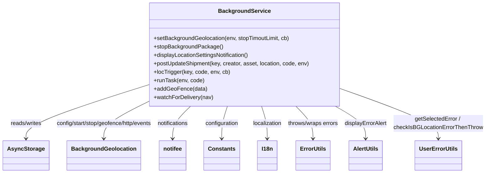

# Diagram: mobile/FreightVerifyMobileTracking/src/utils/background-tracking.ts


> Auto-generated by Obscura crawlers

## Diagram 1



### SVG

<svg id="container" width="1386.40625" xmlns="http://www.w3.org/2000/svg" class="classDiagram" height="492" viewBox="0 0 1386.40625 492" role="graphics-document document" aria-roledescription="class"><style>#container{font-family:"trebuchet ms",verdana,arial,sans-serif;font-size:16px;fill:#333;}@keyframes edge-animation-frame{from{stroke-dashoffset:0;}}@keyframes dash{to{stroke-dashoffset:0;}}#container .edge-animation-slow{stroke-dasharray:9,5!important;stroke-dashoffset:900;animation:dash 50s linear infinite;stroke-linecap:round;}#container .edge-animation-fast{stroke-dasharray:9,5!important;stroke-dashoffset:900;animation:dash 20s linear infinite;stroke-linecap:round;}#container .error-icon{fill:#552222;}#container .error-text{fill:#552222;stroke:#552222;}#container .edge-thickness-normal{stroke-width:1px;}#container .edge-thickness-thick{stroke-width:3.5px;}#container .edge-pattern-solid{stroke-dasharray:0;}#container .edge-thickness-invisible{stroke-width:0;fill:none;}#container .edge-pattern-dashed{stroke-dasharray:3;}#container .edge-pattern-dotted{stroke-dasharray:2;}#container .marker{fill:#333333;stroke:#333333;}#container .marker.cross{stroke:#333333;}#container svg{font-family:"trebuchet ms",verdana,arial,sans-serif;font-size:16px;}#container p{margin:0;}#container g.classGroup text{fill:#9370DB;stroke:none;font-family:"trebuchet ms",verdana,arial,sans-serif;font-size:10px;}#container g.classGroup text .title{font-weight:bolder;}#container .nodeLabel,#container .edgeLabel{color:#131300;}#container .edgeLabel .label rect{fill:#ECECFF;}#container .label text{fill:#131300;}#container .labelBkg{background:#ECECFF;}#container .edgeLabel .label span{background:#ECECFF;}#container .classTitle{font-weight:bolder;}#container .node rect,#container .node circle,#container .node ellipse,#container .node polygon,#container .node path{fill:#ECECFF;stroke:#9370DB;stroke-width:1px;}#container .divider{stroke:#9370DB;stroke-width:1;}#container g.clickable{cursor:pointer;}#container g.classGroup rect{fill:#ECECFF;stroke:#9370DB;}#container g.classGroup line{stroke:#9370DB;stroke-width:1;}#container .classLabel .box{stroke:none;stroke-width:0;fill:#ECECFF;opacity:0.5;}#container .classLabel .label{fill:#9370DB;font-size:10px;}#container .relation{stroke:#333333;stroke-width:1;fill:none;}#container .dashed-line{stroke-dasharray:3;}#container .dotted-line{stroke-dasharray:1 2;}#container #compositionStart,#container .composition{fill:#333333!important;stroke:#333333!important;stroke-width:1;}#container #compositionEnd,#container .composition{fill:#333333!important;stroke:#333333!important;stroke-width:1;}#container #dependencyStart,#container .dependency{fill:#333333!important;stroke:#333333!important;stroke-width:1;}#container #dependencyStart,#container .dependency{fill:#333333!important;stroke:#333333!important;stroke-width:1;}#container #extensionStart,#container .extension{fill:transparent!important;stroke:#333333!important;stroke-width:1;}#container #extensionEnd,#container .extension{fill:transparent!important;stroke:#333333!important;stroke-width:1;}#container #aggregationStart,#container .aggregation{fill:transparent!important;stroke:#333333!important;stroke-width:1;}#container #aggregationEnd,#container .aggregation{fill:transparent!important;stroke:#333333!important;stroke-width:1;}#container #lollipopStart,#container .lollipop{fill:#ECECFF!important;stroke:#333333!important;stroke-width:1;}#container #lollipopEnd,#container .lollipop{fill:#ECECFF!important;stroke:#333333!important;stroke-width:1;}#container .edgeTerminals{font-size:11px;line-height:initial;}#container .classTitleText{text-anchor:middle;font-size:18px;fill:#333;}#container .label-icon{display:inline-block;height:1em;overflow:visible;vertical-align:-0.125em;}#container .node .label-icon path{fill:currentColor;stroke:revert;stroke-width:revert;}#container :root{--mermaid-font-family:"trebuchet ms",verdana,arial,sans-serif;}</style><g><defs><marker id="container_class-aggregationStart" class="marker aggregation class" refX="18" refY="7" markerWidth="190" markerHeight="240" orient="auto"><path d="M 18,7 L9,13 L1,7 L9,1 Z"></path></marker></defs><defs><marker id="container_class-aggregationEnd" class="marker aggregation class" refX="1" refY="7" markerWidth="20" markerHeight="28" orient="auto"><path d="M 18,7 L9,13 L1,7 L9,1 Z"></path></marker></defs><defs><marker id="container_class-extensionStart" class="marker extension class" refX="18" refY="7" markerWidth="190" markerHeight="240" orient="auto"><path d="M 1,7 L18,13 V 1 Z"></path></marker></defs><defs><marker id="container_class-extensionEnd" class="marker extension class" refX="1" refY="7" markerWidth="20" markerHeight="28" orient="auto"><path d="M 1,1 V 13 L18,7 Z"></path></marker></defs><defs><marker id="container_class-compositionStart" class="marker composition class" refX="18" refY="7" markerWidth="190" markerHeight="240" orient="auto"><path d="M 18,7 L9,13 L1,7 L9,1 Z"></path></marker></defs><defs><marker id="container_class-compositionEnd" class="marker composition class" refX="1" refY="7" markerWidth="20" markerHeight="28" orient="auto"><path d="M 18,7 L9,13 L1,7 L9,1 Z"></path></marker></defs><defs><marker id="container_class-dependencyStart" class="marker dependency class" refX="6" refY="7" markerWidth="190" markerHeight="240" orient="auto"><path d="M 5,7 L9,13 L1,7 L9,1 Z"></path></marker></defs><defs><marker id="container_class-dependencyEnd" class="marker dependency class" refX="13" refY="7" markerWidth="20" markerHeight="28" orient="auto"><path d="M 18,7 L9,13 L14,7 L9,1 Z"></path></marker></defs><defs><marker id="container_class-lollipopStart" class="marker lollipop class" refX="13" refY="7" markerWidth="190" markerHeight="240" orient="auto"><circle stroke="black" fill="transparent" cx="7" cy="7" r="6"></circle></marker></defs><defs><marker id="container_class-lollipopEnd" class="marker lollipop class" refX="1" refY="7" markerWidth="190" markerHeight="240" orient="auto"><circle stroke="black" fill="transparent" cx="7" cy="7" r="6"></circle></marker></defs><g class="root"><g class="clusters"></g><g class="edgePaths"><path d="M422.805,239.792L363.854,258.327C304.904,276.862,187.003,313.931,128.052,339.632C69.102,365.333,69.102,379.667,69.102,386.833L69.102,394" id="id_BackgroundService_AsyncStorage_1" class="edge-thickness-normal edge-pattern-solid relation" style=";;;" data-edge="true" data-et="edge" data-id="id_BackgroundService_AsyncStorage_1" data-points="W3sieCI6NDIyLjgwNDY4NzUsInkiOjIzOS43OTIzNDAyNzYyMTEyM30seyJ4Ijo2OS4xMDE1NjI1LCJ5IjozNTF9LHsieCI6NjkuMTAxNTYyNSwieSI6NDAwfV0=" marker-end="url(#container_class-dependencyEnd)"></path><path d="M422.805,283.517L399.203,294.764C375.602,306.012,328.398,328.506,304.797,346.92C281.195,365.333,281.195,379.667,281.195,386.833L281.195,394" id="id_BackgroundService_BackgroundGeolocation_2" class="edge-thickness-normal edge-pattern-solid relation" style=";;;" data-edge="true" data-et="edge" data-id="id_BackgroundService_BackgroundGeolocation_2" data-points="W3sieCI6NDIyLjgwNDY4NzUsInkiOjI4My41MTcyNjYyNjkwNDIzfSx7IngiOjI4MS4xOTUzMTI1LCJ5IjozNTF9LHsieCI6MjgxLjE5NTMxMjUsInkiOjQwMH1d" marker-end="url(#container_class-dependencyEnd)"></path><path d="M542.715,302L534.394,310.167C526.073,318.333,509.431,334.667,501.11,350C492.789,365.333,492.789,379.667,492.789,386.833L492.789,394" id="id_BackgroundService_notifee_3" class="edge-thickness-normal edge-pattern-solid relation" style=";;;" data-edge="true" data-et="edge" data-id="id_BackgroundService_notifee_3" data-points="W3sieCI6NTQyLjcxNDg0Mzc1LCJ5IjozMDJ9LHsieCI6NDkyLjc4OTA2MjUsInkiOjM1MX0seyJ4Ijo0OTIuNzg5MDYyNSwieSI6NDAwfV0=" marker-end="url(#container_class-dependencyEnd)"></path><path d="M645.295,302L642.673,310.167C640.051,318.333,634.807,334.667,632.185,350C629.563,365.333,629.563,379.667,629.563,386.833L629.563,394" id="id_BackgroundService_Constants_4" class="edge-thickness-normal edge-pattern-solid relation" style=";;;" data-edge="true" data-et="edge" data-id="id_BackgroundService_Constants_4" data-points="W3sieCI6NjQ1LjI5NDkyMTg3NSwieSI6MzAyfSx7IngiOjYyOS41NjI1LCJ5IjozNTF9LHsieCI6NjI5LjU2MjUsInkiOjQwMH1d" marker-end="url(#container_class-dependencyEnd)"></path><path d="M739.689,302L742.312,310.167C744.934,318.333,750.178,334.667,752.8,350C755.422,365.333,755.422,379.667,755.422,386.833L755.422,394" id="id_BackgroundService_I18n_5" class="edge-thickness-normal edge-pattern-solid relation" style=";;;" data-edge="true" data-et="edge" data-id="id_BackgroundService_I18n_5" data-points="W3sieCI6NzM5LjY4OTQ1MzEyNSwieSI6MzAyfSx7IngiOjc1NS40MjE4NzUsInkiOjM1MX0seyJ4Ijo3NTUuNDIxODc1LCJ5Ijo0MDB9XQ==" marker-end="url(#container_class-dependencyEnd)"></path><path d="M841.373,302L849.644,310.167C857.915,318.333,874.458,334.667,882.729,350C891,365.333,891,379.667,891,386.833L891,394" id="id_BackgroundService_ErrorUtils_6" class="edge-thickness-normal edge-pattern-solid relation" style=";;;" data-edge="true" data-et="edge" data-id="id_BackgroundService_ErrorUtils_6" data-points="W3sieCI6ODQxLjM3MzA0Njg3NSwieSI6MzAyfSx7IngiOjg5MSwieSI6MzUxfSx7IngiOjg5MSwieSI6NDAwfV0=" marker-end="url(#container_class-dependencyEnd)"></path><path d="M957.529,302L972.254,310.167C986.978,318.333,1016.426,334.667,1031.151,350C1045.875,365.333,1045.875,379.667,1045.875,386.833L1045.875,394" id="id_BackgroundService_AlertUtils_7" class="edge-thickness-normal edge-pattern-solid relation" style=";;;" data-edge="true" data-et="edge" data-id="id_BackgroundService_AlertUtils_7" data-points="W3sieCI6OTU3LjUyOTI5Njg3NSwieSI6MzAyfSx7IngiOjEwNDUuODc1LCJ5IjozNTF9LHsieCI6MTA0NS44NzUsInkiOjQwMH1d" marker-end="url(#container_class-dependencyEnd)"></path><path d="M962.18,249.355L1010.6,266.296C1059.021,283.237,1155.862,317.118,1204.283,341.226C1252.703,365.333,1252.703,379.667,1252.703,386.833L1252.703,394" id="id_BackgroundService_UserErrorUtils_8" class="edge-thickness-normal edge-pattern-solid relation" style=";;;" data-edge="true" data-et="edge" data-id="id_BackgroundService_UserErrorUtils_8" data-points="W3sieCI6OTYyLjE3OTY4NzUsInkiOjI0OS4zNTUwODM4ODMwMjM5NX0seyJ4IjoxMjUyLjcwMzEyNSwieSI6MzUxfSx7IngiOjEyNTIuNzAzMTI1LCJ5Ijo0MDB9XQ==" marker-end="url(#container_class-dependencyEnd)"></path></g><g class="edgeLabels"><g class="edgeLabel" transform="translate(69.1015625, 351)"><g class="label" data-id="id_BackgroundService_AsyncStorage_1" transform="translate(-45.9453125, -12)"><foreignObject width="91.890625" height="24"><div xmlns="http://www.w3.org/1999/xhtml" class="labelBkg" style="display: table-cell; white-space: nowrap; line-height: 1.5; max-width: 200px; text-align: center;"><span class="edgeLabel"><p>reads/writes</p></span></div></foreignObject></g></g><g class="edgeLabel" transform="translate(281.1953125, 351)"><g class="label" data-id="id_BackgroundService_BackgroundGeolocation_2" transform="translate(-146.1484375, -12)"><foreignObject width="292.296875" height="24"><div xmlns="http://www.w3.org/1999/xhtml" class="labelBkg" style="display: table; white-space: break-spaces; line-height: 1.5; max-width: 200px; text-align: center; width: 200px;"><span class="edgeLabel"><p>config/start/stop/geofence/http/events</p></span></div></foreignObject></g></g><g class="edgeLabel" transform="translate(492.7890625, 351)"><g class="label" data-id="id_BackgroundService_notifee_3" transform="translate(-45.4453125, -12)"><foreignObject width="90.890625" height="24"><div xmlns="http://www.w3.org/1999/xhtml" class="labelBkg" style="display: table-cell; white-space: nowrap; line-height: 1.5; max-width: 200px; text-align: center;"><span class="edgeLabel"><p>notifications</p></span></div></foreignObject></g></g><g class="edgeLabel" transform="translate(629.5625, 351)"><g class="label" data-id="id_BackgroundService_Constants_4" transform="translate(-48.03125, -12)"><foreignObject width="96.0625" height="24"><div xmlns="http://www.w3.org/1999/xhtml" class="labelBkg" style="display: table-cell; white-space: nowrap; line-height: 1.5; max-width: 200px; text-align: center;"><span class="edgeLabel"><p>configuration</p></span></div></foreignObject></g></g><g class="edgeLabel" transform="translate(755.421875, 351)"><g class="label" data-id="id_BackgroundService_I18n_5" transform="translate(-41.828125, -12)"><foreignObject width="83.65625" height="24"><div xmlns="http://www.w3.org/1999/xhtml" class="labelBkg" style="display: table-cell; white-space: nowrap; line-height: 1.5; max-width: 200px; text-align: center;"><span class="edgeLabel"><p>localization</p></span></div></foreignObject></g></g><g class="edgeLabel" transform="translate(891, 351)"><g class="label" data-id="id_BackgroundService_ErrorUtils_6" transform="translate(-73.75, -12)"><foreignObject width="147.5" height="24"><div xmlns="http://www.w3.org/1999/xhtml" class="labelBkg" style="display: table-cell; white-space: nowrap; line-height: 1.5; max-width: 200px; text-align: center;"><span class="edgeLabel"><p>throws/wraps errors</p></span></div></foreignObject></g></g><g class="edgeLabel" transform="translate(1045.875, 351)"><g class="label" data-id="id_BackgroundService_AlertUtils_7" transform="translate(-61.125, -12)"><foreignObject width="122.25" height="24"><div xmlns="http://www.w3.org/1999/xhtml" class="labelBkg" style="display: table-cell; white-space: nowrap; line-height: 1.5; max-width: 200px; text-align: center;"><span class="edgeLabel"><p>displayErrorAlert</p></span></div></foreignObject></g></g><g class="edgeLabel" transform="translate(1252.703125, 351)"><g class="label" data-id="id_BackgroundService_UserErrorUtils_8" transform="translate(-125.703125, -24)"><foreignObject width="251.40625" height="48"><div xmlns="http://www.w3.org/1999/xhtml" class="labelBkg" style="display: table; white-space: break-spaces; line-height: 1.5; max-width: 200px; text-align: center; width: 200px;"><span class="edgeLabel"><p>getSelectedError / checkIsBGLocationErrorThenThrow</p></span></div></foreignObject></g></g></g><g class="nodes"><g class="node default" id="classId-BackgroundService-0" transform="translate(692.4921875, 155)"><g class="basic label-container"><path d="M-269.6875 -147 L269.6875 -147 L269.6875 147 L-269.6875 147" stroke="none" stroke-width="0" fill="#ECECFF" style=""></path><path d="M-269.6875 -147 C-126.11967711088633 -147, 17.448145778227342 -147, 269.6875 -147 M-269.6875 -147 C-137.82295737241833 -147, -5.958414744836659 -147, 269.6875 -147 M269.6875 -147 C269.6875 -31.677199479194286, 269.6875 83.64560104161143, 269.6875 147 M269.6875 -147 C269.6875 -81.32227085699053, 269.6875 -15.644541713981056, 269.6875 147 M269.6875 147 C91.446728897859 147, -86.794042204282 147, -269.6875 147 M269.6875 147 C136.80478382060952 147, 3.92206764121903 147, -269.6875 147 M-269.6875 147 C-269.6875 48.468212263830196, -269.6875 -50.06357547233961, -269.6875 -147 M-269.6875 147 C-269.6875 30.402613854316314, -269.6875 -86.19477229136737, -269.6875 -147" stroke="#9370DB" stroke-width="1.3" fill="none" stroke-dasharray="0 0" style=""></path></g><g class="annotation-group text" transform="translate(0, -123)"></g><g class="label-group text" transform="translate(-70.1875, -123)"><g class="label" style="font-weight: bolder" transform="translate(0,-12)"><foreignObject width="140.375" height="24"><div xmlns="http://www.w3.org/1999/xhtml" style="display: table-cell; white-space: nowrap; line-height: 1.5; max-width: 188px; text-align: center;"><span class="nodeLabel markdown-node-label" style=""><p>BackgroundService</p></span></div></foreignObject></g></g><g class="members-group text" transform="translate(-257.6875, -75)"></g><g class="methods-group text" transform="translate(-257.6875, -45)"><g class="label" style="" transform="translate(0,-12)"><foreignObject width="391.265625" height="24"><div xmlns="http://www.w3.org/1999/xhtml" style="display: table-cell; white-space: nowrap; line-height: 1.5; max-width: 449px; text-align: center;"><span class="nodeLabel markdown-node-label" style=""><p>+setBackgroundGeolocation(env, stopTimoutLimit, cb)</p></span></div></foreignObject></g><g class="label" style="" transform="translate(0,12)"><foreignObject width="194.046875" height="24"><div xmlns="http://www.w3.org/1999/xhtml" style="display: table-cell; white-space: nowrap; line-height: 1.5; max-width: 251px; text-align: center;"><span class="nodeLabel markdown-node-label" style=""><p>+stopBackgroundPackage()</p></span></div></foreignObject></g><g class="label" style="" transform="translate(0,36)"><foreignObject width="276" height="24"><div xmlns="http://www.w3.org/1999/xhtml" style="display: table-cell; white-space: nowrap; line-height: 1.5; max-width: 333px; text-align: center;"><span class="nodeLabel markdown-node-label" style=""><p>+displayLocationSettingsNotification()</p></span></div></foreignObject></g><g class="label" style="" transform="translate(0,60)"><foreignObject width="445.1875" height="24"><div xmlns="http://www.w3.org/1999/xhtml" style="display: table-cell; white-space: nowrap; line-height: 1.5; max-width: 503px; text-align: center;"><span class="nodeLabel markdown-node-label" style=""><p>+postUpdateShipment(key, creator, asset, location, code, env)</p></span></div></foreignObject></g><g class="label" style="" transform="translate(0,84)"><foreignObject width="215.0625" height="24"><div xmlns="http://www.w3.org/1999/xhtml" style="display: table-cell; white-space: nowrap; line-height: 1.5; max-width: 272px; text-align: center;"><span class="nodeLabel markdown-node-label" style=""><p>+locTrigger(key, code, env, cb)</p></span></div></foreignObject></g><g class="label" style="" transform="translate(0,108)"><foreignObject width="143.15625" height="24"><div xmlns="http://www.w3.org/1999/xhtml" style="display: table-cell; white-space: nowrap; line-height: 1.5; max-width: 201px; text-align: center;"><span class="nodeLabel markdown-node-label" style=""><p>+runTask(env, code)</p></span></div></foreignObject></g><g class="label" style="" transform="translate(0,132)"><foreignObject width="148.203125" height="24"><div xmlns="http://www.w3.org/1999/xhtml" style="display: table-cell; white-space: nowrap; line-height: 1.5; max-width: 206px; text-align: center;"><span class="nodeLabel markdown-node-label" style=""><p>+addGeoFence(data)</p></span></div></foreignObject></g><g class="label" style="" transform="translate(0,156)"><foreignObject width="168.234375" height="24"><div xmlns="http://www.w3.org/1999/xhtml" style="display: table-cell; white-space: nowrap; line-height: 1.5; max-width: 226px; text-align: center;"><span class="nodeLabel markdown-node-label" style=""><p>+watchForDelivery(nav)</p></span></div></foreignObject></g></g><g class="divider" style=""><path d="M-269.6875 -99 C-147.1873508403196 -99, -24.68720168063922 -99, 269.6875 -99 M-269.6875 -99 C-61.49685717043661 -99, 146.69378565912677 -99, 269.6875 -99" stroke="#9370DB" stroke-width="1.3" fill="none" stroke-dasharray="0 0" style=""></path></g><g class="divider" style=""><path d="M-269.6875 -75 C-150.18891863433282 -75, -30.690337268665644 -75, 269.6875 -75 M-269.6875 -75 C-140.2527847423665 -75, -10.818069484732973 -75, 269.6875 -75" stroke="#9370DB" stroke-width="1.3" fill="none" stroke-dasharray="0 0" style=""></path></g></g><g class="node default" id="classId-AsyncStorage-1" transform="translate(69.1015625, 442)"><g class="basic label-container"><path d="M-61.1015625 -42 L61.1015625 -42 L61.1015625 42 L-61.1015625 42" stroke="none" stroke-width="0" fill="#ECECFF" style=""></path><path d="M-61.1015625 -42 C-26.939120717800137 -42, 7.223321064399727 -42, 61.1015625 -42 M-61.1015625 -42 C-12.405175185335416 -42, 36.29121212932917 -42, 61.1015625 -42 M61.1015625 -42 C61.1015625 -9.832563649162005, 61.1015625 22.33487270167599, 61.1015625 42 M61.1015625 -42 C61.1015625 -17.05367585027031, 61.1015625 7.892648299459381, 61.1015625 42 M61.1015625 42 C16.62730052269368 42, -27.84696145461264 42, -61.1015625 42 M61.1015625 42 C26.924615426931915 42, -7.25233164613617 42, -61.1015625 42 M-61.1015625 42 C-61.1015625 15.268616832177589, -61.1015625 -11.462766335644822, -61.1015625 -42 M-61.1015625 42 C-61.1015625 21.823821003078507, -61.1015625 1.6476420061570138, -61.1015625 -42" stroke="#9370DB" stroke-width="1.3" fill="none" stroke-dasharray="0 0" style=""></path></g><g class="annotation-group text" transform="translate(0, -18)"></g><g class="label-group text" transform="translate(-49.1015625, -18)"><g class="label" style="font-weight: bolder" transform="translate(0,-12)"><foreignObject width="98.203125" height="24"><div xmlns="http://www.w3.org/1999/xhtml" style="display: table-cell; white-space: nowrap; line-height: 1.5; max-width: 146px; text-align: center;"><span class="nodeLabel markdown-node-label" style=""><p>AsyncStorage</p></span></div></foreignObject></g></g><g class="members-group text" transform="translate(-49.1015625, 30)"></g><g class="methods-group text" transform="translate(-49.1015625, 60)"></g><g class="divider" style=""><path d="M-61.1015625 6 C-13.571083965821352 6, 33.9593945683573 6, 61.1015625 6 M-61.1015625 6 C-36.57112435883015 6, -12.040686217660287 6, 61.1015625 6" stroke="#9370DB" stroke-width="1.3" fill="none" stroke-dasharray="0 0" style=""></path></g><g class="divider" style=""><path d="M-61.1015625 24 C-24.340018111801285 24, 12.42152627639743 24, 61.1015625 24 M-61.1015625 24 C-27.931440396362724 24, 5.2386817072745515 24, 61.1015625 24" stroke="#9370DB" stroke-width="1.3" fill="none" stroke-dasharray="0 0" style=""></path></g></g><g class="node default" id="classId-BackgroundGeolocation-2" transform="translate(281.1953125, 442)"><g class="basic label-container"><path d="M-99.5625 -42 L99.5625 -42 L99.5625 42 L-99.5625 42" stroke="none" stroke-width="0" fill="#ECECFF" style=""></path><path d="M-99.5625 -42 C-23.017755741828438 -42, 53.526988516343124 -42, 99.5625 -42 M-99.5625 -42 C-21.317716882016782 -42, 56.927066235966436 -42, 99.5625 -42 M99.5625 -42 C99.5625 -18.003693936899758, 99.5625 5.992612126200484, 99.5625 42 M99.5625 -42 C99.5625 -15.76542559682079, 99.5625 10.469148806358419, 99.5625 42 M99.5625 42 C56.941526646118334 42, 14.320553292236667 42, -99.5625 42 M99.5625 42 C59.59676337816141 42, 19.631026756322825 42, -99.5625 42 M-99.5625 42 C-99.5625 9.285888153859325, -99.5625 -23.42822369228135, -99.5625 -42 M-99.5625 42 C-99.5625 12.430759022265754, -99.5625 -17.138481955468492, -99.5625 -42" stroke="#9370DB" stroke-width="1.3" fill="none" stroke-dasharray="0 0" style=""></path></g><g class="annotation-group text" transform="translate(0, -18)"></g><g class="label-group text" transform="translate(-87.5625, -18)"><g class="label" style="font-weight: bolder" transform="translate(0,-12)"><foreignObject width="175.125" height="24"><div xmlns="http://www.w3.org/1999/xhtml" style="display: table-cell; white-space: nowrap; line-height: 1.5; max-width: 223px; text-align: center;"><span class="nodeLabel markdown-node-label" style=""><p>BackgroundGeolocation</p></span></div></foreignObject></g></g><g class="members-group text" transform="translate(-87.5625, 30)"></g><g class="methods-group text" transform="translate(-87.5625, 60)"></g><g class="divider" style=""><path d="M-99.5625 6 C-57.88976302032858 6, -16.21702604065716 6, 99.5625 6 M-99.5625 6 C-38.39154402632177 6, 22.779411947356465 6, 99.5625 6" stroke="#9370DB" stroke-width="1.3" fill="none" stroke-dasharray="0 0" style=""></path></g><g class="divider" style=""><path d="M-99.5625 24 C-28.665320544590642 24, 42.231858910818715 24, 99.5625 24 M-99.5625 24 C-33.907783923256034 24, 31.746932153487933 24, 99.5625 24" stroke="#9370DB" stroke-width="1.3" fill="none" stroke-dasharray="0 0" style=""></path></g></g><g class="node default" id="classId-notifee-3" transform="translate(492.7890625, 442)"><g class="basic label-container"><path d="M-38.234375 -42 L38.234375 -42 L38.234375 42 L-38.234375 42" stroke="none" stroke-width="0" fill="#ECECFF" style=""></path><path d="M-38.234375 -42 C-14.45961512171171 -42, 9.31514475657658 -42, 38.234375 -42 M-38.234375 -42 C-12.770325992690015 -42, 12.69372301461997 -42, 38.234375 -42 M38.234375 -42 C38.234375 -19.837552619990838, 38.234375 2.3248947600183243, 38.234375 42 M38.234375 -42 C38.234375 -16.402261931349084, 38.234375 9.195476137301831, 38.234375 42 M38.234375 42 C19.066395479412154 42, -0.1015840411756912 42, -38.234375 42 M38.234375 42 C21.53218509655072 42, 4.829995193101439 42, -38.234375 42 M-38.234375 42 C-38.234375 19.499694899783975, -38.234375 -3.0006102004320496, -38.234375 -42 M-38.234375 42 C-38.234375 18.93827767395806, -38.234375 -4.123444652083883, -38.234375 -42" stroke="#9370DB" stroke-width="1.3" fill="none" stroke-dasharray="0 0" style=""></path></g><g class="annotation-group text" transform="translate(0, -18)"></g><g class="label-group text" transform="translate(-26.234375, -18)"><g class="label" style="font-weight: bolder" transform="translate(0,-12)"><foreignObject width="52.46875" height="24"><div xmlns="http://www.w3.org/1999/xhtml" style="display: table-cell; white-space: nowrap; line-height: 1.5; max-width: 102px; text-align: center;"><span class="nodeLabel markdown-node-label" style=""><p>notifee</p></span></div></foreignObject></g></g><g class="members-group text" transform="translate(-26.234375, 30)"></g><g class="methods-group text" transform="translate(-26.234375, 60)"></g><g class="divider" style=""><path d="M-38.234375 6 C-9.497708192632295 6, 19.23895861473541 6, 38.234375 6 M-38.234375 6 C-19.06302689067839 6, 0.1083212186432192 6, 38.234375 6" stroke="#9370DB" stroke-width="1.3" fill="none" stroke-dasharray="0 0" style=""></path></g><g class="divider" style=""><path d="M-38.234375 24 C-9.558556654174943 24, 19.117261691650114 24, 38.234375 24 M-38.234375 24 C-18.791611547554687 24, 0.6511519048906251 24, 38.234375 24" stroke="#9370DB" stroke-width="1.3" fill="none" stroke-dasharray="0 0" style=""></path></g></g><g class="node default" id="classId-Constants-4" transform="translate(629.5625, 442)"><g class="basic label-container"><path d="M-48.5390625 -42 L48.5390625 -42 L48.5390625 42 L-48.5390625 42" stroke="none" stroke-width="0" fill="#ECECFF" style=""></path><path d="M-48.5390625 -42 C-13.065457442124952 -42, 22.408147615750096 -42, 48.5390625 -42 M-48.5390625 -42 C-16.254024368374992 -42, 16.031013763250016 -42, 48.5390625 -42 M48.5390625 -42 C48.5390625 -21.391515947736217, 48.5390625 -0.7830318954724333, 48.5390625 42 M48.5390625 -42 C48.5390625 -23.02845451382691, 48.5390625 -4.056909027653823, 48.5390625 42 M48.5390625 42 C28.64921552560331 42, 8.75936855120662 42, -48.5390625 42 M48.5390625 42 C18.43597546293783 42, -11.667111574124341 42, -48.5390625 42 M-48.5390625 42 C-48.5390625 22.739547790376477, -48.5390625 3.479095580752954, -48.5390625 -42 M-48.5390625 42 C-48.5390625 10.841286306934666, -48.5390625 -20.317427386130667, -48.5390625 -42" stroke="#9370DB" stroke-width="1.3" fill="none" stroke-dasharray="0 0" style=""></path></g><g class="annotation-group text" transform="translate(0, -18)"></g><g class="label-group text" transform="translate(-36.5390625, -18)"><g class="label" style="font-weight: bolder" transform="translate(0,-12)"><foreignObject width="73.078125" height="24"><div xmlns="http://www.w3.org/1999/xhtml" style="display: table-cell; white-space: nowrap; line-height: 1.5; max-width: 122px; text-align: center;"><span class="nodeLabel markdown-node-label" style=""><p>Constants</p></span></div></foreignObject></g></g><g class="members-group text" transform="translate(-36.5390625, 30)"></g><g class="methods-group text" transform="translate(-36.5390625, 60)"></g><g class="divider" style=""><path d="M-48.5390625 6 C-24.31817614313124 6, -0.09728978626247908 6, 48.5390625 6 M-48.5390625 6 C-10.224268499132968 6, 28.090525501734064 6, 48.5390625 6" stroke="#9370DB" stroke-width="1.3" fill="none" stroke-dasharray="0 0" style=""></path></g><g class="divider" style=""><path d="M-48.5390625 24 C-17.86513136407882 24, 12.80879977184236 24, 48.5390625 24 M-48.5390625 24 C-19.959965304750394 24, 8.619131890499212 24, 48.5390625 24" stroke="#9370DB" stroke-width="1.3" fill="none" stroke-dasharray="0 0" style=""></path></g></g><g class="node default" id="classId-I18n-5" transform="translate(755.421875, 442)"><g class="basic label-container"><path d="M-27.3203125 -42 L27.3203125 -42 L27.3203125 42 L-27.3203125 42" stroke="none" stroke-width="0" fill="#ECECFF" style=""></path><path d="M-27.3203125 -42 C-9.029747533561636 -42, 9.260817432876728 -42, 27.3203125 -42 M-27.3203125 -42 C-5.808109291110288 -42, 15.704093917779424 -42, 27.3203125 -42 M27.3203125 -42 C27.3203125 -17.45269523032653, 27.3203125 7.094609539346941, 27.3203125 42 M27.3203125 -42 C27.3203125 -13.39660372312975, 27.3203125 15.206792553740499, 27.3203125 42 M27.3203125 42 C8.271174914215155 42, -10.77796267156969 42, -27.3203125 42 M27.3203125 42 C6.361350613416235 42, -14.59761127316753 42, -27.3203125 42 M-27.3203125 42 C-27.3203125 8.572305115476048, -27.3203125 -24.855389769047903, -27.3203125 -42 M-27.3203125 42 C-27.3203125 15.944069994404384, -27.3203125 -10.111860011191233, -27.3203125 -42" stroke="#9370DB" stroke-width="1.3" fill="none" stroke-dasharray="0 0" style=""></path></g><g class="annotation-group text" transform="translate(0, -18)"></g><g class="label-group text" transform="translate(-15.3203125, -18)"><g class="label" style="font-weight: bolder" transform="translate(0,-12)"><foreignObject width="30.640625" height="24"><div xmlns="http://www.w3.org/1999/xhtml" style="display: table-cell; white-space: nowrap; line-height: 1.5; max-width: 80px; text-align: center;"><span class="nodeLabel markdown-node-label" style=""><p>I18n</p></span></div></foreignObject></g></g><g class="members-group text" transform="translate(-15.3203125, 30)"></g><g class="methods-group text" transform="translate(-15.3203125, 60)"></g><g class="divider" style=""><path d="M-27.3203125 6 C-13.736294956460794 6, -0.15227741292158825 6, 27.3203125 6 M-27.3203125 6 C-9.480978728261036 6, 8.358355043477928 6, 27.3203125 6" stroke="#9370DB" stroke-width="1.3" fill="none" stroke-dasharray="0 0" style=""></path></g><g class="divider" style=""><path d="M-27.3203125 24 C-10.393606483826073 24, 6.533099532347855 24, 27.3203125 24 M-27.3203125 24 C-7.487832629859636 24, 12.344647240280729 24, 27.3203125 24" stroke="#9370DB" stroke-width="1.3" fill="none" stroke-dasharray="0 0" style=""></path></g></g><g class="node default" id="classId-ErrorUtils-6" transform="translate(891, 442)"><g class="basic label-container"><path d="M-46.9765625 -42 L46.9765625 -42 L46.9765625 42 L-46.9765625 42" stroke="none" stroke-width="0" fill="#ECECFF" style=""></path><path d="M-46.9765625 -42 C-9.6125747395431 -42, 27.7514130209138 -42, 46.9765625 -42 M-46.9765625 -42 C-14.243766870799789 -42, 18.489028758400423 -42, 46.9765625 -42 M46.9765625 -42 C46.9765625 -24.626474535939863, 46.9765625 -7.252949071879726, 46.9765625 42 M46.9765625 -42 C46.9765625 -12.123665232562836, 46.9765625 17.75266953487433, 46.9765625 42 M46.9765625 42 C25.38719588636344 42, 3.7978292727268794 42, -46.9765625 42 M46.9765625 42 C23.5309241297708 42, 0.08528575954159834 42, -46.9765625 42 M-46.9765625 42 C-46.9765625 15.832221867676168, -46.9765625 -10.335556264647664, -46.9765625 -42 M-46.9765625 42 C-46.9765625 20.201394159152876, -46.9765625 -1.5972116816942474, -46.9765625 -42" stroke="#9370DB" stroke-width="1.3" fill="none" stroke-dasharray="0 0" style=""></path></g><g class="annotation-group text" transform="translate(0, -18)"></g><g class="label-group text" transform="translate(-34.9765625, -18)"><g class="label" style="font-weight: bolder" transform="translate(0,-12)"><foreignObject width="69.953125" height="24"><div xmlns="http://www.w3.org/1999/xhtml" style="display: table-cell; white-space: nowrap; line-height: 1.5; max-width: 119px; text-align: center;"><span class="nodeLabel markdown-node-label" style=""><p>ErrorUtils</p></span></div></foreignObject></g></g><g class="members-group text" transform="translate(-34.9765625, 30)"></g><g class="methods-group text" transform="translate(-34.9765625, 60)"></g><g class="divider" style=""><path d="M-46.9765625 6 C-23.89358419379754 6, -0.8106058875950808 6, 46.9765625 6 M-46.9765625 6 C-16.880796289245914 6, 13.214969921508171 6, 46.9765625 6" stroke="#9370DB" stroke-width="1.3" fill="none" stroke-dasharray="0 0" style=""></path></g><g class="divider" style=""><path d="M-46.9765625 24 C-11.785031617648286 24, 23.406499264703427 24, 46.9765625 24 M-46.9765625 24 C-17.783096121624304 24, 11.410370256751392 24, 46.9765625 24" stroke="#9370DB" stroke-width="1.3" fill="none" stroke-dasharray="0 0" style=""></path></g></g><g class="node default" id="classId-AlertUtils-7" transform="translate(1045.875, 442)"><g class="basic label-container"><path d="M-46.5625 -42 L46.5625 -42 L46.5625 42 L-46.5625 42" stroke="none" stroke-width="0" fill="#ECECFF" style=""></path><path d="M-46.5625 -42 C-18.440087051604543 -42, 9.682325896790914 -42, 46.5625 -42 M-46.5625 -42 C-13.969050908725997 -42, 18.624398182548006 -42, 46.5625 -42 M46.5625 -42 C46.5625 -14.299003595823066, 46.5625 13.401992808353867, 46.5625 42 M46.5625 -42 C46.5625 -13.870188918085237, 46.5625 14.259622163829526, 46.5625 42 M46.5625 42 C13.597693386176125 42, -19.36711322764775 42, -46.5625 42 M46.5625 42 C20.611035018862694 42, -5.340429962274612 42, -46.5625 42 M-46.5625 42 C-46.5625 23.65059970020007, -46.5625 5.301199400400137, -46.5625 -42 M-46.5625 42 C-46.5625 12.38276989940287, -46.5625 -17.23446020119426, -46.5625 -42" stroke="#9370DB" stroke-width="1.3" fill="none" stroke-dasharray="0 0" style=""></path></g><g class="annotation-group text" transform="translate(0, -18)"></g><g class="label-group text" transform="translate(-34.5625, -18)"><g class="label" style="font-weight: bolder" transform="translate(0,-12)"><foreignObject width="69.125" height="24"><div xmlns="http://www.w3.org/1999/xhtml" style="display: table-cell; white-space: nowrap; line-height: 1.5; max-width: 118px; text-align: center;"><span class="nodeLabel markdown-node-label" style=""><p>AlertUtils</p></span></div></foreignObject></g></g><g class="members-group text" transform="translate(-34.5625, 30)"></g><g class="methods-group text" transform="translate(-34.5625, 60)"></g><g class="divider" style=""><path d="M-46.5625 6 C-21.230068391085698 6, 4.102363217828604 6, 46.5625 6 M-46.5625 6 C-15.807002635994952 6, 14.948494728010097 6, 46.5625 6" stroke="#9370DB" stroke-width="1.3" fill="none" stroke-dasharray="0 0" style=""></path></g><g class="divider" style=""><path d="M-46.5625 24 C-27.56647566864933 24, -8.570451337298657 24, 46.5625 24 M-46.5625 24 C-25.19624997412603 24, -3.829999948252059 24, 46.5625 24" stroke="#9370DB" stroke-width="1.3" fill="none" stroke-dasharray="0 0" style=""></path></g></g><g class="node default" id="classId-UserErrorUtils-8" transform="translate(1252.703125, 442)"><g class="basic label-container"><path d="M-63.6328125 -42 L63.6328125 -42 L63.6328125 42 L-63.6328125 42" stroke="none" stroke-width="0" fill="#ECECFF" style=""></path><path d="M-63.6328125 -42 C-18.68677420306878 -42, 26.25926409386244 -42, 63.6328125 -42 M-63.6328125 -42 C-35.0989884596838 -42, -6.565164419367605 -42, 63.6328125 -42 M63.6328125 -42 C63.6328125 -11.110344878699735, 63.6328125 19.77931024260053, 63.6328125 42 M63.6328125 -42 C63.6328125 -18.40481983119239, 63.6328125 5.190360337615218, 63.6328125 42 M63.6328125 42 C27.47848452425327 42, -8.675843451493463 42, -63.6328125 42 M63.6328125 42 C26.58600401883369 42, -10.460804462332618 42, -63.6328125 42 M-63.6328125 42 C-63.6328125 8.819570752533743, -63.6328125 -24.360858494932515, -63.6328125 -42 M-63.6328125 42 C-63.6328125 18.74974228206456, -63.6328125 -4.500515435870881, -63.6328125 -42" stroke="#9370DB" stroke-width="1.3" fill="none" stroke-dasharray="0 0" style=""></path></g><g class="annotation-group text" transform="translate(0, -18)"></g><g class="label-group text" transform="translate(-51.6328125, -18)"><g class="label" style="font-weight: bolder" transform="translate(0,-12)"><foreignObject width="103.265625" height="24"><div xmlns="http://www.w3.org/1999/xhtml" style="display: table-cell; white-space: nowrap; line-height: 1.5; max-width: 152px; text-align: center;"><span class="nodeLabel markdown-node-label" style=""><p>UserErrorUtils</p></span></div></foreignObject></g></g><g class="members-group text" transform="translate(-51.6328125, 30)"></g><g class="methods-group text" transform="translate(-51.6328125, 60)"></g><g class="divider" style=""><path d="M-63.6328125 6 C-37.3958273255246 6, -11.1588421510492 6, 63.6328125 6 M-63.6328125 6 C-32.173204035229226 6, -0.7135955704584518 6, 63.6328125 6" stroke="#9370DB" stroke-width="1.3" fill="none" stroke-dasharray="0 0" style=""></path></g><g class="divider" style=""><path d="M-63.6328125 24 C-20.73468410347428 24, 22.16344429305144 24, 63.6328125 24 M-63.6328125 24 C-25.28909533184612 24, 13.05462183630776 24, 63.6328125 24" stroke="#9370DB" stroke-width="1.3" fill="none" stroke-dasharray="0 0" style=""></path></g></g></g></g></g></svg>

## Diagram 2

```mermaid
flowchart TD
    subgraph Setup
        A[AsyncStorage.getAllKeys / multiGet] --> B{keys present?}
        B -- yes --> C[build param & extras]
        C --> D[BackgroundGeolocation.ready(config)]
        D --> E{state.enabled?}
        E -- false --> F[BackgroundGeolocation.start()]
        E -- true --> G[noop]
        D --> H[cb()]
    end

    subgraph LocationTrigger
        L1[checkIsBGLocationErrorThenThrow] -->|ok| L2[BackgroundGeolocation.getCurrentPosition()]
        L2 --> L3{got location?}
        L3 -- yes --> L4[optional cb(code)]
        L4 --> L5[postUpdateShipment(...)]
        L3 -- error --> Lerr[displayErrorAlert(BGLocationError) if not SO_IDLE_TIMEOUT]
        Lerr --> Stop[stopBackgroundPackage()]
        Lerr --> ThrowErr[throw err]
    end

    subgraph PostUpdate
        P1[prepare bodyConfig & device_token] --> P2[fetch POST to API_UPDATE_ASSET]
        P2 --> P3{response.error?}
        P3 -- no --> P4[return res]
        P3 -- yes --> P5[throw ShipmentServerError(status, message)]
        P5 --> Alert[displayErrorAlert(ShipmentServerError, code)]
    end

    Setup --> LocationTrigger
    LocationTrigger --> PostUpdate
```

> SVG rendering failed for this diagram.

## Diagram 3

```mermaid
flowchart TD
    subgraph Geofencing
        Gremove[BackgroundGeolocation.removeGeofences()] --> Gcheck{data.stop_geofences?}
        Gcheck -- yes --> Gadd[addGeofence per element]
        Gadd --> Done[geofences added]
        Gcheck -- no --> Done
    end

    subgraph WatchHTTP
        Hlisten[BackgroundGeolocation.onHttp(response)] --> Hcond{response.status === 204?}
        Hcond -- yes --> Hnav[call nav() to handle delivery]
        Hcond -- no --> Hnoop[ignore]
    end

    Geofencing --> WatchHTTP
```

> SVG rendering failed for this diagram.
