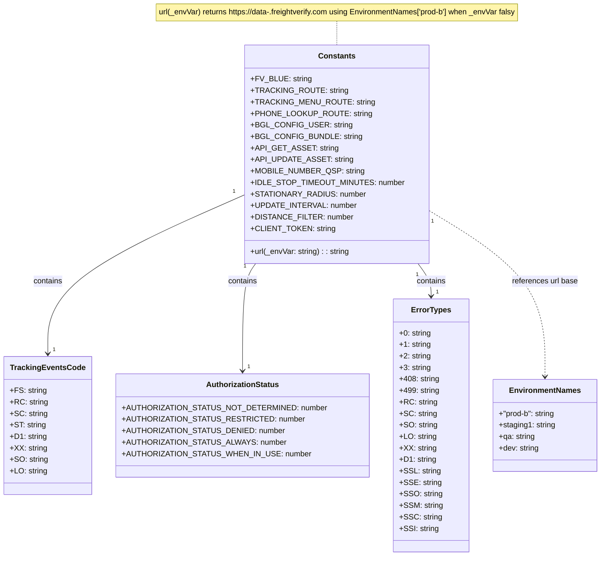

# Diagram: mobile/FreightVerifyMobileTracking/src/utils/constants.ts

> Auto-generated by Obscura crawlers

## Mermaid

### SVG

<svg id="container" width="1188.3828125" xmlns="http://www.w3.org/2000/svg" class="classDiagram" height="1160" viewBox="0 0 1188.3828125 1160" role="graphics-document document" aria-roledescription="class"><g><defs><marker id="container_class-aggregationStart" class="marker aggregation class" refX="18" refY="7" markerWidth="190" markerHeight="240" orient="auto"><path d="M 18,7 L9,13 L1,7 L9,1 Z"></path></marker></defs><defs><marker id="container_class-aggregationEnd" class="marker aggregation class" refX="1" refY="7" markerWidth="20" markerHeight="28" orient="auto"><path d="M 18,7 L9,13 L1,7 L9,1 Z"></path></marker></defs><defs><marker id="container_class-extensionStart" class="marker extension class" refX="18" refY="7" markerWidth="190" markerHeight="240" orient="auto"><path d="M 1,7 L18,13 V 1 Z"></path></marker></defs><defs><marker id="container_class-extensionEnd" class="marker extension class" refX="1" refY="7" markerWidth="20" markerHeight="28" orient="auto"><path d="M 1,1 V 13 L18,7 Z"></path></marker></defs><defs><marker id="container_class-compositionStart" class="marker composition class" refX="18" refY="7" markerWidth="190" markerHeight="240" orient="auto"><path d="M 18,7 L9,13 L1,7 L9,1 Z"></path></marker></defs><defs><marker id="container_class-compositionEnd" class="marker composition class" refX="1" refY="7" markerWidth="20" markerHeight="28" orient="auto"><path d="M 18,7 L9,13 L1,7 L9,1 Z"></path></marker></defs><defs><marker id="container_class-dependencyStart" class="marker dependency class" refX="6" refY="7" markerWidth="190" markerHeight="240" orient="auto"><path d="M 5,7 L9,13 L1,7 L9,1 Z"></path></marker></defs><defs><marker id="container_class-dependencyEnd" class="marker dependency class" refX="13" refY="7" markerWidth="20" markerHeight="28" orient="auto"><path d="M 18,7 L9,13 L14,7 L9,1 Z"></path></marker></defs><defs><marker id="container_class-lollipopStart" class="marker lollipop class" refX="13" refY="7" markerWidth="190" markerHeight="240" orient="auto"><circle stroke="black" fill="transparent" cx="7" cy="7" r="6"></circle></marker></defs><defs><marker id="container_class-lollipopEnd" class="marker lollipop class" refX="1" refY="7" markerWidth="190" markerHeight="240" orient="auto"><circle stroke="black" fill="transparent" cx="7" cy="7" r="6"></circle></marker></defs><g class="root"><g class="clusters"></g><g class="edgePaths"><path d="M656.867,44L656.867,48.167C656.867,52.333,656.867,60.667,656.867,69C656.867,77.333,656.867,85.667,656.867,89.833L656.867,94" id="edgeNote1" class="edge-thickness-normal edge-pattern-dotted relation" style="fill: none;;;fill: none" data-edge="true" data-et="edge" data-id="edgeNote1" data-points="W3sieCI6NjU2Ljg2NzE4NzUsInkiOjQ0fSx7IngiOjY1Ni44NjcxODc1LCJ5Ijo2OX0seyJ4Ijo2NTYuODY3MTg3NSwieSI6OTR9XQ=="></path><path d="M481.527,404.711L417.121,435.092C352.715,465.474,223.902,526.237,159.496,581.785C95.09,637.333,95.09,687.667,95.09,712.833L95.09,738" id="id_Constants_TrackingEventsCode_1" class="edge-thickness-normal edge-pattern-solid relation" style=";;;" data-edge="true" data-et="edge" data-id="id_Constants_TrackingEventsCode_1" data-points="W3sieCI6NDgxLjUyNzM0Mzc1LCJ5Ijo0MDQuNzEwODA5MDI1NDg0MTR9LHsieCI6OTUuMDg5ODQzNzUsInkiOjU4N30seyJ4Ijo5NS4wODk4NDM3NSwieSI6NzQ0fV0=" marker-end="url(#container_class-dependencyEnd)"></path><path d="M499.223,550L494.959,556.167C490.696,562.333,482.168,574.667,477.904,612C473.641,649.333,473.641,711.667,473.641,742.833L473.641,774" id="id_Constants_AuthorizationStatus_2" class="edge-thickness-normal edge-pattern-solid relation" style=";;;" data-edge="true" data-et="edge" data-id="id_Constants_AuthorizationStatus_2" data-points="W3sieCI6NDk5LjIyMzIwMTY1MDk0MzQsInkiOjU1MH0seyJ4Ijo0NzMuNjQwNjI1LCJ5Ijo1ODd9LHsieCI6NDczLjY0MDYyNSwieSI6NzgwfV0=" marker-end="url(#container_class-dependencyEnd)"></path><path d="M814.511,550L818.775,556.167C823.039,562.333,831.566,574.667,835.83,586C840.094,597.333,840.094,607.667,840.094,612.833L840.094,618" id="id_Constants_ErrorTypes_3" class="edge-thickness-normal edge-pattern-solid relation" style=";;;" data-edge="true" data-et="edge" data-id="id_Constants_ErrorTypes_3" data-points="W3sieCI6ODE0LjUxMTE3MzM0OTA1NjcsInkiOjU1MH0seyJ4Ijo4NDAuMDkzNzUsInkiOjU4N30seyJ4Ijo4NDAuMDkzNzUsInkiOjYyNH1d" marker-end="url(#container_class-dependencyEnd)"></path><path d="M832.207,433.731L872.295,459.275C912.383,484.82,992.559,535.91,1032.646,594.622C1072.734,653.333,1072.734,719.667,1072.734,752.833L1072.734,786" id="id_Constants_EnvironmentNames_4" class="edge-thickness-normal edge-pattern-dashed relation" style=";;;" data-edge="true" data-et="edge" data-id="id_Constants_EnvironmentNames_4" data-points="W3sieCI6ODMyLjIwNzAzMTI1LCJ5Ijo0MzMuNzMwNTIzNTY3MDk0MzR9LHsieCI6MTA3Mi43MzQzNzUsInkiOjU4N30seyJ4IjoxMDcyLjczNDM3NSwieSI6NzkyfV0=" marker-end="url(#container_class-dependencyEnd)"></path></g><g class="edgeLabels"><g class="edgeLabel"><g class="label" data-id="edgeNote1" transform="translate(0, 0)"><foreignObject width="0" height="0">

</foreignObject></g></g><g class="edgeLabel" transform="translate(95.08984375, 587)"><g class="label" data-id="id_Constants_TrackingEventsCode_1" transform="translate(-30.890625, -12)"><foreignObject width="61.78125" height="24">

contains

</foreignObject></g></g><g class="edgeLabel" transform="translate(473.640625, 587)"><g class="label" data-id="id_Constants_AuthorizationStatus_2" transform="translate(-30.890625, -12)"><foreignObject width="61.78125" height="24">

contains

</foreignObject></g></g><g class="edgeLabel" transform="translate(840.09375, 587)"><g class="label" data-id="id_Constants_ErrorTypes_3" transform="translate(-30.890625, -12)"><foreignObject width="61.78125" height="24">

contains

</foreignObject></g></g><g class="edgeLabel" transform="translate(1072.734375, 587)"><g class="label" data-id="id_Constants_EnvironmentNames_4" transform="translate(-69.1953125, -12)"><foreignObject width="138.390625" height="24">

references url base

</foreignObject></g></g><g class="edgeTerminals" transform="translate(459.3004140308128, 398.61051096130257)"><g class="inner" transform="translate(0, 0)"><foreignObject style="width: 9px; height: 12px;">
1
</foreignObject></g></g><g class="edgeTerminals" transform="translate(476.93265537387526, 555.863582110811)"><g class="inner" transform="translate(0, 0)"><foreignObject style="width: 9px; height: 12px;">
1
</foreignObject></g></g><g class="edgeTerminals" transform="translate(812.1257152205278, 572.9250864394149)"><g class="inner" transform="translate(0, 0)"><foreignObject style="width: 9px; height: 12px;">
1
</foreignObject></g></g><g class="edgeTerminals" transform="translate(838.9044944485956, 455.7848642731161)"><g class="inner" transform="translate(0, 0)"><foreignObject style="width: 9px; height: 12px;">
1
</foreignObject></g></g><g class="edgeTerminals" transform="translate(105.0898418749999, 721.4999983928572)"><g class="inner" transform="translate(0, 0)"></g><foreignObject style="width: 9px; height: 12px;">
1
</foreignObject></g><g class="edgeTerminals" transform="translate(483.6406274999998, 757.5000021428572)"><g class="inner" transform="translate(0, 0)"></g><foreignObject style="width: 9px; height: 12px;">
1
</foreignObject></g><g class="edgeTerminals" transform="translate(850.09375, 601.5)"><g class="inner" transform="translate(0, 0)"></g><foreignObject style="width: 9px; height: 12px;">
1
</foreignObject></g></g><g class="nodes"><g class="node default" id="classId-Constants-0" transform="translate(656.8671875, 322)"><g class="basic label-container"><path d="M-175.33984375 -228 L175.33984375 -228 L175.33984375 228 L-175.33984375 228" stroke="none" stroke-width="0" fill="#ECECFF" style=""></path><path d="M-175.33984375 -228 C-41.346618949806725 -228, 92.64660585038655 -228, 175.33984375 -228 M-175.33984375 -228 C-90.22901366341387 -228, -5.118183576827732 -228, 175.33984375 -228 M175.33984375 -228 C175.33984375 -126.54708019171147, 175.33984375 -25.094160383422945, 175.33984375 228 M175.33984375 -228 C175.33984375 -125.46909743502383, 175.33984375 -22.938194870047653, 175.33984375 228 M175.33984375 228 C104.21962448924724 228, 33.099405228494476 228, -175.33984375 228 M175.33984375 228 C62.15735510951214 228, -51.02513353097572 228, -175.33984375 228 M-175.33984375 228 C-175.33984375 59.12716875080497, -175.33984375 -109.74566249839006, -175.33984375 -228 M-175.33984375 228 C-175.33984375 87.90419479776617, -175.33984375 -52.19161040446767, -175.33984375 -228" stroke="#9370DB" stroke-width="1.3" fill="none" stroke-dasharray="0 0" style=""></path></g><g class="annotation-group text" transform="translate(0, -204)"></g><g class="label-group text" transform="translate(-36.5390625, -204)"><g class="label" style="font-weight: bolder" transform="translate(0,-12)"><foreignObject width="73.078125" height="24">

Constants

</foreignObject></g></g><g class="members-group text" transform="translate(-163.33984375, -156)"><g class="label" style="" transform="translate(0,-12)"><foreignObject width="118.421875" height="24">

+FV_BLUE: string

</foreignObject></g><g class="label" style="" transform="translate(0,12)"><foreignObject width="184.34375" height="24">

+TRACKING_ROUTE: string

</foreignObject></g><g class="label" style="" transform="translate(0,36)"><foreignObject width="234.71875" height="24">

+TRACKING_MENU_ROUTE: string

</foreignObject></g><g class="label" style="" transform="translate(0,60)"><foreignObject width="230.109375" height="24">

+PHONE_LOOKUP_ROUTE: string

</foreignObject></g><g class="label" style="" transform="translate(0,84)"><foreignObject width="191.765625" height="24">

+BGL_CONFIG_USER: string

</foreignObject></g><g class="label" style="" transform="translate(0,108)"><foreignObject width="212.890625" height="24">

+BGL_CONFIG_BUNDLE: string

</foreignObject></g><g class="label" style="" transform="translate(0,132)"><foreignObject width="165.46875" height="24">

+API_GET_ASSET: string

</foreignObject></g><g class="label" style="" transform="translate(0,156)"><foreignObject width="194.734375" height="24">

+API_UPDATE_ASSET: string

</foreignObject></g><g class="label" style="" transform="translate(0,180)"><foreignObject width="218.96875" height="24">

+MOBILE_NUMBER_QSP: string

</foreignObject></g><g class="label" style="" transform="translate(0,204)"><foreignObject width="290.140625" height="24">

+IDLE_STOP_TIMEOUT_MINUTES: number

</foreignObject></g><g class="label" style="" transform="translate(0,228)"><foreignObject width="218.78125" height="24">

+STATIONARY_RADIUS: number

</foreignObject></g><g class="label" style="" transform="translate(0,252)"><foreignObject width="204.28125" height="24">

+UPDATE_INTERVAL: number

</foreignObject></g><g class="label" style="" transform="translate(0,276)"><foreignObject width="195.40625" height="24">

+DISTANCE_FILTER: number

</foreignObject></g><g class="label" style="" transform="translate(0,300)"><foreignObject width="161.53125" height="24">

+CLIENT_TOKEN: string

</foreignObject></g></g><g class="methods-group text" transform="translate(-163.33984375, 204)"><g class="label" style="" transform="translate(0,-12)"><foreignObject width="207.578125" height="24">

+url(_envVar: string) : : string

</foreignObject></g></g><g class="divider" style=""><path d="M-175.33984375 -180 C-66.71091299714824 -180, 41.91801775570352 -180, 175.33984375 -180 M-175.33984375 -180 C-81.96982916432935 -180, 11.400185421341291 -180, 175.33984375 -180" stroke="#9370DB" stroke-width="1.3" fill="none" stroke-dasharray="0 0" style=""></path></g><g class="divider" style=""><path d="M-175.33984375 180 C-50.8737076205894 180, 73.5924285088212 180, 175.33984375 180 M-175.33984375 180 C-73.60896658599441 180, 28.12191057801118 180, 175.33984375 180" stroke="#9370DB" stroke-width="1.3" fill="none" stroke-dasharray="0 0" style=""></path></g></g><g class="node default" id="classId-TrackingEventsCode-1" transform="translate(95.08984375, 888)"><g class="basic label-container"><path d="M-87.08984375 -144 L87.08984375 -144 L87.08984375 144 L-87.08984375 144" stroke="none" stroke-width="0" fill="#ECECFF" style=""></path><path d="M-87.08984375 -144 C-41.90773896543179 -144, 3.2743658191364204 -144, 87.08984375 -144 M-87.08984375 -144 C-25.92999247330856 -144, 35.22985880338288 -144, 87.08984375 -144 M87.08984375 -144 C87.08984375 -37.96676981127254, 87.08984375 68.06646037745492, 87.08984375 144 M87.08984375 -144 C87.08984375 -50.56693460640962, 87.08984375 42.866130787180765, 87.08984375 144 M87.08984375 144 C48.245875905897265 144, 9.40190806179453 144, -87.08984375 144 M87.08984375 144 C34.41837404180947 144, -18.253095666381057 144, -87.08984375 144 M-87.08984375 144 C-87.08984375 86.1136737330097, -87.08984375 28.22734746601941, -87.08984375 -144 M-87.08984375 144 C-87.08984375 54.36270024897743, -87.08984375 -35.274599502045135, -87.08984375 -144" stroke="#9370DB" stroke-width="1.3" fill="none" stroke-dasharray="0 0" style=""></path></g><g class="annotation-group text" transform="translate(0, -120)"></g><g class="label-group text" transform="translate(-73.3203125, -120)"><g class="label" style="font-weight: bolder" transform="translate(0,-12)"><foreignObject width="146.640625" height="24">

TrackingEventsCode

</foreignObject></g></g><g class="members-group text" transform="translate(-75.08984375, -72)"><g class="label" style="" transform="translate(0,-12)"><foreignObject width="73.953125" height="24">

+FS: string

</foreignObject></g><g class="label" style="" transform="translate(0,12)"><foreignObject width="76.203125" height="24">

+RC: string

</foreignObject></g><g class="label" style="" transform="translate(0,36)"><foreignObject width="74.75" height="24">

+SC: string

</foreignObject></g><g class="label" style="" transform="translate(0,60)"><foreignObject width="73.0625" height="24">

+ST: string

</foreignObject></g><g class="label" style="" transform="translate(0,84)"><foreignObject width="74.75" height="24">

+D1: string

</foreignObject></g><g class="label" style="" transform="translate(0,108)"><foreignObject width="74.4375" height="24">

+XX: string

</foreignObject></g><g class="label" style="" transform="translate(0,132)"><foreignObject width="76.859375" height="24">

+SO: string

</foreignObject></g><g class="label" style="" transform="translate(0,156)"><foreignObject width="76.03125" height="24">

+LO: string

</foreignObject></g></g><g class="methods-group text" transform="translate(-75.08984375, 144)"></g><g class="divider" style=""><path d="M-87.08984375 -96 C-39.953313492349075 -96, 7.18321676530185 -96, 87.08984375 -96 M-87.08984375 -96 C-28.14585127955761 -96, 30.798141190884778 -96, 87.08984375 -96" stroke="#9370DB" stroke-width="1.3" fill="none" stroke-dasharray="0 0" style=""></path></g><g class="divider" style=""><path d="M-87.08984375 120 C-36.552358444765666 120, 13.985126860468668 120, 87.08984375 120 M-87.08984375 120 C-22.13912447805106 120, 42.81159479389788 120, 87.08984375 120" stroke="#9370DB" stroke-width="1.3" fill="none" stroke-dasharray="0 0" style=""></path></g></g><g class="node default" id="classId-AuthorizationStatus-2" transform="translate(473.640625, 888)"><g class="basic label-container"><path d="M-241.4609375 -108 L241.4609375 -108 L241.4609375 108 L-241.4609375 108" stroke="none" stroke-width="0" fill="#ECECFF" style=""></path><path d="M-241.4609375 -108 C-60.65387652445409 -108, 120.15318445109182 -108, 241.4609375 -108 M-241.4609375 -108 C-53.43308446156249 -108, 134.59476857687503 -108, 241.4609375 -108 M241.4609375 -108 C241.4609375 -54.49572947084158, 241.4609375 -0.9914589416831632, 241.4609375 108 M241.4609375 -108 C241.4609375 -44.62958032216535, 241.4609375 18.740839355669294, 241.4609375 108 M241.4609375 108 C144.5721762960037 108, 47.68341509200741 108, -241.4609375 108 M241.4609375 108 C78.0677283764204 108, -85.32548074715919 108, -241.4609375 108 M-241.4609375 108 C-241.4609375 55.7257643055608, -241.4609375 3.451528611121603, -241.4609375 -108 M-241.4609375 108 C-241.4609375 54.09480107119495, -241.4609375 0.18960214238990147, -241.4609375 -108" stroke="#9370DB" stroke-width="1.3" fill="none" stroke-dasharray="0 0" style=""></path></g><g class="annotation-group text" transform="translate(0, -84)"></g><g class="label-group text" transform="translate(-73.1875, -84)"><g class="label" style="font-weight: bolder" transform="translate(0,-12)"><foreignObject width="146.375" height="24">

AuthorizationStatus

</foreignObject></g></g><g class="members-group text" transform="translate(-229.4609375, -36)"><g class="label" style="" transform="translate(0,-12)"><foreignObject width="385.734375" height="24">

+AUTHORIZATION_STATUS_NOT_DETERMINED: number

</foreignObject></g><g class="label" style="" transform="translate(0,12)"><foreignObject width="341.21875" height="24">

+AUTHORIZATION_STATUS_RESTRICTED: number

</foreignObject></g><g class="label" style="" transform="translate(0,36)"><foreignObject width="309.546875" height="24">

+AUTHORIZATION_STATUS_DENIED: number

</foreignObject></g><g class="label" style="" transform="translate(0,60)"><foreignObject width="311.46875" height="24">

+AUTHORIZATION_STATUS_ALWAYS: number

</foreignObject></g><g class="label" style="" transform="translate(0,84)"><foreignObject width="358.359375" height="24">

+AUTHORIZATION_STATUS_WHEN_IN_USE: number

</foreignObject></g></g><g class="methods-group text" transform="translate(-229.4609375, 108)"></g><g class="divider" style=""><path d="M-241.4609375 -60 C-81.67828583776878 -60, 78.10436582446243 -60, 241.4609375 -60 M-241.4609375 -60 C-94.24024636364254 -60, 52.98044477271492 -60, 241.4609375 -60" stroke="#9370DB" stroke-width="1.3" fill="none" stroke-dasharray="0 0" style=""></path></g><g class="divider" style=""><path d="M-241.4609375 84 C-108.333986383226 84, 24.79296473354799 84, 241.4609375 84 M-241.4609375 84 C-52.93760952966616 84, 135.58571844066768 84, 241.4609375 84" stroke="#9370DB" stroke-width="1.3" fill="none" stroke-dasharray="0 0" style=""></path></g></g><g class="node default" id="classId-ErrorTypes-3" transform="translate(840.09375, 888)"><g class="basic label-container"><path d="M-74.9921875 -264 L74.9921875 -264 L74.9921875 264 L-74.9921875 264" stroke="none" stroke-width="0" fill="#ECECFF" style=""></path><path d="M-74.9921875 -264 C-22.22736266010098 -264, 30.53746217979804 -264, 74.9921875 -264 M-74.9921875 -264 C-16.5708813694 -264, 41.8504247612 -264, 74.9921875 -264 M74.9921875 -264 C74.9921875 -118.85174060703838, 74.9921875 26.29651878592324, 74.9921875 264 M74.9921875 -264 C74.9921875 -82.90924956245283, 74.9921875 98.18150087509434, 74.9921875 264 M74.9921875 264 C21.03161417773932 264, -32.92895914452136 264, -74.9921875 264 M74.9921875 264 C29.296385110644536 264, -16.399417278710928 264, -74.9921875 264 M-74.9921875 264 C-74.9921875 78.74653320908814, -74.9921875 -106.50693358182372, -74.9921875 -264 M-74.9921875 264 C-74.9921875 141.25068121470156, -74.9921875 18.501362429403116, -74.9921875 -264" stroke="#9370DB" stroke-width="1.3" fill="none" stroke-dasharray="0 0" style=""></path></g><g class="annotation-group text" transform="translate(0, -240)"></g><g class="label-group text" transform="translate(-39.390625, -240)"><g class="label" style="font-weight: bolder" transform="translate(0,-12)"><foreignObject width="78.78125" height="24">

ErrorTypes

</foreignObject></g></g><g class="members-group text" transform="translate(-62.9921875, -192)"><g class="label" style="" transform="translate(0,-12)"><foreignObject width="66.625" height="24">

+0: string

</foreignObject></g><g class="label" style="" transform="translate(0,12)"><foreignObject width="63.515625" height="24">

+1: string

</foreignObject></g><g class="label" style="" transform="translate(0,36)"><foreignObject width="64.640625" height="24">

+2: string

</foreignObject></g><g class="label" style="" transform="translate(0,60)"><foreignObject width="64.734375" height="24">

+3: string

</foreignObject></g><g class="label" style="" transform="translate(0,84)"><foreignObject width="83.796875" height="24">

+408: string

</foreignObject></g><g class="label" style="" transform="translate(0,108)"><foreignObject width="82.53125" height="24">

+499: string

</foreignObject></g><g class="label" style="" transform="translate(0,132)"><foreignObject width="76.203125" height="24">

+RC: string

</foreignObject></g><g class="label" style="" transform="translate(0,156)"><foreignObject width="74.75" height="24">

+SC: string

</foreignObject></g><g class="label" style="" transform="translate(0,180)"><foreignObject width="76.859375" height="24">

+SO: string

</foreignObject></g><g class="label" style="" transform="translate(0,204)"><foreignObject width="76.03125" height="24">

+LO: string

</foreignObject></g><g class="label" style="" transform="translate(0,228)"><foreignObject width="74.4375" height="24">

+XX: string

</foreignObject></g><g class="label" style="" transform="translate(0,252)"><foreignObject width="74.75" height="24">

+D1: string

</foreignObject></g><g class="label" style="" transform="translate(0,276)"><foreignObject width="82.28125" height="24">

+SSL: string

</foreignObject></g><g class="label" style="" transform="translate(0,300)"><foreignObject width="82.875" height="24">

+SSE: string

</foreignObject></g><g class="label" style="" transform="translate(0,324)"><foreignObject width="85.390625" height="24">

+SSO: string

</foreignObject></g><g class="label" style="" transform="translate(0,348)"><foreignObject width="86.59375" height="24">

+SSM: string

</foreignObject></g><g class="label" style="" transform="translate(0,372)"><foreignObject width="83.265625" height="24">

+SSC: string

</foreignObject></g><g class="label" style="" transform="translate(0,396)"><foreignObject width="79.03125" height="24">

+SSI: string

</foreignObject></g></g><g class="methods-group text" transform="translate(-62.9921875, 264)"></g><g class="divider" style=""><path d="M-74.9921875 -216 C-40.13362004922591 -216, -5.275052598451822 -216, 74.9921875 -216 M-74.9921875 -216 C-21.483903589622486 -216, 32.02438032075503 -216, 74.9921875 -216" stroke="#9370DB" stroke-width="1.3" fill="none" stroke-dasharray="0 0" style=""></path></g><g class="divider" style=""><path d="M-74.9921875 240 C-39.20838858912993 240, -3.4245896782598635 240, 74.9921875 240 M-74.9921875 240 C-17.861419319860325 240, 39.26934886027935 240, 74.9921875 240" stroke="#9370DB" stroke-width="1.3" fill="none" stroke-dasharray="0 0" style=""></path></g></g><g class="node default" id="classId-EnvironmentNames-4" transform="translate(1072.734375, 888)"><g class="basic label-container"><path d="M-107.6484375 -96 L107.6484375 -96 L107.6484375 96 L-107.6484375 96" stroke="none" stroke-width="0" fill="#ECECFF" style=""></path><path d="M-107.6484375 -96 C-56.20011800516889 -96, -4.751798510337778 -96, 107.6484375 -96 M-107.6484375 -96 C-33.577508731572266 -96, 40.49342003685547 -96, 107.6484375 -96 M107.6484375 -96 C107.6484375 -46.08368078339353, 107.6484375 3.832638433212935, 107.6484375 96 M107.6484375 -96 C107.6484375 -36.48642388169611, 107.6484375 23.027152236607776, 107.6484375 96 M107.6484375 96 C36.53924179243786 96, -34.56995391512427 96, -107.6484375 96 M107.6484375 96 C29.465517676514565 96, -48.71740214697087 96, -107.6484375 96 M-107.6484375 96 C-107.6484375 49.0209845348831, -107.6484375 2.0419690697661963, -107.6484375 -96 M-107.6484375 96 C-107.6484375 19.906547031404216, -107.6484375 -56.18690593719157, -107.6484375 -96" stroke="#9370DB" stroke-width="1.3" fill="none" stroke-dasharray="0 0" style=""></path></g><g class="annotation-group text" transform="translate(0, -72)"></g><g class="label-group text" transform="translate(-70.921875, -72)"><g class="label" style="font-weight: bolder" transform="translate(0,-12)"><foreignObject width="141.84375" height="24">

EnvironmentNames

</foreignObject></g></g><g class="members-group text" transform="translate(-95.6484375, -24)"><g class="label" style="" transform="translate(0,-12)"><foreignObject width="120.375" height="24">

+"prod-b": string

</foreignObject></g><g class="label" style="" transform="translate(0,12)"><foreignObject width="116.84375" height="24">

+staging1: string

</foreignObject></g><g class="label" style="" transform="translate(0,36)"><foreignObject width="75.96875" height="24">

+qa: string

</foreignObject></g><g class="label" style="" transform="translate(0,60)"><foreignObject width="83.859375" height="24">

+dev: string

</foreignObject></g></g><g class="methods-group text" transform="translate(-95.6484375, 96)"></g><g class="divider" style=""><path d="M-107.6484375 -48 C-61.433672212956616 -48, -15.218906925913231 -48, 107.6484375 -48 M-107.6484375 -48 C-26.521744039394648 -48, 54.604949421210705 -48, 107.6484375 -48" stroke="#9370DB" stroke-width="1.3" fill="none" stroke-dasharray="0 0" style=""></path></g><g class="divider" style=""><path d="M-107.6484375 72 C-47.67761049804246 72, 12.293216503915076 72, 107.6484375 72 M-107.6484375 72 C-45.32413066442276 72, 17.00017617115448 72, 107.6484375 72" stroke="#9370DB" stroke-width="1.3" fill="none" stroke-dasharray="0 0" style=""></path></g></g><g class="node undefined" id="note0" transform="translate(656.8671875, 26)"><g class="basic label-container"><path d="M-389.109375 -18 L389.109375 -18 L389.109375 18 L-389.109375 18" stroke="none" stroke-width="0" fill="#fff5ad" style="fill:#fff5ad !important;stroke:#aaaa33 !important"></path><path d="M-389.109375 -18 C-103.41680664614017 -18, 182.27576170771965 -18, 389.109375 -18 M-389.109375 -18 C-123.07073353461345 -18, 142.9679079307731 -18, 389.109375 -18 M389.109375 -18 C389.109375 -7.939648633971576, 389.109375 2.1207027320568486, 389.109375 18 M389.109375 -18 C389.109375 -3.8226557774768324, 389.109375 10.354688445046335, 389.109375 18 M389.109375 18 C115.77376051765884 18, -157.5618539646823 18, -389.109375 18 M389.109375 18 C137.35265483834812 18, -114.40406532330377 18, -389.109375 18 M-389.109375 18 C-389.109375 4.828893750027037, -389.109375 -8.342212499945926, -389.109375 -18 M-389.109375 18 C-389.109375 4.444898301240945, -389.109375 -9.11020339751811, -389.109375 -18" stroke="#aaaa33" stroke-width="1.3" fill="none" stroke-dasharray="0 0" style="fill:#fff5ad !important;stroke:#aaaa33 !important"></path></g><g class="label" style="text-align:left !important;white-space:nowrap !important" transform="translate(-383.109375, -12)"><rect></rect><foreignObject width="766.21875" height="24">

url(_envVar) returns https://data-.freightverify.com using EnvironmentNames['prod-b'] when _envVar falsy

</foreignObject></g></g></g></g></g></svg>
