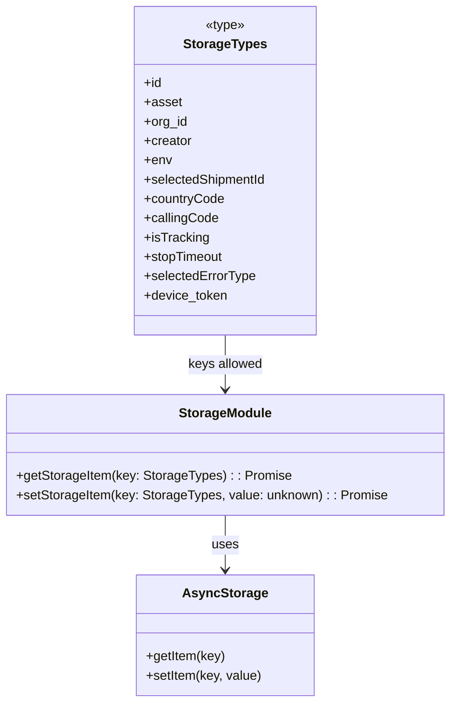

# Diagram: mobile/FreightVerifyMobileTracking/src/utils/storage.ts

> Auto-generated by Obscura crawlers

## Mermaid

### SVG

<svg id="container" width="551.5078125" xmlns="http://www.w3.org/2000/svg" class="classDiagram" height="872" viewBox="0 0 551.5078125 872" role="graphics-document document" aria-roledescription="class"><g><defs><marker id="container_class-aggregationStart" class="marker aggregation class" refX="18" refY="7" markerWidth="190" markerHeight="240" orient="auto"><path d="M 18,7 L9,13 L1,7 L9,1 Z"></path></marker></defs><defs><marker id="container_class-aggregationEnd" class="marker aggregation class" refX="1" refY="7" markerWidth="20" markerHeight="28" orient="auto"><path d="M 18,7 L9,13 L1,7 L9,1 Z"></path></marker></defs><defs><marker id="container_class-extensionStart" class="marker extension class" refX="18" refY="7" markerWidth="190" markerHeight="240" orient="auto"><path d="M 1,7 L18,13 V 1 Z"></path></marker></defs><defs><marker id="container_class-extensionEnd" class="marker extension class" refX="1" refY="7" markerWidth="20" markerHeight="28" orient="auto"><path d="M 1,1 V 13 L18,7 Z"></path></marker></defs><defs><marker id="container_class-compositionStart" class="marker composition class" refX="18" refY="7" markerWidth="190" markerHeight="240" orient="auto"><path d="M 18,7 L9,13 L1,7 L9,1 Z"></path></marker></defs><defs><marker id="container_class-compositionEnd" class="marker composition class" refX="1" refY="7" markerWidth="20" markerHeight="28" orient="auto"><path d="M 18,7 L9,13 L1,7 L9,1 Z"></path></marker></defs><defs><marker id="container_class-dependencyStart" class="marker dependency class" refX="6" refY="7" markerWidth="190" markerHeight="240" orient="auto"><path d="M 5,7 L9,13 L1,7 L9,1 Z"></path></marker></defs><defs><marker id="container_class-dependencyEnd" class="marker dependency class" refX="13" refY="7" markerWidth="20" markerHeight="28" orient="auto"><path d="M 18,7 L9,13 L14,7 L9,1 Z"></path></marker></defs><defs><marker id="container_class-lollipopStart" class="marker lollipop class" refX="13" refY="7" markerWidth="190" markerHeight="240" orient="auto"><circle stroke="black" fill="transparent" cx="7" cy="7" r="6"></circle></marker></defs><defs><marker id="container_class-lollipopEnd" class="marker lollipop class" refX="1" refY="7" markerWidth="190" markerHeight="240" orient="auto"><circle stroke="black" fill="transparent" cx="7" cy="7" r="6"></circle></marker></defs><g class="root"><g class="clusters"></g><g class="edgePaths"><path d="M275.754,640L275.754,646.167C275.754,652.333,275.754,664.667,275.754,676C275.754,687.333,275.754,697.667,275.754,702.833L275.754,708" id="id_StorageModule_AsyncStorage_1" class="edge-thickness-normal edge-pattern-solid relation" style=";;;" data-edge="true" data-et="edge" data-id="id_StorageModule_AsyncStorage_1" data-points="W3sieCI6Mjc1Ljc1MzkwNjI1LCJ5Ijo2NDB9LHsieCI6Mjc1Ljc1MzkwNjI1LCJ5Ijo2Nzd9LHsieCI6Mjc1Ljc1MzkwNjI1LCJ5Ijo3MTR9XQ==" marker-end="url(#container_class-dependencyEnd)"></path><path d="M275.754,416L275.754,422.167C275.754,428.333,275.754,440.667,275.754,452C275.754,463.333,275.754,473.667,275.754,478.833L275.754,484" id="id_StorageTypes_StorageModule_2" class="edge-thickness-normal edge-pattern-solid relation" style=";;;" data-edge="true" data-et="edge" data-id="id_StorageTypes_StorageModule_2" data-points="W3sieCI6Mjc1Ljc1MzkwNjI1LCJ5Ijo0MTZ9LHsieCI6Mjc1Ljc1MzkwNjI1LCJ5Ijo0NTN9LHsieCI6Mjc1Ljc1MzkwNjI1LCJ5Ijo0OTB9XQ==" marker-end="url(#container_class-dependencyEnd)"></path></g><g class="edgeLabels"><g class="edgeLabel" transform="translate(275.75390625, 677)"><g class="label" data-id="id_StorageModule_AsyncStorage_1" transform="translate(-16.4921875, -12)"><foreignObject width="32.984375" height="24">

uses

</foreignObject></g></g><g class="edgeLabel" transform="translate(275.75390625, 453)"><g class="label" data-id="id_StorageTypes_StorageModule_2" transform="translate(-46.5625, -12)"><foreignObject width="93.125" height="24">

keys allowed

</foreignObject></g></g></g><g class="nodes"><g class="node default" id="classId-AsyncStorage-0" transform="translate(275.75390625, 789)"><g class="basic label-container"><path d="M-108.50390625 -75 L108.50390625 -75 L108.50390625 75 L-108.50390625 75" stroke="none" stroke-width="0" fill="#ECECFF" style=""></path><path d="M-108.50390625 -75 C-28.110438662341437 -75, 52.283028925317126 -75, 108.50390625 -75 M-108.50390625 -75 C-53.68196774228517 -75, 1.1399707654296662 -75, 108.50390625 -75 M108.50390625 -75 C108.50390625 -27.607894015184378, 108.50390625 19.784211969631244, 108.50390625 75 M108.50390625 -75 C108.50390625 -18.944378096049476, 108.50390625 37.11124380790105, 108.50390625 75 M108.50390625 75 C48.41064100973433 75, -11.682624230531346 75, -108.50390625 75 M108.50390625 75 C54.44598082927016 75, 0.3880554085403247 75, -108.50390625 75 M-108.50390625 75 C-108.50390625 23.163597719175037, -108.50390625 -28.672804561649926, -108.50390625 -75 M-108.50390625 75 C-108.50390625 18.57981199973551, -108.50390625 -37.84037600052898, -108.50390625 -75" stroke="#9370DB" stroke-width="1.3" fill="none" stroke-dasharray="0 0" style=""></path></g><g class="annotation-group text" transform="translate(0, -51)"></g><g class="label-group text" transform="translate(-49.1015625, -51)"><g class="label" style="font-weight: bolder" transform="translate(0,-12)"><foreignObject width="98.203125" height="24">

AsyncStorage

</foreignObject></g></g><g class="members-group text" transform="translate(-96.50390625, -3)"></g><g class="methods-group text" transform="translate(-96.50390625, 27)"><g class="label" style="" transform="translate(0,-12)"><foreignObject width="98.1875" height="24">

+getItem(key)

</foreignObject></g><g class="label" style="" transform="translate(0,12)"><foreignObject width="143.90625" height="24">

+setItem(key, value)

</foreignObject></g></g><g class="divider" style=""><path d="M-108.50390625 -27 C-32.7980705643639 -27, 42.907765121272206 -27, 108.50390625 -27 M-108.50390625 -27 C-44.17486744470189 -27, 20.154171360596223 -27, 108.50390625 -27" stroke="#9370DB" stroke-width="1.3" fill="none" stroke-dasharray="0 0" style=""></path></g><g class="divider" style=""><path d="M-108.50390625 -3 C-40.56280107140378 -3, 27.378304107192434 -3, 108.50390625 -3 M-108.50390625 -3 C-56.40019847921179 -3, -4.296490708423576 -3, 108.50390625 -3" stroke="#9370DB" stroke-width="1.3" fill="none" stroke-dasharray="0 0" style=""></path></g></g><g class="node default" id="classId-StorageTypes-1" transform="translate(275.75390625, 212)"><g class="basic label-container"><path d="M-113.12109375 -204 L113.12109375 -204 L113.12109375 204 L-113.12109375 204" stroke="none" stroke-width="0" fill="#ECECFF" style=""></path><path d="M-113.12109375 -204 C-59.87883741978519 -204, -6.6365810895703845 -204, 113.12109375 -204 M-113.12109375 -204 C-40.60425402711421 -204, 31.912585695771583 -204, 113.12109375 -204 M113.12109375 -204 C113.12109375 -111.69014533053749, 113.12109375 -19.38029066107498, 113.12109375 204 M113.12109375 -204 C113.12109375 -121.3827828786129, 113.12109375 -38.7655657572258, 113.12109375 204 M113.12109375 204 C37.1023573345623 204, -38.9163790808754 204, -113.12109375 204 M113.12109375 204 C30.225497143899915 204, -52.67009946220017 204, -113.12109375 204 M-113.12109375 204 C-113.12109375 98.60553366917705, -113.12109375 -6.788932661645902, -113.12109375 -204 M-113.12109375 204 C-113.12109375 112.57377205593289, -113.12109375 21.147544111865784, -113.12109375 -204" stroke="#9370DB" stroke-width="1.3" fill="none" stroke-dasharray="0 0" style=""></path></g><g class="annotation-group text" transform="translate(-24.8671875, -180)"><g class="label" style="" transform="translate(0,-12)"><foreignObject width="49.734375" height="24">

«type»

</foreignObject></g></g><g class="label-group text" transform="translate(-49.2734375, -156)"><g class="label" style="font-weight: bolder" transform="translate(0,-12)"><foreignObject width="98.546875" height="24">

StorageTypes

</foreignObject></g></g><g class="members-group text" transform="translate(-101.12109375, -108)"><g class="label" style="" transform="translate(0,-12)"><foreignObject width="22.078125" height="24">

+id

</foreignObject></g><g class="label" style="" transform="translate(0,12)"><foreignObject width="45.578125" height="24">

+asset

</foreignObject></g><g class="label" style="" transform="translate(0,36)"><foreignObject width="54.0625" height="24">

+org_id

</foreignObject></g><g class="label" style="" transform="translate(0,60)"><foreignObject width="59.65625" height="24">

+creator

</foreignObject></g><g class="label" style="" transform="translate(0,84)"><foreignObject width="33.84375" height="24">

+env

</foreignObject></g><g class="label" style="" transform="translate(0,108)"><foreignObject width="152.96875" height="24">

+selectedShipmentId

</foreignObject></g><g class="label" style="" transform="translate(0,132)"><foreignObject width="99.453125" height="24">

+countryCode

</foreignObject></g><g class="label" style="" transform="translate(0,156)"><foreignObject width="91.875" height="24">

+callingCode

</foreignObject></g><g class="label" style="" transform="translate(0,180)"><foreignObject width="80.140625" height="24">

+isTracking

</foreignObject></g><g class="label" style="" transform="translate(0,204)"><foreignObject width="99.5" height="24">

+stopTimeout

</foreignObject></g><g class="label" style="" transform="translate(0,228)"><foreignObject width="138.5" height="24">

+selectedErrorType

</foreignObject></g><g class="label" style="" transform="translate(0,252)"><foreignObject width="103.359375" height="24">

+device_token

</foreignObject></g></g><g class="methods-group text" transform="translate(-101.12109375, 204)"></g><g class="divider" style=""><path d="M-113.12109375 -132 C-43.04103931839532 -132, 27.03901511320936 -132, 113.12109375 -132 M-113.12109375 -132 C-32.65019775417856 -132, 47.82069824164287 -132, 113.12109375 -132" stroke="#9370DB" stroke-width="1.3" fill="none" stroke-dasharray="0 0" style=""></path></g><g class="divider" style=""><path d="M-113.12109375 180 C-32.95216031844987 180, 47.21677311310026 180, 113.12109375 180 M-113.12109375 180 C-51.985080360056855 180, 9.15093302988629 180, 113.12109375 180" stroke="#9370DB" stroke-width="1.3" fill="none" stroke-dasharray="0 0" style=""></path></g></g><g class="node default" id="classId-StorageModule-2" transform="translate(275.75390625, 565)"><g class="basic label-container"><path d="M-267.75390625 -75 L267.75390625 -75 L267.75390625 75 L-267.75390625 75" stroke="none" stroke-width="0" fill="#ECECFF" style=""></path><path d="M-267.75390625 -75 C-114.70772212585848 -75, 38.33846199828304 -75, 267.75390625 -75 M-267.75390625 -75 C-108.04121957616476 -75, 51.67146709767047 -75, 267.75390625 -75 M267.75390625 -75 C267.75390625 -44.895621185020815, 267.75390625 -14.791242370041623, 267.75390625 75 M267.75390625 -75 C267.75390625 -28.904214669023467, 267.75390625 17.191570661953065, 267.75390625 75 M267.75390625 75 C106.24943979966136 75, -55.25502665067728 75, -267.75390625 75 M267.75390625 75 C120.37717972036054 75, -26.99954680927891 75, -267.75390625 75 M-267.75390625 75 C-267.75390625 24.048502328240737, -267.75390625 -26.902995343518526, -267.75390625 -75 M-267.75390625 75 C-267.75390625 33.89536621662513, -267.75390625 -7.209267566749745, -267.75390625 -75" stroke="#9370DB" stroke-width="1.3" fill="none" stroke-dasharray="0 0" style=""></path></g><g class="annotation-group text" transform="translate(0, -51)"></g><g class="label-group text" transform="translate(-55.1640625, -51)"><g class="label" style="font-weight: bolder" transform="translate(0,-12)"><foreignObject width="110.328125" height="24">

StorageModule

</foreignObject></g></g><g class="members-group text" transform="translate(-255.75390625, -3)"></g><g class="methods-group text" transform="translate(-255.75390625, 27)"><g class="label" style="" transform="translate(0,-12)"><foreignObject width="335.453125" height="24">

+getStorageItem(key: StorageTypes) : : Promise

</foreignObject></g><g class="label" style="" transform="translate(0,12)"><foreignObject width="456.34375" height="24">

+setStorageItem(key: StorageTypes, value: unknown) : : Promise

</foreignObject></g></g><g class="divider" style=""><path d="M-267.75390625 -27 C-140.75278966398542 -27, -13.751673077970821 -27, 267.75390625 -27 M-267.75390625 -27 C-127.46505489528087 -27, 12.823796459438256 -27, 267.75390625 -27" stroke="#9370DB" stroke-width="1.3" fill="none" stroke-dasharray="0 0" style=""></path></g><g class="divider" style=""><path d="M-267.75390625 -3 C-77.04837948744463 -3, 113.65714727511073 -3, 267.75390625 -3 M-267.75390625 -3 C-136.3658153049157 -3, -4.977724359831427 -3, 267.75390625 -3" stroke="#9370DB" stroke-width="1.3" fill="none" stroke-dasharray="0 0" style=""></path></g></g></g></g></g></svg>
