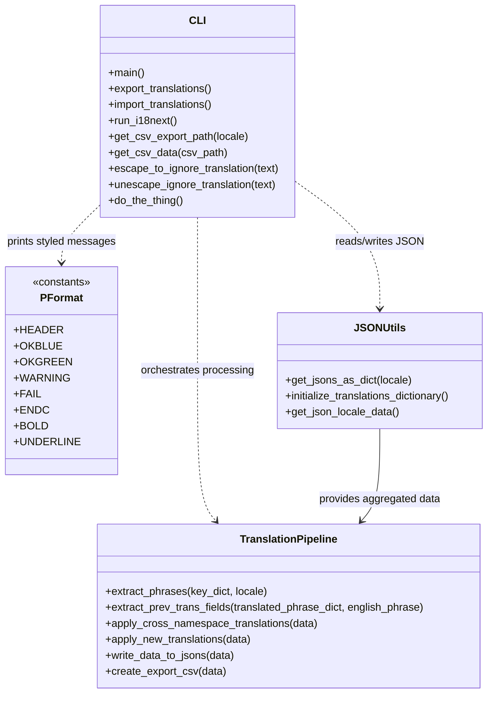

# Diagram: web/portal/i18n_helper.py


> Auto-generated by Obscura crawlers

## Diagram 1

```mermaid
flowchart LR
    Main[main()] --> CondExport{args.is_export?}
    CondExport -- yes --> Export[export_translations()]
    CondExport -- no --> CondImport{args.is_import?}
    CondImport -- yes --> Import[import_translations()]
    CondImport -- no --> Help[Please specify import or export]

    Export --> RunI[run_i18next()]
    RunI --> Gather[get_json_locale_data()]
    Gather --> ApplyX[apply_cross_namespace_translations()]
    ApplyX --> CreateCSV[create_export_csv()]
    CreateCSV --> DoneExport[Export Complete & do_the_thing()]

    Import --> Gather
    ApplyX --> ApplyNew[apply_new_translations()]
    ApplyNew --> WriteJSON[write_data_to_jsons()]
    WriteJSON --> DoneImport[Import Complete & do_the_thing()]

    Gather --> GetJsons[get_jsons_as_dict(locale) for each locale]
    GetJsons --> ReadBase[Read base (en) JSON files]
    ReadBase --> BuildData[Build aggregated namespace->keys->translations data]
```

> SVG rendering failed for this diagram.

## Diagram 2



### SVG

<svg id="container" width="734.39453125" xmlns="http://www.w3.org/2000/svg" class="classDiagram" height="1040" viewBox="0 0 734.39453125 1040" role="graphics-document document" aria-roledescription="class"><style>#container{font-family:"trebuchet ms",verdana,arial,sans-serif;font-size:16px;fill:#333;}@keyframes edge-animation-frame{from{stroke-dashoffset:0;}}@keyframes dash{to{stroke-dashoffset:0;}}#container .edge-animation-slow{stroke-dasharray:9,5!important;stroke-dashoffset:900;animation:dash 50s linear infinite;stroke-linecap:round;}#container .edge-animation-fast{stroke-dasharray:9,5!important;stroke-dashoffset:900;animation:dash 20s linear infinite;stroke-linecap:round;}#container .error-icon{fill:#552222;}#container .error-text{fill:#552222;stroke:#552222;}#container .edge-thickness-normal{stroke-width:1px;}#container .edge-thickness-thick{stroke-width:3.5px;}#container .edge-pattern-solid{stroke-dasharray:0;}#container .edge-thickness-invisible{stroke-width:0;fill:none;}#container .edge-pattern-dashed{stroke-dasharray:3;}#container .edge-pattern-dotted{stroke-dasharray:2;}#container .marker{fill:#333333;stroke:#333333;}#container .marker.cross{stroke:#333333;}#container svg{font-family:"trebuchet ms",verdana,arial,sans-serif;font-size:16px;}#container p{margin:0;}#container g.classGroup text{fill:#9370DB;stroke:none;font-family:"trebuchet ms",verdana,arial,sans-serif;font-size:10px;}#container g.classGroup text .title{font-weight:bolder;}#container .nodeLabel,#container .edgeLabel{color:#131300;}#container .edgeLabel .label rect{fill:#ECECFF;}#container .label text{fill:#131300;}#container .labelBkg{background:#ECECFF;}#container .edgeLabel .label span{background:#ECECFF;}#container .classTitle{font-weight:bolder;}#container .node rect,#container .node circle,#container .node ellipse,#container .node polygon,#container .node path{fill:#ECECFF;stroke:#9370DB;stroke-width:1px;}#container .divider{stroke:#9370DB;stroke-width:1;}#container g.clickable{cursor:pointer;}#container g.classGroup rect{fill:#ECECFF;stroke:#9370DB;}#container g.classGroup line{stroke:#9370DB;stroke-width:1;}#container .classLabel .box{stroke:none;stroke-width:0;fill:#ECECFF;opacity:0.5;}#container .classLabel .label{fill:#9370DB;font-size:10px;}#container .relation{stroke:#333333;stroke-width:1;fill:none;}#container .dashed-line{stroke-dasharray:3;}#container .dotted-line{stroke-dasharray:1 2;}#container #compositionStart,#container .composition{fill:#333333!important;stroke:#333333!important;stroke-width:1;}#container #compositionEnd,#container .composition{fill:#333333!important;stroke:#333333!important;stroke-width:1;}#container #dependencyStart,#container .dependency{fill:#333333!important;stroke:#333333!important;stroke-width:1;}#container #dependencyStart,#container .dependency{fill:#333333!important;stroke:#333333!important;stroke-width:1;}#container #extensionStart,#container .extension{fill:transparent!important;stroke:#333333!important;stroke-width:1;}#container #extensionEnd,#container .extension{fill:transparent!important;stroke:#333333!important;stroke-width:1;}#container #aggregationStart,#container .aggregation{fill:transparent!important;stroke:#333333!important;stroke-width:1;}#container #aggregationEnd,#container .aggregation{fill:transparent!important;stroke:#333333!important;stroke-width:1;}#container #lollipopStart,#container .lollipop{fill:#ECECFF!important;stroke:#333333!important;stroke-width:1;}#container #lollipopEnd,#container .lollipop{fill:#ECECFF!important;stroke:#333333!important;stroke-width:1;}#container .edgeTerminals{font-size:11px;line-height:initial;}#container .classTitleText{text-anchor:middle;font-size:18px;fill:#333;}#container .label-icon{display:inline-block;height:1em;overflow:visible;vertical-align:-0.125em;}#container .node .label-icon path{fill:currentColor;stroke:revert;stroke-width:revert;}#container :root{--mermaid-font-family:"trebuchet ms",verdana,arial,sans-serif;}</style><g><defs><marker id="container_class-aggregationStart" class="marker aggregation class" refX="18" refY="7" markerWidth="190" markerHeight="240" orient="auto"><path d="M 18,7 L9,13 L1,7 L9,1 Z"></path></marker></defs><defs><marker id="container_class-aggregationEnd" class="marker aggregation class" refX="1" refY="7" markerWidth="20" markerHeight="28" orient="auto"><path d="M 18,7 L9,13 L1,7 L9,1 Z"></path></marker></defs><defs><marker id="container_class-extensionStart" class="marker extension class" refX="18" refY="7" markerWidth="190" markerHeight="240" orient="auto"><path d="M 1,7 L18,13 V 1 Z"></path></marker></defs><defs><marker id="container_class-extensionEnd" class="marker extension class" refX="1" refY="7" markerWidth="20" markerHeight="28" orient="auto"><path d="M 1,1 V 13 L18,7 Z"></path></marker></defs><defs><marker id="container_class-compositionStart" class="marker composition class" refX="18" refY="7" markerWidth="190" markerHeight="240" orient="auto"><path d="M 18,7 L9,13 L1,7 L9,1 Z"></path></marker></defs><defs><marker id="container_class-compositionEnd" class="marker composition class" refX="1" refY="7" markerWidth="20" markerHeight="28" orient="auto"><path d="M 18,7 L9,13 L1,7 L9,1 Z"></path></marker></defs><defs><marker id="container_class-dependencyStart" class="marker dependency class" refX="6" refY="7" markerWidth="190" markerHeight="240" orient="auto"><path d="M 5,7 L9,13 L1,7 L9,1 Z"></path></marker></defs><defs><marker id="container_class-dependencyEnd" class="marker dependency class" refX="13" refY="7" markerWidth="20" markerHeight="28" orient="auto"><path d="M 18,7 L9,13 L14,7 L9,1 Z"></path></marker></defs><defs><marker id="container_class-lollipopStart" class="marker lollipop class" refX="13" refY="7" markerWidth="190" markerHeight="240" orient="auto"><circle stroke="black" fill="transparent" cx="7" cy="7" r="6"></circle></marker></defs><defs><marker id="container_class-lollipopEnd" class="marker lollipop class" refX="1" refY="7" markerWidth="190" markerHeight="240" orient="auto"><circle stroke="black" fill="transparent" cx="7" cy="7" r="6"></circle></marker></defs><g class="root"><g class="clusters"></g><g class="edgePaths"><path d="M438.305,270.93L460.094,286.275C481.883,301.62,525.461,332.31,547.25,364.322C569.039,396.333,569.039,429.667,569.039,446.333L569.039,463" id="id_CLI_JSONUtils_1" class="edge-thickness-normal edge-pattern-dashed relation" style=";;;" data-edge="true" data-et="edge" data-id="id_CLI_JSONUtils_1" data-points="W3sieCI6NDM4LjMwNDY4NzUsInkiOjI3MC45Mjk3NjU0NjM4MDl9LHsieCI6NTY5LjAzOTA2MjUsInkiOjM2M30seyJ4Ijo1NjkuMDM5MDYyNSwieSI6NDY5fV0=" marker-end="url(#container_class-dependencyEnd)"></path><path d="M290.73,326L290.73,332.167C290.73,338.333,290.73,350.667,290.73,389C290.73,427.333,290.73,491.667,290.73,556C290.73,620.333,290.73,684.667,295.437,722.245C300.144,759.824,309.558,770.648,314.265,776.061L318.972,781.473" id="id_CLI_TranslationPipeline_2" class="edge-thickness-normal edge-pattern-dashed relation" style=";;;" data-edge="true" data-et="edge" data-id="id_CLI_TranslationPipeline_2" data-points="W3sieCI6MjkwLjczMDQ2ODc1LCJ5IjozMjZ9LHsieCI6MjkwLjczMDQ2ODc1LCJ5IjozNjN9LHsieCI6MjkwLjczMDQ2ODc1LCJ5Ijo1NTZ9LHsieCI6MjkwLjczMDQ2ODc1LCJ5Ijo3NDl9LHsieCI6MzIyLjkwOTg5OTkwMjM0Mzc0LCJ5Ijo3ODZ9XQ==" marker-end="url(#container_class-dependencyEnd)"></path><path d="M143.156,311.49L134.388,320.075C125.62,328.66,108.083,345.83,99.315,359.582C90.547,373.333,90.547,383.667,90.547,388.833L90.547,394" id="id_CLI_PFormat_3" class="edge-thickness-normal edge-pattern-dashed relation" style=";;;" data-edge="true" data-et="edge" data-id="id_CLI_PFormat_3" data-points="W3sieCI6MTQzLjE1NjI1LCJ5IjozMTEuNDkwMDk2OTgxMjg2N30seyJ4Ijo5MC41NDY4NzUsInkiOjM2M30seyJ4Ijo5MC41NDY4NzUsInkiOjQwMH1d" marker-end="url(#container_class-dependencyEnd)"></path><path d="M569.039,643L569.039,660.667C569.039,678.333,569.039,713.667,564.332,736.745C559.625,759.824,550.211,770.648,545.504,776.061L540.797,781.473" id="id_JSONUtils_TranslationPipeline_4" class="edge-thickness-normal edge-pattern-solid relation" style=";;;" data-edge="true" data-et="edge" data-id="id_JSONUtils_TranslationPipeline_4" data-points="W3sieCI6NTY5LjAzOTA2MjUsInkiOjY0M30seyJ4Ijo1NjkuMDM5MDYyNSwieSI6NzQ5fSx7IngiOjUzNi44NTk2MzEzNDc2NTYyLCJ5Ijo3ODZ9XQ==" marker-end="url(#container_class-dependencyEnd)"></path></g><g class="edgeLabels"><g class="edgeLabel" transform="translate(569.0390625, 363)"><g class="label" data-id="id_CLI_JSONUtils_1" transform="translate(-65.8671875, -12)"><foreignObject width="131.734375" height="24"><div xmlns="http://www.w3.org/1999/xhtml" class="labelBkg" style="display: table-cell; white-space: nowrap; line-height: 1.5; max-width: 200px; text-align: center;"><span class="edgeLabel"><p>reads/writes JSON</p></span></div></foreignObject></g></g><g class="edgeLabel" transform="translate(290.73046875, 556)"><g class="label" data-id="id_CLI_TranslationPipeline_2" transform="translate(-85.953125, -12)"><foreignObject width="171.90625" height="24"><div xmlns="http://www.w3.org/1999/xhtml" class="labelBkg" style="display: table-cell; white-space: nowrap; line-height: 1.5; max-width: 200px; text-align: center;"><span class="edgeLabel"><p>orchestrates processing</p></span></div></foreignObject></g></g><g class="edgeLabel" transform="translate(90.546875, 363)"><g class="label" data-id="id_CLI_PFormat_3" transform="translate(-82.546875, -12)"><foreignObject width="165.09375" height="24"><div xmlns="http://www.w3.org/1999/xhtml" class="labelBkg" style="display: table-cell; white-space: nowrap; line-height: 1.5; max-width: 200px; text-align: center;"><span class="edgeLabel"><p>prints styled messages</p></span></div></foreignObject></g></g><g class="edgeLabel" transform="translate(569.0390625, 749)"><g class="label" data-id="id_JSONUtils_TranslationPipeline_4" transform="translate(-91.9453125, -12)"><foreignObject width="183.890625" height="24"><div xmlns="http://www.w3.org/1999/xhtml" class="labelBkg" style="display: table-cell; white-space: nowrap; line-height: 1.5; max-width: 200px; text-align: center;"><span class="edgeLabel"><p>provides aggregated data</p></span></div></foreignObject></g></g></g><g class="nodes"><g class="node default" id="classId-PFormat-0" transform="translate(90.546875, 556)"><g class="basic label-container"><path d="M-79.23046875 -156 L79.23046875 -156 L79.23046875 156 L-79.23046875 156" stroke="none" stroke-width="0" fill="#ECECFF" style=""></path><path d="M-79.23046875 -156 C-20.134364599433127 -156, 38.961739551133746 -156, 79.23046875 -156 M-79.23046875 -156 C-26.411028754780155 -156, 26.40841124043969 -156, 79.23046875 -156 M79.23046875 -156 C79.23046875 -76.39880600179325, 79.23046875 3.2023879964135062, 79.23046875 156 M79.23046875 -156 C79.23046875 -40.66353957900189, 79.23046875 74.67292084199622, 79.23046875 156 M79.23046875 156 C16.104003893527548 156, -47.022460962944905 156, -79.23046875 156 M79.23046875 156 C32.27421659476453 156, -14.682035560470936 156, -79.23046875 156 M-79.23046875 156 C-79.23046875 37.41388664146983, -79.23046875 -81.17222671706034, -79.23046875 -156 M-79.23046875 156 C-79.23046875 57.58820017299428, -79.23046875 -40.823599654011446, -79.23046875 -156" stroke="#9370DB" stroke-width="1.3" fill="none" stroke-dasharray="0 0" style=""></path></g><g class="annotation-group text" transform="translate(-44.2265625, -132)"><g class="label" style="" transform="translate(0,-12)"><foreignObject width="88.453125" height="24"><div xmlns="http://www.w3.org/1999/xhtml" style="display: table-cell; white-space: nowrap; line-height: 1.5; max-width: 138px; text-align: center;"><span class="nodeLabel markdown-node-label" style=""><p>«constants»</p></span></div></foreignObject></g></g><g class="label-group text" transform="translate(-30.53125, -108)"><g class="label" style="font-weight: bolder" transform="translate(0,-12)"><foreignObject width="61.0625" height="24"><div xmlns="http://www.w3.org/1999/xhtml" style="display: table-cell; white-space: nowrap; line-height: 1.5; max-width: 111px; text-align: center;"><span class="nodeLabel markdown-node-label" style=""><p>PFormat</p></span></div></foreignObject></g></g><g class="members-group text" transform="translate(-67.23046875, -60)"><g class="label" style="" transform="translate(0,-12)"><foreignObject width="65.140625" height="24"><div xmlns="http://www.w3.org/1999/xhtml" style="display: table-cell; white-space: nowrap; line-height: 1.5; max-width: 123px; text-align: center;"><span class="nodeLabel markdown-node-label" style=""><p>+HEADER</p></span></div></foreignObject></g><g class="label" style="" transform="translate(0,12)"><foreignObject width="64.9375" height="24"><div xmlns="http://www.w3.org/1999/xhtml" style="display: table-cell; white-space: nowrap; line-height: 1.5; max-width: 122px; text-align: center;"><span class="nodeLabel markdown-node-label" style=""><p>+OKBLUE</p></span></div></foreignObject></g><g class="label" style="" transform="translate(0,36)"><foreignObject width="76.09375" height="24"><div xmlns="http://www.w3.org/1999/xhtml" style="display: table-cell; white-space: nowrap; line-height: 1.5; max-width: 133px; text-align: center;"><span class="nodeLabel markdown-node-label" style=""><p>+OKGREEN</p></span></div></foreignObject></g><g class="label" style="" transform="translate(0,60)"><foreignObject width="76.734375" height="24"><div xmlns="http://www.w3.org/1999/xhtml" style="display: table-cell; white-space: nowrap; line-height: 1.5; max-width: 134px; text-align: center;"><span class="nodeLabel markdown-node-label" style=""><p>+WARNING</p></span></div></foreignObject></g><g class="label" style="" transform="translate(0,84)"><foreignObject width="36.90625" height="24"><div xmlns="http://www.w3.org/1999/xhtml" style="display: table-cell; white-space: nowrap; line-height: 1.5; max-width: 94px; text-align: center;"><span class="nodeLabel markdown-node-label" style=""><p>+FAIL</p></span></div></foreignObject></g><g class="label" style="" transform="translate(0,108)"><foreignObject width="46.75" height="24"><div xmlns="http://www.w3.org/1999/xhtml" style="display: table-cell; white-space: nowrap; line-height: 1.5; max-width: 104px; text-align: center;"><span class="nodeLabel markdown-node-label" style=""><p>+ENDC</p></span></div></foreignObject></g><g class="label" style="" transform="translate(0,132)"><foreignObject width="47.0625" height="24"><div xmlns="http://www.w3.org/1999/xhtml" style="display: table-cell; white-space: nowrap; line-height: 1.5; max-width: 104px; text-align: center;"><span class="nodeLabel markdown-node-label" style=""><p>+BOLD</p></span></div></foreignObject></g><g class="label" style="" transform="translate(0,156)"><foreignObject width="90.234375" height="24"><div xmlns="http://www.w3.org/1999/xhtml" style="display: table-cell; white-space: nowrap; line-height: 1.5; max-width: 148px; text-align: center;"><span class="nodeLabel markdown-node-label" style=""><p>+UNDERLINE</p></span></div></foreignObject></g></g><g class="methods-group text" transform="translate(-67.23046875, 156)"></g><g class="divider" style=""><path d="M-79.23046875 -84 C-27.232827021828733 -84, 24.764814706342534 -84, 79.23046875 -84 M-79.23046875 -84 C-47.464578130736015 -84, -15.698687511472038 -84, 79.23046875 -84" stroke="#9370DB" stroke-width="1.3" fill="none" stroke-dasharray="0 0" style=""></path></g><g class="divider" style=""><path d="M-79.23046875 132 C-34.29261973814072 132, 10.645229273718556 132, 79.23046875 132 M-79.23046875 132 C-25.20758634099237 132, 28.815296068015257 132, 79.23046875 132" stroke="#9370DB" stroke-width="1.3" fill="none" stroke-dasharray="0 0" style=""></path></g></g><g class="node default" id="classId-JSONUtils-1" transform="translate(569.0390625, 556)"><g class="basic label-container"><path d="M-157.35546875 -87 L157.35546875 -87 L157.35546875 87 L-157.35546875 87" stroke="none" stroke-width="0" fill="#ECECFF" style=""></path><path d="M-157.35546875 -87 C-36.90667530663403 -87, 83.54211813673194 -87, 157.35546875 -87 M-157.35546875 -87 C-35.89951446548291 -87, 85.55643981903418 -87, 157.35546875 -87 M157.35546875 -87 C157.35546875 -22.966014546911595, 157.35546875 41.06797090617681, 157.35546875 87 M157.35546875 -87 C157.35546875 -35.37235010516872, 157.35546875 16.25529978966256, 157.35546875 87 M157.35546875 87 C41.666650469462994 87, -74.02216781107401 87, -157.35546875 87 M157.35546875 87 C39.08555336217606 87, -79.18436202564789 87, -157.35546875 87 M-157.35546875 87 C-157.35546875 18.482225178221924, -157.35546875 -50.03554964355615, -157.35546875 -87 M-157.35546875 87 C-157.35546875 45.89585680980697, -157.35546875 4.791713619613944, -157.35546875 -87" stroke="#9370DB" stroke-width="1.3" fill="none" stroke-dasharray="0 0" style=""></path></g><g class="annotation-group text" transform="translate(0, -63)"></g><g class="label-group text" transform="translate(-34.7421875, -63)"><g class="label" style="font-weight: bolder" transform="translate(0,-12)"><foreignObject width="69.484375" height="24"><div xmlns="http://www.w3.org/1999/xhtml" style="display: table-cell; white-space: nowrap; line-height: 1.5; max-width: 119px; text-align: center;"><span class="nodeLabel markdown-node-label" style=""><p>JSONUtils</p></span></div></foreignObject></g></g><g class="members-group text" transform="translate(-145.35546875, -15)"></g><g class="methods-group text" transform="translate(-145.35546875, 15)"><g class="label" style="" transform="translate(0,-12)"><foreignObject width="190.15625" height="24"><div xmlns="http://www.w3.org/1999/xhtml" style="display: table-cell; white-space: nowrap; line-height: 1.5; max-width: 248px; text-align: center;"><span class="nodeLabel markdown-node-label" style=""><p>+get_jsons_as_dict(locale)</p></span></div></foreignObject></g><g class="label" style="" transform="translate(0,12)"><foreignObject width="255.96875" height="24"><div xmlns="http://www.w3.org/1999/xhtml" style="display: table-cell; white-space: nowrap; line-height: 1.5; max-width: 313px; text-align: center;"><span class="nodeLabel markdown-node-label" style=""><p>+initialize_translations_dictionary()</p></span></div></foreignObject></g><g class="label" style="" transform="translate(0,36)"><foreignObject width="172.28125" height="24"><div xmlns="http://www.w3.org/1999/xhtml" style="display: table-cell; white-space: nowrap; line-height: 1.5; max-width: 230px; text-align: center;"><span class="nodeLabel markdown-node-label" style=""><p>+get_json_locale_data()</p></span></div></foreignObject></g></g><g class="divider" style=""><path d="M-157.35546875 -39 C-82.06013824397004 -39, -6.764807737940089 -39, 157.35546875 -39 M-157.35546875 -39 C-40.63309604606178 -39, 76.08927665787644 -39, 157.35546875 -39" stroke="#9370DB" stroke-width="1.3" fill="none" stroke-dasharray="0 0" style=""></path></g><g class="divider" style=""><path d="M-157.35546875 -15 C-83.31659060117867 -15, -9.277712452357349 -15, 157.35546875 -15 M-157.35546875 -15 C-80.42247542024731 -15, -3.4894820904946187 -15, 157.35546875 -15" stroke="#9370DB" stroke-width="1.3" fill="none" stroke-dasharray="0 0" style=""></path></g></g><g class="node default" id="classId-TranslationPipeline-2" transform="translate(429.884765625, 909)"><g class="basic label-container"><path d="M-290.046875 -123 L290.046875 -123 L290.046875 123 L-290.046875 123" stroke="none" stroke-width="0" fill="#ECECFF" style=""></path><path d="M-290.046875 -123 C-159.7316226226976 -123, -29.41637024539523 -123, 290.046875 -123 M-290.046875 -123 C-142.23452688871845 -123, 5.577821222563102 -123, 290.046875 -123 M290.046875 -123 C290.046875 -61.56292899660754, 290.046875 -0.12585799321507807, 290.046875 123 M290.046875 -123 C290.046875 -40.5402178838594, 290.046875 41.9195642322812, 290.046875 123 M290.046875 123 C61.4413856408178 123, -167.1641037183644 123, -290.046875 123 M290.046875 123 C99.38405221806403 123, -91.27877056387194 123, -290.046875 123 M-290.046875 123 C-290.046875 51.390239412106254, -290.046875 -20.21952117578749, -290.046875 -123 M-290.046875 123 C-290.046875 37.79867738006139, -290.046875 -47.40264523987722, -290.046875 -123" stroke="#9370DB" stroke-width="1.3" fill="none" stroke-dasharray="0 0" style=""></path></g><g class="annotation-group text" transform="translate(0, -99)"></g><g class="label-group text" transform="translate(-71.140625, -99)"><g class="label" style="font-weight: bolder" transform="translate(0,-12)"><foreignObject width="142.28125" height="24"><div xmlns="http://www.w3.org/1999/xhtml" style="display: table-cell; white-space: nowrap; line-height: 1.5; max-width: 191px; text-align: center;"><span class="nodeLabel markdown-node-label" style=""><p>TranslationPipeline</p></span></div></foreignObject></g></g><g class="members-group text" transform="translate(-278.046875, -51)"></g><g class="methods-group text" transform="translate(-278.046875, -21)"><g class="label" style="" transform="translate(0,-12)"><foreignObject width="244.296875" height="24"><div xmlns="http://www.w3.org/1999/xhtml" style="display: table-cell; white-space: nowrap; line-height: 1.5; max-width: 302px; text-align: center;"><span class="nodeLabel markdown-node-label" style=""><p>+extract_phrases(key_dict, locale)</p></span></div></foreignObject></g><g class="label" style="" transform="translate(0,12)"><foreignObject width="484.953125" height="24"><div xmlns="http://www.w3.org/1999/xhtml" style="display: table-cell; white-space: nowrap; line-height: 1.5; max-width: 542px; text-align: center;"><span class="nodeLabel markdown-node-label" style=""><p>+extract_prev_trans_fields(translated_phrase_dict, english_phrase)</p></span></div></foreignObject></g><g class="label" style="" transform="translate(0,36)"><foreignObject width="320.359375" height="24"><div xmlns="http://www.w3.org/1999/xhtml" style="display: table-cell; white-space: nowrap; line-height: 1.5; max-width: 378px; text-align: center;"><span class="nodeLabel markdown-node-label" style=""><p>+apply_cross_namespace_translations(data)</p></span></div></foreignObject></g><g class="label" style="" transform="translate(0,60)"><foreignObject width="222.703125" height="24"><div xmlns="http://www.w3.org/1999/xhtml" style="display: table-cell; white-space: nowrap; line-height: 1.5; max-width: 280px; text-align: center;"><span class="nodeLabel markdown-node-label" style=""><p>+apply_new_translations(data)</p></span></div></foreignObject></g><g class="label" style="" transform="translate(0,84)"><foreignObject width="197.34375" height="24"><div xmlns="http://www.w3.org/1999/xhtml" style="display: table-cell; white-space: nowrap; line-height: 1.5; max-width: 255px; text-align: center;"><span class="nodeLabel markdown-node-label" style=""><p>+write_data_to_jsons(data)</p></span></div></foreignObject></g><g class="label" style="" transform="translate(0,108)"><foreignObject width="181.40625" height="24"><div xmlns="http://www.w3.org/1999/xhtml" style="display: table-cell; white-space: nowrap; line-height: 1.5; max-width: 239px; text-align: center;"><span class="nodeLabel markdown-node-label" style=""><p>+create_export_csv(data)</p></span></div></foreignObject></g></g><g class="divider" style=""><path d="M-290.046875 -75 C-147.53912182325314 -75, -5.03136864650628 -75, 290.046875 -75 M-290.046875 -75 C-115.75531349429434 -75, 58.53624801141132 -75, 290.046875 -75" stroke="#9370DB" stroke-width="1.3" fill="none" stroke-dasharray="0 0" style=""></path></g><g class="divider" style=""><path d="M-290.046875 -51 C-118.09967822454729 -51, 53.84751855090542 -51, 290.046875 -51 M-290.046875 -51 C-120.54737935589404 -51, 48.952116288211926 -51, 290.046875 -51" stroke="#9370DB" stroke-width="1.3" fill="none" stroke-dasharray="0 0" style=""></path></g></g><g class="node default" id="classId-CLI-3" transform="translate(290.73046875, 167)"><g class="basic label-container"><path d="M-147.57421875 -159 L147.57421875 -159 L147.57421875 159 L-147.57421875 159" stroke="none" stroke-width="0" fill="#ECECFF" style=""></path><path d="M-147.57421875 -159 C-71.95084441635363 -159, 3.672529917292735 -159, 147.57421875 -159 M-147.57421875 -159 C-43.896941378608474 -159, 59.78033599278305 -159, 147.57421875 -159 M147.57421875 -159 C147.57421875 -90.49573190034913, 147.57421875 -21.991463800698256, 147.57421875 159 M147.57421875 -159 C147.57421875 -38.22567313586839, 147.57421875 82.54865372826322, 147.57421875 159 M147.57421875 159 C68.33919137081506 159, -10.895836008369884 159, -147.57421875 159 M147.57421875 159 C38.974927759557104 159, -69.62436323088579 159, -147.57421875 159 M-147.57421875 159 C-147.57421875 67.05195198569766, -147.57421875 -24.89609602860469, -147.57421875 -159 M-147.57421875 159 C-147.57421875 54.72462455875812, -147.57421875 -49.550750882483754, -147.57421875 -159" stroke="#9370DB" stroke-width="1.3" fill="none" stroke-dasharray="0 0" style=""></path></g><g class="annotation-group text" transform="translate(0, -135)"></g><g class="label-group text" transform="translate(-11.0546875, -135)"><g class="label" style="font-weight: bolder" transform="translate(0,-12)"><foreignObject width="22.109375" height="24"><div xmlns="http://www.w3.org/1999/xhtml" style="display: table-cell; white-space: nowrap; line-height: 1.5; max-width: 72px; text-align: center;"><span class="nodeLabel markdown-node-label" style=""><p>CLI</p></span></div></foreignObject></g></g><g class="members-group text" transform="translate(-135.57421875, -87)"></g><g class="methods-group text" transform="translate(-135.57421875, -57)"><g class="label" style="" transform="translate(0,-12)"><foreignObject width="54.65625" height="24"><div xmlns="http://www.w3.org/1999/xhtml" style="display: table-cell; white-space: nowrap; line-height: 1.5; max-width: 112px; text-align: center;"><span class="nodeLabel markdown-node-label" style=""><p>+main()</p></span></div></foreignObject></g><g class="label" style="" transform="translate(0,12)"><foreignObject width="160.234375" height="24"><div xmlns="http://www.w3.org/1999/xhtml" style="display: table-cell; white-space: nowrap; line-height: 1.5; max-width: 218px; text-align: center;"><span class="nodeLabel markdown-node-label" style=""><p>+export_translations()</p></span></div></foreignObject></g><g class="label" style="" transform="translate(0,36)"><foreignObject width="162.125" height="24"><div xmlns="http://www.w3.org/1999/xhtml" style="display: table-cell; white-space: nowrap; line-height: 1.5; max-width: 219px; text-align: center;"><span class="nodeLabel markdown-node-label" style=""><p>+import_translations()</p></span></div></foreignObject></g><g class="label" style="" transform="translate(0,60)"><foreignObject width="103.28125" height="24"><div xmlns="http://www.w3.org/1999/xhtml" style="display: table-cell; white-space: nowrap; line-height: 1.5; max-width: 161px; text-align: center;"><span class="nodeLabel markdown-node-label" style=""><p>+run_i18next()</p></span></div></foreignObject></g><g class="label" style="" transform="translate(0,84)"><foreignObject width="211.125" height="24"><div xmlns="http://www.w3.org/1999/xhtml" style="display: table-cell; white-space: nowrap; line-height: 1.5; max-width: 268px; text-align: center;"><span class="nodeLabel markdown-node-label" style=""><p>+get_csv_export_path(locale)</p></span></div></foreignObject></g><g class="label" style="" transform="translate(0,108)"><foreignObject width="175.5625" height="24"><div xmlns="http://www.w3.org/1999/xhtml" style="display: table-cell; white-space: nowrap; line-height: 1.5; max-width: 233px; text-align: center;"><span class="nodeLabel markdown-node-label" style=""><p>+get_csv_data(csv_path)</p></span></div></foreignObject></g><g class="label" style="" transform="translate(0,132)"><foreignObject width="260.09375" height="24"><div xmlns="http://www.w3.org/1999/xhtml" style="display: table-cell; white-space: nowrap; line-height: 1.5; max-width: 317px; text-align: center;"><span class="nodeLabel markdown-node-label" style=""><p>+escape_to_ignore_translation(text)</p></span></div></foreignObject></g><g class="label" style="" transform="translate(0,156)"><foreignObject width="256.21875" height="24"><div xmlns="http://www.w3.org/1999/xhtml" style="display: table-cell; white-space: nowrap; line-height: 1.5; max-width: 314px; text-align: center;"><span class="nodeLabel markdown-node-label" style=""><p>+unescape_ignore_translation(text)</p></span></div></foreignObject></g><g class="label" style="" transform="translate(0,180)"><foreignObject width="113.859375" height="24"><div xmlns="http://www.w3.org/1999/xhtml" style="display: table-cell; white-space: nowrap; line-height: 1.5; max-width: 171px; text-align: center;"><span class="nodeLabel markdown-node-label" style=""><p>+do_the_thing()</p></span></div></foreignObject></g></g><g class="divider" style=""><path d="M-147.57421875 -111 C-70.94209045049662 -111, 5.690037849006757 -111, 147.57421875 -111 M-147.57421875 -111 C-40.09680379674238 -111, 67.38061115651524 -111, 147.57421875 -111" stroke="#9370DB" stroke-width="1.3" fill="none" stroke-dasharray="0 0" style=""></path></g><g class="divider" style=""><path d="M-147.57421875 -87 C-58.65376415068606 -87, 30.266690448627884 -87, 147.57421875 -87 M-147.57421875 -87 C-31.27332473959291 -87, 85.02756927081418 -87, 147.57421875 -87" stroke="#9370DB" stroke-width="1.3" fill="none" stroke-dasharray="0 0" style=""></path></g></g></g></g></g></svg>
