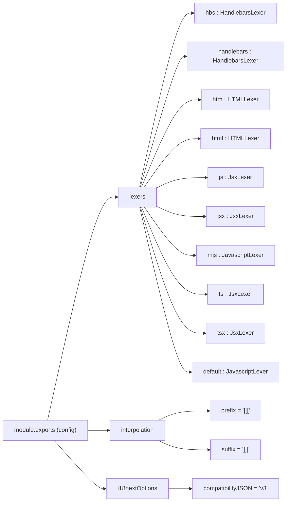

# Diagram: web/portal/i18next-parser.config.js


> Auto-generated by Obscura crawlers

## Diagram 1

```mermaid
classDiagram
class ModuleExports {
  +contextSeparator: string = "_"
  +createOldCatalogs: boolean = false
  +defaultNamespace: string = "translation"
  +defaultValue(locale, namespace, key, value): string
  +indentation: number = 2
  +keepRemoved: boolean = true
  +keySeparator: boolean = false
  +lineEnding: string = "auto"
  +locales: string[] = ["en"]
  +namespaceSeparator: string = ":"
  +output: string = "public/locales/$LOCALE/$NAMESPACE.json"
  +input: string[] = ["src/**/*.{js,jsx,ts,tsx}"]
  +reactNamespace: boolean = false
  +sort: boolean = true
  +verbose: boolean = true
}
class Lexers {
  +hbs: ["HandlebarsLexer"]
  +handlebars: ["HandlebarsLexer"]
  +htm: ["HTMLLexer"]
  +html: ["HTMLLexer"]
  +js: ["JsxLexer"]
  +jsx: ["JsxLexer"]
  +mjs: ["JavascriptLexer"]
  +ts: ["JsxLexer"]
  +tsx: ["JsxLexer"]
  +default: ["JavascriptLexer"]
}
class Interpolation {
  +prefix: string = "[[["
  +suffix: string = "]]]"
}
class I18nextOptions {
  +compatibilityJSON: string = "v3"
}
ModuleExports --> Lexers
ModuleExports --> Interpolation
ModuleExports --> I18nextOptions
```

> SVG rendering failed for this diagram.

## Diagram 2



### SVG

<svg id="container" width="776.390625" xmlns="http://www.w3.org/2000/svg" class="flowchart" height="1342" viewBox="0 0 776.390625 1342" role="graphics-document document" aria-roledescription="flowchart-v2"><style>#container{font-family:"trebuchet ms",verdana,arial,sans-serif;font-size:16px;fill:#333;}@keyframes edge-animation-frame{from{stroke-dashoffset:0;}}@keyframes dash{to{stroke-dashoffset:0;}}#container .edge-animation-slow{stroke-dasharray:9,5!important;stroke-dashoffset:900;animation:dash 50s linear infinite;stroke-linecap:round;}#container .edge-animation-fast{stroke-dasharray:9,5!important;stroke-dashoffset:900;animation:dash 20s linear infinite;stroke-linecap:round;}#container .error-icon{fill:#552222;}#container .error-text{fill:#552222;stroke:#552222;}#container .edge-thickness-normal{stroke-width:1px;}#container .edge-thickness-thick{stroke-width:3.5px;}#container .edge-pattern-solid{stroke-dasharray:0;}#container .edge-thickness-invisible{stroke-width:0;fill:none;}#container .edge-pattern-dashed{stroke-dasharray:3;}#container .edge-pattern-dotted{stroke-dasharray:2;}#container .marker{fill:#333333;stroke:#333333;}#container .marker.cross{stroke:#333333;}#container svg{font-family:"trebuchet ms",verdana,arial,sans-serif;font-size:16px;}#container p{margin:0;}#container .label{font-family:"trebuchet ms",verdana,arial,sans-serif;color:#333;}#container .cluster-label text{fill:#333;}#container .cluster-label span{color:#333;}#container .cluster-label span p{background-color:transparent;}#container .label text,#container span{fill:#333;color:#333;}#container .node rect,#container .node circle,#container .node ellipse,#container .node polygon,#container .node path{fill:#ECECFF;stroke:#9370DB;stroke-width:1px;}#container .rough-node .label text,#container .node .label text,#container .image-shape .label,#container .icon-shape .label{text-anchor:middle;}#container .node .katex path{fill:#000;stroke:#000;stroke-width:1px;}#container .rough-node .label,#container .node .label,#container .image-shape .label,#container .icon-shape .label{text-align:center;}#container .node.clickable{cursor:pointer;}#container .root .anchor path{fill:#333333!important;stroke-width:0;stroke:#333333;}#container .arrowheadPath{fill:#333333;}#container .edgePath .path{stroke:#333333;stroke-width:2.0px;}#container .flowchart-link{stroke:#333333;fill:none;}#container .edgeLabel{background-color:rgba(232,232,232, 0.8);text-align:center;}#container .edgeLabel p{background-color:rgba(232,232,232, 0.8);}#container .edgeLabel rect{opacity:0.5;background-color:rgba(232,232,232, 0.8);fill:rgba(232,232,232, 0.8);}#container .labelBkg{background-color:rgba(232, 232, 232, 0.5);}#container .cluster rect{fill:#ffffde;stroke:#aaaa33;stroke-width:1px;}#container .cluster text{fill:#333;}#container .cluster span{color:#333;}#container div.mermaidTooltip{position:absolute;text-align:center;max-width:200px;padding:2px;font-family:"trebuchet ms",verdana,arial,sans-serif;font-size:12px;background:hsl(80, 100%, 96.2745098039%);border:1px solid #aaaa33;border-radius:2px;pointer-events:none;z-index:100;}#container .flowchartTitleText{text-anchor:middle;font-size:18px;fill:#333;}#container rect.text{fill:none;stroke-width:0;}#container .icon-shape,#container .image-shape{background-color:rgba(232,232,232, 0.8);text-align:center;}#container .icon-shape p,#container .image-shape p{background-color:rgba(232,232,232, 0.8);padding:2px;}#container .icon-shape rect,#container .image-shape rect{opacity:0.5;background-color:rgba(232,232,232, 0.8);fill:rgba(232,232,232, 0.8);}#container .label-icon{display:inline-block;height:1em;overflow:visible;vertical-align:-0.125em;}#container .node .label-icon path{fill:currentColor;stroke:revert;stroke-width:revert;}#container :root{--mermaid-font-family:"trebuchet ms",verdana,arial,sans-serif;}</style><g><marker id="container_flowchart-v2-pointEnd" class="marker flowchart-v2" viewBox="0 0 10 10" refX="5" refY="5" markerUnits="userSpaceOnUse" markerWidth="8" markerHeight="8" orient="auto"><path d="M 0 0 L 10 5 L 0 10 z" class="arrowMarkerPath" style="stroke-width: 1; stroke-dasharray: 1, 0;"></path></marker><marker id="container_flowchart-v2-pointStart" class="marker flowchart-v2" viewBox="0 0 10 10" refX="4.5" refY="5" markerUnits="userSpaceOnUse" markerWidth="8" markerHeight="8" orient="auto"><path d="M 0 5 L 10 10 L 10 0 z" class="arrowMarkerPath" style="stroke-width: 1; stroke-dasharray: 1, 0;"></path></marker><marker id="container_flowchart-v2-circleEnd" class="marker flowchart-v2" viewBox="0 0 10 10" refX="11" refY="5" markerUnits="userSpaceOnUse" markerWidth="11" markerHeight="11" orient="auto"><circle cx="5" cy="5" r="5" class="arrowMarkerPath" style="stroke-width: 1; stroke-dasharray: 1, 0;"></circle></marker><marker id="container_flowchart-v2-circleStart" class="marker flowchart-v2" viewBox="0 0 10 10" refX="-1" refY="5" markerUnits="userSpaceOnUse" markerWidth="11" markerHeight="11" orient="auto"><circle cx="5" cy="5" r="5" class="arrowMarkerPath" style="stroke-width: 1; stroke-dasharray: 1, 0;"></circle></marker><marker id="container_flowchart-v2-crossEnd" class="marker cross flowchart-v2" viewBox="0 0 11 11" refX="12" refY="5.2" markerUnits="userSpaceOnUse" markerWidth="11" markerHeight="11" orient="auto"><path d="M 1,1 l 9,9 M 10,1 l -9,9" class="arrowMarkerPath" style="stroke-width: 2; stroke-dasharray: 1, 0;"></path></marker><marker id="container_flowchart-v2-crossStart" class="marker cross flowchart-v2" viewBox="0 0 11 11" refX="-1" refY="5.2" markerUnits="userSpaceOnUse" markerWidth="11" markerHeight="11" orient="auto"><path d="M 1,1 l 9,9 M 10,1 l -9,9" class="arrowMarkerPath" style="stroke-width: 2; stroke-dasharray: 1, 0;"></path></marker><g class="root"><g class="clusters"></g><g class="edgePaths"><path d="M129.881,1124L152.33,1024.5C174.78,925,219.679,726,251.118,626.5C282.557,527,300.536,527,309.526,527L318.516,527" id="L_Config_LexersNode_0" class="edge-thickness-normal edge-pattern-solid edge-thickness-normal edge-pattern-solid flowchart-link" style=";" data-edge="true" data-et="edge" data-id="L_Config_LexersNode_0" data-points="W3sieCI6MTI5Ljg4MDg5NjkzNTA5NjE2LCJ5IjoxMTI0fSx7IngiOjI2NC41NzgxMjUsInkiOjUyN30seyJ4IjozMjIuNTE1NjI1LCJ5Ijo1Mjd9XQ==" marker-end="url(#container_flowchart-v2-pointEnd)"></path><path d="M239.578,1151L243.745,1151C247.911,1151,256.245,1151,265.021,1151C273.797,1151,283.016,1151,287.625,1151L292.234,1151" id="L_Config_InterpolationNode_0" class="edge-thickness-normal edge-pattern-solid edge-thickness-normal edge-pattern-solid flowchart-link" style=";" data-edge="true" data-et="edge" data-id="L_Config_InterpolationNode_0" data-points="W3sieCI6MjM5LjU3ODEyNSwieSI6MTE1MX0seyJ4IjoyNjQuNTc4MTI1LCJ5IjoxMTUxfSx7IngiOjI5Ni4yMzQzNzUsInkiOjExNTF9XQ==" marker-end="url(#container_flowchart-v2-pointEnd)"></path><path d="M148.156,1178L167.56,1199.5C186.964,1221,225.771,1264,248.675,1285.5C271.578,1307,278.578,1307,282.078,1307L285.578,1307" id="L_Config_I18nextOptionsNode_0" class="edge-thickness-normal edge-pattern-solid edge-thickness-normal edge-pattern-solid flowchart-link" style=";" data-edge="true" data-et="edge" data-id="L_Config_I18nextOptionsNode_0" data-points="W3sieCI6MTQ4LjE1NjQwMDI0MDM4NDYsInkiOjExNzh9LHsieCI6MjY0LjU3ODEyNSwieSI6MTMwN30seyJ4IjoyODkuNTc4MTI1LCJ5IjoxMzA3fV0=" marker-end="url(#container_flowchart-v2-pointEnd)"></path><path d="M379.988,500L397.222,422.5C414.456,345,448.923,190,472.937,112.5C496.951,35,510.51,35,517.29,35L524.07,35" id="L_LexersNode_HBS_0" class="edge-thickness-normal edge-pattern-solid edge-thickness-normal edge-pattern-solid flowchart-link" style=";" data-edge="true" data-et="edge" data-id="L_LexersNode_HBS_0" data-points="W3sieCI6Mzc5Ljk4ODM3NjUyNDM5MDIsInkiOjUwMH0seyJ4Ijo0ODMuMzkwNjI1LCJ5IjozNX0seyJ4Ijo1MjguMDcwMzEyNSwieSI6MzV9XQ==" marker-end="url(#container_flowchart-v2-pointEnd)"></path><path d="M381.841,500L398.766,441.833C415.691,383.667,449.541,267.333,469.966,209.167C490.391,151,497.391,151,500.891,151L504.391,151" id="L_LexersNode_HANDLEBARS_0" class="edge-thickness-normal edge-pattern-solid edge-thickness-normal edge-pattern-solid flowchart-link" style=";" data-edge="true" data-et="edge" data-id="L_LexersNode_HANDLEBARS_0" data-points="W3sieCI6MzgxLjg0MDY3NDg2NzAyMTMsInkiOjUwMH0seyJ4Ijo0ODMuMzkwNjI1LCJ5IjoxNTF9LHsieCI6NTA4LjM5MDYyNSwieSI6MTUxfV0=" marker-end="url(#container_flowchart-v2-pointEnd)"></path><path d="M385.346,500L401.687,461.167C418.027,422.333,450.709,344.667,477.292,305.833C503.875,267,524.359,267,534.602,267L544.844,267" id="L_LexersNode_HTM_0" class="edge-thickness-normal edge-pattern-solid edge-thickness-normal edge-pattern-solid flowchart-link" style=";" data-edge="true" data-et="edge" data-id="L_LexersNode_HTM_0" data-points="W3sieCI6Mzg1LjM0NTc5MzI2OTIzMDgsInkiOjUwMH0seyJ4Ijo0ODMuMzkwNjI1LCJ5IjoyNjd9LHsieCI6NTQ4Ljg0Mzc1LCJ5IjoyNjd9XQ==" marker-end="url(#container_flowchart-v2-pointEnd)"></path><path d="M392.92,500L407.998,478.5C423.077,457,453.234,414,478.164,392.5C503.094,371,522.797,371,532.648,371L542.5,371" id="L_LexersNode_HTML_0" class="edge-thickness-normal edge-pattern-solid edge-thickness-normal edge-pattern-solid flowchart-link" style=";" data-edge="true" data-et="edge" data-id="L_LexersNode_HTML_0" data-points="W3sieCI6MzkyLjkyMDA3MjExNTM4NDY0LCJ5Ijo1MDB9LHsieCI6NDgzLjM5MDYyNSwieSI6MzcxfSx7IngiOjU0Ni41LCJ5IjozNzF9XQ==" marker-end="url(#container_flowchart-v2-pointEnd)"></path><path d="M425.453,502.537L435.109,497.948C444.766,493.358,464.078,484.179,486.993,479.59C509.909,475,536.427,475,549.686,475L562.945,475" id="L_LexersNode_JS_0" class="edge-thickness-normal edge-pattern-solid edge-thickness-normal edge-pattern-solid flowchart-link" style=";" data-edge="true" data-et="edge" data-id="L_LexersNode_JS_0" data-points="W3sieCI6NDI1LjQ1MzEyNSwieSI6NTAyLjUzNzI3NTA2NDI2NzM2fSx7IngiOjQ4My4zOTA2MjUsInkiOjQ3NX0seyJ4Ijo1NjYuOTQ1MzEyNSwieSI6NDc1fV0=" marker-end="url(#container_flowchart-v2-pointEnd)"></path><path d="M425.453,551.463L435.109,556.052C444.766,560.642,464.078,569.821,486.361,574.41C508.643,579,533.896,579,546.522,579L559.148,579" id="L_LexersNode_JSX_0" class="edge-thickness-normal edge-pattern-solid edge-thickness-normal edge-pattern-solid flowchart-link" style=";" data-edge="true" data-et="edge" data-id="L_LexersNode_JSX_0" data-points="W3sieCI6NDI1LjQ1MzEyNSwieSI6NTUxLjQ2MjcyNDkzNTczMjd9LHsieCI6NDgzLjM5MDYyNSwieSI6NTc5fSx7IngiOjU2My4xNDg0Mzc1LCJ5Ijo1Nzl9XQ==" marker-end="url(#container_flowchart-v2-pointEnd)"></path><path d="M392.92,554L407.998,575.5C423.077,597,453.234,640,476.209,661.5C499.185,683,514.979,683,522.876,683L530.773,683" id="L_LexersNode_MJS_0" class="edge-thickness-normal edge-pattern-solid edge-thickness-normal edge-pattern-solid flowchart-link" style=";" data-edge="true" data-et="edge" data-id="L_LexersNode_MJS_0" data-points="W3sieCI6MzkyLjkyMDA3MjExNTM4NDY0LCJ5Ijo1NTR9LHsieCI6NDgzLjM5MDYyNSwieSI6NjgzfSx7IngiOjUzNC43NzM0Mzc1LCJ5Ijo2ODN9XQ==" marker-end="url(#container_flowchart-v2-pointEnd)"></path><path d="M385.346,554L401.687,592.833C418.027,631.667,450.709,709.333,480.201,748.167C509.693,787,535.995,787,549.146,787L562.297,787" id="L_LexersNode_TS_0" class="edge-thickness-normal edge-pattern-solid edge-thickness-normal edge-pattern-solid flowchart-link" style=";" data-edge="true" data-et="edge" data-id="L_LexersNode_TS_0" data-points="W3sieCI6Mzg1LjM0NTc5MzI2OTIzMDgsInkiOjU1NH0seyJ4Ijo0ODMuMzkwNjI1LCJ5Ijo3ODd9LHsieCI6NTY2LjI5Njg3NSwieSI6Nzg3fV0=" marker-end="url(#container_flowchart-v2-pointEnd)"></path><path d="M382.1,554L398.981,610.167C415.863,666.333,449.627,778.667,479.027,834.833C508.427,891,533.464,891,545.982,891L558.5,891" id="L_LexersNode_TSX_0" class="edge-thickness-normal edge-pattern-solid edge-thickness-normal edge-pattern-solid flowchart-link" style=";" data-edge="true" data-et="edge" data-id="L_LexersNode_TSX_0" data-points="W3sieCI6MzgyLjA5OTY3Mzc2MzczNjMsInkiOjU1NH0seyJ4Ijo0ODMuMzkwNjI1LCJ5Ijo4OTF9LHsieCI6NTYyLjUsInkiOjg5MX1d" marker-end="url(#container_flowchart-v2-pointEnd)"></path><path d="M380.296,554L397.479,627.5C414.661,701,449.026,848,471.928,921.5C494.831,995,506.271,995,511.991,995L517.711,995" id="L_LexersNode_DEFAULT_0" class="edge-thickness-normal edge-pattern-solid edge-thickness-normal edge-pattern-solid flowchart-link" style=";" data-edge="true" data-et="edge" data-id="L_LexersNode_DEFAULT_0" data-points="W3sieCI6MzgwLjI5NjI3NDAzODQ2MTU1LCJ5Ijo1NTR9LHsieCI6NDgzLjM5MDYyNSwieSI6OTk1fSx7IngiOjUyMS43MTA5Mzc1LCJ5Ijo5OTV9XQ==" marker-end="url(#container_flowchart-v2-pointEnd)"></path><path d="M430.791,1124L439.558,1119.833C448.325,1115.667,465.858,1107.333,488.125,1103.167C510.393,1099,537.396,1099,550.897,1099L564.398,1099" id="L_InterpolationNode_PFX_0" class="edge-thickness-normal edge-pattern-solid edge-thickness-normal edge-pattern-solid flowchart-link" style=";" data-edge="true" data-et="edge" data-id="L_InterpolationNode_PFX_0" data-points="W3sieCI6NDMwLjc5MTQ2NjM0NjE1Mzg3LCJ5IjoxMTI0fSx7IngiOjQ4My4zOTA2MjUsInkiOjEwOTl9LHsieCI6NTY4LjM5ODQzNzUsInkiOjEwOTl9XQ==" marker-end="url(#container_flowchart-v2-pointEnd)"></path><path d="M430.791,1178L439.558,1182.167C448.325,1186.333,465.858,1194.667,488.273,1198.833C510.688,1203,537.984,1203,551.633,1203L565.281,1203" id="L_InterpolationNode_SFX_0" class="edge-thickness-normal edge-pattern-solid edge-thickness-normal edge-pattern-solid flowchart-link" style=";" data-edge="true" data-et="edge" data-id="L_InterpolationNode_SFX_0" data-points="W3sieCI6NDMwLjc5MTQ2NjM0NjE1Mzg3LCJ5IjoxMTc4fSx7IngiOjQ4My4zOTA2MjUsInkiOjEyMDN9LHsieCI6NTY5LjI4MTI1LCJ5IjoxMjAzfV0=" marker-end="url(#container_flowchart-v2-pointEnd)"></path><path d="M458.391,1307L462.557,1307C466.724,1307,475.057,1307,485.204,1307C495.352,1307,507.313,1307,513.293,1307L519.273,1307" id="L_I18nextOptionsNode_COMP_0" class="edge-thickness-normal edge-pattern-solid edge-thickness-normal edge-pattern-solid flowchart-link" style=";" data-edge="true" data-et="edge" data-id="L_I18nextOptionsNode_COMP_0" data-points="W3sieCI6NDU4LjM5MDYyNSwieSI6MTMwN30seyJ4Ijo0ODMuMzkwNjI1LCJ5IjoxMzA3fSx7IngiOjUyMy4yNzM0Mzc1LCJ5IjoxMzA3fV0=" marker-end="url(#container_flowchart-v2-pointEnd)"></path></g><g class="edgeLabels"><g class="edgeLabel"><g class="label" data-id="L_Config_LexersNode_0" transform="translate(0, 0)"><foreignObject width="0" height="0"><div xmlns="http://www.w3.org/1999/xhtml" class="labelBkg" style="display: table-cell; white-space: nowrap; line-height: 1.5; max-width: 200px; text-align: center;"><span class="edgeLabel"></span></div></foreignObject></g></g><g class="edgeLabel"><g class="label" data-id="L_Config_InterpolationNode_0" transform="translate(0, 0)"><foreignObject width="0" height="0"><div xmlns="http://www.w3.org/1999/xhtml" class="labelBkg" style="display: table-cell; white-space: nowrap; line-height: 1.5; max-width: 200px; text-align: center;"><span class="edgeLabel"></span></div></foreignObject></g></g><g class="edgeLabel"><g class="label" data-id="L_Config_I18nextOptionsNode_0" transform="translate(0, 0)"><foreignObject width="0" height="0"><div xmlns="http://www.w3.org/1999/xhtml" class="labelBkg" style="display: table-cell; white-space: nowrap; line-height: 1.5; max-width: 200px; text-align: center;"><span class="edgeLabel"></span></div></foreignObject></g></g><g class="edgeLabel"><g class="label" data-id="L_LexersNode_HBS_0" transform="translate(0, 0)"><foreignObject width="0" height="0"><div xmlns="http://www.w3.org/1999/xhtml" class="labelBkg" style="display: table-cell; white-space: nowrap; line-height: 1.5; max-width: 200px; text-align: center;"><span class="edgeLabel"></span></div></foreignObject></g></g><g class="edgeLabel"><g class="label" data-id="L_LexersNode_HANDLEBARS_0" transform="translate(0, 0)"><foreignObject width="0" height="0"><div xmlns="http://www.w3.org/1999/xhtml" class="labelBkg" style="display: table-cell; white-space: nowrap; line-height: 1.5; max-width: 200px; text-align: center;"><span class="edgeLabel"></span></div></foreignObject></g></g><g class="edgeLabel"><g class="label" data-id="L_LexersNode_HTM_0" transform="translate(0, 0)"><foreignObject width="0" height="0"><div xmlns="http://www.w3.org/1999/xhtml" class="labelBkg" style="display: table-cell; white-space: nowrap; line-height: 1.5; max-width: 200px; text-align: center;"><span class="edgeLabel"></span></div></foreignObject></g></g><g class="edgeLabel"><g class="label" data-id="L_LexersNode_HTML_0" transform="translate(0, 0)"><foreignObject width="0" height="0"><div xmlns="http://www.w3.org/1999/xhtml" class="labelBkg" style="display: table-cell; white-space: nowrap; line-height: 1.5; max-width: 200px; text-align: center;"><span class="edgeLabel"></span></div></foreignObject></g></g><g class="edgeLabel"><g class="label" data-id="L_LexersNode_JS_0" transform="translate(0, 0)"><foreignObject width="0" height="0"><div xmlns="http://www.w3.org/1999/xhtml" class="labelBkg" style="display: table-cell; white-space: nowrap; line-height: 1.5; max-width: 200px; text-align: center;"><span class="edgeLabel"></span></div></foreignObject></g></g><g class="edgeLabel"><g class="label" data-id="L_LexersNode_JSX_0" transform="translate(0, 0)"><foreignObject width="0" height="0"><div xmlns="http://www.w3.org/1999/xhtml" class="labelBkg" style="display: table-cell; white-space: nowrap; line-height: 1.5; max-width: 200px; text-align: center;"><span class="edgeLabel"></span></div></foreignObject></g></g><g class="edgeLabel"><g class="label" data-id="L_LexersNode_MJS_0" transform="translate(0, 0)"><foreignObject width="0" height="0"><div xmlns="http://www.w3.org/1999/xhtml" class="labelBkg" style="display: table-cell; white-space: nowrap; line-height: 1.5; max-width: 200px; text-align: center;"><span class="edgeLabel"></span></div></foreignObject></g></g><g class="edgeLabel"><g class="label" data-id="L_LexersNode_TS_0" transform="translate(0, 0)"><foreignObject width="0" height="0"><div xmlns="http://www.w3.org/1999/xhtml" class="labelBkg" style="display: table-cell; white-space: nowrap; line-height: 1.5; max-width: 200px; text-align: center;"><span class="edgeLabel"></span></div></foreignObject></g></g><g class="edgeLabel"><g class="label" data-id="L_LexersNode_TSX_0" transform="translate(0, 0)"><foreignObject width="0" height="0"><div xmlns="http://www.w3.org/1999/xhtml" class="labelBkg" style="display: table-cell; white-space: nowrap; line-height: 1.5; max-width: 200px; text-align: center;"><span class="edgeLabel"></span></div></foreignObject></g></g><g class="edgeLabel"><g class="label" data-id="L_LexersNode_DEFAULT_0" transform="translate(0, 0)"><foreignObject width="0" height="0"><div xmlns="http://www.w3.org/1999/xhtml" class="labelBkg" style="display: table-cell; white-space: nowrap; line-height: 1.5; max-width: 200px; text-align: center;"><span class="edgeLabel"></span></div></foreignObject></g></g><g class="edgeLabel"><g class="label" data-id="L_InterpolationNode_PFX_0" transform="translate(0, 0)"><foreignObject width="0" height="0"><div xmlns="http://www.w3.org/1999/xhtml" class="labelBkg" style="display: table-cell; white-space: nowrap; line-height: 1.5; max-width: 200px; text-align: center;"><span class="edgeLabel"></span></div></foreignObject></g></g><g class="edgeLabel"><g class="label" data-id="L_InterpolationNode_SFX_0" transform="translate(0, 0)"><foreignObject width="0" height="0"><div xmlns="http://www.w3.org/1999/xhtml" class="labelBkg" style="display: table-cell; white-space: nowrap; line-height: 1.5; max-width: 200px; text-align: center;"><span class="edgeLabel"></span></div></foreignObject></g></g><g class="edgeLabel"><g class="label" data-id="L_I18nextOptionsNode_COMP_0" transform="translate(0, 0)"><foreignObject width="0" height="0"><div xmlns="http://www.w3.org/1999/xhtml" class="labelBkg" style="display: table-cell; white-space: nowrap; line-height: 1.5; max-width: 200px; text-align: center;"><span class="edgeLabel"></span></div></foreignObject></g></g></g><g class="nodes"><g class="node default" id="flowchart-Config-0" transform="translate(123.7890625, 1151)"><rect class="basic label-container" style="" x="-115.7890625" y="-27" width="231.578125" height="54"></rect><g class="label" style="" transform="translate(-85.7890625, -12)"><rect></rect><foreignObject width="171.578125" height="24"><div xmlns="http://www.w3.org/1999/xhtml" style="display: table-cell; white-space: nowrap; line-height: 1.5; max-width: 200px; text-align: center;"><span class="nodeLabel"><p>module.exports (config)</p></span></div></foreignObject></g></g><g class="node default" id="flowchart-LexersNode-1" transform="translate(373.984375, 527)"><rect class="basic label-container" style="" x="-51.46875" y="-27" width="102.9375" height="54"></rect><g class="label" style="" transform="translate(-21.46875, -12)"><rect></rect><foreignObject width="42.9375" height="24"><div xmlns="http://www.w3.org/1999/xhtml" style="display: table-cell; white-space: nowrap; line-height: 1.5; max-width: 200px; text-align: center;"><span class="nodeLabel"><p>lexers</p></span></div></foreignObject></g></g><g class="node default" id="flowchart-InterpolationNode-3" transform="translate(373.984375, 1151)"><rect class="basic label-container" style="" x="-77.75" y="-27" width="155.5" height="54"></rect><g class="label" style="" transform="translate(-47.75, -12)"><rect></rect><foreignObject width="95.5" height="24"><div xmlns="http://www.w3.org/1999/xhtml" style="display: table-cell; white-space: nowrap; line-height: 1.5; max-width: 200px; text-align: center;"><span class="nodeLabel"><p>interpolation</p></span></div></foreignObject></g></g><g class="node default" id="flowchart-I18nextOptionsNode-5" transform="translate(373.984375, 1307)"><rect class="basic label-container" style="" x="-84.40625" y="-27" width="168.8125" height="54"></rect><g class="label" style="" transform="translate(-54.40625, -12)"><rect></rect><foreignObject width="108.8125" height="24"><div xmlns="http://www.w3.org/1999/xhtml" style="display: table-cell; white-space: nowrap; line-height: 1.5; max-width: 200px; text-align: center;"><span class="nodeLabel"><p>i18nextOptions</p></span></div></foreignObject></g></g><g class="node default" id="flowchart-HBS-7" transform="translate(638.390625, 35)"><rect class="basic label-container" style="" x="-110.3203125" y="-27" width="220.640625" height="54"></rect><g class="label" style="" transform="translate(-80.3203125, -12)"><rect></rect><foreignObject width="160.640625" height="24"><div xmlns="http://www.w3.org/1999/xhtml" style="display: table-cell; white-space: nowrap; line-height: 1.5; max-width: 200px; text-align: center;"><span class="nodeLabel"><p>hbs : HandlebarsLexer</p></span></div></foreignObject></g></g><g class="node default" id="flowchart-HANDLEBARS-9" transform="translate(638.390625, 151)"><rect class="basic label-container" style="" x="-130" y="-39" width="260" height="78"></rect><g class="label" style="" transform="translate(-100, -24)"><rect></rect><foreignObject width="200" height="48"><div xmlns="http://www.w3.org/1999/xhtml" style="display: table; white-space: break-spaces; line-height: 1.5; max-width: 200px; text-align: center; width: 200px;"><span class="nodeLabel"><p>handlebars : HandlebarsLexer</p></span></div></foreignObject></g></g><g class="node default" id="flowchart-HTM-11" transform="translate(638.390625, 267)"><rect class="basic label-container" style="" x="-89.546875" y="-27" width="179.09375" height="54"></rect><g class="label" style="" transform="translate(-59.546875, -12)"><rect></rect><foreignObject width="119.09375" height="24"><div xmlns="http://www.w3.org/1999/xhtml" style="display: table-cell; white-space: nowrap; line-height: 1.5; max-width: 200px; text-align: center;"><span class="nodeLabel"><p>htm : HTMLLexer</p></span></div></foreignObject></g></g><g class="node default" id="flowchart-HTML-13" transform="translate(638.390625, 371)"><rect class="basic label-container" style="" x="-91.890625" y="-27" width="183.78125" height="54"></rect><g class="label" style="" transform="translate(-61.890625, -12)"><rect></rect><foreignObject width="123.78125" height="24"><div xmlns="http://www.w3.org/1999/xhtml" style="display: table-cell; white-space: nowrap; line-height: 1.5; max-width: 200px; text-align: center;"><span class="nodeLabel"><p>html : HTMLLexer</p></span></div></foreignObject></g></g><g class="node default" id="flowchart-JS-15" transform="translate(638.390625, 475)"><rect class="basic label-container" style="" x="-71.4453125" y="-27" width="142.890625" height="54"></rect><g class="label" style="" transform="translate(-41.4453125, -12)"><rect></rect><foreignObject width="82.890625" height="24"><div xmlns="http://www.w3.org/1999/xhtml" style="display: table-cell; white-space: nowrap; line-height: 1.5; max-width: 200px; text-align: center;"><span class="nodeLabel"><p>js : JsxLexer</p></span></div></foreignObject></g></g><g class="node default" id="flowchart-JSX-17" transform="translate(638.390625, 579)"><rect class="basic label-container" style="" x="-75.2421875" y="-27" width="150.484375" height="54"></rect><g class="label" style="" transform="translate(-45.2421875, -12)"><rect></rect><foreignObject width="90.484375" height="24"><div xmlns="http://www.w3.org/1999/xhtml" style="display: table-cell; white-space: nowrap; line-height: 1.5; max-width: 200px; text-align: center;"><span class="nodeLabel"><p>jsx : JsxLexer</p></span></div></foreignObject></g></g><g class="node default" id="flowchart-MJS-19" transform="translate(638.390625, 683)"><rect class="basic label-container" style="" x="-103.6171875" y="-27" width="207.234375" height="54"></rect><g class="label" style="" transform="translate(-73.6171875, -12)"><rect></rect><foreignObject width="147.234375" height="24"><div xmlns="http://www.w3.org/1999/xhtml" style="display: table-cell; white-space: nowrap; line-height: 1.5; max-width: 200px; text-align: center;"><span class="nodeLabel"><p>mjs : JavascriptLexer</p></span></div></foreignObject></g></g><g class="node default" id="flowchart-TS-21" transform="translate(638.390625, 787)"><rect class="basic label-container" style="" x="-72.09375" y="-27" width="144.1875" height="54"></rect><g class="label" style="" transform="translate(-42.09375, -12)"><rect></rect><foreignObject width="84.1875" height="24"><div xmlns="http://www.w3.org/1999/xhtml" style="display: table-cell; white-space: nowrap; line-height: 1.5; max-width: 200px; text-align: center;"><span class="nodeLabel"><p>ts : JsxLexer</p></span></div></foreignObject></g></g><g class="node default" id="flowchart-TSX-23" transform="translate(638.390625, 891)"><rect class="basic label-container" style="" x="-75.890625" y="-27" width="151.78125" height="54"></rect><g class="label" style="" transform="translate(-45.890625, -12)"><rect></rect><foreignObject width="91.78125" height="24"><div xmlns="http://www.w3.org/1999/xhtml" style="display: table-cell; white-space: nowrap; line-height: 1.5; max-width: 200px; text-align: center;"><span class="nodeLabel"><p>tsx : JsxLexer</p></span></div></foreignObject></g></g><g class="node default" id="flowchart-DEFAULT-25" transform="translate(638.390625, 995)"><rect class="basic label-container" style="" x="-116.6796875" y="-27" width="233.359375" height="54"></rect><g class="label" style="" transform="translate(-86.6796875, -12)"><rect></rect><foreignObject width="173.359375" height="24"><div xmlns="http://www.w3.org/1999/xhtml" style="display: table-cell; white-space: nowrap; line-height: 1.5; max-width: 200px; text-align: center;"><span class="nodeLabel"><p>default : JavascriptLexer</p></span></div></foreignObject></g></g><g class="node default" id="flowchart-PFX-27" transform="translate(638.390625, 1099)"><rect class="basic label-container" style="" x="-69.9921875" y="-27" width="139.984375" height="54"></rect><g class="label" style="" transform="translate(-39.9921875, -12)"><rect></rect><foreignObject width="79.984375" height="24"><div xmlns="http://www.w3.org/1999/xhtml" style="display: table-cell; white-space: nowrap; line-height: 1.5; max-width: 200px; text-align: center;"><span class="nodeLabel"><p>prefix = '[[['</p></span></div></foreignObject></g></g><g class="node default" id="flowchart-SFX-29" transform="translate(638.390625, 1203)"><rect class="basic label-container" style="" x="-69.109375" y="-27" width="138.21875" height="54"></rect><g class="label" style="" transform="translate(-39.109375, -12)"><rect></rect><foreignObject width="78.21875" height="24"><div xmlns="http://www.w3.org/1999/xhtml" style="display: table-cell; white-space: nowrap; line-height: 1.5; max-width: 200px; text-align: center;"><span class="nodeLabel"><p>suffix = ']]]'</p></span></div></foreignObject></g></g><g class="node default" id="flowchart-COMP-31" transform="translate(638.390625, 1307)"><rect class="basic label-container" style="" x="-115.1171875" y="-27" width="230.234375" height="54"></rect><g class="label" style="" transform="translate(-85.1171875, -12)"><rect></rect><foreignObject width="170.234375" height="24"><div xmlns="http://www.w3.org/1999/xhtml" style="display: table-cell; white-space: nowrap; line-height: 1.5; max-width: 200px; text-align: center;"><span class="nodeLabel"><p>compatibilityJSON = 'v3'</p></span></div></foreignObject></g></g></g></g></g></svg>
