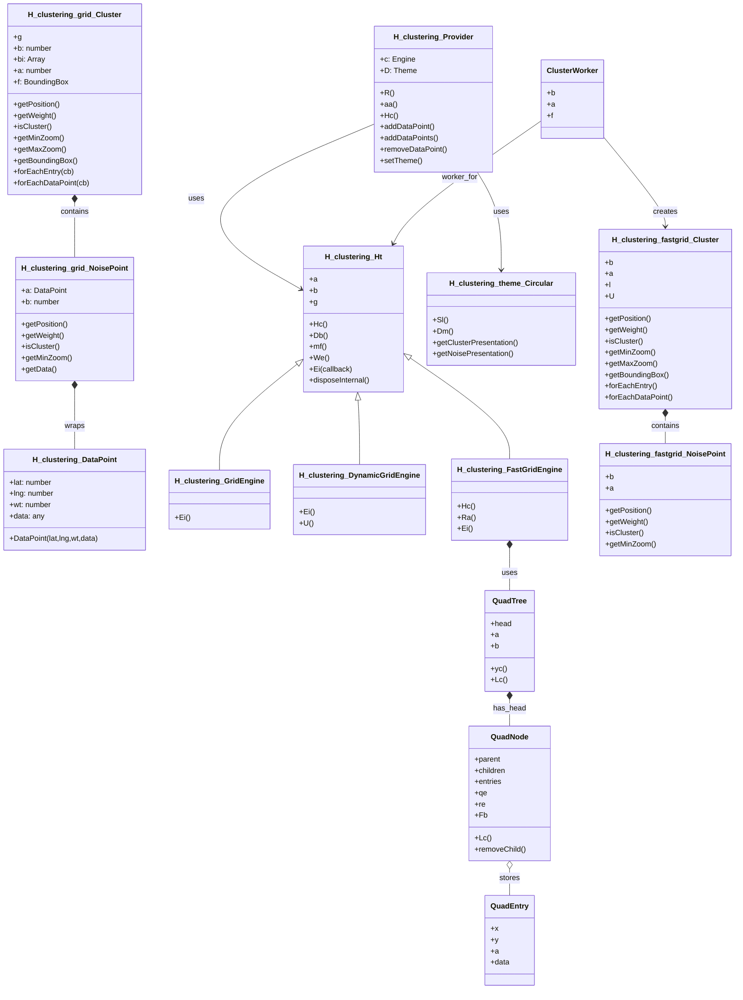
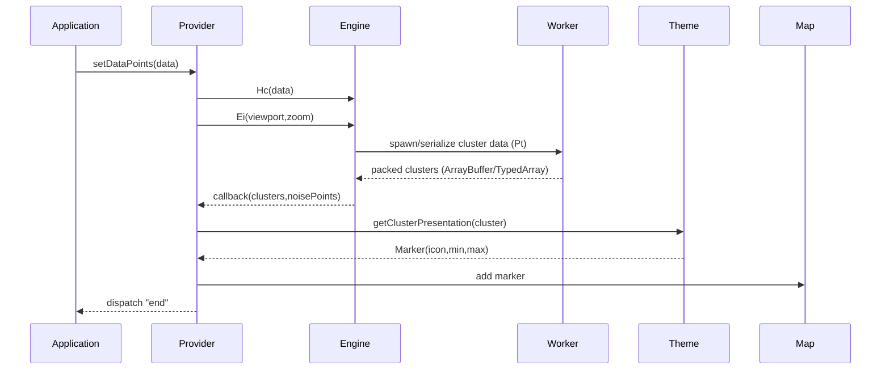

# Diagram: web/portal/public/js/heremaps-3.1.49.1/mapsjs-clustering.js


> Auto-generated by Obscura crawlers

## Diagram 1



### SVG

<svg id="container" width="1527.474609375" xmlns="http://www.w3.org/2000/svg" class="classDiagram" height="2114" viewBox="0 0 1527.474609375 2114" role="graphics-document document" aria-roledescription="class"><style>#container{font-family:"trebuchet ms",verdana,arial,sans-serif;font-size:16px;fill:#333;}@keyframes edge-animation-frame{from{stroke-dashoffset:0;}}@keyframes dash{to{stroke-dashoffset:0;}}#container .edge-animation-slow{stroke-dasharray:9,5!important;stroke-dashoffset:900;animation:dash 50s linear infinite;stroke-linecap:round;}#container .edge-animation-fast{stroke-dasharray:9,5!important;stroke-dashoffset:900;animation:dash 20s linear infinite;stroke-linecap:round;}#container .error-icon{fill:#552222;}#container .error-text{fill:#552222;stroke:#552222;}#container .edge-thickness-normal{stroke-width:1px;}#container .edge-thickness-thick{stroke-width:3.5px;}#container .edge-pattern-solid{stroke-dasharray:0;}#container .edge-thickness-invisible{stroke-width:0;fill:none;}#container .edge-pattern-dashed{stroke-dasharray:3;}#container .edge-pattern-dotted{stroke-dasharray:2;}#container .marker{fill:#333333;stroke:#333333;}#container .marker.cross{stroke:#333333;}#container svg{font-family:"trebuchet ms",verdana,arial,sans-serif;font-size:16px;}#container p{margin:0;}#container g.classGroup text{fill:#9370DB;stroke:none;font-family:"trebuchet ms",verdana,arial,sans-serif;font-size:10px;}#container g.classGroup text .title{font-weight:bolder;}#container .nodeLabel,#container .edgeLabel{color:#131300;}#container .edgeLabel .label rect{fill:#ECECFF;}#container .label text{fill:#131300;}#container .labelBkg{background:#ECECFF;}#container .edgeLabel .label span{background:#ECECFF;}#container .classTitle{font-weight:bolder;}#container .node rect,#container .node circle,#container .node ellipse,#container .node polygon,#container .node path{fill:#ECECFF;stroke:#9370DB;stroke-width:1px;}#container .divider{stroke:#9370DB;stroke-width:1;}#container g.clickable{cursor:pointer;}#container g.classGroup rect{fill:#ECECFF;stroke:#9370DB;}#container g.classGroup line{stroke:#9370DB;stroke-width:1;}#container .classLabel .box{stroke:none;stroke-width:0;fill:#ECECFF;opacity:0.5;}#container .classLabel .label{fill:#9370DB;font-size:10px;}#container .relation{stroke:#333333;stroke-width:1;fill:none;}#container .dashed-line{stroke-dasharray:3;}#container .dotted-line{stroke-dasharray:1 2;}#container #compositionStart,#container .composition{fill:#333333!important;stroke:#333333!important;stroke-width:1;}#container #compositionEnd,#container .composition{fill:#333333!important;stroke:#333333!important;stroke-width:1;}#container #dependencyStart,#container .dependency{fill:#333333!important;stroke:#333333!important;stroke-width:1;}#container #dependencyStart,#container .dependency{fill:#333333!important;stroke:#333333!important;stroke-width:1;}#container #extensionStart,#container .extension{fill:transparent!important;stroke:#333333!important;stroke-width:1;}#container #extensionEnd,#container .extension{fill:transparent!important;stroke:#333333!important;stroke-width:1;}#container #aggregationStart,#container .aggregation{fill:transparent!important;stroke:#333333!important;stroke-width:1;}#container #aggregationEnd,#container .aggregation{fill:transparent!important;stroke:#333333!important;stroke-width:1;}#container #lollipopStart,#container .lollipop{fill:#ECECFF!important;stroke:#333333!important;stroke-width:1;}#container #lollipopEnd,#container .lollipop{fill:#ECECFF!important;stroke:#333333!important;stroke-width:1;}#container .edgeTerminals{font-size:11px;line-height:initial;}#container .classTitleText{text-anchor:middle;font-size:18px;fill:#333;}#container .label-icon{display:inline-block;height:1em;overflow:visible;vertical-align:-0.125em;}#container .node .label-icon path{fill:currentColor;stroke:revert;stroke-width:revert;}#container :root{--mermaid-font-family:"trebuchet ms",verdana,arial,sans-serif;}</style><g><defs><marker id="container_class-aggregationStart" class="marker aggregation class" refX="18" refY="7" markerWidth="190" markerHeight="240" orient="auto"><path d="M 18,7 L9,13 L1,7 L9,1 Z"></path></marker></defs><defs><marker id="container_class-aggregationEnd" class="marker aggregation class" refX="1" refY="7" markerWidth="20" markerHeight="28" orient="auto"><path d="M 18,7 L9,13 L1,7 L9,1 Z"></path></marker></defs><defs><marker id="container_class-extensionStart" class="marker extension class" refX="18" refY="7" markerWidth="190" markerHeight="240" orient="auto"><path d="M 1,7 L18,13 V 1 Z"></path></marker></defs><defs><marker id="container_class-extensionEnd" class="marker extension class" refX="1" refY="7" markerWidth="20" markerHeight="28" orient="auto"><path d="M 1,1 V 13 L18,7 Z"></path></marker></defs><defs><marker id="container_class-compositionStart" class="marker composition class" refX="18" refY="7" markerWidth="190" markerHeight="240" orient="auto"><path d="M 18,7 L9,13 L1,7 L9,1 Z"></path></marker></defs><defs><marker id="container_class-compositionEnd" class="marker composition class" refX="1" refY="7" markerWidth="20" markerHeight="28" orient="auto"><path d="M 18,7 L9,13 L1,7 L9,1 Z"></path></marker></defs><defs><marker id="container_class-dependencyStart" class="marker dependency class" refX="6" refY="7" markerWidth="190" markerHeight="240" orient="auto"><path d="M 5,7 L9,13 L1,7 L9,1 Z"></path></marker></defs><defs><marker id="container_class-dependencyEnd" class="marker dependency class" refX="13" refY="7" markerWidth="20" markerHeight="28" orient="auto"><path d="M 18,7 L9,13 L14,7 L9,1 Z"></path></marker></defs><defs><marker id="container_class-lollipopStart" class="marker lollipop class" refX="13" refY="7" markerWidth="190" markerHeight="240" orient="auto"><circle stroke="black" fill="transparent" cx="7" cy="7" r="6"></circle></marker></defs><defs><marker id="container_class-lollipopEnd" class="marker lollipop class" refX="1" refY="7" markerWidth="190" markerHeight="240" orient="auto"><circle stroke="black" fill="transparent" cx="7" cy="7" r="6"></circle></marker></defs><g class="root"><g class="clusters"></g><g class="edgePaths"><path d="M159.027,831.25L159.027,844.542C159.027,857.833,159.027,884.417,159.027,905.875C159.027,927.333,159.027,943.667,159.027,951.833L159.027,960" id="id_H_clustering_grid_NoisePoint_H_clustering_DataPoint_1" class="edge-thickness-normal edge-pattern-solid relation" style=";;;" data-edge="true" data-et="edge" data-id="id_H_clustering_grid_NoisePoint_H_clustering_DataPoint_1" data-points="W3sieCI6MTU5LjAyNzM0Mzc1LCJ5Ijo4MTR9LHsieCI6MTU5LjAyNzM0Mzc1LCJ5Ijo5MTF9LHsieCI6MTU5LjAyNzM0Mzc1LCJ5Ijo5NjB9XQ==" marker-start="url(#container_class-compositionStart)"></path><path d="M159.027,433.25L159.027,436.542C159.027,439.833,159.027,446.417,159.027,465.875C159.027,485.333,159.027,517.667,159.027,533.833L159.027,550" id="id_H_clustering_grid_Cluster_H_clustering_grid_NoisePoint_2" class="edge-thickness-normal edge-pattern-solid relation" style=";;;" data-edge="true" data-et="edge" data-id="id_H_clustering_grid_Cluster_H_clustering_grid_NoisePoint_2" data-points="W3sieCI6MTU5LjAyNzM0Mzc1LCJ5Ijo0MTZ9LHsieCI6MTU5LjAyNzM0Mzc1LCJ5Ijo0NTN9LHsieCI6MTU5LjAyNzM0Mzc1LCJ5Ijo1NTB9XQ==" marker-start="url(#container_class-compositionStart)"></path><path d="M1381.439,891.25L1381.439,894.542C1381.439,897.833,1381.439,904.417,1381.439,913.875C1381.439,923.333,1381.439,935.667,1381.439,941.833L1381.439,948" id="id_H_clustering_fastgrid_Cluster_H_clustering_fastgrid_NoisePoint_3" class="edge-thickness-normal edge-pattern-solid relation" style=";;;" data-edge="true" data-et="edge" data-id="id_H_clustering_fastgrid_Cluster_H_clustering_fastgrid_NoisePoint_3" data-points="W3sieCI6MTM4MS40Mzk0NTMxMjUsInkiOjg3NH0seyJ4IjoxMzgxLjQzOTQ1MzEyNSwieSI6OTExfSx7IngiOjEzODEuNDM5NDUzMTI1LCJ5Ijo5NDh9XQ==" marker-start="url(#container_class-compositionStart)"></path><path d="M602.964,787.283L579.412,807.903C555.859,828.522,508.754,869.761,485.201,906.047C461.648,942.333,461.648,973.667,461.648,989.333L461.648,1005" id="id_H_clustering_Ht_H_clustering_GridEngine_4" class="edge-thickness-normal edge-pattern-solid relation" style=";;;" data-edge="true" data-et="edge" data-id="id_H_clustering_Ht_H_clustering_GridEngine_4" data-points="W3sieCI6NjE1Ljk0MzM1OTM3NSwieSI6Nzc1LjkyMDY1ODI2OTA1NzF9LHsieCI6NDYxLjY0ODQzNzUsInkiOjkxMX0seyJ4Ijo0NjEuNjQ4NDM3NSwieSI6MTAwNX1d" marker-start="url(#container_class-extensionStart)"></path><path d="M740.718,855.163L741.659,864.469C742.599,873.775,744.479,892.388,745.419,915.36C746.359,938.333,746.359,965.667,746.359,979.333L746.359,993" id="id_H_clustering_Ht_H_clustering_DynamicGridEngine_5" class="edge-thickness-normal edge-pattern-solid relation" style=";;;" data-edge="true" data-et="edge" data-id="id_H_clustering_Ht_H_clustering_DynamicGridEngine_5" data-points="W3sieCI6NzM4Ljk4NDUzNzA0OTY3MjQsInkiOjgzOH0seyJ4Ijo3NDYuMzU5Mzc1LCJ5Ijo5MTF9LHsieCI6NzQ2LjM1OTM3NSwieSI6OTkzfV0=" marker-start="url(#container_class-extensionStart)"></path><path d="M844.658,766.637L879.178,790.698C913.699,814.758,982.74,862.879,1017.261,898.606C1051.781,934.333,1051.781,957.667,1051.781,969.333L1051.781,981" id="id_H_clustering_Ht_H_clustering_FastGridEngine_6" class="edge-thickness-normal edge-pattern-solid relation" style=";;;" data-edge="true" data-et="edge" data-id="id_H_clustering_Ht_H_clustering_FastGridEngine_6" data-points="W3sieCI6ODMwLjUwNTg1OTM3NSwieSI6NzU2Ljc3MzczMjE3Mzc0NzZ9LHsieCI6MTA1MS43ODEyNSwieSI6OTExfSx7IngiOjEwNTEuNzgxMjUsInkiOjk4MX1d" marker-start="url(#container_class-extensionStart)"></path><path d="M779.025,266.08L707.479,297.233C635.933,328.387,492.84,390.693,464.808,448.527C436.775,506.361,523.802,559.722,567.315,586.403L610.828,613.083" id="id_H_clustering_Provider_H_clustering_Ht_7" class="edge-thickness-normal edge-pattern-solid relation" style=";;;" data-edge="true" data-et="edge" data-id="id_H_clustering_Provider_H_clustering_Ht_7" data-points="W3sieCI6Nzc5LjAyNTM5MDYyNSwieSI6MjY2LjA3OTk5ODU4ODQ2Nzh9LHsieCI6MzQ5Ljc0ODA0Njg3NSwieSI6NDUzfSx7IngiOjYxNS45NDMzNTkzNzUsInkiOjYxNi4yMTk2ODQxMzM0NTg4fV0=" marker-end="url(#container_class-dependencyEnd)"></path><path d="M989.789,368L997.65,382.167C1005.511,396.333,1021.233,424.667,1029.094,459.5C1036.955,494.333,1036.955,535.667,1036.955,556.333L1036.955,577" id="id_H_clustering_Provider_H_clustering_theme_Circular_8" class="edge-thickness-normal edge-pattern-solid relation" style=";;;" data-edge="true" data-et="edge" data-id="id_H_clustering_Provider_H_clustering_theme_Circular_8" data-points="W3sieCI6OTg5Ljc4ODczMDIyNTYyMjQsInkiOjM2OH0seyJ4IjoxMDM2Ljk1NTA3ODEyNSwieSI6NDUzfSx7IngiOjEwMzYuOTU1MDc4MTI1LCJ5Ijo1ODN9XQ==" marker-end="url(#container_class-dependencyEnd)"></path><path d="M1051.781,1172.25L1051.781,1181.042C1051.781,1189.833,1051.781,1207.417,1051.781,1222.375C1051.781,1237.333,1051.781,1249.667,1051.781,1255.833L1051.781,1262" id="id_H_clustering_FastGridEngine_QuadTree_9" class="edge-thickness-normal edge-pattern-solid relation" style=";;;" data-edge="true" data-et="edge" data-id="id_H_clustering_FastGridEngine_QuadTree_9" data-points="W3sieCI6MTA1MS43ODEyNSwieSI6MTE1NX0seyJ4IjoxMDUxLjc4MTI1LCJ5IjoxMjI1fSx7IngiOjEwNTEuNzgxMjUsInkiOjEyNjJ9XQ==" marker-start="url(#container_class-compositionStart)"></path><path d="M1051.781,1495.25L1051.781,1498.542C1051.781,1501.833,1051.781,1508.417,1051.781,1517.875C1051.781,1527.333,1051.781,1539.667,1051.781,1545.833L1051.781,1552" id="id_QuadTree_QuadNode_10" class="edge-thickness-normal edge-pattern-solid relation" style=";;;" data-edge="true" data-et="edge" data-id="id_QuadTree_QuadNode_10" data-points="W3sieCI6MTA1MS43ODEyNSwieSI6MTQ3OH0seyJ4IjoxMDUxLjc4MTI1LCJ5IjoxNTE1fSx7IngiOjEwNTEuNzgxMjUsInkiOjE1NTJ9XQ==" marker-start="url(#container_class-compositionStart)"></path><path d="M1051.781,1857.25L1051.781,1860.542C1051.781,1863.833,1051.781,1870.417,1051.781,1879.875C1051.781,1889.333,1051.781,1901.667,1051.781,1907.833L1051.781,1914" id="id_QuadNode_QuadEntry_11" class="edge-thickness-normal edge-pattern-solid relation" style=";;;" data-edge="true" data-et="edge" data-id="id_QuadNode_QuadEntry_11" data-points="W3sieCI6MTA1MS43ODEyNSwieSI6MTg0MH0seyJ4IjoxMDUxLjc4MTI1LCJ5IjoxODc3fSx7IngiOjEwNTEuNzgxMjUsInkiOjE5MTR9XQ==" marker-start="url(#container_class-aggregationStart)"></path><path d="M1130.355,256.072L1082.379,288.893C1034.402,321.715,938.449,387.357,884.598,431.458C830.746,475.56,818.996,498.119,813.122,509.399L807.247,520.679" id="id_ClusterWorker_H_clustering_Ht_12" class="edge-thickness-normal edge-pattern-solid relation" style=";;;" data-edge="true" data-et="edge" data-id="id_ClusterWorker_H_clustering_Ht_12" data-points="W3sieCI6MTEzMC4zNTU0Njg3NSwieSI6MjU2LjA3MTgwODc0NjU2MjU3fSx7IngiOjg0Mi40OTYwOTM3NSwieSI6NDUzfSx7IngiOjgwNC40NzUwNTI4NzkzNjY4LCJ5Ijo1MjZ9XQ==" marker-end="url(#container_class-dependencyEnd)"></path><path d="M1259.199,295.175L1279.573,321.479C1299.946,347.784,1340.693,400.392,1361.066,431.863C1381.439,463.333,1381.439,473.667,1381.439,478.833L1381.439,484" id="id_ClusterWorker_H_clustering_fastgrid_Cluster_13" class="edge-thickness-normal edge-pattern-solid relation" style=";;;" data-edge="true" data-et="edge" data-id="id_ClusterWorker_H_clustering_fastgrid_Cluster_13" data-points="W3sieCI6MTI1OS4xOTkyMTg3NSwieSI6Mjk1LjE3NTI3MjgzMzgwOTR9LHsieCI6MTM4MS40Mzk0NTMxMjUsInkiOjQ1M30seyJ4IjoxMzgxLjQzOTQ1MzEyNSwieSI6NDkwfV0=" marker-end="url(#container_class-dependencyEnd)"></path></g><g class="edgeLabels"><g class="edgeLabel" transform="translate(159.02734375, 911)"><g class="label" data-id="id_H_clustering_grid_NoisePoint_H_clustering_DataPoint_1" transform="translate(-21.390625, -12)"><foreignObject width="42.78125" height="24"><div xmlns="http://www.w3.org/1999/xhtml" class="labelBkg" style="display: table-cell; white-space: nowrap; line-height: 1.5; max-width: 200px; text-align: center;"><span class="edgeLabel"><p>wraps</p></span></div></foreignObject></g></g><g class="edgeLabel" transform="translate(159.02734375, 453)"><g class="label" data-id="id_H_clustering_grid_Cluster_H_clustering_grid_NoisePoint_2" transform="translate(-30.890625, -12)"><foreignObject width="61.78125" height="24"><div xmlns="http://www.w3.org/1999/xhtml" class="labelBkg" style="display: table-cell; white-space: nowrap; line-height: 1.5; max-width: 200px; text-align: center;"><span class="edgeLabel"><p>contains</p></span></div></foreignObject></g></g><g class="edgeLabel" transform="translate(1381.439453125, 911)"><g class="label" data-id="id_H_clustering_fastgrid_Cluster_H_clustering_fastgrid_NoisePoint_3" transform="translate(-30.890625, -12)"><foreignObject width="61.78125" height="24"><div xmlns="http://www.w3.org/1999/xhtml" class="labelBkg" style="display: table-cell; white-space: nowrap; line-height: 1.5; max-width: 200px; text-align: center;"><span class="edgeLabel"><p>contains</p></span></div></foreignObject></g></g><g class="edgeLabel"><g class="label" data-id="id_H_clustering_Ht_H_clustering_GridEngine_4" transform="translate(0, 0)"><foreignObject width="0" height="0"><div xmlns="http://www.w3.org/1999/xhtml" class="labelBkg" style="display: table-cell; white-space: nowrap; line-height: 1.5; max-width: 200px; text-align: center;"><span class="edgeLabel"></span></div></foreignObject></g></g><g class="edgeLabel"><g class="label" data-id="id_H_clustering_Ht_H_clustering_DynamicGridEngine_5" transform="translate(0, 0)"><foreignObject width="0" height="0"><div xmlns="http://www.w3.org/1999/xhtml" class="labelBkg" style="display: table-cell; white-space: nowrap; line-height: 1.5; max-width: 200px; text-align: center;"><span class="edgeLabel"></span></div></foreignObject></g></g><g class="edgeLabel"><g class="label" data-id="id_H_clustering_Ht_H_clustering_FastGridEngine_6" transform="translate(0, 0)"><foreignObject width="0" height="0"><div xmlns="http://www.w3.org/1999/xhtml" class="labelBkg" style="display: table-cell; white-space: nowrap; line-height: 1.5; max-width: 200px; text-align: center;"><span class="edgeLabel"></span></div></foreignObject></g></g><g class="edgeLabel" transform="translate(421.24263, 421.86915)"><g class="label" data-id="id_H_clustering_Provider_H_clustering_Ht_7" transform="translate(-16.4921875, -12)"><foreignObject width="32.984375" height="24"><div xmlns="http://www.w3.org/1999/xhtml" class="labelBkg" style="display: table-cell; white-space: nowrap; line-height: 1.5; max-width: 200px; text-align: center;"><span class="edgeLabel"><p>uses</p></span></div></foreignObject></g></g><g class="edgeLabel" transform="translate(1036.955078125, 453)"><g class="label" data-id="id_H_clustering_Provider_H_clustering_theme_Circular_8" transform="translate(-16.4921875, -12)"><foreignObject width="32.984375" height="24"><div xmlns="http://www.w3.org/1999/xhtml" class="labelBkg" style="display: table-cell; white-space: nowrap; line-height: 1.5; max-width: 200px; text-align: center;"><span class="edgeLabel"><p>uses</p></span></div></foreignObject></g></g><g class="edgeLabel" transform="translate(1051.78125, 1225)"><g class="label" data-id="id_H_clustering_FastGridEngine_QuadTree_9" transform="translate(-16.4921875, -12)"><foreignObject width="32.984375" height="24"><div xmlns="http://www.w3.org/1999/xhtml" class="labelBkg" style="display: table-cell; white-space: nowrap; line-height: 1.5; max-width: 200px; text-align: center;"><span class="edgeLabel"><p>uses</p></span></div></foreignObject></g></g><g class="edgeLabel" transform="translate(1051.78125, 1515)"><g class="label" data-id="id_QuadTree_QuadNode_10" transform="translate(-34.8046875, -12)"><foreignObject width="69.609375" height="24"><div xmlns="http://www.w3.org/1999/xhtml" class="labelBkg" style="display: table-cell; white-space: nowrap; line-height: 1.5; max-width: 200px; text-align: center;"><span class="edgeLabel"><p>has_head</p></span></div></foreignObject></g></g><g class="edgeLabel" transform="translate(1051.78125, 1877)"><g class="label" data-id="id_QuadNode_QuadEntry_11" transform="translate(-22.125, -12)"><foreignObject width="44.25" height="24"><div xmlns="http://www.w3.org/1999/xhtml" class="labelBkg" style="display: table-cell; white-space: nowrap; line-height: 1.5; max-width: 200px; text-align: center;"><span class="edgeLabel"><p>stores</p></span></div></foreignObject></g></g><g class="edgeLabel" transform="translate(952.45955, 377.77263)"><g class="label" data-id="id_ClusterWorker_H_clustering_Ht_12" transform="translate(-38.6953125, -12)"><foreignObject width="77.390625" height="24"><div xmlns="http://www.w3.org/1999/xhtml" class="labelBkg" style="display: table-cell; white-space: nowrap; line-height: 1.5; max-width: 200px; text-align: center;"><span class="edgeLabel"><p>worker_for</p></span></div></foreignObject></g></g><g class="edgeLabel" transform="translate(1381.439453125, 453)"><g class="label" data-id="id_ClusterWorker_H_clustering_fastgrid_Cluster_13" transform="translate(-26.171875, -12)"><foreignObject width="52.34375" height="24"><div xmlns="http://www.w3.org/1999/xhtml" class="labelBkg" style="display: table-cell; white-space: nowrap; line-height: 1.5; max-width: 200px; text-align: center;"><span class="edgeLabel"><p>creates</p></span></div></foreignObject></g></g></g><g class="nodes"><g class="node default" id="classId-H_clustering_DataPoint-0" transform="translate(159.02734375, 1068)"><g class="basic label-container"><path d="M-151.02734375 -108 L151.02734375 -108 L151.02734375 108 L-151.02734375 108" stroke="none" stroke-width="0" fill="#ECECFF" style=""></path><path d="M-151.02734375 -108 C-69.1756018130682 -108, 12.676140123863604 -108, 151.02734375 -108 M-151.02734375 -108 C-34.79830092980244 -108, 81.43074189039513 -108, 151.02734375 -108 M151.02734375 -108 C151.02734375 -34.83785208031769, 151.02734375 38.32429583936462, 151.02734375 108 M151.02734375 -108 C151.02734375 -57.556643151908, 151.02734375 -7.113286303815997, 151.02734375 108 M151.02734375 108 C51.966450729477074 108, -47.09444229104585 108, -151.02734375 108 M151.02734375 108 C42.83933665862021 108, -65.34867043275958 108, -151.02734375 108 M-151.02734375 108 C-151.02734375 46.816086894789095, -151.02734375 -14.36782621042181, -151.02734375 -108 M-151.02734375 108 C-151.02734375 38.12337625593793, -151.02734375 -31.753247488124146, -151.02734375 -108" stroke="#9370DB" stroke-width="1.3" fill="none" stroke-dasharray="0 0" style=""></path></g><g class="annotation-group text" transform="translate(0, -84)"></g><g class="label-group text" transform="translate(-86.1328125, -84)"><g class="label" style="font-weight: bolder" transform="translate(0,-12)"><foreignObject width="172.265625" height="24"><div xmlns="http://www.w3.org/1999/xhtml" style="display: table-cell; white-space: nowrap; line-height: 1.5; max-width: 220px; text-align: center;"><span class="nodeLabel markdown-node-label" style=""><p>H_clustering_DataPoint</p></span></div></foreignObject></g></g><g class="members-group text" transform="translate(-139.02734375, -36)"><g class="label" style="" transform="translate(0,-12)"><foreignObject width="92.03125" height="24"><div xmlns="http://www.w3.org/1999/xhtml" style="display: table-cell; white-space: nowrap; line-height: 1.5; max-width: 150px; text-align: center;"><span class="nodeLabel markdown-node-label" style=""><p>+lat: number</p></span></div></foreignObject></g><g class="label" style="" transform="translate(0,12)"><foreignObject width="95.25" height="24"><div xmlns="http://www.w3.org/1999/xhtml" style="display: table-cell; white-space: nowrap; line-height: 1.5; max-width: 153px; text-align: center;"><span class="nodeLabel markdown-node-label" style=""><p>+lng: number</p></span></div></foreignObject></g><g class="label" style="" transform="translate(0,36)"><foreignObject width="90.1875" height="24"><div xmlns="http://www.w3.org/1999/xhtml" style="display: table-cell; white-space: nowrap; line-height: 1.5; max-width: 148px; text-align: center;"><span class="nodeLabel markdown-node-label" style=""><p>+wt: number</p></span></div></foreignObject></g><g class="label" style="" transform="translate(0,60)"><foreignObject width="74.546875" height="24"><div xmlns="http://www.w3.org/1999/xhtml" style="display: table-cell; white-space: nowrap; line-height: 1.5; max-width: 132px; text-align: center;"><span class="nodeLabel markdown-node-label" style=""><p>+data: any</p></span></div></foreignObject></g></g><g class="methods-group text" transform="translate(-139.02734375, 84)"><g class="label" style="" transform="translate(0,-12)"><foreignObject width="191.921875" height="24"><div xmlns="http://www.w3.org/1999/xhtml" style="display: table-cell; white-space: nowrap; line-height: 1.5; max-width: 249px; text-align: center;"><span class="nodeLabel markdown-node-label" style=""><p>+DataPoint(lat,lng,wt,data)</p></span></div></foreignObject></g></g><g class="divider" style=""><path d="M-151.02734375 -60 C-58.47691496202788 -60, 34.07351382594425 -60, 151.02734375 -60 M-151.02734375 -60 C-55.84145793696247 -60, 39.34442787607506 -60, 151.02734375 -60" stroke="#9370DB" stroke-width="1.3" fill="none" stroke-dasharray="0 0" style=""></path></g><g class="divider" style=""><path d="M-151.02734375 60 C-81.34004293252072 60, -11.652742115041434 60, 151.02734375 60 M-151.02734375 60 C-37.61754567278463 60, 75.79225240443074 60, 151.02734375 60" stroke="#9370DB" stroke-width="1.3" fill="none" stroke-dasharray="0 0" style=""></path></g></g><g class="node default" id="classId-H_clustering_grid_NoisePoint-1" transform="translate(159.02734375, 682)"><g class="basic label-container"><path d="M-120.71875 -132 L120.71875 -132 L120.71875 132 L-120.71875 132" stroke="none" stroke-width="0" fill="#ECECFF" style=""></path><path d="M-120.71875 -132 C-46.81943219961134 -132, 27.079885600777317 -132, 120.71875 -132 M-120.71875 -132 C-24.56533125347191 -132, 71.58808749305618 -132, 120.71875 -132 M120.71875 -132 C120.71875 -29.678485908284046, 120.71875 72.64302818343191, 120.71875 132 M120.71875 -132 C120.71875 -76.14581980725958, 120.71875 -20.291639614519156, 120.71875 132 M120.71875 132 C55.6275464004904 132, -9.463657199019195 132, -120.71875 132 M120.71875 132 C51.88842412405948 132, -16.941901751881034 132, -120.71875 132 M-120.71875 132 C-120.71875 62.636292376660464, -120.71875 -6.727415246679072, -120.71875 -132 M-120.71875 132 C-120.71875 67.1773063279959, -120.71875 2.3546126559917866, -120.71875 -132" stroke="#9370DB" stroke-width="1.3" fill="none" stroke-dasharray="0 0" style=""></path></g><g class="annotation-group text" transform="translate(0, -108)"></g><g class="label-group text" transform="translate(-108.71875, -108)"><g class="label" style="font-weight: bolder" transform="translate(0,-12)"><foreignObject width="217.4375" height="24"><div xmlns="http://www.w3.org/1999/xhtml" style="display: table-cell; white-space: nowrap; line-height: 1.5; max-width: 265px; text-align: center;"><span class="nodeLabel markdown-node-label" style=""><p>H_clustering_grid_NoisePoint</p></span></div></foreignObject></g></g><g class="members-group text" transform="translate(-108.71875, -60)"><g class="label" style="" transform="translate(0,-12)"><foreignObject width="95.578125" height="24"><div xmlns="http://www.w3.org/1999/xhtml" style="display: table-cell; white-space: nowrap; line-height: 1.5; max-width: 153px; text-align: center;"><span class="nodeLabel markdown-node-label" style=""><p>+a: DataPoint</p></span></div></foreignObject></g><g class="label" style="" transform="translate(0,12)"><foreignObject width="82.375" height="24"><div xmlns="http://www.w3.org/1999/xhtml" style="display: table-cell; white-space: nowrap; line-height: 1.5; max-width: 141px; text-align: center;"><span class="nodeLabel markdown-node-label" style=""><p>+b: number</p></span></div></foreignObject></g></g><g class="methods-group text" transform="translate(-108.71875, 12)"><g class="label" style="" transform="translate(0,-12)"><foreignObject width="100.078125" height="24"><div xmlns="http://www.w3.org/1999/xhtml" style="display: table-cell; white-space: nowrap; line-height: 1.5; max-width: 157px; text-align: center;"><span class="nodeLabel markdown-node-label" style=""><p>+getPosition()</p></span></div></foreignObject></g><g class="label" style="" transform="translate(0,12)"><foreignObject width="90.6875" height="24"><div xmlns="http://www.w3.org/1999/xhtml" style="display: table-cell; white-space: nowrap; line-height: 1.5; max-width: 148px; text-align: center;"><span class="nodeLabel markdown-node-label" style=""><p>+getWeight()</p></span></div></foreignObject></g><g class="label" style="" transform="translate(0,36)"><foreignObject width="81.046875" height="24"><div xmlns="http://www.w3.org/1999/xhtml" style="display: table-cell; white-space: nowrap; line-height: 1.5; max-width: 138px; text-align: center;"><span class="nodeLabel markdown-node-label" style=""><p>+isCluster()</p></span></div></foreignObject></g><g class="label" style="" transform="translate(0,60)"><foreignObject width="107.65625" height="24"><div xmlns="http://www.w3.org/1999/xhtml" style="display: table-cell; white-space: nowrap; line-height: 1.5; max-width: 165px; text-align: center;"><span class="nodeLabel markdown-node-label" style=""><p>+getMinZoom()</p></span></div></foreignObject></g><g class="label" style="" transform="translate(0,84)"><foreignObject width="74.140625" height="24"><div xmlns="http://www.w3.org/1999/xhtml" style="display: table-cell; white-space: nowrap; line-height: 1.5; max-width: 132px; text-align: center;"><span class="nodeLabel markdown-node-label" style=""><p>+getData()</p></span></div></foreignObject></g></g><g class="divider" style=""><path d="M-120.71875 -84 C-37.76201284208261 -84, 45.194724315834776 -84, 120.71875 -84 M-120.71875 -84 C-26.847156530895177 -84, 67.02443693820965 -84, 120.71875 -84" stroke="#9370DB" stroke-width="1.3" fill="none" stroke-dasharray="0 0" style=""></path></g><g class="divider" style=""><path d="M-120.71875 -12 C-46.98406625940831 -12, 26.750617481183383 -12, 120.71875 -12 M-120.71875 -12 C-41.98096663809896 -12, 36.756816723802075 -12, 120.71875 -12" stroke="#9370DB" stroke-width="1.3" fill="none" stroke-dasharray="0 0" style=""></path></g></g><g class="node default" id="classId-H_clustering_grid_Cluster-2" transform="translate(159.02734375, 212)"><g class="basic label-container"><path d="M-139.859375 -204 L139.859375 -204 L139.859375 204 L-139.859375 204" stroke="none" stroke-width="0" fill="#ECECFF" style=""></path><path d="M-139.859375 -204 C-65.20623483734562 -204, 9.446905325308762 -204, 139.859375 -204 M-139.859375 -204 C-74.49278923625134 -204, -9.12620347250268 -204, 139.859375 -204 M139.859375 -204 C139.859375 -53.646088052575266, 139.859375 96.70782389484947, 139.859375 204 M139.859375 -204 C139.859375 -66.8136441831744, 139.859375 70.37271163365119, 139.859375 204 M139.859375 204 C54.507681422863655 204, -30.84401215427269 204, -139.859375 204 M139.859375 204 C63.37808333385041 204, -13.103208332299175 204, -139.859375 204 M-139.859375 204 C-139.859375 95.84620186077603, -139.859375 -12.307596278447932, -139.859375 -204 M-139.859375 204 C-139.859375 107.81058232811384, -139.859375 11.621164656227677, -139.859375 -204" stroke="#9370DB" stroke-width="1.3" fill="none" stroke-dasharray="0 0" style=""></path></g><g class="annotation-group text" transform="translate(0, -180)"></g><g class="label-group text" transform="translate(-94.59375, -180)"><g class="label" style="font-weight: bolder" transform="translate(0,-12)"><foreignObject width="189.1875" height="24"><div xmlns="http://www.w3.org/1999/xhtml" style="display: table-cell; white-space: nowrap; line-height: 1.5; max-width: 237px; text-align: center;"><span class="nodeLabel markdown-node-label" style=""><p>H_clustering_grid_Cluster</p></span></div></foreignObject></g></g><g class="members-group text" transform="translate(-127.859375, -132)"><g class="label" style="" transform="translate(0,-12)"><foreignObject width="16.3125" height="24"><div xmlns="http://www.w3.org/1999/xhtml" style="display: table-cell; white-space: nowrap; line-height: 1.5; max-width: 74px; text-align: center;"><span class="nodeLabel markdown-node-label" style=""><p>+g</p></span></div></foreignObject></g><g class="label" style="" transform="translate(0,12)"><foreignObject width="82.375" height="24"><div xmlns="http://www.w3.org/1999/xhtml" style="display: table-cell; white-space: nowrap; line-height: 1.5; max-width: 141px; text-align: center;"><span class="nodeLabel markdown-node-label" style=""><p>+b: number</p></span></div></foreignObject></g><g class="label" style="" transform="translate(0,36)"><foreignObject width="67.390625" height="24"><div xmlns="http://www.w3.org/1999/xhtml" style="display: table-cell; white-space: nowrap; line-height: 1.5; max-width: 125px; text-align: center;"><span class="nodeLabel markdown-node-label" style=""><p>+bi: Array</p></span></div></foreignObject></g><g class="label" style="" transform="translate(0,60)"><foreignObject width="81.34375" height="24"><div xmlns="http://www.w3.org/1999/xhtml" style="display: table-cell; white-space: nowrap; line-height: 1.5; max-width: 140px; text-align: center;"><span class="nodeLabel markdown-node-label" style=""><p>+a: number</p></span></div></foreignObject></g><g class="label" style="" transform="translate(0,84)"><foreignObject width="117.515625" height="24"><div xmlns="http://www.w3.org/1999/xhtml" style="display: table-cell; white-space: nowrap; line-height: 1.5; max-width: 175px; text-align: center;"><span class="nodeLabel markdown-node-label" style=""><p>+f: BoundingBox</p></span></div></foreignObject></g></g><g class="methods-group text" transform="translate(-127.859375, 12)"><g class="label" style="" transform="translate(0,-12)"><foreignObject width="100.078125" height="24"><div xmlns="http://www.w3.org/1999/xhtml" style="display: table-cell; white-space: nowrap; line-height: 1.5; max-width: 157px; text-align: center;"><span class="nodeLabel markdown-node-label" style=""><p>+getPosition()</p></span></div></foreignObject></g><g class="label" style="" transform="translate(0,12)"><foreignObject width="90.6875" height="24"><div xmlns="http://www.w3.org/1999/xhtml" style="display: table-cell; white-space: nowrap; line-height: 1.5; max-width: 148px; text-align: center;"><span class="nodeLabel markdown-node-label" style=""><p>+getWeight()</p></span></div></foreignObject></g><g class="label" style="" transform="translate(0,36)"><foreignObject width="81.046875" height="24"><div xmlns="http://www.w3.org/1999/xhtml" style="display: table-cell; white-space: nowrap; line-height: 1.5; max-width: 138px; text-align: center;"><span class="nodeLabel markdown-node-label" style=""><p>+isCluster()</p></span></div></foreignObject></g><g class="label" style="" transform="translate(0,60)"><foreignObject width="107.65625" height="24"><div xmlns="http://www.w3.org/1999/xhtml" style="display: table-cell; white-space: nowrap; line-height: 1.5; max-width: 165px; text-align: center;"><span class="nodeLabel markdown-node-label" style=""><p>+getMinZoom()</p></span></div></foreignObject></g><g class="label" style="" transform="translate(0,84)"><foreignObject width="110.234375" height="24"><div xmlns="http://www.w3.org/1999/xhtml" style="display: table-cell; white-space: nowrap; line-height: 1.5; max-width: 168px; text-align: center;"><span class="nodeLabel markdown-node-label" style=""><p>+getMaxZoom()</p></span></div></foreignObject></g><g class="label" style="" transform="translate(0,108)"><foreignObject width="137.140625" height="24"><div xmlns="http://www.w3.org/1999/xhtml" style="display: table-cell; white-space: nowrap; line-height: 1.5; max-width: 195px; text-align: center;"><span class="nodeLabel markdown-node-label" style=""><p>+getBoundingBox()</p></span></div></foreignObject></g><g class="label" style="" transform="translate(0,132)"><foreignObject width="127.6875" height="24"><div xmlns="http://www.w3.org/1999/xhtml" style="display: table-cell; white-space: nowrap; line-height: 1.5; max-width: 185px; text-align: center;"><span class="nodeLabel markdown-node-label" style=""><p>+forEachEntry(cb)</p></span></div></foreignObject></g><g class="label" style="" transform="translate(0,156)"><foreignObject width="161.125" height="24"><div xmlns="http://www.w3.org/1999/xhtml" style="display: table-cell; white-space: nowrap; line-height: 1.5; max-width: 218px; text-align: center;"><span class="nodeLabel markdown-node-label" style=""><p>+forEachDataPoint(cb)</p></span></div></foreignObject></g></g><g class="divider" style=""><path d="M-139.859375 -156 C-36.88436370726444 -156, 66.09064758547112 -156, 139.859375 -156 M-139.859375 -156 C-34.75947828325795 -156, 70.3404184334841 -156, 139.859375 -156" stroke="#9370DB" stroke-width="1.3" fill="none" stroke-dasharray="0 0" style=""></path></g><g class="divider" style=""><path d="M-139.859375 -12 C-46.57394951601657 -12, 46.71147596796686 -12, 139.859375 -12 M-139.859375 -12 C-37.95101059697147 -12, 63.95735380605706 -12, 139.859375 -12" stroke="#9370DB" stroke-width="1.3" fill="none" stroke-dasharray="0 0" style=""></path></g></g><g class="node default" id="classId-H_clustering_Ht-3" transform="translate(723.224609375, 682)"><g class="basic label-container"><path d="M-107.28125 -156 L107.28125 -156 L107.28125 156 L-107.28125 156" stroke="none" stroke-width="0" fill="#ECECFF" style=""></path><path d="M-107.28125 -156 C-60.50721893106012 -156, -13.733187862120246 -156, 107.28125 -156 M-107.28125 -156 C-46.82979315890585 -156, 13.621663682188299 -156, 107.28125 -156 M107.28125 -156 C107.28125 -36.95614315358952, 107.28125 82.08771369282096, 107.28125 156 M107.28125 -156 C107.28125 -44.83993748001167, 107.28125 66.32012503997666, 107.28125 156 M107.28125 156 C57.77919091548825 156, 8.2771318309765 156, -107.28125 156 M107.28125 156 C23.091356434617225 156, -61.09853713076555 156, -107.28125 156 M-107.28125 156 C-107.28125 69.30710117604352, -107.28125 -17.385797647912966, -107.28125 -156 M-107.28125 156 C-107.28125 83.61805461299707, -107.28125 11.236109225994142, -107.28125 -156" stroke="#9370DB" stroke-width="1.3" fill="none" stroke-dasharray="0 0" style=""></path></g><g class="annotation-group text" transform="translate(0, -132)"></g><g class="label-group text" transform="translate(-58.46875, -132)"><g class="label" style="font-weight: bolder" transform="translate(0,-12)"><foreignObject width="116.9375" height="24"><div xmlns="http://www.w3.org/1999/xhtml" style="display: table-cell; white-space: nowrap; line-height: 1.5; max-width: 166px; text-align: center;"><span class="nodeLabel markdown-node-label" style=""><p>H_clustering_Ht</p></span></div></foreignObject></g></g><g class="members-group text" transform="translate(-95.28125, -84)"><g class="label" style="" transform="translate(0,-12)"><foreignObject width="16.453125" height="24"><div xmlns="http://www.w3.org/1999/xhtml" style="display: table-cell; white-space: nowrap; line-height: 1.5; max-width: 74px; text-align: center;"><span class="nodeLabel markdown-node-label" style=""><p>+a</p></span></div></foreignObject></g><g class="label" style="" transform="translate(0,12)"><foreignObject width="17.5" height="24"><div xmlns="http://www.w3.org/1999/xhtml" style="display: table-cell; white-space: nowrap; line-height: 1.5; max-width: 75px; text-align: center;"><span class="nodeLabel markdown-node-label" style=""><p>+b</p></span></div></foreignObject></g><g class="label" style="" transform="translate(0,36)"><foreignObject width="16.3125" height="24"><div xmlns="http://www.w3.org/1999/xhtml" style="display: table-cell; white-space: nowrap; line-height: 1.5; max-width: 74px; text-align: center;"><span class="nodeLabel markdown-node-label" style=""><p>+g</p></span></div></foreignObject></g></g><g class="methods-group text" transform="translate(-95.28125, 12)"><g class="label" style="" transform="translate(0,-12)"><foreignObject width="36.890625" height="24"><div xmlns="http://www.w3.org/1999/xhtml" style="display: table-cell; white-space: nowrap; line-height: 1.5; max-width: 94px; text-align: center;"><span class="nodeLabel markdown-node-label" style=""><p>+Hc()</p></span></div></foreignObject></g><g class="label" style="" transform="translate(0,12)"><foreignObject width="38.171875" height="24"><div xmlns="http://www.w3.org/1999/xhtml" style="display: table-cell; white-space: nowrap; line-height: 1.5; max-width: 96px; text-align: center;"><span class="nodeLabel markdown-node-label" style=""><p>+Db()</p></span></div></foreignObject></g><g class="label" style="" transform="translate(0,36)"><foreignObject width="37.4375" height="24"><div xmlns="http://www.w3.org/1999/xhtml" style="display: table-cell; white-space: nowrap; line-height: 1.5; max-width: 95px; text-align: center;"><span class="nodeLabel markdown-node-label" style=""><p>+mf()</p></span></div></foreignObject></g><g class="label" style="" transform="translate(0,60)"><foreignObject width="40.140625" height="24"><div xmlns="http://www.w3.org/1999/xhtml" style="display: table-cell; white-space: nowrap; line-height: 1.5; max-width: 98px; text-align: center;"><span class="nodeLabel markdown-node-label" style=""><p>+We()</p></span></div></foreignObject></g><g class="label" style="" transform="translate(0,84)"><foreignObject width="90.734375" height="24"><div xmlns="http://www.w3.org/1999/xhtml" style="display: table-cell; white-space: nowrap; line-height: 1.5; max-width: 148px; text-align: center;"><span class="nodeLabel markdown-node-label" style=""><p>+Ei(callback)</p></span></div></foreignObject></g><g class="label" style="" transform="translate(0,108)"><foreignObject width="132.09375" height="24"><div xmlns="http://www.w3.org/1999/xhtml" style="display: table-cell; white-space: nowrap; line-height: 1.5; max-width: 189px; text-align: center;"><span class="nodeLabel markdown-node-label" style=""><p>+disposeInternal()</p></span></div></foreignObject></g></g><g class="divider" style=""><path d="M-107.28125 -108 C-27.395300976242538 -108, 52.490648047514924 -108, 107.28125 -108 M-107.28125 -108 C-30.673798398242994 -108, 45.93365320351401 -108, 107.28125 -108" stroke="#9370DB" stroke-width="1.3" fill="none" stroke-dasharray="0 0" style=""></path></g><g class="divider" style=""><path d="M-107.28125 -12 C-35.42441453303924 -12, 36.43242093392152 -12, 107.28125 -12 M-107.28125 -12 C-49.907928637286204 -12, 7.465392725427591 -12, 107.28125 -12" stroke="#9370DB" stroke-width="1.3" fill="none" stroke-dasharray="0 0" style=""></path></g></g><g class="node default" id="classId-H_clustering_GridEngine-4" transform="translate(461.6484375, 1068)"><g class="basic label-container"><path d="M-101.59375 -63 L101.59375 -63 L101.59375 63 L-101.59375 63" stroke="none" stroke-width="0" fill="#ECECFF" style=""></path><path d="M-101.59375 -63 C-49.35586373698908 -63, 2.882022526021842 -63, 101.59375 -63 M-101.59375 -63 C-34.129918042221306 -63, 33.33391391555739 -63, 101.59375 -63 M101.59375 -63 C101.59375 -35.7812764137784, 101.59375 -8.562552827556807, 101.59375 63 M101.59375 -63 C101.59375 -26.350008607713804, 101.59375 10.299982784572393, 101.59375 63 M101.59375 63 C49.39407569706863 63, -2.805598605862741 63, -101.59375 63 M101.59375 63 C45.720713620210795 63, -10.15232275957841 63, -101.59375 63 M-101.59375 63 C-101.59375 37.604234761630195, -101.59375 12.208469523260398, -101.59375 -63 M-101.59375 63 C-101.59375 21.05686575321169, -101.59375 -20.886268493576623, -101.59375 -63" stroke="#9370DB" stroke-width="1.3" fill="none" stroke-dasharray="0 0" style=""></path></g><g class="annotation-group text" transform="translate(0, -39)"></g><g class="label-group text" transform="translate(-89.59375, -39)"><g class="label" style="font-weight: bolder" transform="translate(0,-12)"><foreignObject width="179.1875" height="24"><div xmlns="http://www.w3.org/1999/xhtml" style="display: table-cell; white-space: nowrap; line-height: 1.5; max-width: 227px; text-align: center;"><span class="nodeLabel markdown-node-label" style=""><p>H_clustering_GridEngine</p></span></div></foreignObject></g></g><g class="members-group text" transform="translate(-89.59375, 9)"></g><g class="methods-group text" transform="translate(-89.59375, 39)"><g class="label" style="" transform="translate(0,-12)"><foreignObject width="31.4375" height="24"><div xmlns="http://www.w3.org/1999/xhtml" style="display: table-cell; white-space: nowrap; line-height: 1.5; max-width: 89px; text-align: center;"><span class="nodeLabel markdown-node-label" style=""><p>+Ei()</p></span></div></foreignObject></g></g><g class="divider" style=""><path d="M-101.59375 -15 C-25.84517770305321 -15, 49.90339459389358 -15, 101.59375 -15 M-101.59375 -15 C-59.89081419363365 -15, -18.187878387267304 -15, 101.59375 -15" stroke="#9370DB" stroke-width="1.3" fill="none" stroke-dasharray="0 0" style=""></path></g><g class="divider" style=""><path d="M-101.59375 9 C-25.34159106878556 9, 50.91056786242888 9, 101.59375 9 M-101.59375 9 C-44.80432178937396 9, 11.985106421252084 9, 101.59375 9" stroke="#9370DB" stroke-width="1.3" fill="none" stroke-dasharray="0 0" style=""></path></g></g><g class="node default" id="classId-H_clustering_DynamicGridEngine-5" transform="translate(746.359375, 1068)"><g class="basic label-container"><path d="M-133.1171875 -75 L133.1171875 -75 L133.1171875 75 L-133.1171875 75" stroke="none" stroke-width="0" fill="#ECECFF" style=""></path><path d="M-133.1171875 -75 C-68.24712795986227 -75, -3.3770684197245373 -75, 133.1171875 -75 M-133.1171875 -75 C-78.69858307155587 -75, -24.279978643111733 -75, 133.1171875 -75 M133.1171875 -75 C133.1171875 -31.58490576441315, 133.1171875 11.830188471173699, 133.1171875 75 M133.1171875 -75 C133.1171875 -20.403195096147144, 133.1171875 34.19360980770571, 133.1171875 75 M133.1171875 75 C50.209377813449166 75, -32.69843187310167 75, -133.1171875 75 M133.1171875 75 C42.433684477027896 75, -48.24981854594421 75, -133.1171875 75 M-133.1171875 75 C-133.1171875 31.676502347686395, -133.1171875 -11.646995304627211, -133.1171875 -75 M-133.1171875 75 C-133.1171875 34.36285144147229, -133.1171875 -6.274297117055426, -133.1171875 -75" stroke="#9370DB" stroke-width="1.3" fill="none" stroke-dasharray="0 0" style=""></path></g><g class="annotation-group text" transform="translate(0, -51)"></g><g class="label-group text" transform="translate(-121.1171875, -51)"><g class="label" style="font-weight: bolder" transform="translate(0,-12)"><foreignObject width="242.234375" height="24"><div xmlns="http://www.w3.org/1999/xhtml" style="display: table-cell; white-space: nowrap; line-height: 1.5; max-width: 290px; text-align: center;"><span class="nodeLabel markdown-node-label" style=""><p>H_clustering_DynamicGridEngine</p></span></div></foreignObject></g></g><g class="members-group text" transform="translate(-121.1171875, -3)"></g><g class="methods-group text" transform="translate(-121.1171875, 27)"><g class="label" style="" transform="translate(0,-12)"><foreignObject width="31.4375" height="24"><div xmlns="http://www.w3.org/1999/xhtml" style="display: table-cell; white-space: nowrap; line-height: 1.5; max-width: 89px; text-align: center;"><span class="nodeLabel markdown-node-label" style=""><p>+Ei()</p></span></div></foreignObject></g><g class="label" style="" transform="translate(0,12)"><foreignObject width="28.953125" height="24"><div xmlns="http://www.w3.org/1999/xhtml" style="display: table-cell; white-space: nowrap; line-height: 1.5; max-width: 86px; text-align: center;"><span class="nodeLabel markdown-node-label" style=""><p>+U()</p></span></div></foreignObject></g></g><g class="divider" style=""><path d="M-133.1171875 -27 C-66.27098151509072 -27, 0.5752244698185507 -27, 133.1171875 -27 M-133.1171875 -27 C-40.99214849429474 -27, 51.13289051141052 -27, 133.1171875 -27" stroke="#9370DB" stroke-width="1.3" fill="none" stroke-dasharray="0 0" style=""></path></g><g class="divider" style=""><path d="M-133.1171875 -3 C-59.93314423142485 -3, 13.250899037150305 -3, 133.1171875 -3 M-133.1171875 -3 C-45.943166423310345 -3, 41.23085465337931 -3, 133.1171875 -3" stroke="#9370DB" stroke-width="1.3" fill="none" stroke-dasharray="0 0" style=""></path></g></g><g class="node default" id="classId-H_clustering_FastGridEngine-6" transform="translate(1051.78125, 1068)"><g class="basic label-container"><path d="M-116.5859375 -87 L116.5859375 -87 L116.5859375 87 L-116.5859375 87" stroke="none" stroke-width="0" fill="#ECECFF" style=""></path><path d="M-116.5859375 -87 C-40.96172125509371 -87, 34.662494989812586 -87, 116.5859375 -87 M-116.5859375 -87 C-55.62795699290112 -87, 5.330023514197762 -87, 116.5859375 -87 M116.5859375 -87 C116.5859375 -42.56911001580658, 116.5859375 1.8617799683868412, 116.5859375 87 M116.5859375 -87 C116.5859375 -24.77640045943285, 116.5859375 37.4471990811343, 116.5859375 87 M116.5859375 87 C68.27376416664336 87, 19.961590833286706 87, -116.5859375 87 M116.5859375 87 C61.635461009445685 87, 6.684984518891369 87, -116.5859375 87 M-116.5859375 87 C-116.5859375 23.641045554439515, -116.5859375 -39.71790889112097, -116.5859375 -87 M-116.5859375 87 C-116.5859375 46.54452942469934, -116.5859375 6.089058849398683, -116.5859375 -87" stroke="#9370DB" stroke-width="1.3" fill="none" stroke-dasharray="0 0" style=""></path></g><g class="annotation-group text" transform="translate(0, -63)"></g><g class="label-group text" transform="translate(-104.5859375, -63)"><g class="label" style="font-weight: bolder" transform="translate(0,-12)"><foreignObject width="209.171875" height="24"><div xmlns="http://www.w3.org/1999/xhtml" style="display: table-cell; white-space: nowrap; line-height: 1.5; max-width: 257px; text-align: center;"><span class="nodeLabel markdown-node-label" style=""><p>H_clustering_FastGridEngine</p></span></div></foreignObject></g></g><g class="members-group text" transform="translate(-104.5859375, -15)"></g><g class="methods-group text" transform="translate(-104.5859375, 15)"><g class="label" style="" transform="translate(0,-12)"><foreignObject width="36.890625" height="24"><div xmlns="http://www.w3.org/1999/xhtml" style="display: table-cell; white-space: nowrap; line-height: 1.5; max-width: 94px; text-align: center;"><span class="nodeLabel markdown-node-label" style=""><p>+Hc()</p></span></div></foreignObject></g><g class="label" style="" transform="translate(0,12)"><foreignObject width="36.578125" height="24"><div xmlns="http://www.w3.org/1999/xhtml" style="display: table-cell; white-space: nowrap; line-height: 1.5; max-width: 94px; text-align: center;"><span class="nodeLabel markdown-node-label" style=""><p>+Ra()</p></span></div></foreignObject></g><g class="label" style="" transform="translate(0,36)"><foreignObject width="31.4375" height="24"><div xmlns="http://www.w3.org/1999/xhtml" style="display: table-cell; white-space: nowrap; line-height: 1.5; max-width: 89px; text-align: center;"><span class="nodeLabel markdown-node-label" style=""><p>+Ei()</p></span></div></foreignObject></g></g><g class="divider" style=""><path d="M-116.5859375 -39 C-32.07368201374793 -39, 52.438573472504146 -39, 116.5859375 -39 M-116.5859375 -39 C-28.215936450828664 -39, 60.15406459834267 -39, 116.5859375 -39" stroke="#9370DB" stroke-width="1.3" fill="none" stroke-dasharray="0 0" style=""></path></g><g class="divider" style=""><path d="M-116.5859375 -15 C-62.170981734977374 -15, -7.756025969954749 -15, 116.5859375 -15 M-116.5859375 -15 C-53.36029441845586 -15, 9.865348663088284 -15, 116.5859375 -15" stroke="#9370DB" stroke-width="1.3" fill="none" stroke-dasharray="0 0" style=""></path></g></g><g class="node default" id="classId-H_clustering_theme_Circular-7" transform="translate(1036.955078125, 682)"><g class="basic label-container"><path d="M-156.44921875 -99 L156.44921875 -99 L156.44921875 99 L-156.44921875 99" stroke="none" stroke-width="0" fill="#ECECFF" style=""></path><path d="M-156.44921875 -99 C-33.642159181983374 -99, 89.16490038603325 -99, 156.44921875 -99 M-156.44921875 -99 C-33.630694018138314 -99, 89.18783071372337 -99, 156.44921875 -99 M156.44921875 -99 C156.44921875 -58.80872929032078, 156.44921875 -18.617458580641554, 156.44921875 99 M156.44921875 -99 C156.44921875 -32.658593517478735, 156.44921875 33.68281296504253, 156.44921875 99 M156.44921875 99 C77.76071801586463 99, -0.9277827182707483 99, -156.44921875 99 M156.44921875 99 C68.0197664427534 99, -20.409685864493213 99, -156.44921875 99 M-156.44921875 99 C-156.44921875 47.11236143831044, -156.44921875 -4.7752771233791265, -156.44921875 -99 M-156.44921875 99 C-156.44921875 25.996415171409424, -156.44921875 -47.00716965718115, -156.44921875 -99" stroke="#9370DB" stroke-width="1.3" fill="none" stroke-dasharray="0 0" style=""></path></g><g class="annotation-group text" transform="translate(0, -75)"></g><g class="label-group text" transform="translate(-104.9453125, -75)"><g class="label" style="font-weight: bolder" transform="translate(0,-12)"><foreignObject width="209.890625" height="24"><div xmlns="http://www.w3.org/1999/xhtml" style="display: table-cell; white-space: nowrap; line-height: 1.5; max-width: 259px; text-align: center;"><span class="nodeLabel markdown-node-label" style=""><p>H_clustering_theme_Circular</p></span></div></foreignObject></g></g><g class="members-group text" transform="translate(-144.44921875, -27)"></g><g class="methods-group text" transform="translate(-144.44921875, 3)"><g class="label" style="" transform="translate(0,-12)"><foreignObject width="31.125" height="24"><div xmlns="http://www.w3.org/1999/xhtml" style="display: table-cell; white-space: nowrap; line-height: 1.5; max-width: 88px; text-align: center;"><span class="nodeLabel markdown-node-label" style=""><p>+Sl()</p></span></div></foreignObject></g><g class="label" style="" transform="translate(0,12)"><foreignObject width="42.375" height="24"><div xmlns="http://www.w3.org/1999/xhtml" style="display: table-cell; white-space: nowrap; line-height: 1.5; max-width: 100px; text-align: center;"><span class="nodeLabel markdown-node-label" style=""><p>+Dm()</p></span></div></foreignObject></g><g class="label" style="" transform="translate(0,36)"><foreignObject width="183.953125" height="24"><div xmlns="http://www.w3.org/1999/xhtml" style="display: table-cell; white-space: nowrap; line-height: 1.5; max-width: 241px; text-align: center;"><span class="nodeLabel markdown-node-label" style=""><p>+getClusterPresentation()</p></span></div></foreignObject></g><g class="label" style="" transform="translate(0,60)"><foreignObject width="174.234375" height="24"><div xmlns="http://www.w3.org/1999/xhtml" style="display: table-cell; white-space: nowrap; line-height: 1.5; max-width: 232px; text-align: center;"><span class="nodeLabel markdown-node-label" style=""><p>+getNoisePresentation()</p></span></div></foreignObject></g></g><g class="divider" style=""><path d="M-156.44921875 -51 C-81.66371460440513 -51, -6.878210458810258 -51, 156.44921875 -51 M-156.44921875 -51 C-56.20073639832812 -51, 44.047745953343764 -51, 156.44921875 -51" stroke="#9370DB" stroke-width="1.3" fill="none" stroke-dasharray="0 0" style=""></path></g><g class="divider" style=""><path d="M-156.44921875 -27 C-33.752179295383385 -27, 88.94486015923323 -27, 156.44921875 -27 M-156.44921875 -27 C-58.45247112876727 -27, 39.54427649246546 -27, 156.44921875 -27" stroke="#9370DB" stroke-width="1.3" fill="none" stroke-dasharray="0 0" style=""></path></g></g><g class="node default" id="classId-H_clustering_fastgrid_NoisePoint-8" transform="translate(1381.439453125, 1068)"><g class="basic label-container"><path d="M-134.21875 -120 L134.21875 -120 L134.21875 120 L-134.21875 120" stroke="none" stroke-width="0" fill="#ECECFF" style=""></path><path d="M-134.21875 -120 C-68.74620328969833 -120, -3.2736565793966577 -120, 134.21875 -120 M-134.21875 -120 C-59.62462492649361 -120, 14.96950014701278 -120, 134.21875 -120 M134.21875 -120 C134.21875 -25.85317744243777, 134.21875 68.29364511512446, 134.21875 120 M134.21875 -120 C134.21875 -25.80131564948495, 134.21875 68.3973687010301, 134.21875 120 M134.21875 120 C49.05121682751974 120, -36.116316344960524 120, -134.21875 120 M134.21875 120 C55.881041422528725 120, -22.45666715494255 120, -134.21875 120 M-134.21875 120 C-134.21875 36.6542433809244, -134.21875 -46.6915132381512, -134.21875 -120 M-134.21875 120 C-134.21875 42.487217445196066, -134.21875 -35.02556510960787, -134.21875 -120" stroke="#9370DB" stroke-width="1.3" fill="none" stroke-dasharray="0 0" style=""></path></g><g class="annotation-group text" transform="translate(0, -96)"></g><g class="label-group text" transform="translate(-122.21875, -96)"><g class="label" style="font-weight: bolder" transform="translate(0,-12)"><foreignObject width="244.4375" height="24"><div xmlns="http://www.w3.org/1999/xhtml" style="display: table-cell; white-space: nowrap; line-height: 1.5; max-width: 291px; text-align: center;"><span class="nodeLabel markdown-node-label" style=""><p>H_clustering_fastgrid_NoisePoint</p></span></div></foreignObject></g></g><g class="members-group text" transform="translate(-122.21875, -48)"><g class="label" style="" transform="translate(0,-12)"><foreignObject width="17.5" height="24"><div xmlns="http://www.w3.org/1999/xhtml" style="display: table-cell; white-space: nowrap; line-height: 1.5; max-width: 75px; text-align: center;"><span class="nodeLabel markdown-node-label" style=""><p>+b</p></span></div></foreignObject></g><g class="label" style="" transform="translate(0,12)"><foreignObject width="16.453125" height="24"><div xmlns="http://www.w3.org/1999/xhtml" style="display: table-cell; white-space: nowrap; line-height: 1.5; max-width: 74px; text-align: center;"><span class="nodeLabel markdown-node-label" style=""><p>+a</p></span></div></foreignObject></g></g><g class="methods-group text" transform="translate(-122.21875, 24)"><g class="label" style="" transform="translate(0,-12)"><foreignObject width="100.078125" height="24"><div xmlns="http://www.w3.org/1999/xhtml" style="display: table-cell; white-space: nowrap; line-height: 1.5; max-width: 157px; text-align: center;"><span class="nodeLabel markdown-node-label" style=""><p>+getPosition()</p></span></div></foreignObject></g><g class="label" style="" transform="translate(0,12)"><foreignObject width="90.6875" height="24"><div xmlns="http://www.w3.org/1999/xhtml" style="display: table-cell; white-space: nowrap; line-height: 1.5; max-width: 148px; text-align: center;"><span class="nodeLabel markdown-node-label" style=""><p>+getWeight()</p></span></div></foreignObject></g><g class="label" style="" transform="translate(0,36)"><foreignObject width="81.046875" height="24"><div xmlns="http://www.w3.org/1999/xhtml" style="display: table-cell; white-space: nowrap; line-height: 1.5; max-width: 138px; text-align: center;"><span class="nodeLabel markdown-node-label" style=""><p>+isCluster()</p></span></div></foreignObject></g><g class="label" style="" transform="translate(0,60)"><foreignObject width="107.65625" height="24"><div xmlns="http://www.w3.org/1999/xhtml" style="display: table-cell; white-space: nowrap; line-height: 1.5; max-width: 165px; text-align: center;"><span class="nodeLabel markdown-node-label" style=""><p>+getMinZoom()</p></span></div></foreignObject></g></g><g class="divider" style=""><path d="M-134.21875 -72 C-74.41665818139353 -72, -14.614566362787073 -72, 134.21875 -72 M-134.21875 -72 C-34.93143763479139 -72, 64.35587473041721 -72, 134.21875 -72" stroke="#9370DB" stroke-width="1.3" fill="none" stroke-dasharray="0 0" style=""></path></g><g class="divider" style=""><path d="M-134.21875 0 C-31.30839032486263 0, 71.60196935027474 0, 134.21875 0 M-134.21875 0 C-41.47739112174321 0, 51.26396775651358 0, 134.21875 0" stroke="#9370DB" stroke-width="1.3" fill="none" stroke-dasharray="0 0" style=""></path></g></g><g class="node default" id="classId-H_clustering_fastgrid_Cluster-9" transform="translate(1381.439453125, 682)"><g class="basic label-container"><path d="M-138.03515625 -192 L138.03515625 -192 L138.03515625 192 L-138.03515625 192" stroke="none" stroke-width="0" fill="#ECECFF" style=""></path><path d="M-138.03515625 -192 C-49.711853084510224 -192, 38.61145008097955 -192, 138.03515625 -192 M-138.03515625 -192 C-50.00622967659969 -192, 38.022696896800625 -192, 138.03515625 -192 M138.03515625 -192 C138.03515625 -91.87564031899686, 138.03515625 8.248719362006284, 138.03515625 192 M138.03515625 -192 C138.03515625 -86.1411988519676, 138.03515625 19.717602296064797, 138.03515625 192 M138.03515625 192 C78.55937981236835 192, 19.083603374736697 192, -138.03515625 192 M138.03515625 192 C45.439624207837454 192, -47.15590783432509 192, -138.03515625 192 M-138.03515625 192 C-138.03515625 46.69673637731967, -138.03515625 -98.60652724536067, -138.03515625 -192 M-138.03515625 192 C-138.03515625 68.71417907702403, -138.03515625 -54.571641845951945, -138.03515625 -192" stroke="#9370DB" stroke-width="1.3" fill="none" stroke-dasharray="0 0" style=""></path></g><g class="annotation-group text" transform="translate(0, -168)"></g><g class="label-group text" transform="translate(-108.1015625, -168)"><g class="label" style="font-weight: bolder" transform="translate(0,-12)"><foreignObject width="216.203125" height="24"><div xmlns="http://www.w3.org/1999/xhtml" style="display: table-cell; white-space: nowrap; line-height: 1.5; max-width: 263px; text-align: center;"><span class="nodeLabel markdown-node-label" style=""><p>H_clustering_fastgrid_Cluster</p></span></div></foreignObject></g></g><g class="members-group text" transform="translate(-126.03515625, -120)"><g class="label" style="" transform="translate(0,-12)"><foreignObject width="17.5" height="24"><div xmlns="http://www.w3.org/1999/xhtml" style="display: table-cell; white-space: nowrap; line-height: 1.5; max-width: 75px; text-align: center;"><span class="nodeLabel markdown-node-label" style=""><p>+b</p></span></div></foreignObject></g><g class="label" style="" transform="translate(0,12)"><foreignObject width="16.453125" height="24"><div xmlns="http://www.w3.org/1999/xhtml" style="display: table-cell; white-space: nowrap; line-height: 1.5; max-width: 74px; text-align: center;"><span class="nodeLabel markdown-node-label" style=""><p>+a</p></span></div></foreignObject></g><g class="label" style="" transform="translate(0,36)"><foreignObject width="12.6875" height="24"><div xmlns="http://www.w3.org/1999/xhtml" style="display: table-cell; white-space: nowrap; line-height: 1.5; max-width: 70px; text-align: center;"><span class="nodeLabel markdown-node-label" style=""><p>+l</p></span></div></foreignObject></g><g class="label" style="" transform="translate(0,60)"><foreignObject width="18.578125" height="24"><div xmlns="http://www.w3.org/1999/xhtml" style="display: table-cell; white-space: nowrap; line-height: 1.5; max-width: 76px; text-align: center;"><span class="nodeLabel markdown-node-label" style=""><p>+U</p></span></div></foreignObject></g></g><g class="methods-group text" transform="translate(-126.03515625, 0)"><g class="label" style="" transform="translate(0,-12)"><foreignObject width="100.078125" height="24"><div xmlns="http://www.w3.org/1999/xhtml" style="display: table-cell; white-space: nowrap; line-height: 1.5; max-width: 157px; text-align: center;"><span class="nodeLabel markdown-node-label" style=""><p>+getPosition()</p></span></div></foreignObject></g><g class="label" style="" transform="translate(0,12)"><foreignObject width="90.6875" height="24"><div xmlns="http://www.w3.org/1999/xhtml" style="display: table-cell; white-space: nowrap; line-height: 1.5; max-width: 148px; text-align: center;"><span class="nodeLabel markdown-node-label" style=""><p>+getWeight()</p></span></div></foreignObject></g><g class="label" style="" transform="translate(0,36)"><foreignObject width="81.046875" height="24"><div xmlns="http://www.w3.org/1999/xhtml" style="display: table-cell; white-space: nowrap; line-height: 1.5; max-width: 138px; text-align: center;"><span class="nodeLabel markdown-node-label" style=""><p>+isCluster()</p></span></div></foreignObject></g><g class="label" style="" transform="translate(0,60)"><foreignObject width="107.65625" height="24"><div xmlns="http://www.w3.org/1999/xhtml" style="display: table-cell; white-space: nowrap; line-height: 1.5; max-width: 165px; text-align: center;"><span class="nodeLabel markdown-node-label" style=""><p>+getMinZoom()</p></span></div></foreignObject></g><g class="label" style="" transform="translate(0,84)"><foreignObject width="110.234375" height="24"><div xmlns="http://www.w3.org/1999/xhtml" style="display: table-cell; white-space: nowrap; line-height: 1.5; max-width: 168px; text-align: center;"><span class="nodeLabel markdown-node-label" style=""><p>+getMaxZoom()</p></span></div></foreignObject></g><g class="label" style="" transform="translate(0,108)"><foreignObject width="137.140625" height="24"><div xmlns="http://www.w3.org/1999/xhtml" style="display: table-cell; white-space: nowrap; line-height: 1.5; max-width: 195px; text-align: center;"><span class="nodeLabel markdown-node-label" style=""><p>+getBoundingBox()</p></span></div></foreignObject></g><g class="label" style="" transform="translate(0,132)"><foreignObject width="110.53125" height="24"><div xmlns="http://www.w3.org/1999/xhtml" style="display: table-cell; white-space: nowrap; line-height: 1.5; max-width: 168px; text-align: center;"><span class="nodeLabel markdown-node-label" style=""><p>+forEachEntry()</p></span></div></foreignObject></g><g class="label" style="" transform="translate(0,156)"><foreignObject width="143.96875" height="24"><div xmlns="http://www.w3.org/1999/xhtml" style="display: table-cell; white-space: nowrap; line-height: 1.5; max-width: 201px; text-align: center;"><span class="nodeLabel markdown-node-label" style=""><p>+forEachDataPoint()</p></span></div></foreignObject></g></g><g class="divider" style=""><path d="M-138.03515625 -144 C-64.51669984071485 -144, 9.0017565685703 -144, 138.03515625 -144 M-138.03515625 -144 C-49.894289562578095 -144, 38.24657712484381 -144, 138.03515625 -144" stroke="#9370DB" stroke-width="1.3" fill="none" stroke-dasharray="0 0" style=""></path></g><g class="divider" style=""><path d="M-138.03515625 -24 C-37.94136091027913 -24, 62.15243442944174 -24, 138.03515625 -24 M-138.03515625 -24 C-58.99176808247405 -24, 20.051620085051894 -24, 138.03515625 -24" stroke="#9370DB" stroke-width="1.3" fill="none" stroke-dasharray="0 0" style=""></path></g></g><g class="node default" id="classId-QuadNode-10" transform="translate(1051.78125, 1696)"><g class="basic label-container"><path d="M-85.81640625 -144 L85.81640625 -144 L85.81640625 144 L-85.81640625 144" stroke="none" stroke-width="0" fill="#ECECFF" style=""></path><path d="M-85.81640625 -144 C-47.0180778703321 -144, -8.2197494906642 -144, 85.81640625 -144 M-85.81640625 -144 C-42.4544914183783 -144, 0.9074234132433929 -144, 85.81640625 -144 M85.81640625 -144 C85.81640625 -42.74153219019277, 85.81640625 58.51693561961446, 85.81640625 144 M85.81640625 -144 C85.81640625 -81.51870537808122, 85.81640625 -19.03741075616246, 85.81640625 144 M85.81640625 144 C33.03573401468464 144, -19.744938220630715 144, -85.81640625 144 M85.81640625 144 C50.19521265056354 144, 14.574019051127081 144, -85.81640625 144 M-85.81640625 144 C-85.81640625 50.56847810300262, -85.81640625 -42.86304379399476, -85.81640625 -144 M-85.81640625 144 C-85.81640625 35.8654486562466, -85.81640625 -72.2691026875068, -85.81640625 -144" stroke="#9370DB" stroke-width="1.3" fill="none" stroke-dasharray="0 0" style=""></path></g><g class="annotation-group text" transform="translate(0, -120)"></g><g class="label-group text" transform="translate(-38.4765625, -120)"><g class="label" style="font-weight: bolder" transform="translate(0,-12)"><foreignObject width="76.953125" height="24"><div xmlns="http://www.w3.org/1999/xhtml" style="display: table-cell; white-space: nowrap; line-height: 1.5; max-width: 127px; text-align: center;"><span class="nodeLabel markdown-node-label" style=""><p>QuadNode</p></span></div></foreignObject></g></g><g class="members-group text" transform="translate(-73.81640625, -72)"><g class="label" style="" transform="translate(0,-12)"><foreignObject width="55.609375" height="24"><div xmlns="http://www.w3.org/1999/xhtml" style="display: table-cell; white-space: nowrap; line-height: 1.5; max-width: 113px; text-align: center;"><span class="nodeLabel markdown-node-label" style=""><p>+parent</p></span></div></foreignObject></g><g class="label" style="" transform="translate(0,12)"><foreignObject width="67.5" height="24"><div xmlns="http://www.w3.org/1999/xhtml" style="display: table-cell; white-space: nowrap; line-height: 1.5; max-width: 125px; text-align: center;"><span class="nodeLabel markdown-node-label" style=""><p>+children</p></span></div></foreignObject></g><g class="label" style="" transform="translate(0,36)"><foreignObject width="58.75" height="24"><div xmlns="http://www.w3.org/1999/xhtml" style="display: table-cell; white-space: nowrap; line-height: 1.5; max-width: 116px; text-align: center;"><span class="nodeLabel markdown-node-label" style=""><p>+entries</p></span></div></foreignObject></g><g class="label" style="" transform="translate(0,60)"><foreignObject width="26.28125" height="24"><div xmlns="http://www.w3.org/1999/xhtml" style="display: table-cell; white-space: nowrap; line-height: 1.5; max-width: 84px; text-align: center;"><span class="nodeLabel markdown-node-label" style=""><p>+qe</p></span></div></foreignObject></g><g class="label" style="" transform="translate(0,84)"><foreignObject width="22.40625" height="24"><div xmlns="http://www.w3.org/1999/xhtml" style="display: table-cell; white-space: nowrap; line-height: 1.5; max-width: 80px; text-align: center;"><span class="nodeLabel markdown-node-label" style=""><p>+re</p></span></div></foreignObject></g><g class="label" style="" transform="translate(0,108)"><foreignObject width="25.1875" height="24"><div xmlns="http://www.w3.org/1999/xhtml" style="display: table-cell; white-space: nowrap; line-height: 1.5; max-width: 83px; text-align: center;"><span class="nodeLabel markdown-node-label" style=""><p>+Fb</p></span></div></foreignObject></g></g><g class="methods-group text" transform="translate(-73.81640625, 96)"><g class="label" style="" transform="translate(0,-12)"><foreignObject width="33.578125" height="24"><div xmlns="http://www.w3.org/1999/xhtml" style="display: table-cell; white-space: nowrap; line-height: 1.5; max-width: 91px; text-align: center;"><span class="nodeLabel markdown-node-label" style=""><p>+Lc()</p></span></div></foreignObject></g><g class="label" style="" transform="translate(0,12)"><foreignObject width="109.15625" height="24"><div xmlns="http://www.w3.org/1999/xhtml" style="display: table-cell; white-space: nowrap; line-height: 1.5; max-width: 167px; text-align: center;"><span class="nodeLabel markdown-node-label" style=""><p>+removeChild()</p></span></div></foreignObject></g></g><g class="divider" style=""><path d="M-85.81640625 -96 C-18.765932012651916 -96, 48.28454222469617 -96, 85.81640625 -96 M-85.81640625 -96 C-36.91469476012576 -96, 11.987016729748476 -96, 85.81640625 -96" stroke="#9370DB" stroke-width="1.3" fill="none" stroke-dasharray="0 0" style=""></path></g><g class="divider" style=""><path d="M-85.81640625 72 C-20.853809299347333 72, 44.108787651305335 72, 85.81640625 72 M-85.81640625 72 C-29.995848778695134 72, 25.824708692609732 72, 85.81640625 72" stroke="#9370DB" stroke-width="1.3" fill="none" stroke-dasharray="0 0" style=""></path></g></g><g class="node default" id="classId-QuadTree-11" transform="translate(1051.78125, 1370)"><g class="basic label-container"><path d="M-51.68359375 -108 L51.68359375 -108 L51.68359375 108 L-51.68359375 108" stroke="none" stroke-width="0" fill="#ECECFF" style=""></path><path d="M-51.68359375 -108 C-23.9628259323247 -108, 3.757941885350597 -108, 51.68359375 -108 M-51.68359375 -108 C-13.418615369112992 -108, 24.846363011774017 -108, 51.68359375 -108 M51.68359375 -108 C51.68359375 -46.46642724607164, 51.68359375 15.067145507856722, 51.68359375 108 M51.68359375 -108 C51.68359375 -55.080453221941625, 51.68359375 -2.160906443883249, 51.68359375 108 M51.68359375 108 C18.490701961902836 108, -14.702189826194328 108, -51.68359375 108 M51.68359375 108 C16.987335442421028 108, -17.708922865157945 108, -51.68359375 108 M-51.68359375 108 C-51.68359375 38.64384416405852, -51.68359375 -30.712311671882958, -51.68359375 -108 M-51.68359375 108 C-51.68359375 49.81931983528902, -51.68359375 -8.361360329421956, -51.68359375 -108" stroke="#9370DB" stroke-width="1.3" fill="none" stroke-dasharray="0 0" style=""></path></g><g class="annotation-group text" transform="translate(0, -84)"></g><g class="label-group text" transform="translate(-35.1640625, -84)"><g class="label" style="font-weight: bolder" transform="translate(0,-12)"><foreignObject width="70.328125" height="24"><div xmlns="http://www.w3.org/1999/xhtml" style="display: table-cell; white-space: nowrap; line-height: 1.5; max-width: 120px; text-align: center;"><span class="nodeLabel markdown-node-label" style=""><p>QuadTree</p></span></div></foreignObject></g></g><g class="members-group text" transform="translate(-39.68359375, -36)"><g class="label" style="" transform="translate(0,-12)"><foreignObject width="44.203125" height="24"><div xmlns="http://www.w3.org/1999/xhtml" style="display: table-cell; white-space: nowrap; line-height: 1.5; max-width: 102px; text-align: center;"><span class="nodeLabel markdown-node-label" style=""><p>+head</p></span></div></foreignObject></g><g class="label" style="" transform="translate(0,12)"><foreignObject width="16.453125" height="24"><div xmlns="http://www.w3.org/1999/xhtml" style="display: table-cell; white-space: nowrap; line-height: 1.5; max-width: 74px; text-align: center;"><span class="nodeLabel markdown-node-label" style=""><p>+a</p></span></div></foreignObject></g><g class="label" style="" transform="translate(0,36)"><foreignObject width="17.5" height="24"><div xmlns="http://www.w3.org/1999/xhtml" style="display: table-cell; white-space: nowrap; line-height: 1.5; max-width: 75px; text-align: center;"><span class="nodeLabel markdown-node-label" style=""><p>+b</p></span></div></foreignObject></g></g><g class="methods-group text" transform="translate(-39.68359375, 60)"><g class="label" style="" transform="translate(0,-12)"><foreignObject width="33.65625" height="24"><div xmlns="http://www.w3.org/1999/xhtml" style="display: table-cell; white-space: nowrap; line-height: 1.5; max-width: 91px; text-align: center;"><span class="nodeLabel markdown-node-label" style=""><p>+yc()</p></span></div></foreignObject></g><g class="label" style="" transform="translate(0,12)"><foreignObject width="33.578125" height="24"><div xmlns="http://www.w3.org/1999/xhtml" style="display: table-cell; white-space: nowrap; line-height: 1.5; max-width: 91px; text-align: center;"><span class="nodeLabel markdown-node-label" style=""><p>+Lc()</p></span></div></foreignObject></g></g><g class="divider" style=""><path d="M-51.68359375 -60 C-17.603662483840637 -60, 16.476268782318726 -60, 51.68359375 -60 M-51.68359375 -60 C-27.533144801844138 -60, -3.3826958536882756 -60, 51.68359375 -60" stroke="#9370DB" stroke-width="1.3" fill="none" stroke-dasharray="0 0" style=""></path></g><g class="divider" style=""><path d="M-51.68359375 36 C-16.917908986230735 36, 17.84777577753853 36, 51.68359375 36 M-51.68359375 36 C-24.19960519016038 36, 3.28438336967924 36, 51.68359375 36" stroke="#9370DB" stroke-width="1.3" fill="none" stroke-dasharray="0 0" style=""></path></g></g><g class="node default" id="classId-QuadEntry-12" transform="translate(1051.78125, 2010)"><g class="basic label-container"><path d="M-51.546875 -96 L51.546875 -96 L51.546875 96 L-51.546875 96" stroke="none" stroke-width="0" fill="#ECECFF" style=""></path><path d="M-51.546875 -96 C-26.31129000909595 -96, -1.075705018191897 -96, 51.546875 -96 M-51.546875 -96 C-21.833663852558026 -96, 7.879547294883949 -96, 51.546875 -96 M51.546875 -96 C51.546875 -51.12863234054655, 51.546875 -6.257264681093105, 51.546875 96 M51.546875 -96 C51.546875 -26.918339677751746, 51.546875 42.16332064449651, 51.546875 96 M51.546875 96 C13.448688645368321 96, -24.649497709263358 96, -51.546875 96 M51.546875 96 C18.05067625573166 96, -15.445522488536682 96, -51.546875 96 M-51.546875 96 C-51.546875 32.43744934791076, -51.546875 -31.125101304178486, -51.546875 -96 M-51.546875 96 C-51.546875 38.03147456430189, -51.546875 -19.937050871396224, -51.546875 -96" stroke="#9370DB" stroke-width="1.3" fill="none" stroke-dasharray="0 0" style=""></path></g><g class="annotation-group text" transform="translate(0, -72)"></g><g class="label-group text" transform="translate(-38.46875, -72)"><g class="label" style="font-weight: bolder" transform="translate(0,-12)"><foreignObject width="76.9375" height="24"><div xmlns="http://www.w3.org/1999/xhtml" style="display: table-cell; white-space: nowrap; line-height: 1.5; max-width: 126px; text-align: center;"><span class="nodeLabel markdown-node-label" style=""><p>QuadEntry</p></span></div></foreignObject></g></g><g class="members-group text" transform="translate(-39.546875, -24)"><g class="label" style="" transform="translate(0,-12)"><foreignObject width="15.1875" height="24"><div xmlns="http://www.w3.org/1999/xhtml" style="display: table-cell; white-space: nowrap; line-height: 1.5; max-width: 73px; text-align: center;"><span class="nodeLabel markdown-node-label" style=""><p>+x</p></span></div></foreignObject></g><g class="label" style="" transform="translate(0,12)"><foreignObject width="15.703125" height="24"><div xmlns="http://www.w3.org/1999/xhtml" style="display: table-cell; white-space: nowrap; line-height: 1.5; max-width: 73px; text-align: center;"><span class="nodeLabel markdown-node-label" style=""><p>+y</p></span></div></foreignObject></g><g class="label" style="" transform="translate(0,36)"><foreignObject width="16.453125" height="24"><div xmlns="http://www.w3.org/1999/xhtml" style="display: table-cell; white-space: nowrap; line-height: 1.5; max-width: 74px; text-align: center;"><span class="nodeLabel markdown-node-label" style=""><p>+a</p></span></div></foreignObject></g><g class="label" style="" transform="translate(0,60)"><foreignObject width="40.625" height="24"><div xmlns="http://www.w3.org/1999/xhtml" style="display: table-cell; white-space: nowrap; line-height: 1.5; max-width: 98px; text-align: center;"><span class="nodeLabel markdown-node-label" style=""><p>+data</p></span></div></foreignObject></g></g><g class="methods-group text" transform="translate(-39.546875, 96)"></g><g class="divider" style=""><path d="M-51.546875 -48 C-26.813964096468546 -48, -2.081053192937091 -48, 51.546875 -48 M-51.546875 -48 C-15.152674054588928 -48, 21.241526890822144 -48, 51.546875 -48" stroke="#9370DB" stroke-width="1.3" fill="none" stroke-dasharray="0 0" style=""></path></g><g class="divider" style=""><path d="M-51.546875 72 C-29.265367560037163 72, -6.9838601200743256 72, 51.546875 72 M-51.546875 72 C-29.958527008485774 72, -8.370179016971548 72, 51.546875 72" stroke="#9370DB" stroke-width="1.3" fill="none" stroke-dasharray="0 0" style=""></path></g></g><g class="node default" id="classId-H_clustering_Provider-13" transform="translate(903.224609375, 212)"><g class="basic label-container"><path d="M-124.19921875 -156 L124.19921875 -156 L124.19921875 156 L-124.19921875 156" stroke="none" stroke-width="0" fill="#ECECFF" style=""></path><path d="M-124.19921875 -156 C-53.20426966960365 -156, 17.790679410792706 -156, 124.19921875 -156 M-124.19921875 -156 C-49.1047769763715 -156, 25.989664797257007 -156, 124.19921875 -156 M124.19921875 -156 C124.19921875 -88.63282999371683, 124.19921875 -21.26565998743365, 124.19921875 156 M124.19921875 -156 C124.19921875 -60.08198381385557, 124.19921875 35.836032372288855, 124.19921875 156 M124.19921875 156 C66.1477782055 156, 8.096337661000021 156, -124.19921875 156 M124.19921875 156 C50.76634889612572 156, -22.66652095774856 156, -124.19921875 156 M-124.19921875 156 C-124.19921875 83.67353698024452, -124.19921875 11.347073960489041, -124.19921875 -156 M-124.19921875 156 C-124.19921875 47.29415398045556, -124.19921875 -61.41169203908888, -124.19921875 -156" stroke="#9370DB" stroke-width="1.3" fill="none" stroke-dasharray="0 0" style=""></path></g><g class="annotation-group text" transform="translate(0, -132)"></g><g class="label-group text" transform="translate(-81.0546875, -132)"><g class="label" style="font-weight: bolder" transform="translate(0,-12)"><foreignObject width="162.109375" height="24"><div xmlns="http://www.w3.org/1999/xhtml" style="display: table-cell; white-space: nowrap; line-height: 1.5; max-width: 211px; text-align: center;"><span class="nodeLabel markdown-node-label" style=""><p>H_clustering_Provider</p></span></div></foreignObject></g></g><g class="members-group text" transform="translate(-112.19921875, -84)"><g class="label" style="" transform="translate(0,-12)"><foreignObject width="72.484375" height="24"><div xmlns="http://www.w3.org/1999/xhtml" style="display: table-cell; white-space: nowrap; line-height: 1.5; max-width: 130px; text-align: center;"><span class="nodeLabel markdown-node-label" style=""><p>+c: Engine</p></span></div></foreignObject></g><g class="label" style="" transform="translate(0,12)"><foreignObject width="75.171875" height="24"><div xmlns="http://www.w3.org/1999/xhtml" style="display: table-cell; white-space: nowrap; line-height: 1.5; max-width: 133px; text-align: center;"><span class="nodeLabel markdown-node-label" style=""><p>+D: Theme</p></span></div></foreignObject></g></g><g class="methods-group text" transform="translate(-112.19921875, -12)"><g class="label" style="" transform="translate(0,-12)"><foreignObject width="28.046875" height="24"><div xmlns="http://www.w3.org/1999/xhtml" style="display: table-cell; white-space: nowrap; line-height: 1.5; max-width: 85px; text-align: center;"><span class="nodeLabel markdown-node-label" style=""><p>+R()</p></span></div></foreignObject></g><g class="label" style="" transform="translate(0,12)"><foreignObject width="35.453125" height="24"><div xmlns="http://www.w3.org/1999/xhtml" style="display: table-cell; white-space: nowrap; line-height: 1.5; max-width: 93px; text-align: center;"><span class="nodeLabel markdown-node-label" style=""><p>+aa()</p></span></div></foreignObject></g><g class="label" style="" transform="translate(0,36)"><foreignObject width="36.890625" height="24"><div xmlns="http://www.w3.org/1999/xhtml" style="display: table-cell; white-space: nowrap; line-height: 1.5; max-width: 94px; text-align: center;"><span class="nodeLabel markdown-node-label" style=""><p>+Hc()</p></span></div></foreignObject></g><g class="label" style="" transform="translate(0,60)"><foreignObject width="117" height="24"><div xmlns="http://www.w3.org/1999/xhtml" style="display: table-cell; white-space: nowrap; line-height: 1.5; max-width: 174px; text-align: center;"><span class="nodeLabel markdown-node-label" style=""><p>+addDataPoint()</p></span></div></foreignObject></g><g class="label" style="" transform="translate(0,84)"><foreignObject width="124.46875" height="24"><div xmlns="http://www.w3.org/1999/xhtml" style="display: table-cell; white-space: nowrap; line-height: 1.5; max-width: 182px; text-align: center;"><span class="nodeLabel markdown-node-label" style=""><p>+addDataPoints()</p></span></div></foreignObject></g><g class="label" style="" transform="translate(0,108)"><foreignObject width="143.34375" height="24"><div xmlns="http://www.w3.org/1999/xhtml" style="display: table-cell; white-space: nowrap; line-height: 1.5; max-width: 201px; text-align: center;"><span class="nodeLabel markdown-node-label" style=""><p>+removeDataPoint()</p></span></div></foreignObject></g><g class="label" style="" transform="translate(0,132)"><foreignObject width="89.125" height="24"><div xmlns="http://www.w3.org/1999/xhtml" style="display: table-cell; white-space: nowrap; line-height: 1.5; max-width: 146px; text-align: center;"><span class="nodeLabel markdown-node-label" style=""><p>+setTheme()</p></span></div></foreignObject></g></g><g class="divider" style=""><path d="M-124.19921875 -108 C-27.55244639227209 -108, 69.09432596545582 -108, 124.19921875 -108 M-124.19921875 -108 C-37.247768144011715 -108, 49.70368246197657 -108, 124.19921875 -108" stroke="#9370DB" stroke-width="1.3" fill="none" stroke-dasharray="0 0" style=""></path></g><g class="divider" style=""><path d="M-124.19921875 -36 C-46.4926311701343 -36, 31.213956409731395 -36, 124.19921875 -36 M-124.19921875 -36 C-33.38985639759943 -36, 57.41950595480114 -36, 124.19921875 -36" stroke="#9370DB" stroke-width="1.3" fill="none" stroke-dasharray="0 0" style=""></path></g></g><g class="node default" id="classId-ClusterWorker-14" transform="translate(1194.77734375, 212)"><g class="basic label-container"><path d="M-64.421875 -84 L64.421875 -84 L64.421875 84 L-64.421875 84" stroke="none" stroke-width="0" fill="#ECECFF" style=""></path><path d="M-64.421875 -84 C-38.62843343128002 -84, -12.834991862560045 -84, 64.421875 -84 M-64.421875 -84 C-35.99408306853301 -84, -7.566291137066017 -84, 64.421875 -84 M64.421875 -84 C64.421875 -45.76718365421315, 64.421875 -7.534367308426297, 64.421875 84 M64.421875 -84 C64.421875 -38.078216949856035, 64.421875 7.84356610028793, 64.421875 84 M64.421875 84 C20.428712374286 84, -23.564450251428 84, -64.421875 84 M64.421875 84 C38.466196070808294 84, 12.510517141616589 84, -64.421875 84 M-64.421875 84 C-64.421875 39.260285369557636, -64.421875 -5.479429260884729, -64.421875 -84 M-64.421875 84 C-64.421875 17.21590446313303, -64.421875 -49.56819107373394, -64.421875 -84" stroke="#9370DB" stroke-width="1.3" fill="none" stroke-dasharray="0 0" style=""></path></g><g class="annotation-group text" transform="translate(0, -60)"></g><g class="label-group text" transform="translate(-52.421875, -60)"><g class="label" style="font-weight: bolder" transform="translate(0,-12)"><foreignObject width="104.84375" height="24"><div xmlns="http://www.w3.org/1999/xhtml" style="display: table-cell; white-space: nowrap; line-height: 1.5; max-width: 153px; text-align: center;"><span class="nodeLabel markdown-node-label" style=""><p>ClusterWorker</p></span></div></foreignObject></g></g><g class="members-group text" transform="translate(-52.421875, -12)"><g class="label" style="" transform="translate(0,-12)"><foreignObject width="17.5" height="24"><div xmlns="http://www.w3.org/1999/xhtml" style="display: table-cell; white-space: nowrap; line-height: 1.5; max-width: 75px; text-align: center;"><span class="nodeLabel markdown-node-label" style=""><p>+b</p></span></div></foreignObject></g><g class="label" style="" transform="translate(0,12)"><foreignObject width="16.453125" height="24"><div xmlns="http://www.w3.org/1999/xhtml" style="display: table-cell; white-space: nowrap; line-height: 1.5; max-width: 74px; text-align: center;"><span class="nodeLabel markdown-node-label" style=""><p>+a</p></span></div></foreignObject></g><g class="label" style="" transform="translate(0,36)"><foreignObject width="13.109375" height="24"><div xmlns="http://www.w3.org/1999/xhtml" style="display: table-cell; white-space: nowrap; line-height: 1.5; max-width: 72px; text-align: center;"><span class="nodeLabel markdown-node-label" style=""><p>+f</p></span></div></foreignObject></g></g><g class="methods-group text" transform="translate(-52.421875, 84)"></g><g class="divider" style=""><path d="M-64.421875 -36 C-23.859680155930235 -36, 16.70251468813953 -36, 64.421875 -36 M-64.421875 -36 C-27.821889330442154 -36, 8.778096339115692 -36, 64.421875 -36" stroke="#9370DB" stroke-width="1.3" fill="none" stroke-dasharray="0 0" style=""></path></g><g class="divider" style=""><path d="M-64.421875 60 C-17.699609192837222 60, 29.022656614325555 60, 64.421875 60 M-64.421875 60 C-18.482665003062827 60, 27.456544993874346 60, 64.421875 60" stroke="#9370DB" stroke-width="1.3" fill="none" stroke-dasharray="0 0" style=""></path></g></g></g></g></g></svg>

## Diagram 2

```mermaid
flowchart TD
    App[Application]
    Provider[H.clustering.Provider]
    Engine[Engine (Grid / FastGrid / DynamicGrid)]
    Theme[H.clustering.theme.Circular]
    Map[Marker Renderer]
    Worker[ClusterWorker]

    App -->|setDataPoints / addDataPoint| Provider
    Provider -->|Hc / schedule R| Provider
    Provider -->|invoke Ei(viewport,zoom)| Engine
    Engine -->|compute clusters| Engine
    Engine -->|callback clusters,noisePoints| Provider
    Provider -->|for each cluster| Theme
    Theme -->|create icon (canvas)| Map
    Map -->|place markers| Provider
    Provider -->|dispatch "end"| App
    Engine -->|use worker| Worker
    Worker -->|return packed clusters| Engine
```

> SVG rendering failed for this diagram.

## Diagram 3



### SVG

<svg id="container" width="1516" xmlns="http://www.w3.org/2000/svg" height="651" viewBox="-50 -10 1516 651" role="graphics-document document" aria-roledescription="sequence"><g><rect x="1266" y="565" fill="#eaeaea" stroke="#666" width="150" height="65" name="Map" rx="3" ry="3" class="actor actor-bottom"></rect><text x="1341" y="597.5" dominant-baseline="central" alignment-baseline="central" class="actor actor-box" style="text-anchor: middle; font-size: 16px; font-weight: 400;"><tspan x="1341" dy="0">Map</tspan></text></g><g><rect x="1066" y="565" fill="#eaeaea" stroke="#666" width="150" height="65" name="Theme" rx="3" ry="3" class="actor actor-bottom"></rect><text x="1141" y="597.5" dominant-baseline="central" alignment-baseline="central" class="actor actor-box" style="text-anchor: middle; font-size: 16px; font-weight: 400;"><tspan x="1141" dy="0">Theme</tspan></text></g><g><rect x="866" y="565" fill="#eaeaea" stroke="#666" width="150" height="65" name="Worker" rx="3" ry="3" class="actor actor-bottom"></rect><text x="941" y="597.5" dominant-baseline="central" alignment-baseline="central" class="actor actor-box" style="text-anchor: middle; font-size: 16px; font-weight: 400;"><tspan x="941" dy="0">Worker</tspan></text></g><g><rect x="499" y="565" fill="#eaeaea" stroke="#666" width="150" height="65" name="Engine" rx="3" ry="3" class="actor actor-bottom"></rect><text x="574" y="597.5" dominant-baseline="central" alignment-baseline="central" class="actor actor-box" style="text-anchor: middle; font-size: 16px; font-weight: 400;"><tspan x="574" dy="0">Engine</tspan></text></g><g><rect x="214" y="565" fill="#eaeaea" stroke="#666" width="150" height="65" name="Provider" rx="3" ry="3" class="actor actor-bottom"></rect><text x="289" y="597.5" dominant-baseline="central" alignment-baseline="central" class="actor actor-box" style="text-anchor: middle; font-size: 16px; font-weight: 400;"><tspan x="289" dy="0">Provider</tspan></text></g><g><rect x="0" y="565" fill="#eaeaea" stroke="#666" width="150" height="65" name="App" rx="3" ry="3" class="actor actor-bottom"></rect><text x="75" y="597.5" dominant-baseline="central" alignment-baseline="central" class="actor actor-box" style="text-anchor: middle; font-size: 16px; font-weight: 400;"><tspan x="75" dy="0">Application</tspan></text></g><g><line id="actor5" x1="1341" y1="65" x2="1341" y2="565" class="actor-line 200" stroke-width="0.5px" stroke="#999" name="Map"></line><g id="root-5"><rect x="1266" y="0" fill="#eaeaea" stroke="#666" width="150" height="65" name="Map" rx="3" ry="3" class="actor actor-top"></rect><text x="1341" y="32.5" dominant-baseline="central" alignment-baseline="central" class="actor actor-box" style="text-anchor: middle; font-size: 16px; font-weight: 400;"><tspan x="1341" dy="0">Map</tspan></text></g></g><g><line id="actor4" x1="1141" y1="65" x2="1141" y2="565" class="actor-line 200" stroke-width="0.5px" stroke="#999" name="Theme"></line><g id="root-4"><rect x="1066" y="0" fill="#eaeaea" stroke="#666" width="150" height="65" name="Theme" rx="3" ry="3" class="actor actor-top"></rect><text x="1141" y="32.5" dominant-baseline="central" alignment-baseline="central" class="actor actor-box" style="text-anchor: middle; font-size: 16px; font-weight: 400;"><tspan x="1141" dy="0">Theme</tspan></text></g></g><g><line id="actor3" x1="941" y1="65" x2="941" y2="565" class="actor-line 200" stroke-width="0.5px" stroke="#999" name="Worker"></line><g id="root-3"><rect x="866" y="0" fill="#eaeaea" stroke="#666" width="150" height="65" name="Worker" rx="3" ry="3" class="actor actor-top"></rect><text x="941" y="32.5" dominant-baseline="central" alignment-baseline="central" class="actor actor-box" style="text-anchor: middle; font-size: 16px; font-weight: 400;"><tspan x="941" dy="0">Worker</tspan></text></g></g><g><line id="actor2" x1="574" y1="65" x2="574" y2="565" class="actor-line 200" stroke-width="0.5px" stroke="#999" name="Engine"></line><g id="root-2"><rect x="499" y="0" fill="#eaeaea" stroke="#666" width="150" height="65" name="Engine" rx="3" ry="3" class="actor actor-top"></rect><text x="574" y="32.5" dominant-baseline="central" alignment-baseline="central" class="actor actor-box" style="text-anchor: middle; font-size: 16px; font-weight: 400;"><tspan x="574" dy="0">Engine</tspan></text></g></g><g><line id="actor1" x1="289" y1="65" x2="289" y2="565" class="actor-line 200" stroke-width="0.5px" stroke="#999" name="Provider"></line><g id="root-1"><rect x="214" y="0" fill="#eaeaea" stroke="#666" width="150" height="65" name="Provider" rx="3" ry="3" class="actor actor-top"></rect><text x="289" y="32.5" dominant-baseline="central" alignment-baseline="central" class="actor actor-box" style="text-anchor: middle; font-size: 16px; font-weight: 400;"><tspan x="289" dy="0">Provider</tspan></text></g></g><g><line id="actor0" x1="75" y1="65" x2="75" y2="565" class="actor-line 200" stroke-width="0.5px" stroke="#999" name="App"></line><g id="root-0"><rect x="0" y="0" fill="#eaeaea" stroke="#666" width="150" height="65" name="App" rx="3" ry="3" class="actor actor-top"></rect><text x="75" y="32.5" dominant-baseline="central" alignment-baseline="central" class="actor actor-box" style="text-anchor: middle; font-size: 16px; font-weight: 400;"><tspan x="75" dy="0">Application</tspan></text></g></g><style>#container{font-family:"trebuchet ms",verdana,arial,sans-serif;font-size:16px;fill:#333;}@keyframes edge-animation-frame{from{stroke-dashoffset:0;}}@keyframes dash{to{stroke-dashoffset:0;}}#container .edge-animation-slow{stroke-dasharray:9,5!important;stroke-dashoffset:900;animation:dash 50s linear infinite;stroke-linecap:round;}#container .edge-animation-fast{stroke-dasharray:9,5!important;stroke-dashoffset:900;animation:dash 20s linear infinite;stroke-linecap:round;}#container .error-icon{fill:#552222;}#container .error-text{fill:#552222;stroke:#552222;}#container .edge-thickness-normal{stroke-width:1px;}#container .edge-thickness-thick{stroke-width:3.5px;}#container .edge-pattern-solid{stroke-dasharray:0;}#container .edge-thickness-invisible{stroke-width:0;fill:none;}#container .edge-pattern-dashed{stroke-dasharray:3;}#container .edge-pattern-dotted{stroke-dasharray:2;}#container .marker{fill:#333333;stroke:#333333;}#container .marker.cross{stroke:#333333;}#container svg{font-family:"trebuchet ms",verdana,arial,sans-serif;font-size:16px;}#container p{margin:0;}#container .actor{stroke:hsl(259.6261682243, 59.7765363128%, 87.9019607843%);fill:#ECECFF;}#container text.actor&gt;tspan{fill:black;stroke:none;}#container .actor-line{stroke:hsl(259.6261682243, 59.7765363128%, 87.9019607843%);}#container .innerArc{stroke-width:1.5;stroke-dasharray:none;}#container .messageLine0{stroke-width:1.5;stroke-dasharray:none;stroke:#333;}#container .messageLine1{stroke-width:1.5;stroke-dasharray:2,2;stroke:#333;}#container #arrowhead path{fill:#333;stroke:#333;}#container .sequenceNumber{fill:white;}#container #sequencenumber{fill:#333;}#container #crosshead path{fill:#333;stroke:#333;}#container .messageText{fill:#333;stroke:none;}#container .labelBox{stroke:hsl(259.6261682243, 59.7765363128%, 87.9019607843%);fill:#ECECFF;}#container .labelText,#container .labelText&gt;tspan{fill:black;stroke:none;}#container .loopText,#container .loopText&gt;tspan{fill:black;stroke:none;}#container .loopLine{stroke-width:2px;stroke-dasharray:2,2;stroke:hsl(259.6261682243, 59.7765363128%, 87.9019607843%);fill:hsl(259.6261682243, 59.7765363128%, 87.9019607843%);}#container .note{stroke:#aaaa33;fill:#fff5ad;}#container .noteText,#container .noteText&gt;tspan{fill:black;stroke:none;}#container .activation0{fill:#f4f4f4;stroke:#666;}#container .activation1{fill:#f4f4f4;stroke:#666;}#container .activation2{fill:#f4f4f4;stroke:#666;}#container .actorPopupMenu{position:absolute;}#container .actorPopupMenuPanel{position:absolute;fill:#ECECFF;box-shadow:0px 8px 16px 0px rgba(0,0,0,0.2);filter:drop-shadow(3px 5px 2px rgb(0 0 0 / 0.4));}#container .actor-man line{stroke:hsl(259.6261682243, 59.7765363128%, 87.9019607843%);fill:#ECECFF;}#container .actor-man circle,#container line{stroke:hsl(259.6261682243, 59.7765363128%, 87.9019607843%);fill:#ECECFF;stroke-width:2px;}#container :root{--mermaid-font-family:"trebuchet ms",verdana,arial,sans-serif;}</style><g></g><defs><symbol id="computer" width="24" height="24"><path transform="scale(.5)" d="M2 2v13h20v-13h-20zm18 11h-16v-9h16v9zm-10.228 6l.466-1h3.524l.467 1h-4.457zm14.228 3h-24l2-6h2.104l-1.33 4h18.45l-1.297-4h2.073l2 6zm-5-10h-14v-7h14v7z"></path></symbol></defs><defs><symbol id="database" fill-rule="evenodd" clip-rule="evenodd"><path transform="scale(.5)" d="M12.258.001l.256.004.255.005.253.008.251.01.249.012.247.015.246.016.242.019.241.02.239.023.236.024.233.027.231.028.229.031.225.032.223.034.22.036.217.038.214.04.211.041.208.043.205.045.201.046.198.048.194.05.191.051.187.053.183.054.18.056.175.057.172.059.168.06.163.061.16.063.155.064.15.066.074.033.073.033.071.034.07.034.069.035.068.035.067.035.066.035.064.036.064.036.062.036.06.036.06.037.058.037.058.037.055.038.055.038.053.038.052.038.051.039.05.039.048.039.047.039.045.04.044.04.043.04.041.04.04.041.039.041.037.041.036.041.034.041.033.042.032.042.03.042.029.042.027.042.026.043.024.043.023.043.021.043.02.043.018.044.017.043.015.044.013.044.012.044.011.045.009.044.007.045.006.045.004.045.002.045.001.045v17l-.001.045-.002.045-.004.045-.006.045-.007.045-.009.044-.011.045-.012.044-.013.044-.015.044-.017.043-.018.044-.02.043-.021.043-.023.043-.024.043-.026.043-.027.042-.029.042-.03.042-.032.042-.033.042-.034.041-.036.041-.037.041-.039.041-.04.041-.041.04-.043.04-.044.04-.045.04-.047.039-.048.039-.05.039-.051.039-.052.038-.053.038-.055.038-.055.038-.058.037-.058.037-.06.037-.06.036-.062.036-.064.036-.064.036-.066.035-.067.035-.068.035-.069.035-.07.034-.071.034-.073.033-.074.033-.15.066-.155.064-.16.063-.163.061-.168.06-.172.059-.175.057-.18.056-.183.054-.187.053-.191.051-.194.05-.198.048-.201.046-.205.045-.208.043-.211.041-.214.04-.217.038-.22.036-.223.034-.225.032-.229.031-.231.028-.233.027-.236.024-.239.023-.241.02-.242.019-.246.016-.247.015-.249.012-.251.01-.253.008-.255.005-.256.004-.258.001-.258-.001-.256-.004-.255-.005-.253-.008-.251-.01-.249-.012-.247-.015-.245-.016-.243-.019-.241-.02-.238-.023-.236-.024-.234-.027-.231-.028-.228-.031-.226-.032-.223-.034-.22-.036-.217-.038-.214-.04-.211-.041-.208-.043-.204-.045-.201-.046-.198-.048-.195-.05-.19-.051-.187-.053-.184-.054-.179-.056-.176-.057-.172-.059-.167-.06-.164-.061-.159-.063-.155-.064-.151-.066-.074-.033-.072-.033-.072-.034-.07-.034-.069-.035-.068-.035-.067-.035-.066-.035-.064-.036-.063-.036-.062-.036-.061-.036-.06-.037-.058-.037-.057-.037-.056-.038-.055-.038-.053-.038-.052-.038-.051-.039-.049-.039-.049-.039-.046-.039-.046-.04-.044-.04-.043-.04-.041-.04-.04-.041-.039-.041-.037-.041-.036-.041-.034-.041-.033-.042-.032-.042-.03-.042-.029-.042-.027-.042-.026-.043-.024-.043-.023-.043-.021-.043-.02-.043-.018-.044-.017-.043-.015-.044-.013-.044-.012-.044-.011-.045-.009-.044-.007-.045-.006-.045-.004-.045-.002-.045-.001-.045v-17l.001-.045.002-.045.004-.045.006-.045.007-.045.009-.044.011-.045.012-.044.013-.044.015-.044.017-.043.018-.044.02-.043.021-.043.023-.043.024-.043.026-.043.027-.042.029-.042.03-.042.032-.042.033-.042.034-.041.036-.041.037-.041.039-.041.04-.041.041-.04.043-.04.044-.04.046-.04.046-.039.049-.039.049-.039.051-.039.052-.038.053-.038.055-.038.056-.038.057-.037.058-.037.06-.037.061-.036.062-.036.063-.036.064-.036.066-.035.067-.035.068-.035.069-.035.07-.034.072-.034.072-.033.074-.033.151-.066.155-.064.159-.063.164-.061.167-.06.172-.059.176-.057.179-.056.184-.054.187-.053.19-.051.195-.05.198-.048.201-.046.204-.045.208-.043.211-.041.214-.04.217-.038.22-.036.223-.034.226-.032.228-.031.231-.028.234-.027.236-.024.238-.023.241-.02.243-.019.245-.016.247-.015.249-.012.251-.01.253-.008.255-.005.256-.004.258-.001.258.001zm-9.258 20.499v.01l.001.021.003.021.004.022.005.021.006.022.007.022.009.023.01.022.011.023.012.023.013.023.015.023.016.024.017.023.018.024.019.024.021.024.022.025.023.024.024.025.052.049.056.05.061.051.066.051.07.051.075.051.079.052.084.052.088.052.092.052.097.052.102.051.105.052.11.052.114.051.119.051.123.051.127.05.131.05.135.05.139.048.144.049.147.047.152.047.155.047.16.045.163.045.167.043.171.043.176.041.178.041.183.039.187.039.19.037.194.035.197.035.202.033.204.031.209.03.212.029.216.027.219.025.222.024.226.021.23.02.233.018.236.016.24.015.243.012.246.01.249.008.253.005.256.004.259.001.26-.001.257-.004.254-.005.25-.008.247-.011.244-.012.241-.014.237-.016.233-.018.231-.021.226-.021.224-.024.22-.026.216-.027.212-.028.21-.031.205-.031.202-.034.198-.034.194-.036.191-.037.187-.039.183-.04.179-.04.175-.042.172-.043.168-.044.163-.045.16-.046.155-.046.152-.047.148-.048.143-.049.139-.049.136-.05.131-.05.126-.05.123-.051.118-.052.114-.051.11-.052.106-.052.101-.052.096-.052.092-.052.088-.053.083-.051.079-.052.074-.052.07-.051.065-.051.06-.051.056-.05.051-.05.023-.024.023-.025.021-.024.02-.024.019-.024.018-.024.017-.024.015-.023.014-.024.013-.023.012-.023.01-.023.01-.022.008-.022.006-.022.006-.022.004-.022.004-.021.001-.021.001-.021v-4.127l-.077.055-.08.053-.083.054-.085.053-.087.052-.09.052-.093.051-.095.05-.097.05-.1.049-.102.049-.105.048-.106.047-.109.047-.111.046-.114.045-.115.045-.118.044-.12.043-.122.042-.124.042-.126.041-.128.04-.13.04-.132.038-.134.038-.135.037-.138.037-.139.035-.142.035-.143.034-.144.033-.147.032-.148.031-.15.03-.151.03-.153.029-.154.027-.156.027-.158.026-.159.025-.161.024-.162.023-.163.022-.165.021-.166.02-.167.019-.169.018-.169.017-.171.016-.173.015-.173.014-.175.013-.175.012-.177.011-.178.01-.179.008-.179.008-.181.006-.182.005-.182.004-.184.003-.184.002h-.37l-.184-.002-.184-.003-.182-.004-.182-.005-.181-.006-.179-.008-.179-.008-.178-.01-.176-.011-.176-.012-.175-.013-.173-.014-.172-.015-.171-.016-.17-.017-.169-.018-.167-.019-.166-.02-.165-.021-.163-.022-.162-.023-.161-.024-.159-.025-.157-.026-.156-.027-.155-.027-.153-.029-.151-.03-.15-.03-.148-.031-.146-.032-.145-.033-.143-.034-.141-.035-.14-.035-.137-.037-.136-.037-.134-.038-.132-.038-.13-.04-.128-.04-.126-.041-.124-.042-.122-.042-.12-.044-.117-.043-.116-.045-.113-.045-.112-.046-.109-.047-.106-.047-.105-.048-.102-.049-.1-.049-.097-.05-.095-.05-.093-.052-.09-.051-.087-.052-.085-.053-.083-.054-.08-.054-.077-.054v4.127zm0-5.654v.011l.001.021.003.021.004.021.005.022.006.022.007.022.009.022.01.022.011.023.012.023.013.023.015.024.016.023.017.024.018.024.019.024.021.024.022.024.023.025.024.024.052.05.056.05.061.05.066.051.07.051.075.052.079.051.084.052.088.052.092.052.097.052.102.052.105.052.11.051.114.051.119.052.123.05.127.051.131.05.135.049.139.049.144.048.147.048.152.047.155.046.16.045.163.045.167.044.171.042.176.042.178.04.183.04.187.038.19.037.194.036.197.034.202.033.204.032.209.03.212.028.216.027.219.025.222.024.226.022.23.02.233.018.236.016.24.014.243.012.246.01.249.008.253.006.256.003.259.001.26-.001.257-.003.254-.006.25-.008.247-.01.244-.012.241-.015.237-.016.233-.018.231-.02.226-.022.224-.024.22-.025.216-.027.212-.029.21-.03.205-.032.202-.033.198-.035.194-.036.191-.037.187-.039.183-.039.179-.041.175-.042.172-.043.168-.044.163-.045.16-.045.155-.047.152-.047.148-.048.143-.048.139-.05.136-.049.131-.05.126-.051.123-.051.118-.051.114-.052.11-.052.106-.052.101-.052.096-.052.092-.052.088-.052.083-.052.079-.052.074-.051.07-.052.065-.051.06-.05.056-.051.051-.049.023-.025.023-.024.021-.025.02-.024.019-.024.018-.024.017-.024.015-.023.014-.023.013-.024.012-.022.01-.023.01-.023.008-.022.006-.022.006-.022.004-.021.004-.022.001-.021.001-.021v-4.139l-.077.054-.08.054-.083.054-.085.052-.087.053-.09.051-.093.051-.095.051-.097.05-.1.049-.102.049-.105.048-.106.047-.109.047-.111.046-.114.045-.115.044-.118.044-.12.044-.122.042-.124.042-.126.041-.128.04-.13.039-.132.039-.134.038-.135.037-.138.036-.139.036-.142.035-.143.033-.144.033-.147.033-.148.031-.15.03-.151.03-.153.028-.154.028-.156.027-.158.026-.159.025-.161.024-.162.023-.163.022-.165.021-.166.02-.167.019-.169.018-.169.017-.171.016-.173.015-.173.014-.175.013-.175.012-.177.011-.178.009-.179.009-.179.007-.181.007-.182.005-.182.004-.184.003-.184.002h-.37l-.184-.002-.184-.003-.182-.004-.182-.005-.181-.007-.179-.007-.179-.009-.178-.009-.176-.011-.176-.012-.175-.013-.173-.014-.172-.015-.171-.016-.17-.017-.169-.018-.167-.019-.166-.02-.165-.021-.163-.022-.162-.023-.161-.024-.159-.025-.157-.026-.156-.027-.155-.028-.153-.028-.151-.03-.15-.03-.148-.031-.146-.033-.145-.033-.143-.033-.141-.035-.14-.036-.137-.036-.136-.037-.134-.038-.132-.039-.13-.039-.128-.04-.126-.041-.124-.042-.122-.043-.12-.043-.117-.044-.116-.044-.113-.046-.112-.046-.109-.046-.106-.047-.105-.048-.102-.049-.1-.049-.097-.05-.095-.051-.093-.051-.09-.051-.087-.053-.085-.052-.083-.054-.08-.054-.077-.054v4.139zm0-5.666v.011l.001.02.003.022.004.021.005.022.006.021.007.022.009.023.01.022.011.023.012.023.013.023.015.023.016.024.017.024.018.023.019.024.021.025.022.024.023.024.024.025.052.05.056.05.061.05.066.051.07.051.075.052.079.051.084.052.088.052.092.052.097.052.102.052.105.051.11.052.114.051.119.051.123.051.127.05.131.05.135.05.139.049.144.048.147.048.152.047.155.046.16.045.163.045.167.043.171.043.176.042.178.04.183.04.187.038.19.037.194.036.197.034.202.033.204.032.209.03.212.028.216.027.219.025.222.024.226.021.23.02.233.018.236.017.24.014.243.012.246.01.249.008.253.006.256.003.259.001.26-.001.257-.003.254-.006.25-.008.247-.01.244-.013.241-.014.237-.016.233-.018.231-.02.226-.022.224-.024.22-.025.216-.027.212-.029.21-.03.205-.032.202-.033.198-.035.194-.036.191-.037.187-.039.183-.039.179-.041.175-.042.172-.043.168-.044.163-.045.16-.045.155-.047.152-.047.148-.048.143-.049.139-.049.136-.049.131-.051.126-.05.123-.051.118-.052.114-.051.11-.052.106-.052.101-.052.096-.052.092-.052.088-.052.083-.052.079-.052.074-.052.07-.051.065-.051.06-.051.056-.05.051-.049.023-.025.023-.025.021-.024.02-.024.019-.024.018-.024.017-.024.015-.023.014-.024.013-.023.012-.023.01-.022.01-.023.008-.022.006-.022.006-.022.004-.022.004-.021.001-.021.001-.021v-4.153l-.077.054-.08.054-.083.053-.085.053-.087.053-.09.051-.093.051-.095.051-.097.05-.1.049-.102.048-.105.048-.106.048-.109.046-.111.046-.114.046-.115.044-.118.044-.12.043-.122.043-.124.042-.126.041-.128.04-.13.039-.132.039-.134.038-.135.037-.138.036-.139.036-.142.034-.143.034-.144.033-.147.032-.148.032-.15.03-.151.03-.153.028-.154.028-.156.027-.158.026-.159.024-.161.024-.162.023-.163.023-.165.021-.166.02-.167.019-.169.018-.169.017-.171.016-.173.015-.173.014-.175.013-.175.012-.177.01-.178.01-.179.009-.179.007-.181.006-.182.006-.182.004-.184.003-.184.001-.185.001-.185-.001-.184-.001-.184-.003-.182-.004-.182-.006-.181-.006-.179-.007-.179-.009-.178-.01-.176-.01-.176-.012-.175-.013-.173-.014-.172-.015-.171-.016-.17-.017-.169-.018-.167-.019-.166-.02-.165-.021-.163-.023-.162-.023-.161-.024-.159-.024-.157-.026-.156-.027-.155-.028-.153-.028-.151-.03-.15-.03-.148-.032-.146-.032-.145-.033-.143-.034-.141-.034-.14-.036-.137-.036-.136-.037-.134-.038-.132-.039-.13-.039-.128-.041-.126-.041-.124-.041-.122-.043-.12-.043-.117-.044-.116-.044-.113-.046-.112-.046-.109-.046-.106-.048-.105-.048-.102-.048-.1-.05-.097-.049-.095-.051-.093-.051-.09-.052-.087-.052-.085-.053-.083-.053-.08-.054-.077-.054v4.153zm8.74-8.179l-.257.004-.254.005-.25.008-.247.011-.244.012-.241.014-.237.016-.233.018-.231.021-.226.022-.224.023-.22.026-.216.027-.212.028-.21.031-.205.032-.202.033-.198.034-.194.036-.191.038-.187.038-.183.04-.179.041-.175.042-.172.043-.168.043-.163.045-.16.046-.155.046-.152.048-.148.048-.143.048-.139.049-.136.05-.131.05-.126.051-.123.051-.118.051-.114.052-.11.052-.106.052-.101.052-.096.052-.092.052-.088.052-.083.052-.079.052-.074.051-.07.052-.065.051-.06.05-.056.05-.051.05-.023.025-.023.024-.021.024-.02.025-.019.024-.018.024-.017.023-.015.024-.014.023-.013.023-.012.023-.01.023-.01.022-.008.022-.006.023-.006.021-.004.022-.004.021-.001.021-.001.021.001.021.001.021.004.021.004.022.006.021.006.023.008.022.01.022.01.023.012.023.013.023.014.023.015.024.017.023.018.024.019.024.02.025.021.024.023.024.023.025.051.05.056.05.06.05.065.051.07.052.074.051.079.052.083.052.088.052.092.052.096.052.101.052.106.052.11.052.114.052.118.051.123.051.126.051.131.05.136.05.139.049.143.048.148.048.152.048.155.046.16.046.163.045.168.043.172.043.175.042.179.041.183.04.187.038.191.038.194.036.198.034.202.033.205.032.21.031.212.028.216.027.22.026.224.023.226.022.231.021.233.018.237.016.241.014.244.012.247.011.25.008.254.005.257.004.26.001.26-.001.257-.004.254-.005.25-.008.247-.011.244-.012.241-.014.237-.016.233-.018.231-.021.226-.022.224-.023.22-.026.216-.027.212-.028.21-.031.205-.032.202-.033.198-.034.194-.036.191-.038.187-.038.183-.04.179-.041.175-.042.172-.043.168-.043.163-.045.16-.046.155-.046.152-.048.148-.048.143-.048.139-.049.136-.05.131-.05.126-.051.123-.051.118-.051.114-.052.11-.052.106-.052.101-.052.096-.052.092-.052.088-.052.083-.052.079-.052.074-.051.07-.052.065-.051.06-.05.056-.05.051-.05.023-.025.023-.024.021-.024.02-.025.019-.024.018-.024.017-.023.015-.024.014-.023.013-.023.012-.023.01-.023.01-.022.008-.022.006-.023.006-.021.004-.022.004-.021.001-.021.001-.021-.001-.021-.001-.021-.004-.021-.004-.022-.006-.021-.006-.023-.008-.022-.01-.022-.01-.023-.012-.023-.013-.023-.014-.023-.015-.024-.017-.023-.018-.024-.019-.024-.02-.025-.021-.024-.023-.024-.023-.025-.051-.05-.056-.05-.06-.05-.065-.051-.07-.052-.074-.051-.079-.052-.083-.052-.088-.052-.092-.052-.096-.052-.101-.052-.106-.052-.11-.052-.114-.052-.118-.051-.123-.051-.126-.051-.131-.05-.136-.05-.139-.049-.143-.048-.148-.048-.152-.048-.155-.046-.16-.046-.163-.045-.168-.043-.172-.043-.175-.042-.179-.041-.183-.04-.187-.038-.191-.038-.194-.036-.198-.034-.202-.033-.205-.032-.21-.031-.212-.028-.216-.027-.22-.026-.224-.023-.226-.022-.231-.021-.233-.018-.237-.016-.241-.014-.244-.012-.247-.011-.25-.008-.254-.005-.257-.004-.26-.001-.26.001z"></path></symbol></defs><defs><symbol id="clock" width="24" height="24"><path transform="scale(.5)" d="M12 2c5.514 0 10 4.486 10 10s-4.486 10-10 10-10-4.486-10-10 4.486-10 10-10zm0-2c-6.627 0-12 5.373-12 12s5.373 12 12 12 12-5.373 12-12-5.373-12-12-12zm5.848 12.459c.202.038.202.333.001.372-1.907.361-6.045 1.111-6.547 1.111-.719 0-1.301-.582-1.301-1.301 0-.512.77-5.447 1.125-7.445.034-.192.312-.181.343.014l.985 6.238 5.394 1.011z"></path></symbol></defs><defs><marker id="arrowhead" refX="7.9" refY="5" markerUnits="userSpaceOnUse" markerWidth="12" markerHeight="12" orient="auto-start-reverse"><path d="M -1 0 L 10 5 L 0 10 z"></path></marker></defs><defs><marker id="crosshead" markerWidth="15" markerHeight="8" orient="auto" refX="4" refY="4.5"><path fill="none" stroke="#000000" stroke-width="1pt" d="M 1,2 L 6,7 M 6,2 L 1,7" style="stroke-dasharray: 0, 0;"></path></marker></defs><defs><marker id="filled-head" refX="15.5" refY="7" markerWidth="20" markerHeight="28" orient="auto"><path d="M 18,7 L9,13 L14,7 L9,1 Z"></path></marker></defs><defs><marker id="sequencenumber" refX="15" refY="15" markerWidth="60" markerHeight="40" orient="auto"><circle cx="15" cy="15" r="6"></circle></marker></defs><text x="181" y="80" text-anchor="middle" dominant-baseline="middle" alignment-baseline="middle" class="messageText" dy="1em" style="font-size: 16px; font-weight: 400;">setDataPoints(data)</text><line x1="76" y1="113" x2="285" y2="113" class="messageLine0" stroke-width="2" stroke="none" marker-end="url(#arrowhead)" style="fill: none;"></line><text x="430" y="128" text-anchor="middle" dominant-baseline="middle" alignment-baseline="middle" class="messageText" dy="1em" style="font-size: 16px; font-weight: 400;">Hc(data)</text><line x1="290" y1="161" x2="570" y2="161" class="messageLine0" stroke-width="2" stroke="none" marker-end="url(#arrowhead)" style="fill: none;"></line><text x="430" y="176" text-anchor="middle" dominant-baseline="middle" alignment-baseline="middle" class="messageText" dy="1em" style="font-size: 16px; font-weight: 400;">Ei(viewport,zoom)</text><line x1="290" y1="209" x2="570" y2="209" class="messageLine0" stroke-width="2" stroke="none" marker-end="url(#arrowhead)" style="fill: none;"></line><text x="756" y="224" text-anchor="middle" dominant-baseline="middle" alignment-baseline="middle" class="messageText" dy="1em" style="font-size: 16px; font-weight: 400;">spawn/serialize cluster data (Pt)</text><line x1="575" y1="257" x2="937" y2="257" class="messageLine0" stroke-width="2" stroke="none" marker-end="url(#arrowhead)" style="fill: none;"></line><text x="759" y="272" text-anchor="middle" dominant-baseline="middle" alignment-baseline="middle" class="messageText" dy="1em" style="font-size: 16px; font-weight: 400;">packed clusters (ArrayBuffer/TypedArray)</text><line x1="940" y1="305" x2="578" y2="305" class="messageLine1" stroke-width="2" stroke="none" marker-end="url(#arrowhead)" style="stroke-dasharray: 3, 3; fill: none;"></line><text x="433" y="320" text-anchor="middle" dominant-baseline="middle" alignment-baseline="middle" class="messageText" dy="1em" style="font-size: 16px; font-weight: 400;">callback(clusters,noisePoints)</text><line x1="573" y1="353" x2="293" y2="353" class="messageLine1" stroke-width="2" stroke="none" marker-end="url(#arrowhead)" style="stroke-dasharray: 3, 3; fill: none;"></line><text x="714" y="368" text-anchor="middle" dominant-baseline="middle" alignment-baseline="middle" class="messageText" dy="1em" style="font-size: 16px; font-weight: 400;">getClusterPresentation(cluster)</text><line x1="290" y1="401" x2="1137" y2="401" class="messageLine0" stroke-width="2" stroke="none" marker-end="url(#arrowhead)" style="fill: none;"></line><text x="717" y="416" text-anchor="middle" dominant-baseline="middle" alignment-baseline="middle" class="messageText" dy="1em" style="font-size: 16px; font-weight: 400;">Marker(icon,min,max)</text><line x1="1140" y1="449" x2="293" y2="449" class="messageLine1" stroke-width="2" stroke="none" marker-end="url(#arrowhead)" style="stroke-dasharray: 3, 3; fill: none;"></line><text x="814" y="464" text-anchor="middle" dominant-baseline="middle" alignment-baseline="middle" class="messageText" dy="1em" style="font-size: 16px; font-weight: 400;">add marker</text><line x1="290" y1="497" x2="1337" y2="497" class="messageLine0" stroke-width="2" stroke="none" marker-end="url(#arrowhead)" style="fill: none;"></line><text x="184" y="512" text-anchor="middle" dominant-baseline="middle" alignment-baseline="middle" class="messageText" dy="1em" style="font-size: 16px; font-weight: 400;">dispatch "end"</text><line x1="288" y1="545" x2="79" y2="545" class="messageLine1" stroke-width="2" stroke="none" marker-end="url(#arrowhead)" style="stroke-dasharray: 3, 3; fill: none;"></line></svg>
