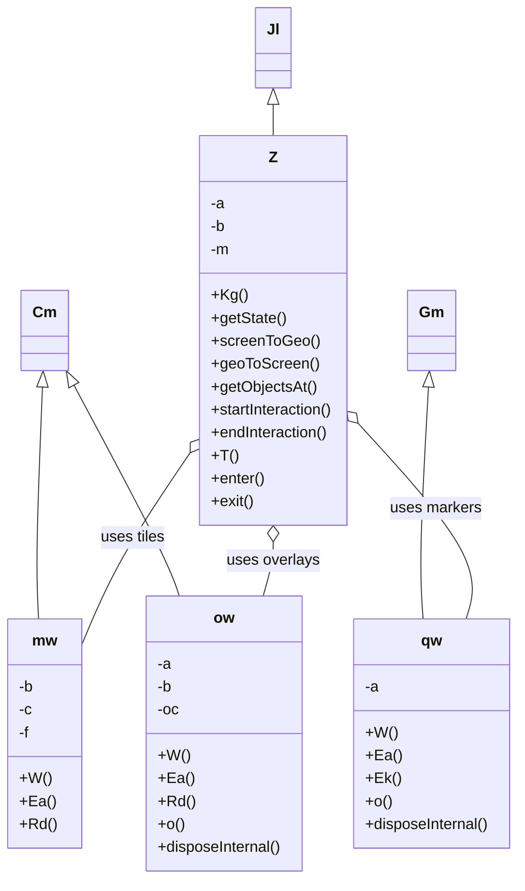
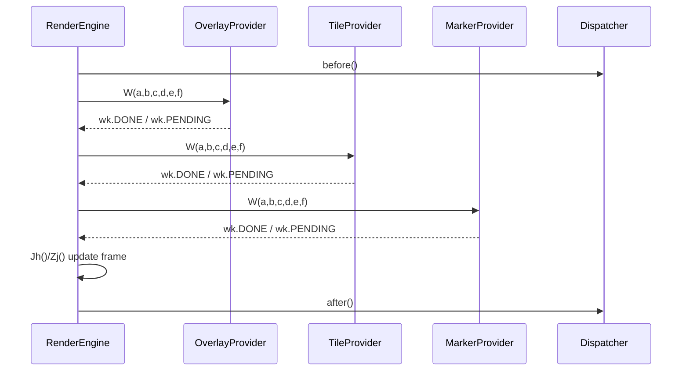

# Diagram: web/portal/public/js/heremaps-3.1.49.1/mapsjs-core-legacy.js

> Auto-generated by Obscura crawlers

## Diagram 1

### SVG

<svg id="container" width="545.119140625" xmlns="http://www.w3.org/2000/svg" class="classDiagram" height="920" viewBox="0 0 545.119140625 920" role="graphics-document document" aria-roledescription="class"><g><defs><marker id="container_class-aggregationStart" class="marker aggregation class" refX="18" refY="7" markerWidth="190" markerHeight="240" orient="auto"><path d="M 18,7 L9,13 L1,7 L9,1 Z"></path></marker></defs><defs><marker id="container_class-aggregationEnd" class="marker aggregation class" refX="1" refY="7" markerWidth="20" markerHeight="28" orient="auto"><path d="M 18,7 L9,13 L1,7 L9,1 Z"></path></marker></defs><defs><marker id="container_class-extensionStart" class="marker extension class" refX="18" refY="7" markerWidth="190" markerHeight="240" orient="auto"><path d="M 1,7 L18,13 V 1 Z"></path></marker></defs><defs><marker id="container_class-extensionEnd" class="marker extension class" refX="1" refY="7" markerWidth="20" markerHeight="28" orient="auto"><path d="M 1,1 V 13 L18,7 Z"></path></marker></defs><defs><marker id="container_class-compositionStart" class="marker composition class" refX="18" refY="7" markerWidth="190" markerHeight="240" orient="auto"><path d="M 18,7 L9,13 L1,7 L9,1 Z"></path></marker></defs><defs><marker id="container_class-compositionEnd" class="marker composition class" refX="1" refY="7" markerWidth="20" markerHeight="28" orient="auto"><path d="M 18,7 L9,13 L1,7 L9,1 Z"></path></marker></defs><defs><marker id="container_class-dependencyStart" class="marker dependency class" refX="6" refY="7" markerWidth="190" markerHeight="240" orient="auto"><path d="M 5,7 L9,13 L1,7 L9,1 Z"></path></marker></defs><defs><marker id="container_class-dependencyEnd" class="marker dependency class" refX="13" refY="7" markerWidth="20" markerHeight="28" orient="auto"><path d="M 18,7 L9,13 L14,7 L9,1 Z"></path></marker></defs><defs><marker id="container_class-lollipopStart" class="marker lollipop class" refX="13" refY="7" markerWidth="190" markerHeight="240" orient="auto"><circle stroke="black" fill="transparent" cx="7" cy="7" r="6"></circle></marker></defs><defs><marker id="container_class-lollipopEnd" class="marker lollipop class" refX="1" refY="7" markerWidth="190" markerHeight="240" orient="auto"><circle stroke="black" fill="transparent" cx="7" cy="7" r="6"></circle></marker></defs><g class="root"><g class="clusters"></g><g class="edgePaths"><path d="M42.326,405.232L40.925,435.526C39.524,465.821,36.721,526.411,35.946,566.872C35.17,607.333,36.423,627.667,37.049,637.833L37.675,648" id="id_Cm_mw_1" class="edge-thickness-normal edge-pattern-solid relation" style=";;;" data-edge="true" data-et="edge" data-id="id_Cm_mw_1" data-points="W3sieCI6NDMuMTIzNTI1MDI1OTMzNjEsInkiOjM4OH0seyJ4IjozMy45MTc5Njg3NSwieSI6NTg3fSx7IngiOjM3LjY3NTE3Njk2ODIzMjA0NCwieSI6NjQ4fV0=" marker-start="url(#container_class-extensionStart)"></path><path d="M75.516,403.229L91.813,433.857C108.11,464.486,140.703,525.743,159.067,562.538C177.431,599.333,181.564,611.667,183.631,617.833L185.698,624" id="id_Cm_ow_2" class="edge-thickness-normal edge-pattern-solid relation" style=";;;" data-edge="true" data-et="edge" data-id="id_Cm_ow_2" data-points="W3sieCI6NjcuNDEzNjI0ODcwMzMxOTQsInkiOjM4OH0seyJ4IjoxNzMuMjk2ODc1LCJ5Ijo1ODd9LHsieCI6MTg1LjY5NzgxNTk1MzAzODY4LCJ5Ijo2MjR9XQ==" marker-start="url(#container_class-extensionStart)"></path><path d="M449.851,405.214L447.894,435.512C445.938,465.809,442.026,526.405,440.944,566.869C439.861,607.333,441.609,627.667,442.483,637.833L443.357,648" id="id_Gm_qw_3" class="edge-thickness-normal edge-pattern-solid relation" style=";;;" data-edge="true" data-et="edge" data-id="id_Gm_qw_3" data-points="W3sieCI6NDUwLjk2MjAzMTU3NDE3MDEsInkiOjM4OH0seyJ4Ijo0MzguMTEzMjgxMjUsInkiOjU4N30seyJ4Ijo0NDMuMzU3NDQzNDU2NDkxNywieSI6NjQ4fV0=" marker-start="url(#container_class-extensionStart)"></path><path d="M284.27,109.25L284.27,110.542C284.27,111.833,284.27,114.417,284.27,119.875C284.27,125.333,284.27,133.667,284.27,137.833L284.27,142" id="id_Jl_Z_4" class="edge-thickness-normal edge-pattern-solid relation" style=";;;" data-edge="true" data-et="edge" data-id="id_Jl_Z_4" data-points="W3sieCI6Mjg0LjI2OTUzMTI1LCJ5Ijo5Mn0seyJ4IjoyODQuMjY5NTMxMjUsInkiOjExN30seyJ4IjoyODQuMjY5NTMxMjUsInkiOjE0Mn1d" marker-start="url(#container_class-extensionStart)"></path><path d="M194.597,476.873L182.021,495.228C169.445,513.582,144.293,550.291,125.549,583.717C106.805,617.143,94.469,647.286,88.301,662.357L82.133,677.428" id="id_Z_mw_5" class="edge-thickness-normal edge-pattern-solid relation" style=";;;" data-edge="true" data-et="edge" data-id="id_Z_mw_5" data-points="W3sieCI6MjA0LjM0NzY1NjI1LCJ5Ijo0NjIuNjQzMjQ3NDYyOTE5Nn0seyJ4IjoxMTkuMTQwNjI1LCJ5Ijo1ODd9LHsieCI6ODIuMTMyODEyNSwieSI6Njc3LjQyODQxMzIyNTc1NTR9XQ==" marker-start="url(#container_class-aggregationStart)"></path><path d="M284.27,567.25L284.27,570.542C284.27,573.833,284.27,580.417,282.556,589.875C280.842,599.333,277.413,611.667,275.699,617.833L273.985,624" id="id_Z_ow_6" class="edge-thickness-normal edge-pattern-solid relation" style=";;;" data-edge="true" data-et="edge" data-id="id_Z_ow_6" data-points="W3sieCI6Mjg0LjI2OTUzMTI1LCJ5Ijo1NTB9LHsieCI6Mjg0LjI2OTUzMTI1LCJ5Ijo1ODd9LHsieCI6MjczLjk4NTQ1NDA3NDU4NTYsInkiOjYyNH1d" marker-start="url(#container_class-aggregationStart)"></path><path d="M375.874,445.518L397.579,469.098C419.284,492.679,462.695,539.839,481.455,573.586C500.215,607.333,494.325,627.667,491.38,637.833L488.435,648" id="id_Z_qw_7" class="edge-thickness-normal edge-pattern-solid relation" style=";;;" data-edge="true" data-et="edge" data-id="id_Z_qw_7" data-points="W3sieCI6MzY0LjE5MTQwNjI1LCJ5Ijo0MzIuODI2MjAxNzk2MDkwODZ9LHsieCI6NTA2LjEwNTQ2ODc1LCJ5Ijo1ODd9LHsieCI6NDg4LjQzNTEzNjgyNjY1NzQ3LCJ5Ijo2NDh9XQ==" marker-start="url(#container_class-aggregationStart)"></path></g><g class="edgeLabels"><g class="edgeLabel"><g class="label" data-id="id_Cm_mw_1" transform="translate(0, 0)"><foreignObject width="0" height="0">

</foreignObject></g></g><g class="edgeLabel"><g class="label" data-id="id_Cm_ow_2" transform="translate(0, 0)"><foreignObject width="0" height="0">

</foreignObject></g></g><g class="edgeLabel"><g class="label" data-id="id_Gm_qw_3" transform="translate(0, 0)"><foreignObject width="0" height="0">

</foreignObject></g></g><g class="edgeLabel"><g class="label" data-id="id_Jl_Z_4" transform="translate(0, 0)"><foreignObject width="0" height="0">

</foreignObject></g></g><g class="edgeLabel" transform="translate(134.13037, 565.12297)"><g class="label" data-id="id_Z_mw_5" transform="translate(-34.15625, -12)"><foreignObject width="68.3125" height="24">

uses tiles

</foreignObject></g></g><g class="edgeLabel" transform="translate(284.26953125, 587)"><g class="label" data-id="id_Z_ow_6" transform="translate(-48.7578125, -12)"><foreignObject width="97.515625" height="24">

uses overlays

</foreignObject></g></g><g class="edgeLabel" transform="translate(456.65371, 533.27618)"><g class="label" data-id="id_Z_qw_7" transform="translate(-47.9921875, -12)"><foreignObject width="95.984375" height="24">

uses markers

</foreignObject></g></g></g><g class="nodes"><g class="node default" id="classId-Cm-0" transform="translate(45.06640625, 346)"><g class="basic label-container"><path d="M-23.265625 -42 L23.265625 -42 L23.265625 42 L-23.265625 42" stroke="none" stroke-width="0" fill="#ECECFF" style=""></path><path d="M-23.265625 -42 C-9.387181851885954 -42, 4.4912612962280924 -42, 23.265625 -42 M-23.265625 -42 C-13.731108901635597 -42, -4.196592803271194 -42, 23.265625 -42 M23.265625 -42 C23.265625 -24.526446433292488, 23.265625 -7.052892866584976, 23.265625 42 M23.265625 -42 C23.265625 -25.13516293805027, 23.265625 -8.270325876100543, 23.265625 42 M23.265625 42 C7.400552786750717 42, -8.464519426498565 42, -23.265625 42 M23.265625 42 C4.937175488802808 42, -13.391274022394384 42, -23.265625 42 M-23.265625 42 C-23.265625 22.38711832283554, -23.265625 2.774236645671081, -23.265625 -42 M-23.265625 42 C-23.265625 19.886426764261305, -23.265625 -2.22714647147739, -23.265625 -42" stroke="#9370DB" stroke-width="1.3" fill="none" stroke-dasharray="0 0" style=""></path></g><g class="annotation-group text" transform="translate(0, -18)"></g><g class="label-group text" transform="translate(-11.265625, -18)"><g class="label" style="font-weight: bolder" transform="translate(0,-12)"><foreignObject width="22.53125" height="24">

Cm

</foreignObject></g></g><g class="members-group text" transform="translate(-11.265625, 30)"></g><g class="methods-group text" transform="translate(-11.265625, 60)"></g><g class="divider" style=""><path d="M-23.265625 6 C-4.684582253101389 6, 13.896460493797221 6, 23.265625 6 M-23.265625 6 C-11.691877619556799 6, -0.11813023911359721 6, 23.265625 6" stroke="#9370DB" stroke-width="1.3" fill="none" stroke-dasharray="0 0" style=""></path></g><g class="divider" style=""><path d="M-23.265625 24 C-12.734462426438123 24, -2.2032998528762455 24, 23.265625 24 M-23.265625 24 C-13.572361500732159 24, -3.8790980014643175 24, 23.265625 24" stroke="#9370DB" stroke-width="1.3" fill="none" stroke-dasharray="0 0" style=""></path></g></g><g class="node default" id="classId-Gm-1" transform="translate(453.673828125, 346)"><g class="basic label-container"><path d="M-23.921875 -42 L23.921875 -42 L23.921875 42 L-23.921875 42" stroke="none" stroke-width="0" fill="#ECECFF" style=""></path><path d="M-23.921875 -42 C-13.537466805200989 -42, -3.1530586104019775 -42, 23.921875 -42 M-23.921875 -42 C-9.448204361718629 -42, 5.025466276562742 -42, 23.921875 -42 M23.921875 -42 C23.921875 -21.82831004530181, 23.921875 -1.6566200906036173, 23.921875 42 M23.921875 -42 C23.921875 -9.08040592311815, 23.921875 23.8391881537637, 23.921875 42 M23.921875 42 C7.676605412291607 42, -8.568664175416785 42, -23.921875 42 M23.921875 42 C10.081109549003019 42, -3.7596559019939626 42, -23.921875 42 M-23.921875 42 C-23.921875 15.386728445829899, -23.921875 -11.226543108340202, -23.921875 -42 M-23.921875 42 C-23.921875 9.891584076328144, -23.921875 -22.216831847343713, -23.921875 -42" stroke="#9370DB" stroke-width="1.3" fill="none" stroke-dasharray="0 0" style=""></path></g><g class="annotation-group text" transform="translate(0, -18)"></g><g class="label-group text" transform="translate(-11.921875, -18)"><g class="label" style="font-weight: bolder" transform="translate(0,-12)"><foreignObject width="23.84375" height="24">

Gm

</foreignObject></g></g><g class="members-group text" transform="translate(-11.921875, 30)"></g><g class="methods-group text" transform="translate(-11.921875, 60)"></g><g class="divider" style=""><path d="M-23.921875 6 C-5.2422695849974374 6, 13.437335830005125 6, 23.921875 6 M-23.921875 6 C-9.343629702292947 6, 5.234615595414105 6, 23.921875 6" stroke="#9370DB" stroke-width="1.3" fill="none" stroke-dasharray="0 0" style=""></path></g><g class="divider" style=""><path d="M-23.921875 24 C-6.8944811455403325 24, 10.132912708919335 24, 23.921875 24 M-23.921875 24 C-9.112441447927624 24, 5.696992104144751 24, 23.921875 24" stroke="#9370DB" stroke-width="1.3" fill="none" stroke-dasharray="0 0" style=""></path></g></g><g class="node default" id="classId-Jl-2" transform="translate(284.26953125, 50)"><g class="basic label-container"><path d="M-16.9140625 -42 L16.9140625 -42 L16.9140625 42 L-16.9140625 42" stroke="none" stroke-width="0" fill="#ECECFF" style=""></path><path d="M-16.9140625 -42 C-4.34822304604371 -42, 8.21761640791258 -42, 16.9140625 -42 M-16.9140625 -42 C-6.237890737158812 -42, 4.438281025682375 -42, 16.9140625 -42 M16.9140625 -42 C16.9140625 -12.448891804738928, 16.9140625 17.102216390522145, 16.9140625 42 M16.9140625 -42 C16.9140625 -9.995278191046602, 16.9140625 22.009443617906797, 16.9140625 42 M16.9140625 42 C9.822103047600503 42, 2.7301435952010085 42, -16.9140625 42 M16.9140625 42 C8.026159318998387 42, -0.8617438620032267 42, -16.9140625 42 M-16.9140625 42 C-16.9140625 23.198601838545, -16.9140625 4.397203677089998, -16.9140625 -42 M-16.9140625 42 C-16.9140625 19.38731011699871, -16.9140625 -3.2253797660025825, -16.9140625 -42" stroke="#9370DB" stroke-width="1.3" fill="none" stroke-dasharray="0 0" style=""></path></g><g class="annotation-group text" transform="translate(0, -18)"></g><g class="label-group text" transform="translate(-4.9140625, -18)"><g class="label" style="font-weight: bolder" transform="translate(0,-12)"><foreignObject width="9.828125" height="24">

Jl

</foreignObject></g></g><g class="members-group text" transform="translate(-4.9140625, 30)"></g><g class="methods-group text" transform="translate(-4.9140625, 60)"></g><g class="divider" style=""><path d="M-16.9140625 6 C-6.236305548154791 6, 4.441451403690419 6, 16.9140625 6 M-16.9140625 6 C-10.00378379484619 6, -3.09350508969238 6, 16.9140625 6" stroke="#9370DB" stroke-width="1.3" fill="none" stroke-dasharray="0 0" style=""></path></g><g class="divider" style=""><path d="M-16.9140625 24 C-4.813217882838735 24, 7.287626734322529 24, 16.9140625 24 M-16.9140625 24 C-6.198279635285102 24, 4.517503229429796 24, 16.9140625 24" stroke="#9370DB" stroke-width="1.3" fill="none" stroke-dasharray="0 0" style=""></path></g></g><g class="node default" id="classId-mw-3" transform="translate(45.06640625, 768)"><g class="basic label-container"><path d="M-37.06640625 -120 L37.06640625 -120 L37.06640625 120 L-37.06640625 120" stroke="none" stroke-width="0" fill="#ECECFF" style=""></path><path d="M-37.06640625 -120 C-14.22569114771602 -120, 8.61502395456796 -120, 37.06640625 -120 M-37.06640625 -120 C-15.666761589648676 -120, 5.732883070702648 -120, 37.06640625 -120 M37.06640625 -120 C37.06640625 -42.482565320113196, 37.06640625 35.03486935977361, 37.06640625 120 M37.06640625 -120 C37.06640625 -25.27030795257501, 37.06640625 69.45938409484998, 37.06640625 120 M37.06640625 120 C10.256072954043692 120, -16.554260341912617 120, -37.06640625 120 M37.06640625 120 C11.857281843108382 120, -13.351842563783237 120, -37.06640625 120 M-37.06640625 120 C-37.06640625 45.313646270870635, -37.06640625 -29.37270745825873, -37.06640625 -120 M-37.06640625 120 C-37.06640625 58.22748955957455, -37.06640625 -3.545020880850899, -37.06640625 -120" stroke="#9370DB" stroke-width="1.3" fill="none" stroke-dasharray="0 0" style=""></path></g><g class="annotation-group text" transform="translate(0, -96)"></g><g class="label-group text" transform="translate(-12.7578125, -96)"><g class="label" style="font-weight: bolder" transform="translate(0,-12)"><foreignObject width="25.515625" height="24">

mw

</foreignObject></g></g><g class="members-group text" transform="translate(-25.06640625, -48)"><g class="label" style="" transform="translate(0,-12)"><foreignObject width="15.953125" height="24">

-b

</foreignObject></g><g class="label" style="" transform="translate(0,12)"><foreignObject width="14.109375" height="24">

-c

</foreignObject></g><g class="label" style="" transform="translate(0,36)"><foreignObject width="11.578125" height="24">

-f

</foreignObject></g></g><g class="methods-group text" transform="translate(-25.06640625, 48)"><g class="label" style="" transform="translate(0,-12)"><foreignObject width="31.578125" height="24">

+W()

</foreignObject></g><g class="label" style="" transform="translate(0,12)"><foreignObject width="35.4375" height="24">

+Ea()

</foreignObject></g><g class="label" style="" transform="translate(0,36)"><foreignObject width="37.375" height="24">

+Rd()

</foreignObject></g></g><g class="divider" style=""><path d="M-37.06640625 -72 C-17.871022545478077 -72, 1.3243611590438462 -72, 37.06640625 -72 M-37.06640625 -72 C-10.831770846804353 -72, 15.402864556391293 -72, 37.06640625 -72" stroke="#9370DB" stroke-width="1.3" fill="none" stroke-dasharray="0 0" style=""></path></g><g class="divider" style=""><path d="M-37.06640625 24 C-10.367084447596724 24, 16.33223735480655 24, 37.06640625 24 M-37.06640625 24 C-18.07854704382071 24, 0.9093121623585816 24, 37.06640625 24" stroke="#9370DB" stroke-width="1.3" fill="none" stroke-dasharray="0 0" style=""></path></g></g><g class="node default" id="classId-ow-4" transform="translate(233.9609375, 768)"><g class="basic label-container"><path d="M-83.37890625 -144 L83.37890625 -144 L83.37890625 144 L-83.37890625 144" stroke="none" stroke-width="0" fill="#ECECFF" style=""></path><path d="M-83.37890625 -144 C-47.35279168974 -144, -11.326677129480004 -144, 83.37890625 -144 M-83.37890625 -144 C-18.078026103942292 -144, 47.222854042115415 -144, 83.37890625 -144 M83.37890625 -144 C83.37890625 -83.58271292194087, 83.37890625 -23.16542584388175, 83.37890625 144 M83.37890625 -144 C83.37890625 -61.515228428761105, 83.37890625 20.96954314247779, 83.37890625 144 M83.37890625 144 C26.963793159101925 144, -29.45131993179615 144, -83.37890625 144 M83.37890625 144 C31.484352638075116 144, -20.41020097384977 144, -83.37890625 144 M-83.37890625 144 C-83.37890625 82.68904351035278, -83.37890625 21.378087020705536, -83.37890625 -144 M-83.37890625 144 C-83.37890625 39.4847879110207, -83.37890625 -65.0304241779586, -83.37890625 -144" stroke="#9370DB" stroke-width="1.3" fill="none" stroke-dasharray="0 0" style=""></path></g><g class="annotation-group text" transform="translate(0, -120)"></g><g class="label-group text" transform="translate(-10.6640625, -120)"><g class="label" style="font-weight: bolder" transform="translate(0,-12)"><foreignObject width="21.328125" height="24">

ow

</foreignObject></g></g><g class="members-group text" transform="translate(-71.37890625, -72)"><g class="label" style="" transform="translate(0,-12)"><foreignObject width="14.921875" height="24">

-a

</foreignObject></g><g class="label" style="" transform="translate(0,12)"><foreignObject width="15.953125" height="24">

-b

</foreignObject></g><g class="label" style="" transform="translate(0,36)"><foreignObject width="23.453125" height="24">

-oc

</foreignObject></g></g><g class="methods-group text" transform="translate(-71.37890625, 24)"><g class="label" style="" transform="translate(0,-12)"><foreignObject width="31.578125" height="24">

+W()

</foreignObject></g><g class="label" style="" transform="translate(0,12)"><foreignObject width="35.4375" height="24">

+Ea()

</foreignObject></g><g class="label" style="" transform="translate(0,36)"><foreignObject width="37.375" height="24">

+Rd()

</foreignObject></g><g class="label" style="" transform="translate(0,60)"><foreignObject width="27.703125" height="24">

+o()

</foreignObject></g><g class="label" style="" transform="translate(0,84)"><foreignObject width="132.09375" height="24">

+disposeInternal()

</foreignObject></g></g><g class="divider" style=""><path d="M-83.37890625 -96 C-44.83815513370697 -96, -6.297404017413939 -96, 83.37890625 -96 M-83.37890625 -96 C-45.27581902498751 -96, -7.1727317999750255 -96, 83.37890625 -96" stroke="#9370DB" stroke-width="1.3" fill="none" stroke-dasharray="0 0" style=""></path></g><g class="divider" style=""><path d="M-83.37890625 0 C-19.896440439989597 0, 43.586025370020806 0, 83.37890625 0 M-83.37890625 0 C-32.37373505809903 0, 18.63143613380194 0, 83.37890625 0" stroke="#9370DB" stroke-width="1.3" fill="none" stroke-dasharray="0 0" style=""></path></g></g><g class="node default" id="classId-qw-5" transform="translate(453.673828125, 768)"><g class="basic label-container"><path d="M-83.4453125 -120 L83.4453125 -120 L83.4453125 120 L-83.4453125 120" stroke="none" stroke-width="0" fill="#ECECFF" style=""></path><path d="M-83.4453125 -120 C-41.96123540311485 -120, -0.4771583062296969 -120, 83.4453125 -120 M-83.4453125 -120 C-49.19817793261214 -120, -14.95104336522428 -120, 83.4453125 -120 M83.4453125 -120 C83.4453125 -53.66362529043808, 83.4453125 12.672749419123846, 83.4453125 120 M83.4453125 -120 C83.4453125 -29.679522174844465, 83.4453125 60.64095565031107, 83.4453125 120 M83.4453125 120 C31.250577295211045 120, -20.94415790957791 120, -83.4453125 120 M83.4453125 120 C44.727292926089234 120, 6.009273352178468 120, -83.4453125 120 M-83.4453125 120 C-83.4453125 58.83763338375735, -83.4453125 -2.3247332324853005, -83.4453125 -120 M-83.4453125 120 C-83.4453125 48.108674302454304, -83.4453125 -23.782651395091392, -83.4453125 -120" stroke="#9370DB" stroke-width="1.3" fill="none" stroke-dasharray="0 0" style=""></path></g><g class="annotation-group text" transform="translate(0, -96)"></g><g class="label-group text" transform="translate(-10.796875, -96)"><g class="label" style="font-weight: bolder" transform="translate(0,-12)"><foreignObject width="21.59375" height="24">

qw

</foreignObject></g></g><g class="members-group text" transform="translate(-71.4453125, -48)"><g class="label" style="" transform="translate(0,-12)"><foreignObject width="14.921875" height="24">

-a

</foreignObject></g></g><g class="methods-group text" transform="translate(-71.4453125, 0)"><g class="label" style="" transform="translate(0,-12)"><foreignObject width="31.578125" height="24">

+W()

</foreignObject></g><g class="label" style="" transform="translate(0,12)"><foreignObject width="35.4375" height="24">

+Ea()

</foreignObject></g><g class="label" style="" transform="translate(0,36)"><foreignObject width="35.109375" height="24">

+Ek()

</foreignObject></g><g class="label" style="" transform="translate(0,60)"><foreignObject width="27.703125" height="24">

+o()

</foreignObject></g><g class="label" style="" transform="translate(0,84)"><foreignObject width="132.09375" height="24">

+disposeInternal()

</foreignObject></g></g><g class="divider" style=""><path d="M-83.4453125 -72 C-34.237465779026856 -72, 14.970380941946289 -72, 83.4453125 -72 M-83.4453125 -72 C-40.63316520346499 -72, 2.1789820930700188 -72, 83.4453125 -72" stroke="#9370DB" stroke-width="1.3" fill="none" stroke-dasharray="0 0" style=""></path></g><g class="divider" style=""><path d="M-83.4453125 -24 C-41.58065811271586 -24, 0.28399627456828114 -24, 83.4453125 -24 M-83.4453125 -24 C-35.36046910544073 -24, 12.724374289118543 -24, 83.4453125 -24" stroke="#9370DB" stroke-width="1.3" fill="none" stroke-dasharray="0 0" style=""></path></g></g><g class="node default" id="classId-Z-6" transform="translate(284.26953125, 346)"><g class="basic label-container"><path d="M-79.921875 -204 L79.921875 -204 L79.921875 204 L-79.921875 204" stroke="none" stroke-width="0" fill="#ECECFF" style=""></path><path d="M-79.921875 -204 C-29.021143314736484 -204, 21.87958837052703 -204, 79.921875 -204 M-79.921875 -204 C-34.40347009255915 -204, 11.114934814881707 -204, 79.921875 -204 M79.921875 -204 C79.921875 -108.65701839123886, 79.921875 -13.314036782477729, 79.921875 204 M79.921875 -204 C79.921875 -59.06276454153178, 79.921875 85.87447091693645, 79.921875 204 M79.921875 204 C30.685598948747575 204, -18.55067710250485 204, -79.921875 204 M79.921875 204 C25.62901965403838 204, -28.66383569192324 204, -79.921875 204 M-79.921875 204 C-79.921875 82.28900990773265, -79.921875 -39.4219801845347, -79.921875 -204 M-79.921875 204 C-79.921875 95.67121386243468, -79.921875 -12.657572275130633, -79.921875 -204" stroke="#9370DB" stroke-width="1.3" fill="none" stroke-dasharray="0 0" style=""></path></g><g class="annotation-group text" transform="translate(0, -180)"></g><g class="label-group text" transform="translate(-4.359375, -180)"><g class="label" style="font-weight: bolder" transform="translate(0,-12)"><foreignObject width="8.71875" height="24">

Z

</foreignObject></g></g><g class="members-group text" transform="translate(-67.921875, -132)"><g class="label" style="" transform="translate(0,-12)"><foreignObject width="14.921875" height="24">

-a

</foreignObject></g><g class="label" style="" transform="translate(0,12)"><foreignObject width="15.953125" height="24">

-b

</foreignObject></g><g class="label" style="" transform="translate(0,36)"><foreignObject width="20.171875" height="24">

-m

</foreignObject></g></g><g class="methods-group text" transform="translate(-67.921875, -36)"><g class="label" style="" transform="translate(0,-12)"><foreignObject width="35.859375" height="24">

+Kg()

</foreignObject></g><g class="label" style="" transform="translate(0,12)"><foreignObject width="78.265625" height="24">

+getState()

</foreignObject></g><g class="label" style="" transform="translate(0,36)"><foreignObject width="110.890625" height="24">

+screenToGeo()

</foreignObject></g><g class="label" style="" transform="translate(0,60)"><foreignObject width="110.109375" height="24">

+geoToScreen()

</foreignObject></g><g class="label" style="" transform="translate(0,84)"><foreignObject width="110.53125" height="24">

+getObjectsAt()

</foreignObject></g><g class="label" style="" transform="translate(0,108)"><foreignObject width="131.484375" height="24">

+startInteraction()

</foreignObject></g><g class="label" style="" transform="translate(0,132)"><foreignObject width="125.359375" height="24">

+endInteraction()

</foreignObject></g><g class="label" style="" transform="translate(0,156)"><foreignObject width="25.828125" height="24">

+T()

</foreignObject></g><g class="label" style="" transform="translate(0,180)"><foreignObject width="56.890625" height="24">

+enter()

</foreignObject></g><g class="label" style="" transform="translate(0,204)"><foreignObject width="44.984375" height="24">

+exit()

</foreignObject></g></g><g class="divider" style=""><path d="M-79.921875 -156 C-37.4283236977014 -156, 5.065227604597197 -156, 79.921875 -156 M-79.921875 -156 C-16.990862591209208 -156, 45.940149817581585 -156, 79.921875 -156" stroke="#9370DB" stroke-width="1.3" fill="none" stroke-dasharray="0 0" style=""></path></g><g class="divider" style=""><path d="M-79.921875 -60 C-20.729766797113683 -60, 38.462341405772634 -60, 79.921875 -60 M-79.921875 -60 C-25.05579167801534 -60, 29.81029164396932 -60, 79.921875 -60" stroke="#9370DB" stroke-width="1.3" fill="none" stroke-dasharray="0 0" style=""></path></g></g></g></g></g></svg>

## Diagram 2

> SVG rendering failed for this diagram.
