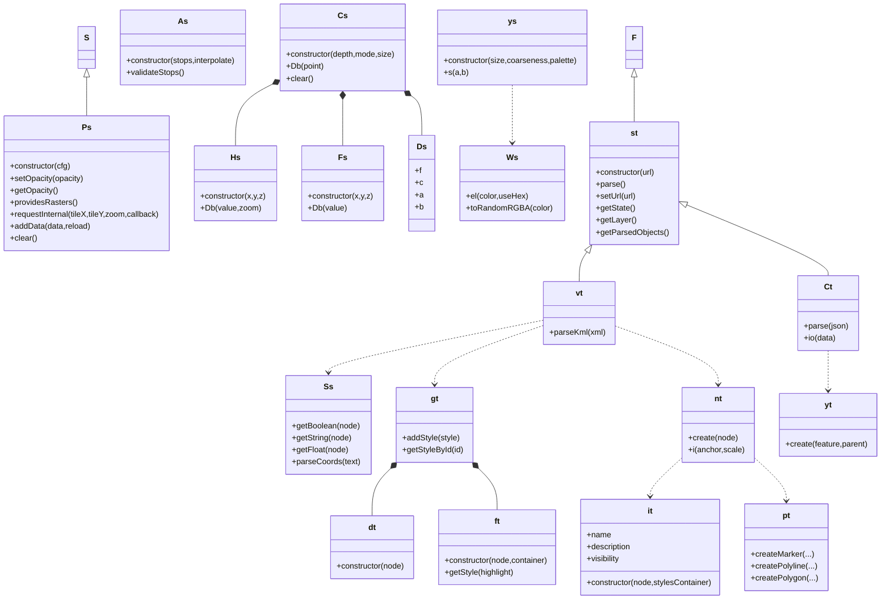

# Diagram: web/portal/public/js/heremaps-3.1.49.1/mapsjs-data.js


> Auto-generated by Obscura crawlers

## Diagram 1



### SVG

<svg id="container" width="1764" xmlns="http://www.w3.org/2000/svg" class="classDiagram" height="1200" viewBox="0 0 1764 1200" role="graphics-document document" aria-roledescription="class"><style>#container{font-family:"trebuchet ms",verdana,arial,sans-serif;font-size:16px;fill:#333;}@keyframes edge-animation-frame{from{stroke-dashoffset:0;}}@keyframes dash{to{stroke-dashoffset:0;}}#container .edge-animation-slow{stroke-dasharray:9,5!important;stroke-dashoffset:900;animation:dash 50s linear infinite;stroke-linecap:round;}#container .edge-animation-fast{stroke-dasharray:9,5!important;stroke-dashoffset:900;animation:dash 20s linear infinite;stroke-linecap:round;}#container .error-icon{fill:#552222;}#container .error-text{fill:#552222;stroke:#552222;}#container .edge-thickness-normal{stroke-width:1px;}#container .edge-thickness-thick{stroke-width:3.5px;}#container .edge-pattern-solid{stroke-dasharray:0;}#container .edge-thickness-invisible{stroke-width:0;fill:none;}#container .edge-pattern-dashed{stroke-dasharray:3;}#container .edge-pattern-dotted{stroke-dasharray:2;}#container .marker{fill:#333333;stroke:#333333;}#container .marker.cross{stroke:#333333;}#container svg{font-family:"trebuchet ms",verdana,arial,sans-serif;font-size:16px;}#container p{margin:0;}#container g.classGroup text{fill:#9370DB;stroke:none;font-family:"trebuchet ms",verdana,arial,sans-serif;font-size:10px;}#container g.classGroup text .title{font-weight:bolder;}#container .nodeLabel,#container .edgeLabel{color:#131300;}#container .edgeLabel .label rect{fill:#ECECFF;}#container .label text{fill:#131300;}#container .labelBkg{background:#ECECFF;}#container .edgeLabel .label span{background:#ECECFF;}#container .classTitle{font-weight:bolder;}#container .node rect,#container .node circle,#container .node ellipse,#container .node polygon,#container .node path{fill:#ECECFF;stroke:#9370DB;stroke-width:1px;}#container .divider{stroke:#9370DB;stroke-width:1;}#container g.clickable{cursor:pointer;}#container g.classGroup rect{fill:#ECECFF;stroke:#9370DB;}#container g.classGroup line{stroke:#9370DB;stroke-width:1;}#container .classLabel .box{stroke:none;stroke-width:0;fill:#ECECFF;opacity:0.5;}#container .classLabel .label{fill:#9370DB;font-size:10px;}#container .relation{stroke:#333333;stroke-width:1;fill:none;}#container .dashed-line{stroke-dasharray:3;}#container .dotted-line{stroke-dasharray:1 2;}#container #compositionStart,#container .composition{fill:#333333!important;stroke:#333333!important;stroke-width:1;}#container #compositionEnd,#container .composition{fill:#333333!important;stroke:#333333!important;stroke-width:1;}#container #dependencyStart,#container .dependency{fill:#333333!important;stroke:#333333!important;stroke-width:1;}#container #dependencyStart,#container .dependency{fill:#333333!important;stroke:#333333!important;stroke-width:1;}#container #extensionStart,#container .extension{fill:transparent!important;stroke:#333333!important;stroke-width:1;}#container #extensionEnd,#container .extension{fill:transparent!important;stroke:#333333!important;stroke-width:1;}#container #aggregationStart,#container .aggregation{fill:transparent!important;stroke:#333333!important;stroke-width:1;}#container #aggregationEnd,#container .aggregation{fill:transparent!important;stroke:#333333!important;stroke-width:1;}#container #lollipopStart,#container .lollipop{fill:#ECECFF!important;stroke:#333333!important;stroke-width:1;}#container #lollipopEnd,#container .lollipop{fill:#ECECFF!important;stroke:#333333!important;stroke-width:1;}#container .edgeTerminals{font-size:11px;line-height:initial;}#container .classTitleText{text-anchor:middle;font-size:18px;fill:#333;}#container .label-icon{display:inline-block;height:1em;overflow:visible;vertical-align:-0.125em;}#container .node .label-icon path{fill:currentColor;stroke:revert;stroke-width:revert;}#container :root{--mermaid-font-family:"trebuchet ms",verdana,arial,sans-serif;}</style><g><defs><marker id="container_class-aggregationStart" class="marker aggregation class" refX="18" refY="7" markerWidth="190" markerHeight="240" orient="auto"><path d="M 18,7 L9,13 L1,7 L9,1 Z"></path></marker></defs><defs><marker id="container_class-aggregationEnd" class="marker aggregation class" refX="1" refY="7" markerWidth="20" markerHeight="28" orient="auto"><path d="M 18,7 L9,13 L1,7 L9,1 Z"></path></marker></defs><defs><marker id="container_class-extensionStart" class="marker extension class" refX="18" refY="7" markerWidth="190" markerHeight="240" orient="auto"><path d="M 1,7 L18,13 V 1 Z"></path></marker></defs><defs><marker id="container_class-extensionEnd" class="marker extension class" refX="1" refY="7" markerWidth="20" markerHeight="28" orient="auto"><path d="M 1,1 V 13 L18,7 Z"></path></marker></defs><defs><marker id="container_class-compositionStart" class="marker composition class" refX="18" refY="7" markerWidth="190" markerHeight="240" orient="auto"><path d="M 18,7 L9,13 L1,7 L9,1 Z"></path></marker></defs><defs><marker id="container_class-compositionEnd" class="marker composition class" refX="1" refY="7" markerWidth="20" markerHeight="28" orient="auto"><path d="M 18,7 L9,13 L1,7 L9,1 Z"></path></marker></defs><defs><marker id="container_class-dependencyStart" class="marker dependency class" refX="6" refY="7" markerWidth="190" markerHeight="240" orient="auto"><path d="M 5,7 L9,13 L1,7 L9,1 Z"></path></marker></defs><defs><marker id="container_class-dependencyEnd" class="marker dependency class" refX="13" refY="7" markerWidth="20" markerHeight="28" orient="auto"><path d="M 18,7 L9,13 L14,7 L9,1 Z"></path></marker></defs><defs><marker id="container_class-lollipopStart" class="marker lollipop class" refX="13" refY="7" markerWidth="190" markerHeight="240" orient="auto"><circle stroke="black" fill="transparent" cx="7" cy="7" r="6"></circle></marker></defs><defs><marker id="container_class-lollipopEnd" class="marker lollipop class" refX="1" refY="7" markerWidth="190" markerHeight="240" orient="auto"><circle stroke="black" fill="transparent" cx="7" cy="7" r="6"></circle></marker></defs><g class="root"><g class="clusters"></g><g class="edgePaths"><path d="M175.988,154.25L175.988,163.042C175.988,171.833,175.988,189.417,175.988,202.375C175.988,215.333,175.988,223.667,175.988,227.833L175.988,232" id="id_S_Ps_1" class="edge-thickness-normal edge-pattern-solid relation" style=";;;" data-edge="true" data-et="edge" data-id="id_S_Ps_1" data-points="W3sieCI6MTc1Ljk4ODI4MTI1LCJ5IjoxMzd9LHsieCI6MTc1Ljk4ODI4MTI1LCJ5IjoyMDd9LHsieCI6MTc1Ljk4ODI4MTI1LCJ5IjoyMzJ9XQ==" marker-start="url(#container_class-extensionStart)"></path><path d="M547.251,169.627L535.388,175.855C523.525,182.084,499.8,194.542,487.937,214.938C476.074,235.333,476.074,263.667,476.074,277.833L476.074,292" id="id_Cs_Hs_2" class="edge-thickness-normal edge-pattern-solid relation" style=";;;" data-edge="true" data-et="edge" data-id="id_Cs_Hs_2" data-points="W3sieCI6NTYyLjUyMzQzNzUsInkiOjE2MS42MDcyMzM3Njk4MDEzfSx7IngiOjQ3Ni4wNzQyMTg3NSwieSI6MjA3fSx7IngiOjQ3Ni4wNzQyMTg3NSwieSI6MjkyfV0=" marker-start="url(#container_class-compositionStart)"></path><path d="M689.375,199.25L689.375,200.542C689.375,201.833,689.375,204.417,689.375,219.875C689.375,235.333,689.375,263.667,689.375,277.833L689.375,292" id="id_Cs_Fs_3" class="edge-thickness-normal edge-pattern-solid relation" style=";;;" data-edge="true" data-et="edge" data-id="id_Cs_Fs_3" data-points="W3sieCI6Njg5LjM3NSwieSI6MTgyfSx7IngiOjY4OS4zNzUsInkiOjIwN30seyJ4Ijo2ODkuMzc1LCJ5IjoyOTJ9XQ==" marker-start="url(#container_class-compositionStart)"></path><path d="M824.963,192.039L828.447,194.533C831.931,197.026,838.899,202.013,842.383,215.173C845.867,228.333,845.867,249.667,845.867,260.333L845.867,271" id="id_Cs_Ds_4" class="edge-thickness-normal edge-pattern-solid relation" style=";;;" data-edge="true" data-et="edge" data-id="id_Cs_Ds_4" data-points="W3sieCI6ODEwLjkzNTg5NTY0NzMyMTQsInkiOjE4Mn0seyJ4Ijo4NDUuODY3MTg3NSwieSI6MjA3fSx7IngiOjg0NS44NjcxODc1LCJ5IjoyNzF9XQ==" marker-start="url(#container_class-compositionStart)"></path><path d="M1022.75,170L1022.75,176.167C1022.75,182.333,1022.75,194.667,1022.75,214C1022.75,233.333,1022.75,259.667,1022.75,272.833L1022.75,286" id="id_ys_Ws_5" class="edge-thickness-normal edge-pattern-dashed relation" style=";;;" data-edge="true" data-et="edge" data-id="id_ys_Ws_5" data-points="W3sieCI6MTAyMi43NSwieSI6MTcwfSx7IngiOjEwMjIuNzUsInkiOjIwN30seyJ4IjoxMDIyLjc1LCJ5IjoyOTJ9XQ==" marker-end="url(#container_class-dependencyEnd)"></path><path d="M1079.572,641.21L1007.271,655.508C934.969,669.807,790.365,698.403,718.063,715.868C645.762,733.333,645.762,739.667,645.762,742.833L645.762,746" id="id_vt_Ss_6" class="edge-thickness-normal edge-pattern-dashed relation" style=";;;" data-edge="true" data-et="edge" data-id="id_vt_Ss_6" data-points="W3sieCI6MTA3OS41NzIyNjU2MjUsInkiOjY0MS4yMTAwNjQ4NTEwNDM0fSx7IngiOjY0NS43NjE3MTg3NSwieSI6NzI3fSx7IngiOjY0NS43NjE3MTg3NSwieSI6NzUyfV0=" marker-end="url(#container_class-dependencyEnd)"></path><path d="M1262.023,154.25L1262.023,163.042C1262.023,171.833,1262.023,189.417,1262.023,204.375C1262.023,219.333,1262.023,231.667,1262.023,237.833L1262.023,244" id="id_F_st_7" class="edge-thickness-normal edge-pattern-solid relation" style=";;;" data-edge="true" data-et="edge" data-id="id_F_st_7" data-points="W3sieCI6MTI2Mi4wMjM0Mzc1LCJ5IjoxMzd9LHsieCI6MTI2Mi4wMjM0Mzc1LCJ5IjoyMDd9LHsieCI6MTI2Mi4wMjM0Mzc1LCJ5IjoyNDR9XQ==" marker-start="url(#container_class-extensionStart)"></path><path d="M1167.195,504.19L1164.567,507.992C1161.939,511.793,1156.683,519.397,1154.056,529.365C1151.428,539.333,1151.428,551.667,1151.428,557.833L1151.428,564" id="id_st_vt_8" class="edge-thickness-normal edge-pattern-solid relation" style=";;;" data-edge="true" data-et="edge" data-id="id_st_vt_8" data-points="W3sieCI6MTE3Ny4wMDI5OTA3MjI2NTYyLCJ5Ijo0OTB9LHsieCI6MTE1MS40Mjc3MzQzNzUsInkiOjUyN30seyJ4IjoxMTUxLjQyNzczNDM3NSwieSI6NTY0fV0=" marker-start="url(#container_class-extensionStart)"></path><path d="M1079.572,651.47L1042.607,664.058C1005.642,676.647,931.712,701.823,894.746,721.578C857.781,741.333,857.781,755.667,857.781,762.833L857.781,770" id="id_vt_gt_9" class="edge-thickness-normal edge-pattern-dashed relation" style=";;;" data-edge="true" data-et="edge" data-id="id_vt_gt_9" data-points="W3sieCI6MTA3OS41NzIyNjU2MjUsInkiOjY1MS40NzAwNTkyNjI5MDUxfSx7IngiOjg1Ny43ODEyNSwieSI6NzI3fSx7IngiOjg1Ny43ODEyNSwieSI6Nzc2fV0=" marker-end="url(#container_class-dependencyEnd)"></path><path d="M1223.283,652.255L1258.728,664.712C1294.172,677.17,1365.061,702.085,1400.505,721.709C1435.949,741.333,1435.949,755.667,1435.949,762.833L1435.949,770" id="id_vt_nt_10" class="edge-thickness-normal edge-pattern-dashed relation" style=";;;" data-edge="true" data-et="edge" data-id="id_vt_nt_10" data-points="W3sieCI6MTIyMy4yODMyMDMxMjUsInkiOjY1Mi4yNTQ4NDgxMjA4MTY5fSx7IngiOjE0MzUuOTQ5MjE4NzUsInkiOjcyN30seyJ4IjoxNDM1Ljk0OTIxODc1LCJ5Ijo3NzZ9XQ==" marker-end="url(#container_class-dependencyEnd)"></path><path d="M1365.692,408.98L1414.267,428.65C1462.842,448.32,1559.991,487.66,1608.566,511.497C1657.141,535.333,1657.141,543.667,1657.141,547.833L1657.141,552" id="id_st_Ct_11" class="edge-thickness-normal edge-pattern-solid relation" style=";;;" data-edge="true" data-et="edge" data-id="id_st_Ct_11" data-points="W3sieCI6MTM0OS43MDMxMjUsInkiOjQwMi41MDUyODkxNzQ0OTMzfSx7IngiOjE2NTcuMTQwNjI1LCJ5Ijo1Mjd9LHsieCI6MTY1Ny4xNDA2MjUsInkiOjU1Mn1d" marker-start="url(#container_class-extensionStart)"></path><path d="M1657.141,702L1657.141,706.167C1657.141,710.333,1657.141,718.667,1657.141,732C1657.141,745.333,1657.141,763.667,1657.141,772.833L1657.141,782" id="id_Ct_yt_12" class="edge-thickness-normal edge-pattern-dashed relation" style=";;;" data-edge="true" data-et="edge" data-id="id_Ct_yt_12" data-points="W3sieCI6MTY1Ny4xNDA2MjUsInkiOjcwMn0seyJ4IjoxNjU3LjE0MDYyNSwieSI6NzI3fSx7IngiOjE2NTcuMTQwNjI1LCJ5Ijo3ODh9XQ==" marker-end="url(#container_class-dependencyEnd)"></path><path d="M1363.617,916.377L1352.807,926.148C1341.997,935.918,1320.378,955.459,1309.568,968.396C1298.758,981.333,1298.758,987.667,1298.758,990.833L1298.758,994" id="id_nt_it_13" class="edge-thickness-normal edge-pattern-dashed relation" style=";;;" data-edge="true" data-et="edge" data-id="id_nt_it_13" data-points="W3sieCI6MTM2My42MTcxODc1LCJ5Ijo5MTYuMzc3MDY3ODUxMTQzMn0seyJ4IjoxMjk4Ljc1NzgxMjUsInkiOjk3NX0seyJ4IjoxMjk4Ljc1NzgxMjUsInkiOjEwMDB9XQ==" marker-end="url(#container_class-dependencyEnd)"></path><path d="M1508.281,916.377L1519.091,926.148C1529.901,935.918,1551.521,955.459,1562.331,969.896C1573.141,984.333,1573.141,993.667,1573.141,998.333L1573.141,1003" id="id_nt_pt_14" class="edge-thickness-normal edge-pattern-dashed relation" style=";;;" data-edge="true" data-et="edge" data-id="id_nt_pt_14" data-points="W3sieCI6MTUwOC4yODEyNSwieSI6OTE2LjM3NzA2Nzg1MTE0MzJ9LHsieCI6MTU3My4xNDA2MjUsInkiOjk3NX0seyJ4IjoxNTczLjE0MDYyNSwieSI6MTAwOX1d" marker-end="url(#container_class-dependencyEnd)"></path><path d="M768.388,937.554L761.943,943.795C755.497,950.036,742.606,962.518,736.16,978.426C729.715,994.333,729.715,1013.667,729.715,1023.333L729.715,1033" id="id_gt_dt_15" class="edge-thickness-normal edge-pattern-solid relation" style=";;;" data-edge="true" data-et="edge" data-id="id_gt_dt_15" data-points="W3sieCI6NzgwLjc4MTI1LCJ5Ijo5MjUuNTU1MDcwOTE2NTc3N30seyJ4Ijo3MjkuNzE0ODQzNzUsInkiOjk3NX0seyJ4Ijo3MjkuNzE0ODQzNzUsInkiOjEwMzN9XQ==" marker-start="url(#container_class-compositionStart)"></path><path d="M947.174,937.554L953.62,943.795C960.065,950.036,972.956,962.518,979.402,976.426C985.848,990.333,985.848,1005.667,985.848,1013.333L985.848,1021" id="id_gt_ft_16" class="edge-thickness-normal edge-pattern-solid relation" style=";;;" data-edge="true" data-et="edge" data-id="id_gt_ft_16" data-points="W3sieCI6OTM0Ljc4MTI1LCJ5Ijo5MjUuNTU1MDcwOTE2NTc3N30seyJ4Ijo5ODUuODQ3NjU2MjUsInkiOjk3NX0seyJ4Ijo5ODUuODQ3NjU2MjUsInkiOjEwMjF9XQ==" marker-start="url(#container_class-compositionStart)"></path></g><g class="edgeLabels"><g class="edgeLabel"><g class="label" data-id="id_S_Ps_1" transform="translate(0, 0)"><foreignObject width="0" height="0"><div xmlns="http://www.w3.org/1999/xhtml" class="labelBkg" style="display: table-cell; white-space: nowrap; line-height: 1.5; max-width: 200px; text-align: center;"><span class="edgeLabel"></span></div></foreignObject></g></g><g class="edgeLabel"><g class="label" data-id="id_Cs_Hs_2" transform="translate(0, 0)"><foreignObject width="0" height="0"><div xmlns="http://www.w3.org/1999/xhtml" class="labelBkg" style="display: table-cell; white-space: nowrap; line-height: 1.5; max-width: 200px; text-align: center;"><span class="edgeLabel"></span></div></foreignObject></g></g><g class="edgeLabel"><g class="label" data-id="id_Cs_Fs_3" transform="translate(0, 0)"><foreignObject width="0" height="0"><div xmlns="http://www.w3.org/1999/xhtml" class="labelBkg" style="display: table-cell; white-space: nowrap; line-height: 1.5; max-width: 200px; text-align: center;"><span class="edgeLabel"></span></div></foreignObject></g></g><g class="edgeLabel"><g class="label" data-id="id_Cs_Ds_4" transform="translate(0, 0)"><foreignObject width="0" height="0"><div xmlns="http://www.w3.org/1999/xhtml" class="labelBkg" style="display: table-cell; white-space: nowrap; line-height: 1.5; max-width: 200px; text-align: center;"><span class="edgeLabel"></span></div></foreignObject></g></g><g class="edgeLabel"><g class="label" data-id="id_ys_Ws_5" transform="translate(0, 0)"><foreignObject width="0" height="0"><div xmlns="http://www.w3.org/1999/xhtml" class="labelBkg" style="display: table-cell; white-space: nowrap; line-height: 1.5; max-width: 200px; text-align: center;"><span class="edgeLabel"></span></div></foreignObject></g></g><g class="edgeLabel"><g class="label" data-id="id_vt_Ss_6" transform="translate(0, 0)"><foreignObject width="0" height="0"><div xmlns="http://www.w3.org/1999/xhtml" class="labelBkg" style="display: table-cell; white-space: nowrap; line-height: 1.5; max-width: 200px; text-align: center;"><span class="edgeLabel"></span></div></foreignObject></g></g><g class="edgeLabel"><g class="label" data-id="id_F_st_7" transform="translate(0, 0)"><foreignObject width="0" height="0"><div xmlns="http://www.w3.org/1999/xhtml" class="labelBkg" style="display: table-cell; white-space: nowrap; line-height: 1.5; max-width: 200px; text-align: center;"><span class="edgeLabel"></span></div></foreignObject></g></g><g class="edgeLabel"><g class="label" data-id="id_st_vt_8" transform="translate(0, 0)"><foreignObject width="0" height="0"><div xmlns="http://www.w3.org/1999/xhtml" class="labelBkg" style="display: table-cell; white-space: nowrap; line-height: 1.5; max-width: 200px; text-align: center;"><span class="edgeLabel"></span></div></foreignObject></g></g><g class="edgeLabel"><g class="label" data-id="id_vt_gt_9" transform="translate(0, 0)"><foreignObject width="0" height="0"><div xmlns="http://www.w3.org/1999/xhtml" class="labelBkg" style="display: table-cell; white-space: nowrap; line-height: 1.5; max-width: 200px; text-align: center;"><span class="edgeLabel"></span></div></foreignObject></g></g><g class="edgeLabel"><g class="label" data-id="id_vt_nt_10" transform="translate(0, 0)"><foreignObject width="0" height="0"><div xmlns="http://www.w3.org/1999/xhtml" class="labelBkg" style="display: table-cell; white-space: nowrap; line-height: 1.5; max-width: 200px; text-align: center;"><span class="edgeLabel"></span></div></foreignObject></g></g><g class="edgeLabel"><g class="label" data-id="id_st_Ct_11" transform="translate(0, 0)"><foreignObject width="0" height="0"><div xmlns="http://www.w3.org/1999/xhtml" class="labelBkg" style="display: table-cell; white-space: nowrap; line-height: 1.5; max-width: 200px; text-align: center;"><span class="edgeLabel"></span></div></foreignObject></g></g><g class="edgeLabel"><g class="label" data-id="id_Ct_yt_12" transform="translate(0, 0)"><foreignObject width="0" height="0"><div xmlns="http://www.w3.org/1999/xhtml" class="labelBkg" style="display: table-cell; white-space: nowrap; line-height: 1.5; max-width: 200px; text-align: center;"><span class="edgeLabel"></span></div></foreignObject></g></g><g class="edgeLabel"><g class="label" data-id="id_nt_it_13" transform="translate(0, 0)"><foreignObject width="0" height="0"><div xmlns="http://www.w3.org/1999/xhtml" class="labelBkg" style="display: table-cell; white-space: nowrap; line-height: 1.5; max-width: 200px; text-align: center;"><span class="edgeLabel"></span></div></foreignObject></g></g><g class="edgeLabel"><g class="label" data-id="id_nt_pt_14" transform="translate(0, 0)"><foreignObject width="0" height="0"><div xmlns="http://www.w3.org/1999/xhtml" class="labelBkg" style="display: table-cell; white-space: nowrap; line-height: 1.5; max-width: 200px; text-align: center;"><span class="edgeLabel"></span></div></foreignObject></g></g><g class="edgeLabel"><g class="label" data-id="id_gt_dt_15" transform="translate(0, 0)"><foreignObject width="0" height="0"><div xmlns="http://www.w3.org/1999/xhtml" class="labelBkg" style="display: table-cell; white-space: nowrap; line-height: 1.5; max-width: 200px; text-align: center;"><span class="edgeLabel"></span></div></foreignObject></g></g><g class="edgeLabel"><g class="label" data-id="id_gt_ft_16" transform="translate(0, 0)"><foreignObject width="0" height="0"><div xmlns="http://www.w3.org/1999/xhtml" class="labelBkg" style="display: table-cell; white-space: nowrap; line-height: 1.5; max-width: 200px; text-align: center;"><span class="edgeLabel"></span></div></foreignObject></g></g></g><g class="nodes"><g class="node default" id="classId-S-0" transform="translate(175.98828125, 95)"><g class="basic label-container"><path d="M-16.578125 -42 L16.578125 -42 L16.578125 42 L-16.578125 42" stroke="none" stroke-width="0" fill="#ECECFF" style=""></path><path d="M-16.578125 -42 C-7.110251641642494 -42, 2.3576217167150126 -42, 16.578125 -42 M-16.578125 -42 C-4.275789150890493 -42, 8.026546698219015 -42, 16.578125 -42 M16.578125 -42 C16.578125 -16.320125456838966, 16.578125 9.359749086322068, 16.578125 42 M16.578125 -42 C16.578125 -20.038145241557896, 16.578125 1.9237095168842089, 16.578125 42 M16.578125 42 C3.815367964748507 42, -8.947389070502986 42, -16.578125 42 M16.578125 42 C4.780475681217382 42, -7.017173637565236 42, -16.578125 42 M-16.578125 42 C-16.578125 15.445537173501783, -16.578125 -11.108925652996433, -16.578125 -42 M-16.578125 42 C-16.578125 24.10554778239197, -16.578125 6.211095564783939, -16.578125 -42" stroke="#9370DB" stroke-width="1.3" fill="none" stroke-dasharray="0 0" style=""></path></g><g class="annotation-group text" transform="translate(0, -18)"></g><g class="label-group text" transform="translate(-4.578125, -18)"><g class="label" style="font-weight: bolder" transform="translate(0,-12)"><foreignObject width="9.15625" height="24"><div xmlns="http://www.w3.org/1999/xhtml" style="display: table-cell; white-space: nowrap; line-height: 1.5; max-width: 59px; text-align: center;"><span class="nodeLabel markdown-node-label" style=""><p>S</p></span></div></foreignObject></g></g><g class="members-group text" transform="translate(-4.578125, 30)"></g><g class="methods-group text" transform="translate(-4.578125, 60)"></g><g class="divider" style=""><path d="M-16.578125 6 C-7.593510493360071 6, 1.3911040132798576 6, 16.578125 6 M-16.578125 6 C-8.899686685387742 6, -1.2212483707754842 6, 16.578125 6" stroke="#9370DB" stroke-width="1.3" fill="none" stroke-dasharray="0 0" style=""></path></g><g class="divider" style=""><path d="M-16.578125 24 C-9.130494383734215 24, -1.6828637674684295 24, 16.578125 24 M-16.578125 24 C-7.471700420803044 24, 1.6347241583939116 24, 16.578125 24" stroke="#9370DB" stroke-width="1.3" fill="none" stroke-dasharray="0 0" style=""></path></g></g><g class="node default" id="classId-Ps-1" transform="translate(175.98828125, 367)"><g class="basic label-container"><path d="M-167.98828125 -135 L167.98828125 -135 L167.98828125 135 L-167.98828125 135" stroke="none" stroke-width="0" fill="#ECECFF" style=""></path><path d="M-167.98828125 -135 C-43.23077304689244 -135, 81.52673515621512 -135, 167.98828125 -135 M-167.98828125 -135 C-79.66430131768762 -135, 8.659678614624767 -135, 167.98828125 -135 M167.98828125 -135 C167.98828125 -41.77058308147626, 167.98828125 51.45883383704748, 167.98828125 135 M167.98828125 -135 C167.98828125 -46.611231263924836, 167.98828125 41.77753747215033, 167.98828125 135 M167.98828125 135 C69.5653488287509 135, -28.8575835924982 135, -167.98828125 135 M167.98828125 135 C41.38918389095646 135, -85.20991346808708 135, -167.98828125 135 M-167.98828125 135 C-167.98828125 79.21885406541105, -167.98828125 23.437708130822116, -167.98828125 -135 M-167.98828125 135 C-167.98828125 46.677556884512654, -167.98828125 -41.64488623097469, -167.98828125 -135" stroke="#9370DB" stroke-width="1.3" fill="none" stroke-dasharray="0 0" style=""></path></g><g class="annotation-group text" transform="translate(0, -111)"></g><g class="label-group text" transform="translate(-8.4453125, -111)"><g class="label" style="font-weight: bolder" transform="translate(0,-12)"><foreignObject width="16.890625" height="24"><div xmlns="http://www.w3.org/1999/xhtml" style="display: table-cell; white-space: nowrap; line-height: 1.5; max-width: 66px; text-align: center;"><span class="nodeLabel markdown-node-label" style=""><p>Ps</p></span></div></foreignObject></g></g><g class="members-group text" transform="translate(-155.98828125, -63)"></g><g class="methods-group text" transform="translate(-155.98828125, -33)"><g class="label" style="" transform="translate(0,-12)"><foreignObject width="123.171875" height="24"><div xmlns="http://www.w3.org/1999/xhtml" style="display: table-cell; white-space: nowrap; line-height: 1.5; max-width: 181px; text-align: center;"><span class="nodeLabel markdown-node-label" style=""><p>+constructor(cfg)</p></span></div></foreignObject></g><g class="label" style="" transform="translate(0,12)"><foreignObject width="148.296875" height="24"><div xmlns="http://www.w3.org/1999/xhtml" style="display: table-cell; white-space: nowrap; line-height: 1.5; max-width: 206px; text-align: center;"><span class="nodeLabel markdown-node-label" style=""><p>+setOpacity(opacity)</p></span></div></foreignObject></g><g class="label" style="" transform="translate(0,36)"><foreignObject width="95.765625" height="24"><div xmlns="http://www.w3.org/1999/xhtml" style="display: table-cell; white-space: nowrap; line-height: 1.5; max-width: 153px; text-align: center;"><span class="nodeLabel markdown-node-label" style=""><p>+getOpacity()</p></span></div></foreignObject></g><g class="label" style="" transform="translate(0,60)"><foreignObject width="134.1875" height="24"><div xmlns="http://www.w3.org/1999/xhtml" style="display: table-cell; white-space: nowrap; line-height: 1.5; max-width: 192px; text-align: center;"><span class="nodeLabel markdown-node-label" style=""><p>+providesRasters()</p></span></div></foreignObject></g><g class="label" style="" transform="translate(0,84)"><foreignObject width="303.53125" height="24"><div xmlns="http://www.w3.org/1999/xhtml" style="display: table-cell; white-space: nowrap; line-height: 1.5; max-width: 361px; text-align: center;"><span class="nodeLabel markdown-node-label" style=""><p>+requestInternal(tileX,tileY,zoom,callback)</p></span></div></foreignObject></g><g class="label" style="" transform="translate(0,108)"><foreignObject width="162.140625" height="24"><div xmlns="http://www.w3.org/1999/xhtml" style="display: table-cell; white-space: nowrap; line-height: 1.5; max-width: 220px; text-align: center;"><span class="nodeLabel markdown-node-label" style=""><p>+addData(data,reload)</p></span></div></foreignObject></g><g class="label" style="" transform="translate(0,132)"><foreignObject width="54.0625" height="24"><div xmlns="http://www.w3.org/1999/xhtml" style="display: table-cell; white-space: nowrap; line-height: 1.5; max-width: 111px; text-align: center;"><span class="nodeLabel markdown-node-label" style=""><p>+clear()</p></span></div></foreignObject></g></g><g class="divider" style=""><path d="M-167.98828125 -87 C-45.729952877859915 -87, 76.52837549428017 -87, 167.98828125 -87 M-167.98828125 -87 C-68.32219494056801 -87, 31.34389136886398 -87, 167.98828125 -87" stroke="#9370DB" stroke-width="1.3" fill="none" stroke-dasharray="0 0" style=""></path></g><g class="divider" style=""><path d="M-167.98828125 -63 C-66.32750944683471 -63, 35.33326235633058 -63, 167.98828125 -63 M-167.98828125 -63 C-70.80738960032873 -63, 26.373502049342534 -63, 167.98828125 -63" stroke="#9370DB" stroke-width="1.3" fill="none" stroke-dasharray="0 0" style=""></path></g></g><g class="node default" id="classId-As-2" transform="translate(371.734375, 95)"><g class="basic label-container"><path d="M-129.16796875 -75 L129.16796875 -75 L129.16796875 75 L-129.16796875 75" stroke="none" stroke-width="0" fill="#ECECFF" style=""></path><path d="M-129.16796875 -75 C-53.70298517617151 -75, 21.76199839765698 -75, 129.16796875 -75 M-129.16796875 -75 C-75.78419130629112 -75, -22.400413862582226 -75, 129.16796875 -75 M129.16796875 -75 C129.16796875 -33.81967262513743, 129.16796875 7.360654749725143, 129.16796875 75 M129.16796875 -75 C129.16796875 -23.775996833875524, 129.16796875 27.44800633224895, 129.16796875 75 M129.16796875 75 C66.58588702918604 75, 4.003805308372094 75, -129.16796875 75 M129.16796875 75 C43.86992358147111 75, -41.428121587057774 75, -129.16796875 75 M-129.16796875 75 C-129.16796875 23.549883447876717, -129.16796875 -27.900233104246567, -129.16796875 -75 M-129.16796875 75 C-129.16796875 25.185345354985017, -129.16796875 -24.629309290029965, -129.16796875 -75" stroke="#9370DB" stroke-width="1.3" fill="none" stroke-dasharray="0 0" style=""></path></g><g class="annotation-group text" transform="translate(0, -51)"></g><g class="label-group text" transform="translate(-8.5859375, -51)"><g class="label" style="font-weight: bolder" transform="translate(0,-12)"><foreignObject width="17.171875" height="24"><div xmlns="http://www.w3.org/1999/xhtml" style="display: table-cell; white-space: nowrap; line-height: 1.5; max-width: 67px; text-align: center;"><span class="nodeLabel markdown-node-label" style=""><p>As</p></span></div></foreignObject></g></g><g class="members-group text" transform="translate(-117.16796875, -3)"></g><g class="methods-group text" transform="translate(-117.16796875, 27)"><g class="label" style="" transform="translate(0,-12)"><foreignObject width="225.75" height="24"><div xmlns="http://www.w3.org/1999/xhtml" style="display: table-cell; white-space: nowrap; line-height: 1.5; max-width: 283px; text-align: center;"><span class="nodeLabel markdown-node-label" style=""><p>+constructor(stops,interpolate)</p></span></div></foreignObject></g><g class="label" style="" transform="translate(0,12)"><foreignObject width="116.65625" height="24"><div xmlns="http://www.w3.org/1999/xhtml" style="display: table-cell; white-space: nowrap; line-height: 1.5; max-width: 174px; text-align: center;"><span class="nodeLabel markdown-node-label" style=""><p>+validateStops()</p></span></div></foreignObject></g></g><g class="divider" style=""><path d="M-129.16796875 -27 C-35.955645109244045 -27, 57.25667853151191 -27, 129.16796875 -27 M-129.16796875 -27 C-39.75150055898945 -27, 49.6649676320211 -27, 129.16796875 -27" stroke="#9370DB" stroke-width="1.3" fill="none" stroke-dasharray="0 0" style=""></path></g><g class="divider" style=""><path d="M-129.16796875 -3 C-41.53201604437059 -3, 46.103936661258814 -3, 129.16796875 -3 M-129.16796875 -3 C-48.19452997515799 -3, 32.77890879968402 -3, 129.16796875 -3" stroke="#9370DB" stroke-width="1.3" fill="none" stroke-dasharray="0 0" style=""></path></g></g><g class="node default" id="classId-Cs-3" transform="translate(689.375, 95)"><g class="basic label-container"><path d="M-126.8515625 -87 L126.8515625 -87 L126.8515625 87 L-126.8515625 87" stroke="none" stroke-width="0" fill="#ECECFF" style=""></path><path d="M-126.8515625 -87 C-67.62736559522804 -87, -8.403168690456098 -87, 126.8515625 -87 M-126.8515625 -87 C-30.26748698155471 -87, 66.31658853689058 -87, 126.8515625 -87 M126.8515625 -87 C126.8515625 -47.119026846833776, 126.8515625 -7.238053693667553, 126.8515625 87 M126.8515625 -87 C126.8515625 -18.88845125560816, 126.8515625 49.22309748878368, 126.8515625 87 M126.8515625 87 C64.51897263465646 87, 2.186382769312928 87, -126.8515625 87 M126.8515625 87 C27.724690210862903 87, -71.4021820782742 87, -126.8515625 87 M-126.8515625 87 C-126.8515625 47.10386615926342, -126.8515625 7.207732318526837, -126.8515625 -87 M-126.8515625 87 C-126.8515625 43.591548216699145, -126.8515625 0.18309643339829051, -126.8515625 -87" stroke="#9370DB" stroke-width="1.3" fill="none" stroke-dasharray="0 0" style=""></path></g><g class="annotation-group text" transform="translate(0, -63)"></g><g class="label-group text" transform="translate(-8.40625, -63)"><g class="label" style="font-weight: bolder" transform="translate(0,-12)"><foreignObject width="16.8125" height="24"><div xmlns="http://www.w3.org/1999/xhtml" style="display: table-cell; white-space: nowrap; line-height: 1.5; max-width: 66px; text-align: center;"><span class="nodeLabel markdown-node-label" style=""><p>Cs</p></span></div></foreignObject></g></g><g class="members-group text" transform="translate(-114.8515625, -15)"></g><g class="methods-group text" transform="translate(-114.8515625, 15)"><g class="label" style="" transform="translate(0,-12)"><foreignObject width="221.296875" height="24"><div xmlns="http://www.w3.org/1999/xhtml" style="display: table-cell; white-space: nowrap; line-height: 1.5; max-width: 279px; text-align: center;"><span class="nodeLabel markdown-node-label" style=""><p>+constructor(depth,mode,size)</p></span></div></foreignObject></g><g class="label" style="" transform="translate(0,12)"><foreignObject width="76.6875" height="24"><div xmlns="http://www.w3.org/1999/xhtml" style="display: table-cell; white-space: nowrap; line-height: 1.5; max-width: 134px; text-align: center;"><span class="nodeLabel markdown-node-label" style=""><p>+Db(point)</p></span></div></foreignObject></g><g class="label" style="" transform="translate(0,36)"><foreignObject width="54.0625" height="24"><div xmlns="http://www.w3.org/1999/xhtml" style="display: table-cell; white-space: nowrap; line-height: 1.5; max-width: 111px; text-align: center;"><span class="nodeLabel markdown-node-label" style=""><p>+clear()</p></span></div></foreignObject></g></g><g class="divider" style=""><path d="M-126.8515625 -39 C-28.737122313847948 -39, 69.3773178723041 -39, 126.8515625 -39 M-126.8515625 -39 C-44.30973724315186 -39, 38.232088013696284 -39, 126.8515625 -39" stroke="#9370DB" stroke-width="1.3" fill="none" stroke-dasharray="0 0" style=""></path></g><g class="divider" style=""><path d="M-126.8515625 -15 C-59.407539039001094 -15, 8.036484421997812 -15, 126.8515625 -15 M-126.8515625 -15 C-33.059560732661666 -15, 60.73244103467667 -15, 126.8515625 -15" stroke="#9370DB" stroke-width="1.3" fill="none" stroke-dasharray="0 0" style=""></path></g></g><g class="node default" id="classId-Hs-4" transform="translate(476.07421875, 367)"><g class="basic label-container"><path d="M-82.09765625 -75 L82.09765625 -75 L82.09765625 75 L-82.09765625 75" stroke="none" stroke-width="0" fill="#ECECFF" style=""></path><path d="M-82.09765625 -75 C-21.37794470331027 -75, 39.34176684337946 -75, 82.09765625 -75 M-82.09765625 -75 C-23.64905849514377 -75, 34.79953925971246 -75, 82.09765625 -75 M82.09765625 -75 C82.09765625 -15.148377127381835, 82.09765625 44.70324574523633, 82.09765625 75 M82.09765625 -75 C82.09765625 -36.26041635910315, 82.09765625 2.479167281793707, 82.09765625 75 M82.09765625 75 C38.38301890455701 75, -5.3316184408859755 75, -82.09765625 75 M82.09765625 75 C39.58330050580415 75, -2.931055238391707 75, -82.09765625 75 M-82.09765625 75 C-82.09765625 37.60418588564271, -82.09765625 0.20837177128541384, -82.09765625 -75 M-82.09765625 75 C-82.09765625 31.20963187369893, -82.09765625 -12.580736252602136, -82.09765625 -75" stroke="#9370DB" stroke-width="1.3" fill="none" stroke-dasharray="0 0" style=""></path></g><g class="annotation-group text" transform="translate(0, -51)"></g><g class="label-group text" transform="translate(-9.1953125, -51)"><g class="label" style="font-weight: bolder" transform="translate(0,-12)"><foreignObject width="18.390625" height="24"><div xmlns="http://www.w3.org/1999/xhtml" style="display: table-cell; white-space: nowrap; line-height: 1.5; max-width: 68px; text-align: center;"><span class="nodeLabel markdown-node-label" style=""><p>Hs</p></span></div></foreignObject></g></g><g class="members-group text" transform="translate(-70.09765625, -3)"></g><g class="methods-group text" transform="translate(-70.09765625, 27)"><g class="label" style="" transform="translate(0,-12)"><foreignObject width="131" height="24"><div xmlns="http://www.w3.org/1999/xhtml" style="display: table-cell; white-space: nowrap; line-height: 1.5; max-width: 188px; text-align: center;"><span class="nodeLabel markdown-node-label" style=""><p>+constructor(x,y,z)</p></span></div></foreignObject></g><g class="label" style="" transform="translate(0,12)"><foreignObject width="120.078125" height="24"><div xmlns="http://www.w3.org/1999/xhtml" style="display: table-cell; white-space: nowrap; line-height: 1.5; max-width: 177px; text-align: center;"><span class="nodeLabel markdown-node-label" style=""><p>+Db(value,zoom)</p></span></div></foreignObject></g></g><g class="divider" style=""><path d="M-82.09765625 -27 C-42.03061313026171 -27, -1.9635700105234264 -27, 82.09765625 -27 M-82.09765625 -27 C-47.50922143825105 -27, -12.920786626502107 -27, 82.09765625 -27" stroke="#9370DB" stroke-width="1.3" fill="none" stroke-dasharray="0 0" style=""></path></g><g class="divider" style=""><path d="M-82.09765625 -3 C-46.786426813390285 -3, -11.47519737678057 -3, 82.09765625 -3 M-82.09765625 -3 C-21.54324815073153 -3, 39.01115994853694 -3, 82.09765625 -3" stroke="#9370DB" stroke-width="1.3" fill="none" stroke-dasharray="0 0" style=""></path></g></g><g class="node default" id="classId-Fs-5" transform="translate(689.375, 367)"><g class="basic label-container"><path d="M-81.203125 -75 L81.203125 -75 L81.203125 75 L-81.203125 75" stroke="none" stroke-width="0" fill="#ECECFF" style=""></path><path d="M-81.203125 -75 C-39.99707682481079 -75, 1.2089713503784196 -75, 81.203125 -75 M-81.203125 -75 C-28.636028877694777 -75, 23.931067244610446 -75, 81.203125 -75 M81.203125 -75 C81.203125 -33.38338683893334, 81.203125 8.23322632213332, 81.203125 75 M81.203125 -75 C81.203125 -39.18555290776783, 81.203125 -3.371105815535657, 81.203125 75 M81.203125 75 C26.798476260072405 75, -27.60617247985519 75, -81.203125 75 M81.203125 75 C32.46947211998855 75, -16.264180760022896 75, -81.203125 75 M-81.203125 75 C-81.203125 15.279786702431664, -81.203125 -44.44042659513667, -81.203125 -75 M-81.203125 75 C-81.203125 18.19611569592022, -81.203125 -38.60776860815956, -81.203125 -75" stroke="#9370DB" stroke-width="1.3" fill="none" stroke-dasharray="0 0" style=""></path></g><g class="annotation-group text" transform="translate(0, -51)"></g><g class="label-group text" transform="translate(-7.40625, -51)"><g class="label" style="font-weight: bolder" transform="translate(0,-12)"><foreignObject width="14.8125" height="24"><div xmlns="http://www.w3.org/1999/xhtml" style="display: table-cell; white-space: nowrap; line-height: 1.5; max-width: 65px; text-align: center;"><span class="nodeLabel markdown-node-label" style=""><p>Fs</p></span></div></foreignObject></g></g><g class="members-group text" transform="translate(-69.203125, -3)"></g><g class="methods-group text" transform="translate(-69.203125, 27)"><g class="label" style="" transform="translate(0,-12)"><foreignObject width="131" height="24"><div xmlns="http://www.w3.org/1999/xhtml" style="display: table-cell; white-space: nowrap; line-height: 1.5; max-width: 188px; text-align: center;"><span class="nodeLabel markdown-node-label" style=""><p>+constructor(x,y,z)</p></span></div></foreignObject></g><g class="label" style="" transform="translate(0,12)"><foreignObject width="77.046875" height="24"><div xmlns="http://www.w3.org/1999/xhtml" style="display: table-cell; white-space: nowrap; line-height: 1.5; max-width: 134px; text-align: center;"><span class="nodeLabel markdown-node-label" style=""><p>+Db(value)</p></span></div></foreignObject></g></g><g class="divider" style=""><path d="M-81.203125 -27 C-39.08031319997288 -27, 3.0424986000542447 -27, 81.203125 -27 M-81.203125 -27 C-36.06331461505695 -27, 9.076495769886094 -27, 81.203125 -27" stroke="#9370DB" stroke-width="1.3" fill="none" stroke-dasharray="0 0" style=""></path></g><g class="divider" style=""><path d="M-81.203125 -3 C-33.01442637392203 -3, 15.174272252155944 -3, 81.203125 -3 M-81.203125 -3 C-19.89752208344104 -3, 41.40808083311792 -3, 81.203125 -3" stroke="#9370DB" stroke-width="1.3" fill="none" stroke-dasharray="0 0" style=""></path></g></g><g class="node default" id="classId-Ds-6" transform="translate(845.8671875, 367)"><g class="basic label-container"><path d="M-25.2890625 -96 L25.2890625 -96 L25.2890625 96 L-25.2890625 96" stroke="none" stroke-width="0" fill="#ECECFF" style=""></path><path d="M-25.2890625 -96 C-13.325995874489276 -96, -1.3629292489785527 -96, 25.2890625 -96 M-25.2890625 -96 C-7.719369500178857 -96, 9.850323499642286 -96, 25.2890625 -96 M25.2890625 -96 C25.2890625 -28.419034152834683, 25.2890625 39.16193169433063, 25.2890625 96 M25.2890625 -96 C25.2890625 -41.11294129297896, 25.2890625 13.774117414042081, 25.2890625 96 M25.2890625 96 C12.242717910560247 96, -0.8036266788795068 96, -25.2890625 96 M25.2890625 96 C13.225104189757594 96, 1.161145879515189 96, -25.2890625 96 M-25.2890625 96 C-25.2890625 31.421637368456018, -25.2890625 -33.156725263087964, -25.2890625 -96 M-25.2890625 96 C-25.2890625 36.156301125480155, -25.2890625 -23.68739774903969, -25.2890625 -96" stroke="#9370DB" stroke-width="1.3" fill="none" stroke-dasharray="0 0" style=""></path></g><g class="annotation-group text" transform="translate(0, -72)"></g><g class="label-group text" transform="translate(-9.078125, -72)"><g class="label" style="font-weight: bolder" transform="translate(0,-12)"><foreignObject width="18.15625" height="24"><div xmlns="http://www.w3.org/1999/xhtml" style="display: table-cell; white-space: nowrap; line-height: 1.5; max-width: 68px; text-align: center;"><span class="nodeLabel markdown-node-label" style=""><p>Ds</p></span></div></foreignObject></g></g><g class="members-group text" transform="translate(-13.2890625, -24)"><g class="label" style="" transform="translate(0,-12)"><foreignObject width="13.109375" height="24"><div xmlns="http://www.w3.org/1999/xhtml" style="display: table-cell; white-space: nowrap; line-height: 1.5; max-width: 72px; text-align: center;"><span class="nodeLabel markdown-node-label" style=""><p>+f</p></span></div></foreignObject></g><g class="label" style="" transform="translate(0,12)"><foreignObject width="15.640625" height="24"><div xmlns="http://www.w3.org/1999/xhtml" style="display: table-cell; white-space: nowrap; line-height: 1.5; max-width: 73px; text-align: center;"><span class="nodeLabel markdown-node-label" style=""><p>+c</p></span></div></foreignObject></g><g class="label" style="" transform="translate(0,36)"><foreignObject width="16.453125" height="24"><div xmlns="http://www.w3.org/1999/xhtml" style="display: table-cell; white-space: nowrap; line-height: 1.5; max-width: 74px; text-align: center;"><span class="nodeLabel markdown-node-label" style=""><p>+a</p></span></div></foreignObject></g><g class="label" style="" transform="translate(0,60)"><foreignObject width="17.5" height="24"><div xmlns="http://www.w3.org/1999/xhtml" style="display: table-cell; white-space: nowrap; line-height: 1.5; max-width: 75px; text-align: center;"><span class="nodeLabel markdown-node-label" style=""><p>+b</p></span></div></foreignObject></g></g><g class="methods-group text" transform="translate(-13.2890625, 96)"></g><g class="divider" style=""><path d="M-25.2890625 -48 C-11.47628633499729 -48, 2.3364898300054193 -48, 25.2890625 -48 M-25.2890625 -48 C-14.942200290330616 -48, -4.595338080661232 -48, 25.2890625 -48" stroke="#9370DB" stroke-width="1.3" fill="none" stroke-dasharray="0 0" style=""></path></g><g class="divider" style=""><path d="M-25.2890625 72 C-7.753381825621595 72, 9.78229884875681 72, 25.2890625 72 M-25.2890625 72 C-8.920607775678558 72, 7.4478469486428835 72, 25.2890625 72" stroke="#9370DB" stroke-width="1.3" fill="none" stroke-dasharray="0 0" style=""></path></g></g><g class="node default" id="classId-ys-7" transform="translate(1022.75, 95)"><g class="basic label-container"><path d="M-150.1015625 -75 L150.1015625 -75 L150.1015625 75 L-150.1015625 75" stroke="none" stroke-width="0" fill="#ECECFF" style=""></path><path d="M-150.1015625 -75 C-87.9270170304248 -75, -25.752471560849614 -75, 150.1015625 -75 M-150.1015625 -75 C-45.863282601907954 -75, 58.37499729618409 -75, 150.1015625 -75 M150.1015625 -75 C150.1015625 -25.234505681066466, 150.1015625 24.53098863786707, 150.1015625 75 M150.1015625 -75 C150.1015625 -25.123668601156027, 150.1015625 24.752662797687947, 150.1015625 75 M150.1015625 75 C35.803773731754234 75, -78.49401503649153 75, -150.1015625 75 M150.1015625 75 C49.630357622424825 75, -50.84084725515035 75, -150.1015625 75 M-150.1015625 75 C-150.1015625 33.11481371723534, -150.1015625 -8.770372565529314, -150.1015625 -75 M-150.1015625 75 C-150.1015625 25.07978068704913, -150.1015625 -24.84043862590174, -150.1015625 -75" stroke="#9370DB" stroke-width="1.3" fill="none" stroke-dasharray="0 0" style=""></path></g><g class="annotation-group text" transform="translate(0, -51)"></g><g class="label-group text" transform="translate(-7.9375, -51)"><g class="label" style="font-weight: bolder" transform="translate(0,-12)"><foreignObject width="15.875" height="24"><div xmlns="http://www.w3.org/1999/xhtml" style="display: table-cell; white-space: nowrap; line-height: 1.5; max-width: 65px; text-align: center;"><span class="nodeLabel markdown-node-label" style=""><p>ys</p></span></div></foreignObject></g></g><g class="members-group text" transform="translate(-138.1015625, -3)"></g><g class="methods-group text" transform="translate(-138.1015625, 27)"><g class="label" style="" transform="translate(0,-12)"><foreignObject width="268.265625" height="24"><div xmlns="http://www.w3.org/1999/xhtml" style="display: table-cell; white-space: nowrap; line-height: 1.5; max-width: 326px; text-align: center;"><span class="nodeLabel markdown-node-label" style=""><p>+constructor(size,coarseness,palette)</p></span></div></foreignObject></g><g class="label" style="" transform="translate(0,12)"><foreignObject width="47.875" height="24"><div xmlns="http://www.w3.org/1999/xhtml" style="display: table-cell; white-space: nowrap; line-height: 1.5; max-width: 105px; text-align: center;"><span class="nodeLabel markdown-node-label" style=""><p>+s(a,b)</p></span></div></foreignObject></g></g><g class="divider" style=""><path d="M-150.1015625 -27 C-73.83261878977746 -27, 2.436324920445088 -27, 150.1015625 -27 M-150.1015625 -27 C-35.41744646350372 -27, 79.26666957299256 -27, 150.1015625 -27" stroke="#9370DB" stroke-width="1.3" fill="none" stroke-dasharray="0 0" style=""></path></g><g class="divider" style=""><path d="M-150.1015625 -3 C-34.78814401204322 -3, 80.52527447591356 -3, 150.1015625 -3 M-150.1015625 -3 C-33.76434066729125 -3, 82.5728811654175 -3, 150.1015625 -3" stroke="#9370DB" stroke-width="1.3" fill="none" stroke-dasharray="0 0" style=""></path></g></g><g class="node default" id="classId-Ws-8" transform="translate(1022.75, 367)"><g class="basic label-container"><path d="M-101.59375 -75 L101.59375 -75 L101.59375 75 L-101.59375 75" stroke="none" stroke-width="0" fill="#ECECFF" style=""></path><path d="M-101.59375 -75 C-28.201841172609278 -75, 45.190067654781444 -75, 101.59375 -75 M-101.59375 -75 C-31.424726580769445 -75, 38.74429683846111 -75, 101.59375 -75 M101.59375 -75 C101.59375 -29.85620567436304, 101.59375 15.287588651273921, 101.59375 75 M101.59375 -75 C101.59375 -24.921187815809958, 101.59375 25.157624368380084, 101.59375 75 M101.59375 75 C54.64385966738997 75, 7.693969334779936 75, -101.59375 75 M101.59375 75 C21.48126115692766 75, -58.63122768614468 75, -101.59375 75 M-101.59375 75 C-101.59375 21.306580537301464, -101.59375 -32.38683892539707, -101.59375 -75 M-101.59375 75 C-101.59375 36.644112022854486, -101.59375 -1.7117759542910278, -101.59375 -75" stroke="#9370DB" stroke-width="1.3" fill="none" stroke-dasharray="0 0" style=""></path></g><g class="annotation-group text" transform="translate(0, -51)"></g><g class="label-group text" transform="translate(-10.5625, -51)"><g class="label" style="font-weight: bolder" transform="translate(0,-12)"><foreignObject width="21.125" height="24"><div xmlns="http://www.w3.org/1999/xhtml" style="display: table-cell; white-space: nowrap; line-height: 1.5; max-width: 71px; text-align: center;"><span class="nodeLabel markdown-node-label" style=""><p>Ws</p></span></div></foreignObject></g></g><g class="members-group text" transform="translate(-89.59375, -3)"></g><g class="methods-group text" transform="translate(-89.59375, 27)"><g class="label" style="" transform="translate(0,-12)"><foreignObject width="123.6875" height="24"><div xmlns="http://www.w3.org/1999/xhtml" style="display: table-cell; white-space: nowrap; line-height: 1.5; max-width: 181px; text-align: center;"><span class="nodeLabel markdown-node-label" style=""><p>+el(color,useHex)</p></span></div></foreignObject></g><g class="label" style="" transform="translate(0,12)"><foreignObject width="168.625" height="24"><div xmlns="http://www.w3.org/1999/xhtml" style="display: table-cell; white-space: nowrap; line-height: 1.5; max-width: 226px; text-align: center;"><span class="nodeLabel markdown-node-label" style=""><p>+toRandomRGBA(color)</p></span></div></foreignObject></g></g><g class="divider" style=""><path d="M-101.59375 -27 C-45.83665116541439 -27, 9.920447669171224 -27, 101.59375 -27 M-101.59375 -27 C-55.746289320311575 -27, -9.898828640623151 -27, 101.59375 -27" stroke="#9370DB" stroke-width="1.3" fill="none" stroke-dasharray="0 0" style=""></path></g><g class="divider" style=""><path d="M-101.59375 -3 C-36.475438115346435 -3, 28.64287376930713 -3, 101.59375 -3 M-101.59375 -3 C-31.032133486818864 -3, 39.52948302636227 -3, 101.59375 -3" stroke="#9370DB" stroke-width="1.3" fill="none" stroke-dasharray="0 0" style=""></path></g></g><g class="node default" id="classId-Ss-9" transform="translate(645.76171875, 851)"><g class="basic label-container"><path d="M-85.01953125 -99 L85.01953125 -99 L85.01953125 99 L-85.01953125 99" stroke="none" stroke-width="0" fill="#ECECFF" style=""></path><path d="M-85.01953125 -99 C-42.39311467148137 -99, 0.23330190703725862 -99, 85.01953125 -99 M-85.01953125 -99 C-42.97695295893957 -99, -0.9343746678791405 -99, 85.01953125 -99 M85.01953125 -99 C85.01953125 -47.14055080099918, 85.01953125 4.718898398001642, 85.01953125 99 M85.01953125 -99 C85.01953125 -25.60221856626447, 85.01953125 47.79556286747106, 85.01953125 99 M85.01953125 99 C40.92244686573375 99, -3.1746375185325064 99, -85.01953125 99 M85.01953125 99 C43.6106367471589 99, 2.201742244317799 99, -85.01953125 99 M-85.01953125 99 C-85.01953125 52.80993616407341, -85.01953125 6.619872328146826, -85.01953125 -99 M-85.01953125 99 C-85.01953125 50.12507763347371, -85.01953125 1.2501552669474165, -85.01953125 -99" stroke="#9370DB" stroke-width="1.3" fill="none" stroke-dasharray="0 0" style=""></path></g><g class="annotation-group text" transform="translate(0, -75)"></g><g class="label-group text" transform="translate(-8.4453125, -75)"><g class="label" style="font-weight: bolder" transform="translate(0,-12)"><foreignObject width="16.890625" height="24"><div xmlns="http://www.w3.org/1999/xhtml" style="display: table-cell; white-space: nowrap; line-height: 1.5; max-width: 66px; text-align: center;"><span class="nodeLabel markdown-node-label" style=""><p>Ss</p></span></div></foreignObject></g></g><g class="members-group text" transform="translate(-73.01953125, -27)"></g><g class="methods-group text" transform="translate(-73.01953125, 3)"><g class="label" style="" transform="translate(0,-12)"><foreignObject width="137.59375" height="24"><div xmlns="http://www.w3.org/1999/xhtml" style="display: table-cell; white-space: nowrap; line-height: 1.5; max-width: 195px; text-align: center;"><span class="nodeLabel markdown-node-label" style=""><p>+getBoolean(node)</p></span></div></foreignObject></g><g class="label" style="" transform="translate(0,12)"><foreignObject width="120.8125" height="24"><div xmlns="http://www.w3.org/1999/xhtml" style="display: table-cell; white-space: nowrap; line-height: 1.5; max-width: 178px; text-align: center;"><span class="nodeLabel markdown-node-label" style=""><p>+getString(node)</p></span></div></foreignObject></g><g class="label" style="" transform="translate(0,36)"><foreignObject width="113.890625" height="24"><div xmlns="http://www.w3.org/1999/xhtml" style="display: table-cell; white-space: nowrap; line-height: 1.5; max-width: 171px; text-align: center;"><span class="nodeLabel markdown-node-label" style=""><p>+getFloat(node)</p></span></div></foreignObject></g><g class="label" style="" transform="translate(0,60)"><foreignObject width="136.25" height="24"><div xmlns="http://www.w3.org/1999/xhtml" style="display: table-cell; white-space: nowrap; line-height: 1.5; max-width: 194px; text-align: center;"><span class="nodeLabel markdown-node-label" style=""><p>+parseCoords(text)</p></span></div></foreignObject></g></g><g class="divider" style=""><path d="M-85.01953125 -51 C-40.53565954280103 -51, 3.948212164397944 -51, 85.01953125 -51 M-85.01953125 -51 C-49.72390150106123 -51, -14.428271752122455 -51, 85.01953125 -51" stroke="#9370DB" stroke-width="1.3" fill="none" stroke-dasharray="0 0" style=""></path></g><g class="divider" style=""><path d="M-85.01953125 -27 C-32.440588169281526 -27, 20.13835491143695 -27, 85.01953125 -27 M-85.01953125 -27 C-24.883947575491163 -27, 35.251636099017674 -27, 85.01953125 -27" stroke="#9370DB" stroke-width="1.3" fill="none" stroke-dasharray="0 0" style=""></path></g></g><g class="node default" id="classId-vt-10" transform="translate(1151.427734375, 627)"><g class="basic label-container"><path d="M-71.85546875 -63 L71.85546875 -63 L71.85546875 63 L-71.85546875 63" stroke="none" stroke-width="0" fill="#ECECFF" style=""></path><path d="M-71.85546875 -63 C-37.63148666405425 -63, -3.407504578108501 -63, 71.85546875 -63 M-71.85546875 -63 C-33.8738205813212 -63, 4.107827587357605 -63, 71.85546875 -63 M71.85546875 -63 C71.85546875 -17.07805191230338, 71.85546875 28.84389617539324, 71.85546875 63 M71.85546875 -63 C71.85546875 -28.35249407153801, 71.85546875 6.295011856923978, 71.85546875 63 M71.85546875 63 C18.703109140166724 63, -34.44925046966655 63, -71.85546875 63 M71.85546875 63 C22.683053292646186 63, -26.48936216470763 63, -71.85546875 63 M-71.85546875 63 C-71.85546875 15.239159471750526, -71.85546875 -32.52168105649895, -71.85546875 -63 M-71.85546875 63 C-71.85546875 36.768680372896455, -71.85546875 10.537360745792917, -71.85546875 -63" stroke="#9370DB" stroke-width="1.3" fill="none" stroke-dasharray="0 0" style=""></path></g><g class="annotation-group text" transform="translate(0, -39)"></g><g class="label-group text" transform="translate(-7.1953125, -39)"><g class="label" style="font-weight: bolder" transform="translate(0,-12)"><foreignObject width="14.390625" height="24"><div xmlns="http://www.w3.org/1999/xhtml" style="display: table-cell; white-space: nowrap; line-height: 1.5; max-width: 64px; text-align: center;"><span class="nodeLabel markdown-node-label" style=""><p>vt</p></span></div></foreignObject></g></g><g class="members-group text" transform="translate(-59.85546875, 9)"></g><g class="methods-group text" transform="translate(-59.85546875, 39)"><g class="label" style="" transform="translate(0,-12)"><foreignObject width="112.515625" height="24"><div xmlns="http://www.w3.org/1999/xhtml" style="display: table-cell; white-space: nowrap; line-height: 1.5; max-width: 170px; text-align: center;"><span class="nodeLabel markdown-node-label" style=""><p>+parseKml(xml)</p></span></div></foreignObject></g></g><g class="divider" style=""><path d="M-71.85546875 -15 C-34.58800306580467 -15, 2.6794626183906587 -15, 71.85546875 -15 M-71.85546875 -15 C-32.29428231569971 -15, 7.2669041186005785 -15, 71.85546875 -15" stroke="#9370DB" stroke-width="1.3" fill="none" stroke-dasharray="0 0" style=""></path></g><g class="divider" style=""><path d="M-71.85546875 9 C-20.984945679406977 9, 29.885577391186047 9, 71.85546875 9 M-71.85546875 9 C-27.24180759499658 9, 17.37185356000684 9, 71.85546875 9" stroke="#9370DB" stroke-width="1.3" fill="none" stroke-dasharray="0 0" style=""></path></g></g><g class="node default" id="classId-F-11" transform="translate(1262.0234375, 95)"><g class="basic label-container"><path d="M-15.8984375 -42 L15.8984375 -42 L15.8984375 42 L-15.8984375 42" stroke="none" stroke-width="0" fill="#ECECFF" style=""></path><path d="M-15.8984375 -42 C-9.308922885922769 -42, -2.7194082718455377 -42, 15.8984375 -42 M-15.8984375 -42 C-7.015968446835856 -42, 1.8665006063282874 -42, 15.8984375 -42 M15.8984375 -42 C15.8984375 -22.184694298064578, 15.8984375 -2.3693885961291556, 15.8984375 42 M15.8984375 -42 C15.8984375 -11.841923206890883, 15.8984375 18.316153586218235, 15.8984375 42 M15.8984375 42 C3.570184204845363 42, -8.758069090309274 42, -15.8984375 42 M15.8984375 42 C5.279948727090327 42, -5.338540045819347 42, -15.8984375 42 M-15.8984375 42 C-15.8984375 16.675910937330833, -15.8984375 -8.648178125338333, -15.8984375 -42 M-15.8984375 42 C-15.8984375 20.813930323037894, -15.8984375 -0.3721393539242115, -15.8984375 -42" stroke="#9370DB" stroke-width="1.3" fill="none" stroke-dasharray="0 0" style=""></path></g><g class="annotation-group text" transform="translate(0, -18)"></g><g class="label-group text" transform="translate(-3.8984375, -18)"><g class="label" style="font-weight: bolder" transform="translate(0,-12)"><foreignObject width="7.796875" height="24"><div xmlns="http://www.w3.org/1999/xhtml" style="display: table-cell; white-space: nowrap; line-height: 1.5; max-width: 58px; text-align: center;"><span class="nodeLabel markdown-node-label" style=""><p>F</p></span></div></foreignObject></g></g><g class="members-group text" transform="translate(-3.8984375, 30)"></g><g class="methods-group text" transform="translate(-3.8984375, 60)"></g><g class="divider" style=""><path d="M-15.8984375 6 C-3.671622036826758 6, 8.555193426346484 6, 15.8984375 6 M-15.8984375 6 C-6.151886692246643 6, 3.5946641155067134 6, 15.8984375 6" stroke="#9370DB" stroke-width="1.3" fill="none" stroke-dasharray="0 0" style=""></path></g><g class="divider" style=""><path d="M-15.8984375 24 C-7.465548425773431 24, 0.9673406484531384 24, 15.8984375 24 M-15.8984375 24 C-6.451481112319822 24, 2.9954752753603557 24, 15.8984375 24" stroke="#9370DB" stroke-width="1.3" fill="none" stroke-dasharray="0 0" style=""></path></g></g><g class="node default" id="classId-st-12" transform="translate(1262.0234375, 367)"><g class="basic label-container"><path d="M-87.6796875 -123 L87.6796875 -123 L87.6796875 123 L-87.6796875 123" stroke="none" stroke-width="0" fill="#ECECFF" style=""></path><path d="M-87.6796875 -123 C-43.333693508780186 -123, 1.0123004824396276 -123, 87.6796875 -123 M-87.6796875 -123 C-41.08977883949997 -123, 5.500129821000058 -123, 87.6796875 -123 M87.6796875 -123 C87.6796875 -70.81492355052768, 87.6796875 -18.62984710105536, 87.6796875 123 M87.6796875 -123 C87.6796875 -68.15438969386437, 87.6796875 -13.308779387728734, 87.6796875 123 M87.6796875 123 C28.3634653907924 123, -30.952756718415202 123, -87.6796875 123 M87.6796875 123 C48.43478173493768 123, 9.18987596987536 123, -87.6796875 123 M-87.6796875 123 C-87.6796875 42.180095981909886, -87.6796875 -38.63980803618023, -87.6796875 -123 M-87.6796875 123 C-87.6796875 42.833938228454514, -87.6796875 -37.33212354309097, -87.6796875 -123" stroke="#9370DB" stroke-width="1.3" fill="none" stroke-dasharray="0 0" style=""></path></g><g class="annotation-group text" transform="translate(0, -99)"></g><g class="label-group text" transform="translate(-6.953125, -99)"><g class="label" style="font-weight: bolder" transform="translate(0,-12)"><foreignObject width="13.90625" height="24"><div xmlns="http://www.w3.org/1999/xhtml" style="display: table-cell; white-space: nowrap; line-height: 1.5; max-width: 63px; text-align: center;"><span class="nodeLabel markdown-node-label" style=""><p>st</p></span></div></foreignObject></g></g><g class="members-group text" transform="translate(-75.6796875, -51)"></g><g class="methods-group text" transform="translate(-75.6796875, -21)"><g class="label" style="" transform="translate(0,-12)"><foreignObject width="122.03125" height="24"><div xmlns="http://www.w3.org/1999/xhtml" style="display: table-cell; white-space: nowrap; line-height: 1.5; max-width: 179px; text-align: center;"><span class="nodeLabel markdown-node-label" style=""><p>+constructor(url)</p></span></div></foreignObject></g><g class="label" style="" transform="translate(0,12)"><foreignObject width="58.53125" height="24"><div xmlns="http://www.w3.org/1999/xhtml" style="display: table-cell; white-space: nowrap; line-height: 1.5; max-width: 116px; text-align: center;"><span class="nodeLabel markdown-node-label" style=""><p>+parse()</p></span></div></foreignObject></g><g class="label" style="" transform="translate(0,36)"><foreignObject width="81.953125" height="24"><div xmlns="http://www.w3.org/1999/xhtml" style="display: table-cell; white-space: nowrap; line-height: 1.5; max-width: 139px; text-align: center;"><span class="nodeLabel markdown-node-label" style=""><p>+setUrl(url)</p></span></div></foreignObject></g><g class="label" style="" transform="translate(0,60)"><foreignObject width="78.265625" height="24"><div xmlns="http://www.w3.org/1999/xhtml" style="display: table-cell; white-space: nowrap; line-height: 1.5; max-width: 136px; text-align: center;"><span class="nodeLabel markdown-node-label" style=""><p>+getState()</p></span></div></foreignObject></g><g class="label" style="" transform="translate(0,84)"><foreignObject width="79.890625" height="24"><div xmlns="http://www.w3.org/1999/xhtml" style="display: table-cell; white-space: nowrap; line-height: 1.5; max-width: 137px; text-align: center;"><span class="nodeLabel markdown-node-label" style=""><p>+getLayer()</p></span></div></foreignObject></g><g class="label" style="" transform="translate(0,108)"><foreignObject width="144.40625" height="24"><div xmlns="http://www.w3.org/1999/xhtml" style="display: table-cell; white-space: nowrap; line-height: 1.5; max-width: 202px; text-align: center;"><span class="nodeLabel markdown-node-label" style=""><p>+getParsedObjects()</p></span></div></foreignObject></g></g><g class="divider" style=""><path d="M-87.6796875 -75 C-31.286021680675383 -75, 25.107644138649235 -75, 87.6796875 -75 M-87.6796875 -75 C-47.55885770086204 -75, -7.438027901724084 -75, 87.6796875 -75" stroke="#9370DB" stroke-width="1.3" fill="none" stroke-dasharray="0 0" style=""></path></g><g class="divider" style=""><path d="M-87.6796875 -51 C-41.40749033602236 -51, 4.864706827955274 -51, 87.6796875 -51 M-87.6796875 -51 C-44.53129877067292 -51, -1.3829100413458377 -51, 87.6796875 -51" stroke="#9370DB" stroke-width="1.3" fill="none" stroke-dasharray="0 0" style=""></path></g></g><g class="node default" id="classId-gt-13" transform="translate(857.78125, 851)"><g class="basic label-container"><path d="M-77 -75 L77 -75 L77 75 L-77 75" stroke="none" stroke-width="0" fill="#ECECFF" style=""></path><path d="M-77 -75 C-21.25920034824921 -75, 34.48159930350158 -75, 77 -75 M-77 -75 C-38.646784667272314 -75, -0.2935693345446282 -75, 77 -75 M77 -75 C77 -29.528293045729, 77 15.943413908541999, 77 75 M77 -75 C77 -27.942712498372494, 77 19.114575003255013, 77 75 M77 75 C28.641329001767225 75, -19.71734199646555 75, -77 75 M77 75 C26.46028877579409 75, -24.07942244841182 75, -77 75 M-77 75 C-77 17.50917389550476, -77 -39.98165220899048, -77 -75 M-77 75 C-77 27.283882975295995, -77 -20.43223404940801, -77 -75" stroke="#9370DB" stroke-width="1.3" fill="none" stroke-dasharray="0 0" style=""></path></g><g class="annotation-group text" transform="translate(0, -51)"></g><g class="label-group text" transform="translate(-7.5, -51)"><g class="label" style="font-weight: bolder" transform="translate(0,-12)"><foreignObject width="15" height="24"><div xmlns="http://www.w3.org/1999/xhtml" style="display: table-cell; white-space: nowrap; line-height: 1.5; max-width: 64px; text-align: center;"><span class="nodeLabel markdown-node-label" style=""><p>gt</p></span></div></foreignObject></g></g><g class="members-group text" transform="translate(-65, -3)"></g><g class="methods-group text" transform="translate(-65, 27)"><g class="label" style="" transform="translate(0,-12)"><foreignObject width="115.9375" height="24"><div xmlns="http://www.w3.org/1999/xhtml" style="display: table-cell; white-space: nowrap; line-height: 1.5; max-width: 173px; text-align: center;"><span class="nodeLabel markdown-node-label" style=""><p>+addStyle(style)</p></span></div></foreignObject></g><g class="label" style="" transform="translate(0,12)"><foreignObject width="122.5" height="24"><div xmlns="http://www.w3.org/1999/xhtml" style="display: table-cell; white-space: nowrap; line-height: 1.5; max-width: 180px; text-align: center;"><span class="nodeLabel markdown-node-label" style=""><p>+getStyleById(id)</p></span></div></foreignObject></g></g><g class="divider" style=""><path d="M-77 -27 C-25.98651066810129 -27, 25.026978663797422 -27, 77 -27 M-77 -27 C-27.47796268426879 -27, 22.044074631462422 -27, 77 -27" stroke="#9370DB" stroke-width="1.3" fill="none" stroke-dasharray="0 0" style=""></path></g><g class="divider" style=""><path d="M-77 -3 C-32.394706860367386 -3, 12.210586279265229 -3, 77 -3 M-77 -3 C-37.296484159879085 -3, 2.407031680241829 -3, 77 -3" stroke="#9370DB" stroke-width="1.3" fill="none" stroke-dasharray="0 0" style=""></path></g></g><g class="node default" id="classId-nt-14" transform="translate(1435.94921875, 851)"><g class="basic label-container"><path d="M-72.33203125 -75 L72.33203125 -75 L72.33203125 75 L-72.33203125 75" stroke="none" stroke-width="0" fill="#ECECFF" style=""></path><path d="M-72.33203125 -75 C-41.725018047450305 -75, -11.11800484490061 -75, 72.33203125 -75 M-72.33203125 -75 C-31.066516206158305 -75, 10.19899883768339 -75, 72.33203125 -75 M72.33203125 -75 C72.33203125 -26.828084487283526, 72.33203125 21.343831025432948, 72.33203125 75 M72.33203125 -75 C72.33203125 -39.98245168135362, 72.33203125 -4.964903362707247, 72.33203125 75 M72.33203125 75 C39.505393303449566 75, 6.678755356899131 75, -72.33203125 75 M72.33203125 75 C20.960360276721985 75, -30.41131069655603 75, -72.33203125 75 M-72.33203125 75 C-72.33203125 17.33933111639174, -72.33203125 -40.32133776721652, -72.33203125 -75 M-72.33203125 75 C-72.33203125 37.79424252856969, -72.33203125 0.5884850571393798, -72.33203125 -75" stroke="#9370DB" stroke-width="1.3" fill="none" stroke-dasharray="0 0" style=""></path></g><g class="annotation-group text" transform="translate(0, -51)"></g><g class="label-group text" transform="translate(-7.7109375, -51)"><g class="label" style="font-weight: bolder" transform="translate(0,-12)"><foreignObject width="15.421875" height="24"><div xmlns="http://www.w3.org/1999/xhtml" style="display: table-cell; white-space: nowrap; line-height: 1.5; max-width: 65px; text-align: center;"><span class="nodeLabel markdown-node-label" style=""><p>nt</p></span></div></foreignObject></g></g><g class="members-group text" transform="translate(-60.33203125, -3)"></g><g class="methods-group text" transform="translate(-60.33203125, 27)"><g class="label" style="" transform="translate(0,-12)"><foreignObject width="100.234375" height="24"><div xmlns="http://www.w3.org/1999/xhtml" style="display: table-cell; white-space: nowrap; line-height: 1.5; max-width: 158px; text-align: center;"><span class="nodeLabel markdown-node-label" style=""><p>+create(node)</p></span></div></foreignObject></g><g class="label" style="" transform="translate(0,12)"><foreignObject width="112.953125" height="24"><div xmlns="http://www.w3.org/1999/xhtml" style="display: table-cell; white-space: nowrap; line-height: 1.5; max-width: 170px; text-align: center;"><span class="nodeLabel markdown-node-label" style=""><p>+i(anchor,scale)</p></span></div></foreignObject></g></g><g class="divider" style=""><path d="M-72.33203125 -27 C-33.64888740945501 -27, 5.034256431089986 -27, 72.33203125 -27 M-72.33203125 -27 C-30.26926943391858 -27, 11.793492382162839 -27, 72.33203125 -27" stroke="#9370DB" stroke-width="1.3" fill="none" stroke-dasharray="0 0" style=""></path></g><g class="divider" style=""><path d="M-72.33203125 -3 C-36.917594336839265 -3, -1.5031574236785303 -3, 72.33203125 -3 M-72.33203125 -3 C-14.946066536842821 -3, 42.43989817631436 -3, 72.33203125 -3" stroke="#9370DB" stroke-width="1.3" fill="none" stroke-dasharray="0 0" style=""></path></g></g><g class="node default" id="classId-Ct-15" transform="translate(1657.140625, 627)"><g class="basic label-container"><path d="M-60.6171875 -75 L60.6171875 -75 L60.6171875 75 L-60.6171875 75" stroke="none" stroke-width="0" fill="#ECECFF" style=""></path><path d="M-60.6171875 -75 C-13.110175589581083 -75, 34.396836320837835 -75, 60.6171875 -75 M-60.6171875 -75 C-26.08348547332355 -75, 8.450216553352902 -75, 60.6171875 -75 M60.6171875 -75 C60.6171875 -37.957110087684214, 60.6171875 -0.9142201753684276, 60.6171875 75 M60.6171875 -75 C60.6171875 -18.714029067367825, 60.6171875 37.57194186526435, 60.6171875 75 M60.6171875 75 C14.015688754391356 75, -32.58580999121729 75, -60.6171875 75 M60.6171875 75 C19.056860533808127 75, -22.503466432383746 75, -60.6171875 75 M-60.6171875 75 C-60.6171875 32.3694944858498, -60.6171875 -10.261011028300402, -60.6171875 -75 M-60.6171875 75 C-60.6171875 30.55372546276385, -60.6171875 -13.8925490744723, -60.6171875 -75" stroke="#9370DB" stroke-width="1.3" fill="none" stroke-dasharray="0 0" style=""></path></g><g class="annotation-group text" transform="translate(0, -51)"></g><g class="label-group text" transform="translate(-7.453125, -51)"><g class="label" style="font-weight: bolder" transform="translate(0,-12)"><foreignObject width="14.90625" height="24"><div xmlns="http://www.w3.org/1999/xhtml" style="display: table-cell; white-space: nowrap; line-height: 1.5; max-width: 64px; text-align: center;"><span class="nodeLabel markdown-node-label" style=""><p>Ct</p></span></div></foreignObject></g></g><g class="members-group text" transform="translate(-48.6171875, -3)"></g><g class="methods-group text" transform="translate(-48.6171875, 27)"><g class="label" style="" transform="translate(0,-12)"><foreignObject width="89.78125" height="24"><div xmlns="http://www.w3.org/1999/xhtml" style="display: table-cell; white-space: nowrap; line-height: 1.5; max-width: 147px; text-align: center;"><span class="nodeLabel markdown-node-label" style=""><p>+parse(json)</p></span></div></foreignObject></g><g class="label" style="" transform="translate(0,12)"><foreignObject width="64.859375" height="24"><div xmlns="http://www.w3.org/1999/xhtml" style="display: table-cell; white-space: nowrap; line-height: 1.5; max-width: 122px; text-align: center;"><span class="nodeLabel markdown-node-label" style=""><p>+io(data)</p></span></div></foreignObject></g></g><g class="divider" style=""><path d="M-60.6171875 -27 C-25.390506772474566 -27, 9.836173955050867 -27, 60.6171875 -27 M-60.6171875 -27 C-15.12468393417079 -27, 30.36781963165842 -27, 60.6171875 -27" stroke="#9370DB" stroke-width="1.3" fill="none" stroke-dasharray="0 0" style=""></path></g><g class="divider" style=""><path d="M-60.6171875 -3 C-13.221512626233284 -3, 34.17416224753343 -3, 60.6171875 -3 M-60.6171875 -3 C-25.454752084342537 -3, 9.707683331314925 -3, 60.6171875 -3" stroke="#9370DB" stroke-width="1.3" fill="none" stroke-dasharray="0 0" style=""></path></g></g><g class="node default" id="classId-yt-16" transform="translate(1657.140625, 851)"><g class="basic label-container"><path d="M-98.859375 -63 L98.859375 -63 L98.859375 63 L-98.859375 63" stroke="none" stroke-width="0" fill="#ECECFF" style=""></path><path d="M-98.859375 -63 C-40.37801847336585 -63, 18.103338053268303 -63, 98.859375 -63 M-98.859375 -63 C-23.43988089331873 -63, 51.97961321336254 -63, 98.859375 -63 M98.859375 -63 C98.859375 -15.23977625291289, 98.859375 32.52044749417422, 98.859375 63 M98.859375 -63 C98.859375 -27.333095065755266, 98.859375 8.333809868489467, 98.859375 63 M98.859375 63 C35.02352982120307 63, -28.81231535759386 63, -98.859375 63 M98.859375 63 C20.856908771027804 63, -57.14555745794439 63, -98.859375 63 M-98.859375 63 C-98.859375 34.75376582984656, -98.859375 6.507531659693122, -98.859375 -63 M-98.859375 63 C-98.859375 25.772128322758668, -98.859375 -11.455743354482664, -98.859375 -63" stroke="#9370DB" stroke-width="1.3" fill="none" stroke-dasharray="0 0" style=""></path></g><g class="annotation-group text" transform="translate(0, -39)"></g><g class="label-group text" transform="translate(-7.234375, -39)"><g class="label" style="font-weight: bolder" transform="translate(0,-12)"><foreignObject width="14.46875" height="24"><div xmlns="http://www.w3.org/1999/xhtml" style="display: table-cell; white-space: nowrap; line-height: 1.5; max-width: 64px; text-align: center;"><span class="nodeLabel markdown-node-label" style=""><p>yt</p></span></div></foreignObject></g></g><g class="members-group text" transform="translate(-86.859375, 9)"></g><g class="methods-group text" transform="translate(-86.859375, 39)"><g class="label" style="" transform="translate(0,-12)"><foreignObject width="166.484375" height="24"><div xmlns="http://www.w3.org/1999/xhtml" style="display: table-cell; white-space: nowrap; line-height: 1.5; max-width: 224px; text-align: center;"><span class="nodeLabel markdown-node-label" style=""><p>+create(feature,parent)</p></span></div></foreignObject></g></g><g class="divider" style=""><path d="M-98.859375 -15 C-58.78078769589222 -15, -18.702200391784444 -15, 98.859375 -15 M-98.859375 -15 C-50.40153367634652 -15, -1.9436923526930343 -15, 98.859375 -15" stroke="#9370DB" stroke-width="1.3" fill="none" stroke-dasharray="0 0" style=""></path></g><g class="divider" style=""><path d="M-98.859375 9 C-35.38329719543855 9, 28.092780609122897 9, 98.859375 9 M-98.859375 9 C-31.96527708803687 9, 34.92882082392626 9, 98.859375 9" stroke="#9370DB" stroke-width="1.3" fill="none" stroke-dasharray="0 0" style=""></path></g></g><g class="node default" id="classId-it-17" transform="translate(1298.7578125, 1096)"><g class="basic label-container"><path d="M-142.15234375 -96 L142.15234375 -96 L142.15234375 96 L-142.15234375 96" stroke="none" stroke-width="0" fill="#ECECFF" style=""></path><path d="M-142.15234375 -96 C-82.83145970790346 -96, -23.51057566580691 -96, 142.15234375 -96 M-142.15234375 -96 C-41.20029566517921 -96, 59.751752419641576 -96, 142.15234375 -96 M142.15234375 -96 C142.15234375 -51.17948954658201, 142.15234375 -6.358979093164024, 142.15234375 96 M142.15234375 -96 C142.15234375 -26.54489436509833, 142.15234375 42.91021126980334, 142.15234375 96 M142.15234375 96 C81.32565913237089 96, 20.498974514741775 96, -142.15234375 96 M142.15234375 96 C65.39449544960785 96, -11.36335285078431 96, -142.15234375 96 M-142.15234375 96 C-142.15234375 41.82891059339232, -142.15234375 -12.342178813215355, -142.15234375 -96 M-142.15234375 96 C-142.15234375 24.552367934119374, -142.15234375 -46.89526413176125, -142.15234375 -96" stroke="#9370DB" stroke-width="1.3" fill="none" stroke-dasharray="0 0" style=""></path></g><g class="annotation-group text" transform="translate(0, -72)"></g><g class="label-group text" transform="translate(-5.3515625, -72)"><g class="label" style="font-weight: bolder" transform="translate(0,-12)"><foreignObject width="10.703125" height="24"><div xmlns="http://www.w3.org/1999/xhtml" style="display: table-cell; white-space: nowrap; line-height: 1.5; max-width: 61px; text-align: center;"><span class="nodeLabel markdown-node-label" style=""><p>it</p></span></div></foreignObject></g></g><g class="members-group text" transform="translate(-130.15234375, -24)"><g class="label" style="" transform="translate(0,-12)"><foreignObject width="48.5" height="24"><div xmlns="http://www.w3.org/1999/xhtml" style="display: table-cell; white-space: nowrap; line-height: 1.5; max-width: 106px; text-align: center;"><span class="nodeLabel markdown-node-label" style=""><p>+name</p></span></div></foreignObject></g><g class="label" style="" transform="translate(0,12)"><foreignObject width="90.59375" height="24"><div xmlns="http://www.w3.org/1999/xhtml" style="display: table-cell; white-space: nowrap; line-height: 1.5; max-width: 148px; text-align: center;"><span class="nodeLabel markdown-node-label" style=""><p>+description</p></span></div></foreignObject></g><g class="label" style="" transform="translate(0,36)"><foreignObject width="68.984375" height="24"><div xmlns="http://www.w3.org/1999/xhtml" style="display: table-cell; white-space: nowrap; line-height: 1.5; max-width: 126px; text-align: center;"><span class="nodeLabel markdown-node-label" style=""><p>+visibility</p></span></div></foreignObject></g></g><g class="methods-group text" transform="translate(-130.15234375, 72)"><g class="label" style="" transform="translate(0,-12)"><foreignObject width="254.953125" height="24"><div xmlns="http://www.w3.org/1999/xhtml" style="display: table-cell; white-space: nowrap; line-height: 1.5; max-width: 312px; text-align: center;"><span class="nodeLabel markdown-node-label" style=""><p>+constructor(node,stylesContainer)</p></span></div></foreignObject></g></g><g class="divider" style=""><path d="M-142.15234375 -48 C-68.86816314531914 -48, 4.416017459361711 -48, 142.15234375 -48 M-142.15234375 -48 C-73.43495058259936 -48, -4.717557415198712 -48, 142.15234375 -48" stroke="#9370DB" stroke-width="1.3" fill="none" stroke-dasharray="0 0" style=""></path></g><g class="divider" style=""><path d="M-142.15234375 48 C-77.76732026359224 48, -13.382296777184479 48, 142.15234375 48 M-142.15234375 48 C-55.334009892750714 48, 31.48432396449857 48, 142.15234375 48" stroke="#9370DB" stroke-width="1.3" fill="none" stroke-dasharray="0 0" style=""></path></g></g><g class="node default" id="classId-pt-18" transform="translate(1573.140625, 1096)"><g class="basic label-container"><path d="M-82.23046875 -87 L82.23046875 -87 L82.23046875 87 L-82.23046875 87" stroke="none" stroke-width="0" fill="#ECECFF" style=""></path><path d="M-82.23046875 -87 C-46.08670280551652 -87, -9.942936861033047 -87, 82.23046875 -87 M-82.23046875 -87 C-44.196039030015584 -87, -6.161609310031167 -87, 82.23046875 -87 M82.23046875 -87 C82.23046875 -38.57925595789253, 82.23046875 9.841488084214944, 82.23046875 87 M82.23046875 -87 C82.23046875 -20.358885883948062, 82.23046875 46.282228232103876, 82.23046875 87 M82.23046875 87 C45.55393843256765 87, 8.877408115135296 87, -82.23046875 87 M82.23046875 87 C47.64132217767691 87, 13.052175605353824 87, -82.23046875 87 M-82.23046875 87 C-82.23046875 25.87665109389887, -82.23046875 -35.24669781220226, -82.23046875 -87 M-82.23046875 87 C-82.23046875 50.23244874021527, -82.23046875 13.464897480430537, -82.23046875 -87" stroke="#9370DB" stroke-width="1.3" fill="none" stroke-dasharray="0 0" style=""></path></g><g class="annotation-group text" transform="translate(0, -63)"></g><g class="label-group text" transform="translate(-7.8671875, -63)"><g class="label" style="font-weight: bolder" transform="translate(0,-12)"><foreignObject width="15.734375" height="24"><div xmlns="http://www.w3.org/1999/xhtml" style="display: table-cell; white-space: nowrap; line-height: 1.5; max-width: 66px; text-align: center;"><span class="nodeLabel markdown-node-label" style=""><p>pt</p></span></div></foreignObject></g></g><g class="members-group text" transform="translate(-70.23046875, -15)"></g><g class="methods-group text" transform="translate(-70.23046875, 15)"><g class="label" style="" transform="translate(0,-12)"><foreignObject width="125.015625" height="24"><div xmlns="http://www.w3.org/1999/xhtml" style="display: table-cell; white-space: nowrap; line-height: 1.5; max-width: 182px; text-align: center;"><span class="nodeLabel markdown-node-label" style=""><p>+createMarker(...)</p></span></div></foreignObject></g><g class="label" style="" transform="translate(0,12)"><foreignObject width="132.59375" height="24"><div xmlns="http://www.w3.org/1999/xhtml" style="display: table-cell; white-space: nowrap; line-height: 1.5; max-width: 190px; text-align: center;"><span class="nodeLabel markdown-node-label" style=""><p>+createPolyline(...)</p></span></div></foreignObject></g><g class="label" style="" transform="translate(0,36)"><foreignObject width="132.0625" height="24"><div xmlns="http://www.w3.org/1999/xhtml" style="display: table-cell; white-space: nowrap; line-height: 1.5; max-width: 189px; text-align: center;"><span class="nodeLabel markdown-node-label" style=""><p>+createPolygon(...)</p></span></div></foreignObject></g></g><g class="divider" style=""><path d="M-82.23046875 -39 C-20.72016729496176 -39, 40.79013416007648 -39, 82.23046875 -39 M-82.23046875 -39 C-48.01578286622436 -39, -13.801096982448726 -39, 82.23046875 -39" stroke="#9370DB" stroke-width="1.3" fill="none" stroke-dasharray="0 0" style=""></path></g><g class="divider" style=""><path d="M-82.23046875 -15 C-29.480282718518716 -15, 23.26990331296257 -15, 82.23046875 -15 M-82.23046875 -15 C-39.189984924706415 -15, 3.8504989005871693 -15, 82.23046875 -15" stroke="#9370DB" stroke-width="1.3" fill="none" stroke-dasharray="0 0" style=""></path></g></g><g class="node default" id="classId-dt-19" transform="translate(729.71484375, 1096)"><g class="basic label-container"><path d="M-85.375 -63 L85.375 -63 L85.375 63 L-85.375 63" stroke="none" stroke-width="0" fill="#ECECFF" style=""></path><path d="M-85.375 -63 C-17.690829803748343 -63, 49.99334039250331 -63, 85.375 -63 M-85.375 -63 C-48.300146827648774 -63, -11.225293655297548 -63, 85.375 -63 M85.375 -63 C85.375 -19.001647270020527, 85.375 24.996705459958946, 85.375 63 M85.375 -63 C85.375 -35.63268134506254, 85.375 -8.265362690125066, 85.375 63 M85.375 63 C20.339891415108525 63, -44.69521716978295 63, -85.375 63 M85.375 63 C29.18247257708252 63, -27.010054845834958 63, -85.375 63 M-85.375 63 C-85.375 15.717915239138236, -85.375 -31.564169521723528, -85.375 -63 M-85.375 63 C-85.375 22.794915047932804, -85.375 -17.410169904134392, -85.375 -63" stroke="#9370DB" stroke-width="1.3" fill="none" stroke-dasharray="0 0" style=""></path></g><g class="annotation-group text" transform="translate(0, -39)"></g><g class="label-group text" transform="translate(-7.890625, -39)"><g class="label" style="font-weight: bolder" transform="translate(0,-12)"><foreignObject width="15.78125" height="24"><div xmlns="http://www.w3.org/1999/xhtml" style="display: table-cell; white-space: nowrap; line-height: 1.5; max-width: 66px; text-align: center;"><span class="nodeLabel markdown-node-label" style=""><p>dt</p></span></div></foreignObject></g></g><g class="members-group text" transform="translate(-73.375, 9)"></g><g class="methods-group text" transform="translate(-73.375, 39)"><g class="label" style="" transform="translate(0,-12)"><foreignObject width="138.859375" height="24"><div xmlns="http://www.w3.org/1999/xhtml" style="display: table-cell; white-space: nowrap; line-height: 1.5; max-width: 196px; text-align: center;"><span class="nodeLabel markdown-node-label" style=""><p>+constructor(node)</p></span></div></foreignObject></g></g><g class="divider" style=""><path d="M-85.375 -15 C-47.8438341471854 -15, -10.312668294370795 -15, 85.375 -15 M-85.375 -15 C-47.291494309823975 -15, -9.20798861964795 -15, 85.375 -15" stroke="#9370DB" stroke-width="1.3" fill="none" stroke-dasharray="0 0" style=""></path></g><g class="divider" style=""><path d="M-85.375 9 C-43.032396427518904 9, -0.6897928550378083 9, 85.375 9 M-85.375 9 C-17.905858914649627 9, 49.563282170700745 9, 85.375 9" stroke="#9370DB" stroke-width="1.3" fill="none" stroke-dasharray="0 0" style=""></path></g></g><g class="node default" id="classId-ft-20" transform="translate(985.84765625, 1096)"><g class="basic label-container"><path d="M-120.7578125 -75 L120.7578125 -75 L120.7578125 75 L-120.7578125 75" stroke="none" stroke-width="0" fill="#ECECFF" style=""></path><path d="M-120.7578125 -75 C-67.18900497324728 -75, -13.620197446494572 -75, 120.7578125 -75 M-120.7578125 -75 C-47.534350414554964 -75, 25.68911167089007 -75, 120.7578125 -75 M120.7578125 -75 C120.7578125 -28.599662272052875, 120.7578125 17.80067545589425, 120.7578125 75 M120.7578125 -75 C120.7578125 -34.296773241037215, 120.7578125 6.40645351792557, 120.7578125 75 M120.7578125 75 C57.808581471466255 75, -5.140649557067491 75, -120.7578125 75 M120.7578125 75 C54.643270588998945 75, -11.47127132200211 75, -120.7578125 75 M-120.7578125 75 C-120.7578125 28.124053368832527, -120.7578125 -18.751893262334946, -120.7578125 -75 M-120.7578125 75 C-120.7578125 19.188700622608195, -120.7578125 -36.62259875478361, -120.7578125 -75" stroke="#9370DB" stroke-width="1.3" fill="none" stroke-dasharray="0 0" style=""></path></g><g class="annotation-group text" transform="translate(0, -51)"></g><g class="label-group text" transform="translate(-5.9375, -51)"><g class="label" style="font-weight: bolder" transform="translate(0,-12)"><foreignObject width="11.875" height="24"><div xmlns="http://www.w3.org/1999/xhtml" style="display: table-cell; white-space: nowrap; line-height: 1.5; max-width: 61px; text-align: center;"><span class="nodeLabel markdown-node-label" style=""><p>ft</p></span></div></foreignObject></g></g><g class="members-group text" transform="translate(-108.7578125, -3)"></g><g class="methods-group text" transform="translate(-108.7578125, 27)"><g class="label" style="" transform="translate(0,-12)"><foreignObject width="211.578125" height="24"><div xmlns="http://www.w3.org/1999/xhtml" style="display: table-cell; white-space: nowrap; line-height: 1.5; max-width: 269px; text-align: center;"><span class="nodeLabel markdown-node-label" style=""><p>+constructor(node,container)</p></span></div></foreignObject></g><g class="label" style="" transform="translate(0,12)"><foreignObject width="140.796875" height="24"><div xmlns="http://www.w3.org/1999/xhtml" style="display: table-cell; white-space: nowrap; line-height: 1.5; max-width: 198px; text-align: center;"><span class="nodeLabel markdown-node-label" style=""><p>+getStyle(highlight)</p></span></div></foreignObject></g></g><g class="divider" style=""><path d="M-120.7578125 -27 C-26.464030734682808 -27, 67.82975103063438 -27, 120.7578125 -27 M-120.7578125 -27 C-48.856765890146804 -27, 23.044280719706393 -27, 120.7578125 -27" stroke="#9370DB" stroke-width="1.3" fill="none" stroke-dasharray="0 0" style=""></path></g><g class="divider" style=""><path d="M-120.7578125 -3 C-32.475550514922176 -3, 55.80671147015565 -3, 120.7578125 -3 M-120.7578125 -3 C-62.214424267447974 -3, -3.6710360348959483 -3, 120.7578125 -3" stroke="#9370DB" stroke-width="1.3" fill="none" stroke-dasharray="0 0" style=""></path></g></g></g></g></g></svg>

## Diagram 2

```mermaid
flowchart TD
    A[Reader.parse() / st.parse()] -->|KML input| KML_PARSE[vt.c(xml) — parse KML DOM]
    KML_PARSE --> BUILD_STYLES[Build StyleContainer (gt) and Styles (dt, ft)]
    BUILD_STYLES --> NEW_NT[Create nt(styleContainer)]
    NEW_NT --> ITERATE_DOC[Iterate Document nodes]
    ITERATE_DOC --> PLACEMARK[Placemark found -> nt.create(node)]
    PLACEMARK --> FEATURE_CONSTRUCT[it(node, stylesContainer)]
    FEATURE_CONSTRUCT --> OT_PROCESS[ot() — create geometries & visuals]
    OT_PROCESS --> PT_CREATE[pt: create Marker / Polyline / Polygon -> setData()]
    PT_CREATE --> LAYER_ADD[Add to layer / dispatch VISIT]

    A -->|GeoJSON input| GEO_PARSE[Ct.c(data) — parse JSON]
    GEO_PARSE --> NEW_YT[Create yt(geometry factory)]
    NEW_YT --> CREATE_FEATURE[yt.create(feature) -> geometry objects (Rn, th, uh)]
    CREATE_FEATURE --> DT_ADD[Dt: add to layer / dispatch VISIT]

    KML_PARSE -->|parse error| ERROR_STATE[O(ERROR) event]
```

> SVG rendering failed for this diagram.
