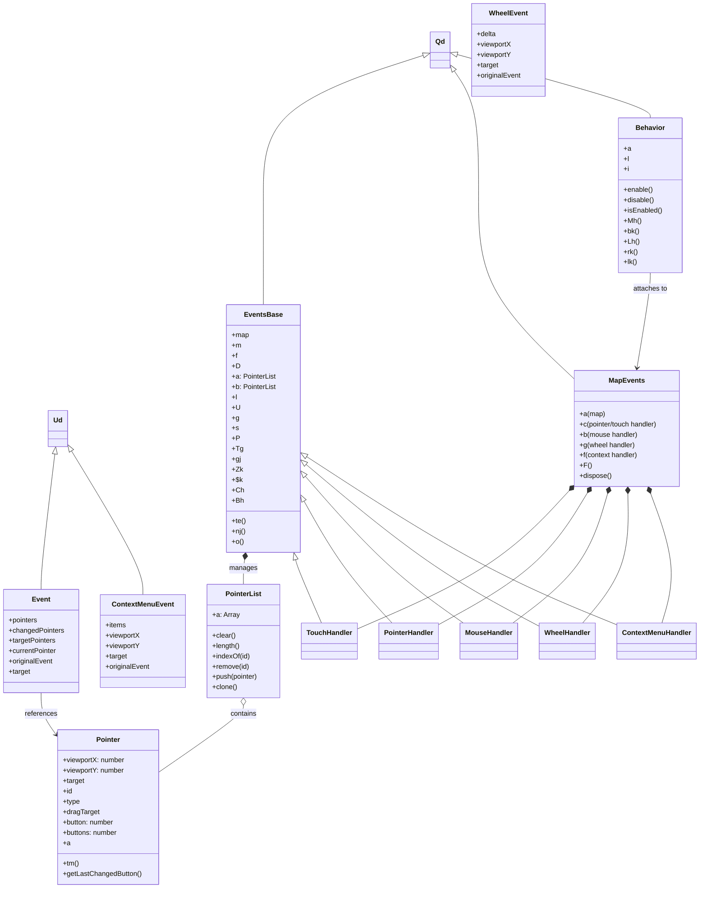
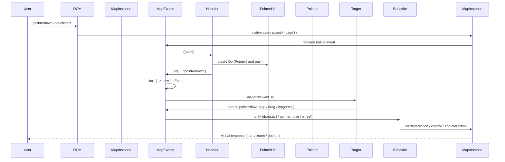

# Diagram: web/portal/public/js/heremaps-3.1.49.1/mapsjs-mapevents.js

> Auto-generated by Obscura crawlers

## Diagram 1

### SVG

<svg id="container" width="1602.59375" xmlns="http://www.w3.org/2000/svg" class="classDiagram" height="2064" viewBox="0 0 1602.59375 2064" role="graphics-document document" aria-roledescription="class"><g><defs><marker id="container_class-aggregationStart" class="marker aggregation class" refX="18" refY="7" markerWidth="190" markerHeight="240" orient="auto"><path d="M 18,7 L9,13 L1,7 L9,1 Z"></path></marker></defs><defs><marker id="container_class-aggregationEnd" class="marker aggregation class" refX="1" refY="7" markerWidth="20" markerHeight="28" orient="auto"><path d="M 18,7 L9,13 L1,7 L9,1 Z"></path></marker></defs><defs><marker id="container_class-extensionStart" class="marker extension class" refX="18" refY="7" markerWidth="190" markerHeight="240" orient="auto"><path d="M 1,7 L18,13 V 1 Z"></path></marker></defs><defs><marker id="container_class-extensionEnd" class="marker extension class" refX="1" refY="7" markerWidth="20" markerHeight="28" orient="auto"><path d="M 1,1 V 13 L18,7 Z"></path></marker></defs><defs><marker id="container_class-compositionStart" class="marker composition class" refX="18" refY="7" markerWidth="190" markerHeight="240" orient="auto"><path d="M 18,7 L9,13 L1,7 L9,1 Z"></path></marker></defs><defs><marker id="container_class-compositionEnd" class="marker composition class" refX="1" refY="7" markerWidth="20" markerHeight="28" orient="auto"><path d="M 18,7 L9,13 L1,7 L9,1 Z"></path></marker></defs><defs><marker id="container_class-dependencyStart" class="marker dependency class" refX="6" refY="7" markerWidth="190" markerHeight="240" orient="auto"><path d="M 5,7 L9,13 L1,7 L9,1 Z"></path></marker></defs><defs><marker id="container_class-dependencyEnd" class="marker dependency class" refX="13" refY="7" markerWidth="20" markerHeight="28" orient="auto"><path d="M 18,7 L9,13 L14,7 L9,1 Z"></path></marker></defs><defs><marker id="container_class-lollipopStart" class="marker lollipop class" refX="13" refY="7" markerWidth="190" markerHeight="240" orient="auto"><circle stroke="black" fill="transparent" cx="7" cy="7" r="6"></circle></marker></defs><defs><marker id="container_class-lollipopEnd" class="marker lollipop class" refX="1" refY="7" markerWidth="190" markerHeight="240" orient="auto"><circle stroke="black" fill="transparent" cx="7" cy="7" r="6"></circle></marker></defs><g class="root"><g class="clusters"></g><g class="edgePaths"><path d="M972.765,128.782L912.098,148.818C851.432,168.854,730.099,208.927,669.432,263.13C608.766,317.333,608.766,385.667,608.766,456C608.766,526.333,608.766,598.667,608.766,641C608.766,683.333,608.766,695.667,608.766,701.833L608.766,708" id="id_Qd_EventsBase_1" class="edge-thickness-normal edge-pattern-solid relation" style=";;;" data-edge="true" data-et="edge" data-id="id_Qd_EventsBase_1" data-points="W3sieCI6OTg5LjE0NDUzMTI1LCJ5IjoxMjMuMzcxNzU4OTMxNDI5NTF9LHsieCI6NjA4Ljc2NTYyNSwieSI6MjQ5fSx7IngiOjYwOC43NjU2MjUsInkiOjQ1NH0seyJ4Ijo2MDguNzY1NjI1LCJ5Ijo2NzF9LHsieCI6NjA4Ljc2NTYyNSwieSI6NzA4fV0=" marker-start="url(#container_class-extensionStart)"></path><path d="M1043.357,163.814L1052.827,178.012C1062.297,192.21,1081.236,220.605,1090.706,268.969C1100.176,317.333,1100.176,385.667,1100.176,456C1100.176,526.333,1100.176,598.667,1135.303,668.755C1170.431,738.844,1240.686,806.688,1275.814,840.61L1310.941,874.532" id="id_Qd_MapEvents_2" class="edge-thickness-normal edge-pattern-solid relation" style=";;;" data-edge="true" data-et="edge" data-id="id_Qd_MapEvents_2" data-points="W3sieCI6MTAzMy43ODUxNTYyNSwieSI6MTQ5LjQ2Mzc2MDQ1Nzk0ODA0fSx7IngiOjExMDAuMTc1NzgxMjUsInkiOjI0OX0seyJ4IjoxMTAwLjE3NTc4MTI1LCJ5Ijo0NTR9LHsieCI6MTEwMC4xNzU3ODEyNSwieSI6NjcxfSx7IngiOjEzMTAuOTQxNDA2MjUsInkiOjg3NC41MzE5MjQyNzc3NzJ9XQ==" marker-start="url(#container_class-extensionStart)"></path><path d="M1050.407,126.809L1123.781,147.174C1197.155,167.539,1343.903,208.27,1417.276,232.801C1490.65,257.333,1490.65,265.667,1490.65,269.833L1490.65,274" id="id_Qd_Behavior_3" class="edge-thickness-normal edge-pattern-solid relation" style=";;;" data-edge="true" data-et="edge" data-id="id_Qd_Behavior_3" data-points="W3sieCI6MTAzMy43ODUxNTYyNSwieSI6MTIyLjE5NTA5ODI5MDk2NDA4fSx7IngiOjE0OTAuNjUwMzkwNjI1LCJ5IjoyNDl9LHsieCI6MTQ5MC42NTAzOTA2MjUsInkiOjI3NH1d" marker-start="url(#container_class-extensionStart)"></path><path d="M126.217,1055.13L120.962,1099.442C115.706,1143.753,105.195,1232.377,99.939,1284.855C94.684,1337.333,94.684,1353.667,94.684,1361.833L94.684,1370" id="id_Ud_Event_4" class="edge-thickness-normal edge-pattern-solid relation" style=";;;" data-edge="true" data-et="edge" data-id="id_Ud_Event_4" data-points="W3sieCI6MTI4LjI0OTAyNjQ0MjMwNzcsInkiOjEwMzh9LHsieCI6OTQuNjgzNTkzNzUsInkiOjEzMjF9LHsieCI6OTQuNjgzNTkzNzUsInkiOjEzNzB9XQ==" marker-start="url(#container_class-extensionStart)"></path><path d="M164.154,1047.284L191.661,1092.903C219.169,1138.522,274.184,1229.761,301.692,1285.547C329.199,1341.333,329.199,1361.667,329.199,1371.833L329.199,1382" id="id_Ud_ContextMenuEvent_5" class="edge-thickness-normal edge-pattern-solid relation" style=";;;" data-edge="true" data-et="edge" data-id="id_Ud_ContextMenuEvent_5" data-points="W3sieCI6MTU1LjI0NjA5Mzc1LCJ5IjoxMDMyLjUxMTMyMTk1ODIyMDR9LHsieCI6MzI5LjE5OTIxODc1LCJ5IjoxMzIxfSx7IngiOjMyOS4xOTkyMTg3NSwieSI6MTM4Mn1d" marker-start="url(#container_class-extensionStart)"></path><path d="M565.446,1301.079L564.974,1304.399C564.503,1307.719,563.56,1314.36,563.089,1323.846C562.617,1333.333,562.617,1345.667,562.617,1351.833L562.617,1358" id="id_EventsBase_PointerList_6" class="edge-thickness-normal edge-pattern-solid relation" style=";;;" data-edge="true" data-et="edge" data-id="id_EventsBase_PointerList_6" data-points="W3sieCI6NTY3Ljg3MTAwOTYxNTM4NDcsInkiOjEyODR9LHsieCI6NTYyLjYxNzE4NzUsInkiOjEzMjF9LHsieCI6NTYyLjYxNzE4NzUsInkiOjEzNTh9XQ==" marker-start="url(#container_class-compositionStart)"></path><path d="M562.617,1639.25L562.617,1642.542C562.617,1645.833,562.617,1652.417,529.911,1678.407C497.205,1704.396,431.793,1749.793,399.087,1772.491L366.381,1795.189" id="id_PointerList_Pointer_7" class="edge-thickness-normal edge-pattern-solid relation" style=";;;" data-edge="true" data-et="edge" data-id="id_PointerList_Pointer_7" data-points="W3sieCI6NTYyLjYxNzE4NzUsInkiOjE2MjJ9LHsieCI6NTYyLjYxNzE4NzUsInkiOjE2NTl9LHsieCI6MzY2LjM4MDg1OTM3NSwieSI6MTc5NS4xODkwNDg3Mjg1MzU3fV0=" marker-start="url(#container_class-aggregationStart)"></path><path d="M94.684,1610L94.684,1618.167C94.684,1626.333,94.684,1642.667,100.571,1659.062C106.458,1675.457,118.232,1691.914,124.12,1700.143L130.007,1708.371" id="id_Event_Pointer_8" class="edge-thickness-normal edge-pattern-solid relation" style=";;;" data-edge="true" data-et="edge" data-id="id_Event_Pointer_8" data-points="W3sieCI6OTQuNjgzNTkzNzUsInkiOjE2MTB9LHsieCI6OTQuNjgzNTkzNzUsInkiOjE2NTl9LHsieCI6MTMzLjQ5ODA0Njg3NSwieSI6MTcxMy4yNTA2ODI0NjcxOTc1fV0=" marker-end="url(#container_class-dependencyEnd)"></path><path d="M682.967,1300.76L683.788,1304.134C684.609,1307.507,686.252,1314.253,696.214,1338.793C706.176,1363.333,724.457,1405.667,733.597,1426.833L742.738,1448" id="id_EventsBase_TouchHandler_9" class="edge-thickness-normal edge-pattern-solid relation" style=";;;" data-edge="true" data-et="edge" data-id="id_EventsBase_TouchHandler_9" data-points="W3sieCI6Njc4Ljg4NjAwOTYxNTM4NDYsInkiOjEyODR9LHsieCI6Njg3Ljg5NDUzMTI1LCJ5IjoxMzIxfSx7IngiOjc0Mi43Mzc4NDIwODU3OTg4LCJ5IjoxNDQ4fV0=" marker-start="url(#container_class-extensionStart)"></path><path d="M701.788,1164.567L716.175,1190.639C730.563,1216.711,759.338,1268.856,792.913,1316.095C826.489,1363.333,864.864,1405.667,884.052,1426.833L903.239,1448" id="id_EventsBase_PointerHandler_10" class="edge-thickness-normal edge-pattern-solid relation" style=";;;" data-edge="true" data-et="edge" data-id="id_EventsBase_PointerHandler_10" data-points="W3sieCI6NjkzLjQ1MzEyNSwieSI6MTE0OS40NjQxNjA0Nzc0MjQ3fSx7IngiOjc4OC4xMTMyODEyNSwieSI6MTMyMX0seyJ4Ijo5MDMuMjM5MzIxMzc1NzM5NywieSI6MTQ0OH1d" marker-start="url(#container_class-extensionStart)"></path><path d="M704.728,1107.114L735.515,1142.761C766.302,1178.409,827.876,1249.705,888.037,1306.519C948.199,1363.333,1006.948,1405.667,1036.323,1426.833L1065.698,1448" id="id_EventsBase_MouseHandler_11" class="edge-thickness-normal edge-pattern-solid relation" style=";;;" data-edge="true" data-et="edge" data-id="id_EventsBase_MouseHandler_11" data-points="W3sieCI6NjkzLjQ1MzEyNSwieSI6MTA5NC4wNTg1OTAyMTY0MDh9LHsieCI6ODg5LjQ0OTIxODc1LCJ5IjoxMzIxfSx7IngiOjEwNjUuNjk3NTMxNDM0OTExMywieSI6MTQ0OH1d" marker-start="url(#container_class-extensionStart)"></path><path d="M706.562,1079.645L753.594,1119.871C800.625,1160.097,894.687,1240.548,983.409,1303.224C1072.13,1365.9,1155.51,1410.8,1197.201,1433.25L1238.891,1455.7" id="id_EventsBase_WheelHandler_12" class="edge-thickness-normal edge-pattern-solid relation" style=";;;" data-edge="true" data-et="edge" data-id="id_EventsBase_WheelHandler_12" data-points="W3sieCI6NjkzLjQ1MzEyNSwieSI6MTA2OC40MzMwNzcwMTc5Njk1fSx7IngiOjk4OC43NSwieSI6MTMyMX0seyJ4IjoxMjM4Ljg5MDYyNSwieSI6MTQ1NS43MDAyMDY2MTY3MTM2fV0=" marker-start="url(#container_class-extensionStart)"></path><path d="M707.841,1061.525L773.23,1104.771C838.619,1148.017,969.398,1234.508,1087.471,1299.724C1205.544,1364.94,1310.913,1408.88,1363.597,1430.85L1416.281,1452.821" id="id_EventsBase_ContextMenuHandler_13" class="edge-thickness-normal edge-pattern-solid relation" style=";;;" data-edge="true" data-et="edge" data-id="id_EventsBase_ContextMenuHandler_13" data-points="W3sieCI6NjkzLjQ1MzEyNSwieSI6MTA1Mi4wMDkwOTM3MjczOTQ5fSx7IngiOjExMDAuMTc1NzgxMjUsInkiOjEzMjF9LHsieCI6MTQxNi4yODEyNSwieSI6MTQ1Mi44MjA1NTM4NDczNH1d" marker-start="url(#container_class-extensionStart)"></path><path d="M1303.219,1143.801L1276.542,1173.334C1249.865,1202.867,1196.511,1261.934,1116.565,1315.016C1036.62,1368.098,930.083,1415.196,876.815,1438.745L823.547,1462.294" id="id_MapEvents_TouchHandler_14" class="edge-thickness-normal edge-pattern-solid relation" style=";;;" data-edge="true" data-et="edge" data-id="id_MapEvents_TouchHandler_14" data-points="W3sieCI6MTMxNC43ODE5NzExNTM4NDYxLCJ5IjoxMTMxfSx7IngiOjExNDMuMTU2MjUsInkiOjEzMjF9LHsieCI6ODIzLjU0Njg3NSwieSI6MTQ2Mi4yOTM4MzYzNDQzMTQ1fV0=" marker-start="url(#container_class-compositionStart)"></path><path d="M1347.592,1145.825L1330.222,1175.021C1312.853,1204.217,1278.114,1262.608,1221.695,1313.652C1165.276,1364.695,1087.177,1408.391,1048.128,1430.238L1009.078,1452.086" id="id_MapEvents_PointerHandler_15" class="edge-thickness-normal edge-pattern-solid relation" style=";;;" data-edge="true" data-et="edge" data-id="id_MapEvents_PointerHandler_15" data-points="W3sieCI6MTM1Ni40MTEyOTgwNzY5MjMsInkiOjExMzF9LHsieCI6MTI0My4zNzUsInkiOjEzMjF9LHsieCI6MTAwOS4wNzgxMjUsInkiOjE0NTIuMDg2MDIzMTc0MDEyfV0=" marker-start="url(#container_class-compositionStart)"></path><path d="M1393.805,1147.598L1385.623,1176.498C1377.441,1205.398,1361.076,1263.199,1325.248,1313.266C1289.42,1363.333,1234.13,1405.667,1206.485,1426.833L1178.839,1448" id="id_MapEvents_MouseHandler_16" class="edge-thickness-normal edge-pattern-solid relation" style=";;;" data-edge="true" data-et="edge" data-id="id_MapEvents_MouseHandler_16" data-points="W3sieCI6MTM5OC41MDQ2ODc1LCJ5IjoxMTMxfSx7IngiOjEzNDQuNzEwOTM3NSwieSI6MTMyMX0seyJ4IjoxMTc4LjgzOTQ5NzA0MTQyMDEsInkiOjE0NDh9XQ==" marker-start="url(#container_class-compositionStart)"></path><path d="M1440.139,1148.246L1440.785,1177.038C1441.43,1205.83,1442.721,1263.415,1425.653,1313.374C1408.586,1363.333,1373.159,1405.667,1355.446,1426.833L1337.733,1448" id="id_MapEvents_WheelHandler_17" class="edge-thickness-normal edge-pattern-solid relation" style=";;;" data-edge="true" data-et="edge" data-id="id_MapEvents_WheelHandler_17" data-points="W3sieCI6MTQzOS43NTI3MDQzMjY5MjMsInkiOjExMzF9LHsieCI6MTQ0NC4wMTE3MTg3NSwieSI6MTMyMX0seyJ4IjoxMzM3LjczMzE3MzA3NjkyMywieSI6MTQ0OH1d" marker-start="url(#container_class-compositionStart)"></path><path d="M1491.956,1147.203L1502.536,1176.169C1513.116,1205.135,1534.277,1263.068,1538.595,1313.2C1542.913,1363.333,1530.388,1405.667,1524.126,1426.833L1517.864,1448" id="id_MapEvents_ContextMenuHandler_18" class="edge-thickness-normal edge-pattern-solid relation" style=";;;" data-edge="true" data-et="edge" data-id="id_MapEvents_ContextMenuHandler_18" data-points="W3sieCI6MTQ4Ni4wMzcyNTk2MTUzODQ1LCJ5IjoxMTMxfSx7IngiOjE1NTUuNDM3NSwieSI6MTMyMX0seyJ4IjoxNTE3Ljg2MzUzNTUwMjk1ODUsInkiOjE0NDh9XQ==" marker-start="url(#container_class-compositionStart)"></path><path d="M1490.65,634L1490.65,640.167C1490.65,646.333,1490.65,658.667,1485.56,695.513C1480.47,732.36,1470.289,793.721,1465.198,824.401L1460.108,855.081" id="id_Behavior_MapEvents_19" class="edge-thickness-normal edge-pattern-solid relation" style=";;;" data-edge="true" data-et="edge" data-id="id_Behavior_MapEvents_19" data-points="W3sieCI6MTQ5MC42NTAzOTA2MjUsInkiOjYzNH0seyJ4IjoxNDkwLjY1MDM5MDYyNSwieSI6NjcxfSx7IngiOjE0NTkuMTI1NjkxMTA1NzY5MiwieSI6ODYxfV0=" marker-end="url(#container_class-dependencyEnd)"></path></g><g class="edgeLabels"><g class="edgeLabel"><g class="label" data-id="id_Qd_EventsBase_1" transform="translate(0, 0)"><foreignObject width="0" height="0">

</foreignObject></g></g><g class="edgeLabel"><g class="label" data-id="id_Qd_MapEvents_2" transform="translate(0, 0)"><foreignObject width="0" height="0">

</foreignObject></g></g><g class="edgeLabel"><g class="label" data-id="id_Qd_Behavior_3" transform="translate(0, 0)"><foreignObject width="0" height="0">

</foreignObject></g></g><g class="edgeLabel"><g class="label" data-id="id_Ud_Event_4" transform="translate(0, 0)"><foreignObject width="0" height="0">

</foreignObject></g></g><g class="edgeLabel"><g class="label" data-id="id_Ud_ContextMenuEvent_5" transform="translate(0, 0)"><foreignObject width="0" height="0">

</foreignObject></g></g><g class="edgeLabel" transform="translate(562.6171875, 1321)"><g class="label" data-id="id_EventsBase_PointerList_6" transform="translate(-32.296875, -12)"><foreignObject width="64.59375" height="24">

manages

</foreignObject></g></g><g class="edgeLabel" transform="translate(562.6171875, 1659)"><g class="label" data-id="id_PointerList_Pointer_7" transform="translate(-30.890625, -12)"><foreignObject width="61.78125" height="24">

contains

</foreignObject></g></g><g class="edgeLabel" transform="translate(94.68359375, 1659)"><g class="label" data-id="id_Event_Pointer_8" transform="translate(-37.828125, -12)"><foreignObject width="75.65625" height="24">

references

</foreignObject></g></g><g class="edgeLabel"><g class="label" data-id="id_EventsBase_TouchHandler_9" transform="translate(0, 0)"><foreignObject width="0" height="0">

</foreignObject></g></g><g class="edgeLabel"><g class="label" data-id="id_EventsBase_PointerHandler_10" transform="translate(0, 0)"><foreignObject width="0" height="0">

</foreignObject></g></g><g class="edgeLabel"><g class="label" data-id="id_EventsBase_MouseHandler_11" transform="translate(0, 0)"><foreignObject width="0" height="0">

</foreignObject></g></g><g class="edgeLabel"><g class="label" data-id="id_EventsBase_WheelHandler_12" transform="translate(0, 0)"><foreignObject width="0" height="0">

</foreignObject></g></g><g class="edgeLabel"><g class="label" data-id="id_EventsBase_ContextMenuHandler_13" transform="translate(0, 0)"><foreignObject width="0" height="0">

</foreignObject></g></g><g class="edgeLabel"><g class="label" data-id="id_MapEvents_TouchHandler_14" transform="translate(0, 0)"><foreignObject width="0" height="0">

</foreignObject></g></g><g class="edgeLabel"><g class="label" data-id="id_MapEvents_PointerHandler_15" transform="translate(0, 0)"><foreignObject width="0" height="0">

</foreignObject></g></g><g class="edgeLabel"><g class="label" data-id="id_MapEvents_MouseHandler_16" transform="translate(0, 0)"><foreignObject width="0" height="0">

</foreignObject></g></g><g class="edgeLabel"><g class="label" data-id="id_MapEvents_WheelHandler_17" transform="translate(0, 0)"><foreignObject width="0" height="0">

</foreignObject></g></g><g class="edgeLabel"><g class="label" data-id="id_MapEvents_ContextMenuHandler_18" transform="translate(0, 0)"><foreignObject width="0" height="0">

</foreignObject></g></g><g class="edgeLabel" transform="translate(1490.650390625, 671)"><g class="label" data-id="id_Behavior_MapEvents_19" transform="translate(-40.59375, -12)"><foreignObject width="81.1875" height="24">

attaches to

</foreignObject></g></g></g><g class="nodes"><g class="node default" id="classId-Qd-0" transform="translate(1011.46484375, 116)"><g class="basic label-container"><path d="M-22.3203125 -42 L22.3203125 -42 L22.3203125 42 L-22.3203125 42" stroke="none" stroke-width="0" fill="#ECECFF" style=""></path><path d="M-22.3203125 -42 C-12.72403593744214 -42, -3.127759374884281 -42, 22.3203125 -42 M-22.3203125 -42 C-12.082273699916943 -42, -1.8442348998338858 -42, 22.3203125 -42 M22.3203125 -42 C22.3203125 -22.686136204345154, 22.3203125 -3.372272408690307, 22.3203125 42 M22.3203125 -42 C22.3203125 -25.11296272519524, 22.3203125 -8.225925450390477, 22.3203125 42 M22.3203125 42 C8.558204209672212 42, -5.203904080655576 42, -22.3203125 42 M22.3203125 42 C11.480939655463965 42, 0.6415668109279302 42, -22.3203125 42 M-22.3203125 42 C-22.3203125 11.536381466080947, -22.3203125 -18.927237067838107, -22.3203125 -42 M-22.3203125 42 C-22.3203125 15.061912284422771, -22.3203125 -11.876175431154458, -22.3203125 -42" stroke="#9370DB" stroke-width="1.3" fill="none" stroke-dasharray="0 0" style=""></path></g><g class="annotation-group text" transform="translate(0, -18)"></g><g class="label-group text" transform="translate(-10.3203125, -18)"><g class="label" style="font-weight: bolder" transform="translate(0,-12)"><foreignObject width="20.640625" height="24">

Qd

</foreignObject></g></g><g class="members-group text" transform="translate(-10.3203125, 30)"></g><g class="methods-group text" transform="translate(-10.3203125, 60)"></g><g class="divider" style=""><path d="M-22.3203125 6 C-4.998135581320156 6, 12.324041337359688 6, 22.3203125 6 M-22.3203125 6 C-5.164677983817967 6, 11.990956532364066 6, 22.3203125 6" stroke="#9370DB" stroke-width="1.3" fill="none" stroke-dasharray="0 0" style=""></path></g><g class="divider" style=""><path d="M-22.3203125 24 C-10.344846976810748 24, 1.6306185463785035 24, 22.3203125 24 M-22.3203125 24 C-8.555487380043516 24, 5.209337739912968 24, 22.3203125 24" stroke="#9370DB" stroke-width="1.3" fill="none" stroke-dasharray="0 0" style=""></path></g></g><g class="node default" id="classId-Ud-1" transform="translate(133.23046875, 996)"><g class="basic label-container"><path d="M-22.015625 -42 L22.015625 -42 L22.015625 42 L-22.015625 42" stroke="none" stroke-width="0" fill="#ECECFF" style=""></path><path d="M-22.015625 -42 C-7.442904474561807 -42, 7.129816050876386 -42, 22.015625 -42 M-22.015625 -42 C-10.421997016613902 -42, 1.1716309667721951 -42, 22.015625 -42 M22.015625 -42 C22.015625 -12.890747066216107, 22.015625 16.218505867567785, 22.015625 42 M22.015625 -42 C22.015625 -15.166559730669622, 22.015625 11.666880538660756, 22.015625 42 M22.015625 42 C9.960901588046285 42, -2.0938218239074295 42, -22.015625 42 M22.015625 42 C9.799800573794617 42, -2.416023852410767 42, -22.015625 42 M-22.015625 42 C-22.015625 17.48522936770375, -22.015625 -7.029541264592503, -22.015625 -42 M-22.015625 42 C-22.015625 24.473059527856314, -22.015625 6.946119055712629, -22.015625 -42" stroke="#9370DB" stroke-width="1.3" fill="none" stroke-dasharray="0 0" style=""></path></g><g class="annotation-group text" transform="translate(0, -18)"></g><g class="label-group text" transform="translate(-10.015625, -18)"><g class="label" style="font-weight: bolder" transform="translate(0,-12)"><foreignObject width="20.03125" height="24">

Ud

</foreignObject></g></g><g class="members-group text" transform="translate(-10.015625, 30)"></g><g class="methods-group text" transform="translate(-10.015625, 60)"></g><g class="divider" style=""><path d="M-22.015625 6 C-12.515973508233921 6, -3.016322016467843 6, 22.015625 6 M-22.015625 6 C-10.29362613839647 6, 1.4283727232070618 6, 22.015625 6" stroke="#9370DB" stroke-width="1.3" fill="none" stroke-dasharray="0 0" style=""></path></g><g class="divider" style=""><path d="M-22.015625 24 C-11.785804232057801 24, -1.5559834641156023 24, 22.015625 24 M-22.015625 24 C-4.570568392500437 24, 12.874488214999126 24, 22.015625 24" stroke="#9370DB" stroke-width="1.3" fill="none" stroke-dasharray="0 0" style=""></path></g></g><g class="node default" id="classId-Pointer-2" transform="translate(249.939453125, 1876)"><g class="basic label-container"><path d="M-116.44140625 -180 L116.44140625 -180 L116.44140625 180 L-116.44140625 180" stroke="none" stroke-width="0" fill="#ECECFF" style=""></path><path d="M-116.44140625 -180 C-69.57281481326997 -180, -22.704223376539943 -180, 116.44140625 -180 M-116.44140625 -180 C-40.54861675374036 -180, 35.34417274251928 -180, 116.44140625 -180 M116.44140625 -180 C116.44140625 -71.53820080822504, 116.44140625 36.923598383549916, 116.44140625 180 M116.44140625 -180 C116.44140625 -71.63009693902451, 116.44140625 36.73980612195098, 116.44140625 180 M116.44140625 180 C56.46804660681931 180, -3.505313036361386 180, -116.44140625 180 M116.44140625 180 C36.51700816762731 180, -43.40738991474538 180, -116.44140625 180 M-116.44140625 180 C-116.44140625 51.552135607051895, -116.44140625 -76.89572878589621, -116.44140625 -180 M-116.44140625 180 C-116.44140625 73.00547109086283, -116.44140625 -33.98905781827435, -116.44140625 -180" stroke="#9370DB" stroke-width="1.3" fill="none" stroke-dasharray="0 0" style=""></path></g><g class="annotation-group text" transform="translate(0, -156)"></g><g class="label-group text" transform="translate(-26.6796875, -156)"><g class="label" style="font-weight: bolder" transform="translate(0,-12)"><foreignObject width="53.359375" height="24">

Pointer

</foreignObject></g></g><g class="members-group text" transform="translate(-104.44140625, -108)"><g class="label" style="" transform="translate(0,-12)"><foreignObject width="144.734375" height="24">

+viewportX: number

</foreignObject></g><g class="label" style="" transform="translate(0,12)"><foreignObject width="144.03125" height="24">

+viewportY: number

</foreignObject></g><g class="label" style="" transform="translate(0,36)"><foreignObject width="50.78125" height="24">

+target

</foreignObject></g><g class="label" style="" transform="translate(0,60)"><foreignObject width="22.078125" height="24">

+id

</foreignObject></g><g class="label" style="" transform="translate(0,84)"><foreignObject width="39.703125" height="24">

+type

</foreignObject></g><g class="label" style="" transform="translate(0,108)"><foreignObject width="84.71875" height="24">

+dragTarget

</foreignObject></g><g class="label" style="" transform="translate(0,132)"><foreignObject width="121.71875" height="24">

+button: number

</foreignObject></g><g class="label" style="" transform="translate(0,156)"><foreignObject width="129.1875" height="24">

+buttons: number

</foreignObject></g><g class="label" style="" transform="translate(0,180)"><foreignObject width="16.453125" height="24">

+a

</foreignObject></g></g><g class="methods-group text" transform="translate(-104.44140625, 132)"><g class="label" style="" transform="translate(0,-12)"><foreignObject width="37.765625" height="24">

+tm()

</foreignObject></g><g class="label" style="" transform="translate(0,12)"><foreignObject width="182.203125" height="24">

+getLastChangedButton()

</foreignObject></g></g><g class="divider" style=""><path d="M-116.44140625 -132 C-26.717643735829824 -132, 63.00611877834035 -132, 116.44140625 -132 M-116.44140625 -132 C-55.56030482307164 -132, 5.320796603856721 -132, 116.44140625 -132" stroke="#9370DB" stroke-width="1.3" fill="none" stroke-dasharray="0 0" style=""></path></g><g class="divider" style=""><path d="M-116.44140625 108 C-32.208527193281355 108, 52.02435186343729 108, 116.44140625 108 M-116.44140625 108 C-54.95798102749291 108, 6.525444195014174 108, 116.44140625 108" stroke="#9370DB" stroke-width="1.3" fill="none" stroke-dasharray="0 0" style=""></path></g></g><g class="node default" id="classId-Event-3" transform="translate(94.68359375, 1490)"><g class="basic label-container"><path d="M-86.68359375 -120 L86.68359375 -120 L86.68359375 120 L-86.68359375 120" stroke="none" stroke-width="0" fill="#ECECFF" style=""></path><path d="M-86.68359375 -120 C-39.39182324972303 -120, 7.899947250553936 -120, 86.68359375 -120 M-86.68359375 -120 C-24.99112800017926 -120, 36.70133774964148 -120, 86.68359375 -120 M86.68359375 -120 C86.68359375 -38.82864547404404, 86.68359375 42.342709051911925, 86.68359375 120 M86.68359375 -120 C86.68359375 -43.81270255079042, 86.68359375 32.37459489841916, 86.68359375 120 M86.68359375 120 C36.57971607783265 120, -13.5241615943347 120, -86.68359375 120 M86.68359375 120 C36.73365827518477 120, -13.216277199630454 120, -86.68359375 120 M-86.68359375 120 C-86.68359375 42.308012371539604, -86.68359375 -35.38397525692079, -86.68359375 -120 M-86.68359375 120 C-86.68359375 30.85513882158706, -86.68359375 -58.28972235682588, -86.68359375 -120" stroke="#9370DB" stroke-width="1.3" fill="none" stroke-dasharray="0 0" style=""></path></g><g class="annotation-group text" transform="translate(0, -96)"></g><g class="label-group text" transform="translate(-20.2109375, -96)"><g class="label" style="font-weight: bolder" transform="translate(0,-12)"><foreignObject width="40.421875" height="24">

Event

</foreignObject></g></g><g class="members-group text" transform="translate(-74.68359375, -48)"><g class="label" style="" transform="translate(0,-12)"><foreignObject width="68.390625" height="24">

+pointers

</foreignObject></g><g class="label" style="" transform="translate(0,12)"><foreignObject width="129.15625" height="24">

+changedPointers

</foreignObject></g><g class="label" style="" transform="translate(0,36)"><foreignObject width="110.484375" height="24">

+targetPointers

</foreignObject></g><g class="label" style="" transform="translate(0,60)"><foreignObject width="113.015625" height="24">

+currentPointer

</foreignObject></g><g class="label" style="" transform="translate(0,84)"><foreignObject width="103.390625" height="24">

+originalEvent

</foreignObject></g><g class="label" style="" transform="translate(0,108)"><foreignObject width="50.78125" height="24">

+target

</foreignObject></g></g><g class="methods-group text" transform="translate(-74.68359375, 120)"></g><g class="divider" style=""><path d="M-86.68359375 -72 C-25.690716122901875 -72, 35.30216150419625 -72, 86.68359375 -72 M-86.68359375 -72 C-51.6984248369664 -72, -16.713255923932806 -72, 86.68359375 -72" stroke="#9370DB" stroke-width="1.3" fill="none" stroke-dasharray="0 0" style=""></path></g><g class="divider" style=""><path d="M-86.68359375 96 C-51.71730582712353 96, -16.751017904247064 96, 86.68359375 96 M-86.68359375 96 C-23.971637333298347 96, 38.74031908340331 96, 86.68359375 96" stroke="#9370DB" stroke-width="1.3" fill="none" stroke-dasharray="0 0" style=""></path></g></g><g class="node default" id="classId-PointerList-4" transform="translate(562.6171875, 1490)"><g class="basic label-container"><path d="M-85.5859375 -132 L85.5859375 -132 L85.5859375 132 L-85.5859375 132" stroke="none" stroke-width="0" fill="#ECECFF" style=""></path><path d="M-85.5859375 -132 C-27.088302151433965 -132, 31.40933319713207 -132, 85.5859375 -132 M-85.5859375 -132 C-30.295153274605184 -132, 24.995630950789632 -132, 85.5859375 -132 M85.5859375 -132 C85.5859375 -72.55968211435354, 85.5859375 -13.11936422870707, 85.5859375 132 M85.5859375 -132 C85.5859375 -59.14120486287935, 85.5859375 13.717590274241303, 85.5859375 132 M85.5859375 132 C21.292571298613893 132, -43.00079490277221 132, -85.5859375 132 M85.5859375 132 C34.301917861472354 132, -16.98210177705529 132, -85.5859375 132 M-85.5859375 132 C-85.5859375 37.382691303538095, -85.5859375 -57.23461739292381, -85.5859375 -132 M-85.5859375 132 C-85.5859375 35.73559409539649, -85.5859375 -60.52881180920701, -85.5859375 -132" stroke="#9370DB" stroke-width="1.3" fill="none" stroke-dasharray="0 0" style=""></path></g><g class="annotation-group text" transform="translate(0, -108)"></g><g class="label-group text" transform="translate(-39.984375, -108)"><g class="label" style="font-weight: bolder" transform="translate(0,-12)"><foreignObject width="79.96875" height="24">

PointerList

</foreignObject></g></g><g class="members-group text" transform="translate(-73.5859375, -60)"><g class="label" style="" transform="translate(0,-12)"><foreignObject width="61.828125" height="24">

+a: Array

</foreignObject></g></g><g class="methods-group text" transform="translate(-73.5859375, -12)"><g class="label" style="" transform="translate(0,-12)"><foreignObject width="54.0625" height="24">

+clear()

</foreignObject></g><g class="label" style="" transform="translate(0,12)"><foreignObject width="64.53125" height="24">

+length()

</foreignObject></g><g class="label" style="" transform="translate(0,36)"><foreignObject width="88.65625" height="24">

+indexOf(id)

</foreignObject></g><g class="label" style="" transform="translate(0,60)"><foreignObject width="86.375" height="24">

+remove(id)

</foreignObject></g><g class="label" style="" transform="translate(0,84)"><foreignObject width="107.1875" height="24">

+push(pointer)

</foreignObject></g><g class="label" style="" transform="translate(0,108)"><foreignObject width="58.0625" height="24">

+clone()

</foreignObject></g></g><g class="divider" style=""><path d="M-85.5859375 -84 C-26.118578494129913 -84, 33.34878051174017 -84, 85.5859375 -84 M-85.5859375 -84 C-40.323045320078066 -84, 4.939846859843868 -84, 85.5859375 -84" stroke="#9370DB" stroke-width="1.3" fill="none" stroke-dasharray="0 0" style=""></path></g><g class="divider" style=""><path d="M-85.5859375 -36 C-50.104467723555 -36, -14.622997947109994 -36, 85.5859375 -36 M-85.5859375 -36 C-43.55989763595728 -36, -1.5338577719145547 -36, 85.5859375 -36" stroke="#9370DB" stroke-width="1.3" fill="none" stroke-dasharray="0 0" style=""></path></g></g><g class="node default" id="classId-EventsBase-5" transform="translate(608.765625, 996)"><g class="basic label-container"><path d="M-84.6875 -288 L84.6875 -288 L84.6875 288 L-84.6875 288" stroke="none" stroke-width="0" fill="#ECECFF" style=""></path><path d="M-84.6875 -288 C-24.335955269882447 -288, 36.015589460235105 -288, 84.6875 -288 M-84.6875 -288 C-46.93114242724995 -288, -9.174784854499904 -288, 84.6875 -288 M84.6875 -288 C84.6875 -165.70389476473855, 84.6875 -43.40778952947713, 84.6875 288 M84.6875 -288 C84.6875 -112.58104924109702, 84.6875 62.83790151780596, 84.6875 288 M84.6875 288 C33.23224101091393 288, -18.223017978172138 288, -84.6875 288 M84.6875 288 C27.35234317614347 288, -29.98281364771306 288, -84.6875 288 M-84.6875 288 C-84.6875 140.63373583752767, -84.6875 -6.732528324944667, -84.6875 -288 M-84.6875 288 C-84.6875 149.7730059217112, -84.6875 11.546011843422377, -84.6875 -288" stroke="#9370DB" stroke-width="1.3" fill="none" stroke-dasharray="0 0" style=""></path></g><g class="annotation-group text" transform="translate(0, -264)"></g><g class="label-group text" transform="translate(-41.59375, -264)"><g class="label" style="font-weight: bolder" transform="translate(0,-12)"><foreignObject width="83.1875" height="24">

EventsBase

</foreignObject></g></g><g class="members-group text" transform="translate(-72.6875, -216)"><g class="label" style="" transform="translate(0,-12)"><foreignObject width="39.90625" height="24">

+map

</foreignObject></g><g class="label" style="" transform="translate(0,12)"><foreignObject width="21.703125" height="24">

+m

</foreignObject></g><g class="label" style="" transform="translate(0,36)"><foreignObject width="13.109375" height="24">

+f

</foreignObject></g><g class="label" style="" transform="translate(0,60)"><foreignObject width="18.296875" height="24">

+D

</foreignObject></g><g class="label" style="" transform="translate(0,84)"><foreignObject width="102.75" height="24">

+a: PointerList

</foreignObject></g><g class="label" style="" transform="translate(0,108)"><foreignObject width="103.78125" height="24">

+b: PointerList

</foreignObject></g><g class="label" style="" transform="translate(0,132)"><foreignObject width="12.6875" height="24">

+l

</foreignObject></g><g class="label" style="" transform="translate(0,156)"><foreignObject width="18.578125" height="24">

+U

</foreignObject></g><g class="label" style="" transform="translate(0,180)"><foreignObject width="16.3125" height="24">

+g

</foreignObject></g><g class="label" style="" transform="translate(0,204)"><foreignObject width="15.46875" height="24">

+s

</foreignObject></g><g class="label" style="" transform="translate(0,228)"><foreignObject width="17.28125" height="24">

+P

</foreignObject></g><g class="label" style="" transform="translate(0,252)"><foreignObject width="22.984375" height="24">

+Tg

</foreignObject></g><g class="label" style="" transform="translate(0,276)"><foreignObject width="20.796875" height="24">

+gj

</foreignObject></g><g class="label" style="" transform="translate(0,300)"><foreignObject width="24.0625" height="24">

+Zk

</foreignObject></g><g class="label" style="" transform="translate(0,324)"><foreignObject width="24.046875" height="24">

+$k

</foreignObject></g><g class="label" style="" transform="translate(0,348)"><foreignObject width="26.171875" height="24">

+Ch

</foreignObject></g><g class="label" style="" transform="translate(0,372)"><foreignObject width="27.09375" height="24">

+Bh

</foreignObject></g></g><g class="methods-group text" transform="translate(-72.6875, 216)"><g class="label" style="" transform="translate(0,-12)"><foreignObject width="32.53125" height="24">

+te()

</foreignObject></g><g class="label" style="" transform="translate(0,12)"><foreignObject width="32.21875" height="24">

+nj()

</foreignObject></g><g class="label" style="" transform="translate(0,36)"><foreignObject width="27.703125" height="24">

+o()

</foreignObject></g></g><g class="divider" style=""><path d="M-84.6875 -240 C-47.14763115785348 -240, -9.607762315706964 -240, 84.6875 -240 M-84.6875 -240 C-41.41757540396845 -240, 1.8523491920631017 -240, 84.6875 -240" stroke="#9370DB" stroke-width="1.3" fill="none" stroke-dasharray="0 0" style=""></path></g><g class="divider" style=""><path d="M-84.6875 192 C-22.01243874158969 192, 40.66262251682062 192, 84.6875 192 M-84.6875 192 C-44.09396220412903 192, -3.5004244082580556 192, 84.6875 192" stroke="#9370DB" stroke-width="1.3" fill="none" stroke-dasharray="0 0" style=""></path></g></g><g class="node default" id="classId-TouchHandler-6" transform="translate(760.875, 1490)"><g class="basic label-container"><path d="M-62.671875 -42 L62.671875 -42 L62.671875 42 L-62.671875 42" stroke="none" stroke-width="0" fill="#ECECFF" style=""></path><path d="M-62.671875 -42 C-30.561056109035256 -42, 1.5497627819294877 -42, 62.671875 -42 M-62.671875 -42 C-34.88841427334522 -42, -7.104953546690446 -42, 62.671875 -42 M62.671875 -42 C62.671875 -23.41329677739587, 62.671875 -4.826593554791742, 62.671875 42 M62.671875 -42 C62.671875 -10.399857443583002, 62.671875 21.200285112833996, 62.671875 42 M62.671875 42 C23.771341273176894 42, -15.129192453646212 42, -62.671875 42 M62.671875 42 C17.92936812854694 42, -26.81313874290612 42, -62.671875 42 M-62.671875 42 C-62.671875 20.112214407287404, -62.671875 -1.7755711854251928, -62.671875 -42 M-62.671875 42 C-62.671875 15.307751684283488, -62.671875 -11.384496631433024, -62.671875 -42" stroke="#9370DB" stroke-width="1.3" fill="none" stroke-dasharray="0 0" style=""></path></g><g class="annotation-group text" transform="translate(0, -18)"></g><g class="label-group text" transform="translate(-50.671875, -18)"><g class="label" style="font-weight: bolder" transform="translate(0,-12)"><foreignObject width="101.34375" height="24">

TouchHandler

</foreignObject></g></g><g class="members-group text" transform="translate(-50.671875, 30)"></g><g class="methods-group text" transform="translate(-50.671875, 60)"></g><g class="divider" style=""><path d="M-62.671875 6 C-30.837246249627015 6, 0.9973825007459709 6, 62.671875 6 M-62.671875 6 C-24.90030779905201 6, 12.871259401895983 6, 62.671875 6" stroke="#9370DB" stroke-width="1.3" fill="none" stroke-dasharray="0 0" style=""></path></g><g class="divider" style=""><path d="M-62.671875 24 C-30.255867334651455 24, 2.1601403306970894 24, 62.671875 24 M-62.671875 24 C-18.064957287604237 24, 26.541960424791526 24, 62.671875 24" stroke="#9370DB" stroke-width="1.3" fill="none" stroke-dasharray="0 0" style=""></path></g></g><g class="node default" id="classId-PointerHandler-7" transform="translate(941.3125, 1490)"><g class="basic label-container"><path d="M-67.765625 -42 L67.765625 -42 L67.765625 42 L-67.765625 42" stroke="none" stroke-width="0" fill="#ECECFF" style=""></path><path d="M-67.765625 -42 C-25.360334650763484 -42, 17.044955698473032 -42, 67.765625 -42 M-67.765625 -42 C-24.73929846583229 -42, 18.287028068335417 -42, 67.765625 -42 M67.765625 -42 C67.765625 -21.02986946351384, 67.765625 -0.05973892702768069, 67.765625 42 M67.765625 -42 C67.765625 -16.19719650041874, 67.765625 9.605606999162518, 67.765625 42 M67.765625 42 C26.2110577563747 42, -15.3435094872506 42, -67.765625 42 M67.765625 42 C16.78891782660218 42, -34.18778934679564 42, -67.765625 42 M-67.765625 42 C-67.765625 23.05418480149273, -67.765625 4.108369602985462, -67.765625 -42 M-67.765625 42 C-67.765625 10.165392011170383, -67.765625 -21.669215977659235, -67.765625 -42" stroke="#9370DB" stroke-width="1.3" fill="none" stroke-dasharray="0 0" style=""></path></g><g class="annotation-group text" transform="translate(0, -18)"></g><g class="label-group text" transform="translate(-55.765625, -18)"><g class="label" style="font-weight: bolder" transform="translate(0,-12)"><foreignObject width="111.53125" height="24">

PointerHandler

</foreignObject></g></g><g class="members-group text" transform="translate(-55.765625, 30)"></g><g class="methods-group text" transform="translate(-55.765625, 60)"></g><g class="divider" style=""><path d="M-67.765625 6 C-27.826259487600097 6, 12.113106024799805 6, 67.765625 6 M-67.765625 6 C-36.133299770917695 6, -4.50097454183539 6, 67.765625 6" stroke="#9370DB" stroke-width="1.3" fill="none" stroke-dasharray="0 0" style=""></path></g><g class="divider" style=""><path d="M-67.765625 24 C-17.38741818761339 24, 32.99078862477322 24, 67.765625 24 M-67.765625 24 C-28.695926333445932 24, 10.373772333108136 24, 67.765625 24" stroke="#9370DB" stroke-width="1.3" fill="none" stroke-dasharray="0 0" style=""></path></g></g><g class="node default" id="classId-MouseHandler-8" transform="translate(1123.984375, 1490)"><g class="basic label-container"><path d="M-64.90625 -42 L64.90625 -42 L64.90625 42 L-64.90625 42" stroke="none" stroke-width="0" fill="#ECECFF" style=""></path><path d="M-64.90625 -42 C-33.36385528225115 -42, -1.8214605645023099 -42, 64.90625 -42 M-64.90625 -42 C-22.89877000587753 -42, 19.10870998824494 -42, 64.90625 -42 M64.90625 -42 C64.90625 -20.55346372019252, 64.90625 0.8930725596149571, 64.90625 42 M64.90625 -42 C64.90625 -14.231388322789243, 64.90625 13.537223354421513, 64.90625 42 M64.90625 42 C38.46186422643173 42, 12.017478452863458 42, -64.90625 42 M64.90625 42 C37.964001429941035 42, 11.021752859882078 42, -64.90625 42 M-64.90625 42 C-64.90625 17.589126417114162, -64.90625 -6.821747165771676, -64.90625 -42 M-64.90625 42 C-64.90625 22.626585169449225, -64.90625 3.2531703388984496, -64.90625 -42" stroke="#9370DB" stroke-width="1.3" fill="none" stroke-dasharray="0 0" style=""></path></g><g class="annotation-group text" transform="translate(0, -18)"></g><g class="label-group text" transform="translate(-52.90625, -18)"><g class="label" style="font-weight: bolder" transform="translate(0,-12)"><foreignObject width="105.8125" height="24">

MouseHandler

</foreignObject></g></g><g class="members-group text" transform="translate(-52.90625, 30)"></g><g class="methods-group text" transform="translate(-52.90625, 60)"></g><g class="divider" style=""><path d="M-64.90625 6 C-34.78567784106393 6, -4.665105682127852 6, 64.90625 6 M-64.90625 6 C-32.34528146051089 6, 0.21568707897822037 6, 64.90625 6" stroke="#9370DB" stroke-width="1.3" fill="none" stroke-dasharray="0 0" style=""></path></g><g class="divider" style=""><path d="M-64.90625 24 C-16.179171091429808 24, 32.547907817140384 24, 64.90625 24 M-64.90625 24 C-30.830259837306905 24, 3.245730325386191 24, 64.90625 24" stroke="#9370DB" stroke-width="1.3" fill="none" stroke-dasharray="0 0" style=""></path></g></g><g class="node default" id="classId-WheelHandler-9" transform="translate(1302.5859375, 1490)"><g class="basic label-container"><path d="M-63.6953125 -42 L63.6953125 -42 L63.6953125 42 L-63.6953125 42" stroke="none" stroke-width="0" fill="#ECECFF" style=""></path><path d="M-63.6953125 -42 C-36.47356527527931 -42, -9.251818050558619 -42, 63.6953125 -42 M-63.6953125 -42 C-16.801201681636584 -42, 30.09290913672683 -42, 63.6953125 -42 M63.6953125 -42 C63.6953125 -14.105151402476228, 63.6953125 13.789697195047545, 63.6953125 42 M63.6953125 -42 C63.6953125 -24.382870872428917, 63.6953125 -6.765741744857834, 63.6953125 42 M63.6953125 42 C35.28637779866343 42, 6.877443097326861 42, -63.6953125 42 M63.6953125 42 C22.767381327309543 42, -18.160549845380913 42, -63.6953125 42 M-63.6953125 42 C-63.6953125 15.215571011878307, -63.6953125 -11.568857976243386, -63.6953125 -42 M-63.6953125 42 C-63.6953125 20.799267358942423, -63.6953125 -0.4014652821151543, -63.6953125 -42" stroke="#9370DB" stroke-width="1.3" fill="none" stroke-dasharray="0 0" style=""></path></g><g class="annotation-group text" transform="translate(0, -18)"></g><g class="label-group text" transform="translate(-51.6953125, -18)"><g class="label" style="font-weight: bolder" transform="translate(0,-12)"><foreignObject width="103.390625" height="24">

WheelHandler

</foreignObject></g></g><g class="members-group text" transform="translate(-51.6953125, 30)"></g><g class="methods-group text" transform="translate(-51.6953125, 60)"></g><g class="divider" style=""><path d="M-63.6953125 6 C-33.7687546424354 6, -3.8421967848707865 6, 63.6953125 6 M-63.6953125 6 C-13.299786026064638 6, 37.095740447870725 6, 63.6953125 6" stroke="#9370DB" stroke-width="1.3" fill="none" stroke-dasharray="0 0" style=""></path></g><g class="divider" style=""><path d="M-63.6953125 24 C-32.591726683540244 24, -1.4881408670804959 24, 63.6953125 24 M-63.6953125 24 C-28.07245836405089 24, 7.5503957718982235 24, 63.6953125 24" stroke="#9370DB" stroke-width="1.3" fill="none" stroke-dasharray="0 0" style=""></path></g></g><g class="node default" id="classId-ContextMenuHandler-10" transform="translate(1505.4375, 1490)"><g class="basic label-container"><path d="M-89.15625 -42 L89.15625 -42 L89.15625 42 L-89.15625 42" stroke="none" stroke-width="0" fill="#ECECFF" style=""></path><path d="M-89.15625 -42 C-26.210269829107233 -42, 36.735710341785534 -42, 89.15625 -42 M-89.15625 -42 C-24.01997513748968 -42, 41.11629972502064 -42, 89.15625 -42 M89.15625 -42 C89.15625 -15.708258378225768, 89.15625 10.583483243548464, 89.15625 42 M89.15625 -42 C89.15625 -24.469171166348655, 89.15625 -6.93834233269731, 89.15625 42 M89.15625 42 C30.453768941400575 42, -28.24871211719885 42, -89.15625 42 M89.15625 42 C37.04563895894693 42, -15.064972082106138 42, -89.15625 42 M-89.15625 42 C-89.15625 14.542547484442498, -89.15625 -12.914905031115005, -89.15625 -42 M-89.15625 42 C-89.15625 21.27494824259157, -89.15625 0.5498964851831403, -89.15625 -42" stroke="#9370DB" stroke-width="1.3" fill="none" stroke-dasharray="0 0" style=""></path></g><g class="annotation-group text" transform="translate(0, -18)"></g><g class="label-group text" transform="translate(-77.15625, -18)"><g class="label" style="font-weight: bolder" transform="translate(0,-12)"><foreignObject width="154.3125" height="24">

ContextMenuHandler

</foreignObject></g></g><g class="members-group text" transform="translate(-77.15625, 30)"></g><g class="methods-group text" transform="translate(-77.15625, 60)"></g><g class="divider" style=""><path d="M-89.15625 6 C-24.098322990290157 6, 40.959604019419686 6, 89.15625 6 M-89.15625 6 C-46.38749531267957 6, -3.6187406253591377 6, 89.15625 6" stroke="#9370DB" stroke-width="1.3" fill="none" stroke-dasharray="0 0" style=""></path></g><g class="divider" style=""><path d="M-89.15625 24 C-33.76043499139063 24, 21.635380017218736 24, 89.15625 24 M-89.15625 24 C-42.35158377650683 24, 4.453082446986343 24, 89.15625 24" stroke="#9370DB" stroke-width="1.3" fill="none" stroke-dasharray="0 0" style=""></path></g></g><g class="node default" id="classId-ContextMenuEvent-11" transform="translate(329.19921875, 1490)"><g class="basic label-container"><path d="M-97.83203125 -108 L97.83203125 -108 L97.83203125 108 L-97.83203125 108" stroke="none" stroke-width="0" fill="#ECECFF" style=""></path><path d="M-97.83203125 -108 C-41.980098739908414 -108, 13.871833770183173 -108, 97.83203125 -108 M-97.83203125 -108 C-47.1281178556849 -108, 3.575795538630203 -108, 97.83203125 -108 M97.83203125 -108 C97.83203125 -38.323253763830536, 97.83203125 31.353492472338928, 97.83203125 108 M97.83203125 -108 C97.83203125 -54.76843189275633, 97.83203125 -1.536863785512665, 97.83203125 108 M97.83203125 108 C41.14367628100551 108, -15.544678687988977 108, -97.83203125 108 M97.83203125 108 C30.647508816279398 108, -36.537013617441204 108, -97.83203125 108 M-97.83203125 108 C-97.83203125 25.598786414357605, -97.83203125 -56.80242717128479, -97.83203125 -108 M-97.83203125 108 C-97.83203125 35.66541292494125, -97.83203125 -36.6691741501175, -97.83203125 -108" stroke="#9370DB" stroke-width="1.3" fill="none" stroke-dasharray="0 0" style=""></path></g><g class="annotation-group text" transform="translate(0, -84)"></g><g class="label-group text" transform="translate(-68.2734375, -84)"><g class="label" style="font-weight: bolder" transform="translate(0,-12)"><foreignObject width="136.546875" height="24">

ContextMenuEvent

</foreignObject></g></g><g class="members-group text" transform="translate(-85.83203125, -36)"><g class="label" style="" transform="translate(0,-12)"><foreignObject width="47.9375" height="24">

+items

</foreignObject></g><g class="label" style="" transform="translate(0,12)"><foreignObject width="79.84375" height="24">

+viewportX

</foreignObject></g><g class="label" style="" transform="translate(0,36)"><foreignObject width="80.015625" height="24">

+viewportY

</foreignObject></g><g class="label" style="" transform="translate(0,60)"><foreignObject width="50.78125" height="24">

+target

</foreignObject></g><g class="label" style="" transform="translate(0,84)"><foreignObject width="103.390625" height="24">

+originalEvent

</foreignObject></g></g><g class="methods-group text" transform="translate(-85.83203125, 108)"></g><g class="divider" style=""><path d="M-97.83203125 -60 C-51.50866317993938 -60, -5.185295109878766 -60, 97.83203125 -60 M-97.83203125 -60 C-55.39481867080253 -60, -12.957606091605058 -60, 97.83203125 -60" stroke="#9370DB" stroke-width="1.3" fill="none" stroke-dasharray="0 0" style=""></path></g><g class="divider" style=""><path d="M-97.83203125 84 C-50.75817907934366 84, -3.684326908687325 84, 97.83203125 84 M-97.83203125 84 C-47.20080056655921 84, 3.430430116881581 84, 97.83203125 84" stroke="#9370DB" stroke-width="1.3" fill="none" stroke-dasharray="0 0" style=""></path></g></g><g class="node default" id="classId-WheelEvent-12" transform="translate(1168.88671875, 116)"><g class="basic label-container"><path d="M-85.1015625 -108 L85.1015625 -108 L85.1015625 108 L-85.1015625 108" stroke="none" stroke-width="0" fill="#ECECFF" style=""></path><path d="M-85.1015625 -108 C-35.09074045906069 -108, 14.92008158187862 -108, 85.1015625 -108 M-85.1015625 -108 C-21.860783782924656 -108, 41.37999493415069 -108, 85.1015625 -108 M85.1015625 -108 C85.1015625 -41.722062305900906, 85.1015625 24.55587538819819, 85.1015625 108 M85.1015625 -108 C85.1015625 -49.73901889363972, 85.1015625 8.521962212720567, 85.1015625 108 M85.1015625 108 C48.32426526109892 108, 11.546968022197845 108, -85.1015625 108 M85.1015625 108 C48.557363266749036 108, 12.013164033498072 108, -85.1015625 108 M-85.1015625 108 C-85.1015625 43.41400983734255, -85.1015625 -21.171980325314905, -85.1015625 -108 M-85.1015625 108 C-85.1015625 56.43657798832382, -85.1015625 4.873155976647638, -85.1015625 -108" stroke="#9370DB" stroke-width="1.3" fill="none" stroke-dasharray="0 0" style=""></path></g><g class="annotation-group text" transform="translate(0, -84)"></g><g class="label-group text" transform="translate(-42.8125, -84)"><g class="label" style="font-weight: bolder" transform="translate(0,-12)"><foreignObject width="85.625" height="24">

WheelEvent

</foreignObject></g></g><g class="members-group text" transform="translate(-73.1015625, -36)"><g class="label" style="" transform="translate(0,-12)"><foreignObject width="45.328125" height="24">

+delta

</foreignObject></g><g class="label" style="" transform="translate(0,12)"><foreignObject width="79.84375" height="24">

+viewportX

</foreignObject></g><g class="label" style="" transform="translate(0,36)"><foreignObject width="80.015625" height="24">

+viewportY

</foreignObject></g><g class="label" style="" transform="translate(0,60)"><foreignObject width="50.78125" height="24">

+target

</foreignObject></g><g class="label" style="" transform="translate(0,84)"><foreignObject width="103.390625" height="24">

+originalEvent

</foreignObject></g></g><g class="methods-group text" transform="translate(-73.1015625, 108)"></g><g class="divider" style=""><path d="M-85.1015625 -60 C-18.930456862174353 -60, 47.240648775651294 -60, 85.1015625 -60 M-85.1015625 -60 C-46.18007309744409 -60, -7.2585836948881735 -60, 85.1015625 -60" stroke="#9370DB" stroke-width="1.3" fill="none" stroke-dasharray="0 0" style=""></path></g><g class="divider" style=""><path d="M-85.1015625 84 C-27.517346673534618 84, 30.066869152930764 84, 85.1015625 84 M-85.1015625 84 C-42.06424021624819 84, 0.9730820675036256 84, 85.1015625 84" stroke="#9370DB" stroke-width="1.3" fill="none" stroke-dasharray="0 0" style=""></path></g></g><g class="node default" id="classId-MapEvents-13" transform="translate(1436.7265625, 996)"><g class="basic label-container"><path d="M-125.78515625 -135 L125.78515625 -135 L125.78515625 135 L-125.78515625 135" stroke="none" stroke-width="0" fill="#ECECFF" style=""></path><path d="M-125.78515625 -135 C-38.34088609752902 -135, 49.103384054941955 -135, 125.78515625 -135 M-125.78515625 -135 C-56.92863647469443 -135, 11.927883300611143 -135, 125.78515625 -135 M125.78515625 -135 C125.78515625 -61.37408859538979, 125.78515625 12.251822809220414, 125.78515625 135 M125.78515625 -135 C125.78515625 -53.83796068451342, 125.78515625 27.324078630973162, 125.78515625 135 M125.78515625 135 C63.893255694332744 135, 2.001355138665488 135, -125.78515625 135 M125.78515625 135 C75.28429214546074 135, 24.78342804092148 135, -125.78515625 135 M-125.78515625 135 C-125.78515625 68.52574924431715, -125.78515625 2.0514984886343086, -125.78515625 -135 M-125.78515625 135 C-125.78515625 32.23319512240249, -125.78515625 -70.53360975519502, -125.78515625 -135" stroke="#9370DB" stroke-width="1.3" fill="none" stroke-dasharray="0 0" style=""></path></g><g class="annotation-group text" transform="translate(0, -111)"></g><g class="label-group text" transform="translate(-39.5234375, -111)"><g class="label" style="font-weight: bolder" transform="translate(0,-12)"><foreignObject width="79.046875" height="24">

MapEvents

</foreignObject></g></g><g class="members-group text" transform="translate(-113.78515625, -63)"></g><g class="methods-group text" transform="translate(-113.78515625, -33)"><g class="label" style="" transform="translate(0,-12)"><foreignObject width="58.75" height="24">

+a(map)

</foreignObject></g><g class="label" style="" transform="translate(0,12)"><foreignObject width="188.046875" height="24">

+c(pointer/touch handler)

</foreignObject></g><g class="label" style="" transform="translate(0,36)"><foreignObject width="137.1875" height="24">

+b(mouse handler)

</foreignObject></g><g class="label" style="" transform="translate(0,60)"><foreignObject width="130.421875" height="24">

+g(wheel handler)

</foreignObject></g><g class="label" style="" transform="translate(0,84)"><foreignObject width="137.9375" height="24">

+f(context handler)

</foreignObject></g><g class="label" style="" transform="translate(0,108)"><foreignObject width="26.21875" height="24">

+F()

</foreignObject></g><g class="label" style="" transform="translate(0,132)"><foreignObject width="74.953125" height="24">

+dispose()

</foreignObject></g></g><g class="divider" style=""><path d="M-125.78515625 -87 C-39.20737176386527 -87, 47.370412722269464 -87, 125.78515625 -87 M-125.78515625 -87 C-66.0552807529044 -87, -6.325405255808775 -87, 125.78515625 -87" stroke="#9370DB" stroke-width="1.3" fill="none" stroke-dasharray="0 0" style=""></path></g><g class="divider" style=""><path d="M-125.78515625 -63 C-68.86554389720021 -63, -11.945931544400437 -63, 125.78515625 -63 M-125.78515625 -63 C-45.24105968375979 -63, 35.30303688248043 -63, 125.78515625 -63" stroke="#9370DB" stroke-width="1.3" fill="none" stroke-dasharray="0 0" style=""></path></g></g><g class="node default" id="classId-Behavior-14" transform="translate(1490.650390625, 454)"><g class="basic label-container"><path d="M-72.84765625 -180 L72.84765625 -180 L72.84765625 180 L-72.84765625 180" stroke="none" stroke-width="0" fill="#ECECFF" style=""></path><path d="M-72.84765625 -180 C-42.25381021268072 -180, -11.659964175361445 -180, 72.84765625 -180 M-72.84765625 -180 C-21.514988390048863 -180, 29.817679469902274 -180, 72.84765625 -180 M72.84765625 -180 C72.84765625 -85.2186335450174, 72.84765625 9.562732909965206, 72.84765625 180 M72.84765625 -180 C72.84765625 -51.15626808317634, 72.84765625 77.68746383364731, 72.84765625 180 M72.84765625 180 C33.095427713934704 180, -6.656800822130592 180, -72.84765625 180 M72.84765625 180 C40.95327622280533 180, 9.058896195610664 180, -72.84765625 180 M-72.84765625 180 C-72.84765625 59.52361313123704, -72.84765625 -60.952773737525916, -72.84765625 -180 M-72.84765625 180 C-72.84765625 93.97213140694112, -72.84765625 7.944262813882233, -72.84765625 -180" stroke="#9370DB" stroke-width="1.3" fill="none" stroke-dasharray="0 0" style=""></path></g><g class="annotation-group text" transform="translate(0, -156)"></g><g class="label-group text" transform="translate(-32.4765625, -156)"><g class="label" style="font-weight: bolder" transform="translate(0,-12)"><foreignObject width="64.953125" height="24">

Behavior

</foreignObject></g></g><g class="members-group text" transform="translate(-60.84765625, -108)"><g class="label" style="" transform="translate(0,-12)"><foreignObject width="16.453125" height="24">

+a

</foreignObject></g><g class="label" style="" transform="translate(0,12)"><foreignObject width="12.6875" height="24">

+l

</foreignObject></g><g class="label" style="" transform="translate(0,36)"><foreignObject width="12.5" height="24">

+i

</foreignObject></g></g><g class="methods-group text" transform="translate(-60.84765625, -12)"><g class="label" style="" transform="translate(0,-12)"><foreignObject width="67.984375" height="24">

+enable()

</foreignObject></g><g class="label" style="" transform="translate(0,12)"><foreignObject width="71.28125" height="24">

+disable()

</foreignObject></g><g class="label" style="" transform="translate(0,36)"><foreignObject width="89.21875" height="24">

+isEnabled()

</foreignObject></g><g class="label" style="" transform="translate(0,60)"><foreignObject width="40.1875" height="24">

+Mh()

</foreignObject></g><g class="label" style="" transform="translate(0,84)"><foreignObject width="36.0625" height="24">

+bk()

</foreignObject></g><g class="label" style="" transform="translate(0,108)"><foreignObject width="35.546875" height="24">

+Lh()

</foreignObject></g><g class="label" style="" transform="translate(0,132)"><foreignObject width="32.734375" height="24">

+rk()

</foreignObject></g><g class="label" style="" transform="translate(0,156)"><foreignObject width="31.234375" height="24">

+lk()

</foreignObject></g></g><g class="divider" style=""><path d="M-72.84765625 -132 C-17.718093346837136 -132, 37.41146955632573 -132, 72.84765625 -132 M-72.84765625 -132 C-14.571082250037541 -132, 43.70549174992492 -132, 72.84765625 -132" stroke="#9370DB" stroke-width="1.3" fill="none" stroke-dasharray="0 0" style=""></path></g><g class="divider" style=""><path d="M-72.84765625 -36 C-32.59642257268689 -36, 7.654811104626219 -36, 72.84765625 -36 M-72.84765625 -36 C-37.14495439768094 -36, -1.4422525453618817 -36, 72.84765625 -36" stroke="#9370DB" stroke-width="1.3" fill="none" stroke-dasharray="0 0" style=""></path></g></g></g></g></g></svg>

## Diagram 2

### SVG

<svg id="container" width="2382" xmlns="http://www.w3.org/2000/svg" height="777" viewBox="-50 -10 2382 777" role="graphics-document document" aria-roledescription="sequence"><g><rect x="2132" y="691" fill="#eaeaea" stroke="#666" width="150" height="65" name="MapInstance" rx="3" ry="3" class="actor actor-bottom"></rect><text x="2207" y="723.5" dominant-baseline="central" alignment-baseline="central" class="actor actor-box" style="text-anchor: middle; font-size: 16px; font-weight: 400;"><tspan x="2207" dy="0">MapInstance</tspan></text></g><g><rect x="1757" y="691" fill="#eaeaea" stroke="#666" width="150" height="65" name="Behavior" rx="3" ry="3" class="actor actor-bottom"></rect><text x="1832" y="723.5" dominant-baseline="central" alignment-baseline="central" class="actor actor-box" style="text-anchor: middle; font-size: 16px; font-weight: 400;"><tspan x="1832" dy="0">Behavior</tspan></text></g><g><rect x="1557" y="691" fill="#eaeaea" stroke="#666" width="150" height="65" name="Target" rx="3" ry="3" class="actor actor-bottom"></rect><text x="1632" y="723.5" dominant-baseline="central" alignment-baseline="central" class="actor actor-box" style="text-anchor: middle; font-size: 16px; font-weight: 400;"><tspan x="1632" dy="0">Target</tspan></text></g><g><rect x="1357" y="691" fill="#eaeaea" stroke="#666" width="150" height="65" name="Pointer" rx="3" ry="3" class="actor actor-bottom"></rect><text x="1432" y="723.5" dominant-baseline="central" alignment-baseline="central" class="actor actor-box" style="text-anchor: middle; font-size: 16px; font-weight: 400;"><tspan x="1432" dy="0">Pointer</tspan></text></g><g><rect x="1157" y="691" fill="#eaeaea" stroke="#666" width="150" height="65" name="PointerList" rx="3" ry="3" class="actor actor-bottom"></rect><text x="1232" y="723.5" dominant-baseline="central" alignment-baseline="central" class="actor actor-box" style="text-anchor: middle; font-size: 16px; font-weight: 400;"><tspan x="1232" dy="0">PointerList</tspan></text></g><g><rect x="879" y="691" fill="#eaeaea" stroke="#666" width="150" height="65" name="Handler" rx="3" ry="3" class="actor actor-bottom"></rect><text x="954" y="723.5" dominant-baseline="central" alignment-baseline="central" class="actor actor-box" style="text-anchor: middle; font-size: 16px; font-weight: 400;"><tspan x="954" dy="0">Handler</tspan></text></g><g><rect x="654" y="691" fill="#eaeaea" stroke="#666" width="150" height="65" name="MapEvents" rx="3" ry="3" class="actor actor-bottom"></rect><text x="729" y="723.5" dominant-baseline="central" alignment-baseline="central" class="actor actor-box" style="text-anchor: middle; font-size: 16px; font-weight: 400;"><tspan x="729" dy="0">MapEvents</tspan></text></g><g><rect x="454" y="691" fill="#eaeaea" stroke="#666" width="150" height="65" name="Map" rx="3" ry="3" class="actor actor-bottom"></rect><text x="529" y="723.5" dominant-baseline="central" alignment-baseline="central" class="actor actor-box" style="text-anchor: middle; font-size: 16px; font-weight: 400;"><tspan x="529" dy="0">MapInstance</tspan></text></g><g><rect x="254" y="691" fill="#eaeaea" stroke="#666" width="150" height="65" name="DOM" rx="3" ry="3" class="actor actor-bottom"></rect><text x="329" y="723.5" dominant-baseline="central" alignment-baseline="central" class="actor actor-box" style="text-anchor: middle; font-size: 16px; font-weight: 400;"><tspan x="329" dy="0">DOM</tspan></text></g><g><rect x="0" y="691" fill="#eaeaea" stroke="#666" width="150" height="65" name="User" rx="3" ry="3" class="actor actor-bottom"></rect><text x="75" y="723.5" dominant-baseline="central" alignment-baseline="central" class="actor actor-box" style="text-anchor: middle; font-size: 16px; font-weight: 400;"><tspan x="75" dy="0">User</tspan></text></g><g><line id="actor9" x1="2207" y1="65" x2="2207" y2="691" class="actor-line 200" stroke-width="0.5px" stroke="#999" name="MapInstance"></line><g id="root-9"><rect x="2132" y="0" fill="#eaeaea" stroke="#666" width="150" height="65" name="MapInstance" rx="3" ry="3" class="actor actor-top"></rect><text x="2207" y="32.5" dominant-baseline="central" alignment-baseline="central" class="actor actor-box" style="text-anchor: middle; font-size: 16px; font-weight: 400;"><tspan x="2207" dy="0">MapInstance</tspan></text></g></g><g><line id="actor8" x1="1832" y1="65" x2="1832" y2="691" class="actor-line 200" stroke-width="0.5px" stroke="#999" name="Behavior"></line><g id="root-8"><rect x="1757" y="0" fill="#eaeaea" stroke="#666" width="150" height="65" name="Behavior" rx="3" ry="3" class="actor actor-top"></rect><text x="1832" y="32.5" dominant-baseline="central" alignment-baseline="central" class="actor actor-box" style="text-anchor: middle; font-size: 16px; font-weight: 400;"><tspan x="1832" dy="0">Behavior</tspan></text></g></g><g><line id="actor7" x1="1632" y1="65" x2="1632" y2="691" class="actor-line 200" stroke-width="0.5px" stroke="#999" name="Target"></line><g id="root-7"><rect x="1557" y="0" fill="#eaeaea" stroke="#666" width="150" height="65" name="Target" rx="3" ry="3" class="actor actor-top"></rect><text x="1632" y="32.5" dominant-baseline="central" alignment-baseline="central" class="actor actor-box" style="text-anchor: middle; font-size: 16px; font-weight: 400;"><tspan x="1632" dy="0">Target</tspan></text></g></g><g><line id="actor6" x1="1432" y1="65" x2="1432" y2="691" class="actor-line 200" stroke-width="0.5px" stroke="#999" name="Pointer"></line><g id="root-6"><rect x="1357" y="0" fill="#eaeaea" stroke="#666" width="150" height="65" name="Pointer" rx="3" ry="3" class="actor actor-top"></rect><text x="1432" y="32.5" dominant-baseline="central" alignment-baseline="central" class="actor actor-box" style="text-anchor: middle; font-size: 16px; font-weight: 400;"><tspan x="1432" dy="0">Pointer</tspan></text></g></g><g><line id="actor5" x1="1232" y1="65" x2="1232" y2="691" class="actor-line 200" stroke-width="0.5px" stroke="#999" name="PointerList"></line><g id="root-5"><rect x="1157" y="0" fill="#eaeaea" stroke="#666" width="150" height="65" name="PointerList" rx="3" ry="3" class="actor actor-top"></rect><text x="1232" y="32.5" dominant-baseline="central" alignment-baseline="central" class="actor actor-box" style="text-anchor: middle; font-size: 16px; font-weight: 400;"><tspan x="1232" dy="0">PointerList</tspan></text></g></g><g><line id="actor4" x1="954" y1="65" x2="954" y2="691" class="actor-line 200" stroke-width="0.5px" stroke="#999" name="Handler"></line><g id="root-4"><rect x="879" y="0" fill="#eaeaea" stroke="#666" width="150" height="65" name="Handler" rx="3" ry="3" class="actor actor-top"></rect><text x="954" y="32.5" dominant-baseline="central" alignment-baseline="central" class="actor actor-box" style="text-anchor: middle; font-size: 16px; font-weight: 400;"><tspan x="954" dy="0">Handler</tspan></text></g></g><g><line id="actor3" x1="729" y1="65" x2="729" y2="691" class="actor-line 200" stroke-width="0.5px" stroke="#999" name="MapEvents"></line><g id="root-3"><rect x="654" y="0" fill="#eaeaea" stroke="#666" width="150" height="65" name="MapEvents" rx="3" ry="3" class="actor actor-top"></rect><text x="729" y="32.5" dominant-baseline="central" alignment-baseline="central" class="actor actor-box" style="text-anchor: middle; font-size: 16px; font-weight: 400;"><tspan x="729" dy="0">MapEvents</tspan></text></g></g><g><line id="actor2" x1="529" y1="65" x2="529" y2="691" class="actor-line 200" stroke-width="0.5px" stroke="#999" name="Map"></line><g id="root-2"><rect x="454" y="0" fill="#eaeaea" stroke="#666" width="150" height="65" name="Map" rx="3" ry="3" class="actor actor-top"></rect><text x="529" y="32.5" dominant-baseline="central" alignment-baseline="central" class="actor actor-box" style="text-anchor: middle; font-size: 16px; font-weight: 400;"><tspan x="529" dy="0">MapInstance</tspan></text></g></g><g><line id="actor1" x1="329" y1="65" x2="329" y2="691" class="actor-line 200" stroke-width="0.5px" stroke="#999" name="DOM"></line><g id="root-1"><rect x="254" y="0" fill="#eaeaea" stroke="#666" width="150" height="65" name="DOM" rx="3" ry="3" class="actor actor-top"></rect><text x="329" y="32.5" dominant-baseline="central" alignment-baseline="central" class="actor actor-box" style="text-anchor: middle; font-size: 16px; font-weight: 400;"><tspan x="329" dy="0">DOM</tspan></text></g></g><g><line id="actor0" x1="75" y1="65" x2="75" y2="691" class="actor-line 200" stroke-width="0.5px" stroke="#999" name="User"></line><g id="root-0"><rect x="0" y="0" fill="#eaeaea" stroke="#666" width="150" height="65" name="User" rx="3" ry="3" class="actor actor-top"></rect><text x="75" y="32.5" dominant-baseline="central" alignment-baseline="central" class="actor actor-box" style="text-anchor: middle; font-size: 16px; font-weight: 400;"><tspan x="75" dy="0">User</tspan></text></g></g><g></g><defs><symbol id="computer" width="24" height="24"><path transform="scale(.5)" d="M2 2v13h20v-13h-20zm18 11h-16v-9h16v9zm-10.228 6l.466-1h3.524l.467 1h-4.457zm14.228 3h-24l2-6h2.104l-1.33 4h18.45l-1.297-4h2.073l2 6zm-5-10h-14v-7h14v7z"></path></symbol></defs><defs><symbol id="database" fill-rule="evenodd" clip-rule="evenodd"><path transform="scale(.5)" d="M12.258.001l.256.004.255.005.253.008.251.01.249.012.247.015.246.016.242.019.241.02.239.023.236.024.233.027.231.028.229.031.225.032.223.034.22.036.217.038.214.04.211.041.208.043.205.045.201.046.198.048.194.05.191.051.187.053.183.054.18.056.175.057.172.059.168.06.163.061.16.063.155.064.15.066.074.033.073.033.071.034.07.034.069.035.068.035.067.035.066.035.064.036.064.036.062.036.06.036.06.037.058.037.058.037.055.038.055.038.053.038.052.038.051.039.05.039.048.039.047.039.045.04.044.04.043.04.041.04.04.041.039.041.037.041.036.041.034.041.033.042.032.042.03.042.029.042.027.042.026.043.024.043.023.043.021.043.02.043.018.044.017.043.015.044.013.044.012.044.011.045.009.044.007.045.006.045.004.045.002.045.001.045v17l-.001.045-.002.045-.004.045-.006.045-.007.045-.009.044-.011.045-.012.044-.013.044-.015.044-.017.043-.018.044-.02.043-.021.043-.023.043-.024.043-.026.043-.027.042-.029.042-.03.042-.032.042-.033.042-.034.041-.036.041-.037.041-.039.041-.04.041-.041.04-.043.04-.044.04-.045.04-.047.039-.048.039-.05.039-.051.039-.052.038-.053.038-.055.038-.055.038-.058.037-.058.037-.06.037-.06.036-.062.036-.064.036-.064.036-.066.035-.067.035-.068.035-.069.035-.07.034-.071.034-.073.033-.074.033-.15.066-.155.064-.16.063-.163.061-.168.06-.172.059-.175.057-.18.056-.183.054-.187.053-.191.051-.194.05-.198.048-.201.046-.205.045-.208.043-.211.041-.214.04-.217.038-.22.036-.223.034-.225.032-.229.031-.231.028-.233.027-.236.024-.239.023-.241.02-.242.019-.246.016-.247.015-.249.012-.251.01-.253.008-.255.005-.256.004-.258.001-.258-.001-.256-.004-.255-.005-.253-.008-.251-.01-.249-.012-.247-.015-.245-.016-.243-.019-.241-.02-.238-.023-.236-.024-.234-.027-.231-.028-.228-.031-.226-.032-.223-.034-.22-.036-.217-.038-.214-.04-.211-.041-.208-.043-.204-.045-.201-.046-.198-.048-.195-.05-.19-.051-.187-.053-.184-.054-.179-.056-.176-.057-.172-.059-.167-.06-.164-.061-.159-.063-.155-.064-.151-.066-.074-.033-.072-.033-.072-.034-.07-.034-.069-.035-.068-.035-.067-.035-.066-.035-.064-.036-.063-.036-.062-.036-.061-.036-.06-.037-.058-.037-.057-.037-.056-.038-.055-.038-.053-.038-.052-.038-.051-.039-.049-.039-.049-.039-.046-.039-.046-.04-.044-.04-.043-.04-.041-.04-.04-.041-.039-.041-.037-.041-.036-.041-.034-.041-.033-.042-.032-.042-.03-.042-.029-.042-.027-.042-.026-.043-.024-.043-.023-.043-.021-.043-.02-.043-.018-.044-.017-.043-.015-.044-.013-.044-.012-.044-.011-.045-.009-.044-.007-.045-.006-.045-.004-.045-.002-.045-.001-.045v-17l.001-.045.002-.045.004-.045.006-.045.007-.045.009-.044.011-.045.012-.044.013-.044.015-.044.017-.043.018-.044.02-.043.021-.043.023-.043.024-.043.026-.043.027-.042.029-.042.03-.042.032-.042.033-.042.034-.041.036-.041.037-.041.039-.041.04-.041.041-.04.043-.04.044-.04.046-.04.046-.039.049-.039.049-.039.051-.039.052-.038.053-.038.055-.038.056-.038.057-.037.058-.037.06-.037.061-.036.062-.036.063-.036.064-.036.066-.035.067-.035.068-.035.069-.035.07-.034.072-.034.072-.033.074-.033.151-.066.155-.064.159-.063.164-.061.167-.06.172-.059.176-.057.179-.056.184-.054.187-.053.19-.051.195-.05.198-.048.201-.046.204-.045.208-.043.211-.041.214-.04.217-.038.22-.036.223-.034.226-.032.228-.031.231-.028.234-.027.236-.024.238-.023.241-.02.243-.019.245-.016.247-.015.249-.012.251-.01.253-.008.255-.005.256-.004.258-.001.258.001zm-9.258 20.499v.01l.001.021.003.021.004.022.005.021.006.022.007.022.009.023.01.022.011.023.012.023.013.023.015.023.016.024.017.023.018.024.019.024.021.024.022.025.023.024.024.025.052.049.056.05.061.051.066.051.07.051.075.051.079.052.084.052.088.052.092.052.097.052.102.051.105.052.11.052.114.051.119.051.123.051.127.05.131.05.135.05.139.048.144.049.147.047.152.047.155.047.16.045.163.045.167.043.171.043.176.041.178.041.183.039.187.039.19.037.194.035.197.035.202.033.204.031.209.03.212.029.216.027.219.025.222.024.226.021.23.02.233.018.236.016.24.015.243.012.246.01.249.008.253.005.256.004.259.001.26-.001.257-.004.254-.005.25-.008.247-.011.244-.012.241-.014.237-.016.233-.018.231-.021.226-.021.224-.024.22-.026.216-.027.212-.028.21-.031.205-.031.202-.034.198-.034.194-.036.191-.037.187-.039.183-.04.179-.04.175-.042.172-.043.168-.044.163-.045.16-.046.155-.046.152-.047.148-.048.143-.049.139-.049.136-.05.131-.05.126-.05.123-.051.118-.052.114-.051.11-.052.106-.052.101-.052.096-.052.092-.052.088-.053.083-.051.079-.052.074-.052.07-.051.065-.051.06-.051.056-.05.051-.05.023-.024.023-.025.021-.024.02-.024.019-.024.018-.024.017-.024.015-.023.014-.024.013-.023.012-.023.01-.023.01-.022.008-.022.006-.022.006-.022.004-.022.004-.021.001-.021.001-.021v-4.127l-.077.055-.08.053-.083.054-.085.053-.087.052-.09.052-.093.051-.095.05-.097.05-.1.049-.102.049-.105.048-.106.047-.109.047-.111.046-.114.045-.115.045-.118.044-.12.043-.122.042-.124.042-.126.041-.128.04-.13.04-.132.038-.134.038-.135.037-.138.037-.139.035-.142.035-.143.034-.144.033-.147.032-.148.031-.15.03-.151.03-.153.029-.154.027-.156.027-.158.026-.159.025-.161.024-.162.023-.163.022-.165.021-.166.02-.167.019-.169.018-.169.017-.171.016-.173.015-.173.014-.175.013-.175.012-.177.011-.178.01-.179.008-.179.008-.181.006-.182.005-.182.004-.184.003-.184.002h-.37l-.184-.002-.184-.003-.182-.004-.182-.005-.181-.006-.179-.008-.179-.008-.178-.01-.176-.011-.176-.012-.175-.013-.173-.014-.172-.015-.171-.016-.17-.017-.169-.018-.167-.019-.166-.02-.165-.021-.163-.022-.162-.023-.161-.024-.159-.025-.157-.026-.156-.027-.155-.027-.153-.029-.151-.03-.15-.03-.148-.031-.146-.032-.145-.033-.143-.034-.141-.035-.14-.035-.137-.037-.136-.037-.134-.038-.132-.038-.13-.04-.128-.04-.126-.041-.124-.042-.122-.042-.12-.044-.117-.043-.116-.045-.113-.045-.112-.046-.109-.047-.106-.047-.105-.048-.102-.049-.1-.049-.097-.05-.095-.05-.093-.052-.09-.051-.087-.052-.085-.053-.083-.054-.08-.054-.077-.054v4.127zm0-5.654v.011l.001.021.003.021.004.021.005.022.006.022.007.022.009.022.01.022.011.023.012.023.013.023.015.024.016.023.017.024.018.024.019.024.021.024.022.024.023.025.024.024.052.05.056.05.061.05.066.051.07.051.075.052.079.051.084.052.088.052.092.052.097.052.102.052.105.052.11.051.114.051.119.052.123.05.127.051.131.05.135.049.139.049.144.048.147.048.152.047.155.046.16.045.163.045.167.044.171.042.176.042.178.04.183.04.187.038.19.037.194.036.197.034.202.033.204.032.209.03.212.028.216.027.219.025.222.024.226.022.23.02.233.018.236.016.24.014.243.012.246.01.249.008.253.006.256.003.259.001.26-.001.257-.003.254-.006.25-.008.247-.01.244-.012.241-.015.237-.016.233-.018.231-.02.226-.022.224-.024.22-.025.216-.027.212-.029.21-.03.205-.032.202-.033.198-.035.194-.036.191-.037.187-.039.183-.039.179-.041.175-.042.172-.043.168-.044.163-.045.16-.045.155-.047.152-.047.148-.048.143-.048.139-.05.136-.049.131-.05.126-.051.123-.051.118-.051.114-.052.11-.052.106-.052.101-.052.096-.052.092-.052.088-.052.083-.052.079-.052.074-.051.07-.052.065-.051.06-.05.056-.051.051-.049.023-.025.023-.024.021-.025.02-.024.019-.024.018-.024.017-.024.015-.023.014-.023.013-.024.012-.022.01-.023.01-.023.008-.022.006-.022.006-.022.004-.021.004-.022.001-.021.001-.021v-4.139l-.077.054-.08.054-.083.054-.085.052-.087.053-.09.051-.093.051-.095.051-.097.05-.1.049-.102.049-.105.048-.106.047-.109.047-.111.046-.114.045-.115.044-.118.044-.12.044-.122.042-.124.042-.126.041-.128.04-.13.039-.132.039-.134.038-.135.037-.138.036-.139.036-.142.035-.143.033-.144.033-.147.033-.148.031-.15.03-.151.03-.153.028-.154.028-.156.027-.158.026-.159.025-.161.024-.162.023-.163.022-.165.021-.166.02-.167.019-.169.018-.169.017-.171.016-.173.015-.173.014-.175.013-.175.012-.177.011-.178.009-.179.009-.179.007-.181.007-.182.005-.182.004-.184.003-.184.002h-.37l-.184-.002-.184-.003-.182-.004-.182-.005-.181-.007-.179-.007-.179-.009-.178-.009-.176-.011-.176-.012-.175-.013-.173-.014-.172-.015-.171-.016-.17-.017-.169-.018-.167-.019-.166-.02-.165-.021-.163-.022-.162-.023-.161-.024-.159-.025-.157-.026-.156-.027-.155-.028-.153-.028-.151-.03-.15-.03-.148-.031-.146-.033-.145-.033-.143-.033-.141-.035-.14-.036-.137-.036-.136-.037-.134-.038-.132-.039-.13-.039-.128-.04-.126-.041-.124-.042-.122-.043-.12-.043-.117-.044-.116-.044-.113-.046-.112-.046-.109-.046-.106-.047-.105-.048-.102-.049-.1-.049-.097-.05-.095-.051-.093-.051-.09-.051-.087-.053-.085-.052-.083-.054-.08-.054-.077-.054v4.139zm0-5.666v.011l.001.02.003.022.004.021.005.022.006.021.007.022.009.023.01.022.011.023.012.023.013.023.015.023.016.024.017.024.018.023.019.024.021.025.022.024.023.024.024.025.052.05.056.05.061.05.066.051.07.051.075.052.079.051.084.052.088.052.092.052.097.052.102.052.105.051.11.052.114.051.119.051.123.051.127.05.131.05.135.05.139.049.144.048.147.048.152.047.155.046.16.045.163.045.167.043.171.043.176.042.178.04.183.04.187.038.19.037.194.036.197.034.202.033.204.032.209.03.212.028.216.027.219.025.222.024.226.021.23.02.233.018.236.017.24.014.243.012.246.01.249.008.253.006.256.003.259.001.26-.001.257-.003.254-.006.25-.008.247-.01.244-.013.241-.014.237-.016.233-.018.231-.02.226-.022.224-.024.22-.025.216-.027.212-.029.21-.03.205-.032.202-.033.198-.035.194-.036.191-.037.187-.039.183-.039.179-.041.175-.042.172-.043.168-.044.163-.045.16-.045.155-.047.152-.047.148-.048.143-.049.139-.049.136-.049.131-.051.126-.05.123-.051.118-.052.114-.051.11-.052.106-.052.101-.052.096-.052.092-.052.088-.052.083-.052.079-.052.074-.052.07-.051.065-.051.06-.051.056-.05.051-.049.023-.025.023-.025.021-.024.02-.024.019-.024.018-.024.017-.024.015-.023.014-.024.013-.023.012-.023.01-.022.01-.023.008-.022.006-.022.006-.022.004-.022.004-.021.001-.021.001-.021v-4.153l-.077.054-.08.054-.083.053-.085.053-.087.053-.09.051-.093.051-.095.051-.097.05-.1.049-.102.048-.105.048-.106.048-.109.046-.111.046-.114.046-.115.044-.118.044-.12.043-.122.043-.124.042-.126.041-.128.04-.13.039-.132.039-.134.038-.135.037-.138.036-.139.036-.142.034-.143.034-.144.033-.147.032-.148.032-.15.03-.151.03-.153.028-.154.028-.156.027-.158.026-.159.024-.161.024-.162.023-.163.023-.165.021-.166.02-.167.019-.169.018-.169.017-.171.016-.173.015-.173.014-.175.013-.175.012-.177.01-.178.01-.179.009-.179.007-.181.006-.182.006-.182.004-.184.003-.184.001-.185.001-.185-.001-.184-.001-.184-.003-.182-.004-.182-.006-.181-.006-.179-.007-.179-.009-.178-.01-.176-.01-.176-.012-.175-.013-.173-.014-.172-.015-.171-.016-.17-.017-.169-.018-.167-.019-.166-.02-.165-.021-.163-.023-.162-.023-.161-.024-.159-.024-.157-.026-.156-.027-.155-.028-.153-.028-.151-.03-.15-.03-.148-.032-.146-.032-.145-.033-.143-.034-.141-.034-.14-.036-.137-.036-.136-.037-.134-.038-.132-.039-.13-.039-.128-.041-.126-.041-.124-.041-.122-.043-.12-.043-.117-.044-.116-.044-.113-.046-.112-.046-.109-.046-.106-.048-.105-.048-.102-.048-.1-.05-.097-.049-.095-.051-.093-.051-.09-.052-.087-.052-.085-.053-.083-.053-.08-.054-.077-.054v4.153zm8.74-8.179l-.257.004-.254.005-.25.008-.247.011-.244.012-.241.014-.237.016-.233.018-.231.021-.226.022-.224.023-.22.026-.216.027-.212.028-.21.031-.205.032-.202.033-.198.034-.194.036-.191.038-.187.038-.183.04-.179.041-.175.042-.172.043-.168.043-.163.045-.16.046-.155.046-.152.048-.148.048-.143.048-.139.049-.136.05-.131.05-.126.051-.123.051-.118.051-.114.052-.11.052-.106.052-.101.052-.096.052-.092.052-.088.052-.083.052-.079.052-.074.051-.07.052-.065.051-.06.05-.056.05-.051.05-.023.025-.023.024-.021.024-.02.025-.019.024-.018.024-.017.023-.015.024-.014.023-.013.023-.012.023-.01.023-.01.022-.008.022-.006.023-.006.021-.004.022-.004.021-.001.021-.001.021.001.021.001.021.004.021.004.022.006.021.006.023.008.022.01.022.01.023.012.023.013.023.014.023.015.024.017.023.018.024.019.024.02.025.021.024.023.024.023.025.051.05.056.05.06.05.065.051.07.052.074.051.079.052.083.052.088.052.092.052.096.052.101.052.106.052.11.052.114.052.118.051.123.051.126.051.131.05.136.05.139.049.143.048.148.048.152.048.155.046.16.046.163.045.168.043.172.043.175.042.179.041.183.04.187.038.191.038.194.036.198.034.202.033.205.032.21.031.212.028.216.027.22.026.224.023.226.022.231.021.233.018.237.016.241.014.244.012.247.011.25.008.254.005.257.004.26.001.26-.001.257-.004.254-.005.25-.008.247-.011.244-.012.241-.014.237-.016.233-.018.231-.021.226-.022.224-.023.22-.026.216-.027.212-.028.21-.031.205-.032.202-.033.198-.034.194-.036.191-.038.187-.038.183-.04.179-.041.175-.042.172-.043.168-.043.163-.045.16-.046.155-.046.152-.048.148-.048.143-.048.139-.049.136-.05.131-.05.126-.051.123-.051.118-.051.114-.052.11-.052.106-.052.101-.052.096-.052.092-.052.088-.052.083-.052.079-.052.074-.051.07-.052.065-.051.06-.05.056-.05.051-.05.023-.025.023-.024.021-.024.02-.025.019-.024.018-.024.017-.023.015-.024.014-.023.013-.023.012-.023.01-.023.01-.022.008-.022.006-.023.006-.021.004-.022.004-.021.001-.021.001-.021-.001-.021-.001-.021-.004-.021-.004-.022-.006-.021-.006-.023-.008-.022-.01-.022-.01-.023-.012-.023-.013-.023-.014-.023-.015-.024-.017-.023-.018-.024-.019-.024-.02-.025-.021-.024-.023-.024-.023-.025-.051-.05-.056-.05-.06-.05-.065-.051-.07-.052-.074-.051-.079-.052-.083-.052-.088-.052-.092-.052-.096-.052-.101-.052-.106-.052-.11-.052-.114-.052-.118-.051-.123-.051-.126-.051-.131-.05-.136-.05-.139-.049-.143-.048-.148-.048-.152-.048-.155-.046-.16-.046-.163-.045-.168-.043-.172-.043-.175-.042-.179-.041-.183-.04-.187-.038-.191-.038-.194-.036-.198-.034-.202-.033-.205-.032-.21-.031-.212-.028-.216-.027-.22-.026-.224-.023-.226-.022-.231-.021-.233-.018-.237-.016-.241-.014-.244-.012-.247-.011-.25-.008-.254-.005-.257-.004-.26-.001-.26.001z"></path></symbol></defs><defs><symbol id="clock" width="24" height="24"><path transform="scale(.5)" d="M12 2c5.514 0 10 4.486 10 10s-4.486 10-10 10-10-4.486-10-10 4.486-10 10-10zm0-2c-6.627 0-12 5.373-12 12s5.373 12 12 12 12-5.373 12-12-5.373-12-12-12zm5.848 12.459c.202.038.202.333.001.372-1.907.361-6.045 1.111-6.547 1.111-.719 0-1.301-.582-1.301-1.301 0-.512.77-5.447 1.125-7.445.034-.192.312-.181.343.014l.985 6.238 5.394 1.011z"></path></symbol></defs><defs><marker id="arrowhead" refX="7.9" refY="5" markerUnits="userSpaceOnUse" markerWidth="12" markerHeight="12" orient="auto-start-reverse"><path d="M -1 0 L 10 5 L 0 10 z"></path></marker></defs><defs><marker id="crosshead" markerWidth="15" markerHeight="8" orient="auto" refX="4" refY="4.5"><path fill="none" stroke="#000000" stroke-width="1pt" d="M 1,2 L 6,7 M 6,2 L 1,7" style="stroke-dasharray: 0, 0;"></path></marker></defs><defs><marker id="filled-head" refX="15.5" refY="7" markerWidth="20" markerHeight="28" orient="auto"><path d="M 18,7 L9,13 L14,7 L9,1 Z"></path></marker></defs><defs><marker id="sequencenumber" refX="15" refY="15" markerWidth="60" markerHeight="40" orient="auto"><circle cx="15" cy="15" r="6"></circle></marker></defs><text x="201" y="80" text-anchor="middle" dominant-baseline="middle" alignment-baseline="middle" class="messageText" dy="1em" style="font-size: 16px; font-weight: 400;">pointerdown / touchstart</text><line x1="76" y1="113" x2="325" y2="113" class="messageLine0" stroke-width="2" stroke="none" marker-end="url(#arrowhead)" style="fill: none;"></line><text x="1267" y="128" text-anchor="middle" dominant-baseline="middle" alignment-baseline="middle" class="messageText" dy="1em" style="font-size: 16px; font-weight: 400;">native event (pageX, pageY)</text><line x1="330" y1="161" x2="2203" y2="161" class="messageLine0" stroke-width="2" stroke="none" marker-end="url(#arrowhead)" style="fill: none;"></line><text x="1470" y="176" text-anchor="middle" dominant-baseline="middle" alignment-baseline="middle" class="messageText" dy="1em" style="font-size: 16px; font-weight: 400;">forward native event</text><line x1="2206" y1="209" x2="733" y2="209" class="messageLine0" stroke-width="2" stroke="none" marker-end="url(#arrowhead)" style="fill: none;"></line><text x="840" y="224" text-anchor="middle" dominant-baseline="middle" alignment-baseline="middle" class="messageText" dy="1em" style="font-size: 16px; font-weight: 400;">i(event)</text><line x1="730" y1="257" x2="950" y2="257" class="messageLine0" stroke-width="2" stroke="none" marker-end="url(#arrowhead)" style="fill: none;"></line><text x="1092" y="272" text-anchor="middle" dominant-baseline="middle" alignment-baseline="middle" class="messageText" dy="1em" style="font-size: 16px; font-weight: 400;">create Do (Pointer) and push</text><line x1="955" y1="305" x2="1228" y2="305" class="messageLine0" stroke-width="2" stroke="none" marker-end="url(#arrowhead)" style="fill: none;"></line><text x="843" y="320" text-anchor="middle" dominant-baseline="middle" alignment-baseline="middle" class="messageText" dy="1em" style="font-size: 16px; font-weight: 400;">Qo(..., "pointerdown")</text><line x1="953" y1="353" x2="733" y2="353" class="messageLine0" stroke-width="2" stroke="none" marker-end="url(#arrowhead)" style="fill: none;"></line><text x="730" y="368" text-anchor="middle" dominant-baseline="middle" alignment-baseline="middle" class="messageText" dy="1em" style="font-size: 16px; font-weight: 400;">Uo(...) -&gt; new Jo Event</text><path d="M 730,401 C 790,391 790,431 730,421" class="messageLine0" stroke-width="2" stroke="none" marker-end="url(#arrowhead)" style="fill: none;"></path><text x="1179" y="446" text-anchor="middle" dominant-baseline="middle" alignment-baseline="middle" class="messageText" dy="1em" style="font-size: 16px; font-weight: 400;">dispatchEvent Jo</text><line x1="730" y1="479" x2="1628" y2="479" class="messageLine0" stroke-width="2" stroke="none" marker-end="url(#arrowhead)" style="fill: none;"></line><text x="1182" y="494" text-anchor="middle" dominant-baseline="middle" alignment-baseline="middle" class="messageText" dy="1em" style="font-size: 16px; font-weight: 400;">handle pointerdown (tap / drag / longpress)</text><line x1="1631" y1="527" x2="733" y2="527" class="messageLine0" stroke-width="2" stroke="none" marker-end="url(#arrowhead)" style="fill: none;"></line><text x="1279" y="542" text-anchor="middle" dominant-baseline="middle" alignment-baseline="middle" class="messageText" dy="1em" style="font-size: 16px; font-weight: 400;">notify (dragstart / pointermove / wheel)</text><line x1="730" y1="575" x2="1828" y2="575" class="messageLine0" stroke-width="2" stroke="none" marker-end="url(#arrowhead)" style="fill: none;"></line><text x="2018" y="590" text-anchor="middle" dominant-baseline="middle" alignment-baseline="middle" class="messageText" dy="1em" style="font-size: 16px; font-weight: 400;">startInteraction / control / endInteraction</text><line x1="1833" y1="623" x2="2203" y2="623" class="messageLine0" stroke-width="2" stroke="none" marker-end="url(#arrowhead)" style="fill: none;"></line><text x="1143" y="638" text-anchor="middle" dominant-baseline="middle" alignment-baseline="middle" class="messageText" dy="1em" style="font-size: 16px; font-weight: 400;">visual response (pan / zoom / update)</text><line x1="2206" y1="671" x2="79" y2="671" class="messageLine1" stroke-width="2" stroke="none" marker-end="url(#arrowhead)" style="stroke-dasharray: 3, 3; fill: none;"></line></svg>
