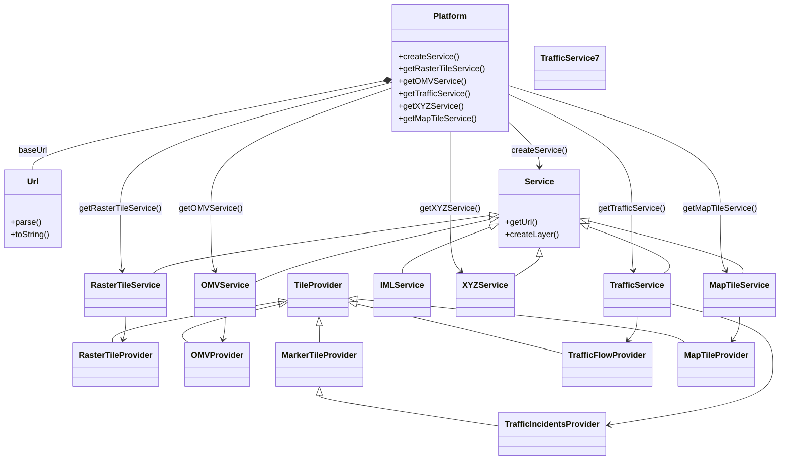

# Diagram: web/portal/public/js/heremaps-3.1.49.1/mapsjs-service.js


> Auto-generated by Obscura crawlers

## Diagram 1



### SVG

<svg id="container" width="1467.50390625" xmlns="http://www.w3.org/2000/svg" class="classDiagram" height="888" viewBox="0 0 1467.50390625 888" role="graphics-document document" aria-roledescription="class"><style>#container{font-family:"trebuchet ms",verdana,arial,sans-serif;font-size:16px;fill:#333;}@keyframes edge-animation-frame{from{stroke-dashoffset:0;}}@keyframes dash{to{stroke-dashoffset:0;}}#container .edge-animation-slow{stroke-dasharray:9,5!important;stroke-dashoffset:900;animation:dash 50s linear infinite;stroke-linecap:round;}#container .edge-animation-fast{stroke-dasharray:9,5!important;stroke-dashoffset:900;animation:dash 20s linear infinite;stroke-linecap:round;}#container .error-icon{fill:#552222;}#container .error-text{fill:#552222;stroke:#552222;}#container .edge-thickness-normal{stroke-width:1px;}#container .edge-thickness-thick{stroke-width:3.5px;}#container .edge-pattern-solid{stroke-dasharray:0;}#container .edge-thickness-invisible{stroke-width:0;fill:none;}#container .edge-pattern-dashed{stroke-dasharray:3;}#container .edge-pattern-dotted{stroke-dasharray:2;}#container .marker{fill:#333333;stroke:#333333;}#container .marker.cross{stroke:#333333;}#container svg{font-family:"trebuchet ms",verdana,arial,sans-serif;font-size:16px;}#container p{margin:0;}#container g.classGroup text{fill:#9370DB;stroke:none;font-family:"trebuchet ms",verdana,arial,sans-serif;font-size:10px;}#container g.classGroup text .title{font-weight:bolder;}#container .nodeLabel,#container .edgeLabel{color:#131300;}#container .edgeLabel .label rect{fill:#ECECFF;}#container .label text{fill:#131300;}#container .labelBkg{background:#ECECFF;}#container .edgeLabel .label span{background:#ECECFF;}#container .classTitle{font-weight:bolder;}#container .node rect,#container .node circle,#container .node ellipse,#container .node polygon,#container .node path{fill:#ECECFF;stroke:#9370DB;stroke-width:1px;}#container .divider{stroke:#9370DB;stroke-width:1;}#container g.clickable{cursor:pointer;}#container g.classGroup rect{fill:#ECECFF;stroke:#9370DB;}#container g.classGroup line{stroke:#9370DB;stroke-width:1;}#container .classLabel .box{stroke:none;stroke-width:0;fill:#ECECFF;opacity:0.5;}#container .classLabel .label{fill:#9370DB;font-size:10px;}#container .relation{stroke:#333333;stroke-width:1;fill:none;}#container .dashed-line{stroke-dasharray:3;}#container .dotted-line{stroke-dasharray:1 2;}#container #compositionStart,#container .composition{fill:#333333!important;stroke:#333333!important;stroke-width:1;}#container #compositionEnd,#container .composition{fill:#333333!important;stroke:#333333!important;stroke-width:1;}#container #dependencyStart,#container .dependency{fill:#333333!important;stroke:#333333!important;stroke-width:1;}#container #dependencyStart,#container .dependency{fill:#333333!important;stroke:#333333!important;stroke-width:1;}#container #extensionStart,#container .extension{fill:transparent!important;stroke:#333333!important;stroke-width:1;}#container #extensionEnd,#container .extension{fill:transparent!important;stroke:#333333!important;stroke-width:1;}#container #aggregationStart,#container .aggregation{fill:transparent!important;stroke:#333333!important;stroke-width:1;}#container #aggregationEnd,#container .aggregation{fill:transparent!important;stroke:#333333!important;stroke-width:1;}#container #lollipopStart,#container .lollipop{fill:#ECECFF!important;stroke:#333333!important;stroke-width:1;}#container #lollipopEnd,#container .lollipop{fill:#ECECFF!important;stroke:#333333!important;stroke-width:1;}#container .edgeTerminals{font-size:11px;line-height:initial;}#container .classTitleText{text-anchor:middle;font-size:18px;fill:#333;}#container .label-icon{display:inline-block;height:1em;overflow:visible;vertical-align:-0.125em;}#container .node .label-icon path{fill:currentColor;stroke:revert;stroke-width:revert;}#container :root{--mermaid-font-family:"trebuchet ms",verdana,arial,sans-serif;}</style><g><defs><marker id="container_class-aggregationStart" class="marker aggregation class" refX="18" refY="7" markerWidth="190" markerHeight="240" orient="auto"><path d="M 18,7 L9,13 L1,7 L9,1 Z"></path></marker></defs><defs><marker id="container_class-aggregationEnd" class="marker aggregation class" refX="1" refY="7" markerWidth="20" markerHeight="28" orient="auto"><path d="M 18,7 L9,13 L1,7 L9,1 Z"></path></marker></defs><defs><marker id="container_class-extensionStart" class="marker extension class" refX="18" refY="7" markerWidth="190" markerHeight="240" orient="auto"><path d="M 1,7 L18,13 V 1 Z"></path></marker></defs><defs><marker id="container_class-extensionEnd" class="marker extension class" refX="1" refY="7" markerWidth="20" markerHeight="28" orient="auto"><path d="M 1,1 V 13 L18,7 Z"></path></marker></defs><defs><marker id="container_class-compositionStart" class="marker composition class" refX="18" refY="7" markerWidth="190" markerHeight="240" orient="auto"><path d="M 18,7 L9,13 L1,7 L9,1 Z"></path></marker></defs><defs><marker id="container_class-compositionEnd" class="marker composition class" refX="1" refY="7" markerWidth="20" markerHeight="28" orient="auto"><path d="M 18,7 L9,13 L1,7 L9,1 Z"></path></marker></defs><defs><marker id="container_class-dependencyStart" class="marker dependency class" refX="6" refY="7" markerWidth="190" markerHeight="240" orient="auto"><path d="M 5,7 L9,13 L1,7 L9,1 Z"></path></marker></defs><defs><marker id="container_class-dependencyEnd" class="marker dependency class" refX="13" refY="7" markerWidth="20" markerHeight="28" orient="auto"><path d="M 18,7 L9,13 L14,7 L9,1 Z"></path></marker></defs><defs><marker id="container_class-lollipopStart" class="marker lollipop class" refX="13" refY="7" markerWidth="190" markerHeight="240" orient="auto"><circle stroke="black" fill="transparent" cx="7" cy="7" r="6"></circle></marker></defs><defs><marker id="container_class-lollipopEnd" class="marker lollipop class" refX="1" refY="7" markerWidth="190" markerHeight="240" orient="auto"><circle stroke="black" fill="transparent" cx="7" cy="7" r="6"></circle></marker></defs><g class="root"><g class="clusters"></g><g class="edgePaths"><path d="M720.325,156.989L610.841,179.324C501.357,201.659,282.389,246.33,172.906,274.831C63.422,303.333,63.422,315.667,63.422,321.833L63.422,328" id="id_Platform_Url_1" class="edge-thickness-normal edge-pattern-solid relation" style=";;;" data-edge="true" data-et="edge" data-id="id_Platform_Url_1" data-points="W3sieCI6NzM3LjIyNjU2MjUsInkiOjE1My41NDA4OTA1MjY5NDQ5fSx7IngiOjYzLjQyMTg3NSwieSI6MjkxfSx7IngiOjYzLjQyMTg3NSwieSI6MzI4fV0=" marker-start="url(#container_class-compositionStart)"></path><path d="M958.211,237.131L967.558,246.109C976.905,255.088,995.599,273.044,1004.946,287.189C1014.293,301.333,1014.293,311.667,1014.293,316.833L1014.293,322" id="id_Platform_Service_2" class="edge-thickness-normal edge-pattern-solid relation" style=";;;" data-edge="true" data-et="edge" data-id="id_Platform_Service_2" data-points="W3sieCI6OTU4LjIxMDkzNzUsInkiOjIzNy4xMzEzNjk3NDQxNTQ5N30seyJ4IjoxMDE0LjI5Mjk2ODc1LCJ5IjoyOTF9LHsieCI6MTAxNC4yOTI5Njg3NSwieSI6MzI4fV0=" marker-end="url(#container_class-dependencyEnd)"></path><path d="M737.227,159.73L653.085,181.608C568.943,203.487,400.659,247.243,316.517,287.788C232.375,328.333,232.375,365.667,232.375,401C232.375,436.333,232.375,469.667,232.849,489.511C233.324,509.355,234.272,515.71,234.746,518.888L235.221,522.066" id="id_Platform_RasterTileService_3" class="edge-thickness-normal edge-pattern-solid relation" style=";;;" data-edge="true" data-et="edge" data-id="id_Platform_RasterTileService_3" data-points="W3sieCI6NzM3LjIyNjU2MjUsInkiOjE1OS43Mjk4NzY1OTMzNjc1Mn0seyJ4IjoyMzIuMzc1LCJ5IjoyOTF9LHsieCI6MjMyLjM3NSwieSI6NDAzfSx7IngiOjIzMi4zNzUsInkiOjUwM30seyJ4IjoyMzYuMTA2MzQzMjgzNTgyMDgsInkiOjUyOH1d" marker-end="url(#container_class-dependencyEnd)"></path><path d="M737.227,170.58L681.199,190.65C625.171,210.72,513.115,250.86,457.087,289.597C401.059,328.333,401.059,365.667,401.059,401C401.059,436.333,401.059,469.667,402.317,489.568C403.576,509.469,406.093,515.939,407.352,519.174L408.611,522.408" id="id_Platform_OMVService_4" class="edge-thickness-normal edge-pattern-solid relation" style=";;;" data-edge="true" data-et="edge" data-id="id_Platform_OMVService_4" data-points="W3sieCI6NzM3LjIyNjU2MjUsInkiOjE3MC41Nzk4Njc5NDM1MDQzfSx7IngiOjQwMS4wNTg1OTM3NSwieSI6MjkxfSx7IngiOjQwMS4wNTg1OTM3NSwieSI6NDAzfSx7IngiOjQwMS4wNTg1OTM3NSwieSI6NTAzfSx7IngiOjQxMC43ODYzMjIyOTQ3NzYxNCwieSI6NTI4fV0=" marker-end="url(#container_class-dependencyEnd)"></path><path d="M958.211,182.594L996.904,200.662C1035.596,218.73,1112.982,254.865,1151.674,291.599C1190.367,328.333,1190.367,365.667,1190.367,401C1190.367,436.333,1190.367,469.667,1190.841,489.511C1191.316,509.355,1192.264,515.71,1192.739,518.888L1193.213,522.066" id="id_Platform_TrafficService_5" class="edge-thickness-normal edge-pattern-solid relation" style=";;;" data-edge="true" data-et="edge" data-id="id_Platform_TrafficService_5" data-points="W3sieCI6OTU4LjIxMDkzNzUsInkiOjE4Mi41OTQ0Mjc1OTc1Mjg0NH0seyJ4IjoxMTkwLjM2NzE4NzUsInkiOjI5MX0seyJ4IjoxMTkwLjM2NzE4NzUsInkiOjQwM30seyJ4IjoxMTkwLjM2NzE4NzUsInkiOjUwM30seyJ4IjoxMTk0LjA5ODUzMDc4MzU4MjIsInkiOjUyOH1d" marker-end="url(#container_class-dependencyEnd)"></path><path d="M847.719,254L847.719,260.167C847.719,266.333,847.719,278.667,847.719,303.5C847.719,328.333,847.719,365.667,847.719,401C847.719,436.333,847.719,469.667,851.13,489.788C854.541,509.91,861.364,516.82,864.776,520.275L868.187,523.73" id="id_Platform_XYZService_6" class="edge-thickness-normal edge-pattern-solid relation" style=";;;" data-edge="true" data-et="edge" data-id="id_Platform_XYZService_6" data-points="W3sieCI6ODQ3LjcxODc1LCJ5IjoyNTR9LHsieCI6ODQ3LjcxODc1LCJ5IjoyOTF9LHsieCI6ODQ3LjcxODc1LCJ5Ijo0MDN9LHsieCI6ODQ3LjcxODc1LCJ5Ijo1MDN9LHsieCI6ODcyLjQwMjQ2MDM1NDQ3NzYsInkiOjUyOH1d" marker-end="url(#container_class-dependencyEnd)"></path><path d="M958.211,165.672L1024.776,186.56C1091.341,207.448,1224.471,249.224,1291.036,288.779C1357.602,328.333,1357.602,365.667,1357.602,401C1357.602,436.333,1357.602,469.667,1359.288,489.611C1360.974,509.555,1364.347,516.11,1366.033,519.387L1367.719,522.665" id="id_Platform_MapTileService_7" class="edge-thickness-normal edge-pattern-solid relation" style=";;;" data-edge="true" data-et="edge" data-id="id_Platform_MapTileService_7" data-points="W3sieCI6OTU4LjIxMDkzNzUsInkiOjE2NS42NzIxODI2NDAwMDYxM30seyJ4IjoxMzU3LjYwMTU2MjUsInkiOjI5MX0seyJ4IjoxMzU3LjYwMTU2MjUsInkiOjQwM30seyJ4IjoxMzU3LjYwMTU2MjUsInkiOjUwM30seyJ4IjoxMzcwLjQ2NDQ5MzkzNjU2NzEsInkiOjUyOH1d" marker-end="url(#container_class-dependencyEnd)"></path><path d="M920.795,416.516L821.087,430.93C721.379,445.344,521.963,474.172,417.269,492.753C312.575,511.333,302.604,519.667,297.618,523.833L292.632,528" id="id_Service_RasterTileService_8" class="edge-thickness-normal edge-pattern-solid relation" style=";;;" data-edge="true" data-et="edge" data-id="id_Service_RasterTileService_8" data-points="W3sieCI6OTM3Ljg2NzE4NzUsInkiOjQxNC4wNDgyNDE4MjQ2Mzk5fSx7IngiOjMyMi41NDY4NzUsInkiOjUwM30seyJ4IjoyOTIuNjMxOTk2MjY4NjU2NzQsInkiOjUyOH1d" marker-start="url(#container_class-extensionStart)"></path><path d="M921.05,424.298L863.623,437.415C806.196,450.532,691.342,476.766,618.151,496.955C544.96,517.143,513.431,531.286,497.667,538.358L481.902,545.43" id="id_Service_OMVService_9" class="edge-thickness-normal edge-pattern-solid relation" style=";;;" data-edge="true" data-et="edge" data-id="id_Service_OMVService_9" data-points="W3sieCI6OTM3Ljg2NzE4NzUsInkiOjQyMC40NTY1OTI3MzAwNjN9LHsieCI6NTc2LjQ4ODI4MTI1LCJ5Ijo1MDN9LHsieCI6NDgxLjkwMjM0Mzc1LCJ5Ijo1NDUuNDI5NTk1MTQ1OTM1OH1d" marker-start="url(#container_class-extensionStart)"></path><path d="M1106.862,437.86L1135.692,448.716C1164.521,459.573,1222.181,481.287,1246.068,496.31C1269.955,511.333,1260.071,519.667,1255.128,523.833L1250.186,528" id="id_Service_TrafficService_10" class="edge-thickness-normal edge-pattern-solid relation" style=";;;" data-edge="true" data-et="edge" data-id="id_Service_TrafficService_10" data-points="W3sieCI6MTA5MC43MTg3NSwieSI6NDMxLjc4MDUyMzY4MzQzNjN9LHsieCI6MTI3OS44Mzk4NDM3NSwieSI6NTAzfSx7IngiOjEyNTAuMTg1ODY3NTM3MzEzNSwieSI6NTI4fV0=" marker-start="url(#container_class-extensionStart)"></path><path d="M921.817,439.426L894.917,450.021C868.018,460.617,814.218,481.809,787.318,496.571C760.418,511.333,760.418,519.667,760.418,523.833L760.418,528" id="id_Service_IMLService_11" class="edge-thickness-normal edge-pattern-solid relation" style=";;;" data-edge="true" data-et="edge" data-id="id_Service_IMLService_11" data-points="W3sieCI6OTM3Ljg2NzE4NzUsInkiOjQzMy4xMDM3MDUwNzEzOTM0fSx7IngiOjc2MC40MTc5Njg3NSwieSI6NTAzfSx7IngiOjc2MC40MTc5Njg3NSwieSI6NTI4fV0=" marker-start="url(#container_class-extensionStart)"></path><path d="M1014.293,495.25L1014.293,496.542C1014.293,497.833,1014.293,500.417,1006.25,507.074C998.207,513.732,982.121,524.465,974.078,529.831L966.035,535.197" id="id_Service_XYZService_12" class="edge-thickness-normal edge-pattern-solid relation" style=";;;" data-edge="true" data-et="edge" data-id="id_Service_XYZService_12" data-points="W3sieCI6MTAxNC4yOTI5Njg3NSwieSI6NDc4fSx7IngiOjEwMTQuMjkyOTY4NzUsInkiOjUwM30seyJ4Ijo5NjYuMDM1MTU2MjUsInkiOjUzNS4xOTY5MDM2ODc1NjgxfV0=" marker-start="url(#container_class-extensionStart)"></path><path d="M1107.422,427.016L1156.531,439.68C1205.64,452.344,1303.857,477.672,1352.344,494.503C1400.83,511.333,1399.587,519.667,1398.965,523.833L1398.343,528" id="id_Service_MapTileService_13" class="edge-thickness-normal edge-pattern-solid relation" style=";;;" data-edge="true" data-et="edge" data-id="id_Service_MapTileService_13" data-points="W3sieCI6MTA5MC43MTg3NSwieSI6NDIyLjcwODQ3NzcxNzc4NTQ2fSx7IngiOjE0MDIuMDc0MjE4NzUsInkiOjUwM30seyJ4IjoxMzk4LjM0Mjg3NTQ2NjQxNzgsInkiOjUyOH1d" marker-start="url(#container_class-extensionStart)"></path><path d="M529.472,582.598L476.696,591.665C423.921,600.732,318.371,618.866,266.217,632.1C214.064,645.333,215.308,653.667,215.93,657.833L216.552,662" id="id_TileProvider_RasterTileProvider_14" class="edge-thickness-normal edge-pattern-solid relation" style=";;;" data-edge="true" data-et="edge" data-id="id_TileProvider_RasterTileProvider_14" data-points="W3sieCI6NTQ2LjQ3MjY1NjI1LCJ5Ijo1NzkuNjc3MzY3NjU2NjMzNX0seyJ4IjoyMTIuODIwMzEyNSwieSI6NjM3fSx7IngiOjIxNi41NTE2NTU3ODM1ODIwOCwieSI6NjYyfV0=" marker-start="url(#container_class-extensionStart)"></path><path d="M529.712,587.781L495.993,595.985C462.275,604.188,394.839,620.594,366.381,632.964C337.922,645.333,348.443,653.667,353.703,657.833L358.963,662" id="id_TileProvider_OMVProvider_15" class="edge-thickness-normal edge-pattern-solid relation" style=";;;" data-edge="true" data-et="edge" data-id="id_TileProvider_OMVProvider_15" data-points="W3sieCI6NTQ2LjQ3MjY1NjI1LCJ5Ijo1ODMuNzAzNzI0NzE3MDI5M30seyJ4IjozMjcuNDAyMzQzNzUsInkiOjYzN30seyJ4IjozNTguOTYyODAzMTcxNjQxOCwieSI6NjYyfV0=" marker-start="url(#container_class-extensionStart)"></path><path d="M603.309,629.249L603.32,630.541C603.331,631.833,603.353,634.416,603.364,639.875C603.375,645.333,603.375,653.667,603.375,657.833L603.375,662" id="id_TileProvider_MarkerTileProvider_16" class="edge-thickness-normal edge-pattern-solid relation" style=";;;" data-edge="true" data-et="edge" data-id="id_TileProvider_MarkerTileProvider_16" data-points="W3sieCI6NjAzLjE2MDczOTI3MjM4OCwieSI6NjEyfSx7IngiOjYwMy4zNzUsInkiOjYzN30seyJ4Ijo2MDMuMzc1LCJ5Ijo2NjJ9XQ==" marker-start="url(#container_class-extensionStart)"></path><path d="M603.375,763.25L603.375,764.542C603.375,765.833,603.375,768.417,659.351,778.319C715.327,788.221,827.279,805.442,883.255,814.053L939.23,822.663" id="id_MarkerTileProvider_TrafficIncidentsProvider_17" class="edge-thickness-normal edge-pattern-solid relation" style=";;;" data-edge="true" data-et="edge" data-id="id_MarkerTileProvider_TrafficIncidentsProvider_17" data-points="W3sieCI6NjAzLjM3NSwieSI6NzQ2fSx7IngiOjYwMy4zNzUsInkiOjc3MX0seyJ4Ijo5MzkuMjMwNDY4NzUsInkiOjgyMi42NjMxMjExNzE2Mjc3fV0=" marker-start="url(#container_class-extensionStart)"></path><path d="M675.909,587.414L710.605,595.678C745.3,603.943,814.691,620.471,878.961,636.353C943.23,652.234,1002.379,667.469,1031.953,675.086L1061.527,682.703" id="id_TileProvider_TrafficFlowProvider_18" class="edge-thickness-normal edge-pattern-solid relation" style=";;;" data-edge="true" data-et="edge" data-id="id_TileProvider_TrafficFlowProvider_18" data-points="W3sieCI6NjU5LjEyODkwNjI1LCJ5Ijo1ODMuNDE3MTIwMzE5OTY0NH0seyJ4Ijo4ODQuMDgyMDMxMjUsInkiOjYzN30seyJ4IjoxMDYxLjUyNzM0Mzc1LCJ5Ijo2ODIuNzAyOTQ2MjExMzcwNH1d" marker-start="url(#container_class-extensionStart)"></path><path d="M676.289,577.533L772.982,587.444C869.676,597.355,1063.062,617.178,1165.492,631.255C1267.921,645.333,1279.393,653.667,1285.129,657.833L1290.865,662" id="id_TileProvider_MapTileProvider_19" class="edge-thickness-normal edge-pattern-solid relation" style=";;;" data-edge="true" data-et="edge" data-id="id_TileProvider_MapTileProvider_19" data-points="W3sieCI6NjU5LjEyODkwNjI1LCJ5Ijo1NzUuNzczNzIyMDE3MDQzN30seyJ4IjoxMjU2LjQ0OTIxODc1LCJ5Ijo2Mzd9LHsieCI6MTI5MC44NjUwMzAzMTcxNjQyLCJ5Ijo2NjJ9XQ==" marker-start="url(#container_class-extensionStart)"></path><path d="M242.375,612L242.375,616.167C242.375,620.333,242.375,628.667,241.439,636.04C240.503,643.413,238.631,649.827,237.695,653.034L236.76,656.24" id="id_RasterTileService_RasterTileProvider_20" class="edge-thickness-normal edge-pattern-solid relation" style=";;;" data-edge="true" data-et="edge" data-id="id_RasterTileService_RasterTileProvider_20" data-points="W3sieCI6MjQyLjM3NSwieSI6NjEyfSx7IngiOjI0Mi4zNzUsInkiOjYzN30seyJ4IjoyMzUuMDc4NDc0ODEzNDMyODUsInkiOjY2Mn1d" marker-end="url(#container_class-dependencyEnd)"></path><path d="M427.129,612L427.129,616.167C427.129,620.333,427.129,628.667,426.408,636.025C425.686,643.383,424.244,649.765,423.522,652.956L422.801,656.148" id="id_OMVService_OMVProvider_21" class="edge-thickness-normal edge-pattern-solid relation" style=";;;" data-edge="true" data-et="edge" data-id="id_OMVService_OMVProvider_21" data-points="W3sieCI6NDI3LjEyODkwNjI1LCJ5Ijo2MTJ9LHsieCI6NDI3LjEyODkwNjI1LCJ5Ijo2Mzd9LHsieCI6NDIxLjQ3Nzk2MTc1MzczMTM0LCJ5Ijo2NjJ9XQ==" marker-end="url(#container_class-dependencyEnd)"></path><path d="M1261.883,586.157L1294.146,594.631C1326.41,603.104,1390.938,620.052,1423.201,639.693C1455.465,659.333,1455.465,681.667,1455.465,704C1455.465,726.333,1455.465,748.667,1403.647,768.168C1351.83,787.67,1248.195,804.34,1196.378,812.675L1144.561,821.01" id="id_TrafficService_TrafficIncidentsProvider_22" class="edge-thickness-normal edge-pattern-solid relation" style=";;;" data-edge="true" data-et="edge" data-id="id_TrafficService_TrafficIncidentsProvider_22" data-points="W3sieCI6MTI2MS44ODI4MTI1LCJ5Ijo1ODYuMTU2NzQxNDQzOTkzNn0seyJ4IjoxNDU1LjQ2NDg0Mzc1LCJ5Ijo2Mzd9LHsieCI6MTQ1NS40NjQ4NDM3NSwieSI6NzA0fSx7IngiOjE0NTUuNDY0ODQzNzUsInkiOjc3MX0seyJ4IjoxMTM4LjYzNjcxODc1LCJ5Ijo4MjEuOTYyNTI1MzIwNzI5Mn1d" marker-end="url(#container_class-dependencyEnd)"></path><path d="M1200.367,612L1200.367,616.167C1200.367,620.333,1200.367,628.667,1197.517,636.234C1194.668,643.8,1188.968,650.601,1186.119,654.001L1183.269,657.401" id="id_TrafficService_TrafficFlowProvider_23" class="edge-thickness-normal edge-pattern-solid relation" style=";;;" data-edge="true" data-et="edge" data-id="id_TrafficService_TrafficFlowProvider_23" data-points="W3sieCI6MTIwMC4zNjcxODc1LCJ5Ijo2MTJ9LHsieCI6MTIwMC4zNjcxODc1LCJ5Ijo2Mzd9LHsieCI6MTE3OS40MTQ4MjA0MjkxMDQ2LCJ5Ijo2NjJ9XQ==" marker-end="url(#container_class-dependencyEnd)"></path><path d="M1392.074,612L1392.074,616.167C1392.074,620.333,1392.074,628.667,1389.919,636.161C1387.765,643.655,1383.455,650.309,1381.3,653.637L1379.145,656.964" id="id_MapTileService_MapTileProvider_24" class="edge-thickness-normal edge-pattern-solid relation" style=";;;" data-edge="true" data-et="edge" data-id="id_MapTileService_MapTileProvider_24" data-points="W3sieCI6MTM5Mi4wNzQyMTg3NSwieSI6NjEyfSx7IngiOjEzOTIuMDc0MjE4NzUsInkiOjYzN30seyJ4IjoxMzc1Ljg4MzY4NzAzMzU4MjIsInkiOjY2Mn1d" marker-end="url(#container_class-dependencyEnd)"></path></g><g class="edgeLabels"><g class="edgeLabel" transform="translate(63.421875, 291)"><g class="label" data-id="id_Platform_Url_1" transform="translate(-27.7734375, -12)"><foreignObject width="55.546875" height="24"><div xmlns="http://www.w3.org/1999/xhtml" class="labelBkg" style="display: table-cell; white-space: nowrap; line-height: 1.5; max-width: 200px; text-align: center;"><span class="edgeLabel"><p>baseUrl</p></span></div></foreignObject></g></g><g class="edgeLabel" transform="translate(1014.29296875, 291)"><g class="label" data-id="id_Platform_Service_2" transform="translate(-53.640625, -12)"><foreignObject width="107.28125" height="24"><div xmlns="http://www.w3.org/1999/xhtml" class="labelBkg" style="display: table-cell; white-space: nowrap; line-height: 1.5; max-width: 200px; text-align: center;"><span class="edgeLabel"><p>createService()</p></span></div></foreignObject></g></g><g class="edgeLabel" transform="translate(232.375, 403)"><g class="label" data-id="id_Platform_RasterTileService_3" transform="translate(-78.53125, -12)"><foreignObject width="157.0625" height="24"><div xmlns="http://www.w3.org/1999/xhtml" class="labelBkg" style="display: table-cell; white-space: nowrap; line-height: 1.5; max-width: 200px; text-align: center;"><span class="edgeLabel"><p>getRasterTileService()</p></span></div></foreignObject></g></g><g class="edgeLabel" transform="translate(401.05859375, 403)"><g class="label" data-id="id_Platform_OMVService_4" transform="translate(-58.4921875, -12)"><foreignObject width="116.984375" height="24"><div xmlns="http://www.w3.org/1999/xhtml" class="labelBkg" style="display: table-cell; white-space: nowrap; line-height: 1.5; max-width: 200px; text-align: center;"><span class="edgeLabel"><p>getOMVService()</p></span></div></foreignObject></g></g><g class="edgeLabel" transform="translate(1190.3671875, 403)"><g class="label" data-id="id_Platform_TrafficService_5" transform="translate(-64.6484375, -12)"><foreignObject width="129.296875" height="24"><div xmlns="http://www.w3.org/1999/xhtml" class="labelBkg" style="display: table-cell; white-space: nowrap; line-height: 1.5; max-width: 200px; text-align: center;"><span class="edgeLabel"><p>getTrafficService()</p></span></div></foreignObject></g></g><g class="edgeLabel" transform="translate(847.71875, 403)"><g class="label" data-id="id_Platform_XYZService_6" transform="translate(-55.1484375, -12)"><foreignObject width="110.296875" height="24"><div xmlns="http://www.w3.org/1999/xhtml" class="labelBkg" style="display: table-cell; white-space: nowrap; line-height: 1.5; max-width: 200px; text-align: center;"><span class="edgeLabel"><p>getXYZService()</p></span></div></foreignObject></g></g><g class="edgeLabel" transform="translate(1357.6015625, 403)"><g class="label" data-id="id_Platform_MapTileService_7" transform="translate(-70.875, -12)"><foreignObject width="141.75" height="24"><div xmlns="http://www.w3.org/1999/xhtml" class="labelBkg" style="display: table-cell; white-space: nowrap; line-height: 1.5; max-width: 200px; text-align: center;"><span class="edgeLabel"><p>getMapTileService()</p></span></div></foreignObject></g></g><g class="edgeLabel"><g class="label" data-id="id_Service_RasterTileService_8" transform="translate(0, 0)"><foreignObject width="0" height="0"><div xmlns="http://www.w3.org/1999/xhtml" class="labelBkg" style="display: table-cell; white-space: nowrap; line-height: 1.5; max-width: 200px; text-align: center;"><span class="edgeLabel"></span></div></foreignObject></g></g><g class="edgeLabel"><g class="label" data-id="id_Service_OMVService_9" transform="translate(0, 0)"><foreignObject width="0" height="0"><div xmlns="http://www.w3.org/1999/xhtml" class="labelBkg" style="display: table-cell; white-space: nowrap; line-height: 1.5; max-width: 200px; text-align: center;"><span class="edgeLabel"></span></div></foreignObject></g></g><g class="edgeLabel"><g class="label" data-id="id_Service_TrafficService_10" transform="translate(0, 0)"><foreignObject width="0" height="0"><div xmlns="http://www.w3.org/1999/xhtml" class="labelBkg" style="display: table-cell; white-space: nowrap; line-height: 1.5; max-width: 200px; text-align: center;"><span class="edgeLabel"></span></div></foreignObject></g></g><g class="edgeLabel"><g class="label" data-id="id_Service_IMLService_11" transform="translate(0, 0)"><foreignObject width="0" height="0"><div xmlns="http://www.w3.org/1999/xhtml" class="labelBkg" style="display: table-cell; white-space: nowrap; line-height: 1.5; max-width: 200px; text-align: center;"><span class="edgeLabel"></span></div></foreignObject></g></g><g class="edgeLabel"><g class="label" data-id="id_Service_XYZService_12" transform="translate(0, 0)"><foreignObject width="0" height="0"><div xmlns="http://www.w3.org/1999/xhtml" class="labelBkg" style="display: table-cell; white-space: nowrap; line-height: 1.5; max-width: 200px; text-align: center;"><span class="edgeLabel"></span></div></foreignObject></g></g><g class="edgeLabel"><g class="label" data-id="id_Service_MapTileService_13" transform="translate(0, 0)"><foreignObject width="0" height="0"><div xmlns="http://www.w3.org/1999/xhtml" class="labelBkg" style="display: table-cell; white-space: nowrap; line-height: 1.5; max-width: 200px; text-align: center;"><span class="edgeLabel"></span></div></foreignObject></g></g><g class="edgeLabel"><g class="label" data-id="id_TileProvider_RasterTileProvider_14" transform="translate(0, 0)"><foreignObject width="0" height="0"><div xmlns="http://www.w3.org/1999/xhtml" class="labelBkg" style="display: table-cell; white-space: nowrap; line-height: 1.5; max-width: 200px; text-align: center;"><span class="edgeLabel"></span></div></foreignObject></g></g><g class="edgeLabel"><g class="label" data-id="id_TileProvider_OMVProvider_15" transform="translate(0, 0)"><foreignObject width="0" height="0"><div xmlns="http://www.w3.org/1999/xhtml" class="labelBkg" style="display: table-cell; white-space: nowrap; line-height: 1.5; max-width: 200px; text-align: center;"><span class="edgeLabel"></span></div></foreignObject></g></g><g class="edgeLabel"><g class="label" data-id="id_TileProvider_MarkerTileProvider_16" transform="translate(0, 0)"><foreignObject width="0" height="0"><div xmlns="http://www.w3.org/1999/xhtml" class="labelBkg" style="display: table-cell; white-space: nowrap; line-height: 1.5; max-width: 200px; text-align: center;"><span class="edgeLabel"></span></div></foreignObject></g></g><g class="edgeLabel"><g class="label" data-id="id_MarkerTileProvider_TrafficIncidentsProvider_17" transform="translate(0, 0)"><foreignObject width="0" height="0"><div xmlns="http://www.w3.org/1999/xhtml" class="labelBkg" style="display: table-cell; white-space: nowrap; line-height: 1.5; max-width: 200px; text-align: center;"><span class="edgeLabel"></span></div></foreignObject></g></g><g class="edgeLabel"><g class="label" data-id="id_TileProvider_TrafficFlowProvider_18" transform="translate(0, 0)"><foreignObject width="0" height="0"><div xmlns="http://www.w3.org/1999/xhtml" class="labelBkg" style="display: table-cell; white-space: nowrap; line-height: 1.5; max-width: 200px; text-align: center;"><span class="edgeLabel"></span></div></foreignObject></g></g><g class="edgeLabel"><g class="label" data-id="id_TileProvider_MapTileProvider_19" transform="translate(0, 0)"><foreignObject width="0" height="0"><div xmlns="http://www.w3.org/1999/xhtml" class="labelBkg" style="display: table-cell; white-space: nowrap; line-height: 1.5; max-width: 200px; text-align: center;"><span class="edgeLabel"></span></div></foreignObject></g></g><g class="edgeLabel"><g class="label" data-id="id_RasterTileService_RasterTileProvider_20" transform="translate(0, 0)"><foreignObject width="0" height="0"><div xmlns="http://www.w3.org/1999/xhtml" class="labelBkg" style="display: table-cell; white-space: nowrap; line-height: 1.5; max-width: 200px; text-align: center;"><span class="edgeLabel"></span></div></foreignObject></g></g><g class="edgeLabel"><g class="label" data-id="id_OMVService_OMVProvider_21" transform="translate(0, 0)"><foreignObject width="0" height="0"><div xmlns="http://www.w3.org/1999/xhtml" class="labelBkg" style="display: table-cell; white-space: nowrap; line-height: 1.5; max-width: 200px; text-align: center;"><span class="edgeLabel"></span></div></foreignObject></g></g><g class="edgeLabel"><g class="label" data-id="id_TrafficService_TrafficIncidentsProvider_22" transform="translate(0, 0)"><foreignObject width="0" height="0"><div xmlns="http://www.w3.org/1999/xhtml" class="labelBkg" style="display: table-cell; white-space: nowrap; line-height: 1.5; max-width: 200px; text-align: center;"><span class="edgeLabel"></span></div></foreignObject></g></g><g class="edgeLabel"><g class="label" data-id="id_TrafficService_TrafficFlowProvider_23" transform="translate(0, 0)"><foreignObject width="0" height="0"><div xmlns="http://www.w3.org/1999/xhtml" class="labelBkg" style="display: table-cell; white-space: nowrap; line-height: 1.5; max-width: 200px; text-align: center;"><span class="edgeLabel"></span></div></foreignObject></g></g><g class="edgeLabel"><g class="label" data-id="id_MapTileService_MapTileProvider_24" transform="translate(0, 0)"><foreignObject width="0" height="0"><div xmlns="http://www.w3.org/1999/xhtml" class="labelBkg" style="display: table-cell; white-space: nowrap; line-height: 1.5; max-width: 200px; text-align: center;"><span class="edgeLabel"></span></div></foreignObject></g></g></g><g class="nodes"><g class="node default" id="classId-Url-0" transform="translate(63.421875, 403)"><g class="basic label-container"><path d="M-55.421875 -75 L55.421875 -75 L55.421875 75 L-55.421875 75" stroke="none" stroke-width="0" fill="#ECECFF" style=""></path><path d="M-55.421875 -75 C-24.044168724321604 -75, 7.333537551356791 -75, 55.421875 -75 M-55.421875 -75 C-18.96688809009884 -75, 17.488098819802318 -75, 55.421875 -75 M55.421875 -75 C55.421875 -29.503848168150384, 55.421875 15.992303663699232, 55.421875 75 M55.421875 -75 C55.421875 -27.57070361732457, 55.421875 19.858592765350863, 55.421875 75 M55.421875 75 C22.05104116786415 75, -11.319792664271702 75, -55.421875 75 M55.421875 75 C15.205626020234789 75, -25.010622959530423 75, -55.421875 75 M-55.421875 75 C-55.421875 27.82387826260895, -55.421875 -19.3522434747821, -55.421875 -75 M-55.421875 75 C-55.421875 37.45871395388002, -55.421875 -0.08257209223995687, -55.421875 -75" stroke="#9370DB" stroke-width="1.3" fill="none" stroke-dasharray="0 0" style=""></path></g><g class="annotation-group text" transform="translate(0, -51)"></g><g class="label-group text" transform="translate(-10.796875, -51)"><g class="label" style="font-weight: bolder" transform="translate(0,-12)"><foreignObject width="21.59375" height="24"><div xmlns="http://www.w3.org/1999/xhtml" style="display: table-cell; white-space: nowrap; line-height: 1.5; max-width: 72px; text-align: center;"><span class="nodeLabel markdown-node-label" style=""><p>Url</p></span></div></foreignObject></g></g><g class="members-group text" transform="translate(-43.421875, -3)"></g><g class="methods-group text" transform="translate(-43.421875, 27)"><g class="label" style="" transform="translate(0,-12)"><foreignObject width="58.53125" height="24"><div xmlns="http://www.w3.org/1999/xhtml" style="display: table-cell; white-space: nowrap; line-height: 1.5; max-width: 116px; text-align: center;"><span class="nodeLabel markdown-node-label" style=""><p>+parse()</p></span></div></foreignObject></g><g class="label" style="" transform="translate(0,12)"><foreignObject width="76.046875" height="24"><div xmlns="http://www.w3.org/1999/xhtml" style="display: table-cell; white-space: nowrap; line-height: 1.5; max-width: 133px; text-align: center;"><span class="nodeLabel markdown-node-label" style=""><p>+toString()</p></span></div></foreignObject></g></g><g class="divider" style=""><path d="M-55.421875 -27 C-25.802415085818023 -27, 3.8170448283639544 -27, 55.421875 -27 M-55.421875 -27 C-17.618076785348855 -27, 20.18572142930229 -27, 55.421875 -27" stroke="#9370DB" stroke-width="1.3" fill="none" stroke-dasharray="0 0" style=""></path></g><g class="divider" style=""><path d="M-55.421875 -3 C-19.912908299782757 -3, 15.596058400434487 -3, 55.421875 -3 M-55.421875 -3 C-32.77136079490858 -3, -10.120846589817162 -3, 55.421875 -3" stroke="#9370DB" stroke-width="1.3" fill="none" stroke-dasharray="0 0" style=""></path></g></g><g class="node default" id="classId-Platform-1" transform="translate(847.71875, 131)"><g class="basic label-container"><path d="M-110.4921875 -123 L110.4921875 -123 L110.4921875 123 L-110.4921875 123" stroke="none" stroke-width="0" fill="#ECECFF" style=""></path><path d="M-110.4921875 -123 C-33.527967504667345 -123, 43.43625249066531 -123, 110.4921875 -123 M-110.4921875 -123 C-38.86425251713695 -123, 32.763682465726106 -123, 110.4921875 -123 M110.4921875 -123 C110.4921875 -51.54165950413366, 110.4921875 19.916680991732676, 110.4921875 123 M110.4921875 -123 C110.4921875 -43.62784974223132, 110.4921875 35.74430051553736, 110.4921875 123 M110.4921875 123 C59.33098956749726 123, 8.169791634994525 123, -110.4921875 123 M110.4921875 123 C43.0752079180955 123, -24.341771663809 123, -110.4921875 123 M-110.4921875 123 C-110.4921875 40.76652216045693, -110.4921875 -41.46695567908614, -110.4921875 -123 M-110.4921875 123 C-110.4921875 48.31624292193554, -110.4921875 -26.36751415612892, -110.4921875 -123" stroke="#9370DB" stroke-width="1.3" fill="none" stroke-dasharray="0 0" style=""></path></g><g class="annotation-group text" transform="translate(0, -99)"></g><g class="label-group text" transform="translate(-31.9375, -99)"><g class="label" style="font-weight: bolder" transform="translate(0,-12)"><foreignObject width="63.875" height="24"><div xmlns="http://www.w3.org/1999/xhtml" style="display: table-cell; white-space: nowrap; line-height: 1.5; max-width: 113px; text-align: center;"><span class="nodeLabel markdown-node-label" style=""><p>Platform</p></span></div></foreignObject></g></g><g class="members-group text" transform="translate(-98.4921875, -51)"></g><g class="methods-group text" transform="translate(-98.4921875, -21)"><g class="label" style="" transform="translate(0,-12)"><foreignObject width="115.265625" height="24"><div xmlns="http://www.w3.org/1999/xhtml" style="display: table-cell; white-space: nowrap; line-height: 1.5; max-width: 173px; text-align: center;"><span class="nodeLabel markdown-node-label" style=""><p>+createService()</p></span></div></foreignObject></g><g class="label" style="" transform="translate(0,12)"><foreignObject width="165.046875" height="24"><div xmlns="http://www.w3.org/1999/xhtml" style="display: table-cell; white-space: nowrap; line-height: 1.5; max-width: 222px; text-align: center;"><span class="nodeLabel markdown-node-label" style=""><p>+getRasterTileService()</p></span></div></foreignObject></g><g class="label" style="" transform="translate(0,36)"><foreignObject width="124.96875" height="24"><div xmlns="http://www.w3.org/1999/xhtml" style="display: table-cell; white-space: nowrap; line-height: 1.5; max-width: 182px; text-align: center;"><span class="nodeLabel markdown-node-label" style=""><p>+getOMVService()</p></span></div></foreignObject></g><g class="label" style="" transform="translate(0,60)"><foreignObject width="137.28125" height="24"><div xmlns="http://www.w3.org/1999/xhtml" style="display: table-cell; white-space: nowrap; line-height: 1.5; max-width: 195px; text-align: center;"><span class="nodeLabel markdown-node-label" style=""><p>+getTrafficService()</p></span></div></foreignObject></g><g class="label" style="" transform="translate(0,84)"><foreignObject width="118.28125" height="24"><div xmlns="http://www.w3.org/1999/xhtml" style="display: table-cell; white-space: nowrap; line-height: 1.5; max-width: 176px; text-align: center;"><span class="nodeLabel markdown-node-label" style=""><p>+getXYZService()</p></span></div></foreignObject></g><g class="label" style="" transform="translate(0,108)"><foreignObject width="149.734375" height="24"><div xmlns="http://www.w3.org/1999/xhtml" style="display: table-cell; white-space: nowrap; line-height: 1.5; max-width: 207px; text-align: center;"><span class="nodeLabel markdown-node-label" style=""><p>+getMapTileService()</p></span></div></foreignObject></g></g><g class="divider" style=""><path d="M-110.4921875 -75 C-62.89744165176083 -75, -15.302695803521658 -75, 110.4921875 -75 M-110.4921875 -75 C-39.42833468844124 -75, 31.63551812311752 -75, 110.4921875 -75" stroke="#9370DB" stroke-width="1.3" fill="none" stroke-dasharray="0 0" style=""></path></g><g class="divider" style=""><path d="M-110.4921875 -51 C-39.08239513147295 -51, 32.3273972370541 -51, 110.4921875 -51 M-110.4921875 -51 C-59.67808732781542 -51, -8.863987155630838 -51, 110.4921875 -51" stroke="#9370DB" stroke-width="1.3" fill="none" stroke-dasharray="0 0" style=""></path></g></g><g class="node default" id="classId-Service-2" transform="translate(1014.29296875, 403)"><g class="basic label-container"><path d="M-76.42578125 -75 L76.42578125 -75 L76.42578125 75 L-76.42578125 75" stroke="none" stroke-width="0" fill="#ECECFF" style=""></path><path d="M-76.42578125 -75 C-15.384819674699088 -75, 45.656141900601824 -75, 76.42578125 -75 M-76.42578125 -75 C-21.97633015747475 -75, 32.4731209350505 -75, 76.42578125 -75 M76.42578125 -75 C76.42578125 -35.96995187719038, 76.42578125 3.060096245619235, 76.42578125 75 M76.42578125 -75 C76.42578125 -38.49416215535936, 76.42578125 -1.988324310718724, 76.42578125 75 M76.42578125 75 C28.06969293428901 75, -20.286395381421983 75, -76.42578125 75 M76.42578125 75 C20.425551418885355 75, -35.57467841222929 75, -76.42578125 75 M-76.42578125 75 C-76.42578125 26.73430848716893, -76.42578125 -21.531383025662137, -76.42578125 -75 M-76.42578125 75 C-76.42578125 28.316757595008674, -76.42578125 -18.36648480998265, -76.42578125 -75" stroke="#9370DB" stroke-width="1.3" fill="none" stroke-dasharray="0 0" style=""></path></g><g class="annotation-group text" transform="translate(0, -51)"></g><g class="label-group text" transform="translate(-26.6484375, -51)"><g class="label" style="font-weight: bolder" transform="translate(0,-12)"><foreignObject width="53.296875" height="24"><div xmlns="http://www.w3.org/1999/xhtml" style="display: table-cell; white-space: nowrap; line-height: 1.5; max-width: 102px; text-align: center;"><span class="nodeLabel markdown-node-label" style=""><p>Service</p></span></div></foreignObject></g></g><g class="members-group text" transform="translate(-64.42578125, -3)"></g><g class="methods-group text" transform="translate(-64.42578125, 27)"><g class="label" style="" transform="translate(0,-12)"><foreignObject width="62.375" height="24"><div xmlns="http://www.w3.org/1999/xhtml" style="display: table-cell; white-space: nowrap; line-height: 1.5; max-width: 120px; text-align: center;"><span class="nodeLabel markdown-node-label" style=""><p>+getUrl()</p></span></div></foreignObject></g><g class="label" style="" transform="translate(0,12)"><foreignObject width="102.203125" height="24"><div xmlns="http://www.w3.org/1999/xhtml" style="display: table-cell; white-space: nowrap; line-height: 1.5; max-width: 160px; text-align: center;"><span class="nodeLabel markdown-node-label" style=""><p>+createLayer()</p></span></div></foreignObject></g></g><g class="divider" style=""><path d="M-76.42578125 -27 C-21.111429414389704 -27, 34.20292242122059 -27, 76.42578125 -27 M-76.42578125 -27 C-16.098127465554256 -27, 44.22952631889149 -27, 76.42578125 -27" stroke="#9370DB" stroke-width="1.3" fill="none" stroke-dasharray="0 0" style=""></path></g><g class="divider" style=""><path d="M-76.42578125 -3 C-35.54996821886726 -3, 5.325844812265487 -3, 76.42578125 -3 M-76.42578125 -3 C-36.16971967807102 -3, 4.086341893857963 -3, 76.42578125 -3" stroke="#9370DB" stroke-width="1.3" fill="none" stroke-dasharray="0 0" style=""></path></g></g><g class="node default" id="classId-RasterTileService-3" transform="translate(242.375, 570)"><g class="basic label-container"><path d="M-75.5703125 -42 L75.5703125 -42 L75.5703125 42 L-75.5703125 42" stroke="none" stroke-width="0" fill="#ECECFF" style=""></path><path d="M-75.5703125 -42 C-44.77365613193997 -42, -13.976999763879945 -42, 75.5703125 -42 M-75.5703125 -42 C-15.704493221710422 -42, 44.161326056579156 -42, 75.5703125 -42 M75.5703125 -42 C75.5703125 -18.03433027782213, 75.5703125 5.931339444355743, 75.5703125 42 M75.5703125 -42 C75.5703125 -12.011794001200936, 75.5703125 17.976411997598127, 75.5703125 42 M75.5703125 42 C34.532922204508004 42, -6.504468090983991 42, -75.5703125 42 M75.5703125 42 C38.89470407279748 42, 2.2190956455949618 42, -75.5703125 42 M-75.5703125 42 C-75.5703125 21.643241635446966, -75.5703125 1.2864832708939318, -75.5703125 -42 M-75.5703125 42 C-75.5703125 23.523118151112026, -75.5703125 5.046236302224052, -75.5703125 -42" stroke="#9370DB" stroke-width="1.3" fill="none" stroke-dasharray="0 0" style=""></path></g><g class="annotation-group text" transform="translate(0, -18)"></g><g class="label-group text" transform="translate(-63.5703125, -18)"><g class="label" style="font-weight: bolder" transform="translate(0,-12)"><foreignObject width="127.140625" height="24"><div xmlns="http://www.w3.org/1999/xhtml" style="display: table-cell; white-space: nowrap; line-height: 1.5; max-width: 174px; text-align: center;"><span class="nodeLabel markdown-node-label" style=""><p>RasterTileService</p></span></div></foreignObject></g></g><g class="members-group text" transform="translate(-63.5703125, 30)"></g><g class="methods-group text" transform="translate(-63.5703125, 60)"></g><g class="divider" style=""><path d="M-75.5703125 6 C-27.833022640879946 6, 19.904267218240108 6, 75.5703125 6 M-75.5703125 6 C-36.214287122643086 6, 3.141738254713829 6, 75.5703125 6" stroke="#9370DB" stroke-width="1.3" fill="none" stroke-dasharray="0 0" style=""></path></g><g class="divider" style=""><path d="M-75.5703125 24 C-27.244217604143493 24, 21.081877291713013 24, 75.5703125 24 M-75.5703125 24 C-37.292447914060865 24, 0.9854166718782693 24, 75.5703125 24" stroke="#9370DB" stroke-width="1.3" fill="none" stroke-dasharray="0 0" style=""></path></g></g><g class="node default" id="classId-OMVService-4" transform="translate(427.12890625, 570)"><g class="basic label-container"><path d="M-54.7734375 -42 L54.7734375 -42 L54.7734375 42 L-54.7734375 42" stroke="none" stroke-width="0" fill="#ECECFF" style=""></path><path d="M-54.7734375 -42 C-32.29529638038669 -42, -9.817155260773376 -42, 54.7734375 -42 M-54.7734375 -42 C-11.880350444078175 -42, 31.01273661184365 -42, 54.7734375 -42 M54.7734375 -42 C54.7734375 -24.844852831741527, 54.7734375 -7.689705663483053, 54.7734375 42 M54.7734375 -42 C54.7734375 -8.459752848189936, 54.7734375 25.080494303620128, 54.7734375 42 M54.7734375 42 C16.734847659857564 42, -21.30374218028487 42, -54.7734375 42 M54.7734375 42 C11.200737564533398 42, -32.371962370933204 42, -54.7734375 42 M-54.7734375 42 C-54.7734375 16.383746651145437, -54.7734375 -9.232506697709127, -54.7734375 -42 M-54.7734375 42 C-54.7734375 19.063600882091063, -54.7734375 -3.872798235817875, -54.7734375 -42" stroke="#9370DB" stroke-width="1.3" fill="none" stroke-dasharray="0 0" style=""></path></g><g class="annotation-group text" transform="translate(0, -18)"></g><g class="label-group text" transform="translate(-42.7734375, -18)"><g class="label" style="font-weight: bolder" transform="translate(0,-12)"><foreignObject width="85.546875" height="24"><div xmlns="http://www.w3.org/1999/xhtml" style="display: table-cell; white-space: nowrap; line-height: 1.5; max-width: 134px; text-align: center;"><span class="nodeLabel markdown-node-label" style=""><p>OMVService</p></span></div></foreignObject></g></g><g class="members-group text" transform="translate(-42.7734375, 30)"></g><g class="methods-group text" transform="translate(-42.7734375, 60)"></g><g class="divider" style=""><path d="M-54.7734375 6 C-19.676286284740122 6, 15.420864930519755 6, 54.7734375 6 M-54.7734375 6 C-20.326227866234227 6, 14.120981767531546 6, 54.7734375 6" stroke="#9370DB" stroke-width="1.3" fill="none" stroke-dasharray="0 0" style=""></path></g><g class="divider" style=""><path d="M-54.7734375 24 C-26.271759161455883 24, 2.2299191770882345 24, 54.7734375 24 M-54.7734375 24 C-21.07060477695893 24, 12.63222794608214 24, 54.7734375 24" stroke="#9370DB" stroke-width="1.3" fill="none" stroke-dasharray="0 0" style=""></path></g></g><g class="node default" id="classId-TrafficService-5" transform="translate(1200.3671875, 570)"><g class="basic label-container"><path d="M-61.515625 -42 L61.515625 -42 L61.515625 42 L-61.515625 42" stroke="none" stroke-width="0" fill="#ECECFF" style=""></path><path d="M-61.515625 -42 C-21.978746439904135 -42, 17.55813212019173 -42, 61.515625 -42 M-61.515625 -42 C-21.13630678752631 -42, 19.243011424947383 -42, 61.515625 -42 M61.515625 -42 C61.515625 -12.849756975907049, 61.515625 16.300486048185903, 61.515625 42 M61.515625 -42 C61.515625 -13.112911435356509, 61.515625 15.774177129286983, 61.515625 42 M61.515625 42 C17.670874158773252 42, -26.173876682453496 42, -61.515625 42 M61.515625 42 C27.379137303362747 42, -6.757350393274507 42, -61.515625 42 M-61.515625 42 C-61.515625 8.41383768893531, -61.515625 -25.17232462212938, -61.515625 -42 M-61.515625 42 C-61.515625 11.8201799327665, -61.515625 -18.359640134467, -61.515625 -42" stroke="#9370DB" stroke-width="1.3" fill="none" stroke-dasharray="0 0" style=""></path></g><g class="annotation-group text" transform="translate(0, -18)"></g><g class="label-group text" transform="translate(-49.515625, -18)"><g class="label" style="font-weight: bolder" transform="translate(0,-12)"><foreignObject width="99.03125" height="24"><div xmlns="http://www.w3.org/1999/xhtml" style="display: table-cell; white-space: nowrap; line-height: 1.5; max-width: 146px; text-align: center;"><span class="nodeLabel markdown-node-label" style=""><p>TrafficService</p></span></div></foreignObject></g></g><g class="members-group text" transform="translate(-49.515625, 30)"></g><g class="methods-group text" transform="translate(-49.515625, 60)"></g><g class="divider" style=""><path d="M-61.515625 6 C-25.4898252171862 6, 10.535974565627598 6, 61.515625 6 M-61.515625 6 C-16.214810023403558 6, 29.086004953192884 6, 61.515625 6" stroke="#9370DB" stroke-width="1.3" fill="none" stroke-dasharray="0 0" style=""></path></g><g class="divider" style=""><path d="M-61.515625 24 C-21.386072328605856 24, 18.74348034278829 24, 61.515625 24 M-61.515625 24 C-32.13656398847213 24, -2.7575029769442736 24, 61.515625 24" stroke="#9370DB" stroke-width="1.3" fill="none" stroke-dasharray="0 0" style=""></path></g></g><g class="node default" id="classId-TrafficService7-6" transform="translate(1073.1484375, 131)"><g class="basic label-container"><path d="M-64.9375 -42 L64.9375 -42 L64.9375 42 L-64.9375 42" stroke="none" stroke-width="0" fill="#ECECFF" style=""></path><path d="M-64.9375 -42 C-13.646716866610937 -42, 37.644066266778125 -42, 64.9375 -42 M-64.9375 -42 C-24.34317792099184 -42, 16.251144158016317 -42, 64.9375 -42 M64.9375 -42 C64.9375 -16.679329872746216, 64.9375 8.641340254507568, 64.9375 42 M64.9375 -42 C64.9375 -14.66755980943503, 64.9375 12.66488038112994, 64.9375 42 M64.9375 42 C34.33878107716396 42, 3.7400621543279087 42, -64.9375 42 M64.9375 42 C27.07914892640114 42, -10.779202147197722 42, -64.9375 42 M-64.9375 42 C-64.9375 19.497437395895847, -64.9375 -3.0051252082083053, -64.9375 -42 M-64.9375 42 C-64.9375 12.362939012039302, -64.9375 -17.274121975921396, -64.9375 -42" stroke="#9370DB" stroke-width="1.3" fill="none" stroke-dasharray="0 0" style=""></path></g><g class="annotation-group text" transform="translate(0, -18)"></g><g class="label-group text" transform="translate(-52.9375, -18)"><g class="label" style="font-weight: bolder" transform="translate(0,-12)"><foreignObject width="105.875" height="24"><div xmlns="http://www.w3.org/1999/xhtml" style="display: table-cell; white-space: nowrap; line-height: 1.5; max-width: 153px; text-align: center;"><span class="nodeLabel markdown-node-label" style=""><p>TrafficService7</p></span></div></foreignObject></g></g><g class="members-group text" transform="translate(-52.9375, 30)"></g><g class="methods-group text" transform="translate(-52.9375, 60)"></g><g class="divider" style=""><path d="M-64.9375 6 C-30.869891595347923 6, 3.197716809304154 6, 64.9375 6 M-64.9375 6 C-20.089085012616096 6, 24.75932997476781 6, 64.9375 6" stroke="#9370DB" stroke-width="1.3" fill="none" stroke-dasharray="0 0" style=""></path></g><g class="divider" style=""><path d="M-64.9375 24 C-19.41028022727177 24, 26.11693954545646 24, 64.9375 24 M-64.9375 24 C-35.93973079873774 24, -6.941961597475476 24, 64.9375 24" stroke="#9370DB" stroke-width="1.3" fill="none" stroke-dasharray="0 0" style=""></path></g></g><g class="node default" id="classId-IMLService-7" transform="translate(760.41796875, 570)"><g class="basic label-container"><path d="M-51.2890625 -42 L51.2890625 -42 L51.2890625 42 L-51.2890625 42" stroke="none" stroke-width="0" fill="#ECECFF" style=""></path><path d="M-51.2890625 -42 C-27.22029807842017 -42, -3.1515336568403427 -42, 51.2890625 -42 M-51.2890625 -42 C-28.572926557340367 -42, -5.856790614680733 -42, 51.2890625 -42 M51.2890625 -42 C51.2890625 -14.300904249453385, 51.2890625 13.39819150109323, 51.2890625 42 M51.2890625 -42 C51.2890625 -11.611787673737503, 51.2890625 18.776424652524994, 51.2890625 42 M51.2890625 42 C25.00950665773546 42, -1.2700491845290784 42, -51.2890625 42 M51.2890625 42 C14.864637154016087 42, -21.559788191967826 42, -51.2890625 42 M-51.2890625 42 C-51.2890625 13.579030316718594, -51.2890625 -14.841939366562812, -51.2890625 -42 M-51.2890625 42 C-51.2890625 17.08150919817171, -51.2890625 -7.836981603656582, -51.2890625 -42" stroke="#9370DB" stroke-width="1.3" fill="none" stroke-dasharray="0 0" style=""></path></g><g class="annotation-group text" transform="translate(0, -18)"></g><g class="label-group text" transform="translate(-39.2890625, -18)"><g class="label" style="font-weight: bolder" transform="translate(0,-12)"><foreignObject width="78.578125" height="24"><div xmlns="http://www.w3.org/1999/xhtml" style="display: table-cell; white-space: nowrap; line-height: 1.5; max-width: 127px; text-align: center;"><span class="nodeLabel markdown-node-label" style=""><p>IMLService</p></span></div></foreignObject></g></g><g class="members-group text" transform="translate(-39.2890625, 30)"></g><g class="methods-group text" transform="translate(-39.2890625, 60)"></g><g class="divider" style=""><path d="M-51.2890625 6 C-13.883317459647238 6, 23.522427580705525 6, 51.2890625 6 M-51.2890625 6 C-25.648708361796277 6, -0.008354223592554888 6, 51.2890625 6" stroke="#9370DB" stroke-width="1.3" fill="none" stroke-dasharray="0 0" style=""></path></g><g class="divider" style=""><path d="M-51.2890625 24 C-13.350156089287935 24, 24.58875032142413 24, 51.2890625 24 M-51.2890625 24 C-24.788883779756063 24, 1.7112949404878748 24, 51.2890625 24" stroke="#9370DB" stroke-width="1.3" fill="none" stroke-dasharray="0 0" style=""></path></g></g><g class="node default" id="classId-XYZService-8" transform="translate(913.87109375, 570)"><g class="basic label-container"><path d="M-52.1640625 -42 L52.1640625 -42 L52.1640625 42 L-52.1640625 42" stroke="none" stroke-width="0" fill="#ECECFF" style=""></path><path d="M-52.1640625 -42 C-19.370107384128488 -42, 13.423847731743024 -42, 52.1640625 -42 M-52.1640625 -42 C-28.873945400705143 -42, -5.583828301410286 -42, 52.1640625 -42 M52.1640625 -42 C52.1640625 -13.523225661157277, 52.1640625 14.953548677685447, 52.1640625 42 M52.1640625 -42 C52.1640625 -11.160946268139536, 52.1640625 19.678107463720927, 52.1640625 42 M52.1640625 42 C21.889903613159458 42, -8.384255273681084 42, -52.1640625 42 M52.1640625 42 C29.119096450435254 42, 6.074130400870509 42, -52.1640625 42 M-52.1640625 42 C-52.1640625 21.371858318170755, -52.1640625 0.7437166363415102, -52.1640625 -42 M-52.1640625 42 C-52.1640625 20.89133399672442, -52.1640625 -0.21733200655116036, -52.1640625 -42" stroke="#9370DB" stroke-width="1.3" fill="none" stroke-dasharray="0 0" style=""></path></g><g class="annotation-group text" transform="translate(0, -18)"></g><g class="label-group text" transform="translate(-40.1640625, -18)"><g class="label" style="font-weight: bolder" transform="translate(0,-12)"><foreignObject width="80.328125" height="24"><div xmlns="http://www.w3.org/1999/xhtml" style="display: table-cell; white-space: nowrap; line-height: 1.5; max-width: 127px; text-align: center;"><span class="nodeLabel markdown-node-label" style=""><p>XYZService</p></span></div></foreignObject></g></g><g class="members-group text" transform="translate(-40.1640625, 30)"></g><g class="methods-group text" transform="translate(-40.1640625, 60)"></g><g class="divider" style=""><path d="M-52.1640625 6 C-15.924657138217263 6, 20.314748223565473 6, 52.1640625 6 M-52.1640625 6 C-25.121613042417156 6, 1.920836415165688 6, 52.1640625 6" stroke="#9370DB" stroke-width="1.3" fill="none" stroke-dasharray="0 0" style=""></path></g><g class="divider" style=""><path d="M-52.1640625 24 C-28.69423510091943 24, -5.224407701838857 24, 52.1640625 24 M-52.1640625 24 C-14.480097204988617 24, 23.203868090022766 24, 52.1640625 24" stroke="#9370DB" stroke-width="1.3" fill="none" stroke-dasharray="0 0" style=""></path></g></g><g class="node default" id="classId-MapTileService-9" transform="translate(1392.07421875, 570)"><g class="basic label-container"><path d="M-67.4296875 -42 L67.4296875 -42 L67.4296875 42 L-67.4296875 42" stroke="none" stroke-width="0" fill="#ECECFF" style=""></path><path d="M-67.4296875 -42 C-26.089977597725984 -42, 15.249732304548033 -42, 67.4296875 -42 M-67.4296875 -42 C-34.85791192529858 -42, -2.286136350597161 -42, 67.4296875 -42 M67.4296875 -42 C67.4296875 -24.576081316298918, 67.4296875 -7.152162632597836, 67.4296875 42 M67.4296875 -42 C67.4296875 -11.129262222883213, 67.4296875 19.741475554233574, 67.4296875 42 M67.4296875 42 C38.06320405851473 42, 8.696720617029463 42, -67.4296875 42 M67.4296875 42 C24.949911008082417 42, -17.529865483835167 42, -67.4296875 42 M-67.4296875 42 C-67.4296875 11.362935390159112, -67.4296875 -19.274129219681775, -67.4296875 -42 M-67.4296875 42 C-67.4296875 9.899670669509838, -67.4296875 -22.200658660980324, -67.4296875 -42" stroke="#9370DB" stroke-width="1.3" fill="none" stroke-dasharray="0 0" style=""></path></g><g class="annotation-group text" transform="translate(0, -18)"></g><g class="label-group text" transform="translate(-55.4296875, -18)"><g class="label" style="font-weight: bolder" transform="translate(0,-12)"><foreignObject width="110.859375" height="24"><div xmlns="http://www.w3.org/1999/xhtml" style="display: table-cell; white-space: nowrap; line-height: 1.5; max-width: 159px; text-align: center;"><span class="nodeLabel markdown-node-label" style=""><p>MapTileService</p></span></div></foreignObject></g></g><g class="members-group text" transform="translate(-55.4296875, 30)"></g><g class="methods-group text" transform="translate(-55.4296875, 60)"></g><g class="divider" style=""><path d="M-67.4296875 6 C-32.282938559483185 6, 2.8638103810336304 6, 67.4296875 6 M-67.4296875 6 C-24.24507037453875 6, 18.939546750922503 6, 67.4296875 6" stroke="#9370DB" stroke-width="1.3" fill="none" stroke-dasharray="0 0" style=""></path></g><g class="divider" style=""><path d="M-67.4296875 24 C-18.454808580205565 24, 30.52007033958887 24, 67.4296875 24 M-67.4296875 24 C-32.346331143321784 24, 2.737025213356432 24, 67.4296875 24" stroke="#9370DB" stroke-width="1.3" fill="none" stroke-dasharray="0 0" style=""></path></g></g><g class="node default" id="classId-TileProvider-10" transform="translate(602.80078125, 570)"><g class="basic label-container"><path d="M-56.328125 -42 L56.328125 -42 L56.328125 42 L-56.328125 42" stroke="none" stroke-width="0" fill="#ECECFF" style=""></path><path d="M-56.328125 -42 C-26.533577643497136 -42, 3.2609697130057285 -42, 56.328125 -42 M-56.328125 -42 C-18.652349562747062 -42, 19.023425874505875 -42, 56.328125 -42 M56.328125 -42 C56.328125 -20.083751234782174, 56.328125 1.8324975304356528, 56.328125 42 M56.328125 -42 C56.328125 -18.005745208672902, 56.328125 5.988509582654196, 56.328125 42 M56.328125 42 C32.57525889163381 42, 8.82239278326761 42, -56.328125 42 M56.328125 42 C11.783856888341958 42, -32.76041122331608 42, -56.328125 42 M-56.328125 42 C-56.328125 21.50452560302373, -56.328125 1.0090512060474595, -56.328125 -42 M-56.328125 42 C-56.328125 23.849723586492125, -56.328125 5.69944717298425, -56.328125 -42" stroke="#9370DB" stroke-width="1.3" fill="none" stroke-dasharray="0 0" style=""></path></g><g class="annotation-group text" transform="translate(0, -18)"></g><g class="label-group text" transform="translate(-44.328125, -18)"><g class="label" style="font-weight: bolder" transform="translate(0,-12)"><foreignObject width="88.65625" height="24"><div xmlns="http://www.w3.org/1999/xhtml" style="display: table-cell; white-space: nowrap; line-height: 1.5; max-width: 138px; text-align: center;"><span class="nodeLabel markdown-node-label" style=""><p>TileProvider</p></span></div></foreignObject></g></g><g class="members-group text" transform="translate(-44.328125, 30)"></g><g class="methods-group text" transform="translate(-44.328125, 60)"></g><g class="divider" style=""><path d="M-56.328125 6 C-21.370933254173003 6, 13.586258491653993 6, 56.328125 6 M-56.328125 6 C-33.542408932478665 6, -10.75669286495733 6, 56.328125 6" stroke="#9370DB" stroke-width="1.3" fill="none" stroke-dasharray="0 0" style=""></path></g><g class="divider" style=""><path d="M-56.328125 24 C-20.533040742602054 24, 15.262043514795891 24, 56.328125 24 M-56.328125 24 C-20.547828674626516 24, 15.232467650746969 24, 56.328125 24" stroke="#9370DB" stroke-width="1.3" fill="none" stroke-dasharray="0 0" style=""></path></g></g><g class="node default" id="classId-RasterTileProvider-11" transform="translate(222.8203125, 704)"><g class="basic label-container"><path d="M-79.921875 -42 L79.921875 -42 L79.921875 42 L-79.921875 42" stroke="none" stroke-width="0" fill="#ECECFF" style=""></path><path d="M-79.921875 -42 C-41.79071603393274 -42, -3.659557067865478 -42, 79.921875 -42 M-79.921875 -42 C-32.61327337427058 -42, 14.695328251458847 -42, 79.921875 -42 M79.921875 -42 C79.921875 -15.441858929499041, 79.921875 11.116282141001918, 79.921875 42 M79.921875 -42 C79.921875 -12.02601626097368, 79.921875 17.94796747805264, 79.921875 42 M79.921875 42 C32.50212153098101 42, -14.917631938037985 42, -79.921875 42 M79.921875 42 C44.47238859949589 42, 9.022902198991787 42, -79.921875 42 M-79.921875 42 C-79.921875 22.02090234859934, -79.921875 2.0418046971986783, -79.921875 -42 M-79.921875 42 C-79.921875 18.623773124926515, -79.921875 -4.7524537501469695, -79.921875 -42" stroke="#9370DB" stroke-width="1.3" fill="none" stroke-dasharray="0 0" style=""></path></g><g class="annotation-group text" transform="translate(0, -18)"></g><g class="label-group text" transform="translate(-67.921875, -18)"><g class="label" style="font-weight: bolder" transform="translate(0,-12)"><foreignObject width="135.84375" height="24"><div xmlns="http://www.w3.org/1999/xhtml" style="display: table-cell; white-space: nowrap; line-height: 1.5; max-width: 184px; text-align: center;"><span class="nodeLabel markdown-node-label" style=""><p>RasterTileProvider</p></span></div></foreignObject></g></g><g class="members-group text" transform="translate(-67.921875, 30)"></g><g class="methods-group text" transform="translate(-67.921875, 60)"></g><g class="divider" style=""><path d="M-79.921875 6 C-38.87888158723775 6, 2.1641118255245004 6, 79.921875 6 M-79.921875 6 C-32.62031958736668 6, 14.68123582526664 6, 79.921875 6" stroke="#9370DB" stroke-width="1.3" fill="none" stroke-dasharray="0 0" style=""></path></g><g class="divider" style=""><path d="M-79.921875 24 C-37.70103369589431 24, 4.51980760821138 24, 79.921875 24 M-79.921875 24 C-44.13283612660975 24, -8.343797253219506 24, 79.921875 24" stroke="#9370DB" stroke-width="1.3" fill="none" stroke-dasharray="0 0" style=""></path></g></g><g class="node default" id="classId-OMVProvider-12" transform="translate(411.984375, 704)"><g class="basic label-container"><path d="M-59.2421875 -42 L59.2421875 -42 L59.2421875 42 L-59.2421875 42" stroke="none" stroke-width="0" fill="#ECECFF" style=""></path><path d="M-59.2421875 -42 C-28.776708603415692 -42, 1.6887702931686164 -42, 59.2421875 -42 M-59.2421875 -42 C-22.082175682851407 -42, 15.077836134297186 -42, 59.2421875 -42 M59.2421875 -42 C59.2421875 -8.689283421852139, 59.2421875 24.621433156295723, 59.2421875 42 M59.2421875 -42 C59.2421875 -17.645856012342264, 59.2421875 6.708287975315471, 59.2421875 42 M59.2421875 42 C31.328357120222847 42, 3.4145267404456945 42, -59.2421875 42 M59.2421875 42 C21.006225439134028 42, -17.229736621731945 42, -59.2421875 42 M-59.2421875 42 C-59.2421875 12.007270811604847, -59.2421875 -17.985458376790305, -59.2421875 -42 M-59.2421875 42 C-59.2421875 10.331951467905828, -59.2421875 -21.336097064188344, -59.2421875 -42" stroke="#9370DB" stroke-width="1.3" fill="none" stroke-dasharray="0 0" style=""></path></g><g class="annotation-group text" transform="translate(0, -18)"></g><g class="label-group text" transform="translate(-47.2421875, -18)"><g class="label" style="font-weight: bolder" transform="translate(0,-12)"><foreignObject width="94.484375" height="24"><div xmlns="http://www.w3.org/1999/xhtml" style="display: table-cell; white-space: nowrap; line-height: 1.5; max-width: 144px; text-align: center;"><span class="nodeLabel markdown-node-label" style=""><p>OMVProvider</p></span></div></foreignObject></g></g><g class="members-group text" transform="translate(-47.2421875, 30)"></g><g class="methods-group text" transform="translate(-47.2421875, 60)"></g><g class="divider" style=""><path d="M-59.2421875 6 C-22.22093389759079 6, 14.80031970481842 6, 59.2421875 6 M-59.2421875 6 C-23.0839172614452 6, 13.074352977109598 6, 59.2421875 6" stroke="#9370DB" stroke-width="1.3" fill="none" stroke-dasharray="0 0" style=""></path></g><g class="divider" style=""><path d="M-59.2421875 24 C-22.261727054096127 24, 14.718733391807746 24, 59.2421875 24 M-59.2421875 24 C-32.86548263604604 24, -6.488777772092085 24, 59.2421875 24" stroke="#9370DB" stroke-width="1.3" fill="none" stroke-dasharray="0 0" style=""></path></g></g><g class="node default" id="classId-MarkerTileProvider-13" transform="translate(603.375, 704)"><g class="basic label-container"><path d="M-82.1484375 -42 L82.1484375 -42 L82.1484375 42 L-82.1484375 42" stroke="none" stroke-width="0" fill="#ECECFF" style=""></path><path d="M-82.1484375 -42 C-22.87902890918054 -42, 36.39037968163892 -42, 82.1484375 -42 M-82.1484375 -42 C-42.38730380175273 -42, -2.6261701035054585 -42, 82.1484375 -42 M82.1484375 -42 C82.1484375 -19.402336483656583, 82.1484375 3.1953270326868335, 82.1484375 42 M82.1484375 -42 C82.1484375 -22.839332393110585, 82.1484375 -3.6786647862211694, 82.1484375 42 M82.1484375 42 C33.09109180304255 42, -15.966253893914896 42, -82.1484375 42 M82.1484375 42 C20.4652468060089 42, -41.2179438879822 42, -82.1484375 42 M-82.1484375 42 C-82.1484375 20.709915642852536, -82.1484375 -0.5801687142949277, -82.1484375 -42 M-82.1484375 42 C-82.1484375 12.319323116898403, -82.1484375 -17.361353766203194, -82.1484375 -42" stroke="#9370DB" stroke-width="1.3" fill="none" stroke-dasharray="0 0" style=""></path></g><g class="annotation-group text" transform="translate(0, -18)"></g><g class="label-group text" transform="translate(-70.1484375, -18)"><g class="label" style="font-weight: bolder" transform="translate(0,-12)"><foreignObject width="140.296875" height="24"><div xmlns="http://www.w3.org/1999/xhtml" style="display: table-cell; white-space: nowrap; line-height: 1.5; max-width: 188px; text-align: center;"><span class="nodeLabel markdown-node-label" style=""><p>MarkerTileProvider</p></span></div></foreignObject></g></g><g class="members-group text" transform="translate(-70.1484375, 30)"></g><g class="methods-group text" transform="translate(-70.1484375, 60)"></g><g class="divider" style=""><path d="M-82.1484375 6 C-42.67841024111353 6, -3.2083829822270644 6, 82.1484375 6 M-82.1484375 6 C-28.811273978696086 6, 24.52588954260783 6, 82.1484375 6" stroke="#9370DB" stroke-width="1.3" fill="none" stroke-dasharray="0 0" style=""></path></g><g class="divider" style=""><path d="M-82.1484375 24 C-18.5607961089704 24, 45.0268452820592 24, 82.1484375 24 M-82.1484375 24 C-40.492014484159014 24, 1.1644085316819712 24, 82.1484375 24" stroke="#9370DB" stroke-width="1.3" fill="none" stroke-dasharray="0 0" style=""></path></g></g><g class="node default" id="classId-TrafficIncidentsProvider-14" transform="translate(1038.93359375, 838)"><g class="basic label-container"><path d="M-99.703125 -42 L99.703125 -42 L99.703125 42 L-99.703125 42" stroke="none" stroke-width="0" fill="#ECECFF" style=""></path><path d="M-99.703125 -42 C-58.20298169649832 -42, -16.70283839299664 -42, 99.703125 -42 M-99.703125 -42 C-37.06345297682307 -42, 25.576219046353856 -42, 99.703125 -42 M99.703125 -42 C99.703125 -19.52978544350997, 99.703125 2.9404291129800626, 99.703125 42 M99.703125 -42 C99.703125 -14.626799064209159, 99.703125 12.746401871581682, 99.703125 42 M99.703125 42 C29.640737791599364 42, -40.42164941680127 42, -99.703125 42 M99.703125 42 C51.32215238357043 42, 2.9411797671408664 42, -99.703125 42 M-99.703125 42 C-99.703125 11.612386873953351, -99.703125 -18.775226252093297, -99.703125 -42 M-99.703125 42 C-99.703125 21.159486411200707, -99.703125 0.3189728224014132, -99.703125 -42" stroke="#9370DB" stroke-width="1.3" fill="none" stroke-dasharray="0 0" style=""></path></g><g class="annotation-group text" transform="translate(0, -18)"></g><g class="label-group text" transform="translate(-87.703125, -18)"><g class="label" style="font-weight: bolder" transform="translate(0,-12)"><foreignObject width="175.40625" height="24"><div xmlns="http://www.w3.org/1999/xhtml" style="display: table-cell; white-space: nowrap; line-height: 1.5; max-width: 223px; text-align: center;"><span class="nodeLabel markdown-node-label" style=""><p>TrafficIncidentsProvider</p></span></div></foreignObject></g></g><g class="members-group text" transform="translate(-87.703125, 30)"></g><g class="methods-group text" transform="translate(-87.703125, 60)"></g><g class="divider" style=""><path d="M-99.703125 6 C-45.052306672309136 6, 9.598511655381728 6, 99.703125 6 M-99.703125 6 C-26.87711077941593 6, 45.94890344116814 6, 99.703125 6" stroke="#9370DB" stroke-width="1.3" fill="none" stroke-dasharray="0 0" style=""></path></g><g class="divider" style=""><path d="M-99.703125 24 C-56.020637704959384 24, -12.338150409918768 24, 99.703125 24 M-99.703125 24 C-36.62864526998236 24, 26.445834460035286 24, 99.703125 24" stroke="#9370DB" stroke-width="1.3" fill="none" stroke-dasharray="0 0" style=""></path></g></g><g class="node default" id="classId-TrafficFlowProvider-15" transform="translate(1144.21484375, 704)"><g class="basic label-container"><path d="M-82.6875 -42 L82.6875 -42 L82.6875 42 L-82.6875 42" stroke="none" stroke-width="0" fill="#ECECFF" style=""></path><path d="M-82.6875 -42 C-46.370788664805744 -42, -10.054077329611488 -42, 82.6875 -42 M-82.6875 -42 C-34.26127822379646 -42, 14.164943552407081 -42, 82.6875 -42 M82.6875 -42 C82.6875 -24.830940222694593, 82.6875 -7.661880445389187, 82.6875 42 M82.6875 -42 C82.6875 -8.532652837801614, 82.6875 24.934694324396773, 82.6875 42 M82.6875 42 C46.51502803926217 42, 10.34255607852434 42, -82.6875 42 M82.6875 42 C37.55406027579622 42, -7.579379448407565 42, -82.6875 42 M-82.6875 42 C-82.6875 9.128111889996063, -82.6875 -23.743776220007874, -82.6875 -42 M-82.6875 42 C-82.6875 17.836934921806638, -82.6875 -6.326130156386725, -82.6875 -42" stroke="#9370DB" stroke-width="1.3" fill="none" stroke-dasharray="0 0" style=""></path></g><g class="annotation-group text" transform="translate(0, -18)"></g><g class="label-group text" transform="translate(-70.6875, -18)"><g class="label" style="font-weight: bolder" transform="translate(0,-12)"><foreignObject width="141.375" height="24"><div xmlns="http://www.w3.org/1999/xhtml" style="display: table-cell; white-space: nowrap; line-height: 1.5; max-width: 189px; text-align: center;"><span class="nodeLabel markdown-node-label" style=""><p>TrafficFlowProvider</p></span></div></foreignObject></g></g><g class="members-group text" transform="translate(-70.6875, 30)"></g><g class="methods-group text" transform="translate(-70.6875, 60)"></g><g class="divider" style=""><path d="M-82.6875 6 C-28.185612090334864 6, 26.316275819330272 6, 82.6875 6 M-82.6875 6 C-44.06533618959116 6, -5.443172379182315 6, 82.6875 6" stroke="#9370DB" stroke-width="1.3" fill="none" stroke-dasharray="0 0" style=""></path></g><g class="divider" style=""><path d="M-82.6875 24 C-41.74056128663118 24, -0.7936225732623541 24, 82.6875 24 M-82.6875 24 C-26.84159718601908 24, 29.00430562796184 24, 82.6875 24" stroke="#9370DB" stroke-width="1.3" fill="none" stroke-dasharray="0 0" style=""></path></g></g><g class="node default" id="classId-MapTileProvider-16" transform="translate(1348.68359375, 704)"><g class="basic label-container"><path d="M-71.78125 -42 L71.78125 -42 L71.78125 42 L-71.78125 42" stroke="none" stroke-width="0" fill="#ECECFF" style=""></path><path d="M-71.78125 -42 C-42.9007018460799 -42, -14.020153692159788 -42, 71.78125 -42 M-71.78125 -42 C-25.013949938999737 -42, 21.753350122000526 -42, 71.78125 -42 M71.78125 -42 C71.78125 -13.99739973661908, 71.78125 14.00520052676184, 71.78125 42 M71.78125 -42 C71.78125 -16.675047701345427, 71.78125 8.649904597309146, 71.78125 42 M71.78125 42 C27.110055055425235 42, -17.56113988914953 42, -71.78125 42 M71.78125 42 C22.65452340153643 42, -26.47220319692714 42, -71.78125 42 M-71.78125 42 C-71.78125 25.168549330139662, -71.78125 8.337098660279324, -71.78125 -42 M-71.78125 42 C-71.78125 13.060868695080135, -71.78125 -15.87826260983973, -71.78125 -42" stroke="#9370DB" stroke-width="1.3" fill="none" stroke-dasharray="0 0" style=""></path></g><g class="annotation-group text" transform="translate(0, -18)"></g><g class="label-group text" transform="translate(-59.78125, -18)"><g class="label" style="font-weight: bolder" transform="translate(0,-12)"><foreignObject width="119.5625" height="24"><div xmlns="http://www.w3.org/1999/xhtml" style="display: table-cell; white-space: nowrap; line-height: 1.5; max-width: 168px; text-align: center;"><span class="nodeLabel markdown-node-label" style=""><p>MapTileProvider</p></span></div></foreignObject></g></g><g class="members-group text" transform="translate(-59.78125, 30)"></g><g class="methods-group text" transform="translate(-59.78125, 60)"></g><g class="divider" style=""><path d="M-71.78125 6 C-37.53840114331683 6, -3.295552286633665 6, 71.78125 6 M-71.78125 6 C-14.470840197882566 6, 42.83956960423487 6, 71.78125 6" stroke="#9370DB" stroke-width="1.3" fill="none" stroke-dasharray="0 0" style=""></path></g><g class="divider" style=""><path d="M-71.78125 24 C-42.54201873281221 24, -13.30278746562442 24, 71.78125 24 M-71.78125 24 C-31.134986944240033 24, 9.511276111519933 24, 71.78125 24" stroke="#9370DB" stroke-width="1.3" fill="none" stroke-dasharray="0 0" style=""></path></g></g></g></g></g></svg>

## Diagram 2

```mermaid
flowchart LR
    P[Platform] -->|createService(config)| Svc[Service]
    Svc -->|instantiate provider| Prov[Provider]
    Prov -->|request(tile)| TP[TileProvider]
    TP -->|build URL| URL[H.service.Url]
    URL -->|fetch/parse| TP
    TP -->|tile data| Prov
    Prov -->|deliver response| Svc
    Svc -->|callback| P
```

> SVG rendering failed for this diagram.
