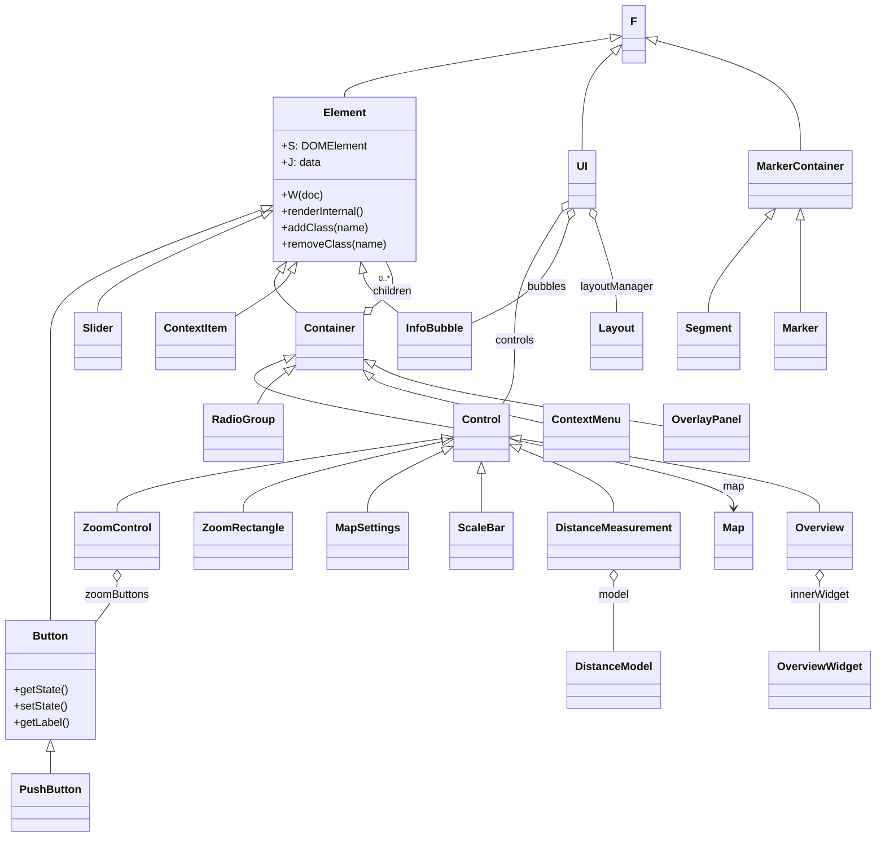
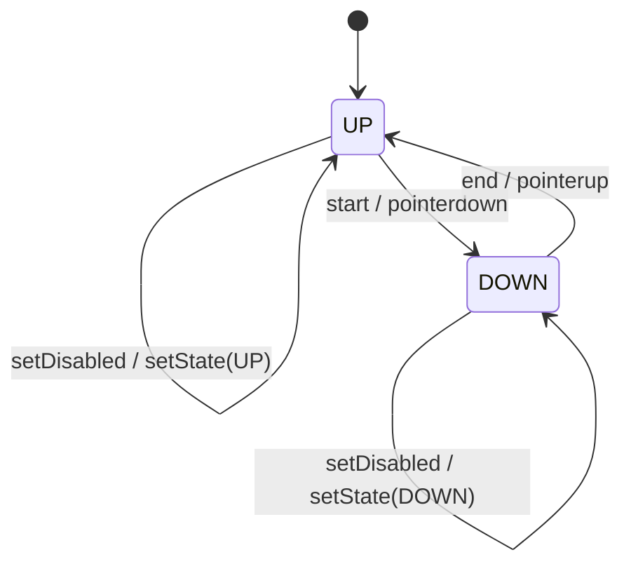
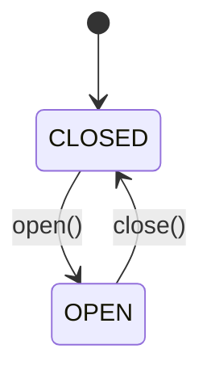

# Diagram: web/portal/public/js/heremaps-3.1.49.1/mapsjs-ui.js

> Auto-generated by Obscura crawlers

## Diagram 1

### SVG

<svg id="container" width="1247.625" xmlns="http://www.w3.org/2000/svg" class="classDiagram" height="1222" viewBox="0 0 1247.625 1222" role="graphics-document document" aria-roledescription="class"><g><defs><marker id="container_class-aggregationStart" class="marker aggregation class" refX="18" refY="7" markerWidth="190" markerHeight="240" orient="auto"><path d="M 18,7 L9,13 L1,7 L9,1 Z"></path></marker></defs><defs><marker id="container_class-aggregationEnd" class="marker aggregation class" refX="1" refY="7" markerWidth="20" markerHeight="28" orient="auto"><path d="M 18,7 L9,13 L1,7 L9,1 Z"></path></marker></defs><defs><marker id="container_class-extensionStart" class="marker extension class" refX="18" refY="7" markerWidth="190" markerHeight="240" orient="auto"><path d="M 1,7 L18,13 V 1 Z"></path></marker></defs><defs><marker id="container_class-extensionEnd" class="marker extension class" refX="1" refY="7" markerWidth="20" markerHeight="28" orient="auto"><path d="M 1,1 V 13 L18,7 Z"></path></marker></defs><defs><marker id="container_class-compositionStart" class="marker composition class" refX="18" refY="7" markerWidth="190" markerHeight="240" orient="auto"><path d="M 18,7 L9,13 L1,7 L9,1 Z"></path></marker></defs><defs><marker id="container_class-compositionEnd" class="marker composition class" refX="1" refY="7" markerWidth="20" markerHeight="28" orient="auto"><path d="M 18,7 L9,13 L1,7 L9,1 Z"></path></marker></defs><defs><marker id="container_class-dependencyStart" class="marker dependency class" refX="6" refY="7" markerWidth="190" markerHeight="240" orient="auto"><path d="M 5,7 L9,13 L1,7 L9,1 Z"></path></marker></defs><defs><marker id="container_class-dependencyEnd" class="marker dependency class" refX="13" refY="7" markerWidth="20" markerHeight="28" orient="auto"><path d="M 18,7 L9,13 L14,7 L9,1 Z"></path></marker></defs><defs><marker id="container_class-lollipopStart" class="marker lollipop class" refX="13" refY="7" markerWidth="190" markerHeight="240" orient="auto"><circle stroke="black" fill="transparent" cx="7" cy="7" r="6"></circle></marker></defs><defs><marker id="container_class-lollipopEnd" class="marker lollipop class" refX="1" refY="7" markerWidth="190" markerHeight="240" orient="auto"><circle stroke="black" fill="transparent" cx="7" cy="7" r="6"></circle></marker></defs><g class="root"><g class="clusters"></g><g class="edgePaths"><path d="M873.15,55.317L809.481,65.597C745.811,75.878,618.472,96.439,554.802,110.886C491.133,125.333,491.133,133.667,491.133,137.833L491.133,142" id="id_F_Element_1" class="edge-thickness-normal edge-pattern-solid relation" style=";;;" data-edge="true" data-et="edge" data-id="id_F_Element_1" data-points="W3sieCI6ODkwLjE3OTY4NzUsInkiOjUyLjU2NzA3Mzk3NDM1NjU2fSx7IngiOjQ5MS4xMzI4MTI1LCJ5IjoxMTd9LHsieCI6NDkxLjEzMjgxMjUsInkiOjE0Mn1d" marker-start="url(#container_class-extensionStart)"></path><path d="M373.322,306.192L323.2,324.994C273.078,343.795,172.834,381.397,122.712,413.365C72.59,445.333,72.59,471.667,72.59,496C72.59,520.333,72.59,542.667,72.59,565C72.59,587.333,72.59,609.667,72.59,634C72.59,658.333,72.59,684.667,72.59,711C72.59,737.333,72.59,763.667,72.59,790C72.59,816.333,72.59,842.667,72.59,862C72.59,881.333,72.59,893.667,72.59,899.833L72.59,906" id="id_Element_Button_2" class="edge-thickness-normal edge-pattern-solid relation" style=";;;" data-edge="true" data-et="edge" data-id="id_Element_Button_2" data-points="W3sieCI6Mzg5LjQ3MjY1NjI1LCJ5IjozMDAuMTMzODI1NDkyMDgxfSx7IngiOjcyLjU4OTg0Mzc1LCJ5Ijo0MTl9LHsieCI6NzIuNTg5ODQzNzUsInkiOjQ5OH0seyJ4Ijo3Mi41ODk4NDM3NSwieSI6NTY1fSx7IngiOjcyLjU4OTg0Mzc1LCJ5Ijo2MzJ9LHsieCI6NzIuNTg5ODQzNzUsInkiOjcxMX0seyJ4Ijo3Mi41ODk4NDM3NSwieSI6NzkwfSx7IngiOjcyLjU4OTg0Mzc1LCJ5Ijo4Njl9LHsieCI6NzIuNTg5ODQzNzUsInkiOjkwNn1d" marker-start="url(#container_class-extensionStart)"></path><path d="M72.59,1097.25L72.59,1098.542C72.59,1099.833,72.59,1102.417,72.59,1107.875C72.59,1113.333,72.59,1121.667,72.59,1125.833L72.59,1130" id="id_Button_PushButton_3" class="edge-thickness-normal edge-pattern-solid relation" style=";;;" data-edge="true" data-et="edge" data-id="id_Button_PushButton_3" data-points="W3sieCI6NzIuNTg5ODQzNzUsInkiOjEwODB9LHsieCI6NzIuNTg5ODQzNzUsInkiOjExMDV9LHsieCI6NzIuNTg5ODQzNzUsInkiOjExMzB9XQ==" marker-start="url(#container_class-extensionStart)"></path><path d="M373.734,314.675L334.982,332.063C296.23,349.45,218.727,384.225,179.975,407.779C141.223,431.333,141.223,443.667,141.223,449.833L141.223,456" id="id_Element_Slider_4" class="edge-thickness-normal edge-pattern-solid relation" style=";;;" data-edge="true" data-et="edge" data-id="id_Element_Slider_4" data-points="W3sieCI6Mzg5LjQ3MjY1NjI1LCJ5IjozMDcuNjEzNTUwMzUzMzI3M30seyJ4IjoxNDEuMjIyNjU2MjUsInkiOjQxOX0seyJ4IjoxNDEuMjIyNjU2MjUsInkiOjQ1Nn1d" marker-start="url(#container_class-extensionStart)"></path><path d="M397.332,396.136L394.667,399.947C392.003,403.758,386.673,411.379,390.809,421.356C394.944,431.333,408.545,443.667,415.345,449.833L422.145,456" id="id_Element_Container_5" class="edge-thickness-normal edge-pattern-solid relation" style=";;;" data-edge="true" data-et="edge" data-id="id_Element_Container_5" data-points="W3sieCI6NDA3LjIxNzYwNTQ5MzYzMDYsInkiOjM4Mn0seyJ4IjozODEuMzQzNzUsInkiOjQxOX0seyJ4Ijo0MjIuMTQ1NDcwNzI3ODQ4MSwieSI6NDU2fV0=" marker-start="url(#container_class-extensionStart)"></path><path d="M529.587,449.608L536.031,444.507C542.475,439.405,555.362,429.203,558.777,417.935C562.192,406.667,556.134,394.333,553.105,388.167L550.076,382" id="id_Container_Element_6" class="edge-thickness-normal edge-pattern-solid relation" style=";;;" data-edge="true" data-et="edge" data-id="id_Container_Element_6" data-points="W3sieCI6NTE2LjA2MjUsInkiOjQ2MC4zMTUyNzQ0MDY5NTIxNH0seyJ4Ijo1NjguMjUsInkiOjQxOX0seyJ4Ijo1NTAuMDc1ODg1NzQ4NDA3NywieSI6MzgyfV0=" marker-start="url(#container_class-aggregationStart)"></path><path d="M404.955,524.669L388.948,531.391C372.941,538.112,340.928,551.556,381.499,568.298C422.07,585.041,535.227,605.081,591.805,615.102L648.383,625.122" id="id_Container_Control_7" class="edge-thickness-normal edge-pattern-solid relation" style=";;;" data-edge="true" data-et="edge" data-id="id_Container_Control_7" data-points="W3sieCI6NDIwLjg1OTM3NSwieSI6NTE3Ljk4OTc2NTkzODY5MzZ9LHsieCI6MzA4LjkxNDA2MjUsInkiOjU2NX0seyJ4Ijo2NDguMzgyODEyNSwieSI6NjI1LjEyMTkyNTUzMTI1NTh9XQ==" marker-start="url(#container_class-extensionStart)"></path><path d="M631.328,640.483L553.893,652.236C476.457,663.989,321.586,687.494,244.15,705.414C166.715,723.333,166.715,735.667,166.715,741.833L166.715,748" id="id_Control_ZoomControl_8" class="edge-thickness-normal edge-pattern-solid relation" style=";;;" data-edge="true" data-et="edge" data-id="id_Control_ZoomControl_8" data-points="W3sieCI6NjQ4LjM4MjgxMjUsInkiOjYzNy44OTQzNjMxODQ3MTQzfSx7IngiOjE2Ni43MTQ4NDM3NSwieSI6NzExfSx7IngiOjE2Ni43MTQ4NDM3NSwieSI6NzQ4fV0=" marker-start="url(#container_class-extensionStart)"></path><path d="M631.573,644.821L583.702,655.851C535.831,666.881,440.09,688.94,392.219,706.137C344.348,723.333,344.348,735.667,344.348,741.833L344.348,748" id="id_Control_ZoomRectangle_9" class="edge-thickness-normal edge-pattern-solid relation" style=";;;" data-edge="true" data-et="edge" data-id="id_Control_ZoomRectangle_9" data-points="W3sieCI6NjQ4LjM4MjgxMjUsInkiOjY0MC45NDgwODMxNjcxODg5fSx7IngiOjM0NC4zNDc2NTYyNSwieSI6NzExfSx7IngiOjM0NC4zNDc2NTYyNSwieSI6NzQ4fV0=" marker-start="url(#container_class-extensionStart)"></path><path d="M632.795,657.797L614.088,666.664C595.38,675.531,557.966,693.266,539.258,708.299C520.551,723.333,520.551,735.667,520.551,741.833L520.551,748" id="id_Control_MapSettings_10" class="edge-thickness-normal edge-pattern-solid relation" style=";;;" data-edge="true" data-et="edge" data-id="id_Control_MapSettings_10" data-points="W3sieCI6NjQ4LjM4MjgxMjUsInkiOjY1MC40MDgwOTA1NjE3OTI1fSx7IngiOjUyMC41NTA3ODEyNSwieSI6NzExfSx7IngiOjUyMC41NTA3ODEyNSwieSI6NzQ4fV0=" marker-start="url(#container_class-extensionStart)"></path><path d="M687.219,691.25L687.219,694.542C687.219,697.833,687.219,704.417,687.219,713.875C687.219,723.333,687.219,735.667,687.219,741.833L687.219,748" id="id_Control_ScaleBar_11" class="edge-thickness-normal edge-pattern-solid relation" style=";;;" data-edge="true" data-et="edge" data-id="id_Control_ScaleBar_11" data-points="W3sieCI6Njg3LjIxODc1LCJ5Ijo2NzR9LHsieCI6Njg3LjIxODc1LCJ5Ijo3MTF9LHsieCI6Njg3LjIxODc1LCJ5Ijo3NDh9XQ==" marker-start="url(#container_class-extensionStart)"></path><path d="M741.944,655.124L763.984,664.437C786.023,673.749,830.101,692.375,852.14,707.854C874.18,723.333,874.18,735.667,874.18,741.833L874.18,748" id="id_Control_DistanceMeasurement_12" class="edge-thickness-normal edge-pattern-solid relation" style=";;;" data-edge="true" data-et="edge" data-id="id_Control_DistanceMeasurement_12" data-points="W3sieCI6NzI2LjA1NDY4NzUsInkiOjY0OC40MTAwNTM5MDQ5NzY4fSx7IngiOjg3NC4xNzk2ODc1LCJ5Ijo3MTF9LHsieCI6ODc0LjE3OTY4NzUsInkiOjc0OH1d" marker-start="url(#container_class-extensionStart)"></path><path d="M407.12,544.57L402.635,547.975C398.151,551.38,389.181,558.19,382.535,565.762C375.888,573.333,371.566,581.667,369.404,585.833L367.243,590" id="id_Container_RadioGroup_13" class="edge-thickness-normal edge-pattern-solid relation" style=";;;" data-edge="true" data-et="edge" data-id="id_Container_RadioGroup_13" data-points="W3sieCI6NDIwLjg1OTM3NSwieSI6NTM0LjEzOTQyOTg4NjY4NTV9LHsieCI6MzgwLjIxMDkzNzUsInkiOjU2NX0seyJ4IjozNjcuMjQzMDYyMDMzNTgyMSwieSI6NTkwfV0=" marker-start="url(#container_class-extensionStart)"></path><path d="M529.324,548.631L532.603,551.359C535.882,554.088,542.441,559.544,583.563,571.102C624.685,582.661,700.37,600.322,738.212,609.152L776.055,617.983" id="id_Container_ContextMenu_14" class="edge-thickness-normal edge-pattern-solid relation" style=";;;" data-edge="true" data-et="edge" data-id="id_Container_ContextMenu_14" data-points="W3sieCI6NTE2LjA2MjUsInkiOjUzNy41OTk0NzYxODU4NTd9LHsieCI6NTQ5LCJ5Ijo1NjV9LHsieCI6Nzc2LjA1NDY4NzUsInkiOjYxNy45ODI3MjIwMjg3MzMyfV0=" marker-start="url(#container_class-extensionStart)"></path><path d="M413.94,396.974L411.841,400.645C409.742,404.316,405.543,411.658,392.906,422.274C380.27,432.891,359.195,446.781,348.658,453.726L338.121,460.672" id="id_Element_ContextItem_15" class="edge-thickness-normal edge-pattern-solid relation" style=";;;" data-edge="true" data-et="edge" data-id="id_Element_ContextItem_15" data-points="W3sieCI6NDIyLjUwNDIyOTY5NzQ1MjIsInkiOjM4Mn0seyJ4Ijo0MDEuMzQzNzUsInkiOjQxOX0seyJ4IjozMzguMTIxMDkzNzUsInkiOjQ2MC42NzE3NzI2NDI4MzE1fV0=" marker-start="url(#container_class-extensionStart)"></path><path d="M515.006,398.994L515.587,402.328C516.168,405.663,517.33,412.331,525.84,421.942C534.349,431.553,550.206,444.107,558.134,450.383L566.063,456.66" id="id_Element_InfoBubble_16" class="edge-thickness-normal edge-pattern-solid relation" style=";;;" data-edge="true" data-et="edge" data-id="id_Element_InfoBubble_16" data-points="W3sieCI6NTEyLjA0NDQzNjcwMzgyMTcsInkiOjM4Mn0seyJ4Ijo1MTguNDkyMTg3NSwieSI6NDE5fSx7IngiOjU2Ni4wNjI1LCJ5Ijo0NTYuNjU5OTg1OTA3Nzc0Mn1d" marker-start="url(#container_class-extensionStart)"></path><path d="M531.219,532.108L541.305,537.59C551.392,543.072,571.565,554.036,640.728,569.065C709.891,584.095,828.043,603.19,887.119,612.737L946.195,622.284" id="id_Container_OverlayPanel_17" class="edge-thickness-normal edge-pattern-solid relation" style=";;;" data-edge="true" data-et="edge" data-id="id_Container_OverlayPanel_17" data-points="W3sieCI6NTE2LjA2MjUsInkiOjUyMy44NzA5NzE4MzA1Mzk2fSx7IngiOjU5MS43MzgyODEyNSwieSI6NTY1fSx7IngiOjk0Ni4xOTUzMTI1LCJ5Ijo2MjIuMjg0MzY1NTQ4MjM3Nn1d" marker-start="url(#container_class-extensionStart)"></path><path d="M877.696,77.067L870.718,83.723C863.739,90.378,849.782,103.689,842.803,127.511C835.824,151.333,835.824,185.667,835.824,202.833L835.824,220" id="id_F_UI_18" class="edge-thickness-normal edge-pattern-solid relation" style=";;;" data-edge="true" data-et="edge" data-id="id_F_UI_18" data-points="W3sieCI6ODkwLjE3OTY4NzUsInkiOjY1LjE2MjA3OTUxMDcwMzM2fSx7IngiOjgzNS44MjQyMTg3NSwieSI6MTE3fSx7IngiOjgzNS44MjQyMTg3NSwieSI6MjIwfV0=" marker-start="url(#container_class-extensionStart)"></path><path d="M806.949,306.97L794.96,325.642C782.971,344.313,758.994,381.657,747.005,413.495C735.016,445.333,735.016,471.667,735.016,496C735.016,520.333,735.016,542.667,732.043,558C729.071,573.333,723.126,581.667,720.153,585.833L717.181,590" id="id_UI_Control_19" class="edge-thickness-normal edge-pattern-solid relation" style=";;;" data-edge="true" data-et="edge" data-id="id_UI_Control_19" data-points="W3sieCI6ODE2LjI2OTUzMTI1LCJ5IjoyOTIuNDU0NjA1MzM5NjM2NTR9LHsieCI6NzM1LjAxNTYyNSwieSI6NDE5fSx7IngiOjczNS4wMTU2MjUsInkiOjQ5OH0seyJ4Ijo3MzUuMDE1NjI1LCJ5Ijo1NjV9LHsieCI6NzE3LjE4MDk3MDE0OTI1MzgsInkiOjU5MH1d" marker-start="url(#container_class-aggregationStart)"></path><path d="M816.672,320.391L811.281,336.826C805.891,353.261,795.109,386.13,770.747,411.591C746.385,437.052,708.443,455.104,689.471,464.13L670.5,473.156" id="id_UI_InfoBubble_20" class="edge-thickness-normal edge-pattern-solid relation" style=";;;" data-edge="true" data-et="edge" data-id="id_UI_InfoBubble_20" data-points="W3sieCI6ODIyLjA0ODE5MzY3MDM4MjEsInkiOjMwNH0seyJ4Ijo3ODQuMzI4MTI1LCJ5Ijo0MTl9LHsieCI6NjcwLjUsInkiOjQ3My4xNTU5MjM1OTA4NTM1fV0=" marker-start="url(#container_class-aggregationStart)"></path><path d="M854.976,320.391L860.367,336.826C865.758,353.261,876.539,386.13,881.93,408.732C887.32,431.333,887.32,443.667,887.32,449.833L887.32,456" id="id_UI_Layout_21" class="edge-thickness-normal edge-pattern-solid relation" style=";;;" data-edge="true" data-et="edge" data-id="id_UI_Layout_21" data-points="W3sieCI6ODQ5LjYwMDI0MzgyOTYxNzksInkiOjMwNH0seyJ4Ijo4ODcuMzIwMzEyNSwieSI6NDE5fSx7IngiOjg4Ny4zMjAzMTI1LCJ5Ijo0NTZ9XQ==" marker-start="url(#container_class-aggregationStart)"></path><path d="M726.055,640.583L779.159,652.319C832.263,664.055,938.471,687.528,991.576,704.43C1044.68,721.333,1044.68,731.667,1044.68,736.833L1044.68,742" id="id_Control_Map_22" class="edge-thickness-normal edge-pattern-solid relation" style=";;;" data-edge="true" data-et="edge" data-id="id_Control_Map_22" data-points="W3sieCI6NzI2LjA1NDY4NzUsInkiOjY0MC41ODI4NjUyNjA2MjczfSx7IngiOjEwNDQuNjc5Njg3NSwieSI6NzExfSx7IngiOjEwNDQuNjc5Njg3NSwieSI6NzQ4fV0=" marker-end="url(#container_class-dependencyEnd)"></path><path d="M166.715,849.25L166.715,852.542C166.715,855.833,166.715,862.417,161.792,872.193C156.87,881.97,147.025,894.94,142.102,901.425L137.18,907.91" id="id_ZoomControl_Button_23" class="edge-thickness-normal edge-pattern-solid relation" style=";;;" data-edge="true" data-et="edge" data-id="id_ZoomControl_Button_23" data-points="W3sieCI6MTY2LjcxNDg0Mzc1LCJ5Ijo4MzJ9LHsieCI6MTY2LjcxNDg0Mzc1LCJ5Ijo4Njl9LHsieCI6MTM3LjE3OTY4NzUsInkiOjkwNy45MDk1Mjg1NTI0NTY4fV0=" marker-start="url(#container_class-aggregationStart)"></path><path d="M938.612,58.921L973.913,68.601C1009.213,78.281,1079.814,97.64,1115.114,124.487C1150.414,151.333,1150.414,185.667,1150.414,202.833L1150.414,220" id="id_F_MarkerContainer_24" class="edge-thickness-normal edge-pattern-solid relation" style=";;;" data-edge="true" data-et="edge" data-id="id_F_MarkerContainer_24" data-points="W3sieCI6OTIxLjk3NjU2MjUsInkiOjU0LjM1OTU1MjM1ODExMzUxfSx7IngiOjExNTAuNDE0MDYyNSwieSI6MTE3fSx7IngiOjExNTAuNDE0MDYyNSwieSI6MjIwfV0=" marker-start="url(#container_class-extensionStart)"></path><path d="M1103.969,317.199L1089.693,334.166C1075.417,351.133,1046.865,385.066,1032.589,408.2C1018.313,431.333,1018.313,443.667,1018.313,449.833L1018.313,456" id="id_MarkerContainer_Segment_25" class="edge-thickness-normal edge-pattern-solid relation" style=";;;" data-edge="true" data-et="edge" data-id="id_MarkerContainer_Segment_25" data-points="W3sieCI6MTExNS4wNzQ3OTEwMDMxODQ2LCJ5IjozMDR9LHsieCI6MTAxOC4zMTI1LCJ5Ijo0MTl9LHsieCI6MTAxOC4zMTI1LCJ5Ijo0NTZ9XQ==" marker-start="url(#container_class-extensionStart)"></path><path d="M1150.414,321.25L1150.414,337.542C1150.414,353.833,1150.414,386.417,1150.414,408.875C1150.414,431.333,1150.414,443.667,1150.414,449.833L1150.414,456" id="id_MarkerContainer_Marker_26" class="edge-thickness-normal edge-pattern-solid relation" style=";;;" data-edge="true" data-et="edge" data-id="id_MarkerContainer_Marker_26" data-points="W3sieCI6MTE1MC40MTQwNjI1LCJ5IjozMDR9LHsieCI6MTE1MC40MTQwNjI1LCJ5Ijo0MTl9LHsieCI6MTE1MC40MTQwNjI1LCJ5Ijo0NTZ9XQ==" marker-start="url(#container_class-extensionStart)"></path><path d="M874.18,849.25L874.18,852.542C874.18,855.833,874.18,862.417,874.18,879.375C874.18,896.333,874.18,923.667,874.18,937.333L874.18,951" id="id_DistanceMeasurement_DistanceModel_27" class="edge-thickness-normal edge-pattern-solid relation" style=";;;" data-edge="true" data-et="edge" data-id="id_DistanceMeasurement_DistanceModel_27" data-points="W3sieCI6ODc0LjE3OTY4NzUsInkiOjgzMn0seyJ4Ijo4NzQuMTc5Njg3NSwieSI6ODY5fSx7IngiOjg3NC4xNzk2ODc1LCJ5Ijo5NTF9XQ==" marker-start="url(#container_class-aggregationStart)"></path><path d="M743.077,641.177L813.913,652.814C884.749,664.451,1026.421,687.726,1097.258,705.529C1168.094,723.333,1168.094,735.667,1168.094,741.833L1168.094,748" id="id_Control_Overview_28" class="edge-thickness-normal edge-pattern-solid relation" style=";;;" data-edge="true" data-et="edge" data-id="id_Control_Overview_28" data-points="W3sieCI6NzI2LjA1NDY4NzUsInkiOjYzOC4zODAxMTc2MjQxMjI3fSx7IngiOjExNjguMDkzNzUsInkiOjcxMX0seyJ4IjoxMTY4LjA5Mzc1LCJ5Ijo3NDh9XQ==" marker-start="url(#container_class-extensionStart)"></path><path d="M1168.094,849.25L1168.094,852.542C1168.094,855.833,1168.094,862.417,1168.094,879.375C1168.094,896.333,1168.094,923.667,1168.094,937.333L1168.094,951" id="id_Overview_OverviewWidget_29" class="edge-thickness-normal edge-pattern-solid relation" style=";;;" data-edge="true" data-et="edge" data-id="id_Overview_OverviewWidget_29" data-points="W3sieCI6MTE2OC4wOTM3NSwieSI6ODMyfSx7IngiOjExNjguMDkzNzUsInkiOjg2OX0seyJ4IjoxMTY4LjA5Mzc1LCJ5Ijo5NTF9XQ==" marker-start="url(#container_class-aggregationStart)"></path></g><g class="edgeLabels"><g class="edgeLabel"><g class="label" data-id="id_F_Element_1" transform="translate(0, 0)"><foreignObject width="0" height="0">

</foreignObject></g></g><g class="edgeLabel"><g class="label" data-id="id_Element_Button_2" transform="translate(0, 0)"><foreignObject width="0" height="0">

</foreignObject></g></g><g class="edgeLabel"><g class="label" data-id="id_Button_PushButton_3" transform="translate(0, 0)"><foreignObject width="0" height="0">

</foreignObject></g></g><g class="edgeLabel"><g class="label" data-id="id_Element_Slider_4" transform="translate(0, 0)"><foreignObject width="0" height="0">

</foreignObject></g></g><g class="edgeLabel"><g class="label" data-id="id_Element_Container_5" transform="translate(0, 0)"><foreignObject width="0" height="0">

</foreignObject></g></g><g class="edgeLabel" transform="translate(558.31641, 426.86413)"><g class="label" data-id="id_Container_Element_6" transform="translate(-29.7578125, -12)"><foreignObject width="59.515625" height="24">

children

</foreignObject></g></g><g class="edgeLabel"><g class="label" data-id="id_Container_Control_7" transform="translate(0, 0)"><foreignObject width="0" height="0">

</foreignObject></g></g><g class="edgeLabel"><g class="label" data-id="id_Control_ZoomControl_8" transform="translate(0, 0)"><foreignObject width="0" height="0">

</foreignObject></g></g><g class="edgeLabel"><g class="label" data-id="id_Control_ZoomRectangle_9" transform="translate(0, 0)"><foreignObject width="0" height="0">

</foreignObject></g></g><g class="edgeLabel"><g class="label" data-id="id_Control_MapSettings_10" transform="translate(0, 0)"><foreignObject width="0" height="0">

</foreignObject></g></g><g class="edgeLabel"><g class="label" data-id="id_Control_ScaleBar_11" transform="translate(0, 0)"><foreignObject width="0" height="0">

</foreignObject></g></g><g class="edgeLabel"><g class="label" data-id="id_Control_DistanceMeasurement_12" transform="translate(0, 0)"><foreignObject width="0" height="0">

</foreignObject></g></g><g class="edgeLabel"><g class="label" data-id="id_Container_RadioGroup_13" transform="translate(0, 0)"><foreignObject width="0" height="0">

</foreignObject></g></g><g class="edgeLabel"><g class="label" data-id="id_Container_ContextMenu_14" transform="translate(0, 0)"><foreignObject width="0" height="0">

</foreignObject></g></g><g class="edgeLabel"><g class="label" data-id="id_Element_ContextItem_15" transform="translate(0, 0)"><foreignObject width="0" height="0">

</foreignObject></g></g><g class="edgeLabel"><g class="label" data-id="id_Element_InfoBubble_16" transform="translate(0, 0)"><foreignObject width="0" height="0">

</foreignObject></g></g><g class="edgeLabel"><g class="label" data-id="id_Container_OverlayPanel_17" transform="translate(0, 0)"><foreignObject width="0" height="0">

</foreignObject></g></g><g class="edgeLabel"><g class="label" data-id="id_F_UI_18" transform="translate(0, 0)"><foreignObject width="0" height="0">

</foreignObject></g></g><g class="edgeLabel" transform="translate(735.015625, 498)"><g class="label" data-id="id_UI_Control_19" transform="translate(-29.515625, -12)"><foreignObject width="59.03125" height="24">

controls

</foreignObject></g></g><g class="edgeLabel" transform="translate(782.05875, 420.0797)"><g class="label" data-id="id_UI_InfoBubble_20" transform="translate(-29.3125, -12)"><foreignObject width="58.625" height="24">

bubbles

</foreignObject></g></g><g class="edgeLabel" transform="translate(887.3203125, 419)"><g class="label" data-id="id_UI_Layout_21" transform="translate(-53.6796875, -12)"><foreignObject width="107.359375" height="24">

layoutManager

</foreignObject></g></g><g class="edgeLabel" transform="translate(1044.6796875, 711)"><g class="label" data-id="id_Control_Map_22" transform="translate(-15.9609375, -12)"><foreignObject width="31.921875" height="24">

map

</foreignObject></g></g><g class="edgeLabel" transform="translate(166.71484375, 869)"><g class="label" data-id="id_ZoomControl_Button_23" transform="translate(-47.9140625, -12)"><foreignObject width="95.828125" height="24">

zoomButtons

</foreignObject></g></g><g class="edgeLabel"><g class="label" data-id="id_F_MarkerContainer_24" transform="translate(0, 0)"><foreignObject width="0" height="0">

</foreignObject></g></g><g class="edgeLabel"><g class="label" data-id="id_MarkerContainer_Segment_25" transform="translate(0, 0)"><foreignObject width="0" height="0">

</foreignObject></g></g><g class="edgeLabel"><g class="label" data-id="id_MarkerContainer_Marker_26" transform="translate(0, 0)"><foreignObject width="0" height="0">

</foreignObject></g></g><g class="edgeLabel" transform="translate(874.1796875, 869)"><g class="label" data-id="id_DistanceMeasurement_DistanceModel_27" transform="translate(-23.0234375, -12)"><foreignObject width="46.046875" height="24">

model

</foreignObject></g></g><g class="edgeLabel"><g class="label" data-id="id_Control_Overview_28" transform="translate(0, 0)"><foreignObject width="0" height="0">

</foreignObject></g></g><g class="edgeLabel" transform="translate(1168.09375, 869)"><g class="label" data-id="id_Overview_OverviewWidget_29" transform="translate(-44.015625, -12)"><foreignObject width="88.03125" height="24">

innerWidget

</foreignObject></g></g><g class="edgeTerminals" transform="translate(539.3277477100189, 399.3205958502023)"><g class="inner" transform="translate(0, 0)"></g><foreignObject style="width: 36px; height: 12px;">
0..*
</foreignObject></g></g><g class="nodes"><g class="node default" id="classId-F-0" transform="translate(906.078125, 50)"><g class="basic label-container"><path d="M-15.8984375 -42 L15.8984375 -42 L15.8984375 42 L-15.8984375 42" stroke="none" stroke-width="0" fill="#ECECFF" style=""></path><path d="M-15.8984375 -42 C-5.881016303261967 -42, 4.136404893476065 -42, 15.8984375 -42 M-15.8984375 -42 C-3.7610727575585408 -42, 8.376291984882918 -42, 15.8984375 -42 M15.8984375 -42 C15.8984375 -21.96509704785746, 15.8984375 -1.930194095714917, 15.8984375 42 M15.8984375 -42 C15.8984375 -24.96779809670793, 15.8984375 -7.935596193415861, 15.8984375 42 M15.8984375 42 C6.1631068196477745 42, -3.572223860704451 42, -15.8984375 42 M15.8984375 42 C8.618303260299 42, 1.3381690205979986 42, -15.8984375 42 M-15.8984375 42 C-15.8984375 21.313834771502947, -15.8984375 0.6276695430058936, -15.8984375 -42 M-15.8984375 42 C-15.8984375 20.095360784983658, -15.8984375 -1.809278430032684, -15.8984375 -42" stroke="#9370DB" stroke-width="1.3" fill="none" stroke-dasharray="0 0" style=""></path></g><g class="annotation-group text" transform="translate(0, -18)"></g><g class="label-group text" transform="translate(-3.8984375, -18)"><g class="label" style="font-weight: bolder" transform="translate(0,-12)"><foreignObject width="7.796875" height="24">

F

</foreignObject></g></g><g class="members-group text" transform="translate(-3.8984375, 30)"></g><g class="methods-group text" transform="translate(-3.8984375, 60)"></g><g class="divider" style=""><path d="M-15.8984375 6 C-8.861573674433615 6, -1.8247098488672275 6, 15.8984375 6 M-15.8984375 6 C-7.065618264304481 6, 1.7672009713910377 6, 15.8984375 6" stroke="#9370DB" stroke-width="1.3" fill="none" stroke-dasharray="0 0" style=""></path></g><g class="divider" style=""><path d="M-15.8984375 24 C-5.1403706291530415 24, 5.617696241693917 24, 15.8984375 24 M-15.8984375 24 C-3.833353636475586 24, 8.231730227048828 24, 15.8984375 24" stroke="#9370DB" stroke-width="1.3" fill="none" stroke-dasharray="0 0" style=""></path></g></g><g class="node default" id="classId-Element-1" transform="translate(491.1328125, 262)"><g class="basic label-container"><path d="M-101.66015625 -120 L101.66015625 -120 L101.66015625 120 L-101.66015625 120" stroke="none" stroke-width="0" fill="#ECECFF" style=""></path><path d="M-101.66015625 -120 C-51.2557526479961 -120, -0.851349045992194 -120, 101.66015625 -120 M-101.66015625 -120 C-38.60153232461479 -120, 24.457091600770426 -120, 101.66015625 -120 M101.66015625 -120 C101.66015625 -41.69265276420202, 101.66015625 36.61469447159595, 101.66015625 120 M101.66015625 -120 C101.66015625 -63.96088722856418, 101.66015625 -7.921774457128365, 101.66015625 120 M101.66015625 120 C31.27466788443124 120, -39.11082048113752 120, -101.66015625 120 M101.66015625 120 C33.90780207352405 120, -33.844552102951894 120, -101.66015625 120 M-101.66015625 120 C-101.66015625 55.06362142266029, -101.66015625 -9.87275715467942, -101.66015625 -120 M-101.66015625 120 C-101.66015625 46.77159632393142, -101.66015625 -26.45680735213716, -101.66015625 -120" stroke="#9370DB" stroke-width="1.3" fill="none" stroke-dasharray="0 0" style=""></path></g><g class="annotation-group text" transform="translate(0, -96)"></g><g class="label-group text" transform="translate(-29.7734375, -96)"><g class="label" style="font-weight: bolder" transform="translate(0,-12)"><foreignObject width="59.546875" height="24">

Element

</foreignObject></g></g><g class="members-group text" transform="translate(-89.66015625, -48)"><g class="label" style="" transform="translate(0,-12)"><foreignObject width="117.21875" height="24">

+S: DOMElement

</foreignObject></g><g class="label" style="" transform="translate(0,12)"><foreignObject width="53.453125" height="24">

+J: data

</foreignObject></g></g><g class="methods-group text" transform="translate(-89.66015625, 24)"><g class="label" style="" transform="translate(0,-12)"><foreignObject width="58.140625" height="24">

+W(doc)

</foreignObject></g><g class="label" style="" transform="translate(0,12)"><foreignObject width="123.75" height="24">

+renderInternal()

</foreignObject></g><g class="label" style="" transform="translate(0,36)"><foreignObject width="123.203125" height="24">

+addClass(name)

</foreignObject></g><g class="label" style="" transform="translate(0,60)"><foreignObject width="149.546875" height="24">

+removeClass(name)

</foreignObject></g></g><g class="divider" style=""><path d="M-101.66015625 -72 C-41.705242149759556 -72, 18.249671950480888 -72, 101.66015625 -72 M-101.66015625 -72 C-26.329191272246916 -72, 49.00177370550617 -72, 101.66015625 -72" stroke="#9370DB" stroke-width="1.3" fill="none" stroke-dasharray="0 0" style=""></path></g><g class="divider" style=""><path d="M-101.66015625 0 C-52.98190047586547 0, -4.303644701730946 0, 101.66015625 0 M-101.66015625 0 C-37.139416428960004 0, 27.38132339207999 0, 101.66015625 0" stroke="#9370DB" stroke-width="1.3" fill="none" stroke-dasharray="0 0" style=""></path></g></g><g class="node default" id="classId-Button-2" transform="translate(72.58984375, 993)"><g class="basic label-container"><path d="M-64.58984375 -87 L64.58984375 -87 L64.58984375 87 L-64.58984375 87" stroke="none" stroke-width="0" fill="#ECECFF" style=""></path><path d="M-64.58984375 -87 C-16.57153899729407 -87, 31.44676575541186 -87, 64.58984375 -87 M-64.58984375 -87 C-27.776619003730232 -87, 9.036605742539535 -87, 64.58984375 -87 M64.58984375 -87 C64.58984375 -48.40468464858561, 64.58984375 -9.809369297171216, 64.58984375 87 M64.58984375 -87 C64.58984375 -46.95997280220344, 64.58984375 -6.919945604406877, 64.58984375 87 M64.58984375 87 C18.480387059809402 87, -27.629069630381196 87, -64.58984375 87 M64.58984375 87 C32.93655614612404 87, 1.2832685422480807 87, -64.58984375 87 M-64.58984375 87 C-64.58984375 49.27760701236069, -64.58984375 11.55521402472138, -64.58984375 -87 M-64.58984375 87 C-64.58984375 29.141616027211448, -64.58984375 -28.716767945577104, -64.58984375 -87" stroke="#9370DB" stroke-width="1.3" fill="none" stroke-dasharray="0 0" style=""></path></g><g class="annotation-group text" transform="translate(0, -63)"></g><g class="label-group text" transform="translate(-24.8359375, -63)"><g class="label" style="font-weight: bolder" transform="translate(0,-12)"><foreignObject width="49.671875" height="24">

Button

</foreignObject></g></g><g class="members-group text" transform="translate(-52.58984375, -15)"></g><g class="methods-group text" transform="translate(-52.58984375, 15)"><g class="label" style="" transform="translate(0,-12)"><foreignObject width="78.265625" height="24">

+getState()

</foreignObject></g><g class="label" style="" transform="translate(0,12)"><foreignObject width="77.671875" height="24">

+setState()

</foreignObject></g><g class="label" style="" transform="translate(0,36)"><foreignObject width="80.34375" height="24">

+getLabel()

</foreignObject></g></g><g class="divider" style=""><path d="M-64.58984375 -39 C-28.47901543472804 -39, 7.631812880543919 -39, 64.58984375 -39 M-64.58984375 -39 C-21.642478336754145 -39, 21.30488707649171 -39, 64.58984375 -39" stroke="#9370DB" stroke-width="1.3" fill="none" stroke-dasharray="0 0" style=""></path></g><g class="divider" style=""><path d="M-64.58984375 -15 C-13.902479693041535 -15, 36.78488436391693 -15, 64.58984375 -15 M-64.58984375 -15 C-16.04215915202481 -15, 32.50552544595038 -15, 64.58984375 -15" stroke="#9370DB" stroke-width="1.3" fill="none" stroke-dasharray="0 0" style=""></path></g></g><g class="node default" id="classId-PushButton-3" transform="translate(72.58984375, 1172)"><g class="basic label-container"><path d="M-54.484375 -42 L54.484375 -42 L54.484375 42 L-54.484375 42" stroke="none" stroke-width="0" fill="#ECECFF" style=""></path><path d="M-54.484375 -42 C-27.847149053223596 -42, -1.2099231064471923 -42, 54.484375 -42 M-54.484375 -42 C-25.724528409213423 -42, 3.035318181573153 -42, 54.484375 -42 M54.484375 -42 C54.484375 -21.60814990697465, 54.484375 -1.2162998139492984, 54.484375 42 M54.484375 -42 C54.484375 -13.115510978515939, 54.484375 15.768978042968122, 54.484375 42 M54.484375 42 C18.271924176165037 42, -17.940526647669927 42, -54.484375 42 M54.484375 42 C18.735496464856595 42, -17.01338207028681 42, -54.484375 42 M-54.484375 42 C-54.484375 19.57045621084835, -54.484375 -2.8590875783033027, -54.484375 -42 M-54.484375 42 C-54.484375 16.14050541153284, -54.484375 -9.718989176934322, -54.484375 -42" stroke="#9370DB" stroke-width="1.3" fill="none" stroke-dasharray="0 0" style=""></path></g><g class="annotation-group text" transform="translate(0, -18)"></g><g class="label-group text" transform="translate(-42.484375, -18)"><g class="label" style="font-weight: bolder" transform="translate(0,-12)"><foreignObject width="84.96875" height="24">

PushButton

</foreignObject></g></g><g class="members-group text" transform="translate(-42.484375, 30)"></g><g class="methods-group text" transform="translate(-42.484375, 60)"></g><g class="divider" style=""><path d="M-54.484375 6 C-18.96189270101631 6, 16.56058959796738 6, 54.484375 6 M-54.484375 6 C-20.529125910139925 6, 13.42612317972015 6, 54.484375 6" stroke="#9370DB" stroke-width="1.3" fill="none" stroke-dasharray="0 0" style=""></path></g><g class="divider" style=""><path d="M-54.484375 24 C-28.022447973313863 24, -1.560520946627726 24, 54.484375 24 M-54.484375 24 C-21.43229109024437 24, 11.619792819511261 24, 54.484375 24" stroke="#9370DB" stroke-width="1.3" fill="none" stroke-dasharray="0 0" style=""></path></g></g><g class="node default" id="classId-Slider-4" transform="translate(141.22265625, 498)"><g class="basic label-container"><path d="M-33.6328125 -42 L33.6328125 -42 L33.6328125 42 L-33.6328125 42" stroke="none" stroke-width="0" fill="#ECECFF" style=""></path><path d="M-33.6328125 -42 C-11.186206581627584 -42, 11.260399336744833 -42, 33.6328125 -42 M-33.6328125 -42 C-19.0210655941067 -42, -4.4093186882134034 -42, 33.6328125 -42 M33.6328125 -42 C33.6328125 -19.29936330971193, 33.6328125 3.401273380576143, 33.6328125 42 M33.6328125 -42 C33.6328125 -23.98256927259081, 33.6328125 -5.965138545181617, 33.6328125 42 M33.6328125 42 C10.171801200090265 42, -13.28921009981947 42, -33.6328125 42 M33.6328125 42 C12.331534261764652 42, -8.969743976470696 42, -33.6328125 42 M-33.6328125 42 C-33.6328125 12.895122213683052, -33.6328125 -16.209755572633895, -33.6328125 -42 M-33.6328125 42 C-33.6328125 10.99312168751339, -33.6328125 -20.01375662497322, -33.6328125 -42" stroke="#9370DB" stroke-width="1.3" fill="none" stroke-dasharray="0 0" style=""></path></g><g class="annotation-group text" transform="translate(0, -18)"></g><g class="label-group text" transform="translate(-21.6328125, -18)"><g class="label" style="font-weight: bolder" transform="translate(0,-12)"><foreignObject width="43.265625" height="24">

Slider

</foreignObject></g></g><g class="members-group text" transform="translate(-21.6328125, 30)"></g><g class="methods-group text" transform="translate(-21.6328125, 60)"></g><g class="divider" style=""><path d="M-33.6328125 6 C-8.445725620362303 6, 16.741361259275394 6, 33.6328125 6 M-33.6328125 6 C-6.762945917156358 6, 20.106920665687284 6, 33.6328125 6" stroke="#9370DB" stroke-width="1.3" fill="none" stroke-dasharray="0 0" style=""></path></g><g class="divider" style=""><path d="M-33.6328125 24 C-14.337832801455537 24, 4.957146897088926 24, 33.6328125 24 M-33.6328125 24 C-10.27704312496678 24, 13.078726250066438 24, 33.6328125 24" stroke="#9370DB" stroke-width="1.3" fill="none" stroke-dasharray="0 0" style=""></path></g></g><g class="node default" id="classId-Container-5" transform="translate(468.4609375, 498)"><g class="basic label-container"><path d="M-47.6015625 -42 L47.6015625 -42 L47.6015625 42 L-47.6015625 42" stroke="none" stroke-width="0" fill="#ECECFF" style=""></path><path d="M-47.6015625 -42 C-12.820737741295808 -42, 21.960087017408384 -42, 47.6015625 -42 M-47.6015625 -42 C-14.818902310627152 -42, 17.963757878745696 -42, 47.6015625 -42 M47.6015625 -42 C47.6015625 -16.403416234270683, 47.6015625 9.193167531458634, 47.6015625 42 M47.6015625 -42 C47.6015625 -15.98147842025849, 47.6015625 10.03704315948302, 47.6015625 42 M47.6015625 42 C16.31720471545574 42, -14.967153069088518 42, -47.6015625 42 M47.6015625 42 C17.552542624905342 42, -12.496477250189315 42, -47.6015625 42 M-47.6015625 42 C-47.6015625 10.450727355258213, -47.6015625 -21.098545289483575, -47.6015625 -42 M-47.6015625 42 C-47.6015625 25.060604392119366, -47.6015625 8.121208784238732, -47.6015625 -42" stroke="#9370DB" stroke-width="1.3" fill="none" stroke-dasharray="0 0" style=""></path></g><g class="annotation-group text" transform="translate(0, -18)"></g><g class="label-group text" transform="translate(-35.6015625, -18)"><g class="label" style="font-weight: bolder" transform="translate(0,-12)"><foreignObject width="71.203125" height="24">

Container

</foreignObject></g></g><g class="members-group text" transform="translate(-35.6015625, 30)"></g><g class="methods-group text" transform="translate(-35.6015625, 60)"></g><g class="divider" style=""><path d="M-47.6015625 6 C-25.337109556350942 6, -3.072656612701884 6, 47.6015625 6 M-47.6015625 6 C-9.704280551301395 6, 28.19300139739721 6, 47.6015625 6" stroke="#9370DB" stroke-width="1.3" fill="none" stroke-dasharray="0 0" style=""></path></g><g class="divider" style=""><path d="M-47.6015625 24 C-15.39858466820214 24, 16.80439316359572 24, 47.6015625 24 M-47.6015625 24 C-25.62834248741006 24, -3.655122474820118 24, 47.6015625 24" stroke="#9370DB" stroke-width="1.3" fill="none" stroke-dasharray="0 0" style=""></path></g></g><g class="node default" id="classId-Control-6" transform="translate(687.21875, 632)"><g class="basic label-container"><path d="M-38.8359375 -42 L38.8359375 -42 L38.8359375 42 L-38.8359375 42" stroke="none" stroke-width="0" fill="#ECECFF" style=""></path><path d="M-38.8359375 -42 C-16.28488754177624 -42, 6.266162416447521 -42, 38.8359375 -42 M-38.8359375 -42 C-13.366578409449158 -42, 12.102780681101684 -42, 38.8359375 -42 M38.8359375 -42 C38.8359375 -17.7726664236036, 38.8359375 6.454667152792801, 38.8359375 42 M38.8359375 -42 C38.8359375 -22.115967195839676, 38.8359375 -2.231934391679353, 38.8359375 42 M38.8359375 42 C8.545945556933283 42, -21.744046386133434 42, -38.8359375 42 M38.8359375 42 C21.737081729971536 42, 4.638225959943071 42, -38.8359375 42 M-38.8359375 42 C-38.8359375 12.704052983317577, -38.8359375 -16.591894033364845, -38.8359375 -42 M-38.8359375 42 C-38.8359375 18.000452677067447, -38.8359375 -5.999094645865107, -38.8359375 -42" stroke="#9370DB" stroke-width="1.3" fill="none" stroke-dasharray="0 0" style=""></path></g><g class="annotation-group text" transform="translate(0, -18)"></g><g class="label-group text" transform="translate(-26.8359375, -18)"><g class="label" style="font-weight: bolder" transform="translate(0,-12)"><foreignObject width="53.671875" height="24">

Control

</foreignObject></g></g><g class="members-group text" transform="translate(-26.8359375, 30)"></g><g class="methods-group text" transform="translate(-26.8359375, 60)"></g><g class="divider" style=""><path d="M-38.8359375 6 C-20.70633729505844 6, -2.576737090116879 6, 38.8359375 6 M-38.8359375 6 C-18.392882139120147 6, 2.0501732217597066 6, 38.8359375 6" stroke="#9370DB" stroke-width="1.3" fill="none" stroke-dasharray="0 0" style=""></path></g><g class="divider" style=""><path d="M-38.8359375 24 C-17.652676444787588 24, 3.5305846104248246 24, 38.8359375 24 M-38.8359375 24 C-21.176046000902804 24, -3.516154501805609 24, 38.8359375 24" stroke="#9370DB" stroke-width="1.3" fill="none" stroke-dasharray="0 0" style=""></path></g></g><g class="node default" id="classId-ZoomControl-7" transform="translate(166.71484375, 790)"><g class="basic label-container"><path d="M-59.125 -42 L59.125 -42 L59.125 42 L-59.125 42" stroke="none" stroke-width="0" fill="#ECECFF" style=""></path><path d="M-59.125 -42 C-32.71284144897456 -42, -6.300682897949123 -42, 59.125 -42 M-59.125 -42 C-34.620867458356884 -42, -10.116734916713774 -42, 59.125 -42 M59.125 -42 C59.125 -22.53535426533554, 59.125 -3.0707085306710766, 59.125 42 M59.125 -42 C59.125 -23.409293184743607, 59.125 -4.818586369487214, 59.125 42 M59.125 42 C25.01231313371879 42, -9.100373732562417 42, -59.125 42 M59.125 42 C18.36737153511138 42, -22.390256929777237 42, -59.125 42 M-59.125 42 C-59.125 16.629052839622876, -59.125 -8.741894320754248, -59.125 -42 M-59.125 42 C-59.125 12.635070013009283, -59.125 -16.729859973981434, -59.125 -42" stroke="#9370DB" stroke-width="1.3" fill="none" stroke-dasharray="0 0" style=""></path></g><g class="annotation-group text" transform="translate(0, -18)"></g><g class="label-group text" transform="translate(-47.125, -18)"><g class="label" style="font-weight: bolder" transform="translate(0,-12)"><foreignObject width="94.25" height="24">

ZoomControl

</foreignObject></g></g><g class="members-group text" transform="translate(-47.125, 30)"></g><g class="methods-group text" transform="translate(-47.125, 60)"></g><g class="divider" style=""><path d="M-59.125 6 C-28.41272722335247 6, 2.2995455532950615 6, 59.125 6 M-59.125 6 C-15.31724241988963 6, 28.49051516022074 6, 59.125 6" stroke="#9370DB" stroke-width="1.3" fill="none" stroke-dasharray="0 0" style=""></path></g><g class="divider" style=""><path d="M-59.125 24 C-25.190014372440338 24, 8.744971255119324 24, 59.125 24 M-59.125 24 C-30.115608256569917 24, -1.1062165131398345 24, 59.125 24" stroke="#9370DB" stroke-width="1.3" fill="none" stroke-dasharray="0 0" style=""></path></g></g><g class="node default" id="classId-ZoomRectangle-8" transform="translate(344.34765625, 790)"><g class="basic label-container"><path d="M-68.5078125 -42 L68.5078125 -42 L68.5078125 42 L-68.5078125 42" stroke="none" stroke-width="0" fill="#ECECFF" style=""></path><path d="M-68.5078125 -42 C-24.41319030575704 -42, 19.681431888485918 -42, 68.5078125 -42 M-68.5078125 -42 C-28.831711946352222 -42, 10.844388607295556 -42, 68.5078125 -42 M68.5078125 -42 C68.5078125 -19.05084519604105, 68.5078125 3.898309607917902, 68.5078125 42 M68.5078125 -42 C68.5078125 -22.46777349498555, 68.5078125 -2.935546989971101, 68.5078125 42 M68.5078125 42 C30.50909587324732 42, -7.489620753505363 42, -68.5078125 42 M68.5078125 42 C34.771735736570726 42, 1.0356589731414516 42, -68.5078125 42 M-68.5078125 42 C-68.5078125 12.090627686190071, -68.5078125 -17.818744627619857, -68.5078125 -42 M-68.5078125 42 C-68.5078125 23.671304930494603, -68.5078125 5.3426098609892065, -68.5078125 -42" stroke="#9370DB" stroke-width="1.3" fill="none" stroke-dasharray="0 0" style=""></path></g><g class="annotation-group text" transform="translate(0, -18)"></g><g class="label-group text" transform="translate(-56.5078125, -18)"><g class="label" style="font-weight: bolder" transform="translate(0,-12)"><foreignObject width="113.015625" height="24">

ZoomRectangle

</foreignObject></g></g><g class="members-group text" transform="translate(-56.5078125, 30)"></g><g class="methods-group text" transform="translate(-56.5078125, 60)"></g><g class="divider" style=""><path d="M-68.5078125 6 C-30.051106313344803 6, 8.405599873310393 6, 68.5078125 6 M-68.5078125 6 C-23.918596474971245 6, 20.67061955005751 6, 68.5078125 6" stroke="#9370DB" stroke-width="1.3" fill="none" stroke-dasharray="0 0" style=""></path></g><g class="divider" style=""><path d="M-68.5078125 24 C-37.63185893359258 24, -6.755905367185157 24, 68.5078125 24 M-68.5078125 24 C-22.66059962496461 24, 23.186613250070778 24, 68.5078125 24" stroke="#9370DB" stroke-width="1.3" fill="none" stroke-dasharray="0 0" style=""></path></g></g><g class="node default" id="classId-MapSettings-9" transform="translate(520.55078125, 790)"><g class="basic label-container"><path d="M-57.6953125 -42 L57.6953125 -42 L57.6953125 42 L-57.6953125 42" stroke="none" stroke-width="0" fill="#ECECFF" style=""></path><path d="M-57.6953125 -42 C-15.619464159218715 -42, 26.45638418156257 -42, 57.6953125 -42 M-57.6953125 -42 C-20.88285813974082 -42, 15.929596220518363 -42, 57.6953125 -42 M57.6953125 -42 C57.6953125 -23.349238640872333, 57.6953125 -4.698477281744665, 57.6953125 42 M57.6953125 -42 C57.6953125 -18.396450124676797, 57.6953125 5.207099750646407, 57.6953125 42 M57.6953125 42 C21.5452260609092 42, -14.604860378181598 42, -57.6953125 42 M57.6953125 42 C18.67175460928859 42, -20.351803281422818 42, -57.6953125 42 M-57.6953125 42 C-57.6953125 12.024298657456693, -57.6953125 -17.951402685086613, -57.6953125 -42 M-57.6953125 42 C-57.6953125 10.856125398119314, -57.6953125 -20.287749203761372, -57.6953125 -42" stroke="#9370DB" stroke-width="1.3" fill="none" stroke-dasharray="0 0" style=""></path></g><g class="annotation-group text" transform="translate(0, -18)"></g><g class="label-group text" transform="translate(-45.6953125, -18)"><g class="label" style="font-weight: bolder" transform="translate(0,-12)"><foreignObject width="91.390625" height="24">

MapSettings

</foreignObject></g></g><g class="members-group text" transform="translate(-45.6953125, 30)"></g><g class="methods-group text" transform="translate(-45.6953125, 60)"></g><g class="divider" style=""><path d="M-57.6953125 6 C-25.750845937120467 6, 6.193620625759067 6, 57.6953125 6 M-57.6953125 6 C-11.798227868356612 6, 34.098856763286776 6, 57.6953125 6" stroke="#9370DB" stroke-width="1.3" fill="none" stroke-dasharray="0 0" style=""></path></g><g class="divider" style=""><path d="M-57.6953125 24 C-24.33179982547866 24, 9.031712849042677 24, 57.6953125 24 M-57.6953125 24 C-31.96550252101451 24, -6.235692542029021 24, 57.6953125 24" stroke="#9370DB" stroke-width="1.3" fill="none" stroke-dasharray="0 0" style=""></path></g></g><g class="node default" id="classId-ScaleBar-10" transform="translate(687.21875, 790)"><g class="basic label-container"><path d="M-43.9140625 -42 L43.9140625 -42 L43.9140625 42 L-43.9140625 42" stroke="none" stroke-width="0" fill="#ECECFF" style=""></path><path d="M-43.9140625 -42 C-11.35147163653177 -42, 21.21111922693646 -42, 43.9140625 -42 M-43.9140625 -42 C-10.903775660750988 -42, 22.106511178498025 -42, 43.9140625 -42 M43.9140625 -42 C43.9140625 -17.604221005569983, 43.9140625 6.791557988860035, 43.9140625 42 M43.9140625 -42 C43.9140625 -21.67380818705836, 43.9140625 -1.3476163741167184, 43.9140625 42 M43.9140625 42 C15.27728705147064 42, -13.359488397058719 42, -43.9140625 42 M43.9140625 42 C19.532700935195948 42, -4.848660629608105 42, -43.9140625 42 M-43.9140625 42 C-43.9140625 20.442063790396006, -43.9140625 -1.1158724192079887, -43.9140625 -42 M-43.9140625 42 C-43.9140625 12.722700154938057, -43.9140625 -16.554599690123887, -43.9140625 -42" stroke="#9370DB" stroke-width="1.3" fill="none" stroke-dasharray="0 0" style=""></path></g><g class="annotation-group text" transform="translate(0, -18)"></g><g class="label-group text" transform="translate(-31.9140625, -18)"><g class="label" style="font-weight: bolder" transform="translate(0,-12)"><foreignObject width="63.828125" height="24">

ScaleBar

</foreignObject></g></g><g class="members-group text" transform="translate(-31.9140625, 30)"></g><g class="methods-group text" transform="translate(-31.9140625, 60)"></g><g class="divider" style=""><path d="M-43.9140625 6 C-22.339396297153794 6, -0.7647300943075876 6, 43.9140625 6 M-43.9140625 6 C-17.184312103779437 6, 9.545438292441126 6, 43.9140625 6" stroke="#9370DB" stroke-width="1.3" fill="none" stroke-dasharray="0 0" style=""></path></g><g class="divider" style=""><path d="M-43.9140625 24 C-22.945204722746464 24, -1.9763469454929279 24, 43.9140625 24 M-43.9140625 24 C-11.204983231746638 24, 21.504096036506724 24, 43.9140625 24" stroke="#9370DB" stroke-width="1.3" fill="none" stroke-dasharray="0 0" style=""></path></g></g><g class="node default" id="classId-DistanceMeasurement-11" transform="translate(874.1796875, 790)"><g class="basic label-container"><path d="M-93.046875 -42 L93.046875 -42 L93.046875 42 L-93.046875 42" stroke="none" stroke-width="0" fill="#ECECFF" style=""></path><path d="M-93.046875 -42 C-39.2480046444554 -42, 14.550865711089202 -42, 93.046875 -42 M-93.046875 -42 C-27.07584192276134 -42, 38.89519115447732 -42, 93.046875 -42 M93.046875 -42 C93.046875 -11.509096455358243, 93.046875 18.981807089283514, 93.046875 42 M93.046875 -42 C93.046875 -22.661115981450827, 93.046875 -3.322231962901654, 93.046875 42 M93.046875 42 C52.86716002407309 42, 12.687445048146174 42, -93.046875 42 M93.046875 42 C23.355481879116084 42, -46.33591124176783 42, -93.046875 42 M-93.046875 42 C-93.046875 12.877823467403516, -93.046875 -16.244353065192968, -93.046875 -42 M-93.046875 42 C-93.046875 22.418335552571158, -93.046875 2.8366711051423152, -93.046875 -42" stroke="#9370DB" stroke-width="1.3" fill="none" stroke-dasharray="0 0" style=""></path></g><g class="annotation-group text" transform="translate(0, -18)"></g><g class="label-group text" transform="translate(-81.046875, -18)"><g class="label" style="font-weight: bolder" transform="translate(0,-12)"><foreignObject width="162.09375" height="24">

DistanceMeasurement

</foreignObject></g></g><g class="members-group text" transform="translate(-81.046875, 30)"></g><g class="methods-group text" transform="translate(-81.046875, 60)"></g><g class="divider" style=""><path d="M-93.046875 6 C-34.72734212289644 6, 23.592190754207124 6, 93.046875 6 M-93.046875 6 C-45.31551098333468 6, 2.4158530333306345 6, 93.046875 6" stroke="#9370DB" stroke-width="1.3" fill="none" stroke-dasharray="0 0" style=""></path></g><g class="divider" style=""><path d="M-93.046875 24 C-51.469717581817676 24, -9.892560163635352 24, 93.046875 24 M-93.046875 24 C-50.67627163152628 24, -8.305668263052553 24, 93.046875 24" stroke="#9370DB" stroke-width="1.3" fill="none" stroke-dasharray="0 0" style=""></path></g></g><g class="node default" id="classId-RadioGroup-12" transform="translate(345.45703125, 632)"><g class="basic label-container"><path d="M-55.125 -42 L55.125 -42 L55.125 42 L-55.125 42" stroke="none" stroke-width="0" fill="#ECECFF" style=""></path><path d="M-55.125 -42 C-20.389263625189756 -42, 14.346472749620489 -42, 55.125 -42 M-55.125 -42 C-23.44017790551723 -42, 8.244644188965538 -42, 55.125 -42 M55.125 -42 C55.125 -10.369345838559042, 55.125 21.261308322881916, 55.125 42 M55.125 -42 C55.125 -18.04512668801004, 55.125 5.90974662397992, 55.125 42 M55.125 42 C22.862767775627077 42, -9.399464448745846 42, -55.125 42 M55.125 42 C14.526330088451196 42, -26.072339823097607 42, -55.125 42 M-55.125 42 C-55.125 12.583360870851891, -55.125 -16.833278258296218, -55.125 -42 M-55.125 42 C-55.125 18.505612319406225, -55.125 -4.98877536118755, -55.125 -42" stroke="#9370DB" stroke-width="1.3" fill="none" stroke-dasharray="0 0" style=""></path></g><g class="annotation-group text" transform="translate(0, -18)"></g><g class="label-group text" transform="translate(-43.125, -18)"><g class="label" style="font-weight: bolder" transform="translate(0,-12)"><foreignObject width="86.25" height="24">

RadioGroup

</foreignObject></g></g><g class="members-group text" transform="translate(-43.125, 30)"></g><g class="methods-group text" transform="translate(-43.125, 60)"></g><g class="divider" style=""><path d="M-55.125 6 C-23.170890151118115 6, 8.78321969776377 6, 55.125 6 M-55.125 6 C-23.70620711240249 6, 7.7125857751950235 6, 55.125 6" stroke="#9370DB" stroke-width="1.3" fill="none" stroke-dasharray="0 0" style=""></path></g><g class="divider" style=""><path d="M-55.125 24 C-11.43413586538805 24, 32.2567282692239 24, 55.125 24 M-55.125 24 C-11.145588056906497 24, 32.833823886187005 24, 55.125 24" stroke="#9370DB" stroke-width="1.3" fill="none" stroke-dasharray="0 0" style=""></path></g></g><g class="node default" id="classId-ContextMenu-13" transform="translate(836.125, 632)"><g class="basic label-container"><path d="M-60.0703125 -42 L60.0703125 -42 L60.0703125 42 L-60.0703125 42" stroke="none" stroke-width="0" fill="#ECECFF" style=""></path><path d="M-60.0703125 -42 C-26.36690581657495 -42, 7.336500866850102 -42, 60.0703125 -42 M-60.0703125 -42 C-12.368697520409363 -42, 35.332917459181274 -42, 60.0703125 -42 M60.0703125 -42 C60.0703125 -13.338338992177658, 60.0703125 15.323322015644685, 60.0703125 42 M60.0703125 -42 C60.0703125 -12.997321680048898, 60.0703125 16.005356639902203, 60.0703125 42 M60.0703125 42 C14.483165747228554 42, -31.10398100554289 42, -60.0703125 42 M60.0703125 42 C32.11038475752789 42, 4.150457015055778 42, -60.0703125 42 M-60.0703125 42 C-60.0703125 24.561024847900537, -60.0703125 7.122049695801074, -60.0703125 -42 M-60.0703125 42 C-60.0703125 14.025287581632277, -60.0703125 -13.949424836735446, -60.0703125 -42" stroke="#9370DB" stroke-width="1.3" fill="none" stroke-dasharray="0 0" style=""></path></g><g class="annotation-group text" transform="translate(0, -18)"></g><g class="label-group text" transform="translate(-48.0703125, -18)"><g class="label" style="font-weight: bolder" transform="translate(0,-12)"><foreignObject width="96.140625" height="24">

ContextMenu

</foreignObject></g></g><g class="members-group text" transform="translate(-48.0703125, 30)"></g><g class="methods-group text" transform="translate(-48.0703125, 60)"></g><g class="divider" style=""><path d="M-60.0703125 6 C-27.462419697505034 6, 5.145473104989932 6, 60.0703125 6 M-60.0703125 6 C-29.110723628130465 6, 1.8488652437390698 6, 60.0703125 6" stroke="#9370DB" stroke-width="1.3" fill="none" stroke-dasharray="0 0" style=""></path></g><g class="divider" style=""><path d="M-60.0703125 24 C-35.40558790093892 24, -10.740863301877837 24, 60.0703125 24 M-60.0703125 24 C-18.650597253499797 24, 22.769117993000407 24, 60.0703125 24" stroke="#9370DB" stroke-width="1.3" fill="none" stroke-dasharray="0 0" style=""></path></g></g><g class="node default" id="classId-ContextItem-14" transform="translate(281.48828125, 498)"><g class="basic label-container"><path d="M-56.6328125 -42 L56.6328125 -42 L56.6328125 42 L-56.6328125 42" stroke="none" stroke-width="0" fill="#ECECFF" style=""></path><path d="M-56.6328125 -42 C-32.1027211996189 -42, -7.572629899237796 -42, 56.6328125 -42 M-56.6328125 -42 C-28.389450908911805 -42, -0.14608931782360912 -42, 56.6328125 -42 M56.6328125 -42 C56.6328125 -10.899083641195222, 56.6328125 20.201832717609555, 56.6328125 42 M56.6328125 -42 C56.6328125 -18.680283684425344, 56.6328125 4.639432631149312, 56.6328125 42 M56.6328125 42 C33.80440519192121 42, 10.975997883842425 42, -56.6328125 42 M56.6328125 42 C13.156045231126058 42, -30.320722037747885 42, -56.6328125 42 M-56.6328125 42 C-56.6328125 17.711501095780736, -56.6328125 -6.576997808438527, -56.6328125 -42 M-56.6328125 42 C-56.6328125 19.619615685966444, -56.6328125 -2.7607686280671118, -56.6328125 -42" stroke="#9370DB" stroke-width="1.3" fill="none" stroke-dasharray="0 0" style=""></path></g><g class="annotation-group text" transform="translate(0, -18)"></g><g class="label-group text" transform="translate(-44.6328125, -18)"><g class="label" style="font-weight: bolder" transform="translate(0,-12)"><foreignObject width="89.265625" height="24">

ContextItem

</foreignObject></g></g><g class="members-group text" transform="translate(-44.6328125, 30)"></g><g class="methods-group text" transform="translate(-44.6328125, 60)"></g><g class="divider" style=""><path d="M-56.6328125 6 C-13.13517316084603 6, 30.36246617830794 6, 56.6328125 6 M-56.6328125 6 C-16.908295172293165 6, 22.81622215541367 6, 56.6328125 6" stroke="#9370DB" stroke-width="1.3" fill="none" stroke-dasharray="0 0" style=""></path></g><g class="divider" style=""><path d="M-56.6328125 24 C-19.23805664691129 24, 18.15669920617742 24, 56.6328125 24 M-56.6328125 24 C-13.447622767109316 24, 29.73756696578137 24, 56.6328125 24" stroke="#9370DB" stroke-width="1.3" fill="none" stroke-dasharray="0 0" style=""></path></g></g><g class="node default" id="classId-InfoBubble-15" transform="translate(618.28125, 498)"><g class="basic label-container"><path d="M-52.21875 -42 L52.21875 -42 L52.21875 42 L-52.21875 42" stroke="none" stroke-width="0" fill="#ECECFF" style=""></path><path d="M-52.21875 -42 C-29.625602386255583 -42, -7.032454772511166 -42, 52.21875 -42 M-52.21875 -42 C-29.873590527650762 -42, -7.528431055301525 -42, 52.21875 -42 M52.21875 -42 C52.21875 -11.394038026115329, 52.21875 19.211923947769343, 52.21875 42 M52.21875 -42 C52.21875 -21.949634583943556, 52.21875 -1.8992691678871125, 52.21875 42 M52.21875 42 C23.608948656782857 42, -5.0008526864342855 42, -52.21875 42 M52.21875 42 C23.435405488960328 42, -5.347939022079345 42, -52.21875 42 M-52.21875 42 C-52.21875 16.88937218568654, -52.21875 -8.22125562862692, -52.21875 -42 M-52.21875 42 C-52.21875 21.59191839334821, -52.21875 1.1838367866964177, -52.21875 -42" stroke="#9370DB" stroke-width="1.3" fill="none" stroke-dasharray="0 0" style=""></path></g><g class="annotation-group text" transform="translate(0, -18)"></g><g class="label-group text" transform="translate(-40.21875, -18)"><g class="label" style="font-weight: bolder" transform="translate(0,-12)"><foreignObject width="80.4375" height="24">

InfoBubble

</foreignObject></g></g><g class="members-group text" transform="translate(-40.21875, 30)"></g><g class="methods-group text" transform="translate(-40.21875, 60)"></g><g class="divider" style=""><path d="M-52.21875 6 C-11.122752262848799 6, 29.973245474302402 6, 52.21875 6 M-52.21875 6 C-25.10030839277933 6, 2.0181332144413417 6, 52.21875 6" stroke="#9370DB" stroke-width="1.3" fill="none" stroke-dasharray="0 0" style=""></path></g><g class="divider" style=""><path d="M-52.21875 24 C-16.78427876481942 24, 18.650192470361162 24, 52.21875 24 M-52.21875 24 C-16.346659115333352 24, 19.525431769333295 24, 52.21875 24" stroke="#9370DB" stroke-width="1.3" fill="none" stroke-dasharray="0 0" style=""></path></g></g><g class="node default" id="classId-OverlayPanel-16" transform="translate(1006.3125, 632)"><g class="basic label-container"><path d="M-60.1171875 -42 L60.1171875 -42 L60.1171875 42 L-60.1171875 42" stroke="none" stroke-width="0" fill="#ECECFF" style=""></path><path d="M-60.1171875 -42 C-20.415506041124658 -42, 19.286175417750684 -42, 60.1171875 -42 M-60.1171875 -42 C-19.96791871880309 -42, 20.18135006239382 -42, 60.1171875 -42 M60.1171875 -42 C60.1171875 -23.841605574508616, 60.1171875 -5.683211149017232, 60.1171875 42 M60.1171875 -42 C60.1171875 -17.05565775622071, 60.1171875 7.888684487558578, 60.1171875 42 M60.1171875 42 C15.818090095155867 42, -28.481007309688266 42, -60.1171875 42 M60.1171875 42 C14.68634800416747 42, -30.74449149166506 42, -60.1171875 42 M-60.1171875 42 C-60.1171875 15.1426542680279, -60.1171875 -11.714691463944199, -60.1171875 -42 M-60.1171875 42 C-60.1171875 16.568478331644894, -60.1171875 -8.863043336710213, -60.1171875 -42" stroke="#9370DB" stroke-width="1.3" fill="none" stroke-dasharray="0 0" style=""></path></g><g class="annotation-group text" transform="translate(0, -18)"></g><g class="label-group text" transform="translate(-48.1171875, -18)"><g class="label" style="font-weight: bolder" transform="translate(0,-12)"><foreignObject width="96.234375" height="24">

OverlayPanel

</foreignObject></g></g><g class="members-group text" transform="translate(-48.1171875, 30)"></g><g class="methods-group text" transform="translate(-48.1171875, 60)"></g><g class="divider" style=""><path d="M-60.1171875 6 C-36.00861555605475 6, -11.900043612109506 6, 60.1171875 6 M-60.1171875 6 C-27.583241731232746 6, 4.950704037534507 6, 60.1171875 6" stroke="#9370DB" stroke-width="1.3" fill="none" stroke-dasharray="0 0" style=""></path></g><g class="divider" style=""><path d="M-60.1171875 24 C-27.195531282838196 24, 5.726124934323607 24, 60.1171875 24 M-60.1171875 24 C-12.440294542629346 24, 35.23659841474131 24, 60.1171875 24" stroke="#9370DB" stroke-width="1.3" fill="none" stroke-dasharray="0 0" style=""></path></g></g><g class="node default" id="classId-UI-17" transform="translate(835.82421875, 262)"><g class="basic label-container"><path d="M-19.5546875 -42 L19.5546875 -42 L19.5546875 42 L-19.5546875 42" stroke="none" stroke-width="0" fill="#ECECFF" style=""></path><path d="M-19.5546875 -42 C-8.727155949740343 -42, 2.100375600519314 -42, 19.5546875 -42 M-19.5546875 -42 C-11.254215254110806 -42, -2.953743008221611 -42, 19.5546875 -42 M19.5546875 -42 C19.5546875 -24.422289834293988, 19.5546875 -6.844579668587976, 19.5546875 42 M19.5546875 -42 C19.5546875 -9.625730280936054, 19.5546875 22.748539438127892, 19.5546875 42 M19.5546875 42 C6.135391548011773 42, -7.283904403976454 42, -19.5546875 42 M19.5546875 42 C4.760796233843932 42, -10.033095032312136 42, -19.5546875 42 M-19.5546875 42 C-19.5546875 21.730816925728917, -19.5546875 1.461633851457833, -19.5546875 -42 M-19.5546875 42 C-19.5546875 21.280633848348522, -19.5546875 0.561267696697044, -19.5546875 -42" stroke="#9370DB" stroke-width="1.3" fill="none" stroke-dasharray="0 0" style=""></path></g><g class="annotation-group text" transform="translate(0, -18)"></g><g class="label-group text" transform="translate(-7.5546875, -18)"><g class="label" style="font-weight: bolder" transform="translate(0,-12)"><foreignObject width="15.109375" height="24">

UI

</foreignObject></g></g><g class="members-group text" transform="translate(-7.5546875, 30)"></g><g class="methods-group text" transform="translate(-7.5546875, 60)"></g><g class="divider" style=""><path d="M-19.5546875 6 C-7.442321050579746 6, 4.670045398840507 6, 19.5546875 6 M-19.5546875 6 C-8.675372686657951 6, 2.2039421266840975 6, 19.5546875 6" stroke="#9370DB" stroke-width="1.3" fill="none" stroke-dasharray="0 0" style=""></path></g><g class="divider" style=""><path d="M-19.5546875 24 C-9.481635279374892 24, 0.5914169412502162 24, 19.5546875 24 M-19.5546875 24 C-6.085274698185957 24, 7.384138103628086 24, 19.5546875 24" stroke="#9370DB" stroke-width="1.3" fill="none" stroke-dasharray="0 0" style=""></path></g></g><g class="node default" id="classId-Layout-18" transform="translate(887.3203125, 498)"><g class="basic label-container"><path d="M-36.7109375 -42 L36.7109375 -42 L36.7109375 42 L-36.7109375 42" stroke="none" stroke-width="0" fill="#ECECFF" style=""></path><path d="M-36.7109375 -42 C-21.3912854972712 -42, -6.071633494542393 -42, 36.7109375 -42 M-36.7109375 -42 C-19.849127965189325 -42, -2.98731843037865 -42, 36.7109375 -42 M36.7109375 -42 C36.7109375 -17.477782290178233, 36.7109375 7.044435419643534, 36.7109375 42 M36.7109375 -42 C36.7109375 -14.312862425793881, 36.7109375 13.374275148412238, 36.7109375 42 M36.7109375 42 C10.698524878548497 42, -15.313887742903006 42, -36.7109375 42 M36.7109375 42 C10.608341802575303 42, -15.494253894849393 42, -36.7109375 42 M-36.7109375 42 C-36.7109375 17.003631787812726, -36.7109375 -7.992736424374549, -36.7109375 -42 M-36.7109375 42 C-36.7109375 22.759043121851995, -36.7109375 3.5180862437039906, -36.7109375 -42" stroke="#9370DB" stroke-width="1.3" fill="none" stroke-dasharray="0 0" style=""></path></g><g class="annotation-group text" transform="translate(0, -18)"></g><g class="label-group text" transform="translate(-24.7109375, -18)"><g class="label" style="font-weight: bolder" transform="translate(0,-12)"><foreignObject width="49.421875" height="24">

Layout

</foreignObject></g></g><g class="members-group text" transform="translate(-24.7109375, 30)"></g><g class="methods-group text" transform="translate(-24.7109375, 60)"></g><g class="divider" style=""><path d="M-36.7109375 6 C-7.404297799169019 6, 21.902341901661963 6, 36.7109375 6 M-36.7109375 6 C-12.63105416015815 6, 11.448829179683699 6, 36.7109375 6" stroke="#9370DB" stroke-width="1.3" fill="none" stroke-dasharray="0 0" style=""></path></g><g class="divider" style=""><path d="M-36.7109375 24 C-20.298433870147154 24, -3.8859302402943072 24, 36.7109375 24 M-36.7109375 24 C-21.562293729845145 24, -6.413649959690286 24, 36.7109375 24" stroke="#9370DB" stroke-width="1.3" fill="none" stroke-dasharray="0 0" style=""></path></g></g><g class="node default" id="classId-Map-19" transform="translate(1044.6796875, 790)"><g class="basic label-container"><path d="M-27.453125 -42 L27.453125 -42 L27.453125 42 L-27.453125 42" stroke="none" stroke-width="0" fill="#ECECFF" style=""></path><path d="M-27.453125 -42 C-6.237690305301662 -42, 14.977744389396676 -42, 27.453125 -42 M-27.453125 -42 C-14.885219442931476 -42, -2.3173138858629514 -42, 27.453125 -42 M27.453125 -42 C27.453125 -10.392002796926, 27.453125 21.215994406148, 27.453125 42 M27.453125 -42 C27.453125 -18.40743507573242, 27.453125 5.185129848535162, 27.453125 42 M27.453125 42 C10.55084397166453 42, -6.351437056670939 42, -27.453125 42 M27.453125 42 C8.217490312017283 42, -11.018144375965434 42, -27.453125 42 M-27.453125 42 C-27.453125 25.187476818916135, -27.453125 8.37495363783227, -27.453125 -42 M-27.453125 42 C-27.453125 18.056902562841465, -27.453125 -5.88619487431707, -27.453125 -42" stroke="#9370DB" stroke-width="1.3" fill="none" stroke-dasharray="0 0" style=""></path></g><g class="annotation-group text" transform="translate(0, -18)"></g><g class="label-group text" transform="translate(-15.453125, -18)"><g class="label" style="font-weight: bolder" transform="translate(0,-12)"><foreignObject width="30.90625" height="24">

Map

</foreignObject></g></g><g class="members-group text" transform="translate(-15.453125, 30)"></g><g class="methods-group text" transform="translate(-15.453125, 60)"></g><g class="divider" style=""><path d="M-27.453125 6 C-6.942517551777886 6, 13.568089896444228 6, 27.453125 6 M-27.453125 6 C-9.958143900634102 6, 7.536837198731796 6, 27.453125 6" stroke="#9370DB" stroke-width="1.3" fill="none" stroke-dasharray="0 0" style=""></path></g><g class="divider" style=""><path d="M-27.453125 24 C-8.977279642673288 24, 9.498565714653424 24, 27.453125 24 M-27.453125 24 C-11.00994412481165 24, 5.4332367503767 24, 27.453125 24" stroke="#9370DB" stroke-width="1.3" fill="none" stroke-dasharray="0 0" style=""></path></g></g><g class="node default" id="classId-MarkerContainer-20" transform="translate(1150.4140625, 262)"><g class="basic label-container"><path d="M-73.421875 -42 L73.421875 -42 L73.421875 42 L-73.421875 42" stroke="none" stroke-width="0" fill="#ECECFF" style=""></path><path d="M-73.421875 -42 C-39.911298632898315 -42, -6.400722265796631 -42, 73.421875 -42 M-73.421875 -42 C-37.61417202360621 -42, -1.806469047212417 -42, 73.421875 -42 M73.421875 -42 C73.421875 -12.296507989547138, 73.421875 17.406984020905725, 73.421875 42 M73.421875 -42 C73.421875 -14.554523925958321, 73.421875 12.890952148083358, 73.421875 42 M73.421875 42 C17.579882790129453 42, -38.262109419741094 42, -73.421875 42 M73.421875 42 C39.35341224803469 42, 5.284949496069373 42, -73.421875 42 M-73.421875 42 C-73.421875 20.803268815238948, -73.421875 -0.3934623695221049, -73.421875 -42 M-73.421875 42 C-73.421875 16.740899307426204, -73.421875 -8.518201385147592, -73.421875 -42" stroke="#9370DB" stroke-width="1.3" fill="none" stroke-dasharray="0 0" style=""></path></g><g class="annotation-group text" transform="translate(0, -18)"></g><g class="label-group text" transform="translate(-61.421875, -18)"><g class="label" style="font-weight: bolder" transform="translate(0,-12)"><foreignObject width="122.84375" height="24">

MarkerContainer

</foreignObject></g></g><g class="members-group text" transform="translate(-61.421875, 30)"></g><g class="methods-group text" transform="translate(-61.421875, 60)"></g><g class="divider" style=""><path d="M-73.421875 6 C-22.360369101011273 6, 28.701136797977455 6, 73.421875 6 M-73.421875 6 C-33.98047381781425 6, 5.4609273643715 6, 73.421875 6" stroke="#9370DB" stroke-width="1.3" fill="none" stroke-dasharray="0 0" style=""></path></g><g class="divider" style=""><path d="M-73.421875 24 C-15.526946207800371 24, 42.36798258439926 24, 73.421875 24 M-73.421875 24 C-33.421354134551486 24, 6.579166730897029 24, 73.421875 24" stroke="#9370DB" stroke-width="1.3" fill="none" stroke-dasharray="0 0" style=""></path></g></g><g class="node default" id="classId-Segment-21" transform="translate(1018.3125, 498)"><g class="basic label-container"><path d="M-44.28125 -42 L44.28125 -42 L44.28125 42 L-44.28125 42" stroke="none" stroke-width="0" fill="#ECECFF" style=""></path><path d="M-44.28125 -42 C-17.135738897394887 -42, 10.009772205210226 -42, 44.28125 -42 M-44.28125 -42 C-23.731291254853367 -42, -3.181332509706735 -42, 44.28125 -42 M44.28125 -42 C44.28125 -17.11945588727532, 44.28125 7.761088225449363, 44.28125 42 M44.28125 -42 C44.28125 -12.42905560836384, 44.28125 17.14188878327232, 44.28125 42 M44.28125 42 C14.308132306649817 42, -15.664985386700366 42, -44.28125 42 M44.28125 42 C16.373631276290375 42, -11.53398744741925 42, -44.28125 42 M-44.28125 42 C-44.28125 15.207928489487312, -44.28125 -11.584143021025376, -44.28125 -42 M-44.28125 42 C-44.28125 23.948914872773493, -44.28125 5.897829745546986, -44.28125 -42" stroke="#9370DB" stroke-width="1.3" fill="none" stroke-dasharray="0 0" style=""></path></g><g class="annotation-group text" transform="translate(0, -18)"></g><g class="label-group text" transform="translate(-32.28125, -18)"><g class="label" style="font-weight: bolder" transform="translate(0,-12)"><foreignObject width="64.5625" height="24">

Segment

</foreignObject></g></g><g class="members-group text" transform="translate(-32.28125, 30)"></g><g class="methods-group text" transform="translate(-32.28125, 60)"></g><g class="divider" style=""><path d="M-44.28125 6 C-9.798991952038747 6, 24.683266095922505 6, 44.28125 6 M-44.28125 6 C-13.874092219982582 6, 16.533065560034835 6, 44.28125 6" stroke="#9370DB" stroke-width="1.3" fill="none" stroke-dasharray="0 0" style=""></path></g><g class="divider" style=""><path d="M-44.28125 24 C-26.14133404267182 24, -8.001418085343637 24, 44.28125 24 M-44.28125 24 C-10.742715260594323 24, 22.795819478811353 24, 44.28125 24" stroke="#9370DB" stroke-width="1.3" fill="none" stroke-dasharray="0 0" style=""></path></g></g><g class="node default" id="classId-Marker-22" transform="translate(1150.4140625, 498)"><g class="basic label-container"><path d="M-37.8203125 -42 L37.8203125 -42 L37.8203125 42 L-37.8203125 42" stroke="none" stroke-width="0" fill="#ECECFF" style=""></path><path d="M-37.8203125 -42 C-21.721794190177235 -42, -5.62327588035447 -42, 37.8203125 -42 M-37.8203125 -42 C-17.2994137130515 -42, 3.221485073897 -42, 37.8203125 -42 M37.8203125 -42 C37.8203125 -11.023078967289393, 37.8203125 19.953842065421213, 37.8203125 42 M37.8203125 -42 C37.8203125 -13.637589779807449, 37.8203125 14.724820440385102, 37.8203125 42 M37.8203125 42 C12.70712976347409 42, -12.406052973051821 42, -37.8203125 42 M37.8203125 42 C22.6812109997751 42, 7.5421094995502 42, -37.8203125 42 M-37.8203125 42 C-37.8203125 18.078592832086464, -37.8203125 -5.842814335827072, -37.8203125 -42 M-37.8203125 42 C-37.8203125 21.510774529372373, -37.8203125 1.0215490587447462, -37.8203125 -42" stroke="#9370DB" stroke-width="1.3" fill="none" stroke-dasharray="0 0" style=""></path></g><g class="annotation-group text" transform="translate(0, -18)"></g><g class="label-group text" transform="translate(-25.8203125, -18)"><g class="label" style="font-weight: bolder" transform="translate(0,-12)"><foreignObject width="51.640625" height="24">

Marker

</foreignObject></g></g><g class="members-group text" transform="translate(-25.8203125, 30)"></g><g class="methods-group text" transform="translate(-25.8203125, 60)"></g><g class="divider" style=""><path d="M-37.8203125 6 C-8.01778152533927 6, 21.78474944932146 6, 37.8203125 6 M-37.8203125 6 C-9.075661210102439 6, 19.668990079795122 6, 37.8203125 6" stroke="#9370DB" stroke-width="1.3" fill="none" stroke-dasharray="0 0" style=""></path></g><g class="divider" style=""><path d="M-37.8203125 24 C-11.733863555111952 24, 14.352585389776095 24, 37.8203125 24 M-37.8203125 24 C-20.697346568326626 24, -3.5743806366532525 24, 37.8203125 24" stroke="#9370DB" stroke-width="1.3" fill="none" stroke-dasharray="0 0" style=""></path></g></g><g class="node default" id="classId-DistanceModel-23" transform="translate(874.1796875, 993)"><g class="basic label-container"><path d="M-65.9609375 -42 L65.9609375 -42 L65.9609375 42 L-65.9609375 42" stroke="none" stroke-width="0" fill="#ECECFF" style=""></path><path d="M-65.9609375 -42 C-22.875810285160703 -42, 20.209316929678593 -42, 65.9609375 -42 M-65.9609375 -42 C-13.992881472799091 -42, 37.97517455440182 -42, 65.9609375 -42 M65.9609375 -42 C65.9609375 -21.325369997635363, 65.9609375 -0.650739995270726, 65.9609375 42 M65.9609375 -42 C65.9609375 -19.305820706057514, 65.9609375 3.388358587884973, 65.9609375 42 M65.9609375 42 C37.04393624843631 42, 8.126934996872627 42, -65.9609375 42 M65.9609375 42 C32.76628299137907 42, -0.42837151724185674 42, -65.9609375 42 M-65.9609375 42 C-65.9609375 22.466852334455385, -65.9609375 2.933704668910771, -65.9609375 -42 M-65.9609375 42 C-65.9609375 11.47699354331392, -65.9609375 -19.04601291337216, -65.9609375 -42" stroke="#9370DB" stroke-width="1.3" fill="none" stroke-dasharray="0 0" style=""></path></g><g class="annotation-group text" transform="translate(0, -18)"></g><g class="label-group text" transform="translate(-53.9609375, -18)"><g class="label" style="font-weight: bolder" transform="translate(0,-12)"><foreignObject width="107.921875" height="24">

DistanceModel

</foreignObject></g></g><g class="members-group text" transform="translate(-53.9609375, 30)"></g><g class="methods-group text" transform="translate(-53.9609375, 60)"></g><g class="divider" style=""><path d="M-65.9609375 6 C-16.65230271775596 6, 32.65633206448808 6, 65.9609375 6 M-65.9609375 6 C-14.533022676140675 6, 36.89489214771865 6, 65.9609375 6" stroke="#9370DB" stroke-width="1.3" fill="none" stroke-dasharray="0 0" style=""></path></g><g class="divider" style=""><path d="M-65.9609375 24 C-22.35043261818486 24, 21.260072263630278 24, 65.9609375 24 M-65.9609375 24 C-20.636156137627566 24, 24.688625224744868 24, 65.9609375 24" stroke="#9370DB" stroke-width="1.3" fill="none" stroke-dasharray="0 0" style=""></path></g></g><g class="node default" id="classId-Overview-24" transform="translate(1168.09375, 790)"><g class="basic label-container"><path d="M-45.9609375 -42 L45.9609375 -42 L45.9609375 42 L-45.9609375 42" stroke="none" stroke-width="0" fill="#ECECFF" style=""></path><path d="M-45.9609375 -42 C-9.207484796347984 -42, 27.545967907304032 -42, 45.9609375 -42 M-45.9609375 -42 C-11.71681078627492 -42, 22.52731592745016 -42, 45.9609375 -42 M45.9609375 -42 C45.9609375 -15.341377433646457, 45.9609375 11.317245132707086, 45.9609375 42 M45.9609375 -42 C45.9609375 -22.787585832820785, 45.9609375 -3.5751716656415695, 45.9609375 42 M45.9609375 42 C20.379688804451266 42, -5.201559891097467 42, -45.9609375 42 M45.9609375 42 C15.158961441121363 42, -15.643014617757274 42, -45.9609375 42 M-45.9609375 42 C-45.9609375 21.77711720000349, -45.9609375 1.5542344000069832, -45.9609375 -42 M-45.9609375 42 C-45.9609375 18.009088840089657, -45.9609375 -5.981822319820687, -45.9609375 -42" stroke="#9370DB" stroke-width="1.3" fill="none" stroke-dasharray="0 0" style=""></path></g><g class="annotation-group text" transform="translate(0, -18)"></g><g class="label-group text" transform="translate(-33.9609375, -18)"><g class="label" style="font-weight: bolder" transform="translate(0,-12)"><foreignObject width="67.921875" height="24">

Overview

</foreignObject></g></g><g class="members-group text" transform="translate(-33.9609375, 30)"></g><g class="methods-group text" transform="translate(-33.9609375, 60)"></g><g class="divider" style=""><path d="M-45.9609375 6 C-21.11427712877771 6, 3.732383242444577 6, 45.9609375 6 M-45.9609375 6 C-26.36734290421484 6, -6.773748308429681 6, 45.9609375 6" stroke="#9370DB" stroke-width="1.3" fill="none" stroke-dasharray="0 0" style=""></path></g><g class="divider" style=""><path d="M-45.9609375 24 C-10.69216160418069 24, 24.57661429163862 24, 45.9609375 24 M-45.9609375 24 C-14.869405081995893 24, 16.222127336008214 24, 45.9609375 24" stroke="#9370DB" stroke-width="1.3" fill="none" stroke-dasharray="0 0" style=""></path></g></g><g class="node default" id="classId-OverviewWidget-25" transform="translate(1168.09375, 993)"><g class="basic label-container"><path d="M-71.53125 -42 L71.53125 -42 L71.53125 42 L-71.53125 42" stroke="none" stroke-width="0" fill="#ECECFF" style=""></path><path d="M-71.53125 -42 C-31.14904455341125 -42, 9.233160893177498 -42, 71.53125 -42 M-71.53125 -42 C-28.451894860774225 -42, 14.62746027845155 -42, 71.53125 -42 M71.53125 -42 C71.53125 -20.72214122272226, 71.53125 0.5557175545554784, 71.53125 42 M71.53125 -42 C71.53125 -22.23674063190789, 71.53125 -2.4734812638157777, 71.53125 42 M71.53125 42 C27.872512425709814 42, -15.786225148580371 42, -71.53125 42 M71.53125 42 C39.517704281023256 42, 7.504158562046513 42, -71.53125 42 M-71.53125 42 C-71.53125 19.27898317566637, -71.53125 -3.4420336486672625, -71.53125 -42 M-71.53125 42 C-71.53125 24.31404078546567, -71.53125 6.628081570931343, -71.53125 -42" stroke="#9370DB" stroke-width="1.3" fill="none" stroke-dasharray="0 0" style=""></path></g><g class="annotation-group text" transform="translate(0, -18)"></g><g class="label-group text" transform="translate(-59.53125, -18)"><g class="label" style="font-weight: bolder" transform="translate(0,-12)"><foreignObject width="119.0625" height="24">

OverviewWidget

</foreignObject></g></g><g class="members-group text" transform="translate(-59.53125, 30)"></g><g class="methods-group text" transform="translate(-59.53125, 60)"></g><g class="divider" style=""><path d="M-71.53125 6 C-24.34136516019838 6, 22.848519679603243 6, 71.53125 6 M-71.53125 6 C-34.43970941165049 6, 2.6518311766990195 6, 71.53125 6" stroke="#9370DB" stroke-width="1.3" fill="none" stroke-dasharray="0 0" style=""></path></g><g class="divider" style=""><path d="M-71.53125 24 C-24.69861719834885 24, 22.134015603302302 24, 71.53125 24 M-71.53125 24 C-28.148156157314524 24, 15.234937685370951 24, 71.53125 24" stroke="#9370DB" stroke-width="1.3" fill="none" stroke-dasharray="0 0" style=""></path></g></g></g></g></g></svg>

## Diagram 2

### SVG

<svg id="container" width="467.85784912109375" xmlns="http://www.w3.org/2000/svg" class="statediagram" height="406.25" viewBox="0 0 467.85784912109375 406.25" role="graphics-document document" aria-roledescription="stateDiagram"><g><defs><marker id="container_stateDiagram-barbEnd" refX="19" refY="7" markerWidth="20" markerHeight="14" markerUnits="userSpaceOnUse" orient="auto"><path d="M 19,7 L9,13 L14,7 L9,1 Z"></path></marker></defs><g class="root"><g class="clusters"></g><g class="edgePaths"><path d="M265.34,22L265.34,26.167C265.34,30.333,265.34,38.667,265.423,47.083C265.507,55.5,265.673,64,265.757,68.25L265.84,72.5" id="edge0" class="edge-thickness-normal edge-pattern-solid transition" style="fill:none;;;fill:none" data-edge="true" data-et="edge" data-id="edge0" data-points="W3sieCI6MjY1LjMzOTg0Mzc1LCJ5IjoyMn0seyJ4IjoyNjUuMzM5ODQzNzUsInkiOjQ3fSx7IngiOjI2NS44Mzk4NDM3NSwieSI6NzIuNX1d" marker-end="url(#container_stateDiagram-barbEnd)"></path><path d="M281.333,111.797L286.294,117.998C291.256,124.198,301.179,136.599,314.329,149.054C327.48,161.508,343.859,174.016,352.048,180.271L360.237,186.525" id="edge1" class="edge-thickness-normal edge-pattern-solid transition" style="fill:none;;;fill:none" data-edge="true" data-et="edge" data-id="edge1" data-points="W3sieCI6MjgxLjMzMjU2MTg3OTE2MDE1LCJ5IjoxMTEuNzk3NDU5OTE4MTEzOTl9LHsieCI6MzExLjEwMTU2MjUsInkiOjE0OX0seyJ4IjozNjAuMjM3MDUxOTUyNDQ5MDYsInkiOjE4Ni41MjQ2Nzk3ODM1MDA0M31d" marker-end="url(#container_stateDiagram-barbEnd)"></path><path d="M412.716,186.525L420.739,180.271C428.761,174.016,444.806,161.508,423.318,146.709C401.829,131.911,342.807,114.821,313.296,106.277L283.785,97.732" id="edge2" class="edge-thickness-normal edge-pattern-solid transition" style="fill:none;;;fill:none" data-edge="true" data-et="edge" data-id="edge2" data-points="W3sieCI6NDEyLjcxNjA3MzA0NzU5NzcsInkiOjE4Ni41MjQ2Nzk3ODM0NjQ4fSx7IngiOjQ2MC44NTE1NjI1LCJ5IjoxNDl9LHsieCI6MjgzLjc4NTE1NjI1LCJ5Ijo5Ny43MzE4MjM1Mzk5ODkyMX1d" marker-end="url(#container_stateDiagram-barbEnd)"></path><path d="M247.895,98.832L223.877,107.193C199.859,115.554,151.824,132.277,127.807,150.13C103.789,167.983,103.789,186.967,103.789,196.458L103.789,205.95" id="UP-cyclic-special-1" class="edge-thickness-normal edge-pattern-solid transition" style="fill:none;;;fill:none" data-edge="true" data-et="edge" data-id="UP-cyclic-special-1" data-points="W3sieCI6MjQ3Ljg5NDUzMTI1LCJ5Ijo5OC44MzE2NDg4MTM5ODU1NH0seyJ4IjoxMDMuNzg5MDYyNSwieSI6MTQ5fSx7IngiOjEwMy43ODkwNjI1LCJ5IjoyMDUuOTQ5OTk5OTk5MjU0OTR9XQ=="></path><path d="M103.789,206.05L103.789,215.542C103.789,225.033,103.789,244.017,113.43,259.678C123.071,275.339,142.352,287.679,151.993,293.848L161.634,300.018" id="UP-cyclic-special-mid" class="edge-thickness-normal edge-pattern-solid transition" style="fill:none;;;fill:none" data-edge="true" data-et="edge" data-id="UP-cyclic-special-mid" data-points="W3sieCI6MTAzLjc4OTA2MjUsInkiOjIwNi4wNTAwMDAwMDA3NDUwNn0seyJ4IjoxMDMuNzg5MDYyNSwieSI6MjYzfSx7IngiOjE2MS42MzM1OTM3NDkyNTQ5NCwieSI6MzAwLjAxODAwMjE1OTM2NjJ9XQ=="></path><path d="M161.734,300.018L171.374,293.848C181.015,287.679,200.297,275.339,209.937,259.67C219.578,244,219.578,225,219.578,206C219.578,187,219.578,168,224.706,152.3C229.834,136.599,240.091,124.198,245.219,117.998L250.347,111.797" id="UP-cyclic-special-2" class="edge-thickness-normal edge-pattern-solid transition" style="fill:none;;;fill:none" data-edge="true" data-et="edge" data-id="UP-cyclic-special-2" data-points="W3sieCI6MTYxLjczMzU5Mzc1MDc0NTA2LCJ5IjozMDAuMDE4MDAyMTU5MzY2Mn0seyJ4IjoyMTkuNTc4MTI1LCJ5IjoyNjN9LHsieCI6MjE5LjU3ODEyNSwieSI6MjA2fSx7IngiOjIxOS41NzgxMjUsInkiOjE0OX0seyJ4IjoyNTAuMzQ3MTI1NjIwODM1MywieSI6MTExLjc5NzQ1OTkxODExOTYzfV0=" marker-end="url(#container_stateDiagram-barbEnd)"></path><path d="M356.588,224.323L345.555,230.769C334.522,237.215,312.456,250.108,301.423,262.72C290.39,275.333,290.39,287.667,290.39,293.833L290.39,300" id="DOWN-cyclic-special-1" class="edge-thickness-normal edge-pattern-solid transition" style="fill:none;;;fill:none" data-edge="true" data-et="edge" data-id="DOWN-cyclic-special-1" data-points="W3sieCI6MzU2LjU4ODExNjE0NjcwNDY0LCJ5IjoyMjQuMzIyOTkzMjQwMzc3NDl9LHsieCI6MjkwLjM4OTg0Mzc1MDc0NTA2LCJ5IjoyNjN9LHsieCI6MjkwLjM4OTg0Mzc1MDc0NTA2LCJ5IjozMDB9XQ=="></path><path d="M290.39,300.1L290.39,308.267C290.39,316.433,290.39,332.767,306.313,349.104C322.235,365.441,354.081,381.783,370.004,389.954L385.927,398.124" id="DOWN-cyclic-special-mid" class="edge-thickness-normal edge-pattern-solid transition" style="fill:none;;;fill:none" data-edge="true" data-et="edge" data-id="DOWN-cyclic-special-mid" data-points="W3sieCI6MjkwLjM4OTg0Mzc1MDc0NTA2LCJ5IjozMDAuMTAwMDAwMDAxNDkwMX0seyJ4IjoyOTAuMzg5ODQzNzUwNzQ1MDYsInkiOjM0OS4xMDAwMDAwMDE0OTAxfSx7IngiOjM4NS45MjY1NjI0OTkyNTQ5NCwieSI6Mzk4LjEyNDM0MjY3MTcxMTkzfV0="></path><path d="M386.027,398.109L396.018,389.941C406.01,381.773,425.993,365.436,435.985,349.093C445.977,332.75,445.977,316.4,445.977,302.05C445.977,287.7,445.977,275.35,439.569,263.092C433.161,250.833,420.345,238.667,413.937,232.583L407.529,226.5" id="DOWN-cyclic-special-2" class="edge-thickness-normal edge-pattern-solid transition" style="fill:none;;;fill:none" data-edge="true" data-et="edge" data-id="DOWN-cyclic-special-2" data-points="W3sieCI6Mzg2LjAyNjU2MjUwMDc0NTA2LCJ5IjozOTguMTA5MTI1MDAxNjI1NDR9LHsieCI6NDQ1Ljk3NjU2MjUsInkiOjM0OS4xMDAwMDAwMDE0OTAxfSx7IngiOjQ0NS45NzY1NjI1LCJ5IjozMDAuMDUwMDAwMDAwNzQ1MDZ9LHsieCI6NDQ1Ljk3NjU2MjUsInkiOjI2M30seyJ4Ijo0MDcuNTI5MTk0MDc4OTQ3MzQsInkiOjIyNi41fV0=" marker-end="url(#container_stateDiagram-barbEnd)"></path></g><g class="edgeLabels"><g class="edgeLabel"><g class="label" data-id="edge0" transform="translate(0, 0)"><foreignObject width="0" height="0">

</foreignObject></g></g><g class="edgeLabel" transform="translate(311.1015625, 149)"><g class="label" data-id="edge1" transform="translate(-71.5234375, -12)"><foreignObject width="143.046875" height="24">

start / pointerdown

</foreignObject></g></g><g class="edgeLabel" transform="translate(401.63128, 131.85323)"><g class="label" data-id="edge2" transform="translate(-58.2265625, -12)"><foreignObject width="116.453125" height="24">

end / pointerup

</foreignObject></g></g><g class="edgeLabel"><g class="label" data-id="UP-cyclic-special-1" transform="translate(0, 0)"><foreignObject width="0" height="0">

</foreignObject></g></g><g class="edgeLabel" transform="translate(103.7890625, 263)"><g class="label" data-id="UP-cyclic-special-mid" transform="translate(-95.7890625, -12)"><foreignObject width="191.578125" height="24">

setDisabled / setState(UP)

</foreignObject></g></g><g class="edgeLabel"><g class="label" data-id="UP-cyclic-special-2" transform="translate(0, 0)"><foreignObject width="0" height="0">

</foreignObject></g></g><g class="edgeLabel"><g class="label" data-id="DOWN-cyclic-special-1" transform="translate(0, 0)"><foreignObject width="0" height="0">

</foreignObject></g></g><g class="edgeLabel" transform="translate(290.38984375074506, 349.1000000014901)"><g class="label" data-id="DOWN-cyclic-special-mid" transform="translate(-100, -24)"><foreignObject width="200" height="48">

setDisabled / setState(DOWN)

</foreignObject></g></g><g class="edgeLabel"><g class="label" data-id="DOWN-cyclic-special-2" transform="translate(0, 0)"><foreignObject width="0" height="0">

</foreignObject></g></g></g><g class="nodes"><g class="node default" id="state-root_start-0" transform="translate(265.33984375, 15)"><circle class="state-start" r="7" width="14" height="14"></circle></g><g class="node  statediagram-state" id="state-UP-3" transform="translate(265.33984375, 92)"><g class="basic label-container outer-path"><path d="M-12.9453125 -20 C-5.7502053439560425 -20, 1.444901812087915 -20, 12.9453125 -20 C12.9453125 -20, 12.9453125 -20, 12.9453125 -20 C13.107137088251932 -19.993306885520756, 13.268961676503864 -19.98661377104151, 13.358209227361662 -19.982922465033347 C13.482052900945572 -19.967485367219943, 13.60589657452948 -19.95204826940654, 13.76828545140367 -19.931806517013612 C13.855569509016457 -19.913504974706715, 13.942853566629244 -19.895203432399818, 14.172739935703996 -19.847001329696653 C14.284189232314295 -19.813821436515337, 14.395638528924593 -19.780641543334024, 14.568809846023418 -19.729086208503173 C14.671093972496418 -19.689174818503865, 14.773378098969419 -19.649263428504558, 14.953789623264848 -19.578866633275286 C15.04378313633051 -19.534871485557318, 15.133776649396172 -19.490876337839346, 15.325049465185367 -19.397368756032446 C15.40503946748445 -19.34970506035273, 15.485029469783532 -19.302041364673013, 15.680053290612134 -19.185832391312644 C15.804784730135912 -19.09677585522559, 15.92951616965969 -19.007719319138534, 16.01637606344834 -18.94570254698197 C16.102962278088487 -18.87236776400949, 16.18954849272863 -18.79903298103701, 16.331720358128706 -18.678619553365657 C16.439683089002262 -18.5706568224921, 16.547645819875815 -18.46269409161855, 16.623932053365657 -18.386407858128706 C16.72616209804304 -18.265705072461103, 16.828392142720425 -18.1450022867935, 16.89101504698197 -18.07106356344834 C16.984794037076703 -17.939717915553754, 17.078573027171434 -17.808372267659163, 17.131144891312644 -17.734740790612136 C17.18762888961751 -17.639948410587134, 17.24411288792238 -17.54515603056213, 17.342681256032446 -17.37973696518537 C17.38337601632714 -17.296494502499222, 17.424070776621836 -17.213252039813078, 17.524179133275286 -17.008477123264846 C17.56929120746488 -16.892864785484885, 17.614403281654475 -16.77725244770492, 17.674398708503173 -16.623497346023417 C17.718775564248933 -16.47443811513274, 17.76315241999469 -16.325378884242067, 17.792313829696653 -16.227427435703994 C17.81685940966408 -16.11036419698401, 17.84140498963151 -15.993300958264019, 17.877119017013612 -15.82297295140367 C17.89706821558917 -15.662931079122053, 17.917017414164725 -15.502889206840436, 17.928234965033347 -15.412896727361662 C17.933601403296098 -15.283148212684065, 17.93896784155885 -15.153399698006465, 17.9453125 -15 C17.9453125 -15, 17.9453125 -15, 17.9453125 -15 C17.9453125 -7.8352698529159195, 17.9453125 -0.670539705831839, 17.9453125 15 C17.9453125 15, 17.9453125 15, 17.9453125 15 C17.939057504136475 15.151231856749401, 17.932802508272953 15.3024637134988, 17.928234965033347 15.412896727361662 C17.91212137285035 15.542167557584838, 17.896007780667354 15.671438387808015, 17.877119017013612 15.822972951403669 C17.84775280581226 15.963026834698637, 17.818386594610907 16.103080717993606, 17.792313829696653 16.227427435703994 C17.74615862926168 16.382460021109726, 17.700003428826705 16.537492606515457, 17.674398708503173 16.623497346023417 C17.631778042275236 16.73272475240784, 17.589157376047304 16.841952158792264, 17.524179133275286 17.008477123264846 C17.474946371809423 17.10918434649408, 17.425713610343564 17.209891569723307, 17.342681256032446 17.379736965185366 C17.290353360198306 17.467554505314975, 17.238025464364167 17.55537204544458, 17.131144891312644 17.734740790612133 C17.041517980834968 17.860271089174628, 16.95189107035729 17.98580138773712, 16.89101504698197 18.07106356344834 C16.797936226248275 18.180961519422706, 16.70485740551458 18.290859475397067, 16.623932053365657 18.386407858128706 C16.560224925156696 18.450114986337667, 16.496517796947735 18.513822114546628, 16.331720358128706 18.678619553365657 C16.262200928364418 18.737499506893165, 16.19268149860013 18.796379460420674, 16.01637606344834 18.94570254698197 C15.9034711596948 19.02631509882874, 15.790566255941256 19.10692765067551, 15.680053290612136 19.185832391312644 C15.575553307528741 19.248100865485192, 15.471053324445345 19.31036933965774, 15.325049465185367 19.397368756032446 C15.225275801612545 19.44614512799213, 15.125502138039723 19.49492149995181, 14.953789623264848 19.578866633275286 C14.810162458334002 19.634910126940582, 14.666535293403156 19.690953620605878, 14.568809846023418 19.729086208503173 C14.485474673610488 19.753896164267864, 14.402139501197558 19.778706120032556, 14.172739935703996 19.847001329696653 C14.015833652218438 19.87990111763007, 13.85892736873288 19.91280090556349, 13.76828545140367 19.931806517013612 C13.647561315900175 19.946854764810812, 13.52683718039668 19.961903012608012, 13.358209227361662 19.982922465033347 C13.226581754920502 19.988366617564054, 13.094954282479343 19.993810770094758, 12.9453125 20 C12.9453125 20, 12.9453125 20, 12.9453125 20 C6.984554760488925 20, 1.0237970209778506 20, -12.9453125 20 C-12.9453125 20, -12.9453125 20, -12.9453125 20 C-13.07573231826456 19.994605796415513, -13.20615213652912 19.989211592831026, -13.35820922736166 19.982922465033347 C-13.447228296707534 19.971826249611254, -13.536247366053408 19.96073003418916, -13.768285451403669 19.931806517013612 C-13.870481710802398 19.910378214799596, -13.97267797020113 19.888949912585577, -14.172739935703996 19.847001329696653 C-14.317669520808428 19.80385392276961, -14.46259910591286 19.760706515842564, -14.568809846023417 19.729086208503173 C-14.652355110736988 19.696486745052127, -14.735900375450557 19.66388728160108, -14.953789623264846 19.578866633275286 C-15.072101230282184 19.52102761299301, -15.190412837299522 19.463188592710733, -15.325049465185367 19.397368756032446 C-15.406539467212543 19.348811254520694, -15.48802946923972 19.300253753008942, -15.680053290612133 19.185832391312644 C-15.787236944252163 19.109304733532216, -15.894420597892193 19.032777075751792, -16.01637606344834 18.94570254698197 C-16.128941841756745 18.850364195990615, -16.24150762006515 18.755025844999256, -16.331720358128706 18.67861955336566 C-16.44560914946831 18.564730762026056, -16.559497940807915 18.450841970686447, -16.623932053365657 18.386407858128706 C-16.708222284276747 18.28688657054988, -16.79251251518784 18.187365282971047, -16.891015046981966 18.07106356344834 C-16.986107887075 17.937877754137116, -17.081200727168035 17.804691944825894, -17.131144891312644 17.734740790612133 C-17.199699648404906 17.619691063577292, -17.268254405497167 17.504641336542452, -17.342681256032446 17.37973696518537 C-17.41112207479571 17.239739032752453, -17.479562893558978 17.099741100319537, -17.524179133275286 17.00847712326485 C-17.57396294235326 16.880892155060856, -17.623746751431227 16.753307186856865, -17.674398708503173 16.623497346023417 C-17.702267427822292 16.529887967940947, -17.730136147141412 16.43627858985848, -17.792313829696653 16.227427435703994 C-17.820961711412522 16.09079942281625, -17.849609593128392 15.95417140992851, -17.877119017013612 15.82297295140367 C-17.895509106651083 15.675438985772882, -17.913899196288558 15.527905020142093, -17.928234965033347 15.412896727361664 C-17.933371283508535 15.288711996179206, -17.938507601983726 15.164527264996746, -17.9453125 15 C-17.9453125 15, -17.9453125 15, -17.9453125 15 C-17.9453125 6.859450613318117, -17.9453125 -1.281098773363766, -17.9453125 -15 C-17.9453125 -15, -17.9453125 -15, -17.9453125 -15 C-17.94111282239152 -15.101538842924388, -17.936913144783045 -15.203077685848776, -17.928234965033347 -15.41289672736166 C-17.917899532083613 -15.495812441186029, -17.907564099133882 -15.578728155010399, -17.877119017013612 -15.822972951403669 C-17.851013028307797 -15.947478120641698, -17.82490703960198 -16.071983289879725, -17.792313829696653 -16.227427435703994 C-17.765552243228075 -16.317318020094973, -17.738790656759498 -16.407208604485955, -17.674398708503173 -16.623497346023417 C-17.640495504509474 -16.710383811395623, -17.606592300515775 -16.79727027676783, -17.52417913327529 -17.008477123264846 C-17.465443093598264 -17.12862361278193, -17.406707053921238 -17.248770102299012, -17.342681256032446 -17.379736965185366 C-17.29892902777811 -17.45316267816766, -17.255176799523774 -17.526588391149954, -17.131144891312644 -17.734740790612133 C-17.04228000446854 -17.859203808670095, -16.953415117624438 -17.983666826728058, -16.89101504698197 -18.07106356344834 C-16.785527653458026 -18.195612293631687, -16.68004025993408 -18.320161023815032, -16.62393205336566 -18.386407858128706 C-16.547182381701134 -18.463157529793232, -16.470432710036604 -18.53990720145776, -16.331720358128706 -18.678619553365657 C-16.266305295782228 -18.734023285013325, -16.20089023343575 -18.789427016660998, -16.01637606344834 -18.945702546981966 C-15.91322146878778 -19.01935351194323, -15.810066874127221 -19.093004476904493, -15.680053290612134 -19.185832391312644 C-15.60766321373546 -19.2289675143944, -15.535273136858786 -19.27210263747616, -15.325049465185366 -19.397368756032446 C-15.1773711716589 -19.46956427454381, -15.029692878132431 -19.541759793055174, -14.95378962326485 -19.578866633275286 C-14.843051754982177 -19.622076683564842, -14.732313886699504 -19.6652867338544, -14.568809846023418 -19.729086208503173 C-14.470010908849353 -19.758499926503795, -14.371211971675288 -19.787913644504414, -14.172739935703996 -19.847001329696653 C-14.062420256727448 -19.870132933878363, -13.9521005777509 -19.893264538060073, -13.768285451403672 -19.931806517013612 C-13.644883038976962 -19.947188611681135, -13.52148062655025 -19.962570706348654, -13.358209227361664 -19.982922465033347 C-13.253051443668346 -19.98727182313922, -13.147893659975026 -19.99162118124509, -12.945312500000002 -20 C-12.945312500000002 -20, -12.945312500000002 -20, -12.9453125 -20" stroke="none" stroke-width="0" fill="#ECECFF" style=""></path><path d="M-12.9453125 -20 C-2.8846131734311573 -20, 7.176086153137685 -20, 12.9453125 -20 M-12.9453125 -20 C-4.175727313900124 -20, 4.593857872199752 -20, 12.9453125 -20 M12.9453125 -20 C12.9453125 -20, 12.9453125 -20, 12.9453125 -20 M12.9453125 -20 C12.9453125 -20, 12.9453125 -20, 12.9453125 -20 M12.9453125 -20 C13.054464589820384 -19.995485436170682, 13.16361667964077 -19.990970872341364, 13.358209227361662 -19.982922465033347 M12.9453125 -20 C13.042330870590002 -19.99598729051028, 13.139349241180003 -19.99197458102056, 13.358209227361662 -19.982922465033347 M13.358209227361662 -19.982922465033347 C13.463957913403931 -19.969740905064782, 13.5697065994462 -19.95655934509622, 13.76828545140367 -19.931806517013612 M13.358209227361662 -19.982922465033347 C13.515828936865402 -19.96327518873319, 13.673448646369142 -19.94362791243303, 13.76828545140367 -19.931806517013612 M13.76828545140367 -19.931806517013612 C13.860748826493587 -19.912418986033398, 13.953212201583504 -19.893031455053187, 14.172739935703996 -19.847001329696653 M13.76828545140367 -19.931806517013612 C13.920430626994479 -19.89990502842542, 14.072575802585286 -19.868003539837225, 14.172739935703996 -19.847001329696653 M14.172739935703996 -19.847001329696653 C14.322275294489396 -19.80248272453508, 14.471810653274797 -19.7579641193735, 14.568809846023418 -19.729086208503173 M14.172739935703996 -19.847001329696653 C14.270930031256315 -19.817768871700252, 14.369120126808632 -19.78853641370385, 14.568809846023418 -19.729086208503173 M14.568809846023418 -19.729086208503173 C14.676298332083329 -19.687144071091414, 14.78378681814324 -19.645201933679655, 14.953789623264848 -19.578866633275286 M14.568809846023418 -19.729086208503173 C14.65281588477651 -19.69630695046398, 14.736821923529602 -19.663527692424793, 14.953789623264848 -19.578866633275286 M14.953789623264848 -19.578866633275286 C15.096365430754732 -19.509165568189076, 15.238941238244617 -19.43946450310287, 15.325049465185367 -19.397368756032446 M14.953789623264848 -19.578866633275286 C15.05085956491967 -19.53141203042005, 15.147929506574489 -19.483957427564814, 15.325049465185367 -19.397368756032446 M15.325049465185367 -19.397368756032446 C15.422195353346774 -19.339482371274656, 15.519341241508181 -19.28159598651687, 15.680053290612134 -19.185832391312644 M15.325049465185367 -19.397368756032446 C15.434435916258208 -19.33218857894074, 15.543822367331046 -19.26700840184904, 15.680053290612134 -19.185832391312644 M15.680053290612134 -19.185832391312644 C15.806935501000417 -19.09524023434411, 15.933817711388699 -19.004648077375577, 16.01637606344834 -18.94570254698197 M15.680053290612134 -19.185832391312644 C15.779871392561862 -19.114563636359065, 15.87968949451159 -19.043294881405487, 16.01637606344834 -18.94570254698197 M16.01637606344834 -18.94570254698197 C16.099289475151124 -18.875478469419484, 16.182202886853908 -18.805254391856998, 16.331720358128706 -18.678619553365657 M16.01637606344834 -18.94570254698197 C16.121314990889143 -18.8568238091688, 16.226253918329945 -18.767945071355634, 16.331720358128706 -18.678619553365657 M16.331720358128706 -18.678619553365657 C16.4156328882842 -18.594707023210162, 16.499545418439695 -18.510794493054668, 16.623932053365657 -18.386407858128706 M16.331720358128706 -18.678619553365657 C16.417694865978564 -18.5926450455158, 16.503669373828423 -18.50667053766594, 16.623932053365657 -18.386407858128706 M16.623932053365657 -18.386407858128706 C16.721672610889815 -18.27100579992653, 16.81941316841397 -18.155603741724356, 16.89101504698197 -18.07106356344834 M16.623932053365657 -18.386407858128706 C16.70298013638598 -18.293075962868883, 16.782028219406296 -18.19974406760906, 16.89101504698197 -18.07106356344834 M16.89101504698197 -18.07106356344834 C16.939442768582104 -18.003236319166835, 16.98787049018224 -17.935409074885325, 17.131144891312644 -17.734740790612136 M16.89101504698197 -18.07106356344834 C16.980947717657425 -17.945105021083723, 17.070880388332878 -17.819146478719105, 17.131144891312644 -17.734740790612136 M17.131144891312644 -17.734740790612136 C17.1855465338838 -17.64344305441514, 17.239948176454956 -17.552145318218145, 17.342681256032446 -17.37973696518537 M17.131144891312644 -17.734740790612136 C17.202329634023247 -17.615277378220807, 17.27351437673385 -17.49581396582948, 17.342681256032446 -17.37973696518537 M17.342681256032446 -17.37973696518537 C17.387723370406515 -17.287601847594384, 17.432765484780585 -17.1954667300034, 17.524179133275286 -17.008477123264846 M17.342681256032446 -17.37973696518537 C17.414653828494504 -17.232514715091913, 17.486626400956563 -17.085292464998453, 17.524179133275286 -17.008477123264846 M17.524179133275286 -17.008477123264846 C17.570013154973708 -16.891014592587542, 17.61584717667213 -16.773552061910237, 17.674398708503173 -16.623497346023417 M17.524179133275286 -17.008477123264846 C17.572029925172345 -16.885846053529697, 17.619880717069403 -16.76321498379455, 17.674398708503173 -16.623497346023417 M17.674398708503173 -16.623497346023417 C17.71443952245233 -16.489002622789933, 17.75448033640149 -16.35450789955645, 17.792313829696653 -16.227427435703994 M17.674398708503173 -16.623497346023417 C17.704849498578398 -16.52121494515593, 17.735300288653622 -16.41893254428844, 17.792313829696653 -16.227427435703994 M17.792313829696653 -16.227427435703994 C17.82398573764807 -16.076377180376795, 17.855657645599486 -15.925326925049598, 17.877119017013612 -15.82297295140367 M17.792313829696653 -16.227427435703994 C17.824873081025586 -16.07214524575693, 17.85743233235452 -15.916863055809863, 17.877119017013612 -15.82297295140367 M17.877119017013612 -15.82297295140367 C17.88906265636263 -15.727155447956935, 17.901006295711646 -15.631337944510202, 17.928234965033347 -15.412896727361662 M17.877119017013612 -15.82297295140367 C17.890906045415107 -15.712366912257892, 17.9046930738166 -15.601760873112113, 17.928234965033347 -15.412896727361662 M17.928234965033347 -15.412896727361662 C17.934645605176545 -15.25790173888189, 17.94105624531974 -15.102906750402118, 17.9453125 -15 M17.928234965033347 -15.412896727361662 C17.934281411484527 -15.266707130517972, 17.940327857935703 -15.120517533674281, 17.9453125 -15 M17.9453125 -15 C17.9453125 -15, 17.9453125 -15, 17.9453125 -15 M17.9453125 -15 C17.9453125 -15, 17.9453125 -15, 17.9453125 -15 M17.9453125 -15 C17.9453125 -4.286758112664835, 17.9453125 6.426483774670331, 17.9453125 15 M17.9453125 -15 C17.9453125 -7.689416161315105, 17.9453125 -0.3788323226302097, 17.9453125 15 M17.9453125 15 C17.9453125 15, 17.9453125 15, 17.9453125 15 M17.9453125 15 C17.9453125 15, 17.9453125 15, 17.9453125 15 M17.9453125 15 C17.941261113832322 15.09795348644747, 17.937209727664644 15.195906972894939, 17.928234965033347 15.412896727361662 M17.9453125 15 C17.941727323450117 15.086681577133392, 17.938142146900237 15.173363154266783, 17.928234965033347 15.412896727361662 M17.928234965033347 15.412896727361662 C17.91133191016306 15.54850099930643, 17.89442885529277 15.6841052712512, 17.877119017013612 15.822972951403669 M17.928234965033347 15.412896727361662 C17.910225846571535 15.557374362683879, 17.892216728109727 15.701851998006095, 17.877119017013612 15.822972951403669 M17.877119017013612 15.822972951403669 C17.844557562971186 15.978265646573096, 17.811996108928756 16.133558341742525, 17.792313829696653 16.227427435703994 M17.877119017013612 15.822972951403669 C17.851894744288057 15.943273024310006, 17.826670471562498 16.063573097216345, 17.792313829696653 16.227427435703994 M17.792313829696653 16.227427435703994 C17.753122346114495 16.359069308523686, 17.713930862532337 16.49071118134338, 17.674398708503173 16.623497346023417 M17.792313829696653 16.227427435703994 C17.766724062921266 16.31338194712914, 17.741134296145876 16.399336458554288, 17.674398708503173 16.623497346023417 M17.674398708503173 16.623497346023417 C17.63639932668581 16.720881415477525, 17.59839994486845 16.818265484931636, 17.524179133275286 17.008477123264846 M17.674398708503173 16.623497346023417 C17.61889479169784 16.76574169397426, 17.56339087489251 16.907986041925106, 17.524179133275286 17.008477123264846 M17.524179133275286 17.008477123264846 C17.478839339783338 17.10122115322398, 17.43349954629139 17.19396518318312, 17.342681256032446 17.379736965185366 M17.524179133275286 17.008477123264846 C17.478180368169525 17.10256910120492, 17.432181603063764 17.196661079144995, 17.342681256032446 17.379736965185366 M17.342681256032446 17.379736965185366 C17.264366821952176 17.511165543536205, 17.186052387871907 17.64259412188704, 17.131144891312644 17.734740790612133 M17.342681256032446 17.379736965185366 C17.274582257544758 17.49402183059318, 17.20648325905707 17.608306696000994, 17.131144891312644 17.734740790612133 M17.131144891312644 17.734740790612133 C17.03543177082067 17.868795356675726, 16.939718650328697 18.00284992273932, 16.89101504698197 18.07106356344834 M17.131144891312644 17.734740790612133 C17.065671772182952 17.8264415995362, 17.00019865305326 17.918142408460266, 16.89101504698197 18.07106356344834 M16.89101504698197 18.07106356344834 C16.78800446122071 18.192687932232232, 16.68499387545945 18.31431230101612, 16.623932053365657 18.386407858128706 M16.89101504698197 18.07106356344834 C16.813489551557247 18.16259774293105, 16.73596405613252 18.254131922413762, 16.623932053365657 18.386407858128706 M16.623932053365657 18.386407858128706 C16.55602122732639 18.454318684167973, 16.48811040128712 18.522229510207243, 16.331720358128706 18.678619553365657 M16.623932053365657 18.386407858128706 C16.54120805567268 18.469131855821683, 16.458484057979703 18.55185585351466, 16.331720358128706 18.678619553365657 M16.331720358128706 18.678619553365657 C16.21896744192984 18.77411640206522, 16.106214525730977 18.86961325076479, 16.01637606344834 18.94570254698197 M16.331720358128706 18.678619553365657 C16.256828893896483 18.742049387996804, 16.18193742966426 18.80547922262795, 16.01637606344834 18.94570254698197 M16.01637606344834 18.94570254698197 C15.888969476950026 19.036669101296873, 15.76156289045171 19.127635655611773, 15.680053290612136 19.185832391312644 M16.01637606344834 18.94570254698197 C15.892468521030237 19.0341708318422, 15.76856097861213 19.12263911670243, 15.680053290612136 19.185832391312644 M15.680053290612136 19.185832391312644 C15.555588437306419 19.259997345935382, 15.431123584000701 19.33416230055812, 15.325049465185367 19.397368756032446 M15.680053290612136 19.185832391312644 C15.556811664015441 19.259268461025638, 15.433570037418749 19.33270453073863, 15.325049465185367 19.397368756032446 M15.325049465185367 19.397368756032446 C15.18366118910177 19.466489272389534, 15.042272913018172 19.535609788746626, 14.953789623264848 19.578866633275286 M15.325049465185367 19.397368756032446 C15.21653108200971 19.450420160909204, 15.108012698834054 19.50347156578596, 14.953789623264848 19.578866633275286 M14.953789623264848 19.578866633275286 C14.826277205996176 19.62862213289045, 14.698764788727502 19.678377632505608, 14.568809846023418 19.729086208503173 M14.953789623264848 19.578866633275286 C14.846970664383104 19.620547520371435, 14.74015170550136 19.662228407467584, 14.568809846023418 19.729086208503173 M14.568809846023418 19.729086208503173 C14.41351873104444 19.775318376526865, 14.258227616065465 19.821550544550558, 14.172739935703996 19.847001329696653 M14.568809846023418 19.729086208503173 C14.429391223258186 19.770592930856132, 14.289972600492952 19.812099653209096, 14.172739935703996 19.847001329696653 M14.172739935703996 19.847001329696653 C14.059636795348995 19.870716564355345, 13.946533654993996 19.894431799014036, 13.76828545140367 19.931806517013612 M14.172739935703996 19.847001329696653 C14.039049748343404 19.875033214177222, 13.905359560982811 19.903065098657788, 13.76828545140367 19.931806517013612 M13.76828545140367 19.931806517013612 C13.652047338038457 19.94629558273443, 13.535809224673244 19.960784648455242, 13.358209227361662 19.982922465033347 M13.76828545140367 19.931806517013612 C13.64477584945128 19.947201972841576, 13.521266247498891 19.96259742866954, 13.358209227361662 19.982922465033347 M13.358209227361662 19.982922465033347 C13.240307434362883 19.987798919263035, 13.122405641364102 19.992675373492727, 12.9453125 20 M13.358209227361662 19.982922465033347 C13.23360479227101 19.988076142590586, 13.109000357180356 19.99322982014782, 12.9453125 20 M12.9453125 20 C12.9453125 20, 12.9453125 20, 12.9453125 20 M12.9453125 20 C12.9453125 20, 12.9453125 20, 12.9453125 20 M12.9453125 20 C2.8517812467525765 20, -7.241750006494847 20, -12.9453125 20 M12.9453125 20 C4.487187326934208 20, -3.9709378461315836 20, -12.9453125 20 M-12.9453125 20 C-12.9453125 20, -12.9453125 20, -12.9453125 20 M-12.9453125 20 C-12.9453125 20, -12.9453125 20, -12.9453125 20 M-12.9453125 20 C-13.068457875390674 19.994906669598343, -13.19160325078135 19.989813339196687, -13.35820922736166 19.982922465033347 M-12.9453125 20 C-13.058167122407765 19.9953322982901, -13.17102174481553 19.990664596580206, -13.35820922736166 19.982922465033347 M-13.35820922736166 19.982922465033347 C-13.470785622628142 19.96888983199754, -13.583362017894622 19.954857198961736, -13.768285451403669 19.931806517013612 M-13.35820922736166 19.982922465033347 C-13.462678809432187 19.969900345208586, -13.567148391502714 19.956878225383825, -13.768285451403669 19.931806517013612 M-13.768285451403669 19.931806517013612 C-13.867452647741407 19.911013342533998, -13.966619844079146 19.89022016805438, -14.172739935703996 19.847001329696653 M-13.768285451403669 19.931806517013612 C-13.924142434742595 19.899126744184343, -14.079999418081522 19.866446971355074, -14.172739935703996 19.847001329696653 M-14.172739935703996 19.847001329696653 C-14.256633208404024 19.822025220277578, -14.340526481104053 19.7970491108585, -14.568809846023417 19.729086208503173 M-14.172739935703996 19.847001329696653 C-14.256480277948484 19.822070749646834, -14.340220620192973 19.797140169597018, -14.568809846023417 19.729086208503173 M-14.568809846023417 19.729086208503173 C-14.66648574652369 19.69097295385824, -14.764161647023966 19.652859699213305, -14.953789623264846 19.578866633275286 M-14.568809846023417 19.729086208503173 C-14.665006465733388 19.691550171013784, -14.76120308544336 19.6540141335244, -14.953789623264846 19.578866633275286 M-14.953789623264846 19.578866633275286 C-15.067426695214408 19.52331285393776, -15.18106376716397 19.467759074600234, -15.325049465185367 19.397368756032446 M-14.953789623264846 19.578866633275286 C-15.066924793880862 19.523558218548576, -15.180059964496877 19.468249803821863, -15.325049465185367 19.397368756032446 M-15.325049465185367 19.397368756032446 C-15.420644205321546 19.340406654876404, -15.516238945457726 19.28344455372036, -15.680053290612133 19.185832391312644 M-15.325049465185367 19.397368756032446 C-15.443672491088153 19.3266847749757, -15.562295516990938 19.256000793918954, -15.680053290612133 19.185832391312644 M-15.680053290612133 19.185832391312644 C-15.75118191812748 19.135047527389577, -15.82231054564283 19.08426266346651, -16.01637606344834 18.94570254698197 M-15.680053290612133 19.185832391312644 C-15.773442394318813 19.119153852877222, -15.866831498025496 19.0524753144418, -16.01637606344834 18.94570254698197 M-16.01637606344834 18.94570254698197 C-16.08347634991687 18.888871503310504, -16.150576636385402 18.832040459639042, -16.331720358128706 18.67861955336566 M-16.01637606344834 18.94570254698197 C-16.11656069289011 18.860850494171657, -16.216745322331885 18.775998441361345, -16.331720358128706 18.67861955336566 M-16.331720358128706 18.67861955336566 C-16.446864760798746 18.563475150695616, -16.562009163468787 18.448330748025576, -16.623932053365657 18.386407858128706 M-16.331720358128706 18.67861955336566 C-16.43442314221808 18.575916769276287, -16.537125926307453 18.473213985186913, -16.623932053365657 18.386407858128706 M-16.623932053365657 18.386407858128706 C-16.729484897716187 18.261781850300434, -16.83503774206672 18.137155842472158, -16.891015046981966 18.07106356344834 M-16.623932053365657 18.386407858128706 C-16.70848255920897 18.286579264518092, -16.79303306505229 18.18675067090748, -16.891015046981966 18.07106356344834 M-16.891015046981966 18.07106356344834 C-16.98606000881286 17.93794481181554, -17.081104970643757 17.804826060182744, -17.131144891312644 17.734740790612133 M-16.891015046981966 18.07106356344834 C-16.942780143535092 17.9985620347133, -16.99454524008822 17.926060505978256, -17.131144891312644 17.734740790612133 M-17.131144891312644 17.734740790612133 C-17.19372165899164 17.629723424267997, -17.25629842667064 17.52470605792386, -17.342681256032446 17.37973696518537 M-17.131144891312644 17.734740790612133 C-17.194409894706887 17.628568415709392, -17.257674898101133 17.52239604080665, -17.342681256032446 17.37973696518537 M-17.342681256032446 17.37973696518537 C-17.386775825140433 17.289540082415872, -17.430870394248423 17.199343199646375, -17.524179133275286 17.00847712326485 M-17.342681256032446 17.37973696518537 C-17.406139172510642 17.249931722291105, -17.469597088988834 17.12012647939684, -17.524179133275286 17.00847712326485 M-17.524179133275286 17.00847712326485 C-17.56296573370299 16.90907558541629, -17.60175233413069 16.809674047567732, -17.674398708503173 16.623497346023417 M-17.524179133275286 17.00847712326485 C-17.581194926844304 16.862358167235676, -17.638210720413326 16.716239211206503, -17.674398708503173 16.623497346023417 M-17.674398708503173 16.623497346023417 C-17.70966333508948 16.50504555334308, -17.74492796167579 16.38659376066274, -17.792313829696653 16.227427435703994 M-17.674398708503173 16.623497346023417 C-17.70848267426051 16.509011323160518, -17.742566640017845 16.39452530029762, -17.792313829696653 16.227427435703994 M-17.792313829696653 16.227427435703994 C-17.82329632181889 16.079665155234007, -17.85427881394113 15.931902874764022, -17.877119017013612 15.82297295140367 M-17.792313829696653 16.227427435703994 C-17.81849158923128 16.102579975687856, -17.844669348765905 15.977732515671718, -17.877119017013612 15.82297295140367 M-17.877119017013612 15.82297295140367 C-17.895514823984634 15.675393118628774, -17.91391063095566 15.527813285853876, -17.928234965033347 15.412896727361664 M-17.877119017013612 15.82297295140367 C-17.896223439419497 15.66970827166645, -17.915327861825382 15.516443591929226, -17.928234965033347 15.412896727361664 M-17.928234965033347 15.412896727361664 C-17.934223109836882 15.268116734395777, -17.940211254640413 15.12333674142989, -17.9453125 15 M-17.928234965033347 15.412896727361664 C-17.93235043958694 15.313393726604433, -17.93646591414053 15.2138907258472, -17.9453125 15 M-17.9453125 15 C-17.9453125 15, -17.9453125 15, -17.9453125 15 M-17.9453125 15 C-17.9453125 15, -17.9453125 15, -17.9453125 15 M-17.9453125 15 C-17.9453125 3.5791276541239814, -17.9453125 -7.841744691752037, -17.9453125 -15 M-17.9453125 15 C-17.9453125 8.024750347967448, -17.9453125 1.0495006959348956, -17.9453125 -15 M-17.9453125 -15 C-17.9453125 -15, -17.9453125 -15, -17.9453125 -15 M-17.9453125 -15 C-17.9453125 -15, -17.9453125 -15, -17.9453125 -15 M-17.9453125 -15 C-17.939529760732547 -15.1398137449801, -17.9337470214651 -15.279627489960198, -17.928234965033347 -15.41289672736166 M-17.9453125 -15 C-17.94086141671053 -15.107617271873556, -17.93641033342106 -15.215234543747112, -17.928234965033347 -15.41289672736166 M-17.928234965033347 -15.41289672736166 C-17.912054399586797 -15.542704848667057, -17.895873834140247 -15.672512969972454, -17.877119017013612 -15.822972951403669 M-17.928234965033347 -15.41289672736166 C-17.91310903839026 -15.534244039173997, -17.89798311174717 -15.655591350986333, -17.877119017013612 -15.822972951403669 M-17.877119017013612 -15.822972951403669 C-17.855819380488168 -15.92455557599578, -17.834519743962726 -16.026138200587894, -17.792313829696653 -16.227427435703994 M-17.877119017013612 -15.822972951403669 C-17.849164718864436 -15.956293112582552, -17.82121042071526 -16.089613273761433, -17.792313829696653 -16.227427435703994 M-17.792313829696653 -16.227427435703994 C-17.75866783137226 -16.340442351891742, -17.72502183304787 -16.45345726807949, -17.674398708503173 -16.623497346023417 M-17.792313829696653 -16.227427435703994 C-17.76368322299225 -16.323595948402183, -17.735052616287845 -16.41976446110037, -17.674398708503173 -16.623497346023417 M-17.674398708503173 -16.623497346023417 C-17.638903237717145 -16.714464441460574, -17.60340776693112 -16.805431536897732, -17.52417913327529 -17.008477123264846 M-17.674398708503173 -16.623497346023417 C-17.628635126880898 -16.740779354256944, -17.582871545258623 -16.85806136249047, -17.52417913327529 -17.008477123264846 M-17.52417913327529 -17.008477123264846 C-17.46954808973049 -17.120226708981807, -17.41491704618569 -17.231976294698768, -17.342681256032446 -17.379736965185366 M-17.52417913327529 -17.008477123264846 C-17.48705806301652 -17.084409486141755, -17.449936992757745 -17.16034184901866, -17.342681256032446 -17.379736965185366 M-17.342681256032446 -17.379736965185366 C-17.27073869749843 -17.500472156623463, -17.198796138964415 -17.62120734806156, -17.131144891312644 -17.734740790612133 M-17.342681256032446 -17.379736965185366 C-17.273665593617682 -17.49556019115437, -17.20464993120292 -17.611383417123378, -17.131144891312644 -17.734740790612133 M-17.131144891312644 -17.734740790612133 C-17.03878267786126 -17.864102119354275, -16.946420464409876 -17.993463448096414, -16.89101504698197 -18.07106356344834 M-17.131144891312644 -17.734740790612133 C-17.06033128157377 -17.833921422025536, -16.989517671834896 -17.933102053438944, -16.89101504698197 -18.07106356344834 M-16.89101504698197 -18.07106356344834 C-16.786766256741693 -18.194149877498077, -16.682517466501416 -18.317236191547817, -16.62393205336566 -18.386407858128706 M-16.89101504698197 -18.07106356344834 C-16.796093179950567 -18.183137600074435, -16.70117131291916 -18.295211636700532, -16.62393205336566 -18.386407858128706 M-16.62393205336566 -18.386407858128706 C-16.521851027847788 -18.48848888364658, -16.419770002329912 -18.59056990916445, -16.331720358128706 -18.678619553365657 M-16.62393205336566 -18.386407858128706 C-16.55105051289185 -18.459289398602515, -16.478168972418043 -18.532170939076323, -16.331720358128706 -18.678619553365657 M-16.331720358128706 -18.678619553365657 C-16.24986722001485 -18.74794562500585, -16.168014081900992 -18.81727169664605, -16.01637606344834 -18.945702546981966 M-16.331720358128706 -18.678619553365657 C-16.22047191425659 -18.772842179002943, -16.109223470384467 -18.867064804640226, -16.01637606344834 -18.945702546981966 M-16.01637606344834 -18.945702546981966 C-15.90172368023242 -19.027562775183604, -15.787071297016501 -19.109423003385245, -15.680053290612134 -19.185832391312644 M-16.01637606344834 -18.945702546981966 C-15.892092723203861 -19.034439146333025, -15.76780938295938 -19.123175745684083, -15.680053290612134 -19.185832391312644 M-15.680053290612134 -19.185832391312644 C-15.539741387987654 -19.26944013771487, -15.399429485363173 -19.353047884117096, -15.325049465185366 -19.397368756032446 M-15.680053290612134 -19.185832391312644 C-15.601974986369882 -19.232356962204346, -15.523896682127628 -19.278881533096047, -15.325049465185366 -19.397368756032446 M-15.325049465185366 -19.397368756032446 C-15.216841935739478 -19.450268193780754, -15.10863440629359 -19.50316763152906, -14.95378962326485 -19.578866633275286 M-15.325049465185366 -19.397368756032446 C-15.232343613254178 -19.442689885423817, -15.13963776132299 -19.488011014815186, -14.95378962326485 -19.578866633275286 M-14.95378962326485 -19.578866633275286 C-14.865187124046935 -19.61343943575342, -14.77658462482902 -19.648012238231555, -14.568809846023418 -19.729086208503173 M-14.95378962326485 -19.578866633275286 C-14.813735881634827 -19.633515772841765, -14.673682140004802 -19.68816491240824, -14.568809846023418 -19.729086208503173 M-14.568809846023418 -19.729086208503173 C-14.455667501425376 -19.762770143909, -14.342525156827334 -19.796454079314834, -14.172739935703996 -19.847001329696653 M-14.568809846023418 -19.729086208503173 C-14.465677915741571 -19.7597899144431, -14.362545985459723 -19.79049362038303, -14.172739935703996 -19.847001329696653 M-14.172739935703996 -19.847001329696653 C-14.036825900792538 -19.875499505973792, -13.90091186588108 -19.90399768225093, -13.768285451403672 -19.931806517013612 M-14.172739935703996 -19.847001329696653 C-14.07869739137912 -19.86671997764546, -13.984654847054243 -19.88643862559427, -13.768285451403672 -19.931806517013612 M-13.768285451403672 -19.931806517013612 C-13.659644924539517 -19.945348544564705, -13.551004397675362 -19.9588905721158, -13.358209227361664 -19.982922465033347 M-13.768285451403672 -19.931806517013612 C-13.658660949833013 -19.94547119688396, -13.549036448262354 -19.95913587675431, -13.358209227361664 -19.982922465033347 M-13.358209227361664 -19.982922465033347 C-13.271008534384592 -19.986529112373344, -13.18380784140752 -19.99013575971334, -12.945312500000002 -20 M-13.358209227361664 -19.982922465033347 C-13.25133095203996 -19.98734298319934, -13.144452676718254 -19.991763501365337, -12.945312500000002 -20 M-12.945312500000002 -20 C-12.945312500000002 -20, -12.9453125 -20, -12.9453125 -20 M-12.945312500000002 -20 C-12.945312500000002 -20, -12.9453125 -20, -12.9453125 -20" stroke="#9370DB" stroke-width="1.3" fill="none" stroke-dasharray="0 0" style=""></path></g><g class="label" style="" transform="translate(-9.9453125, -12)"><rect></rect><foreignObject width="19.890625" height="24">

UP

</foreignObject></g></g><g class="node  statediagram-state" id="state-DOWN-4" transform="translate(385.9765625, 206)"><g class="basic label-container outer-path"><path d="M-25.765625 -20 C-8.267522206257656 -20, 9.230580587484688 -20, 25.765625 -20 C25.765625 -20, 25.765625 -20, 25.765625 -20 C25.887144533184877 -19.99497391492939, 26.008664066369754 -19.98994782985878, 26.178521727361662 -19.982922465033347 C26.26279113579244 -19.972418294226898, 26.347060544223222 -19.961914123420446, 26.58859795140367 -19.931806517013612 C26.736951652101297 -19.90070001711019, 26.885305352798927 -19.86959351720677, 26.993052435703998 -19.847001329696653 C27.09131328603506 -19.817747807089955, 27.189574136366122 -19.788494284483257, 27.389122346023417 -19.729086208503173 C27.493494001121597 -19.68836026230666, 27.597865656219774 -19.647634316110146, 27.774102123264846 -19.578866633275286 C27.88924739327541 -19.5225755408335, 28.004392663285977 -19.46628444839171, 28.14536196518537 -19.397368756032446 C28.268298631136275 -19.324114403421554, 28.39123529708718 -19.250860050810665, 28.500365790612136 -19.185832391312644 C28.632157133974005 -19.09173518077071, 28.76394847733587 -18.997637970228777, 28.83668856344834 -18.94570254698197 C28.901268982469382 -18.89100572217143, 28.96584940149042 -18.83630889736089, 29.152032858128706 -18.678619553365657 C29.264827650011682 -18.56582476148268, 29.37762244189466 -18.453029969599704, 29.444244553365657 -18.386407858128706 C29.52142034462815 -18.295286573570124, 29.598596135890645 -18.204165289011538, 29.71132754698197 -18.07106356344834 C29.792442939880655 -17.95745438698206, 29.873558332779343 -17.843845210515777, 29.951457391312644 -17.734740790612136 C30.00380600701911 -17.646888478050144, 30.05615462272558 -17.55903616548815, 30.162993756032446 -17.37973696518537 C30.215214090729614 -17.272918563233663, 30.26743442542678 -17.166100161281957, 30.344491633275286 -17.008477123264846 C30.38235465177768 -16.911442523036303, 30.420217670280074 -16.814407922807757, 30.494711208503173 -16.623497346023417 C30.538206409231407 -16.477399542133703, 30.58170160995964 -16.331301738243994, 30.612626329696653 -16.227427435703994 C30.64068199162803 -16.09362384848063, 30.668737653559404 -15.959820261257267, 30.697431517013612 -15.82297295140367 C30.714714289804995 -15.68432240334908, 30.731997062596378 -15.545671855294492, 30.748547465033347 -15.412896727361662 C30.75430239053386 -15.273755457265507, 30.76005731603437 -15.134614187169353, 30.765625 -15 C30.765625 -15, 30.765625 -15, 30.765625 -15 C30.765625 -6.685468988413945, 30.765625 1.6290620231721107, 30.765625 15 C30.765625 15, 30.765625 15, 30.765625 15 C30.76013169878092 15.132815778167002, 30.754638397561838 15.265631556334002, 30.748547465033347 15.412896727361662 C30.728969719861162 15.569958625389384, 30.70939197468898 15.727020523417107, 30.697431517013612 15.822972951403669 C30.668802430891446 15.959511323994645, 30.640173344769277 16.096049696585624, 30.612626329696653 16.227427435703994 C30.56654331610144 16.382217549789157, 30.520460302506226 16.53700766387432, 30.494711208503173 16.623497346023417 C30.460610517698903 16.710889926715314, 30.426509826894637 16.798282507407215, 30.344491633275286 17.008477123264846 C30.272398245275262 17.155946505491244, 30.200304857275235 17.30341588771764, 30.162993756032446 17.379736965185366 C30.079026493493885 17.520652213735122, 29.995059230955324 17.66156746228488, 29.951457391312644 17.734740790612133 C29.873820632266042 17.84347783722685, 29.79618387321944 17.952214883841567, 29.71132754698197 18.07106356344834 C29.619844825074058 18.179077009100123, 29.528362103166145 18.287090454751905, 29.444244553365657 18.386407858128706 C29.333514236459024 18.49713817503534, 29.22278391955239 18.60786849194197, 29.152032858128706 18.678619553365657 C29.02926072653542 18.7826022446391, 28.906488594942136 18.886584935912545, 28.83668856344834 18.94570254698197 C28.714324013668033 19.033069156273836, 28.591959463887726 19.120435765565706, 28.500365790612136 19.185832391312644 C28.38169435669916 19.256545217282504, 28.263022922786185 19.32725804325236, 28.14536196518537 19.397368756032446 C28.04311166154212 19.447355883545846, 27.940861357898868 19.497343011059247, 27.774102123264846 19.578866633275286 C27.67386154043059 19.617980630072356, 27.573620957596336 19.657094626869423, 27.389122346023417 19.729086208503173 C27.28382206925163 19.76043545916258, 27.178521792479845 19.791784709821986, 26.993052435703998 19.847001329696653 C26.86411496620462 19.87403667403703, 26.735177496705248 19.90107201837741, 26.58859795140367 19.931806517013612 C26.479108523020887 19.94545436002865, 26.369619094638107 19.959102203043688, 26.178521727361662 19.982922465033347 C26.033590818056012 19.988916851782864, 25.888659908750363 19.99491123853238, 25.765625 20 C25.765625 20, 25.765625 20, 25.765625 20 C11.480340818760483 20, -2.804943362479033 20, -25.765625 20 C-25.765625 20, -25.765625 20, -25.765625 20 C-25.90919169567307 19.9940620375437, -26.05275839134614 19.988124075087395, -26.178521727361662 19.982922465033347 C-26.339495309517304 19.96285712894311, -26.50046889167294 19.942791792852873, -26.58859795140367 19.931806517013612 C-26.671559631593375 19.914411281945842, -26.75452131178308 19.897016046878072, -26.993052435703994 19.847001329696653 C-27.137813836993896 19.80390399326059, -27.282575238283794 19.76080665682453, -27.389122346023417 19.729086208503173 C-27.505916747738908 19.683512891534647, -27.6227111494544 19.637939574566122, -27.774102123264846 19.578866633275286 C-27.85475054178991 19.539440023896873, -27.935398960314977 19.500013414518463, -28.14536196518537 19.397368756032446 C-28.241662338794878 19.339986188591023, -28.33796271240439 19.2826036211496, -28.500365790612133 19.185832391312644 C-28.60634696239498 19.11016328907617, -28.71232813417783 19.034494186839694, -28.83668856344834 18.94570254698197 C-28.90740549006099 18.885808365359956, -28.97812241667364 18.825914183737947, -29.152032858128706 18.67861955336566 C-29.2560051376064 18.57464727388796, -29.3599774170841 18.470674994410263, -29.444244553365657 18.386407858128706 C-29.521167228538733 18.295585427172178, -29.59808990371181 18.204762996215646, -29.711327546981966 18.07106356344834 C-29.802721977559685 17.943057698957148, -29.8941164081374 17.815051834465955, -29.951457391312644 17.734740790612133 C-30.018783615898506 17.62175280714564, -30.086109840484372 17.508764823679147, -30.162993756032446 17.37973696518537 C-30.23553567178458 17.231350104777555, -30.30807758753671 17.082963244369736, -30.344491633275286 17.00847712326485 C-30.37973739013443 16.918149989775394, -30.41498314699357 16.82782285628594, -30.494711208503173 16.623497346023417 C-30.523300319186404 16.527468216003363, -30.551889429869632 16.431439085983307, -30.612626329696653 16.227427435703994 C-30.63817891395392 16.105561573304723, -30.663731498211185 15.983695710905447, -30.697431517013612 15.82297295140367 C-30.710596514349266 15.717357138607957, -30.72376151168492 15.611741325812243, -30.748547465033347 15.412896727361664 C-30.755173352529848 15.252697537694436, -30.76179924002635 15.09249834802721, -30.765625 15 C-30.765625 15, -30.765625 15, -30.765625 15 C-30.765625 8.618905347637732, -30.765625 2.2378106952754653, -30.765625 -15 C-30.765625 -15, -30.765625 -15, -30.765625 -15 C-30.759926766977006 -15.137770572364957, -30.754228533954013 -15.275541144729916, -30.748547465033347 -15.41289672736166 C-30.73183724342468 -15.546954000006648, -30.715127021816006 -15.681011272651636, -30.697431517013612 -15.822972951403669 C-30.673575642002017 -15.936746836358207, -30.649719766990422 -16.050520721312743, -30.612626329696653 -16.227427435703994 C-30.588865220454597 -16.307239594749728, -30.56510411121254 -16.38705175379546, -30.494711208503173 -16.623497346023417 C-30.46127641784914 -16.709183370887864, -30.42784162719511 -16.794869395752308, -30.34449163327529 -17.008477123264846 C-30.305093047054072 -17.089068219505656, -30.265694460832858 -17.16965931574647, -30.162993756032446 -17.379736965185366 C-30.097223030400837 -17.49011448458371, -30.03145230476923 -17.60049200398206, -29.951457391312644 -17.734740790612133 C-29.897524655395195 -17.810278287173457, -29.843591919477745 -17.885815783734778, -29.71132754698197 -18.07106356344834 C-29.623340887975523 -18.174949215432346, -29.535354228969073 -18.27883486741635, -29.44424455336566 -18.386407858128706 C-29.36664393517942 -18.464008476314945, -29.289043316993183 -18.541609094501183, -29.152032858128706 -18.678619553365657 C-29.066402464403332 -18.751144797318137, -28.98077207067796 -18.823670041270613, -28.83668856344834 -18.945702546981966 C-28.765839580001135 -18.996287748878032, -28.69499059655393 -19.046872950774098, -28.500365790612136 -19.185832391312644 C-28.414835031049453 -19.236797661694908, -28.32930427148677 -19.28776293207717, -28.145361965185366 -19.397368756032446 C-28.031841565692837 -19.452865497681287, -27.918321166200307 -19.508362239330133, -27.77410212326485 -19.578866633275286 C-27.645858623312304 -19.62890740223892, -27.517615123359754 -19.678948171202553, -27.38912234602342 -19.729086208503173 C-27.2330682479978 -19.775545526421542, -27.077014149972182 -19.82200484433991, -26.993052435703994 -19.847001329696653 C-26.84972723383079 -19.87705346427275, -26.706402031957587 -19.90710559884884, -26.588597951403674 -19.931806517013612 C-26.468092807865762 -19.94682746749077, -26.347587664327854 -19.961848417967925, -26.178521727361662 -19.982922465033347 C-26.075714947480126 -19.98717458490229, -25.972908167598586 -19.991426704771232, -25.765625 -20 C-25.765625 -20, -25.765625 -20, -25.765625 -20" stroke="none" stroke-width="0" fill="#ECECFF" style=""></path><path d="M-25.765625 -20 C-9.855688713020628 -20, 6.054247573958744 -20, 25.765625 -20 M-25.765625 -20 C-8.070417755976386 -20, 9.624789488047227 -20, 25.765625 -20 M25.765625 -20 C25.765625 -20, 25.765625 -20, 25.765625 -20 M25.765625 -20 C25.765625 -20, 25.765625 -20, 25.765625 -20 M25.765625 -20 C25.87810374380365 -19.995347844744167, 25.990582487607302 -19.990695689488334, 26.178521727361662 -19.982922465033347 M25.765625 -20 C25.92342959939247 -19.993473153489873, 26.08123419878494 -19.986946306979746, 26.178521727361662 -19.982922465033347 M26.178521727361662 -19.982922465033347 C26.313039767332256 -19.966154808837437, 26.447557807302854 -19.949387152641528, 26.58859795140367 -19.931806517013612 M26.178521727361662 -19.982922465033347 C26.307399066837068 -19.96685792142091, 26.43627640631247 -19.950793377808473, 26.58859795140367 -19.931806517013612 M26.58859795140367 -19.931806517013612 C26.713188736494757 -19.9056825765512, 26.837779521585844 -19.87955863608879, 26.993052435703998 -19.847001329696653 M26.58859795140367 -19.931806517013612 C26.71526619214799 -19.905246979907687, 26.841934432892312 -19.878687442801766, 26.993052435703998 -19.847001329696653 M26.993052435703998 -19.847001329696653 C27.125858509625445 -19.807463248429514, 27.258664583546892 -19.767925167162375, 27.389122346023417 -19.729086208503173 M26.993052435703998 -19.847001329696653 C27.144907246723182 -19.80179219368655, 27.296762057742367 -19.756583057676448, 27.389122346023417 -19.729086208503173 M27.389122346023417 -19.729086208503173 C27.482130612511973 -19.692794270301363, 27.57513887900053 -19.65650233209955, 27.774102123264846 -19.578866633275286 M27.389122346023417 -19.729086208503173 C27.51736583373703 -19.679045444315186, 27.645609321450646 -19.6290046801272, 27.774102123264846 -19.578866633275286 M27.774102123264846 -19.578866633275286 C27.917740749343974 -19.508645987841135, 28.061379375423105 -19.438425342406983, 28.14536196518537 -19.397368756032446 M27.774102123264846 -19.578866633275286 C27.86078401352598 -19.536490439296404, 27.947465903787112 -19.494114245317526, 28.14536196518537 -19.397368756032446 M28.14536196518537 -19.397368756032446 C28.22030074878576 -19.352714933386185, 28.295239532386155 -19.308061110739924, 28.500365790612136 -19.185832391312644 M28.14536196518537 -19.397368756032446 C28.273010432806156 -19.32130677903799, 28.400658900426944 -19.245244802043533, 28.500365790612136 -19.185832391312644 M28.500365790612136 -19.185832391312644 C28.62239647454805 -19.098704157651916, 28.744427158483965 -19.011575923991188, 28.83668856344834 -18.94570254698197 M28.500365790612136 -19.185832391312644 C28.608484669527112 -19.108636995520328, 28.716603548442087 -19.031441599728012, 28.83668856344834 -18.94570254698197 M28.83668856344834 -18.94570254698197 C28.937542865078026 -18.86028331076068, 29.03839716670771 -18.774864074539387, 29.152032858128706 -18.678619553365657 M28.83668856344834 -18.94570254698197 C28.952560752405013 -18.84756380902005, 29.06843294136169 -18.749425071058127, 29.152032858128706 -18.678619553365657 M29.152032858128706 -18.678619553365657 C29.253615300114138 -18.577037111380225, 29.355197742099573 -18.47545466939479, 29.444244553365657 -18.386407858128706 M29.152032858128706 -18.678619553365657 C29.246528080313738 -18.584124331180625, 29.34102330249877 -18.489629108995594, 29.444244553365657 -18.386407858128706 M29.444244553365657 -18.386407858128706 C29.49944982418216 -18.321227118042806, 29.55465509499866 -18.25604637795691, 29.71132754698197 -18.07106356344834 M29.444244553365657 -18.386407858128706 C29.505437706111074 -18.314157239208757, 29.56663085885649 -18.24190662028881, 29.71132754698197 -18.07106356344834 M29.71132754698197 -18.07106356344834 C29.772404477237263 -17.98552000014391, 29.833481407492556 -17.899976436839484, 29.951457391312644 -17.734740790612136 M29.71132754698197 -18.07106356344834 C29.77365178635061 -17.98377303503529, 29.835976025719248 -17.89648250662224, 29.951457391312644 -17.734740790612136 M29.951457391312644 -17.734740790612136 C30.001412142979714 -17.650905900268132, 30.051366894646783 -17.567071009924128, 30.162993756032446 -17.37973696518537 M29.951457391312644 -17.734740790612136 C30.017067979759585 -17.624632016085272, 30.082678568206525 -17.514523241558408, 30.162993756032446 -17.37973696518537 M30.162993756032446 -17.37973696518537 C30.234208006455056 -17.234065887616723, 30.305422256877662 -17.08839481004808, 30.344491633275286 -17.008477123264846 M30.162993756032446 -17.37973696518537 C30.202835705417378 -17.29823895509755, 30.24267765480231 -17.216740945009725, 30.344491633275286 -17.008477123264846 M30.344491633275286 -17.008477123264846 C30.39835319317799 -16.870441775329915, 30.452214753080693 -16.732406427394984, 30.494711208503173 -16.623497346023417 M30.344491633275286 -17.008477123264846 C30.37601564128054 -16.927688014646957, 30.407539649285788 -16.84689890602907, 30.494711208503173 -16.623497346023417 M30.494711208503173 -16.623497346023417 C30.533105632871553 -16.494532747908828, 30.571500057239934 -16.365568149794235, 30.612626329696653 -16.227427435703994 M30.494711208503173 -16.623497346023417 C30.524214349457814 -16.52439804244154, 30.553717490412456 -16.425298738859663, 30.612626329696653 -16.227427435703994 M30.612626329696653 -16.227427435703994 C30.631606200221288 -16.13690828247771, 30.65058607074592 -16.046389129251427, 30.697431517013612 -15.82297295140367 M30.612626329696653 -16.227427435703994 C30.633681868701686 -16.127008965568223, 30.654737407706723 -16.02659049543245, 30.697431517013612 -15.82297295140367 M30.697431517013612 -15.82297295140367 C30.710254291383276 -15.720102612517952, 30.723077065752943 -15.617232273632235, 30.748547465033347 -15.412896727361662 M30.697431517013612 -15.82297295140367 C30.710208121658145 -15.720473007811027, 30.722984726302677 -15.617973064218383, 30.748547465033347 -15.412896727361662 M30.748547465033347 -15.412896727361662 C30.7542967396804 -15.273892082305661, 30.76004601432745 -15.134887437249658, 30.765625 -15 M30.748547465033347 -15.412896727361662 C30.752723161401647 -15.311937697367384, 30.756898857769944 -15.210978667373107, 30.765625 -15 M30.765625 -15 C30.765625 -15, 30.765625 -15, 30.765625 -15 M30.765625 -15 C30.765625 -15, 30.765625 -15, 30.765625 -15 M30.765625 -15 C30.765625 -7.610295709092202, 30.765625 -0.2205914181844033, 30.765625 15 M30.765625 -15 C30.765625 -8.545315145384171, 30.765625 -2.090630290768342, 30.765625 15 M30.765625 15 C30.765625 15, 30.765625 15, 30.765625 15 M30.765625 15 C30.765625 15, 30.765625 15, 30.765625 15 M30.765625 15 C30.761527834879985 15.09906031946754, 30.75743066975997 15.198120638935082, 30.748547465033347 15.412896727361662 M30.765625 15 C30.759084995992612 15.15812271834636, 30.752544991985225 15.316245436692723, 30.748547465033347 15.412896727361662 M30.748547465033347 15.412896727361662 C30.731084202158957 15.552995251920334, 30.713620939284567 15.693093776479008, 30.697431517013612 15.822972951403669 M30.748547465033347 15.412896727361662 C30.73199521289733 15.545686694451943, 30.71544296076131 15.678476661542224, 30.697431517013612 15.822972951403669 M30.697431517013612 15.822972951403669 C30.664967858899224 15.97779923640536, 30.632504200784833 16.132625521407054, 30.612626329696653 16.227427435703994 M30.697431517013612 15.822972951403669 C30.671375561908956 15.947239499455963, 30.645319606804296 16.071506047508255, 30.612626329696653 16.227427435703994 M30.612626329696653 16.227427435703994 C30.58482957655224 16.320795083666745, 30.55703282340783 16.414162731629496, 30.494711208503173 16.623497346023417 M30.612626329696653 16.227427435703994 C30.582696696362955 16.327959301934452, 30.552767063029258 16.42849116816491, 30.494711208503173 16.623497346023417 M30.494711208503173 16.623497346023417 C30.462121672362024 16.707017169222144, 30.429532136220875 16.79053699242087, 30.344491633275286 17.008477123264846 M30.494711208503173 16.623497346023417 C30.439637645675955 16.764638791250846, 30.384564082848737 16.905780236478275, 30.344491633275286 17.008477123264846 M30.344491633275286 17.008477123264846 C30.29531993136881 17.109059447169034, 30.24614822946233 17.209641771073223, 30.162993756032446 17.379736965185366 M30.344491633275286 17.008477123264846 C30.296296306335822 17.10706224025171, 30.24810097939636 17.205647357238576, 30.162993756032446 17.379736965185366 M30.162993756032446 17.379736965185366 C30.0848989217004 17.510797007607234, 30.00680408736836 17.641857050029106, 29.951457391312644 17.734740790612133 M30.162993756032446 17.379736965185366 C30.104735793271633 17.477506441696196, 30.04647783051082 17.575275918207023, 29.951457391312644 17.734740790612133 M29.951457391312644 17.734740790612133 C29.87864223517852 17.836724762174644, 29.805827079044395 17.93870873373716, 29.71132754698197 18.07106356344834 M29.951457391312644 17.734740790612133 C29.881407455868455 17.832851829626275, 29.81135752042427 17.930962868640414, 29.71132754698197 18.07106356344834 M29.71132754698197 18.07106356344834 C29.615429363219214 18.184290335060904, 29.51953117945646 18.297517106673467, 29.444244553365657 18.386407858128706 M29.71132754698197 18.07106356344834 C29.650028032418167 18.14343976352996, 29.588728517854364 18.215815963611576, 29.444244553365657 18.386407858128706 M29.444244553365657 18.386407858128706 C29.370642574267038 18.460009837227325, 29.297040595168422 18.53361181632594, 29.152032858128706 18.678619553365657 M29.444244553365657 18.386407858128706 C29.371794810015984 18.45885760147838, 29.299345066666312 18.53130734482805, 29.152032858128706 18.678619553365657 M29.152032858128706 18.678619553365657 C29.063286558804506 18.753783834742308, 28.974540259480307 18.82894811611896, 28.83668856344834 18.94570254698197 M29.152032858128706 18.678619553365657 C29.0278336708003 18.78381089919294, 28.903634483471897 18.889002245020226, 28.83668856344834 18.94570254698197 M28.83668856344834 18.94570254698197 C28.74705077081733 19.00970270078991, 28.65741297818632 19.073702854597848, 28.500365790612136 19.185832391312644 M28.83668856344834 18.94570254698197 C28.74680693894969 19.009876793397215, 28.656925314451037 19.07405103981246, 28.500365790612136 19.185832391312644 M28.500365790612136 19.185832391312644 C28.367883684319942 19.264774591785507, 28.23540157802775 19.34371679225837, 28.14536196518537 19.397368756032446 M28.500365790612136 19.185832391312644 C28.428632099808727 19.228576393189936, 28.35689840900532 19.271320395067224, 28.14536196518537 19.397368756032446 M28.14536196518537 19.397368756032446 C28.0257256605609 19.455855381513388, 27.906089355936434 19.514342006994326, 27.774102123264846 19.578866633275286 M28.14536196518537 19.397368756032446 C28.0429855413123 19.447417539969205, 27.940609117439234 19.49746632390596, 27.774102123264846 19.578866633275286 M27.774102123264846 19.578866633275286 C27.657145939726785 19.62450307770687, 27.540189756188724 19.670139522138456, 27.389122346023417 19.729086208503173 M27.774102123264846 19.578866633275286 C27.62817758096132 19.635806566373155, 27.482253038657795 19.692746499471024, 27.389122346023417 19.729086208503173 M27.389122346023417 19.729086208503173 C27.288204704051886 19.759130692251095, 27.187287062080355 19.78917517599902, 26.993052435703998 19.847001329696653 M27.389122346023417 19.729086208503173 C27.253878096530457 19.76935016608789, 27.1186338470375 19.809614123672606, 26.993052435703998 19.847001329696653 M26.993052435703998 19.847001329696653 C26.843210128152485 19.878419957634218, 26.693367820600972 19.90983858557178, 26.58859795140367 19.931806517013612 M26.993052435703998 19.847001329696653 C26.851388907577554 19.876705047927214, 26.709725379451115 19.906408766157778, 26.58859795140367 19.931806517013612 M26.58859795140367 19.931806517013612 C26.42792862441169 19.95183392773725, 26.26725929741971 19.971861338460887, 26.178521727361662 19.982922465033347 M26.58859795140367 19.931806517013612 C26.42533870036576 19.952156761432903, 26.26207944932785 19.972507005852194, 26.178521727361662 19.982922465033347 M26.178521727361662 19.982922465033347 C26.07906904354246 19.98703585846299, 25.97961635972326 19.99114925189263, 25.765625 20 M26.178521727361662 19.982922465033347 C26.0898302741441 19.98659077067298, 26.001138820926535 19.99025907631261, 25.765625 20 M25.765625 20 C25.765625 20, 25.765625 20, 25.765625 20 M25.765625 20 C25.765625 20, 25.765625 20, 25.765625 20 M25.765625 20 C12.383444459393656 20, -0.9987360812126873 20, -25.765625 20 M25.765625 20 C9.534329874804168 20, -6.6969652503916635 20, -25.765625 20 M-25.765625 20 C-25.765625 20, -25.765625 20, -25.765625 20 M-25.765625 20 C-25.765625 20, -25.765625 20, -25.765625 20 M-25.765625 20 C-25.91952865228862 19.993634497855556, -26.07343230457724 19.987268995711112, -26.178521727361662 19.982922465033347 M-25.765625 20 C-25.889473134592883 19.994877603262736, -26.013321269185763 19.98975520652547, -26.178521727361662 19.982922465033347 M-26.178521727361662 19.982922465033347 C-26.276059293618573 19.970764420078638, -26.373596859875487 19.95860637512393, -26.58859795140367 19.931806517013612 M-26.178521727361662 19.982922465033347 C-26.28930709298077 19.969113083610264, -26.400092458599882 19.95530370218718, -26.58859795140367 19.931806517013612 M-26.58859795140367 19.931806517013612 C-26.70407812293004 19.90759287133076, -26.819558294456403 19.88337922564791, -26.993052435703994 19.847001329696653 M-26.58859795140367 19.931806517013612 C-26.743507431296244 19.899325414765016, -26.898416911188818 19.866844312516417, -26.993052435703994 19.847001329696653 M-26.993052435703994 19.847001329696653 C-27.117024795804213 19.810093158979846, -27.24099715590443 19.773184988263043, -27.389122346023417 19.729086208503173 M-26.993052435703994 19.847001329696653 C-27.111172986792585 19.81183531800488, -27.229293537881176 19.77666930631311, -27.389122346023417 19.729086208503173 M-27.389122346023417 19.729086208503173 C-27.517288558613988 19.679075597161766, -27.64545477120456 19.629064985820357, -27.774102123264846 19.578866633275286 M-27.389122346023417 19.729086208503173 C-27.536100945735747 19.671734980928097, -27.683079545448077 19.614383753353017, -27.774102123264846 19.578866633275286 M-27.774102123264846 19.578866633275286 C-27.90273331525796 19.51598267530882, -28.031364507251077 19.453098717342357, -28.14536196518537 19.397368756032446 M-27.774102123264846 19.578866633275286 C-27.85763431682789 19.53803023218568, -27.941166510390936 19.497193831096073, -28.14536196518537 19.397368756032446 M-28.14536196518537 19.397368756032446 C-28.274360222795156 19.320502478782732, -28.403358480404943 19.24363620153302, -28.500365790612133 19.185832391312644 M-28.14536196518537 19.397368756032446 C-28.238266264333053 19.342009809731188, -28.331170563480736 19.286650863429927, -28.500365790612133 19.185832391312644 M-28.500365790612133 19.185832391312644 C-28.60185360633424 19.11337148363965, -28.70334142205635 19.040910575966656, -28.83668856344834 18.94570254698197 M-28.500365790612133 19.185832391312644 C-28.572561024176512 19.134285985307976, -28.644756257740895 19.082739579303304, -28.83668856344834 18.94570254698197 M-28.83668856344834 18.94570254698197 C-28.934590006732137 18.862784254205824, -29.03249145001593 18.77986596142968, -29.152032858128706 18.67861955336566 M-28.83668856344834 18.94570254698197 C-28.903630486732357 18.889005630085943, -28.970572410016374 18.832308713189917, -29.152032858128706 18.67861955336566 M-29.152032858128706 18.67861955336566 C-29.235056217035066 18.5955961944593, -29.318079575941425 18.512572835552938, -29.444244553365657 18.386407858128706 M-29.152032858128706 18.67861955336566 C-29.237060845766702 18.593591565727664, -29.3220888334047 18.508563578089667, -29.444244553365657 18.386407858128706 M-29.444244553365657 18.386407858128706 C-29.51628310747038 18.30135209802074, -29.588321661575097 18.216296337912773, -29.711327546981966 18.07106356344834 M-29.444244553365657 18.386407858128706 C-29.528652300461673 18.286747819452522, -29.613060047557692 18.18708778077634, -29.711327546981966 18.07106356344834 M-29.711327546981966 18.07106356344834 C-29.785968607734876 17.96652225335077, -29.860609668487786 17.8619809432532, -29.951457391312644 17.734740790612133 M-29.711327546981966 18.07106356344834 C-29.775690629737543 17.98091745719912, -29.840053712493123 17.890771350949898, -29.951457391312644 17.734740790612133 M-29.951457391312644 17.734740790612133 C-30.016524174519706 17.62554463903168, -30.081590957726767 17.516348487451232, -30.162993756032446 17.37973696518537 M-29.951457391312644 17.734740790612133 C-30.0115416737274 17.633906354256407, -30.071625956142157 17.53307191790068, -30.162993756032446 17.37973696518537 M-30.162993756032446 17.37973696518537 C-30.207775954969335 17.288133513119, -30.25255815390622 17.19653006105263, -30.344491633275286 17.00847712326485 M-30.162993756032446 17.37973696518537 C-30.232402116224502 17.237759895126374, -30.30181047641656 17.095782825067378, -30.344491633275286 17.00847712326485 M-30.344491633275286 17.00847712326485 C-30.402997234101125 16.85854011845613, -30.461502834926964 16.70860311364741, -30.494711208503173 16.623497346023417 M-30.344491633275286 17.00847712326485 C-30.387060750348823 16.899381826040948, -30.42962986742236 16.790286528817045, -30.494711208503173 16.623497346023417 M-30.494711208503173 16.623497346023417 C-30.540658404907642 16.469163433840205, -30.58660560131211 16.314829521656996, -30.612626329696653 16.227427435703994 M-30.494711208503173 16.623497346023417 C-30.539633810122492 16.47260498705714, -30.58455641174181 16.321712628090857, -30.612626329696653 16.227427435703994 M-30.612626329696653 16.227427435703994 C-30.643604187367796 16.079687257944773, -30.674582045038942 15.931947080185553, -30.697431517013612 15.82297295140367 M-30.612626329696653 16.227427435703994 C-30.64419764412075 16.076856932907294, -30.675768958544854 15.926286430110597, -30.697431517013612 15.82297295140367 M-30.697431517013612 15.82297295140367 C-30.710395035469062 15.718973497134387, -30.723358553924513 15.614974042865102, -30.748547465033347 15.412896727361664 M-30.697431517013612 15.82297295140367 C-30.716549357607867 15.66960062463585, -30.735667198202126 15.516228297868029, -30.748547465033347 15.412896727361664 M-30.748547465033347 15.412896727361664 C-30.753232227757096 15.29962960767026, -30.757916990480847 15.186362487978856, -30.765625 15 M-30.748547465033347 15.412896727361664 C-30.752680743328504 15.312963271820335, -30.75681402162366 15.213029816279006, -30.765625 15 M-30.765625 15 C-30.765625 15, -30.765625 15, -30.765625 15 M-30.765625 15 C-30.765625 15, -30.765625 15, -30.765625 15 M-30.765625 15 C-30.765625 7.999117789393071, -30.765625 0.9982355787861419, -30.765625 -15 M-30.765625 15 C-30.765625 8.443856994479518, -30.765625 1.8877139889590353, -30.765625 -15 M-30.765625 -15 C-30.765625 -15, -30.765625 -15, -30.765625 -15 M-30.765625 -15 C-30.765625 -15, -30.765625 -15, -30.765625 -15 M-30.765625 -15 C-30.759467107314993 -15.148884118348949, -30.753309214629986 -15.297768236697898, -30.748547465033347 -15.41289672736166 M-30.765625 -15 C-30.761553079834865 -15.098449952732974, -30.757481159669727 -15.196899905465948, -30.748547465033347 -15.41289672736166 M-30.748547465033347 -15.41289672736166 C-30.72822985443697 -15.575894174493058, -30.707912243840592 -15.738891621624454, -30.697431517013612 -15.822972951403669 M-30.748547465033347 -15.41289672736166 C-30.73721184311453 -15.503836428447553, -30.725876221195712 -15.594776129533445, -30.697431517013612 -15.822972951403669 M-30.697431517013612 -15.822972951403669 C-30.678539473554665 -15.91307323814686, -30.659647430095717 -16.003173524890048, -30.612626329696653 -16.227427435703994 M-30.697431517013612 -15.822972951403669 C-30.66799605293041 -15.963357116837047, -30.638560588847206 -16.103741282270427, -30.612626329696653 -16.227427435703994 M-30.612626329696653 -16.227427435703994 C-30.57716528237881 -16.34653899399145, -30.541704235060973 -16.465650552278912, -30.494711208503173 -16.623497346023417 M-30.612626329696653 -16.227427435703994 C-30.584520822447335 -16.32183217042376, -30.556415315198016 -16.416236905143528, -30.494711208503173 -16.623497346023417 M-30.494711208503173 -16.623497346023417 C-30.45458365027094 -16.726335464198442, -30.41445609203871 -16.82917358237347, -30.34449163327529 -17.008477123264846 M-30.494711208503173 -16.623497346023417 C-30.450395475438658 -16.737068836407325, -30.40607974237414 -16.850640326791233, -30.34449163327529 -17.008477123264846 M-30.34449163327529 -17.008477123264846 C-30.293633782733597 -17.112508519330504, -30.242775932191904 -17.216539915396158, -30.162993756032446 -17.379736965185366 M-30.34449163327529 -17.008477123264846 C-30.28351225460301 -17.133212436042033, -30.22253287593073 -17.257947748819223, -30.162993756032446 -17.379736965185366 M-30.162993756032446 -17.379736965185366 C-30.10883197072379 -17.470632168957938, -30.054670185415137 -17.56152737273051, -29.951457391312644 -17.734740790612133 M-30.162993756032446 -17.379736965185366 C-30.09097767350461 -17.500595545805748, -30.01896159097678 -17.62145412642613, -29.951457391312644 -17.734740790612133 M-29.951457391312644 -17.734740790612133 C-29.889119658281636 -17.82205021807522, -29.826781925250632 -17.909359645538306, -29.71132754698197 -18.07106356344834 M-29.951457391312644 -17.734740790612133 C-29.879991589280728 -17.83483487416653, -29.808525787248808 -17.93492895772092, -29.71132754698197 -18.07106356344834 M-29.71132754698197 -18.07106356344834 C-29.616641567451055 -18.18285908822889, -29.52195558792014 -18.294654613009442, -29.44424455336566 -18.386407858128706 M-29.71132754698197 -18.07106356344834 C-29.62431869707522 -18.173794718409898, -29.537309847168473 -18.276525873371455, -29.44424455336566 -18.386407858128706 M-29.44424455336566 -18.386407858128706 C-29.33489801344916 -18.495754398045207, -29.225551473532658 -18.60510093796171, -29.152032858128706 -18.678619553365657 M-29.44424455336566 -18.386407858128706 C-29.3619397328046 -18.468712678689766, -29.27963491224354 -18.551017499250825, -29.152032858128706 -18.678619553365657 M-29.152032858128706 -18.678619553365657 C-29.043450045152817 -18.770584504798425, -28.934867232176924 -18.862549456231196, -28.83668856344834 -18.945702546981966 M-29.152032858128706 -18.678619553365657 C-29.04901551543743 -18.765870791915166, -28.94599817274615 -18.85312203046468, -28.83668856344834 -18.945702546981966 M-28.83668856344834 -18.945702546981966 C-28.70473542971101 -19.039915273631678, -28.572782295973678 -19.13412800028139, -28.500365790612136 -19.185832391312644 M-28.83668856344834 -18.945702546981966 C-28.7646896203327 -18.997108804299998, -28.69269067721706 -19.04851506161803, -28.500365790612136 -19.185832391312644 M-28.500365790612136 -19.185832391312644 C-28.41038455653328 -19.239449568894212, -28.320403322454425 -19.293066746475777, -28.145361965185366 -19.397368756032446 M-28.500365790612136 -19.185832391312644 C-28.388041423638555 -19.252763186299095, -28.27571705666497 -19.319693981285543, -28.145361965185366 -19.397368756032446 M-28.145361965185366 -19.397368756032446 C-28.033153582123216 -19.45222409193218, -27.920945199061062 -19.507079427831915, -27.77410212326485 -19.578866633275286 M-28.145361965185366 -19.397368756032446 C-28.068747756541683 -19.434823160375068, -27.992133547898 -19.47227756471769, -27.77410212326485 -19.578866633275286 M-27.77410212326485 -19.578866633275286 C-27.642071931055572 -19.63038497414257, -27.510041738846294 -19.681903315009848, -27.38912234602342 -19.729086208503173 M-27.77410212326485 -19.578866633275286 C-27.696695291451967 -19.609070872775835, -27.619288459639087 -19.63927511227638, -27.38912234602342 -19.729086208503173 M-27.38912234602342 -19.729086208503173 C-27.308583394890487 -19.753063693124453, -27.228044443757554 -19.77704117774573, -26.993052435703994 -19.847001329696653 M-27.38912234602342 -19.729086208503173 C-27.268087045308675 -19.7651199787559, -27.14705174459393 -19.801153749008627, -26.993052435703994 -19.847001329696653 M-26.993052435703994 -19.847001329696653 C-26.83993794534574 -19.87910606221862, -26.686823454987483 -19.91121079474059, -26.588597951403674 -19.931806517013612 M-26.993052435703994 -19.847001329696653 C-26.865170547467496 -19.8738153419213, -26.737288659230998 -19.90062935414595, -26.588597951403674 -19.931806517013612 M-26.588597951403674 -19.931806517013612 C-26.497366999706895 -19.943178443283216, -26.40613604801012 -19.95455036955282, -26.178521727361662 -19.982922465033347 M-26.588597951403674 -19.931806517013612 C-26.4965100888083 -19.943285257115335, -26.40442222621293 -19.954763997217054, -26.178521727361662 -19.982922465033347 M-26.178521727361662 -19.982922465033347 C-26.09305845810241 -19.98645725199682, -26.007595188843155 -19.989992038960295, -25.765625 -20 M-26.178521727361662 -19.982922465033347 C-26.014603780377506 -19.989702161470206, -25.85068583339335 -19.99648185790706, -25.765625 -20 M-25.765625 -20 C-25.765625 -20, -25.765625 -20, -25.765625 -20 M-25.765625 -20 C-25.765625 -20, -25.765625 -20, -25.765625 -20" stroke="#9370DB" stroke-width="1.3" fill="none" stroke-dasharray="0 0" style=""></path></g><g class="label" style="" transform="translate(-22.765625, -12)"><rect></rect><foreignObject width="45.53125" height="24">

DOWN

</foreignObject></g></g><g class="label edgeLabel" id="UP---UP---1" transform="translate(103.7890625, 206)"><rect width="0.1" height="0.1"></rect><g class="label" style="" transform="translate(0, 0)"><rect></rect><foreignObject width="0" height="0">

</foreignObject></g></g><g class="label edgeLabel" id="UP---UP---2" transform="translate(161.68359375, 300.05000000074506)"><rect width="0.1" height="0.1"></rect><g class="label" style="" transform="translate(0, 0)"><rect></rect><foreignObject width="0" height="0">

</foreignObject></g></g><g class="label edgeLabel" id="DOWN---DOWN---1" transform="translate(290.38984375074506, 300.05000000074506)"><rect width="0.1" height="0.1"></rect><g class="label" style="" transform="translate(0, 0)"><rect></rect><foreignObject width="0" height="0">

</foreignObject></g></g><g class="label edgeLabel" id="DOWN---DOWN---2" transform="translate(385.9765625, 398.1500000022352)"><rect width="0.1" height="0.1"></rect><g class="label" style="" transform="translate(0, 0)"><rect></rect><foreignObject width="0" height="0">

</foreignObject></g></g></g></g></g></svg>

## Diagram 3

### SVG

<svg id="container" width="131.484375" xmlns="http://www.w3.org/2000/svg" class="statediagram" height="234" viewBox="0 0 131.484375 234" role="graphics-document document" aria-roledescription="stateDiagram"><g><defs><marker id="container_stateDiagram-barbEnd" refX="19" refY="7" markerWidth="20" markerHeight="14" markerUnits="userSpaceOnUse" orient="auto"><path d="M 19,7 L9,13 L14,7 L9,1 Z"></path></marker></defs><g class="root"><g class="clusters"></g><g class="edgePaths"><path d="M65.527,22L65.527,26.167C65.527,30.333,65.527,38.667,65.611,47.083C65.694,55.5,65.861,64,65.944,68.25L66.027,72.5" id="edge0" class="edge-thickness-normal edge-pattern-solid transition" style="fill:none;;;fill:none" data-edge="true" data-et="edge" data-id="edge0" data-points="W3sieCI6NjUuNTI3MzQzNzUsInkiOjIyfSx7IngiOjY1LjUyNzM0Mzc1LCJ5Ijo0N30seyJ4Ijo2Ni4wMjczNDM3NSwieSI6NzIuNX1d" marker-end="url(#container_stateDiagram-barbEnd)"></path><path d="M54.143,112.5L50.395,118.583C46.647,124.667,39.152,136.833,39.152,149.167C39.152,161.5,46.647,174,50.395,180.25L54.143,186.5" id="edge1" class="edge-thickness-normal edge-pattern-solid transition" style="fill:none;;;fill:none" data-edge="true" data-et="edge" data-id="edge1" data-points="W3sieCI6NTQuMTQyNzQ5NDUxNzU0MzgsInkiOjExMi41fSx7IngiOjMxLjY1NjI1LCJ5IjoxNDl9LHsieCI6NTQuMTQyNzQ5NDUxNzU0MzgsInkiOjE4Ni41fV0=" marker-end="url(#container_stateDiagram-barbEnd)"></path><path d="M77.912,186.5L81.493,180.25C85.074,174,92.236,161.5,92.236,149.167C92.236,136.833,85.074,124.667,81.493,118.583L77.912,112.5" id="edge2" class="edge-thickness-normal edge-pattern-solid transition" style="fill:none;;;fill:none" data-edge="true" data-et="edge" data-id="edge2" data-points="W3sieCI6NzcuOTExOTM4MDQ4MjQ1NjIsInkiOjE4Ni41fSx7IngiOjk5LjM5ODQzNzUsInkiOjE0OX0seyJ4Ijo3Ny45MTE5MzgwNDgyNDU2MiwieSI6MTEyLjV9XQ==" marker-end="url(#container_stateDiagram-barbEnd)"></path></g><g class="edgeLabels"><g class="edgeLabel"><g class="label" data-id="edge0" transform="translate(0, 0)"><foreignObject width="0" height="0">

</foreignObject></g></g><g class="edgeLabel" transform="translate(31.65625, 149)"><g class="label" data-id="edge1" transform="translate(-23.65625, -12)"><foreignObject width="47.3125" height="24">

open()

</foreignObject></g></g><g class="edgeLabel" transform="translate(99.3984375, 149)"><g class="label" data-id="edge2" transform="translate(-24.0859375, -12)"><foreignObject width="48.171875" height="24">

close()

</foreignObject></g></g></g><g class="nodes"><g class="node default" id="state-root_start-0" transform="translate(65.52734375, 15)"><circle class="state-start" r="7" width="14" height="14"></circle></g><g class="node  statediagram-state" id="state-CLOSED-2" transform="translate(65.52734375, 92)"><g class="basic label-container outer-path"><path d="M-30.4375 -20 C-12.29632036325831 -20, 5.8448592734833795 -20, 30.4375 -20 C30.4375 -20, 30.4375 -20, 30.4375 -20 C30.537485611645934 -19.9958645645124, 30.63747122329187 -19.991729129024797, 30.850396727361662 -19.982922465033347 C31.010836437130916 -19.962923676066673, 31.17127614690017 -19.9429248871, 31.26047295140367 -19.931806517013612 C31.40727012072099 -19.90102638741982, 31.554067290038315 -19.870246257826025, 31.664927435703998 -19.847001329696653 C31.815658851002148 -19.80212664308334, 31.9663902663003 -19.757251956470032, 32.06099734602342 -19.729086208503173 C32.19991237811847 -19.674881394776037, 32.33882741021351 -19.620676581048897, 32.445977123264846 -19.578866633275286 C32.56315234314043 -19.52158315881474, 32.68032756301601 -19.46429968435419, 32.817236965185366 -19.397368756032446 C32.90249788610809 -19.3465642745794, 32.9877588070308 -19.295759793126354, 33.172240790612136 -19.185832391312644 C33.243122004106624 -19.135224177605124, 33.31400321760111 -19.0846159638976, 33.50856356344834 -18.94570254698197 C33.58234936854497 -18.88320915787033, 33.65613517364159 -18.82071576875869, 33.823907858128706 -18.678619553365657 C33.92630022060021 -18.57622719089415, 34.02869258307172 -18.473834828422646, 34.11611955336566 -18.386407858128706 C34.18823541140039 -18.30126082544304, 34.26035126943513 -18.21611379275738, 34.38320254698197 -18.07106356344834 C34.4493528400754 -17.978414313376476, 34.515503133168835 -17.885765063304614, 34.623332391312644 -17.734740790612136 C34.68649432676003 -17.628741386042247, 34.7496562622074 -17.522741981472358, 34.83486875603245 -17.37973696518537 C34.898937174613344 -17.248682920279844, 34.96300559319424 -17.117628875374322, 35.01636663327529 -17.008477123264846 C35.065999212425524 -16.881279724149664, 35.11563179157576 -16.75408232503448, 35.166586208503176 -16.623497346023417 C35.20109610750893 -16.507580638598625, 35.23560600651469 -16.391663931173834, 35.28450132969665 -16.227427435703994 C35.31120028488972 -16.100094279612833, 35.33789924008279 -15.972761123521675, 35.36930651701361 -15.82297295140367 C35.38614329019428 -15.68790042240906, 35.40298006337496 -15.552827893414447, 35.42042246503335 -15.412896727361662 C35.42654342809012 -15.264905485102334, 35.432664391146886 -15.116914242843006, 35.4375 -15 C35.4375 -15, 35.4375 -15, 35.4375 -15 C35.4375 -3.7604795893084155, 35.4375 7.479040821383169, 35.4375 15 C35.4375 15, 35.4375 15, 35.4375 15 C35.43194430118256 15.134324413002686, 35.426388602365115 15.268648826005373, 35.42042246503335 15.412896727361662 C35.40986888053565 15.497562555710488, 35.39931529603794 15.582228384059315, 35.36930651701361 15.822972951403669 C35.336301647752315 15.98038039072206, 35.30329677849101 16.13778783004045, 35.28450132969665 16.227427435703994 C35.257192544406436 16.319156028537137, 35.22988375911623 16.41088462137028, 35.166586208503176 16.623497346023417 C35.11860749395104 16.746456253426743, 35.070628779398895 16.86941516083007, 35.01636663327529 17.008477123264846 C34.96740744460115 17.108624744404228, 34.91844825592701 17.20877236554361, 34.83486875603245 17.379736965185366 C34.77250749549589 17.484392663879245, 34.710146234959325 17.589048362573124, 34.623332391312644 17.734740790612133 C34.551761845413985 17.83498157707969, 34.48019129951532 17.935222363547247, 34.38320254698197 18.07106356344834 C34.27735262881142 18.196040325673113, 34.17150271064087 18.321017087897882, 34.11611955336566 18.386407858128706 C34.05740897340009 18.44511843809427, 33.99869839343453 18.503829018059832, 33.823907858128706 18.678619553365657 C33.703628296865624 18.780491145257184, 33.58334873560255 18.882362737148714, 33.50856356344834 18.94570254698197 C33.44056285071889 18.994254122673365, 33.37256213798945 19.042805698364763, 33.172240790612136 19.185832391312644 C33.03574801844066 19.267164429920882, 32.899255246269185 19.34849646852912, 32.817236965185366 19.397368756032446 C32.67090566733295 19.468905768484465, 32.52457436948054 19.540442780936484, 32.445977123264846 19.578866633275286 C32.330489033476525 19.6239302257481, 32.215000943688196 19.668993818220912, 32.06099734602342 19.729086208503173 C31.972035191890818 19.755571389308045, 31.883073037758216 19.782056570112914, 31.664927435703998 19.847001329696653 C31.530375504112886 19.875213902941287, 31.395823572521774 19.903426476185917, 31.26047295140367 19.931806517013612 C31.112099278913885 19.950301276001902, 30.963725606424095 19.968796034990195, 30.850396727361662 19.982922465033347 C30.73889005172961 19.987534415252206, 30.627383376097555 19.992146365471065, 30.4375 20 C30.4375 20, 30.4375 20, 30.4375 20 C14.299661909068107 20, -1.838176181863787 20, -30.4375 20 C-30.4375 20, -30.4375 20, -30.4375 20 C-30.558544340866916 19.99499356902904, -30.679588681733836 19.989987138058087, -30.850396727361662 19.982922465033347 C-30.9552821577782 19.969848509766315, -31.06016758819474 19.95677455449928, -31.26047295140367 19.931806517013612 C-31.358259730594522 19.91130278557212, -31.45604650978537 19.89079905413062, -31.664927435703994 19.847001329696653 C-31.822198787810272 19.800179619537154, -31.979470139916547 19.75335790937766, -32.06099734602342 19.729086208503173 C-32.159460949392106 19.690665591245203, -32.25792455276079 19.652244973987237, -32.445977123264846 19.578866633275286 C-32.53063530342506 19.537479770880378, -32.61529348358526 19.49609290848547, -32.817236965185366 19.397368756032446 C-32.892091471422376 19.352765151794554, -32.966945977659385 19.308161547556665, -33.172240790612136 19.185832391312644 C-33.29919224459488 19.09519079536792, -33.42614369857762 19.0045491994232, -33.50856356344834 18.94570254698197 C-33.630267068752325 18.842624936007166, -33.75197057405631 18.739547325032365, -33.823907858128706 18.67861955336566 C-33.91585736065531 18.586670050839057, -34.00780686318191 18.494720548312454, -34.11611955336566 18.386407858128706 C-34.184353042622604 18.305844729597123, -34.252586531879544 18.22528160106554, -34.38320254698197 18.07106356344834 C-34.47854521785813 17.93752784435413, -34.573887888734276 17.803992125259914, -34.623332391312644 17.734740790612133 C-34.68068284930263 17.638494303615023, -34.7380333072926 17.542247816617913, -34.83486875603244 17.37973696518537 C-34.896143488506695 17.25439749654974, -34.95741822098094 17.129058027914112, -35.01636663327528 17.00847712326485 C-35.07057571882541 16.86955114342575, -35.12478480437553 16.73062516358665, -35.166586208503176 16.623497346023417 C-35.20514078863615 16.4939947941784, -35.243695368769124 16.36449224233338, -35.28450132969665 16.227427435703994 C-35.3103309274136 16.104240435535623, -35.33616052513055 15.981053435367249, -35.36930651701361 15.82297295140367 C-35.38862516256162 15.667989672665032, -35.40794380810963 15.513006393926393, -35.42042246503335 15.412896727361664 C-35.42488464031674 15.30501127580065, -35.42934681560013 15.197125824239635, -35.4375 15 C-35.4375 15, -35.4375 15, -35.4375 15 C-35.4375 6.764606800997985, -35.4375 -1.47078639800403, -35.4375 -15 C-35.4375 -15, -35.4375 -15, -35.4375 -15 C-35.431772382664455 -15.138481019540864, -35.42604476532891 -15.276962039081727, -35.42042246503335 -15.41289672736166 C-35.401504906348634 -15.564662298265784, -35.38258734766392 -15.716427869169907, -35.36930651701361 -15.822972951403669 C-35.35027035158218 -15.913760587351568, -35.331234186150745 -16.00454822329947, -35.28450132969665 -16.227427435703994 C-35.25829382272974 -16.31545689985601, -35.23208631576282 -16.403486364008025, -35.166586208503176 -16.623497346023417 C-35.13474435645512 -16.70510101911207, -35.102902504407076 -16.786704692200725, -35.01636663327529 -17.008477123264846 C-34.95833398867202 -17.127184795161266, -34.90030134406875 -17.245892467057683, -34.83486875603245 -17.379736965185366 C-34.77254254198206 -17.48433384828658, -34.71021632793168 -17.588930731387798, -34.623332391312644 -17.734740790612133 C-34.563116886587494 -17.819077852393615, -34.502901381862344 -17.903414914175098, -34.38320254698197 -18.07106356344834 C-34.29409532754563 -18.17627225863187, -34.20498810810928 -18.281480953815393, -34.11611955336566 -18.386407858128706 C-34.022782743043024 -18.479744668451342, -33.929445932720384 -18.57308147877398, -33.823907858128706 -18.678619553365657 C-33.732928024459774 -18.75567554183579, -33.64194819079085 -18.832731530305917, -33.50856356344834 -18.945702546981966 C-33.40517792531114 -19.01951847381486, -33.301792287173946 -19.093334400647755, -33.172240790612136 -19.185832391312644 C-33.034621611672435 -19.26783562266834, -32.897002432732734 -19.349838854024036, -32.817236965185366 -19.397368756032446 C-32.72421294729407 -19.442845427283856, -32.631188929402775 -19.488322098535267, -32.445977123264846 -19.578866633275286 C-32.32025967372381 -19.62792173430971, -32.194542224182776 -19.67697683534413, -32.06099734602342 -19.729086208503173 C-31.979610280787302 -19.753316187632763, -31.898223215551184 -19.777546166762352, -31.664927435703994 -19.847001329696653 C-31.58289438981951 -19.86420185062659, -31.500861343935032 -19.881402371556526, -31.260472951403674 -19.931806517013612 C-31.157039623686202 -19.94469946786797, -31.05360629596873 -19.957592418722328, -30.850396727361662 -19.982922465033347 C-30.746212828252318 -19.98723154297487, -30.642028929142974 -19.991540620916396, -30.4375 -20 C-30.4375 -20, -30.4375 -20, -30.4375 -20" stroke="none" stroke-width="0" fill="#ECECFF" style=""></path><path d="M-30.4375 -20 C-16.054481928850883 -20, -1.6714638577017666 -20, 30.4375 -20 M-30.4375 -20 C-16.022765160911174 -20, -1.6080303218223477 -20, 30.4375 -20 M30.4375 -20 C30.4375 -20, 30.4375 -20, 30.4375 -20 M30.4375 -20 C30.4375 -20, 30.4375 -20, 30.4375 -20 M30.4375 -20 C30.56964243472417 -19.99453454847172, 30.70178486944834 -19.98906909694344, 30.850396727361662 -19.982922465033347 M30.4375 -20 C30.551652261936653 -19.995278627522183, 30.665804523873305 -19.99055725504437, 30.850396727361662 -19.982922465033347 M30.850396727361662 -19.982922465033347 C31.012475099844284 -19.962719416972465, 31.17455347232691 -19.942516368911587, 31.26047295140367 -19.931806517013612 M30.850396727361662 -19.982922465033347 C30.979449926214286 -19.9668360005724, 31.108503125066914 -19.950749536111452, 31.26047295140367 -19.931806517013612 M31.26047295140367 -19.931806517013612 C31.39175470472189 -19.904279628046833, 31.523036458040107 -19.876752739080057, 31.664927435703998 -19.847001329696653 M31.26047295140367 -19.931806517013612 C31.357409494325378 -19.911481061370427, 31.454346037247085 -19.891155605727242, 31.664927435703998 -19.847001329696653 M31.664927435703998 -19.847001329696653 C31.77964680857303 -19.81284789263252, 31.894366181442063 -19.778694455568385, 32.06099734602342 -19.729086208503173 M31.664927435703998 -19.847001329696653 C31.75099279757883 -19.82137856131254, 31.837058159453665 -19.79575579292842, 32.06099734602342 -19.729086208503173 M32.06099734602342 -19.729086208503173 C32.1795575523853 -19.682823872423523, 32.298117758747175 -19.636561536343873, 32.445977123264846 -19.578866633275286 M32.06099734602342 -19.729086208503173 C32.13943066693354 -19.69848143171397, 32.21786398784366 -19.66787665492477, 32.445977123264846 -19.578866633275286 M32.445977123264846 -19.578866633275286 C32.525724719789785 -19.539880408938117, 32.60547231631473 -19.50089418460095, 32.817236965185366 -19.397368756032446 M32.445977123264846 -19.578866633275286 C32.526385816902 -19.539557218253403, 32.60679451053915 -19.500247803231517, 32.817236965185366 -19.397368756032446 M32.817236965185366 -19.397368756032446 C32.900689328281906 -19.347641941129826, 32.98414169137845 -19.297915126227203, 33.172240790612136 -19.185832391312644 M32.817236965185366 -19.397368756032446 C32.92045696764727 -19.33586298476108, 33.023676970109165 -19.27435721348971, 33.172240790612136 -19.185832391312644 M33.172240790612136 -19.185832391312644 C33.2579133191983 -19.124663381616024, 33.34358584778447 -19.063494371919408, 33.50856356344834 -18.94570254698197 M33.172240790612136 -19.185832391312644 C33.26302943636649 -19.121010544168197, 33.35381808212084 -19.056188697023753, 33.50856356344834 -18.94570254698197 M33.50856356344834 -18.94570254698197 C33.57210720831054 -18.891883825091693, 33.63565085317274 -18.838065103201416, 33.823907858128706 -18.678619553365657 M33.50856356344834 -18.94570254698197 C33.62205854992317 -18.8495771968187, 33.73555353639799 -18.753451846655434, 33.823907858128706 -18.678619553365657 M33.823907858128706 -18.678619553365657 C33.91480896848292 -18.587718443011443, 34.00571007883713 -18.49681733265723, 34.11611955336566 -18.386407858128706 M33.823907858128706 -18.678619553365657 C33.93279722399369 -18.56973018750067, 34.04168658985868 -18.46084082163569, 34.11611955336566 -18.386407858128706 M34.11611955336566 -18.386407858128706 C34.19178681153181 -18.297067695231316, 34.267454069697976 -18.207727532333923, 34.38320254698197 -18.07106356344834 M34.11611955336566 -18.386407858128706 C34.174391105297246 -18.317606766771334, 34.23266265722883 -18.24880567541396, 34.38320254698197 -18.07106356344834 M34.38320254698197 -18.07106356344834 C34.45649514546328 -17.96841089227241, 34.52978774394459 -17.865758221096474, 34.623332391312644 -17.734740790612136 M34.38320254698197 -18.07106356344834 C34.45918030980002 -17.96465008562311, 34.535158072618074 -17.858236607797878, 34.623332391312644 -17.734740790612136 M34.623332391312644 -17.734740790612136 C34.700150652125956 -17.605823114979966, 34.77696891293927 -17.476905439347796, 34.83486875603245 -17.37973696518537 M34.623332391312644 -17.734740790612136 C34.66690429517476 -17.661617701006875, 34.71047619903687 -17.58849461140161, 34.83486875603245 -17.37973696518537 M34.83486875603245 -17.37973696518537 C34.87546836375017 -17.29668914020641, 34.91606797146789 -17.213641315227452, 35.01636663327529 -17.008477123264846 M34.83486875603245 -17.37973696518537 C34.87510664969509 -17.297429038132208, 34.91534454335773 -17.215121111079043, 35.01636663327529 -17.008477123264846 M35.01636663327529 -17.008477123264846 C35.05345170474566 -16.91343623041191, 35.09053677621604 -16.81839533755897, 35.166586208503176 -16.623497346023417 M35.01636663327529 -17.008477123264846 C35.051328541753044 -16.91887743083273, 35.086290450230806 -16.829277738400613, 35.166586208503176 -16.623497346023417 M35.166586208503176 -16.623497346023417 C35.19200103916716 -16.538130434638475, 35.21741586983115 -16.452763523253534, 35.28450132969665 -16.227427435703994 M35.166586208503176 -16.623497346023417 C35.21184108082659 -16.47148890943588, 35.25709595315 -16.319480472848348, 35.28450132969665 -16.227427435703994 M35.28450132969665 -16.227427435703994 C35.31512358623656 -16.081383197505797, 35.345745842776466 -15.9353389593076, 35.36930651701361 -15.82297295140367 M35.28450132969665 -16.227427435703994 C35.30432667722372 -16.13287601775635, 35.32415202475079 -16.0383245998087, 35.36930651701361 -15.82297295140367 M35.36930651701361 -15.82297295140367 C35.383051834384624 -15.71270153780125, 35.396797151755635 -15.602430124198827, 35.42042246503335 -15.412896727361662 M35.36930651701361 -15.82297295140367 C35.38320361404506 -15.711483889837174, 35.39710071107651 -15.59999482827068, 35.42042246503335 -15.412896727361662 M35.42042246503335 -15.412896727361662 C35.425134186361475 -15.298977808710804, 35.4298459076896 -15.185058890059945, 35.4375 -15 M35.42042246503335 -15.412896727361662 C35.42668888910301 -15.261388562062761, 35.43295531317268 -15.10988039676386, 35.4375 -15 M35.4375 -15 C35.4375 -15, 35.4375 -15, 35.4375 -15 M35.4375 -15 C35.4375 -15, 35.4375 -15, 35.4375 -15 M35.4375 -15 C35.4375 -6.218798391214804, 35.4375 2.5624032175703917, 35.4375 15 M35.4375 -15 C35.4375 -3.376080662506352, 35.4375 8.247838674987296, 35.4375 15 M35.4375 15 C35.4375 15, 35.4375 15, 35.4375 15 M35.4375 15 C35.4375 15, 35.4375 15, 35.4375 15 M35.4375 15 C35.432083700943686 15.130954037519508, 35.42666740188737 15.261908075039017, 35.42042246503335 15.412896727361662 M35.4375 15 C35.43138479265685 15.147852081934174, 35.42526958531371 15.295704163868347, 35.42042246503335 15.412896727361662 M35.42042246503335 15.412896727361662 C35.401798967966116 15.562303197390133, 35.383175470898884 15.711709667418603, 35.36930651701361 15.822972951403669 M35.42042246503335 15.412896727361662 C35.405012144159855 15.536525583714635, 35.38960182328636 15.660154440067608, 35.36930651701361 15.822972951403669 M35.36930651701361 15.822972951403669 C35.34426586536817 15.942397295222957, 35.31922521372274 16.061821639042243, 35.28450132969665 16.227427435703994 M35.36930651701361 15.822972951403669 C35.3430830380416 15.948038457415052, 35.31685955906959 16.073103963426433, 35.28450132969665 16.227427435703994 M35.28450132969665 16.227427435703994 C35.26081677214056 16.306982462169213, 35.23713221458447 16.38653748863443, 35.166586208503176 16.623497346023417 M35.28450132969665 16.227427435703994 C35.256552770212465 16.321304992173584, 35.22860421072828 16.41518254864317, 35.166586208503176 16.623497346023417 M35.166586208503176 16.623497346023417 C35.12717914783505 16.724488987190956, 35.087772087166925 16.8254806283585, 35.01636663327529 17.008477123264846 M35.166586208503176 16.623497346023417 C35.108258130225316 16.772979399532534, 35.049930051947456 16.92246145304165, 35.01636663327529 17.008477123264846 M35.01636663327529 17.008477123264846 C34.9659327429123 17.111641294923707, 34.91549885254931 17.21480546658257, 34.83486875603245 17.379736965185366 M35.01636663327529 17.008477123264846 C34.97549929132303 17.092072607374046, 34.93463194937077 17.17566809148325, 34.83486875603245 17.379736965185366 M34.83486875603245 17.379736965185366 C34.764281620758666 17.498197462893653, 34.69369448548488 17.61665796060194, 34.623332391312644 17.734740790612133 M34.83486875603245 17.379736965185366 C34.7925215058437 17.450804820744022, 34.75017425565495 17.52187267630268, 34.623332391312644 17.734740790612133 M34.623332391312644 17.734740790612133 C34.53061249009532 17.864603092240774, 34.437892588878 17.99446539386942, 34.38320254698197 18.07106356344834 M34.623332391312644 17.734740790612133 C34.566090149749584 17.814913538233363, 34.508847908186524 17.895086285854592, 34.38320254698197 18.07106356344834 M34.38320254698197 18.07106356344834 C34.29532321725861 18.174822491987257, 34.207443887535256 18.278581420526173, 34.11611955336566 18.386407858128706 M34.38320254698197 18.07106356344834 C34.32236608641049 18.14289303671433, 34.26152962583901 18.21472250998032, 34.11611955336566 18.386407858128706 M34.11611955336566 18.386407858128706 C34.04674487855629 18.455782532938073, 33.97737020374692 18.52515720774744, 33.823907858128706 18.678619553365657 M34.11611955336566 18.386407858128706 C34.02249250137532 18.480034910119045, 33.92886544938498 18.57366196210938, 33.823907858128706 18.678619553365657 M33.823907858128706 18.678619553365657 C33.70282733024915 18.781169529376776, 33.5817468023696 18.883719505387894, 33.50856356344834 18.94570254698197 M33.823907858128706 18.678619553365657 C33.7312520102898 18.757095053428078, 33.63859616245089 18.8355705534905, 33.50856356344834 18.94570254698197 M33.50856356344834 18.94570254698197 C33.42513779175332 19.005267403091334, 33.3417120200583 19.064832259200703, 33.172240790612136 19.185832391312644 M33.50856356344834 18.94570254698197 C33.374187888781044 19.041644934610304, 33.23981221411375 19.137587322238634, 33.172240790612136 19.185832391312644 M33.172240790612136 19.185832391312644 C33.07454844838439 19.24404439201708, 32.97685610615664 19.302256392721514, 32.817236965185366 19.397368756032446 M33.172240790612136 19.185832391312644 C33.06857458201837 19.24760404372751, 32.964908373424606 19.309375696142375, 32.817236965185366 19.397368756032446 M32.817236965185366 19.397368756032446 C32.68656868775493 19.46124858438641, 32.55590041032449 19.525128412740376, 32.445977123264846 19.578866633275286 M32.817236965185366 19.397368756032446 C32.69206061771668 19.4585637434274, 32.56688427024799 19.519758730822353, 32.445977123264846 19.578866633275286 M32.445977123264846 19.578866633275286 C32.306365555536914 19.633343236049768, 32.16675398780898 19.687819838824247, 32.06099734602342 19.729086208503173 M32.445977123264846 19.578866633275286 C32.357675277613765 19.613322120367602, 32.26937343196268 19.647777607459915, 32.06099734602342 19.729086208503173 M32.06099734602342 19.729086208503173 C31.971851438096934 19.755626095182716, 31.882705530170448 19.78216598186226, 31.664927435703998 19.847001329696653 M32.06099734602342 19.729086208503173 C31.960361535694332 19.759046787335805, 31.859725725365244 19.789007366168438, 31.664927435703998 19.847001329696653 M31.664927435703998 19.847001329696653 C31.520493451543274 19.877285951470284, 31.37605946738255 19.907570573243916, 31.26047295140367 19.931806517013612 M31.664927435703998 19.847001329696653 C31.528872244893382 19.87552910325342, 31.39281705408277 19.904056876810188, 31.26047295140367 19.931806517013612 M31.26047295140367 19.931806517013612 C31.114043809404663 19.950058890529004, 30.96761466740566 19.96831126404439, 30.850396727361662 19.982922465033347 M31.26047295140367 19.931806517013612 C31.135465284323548 19.94738870646501, 31.010457617243425 19.962970895916406, 30.850396727361662 19.982922465033347 M30.850396727361662 19.982922465033347 C30.689431143090015 19.98958005084516, 30.52846555881837 19.99623763665697, 30.4375 20 M30.850396727361662 19.982922465033347 C30.73666811897685 19.987626315070646, 30.62293951059204 19.992330165107944, 30.4375 20 M30.4375 20 C30.4375 20, 30.4375 20, 30.4375 20 M30.4375 20 C30.4375 20, 30.4375 20, 30.4375 20 M30.4375 20 C14.435909493440612 20, -1.5656810131187768 20, -30.4375 20 M30.4375 20 C13.062492344214405 20, -4.31251531157119 20, -30.4375 20 M-30.4375 20 C-30.4375 20, -30.4375 20, -30.4375 20 M-30.4375 20 C-30.4375 20, -30.4375 20, -30.4375 20 M-30.4375 20 C-30.576455432406785 19.994252760803175, -30.71541086481357 19.988505521606353, -30.850396727361662 19.982922465033347 M-30.4375 20 C-30.56309039182058 19.994805542970767, -30.688680783641157 19.989611085941533, -30.850396727361662 19.982922465033347 M-30.850396727361662 19.982922465033347 C-30.9925411274245 19.965204184043312, -31.134685527487335 19.94748590305328, -31.26047295140367 19.931806517013612 M-30.850396727361662 19.982922465033347 C-30.998492143320373 19.964462390685483, -31.146587559279084 19.94600231633762, -31.26047295140367 19.931806517013612 M-31.26047295140367 19.931806517013612 C-31.405525002216358 19.901392300291157, -31.55057705302905 19.8709780835687, -31.664927435703994 19.847001329696653 M-31.26047295140367 19.931806517013612 C-31.34336483894889 19.914425915924493, -31.42625672649411 19.897045314835378, -31.664927435703994 19.847001329696653 M-31.664927435703994 19.847001329696653 C-31.783099185083703 19.811820075613213, -31.90127093446341 19.77663882152977, -32.06099734602342 19.729086208503173 M-31.664927435703994 19.847001329696653 C-31.780953801608007 19.81245878394715, -31.896980167512016 19.777916238197644, -32.06099734602342 19.729086208503173 M-32.06099734602342 19.729086208503173 C-32.204934905050344 19.672921598685747, -32.348872464077274 19.616756988868325, -32.445977123264846 19.578866633275286 M-32.06099734602342 19.729086208503173 C-32.20415144328802 19.673227306414052, -32.347305540552625 19.61736840432493, -32.445977123264846 19.578866633275286 M-32.445977123264846 19.578866633275286 C-32.52529369190317 19.540091125631978, -32.6046102605415 19.50131561798867, -32.817236965185366 19.397368756032446 M-32.445977123264846 19.578866633275286 C-32.57569767689133 19.5154501188573, -32.70541823051781 19.45203360443931, -32.817236965185366 19.397368756032446 M-32.817236965185366 19.397368756032446 C-32.89427447426556 19.351464364443704, -32.97131198334574 19.30555997285496, -33.172240790612136 19.185832391312644 M-32.817236965185366 19.397368756032446 C-32.93381593851559 19.327902765936713, -33.05039491184582 19.25843677584098, -33.172240790612136 19.185832391312644 M-33.172240790612136 19.185832391312644 C-33.26246912283264 19.121410600341985, -33.352697455053146 19.056988809371326, -33.50856356344834 18.94570254698197 M-33.172240790612136 19.185832391312644 C-33.248719470366936 19.131227663511236, -33.325198150121736 19.07662293570983, -33.50856356344834 18.94570254698197 M-33.50856356344834 18.94570254698197 C-33.591261067132976 18.875661334182873, -33.67395857081761 18.805620121383775, -33.823907858128706 18.67861955336566 M-33.50856356344834 18.94570254698197 C-33.62774164485122 18.844763860944244, -33.746919726254106 18.743825174906515, -33.823907858128706 18.67861955336566 M-33.823907858128706 18.67861955336566 C-33.89591330859425 18.606614102900114, -33.9679187590598 18.534608652434564, -34.11611955336566 18.386407858128706 M-33.823907858128706 18.67861955336566 C-33.92640770883334 18.57611970266103, -34.02890755953797 18.473619851956393, -34.11611955336566 18.386407858128706 M-34.11611955336566 18.386407858128706 C-34.21055606173351 18.27490688339379, -34.30499257010137 18.163405908658873, -34.38320254698197 18.07106356344834 M-34.11611955336566 18.386407858128706 C-34.16996254914084 18.32283555314475, -34.22380554491603 18.259263248160792, -34.38320254698197 18.07106356344834 M-34.38320254698197 18.07106356344834 C-34.43511234127197 17.998359372923286, -34.487022135561965 17.92565518239823, -34.623332391312644 17.734740790612133 M-34.38320254698197 18.07106356344834 C-34.454764914928816 17.970834230914964, -34.526327282875656 17.870604898381583, -34.623332391312644 17.734740790612133 M-34.623332391312644 17.734740790612133 C-34.69070522170296 17.621674592513884, -34.75807805209328 17.508608394415635, -34.83486875603244 17.37973696518537 M-34.623332391312644 17.734740790612133 C-34.693471919968516 17.617031473732037, -34.763611448624395 17.499322156851946, -34.83486875603244 17.37973696518537 M-34.83486875603244 17.37973696518537 C-34.90499386554619 17.23629376095494, -34.97511897505994 17.092850556724514, -35.01636663327528 17.00847712326485 M-34.83486875603244 17.37973696518537 C-34.872926979706655 17.301887624357214, -34.91098520338087 17.224038283529058, -35.01636663327528 17.00847712326485 M-35.01636663327528 17.00847712326485 C-35.05985654938114 16.897022020364442, -35.10334646548699 16.78556691746404, -35.166586208503176 16.623497346023417 M-35.01636663327528 17.00847712326485 C-35.06536824724093 16.88289674933323, -35.11436986120659 16.757316375401615, -35.166586208503176 16.623497346023417 M-35.166586208503176 16.623497346023417 C-35.208728331867505 16.48194444888318, -35.250870455231826 16.340391551742947, -35.28450132969665 16.227427435703994 M-35.166586208503176 16.623497346023417 C-35.20451382284713 16.496100735140974, -35.2424414371911 16.36870412425853, -35.28450132969665 16.227427435703994 M-35.28450132969665 16.227427435703994 C-35.30316400447718 16.138421058348655, -35.32182667925771 16.049414680993316, -35.36930651701361 15.82297295140367 M-35.28450132969665 16.227427435703994 C-35.31131834855786 16.09953120816022, -35.33813536741907 15.97163498061644, -35.36930651701361 15.82297295140367 M-35.36930651701361 15.82297295140367 C-35.38674665457914 15.68305994897076, -35.40418679214467 15.54314694653785, -35.42042246503335 15.412896727361664 M-35.36930651701361 15.82297295140367 C-35.383045592643505 15.712751611989997, -35.396784668273405 15.602530272576324, -35.42042246503335 15.412896727361664 M-35.42042246503335 15.412896727361664 C-35.42667816364143 15.26164787981539, -35.432933862249506 15.110399032269116, -35.4375 15 M-35.42042246503335 15.412896727361664 C-35.42531491674613 15.294608150882242, -35.43020736845891 15.176319574402822, -35.4375 15 M-35.4375 15 C-35.4375 15, -35.4375 15, -35.4375 15 M-35.4375 15 C-35.4375 15, -35.4375 15, -35.4375 15 M-35.4375 15 C-35.4375 3.953279372785067, -35.4375 -7.093441254429866, -35.4375 -15 M-35.4375 15 C-35.4375 4.4978751060792135, -35.4375 -6.004249787841573, -35.4375 -15 M-35.4375 -15 C-35.4375 -15, -35.4375 -15, -35.4375 -15 M-35.4375 -15 C-35.4375 -15, -35.4375 -15, -35.4375 -15 M-35.4375 -15 C-35.4337401524753 -15.090904731939254, -35.429980304950604 -15.18180946387851, -35.42042246503335 -15.41289672736166 M-35.4375 -15 C-35.43402435331501 -15.084033389157094, -35.43054870663003 -15.168066778314188, -35.42042246503335 -15.41289672736166 M-35.42042246503335 -15.41289672736166 C-35.40492598380534 -15.537216802682675, -35.389429502577336 -15.66153687800369, -35.36930651701361 -15.822972951403669 M-35.42042246503335 -15.41289672736166 C-35.409158420058304 -15.503262204473057, -35.39789437508326 -15.593627681584454, -35.36930651701361 -15.822972951403669 M-35.36930651701361 -15.822972951403669 C-35.33620201368475 -15.980855567379166, -35.30309751035589 -16.13873818335466, -35.28450132969665 -16.227427435703994 M-35.36930651701361 -15.822972951403669 C-35.351225158622476 -15.909206903770317, -35.33314380023135 -15.995440856136966, -35.28450132969665 -16.227427435703994 M-35.28450132969665 -16.227427435703994 C-35.24528740851479 -16.359144675092566, -35.20607348733292 -16.49086191448114, -35.166586208503176 -16.623497346023417 M-35.28450132969665 -16.227427435703994 C-35.23940708706021 -16.378896326683925, -35.194312844423756 -16.53036521766386, -35.166586208503176 -16.623497346023417 M-35.166586208503176 -16.623497346023417 C-35.10991271374646 -16.768739065378792, -35.05323921898975 -16.913980784734168, -35.01636663327529 -17.008477123264846 M-35.166586208503176 -16.623497346023417 C-35.11336703304964 -16.75988640370776, -35.06014785759611 -16.896275461392104, -35.01636663327529 -17.008477123264846 M-35.01636663327529 -17.008477123264846 C-34.97795451721215 -17.087050362544968, -34.939542401149 -17.16562360182509, -34.83486875603245 -17.379736965185366 M-35.01636663327529 -17.008477123264846 C-34.96824052168421 -17.106920657993612, -34.920114410093134 -17.20536419272238, -34.83486875603245 -17.379736965185366 M-34.83486875603245 -17.379736965185366 C-34.78972282519253 -17.4555016128943, -34.744576894352605 -17.531266260603232, -34.623332391312644 -17.734740790612133 M-34.83486875603245 -17.379736965185366 C-34.781414123726684 -17.469445413094373, -34.72795949142092 -17.55915386100338, -34.623332391312644 -17.734740790612133 M-34.623332391312644 -17.734740790612133 C-34.54418710071438 -17.845590667124277, -34.46504181011612 -17.95644054363642, -34.38320254698197 -18.07106356344834 M-34.623332391312644 -17.734740790612133 C-34.56237433629444 -17.820117858787768, -34.501416281276235 -17.905494926963403, -34.38320254698197 -18.07106356344834 M-34.38320254698197 -18.07106356344834 C-34.296367604973995 -18.173589385741813, -34.20953266296602 -18.276115208035286, -34.11611955336566 -18.386407858128706 M-34.38320254698197 -18.07106356344834 C-34.30346492558229 -18.165209595134264, -34.2237273041826 -18.25935562682019, -34.11611955336566 -18.386407858128706 M-34.11611955336566 -18.386407858128706 C-34.034758535564194 -18.467768875930172, -33.953397517762724 -18.54912989373164, -33.823907858128706 -18.678619553365657 M-34.11611955336566 -18.386407858128706 C-34.05397575402002 -18.448551657474344, -33.99183195467438 -18.510695456819978, -33.823907858128706 -18.678619553365657 M-33.823907858128706 -18.678619553365657 C-33.720496028359456 -18.766204905426985, -33.61708419859021 -18.85379025748831, -33.50856356344834 -18.945702546981966 M-33.823907858128706 -18.678619553365657 C-33.731733482721985 -18.75668726707931, -33.63955910731526 -18.83475498079297, -33.50856356344834 -18.945702546981966 M-33.50856356344834 -18.945702546981966 C-33.40303658166504 -19.021047363791773, -33.29750959988174 -19.09639218060158, -33.172240790612136 -19.185832391312644 M-33.50856356344834 -18.945702546981966 C-33.440573442868455 -18.994246560023935, -33.37258332228857 -19.042790573065904, -33.172240790612136 -19.185832391312644 M-33.172240790612136 -19.185832391312644 C-33.04811811091414 -19.25979345472099, -32.92399543121614 -19.333754518129336, -32.817236965185366 -19.397368756032446 M-33.172240790612136 -19.185832391312644 C-33.0463443888069 -19.260850363688483, -32.92044798700167 -19.33586833606432, -32.817236965185366 -19.397368756032446 M-32.817236965185366 -19.397368756032446 C-32.71191354019034 -19.448858241029413, -32.60659011519531 -19.50034772602638, -32.445977123264846 -19.578866633275286 M-32.817236965185366 -19.397368756032446 C-32.67107979424264 -19.468820643025392, -32.52492262329991 -19.540272530018342, -32.445977123264846 -19.578866633275286 M-32.445977123264846 -19.578866633275286 C-32.320247823992574 -19.627926358089184, -32.1945185247203 -19.676986082903085, -32.06099734602342 -19.729086208503173 M-32.445977123264846 -19.578866633275286 C-32.347031778522535 -19.617475226600558, -32.248086433780216 -19.656083819925826, -32.06099734602342 -19.729086208503173 M-32.06099734602342 -19.729086208503173 C-31.958926263856004 -19.759474086275596, -31.856855181688587 -19.789861964048015, -31.664927435703994 -19.847001329696653 M-32.06099734602342 -19.729086208503173 C-31.948037840190278 -19.762715710450262, -31.83507833435714 -19.796345212397352, -31.664927435703994 -19.847001329696653 M-31.664927435703994 -19.847001329696653 C-31.564819771667032 -19.8679916995159, -31.46471210763007 -19.888982069335153, -31.260472951403674 -19.931806517013612 M-31.664927435703994 -19.847001329696653 C-31.555381232377645 -19.86997075308931, -31.445835029051295 -19.892940176481968, -31.260472951403674 -19.931806517013612 M-31.260472951403674 -19.931806517013612 C-31.100288821527947 -19.951773447979782, -30.940104691652216 -19.971740378945952, -30.850396727361662 -19.982922465033347 M-31.260472951403674 -19.931806517013612 C-31.123777360969786 -19.948845604591707, -30.987081770535895 -19.965884692169798, -30.850396727361662 -19.982922465033347 M-30.850396727361662 -19.982922465033347 C-30.708144229615236 -19.988806071861333, -30.56589173186881 -19.99468967868932, -30.4375 -20 M-30.850396727361662 -19.982922465033347 C-30.702563891204168 -19.989036876365283, -30.554731055046677 -19.99515128769722, -30.4375 -20 M-30.4375 -20 C-30.4375 -20, -30.4375 -20, -30.4375 -20 M-30.4375 -20 C-30.4375 -20, -30.4375 -20, -30.4375 -20" stroke="#9370DB" stroke-width="1.3" fill="none" stroke-dasharray="0 0" style=""></path></g><g class="label" style="" transform="translate(-27.4375, -12)"><rect></rect><foreignObject width="54.875" height="24">

CLOSED

</foreignObject></g></g><g class="node  statediagram-state" id="state-OPEN-2" transform="translate(65.52734375, 206)"><g class="basic label-container outer-path"><path d="M-22.9296875 -20 C-4.754442733023797 -20, 13.420802033952405 -20, 22.9296875 -20 C22.9296875 -20, 22.9296875 -20, 22.9296875 -20 C23.092082103485854 -19.99328330951629, 23.254476706971708 -19.98656661903258, 23.342584227361662 -19.982922465033347 C23.431798749359146 -19.971801886463638, 23.52101327135663 -19.96068130789393, 23.75266045140367 -19.931806517013612 C23.878046284706475 -19.905515872471664, 24.003432118009282 -19.879225227929712, 24.157114935703998 -19.847001329696653 C24.24079069474447 -19.822089976899726, 24.324466453784943 -19.797178624102802, 24.553184846023417 -19.729086208503173 C24.646545503907774 -19.69265676675203, 24.73990616179213 -19.656227325000888, 24.938164623264846 -19.578866633275286 C25.027044751098764 -19.535415786430445, 25.115924878932685 -19.491964939585603, 25.30942446518537 -19.397368756032446 C25.382390785051616 -19.35389026665861, 25.455357104917866 -19.310411777284777, 25.664428290612136 -19.185832391312644 C25.77608146230151 -19.106113558981736, 25.88773463399088 -19.02639472665083, 26.00075106344834 -18.94570254698197 C26.072797443426488 -18.88468237579642, 26.144843823404635 -18.823662204610873, 26.316095358128706 -18.678619553365657 C26.41432267363542 -18.58039223785894, 26.512549989142137 -18.482164922352226, 26.608307053365657 -18.386407858128706 C26.665416852940226 -18.31897844518731, 26.72252665251479 -18.25154903224591, 26.87539004698197 -18.07106356344834 C26.951240883021857 -17.96482785763682, 27.027091719061747 -17.8585921518253, 27.115519891312644 -17.734740790612136 C27.18175457920674 -17.623584642072395, 27.247989267100834 -17.51242849353265, 27.327056256032446 -17.37973696518537 C27.374392715876546 -17.28290868892248, 27.421729175720646 -17.186080412659585, 27.508554133275286 -17.008477123264846 C27.54365295761471 -16.918526545551327, 27.578751781954136 -16.828575967837807, 27.658773708503173 -16.623497346023417 C27.696134597767802 -16.498004331126577, 27.73349548703243 -16.372511316229737, 27.776688829696653 -16.227427435703994 C27.800834720843337 -16.112270400377792, 27.824980611990025 -15.997113365051586, 27.861494017013612 -15.82297295140367 C27.874332478551946 -15.719976762658114, 27.887170940090282 -15.616980573912556, 27.912609965033347 -15.412896727361662 C27.91902026889351 -15.257909869456018, 27.925430572753672 -15.102923011550374, 27.9296875 -15 C27.9296875 -15, 27.9296875 -15, 27.9296875 -15 C27.9296875 -3.388650717183383, 27.9296875 8.222698565633234, 27.9296875 15 C27.9296875 15, 27.9296875 15, 27.9296875 15 C27.924859732197476 15.116724663718564, 27.92003196439495 15.233449327437128, 27.912609965033347 15.412896727361662 C27.89492929696616 15.554739378831854, 27.877248628898975 15.696582030302048, 27.861494017013612 15.822972951403669 C27.834673115708327 15.950887695172291, 27.80785221440304 16.078802438940915, 27.776688829696653 16.227427435703994 C27.73442394234983 16.36939268979256, 27.69215905500301 16.51135794388112, 27.658773708503173 16.623497346023417 C27.620120527504174 16.722556959180313, 27.581467346505175 16.821616572337206, 27.508554133275286 17.008477123264846 C27.436734071004704 17.155387408775365, 27.364914008734118 17.302297694285883, 27.327056256032446 17.379736965185366 C27.24618869080232 17.515450250452748, 27.165321125572195 17.651163535720126, 27.115519891312644 17.734740790612133 C27.020254601153713 17.868168131268618, 26.924989310994786 18.0015954719251, 26.87539004698197 18.07106356344834 C26.787543959781136 18.174783242615085, 26.699697872580302 18.278502921781826, 26.608307053365657 18.386407858128706 C26.524158629614433 18.47055628187993, 26.44001020586321 18.554704705631153, 26.316095358128706 18.678619553365657 C26.21932371159729 18.760580957103713, 26.122552065065875 18.84254236084177, 26.00075106344834 18.94570254698197 C25.878210804887114 19.0331946099321, 25.755670546325888 19.120686672882233, 25.664428290612136 19.185832391312644 C25.524016869457903 19.269499437887145, 25.38360544830367 19.353166484461646, 25.30942446518537 19.397368756032446 C25.229306346860888 19.43653611743992, 25.14918822853641 19.4757034788474, 24.938164623264846 19.578866633275286 C24.793582856544813 19.63528261371459, 24.649001089824782 19.6916985941539, 24.553184846023417 19.729086208503173 C24.44628459870981 19.760911791030843, 24.339384351396202 19.79273737355851, 24.157114935703998 19.847001329696653 C24.06214054592773 19.86691536508984, 23.96716615615146 19.88682940048303, 23.75266045140367 19.931806517013612 C23.592867176893325 19.951724727909294, 23.433073902382976 19.97164293880498, 23.342584227361662 19.982922465033347 C23.195960519572054 19.988986866446062, 23.04933681178245 19.995051267858777, 22.9296875 20 C22.9296875 20, 22.9296875 20, 22.9296875 20 C9.96988178454499 20, -2.9899239309100203 20, -22.9296875 20 C-22.9296875 20, -22.9296875 20, -22.9296875 20 C-23.05636824751785 19.99476044552554, -23.183048995035698 19.98952089105108, -23.342584227361662 19.982922465033347 C-23.483436602977008 19.96536523472274, -23.62428897859235 19.94780800441213, -23.75266045140367 19.931806517013612 C-23.890659978602933 19.902871058987895, -24.0286595058022 19.873935600962177, -24.157114935703994 19.847001329696653 C-24.239339913287566 19.822521893253025, -24.321564890871137 19.798042456809394, -24.553184846023417 19.729086208503173 C-24.631945628571863 19.698353655786192, -24.710706411120306 19.667621103069212, -24.938164623264846 19.578866633275286 C-25.0161917080328 19.540721515883725, -25.09421879280075 19.502576398492167, -25.30942446518537 19.397368756032446 C-25.43026683208136 19.325362334787307, -25.551109198977354 19.253355913542173, -25.664428290612133 19.185832391312644 C-25.762861930812207 19.115552123048868, -25.86129557101228 19.045271854785092, -26.00075106344834 18.94570254698197 C-26.084950348343714 18.874389390379587, -26.169149633239087 18.803076233777205, -26.316095358128706 18.67861955336566 C-26.387159754520095 18.60755515697427, -26.458224150911484 18.53649076058288, -26.608307053365657 18.386407858128706 C-26.677859847783754 18.304287028936816, -26.74741264220185 18.222166199744926, -26.875390046981966 18.07106356344834 C-26.970293472498916 17.938143045757247, -27.06519689801587 17.805222528066153, -27.115519891312644 17.734740790612133 C-27.172976880080185 17.638315521902435, -27.230433868847726 17.541890253192737, -27.327056256032446 17.37973696518537 C-27.39840024242934 17.233800508439646, -27.469744228826233 17.087864051693924, -27.508554133275286 17.00847712326485 C-27.56416453960535 16.865959866051362, -27.61977494593541 16.72344260883788, -27.658773708503173 16.623497346023417 C-27.70039368970083 16.483698293504915, -27.74201367089849 16.34389924098641, -27.776688829696653 16.227427435703994 C-27.809689118226842 16.07004184289404, -27.842689406757028 15.912656250084082, -27.861494017013612 15.82297295140367 C-27.877282939609458 15.69630677361322, -27.8930718622053 15.569640595822767, -27.912609965033347 15.412896727361664 C-27.918584486329976 15.268446120424109, -27.924559007626602 15.123995513486554, -27.9296875 15 C-27.9296875 15, -27.9296875 15, -27.9296875 15 C-27.9296875 7.8731533713200355, -27.9296875 0.7463067426400709, -27.9296875 -15 C-27.9296875 -15, -27.9296875 -15, -27.9296875 -15 C-27.926182104896462 -15.084752639604385, -27.922676709792928 -15.16950527920877, -27.912609965033347 -15.41289672736166 C-27.896844667862116 -15.53937337086211, -27.88107937069088 -15.66585001436256, -27.861494017013612 -15.822972951403669 C-27.839656855600392 -15.927119149736523, -27.817819694187172 -16.031265348069375, -27.776688829696653 -16.227427435703994 C-27.729936115206037 -16.38446703544374, -27.68318340071542 -16.54150663518349, -27.658773708503173 -16.623497346023417 C-27.62150935884643 -16.71899768949154, -27.584245009189694 -16.814498032959666, -27.50855413327529 -17.008477123264846 C-27.458707440268167 -17.110440163534037, -27.408860747261045 -17.212403203803227, -27.327056256032446 -17.379736965185366 C-27.28123526213025 -17.456634514888858, -27.23541426822805 -17.53353206459235, -27.115519891312644 -17.734740790612133 C-27.058054547923682 -17.815226011782503, -27.000589204534716 -17.895711232952877, -26.87539004698197 -18.07106356344834 C-26.800313041866325 -18.15970681588589, -26.725236036750683 -18.24835006832344, -26.60830705336566 -18.386407858128706 C-26.49621614208825 -18.498498769406115, -26.384125230810838 -18.610589680683525, -26.316095358128706 -18.678619553365657 C-26.195676576497583 -18.78060905889411, -26.075257794866456 -18.882598564422565, -26.00075106344834 -18.945702546981966 C-25.929676326704875 -18.99644893363347, -25.85860158996141 -19.047195320284974, -25.664428290612136 -19.185832391312644 C-25.587743017636477 -19.231526895740352, -25.51105774466082 -19.277221400168056, -25.309424465185366 -19.397368756032446 C-25.198603243843717 -19.451545949889233, -25.08778202250207 -19.50572314374602, -24.93816462326485 -19.578866633275286 C-24.78629355952675 -19.6381269062372, -24.63442249578865 -19.697387179199115, -24.55318484602342 -19.729086208503173 C-24.46589602152163 -19.755073217492733, -24.378607197019843 -19.781060226482293, -24.157114935703994 -19.847001329696653 C-24.018281277224624 -19.876111686659588, -23.87944761874525 -19.905222043622523, -23.752660451403674 -19.931806517013612 C-23.593068594985404 -19.951699621170302, -23.433476738567133 -19.97159272532699, -23.342584227361662 -19.982922465033347 C-23.178457551411555 -19.989710794564097, -23.014330875461447 -19.996499124094843, -22.9296875 -20 C-22.9296875 -20, -22.9296875 -20, -22.9296875 -20" stroke="none" stroke-width="0" fill="#ECECFF" style=""></path><path d="M-22.9296875 -20 C-4.866593345024025 -20, 13.19650080995195 -20, 22.9296875 -20 M-22.9296875 -20 C-4.5953268059725865 -20, 13.739033888054827 -20, 22.9296875 -20 M22.9296875 -20 C22.9296875 -20, 22.9296875 -20, 22.9296875 -20 M22.9296875 -20 C22.9296875 -20, 22.9296875 -20, 22.9296875 -20 M22.9296875 -20 C23.037255763034487 -19.995550943731107, 23.14482402606897 -19.991101887462214, 23.342584227361662 -19.982922465033347 M22.9296875 -20 C23.017452008871675 -19.996370033062107, 23.10521651774335 -19.992740066124213, 23.342584227361662 -19.982922465033347 M23.342584227361662 -19.982922465033347 C23.44588499412592 -19.970046037884575, 23.54918576089018 -19.957169610735804, 23.75266045140367 -19.931806517013612 M23.342584227361662 -19.982922465033347 C23.43202554225697 -19.971773616758405, 23.521466857152276 -19.960624768483463, 23.75266045140367 -19.931806517013612 M23.75266045140367 -19.931806517013612 C23.85813402149748 -19.909691035010074, 23.96360759159129 -19.88757555300654, 24.157114935703998 -19.847001329696653 M23.75266045140367 -19.931806517013612 C23.894753724077383 -19.902012690827164, 24.03684699675109 -19.872218864640715, 24.157114935703998 -19.847001329696653 M24.157114935703998 -19.847001329696653 C24.256278237240156 -19.817479135725513, 24.35544153877632 -19.787956941754373, 24.553184846023417 -19.729086208503173 M24.157114935703998 -19.847001329696653 C24.303426795389488 -19.803442401796918, 24.449738655074977 -19.759883473897183, 24.553184846023417 -19.729086208503173 M24.553184846023417 -19.729086208503173 C24.650349628327515 -19.69117239279727, 24.74751441063161 -19.653258577091364, 24.938164623264846 -19.578866633275286 M24.553184846023417 -19.729086208503173 C24.639027030828085 -19.69559048405138, 24.724869215632754 -19.66209475959959, 24.938164623264846 -19.578866633275286 M24.938164623264846 -19.578866633275286 C25.030223789187165 -19.5338616494095, 25.122282955109487 -19.488856665543715, 25.30942446518537 -19.397368756032446 M24.938164623264846 -19.578866633275286 C25.02691962096818 -19.535476958823782, 25.115674618671516 -19.49208728437228, 25.30942446518537 -19.397368756032446 M25.30942446518537 -19.397368756032446 C25.385915754678777 -19.35178984067086, 25.46240704417219 -19.306210925309276, 25.664428290612136 -19.185832391312644 M25.30942446518537 -19.397368756032446 C25.42712360416921 -19.327235292086357, 25.544822743153052 -19.257101828140264, 25.664428290612136 -19.185832391312644 M25.664428290612136 -19.185832391312644 C25.780208059223416 -19.10316722541022, 25.8959878278347 -19.020502059507795, 26.00075106344834 -18.94570254698197 M25.664428290612136 -19.185832391312644 C25.794770529407092 -19.09276982154492, 25.925112768202045 -18.999707251777195, 26.00075106344834 -18.94570254698197 M26.00075106344834 -18.94570254698197 C26.081327629647124 -18.877457676601463, 26.161904195845903 -18.80921280622096, 26.316095358128706 -18.678619553365657 M26.00075106344834 -18.94570254698197 C26.077108558041438 -18.881031047972808, 26.15346605263454 -18.816359548963646, 26.316095358128706 -18.678619553365657 M26.316095358128706 -18.678619553365657 C26.426797845780463 -18.5679170657139, 26.537500333432224 -18.45721457806214, 26.608307053365657 -18.386407858128706 M26.316095358128706 -18.678619553365657 C26.4070624743078 -18.587652437186563, 26.498029590486897 -18.496685321007465, 26.608307053365657 -18.386407858128706 M26.608307053365657 -18.386407858128706 C26.663380827447437 -18.32138237594412, 26.718454601529213 -18.256356893759527, 26.87539004698197 -18.07106356344834 M26.608307053365657 -18.386407858128706 C26.711419740909104 -18.264662937998384, 26.814532428452555 -18.14291801786806, 26.87539004698197 -18.07106356344834 M26.87539004698197 -18.07106356344834 C26.95789824102409 -17.955503647606555, 27.040406435066213 -17.83994373176477, 27.115519891312644 -17.734740790612136 M26.87539004698197 -18.07106356344834 C26.967033351788473 -17.94270912891186, 27.058676656594972 -17.814354694375385, 27.115519891312644 -17.734740790612136 M27.115519891312644 -17.734740790612136 C27.166826094179726 -17.648637872515472, 27.218132297046807 -17.562534954418805, 27.327056256032446 -17.37973696518537 M27.115519891312644 -17.734740790612136 C27.15896582805045 -17.66182910111799, 27.202411764788256 -17.588917411623846, 27.327056256032446 -17.37973696518537 M27.327056256032446 -17.37973696518537 C27.384712899440828 -17.261798416026345, 27.442369542849207 -17.14385986686732, 27.508554133275286 -17.008477123264846 M27.327056256032446 -17.37973696518537 C27.389005932127944 -17.25301687730539, 27.450955608223442 -17.126296789425414, 27.508554133275286 -17.008477123264846 M27.508554133275286 -17.008477123264846 C27.550438751759437 -16.901136045582998, 27.592323370243587 -16.793794967901153, 27.658773708503173 -16.623497346023417 M27.508554133275286 -17.008477123264846 C27.568464364076895 -16.854940360339658, 27.628374594878505 -16.701403597414473, 27.658773708503173 -16.623497346023417 M27.658773708503173 -16.623497346023417 C27.68991212413739 -16.518905251617674, 27.721050539771607 -16.41431315721193, 27.776688829696653 -16.227427435703994 M27.658773708503173 -16.623497346023417 C27.699712761543527 -16.48598549086746, 27.74065181458388 -16.348473635711503, 27.776688829696653 -16.227427435703994 M27.776688829696653 -16.227427435703994 C27.810464695002924 -16.06634294763856, 27.8442405603092 -15.905258459573123, 27.861494017013612 -15.82297295140367 M27.776688829696653 -16.227427435703994 C27.809573437348178 -16.07059355030255, 27.842458044999702 -15.913759664901105, 27.861494017013612 -15.82297295140367 M27.861494017013612 -15.82297295140367 C27.88057347553236 -15.669908543733614, 27.899652934051108 -15.516844136063558, 27.912609965033347 -15.412896727361662 M27.861494017013612 -15.82297295140367 C27.876669184689643 -15.701230604819623, 27.891844352365673 -15.579488258235573, 27.912609965033347 -15.412896727361662 M27.912609965033347 -15.412896727361662 C27.91728163698075 -15.299946113461203, 27.921953308928153 -15.186995499560743, 27.9296875 -15 M27.912609965033347 -15.412896727361662 C27.916412249266678 -15.320965970404837, 27.92021453350001 -15.22903521344801, 27.9296875 -15 M27.9296875 -15 C27.9296875 -15, 27.9296875 -15, 27.9296875 -15 M27.9296875 -15 C27.9296875 -15, 27.9296875 -15, 27.9296875 -15 M27.9296875 -15 C27.9296875 -5.478900401726577, 27.9296875 4.0421991965468465, 27.9296875 15 M27.9296875 -15 C27.9296875 -4.111864617306461, 27.9296875 6.776270765387078, 27.9296875 15 M27.9296875 15 C27.9296875 15, 27.9296875 15, 27.9296875 15 M27.9296875 15 C27.9296875 15, 27.9296875 15, 27.9296875 15 M27.9296875 15 C27.925358026168855 15.104677026255201, 27.921028552337706 15.209354052510403, 27.912609965033347 15.412896727361662 M27.9296875 15 C27.9250095565199 15.11310224558095, 27.920331613039803 15.226204491161901, 27.912609965033347 15.412896727361662 M27.912609965033347 15.412896727361662 C27.895699607053945 15.548559588289427, 27.87878924907454 15.68422244921719, 27.861494017013612 15.822972951403669 M27.912609965033347 15.412896727361662 C27.898268450145675 15.527951118408236, 27.883926935258003 15.64300550945481, 27.861494017013612 15.822972951403669 M27.861494017013612 15.822972951403669 C27.837033678947687 15.939629652853895, 27.812573340881762 16.056286354304124, 27.776688829696653 16.227427435703994 M27.861494017013612 15.822972951403669 C27.83577728810347 15.945621655549187, 27.810060559193328 16.068270359694708, 27.776688829696653 16.227427435703994 M27.776688829696653 16.227427435703994 C27.743959312909208 16.337363944674124, 27.711229796121767 16.447300453644253, 27.658773708503173 16.623497346023417 M27.776688829696653 16.227427435703994 C27.735757798190125 16.364912347002786, 27.694826766683597 16.502397258301578, 27.658773708503173 16.623497346023417 M27.658773708503173 16.623497346023417 C27.608317211484696 16.75280626567046, 27.55786071446622 16.88211518531751, 27.508554133275286 17.008477123264846 M27.658773708503173 16.623497346023417 C27.604853179169773 16.76168381965724, 27.550932649836373 16.899870293291066, 27.508554133275286 17.008477123264846 M27.508554133275286 17.008477123264846 C27.450130017492693 17.127985562257606, 27.391705901710104 17.247494001250363, 27.327056256032446 17.379736965185366 M27.508554133275286 17.008477123264846 C27.43928855631548 17.150162125554022, 27.370022979355667 17.291847127843194, 27.327056256032446 17.379736965185366 M27.327056256032446 17.379736965185366 C27.252598016342827 17.50469401434034, 27.17813977665321 17.62965106349532, 27.115519891312644 17.734740790612133 M27.327056256032446 17.379736965185366 C27.275372923619702 17.46647278832211, 27.22368959120696 17.553208611458857, 27.115519891312644 17.734740790612133 M27.115519891312644 17.734740790612133 C27.047149437158662 17.83049956972279, 26.978778983004684 17.926258348833446, 26.87539004698197 18.07106356344834 M27.115519891312644 17.734740790612133 C27.02895777398816 17.85597857928555, 26.94239565666368 17.97721636795897, 26.87539004698197 18.07106356344834 M26.87539004698197 18.07106356344834 C26.809236718953077 18.14917065025896, 26.743083390924188 18.22727773706958, 26.608307053365657 18.386407858128706 M26.87539004698197 18.07106356344834 C26.816032766147583 18.141146572498908, 26.756675485313195 18.211229581549475, 26.608307053365657 18.386407858128706 M26.608307053365657 18.386407858128706 C26.518693065965834 18.47602184552853, 26.429079078566012 18.56563583292835, 26.316095358128706 18.678619553365657 M26.608307053365657 18.386407858128706 C26.543019624833846 18.451695286660517, 26.477732196302036 18.516982715192327, 26.316095358128706 18.678619553365657 M26.316095358128706 18.678619553365657 C26.199550184944684 18.777328279892867, 26.08300501176066 18.87603700642008, 26.00075106344834 18.94570254698197 M26.316095358128706 18.678619553365657 C26.211596401416735 18.767125654979782, 26.107097444704763 18.855631756593905, 26.00075106344834 18.94570254698197 M26.00075106344834 18.94570254698197 C25.925953671560023 18.999106858319607, 25.851156279671706 19.052511169657244, 25.664428290612136 19.185832391312644 M26.00075106344834 18.94570254698197 C25.917713108159468 19.004990507499485, 25.83467515287059 19.064278468017005, 25.664428290612136 19.185832391312644 M25.664428290612136 19.185832391312644 C25.527618158958404 19.26735353512589, 25.390808027304672 19.348874678939136, 25.30942446518537 19.397368756032446 M25.664428290612136 19.185832391312644 C25.544951021434095 19.257025390875928, 25.42547375225605 19.328218390439215, 25.30942446518537 19.397368756032446 M25.30942446518537 19.397368756032446 C25.19111686444103 19.455205817767194, 25.072809263696698 19.513042879501945, 24.938164623264846 19.578866633275286 M25.30942446518537 19.397368756032446 C25.223979132880537 19.43914043366236, 25.1385338005757 19.48091211129227, 24.938164623264846 19.578866633275286 M24.938164623264846 19.578866633275286 C24.83613006085129 19.618680643076416, 24.734095498437732 19.65849465287755, 24.553184846023417 19.729086208503173 M24.938164623264846 19.578866633275286 C24.81473844346175 19.627027678083607, 24.691312263658656 19.675188722891928, 24.553184846023417 19.729086208503173 M24.553184846023417 19.729086208503173 C24.405280683977352 19.7731191853547, 24.257376521931292 19.817152162206227, 24.157114935703998 19.847001329696653 M24.553184846023417 19.729086208503173 C24.423190313721648 19.767787257564162, 24.293195781419875 19.80648830662515, 24.157114935703998 19.847001329696653 M24.157114935703998 19.847001329696653 C24.04158185946126 19.871226068332, 23.92604878321852 19.89545080696735, 23.75266045140367 19.931806517013612 M24.157114935703998 19.847001329696653 C24.070062103016564 19.86525438923511, 23.983009270329134 19.883507448773567, 23.75266045140367 19.931806517013612 M23.75266045140367 19.931806517013612 C23.60341382630684 19.950410089430893, 23.454167201210012 19.969013661848173, 23.342584227361662 19.982922465033347 M23.75266045140367 19.931806517013612 C23.59214019718594 19.951815345835318, 23.431619942968215 19.971824174657023, 23.342584227361662 19.982922465033347 M23.342584227361662 19.982922465033347 C23.199300478871546 19.988848724707598, 23.05601673038143 19.994774984381845, 22.9296875 20 M23.342584227361662 19.982922465033347 C23.234465042995193 19.98739430757708, 23.126345858628724 19.991866150120813, 22.9296875 20 M22.9296875 20 C22.9296875 20, 22.9296875 20, 22.9296875 20 M22.9296875 20 C22.9296875 20, 22.9296875 20, 22.9296875 20 M22.9296875 20 C12.08834854292483 20, 1.2470095858496606 20, -22.9296875 20 M22.9296875 20 C12.176111977468246 20, 1.4225364549364912 20, -22.9296875 20 M-22.9296875 20 C-22.9296875 20, -22.9296875 20, -22.9296875 20 M-22.9296875 20 C-22.9296875 20, -22.9296875 20, -22.9296875 20 M-22.9296875 20 C-23.04159869211825 19.995371318855515, -23.153509884236502 19.990742637711026, -23.342584227361662 19.982922465033347 M-22.9296875 20 C-23.01721959797396 19.99637964564794, -23.10475169594792 19.992759291295883, -23.342584227361662 19.982922465033347 M-23.342584227361662 19.982922465033347 C-23.471516739264995 19.966851044184942, -23.600449251168325 19.950779623336533, -23.75266045140367 19.931806517013612 M-23.342584227361662 19.982922465033347 C-23.483455875030526 19.96536283246377, -23.62432752269939 19.9478031998942, -23.75266045140367 19.931806517013612 M-23.75266045140367 19.931806517013612 C-23.89857981104516 19.90121044475353, -24.044499170686645 19.870614372493446, -24.157114935703994 19.847001329696653 M-23.75266045140367 19.931806517013612 C-23.86493133315812 19.908265788632526, -23.977202214912563 19.88472506025144, -24.157114935703994 19.847001329696653 M-24.157114935703994 19.847001329696653 C-24.279008179536117 19.810712138711306, -24.40090142336824 19.774422947725956, -24.553184846023417 19.729086208503173 M-24.157114935703994 19.847001329696653 C-24.291304082191747 19.807051489886323, -24.4254932286795 19.76710165007599, -24.553184846023417 19.729086208503173 M-24.553184846023417 19.729086208503173 C-24.6879130499494 19.676515100197175, -24.822641253875386 19.62394399189118, -24.938164623264846 19.578866633275286 M-24.553184846023417 19.729086208503173 C-24.641108376701883 19.69477834037125, -24.72903190738035 19.66047047223933, -24.938164623264846 19.578866633275286 M-24.938164623264846 19.578866633275286 C-25.013639494717392 19.54196921694566, -25.08911436616994 19.50507180061603, -25.30942446518537 19.397368756032446 M-24.938164623264846 19.578866633275286 C-25.081287979325875 19.508897888003588, -25.224411335386904 19.43892914273189, -25.30942446518537 19.397368756032446 M-25.30942446518537 19.397368756032446 C-25.401355836812375 19.342589548697696, -25.493287208439384 19.287810341362945, -25.664428290612133 19.185832391312644 M-25.30942446518537 19.397368756032446 C-25.42983268242575 19.32562103183031, -25.550240899666132 19.253873307628172, -25.664428290612133 19.185832391312644 M-25.664428290612133 19.185832391312644 C-25.740492343338655 19.131523701519356, -25.816556396065174 19.07721501172607, -26.00075106344834 18.94570254698197 M-25.664428290612133 19.185832391312644 C-25.77003737126325 19.11042895703789, -25.87564645191437 19.03502552276313, -26.00075106344834 18.94570254698197 M-26.00075106344834 18.94570254698197 C-26.106031121149492 18.85653488657631, -26.211311178850643 18.76736722617065, -26.316095358128706 18.67861955336566 M-26.00075106344834 18.94570254698197 C-26.116884499657285 18.847342543884174, -26.23301793586623 18.748982540786375, -26.316095358128706 18.67861955336566 M-26.316095358128706 18.67861955336566 C-26.40337543266932 18.59133947882504, -26.490655507209937 18.504059404284426, -26.608307053365657 18.386407858128706 M-26.316095358128706 18.67861955336566 C-26.38350195506704 18.611212956427327, -26.450908552005373 18.543806359488993, -26.608307053365657 18.386407858128706 M-26.608307053365657 18.386407858128706 C-26.677865337915748 18.30428054675022, -26.74742362246584 18.22215323537174, -26.875390046981966 18.07106356344834 M-26.608307053365657 18.386407858128706 C-26.703297719223432 18.27425259088181, -26.798288385081207 18.162097323634914, -26.875390046981966 18.07106356344834 M-26.875390046981966 18.07106356344834 C-26.944097862762128 17.97483227998121, -27.01280567854229 17.87860099651408, -27.115519891312644 17.734740790612133 M-26.875390046981966 18.07106356344834 C-26.938121799964392 17.98320227670686, -27.00085355294682 17.895340989965373, -27.115519891312644 17.734740790612133 M-27.115519891312644 17.734740790612133 C-27.171065828983867 17.641522679455118, -27.226611766655093 17.548304568298104, -27.327056256032446 17.37973696518537 M-27.115519891312644 17.734740790612133 C-27.184378143628198 17.619181732874694, -27.253236395943755 17.503622675137255, -27.327056256032446 17.37973696518537 M-27.327056256032446 17.37973696518537 C-27.390185872188447 17.250603271333837, -27.453315488344447 17.121469577482305, -27.508554133275286 17.00847712326485 M-27.327056256032446 17.37973696518537 C-27.3732744183658 17.285196203043128, -27.41949258069915 17.190655440900887, -27.508554133275286 17.00847712326485 M-27.508554133275286 17.00847712326485 C-27.563001642908443 16.868940114868142, -27.6174491525416 16.729403106471437, -27.658773708503173 16.623497346023417 M-27.508554133275286 17.00847712326485 C-27.557150876603913 16.883934343850562, -27.605747619932544 16.759391564436275, -27.658773708503173 16.623497346023417 M-27.658773708503173 16.623497346023417 C-27.693295590729356 16.507540387670748, -27.72781747295554 16.391583429318075, -27.776688829696653 16.227427435703994 M-27.658773708503173 16.623497346023417 C-27.688407680439777 16.52395858891965, -27.71804165237638 16.424419831815886, -27.776688829696653 16.227427435703994 M-27.776688829696653 16.227427435703994 C-27.797091475658334 16.130122755272694, -27.817494121620012 16.03281807484139, -27.861494017013612 15.82297295140367 M-27.776688829696653 16.227427435703994 C-27.798184743316927 16.12490872272294, -27.8196806569372 16.022390009741883, -27.861494017013612 15.82297295140367 M-27.861494017013612 15.82297295140367 C-27.879587398845736 15.677819315614647, -27.89768078067786 15.532665679825623, -27.912609965033347 15.412896727361664 M-27.861494017013612 15.82297295140367 C-27.87997119464097 15.674740324876723, -27.898448372268327 15.526507698349777, -27.912609965033347 15.412896727361664 M-27.912609965033347 15.412896727361664 C-27.917482132988578 15.295098566924581, -27.922354300943812 15.177300406487499, -27.9296875 15 M-27.912609965033347 15.412896727361664 C-27.917972993083943 15.283230664012155, -27.92333602113454 15.153564600662646, -27.9296875 15 M-27.9296875 15 C-27.9296875 15, -27.9296875 15, -27.9296875 15 M-27.9296875 15 C-27.9296875 15, -27.9296875 15, -27.9296875 15 M-27.9296875 15 C-27.9296875 3.521962634778122, -27.9296875 -7.956074730443756, -27.9296875 -15 M-27.9296875 15 C-27.9296875 6.159782040494493, -27.9296875 -2.680435919011014, -27.9296875 -15 M-27.9296875 -15 C-27.9296875 -15, -27.9296875 -15, -27.9296875 -15 M-27.9296875 -15 C-27.9296875 -15, -27.9296875 -15, -27.9296875 -15 M-27.9296875 -15 C-27.92426252730256 -15.131163746827246, -27.91883755460512 -15.26232749365449, -27.912609965033347 -15.41289672736166 M-27.9296875 -15 C-27.924178975419576 -15.133183845109402, -27.918670450839148 -15.266367690218804, -27.912609965033347 -15.41289672736166 M-27.912609965033347 -15.41289672736166 C-27.902089527636907 -15.49729663404316, -27.89156909024047 -15.581696540724657, -27.861494017013612 -15.822972951403669 M-27.912609965033347 -15.41289672736166 C-27.901864557893173 -15.499101447347208, -27.891119150752996 -15.585306167332753, -27.861494017013612 -15.822972951403669 M-27.861494017013612 -15.822972951403669 C-27.84289138480525 -15.91169297260168, -27.824288752596885 -16.000412993799692, -27.776688829696653 -16.227427435703994 M-27.861494017013612 -15.822972951403669 C-27.837042493444994 -15.939587614588609, -27.812590969876375 -16.056202277773547, -27.776688829696653 -16.227427435703994 M-27.776688829696653 -16.227427435703994 C-27.751538436889952 -16.311906115983717, -27.726388044083247 -16.39638479626344, -27.658773708503173 -16.623497346023417 M-27.776688829696653 -16.227427435703994 C-27.748117473756146 -16.3233969285945, -27.71954611781564 -16.419366421485005, -27.658773708503173 -16.623497346023417 M-27.658773708503173 -16.623497346023417 C-27.606460501892112 -16.75756460455054, -27.554147295281048 -16.891631863077667, -27.50855413327529 -17.008477123264846 M-27.658773708503173 -16.623497346023417 C-27.607134706615504 -16.75583676592609, -27.55549570472784 -16.888176185828762, -27.50855413327529 -17.008477123264846 M-27.50855413327529 -17.008477123264846 C-27.451994126690856 -17.12417246594626, -27.395434120106426 -17.23986780862767, -27.327056256032446 -17.379736965185366 M-27.50855413327529 -17.008477123264846 C-27.448954820778667 -17.130389465558867, -27.389355508282044 -17.25230180785289, -27.327056256032446 -17.379736965185366 M-27.327056256032446 -17.379736965185366 C-27.27018829328174 -17.47517372069295, -27.213320330531037 -17.570610476200535, -27.115519891312644 -17.734740790612133 M-27.327056256032446 -17.379736965185366 C-27.245372793405455 -17.516819502956576, -27.16368933077846 -17.653902040727786, -27.115519891312644 -17.734740790612133 M-27.115519891312644 -17.734740790612133 C-27.022972626755205 -17.864361299554375, -26.93042536219777 -17.993981808496617, -26.87539004698197 -18.07106356344834 M-27.115519891312644 -17.734740790612133 C-27.056584458255436 -17.817285000472225, -26.997649025198232 -17.899829210332317, -26.87539004698197 -18.07106356344834 M-26.87539004698197 -18.07106356344834 C-26.772184898720102 -18.192917651742615, -26.668979750458234 -18.314771740036893, -26.60830705336566 -18.386407858128706 M-26.87539004698197 -18.07106356344834 C-26.820492601409857 -18.135880854954973, -26.765595155837744 -18.2006981464616, -26.60830705336566 -18.386407858128706 M-26.60830705336566 -18.386407858128706 C-26.522645244841247 -18.472069666653116, -26.436983436316837 -18.55773147517753, -26.316095358128706 -18.678619553365657 M-26.60830705336566 -18.386407858128706 C-26.50365486925656 -18.4910600422378, -26.399002685147465 -18.5957122263469, -26.316095358128706 -18.678619553365657 M-26.316095358128706 -18.678619553365657 C-26.251139807190544 -18.733634098702986, -26.18618425625238 -18.788648644040318, -26.00075106344834 -18.945702546981966 M-26.316095358128706 -18.678619553365657 C-26.194562322449997 -18.78155278393274, -26.073029286771284 -18.88448601449982, -26.00075106344834 -18.945702546981966 M-26.00075106344834 -18.945702546981966 C-25.882583002633616 -19.030072920742285, -25.76441494181889 -19.114443294502607, -25.664428290612136 -19.185832391312644 M-26.00075106344834 -18.945702546981966 C-25.899344420714936 -19.018105498254993, -25.797937777981534 -19.09050844952802, -25.664428290612136 -19.185832391312644 M-25.664428290612136 -19.185832391312644 C-25.528234421303726 -19.266986322473784, -25.392040551995315 -19.34814025363492, -25.309424465185366 -19.397368756032446 M-25.664428290612136 -19.185832391312644 C-25.574404021223902 -19.23947521237253, -25.48437975183567 -19.293118033432414, -25.309424465185366 -19.397368756032446 M-25.309424465185366 -19.397368756032446 C-25.232236310820852 -19.43510374534069, -25.15504815645634 -19.47283873464894, -24.93816462326485 -19.578866633275286 M-25.309424465185366 -19.397368756032446 C-25.185315997908525 -19.458041688612727, -25.06120753063168 -19.51871462119301, -24.93816462326485 -19.578866633275286 M-24.93816462326485 -19.578866633275286 C-24.816885315043365 -19.626189966192946, -24.695606006821883 -19.67351329911061, -24.55318484602342 -19.729086208503173 M-24.93816462326485 -19.578866633275286 C-24.83724306355271 -19.61824634807466, -24.736321503840568 -19.65762606287403, -24.55318484602342 -19.729086208503173 M-24.55318484602342 -19.729086208503173 C-24.457999878207808 -19.757424001209323, -24.362814910392192 -19.785761793915473, -24.157114935703994 -19.847001329696653 M-24.55318484602342 -19.729086208503173 C-24.458320185246244 -19.757328641672352, -24.363455524469064 -19.78557107484153, -24.157114935703994 -19.847001329696653 M-24.157114935703994 -19.847001329696653 C-24.04901111125929 -19.86966831804164, -23.940907286814586 -19.892335306386624, -23.752660451403674 -19.931806517013612 M-24.157114935703994 -19.847001329696653 C-24.00792189603261 -19.878283820475822, -23.858728856361225 -19.90956631125499, -23.752660451403674 -19.931806517013612 M-23.752660451403674 -19.931806517013612 C-23.64082665586147 -19.94574658509032, -23.52899286031927 -19.959686653167026, -23.342584227361662 -19.982922465033347 M-23.752660451403674 -19.931806517013612 C-23.653047925352848 -19.944223205436902, -23.553435399302025 -19.95663989386019, -23.342584227361662 -19.982922465033347 M-23.342584227361662 -19.982922465033347 C-23.2153207378431 -19.988186121895243, -23.088057248324542 -19.99344977875714, -22.9296875 -20 M-23.342584227361662 -19.982922465033347 C-23.180706607010837 -19.989617772936427, -23.018828986660015 -19.996313080839503, -22.9296875 -20 M-22.9296875 -20 C-22.9296875 -20, -22.9296875 -20, -22.9296875 -20 M-22.9296875 -20 C-22.9296875 -20, -22.9296875 -20, -22.9296875 -20" stroke="#9370DB" stroke-width="1.3" fill="none" stroke-dasharray="0 0" style=""></path></g><g class="label" style="" transform="translate(-19.9296875, -12)"><rect></rect><foreignObject width="39.859375" height="24">

OPEN

</foreignObject></g></g></g></g></g></svg>

## Diagram 4

### SVG

<svg id="container" width="131.484375" xmlns="http://www.w3.org/2000/svg" class="statediagram" height="234" viewBox="0 0 131.484375 234" role="graphics-document document" aria-roledescription="stateDiagram"><g><defs><marker id="container_stateDiagram-barbEnd" refX="19" refY="7" markerWidth="20" markerHeight="14" markerUnits="userSpaceOnUse" orient="auto"><path d="M 19,7 L9,13 L14,7 L9,1 Z"></path></marker></defs><g class="root"><g class="clusters"></g><g class="edgePaths"><path d="M65.527,22L65.527,26.167C65.527,30.333,65.527,38.667,65.611,47.083C65.694,55.5,65.861,64,65.944,68.25L66.027,72.5" id="edge0" class="edge-thickness-normal edge-pattern-solid transition" style="fill:none;;;fill:none" data-edge="true" data-et="edge" data-id="edge0" data-points="W3sieCI6NjUuNTI3MzQzNzUsInkiOjIyfSx7IngiOjY1LjUyNzM0Mzc1LCJ5Ijo0N30seyJ4Ijo2Ni4wMjczNDM3NSwieSI6NzIuNX1d" marker-end="url(#container_stateDiagram-barbEnd)"></path><path d="M54.143,112.5L50.395,118.583C46.647,124.667,39.152,136.833,39.152,149.167C39.152,161.5,46.647,174,50.395,180.25L54.143,186.5" id="edge1" class="edge-thickness-normal edge-pattern-solid transition" style="fill:none;;;fill:none" data-edge="true" data-et="edge" data-id="edge1" data-points="W3sieCI6NTQuMTQyNzQ5NDUxNzU0MzgsInkiOjExMi41fSx7IngiOjMxLjY1NjI1LCJ5IjoxNDl9LHsieCI6NTQuMTQyNzQ5NDUxNzU0MzgsInkiOjE4Ni41fV0=" marker-end="url(#container_stateDiagram-barbEnd)"></path><path d="M77.912,186.5L81.493,180.25C85.074,174,92.236,161.5,92.236,149.167C92.236,136.833,85.074,124.667,81.493,118.583L77.912,112.5" id="edge2" class="edge-thickness-normal edge-pattern-solid transition" style="fill:none;;;fill:none" data-edge="true" data-et="edge" data-id="edge2" data-points="W3sieCI6NzcuOTExOTM4MDQ4MjQ1NjIsInkiOjE4Ni41fSx7IngiOjk5LjM5ODQzNzUsInkiOjE0OX0seyJ4Ijo3Ny45MTE5MzgwNDgyNDU2MiwieSI6MTEyLjV9XQ==" marker-end="url(#container_stateDiagram-barbEnd)"></path></g><g class="edgeLabels"><g class="edgeLabel"><g class="label" data-id="edge0" transform="translate(0, 0)"><foreignObject width="0" height="0">

</foreignObject></g></g><g class="edgeLabel" transform="translate(31.65625, 149)"><g class="label" data-id="edge1" transform="translate(-23.65625, -12)"><foreignObject width="47.3125" height="24">

open()

</foreignObject></g></g><g class="edgeLabel" transform="translate(99.3984375, 149)"><g class="label" data-id="edge2" transform="translate(-24.0859375, -12)"><foreignObject width="48.171875" height="24">

close()

</foreignObject></g></g></g><g class="nodes"><g class="node default" id="state-root_start-0" transform="translate(65.52734375, 15)"><circle class="state-start" r="7" width="14" height="14"></circle></g><g class="node  statediagram-state" id="state-CLOSED-2" transform="translate(65.52734375, 92)"><g class="basic label-container outer-path"><path d="M-30.4375 -20 C-7.5887445432223615 -20, 15.260010913555277 -20, 30.4375 -20 C30.4375 -20, 30.4375 -20, 30.4375 -20 C30.566310609006823 -19.994672353802738, 30.69512121801365 -19.98934470760548, 30.850396727361662 -19.982922465033347 C30.958255192439943 -19.9694779213822, 31.066113657518223 -19.956033377731057, 31.26047295140367 -19.931806517013612 C31.41241118876133 -19.899948418810016, 31.56434942611899 -19.868090320606417, 31.664927435703998 -19.847001329696653 C31.757454630188374 -19.81945479039373, 31.84998182467275 -19.791908251090813, 32.06099734602342 -19.729086208503173 C32.14307426058218 -19.697059697060467, 32.22515117514095 -19.66503318561776, 32.445977123264846 -19.578866633275286 C32.5298207782147 -19.537877967991804, 32.613664433164544 -19.49688930270832, 32.817236965185366 -19.397368756032446 C32.895899676986076 -19.3504959538216, 32.97456238878678 -19.30362315161075, 33.172240790612136 -19.185832391312644 C33.29888793071189 -19.095408071304167, 33.42553507081164 -19.004983751295693, 33.50856356344834 -18.94570254698197 C33.603954655630965 -18.86491041313256, 33.69934574781358 -18.78411827928315, 33.823907858128706 -18.678619553365657 C33.91076120623902 -18.591766205255343, 33.99761455434933 -18.504912857145026, 34.11611955336566 -18.386407858128706 C34.184073662077544 -18.30617459358335, 34.25202777078943 -18.225941329037994, 34.38320254698197 -18.07106356344834 C34.471846029628516 -17.946910641263084, 34.56048951227506 -17.822757719077824, 34.623332391312644 -17.734740790612136 C34.70511287867222 -17.597495424330226, 34.78689336603179 -17.460250058048313, 34.83486875603245 -17.37973696518537 C34.904283478416204 -17.237746881055248, 34.97369820079996 -17.095756796925123, 35.01636663327529 -17.008477123264846 C35.04963983447897 -16.92320521667033, 35.082913035682644 -16.837933310075808, 35.166586208503176 -16.623497346023417 C35.20449567075464 -16.496161706944882, 35.2424051330061 -16.36882606786635, 35.28450132969665 -16.227427435703994 C35.30518890702247 -16.1287638552857, 35.32587648434828 -16.030100274867408, 35.36930651701361 -15.82297295140367 C35.38320841913455 -15.711445341144847, 35.39711032125548 -15.599917730886025, 35.42042246503335 -15.412896727361662 C35.425692529319434 -15.285478320609247, 35.430962593605514 -15.158059913856832, 35.4375 -15 C35.4375 -15, 35.4375 -15, 35.4375 -15 C35.4375 -7.749250425684863, 35.4375 -0.49850085136972666, 35.4375 15 C35.4375 15, 35.4375 15, 35.4375 15 C35.433863529010345 15.08792176234492, 35.430227058020684 15.17584352468984, 35.42042246503335 15.412896727361662 C35.409801106635626 15.49810626987572, 35.399179748237906 15.583315812389777, 35.36930651701361 15.822972951403669 C35.34403306709478 15.943507561099272, 35.31875961717594 16.064042170794874, 35.28450132969665 16.227427435703994 C35.25716655488512 16.319243325800425, 35.229831780073575 16.41105921589686, 35.166586208503176 16.623497346023417 C35.122117003892164 16.73746215027267, 35.077647799281145 16.851426954521926, 35.01636663327529 17.008477123264846 C34.96656702261443 17.110343855055415, 34.91676741195357 17.212210586845984, 34.83486875603245 17.379736965185366 C34.79150205774678 17.452515675398768, 34.74813535946112 17.525294385612167, 34.623332391312644 17.734740790612133 C34.562770047535935 17.81956363071023, 34.502207703759225 17.90438647080833, 34.38320254698197 18.07106356344834 C34.29132563011075 18.17954243421382, 34.19944871323953 18.288021304979296, 34.11611955336566 18.386407858128706 C34.02564097588756 18.476886435606797, 33.935162398409474 18.567365013084892, 33.823907858128706 18.678619553365657 C33.755991723989005 18.73614158476713, 33.6880755898493 18.7936636161686, 33.50856356344834 18.94570254698197 C33.4200814180577 19.008877584519634, 33.331599272667056 19.0720526220573, 33.172240790612136 19.185832391312644 C33.08772136644546 19.236195036602272, 33.00320194227878 19.286557681891903, 32.817236965185366 19.397368756032446 C32.71379263288861 19.447939608585585, 32.61034830059185 19.49851046113872, 32.445977123264846 19.578866633275286 C32.310936395587746 19.631559688727382, 32.175895667910645 19.68425274417948, 32.06099734602342 19.729086208503173 C31.906863361142136 19.774973883971004, 31.752729376260856 19.820861559438836, 31.664927435703998 19.847001329696653 C31.559893662739704 19.86902459593946, 31.45485988977541 19.89104786218227, 31.26047295140367 19.931806517013612 C31.1749986700946 19.942460875067717, 31.089524388785524 19.95311523312182, 30.850396727361662 19.982922465033347 C30.717585922523078 19.988415560554042, 30.58477511768449 19.993908656074737, 30.4375 20 C30.4375 20, 30.4375 20, 30.4375 20 C6.9694319599410655 20, -16.49863608011787 20, -30.4375 20 C-30.4375 20, -30.4375 20, -30.4375 20 C-30.541984636969584 19.995678483448568, -30.64646927393917 19.991356966897133, -30.850396727361662 19.982922465033347 C-31.00952432549782 19.963087230611173, -31.16865192363398 19.943251996188998, -31.26047295140367 19.931806517013612 C-31.407876308472183 19.900899283214564, -31.555279665540695 19.869992049415515, -31.664927435703994 19.847001329696653 C-31.80685783732859 19.804746818377915, -31.948788238953185 19.762492307059176, -32.06099734602342 19.729086208503173 C-32.21344539783249 19.669600794097327, -32.36589344964155 19.61011537969148, -32.445977123264846 19.578866633275286 C-32.589798711513524 19.50855654308671, -32.7336202997622 19.43824645289813, -32.817236965185366 19.397368756032446 C-32.92564421688694 19.33277205511902, -33.03405146858851 19.268175354205596, -33.172240790612136 19.185832391312644 C-33.276879993137406 19.11112143670977, -33.38151919566267 19.036410482106895, -33.50856356344834 18.94570254698197 C-33.59685080081425 18.870927071250907, -33.685138038180156 18.796151595519845, -33.823907858128706 18.67861955336566 C-33.91070593942506 18.59182147206931, -33.99750402072141 18.50502339077296, -34.11611955336566 18.386407858128706 C-34.217501480945494 18.266706442425964, -34.31888340852533 18.14700502672322, -34.38320254698197 18.07106356344834 C-34.437403433191996 17.9951504990346, -34.49160431940202 17.919237434620864, -34.623332391312644 17.734740790612133 C-34.7056339015625 17.596621035099645, -34.787935411812356 17.458501279587157, -34.83486875603244 17.37973696518537 C-34.87707593710039 17.293400796359368, -34.919283118168345 17.207064627533367, -35.01636663327528 17.00847712326485 C-35.075641569729534 16.856568480216566, -35.13491650618379 16.704659837168283, -35.166586208503176 16.623497346023417 C-35.20465476250361 16.495627327179946, -35.24272331650403 16.367757308336476, -35.28450132969665 16.227427435703994 C-35.304967877417354 16.1298179938093, -35.32543442513805 16.032208551914604, -35.36930651701361 15.82297295140367 C-35.37967516514384 15.739790769748314, -35.39004381327406 15.656608588092956, -35.42042246503335 15.412896727361664 C-35.42603871304637 15.277108369782288, -35.43165496105938 15.141320012202911, -35.4375 15 C-35.4375 15, -35.4375 15, -35.4375 15 C-35.4375 8.929703760678137, -35.4375 2.8594075213562764, -35.4375 -15 C-35.4375 -15, -35.4375 -15, -35.4375 -15 C-35.43145921847965 -15.146052631444034, -35.42541843695931 -15.292105262888068, -35.42042246503335 -15.41289672736166 C-35.405387702449545 -15.533512678128181, -35.39035293986575 -15.654128628894703, -35.36930651701361 -15.822972951403669 C-35.35029651414875 -15.913635812350122, -35.331286511283885 -16.004298673296578, -35.28450132969665 -16.227427435703994 C-35.24027276451891 -16.375988567357005, -35.19604419934117 -16.524549699010016, -35.166586208503176 -16.623497346023417 C-35.115982671722094 -16.753183096286353, -35.06537913494102 -16.882868846549293, -35.01636663327529 -17.008477123264846 C-34.96379022764457 -17.11602387995276, -34.91121382201386 -17.22357063664067, -34.83486875603245 -17.379736965185366 C-34.77593163497125 -17.478646216387066, -34.71699451391005 -17.577555467588766, -34.623332391312644 -17.734740790612133 C-34.529656087271015 -17.865942617740885, -34.43597978322939 -17.99714444486964, -34.38320254698197 -18.07106356344834 C-34.32111523265388 -18.14436991695401, -34.259027918325785 -18.21767627045968, -34.11611955336566 -18.386407858128706 C-34.00910804122915 -18.493419370265215, -33.90209652909264 -18.600430882401724, -33.823907858128706 -18.678619553365657 C-33.709736888193035 -18.775317432315408, -33.595565918257364 -18.87201531126516, -33.50856356344834 -18.945702546981966 C-33.377562731368855 -19.039235343316744, -33.24656189928937 -19.13276813965152, -33.172240790612136 -19.185832391312644 C-33.03585229388041 -19.267102295245497, -32.89946379714868 -19.348372199178346, -32.817236965185366 -19.397368756032446 C-32.67559935153138 -19.466611166100172, -32.5339617378774 -19.5358535761679, -32.445977123264846 -19.578866633275286 C-32.347684463099995 -19.617220548288135, -32.249391802935136 -19.655574463300987, -32.06099734602342 -19.729086208503173 C-31.969105414209245 -19.756443621914944, -31.877213482395074 -19.783801035326714, -31.664927435703994 -19.847001329696653 C-31.56498676718957 -19.867956684237004, -31.465046098675145 -19.888912038777356, -31.260472951403674 -19.931806517013612 C-31.14452429878236 -19.946259501490328, -31.02857564616105 -19.960712485967044, -30.850396727361662 -19.982922465033347 C-30.685821940714874 -19.989729328559605, -30.52124715406809 -19.996536192085866, -30.4375 -20 C-30.4375 -20, -30.4375 -20, -30.4375 -20" stroke="none" stroke-width="0" fill="#ECECFF" style=""></path><path d="M-30.4375 -20 C-17.791926313447902 -20, -5.146352626895808 -20, 30.4375 -20 M-30.4375 -20 C-7.186522695143651 -20, 16.064454609712698 -20, 30.4375 -20 M30.4375 -20 C30.4375 -20, 30.4375 -20, 30.4375 -20 M30.4375 -20 C30.4375 -20, 30.4375 -20, 30.4375 -20 M30.4375 -20 C30.549880447103952 -19.995351910325738, 30.6622608942079 -19.99070382065148, 30.850396727361662 -19.982922465033347 M30.4375 -20 C30.560439678637305 -19.994915177278994, 30.683379357274614 -19.989830354557988, 30.850396727361662 -19.982922465033347 M30.850396727361662 -19.982922465033347 C30.938489918692405 -19.971941660185482, 31.026583110023147 -19.960960855337618, 31.26047295140367 -19.931806517013612 M30.850396727361662 -19.982922465033347 C30.945420849517582 -19.971077720559098, 31.0404449716735 -19.95923297608485, 31.26047295140367 -19.931806517013612 M31.26047295140367 -19.931806517013612 C31.419810354029167 -19.898396977001642, 31.579147756654667 -19.86498743698967, 31.664927435703998 -19.847001329696653 M31.26047295140367 -19.931806517013612 C31.345400646611928 -19.913999051946206, 31.430328341820186 -19.8961915868788, 31.664927435703998 -19.847001329696653 M31.664927435703998 -19.847001329696653 C31.799797480751018 -19.80684877760234, 31.93466752579804 -19.76669622550803, 32.06099734602342 -19.729086208503173 M31.664927435703998 -19.847001329696653 C31.78477208736702 -19.811322031024762, 31.904616739030043 -19.77564273235287, 32.06099734602342 -19.729086208503173 M32.06099734602342 -19.729086208503173 C32.189284068206426 -19.67902857417288, 32.31757079038943 -19.62897093984259, 32.445977123264846 -19.578866633275286 M32.06099734602342 -19.729086208503173 C32.20210586795861 -19.67402549238445, 32.343214389893795 -19.61896477626573, 32.445977123264846 -19.578866633275286 M32.445977123264846 -19.578866633275286 C32.56263909155369 -19.521834072226223, 32.67930105984254 -19.46480151117716, 32.817236965185366 -19.397368756032446 M32.445977123264846 -19.578866633275286 C32.58433895024352 -19.5112256577306, 32.72270077722219 -19.443584682185914, 32.817236965185366 -19.397368756032446 M32.817236965185366 -19.397368756032446 C32.948894499983616 -19.318917893522126, 33.080552034781874 -19.240467031011804, 33.172240790612136 -19.185832391312644 M32.817236965185366 -19.397368756032446 C32.89698167258933 -19.349851224384444, 32.97672637999328 -19.302333692736443, 33.172240790612136 -19.185832391312644 M33.172240790612136 -19.185832391312644 C33.30052607644773 -19.09423845772962, 33.42881136228333 -19.002644524146596, 33.50856356344834 -18.94570254698197 M33.172240790612136 -19.185832391312644 C33.29944149131837 -19.095012836627845, 33.42664219202461 -19.004193281943046, 33.50856356344834 -18.94570254698197 M33.50856356344834 -18.94570254698197 C33.60697919498271 -18.862348758972317, 33.70539482651709 -18.778994970962664, 33.823907858128706 -18.678619553365657 M33.50856356344834 -18.94570254698197 C33.60219501477862 -18.866400752911844, 33.6958264661089 -18.78709895884172, 33.823907858128706 -18.678619553365657 M33.823907858128706 -18.678619553365657 C33.936149491484244 -18.566377920010122, 34.048391124839775 -18.454136286654585, 34.11611955336566 -18.386407858128706 M33.823907858128706 -18.678619553365657 C33.93917046617971 -18.563356945314656, 34.05443307423071 -18.448094337263655, 34.11611955336566 -18.386407858128706 M34.11611955336566 -18.386407858128706 C34.21488008017344 -18.269801524468985, 34.31364060698122 -18.153195190809267, 34.38320254698197 -18.07106356344834 M34.11611955336566 -18.386407858128706 C34.19090799260002 -18.298105314783374, 34.265696431834385 -18.209802771438042, 34.38320254698197 -18.07106356344834 M34.38320254698197 -18.07106356344834 C34.440615791590695 -17.990651311159787, 34.49802903619942 -17.910239058871234, 34.623332391312644 -17.734740790612136 M34.38320254698197 -18.07106356344834 C34.4661314231165 -17.954914445676255, 34.54906029925103 -17.838765327904174, 34.623332391312644 -17.734740790612136 M34.623332391312644 -17.734740790612136 C34.66858484743509 -17.658797370412465, 34.71383730355755 -17.582853950212794, 34.83486875603245 -17.37973696518537 M34.623332391312644 -17.734740790612136 C34.67122738896473 -17.654362613518003, 34.71912238661682 -17.573984436423874, 34.83486875603245 -17.37973696518537 M34.83486875603245 -17.37973696518537 C34.87439791113414 -17.29887878603063, 34.913927066235836 -17.218020606875893, 35.01636663327529 -17.008477123264846 M34.83486875603245 -17.37973696518537 C34.894080687100136 -17.25861702426956, 34.953292618167815 -17.137497083353754, 35.01636663327529 -17.008477123264846 M35.01636663327529 -17.008477123264846 C35.07312682596337 -16.86301321615362, 35.129887018651445 -16.717549309042397, 35.166586208503176 -16.623497346023417 M35.01636663327529 -17.008477123264846 C35.06590432472985 -16.88152290047265, 35.1154420161844 -16.75456867768045, 35.166586208503176 -16.623497346023417 M35.166586208503176 -16.623497346023417 C35.191190757880676 -16.540852121502926, 35.215795307258176 -16.458206896982432, 35.28450132969665 -16.227427435703994 M35.166586208503176 -16.623497346023417 C35.207621427920934 -16.48566247369977, 35.2486566473387 -16.347827601376125, 35.28450132969665 -16.227427435703994 M35.28450132969665 -16.227427435703994 C35.30389504589553 -16.13493456195361, 35.323288762094414 -16.04244168820323, 35.36930651701361 -15.82297295140367 M35.28450132969665 -16.227427435703994 C35.302024345194056 -16.143856342701152, 35.31954736069146 -16.06028524969831, 35.36930651701361 -15.82297295140367 M35.36930651701361 -15.82297295140367 C35.386722447815316 -15.683254147037932, 35.40413837861701 -15.543535342672193, 35.42042246503335 -15.412896727361662 M35.36930651701361 -15.82297295140367 C35.38708699575248 -15.680329571688214, 35.40486747449135 -15.537686191972755, 35.42042246503335 -15.412896727361662 M35.42042246503335 -15.412896727361662 C35.42415539818709 -15.32264272491644, 35.427888331340824 -15.232388722471217, 35.4375 -15 M35.42042246503335 -15.412896727361662 C35.42512855364827 -15.29911399515988, 35.4298346422632 -15.185331262958098, 35.4375 -15 M35.4375 -15 C35.4375 -15, 35.4375 -15, 35.4375 -15 M35.4375 -15 C35.4375 -15, 35.4375 -15, 35.4375 -15 M35.4375 -15 C35.4375 -8.803585576814854, 35.4375 -2.6071711536297073, 35.4375 15 M35.4375 -15 C35.4375 -6.0577366333944305, 35.4375 2.884526733211139, 35.4375 15 M35.4375 15 C35.4375 15, 35.4375 15, 35.4375 15 M35.4375 15 C35.4375 15, 35.4375 15, 35.4375 15 M35.4375 15 C35.43367686563358 15.092434866697209, 35.42985373126716 15.184869733394418, 35.42042246503335 15.412896727361662 M35.4375 15 C35.43378729894773 15.089764835331808, 35.430074597895455 15.179529670663616, 35.42042246503335 15.412896727361662 M35.42042246503335 15.412896727361662 C35.404516685087074 15.540500389887747, 35.3886109051408 15.668104052413833, 35.36930651701361 15.822972951403669 M35.42042246503335 15.412896727361662 C35.40430243149884 15.542219233142204, 35.388182397964336 15.671541738922743, 35.36930651701361 15.822972951403669 M35.36930651701361 15.822972951403669 C35.339084956193645 15.967106184085596, 35.308863395373685 16.111239416767525, 35.28450132969665 16.227427435703994 M35.36930651701361 15.822972951403669 C35.34843244896001 15.922525946886319, 35.3275583809064 16.022078942368967, 35.28450132969665 16.227427435703994 M35.28450132969665 16.227427435703994 C35.2434861342707 16.36519504862478, 35.20247093884475 16.50296266154557, 35.166586208503176 16.623497346023417 M35.28450132969665 16.227427435703994 C35.257711129741196 16.317414131103188, 35.230920929785746 16.407400826502382, 35.166586208503176 16.623497346023417 M35.166586208503176 16.623497346023417 C35.13151503087536 16.713377071287365, 35.09644385324756 16.80325679655131, 35.01636663327529 17.008477123264846 M35.166586208503176 16.623497346023417 C35.113769749084206 16.7588543309633, 35.060953289665235 16.89421131590318, 35.01636663327529 17.008477123264846 M35.01636663327529 17.008477123264846 C34.96042184528236 17.122914016202948, 34.904477057289434 17.237350909141046, 34.83486875603245 17.379736965185366 M35.01636663327529 17.008477123264846 C34.97783213027094 17.0873007090346, 34.9392976272666 17.16612429480436, 34.83486875603245 17.379736965185366 M34.83486875603245 17.379736965185366 C34.75974774644525 17.505806285742622, 34.68462673685804 17.631875606299875, 34.623332391312644 17.734740790612133 M34.83486875603245 17.379736965185366 C34.75752140382785 17.509542570739917, 34.68017405162326 17.639348176294465, 34.623332391312644 17.734740790612133 M34.623332391312644 17.734740790612133 C34.570564982171334 17.80864614547236, 34.517797573030016 17.882551500332585, 34.38320254698197 18.07106356344834 M34.623332391312644 17.734740790612133 C34.55073547549151 17.836419097598, 34.47813855967036 17.938097404583864, 34.38320254698197 18.07106356344834 M34.38320254698197 18.07106356344834 C34.32029577501418 18.14533744876093, 34.25738900304639 18.219611334073516, 34.11611955336566 18.386407858128706 M34.38320254698197 18.07106356344834 C34.30840376833209 18.1593783145185, 34.23360498968222 18.24769306558866, 34.11611955336566 18.386407858128706 M34.11611955336566 18.386407858128706 C34.017690204302355 18.48483720719201, 33.919260855239045 18.583266556255317, 33.823907858128706 18.678619553365657 M34.11611955336566 18.386407858128706 C34.047641352658154 18.45488605883621, 33.97916315195065 18.523364259543712, 33.823907858128706 18.678619553365657 M33.823907858128706 18.678619553365657 C33.73452382566665 18.75432396715777, 33.64513979320459 18.830028380949884, 33.50856356344834 18.94570254698197 M33.823907858128706 18.678619553365657 C33.73884664612165 18.75066272499336, 33.6537854341146 18.822705896621066, 33.50856356344834 18.94570254698197 M33.50856356344834 18.94570254698197 C33.390823784038005 19.02976713369701, 33.27308400462767 19.113831720412048, 33.172240790612136 19.185832391312644 M33.50856356344834 18.94570254698197 C33.42431203124669 19.005856984760868, 33.340060499045045 19.06601142253977, 33.172240790612136 19.185832391312644 M33.172240790612136 19.185832391312644 C33.08906171741471 19.23539636078197, 33.00588264421728 19.284960330251298, 32.817236965185366 19.397368756032446 M33.172240790612136 19.185832391312644 C33.0926051808072 19.23328491490202, 33.01296957100226 19.28073743849139, 32.817236965185366 19.397368756032446 M32.817236965185366 19.397368756032446 C32.69839949326702 19.455464855999818, 32.57956202134868 19.51356095596719, 32.445977123264846 19.578866633275286 M32.817236965185366 19.397368756032446 C32.72939417423197 19.44031247977766, 32.64155138327858 19.483256203522878, 32.445977123264846 19.578866633275286 M32.445977123264846 19.578866633275286 C32.33021555776097 19.62403693630344, 32.2144539922571 19.669207239331598, 32.06099734602342 19.729086208503173 M32.445977123264846 19.578866633275286 C32.3389413186411 19.62063213384253, 32.231905514017356 19.662397634409775, 32.06099734602342 19.729086208503173 M32.06099734602342 19.729086208503173 C31.97082901463685 19.755930483834987, 31.880660683250273 19.782774759166802, 31.664927435703998 19.847001329696653 M32.06099734602342 19.729086208503173 C31.97045466955927 19.756041931193245, 31.87991199309512 19.782997653883317, 31.664927435703998 19.847001329696653 M31.664927435703998 19.847001329696653 C31.51660159444258 19.878101988090588, 31.368275753181166 19.909202646484523, 31.26047295140367 19.931806517013612 M31.664927435703998 19.847001329696653 C31.541584936607975 19.87286353211005, 31.41824243751195 19.898725734523442, 31.26047295140367 19.931806517013612 M31.26047295140367 19.931806517013612 C31.140955242553563 19.946704383885294, 31.021437533703455 19.961602250756975, 30.850396727361662 19.982922465033347 M31.26047295140367 19.931806517013612 C31.11075804355855 19.950468460814594, 30.96104313571343 19.969130404615576, 30.850396727361662 19.982922465033347 M30.850396727361662 19.982922465033347 C30.75406144034456 19.986906921977507, 30.657726153327456 19.990891378921667, 30.4375 20 M30.850396727361662 19.982922465033347 C30.72427547466897 19.988138878630664, 30.598154221976284 19.99335529222798, 30.4375 20 M30.4375 20 C30.4375 20, 30.4375 20, 30.4375 20 M30.4375 20 C30.4375 20, 30.4375 20, 30.4375 20 M30.4375 20 C9.285643854177632 20, -11.866212291644736 20, -30.4375 20 M30.4375 20 C16.19011696290851 20, 1.94273392581702 20, -30.4375 20 M-30.4375 20 C-30.4375 20, -30.4375 20, -30.4375 20 M-30.4375 20 C-30.4375 20, -30.4375 20, -30.4375 20 M-30.4375 20 C-30.520864006951772 19.996552039167817, -30.604228013903544 19.993104078335637, -30.850396727361662 19.982922465033347 M-30.4375 20 C-30.541794626572074 19.99568634233674, -30.646089253144147 19.99137268467348, -30.850396727361662 19.982922465033347 M-30.850396727361662 19.982922465033347 C-30.960956557726984 19.969141196550332, -31.07151638809231 19.955359928067313, -31.26047295140367 19.931806517013612 M-30.850396727361662 19.982922465033347 C-30.970178621801825 19.967991667462208, -31.08996051624199 19.95306086989107, -31.26047295140367 19.931806517013612 M-31.26047295140367 19.931806517013612 C-31.406907983999314 19.9011023195054, -31.553343016594955 19.87039812199719, -31.664927435703994 19.847001329696653 M-31.26047295140367 19.931806517013612 C-31.352306212570163 19.91255110702941, -31.44413947373665 19.89329569704521, -31.664927435703994 19.847001329696653 M-31.664927435703994 19.847001329696653 C-31.76419920730925 19.817446842786794, -31.863470978914503 19.78789235587693, -32.06099734602342 19.729086208503173 M-31.664927435703994 19.847001329696653 C-31.81379133536595 19.802682626577255, -31.9626552350279 19.758363923457857, -32.06099734602342 19.729086208503173 M-32.06099734602342 19.729086208503173 C-32.19433902760013 19.67705612289672, -32.32768070917684 19.62502603729026, -32.445977123264846 19.578866633275286 M-32.06099734602342 19.729086208503173 C-32.193621391522 19.677336145363345, -32.32624543702058 19.625586082223517, -32.445977123264846 19.578866633275286 M-32.445977123264846 19.578866633275286 C-32.530413414153365 19.537588245935442, -32.61484970504188 19.4963098585956, -32.817236965185366 19.397368756032446 M-32.445977123264846 19.578866633275286 C-32.54348968440524 19.531195646938762, -32.64100224554563 19.483524660602235, -32.817236965185366 19.397368756032446 M-32.817236965185366 19.397368756032446 C-32.949918952368414 19.31830745240069, -33.08260093955146 19.23924614876893, -33.172240790612136 19.185832391312644 M-32.817236965185366 19.397368756032446 C-32.893612962711046 19.351858539772078, -32.96998896023672 19.30634832351171, -33.172240790612136 19.185832391312644 M-33.172240790612136 19.185832391312644 C-33.288383548354695 19.102908056151914, -33.404526306097246 19.01998372099119, -33.50856356344834 18.94570254698197 M-33.172240790612136 19.185832391312644 C-33.30319806600588 19.092330693853743, -33.434155341399624 18.998828996394842, -33.50856356344834 18.94570254698197 M-33.50856356344834 18.94570254698197 C-33.58637861698061 18.87979655852298, -33.66419367051289 18.81389057006399, -33.823907858128706 18.67861955336566 M-33.50856356344834 18.94570254698197 C-33.61730097555374 18.85360665676573, -33.72603838765914 18.761510766549492, -33.823907858128706 18.67861955336566 M-33.823907858128706 18.67861955336566 C-33.90245995707447 18.600067454419897, -33.981012056020234 18.52151535547413, -34.11611955336566 18.386407858128706 M-33.823907858128706 18.67861955336566 C-33.9340471702447 18.56848024124966, -34.04418648236071 18.458340929133655, -34.11611955336566 18.386407858128706 M-34.11611955336566 18.386407858128706 C-34.18732218745088 18.30233906692276, -34.258524821536106 18.21827027571681, -34.38320254698197 18.07106356344834 M-34.11611955336566 18.386407858128706 C-34.20339199068658 18.28336548609531, -34.29066442800752 18.180323114061917, -34.38320254698197 18.07106356344834 M-34.38320254698197 18.07106356344834 C-34.46194487357779 17.960778073137465, -34.54068720017362 17.85049258282659, -34.623332391312644 17.734740790612133 M-34.38320254698197 18.07106356344834 C-34.45916029263062 17.964678121413233, -34.535118038279265 17.858292679378124, -34.623332391312644 17.734740790612133 M-34.623332391312644 17.734740790612133 C-34.66657020915398 17.662178369691677, -34.709808026995326 17.589615948771222, -34.83486875603244 17.37973696518537 M-34.623332391312644 17.734740790612133 C-34.68714459319162 17.62765009816335, -34.75095679507059 17.52055940571457, -34.83486875603244 17.37973696518537 M-34.83486875603244 17.37973696518537 C-34.88132329506676 17.28471268677304, -34.92777783410107 17.189688408360713, -35.01636663327528 17.00847712326485 M-34.83486875603244 17.37973696518537 C-34.907064460893416 17.23205829047469, -34.97926016575438 17.08437961576401, -35.01636663327528 17.00847712326485 M-35.01636663327528 17.00847712326485 C-35.064234076267645 16.885803380429675, -35.11210151926 16.763129637594503, -35.166586208503176 16.623497346023417 M-35.01636663327528 17.00847712326485 C-35.05193106938274 16.917333284856344, -35.087495505490196 16.82618944644784, -35.166586208503176 16.623497346023417 M-35.166586208503176 16.623497346023417 C-35.21038335357443 16.47638532896365, -35.25418049864569 16.32927331190389, -35.28450132969665 16.227427435703994 M-35.166586208503176 16.623497346023417 C-35.20747818525607 16.486143617329628, -35.248370162008975 16.34878988863584, -35.28450132969665 16.227427435703994 M-35.28450132969665 16.227427435703994 C-35.30975372852567 16.106993223259384, -35.33500612735468 15.986559010814775, -35.36930651701361 15.82297295140367 M-35.28450132969665 16.227427435703994 C-35.311468749517864 16.09881391309089, -35.338436169339076 15.970200390477784, -35.36930651701361 15.82297295140367 M-35.36930651701361 15.82297295140367 C-35.38218518039897 15.719654244495645, -35.395063843784335 15.61633553758762, -35.42042246503335 15.412896727361664 M-35.36930651701361 15.82297295140367 C-35.38442347266548 15.701697609110575, -35.39954042831735 15.580422266817479, -35.42042246503335 15.412896727361664 M-35.42042246503335 15.412896727361664 C-35.424437668882106 15.315818048730351, -35.428452872730865 15.21873937009904, -35.4375 15 M-35.42042246503335 15.412896727361664 C-35.42563102842691 15.286965275096497, -35.43083959182048 15.16103382283133, -35.4375 15 M-35.4375 15 C-35.4375 15, -35.4375 15, -35.4375 15 M-35.4375 15 C-35.4375 15, -35.4375 15, -35.4375 15 M-35.4375 15 C-35.4375 6.67118318915084, -35.4375 -1.65763362169832, -35.4375 -15 M-35.4375 15 C-35.4375 6.958903204649262, -35.4375 -1.0821935907014755, -35.4375 -15 M-35.4375 -15 C-35.4375 -15, -35.4375 -15, -35.4375 -15 M-35.4375 -15 C-35.4375 -15, -35.4375 -15, -35.4375 -15 M-35.4375 -15 C-35.43094401288786 -15.158509154190632, -35.424388025775734 -15.317018308381265, -35.42042246503335 -15.41289672736166 M-35.4375 -15 C-35.433014473677986 -15.108450027622226, -35.42852894735598 -15.21690005524445, -35.42042246503335 -15.41289672736166 M-35.42042246503335 -15.41289672736166 C-35.40409124326962 -15.54391348464212, -35.38776002150589 -15.674930241922581, -35.36930651701361 -15.822972951403669 M-35.42042246503335 -15.41289672736166 C-35.400817094542745 -15.570180248712497, -35.38121172405214 -15.727463770063332, -35.36930651701361 -15.822972951403669 M-35.36930651701361 -15.822972951403669 C-35.338779372525 -15.968563579429244, -35.30825222803639 -16.11415420745482, -35.28450132969665 -16.227427435703994 M-35.36930651701361 -15.822972951403669 C-35.34204857264653 -15.952972049110635, -35.31479062827945 -16.0829711468176, -35.28450132969665 -16.227427435703994 M-35.28450132969665 -16.227427435703994 C-35.25100977270871 -16.339923592587105, -35.217518215720766 -16.452419749470213, -35.166586208503176 -16.623497346023417 M-35.28450132969665 -16.227427435703994 C-35.24303030280579 -16.36672615952556, -35.20155927591494 -16.50602488334712, -35.166586208503176 -16.623497346023417 M-35.166586208503176 -16.623497346023417 C-35.133959263172095 -16.707113040759424, -35.10133231784101 -16.790728735495428, -35.01636663327529 -17.008477123264846 M-35.166586208503176 -16.623497346023417 C-35.132385126375176 -16.711147207628194, -35.098184044247176 -16.798797069232972, -35.01636663327529 -17.008477123264846 M-35.01636663327529 -17.008477123264846 C-34.977047885836306 -17.088904906666293, -34.93772913839732 -17.16933269006774, -34.83486875603245 -17.379736965185366 M-35.01636663327529 -17.008477123264846 C-34.959375083867776 -17.125055200900032, -34.90238353446027 -17.24163327853522, -34.83486875603245 -17.379736965185366 M-34.83486875603245 -17.379736965185366 C-34.77237167732547 -17.484620596178853, -34.709874598618484 -17.58950422717234, -34.623332391312644 -17.734740790612133 M-34.83486875603245 -17.379736965185366 C-34.78612367865213 -17.461541760137088, -34.737378601271814 -17.543346555088814, -34.623332391312644 -17.734740790612133 M-34.623332391312644 -17.734740790612133 C-34.53761440460855 -17.854796300790863, -34.45189641790446 -17.974851810969596, -34.38320254698197 -18.07106356344834 M-34.623332391312644 -17.734740790612133 C-34.54832708179486 -17.839792262846967, -34.473321772277075 -17.9448437350818, -34.38320254698197 -18.07106356344834 M-34.38320254698197 -18.07106356344834 C-34.32232441435271 -18.142942238819977, -34.26144628172345 -18.214820914191613, -34.11611955336566 -18.386407858128706 M-34.38320254698197 -18.07106356344834 C-34.292344024393905 -18.17834001835581, -34.20148550180584 -18.285616473263286, -34.11611955336566 -18.386407858128706 M-34.11611955336566 -18.386407858128706 C-34.02186405570687 -18.480663355787488, -33.92760855804809 -18.57491885344627, -33.823907858128706 -18.678619553365657 M-34.11611955336566 -18.386407858128706 C-34.00066863154188 -18.501858779952485, -33.8852177097181 -18.617309701776264, -33.823907858128706 -18.678619553365657 M-33.823907858128706 -18.678619553365657 C-33.69785559179715 -18.785380377049105, -33.571803325465595 -18.892141200732556, -33.50856356344834 -18.945702546981966 M-33.823907858128706 -18.678619553365657 C-33.76011290103703 -18.732651125856727, -33.69631794394537 -18.786682698347796, -33.50856356344834 -18.945702546981966 M-33.50856356344834 -18.945702546981966 C-33.42569841066263 -19.004867128883653, -33.34283325787692 -19.064031710785343, -33.172240790612136 -19.185832391312644 M-33.50856356344834 -18.945702546981966 C-33.4110536649597 -19.01532327634061, -33.313543766471064 -19.08494400569925, -33.172240790612136 -19.185832391312644 M-33.172240790612136 -19.185832391312644 C-33.039305441765194 -19.26504466572697, -32.90637009291825 -19.344256940141296, -32.817236965185366 -19.397368756032446 M-33.172240790612136 -19.185832391312644 C-33.05599275073615 -19.255101187871684, -32.93974471086017 -19.324369984430724, -32.817236965185366 -19.397368756032446 M-32.817236965185366 -19.397368756032446 C-32.73597396947898 -19.437095813887147, -32.65471097377259 -19.47682287174185, -32.445977123264846 -19.578866633275286 M-32.817236965185366 -19.397368756032446 C-32.71510955551224 -19.447295804344744, -32.61298214583912 -19.497222852657043, -32.445977123264846 -19.578866633275286 M-32.445977123264846 -19.578866633275286 C-32.31849063354556 -19.628612015929285, -32.19100414382626 -19.678357398583284, -32.06099734602342 -19.729086208503173 M-32.445977123264846 -19.578866633275286 C-32.35187574996265 -19.615585103079354, -32.257774376660464 -19.652303572883422, -32.06099734602342 -19.729086208503173 M-32.06099734602342 -19.729086208503173 C-31.937407377626688 -19.765880536277393, -31.813817409229955 -19.802674864051614, -31.664927435703994 -19.847001329696653 M-32.06099734602342 -19.729086208503173 C-31.947256961667215 -19.762948188059102, -31.833516577311006 -19.796810167615032, -31.664927435703994 -19.847001329696653 M-31.664927435703994 -19.847001329696653 C-31.532158527543224 -19.874840042242813, -31.39938961938245 -19.902678754788976, -31.260472951403674 -19.931806517013612 M-31.664927435703994 -19.847001329696653 C-31.57825051754193 -19.86517556824789, -31.49157359937987 -19.88334980679912, -31.260472951403674 -19.931806517013612 M-31.260472951403674 -19.931806517013612 C-31.169386544222526 -19.943160425828133, -31.078300137041374 -19.954514334642653, -30.850396727361662 -19.982922465033347 M-31.260472951403674 -19.931806517013612 C-31.120634089350627 -19.94923741299043, -30.98079522729758 -19.966668308967247, -30.850396727361662 -19.982922465033347 M-30.850396727361662 -19.982922465033347 C-30.72894726823989 -19.987945651819267, -30.607497809118115 -19.99296883860519, -30.4375 -20 M-30.850396727361662 -19.982922465033347 C-30.707876175675764 -19.988817158654278, -30.565355623989863 -19.994711852275213, -30.4375 -20 M-30.4375 -20 C-30.4375 -20, -30.4375 -20, -30.4375 -20 M-30.4375 -20 C-30.4375 -20, -30.4375 -20, -30.4375 -20" stroke="#9370DB" stroke-width="1.3" fill="none" stroke-dasharray="0 0" style=""></path></g><g class="label" style="" transform="translate(-27.4375, -12)"><rect></rect><foreignObject width="54.875" height="24">

CLOSED

</foreignObject></g></g><g class="node  statediagram-state" id="state-OPEN-2" transform="translate(65.52734375, 206)"><g class="basic label-container outer-path"><path d="M-22.9296875 -20 C-8.73529030273941 -20, 5.459106894521181 -20, 22.9296875 -20 C22.9296875 -20, 22.9296875 -20, 22.9296875 -20 C23.01850721993781 -19.996326389209578, 23.107326939875623 -19.992652778419153, 23.342584227361662 -19.982922465033347 C23.47247441069453 -19.96673167056574, 23.602364594027396 -19.95054087609813, 23.75266045140367 -19.931806517013612 C23.890424054229207 -19.902920527127037, 24.028187657054744 -19.874034537240462, 24.157114935703998 -19.847001329696653 C24.27200446545662 -19.812797234733424, 24.386893995209245 -19.778593139770198, 24.553184846023417 -19.729086208503173 C24.693155010503382 -19.674469680841845, 24.833125174983348 -19.619853153180518, 24.938164623264846 -19.578866633275286 C25.05032136150071 -19.524036544992676, 25.162478099736575 -19.469206456710065, 25.30942446518537 -19.397368756032446 C25.43298792916647 -19.323740912863922, 25.556551393147565 -19.2501130696954, 25.664428290612136 -19.185832391312644 C25.798374656030642 -19.090196524596386, 25.932321021449148 -18.99456065788013, 26.00075106344834 -18.94570254698197 C26.06962769909675 -18.887367012299656, 26.138504334745157 -18.829031477617338, 26.316095358128706 -18.678619553365657 C26.38371775891711 -18.61099715257725, 26.451340159705516 -18.543374751788846, 26.608307053365657 -18.386407858128706 C26.696107850564577 -18.28274165276618, 26.783908647763493 -18.179075447403655, 26.87539004698197 -18.07106356344834 C26.966075698487806 -17.944050405813087, 27.056761349993646 -17.817037248177833, 27.115519891312644 -17.734740790612136 C27.193940335474053 -17.60313430439005, 27.272360779635466 -17.471527818167964, 27.327056256032446 -17.37973696518537 C27.38348683072447 -17.264306379671616, 27.43991740541649 -17.148875794157863, 27.508554133275286 -17.008477123264846 C27.565376224382646 -16.862854584100308, 27.622198315490003 -16.71723204493577, 27.658773708503173 -16.623497346023417 C27.687997780539128 -16.525335418415704, 27.717221852575083 -16.427173490807995, 27.776688829696653 -16.227427435703994 C27.80898998773131 -16.07337614911957, 27.841291145765968 -15.919324862535147, 27.861494017013612 -15.82297295140367 C27.873153773137226 -15.729432892974636, 27.884813529260835 -15.6358928345456, 27.912609965033347 -15.412896727361662 C27.916705458430286 -15.313876826431612, 27.920800951827225 -15.21485692550156, 27.9296875 -15 C27.9296875 -15, 27.9296875 -15, 27.9296875 -15 C27.9296875 -6.394728833420105, 27.9296875 2.2105423331597898, 27.9296875 15 C27.9296875 15, 27.9296875 15, 27.9296875 15 C27.925648360965337 15.097657378071684, 27.921609221930677 15.195314756143368, 27.912609965033347 15.412896727361662 C27.89633591650251 15.543454814024257, 27.880061867971676 15.674012900686849, 27.861494017013612 15.822972951403669 C27.833667175106857 15.955685245889132, 27.805840333200102 16.088397540374594, 27.776688829696653 16.227427435703994 C27.74336853981146 16.33934831652972, 27.710048249926263 16.45126919735544, 27.658773708503173 16.623497346023417 C27.6114024392052 16.74489950465894, 27.56403116990723 16.866301663294465, 27.508554133275286 17.008477123264846 C27.449425026860187 17.129427643645865, 27.390295920445087 17.250378164026884, 27.327056256032446 17.379736965185366 C27.256593725638353 17.49798834892398, 27.18613119524426 17.61623973266259, 27.115519891312644 17.734740790612133 C27.042467815877348 17.83705658830201, 26.969415740442052 17.939372385991884, 26.87539004698197 18.07106356344834 C26.80055205809108 18.15942460996259, 26.725714069200187 18.247785656476836, 26.608307053365657 18.386407858128706 C26.510765330762634 18.48394958073173, 26.41322360815961 18.581491303334754, 26.316095358128706 18.678619553365657 C26.21063168160163 18.7679427309839, 26.105168005074553 18.857265908602145, 26.00075106344834 18.94570254698197 C25.932219680848828 18.994633013678023, 25.86368829824932 19.04356348037408, 25.664428290612136 19.185832391312644 C25.56180538706397 19.246982368858585, 25.459182483515804 19.308132346404527, 25.30942446518537 19.397368756032446 C25.16123261129128 19.469815338909072, 25.013040757397185 19.542261921785702, 24.938164623264846 19.578866633275286 C24.81360810371107 19.627468738022984, 24.689051584157287 19.676070842770677, 24.553184846023417 19.729086208503173 C24.416385405717495 19.769813166453257, 24.279585965411577 19.810540124403342, 24.157114935703998 19.847001329696653 C24.005630540315888 19.878764267246247, 23.85414614492778 19.910527204795844, 23.75266045140367 19.931806517013612 C23.65088433987515 19.944492896085446, 23.54910822834663 19.957179275157277, 23.342584227361662 19.982922465033347 C23.252816211626325 19.98663529762808, 23.16304819589099 19.990348130222813, 22.9296875 20 C22.9296875 20, 22.9296875 20, 22.9296875 20 C10.801215270852024 20, -1.3272569582959513 20, -22.9296875 20 C-22.9296875 20, -22.9296875 20, -22.9296875 20 C-23.01839556254139 19.996331007393653, -23.107103625082775 19.992662014787307, -23.342584227361662 19.982922465033347 C-23.48117800934392 19.965646768125502, -23.619771791326183 19.948371071217654, -23.75266045140367 19.931806517013612 C-23.864310326824018 19.908395999967876, -23.975960202244366 19.884985482922136, -24.157114935703994 19.847001329696653 C-24.299310733121334 19.804667806627084, -24.441506530538675 19.762334283557514, -24.553184846023417 19.729086208503173 C-24.66090179487171 19.687054924634754, -24.76861874372 19.64502364076634, -24.938164623264846 19.578866633275286 C-25.01261511198351 19.542470007148882, -25.08706560070217 19.50607338102248, -25.30942446518537 19.397368756032446 C-25.437820607150503 19.320861261830938, -25.566216749115632 19.244353767629427, -25.664428290612133 19.185832391312644 C-25.757905780773655 19.119090746161426, -25.851383270935173 19.052349101010208, -26.00075106344834 18.94570254698197 C-26.12496731184771 18.84049675116468, -26.24918356024708 18.735290955347384, -26.316095358128706 18.67861955336566 C-26.394591657085797 18.60012325440857, -26.473087956042885 18.521626955451477, -26.608307053365657 18.386407858128706 C-26.686558358508563 18.294016716731072, -26.76480966365147 18.20162557533344, -26.875390046981966 18.07106356344834 C-26.927062883331743 17.998691253168005, -26.978735719681517 17.926318942887672, -27.115519891312644 17.734740790612133 C-27.184898819635684 17.61830792578857, -27.254277747958724 17.501875060965006, -27.327056256032446 17.37973696518537 C-27.363450883236702 17.30529056532732, -27.399845510440954 17.230844165469268, -27.508554133275286 17.00847712326485 C-27.55531354727456 16.88864301537264, -27.602072961273834 16.76880890748043, -27.658773708503173 16.623497346023417 C-27.690970051030256 16.51535173782452, -27.723166393557342 16.40720612962562, -27.776688829696653 16.227427435703994 C-27.806495741563094 16.08527175456071, -27.836302653429534 15.943116073417427, -27.861494017013612 15.82297295140367 C-27.879954832538075 15.674871589376984, -27.89841564806254 15.5267702273503, -27.912609965033347 15.412896727361664 C-27.917739371015433 15.288879124853604, -27.922868776997515 15.164861522345547, -27.9296875 15 C-27.9296875 15, -27.9296875 15, -27.9296875 15 C-27.9296875 6.76413899314975, -27.9296875 -1.4717220137005, -27.9296875 -15 C-27.9296875 -15, -27.9296875 -15, -27.9296875 -15 C-27.923533328800875 -15.148794141115994, -27.917379157601754 -15.297588282231988, -27.912609965033347 -15.41289672736166 C-27.899279438334126 -15.519840494719688, -27.885948911634905 -15.626784262077715, -27.861494017013612 -15.822972951403669 C-27.841212091106172 -15.919701891496123, -27.82093016519873 -16.016430831588576, -27.776688829696653 -16.227427435703994 C-27.739063080617868 -16.3538100990342, -27.70143733153908 -16.480192762364407, -27.658773708503173 -16.623497346023417 C-27.60097128570334 -16.771632259996753, -27.543168862903514 -16.91976717397009, -27.50855413327529 -17.008477123264846 C-27.43867274241102 -17.151421793029453, -27.368791351546747 -17.29436646279406, -27.327056256032446 -17.379736965185366 C-27.282272431597722 -17.454893919936982, -27.237488607162998 -17.530050874688598, -27.115519891312644 -17.734740790612133 C-27.041020432069843 -17.839083775455087, -26.966520972827045 -17.943426760298042, -26.87539004698197 -18.07106356344834 C-26.79059644848172 -18.17117917601664, -26.705802849981463 -18.271294788584942, -26.60830705336566 -18.386407858128706 C-26.50333969092919 -18.491375220565175, -26.398372328492723 -18.596342583001643, -26.316095358128706 -18.678619553365657 C-26.249643189515176 -18.7349016692149, -26.183191020901642 -18.79118378506414, -26.00075106344834 -18.945702546981966 C-25.901771850441794 -19.01637234674248, -25.802792637435246 -19.08704214650299, -25.664428290612136 -19.185832391312644 C-25.585233712930126 -19.233022116798654, -25.506039135248116 -19.28021184228466, -25.309424465185366 -19.397368756032446 C-25.22066751259717 -19.440759386168924, -25.13191056000898 -19.484150016305403, -24.93816462326485 -19.578866633275286 C-24.801725018258374 -19.63210553235512, -24.665285413251894 -19.685344431434956, -24.55318484602342 -19.729086208503173 C-24.395690832994468 -19.775974207691444, -24.238196819965513 -19.82286220687972, -24.157114935703994 -19.847001329696653 C-24.047069970124014 -19.870075332536413, -23.937025004544036 -19.89314933537617, -23.752660451403674 -19.931806517013612 C-23.670430732831402 -19.942056440744345, -23.588201014259134 -19.952306364475078, -23.342584227361662 -19.982922465033347 C-23.21511491092748 -19.988194634959445, -23.087645594493296 -19.993466804885543, -22.9296875 -20 C-22.9296875 -20, -22.9296875 -20, -22.9296875 -20" stroke="none" stroke-width="0" fill="#ECECFF" style=""></path><path d="M-22.9296875 -20 C-8.45139662987582 -20, 6.02689424024836 -20, 22.9296875 -20 M-22.9296875 -20 C-12.587001139969088 -20, -2.2443147799381755 -20, 22.9296875 -20 M22.9296875 -20 C22.9296875 -20, 22.9296875 -20, 22.9296875 -20 M22.9296875 -20 C22.9296875 -20, 22.9296875 -20, 22.9296875 -20 M22.9296875 -20 C23.06020459041253 -19.994601773209713, 23.190721680825053 -19.989203546419425, 23.342584227361662 -19.982922465033347 M22.9296875 -20 C23.058642522662534 -19.994666380809758, 23.18759754532507 -19.98933276161951, 23.342584227361662 -19.982922465033347 M23.342584227361662 -19.982922465033347 C23.445495866078844 -19.970094542645057, 23.548407504796025 -19.95726662025677, 23.75266045140367 -19.931806517013612 M23.342584227361662 -19.982922465033347 C23.453261605681714 -19.969126544213054, 23.56393898400177 -19.95533062339276, 23.75266045140367 -19.931806517013612 M23.75266045140367 -19.931806517013612 C23.903611424207007 -19.900155426418316, 24.054562397010343 -19.868504335823015, 24.157114935703998 -19.847001329696653 M23.75266045140367 -19.931806517013612 C23.913598784725966 -19.89806129713433, 24.07453711804826 -19.864316077255047, 24.157114935703998 -19.847001329696653 M24.157114935703998 -19.847001329696653 C24.250244822580342 -19.819275361094537, 24.34337470945669 -19.79154939249242, 24.553184846023417 -19.729086208503173 M24.157114935703998 -19.847001329696653 C24.267465910372426 -19.814148421124646, 24.377816885040854 -19.781295512552642, 24.553184846023417 -19.729086208503173 M24.553184846023417 -19.729086208503173 C24.66085435315392 -19.687073436450483, 24.768523860284418 -19.645060664397793, 24.938164623264846 -19.578866633275286 M24.553184846023417 -19.729086208503173 C24.6526415449739 -19.69027808414671, 24.752098243924387 -19.651469959790244, 24.938164623264846 -19.578866633275286 M24.938164623264846 -19.578866633275286 C25.042681996698548 -19.527771202875154, 25.147199370132245 -19.476675772475023, 25.30942446518537 -19.397368756032446 M24.938164623264846 -19.578866633275286 C25.028783667042468 -19.534565682226194, 25.119402710820086 -19.490264731177106, 25.30942446518537 -19.397368756032446 M25.30942446518537 -19.397368756032446 C25.39678682053686 -19.345312091453696, 25.484149175888348 -19.29325542687495, 25.664428290612136 -19.185832391312644 M25.30942446518537 -19.397368756032446 C25.42394650813773 -19.32912843040411, 25.53846855109009 -19.260888104775773, 25.664428290612136 -19.185832391312644 M25.664428290612136 -19.185832391312644 C25.752426603551857 -19.123002803505134, 25.84042491649158 -19.060173215697628, 26.00075106344834 -18.94570254698197 M25.664428290612136 -19.185832391312644 C25.765871237049826 -19.113403519692966, 25.867314183487515 -19.04097464807329, 26.00075106344834 -18.94570254698197 M26.00075106344834 -18.94570254698197 C26.119044275293422 -18.845513307230235, 26.237337487138504 -18.7453240674785, 26.316095358128706 -18.678619553365657 M26.00075106344834 -18.94570254698197 C26.092436752235756 -18.868048729721895, 26.18412244102317 -18.79039491246182, 26.316095358128706 -18.678619553365657 M26.316095358128706 -18.678619553365657 C26.413966395716596 -18.580748515777767, 26.51183743330449 -18.482877478189874, 26.608307053365657 -18.386407858128706 M26.316095358128706 -18.678619553365657 C26.412740479102798 -18.581974432391565, 26.509385600076893 -18.48532931141747, 26.608307053365657 -18.386407858128706 M26.608307053365657 -18.386407858128706 C26.667426749057547 -18.316605365325817, 26.726546444749438 -18.246802872522924, 26.87539004698197 -18.07106356344834 M26.608307053365657 -18.386407858128706 C26.673570415194046 -18.309351552425436, 26.73883377702244 -18.232295246722163, 26.87539004698197 -18.07106356344834 M26.87539004698197 -18.07106356344834 C26.944934935864012 -17.973659886156213, 27.014479824746054 -17.876256208864085, 27.115519891312644 -17.734740790612136 M26.87539004698197 -18.07106356344834 C26.941588976882795 -17.978346193289322, 27.007787906783616 -17.885628823130304, 27.115519891312644 -17.734740790612136 M27.115519891312644 -17.734740790612136 C27.168256702632593 -17.64623700175205, 27.220993513952546 -17.557733212891957, 27.327056256032446 -17.37973696518537 M27.115519891312644 -17.734740790612136 C27.17144277472212 -17.64089008288368, 27.227365658131593 -17.54703937515522, 27.327056256032446 -17.37973696518537 M27.327056256032446 -17.37973696518537 C27.380638702340214 -17.270132319400336, 27.434221148647982 -17.160527673615302, 27.508554133275286 -17.008477123264846 M27.327056256032446 -17.37973696518537 C27.3981959179079 -17.23421846092858, 27.46933557978335 -17.088699956671793, 27.508554133275286 -17.008477123264846 M27.508554133275286 -17.008477123264846 C27.548774844176098 -16.905400275260202, 27.588995555076913 -16.802323427255562, 27.658773708503173 -16.623497346023417 M27.508554133275286 -17.008477123264846 C27.563723574604396 -16.86708996249572, 27.61889301593351 -16.725702801726595, 27.658773708503173 -16.623497346023417 M27.658773708503173 -16.623497346023417 C27.695457718459767 -16.50027792864416, 27.732141728416362 -16.377058511264902, 27.776688829696653 -16.227427435703994 M27.658773708503173 -16.623497346023417 C27.69359497965375 -16.506534758000573, 27.728416250804322 -16.38957216997773, 27.776688829696653 -16.227427435703994 M27.776688829696653 -16.227427435703994 C27.80194511879257 -16.106974669725776, 27.827201407888484 -15.986521903747557, 27.861494017013612 -15.82297295140367 M27.776688829696653 -16.227427435703994 C27.80850394917838 -16.075694173269923, 27.840319068660104 -15.923960910835856, 27.861494017013612 -15.82297295140367 M27.861494017013612 -15.82297295140367 C27.87261587935374 -15.733748130394876, 27.883737741693874 -15.64452330938608, 27.912609965033347 -15.412896727361662 M27.861494017013612 -15.82297295140367 C27.878247532759133 -15.688568352789964, 27.895001048504653 -15.554163754176258, 27.912609965033347 -15.412896727361662 M27.912609965033347 -15.412896727361662 C27.9179684026031 -15.283341651606047, 27.92332684017286 -15.153786575850432, 27.9296875 -15 M27.912609965033347 -15.412896727361662 C27.91659178772203 -15.316625130769845, 27.920573610410717 -15.220353534178027, 27.9296875 -15 M27.9296875 -15 C27.9296875 -15, 27.9296875 -15, 27.9296875 -15 M27.9296875 -15 C27.9296875 -15, 27.9296875 -15, 27.9296875 -15 M27.9296875 -15 C27.9296875 -4.806886022917414, 27.9296875 5.386227954165172, 27.9296875 15 M27.9296875 -15 C27.9296875 -4.890815477356217, 27.9296875 5.218369045287567, 27.9296875 15 M27.9296875 15 C27.9296875 15, 27.9296875 15, 27.9296875 15 M27.9296875 15 C27.9296875 15, 27.9296875 15, 27.9296875 15 M27.9296875 15 C27.923513750663048 15.149267496846393, 27.917340001326096 15.298534993692787, 27.912609965033347 15.412896727361662 M27.9296875 15 C27.926106738863925 15.08657482227005, 27.922525977727854 15.173149644540102, 27.912609965033347 15.412896727361662 M27.912609965033347 15.412896727361662 C27.902264720171843 15.495891156966254, 27.89191947531034 15.578885586570845, 27.861494017013612 15.822972951403669 M27.912609965033347 15.412896727361662 C27.90090951229722 15.506763273195086, 27.88920905956109 15.600629819028509, 27.861494017013612 15.822972951403669 M27.861494017013612 15.822972951403669 C27.831294521487052 15.967000949875905, 27.801095025960493 16.111028948348142, 27.776688829696653 16.227427435703994 M27.861494017013612 15.822972951403669 C27.831848771856947 15.96435760865326, 27.802203526700282 16.105742265902855, 27.776688829696653 16.227427435703994 M27.776688829696653 16.227427435703994 C27.749197276436462 16.319769935326573, 27.721705723176274 16.412112434949147, 27.658773708503173 16.623497346023417 M27.776688829696653 16.227427435703994 C27.738949533651933 16.354191496569634, 27.701210237607217 16.480955557435273, 27.658773708503173 16.623497346023417 M27.658773708503173 16.623497346023417 C27.61606417185507 16.732952507775334, 27.57335463520696 16.842407669527248, 27.508554133275286 17.008477123264846 M27.658773708503173 16.623497346023417 C27.605659936711685 16.759616277272684, 27.552546164920198 16.895735208521952, 27.508554133275286 17.008477123264846 M27.508554133275286 17.008477123264846 C27.469796972919866 17.08775616192594, 27.431039812564443 17.167035200587037, 27.327056256032446 17.379736965185366 M27.508554133275286 17.008477123264846 C27.460124040362448 17.107542461725856, 27.411693947449606 17.206607800186866, 27.327056256032446 17.379736965185366 M27.327056256032446 17.379736965185366 C27.280275370426274 17.458245421020095, 27.2334944848201 17.53675387685482, 27.115519891312644 17.734740790612133 M27.327056256032446 17.379736965185366 C27.25010444910571 17.50887876011353, 27.17315264217897 17.63802055504169, 27.115519891312644 17.734740790612133 M27.115519891312644 17.734740790612133 C27.057371359246567 17.816182877060527, 26.99922282718049 17.897624963508925, 26.87539004698197 18.07106356344834 M27.115519891312644 17.734740790612133 C27.06124258662425 17.810760885764232, 27.006965281935855 17.88678098091633, 26.87539004698197 18.07106356344834 M26.87539004698197 18.07106356344834 C26.788250560170642 18.17394896111167, 26.701111073359318 18.276834358774998, 26.608307053365657 18.386407858128706 M26.87539004698197 18.07106356344834 C26.8068766735442 18.151957150607785, 26.73836330010643 18.23285073776723, 26.608307053365657 18.386407858128706 M26.608307053365657 18.386407858128706 C26.521189924734582 18.47352498675978, 26.43407279610351 18.560642115390852, 26.316095358128706 18.678619553365657 M26.608307053365657 18.386407858128706 C26.497459476515438 18.497255434978925, 26.386611899665223 18.60810301182914, 26.316095358128706 18.678619553365657 M26.316095358128706 18.678619553365657 C26.238164388543634 18.74462371771339, 26.160233418958562 18.810627882061123, 26.00075106344834 18.94570254698197 M26.316095358128706 18.678619553365657 C26.201336354956037 18.77581547106205, 26.08657735178337 18.873011388758446, 26.00075106344834 18.94570254698197 M26.00075106344834 18.94570254698197 C25.89672867931401 19.019973101718527, 25.79270629517968 19.094243656455088, 25.664428290612136 19.185832391312644 M26.00075106344834 18.94570254698197 C25.871100382445157 19.03827135397686, 25.74144970144197 19.13084016097175, 25.664428290612136 19.185832391312644 M25.664428290612136 19.185832391312644 C25.586772342995562 19.232105292281904, 25.509116395378992 19.278378193251164, 25.30942446518537 19.397368756032446 M25.664428290612136 19.185832391312644 C25.530736400218505 19.26549546663976, 25.397044509824877 19.345158541966875, 25.30942446518537 19.397368756032446 M25.30942446518537 19.397368756032446 C25.18660980273227 19.457409185975592, 25.063795140279172 19.517449615918743, 24.938164623264846 19.578866633275286 M25.30942446518537 19.397368756032446 C25.21553480911115 19.44326861200496, 25.121645153036937 19.489168467977475, 24.938164623264846 19.578866633275286 M24.938164623264846 19.578866633275286 C24.799611779871977 19.63293012053228, 24.66105893647911 19.686993607789276, 24.553184846023417 19.729086208503173 M24.938164623264846 19.578866633275286 C24.85450295271219 19.611511518425694, 24.77084128215953 19.6441564035761, 24.553184846023417 19.729086208503173 M24.553184846023417 19.729086208503173 C24.455436346042266 19.758187197801913, 24.35768784606112 19.78728818710065, 24.157114935703998 19.847001329696653 M24.553184846023417 19.729086208503173 C24.430554444684322 19.765594860786916, 24.307924043345228 19.802103513070655, 24.157114935703998 19.847001329696653 M24.157114935703998 19.847001329696653 C24.016295871767213 19.876527982406703, 23.875476807830427 19.906054635116753, 23.75266045140367 19.931806517013612 M24.157114935703998 19.847001329696653 C24.00824002961453 19.878217114878396, 23.859365123525066 19.90943290006014, 23.75266045140367 19.931806517013612 M23.75266045140367 19.931806517013612 C23.653544435486054 19.94416131551334, 23.554428419568435 19.956516114013066, 23.342584227361662 19.982922465033347 M23.75266045140367 19.931806517013612 C23.63444159465916 19.946542482139172, 23.516222737914656 19.961278447264736, 23.342584227361662 19.982922465033347 M23.342584227361662 19.982922465033347 C23.19570479163896 19.988997443431614, 23.04882535591626 19.995072421829878, 22.9296875 20 M23.342584227361662 19.982922465033347 C23.23248802169563 19.987476077782887, 23.122391816029598 19.992029690532426, 22.9296875 20 M22.9296875 20 C22.9296875 20, 22.9296875 20, 22.9296875 20 M22.9296875 20 C22.9296875 20, 22.9296875 20, 22.9296875 20 M22.9296875 20 C11.364466556850015 20, -0.20075438629996967 20, -22.9296875 20 M22.9296875 20 C8.64429581840228 20, -5.641095863195439 20, -22.9296875 20 M-22.9296875 20 C-22.9296875 20, -22.9296875 20, -22.9296875 20 M-22.9296875 20 C-22.9296875 20, -22.9296875 20, -22.9296875 20 M-22.9296875 20 C-23.077057734743466 19.99390472200408, -23.224427969486936 19.987809444008157, -23.342584227361662 19.982922465033347 M-22.9296875 20 C-23.071121476084578 19.99415024747837, -23.212555452169152 19.98830049495674, -23.342584227361662 19.982922465033347 M-23.342584227361662 19.982922465033347 C-23.44811933010497 19.969767528195234, -23.55365443284828 19.95661259135712, -23.75266045140367 19.931806517013612 M-23.342584227361662 19.982922465033347 C-23.43067316395672 19.97194219053773, -23.518762100551776 19.960961916042116, -23.75266045140367 19.931806517013612 M-23.75266045140367 19.931806517013612 C-23.855651140747636 19.910211640356906, -23.9586418300916 19.888616763700195, -24.157114935703994 19.847001329696653 M-23.75266045140367 19.931806517013612 C-23.884377791150698 19.9041882951772, -24.016095130897728 19.876570073340787, -24.157114935703994 19.847001329696653 M-24.157114935703994 19.847001329696653 C-24.280111740275863 19.810383594444293, -24.403108544847733 19.773765859191933, -24.553184846023417 19.729086208503173 M-24.157114935703994 19.847001329696653 C-24.252095366406834 19.81872443032729, -24.34707579710967 19.79044753095793, -24.553184846023417 19.729086208503173 M-24.553184846023417 19.729086208503173 C-24.648863115745748 19.6917524318066, -24.74454138546808 19.654418655110028, -24.938164623264846 19.578866633275286 M-24.553184846023417 19.729086208503173 C-24.64572808616897 19.692975724143473, -24.73827132631452 19.656865239783773, -24.938164623264846 19.578866633275286 M-24.938164623264846 19.578866633275286 C-25.022051104885495 19.537857031308214, -25.105937586506148 19.496847429341145, -25.30942446518537 19.397368756032446 M-24.938164623264846 19.578866633275286 C-25.077862928055122 19.51057229354089, -25.217561232845394 19.442277953806496, -25.30942446518537 19.397368756032446 M-25.30942446518537 19.397368756032446 C-25.441444720424442 19.318701759052676, -25.573464975663516 19.240034762072906, -25.664428290612133 19.185832391312644 M-25.30942446518537 19.397368756032446 C-25.40868704754461 19.33822109530025, -25.507949629903855 19.27907343456805, -25.664428290612133 19.185832391312644 M-25.664428290612133 19.185832391312644 C-25.76213007819558 19.116074655773673, -25.85983186577903 19.046316920234702, -26.00075106344834 18.94570254698197 M-25.664428290612133 19.185832391312644 C-25.7562709946899 19.12025796099049, -25.848113698767666 19.05468353066833, -26.00075106344834 18.94570254698197 M-26.00075106344834 18.94570254698197 C-26.09909028782771 18.86241347253155, -26.19742951220708 18.77912439808113, -26.316095358128706 18.67861955336566 M-26.00075106344834 18.94570254698197 C-26.087530460961812 18.872204146461957, -26.174309858475286 18.798705745941948, -26.316095358128706 18.67861955336566 M-26.316095358128706 18.67861955336566 C-26.380784830197232 18.613930081297134, -26.445474302265758 18.549240609228608, -26.608307053365657 18.386407858128706 M-26.316095358128706 18.67861955336566 C-26.42476864674317 18.56994626475119, -26.53344193535764 18.461272976136723, -26.608307053365657 18.386407858128706 M-26.608307053365657 18.386407858128706 C-26.697248971704102 18.28139433358267, -26.786190890042544 18.176380809036633, -26.875390046981966 18.07106356344834 M-26.608307053365657 18.386407858128706 C-26.672036296327203 18.311162883148782, -26.735765539288746 18.23591790816886, -26.875390046981966 18.07106356344834 M-26.875390046981966 18.07106356344834 C-26.962200322762897 17.949478207231174, -27.049010598543827 17.827892851014006, -27.115519891312644 17.734740790612133 M-26.875390046981966 18.07106356344834 C-26.943112984474514 17.976211687849148, -27.01083592196706 17.881359812249958, -27.115519891312644 17.734740790612133 M-27.115519891312644 17.734740790612133 C-27.18564691646739 17.617052457314404, -27.255773941622138 17.499364124016672, -27.327056256032446 17.37973696518537 M-27.115519891312644 17.734740790612133 C-27.166257526021003 17.649592053001786, -27.21699516072936 17.56444331539144, -27.327056256032446 17.37973696518537 M-27.327056256032446 17.37973696518537 C-27.37850022710803 17.274506640404592, -27.42994419818362 17.16927631562381, -27.508554133275286 17.00847712326485 M-27.327056256032446 17.37973696518537 C-27.38564370183116 17.2598944293046, -27.44423114762988 17.140051893423834, -27.508554133275286 17.00847712326485 M-27.508554133275286 17.00847712326485 C-27.551447256074667 16.898551470529885, -27.594340378874048 16.78862581779492, -27.658773708503173 16.623497346023417 M-27.508554133275286 17.00847712326485 C-27.560203452122693 16.87611126326037, -27.611852770970103 16.74374540325589, -27.658773708503173 16.623497346023417 M-27.658773708503173 16.623497346023417 C-27.69300103022607 16.508529798960314, -27.72722835194897 16.393562251897215, -27.776688829696653 16.227427435703994 M-27.658773708503173 16.623497346023417 C-27.705068021329694 16.467997490331346, -27.751362334156212 16.312497634639275, -27.776688829696653 16.227427435703994 M-27.776688829696653 16.227427435703994 C-27.794410859637736 16.14290719929691, -27.812132889578823 16.05838696288983, -27.861494017013612 15.82297295140367 M-27.776688829696653 16.227427435703994 C-27.800653764591495 16.11313342031603, -27.824618699486336 15.998839404928065, -27.861494017013612 15.82297295140367 M-27.861494017013612 15.82297295140367 C-27.8731195552905 15.729707404666648, -27.884745093567386 15.636441857929626, -27.912609965033347 15.412896727361664 M-27.861494017013612 15.82297295140367 C-27.878549011943445 15.686149744697602, -27.895604006873274 15.549326537991535, -27.912609965033347 15.412896727361664 M-27.912609965033347 15.412896727361664 C-27.918157442652046 15.2787710846184, -27.923704920270744 15.144645441875136, -27.9296875 15 M-27.912609965033347 15.412896727361664 C-27.91836148941007 15.273837688857142, -27.924113013786794 15.134778650352619, -27.9296875 15 M-27.9296875 15 C-27.9296875 15, -27.9296875 15, -27.9296875 15 M-27.9296875 15 C-27.9296875 15, -27.9296875 15, -27.9296875 15 M-27.9296875 15 C-27.9296875 3.587712909986454, -27.9296875 -7.824574180027092, -27.9296875 -15 M-27.9296875 15 C-27.9296875 8.355102622750094, -27.9296875 1.7102052455001875, -27.9296875 -15 M-27.9296875 -15 C-27.9296875 -15, -27.9296875 -15, -27.9296875 -15 M-27.9296875 -15 C-27.9296875 -15, -27.9296875 -15, -27.9296875 -15 M-27.9296875 -15 C-27.92438196520649 -15.128276004553424, -27.919076430412982 -15.256552009106848, -27.912609965033347 -15.41289672736166 M-27.9296875 -15 C-27.925212365181107 -15.108198784240884, -27.920737230362214 -15.216397568481769, -27.912609965033347 -15.41289672736166 M-27.912609965033347 -15.41289672736166 C-27.892479440144644 -15.574393284779639, -27.872348915255937 -15.735889842197617, -27.861494017013612 -15.822972951403669 M-27.912609965033347 -15.41289672736166 C-27.893500297815283 -15.566203483453858, -27.87439063059722 -15.719510239546056, -27.861494017013612 -15.822972951403669 M-27.861494017013612 -15.822972951403669 C-27.84449022973353 -15.90406773148846, -27.827486442453445 -15.985162511573252, -27.776688829696653 -16.227427435703994 M-27.861494017013612 -15.822972951403669 C-27.841703855619535 -15.917356558988255, -27.82191369422546 -16.01174016657284, -27.776688829696653 -16.227427435703994 M-27.776688829696653 -16.227427435703994 C-27.73756287976724 -16.358849184864372, -27.698436929837825 -16.490270934024753, -27.658773708503173 -16.623497346023417 M-27.776688829696653 -16.227427435703994 C-27.733755212544825 -16.371638913612, -27.690821595392993 -16.515850391520008, -27.658773708503173 -16.623497346023417 M-27.658773708503173 -16.623497346023417 C-27.62314049583306 -16.714817443656006, -27.58750728316295 -16.806137541288592, -27.50855413327529 -17.008477123264846 M-27.658773708503173 -16.623497346023417 C-27.602392909141756 -16.767988951367958, -27.54601210978034 -16.9124805567125, -27.50855413327529 -17.008477123264846 M-27.50855413327529 -17.008477123264846 C-27.457320921088353 -17.113276333848187, -27.40608770890142 -17.218075544431525, -27.327056256032446 -17.379736965185366 M-27.50855413327529 -17.008477123264846 C-27.436551584924416 -17.155760690018926, -27.36454903657354 -17.30304425677301, -27.327056256032446 -17.379736965185366 M-27.327056256032446 -17.379736965185366 C-27.270887025002207 -17.474001097564816, -27.214717793971964 -17.568265229944267, -27.115519891312644 -17.734740790612133 M-27.327056256032446 -17.379736965185366 C-27.278489531086564 -17.461242446132225, -27.22992280614068 -17.542747927079084, -27.115519891312644 -17.734740790612133 M-27.115519891312644 -17.734740790612133 C-27.041287415460975 -17.838709841949832, -26.967054939609305 -17.942678893287535, -26.87539004698197 -18.07106356344834 M-27.115519891312644 -17.734740790612133 C-27.057828675219564 -17.815542366188048, -27.000137459126485 -17.89634394176396, -26.87539004698197 -18.07106356344834 M-26.87539004698197 -18.07106356344834 C-26.79737587073728 -18.163174727284904, -26.71936169449259 -18.255285891121467, -26.60830705336566 -18.386407858128706 M-26.87539004698197 -18.07106356344834 C-26.812373510873588 -18.145467047036835, -26.749356974765206 -18.219870530625332, -26.60830705336566 -18.386407858128706 M-26.60830705336566 -18.386407858128706 C-26.51036659590159 -18.484348315592776, -26.41242613843752 -18.582288773056842, -26.316095358128706 -18.678619553365657 M-26.60830705336566 -18.386407858128706 C-26.515372242286094 -18.47934266920827, -26.42243743120653 -18.572277480287834, -26.316095358128706 -18.678619553365657 M-26.316095358128706 -18.678619553365657 C-26.19021691252358 -18.785233158403482, -26.064338466918457 -18.891846763441308, -26.00075106344834 -18.945702546981966 M-26.316095358128706 -18.678619553365657 C-26.238259271390767 -18.744543356041138, -26.16042318465283 -18.81046715871662, -26.00075106344834 -18.945702546981966 M-26.00075106344834 -18.945702546981966 C-25.8697432312686 -19.03924034129226, -25.73873539908886 -19.132778135602553, -25.664428290612136 -19.185832391312644 M-26.00075106344834 -18.945702546981966 C-25.921218615508348 -19.002487623359677, -25.84168616756836 -19.05927269973739, -25.664428290612136 -19.185832391312644 M-25.664428290612136 -19.185832391312644 C-25.530269472875364 -19.26577369494515, -25.396110655138596 -19.34571499857766, -25.309424465185366 -19.397368756032446 M-25.664428290612136 -19.185832391312644 C-25.558566945568494 -19.248912061138626, -25.45270560052485 -19.311991730964607, -25.309424465185366 -19.397368756032446 M-25.309424465185366 -19.397368756032446 C-25.189912552125232 -19.455794570183087, -25.0704006390651 -19.514220384333733, -24.93816462326485 -19.578866633275286 M-25.309424465185366 -19.397368756032446 C-25.219689814660995 -19.441237353565242, -25.129955164136625 -19.485105951098042, -24.93816462326485 -19.578866633275286 M-24.93816462326485 -19.578866633275286 C-24.8262348999798 -19.622541746829913, -24.71430517669475 -19.666216860384544, -24.55318484602342 -19.729086208503173 M-24.93816462326485 -19.578866633275286 C-24.797075620365767 -19.633919733042482, -24.655986617466688 -19.688972832809682, -24.55318484602342 -19.729086208503173 M-24.55318484602342 -19.729086208503173 C-24.454688443307216 -19.75840985809331, -24.35619204059101 -19.78773350768344, -24.157114935703994 -19.847001329696653 M-24.55318484602342 -19.729086208503173 C-24.422472729495837 -19.768000891644277, -24.29176061296825 -19.806915574785382, -24.157114935703994 -19.847001329696653 M-24.157114935703994 -19.847001329696653 C-24.04023736933175 -19.871507978266752, -23.9233598029595 -19.896014626836852, -23.752660451403674 -19.931806517013612 M-24.157114935703994 -19.847001329696653 C-24.0538002142554 -19.868664148740937, -23.950485492806806 -19.890326967785224, -23.752660451403674 -19.931806517013612 M-23.752660451403674 -19.931806517013612 C-23.612677095598873 -19.9492554241178, -23.472693739794067 -19.966704331221994, -23.342584227361662 -19.982922465033347 M-23.752660451403674 -19.931806517013612 C-23.616412583114514 -19.948789796084565, -23.480164714825353 -19.96577307515552, -23.342584227361662 -19.982922465033347 M-23.342584227361662 -19.982922465033347 C-23.20157544043554 -19.9887546316013, -23.060566653509422 -19.994586798169255, -22.9296875 -20 M-23.342584227361662 -19.982922465033347 C-23.20945556860256 -19.98842870708944, -23.07632690984346 -19.993934949145533, -22.9296875 -20 M-22.9296875 -20 C-22.9296875 -20, -22.9296875 -20, -22.9296875 -20 M-22.9296875 -20 C-22.9296875 -20, -22.9296875 -20, -22.9296875 -20" stroke="#9370DB" stroke-width="1.3" fill="none" stroke-dasharray="0 0" style=""></path></g><g class="label" style="" transform="translate(-19.9296875, -12)"><rect></rect><foreignObject width="39.859375" height="24">

OPEN

</foreignObject></g></g></g></g></g></svg>
