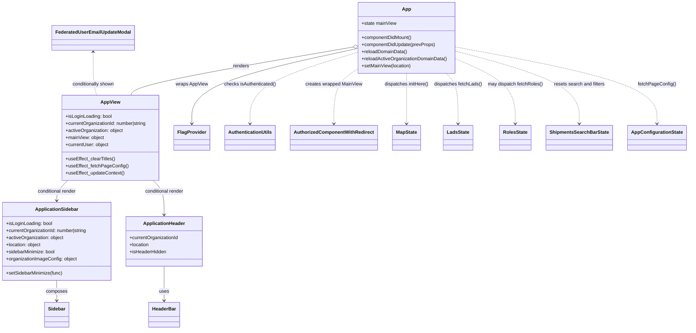

# Diagram: web/portal/src/App.js


> Auto-generated by Obscura crawlers

## Diagram 1



### SVG

<svg id="container" width="2293.427734375" xmlns="http://www.w3.org/2000/svg" class="classDiagram" height="1114" viewBox="0 0 2293.427734375 1114" role="graphics-document document" aria-roledescription="class"><style>#container{font-family:"trebuchet ms",verdana,arial,sans-serif;font-size:16px;fill:#333;}@keyframes edge-animation-frame{from{stroke-dashoffset:0;}}@keyframes dash{to{stroke-dashoffset:0;}}#container .edge-animation-slow{stroke-dasharray:9,5!important;stroke-dashoffset:900;animation:dash 50s linear infinite;stroke-linecap:round;}#container .edge-animation-fast{stroke-dasharray:9,5!important;stroke-dashoffset:900;animation:dash 20s linear infinite;stroke-linecap:round;}#container .error-icon{fill:#552222;}#container .error-text{fill:#552222;stroke:#552222;}#container .edge-thickness-normal{stroke-width:1px;}#container .edge-thickness-thick{stroke-width:3.5px;}#container .edge-pattern-solid{stroke-dasharray:0;}#container .edge-thickness-invisible{stroke-width:0;fill:none;}#container .edge-pattern-dashed{stroke-dasharray:3;}#container .edge-pattern-dotted{stroke-dasharray:2;}#container .marker{fill:#333333;stroke:#333333;}#container .marker.cross{stroke:#333333;}#container svg{font-family:"trebuchet ms",verdana,arial,sans-serif;font-size:16px;}#container p{margin:0;}#container g.classGroup text{fill:#9370DB;stroke:none;font-family:"trebuchet ms",verdana,arial,sans-serif;font-size:10px;}#container g.classGroup text .title{font-weight:bolder;}#container .nodeLabel,#container .edgeLabel{color:#131300;}#container .edgeLabel .label rect{fill:#ECECFF;}#container .label text{fill:#131300;}#container .labelBkg{background:#ECECFF;}#container .edgeLabel .label span{background:#ECECFF;}#container .classTitle{font-weight:bolder;}#container .node rect,#container .node circle,#container .node ellipse,#container .node polygon,#container .node path{fill:#ECECFF;stroke:#9370DB;stroke-width:1px;}#container .divider{stroke:#9370DB;stroke-width:1;}#container g.clickable{cursor:pointer;}#container g.classGroup rect{fill:#ECECFF;stroke:#9370DB;}#container g.classGroup line{stroke:#9370DB;stroke-width:1;}#container .classLabel .box{stroke:none;stroke-width:0;fill:#ECECFF;opacity:0.5;}#container .classLabel .label{fill:#9370DB;font-size:10px;}#container .relation{stroke:#333333;stroke-width:1;fill:none;}#container .dashed-line{stroke-dasharray:3;}#container .dotted-line{stroke-dasharray:1 2;}#container #compositionStart,#container .composition{fill:#333333!important;stroke:#333333!important;stroke-width:1;}#container #compositionEnd,#container .composition{fill:#333333!important;stroke:#333333!important;stroke-width:1;}#container #dependencyStart,#container .dependency{fill:#333333!important;stroke:#333333!important;stroke-width:1;}#container #dependencyStart,#container .dependency{fill:#333333!important;stroke:#333333!important;stroke-width:1;}#container #extensionStart,#container .extension{fill:transparent!important;stroke:#333333!important;stroke-width:1;}#container #extensionEnd,#container .extension{fill:transparent!important;stroke:#333333!important;stroke-width:1;}#container #aggregationStart,#container .aggregation{fill:transparent!important;stroke:#333333!important;stroke-width:1;}#container #aggregationEnd,#container .aggregation{fill:transparent!important;stroke:#333333!important;stroke-width:1;}#container #lollipopStart,#container .lollipop{fill:#ECECFF!important;stroke:#333333!important;stroke-width:1;}#container #lollipopEnd,#container .lollipop{fill:#ECECFF!important;stroke:#333333!important;stroke-width:1;}#container .edgeTerminals{font-size:11px;line-height:initial;}#container .classTitleText{text-anchor:middle;font-size:18px;fill:#333;}#container .label-icon{display:inline-block;height:1em;overflow:visible;vertical-align:-0.125em;}#container .node .label-icon path{fill:currentColor;stroke:revert;stroke-width:revert;}#container :root{--mermaid-font-family:"trebuchet ms",verdana,arial,sans-serif;}</style><g><defs><marker id="container_class-aggregationStart" class="marker aggregation class" refX="18" refY="7" markerWidth="190" markerHeight="240" orient="auto"><path d="M 18,7 L9,13 L1,7 L9,1 Z"></path></marker></defs><defs><marker id="container_class-aggregationEnd" class="marker aggregation class" refX="1" refY="7" markerWidth="20" markerHeight="28" orient="auto"><path d="M 18,7 L9,13 L1,7 L9,1 Z"></path></marker></defs><defs><marker id="container_class-extensionStart" class="marker extension class" refX="18" refY="7" markerWidth="190" markerHeight="240" orient="auto"><path d="M 1,7 L18,13 V 1 Z"></path></marker></defs><defs><marker id="container_class-extensionEnd" class="marker extension class" refX="1" refY="7" markerWidth="20" markerHeight="28" orient="auto"><path d="M 1,1 V 13 L18,7 Z"></path></marker></defs><defs><marker id="container_class-compositionStart" class="marker composition class" refX="18" refY="7" markerWidth="190" markerHeight="240" orient="auto"><path d="M 18,7 L9,13 L1,7 L9,1 Z"></path></marker></defs><defs><marker id="container_class-compositionEnd" class="marker composition class" refX="1" refY="7" markerWidth="20" markerHeight="28" orient="auto"><path d="M 18,7 L9,13 L1,7 L9,1 Z"></path></marker></defs><defs><marker id="container_class-dependencyStart" class="marker dependency class" refX="6" refY="7" markerWidth="190" markerHeight="240" orient="auto"><path d="M 5,7 L9,13 L1,7 L9,1 Z"></path></marker></defs><defs><marker id="container_class-dependencyEnd" class="marker dependency class" refX="13" refY="7" markerWidth="20" markerHeight="28" orient="auto"><path d="M 18,7 L9,13 L14,7 L9,1 Z"></path></marker></defs><defs><marker id="container_class-lollipopStart" class="marker lollipop class" refX="13" refY="7" markerWidth="190" markerHeight="240" orient="auto"><circle stroke="black" fill="transparent" cx="7" cy="7" r="6"></circle></marker></defs><defs><marker id="container_class-lollipopEnd" class="marker lollipop class" refX="1" refY="7" markerWidth="190" markerHeight="240" orient="auto"><circle stroke="black" fill="transparent" cx="7" cy="7" r="6"></circle></marker></defs><g class="root"><g class="clusters"></g><g class="edgePaths"><path d="M1175.927,159.853L1057.417,180.711C938.908,201.569,701.888,243.284,580.425,270.309C458.961,297.333,453.054,309.667,450.1,315.833L447.146,322" id="id_App_AppView_1" class="edge-thickness-normal edge-pattern-solid relation" style=";;;" data-edge="true" data-et="edge" data-id="id_App_AppView_1" data-points="W3sieCI6MTE5Mi45MTYwMTU2MjUsInkiOjE1Ni44NjMzOTI5MzE0MjkzNn0seyJ4Ijo0NjQuODY5MTQwNjI1LCJ5IjoyODV9LHsieCI6NDQ3LjE0NjA5NTkwODE0OTE2LCJ5IjozMjJ9XQ==" marker-start="url(#container_class-aggregationStart)"></path><path d="M1192.916,164.615L1103.049,184.679C1013.183,204.743,833.45,244.872,743.583,287.102C653.717,329.333,653.717,373.667,653.717,395.833L653.717,418" id="id_App_FlagProvider_2" class="edge-thickness-normal edge-pattern-solid relation" style=";;;" data-edge="true" data-et="edge" data-id="id_App_FlagProvider_2" data-points="W3sieCI6MTE5Mi45MTYwMTU2MjUsInkiOjE2NC42MTQ4NDQwNzExNDg0NH0seyJ4Ijo2NTMuNzE2Nzk2ODc1LCJ5IjoyODV9LHsieCI6NjUzLjcxNjc5Njg3NSwieSI6NDI0fV0=" marker-end="url(#container_class-dependencyEnd)"></path><path d="M232.394,610L226.151,616.167C219.908,622.333,207.423,634.667,201.18,646C194.938,657.333,194.938,667.667,194.938,672.833L194.938,678" id="id_AppView_ApplicationSidebar_3" class="edge-thickness-normal edge-pattern-solid relation" style=";;;" data-edge="true" data-et="edge" data-id="id_AppView_ApplicationSidebar_3" data-points="W3sieCI6MjMyLjM5Mzg1MTQzMzAxMTA0LCJ5Ijo2MTB9LHsieCI6MTk0LjkzNzUsInkiOjY0N30seyJ4IjoxOTQuOTM3NSwieSI6Njg0fV0=" marker-end="url(#container_class-dependencyEnd)"></path><path d="M523.946,610L530.189,616.167C536.431,622.333,548.917,634.667,555.16,654C561.402,673.333,561.402,699.667,561.402,712.833L561.402,726" id="id_AppView_ApplicationHeader_4" class="edge-thickness-normal edge-pattern-solid relation" style=";;;" data-edge="true" data-et="edge" data-id="id_AppView_ApplicationHeader_4" data-points="W3sieCI6NTIzLjk0NTk5MjMxNjk4OSwieSI6NjEwfSx7IngiOjU2MS40MDIzNDM3NSwieSI6NjQ3fSx7IngiOjU2MS40MDIzNDM3NSwieSI6NzMyfV0=" marker-end="url(#container_class-dependencyEnd)"></path><path d="M194.938,948L194.938,954.167C194.938,960.333,194.938,972.667,194.938,984C194.938,995.333,194.938,1005.667,194.938,1010.833L194.938,1016" id="id_ApplicationSidebar_Sidebar_5" class="edge-thickness-normal edge-pattern-solid relation" style=";;;" data-edge="true" data-et="edge" data-id="id_ApplicationSidebar_Sidebar_5" data-points="W3sieCI6MTk0LjkzNzUsInkiOjk0OH0seyJ4IjoxOTQuOTM3NSwieSI6OTg1fSx7IngiOjE5NC45Mzc1LCJ5IjoxMDIyfV0=" marker-end="url(#container_class-dependencyEnd)"></path><path d="M561.402,900L561.402,914.167C561.402,928.333,561.402,956.667,561.402,976C561.402,995.333,561.402,1005.667,561.402,1010.833L561.402,1016" id="id_ApplicationHeader_HeaderBar_6" class="edge-thickness-normal edge-pattern-solid relation" style=";;;" data-edge="true" data-et="edge" data-id="id_ApplicationHeader_HeaderBar_6" data-points="W3sieCI6NTYxLjQwMjM0Mzc1LCJ5Ijo5MDB9LHsieCI6NTYxLjQwMjM0Mzc1LCJ5Ijo5ODV9LHsieCI6NTYxLjQwMjM0Mzc1LCJ5IjoxMDIyfV0=" marker-end="url(#container_class-dependencyEnd)"></path><path d="M1192.916,178.25L1134.85,196.041C1076.785,213.833,960.653,249.417,902.587,289.375C844.521,329.333,844.521,373.667,844.521,395.833L844.521,418" id="id_App_AuthenticationUtils_7" class="edge-thickness-normal edge-pattern-dashed relation" style=";;;" data-edge="true" data-et="edge" data-id="id_App_AuthenticationUtils_7" data-points="W3sieCI6MTE5Mi45MTYwMTU2MjUsInkiOjE3OC4yNDk1MjczMzgxNTE0NH0seyJ4Ijo4NDQuNTIxNDg0Mzc1LCJ5IjoyODV9LHsieCI6ODQ0LjUyMTQ4NDM3NSwieSI6NDI0fV0=" marker-end="url(#container_class-dependencyEnd)"></path><path d="M1192.916,236.133L1180.564,244.277C1168.212,252.422,1143.507,268.711,1131.155,299.022C1118.803,329.333,1118.803,373.667,1118.803,395.833L1118.803,418" id="id_App_AuthorizedComponentWithRedirect_8" class="edge-thickness-normal edge-pattern-dashed relation" style=";;;" data-edge="true" data-et="edge" data-id="id_App_AuthorizedComponentWithRedirect_8" data-points="W3sieCI6MTE5Mi45MTYwMTU2MjUsInkiOjIzNi4xMzI2MDM4NDUzOTY2Nn0seyJ4IjoxMTE4LjgwMjczNDM3NSwieSI6Mjg1fSx7IngiOjExMTguODAyNzM0Mzc1LCJ5Ijo0MjR9XQ==" marker-end="url(#container_class-dependencyEnd)"></path><path d="M1356.912,248L1356.912,254.167C1356.912,260.333,1356.912,272.667,1356.912,301C1356.912,329.333,1356.912,373.667,1356.912,395.833L1356.912,418" id="id_App_MapState_9" class="edge-thickness-normal edge-pattern-dashed relation" style=";;;" data-edge="true" data-et="edge" data-id="id_App_MapState_9" data-points="W3sieCI6MTM1Ni45MTIxMDkzNzUsInkiOjI0OH0seyJ4IjoxMzU2LjkxMjEwOTM3NSwieSI6Mjg1fSx7IngiOjEzNTYuOTEyMTA5Mzc1LCJ5Ijo0MjR9XQ==" marker-end="url(#container_class-dependencyEnd)"></path><path d="M1492.258,248L1499.214,254.167C1506.169,260.333,1520.08,272.667,1527.035,301C1533.99,329.333,1533.99,373.667,1533.99,395.833L1533.99,418" id="id_App_LadsState_10" class="edge-thickness-normal edge-pattern-dashed relation" style=";;;" data-edge="true" data-et="edge" data-id="id_App_LadsState_10" data-points="W3sieCI6MTQ5Mi4yNTg0NDY5NTQ2MTc3LCJ5IjoyNDh9LHsieCI6MTUzMy45OTAyMzQzNzUsInkiOjI4NX0seyJ4IjoxNTMzLjk5MDIzNDM3NSwieSI6NDI0fV0=" marker-end="url(#container_class-dependencyEnd)"></path><path d="M1520.908,197.187L1555.599,211.823C1590.29,226.458,1659.671,255.729,1694.362,292.531C1729.053,329.333,1729.053,373.667,1729.053,395.833L1729.053,418" id="id_App_RolesState_11" class="edge-thickness-normal edge-pattern-dashed relation" style=";;;" data-edge="true" data-et="edge" data-id="id_App_RolesState_11" data-points="W3sieCI6MTUyMC45MDgyMDMxMjUsInkiOjE5Ny4xODcyNTA3MDMyNzkxOH0seyJ4IjoxNzI5LjA1MjczNDM3NSwieSI6Mjg1fSx7IngiOjE3MjkuMDUyNzM0Mzc1LCJ5Ijo0MjR9XQ==" marker-end="url(#container_class-dependencyEnd)"></path><path d="M1520.908,172.309L1590.423,191.091C1659.938,209.873,1798.968,247.436,1868.483,288.385C1937.998,329.333,1937.998,373.667,1937.998,395.833L1937.998,418" id="id_App_ShipmentsSearchBarState_12" class="edge-thickness-normal edge-pattern-dashed relation" style=";;;" data-edge="true" data-et="edge" data-id="id_App_ShipmentsSearchBarState_12" data-points="W3sieCI6MTUyMC45MDgyMDMxMjUsInkiOjE3Mi4zMDkwODU4OTc5MDEzfSx7IngiOjE5MzcuOTk4MDQ2ODc1LCJ5IjoyODV9LHsieCI6MTkzNy45OTgwNDY4NzUsInkiOjQyNH1d" marker-end="url(#container_class-dependencyEnd)"></path><path d="M1520.908,158.888L1632.503,179.907C1744.097,200.926,1967.286,242.963,2078.88,286.148C2190.475,329.333,2190.475,373.667,2190.475,395.833L2190.475,418" id="id_App_AppConfigurationState_13" class="edge-thickness-normal edge-pattern-dashed relation" style=";;;" data-edge="true" data-et="edge" data-id="id_App_AppConfigurationState_13" data-points="W3sieCI6MTUyMC45MDgyMDMxMjUsInkiOjE1OC44ODgzNjk3NjA4MTU3OH0seyJ4IjoyMTkwLjQ3NDYwOTM3NSwieSI6Mjg1fSx7IngiOjIxOTAuNDc0NjA5Mzc1LCJ5Ijo0MjR9XQ==" marker-end="url(#container_class-dependencyEnd)"></path><path d="M317.779,176L317.779,194.167C317.779,212.333,317.779,248.667,319.837,273C321.894,297.333,326.009,309.667,328.067,315.833L330.124,322" id="id_FederatedUserEmailUpdateModal_AppView_14" class="edge-thickness-normal edge-pattern-dashed relation" style=";;;" data-edge="true" data-et="edge" data-id="id_FederatedUserEmailUpdateModal_AppView_14" data-points="W3sieCI6MzE3Ljc3OTI5Njg3NSwieSI6MTcwfSx7IngiOjMxNy43NzkyOTY4NzUsInkiOjI4NX0seyJ4IjozMzAuMTI0MzQxNzY0NTAyOCwieSI6MzIyfV0=" marker-start="url(#container_class-dependencyStart)"></path></g><g class="edgeLabels"><g class="edgeLabel" transform="translate(808.69025, 224.48732)"><g class="label" data-id="id_App_AppView_1" transform="translate(-27.75, -12)"><foreignObject width="55.5" height="24"><div xmlns="http://www.w3.org/1999/xhtml" class="labelBkg" style="display: table-cell; white-space: nowrap; line-height: 1.5; max-width: 200px; text-align: center;"><span class="edgeLabel"><p>renders</p></span></div></foreignObject></g></g><g class="edgeLabel" transform="translate(653.716796875, 285)"><g class="label" data-id="id_App_FlagProvider_2" transform="translate(-54.3984375, -12)"><foreignObject width="108.796875" height="24"><div xmlns="http://www.w3.org/1999/xhtml" class="labelBkg" style="display: table-cell; white-space: nowrap; line-height: 1.5; max-width: 200px; text-align: center;"><span class="edgeLabel"><p>wraps AppView</p></span></div></foreignObject></g></g><g class="edgeLabel" transform="translate(194.9375, 647)"><g class="label" data-id="id_AppView_ApplicationSidebar_3" transform="translate(-67.4375, -12)"><foreignObject width="134.875" height="24"><div xmlns="http://www.w3.org/1999/xhtml" class="labelBkg" style="display: table-cell; white-space: nowrap; line-height: 1.5; max-width: 200px; text-align: center;"><span class="edgeLabel"><p>conditional render</p></span></div></foreignObject></g></g><g class="edgeLabel" transform="translate(561.40234375, 647)"><g class="label" data-id="id_AppView_ApplicationHeader_4" transform="translate(-67.4375, -12)"><foreignObject width="134.875" height="24"><div xmlns="http://www.w3.org/1999/xhtml" class="labelBkg" style="display: table-cell; white-space: nowrap; line-height: 1.5; max-width: 200px; text-align: center;"><span class="edgeLabel"><p>conditional render</p></span></div></foreignObject></g></g><g class="edgeLabel" transform="translate(194.9375, 985)"><g class="label" data-id="id_ApplicationSidebar_Sidebar_5" transform="translate(-36.453125, -12)"><foreignObject width="72.90625" height="24"><div xmlns="http://www.w3.org/1999/xhtml" class="labelBkg" style="display: table-cell; white-space: nowrap; line-height: 1.5; max-width: 200px; text-align: center;"><span class="edgeLabel"><p>composes</p></span></div></foreignObject></g></g><g class="edgeLabel" transform="translate(561.40234375, 985)"><g class="label" data-id="id_ApplicationHeader_HeaderBar_6" transform="translate(-16.4921875, -12)"><foreignObject width="32.984375" height="24"><div xmlns="http://www.w3.org/1999/xhtml" class="labelBkg" style="display: table-cell; white-space: nowrap; line-height: 1.5; max-width: 200px; text-align: center;"><span class="edgeLabel"><p>uses</p></span></div></foreignObject></g></g><g class="edgeLabel" transform="translate(844.521484375, 285)"><g class="label" data-id="id_App_AuthenticationUtils_7" transform="translate(-88.8046875, -12)"><foreignObject width="177.609375" height="24"><div xmlns="http://www.w3.org/1999/xhtml" class="labelBkg" style="display: table-cell; white-space: nowrap; line-height: 1.5; max-width: 200px; text-align: center;"><span class="edgeLabel"><p>checks isAuthenticated()</p></span></div></foreignObject></g></g><g class="edgeLabel" transform="translate(1118.802734375, 285)"><g class="label" data-id="id_App_AuthorizedComponentWithRedirect_8" transform="translate(-96.2734375, -12)"><foreignObject width="192.546875" height="24"><div xmlns="http://www.w3.org/1999/xhtml" class="labelBkg" style="display: table-cell; white-space: nowrap; line-height: 1.5; max-width: 200px; text-align: center;"><span class="edgeLabel"><p>creates wrapped MainView</p></span></div></foreignObject></g></g><g class="edgeLabel" transform="translate(1356.912109375, 285)"><g class="label" data-id="id_App_MapState_9" transform="translate(-75.578125, -12)"><foreignObject width="151.15625" height="24"><div xmlns="http://www.w3.org/1999/xhtml" class="labelBkg" style="display: table-cell; white-space: nowrap; line-height: 1.5; max-width: 200px; text-align: center;"><span class="edgeLabel"><p>dispatches initHere()</p></span></div></foreignObject></g></g><g class="edgeLabel" transform="translate(1533.990234375, 285)"><g class="label" data-id="id_App_LadsState_10" transform="translate(-81.5, -12)"><foreignObject width="163" height="24"><div xmlns="http://www.w3.org/1999/xhtml" class="labelBkg" style="display: table-cell; white-space: nowrap; line-height: 1.5; max-width: 200px; text-align: center;"><span class="edgeLabel"><p>dispatches fetchLads()</p></span></div></foreignObject></g></g><g class="edgeLabel" transform="translate(1729.052734375, 285)"><g class="label" data-id="id_App_RolesState_11" transform="translate(-93.5625, -12)"><foreignObject width="187.125" height="24"><div xmlns="http://www.w3.org/1999/xhtml" class="labelBkg" style="display: table-cell; white-space: nowrap; line-height: 1.5; max-width: 200px; text-align: center;"><span class="edgeLabel"><p>may dispatch fetchRoles()</p></span></div></foreignObject></g></g><g class="edgeLabel" transform="translate(1937.998046875, 285)"><g class="label" data-id="id_App_ShipmentsSearchBarState_12" transform="translate(-86.6171875, -12)"><foreignObject width="173.234375" height="24"><div xmlns="http://www.w3.org/1999/xhtml" class="labelBkg" style="display: table-cell; white-space: nowrap; line-height: 1.5; max-width: 200px; text-align: center;"><span class="edgeLabel"><p>resets search and filters</p></span></div></foreignObject></g></g><g class="edgeLabel" transform="translate(2190.474609375, 285)"><g class="label" data-id="id_App_AppConfigurationState_13" transform="translate(-62.7421875, -12)"><foreignObject width="125.484375" height="24"><div xmlns="http://www.w3.org/1999/xhtml" class="labelBkg" style="display: table-cell; white-space: nowrap; line-height: 1.5; max-width: 200px; text-align: center;"><span class="edgeLabel"><p>fetchPageConfig()</p></span></div></foreignObject></g></g><g class="edgeLabel" transform="translate(317.779296875, 285)"><g class="label" data-id="id_FederatedUserEmailUpdateModal_AppView_14" transform="translate(-73.03125, -12)"><foreignObject width="146.0625" height="24"><div xmlns="http://www.w3.org/1999/xhtml" class="labelBkg" style="display: table-cell; white-space: nowrap; line-height: 1.5; max-width: 200px; text-align: center;"><span class="edgeLabel"><p>conditionally shown</p></span></div></foreignObject></g></g></g><g class="nodes"><g class="node default" id="classId-App-0" transform="translate(1356.912109375, 128)"><g class="basic label-container"><path d="M-163.99609375 -120 L163.99609375 -120 L163.99609375 120 L-163.99609375 120" stroke="none" stroke-width="0" fill="#ECECFF" style=""></path><path d="M-163.99609375 -120 C-55.217632295753305 -120, 53.56082915849339 -120, 163.99609375 -120 M-163.99609375 -120 C-55.96721565348025 -120, 52.061662443039495 -120, 163.99609375 -120 M163.99609375 -120 C163.99609375 -57.6919291358451, 163.99609375 4.616141728309799, 163.99609375 120 M163.99609375 -120 C163.99609375 -43.64888501160479, 163.99609375 32.70222997679042, 163.99609375 120 M163.99609375 120 C69.69518947949624 120, -24.60571479100753 120, -163.99609375 120 M163.99609375 120 C47.591163910746715 120, -68.81376592850657 120, -163.99609375 120 M-163.99609375 120 C-163.99609375 46.549027633835465, -163.99609375 -26.90194473232907, -163.99609375 -120 M-163.99609375 120 C-163.99609375 34.858484888014175, -163.99609375 -50.28303022397165, -163.99609375 -120" stroke="#9370DB" stroke-width="1.3" fill="none" stroke-dasharray="0 0" style=""></path></g><g class="annotation-group text" transform="translate(0, -96)"></g><g class="label-group text" transform="translate(-14.2734375, -96)"><g class="label" style="font-weight: bolder" transform="translate(0,-12)"><foreignObject width="28.546875" height="24"><div xmlns="http://www.w3.org/1999/xhtml" style="display: table-cell; white-space: nowrap; line-height: 1.5; max-width: 78px; text-align: center;"><span class="nodeLabel markdown-node-label" style=""><p>App</p></span></div></foreignObject></g></g><g class="members-group text" transform="translate(-151.99609375, -48)"><g class="label" style="" transform="translate(0,-12)"><foreignObject width="118.234375" height="24"><div xmlns="http://www.w3.org/1999/xhtml" style="display: table-cell; white-space: nowrap; line-height: 1.5; max-width: 176px; text-align: center;"><span class="nodeLabel markdown-node-label" style=""><p>+state mainView</p></span></div></foreignObject></g></g><g class="methods-group text" transform="translate(-151.99609375, 0)"><g class="label" style="" transform="translate(0,-12)"><foreignObject width="171.484375" height="24"><div xmlns="http://www.w3.org/1999/xhtml" style="display: table-cell; white-space: nowrap; line-height: 1.5; max-width: 229px; text-align: center;"><span class="nodeLabel markdown-node-label" style=""><p>+componentDidMount()</p></span></div></foreignObject></g><g class="label" style="" transform="translate(0,12)"><foreignObject width="250.5625" height="24"><div xmlns="http://www.w3.org/1999/xhtml" style="display: table-cell; white-space: nowrap; line-height: 1.5; max-width: 308px; text-align: center;"><span class="nodeLabel markdown-node-label" style=""><p>+componentDidUpdate(prevProps)</p></span></div></foreignObject></g><g class="label" style="" transform="translate(0,36)"><foreignObject width="154.015625" height="24"><div xmlns="http://www.w3.org/1999/xhtml" style="display: table-cell; white-space: nowrap; line-height: 1.5; max-width: 211px; text-align: center;"><span class="nodeLabel markdown-node-label" style=""><p>+reloadDomainData()</p></span></div></foreignObject></g><g class="label" style="" transform="translate(0,60)"><foreignObject width="289.71875" height="24"><div xmlns="http://www.w3.org/1999/xhtml" style="display: table-cell; white-space: nowrap; line-height: 1.5; max-width: 347px; text-align: center;"><span class="nodeLabel markdown-node-label" style=""><p>+reloadActiveOrganizationDomainData()</p></span></div></foreignObject></g><g class="label" style="" transform="translate(0,84)"><foreignObject width="168.125" height="24"><div xmlns="http://www.w3.org/1999/xhtml" style="display: table-cell; white-space: nowrap; line-height: 1.5; max-width: 225px; text-align: center;"><span class="nodeLabel markdown-node-label" style=""><p>+setMainView(location)</p></span></div></foreignObject></g></g><g class="divider" style=""><path d="M-163.99609375 -72 C-79.32237327687712 -72, 5.351347196245769 -72, 163.99609375 -72 M-163.99609375 -72 C-75.19415932685354 -72, 13.607775096292926 -72, 163.99609375 -72" stroke="#9370DB" stroke-width="1.3" fill="none" stroke-dasharray="0 0" style=""></path></g><g class="divider" style=""><path d="M-163.99609375 -24 C-38.68813163887789 -24, 86.61983047224422 -24, 163.99609375 -24 M-163.99609375 -24 C-59.77260311794345 -24, 44.450887514113106 -24, 163.99609375 -24" stroke="#9370DB" stroke-width="1.3" fill="none" stroke-dasharray="0 0" style=""></path></g></g><g class="node default" id="classId-AppView-1" transform="translate(378.169921875, 466)"><g class="basic label-container"><path d="M-167.6796875 -144 L167.6796875 -144 L167.6796875 144 L-167.6796875 144" stroke="none" stroke-width="0" fill="#ECECFF" style=""></path><path d="M-167.6796875 -144 C-39.45250807331118 -144, 88.77467135337764 -144, 167.6796875 -144 M-167.6796875 -144 C-81.6832085921536 -144, 4.31327031569279 -144, 167.6796875 -144 M167.6796875 -144 C167.6796875 -54.57808684309158, 167.6796875 34.843826313816834, 167.6796875 144 M167.6796875 -144 C167.6796875 -49.449833234900694, 167.6796875 45.10033353019861, 167.6796875 144 M167.6796875 144 C52.11570376272 144, -63.448279974559995 144, -167.6796875 144 M167.6796875 144 C52.40200698916999 144, -62.87567352166002 144, -167.6796875 144 M-167.6796875 144 C-167.6796875 35.842107235176115, -167.6796875 -72.31578552964777, -167.6796875 -144 M-167.6796875 144 C-167.6796875 75.73205725820682, -167.6796875 7.464114516413645, -167.6796875 -144" stroke="#9370DB" stroke-width="1.3" fill="none" stroke-dasharray="0 0" style=""></path></g><g class="annotation-group text" transform="translate(0, -120)"></g><g class="label-group text" transform="translate(-31.5, -120)"><g class="label" style="font-weight: bolder" transform="translate(0,-12)"><foreignObject width="63" height="24"><div xmlns="http://www.w3.org/1999/xhtml" style="display: table-cell; white-space: nowrap; line-height: 1.5; max-width: 112px; text-align: center;"><span class="nodeLabel markdown-node-label" style=""><p>AppView</p></span></div></foreignObject></g></g><g class="members-group text" transform="translate(-155.6796875, -72)"><g class="label" style="" transform="translate(0,-12)"><foreignObject width="157.28125" height="24"><div xmlns="http://www.w3.org/1999/xhtml" style="display: table-cell; white-space: nowrap; line-height: 1.5; max-width: 215px; text-align: center;"><span class="nodeLabel markdown-node-label" style=""><p>+isLoginLoading: bool</p></span></div></foreignObject></g><g class="label" style="" transform="translate(0,12)"><foreignObject width="279.859375" height="24"><div xmlns="http://www.w3.org/1999/xhtml" style="display: table-cell; white-space: nowrap; line-height: 1.5; max-width: 338px; text-align: center;"><span class="nodeLabel markdown-node-label" style=""><p>+currentOrganizationId: number|string</p></span></div></foreignObject></g><g class="label" style="" transform="translate(0,36)"><foreignObject width="196.546875" height="24"><div xmlns="http://www.w3.org/1999/xhtml" style="display: table-cell; white-space: nowrap; line-height: 1.5; max-width: 254px; text-align: center;"><span class="nodeLabel markdown-node-label" style=""><p>+activeOrganization: object</p></span></div></foreignObject></g><g class="label" style="" transform="translate(0,60)"><foreignObject width="131.515625" height="24"><div xmlns="http://www.w3.org/1999/xhtml" style="display: table-cell; white-space: nowrap; line-height: 1.5; max-width: 189px; text-align: center;"><span class="nodeLabel markdown-node-label" style=""><p>+mainView: object</p></span></div></foreignObject></g><g class="label" style="" transform="translate(0,84)"><foreignObject width="147.125" height="24"><div xmlns="http://www.w3.org/1999/xhtml" style="display: table-cell; white-space: nowrap; line-height: 1.5; max-width: 205px; text-align: center;"><span class="nodeLabel markdown-node-label" style=""><p>+currentUser: object</p></span></div></foreignObject></g></g><g class="methods-group text" transform="translate(-155.6796875, 72)"><g class="label" style="" transform="translate(0,-12)"><foreignObject width="167.703125" height="24"><div xmlns="http://www.w3.org/1999/xhtml" style="display: table-cell; white-space: nowrap; line-height: 1.5; max-width: 225px; text-align: center;"><span class="nodeLabel markdown-node-label" style=""><p>+useEffect_clearTitles()</p></span></div></foreignObject></g><g class="label" style="" transform="translate(0,12)"><foreignObject width="207.90625" height="24"><div xmlns="http://www.w3.org/1999/xhtml" style="display: table-cell; white-space: nowrap; line-height: 1.5; max-width: 265px; text-align: center;"><span class="nodeLabel markdown-node-label" style=""><p>+useEffect_fetchPageConfig()</p></span></div></foreignObject></g><g class="label" style="" transform="translate(0,36)"><foreignObject width="199.15625" height="24"><div xmlns="http://www.w3.org/1999/xhtml" style="display: table-cell; white-space: nowrap; line-height: 1.5; max-width: 257px; text-align: center;"><span class="nodeLabel markdown-node-label" style=""><p>+useEffect_updateContext()</p></span></div></foreignObject></g></g><g class="divider" style=""><path d="M-167.6796875 -96 C-64.99598255326737 -96, 37.687722393465265 -96, 167.6796875 -96 M-167.6796875 -96 C-100.561410094954 -96, -33.443132689908 -96, 167.6796875 -96" stroke="#9370DB" stroke-width="1.3" fill="none" stroke-dasharray="0 0" style=""></path></g><g class="divider" style=""><path d="M-167.6796875 48 C-55.97913905232042 48, 55.72140939535916 48, 167.6796875 48 M-167.6796875 48 C-94.45771157531094 48, -21.235735650621876 48, 167.6796875 48" stroke="#9370DB" stroke-width="1.3" fill="none" stroke-dasharray="0 0" style=""></path></g></g><g class="node default" id="classId-ApplicationSidebar-2" transform="translate(194.9375, 816)"><g class="basic label-container"><path d="M-186.9375 -132 L186.9375 -132 L186.9375 132 L-186.9375 132" stroke="none" stroke-width="0" fill="#ECECFF" style=""></path><path d="M-186.9375 -132 C-98.38561786614645 -132, -9.833735732292894 -132, 186.9375 -132 M-186.9375 -132 C-78.38529646369597 -132, 30.16690707260807 -132, 186.9375 -132 M186.9375 -132 C186.9375 -44.301915990171025, 186.9375 43.39616801965795, 186.9375 132 M186.9375 -132 C186.9375 -48.76056524556074, 186.9375 34.47886950887852, 186.9375 132 M186.9375 132 C58.759591676702826 132, -69.41831664659435 132, -186.9375 132 M186.9375 132 C47.49013721495771 132, -91.95722557008457 132, -186.9375 132 M-186.9375 132 C-186.9375 66.8703590541037, -186.9375 1.7407181082074032, -186.9375 -132 M-186.9375 132 C-186.9375 63.97179780413603, -186.9375 -4.056404391727938, -186.9375 -132" stroke="#9370DB" stroke-width="1.3" fill="none" stroke-dasharray="0 0" style=""></path></g><g class="annotation-group text" transform="translate(0, -108)"></g><g class="label-group text" transform="translate(-70.015625, -108)"><g class="label" style="font-weight: bolder" transform="translate(0,-12)"><foreignObject width="140.03125" height="24"><div xmlns="http://www.w3.org/1999/xhtml" style="display: table-cell; white-space: nowrap; line-height: 1.5; max-width: 189px; text-align: center;"><span class="nodeLabel markdown-node-label" style=""><p>ApplicationSidebar</p></span></div></foreignObject></g></g><g class="members-group text" transform="translate(-174.9375, -60)"><g class="label" style="" transform="translate(0,-12)"><foreignObject width="157.28125" height="24"><div xmlns="http://www.w3.org/1999/xhtml" style="display: table-cell; white-space: nowrap; line-height: 1.5; max-width: 215px; text-align: center;"><span class="nodeLabel markdown-node-label" style=""><p>+isLoginLoading: bool</p></span></div></foreignObject></g><g class="label" style="" transform="translate(0,12)"><foreignObject width="279.859375" height="24"><div xmlns="http://www.w3.org/1999/xhtml" style="display: table-cell; white-space: nowrap; line-height: 1.5; max-width: 338px; text-align: center;"><span class="nodeLabel markdown-node-label" style=""><p>+currentOrganizationId: number|string</p></span></div></foreignObject></g><g class="label" style="" transform="translate(0,36)"><foreignObject width="196.546875" height="24"><div xmlns="http://www.w3.org/1999/xhtml" style="display: table-cell; white-space: nowrap; line-height: 1.5; max-width: 254px; text-align: center;"><span class="nodeLabel markdown-node-label" style=""><p>+activeOrganization: object</p></span></div></foreignObject></g><g class="label" style="" transform="translate(0,60)"><foreignObject width="120.703125" height="24"><div xmlns="http://www.w3.org/1999/xhtml" style="display: table-cell; white-space: nowrap; line-height: 1.5; max-width: 178px; text-align: center;"><span class="nodeLabel markdown-node-label" style=""><p>+location: object</p></span></div></foreignObject></g><g class="label" style="" transform="translate(0,84)"><foreignObject width="168.125" height="24"><div xmlns="http://www.w3.org/1999/xhtml" style="display: table-cell; white-space: nowrap; line-height: 1.5; max-width: 226px; text-align: center;"><span class="nodeLabel markdown-node-label" style=""><p>+sidebarMinimize: bool</p></span></div></foreignObject></g><g class="label" style="" transform="translate(0,108)"><foreignObject width="240.53125" height="24"><div xmlns="http://www.w3.org/1999/xhtml" style="display: table-cell; white-space: nowrap; line-height: 1.5; max-width: 298px; text-align: center;"><span class="nodeLabel markdown-node-label" style=""><p>+organizationImageConfig: object</p></span></div></foreignObject></g></g><g class="methods-group text" transform="translate(-174.9375, 108)"><g class="label" style="" transform="translate(0,-12)"><foreignObject width="192.4375" height="24"><div xmlns="http://www.w3.org/1999/xhtml" style="display: table-cell; white-space: nowrap; line-height: 1.5; max-width: 250px; text-align: center;"><span class="nodeLabel markdown-node-label" style=""><p>+setSidebarMinimize(func)</p></span></div></foreignObject></g></g><g class="divider" style=""><path d="M-186.9375 -84 C-85.75579148411586 -84, 15.425917031768279 -84, 186.9375 -84 M-186.9375 -84 C-44.8245156560439 -84, 97.2884686879122 -84, 186.9375 -84" stroke="#9370DB" stroke-width="1.3" fill="none" stroke-dasharray="0 0" style=""></path></g><g class="divider" style=""><path d="M-186.9375 84 C-37.90393205522926 84, 111.12963588954148 84, 186.9375 84 M-186.9375 84 C-76.06944359684351 84, 34.798612806312974 84, 186.9375 84" stroke="#9370DB" stroke-width="1.3" fill="none" stroke-dasharray="0 0" style=""></path></g></g><g class="node default" id="classId-ApplicationHeader-3" transform="translate(561.40234375, 816)"><g class="basic label-container"><path d="M-129.52734375 -84 L129.52734375 -84 L129.52734375 84 L-129.52734375 84" stroke="none" stroke-width="0" fill="#ECECFF" style=""></path><path d="M-129.52734375 -84 C-27.486937979742407 -84, 74.55346779051519 -84, 129.52734375 -84 M-129.52734375 -84 C-61.18630994210183 -84, 7.154723865796342 -84, 129.52734375 -84 M129.52734375 -84 C129.52734375 -39.939058613045205, 129.52734375 4.12188277390959, 129.52734375 84 M129.52734375 -84 C129.52734375 -37.09535316079948, 129.52734375 9.809293678401033, 129.52734375 84 M129.52734375 84 C39.756890929397585 84, -50.01356189120483 84, -129.52734375 84 M129.52734375 84 C41.5101518334543 84, -46.5070400830914 84, -129.52734375 84 M-129.52734375 84 C-129.52734375 44.44197368567524, -129.52734375 4.883947371350473, -129.52734375 -84 M-129.52734375 84 C-129.52734375 29.37156049118616, -129.52734375 -25.256879017627682, -129.52734375 -84" stroke="#9370DB" stroke-width="1.3" fill="none" stroke-dasharray="0 0" style=""></path></g><g class="annotation-group text" transform="translate(0, -60)"></g><g class="label-group text" transform="translate(-68.1484375, -60)"><g class="label" style="font-weight: bolder" transform="translate(0,-12)"><foreignObject width="136.296875" height="24"><div xmlns="http://www.w3.org/1999/xhtml" style="display: table-cell; white-space: nowrap; line-height: 1.5; max-width: 186px; text-align: center;"><span class="nodeLabel markdown-node-label" style=""><p>ApplicationHeader</p></span></div></foreignObject></g></g><g class="members-group text" transform="translate(-117.52734375, -12)"><g class="label" style="" transform="translate(0,-12)"><foreignObject width="166.90625" height="24"><div xmlns="http://www.w3.org/1999/xhtml" style="display: table-cell; white-space: nowrap; line-height: 1.5; max-width: 224px; text-align: center;"><span class="nodeLabel markdown-node-label" style=""><p>+currentOrganizationId</p></span></div></foreignObject></g><g class="label" style="" transform="translate(0,12)"><foreignObject width="67.140625" height="24"><div xmlns="http://www.w3.org/1999/xhtml" style="display: table-cell; white-space: nowrap; line-height: 1.5; max-width: 125px; text-align: center;"><span class="nodeLabel markdown-node-label" style=""><p>+location</p></span></div></foreignObject></g><g class="label" style="" transform="translate(0,36)"><foreignObject width="125.203125" height="24"><div xmlns="http://www.w3.org/1999/xhtml" style="display: table-cell; white-space: nowrap; line-height: 1.5; max-width: 183px; text-align: center;"><span class="nodeLabel markdown-node-label" style=""><p>+isHeaderHidden</p></span></div></foreignObject></g></g><g class="methods-group text" transform="translate(-117.52734375, 84)"></g><g class="divider" style=""><path d="M-129.52734375 -36 C-59.28407749909486 -36, 10.959188751810274 -36, 129.52734375 -36 M-129.52734375 -36 C-68.05913963735856 -36, -6.590935524717096 -36, 129.52734375 -36" stroke="#9370DB" stroke-width="1.3" fill="none" stroke-dasharray="0 0" style=""></path></g><g class="divider" style=""><path d="M-129.52734375 60 C-47.69451863289025 60, 34.1383064842195 60, 129.52734375 60 M-129.52734375 60 C-49.53772516655927 60, 30.45189341688146 60, 129.52734375 60" stroke="#9370DB" stroke-width="1.3" fill="none" stroke-dasharray="0 0" style=""></path></g></g><g class="node default" id="classId-Sidebar-4" transform="translate(194.9375, 1064)"><g class="basic label-container"><path d="M-40.34375 -42 L40.34375 -42 L40.34375 42 L-40.34375 42" stroke="none" stroke-width="0" fill="#ECECFF" style=""></path><path d="M-40.34375 -42 C-20.455607668519825 -42, -0.5674653370396499 -42, 40.34375 -42 M-40.34375 -42 C-22.474703776400357 -42, -4.605657552800714 -42, 40.34375 -42 M40.34375 -42 C40.34375 -9.776621626020031, 40.34375 22.446756747959938, 40.34375 42 M40.34375 -42 C40.34375 -24.056840428159344, 40.34375 -6.1136808563186875, 40.34375 42 M40.34375 42 C16.44300815925633 42, -7.4577336814873405 42, -40.34375 42 M40.34375 42 C20.127579438267517 42, -0.08859112346496545 42, -40.34375 42 M-40.34375 42 C-40.34375 23.711013818991418, -40.34375 5.422027637982836, -40.34375 -42 M-40.34375 42 C-40.34375 18.51307243684029, -40.34375 -4.973855126319421, -40.34375 -42" stroke="#9370DB" stroke-width="1.3" fill="none" stroke-dasharray="0 0" style=""></path></g><g class="annotation-group text" transform="translate(0, -18)"></g><g class="label-group text" transform="translate(-28.34375, -18)"><g class="label" style="font-weight: bolder" transform="translate(0,-12)"><foreignObject width="56.6875" height="24"><div xmlns="http://www.w3.org/1999/xhtml" style="display: table-cell; white-space: nowrap; line-height: 1.5; max-width: 107px; text-align: center;"><span class="nodeLabel markdown-node-label" style=""><p>Sidebar</p></span></div></foreignObject></g></g><g class="members-group text" transform="translate(-28.34375, 30)"></g><g class="methods-group text" transform="translate(-28.34375, 60)"></g><g class="divider" style=""><path d="M-40.34375 6 C-21.892295860625108 6, -3.440841721250216 6, 40.34375 6 M-40.34375 6 C-13.568304826427873 6, 13.207140347144254 6, 40.34375 6" stroke="#9370DB" stroke-width="1.3" fill="none" stroke-dasharray="0 0" style=""></path></g><g class="divider" style=""><path d="M-40.34375 24 C-18.212571201187586 24, 3.9186075976248276 24, 40.34375 24 M-40.34375 24 C-15.365899749871147 24, 9.611950500257706 24, 40.34375 24" stroke="#9370DB" stroke-width="1.3" fill="none" stroke-dasharray="0 0" style=""></path></g></g><g class="node default" id="classId-HeaderBar-5" transform="translate(561.40234375, 1064)"><g class="basic label-container"><path d="M-51.0078125 -42 L51.0078125 -42 L51.0078125 42 L-51.0078125 42" stroke="none" stroke-width="0" fill="#ECECFF" style=""></path><path d="M-51.0078125 -42 C-18.97515403962847 -42, 13.057504420743058 -42, 51.0078125 -42 M-51.0078125 -42 C-26.091256696584587 -42, -1.1747008931691738 -42, 51.0078125 -42 M51.0078125 -42 C51.0078125 -21.633744416521967, 51.0078125 -1.2674888330439344, 51.0078125 42 M51.0078125 -42 C51.0078125 -12.489477690705144, 51.0078125 17.021044618589713, 51.0078125 42 M51.0078125 42 C11.2357846880005 42, -28.536243123999 42, -51.0078125 42 M51.0078125 42 C22.34191102742138 42, -6.323990445157243 42, -51.0078125 42 M-51.0078125 42 C-51.0078125 9.803683895682894, -51.0078125 -22.39263220863421, -51.0078125 -42 M-51.0078125 42 C-51.0078125 8.512226860537282, -51.0078125 -24.975546278925435, -51.0078125 -42" stroke="#9370DB" stroke-width="1.3" fill="none" stroke-dasharray="0 0" style=""></path></g><g class="annotation-group text" transform="translate(0, -18)"></g><g class="label-group text" transform="translate(-39.0078125, -18)"><g class="label" style="font-weight: bolder" transform="translate(0,-12)"><foreignObject width="78.015625" height="24"><div xmlns="http://www.w3.org/1999/xhtml" style="display: table-cell; white-space: nowrap; line-height: 1.5; max-width: 128px; text-align: center;"><span class="nodeLabel markdown-node-label" style=""><p>HeaderBar</p></span></div></foreignObject></g></g><g class="members-group text" transform="translate(-39.0078125, 30)"></g><g class="methods-group text" transform="translate(-39.0078125, 60)"></g><g class="divider" style=""><path d="M-51.0078125 6 C-22.874686268426814 6, 5.2584399631463725 6, 51.0078125 6 M-51.0078125 6 C-25.955953773237688 6, -0.9040950464753763 6, 51.0078125 6" stroke="#9370DB" stroke-width="1.3" fill="none" stroke-dasharray="0 0" style=""></path></g><g class="divider" style=""><path d="M-51.0078125 24 C-22.847851024318786 24, 5.312110451362429 24, 51.0078125 24 M-51.0078125 24 C-15.97270474727793 24, 19.06240300544414 24, 51.0078125 24" stroke="#9370DB" stroke-width="1.3" fill="none" stroke-dasharray="0 0" style=""></path></g></g><g class="node default" id="classId-FlagProvider-6" transform="translate(653.716796875, 466)"><g class="basic label-container"><path d="M-57.8671875 -42 L57.8671875 -42 L57.8671875 42 L-57.8671875 42" stroke="none" stroke-width="0" fill="#ECECFF" style=""></path><path d="M-57.8671875 -42 C-24.877365740236606 -42, 8.112456019526789 -42, 57.8671875 -42 M-57.8671875 -42 C-22.592828323189558 -42, 12.681530853620885 -42, 57.8671875 -42 M57.8671875 -42 C57.8671875 -23.59090017040611, 57.8671875 -5.181800340812217, 57.8671875 42 M57.8671875 -42 C57.8671875 -8.42096270754437, 57.8671875 25.15807458491126, 57.8671875 42 M57.8671875 42 C19.00576634039644 42, -19.855654819207118 42, -57.8671875 42 M57.8671875 42 C17.776754591053304 42, -22.31367831789339 42, -57.8671875 42 M-57.8671875 42 C-57.8671875 12.289422433865532, -57.8671875 -17.421155132268936, -57.8671875 -42 M-57.8671875 42 C-57.8671875 16.569977441420967, -57.8671875 -8.860045117158066, -57.8671875 -42" stroke="#9370DB" stroke-width="1.3" fill="none" stroke-dasharray="0 0" style=""></path></g><g class="annotation-group text" transform="translate(0, -18)"></g><g class="label-group text" transform="translate(-45.8671875, -18)"><g class="label" style="font-weight: bolder" transform="translate(0,-12)"><foreignObject width="91.734375" height="24"><div xmlns="http://www.w3.org/1999/xhtml" style="display: table-cell; white-space: nowrap; line-height: 1.5; max-width: 141px; text-align: center;"><span class="nodeLabel markdown-node-label" style=""><p>FlagProvider</p></span></div></foreignObject></g></g><g class="members-group text" transform="translate(-45.8671875, 30)"></g><g class="methods-group text" transform="translate(-45.8671875, 60)"></g><g class="divider" style=""><path d="M-57.8671875 6 C-23.25981724894659 6, 11.347553002106821 6, 57.8671875 6 M-57.8671875 6 C-16.65513331202819 6, 24.556920875943618 6, 57.8671875 6" stroke="#9370DB" stroke-width="1.3" fill="none" stroke-dasharray="0 0" style=""></path></g><g class="divider" style=""><path d="M-57.8671875 24 C-14.601917678812704 24, 28.663352142374592 24, 57.8671875 24 M-57.8671875 24 C-31.98073373028981 24, -6.09427996057962 24, 57.8671875 24" stroke="#9370DB" stroke-width="1.3" fill="none" stroke-dasharray="0 0" style=""></path></g></g><g class="node default" id="classId-FederatedUserEmailUpdateModal-7" transform="translate(317.779296875, 128)"><g class="basic label-container"><path d="M-134.25 -42 L134.25 -42 L134.25 42 L-134.25 42" stroke="none" stroke-width="0" fill="#ECECFF" style=""></path><path d="M-134.25 -42 C-55.29710845179375 -42, 23.655783096412506 -42, 134.25 -42 M-134.25 -42 C-79.77876709605864 -42, -25.307534192117288 -42, 134.25 -42 M134.25 -42 C134.25 -12.431587562207202, 134.25 17.136824875585596, 134.25 42 M134.25 -42 C134.25 -19.413282178342303, 134.25 3.1734356433153934, 134.25 42 M134.25 42 C75.86267402021107 42, 17.475348040422148 42, -134.25 42 M134.25 42 C60.680293454915414 42, -12.889413090169171 42, -134.25 42 M-134.25 42 C-134.25 20.044958193915633, -134.25 -1.9100836121687337, -134.25 -42 M-134.25 42 C-134.25 25.000208672606167, -134.25 8.000417345212334, -134.25 -42" stroke="#9370DB" stroke-width="1.3" fill="none" stroke-dasharray="0 0" style=""></path></g><g class="annotation-group text" transform="translate(0, -18)"></g><g class="label-group text" transform="translate(-122.25, -18)"><g class="label" style="font-weight: bolder" transform="translate(0,-12)"><foreignObject width="244.5" height="24"><div xmlns="http://www.w3.org/1999/xhtml" style="display: table-cell; white-space: nowrap; line-height: 1.5; max-width: 293px; text-align: center;"><span class="nodeLabel markdown-node-label" style=""><p>FederatedUserEmailUpdateModal</p></span></div></foreignObject></g></g><g class="members-group text" transform="translate(-122.25, 30)"></g><g class="methods-group text" transform="translate(-122.25, 60)"></g><g class="divider" style=""><path d="M-134.25 6 C-34.297106956362924 6, 65.65578608727415 6, 134.25 6 M-134.25 6 C-54.427164634740095 6, 25.39567073051981 6, 134.25 6" stroke="#9370DB" stroke-width="1.3" fill="none" stroke-dasharray="0 0" style=""></path></g><g class="divider" style=""><path d="M-134.25 24 C-51.48485714647603 24, 31.280285707047938 24, 134.25 24 M-134.25 24 C-40.09588249044097 24, 54.05823501911806 24, 134.25 24" stroke="#9370DB" stroke-width="1.3" fill="none" stroke-dasharray="0 0" style=""></path></g></g><g class="node default" id="classId-AuthorizedComponentWithRedirect-8" transform="translate(1118.802734375, 466)"><g class="basic label-container"><path d="M-141.34375 -42 L141.34375 -42 L141.34375 42 L-141.34375 42" stroke="none" stroke-width="0" fill="#ECECFF" style=""></path><path d="M-141.34375 -42 C-39.19620657880219 -42, 62.95133684239562 -42, 141.34375 -42 M-141.34375 -42 C-56.02637157698932 -42, 29.29100684602136 -42, 141.34375 -42 M141.34375 -42 C141.34375 -20.200254047199465, 141.34375 1.5994919056010701, 141.34375 42 M141.34375 -42 C141.34375 -9.381465337809964, 141.34375 23.237069324380073, 141.34375 42 M141.34375 42 C63.17499195737966 42, -14.99376608524068 42, -141.34375 42 M141.34375 42 C60.93906842343665 42, -19.465613153126696 42, -141.34375 42 M-141.34375 42 C-141.34375 14.373674913890945, -141.34375 -13.252650172218111, -141.34375 -42 M-141.34375 42 C-141.34375 9.08718520225623, -141.34375 -23.82562959548754, -141.34375 -42" stroke="#9370DB" stroke-width="1.3" fill="none" stroke-dasharray="0 0" style=""></path></g><g class="annotation-group text" transform="translate(0, -18)"></g><g class="label-group text" transform="translate(-129.34375, -18)"><g class="label" style="font-weight: bolder" transform="translate(0,-12)"><foreignObject width="258.6875" height="24"><div xmlns="http://www.w3.org/1999/xhtml" style="display: table-cell; white-space: nowrap; line-height: 1.5; max-width: 306px; text-align: center;"><span class="nodeLabel markdown-node-label" style=""><p>AuthorizedComponentWithRedirect</p></span></div></foreignObject></g></g><g class="members-group text" transform="translate(-129.34375, 30)"></g><g class="methods-group text" transform="translate(-129.34375, 60)"></g><g class="divider" style=""><path d="M-141.34375 6 C-76.85353443075068 6, -12.36331886150137 6, 141.34375 6 M-141.34375 6 C-30.756681009999525 6, 79.83038798000095 6, 141.34375 6" stroke="#9370DB" stroke-width="1.3" fill="none" stroke-dasharray="0 0" style=""></path></g><g class="divider" style=""><path d="M-141.34375 24 C-45.16606340826684 24, 51.01162318346633 24, 141.34375 24 M-141.34375 24 C-83.10277422369285 24, -24.861798447385695 24, 141.34375 24" stroke="#9370DB" stroke-width="1.3" fill="none" stroke-dasharray="0 0" style=""></path></g></g><g class="node default" id="classId-AuthenticationUtils-9" transform="translate(844.521484375, 466)"><g class="basic label-container"><path d="M-82.9375 -42 L82.9375 -42 L82.9375 42 L-82.9375 42" stroke="none" stroke-width="0" fill="#ECECFF" style=""></path><path d="M-82.9375 -42 C-48.13918234961194 -42, -13.340864699223886 -42, 82.9375 -42 M-82.9375 -42 C-39.52880037061524 -42, 3.8798992587695267 -42, 82.9375 -42 M82.9375 -42 C82.9375 -11.615796936195604, 82.9375 18.76840612760879, 82.9375 42 M82.9375 -42 C82.9375 -14.16700399925288, 82.9375 13.665992001494239, 82.9375 42 M82.9375 42 C21.807703297513036 42, -39.32209340497393 42, -82.9375 42 M82.9375 42 C46.74631726754202 42, 10.555134535084036 42, -82.9375 42 M-82.9375 42 C-82.9375 11.056822683201613, -82.9375 -19.886354633596774, -82.9375 -42 M-82.9375 42 C-82.9375 15.47930889413242, -82.9375 -11.041382211735161, -82.9375 -42" stroke="#9370DB" stroke-width="1.3" fill="none" stroke-dasharray="0 0" style=""></path></g><g class="annotation-group text" transform="translate(0, -18)"></g><g class="label-group text" transform="translate(-70.9375, -18)"><g class="label" style="font-weight: bolder" transform="translate(0,-12)"><foreignObject width="141.875" height="24"><div xmlns="http://www.w3.org/1999/xhtml" style="display: table-cell; white-space: nowrap; line-height: 1.5; max-width: 190px; text-align: center;"><span class="nodeLabel markdown-node-label" style=""><p>AuthenticationUtils</p></span></div></foreignObject></g></g><g class="members-group text" transform="translate(-70.9375, 30)"></g><g class="methods-group text" transform="translate(-70.9375, 60)"></g><g class="divider" style=""><path d="M-82.9375 6 C-28.16016195165551 6, 26.61717609668898 6, 82.9375 6 M-82.9375 6 C-35.529922173243875 6, 11.87765565351225 6, 82.9375 6" stroke="#9370DB" stroke-width="1.3" fill="none" stroke-dasharray="0 0" style=""></path></g><g class="divider" style=""><path d="M-82.9375 24 C-28.220562460675488 24, 26.496375078649024 24, 82.9375 24 M-82.9375 24 C-42.025095122654406 24, -1.112690245308812 24, 82.9375 24" stroke="#9370DB" stroke-width="1.3" fill="none" stroke-dasharray="0 0" style=""></path></g></g><g class="node default" id="classId-MapState-10" transform="translate(1356.912109375, 466)"><g class="basic label-container"><path d="M-46.765625 -42 L46.765625 -42 L46.765625 42 L-46.765625 42" stroke="none" stroke-width="0" fill="#ECECFF" style=""></path><path d="M-46.765625 -42 C-26.230598872627898 -42, -5.695572745255795 -42, 46.765625 -42 M-46.765625 -42 C-14.680105638506866 -42, 17.405413722986268 -42, 46.765625 -42 M46.765625 -42 C46.765625 -16.83776592880854, 46.765625 8.32446814238292, 46.765625 42 M46.765625 -42 C46.765625 -14.89178433782384, 46.765625 12.216431324352321, 46.765625 42 M46.765625 42 C25.27195391233059 42, 3.778282824661183 42, -46.765625 42 M46.765625 42 C19.97652237450617 42, -6.812580250987658 42, -46.765625 42 M-46.765625 42 C-46.765625 21.11495895214177, -46.765625 0.2299179042835391, -46.765625 -42 M-46.765625 42 C-46.765625 21.293345443126046, -46.765625 0.586690886252093, -46.765625 -42" stroke="#9370DB" stroke-width="1.3" fill="none" stroke-dasharray="0 0" style=""></path></g><g class="annotation-group text" transform="translate(0, -18)"></g><g class="label-group text" transform="translate(-34.765625, -18)"><g class="label" style="font-weight: bolder" transform="translate(0,-12)"><foreignObject width="69.53125" height="24"><div xmlns="http://www.w3.org/1999/xhtml" style="display: table-cell; white-space: nowrap; line-height: 1.5; max-width: 118px; text-align: center;"><span class="nodeLabel markdown-node-label" style=""><p>MapState</p></span></div></foreignObject></g></g><g class="members-group text" transform="translate(-34.765625, 30)"></g><g class="methods-group text" transform="translate(-34.765625, 60)"></g><g class="divider" style=""><path d="M-46.765625 6 C-15.290256761346512 6, 16.185111477306975 6, 46.765625 6 M-46.765625 6 C-21.01938049045444 6, 4.726864019091117 6, 46.765625 6" stroke="#9370DB" stroke-width="1.3" fill="none" stroke-dasharray="0 0" style=""></path></g><g class="divider" style=""><path d="M-46.765625 24 C-13.172400215080337 24, 20.420824569839326 24, 46.765625 24 M-46.765625 24 C-21.961088079616154 24, 2.8434488407676923 24, 46.765625 24" stroke="#9370DB" stroke-width="1.3" fill="none" stroke-dasharray="0 0" style=""></path></g></g><g class="node default" id="classId-RolesState-11" transform="translate(1729.052734375, 466)"><g class="basic label-container"><path d="M-51.421875 -42 L51.421875 -42 L51.421875 42 L-51.421875 42" stroke="none" stroke-width="0" fill="#ECECFF" style=""></path><path d="M-51.421875 -42 C-28.103538755560734 -42, -4.785202511121469 -42, 51.421875 -42 M-51.421875 -42 C-24.391850012332416 -42, 2.6381749753351684 -42, 51.421875 -42 M51.421875 -42 C51.421875 -18.004854200626394, 51.421875 5.990291598747213, 51.421875 42 M51.421875 -42 C51.421875 -17.153531178534553, 51.421875 7.692937642930893, 51.421875 42 M51.421875 42 C16.78459581114999 42, -17.852683377700018 42, -51.421875 42 M51.421875 42 C29.628455865482344 42, 7.8350367309646884 42, -51.421875 42 M-51.421875 42 C-51.421875 20.791528749663037, -51.421875 -0.416942500673926, -51.421875 -42 M-51.421875 42 C-51.421875 20.424862838557157, -51.421875 -1.1502743228856858, -51.421875 -42" stroke="#9370DB" stroke-width="1.3" fill="none" stroke-dasharray="0 0" style=""></path></g><g class="annotation-group text" transform="translate(0, -18)"></g><g class="label-group text" transform="translate(-39.421875, -18)"><g class="label" style="font-weight: bolder" transform="translate(0,-12)"><foreignObject width="78.84375" height="24"><div xmlns="http://www.w3.org/1999/xhtml" style="display: table-cell; white-space: nowrap; line-height: 1.5; max-width: 127px; text-align: center;"><span class="nodeLabel markdown-node-label" style=""><p>RolesState</p></span></div></foreignObject></g></g><g class="members-group text" transform="translate(-39.421875, 30)"></g><g class="methods-group text" transform="translate(-39.421875, 60)"></g><g class="divider" style=""><path d="M-51.421875 6 C-13.104944936032282 6, 25.211985127935435 6, 51.421875 6 M-51.421875 6 C-29.04993660719628 6, -6.677998214392559 6, 51.421875 6" stroke="#9370DB" stroke-width="1.3" fill="none" stroke-dasharray="0 0" style=""></path></g><g class="divider" style=""><path d="M-51.421875 24 C-12.688686512238682 24, 26.044501975522635 24, 51.421875 24 M-51.421875 24 C-21.267576360227313 24, 8.886722279545374 24, 51.421875 24" stroke="#9370DB" stroke-width="1.3" fill="none" stroke-dasharray="0 0" style=""></path></g></g><g class="node default" id="classId-LadsState-12" transform="translate(1533.990234375, 466)"><g class="basic label-container"><path d="M-48.390625 -42 L48.390625 -42 L48.390625 42 L-48.390625 42" stroke="none" stroke-width="0" fill="#ECECFF" style=""></path><path d="M-48.390625 -42 C-18.047627407152593 -42, 12.295370185694814 -42, 48.390625 -42 M-48.390625 -42 C-16.233565143247475 -42, 15.92349471350505 -42, 48.390625 -42 M48.390625 -42 C48.390625 -21.713311295042974, 48.390625 -1.4266225900859482, 48.390625 42 M48.390625 -42 C48.390625 -23.616155413961668, 48.390625 -5.232310827923335, 48.390625 42 M48.390625 42 C11.987216747839533 42, -24.416191504320935 42, -48.390625 42 M48.390625 42 C21.74256091221352 42, -4.90550317557296 42, -48.390625 42 M-48.390625 42 C-48.390625 12.72402654064539, -48.390625 -16.55194691870922, -48.390625 -42 M-48.390625 42 C-48.390625 22.092857340102185, -48.390625 2.18571468020437, -48.390625 -42" stroke="#9370DB" stroke-width="1.3" fill="none" stroke-dasharray="0 0" style=""></path></g><g class="annotation-group text" transform="translate(0, -18)"></g><g class="label-group text" transform="translate(-36.390625, -18)"><g class="label" style="font-weight: bolder" transform="translate(0,-12)"><foreignObject width="72.78125" height="24"><div xmlns="http://www.w3.org/1999/xhtml" style="display: table-cell; white-space: nowrap; line-height: 1.5; max-width: 121px; text-align: center;"><span class="nodeLabel markdown-node-label" style=""><p>LadsState</p></span></div></foreignObject></g></g><g class="members-group text" transform="translate(-36.390625, 30)"></g><g class="methods-group text" transform="translate(-36.390625, 60)"></g><g class="divider" style=""><path d="M-48.390625 6 C-12.727051959326452 6, 22.936521081347095 6, 48.390625 6 M-48.390625 6 C-28.90555362358956 6, -9.420482247179123 6, 48.390625 6" stroke="#9370DB" stroke-width="1.3" fill="none" stroke-dasharray="0 0" style=""></path></g><g class="divider" style=""><path d="M-48.390625 24 C-20.295763915086805 24, 7.799097169826389 24, 48.390625 24 M-48.390625 24 C-26.181510771821465 24, -3.9723965436429296 24, 48.390625 24" stroke="#9370DB" stroke-width="1.3" fill="none" stroke-dasharray="0 0" style=""></path></g></g><g class="node default" id="classId-ShipmentsSearchBarState-13" transform="translate(1937.998046875, 466)"><g class="basic label-container"><path d="M-107.5234375 -42 L107.5234375 -42 L107.5234375 42 L-107.5234375 42" stroke="none" stroke-width="0" fill="#ECECFF" style=""></path><path d="M-107.5234375 -42 C-50.80765074642077 -42, 5.908136007158461 -42, 107.5234375 -42 M-107.5234375 -42 C-50.62237600230603 -42, 6.278685495387947 -42, 107.5234375 -42 M107.5234375 -42 C107.5234375 -19.420438632206256, 107.5234375 3.159122735587488, 107.5234375 42 M107.5234375 -42 C107.5234375 -15.80125532389048, 107.5234375 10.39748935221904, 107.5234375 42 M107.5234375 42 C32.93280207357141 42, -41.65783335285718 42, -107.5234375 42 M107.5234375 42 C23.187799148801943 42, -61.14783920239611 42, -107.5234375 42 M-107.5234375 42 C-107.5234375 10.198404699445245, -107.5234375 -21.60319060110951, -107.5234375 -42 M-107.5234375 42 C-107.5234375 22.01574631715502, -107.5234375 2.031492634310041, -107.5234375 -42" stroke="#9370DB" stroke-width="1.3" fill="none" stroke-dasharray="0 0" style=""></path></g><g class="annotation-group text" transform="translate(0, -18)"></g><g class="label-group text" transform="translate(-95.5234375, -18)"><g class="label" style="font-weight: bolder" transform="translate(0,-12)"><foreignObject width="191.046875" height="24"><div xmlns="http://www.w3.org/1999/xhtml" style="display: table-cell; white-space: nowrap; line-height: 1.5; max-width: 238px; text-align: center;"><span class="nodeLabel markdown-node-label" style=""><p>ShipmentsSearchBarState</p></span></div></foreignObject></g></g><g class="members-group text" transform="translate(-95.5234375, 30)"></g><g class="methods-group text" transform="translate(-95.5234375, 60)"></g><g class="divider" style=""><path d="M-107.5234375 6 C-45.138138440694995 6, 17.24716061861001 6, 107.5234375 6 M-107.5234375 6 C-38.13383848202116 6, 31.255760535957677 6, 107.5234375 6" stroke="#9370DB" stroke-width="1.3" fill="none" stroke-dasharray="0 0" style=""></path></g><g class="divider" style=""><path d="M-107.5234375 24 C-33.17762712979561 24, 41.16818324040878 24, 107.5234375 24 M-107.5234375 24 C-45.482314908906204 24, 16.55880768218759 24, 107.5234375 24" stroke="#9370DB" stroke-width="1.3" fill="none" stroke-dasharray="0 0" style=""></path></g></g><g class="node default" id="classId-AppConfigurationState-14" transform="translate(2190.474609375, 466)"><g class="basic label-container"><path d="M-94.953125 -42 L94.953125 -42 L94.953125 42 L-94.953125 42" stroke="none" stroke-width="0" fill="#ECECFF" style=""></path><path d="M-94.953125 -42 C-36.42826101303973 -42, 22.09660297392054 -42, 94.953125 -42 M-94.953125 -42 C-28.593171168553553 -42, 37.76678266289289 -42, 94.953125 -42 M94.953125 -42 C94.953125 -22.036373518208784, 94.953125 -2.0727470364175673, 94.953125 42 M94.953125 -42 C94.953125 -13.73861500765436, 94.953125 14.52276998469128, 94.953125 42 M94.953125 42 C55.06805684610101 42, 15.182988692202017 42, -94.953125 42 M94.953125 42 C44.879195667198076 42, -5.194733665603849 42, -94.953125 42 M-94.953125 42 C-94.953125 9.29274220018813, -94.953125 -23.41451559962374, -94.953125 -42 M-94.953125 42 C-94.953125 12.502793947503772, -94.953125 -16.994412104992456, -94.953125 -42" stroke="#9370DB" stroke-width="1.3" fill="none" stroke-dasharray="0 0" style=""></path></g><g class="annotation-group text" transform="translate(0, -18)"></g><g class="label-group text" transform="translate(-82.953125, -18)"><g class="label" style="font-weight: bolder" transform="translate(0,-12)"><foreignObject width="165.90625" height="24"><div xmlns="http://www.w3.org/1999/xhtml" style="display: table-cell; white-space: nowrap; line-height: 1.5; max-width: 213px; text-align: center;"><span class="nodeLabel markdown-node-label" style=""><p>AppConfigurationState</p></span></div></foreignObject></g></g><g class="members-group text" transform="translate(-82.953125, 30)"></g><g class="methods-group text" transform="translate(-82.953125, 60)"></g><g class="divider" style=""><path d="M-94.953125 6 C-51.32700319889586 6, -7.7008813977917185 6, 94.953125 6 M-94.953125 6 C-53.03579974499009 6, -11.118474489980187 6, 94.953125 6" stroke="#9370DB" stroke-width="1.3" fill="none" stroke-dasharray="0 0" style=""></path></g><g class="divider" style=""><path d="M-94.953125 24 C-29.939354516766173 24, 35.074415966467654 24, 94.953125 24 M-94.953125 24 C-21.220465650343783 24, 52.512193699312434 24, 94.953125 24" stroke="#9370DB" stroke-width="1.3" fill="none" stroke-dasharray="0 0" style=""></path></g></g></g></g></g></svg>

## Diagram 2

```mermaid
flowchart TD
CM[componentDidMount] --> AuthCheck{AuthenticationUtils.isAuthenticated?}
AuthCheck -- Yes --> ReloadDomain[reloadDomainData]
ReloadDomain --> SL[dispatch searchLocations()]
ReloadDomain --> LADS[dispatch LadsState.fetchLads()]
ReloadDomain --> FD[dispatch fetchDomainData()]
ReloadDomain --> FOI[dispatch fetchOrganizationImages()]
ReloadDomain --> FUP[dispatch fetchUserPreferences()]
AuthCheck -- No --> NoReload[no domain reload]
CM --> MapInit[dispatch MapState.initHere(window.H, window.google, window.mapsindoors)]
CM --> HasLocation{props.location present?}
HasLocation -- Yes --> SetMainView[setMainView(location)]
HasLocation -- No --> SkipSetMain[skip setMainView]

CU[componentDidUpdate] --> MapCheck{window.google && !googleMaps?}
MapCheck -- Yes --> MapInitUpdate[dispatch MapState.initHere(...)]
MapCheck -- No --> MapSkip[skip map init]

CU --> MissingActiveOrg{_.isEmpty(activeOrganization) && currentOrganizationId?}
MissingActiveOrg -- Yes --> FindOrg[org = find(organizations, organization_id == Number(currentOrganizationId))]
FindOrg -- found --> SetActive[dispatch setActiveOrganization(org)]
FindOrg -- not_found --> CondFetch{!isOrganizationsLoading && !organizationsLoadingError?}
CondFetch -- Yes --> FetchOrgs[dispatch fetchOrganizations({ids:[currentOrganizationId]})]
CondFetch -- No --> SkipFetch[skip org fetch]

CU --> OrgIdChanged{currentOrganizationId changed?}
OrgIdChanged -- Yes --> OrgChangeFlow[reloadDomainData -> if !isLoginLoading dispatch ROOT -> dispatch resetAllSearchBarStates()]
OrgIdChanged -- No --> OrgNoChange[no org change]

CU --> PrefChanged{userPreferences changed?}
PrefChanged -- Yes --> PrefLocale{userPreferences.locale?}
PrefLocale -- Yes --> InitI18n[i18n.init with userPreferences.locale]
PrefLocale -- No --> SkipI18n[skip i18n]
InitI18n --> PrefDate{userPreferences.dateformat?}
PrefDate -- Yes --> SetDate[setDateFormat(...)]
PrefDate -- No --> SkipDate[skip date format]
SetDate --> PrefTime{userPreferences.timeformat?}
PrefTime -- Yes --> SetTime[setTimeFormat(...)]
PrefTime -- No --> SkipTime[skip time format]
SetTime --> PrefUnits{userPreferences.units_of_measurement?}
PrefUnits -- Yes --> SetUnits[setMeasurementUnits(...)]
PrefUnits -- No --> SkipUnits[skip units]
PrefChanged -- No --> PrefSkip[skip preference handling]

CU --> MapTypeChanged{mapTypeOverride changed?}
MapTypeChanged -- Yes --> ReloadPage[window.location.reload(false)]
MapTypeChanged -- No --> SkipMapType[skip map reload]

CU --> ActiveOrgChanged{activeOrganization changed?}
ActiveOrgChanged -- Yes --> ReloadActive[reloadActiveOrganizationDomainData]
ReloadActive --> AuthzCheck[create Authorization(currentUser, activeOrganization, ...)]
AuthzCheck --> HasManageUsers{authorization.hasPrivileges(MANAGE_USERS)?}
HasManageUsers -- Yes --> FetchRoles[dispatch RolesState.fetchRoles()]
HasManageUsers -- No --> SkipRoles[skip roles fetch]
ReloadActive --> FetchOrgType[dispatch fetchOrganizationTypeDomainData(isCarrierOrg)]

CU --> ClearSearchCheck{prevLocation in [SHIPMENT_SEARCH, SHIPMENT_DETAIL, SHIPMENT_DETAIL_CUSTOMER] AND location in [ROOT, END_TO_END, LOCATION_MANAGEMENT, USER_MANAGEMENT, ORGANIZATION_MANAGEMENT, REPORTS, CREATE_SHIPMENT]?}
ClearSearchCheck -- Yes --> ResetSearch[dispatch ShipmentsSearchBarState.actionCreators.resetSearchAndFilters()]
ClearSearchCheck -- No --> NoReset[no reset]
```

> SVG rendering failed for this diagram.
