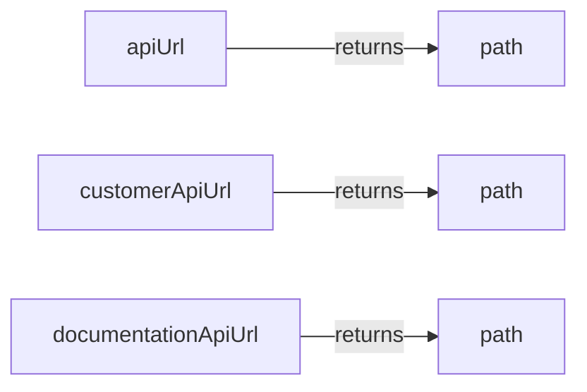
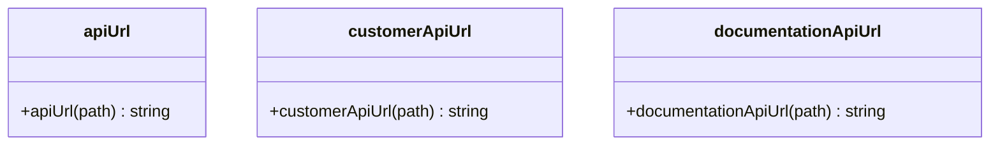

# Diagram: web/portal/src/__mocks__/api-url.js

> Auto-generated by Obscura crawlers

## Diagram 1

### SVG

<svg id="container" width="427.28125" xmlns="http://www.w3.org/2000/svg" class="flowchart" height="278" viewBox="0 0 427.28125 278" role="graphics-document document" aria-roledescription="flowchart-v2"><g><marker id="container_flowchart-v2-pointEnd" class="marker flowchart-v2" viewBox="0 0 10 10" refX="5" refY="5" markerUnits="userSpaceOnUse" markerWidth="8" markerHeight="8" orient="auto"><path d="M 0 0 L 10 5 L 0 10 z" class="arrowMarkerPath" style="stroke-width: 1; stroke-dasharray: 1, 0;"></path></marker><marker id="container_flowchart-v2-pointStart" class="marker flowchart-v2" viewBox="0 0 10 10" refX="4.5" refY="5" markerUnits="userSpaceOnUse" markerWidth="8" markerHeight="8" orient="auto"><path d="M 0 5 L 10 10 L 10 0 z" class="arrowMarkerPath" style="stroke-width: 1; stroke-dasharray: 1, 0;"></path></marker><marker id="container_flowchart-v2-circleEnd" class="marker flowchart-v2" viewBox="0 0 10 10" refX="11" refY="5" markerUnits="userSpaceOnUse" markerWidth="11" markerHeight="11" orient="auto"><circle cx="5" cy="5" r="5" class="arrowMarkerPath" style="stroke-width: 1; stroke-dasharray: 1, 0;"></circle></marker><marker id="container_flowchart-v2-circleStart" class="marker flowchart-v2" viewBox="0 0 10 10" refX="-1" refY="5" markerUnits="userSpaceOnUse" markerWidth="11" markerHeight="11" orient="auto"><circle cx="5" cy="5" r="5" class="arrowMarkerPath" style="stroke-width: 1; stroke-dasharray: 1, 0;"></circle></marker><marker id="container_flowchart-v2-crossEnd" class="marker cross flowchart-v2" viewBox="0 0 11 11" refX="12" refY="5.2" markerUnits="userSpaceOnUse" markerWidth="11" markerHeight="11" orient="auto"><path d="M 1,1 l 9,9 M 10,1 l -9,9" class="arrowMarkerPath" style="stroke-width: 2; stroke-dasharray: 1, 0;"></path></marker><marker id="container_flowchart-v2-crossStart" class="marker cross flowchart-v2" viewBox="0 0 11 11" refX="-1" refY="5.2" markerUnits="userSpaceOnUse" markerWidth="11" markerHeight="11" orient="auto"><path d="M 1,1 l 9,9 M 10,1 l -9,9" class="arrowMarkerPath" style="stroke-width: 2; stroke-dasharray: 1, 0;"></path></marker><g class="root"><g class="clusters"></g><g class="edgePaths"><path d="M167.867,35L185.691,35C203.516,35,239.164,35,264.866,35C290.568,35,306.323,35,314.201,35L322.078,35" id="L_A_B_0" class="edge-thickness-normal edge-pattern-solid edge-thickness-normal edge-pattern-solid flowchart-link" style=";" data-edge="true" data-et="edge" data-id="L_A_B_0" data-points="W3sieCI6MTY3Ljg2NzE4NzUsInkiOjM1fSx7IngiOjI3NC44MTI1LCJ5IjozNX0seyJ4IjozMjYuMDc4MTI1LCJ5IjozNX1d" marker-end="url(#container_flowchart-v2-pointEnd)"></path><path d="M201.977,139L214.116,139C226.255,139,250.534,139,270.551,139C290.568,139,306.323,139,314.201,139L322.078,139" id="L_C_D_0" class="edge-thickness-normal edge-pattern-solid edge-thickness-normal edge-pattern-solid flowchart-link" style=";" data-edge="true" data-et="edge" data-id="L_C_D_0" data-points="W3sieCI6MjAxLjk3NjU2MjUsInkiOjEzOX0seyJ4IjoyNzQuODEyNSwieSI6MTM5fSx7IngiOjMyNi4wNzgxMjUsInkiOjEzOX1d" marker-end="url(#container_flowchart-v2-pointEnd)"></path><path d="M223.547,243L232.091,243C240.635,243,257.724,243,274.146,243C290.568,243,306.323,243,314.201,243L322.078,243" id="L_E_F_0" class="edge-thickness-normal edge-pattern-solid edge-thickness-normal edge-pattern-solid flowchart-link" style=";" data-edge="true" data-et="edge" data-id="L_E_F_0" data-points="W3sieCI6MjIzLjU0Njg3NSwieSI6MjQzfSx7IngiOjI3NC44MTI1LCJ5IjoyNDN9LHsieCI6MzI2LjA3ODEyNSwieSI6MjQzfV0=" marker-end="url(#container_flowchart-v2-pointEnd)"></path></g><g class="edgeLabels"><g class="edgeLabel" transform="translate(274.8125, 35)"><g class="label" data-id="L_A_B_0" transform="translate(-26.265625, -12)"><foreignObject width="52.53125" height="24">

returns

</foreignObject></g></g><g class="edgeLabel" transform="translate(274.8125, 139)"><g class="label" data-id="L_C_D_0" transform="translate(-26.265625, -12)"><foreignObject width="52.53125" height="24">

returns

</foreignObject></g></g><g class="edgeLabel" transform="translate(274.8125, 243)"><g class="label" data-id="L_E_F_0" transform="translate(-26.265625, -12)"><foreignObject width="52.53125" height="24">

returns

</foreignObject></g></g></g><g class="nodes"><g class="node default" id="flowchart-A-0" transform="translate(115.7734375, 35)"><rect class="basic label-container" style="" x="-52.09375" y="-27" width="104.1875" height="54"></rect><g class="label" style="" transform="translate(-22.09375, -12)"><rect></rect><foreignObject width="44.1875" height="24">

apiUrl

</foreignObject></g></g><g class="node default" id="flowchart-B-1" transform="translate(372.6796875, 35)"><rect class="basic label-container" style="" x="-46.6015625" y="-27" width="93.203125" height="54"></rect><g class="label" style="" transform="translate(-16.6015625, -12)"><rect></rect><foreignObject width="33.203125" height="24">

path

</foreignObject></g></g><g class="node default" id="flowchart-C-2" transform="translate(115.7734375, 139)"><rect class="basic label-container" style="" x="-86.203125" y="-27" width="172.40625" height="54"></rect><g class="label" style="" transform="translate(-56.203125, -12)"><rect></rect><foreignObject width="112.40625" height="24">

customerApiUrl

</foreignObject></g></g><g class="node default" id="flowchart-D-3" transform="translate(372.6796875, 139)"><rect class="basic label-container" style="" x="-46.6015625" y="-27" width="93.203125" height="54"></rect><g class="label" style="" transform="translate(-16.6015625, -12)"><rect></rect><foreignObject width="33.203125" height="24">

path

</foreignObject></g></g><g class="node default" id="flowchart-E-4" transform="translate(115.7734375, 243)"><rect class="basic label-container" style="" x="-107.7734375" y="-27" width="215.546875" height="54"></rect><g class="label" style="" transform="translate(-77.7734375, -12)"><rect></rect><foreignObject width="155.546875" height="24">

documentationApiUrl

</foreignObject></g></g><g class="node default" id="flowchart-F-5" transform="translate(372.6796875, 243)"><rect class="basic label-container" style="" x="-46.6015625" y="-27" width="93.203125" height="54"></rect><g class="label" style="" transform="translate(-16.6015625, -12)"><rect></rect><foreignObject width="33.203125" height="24">

path

</foreignObject></g></g></g></g></g></svg>

## Diagram 2

### SVG

<svg id="container" width="973.5078125" xmlns="http://www.w3.org/2000/svg" class="classDiagram" height="142" viewBox="0 0 973.5078125 142" role="graphics-document document" aria-roledescription="class"><g><defs><marker id="container_class-aggregationStart" class="marker aggregation class" refX="18" refY="7" markerWidth="190" markerHeight="240" orient="auto"><path d="M 18,7 L9,13 L1,7 L9,1 Z"></path></marker></defs><defs><marker id="container_class-aggregationEnd" class="marker aggregation class" refX="1" refY="7" markerWidth="20" markerHeight="28" orient="auto"><path d="M 18,7 L9,13 L1,7 L9,1 Z"></path></marker></defs><defs><marker id="container_class-extensionStart" class="marker extension class" refX="18" refY="7" markerWidth="190" markerHeight="240" orient="auto"><path d="M 1,7 L18,13 V 1 Z"></path></marker></defs><defs><marker id="container_class-extensionEnd" class="marker extension class" refX="1" refY="7" markerWidth="20" markerHeight="28" orient="auto"><path d="M 1,1 V 13 L18,7 Z"></path></marker></defs><defs><marker id="container_class-compositionStart" class="marker composition class" refX="18" refY="7" markerWidth="190" markerHeight="240" orient="auto"><path d="M 18,7 L9,13 L1,7 L9,1 Z"></path></marker></defs><defs><marker id="container_class-compositionEnd" class="marker composition class" refX="1" refY="7" markerWidth="20" markerHeight="28" orient="auto"><path d="M 18,7 L9,13 L1,7 L9,1 Z"></path></marker></defs><defs><marker id="container_class-dependencyStart" class="marker dependency class" refX="6" refY="7" markerWidth="190" markerHeight="240" orient="auto"><path d="M 5,7 L9,13 L1,7 L9,1 Z"></path></marker></defs><defs><marker id="container_class-dependencyEnd" class="marker dependency class" refX="13" refY="7" markerWidth="20" markerHeight="28" orient="auto"><path d="M 18,7 L9,13 L14,7 L9,1 Z"></path></marker></defs><defs><marker id="container_class-lollipopStart" class="marker lollipop class" refX="13" refY="7" markerWidth="190" markerHeight="240" orient="auto"><circle stroke="black" fill="transparent" cx="7" cy="7" r="6"></circle></marker></defs><defs><marker id="container_class-lollipopEnd" class="marker lollipop class" refX="1" refY="7" markerWidth="190" markerHeight="240" orient="auto"><circle stroke="black" fill="transparent" cx="7" cy="7" r="6"></circle></marker></defs><g class="root"><g class="clusters"></g><g class="edgePaths"></g><g class="edgeLabels"></g><g class="nodes"><g class="node default" id="classId-apiUrl-0" transform="translate(105.83203125, 71)"><g class="basic label-container"><path d="M-97.83203125 -63 L97.83203125 -63 L97.83203125 63 L-97.83203125 63" stroke="none" stroke-width="0" fill="#ECECFF" style=""></path><path d="M-97.83203125 -63 C-19.893545099412066 -63, 58.04494105117587 -63, 97.83203125 -63 M-97.83203125 -63 C-19.886069182185494 -63, 58.05989288562901 -63, 97.83203125 -63 M97.83203125 -63 C97.83203125 -25.36016259342677, 97.83203125 12.279674813146457, 97.83203125 63 M97.83203125 -63 C97.83203125 -30.23733687935976, 97.83203125 2.5253262412804816, 97.83203125 63 M97.83203125 63 C40.96249026852308 63, -15.907050712953847 63, -97.83203125 63 M97.83203125 63 C34.07314693587957 63, -29.68573737824086 63, -97.83203125 63 M-97.83203125 63 C-97.83203125 31.33902162461181, -97.83203125 -0.32195675077637986, -97.83203125 -63 M-97.83203125 63 C-97.83203125 17.77648226642596, -97.83203125 -27.447035467148083, -97.83203125 -63" stroke="#9370DB" stroke-width="1.3" fill="none" stroke-dasharray="0 0" style=""></path></g><g class="annotation-group text" transform="translate(0, -39)"></g><g class="label-group text" transform="translate(-22.2109375, -39)"><g class="label" style="font-weight: bolder" transform="translate(0,-12)"><foreignObject width="44.421875" height="24">

apiUrl

</foreignObject></g></g><g class="members-group text" transform="translate(-85.83203125, 9)"></g><g class="methods-group text" transform="translate(-85.83203125, 39)"><g class="label" style="" transform="translate(0,-12)"><foreignObject width="149.453125" height="24">

+apiUrl(path) : string

</foreignObject></g></g><g class="divider" style=""><path d="M-97.83203125 -15 C-34.36695027082403 -15, 29.098130708351945 -15, 97.83203125 -15 M-97.83203125 -15 C-54.41545324141966 -15, -10.998875232839325 -15, 97.83203125 -15" stroke="#9370DB" stroke-width="1.3" fill="none" stroke-dasharray="0 0" style=""></path></g><g class="divider" style=""><path d="M-97.83203125 9 C-42.557056063713055 9, 12.717919122573889 9, 97.83203125 9 M-97.83203125 9 C-28.625805005687297 9, 40.580421238625405 9, 97.83203125 9" stroke="#9370DB" stroke-width="1.3" fill="none" stroke-dasharray="0 0" style=""></path></g></g><g class="node default" id="classId-customerApiUrl-1" transform="translate(402.98828125, 71)"><g class="basic label-container"><path d="M-149.32421875 -63 L149.32421875 -63 L149.32421875 63 L-149.32421875 63" stroke="none" stroke-width="0" fill="#ECECFF" style=""></path><path d="M-149.32421875 -63 C-88.7531847578532 -63, -28.182150765706425 -63, 149.32421875 -63 M-149.32421875 -63 C-40.01670776652817 -63, 69.29080321694366 -63, 149.32421875 -63 M149.32421875 -63 C149.32421875 -21.432847234470373, 149.32421875 20.134305531059255, 149.32421875 63 M149.32421875 -63 C149.32421875 -18.514297405468596, 149.32421875 25.971405189062807, 149.32421875 63 M149.32421875 63 C50.92299003649508 63, -47.47823867700984 63, -149.32421875 63 M149.32421875 63 C81.88468100049842 63, 14.445143250996836 63, -149.32421875 63 M-149.32421875 63 C-149.32421875 21.17397333476527, -149.32421875 -20.652053330469457, -149.32421875 -63 M-149.32421875 63 C-149.32421875 30.078656352812125, -149.32421875 -2.84268729437575, -149.32421875 -63" stroke="#9370DB" stroke-width="1.3" fill="none" stroke-dasharray="0 0" style=""></path></g><g class="annotation-group text" transform="translate(0, -39)"></g><g class="label-group text" transform="translate(-56.7421875, -39)"><g class="label" style="font-weight: bolder" transform="translate(0,-12)"><foreignObject width="113.484375" height="24">

customerApiUrl

</foreignObject></g></g><g class="members-group text" transform="translate(-137.32421875, 9)"></g><g class="methods-group text" transform="translate(-137.32421875, 39)"><g class="label" style="" transform="translate(0,-12)"><foreignObject width="217.90625" height="24">

+customerApiUrl(path) : string

</foreignObject></g></g><g class="divider" style=""><path d="M-149.32421875 -15 C-86.66848764635984 -15, -24.012756542719657 -15, 149.32421875 -15 M-149.32421875 -15 C-86.75157426483827 -15, -24.178929779676537 -15, 149.32421875 -15" stroke="#9370DB" stroke-width="1.3" fill="none" stroke-dasharray="0 0" style=""></path></g><g class="divider" style=""><path d="M-149.32421875 9 C-77.02123819212824 9, -4.718257634256474 9, 149.32421875 9 M-149.32421875 9 C-36.40204929694431 9, 76.52012015611137 9, 149.32421875 9" stroke="#9370DB" stroke-width="1.3" fill="none" stroke-dasharray="0 0" style=""></path></g></g><g class="node default" id="classId-documentationApiUrl-2" transform="translate(783.91015625, 71)"><g class="basic label-container"><path d="M-181.59765625 -63 L181.59765625 -63 L181.59765625 63 L-181.59765625 63" stroke="none" stroke-width="0" fill="#ECECFF" style=""></path><path d="M-181.59765625 -63 C-77.38838437765207 -63, 26.820887494695853 -63, 181.59765625 -63 M-181.59765625 -63 C-68.70670086614079 -63, 44.184254517718415 -63, 181.59765625 -63 M181.59765625 -63 C181.59765625 -24.848751762413656, 181.59765625 13.302496475172688, 181.59765625 63 M181.59765625 -63 C181.59765625 -15.598828753419802, 181.59765625 31.802342493160396, 181.59765625 63 M181.59765625 63 C72.09533590288487 63, -37.40698444423026 63, -181.59765625 63 M181.59765625 63 C103.24158685002081 63, 24.88551745004162 63, -181.59765625 63 M-181.59765625 63 C-181.59765625 23.50241634724201, -181.59765625 -15.995167305515977, -181.59765625 -63 M-181.59765625 63 C-181.59765625 26.771373205989747, -181.59765625 -9.457253588020507, -181.59765625 -63" stroke="#9370DB" stroke-width="1.3" fill="none" stroke-dasharray="0 0" style=""></path></g><g class="annotation-group text" transform="translate(0, -39)"></g><g class="label-group text" transform="translate(-78.1484375, -39)"><g class="label" style="font-weight: bolder" transform="translate(0,-12)"><foreignObject width="156.296875" height="24">

documentationApiUrl

</foreignObject></g></g><g class="members-group text" transform="translate(-169.59765625, 9)"></g><g class="methods-group text" transform="translate(-169.59765625, 39)"><g class="label" style="" transform="translate(0,-12)"><foreignObject width="261.046875" height="24">

+documentationApiUrl(path) : string

</foreignObject></g></g><g class="divider" style=""><path d="M-181.59765625 -15 C-51.673489599022446 -15, 78.25067705195511 -15, 181.59765625 -15 M-181.59765625 -15 C-45.599228705453385 -15, 90.39919883909323 -15, 181.59765625 -15" stroke="#9370DB" stroke-width="1.3" fill="none" stroke-dasharray="0 0" style=""></path></g><g class="divider" style=""><path d="M-181.59765625 9 C-97.25874464467483 9, -12.919833039349669 9, 181.59765625 9 M-181.59765625 9 C-87.19894702199427 9, 7.1997622060114566 9, 181.59765625 9" stroke="#9370DB" stroke-width="1.3" fill="none" stroke-dasharray="0 0" style=""></path></g></g></g></g></g></svg>
