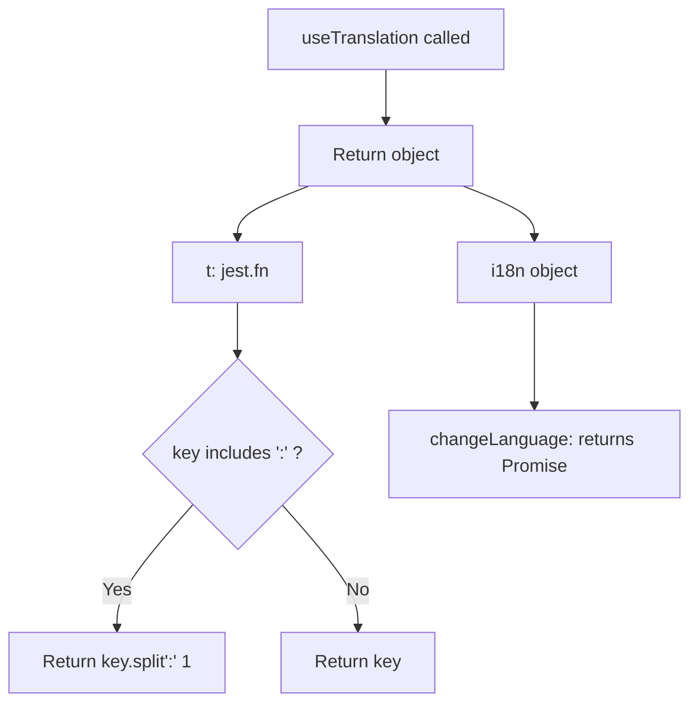
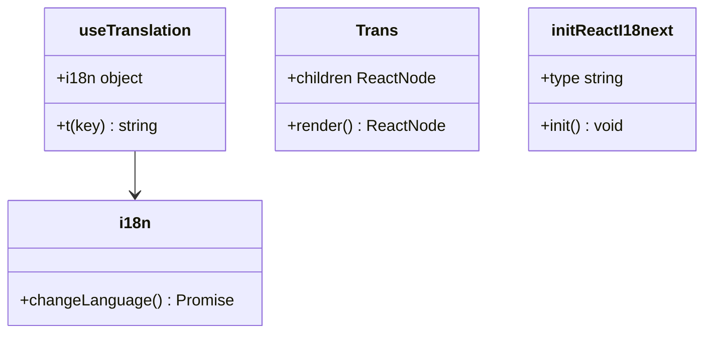
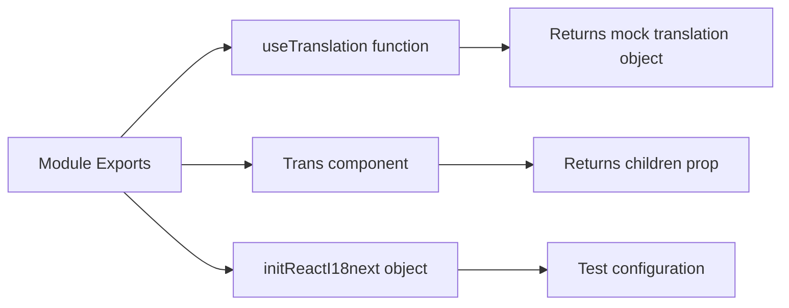

# Diagram: web/portal/src/__mocks__/react-i18next.js

> Auto-generated by Obscura crawlers

## Diagram 1

### SVG

<svg id="container" width="616.76171875" xmlns="http://www.w3.org/2000/svg" class="flowchart" height="626.796875" viewBox="0 0 616.76171875 626.796875" role="graphics-document document" aria-roledescription="flowchart-v2"><g><marker id="container_flowchart-v2-pointEnd" class="marker flowchart-v2" viewBox="0 0 10 10" refX="5" refY="5" markerUnits="userSpaceOnUse" markerWidth="8" markerHeight="8" orient="auto"><path d="M 0 0 L 10 5 L 0 10 z" class="arrowMarkerPath" style="stroke-width: 1; stroke-dasharray: 1, 0;"></path></marker><marker id="container_flowchart-v2-pointStart" class="marker flowchart-v2" viewBox="0 0 10 10" refX="4.5" refY="5" markerUnits="userSpaceOnUse" markerWidth="8" markerHeight="8" orient="auto"><path d="M 0 5 L 10 10 L 10 0 z" class="arrowMarkerPath" style="stroke-width: 1; stroke-dasharray: 1, 0;"></path></marker><marker id="container_flowchart-v2-circleEnd" class="marker flowchart-v2" viewBox="0 0 10 10" refX="11" refY="5" markerUnits="userSpaceOnUse" markerWidth="11" markerHeight="11" orient="auto"><circle cx="5" cy="5" r="5" class="arrowMarkerPath" style="stroke-width: 1; stroke-dasharray: 1, 0;"></circle></marker><marker id="container_flowchart-v2-circleStart" class="marker flowchart-v2" viewBox="0 0 10 10" refX="-1" refY="5" markerUnits="userSpaceOnUse" markerWidth="11" markerHeight="11" orient="auto"><circle cx="5" cy="5" r="5" class="arrowMarkerPath" style="stroke-width: 1; stroke-dasharray: 1, 0;"></circle></marker><marker id="container_flowchart-v2-crossEnd" class="marker cross flowchart-v2" viewBox="0 0 11 11" refX="12" refY="5.2" markerUnits="userSpaceOnUse" markerWidth="11" markerHeight="11" orient="auto"><path d="M 1,1 l 9,9 M 10,1 l -9,9" class="arrowMarkerPath" style="stroke-width: 2; stroke-dasharray: 1, 0;"></path></marker><marker id="container_flowchart-v2-crossStart" class="marker cross flowchart-v2" viewBox="0 0 11 11" refX="-1" refY="5.2" markerUnits="userSpaceOnUse" markerWidth="11" markerHeight="11" orient="auto"><path d="M 1,1 l 9,9 M 10,1 l -9,9" class="arrowMarkerPath" style="stroke-width: 2; stroke-dasharray: 1, 0;"></path></marker><g class="root"><g class="clusters"></g><g class="edgePaths"><path d="M346.063,62L346.063,66.167C346.063,70.333,346.063,78.667,346.063,86.333C346.063,94,346.063,101,346.063,104.5L346.063,108" id="L_A_B_0" class="edge-thickness-normal edge-pattern-solid edge-thickness-normal edge-pattern-solid flowchart-link" style=";" data-edge="true" data-et="edge" data-id="L_A_B_0" data-points="W3sieCI6MzQ2LjA2MjUsInkiOjYyfSx7IngiOjM0Ni4wNjI1LCJ5Ijo4N30seyJ4IjozNDYuMDYyNSwieSI6MTEyfV0=" marker-end="url(#container_flowchart-v2-pointEnd)"></path><path d="M277.161,166L266.528,170.167C255.895,174.333,234.629,182.667,223.996,190.333C213.363,198,213.363,205,213.363,208.5L213.363,212" id="L_B_C_0" class="edge-thickness-normal edge-pattern-solid edge-thickness-normal edge-pattern-solid flowchart-link" style=";" data-edge="true" data-et="edge" data-id="L_B_C_0" data-points="W3sieCI6Mjc3LjE2MDk4MjU3MjExNTM2LCJ5IjoxNjZ9LHsieCI6MjEzLjM2MzI4MTI1LCJ5IjoxOTF9LHsieCI6MjEzLjM2MzI4MTI1LCJ5IjoyMTZ9XQ==" marker-end="url(#container_flowchart-v2-pointEnd)"></path><path d="M414.964,166L425.597,170.167C436.23,174.333,457.496,182.667,468.129,190.333C478.762,198,478.762,205,478.762,208.5L478.762,212" id="L_B_D_0" class="edge-thickness-normal edge-pattern-solid edge-thickness-normal edge-pattern-solid flowchart-link" style=";" data-edge="true" data-et="edge" data-id="L_B_D_0" data-points="W3sieCI6NDE0Ljk2NDAxNzQyNzg4NDY0LCJ5IjoxNjZ9LHsieCI6NDc4Ljc2MTcxODc1LCJ5IjoxOTF9LHsieCI6NDc4Ljc2MTcxODc1LCJ5IjoyMTZ9XQ==" marker-end="url(#container_flowchart-v2-pointEnd)"></path><path d="M213.363,270L213.363,274.167C213.363,278.333,213.363,286.667,213.363,294.333C213.363,302,213.363,309,213.363,312.5L213.363,316" id="L_C_E_0" class="edge-thickness-normal edge-pattern-solid edge-thickness-normal edge-pattern-solid flowchart-link" style=";" data-edge="true" data-et="edge" data-id="L_C_E_0" data-points="W3sieCI6MjEzLjM2MzI4MTI1LCJ5IjoyNzB9LHsieCI6MjEzLjM2MzI4MTI1LCJ5IjoyOTV9LHsieCI6MjEzLjM2MzI4MTI1LCJ5IjozMjB9XQ==" marker-end="url(#container_flowchart-v2-pointEnd)"></path><path d="M173.321,450.755L161.985,463.595C150.649,476.435,127.977,502.116,116.641,520.456C105.305,538.797,105.305,549.797,105.305,555.297L105.305,560.797" id="L_E_F_0" class="edge-thickness-normal edge-pattern-solid edge-thickness-normal edge-pattern-solid flowchart-link" style=";" data-edge="true" data-et="edge" data-id="L_E_F_0" data-points="W3sieCI6MTczLjMyMDk1NzQ2MTI5MDQsInkiOjQ1MC43NTQ1NTEyMTEyOTA0fSx7IngiOjEwNS4zMDQ2ODc1LCJ5Ijo1MjcuNzk2ODc1fSx7IngiOjEwNS4zMDQ2ODc1LCJ5Ijo1NjQuNzk2ODc1fV0=" marker-end="url(#container_flowchart-v2-pointEnd)"></path><path d="M253.406,450.755L264.742,463.595C276.078,476.435,298.75,502.116,310.086,520.456C321.422,538.797,321.422,549.797,321.422,555.297L321.422,560.797" id="L_E_G_0" class="edge-thickness-normal edge-pattern-solid edge-thickness-normal edge-pattern-solid flowchart-link" style=";" data-edge="true" data-et="edge" data-id="L_E_G_0" data-points="W3sieCI6MjUzLjQwNTYwNTAzODcwOTYsInkiOjQ1MC43NTQ1NTEyMTEyOTA0fSx7IngiOjMyMS40MjE4NzUsInkiOjUyNy43OTY4NzV9LHsieCI6MzIxLjQyMTg3NSwieSI6NTY0Ljc5Njg3NX1d" marker-end="url(#container_flowchart-v2-pointEnd)"></path><path d="M478.762,270L478.762,274.167C478.762,278.333,478.762,286.667,478.762,302.066C478.762,317.466,478.762,339.932,478.762,351.165L478.762,362.398" id="L_D_H_0" class="edge-thickness-normal edge-pattern-solid edge-thickness-normal edge-pattern-solid flowchart-link" style=";" data-edge="true" data-et="edge" data-id="L_D_H_0" data-points="W3sieCI6NDc4Ljc2MTcxODc1LCJ5IjoyNzB9LHsieCI6NDc4Ljc2MTcxODc1LCJ5IjoyOTV9LHsieCI6NDc4Ljc2MTcxODc1LCJ5IjozNjYuMzk4NDM3NX1d" marker-end="url(#container_flowchart-v2-pointEnd)"></path></g><g class="edgeLabels"><g class="edgeLabel"><g class="label" data-id="L_A_B_0" transform="translate(0, 0)"><foreignObject width="0" height="0">

</foreignObject></g></g><g class="edgeLabel"><g class="label" data-id="L_B_C_0" transform="translate(0, 0)"><foreignObject width="0" height="0">

</foreignObject></g></g><g class="edgeLabel"><g class="label" data-id="L_B_D_0" transform="translate(0, 0)"><foreignObject width="0" height="0">

</foreignObject></g></g><g class="edgeLabel"><g class="label" data-id="L_C_E_0" transform="translate(0, 0)"><foreignObject width="0" height="0">

</foreignObject></g></g><g class="edgeLabel" transform="translate(105.3046875, 527.796875)"><g class="label" data-id="L_E_F_0" transform="translate(-12.03125, -12)"><foreignObject width="24.0625" height="24">

Yes

</foreignObject></g></g><g class="edgeLabel" transform="translate(321.421875, 527.796875)"><g class="label" data-id="L_E_G_0" transform="translate(-10.140625, -12)"><foreignObject width="20.28125" height="24">

No

</foreignObject></g></g><g class="edgeLabel"><g class="label" data-id="L_D_H_0" transform="translate(0, 0)"><foreignObject width="0" height="0">

</foreignObject></g></g></g><g class="nodes"><g class="node default" id="flowchart-A-0" transform="translate(346.0625, 35)"><rect class="basic label-container" style="" x="-107.3203125" y="-27" width="214.640625" height="54"></rect><g class="label" style="" transform="translate(-77.3203125, -12)"><rect></rect><foreignObject width="154.640625" height="24">

useTranslation called

</foreignObject></g></g><g class="node default" id="flowchart-B-1" transform="translate(346.0625, 139)"><rect class="basic label-container" style="" x="-79.2578125" y="-27" width="158.515625" height="54"></rect><g class="label" style="" transform="translate(-49.2578125, -12)"><rect></rect><foreignObject width="98.515625" height="24">

Return object

</foreignObject></g></g><g class="node default" id="flowchart-C-3" transform="translate(213.36328125, 243)"><rect class="basic label-container" style="" x="-59.3984375" y="-27" width="118.796875" height="54"></rect><g class="label" style="" transform="translate(-29.3984375, -12)"><rect></rect><foreignObject width="58.796875" height="24">

t: jest.fn

</foreignObject></g></g><g class="node default" id="flowchart-D-5" transform="translate(478.76171875, 243)"><rect class="basic label-container" style="" x="-69.6796875" y="-27" width="139.359375" height="54"></rect><g class="label" style="" transform="translate(-39.6796875, -12)"><rect></rect><foreignObject width="79.359375" height="24">

i18n object

</foreignObject></g></g><g class="node default" id="flowchart-E-7" transform="translate(213.36328125, 405.3984375)"><polygon points="85.3984375,0 170.796875,-85.3984375 85.3984375,-170.796875 0,-85.3984375" class="label-container" transform="translate(-84.8984375, 85.3984375)"></polygon><g class="label" style="" transform="translate(-58.3984375, -12)"><rect></rect><foreignObject width="116.796875" height="24">

key includes ':' ?

</foreignObject></g></g><g class="node default" id="flowchart-F-9" transform="translate(105.3046875, 591.796875)"><rect class="basic label-container" style="" x="-97.3046875" y="-27" width="194.609375" height="54"></rect><g class="label" style="" transform="translate(-67.3046875, -12)"><rect></rect><foreignObject width="134.609375" height="24">

Return key.split':' 1

</foreignObject></g></g><g class="node default" id="flowchart-G-11" transform="translate(321.421875, 591.796875)"><rect class="basic label-container" style="" x="-68.8125" y="-27" width="137.625" height="54"></rect><g class="label" style="" transform="translate(-38.8125, -12)"><rect></rect><foreignObject width="77.625" height="24">

Return key

</foreignObject></g></g><g class="node default" id="flowchart-H-13" transform="translate(478.76171875, 405.3984375)"><rect class="basic label-container" style="" x="-130" y="-39" width="260" height="78"></rect><g class="label" style="" transform="translate(-100, -24)"><rect></rect><foreignObject width="200" height="48">

changeLanguage: returns Promise

</foreignObject></g></g></g></g></g></svg>

## Diagram 2

### SVG

<svg id="container" width="701.87890625" xmlns="http://www.w3.org/2000/svg" class="classDiagram" height="336" viewBox="0 0 701.87890625 336" role="graphics-document document" aria-roledescription="class"><g><defs><marker id="container_class-aggregationStart" class="marker aggregation class" refX="18" refY="7" markerWidth="190" markerHeight="240" orient="auto"><path d="M 18,7 L9,13 L1,7 L9,1 Z"></path></marker></defs><defs><marker id="container_class-aggregationEnd" class="marker aggregation class" refX="1" refY="7" markerWidth="20" markerHeight="28" orient="auto"><path d="M 18,7 L9,13 L1,7 L9,1 Z"></path></marker></defs><defs><marker id="container_class-extensionStart" class="marker extension class" refX="18" refY="7" markerWidth="190" markerHeight="240" orient="auto"><path d="M 1,7 L18,13 V 1 Z"></path></marker></defs><defs><marker id="container_class-extensionEnd" class="marker extension class" refX="1" refY="7" markerWidth="20" markerHeight="28" orient="auto"><path d="M 1,1 V 13 L18,7 Z"></path></marker></defs><defs><marker id="container_class-compositionStart" class="marker composition class" refX="18" refY="7" markerWidth="190" markerHeight="240" orient="auto"><path d="M 18,7 L9,13 L1,7 L9,1 Z"></path></marker></defs><defs><marker id="container_class-compositionEnd" class="marker composition class" refX="1" refY="7" markerWidth="20" markerHeight="28" orient="auto"><path d="M 18,7 L9,13 L1,7 L9,1 Z"></path></marker></defs><defs><marker id="container_class-dependencyStart" class="marker dependency class" refX="6" refY="7" markerWidth="190" markerHeight="240" orient="auto"><path d="M 5,7 L9,13 L1,7 L9,1 Z"></path></marker></defs><defs><marker id="container_class-dependencyEnd" class="marker dependency class" refX="13" refY="7" markerWidth="20" markerHeight="28" orient="auto"><path d="M 18,7 L9,13 L14,7 L9,1 Z"></path></marker></defs><defs><marker id="container_class-lollipopStart" class="marker lollipop class" refX="13" refY="7" markerWidth="190" markerHeight="240" orient="auto"><circle stroke="black" fill="transparent" cx="7" cy="7" r="6"></circle></marker></defs><defs><marker id="container_class-lollipopEnd" class="marker lollipop class" refX="1" refY="7" markerWidth="190" markerHeight="240" orient="auto"><circle stroke="black" fill="transparent" cx="7" cy="7" r="6"></circle></marker></defs><g class="root"><g class="clusters"></g><g class="edgePaths"><path d="M132.461,152L132.461,156.167C132.461,160.333,132.461,168.667,132.461,176C132.461,183.333,132.461,189.667,132.461,192.833L132.461,196" id="id_useTranslation_i18n_1" class="edge-thickness-normal edge-pattern-solid relation" style=";;;" data-edge="true" data-et="edge" data-id="id_useTranslation_i18n_1" data-points="W3sieCI6MTMyLjQ2MDkzNzUsInkiOjE1Mn0seyJ4IjoxMzIuNDYwOTM3NSwieSI6MTc3fSx7IngiOjEzMi40NjA5Mzc1LCJ5IjoyMDJ9XQ==" marker-end="url(#container_class-dependencyEnd)"></path></g><g class="edgeLabels"><g class="edgeLabel"><g class="label" data-id="id_useTranslation_i18n_1" transform="translate(0, 0)"><foreignObject width="0" height="0">

</foreignObject></g></g></g><g class="nodes"><g class="node default" id="classId-useTranslation-0" transform="translate(132.4609375, 80)"><g class="basic label-container"><path d="M-90.33203125 -72 L90.33203125 -72 L90.33203125 72 L-90.33203125 72" stroke="none" stroke-width="0" fill="#ECECFF" style=""></path><path d="M-90.33203125 -72 C-27.03166038484722 -72, 36.26871048030556 -72, 90.33203125 -72 M-90.33203125 -72 C-32.00212332180873 -72, 26.327784606382536 -72, 90.33203125 -72 M90.33203125 -72 C90.33203125 -33.16527073417134, 90.33203125 5.669458531657327, 90.33203125 72 M90.33203125 -72 C90.33203125 -42.06137458805841, 90.33203125 -12.122749176116834, 90.33203125 72 M90.33203125 72 C28.115203918050497 72, -34.101623413899006 72, -90.33203125 72 M90.33203125 72 C43.57724259868024 72, -3.1775460526395136 72, -90.33203125 72 M-90.33203125 72 C-90.33203125 24.586020014594204, -90.33203125 -22.82795997081159, -90.33203125 -72 M-90.33203125 72 C-90.33203125 34.50458349555229, -90.33203125 -2.9908330088954216, -90.33203125 -72" stroke="#9370DB" stroke-width="1.3" fill="none" stroke-dasharray="0 0" style=""></path></g><g class="annotation-group text" transform="translate(0, -48)"></g><g class="label-group text" transform="translate(-54.0859375, -48)"><g class="label" style="font-weight: bolder" transform="translate(0,-12)"><foreignObject width="108.171875" height="24">

useTranslation

</foreignObject></g></g><g class="members-group text" transform="translate(-78.33203125, 0)"><g class="label" style="" transform="translate(0,-12)"><foreignObject width="87.34375" height="24">

+i18n object

</foreignObject></g></g><g class="methods-group text" transform="translate(-78.33203125, 48)"><g class="label" style="" transform="translate(0,-12)"><foreignObject width="102.578125" height="24">

+t(key) : string

</foreignObject></g></g><g class="divider" style=""><path d="M-90.33203125 -24 C-27.67021602028835 -24, 34.9915992094233 -24, 90.33203125 -24 M-90.33203125 -24 C-41.09653501971921 -24, 8.138961210561575 -24, 90.33203125 -24" stroke="#9370DB" stroke-width="1.3" fill="none" stroke-dasharray="0 0" style=""></path></g><g class="divider" style=""><path d="M-90.33203125 24 C-34.130117438311636 24, 22.071796373376728 24, 90.33203125 24 M-90.33203125 24 C-26.30280268669803 24, 37.72642587660394 24, 90.33203125 24" stroke="#9370DB" stroke-width="1.3" fill="none" stroke-dasharray="0 0" style=""></path></g></g><g class="node default" id="classId-i18n-1" transform="translate(132.4609375, 265)"><g class="basic label-container"><path d="M-124.4609375 -63 L124.4609375 -63 L124.4609375 63 L-124.4609375 63" stroke="none" stroke-width="0" fill="#ECECFF" style=""></path><path d="M-124.4609375 -63 C-31.199662389054694 -63, 62.06161272189061 -63, 124.4609375 -63 M-124.4609375 -63 C-36.61059442892321 -63, 51.239748642153586 -63, 124.4609375 -63 M124.4609375 -63 C124.4609375 -12.867991892827604, 124.4609375 37.26401621434479, 124.4609375 63 M124.4609375 -63 C124.4609375 -31.32870862983757, 124.4609375 0.3425827403248576, 124.4609375 63 M124.4609375 63 C30.532864841486287 63, -63.395207817027426 63, -124.4609375 63 M124.4609375 63 C58.91654156288263 63, -6.627854374234744 63, -124.4609375 63 M-124.4609375 63 C-124.4609375 23.698400734075648, -124.4609375 -15.603198531848705, -124.4609375 -63 M-124.4609375 63 C-124.4609375 36.450740443884435, -124.4609375 9.90148088776887, -124.4609375 -63" stroke="#9370DB" stroke-width="1.3" fill="none" stroke-dasharray="0 0" style=""></path></g><g class="annotation-group text" transform="translate(0, -39)"></g><g class="label-group text" transform="translate(-15.234375, -39)"><g class="label" style="font-weight: bolder" transform="translate(0,-12)"><foreignObject width="30.46875" height="24">

i18n

</foreignObject></g></g><g class="members-group text" transform="translate(-112.4609375, 9)"></g><g class="methods-group text" transform="translate(-112.4609375, 39)"><g class="label" style="" transform="translate(0,-12)"><foreignObject width="209.6875" height="24">

+changeLanguage() : Promise

</foreignObject></g></g><g class="divider" style=""><path d="M-124.4609375 -15 C-67.10874940585697 -15, -9.756561311713952 -15, 124.4609375 -15 M-124.4609375 -15 C-47.8654290682134 -15, 28.730079363573196 -15, 124.4609375 -15" stroke="#9370DB" stroke-width="1.3" fill="none" stroke-dasharray="0 0" style=""></path></g><g class="divider" style=""><path d="M-124.4609375 9 C-43.36329171096894 9, 37.734354078062125 9, 124.4609375 9 M-124.4609375 9 C-70.76290744712469 9, -17.06487739424938 9, 124.4609375 9" stroke="#9370DB" stroke-width="1.3" fill="none" stroke-dasharray="0 0" style=""></path></g></g><g class="node default" id="classId-Trans-2" transform="translate(373.54296875, 80)"><g class="basic label-container"><path d="M-100.75 -72 L100.75 -72 L100.75 72 L-100.75 72" stroke="none" stroke-width="0" fill="#ECECFF" style=""></path><path d="M-100.75 -72 C-32.08752853662935 -72, 36.5749429267413 -72, 100.75 -72 M-100.75 -72 C-51.24458316573162 -72, -1.7391663314632382 -72, 100.75 -72 M100.75 -72 C100.75 -22.626599476979024, 100.75 26.746801046041952, 100.75 72 M100.75 -72 C100.75 -41.14920209099284, 100.75 -10.298404181985674, 100.75 72 M100.75 72 C25.9903666762697 72, -48.7692666474606 72, -100.75 72 M100.75 72 C26.573672372352306 72, -47.60265525529539 72, -100.75 72 M-100.75 72 C-100.75 36.97186934265372, -100.75 1.9437386853074372, -100.75 -72 M-100.75 72 C-100.75 37.522795900802606, -100.75 3.0455918016052124, -100.75 -72" stroke="#9370DB" stroke-width="1.3" fill="none" stroke-dasharray="0 0" style=""></path></g><g class="annotation-group text" transform="translate(0, -48)"></g><g class="label-group text" transform="translate(-19.875, -48)"><g class="label" style="font-weight: bolder" transform="translate(0,-12)"><foreignObject width="39.75" height="24">

Trans

</foreignObject></g></g><g class="members-group text" transform="translate(-88.75, 0)"><g class="label" style="" transform="translate(0,-12)"><foreignObject width="150.421875" height="24">

+children ReactNode

</foreignObject></g></g><g class="methods-group text" transform="translate(-88.75, 48)"><g class="label" style="" transform="translate(0,-12)"><foreignObject width="157.625" height="24">

+render() : ReactNode

</foreignObject></g></g><g class="divider" style=""><path d="M-100.75 -24 C-43.12084589599281 -24, 14.508308208014384 -24, 100.75 -24 M-100.75 -24 C-20.32385362123526 -24, 60.10229275752948 -24, 100.75 -24" stroke="#9370DB" stroke-width="1.3" fill="none" stroke-dasharray="0 0" style=""></path></g><g class="divider" style=""><path d="M-100.75 24 C-27.34596353413383 24, 46.05807293173234 24, 100.75 24 M-100.75 24 C-54.00340554234045 24, -7.256811084680905 24, 100.75 24" stroke="#9370DB" stroke-width="1.3" fill="none" stroke-dasharray="0 0" style=""></path></g></g><g class="node default" id="classId-initReactI18next-3" transform="translate(609.0859375, 80)"><g class="basic label-container"><path d="M-84.79296875 -72 L84.79296875 -72 L84.79296875 72 L-84.79296875 72" stroke="none" stroke-width="0" fill="#ECECFF" style=""></path><path d="M-84.79296875 -72 C-30.15774684752433 -72, 24.47747505495134 -72, 84.79296875 -72 M-84.79296875 -72 C-30.589135093391384 -72, 23.61469856321723 -72, 84.79296875 -72 M84.79296875 -72 C84.79296875 -29.825324127542558, 84.79296875 12.349351744914884, 84.79296875 72 M84.79296875 -72 C84.79296875 -27.082265688717513, 84.79296875 17.835468622564974, 84.79296875 72 M84.79296875 72 C33.469706948441775 72, -17.85355485311645 72, -84.79296875 72 M84.79296875 72 C28.75544304017248 72, -27.28208266965504 72, -84.79296875 72 M-84.79296875 72 C-84.79296875 41.94783066667458, -84.79296875 11.895661333349146, -84.79296875 -72 M-84.79296875 72 C-84.79296875 25.598856879856065, -84.79296875 -20.80228624028787, -84.79296875 -72" stroke="#9370DB" stroke-width="1.3" fill="none" stroke-dasharray="0 0" style=""></path></g><g class="annotation-group text" transform="translate(0, -48)"></g><g class="label-group text" transform="translate(-59.4921875, -48)"><g class="label" style="font-weight: bolder" transform="translate(0,-12)"><foreignObject width="118.984375" height="24">

initReactI18next

</foreignObject></g></g><g class="members-group text" transform="translate(-72.79296875, 0)"><g class="label" style="" transform="translate(0,-12)"><foreignObject width="85.578125" height="24">

+type string

</foreignObject></g></g><g class="methods-group text" transform="translate(-72.79296875, 48)"><g class="label" style="" transform="translate(0,-12)"><foreignObject width="86.09375" height="24">

+init() : void

</foreignObject></g></g><g class="divider" style=""><path d="M-84.79296875 -24 C-41.615104885468476 -24, 1.562758979063048 -24, 84.79296875 -24 M-84.79296875 -24 C-28.72675676863625 -24, 27.3394552127275 -24, 84.79296875 -24" stroke="#9370DB" stroke-width="1.3" fill="none" stroke-dasharray="0 0" style=""></path></g><g class="divider" style=""><path d="M-84.79296875 24 C-23.481464783957193 24, 37.83003918208561 24, 84.79296875 24 M-84.79296875 24 C-35.787503390959934 24, 13.217961968080132 24, 84.79296875 24" stroke="#9370DB" stroke-width="1.3" fill="none" stroke-dasharray="0 0" style=""></path></g></g></g></g></g></svg>

## Diagram 3

### SVG

<svg id="container" width="780.578125" xmlns="http://www.w3.org/2000/svg" class="flowchart" height="302" viewBox="0 0 780.578125 302" role="graphics-document document" aria-roledescription="flowchart-v2"><g><marker id="container_flowchart-v2-pointEnd" class="marker flowchart-v2" viewBox="0 0 10 10" refX="5" refY="5" markerUnits="userSpaceOnUse" markerWidth="8" markerHeight="8" orient="auto"><path d="M 0 0 L 10 5 L 0 10 z" class="arrowMarkerPath" style="stroke-width: 1; stroke-dasharray: 1, 0;"></path></marker><marker id="container_flowchart-v2-pointStart" class="marker flowchart-v2" viewBox="0 0 10 10" refX="4.5" refY="5" markerUnits="userSpaceOnUse" markerWidth="8" markerHeight="8" orient="auto"><path d="M 0 5 L 10 10 L 10 0 z" class="arrowMarkerPath" style="stroke-width: 1; stroke-dasharray: 1, 0;"></path></marker><marker id="container_flowchart-v2-circleEnd" class="marker flowchart-v2" viewBox="0 0 10 10" refX="11" refY="5" markerUnits="userSpaceOnUse" markerWidth="11" markerHeight="11" orient="auto"><circle cx="5" cy="5" r="5" class="arrowMarkerPath" style="stroke-width: 1; stroke-dasharray: 1, 0;"></circle></marker><marker id="container_flowchart-v2-circleStart" class="marker flowchart-v2" viewBox="0 0 10 10" refX="-1" refY="5" markerUnits="userSpaceOnUse" markerWidth="11" markerHeight="11" orient="auto"><circle cx="5" cy="5" r="5" class="arrowMarkerPath" style="stroke-width: 1; stroke-dasharray: 1, 0;"></circle></marker><marker id="container_flowchart-v2-crossEnd" class="marker cross flowchart-v2" viewBox="0 0 11 11" refX="12" refY="5.2" markerUnits="userSpaceOnUse" markerWidth="11" markerHeight="11" orient="auto"><path d="M 1,1 l 9,9 M 10,1 l -9,9" class="arrowMarkerPath" style="stroke-width: 2; stroke-dasharray: 1, 0;"></path></marker><marker id="container_flowchart-v2-crossStart" class="marker cross flowchart-v2" viewBox="0 0 11 11" refX="-1" refY="5.2" markerUnits="userSpaceOnUse" markerWidth="11" markerHeight="11" orient="auto"><path d="M 1,1 l 9,9 M 10,1 l -9,9" class="arrowMarkerPath" style="stroke-width: 2; stroke-dasharray: 1, 0;"></path></marker><g class="root"><g class="clusters"></g><g class="edgePaths"><path d="M120.356,136L134.604,121.167C148.852,106.333,177.348,76.667,195.096,61.833C212.844,47,219.844,47,223.344,47L226.844,47" id="L_A_B_0" class="edge-thickness-normal edge-pattern-solid edge-thickness-normal edge-pattern-solid flowchart-link" style=";" data-edge="true" data-et="edge" data-id="L_A_B_0" data-points="W3sieCI6MTIwLjM1NjI3NjkzOTY1NTE3LCJ5IjoxMzZ9LHsieCI6MjA1Ljg0Mzc1LCJ5Ijo0N30seyJ4IjoyMzAuODQzNzUsInkiOjQ3fV0=" marker-end="url(#container_flowchart-v2-pointEnd)"></path><path d="M180.844,163L185.01,163C189.177,163,197.51,163,209.014,163C220.518,163,235.193,163,242.53,163L249.867,163" id="L_A_C_0" class="edge-thickness-normal edge-pattern-solid edge-thickness-normal edge-pattern-solid flowchart-link" style=";" data-edge="true" data-et="edge" data-id="L_A_C_0" data-points="W3sieCI6MTgwLjg0Mzc1LCJ5IjoxNjN9LHsieCI6MjA1Ljg0Mzc1LCJ5IjoxNjN9LHsieCI6MjUzLjg2NzE4NzUsInkiOjE2M31d" marker-end="url(#container_flowchart-v2-pointEnd)"></path><path d="M123.349,190L137.098,202.833C150.847,215.667,178.345,241.333,196.075,254.167C213.805,267,221.766,267,225.746,267L229.727,267" id="L_A_D_0" class="edge-thickness-normal edge-pattern-solid edge-thickness-normal edge-pattern-solid flowchart-link" style=";" data-edge="true" data-et="edge" data-id="L_A_D_0" data-points="W3sieCI6MTIzLjM0ODcwNzkzMjY5MjMsInkiOjE5MH0seyJ4IjoyMDUuODQzNzUsInkiOjI2N30seyJ4IjoyMzMuNzI2NTYyNSwieSI6MjY3fV0=" marker-end="url(#container_flowchart-v2-pointEnd)"></path><path d="M462.578,47L466.745,47C470.911,47,479.245,47,486.911,47C494.578,47,501.578,47,505.078,47L508.578,47" id="L_B_E_0" class="edge-thickness-normal edge-pattern-solid edge-thickness-normal edge-pattern-solid flowchart-link" style=";" data-edge="true" data-et="edge" data-id="L_B_E_0" data-points="W3sieCI6NDYyLjU3ODEyNSwieSI6NDd9LHsieCI6NDg3LjU3ODEyNSwieSI6NDd9LHsieCI6NTEyLjU3ODEyNSwieSI6NDd9XQ==" marker-end="url(#container_flowchart-v2-pointEnd)"></path><path d="M439.555,163L447.559,163C455.563,163,471.57,163,486.548,163C501.526,163,515.474,163,522.448,163L529.422,163" id="L_C_F_0" class="edge-thickness-normal edge-pattern-solid edge-thickness-normal edge-pattern-solid flowchart-link" style=";" data-edge="true" data-et="edge" data-id="L_C_F_0" data-points="W3sieCI6NDM5LjU1NDY4NzUsInkiOjE2M30seyJ4Ijo0ODcuNTc4MTI1LCJ5IjoxNjN9LHsieCI6NTMzLjQyMTg3NSwieSI6MTYzfV0=" marker-end="url(#container_flowchart-v2-pointEnd)"></path><path d="M459.695,267L464.342,267C468.99,267,478.284,267,492.293,267C506.302,267,525.026,267,534.388,267L543.75,267" id="L_D_G_0" class="edge-thickness-normal edge-pattern-solid edge-thickness-normal edge-pattern-solid flowchart-link" style=";" data-edge="true" data-et="edge" data-id="L_D_G_0" data-points="W3sieCI6NDU5LjY5NTMxMjUsInkiOjI2N30seyJ4Ijo0ODcuNTc4MTI1LCJ5IjoyNjd9LHsieCI6NTQ3Ljc1LCJ5IjoyNjd9XQ==" marker-end="url(#container_flowchart-v2-pointEnd)"></path></g><g class="edgeLabels"><g class="edgeLabel"><g class="label" data-id="L_A_B_0" transform="translate(0, 0)"><foreignObject width="0" height="0">

</foreignObject></g></g><g class="edgeLabel"><g class="label" data-id="L_A_C_0" transform="translate(0, 0)"><foreignObject width="0" height="0">

</foreignObject></g></g><g class="edgeLabel"><g class="label" data-id="L_A_D_0" transform="translate(0, 0)"><foreignObject width="0" height="0">

</foreignObject></g></g><g class="edgeLabel"><g class="label" data-id="L_B_E_0" transform="translate(0, 0)"><foreignObject width="0" height="0">

</foreignObject></g></g><g class="edgeLabel"><g class="label" data-id="L_C_F_0" transform="translate(0, 0)"><foreignObject width="0" height="0">

</foreignObject></g></g><g class="edgeLabel"><g class="label" data-id="L_D_G_0" transform="translate(0, 0)"><foreignObject width="0" height="0">

</foreignObject></g></g></g><g class="nodes"><g class="node default" id="flowchart-A-0" transform="translate(94.421875, 163)"><rect class="basic label-container" style="" x="-86.421875" y="-27" width="172.84375" height="54"></rect><g class="label" style="" transform="translate(-56.421875, -12)"><rect></rect><foreignObject width="112.84375" height="24">

Module Exports

</foreignObject></g></g><g class="node default" id="flowchart-B-1" transform="translate(346.7109375, 47)"><rect class="basic label-container" style="" x="-115.8671875" y="-27" width="231.734375" height="54"></rect><g class="label" style="" transform="translate(-85.8671875, -12)"><rect></rect><foreignObject width="171.734375" height="24">

useTranslation function

</foreignObject></g></g><g class="node default" id="flowchart-C-3" transform="translate(346.7109375, 163)"><rect class="basic label-container" style="" x="-92.84375" y="-27" width="185.6875" height="54"></rect><g class="label" style="" transform="translate(-62.84375, -12)"><rect></rect><foreignObject width="125.6875" height="24">

Trans component

</foreignObject></g></g><g class="node default" id="flowchart-D-5" transform="translate(346.7109375, 267)"><rect class="basic label-container" style="" x="-112.984375" y="-27" width="225.96875" height="54"></rect><g class="label" style="" transform="translate(-82.984375, -12)"><rect></rect><foreignObject width="165.96875" height="24">

initReactI18next object

</foreignObject></g></g><g class="node default" id="flowchart-E-7" transform="translate(642.578125, 47)"><rect class="basic label-container" style="" x="-130" y="-39" width="260" height="78"></rect><g class="label" style="" transform="translate(-100, -24)"><rect></rect><foreignObject width="200" height="48">

Returns mock translation object

</foreignObject></g></g><g class="node default" id="flowchart-F-9" transform="translate(642.578125, 163)"><rect class="basic label-container" style="" x="-109.15625" y="-27" width="218.3125" height="54"></rect><g class="label" style="" transform="translate(-79.15625, -12)"><rect></rect><foreignObject width="158.3125" height="24">

Returns children prop

</foreignObject></g></g><g class="node default" id="flowchart-G-11" transform="translate(642.578125, 267)"><rect class="basic label-container" style="" x="-94.828125" y="-27" width="189.65625" height="54"></rect><g class="label" style="" transform="translate(-64.828125, -12)"><rect></rect><foreignObject width="129.65625" height="24">

Test configuration

</foreignObject></g></g></g></g></g></svg>
