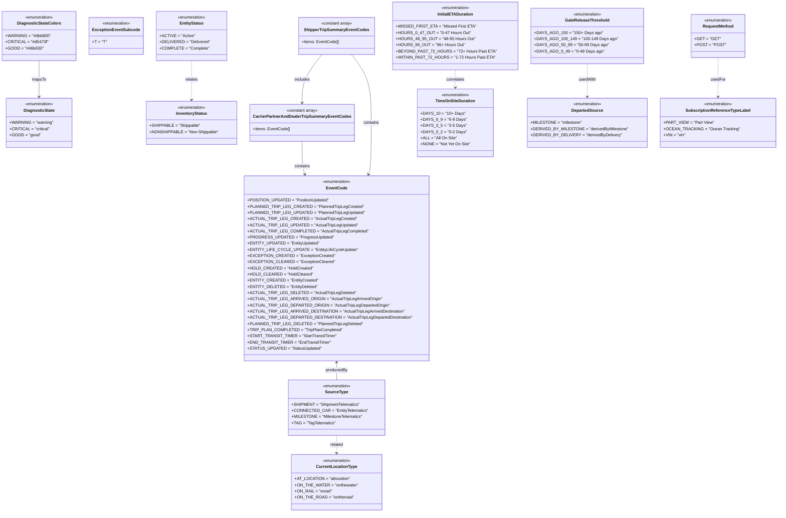

# Diagram: web/portal/src/api/consts.ts

> Auto-generated by Obscura crawlers

## Mermaid

### SVG

<svg id="container" width="2861.251953125" xmlns="http://www.w3.org/2000/svg" class="classDiagram" height="1992" viewBox="0 0 2861.251953125 1992" role="graphics-document document" aria-roledescription="class"><g><defs><marker id="container_class-aggregationStart" class="marker aggregation class" refX="18" refY="7" markerWidth="190" markerHeight="240" orient="auto"><path d="M 18,7 L9,13 L1,7 L9,1 Z"></path></marker></defs><defs><marker id="container_class-aggregationEnd" class="marker aggregation class" refX="1" refY="7" markerWidth="20" markerHeight="28" orient="auto"><path d="M 18,7 L9,13 L1,7 L9,1 Z"></path></marker></defs><defs><marker id="container_class-extensionStart" class="marker extension class" refX="18" refY="7" markerWidth="190" markerHeight="240" orient="auto"><path d="M 1,7 L18,13 V 1 Z"></path></marker></defs><defs><marker id="container_class-extensionEnd" class="marker extension class" refX="1" refY="7" markerWidth="20" markerHeight="28" orient="auto"><path d="M 1,1 V 13 L18,7 Z"></path></marker></defs><defs><marker id="container_class-compositionStart" class="marker composition class" refX="18" refY="7" markerWidth="190" markerHeight="240" orient="auto"><path d="M 18,7 L9,13 L1,7 L9,1 Z"></path></marker></defs><defs><marker id="container_class-compositionEnd" class="marker composition class" refX="1" refY="7" markerWidth="20" markerHeight="28" orient="auto"><path d="M 18,7 L9,13 L1,7 L9,1 Z"></path></marker></defs><defs><marker id="container_class-dependencyStart" class="marker dependency class" refX="6" refY="7" markerWidth="190" markerHeight="240" orient="auto"><path d="M 5,7 L9,13 L1,7 L9,1 Z"></path></marker></defs><defs><marker id="container_class-dependencyEnd" class="marker dependency class" refX="13" refY="7" markerWidth="20" markerHeight="28" orient="auto"><path d="M 18,7 L9,13 L14,7 L9,1 Z"></path></marker></defs><defs><marker id="container_class-lollipopStart" class="marker lollipop class" refX="13" refY="7" markerWidth="190" markerHeight="240" orient="auto"><circle stroke="black" fill="transparent" cx="7" cy="7" r="6"></circle></marker></defs><defs><marker id="container_class-lollipopEnd" class="marker lollipop class" refX="1" refY="7" markerWidth="190" markerHeight="240" orient="auto"><circle stroke="black" fill="transparent" cx="7" cy="7" r="6"></circle></marker></defs><g class="root"><g class="clusters"></g><g class="edgePaths"><path d="M1124.59,550L1124.59,566.167C1124.59,582.333,1124.59,614.667,1126.294,636.049C1127.999,657.432,1131.408,667.865,1133.113,673.081L1134.817,678.297" id="id_CarrierPartnerAndDealerTripSummaryEventCodes_EventCode_1" class="edge-thickness-normal edge-pattern-solid relation" style=";;;" data-edge="true" data-et="edge" data-id="id_CarrierPartnerAndDealerTripSummaryEventCodes_EventCode_1" data-points="W3sieCI6MTEyNC41ODk4NDM3NSwieSI6NTUwfSx7IngiOjExMjQuNTg5ODQzNzUsInkiOjY0N30seyJ4IjoxMTM2LjY4MDk1Njc4NTI2NDUsInkiOjY4NH1d" marker-end="url(#container_class-dependencyEnd)"></path><path d="M1199.053,212L1186.642,228.167C1174.232,244.333,1149.411,276.667,1137,308C1124.59,339.333,1124.59,369.667,1124.59,384.833L1124.59,400" id="id_ShipperTripSummaryEventCodes_CarrierPartnerAndDealerTripSummaryEventCodes_2" class="edge-thickness-normal edge-pattern-solid relation" style=";;;" data-edge="true" data-et="edge" data-id="id_ShipperTripSummaryEventCodes_CarrierPartnerAndDealerTripSummaryEventCodes_2" data-points="W3sieCI6MTE5OS4wNTI3NjkwNDU4NTgsInkiOjIxMn0seyJ4IjoxMTI0LjU4OTg0Mzc1LCJ5IjozMDl9LHsieCI6MTEyNC41ODk4NDM3NSwieSI6NDA2fV0=" marker-end="url(#container_class-dependencyEnd)"></path><path d="M1309.596,212L1322.006,228.167C1334.417,244.333,1359.238,276.667,1371.648,321C1384.059,365.333,1384.059,421.667,1384.059,478C1384.059,534.333,1384.059,590.667,1382.354,624.049C1380.649,657.432,1377.24,667.865,1375.536,673.081L1373.831,678.297" id="id_ShipperTripSummaryEventCodes_EventCode_3" class="edge-thickness-normal edge-pattern-solid relation" style=";;;" data-edge="true" data-et="edge" data-id="id_ShipperTripSummaryEventCodes_EventCode_3" data-points="W3sieCI6MTMwOS41OTU2Njg0NTQxNDIsInkiOjIxMn0seyJ4IjoxMzg0LjA1ODU5Mzc1LCJ5IjozMDl9LHsieCI6MTM4NC4wNTg1OTM3NSwieSI6NDc4fSx7IngiOjEzODQuMDU4NTkzNzUsInkiOjY0N30seyJ4IjoxMzcxLjk2NzQ4MDcxNDczNTUsInkiOjY4NH1d" marker-end="url(#container_class-dependencyEnd)"></path><path d="M1254.324,1410L1254.324,1415.167C1254.324,1420.333,1254.324,1430.667,1254.324,1442C1254.324,1453.333,1254.324,1465.667,1254.324,1471.833L1254.324,1478" id="id_EventCode_SourceType_4" class="edge-thickness-normal edge-pattern-solid relation" style=";;;" data-edge="true" data-et="edge" data-id="id_EventCode_SourceType_4" data-points="W3sieCI6MTI1NC4zMjQyMTg3NSwieSI6MTQwNH0seyJ4IjoxMjU0LjMyNDIxODc1LCJ5IjoxNDQxfSx7IngiOjEyNTQuMzI0MjE4NzUsInkiOjE0Nzh9XQ==" marker-start="url(#container_class-dependencyStart)"></path><path d="M144.77,236L144.77,248.167C144.77,260.333,144.77,284.667,144.77,308C144.77,331.333,144.77,353.667,144.77,364.833L144.77,376" id="id_DiagnosticStateColors_DiagnosticState_5" class="edge-thickness-normal edge-pattern-solid relation" style=";;;" data-edge="true" data-et="edge" data-id="id_DiagnosticStateColors_DiagnosticState_5" data-points="W3sieCI6MTQ0Ljc2OTUzMTI1LCJ5IjoyMzZ9LHsieCI6MTQ0Ljc2OTUzMTI1LCJ5IjozMDl9LHsieCI6MTQ0Ljc2OTUzMTI1LCJ5IjozODJ9XQ==" marker-end="url(#container_class-dependencyEnd)"></path><path d="M1254.324,1694L1254.324,1700.167C1254.324,1706.333,1254.324,1718.667,1254.324,1730C1254.324,1741.333,1254.324,1751.667,1254.324,1756.833L1254.324,1762" id="id_SourceType_CurrentLocationType_6" class="edge-thickness-normal edge-pattern-dashed relation" style=";;;" data-edge="true" data-et="edge" data-id="id_SourceType_CurrentLocationType_6" data-points="W3sieCI6MTI1NC4zMjQyMTg3NSwieSI6MTY5NH0seyJ4IjoxMjU0LjMyNDIxODc1LCJ5IjoxNzMxfSx7IngiOjEyNTQuMzI0MjE4NzUsInkiOjE3Njh9XQ==" marker-end="url(#container_class-dependencyEnd)"></path><path d="M711.879,236L711.879,248.167C711.879,260.333,711.879,284.667,711.879,310C711.879,335.333,711.879,361.667,711.879,374.833L711.879,388" id="id_EntityStatus_InventoryStatus_7" class="edge-thickness-normal edge-pattern-dashed relation" style=";;;" data-edge="true" data-et="edge" data-id="id_EntityStatus_InventoryStatus_7" data-points="W3sieCI6NzExLjg3ODkwNjI1LCJ5IjoyMzZ9LHsieCI6NzExLjg3ODkwNjI1LCJ5IjozMDl9LHsieCI6NzExLjg3ODkwNjI1LCJ5IjozOTR9XQ==" marker-end="url(#container_class-dependencyEnd)"></path><path d="M1695.494,272L1695.494,278.167C1695.494,284.333,1695.494,296.667,1695.494,308C1695.494,319.333,1695.494,329.667,1695.494,334.833L1695.494,340" id="id_InitialETADuration_TimeOnSiteDuration_8" class="edge-thickness-normal edge-pattern-dashed relation" style=";;;" data-edge="true" data-et="edge" data-id="id_InitialETADuration_TimeOnSiteDuration_8" data-points="W3sieCI6MTY5NS40OTQxNDA2MjUsInkiOjI3Mn0seyJ4IjoxNjk1LjQ5NDE0MDYyNSwieSI6MzA5fSx7IngiOjE2OTUuNDk0MTQwNjI1LCJ5IjozNDZ9XQ==" marker-end="url(#container_class-dependencyEnd)"></path><path d="M2166.299,248L2166.299,258.167C2166.299,268.333,2166.299,288.667,2166.299,310C2166.299,331.333,2166.299,353.667,2166.299,364.833L2166.299,376" id="id_GateReleaseThreshold_DepartedSource_9" class="edge-thickness-normal edge-pattern-dashed relation" style=";;;" data-edge="true" data-et="edge" data-id="id_GateReleaseThreshold_DepartedSource_9" data-points="W3sieCI6MjE2Ni4yOTg4MjgxMjUsInkiOjI0OH0seyJ4IjoyMTY2LjI5ODgyODEyNSwieSI6MzA5fSx7IngiOjIxNjYuMjk4ODI4MTI1LCJ5IjozODJ9XQ==" marker-end="url(#container_class-dependencyEnd)"></path><path d="M2644.111,224L2644.111,238.167C2644.111,252.333,2644.111,280.667,2644.111,306C2644.111,331.333,2644.111,353.667,2644.111,364.833L2644.111,376" id="id_RequestMethod_SubscriptionReferenceTypeLabel_10" class="edge-thickness-normal edge-pattern-dashed relation" style=";;;" data-edge="true" data-et="edge" data-id="id_RequestMethod_SubscriptionReferenceTypeLabel_10" data-points="W3sieCI6MjY0NC4xMTEzMjgxMjUsInkiOjIyNH0seyJ4IjoyNjQ0LjExMTMyODEyNSwieSI6MzA5fSx7IngiOjI2NDQuMTExMzI4MTI1LCJ5IjozODJ9XQ==" marker-end="url(#container_class-dependencyEnd)"></path></g><g class="edgeLabels"><g class="edgeLabel" transform="translate(1124.58984375, 647)"><g class="label" data-id="id_CarrierPartnerAndDealerTripSummaryEventCodes_EventCode_1" transform="translate(-30.890625, -12)"><foreignObject width="61.78125" height="24">

contains

</foreignObject></g></g><g class="edgeLabel" transform="translate(1124.58984375, 309)"><g class="label" data-id="id_ShipperTripSummaryEventCodes_CarrierPartnerAndDealerTripSummaryEventCodes_2" transform="translate(-30.6484375, -12)"><foreignObject width="61.296875" height="24">

includes

</foreignObject></g></g><g class="edgeLabel" transform="translate(1384.05859375, 478)"><g class="label" data-id="id_ShipperTripSummaryEventCodes_EventCode_3" transform="translate(-30.890625, -12)"><foreignObject width="61.78125" height="24">

contains

</foreignObject></g></g><g class="edgeLabel" transform="translate(1254.32421875, 1441)"><g class="label" data-id="id_EventCode_SourceType_4" transform="translate(-43.3203125, -12)"><foreignObject width="86.640625" height="24">

producedBy

</foreignObject></g></g><g class="edgeLabel" transform="translate(144.76953125, 309)"><g class="label" data-id="id_DiagnosticStateColors_DiagnosticState_5" transform="translate(-28.0703125, -12)"><foreignObject width="56.140625" height="24">

mapsTo

</foreignObject></g></g><g class="edgeLabel" transform="translate(1254.32421875, 1731)"><g class="label" data-id="id_SourceType_CurrentLocationType_6" transform="translate(-25.78125, -12)"><foreignObject width="51.5625" height="24">

related

</foreignObject></g></g><g class="edgeLabel" transform="translate(711.87890625, 309)"><g class="label" data-id="id_EntityStatus_InventoryStatus_7" transform="translate(-24.734375, -12)"><foreignObject width="49.46875" height="24">

relates

</foreignObject></g></g><g class="edgeLabel" transform="translate(1695.494140625, 309)"><g class="label" data-id="id_InitialETADuration_TimeOnSiteDuration_8" transform="translate(-36.15625, -12)"><foreignObject width="72.3125" height="24">

correlates

</foreignObject></g></g><g class="edgeLabel" transform="translate(2166.298828125, 309)"><g class="label" data-id="id_GateReleaseThreshold_DepartedSource_9" transform="translate(-33.9765625, -12)"><foreignObject width="67.953125" height="24">

usedWith

</foreignObject></g></g><g class="edgeLabel" transform="translate(2644.111328125, 309)"><g class="label" data-id="id_RequestMethod_SubscriptionReferenceTypeLabel_10" transform="translate(-28.9453125, -12)"><foreignObject width="57.890625" height="24">

usedFor

</foreignObject></g></g></g><g class="nodes"><g class="node default" id="classId-SourceType-0" transform="translate(1254.32421875, 1586)"><g class="basic label-container"><path d="M-178.08203125 -108 L178.08203125 -108 L178.08203125 108 L-178.08203125 108" stroke="none" stroke-width="0" fill="#ECECFF" style=""></path><path d="M-178.08203125 -108 C-54.252435048017034 -108, 69.57716115396593 -108, 178.08203125 -108 M-178.08203125 -108 C-99.8637158861834 -108, -21.6454005223668 -108, 178.08203125 -108 M178.08203125 -108 C178.08203125 -41.66899621951373, 178.08203125 24.66200756097254, 178.08203125 108 M178.08203125 -108 C178.08203125 -36.650015009841155, 178.08203125 34.69996998031769, 178.08203125 108 M178.08203125 108 C56.337791557030556 108, -65.40644813593889 108, -178.08203125 108 M178.08203125 108 C60.54647312123504 108, -56.98908500752992 108, -178.08203125 108 M-178.08203125 108 C-178.08203125 48.339297599762894, -178.08203125 -11.321404800474212, -178.08203125 -108 M-178.08203125 108 C-178.08203125 44.24240751851907, -178.08203125 -19.515184962961854, -178.08203125 -108" stroke="#9370DB" stroke-width="1.3" fill="none" stroke-dasharray="0 0" style=""></path></g><g class="annotation-group text" transform="translate(-55.5546875, -84)"><g class="label" style="" transform="translate(0,-12)"><foreignObject width="111.109375" height="24">

«enumeration»

</foreignObject></g></g><g class="label-group text" transform="translate(-42.21875, -60)"><g class="label" style="font-weight: bolder" transform="translate(0,-12)"><foreignObject width="84.4375" height="24">

SourceType

</foreignObject></g></g><g class="members-group text" transform="translate(-166.08203125, -12)"><g class="label" style="" transform="translate(0,-12)"><foreignObject width="256.671875" height="24">

+SHIPMENT = "ShipmentTelematics"

</foreignObject></g><g class="label" style="" transform="translate(0,12)"><foreignObject width="276.609375" height="24">

+CONNECTED_CAR = "EntityTelematics"

</foreignObject></g><g class="label" style="" transform="translate(0,36)"><foreignObject width="265.171875" height="24">

+MILESTONE = "MilestoneTelematics"

</foreignObject></g><g class="label" style="" transform="translate(0,60)"><foreignObject width="164.53125" height="24">

+TAG = "TagTelematics"

</foreignObject></g></g><g class="methods-group text" transform="translate(-166.08203125, 108)"></g><g class="divider" style=""><path d="M-178.08203125 -36 C-70.63744060696236 -36, 36.807150036075285 -36, 178.08203125 -36 M-178.08203125 -36 C-81.33664593075713 -36, 15.408739388485742 -36, 178.08203125 -36" stroke="#9370DB" stroke-width="1.3" fill="none" stroke-dasharray="0 0" style=""></path></g><g class="divider" style=""><path d="M-178.08203125 84 C-62.38960127248153 84, 53.302828705036944 84, 178.08203125 84 M-178.08203125 84 C-71.8851521671874 84, 34.3117269156252 84, 178.08203125 84" stroke="#9370DB" stroke-width="1.3" fill="none" stroke-dasharray="0 0" style=""></path></g></g><g class="node default" id="classId-EventCode-1" transform="translate(1254.32421875, 1044)"><g class="basic label-container"><path d="M-337.08203125 -360 L337.08203125 -360 L337.08203125 360 L-337.08203125 360" stroke="none" stroke-width="0" fill="#ECECFF" style=""></path><path d="M-337.08203125 -360 C-109.18528885035411 -360, 118.71145354929178 -360, 337.08203125 -360 M-337.08203125 -360 C-95.1076442775541 -360, 146.8667426948918 -360, 337.08203125 -360 M337.08203125 -360 C337.08203125 -126.42058607224783, 337.08203125 107.15882785550434, 337.08203125 360 M337.08203125 -360 C337.08203125 -104.1620333705192, 337.08203125 151.6759332589616, 337.08203125 360 M337.08203125 360 C154.41667765431922 360, -28.24867594136157 360, -337.08203125 360 M337.08203125 360 C121.98891668008895 360, -93.1041978898221 360, -337.08203125 360 M-337.08203125 360 C-337.08203125 185.85691517736495, -337.08203125 11.713830354729907, -337.08203125 -360 M-337.08203125 360 C-337.08203125 109.15204548623268, -337.08203125 -141.69590902753464, -337.08203125 -360" stroke="#9370DB" stroke-width="1.3" fill="none" stroke-dasharray="0 0" style=""></path></g><g class="annotation-group text" transform="translate(-55.5546875, -336)"><g class="label" style="" transform="translate(0,-12)"><foreignObject width="111.109375" height="24">

«enumeration»

</foreignObject></g></g><g class="label-group text" transform="translate(-38.5390625, -312)"><g class="label" style="font-weight: bolder" transform="translate(0,-12)"><foreignObject width="77.078125" height="24">

EventCode

</foreignObject></g></g><g class="members-group text" transform="translate(-325.08203125, -264)"><g class="label" style="" transform="translate(0,-12)"><foreignObject width="300.765625" height="24">

+POSITION_UPDATED = "PositionUpdated"

</foreignObject></g><g class="label" style="" transform="translate(0,12)"><foreignObject width="414.359375" height="24">

+PLANNED_TRIP_LEG_CREATED = "PlannedTripLegCreated"

</foreignObject></g><g class="label" style="" transform="translate(0,36)"><foreignObject width="424.046875" height="24">

+PLANNED_TRIP_LEG_UPDATED = "PlannedTripLegUpdated"

</foreignObject></g><g class="label" style="" transform="translate(0,60)"><foreignObject width="386.5" height="24">

+ACTUAL_TRIP_LEG_CREATED = "ActualTripLegCreated"

</foreignObject></g><g class="label" style="" transform="translate(0,84)"><foreignObject width="396.1875" height="24">

+ACTUAL_TRIP_LEG_UPDATED = "ActualTripLegUpdated"

</foreignObject></g><g class="label" style="" transform="translate(0,108)"><foreignObject width="431.65625" height="24">

+ACTUAL_TRIP_LEG_COMPLETED = "ActualTripLegCompleted"

</foreignObject></g><g class="label" style="" transform="translate(0,132)"><foreignObject width="309.1875" height="24">

+PROGRESS_UPDATED = "ProgressUpdated"

</foreignObject></g><g class="label" style="" transform="translate(0,156)"><foreignObject width="262.71875" height="24">

+ENTITY_UPDATED = "EntityUpdated"

</foreignObject></g><g class="label" style="" transform="translate(0,180)"><foreignObject width="393.609375" height="24">

+ENTITY_LIFE_CYCLE_UPDATE = "EntityLifeCycleUpdate"

</foreignObject></g><g class="label" style="" transform="translate(0,204)"><foreignObject width="312.25" height="24">

+EXCEPTION_CREATED = "ExceptionCreated"

</foreignObject></g><g class="label" style="" transform="translate(0,228)"><foreignObject width="311.890625" height="24">

+EXCEPTION_CLEARED = "ExceptionCleared"

</foreignObject></g><g class="label" style="" transform="translate(0,252)"><foreignObject width="237.109375" height="24">

+HOLD_CREATED = "HoldCreated"

</foreignObject></g><g class="label" style="" transform="translate(0,276)"><foreignObject width="236.765625" height="24">

+HOLD_CLEARED = "HoldCleared"

</foreignObject></g><g class="label" style="" transform="translate(0,300)"><foreignObject width="253.03125" height="24">

+ENTITY_CREATED = "EntityCreated"

</foreignObject></g><g class="label" style="" transform="translate(0,324)"><foreignObject width="254.171875" height="24">

+ENTITY_DELETED = "EntityDeleted"

</foreignObject></g><g class="label" style="" transform="translate(0,348)"><foreignObject width="387.640625" height="24">

+ACTUAL_TRIP_LEG_DELETED = "ActualTripLegDeleted"

</foreignObject></g><g class="label" style="" transform="translate(0,372)"><foreignObject width="484.140625" height="24">

+ACTUAL_TRIP_LEG_ARRIVED_ORIGIN = "ActualTripLegArrivedOrigin"

</foreignObject></g><g class="label" style="" transform="translate(0,396)"><foreignObject width="510.9375" height="24">

+ACTUAL_TRIP_LEG_DEPARTED_ORIGIN = "ActualTripLegDepartedOrigin"

</foreignObject></g><g class="label" style="" transform="translate(0,420)"><foreignObject width="567.8125" height="24">

+ACTUAL_TRIP_LEG_ARRIVED_DESTINATION = "ActualTripLegArrivedDestination"

</foreignObject></g><g class="label" style="" transform="translate(0,444)"><foreignObject width="594.609375" height="24">

+ACTUAL_TRIP_LEG_DEPARTED_DESTINATION = "ActualTripLegDepartedDestination"

</foreignObject></g><g class="label" style="" transform="translate(0,468)"><foreignObject width="415.5" height="24">

+PLANNED_TRIP_LEG_DELETED = "PlannedTripLegDeleted"

</foreignObject></g><g class="label" style="" transform="translate(0,492)"><foreignObject width="343.5" height="24">

+TRIP_PLAN_COMPLETED = "TripPlanCompleted"

</foreignObject></g><g class="label" style="" transform="translate(0,516)"><foreignObject width="321.859375" height="24">

+START_TRANSIT_TIMER = "StartTransitTimer"

</foreignObject></g><g class="label" style="" transform="translate(0,540)"><foreignObject width="302.125" height="24">

+END_TRANSIT_TIMER = "EndTransitTimer"

</foreignObject></g><g class="label" style="" transform="translate(0,564)"><foreignObject width="269.015625" height="24">

+STATUS_UPDATED = "StatusUpdated"

</foreignObject></g></g><g class="methods-group text" transform="translate(-325.08203125, 360)"></g><g class="divider" style=""><path d="M-337.08203125 -288 C-159.3152742436361 -288, 18.451482762727778 -288, 337.08203125 -288 M-337.08203125 -288 C-201.29802435335628 -288, -65.51401745671257 -288, 337.08203125 -288" stroke="#9370DB" stroke-width="1.3" fill="none" stroke-dasharray="0 0" style=""></path></g><g class="divider" style=""><path d="M-337.08203125 336 C-150.707052992084 336, 35.667925265832025 336, 337.08203125 336 M-337.08203125 336 C-154.011338787894 336, 29.05935367421199 336, 337.08203125 336" stroke="#9370DB" stroke-width="1.3" fill="none" stroke-dasharray="0 0" style=""></path></g></g><g class="node default" id="classId-CarrierPartnerAndDealerTripSummaryEventCodes-2" transform="translate(1124.58984375, 478)"><g class="basic label-container"><path d="M-193.578125 -72 L193.578125 -72 L193.578125 72 L-193.578125 72" stroke="none" stroke-width="0" fill="#ECECFF" style=""></path><path d="M-193.578125 -72 C-60.737432505494354 -72, 72.10325998901129 -72, 193.578125 -72 M-193.578125 -72 C-81.4238548511443 -72, 30.730415297711403 -72, 193.578125 -72 M193.578125 -72 C193.578125 -34.55565838677608, 193.578125 2.8886832264478386, 193.578125 72 M193.578125 -72 C193.578125 -38.786861827514834, 193.578125 -5.573723655029667, 193.578125 72 M193.578125 72 C99.25953889510481 72, 4.9409527902096215 72, -193.578125 72 M193.578125 72 C63.362388116454355 72, -66.85334876709129 72, -193.578125 72 M-193.578125 72 C-193.578125 19.5679111963086, -193.578125 -32.8641776073828, -193.578125 -72 M-193.578125 72 C-193.578125 35.803313708926325, -193.578125 -0.39337258214735016, -193.578125 -72" stroke="#9370DB" stroke-width="1.3" fill="none" stroke-dasharray="0 0" style=""></path></g><g class="annotation-group text" transform="translate(-61.03125, -48)"><g class="label" style="" transform="translate(0,-12)"><foreignObject width="122.0625" height="24">

«constant array»

</foreignObject></g></g><g class="label-group text" transform="translate(-181.578125, -24)"><g class="label" style="font-weight: bolder" transform="translate(0,-12)"><foreignObject width="363.15625" height="24">

CarrierPartnerAndDealerTripSummaryEventCodes

</foreignObject></g></g><g class="members-group text" transform="translate(-181.578125, 24)"><g class="label" style="" transform="translate(0,-12)"><foreignObject width="142.515625" height="24">

+items: EventCode[]

</foreignObject></g></g><g class="methods-group text" transform="translate(-181.578125, 72)"></g><g class="divider" style=""><path d="M-193.578125 0 C-98.06996197752132 0, -2.561798955042633 0, 193.578125 0 M-193.578125 0 C-43.00296605921724 0, 107.57219288156551 0, 193.578125 0" stroke="#9370DB" stroke-width="1.3" fill="none" stroke-dasharray="0 0" style=""></path></g><g class="divider" style=""><path d="M-193.578125 48 C-75.65925047980103 48, 42.25962404039794 48, 193.578125 48 M-193.578125 48 C-66.50248735800773 48, 60.573150283984546 48, 193.578125 48" stroke="#9370DB" stroke-width="1.3" fill="none" stroke-dasharray="0 0" style=""></path></g></g><g class="node default" id="classId-ShipperTripSummaryEventCodes-3" transform="translate(1254.32421875, 140)"><g class="basic label-container"><path d="M-143.13671875 -72 L143.13671875 -72 L143.13671875 72 L-143.13671875 72" stroke="none" stroke-width="0" fill="#ECECFF" style=""></path><path d="M-143.13671875 -72 C-83.2368616680062 -72, -23.337004586012398 -72, 143.13671875 -72 M-143.13671875 -72 C-51.443406457024366 -72, 40.24990583595127 -72, 143.13671875 -72 M143.13671875 -72 C143.13671875 -15.612209210626439, 143.13671875 40.77558157874712, 143.13671875 72 M143.13671875 -72 C143.13671875 -25.448656181494293, 143.13671875 21.102687637011414, 143.13671875 72 M143.13671875 72 C63.50231102150548 72, -16.132096706989046 72, -143.13671875 72 M143.13671875 72 C33.86241952877255 72, -75.4118796924549 72, -143.13671875 72 M-143.13671875 72 C-143.13671875 42.711979134326526, -143.13671875 13.42395826865306, -143.13671875 -72 M-143.13671875 72 C-143.13671875 19.234513136460315, -143.13671875 -33.53097372707937, -143.13671875 -72" stroke="#9370DB" stroke-width="1.3" fill="none" stroke-dasharray="0 0" style=""></path></g><g class="annotation-group text" transform="translate(-61.03125, -48)"><g class="label" style="" transform="translate(0,-12)"><foreignObject width="122.0625" height="24">

«constant array»

</foreignObject></g></g><g class="label-group text" transform="translate(-119.7578125, -24)"><g class="label" style="font-weight: bolder" transform="translate(0,-12)"><foreignObject width="239.515625" height="24">

ShipperTripSummaryEventCodes

</foreignObject></g></g><g class="members-group text" transform="translate(-131.13671875, 24)"><g class="label" style="" transform="translate(0,-12)"><foreignObject width="142.515625" height="24">

+items: EventCode[]

</foreignObject></g></g><g class="methods-group text" transform="translate(-131.13671875, 72)"></g><g class="divider" style=""><path d="M-143.13671875 0 C-57.31945382897497 0, 28.497811092050057 0, 143.13671875 0 M-143.13671875 0 C-66.93770237241385 0, 9.261314005172295 0, 143.13671875 0" stroke="#9370DB" stroke-width="1.3" fill="none" stroke-dasharray="0 0" style=""></path></g><g class="divider" style=""><path d="M-143.13671875 48 C-35.974440897429304 48, 71.18783695514139 48, 143.13671875 48 M-143.13671875 48 C-50.516429492160384 48, 42.10385976567923 48, 143.13671875 48" stroke="#9370DB" stroke-width="1.3" fill="none" stroke-dasharray="0 0" style=""></path></g></g><g class="node default" id="classId-ExceptionEventSubcode-4" transform="translate(430.9375, 140)"><g class="basic label-container"><path d="M-99.3984375 -72 L99.3984375 -72 L99.3984375 72 L-99.3984375 72" stroke="none" stroke-width="0" fill="#ECECFF" style=""></path><path d="M-99.3984375 -72 C-30.20471841523512 -72, 38.98900066952976 -72, 99.3984375 -72 M-99.3984375 -72 C-56.31554997559032 -72, -13.232662451180644 -72, 99.3984375 -72 M99.3984375 -72 C99.3984375 -21.986632155891066, 99.3984375 28.02673568821787, 99.3984375 72 M99.3984375 -72 C99.3984375 -22.77338047055367, 99.3984375 26.453239058892663, 99.3984375 72 M99.3984375 72 C50.09982927645335 72, 0.8012210529066977 72, -99.3984375 72 M99.3984375 72 C34.50580063667499 72, -30.38683622665002 72, -99.3984375 72 M-99.3984375 72 C-99.3984375 17.19761241968584, -99.3984375 -37.60477516062832, -99.3984375 -72 M-99.3984375 72 C-99.3984375 22.224460264577687, -99.3984375 -27.551079470844627, -99.3984375 -72" stroke="#9370DB" stroke-width="1.3" fill="none" stroke-dasharray="0 0" style=""></path></g><g class="annotation-group text" transform="translate(-55.5546875, -48)"><g class="label" style="" transform="translate(0,-12)"><foreignObject width="111.109375" height="24">

«enumeration»

</foreignObject></g></g><g class="label-group text" transform="translate(-87.3984375, -24)"><g class="label" style="font-weight: bolder" transform="translate(0,-12)"><foreignObject width="174.796875" height="24">

ExceptionEventSubcode

</foreignObject></g></g><g class="members-group text" transform="translate(-87.3984375, 24)"><g class="label" style="" transform="translate(0,-12)"><foreignObject width="53.296875" height="24">

+T = "T"

</foreignObject></g></g><g class="methods-group text" transform="translate(-87.3984375, 72)"></g><g class="divider" style=""><path d="M-99.3984375 0 C-29.60172056050712 0, 40.19499637898576 0, 99.3984375 0 M-99.3984375 0 C-30.73567522541498 0, 37.92708704917004 0, 99.3984375 0" stroke="#9370DB" stroke-width="1.3" fill="none" stroke-dasharray="0 0" style=""></path></g><g class="divider" style=""><path d="M-99.3984375 48 C-43.444603024724636 48, 12.509231450550729 48, 99.3984375 48 M-99.3984375 48 C-44.07027814977993 48, 11.257881200440139 48, 99.3984375 48" stroke="#9370DB" stroke-width="1.3" fill="none" stroke-dasharray="0 0" style=""></path></g></g><g class="node default" id="classId-DiagnosticState-5" transform="translate(144.76953125, 478)"><g class="basic label-container"><path d="M-122.76953125 -96 L122.76953125 -96 L122.76953125 96 L-122.76953125 96" stroke="none" stroke-width="0" fill="#ECECFF" style=""></path><path d="M-122.76953125 -96 C-67.24747458648825 -96, -11.725417922976504 -96, 122.76953125 -96 M-122.76953125 -96 C-38.636439277326204 -96, 45.49665269534759 -96, 122.76953125 -96 M122.76953125 -96 C122.76953125 -32.12679718924522, 122.76953125 31.746405621509567, 122.76953125 96 M122.76953125 -96 C122.76953125 -44.77551904432934, 122.76953125 6.448961911341314, 122.76953125 96 M122.76953125 96 C36.3046191808737 96, -50.1602928882526 96, -122.76953125 96 M122.76953125 96 C64.29502231961132 96, 5.820513389222654 96, -122.76953125 96 M-122.76953125 96 C-122.76953125 32.420147589888785, -122.76953125 -31.15970482022243, -122.76953125 -96 M-122.76953125 96 C-122.76953125 35.77579645338002, -122.76953125 -24.448407093239965, -122.76953125 -96" stroke="#9370DB" stroke-width="1.3" fill="none" stroke-dasharray="0 0" style=""></path></g><g class="annotation-group text" transform="translate(-55.5546875, -72)"><g class="label" style="" transform="translate(0,-12)"><foreignObject width="111.109375" height="24">

«enumeration»

</foreignObject></g></g><g class="label-group text" transform="translate(-57.8203125, -48)"><g class="label" style="font-weight: bolder" transform="translate(0,-12)"><foreignObject width="115.640625" height="24">

DiagnosticState

</foreignObject></g></g><g class="members-group text" transform="translate(-110.76953125, 0)"><g class="label" style="" transform="translate(0,-12)"><foreignObject width="163.71875" height="24">

+WARNING = "warning"

</foreignObject></g><g class="label" style="" transform="translate(0,12)"><foreignObject width="148.625" height="24">

+CRITICAL = "critical"

</foreignObject></g><g class="label" style="" transform="translate(0,36)"><foreignObject width="116.109375" height="24">

+GOOD = "good"

</foreignObject></g></g><g class="methods-group text" transform="translate(-110.76953125, 96)"></g><g class="divider" style=""><path d="M-122.76953125 -24 C-28.268334419666743 -24, 66.23286241066651 -24, 122.76953125 -24 M-122.76953125 -24 C-50.416324563100474 -24, 21.93688212379905 -24, 122.76953125 -24" stroke="#9370DB" stroke-width="1.3" fill="none" stroke-dasharray="0 0" style=""></path></g><g class="divider" style=""><path d="M-122.76953125 72 C-39.23809316840297 72, 44.29334491319406 72, 122.76953125 72 M-122.76953125 72 C-67.17456552341663 72, -11.579599796833264 72, 122.76953125 72" stroke="#9370DB" stroke-width="1.3" fill="none" stroke-dasharray="0 0" style=""></path></g></g><g class="node default" id="classId-DiagnosticStateColors-6" transform="translate(144.76953125, 140)"><g class="basic label-container"><path d="M-136.76953125 -96 L136.76953125 -96 L136.76953125 96 L-136.76953125 96" stroke="none" stroke-width="0" fill="#ECECFF" style=""></path><path d="M-136.76953125 -96 C-39.95058800328606 -96, 56.868355243427885 -96, 136.76953125 -96 M-136.76953125 -96 C-56.334202343163255 -96, 24.10112656367349 -96, 136.76953125 -96 M136.76953125 -96 C136.76953125 -21.92255569655643, 136.76953125 52.15488860688714, 136.76953125 96 M136.76953125 -96 C136.76953125 -24.50437187739739, 136.76953125 46.99125624520522, 136.76953125 96 M136.76953125 96 C67.87696390935358 96, -1.0156034312928455 96, -136.76953125 96 M136.76953125 96 C43.927413489174626 96, -48.91470427165075 96, -136.76953125 96 M-136.76953125 96 C-136.76953125 37.2872264213683, -136.76953125 -21.425547157263395, -136.76953125 -96 M-136.76953125 96 C-136.76953125 50.5201034362762, -136.76953125 5.040206872552403, -136.76953125 -96" stroke="#9370DB" stroke-width="1.3" fill="none" stroke-dasharray="0 0" style=""></path></g><g class="annotation-group text" transform="translate(-55.5546875, -72)"><g class="label" style="" transform="translate(0,-12)"><foreignObject width="111.109375" height="24">

«enumeration»

</foreignObject></g></g><g class="label-group text" transform="translate(-80.9140625, -48)"><g class="label" style="font-weight: bolder" transform="translate(0,-12)"><foreignObject width="161.828125" height="24">

DiagnosticStateColors

</foreignObject></g></g><g class="members-group text" transform="translate(-124.76953125, 0)"><g class="label" style="" transform="translate(0,-12)"><foreignObject width="168.625" height="24">

+WARNING = "#dbb800"

</foreignObject></g><g class="label" style="" transform="translate(0,12)"><foreignObject width="154.375" height="24">

+CRITICAL = "#d5473f"

</foreignObject></g><g class="label" style="" transform="translate(0,36)"><foreignObject width="139.25" height="24">

+GOOD = "#46b630"

</foreignObject></g></g><g class="methods-group text" transform="translate(-124.76953125, 96)"></g><g class="divider" style=""><path d="M-136.76953125 -24 C-32.15079002075976 -24, 72.46795120848049 -24, 136.76953125 -24 M-136.76953125 -24 C-54.28301592405943 -24, 28.203499401881146 -24, 136.76953125 -24" stroke="#9370DB" stroke-width="1.3" fill="none" stroke-dasharray="0 0" style=""></path></g><g class="divider" style=""><path d="M-136.76953125 72 C-76.16820583688921 72, -15.566880423778429 72, 136.76953125 72 M-136.76953125 72 C-64.70970072040734 72, 7.350129809185319 72, 136.76953125 72" stroke="#9370DB" stroke-width="1.3" fill="none" stroke-dasharray="0 0" style=""></path></g></g><g class="node default" id="classId-CurrentLocationType-7" transform="translate(1254.32421875, 1876)"><g class="basic label-container"><path d="M-166.4375 -108 L166.4375 -108 L166.4375 108 L-166.4375 108" stroke="none" stroke-width="0" fill="#ECECFF" style=""></path><path d="M-166.4375 -108 C-59.34375509658979 -108, 47.74998980682042 -108, 166.4375 -108 M-166.4375 -108 C-57.87100551004882 -108, 50.695488979902365 -108, 166.4375 -108 M166.4375 -108 C166.4375 -30.475503118016206, 166.4375 47.04899376396759, 166.4375 108 M166.4375 -108 C166.4375 -28.079775469434153, 166.4375 51.84044906113169, 166.4375 108 M166.4375 108 C80.45214812830629 108, -5.533203743387418 108, -166.4375 108 M166.4375 108 C59.34015915333346 108, -47.75718169333308 108, -166.4375 108 M-166.4375 108 C-166.4375 26.031342237606253, -166.4375 -55.93731552478749, -166.4375 -108 M-166.4375 108 C-166.4375 40.04248563391684, -166.4375 -27.91502873216632, -166.4375 -108" stroke="#9370DB" stroke-width="1.3" fill="none" stroke-dasharray="0 0" style=""></path></g><g class="annotation-group text" transform="translate(-55.5546875, -84)"><g class="label" style="" transform="translate(0,-12)"><foreignObject width="111.109375" height="24">

«enumeration»

</foreignObject></g></g><g class="label-group text" transform="translate(-76.03125, -60)"><g class="label" style="font-weight: bolder" transform="translate(0,-12)"><foreignObject width="152.0625" height="24">

CurrentLocationType

</foreignObject></g></g><g class="members-group text" transform="translate(-154.4375, -12)"><g class="label" style="" transform="translate(0,-12)"><foreignObject width="204.953125" height="24">

+AT_LOCATION = "atlocation"

</foreignObject></g><g class="label" style="" transform="translate(0,12)"><foreignObject width="232.84375" height="24">

+ON_THE_WATER = "onthewater"

</foreignObject></g><g class="label" style="" transform="translate(0,36)"><foreignObject width="140.9375" height="24">

+ON_RAIL = "onrail"

</foreignObject></g><g class="label" style="" transform="translate(0,60)"><foreignObject width="218.296875" height="24">

+ON_THE_ROAD = "ontheroad"

</foreignObject></g></g><g class="methods-group text" transform="translate(-154.4375, 108)"></g><g class="divider" style=""><path d="M-166.4375 -36 C-56.996912195412506 -36, 52.44367560917499 -36, 166.4375 -36 M-166.4375 -36 C-77.79846978271628 -36, 10.840560434567436 -36, 166.4375 -36" stroke="#9370DB" stroke-width="1.3" fill="none" stroke-dasharray="0 0" style=""></path></g><g class="divider" style=""><path d="M-166.4375 84 C-35.2722098109185 84, 95.893080378163 84, 166.4375 84 M-166.4375 84 C-62.542053170122756 84, 41.35339365975449 84, 166.4375 84" stroke="#9370DB" stroke-width="1.3" fill="none" stroke-dasharray="0 0" style=""></path></g></g><g class="node default" id="classId-EntityStatus-8" transform="translate(711.87890625, 140)"><g class="basic label-container"><path d="M-131.54296875 -96 L131.54296875 -96 L131.54296875 96 L-131.54296875 96" stroke="none" stroke-width="0" fill="#ECECFF" style=""></path><path d="M-131.54296875 -96 C-47.78886518642145 -96, 35.96523837715711 -96, 131.54296875 -96 M-131.54296875 -96 C-78.54781326339958 -96, -25.55265777679915 -96, 131.54296875 -96 M131.54296875 -96 C131.54296875 -25.71761827669573, 131.54296875 44.56476344660854, 131.54296875 96 M131.54296875 -96 C131.54296875 -52.702330972781084, 131.54296875 -9.404661945562168, 131.54296875 96 M131.54296875 96 C50.39425530944921 96, -30.754458131101586 96, -131.54296875 96 M131.54296875 96 C75.62151931056539 96, 19.700069871130765 96, -131.54296875 96 M-131.54296875 96 C-131.54296875 20.614767161404387, -131.54296875 -54.770465677191225, -131.54296875 -96 M-131.54296875 96 C-131.54296875 47.886069608968604, -131.54296875 -0.22786078206279115, -131.54296875 -96" stroke="#9370DB" stroke-width="1.3" fill="none" stroke-dasharray="0 0" style=""></path></g><g class="annotation-group text" transform="translate(-55.5546875, -72)"><g class="label" style="" transform="translate(0,-12)"><foreignObject width="111.109375" height="24">

«enumeration»

</foreignObject></g></g><g class="label-group text" transform="translate(-44.765625, -48)"><g class="label" style="font-weight: bolder" transform="translate(0,-12)"><foreignObject width="89.53125" height="24">

EntityStatus

</foreignObject></g></g><g class="members-group text" transform="translate(-119.54296875, 0)"><g class="label" style="" transform="translate(0,-12)"><foreignObject width="128.328125" height="24">

+ACTIVE = "Active"

</foreignObject></g><g class="label" style="" transform="translate(0,12)"><foreignObject width="183.53125" height="24">

+DELIVERED = "Delivered"

</foreignObject></g><g class="label" style="" transform="translate(0,36)"><foreignObject width="180.5625" height="24">

+COMPLETE = "Complete"

</foreignObject></g></g><g class="methods-group text" transform="translate(-119.54296875, 96)"></g><g class="divider" style=""><path d="M-131.54296875 -24 C-51.54757480546864 -24, 28.447819139062716 -24, 131.54296875 -24 M-131.54296875 -24 C-68.9038294070003 -24, -6.264690064000618 -24, 131.54296875 -24" stroke="#9370DB" stroke-width="1.3" fill="none" stroke-dasharray="0 0" style=""></path></g><g class="divider" style=""><path d="M-131.54296875 72 C-29.51364522161036 72, 72.51567830677928 72, 131.54296875 72 M-131.54296875 72 C-27.615612153772346 72, 76.3117444424553 72, 131.54296875 72" stroke="#9370DB" stroke-width="1.3" fill="none" stroke-dasharray="0 0" style=""></path></g></g><g class="node default" id="classId-InventoryStatus-9" transform="translate(711.87890625, 478)"><g class="basic label-container"><path d="M-169.1328125 -84 L169.1328125 -84 L169.1328125 84 L-169.1328125 84" stroke="none" stroke-width="0" fill="#ECECFF" style=""></path><path d="M-169.1328125 -84 C-47.418881099419124 -84, 74.29505030116175 -84, 169.1328125 -84 M-169.1328125 -84 C-38.628962985474146 -84, 91.87488652905171 -84, 169.1328125 -84 M169.1328125 -84 C169.1328125 -25.18611864650446, 169.1328125 33.62776270699108, 169.1328125 84 M169.1328125 -84 C169.1328125 -29.898056637652473, 169.1328125 24.203886724695053, 169.1328125 84 M169.1328125 84 C53.527053099596 84, -62.078706300807994 84, -169.1328125 84 M169.1328125 84 C41.88021031489187 84, -85.37239187021626 84, -169.1328125 84 M-169.1328125 84 C-169.1328125 39.8562782294945, -169.1328125 -4.287443541011001, -169.1328125 -84 M-169.1328125 84 C-169.1328125 35.09294402463364, -169.1328125 -13.814111950732723, -169.1328125 -84" stroke="#9370DB" stroke-width="1.3" fill="none" stroke-dasharray="0 0" style=""></path></g><g class="annotation-group text" transform="translate(-55.5546875, -60)"><g class="label" style="" transform="translate(0,-12)"><foreignObject width="111.109375" height="24">

«enumeration»

</foreignObject></g></g><g class="label-group text" transform="translate(-58.4375, -36)"><g class="label" style="font-weight: bolder" transform="translate(0,-12)"><foreignObject width="116.875" height="24">

InventoryStatus

</foreignObject></g></g><g class="members-group text" transform="translate(-157.1328125, 12)"><g class="label" style="" transform="translate(0,-12)"><foreignObject width="186.8125" height="24">

+SHIPPABLE = "Shippable"

</foreignObject></g><g class="label" style="" transform="translate(0,12)"><foreignObject width="255.828125" height="24">

+NONSHIPPABLE = "Non-Shippable"

</foreignObject></g></g><g class="methods-group text" transform="translate(-157.1328125, 84)"></g><g class="divider" style=""><path d="M-169.1328125 -12 C-100.9418098497366 -12, -32.7508071994732 -12, 169.1328125 -12 M-169.1328125 -12 C-45.33255800131778 -12, 78.46769649736444 -12, 169.1328125 -12" stroke="#9370DB" stroke-width="1.3" fill="none" stroke-dasharray="0 0" style=""></path></g><g class="divider" style=""><path d="M-169.1328125 60 C-83.96419761763899 60, 1.204417264722025 60, 169.1328125 60 M-169.1328125 60 C-74.58193848331292 60, 19.96893553337415 60, 169.1328125 60" stroke="#9370DB" stroke-width="1.3" fill="none" stroke-dasharray="0 0" style=""></path></g></g><g class="node default" id="classId-InitialETADuration-10" transform="translate(1695.494140625, 140)"><g class="basic label-container"><path d="M-221.12109375 -132 L221.12109375 -132 L221.12109375 132 L-221.12109375 132" stroke="none" stroke-width="0" fill="#ECECFF" style=""></path><path d="M-221.12109375 -132 C-58.750650337905256 -132, 103.61979307418949 -132, 221.12109375 -132 M-221.12109375 -132 C-85.64884747548487 -132, 49.82339879903026 -132, 221.12109375 -132 M221.12109375 -132 C221.12109375 -65.47990852993695, 221.12109375 1.0401829401261011, 221.12109375 132 M221.12109375 -132 C221.12109375 -59.03982140207934, 221.12109375 13.92035719584132, 221.12109375 132 M221.12109375 132 C127.19663024525693 132, 33.27216674051385 132, -221.12109375 132 M221.12109375 132 C132.60540713855087 132, 44.08972052710175 132, -221.12109375 132 M-221.12109375 132 C-221.12109375 74.26149555428441, -221.12109375 16.522991108568817, -221.12109375 -132 M-221.12109375 132 C-221.12109375 68.07504960845998, -221.12109375 4.150099216919941, -221.12109375 -132" stroke="#9370DB" stroke-width="1.3" fill="none" stroke-dasharray="0 0" style=""></path></g><g class="annotation-group text" transform="translate(-55.5546875, -108)"><g class="label" style="" transform="translate(0,-12)"><foreignObject width="111.109375" height="24">

«enumeration»

</foreignObject></g></g><g class="label-group text" transform="translate(-65.8203125, -84)"><g class="label" style="font-weight: bolder" transform="translate(0,-12)"><foreignObject width="131.640625" height="24">

InitialETADuration

</foreignObject></g></g><g class="members-group text" transform="translate(-209.12109375, -36)"><g class="label" style="" transform="translate(0,-12)"><foreignObject width="283.921875" height="24">

+MISSED_FIRST_ETA = "Missed First ETA"

</foreignObject></g><g class="label" style="" transform="translate(0,12)"><foreignObject width="269.15625" height="24">

+HOURS_0_47_OUT = "0-47 Hours Out"

</foreignObject></g><g class="label" style="" transform="translate(0,36)"><foreignObject width="289.765625" height="24">

+HOURS_48_95_OUT = "48-95 Hours Out"

</foreignObject></g><g class="label" style="" transform="translate(0,60)"><foreignObject width="252.390625" height="24">

+HOURS_96_OUT = "96+ Hours Out"

</foreignObject></g><g class="label" style="" transform="translate(0,84)"><foreignObject width="352.421875" height="24">

+BEYOND_PAST_72_HOURS = "72+ Hours Past ETA"

</foreignObject></g><g class="label" style="" transform="translate(0,108)"><foreignObject width="351.6875" height="24">

+WITHIN_PAST_72_HOURS = "1-72 Hours Past ETA"

</foreignObject></g></g><g class="methods-group text" transform="translate(-209.12109375, 132)"></g><g class="divider" style=""><path d="M-221.12109375 -60 C-60.55841897126291 -60, 100.00425580747418 -60, 221.12109375 -60 M-221.12109375 -60 C-122.34878423282136 -60, -23.576474715642718 -60, 221.12109375 -60" stroke="#9370DB" stroke-width="1.3" fill="none" stroke-dasharray="0 0" style=""></path></g><g class="divider" style=""><path d="M-221.12109375 108 C-72.47774353143456 108, 76.16560668713089 108, 221.12109375 108 M-221.12109375 108 C-128.70695700212323 108, -36.292820254246465 108, 221.12109375 108" stroke="#9370DB" stroke-width="1.3" fill="none" stroke-dasharray="0 0" style=""></path></g></g><g class="node default" id="classId-TimeOnSiteDuration-11" transform="translate(1695.494140625, 478)"><g class="basic label-container"><path d="M-142.72265625 -132 L142.72265625 -132 L142.72265625 132 L-142.72265625 132" stroke="none" stroke-width="0" fill="#ECECFF" style=""></path><path d="M-142.72265625 -132 C-65.49227851727143 -132, 11.73809921545714 -132, 142.72265625 -132 M-142.72265625 -132 C-79.26249983863558 -132, -15.802343427271154 -132, 142.72265625 -132 M142.72265625 -132 C142.72265625 -36.806463019654004, 142.72265625 58.38707396069199, 142.72265625 132 M142.72265625 -132 C142.72265625 -33.016896882732624, 142.72265625 65.96620623453475, 142.72265625 132 M142.72265625 132 C42.246890758672464 132, -58.22887473265507 132, -142.72265625 132 M142.72265625 132 C73.29952837851003 132, 3.8764005070200653 132, -142.72265625 132 M-142.72265625 132 C-142.72265625 55.38011734523188, -142.72265625 -21.23976530953624, -142.72265625 -132 M-142.72265625 132 C-142.72265625 34.896727760446396, -142.72265625 -62.20654447910721, -142.72265625 -132" stroke="#9370DB" stroke-width="1.3" fill="none" stroke-dasharray="0 0" style=""></path></g><g class="annotation-group text" transform="translate(-55.5546875, -108)"><g class="label" style="" transform="translate(0,-12)"><foreignObject width="111.109375" height="24">

«enumeration»

</foreignObject></g></g><g class="label-group text" transform="translate(-73.8203125, -84)"><g class="label" style="font-weight: bolder" transform="translate(0,-12)"><foreignObject width="147.640625" height="24">

TimeOnSiteDuration

</foreignObject></g></g><g class="members-group text" transform="translate(-130.72265625, -36)"><g class="label" style="" transform="translate(0,-12)"><foreignObject width="156.75" height="24">

+DAYS_10 = "10+ Days"

</foreignObject></g><g class="label" style="" transform="translate(0,12)"><foreignObject width="166.15625" height="24">

+DAYS_6_9 = "6-9 Days"

</foreignObject></g><g class="label" style="" transform="translate(0,36)"><foreignObject width="164.9375" height="24">

+DAYS_3_5 = "3-5 Days"

</foreignObject></g><g class="label" style="" transform="translate(0,60)"><foreignObject width="165.015625" height="24">

+DAYS_0_2 = "0-2 Days"

</foreignObject></g><g class="label" style="" transform="translate(0,84)"><foreignObject width="136.5" height="24">

+ALL = "All On Site"

</foreignObject></g><g class="label" style="" transform="translate(0,108)"><foreignObject width="187.625" height="24">

+NONE = "Not Yet On Site"

</foreignObject></g></g><g class="methods-group text" transform="translate(-130.72265625, 132)"></g><g class="divider" style=""><path d="M-142.72265625 -60 C-37.1078868819655 -60, 68.506882486069 -60, 142.72265625 -60 M-142.72265625 -60 C-41.45612989895915 -60, 59.810396452081704 -60, 142.72265625 -60" stroke="#9370DB" stroke-width="1.3" fill="none" stroke-dasharray="0 0" style=""></path></g><g class="divider" style=""><path d="M-142.72265625 108 C-57.7766086428079 108, 27.1694389643842 108, 142.72265625 108 M-142.72265625 108 C-79.87440233977567 108, -17.02614842955134 108, 142.72265625 108" stroke="#9370DB" stroke-width="1.3" fill="none" stroke-dasharray="0 0" style=""></path></g></g><g class="node default" id="classId-GateReleaseThreshold-12" transform="translate(2166.298828125, 140)"><g class="basic label-container"><path d="M-199.68359375 -108 L199.68359375 -108 L199.68359375 108 L-199.68359375 108" stroke="none" stroke-width="0" fill="#ECECFF" style=""></path><path d="M-199.68359375 -108 C-78.79569204152439 -108, 42.09220966695122 -108, 199.68359375 -108 M-199.68359375 -108 C-56.33585609892555 -108, 87.0118815521489 -108, 199.68359375 -108 M199.68359375 -108 C199.68359375 -24.099527195051905, 199.68359375 59.80094560989619, 199.68359375 108 M199.68359375 -108 C199.68359375 -52.76041468001063, 199.68359375 2.479170639978733, 199.68359375 108 M199.68359375 108 C51.600772397575014 108, -96.48204895484997 108, -199.68359375 108 M199.68359375 108 C72.89257337936688 108, -53.89844699126624 108, -199.68359375 108 M-199.68359375 108 C-199.68359375 35.908162447460555, -199.68359375 -36.18367510507889, -199.68359375 -108 M-199.68359375 108 C-199.68359375 38.36942768072268, -199.68359375 -31.26114463855464, -199.68359375 -108" stroke="#9370DB" stroke-width="1.3" fill="none" stroke-dasharray="0 0" style=""></path></g><g class="annotation-group text" transform="translate(-55.5546875, -84)"><g class="label" style="" transform="translate(0,-12)"><foreignObject width="111.109375" height="24">

«enumeration»

</foreignObject></g></g><g class="label-group text" transform="translate(-82.0078125, -60)"><g class="label" style="font-weight: bolder" transform="translate(0,-12)"><foreignObject width="164.015625" height="24">

GateReleaseThreshold

</foreignObject></g></g><g class="members-group text" transform="translate(-187.68359375, -12)"><g class="label" style="" transform="translate(0,-12)"><foreignObject width="240.90625" height="24">

+DAYS_AGO_150 = "150+ Days ago"

</foreignObject></g><g class="label" style="" transform="translate(0,12)"><foreignObject width="293.359375" height="24">

+DAYS_AGO_100_149 = "100-149 Days ago"

</foreignObject></g><g class="label" style="" transform="translate(0,36)"><foreignObject width="268.390625" height="24">

+DAYS_AGO_50_99 = "50-99 Days ago"

</foreignObject></g><g class="label" style="" transform="translate(0,60)"><foreignObject width="249.390625" height="24">

+DAYS_AGO_0_49 = "0-49 Days ago"

</foreignObject></g></g><g class="methods-group text" transform="translate(-187.68359375, 108)"></g><g class="divider" style=""><path d="M-199.68359375 -36 C-117.45327652937037 -36, -35.22295930874074 -36, 199.68359375 -36 M-199.68359375 -36 C-60.611761307726 -36, 78.460071134548 -36, 199.68359375 -36" stroke="#9370DB" stroke-width="1.3" fill="none" stroke-dasharray="0 0" style=""></path></g><g class="divider" style=""><path d="M-199.68359375 84 C-91.23436766364019 84, 17.21485842271963 84, 199.68359375 84 M-199.68359375 84 C-79.17064234838783 84, 41.34230905322434 84, 199.68359375 84" stroke="#9370DB" stroke-width="1.3" fill="none" stroke-dasharray="0 0" style=""></path></g></g><g class="node default" id="classId-DepartedSource-13" transform="translate(2166.298828125, 478)"><g class="basic label-container"><path d="M-218.671875 -96 L218.671875 -96 L218.671875 96 L-218.671875 96" stroke="none" stroke-width="0" fill="#ECECFF" style=""></path><path d="M-218.671875 -96 C-81.1349797955842 -96, 56.4019154088316 -96, 218.671875 -96 M-218.671875 -96 C-107.95744658230939 -96, 2.756981835381225 -96, 218.671875 -96 M218.671875 -96 C218.671875 -27.92685249389413, 218.671875 40.14629501221174, 218.671875 96 M218.671875 -96 C218.671875 -35.13126703003084, 218.671875 25.737465939938318, 218.671875 96 M218.671875 96 C52.00675691290587 96, -114.65836117418826 96, -218.671875 96 M218.671875 96 C63.92692163319421 96, -90.81803173361158 96, -218.671875 96 M-218.671875 96 C-218.671875 52.14118025123956, -218.671875 8.282360502479122, -218.671875 -96 M-218.671875 96 C-218.671875 54.94609806525705, -218.671875 13.892196130514094, -218.671875 -96" stroke="#9370DB" stroke-width="1.3" fill="none" stroke-dasharray="0 0" style=""></path></g><g class="annotation-group text" transform="translate(-55.5546875, -72)"><g class="label" style="" transform="translate(0,-12)"><foreignObject width="111.109375" height="24">

«enumeration»

</foreignObject></g></g><g class="label-group text" transform="translate(-58.953125, -48)"><g class="label" style="font-weight: bolder" transform="translate(0,-12)"><foreignObject width="117.90625" height="24">

DepartedSource

</foreignObject></g></g><g class="members-group text" transform="translate(-206.671875, 0)"><g class="label" style="" transform="translate(0,-12)"><foreignObject width="189.25" height="24">

+MILESTONE = "milestone"

</foreignObject></g><g class="label" style="" transform="translate(0,12)"><foreignObject width="354.390625" height="24">

+DERIVED_BY_MILESTONE = "derivedByMilestone"

</foreignObject></g><g class="label" style="" transform="translate(0,36)"><foreignObject width="329.515625" height="24">

+DERIVED_BY_DELIVERY = "derivedByDelivery"

</foreignObject></g></g><g class="methods-group text" transform="translate(-206.671875, 96)"></g><g class="divider" style=""><path d="M-218.671875 -24 C-53.72238526874108 -24, 111.22710446251784 -24, 218.671875 -24 M-218.671875 -24 C-104.68628292986607 -24, 9.299309140267866 -24, 218.671875 -24" stroke="#9370DB" stroke-width="1.3" fill="none" stroke-dasharray="0 0" style=""></path></g><g class="divider" style=""><path d="M-218.671875 72 C-52.67588071709656 72, 113.32011356580688 72, 218.671875 72 M-218.671875 72 C-109.32944685678834 72, 0.012981286423325855 72, 218.671875 72" stroke="#9370DB" stroke-width="1.3" fill="none" stroke-dasharray="0 0" style=""></path></g></g><g class="node default" id="classId-RequestMethod-14" transform="translate(2644.111328125, 140)"><g class="basic label-container"><path d="M-96.640625 -84 L96.640625 -84 L96.640625 84 L-96.640625 84" stroke="none" stroke-width="0" fill="#ECECFF" style=""></path><path d="M-96.640625 -84 C-28.441313551937128 -84, 39.757997896125744 -84, 96.640625 -84 M-96.640625 -84 C-46.31258685169135 -84, 4.0154512966173 -84, 96.640625 -84 M96.640625 -84 C96.640625 -27.839182606539204, 96.640625 28.321634786921592, 96.640625 84 M96.640625 -84 C96.640625 -27.71659512489513, 96.640625 28.566809750209742, 96.640625 84 M96.640625 84 C51.069910573044176 84, 5.499196146088352 84, -96.640625 84 M96.640625 84 C23.156378311468956 84, -50.32786837706209 84, -96.640625 84 M-96.640625 84 C-96.640625 23.79289056124201, -96.640625 -36.41421887751598, -96.640625 -84 M-96.640625 84 C-96.640625 25.101475200370963, -96.640625 -33.797049599258074, -96.640625 -84" stroke="#9370DB" stroke-width="1.3" fill="none" stroke-dasharray="0 0" style=""></path></g><g class="annotation-group text" transform="translate(-55.5546875, -60)"><g class="label" style="" transform="translate(0,-12)"><foreignObject width="111.109375" height="24">

«enumeration»

</foreignObject></g></g><g class="label-group text" transform="translate(-57.859375, -36)"><g class="label" style="font-weight: bolder" transform="translate(0,-12)"><foreignObject width="115.71875" height="24">

RequestMethod

</foreignObject></g></g><g class="members-group text" transform="translate(-84.640625, 12)"><g class="label" style="" transform="translate(0,-12)"><foreignObject width="91.25" height="24">

+GET = "GET"

</foreignObject></g><g class="label" style="" transform="translate(0,12)"><foreignObject width="111.421875" height="24">

+POST = "POST"

</foreignObject></g></g><g class="methods-group text" transform="translate(-84.640625, 84)"></g><g class="divider" style=""><path d="M-96.640625 -12 C-37.20060149170694 -12, 22.23942201658612 -12, 96.640625 -12 M-96.640625 -12 C-45.4320590422281 -12, 5.776506915543806 -12, 96.640625 -12" stroke="#9370DB" stroke-width="1.3" fill="none" stroke-dasharray="0 0" style=""></path></g><g class="divider" style=""><path d="M-96.640625 60 C-39.43087962329221 60, 17.778865753415573 60, 96.640625 60 M-96.640625 60 C-53.53287976677565 60, -10.4251345335513 60, 96.640625 60" stroke="#9370DB" stroke-width="1.3" fill="none" stroke-dasharray="0 0" style=""></path></g></g><g class="node default" id="classId-SubscriptionReferenceTypeLabel-15" transform="translate(2644.111328125, 478)"><g class="basic label-container"><path d="M-209.140625 -96 L209.140625 -96 L209.140625 96 L-209.140625 96" stroke="none" stroke-width="0" fill="#ECECFF" style=""></path><path d="M-209.140625 -96 C-82.85770681194732 -96, 43.42521137610535 -96, 209.140625 -96 M-209.140625 -96 C-80.84017348476297 -96, 47.46027803047406 -96, 209.140625 -96 M209.140625 -96 C209.140625 -20.292294104411496, 209.140625 55.41541179117701, 209.140625 96 M209.140625 -96 C209.140625 -57.270799260607745, 209.140625 -18.54159852121549, 209.140625 96 M209.140625 96 C76.06963940444314 96, -57.001346191113726 96, -209.140625 96 M209.140625 96 C100.40531768135233 96, -8.329989637295341 96, -209.140625 96 M-209.140625 96 C-209.140625 38.53315021893711, -209.140625 -18.93369956212578, -209.140625 -96 M-209.140625 96 C-209.140625 44.49666346043841, -209.140625 -7.006673079123175, -209.140625 -96" stroke="#9370DB" stroke-width="1.3" fill="none" stroke-dasharray="0 0" style=""></path></g><g class="annotation-group text" transform="translate(-55.5546875, -72)"><g class="label" style="" transform="translate(0,-12)"><foreignObject width="111.109375" height="24">

«enumeration»

</foreignObject></g></g><g class="label-group text" transform="translate(-120.3125, -48)"><g class="label" style="font-weight: bolder" transform="translate(0,-12)"><foreignObject width="240.625" height="24">

SubscriptionReferenceTypeLabel

</foreignObject></g></g><g class="members-group text" transform="translate(-197.140625, 0)"><g class="label" style="" transform="translate(0,-12)"><foreignObject width="181.40625" height="24">

+PART_VIEW = "Part View"

</foreignObject></g><g class="label" style="" transform="translate(0,12)"><foreignObject width="273.96875" height="24">

+OCEAN_TRACKING = "Ocean Tracking"

</foreignObject></g><g class="label" style="" transform="translate(0,36)"><foreignObject width="82.984375" height="24">

+VIN = "vin"

</foreignObject></g></g><g class="methods-group text" transform="translate(-197.140625, 96)"></g><g class="divider" style=""><path d="M-209.140625 -24 C-80.87270796012069 -24, 47.395209079758615 -24, 209.140625 -24 M-209.140625 -24 C-55.60351739363236 -24, 97.93359021273528 -24, 209.140625 -24" stroke="#9370DB" stroke-width="1.3" fill="none" stroke-dasharray="0 0" style=""></path></g><g class="divider" style=""><path d="M-209.140625 72 C-59.891883242728625 72, 89.35685851454275 72, 209.140625 72 M-209.140625 72 C-109.3489038139717 72, -9.557182627943405 72, 209.140625 72" stroke="#9370DB" stroke-width="1.3" fill="none" stroke-dasharray="0 0" style=""></path></g></g></g></g></g></svg>
