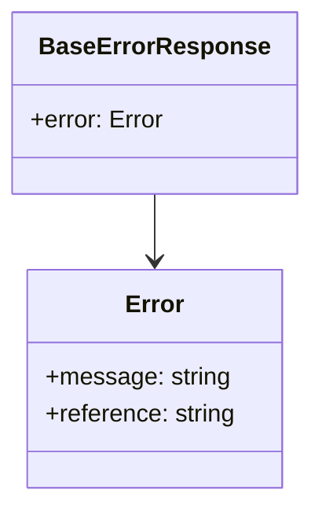

# Diagram: web/portal/src/api/responses.ts

> Auto-generated by Obscura crawlers

## Mermaid

### SVG

<svg id="container" width="199.2890625" xmlns="http://www.w3.org/2000/svg" class="classDiagram" height="330" viewBox="0 0 199.2890625 330" role="graphics-document document" aria-roledescription="class"><g><defs><marker id="container_class-aggregationStart" class="marker aggregation class" refX="18" refY="7" markerWidth="190" markerHeight="240" orient="auto"><path d="M 18,7 L9,13 L1,7 L9,1 Z"></path></marker></defs><defs><marker id="container_class-aggregationEnd" class="marker aggregation class" refX="1" refY="7" markerWidth="20" markerHeight="28" orient="auto"><path d="M 18,7 L9,13 L1,7 L9,1 Z"></path></marker></defs><defs><marker id="container_class-extensionStart" class="marker extension class" refX="18" refY="7" markerWidth="190" markerHeight="240" orient="auto"><path d="M 1,7 L18,13 V 1 Z"></path></marker></defs><defs><marker id="container_class-extensionEnd" class="marker extension class" refX="1" refY="7" markerWidth="20" markerHeight="28" orient="auto"><path d="M 1,1 V 13 L18,7 Z"></path></marker></defs><defs><marker id="container_class-compositionStart" class="marker composition class" refX="18" refY="7" markerWidth="190" markerHeight="240" orient="auto"><path d="M 18,7 L9,13 L1,7 L9,1 Z"></path></marker></defs><defs><marker id="container_class-compositionEnd" class="marker composition class" refX="1" refY="7" markerWidth="20" markerHeight="28" orient="auto"><path d="M 18,7 L9,13 L1,7 L9,1 Z"></path></marker></defs><defs><marker id="container_class-dependencyStart" class="marker dependency class" refX="6" refY="7" markerWidth="190" markerHeight="240" orient="auto"><path d="M 5,7 L9,13 L1,7 L9,1 Z"></path></marker></defs><defs><marker id="container_class-dependencyEnd" class="marker dependency class" refX="13" refY="7" markerWidth="20" markerHeight="28" orient="auto"><path d="M 18,7 L9,13 L14,7 L9,1 Z"></path></marker></defs><defs><marker id="container_class-lollipopStart" class="marker lollipop class" refX="13" refY="7" markerWidth="190" markerHeight="240" orient="auto"><circle stroke="black" fill="transparent" cx="7" cy="7" r="6"></circle></marker></defs><defs><marker id="container_class-lollipopEnd" class="marker lollipop class" refX="1" refY="7" markerWidth="190" markerHeight="240" orient="auto"><circle stroke="black" fill="transparent" cx="7" cy="7" r="6"></circle></marker></defs><g class="root"><g class="clusters"></g><g class="edgePaths"><path d="M99.645,128L99.645,132.167C99.645,136.333,99.645,144.667,99.645,152C99.645,159.333,99.645,165.667,99.645,168.833L99.645,172" id="id_BaseErrorResponse_Error_1" class="edge-thickness-normal edge-pattern-solid relation" style=";;;" data-edge="true" data-et="edge" data-id="id_BaseErrorResponse_Error_1" data-points="W3sieCI6OTkuNjQ0NTMxMjUsInkiOjEyOH0seyJ4Ijo5OS42NDQ1MzEyNSwieSI6MTUzfSx7IngiOjk5LjY0NDUzMTI1LCJ5IjoxNzh9XQ==" marker-end="url(#container_class-dependencyEnd)"></path></g><g class="edgeLabels"><g class="edgeLabel"><g class="label" data-id="id_BaseErrorResponse_Error_1" transform="translate(0, 0)"><foreignObject width="0" height="0">

</foreignObject></g></g></g><g class="nodes"><g class="node default" id="classId-BaseErrorResponse-0" transform="translate(99.64453125, 68)"><g class="basic label-container"><path d="M-91.64453125 -60 L91.64453125 -60 L91.64453125 60 L-91.64453125 60" stroke="none" stroke-width="0" fill="#ECECFF" style=""></path><path d="M-91.64453125 -60 C-51.798935757290025 -60, -11.95334026458005 -60, 91.64453125 -60 M-91.64453125 -60 C-28.429922309623137 -60, 34.784686630753725 -60, 91.64453125 -60 M91.64453125 -60 C91.64453125 -20.28614321257691, 91.64453125 19.42771357484618, 91.64453125 60 M91.64453125 -60 C91.64453125 -22.92383029515863, 91.64453125 14.152339409682739, 91.64453125 60 M91.64453125 60 C32.605416686728965 60, -26.43369787654207 60, -91.64453125 60 M91.64453125 60 C54.19443767369322 60, 16.744344097386445 60, -91.64453125 60 M-91.64453125 60 C-91.64453125 23.24024926148462, -91.64453125 -13.519501477030758, -91.64453125 -60 M-91.64453125 60 C-91.64453125 22.091021079084605, -91.64453125 -15.81795784183079, -91.64453125 -60" stroke="#9370DB" stroke-width="1.3" fill="none" stroke-dasharray="0 0" style=""></path></g><g class="annotation-group text" transform="translate(0, -36)"></g><g class="label-group text" transform="translate(-71.1484375, -36)"><g class="label" style="font-weight: bolder" transform="translate(0,-12)"><foreignObject width="142.296875" height="24">

BaseErrorResponse

</foreignObject></g></g><g class="members-group text" transform="translate(-79.64453125, 12)"><g class="label" style="" transform="translate(0,-12)"><foreignObject width="88.140625" height="24">

+error: Error

</foreignObject></g></g><g class="methods-group text" transform="translate(-79.64453125, 60)"></g><g class="divider" style=""><path d="M-91.64453125 -12 C-40.478145043001085 -12, 10.68824116399783 -12, 91.64453125 -12 M-91.64453125 -12 C-40.81840049536892 -12, 10.00773025926216 -12, 91.64453125 -12" stroke="#9370DB" stroke-width="1.3" fill="none" stroke-dasharray="0 0" style=""></path></g><g class="divider" style=""><path d="M-91.64453125 36 C-47.233620237240075 36, -2.8227092244801497 36, 91.64453125 36 M-91.64453125 36 C-44.65868527611551 36, 2.3271606977689743 36, 91.64453125 36" stroke="#9370DB" stroke-width="1.3" fill="none" stroke-dasharray="0 0" style=""></path></g></g><g class="node default" id="classId-Error-1" transform="translate(99.64453125, 250)"><g class="basic label-container"><path d="M-84.03125 -72 L84.03125 -72 L84.03125 72 L-84.03125 72" stroke="none" stroke-width="0" fill="#ECECFF" style=""></path><path d="M-84.03125 -72 C-42.985976961090984 -72, -1.9407039221819673 -72, 84.03125 -72 M-84.03125 -72 C-40.7057383676916 -72, 2.6197732646167964 -72, 84.03125 -72 M84.03125 -72 C84.03125 -20.905458055015956, 84.03125 30.18908388996809, 84.03125 72 M84.03125 -72 C84.03125 -38.37005604147735, 84.03125 -4.740112082954695, 84.03125 72 M84.03125 72 C28.552903264132212 72, -26.925443471735576 72, -84.03125 72 M84.03125 72 C36.468155408856816 72, -11.094939182286367 72, -84.03125 72 M-84.03125 72 C-84.03125 39.55673242225372, -84.03125 7.113464844507433, -84.03125 -72 M-84.03125 72 C-84.03125 22.207279024188026, -84.03125 -27.58544195162395, -84.03125 -72" stroke="#9370DB" stroke-width="1.3" fill="none" stroke-dasharray="0 0" style=""></path></g><g class="annotation-group text" transform="translate(0, -48)"></g><g class="label-group text" transform="translate(-18.1875, -48)"><g class="label" style="font-weight: bolder" transform="translate(0,-12)"><foreignObject width="36.375" height="24">

Error

</foreignObject></g></g><g class="members-group text" transform="translate(-72.03125, 0)"><g class="label" style="" transform="translate(0,-12)"><foreignObject width="120.09375" height="24">

+message: string

</foreignObject></g><g class="label" style="" transform="translate(0,12)"><foreignObject width="125.875" height="24">

+reference: string

</foreignObject></g></g><g class="methods-group text" transform="translate(-72.03125, 72)"></g><g class="divider" style=""><path d="M-84.03125 -24 C-44.24336182440946 -24, -4.4554736488189235 -24, 84.03125 -24 M-84.03125 -24 C-46.559041445314755 -24, -9.086832890629509 -24, 84.03125 -24" stroke="#9370DB" stroke-width="1.3" fill="none" stroke-dasharray="0 0" style=""></path></g><g class="divider" style=""><path d="M-84.03125 48 C-29.536982849744817 48, 24.957284300510366 48, 84.03125 48 M-84.03125 48 C-25.354321533503793 48, 33.322606932992414 48, 84.03125 48" stroke="#9370DB" stroke-width="1.3" fill="none" stroke-dasharray="0 0" style=""></path></g></g></g></g></g></svg>
