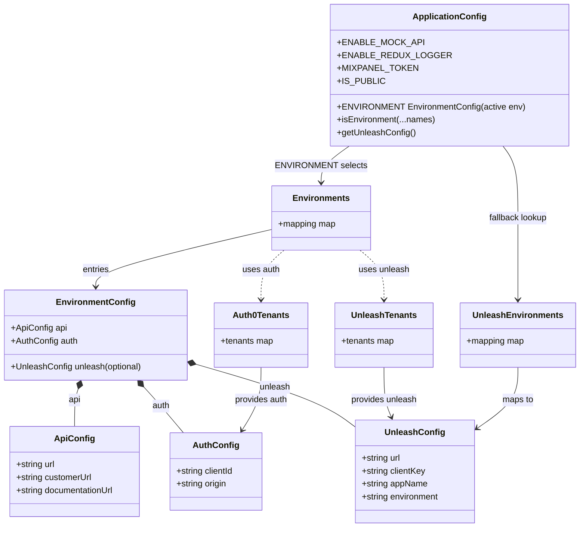

# Diagram: web/portal/src/application-config.ts


> Auto-generated by Obscura crawlers

## Diagram 1



### SVG

<svg id="container" width="1069.109375" xmlns="http://www.w3.org/2000/svg" class="classDiagram" height="982" viewBox="0 0 1069.109375 982" role="graphics-document document" aria-roledescription="class"><style>#container{font-family:"trebuchet ms",verdana,arial,sans-serif;font-size:16px;fill:#333;}@keyframes edge-animation-frame{from{stroke-dashoffset:0;}}@keyframes dash{to{stroke-dashoffset:0;}}#container .edge-animation-slow{stroke-dasharray:9,5!important;stroke-dashoffset:900;animation:dash 50s linear infinite;stroke-linecap:round;}#container .edge-animation-fast{stroke-dasharray:9,5!important;stroke-dashoffset:900;animation:dash 20s linear infinite;stroke-linecap:round;}#container .error-icon{fill:#552222;}#container .error-text{fill:#552222;stroke:#552222;}#container .edge-thickness-normal{stroke-width:1px;}#container .edge-thickness-thick{stroke-width:3.5px;}#container .edge-pattern-solid{stroke-dasharray:0;}#container .edge-thickness-invisible{stroke-width:0;fill:none;}#container .edge-pattern-dashed{stroke-dasharray:3;}#container .edge-pattern-dotted{stroke-dasharray:2;}#container .marker{fill:#333333;stroke:#333333;}#container .marker.cross{stroke:#333333;}#container svg{font-family:"trebuchet ms",verdana,arial,sans-serif;font-size:16px;}#container p{margin:0;}#container g.classGroup text{fill:#9370DB;stroke:none;font-family:"trebuchet ms",verdana,arial,sans-serif;font-size:10px;}#container g.classGroup text .title{font-weight:bolder;}#container .nodeLabel,#container .edgeLabel{color:#131300;}#container .edgeLabel .label rect{fill:#ECECFF;}#container .label text{fill:#131300;}#container .labelBkg{background:#ECECFF;}#container .edgeLabel .label span{background:#ECECFF;}#container .classTitle{font-weight:bolder;}#container .node rect,#container .node circle,#container .node ellipse,#container .node polygon,#container .node path{fill:#ECECFF;stroke:#9370DB;stroke-width:1px;}#container .divider{stroke:#9370DB;stroke-width:1;}#container g.clickable{cursor:pointer;}#container g.classGroup rect{fill:#ECECFF;stroke:#9370DB;}#container g.classGroup line{stroke:#9370DB;stroke-width:1;}#container .classLabel .box{stroke:none;stroke-width:0;fill:#ECECFF;opacity:0.5;}#container .classLabel .label{fill:#9370DB;font-size:10px;}#container .relation{stroke:#333333;stroke-width:1;fill:none;}#container .dashed-line{stroke-dasharray:3;}#container .dotted-line{stroke-dasharray:1 2;}#container #compositionStart,#container .composition{fill:#333333!important;stroke:#333333!important;stroke-width:1;}#container #compositionEnd,#container .composition{fill:#333333!important;stroke:#333333!important;stroke-width:1;}#container #dependencyStart,#container .dependency{fill:#333333!important;stroke:#333333!important;stroke-width:1;}#container #dependencyStart,#container .dependency{fill:#333333!important;stroke:#333333!important;stroke-width:1;}#container #extensionStart,#container .extension{fill:transparent!important;stroke:#333333!important;stroke-width:1;}#container #extensionEnd,#container .extension{fill:transparent!important;stroke:#333333!important;stroke-width:1;}#container #aggregationStart,#container .aggregation{fill:transparent!important;stroke:#333333!important;stroke-width:1;}#container #aggregationEnd,#container .aggregation{fill:transparent!important;stroke:#333333!important;stroke-width:1;}#container #lollipopStart,#container .lollipop{fill:#ECECFF!important;stroke:#333333!important;stroke-width:1;}#container #lollipopEnd,#container .lollipop{fill:#ECECFF!important;stroke:#333333!important;stroke-width:1;}#container .edgeTerminals{font-size:11px;line-height:initial;}#container .classTitleText{text-anchor:middle;font-size:18px;fill:#333;}#container .label-icon{display:inline-block;height:1em;overflow:visible;vertical-align:-0.125em;}#container .node .label-icon path{fill:currentColor;stroke:revert;stroke-width:revert;}#container :root{--mermaid-font-family:"trebuchet ms",verdana,arial,sans-serif;}</style><g><defs><marker id="container_class-aggregationStart" class="marker aggregation class" refX="18" refY="7" markerWidth="190" markerHeight="240" orient="auto"><path d="M 18,7 L9,13 L1,7 L9,1 Z"></path></marker></defs><defs><marker id="container_class-aggregationEnd" class="marker aggregation class" refX="1" refY="7" markerWidth="20" markerHeight="28" orient="auto"><path d="M 18,7 L9,13 L1,7 L9,1 Z"></path></marker></defs><defs><marker id="container_class-extensionStart" class="marker extension class" refX="18" refY="7" markerWidth="190" markerHeight="240" orient="auto"><path d="M 1,7 L18,13 V 1 Z"></path></marker></defs><defs><marker id="container_class-extensionEnd" class="marker extension class" refX="1" refY="7" markerWidth="20" markerHeight="28" orient="auto"><path d="M 1,1 V 13 L18,7 Z"></path></marker></defs><defs><marker id="container_class-compositionStart" class="marker composition class" refX="18" refY="7" markerWidth="190" markerHeight="240" orient="auto"><path d="M 18,7 L9,13 L1,7 L9,1 Z"></path></marker></defs><defs><marker id="container_class-compositionEnd" class="marker composition class" refX="1" refY="7" markerWidth="20" markerHeight="28" orient="auto"><path d="M 18,7 L9,13 L1,7 L9,1 Z"></path></marker></defs><defs><marker id="container_class-dependencyStart" class="marker dependency class" refX="6" refY="7" markerWidth="190" markerHeight="240" orient="auto"><path d="M 5,7 L9,13 L1,7 L9,1 Z"></path></marker></defs><defs><marker id="container_class-dependencyEnd" class="marker dependency class" refX="13" refY="7" markerWidth="20" markerHeight="28" orient="auto"><path d="M 18,7 L9,13 L14,7 L9,1 Z"></path></marker></defs><defs><marker id="container_class-lollipopStart" class="marker lollipop class" refX="13" refY="7" markerWidth="190" markerHeight="240" orient="auto"><circle stroke="black" fill="transparent" cx="7" cy="7" r="6"></circle></marker></defs><defs><marker id="container_class-lollipopEnd" class="marker lollipop class" refX="1" refY="7" markerWidth="190" markerHeight="240" orient="auto"><circle stroke="black" fill="transparent" cx="7" cy="7" r="6"></circle></marker></defs><g class="root"><g class="clusters"></g><g class="edgePaths"><path d="M140.288,724.211L139.027,727.676C137.767,731.141,135.247,738.07,133.987,749.702C132.727,761.333,132.727,777.667,132.727,785.833L132.727,794" id="id_EnvironmentConfig_ApiConfig_1" class="edge-thickness-normal edge-pattern-solid relation" style=";;;" data-edge="true" data-et="edge" data-id="id_EnvironmentConfig_ApiConfig_1" data-points="W3sieCI6MTQ2LjE4MzQ5NjkwMDgyNjQ0LCJ5Ijo3MDh9LHsieCI6MTMyLjcyNjU2MjUsInkiOjc0NX0seyJ4IjoxMzIuNzI2NTYyNSwieSI6Nzk0fV0=" marker-start="url(#container_class-compositionStart)"></path><path d="M264.248,720.796L267.895,724.83C271.542,728.864,278.836,736.932,290.846,751.133C302.856,765.333,319.58,785.667,327.943,795.833L336.305,806" id="id_EnvironmentConfig_AuthConfig_2" class="edge-thickness-normal edge-pattern-solid relation" style=";;;" data-edge="true" data-et="edge" data-id="id_EnvironmentConfig_AuthConfig_2" data-points="W3sieCI6MjUyLjY3OTA0MTgzODg0Mjk4LCJ5Ijo3MDh9LHsieCI6Mjg2LjEzMDg1OTM3NSwieSI6NzQ1fSx7IngiOjMzNi4zMDUxODY3OTUxMTI4LCJ5Ijo4MDZ9XQ==" marker-start="url(#container_class-compositionStart)"></path><path d="M362.023,678.284L399.977,689.403C437.931,700.523,513.838,722.761,562.205,741.854C610.572,760.946,631.398,776.892,641.812,784.866L652.225,792.839" id="id_EnvironmentConfig_UnleashConfig_3" class="edge-thickness-normal edge-pattern-solid relation" style=";;;" data-edge="true" data-et="edge" data-id="id_EnvironmentConfig_UnleashConfig_3" data-points="W3sieCI6MzQ1LjQ2ODc1LCJ5Ijo2NzMuNDM0MDkyMTc3MzE3OX0seyJ4Ijo1ODkuNzQ2MDkzNzUsInkiOjc0NX0seyJ4Ijo2NTIuMjI0NjA5Mzc1LCJ5Ijo3OTIuODM4NzI0OTExNDUyMn1d" marker-start="url(#container_class-compositionStart)"></path><path d="M500.611,427.262L446.632,439.885C392.652,452.508,284.693,477.754,230.714,495.544C176.734,513.333,176.734,523.667,176.734,528.833L176.734,534" id="id_Environments_EnvironmentConfig_4" class="edge-thickness-normal edge-pattern-solid relation" style=";;;" data-edge="true" data-et="edge" data-id="id_Environments_EnvironmentConfig_4" data-points="W3sieCI6NTAwLjYxMTMyODEyNSwieSI6NDI3LjI2MTkyNTcyNjQyMDV9LHsieCI6MTc2LjczNDM3NSwieSI6NTAzfSx7IngiOjE3Ni43MzQzNzUsInkiOjU0MH1d" marker-end="url(#container_class-dependencyEnd)"></path><path d="M482.137,684L482.137,694.167C482.137,704.333,482.137,724.667,476.062,744.162C469.987,763.657,457.837,782.315,451.763,791.643L445.688,800.972" id="id_Auth0Tenants_AuthConfig_5" class="edge-thickness-normal edge-pattern-solid relation" style=";;;" data-edge="true" data-et="edge" data-id="id_Auth0Tenants_AuthConfig_5" data-points="W3sieCI6NDgyLjEzNjcxODc1LCJ5Ijo2ODR9LHsieCI6NDgyLjEzNjcxODc1LCJ5Ijo3NDV9LHsieCI6NDQyLjQxMzYyMTk0NTQ4ODcsInkiOjgwNn1d" marker-end="url(#container_class-dependencyEnd)"></path><path d="M709.395,684L709.395,694.167C709.395,704.333,709.395,724.667,711.524,740.074C713.654,755.481,717.913,765.961,720.043,771.201L722.173,776.442" id="id_UnleashTenants_UnleashConfig_6" class="edge-thickness-normal edge-pattern-solid relation" style=";;;" data-edge="true" data-et="edge" data-id="id_UnleashTenants_UnleashConfig_6" data-points="W3sieCI6NzA5LjM5NDUzMTI1LCJ5Ijo2ODR9LHsieCI6NzA5LjM5NDUzMTI1LCJ5Ijo3NDV9LHsieCI6NzI0LjQzMTc1ODEwNjIwMywieSI6NzgyfV0=" marker-end="url(#container_class-dependencyEnd)"></path><path d="M955.547,684L955.547,694.167C955.547,704.333,955.547,724.667,942.89,743.597C930.232,762.527,904.918,780.053,892.26,788.816L879.603,797.58" id="id_UnleashEnvironments_UnleashConfig_7" class="edge-thickness-normal edge-pattern-solid relation" style=";;;" data-edge="true" data-et="edge" data-id="id_UnleashEnvironments_UnleashConfig_7" data-points="W3sieCI6OTU1LjU0Njg3NSwieSI6Njg0fSx7IngiOjk1NS41NDY4NzUsInkiOjc0NX0seyJ4Ijo4NzQuNjY5OTIxODc1LCJ5Ijo4MDAuOTk1MDg5MjE3NjN9XQ==" marker-end="url(#container_class-dependencyEnd)"></path><path d="M523.865,466L516.911,472.167C509.956,478.333,496.046,490.667,489.091,506C482.137,521.333,482.137,539.667,482.137,548.833L482.137,558" id="id_Environments_Auth0Tenants_8" class="edge-thickness-normal edge-pattern-dashed relation" style=";;;" data-edge="true" data-et="edge" data-id="id_Environments_Auth0Tenants_8" data-points="W3sieCI6NTIzLjg2NTI3NDY0NTYxODYsInkiOjQ2Nn0seyJ4Ijo0ODIuMTM2NzE4NzUsInkiOjUwM30seyJ4Ijo0ODIuMTM2NzE4NzUsInkiOjU2NH1d" marker-end="url(#container_class-dependencyEnd)"></path><path d="M664.437,466L671.93,472.167C679.423,478.333,694.409,490.667,701.902,506C709.395,521.333,709.395,539.667,709.395,548.833L709.395,558" id="id_Environments_UnleashTenants_9" class="edge-thickness-normal edge-pattern-dashed relation" style=";;;" data-edge="true" data-et="edge" data-id="id_Environments_UnleashTenants_9" data-points="W3sieCI6NjY0LjQzNzExNzQyOTEyMzgsInkiOjQ2Nn0seyJ4Ijo3MDkuMzk0NTMxMjUsInkiOjUwM30seyJ4Ijo3MDkuMzk0NTMxMjUsInkiOjU2NH1d" marker-end="url(#container_class-dependencyEnd)"></path><path d="M643.356,272L634.719,278.167C626.082,284.333,608.808,296.667,600.17,308C591.533,319.333,591.533,329.667,591.533,334.833L591.533,340" id="id_ApplicationConfig_Environments_10" class="edge-thickness-normal edge-pattern-solid relation" style=";;;" data-edge="true" data-et="edge" data-id="id_ApplicationConfig_Environments_10" data-points="W3sieCI6NjQzLjM1NjIwODM5NDk3MDQsInkiOjI3Mn0seyJ4Ijo1OTEuNTMzMjAzMTI1LCJ5IjozMDl9LHsieCI6NTkxLjUzMzIwMzEyNSwieSI6MzQ2fV0=" marker-end="url(#container_class-dependencyEnd)"></path><path d="M927.675,272L932.32,278.167C936.965,284.333,946.256,296.667,950.901,319C955.547,341.333,955.547,373.667,955.547,406C955.547,438.333,955.547,470.667,955.547,496C955.547,521.333,955.547,539.667,955.547,548.833L955.547,558" id="id_ApplicationConfig_UnleashEnvironments_11" class="edge-thickness-normal edge-pattern-solid relation" style=";;;" data-edge="true" data-et="edge" data-id="id_ApplicationConfig_UnleashEnvironments_11" data-points="W3sieCI6OTI3LjY3NDU3OTMyNjkyMzEsInkiOjI3Mn0seyJ4Ijo5NTUuNTQ2ODc1LCJ5IjozMDl9LHsieCI6OTU1LjU0Njg3NSwieSI6NDA2fSx7IngiOjk1NS41NDY4NzUsInkiOjUwM30seyJ4Ijo5NTUuNTQ2ODc1LCJ5Ijo1NjR9XQ==" marker-end="url(#container_class-dependencyEnd)"></path></g><g class="edgeLabels"><g class="edgeLabel" transform="translate(132.7265625, 745)"><g class="label" data-id="id_EnvironmentConfig_ApiConfig_1" transform="translate(-11.3671875, -12)"><foreignObject width="22.734375" height="24"><div xmlns="http://www.w3.org/1999/xhtml" class="labelBkg" style="display: table-cell; white-space: nowrap; line-height: 1.5; max-width: 200px; text-align: center;"><span class="edgeLabel"><p>api</p></span></div></foreignObject></g></g><g class="edgeLabel" transform="translate(295.37493, 756.23858)"><g class="label" data-id="id_EnvironmentConfig_AuthConfig_2" transform="translate(-16.5859375, -12)"><foreignObject width="33.171875" height="24"><div xmlns="http://www.w3.org/1999/xhtml" class="labelBkg" style="display: table-cell; white-space: nowrap; line-height: 1.5; max-width: 200px; text-align: center;"><span class="edgeLabel"><p>auth</p></span></div></foreignObject></g></g><g class="edgeLabel" transform="translate(505.36534, 720.27898)"><g class="label" data-id="id_EnvironmentConfig_UnleashConfig_3" transform="translate(-28.625, -12)"><foreignObject width="57.25" height="24"><div xmlns="http://www.w3.org/1999/xhtml" class="labelBkg" style="display: table-cell; white-space: nowrap; line-height: 1.5; max-width: 200px; text-align: center;"><span class="edgeLabel"><p>unleash</p></span></div></foreignObject></g></g><g class="edgeLabel" transform="translate(176.734375, 503)"><g class="label" data-id="id_Environments_EnvironmentConfig_4" transform="translate(-25.3828125, -12)"><foreignObject width="50.765625" height="24"><div xmlns="http://www.w3.org/1999/xhtml" class="labelBkg" style="display: table-cell; white-space: nowrap; line-height: 1.5; max-width: 200px; text-align: center;"><span class="edgeLabel"><p>entries</p></span></div></foreignObject></g></g><g class="edgeLabel" transform="translate(482.13671875, 745)"><g class="label" data-id="id_Auth0Tenants_AuthConfig_5" transform="translate(-50.0234375, -12)"><foreignObject width="100.046875" height="24"><div xmlns="http://www.w3.org/1999/xhtml" class="labelBkg" style="display: table-cell; white-space: nowrap; line-height: 1.5; max-width: 200px; text-align: center;"><span class="edgeLabel"><p>provides auth</p></span></div></foreignObject></g></g><g class="edgeLabel" transform="translate(709.39453125, 745)"><g class="label" data-id="id_UnleashTenants_UnleashConfig_6" transform="translate(-62.0625, -12)"><foreignObject width="124.125" height="24"><div xmlns="http://www.w3.org/1999/xhtml" class="labelBkg" style="display: table-cell; white-space: nowrap; line-height: 1.5; max-width: 200px; text-align: center;"><span class="edgeLabel"><p>provides unleash</p></span></div></foreignObject></g></g><g class="edgeLabel" transform="translate(955.546875, 745)"><g class="label" data-id="id_UnleashEnvironments_UnleashConfig_7" transform="translate(-29.2578125, -12)"><foreignObject width="58.515625" height="24"><div xmlns="http://www.w3.org/1999/xhtml" class="labelBkg" style="display: table-cell; white-space: nowrap; line-height: 1.5; max-width: 200px; text-align: center;"><span class="edgeLabel"><p>maps to</p></span></div></foreignObject></g></g><g class="edgeLabel" transform="translate(482.13671875, 503)"><g class="label" data-id="id_Environments_Auth0Tenants_8" transform="translate(-35.1953125, -12)"><foreignObject width="70.390625" height="24"><div xmlns="http://www.w3.org/1999/xhtml" class="labelBkg" style="display: table-cell; white-space: nowrap; line-height: 1.5; max-width: 200px; text-align: center;"><span class="edgeLabel"><p>uses auth</p></span></div></foreignObject></g></g><g class="edgeLabel" transform="translate(709.39453125, 503)"><g class="label" data-id="id_Environments_UnleashTenants_9" transform="translate(-47.234375, -12)"><foreignObject width="94.46875" height="24"><div xmlns="http://www.w3.org/1999/xhtml" class="labelBkg" style="display: table-cell; white-space: nowrap; line-height: 1.5; max-width: 200px; text-align: center;"><span class="edgeLabel"><p>uses unleash</p></span></div></foreignObject></g></g><g class="edgeLabel" transform="translate(591.533203125, 309)"><g class="label" data-id="id_ApplicationConfig_Environments_10" transform="translate(-79.7578125, -12)"><foreignObject width="159.515625" height="24"><div xmlns="http://www.w3.org/1999/xhtml" class="labelBkg" style="display: table-cell; white-space: nowrap; line-height: 1.5; max-width: 200px; text-align: center;"><span class="edgeLabel"><p>ENVIRONMENT selects</p></span></div></foreignObject></g></g><g class="edgeLabel" transform="translate(955.546875, 406)"><g class="label" data-id="id_ApplicationConfig_UnleashEnvironments_11" transform="translate(-55.625, -12)"><foreignObject width="111.25" height="24"><div xmlns="http://www.w3.org/1999/xhtml" class="labelBkg" style="display: table-cell; white-space: nowrap; line-height: 1.5; max-width: 200px; text-align: center;"><span class="edgeLabel"><p>fallback lookup</p></span></div></foreignObject></g></g></g><g class="nodes"><g class="node default" id="classId-EnvironmentConfig-0" transform="translate(176.734375, 624)"><g class="basic label-container"><path d="M-168.734375 -84 L168.734375 -84 L168.734375 84 L-168.734375 84" stroke="none" stroke-width="0" fill="#ECECFF" style=""></path><path d="M-168.734375 -84 C-100.45185959364134 -84, -32.16934418728269 -84, 168.734375 -84 M-168.734375 -84 C-87.86528215379714 -84, -6.996189307594278 -84, 168.734375 -84 M168.734375 -84 C168.734375 -34.13161711976635, 168.734375 15.736765760467307, 168.734375 84 M168.734375 -84 C168.734375 -31.225791540237175, 168.734375 21.54841691952565, 168.734375 84 M168.734375 84 C99.47396458415231 84, 30.213554168304626 84, -168.734375 84 M168.734375 84 C98.81153204547107 84, 28.888689090942137 84, -168.734375 84 M-168.734375 84 C-168.734375 32.146980287388125, -168.734375 -19.70603942522375, -168.734375 -84 M-168.734375 84 C-168.734375 46.00084002001179, -168.734375 8.001680040023587, -168.734375 -84" stroke="#9370DB" stroke-width="1.3" fill="none" stroke-dasharray="0 0" style=""></path></g><g class="annotation-group text" transform="translate(0, -60)"></g><g class="label-group text" transform="translate(-69.125, -60)"><g class="label" style="font-weight: bolder" transform="translate(0,-12)"><foreignObject width="138.25" height="24"><div xmlns="http://www.w3.org/1999/xhtml" style="display: table-cell; white-space: nowrap; line-height: 1.5; max-width: 188px; text-align: center;"><span class="nodeLabel markdown-node-label" style=""><p>EnvironmentConfig</p></span></div></foreignObject></g></g><g class="members-group text" transform="translate(-156.734375, -12)"><g class="label" style="" transform="translate(0,-12)"><foreignObject width="102.859375" height="24"><div xmlns="http://www.w3.org/1999/xhtml" style="display: table-cell; white-space: nowrap; line-height: 1.5; max-width: 160px; text-align: center;"><span class="nodeLabel markdown-node-label" style=""><p>+ApiConfig api</p></span></div></foreignObject></g><g class="label" style="" transform="translate(0,12)"><foreignObject width="123.75" height="24"><div xmlns="http://www.w3.org/1999/xhtml" style="display: table-cell; white-space: nowrap; line-height: 1.5; max-width: 181px; text-align: center;"><span class="nodeLabel markdown-node-label" style=""><p>+AuthConfig auth</p></span></div></foreignObject></g></g><g class="methods-group text" transform="translate(-156.734375, 60)"><g class="label" style="" transform="translate(0,-12)"><foreignObject width="244.34375" height="24"><div xmlns="http://www.w3.org/1999/xhtml" style="display: table-cell; white-space: nowrap; line-height: 1.5; max-width: 302px; text-align: center;"><span class="nodeLabel markdown-node-label" style=""><p>+UnleashConfig unleash(optional)</p></span></div></foreignObject></g></g><g class="divider" style=""><path d="M-168.734375 -36 C-98.35002992893108 -36, -27.965684857862158 -36, 168.734375 -36 M-168.734375 -36 C-83.92017419009309 -36, 0.8940266198138147 -36, 168.734375 -36" stroke="#9370DB" stroke-width="1.3" fill="none" stroke-dasharray="0 0" style=""></path></g><g class="divider" style=""><path d="M-168.734375 36 C-90.61896307359045 36, -12.5035511471809 36, 168.734375 36 M-168.734375 36 C-77.26440602529203 36, 14.205562949415935 36, 168.734375 36" stroke="#9370DB" stroke-width="1.3" fill="none" stroke-dasharray="0 0" style=""></path></g></g><g class="node default" id="classId-ApiConfig-1" transform="translate(132.7265625, 878)"><g class="basic label-container"><path d="M-122.453125 -84 L122.453125 -84 L122.453125 84 L-122.453125 84" stroke="none" stroke-width="0" fill="#ECECFF" style=""></path><path d="M-122.453125 -84 C-43.83504454269253 -84, 34.78303591461494 -84, 122.453125 -84 M-122.453125 -84 C-41.65291412253937 -84, 39.14729675492126 -84, 122.453125 -84 M122.453125 -84 C122.453125 -25.351322753506743, 122.453125 33.297354492986514, 122.453125 84 M122.453125 -84 C122.453125 -41.01305677309293, 122.453125 1.9738864538141456, 122.453125 84 M122.453125 84 C38.47244297006188 84, -45.508239059876246 84, -122.453125 84 M122.453125 84 C71.9764526559822 84, 21.4997803119644 84, -122.453125 84 M-122.453125 84 C-122.453125 37.80635277876613, -122.453125 -8.387294442467734, -122.453125 -84 M-122.453125 84 C-122.453125 36.788615984147775, -122.453125 -10.42276803170445, -122.453125 -84" stroke="#9370DB" stroke-width="1.3" fill="none" stroke-dasharray="0 0" style=""></path></g><g class="annotation-group text" transform="translate(0, -60)"></g><g class="label-group text" transform="translate(-34.6875, -60)"><g class="label" style="font-weight: bolder" transform="translate(0,-12)"><foreignObject width="69.375" height="24"><div xmlns="http://www.w3.org/1999/xhtml" style="display: table-cell; white-space: nowrap; line-height: 1.5; max-width: 119px; text-align: center;"><span class="nodeLabel markdown-node-label" style=""><p>ApiConfig</p></span></div></foreignObject></g></g><g class="members-group text" transform="translate(-110.453125, -12)"><g class="label" style="" transform="translate(0,-12)"><foreignObject width="74.046875" height="24"><div xmlns="http://www.w3.org/1999/xhtml" style="display: table-cell; white-space: nowrap; line-height: 1.5; max-width: 132px; text-align: center;"><span class="nodeLabel markdown-node-label" style=""><p>+string url</p></span></div></foreignObject></g><g class="label" style="" transform="translate(0,12)"><foreignObject width="143.078125" height="24"><div xmlns="http://www.w3.org/1999/xhtml" style="display: table-cell; white-space: nowrap; line-height: 1.5; max-width: 201px; text-align: center;"><span class="nodeLabel markdown-node-label" style=""><p>+string customerUrl</p></span></div></foreignObject></g><g class="label" style="" transform="translate(0,36)"><foreignObject width="186.21875" height="24"><div xmlns="http://www.w3.org/1999/xhtml" style="display: table-cell; white-space: nowrap; line-height: 1.5; max-width: 244px; text-align: center;"><span class="nodeLabel markdown-node-label" style=""><p>+string documentationUrl</p></span></div></foreignObject></g></g><g class="methods-group text" transform="translate(-110.453125, 84)"></g><g class="divider" style=""><path d="M-122.453125 -36 C-45.75822150589876 -36, 30.93668198820248 -36, 122.453125 -36 M-122.453125 -36 C-49.5724599882856 -36, 23.308205023428798 -36, 122.453125 -36" stroke="#9370DB" stroke-width="1.3" fill="none" stroke-dasharray="0 0" style=""></path></g><g class="divider" style=""><path d="M-122.453125 60 C-56.69699063991983 60, 9.059143720160336 60, 122.453125 60 M-122.453125 60 C-70.05652671273924 60, -17.659928425478498 60, 122.453125 60" stroke="#9370DB" stroke-width="1.3" fill="none" stroke-dasharray="0 0" style=""></path></g></g><g class="node default" id="classId-AuthConfig-2" transform="translate(395.52734375, 878)"><g class="basic label-container"><path d="M-86.40234375 -72 L86.40234375 -72 L86.40234375 72 L-86.40234375 72" stroke="none" stroke-width="0" fill="#ECECFF" style=""></path><path d="M-86.40234375 -72 C-19.793764654693504 -72, 46.81481444061299 -72, 86.40234375 -72 M-86.40234375 -72 C-34.31686152557095 -72, 17.7686206988581 -72, 86.40234375 -72 M86.40234375 -72 C86.40234375 -38.09188971513169, 86.40234375 -4.183779430263385, 86.40234375 72 M86.40234375 -72 C86.40234375 -28.013274851343155, 86.40234375 15.97345029731369, 86.40234375 72 M86.40234375 72 C47.5711803282846 72, 8.740016906569195 72, -86.40234375 72 M86.40234375 72 C29.912605346739056 72, -26.577133056521888 72, -86.40234375 72 M-86.40234375 72 C-86.40234375 23.76851204521416, -86.40234375 -24.462975909571682, -86.40234375 -72 M-86.40234375 72 C-86.40234375 18.257058912314314, -86.40234375 -35.48588217537137, -86.40234375 -72" stroke="#9370DB" stroke-width="1.3" fill="none" stroke-dasharray="0 0" style=""></path></g><g class="annotation-group text" transform="translate(0, -48)"></g><g class="label-group text" transform="translate(-39.9296875, -48)"><g class="label" style="font-weight: bolder" transform="translate(0,-12)"><foreignObject width="79.859375" height="24"><div xmlns="http://www.w3.org/1999/xhtml" style="display: table-cell; white-space: nowrap; line-height: 1.5; max-width: 129px; text-align: center;"><span class="nodeLabel markdown-node-label" style=""><p>AuthConfig</p></span></div></foreignObject></g></g><g class="members-group text" transform="translate(-74.40234375, 0)"><g class="label" style="" transform="translate(0,-12)"><foreignObject width="108.875" height="24"><div xmlns="http://www.w3.org/1999/xhtml" style="display: table-cell; white-space: nowrap; line-height: 1.5; max-width: 166px; text-align: center;"><span class="nodeLabel markdown-node-label" style=""><p>+string clientId</p></span></div></foreignObject></g><g class="label" style="" transform="translate(0,12)"><foreignObject width="96.109375" height="24"><div xmlns="http://www.w3.org/1999/xhtml" style="display: table-cell; white-space: nowrap; line-height: 1.5; max-width: 153px; text-align: center;"><span class="nodeLabel markdown-node-label" style=""><p>+string origin</p></span></div></foreignObject></g></g><g class="methods-group text" transform="translate(-74.40234375, 72)"></g><g class="divider" style=""><path d="M-86.40234375 -24 C-44.69946808663293 -24, -2.9965924232658665 -24, 86.40234375 -24 M-86.40234375 -24 C-30.705189067377127 -24, 24.991965615245746 -24, 86.40234375 -24" stroke="#9370DB" stroke-width="1.3" fill="none" stroke-dasharray="0 0" style=""></path></g><g class="divider" style=""><path d="M-86.40234375 48 C-28.573277866957852 48, 29.255788016084296 48, 86.40234375 48 M-86.40234375 48 C-33.402951211583314 48, 19.59644132683337 48, 86.40234375 48" stroke="#9370DB" stroke-width="1.3" fill="none" stroke-dasharray="0 0" style=""></path></g></g><g class="node default" id="classId-UnleashConfig-3" transform="translate(763.447265625, 878)"><g class="basic label-container"><path d="M-111.22265625 -96 L111.22265625 -96 L111.22265625 96 L-111.22265625 96" stroke="none" stroke-width="0" fill="#ECECFF" style=""></path><path d="M-111.22265625 -96 C-40.23346118531157 -96, 30.755733879376862 -96, 111.22265625 -96 M-111.22265625 -96 C-35.44025438643989 -96, 40.34214747712022 -96, 111.22265625 -96 M111.22265625 -96 C111.22265625 -21.936850593554553, 111.22265625 52.126298812890894, 111.22265625 96 M111.22265625 -96 C111.22265625 -57.18618563373655, 111.22265625 -18.3723712674731, 111.22265625 96 M111.22265625 96 C39.61843413420296 96, -31.985787981594086 96, -111.22265625 96 M111.22265625 96 C42.46181541909101 96, -26.29902541181798 96, -111.22265625 96 M-111.22265625 96 C-111.22265625 26.068785826396265, -111.22265625 -43.86242834720747, -111.22265625 -96 M-111.22265625 96 C-111.22265625 32.35170977283473, -111.22265625 -31.296580454330538, -111.22265625 -96" stroke="#9370DB" stroke-width="1.3" fill="none" stroke-dasharray="0 0" style=""></path></g><g class="annotation-group text" transform="translate(0, -72)"></g><g class="label-group text" transform="translate(-52.2109375, -72)"><g class="label" style="font-weight: bolder" transform="translate(0,-12)"><foreignObject width="104.421875" height="24"><div xmlns="http://www.w3.org/1999/xhtml" style="display: table-cell; white-space: nowrap; line-height: 1.5; max-width: 154px; text-align: center;"><span class="nodeLabel markdown-node-label" style=""><p>UnleashConfig</p></span></div></foreignObject></g></g><g class="members-group text" transform="translate(-99.22265625, -24)"><g class="label" style="" transform="translate(0,-12)"><foreignObject width="74.046875" height="24"><div xmlns="http://www.w3.org/1999/xhtml" style="display: table-cell; white-space: nowrap; line-height: 1.5; max-width: 132px; text-align: center;"><span class="nodeLabel markdown-node-label" style=""><p>+string url</p></span></div></foreignObject></g><g class="label" style="" transform="translate(0,12)"><foreignObject width="120.3125" height="24"><div xmlns="http://www.w3.org/1999/xhtml" style="display: table-cell; white-space: nowrap; line-height: 1.5; max-width: 178px; text-align: center;"><span class="nodeLabel markdown-node-label" style=""><p>+string clientKey</p></span></div></foreignObject></g><g class="label" style="" transform="translate(0,36)"><foreignObject width="123.640625" height="24"><div xmlns="http://www.w3.org/1999/xhtml" style="display: table-cell; white-space: nowrap; line-height: 1.5; max-width: 181px; text-align: center;"><span class="nodeLabel markdown-node-label" style=""><p>+string appName</p></span></div></foreignObject></g><g class="label" style="" transform="translate(0,60)"><foreignObject width="146.234375" height="24"><div xmlns="http://www.w3.org/1999/xhtml" style="display: table-cell; white-space: nowrap; line-height: 1.5; max-width: 204px; text-align: center;"><span class="nodeLabel markdown-node-label" style=""><p>+string environment</p></span></div></foreignObject></g></g><g class="methods-group text" transform="translate(-99.22265625, 96)"></g><g class="divider" style=""><path d="M-111.22265625 -48 C-46.747489122388515 -48, 17.72767800522297 -48, 111.22265625 -48 M-111.22265625 -48 C-39.87431601142903 -48, 31.47402422714194 -48, 111.22265625 -48" stroke="#9370DB" stroke-width="1.3" fill="none" stroke-dasharray="0 0" style=""></path></g><g class="divider" style=""><path d="M-111.22265625 72 C-44.831627466853234 72, 21.55940131629353 72, 111.22265625 72 M-111.22265625 72 C-51.075035295602135 72, 9.072585658795731 72, 111.22265625 72" stroke="#9370DB" stroke-width="1.3" fill="none" stroke-dasharray="0 0" style=""></path></g></g><g class="node default" id="classId-Auth0Tenants-4" transform="translate(482.13671875, 624)"><g class="basic label-container"><path d="M-86.66796875 -60 L86.66796875 -60 L86.66796875 60 L-86.66796875 60" stroke="none" stroke-width="0" fill="#ECECFF" style=""></path><path d="M-86.66796875 -60 C-35.515153340488965 -60, 15.63766206902207 -60, 86.66796875 -60 M-86.66796875 -60 C-36.36416193878692 -60, 13.939644872426157 -60, 86.66796875 -60 M86.66796875 -60 C86.66796875 -24.101266650301632, 86.66796875 11.797466699396736, 86.66796875 60 M86.66796875 -60 C86.66796875 -31.207514579431784, 86.66796875 -2.415029158863568, 86.66796875 60 M86.66796875 60 C29.559840516650596 60, -27.54828771669881 60, -86.66796875 60 M86.66796875 60 C51.14884986753907 60, 15.62973098507814 60, -86.66796875 60 M-86.66796875 60 C-86.66796875 31.327696011827832, -86.66796875 2.655392023655665, -86.66796875 -60 M-86.66796875 60 C-86.66796875 33.558920302206616, -86.66796875 7.1178406044132245, -86.66796875 -60" stroke="#9370DB" stroke-width="1.3" fill="none" stroke-dasharray="0 0" style=""></path></g><g class="annotation-group text" transform="translate(0, -36)"></g><g class="label-group text" transform="translate(-50.3046875, -36)"><g class="label" style="font-weight: bolder" transform="translate(0,-12)"><foreignObject width="100.609375" height="24"><div xmlns="http://www.w3.org/1999/xhtml" style="display: table-cell; white-space: nowrap; line-height: 1.5; max-width: 149px; text-align: center;"><span class="nodeLabel markdown-node-label" style=""><p>Auth0Tenants</p></span></div></foreignObject></g></g><g class="members-group text" transform="translate(-74.66796875, 12)"><g class="label" style="" transform="translate(0,-12)"><foreignObject width="99.03125" height="24"><div xmlns="http://www.w3.org/1999/xhtml" style="display: table-cell; white-space: nowrap; line-height: 1.5; max-width: 156px; text-align: center;"><span class="nodeLabel markdown-node-label" style=""><p>+tenants map</p></span></div></foreignObject></g></g><g class="methods-group text" transform="translate(-74.66796875, 60)"></g><g class="divider" style=""><path d="M-86.66796875 -12 C-40.29569799472674 -12, 6.076572760546526 -12, 86.66796875 -12 M-86.66796875 -12 C-28.237931326677973 -12, 30.192106096644054 -12, 86.66796875 -12" stroke="#9370DB" stroke-width="1.3" fill="none" stroke-dasharray="0 0" style=""></path></g><g class="divider" style=""><path d="M-86.66796875 36 C-40.49747405779745 36, 5.6730206344051055 36, 86.66796875 36 M-86.66796875 36 C-30.040800572085104 36, 26.586367605829793 36, 86.66796875 36" stroke="#9370DB" stroke-width="1.3" fill="none" stroke-dasharray="0 0" style=""></path></g></g><g class="node default" id="classId-UnleashTenants-5" transform="translate(709.39453125, 624)"><g class="basic label-container"><path d="M-90.58984375 -60 L90.58984375 -60 L90.58984375 60 L-90.58984375 60" stroke="none" stroke-width="0" fill="#ECECFF" style=""></path><path d="M-90.58984375 -60 C-49.16740369900468 -60, -7.74496364800936 -60, 90.58984375 -60 M-90.58984375 -60 C-23.412533125430528 -60, 43.764777499138944 -60, 90.58984375 -60 M90.58984375 -60 C90.58984375 -28.11699297523514, 90.58984375 3.7660140495297227, 90.58984375 60 M90.58984375 -60 C90.58984375 -33.20984388073148, 90.58984375 -6.419687761462967, 90.58984375 60 M90.58984375 60 C42.71520603696231 60, -5.1594316760753856 60, -90.58984375 60 M90.58984375 60 C44.814183113566365 60, -0.9614775228672698 60, -90.58984375 60 M-90.58984375 60 C-90.58984375 32.27581573389359, -90.58984375 4.551631467787175, -90.58984375 -60 M-90.58984375 60 C-90.58984375 31.576869073916335, -90.58984375 3.1537381478326694, -90.58984375 -60" stroke="#9370DB" stroke-width="1.3" fill="none" stroke-dasharray="0 0" style=""></path></g><g class="annotation-group text" transform="translate(0, -36)"></g><g class="label-group text" transform="translate(-58.1484375, -36)"><g class="label" style="font-weight: bolder" transform="translate(0,-12)"><foreignObject width="116.296875" height="24"><div xmlns="http://www.w3.org/1999/xhtml" style="display: table-cell; white-space: nowrap; line-height: 1.5; max-width: 165px; text-align: center;"><span class="nodeLabel markdown-node-label" style=""><p>UnleashTenants</p></span></div></foreignObject></g></g><g class="members-group text" transform="translate(-78.58984375, 12)"><g class="label" style="" transform="translate(0,-12)"><foreignObject width="99.03125" height="24"><div xmlns="http://www.w3.org/1999/xhtml" style="display: table-cell; white-space: nowrap; line-height: 1.5; max-width: 156px; text-align: center;"><span class="nodeLabel markdown-node-label" style=""><p>+tenants map</p></span></div></foreignObject></g></g><g class="methods-group text" transform="translate(-78.58984375, 60)"></g><g class="divider" style=""><path d="M-90.58984375 -12 C-38.28505932510527 -12, 14.019725099789454 -12, 90.58984375 -12 M-90.58984375 -12 C-36.54056740692124 -12, 17.508708936157518 -12, 90.58984375 -12" stroke="#9370DB" stroke-width="1.3" fill="none" stroke-dasharray="0 0" style=""></path></g><g class="divider" style=""><path d="M-90.58984375 36 C-31.121095235393497 36, 28.347653279213006 36, 90.58984375 36 M-90.58984375 36 C-32.151413208570496 36, 26.28701733285901 36, 90.58984375 36" stroke="#9370DB" stroke-width="1.3" fill="none" stroke-dasharray="0 0" style=""></path></g></g><g class="node default" id="classId-UnleashEnvironments-6" transform="translate(955.546875, 624)"><g class="basic label-container"><path d="M-105.5625 -60 L105.5625 -60 L105.5625 60 L-105.5625 60" stroke="none" stroke-width="0" fill="#ECECFF" style=""></path><path d="M-105.5625 -60 C-50.53355356190935 -60, 4.495392876181299 -60, 105.5625 -60 M-105.5625 -60 C-41.334166829458226 -60, 22.894166341083547 -60, 105.5625 -60 M105.5625 -60 C105.5625 -22.948946959114146, 105.5625 14.102106081771709, 105.5625 60 M105.5625 -60 C105.5625 -26.58026602094536, 105.5625 6.839467958109282, 105.5625 60 M105.5625 60 C26.15362549479208 60, -53.25524901041584 60, -105.5625 60 M105.5625 60 C51.64356098104008 60, -2.275378037919836 60, -105.5625 60 M-105.5625 60 C-105.5625 15.618296954899805, -105.5625 -28.76340609020039, -105.5625 -60 M-105.5625 60 C-105.5625 18.78683803513362, -105.5625 -22.42632392973276, -105.5625 -60" stroke="#9370DB" stroke-width="1.3" fill="none" stroke-dasharray="0 0" style=""></path></g><g class="annotation-group text" transform="translate(0, -36)"></g><g class="label-group text" transform="translate(-79.34375, -36)"><g class="label" style="font-weight: bolder" transform="translate(0,-12)"><foreignObject width="158.6875" height="24"><div xmlns="http://www.w3.org/1999/xhtml" style="display: table-cell; white-space: nowrap; line-height: 1.5; max-width: 208px; text-align: center;"><span class="nodeLabel markdown-node-label" style=""><p>UnleashEnvironments</p></span></div></foreignObject></g></g><g class="members-group text" transform="translate(-93.5625, 12)"><g class="label" style="" transform="translate(0,-12)"><foreignObject width="107.78125" height="24"><div xmlns="http://www.w3.org/1999/xhtml" style="display: table-cell; white-space: nowrap; line-height: 1.5; max-width: 165px; text-align: center;"><span class="nodeLabel markdown-node-label" style=""><p>+mapping map</p></span></div></foreignObject></g></g><g class="methods-group text" transform="translate(-93.5625, 60)"></g><g class="divider" style=""><path d="M-105.5625 -12 C-30.990335348339016 -12, 43.58182930332197 -12, 105.5625 -12 M-105.5625 -12 C-47.467954140392195 -12, 10.626591719215611 -12, 105.5625 -12" stroke="#9370DB" stroke-width="1.3" fill="none" stroke-dasharray="0 0" style=""></path></g><g class="divider" style=""><path d="M-105.5625 36 C-37.74833955545188 36, 30.065820889096244 36, 105.5625 36 M-105.5625 36 C-42.29341593224294 36, 20.975668135514127 36, 105.5625 36" stroke="#9370DB" stroke-width="1.3" fill="none" stroke-dasharray="0 0" style=""></path></g></g><g class="node default" id="classId-Environments-7" transform="translate(591.533203125, 406)"><g class="basic label-container"><path d="M-90.921875 -60 L90.921875 -60 L90.921875 60 L-90.921875 60" stroke="none" stroke-width="0" fill="#ECECFF" style=""></path><path d="M-90.921875 -60 C-22.29833038391321 -60, 46.32521423217358 -60, 90.921875 -60 M-90.921875 -60 C-30.77918713873006 -60, 29.363500722539882 -60, 90.921875 -60 M90.921875 -60 C90.921875 -27.87522797471693, 90.921875 4.2495440505661435, 90.921875 60 M90.921875 -60 C90.921875 -25.369437845825573, 90.921875 9.261124308348855, 90.921875 60 M90.921875 60 C40.50194267997723 60, -9.917989640045533 60, -90.921875 60 M90.921875 60 C40.42674041558737 60, -10.068394168825265 60, -90.921875 60 M-90.921875 60 C-90.921875 34.2379557495951, -90.921875 8.475911499190211, -90.921875 -60 M-90.921875 60 C-90.921875 20.305905838471865, -90.921875 -19.38818832305627, -90.921875 -60" stroke="#9370DB" stroke-width="1.3" fill="none" stroke-dasharray="0 0" style=""></path></g><g class="annotation-group text" transform="translate(0, -36)"></g><g class="label-group text" transform="translate(-50.0625, -36)"><g class="label" style="font-weight: bolder" transform="translate(0,-12)"><foreignObject width="100.125" height="24"><div xmlns="http://www.w3.org/1999/xhtml" style="display: table-cell; white-space: nowrap; line-height: 1.5; max-width: 150px; text-align: center;"><span class="nodeLabel markdown-node-label" style=""><p>Environments</p></span></div></foreignObject></g></g><g class="members-group text" transform="translate(-78.921875, 12)"><g class="label" style="" transform="translate(0,-12)"><foreignObject width="107.78125" height="24"><div xmlns="http://www.w3.org/1999/xhtml" style="display: table-cell; white-space: nowrap; line-height: 1.5; max-width: 165px; text-align: center;"><span class="nodeLabel markdown-node-label" style=""><p>+mapping map</p></span></div></foreignObject></g></g><g class="methods-group text" transform="translate(-78.921875, 60)"></g><g class="divider" style=""><path d="M-90.921875 -12 C-34.378952195299746 -12, 22.163970609400508 -12, 90.921875 -12 M-90.921875 -12 C-31.191422505520393 -12, 28.539029988959214 -12, 90.921875 -12" stroke="#9370DB" stroke-width="1.3" fill="none" stroke-dasharray="0 0" style=""></path></g><g class="divider" style=""><path d="M-90.921875 36 C-52.58568644082953 36, -14.249497881659053 36, 90.921875 36 M-90.921875 36 C-33.367567531278155 36, 24.18673993744369 36, 90.921875 36" stroke="#9370DB" stroke-width="1.3" fill="none" stroke-dasharray="0 0" style=""></path></g></g><g class="node default" id="classId-ApplicationConfig-8" transform="translate(828.23828125, 140)"><g class="basic label-container"><path d="M-213.12109375 -132 L213.12109375 -132 L213.12109375 132 L-213.12109375 132" stroke="none" stroke-width="0" fill="#ECECFF" style=""></path><path d="M-213.12109375 -132 C-48.7121588592949 -132, 115.6967760314102 -132, 213.12109375 -132 M-213.12109375 -132 C-92.20190496300266 -132, 28.717283823994677 -132, 213.12109375 -132 M213.12109375 -132 C213.12109375 -70.23007819489341, 213.12109375 -8.460156389786817, 213.12109375 132 M213.12109375 -132 C213.12109375 -47.54570093122871, 213.12109375 36.90859813754258, 213.12109375 132 M213.12109375 132 C103.414840021905 132, -6.2914137061900135 132, -213.12109375 132 M213.12109375 132 C125.88794916782155 132, 38.65480458564309 132, -213.12109375 132 M-213.12109375 132 C-213.12109375 35.23700073639826, -213.12109375 -61.525998527203484, -213.12109375 -132 M-213.12109375 132 C-213.12109375 33.629605732812095, -213.12109375 -64.74078853437581, -213.12109375 -132" stroke="#9370DB" stroke-width="1.3" fill="none" stroke-dasharray="0 0" style=""></path></g><g class="annotation-group text" transform="translate(0, -108)"></g><g class="label-group text" transform="translate(-64.6015625, -108)"><g class="label" style="font-weight: bolder" transform="translate(0,-12)"><foreignObject width="129.203125" height="24"><div xmlns="http://www.w3.org/1999/xhtml" style="display: table-cell; white-space: nowrap; line-height: 1.5; max-width: 178px; text-align: center;"><span class="nodeLabel markdown-node-label" style=""><p>ApplicationConfig</p></span></div></foreignObject></g></g><g class="members-group text" transform="translate(-201.12109375, -60)"><g class="label" style="" transform="translate(0,-12)"><foreignObject width="144.46875" height="24"><div xmlns="http://www.w3.org/1999/xhtml" style="display: table-cell; white-space: nowrap; line-height: 1.5; max-width: 202px; text-align: center;"><span class="nodeLabel markdown-node-label" style=""><p>+ENABLE_MOCK_API</p></span></div></foreignObject></g><g class="label" style="" transform="translate(0,12)"><foreignObject width="184.015625" height="24"><div xmlns="http://www.w3.org/1999/xhtml" style="display: table-cell; white-space: nowrap; line-height: 1.5; max-width: 242px; text-align: center;"><span class="nodeLabel markdown-node-label" style=""><p>+ENABLE_REDUX_LOGGER</p></span></div></foreignObject></g><g class="label" style="" transform="translate(0,36)"><foreignObject width="133.96875" height="24"><div xmlns="http://www.w3.org/1999/xhtml" style="display: table-cell; white-space: nowrap; line-height: 1.5; max-width: 191px; text-align: center;"><span class="nodeLabel markdown-node-label" style=""><p>+MIXPANEL_TOKEN</p></span></div></foreignObject></g><g class="label" style="" transform="translate(0,60)"><foreignObject width="80.53125" height="24"><div xmlns="http://www.w3.org/1999/xhtml" style="display: table-cell; white-space: nowrap; line-height: 1.5; max-width: 138px; text-align: center;"><span class="nodeLabel markdown-node-label" style=""><p>+IS_PUBLIC</p></span></div></foreignObject></g></g><g class="methods-group text" transform="translate(-201.12109375, 60)"><g class="label" style="" transform="translate(0,-12)"><foreignObject width="337.640625" height="24"><div xmlns="http://www.w3.org/1999/xhtml" style="display: table-cell; white-space: nowrap; line-height: 1.5; max-width: 395px; text-align: center;"><span class="nodeLabel markdown-node-label" style=""><p>+ENVIRONMENT EnvironmentConfig(active env)</p></span></div></foreignObject></g><g class="label" style="" transform="translate(0,12)"><foreignObject width="181.890625" height="24"><div xmlns="http://www.w3.org/1999/xhtml" style="display: table-cell; white-space: nowrap; line-height: 1.5; max-width: 239px; text-align: center;"><span class="nodeLabel markdown-node-label" style=""><p>+isEnvironment(...names)</p></span></div></foreignObject></g><g class="label" style="" transform="translate(0,36)"><foreignObject width="144.328125" height="24"><div xmlns="http://www.w3.org/1999/xhtml" style="display: table-cell; white-space: nowrap; line-height: 1.5; max-width: 202px; text-align: center;"><span class="nodeLabel markdown-node-label" style=""><p>+getUnleashConfig()</p></span></div></foreignObject></g></g><g class="divider" style=""><path d="M-213.12109375 -84 C-124.27396543689518 -84, -35.426837123790364 -84, 213.12109375 -84 M-213.12109375 -84 C-117.73425498023876 -84, -22.34741621047752 -84, 213.12109375 -84" stroke="#9370DB" stroke-width="1.3" fill="none" stroke-dasharray="0 0" style=""></path></g><g class="divider" style=""><path d="M-213.12109375 36 C-56.57297756572595 36, 99.9751386185481 36, 213.12109375 36 M-213.12109375 36 C-94.09342481527227 36, 24.934244119455457 36, 213.12109375 36" stroke="#9370DB" stroke-width="1.3" fill="none" stroke-dasharray="0 0" style=""></path></g></g></g></g></g></svg>

## Diagram 2

```mermaid
flowchart TD
  A[getUnleashConfig()] --> B{REACT_APP_UNLEASH_URL and REACT_APP_UNLEASH_CLIENT_KEY set?}
  B -- Yes --> C[Return config from env variables (url, clientKey, appName, environment from UnleashEnvironments)]
  B -- No --> D[Lookup envConfig = Environments[REACT_APP_ENVIRONMENT].unleash]
  D --> E{envConfig found?}
  E -- Yes --> F[Return envConfig]
  E -- No --> G[Console.warn and return undefined]
```

> SVG rendering failed for this diagram.
