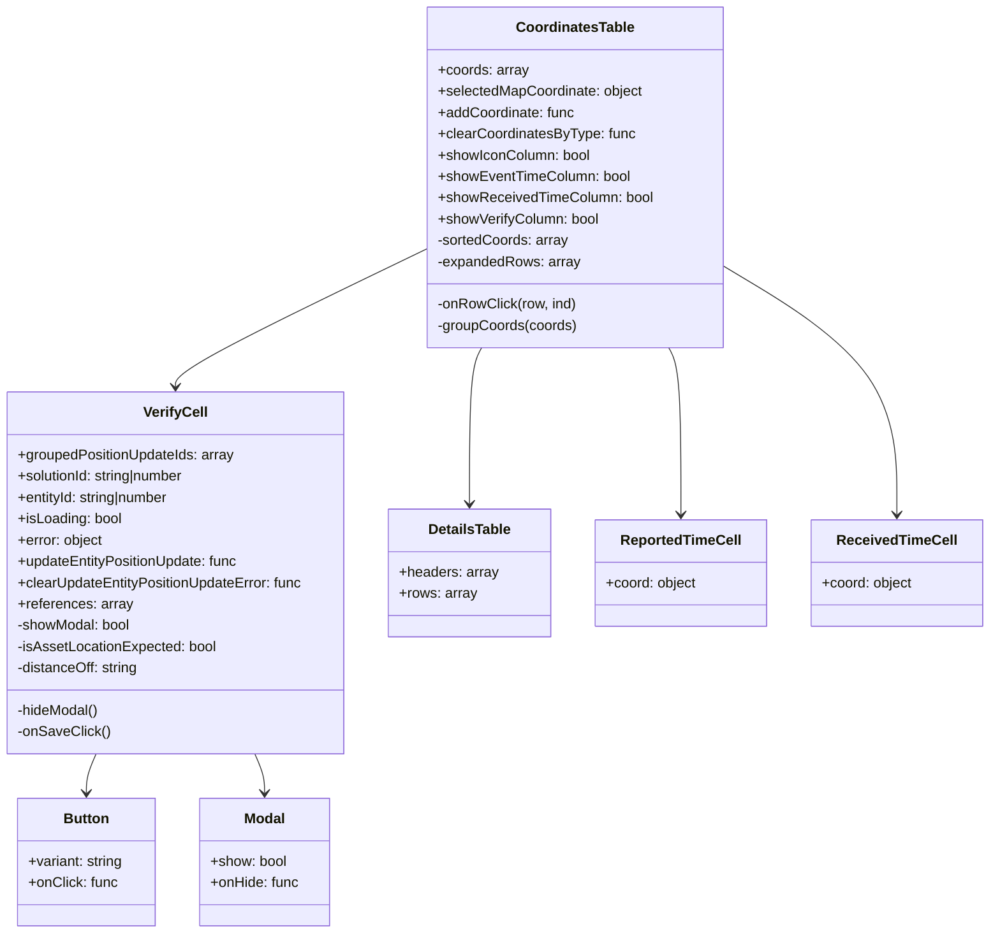
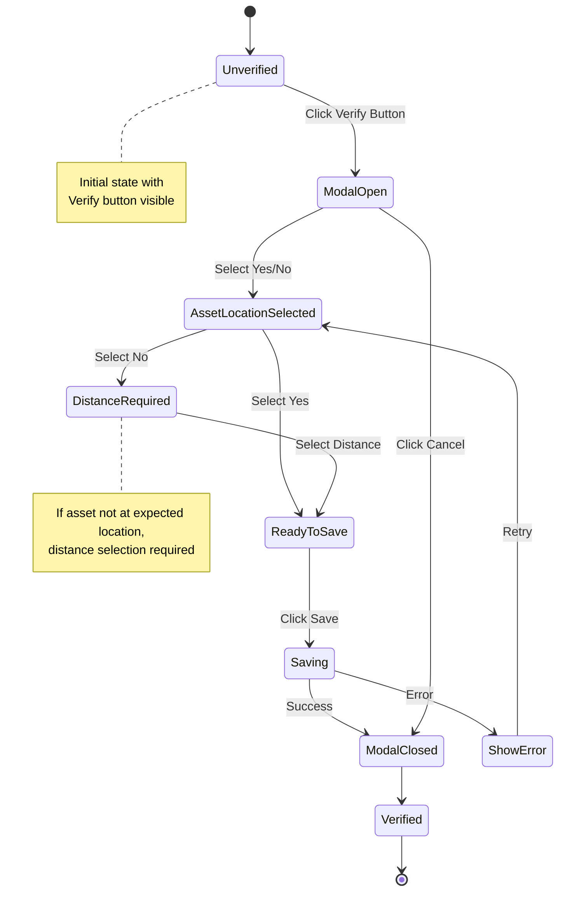
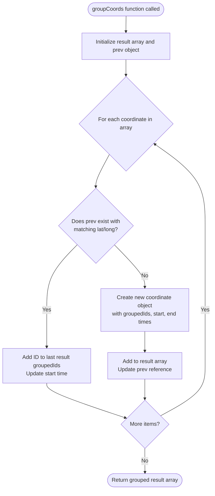
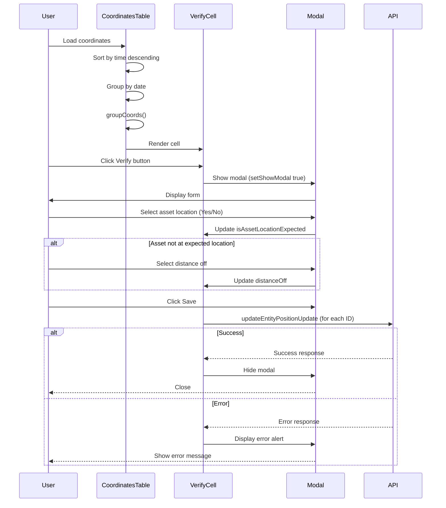
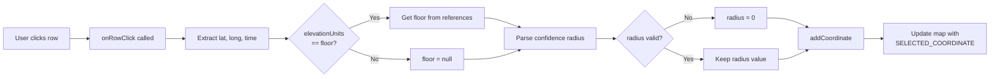
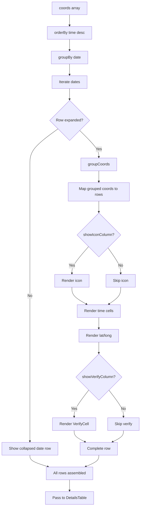

# Diagram: web/portal/src/components-old/CoordinatesTable.js

> Auto-generated by Obscura crawlers

## Diagram 1

### SVG

<svg id="container" width="1114.125" xmlns="http://www.w3.org/2000/svg" class="classDiagram" height="1052" viewBox="0 0 1114.125 1052" role="graphics-document document" aria-roledescription="class"><g><defs><marker id="container_class-aggregationStart" class="marker aggregation class" refX="18" refY="7" markerWidth="190" markerHeight="240" orient="auto"><path d="M 18,7 L9,13 L1,7 L9,1 Z"></path></marker></defs><defs><marker id="container_class-aggregationEnd" class="marker aggregation class" refX="1" refY="7" markerWidth="20" markerHeight="28" orient="auto"><path d="M 18,7 L9,13 L1,7 L9,1 Z"></path></marker></defs><defs><marker id="container_class-extensionStart" class="marker extension class" refX="18" refY="7" markerWidth="190" markerHeight="240" orient="auto"><path d="M 1,7 L18,13 V 1 Z"></path></marker></defs><defs><marker id="container_class-extensionEnd" class="marker extension class" refX="1" refY="7" markerWidth="20" markerHeight="28" orient="auto"><path d="M 1,1 V 13 L18,7 Z"></path></marker></defs><defs><marker id="container_class-compositionStart" class="marker composition class" refX="18" refY="7" markerWidth="190" markerHeight="240" orient="auto"><path d="M 18,7 L9,13 L1,7 L9,1 Z"></path></marker></defs><defs><marker id="container_class-compositionEnd" class="marker composition class" refX="1" refY="7" markerWidth="20" markerHeight="28" orient="auto"><path d="M 18,7 L9,13 L1,7 L9,1 Z"></path></marker></defs><defs><marker id="container_class-dependencyStart" class="marker dependency class" refX="6" refY="7" markerWidth="190" markerHeight="240" orient="auto"><path d="M 5,7 L9,13 L1,7 L9,1 Z"></path></marker></defs><defs><marker id="container_class-dependencyEnd" class="marker dependency class" refX="13" refY="7" markerWidth="20" markerHeight="28" orient="auto"><path d="M 18,7 L9,13 L14,7 L9,1 Z"></path></marker></defs><defs><marker id="container_class-lollipopStart" class="marker lollipop class" refX="13" refY="7" markerWidth="190" markerHeight="240" orient="auto"><circle stroke="black" fill="transparent" cx="7" cy="7" r="6"></circle></marker></defs><defs><marker id="container_class-lollipopEnd" class="marker lollipop class" refX="1" refY="7" markerWidth="190" markerHeight="240" orient="auto"><circle stroke="black" fill="transparent" cx="7" cy="7" r="6"></circle></marker></defs><g class="root"><g class="clusters"></g><g class="edgePaths"><path d="M546.196,392L543.926,396.167C541.657,400.333,537.117,408.667,534.848,438C532.578,467.333,532.578,517.667,532.578,542.833L532.578,568" id="id_CoordinatesTable_DetailsTable_1" class="edge-thickness-normal edge-pattern-solid relation" style=";;;" data-edge="true" data-et="edge" data-id="id_CoordinatesTable_DetailsTable_1" data-points="W3sieCI6NTQ2LjE5NTc3MTUyOTM3NzksInkiOjM5Mn0seyJ4Ijo1MzIuNTc4MTI1LCJ5Ijo0MTd9LHsieCI6NTMyLjU3ODEyNSwieSI6NTc0fV0=" marker-end="url(#container_class-dependencyEnd)"></path><path d="M485.986,279.356L438.347,302.296C390.707,325.237,295.428,371.119,247.788,397.226C200.148,423.333,200.148,429.667,200.148,432.833L200.148,436" id="id_CoordinatesTable_VerifyCell_2" class="edge-thickness-normal edge-pattern-solid relation" style=";;;" data-edge="true" data-et="edge" data-id="id_CoordinatesTable_VerifyCell_2" data-points="W3sieCI6NDg1Ljk4NjMyODEyNSwieSI6Mjc5LjM1NTU4MjIzNDk3NDR9LHsieCI6MjAwLjE0ODQzNzUsInkiOjQxN30seyJ4IjoyMDAuMTQ4NDM3NSwieSI6NDQyfV0=" marker-end="url(#container_class-dependencyEnd)"></path><path d="M755.363,392L757.632,396.167C759.902,400.333,764.441,408.667,766.711,440C768.98,471.333,768.98,525.667,768.98,552.833L768.98,580" id="id_CoordinatesTable_ReportedTimeCell_3" class="edge-thickness-normal edge-pattern-solid relation" style=";;;" data-edge="true" data-et="edge" data-id="id_CoordinatesTable_ReportedTimeCell_3" data-points="W3sieCI6NzU1LjM2MjgyMjIyMDYyMjEsInkiOjM5Mn0seyJ4Ijo3NjguOTgwNDY4NzUsInkiOjQxN30seyJ4Ijo3NjguOTgwNDY4NzUsInkiOjU4Nn1d" marker-end="url(#container_class-dependencyEnd)"></path><path d="M815.572,299.379L848.079,318.983C880.586,338.586,945.6,377.793,978.106,424.563C1010.613,471.333,1010.613,525.667,1010.613,552.833L1010.613,580" id="id_CoordinatesTable_ReceivedTimeCell_4" class="edge-thickness-normal edge-pattern-solid relation" style=";;;" data-edge="true" data-et="edge" data-id="id_CoordinatesTable_ReceivedTimeCell_4" data-points="W3sieCI6ODE1LjU3MjI2NTYyNSwieSI6Mjk5LjM3OTM2ODc0MTAxMDF9LHsieCI6MTAxMC42MTMyODEyNSwieSI6NDE3fSx7IngiOjEwMTAuNjEzMjgxMjUsInkiOjU4Nn1d" marker-end="url(#container_class-dependencyEnd)"></path><path d="M110.192,850L108.355,854.167C106.517,858.333,102.843,866.667,101.005,874C99.168,881.333,99.168,887.667,99.168,890.833L99.168,894" id="id_VerifyCell_Button_5" class="edge-thickness-normal edge-pattern-solid relation" style=";;;" data-edge="true" data-et="edge" data-id="id_VerifyCell_Button_5" data-points="W3sieCI6MTEwLjE5MjAzNzM5MDgyOTcsInkiOjg1MH0seyJ4Ijo5OS4xNjc5Njg3NSwieSI6ODc1fSx7IngiOjk5LjE2Nzk2ODc1LCJ5Ijo5MDB9XQ==" marker-end="url(#container_class-dependencyEnd)"></path><path d="M290.105,850L291.942,854.167C293.78,858.333,297.454,866.667,299.292,874C301.129,881.333,301.129,887.667,301.129,890.833L301.129,894" id="id_VerifyCell_Modal_6" class="edge-thickness-normal edge-pattern-solid relation" style=";;;" data-edge="true" data-et="edge" data-id="id_VerifyCell_Modal_6" data-points="W3sieCI6MjkwLjEwNDgzNzYwOTE3MDMsInkiOjg1MH0seyJ4IjozMDEuMTI4OTA2MjUsInkiOjg3NX0seyJ4IjozMDEuMTI4OTA2MjUsInkiOjkwMH1d" marker-end="url(#container_class-dependencyEnd)"></path></g><g class="edgeLabels"><g class="edgeLabel"><g class="label" data-id="id_CoordinatesTable_DetailsTable_1" transform="translate(0, 0)"><foreignObject width="0" height="0">

</foreignObject></g></g><g class="edgeLabel"><g class="label" data-id="id_CoordinatesTable_VerifyCell_2" transform="translate(0, 0)"><foreignObject width="0" height="0">

</foreignObject></g></g><g class="edgeLabel"><g class="label" data-id="id_CoordinatesTable_ReportedTimeCell_3" transform="translate(0, 0)"><foreignObject width="0" height="0">

</foreignObject></g></g><g class="edgeLabel"><g class="label" data-id="id_CoordinatesTable_ReceivedTimeCell_4" transform="translate(0, 0)"><foreignObject width="0" height="0">

</foreignObject></g></g><g class="edgeLabel"><g class="label" data-id="id_VerifyCell_Button_5" transform="translate(0, 0)"><foreignObject width="0" height="0">

</foreignObject></g></g><g class="edgeLabel"><g class="label" data-id="id_VerifyCell_Modal_6" transform="translate(0, 0)"><foreignObject width="0" height="0">

</foreignObject></g></g></g><g class="nodes"><g class="node default" id="classId-CoordinatesTable-0" transform="translate(650.779296875, 200)"><g class="basic label-container"><path d="M-164.79296875 -192 L164.79296875 -192 L164.79296875 192 L-164.79296875 192" stroke="none" stroke-width="0" fill="#ECECFF" style=""></path><path d="M-164.79296875 -192 C-35.60324169905431 -192, 93.58648535189138 -192, 164.79296875 -192 M-164.79296875 -192 C-85.63029483198866 -192, -6.467620913977328 -192, 164.79296875 -192 M164.79296875 -192 C164.79296875 -98.56091108518248, 164.79296875 -5.121822170364965, 164.79296875 192 M164.79296875 -192 C164.79296875 -99.3051224441167, 164.79296875 -6.61024488823341, 164.79296875 192 M164.79296875 192 C47.79695512759659 192, -69.19905849480682 192, -164.79296875 192 M164.79296875 192 C80.27350786165951 192, -4.245953026680979 192, -164.79296875 192 M-164.79296875 192 C-164.79296875 85.83527635404721, -164.79296875 -20.32944729190558, -164.79296875 -192 M-164.79296875 192 C-164.79296875 102.82271906959501, -164.79296875 13.64543813919002, -164.79296875 -192" stroke="#9370DB" stroke-width="1.3" fill="none" stroke-dasharray="0 0" style=""></path></g><g class="annotation-group text" transform="translate(0, -168)"></g><g class="label-group text" transform="translate(-63.8671875, -168)"><g class="label" style="font-weight: bolder" transform="translate(0,-12)"><foreignObject width="127.734375" height="24">

CoordinatesTable

</foreignObject></g></g><g class="members-group text" transform="translate(-152.79296875, -120)"><g class="label" style="" transform="translate(0,-12)"><foreignObject width="101.65625" height="24">

+coords: array

</foreignObject></g><g class="label" style="" transform="translate(0,12)"><foreignObject width="232.625" height="24">

+selectedMapCoordinate: object

</foreignObject></g><g class="label" style="" transform="translate(0,36)"><foreignObject width="154.8125" height="24">

+addCoordinate: func

</foreignObject></g><g class="label" style="" transform="translate(0,60)"><foreignObject width="221.703125" height="24">

+clearCoordinatesByType: func

</foreignObject></g><g class="label" style="" transform="translate(0,84)"><foreignObject width="172.453125" height="24">

+showIconColumn: bool

</foreignObject></g><g class="label" style="" transform="translate(0,108)"><foreignObject width="216.828125" height="24">

+showEventTimeColumn: bool

</foreignObject></g><g class="label" style="" transform="translate(0,132)"><foreignObject width="241.71875" height="24">

+showReceivedTimeColumn: bool

</foreignObject></g><g class="label" style="" transform="translate(0,156)"><foreignObject width="182.828125" height="24">

+showVerifyColumn: bool

</foreignObject></g><g class="label" style="" transform="translate(0,180)"><foreignObject width="148.25" height="24">

-sortedCoords: array

</foreignObject></g><g class="label" style="" transform="translate(0,204)"><foreignObject width="160.71875" height="24">

-expandedRows: array

</foreignObject></g></g><g class="methods-group text" transform="translate(-152.79296875, 144)"><g class="label" style="" transform="translate(0,-12)"><foreignObject width="157.375" height="24">

-onRowClick(row, ind)

</foreignObject></g><g class="label" style="" transform="translate(0,12)"><foreignObject width="157.8125" height="24">

-groupCoords(coords)

</foreignObject></g></g><g class="divider" style=""><path d="M-164.79296875 -144 C-96.74516049758662 -144, -28.69735224517325 -144, 164.79296875 -144 M-164.79296875 -144 C-83.50436106293512 -144, -2.2157533758702357 -144, 164.79296875 -144" stroke="#9370DB" stroke-width="1.3" fill="none" stroke-dasharray="0 0" style=""></path></g><g class="divider" style=""><path d="M-164.79296875 120 C-63.727767064820185 120, 37.33743462035963 120, 164.79296875 120 M-164.79296875 120 C-91.87100990062224 120, -18.94905105124448 120, 164.79296875 120" stroke="#9370DB" stroke-width="1.3" fill="none" stroke-dasharray="0 0" style=""></path></g></g><g class="node default" id="classId-VerifyCell-1" transform="translate(200.1484375, 646)"><g class="basic label-container"><path d="M-192.1484375 -204 L192.1484375 -204 L192.1484375 204 L-192.1484375 204" stroke="none" stroke-width="0" fill="#ECECFF" style=""></path><path d="M-192.1484375 -204 C-41.25871016010433 -204, 109.63101717979134 -204, 192.1484375 -204 M-192.1484375 -204 C-111.41786096157779 -204, -30.687284423155575 -204, 192.1484375 -204 M192.1484375 -204 C192.1484375 -76.638068439601, 192.1484375 50.723863120798, 192.1484375 204 M192.1484375 -204 C192.1484375 -96.48397059607274, 192.1484375 11.032058807854526, 192.1484375 204 M192.1484375 204 C41.9966077668123 204, -108.1552219663754 204, -192.1484375 204 M192.1484375 204 C66.55196031652386 204, -59.04451686695228 204, -192.1484375 204 M-192.1484375 204 C-192.1484375 88.87692263354492, -192.1484375 -26.246154732910156, -192.1484375 -204 M-192.1484375 204 C-192.1484375 90.31550529192809, -192.1484375 -23.36898941614382, -192.1484375 -204" stroke="#9370DB" stroke-width="1.3" fill="none" stroke-dasharray="0 0" style=""></path></g><g class="annotation-group text" transform="translate(0, -180)"></g><g class="label-group text" transform="translate(-34.84375, -180)"><g class="label" style="font-weight: bolder" transform="translate(0,-12)"><foreignObject width="69.6875" height="24">

VerifyCell

</foreignObject></g></g><g class="members-group text" transform="translate(-180.1484375, -132)"><g class="label" style="" transform="translate(0,-12)"><foreignObject width="246.90625" height="24">

+groupedPositionUpdateIds: array

</foreignObject></g><g class="label" style="" transform="translate(0,12)"><foreignObject width="195.0625" height="24">

+solutionId: string|number

</foreignObject></g><g class="label" style="" transform="translate(0,36)"><foreignObject width="177.1875" height="24">

+entityId: string|number

</foreignObject></g><g class="label" style="" transform="translate(0,60)"><foreignObject width="118.171875" height="24">

+isLoading: bool

</foreignObject></g><g class="label" style="" transform="translate(0,84)"><foreignObject width="97.8125" height="24">

+error: object

</foreignObject></g><g class="label" style="" transform="translate(0,108)"><foreignObject width="252.515625" height="24">

+updateEntityPositionUpdate: func

</foreignObject></g><g class="label" style="" transform="translate(0,132)"><foreignObject width="325.453125" height="24">

+clearUpdateEntityPositionUpdateError: func

</foreignObject></g><g class="label" style="" transform="translate(0,156)"><foreignObject width="128.546875" height="24">

+references: array

</foreignObject></g><g class="label" style="" transform="translate(0,180)"><foreignObject width="129.828125" height="24">

-showModal: bool

</foreignObject></g><g class="label" style="" transform="translate(0,204)"><foreignObject width="225.96875" height="24">

-isAssetLocationExpected: bool

</foreignObject></g><g class="label" style="" transform="translate(0,228)"><foreignObject width="139.40625" height="24">

-distanceOff: string

</foreignObject></g></g><g class="methods-group text" transform="translate(-180.1484375, 156)"><g class="label" style="" transform="translate(0,-12)"><foreignObject width="93.59375" height="24">

-hideModal()

</foreignObject></g><g class="label" style="" transform="translate(0,12)"><foreignObject width="103.09375" height="24">

-onSaveClick()

</foreignObject></g></g><g class="divider" style=""><path d="M-192.1484375 -156 C-51.862276121983115 -156, 88.42388525603377 -156, 192.1484375 -156 M-192.1484375 -156 C-50.46894235234578 -156, 91.21055279530844 -156, 192.1484375 -156" stroke="#9370DB" stroke-width="1.3" fill="none" stroke-dasharray="0 0" style=""></path></g><g class="divider" style=""><path d="M-192.1484375 132 C-102.44517712222378 132, -12.741916744447565 132, 192.1484375 132 M-192.1484375 132 C-45.80146933718933 132, 100.54549882562134 132, 192.1484375 132" stroke="#9370DB" stroke-width="1.3" fill="none" stroke-dasharray="0 0" style=""></path></g></g><g class="node default" id="classId-DetailsTable-2" transform="translate(532.578125, 646)"><g class="basic label-container"><path d="M-90.28125 -72 L90.28125 -72 L90.28125 72 L-90.28125 72" stroke="none" stroke-width="0" fill="#ECECFF" style=""></path><path d="M-90.28125 -72 C-24.97844487978756 -72, 40.32436024042488 -72, 90.28125 -72 M-90.28125 -72 C-40.10551063106965 -72, 10.070228737860702 -72, 90.28125 -72 M90.28125 -72 C90.28125 -25.89675127552389, 90.28125 20.20649744895222, 90.28125 72 M90.28125 -72 C90.28125 -40.92042354672374, 90.28125 -9.84084709344748, 90.28125 72 M90.28125 72 C41.92232873698902 72, -6.436592526021954 72, -90.28125 72 M90.28125 72 C51.06664328255046 72, 11.852036565100917 72, -90.28125 72 M-90.28125 72 C-90.28125 15.721696815790338, -90.28125 -40.556606368419324, -90.28125 -72 M-90.28125 72 C-90.28125 20.175420808987006, -90.28125 -31.649158382025988, -90.28125 -72" stroke="#9370DB" stroke-width="1.3" fill="none" stroke-dasharray="0 0" style=""></path></g><g class="annotation-group text" transform="translate(0, -48)"></g><g class="label-group text" transform="translate(-45.328125, -48)"><g class="label" style="font-weight: bolder" transform="translate(0,-12)"><foreignObject width="90.65625" height="24">

DetailsTable

</foreignObject></g></g><g class="members-group text" transform="translate(-78.28125, 0)"><g class="label" style="" transform="translate(0,-12)"><foreignObject width="111.234375" height="24">

+headers: array

</foreignObject></g><g class="label" style="" transform="translate(0,12)"><foreignObject width="86.890625" height="24">

+rows: array

</foreignObject></g></g><g class="methods-group text" transform="translate(-78.28125, 72)"></g><g class="divider" style=""><path d="M-90.28125 -24 C-50.14862619178089 -24, -10.016002383561784 -24, 90.28125 -24 M-90.28125 -24 C-34.33275249049555 -24, 21.615745019008898 -24, 90.28125 -24" stroke="#9370DB" stroke-width="1.3" fill="none" stroke-dasharray="0 0" style=""></path></g><g class="divider" style=""><path d="M-90.28125 48 C-25.570446020423347 48, 39.140357959153306 48, 90.28125 48 M-90.28125 48 C-36.80788463495996 48, 16.665480730080077 48, 90.28125 48" stroke="#9370DB" stroke-width="1.3" fill="none" stroke-dasharray="0 0" style=""></path></g></g><g class="node default" id="classId-ReportedTimeCell-3" transform="translate(768.98046875, 646)"><g class="basic label-container"><path d="M-96.12109375 -60 L96.12109375 -60 L96.12109375 60 L-96.12109375 60" stroke="none" stroke-width="0" fill="#ECECFF" style=""></path><path d="M-96.12109375 -60 C-49.318846824963295 -60, -2.5165998999265895 -60, 96.12109375 -60 M-96.12109375 -60 C-36.56643599808736 -60, 22.988221753825286 -60, 96.12109375 -60 M96.12109375 -60 C96.12109375 -20.494919042919577, 96.12109375 19.010161914160847, 96.12109375 60 M96.12109375 -60 C96.12109375 -26.514877043095566, 96.12109375 6.970245913808867, 96.12109375 60 M96.12109375 60 C53.16615793290651 60, 10.211222115813015 60, -96.12109375 60 M96.12109375 60 C54.17829773695659 60, 12.235501723913174 60, -96.12109375 60 M-96.12109375 60 C-96.12109375 26.56392043139644, -96.12109375 -6.87215913720712, -96.12109375 -60 M-96.12109375 60 C-96.12109375 33.09806714606265, -96.12109375 6.1961342921252935, -96.12109375 -60" stroke="#9370DB" stroke-width="1.3" fill="none" stroke-dasharray="0 0" style=""></path></g><g class="annotation-group text" transform="translate(0, -36)"></g><g class="label-group text" transform="translate(-65.4140625, -36)"><g class="label" style="font-weight: bolder" transform="translate(0,-12)"><foreignObject width="130.828125" height="24">

ReportedTimeCell

</foreignObject></g></g><g class="members-group text" transform="translate(-84.12109375, 12)"><g class="label" style="" transform="translate(0,-12)"><foreignObject width="102.828125" height="24">

+coord: object

</foreignObject></g></g><g class="methods-group text" transform="translate(-84.12109375, 60)"></g><g class="divider" style=""><path d="M-96.12109375 -12 C-50.87182348457231 -12, -5.622553219144621 -12, 96.12109375 -12 M-96.12109375 -12 C-50.37750369186466 -12, -4.633913633729321 -12, 96.12109375 -12" stroke="#9370DB" stroke-width="1.3" fill="none" stroke-dasharray="0 0" style=""></path></g><g class="divider" style=""><path d="M-96.12109375 36 C-23.99622416017921 36, 48.12864542964158 36, 96.12109375 36 M-96.12109375 36 C-48.88792794592901 36, -1.654762141858015 36, 96.12109375 36" stroke="#9370DB" stroke-width="1.3" fill="none" stroke-dasharray="0 0" style=""></path></g></g><g class="node default" id="classId-ReceivedTimeCell-4" transform="translate(1010.61328125, 646)"><g class="basic label-container"><path d="M-95.51171875 -60 L95.51171875 -60 L95.51171875 60 L-95.51171875 60" stroke="none" stroke-width="0" fill="#ECECFF" style=""></path><path d="M-95.51171875 -60 C-26.7869629746575 -60, 41.937792800685 -60, 95.51171875 -60 M-95.51171875 -60 C-49.42599655267092 -60, -3.3402743553418333 -60, 95.51171875 -60 M95.51171875 -60 C95.51171875 -35.03295784890227, 95.51171875 -10.065915697804549, 95.51171875 60 M95.51171875 -60 C95.51171875 -26.163123391861248, 95.51171875 7.673753216277504, 95.51171875 60 M95.51171875 60 C34.35147523566243 60, -26.808768278675146 60, -95.51171875 60 M95.51171875 60 C41.39440069009111 60, -12.722917369817779 60, -95.51171875 60 M-95.51171875 60 C-95.51171875 32.06231277368757, -95.51171875 4.124625547375146, -95.51171875 -60 M-95.51171875 60 C-95.51171875 21.419446924200997, -95.51171875 -17.161106151598005, -95.51171875 -60" stroke="#9370DB" stroke-width="1.3" fill="none" stroke-dasharray="0 0" style=""></path></g><g class="annotation-group text" transform="translate(0, -36)"></g><g class="label-group text" transform="translate(-64.1953125, -36)"><g class="label" style="font-weight: bolder" transform="translate(0,-12)"><foreignObject width="128.390625" height="24">

ReceivedTimeCell

</foreignObject></g></g><g class="members-group text" transform="translate(-83.51171875, 12)"><g class="label" style="" transform="translate(0,-12)"><foreignObject width="102.828125" height="24">

+coord: object

</foreignObject></g></g><g class="methods-group text" transform="translate(-83.51171875, 60)"></g><g class="divider" style=""><path d="M-95.51171875 -12 C-48.30605457557331 -12, -1.1003904011466261 -12, 95.51171875 -12 M-95.51171875 -12 C-36.15263498296171 -12, 23.206448784076585 -12, 95.51171875 -12" stroke="#9370DB" stroke-width="1.3" fill="none" stroke-dasharray="0 0" style=""></path></g><g class="divider" style=""><path d="M-95.51171875 36 C-50.78800178855295 36, -6.064284827105894 36, 95.51171875 36 M-95.51171875 36 C-23.932772566039006 36, 47.64617361792199 36, 95.51171875 36" stroke="#9370DB" stroke-width="1.3" fill="none" stroke-dasharray="0 0" style=""></path></g></g><g class="node default" id="classId-Button-5" transform="translate(99.16796875, 972)"><g class="basic label-container"><path d="M-78.65234375 -72 L78.65234375 -72 L78.65234375 72 L-78.65234375 72" stroke="none" stroke-width="0" fill="#ECECFF" style=""></path><path d="M-78.65234375 -72 C-24.083431938210012 -72, 30.485479873579976 -72, 78.65234375 -72 M-78.65234375 -72 C-23.469739545010306 -72, 31.712864659979388 -72, 78.65234375 -72 M78.65234375 -72 C78.65234375 -40.65262917309143, 78.65234375 -9.305258346182846, 78.65234375 72 M78.65234375 -72 C78.65234375 -28.693912037072742, 78.65234375 14.612175925854515, 78.65234375 72 M78.65234375 72 C32.935255000858575 72, -12.78183374828285 72, -78.65234375 72 M78.65234375 72 C36.65784533857919 72, -5.336653072841614 72, -78.65234375 72 M-78.65234375 72 C-78.65234375 37.21277002813443, -78.65234375 2.425540056268858, -78.65234375 -72 M-78.65234375 72 C-78.65234375 29.046753444230006, -78.65234375 -13.906493111539987, -78.65234375 -72" stroke="#9370DB" stroke-width="1.3" fill="none" stroke-dasharray="0 0" style=""></path></g><g class="annotation-group text" transform="translate(0, -48)"></g><g class="label-group text" transform="translate(-24.8359375, -48)"><g class="label" style="font-weight: bolder" transform="translate(0,-12)"><foreignObject width="49.671875" height="24">

Button

</foreignObject></g></g><g class="members-group text" transform="translate(-66.65234375, 0)"><g class="label" style="" transform="translate(0,-12)"><foreignObject width="108.46875" height="24">

+variant: string

</foreignObject></g><g class="label" style="" transform="translate(0,12)"><foreignObject width="100.390625" height="24">

+onClick: func

</foreignObject></g></g><g class="methods-group text" transform="translate(-66.65234375, 72)"></g><g class="divider" style=""><path d="M-78.65234375 -24 C-36.085592656165765 -24, 6.481158437668469 -24, 78.65234375 -24 M-78.65234375 -24 C-44.82246010162151 -24, -10.992576453243018 -24, 78.65234375 -24" stroke="#9370DB" stroke-width="1.3" fill="none" stroke-dasharray="0 0" style=""></path></g><g class="divider" style=""><path d="M-78.65234375 48 C-44.310530519954185 48, -9.96871728990837 48, 78.65234375 48 M-78.65234375 48 C-24.190852328891765 48, 30.27063909221647 48, 78.65234375 48" stroke="#9370DB" stroke-width="1.3" fill="none" stroke-dasharray="0 0" style=""></path></g></g><g class="node default" id="classId-Modal-6" transform="translate(301.12890625, 972)"><g class="basic label-container"><path d="M-73.30859375 -72 L73.30859375 -72 L73.30859375 72 L-73.30859375 72" stroke="none" stroke-width="0" fill="#ECECFF" style=""></path><path d="M-73.30859375 -72 C-43.97287938202362 -72, -14.637165014047234 -72, 73.30859375 -72 M-73.30859375 -72 C-34.438360541897865 -72, 4.431872666204271 -72, 73.30859375 -72 M73.30859375 -72 C73.30859375 -39.879334108330056, 73.30859375 -7.758668216660112, 73.30859375 72 M73.30859375 -72 C73.30859375 -33.91060686921284, 73.30859375 4.1787862615743165, 73.30859375 72 M73.30859375 72 C24.177167304542877 72, -24.954259140914246 72, -73.30859375 72 M73.30859375 72 C34.526489881395094 72, -4.255613987209813 72, -73.30859375 72 M-73.30859375 72 C-73.30859375 24.39229453123243, -73.30859375 -23.21541093753514, -73.30859375 -72 M-73.30859375 72 C-73.30859375 29.991061423979772, -73.30859375 -12.017877152040455, -73.30859375 -72" stroke="#9370DB" stroke-width="1.3" fill="none" stroke-dasharray="0 0" style=""></path></g><g class="annotation-group text" transform="translate(0, -48)"></g><g class="label-group text" transform="translate(-22.4453125, -48)"><g class="label" style="font-weight: bolder" transform="translate(0,-12)"><foreignObject width="44.890625" height="24">

Modal

</foreignObject></g></g><g class="members-group text" transform="translate(-61.30859375, 0)"><g class="label" style="" transform="translate(0,-12)"><foreignObject width="86.6875" height="24">

+show: bool

</foreignObject></g><g class="label" style="" transform="translate(0,12)"><foreignObject width="100.171875" height="24">

+onHide: func

</foreignObject></g></g><g class="methods-group text" transform="translate(-61.30859375, 72)"></g><g class="divider" style=""><path d="M-73.30859375 -24 C-28.692852278468173 -24, 15.922889193063654 -24, 73.30859375 -24 M-73.30859375 -24 C-33.47047814982052 -24, 6.367637450358956 -24, 73.30859375 -24" stroke="#9370DB" stroke-width="1.3" fill="none" stroke-dasharray="0 0" style=""></path></g><g class="divider" style=""><path d="M-73.30859375 48 C-33.401359364305755 48, 6.505875021388491 48, 73.30859375 48 M-73.30859375 48 C-30.26684039291611 48, 12.774912964167783 48, 73.30859375 48" stroke="#9370DB" stroke-width="1.3" fill="none" stroke-dasharray="0 0" style=""></path></g></g></g></g></g></svg>

## Diagram 2

### SVG

<svg id="container" width="722.73046875" xmlns="http://www.w3.org/2000/svg" class="statediagram" height="1158" viewBox="0 0 722.73046875 1158" role="graphics-document document" aria-roledescription="stateDiagram"><g><defs><marker id="container_stateDiagram-barbEnd" refX="19" refY="7" markerWidth="20" markerHeight="14" markerUnits="userSpaceOnUse" orient="auto"><path d="M 19,7 L9,13 L14,7 L9,1 Z"></path></marker></defs><g class="root"><g class="clusters"><g class="note-cluster" id="Unverified----parent"><rect x="35.1640625" y="186" width="245.671875" height="128" fill="none"></rect></g><g class="note-cluster" id="DistanceRequired----parent"><rect x="8" y="616" width="300" height="152" fill="none"></rect></g></g><g class="edgePaths"><path d="M326.102,22L326.102,26.167C326.102,30.333,326.102,38.667,326.185,47.083C326.268,55.5,326.435,64,326.518,68.25L326.602,72.5" id="edge0" class="edge-thickness-normal edge-pattern-solid transition" style="fill:none;;;fill:none" data-edge="true" data-et="edge" data-id="edge0" data-points="W3sieCI6MzI2LjEwMTU2MjUsInkiOjIyfSx7IngiOjMyNi4xMDE1NjI1LCJ5Ijo0N30seyJ4IjozMjYuNjAxNTYyNSwieSI6NzIuNX1d" marker-end="url(#container_stateDiagram-barbEnd)"></path><path d="M370.316,111.132L385.235,117.444C400.154,123.755,429.993,136.377,444.913,148.855C459.832,161.333,459.832,173.667,459.915,187.25C459.999,200.833,460.165,215.667,460.249,223.083L460.332,230.5" id="edge1" class="edge-thickness-normal edge-pattern-solid transition" style="fill:none;;;fill:none" data-edge="true" data-et="edge" data-id="edge1" data-points="W3sieCI6MzcwLjMxNTU4OTcyMjI5Mjk0LCJ5IjoxMTEuMTMyMjUwMTg5MjEyNzd9LHsieCI6NDU5LjgzMjAzMTI1LCJ5IjoxNDl9LHsieCI6NDU5LjgzMjAzMTI1LCJ5IjoxODZ9LHsieCI6NDYwLjMzMjAzMTI1LCJ5IjoyMzAuNX1d" marker-end="url(#container_stateDiagram-barbEnd)"></path><path d="M420.745,270.5L406.146,277.75C391.547,285,362.35,299.5,347.751,312.917C333.152,326.333,333.152,338.667,333.236,351.083C333.319,363.5,333.486,376,333.569,382.25L333.652,388.5" id="edge2" class="edge-thickness-normal edge-pattern-solid transition" style="fill:none;;;fill:none" data-edge="true" data-et="edge" data-id="edge2" data-points="W3sieCI6NDIwLjc0NDYyODkwNjI1LCJ5IjoyNzAuNX0seyJ4IjozMzMuMTUyMzQzNzUsInkiOjMxNH0seyJ4IjozMzMuMTUyMzQzNzUsInkiOjM1MX0seyJ4IjozMzMuNjUyMzQzNzUsInkiOjM4OC41fV0=" marker-end="url(#container_stateDiagram-barbEnd)"></path><path d="M272.195,428.5L253.163,434.583C234.13,440.667,196.065,452.833,177.116,465.167C158.167,477.5,158.333,490,158.417,496.25L158.5,502.5" id="edge3" class="edge-thickness-normal edge-pattern-solid transition" style="fill:none;;;fill:none" data-edge="true" data-et="edge" data-id="edge3" data-points="W3sieCI6MjcyLjE5NTM4MTAzMDcwMTc1LCJ5Ijo0MjguNX0seyJ4IjoxNTgsInkiOjQ2NX0seyJ4IjoxNTguNSwieSI6NTAyLjV9XQ==" marker-end="url(#container_stateDiagram-barbEnd)"></path><path d="M344.177,428.5L347.339,434.583C350.501,440.667,356.825,452.833,359.987,468.417C363.148,484,363.148,503,363.148,522C363.148,541,363.148,560,363.148,575.667C363.148,591.333,363.148,603.667,367.923,619.25C372.697,634.833,382.246,653.667,387.021,663.083L391.795,672.5" id="edge4" class="edge-thickness-normal edge-pattern-solid transition" style="fill:none;;;fill:none" data-edge="true" data-et="edge" data-id="edge4" data-points="W3sieCI6MzQ0LjE3NzI4ODkyNTQzODYsInkiOjQyOC41fSx7IngiOjM2My4xNDg0Mzc1LCJ5Ijo0NjV9LHsieCI6MzYzLjE0ODQzNzUsInkiOjUyMn0seyJ4IjozNjMuMTQ4NDM3NSwieSI6NTc5fSx7IngiOjM2My4xNDg0Mzc1LCJ5Ijo2MTZ9LHsieCI6MzkxLjc5NTIzMDI2MzE1NzksInkiOjY3Mi41fV0=" marker-end="url(#container_stateDiagram-barbEnd)"></path><path d="M230.313,537.098L264.995,544.081C299.677,551.065,369.042,565.033,403.724,578.183C438.406,591.333,438.406,603.667,433.939,619.25C429.471,634.833,420.535,653.667,416.068,663.083L411.6,672.5" id="edge5" class="edge-thickness-normal edge-pattern-solid transition" style="fill:none;;;fill:none" data-edge="true" data-et="edge" data-id="edge5" data-points="W3sieCI6MjMwLjMxMjUsInkiOjUzNy4wOTc3OTMzODAxNDA0fSx7IngiOjQzOC40MDYyNSwieSI6NTc5fSx7IngiOjQzOC40MDYyNSwieSI6NjE2fSx7IngiOjQxMS41OTk5MTc3NjMxNTc5LCJ5Ijo2NzIuNX1d" marker-end="url(#container_stateDiagram-barbEnd)"></path><path d="M401.848,712.5L401.764,721.75C401.681,731,401.514,749.5,401.431,764.917C401.348,780.333,401.348,792.667,401.431,805.083C401.514,817.5,401.681,830,401.764,836.25L401.848,842.5" id="edge6" class="edge-thickness-normal edge-pattern-solid transition" style="fill:none;;;fill:none" data-edge="true" data-et="edge" data-id="edge6" data-points="W3sieCI6NDAxLjg0NzY1NjI1LCJ5Ijo3MTIuNX0seyJ4Ijo0MDEuMzQ3NjU2MjUsInkiOjc2OH0seyJ4Ijo0MDEuMzQ3NjU2MjUsInkiOjgwNX0seyJ4Ijo0MDEuODQ3NjU2MjUsInkiOjg0Mi41fV0=" marker-end="url(#container_stateDiagram-barbEnd)"></path><path d="M401.848,882.5L401.764,888.583C401.681,894.667,401.514,906.833,414.292,919.167C427.07,931.5,452.793,944,465.654,950.25L478.515,956.5" id="edge7" class="edge-thickness-normal edge-pattern-solid transition" style="fill:none;;;fill:none" data-edge="true" data-et="edge" data-id="edge7" data-points="W3sieCI6NDAxLjg0NzY1NjI1LCJ5Ijo4ODIuNX0seyJ4Ijo0MDEuMzQ3NjU2MjUsInkiOjkxOX0seyJ4Ijo0NzguNTE1MTQ1Mjg1MDg3NywieSI6OTU2LjV9XQ==" marker-end="url(#container_stateDiagram-barbEnd)"></path><path d="M433.48,871.839L460.303,879.699C487.125,887.559,540.77,903.28,575.785,917.39C610.8,931.5,627.185,944,635.378,950.25L643.57,956.5" id="edge8" class="edge-thickness-normal edge-pattern-solid transition" style="fill:none;;;fill:none" data-edge="true" data-et="edge" data-id="edge8" data-points="W3sieCI6NDMzLjQ4MDQ2ODc1LCJ5Ijo4NzEuODM5MTE5ODc4NjAzOX0seyJ4Ijo1OTQuNDE0MDYyNSwieSI6OTE5fSx7IngiOjY0My41NzAzODEwMzA3MDE4LCJ5Ijo5NTYuNX1d" marker-end="url(#container_stateDiagram-barbEnd)"></path><path d="M669.871,956.5L669.788,950.25C669.704,944,669.538,931.5,669.454,915.75C669.371,900,669.371,881,669.371,862C669.371,843,669.371,824,669.371,808.333C669.371,792.667,669.371,780.333,669.371,761.5C669.371,742.667,669.371,717.333,669.371,692C669.371,666.667,669.371,641.333,669.371,622.5C669.371,603.667,669.371,591.333,669.371,575.667C669.371,560,669.371,541,669.371,522C669.371,503,669.371,484,628.318,467.609C587.265,451.219,505.158,437.437,464.105,430.547L423.052,423.656" id="edge9" class="edge-thickness-normal edge-pattern-solid transition" style="fill:none;;;fill:none" data-edge="true" data-et="edge" data-id="edge9" data-points="W3sieCI6NjY5Ljg3MTA5Mzc1LCJ5Ijo5NTYuNX0seyJ4Ijo2NjkuMzcxMDkzNzUsInkiOjkxOX0seyJ4Ijo2NjkuMzcxMDkzNzUsInkiOjg2Mn0seyJ4Ijo2NjkuMzcxMDkzNzUsInkiOjgwNX0seyJ4Ijo2NjkuMzcxMDkzNzUsInkiOjc2OH0seyJ4Ijo2NjkuMzcxMDkzNzUsInkiOjY5Mn0seyJ4Ijo2NjkuMzcxMDkzNzUsInkiOjYxNn0seyJ4Ijo2NjkuMzcxMDkzNzUsInkiOjU3OX0seyJ4Ijo2NjkuMzcxMDkzNzUsInkiOjUyMn0seyJ4Ijo2NjkuMzcxMDkzNzUsInkiOjQ2NX0seyJ4Ijo0MjMuMDUyMTM0NTY3MDY5LCJ5Ijo0MjMuNjU2MTY4NjQ0ODg2NX1d" marker-end="url(#container_stateDiagram-barbEnd)"></path><path d="M519.957,996.5L519.874,1000.583C519.79,1004.667,519.624,1012.833,519.624,1021.167C519.624,1029.5,519.79,1038,519.874,1042.25L519.957,1046.5" id="edge10" class="edge-thickness-normal edge-pattern-solid transition" style="fill:none;;;fill:none" data-edge="true" data-et="edge" data-id="edge10" data-points="W3sieCI6NTE5Ljk1NzAzMTI1LCJ5Ijo5OTYuNX0seyJ4Ijo1MTkuNDU3MDMxMjUsInkiOjEwMjF9LHsieCI6NTE5Ljk1NzAzMTI1LCJ5IjoxMDQ2LjV9XQ==" marker-end="url(#container_stateDiagram-barbEnd)"></path><path d="M490.546,270.5L501.541,277.75C512.536,285,534.526,299.5,545.521,312.917C556.516,326.333,556.516,338.667,556.516,354.333C556.516,370,556.516,389,556.516,408C556.516,427,556.516,446,556.516,465C556.516,484,556.516,503,556.516,522C556.516,541,556.516,560,556.516,575.667C556.516,591.333,556.516,603.667,556.516,622.5C556.516,641.333,556.516,666.667,556.516,692C556.516,717.333,556.516,742.667,556.516,761.5C556.516,780.333,556.516,792.667,556.516,808.333C556.516,824,556.516,843,556.516,862C556.516,881,556.516,900,552.59,915.75C548.664,931.5,540.812,944,536.886,950.25L532.96,956.5" id="edge11" class="edge-thickness-normal edge-pattern-solid transition" style="fill:none;;;fill:none" data-edge="true" data-et="edge" data-id="edge11" data-points="W3sieCI6NDkwLjU0NTY1NDI5Njg3NSwieSI6MjcwLjV9LHsieCI6NTU2LjUxNTYyNSwieSI6MzE0fSx7IngiOjU1Ni41MTU2MjUsInkiOjM1MX0seyJ4Ijo1NTYuNTE1NjI1LCJ5Ijo0MDh9LHsieCI6NTU2LjUxNTYyNSwieSI6NDY1fSx7IngiOjU1Ni41MTU2MjUsInkiOjUyMn0seyJ4Ijo1NTYuNTE1NjI1LCJ5Ijo1Nzl9LHsieCI6NTU2LjUxNTYyNSwieSI6NjE2fSx7IngiOjU1Ni41MTU2MjUsInkiOjY5Mn0seyJ4Ijo1NTYuNTE1NjI1LCJ5Ijo3Njh9LHsieCI6NTU2LjUxNTYyNSwieSI6ODA1fSx7IngiOjU1Ni41MTU2MjUsInkiOjg2Mn0seyJ4Ijo1NTYuNTE1NjI1LCJ5Ijo5MTl9LHsieCI6NTMyLjk2MDA0NjYwMDg3NzEsInkiOjk1Ni41fV0=" marker-end="url(#container_stateDiagram-barbEnd)"></path><path d="M519.957,1086.5L519.874,1090.583C519.79,1094.667,519.624,1102.833,519.54,1111.083C519.457,1119.333,519.457,1127.667,519.457,1131.833L519.457,1136" id="edge12" class="edge-thickness-normal edge-pattern-solid transition" style="fill:none;;;fill:none" data-edge="true" data-et="edge" data-id="edge12" data-points="W3sieCI6NTE5Ljk1NzAzMTI1LCJ5IjoxMDg2LjV9LHsieCI6NTE5LjQ1NzAzMTI1LCJ5IjoxMTExfSx7IngiOjUxOS40NTcwMzEyNSwieSI6MTEzNn1d" marker-end="url(#container_stateDiagram-barbEnd)"></path><path d="M281.335,107.849L260.779,114.708C240.223,121.566,199.112,135.283,178.556,148.308C158,161.333,158,173.667,158,184C158,194.333,158,202.667,158,206.833L158,211" id="Unverified-Unverified----note-13" class="edge-thickness-normal edge-pattern-solid transition note-edge" style="fill:none;;;fill:none" data-edge="true" data-et="edge" data-id="Unverified-Unverified----note-13" data-points="W3sieCI6MjgxLjMzNDc1MTUxNDAwNDQ0LCJ5IjoxMDcuODQ5MTAzMTcyMDg4M30seyJ4IjoxNTgsInkiOjE0OX0seyJ4IjoxNTgsInkiOjE4Nn0seyJ4IjoxNTgsInkiOjIxMX1d"></path><path d="M158.5,542.5L158.417,548.583C158.333,554.667,158.167,566.833,158.083,579.083C158,591.333,158,603.667,158,614C158,624.333,158,632.667,158,636.833L158,641" id="DistanceRequired-DistanceRequired----note-14" class="edge-thickness-normal edge-pattern-solid transition note-edge" style="fill:none;;;fill:none" data-edge="true" data-et="edge" data-id="DistanceRequired-DistanceRequired----note-14" data-points="W3sieCI6MTU4LjUsInkiOjU0Mi41fSx7IngiOjE1OCwieSI6NTc5fSx7IngiOjE1OCwieSI6NjE2fSx7IngiOjE1OCwieSI6NjQxfV0="></path></g><g class="edgeLabels"><g class="edgeLabel"><g class="label" data-id="edge0" transform="translate(0, 0)"><foreignObject width="0" height="0">

</foreignObject></g></g><g class="edgeLabel" transform="translate(459.83203125, 149)"><g class="label" data-id="edge1" transform="translate(-66.265625, -12)"><foreignObject width="132.53125" height="24">

Click Verify Button

</foreignObject></g></g><g class="edgeLabel" transform="translate(333.15234375, 351)"><g class="label" data-id="edge2" transform="translate(-50.5390625, -12)"><foreignObject width="101.078125" height="24">

Select Yes/No

</foreignObject></g></g><g class="edgeLabel" transform="translate(158, 465)"><g class="label" data-id="edge3" transform="translate(-34.359375, -12)"><foreignObject width="68.71875" height="24">

Select No

</foreignObject></g></g><g class="edgeLabel" transform="translate(363.1484375, 522)"><g class="label" data-id="edge4" transform="translate(-36.2421875, -12)"><foreignObject width="72.484375" height="24">

Select Yes

</foreignObject></g></g><g class="edgeLabel" transform="translate(438.40625, 579)"><g class="label" data-id="edge5" transform="translate(-55.2578125, -12)"><foreignObject width="110.515625" height="24">

Select Distance

</foreignObject></g></g><g class="edgeLabel" transform="translate(401.34765625, 805)"><g class="label" data-id="edge6" transform="translate(-35.8984375, -12)"><foreignObject width="71.796875" height="24">

Click Save

</foreignObject></g></g><g class="edgeLabel" transform="translate(401.34765625, 919)"><g class="label" data-id="edge7" transform="translate(-28.1015625, -12)"><foreignObject width="56.203125" height="24">

Success

</foreignObject></g></g><g class="edgeLabel" transform="translate(543.61327, 904.11305)"><g class="label" data-id="edge8" transform="translate(-17.8984375, -12)"><foreignObject width="35.796875" height="24">

Error

</foreignObject></g></g><g class="edgeLabel" transform="translate(669.37109375, 692)"><g class="label" data-id="edge9" transform="translate(-18.9921875, -12)"><foreignObject width="37.984375" height="24">

Retry

</foreignObject></g></g><g class="edgeLabel"><g class="label" data-id="edge10" transform="translate(0, 0)"><foreignObject width="0" height="0">

</foreignObject></g></g><g class="edgeLabel" transform="translate(556.515625, 579)"><g class="label" data-id="edge11" transform="translate(-42.8515625, -12)"><foreignObject width="85.703125" height="24">

Click Cancel

</foreignObject></g></g><g class="edgeLabel"><g class="label" data-id="edge12" transform="translate(0, 0)"><foreignObject width="0" height="0">

</foreignObject></g></g><g class="edgeLabel"><g class="label" data-id="Unverified-Unverified----note-13" transform="translate(0, 0)"><foreignObject width="0" height="0">

</foreignObject></g></g><g class="edgeLabel"><g class="label" data-id="DistanceRequired-DistanceRequired----note-14" transform="translate(0, 0)"><foreignObject width="0" height="0">

</foreignObject></g></g></g><g class="nodes"><g class="node default" id="state-root_start-0" transform="translate(326.1015625, 15)"><circle class="state-start" r="7" width="14" height="14"></circle></g><g class="node  statediagram-state" id="state-Unverified-13" transform="translate(326.1015625, 92)"><g class="basic label-container outer-path"><path d="M-40.28125 -20 C-22.614390537316666 -20, -4.947531074633332 -20, 40.28125 -20 C40.28125 -20, 40.28125 -20, 40.28125 -20 C40.421551228055534 -19.994197098283408, 40.561852456111076 -19.988394196566812, 40.69414672736166 -19.982922465033347 C40.82719443828808 -19.96633808516166, 40.9602421492145 -19.949753705289975, 41.10422295140367 -19.931806517013612 C41.226128838592594 -19.906245540440484, 41.348034725781524 -19.88068456386736, 41.508677435703994 -19.847001329696653 C41.64615035540614 -19.806073868243125, 41.78362327510829 -19.765146406789597, 41.90474734602342 -19.729086208503173 C42.04887570531751 -19.67284714819047, 42.19300406461161 -19.61660808787777, 42.289727123264846 -19.578866633275286 C42.37158778916706 -19.53884739226587, 42.453448455069264 -19.498828151256447, 42.660986965185366 -19.397368756032446 C42.78383251944083 -19.324168694207902, 42.906678073696284 -19.25096863238336, 43.015990790612136 -19.185832391312644 C43.148279075037564 -19.091380371671022, 43.28056735946299 -18.996928352029396, 43.35231356344834 -18.94570254698197 C43.47730797362203 -18.83983768176114, 43.602302383795724 -18.733972816540305, 43.667657858128706 -18.678619553365657 C43.73460640234713 -18.61167100914723, 43.80155494656556 -18.544722464928807, 43.95986955336566 -18.386407858128706 C44.04579226024811 -18.284959109812668, 44.13171496713057 -18.18351036149663, 44.22695254698197 -18.07106356344834 C44.31947777826172 -17.941473914031565, 44.41200300954147 -17.81188426461479, 44.467082391312644 -17.734740790612136 C44.5243429881873 -17.638645110024797, 44.58160358506195 -17.542549429437454, 44.67861875603245 -17.37973696518537 C44.72025273664021 -17.2945732966413, 44.76188671724798 -17.209409628097234, 44.86011663327529 -17.008477123264846 C44.90510682636087 -16.893177139984633, 44.95009701944645 -16.77787715670442, 45.010336208503176 -16.623497346023417 C45.039450338707006 -16.52570470652014, 45.068564468910836 -16.427912067016866, 45.12825132969665 -16.227427435703994 C45.14623311969463 -16.141668346778864, 45.1642149096926 -16.055909257853735, 45.21305651701361 -15.82297295140367 C45.22940335426053 -15.691830919358038, 45.245750191507454 -15.560688887312407, 45.26417246503335 -15.412896727361662 C45.270885267341335 -15.250596131297577, 45.277598069649315 -15.088295535233492, 45.28125 -15 C45.28125 -15, 45.28125 -15, 45.28125 -15 C45.28125 -8.232053988638661, 45.28125 -1.4641079772773224, 45.28125 15 C45.28125 15, 45.28125 15, 45.28125 15 C45.27666791960308 15.110784489921514, 45.272085839206156 15.22156897984303, 45.26417246503335 15.412896727361662 C45.244718400131305 15.568966403976441, 45.22526433522926 15.72503608059122, 45.21305651701361 15.822972951403669 C45.18347351886288 15.964060739069195, 45.15389052071215 16.10514852673472, 45.12825132969665 16.227427435703994 C45.081205191708925 16.385452627596912, 45.03415905372119 16.54347781948983, 45.010336208503176 16.623497346023417 C44.97349150378686 16.7179222316796, 44.936646799070544 16.81234711733579, 44.86011663327529 17.008477123264846 C44.790970090266995 17.149918637714418, 44.7218235472587 17.291360152163985, 44.67861875603245 17.379736965185366 C44.60870202742496 17.497072375339833, 44.53878529881747 17.614407785494304, 44.467082391312644 17.734740790612133 C44.41032099669105 17.814240070188966, 44.35355960206945 17.893739349765795, 44.22695254698197 18.07106356344834 C44.15921424362488 18.151042027092764, 44.09147594026779 18.231020490737187, 43.95986955336566 18.386407858128706 C43.873156809695416 18.47312060179895, 43.78644406602517 18.559833345469194, 43.667657858128706 18.678619553365657 C43.59867243111438 18.737047229634733, 43.52968700410006 18.79547490590381, 43.35231356344834 18.94570254698197 C43.272171204277235 19.00292309160867, 43.19202884510613 19.060143636235374, 43.015990790612136 19.185832391312644 C42.885529761367934 19.263570291265545, 42.755068732123725 19.34130819121844, 42.660986965185366 19.397368756032446 C42.54120995364992 19.45592416893064, 42.42143294211448 19.514479581828834, 42.289727123264846 19.578866633275286 C42.196127906588785 19.615389160955807, 42.102528689912724 19.65191168863633, 41.90474734602342 19.729086208503173 C41.772507898783154 19.768455597698427, 41.64026845154288 19.80782498689368, 41.508677435703994 19.847001329696653 C41.41501939324769 19.866639356081716, 41.32136135079138 19.88627738246678, 41.10422295140367 19.931806517013612 C40.976889421194244 19.94767862500173, 40.84955589098482 19.963550732989848, 40.69414672736166 19.982922465033347 C40.55544256592539 19.988659311585955, 40.416738404489124 19.994396158138564, 40.28125 20 C40.28125 20, 40.28125 20, 40.28125 20 C13.574896878491874 20, -13.131456243016252 20, -40.28125 20 C-40.28125 20, -40.28125 20, -40.28125 20 C-40.398397548221475 19.995154741565056, -40.51554509644295 19.990309483130112, -40.69414672736166 19.982922465033347 C-40.83699799986821 19.965116072485092, -40.979849272374764 19.94730967993684, -41.10422295140367 19.931806517013612 C-41.26519439630054 19.898054354367236, -41.4261658411974 19.864302191720864, -41.508677435703994 19.847001329696653 C-41.62033059317504 19.813760744507498, -41.73198375064609 19.780520159318346, -41.90474734602342 19.729086208503173 C-41.99736285797817 19.69294752359602, -42.08997836993291 19.65680883868886, -42.289727123264846 19.578866633275286 C-42.41258304866403 19.51880603110698, -42.53543897406322 19.45874542893867, -42.660986965185366 19.397368756032446 C-42.76474024153373 19.335545222496947, -42.868493517882094 19.273721688961448, -43.015990790612136 19.185832391312644 C-43.119065537990316 19.11223843621523, -43.222140285368496 19.03864448111781, -43.35231356344834 18.94570254698197 C-43.471710995489126 18.844578080430654, -43.59110842752991 18.74345361387934, -43.667657858128706 18.67861955336566 C-43.78075103436451 18.565526377129853, -43.893844210600314 18.452433200894045, -43.95986955336566 18.386407858128706 C-44.01673725930112 18.319264284606874, -44.07360496523658 18.252120711085038, -44.22695254698197 18.07106356344834 C-44.310503636480426 17.95404298163798, -44.39405472597888 17.837022399827617, -44.467082391312644 17.734740790612133 C-44.51381009032805 17.65632159339357, -44.560537789343456 17.577902396175006, -44.67861875603244 17.37973696518537 C-44.71696727692431 17.301293811907325, -44.75531579781617 17.222850658629284, -44.86011663327528 17.00847712326485 C-44.91386039230266 16.870743673099724, -44.967604151330036 16.733010222934602, -45.010336208503176 16.623497346023417 C-45.04243161928923 16.515690761566447, -45.07452703007529 16.407884177109473, -45.12825132969665 16.227427435703994 C-45.15414794885969 16.10392079560235, -45.18004456802273 15.980414155500702, -45.21305651701361 15.82297295140367 C-45.22527066056443 15.724985335771576, -45.237484804115255 15.626997720139482, -45.26417246503335 15.412896727361664 C-45.270977257287505 15.248372019457172, -45.27778204954166 15.083847311552681, -45.28125 15 C-45.28125 15, -45.28125 15, -45.28125 15 C-45.28125 6.331203243560031, -45.28125 -2.3375935128799377, -45.28125 -15 C-45.28125 -15, -45.28125 -15, -45.28125 -15 C-45.276111019601984 -15.124249090542706, -45.27097203920396 -15.248498181085413, -45.26417246503335 -15.41289672736166 C-45.25301544642538 -15.502403588518892, -45.241858427817405 -15.591910449676122, -45.21305651701361 -15.822972951403669 C-45.193876413736575 -15.914447058414922, -45.17469631045954 -16.005921165426177, -45.12825132969665 -16.227427435703994 C-45.098740434294655 -16.326552786015405, -45.06922953889266 -16.425678136326813, -45.010336208503176 -16.623497346023417 C-44.9645640351724 -16.740801372918753, -44.918791861841626 -16.85810539981409, -44.86011663327529 -17.008477123264846 C-44.822501416871326 -17.08542027823771, -44.78488620046736 -17.16236343321057, -44.67861875603245 -17.379736965185366 C-44.6331304931926 -17.456076120117682, -44.587642230352756 -17.532415275049996, -44.467082391312644 -17.734740790612133 C-44.409908231303895 -17.814818184083663, -44.35273407129514 -17.89489557755519, -44.22695254698197 -18.07106356344834 C-44.13293953195749 -18.182064520537576, -44.03892651693302 -18.293065477626808, -43.95986955336566 -18.386407858128706 C-43.87427255868807 -18.472004852806293, -43.78867556401048 -18.55760184748388, -43.667657858128706 -18.678619553365657 C-43.588499677475404 -18.745663112468367, -43.509341496822096 -18.812706671571075, -43.35231356344834 -18.945702546981966 C-43.274911509692075 -19.00096655114864, -43.19750945593581 -19.05623055531531, -43.015990790612136 -19.185832391312644 C-42.929362657443804 -19.23745155443254, -42.84273452427547 -19.289070717552438, -42.660986965185366 -19.397368756032446 C-42.55685903630772 -19.4482737985903, -42.452731107430075 -19.49917884114815, -42.289727123264846 -19.578866633275286 C-42.184988236326404 -19.619735873780527, -42.08024934938797 -19.66060511428577, -41.90474734602342 -19.729086208503173 C-41.79938799796104 -19.760453045447747, -41.69402864989866 -19.79181988239232, -41.508677435703994 -19.847001329696653 C-41.36706523952835 -19.87669428474898, -41.225453043352715 -19.906387239801305, -41.10422295140367 -19.931806517013612 C-40.94382778287435 -19.95179975392052, -40.78343261434503 -19.971792990827424, -40.69414672736166 -19.982922465033347 C-40.59682302366233 -19.986947803193882, -40.49949931996301 -19.99097314135442, -40.28125 -20 C-40.28125 -20, -40.28125 -20, -40.28125 -20" stroke="none" stroke-width="0" fill="#ECECFF" style=""></path><path d="M-40.28125 -20 C-10.099058293846117 -20, 20.083133412307767 -20, 40.28125 -20 M-40.28125 -20 C-22.479220901272058 -20, -4.677191802544115 -20, 40.28125 -20 M40.28125 -20 C40.28125 -20, 40.28125 -20, 40.28125 -20 M40.28125 -20 C40.28125 -20, 40.28125 -20, 40.28125 -20 M40.28125 -20 C40.41735494102155 -19.994370657998957, 40.55345988204309 -19.988741315997917, 40.69414672736166 -19.982922465033347 M40.28125 -20 C40.3751458269603 -19.996116439870125, 40.469041653920605 -19.99223287974025, 40.69414672736166 -19.982922465033347 M40.69414672736166 -19.982922465033347 C40.7998833745361 -19.969742405708093, 40.90562002171053 -19.956562346382842, 41.10422295140367 -19.931806517013612 M40.69414672736166 -19.982922465033347 C40.856967244616726 -19.962626908723056, 41.01978776187179 -19.942331352412765, 41.10422295140367 -19.931806517013612 M41.10422295140367 -19.931806517013612 C41.24283380495116 -19.902742877332145, 41.38144465849865 -19.873679237650677, 41.508677435703994 -19.847001329696653 M41.10422295140367 -19.931806517013612 C41.21137551754906 -19.90933898655917, 41.318528083694446 -19.886871456104732, 41.508677435703994 -19.847001329696653 M41.508677435703994 -19.847001329696653 C41.611929516446715 -19.816261853414705, 41.71518159718943 -19.78552237713276, 41.90474734602342 -19.729086208503173 M41.508677435703994 -19.847001329696653 C41.62124748824526 -19.8134877730181, 41.733817540786525 -19.779974216339546, 41.90474734602342 -19.729086208503173 M41.90474734602342 -19.729086208503173 C41.98523438526479 -19.697680068334396, 42.06572142450616 -19.66627392816562, 42.289727123264846 -19.578866633275286 M41.90474734602342 -19.729086208503173 C42.0472018440222 -19.67350029089468, 42.189656342020974 -19.617914373286187, 42.289727123264846 -19.578866633275286 M42.289727123264846 -19.578866633275286 C42.41567505862114 -19.517294439546937, 42.54162299397744 -19.45572224581859, 42.660986965185366 -19.397368756032446 M42.289727123264846 -19.578866633275286 C42.3991503925627 -19.525372856529067, 42.50857366186056 -19.471879079782852, 42.660986965185366 -19.397368756032446 M42.660986965185366 -19.397368756032446 C42.74154893774228 -19.34936424005615, 42.82211091029919 -19.301359724079855, 43.015990790612136 -19.185832391312644 M42.660986965185366 -19.397368756032446 C42.77945829581556 -19.32677516573831, 42.897929626445745 -19.256181575444174, 43.015990790612136 -19.185832391312644 M43.015990790612136 -19.185832391312644 C43.116684346650416 -19.113938574154, 43.21737790268869 -19.04204475699536, 43.35231356344834 -18.94570254698197 M43.015990790612136 -19.185832391312644 C43.09441591880489 -19.129837926038324, 43.17284104699765 -19.073843460764007, 43.35231356344834 -18.94570254698197 M43.35231356344834 -18.94570254698197 C43.47530739677725 -18.841532083916746, 43.598301230106145 -18.737361620851527, 43.667657858128706 -18.678619553365657 M43.35231356344834 -18.94570254698197 C43.46402309905996 -18.85108939656211, 43.575732634671574 -18.756476246142245, 43.667657858128706 -18.678619553365657 M43.667657858128706 -18.678619553365657 C43.745627233204814 -18.600650178289545, 43.82359660828093 -18.522680803213436, 43.95986955336566 -18.386407858128706 M43.667657858128706 -18.678619553365657 C43.77624044409561 -18.57003696739875, 43.88482303006252 -18.461454381431846, 43.95986955336566 -18.386407858128706 M43.95986955336566 -18.386407858128706 C44.05508978336318 -18.27398154501419, 44.150310013360695 -18.161555231899673, 44.22695254698197 -18.07106356344834 M43.95986955336566 -18.386407858128706 C44.05666626537724 -18.272120196217436, 44.15346297738883 -18.157832534306163, 44.22695254698197 -18.07106356344834 M44.22695254698197 -18.07106356344834 C44.291825589842034 -17.980203213632873, 44.3566986327021 -17.889342863817404, 44.467082391312644 -17.734740790612136 M44.22695254698197 -18.07106356344834 C44.30091317811344 -17.967475254330886, 44.37487380924492 -17.863886945213427, 44.467082391312644 -17.734740790612136 M44.467082391312644 -17.734740790612136 C44.52197432513059 -17.642620239536882, 44.57686625894854 -17.550499688461628, 44.67861875603245 -17.37973696518537 M44.467082391312644 -17.734740790612136 C44.533348205867405 -17.62353240479573, 44.599614020422166 -17.512324018979317, 44.67861875603245 -17.37973696518537 M44.67861875603245 -17.37973696518537 C44.73904198427943 -17.256139276286298, 44.799465212526414 -17.132541587387227, 44.86011663327529 -17.008477123264846 M44.67861875603245 -17.37973696518537 C44.71906641803533 -17.296999950133934, 44.75951408003821 -17.2142629350825, 44.86011663327529 -17.008477123264846 M44.86011663327529 -17.008477123264846 C44.89454081844117 -16.920255497576086, 44.928965003607054 -16.832033871887322, 45.010336208503176 -16.623497346023417 M44.86011663327529 -17.008477123264846 C44.902037203695656 -16.90104390866692, 44.94395777411602 -16.79361069406899, 45.010336208503176 -16.623497346023417 M45.010336208503176 -16.623497346023417 C45.03987343928337 -16.524283536735982, 45.06941067006356 -16.425069727448548, 45.12825132969665 -16.227427435703994 M45.010336208503176 -16.623497346023417 C45.035223441756436 -16.53990260310199, 45.060110675009696 -16.456307860180562, 45.12825132969665 -16.227427435703994 M45.12825132969665 -16.227427435703994 C45.15437220528846 -16.102851267651058, 45.180493080880275 -15.978275099598122, 45.21305651701361 -15.82297295140367 M45.12825132969665 -16.227427435703994 C45.15612768370995 -16.094479007154675, 45.18400403772324 -15.961530578605355, 45.21305651701361 -15.82297295140367 M45.21305651701361 -15.82297295140367 C45.22491788423535 -15.727815473733727, 45.23677925145709 -15.632657996063786, 45.26417246503335 -15.412896727361662 M45.21305651701361 -15.82297295140367 C45.22858325819565 -15.698410116471042, 45.244109999377685 -15.573847281538413, 45.26417246503335 -15.412896727361662 M45.26417246503335 -15.412896727361662 C45.27037357676836 -15.262967668724777, 45.276574688503366 -15.113038610087889, 45.28125 -15 M45.26417246503335 -15.412896727361662 C45.268059625377035 -15.318913855256694, 45.27194678572072 -15.224930983151728, 45.28125 -15 M45.28125 -15 C45.28125 -15, 45.28125 -15, 45.28125 -15 M45.28125 -15 C45.28125 -15, 45.28125 -15, 45.28125 -15 M45.28125 -15 C45.28125 -5.804279766263017, 45.28125 3.3914404674739664, 45.28125 15 M45.28125 -15 C45.28125 -7.798241015924338, 45.28125 -0.5964820318486765, 45.28125 15 M45.28125 15 C45.28125 15, 45.28125 15, 45.28125 15 M45.28125 15 C45.28125 15, 45.28125 15, 45.28125 15 M45.28125 15 C45.27532323918662 15.143295864917281, 45.26939647837323 15.28659172983456, 45.26417246503335 15.412896727361662 M45.28125 15 C45.274617177547505 15.160366861444281, 45.267984355095 15.320733722888564, 45.26417246503335 15.412896727361662 M45.26417246503335 15.412896727361662 C45.24437363511099 15.57173227144423, 45.22457480518863 15.730567815526799, 45.21305651701361 15.822972951403669 M45.26417246503335 15.412896727361662 C45.24480229823586 15.56829333384364, 45.22543213143838 15.723689940325617, 45.21305651701361 15.822972951403669 M45.21305651701361 15.822972951403669 C45.195978260722825 15.904422890486082, 45.17890000443204 15.985872829568496, 45.12825132969665 16.227427435703994 M45.21305651701361 15.822972951403669 C45.18478557309899 15.95780326548499, 45.15651462918437 16.092633579566314, 45.12825132969665 16.227427435703994 M45.12825132969665 16.227427435703994 C45.09491101762241 16.339415569877215, 45.06157070554817 16.451403704050435, 45.010336208503176 16.623497346023417 M45.12825132969665 16.227427435703994 C45.1026613883786 16.31338253340763, 45.07707144706054 16.39933763111127, 45.010336208503176 16.623497346023417 M45.010336208503176 16.623497346023417 C44.97932833950086 16.702963703741002, 44.948320470498544 16.782430061458587, 44.86011663327529 17.008477123264846 M45.010336208503176 16.623497346023417 C44.97943812654547 16.702682343659184, 44.94854004458776 16.78186734129495, 44.86011663327529 17.008477123264846 M44.86011663327529 17.008477123264846 C44.81351119288357 17.103810075337428, 44.766905752491844 17.19914302741001, 44.67861875603245 17.379736965185366 M44.86011663327529 17.008477123264846 C44.79638126269876 17.138849907588536, 44.73264589212223 17.26922269191223, 44.67861875603245 17.379736965185366 M44.67861875603245 17.379736965185366 C44.598204609738254 17.514689315296327, 44.51779046344406 17.649641665407287, 44.467082391312644 17.734740790612133 M44.67861875603245 17.379736965185366 C44.59912473714725 17.5131451422625, 44.51963071826206 17.64655331933963, 44.467082391312644 17.734740790612133 M44.467082391312644 17.734740790612133 C44.38989714574096 17.842845453258587, 44.31271190016927 17.950950115905044, 44.22695254698197 18.07106356344834 M44.467082391312644 17.734740790612133 C44.39199371241326 17.83990902893103, 44.31690503351388 17.945077267249925, 44.22695254698197 18.07106356344834 M44.22695254698197 18.07106356344834 C44.1314822355547 18.183785147149017, 44.03601192412742 18.296506730849693, 43.95986955336566 18.386407858128706 M44.22695254698197 18.07106356344834 C44.12692113749722 18.189170425449326, 44.02688972801246 18.30727728745031, 43.95986955336566 18.386407858128706 M43.95986955336566 18.386407858128706 C43.88250416813472 18.46377324335964, 43.80513878290379 18.541138628590573, 43.667657858128706 18.678619553365657 M43.95986955336566 18.386407858128706 C43.866091463792706 18.480185947701656, 43.772313374219756 18.573964037274607, 43.667657858128706 18.678619553365657 M43.667657858128706 18.678619553365657 C43.54998259996037 18.778285413050945, 43.43230734179205 18.877951272736237, 43.35231356344834 18.94570254698197 M43.667657858128706 18.678619553365657 C43.574114076439145 18.75784709503773, 43.48057029474958 18.8370746367098, 43.35231356344834 18.94570254698197 M43.35231356344834 18.94570254698197 C43.22181135983307 19.03887932943615, 43.0913091562178 19.132056111890325, 43.015990790612136 19.185832391312644 M43.35231356344834 18.94570254698197 C43.24372983454124 19.02322983928936, 43.13514610563415 19.100757131596755, 43.015990790612136 19.185832391312644 M43.015990790612136 19.185832391312644 C42.944921439320346 19.22818053276489, 42.87385208802855 19.27052867421713, 42.660986965185366 19.397368756032446 M43.015990790612136 19.185832391312644 C42.91474078467798 19.246164299447496, 42.81349077874383 19.30649620758235, 42.660986965185366 19.397368756032446 M42.660986965185366 19.397368756032446 C42.58464885144891 19.434688185799523, 42.50831073771245 19.472007615566604, 42.289727123264846 19.578866633275286 M42.660986965185366 19.397368756032446 C42.568866352705946 19.442403779289563, 42.47674574022653 19.487438802546684, 42.289727123264846 19.578866633275286 M42.289727123264846 19.578866633275286 C42.15932996954646 19.629747760546074, 42.02893281582808 19.680628887816862, 41.90474734602342 19.729086208503173 M42.289727123264846 19.578866633275286 C42.189907401504186 19.617816409571844, 42.090087679743526 19.656766185868403, 41.90474734602342 19.729086208503173 M41.90474734602342 19.729086208503173 C41.77291405871643 19.76833467864725, 41.641080771409435 19.807583148791323, 41.508677435703994 19.847001329696653 M41.90474734602342 19.729086208503173 C41.81588767555531 19.75554087859919, 41.7270280050872 19.78199554869521, 41.508677435703994 19.847001329696653 M41.508677435703994 19.847001329696653 C41.35076592503993 19.880111891604592, 41.19285441437587 19.91322245351253, 41.10422295140367 19.931806517013612 M41.508677435703994 19.847001329696653 C41.36566958749216 19.876986922207465, 41.22266173928032 19.906972514718277, 41.10422295140367 19.931806517013612 M41.10422295140367 19.931806517013612 C41.00434436477867 19.944256369852887, 40.90446577815367 19.95670622269216, 40.69414672736166 19.982922465033347 M41.10422295140367 19.931806517013612 C40.96463172629239 19.94920654507783, 40.82504050118111 19.966606573142048, 40.69414672736166 19.982922465033347 M40.69414672736166 19.982922465033347 C40.600431356472086 19.986798561444928, 40.50671598558251 19.990674657856506, 40.28125 20 M40.69414672736166 19.982922465033347 C40.582048202450416 19.987558894319466, 40.46994967753917 19.992195323605582, 40.28125 20 M40.28125 20 C40.28125 20, 40.28125 20, 40.28125 20 M40.28125 20 C40.28125 20, 40.28125 20, 40.28125 20 M40.28125 20 C15.330885031394281 20, -9.619479937211437 20, -40.28125 20 M40.28125 20 C18.180312623794993 20, -3.9206247524100135 20, -40.28125 20 M-40.28125 20 C-40.28125 20, -40.28125 20, -40.28125 20 M-40.28125 20 C-40.28125 20, -40.28125 20, -40.28125 20 M-40.28125 20 C-40.41625848306767 19.994416007835383, -40.55126696613535 19.98883201567077, -40.69414672736166 19.982922465033347 M-40.28125 20 C-40.441504144264314 19.993371839564553, -40.601758288528636 19.986743679129102, -40.69414672736166 19.982922465033347 M-40.69414672736166 19.982922465033347 C-40.83989263661702 19.96475525639064, -40.98563854587238 19.946588047747927, -41.10422295140367 19.931806517013612 M-40.69414672736166 19.982922465033347 C-40.825960389692874 19.966491909158634, -40.957774052024085 19.950061353283925, -41.10422295140367 19.931806517013612 M-41.10422295140367 19.931806517013612 C-41.19468398319886 19.91283883327153, -41.28514501499405 19.893871149529442, -41.508677435703994 19.847001329696653 M-41.10422295140367 19.931806517013612 C-41.19536884404779 19.912695233052382, -41.28651473669192 19.893583949091152, -41.508677435703994 19.847001329696653 M-41.508677435703994 19.847001329696653 C-41.60059640932625 19.819635865589806, -41.692515382948514 19.792270401482956, -41.90474734602342 19.729086208503173 M-41.508677435703994 19.847001329696653 C-41.633360197570916 19.809881663210454, -41.75804295943783 19.772761996724256, -41.90474734602342 19.729086208503173 M-41.90474734602342 19.729086208503173 C-42.03655121441379 19.67765617946407, -42.16835508280416 19.626226150424966, -42.289727123264846 19.578866633275286 M-41.90474734602342 19.729086208503173 C-42.03246690994763 19.679249880012197, -42.160186473871846 19.62941355152122, -42.289727123264846 19.578866633275286 M-42.289727123264846 19.578866633275286 C-42.437053002502346 19.506843399611714, -42.58437888173985 19.434820165948146, -42.660986965185366 19.397368756032446 M-42.289727123264846 19.578866633275286 C-42.363979655834974 19.542566782012976, -42.4382321884051 19.50626693075067, -42.660986965185366 19.397368756032446 M-42.660986965185366 19.397368756032446 C-42.776605109633415 19.328475295679485, -42.892223254081465 19.25958183532652, -43.015990790612136 19.185832391312644 M-42.660986965185366 19.397368756032446 C-42.75483452911325 19.3414477459215, -42.84868209304114 19.285526735810556, -43.015990790612136 19.185832391312644 M-43.015990790612136 19.185832391312644 C-43.12217273564441 19.11001993973136, -43.22835468067668 19.034207488150077, -43.35231356344834 18.94570254698197 M-43.015990790612136 19.185832391312644 C-43.125700665288406 19.107501046380552, -43.235410539964676 19.02916970144846, -43.35231356344834 18.94570254698197 M-43.35231356344834 18.94570254698197 C-43.441481593669515 18.870181077755834, -43.53064962389069 18.7946596085297, -43.667657858128706 18.67861955336566 M-43.35231356344834 18.94570254698197 C-43.45316338775204 18.860287102862348, -43.55401321205575 18.77487165874273, -43.667657858128706 18.67861955336566 M-43.667657858128706 18.67861955336566 C-43.75670526475918 18.589572146735186, -43.845752671389654 18.500524740104712, -43.95986955336566 18.386407858128706 M-43.667657858128706 18.67861955336566 C-43.7391148386209 18.607162572873467, -43.81057181911309 18.53570559238127, -43.95986955336566 18.386407858128706 M-43.95986955336566 18.386407858128706 C-44.030785761633645 18.302677249246134, -44.10170196990163 18.21894664036356, -44.22695254698197 18.07106356344834 M-43.95986955336566 18.386407858128706 C-44.052433553841986 18.277117749283608, -44.144997554318316 18.167827640438514, -44.22695254698197 18.07106356344834 M-44.22695254698197 18.07106356344834 C-44.31561896286588 17.946878521265663, -44.40428537874979 17.822693479082982, -44.467082391312644 17.734740790612133 M-44.22695254698197 18.07106356344834 C-44.28762932134831 17.986080453337525, -44.34830609571466 17.901097343226713, -44.467082391312644 17.734740790612133 M-44.467082391312644 17.734740790612133 C-44.54586349561234 17.60252903858178, -44.62464459991203 17.470317286551428, -44.67861875603244 17.37973696518537 M-44.467082391312644 17.734740790612133 C-44.53364293113617 17.62303779197584, -44.6002034709597 17.511334793339547, -44.67861875603244 17.37973696518537 M-44.67861875603244 17.37973696518537 C-44.72333945289869 17.288259317615285, -44.76806014976494 17.1967816700452, -44.86011663327528 17.00847712326485 M-44.67861875603244 17.37973696518537 C-44.74808761887483 17.237636134977016, -44.81755648171721 17.09553530476866, -44.86011663327528 17.00847712326485 M-44.86011663327528 17.00847712326485 C-44.89999811571794 16.90626964329068, -44.9398795981606 16.804062163316512, -45.010336208503176 16.623497346023417 M-44.86011663327528 17.00847712326485 C-44.89905550811854 16.908685339534614, -44.9379943829618 16.80889355580438, -45.010336208503176 16.623497346023417 M-45.010336208503176 16.623497346023417 C-45.03555554459187 16.53878708934162, -45.06077488068056 16.45407683265983, -45.12825132969665 16.227427435703994 M-45.010336208503176 16.623497346023417 C-45.048112133504716 16.496610250660613, -45.08588805850626 16.369723155297812, -45.12825132969665 16.227427435703994 M-45.12825132969665 16.227427435703994 C-45.15134511481014 16.117288124134408, -45.174438899923636 16.007148812564818, -45.21305651701361 15.82297295140367 M-45.12825132969665 16.227427435703994 C-45.15766565781923 16.08714407228906, -45.1870799859418 15.946860708874127, -45.21305651701361 15.82297295140367 M-45.21305651701361 15.82297295140367 C-45.22491119953167 15.727869101576937, -45.23676588204972 15.632765251750204, -45.26417246503335 15.412896727361664 M-45.21305651701361 15.82297295140367 C-45.22918259536543 15.69360195124996, -45.24530867371725 15.564230951096247, -45.26417246503335 15.412896727361664 M-45.26417246503335 15.412896727361664 C-45.27016477779533 15.2680159624515, -45.276157090557305 15.123135197541338, -45.28125 15 M-45.26417246503335 15.412896727361664 C-45.269031495740315 15.295416196302883, -45.27389052644728 15.177935665244103, -45.28125 15 M-45.28125 15 C-45.28125 15, -45.28125 15, -45.28125 15 M-45.28125 15 C-45.28125 15, -45.28125 15, -45.28125 15 M-45.28125 15 C-45.28125 8.464103549382276, -45.28125 1.9282070987645543, -45.28125 -15 M-45.28125 15 C-45.28125 8.29636040322401, -45.28125 1.5927208064480212, -45.28125 -15 M-45.28125 -15 C-45.28125 -15, -45.28125 -15, -45.28125 -15 M-45.28125 -15 C-45.28125 -15, -45.28125 -15, -45.28125 -15 M-45.28125 -15 C-45.275787320639814 -15.132075409879103, -45.270324641279636 -15.264150819758209, -45.26417246503335 -15.41289672736166 M-45.28125 -15 C-45.27559631906973 -15.136693402075645, -45.26994263813945 -15.27338680415129, -45.26417246503335 -15.41289672736166 M-45.26417246503335 -15.41289672736166 C-45.24399066455811 -15.574804641699076, -45.22380886408287 -15.736712556036492, -45.21305651701361 -15.822972951403669 M-45.26417246503335 -15.41289672736166 C-45.249541392187915 -15.53027408880317, -45.23491031934248 -15.64765145024468, -45.21305651701361 -15.822972951403669 M-45.21305651701361 -15.822972951403669 C-45.192737684263996 -15.91987790829759, -45.17241885151438 -16.01678286519151, -45.12825132969665 -16.227427435703994 M-45.21305651701361 -15.822972951403669 C-45.193753524889274 -15.915033142202168, -45.174450532764936 -16.007093333000668, -45.12825132969665 -16.227427435703994 M-45.12825132969665 -16.227427435703994 C-45.08246779967717 -16.381211602190742, -45.03668426965769 -16.534995768677494, -45.010336208503176 -16.623497346023417 M-45.12825132969665 -16.227427435703994 C-45.08950595437234 -16.35757085729972, -45.050760579048024 -16.487714278895442, -45.010336208503176 -16.623497346023417 M-45.010336208503176 -16.623497346023417 C-44.977378600687786 -16.70796045608036, -44.94442099287239 -16.792423566137305, -44.86011663327529 -17.008477123264846 M-45.010336208503176 -16.623497346023417 C-44.97995362692315 -16.70136122941515, -44.94957104534311 -16.779225112806877, -44.86011663327529 -17.008477123264846 M-44.86011663327529 -17.008477123264846 C-44.8049549154001 -17.121312220674856, -44.749793197524916 -17.234147318084865, -44.67861875603245 -17.379736965185366 M-44.86011663327529 -17.008477123264846 C-44.805515164629114 -17.120166212559738, -44.75091369598293 -17.23185530185463, -44.67861875603245 -17.379736965185366 M-44.67861875603245 -17.379736965185366 C-44.633646158390455 -17.45521072225514, -44.58867356074847 -17.53068447932491, -44.467082391312644 -17.734740790612133 M-44.67861875603245 -17.379736965185366 C-44.60982090847758 -17.495194650654515, -44.541023060922704 -17.610652336123668, -44.467082391312644 -17.734740790612133 M-44.467082391312644 -17.734740790612133 C-44.39028740926049 -17.842298855190407, -44.313492427208324 -17.949856919768678, -44.22695254698197 -18.07106356344834 M-44.467082391312644 -17.734740790612133 C-44.40243030491967 -17.825291671640432, -44.3377782185267 -17.91584255266873, -44.22695254698197 -18.07106356344834 M-44.22695254698197 -18.07106356344834 C-44.15198259307364 -18.159580420764254, -44.077012639165304 -18.24809727808017, -43.95986955336566 -18.386407858128706 M-44.22695254698197 -18.07106356344834 C-44.130489879964856 -18.184956819179924, -44.03402721294774 -18.298850074911506, -43.95986955336566 -18.386407858128706 M-43.95986955336566 -18.386407858128706 C-43.86810404454108 -18.47817336695329, -43.77633853571649 -18.56993887577787, -43.667657858128706 -18.678619553365657 M-43.95986955336566 -18.386407858128706 C-43.85538831452456 -18.490889096969806, -43.75090707568346 -18.595370335810905, -43.667657858128706 -18.678619553365657 M-43.667657858128706 -18.678619553365657 C-43.58817980220323 -18.745934033004165, -43.50870174627775 -18.813248512642673, -43.35231356344834 -18.945702546981966 M-43.667657858128706 -18.678619553365657 C-43.57321807642706 -18.758605968337626, -43.47877829472541 -18.838592383309596, -43.35231356344834 -18.945702546981966 M-43.35231356344834 -18.945702546981966 C-43.23369608753181 -19.030393796957497, -43.11507861161528 -19.11508504693303, -43.015990790612136 -19.185832391312644 M-43.35231356344834 -18.945702546981966 C-43.24153241481232 -19.02479876681986, -43.1307512661763 -19.10389498665775, -43.015990790612136 -19.185832391312644 M-43.015990790612136 -19.185832391312644 C-42.880482565016656 -19.26657776750018, -42.74497433942118 -19.347323143687717, -42.660986965185366 -19.397368756032446 M-43.015990790612136 -19.185832391312644 C-42.93931307342194 -19.231522393469458, -42.862635356231756 -19.277212395626268, -42.660986965185366 -19.397368756032446 M-42.660986965185366 -19.397368756032446 C-42.527889704164906 -19.462436042106496, -42.394792443144446 -19.52750332818055, -42.289727123264846 -19.578866633275286 M-42.660986965185366 -19.397368756032446 C-42.576609958385426 -19.4386181611474, -42.49223295158549 -19.479867566262353, -42.289727123264846 -19.578866633275286 M-42.289727123264846 -19.578866633275286 C-42.14499509119201 -19.635341247437204, -42.00026305911917 -19.69181586159912, -41.90474734602342 -19.729086208503173 M-42.289727123264846 -19.578866633275286 C-42.20598876840038 -19.611541440737014, -42.122250413535916 -19.644216248198738, -41.90474734602342 -19.729086208503173 M-41.90474734602342 -19.729086208503173 C-41.78474758391519 -19.764811685555365, -41.66474782180696 -19.800537162607558, -41.508677435703994 -19.847001329696653 M-41.90474734602342 -19.729086208503173 C-41.79656397718036 -19.761293792861096, -41.688380608337305 -19.79350137721902, -41.508677435703994 -19.847001329696653 M-41.508677435703994 -19.847001329696653 C-41.351013911724586 -19.880059894264818, -41.19335038774518 -19.91311845883298, -41.10422295140367 -19.931806517013612 M-41.508677435703994 -19.847001329696653 C-41.3517503893301 -19.879905471149943, -41.19482334295621 -19.912809612603233, -41.10422295140367 -19.931806517013612 M-41.10422295140367 -19.931806517013612 C-41.00962903289242 -19.94359763665948, -40.91503511438116 -19.955388756305343, -40.69414672736166 -19.982922465033347 M-41.10422295140367 -19.931806517013612 C-40.99086777888454 -19.945936224532726, -40.877512606365414 -19.960065932051837, -40.69414672736166 -19.982922465033347 M-40.69414672736166 -19.982922465033347 C-40.608266535647516 -19.98647449603711, -40.52238634393338 -19.990026527040875, -40.28125 -20 M-40.69414672736166 -19.982922465033347 C-40.54613675857223 -19.98904420262513, -40.39812678978281 -19.995165940216918, -40.28125 -20 M-40.28125 -20 C-40.28125 -20, -40.28125 -20, -40.28125 -20 M-40.28125 -20 C-40.28125 -20, -40.28125 -20, -40.28125 -20" stroke="#9370DB" stroke-width="1.3" fill="none" stroke-dasharray="0 0" style=""></path></g><g class="label" style="" transform="translate(-37.28125, -12)"><rect></rect><foreignObject width="74.5625" height="24">

Unverified

</foreignObject></g></g><g class="node  statediagram-state" id="state-ModalOpen-11" transform="translate(459.83203125, 250)"><g class="basic label-container outer-path"><path d="M-44.6328125 -20 C-12.624646646328323 -20, 19.383519207343355 -20, 44.6328125 -20 C44.6328125 -20, 44.6328125 -20, 44.6328125 -20 C44.78435605298716 -19.99373211228472, 44.93589960597431 -19.987464224569443, 45.04570922736166 -19.982922465033347 C45.14189348407482 -19.970933109937345, 45.238077740787986 -19.958943754841346, 45.45578545140367 -19.931806517013612 C45.597303430502535 -19.902133317204843, 45.7388214096014 -19.87246011739607, 45.860239935703994 -19.847001329696653 C45.97797481853297 -19.81195013642049, 46.09570970136195 -19.776898943144328, 46.25630984602342 -19.729086208503173 C46.38567402722081 -19.678608148360837, 46.5150382084182 -19.628130088218505, 46.641289623264846 -19.578866633275286 C46.78962240363033 -19.506351155644857, 46.93795518399582 -19.433835678014425, 47.012549465185366 -19.397368756032446 C47.12679666464652 -19.329292201577356, 47.24104386410768 -19.261215647122263, 47.367553290612136 -19.185832391312644 C47.46915640474467 -19.113289162156885, 47.57075951887721 -19.040745933001123, 47.70387606344834 -18.94570254698197 C47.78343914508508 -18.878316054239427, 47.863002226721825 -18.810929561496884, 48.019220358128706 -18.678619553365657 C48.082053573238625 -18.61578633825574, 48.144886788348536 -18.552953123145826, 48.31143205336566 -18.386407858128706 C48.382160233274334 -18.302899253910464, 48.45288841318302 -18.21939064969222, 48.57851504698197 -18.07106356344834 C48.656905457410026 -17.961270962397773, 48.73529586783808 -17.85147836134721, 48.818644891312644 -17.734740790612136 C48.880159456143964 -17.631506030652513, 48.94167402097528 -17.528271270692887, 49.03018125603245 -17.37973696518537 C49.09291728818341 -17.251408360284266, 49.155653320334366 -17.123079755383163, 49.21167913327529 -17.008477123264846 C49.250567843529424 -16.908813900358435, 49.28945655378356 -16.80915067745202, 49.361898708503176 -16.623497346023417 C49.39530921059295 -16.51127344774398, 49.42871971268273 -16.399049549464543, 49.47981382969665 -16.227427435703994 C49.50566003363787 -16.104161236820506, 49.53150623757907 -15.980895037937017, 49.56461901701361 -15.82297295140367 C49.583350853982836 -15.672697327624858, 49.60208269095207 -15.522421703846046, 49.61573496503335 -15.412896727361662 C49.61940392262472 -15.324189511404295, 49.62307288021609 -15.235482295446928, 49.6328125 -15 C49.6328125 -15, 49.6328125 -15, 49.6328125 -15 C49.6328125 -5.4335798974948, 49.6328125 4.1328402050104, 49.6328125 15 C49.6328125 15, 49.6328125 15, 49.6328125 15 C49.626361330003846 15.155974909977843, 49.619910160007684 15.311949819955688, 49.61573496503335 15.412896727361662 C49.60215409316362 15.5218488816558, 49.588573221293885 15.630801035949938, 49.56461901701361 15.822972951403669 C49.53472760680653 15.965531623612364, 49.50483619659945 16.108090295821057, 49.47981382969665 16.227427435703994 C49.443564296916726 16.349187469972286, 49.40731476413679 16.47094750424058, 49.361898708503176 16.623497346023417 C49.304484785540026 16.770636620245025, 49.24707086257688 16.917775894466637, 49.21167913327529 17.008477123264846 C49.1454333953895 17.143984945995356, 49.07918765750371 17.279492768725863, 49.03018125603245 17.379736965185366 C48.95338100098919 17.508624423236476, 48.87658074594593 17.63751188128759, 48.818644891312644 17.734740790612133 C48.752520437022966 17.827353851187652, 48.68639598273328 17.91996691176317, 48.57851504698197 18.07106356344834 C48.514810611380284 18.14627924843382, 48.451106175778605 18.2214949334193, 48.31143205336566 18.386407858128706 C48.224216148844896 18.473623762649463, 48.13700024432414 18.56083966717022, 48.019220358128706 18.678619553365657 C47.93341615788746 18.751292003928036, 47.8476119576462 18.82396445449041, 47.70387606344834 18.94570254698197 C47.61910667078385 19.006226730024558, 47.53433727811936 19.06675091306715, 47.367553290612136 19.185832391312644 C47.29202320533996 19.230838553277927, 47.21649312006779 19.27584471524321, 47.012549465185366 19.397368756032446 C46.88374421122661 19.460337807708772, 46.75493895726787 19.523306859385098, 46.641289623264846 19.578866633275286 C46.49374869531409 19.636437282009886, 46.34620776736333 19.694007930744487, 46.25630984602342 19.729086208503173 C46.16515667761642 19.756223682519344, 46.07400350920942 19.783361156535516, 45.860239935703994 19.847001329696653 C45.758106885625004 19.86841637831006, 45.655973835546014 19.88983142692346, 45.45578545140367 19.931806517013612 C45.306257153232664 19.950445199942973, 45.15672885506166 19.969083882872333, 45.04570922736166 19.982922465033347 C44.89448476127601 19.98917715521676, 44.74326029519035 19.995431845400166, 44.6328125 20 C44.6328125 20, 44.6328125 20, 44.6328125 20 C15.229233628403215 20, -14.17434524319357 20, -44.6328125 20 C-44.6328125 20, -44.6328125 20, -44.6328125 20 C-44.75492816162514 19.99494925887472, -44.877043823250276 19.989898517749438, -45.04570922736166 19.982922465033347 C-45.188721447981564 19.965096010323688, -45.331733668601466 19.947269555614024, -45.45578545140367 19.931806517013612 C-45.58092959598196 19.905566549268066, -45.706073740560235 19.87932658152252, -45.860239935703994 19.847001329696653 C-45.96590503166064 19.815543467660124, -46.071570127617285 19.7840856056236, -46.25630984602342 19.729086208503173 C-46.40298445469338 19.67185359860091, -46.54965906336335 19.614620988698647, -46.641289623264846 19.578866633275286 C-46.74166914401355 19.529794075790218, -46.842048664762245 19.480721518305145, -47.012549465185366 19.397368756032446 C-47.14714590067803 19.317166688817725, -47.281742336170694 19.236964621603, -47.367553290612136 19.185832391312644 C-47.441159100094076 19.133278853460663, -47.51476490957601 19.08072531560868, -47.70387606344834 18.94570254698197 C-47.792732100290124 18.87044532266897, -47.88158813713191 18.795188098355975, -48.019220358128706 18.67861955336566 C-48.11780062389379 18.58003928760057, -48.21638088965888 18.481459021835484, -48.31143205336566 18.386407858128706 C-48.382349829437665 18.302675398143425, -48.453267605509666 18.218942938158147, -48.57851504698197 18.07106356344834 C-48.671711250097125 17.940534159504974, -48.76490745321229 17.810004755561604, -48.818644891312644 17.734740790612133 C-48.86972843641284 17.64901154046192, -48.92081198151303 17.56328229031171, -49.03018125603244 17.37973696518537 C-49.0709707301778 17.296300762221055, -49.111760204323154 17.21286455925674, -49.21167913327528 17.00847712326485 C-49.26247338404216 16.878302614944538, -49.31326763480904 16.748128106624222, -49.361898708503176 16.623497346023417 C-49.396239120163344 16.508149936557093, -49.43057953182351 16.392802527090772, -49.47981382969665 16.227427435703994 C-49.50709544270824 16.09731545705529, -49.53437705571983 15.967203478406589, -49.56461901701361 15.82297295140367 C-49.57941814232527 15.7042473938813, -49.59421726763692 15.585521836358929, -49.61573496503335 15.412896727361664 C-49.62100351973545 15.28551481898479, -49.62627207443756 15.158132910607915, -49.6328125 15 C-49.6328125 15, -49.6328125 15, -49.6328125 15 C-49.6328125 7.525962534545467, -49.6328125 0.05192506909093453, -49.6328125 -15 C-49.6328125 -15, -49.6328125 -15, -49.6328125 -15 C-49.62866161876729 -15.100359055331984, -49.624510737534585 -15.200718110663965, -49.61573496503335 -15.41289672736166 C-49.59652042882249 -15.567044791934912, -49.57730589261162 -15.721192856508162, -49.56461901701361 -15.822972951403669 C-49.540797555703044 -15.936582709892102, -49.516976094392476 -16.050192468380537, -49.47981382969665 -16.227427435703994 C-49.44498398688503 -16.344418815428778, -49.4101541440734 -16.461410195153558, -49.361898708503176 -16.623497346023417 C-49.30654218025548 -16.76536396947332, -49.25118565200777 -16.907230592923224, -49.21167913327529 -17.008477123264846 C-49.16661192211299 -17.100663577156688, -49.12154471095069 -17.19285003104853, -49.03018125603245 -17.379736965185366 C-48.946267106147715 -17.520563079201153, -48.862352956262974 -17.66138919321694, -48.818644891312644 -17.734740790612133 C-48.739008423215076 -17.84627860401518, -48.6593719551175 -17.957816417418226, -48.57851504698197 -18.07106356344834 C-48.50966669754337 -18.1523526560246, -48.440818348104784 -18.233641748600856, -48.31143205336566 -18.386407858128706 C-48.219483195272375 -18.47835671622199, -48.127534337179085 -18.570305574315277, -48.019220358128706 -18.678619553365657 C-47.92719198094118 -18.756563612895288, -47.83516360375365 -18.83450767242492, -47.70387606344834 -18.945702546981966 C-47.6082547228078 -19.013974871954403, -47.51263338216725 -19.08224719692684, -47.367553290612136 -19.185832391312644 C-47.27460125843195 -19.241219780327615, -47.181649226251764 -19.296607169342582, -47.012549465185366 -19.397368756032446 C-46.922062729031325 -19.441605025825684, -46.83157599287728 -19.485841295618926, -46.641289623264846 -19.578866633275286 C-46.55197449174954 -19.613717505738748, -46.46265936023423 -19.648568378202206, -46.25630984602342 -19.729086208503173 C-46.12642607612609 -19.767754282167637, -45.996542306228754 -19.806422355832105, -45.860239935703994 -19.847001329696653 C-45.771989006899425 -19.86550560357339, -45.683738078094855 -19.884009877450126, -45.45578545140367 -19.931806517013612 C-45.30296471472733 -19.95085560197467, -45.150143978051 -19.969904686935724, -45.04570922736166 -19.982922465033347 C-44.92387327899601 -19.98796163713264, -44.80203733063037 -19.99300080923193, -44.6328125 -20 C-44.6328125 -20, -44.6328125 -20, -44.6328125 -20" stroke="none" stroke-width="0" fill="#ECECFF" style=""></path><path d="M-44.6328125 -20 C-19.897156306032937 -20, 4.838499887934127 -20, 44.6328125 -20 M-44.6328125 -20 C-18.922095722197295 -20, 6.788621055605411 -20, 44.6328125 -20 M44.6328125 -20 C44.6328125 -20, 44.6328125 -20, 44.6328125 -20 M44.6328125 -20 C44.6328125 -20, 44.6328125 -20, 44.6328125 -20 M44.6328125 -20 C44.73736928163365 -19.995675499523188, 44.841926063267294 -19.99135099904638, 45.04570922736166 -19.982922465033347 M44.6328125 -20 C44.79483671186977 -19.99329862902685, 44.95686092373954 -19.9865972580537, 45.04570922736166 -19.982922465033347 M45.04570922736166 -19.982922465033347 C45.18940697437711 -19.965010559547594, 45.33310472139255 -19.947098654061843, 45.45578545140367 -19.931806517013612 M45.04570922736166 -19.982922465033347 C45.14824769025697 -19.970141058962746, 45.25078615315229 -19.95735965289214, 45.45578545140367 -19.931806517013612 M45.45578545140367 -19.931806517013612 C45.54986150567954 -19.91208084276696, 45.64393755995541 -19.89235516852031, 45.860239935703994 -19.847001329696653 M45.45578545140367 -19.931806517013612 C45.61142879335142 -19.899171540073375, 45.76707213529918 -19.866536563133135, 45.860239935703994 -19.847001329696653 M45.860239935703994 -19.847001329696653 C45.97667750064487 -19.812336364689834, 46.09311506558575 -19.777671399683012, 46.25630984602342 -19.729086208503173 M45.860239935703994 -19.847001329696653 C45.971170721560455 -19.81397580385501, 46.08210150741691 -19.780950278013364, 46.25630984602342 -19.729086208503173 M46.25630984602342 -19.729086208503173 C46.40502666815932 -19.67105672443371, 46.553743490295226 -19.61302724036425, 46.641289623264846 -19.578866633275286 M46.25630984602342 -19.729086208503173 C46.390302289503325 -19.676802194814123, 46.52429473298323 -19.624518181125072, 46.641289623264846 -19.578866633275286 M46.641289623264846 -19.578866633275286 C46.73943916144822 -19.53088424783738, 46.83758869963158 -19.482901862399473, 47.012549465185366 -19.397368756032446 M46.641289623264846 -19.578866633275286 C46.76856055197208 -19.51664766750836, 46.89583148067931 -19.45442870174143, 47.012549465185366 -19.397368756032446 M47.012549465185366 -19.397368756032446 C47.11495803207353 -19.336346495414144, 47.217366598961696 -19.27532423479584, 47.367553290612136 -19.185832391312644 M47.012549465185366 -19.397368756032446 C47.1377400899787 -19.32277133547241, 47.26293071477203 -19.248173914912375, 47.367553290612136 -19.185832391312644 M47.367553290612136 -19.185832391312644 C47.471090613147574 -19.111908163901024, 47.57462793568302 -19.037983936489404, 47.70387606344834 -18.94570254698197 M47.367553290612136 -19.185832391312644 C47.45929800022867 -19.120327927690994, 47.55104270984521 -19.054823464069344, 47.70387606344834 -18.94570254698197 M47.70387606344834 -18.94570254698197 C47.80288799905703 -18.861843715183802, 47.90189993466571 -18.777984883385635, 48.019220358128706 -18.678619553365657 M47.70387606344834 -18.94570254698197 C47.784072237255316 -18.87777985252304, 47.864268411062284 -18.809857158064116, 48.019220358128706 -18.678619553365657 M48.019220358128706 -18.678619553365657 C48.0898249694076 -18.608014942086765, 48.16042958068649 -18.537410330807873, 48.31143205336566 -18.386407858128706 M48.019220358128706 -18.678619553365657 C48.13481268371249 -18.563027227781877, 48.250405009296266 -18.447434902198093, 48.31143205336566 -18.386407858128706 M48.31143205336566 -18.386407858128706 C48.3882356276214 -18.29572604935955, 48.46503920187714 -18.205044240590396, 48.57851504698197 -18.07106356344834 M48.31143205336566 -18.386407858128706 C48.41301142076079 -18.26647332567655, 48.514590788155914 -18.146538793224394, 48.57851504698197 -18.07106356344834 M48.57851504698197 -18.07106356344834 C48.66029303751438 -17.95652636125469, 48.74207102804679 -17.841989159061036, 48.818644891312644 -17.734740790612136 M48.57851504698197 -18.07106356344834 C48.66663823616911 -17.94763935759338, 48.75476142535625 -17.82421515173842, 48.818644891312644 -17.734740790612136 M48.818644891312644 -17.734740790612136 C48.893963013829364 -17.608340671876928, 48.96928113634608 -17.48194055314172, 49.03018125603245 -17.37973696518537 M48.818644891312644 -17.734740790612136 C48.89314951040219 -17.60970590678123, 48.967654129491734 -17.484671022950323, 49.03018125603245 -17.37973696518537 M49.03018125603245 -17.37973696518537 C49.09500926908238 -17.24712914495871, 49.159837282132315 -17.114521324732046, 49.21167913327529 -17.008477123264846 M49.03018125603245 -17.37973696518537 C49.07305182776958 -17.292043809056185, 49.11592239950672 -17.204350652927005, 49.21167913327529 -17.008477123264846 M49.21167913327529 -17.008477123264846 C49.26359573538106 -16.875426274975, 49.31551233748683 -16.74237542668515, 49.361898708503176 -16.623497346023417 M49.21167913327529 -17.008477123264846 C49.268130040860406 -16.863805845941464, 49.32458094844552 -16.719134568618077, 49.361898708503176 -16.623497346023417 M49.361898708503176 -16.623497346023417 C49.400169258067 -16.49494883604268, 49.43843980763083 -16.366400326061946, 49.47981382969665 -16.227427435703994 M49.361898708503176 -16.623497346023417 C49.3873122568148 -16.538134741984123, 49.41272580512643 -16.45277213794483, 49.47981382969665 -16.227427435703994 M49.47981382969665 -16.227427435703994 C49.50392736228562 -16.112424725416016, 49.528040894874586 -15.997422015128034, 49.56461901701361 -15.82297295140367 M49.47981382969665 -16.227427435703994 C49.49906034848424 -16.13563657859855, 49.51830686727183 -16.04384572149311, 49.56461901701361 -15.82297295140367 M49.56461901701361 -15.82297295140367 C49.57569383399369 -15.734125550443922, 49.58676865097377 -15.645278149484172, 49.61573496503335 -15.412896727361662 M49.56461901701361 -15.82297295140367 C49.57730450687749 -15.721203973520394, 49.58998999674137 -15.619434995637118, 49.61573496503335 -15.412896727361662 M49.61573496503335 -15.412896727361662 C49.62059829718182 -15.295312197035779, 49.625461629330296 -15.177727666709895, 49.6328125 -15 M49.61573496503335 -15.412896727361662 C49.61947507254072 -15.32246926503812, 49.6232151800481 -15.232041802714576, 49.6328125 -15 M49.6328125 -15 C49.6328125 -15, 49.6328125 -15, 49.6328125 -15 M49.6328125 -15 C49.6328125 -15, 49.6328125 -15, 49.6328125 -15 M49.6328125 -15 C49.6328125 -3.7854434492779188, 49.6328125 7.4291131014441625, 49.6328125 15 M49.6328125 -15 C49.6328125 -6.029137877514264, 49.6328125 2.9417242449714713, 49.6328125 15 M49.6328125 15 C49.6328125 15, 49.6328125 15, 49.6328125 15 M49.6328125 15 C49.6328125 15, 49.6328125 15, 49.6328125 15 M49.6328125 15 C49.62773644437259 15.122727709857227, 49.622660388745174 15.245455419714453, 49.61573496503335 15.412896727361662 M49.6328125 15 C49.626638570850396 15.149271844315447, 49.62046464170079 15.298543688630893, 49.61573496503335 15.412896727361662 M49.61573496503335 15.412896727361662 C49.601641879628964 15.525958100017771, 49.58754879422459 15.63901947267388, 49.56461901701361 15.822972951403669 M49.61573496503335 15.412896727361662 C49.604795471429256 15.5006585004264, 49.593855977825164 15.588420273491138, 49.56461901701361 15.822972951403669 M49.56461901701361 15.822972951403669 C49.53819931473098 15.948974289295338, 49.51177961244834 16.07497562718701, 49.47981382969665 16.227427435703994 M49.56461901701361 15.822972951403669 C49.533746568784935 15.970210408479845, 49.50287412055626 16.11744786555602, 49.47981382969665 16.227427435703994 M49.47981382969665 16.227427435703994 C49.448485679407575 16.332656837581215, 49.41715752911849 16.437886239458432, 49.361898708503176 16.623497346023417 M49.47981382969665 16.227427435703994 C49.44143510828667 16.356339288511116, 49.40305638687668 16.48525114131824, 49.361898708503176 16.623497346023417 M49.361898708503176 16.623497346023417 C49.30490677666667 16.769555149673128, 49.24791484483016 16.91561295332284, 49.21167913327529 17.008477123264846 M49.361898708503176 16.623497346023417 C49.30983984391496 16.756912781809397, 49.25778097932674 16.890328217595382, 49.21167913327529 17.008477123264846 M49.21167913327529 17.008477123264846 C49.16161010699602 17.110894953511337, 49.111541080716755 17.21331278375783, 49.03018125603245 17.379736965185366 M49.21167913327529 17.008477123264846 C49.153568743394146 17.12734382566901, 49.09545835351301 17.246210528073174, 49.03018125603245 17.379736965185366 M49.03018125603245 17.379736965185366 C48.947650726230115 17.518241065098092, 48.865120196427775 17.656745165010822, 48.818644891312644 17.734740790612133 M49.03018125603245 17.379736965185366 C48.94818327615561 17.517347331006402, 48.86618529627877 17.65495769682744, 48.818644891312644 17.734740790612133 M48.818644891312644 17.734740790612133 C48.76188305716708 17.814240685780582, 48.70512122302152 17.89374058094903, 48.57851504698197 18.07106356344834 M48.818644891312644 17.734740790612133 C48.73058175631708 17.85808088533844, 48.642518621321514 17.98142098006474, 48.57851504698197 18.07106356344834 M48.57851504698197 18.07106356344834 C48.485832437417116 18.18049371377963, 48.39314982785227 18.289923864110918, 48.31143205336566 18.386407858128706 M48.57851504698197 18.07106356344834 C48.49520167686732 18.169431473664268, 48.41188830675266 18.26779938388019, 48.31143205336566 18.386407858128706 M48.31143205336566 18.386407858128706 C48.20699240335879 18.490847508135577, 48.102552753351915 18.595287158142444, 48.019220358128706 18.678619553365657 M48.31143205336566 18.386407858128706 C48.242059102217254 18.45578080927711, 48.17268615106885 18.525153760425507, 48.019220358128706 18.678619553365657 M48.019220358128706 18.678619553365657 C47.9185147305961 18.763912869049967, 47.81780910306349 18.849206184734275, 47.70387606344834 18.94570254698197 M48.019220358128706 18.678619553365657 C47.89440859728664 18.784329722493688, 47.769596836444585 18.89003989162172, 47.70387606344834 18.94570254698197 M47.70387606344834 18.94570254698197 C47.61282901244 19.01070889193158, 47.521781961431664 19.075715236881187, 47.367553290612136 19.185832391312644 M47.70387606344834 18.94570254698197 C47.59401338312845 19.024142993046603, 47.48415070280856 19.102583439111232, 47.367553290612136 19.185832391312644 M47.367553290612136 19.185832391312644 C47.25762495695366 19.251335460339757, 47.1476966232952 19.316838529366866, 47.012549465185366 19.397368756032446 M47.367553290612136 19.185832391312644 C47.25020283037609 19.255758087822212, 47.13285237014005 19.325683784331783, 47.012549465185366 19.397368756032446 M47.012549465185366 19.397368756032446 C46.897072321104076 19.453822091821202, 46.78159517702278 19.51027542760996, 46.641289623264846 19.578866633275286 M47.012549465185366 19.397368756032446 C46.866929472649595 19.46855803250426, 46.72130948011382 19.539747308976068, 46.641289623264846 19.578866633275286 M46.641289623264846 19.578866633275286 C46.52171208147993 19.625525934868836, 46.40213453969501 19.672185236462383, 46.25630984602342 19.729086208503173 M46.641289623264846 19.578866633275286 C46.517069413018255 19.627337509724104, 46.39284920277166 19.675808386172918, 46.25630984602342 19.729086208503173 M46.25630984602342 19.729086208503173 C46.10087663224963 19.77536068117101, 45.94544341847584 19.821635153838844, 45.860239935703994 19.847001329696653 M46.25630984602342 19.729086208503173 C46.1188789724626 19.770001152278073, 45.98144809890179 19.810916096052974, 45.860239935703994 19.847001329696653 M45.860239935703994 19.847001329696653 C45.7643372336636 19.867110011702756, 45.668434531623205 19.88721869370886, 45.45578545140367 19.931806517013612 M45.860239935703994 19.847001329696653 C45.729245017271325 19.874468075712514, 45.59825009883865 19.90193482172837, 45.45578545140367 19.931806517013612 M45.45578545140367 19.931806517013612 C45.32068442959556 19.948646841819787, 45.18558340778744 19.96548716662596, 45.04570922736166 19.982922465033347 M45.45578545140367 19.931806517013612 C45.312434113935645 19.94967524259431, 45.16908277646761 19.967543968175008, 45.04570922736166 19.982922465033347 M45.04570922736166 19.982922465033347 C44.961120278803214 19.986421089825143, 44.876531330244774 19.989919714616942, 44.6328125 20 M45.04570922736166 19.982922465033347 C44.94908390560131 19.98691891790322, 44.852458583840956 19.9909153707731, 44.6328125 20 M44.6328125 20 C44.6328125 20, 44.6328125 20, 44.6328125 20 M44.6328125 20 C44.6328125 20, 44.6328125 20, 44.6328125 20 M44.6328125 20 C18.596935089029248 20, -7.438942321941504 20, -44.6328125 20 M44.6328125 20 C12.816431741577109 20, -18.999949016845783 20, -44.6328125 20 M-44.6328125 20 C-44.6328125 20, -44.6328125 20, -44.6328125 20 M-44.6328125 20 C-44.6328125 20, -44.6328125 20, -44.6328125 20 M-44.6328125 20 C-44.79604289497708 19.993248740924507, -44.95927328995415 19.986497481849014, -45.04570922736166 19.982922465033347 M-44.6328125 20 C-44.73804029254167 19.99564774630674, -44.84326808508334 19.991295492613485, -45.04570922736166 19.982922465033347 M-45.04570922736166 19.982922465033347 C-45.15129187189825 19.969761602116883, -45.25687451643484 19.956600739200418, -45.45578545140367 19.931806517013612 M-45.04570922736166 19.982922465033347 C-45.13832844319149 19.971377491820025, -45.23094765902131 19.9598325186067, -45.45578545140367 19.931806517013612 M-45.45578545140367 19.931806517013612 C-45.5888957002862 19.90389623284451, -45.722005949168725 19.875985948675407, -45.860239935703994 19.847001329696653 M-45.45578545140367 19.931806517013612 C-45.57158295106798 19.907526334617177, -45.68738045073229 19.883246152220746, -45.860239935703994 19.847001329696653 M-45.860239935703994 19.847001329696653 C-45.95664961142204 19.818298925650485, -46.05305928714008 19.78959652160432, -46.25630984602342 19.729086208503173 M-45.860239935703994 19.847001329696653 C-45.9766060330981 19.812357641500363, -46.09297213049221 19.777713953304076, -46.25630984602342 19.729086208503173 M-46.25630984602342 19.729086208503173 C-46.36798462726365 19.685510573643125, -46.479659408503885 19.641934938783077, -46.641289623264846 19.578866633275286 M-46.25630984602342 19.729086208503173 C-46.3409150252194 19.696073165137705, -46.42552020441538 19.663060121772236, -46.641289623264846 19.578866633275286 M-46.641289623264846 19.578866633275286 C-46.78514626021085 19.508539408822653, -46.929002897156856 19.438212184370016, -47.012549465185366 19.397368756032446 M-46.641289623264846 19.578866633275286 C-46.750263896555275 19.525592357301942, -46.8592381698457 19.472318081328595, -47.012549465185366 19.397368756032446 M-47.012549465185366 19.397368756032446 C-47.09224585870152 19.349880013212793, -47.17194225221767 19.302391270393137, -47.367553290612136 19.185832391312644 M-47.012549465185366 19.397368756032446 C-47.08600212376399 19.35360047168777, -47.159454782342614 19.309832187343094, -47.367553290612136 19.185832391312644 M-47.367553290612136 19.185832391312644 C-47.444584950332334 19.130832843404676, -47.52161661005254 19.075833295496707, -47.70387606344834 18.94570254698197 M-47.367553290612136 19.185832391312644 C-47.498727087985 19.092176100132058, -47.62990088535787 18.99851980895147, -47.70387606344834 18.94570254698197 M-47.70387606344834 18.94570254698197 C-47.825150773554064 18.842988107014637, -47.946425483659795 18.740273667047305, -48.019220358128706 18.67861955336566 M-47.70387606344834 18.94570254698197 C-47.81863242978778 18.8485088625694, -47.93338879612722 18.751315178156833, -48.019220358128706 18.67861955336566 M-48.019220358128706 18.67861955336566 C-48.084012978236856 18.613826933257506, -48.14880559834501 18.549034313149356, -48.31143205336566 18.386407858128706 M-48.019220358128706 18.67861955336566 C-48.092645141495645 18.60519476999872, -48.16606992486258 18.531769986631783, -48.31143205336566 18.386407858128706 M-48.31143205336566 18.386407858128706 C-48.391309086545135 18.29209722326542, -48.47118611972461 18.19778658840213, -48.57851504698197 18.07106356344834 M-48.31143205336566 18.386407858128706 C-48.391311829948414 18.29209398413528, -48.47119160653118 18.197780110141856, -48.57851504698197 18.07106356344834 M-48.57851504698197 18.07106356344834 C-48.65664808572429 17.961631433872014, -48.73478112446662 17.852199304295684, -48.818644891312644 17.734740790612133 M-48.57851504698197 18.07106356344834 C-48.647253750423516 17.974789019119772, -48.715992453865056 17.878514474791203, -48.818644891312644 17.734740790612133 M-48.818644891312644 17.734740790612133 C-48.87420396841784 17.641500628639747, -48.929763045523025 17.54826046666736, -49.03018125603244 17.37973696518537 M-48.818644891312644 17.734740790612133 C-48.89779558243082 17.601908791871193, -48.97694627354899 17.469076793130256, -49.03018125603244 17.37973696518537 M-49.03018125603244 17.37973696518537 C-49.0980053422522 17.241000579334095, -49.16582942847195 17.10226419348282, -49.21167913327528 17.00847712326485 M-49.03018125603244 17.37973696518537 C-49.086227223094596 17.265093107153152, -49.14227319015674 17.150449249120932, -49.21167913327528 17.00847712326485 M-49.21167913327528 17.00847712326485 C-49.25366467075303 16.900877412368153, -49.29565020823078 16.79327770147146, -49.361898708503176 16.623497346023417 M-49.21167913327528 17.00847712326485 C-49.24805559663937 16.915252237350405, -49.284432060003454 16.822027351435963, -49.361898708503176 16.623497346023417 M-49.361898708503176 16.623497346023417 C-49.387066478841234 16.5389602956448, -49.41223424917929 16.454423245266177, -49.47981382969665 16.227427435703994 M-49.361898708503176 16.623497346023417 C-49.40886928482938 16.46572596127756, -49.45583986115558 16.307954576531703, -49.47981382969665 16.227427435703994 M-49.47981382969665 16.227427435703994 C-49.498155322544896 16.13995284522276, -49.51649681539315 16.052478254741523, -49.56461901701361 15.82297295140367 M-49.47981382969665 16.227427435703994 C-49.50751119769811 16.095332630587475, -49.535208565699556 15.963237825470953, -49.56461901701361 15.82297295140367 M-49.56461901701361 15.82297295140367 C-49.58387599968285 15.668484361337901, -49.60313298235209 15.513995771272134, -49.61573496503335 15.412896727361664 M-49.56461901701361 15.82297295140367 C-49.579219662970715 15.705839688799404, -49.59382030892781 15.58870642619514, -49.61573496503335 15.412896727361664 M-49.61573496503335 15.412896727361664 C-49.619570576537534 15.320160191286556, -49.62340618804172 15.227423655211446, -49.6328125 15 M-49.61573496503335 15.412896727361664 C-49.62177877369908 15.266770906290057, -49.627822582364814 15.12064508521845, -49.6328125 15 M-49.6328125 15 C-49.6328125 15, -49.6328125 15, -49.6328125 15 M-49.6328125 15 C-49.6328125 15, -49.6328125 15, -49.6328125 15 M-49.6328125 15 C-49.6328125 5.498406242457701, -49.6328125 -4.003187515084598, -49.6328125 -15 M-49.6328125 15 C-49.6328125 8.283930382741651, -49.6328125 1.5678607654833048, -49.6328125 -15 M-49.6328125 -15 C-49.6328125 -15, -49.6328125 -15, -49.6328125 -15 M-49.6328125 -15 C-49.6328125 -15, -49.6328125 -15, -49.6328125 -15 M-49.6328125 -15 C-49.62734204980596 -15.132263291319543, -49.62187159961192 -15.264526582639085, -49.61573496503335 -15.41289672736166 M-49.6328125 -15 C-49.628120287312704 -15.113447243203009, -49.62342807462541 -15.226894486406017, -49.61573496503335 -15.41289672736166 M-49.61573496503335 -15.41289672736166 C-49.59559413057976 -15.574475992967606, -49.575453296126184 -15.736055258573552, -49.56461901701361 -15.822972951403669 M-49.61573496503335 -15.41289672736166 C-49.60123954483335 -15.529185819353506, -49.58674412463335 -15.645474911345351, -49.56461901701361 -15.822972951403669 M-49.56461901701361 -15.822972951403669 C-49.54435143047122 -15.919633503928367, -49.524083843928814 -16.016294056453063, -49.47981382969665 -16.227427435703994 M-49.56461901701361 -15.822972951403669 C-49.54076589944275 -15.936733685520304, -49.516912781871895 -16.050494419636937, -49.47981382969665 -16.227427435703994 M-49.47981382969665 -16.227427435703994 C-49.44111415915718 -16.35741733763361, -49.402414488617715 -16.487407239563225, -49.361898708503176 -16.623497346023417 M-49.47981382969665 -16.227427435703994 C-49.440822591709036 -16.35839669542818, -49.40183135372143 -16.48936595515237, -49.361898708503176 -16.623497346023417 M-49.361898708503176 -16.623497346023417 C-49.30206981606638 -16.776825656584663, -49.24224092362958 -16.93015396714591, -49.21167913327529 -17.008477123264846 M-49.361898708503176 -16.623497346023417 C-49.31760853826785 -16.737003324490704, -49.27331836803252 -16.85050930295799, -49.21167913327529 -17.008477123264846 M-49.21167913327529 -17.008477123264846 C-49.14869020302615 -17.137323039494216, -49.085701272777 -17.26616895572359, -49.03018125603245 -17.379736965185366 M-49.21167913327529 -17.008477123264846 C-49.15853086096133 -17.117193651950355, -49.105382588647366 -17.225910180635864, -49.03018125603245 -17.379736965185366 M-49.03018125603245 -17.379736965185366 C-48.96631057559529 -17.48692579731755, -48.902439895158125 -17.594114629449734, -48.818644891312644 -17.734740790612133 M-49.03018125603245 -17.379736965185366 C-48.95525572092696 -17.505478237234882, -48.88033018582146 -17.631219509284396, -48.818644891312644 -17.734740790612133 M-48.818644891312644 -17.734740790612133 C-48.72898240060599 -17.860320922385906, -48.63931990989934 -17.985901054159683, -48.57851504698197 -18.07106356344834 M-48.818644891312644 -17.734740790612133 C-48.72548218511451 -17.86522327920415, -48.63231947891638 -17.995705767796174, -48.57851504698197 -18.07106356344834 M-48.57851504698197 -18.07106356344834 C-48.485022774381605 -18.181449681119236, -48.39153050178125 -18.291835798790135, -48.31143205336566 -18.386407858128706 M-48.57851504698197 -18.07106356344834 C-48.495755779282405 -18.168777246179015, -48.41299651158283 -18.266490928909693, -48.31143205336566 -18.386407858128706 M-48.31143205336566 -18.386407858128706 C-48.241631916576864 -18.456207994917502, -48.171831779788064 -18.5260081317063, -48.019220358128706 -18.678619553365657 M-48.31143205336566 -18.386407858128706 C-48.226680333651274 -18.47115957784309, -48.14192861393689 -18.555911297557472, -48.019220358128706 -18.678619553365657 M-48.019220358128706 -18.678619553365657 C-47.929496055273425 -18.75461216147995, -47.83977175241815 -18.83060476959425, -47.70387606344834 -18.945702546981966 M-48.019220358128706 -18.678619553365657 C-47.894293010888944 -18.784427619178803, -47.76936566364918 -18.89023568499195, -47.70387606344834 -18.945702546981966 M-47.70387606344834 -18.945702546981966 C-47.608497656223804 -19.013801420829235, -47.51311924899927 -19.081900294676505, -47.367553290612136 -19.185832391312644 M-47.70387606344834 -18.945702546981966 C-47.592203881043865 -19.025434952702568, -47.48053169863939 -19.10516735842317, -47.367553290612136 -19.185832391312644 M-47.367553290612136 -19.185832391312644 C-47.24646331515996 -19.257986355232248, -47.12537333970777 -19.33014031915185, -47.012549465185366 -19.397368756032446 M-47.367553290612136 -19.185832391312644 C-47.23197049049198 -19.266622204271616, -47.09638769037183 -19.347412017230592, -47.012549465185366 -19.397368756032446 M-47.012549465185366 -19.397368756032446 C-46.91999263764324 -19.442617031839294, -46.82743581010112 -19.487865307646143, -46.641289623264846 -19.578866633275286 M-47.012549465185366 -19.397368756032446 C-46.93555812498474 -19.435007528758874, -46.85856678478411 -19.472646301485298, -46.641289623264846 -19.578866633275286 M-46.641289623264846 -19.578866633275286 C-46.557590904491256 -19.611525974686362, -46.473892185717666 -19.644185316097435, -46.25630984602342 -19.729086208503173 M-46.641289623264846 -19.578866633275286 C-46.52020132658302 -19.62611543325889, -46.3991130299012 -19.67336423324249, -46.25630984602342 -19.729086208503173 M-46.25630984602342 -19.729086208503173 C-46.10690331729425 -19.773566459295235, -45.957496788565074 -19.818046710087298, -45.860239935703994 -19.847001329696653 M-46.25630984602342 -19.729086208503173 C-46.09906604912905 -19.77589971512065, -45.94182225223467 -19.82271322173813, -45.860239935703994 -19.847001329696653 M-45.860239935703994 -19.847001329696653 C-45.722271598388865 -19.87593024789139, -45.584303261073735 -19.90485916608613, -45.45578545140367 -19.931806517013612 M-45.860239935703994 -19.847001329696653 C-45.74487289621629 -19.871191254085506, -45.62950585672859 -19.89538117847436, -45.45578545140367 -19.931806517013612 M-45.45578545140367 -19.931806517013612 C-45.32404370761832 -19.94822810825093, -45.192301963832975 -19.964649699488252, -45.04570922736166 -19.982922465033347 M-45.45578545140367 -19.931806517013612 C-45.29787577977676 -19.95148993705473, -45.13996610814985 -19.97117335709585, -45.04570922736166 -19.982922465033347 M-45.04570922736166 -19.982922465033347 C-44.96034348050485 -19.98645321844042, -44.874977733648024 -19.989983971847494, -44.6328125 -20 M-45.04570922736166 -19.982922465033347 C-44.88903718054429 -19.989402468822473, -44.732365133726915 -19.995882472611598, -44.6328125 -20 M-44.6328125 -20 C-44.6328125 -20, -44.6328125 -20, -44.6328125 -20 M-44.6328125 -20 C-44.6328125 -20, -44.6328125 -20, -44.6328125 -20" stroke="#9370DB" stroke-width="1.3" fill="none" stroke-dasharray="0 0" style=""></path></g><g class="label" style="" transform="translate(-41.6328125, -12)"><rect></rect><foreignObject width="83.265625" height="24">

ModalOpen

</foreignObject></g></g><g class="node  statediagram-state" id="state-AssetLocationSelected-9" transform="translate(333.15234375, 408)"><g class="basic label-container outer-path"><path d="M-84.40625 -20 C-36.59024721981899 -20, 11.225755560362018 -20, 84.40625 -20 C84.40625 -20, 84.40625 -20, 84.40625 -20 C84.55075434817263 -19.994023255949447, 84.69525869634528 -19.988046511898894, 84.81914672736166 -19.982922465033347 C84.96945696523504 -19.96418631342173, 85.11976720310841 -19.94545016181012, 85.22922295140367 -19.931806517013612 C85.38221954125645 -19.89972650562799, 85.53521613110922 -19.86764649424237, 85.633677435704 -19.847001329696653 C85.73386973017823 -19.817172791254904, 85.83406202465247 -19.78734425281316, 86.02974734602341 -19.729086208503173 C86.12360356302436 -19.692463398984696, 86.21745978002531 -19.65584058946622, 86.41472712326485 -19.578866633275286 C86.54995463648876 -19.512757930357125, 86.68518214971266 -19.446649227438964, 86.78598696518537 -19.397368756032446 C86.92789241895697 -19.312811459252135, 87.06979787272856 -19.228254162471824, 87.14099079061214 -19.185832391312644 C87.26423245879938 -19.097839531515223, 87.38747412698662 -19.009846671717803, 87.47731356344833 -18.94570254698197 C87.56648743180324 -18.870176133108796, 87.65566130015814 -18.79464971923562, 87.7926578581287 -18.678619553365657 C87.86723840409356 -18.60403900740081, 87.9418189500584 -18.52945846143596, 88.08486955336566 -18.386407858128706 C88.15406576878567 -18.30470804096431, 88.22326198420566 -18.22300822379992, 88.35195254698196 -18.07106356344834 C88.42621217084088 -17.9670564889607, 88.5004717946998 -17.86304941447306, 88.59208239131264 -17.734740790612136 C88.6761461582725 -17.593663586746676, 88.76020992523236 -17.45258638288121, 88.80361875603245 -17.37973696518537 C88.87142248326201 -17.241042224314164, 88.93922621049157 -17.10234748344296, 88.98511663327528 -17.008477123264846 C89.03125881099497 -16.890224856388098, 89.07740098871466 -16.771972589511353, 89.13533620850318 -16.623497346023417 C89.17473609681225 -16.491155454065684, 89.21413598512132 -16.35881356210795, 89.25325132969665 -16.227427435703994 C89.27443339672267 -16.126405525765804, 89.2956154637487 -16.02538361582761, 89.33805651701361 -15.82297295140367 C89.3551925614693 -15.685499527205693, 89.37232860592496 -15.548026103007716, 89.38917246503335 -15.412896727361662 C89.39525541948706 -15.265824448397973, 89.40133837394077 -15.118752169434284, 89.40625 -15 C89.40625 -15, 89.40625 -15, 89.40625 -15 C89.40625 -6.834792743531484, 89.40625 1.3304145129370326, 89.40625 15 C89.40625 15, 89.40625 15, 89.40625 15 C89.40062038200587 15.136111613919187, 89.39499076401175 15.272223227838374, 89.38917246503335 15.412896727361662 C89.37498780296418 15.526692771179361, 89.36080314089502 15.64048881499706, 89.33805651701361 15.822972951403669 C89.31976971956495 15.91018668756302, 89.30148292211628 15.99740042372237, 89.25325132969665 16.227427435703994 C89.22754939453459 16.31375871409849, 89.20184745937252 16.400089992492983, 89.13533620850318 16.623497346023417 C89.08718409168911 16.746900645338172, 89.03903197487504 16.870303944652928, 88.98511663327528 17.008477123264846 C88.93461201408532 17.111785973051767, 88.88410739489534 17.21509482283869, 88.80361875603245 17.379736965185366 C88.72830558923086 17.506128767157488, 88.65299242242928 17.632520569129607, 88.59208239131264 17.734740790612133 C88.51758144942296 17.839085852031243, 88.44308050753328 17.943430913450353, 88.35195254698196 18.07106356344834 C88.26862647368574 18.169446472282395, 88.18530040038954 18.267829381116453, 88.08486955336566 18.386407858128706 C88.00203763695549 18.46923977453888, 87.9192057205453 18.552071690949056, 87.7926578581287 18.678619553365657 C87.69684726604666 18.759766985506015, 87.60103667396461 18.84091441764637, 87.47731356344833 18.94570254698197 C87.38475127163358 19.011790753073193, 87.2921889798188 19.077878959164412, 87.14099079061214 19.185832391312644 C87.06038543610421 19.23386275732084, 86.97978008159629 19.28189312332903, 86.78598696518537 19.397368756032446 C86.64617412490499 19.465719088756057, 86.5063612846246 19.534069421479664, 86.41472712326485 19.578866633275286 C86.27174456782679 19.634658599535978, 86.12876201238873 19.690450565796674, 86.02974734602341 19.729086208503173 C85.93660068096055 19.756817172187837, 85.84345401589769 19.7845481358725, 85.633677435704 19.847001329696653 C85.53520390381819 19.867649058035692, 85.43673037193237 19.88829678637473, 85.22922295140367 19.931806517013612 C85.1048350283583 19.94731145545164, 84.98044710531292 19.962816393889668, 84.81914672736166 19.982922465033347 C84.6690559489071 19.98913026554949, 84.51896517045256 19.995338066065635, 84.40625 20 C84.40625 20, 84.40625 20, 84.40625 20 C34.872445169186705 20, -14.66135966162659 20, -84.40625 20 C-84.40625 20, -84.40625 20, -84.40625 20 C-84.53989140963431 19.994472550410833, -84.67353281926863 19.98894510082167, -84.81914672736166 19.982922465033347 C-84.9139417977015 19.971106271838195, -85.00873686804135 19.959290078643043, -85.22922295140367 19.931806517013612 C-85.34213578456445 19.908131185577364, -85.45504861772521 19.884455854141112, -85.633677435704 19.847001329696653 C-85.78788112898717 19.801092901138418, -85.94208482227032 19.75518447258018, -86.02974734602341 19.729086208503173 C-86.12289717163821 19.692739033758894, -86.21604699725303 19.656391859014615, -86.41472712326485 19.578866633275286 C-86.53240596368462 19.521336953733055, -86.6500848041044 19.46380727419082, -86.78598696518537 19.397368756032446 C-86.86584201647209 19.3497854737019, -86.94569706775881 19.30220219137135, -87.14099079061214 19.185832391312644 C-87.26997557921783 19.09373902235129, -87.39896036782352 19.00164565338994, -87.47731356344833 18.94570254698197 C-87.59315772808667 18.847587544406935, -87.70900189272501 18.7494725418319, -87.7926578581287 18.67861955336566 C-87.87903973108362 18.59223768041075, -87.96542160403853 18.50585580745584, -88.08486955336566 18.386407858128706 C-88.17090646843597 18.28482426446007, -88.25694338350628 18.18324067079143, -88.35195254698196 18.07106356344834 C-88.42797176277126 17.96459202712451, -88.50399097856055 17.858120490800676, -88.59208239131264 17.734740790612133 C-88.67459419372368 17.596268119317177, -88.75710599613473 17.457795448022217, -88.80361875603245 17.37973696518537 C-88.86739064891582 17.249289473288965, -88.93116254179917 17.118841981392556, -88.98511663327528 17.00847712326485 C-89.03836223635201 16.872020337386797, -89.09160783942873 16.735563551508747, -89.13533620850318 16.623497346023417 C-89.16459808225137 16.525208444702532, -89.19385995599957 16.42691954338165, -89.25325132969665 16.227427435703994 C-89.2729794604364 16.133339665875337, -89.29270759117615 16.03925189604668, -89.33805651701361 15.82297295140367 C-89.35419797295674 15.693478584965597, -89.37033942889987 15.563984218527523, -89.38917246503335 15.412896727361664 C-89.39524662446752 15.266037092365165, -89.4013207839017 15.119177457368668, -89.40625 15 C-89.40625 15, -89.40625 15, -89.40625 15 C-89.40625 3.570904423621103, -89.40625 -7.858191152757794, -89.40625 -15 C-89.40625 -15, -89.40625 -15, -89.40625 -15 C-89.39955955243488 -15.161760108213572, -89.39286910486975 -15.323520216427147, -89.38917246503335 -15.41289672736166 C-89.37290850010274 -15.543373918631305, -89.35664453517211 -15.67385110990095, -89.33805651701361 -15.822972951403669 C-89.31016903726506 -15.955974441017503, -89.28228155751651 -16.088975930631335, -89.25325132969665 -16.227427435703994 C-89.22416274556669 -16.325134267457766, -89.19507416143671 -16.422841099211535, -89.13533620850318 -16.623497346023417 C-89.09810897944548 -16.718902557549313, -89.06088175038778 -16.81430776907521, -88.98511663327528 -17.008477123264846 C-88.94665018225969 -17.087161506466686, -88.90818373124408 -17.16584588966852, -88.80361875603245 -17.379736965185366 C-88.72215705749483 -17.516447334794513, -88.64069535895719 -17.653157704403664, -88.59208239131264 -17.734740790612133 C-88.52293169466624 -17.831592367326802, -88.45378099801984 -17.928443944041476, -88.35195254698196 -18.07106356344834 C-88.25008688309916 -18.19133612552476, -88.14822121921634 -18.311608687601176, -88.08486955336566 -18.386407858128706 C-88.02238228259506 -18.44889512889931, -87.95989501182446 -18.511382399669913, -87.7926578581287 -18.678619553365657 C-87.72486317717413 -18.736038719166526, -87.65706849621955 -18.793457884967395, -87.47731356344833 -18.945702546981966 C-87.36900827362591 -19.02303103760402, -87.26070298380348 -19.100359528226075, -87.14099079061214 -19.185832391312644 C-87.02376076878495 -19.25568632210771, -86.90653074695778 -19.325540252902773, -86.78598696518537 -19.397368756032446 C-86.63914191355457 -19.46915692740249, -86.49229686192378 -19.540945098772532, -86.41472712326485 -19.578866633275286 C-86.31725526705479 -19.616900269591113, -86.21978341084473 -19.65493390590694, -86.02974734602341 -19.729086208503173 C-85.93820777261864 -19.75633872027141, -85.84666819921385 -19.783591232039644, -85.633677435704 -19.847001329696653 C-85.51543415919704 -19.8717943375687, -85.3971908826901 -19.89658734544075, -85.22922295140367 -19.931806517013612 C-85.07351881677761 -19.95121501715428, -84.91781468215154 -19.970623517294946, -84.81914672736167 -19.982922465033347 C-84.66900796481383 -19.98913225018627, -84.518869202266 -19.995342035339192, -84.40625 -20 C-84.40625 -20, -84.40625 -20, -84.40625 -20" stroke="none" stroke-width="0" fill="#ECECFF" style=""></path><path d="M-84.40625 -20 C-32.18839422395356 -20, 20.029461552092883 -20, 84.40625 -20 M-84.40625 -20 C-45.17731441417827 -20, -5.948378828356539 -20, 84.40625 -20 M84.40625 -20 C84.40625 -20, 84.40625 -20, 84.40625 -20 M84.40625 -20 C84.40625 -20, 84.40625 -20, 84.40625 -20 M84.40625 -20 C84.53190299478932 -19.994802953692826, 84.65755598957864 -19.989605907385652, 84.81914672736166 -19.982922465033347 M84.40625 -20 C84.56147387439334 -19.99357989306539, 84.7166977487867 -19.987159786130782, 84.81914672736166 -19.982922465033347 M84.81914672736166 -19.982922465033347 C84.93169070385044 -19.968893872993966, 85.04423468033923 -19.954865280954586, 85.22922295140367 -19.931806517013612 M84.81914672736166 -19.982922465033347 C84.91005967985525 -19.971590177323083, 85.00097263234883 -19.96025788961282, 85.22922295140367 -19.931806517013612 M85.22922295140367 -19.931806517013612 C85.35726334917442 -19.904959268834695, 85.48530374694518 -19.878112020655777, 85.633677435704 -19.847001329696653 M85.22922295140367 -19.931806517013612 C85.36797541641769 -19.902713184530082, 85.50672788143173 -19.873619852046552, 85.633677435704 -19.847001329696653 M85.633677435704 -19.847001329696653 C85.73554873878585 -19.81667292873495, 85.83742004186769 -19.78634452777324, 86.02974734602341 -19.729086208503173 M85.633677435704 -19.847001329696653 C85.7762111104486 -19.804567216188488, 85.91874478519321 -19.762133102680327, 86.02974734602341 -19.729086208503173 M86.02974734602341 -19.729086208503173 C86.11331231542253 -19.696479056259967, 86.19687728482165 -19.66387190401676, 86.41472712326485 -19.578866633275286 M86.02974734602341 -19.729086208503173 C86.10834194210936 -19.698418501945085, 86.18693653819531 -19.667750795386997, 86.41472712326485 -19.578866633275286 M86.41472712326485 -19.578866633275286 C86.5419130390859 -19.516689227775963, 86.66909895490696 -19.45451182227664, 86.78598696518537 -19.397368756032446 M86.41472712326485 -19.578866633275286 C86.5076885002529 -19.533420585295463, 86.60064987724094 -19.487974537315644, 86.78598696518537 -19.397368756032446 M86.78598696518537 -19.397368756032446 C86.91640359623759 -19.31965731165963, 87.0468202272898 -19.24194586728681, 87.14099079061214 -19.185832391312644 M86.78598696518537 -19.397368756032446 C86.86923213159024 -19.347765403559805, 86.9524772979951 -19.29816205108716, 87.14099079061214 -19.185832391312644 M87.14099079061214 -19.185832391312644 C87.24865300422158 -19.108963048281502, 87.35631521783101 -19.03209370525036, 87.47731356344833 -18.94570254698197 M87.14099079061214 -19.185832391312644 C87.22160863209473 -19.128272358840746, 87.30222647357732 -19.070712326368852, 87.47731356344833 -18.94570254698197 M87.47731356344833 -18.94570254698197 C87.57667340162195 -18.86154905674192, 87.67603323979554 -18.777395566501877, 87.7926578581287 -18.678619553365657 M87.47731356344833 -18.94570254698197 C87.58012655014332 -18.858624389132423, 87.6829395368383 -18.77154623128288, 87.7926578581287 -18.678619553365657 M87.7926578581287 -18.678619553365657 C87.87434709321845 -18.596930318275916, 87.95603632830819 -18.515241083186176, 88.08486955336566 -18.386407858128706 M87.7926578581287 -18.678619553365657 C87.85677945754374 -18.614497953950632, 87.92090105695875 -18.550376354535608, 88.08486955336566 -18.386407858128706 M88.08486955336566 -18.386407858128706 C88.15160868978117 -18.307609108662984, 88.21834782619669 -18.228810359197258, 88.35195254698196 -18.07106356344834 M88.08486955336566 -18.386407858128706 C88.17891710113615 -18.275366128303297, 88.27296464890664 -18.16432439847789, 88.35195254698196 -18.07106356344834 M88.35195254698196 -18.07106356344834 C88.40998041596929 -17.98979047615679, 88.46800828495661 -17.908517388865246, 88.59208239131264 -17.734740790612136 M88.35195254698196 -18.07106356344834 C88.40307986199397 -17.99945530334041, 88.45420717700597 -17.927847043232482, 88.59208239131264 -17.734740790612136 M88.59208239131264 -17.734740790612136 C88.64243117823041 -17.650244623794297, 88.69277996514818 -17.565748456976454, 88.80361875603245 -17.37973696518537 M88.59208239131264 -17.734740790612136 C88.6532851917753 -17.632029238771626, 88.71448799223793 -17.529317686931115, 88.80361875603245 -17.37973696518537 M88.80361875603245 -17.37973696518537 C88.87385843773875 -17.236059399789163, 88.94409811944506 -17.092381834392953, 88.98511663327528 -17.008477123264846 M88.80361875603245 -17.37973696518537 C88.84170349431004 -17.301833387869127, 88.87978823258761 -17.22392981055289, 88.98511663327528 -17.008477123264846 M88.98511663327528 -17.008477123264846 C89.03879490193292 -16.870911510533123, 89.09247317059057 -16.7333458978014, 89.13533620850318 -16.623497346023417 M88.98511663327528 -17.008477123264846 C89.02144442457441 -16.91537697316262, 89.05777221587353 -16.822276823060395, 89.13533620850318 -16.623497346023417 M89.13533620850318 -16.623497346023417 C89.16907292069433 -16.510177727328394, 89.20280963288548 -16.396858108633374, 89.25325132969665 -16.227427435703994 M89.13533620850318 -16.623497346023417 C89.17029167385417 -16.50608400762702, 89.20524713920517 -16.388670669230624, 89.25325132969665 -16.227427435703994 M89.25325132969665 -16.227427435703994 C89.28015267872463 -16.09912901915281, 89.3070540277526 -15.970830602601621, 89.33805651701361 -15.82297295140367 M89.25325132969665 -16.227427435703994 C89.28597935266174 -16.071340336915526, 89.31870737562684 -15.915253238127061, 89.33805651701361 -15.82297295140367 M89.33805651701361 -15.82297295140367 C89.35772423640667 -15.665189237774664, 89.37739195579972 -15.507405524145659, 89.38917246503335 -15.412896727361662 M89.33805651701361 -15.82297295140367 C89.34981426615364 -15.728646746816503, 89.36157201529367 -15.634320542229336, 89.38917246503335 -15.412896727361662 M89.38917246503335 -15.412896727361662 C89.39538089488201 -15.262790733049613, 89.40158932473068 -15.112684738737563, 89.40625 -15 M89.38917246503335 -15.412896727361662 C89.39580545002644 -15.252525936047956, 89.40243843501955 -15.092155144734248, 89.40625 -15 M89.40625 -15 C89.40625 -15, 89.40625 -15, 89.40625 -15 M89.40625 -15 C89.40625 -15, 89.40625 -15, 89.40625 -15 M89.40625 -15 C89.40625 -8.488874199861229, 89.40625 -1.977748399722456, 89.40625 15 M89.40625 -15 C89.40625 -3.33802191221122, 89.40625 8.32395617557756, 89.40625 15 M89.40625 15 C89.40625 15, 89.40625 15, 89.40625 15 M89.40625 15 C89.40625 15, 89.40625 15, 89.40625 15 M89.40625 15 C89.40206128967222 15.101273678524596, 89.39787257934445 15.20254735704919, 89.38917246503335 15.412896727361662 M89.40625 15 C89.39973704430453 15.1574687504585, 89.39322408860907 15.314937500917, 89.38917246503335 15.412896727361662 M89.38917246503335 15.412896727361662 C89.36990940767355 15.567434051457962, 89.35064635031372 15.721971375554261, 89.33805651701361 15.822972951403669 M89.38917246503335 15.412896727361662 C89.37674837062266 15.512568667733621, 89.36432427621196 15.61224060810558, 89.33805651701361 15.822972951403669 M89.33805651701361 15.822972951403669 C89.30854080323846 15.963739845167678, 89.27902508946332 16.104506738931686, 89.25325132969665 16.227427435703994 M89.33805651701361 15.822972951403669 C89.31513343034618 15.932298164754071, 89.29221034367875 16.041623378104475, 89.25325132969665 16.227427435703994 M89.25325132969665 16.227427435703994 C89.21782749514476 16.346413998514013, 89.18240366059287 16.465400561324035, 89.13533620850318 16.623497346023417 M89.25325132969665 16.227427435703994 C89.22694920500702 16.31577471518428, 89.2006470803174 16.404121994664568, 89.13533620850318 16.623497346023417 M89.13533620850318 16.623497346023417 C89.09094005945218 16.737274924918193, 89.04654391040117 16.85105250381297, 88.98511663327528 17.008477123264846 M89.13533620850318 16.623497346023417 C89.09376297798174 16.730040404749758, 89.05218974746029 16.836583463476096, 88.98511663327528 17.008477123264846 M88.98511663327528 17.008477123264846 C88.93941495311748 17.10196140423079, 88.89371327295966 17.195445685196734, 88.80361875603245 17.379736965185366 M88.98511663327528 17.008477123264846 C88.93016191111344 17.120888804175546, 88.8752071889516 17.233300485086243, 88.80361875603245 17.379736965185366 M88.80361875603245 17.379736965185366 C88.76095949757962 17.451328438172446, 88.71830023912679 17.522919911159526, 88.59208239131264 17.734740790612133 M88.80361875603245 17.379736965185366 C88.74011797579273 17.486305024689212, 88.67661719555299 17.592873084193062, 88.59208239131264 17.734740790612133 M88.59208239131264 17.734740790612133 C88.51384421409041 17.844320175791744, 88.43560603686818 17.95389956097135, 88.35195254698196 18.07106356344834 M88.59208239131264 17.734740790612133 C88.50271924124362 17.85990166973719, 88.4133560911746 17.985062548862246, 88.35195254698196 18.07106356344834 M88.35195254698196 18.07106356344834 C88.2798907384525 18.156146780003727, 88.20782892992302 18.241229996559117, 88.08486955336566 18.386407858128706 M88.35195254698196 18.07106356344834 C88.2455521287722 18.196690299841208, 88.13915171056244 18.322317036234075, 88.08486955336566 18.386407858128706 M88.08486955336566 18.386407858128706 C87.97665851487848 18.49461889661588, 87.86844747639131 18.602829935103056, 87.7926578581287 18.678619553365657 M88.08486955336566 18.386407858128706 C87.99860174480109 18.472675666693274, 87.91233393623652 18.55894347525784, 87.7926578581287 18.678619553365657 M87.7926578581287 18.678619553365657 C87.71055533019053 18.748156847412535, 87.62845280225235 18.817694141459413, 87.47731356344833 18.94570254698197 M87.7926578581287 18.678619553365657 C87.69370648001262 18.762427095583888, 87.59475510189654 18.846234637802116, 87.47731356344833 18.94570254698197 M87.47731356344833 18.94570254698197 C87.37082442876601 19.02173432775772, 87.2643352940837 19.09776610853347, 87.14099079061214 19.185832391312644 M87.47731356344833 18.94570254698197 C87.38382376378074 19.012452980951604, 87.29033396411313 19.079203414921235, 87.14099079061214 19.185832391312644 M87.14099079061214 19.185832391312644 C87.06155917823632 19.233163358818736, 86.98212756586051 19.280494326324824, 86.78598696518537 19.397368756032446 M87.14099079061214 19.185832391312644 C87.03452420517266 19.249272706134388, 86.92805761973318 19.312713020956135, 86.78598696518537 19.397368756032446 M86.78598696518537 19.397368756032446 C86.64281424618947 19.467361633372526, 86.49964152719357 19.537354510712607, 86.41472712326485 19.578866633275286 M86.78598696518537 19.397368756032446 C86.70784300179395 19.43557101190132, 86.62969903840253 19.47377326777019, 86.41472712326485 19.578866633275286 M86.41472712326485 19.578866633275286 C86.28288344361437 19.630312196716286, 86.1510397639639 19.68175776015729, 86.02974734602341 19.729086208503173 M86.41472712326485 19.578866633275286 C86.33206471082782 19.611121606699033, 86.24940229839079 19.64337658012278, 86.02974734602341 19.729086208503173 M86.02974734602341 19.729086208503173 C85.88807796041424 19.771263011987287, 85.74640857480506 19.813439815471398, 85.633677435704 19.847001329696653 M86.02974734602341 19.729086208503173 C85.92093547905937 19.76148090485869, 85.81212361209532 19.793875601214207, 85.633677435704 19.847001329696653 M85.633677435704 19.847001329696653 C85.54464886245775 19.865668658466095, 85.4556202892115 19.88433598723554, 85.22922295140367 19.931806517013612 M85.633677435704 19.847001329696653 C85.525593198665 19.869664210994554, 85.41750896162603 19.892327092292454, 85.22922295140367 19.931806517013612 M85.22922295140367 19.931806517013612 C85.07549602477663 19.950968558434226, 84.92176909814957 19.97013059985484, 84.81914672736166 19.982922465033347 M85.22922295140367 19.931806517013612 C85.1388312902546 19.943073825825547, 85.04843962910552 19.95434113463748, 84.81914672736166 19.982922465033347 M84.81914672736166 19.982922465033347 C84.72900728374344 19.98665065999895, 84.63886784012524 19.990378854964558, 84.40625 20 M84.81914672736166 19.982922465033347 C84.66604141601823 19.989254947552052, 84.51293610467482 19.995587430070753, 84.40625 20 M84.40625 20 C84.40625 20, 84.40625 20, 84.40625 20 M84.40625 20 C84.40625 20, 84.40625 20, 84.40625 20 M84.40625 20 C18.075097816947363 20, -48.256054366105275 20, -84.40625 20 M84.40625 20 C48.32492973716807 20, 12.24360947433614 20, -84.40625 20 M-84.40625 20 C-84.40625 20, -84.40625 20, -84.40625 20 M-84.40625 20 C-84.40625 20, -84.40625 20, -84.40625 20 M-84.40625 20 C-84.55863015422065 19.993697510201752, -84.71101030844132 19.9873950204035, -84.81914672736166 19.982922465033347 M-84.40625 20 C-84.4945565053006 19.996347615923987, -84.58286301060119 19.992695231847975, -84.81914672736166 19.982922465033347 M-84.81914672736166 19.982922465033347 C-84.95271449933048 19.96627325962033, -85.08628227129931 19.94962405420731, -85.22922295140367 19.931806517013612 M-84.81914672736166 19.982922465033347 C-84.91872489918283 19.970510058860317, -85.01830307100403 19.958097652687286, -85.22922295140367 19.931806517013612 M-85.22922295140367 19.931806517013612 C-85.38048153130364 19.90009092799275, -85.53174011120362 19.868375338971887, -85.633677435704 19.847001329696653 M-85.22922295140367 19.931806517013612 C-85.32050080242541 19.912667564290217, -85.41177865344716 19.893528611566826, -85.633677435704 19.847001329696653 M-85.633677435704 19.847001329696653 C-85.7596726896832 19.809490917378838, -85.88566794366241 19.771980505061023, -86.02974734602341 19.729086208503173 M-85.633677435704 19.847001329696653 C-85.7378254722831 19.81599511580531, -85.84197350886221 19.78498890191397, -86.02974734602341 19.729086208503173 M-86.02974734602341 19.729086208503173 C-86.12954940752125 19.690143323262554, -86.2293514690191 19.65120043802193, -86.41472712326485 19.578866633275286 M-86.02974734602341 19.729086208503173 C-86.16698676827892 19.67553521976432, -86.30422619053442 19.62198423102547, -86.41472712326485 19.578866633275286 M-86.41472712326485 19.578866633275286 C-86.50466357173211 19.53489938273958, -86.59460002019935 19.490932132203874, -86.78598696518537 19.397368756032446 M-86.41472712326485 19.578866633275286 C-86.53684452036853 19.519167075590605, -86.65896191747223 19.45946751790592, -86.78598696518537 19.397368756032446 M-86.78598696518537 19.397368756032446 C-86.8821002628846 19.340097661637657, -86.97821356058384 19.282826567242864, -87.14099079061214 19.185832391312644 M-86.78598696518537 19.397368756032446 C-86.92009812971942 19.31745584754543, -87.05420929425345 19.237542939058407, -87.14099079061214 19.185832391312644 M-87.14099079061214 19.185832391312644 C-87.22779694669275 19.12385398714215, -87.31460310277336 19.061875582971663, -87.47731356344833 18.94570254698197 M-87.14099079061214 19.185832391312644 C-87.26730065547041 19.095648881198045, -87.39361052032866 19.005465371083446, -87.47731356344833 18.94570254698197 M-87.47731356344833 18.94570254698197 C-87.59752897387324 18.843885288078845, -87.71774438429813 18.742068029175716, -87.7926578581287 18.67861955336566 M-87.47731356344833 18.94570254698197 C-87.54234241653998 18.890625917887547, -87.60737126963164 18.83554928879312, -87.7926578581287 18.67861955336566 M-87.7926578581287 18.67861955336566 C-87.90274961401265 18.568527797481714, -88.0128413698966 18.458436041597764, -88.08486955336566 18.386407858128706 M-87.7926578581287 18.67861955336566 C-87.88359183118541 18.58768558030895, -87.97452580424213 18.49675160725224, -88.08486955336566 18.386407858128706 M-88.08486955336566 18.386407858128706 C-88.16794431035618 18.28832167789608, -88.2510190673467 18.19023549766345, -88.35195254698196 18.07106356344834 M-88.08486955336566 18.386407858128706 C-88.14976256489899 18.309788824192538, -88.2146555764323 18.23316979025637, -88.35195254698196 18.07106356344834 M-88.35195254698196 18.07106356344834 C-88.41781385292748 17.97881906506059, -88.48367515887301 17.88657456667284, -88.59208239131264 17.734740790612133 M-88.35195254698196 18.07106356344834 C-88.44470968734949 17.941149105144675, -88.53746682771701 17.811234646841008, -88.59208239131264 17.734740790612133 M-88.59208239131264 17.734740790612133 C-88.66082657654756 17.619373162135744, -88.72957076178247 17.504005533659353, -88.80361875603245 17.37973696518537 M-88.59208239131264 17.734740790612133 C-88.65152245921598 17.634987485702766, -88.71096252711934 17.5352341807934, -88.80361875603245 17.37973696518537 M-88.80361875603245 17.37973696518537 C-88.84170547136954 17.301829343729267, -88.87979218670664 17.223921722273165, -88.98511663327528 17.00847712326485 M-88.80361875603245 17.37973696518537 C-88.85296330777773 17.27880107128464, -88.902307859523 17.17786517738391, -88.98511663327528 17.00847712326485 M-88.98511663327528 17.00847712326485 C-89.02073912809118 16.91718449313857, -89.05636162290708 16.825891863012288, -89.13533620850318 16.623497346023417 M-88.98511663327528 17.00847712326485 C-89.02387322799548 16.909152483454204, -89.06262982271568 16.809827843643557, -89.13533620850318 16.623497346023417 M-89.13533620850318 16.623497346023417 C-89.16156032227302 16.535412100603647, -89.18778443604286 16.44732685518388, -89.25325132969665 16.227427435703994 M-89.13533620850318 16.623497346023417 C-89.16059032368368 16.53867026843152, -89.18584443886418 16.453843190839628, -89.25325132969665 16.227427435703994 M-89.25325132969665 16.227427435703994 C-89.28680417696488 16.06740656943366, -89.3203570242331 15.907385703163325, -89.33805651701361 15.82297295140367 M-89.25325132969665 16.227427435703994 C-89.27723621227116 16.113038285469333, -89.30122109484567 15.998649135234668, -89.33805651701361 15.82297295140367 M-89.33805651701361 15.82297295140367 C-89.35796452846466 15.663261501644854, -89.3778725399157 15.503550051886036, -89.38917246503335 15.412896727361664 M-89.33805651701361 15.82297295140367 C-89.34889603246394 15.736013250204392, -89.35973554791427 15.649053549005115, -89.38917246503335 15.412896727361664 M-89.38917246503335 15.412896727361664 C-89.39599606551232 15.247917278507288, -89.40281966599129 15.082937829652913, -89.40625 15 M-89.38917246503335 15.412896727361664 C-89.39401260373855 15.295872962793041, -89.39885274244374 15.178849198224418, -89.40625 15 M-89.40625 15 C-89.40625 15, -89.40625 15, -89.40625 15 M-89.40625 15 C-89.40625 15, -89.40625 15, -89.40625 15 M-89.40625 15 C-89.40625 4.887316658441396, -89.40625 -5.225366683117208, -89.40625 -15 M-89.40625 15 C-89.40625 3.6013811021463304, -89.40625 -7.797237795707339, -89.40625 -15 M-89.40625 -15 C-89.40625 -15, -89.40625 -15, -89.40625 -15 M-89.40625 -15 C-89.40625 -15, -89.40625 -15, -89.40625 -15 M-89.40625 -15 C-89.40111009810987 -15.12427137016808, -89.39597019621972 -15.248542740336159, -89.38917246503335 -15.41289672736166 M-89.40625 -15 C-89.40110104311607 -15.124490299733225, -89.39595208623213 -15.248980599466448, -89.38917246503335 -15.41289672736166 M-89.38917246503335 -15.41289672736166 C-89.36976622166515 -15.568582757095541, -89.35035997829692 -15.724268786829423, -89.33805651701361 -15.822972951403669 M-89.38917246503335 -15.41289672736166 C-89.37605434613774 -15.518136459219358, -89.36293622724212 -15.623376191077055, -89.33805651701361 -15.822972951403669 M-89.33805651701361 -15.822972951403669 C-89.31334676566415 -15.940819159347125, -89.28863701431467 -16.05866536729058, -89.25325132969665 -16.227427435703994 M-89.33805651701361 -15.822972951403669 C-89.31944551150282 -15.911732906712137, -89.30083450599201 -16.000492862020607, -89.25325132969665 -16.227427435703994 M-89.25325132969665 -16.227427435703994 C-89.21515187112998 -16.355401261155624, -89.1770524125633 -16.483375086607257, -89.13533620850318 -16.623497346023417 M-89.25325132969665 -16.227427435703994 C-89.22346340196057 -16.327483321222473, -89.19367547422449 -16.42753920674095, -89.13533620850318 -16.623497346023417 M-89.13533620850318 -16.623497346023417 C-89.07694573021851 -16.77313931704451, -89.01855525193383 -16.922781288065604, -88.98511663327528 -17.008477123264846 M-89.13533620850318 -16.623497346023417 C-89.08409670600085 -16.754812936747054, -89.03285720349854 -16.886128527470696, -88.98511663327528 -17.008477123264846 M-88.98511663327528 -17.008477123264846 C-88.92053885449421 -17.14057308111323, -88.85596107571313 -17.272669038961617, -88.80361875603245 -17.379736965185366 M-88.98511663327528 -17.008477123264846 C-88.93656228498722 -17.10779663015838, -88.88800793669915 -17.20711613705191, -88.80361875603245 -17.379736965185366 M-88.80361875603245 -17.379736965185366 C-88.73650345512719 -17.49237097304305, -88.66938815422192 -17.60500498090074, -88.59208239131264 -17.734740790612133 M-88.80361875603245 -17.379736965185366 C-88.7227897758899 -17.51538549632071, -88.64196079574734 -17.651034027456056, -88.59208239131264 -17.734740790612133 M-88.59208239131264 -17.734740790612133 C-88.51974070180664 -17.836061630902226, -88.44739901230065 -17.937382471192315, -88.35195254698196 -18.07106356344834 M-88.59208239131264 -17.734740790612133 C-88.5199434834134 -17.835777617590793, -88.44780457551414 -17.936814444569453, -88.35195254698196 -18.07106356344834 M-88.35195254698196 -18.07106356344834 C-88.26229439084838 -18.17692274836112, -88.1726362347148 -18.282781933273906, -88.08486955336566 -18.386407858128706 M-88.35195254698196 -18.07106356344834 C-88.2957726910321 -18.137394994026824, -88.23959283508225 -18.203726424605303, -88.08486955336566 -18.386407858128706 M-88.08486955336566 -18.386407858128706 C-87.98831465706886 -18.482962754425508, -87.89175976077206 -18.57951765072231, -87.7926578581287 -18.678619553365657 M-88.08486955336566 -18.386407858128706 C-87.99006310027049 -18.481214311223873, -87.89525664717533 -18.576020764319036, -87.7926578581287 -18.678619553365657 M-87.7926578581287 -18.678619553365657 C-87.68045377569696 -18.773651563576014, -87.56824969326522 -18.868683573786367, -87.47731356344833 -18.945702546981966 M-87.7926578581287 -18.678619553365657 C-87.67359028116564 -18.779464646917035, -87.55452270420258 -18.880309740468416, -87.47731356344833 -18.945702546981966 M-87.47731356344833 -18.945702546981966 C-87.34404161055986 -19.040856892406985, -87.21076965767138 -19.136011237832005, -87.14099079061214 -19.185832391312644 M-87.47731356344833 -18.945702546981966 C-87.37100623357851 -19.021604521616563, -87.26469890370869 -19.097506496251157, -87.14099079061214 -19.185832391312644 M-87.14099079061214 -19.185832391312644 C-87.06690342880857 -19.229978876688584, -86.99281606700501 -19.274125362064527, -86.78598696518537 -19.397368756032446 M-87.14099079061214 -19.185832391312644 C-87.01751710012697 -19.259406741088654, -86.89404340964181 -19.33298109086466, -86.78598696518537 -19.397368756032446 M-86.78598696518537 -19.397368756032446 C-86.67201788029908 -19.453084846604394, -86.55804879541279 -19.508800937176346, -86.41472712326485 -19.578866633275286 M-86.78598696518537 -19.397368756032446 C-86.69526458716992 -19.441720224112185, -86.60454220915446 -19.486071692191928, -86.41472712326485 -19.578866633275286 M-86.41472712326485 -19.578866633275286 C-86.31003665259469 -19.61971698169402, -86.20534618192454 -19.66056733011275, -86.02974734602341 -19.729086208503173 M-86.41472712326485 -19.578866633275286 C-86.32080774412958 -19.615514088735054, -86.22688836499431 -19.652161544194822, -86.02974734602341 -19.729086208503173 M-86.02974734602341 -19.729086208503173 C-85.93514236722531 -19.75725133099755, -85.84053738842722 -19.785416453491933, -85.633677435704 -19.847001329696653 M-86.02974734602341 -19.729086208503173 C-85.94477003356806 -19.7543850505404, -85.85979272111271 -19.779683892577626, -85.633677435704 -19.847001329696653 M-85.633677435704 -19.847001329696653 C-85.53858473919463 -19.86694017140316, -85.44349204268526 -19.88687901310967, -85.22922295140367 -19.931806517013612 M-85.633677435704 -19.847001329696653 C-85.54334061308508 -19.86594296951323, -85.45300379046616 -19.88488460932981, -85.22922295140367 -19.931806517013612 M-85.22922295140367 -19.931806517013612 C-85.1033832810651 -19.94749241556302, -84.97754361072656 -19.963178314112426, -84.81914672736167 -19.982922465033347 M-85.22922295140367 -19.931806517013612 C-85.11026677687217 -19.946634388705476, -84.99131060234066 -19.96146226039734, -84.81914672736167 -19.982922465033347 M-84.81914672736167 -19.982922465033347 C-84.68565867123115 -19.98844357187468, -84.55217061510062 -19.993964678716008, -84.40625 -20 M-84.81914672736167 -19.982922465033347 C-84.73448240261743 -19.98642420740725, -84.64981807787318 -19.989925949781153, -84.40625 -20 M-84.40625 -20 C-84.40625 -20, -84.40625 -20, -84.40625 -20 M-84.40625 -20 C-84.40625 -20, -84.40625 -20, -84.40625 -20" stroke="#9370DB" stroke-width="1.3" fill="none" stroke-dasharray="0 0" style=""></path></g><g class="label" style="" transform="translate(-81.40625, -12)"><rect></rect><foreignObject width="162.8125" height="24">

AssetLocationSelected

</foreignObject></g></g><g class="node  statediagram-state" id="state-DistanceRequired-14" transform="translate(158, 522)"><g class="basic label-container outer-path"><path d="M-66.8125 -20 C-37.87137997033762 -20, -8.930259940675242 -20, 66.8125 -20 C66.8125 -20, 66.8125 -20, 66.8125 -20 C66.95635034609278 -19.994050305675557, 67.10020069218555 -19.988100611351115, 67.22539672736166 -19.982922465033347 C67.34398637256254 -19.9681402811749, 67.46257601776342 -19.953358097316453, 67.63547295140367 -19.931806517013612 C67.7599460830658 -19.90570724588105, 67.88441921472793 -19.879607974748485, 68.039927435704 -19.847001329696653 C68.15187040919622 -19.813674462539666, 68.26381338268845 -19.78034759538268, 68.43599734602341 -19.729086208503173 C68.51394067615064 -19.698672626710753, 68.59188400627788 -19.668259044918337, 68.82097712326485 -19.578866633275286 C68.94717390107967 -19.517172787881744, 69.07337067889448 -19.455478942488202, 69.19223696518537 -19.397368756032446 C69.28221974200807 -19.343750659175086, 69.37220251883075 -19.29013256231773, 69.54724079061214 -19.185832391312644 C69.68025306433314 -19.090863453249536, 69.81326533805415 -18.995894515186425, 69.88356356344833 -18.94570254698197 C69.96320202094373 -18.878252214143657, 70.04284047843912 -18.810801881305345, 70.1989078581287 -18.678619553365657 C70.31445112998604 -18.563076281508327, 70.42999440184337 -18.447533009650996, 70.49111955336566 -18.386407858128706 C70.56502618781957 -18.299146459720287, 70.63893282227346 -18.211885061311868, 70.75820254698196 -18.07106356344834 C70.84086264339946 -17.955290895092475, 70.92352273981696 -17.839518226736608, 70.99833239131264 -17.734740790612136 C71.04276874648555 -17.66016696452176, 71.08720510165845 -17.58559313843139, 71.20986875603245 -17.37973696518537 C71.26231754814577 -17.272451246119573, 71.31476634025908 -17.165165527053777, 71.39136663327528 -17.008477123264846 C71.45088975141748 -16.855932445060745, 71.51041286955966 -16.70338776685664, 71.54158620850318 -16.623497346023417 C71.56896139406989 -16.531545718593083, 71.5963365796366 -16.439594091162746, 71.65950132969665 -16.227427435703994 C71.69220667783031 -16.07144847814539, 71.72491202596397 -15.915469520586784, 71.74430651701361 -15.82297295140367 C71.75800344317189 -15.71308975491476, 71.77170036933018 -15.603206558425848, 71.79542246503335 -15.412896727361662 C71.80110212068591 -15.275575314402259, 71.80678177633848 -15.138253901442857, 71.8125 -15 C71.8125 -15, 71.8125 -15, 71.8125 -15 C71.8125 -8.295707259586486, 71.8125 -1.5914145191729716, 71.8125 15 C71.8125 15, 71.8125 15, 71.8125 15 C71.80793463447097 15.110380361675567, 71.80336926894195 15.220760723351136, 71.79542246503335 15.412896727361662 C71.78017836370718 15.535192092172995, 71.764934262381 15.657487456984327, 71.74430651701361 15.822972951403669 C71.72656798515686 15.90757188905535, 71.70882945330011 15.992170826707031, 71.65950132969665 16.227427435703994 C71.63002821821357 16.326425872068967, 71.60055510673048 16.425424308433943, 71.54158620850318 16.623497346023417 C71.49251683651724 16.74925136887871, 71.44344746453132 16.875005391734, 71.39136663327528 17.008477123264846 C71.3417889555081 17.10988988406537, 71.29221127774092 17.2113026448659, 71.20986875603245 17.379736965185366 C71.14873297597875 17.482336042267285, 71.08759719592503 17.5849351193492, 70.99833239131264 17.734740790612133 C70.91438233929053 17.852320154204023, 70.83043228726841 17.969899517795916, 70.75820254698196 18.07106356344834 C70.67069268113794 18.174386266809247, 70.5831828152939 18.27770897017015, 70.49111955336566 18.386407858128706 C70.39919952201298 18.478327889481395, 70.30727949066028 18.57024792083408, 70.1989078581287 18.678619553365657 C70.07741710686473 18.781516970860288, 69.95592635560077 18.88441438835492, 69.88356356344833 18.94570254698197 C69.8055709877036 19.001388175744466, 69.72757841195887 19.057073804506967, 69.54724079061214 19.185832391312644 C69.45066870545436 19.243376863694397, 69.35409662029659 19.30092133607615, 69.19223696518537 19.397368756032446 C69.08169639460718 19.451408748091293, 68.97115582402898 19.505448740150143, 68.82097712326485 19.578866633275286 C68.71573151499369 19.61993359705811, 68.61048590672253 19.661000560840936, 68.43599734602341 19.729086208503173 C68.2873161559222 19.773350516629577, 68.13863496582098 19.81761482475598, 68.039927435704 19.847001329696653 C67.9239591478411 19.871317322612526, 67.8079908599782 19.8956333155284, 67.63547295140367 19.931806517013612 C67.5259640601042 19.945456786078687, 67.41645516880473 19.959107055143757, 67.22539672736166 19.982922465033347 C67.06855737696833 19.989409388549557, 66.911718026575 19.99589631206577, 66.8125 20 C66.8125 20, 66.8125 20, 66.8125 20 C36.34855894549867 20, 5.884617890997326 20, -66.8125 20 C-66.8125 20, -66.8125 20, -66.8125 20 C-66.91247183362539 19.995865134375546, -67.01244366725078 19.991730268751088, -67.22539672736166 19.982922465033347 C-67.3682375975369 19.965117369134337, -67.51107846771215 19.94731227323533, -67.63547295140367 19.931806517013612 C-67.78280544052045 19.900914142661435, -67.93013792963723 19.87002176830926, -68.039927435704 19.847001329696653 C-68.17156641983323 19.807810706114907, -68.30320540396245 19.76862008253316, -68.43599734602341 19.729086208503173 C-68.53770148315087 19.689401131048772, -68.63940562027832 19.649716053594368, -68.82097712326485 19.578866633275286 C-68.96816465076208 19.506911035656177, -69.11535217825929 19.434955438037065, -69.19223696518537 19.397368756032446 C-69.33351990582791 19.313182396562887, -69.47480284647045 19.228996037093328, -69.54724079061214 19.185832391312644 C-69.67566590172207 19.094138624402607, -69.80409101283202 19.00244485749257, -69.88356356344833 18.94570254698197 C-70.00958976420492 18.838963799714392, -70.13561596496152 18.732225052446818, -70.1989078581287 18.67861955336566 C-70.31021107770952 18.567316333784838, -70.42151429729036 18.456013114204012, -70.49111955336566 18.386407858128706 C-70.57250342601691 18.290318101262972, -70.65388729866814 18.194228344397242, -70.75820254698196 18.07106356344834 C-70.82819927248829 17.973027049589092, -70.89819599799462 17.87499053572984, -70.99833239131264 17.734740790612133 C-71.07097065309466 17.61283805847848, -71.14360891487667 17.490935326344832, -71.20986875603245 17.37973696518537 C-71.28222614853377 17.231727553120017, -71.3545835410351 17.08371814105466, -71.39136663327528 17.00847712326485 C-71.44775677388508 16.86396157835245, -71.50414691449485 16.719446033440047, -71.54158620850318 16.623497346023417 C-71.58017026755458 16.493895776236847, -71.61875432660598 16.364294206450282, -71.65950132969665 16.227427435703994 C-71.67751423099759 16.141519970171345, -71.69552713229852 16.055612504638695, -71.74430651701361 15.82297295140367 C-71.75955366741137 15.700653125503159, -71.77480081780914 15.578333299602647, -71.79542246503335 15.412896727361664 C-71.80051127018422 15.28986076244761, -71.8056000753351 15.166824797533556, -71.8125 15 C-71.8125 15, -71.8125 15, -71.8125 15 C-71.8125 3.237740610220964, -71.8125 -8.524518779558072, -71.8125 -15 C-71.8125 -15, -71.8125 -15, -71.8125 -15 C-71.8082227208493 -15.103415075231078, -71.8039454416986 -15.206830150462157, -71.79542246503335 -15.41289672736166 C-71.7813648692959 -15.525673385184732, -71.76730727355844 -15.638450043007802, -71.74430651701361 -15.822972951403669 C-71.71721369660776 -15.952184536828671, -71.69012087620192 -16.081396122253675, -71.65950132969665 -16.227427435703994 C-71.61773164128644 -16.367729345885305, -71.57596195287621 -16.508031256066612, -71.54158620850318 -16.623497346023417 C-71.49082974187117 -16.753575021904933, -71.44007327523916 -16.883652697786445, -71.39136663327528 -17.008477123264846 C-71.33581191050594 -17.12211612503505, -71.28025718773658 -17.235755126805252, -71.20986875603245 -17.379736965185366 C-71.12599178901878 -17.520500678292038, -71.04211482200512 -17.661264391398714, -70.99833239131264 -17.734740790612133 C-70.94811374355274 -17.805076383048696, -70.89789509579282 -17.87541197548526, -70.75820254698196 -18.07106356344834 C-70.69341484810096 -18.147558254970882, -70.62862714921994 -18.224052946493426, -70.49111955336566 -18.386407858128706 C-70.40183113433697 -18.4756962771574, -70.31254271530827 -18.56498469618609, -70.1989078581287 -18.678619553365657 C-70.12349649272751 -18.74248972182537, -70.04808512732632 -18.806359890285083, -69.88356356344833 -18.945702546981966 C-69.80261777557816 -19.003496728674083, -69.72167198770796 -19.061290910366196, -69.54724079061214 -19.185832391312644 C-69.45686485708448 -19.239684758716333, -69.36648892355684 -19.29353712612002, -69.19223696518537 -19.397368756032446 C-69.11008656300106 -19.43752964047922, -69.02793616081675 -19.477690524925993, -68.82097712326485 -19.578866633275286 C-68.70066297721263 -19.625813358745845, -68.58034883116042 -19.6727600842164, -68.43599734602341 -19.729086208503173 C-68.30356988269463 -19.76851157251319, -68.17114241936585 -19.80793693652321, -68.039927435704 -19.847001329696653 C-67.9287472613141 -19.870313360793006, -67.81756708692419 -19.893625391889355, -67.63547295140367 -19.931806517013612 C-67.47530964954208 -19.951770851770526, -67.31514634768051 -19.97173518652744, -67.22539672736167 -19.982922465033347 C-67.07584500977707 -19.98910796982699, -66.92629329219247 -19.995293474620627, -66.8125 -20 C-66.8125 -20, -66.8125 -20, -66.8125 -20" stroke="none" stroke-width="0" fill="#ECECFF" style=""></path><path d="M-66.8125 -20 C-38.92112145866051 -20, -11.029742917321023 -20, 66.8125 -20 M-66.8125 -20 C-24.595594060190678 -20, 17.621311879618645 -20, 66.8125 -20 M66.8125 -20 C66.8125 -20, 66.8125 -20, 66.8125 -20 M66.8125 -20 C66.8125 -20, 66.8125 -20, 66.8125 -20 M66.8125 -20 C66.96875400442438 -19.993537286572145, 67.12500800884878 -19.987074573144294, 67.22539672736166 -19.982922465033347 M66.8125 -20 C66.89876757678392 -19.996431946631233, 66.98503515356785 -19.992863893262466, 67.22539672736166 -19.982922465033347 M67.22539672736166 -19.982922465033347 C67.38389947615147 -19.96316511800097, 67.54240222494127 -19.943407770968594, 67.63547295140367 -19.931806517013612 M67.22539672736166 -19.982922465033347 C67.38616425655626 -19.962882813417917, 67.54693178575087 -19.94284316180249, 67.63547295140367 -19.931806517013612 M67.63547295140367 -19.931806517013612 C67.74082461520359 -19.909716596071924, 67.8461762790035 -19.887626675130235, 68.039927435704 -19.847001329696653 M67.63547295140367 -19.931806517013612 C67.7525477042725 -19.907258522783053, 67.86962245714133 -19.882710528552497, 68.039927435704 -19.847001329696653 M68.039927435704 -19.847001329696653 C68.15224217112313 -19.813563784218687, 68.26455690654225 -19.780126238740717, 68.43599734602341 -19.729086208503173 M68.039927435704 -19.847001329696653 C68.11972063036878 -19.82324586639543, 68.19951382503356 -19.799490403094204, 68.43599734602341 -19.729086208503173 M68.43599734602341 -19.729086208503173 C68.51809950451361 -19.697049846847854, 68.60020166300382 -19.665013485192535, 68.82097712326485 -19.578866633275286 M68.43599734602341 -19.729086208503173 C68.53574089624614 -19.69016615443295, 68.63548444646885 -19.65124610036273, 68.82097712326485 -19.578866633275286 M68.82097712326485 -19.578866633275286 C68.95276943615563 -19.51443729746869, 69.08456174904643 -19.450007961662088, 69.19223696518537 -19.397368756032446 M68.82097712326485 -19.578866633275286 C68.92919455464826 -19.525962354764694, 69.03741198603169 -19.473058076254098, 69.19223696518537 -19.397368756032446 M69.19223696518537 -19.397368756032446 C69.28573470075936 -19.341656198374572, 69.37923243633334 -19.2859436407167, 69.54724079061214 -19.185832391312644 M69.19223696518537 -19.397368756032446 C69.33221301602464 -19.313961133856047, 69.47218906686389 -19.23055351167965, 69.54724079061214 -19.185832391312644 M69.54724079061214 -19.185832391312644 C69.62942829104684 -19.127151643889924, 69.71161579148152 -19.068470896467204, 69.88356356344833 -18.94570254698197 M69.54724079061214 -19.185832391312644 C69.66066919747085 -19.104846065432994, 69.77409760432957 -19.023859739553345, 69.88356356344833 -18.94570254698197 M69.88356356344833 -18.94570254698197 C69.98483115334865 -18.859933273450952, 70.08609874324897 -18.774163999919935, 70.1989078581287 -18.678619553365657 M69.88356356344833 -18.94570254698197 C69.96464819373315 -18.877027368270735, 70.04573282401799 -18.808352189559496, 70.1989078581287 -18.678619553365657 M70.1989078581287 -18.678619553365657 C70.28108425226856 -18.59644315922581, 70.3632606464084 -18.514266765085964, 70.49111955336566 -18.386407858128706 M70.1989078581287 -18.678619553365657 C70.29019661899373 -18.58733079250063, 70.38148537985876 -18.496042031635604, 70.49111955336566 -18.386407858128706 M70.49111955336566 -18.386407858128706 C70.59026212222665 -18.269350448269133, 70.68940469108762 -18.15229303840956, 70.75820254698196 -18.07106356344834 M70.49111955336566 -18.386407858128706 C70.55569700239042 -18.31016140814236, 70.62027445141517 -18.233914958156014, 70.75820254698196 -18.07106356344834 M70.75820254698196 -18.07106356344834 C70.85265346555964 -17.93877682115891, 70.94710438413733 -17.806490078869484, 70.99833239131264 -17.734740790612136 M70.75820254698196 -18.07106356344834 C70.84613227322212 -17.947910319309734, 70.9340619994623 -17.82475707517113, 70.99833239131264 -17.734740790612136 M70.99833239131264 -17.734740790612136 C71.05855642911783 -17.633671814449066, 71.11878046692303 -17.532602838285992, 71.20986875603245 -17.37973696518537 M70.99833239131264 -17.734740790612136 C71.07714966990804 -17.602468330280526, 71.15596694850343 -17.470195869948917, 71.20986875603245 -17.37973696518537 M71.20986875603245 -17.37973696518537 C71.26103245933813 -17.275079937291203, 71.31219616264382 -17.170422909397036, 71.39136663327528 -17.008477123264846 M71.20986875603245 -17.37973696518537 C71.28037379063524 -17.235516611763767, 71.35087882523803 -17.09129625834217, 71.39136663327528 -17.008477123264846 M71.39136663327528 -17.008477123264846 C71.42815064183866 -16.914207788517405, 71.46493465040204 -16.819938453769968, 71.54158620850318 -16.623497346023417 M71.39136663327528 -17.008477123264846 C71.43878842818566 -16.886945478582128, 71.48621022309604 -16.76541383389941, 71.54158620850318 -16.623497346023417 M71.54158620850318 -16.623497346023417 C71.58237269211772 -16.486497962535132, 71.62315917573224 -16.34949857904685, 71.65950132969665 -16.227427435703994 M71.54158620850318 -16.623497346023417 C71.57758237316446 -16.502588360263694, 71.61357853782575 -16.381679374503975, 71.65950132969665 -16.227427435703994 M71.65950132969665 -16.227427435703994 C71.6874481233986 -16.09414306487511, 71.71539491710054 -15.960858694046223, 71.74430651701361 -15.82297295140367 M71.65950132969665 -16.227427435703994 C71.68963308201198 -16.083722519420828, 71.71976483432731 -15.940017603137662, 71.74430651701361 -15.82297295140367 M71.74430651701361 -15.82297295140367 C71.75793099468272 -15.713670970837189, 71.77155547235182 -15.604368990270705, 71.79542246503335 -15.412896727361662 M71.74430651701361 -15.82297295140367 C71.76145195744732 -15.685424148241905, 71.77859739788104 -15.547875345080138, 71.79542246503335 -15.412896727361662 M71.79542246503335 -15.412896727361662 C71.80037429958176 -15.293172406289012, 71.80532613413018 -15.17344808521636, 71.8125 -15 M71.79542246503335 -15.412896727361662 C71.80212953424547 -15.250734744775892, 71.80883660345758 -15.08857276219012, 71.8125 -15 M71.8125 -15 C71.8125 -15, 71.8125 -15, 71.8125 -15 M71.8125 -15 C71.8125 -15, 71.8125 -15, 71.8125 -15 M71.8125 -15 C71.8125 -8.314261762479237, 71.8125 -1.6285235249584726, 71.8125 15 M71.8125 -15 C71.8125 -4.93236289760722, 71.8125 5.13527420478556, 71.8125 15 M71.8125 15 C71.8125 15, 71.8125 15, 71.8125 15 M71.8125 15 C71.8125 15, 71.8125 15, 71.8125 15 M71.8125 15 C71.80820730136253 15.103787884048922, 71.80391460272507 15.207575768097845, 71.79542246503335 15.412896727361662 M71.8125 15 C71.80652820241701 15.144384753613306, 71.80055640483403 15.28876950722661, 71.79542246503335 15.412896727361662 M71.79542246503335 15.412896727361662 C71.776952702653 15.561069865282525, 71.75848294027267 15.709243003203387, 71.74430651701361 15.822972951403669 M71.79542246503335 15.412896727361662 C71.77935934211303 15.541762669375409, 71.7632962191927 15.670628611389153, 71.74430651701361 15.822972951403669 M71.74430651701361 15.822972951403669 C71.72617644624435 15.909439223754458, 71.7080463754751 15.995905496105246, 71.65950132969665 16.227427435703994 M71.74430651701361 15.822972951403669 C71.71835522355575 15.94674034517401, 71.6924039300979 16.07050773894435, 71.65950132969665 16.227427435703994 M71.65950132969665 16.227427435703994 C71.61419967441721 16.37959301347081, 71.56889801913778 16.531758591237622, 71.54158620850318 16.623497346023417 M71.65950132969665 16.227427435703994 C71.61701100227688 16.37014992964927, 71.57452067485711 16.512872423594544, 71.54158620850318 16.623497346023417 M71.54158620850318 16.623497346023417 C71.50717308198846 16.71169063081817, 71.47275995547372 16.799883915612916, 71.39136663327528 17.008477123264846 M71.54158620850318 16.623497346023417 C71.51002660860921 16.704377668834727, 71.47846700871523 16.78525799164604, 71.39136663327528 17.008477123264846 M71.39136663327528 17.008477123264846 C71.31982172681161 17.154824568576185, 71.24827682034795 17.301172013887523, 71.20986875603245 17.379736965185366 M71.39136663327528 17.008477123264846 C71.32799846006411 17.138098793372297, 71.26463028685293 17.267720463479748, 71.20986875603245 17.379736965185366 M71.20986875603245 17.379736965185366 C71.16050050410469 17.462587581967966, 71.11113225217694 17.545438198750563, 70.99833239131264 17.734740790612133 M71.20986875603245 17.379736965185366 C71.14556581430101 17.487651225369866, 71.08126287256957 17.595565485554367, 70.99833239131264 17.734740790612133 M70.99833239131264 17.734740790612133 C70.93290164990452 17.826382245844187, 70.86747090849639 17.918023701076237, 70.75820254698196 18.07106356344834 M70.99833239131264 17.734740790612133 C70.91758705908218 17.847831664864028, 70.83684172685173 17.960922539115924, 70.75820254698196 18.07106356344834 M70.75820254698196 18.07106356344834 C70.671613759298 18.17329875188065, 70.58502497161403 18.275533940312965, 70.49111955336566 18.386407858128706 M70.75820254698196 18.07106356344834 C70.68266296548533 18.160252978786882, 70.6071233839887 18.249442394125424, 70.49111955336566 18.386407858128706 M70.49111955336566 18.386407858128706 C70.41450262762318 18.463024783871195, 70.33788570188068 18.539641709613683, 70.1989078581287 18.678619553365657 M70.49111955336566 18.386407858128706 C70.42387565728963 18.453651754204735, 70.3566317612136 18.520895650280764, 70.1989078581287 18.678619553365657 M70.1989078581287 18.678619553365657 C70.09940236905445 18.762896403625934, 69.99989687998017 18.84717325388621, 69.88356356344833 18.94570254698197 M70.1989078581287 18.678619553365657 C70.07675790457313 18.782075286721426, 69.95460795101756 18.885531020077195, 69.88356356344833 18.94570254698197 M69.88356356344833 18.94570254698197 C69.76751549351013 19.028559276349824, 69.65146742357193 19.11141600571768, 69.54724079061214 19.185832391312644 M69.88356356344833 18.94570254698197 C69.81419873866955 18.99522807995641, 69.74483391389076 19.044753612930847, 69.54724079061214 19.185832391312644 M69.54724079061214 19.185832391312644 C69.425730782633 19.258236640292445, 69.30422077465386 19.330640889272246, 69.19223696518537 19.397368756032446 M69.54724079061214 19.185832391312644 C69.4498507120826 19.24386428194692, 69.35246063355305 19.3018961725812, 69.19223696518537 19.397368756032446 M69.19223696518537 19.397368756032446 C69.04424708311328 19.469716600901844, 68.8962572010412 19.542064445771242, 68.82097712326485 19.578866633275286 M69.19223696518537 19.397368756032446 C69.08384845927813 19.45035666778159, 68.9754599533709 19.50334457953074, 68.82097712326485 19.578866633275286 M68.82097712326485 19.578866633275286 C68.70080154359383 19.625759289976124, 68.5806259639228 19.672651946676957, 68.43599734602341 19.729086208503173 M68.82097712326485 19.578866633275286 C68.72963206492935 19.614509585641898, 68.63828700659386 19.65015253800851, 68.43599734602341 19.729086208503173 M68.43599734602341 19.729086208503173 C68.30808291557955 19.767167984409905, 68.18016848513568 19.805249760316638, 68.039927435704 19.847001329696653 M68.43599734602341 19.729086208503173 C68.31198993970239 19.766004812931975, 68.18798253338136 19.802923417360773, 68.039927435704 19.847001329696653 M68.039927435704 19.847001329696653 C67.9511044361396 19.86562555419782, 67.86228143657522 19.884249778698983, 67.63547295140367 19.931806517013612 M68.039927435704 19.847001329696653 C67.90659214305555 19.874958800581354, 67.77325685040711 19.902916271466054, 67.63547295140367 19.931806517013612 M67.63547295140367 19.931806517013612 C67.49369591611958 19.94947900603173, 67.35191888083547 19.96715149504985, 67.22539672736166 19.982922465033347 M67.63547295140367 19.931806517013612 C67.49626533621004 19.94915872815146, 67.35705772101643 19.966510939289307, 67.22539672736166 19.982922465033347 M67.22539672736166 19.982922465033347 C67.11319828095846 19.987563027102944, 67.00099983455526 19.99220358917254, 66.8125 20 M67.22539672736166 19.982922465033347 C67.06792794432808 19.98943542207613, 66.91045916129451 19.995948379118914, 66.8125 20 M66.8125 20 C66.8125 20, 66.8125 20, 66.8125 20 M66.8125 20 C66.8125 20, 66.8125 20, 66.8125 20 M66.8125 20 C19.25931353022468 20, -28.29387293955064 20, -66.8125 20 M66.8125 20 C34.8666320947283 20, 2.9207641894566123 20, -66.8125 20 M-66.8125 20 C-66.8125 20, -66.8125 20, -66.8125 20 M-66.8125 20 C-66.8125 20, -66.8125 20, -66.8125 20 M-66.8125 20 C-66.93170883693105 19.99506948603339, -67.05091767386212 19.99013897206678, -67.22539672736166 19.982922465033347 M-66.8125 20 C-66.93137100739945 19.995083458766175, -67.05024201479888 19.99016691753235, -67.22539672736166 19.982922465033347 M-67.22539672736166 19.982922465033347 C-67.37967902759597 19.96369119636478, -67.5339613278303 19.94445992769622, -67.63547295140367 19.931806517013612 M-67.22539672736166 19.982922465033347 C-67.34990596916235 19.96740240422824, -67.47441521096304 19.951882343423133, -67.63547295140367 19.931806517013612 M-67.63547295140367 19.931806517013612 C-67.76011740313659 19.905671323839734, -67.88476185486951 19.87953613066586, -68.039927435704 19.847001329696653 M-67.63547295140367 19.931806517013612 C-67.75406278173652 19.906940844445632, -67.87265261206936 19.882075171877652, -68.039927435704 19.847001329696653 M-68.039927435704 19.847001329696653 C-68.12617442519499 19.8213244884284, -68.21242141468598 19.79564764716015, -68.43599734602341 19.729086208503173 M-68.039927435704 19.847001329696653 C-68.1357577272259 19.818471415799134, -68.2315880187478 19.789941501901612, -68.43599734602341 19.729086208503173 M-68.43599734602341 19.729086208503173 C-68.55444119693092 19.682869274462703, -68.67288504783845 19.636652340422234, -68.82097712326485 19.578866633275286 M-68.43599734602341 19.729086208503173 C-68.53942042272351 19.688730398746166, -68.64284349942362 19.64837458898916, -68.82097712326485 19.578866633275286 M-68.82097712326485 19.578866633275286 C-68.92511229634184 19.527958049244173, -69.02924746941882 19.477049465213064, -69.19223696518537 19.397368756032446 M-68.82097712326485 19.578866633275286 C-68.91946646454359 19.530718128226464, -69.01795580582231 19.48256962317764, -69.19223696518537 19.397368756032446 M-69.19223696518537 19.397368756032446 C-69.29938741277776 19.333520947816446, -69.40653786037015 19.26967313960045, -69.54724079061214 19.185832391312644 M-69.19223696518537 19.397368756032446 C-69.2695423737534 19.351304730998347, -69.34684778232143 19.30524070596425, -69.54724079061214 19.185832391312644 M-69.54724079061214 19.185832391312644 C-69.67569639762617 19.094116850745596, -69.80415200464019 19.002401310178545, -69.88356356344833 18.94570254698197 M-69.54724079061214 19.185832391312644 C-69.67496301391834 19.094640476648493, -69.80268523722457 19.003448561984346, -69.88356356344833 18.94570254698197 M-69.88356356344833 18.94570254698197 C-69.95998846570505 18.88097395659397, -70.03641336796177 18.81624536620597, -70.1989078581287 18.67861955336566 M-69.88356356344833 18.94570254698197 C-69.99382271133965 18.85231781229938, -70.10408185923096 18.75893307761679, -70.1989078581287 18.67861955336566 M-70.1989078581287 18.67861955336566 C-70.2731519835661 18.604375427928268, -70.3473961090035 18.530131302490876, -70.49111955336566 18.386407858128706 M-70.1989078581287 18.67861955336566 C-70.283165213764 18.59436219773038, -70.36742256939927 18.5101048420951, -70.49111955336566 18.386407858128706 M-70.49111955336566 18.386407858128706 C-70.56568825094169 18.298364763269117, -70.6402569485177 18.210321668409524, -70.75820254698196 18.07106356344834 M-70.49111955336566 18.386407858128706 C-70.55162264271813 18.314971995517233, -70.61212573207058 18.24353613290576, -70.75820254698196 18.07106356344834 M-70.75820254698196 18.07106356344834 C-70.83163380423913 17.96821668857355, -70.9050650614963 17.865369813698756, -70.99833239131264 17.734740790612133 M-70.75820254698196 18.07106356344834 C-70.85416742958999 17.93665638260169, -70.95013231219801 17.80224920175504, -70.99833239131264 17.734740790612133 M-70.99833239131264 17.734740790612133 C-71.0551375431244 17.639409445460984, -71.11194269493616 17.544078100309836, -71.20986875603245 17.37973696518537 M-70.99833239131264 17.734740790612133 C-71.06489319686224 17.62303734602995, -71.13145400241184 17.511333901447767, -71.20986875603245 17.37973696518537 M-71.20986875603245 17.37973696518537 C-71.2755789688103 17.245324576571992, -71.34128918158814 17.11091218795862, -71.39136663327528 17.00847712326485 M-71.20986875603245 17.37973696518537 C-71.26958987887537 17.257575455845437, -71.3293110017183 17.135413946505505, -71.39136663327528 17.00847712326485 M-71.39136663327528 17.00847712326485 C-71.42646493605146 16.918527882203378, -71.46156323882764 16.828578641141906, -71.54158620850318 16.623497346023417 M-71.39136663327528 17.00847712326485 C-71.4288183096658 16.912496702522315, -71.4662699860563 16.81651628177978, -71.54158620850318 16.623497346023417 M-71.54158620850318 16.623497346023417 C-71.58541818260669 16.47626834030655, -71.62925015671019 16.329039334589684, -71.65950132969665 16.227427435703994 M-71.54158620850318 16.623497346023417 C-71.57673994651238 16.50541802150786, -71.61189368452158 16.387338696992302, -71.65950132969665 16.227427435703994 M-71.65950132969665 16.227427435703994 C-71.69301107075303 16.0676121523848, -71.72652081180942 15.907796869065606, -71.74430651701361 15.82297295140367 M-71.65950132969665 16.227427435703994 C-71.69049453180682 16.079614076959412, -71.72148773391699 15.931800718214829, -71.74430651701361 15.82297295140367 M-71.74430651701361 15.82297295140367 C-71.76344200910567 15.669459016002012, -71.78257750119774 15.515945080600355, -71.79542246503335 15.412896727361664 M-71.74430651701361 15.82297295140367 C-71.76294915003828 15.673412963706586, -71.78159178306295 15.523852976009502, -71.79542246503335 15.412896727361664 M-71.79542246503335 15.412896727361664 C-71.80100312197271 15.27796888260589, -71.80658377891208 15.143041037850116, -71.8125 15 M-71.79542246503335 15.412896727361664 C-71.80159941430132 15.263551863316469, -71.80777636356927 15.114206999271273, -71.8125 15 M-71.8125 15 C-71.8125 15, -71.8125 15, -71.8125 15 M-71.8125 15 C-71.8125 15, -71.8125 15, -71.8125 15 M-71.8125 15 C-71.8125 7.712307855409602, -71.8125 0.4246157108192037, -71.8125 -15 M-71.8125 15 C-71.8125 8.030308146142653, -71.8125 1.0606162922853066, -71.8125 -15 M-71.8125 -15 C-71.8125 -15, -71.8125 -15, -71.8125 -15 M-71.8125 -15 C-71.8125 -15, -71.8125 -15, -71.8125 -15 M-71.8125 -15 C-71.80848685140161 -15.097028987258874, -71.80447370280322 -15.194057974517749, -71.79542246503335 -15.41289672736166 M-71.8125 -15 C-71.80655167633455 -15.143817206613683, -71.80060335266911 -15.287634413227366, -71.79542246503335 -15.41289672736166 M-71.79542246503335 -15.41289672736166 C-71.78463118272329 -15.499469479579314, -71.77383990041322 -15.586042231796968, -71.74430651701361 -15.822972951403669 M-71.79542246503335 -15.41289672736166 C-71.7851007069993 -15.49570273456794, -71.77477894896525 -15.578508741774218, -71.74430651701361 -15.822972951403669 M-71.74430651701361 -15.822972951403669 C-71.72247711891438 -15.92708212479432, -71.70064772081517 -16.03119129818497, -71.65950132969665 -16.227427435703994 M-71.74430651701361 -15.822972951403669 C-71.71806306805516 -15.948133698647611, -71.6918196190967 -16.073294445891555, -71.65950132969665 -16.227427435703994 M-71.65950132969665 -16.227427435703994 C-71.62299060188563 -16.350064808616327, -71.58647987407461 -16.47270218152866, -71.54158620850318 -16.623497346023417 M-71.65950132969665 -16.227427435703994 C-71.62857190975613 -16.331317525949252, -71.59764248981563 -16.43520761619451, -71.54158620850318 -16.623497346023417 M-71.54158620850318 -16.623497346023417 C-71.49210748227254 -16.75030045389773, -71.44262875604193 -16.877103561772046, -71.39136663327528 -17.008477123264846 M-71.54158620850318 -16.623497346023417 C-71.50560098081219 -16.7157195808383, -71.4696157531212 -16.807941815653184, -71.39136663327528 -17.008477123264846 M-71.39136663327528 -17.008477123264846 C-71.3317860026341 -17.130351251212755, -71.27220537199294 -17.252225379160663, -71.20986875603245 -17.379736965185366 M-71.39136663327528 -17.008477123264846 C-71.32374790154849 -17.14679344978676, -71.2561291698217 -17.285109776308673, -71.20986875603245 -17.379736965185366 M-71.20986875603245 -17.379736965185366 C-71.1336765313324 -17.507604016659563, -71.05748430663236 -17.63547106813376, -70.99833239131264 -17.734740790612133 M-71.20986875603245 -17.379736965185366 C-71.13871301222882 -17.499151711131464, -71.06755726842518 -17.618566457077563, -70.99833239131264 -17.734740790612133 M-70.99833239131264 -17.734740790612133 C-70.9240372755373 -17.838797574621616, -70.84974215976197 -17.9428543586311, -70.75820254698196 -18.07106356344834 M-70.99833239131264 -17.734740790612133 C-70.94446522422845 -17.81018645230855, -70.89059805714427 -17.885632114004963, -70.75820254698196 -18.07106356344834 M-70.75820254698196 -18.07106356344834 C-70.66681016674805 -18.1789703428872, -70.57541778651412 -18.28687712232606, -70.49111955336566 -18.386407858128706 M-70.75820254698196 -18.07106356344834 C-70.66960111436586 -18.175675077261666, -70.58099968174976 -18.28028659107499, -70.49111955336566 -18.386407858128706 M-70.49111955336566 -18.386407858128706 C-70.40101795728596 -18.47650945420841, -70.31091636120625 -18.566611050288117, -70.1989078581287 -18.678619553365657 M-70.49111955336566 -18.386407858128706 C-70.40813442788269 -18.469392983611687, -70.3251493023997 -18.552378109094665, -70.1989078581287 -18.678619553365657 M-70.1989078581287 -18.678619553365657 C-70.11595956461179 -18.748873174317698, -70.03301127109486 -18.81912679526974, -69.88356356344833 -18.945702546981966 M-70.1989078581287 -18.678619553365657 C-70.12309763668277 -18.742827535663288, -70.04728741523682 -18.807035517960923, -69.88356356344833 -18.945702546981966 M-69.88356356344833 -18.945702546981966 C-69.79243826232126 -19.01076476144251, -69.70131296119416 -19.075826975903052, -69.54724079061214 -19.185832391312644 M-69.88356356344833 -18.945702546981966 C-69.78504148211924 -19.01604596099816, -69.68651940079015 -19.08638937501435, -69.54724079061214 -19.185832391312644 M-69.54724079061214 -19.185832391312644 C-69.42596897681389 -19.258094707368027, -69.30469716301563 -19.33035702342341, -69.19223696518537 -19.397368756032446 M-69.54724079061214 -19.185832391312644 C-69.46262312764713 -19.236253574220132, -69.37800546468213 -19.28667475712762, -69.19223696518537 -19.397368756032446 M-69.19223696518537 -19.397368756032446 C-69.057493151024 -19.46324099288786, -68.92274933686264 -19.529113229743274, -68.82097712326485 -19.578866633275286 M-69.19223696518537 -19.397368756032446 C-69.11739036053973 -19.43395903143564, -69.04254375589409 -19.470549306838834, -68.82097712326485 -19.578866633275286 M-68.82097712326485 -19.578866633275286 C-68.71622880797615 -19.619739552734217, -68.61148049268743 -19.660612472193147, -68.43599734602341 -19.729086208503173 M-68.82097712326485 -19.578866633275286 C-68.72380866212616 -19.616781884466903, -68.62664020098747 -19.654697135658523, -68.43599734602341 -19.729086208503173 M-68.43599734602341 -19.729086208503173 C-68.33216551545982 -19.759998283784967, -68.22833368489623 -19.79091035906676, -68.039927435704 -19.847001329696653 M-68.43599734602341 -19.729086208503173 C-68.31915427193456 -19.763871898813992, -68.2023111978457 -19.798657589124815, -68.039927435704 -19.847001329696653 M-68.039927435704 -19.847001329696653 C-67.92736707710385 -19.870602754989445, -67.8148067185037 -19.89420418028224, -67.63547295140367 -19.931806517013612 M-68.039927435704 -19.847001329696653 C-67.89669448623287 -19.877034120978156, -67.75346153676173 -19.907066912259662, -67.63547295140367 -19.931806517013612 M-67.63547295140367 -19.931806517013612 C-67.53839031118898 -19.943907855496295, -67.44130767097428 -19.95600919397898, -67.22539672736167 -19.982922465033347 M-67.63547295140367 -19.931806517013612 C-67.49869548251338 -19.948855810730652, -67.36191801362311 -19.965905104447693, -67.22539672736167 -19.982922465033347 M-67.22539672736167 -19.982922465033347 C-67.06051450062041 -19.989742044375973, -66.89563227387917 -19.9965616237186, -66.8125 -20 M-67.22539672736167 -19.982922465033347 C-67.0958977397877 -19.98827858277875, -66.96639875221373 -19.99363470052415, -66.8125 -20 M-66.8125 -20 C-66.8125 -20, -66.8125 -20, -66.8125 -20 M-66.8125 -20 C-66.8125 -20, -66.8125 -20, -66.8125 -20" stroke="#9370DB" stroke-width="1.3" fill="none" stroke-dasharray="0 0" style=""></path></g><g class="label" style="" transform="translate(-63.8125, -12)"><rect></rect><foreignObject width="127.625" height="24">

DistanceRequired

</foreignObject></g></g><g class="node  statediagram-state" id="state-ReadyToSave-6" transform="translate(401.34765625, 692)"><g class="basic label-container outer-path"><path d="M-50.296875 -20 C-26.70206009947013 -20, -3.1072451989402623 -20, 50.296875 -20 C50.296875 -20, 50.296875 -20, 50.296875 -20 C50.4005118308114 -19.99571354897065, 50.5041486616228 -19.9914270979413, 50.70977172736166 -19.982922465033347 C50.812139747500936 -19.97016230463013, 50.91450776764022 -19.957402144226908, 51.11984795140367 -19.931806517013612 C51.27268526610203 -19.899759902115925, 51.42552258080039 -19.867713287218237, 51.524302435703994 -19.847001329696653 C51.63376464681518 -19.814413017499767, 51.743226857926366 -19.78182470530288, 51.92037234602342 -19.729086208503173 C52.052326595235016 -19.67759750068554, 52.18428084444661 -19.62610879286791, 52.305352123264846 -19.578866633275286 C52.45246492346636 -19.506947567604993, 52.59957772366786 -19.435028501934703, 52.676611965185366 -19.397368756032446 C52.748305005951636 -19.354648976319723, 52.81999804671791 -19.311929196606997, 53.031615790612136 -19.185832391312644 C53.148883888505594 -19.102104578727605, 53.26615198639905 -19.018376766142563, 53.36793856344834 -18.94570254698197 C53.443003250240004 -18.8821260003268, 53.51806793703166 -18.818549453671633, 53.683282858128706 -18.678619553365657 C53.78749894370707 -18.574403467787292, 53.891715029285436 -18.47018738220893, 53.97549455336566 -18.386407858128706 C54.06598733912032 -18.27956322788444, 54.15648012487499 -18.172718597640177, 54.24257754698197 -18.07106356344834 C54.30605862097323 -17.98215278733522, 54.3695396949645 -17.893242011222103, 54.482707391312644 -17.734740790612136 C54.53466007393796 -17.647552939494442, 54.58661275656327 -17.56036508837675, 54.69424375603245 -17.37973696518537 C54.73724769514088 -17.291771001737796, 54.78025163424931 -17.203805038290227, 54.87574163327529 -17.008477123264846 C54.90899227797029 -16.923263024047763, 54.9422429226653 -16.838048924830684, 55.025961208503176 -16.623497346023417 C55.065173006017986 -16.49178723990674, 55.104384803532795 -16.360077133790057, 55.14387632969665 -16.227427435703994 C55.166687007065796 -16.11863832687982, 55.18949768443495 -16.009849218055653, 55.22868151701361 -15.82297295140367 C55.24197946574538 -15.716290539853315, 55.25527741447715 -15.609608128302959, 55.27979746503335 -15.412896727361662 C55.28471266914141 -15.29405804868244, 55.28962787324948 -15.175219370003218, 55.296875 -15 C55.296875 -15, 55.296875 -15, 55.296875 -15 C55.296875 -7.3597194648135345, 55.296875 0.2805610703729311, 55.296875 15 C55.296875 15, 55.296875 15, 55.296875 15 C55.29104576954146 15.140937798345435, 55.285216539082924 15.281875596690872, 55.27979746503335 15.412896727361662 C55.26461531797674 15.534695065825817, 55.249433170920135 15.656493404289971, 55.22868151701361 15.822972951403669 C55.200616180795926 15.95682267741412, 55.17255084457824 16.09067240342457, 55.14387632969665 16.227427435703994 C55.106358859042025 16.353446398218626, 55.0688413883874 16.47946536073326, 55.025961208503176 16.623497346023417 C54.972810917894186 16.75970986698099, 54.9196606272852 16.895922387938565, 54.87574163327529 17.008477123264846 C54.821607182962744 17.119210911289258, 54.7674727326502 17.22994469931367, 54.69424375603245 17.379736965185366 C54.62353343854407 17.498404189323235, 54.552823121055695 17.6170714134611, 54.482707391312644 17.734740790612133 C54.40428418944888 17.844579318925984, 54.32586098758511 17.954417847239835, 54.24257754698197 18.07106356344834 C54.14026844081655 18.19185969683848, 54.03795933465112 18.31265583022862, 53.97549455336566 18.386407858128706 C53.9030818289893 18.458820582505062, 53.830669104612944 18.53123330688142, 53.683282858128706 18.678619553365657 C53.579325087174844 18.766667294023783, 53.47536731622098 18.85471503468191, 53.36793856344834 18.94570254698197 C53.29154936631128 19.000243385422312, 53.21516016917422 19.054784223862658, 53.031615790612136 19.185832391312644 C52.93114429402931 19.2457004085644, 52.83067279744649 19.30556842581615, 52.676611965185366 19.397368756032446 C52.57498539179105 19.447050960407463, 52.47335881839674 19.496733164782476, 52.305352123264846 19.578866633275286 C52.18839128878323 19.62450489251068, 52.071430454301606 19.67014315174607, 51.92037234602342 19.729086208503173 C51.777701583710844 19.77156113474861, 51.63503082139827 19.814036060994045, 51.524302435703994 19.847001329696653 C51.4262582301824 19.86755903776357, 51.32821402466081 19.888116745830484, 51.11984795140367 19.931806517013612 C51.011443647561215 19.945319099395757, 50.90303934371876 19.9588316817779, 50.70977172736166 19.982922465033347 C50.55536236604697 19.989308883457827, 50.40095300473228 19.995695301882307, 50.296875 20 C50.296875 20, 50.296875 20, 50.296875 20 C18.930865920594936 20, -12.435143158810128 20, -50.296875 20 C-50.296875 20, -50.296875 20, -50.296875 20 C-50.45781673667668 19.993343400532012, -50.618758473353374 19.98668680106402, -50.70977172736166 19.982922465033347 C-50.813262750052125 19.970022322508107, -50.91675377274258 19.957122179982864, -51.11984795140367 19.931806517013612 C-51.27131160219253 19.90004792914907, -51.422775252981396 19.868289341284527, -51.524302435703994 19.847001329696653 C-51.608630382880285 19.821895812079145, -51.69295833005657 19.796790294461637, -51.92037234602342 19.729086208503173 C-52.06264178794018 19.673572500001956, -52.20491122985693 19.61805879150074, -52.305352123264846 19.578866633275286 C-52.41777264614468 19.52390758853813, -52.53019316902451 19.468948543800973, -52.676611965185366 19.397368756032446 C-52.81027066907017 19.317725455572337, -52.943929372954976 19.238082155112227, -53.031615790612136 19.185832391312644 C-53.110403923991896 19.12957874531645, -53.189192057371656 19.073325099320257, -53.36793856344834 18.94570254698197 C-53.48487365872456 18.84666357328867, -53.60180875400078 18.747624599595373, -53.683282858128706 18.67861955336566 C-53.75993677907903 18.601965632415336, -53.83659070002935 18.525311711465015, -53.97549455336566 18.386407858128706 C-54.082242205965116 18.260371142866635, -54.188989858564575 18.134334427604564, -54.24257754698197 18.07106356344834 C-54.29489633642054 17.997786539576268, -54.34721512585912 17.924509515704198, -54.482707391312644 17.734740790612133 C-54.5448437318257 17.630462556421172, -54.60698007233876 17.526184322230215, -54.69424375603244 17.37973696518537 C-54.75870850059889 17.24787222251862, -54.82317324516535 17.116007479851874, -54.87574163327528 17.00847712326485 C-54.92598233072155 16.87972125052338, -54.97622302816783 16.750965377781913, -55.025961208503176 16.623497346023417 C-55.07014943837482 16.475071698275325, -55.11433766824646 16.326646050527234, -55.14387632969665 16.227427435703994 C-55.16401530634504 16.13138025188942, -55.18415428299343 16.03533306807485, -55.22868151701361 15.82297295140367 C-55.23900214007738 15.740176049463841, -55.24932276314115 15.657379147524013, -55.27979746503335 15.412896727361664 C-55.28622457445316 15.257503548485685, -55.29265168387296 15.102110369609706, -55.296875 15 C-55.296875 15, -55.296875 15, -55.296875 15 C-55.296875 5.769690602438883, -55.296875 -3.460618795122233, -55.296875 -15 C-55.296875 -15, -55.296875 -15, -55.296875 -15 C-55.29149669665555 -15.130035385904264, -55.2861183933111 -15.260070771808529, -55.27979746503335 -15.41289672736166 C-55.26448707131782 -15.535723920961564, -55.24917667760228 -15.658551114561467, -55.22868151701361 -15.822972951403669 C-55.200116711762945 -15.959204754460913, -55.171551906512285 -16.095436557518155, -55.14387632969665 -16.227427435703994 C-55.11547013427075 -16.32284216420512, -55.08706393884485 -16.41825689270625, -55.025961208503176 -16.623497346023417 C-54.976827496129744 -16.74941625916022, -54.92769378375631 -16.875335172297028, -54.87574163327529 -17.008477123264846 C-54.814423158928285 -17.13390606733132, -54.75310468458128 -17.259335011397795, -54.69424375603245 -17.379736965185366 C-54.62608657763662 -17.494119469077138, -54.55792939924079 -17.608501972968906, -54.482707391312644 -17.734740790612133 C-54.433863761830075 -17.80315055012683, -54.3850201323475 -17.871560309641527, -54.24257754698197 -18.07106356344834 C-54.176465321377385 -18.14912212071829, -54.110353095772794 -18.227180677988237, -53.97549455336566 -18.386407858128706 C-53.90090609887397 -18.4609963126204, -53.82631764438227 -18.535584767112088, -53.683282858128706 -18.678619553365657 C-53.56686251014845 -18.777222558338167, -53.45044216216818 -18.87582556331068, -53.36793856344834 -18.945702546981966 C-53.28749415439526 -19.003138751079263, -53.20704974534218 -19.060574955176563, -53.031615790612136 -19.185832391312644 C-52.89422412091204 -19.26770005658696, -52.756832451211956 -19.34956772186128, -52.676611965185366 -19.397368756032446 C-52.53295304962366 -19.467599320390228, -52.38929413406195 -19.537829884748007, -52.305352123264846 -19.578866633275286 C-52.19304997033728 -19.622687069327377, -52.08074781740971 -19.66650750537947, -51.92037234602342 -19.729086208503173 C-51.78118356486826 -19.770524504044097, -51.6419947837131 -19.811962799585018, -51.524302435703994 -19.847001329696653 C-51.41809592644276 -19.869270492882617, -51.311889417181526 -19.891539656068584, -51.11984795140367 -19.931806517013612 C-50.99969165766003 -19.94678398340926, -50.879535363916396 -19.96176144980491, -50.70977172736166 -19.982922465033347 C-50.61624691534006 -19.98679067987185, -50.52272210331846 -19.990658894710347, -50.296875 -20 C-50.296875 -20, -50.296875 -20, -50.296875 -20" stroke="none" stroke-width="0" fill="#ECECFF" style=""></path><path d="M-50.296875 -20 C-15.580622100905195 -20, 19.13563079818961 -20, 50.296875 -20 M-50.296875 -20 C-21.25273775248144 -20, 7.791399495037119 -20, 50.296875 -20 M50.296875 -20 C50.296875 -20, 50.296875 -20, 50.296875 -20 M50.296875 -20 C50.296875 -20, 50.296875 -20, 50.296875 -20 M50.296875 -20 C50.42447212114343 -19.994722544032026, 50.552069242286855 -19.989445088064056, 50.70977172736166 -19.982922465033347 M50.296875 -20 C50.438957870582485 -19.99412340900341, 50.58104074116497 -19.98824681800682, 50.70977172736166 -19.982922465033347 M50.70977172736166 -19.982922465033347 C50.84890364723678 -19.96557968930711, 50.9880355671119 -19.948236913580875, 51.11984795140367 -19.931806517013612 M50.70977172736166 -19.982922465033347 C50.820214466308116 -19.969155791980473, 50.93065720525456 -19.955389118927595, 51.11984795140367 -19.931806517013612 M51.11984795140367 -19.931806517013612 C51.26807894220293 -19.90072574667018, 51.416309933002196 -19.869644976326747, 51.524302435703994 -19.847001329696653 M51.11984795140367 -19.931806517013612 C51.28103490886654 -19.898009166134102, 51.4422218663294 -19.864211815254595, 51.524302435703994 -19.847001329696653 M51.524302435703994 -19.847001329696653 C51.64333515436437 -19.811563753952743, 51.76236787302474 -19.776126178208838, 51.92037234602342 -19.729086208503173 M51.524302435703994 -19.847001329696653 C51.63183878553315 -19.81498637124504, 51.7393751353623 -19.782971412793433, 51.92037234602342 -19.729086208503173 M51.92037234602342 -19.729086208503173 C52.04965378117386 -19.67864043596855, 52.178935216324305 -19.628194663433927, 52.305352123264846 -19.578866633275286 M51.92037234602342 -19.729086208503173 C52.061845934893 -19.673883042824613, 52.20331952376258 -19.618679877146054, 52.305352123264846 -19.578866633275286 M52.305352123264846 -19.578866633275286 C52.45221906139486 -19.507067762247758, 52.59908599952487 -19.43526889122023, 52.676611965185366 -19.397368756032446 M52.305352123264846 -19.578866633275286 C52.38638603690011 -19.539251566821022, 52.46741995053538 -19.499636500366762, 52.676611965185366 -19.397368756032446 M52.676611965185366 -19.397368756032446 C52.76356351621206 -19.345556877698957, 52.850515067238746 -19.29374499936547, 53.031615790612136 -19.185832391312644 M52.676611965185366 -19.397368756032446 C52.79470538936178 -19.32700034910736, 52.912798813538195 -19.256631942182278, 53.031615790612136 -19.185832391312644 M53.031615790612136 -19.185832391312644 C53.15589736749336 -19.097097050978753, 53.280178944374576 -19.008361710644863, 53.36793856344834 -18.94570254698197 M53.031615790612136 -19.185832391312644 C53.145925135131165 -19.104217088032946, 53.260234479650194 -19.02260178475325, 53.36793856344834 -18.94570254698197 M53.36793856344834 -18.94570254698197 C53.44081040443619 -18.88398324598401, 53.51368224542404 -18.822263944986048, 53.683282858128706 -18.678619553365657 M53.36793856344834 -18.94570254698197 C53.44871693792445 -18.87728675370939, 53.529495312400556 -18.808870960436817, 53.683282858128706 -18.678619553365657 M53.683282858128706 -18.678619553365657 C53.77503925308152 -18.58686315841284, 53.86679564803434 -18.495106763460022, 53.97549455336566 -18.386407858128706 M53.683282858128706 -18.678619553365657 C53.78171314679434 -18.58018926470002, 53.88014343545998 -18.481758976034385, 53.97549455336566 -18.386407858128706 M53.97549455336566 -18.386407858128706 C54.04305516017334 -18.306639200403716, 54.11061576698102 -18.22687054267872, 54.24257754698197 -18.07106356344834 M53.97549455336566 -18.386407858128706 C54.07811196999201 -18.26524770326521, 54.18072938661836 -18.144087548401718, 54.24257754698197 -18.07106356344834 M54.24257754698197 -18.07106356344834 C54.308075229260815 -17.979328351693354, 54.37357291153966 -17.887593139938367, 54.482707391312644 -17.734740790612136 M54.24257754698197 -18.07106356344834 C54.336534274789656 -17.939468978398004, 54.430491002597336 -17.807874393347667, 54.482707391312644 -17.734740790612136 M54.482707391312644 -17.734740790612136 C54.54465379021948 -17.630781319565788, 54.60660018912631 -17.526821848519436, 54.69424375603245 -17.37973696518537 M54.482707391312644 -17.734740790612136 C54.5436246173444 -17.632508494504066, 54.604541843376154 -17.530276198395995, 54.69424375603245 -17.37973696518537 M54.69424375603245 -17.37973696518537 C54.7641025820718 -17.236838452507882, 54.83396140811115 -17.093939939830392, 54.87574163327529 -17.008477123264846 M54.69424375603245 -17.37973696518537 C54.75564122926849 -17.25414642630852, 54.81703870250453 -17.128555887431666, 54.87574163327529 -17.008477123264846 M54.87574163327529 -17.008477123264846 C54.9147459418043 -16.90851764736982, 54.95375025033331 -16.80855817147479, 55.025961208503176 -16.623497346023417 M54.87574163327529 -17.008477123264846 C54.91177384917521 -16.916134467990897, 54.947806065075135 -16.823791812716948, 55.025961208503176 -16.623497346023417 M55.025961208503176 -16.623497346023417 C55.06360824639394 -16.4970431748343, 55.1012552842847 -16.37058900364518, 55.14387632969665 -16.227427435703994 M55.025961208503176 -16.623497346023417 C55.069341691552076 -16.477784872026124, 55.11272217460098 -16.33207239802883, 55.14387632969665 -16.227427435703994 M55.14387632969665 -16.227427435703994 C55.162541972136054 -16.13840690493451, 55.18120761457545 -16.049386374165024, 55.22868151701361 -15.82297295140367 M55.14387632969665 -16.227427435703994 C55.16702444185969 -16.117029026554395, 55.19017255402272 -16.00663061740479, 55.22868151701361 -15.82297295140367 M55.22868151701361 -15.82297295140367 C55.24074931237762 -15.726159409894585, 55.252817107741635 -15.629345868385501, 55.27979746503335 -15.412896727361662 M55.22868151701361 -15.82297295140367 C55.24302963003255 -15.707865627038634, 55.257377743051485 -15.592758302673598, 55.27979746503335 -15.412896727361662 M55.27979746503335 -15.412896727361662 C55.2864505805207 -15.252039225570542, 55.293103696008046 -15.09118172377942, 55.296875 -15 M55.27979746503335 -15.412896727361662 C55.285170132461175 -15.282997605358135, 55.290542799889 -15.15309848335461, 55.296875 -15 M55.296875 -15 C55.296875 -15, 55.296875 -15, 55.296875 -15 M55.296875 -15 C55.296875 -15, 55.296875 -15, 55.296875 -15 M55.296875 -15 C55.296875 -4.128926802541283, 55.296875 6.742146394917434, 55.296875 15 M55.296875 -15 C55.296875 -3.8831381594036642, 55.296875 7.2337236811926715, 55.296875 15 M55.296875 15 C55.296875 15, 55.296875 15, 55.296875 15 M55.296875 15 C55.296875 15, 55.296875 15, 55.296875 15 M55.296875 15 C55.29289619562061 15.096198620601353, 55.28891739124121 15.192397241202704, 55.27979746503335 15.412896727361662 M55.296875 15 C55.29089000618127 15.144703809177216, 55.28490501236255 15.28940761835443, 55.27979746503335 15.412896727361662 M55.27979746503335 15.412896727361662 C55.26638622336144 15.520488028268534, 55.252974981689526 15.628079329175407, 55.22868151701361 15.822972951403669 M55.27979746503335 15.412896727361662 C55.26432058017444 15.537059591374732, 55.248843695315536 15.6612224553878, 55.22868151701361 15.822972951403669 M55.22868151701361 15.822972951403669 C55.20649926380184 15.928764967991706, 55.184317010590064 16.03455698457974, 55.14387632969665 16.227427435703994 M55.22868151701361 15.822972951403669 C55.2051251959124 15.935318198250345, 55.18156887481119 16.04766344509702, 55.14387632969665 16.227427435703994 M55.14387632969665 16.227427435703994 C55.10349370605503 16.363070277455854, 55.06311108241342 16.498713119207718, 55.025961208503176 16.623497346023417 M55.14387632969665 16.227427435703994 C55.11931712320662 16.309920356150233, 55.094757916716596 16.392413276596475, 55.025961208503176 16.623497346023417 M55.025961208503176 16.623497346023417 C54.98684377606729 16.723746733645363, 54.9477263436314 16.823996121267314, 54.87574163327529 17.008477123264846 M55.025961208503176 16.623497346023417 C54.9771893700865 16.748488855690663, 54.92841753166983 16.87348036535791, 54.87574163327529 17.008477123264846 M54.87574163327529 17.008477123264846 C54.81575484292352 17.131182064180045, 54.75576805257175 17.253887005095248, 54.69424375603245 17.379736965185366 M54.87574163327529 17.008477123264846 C54.83216217687508 17.097620326149116, 54.78858272047488 17.186763529033385, 54.69424375603245 17.379736965185366 M54.69424375603245 17.379736965185366 C54.63120703308199 17.485526236072296, 54.568170310131535 17.591315506959226, 54.482707391312644 17.734740790612133 M54.69424375603245 17.379736965185366 C54.62001226043982 17.504313488647135, 54.54578076484719 17.6288900121089, 54.482707391312644 17.734740790612133 M54.482707391312644 17.734740790612133 C54.38679893073019 17.869068947495148, 54.29089047014772 18.003397104378163, 54.24257754698197 18.07106356344834 M54.482707391312644 17.734740790612133 C54.39441098125817 17.85840760738694, 54.306114571203686 17.982074424161752, 54.24257754698197 18.07106356344834 M54.24257754698197 18.07106356344834 C54.18229958719275 18.142233616086767, 54.12202162740354 18.213403668725192, 53.97549455336566 18.386407858128706 M54.24257754698197 18.07106356344834 C54.18197989819564 18.142611072172404, 54.12138224940932 18.21415858089647, 53.97549455336566 18.386407858128706 M53.97549455336566 18.386407858128706 C53.883319937476344 18.47858247401802, 53.79114532158703 18.570757089907328, 53.683282858128706 18.678619553365657 M53.97549455336566 18.386407858128706 C53.893324126658094 18.46857828483627, 53.81115369995053 18.550748711543836, 53.683282858128706 18.678619553365657 M53.683282858128706 18.678619553365657 C53.5935928851962 18.754583085518536, 53.503902912263705 18.830546617671413, 53.36793856344834 18.94570254698197 M53.683282858128706 18.678619553365657 C53.594649198858434 18.753688433483077, 53.50601553958816 18.828757313600498, 53.36793856344834 18.94570254698197 M53.36793856344834 18.94570254698197 C53.25127876693212 19.028996040731595, 53.13461897041589 19.11228953448122, 53.031615790612136 19.185832391312644 M53.36793856344834 18.94570254698197 C53.259920460870994 19.022825989852205, 53.151902358293654 19.099949432722443, 53.031615790612136 19.185832391312644 M53.031615790612136 19.185832391312644 C52.93133777738256 19.245585117510476, 52.83105976415298 19.30533784370831, 52.676611965185366 19.397368756032446 M53.031615790612136 19.185832391312644 C52.92826129735099 19.247418301705686, 52.82490680408985 19.309004212098724, 52.676611965185366 19.397368756032446 M52.676611965185366 19.397368756032446 C52.55389656258899 19.4573606607885, 52.43118115999261 19.517352565544552, 52.305352123264846 19.578866633275286 M52.676611965185366 19.397368756032446 C52.54554709950159 19.461442464569487, 52.414482233817814 19.525516173106528, 52.305352123264846 19.578866633275286 M52.305352123264846 19.578866633275286 C52.17450793935784 19.629922192266957, 52.04366375545083 19.680977751258627, 51.92037234602342 19.729086208503173 M52.305352123264846 19.578866633275286 C52.17323896003757 19.630417349534255, 52.0411257968103 19.68196806579322, 51.92037234602342 19.729086208503173 M51.92037234602342 19.729086208503173 C51.811709866632334 19.761436430251273, 51.70304738724125 19.793786651999376, 51.524302435703994 19.847001329696653 M51.92037234602342 19.729086208503173 C51.78517890290603 19.769335040374532, 51.649985459788645 19.80958387224589, 51.524302435703994 19.847001329696653 M51.524302435703994 19.847001329696653 C51.400655250760906 19.87292741801399, 51.27700806581782 19.898853506331328, 51.11984795140367 19.931806517013612 M51.524302435703994 19.847001329696653 C51.40602252336894 19.87180201929405, 51.287742611033885 19.896602708891447, 51.11984795140367 19.931806517013612 M51.11984795140367 19.931806517013612 C50.961272078067594 19.951572979011175, 50.80269620473152 19.97133944100874, 50.70977172736166 19.982922465033347 M51.11984795140367 19.931806517013612 C51.004198746545676 19.946222175365556, 50.88854954168768 19.9606378337175, 50.70977172736166 19.982922465033347 M50.70977172736166 19.982922465033347 C50.563146591857084 19.98898692549679, 50.416521456352505 19.99505138596023, 50.296875 20 M50.70977172736166 19.982922465033347 C50.58650032303122 19.98802100803051, 50.46322891870077 19.993119551027675, 50.296875 20 M50.296875 20 C50.296875 20, 50.296875 20, 50.296875 20 M50.296875 20 C50.296875 20, 50.296875 20, 50.296875 20 M50.296875 20 C27.108705343729966 20, 3.9205356874599318 20, -50.296875 20 M50.296875 20 C19.366178936160143 20, -11.564517127679714 20, -50.296875 20 M-50.296875 20 C-50.296875 20, -50.296875 20, -50.296875 20 M-50.296875 20 C-50.296875 20, -50.296875 20, -50.296875 20 M-50.296875 20 C-50.43530746963018 19.994274390703612, -50.57373993926037 19.98854878140723, -50.70977172736166 19.982922465033347 M-50.296875 20 C-50.41700023565263 19.9950315835019, -50.53712547130525 19.9900631670038, -50.70977172736166 19.982922465033347 M-50.70977172736166 19.982922465033347 C-50.84631489480329 19.965902376961424, -50.98285806224492 19.948882288889504, -51.11984795140367 19.931806517013612 M-50.70977172736166 19.982922465033347 C-50.81369116330619 19.969968920851677, -50.91761059925072 19.957015376670007, -51.11984795140367 19.931806517013612 M-51.11984795140367 19.931806517013612 C-51.2355433139303 19.907547750522873, -51.35123867645693 19.88328898403213, -51.524302435703994 19.847001329696653 M-51.11984795140367 19.931806517013612 C-51.219655647413184 19.910879043875557, -51.3194633434227 19.8899515707375, -51.524302435703994 19.847001329696653 M-51.524302435703994 19.847001329696653 C-51.64856872195462 19.81000565337353, -51.77283500820525 19.773009977050403, -51.92037234602342 19.729086208503173 M-51.524302435703994 19.847001329696653 C-51.66172653194839 19.806088403616272, -51.799150628192784 19.765175477535887, -51.92037234602342 19.729086208503173 M-51.92037234602342 19.729086208503173 C-52.072666807272476 19.669660725319815, -52.22496126852153 19.610235242136458, -52.305352123264846 19.578866633275286 M-51.92037234602342 19.729086208503173 C-52.06651715246487 19.672060328071982, -52.21266195890632 19.61503444764079, -52.305352123264846 19.578866633275286 M-52.305352123264846 19.578866633275286 C-52.44428914281601 19.51094446321634, -52.58322616236717 19.443022293157394, -52.676611965185366 19.397368756032446 M-52.305352123264846 19.578866633275286 C-52.39631387982509 19.534398140155854, -52.48727563638533 19.489929647036426, -52.676611965185366 19.397368756032446 M-52.676611965185366 19.397368756032446 C-52.81390562100024 19.31555949435687, -52.9511992768151 19.233750232681295, -53.031615790612136 19.185832391312644 M-52.676611965185366 19.397368756032446 C-52.79140128345891 19.32896916888135, -52.906190601732455 19.26056958173026, -53.031615790612136 19.185832391312644 M-53.031615790612136 19.185832391312644 C-53.09979429825081 19.137153872496, -53.167972805889484 19.08847535367936, -53.36793856344834 18.94570254698197 M-53.031615790612136 19.185832391312644 C-53.12103725820571 19.12198669061273, -53.210458725799285 19.058140989912815, -53.36793856344834 18.94570254698197 M-53.36793856344834 18.94570254698197 C-53.4531152665786 18.87356155936253, -53.538291969708865 18.801420571743087, -53.683282858128706 18.67861955336566 M-53.36793856344834 18.94570254698197 C-53.48089825206143 18.850030570980852, -53.59385794067451 18.754358594979735, -53.683282858128706 18.67861955336566 M-53.683282858128706 18.67861955336566 C-53.772101684548694 18.58980072694567, -53.86092051096869 18.500981900525673, -53.97549455336566 18.386407858128706 M-53.683282858128706 18.67861955336566 C-53.79047455369032 18.571427857804046, -53.897666249251934 18.46423616224243, -53.97549455336566 18.386407858128706 M-53.97549455336566 18.386407858128706 C-54.056353765174116 18.29093756714949, -54.13721297698258 18.195467276170273, -54.24257754698197 18.07106356344834 M-53.97549455336566 18.386407858128706 C-54.07708302774882 18.266462573076097, -54.178671502131984 18.14651728802349, -54.24257754698197 18.07106356344834 M-54.24257754698197 18.07106356344834 C-54.29209831225679 18.00170541624835, -54.341619077531604 17.932347269048357, -54.482707391312644 17.734740790612133 M-54.24257754698197 18.07106356344834 C-54.31360419097108 17.971584559002846, -54.38463083496019 17.872105554557347, -54.482707391312644 17.734740790612133 M-54.482707391312644 17.734740790612133 C-54.53044528579937 17.654626266648112, -54.578183180286096 17.574511742684088, -54.69424375603244 17.37973696518537 M-54.482707391312644 17.734740790612133 C-54.546245971434374 17.628109294721217, -54.6097845515561 17.5214777988303, -54.69424375603244 17.37973696518537 M-54.69424375603244 17.37973696518537 C-54.74606857833347 17.27372759677113, -54.7978934006345 17.16771822835689, -54.87574163327528 17.00847712326485 M-54.69424375603244 17.37973696518537 C-54.758814529138434 17.24765533767443, -54.82338530224442 17.115573710163492, -54.87574163327528 17.00847712326485 M-54.87574163327528 17.00847712326485 C-54.920675019244385 16.893322724147126, -54.96560840521349 16.7781683250294, -55.025961208503176 16.623497346023417 M-54.87574163327528 17.00847712326485 C-54.92754309908493 16.875721344013552, -54.97934456489458 16.74296556476225, -55.025961208503176 16.623497346023417 M-55.025961208503176 16.623497346023417 C-55.07200266787445 16.468846810116027, -55.118044127245724 16.314196274208637, -55.14387632969665 16.227427435703994 M-55.025961208503176 16.623497346023417 C-55.052119647576944 16.535632698019175, -55.078278086650705 16.447768050014933, -55.14387632969665 16.227427435703994 M-55.14387632969665 16.227427435703994 C-55.1626676952763 16.13780730378439, -55.181459060855936 16.04818717186478, -55.22868151701361 15.82297295140367 M-55.14387632969665 16.227427435703994 C-55.17515618398551 16.078246970031483, -55.20643603827436 15.929066504358975, -55.22868151701361 15.82297295140367 M-55.22868151701361 15.82297295140367 C-55.24165448097248 15.71889772085464, -55.25462744493135 15.614822490305608, -55.27979746503335 15.412896727361664 M-55.22868151701361 15.82297295140367 C-55.244824507662194 15.693466272835147, -55.260967498310784 15.563959594266622, -55.27979746503335 15.412896727361664 M-55.27979746503335 15.412896727361664 C-55.284485804979774 15.299543118400017, -55.2891741449262 15.186189509438368, -55.296875 15 M-55.27979746503335 15.412896727361664 C-55.28624413609856 15.25703059150541, -55.292690807163765 15.101164455649156, -55.296875 15 M-55.296875 15 C-55.296875 15, -55.296875 15, -55.296875 15 M-55.296875 15 C-55.296875 15, -55.296875 15, -55.296875 15 M-55.296875 15 C-55.296875 8.405674031377107, -55.296875 1.8113480627542113, -55.296875 -15 M-55.296875 15 C-55.296875 6.666605971979244, -55.296875 -1.6667880560415114, -55.296875 -15 M-55.296875 -15 C-55.296875 -15, -55.296875 -15, -55.296875 -15 M-55.296875 -15 C-55.296875 -15, -55.296875 -15, -55.296875 -15 M-55.296875 -15 C-55.29220184010257 -15.112986589215254, -55.28752868020514 -15.22597317843051, -55.27979746503335 -15.41289672736166 M-55.296875 -15 C-55.291430140412835 -15.13164456749027, -55.28598528082566 -15.263289134980539, -55.27979746503335 -15.41289672736166 M-55.27979746503335 -15.41289672736166 C-55.26386982430361 -15.540675767394832, -55.247942183573876 -15.668454807428006, -55.22868151701361 -15.822972951403669 M-55.27979746503335 -15.41289672736166 C-55.268784149408994 -15.501250735462484, -55.25777083378465 -15.58960474356331, -55.22868151701361 -15.822972951403669 M-55.22868151701361 -15.822972951403669 C-55.20726631130234 -15.925106750716731, -55.18585110559107 -16.027240550029795, -55.14387632969665 -16.227427435703994 M-55.22868151701361 -15.822972951403669 C-55.209942031112924 -15.91234565778881, -55.191202545212235 -16.001718364173954, -55.14387632969665 -16.227427435703994 M-55.14387632969665 -16.227427435703994 C-55.111824181568366 -16.335088703455096, -55.079772033440086 -16.442749971206197, -55.025961208503176 -16.623497346023417 M-55.14387632969665 -16.227427435703994 C-55.118980601950355 -16.311050711124565, -55.094084874204064 -16.394673986545136, -55.025961208503176 -16.623497346023417 M-55.025961208503176 -16.623497346023417 C-54.982758919946335 -16.734215322689913, -54.93955663138949 -16.844933299356413, -54.87574163327529 -17.008477123264846 M-55.025961208503176 -16.623497346023417 C-54.994820295889284 -16.703304665295924, -54.963679383275384 -16.783111984568432, -54.87574163327529 -17.008477123264846 M-54.87574163327529 -17.008477123264846 C-54.80912561712297 -17.14474236229568, -54.74250960097065 -17.281007601326515, -54.69424375603245 -17.379736965185366 M-54.87574163327529 -17.008477123264846 C-54.821774553060195 -17.118868550282805, -54.7678074728451 -17.229259977300767, -54.69424375603245 -17.379736965185366 M-54.69424375603245 -17.379736965185366 C-54.628980525459646 -17.48926279798363, -54.56371729488684 -17.598788630781893, -54.482707391312644 -17.734740790612133 M-54.69424375603245 -17.379736965185366 C-54.64350641792727 -17.46488520503135, -54.59276907982209 -17.550033444877332, -54.482707391312644 -17.734740790612133 M-54.482707391312644 -17.734740790612133 C-54.39646547288758 -17.85553011282354, -54.3102235544625 -17.976319435034952, -54.24257754698197 -18.07106356344834 M-54.482707391312644 -17.734740790612133 C-54.41744728623181 -17.8261432547979, -54.35218718115098 -17.91754571898366, -54.24257754698197 -18.07106356344834 M-54.24257754698197 -18.07106356344834 C-54.14325590544946 -18.18833240401166, -54.04393426391695 -18.30560124457498, -53.97549455336566 -18.386407858128706 M-54.24257754698197 -18.07106356344834 C-54.150443413942 -18.179846128770393, -54.05830928090204 -18.28862869409244, -53.97549455336566 -18.386407858128706 M-53.97549455336566 -18.386407858128706 C-53.85879254351958 -18.50310986797479, -53.74209053367349 -18.619811877820872, -53.683282858128706 -18.678619553365657 M-53.97549455336566 -18.386407858128706 C-53.901682707894814 -18.46021970359955, -53.82787086242397 -18.534031549070395, -53.683282858128706 -18.678619553365657 M-53.683282858128706 -18.678619553365657 C-53.61428854944542 -18.737054752024623, -53.54529424076214 -18.795489950683592, -53.36793856344834 -18.945702546981966 M-53.683282858128706 -18.678619553365657 C-53.59647845184132 -18.752139135236707, -53.50967404555393 -18.82565871710776, -53.36793856344834 -18.945702546981966 M-53.36793856344834 -18.945702546981966 C-53.269181205697365 -19.0162139451346, -53.170423847946395 -19.086725343287227, -53.031615790612136 -19.185832391312644 M-53.36793856344834 -18.945702546981966 C-53.26171322620362 -19.021545980007453, -53.1554878889589 -19.097389413032936, -53.031615790612136 -19.185832391312644 M-53.031615790612136 -19.185832391312644 C-52.88963748944656 -19.270433095717884, -52.74765918828098 -19.355033800123124, -52.676611965185366 -19.397368756032446 M-53.031615790612136 -19.185832391312644 C-52.92597251075501 -19.248782122491424, -52.820329230897876 -19.311731853670203, -52.676611965185366 -19.397368756032446 M-52.676611965185366 -19.397368756032446 C-52.55106275453352 -19.458746025130413, -52.42551354388167 -19.52012329422838, -52.305352123264846 -19.578866633275286 M-52.676611965185366 -19.397368756032446 C-52.533805477658504 -19.467182593717, -52.390998990131635 -19.53699643140155, -52.305352123264846 -19.578866633275286 M-52.305352123264846 -19.578866633275286 C-52.21620410180995 -19.613652299190832, -52.12705608035505 -19.64843796510638, -51.92037234602342 -19.729086208503173 M-52.305352123264846 -19.578866633275286 C-52.15422151958944 -19.637837977824162, -52.003090915914036 -19.69680932237304, -51.92037234602342 -19.729086208503173 M-51.92037234602342 -19.729086208503173 C-51.83770876658135 -19.753696222377584, -51.755045187139274 -19.778306236252, -51.524302435703994 -19.847001329696653 M-51.92037234602342 -19.729086208503173 C-51.7885906879599 -19.7683193079555, -51.65680902989639 -19.807552407407833, -51.524302435703994 -19.847001329696653 M-51.524302435703994 -19.847001329696653 C-51.367772719219914 -19.879822159832994, -51.211243002735834 -19.91264298996934, -51.11984795140367 -19.931806517013612 M-51.524302435703994 -19.847001329696653 C-51.37125492561115 -19.87909201793385, -51.21820741551831 -19.911182706171047, -51.11984795140367 -19.931806517013612 M-51.11984795140367 -19.931806517013612 C-50.96663451849475 -19.950904551509012, -50.81342108558584 -19.970002586004412, -50.70977172736166 -19.982922465033347 M-51.11984795140367 -19.931806517013612 C-50.990463117226305 -19.947934319774678, -50.86107828304894 -19.964062122535744, -50.70977172736166 -19.982922465033347 M-50.70977172736166 -19.982922465033347 C-50.59753674702647 -19.98756453815755, -50.485301766691265 -19.99220661128175, -50.296875 -20 M-50.70977172736166 -19.982922465033347 C-50.574723210947866 -19.988508112989408, -50.43967469453406 -19.994093760945464, -50.296875 -20 M-50.296875 -20 C-50.296875 -20, -50.296875 -20, -50.296875 -20 M-50.296875 -20 C-50.296875 -20, -50.296875 -20, -50.296875 -20" stroke="#9370DB" stroke-width="1.3" fill="none" stroke-dasharray="0 0" style=""></path></g><g class="label" style="" transform="translate(-47.296875, -12)"><rect></rect><foreignObject width="94.59375" height="24">

ReadyToSave

</foreignObject></g></g><g class="node  statediagram-state" id="state-Saving-8" transform="translate(401.34765625, 862)"><g class="basic label-container outer-path"><path d="M-26.6328125 -20 C-11.156169479643841 -20, 4.320473540712317 -20, 26.6328125 -20 C26.6328125 -20, 26.6328125 -20, 26.6328125 -20 C26.76818127094764 -19.99440110621844, 26.903550041895276 -19.988802212436884, 27.045709227361662 -19.982922465033347 C27.191835636857665 -19.964707827085103, 27.337962046353667 -19.94649318913686, 27.45578545140367 -19.931806517013612 C27.587903771689604 -19.904104218399635, 27.720022091975537 -19.876401919785653, 27.860239935703998 -19.847001329696653 C27.965918677859825 -19.815539405010604, 28.071597420015653 -19.78407748032456, 28.256309846023417 -19.729086208503173 C28.359321973452147 -19.68889075164945, 28.462334100880874 -19.648695294795722, 28.641289623264846 -19.578866633275286 C28.78830601740853 -19.50699469765482, 28.935322411552214 -19.43512276203436, 29.01254946518537 -19.397368756032446 C29.111551900350097 -19.338376109381446, 29.210554335514825 -19.279383462730447, 29.367553290612136 -19.185832391312644 C29.442796264742796 -19.132109940368856, 29.518039238873452 -19.078387489425065, 29.70387606344834 -18.94570254698197 C29.812500608507452 -18.85370225027768, 29.921125153566564 -18.761701953573397, 30.019220358128706 -18.678619553365657 C30.08795741222774 -18.60988249926662, 30.156694466326776 -18.541145445167587, 30.311432053365657 -18.386407858128706 C30.390541716638886 -18.29300325520166, 30.469651379912115 -18.19959865227462, 30.57851504698197 -18.07106356344834 C30.649296766104573 -17.971927597622095, 30.72007848522718 -17.872791631795845, 30.818644891312644 -17.734740790612136 C30.87658561157624 -17.63750371570634, 30.934526331839837 -17.54026664080055, 31.030181256032446 -17.37973696518537 C31.08945451697032 -17.258491572014922, 31.148727777908196 -17.137246178844478, 31.211679133275286 -17.008477123264846 C31.24538049103818 -16.922107945448904, 31.279081848801074 -16.835738767632957, 31.361898708503173 -16.623497346023417 C31.40408124083335 -16.481808717559517, 31.446263773163523 -16.340120089095617, 31.479813829696653 -16.227427435703994 C31.508071083864603 -16.092662411018345, 31.53632833803255 -15.957897386332696, 31.564619017013612 -15.82297295140367 C31.581078500816393 -15.690927215600848, 31.597537984619173 -15.558881479798025, 31.615734965033347 -15.412896727361662 C31.621231773780504 -15.279996144984496, 31.626728582527665 -15.14709556260733, 31.6328125 -15 C31.6328125 -15, 31.6328125 -15, 31.6328125 -15 C31.6328125 -3.6745570773917997, 31.6328125 7.650885845216401, 31.6328125 15 C31.6328125 15, 31.6328125 15, 31.6328125 15 C31.626294143258825 15.15759933570407, 31.619775786517646 15.315198671408142, 31.615734965033347 15.412896727361662 C31.597477116761294 15.559369790438664, 31.57921926848924 15.705842853515666, 31.564619017013612 15.822972951403669 C31.545131005467155 15.91591554028802, 31.5256429939207 16.00885812917237, 31.479813829696653 16.227427435703994 C31.44747362454795 16.336056269930786, 31.415133419399247 16.444685104157582, 31.361898708503173 16.623497346023417 C31.32860152060906 16.708830725237114, 31.295304332714945 16.79416410445081, 31.211679133275286 17.008477123264846 C31.149409316933497 17.135852068485505, 31.087139500591707 17.263227013706164, 31.030181256032446 17.379736965185366 C30.958507411076106 17.500021197053723, 30.886833566119762 17.62030542892208, 30.818644891312644 17.734740790612133 C30.758868464839274 17.818462885039008, 30.699092038365905 17.902184979465883, 30.57851504698197 18.07106356344834 C30.521697270181214 18.13814818575222, 30.464879493380458 18.205232808056106, 30.311432053365657 18.386407858128706 C30.237498824357335 18.460341087137028, 30.163565595349016 18.534274316145346, 30.019220358128706 18.678619553365657 C29.942689804065395 18.743437626269312, 29.866159250002088 18.808255699172967, 29.70387606344834 18.94570254698197 C29.622045195127694 19.004128663969446, 29.540214326807046 19.062554780956926, 29.367553290612136 19.185832391312644 C29.23489641090467 19.26487873413629, 29.102239531197203 19.343925076959934, 29.01254946518537 19.397368756032446 C28.92452080665847 19.440403344897533, 28.836492148131576 19.48343793376262, 28.641289623264846 19.578866633275286 C28.516023425853575 19.62774565518228, 28.390757228442304 19.676624677089276, 28.256309846023417 19.729086208503173 C28.149834659563957 19.760785244931718, 28.0433594731045 19.79248428136026, 27.860239935703998 19.847001329696653 C27.720262003833287 19.876351615559035, 27.580284071962573 19.905701901421413, 27.45578545140367 19.931806517013612 C27.355794335806188 19.944270396574677, 27.255803220208705 19.956734276135744, 27.045709227361662 19.982922465033347 C26.9133979423942 19.988394900259348, 26.781086657426744 19.993867335485348, 26.6328125 20 C26.6328125 20, 26.6328125 20, 26.6328125 20 C15.727834044128585 20, 4.82285558825717 20, -26.6328125 20 C-26.6328125 20, -26.6328125 20, -26.6328125 20 C-26.725686530294418 19.99615870169284, -26.818560560588836 19.992317403385677, -27.045709227361662 19.982922465033347 C-27.203484245699197 19.963255829507247, -27.361259264036732 19.943589193981143, -27.45578545140367 19.931806517013612 C-27.57122471243808 19.907601449358868, -27.68666397347249 19.88339638170412, -27.860239935703994 19.847001329696653 C-28.00427524652244 19.80412015975976, -28.14831055734089 19.761238989822864, -28.256309846023417 19.729086208503173 C-28.39495824812476 19.674985434122426, -28.5336066502261 19.620884659741677, -28.641289623264846 19.578866633275286 C-28.71871384405866 19.541016238121948, -28.796138064852467 19.50316584296861, -29.01254946518537 19.397368756032446 C-29.083733590133978 19.354952224325253, -29.154917715082586 19.312535692618063, -29.367553290612133 19.185832391312644 C-29.4354876181454 19.137328213740293, -29.503421945678667 19.088824036167942, -29.70387606344834 18.94570254698197 C-29.824024025430507 18.843942413995826, -29.94417198741267 18.742182281009686, -30.019220358128706 18.67861955336566 C-30.120354526753875 18.577485384740488, -30.221488695379048 18.47635121611532, -30.311432053365657 18.386407858128706 C-30.372236931508972 18.314615674165186, -30.433041809652288 18.24282349020167, -30.578515046981966 18.07106356344834 C-30.66789783952659 17.945875173324477, -30.757280632071215 17.820686783200614, -30.818644891312644 17.734740790612133 C-30.864372400724992 17.65800012812545, -30.910099910137337 17.581259465638773, -31.030181256032446 17.37973696518537 C-31.081447703285306 17.27486977118807, -31.132714150538163 17.17000257719077, -31.211679133275286 17.00847712326485 C-31.26163543944673 16.880450082897365, -31.311591745618173 16.752423042529877, -31.361898708503173 16.623497346023417 C-31.393226831072987 16.518268037253574, -31.4245549536428 16.413038728483734, -31.479813829696653 16.227427435703994 C-31.511936584814684 16.07422699164377, -31.544059339932716 15.921026547583546, -31.564619017013612 15.82297295140367 C-31.576801654198206 15.725238094689226, -31.5889842913828 15.627503237974782, -31.615734965033347 15.412896727361664 C-31.62040655348579 15.29994813218321, -31.625078141938232 15.186999537004755, -31.6328125 15 C-31.6328125 15, -31.6328125 15, -31.6328125 15 C-31.6328125 5.270942089257053, -31.6328125 -4.458115821485894, -31.6328125 -15 C-31.6328125 -15, -31.6328125 -15, -31.6328125 -15 C-31.626309680654227 -15.157223676118157, -31.619806861308454 -15.314447352236312, -31.615734965033347 -15.41289672736166 C-31.603462821142482 -15.511349649054969, -31.591190677251618 -15.609802570748277, -31.564619017013612 -15.822972951403669 C-31.541113577492197 -15.935075532869046, -31.517608137970786 -16.04717811433442, -31.479813829696653 -16.227427435703994 C-31.453841875072808 -16.314665693482716, -31.427869920448963 -16.40190395126144, -31.361898708503173 -16.623497346023417 C-31.318932114631536 -16.733611288979468, -31.2759655207599 -16.84372523193552, -31.21167913327529 -17.008477123264846 C-31.165482044187673 -17.10297477939395, -31.119284955100056 -17.197472435523053, -31.030181256032446 -17.379736965185366 C-30.974020538928905 -17.473986809352237, -30.917859821825363 -17.568236653519108, -30.818644891312644 -17.734740790612133 C-30.727314413763445 -17.862657083313774, -30.63598393621424 -17.990573376015416, -30.57851504698197 -18.07106356344834 C-30.524343705281925 -18.135023545733212, -30.47017236358188 -18.198983528018086, -30.31143205336566 -18.386407858128706 C-30.205441293671445 -18.49239861782292, -30.099450533977226 -18.598389377517137, -30.019220358128706 -18.678619553365657 C-29.927695044275914 -18.756137539984863, -29.836169730423123 -18.833655526604073, -29.70387606344834 -18.945702546981966 C-29.618868079344303 -19.00639708103812, -29.533860095240264 -19.067091615094277, -29.367553290612136 -19.185832391312644 C-29.26406979950601 -19.24749516773706, -29.160586308399882 -19.30915794416148, -29.012549465185366 -19.397368756032446 C-28.90428703716542 -19.450295032058236, -28.796024609145476 -19.503221308084022, -28.64128962326485 -19.578866633275286 C-28.548808298891863 -19.61495295802556, -28.456326974518873 -19.651039282775834, -28.25630984602342 -19.729086208503173 C-28.14341840651512 -19.762695446227372, -28.03052696700682 -19.79630468395157, -27.860239935703994 -19.847001329696653 C-27.748849910460777 -19.870357361889827, -27.63745988521756 -19.893713394083, -27.455785451403674 -19.931806517013612 C-27.310102951775676 -19.949965821654516, -27.164420452147674 -19.96812512629542, -27.045709227361662 -19.982922465033347 C-26.91513873327046 -19.988322900616122, -26.784568239179258 -19.993723336198897, -26.6328125 -20 C-26.6328125 -20, -26.6328125 -20, -26.6328125 -20" stroke="none" stroke-width="0" fill="#ECECFF" style=""></path><path d="M-26.6328125 -20 C-12.314590029515808 -20, 2.003632440968385 -20, 26.6328125 -20 M-26.6328125 -20 C-11.490703287831563 -20, 3.651405924336874 -20, 26.6328125 -20 M26.6328125 -20 C26.6328125 -20, 26.6328125 -20, 26.6328125 -20 M26.6328125 -20 C26.6328125 -20, 26.6328125 -20, 26.6328125 -20 M26.6328125 -20 C26.77629252649945 -19.994065622207234, 26.9197725529989 -19.98813124441447, 27.045709227361662 -19.982922465033347 M26.6328125 -20 C26.79661381105059 -19.993225127661038, 26.960415122101185 -19.98645025532208, 27.045709227361662 -19.982922465033347 M27.045709227361662 -19.982922465033347 C27.128525215889876 -19.972599462828818, 27.211341204418087 -19.962276460624288, 27.45578545140367 -19.931806517013612 M27.045709227361662 -19.982922465033347 C27.186960903239182 -19.965315461996965, 27.3282125791167 -19.947708458960584, 27.45578545140367 -19.931806517013612 M27.45578545140367 -19.931806517013612 C27.56725109434525 -19.90843462945643, 27.678716737286823 -19.885062741899247, 27.860239935703998 -19.847001329696653 M27.45578545140367 -19.931806517013612 C27.5506561578321 -19.911914221732296, 27.645526864260532 -19.892021926450976, 27.860239935703998 -19.847001329696653 M27.860239935703998 -19.847001329696653 C27.958680308833657 -19.817694360837155, 28.057120681963315 -19.788387391977658, 28.256309846023417 -19.729086208503173 M27.860239935703998 -19.847001329696653 C27.949620064126883 -19.82039171255413, 28.03900019254977 -19.793782095411604, 28.256309846023417 -19.729086208503173 M28.256309846023417 -19.729086208503173 C28.405480109544147 -19.670879791056308, 28.55465037306488 -19.61267337360944, 28.641289623264846 -19.578866633275286 M28.256309846023417 -19.729086208503173 C28.38979904476948 -19.676998561518616, 28.52328824351554 -19.624910914534063, 28.641289623264846 -19.578866633275286 M28.641289623264846 -19.578866633275286 C28.737109783864135 -19.53202301114833, 28.832929944463423 -19.485179389021372, 29.01254946518537 -19.397368756032446 M28.641289623264846 -19.578866633275286 C28.773649407057125 -19.51415987784936, 28.906009190849407 -19.449453122423428, 29.01254946518537 -19.397368756032446 M29.01254946518537 -19.397368756032446 C29.131026251282737 -19.326771914985468, 29.249503037380105 -19.25617507393849, 29.367553290612136 -19.185832391312644 M29.01254946518537 -19.397368756032446 C29.142066301465764 -19.32019347296661, 29.271583137746163 -19.243018189900777, 29.367553290612136 -19.185832391312644 M29.367553290612136 -19.185832391312644 C29.457556416978615 -19.121571394231182, 29.54755954334509 -19.05731039714972, 29.70387606344834 -18.94570254698197 M29.367553290612136 -19.185832391312644 C29.458242035797902 -19.1210818718032, 29.548930780983667 -19.05633135229375, 29.70387606344834 -18.94570254698197 M29.70387606344834 -18.94570254698197 C29.813762958930095 -18.852633094007665, 29.92364985441185 -18.75956364103336, 30.019220358128706 -18.678619553365657 M29.70387606344834 -18.94570254698197 C29.78131809791182 -18.880112489558517, 29.8587601323753 -18.81452243213506, 30.019220358128706 -18.678619553365657 M30.019220358128706 -18.678619553365657 C30.088620439792837 -18.609219471701525, 30.15802052145697 -18.539819390037394, 30.311432053365657 -18.386407858128706 M30.019220358128706 -18.678619553365657 C30.09764607576885 -18.600193835725513, 30.176071793408994 -18.52176811808537, 30.311432053365657 -18.386407858128706 M30.311432053365657 -18.386407858128706 C30.417717197693705 -18.2609172253508, 30.524002342021753 -18.13542659257289, 30.57851504698197 -18.07106356344834 M30.311432053365657 -18.386407858128706 C30.38937405187564 -18.294381914382477, 30.467316050385627 -18.202355970636248, 30.57851504698197 -18.07106356344834 M30.57851504698197 -18.07106356344834 C30.65221500739662 -17.967840346385657, 30.72591496781127 -17.86461712932297, 30.818644891312644 -17.734740790612136 M30.57851504698197 -18.07106356344834 C30.65693078833525 -17.961235484229565, 30.73534652968853 -17.85140740501079, 30.818644891312644 -17.734740790612136 M30.818644891312644 -17.734740790612136 C30.894375617684315 -17.60764823326436, 30.97010634405599 -17.480555675916587, 31.030181256032446 -17.37973696518537 M30.818644891312644 -17.734740790612136 C30.89228040695767 -17.611164450554092, 30.965915922602697 -17.487588110496045, 31.030181256032446 -17.37973696518537 M31.030181256032446 -17.37973696518537 C31.10176952493971 -17.233300820577938, 31.17335779384697 -17.08686467597051, 31.211679133275286 -17.008477123264846 M31.030181256032446 -17.37973696518537 C31.101987396196336 -17.23285515779927, 31.173793536360225 -17.085973350413173, 31.211679133275286 -17.008477123264846 M31.211679133275286 -17.008477123264846 C31.253953516835782 -16.900137163299913, 31.29622790039628 -16.791797203334976, 31.361898708503173 -16.623497346023417 M31.211679133275286 -17.008477123264846 C31.241956917859543 -16.93088181155578, 31.272234702443804 -16.853286499846707, 31.361898708503173 -16.623497346023417 M31.361898708503173 -16.623497346023417 C31.391975926759866 -16.52246975077514, 31.42205314501656 -16.421442155526865, 31.479813829696653 -16.227427435703994 M31.361898708503173 -16.623497346023417 C31.395305468806026 -16.5112860161847, 31.42871222910888 -16.399074686345987, 31.479813829696653 -16.227427435703994 M31.479813829696653 -16.227427435703994 C31.497514505759703 -16.143009040611126, 31.515215181822754 -16.058590645518255, 31.564619017013612 -15.82297295140367 M31.479813829696653 -16.227427435703994 C31.500440912317007 -16.129052367765585, 31.52106799493736 -16.03067729982718, 31.564619017013612 -15.82297295140367 M31.564619017013612 -15.82297295140367 C31.582250212854845 -15.681527189444484, 31.599881408696078 -15.540081427485298, 31.615734965033347 -15.412896727361662 M31.564619017013612 -15.82297295140367 C31.580367385295123 -15.696632119434536, 31.59611575357663 -15.570291287465402, 31.615734965033347 -15.412896727361662 M31.615734965033347 -15.412896727361662 C31.619316574424598 -15.326301396172308, 31.62289818381585 -15.239706064982952, 31.6328125 -15 M31.615734965033347 -15.412896727361662 C31.62163689077256 -15.27020131917709, 31.627538816511773 -15.12750591099252, 31.6328125 -15 M31.6328125 -15 C31.6328125 -15, 31.6328125 -15, 31.6328125 -15 M31.6328125 -15 C31.6328125 -15, 31.6328125 -15, 31.6328125 -15 M31.6328125 -15 C31.6328125 -8.972893739560515, 31.6328125 -2.94578747912103, 31.6328125 15 M31.6328125 -15 C31.6328125 -3.6942054237745268, 31.6328125 7.6115891524509465, 31.6328125 15 M31.6328125 15 C31.6328125 15, 31.6328125 15, 31.6328125 15 M31.6328125 15 C31.6328125 15, 31.6328125 15, 31.6328125 15 M31.6328125 15 C31.62911572370217 15.089379810267884, 31.625418947404338 15.17875962053577, 31.615734965033347 15.412896727361662 M31.6328125 15 C31.628020511685417 15.115859595457444, 31.623228523370834 15.231719190914886, 31.615734965033347 15.412896727361662 M31.615734965033347 15.412896727361662 C31.598482465737195 15.551304407170761, 31.58122996644104 15.689712086979858, 31.564619017013612 15.822972951403669 M31.615734965033347 15.412896727361662 C31.59751590783332 15.559058590178113, 31.579296850633288 15.705220452994563, 31.564619017013612 15.822972951403669 M31.564619017013612 15.822972951403669 C31.54071588617065 15.936972209752348, 31.516812755327685 16.050971468101025, 31.479813829696653 16.227427435703994 M31.564619017013612 15.822972951403669 C31.543193004350936 15.925158291431346, 31.521766991688263 16.027343631459026, 31.479813829696653 16.227427435703994 M31.479813829696653 16.227427435703994 C31.44703722295408 16.3375221170452, 31.414260616211507 16.447616798386406, 31.361898708503173 16.623497346023417 M31.479813829696653 16.227427435703994 C31.454503250769417 16.312444171677946, 31.42919267184218 16.3974609076519, 31.361898708503173 16.623497346023417 M31.361898708503173 16.623497346023417 C31.315606209557664 16.74213485318555, 31.269313710612156 16.86077236034768, 31.211679133275286 17.008477123264846 M31.361898708503173 16.623497346023417 C31.3041763908775 16.771426968029598, 31.24645407325183 16.919356590035775, 31.211679133275286 17.008477123264846 M31.211679133275286 17.008477123264846 C31.14389338541557 17.1471350867472, 31.076107637555854 17.285793050229554, 31.030181256032446 17.379736965185366 M31.211679133275286 17.008477123264846 C31.15716870031056 17.11997999609694, 31.10265826734583 17.231482868929035, 31.030181256032446 17.379736965185366 M31.030181256032446 17.379736965185366 C30.98750963336745 17.45134918799777, 30.944838010702455 17.52296141081018, 30.818644891312644 17.734740790612133 M31.030181256032446 17.379736965185366 C30.96579274257466 17.48779483325611, 30.901404229116874 17.59585270132685, 30.818644891312644 17.734740790612133 M30.818644891312644 17.734740790612133 C30.767675505327155 17.80612785735588, 30.716706119341666 17.87751492409962, 30.57851504698197 18.07106356344834 M30.818644891312644 17.734740790612133 C30.730560091842737 17.858111228322677, 30.64247529237283 17.981481666033226, 30.57851504698197 18.07106356344834 M30.57851504698197 18.07106356344834 C30.514521333460323 18.146620798228522, 30.450527619938672 18.222178033008706, 30.311432053365657 18.386407858128706 M30.57851504698197 18.07106356344834 C30.502831617861112 18.16042281935587, 30.42714818874025 18.249782075263397, 30.311432053365657 18.386407858128706 M30.311432053365657 18.386407858128706 C30.25093774972813 18.446902161766232, 30.190443446090608 18.507396465403755, 30.019220358128706 18.678619553365657 M30.311432053365657 18.386407858128706 C30.251162745325075 18.446677166169287, 30.190893437284494 18.50694647420987, 30.019220358128706 18.678619553365657 M30.019220358128706 18.678619553365657 C29.902616533782062 18.777377954893673, 29.78601270943542 18.876136356421686, 29.70387606344834 18.94570254698197 M30.019220358128706 18.678619553365657 C29.94742242947824 18.739429297010624, 29.87562450082778 18.800239040655594, 29.70387606344834 18.94570254698197 M29.70387606344834 18.94570254698197 C29.611577727437748 19.011602292251368, 29.519279391427155 19.07750203752077, 29.367553290612136 19.185832391312644 M29.70387606344834 18.94570254698197 C29.583204000961054 19.031860743573212, 29.462531938473767 19.118018940164454, 29.367553290612136 19.185832391312644 M29.367553290612136 19.185832391312644 C29.241812129641104 19.26075786022973, 29.11607096867007 19.335683329146814, 29.01254946518537 19.397368756032446 M29.367553290612136 19.185832391312644 C29.259589867202738 19.250164627967486, 29.15162644379334 19.314496864622328, 29.01254946518537 19.397368756032446 M29.01254946518537 19.397368756032446 C28.917945203894863 19.443617961207806, 28.823340942604357 19.489867166383164, 28.641289623264846 19.578866633275286 M29.01254946518537 19.397368756032446 C28.870333141327038 19.466894080279857, 28.728116817468702 19.536419404527273, 28.641289623264846 19.578866633275286 M28.641289623264846 19.578866633275286 C28.543894701896424 19.61687024952275, 28.446499780527997 19.654873865770217, 28.256309846023417 19.729086208503173 M28.641289623264846 19.578866633275286 C28.49992028033062 19.634029122063644, 28.358550937396394 19.689191610852003, 28.256309846023417 19.729086208503173 M28.256309846023417 19.729086208503173 C28.127725349936266 19.767367471595062, 27.999140853849116 19.80564873468695, 27.860239935703998 19.847001329696653 M28.256309846023417 19.729086208503173 C28.1208567877707 19.769412331149088, 27.985403729517977 19.809738453795, 27.860239935703998 19.847001329696653 M27.860239935703998 19.847001329696653 C27.743612169555313 19.871455600667854, 27.626984403406624 19.895909871639056, 27.45578545140367 19.931806517013612 M27.860239935703998 19.847001329696653 C27.735812010934705 19.87309112194058, 27.611384086165412 19.89918091418451, 27.45578545140367 19.931806517013612 M27.45578545140367 19.931806517013612 C27.32790071346325 19.947747332973744, 27.200015975522827 19.96368814893388, 27.045709227361662 19.982922465033347 M27.45578545140367 19.931806517013612 C27.311478602350633 19.949794346989172, 27.16717175329759 19.96778217696473, 27.045709227361662 19.982922465033347 M27.045709227361662 19.982922465033347 C26.917804890313707 19.98821262754512, 26.789900553265753 19.993502790056898, 26.6328125 20 M27.045709227361662 19.982922465033347 C26.956295412598294 19.986620647767516, 26.866881597834922 19.990318830501682, 26.6328125 20 M26.6328125 20 C26.6328125 20, 26.6328125 20, 26.6328125 20 M26.6328125 20 C26.6328125 20, 26.6328125 20, 26.6328125 20 M26.6328125 20 C11.087431933133434 20, -4.457948633733132 20, -26.6328125 20 M26.6328125 20 C7.0472463219532955 20, -12.538319856093409 20, -26.6328125 20 M-26.6328125 20 C-26.6328125 20, -26.6328125 20, -26.6328125 20 M-26.6328125 20 C-26.6328125 20, -26.6328125 20, -26.6328125 20 M-26.6328125 20 C-26.727759118453804 19.99607297881247, -26.82270573690761 19.992145957624945, -27.045709227361662 19.982922465033347 M-26.6328125 20 C-26.778747560888903 19.993964081233784, -26.9246826217778 19.987928162467572, -27.045709227361662 19.982922465033347 M-27.045709227361662 19.982922465033347 C-27.19390130293485 19.964450342077104, -27.342093378508043 19.94597821912086, -27.45578545140367 19.931806517013612 M-27.045709227361662 19.982922465033347 C-27.156413601787616 19.969123179151964, -27.26711797621357 19.955323893270577, -27.45578545140367 19.931806517013612 M-27.45578545140367 19.931806517013612 C-27.54718872563128 19.912641265809473, -27.63859199985889 19.893476014605337, -27.860239935703994 19.847001329696653 M-27.45578545140367 19.931806517013612 C-27.590931352938174 19.90346940136862, -27.726077254472678 19.875132285723634, -27.860239935703994 19.847001329696653 M-27.860239935703994 19.847001329696653 C-27.97053140282125 19.814166137290215, -28.08082286993851 19.78133094488378, -28.256309846023417 19.729086208503173 M-27.860239935703994 19.847001329696653 C-27.96094800938936 19.817019237130733, -28.061656083074727 19.787037144564817, -28.256309846023417 19.729086208503173 M-28.256309846023417 19.729086208503173 C-28.345840621670447 19.694151191438404, -28.43537139731748 19.659216174373636, -28.641289623264846 19.578866633275286 M-28.256309846023417 19.729086208503173 C-28.361472723744804 19.68805152628104, -28.46663560146619 19.64701684405891, -28.641289623264846 19.578866633275286 M-28.641289623264846 19.578866633275286 C-28.743570209753788 19.528864701380726, -28.84585079624273 19.478862769486163, -29.01254946518537 19.397368756032446 M-28.641289623264846 19.578866633275286 C-28.7490917880833 19.52616536621791, -28.85689395290176 19.473464099160534, -29.01254946518537 19.397368756032446 M-29.01254946518537 19.397368756032446 C-29.1063595202514 19.341470096351873, -29.200169575317425 19.2855714366713, -29.367553290612133 19.185832391312644 M-29.01254946518537 19.397368756032446 C-29.09445407652194 19.34856420099674, -29.176358687858514 19.299759645961032, -29.367553290612133 19.185832391312644 M-29.367553290612133 19.185832391312644 C-29.446557193854325 19.12942468859576, -29.525561097096514 19.073016985878876, -29.70387606344834 18.94570254698197 M-29.367553290612133 19.185832391312644 C-29.476577396968914 19.107990675549633, -29.58560150332569 19.03014895978662, -29.70387606344834 18.94570254698197 M-29.70387606344834 18.94570254698197 C-29.81471466875311 18.851827036904773, -29.925553274057872 18.757951526827572, -30.019220358128706 18.67861955336566 M-29.70387606344834 18.94570254698197 C-29.784677310127787 18.877267381941323, -29.865478556807236 18.80883221690068, -30.019220358128706 18.67861955336566 M-30.019220358128706 18.67861955336566 C-30.13212483592032 18.565715075574047, -30.24502931371193 18.45281059778243, -30.311432053365657 18.386407858128706 M-30.019220358128706 18.67861955336566 C-30.10147932715582 18.596360584338548, -30.18373829618293 18.514101615311432, -30.311432053365657 18.386407858128706 M-30.311432053365657 18.386407858128706 C-30.386598010646253 18.29765958006846, -30.46176396792685 18.208911302008207, -30.578515046981966 18.07106356344834 M-30.311432053365657 18.386407858128706 C-30.374388177932744 18.312075702312235, -30.43734430249983 18.23774354649576, -30.578515046981966 18.07106356344834 M-30.578515046981966 18.07106356344834 C-30.63929956661775 17.985929546698337, -30.700084086253533 17.900795529948333, -30.818644891312644 17.734740790612133 M-30.578515046981966 18.07106356344834 C-30.627683849258474 18.002198371098913, -30.676852651534983 17.933333178749486, -30.818644891312644 17.734740790612133 M-30.818644891312644 17.734740790612133 C-30.881082808860352 17.62995644485448, -30.943520726408057 17.525172099096824, -31.030181256032446 17.37973696518537 M-30.818644891312644 17.734740790612133 C-30.88574230397315 17.622136803102613, -30.952839716633655 17.509532815593097, -31.030181256032446 17.37973696518537 M-31.030181256032446 17.37973696518537 C-31.102202092333176 17.232415989831935, -31.17422292863391 17.0850950144785, -31.211679133275286 17.00847712326485 M-31.030181256032446 17.37973696518537 C-31.07058080444995 17.297098368045884, -31.11098035286745 17.2144597709064, -31.211679133275286 17.00847712326485 M-31.211679133275286 17.00847712326485 C-31.253716660374064 16.9007441743884, -31.29575418747284 16.79301122551195, -31.361898708503173 16.623497346023417 M-31.211679133275286 17.00847712326485 C-31.247997780626722 16.915400407092175, -31.28431642797816 16.8223236909195, -31.361898708503173 16.623497346023417 M-31.361898708503173 16.623497346023417 C-31.397994621099834 16.50225331285486, -31.43409053369649 16.381009279686303, -31.479813829696653 16.227427435703994 M-31.361898708503173 16.623497346023417 C-31.39871764886213 16.499824705411864, -31.43553658922109 16.37615206480031, -31.479813829696653 16.227427435703994 M-31.479813829696653 16.227427435703994 C-31.506281795908897 16.1011959165772, -31.532749762121142 15.974964397450407, -31.564619017013612 15.82297295140367 M-31.479813829696653 16.227427435703994 C-31.498131589560778 16.140066033014175, -31.516449349424907 16.052704630324357, -31.564619017013612 15.82297295140367 M-31.564619017013612 15.82297295140367 C-31.575738295801656 15.733768856867233, -31.586857574589704 15.644564762330793, -31.615734965033347 15.412896727361664 M-31.564619017013612 15.82297295140367 C-31.58448986189367 15.663559669392503, -31.604360706773726 15.504146387381336, -31.615734965033347 15.412896727361664 M-31.615734965033347 15.412896727361664 C-31.621062249029514 15.284094875569952, -31.626389533025677 15.15529302377824, -31.6328125 15 M-31.615734965033347 15.412896727361664 C-31.621742721027868 15.267642579513724, -31.627750477022385 15.122388431665787, -31.6328125 15 M-31.6328125 15 C-31.6328125 15, -31.6328125 15, -31.6328125 15 M-31.6328125 15 C-31.6328125 15, -31.6328125 15, -31.6328125 15 M-31.6328125 15 C-31.6328125 4.627374889452815, -31.6328125 -5.74525022109437, -31.6328125 -15 M-31.6328125 15 C-31.6328125 8.365592075746672, -31.6328125 1.731184151493343, -31.6328125 -15 M-31.6328125 -15 C-31.6328125 -15, -31.6328125 -15, -31.6328125 -15 M-31.6328125 -15 C-31.6328125 -15, -31.6328125 -15, -31.6328125 -15 M-31.6328125 -15 C-31.628376746778887 -15.107246624993492, -31.623940993557774 -15.214493249986983, -31.615734965033347 -15.41289672736166 M-31.6328125 -15 C-31.627389340626042 -15.131119904707619, -31.62196618125208 -15.262239809415236, -31.615734965033347 -15.41289672736166 M-31.615734965033347 -15.41289672736166 C-31.605167647118172 -15.497672731657486, -31.594600329202997 -15.58244873595331, -31.564619017013612 -15.822972951403669 M-31.615734965033347 -15.41289672736166 C-31.598576191818836 -15.550552492374237, -31.581417418604325 -15.688208257386812, -31.564619017013612 -15.822972951403669 M-31.564619017013612 -15.822972951403669 C-31.54704464316014 -15.906788983638116, -31.52947026930667 -15.990605015872562, -31.479813829696653 -16.227427435703994 M-31.564619017013612 -15.822972951403669 C-31.533462948824162 -15.971563054097414, -31.502306880634716 -16.120153156791158, -31.479813829696653 -16.227427435703994 M-31.479813829696653 -16.227427435703994 C-31.44880960718805 -16.3315687833464, -31.417805384679443 -16.4357101309888, -31.361898708503173 -16.623497346023417 M-31.479813829696653 -16.227427435703994 C-31.449164253910688 -16.330377546003728, -31.418514678124723 -16.43332765630346, -31.361898708503173 -16.623497346023417 M-31.361898708503173 -16.623497346023417 C-31.3039646013642 -16.771969738034972, -31.246030494225224 -16.920442130046524, -31.21167913327529 -17.008477123264846 M-31.361898708503173 -16.623497346023417 C-31.310060812588596 -16.756346487632186, -31.25822291667402 -16.88919562924095, -31.21167913327529 -17.008477123264846 M-31.21167913327529 -17.008477123264846 C-31.15049158486351 -17.133638254050233, -31.08930403645173 -17.258799384835623, -31.030181256032446 -17.379736965185366 M-31.21167913327529 -17.008477123264846 C-31.168076105592775 -17.097668541977736, -31.12447307791026 -17.186859960690622, -31.030181256032446 -17.379736965185366 M-31.030181256032446 -17.379736965185366 C-30.954757639020105 -17.506314126527673, -30.879334022007768 -17.632891287869985, -30.818644891312644 -17.734740790612133 M-31.030181256032446 -17.379736965185366 C-30.961619821599168 -17.494797898244325, -30.893058387165887 -17.60985883130328, -30.818644891312644 -17.734740790612133 M-30.818644891312644 -17.734740790612133 C-30.75673733673737 -17.82144771566054, -30.694829782162092 -17.90815464070895, -30.57851504698197 -18.07106356344834 M-30.818644891312644 -17.734740790612133 C-30.76936594831876 -17.803760244634336, -30.720087005324878 -17.87277969865654, -30.57851504698197 -18.07106356344834 M-30.57851504698197 -18.07106356344834 C-30.512397233621776 -18.149128718168868, -30.446279420261583 -18.22719387288939, -30.31143205336566 -18.386407858128706 M-30.57851504698197 -18.07106356344834 C-30.508721071569674 -18.153469154501988, -30.438927096157375 -18.235874745555634, -30.31143205336566 -18.386407858128706 M-30.31143205336566 -18.386407858128706 C-30.21720245865886 -18.480637452835502, -30.122972863952064 -18.574867047542302, -30.019220358128706 -18.678619553365657 M-30.31143205336566 -18.386407858128706 C-30.205978155801102 -18.491861755693265, -30.100524258236543 -18.597315653257823, -30.019220358128706 -18.678619553365657 M-30.019220358128706 -18.678619553365657 C-29.901935804237965 -18.77795450340762, -29.784651250347224 -18.877289453449585, -29.70387606344834 -18.945702546981966 M-30.019220358128706 -18.678619553365657 C-29.92423725832529 -18.759066135296578, -29.829254158521874 -18.839512717227503, -29.70387606344834 -18.945702546981966 M-29.70387606344834 -18.945702546981966 C-29.61211907562287 -19.011215777076295, -29.520362087797405 -19.076729007170627, -29.367553290612136 -19.185832391312644 M-29.70387606344834 -18.945702546981966 C-29.573026074417538 -19.039127643450055, -29.442176085386734 -19.132552739918147, -29.367553290612136 -19.185832391312644 M-29.367553290612136 -19.185832391312644 C-29.287616236571257 -19.233464536678653, -29.207679182530377 -19.281096682044666, -29.012549465185366 -19.397368756032446 M-29.367553290612136 -19.185832391312644 C-29.29112631205934 -19.231372985671428, -29.214699333506548 -19.276913580030207, -29.012549465185366 -19.397368756032446 M-29.012549465185366 -19.397368756032446 C-28.92612808946947 -19.439617592210638, -28.83970671375357 -19.48186642838883, -28.64128962326485 -19.578866633275286 M-29.012549465185366 -19.397368756032446 C-28.869778382565894 -19.467165285312454, -28.72700729994642 -19.536961814592463, -28.64128962326485 -19.578866633275286 M-28.64128962326485 -19.578866633275286 C-28.527442505011187 -19.623289916668323, -28.413595386757525 -19.66771320006136, -28.25630984602342 -19.729086208503173 M-28.64128962326485 -19.578866633275286 C-28.536365207336466 -19.61980826741705, -28.431440791408082 -19.660749901558813, -28.25630984602342 -19.729086208503173 M-28.25630984602342 -19.729086208503173 C-28.103622711616136 -19.774543137922024, -27.950935577208853 -19.82000006734087, -27.860239935703994 -19.847001329696653 M-28.25630984602342 -19.729086208503173 C-28.13613216285171 -19.764864654950962, -28.01595447968 -19.800643101398748, -27.860239935703994 -19.847001329696653 M-27.860239935703994 -19.847001329696653 C-27.72856687188737 -19.874610267846727, -27.596893808070742 -19.902219205996797, -27.455785451403674 -19.931806517013612 M-27.860239935703994 -19.847001329696653 C-27.761193541901434 -19.867769174548283, -27.662147148098878 -19.888537019399916, -27.455785451403674 -19.931806517013612 M-27.455785451403674 -19.931806517013612 C-27.322679084292133 -19.94839820837115, -27.18957271718059 -19.964989899728685, -27.045709227361662 -19.982922465033347 M-27.455785451403674 -19.931806517013612 C-27.29587627484868 -19.951739175084093, -27.135967098293687 -19.971671833154577, -27.045709227361662 -19.982922465033347 M-27.045709227361662 -19.982922465033347 C-26.91431193744295 -19.9883570971445, -26.782914647524237 -19.993791729255655, -26.6328125 -20 M-27.045709227361662 -19.982922465033347 C-26.945629983078756 -19.98706177319546, -26.84555073879585 -19.99120108135757, -26.6328125 -20 M-26.6328125 -20 C-26.6328125 -20, -26.6328125 -20, -26.6328125 -20 M-26.6328125 -20 C-26.6328125 -20, -26.6328125 -20, -26.6328125 -20" stroke="#9370DB" stroke-width="1.3" fill="none" stroke-dasharray="0 0" style=""></path></g><g class="label" style="" transform="translate(-23.6328125, -12)"><rect></rect><foreignObject width="47.265625" height="24">

Saving

</foreignObject></g></g><g class="node  statediagram-state" id="state-ModalClosed-11" transform="translate(519.45703125, 976)"><g class="basic label-container outer-path"><path d="M-49.5546875 -20 C-11.656688660244725 -20, 26.24131017951055 -20, 49.5546875 -20 C49.5546875 -20, 49.5546875 -20, 49.5546875 -20 C49.63741890204857 -19.996578203900157, 49.720150304097146 -19.99315640780031, 49.96758422736166 -19.982922465033347 C50.1167398762486 -19.964330232788804, 50.26589552513554 -19.94573800054426, 50.37766045140367 -19.931806517013612 C50.485672603969554 -19.90915875024029, 50.59368475653544 -19.88651098346697, 50.782114935703994 -19.847001329696653 C50.93386383820343 -19.80182372401899, 51.085612740702864 -19.756646118341326, 51.17818484602342 -19.729086208503173 C51.30929415869663 -19.677927195945898, 51.44040347136985 -19.626768183388627, 51.563164623264846 -19.578866633275286 C51.63742597410458 -19.542562471023654, 51.711687324944315 -19.506258308772022, 51.934424465185366 -19.397368756032446 C52.062488590824216 -19.32105910061931, 52.19055271646307 -19.24474944520617, 52.289428290612136 -19.185832391312644 C52.357042767263756 -19.137556582880364, 52.42465724391538 -19.08928077444809, 52.62575106344834 -18.94570254698197 C52.74528432434692 -18.844463039256382, 52.8648175852455 -18.7432235315308, 52.941095358128706 -18.678619553365657 C53.01820259904161 -18.60151231245276, 53.0953098399545 -18.52440507153986, 53.23330705336566 -18.386407858128706 C53.28813405610741 -18.321673738314722, 53.34296105884916 -18.256939618500734, 53.50039004698197 -18.07106356344834 C53.553558180017774 -17.996596959853242, 53.60672631305358 -17.92213035625814, 53.740519891312644 -17.734740790612136 C53.82229790529524 -17.59749957519237, 53.90407591927784 -17.460258359772602, 53.95205625603245 -17.37973696518537 C54.00226955381702 -17.27702402285786, 54.0524828516016 -17.174311080530344, 54.13355413327529 -17.008477123264846 C54.186533312204716 -16.872703123959205, 54.23951249113414 -16.736929124653567, 54.283773708503176 -16.623497346023417 C54.325758486328205 -16.482472963233228, 54.36774326415323 -16.34144858044304, 54.40168882969665 -16.227427435703994 C54.430035478359585 -16.092236069122148, 54.45838212702252 -15.957044702540301, 54.48649401701361 -15.82297295140367 C54.50208523710478 -15.697892836275496, 54.51767645719595 -15.57281272114732, 54.53760996503335 -15.412896727361662 C54.54149606169688 -15.318939572671782, 54.54538215836041 -15.224982417981904, 54.5546875 -15 C54.5546875 -15, 54.5546875 -15, 54.5546875 -15 C54.5546875 -6.894702406419981, 54.5546875 1.2105951871600382, 54.5546875 15 C54.5546875 15, 54.5546875 15, 54.5546875 15 C54.549361391729526 15.128773425365384, 54.54403528345905 15.257546850730767, 54.53760996503335 15.412896727361662 C54.52713108709029 15.496963224522728, 54.51665220914723 15.581029721683795, 54.48649401701361 15.822972951403669 C54.46274970419998 15.936214771838673, 54.439005391386345 16.04945659227368, 54.40168882969665 16.227427435703994 C54.35917584757908 16.370226025437795, 54.3166628654615 16.513024615171595, 54.283773708503176 16.623497346023417 C54.252617740994985 16.703343247683364, 54.221461773486794 16.78318914934331, 54.13355413327529 17.008477123264846 C54.06130387605956 17.156267386600764, 53.989053618843826 17.30405764993668, 53.95205625603245 17.379736965185366 C53.89324648267896 17.478432499358057, 53.834436709325466 17.577128033530748, 53.740519891312644 17.734740790612133 C53.65855768387662 17.84953600463267, 53.5765954764406 17.96433121865321, 53.50039004698197 18.07106356344834 C53.404273974797306 18.184547595434523, 53.30815790261264 18.29803162742071, 53.23330705336566 18.386407858128706 C53.142261232382054 18.47745367911231, 53.05121541139845 18.568499500095907, 52.941095358128706 18.678619553365657 C52.844752099510956 18.760218131048696, 52.748408840893205 18.841816708731734, 52.62575106344834 18.94570254698197 C52.547468337948814 19.00159533868756, 52.469185612449294 19.057488130393157, 52.289428290612136 19.185832391312644 C52.15888116978093 19.26362159071654, 52.02833404894974 19.341410790120435, 51.934424465185366 19.397368756032446 C51.7933817772939 19.46632032461714, 51.65233908940243 19.535271893201834, 51.563164623264846 19.578866633275286 C51.47655204373419 19.612662966681984, 51.38993946420353 19.64645930008868, 51.17818484602342 19.729086208503173 C51.03017440148793 19.773150827022736, 50.88216395695245 19.817215445542296, 50.782114935703994 19.847001329696653 C50.66141686850537 19.872309053049705, 50.54071880130675 19.897616776402756, 50.37766045140367 19.931806517013612 C50.26215482684112 19.946204278100392, 50.14664920227857 19.960602039187176, 49.96758422736166 19.982922465033347 C49.821309719903816 19.988972423413504, 49.67503521244596 19.995022381793664, 49.5546875 20 C49.5546875 20, 49.5546875 20, 49.5546875 20 C10.701645721199796 20, -28.151396057600408 20, -49.5546875 20 C-49.5546875 20, -49.5546875 20, -49.5546875 20 C-49.686798199401146 19.994535861054388, -49.81890889880229 19.98907172210878, -49.96758422736166 19.982922465033347 C-50.0502522718341 19.972617904036138, -50.13292031630653 19.96231334303893, -50.37766045140367 19.931806517013612 C-50.53900080742169 19.897977001839458, -50.7003411634397 19.864147486665303, -50.782114935703994 19.847001329696653 C-50.94027978991023 19.799913612436747, -51.09844464411647 19.75282589517684, -51.17818484602342 19.729086208503173 C-51.26559363766442 19.694979192166933, -51.35300242930543 19.660872175830697, -51.563164623264846 19.578866633275286 C-51.65789210953575 19.532557187077764, -51.75261959580666 19.486247740880238, -51.934424465185366 19.397368756032446 C-52.01687466960603 19.348239098084154, -52.099324874026706 19.299109440135858, -52.289428290612136 19.185832391312644 C-52.401696168321486 19.105674667319295, -52.51396404603084 19.02551694332595, -52.62575106344834 18.94570254698197 C-52.70483641112167 18.878720674266663, -52.78392175879499 18.811738801551357, -52.941095358128706 18.67861955336566 C-53.001432374061594 18.618282537432773, -53.06176938999448 18.557945521499885, -53.23330705336566 18.386407858128706 C-53.31128482053622 18.294339682404733, -53.38926258770679 18.202271506680756, -53.50039004698197 18.07106356344834 C-53.574365113271185 17.96745503663453, -53.6483401795604 17.86384650982072, -53.740519891312644 17.734740790612133 C-53.79004547932505 17.651626129810417, -53.83957106733745 17.568511469008705, -53.95205625603244 17.37973696518537 C-53.997285457883855 17.287219154042702, -54.042514659735275 17.194701342900036, -54.13355413327528 17.00847712326485 C-54.173358416980356 16.906467486699256, -54.21316270068544 16.80445785013366, -54.283773708503176 16.623497346023417 C-54.31083600014958 16.53259671074491, -54.33789829179598 16.441696075466407, -54.40168882969665 16.227427435703994 C-54.43399519879423 16.07335129642092, -54.4663015678918 15.91927515713785, -54.48649401701361 15.82297295140367 C-54.504528256438654 15.678293783875855, -54.522562495863696 15.53361461634804, -54.53760996503335 15.412896727361664 C-54.54228460248705 15.29987441412933, -54.546959239940755 15.186852100896997, -54.5546875 15 C-54.5546875 15, -54.5546875 15, -54.5546875 15 C-54.5546875 6.991619796391264, -54.5546875 -1.0167604072174719, -54.5546875 -15 C-54.5546875 -15, -54.5546875 -15, -54.5546875 -15 C-54.549956279440444 -15.11439036660038, -54.54522505888089 -15.228780733200763, -54.53760996503335 -15.41289672736166 C-54.518867750134945 -15.563255607779073, -54.500125535236535 -15.713614488196486, -54.48649401701361 -15.822972951403669 C-54.45893290104212 -15.95441794079245, -54.43137178507063 -16.085862930181232, -54.40168882969665 -16.227427435703994 C-54.36292445795894 -16.35763466512755, -54.32416008622123 -16.487841894551103, -54.283773708503176 -16.623497346023417 C-54.24356512080404 -16.72654312492489, -54.2033565331049 -16.829588903826366, -54.13355413327529 -17.008477123264846 C-54.093917241875836 -17.08955568053906, -54.05428035047638 -17.170634237813278, -53.95205625603245 -17.379736965185366 C-53.89728492606594 -17.47165511688272, -53.84251359609944 -17.563573268580075, -53.740519891312644 -17.734740790612133 C-53.65784481229135 -17.850534443410258, -53.57516973327006 -17.96632809620838, -53.50039004698197 -18.07106356344834 C-53.43933317003002 -18.143153281842984, -53.37827629307807 -18.215243000237624, -53.23330705336566 -18.386407858128706 C-53.13909231985694 -18.480622591637417, -53.044877586348235 -18.574837325146127, -52.941095358128706 -18.678619553365657 C-52.835381431690166 -18.768154681847236, -52.729667505251626 -18.857689810328818, -52.62575106344834 -18.945702546981966 C-52.49637938665437 -19.038072148800353, -52.367007709860395 -19.13044175061874, -52.289428290612136 -19.185832391312644 C-52.18274659889413 -19.249400881655127, -52.07606490717612 -19.31296937199761, -51.934424465185366 -19.397368756032446 C-51.84726518885219 -19.439978329841075, -51.760105912519016 -19.48258790364971, -51.563164623264846 -19.578866633275286 C-51.43385982113373 -19.629321523634065, -51.304555019002606 -19.67977641399284, -51.17818484602342 -19.729086208503173 C-51.02756595889224 -19.77392739402968, -50.87694707176106 -19.818768579556185, -50.782114935703994 -19.847001329696653 C-50.67266610215134 -19.869950336794727, -50.56321726859869 -19.892899343892797, -50.37766045140367 -19.931806517013612 C-50.27422206592914 -19.94470009831673, -50.17078368045461 -19.957593679619848, -49.96758422736166 -19.982922465033347 C-49.81517570280707 -19.989226128237288, -49.662767178252466 -19.99552979144123, -49.5546875 -20 C-49.5546875 -20, -49.5546875 -20, -49.5546875 -20" stroke="none" stroke-width="0" fill="#ECECFF" style=""></path><path d="M-49.5546875 -20 C-11.579647266620597 -20, 26.395392966758806 -20, 49.5546875 -20 M-49.5546875 -20 C-25.02897271195867 -20, -0.5032579239173387 -20, 49.5546875 -20 M49.5546875 -20 C49.5546875 -20, 49.5546875 -20, 49.5546875 -20 M49.5546875 -20 C49.5546875 -20, 49.5546875 -20, 49.5546875 -20 M49.5546875 -20 C49.70769213464933 -19.993671681500167, 49.860696769298656 -19.98734336300033, 49.96758422736166 -19.982922465033347 M49.5546875 -20 C49.70655146804488 -19.993718859819904, 49.858415436089764 -19.98743771963981, 49.96758422736166 -19.982922465033347 M49.96758422736166 -19.982922465033347 C50.10201316062903 -19.96616591597641, 50.23644209389639 -19.949409366919475, 50.37766045140367 -19.931806517013612 M49.96758422736166 -19.982922465033347 C50.06847554318135 -19.970346375631603, 50.16936685900103 -19.95777028622986, 50.37766045140367 -19.931806517013612 M50.37766045140367 -19.931806517013612 C50.46562581842327 -19.913362119146676, 50.55359118544286 -19.89491772127974, 50.782114935703994 -19.847001329696653 M50.37766045140367 -19.931806517013612 C50.46638585495802 -19.913202756243802, 50.555111258512376 -19.894598995473995, 50.782114935703994 -19.847001329696653 M50.782114935703994 -19.847001329696653 C50.880033066098214 -19.817849839235887, 50.97795119649243 -19.78869834877512, 51.17818484602342 -19.729086208503173 M50.782114935703994 -19.847001329696653 C50.86471536025323 -19.82241011784847, 50.94731578480246 -19.797818906000288, 51.17818484602342 -19.729086208503173 M51.17818484602342 -19.729086208503173 C51.30324111647632 -19.680289100349523, 51.428297386929216 -19.631491992195873, 51.563164623264846 -19.578866633275286 M51.17818484602342 -19.729086208503173 C51.26776972014251 -19.6941300821491, 51.3573545942616 -19.65917395579503, 51.563164623264846 -19.578866633275286 M51.563164623264846 -19.578866633275286 C51.665037732852085 -19.529063904699623, 51.76691084243932 -19.479261176123963, 51.934424465185366 -19.397368756032446 M51.563164623264846 -19.578866633275286 C51.67839052161706 -19.522536124039107, 51.79361641996927 -19.46620561480293, 51.934424465185366 -19.397368756032446 M51.934424465185366 -19.397368756032446 C52.068889011053095 -19.317245277975935, 52.203353556920824 -19.23712179991943, 52.289428290612136 -19.185832391312644 M51.934424465185366 -19.397368756032446 C52.041710544250435 -19.333440129000937, 52.14899662331551 -19.26951150196943, 52.289428290612136 -19.185832391312644 M52.289428290612136 -19.185832391312644 C52.400466083833805 -19.106552930762625, 52.511503877055475 -19.027273470212606, 52.62575106344834 -18.94570254698197 M52.289428290612136 -19.185832391312644 C52.40968655454435 -19.09996964121102, 52.52994481847657 -19.014106891109396, 52.62575106344834 -18.94570254698197 M52.62575106344834 -18.94570254698197 C52.716306958104674 -18.86900561653986, 52.80686285276101 -18.792308686097748, 52.941095358128706 -18.678619553365657 M52.62575106344834 -18.94570254698197 C52.69285522922309 -18.888868217705735, 52.75995939499785 -18.832033888429496, 52.941095358128706 -18.678619553365657 M52.941095358128706 -18.678619553365657 C53.04150914673946 -18.5782057647549, 53.141922935350216 -18.477791976144147, 53.23330705336566 -18.386407858128706 M52.941095358128706 -18.678619553365657 C53.00540254119693 -18.614312370297434, 53.06970972426515 -18.550005187229214, 53.23330705336566 -18.386407858128706 M53.23330705336566 -18.386407858128706 C53.30697047194446 -18.299433624161388, 53.38063389052326 -18.212459390194073, 53.50039004698197 -18.07106356344834 M53.23330705336566 -18.386407858128706 C53.292048340106156 -18.31705215193047, 53.35078962684665 -18.24769644573223, 53.50039004698197 -18.07106356344834 M53.50039004698197 -18.07106356344834 C53.57093695038654 -17.97225647749796, 53.6414838537911 -17.873449391547584, 53.740519891312644 -17.734740790612136 M53.50039004698197 -18.07106356344834 C53.5838967530151 -17.954105144548922, 53.667403459048224 -17.837146725649504, 53.740519891312644 -17.734740790612136 M53.740519891312644 -17.734740790612136 C53.81818215235077 -17.60440669984554, 53.89584441338889 -17.474072609078945, 53.95205625603245 -17.37973696518537 M53.740519891312644 -17.734740790612136 C53.82089523907092 -17.599853552845758, 53.9012705868292 -17.464966315079383, 53.95205625603245 -17.37973696518537 M53.95205625603245 -17.37973696518537 C54.00513646869599 -17.27115965473999, 54.058216681359525 -17.16258234429461, 54.13355413327529 -17.008477123264846 M53.95205625603245 -17.37973696518537 C54.006693824115544 -17.267974033312004, 54.06133139219864 -17.156211101438636, 54.13355413327529 -17.008477123264846 M54.13355413327529 -17.008477123264846 C54.184572473992915 -16.87772832161963, 54.23559081471054 -16.746979519974413, 54.283773708503176 -16.623497346023417 M54.13355413327529 -17.008477123264846 C54.18590883683124 -16.87430351718233, 54.23826354038718 -16.740129911099814, 54.283773708503176 -16.623497346023417 M54.283773708503176 -16.623497346023417 C54.31224676841166 -16.527858023684345, 54.34071982832015 -16.432218701345274, 54.40168882969665 -16.227427435703994 M54.283773708503176 -16.623497346023417 C54.312676818925134 -16.52641350947294, 54.34157992934709 -16.42932967292246, 54.40168882969665 -16.227427435703994 M54.40168882969665 -16.227427435703994 C54.430265097362145 -16.091140965883724, 54.45884136502764 -15.954854496063456, 54.48649401701361 -15.82297295140367 M54.40168882969665 -16.227427435703994 C54.43343955482805 -16.076001284009006, 54.465190279959444 -15.92457513231402, 54.48649401701361 -15.82297295140367 M54.48649401701361 -15.82297295140367 C54.50343116104392 -15.687095200152271, 54.52036830507423 -15.551217448900873, 54.53760996503335 -15.412896727361662 M54.48649401701361 -15.82297295140367 C54.49799069770012 -15.730741160982461, 54.509487378386616 -15.638509370561254, 54.53760996503335 -15.412896727361662 M54.53760996503335 -15.412896727361662 C54.54387239901747 -15.261485033436836, 54.550134833001586 -15.11007333951201, 54.5546875 -15 M54.53760996503335 -15.412896727361662 C54.54359970143712 -15.268078253049932, 54.549589437840886 -15.1232597787382, 54.5546875 -15 M54.5546875 -15 C54.5546875 -15, 54.5546875 -15, 54.5546875 -15 M54.5546875 -15 C54.5546875 -15, 54.5546875 -15, 54.5546875 -15 M54.5546875 -15 C54.5546875 -7.714937015982121, 54.5546875 -0.4298740319642427, 54.5546875 15 M54.5546875 -15 C54.5546875 -4.287648308943785, 54.5546875 6.42470338211243, 54.5546875 15 M54.5546875 15 C54.5546875 15, 54.5546875 15, 54.5546875 15 M54.5546875 15 C54.5546875 15, 54.5546875 15, 54.5546875 15 M54.5546875 15 C54.55027915229186 15.106584020780447, 54.545870804583714 15.213168041560895, 54.53760996503335 15.412896727361662 M54.5546875 15 C54.54799889669082 15.16171551821583, 54.541310293381635 15.32343103643166, 54.53760996503335 15.412896727361662 M54.53760996503335 15.412896727361662 C54.52076908696163 15.548002187726691, 54.50392820888992 15.68310764809172, 54.48649401701361 15.822972951403669 M54.53760996503335 15.412896727361662 C54.525403963077636 15.510819027280958, 54.513197961121925 15.608741327200255, 54.48649401701361 15.822972951403669 M54.48649401701361 15.822972951403669 C54.45310073989843 15.982232792717845, 54.41970746278325 16.141492634032023, 54.40168882969665 16.227427435703994 M54.48649401701361 15.822972951403669 C54.45326259066925 15.98146089099681, 54.420031164324875 16.13994883058995, 54.40168882969665 16.227427435703994 M54.40168882969665 16.227427435703994 C54.375388648272995 16.315768187868947, 54.34908846684933 16.4041089400339, 54.283773708503176 16.623497346023417 M54.40168882969665 16.227427435703994 C54.36698092442404 16.344009234455175, 54.33227301915143 16.460591033206356, 54.283773708503176 16.623497346023417 M54.283773708503176 16.623497346023417 C54.24543442429905 16.721752510639018, 54.207095140094914 16.820007675254622, 54.13355413327529 17.008477123264846 M54.283773708503176 16.623497346023417 C54.2336429751197 16.751971405024328, 54.183512241736224 16.880445464025243, 54.13355413327529 17.008477123264846 M54.13355413327529 17.008477123264846 C54.062985895037926 17.15282676178739, 53.99241765680056 17.297176400309937, 53.95205625603245 17.379736965185366 M54.13355413327529 17.008477123264846 C54.06294617581245 17.152908008761706, 53.992338218349616 17.297338894258566, 53.95205625603245 17.379736965185366 M53.95205625603245 17.379736965185366 C53.89030107905543 17.483375524426876, 53.82854590207842 17.587014083668386, 53.740519891312644 17.734740790612133 M53.95205625603245 17.379736965185366 C53.88294242611645 17.495724937478325, 53.81382859620045 17.611712909771285, 53.740519891312644 17.734740790612133 M53.740519891312644 17.734740790612133 C53.67141297004668 17.831531056091737, 53.60230604878072 17.928321321571346, 53.50039004698197 18.07106356344834 M53.740519891312644 17.734740790612133 C53.657934421437744 17.850408937991844, 53.575348951562844 17.966077085371555, 53.50039004698197 18.07106356344834 M53.50039004698197 18.07106356344834 C53.41380275969536 18.173296980364835, 53.32721547240875 18.27553039728133, 53.23330705336566 18.386407858128706 M53.50039004698197 18.07106356344834 C53.42793116823919 18.156615599918684, 53.35547228949641 18.24216763638903, 53.23330705336566 18.386407858128706 M53.23330705336566 18.386407858128706 C53.14026369613866 18.479451215355706, 53.04722033891166 18.572494572582702, 52.941095358128706 18.678619553365657 M53.23330705336566 18.386407858128706 C53.1496764561543 18.47003845534006, 53.06604585894295 18.55366905255141, 52.941095358128706 18.678619553365657 M52.941095358128706 18.678619553365657 C52.83844252878182 18.765562064860724, 52.735789699434925 18.85250457635579, 52.62575106344834 18.94570254698197 M52.941095358128706 18.678619553365657 C52.826735641578914 18.77547729254305, 52.71237592502913 18.872335031720446, 52.62575106344834 18.94570254698197 M52.62575106344834 18.94570254698197 C52.549007192701296 19.000496617512535, 52.472263321954244 19.055290688043097, 52.289428290612136 19.185832391312644 M52.62575106344834 18.94570254698197 C52.509596149685194 19.02863556137458, 52.39344123592205 19.11156857576719, 52.289428290612136 19.185832391312644 M52.289428290612136 19.185832391312644 C52.21314159335355 19.231289396163685, 52.13685489609495 19.276746401014723, 51.934424465185366 19.397368756032446 M52.289428290612136 19.185832391312644 C52.18565422345083 19.247668313483626, 52.081880156289536 19.309504235654604, 51.934424465185366 19.397368756032446 M51.934424465185366 19.397368756032446 C51.82505528323243 19.45083609108694, 51.715686101279495 19.50430342614144, 51.563164623264846 19.578866633275286 M51.934424465185366 19.397368756032446 C51.79901974788317 19.46356408874574, 51.66361503058098 19.52975942145904, 51.563164623264846 19.578866633275286 M51.563164623264846 19.578866633275286 C51.44644932029786 19.62440908581637, 51.32973401733087 19.669951538357456, 51.17818484602342 19.729086208503173 M51.563164623264846 19.578866633275286 C51.42181798725274 19.63402026179514, 51.28047135124063 19.689173890314994, 51.17818484602342 19.729086208503173 M51.17818484602342 19.729086208503173 C51.04417241457951 19.76898343796551, 50.910159983135614 19.808880667427843, 50.782114935703994 19.847001329696653 M51.17818484602342 19.729086208503173 C51.02139753512445 19.775763813351624, 50.86461022422548 19.822441418200075, 50.782114935703994 19.847001329696653 M50.782114935703994 19.847001329696653 C50.64577960912257 19.87558784154769, 50.50944428254114 19.90417435339873, 50.37766045140367 19.931806517013612 M50.782114935703994 19.847001329696653 C50.668261524999785 19.870873879504448, 50.55440811429557 19.894746429312242, 50.37766045140367 19.931806517013612 M50.37766045140367 19.931806517013612 C50.21700801162672 19.95183182274809, 50.056355571849764 19.971857128482572, 49.96758422736166 19.982922465033347 M50.37766045140367 19.931806517013612 C50.244438745673065 19.948412585315022, 50.11121703994246 19.965018653616433, 49.96758422736166 19.982922465033347 M49.96758422736166 19.982922465033347 C49.86538407629332 19.987149494548984, 49.76318392522497 19.991376524064616, 49.5546875 20 M49.96758422736166 19.982922465033347 C49.849963553247854 19.98778729209995, 49.73234287913405 19.99265211916655, 49.5546875 20 M49.5546875 20 C49.5546875 20, 49.5546875 20, 49.5546875 20 M49.5546875 20 C49.5546875 20, 49.5546875 20, 49.5546875 20 M49.5546875 20 C27.19154937771681 20, 4.828411255433622 20, -49.5546875 20 M49.5546875 20 C12.974296736233 20, -23.606094027534 20, -49.5546875 20 M-49.5546875 20 C-49.5546875 20, -49.5546875 20, -49.5546875 20 M-49.5546875 20 C-49.5546875 20, -49.5546875 20, -49.5546875 20 M-49.5546875 20 C-49.71617503987649 19.993320825944682, -49.877662579752986 19.986641651889364, -49.96758422736166 19.982922465033347 M-49.5546875 20 C-49.663320374004584 19.995506911095674, -49.77195324800916 19.99101382219135, -49.96758422736166 19.982922465033347 M-49.96758422736166 19.982922465033347 C-50.099345784875595 19.966498404017337, -50.23110734238953 19.950074343001326, -50.37766045140367 19.931806517013612 M-49.96758422736166 19.982922465033347 C-50.11319551196242 19.96477203733633, -50.25880679656318 19.94662160963932, -50.37766045140367 19.931806517013612 M-50.37766045140367 19.931806517013612 C-50.52963457240722 19.89994089480069, -50.681608693410766 19.86807527258777, -50.782114935703994 19.847001329696653 M-50.37766045140367 19.931806517013612 C-50.47042169174277 19.91235653025844, -50.56318293208188 19.89290654350327, -50.782114935703994 19.847001329696653 M-50.782114935703994 19.847001329696653 C-50.89130958959706 19.814492672734815, -51.00050424349011 19.781984015772977, -51.17818484602342 19.729086208503173 M-50.782114935703994 19.847001329696653 C-50.903596512820705 19.81083469720256, -51.02507808993741 19.774668064708464, -51.17818484602342 19.729086208503173 M-51.17818484602342 19.729086208503173 C-51.30506767427121 19.679576375286292, -51.431950502518994 19.63006654206941, -51.563164623264846 19.578866633275286 M-51.17818484602342 19.729086208503173 C-51.30592457418844 19.679242011901017, -51.433664302353456 19.629397815298866, -51.563164623264846 19.578866633275286 M-51.563164623264846 19.578866633275286 C-51.65536689709596 19.533791688215935, -51.74756917092708 19.488716743156587, -51.934424465185366 19.397368756032446 M-51.563164623264846 19.578866633275286 C-51.665593600076505 19.52879215777235, -51.76802257688817 19.478717682269416, -51.934424465185366 19.397368756032446 M-51.934424465185366 19.397368756032446 C-52.06723043339418 19.318233575744703, -52.20003640160299 19.239098395456956, -52.289428290612136 19.185832391312644 M-51.934424465185366 19.397368756032446 C-52.047135163369745 19.330207757611394, -52.159845861554125 19.263046759190342, -52.289428290612136 19.185832391312644 M-52.289428290612136 19.185832391312644 C-52.37843111054112 19.122285599299996, -52.467433930470115 19.05873880728735, -52.62575106344834 18.94570254698197 M-52.289428290612136 19.185832391312644 C-52.42221793557423 19.091022407128186, -52.555007580536326 18.996212422943728, -52.62575106344834 18.94570254698197 M-52.62575106344834 18.94570254698197 C-52.740471751060404 18.848539080910044, -52.85519243867247 18.751375614838118, -52.941095358128706 18.67861955336566 M-52.62575106344834 18.94570254698197 C-52.700811311953096 18.882129759364062, -52.77587156045785 18.818556971746155, -52.941095358128706 18.67861955336566 M-52.941095358128706 18.67861955336566 C-53.02041384078207 18.599301070712297, -53.09973232343543 18.519982588058934, -53.23330705336566 18.386407858128706 M-52.941095358128706 18.67861955336566 C-53.03684878219924 18.58286612929512, -53.13260220626978 18.487112705224582, -53.23330705336566 18.386407858128706 M-53.23330705336566 18.386407858128706 C-53.327127314968216 18.27563448457468, -53.420947576570775 18.16486111102066, -53.50039004698197 18.07106356344834 M-53.23330705336566 18.386407858128706 C-53.32862455784834 18.273866693246575, -53.42394206233104 18.161325528364447, -53.50039004698197 18.07106356344834 M-53.50039004698197 18.07106356344834 C-53.565732611966745 17.97954560698123, -53.63107517695152 17.888027650514115, -53.740519891312644 17.734740790612133 M-53.50039004698197 18.07106356344834 C-53.57080584471515 17.972440102415792, -53.64122164244834 17.87381664138324, -53.740519891312644 17.734740790612133 M-53.740519891312644 17.734740790612133 C-53.819320524154016 17.602496265460193, -53.89812115699539 17.470251740308257, -53.95205625603244 17.37973696518537 M-53.740519891312644 17.734740790612133 C-53.806006262322526 17.624840479842312, -53.87149263333241 17.51494016907249, -53.95205625603244 17.37973696518537 M-53.95205625603244 17.37973696518537 C-53.99362357747016 17.29470965015303, -54.035190898907885 17.209682335120696, -54.13355413327528 17.00847712326485 M-53.95205625603244 17.37973696518537 C-54.00187863824026 17.277823653451, -54.051701020448064 17.17591034171663, -54.13355413327528 17.00847712326485 M-54.13355413327528 17.00847712326485 C-54.190475939534196 16.86259903606821, -54.24739774579311 16.71672094887157, -54.283773708503176 16.623497346023417 M-54.13355413327528 17.00847712326485 C-54.16991111811752 16.915302156523662, -54.206268102959754 16.822127189782474, -54.283773708503176 16.623497346023417 M-54.283773708503176 16.623497346023417 C-54.32075631735539 16.49927495263386, -54.357738926207595 16.375052559244306, -54.40168882969665 16.227427435703994 M-54.283773708503176 16.623497346023417 C-54.30969975936247 16.536413276271844, -54.335625810221764 16.449329206520275, -54.40168882969665 16.227427435703994 M-54.40168882969665 16.227427435703994 C-54.43139756472173 16.085739981387405, -54.4611062997468 15.944052527070813, -54.48649401701361 15.82297295140367 M-54.40168882969665 16.227427435703994 C-54.42366116039016 16.122636585513362, -54.445633491083676 16.017845735322727, -54.48649401701361 15.82297295140367 M-54.48649401701361 15.82297295140367 C-54.50152349292205 15.702399412838325, -54.51655296883048 15.581825874272978, -54.53760996503335 15.412896727361664 M-54.48649401701361 15.82297295140367 C-54.50269112753651 15.693032097698744, -54.51888823805941 15.563091243993817, -54.53760996503335 15.412896727361664 M-54.53760996503335 15.412896727361664 C-54.54298549538567 15.282928386225702, -54.54836102573799 15.152960045089738, -54.5546875 15 M-54.53760996503335 15.412896727361664 C-54.541649782675236 15.315222942079998, -54.54568960031712 15.21754915679833, -54.5546875 15 M-54.5546875 15 C-54.5546875 15, -54.5546875 15, -54.5546875 15 M-54.5546875 15 C-54.5546875 15, -54.5546875 15, -54.5546875 15 M-54.5546875 15 C-54.5546875 7.687963050013859, -54.5546875 0.3759261000277174, -54.5546875 -15 M-54.5546875 15 C-54.5546875 4.361697518379625, -54.5546875 -6.27660496324075, -54.5546875 -15 M-54.5546875 -15 C-54.5546875 -15, -54.5546875 -15, -54.5546875 -15 M-54.5546875 -15 C-54.5546875 -15, -54.5546875 -15, -54.5546875 -15 M-54.5546875 -15 C-54.5489883403909 -15.137792975151502, -54.5432891807818 -15.275585950303002, -54.53760996503335 -15.41289672736166 M-54.5546875 -15 C-54.55103666336838 -15.088269091544687, -54.54738582673676 -15.176538183089376, -54.53760996503335 -15.41289672736166 M-54.53760996503335 -15.41289672736166 C-54.52002139241007 -15.554000545779687, -54.5024328197868 -15.69510436419771, -54.48649401701361 -15.822972951403669 M-54.53760996503335 -15.41289672736166 C-54.522541959840524 -15.533779366003744, -54.50747395464771 -15.654662004645829, -54.48649401701361 -15.822972951403669 M-54.48649401701361 -15.822972951403669 C-54.45668011329363 -15.965161978225554, -54.42686620957364 -16.107351005047438, -54.40168882969665 -16.227427435703994 M-54.48649401701361 -15.822972951403669 C-54.458638559924886 -15.95582171794979, -54.43078310283616 -16.088670484495914, -54.40168882969665 -16.227427435703994 M-54.40168882969665 -16.227427435703994 C-54.36525999733435 -16.349789726653142, -54.32883116497204 -16.472152017602287, -54.283773708503176 -16.623497346023417 M-54.40168882969665 -16.227427435703994 C-54.35514732964634 -16.383757578644786, -54.30860582959604 -16.540087721585575, -54.283773708503176 -16.623497346023417 M-54.283773708503176 -16.623497346023417 C-54.2255506210904 -16.772710331005413, -54.167327533677614 -16.92192331598741, -54.13355413327529 -17.008477123264846 M-54.283773708503176 -16.623497346023417 C-54.24187636340839 -16.73087103921307, -54.1999790183136 -16.838244732402725, -54.13355413327529 -17.008477123264846 M-54.13355413327529 -17.008477123264846 C-54.07991584343689 -17.118195998817562, -54.026277553598504 -17.227914874370278, -53.95205625603245 -17.379736965185366 M-54.13355413327529 -17.008477123264846 C-54.06426412041889 -17.150212109979424, -53.99497410756249 -17.291947096694, -53.95205625603245 -17.379736965185366 M-53.95205625603245 -17.379736965185366 C-53.90831203935928 -17.45314923299966, -53.86456782268611 -17.526561500813955, -53.740519891312644 -17.734740790612133 M-53.95205625603245 -17.379736965185366 C-53.87404124334208 -17.510663049608176, -53.796026230651705 -17.641589134030987, -53.740519891312644 -17.734740790612133 M-53.740519891312644 -17.734740790612133 C-53.65887172833768 -17.84909615799791, -53.57722356536271 -17.963451525383686, -53.50039004698197 -18.07106356344834 M-53.740519891312644 -17.734740790612133 C-53.685305066877895 -17.812073963868123, -53.63009024244315 -17.889407137124117, -53.50039004698197 -18.07106356344834 M-53.50039004698197 -18.07106356344834 C-53.41378207192739 -18.173321406366323, -53.32717409687281 -18.275579249284302, -53.23330705336566 -18.386407858128706 M-53.50039004698197 -18.07106356344834 C-53.44298618167983 -18.138840179138207, -53.38558231637768 -18.206616794828072, -53.23330705336566 -18.386407858128706 M-53.23330705336566 -18.386407858128706 C-53.13497079171501 -18.484744119779347, -53.036634530064376 -18.58308038142999, -52.941095358128706 -18.678619553365657 M-53.23330705336566 -18.386407858128706 C-53.12193512824495 -18.497779783249413, -53.01056320312424 -18.609151708370117, -52.941095358128706 -18.678619553365657 M-52.941095358128706 -18.678619553365657 C-52.857241072555354 -18.749640510447467, -52.773386786982 -18.820661467529273, -52.62575106344834 -18.945702546981966 M-52.941095358128706 -18.678619553365657 C-52.85278442503736 -18.753415098352423, -52.76447349194602 -18.82821064333919, -52.62575106344834 -18.945702546981966 M-52.62575106344834 -18.945702546981966 C-52.509435011246886 -19.02875061200817, -52.39311895904543 -19.111798677034376, -52.289428290612136 -19.185832391312644 M-52.62575106344834 -18.945702546981966 C-52.53380345979582 -19.011351874160926, -52.4418558561433 -19.077001201339886, -52.289428290612136 -19.185832391312644 M-52.289428290612136 -19.185832391312644 C-52.21392839700221 -19.230820562952136, -52.13842850339229 -19.275808734591624, -51.934424465185366 -19.397368756032446 M-52.289428290612136 -19.185832391312644 C-52.20897825997701 -19.23377020438182, -52.12852822934188 -19.281708017451, -51.934424465185366 -19.397368756032446 M-51.934424465185366 -19.397368756032446 C-51.78808651614493 -19.46890902005216, -51.641748567104486 -19.54044928407187, -51.563164623264846 -19.578866633275286 M-51.934424465185366 -19.397368756032446 C-51.79639469051068 -19.46484740109723, -51.658364915835996 -19.532326046162016, -51.563164623264846 -19.578866633275286 M-51.563164623264846 -19.578866633275286 C-51.42006031605293 -19.63470610722556, -51.27695600884101 -19.690545581175837, -51.17818484602342 -19.729086208503173 M-51.563164623264846 -19.578866633275286 C-51.419804599366124 -19.634805888186385, -51.2764445754674 -19.690745143097484, -51.17818484602342 -19.729086208503173 M-51.17818484602342 -19.729086208503173 C-51.0269280399105 -19.774117310739037, -50.875671233797576 -19.819148412974904, -50.782114935703994 -19.847001329696653 M-51.17818484602342 -19.729086208503173 C-51.034361561969355 -19.771904255337382, -50.8905382779153 -19.814722302171596, -50.782114935703994 -19.847001329696653 M-50.782114935703994 -19.847001329696653 C-50.64078916831063 -19.876634226948962, -50.49946340091727 -19.90626712420127, -50.37766045140367 -19.931806517013612 M-50.782114935703994 -19.847001329696653 C-50.67131776558759 -19.870233053241925, -50.56052059547118 -19.893464776787198, -50.37766045140367 -19.931806517013612 M-50.37766045140367 -19.931806517013612 C-50.221714559360045 -19.951245152184953, -50.06576866731642 -19.970683787356293, -49.96758422736166 -19.982922465033347 M-50.37766045140367 -19.931806517013612 C-50.2154142962849 -19.952030479158278, -50.05316814116612 -19.972254441302944, -49.96758422736166 -19.982922465033347 M-49.96758422736166 -19.982922465033347 C-49.85247849179688 -19.987683273472133, -49.73737275623209 -19.992444081910918, -49.5546875 -20 M-49.96758422736166 -19.982922465033347 C-49.843124103195514 -19.988070173846598, -49.718663979029365 -19.993217882659845, -49.5546875 -20 M-49.5546875 -20 C-49.5546875 -20, -49.5546875 -20, -49.5546875 -20 M-49.5546875 -20 C-49.5546875 -20, -49.5546875 -20, -49.5546875 -20" stroke="#9370DB" stroke-width="1.3" fill="none" stroke-dasharray="0 0" style=""></path></g><g class="label" style="" transform="translate(-46.5546875, -12)"><rect></rect><foreignObject width="93.109375" height="24">

ModalClosed

</foreignObject></g></g><g class="node  statediagram-state" id="state-ShowError-9" transform="translate(669.37109375, 976)"><g class="basic label-container outer-path"><path d="M-40.359375 -20 C-16.88801511048522 -20, 6.583344779029559 -20, 40.359375 -20 C40.359375 -20, 40.359375 -20, 40.359375 -20 C40.44272283997162 -19.99655270783906, 40.52607067994324 -19.993105415678126, 40.77227172736166 -19.982922465033347 C40.87358074670571 -19.97029430894159, 40.97488976604976 -19.957666152849832, 41.18234795140367 -19.931806517013612 C41.26764776179661 -19.913921027596952, 41.35294757218955 -19.89603553818029, 41.586802435703994 -19.847001329696653 C41.676953017276524 -19.820162338713434, 41.767103598849054 -19.793323347730215, 41.98287234602342 -19.729086208503173 C42.1150786803986 -19.67749913674948, 42.24728501477377 -19.625912064995784, 42.367852123264846 -19.578866633275286 C42.45213844748624 -19.537661560171635, 42.536424771707644 -19.49645648706798, 42.739111965185366 -19.397368756032446 C42.8276762082287 -19.34459592183826, 42.91624045127204 -19.291823087644072, 43.094115790612136 -19.185832391312644 C43.2159696797028 -19.09883038674521, 43.33782356879346 -19.01182838217777, 43.43043856344834 -18.94570254698197 C43.4985961552252 -18.88797601139364, 43.56675374700207 -18.83024947580531, 43.745782858128706 -18.678619553365657 C43.83463643209118 -18.58976597940318, 43.92349000605366 -18.5009124054407, 44.03799455336566 -18.386407858128706 C44.099094670307785 -18.31426708637413, 44.160194787249914 -18.242126314619554, 44.30507754698197 -18.07106356344834 C44.3692834140114 -17.981137651523984, 44.43348928104083 -17.891211739599623, 44.545207391312644 -17.734740790612136 C44.61780391041292 -17.612908111737273, 44.69040042951319 -17.49107543286241, 44.75674375603245 -17.37973696518537 C44.79774386912268 -17.295869893372533, 44.83874398221291 -17.212002821559697, 44.93824163327529 -17.008477123264846 C44.97011749653916 -16.926786286900228, 45.00199335980304 -16.845095450535606, 45.088461208503176 -16.623497346023417 C45.11345572634216 -16.539542240530874, 45.13845024418115 -16.45558713503833, 45.20637632969665 -16.227427435703994 C45.229992775316546 -16.114795441879114, 45.25360922093645 -16.002163448054233, 45.29118151701361 -15.82297295140367 C45.30635925328352 -15.701209998349086, 45.32153698955342 -15.579447045294502, 45.34229746503335 -15.412896727361662 C45.34708467368295 -15.297152693548862, 45.35187188233256 -15.181408659736059, 45.359375 -15 C45.359375 -15, 45.359375 -15, 45.359375 -15 C45.359375 -4.762372754159374, 45.359375 5.475254491681252, 45.359375 15 C45.359375 15, 45.359375 15, 45.359375 15 C45.35273636573218 15.160507378183487, 45.34609773146436 15.321014756366974, 45.34229746503335 15.412896727361662 C45.32588059218675 15.544600617993025, 45.30946371934016 15.676304508624385, 45.29118151701361 15.822972951403669 C45.27402339866193 15.904803770119466, 45.25686528031025 15.986634588835265, 45.20637632969665 16.227427435703994 C45.1707306089715 16.34715930103206, 45.13508488824636 16.466891166360128, 45.088461208503176 16.623497346023417 C45.03725712475176 16.754722166267825, 44.986053041000346 16.885946986512234, 44.93824163327529 17.008477123264846 C44.87663504265393 17.13449541859039, 44.81502845203257 17.260513713915937, 44.75674375603245 17.379736965185366 C44.68213852395436 17.504940699397473, 44.607533291876265 17.63014443360958, 44.545207391312644 17.734740790612133 C44.4742842994989 17.834074761212097, 44.403361207685144 17.93340873181206, 44.30507754698197 18.07106356344834 C44.24516589198228 18.14180112083903, 44.18525423698259 18.212538678229716, 44.03799455336566 18.386407858128706 C43.954327803362624 18.47007460813174, 43.87066105335959 18.553741358134776, 43.745782858128706 18.678619553365657 C43.620248928070716 18.784941368619343, 43.49471499801272 18.89126318387303, 43.43043856344834 18.94570254698197 C43.31189098309393 19.030343892485345, 43.19334340273952 19.114985237988723, 43.094115790612136 19.185832391312644 C42.96287858462133 19.264032792217918, 42.83164137863052 19.342233193123192, 42.739111965185366 19.397368756032446 C42.62199868735189 19.4546219488738, 42.50488540951842 19.511875141715155, 42.367852123264846 19.578866633275286 C42.289591145805154 19.609404161441454, 42.211330168345455 19.639941689607618, 41.98287234602342 19.729086208503173 C41.87941582708576 19.759886548672796, 41.775959308148096 19.79068688884242, 41.586802435703994 19.847001329696653 C41.43066429844095 19.87974005430449, 41.2745261611779 19.91247877891233, 41.18234795140367 19.931806517013612 C41.04784818035019 19.94857189599138, 40.9133484092967 19.965337274969148, 40.77227172736166 19.982922465033347 C40.68111488933899 19.986692739742786, 40.589958051316316 19.990463014452224, 40.359375 20 C40.359375 20, 40.359375 20, 40.359375 20 C19.94790231960204 20, -0.46357036079592007 20, -40.359375 20 C-40.359375 20, -40.359375 20, -40.359375 20 C-40.44241879265972 19.996565283328906, -40.525462585319445 19.993130566657808, -40.77227172736166 19.982922465033347 C-40.88924642118985 19.968341584653572, -41.00622111501804 19.953760704273797, -41.18234795140367 19.931806517013612 C-41.32380418480398 19.902146263916364, -41.46526041820429 19.872486010819117, -41.586802435703994 19.847001329696653 C-41.68850465243136 19.816723267923717, -41.79020686915872 19.78644520615078, -41.98287234602342 19.729086208503173 C-42.12786557383083 19.67250967544936, -42.27285880163824 19.615933142395544, -42.367852123264846 19.578866633275286 C-42.496697648244016 19.51587789429671, -42.625543173223186 19.452889155318136, -42.739111965185366 19.397368756032446 C-42.82264952672536 19.347591173876864, -42.90618708826535 19.297813591721283, -43.094115790612136 19.185832391312644 C-43.184888496313654 19.121021925147165, -43.27566120201518 19.05621145898169, -43.43043856344834 18.94570254698197 C-43.494649384979844 18.891318755277165, -43.55886020651134 18.836934963572357, -43.745782858128706 18.67861955336566 C-43.81277753673496 18.6116248747594, -43.87977221534123 18.54463019615314, -44.03799455336566 18.386407858128706 C-44.100632372040394 18.312451525369163, -44.16327019071514 18.238495192609623, -44.30507754698197 18.07106356344834 C-44.38110269808494 17.964583714200483, -44.457127849187906 17.858103864952625, -44.545207391312644 17.734740790612133 C-44.60870801376667 17.628172995906855, -44.672208636220695 17.521605201201577, -44.75674375603244 17.37973696518537 C-44.81667180663592 17.25715217834579, -44.876599857239384 17.134567391506213, -44.93824163327528 17.00847712326485 C-44.98520804945729 16.888112514244032, -45.0321744656393 16.767747905223214, -45.088461208503176 16.623497346023417 C-45.12997854467341 16.4840430720744, -45.17149588084365 16.34458879812538, -45.20637632969665 16.227427435703994 C-45.224865361776835 16.13924919836041, -45.24335439385702 16.05107096101683, -45.29118151701361 15.82297295140367 C-45.30823106389592 15.686193451502316, -45.32528061077822 15.549413951600961, -45.34229746503335 15.412896727361664 C-45.349089380015336 15.248683363193065, -45.35588129499732 15.084469999024465, -45.359375 15 C-45.359375 15, -45.359375 15, -45.359375 15 C-45.359375 4.6445188955299574, -45.359375 -5.710962208940085, -45.359375 -15 C-45.359375 -15, -45.359375 -15, -45.359375 -15 C-45.35333064692953 -15.146138983564551, -45.347286293859064 -15.292277967129102, -45.34229746503335 -15.41289672736166 C-45.3311710120482 -15.502158376688135, -45.320044559063064 -15.59142002601461, -45.29118151701361 -15.822972951403669 C-45.26994271351226 -15.92426545000037, -45.2487039100109 -16.025557948597072, -45.20637632969665 -16.227427435703994 C-45.182123446006095 -16.30889143600422, -45.15787056231554 -16.390355436304446, -45.088461208503176 -16.623497346023417 C-45.03215217924405 -16.767805020359283, -44.97584314998493 -16.91211269469515, -44.93824163327529 -17.008477123264846 C-44.893205729164336 -17.100599537559578, -44.84816982505339 -17.19272195185431, -44.75674375603245 -17.379736965185366 C-44.69917067492594 -17.47635706197813, -44.64159759381943 -17.572977158770897, -44.545207391312644 -17.734740790612133 C-44.485277522874796 -17.81867779388179, -44.42534765443695 -17.902614797151447, -44.30507754698197 -18.07106356344834 C-44.229122003486246 -18.160744104191167, -44.153166459990516 -18.250424644933993, -44.03799455336566 -18.386407858128706 C-43.94100494997411 -18.48339746152025, -43.844015346582566 -18.580387064911797, -43.745782858128706 -18.678619553365657 C-43.6753158455915 -18.738302068562934, -43.60484883305429 -18.79798458376021, -43.43043856344834 -18.945702546981966 C-43.3045671870635 -19.03557298234407, -43.178695810678654 -19.12544341770618, -43.094115790612136 -19.185832391312644 C-43.019546749999165 -19.230265894959956, -42.9449777093862 -19.274699398607268, -42.739111965185366 -19.397368756032446 C-42.62535835293314 -19.45297950845232, -42.511604740680916 -19.508590260872197, -42.367852123264846 -19.578866633275286 C-42.24365419677412 -19.627328814575577, -42.11945627028341 -19.67579099587587, -41.98287234602342 -19.729086208503173 C-41.8985864346197 -19.754179211528967, -41.81430052321599 -19.779272214554766, -41.586802435703994 -19.847001329696653 C-41.43985788670561 -19.877812361559908, -41.292913337707226 -19.908623393423166, -41.18234795140367 -19.931806517013612 C-41.03491415711758 -19.95018412030599, -40.88748036283149 -19.968561723598366, -40.77227172736166 -19.982922465033347 C-40.68577216625892 -19.986500113344515, -40.59927260515618 -19.990077761655684, -40.359375 -20 C-40.359375 -20, -40.359375 -20, -40.359375 -20" stroke="none" stroke-width="0" fill="#ECECFF" style=""></path><path d="M-40.359375 -20 C-19.30276886357603 -20, 1.7538372728479388 -20, 40.359375 -20 M-40.359375 -20 C-13.34298053467085 -20, 13.673413930658299 -20, 40.359375 -20 M40.359375 -20 C40.359375 -20, 40.359375 -20, 40.359375 -20 M40.359375 -20 C40.359375 -20, 40.359375 -20, 40.359375 -20 M40.359375 -20 C40.52049181458361 -19.993336159256216, 40.681608629167215 -19.986672318512433, 40.77227172736166 -19.982922465033347 M40.359375 -20 C40.49066151898982 -19.994569949408355, 40.62194803797963 -19.98913989881671, 40.77227172736166 -19.982922465033347 M40.77227172736166 -19.982922465033347 C40.90126355801109 -19.966843650110953, 41.03025538866051 -19.950764835188554, 41.18234795140367 -19.931806517013612 M40.77227172736166 -19.982922465033347 C40.854862034806715 -19.972627593946495, 40.93745234225177 -19.962332722859646, 41.18234795140367 -19.931806517013612 M41.18234795140367 -19.931806517013612 C41.27361837816157 -19.912669120994643, 41.364888804919474 -19.893531724975677, 41.586802435703994 -19.847001329696653 M41.18234795140367 -19.931806517013612 C41.29419032617592 -19.908355637098307, 41.406032700948174 -19.884904757182998, 41.586802435703994 -19.847001329696653 M41.586802435703994 -19.847001329696653 C41.715671328273885 -19.808635398103434, 41.84454022084377 -19.770269466510214, 41.98287234602342 -19.729086208503173 M41.586802435703994 -19.847001329696653 C41.694029572539336 -19.815078427941827, 41.80125670937468 -19.783155526187002, 41.98287234602342 -19.729086208503173 M41.98287234602342 -19.729086208503173 C42.0995790116748 -19.683547126253096, 42.21628567732618 -19.638008044003023, 42.367852123264846 -19.578866633275286 M41.98287234602342 -19.729086208503173 C42.072099353251026 -19.694269722243476, 42.16132636047863 -19.659453235983783, 42.367852123264846 -19.578866633275286 M42.367852123264846 -19.578866633275286 C42.46687900793178 -19.530455339276866, 42.56590589259872 -19.48204404527845, 42.739111965185366 -19.397368756032446 M42.367852123264846 -19.578866633275286 C42.47074204991489 -19.528566813127618, 42.57363197656493 -19.478266992979947, 42.739111965185366 -19.397368756032446 M42.739111965185366 -19.397368756032446 C42.823208339886435 -19.347258193508246, 42.907304714587504 -19.297147630984046, 43.094115790612136 -19.185832391312644 M42.739111965185366 -19.397368756032446 C42.84551355885728 -19.33396716789831, 42.95191515252919 -19.27056557976418, 43.094115790612136 -19.185832391312644 M43.094115790612136 -19.185832391312644 C43.21749747494857 -19.09773956190619, 43.34087915928501 -19.00964673249974, 43.43043856344834 -18.94570254698197 M43.094115790612136 -19.185832391312644 C43.1803098454863 -19.12429101900348, 43.26650390036047 -19.062749646694318, 43.43043856344834 -18.94570254698197 M43.43043856344834 -18.94570254698197 C43.54737087972273 -18.846665926983157, 43.66430319599712 -18.747629306984344, 43.745782858128706 -18.678619553365657 M43.43043856344834 -18.94570254698197 C43.52952605305111 -18.86177972421501, 43.62861354265387 -18.777856901448047, 43.745782858128706 -18.678619553365657 M43.745782858128706 -18.678619553365657 C43.825066781697004 -18.59933562979736, 43.9043507052653 -18.520051706229058, 44.03799455336566 -18.386407858128706 M43.745782858128706 -18.678619553365657 C43.862569657076996 -18.561832754417367, 43.979356456025286 -18.445045955469073, 44.03799455336566 -18.386407858128706 M44.03799455336566 -18.386407858128706 C44.10717019900651 -18.304732327656662, 44.176345844647365 -18.22305679718462, 44.30507754698197 -18.07106356344834 M44.03799455336566 -18.386407858128706 C44.13105622169439 -18.276530153960618, 44.22411789002311 -18.16665244979253, 44.30507754698197 -18.07106356344834 M44.30507754698197 -18.07106356344834 C44.37669659647234 -17.970754843473802, 44.448315645962715 -17.870446123499264, 44.545207391312644 -17.734740790612136 M44.30507754698197 -18.07106356344834 C44.363514633630565 -17.989217331161363, 44.421951720279154 -17.907371098874385, 44.545207391312644 -17.734740790612136 M44.545207391312644 -17.734740790612136 C44.62784290481522 -17.59606050531756, 44.7104784183178 -17.457380220022984, 44.75674375603245 -17.37973696518537 M44.545207391312644 -17.734740790612136 C44.624078843336434 -17.602377415537138, 44.702950295360225 -17.470014040462136, 44.75674375603245 -17.37973696518537 M44.75674375603245 -17.37973696518537 C44.81575513845182 -17.25902725308656, 44.8747665208712 -17.138317540987753, 44.93824163327529 -17.008477123264846 M44.75674375603245 -17.37973696518537 C44.82390423370548 -17.24235801231291, 44.891064711378505 -17.10497905944045, 44.93824163327529 -17.008477123264846 M44.93824163327529 -17.008477123264846 C44.975430853498395 -16.913169320033774, 45.01262007372151 -16.8178615168027, 45.088461208503176 -16.623497346023417 M44.93824163327529 -17.008477123264846 C44.969999665239804 -16.92708826264014, 45.00175769720432 -16.845699402015438, 45.088461208503176 -16.623497346023417 M45.088461208503176 -16.623497346023417 C45.134430407220435 -16.46908952937429, 45.1803996059377 -16.314681712725168, 45.20637632969665 -16.227427435703994 M45.088461208503176 -16.623497346023417 C45.123399123588506 -16.506142957930226, 45.15833703867384 -16.388788569837036, 45.20637632969665 -16.227427435703994 M45.20637632969665 -16.227427435703994 C45.22482981416082 -16.139418732715047, 45.243283298624995 -16.051410029726103, 45.29118151701361 -15.82297295140367 M45.20637632969665 -16.227427435703994 C45.22668858669234 -16.130553840018614, 45.24700084368803 -16.033680244333233, 45.29118151701361 -15.82297295140367 M45.29118151701361 -15.82297295140367 C45.303863979221255 -15.721228262805536, 45.316546441428905 -15.619483574207402, 45.34229746503335 -15.412896727361662 M45.29118151701361 -15.82297295140367 C45.30506167435375 -15.711619788023885, 45.3189418316939 -15.6002666246441, 45.34229746503335 -15.412896727361662 M45.34229746503335 -15.412896727361662 C45.34663745594078 -15.307965421645797, 45.35097744684822 -15.203034115929931, 45.359375 -15 M45.34229746503335 -15.412896727361662 C45.34667916720094 -15.306956936355148, 45.35106086936854 -15.201017145348633, 45.359375 -15 M45.359375 -15 C45.359375 -15, 45.359375 -15, 45.359375 -15 M45.359375 -15 C45.359375 -15, 45.359375 -15, 45.359375 -15 M45.359375 -15 C45.359375 -6.937044842898112, 45.359375 1.1259103142037752, 45.359375 15 M45.359375 -15 C45.359375 -6.681416360148839, 45.359375 1.6371672797023216, 45.359375 15 M45.359375 15 C45.359375 15, 45.359375 15, 45.359375 15 M45.359375 15 C45.359375 15, 45.359375 15, 45.359375 15 M45.359375 15 C45.35497341411903 15.106420534872408, 45.35057182823806 15.212841069744817, 45.34229746503335 15.412896727361662 M45.359375 15 C45.355241377867586 15.099941768759788, 45.351107755735164 15.199883537519575, 45.34229746503335 15.412896727361662 M45.34229746503335 15.412896727361662 C45.33196814701653 15.49576338431245, 45.32163882899971 15.578630041263239, 45.29118151701361 15.822972951403669 M45.34229746503335 15.412896727361662 C45.331207357607404 15.501866795483958, 45.32011725018146 15.590836863606253, 45.29118151701361 15.822972951403669 M45.29118151701361 15.822972951403669 C45.259217956169735 15.975414163156389, 45.22725439532585 16.127855374909107, 45.20637632969665 16.227427435703994 M45.29118151701361 15.822972951403669 C45.26622356101795 15.942002901584516, 45.24126560502229 16.06103285176536, 45.20637632969665 16.227427435703994 M45.20637632969665 16.227427435703994 C45.17624084811653 16.328650734005894, 45.14610536653641 16.42987403230779, 45.088461208503176 16.623497346023417 M45.20637632969665 16.227427435703994 C45.177126776188054 16.325674954069566, 45.147877222679455 16.423922472435137, 45.088461208503176 16.623497346023417 M45.088461208503176 16.623497346023417 C45.03754535659203 16.75398349136817, 44.98662950468087 16.884469636712925, 44.93824163327529 17.008477123264846 M45.088461208503176 16.623497346023417 C45.03460218884599 16.76152618386703, 44.9807431691888 16.89955502171064, 44.93824163327529 17.008477123264846 M44.93824163327529 17.008477123264846 C44.89740972401017 17.092000128654046, 44.856577814745044 17.175523134043246, 44.75674375603245 17.379736965185366 M44.93824163327529 17.008477123264846 C44.89118141089276 17.104740346768583, 44.844121188510236 17.20100357027232, 44.75674375603245 17.379736965185366 M44.75674375603245 17.379736965185366 C44.69657647024803 17.480710699168668, 44.63640918446362 17.58168443315197, 44.545207391312644 17.734740790612133 M44.75674375603245 17.379736965185366 C44.70730357002946 17.462708302922596, 44.65786338402647 17.545679640659824, 44.545207391312644 17.734740790612133 M44.545207391312644 17.734740790612133 C44.472097206608005 17.837137975397596, 44.39898702190336 17.939535160183055, 44.30507754698197 18.07106356344834 M44.545207391312644 17.734740790612133 C44.46856021480658 17.84209184064274, 44.39191303830052 17.949442890673353, 44.30507754698197 18.07106356344834 M44.30507754698197 18.07106356344834 C44.208704673202085 18.18485080050506, 44.1123317994222 18.29863803756178, 44.03799455336566 18.386407858128706 M44.30507754698197 18.07106356344834 C44.200206875419866 18.194884131387294, 44.09533620385776 18.318704699326247, 44.03799455336566 18.386407858128706 M44.03799455336566 18.386407858128706 C43.936666104745356 18.487736306749003, 43.83533765612506 18.589064755369304, 43.745782858128706 18.678619553365657 M44.03799455336566 18.386407858128706 C43.92372084030677 18.500681571187595, 43.80944712724788 18.61495528424648, 43.745782858128706 18.678619553365657 M43.745782858128706 18.678619553365657 C43.65302481421856 18.757181609085187, 43.56026677030842 18.835743664804717, 43.43043856344834 18.94570254698197 M43.745782858128706 18.678619553365657 C43.676767494043006 18.737072585040803, 43.60775212995731 18.79552561671595, 43.43043856344834 18.94570254698197 M43.43043856344834 18.94570254698197 C43.29954197437264 19.03916091524261, 43.16864538529693 19.13261928350325, 43.094115790612136 19.185832391312644 M43.43043856344834 18.94570254698197 C43.34379463555054 19.00756512245625, 43.25715070765273 19.069427697930525, 43.094115790612136 19.185832391312644 M43.094115790612136 19.185832391312644 C43.011808279794415 19.234877022329187, 42.929500768976695 19.283921653345725, 42.739111965185366 19.397368756032446 M43.094115790612136 19.185832391312644 C43.004891207165706 19.23899870298043, 42.91566662371927 19.292165014648223, 42.739111965185366 19.397368756032446 M42.739111965185366 19.397368756032446 C42.593151395338886 19.468724530605996, 42.4471908254924 19.540080305179544, 42.367852123264846 19.578866633275286 M42.739111965185366 19.397368756032446 C42.63612374159496 19.44771663062609, 42.53313551800455 19.498064505219734, 42.367852123264846 19.578866633275286 M42.367852123264846 19.578866633275286 C42.23292966977089 19.631513537997908, 42.09800721627694 19.684160442720533, 41.98287234602342 19.729086208503173 M42.367852123264846 19.578866633275286 C42.229752038775295 19.63275345345999, 42.091651954285744 19.68664027364469, 41.98287234602342 19.729086208503173 M41.98287234602342 19.729086208503173 C41.86303525821818 19.764763255317035, 41.74319817041294 19.800440302130898, 41.586802435703994 19.847001329696653 M41.98287234602342 19.729086208503173 C41.86046177366975 19.765529414862385, 41.73805120131608 19.8019726212216, 41.586802435703994 19.847001329696653 M41.586802435703994 19.847001329696653 C41.43191612090171 19.879477574736597, 41.27702980609943 19.91195381977654, 41.18234795140367 19.931806517013612 M41.586802435703994 19.847001329696653 C41.48226310711942 19.86892092185531, 41.37772377853486 19.89084051401397, 41.18234795140367 19.931806517013612 M41.18234795140367 19.931806517013612 C41.082555335378224 19.944245653628826, 40.982762719352785 19.956684790244044, 40.77227172736166 19.982922465033347 M41.18234795140367 19.931806517013612 C41.035022007520354 19.950170676767303, 40.88769606363703 19.968534836520995, 40.77227172736166 19.982922465033347 M40.77227172736166 19.982922465033347 C40.64361105579201 19.988243909772336, 40.514950384222345 19.993565354511322, 40.359375 20 M40.77227172736166 19.982922465033347 C40.62319314997174 19.98908840060378, 40.47411457258182 19.995254336174217, 40.359375 20 M40.359375 20 C40.359375 20, 40.359375 20, 40.359375 20 M40.359375 20 C40.359375 20, 40.359375 20, 40.359375 20 M40.359375 20 C13.734628712455482 20, -12.890117575089036 20, -40.359375 20 M40.359375 20 C18.03402859873691 20, -4.29131780252618 20, -40.359375 20 M-40.359375 20 C-40.359375 20, -40.359375 20, -40.359375 20 M-40.359375 20 C-40.359375 20, -40.359375 20, -40.359375 20 M-40.359375 20 C-40.50425516253009 19.994007712152644, -40.64913532506018 19.98801542430529, -40.77227172736166 19.982922465033347 M-40.359375 20 C-40.445697207598165 19.996429687084042, -40.532019415196324 19.992859374168084, -40.77227172736166 19.982922465033347 M-40.77227172736166 19.982922465033347 C-40.86222473516085 19.971709834304455, -40.95217774296003 19.96049720357556, -41.18234795140367 19.931806517013612 M-40.77227172736166 19.982922465033347 C-40.88620809972114 19.96872031102969, -41.00014447208061 19.954518157026026, -41.18234795140367 19.931806517013612 M-41.18234795140367 19.931806517013612 C-41.34157792399305 19.89841950271143, -41.50080789658244 19.865032488409245, -41.586802435703994 19.847001329696653 M-41.18234795140367 19.931806517013612 C-41.30494595726128 19.90610041841657, -41.427543963118886 19.880394319819526, -41.586802435703994 19.847001329696653 M-41.586802435703994 19.847001329696653 C-41.72639390849638 19.805443147661023, -41.86598538128875 19.763884965625394, -41.98287234602342 19.729086208503173 M-41.586802435703994 19.847001329696653 C-41.69494968454312 19.81480449872981, -41.803096933382236 19.78260766776297, -41.98287234602342 19.729086208503173 M-41.98287234602342 19.729086208503173 C-42.06800671575899 19.69586667434839, -42.15314108549457 19.66264714019361, -42.367852123264846 19.578866633275286 M-41.98287234602342 19.729086208503173 C-42.10566654325284 19.68117176406033, -42.228460740482255 19.63325731961749, -42.367852123264846 19.578866633275286 M-42.367852123264846 19.578866633275286 C-42.51518256440698 19.506841169432438, -42.6625130055491 19.434815705589592, -42.739111965185366 19.397368756032446 M-42.367852123264846 19.578866633275286 C-42.45920577161382 19.534206555934425, -42.55055941996278 19.48954647859356, -42.739111965185366 19.397368756032446 M-42.739111965185366 19.397368756032446 C-42.81753065028113 19.350641362175992, -42.89594933537689 19.303913968319538, -43.094115790612136 19.185832391312644 M-42.739111965185366 19.397368756032446 C-42.81891739151851 19.34981504375587, -42.898722817851656 19.3022613314793, -43.094115790612136 19.185832391312644 M-43.094115790612136 19.185832391312644 C-43.188540673842205 19.118414320511885, -43.282965557072274 19.05099624971113, -43.43043856344834 18.94570254698197 M-43.094115790612136 19.185832391312644 C-43.22193533704163 19.094570989274075, -43.34975488347112 19.003309587235506, -43.43043856344834 18.94570254698197 M-43.43043856344834 18.94570254698197 C-43.520626460000656 18.869317295035156, -43.610814356552964 18.792932043088342, -43.745782858128706 18.67861955336566 M-43.43043856344834 18.94570254698197 C-43.55333450820998 18.8416149913041, -43.67623045297161 18.737527435626223, -43.745782858128706 18.67861955336566 M-43.745782858128706 18.67861955336566 C-43.80636848495162 18.61803392654275, -43.866954111774525 18.557448299719837, -44.03799455336566 18.386407858128706 M-43.745782858128706 18.67861955336566 C-43.84316742166691 18.581234989827454, -43.94055198520511 18.483850426289248, -44.03799455336566 18.386407858128706 M-44.03799455336566 18.386407858128706 C-44.11886374786224 18.290925780611897, -44.19973294235882 18.195443703095087, -44.30507754698197 18.07106356344834 M-44.03799455336566 18.386407858128706 C-44.132935048803596 18.274311826984576, -44.227875544241535 18.16221579584045, -44.30507754698197 18.07106356344834 M-44.30507754698197 18.07106356344834 C-44.38316867398689 17.961690134912605, -44.461259800991805 17.852316706376868, -44.545207391312644 17.734740790612133 M-44.30507754698197 18.07106356344834 C-44.357144987024064 17.998138576309607, -44.409212427066166 17.92521358917087, -44.545207391312644 17.734740790612133 M-44.545207391312644 17.734740790612133 C-44.609456891494986 17.626916216919085, -44.67370639167733 17.519091643226037, -44.75674375603244 17.37973696518537 M-44.545207391312644 17.734740790612133 C-44.607184818239816 17.630729247828942, -44.66916224516699 17.52671770504575, -44.75674375603244 17.37973696518537 M-44.75674375603244 17.37973696518537 C-44.818203109482596 17.2540198483074, -44.87966246293275 17.128302731429432, -44.93824163327528 17.00847712326485 M-44.75674375603244 17.37973696518537 C-44.822103145669125 17.246042196777307, -44.88746253530581 17.112347428369247, -44.93824163327528 17.00847712326485 M-44.93824163327528 17.00847712326485 C-44.98389365556899 16.891481017087678, -45.0295456778627 16.774484910910502, -45.088461208503176 16.623497346023417 M-44.93824163327528 17.00847712326485 C-44.977373719514326 16.90819018116397, -45.01650580575336 16.80790323906309, -45.088461208503176 16.623497346023417 M-45.088461208503176 16.623497346023417 C-45.13045576626884 16.482440112991725, -45.17245032403449 16.341382879960033, -45.20637632969665 16.227427435703994 M-45.088461208503176 16.623497346023417 C-45.129063180721275 16.487117725390803, -45.16966515293938 16.350738104758186, -45.20637632969665 16.227427435703994 M-45.20637632969665 16.227427435703994 C-45.224545766220636 16.140773419460057, -45.24271520274461 16.05411940321612, -45.29118151701361 15.82297295140367 M-45.20637632969665 16.227427435703994 C-45.231730320592646 16.106508708474884, -45.25708431148863 15.985589981245777, -45.29118151701361 15.82297295140367 M-45.29118151701361 15.82297295140367 C-45.30573305884028 15.706233625274654, -45.32028460066695 15.589494299145638, -45.34229746503335 15.412896727361664 M-45.29118151701361 15.82297295140367 C-45.30818563613952 15.68655789437251, -45.325189755265434 15.550142837341351, -45.34229746503335 15.412896727361664 M-45.34229746503335 15.412896727361664 C-45.34642790941183 15.31303178960833, -45.35055835379031 15.213166851854993, -45.359375 15 M-45.34229746503335 15.412896727361664 C-45.34749974680701 15.287117150663189, -45.35270202858067 15.161337573964714, -45.359375 15 M-45.359375 15 C-45.359375 15, -45.359375 15, -45.359375 15 M-45.359375 15 C-45.359375 15, -45.359375 15, -45.359375 15 M-45.359375 15 C-45.359375 8.983424841859222, -45.359375 2.9668496837184435, -45.359375 -15 M-45.359375 15 C-45.359375 4.031269534670173, -45.359375 -6.937460930659654, -45.359375 -15 M-45.359375 -15 C-45.359375 -15, -45.359375 -15, -45.359375 -15 M-45.359375 -15 C-45.359375 -15, -45.359375 -15, -45.359375 -15 M-45.359375 -15 C-45.35470008525182 -15.113029017594629, -45.350025170503635 -15.226058035189256, -45.34229746503335 -15.41289672736166 M-45.359375 -15 C-45.355515942238256 -15.093303414318045, -45.351656884476505 -15.186606828636092, -45.34229746503335 -15.41289672736166 M-45.34229746503335 -15.41289672736166 C-45.32601208548741 -15.543545716767266, -45.30972670594148 -15.67419470617287, -45.29118151701361 -15.822972951403669 M-45.34229746503335 -15.41289672736166 C-45.33165174667695 -15.498301696944198, -45.32100602832055 -15.583706666526735, -45.29118151701361 -15.822972951403669 M-45.29118151701361 -15.822972951403669 C-45.267232220741626 -15.93719238277925, -45.24328292446963 -16.051411814154832, -45.20637632969665 -16.227427435703994 M-45.29118151701361 -15.822972951403669 C-45.25779760195762 -15.9821881430102, -45.22441368690163 -16.14140333461673, -45.20637632969665 -16.227427435703994 M-45.20637632969665 -16.227427435703994 C-45.177304100274206 -16.32507933296356, -45.14823187085176 -16.422731230223125, -45.088461208503176 -16.623497346023417 M-45.20637632969665 -16.227427435703994 C-45.16383259920434 -16.37032930740792, -45.121288868712035 -16.513231179111845, -45.088461208503176 -16.623497346023417 M-45.088461208503176 -16.623497346023417 C-45.04059172858197 -16.746176309059827, -44.992722248660776 -16.868855272096237, -44.93824163327529 -17.008477123264846 M-45.088461208503176 -16.623497346023417 C-45.05105994710707 -16.719348564208385, -45.013658685710965 -16.81519978239335, -44.93824163327529 -17.008477123264846 M-44.93824163327529 -17.008477123264846 C-44.89146786922429 -17.104154386885767, -44.844694105173296 -17.199831650506688, -44.75674375603245 -17.379736965185366 M-44.93824163327529 -17.008477123264846 C-44.88321468780732 -17.121036539309557, -44.828187742339345 -17.23359595535427, -44.75674375603245 -17.379736965185366 M-44.75674375603245 -17.379736965185366 C-44.70889751386982 -17.460033320010822, -44.661051271707194 -17.54032967483628, -44.545207391312644 -17.734740790612133 M-44.75674375603245 -17.379736965185366 C-44.6988673227683 -17.47686615258558, -44.64099088950415 -17.57399533998579, -44.545207391312644 -17.734740790612133 M-44.545207391312644 -17.734740790612133 C-44.492309518675754 -17.808828870967012, -44.43941164603886 -17.882916951321896, -44.30507754698197 -18.07106356344834 M-44.545207391312644 -17.734740790612133 C-44.46120210152841 -17.85239751950351, -44.37719681174418 -17.970054248394888, -44.30507754698197 -18.07106356344834 M-44.30507754698197 -18.07106356344834 C-44.21323230279891 -18.179505038341578, -44.121387058615845 -18.287946513234814, -44.03799455336566 -18.386407858128706 M-44.30507754698197 -18.07106356344834 C-44.21685269034437 -18.17523045484401, -44.12862783370677 -18.279397346239676, -44.03799455336566 -18.386407858128706 M-44.03799455336566 -18.386407858128706 C-43.96611608559906 -18.458286325895305, -43.89423761783246 -18.530164793661903, -43.745782858128706 -18.678619553365657 M-44.03799455336566 -18.386407858128706 C-43.970366222990386 -18.454036188503974, -43.90273789261512 -18.52166451887924, -43.745782858128706 -18.678619553365657 M-43.745782858128706 -18.678619553365657 C-43.64132187993304 -18.767093488817274, -43.53686090173738 -18.85556742426889, -43.43043856344834 -18.945702546981966 M-43.745782858128706 -18.678619553365657 C-43.66299270974455 -18.74873923222267, -43.580202561360394 -18.818858911079683, -43.43043856344834 -18.945702546981966 M-43.43043856344834 -18.945702546981966 C-43.30598823191947 -19.034558375818403, -43.181537900390595 -19.12341420465484, -43.094115790612136 -19.185832391312644 M-43.43043856344834 -18.945702546981966 C-43.30383356716633 -19.03609677688293, -43.177228570884324 -19.12649100678389, -43.094115790612136 -19.185832391312644 M-43.094115790612136 -19.185832391312644 C-42.984016745739225 -19.251437182144237, -42.873917700866315 -19.317041972975826, -42.739111965185366 -19.397368756032446 M-43.094115790612136 -19.185832391312644 C-42.97426263000393 -19.257249373551524, -42.854409469395726 -19.328666355790407, -42.739111965185366 -19.397368756032446 M-42.739111965185366 -19.397368756032446 C-42.63563020404644 -19.44795790643155, -42.53214844290753 -19.498547056830652, -42.367852123264846 -19.578866633275286 M-42.739111965185366 -19.397368756032446 C-42.62809913970459 -19.45163961944515, -42.51708631422381 -19.505910482857857, -42.367852123264846 -19.578866633275286 M-42.367852123264846 -19.578866633275286 C-42.272302597693276 -19.616150173848343, -42.17675307212171 -19.6534337144214, -41.98287234602342 -19.729086208503173 M-42.367852123264846 -19.578866633275286 C-42.22855702059136 -19.633219751002336, -42.08926191791787 -19.687572868729383, -41.98287234602342 -19.729086208503173 M-41.98287234602342 -19.729086208503173 C-41.887769590124734 -19.757399525661206, -41.79266683422604 -19.78571284281924, -41.586802435703994 -19.847001329696653 M-41.98287234602342 -19.729086208503173 C-41.8408460449724 -19.771369270318157, -41.69881974392139 -19.813652332133145, -41.586802435703994 -19.847001329696653 M-41.586802435703994 -19.847001329696653 C-41.434719535346616 -19.878889760541536, -41.28263663498924 -19.91077819138642, -41.18234795140367 -19.931806517013612 M-41.586802435703994 -19.847001329696653 C-41.48463400016091 -19.868423797861645, -41.382465564617824 -19.889846266026638, -41.18234795140367 -19.931806517013612 M-41.18234795140367 -19.931806517013612 C-41.08885681831677 -19.943460174599686, -40.99536568522987 -19.955113832185763, -40.77227172736166 -19.982922465033347 M-41.18234795140367 -19.931806517013612 C-41.04860342158891 -19.94847775526915, -40.914858891774145 -19.965148993524686, -40.77227172736166 -19.982922465033347 M-40.77227172736166 -19.982922465033347 C-40.662221749926246 -19.987474165769125, -40.55217177249083 -19.992025866504903, -40.359375 -20 M-40.77227172736166 -19.982922465033347 C-40.622880805269496 -19.989101319276227, -40.47348988317732 -19.995280173519106, -40.359375 -20 M-40.359375 -20 C-40.359375 -20, -40.359375 -20, -40.359375 -20 M-40.359375 -20 C-40.359375 -20, -40.359375 -20, -40.359375 -20" stroke="#9370DB" stroke-width="1.3" fill="none" stroke-dasharray="0 0" style=""></path></g><g class="label" style="" transform="translate(-37.359375, -12)"><rect></rect><foreignObject width="74.71875" height="24">

ShowError

</foreignObject></g></g><g class="node  statediagram-state" id="state-Verified-12" transform="translate(519.45703125, 1066)"><g class="basic label-container outer-path"><path d="M-30.703125 -20 C-14.116510026040984 -20, 2.4701049479180313 -20, 30.703125 -20 C30.703125 -20, 30.703125 -20, 30.703125 -20 C30.84621151095687 -19.994081898130467, 30.98929802191374 -19.988163796260938, 31.116021727361662 -19.982922465033347 C31.278224987824096 -19.962703849702017, 31.440428248286533 -19.94248523437069, 31.52609795140367 -19.931806517013612 C31.617832780901193 -19.91257174598002, 31.709567610398715 -19.893336974946425, 31.930552435703998 -19.847001329696653 C32.0730482315197 -19.80457849323422, 32.215544027335405 -19.762155656771792, 32.32662234602342 -19.729086208503173 C32.44304231481011 -19.683658995716844, 32.55946228359679 -19.638231782930514, 32.711602123264846 -19.578866633275286 C32.840824412646825 -19.515693705403624, 32.9700467020288 -19.452520777531966, 33.082861965185366 -19.397368756032446 C33.204066991881916 -19.325146236451616, 33.32527201857847 -19.252923716870786, 33.437865790612136 -19.185832391312644 C33.563434899604616 -19.096177770720562, 33.6890040085971 -19.006523150128483, 33.77418856344834 -18.94570254698197 C33.89582598505528 -18.842680906043515, 34.017463406662216 -18.73965926510506, 34.089532858128706 -18.678619553365657 C34.16654636978131 -18.60160604171305, 34.24355988143392 -18.524592530060445, 34.38174455336566 -18.386407858128706 C34.44936738651678 -18.30656572989884, 34.51699021966791 -18.226723601668972, 34.64882754698197 -18.07106356344834 C34.72208513771238 -17.968459923678264, 34.795342728442776 -17.865856283908183, 34.888957391312644 -17.734740790612136 C34.95326988585172 -17.626810498747897, 35.01758238039079 -17.518880206883658, 35.10049375603245 -17.37973696518537 C35.15845386113238 -17.261177675214686, 35.21641396623231 -17.142618385244003, 35.28199163327529 -17.008477123264846 C35.33726051251775 -16.866835124964233, 35.39252939176022 -16.72519312666362, 35.432211208503176 -16.623497346023417 C35.47344992951797 -16.484978923884704, 35.514688650532754 -16.346460501745987, 35.55012632969665 -16.227427435703994 C35.5835382039828 -16.06807890041448, 35.61695007826894 -15.908730365124969, 35.63493151701361 -15.82297295140367 C35.64834823515909 -15.715337715644964, 35.66176495330457 -15.607702479886255, 35.68604746503335 -15.412896727361662 C35.69259029743206 -15.254705624817934, 35.69913312983077 -15.096514522274205, 35.703125 -15 C35.703125 -15, 35.703125 -15, 35.703125 -15 C35.703125 -4.830663205992131, 35.703125 5.338673588015737, 35.703125 15 C35.703125 15, 35.703125 15, 35.703125 15 C35.69934748609273 15.09133186568911, 35.69556997218546 15.18266373137822, 35.68604746503335 15.412896727361662 C35.67469561306795 15.503966633529842, 35.663343761102546 15.595036539698022, 35.63493151701361 15.822972951403669 C35.61115728486837 15.936357463674142, 35.58738305272313 16.049741975944613, 35.55012632969665 16.227427435703994 C35.510297602769754 16.36120977118741, 35.470468875842855 16.49499210667083, 35.432211208503176 16.623497346023417 C35.383157776993606 16.74921051693894, 35.33410434548404 16.874923687854466, 35.28199163327529 17.008477123264846 C35.215287767792724 17.144922060972913, 35.14858390231016 17.28136699868098, 35.10049375603245 17.379736965185366 C35.01976670653581 17.51521443462511, 34.939039657039174 17.650691904064853, 34.888957391312644 17.734740790612133 C34.79524102553953 17.865998727686968, 34.70152465976642 17.9972566647618, 34.64882754698197 18.07106356344834 C34.545728062344196 18.192792894937387, 34.44262857770643 18.314522226426437, 34.38174455336566 18.386407858128706 C34.31433276381228 18.453819647682078, 34.24692097425891 18.52123143723545, 34.089532858128706 18.678619553365657 C33.974018170370506 18.77645550325778, 33.8585034826123 18.8742914531499, 33.77418856344834 18.94570254698197 C33.66352932812599 19.02471172238696, 33.55287009280364 19.10372089779195, 33.437865790612136 19.185832391312644 C33.31734312037498 19.257648314697818, 33.19682045013782 19.329464238082988, 33.082861965185366 19.397368756032446 C32.942758956116016 19.465860943633132, 32.80265594704667 19.534353131233818, 32.711602123264846 19.578866633275286 C32.5631575496352 19.63678988564796, 32.414712976005546 19.69471313802063, 32.32662234602342 19.729086208503173 C32.174630450430705 19.774336156359066, 32.02263855483799 19.81958610421496, 31.930552435703998 19.847001329696653 C31.809035793430382 19.872480690193715, 31.687519151156767 19.89796005069078, 31.52609795140367 19.931806517013612 C31.37785424573732 19.950285075654257, 31.22961054007097 19.9687636342949, 31.116021727361662 19.982922465033347 C30.98721117619592 19.988250108838283, 30.858400625030182 19.99357775264322, 30.703125 20 C30.703125 20, 30.703125 20, 30.703125 20 C16.247960526610253 20, 1.7927960532205063 20, -30.703125 20 C-30.703125 20, -30.703125 20, -30.703125 20 C-30.861679261226687 19.993442147247055, -31.020233522453378 19.98688429449411, -31.116021727361662 19.982922465033347 C-31.23672925531346 19.967876287365307, -31.35743678326526 19.952830109697267, -31.52609795140367 19.931806517013612 C-31.664876181798245 19.902707782097895, -31.803654412192824 19.87360904718218, -31.930552435703994 19.847001329696653 C-32.046228381873476 19.81256310842217, -32.16190432804296 19.778124887147687, -32.32662234602342 19.729086208503173 C-32.426642715179604 19.69005813934993, -32.526663084335794 19.651030070196686, -32.711602123264846 19.578866633275286 C-32.80487220413994 19.533269669161076, -32.898142285015034 19.487672705046865, -33.082861965185366 19.397368756032446 C-33.20867768890435 19.32239885736132, -33.334493412623345 19.2474289586902, -33.437865790612136 19.185832391312644 C-33.51117120051805 19.133493334635453, -33.58447661042397 19.081154277958262, -33.77418856344834 18.94570254698197 C-33.85697550609948 18.87558558324232, -33.93976244875062 18.805468619502673, -34.089532858128706 18.67861955336566 C-34.16871678462004 18.599435626874328, -34.24790071111136 18.520251700383, -34.38174455336566 18.386407858128706 C-34.46330017702536 18.290115315230477, -34.54485580068506 18.193822772332247, -34.64882754698197 18.07106356344834 C-34.70636290222935 17.990480284569145, -34.76389825747674 17.90989700568995, -34.888957391312644 17.734740790612133 C-34.9620458304088 17.612082563465354, -35.035134269504944 17.489424336318578, -35.10049375603244 17.37973696518537 C-35.16582967863889 17.2460901993549, -35.23116560124534 17.11244343352443, -35.28199163327528 17.00847712326485 C-35.314769344375264 16.924475048977182, -35.347547055475246 16.840472974689515, -35.432211208503176 16.623497346023417 C-35.46511298027655 16.51298224275479, -35.49801475204992 16.402467139486163, -35.55012632969665 16.227427435703994 C-35.57150387528999 16.125473245729225, -35.59288142088332 16.023519055754456, -35.63493151701361 15.82297295140367 C-35.65036894838702 15.699126601844215, -35.66580637976043 15.57528025228476, -35.68604746503335 15.412896727361664 C-35.69039330329522 15.307824045650055, -35.69473914155709 15.202751363938443, -35.703125 15 C-35.703125 15, -35.703125 15, -35.703125 15 C-35.703125 8.157529342352738, -35.703125 1.3150586847054786, -35.703125 -15 C-35.703125 -15, -35.703125 -15, -35.703125 -15 C-35.699231536096434 -15.094135278131278, -35.69533807219287 -15.188270556262555, -35.68604746503335 -15.41289672736166 C-35.67369438237854 -15.511998977962671, -35.661341299723745 -15.611101228563681, -35.63493151701361 -15.822972951403669 C-35.61671291136539 -15.909861465953865, -35.598494305717175 -15.996749980504061, -35.55012632969665 -16.227427435703994 C-35.518087049795795 -16.335045479841096, -35.48604776989494 -16.442663523978194, -35.432211208503176 -16.623497346023417 C-35.38582517285218 -16.742374567217407, -35.33943913720119 -16.861251788411398, -35.28199163327529 -17.008477123264846 C-35.224367081061594 -17.126350028835926, -35.166742528847905 -17.244222934407006, -35.10049375603245 -17.379736965185366 C-35.04860098440716 -17.46682427267208, -34.99670821278187 -17.5539115801588, -34.888957391312644 -17.734740790612133 C-34.839808990856014 -17.803577408434926, -34.79066059039938 -17.872414026257722, -34.64882754698197 -18.07106356344834 C-34.574052569867156 -18.159350212099152, -34.49927759275235 -18.247636860749967, -34.38174455336566 -18.386407858128706 C-34.29021324852514 -18.477939162969218, -34.19868194368463 -18.569470467809733, -34.089532858128706 -18.678619553365657 C-34.02321858514583 -18.73478487757331, -33.95690431216295 -18.790950201780962, -33.77418856344834 -18.945702546981966 C-33.6468758914021 -19.03660204766691, -33.51956321935586 -19.12750154835185, -33.437865790612136 -19.185832391312644 C-33.334073478644505 -19.247679185028463, -33.23028116667687 -19.309525978744286, -33.082861965185366 -19.397368756032446 C-32.97193362193081 -19.451598318601395, -32.86100527867625 -19.505827881170344, -32.711602123264846 -19.578866633275286 C-32.560361419671054 -19.637880938945628, -32.40912071607726 -19.69689524461597, -32.32662234602342 -19.729086208503173 C-32.24727547645687 -19.752708795065523, -32.167928606890314 -19.776331381627873, -31.930552435703994 -19.847001329696653 C-31.83530267912836 -19.866973103435953, -31.740052922552728 -19.886944877175253, -31.526097951403674 -19.931806517013612 C-31.432356408911247 -19.943491388099535, -31.33861486641882 -19.955176259185457, -31.116021727361662 -19.982922465033347 C-31.004540331310892 -19.98753336968099, -30.89305893526012 -19.992144274328634, -30.703125 -20 C-30.703125 -20, -30.703125 -20, -30.703125 -20" stroke="none" stroke-width="0" fill="#ECECFF" style=""></path><path d="M-30.703125 -20 C-10.743734492612475 -20, 9.21565601477505 -20, 30.703125 -20 M-30.703125 -20 C-14.894831361652347 -20, 0.9134622766953058 -20, 30.703125 -20 M30.703125 -20 C30.703125 -20, 30.703125 -20, 30.703125 -20 M30.703125 -20 C30.703125 -20, 30.703125 -20, 30.703125 -20 M30.703125 -20 C30.86384077805346 -19.993352746249798, 31.02455655610692 -19.986705492499595, 31.116021727361662 -19.982922465033347 M30.703125 -20 C30.796581482499697 -19.99613461129143, 30.89003796499939 -19.992269222582863, 31.116021727361662 -19.982922465033347 M31.116021727361662 -19.982922465033347 C31.23836546204134 -19.96767233440937, 31.360709196721018 -19.9524222037854, 31.52609795140367 -19.931806517013612 M31.116021727361662 -19.982922465033347 C31.23398032857778 -19.968218940725567, 31.3519389297939 -19.95351541641779, 31.52609795140367 -19.931806517013612 M31.52609795140367 -19.931806517013612 C31.64343742996787 -19.90720301564182, 31.760776908532073 -19.882599514270023, 31.930552435703998 -19.847001329696653 M31.52609795140367 -19.931806517013612 C31.65314440546275 -19.905167676915017, 31.780190859521827 -19.878528836816425, 31.930552435703998 -19.847001329696653 M31.930552435703998 -19.847001329696653 C32.05165575487215 -19.81094730947298, 32.1727590740403 -19.774893289249306, 32.32662234602342 -19.729086208503173 M31.930552435703998 -19.847001329696653 C32.06898349017347 -19.805788619163945, 32.20741454464295 -19.764575908631237, 32.32662234602342 -19.729086208503173 M32.32662234602342 -19.729086208503173 C32.41566327328606 -19.694342330871123, 32.50470420054869 -19.65959845323907, 32.711602123264846 -19.578866633275286 M32.32662234602342 -19.729086208503173 C32.437397502018655 -19.685861608503025, 32.54817265801388 -19.642637008502877, 32.711602123264846 -19.578866633275286 M32.711602123264846 -19.578866633275286 C32.79704000747641 -19.5370985967963, 32.88247789168798 -19.495330560317317, 33.082861965185366 -19.397368756032446 M32.711602123264846 -19.578866633275286 C32.848225312007514 -19.51207562617183, 32.98484850075018 -19.445284619068367, 33.082861965185366 -19.397368756032446 M33.082861965185366 -19.397368756032446 C33.1631891547664 -19.34950414034358, 33.24351634434743 -19.301639524654714, 33.437865790612136 -19.185832391312644 M33.082861965185366 -19.397368756032446 C33.156516095127984 -19.35348042081259, 33.2301702250706 -19.309592085592733, 33.437865790612136 -19.185832391312644 M33.437865790612136 -19.185832391312644 C33.570095240169955 -19.091422378959084, 33.702324689727774 -18.99701236660552, 33.77418856344834 -18.94570254698197 M33.437865790612136 -19.185832391312644 C33.51988476411462 -19.12727196980677, 33.6019037376171 -19.068711548300893, 33.77418856344834 -18.94570254698197 M33.77418856344834 -18.94570254698197 C33.85903589007294 -18.873840527032606, 33.943883216697536 -18.80197850708324, 34.089532858128706 -18.678619553365657 M33.77418856344834 -18.94570254698197 C33.84247698585025 -18.88786520350657, 33.910765408252146 -18.830027860031173, 34.089532858128706 -18.678619553365657 M34.089532858128706 -18.678619553365657 C34.18385425547669 -18.584298156017674, 34.27817565282467 -18.489976758669687, 34.38174455336566 -18.386407858128706 M34.089532858128706 -18.678619553365657 C34.167491533864535 -18.600660877629828, 34.245450209600364 -18.522702201894003, 34.38174455336566 -18.386407858128706 M34.38174455336566 -18.386407858128706 C34.455679461569254 -18.299113076967103, 34.52961436977286 -18.2118182958055, 34.64882754698197 -18.07106356344834 M34.38174455336566 -18.386407858128706 C34.4556116805332 -18.299193105885145, 34.529478807700755 -18.211978353641584, 34.64882754698197 -18.07106356344834 M34.64882754698197 -18.07106356344834 C34.70433260667993 -17.993323890413986, 34.75983766637789 -17.915584217379635, 34.888957391312644 -17.734740790612136 M34.64882754698197 -18.07106356344834 C34.73700397772596 -17.947564788153336, 34.825180408469954 -17.82406601285833, 34.888957391312644 -17.734740790612136 M34.888957391312644 -17.734740790612136 C34.952517548845684 -17.628073083152742, 35.01607770637872 -17.521405375693345, 35.10049375603245 -17.37973696518537 M34.888957391312644 -17.734740790612136 C34.95645825617336 -17.621459722948376, 35.02395912103408 -17.508178655284613, 35.10049375603245 -17.37973696518537 M35.10049375603245 -17.37973696518537 C35.15696604273246 -17.264221056395503, 35.21343832943248 -17.148705147605636, 35.28199163327529 -17.008477123264846 M35.10049375603245 -17.37973696518537 C35.15545178214458 -17.267318525936336, 35.210409808256706 -17.1549000866873, 35.28199163327529 -17.008477123264846 M35.28199163327529 -17.008477123264846 C35.33222149394723 -16.879749022795814, 35.382451354619164 -16.75102092232678, 35.432211208503176 -16.623497346023417 M35.28199163327529 -17.008477123264846 C35.321625465566896 -16.906904316234215, 35.361259297858496 -16.80533150920358, 35.432211208503176 -16.623497346023417 M35.432211208503176 -16.623497346023417 C35.46349024498075 -16.51843291453101, 35.494769281458325 -16.41336848303861, 35.55012632969665 -16.227427435703994 M35.432211208503176 -16.623497346023417 C35.45954569892122 -16.531682411187894, 35.48688018933927 -16.439867476352372, 35.55012632969665 -16.227427435703994 M35.55012632969665 -16.227427435703994 C35.58290714427778 -16.071088562153708, 35.615687958858906 -15.914749688603425, 35.63493151701361 -15.82297295140367 M35.55012632969665 -16.227427435703994 C35.58182341628405 -16.076257097955484, 35.61352050287146 -15.925086760206977, 35.63493151701361 -15.82297295140367 M35.63493151701361 -15.82297295140367 C35.65492089858639 -15.662608712181582, 35.674910280159175 -15.502244472959495, 35.68604746503335 -15.412896727361662 M35.63493151701361 -15.82297295140367 C35.64572914034649 -15.736349328512715, 35.65652676367937 -15.649725705621758, 35.68604746503335 -15.412896727361662 M35.68604746503335 -15.412896727361662 C35.691507790663124 -15.28087822543694, 35.69696811629291 -15.148859723512219, 35.703125 -15 M35.68604746503335 -15.412896727361662 C35.69242564622563 -15.258686523959662, 35.698803827417905 -15.104476320557664, 35.703125 -15 M35.703125 -15 C35.703125 -15, 35.703125 -15, 35.703125 -15 M35.703125 -15 C35.703125 -15, 35.703125 -15, 35.703125 -15 M35.703125 -15 C35.703125 -4.296074324481424, 35.703125 6.407851351037152, 35.703125 15 M35.703125 -15 C35.703125 -5.1417192255536595, 35.703125 4.716561548892681, 35.703125 15 M35.703125 15 C35.703125 15, 35.703125 15, 35.703125 15 M35.703125 15 C35.703125 15, 35.703125 15, 35.703125 15 M35.703125 15 C35.69643902573191 15.161651953862664, 35.689753051463825 15.323303907725327, 35.68604746503335 15.412896727361662 M35.703125 15 C35.69732983479036 15.140114176563129, 35.69153466958072 15.280228353126258, 35.68604746503335 15.412896727361662 M35.68604746503335 15.412896727361662 C35.669225542507306 15.547850117406268, 35.65240361998126 15.682803507450876, 35.63493151701361 15.822972951403669 M35.68604746503335 15.412896727361662 C35.67517797136408 15.500096927960943, 35.6643084776948 15.587297128560222, 35.63493151701361 15.822972951403669 M35.63493151701361 15.822972951403669 C35.60791673128446 15.951812372390151, 35.58090194555531 16.08065179337663, 35.55012632969665 16.227427435703994 M35.63493151701361 15.822972951403669 C35.605344200805334 15.964081332829947, 35.57575688459706 16.105189714256227, 35.55012632969665 16.227427435703994 M35.55012632969665 16.227427435703994 C35.51287488991304 16.352552816274613, 35.475623450129426 16.477678196845233, 35.432211208503176 16.623497346023417 M35.55012632969665 16.227427435703994 C35.515885023559484 16.342441955586608, 35.481643717422315 16.457456475469225, 35.432211208503176 16.623497346023417 M35.432211208503176 16.623497346023417 C35.385712323065604 16.742663776434192, 35.33921343762804 16.861830206844967, 35.28199163327529 17.008477123264846 M35.432211208503176 16.623497346023417 C35.38629443216911 16.741171958655734, 35.34037765583505 16.85884657128805, 35.28199163327529 17.008477123264846 M35.28199163327529 17.008477123264846 C35.21369573191963 17.148178622402472, 35.14539983056397 17.2878801215401, 35.10049375603245 17.379736965185366 M35.28199163327529 17.008477123264846 C35.241942195122824 17.09039955841044, 35.20189275697036 17.172321993556036, 35.10049375603245 17.379736965185366 M35.10049375603245 17.379736965185366 C35.03350733447752 17.49215468558606, 34.96652091292259 17.604572405986755, 34.888957391312644 17.734740790612133 M35.10049375603245 17.379736965185366 C35.041515600648125 17.478715080866717, 34.9825374452638 17.57769319654807, 34.888957391312644 17.734740790612133 M34.888957391312644 17.734740790612133 C34.79912976136511 17.860552214283636, 34.70930213141758 17.986363637955144, 34.64882754698197 18.07106356344834 M34.888957391312644 17.734740790612133 C34.80069297886386 17.858362791951773, 34.71242856641507 17.981984793291417, 34.64882754698197 18.07106356344834 M34.64882754698197 18.07106356344834 C34.57479376353997 18.158475086383323, 34.50075998009797 18.24588660931831, 34.38174455336566 18.386407858128706 M34.64882754698197 18.07106356344834 C34.57395521417656 18.15946515974584, 34.499082881371145 18.24786675604334, 34.38174455336566 18.386407858128706 M34.38174455336566 18.386407858128706 C34.29948063124895 18.468671780245415, 34.21721670913224 18.550935702362125, 34.089532858128706 18.678619553365657 M34.38174455336566 18.386407858128706 C34.265636945071776 18.502515466422587, 34.149529336777896 18.618623074716464, 34.089532858128706 18.678619553365657 M34.089532858128706 18.678619553365657 C34.022371031313185 18.735502719052263, 33.95520920449767 18.79238588473887, 33.77418856344834 18.94570254698197 M34.089532858128706 18.678619553365657 C34.02200078004263 18.735816305882274, 33.95446870195656 18.793013058398888, 33.77418856344834 18.94570254698197 M33.77418856344834 18.94570254698197 C33.675215750434816 19.016367777235292, 33.5762429374213 19.087033007488614, 33.437865790612136 19.185832391312644 M33.77418856344834 18.94570254698197 C33.66023349297568 19.027064903454388, 33.54627842250302 19.108427259926803, 33.437865790612136 19.185832391312644 M33.437865790612136 19.185832391312644 C33.31676488310726 19.257992869321733, 33.195663975602386 19.330153347330818, 33.082861965185366 19.397368756032446 M33.437865790612136 19.185832391312644 C33.307381071192026 19.26358440754636, 33.176896351771916 19.341336423780078, 33.082861965185366 19.397368756032446 M33.082861965185366 19.397368756032446 C32.94721792273157 19.463681087683096, 32.81157388027777 19.52999341933375, 32.711602123264846 19.578866633275286 M33.082861965185366 19.397368756032446 C33.002493716124725 19.43665839890568, 32.92212546706408 19.475948041778913, 32.711602123264846 19.578866633275286 M32.711602123264846 19.578866633275286 C32.5774674202296 19.631206156815082, 32.443332717194366 19.683545680354875, 32.32662234602342 19.729086208503173 M32.711602123264846 19.578866633275286 C32.61753073833926 19.61557340157849, 32.52345935341368 19.652280169881692, 32.32662234602342 19.729086208503173 M32.32662234602342 19.729086208503173 C32.20648888399599 19.7648514897459, 32.086355421968555 19.800616770988633, 31.930552435703998 19.847001329696653 M32.32662234602342 19.729086208503173 C32.17595302566827 19.773942408650992, 32.02528370531312 19.81879860879881, 31.930552435703998 19.847001329696653 M31.930552435703998 19.847001329696653 C31.8308942182528 19.867897460476964, 31.731236000801605 19.888793591257276, 31.52609795140367 19.931806517013612 M31.930552435703998 19.847001329696653 C31.781726974842208 19.878206747304397, 31.632901513980418 19.909412164912144, 31.52609795140367 19.931806517013612 M31.52609795140367 19.931806517013612 C31.425917168504373 19.944294038579194, 31.325736385605076 19.956781560144776, 31.116021727361662 19.982922465033347 M31.52609795140367 19.931806517013612 C31.411268854646934 19.946119948997342, 31.296439757890198 19.960433380981073, 31.116021727361662 19.982922465033347 M31.116021727361662 19.982922465033347 C30.998964719165784 19.987763978705132, 30.881907710969905 19.992605492376917, 30.703125 20 M31.116021727361662 19.982922465033347 C31.028842826380473 19.986528211049727, 30.941663925399283 19.990133957066107, 30.703125 20 M30.703125 20 C30.703125 20, 30.703125 20, 30.703125 20 M30.703125 20 C30.703125 20, 30.703125 20, 30.703125 20 M30.703125 20 C7.227238663964908 20, -16.248647672070184 20, -30.703125 20 M30.703125 20 C15.803756428955044 20, 0.9043878579100877 20, -30.703125 20 M-30.703125 20 C-30.703125 20, -30.703125 20, -30.703125 20 M-30.703125 20 C-30.703125 20, -30.703125 20, -30.703125 20 M-30.703125 20 C-30.789491761718327 19.996427844312002, -30.87585852343665 19.992855688624, -31.116021727361662 19.982922465033347 M-30.703125 20 C-30.867271355983487 19.99321085649705, -31.031417711966974 19.9864217129941, -31.116021727361662 19.982922465033347 M-31.116021727361662 19.982922465033347 C-31.207836116706478 19.971477813336758, -31.29965050605129 19.96003316164017, -31.52609795140367 19.931806517013612 M-31.116021727361662 19.982922465033347 C-31.268829266527 19.96387502514032, -31.421636805692337 19.944827585247296, -31.52609795140367 19.931806517013612 M-31.52609795140367 19.931806517013612 C-31.64941807804855 19.90594900560992, -31.772738204693432 19.880091494206226, -31.930552435703994 19.847001329696653 M-31.52609795140367 19.931806517013612 C-31.676747189248466 19.900218693585998, -31.827396427093262 19.868630870158384, -31.930552435703994 19.847001329696653 M-31.930552435703994 19.847001329696653 C-32.05300035916842 19.810547003429974, -32.17544828263285 19.7740926771633, -32.32662234602342 19.729086208503173 M-31.930552435703994 19.847001329696653 C-32.02340871925106 19.819356816334864, -32.116265002798116 19.791712302973075, -32.32662234602342 19.729086208503173 M-32.32662234602342 19.729086208503173 C-32.43515512121261 19.686736588208703, -32.5436878964018 19.644386967914233, -32.711602123264846 19.578866633275286 M-32.32662234602342 19.729086208503173 C-32.461692090418495 19.676381830692588, -32.59676183481357 19.623677452882003, -32.711602123264846 19.578866633275286 M-32.711602123264846 19.578866633275286 C-32.824732276046525 19.523560671618306, -32.937862428828204 19.468254709961325, -33.082861965185366 19.397368756032446 M-32.711602123264846 19.578866633275286 C-32.82794182874716 19.52199161691244, -32.94428153422947 19.465116600549596, -33.082861965185366 19.397368756032446 M-33.082861965185366 19.397368756032446 C-33.16087940154492 19.350880454526347, -33.23889683790448 19.304392153020245, -33.437865790612136 19.185832391312644 M-33.082861965185366 19.397368756032446 C-33.16877542754818 19.34617544427905, -33.25468888991099 19.294982132525657, -33.437865790612136 19.185832391312644 M-33.437865790612136 19.185832391312644 C-33.54403079752112 19.11003203331894, -33.650195804430105 19.034231675325238, -33.77418856344834 18.94570254698197 M-33.437865790612136 19.185832391312644 C-33.52681379384586 19.122324737668148, -33.615761797079585 19.058817084023648, -33.77418856344834 18.94570254698197 M-33.77418856344834 18.94570254698197 C-33.89861659492945 18.840317380044212, -34.02304462641056 18.734932213106458, -34.089532858128706 18.67861955336566 M-33.77418856344834 18.94570254698197 C-33.89776975624549 18.841034615823133, -34.021350949042635 18.736366684664297, -34.089532858128706 18.67861955336566 M-34.089532858128706 18.67861955336566 C-34.16093792825321 18.60721448324115, -34.23234299837772 18.535809413116645, -34.38174455336566 18.386407858128706 M-34.089532858128706 18.67861955336566 C-34.20263442264778 18.56551798884658, -34.31573598716686 18.4524164243275, -34.38174455336566 18.386407858128706 M-34.38174455336566 18.386407858128706 C-34.46372250772072 18.289616670320715, -34.545700462075786 18.192825482512728, -34.64882754698197 18.07106356344834 M-34.38174455336566 18.386407858128706 C-34.47801725037593 18.272738899560366, -34.574289947386205 18.159069940992023, -34.64882754698197 18.07106356344834 M-34.64882754698197 18.07106356344834 C-34.70306204209029 17.99510342684373, -34.75729653719861 17.919143290239116, -34.888957391312644 17.734740790612133 M-34.64882754698197 18.07106356344834 C-34.73253286146565 17.95382697610641, -34.81623817594932 17.836590388764478, -34.888957391312644 17.734740790612133 M-34.888957391312644 17.734740790612133 C-34.9679615226083 17.602154750988987, -35.04696565390395 17.46956871136584, -35.10049375603244 17.37973696518537 M-34.888957391312644 17.734740790612133 C-34.94773035684236 17.636107027937985, -35.006503322372076 17.537473265263838, -35.10049375603244 17.37973696518537 M-35.10049375603244 17.37973696518537 C-35.14234465243557 17.2941295882899, -35.184195548838694 17.208522211394424, -35.28199163327528 17.00847712326485 M-35.10049375603244 17.37973696518537 C-35.14356163419376 17.291640212314643, -35.18662951235508 17.203543459443917, -35.28199163327528 17.00847712326485 M-35.28199163327528 17.00847712326485 C-35.334713978249695 16.87336133297519, -35.3874363232241 16.738245542685526, -35.432211208503176 16.623497346023417 M-35.28199163327528 17.00847712326485 C-35.33160982145866 16.8813166050369, -35.381228009642044 16.754156086808955, -35.432211208503176 16.623497346023417 M-35.432211208503176 16.623497346023417 C-35.47084904968785 16.493715125235628, -35.50948689087253 16.363932904447843, -35.55012632969665 16.227427435703994 M-35.432211208503176 16.623497346023417 C-35.458462230862715 16.535321716244137, -35.484713253222246 16.44714608646486, -35.55012632969665 16.227427435703994 M-35.55012632969665 16.227427435703994 C-35.57518405575284 16.107921660285857, -35.600241781809025 15.98841588486772, -35.63493151701361 15.82297295140367 M-35.55012632969665 16.227427435703994 C-35.57516001813731 16.108036300931076, -35.60019370657797 15.988645166158156, -35.63493151701361 15.82297295140367 M-35.63493151701361 15.82297295140367 C-35.647110048800286 15.725271030126057, -35.65928858058696 15.627569108848443, -35.68604746503335 15.412896727361664 M-35.63493151701361 15.82297295140367 C-35.64530469854064 15.739754400702735, -35.65567788006767 15.656535850001799, -35.68604746503335 15.412896727361664 M-35.68604746503335 15.412896727361664 C-35.69147267105916 15.28172733917449, -35.69689787708497 15.150557950987315, -35.703125 15 M-35.68604746503335 15.412896727361664 C-35.69056638569476 15.303639299053264, -35.69508530635617 15.194381870744866, -35.703125 15 M-35.703125 15 C-35.703125 15, -35.703125 15, -35.703125 15 M-35.703125 15 C-35.703125 15, -35.703125 15, -35.703125 15 M-35.703125 15 C-35.703125 5.643986202893615, -35.703125 -3.7120275942127705, -35.703125 -15 M-35.703125 15 C-35.703125 7.481148454226677, -35.703125 -0.037703091546646306, -35.703125 -15 M-35.703125 -15 C-35.703125 -15, -35.703125 -15, -35.703125 -15 M-35.703125 -15 C-35.703125 -15, -35.703125 -15, -35.703125 -15 M-35.703125 -15 C-35.69636717517221 -15.163389140231581, -35.689609350344426 -15.326778280463163, -35.68604746503335 -15.41289672736166 M-35.703125 -15 C-35.698694191275045 -15.107127078098232, -35.6942633825501 -15.214254156196466, -35.68604746503335 -15.41289672736166 M-35.68604746503335 -15.41289672736166 C-35.67534016096229 -15.498795766570202, -35.66463285689123 -15.584694805778746, -35.63493151701361 -15.822972951403669 M-35.68604746503335 -15.41289672736166 C-35.67137800143868 -15.530582077485668, -35.65670853784401 -15.648267427609676, -35.63493151701361 -15.822972951403669 M-35.63493151701361 -15.822972951403669 C-35.60534881213251 -15.964059340402203, -35.57576610725141 -16.10514572940074, -35.55012632969665 -16.227427435703994 M-35.63493151701361 -15.822972951403669 C-35.61485648416076 -15.918715173273482, -35.59478145130791 -16.014457395143296, -35.55012632969665 -16.227427435703994 M-35.55012632969665 -16.227427435703994 C-35.51647138563156 -16.340472400105067, -35.48281644156648 -16.45351736450614, -35.432211208503176 -16.623497346023417 M-35.55012632969665 -16.227427435703994 C-35.51951376707046 -16.33025322099163, -35.48890120444426 -16.43307900627926, -35.432211208503176 -16.623497346023417 M-35.432211208503176 -16.623497346023417 C-35.39567562974833 -16.71713000973644, -35.35914005099349 -16.810762673449467, -35.28199163327529 -17.008477123264846 M-35.432211208503176 -16.623497346023417 C-35.380799377301955 -16.755254577352257, -35.32938754610073 -16.887011808681095, -35.28199163327529 -17.008477123264846 M-35.28199163327529 -17.008477123264846 C-35.219557630697224 -17.13618791679983, -35.15712362811916 -17.263898710334814, -35.10049375603245 -17.379736965185366 M-35.28199163327529 -17.008477123264846 C-35.24338258139225 -17.087453201203328, -35.204773529509204 -17.16642927914181, -35.10049375603245 -17.379736965185366 M-35.10049375603245 -17.379736965185366 C-35.03423391913569 -17.49093531919727, -34.967974082238925 -17.60213367320917, -34.888957391312644 -17.734740790612133 M-35.10049375603245 -17.379736965185366 C-35.01908530996885 -17.51635796561197, -34.937676863905246 -17.652978966038575, -34.888957391312644 -17.734740790612133 M-34.888957391312644 -17.734740790612133 C-34.805953618829 -17.850994807247904, -34.722949846345365 -17.967248823883676, -34.64882754698197 -18.07106356344834 M-34.888957391312644 -17.734740790612133 C-34.79562898251426 -17.86545536013578, -34.702300573715874 -17.996169929659427, -34.64882754698197 -18.07106356344834 M-34.64882754698197 -18.07106356344834 C-34.583763458492925 -18.14788458756444, -34.51869937000388 -18.22470561168054, -34.38174455336566 -18.386407858128706 M-34.64882754698197 -18.07106356344834 C-34.58757514199228 -18.1433841413609, -34.5263227370026 -18.21570471927346, -34.38174455336566 -18.386407858128706 M-34.38174455336566 -18.386407858128706 C-34.299514108242775 -18.468638303251588, -34.21728366311989 -18.550868748374466, -34.089532858128706 -18.678619553365657 M-34.38174455336566 -18.386407858128706 C-34.30026933502831 -18.467883076466055, -34.21879411669096 -18.549358294803405, -34.089532858128706 -18.678619553365657 M-34.089532858128706 -18.678619553365657 C-33.98205567876807 -18.769648080893546, -33.87457849940744 -18.86067660842144, -33.77418856344834 -18.945702546981966 M-34.089532858128706 -18.678619553365657 C-34.00718970051862 -18.748360650348598, -33.92484654290854 -18.81810174733154, -33.77418856344834 -18.945702546981966 M-33.77418856344834 -18.945702546981966 C-33.696182146585954 -19.001398058112525, -33.61817572972357 -19.05709356924308, -33.437865790612136 -19.185832391312644 M-33.77418856344834 -18.945702546981966 C-33.64408723406754 -19.03859311073407, -33.51398590468674 -19.131483674486173, -33.437865790612136 -19.185832391312644 M-33.437865790612136 -19.185832391312644 C-33.34843349175423 -19.239122474500324, -33.25900119289632 -19.292412557688003, -33.082861965185366 -19.397368756032446 M-33.437865790612136 -19.185832391312644 C-33.339768613584525 -19.24428562119756, -33.24167143655692 -19.302738851082474, -33.082861965185366 -19.397368756032446 M-33.082861965185366 -19.397368756032446 C-32.99995923937337 -19.4378974290898, -32.91705651356138 -19.478426102147157, -32.711602123264846 -19.578866633275286 M-33.082861965185366 -19.397368756032446 C-33.005770282025416 -19.435056583442567, -32.92867859886546 -19.472744410852684, -32.711602123264846 -19.578866633275286 M-32.711602123264846 -19.578866633275286 C-32.56641375435119 -19.635519310625043, -32.42122538543752 -19.6921719879748, -32.32662234602342 -19.729086208503173 M-32.711602123264846 -19.578866633275286 C-32.6252716878686 -19.612552873699105, -32.53894125247235 -19.646239114122924, -32.32662234602342 -19.729086208503173 M-32.32662234602342 -19.729086208503173 C-32.17705042835643 -19.773615697715368, -32.02747851068944 -19.818145186927566, -31.930552435703994 -19.847001329696653 M-32.32662234602342 -19.729086208503173 C-32.20192166264556 -19.766211210454347, -32.07722097926769 -19.803336212405522, -31.930552435703994 -19.847001329696653 M-31.930552435703994 -19.847001329696653 C-31.848381684343728 -19.864230724428516, -31.766210932983466 -19.88146011916038, -31.526097951403674 -19.931806517013612 M-31.930552435703994 -19.847001329696653 C-31.78990643595271 -19.87649169466299, -31.649260436201427 -19.90598205962933, -31.526097951403674 -19.931806517013612 M-31.526097951403674 -19.931806517013612 C-31.382872323667176 -19.949659572892617, -31.239646695930674 -19.96751262877162, -31.116021727361662 -19.982922465033347 M-31.526097951403674 -19.931806517013612 C-31.410591718340477 -19.94620435394992, -31.295085485277276 -19.960602190886227, -31.116021727361662 -19.982922465033347 M-31.116021727361662 -19.982922465033347 C-31.023576536988088 -19.986746026390183, -30.931131346614514 -19.990569587747018, -30.703125 -20 M-31.116021727361662 -19.982922465033347 C-30.989353582023732 -19.98816149827779, -30.8626854366858 -19.993400531522234, -30.703125 -20 M-30.703125 -20 C-30.703125 -20, -30.703125 -20, -30.703125 -20 M-30.703125 -20 C-30.703125 -20, -30.703125 -20, -30.703125 -20" stroke="#9370DB" stroke-width="1.3" fill="none" stroke-dasharray="0 0" style=""></path></g><g class="label" style="" transform="translate(-27.703125, -12)"><rect></rect><foreignObject width="55.40625" height="24">

Verified

</foreignObject></g></g><g class="node default" id="state-root_end-12" transform="translate(519.45703125, 1143)"><g><path d="M7 0 C7 0.40517908122283747, 6.964012880168563 0.816513743121899, 6.893654271085456 1.2155372436685123 C6.823295662002349 1.6145607442151257, 6.716427752933756 2.013397210557766, 6.5778483455013586 2.394141003279681 C6.439268938068961 2.7748847960015954, 6.26476736710249 3.149104622578984, 6.062177826491071 3.4999999999999996 C5.859588285879653 3.8508953774210153, 5.622755194947063 4.189128084166967, 5.362311101832846 4.499513267805774 C5.10186700871863 4.809898451444582, 4.809898451444583 5.10186700871863, 4.499513267805775 5.362311101832846 C4.189128084166968 5.622755194947063, 3.8508953774210166 5.859588285879652, 3.500000000000001 6.06217782649107 C3.149104622578985 6.264767367102489, 2.7748847960015963 6.439268938068961, 2.3941410032796817 6.5778483455013586 C2.013397210557767 6.716427752933756, 1.6145607442151264 6.823295662002349, 1.2155372436685128 6.893654271085456 C0.8165137431218992 6.964012880168563, 0.4051790812228379 7, 4.286263797015736e-16 7 C-0.405179081222837 7, -0.8165137431218985 6.964012880168563, -1.2155372436685121 6.893654271085456 C-1.6145607442151257 6.823295662002349, -2.0133972105577667 6.716427752933756, -2.394141003279681 6.5778483455013586 C-2.774884796001595 6.439268938068961, -3.149104622578983 6.26476736710249, -3.4999999999999982 6.062177826491071 C-3.8508953774210135 5.859588285879653, -4.189128084166966 5.6227551949470636, -4.499513267805773 5.362311101832848 C-4.809898451444581 5.101867008718632, -5.101867008718628 4.809898451444586, -5.3623111018328435 4.499513267805779 C-5.622755194947059 4.189128084166971, -5.859588285879649 3.8508953774210206, -6.062177826491068 3.5000000000000053 C-6.264767367102486 3.14910462257899, -6.439268938068958 2.774884796001602, -6.577848345501356 2.394141003279688 C-6.716427752933754 2.0133972105577738, -6.823295662002347 1.614560744215134, -6.893654271085454 1.215537243668521 C-6.9640128801685615 0.816513743121908, -6.999999999999999 0.4051790812228472, -7 1.0183126166254463e-14 C-7.000000000000001 -0.40517908122282686, -6.964012880168565 -0.8165137431218878, -6.893654271085459 -1.215537243668501 C-6.823295662002352 -1.6145607442151142, -6.716427752933759 -2.0133972105577542, -6.577848345501363 -2.394141003279669 C-6.439268938068967 -2.7748847960015834, -6.264767367102496 -3.149104622578972, -6.062177826491078 -3.4999999999999876 C-5.859588285879661 -3.8508953774210033, -5.6227551949470715 -4.1891280841669545, -5.362311101832856 -4.499513267805763 C-5.10186700871864 -4.809898451444571, -4.809898451444594 -5.10186700871862, -4.499513267805787 -5.362311101832836 C-4.189128084166979 -5.622755194947053, -3.850895377421028 -5.859588285879643, -3.5000000000000133 -6.062177826491062 C-3.1491046225789985 -6.264767367102482, -2.774884796001611 -6.439268938068954, -2.3941410032796973 -6.577848345501353 C-2.0133972105577835 -6.716427752933752, -1.6145607442151435 -6.823295662002345, -1.2155372436685306 -6.893654271085453 C-0.8165137431219176 -6.9640128801685615, -0.40517908122285695 -6.999999999999999, -1.9937625952807352e-14 -7 C0.4051790812228171 -7.000000000000001, 0.8165137431218781 -6.964012880168565, 1.2155372436684913 -6.89365427108546 C1.6145607442151044 -6.823295662002354, 2.013397210557745 -6.716427752933763, 2.3941410032796595 -6.5778483455013665 C2.774884796001574 -6.43926893806897, 3.149104622578963 -6.2647673671025, 3.499999999999979 -6.062177826491083 C3.8508953774209953 -5.859588285879665, 4.189128084166947 -5.622755194947077, 4.499513267805756 -5.362311101832862 C4.809898451444564 -5.1018670087186475, 5.101867008718613 -4.809898451444602, 5.362311101832829 -4.499513267805796 C5.622755194947046 -4.189128084166989, 5.859588285879637 -3.8508953774210393, 6.062177826491056 -3.500000000000025 C6.2647673671024755 -3.1491046225790105, 6.439268938068949 -2.774884796001623, 6.577848345501348 -2.3941410032797092 C6.716427752933747 -2.0133972105577955, 6.823295662002342 -1.6145607442151562, 6.893654271085451 -1.2155372436685434 C6.96401288016856 -0.8165137431219307, 6.982275711847575 -0.2025895406114567, 7 -3.2800750208310675e-14 C7.017724288152425 0.2025895406113911, 7.017724288152424 -0.2025895406114242, 7 0" stroke="none" stroke-width="0" fill="#ECECFF" style=""></path><path d="M7 0 C7 0.40517908122283747, 6.964012880168563 0.816513743121899, 6.893654271085456 1.2155372436685123 C6.823295662002349 1.6145607442151257, 6.716427752933756 2.013397210557766, 6.5778483455013586 2.394141003279681 C6.439268938068961 2.7748847960015954, 6.26476736710249 3.149104622578984, 6.062177826491071 3.4999999999999996 C5.859588285879653 3.8508953774210153, 5.622755194947063 4.189128084166967, 5.362311101832846 4.499513267805774 C5.10186700871863 4.809898451444582, 4.809898451444583 5.10186700871863, 4.499513267805775 5.362311101832846 C4.189128084166968 5.622755194947063, 3.8508953774210166 5.859588285879652, 3.500000000000001 6.06217782649107 C3.149104622578985 6.264767367102489, 2.7748847960015963 6.439268938068961, 2.3941410032796817 6.5778483455013586 C2.013397210557767 6.716427752933756, 1.6145607442151264 6.823295662002349, 1.2155372436685128 6.893654271085456 C0.8165137431218992 6.964012880168563, 0.4051790812228379 7, 4.286263797015736e-16 7 C-0.405179081222837 7, -0.8165137431218985 6.964012880168563, -1.2155372436685121 6.893654271085456 C-1.6145607442151257 6.823295662002349, -2.0133972105577667 6.716427752933756, -2.394141003279681 6.5778483455013586 C-2.774884796001595 6.439268938068961, -3.149104622578983 6.26476736710249, -3.4999999999999982 6.062177826491071 C-3.8508953774210135 5.859588285879653, -4.189128084166966 5.6227551949470636, -4.499513267805773 5.362311101832848 C-4.809898451444581 5.101867008718632, -5.101867008718628 4.809898451444586, -5.3623111018328435 4.499513267805779 C-5.622755194947059 4.189128084166971, -5.859588285879649 3.8508953774210206, -6.062177826491068 3.5000000000000053 C-6.264767367102486 3.14910462257899, -6.439268938068958 2.774884796001602, -6.577848345501356 2.394141003279688 C-6.716427752933754 2.0133972105577738, -6.823295662002347 1.614560744215134, -6.893654271085454 1.215537243668521 C-6.9640128801685615 0.816513743121908, -6.999999999999999 0.4051790812228472, -7 1.0183126166254463e-14 C-7.000000000000001 -0.40517908122282686, -6.964012880168565 -0.8165137431218878, -6.893654271085459 -1.215537243668501 C-6.823295662002352 -1.6145607442151142, -6.716427752933759 -2.0133972105577542, -6.577848345501363 -2.394141003279669 C-6.439268938068967 -2.7748847960015834, -6.264767367102496 -3.149104622578972, -6.062177826491078 -3.4999999999999876 C-5.859588285879661 -3.8508953774210033, -5.6227551949470715 -4.1891280841669545, -5.362311101832856 -4.499513267805763 C-5.10186700871864 -4.809898451444571, -4.809898451444594 -5.10186700871862, -4.499513267805787 -5.362311101832836 C-4.189128084166979 -5.622755194947053, -3.850895377421028 -5.859588285879643, -3.5000000000000133 -6.062177826491062 C-3.1491046225789985 -6.264767367102482, -2.774884796001611 -6.439268938068954, -2.3941410032796973 -6.577848345501353 C-2.0133972105577835 -6.716427752933752, -1.6145607442151435 -6.823295662002345, -1.2155372436685306 -6.893654271085453 C-0.8165137431219176 -6.9640128801685615, -0.40517908122285695 -6.999999999999999, -1.9937625952807352e-14 -7 C0.4051790812228171 -7.000000000000001, 0.8165137431218781 -6.964012880168565, 1.2155372436684913 -6.89365427108546 C1.6145607442151044 -6.823295662002354, 2.013397210557745 -6.716427752933763, 2.3941410032796595 -6.5778483455013665 C2.774884796001574 -6.43926893806897, 3.149104622578963 -6.2647673671025, 3.499999999999979 -6.062177826491083 C3.8508953774209953 -5.859588285879665, 4.189128084166947 -5.622755194947077, 4.499513267805756 -5.362311101832862 C4.809898451444564 -5.1018670087186475, 5.101867008718613 -4.809898451444602, 5.362311101832829 -4.499513267805796 C5.622755194947046 -4.189128084166989, 5.859588285879637 -3.8508953774210393, 6.062177826491056 -3.500000000000025 C6.2647673671024755 -3.1491046225790105, 6.439268938068949 -2.774884796001623, 6.577848345501348 -2.3941410032797092 C6.716427752933747 -2.0133972105577955, 6.823295662002342 -1.6145607442151562, 6.893654271085451 -1.2155372436685434 C6.96401288016856 -0.8165137431219307, 6.982275711847575 -0.2025895406114567, 7 -3.2800750208310675e-14 C7.017724288152425 0.2025895406113911, 7.017724288152424 -0.2025895406114242, 7 0" stroke="#333333" stroke-width="2" fill="none" stroke-dasharray="0 0" style=""></path><g><path d="M2.5 0 C2.5 0.14470681472244193, 2.487147457203058 0.29161205111496386, 2.46201938253052 0.4341204441673258 C2.436891307857982 0.5766288372196877, 2.3987241974763416 0.7190704323420595, 2.3492315519647713 0.8550503583141718 C2.299738906453201 0.991030284286284, 2.2374169168223177 1.124680222349637, 2.165063509461097 1.2499999999999998 C2.092710102099876 1.3753197776503625, 2.0081268553382365 1.496117172916774, 1.915111107797445 1.6069690242163481 C1.8220953602566536 1.7178208755159223, 1.7178208755159226 1.8220953602566536, 1.6069690242163484 1.915111107797445 C1.4961171729167742 2.0081268553382365, 1.375319777650363 2.0927101020998755, 1.2500000000000002 2.1650635094610964 C1.1246802223496375 2.2374169168223172, 0.9910302842862845 2.2997389064532, 0.8550503583141721 2.349231551964771 C0.7190704323420597 2.3987241974763416, 0.576628837219688 2.436891307857982, 0.43412044416732604 2.46201938253052 C0.291612051114964 2.487147457203058, 0.14470681472244212 2.5, 1.5308084989341916e-16 2.5 C-0.1447068147224418 2.5, -0.2916120511149638 2.487147457203058, -0.43412044416732576 2.46201938253052 C-0.5766288372196877 2.436891307857982, -0.7190704323420595 2.3987241974763416, -0.8550503583141718 2.3492315519647713 C-0.991030284286284 2.299738906453201, -1.124680222349637 2.2374169168223177, -1.2499999999999996 2.165063509461097 C-1.375319777650362 2.092710102099876, -1.4961171729167733 2.008126855338237, -1.6069690242163475 1.9151111077974459 C-1.7178208755159217 1.8220953602566548, -1.822095360256653 1.7178208755159234, -1.9151111077974443 1.6069690242163495 C-2.0081268553382357 1.4961171729167755, -2.0927101020998746 1.3753197776503645, -2.1650635094610955 1.250000000000002 C-2.2374169168223164 1.1246802223496395, -2.2997389064531992 0.9910302842862865, -2.34923155196477 0.8550503583141743 C-2.3987241974763407 0.7190704323420621, -2.436891307857981 0.5766288372196907, -2.4620193825305194 0.434120444167329 C-2.487147457203058 0.29161205111496724, -2.5 0.14470681472244545, -2.5 3.636830773662308e-15 C-2.5 -0.14470681472243818, -2.4871474572030587 -0.2916120511149599, -2.4620193825305208 -0.4341204441673218 C-2.436891307857983 -0.5766288372196837, -2.398724197476343 -0.7190704323420553, -2.3492315519647726 -0.8550503583141675 C-2.2997389064532023 -0.9910302842862798, -2.23741691682232 -1.1246802223496328, -2.165063509461099 -1.2499999999999956 C-2.092710102099878 -1.3753197776503583, -2.00812685533824 -1.4961171729167695, -1.9151111077974488 -1.606969024216344 C-1.8220953602566576 -1.7178208755159183, -1.7178208755159263 -1.82209536025665, -1.6069690242163523 -1.9151111077974416 C-1.4961171729167784 -2.0081268553382334, -1.3753197776503672 -2.0927101020998724, -1.2500000000000047 -2.1650635094610937 C-1.1246802223496422 -2.237416916822315, -0.9910302842862897 -2.299738906453198, -0.8550503583141776 -2.3492315519647686 C-0.7190704323420656 -2.3987241974763394, -0.5766288372196942 -2.4368913078579806, -0.43412044416733236 -2.462019382530519 C-0.29161205111497057 -2.4871474572030574, -0.1447068147224489 -2.4999999999999996, -7.120580697431198e-15 -2.5 C0.14470681472243463 -2.5000000000000004, 0.29161205111495647 -2.487147457203059, 0.4341204441673183 -2.4620193825305217 C0.5766288372196802 -2.436891307857984, 0.7190704323420518 -2.3987241974763442, 0.8550503583141642 -2.349231551964774 C0.9910302842862766 -2.2997389064532037, 1.1246802223496295 -2.2374169168223212, 1.2499999999999925 -2.165063509461101 C1.3753197776503554 -2.0927101020998804, 1.4961171729167668 -2.008126855338242, 1.6069690242163412 -1.915111107797451 C1.7178208755159157 -1.82209536025666, 1.8220953602566472 -1.7178208755159294, 1.915111107797439 -1.6069690242163557 C2.0081268553382308 -1.496117172916782, 2.09271010209987 -1.3753197776503712, 2.1650635094610915 -1.2500000000000089 C2.237416916822313 -1.1246802223496466, 2.299738906453196 -0.9910302842862939, 2.3492315519647673 -0.855050358314182 C2.3987241974763385 -0.71907043234207, 2.4368913078579792 -0.5766288372196986, 2.462019382530518 -0.4341204441673369 C2.487147457203057 -0.29161205111497523, 2.4936698970884197 -0.07235340736123454, 2.5 -1.1714553645825241e-14 C2.5063301029115803 0.07235340736121111, 2.50633010291158 -0.07235340736122292, 2.5 0" stroke="none" stroke-width="0" fill="#9370DB" style=""></path><path d="M2.5 0 C2.5 0.14470681472244193, 2.487147457203058 0.29161205111496386, 2.46201938253052 0.4341204441673258 C2.436891307857982 0.5766288372196877, 2.3987241974763416 0.7190704323420595, 2.3492315519647713 0.8550503583141718 C2.299738906453201 0.991030284286284, 2.2374169168223177 1.124680222349637, 2.165063509461097 1.2499999999999998 C2.092710102099876 1.3753197776503625, 2.0081268553382365 1.496117172916774, 1.915111107797445 1.6069690242163481 C1.8220953602566536 1.7178208755159223, 1.7178208755159226 1.8220953602566536, 1.6069690242163484 1.915111107797445 C1.4961171729167742 2.0081268553382365, 1.375319777650363 2.0927101020998755, 1.2500000000000002 2.1650635094610964 C1.1246802223496375 2.2374169168223172, 0.9910302842862845 2.2997389064532, 0.8550503583141721 2.349231551964771 C0.7190704323420597 2.3987241974763416, 0.576628837219688 2.436891307857982, 0.43412044416732604 2.46201938253052 C0.291612051114964 2.487147457203058, 0.14470681472244212 2.5, 1.5308084989341916e-16 2.5 C-0.1447068147224418 2.5, -0.2916120511149638 2.487147457203058, -0.43412044416732576 2.46201938253052 C-0.5766288372196877 2.436891307857982, -0.7190704323420595 2.3987241974763416, -0.8550503583141718 2.3492315519647713 C-0.991030284286284 2.299738906453201, -1.124680222349637 2.2374169168223177, -1.2499999999999996 2.165063509461097 C-1.375319777650362 2.092710102099876, -1.4961171729167733 2.008126855338237, -1.6069690242163475 1.9151111077974459 C-1.7178208755159217 1.8220953602566548, -1.822095360256653 1.7178208755159234, -1.9151111077974443 1.6069690242163495 C-2.0081268553382357 1.4961171729167755, -2.0927101020998746 1.3753197776503645, -2.1650635094610955 1.250000000000002 C-2.2374169168223164 1.1246802223496395, -2.2997389064531992 0.9910302842862865, -2.34923155196477 0.8550503583141743 C-2.3987241974763407 0.7190704323420621, -2.436891307857981 0.5766288372196907, -2.4620193825305194 0.434120444167329 C-2.487147457203058 0.29161205111496724, -2.5 0.14470681472244545, -2.5 3.636830773662308e-15 C-2.5 -0.14470681472243818, -2.4871474572030587 -0.2916120511149599, -2.4620193825305208 -0.4341204441673218 C-2.436891307857983 -0.5766288372196837, -2.398724197476343 -0.7190704323420553, -2.3492315519647726 -0.8550503583141675 C-2.2997389064532023 -0.9910302842862798, -2.23741691682232 -1.1246802223496328, -2.165063509461099 -1.2499999999999956 C-2.092710102099878 -1.3753197776503583, -2.00812685533824 -1.4961171729167695, -1.9151111077974488 -1.606969024216344 C-1.8220953602566576 -1.7178208755159183, -1.7178208755159263 -1.82209536025665, -1.6069690242163523 -1.9151111077974416 C-1.4961171729167784 -2.0081268553382334, -1.3753197776503672 -2.0927101020998724, -1.2500000000000047 -2.1650635094610937 C-1.1246802223496422 -2.237416916822315, -0.9910302842862897 -2.299738906453198, -0.8550503583141776 -2.3492315519647686 C-0.7190704323420656 -2.3987241974763394, -0.5766288372196942 -2.4368913078579806, -0.43412044416733236 -2.462019382530519 C-0.29161205111497057 -2.4871474572030574, -0.1447068147224489 -2.4999999999999996, -7.120580697431198e-15 -2.5 C0.14470681472243463 -2.5000000000000004, 0.29161205111495647 -2.487147457203059, 0.4341204441673183 -2.4620193825305217 C0.5766288372196802 -2.436891307857984, 0.7190704323420518 -2.3987241974763442, 0.8550503583141642 -2.349231551964774 C0.9910302842862766 -2.2997389064532037, 1.1246802223496295 -2.2374169168223212, 1.2499999999999925 -2.165063509461101 C1.3753197776503554 -2.0927101020998804, 1.4961171729167668 -2.008126855338242, 1.6069690242163412 -1.915111107797451 C1.7178208755159157 -1.82209536025666, 1.8220953602566472 -1.7178208755159294, 1.915111107797439 -1.6069690242163557 C2.0081268553382308 -1.496117172916782, 2.09271010209987 -1.3753197776503712, 2.1650635094610915 -1.2500000000000089 C2.237416916822313 -1.1246802223496466, 2.299738906453196 -0.9910302842862939, 2.3492315519647673 -0.855050358314182 C2.3987241974763385 -0.71907043234207, 2.4368913078579792 -0.5766288372196986, 2.462019382530518 -0.4341204441673369 C2.487147457203057 -0.29161205111497523, 2.4936698970884197 -0.07235340736123454, 2.5 -1.1714553645825241e-14 C2.5063301029115803 0.07235340736121111, 2.50633010291158 -0.07235340736122292, 2.5 0" stroke="#9370DB" stroke-width="2" fill="none" stroke-dasharray="0 0" style=""></path></g></g></g><g class="node statediagram-note" id="state-Unverified----note-13" transform="translate(158, 250)"><g class="basic label-container"><path d="M-87.8359375 -39 L87.8359375 -39 L87.8359375 39 L-87.8359375 39" stroke="none" stroke-width="0" fill="#fff5ad" style=""></path><path d="M-87.8359375 -39 C-37.038393677573936 -39, 13.759150144852129 -39, 87.8359375 -39 M-87.8359375 -39 C-43.047839330553224 -39, 1.7402588388935527 -39, 87.8359375 -39 M87.8359375 -39 C87.8359375 -16.434313302062762, 87.8359375 6.131373395874476, 87.8359375 39 M87.8359375 -39 C87.8359375 -13.47451312792563, 87.8359375 12.050973744148742, 87.8359375 39 M87.8359375 39 C34.374589813481926 39, -19.08675787303615 39, -87.8359375 39 M87.8359375 39 C45.120035064156745 39, 2.4041326283134907 39, -87.8359375 39 M-87.8359375 39 C-87.8359375 21.699151850684732, -87.8359375 4.398303701369464, -87.8359375 -39 M-87.8359375 39 C-87.8359375 14.868494499197375, -87.8359375 -9.26301100160525, -87.8359375 -39" stroke="#aaaa33" stroke-width="1.3" fill="none" stroke-dasharray="0 0" style=""></path></g><g class="label" style="" transform="translate(-72.8359375, -24)"><rect></rect><foreignObject width="145.671875" height="48">

Initial state with Verify button visible

</foreignObject></g></g><g class="node statediagram-note" id="state-DistanceRequired----note-14" transform="translate(158, 692)"><g class="basic label-container"><path d="M-115 -51 L115 -51 L115 51 L-115 51" stroke="none" stroke-width="0" fill="#fff5ad" style=""></path><path d="M-115 -51 C-64.4183978682305 -51, -13.836795736460985 -51, 115 -51 M-115 -51 C-37.43460315378066 -51, 40.13079369243869 -51, 115 -51 M115 -51 C115 -14.646021473125387, 115 21.707957053749226, 115 51 M115 -51 C115 -13.833872164851279, 115 23.332255670297442, 115 51 M115 51 C33.156252000461606 51, -48.68749599907679 51, -115 51 M115 51 C23.090510666169664 51, -68.81897866766067 51, -115 51 M-115 51 C-115 29.410172493008886, -115 7.820344986017773, -115 -51 M-115 51 C-115 22.57191379396198, -115 -5.856172412076042, -115 -51" stroke="#aaaa33" stroke-width="1.3" fill="none" stroke-dasharray="0 0" style=""></path></g><g class="label" style="" transform="translate(-100, -36)"><rect></rect><foreignObject width="200" height="72">

If asset not at expected location, distance selection required

</foreignObject></g></g></g></g></g></svg>

## Diagram 3

### SVG

<svg id="container" width="625.5703125" xmlns="http://www.w3.org/2000/svg" class="flowchart" height="1488.796875" viewBox="0 0 625.5703125 1488.796875" role="graphics-document document" aria-roledescription="flowchart-v2"><g><marker id="container_flowchart-v2-pointEnd" class="marker flowchart-v2" viewBox="0 0 10 10" refX="5" refY="5" markerUnits="userSpaceOnUse" markerWidth="8" markerHeight="8" orient="auto"><path d="M 0 0 L 10 5 L 0 10 z" class="arrowMarkerPath" style="stroke-width: 1; stroke-dasharray: 1, 0;"></path></marker><marker id="container_flowchart-v2-pointStart" class="marker flowchart-v2" viewBox="0 0 10 10" refX="4.5" refY="5" markerUnits="userSpaceOnUse" markerWidth="8" markerHeight="8" orient="auto"><path d="M 0 5 L 10 10 L 10 0 z" class="arrowMarkerPath" style="stroke-width: 1; stroke-dasharray: 1, 0;"></path></marker><marker id="container_flowchart-v2-circleEnd" class="marker flowchart-v2" viewBox="0 0 10 10" refX="11" refY="5" markerUnits="userSpaceOnUse" markerWidth="11" markerHeight="11" orient="auto"><circle cx="5" cy="5" r="5" class="arrowMarkerPath" style="stroke-width: 1; stroke-dasharray: 1, 0;"></circle></marker><marker id="container_flowchart-v2-circleStart" class="marker flowchart-v2" viewBox="0 0 10 10" refX="-1" refY="5" markerUnits="userSpaceOnUse" markerWidth="11" markerHeight="11" orient="auto"><circle cx="5" cy="5" r="5" class="arrowMarkerPath" style="stroke-width: 1; stroke-dasharray: 1, 0;"></circle></marker><marker id="container_flowchart-v2-crossEnd" class="marker cross flowchart-v2" viewBox="0 0 11 11" refX="12" refY="5.2" markerUnits="userSpaceOnUse" markerWidth="11" markerHeight="11" orient="auto"><path d="M 1,1 l 9,9 M 10,1 l -9,9" class="arrowMarkerPath" style="stroke-width: 2; stroke-dasharray: 1, 0;"></path></marker><marker id="container_flowchart-v2-crossStart" class="marker cross flowchart-v2" viewBox="0 0 11 11" refX="-1" refY="5.2" markerUnits="userSpaceOnUse" markerWidth="11" markerHeight="11" orient="auto"><path d="M 1,1 l 9,9 M 10,1 l -9,9" class="arrowMarkerPath" style="stroke-width: 2; stroke-dasharray: 1, 0;"></path></marker><g class="root"><g class="clusters"></g><g class="edgePaths"><path d="M372.27,71.5L372.186,75.583C372.103,79.667,371.936,87.833,371.853,95.417C371.77,103,371.77,110,371.77,113.5L371.77,117" id="L_Start_Init_0" class="edge-thickness-normal edge-pattern-solid edge-thickness-normal edge-pattern-solid flowchart-link" style=";" data-edge="true" data-et="edge" data-id="L_Start_Init_0" data-points="W3sieCI6MzcyLjI2OTUzMTI1LCJ5Ijo3MS41fSx7IngiOjM3MS43Njk1MzEyNSwieSI6OTZ9LHsieCI6MzcxLjc2OTUzMTI1LCJ5IjoxMjF9XQ==" marker-end="url(#container_flowchart-v2-pointEnd)"></path><path d="M371.77,199L371.77,203.167C371.77,207.333,371.77,215.667,371.77,223.333C371.77,231,371.77,238,371.77,241.5L371.77,245" id="L_Init_Loop_0" class="edge-thickness-normal edge-pattern-solid edge-thickness-normal edge-pattern-solid flowchart-link" style=";" data-edge="true" data-et="edge" data-id="L_Init_Loop_0" data-points="W3sieCI6MzcxLjc2OTUzMTI1LCJ5IjoxOTl9LHsieCI6MzcxLjc2OTUzMTI1LCJ5IjoyMjR9LHsieCI6MzcxLjc2OTUzMTI1LCJ5IjoyNDl9XQ==" marker-end="url(#container_flowchart-v2-pointEnd)"></path><path d="M323.045,478.276L316.413,490.563C309.781,502.85,296.518,527.425,289.886,543.213C283.254,559,283.254,566,283.254,569.5L283.254,573" id="L_Loop_CheckPrev_0" class="edge-thickness-normal edge-pattern-solid edge-thickness-normal edge-pattern-solid flowchart-link" style=";" data-edge="true" data-et="edge" data-id="L_Loop_CheckPrev_0" data-points="W3sieCI6MzIzLjA0NTEzMzAwNzMxNywieSI6NDc4LjI3NTYwMTc1NzMxN30seyJ4IjoyODMuMjUzOTA2MjUsInkiOjU1Mn0seyJ4IjoyODMuMjUzOTA2MjUsInkiOjU3N31d" marker-end="url(#container_flowchart-v2-pointEnd)"></path><path d="M228.039,745.316L213.032,760.685C198.026,776.054,168.013,806.793,153.006,838.829C138,870.865,138,904.198,138,935.531C138,966.865,138,996.198,138,1014.365C138,1032.531,138,1039.531,138,1043.031L138,1046.531" id="L_CheckPrev_AddToGroup_0" class="edge-thickness-normal edge-pattern-solid edge-thickness-normal edge-pattern-solid flowchart-link" style=";" data-edge="true" data-et="edge" data-id="L_CheckPrev_AddToGroup_0" data-points="W3sieCI6MjI4LjAzODU0ODQ1ODI3OTY1LCJ5Ijo3NDUuMzE1ODkyMjA4Mjc5Nn0seyJ4IjoxMzgsInkiOjgzNy41MzEyNX0seyJ4IjoxMzgsInkiOjkzNy41MzEyNX0seyJ4IjoxMzgsInkiOjEwMjUuNTMxMjV9LHsieCI6MTM4LCJ5IjoxMDUwLjUzMTI1fV0=" marker-end="url(#container_flowchart-v2-pointEnd)"></path><path d="M338.469,745.316L353.476,760.685C368.482,776.054,398.495,806.793,413.501,827.662C428.508,848.531,428.508,859.531,428.508,865.031L428.508,870.531" id="L_CheckPrev_CreateNew_0" class="edge-thickness-normal edge-pattern-solid edge-thickness-normal edge-pattern-solid flowchart-link" style=";" data-edge="true" data-et="edge" data-id="L_CheckPrev_CreateNew_0" data-points="W3sieCI6MzM4LjQ2OTI2NDA0MTcyMDM1LCJ5Ijo3NDUuMzE1ODkyMjA4Mjc5Nn0seyJ4Ijo0MjguNTA3ODEyNSwieSI6ODM3LjUzMTI1fSx7IngiOjQyOC41MDc4MTI1LCJ5Ijo4NzQuNTMxMjV9XQ==" marker-end="url(#container_flowchart-v2-pointEnd)"></path><path d="M428.508,1000.531L428.508,1004.698C428.508,1008.865,428.508,1017.198,428.508,1026.865C428.508,1036.531,428.508,1047.531,428.508,1053.031L428.508,1058.531" id="L_CreateNew_AddToResult_0" class="edge-thickness-normal edge-pattern-solid edge-thickness-normal edge-pattern-solid flowchart-link" style=";" data-edge="true" data-et="edge" data-id="L_CreateNew_AddToResult_0" data-points="W3sieCI6NDI4LjUwNzgxMjUsInkiOjEwMDAuNTMxMjV9LHsieCI6NDI4LjUwNzgxMjUsInkiOjEwMjUuNTMxMjV9LHsieCI6NDI4LjUwNzgxMjUsInkiOjEwNjIuNTMxMjV9XQ==" marker-end="url(#container_flowchart-v2-pointEnd)"></path><path d="M138,1152.531L138,1156.698C138,1160.865,138,1169.198,176.928,1186.179C215.856,1203.161,293.712,1228.791,332.641,1241.605L371.569,1254.42" id="L_AddToGroup_NextItem_0" class="edge-thickness-normal edge-pattern-solid edge-thickness-normal edge-pattern-solid flowchart-link" style=";" data-edge="true" data-et="edge" data-id="L_AddToGroup_NextItem_0" data-points="W3sieCI6MTM4LCJ5IjoxMTUyLjUzMTI1fSx7IngiOjEzOCwieSI6MTE3Ny41MzEyNX0seyJ4IjozNzUuMzY4MTQ2NDc3ODE1MzQsInkiOjEyNTUuNjcwOTE2MDIyMTg0N31d" marker-end="url(#container_flowchart-v2-pointEnd)"></path><path d="M428.508,1140.531L428.508,1146.698C428.508,1152.865,428.508,1165.198,428.508,1174.865C428.508,1184.531,428.508,1191.531,428.508,1195.031L428.508,1198.531" id="L_AddToResult_NextItem_0" class="edge-thickness-normal edge-pattern-solid edge-thickness-normal edge-pattern-solid flowchart-link" style=";" data-edge="true" data-et="edge" data-id="L_AddToResult_NextItem_0" data-points="W3sieCI6NDI4LjUwNzgxMjUsInkiOjExNDAuNTMxMjV9LHsieCI6NDI4LjUwNzgxMjUsInkiOjExNzcuNTMxMjV9LHsieCI6NDI4LjUwNzgxMjUsInkiOjEyMDIuNTMxMjV9XQ==" marker-end="url(#container_flowchart-v2-pointEnd)"></path><path d="M474.367,1248.391L496.229,1236.581C518.091,1224.771,561.815,1201.151,583.677,1176.674C605.539,1152.198,605.539,1126.865,605.539,1101.531C605.539,1076.198,605.539,1050.865,605.539,1023.531C605.539,996.198,605.539,966.865,605.539,935.531C605.539,904.198,605.539,870.865,605.539,829.404C605.539,787.943,605.539,738.354,605.539,690.766C605.539,643.177,605.539,597.589,580.738,557.395C555.938,517.202,506.336,482.405,481.535,465.006L456.735,447.607" id="L_NextItem_Loop_0" class="edge-thickness-normal edge-pattern-solid edge-thickness-normal edge-pattern-solid flowchart-link" style=";" data-edge="true" data-et="edge" data-id="L_NextItem_Loop_0" data-points="W3sieCI6NDc0LjM2NzIzMDAzMTAxNjMsInkiOjEyNDguMzkwNjY3NTMxMDE2M30seyJ4Ijo2MDUuNTM5MDYyNSwieSI6MTE3Ny41MzEyNX0seyJ4Ijo2MDUuNTM5MDYyNSwieSI6MTEwMS41MzEyNX0seyJ4Ijo2MDUuNTM5MDYyNSwieSI6MTAyNS41MzEyNX0seyJ4Ijo2MDUuNTM5MDYyNSwieSI6OTM3LjUzMTI1fSx7IngiOjYwNS41MzkwNjI1LCJ5Ijo4MzcuNTMxMjV9LHsieCI6NjA1LjUzOTA2MjUsInkiOjY4OC43NjU2MjV9LHsieCI6NjA1LjUzOTA2MjUsInkiOjU1Mn0seyJ4Ijo0NTMuNDU5OTYzMjQ4NzQzLCJ5Ijo0NDUuMzA5NTY4MDAxMjU3fV0=" marker-end="url(#container_flowchart-v2-pointEnd)"></path><path d="M428.508,1343.797L428.508,1349.964C428.508,1356.13,428.508,1368.464,428.582,1380.214C428.657,1391.964,428.806,1403.13,428.88,1408.714L428.954,1414.297" id="L_NextItem_Return_0" class="edge-thickness-normal edge-pattern-solid edge-thickness-normal edge-pattern-solid flowchart-link" style=";" data-edge="true" data-et="edge" data-id="L_NextItem_Return_0" data-points="W3sieCI6NDI4LjUwNzgxMjUsInkiOjEzNDMuNzk2ODc1fSx7IngiOjQyOC41MDc4MTI1LCJ5IjoxMzgwLjc5Njg3NX0seyJ4Ijo0MjkuMDA3ODEyNSwieSI6MTQxOC4yOTY4NzQ5OTk5OTk4fV0=" marker-end="url(#container_flowchart-v2-pointEnd)"></path></g><g class="edgeLabels"><g class="edgeLabel"><g class="label" data-id="L_Start_Init_0" transform="translate(0, 0)"><foreignObject width="0" height="0">

</foreignObject></g></g><g class="edgeLabel"><g class="label" data-id="L_Init_Loop_0" transform="translate(0, 0)"><foreignObject width="0" height="0">

</foreignObject></g></g><g class="edgeLabel"><g class="label" data-id="L_Loop_CheckPrev_0" transform="translate(0, 0)"><foreignObject width="0" height="0">

</foreignObject></g></g><g class="edgeLabel" transform="translate(138, 937.53125)"><g class="label" data-id="L_CheckPrev_AddToGroup_0" transform="translate(-12.03125, -12)"><foreignObject width="24.0625" height="24">

Yes

</foreignObject></g></g><g class="edgeLabel" transform="translate(428.5078125, 837.53125)"><g class="label" data-id="L_CheckPrev_CreateNew_0" transform="translate(-10.140625, -12)"><foreignObject width="20.28125" height="24">

No

</foreignObject></g></g><g class="edgeLabel"><g class="label" data-id="L_CreateNew_AddToResult_0" transform="translate(0, 0)"><foreignObject width="0" height="0">

</foreignObject></g></g><g class="edgeLabel"><g class="label" data-id="L_AddToGroup_NextItem_0" transform="translate(0, 0)"><foreignObject width="0" height="0">

</foreignObject></g></g><g class="edgeLabel"><g class="label" data-id="L_AddToResult_NextItem_0" transform="translate(0, 0)"><foreignObject width="0" height="0">

</foreignObject></g></g><g class="edgeLabel" transform="translate(605.5390625, 937.53125)"><g class="label" data-id="L_NextItem_Loop_0" transform="translate(-12.03125, -12)"><foreignObject width="24.0625" height="24">

Yes

</foreignObject></g></g><g class="edgeLabel" transform="translate(428.5078125, 1380.796875)"><g class="label" data-id="L_NextItem_Return_0" transform="translate(-10.140625, -12)"><foreignObject width="20.28125" height="24">

No

</foreignObject></g></g></g><g class="nodes"><g class="node default" id="flowchart-Start-0" transform="translate(371.76953125, 39.5)"><g class="basic label-container outer-path"><path d="M-83.875 -31.5 C-17.241986574326376 -31.5, 49.39102685134725 -31.5, 83.875 -31.5 C83.875 -31.5, 83.875 -31.5, 83.875 -31.5 C84.66072422567008 -31.474803353402187, 85.44644845134016 -31.449606706804374, 85.89321192939245 -31.435279871635593 C86.3552543633148 -31.39070719372243, 86.81729679723715 -31.34613451580927, 87.90313059306193 -31.241385435432253 C88.39863371898286 -31.161276332717488, 88.8941368449038 -31.081167230002723, 89.89649680409322 -30.91911344521856 C90.47100996981432 -30.78798456419149, 91.04552313553543 -30.656855683164423, 91.86511939314947 -30.469788185729428 C92.61721825487531 -30.246569191416686, 93.36931711660117 -30.02335019710394, 93.80090886774406 -29.895256030836062 C94.29134588594327 -29.71477067458865, 94.7817829041425 -29.534285318341237, 95.69591065370028 -29.197877856399685 C96.41343697115002 -28.88025024032665, 97.13096328859974 -28.562622624253617, 97.54233778220308 -28.380519338926202 C97.95600779120238 -28.164707960199554, 98.36967780020167 -27.94889658147291, 99.33260288812403 -27.44653917988677 C99.97560380424687 -27.05674824584029, 100.61860472036973 -26.666957311793805, 101.05934938813228 -26.399775304092984 C101.4228083902462 -26.146242038104923, 101.78626739236013 -25.892708772116865, 102.7154817104733 -25.244529088840633 C103.23950267724703 -24.82663631262215, 103.76352364402076 -24.40874353640367, 104.29419445219533 -23.985547688627737 C104.71566832317006 -23.60277627059602, 105.1371421941448 -23.220004852564305, 105.78900034400982 -22.62800452807842 C106.13460368265545 -22.27114070636501, 106.48020702130108 -21.9142768846516, 107.19375690787243 -21.177478043231485 C107.64436570880845 -20.648167305284904, 108.09497450974446 -20.118856567338323, 108.50269169774293 -19.63992875855011 C108.76394188287034 -19.289877310860877, 109.02519206799774 -18.93982586317164, 109.7104260198041 -18.02167479384835 C109.96413536812385 -17.63190910433003, 110.2178447164436 -17.24214341481171, 110.8119970346684 -16.329365901781543 C111.01595752279903 -15.967213401866635, 111.21991801092965 -15.605060901951727, 111.8028781507495 -14.56995614258631 C112.10567007098079 -13.941202241516805, 112.40846199121209 -13.312448340447299, 112.67899762499809 -12.750675308355413 C112.83061224659855 -12.376184261732968, 112.98222686819902 -12.001693215110521, 113.43675529456745 -10.878999214271206 C113.5748410497202 -10.463106920728396, 113.71292680487296 -10.047214627185589, 114.07303737065482 -8.962618978877531 C114.21101468112784 -8.436451694299274, 114.34899199160085 -7.910284409721016, 114.58522923372745 -7.009409419623907 C114.66632005044269 -6.593025214341327, 114.74741086715792 -6.176641009058747, 114.97122617755518 -5.027396693551458 C115.07254403961966 -4.2415953628542695, 115.17386190168412 -3.4557940321570815, 115.22944205789975 -3.024725316091981 C115.27638724083769 -2.2935161983637538, 115.32333242377565 -1.5623070806355261, 115.35881581032167 -1.0096246935071378 C115.35881581032167 -0.5077724115993197, 115.35881581032167 -0.0059201296915016854, 115.35881581032167 1.00962469350713 C115.32828109223829 1.4852275748367496, 115.2977463741549 1.9608304561663692, 115.22944205789975 3.02472531609196 C115.15272625115135 3.619717963983018, 115.07601044440294 4.214710611874076, 114.97122617755518 5.027396693551435 C114.8229157104927 5.788939596488979, 114.67460524343021 6.550482499426523, 114.58522923372745 7.0094094196239 C114.38970091563534 7.755043639018203, 114.19417259754324 8.500677858412507, 114.07303737065482 8.96261897887751 C113.86062226585744 9.60237943077632, 113.64820716106007 10.242139882675131, 113.43675529456746 10.878999214271184 C113.17827660127205 11.517446584056414, 112.91979790797664 12.155893953841643, 112.67899762499809 12.750675308355405 C112.35034253372675 13.433134637472794, 112.0216874424554 14.115593966590184, 111.8028781507495 14.569956142586303 C111.4288998084433 15.233992558764552, 111.05492146613709 15.8980289749428, 110.81199703466841 16.329365901781536 C110.48216756442915 16.836072539682995, 110.15233809418989 17.342779177584454, 109.71042601980412 18.021674793848334 C109.31599506814437 18.550176335673484, 108.92156411648462 19.07867787749863, 108.50269169774295 19.639928758550102 C108.1377368594746 20.068625478098696, 107.77278202120624 20.497322197647293, 107.19375690787246 21.177478043231467 C106.88740954529253 21.493806846681466, 106.5810621827126 21.810135650131464, 105.78900034400982 22.628004528078414 C105.46820316999039 22.919344033694752, 105.14740599597097 23.210683539311088, 104.29419445219536 23.985547688627715 C103.68595847981265 24.470599690763933, 103.07772250742995 24.95565169290015, 102.71548171047331 25.24452908884063 C102.18267652117754 25.616190924128453, 101.64987133188176 25.98785275941628, 101.05934938813229 26.399775304092973 C100.51160429741573 26.731821596992805, 99.96385920669915 27.063867889892634, 99.33260288812404 27.446539179886766 C98.68308318328285 27.78539319386519, 98.03356347844166 28.124247207843613, 97.54233778220309 28.3805193389262 C96.92375270167324 28.654348604402315, 96.30516762114338 28.928177869878432, 95.6959106537003 29.197877856399682 C95.13078635684882 29.405848821592762, 94.56566205999732 29.613819786785843, 93.80090886774407 29.895256030836055 C93.10845892345513 30.100771539557087, 92.41600897916618 30.30628704827812, 91.86511939314951 30.46978818572942 C91.24349842696724 30.611669114804624, 90.62187746078497 30.753550043879827, 89.89649680409323 30.919113445218557 C89.3901853549778 31.00096995380761, 88.88387390586237 31.082826462396664, 87.90313059306196 31.24138543543225 C87.41006681885294 31.288950704734248, 86.91700304464392 31.336515974036246, 85.89321192939245 31.435279871635593 C85.27146892479227 31.45521795964378, 84.6497259201921 31.475156047651964, 83.875 31.5 C83.875 31.5, 83.875 31.5, 83.875 31.5 C25.94009245852415 31.5, -31.994815082951703 31.5, -83.875 31.5 C-84.64291007943466 31.475374618398824, -85.4108201588693 31.45074923679765, -85.89321192939244 31.435279871635593 C-86.44499489052242 31.382050032991483, -86.99677785165242 31.328820194347376, -87.90313059306195 31.24138543543225 C-88.40048663999572 31.160976766817747, -88.8978426869295 31.080568098203244, -89.89649680409323 30.919113445218557 C-90.44052402934629 30.794942781163964, -90.98455125459935 30.670772117109372, -91.86511939314947 30.469788185729428 C-92.40387688674626 30.309887789625694, -92.94263438034304 30.149987393521965, -93.80090886774403 29.89525603083607 C-94.55209759350595 29.618811635843223, -95.30328631926787 29.342367240850376, -95.69591065370028 29.197877856399685 C-96.27685601028823 28.94071058016991, -96.85780136687619 28.683543303940134, -97.54233778220308 28.380519338926206 C-98.03179939599593 28.1251675285256, -98.52126100978879 27.869815718124993, -99.33260288812403 27.446539179886773 C-99.70853266690816 27.218648338779236, -100.08446244569228 26.990757497671698, -101.05934938813226 26.399775304092994 C-101.43145366419995 26.140211469242665, -101.80355794026765 25.880647634392336, -102.7154817104733 25.244529088840636 C-103.04926552148335 24.97834538192037, -103.38304933249339 24.712161675000104, -104.29419445219533 23.98554768862774 C-104.72609666778118 23.593305523939094, -105.15799888336701 23.201063359250444, -105.7890003440098 22.628004528078435 C-106.15282562129484 22.252325058670856, -106.51665089857987 21.876645589263276, -107.19375690787244 21.177478043231478 C-107.54549000834565 20.76431232923525, -107.89722310881886 20.351146615239024, -108.50269169774293 19.639928758550113 C-108.96622789974037 19.018832476890275, -109.42976410173782 18.39773619523044, -109.7104260198041 18.021674793848355 C-109.97920155114173 17.608763401377967, -110.24797708247935 17.195852008907575, -110.8119970346684 16.329365901781557 C-111.1227723523896 15.777552855754218, -111.4335476701108 15.225739809726877, -111.8028781507495 14.569956142586314 C-112.03403828619732 14.089947175294391, -112.26519842164511 13.60993820800247, -112.67899762499809 12.750675308355417 C-112.9417914904714 12.101569379862585, -113.20458535594472 11.452463451369752, -113.43675529456745 10.878999214271209 C-113.61249159808992 10.349709467839071, -113.78822790161237 9.820419721406932, -114.07303737065482 8.962618978877522 C-114.24654930918955 8.30094275669474, -114.42006124772426 7.639266534511958, -114.58522923372743 7.009409419623911 C-114.6876792648185 6.4833501627930685, -114.79012929590955 5.957290905962226, -114.97122617755518 5.027396693551461 C-115.0708886294221 4.254434397448774, -115.17055108128902 3.481472101346087, -115.22944205789975 3.024725316091999 C-115.26699981093161 2.4397329965482544, -115.30455756396346 1.8547406770045098, -115.35881581032167 1.0096246935071416 C-115.35881581032167 0.33054212708597575, -115.35881581032167 -0.3485404393351901, -115.35881581032167 -1.0096246935071262 C-115.31263578784488 -1.7289158194262393, -115.26645576536811 -2.448206945345352, -115.22944205789975 -3.024725316091956 C-115.17725067519483 -3.4295113739970384, -115.12505929248992 -3.8342974319021206, -114.97122617755518 -5.027396693551446 C-114.81745978832004 -5.816954603736042, -114.66369339908489 -6.606512513920637, -114.58522923372745 -7.009409419623896 C-114.47405838324967 -7.433352054247036, -114.3628875327719 -7.857294688870176, -114.07303737065482 -8.962618978877506 C-113.89398655470119 -9.501891508656467, -113.71493573874757 -10.041164038435427, -113.43675529456746 -10.878999214271168 C-113.14382312577125 -11.602547334656027, -112.85089095697502 -12.326095455040885, -112.67899762499809 -12.750675308355401 C-112.49055674673042 -13.141976824067092, -112.30211586846276 -13.533278339778782, -111.8028781507495 -14.5699561425863 C-111.54324491410098 -15.030961244971845, -111.28361167745244 -15.491966347357389, -110.8119970346684 -16.329365901781546 C-110.42490502806024 -16.92404317268966, -110.03781302145207 -17.518720443597775, -109.71042601980412 -18.021674793848344 C-109.33578454543644 -18.52366023896058, -108.96114307106876 -19.025645684072817, -108.50269169774295 -19.639928758550102 C-108.1006212789273 -20.112223550945895, -107.69855086011168 -20.58451834334169, -107.19375690787246 -21.177478043231467 C-106.78411369300235 -21.60046829491826, -106.37447047813225 -22.023458546605053, -105.78900034400984 -22.628004528078403 C-105.45456000906152 -22.9317343914721, -105.1201196741132 -23.2354642548658, -104.29419445219536 -23.98554768862771 C-103.78655675728143 -24.390375241515166, -103.27891906236752 -24.795202794402623, -102.71548171047331 -25.244529088840626 C-102.19168877833869 -25.609904363667162, -101.66789584620406 -25.9752796384937, -101.0593493881323 -26.39977530409297 C-100.65183243605682 -26.64681447527656, -100.24431548398134 -26.89385364646015, -99.33260288812404 -27.446539179886763 C-98.61869041461146 -27.818986860035512, -97.90477794109889 -28.19143454018426, -97.54233778220309 -28.3805193389262 C-97.13561798131349 -28.5605621298658, -96.72889818042387 -28.740604920805403, -95.6959106537003 -29.19787785639968 C-94.95778626249903 -29.469514455508822, -94.21966187129776 -29.74115105461797, -93.80090886774407 -29.895256030836055 C-93.12293358691524 -30.096475535421185, -92.4449583060864 -30.29769504000631, -91.86511939314951 -30.469788185729417 C-91.21984295215984 -30.61706832256301, -90.57456651117016 -30.764348459396604, -89.89649680409325 -30.919113445218553 C-89.14136987731578 -31.041196510643157, -88.38624295053832 -31.163279576067758, -87.90313059306196 -31.24138543543225 C-87.4123278995285 -31.288732581000822, -86.92152520599504 -31.336079726569398, -85.89321192939246 -31.435279871635593 C-85.36851237518444 -31.45210596507332, -84.84381282097641 -31.468932058511044, -83.87500000000001 -31.5 C-83.87500000000001 -31.5, -83.875 -31.5, -83.875 -31.5" stroke="none" stroke-width="0" fill="#ECECFF" style=""></path><path d="M-83.875 -31.5 C-26.613039147154375 -31.5, 30.64892170569125 -31.5, 83.875 -31.5 M-83.875 -31.5 C-28.548785146293163 -31.5, 26.777429707413674 -31.5, 83.875 -31.5 M83.875 -31.5 C83.875 -31.5, 83.875 -31.5, 83.875 -31.5 M83.875 -31.5 C83.875 -31.5, 83.875 -31.5, 83.875 -31.5 M83.875 -31.5 C84.46946818795065 -31.480936562274554, 85.06393637590129 -31.46187312454911, 85.89321192939245 -31.435279871635593 M83.875 -31.5 C84.34717963063494 -31.484858118287434, 84.8193592612699 -31.469716236574865, 85.89321192939245 -31.435279871635593 M85.89321192939245 -31.435279871635593 C86.47811765779974 -31.3788547194682, 87.06302338620702 -31.322429567300805, 87.90313059306193 -31.241385435432253 M85.89321192939245 -31.435279871635593 C86.67698862577205 -31.359669876365242, 87.46076532215167 -31.28405988109489, 87.90313059306193 -31.241385435432253 M87.90313059306193 -31.241385435432253 C88.37105948619869 -31.165734320832666, 88.83898837933545 -31.09008320623308, 89.89649680409322 -30.91911344521856 M87.90313059306193 -31.241385435432253 C88.38705792418773 -31.163147817448337, 88.87098525531354 -31.08491019946442, 89.89649680409322 -30.91911344521856 M89.89649680409322 -30.91911344521856 C90.4189685849344 -30.799862670688558, 90.94144036577559 -30.680611896158556, 91.86511939314947 -30.469788185729428 M89.89649680409322 -30.91911344521856 C90.56883907487757 -30.765655709355375, 91.24118134566193 -30.61219797349219, 91.86511939314947 -30.469788185729428 M91.86511939314947 -30.469788185729428 C92.63664776981804 -30.24080261336929, 93.40817614648661 -30.011817041009152, 93.80090886774406 -29.895256030836062 M91.86511939314947 -30.469788185729428 C92.52894768571741 -30.27276743300108, 93.19277597828534 -30.07574668027273, 93.80090886774406 -29.895256030836062 M93.80090886774406 -29.895256030836062 C94.37310111643016 -29.68468399403241, 94.94529336511626 -29.47411195722876, 95.69591065370028 -29.197877856399685 M93.80090886774406 -29.895256030836062 C94.54107093538445 -29.622869547961244, 95.28123300302487 -29.350483065086422, 95.69591065370028 -29.197877856399685 M95.69591065370028 -29.197877856399685 C96.20032070873293 -28.97459048782939, 96.70473076376557 -28.751303119259088, 97.54233778220308 -28.380519338926202 M95.69591065370028 -29.197877856399685 C96.11586533885907 -29.01197637479301, 96.53582002401785 -28.826074893186338, 97.54233778220308 -28.380519338926202 M97.54233778220308 -28.380519338926202 C97.91489927338425 -28.18615424761401, 98.28746076456542 -27.991789156301817, 99.33260288812403 -27.44653917988677 M97.54233778220308 -28.380519338926202 C98.08852136208088 -28.09557571515123, 98.63470494195869 -27.81063209137626, 99.33260288812403 -27.44653917988677 M99.33260288812403 -27.44653917988677 C99.82910873232487 -27.145554419340016, 100.3256145765257 -26.844569658793258, 101.05934938813228 -26.399775304092984 M99.33260288812403 -27.44653917988677 C99.83413081267675 -27.142510004717685, 100.33565873722945 -26.8384808295486, 101.05934938813228 -26.399775304092984 M101.05934938813228 -26.399775304092984 C101.59477955107067 -26.02628240082534, 102.13020971400907 -25.6527894975577, 102.7154817104733 -25.244529088840633 M101.05934938813228 -26.399775304092984 C101.71860475346192 -25.939907299943822, 102.37786011879157 -25.48003929579466, 102.7154817104733 -25.244529088840633 M102.7154817104733 -25.244529088840633 C103.03378915050676 -24.990687375930662, 103.35209659054023 -24.73684566302069, 104.29419445219533 -23.985547688627737 M102.7154817104733 -25.244529088840633 C103.24750460810817 -24.820254985700714, 103.77952750574305 -24.395980882560792, 104.29419445219533 -23.985547688627737 M104.29419445219533 -23.985547688627737 C104.70814206616069 -23.60961141807808, 105.12208968012605 -23.23367514752843, 105.78900034400982 -22.62800452807842 M104.29419445219533 -23.985547688627737 C104.84308186243416 -23.487062665413887, 105.39196927267298 -22.98857764220004, 105.78900034400982 -22.62800452807842 M105.78900034400982 -22.62800452807842 C106.3173898784249 -22.082398952207285, 106.84577941283997 -21.53679337633615, 107.19375690787243 -21.177478043231485 M105.78900034400982 -22.62800452807842 C106.17844685598027 -22.225869030315657, 106.56789336795073 -21.82373353255289, 107.19375690787243 -21.177478043231485 M107.19375690787243 -21.177478043231485 C107.55867437841711 -20.748825217937398, 107.92359184896179 -20.32017239264331, 108.50269169774293 -19.63992875855011 M107.19375690787243 -21.177478043231485 C107.65241846502346 -20.63870807961995, 108.11108002217448 -20.099938116008413, 108.50269169774293 -19.63992875855011 M108.50269169774293 -19.63992875855011 C108.97250197217488 -19.010425791407798, 109.44231224660682 -18.380922824265483, 109.7104260198041 -18.02167479384835 M108.50269169774293 -19.63992875855011 C108.97195636554274 -19.011156854589068, 109.44122103334256 -18.38238495062803, 109.7104260198041 -18.02167479384835 M109.7104260198041 -18.02167479384835 C110.00280645479246 -17.572499930566284, 110.29518688978081 -17.12332506728422, 110.8119970346684 -16.329365901781543 M109.7104260198041 -18.02167479384835 C110.06785697961976 -17.47256485591981, 110.42528793943542 -16.92345491799127, 110.8119970346684 -16.329365901781543 M110.8119970346684 -16.329365901781543 C111.09779503953861 -15.821902603948319, 111.38359304440883 -15.314439306115094, 111.8028781507495 -14.56995614258631 M110.8119970346684 -16.329365901781543 C111.18912857706589 -15.659730659545083, 111.5662601194634 -14.990095417308622, 111.8028781507495 -14.56995614258631 M111.8028781507495 -14.56995614258631 C112.14025160733543 -13.869392941350078, 112.47762506392134 -13.168829740113848, 112.67899762499809 -12.750675308355413 M111.8028781507495 -14.56995614258631 C112.14754493488799 -13.854248190634955, 112.49221171902649 -13.1385402386836, 112.67899762499809 -12.750675308355413 M112.67899762499809 -12.750675308355413 C112.92703026532551 -12.13802989136181, 113.17506290565294 -11.525384474368208, 113.43675529456745 -10.878999214271206 M112.67899762499809 -12.750675308355413 C112.96799361937937 -12.036849614876209, 113.25698961376065 -11.323023921397004, 113.43675529456745 -10.878999214271206 M113.43675529456745 -10.878999214271206 C113.6226490243873 -10.319116918197421, 113.80854275420717 -9.759234622123639, 114.07303737065482 -8.962618978877531 M113.43675529456745 -10.878999214271206 C113.58127094442801 -10.44374110233307, 113.72578659428858 -10.008482990394933, 114.07303737065482 -8.962618978877531 M114.07303737065482 -8.962618978877531 C114.18969310393642 -8.517760108960147, 114.30634883721802 -8.072901239042762, 114.58522923372745 -7.009409419623907 M114.07303737065482 -8.962618978877531 C114.21057668078053 -8.43812197945407, 114.34811599090625 -7.91362498003061, 114.58522923372745 -7.009409419623907 M114.58522923372745 -7.009409419623907 C114.71853660505427 -6.324904242383569, 114.85184397638109 -5.640399065143232, 114.97122617755518 -5.027396693551458 M114.58522923372745 -7.009409419623907 C114.70086121407728 -6.415663639355253, 114.8164931944271 -5.821917859086598, 114.97122617755518 -5.027396693551458 M114.97122617755518 -5.027396693551458 C115.05893117123134 -4.347174081909152, 115.14663616490749 -3.666951470266847, 115.22944205789975 -3.024725316091981 M114.97122617755518 -5.027396693551458 C115.02740157352329 -4.591711415509401, 115.08357696949142 -4.156026137467345, 115.22944205789975 -3.024725316091981 M115.22944205789975 -3.024725316091981 C115.25915654862676 -2.561898137913462, 115.28887103935378 -2.099070959734943, 115.35881581032167 -1.0096246935071378 M115.22944205789975 -3.024725316091981 C115.26006088707962 -2.5478123365413294, 115.2906797162595 -2.0708993569906773, 115.35881581032167 -1.0096246935071378 M115.35881581032167 -1.0096246935071378 C115.35881581032167 -0.3932314954115371, 115.35881581032167 0.22316170268406355, 115.35881581032167 1.00962469350713 M115.35881581032167 -1.0096246935071378 C115.35881581032167 -0.3730171717467886, 115.35881581032167 0.26359035001356057, 115.35881581032167 1.00962469350713 M115.35881581032167 1.00962469350713 C115.3251098713504 1.534621899928786, 115.29140393237914 2.059619106350442, 115.22944205789975 3.02472531609196 M115.35881581032167 1.00962469350713 C115.33042213011265 1.4518791817287733, 115.30202844990363 1.8941336699504163, 115.22944205789975 3.02472531609196 M115.22944205789975 3.02472531609196 C115.14779396660057 3.6579717889690224, 115.06614587530142 4.291218261846085, 114.97122617755518 5.027396693551435 M115.22944205789975 3.02472531609196 C115.13032057210043 3.7934919862001166, 115.03119908630113 4.562258656308273, 114.97122617755518 5.027396693551435 M114.97122617755518 5.027396693551435 C114.87107155668149 5.541669504051242, 114.77091693580779 6.055942314551049, 114.58522923372745 7.0094094196239 M114.97122617755518 5.027396693551435 C114.83575876065684 5.722993248275682, 114.70029134375851 6.418589802999928, 114.58522923372745 7.0094094196239 M114.58522923372745 7.0094094196239 C114.45546360456814 7.504262004387779, 114.32569797540883 7.999114589151658, 114.07303737065482 8.96261897887751 M114.58522923372745 7.0094094196239 C114.42807204376723 7.608717897299166, 114.27091485380703 8.208026374974432, 114.07303737065482 8.96261897887751 M114.07303737065482 8.96261897887751 C113.93501016882071 9.37833491915375, 113.7969829669866 9.794050859429989, 113.43675529456746 10.878999214271184 M114.07303737065482 8.96261897887751 C113.81865270549096 9.728785059658843, 113.5642680403271 10.494951140440179, 113.43675529456746 10.878999214271184 M113.43675529456746 10.878999214271184 C113.2366635866715 11.37322960128421, 113.03657187877553 11.867459988297236, 112.67899762499809 12.750675308355405 M113.43675529456746 10.878999214271184 C113.19989601010248 11.46404622626242, 112.9630367256375 12.049093238253656, 112.67899762499809 12.750675308355405 M112.67899762499809 12.750675308355405 C112.36150090682072 13.409964036992216, 112.04400418864334 14.069252765629026, 111.8028781507495 14.569956142586303 M112.67899762499809 12.750675308355405 C112.38215057820818 13.367084552523957, 112.08530353141828 13.983493796692509, 111.8028781507495 14.569956142586303 M111.8028781507495 14.569956142586303 C111.51445483477525 15.08208094612632, 111.22603151880101 15.594205749666338, 110.81199703466841 16.329365901781536 M111.8028781507495 14.569956142586303 C111.41412149866275 15.260232944246042, 111.02536484657601 15.95050974590578, 110.81199703466841 16.329365901781536 M110.81199703466841 16.329365901781536 C110.57068920301333 16.70007953142942, 110.32938137135825 17.0707931610773, 109.71042601980412 18.021674793848334 M110.81199703466841 16.329365901781536 C110.45892157875015 16.8717846161071, 110.1058461228319 17.414203330432663, 109.71042601980412 18.021674793848334 M109.71042601980412 18.021674793848334 C109.39931257731263 18.43853846376926, 109.08819913482112 18.85540213369018, 108.50269169774295 19.639928758550102 M109.71042601980412 18.021674793848334 C109.24580195989174 18.644228706008306, 108.78117789997934 19.26678261816828, 108.50269169774295 19.639928758550102 M108.50269169774295 19.639928758550102 C108.09651051441057 20.117052288856396, 107.69032933107817 20.59417581916269, 107.19375690787246 21.177478043231467 M108.50269169774295 19.639928758550102 C108.13707843003942 20.06939890677895, 107.77146516233589 20.498869055007802, 107.19375690787246 21.177478043231467 M107.19375690787246 21.177478043231467 C106.78106961706504 21.603611553246818, 106.36838232625763 22.02974506326217, 105.78900034400982 22.628004528078414 M107.19375690787246 21.177478043231467 C106.64693881101911 21.742112622833222, 106.10012071416575 22.306747202434973, 105.78900034400982 22.628004528078414 M105.78900034400982 22.628004528078414 C105.38336021742256 22.996396158395346, 104.9777200908353 23.364787788712277, 104.29419445219536 23.985547688627715 M105.78900034400982 22.628004528078414 C105.4875579932422 22.901766495318025, 105.18611564247458 23.175528462557633, 104.29419445219536 23.985547688627715 M104.29419445219536 23.985547688627715 C103.77562199404804 24.39909542420754, 103.2570495359007 24.812643159787367, 102.71548171047331 25.24452908884063 M104.29419445219536 23.985547688627715 C103.66511474916827 24.48722201127787, 103.03603504614118 24.988896333928018, 102.71548171047331 25.24452908884063 M102.71548171047331 25.24452908884063 C102.15319493870491 25.636755999824217, 101.59090816693652 26.02898291080781, 101.05934938813229 26.399775304092973 M102.71548171047331 25.24452908884063 C102.14723203994157 25.6409154598718, 101.57898236940983 26.037301830902972, 101.05934938813229 26.399775304092973 M101.05934938813229 26.399775304092973 C100.656405269927 26.644042396511498, 100.25346115172171 26.888309488930023, 99.33260288812404 27.446539179886766 M101.05934938813229 26.399775304092973 C100.54339356203569 26.71255075796573, 100.02743773593907 27.025326211838486, 99.33260288812404 27.446539179886766 M99.33260288812404 27.446539179886766 C98.8929441899359 27.675908841116684, 98.45328549174776 27.905278502346597, 97.54233778220309 28.3805193389262 M99.33260288812404 27.446539179886766 C98.83218502288804 27.707606859647445, 98.33176715765205 27.968674539408127, 97.54233778220309 28.3805193389262 M97.54233778220309 28.3805193389262 C97.1275987951187 28.564111985713524, 96.71285980803431 28.747704632500852, 95.6959106537003 29.197877856399682 M97.54233778220309 28.3805193389262 C96.98615061415586 28.626726899514566, 96.42996344610864 28.87293446010293, 95.6959106537003 29.197877856399682 M95.6959106537003 29.197877856399682 C95.24206375591638 29.364897710098898, 94.78821685813246 29.53191756379811, 93.80090886774407 29.895256030836055 M95.6959106537003 29.197877856399682 C94.9747895643726 29.463257083242553, 94.2536684750449 29.72863631008542, 93.80090886774407 29.895256030836055 M93.80090886774407 29.895256030836055 C93.27974461265907 30.04993484609828, 92.75858035757409 30.20461366136051, 91.86511939314951 30.46978818572942 M93.80090886774407 29.895256030836055 C93.31136592757662 30.040549805814425, 92.82182298740916 30.1858435807928, 91.86511939314951 30.46978818572942 M91.86511939314951 30.46978818572942 C91.4322308793528 30.568592164141972, 90.99934236555607 30.667396142554523, 89.89649680409323 30.919113445218557 M91.86511939314951 30.46978818572942 C91.19878060638793 30.621875665540802, 90.53244181962634 30.77396314535218, 89.89649680409323 30.919113445218557 M89.89649680409323 30.919113445218557 C89.41425992705888 30.997077763694637, 88.93202305002451 31.075042082170715, 87.90313059306196 31.24138543543225 M89.89649680409323 30.919113445218557 C89.4953237066915 30.983972000462636, 89.09415060928976 31.04883055570671, 87.90313059306196 31.24138543543225 M87.90313059306196 31.24138543543225 C87.45594427410153 31.284524961802127, 87.0087579551411 31.327664488172005, 85.89321192939245 31.435279871635593 M87.90313059306196 31.24138543543225 C87.41779119054517 31.288205543887013, 86.93245178802839 31.335025652341777, 85.89321192939245 31.435279871635593 M85.89321192939245 31.435279871635593 C85.38900044880383 31.45144895242996, 84.88478896821522 31.46761803322433, 83.875 31.5 M85.89321192939245 31.435279871635593 C85.16510897927323 31.4586287160795, 84.43700602915399 31.481977560523404, 83.875 31.5 M83.875 31.5 C83.875 31.5, 83.875 31.5, 83.875 31.5 M83.875 31.5 C83.875 31.5, 83.875 31.5, 83.875 31.5 M83.875 31.5 C28.88887479854563 31.5, -26.09725040290874 31.5, -83.875 31.5 M83.875 31.5 C30.417985918003957 31.5, -23.039028163992086 31.5, -83.875 31.5 M-83.875 31.5 C-84.55966414753564 31.47804415340645, -85.2443282950713 31.456088306812898, -85.89321192939244 31.435279871635593 M-83.875 31.5 C-84.288921189314 31.486726353107418, -84.70284237862798 31.47345270621484, -85.89321192939244 31.435279871635593 M-85.89321192939244 31.435279871635593 C-86.40178455874985 31.386218481729557, -86.91035718810727 31.33715709182352, -87.90313059306195 31.24138543543225 M-85.89321192939244 31.435279871635593 C-86.62215485846706 31.3649596239499, -87.35109778754168 31.294639376264207, -87.90313059306195 31.24138543543225 M-87.90313059306195 31.24138543543225 C-88.65480715686849 31.119860197934823, -89.40648372067501 30.998334960437397, -89.89649680409323 30.919113445218557 M-87.90313059306195 31.24138543543225 C-88.65760484380422 31.119407889607437, -89.41207909454651 30.997430343782625, -89.89649680409323 30.919113445218557 M-89.89649680409323 30.919113445218557 C-90.3758045479664 30.80971458045484, -90.85511229183957 30.700315715691126, -91.86511939314947 30.469788185729428 M-89.89649680409323 30.919113445218557 C-90.44359671514496 30.79424146068157, -90.99069662619668 30.66936947614458, -91.86511939314947 30.469788185729428 M-91.86511939314947 30.469788185729428 C-92.5783140915334 30.258115742884442, -93.29150878991734 30.046443300039456, -93.80090886774403 29.89525603083607 M-91.86511939314947 30.469788185729428 C-92.27292956466991 30.348752267461432, -92.68073973619036 30.22771634919344, -93.80090886774403 29.89525603083607 M-93.80090886774403 29.89525603083607 C-94.42300599173417 29.666318538604923, -95.0451031157243 29.437381046373776, -95.69591065370028 29.197877856399685 M-93.80090886774403 29.89525603083607 C-94.34370662208651 29.695501439670597, -94.886504376429 29.49574684850512, -95.69591065370028 29.197877856399685 M-95.69591065370028 29.197877856399685 C-96.21961964877515 28.96604741955541, -96.74332864385002 28.734216982711136, -97.54233778220308 28.380519338926206 M-95.69591065370028 29.197877856399685 C-96.30305794694915 28.929111760062955, -96.91020524019804 28.660345663726222, -97.54233778220308 28.380519338926206 M-97.54233778220308 28.380519338926206 C-98.01859851560015 28.132054419372515, -98.4948592489972 27.88358949981883, -99.33260288812403 27.446539179886773 M-97.54233778220308 28.380519338926206 C-97.93404243909998 28.176167270321894, -98.3257470959969 27.971815201717583, -99.33260288812403 27.446539179886773 M-99.33260288812403 27.446539179886773 C-99.99463915622515 27.04520890360692, -100.65667542432627 26.643878627327066, -101.05934938813226 26.399775304092994 M-99.33260288812403 27.446539179886773 C-99.84899390244499 27.133499912354964, -100.36538491676596 26.820460644823154, -101.05934938813226 26.399775304092994 M-101.05934938813226 26.399775304092994 C-101.42532296575143 26.144487979086698, -101.7912965433706 25.889200654080398, -102.7154817104733 25.244529088840636 M-101.05934938813226 26.399775304092994 C-101.48740229093383 26.101184129210132, -101.91545519373538 25.802592954327274, -102.7154817104733 25.244529088840636 M-102.7154817104733 25.244529088840636 C-103.03202428330161 24.99209481056169, -103.34856685612992 24.739660532282745, -104.29419445219533 23.98554768862774 M-102.7154817104733 25.244529088840636 C-103.33563030693671 24.749977086008293, -103.95577890340013 24.255425083175947, -104.29419445219533 23.98554768862774 M-104.29419445219533 23.98554768862774 C-104.77410009036768 23.549710085646986, -105.25400572854004 23.11387248266623, -105.7890003440098 22.628004528078435 M-104.29419445219533 23.98554768862774 C-104.79515540285283 23.530588207941015, -105.29611635351033 23.07562872725429, -105.7890003440098 22.628004528078435 M-105.7890003440098 22.628004528078435 C-106.23744818026135 22.164945318896624, -106.68589601651291 21.701886109714817, -107.19375690787244 21.177478043231478 M-105.7890003440098 22.628004528078435 C-106.0873678542482 22.319915577329127, -106.3857353644866 22.011826626579822, -107.19375690787244 21.177478043231478 M-107.19375690787244 21.177478043231478 C-107.65909763759 20.630862343467616, -108.12443836730753 20.084246643703757, -108.50269169774293 19.639928758550113 M-107.19375690787244 21.177478043231478 C-107.53094619024193 20.781396325546563, -107.86813547261144 20.38531460786165, -108.50269169774293 19.639928758550113 M-108.50269169774293 19.639928758550113 C-108.94876109322799 19.042236406358064, -109.39483048871305 18.444544054166013, -109.7104260198041 18.021674793848355 M-108.50269169774293 19.639928758550113 C-108.76989163599148 19.281905183712198, -109.03709157424004 18.92388160887428, -109.7104260198041 18.021674793848355 M-109.7104260198041 18.021674793848355 C-109.9917007519661 17.589561272406332, -110.27297548412811 17.157447750964312, -110.8119970346684 16.329365901781557 M-109.7104260198041 18.021674793848355 C-110.0236673684643 17.54045196522667, -110.3369087171245 17.059229136604987, -110.8119970346684 16.329365901781557 M-110.8119970346684 16.329365901781557 C-111.13410211544182 15.757435714192088, -111.45620719621525 15.18550552660262, -111.8028781507495 14.569956142586314 M-110.8119970346684 16.329365901781557 C-111.06995545242422 15.871334609933818, -111.32791387018004 15.413303318086081, -111.8028781507495 14.569956142586314 M-111.8028781507495 14.569956142586314 C-111.99075695012318 14.179821795724541, -112.17863574949686 13.78968744886277, -112.67899762499809 12.750675308355417 M-111.8028781507495 14.569956142586314 C-112.02417484205311 14.110428828103716, -112.2454715333567 13.65090151362112, -112.67899762499809 12.750675308355417 M-112.67899762499809 12.750675308355417 C-112.96664961180828 12.04016933956143, -113.25430159861845 11.329663370767445, -113.43675529456745 10.878999214271209 M-112.67899762499809 12.750675308355417 C-112.90277118697537 12.197950283904014, -113.12654474895267 11.645225259452612, -113.43675529456745 10.878999214271209 M-113.43675529456745 10.878999214271209 C-113.62560375879178 10.31021772894413, -113.81445222301612 9.74143624361705, -114.07303737065482 8.962618978877522 M-113.43675529456745 10.878999214271209 C-113.61845892467463 10.33173683093028, -113.8001625547818 9.784474447589352, -114.07303737065482 8.962618978877522 M-114.07303737065482 8.962618978877522 C-114.27408686922018 8.195930105443901, -114.47513636778554 7.4292412320102805, -114.58522923372743 7.009409419623911 M-114.07303737065482 8.962618978877522 C-114.1844570751853 8.537727355897314, -114.29587677971581 8.112835732917105, -114.58522923372743 7.009409419623911 M-114.58522923372743 7.009409419623911 C-114.6904087248787 6.469334962255509, -114.79558821602997 5.9292605048871065, -114.97122617755518 5.027396693551461 M-114.58522923372743 7.009409419623911 C-114.69330309081803 6.454473004881503, -114.80137694790862 5.899536590139096, -114.97122617755518 5.027396693551461 M-114.97122617755518 5.027396693551461 C-115.03255489001603 4.551743310429252, -115.09388360247686 4.076089927307043, -115.22944205789975 3.024725316091999 M-114.97122617755518 5.027396693551461 C-115.06617972988866 4.290955692352774, -115.16113328222214 3.554514691154087, -115.22944205789975 3.024725316091999 M-115.22944205789975 3.024725316091999 C-115.27585516806228 2.3018036613222366, -115.32226827822483 1.5788820065524742, -115.35881581032167 1.0096246935071416 M-115.22944205789975 3.024725316091999 C-115.25786169512945 2.582066526321019, -115.28628133235917 2.139407736550039, -115.35881581032167 1.0096246935071416 M-115.35881581032167 1.0096246935071416 C-115.35881581032167 0.3380757454576747, -115.35881581032167 -0.33347320259179214, -115.35881581032167 -1.0096246935071262 M-115.35881581032167 1.0096246935071416 C-115.35881581032167 0.25423884820573706, -115.35881581032167 -0.5011469970956675, -115.35881581032167 -1.0096246935071262 M-115.35881581032167 -1.0096246935071262 C-115.3221860485701 -1.5801627997992558, -115.28555628681855 -2.1507009060913855, -115.22944205789975 -3.024725316091956 M-115.35881581032167 -1.0096246935071262 C-115.32246387077689 -1.5758354946747382, -115.28611193123209 -2.14204629584235, -115.22944205789975 -3.024725316091956 M-115.22944205789975 -3.024725316091956 C-115.15602520388803 -3.5941319380091725, -115.08260834987632 -4.163538559926389, -114.97122617755518 -5.027396693551446 M-115.22944205789975 -3.024725316091956 C-115.13537012518874 -3.7543286495941977, -115.04129819247775 -4.48393198309644, -114.97122617755518 -5.027396693551446 M-114.97122617755518 -5.027396693551446 C-114.84378694712555 -5.6817702075167, -114.71634771669592 -6.336143721481954, -114.58522923372745 -7.009409419623896 M-114.97122617755518 -5.027396693551446 C-114.83409455938865 -5.731538570058849, -114.69696294122211 -6.435680446566252, -114.58522923372745 -7.009409419623896 M-114.58522923372745 -7.009409419623896 C-114.39887910275598 -7.720043233675712, -114.21252897178454 -8.430677047727528, -114.07303737065482 -8.962618978877506 M-114.58522923372745 -7.009409419623896 C-114.48181393686365 -7.403776767038737, -114.37839863999986 -7.798144114453578, -114.07303737065482 -8.962618978877506 M-114.07303737065482 -8.962618978877506 C-113.88380493399943 -9.532556927989207, -113.69457249734404 -10.10249487710091, -113.43675529456746 -10.878999214271168 M-114.07303737065482 -8.962618978877506 C-113.84555185727974 -9.647769100268809, -113.61806634390469 -10.33291922166011, -113.43675529456746 -10.878999214271168 M-113.43675529456746 -10.878999214271168 C-113.24457552806201 -11.353686953082656, -113.05239576155655 -11.828374691894144, -112.67899762499809 -12.750675308355401 M-113.43675529456746 -10.878999214271168 C-113.17796011495685 -11.518228311373814, -112.91916493534622 -12.157457408476462, -112.67899762499809 -12.750675308355401 M-112.67899762499809 -12.750675308355401 C-112.39953055999722 -13.330994648466987, -112.12006349499634 -13.911313988578575, -111.8028781507495 -14.5699561425863 M-112.67899762499809 -12.750675308355401 C-112.34793282036398 -13.438138458830174, -112.01686801572987 -14.125601609304946, -111.8028781507495 -14.5699561425863 M-111.8028781507495 -14.5699561425863 C-111.55193819162226 -15.015525450443, -111.300998232495 -15.461094758299701, -110.8119970346684 -16.329365901781546 M-111.8028781507495 -14.5699561425863 C-111.5249374685691 -15.063467968343558, -111.2469967863887 -15.556979794100815, -110.8119970346684 -16.329365901781546 M-110.8119970346684 -16.329365901781546 C-110.56032589010562 -16.716000362994823, -110.30865474554284 -17.102634824208103, -109.71042601980412 -18.021674793848344 M-110.8119970346684 -16.329365901781546 C-110.52633203099343 -16.76822405922045, -110.24066702731847 -17.207082216659355, -109.71042601980412 -18.021674793848344 M-109.71042601980412 -18.021674793848344 C-109.2570990032014 -18.62909169715516, -108.8037719865987 -19.236508600461978, -108.50269169774295 -19.639928758550102 M-109.71042601980412 -18.021674793848344 C-109.3492068283932 -18.505675602593644, -108.9879876369823 -18.989676411338948, -108.50269169774295 -19.639928758550102 M-108.50269169774295 -19.639928758550102 C-108.16011621820455 -20.042337409912903, -107.81754073866615 -20.4447460612757, -107.19375690787246 -21.177478043231467 M-108.50269169774295 -19.639928758550102 C-108.02055488164176 -20.206274097104572, -107.53841806554057 -20.772619435659045, -107.19375690787246 -21.177478043231467 M-107.19375690787246 -21.177478043231467 C-106.83387387098236 -21.54908682576731, -106.47399083409228 -21.92069560830316, -105.78900034400984 -22.628004528078403 M-107.19375690787246 -21.177478043231467 C-106.89608751575462 -21.484846129704728, -106.59841812363679 -21.79221421617799, -105.78900034400984 -22.628004528078403 M-105.78900034400984 -22.628004528078403 C-105.43148497047716 -22.952690530982355, -105.07396959694448 -23.277376533886308, -104.29419445219536 -23.98554768862771 M-105.78900034400984 -22.628004528078403 C-105.22244086577646 -23.142538855867603, -104.65588138754309 -23.6570731836568, -104.29419445219536 -23.98554768862771 M-104.29419445219536 -23.98554768862771 C-103.77683644983246 -24.398126928037485, -103.25947844746956 -24.810706167447258, -102.71548171047331 -25.244529088840626 M-104.29419445219536 -23.98554768862771 C-103.9667734436436 -24.246657229908777, -103.63935243509185 -24.50776677118984, -102.71548171047331 -25.244529088840626 M-102.71548171047331 -25.244529088840626 C-102.07352457389186 -25.6923305974433, -101.43156743731042 -26.140132106045968, -101.0593493881323 -26.39977530409297 M-102.71548171047331 -25.244529088840626 C-102.37866151406571 -25.479480277143264, -102.04184131765811 -25.7144314654459, -101.0593493881323 -26.39977530409297 M-101.0593493881323 -26.39977530409297 C-100.5735660909053 -26.69425999365151, -100.0877827936783 -26.988744683210047, -99.33260288812404 -27.446539179886763 M-101.0593493881323 -26.39977530409297 C-100.46084546550424 -26.76259189918955, -99.86234154287618 -27.125408494286134, -99.33260288812404 -27.446539179886763 M-99.33260288812404 -27.446539179886763 C-98.84673939214206 -27.700013854530145, -98.36087589616007 -27.953488529173526, -97.54233778220309 -28.3805193389262 M-99.33260288812404 -27.446539179886763 C-98.64287747899284 -27.806368484040302, -97.95315206986164 -28.166197788193845, -97.54233778220309 -28.3805193389262 M-97.54233778220309 -28.3805193389262 C-97.14698473331573 -28.555530405937127, -96.75163168442836 -28.73054147294805, -95.6959106537003 -29.19787785639968 M-97.54233778220309 -28.3805193389262 C-97.11415402828273 -28.57006358516697, -96.68597027436236 -28.759607831407745, -95.6959106537003 -29.19787785639968 M-95.6959106537003 -29.19787785639968 C-95.28070477074388 -29.350677459448747, -94.86549888778747 -29.503477062497815, -93.80090886774407 -29.895256030836055 M-95.6959106537003 -29.19787785639968 C-95.21627595990354 -29.374387857411392, -94.73664126610679 -29.550897858423106, -93.80090886774407 -29.895256030836055 M-93.80090886774407 -29.895256030836055 C-93.34504328991565 -30.03055454144828, -92.88917771208725 -30.165853052060505, -91.86511939314951 -30.469788185729417 M-93.80090886774407 -29.895256030836055 C-93.40498404514005 -30.012764439933125, -93.00905922253604 -30.130272849030195, -91.86511939314951 -30.469788185729417 M-91.86511939314951 -30.469788185729417 C-91.44055398878047 -30.566692468728466, -91.01598858441143 -30.663596751727514, -89.89649680409325 -30.919113445218553 M-91.86511939314951 -30.469788185729417 C-91.24286861725899 -30.611812864760637, -90.62061784136847 -30.753837543791857, -89.89649680409325 -30.919113445218553 M-89.89649680409325 -30.919113445218553 C-89.44776138201759 -30.991661508264574, -88.99902595994192 -31.064209571310595, -87.90313059306196 -31.24138543543225 M-89.89649680409325 -30.919113445218553 C-89.24358633808347 -31.024670945966726, -88.59067587207372 -31.130228446714902, -87.90313059306196 -31.24138543543225 M-87.90313059306196 -31.24138543543225 C-87.44279787720934 -31.28579317889946, -86.98246516135674 -31.33020092236667, -85.89321192939246 -31.435279871635593 M-87.90313059306196 -31.24138543543225 C-87.19294898244846 -31.309895801289787, -86.48276737183495 -31.378406167147322, -85.89321192939246 -31.435279871635593 M-85.89321192939246 -31.435279871635593 C-85.14994536735222 -31.459114983599626, -84.40667880531197 -31.48295009556366, -83.87500000000001 -31.5 M-85.89321192939246 -31.435279871635593 C-85.4406633323687 -31.44979222430974, -84.98811473534495 -31.464304576983885, -83.87500000000001 -31.5 M-83.87500000000001 -31.5 C-83.87500000000001 -31.5, -83.87500000000001 -31.5, -83.875 -31.5 M-83.87500000000001 -31.5 C-83.87500000000001 -31.5, -83.875 -31.5, -83.875 -31.5" stroke="#9370DB" stroke-width="1.3" fill="none" stroke-dasharray="0 0" style=""></path></g><g class="label" style="" transform="translate(-100, -24)"><rect></rect><foreignObject width="200" height="48">

groupCoords function called

</foreignObject></g></g><g class="node default" id="flowchart-Init-2" transform="translate(371.76953125, 160)"><rect class="basic label-container" style="" x="-130" y="-39" width="260" height="78"></rect><g class="label" style="" transform="translate(-100, -24)"><rect></rect><foreignObject width="200" height="48">

Initialize result array and prev object

</foreignObject></g></g><g class="node default" id="flowchart-Loop-4" transform="translate(371.76953125, 388)"><polygon points="139,0 278,-139 139,-278 0,-139" class="label-container" transform="translate(-138.5, 139)"></polygon><g class="label" style="" transform="translate(-100, -24)"><rect></rect><foreignObject width="200" height="48">

For each coordinate in array

</foreignObject></g></g><g class="node default" id="flowchart-CheckPrev-6" transform="translate(283.25390625, 688.765625)"><polygon points="111.765625,0 223.53125,-111.765625 111.765625,-223.53125 0,-111.765625" class="label-container" transform="translate(-111.265625, 111.765625)"></polygon><g class="label" style="" transform="translate(-72.765625, -24)"><rect></rect><foreignObject width="145.53125" height="48">

Does prev exist with matching lat/long?

</foreignObject></g></g><g class="node default" id="flowchart-AddToGroup-8" transform="translate(138, 1101.53125)"><rect class="basic label-container" style="" x="-130" y="-51" width="260" height="102"></rect><g class="label" style="" transform="translate(-100, -36)"><rect></rect><foreignObject width="200" height="72">

Add ID to last result groupedIds Update start time

</foreignObject></g></g><g class="node default" id="flowchart-CreateNew-10" transform="translate(428.5078125, 937.53125)"><rect class="basic label-container" style="" x="-130" y="-63" width="260" height="126"></rect><g class="label" style="" transform="translate(-100, -48)"><rect></rect><foreignObject width="200" height="96">

Create new coordinate object with groupedIds, start, end times

</foreignObject></g></g><g class="node default" id="flowchart-AddToResult-12" transform="translate(428.5078125, 1101.53125)"><rect class="basic label-container" style="" x="-110.5078125" y="-39" width="221.015625" height="78"></rect><g class="label" style="" transform="translate(-80.5078125, -24)"><rect></rect><foreignObject width="161.015625" height="48">

Add to result array Update prev reference

</foreignObject></g></g><g class="node default" id="flowchart-NextItem-14" transform="translate(428.5078125, 1273.1640625)"><polygon points="70.6328125,0 141.265625,-70.6328125 70.6328125,-141.265625 0,-70.6328125" class="label-container" transform="translate(-70.1328125, 70.6328125)"></polygon><g class="label" style="" transform="translate(-43.6328125, -12)"><rect></rect><foreignObject width="87.265625" height="24">

More items?

</foreignObject></g></g><g class="node default" id="flowchart-Return-20" transform="translate(428.5078125, 1449.296875)"><g class="basic label-container outer-path"><path d="M-83.875 -31.5 C-45.905479821742496 -31.5, -7.935959643484992 -31.5, 83.875 -31.5 C83.875 -31.5, 83.875 -31.5, 83.875 -31.5 C84.67199990603888 -31.47444176427954, 85.46899981207774 -31.44888352855908, 85.89321192939245 -31.435279871635593 C86.32619756767961 -31.39351026785145, 86.75918320596676 -31.351740664067304, 87.90313059306193 -31.241385435432253 C88.37134622438998 -31.165687963225587, 88.83956185571803 -31.089990491018916, 89.89649680409322 -30.91911344521856 C90.47012919475108 -30.78818559535208, 91.04376158540896 -30.6572577454856, 91.86511939314947 -30.469788185729428 C92.49283044953675 -30.283486839116257, 93.12054150592404 -30.097185492503083, 93.80090886774406 -29.895256030836062 C94.46529027536407 -29.65075753135749, 95.12967168298407 -29.406259031878918, 95.69591065370028 -29.197877856399685 C96.33374886536173 -28.915525800895455, 96.97158707702317 -28.633173745391225, 97.54233778220308 -28.380519338926202 C97.92708240095236 -28.179798317765393, 98.31182701970162 -27.979077296604586, 99.33260288812403 -27.44653917988677 C99.87288761776657 -27.11901540171197, 100.41317234740909 -26.79149162353717, 101.05934938813228 -26.399775304092984 C101.577111082633 -26.038607159551795, 102.09487277713372 -25.677439015010606, 102.7154817104733 -25.244529088840633 C103.05804626432848 -24.971342973166745, 103.40061081818368 -24.69815685749286, 104.29419445219533 -23.985547688627737 C104.72774174284113 -23.591811510295933, 105.16128903348694 -23.198075331964127, 105.78900034400982 -22.62800452807842 C106.1652929797065 -22.23945148752165, 106.54158561540318 -21.85089844696488, 107.19375690787243 -21.177478043231485 C107.50658978230764 -20.81000674822506, 107.81942265674284 -20.442535453218632, 108.50269169774293 -19.63992875855011 C108.88105514740352 -19.132956205624296, 109.2594185970641 -18.625983652698483, 109.7104260198041 -18.02167479384835 C110.06042337545466 -17.483984868119606, 110.41042073110523 -16.94629494239086, 110.8119970346684 -16.329365901781543 C111.07899700925611 -15.855280410221868, 111.34599698384383 -15.381194918662192, 111.8028781507495 -14.56995614258631 C112.01537872384134 -14.128694155777247, 112.22787929693315 -13.687432168968183, 112.67899762499809 -12.750675308355413 C112.83359026806724 -12.36882849112918, 112.98818291113639 -11.986981673902946, 113.43675529456745 -10.878999214271206 C113.5911211345363 -10.41407389914159, 113.74548697450514 -9.949148584011974, 114.07303737065482 -8.962618978877531 C114.22761856165278 -8.373133901690354, 114.38219975265072 -7.783648824503176, 114.58522923372745 -7.009409419623907 C114.68461743601573 -6.499072006577592, 114.784005638304 -5.9887345935312775, 114.97122617755518 -5.027396693551458 C115.05747418829594 -4.358474153842202, 115.14372219903672 -3.689551614132948, 115.22944205789975 -3.024725316091981 C115.27538150846652 -2.309181291857257, 115.32132095903332 -1.593637267622533, 115.35881581032167 -1.0096246935071378 C115.35881581032167 -0.34204630325210017, 115.35881581032167 0.32553208700293745, 115.35881581032167 1.00962469350713 C115.32431510132622 1.5470010845823876, 115.28981439233077 2.084377475657645, 115.22944205789975 3.02472531609196 C115.16637950773489 3.513826002061506, 115.10331695757003 4.002926688031052, 114.97122617755518 5.027396693551435 C114.83605524260176 5.721470876150076, 114.70088430764832 6.415545058748716, 114.58522923372745 7.0094094196239 C114.40151382102297 7.709995911029567, 114.21779840831852 8.410582402435233, 114.07303737065482 8.96261897887751 C113.82751016521418 9.702107802217048, 113.58198295977354 10.441596625556588, 113.43675529456746 10.878999214271184 C113.17626220953613 11.522422170589723, 112.91576912450482 12.16584512690826, 112.67899762499809 12.750675308355405 C112.41697258482836 13.294775910705578, 112.15494754465863 13.838876513055752, 111.8028781507495 14.569956142586303 C111.47898568453324 15.145060014021936, 111.15509321831699 15.72016388545757, 110.81199703466841 16.329365901781536 C110.37546047658105 17.000003281482808, 109.93892391849371 17.670640661184077, 109.71042601980412 18.021674793848334 C109.28961357814359 18.58552512887134, 108.86880113648307 19.149375463894344, 108.50269169774295 19.639928758550102 C108.09344806551948 20.120649615582142, 107.68420443329602 20.60137047261418, 107.19375690787246 21.177478043231467 C106.76088877109856 21.62444993358547, 106.32802063432467 22.071421823939474, 105.78900034400982 22.628004528078414 C105.42475807211649 22.958799722089537, 105.06051580022314 23.28959491610066, 104.29419445219536 23.985547688627715 C103.85037390294026 24.33948276609783, 103.40655335368515 24.693417843567946, 102.71548171047331 25.24452908884063 C102.09354342639186 25.678366312541456, 101.47160514231041 26.112203536242284, 101.05934938813229 26.399775304092973 C100.47624800891589 26.753254786858022, 99.89314662969947 27.10673426962307, 99.33260288812404 27.446539179886766 C98.8884945323714 27.678230224617945, 98.44438617661875 27.909921269349123, 97.54233778220309 28.3805193389262 C96.94232938754506 28.646125256624664, 96.34232099288704 28.911731174323133, 95.6959106537003 29.197877856399682 C95.16807998852327 29.392124420398005, 94.64024932334625 29.586370984396332, 93.80090886774407 29.895256030836055 C93.19609754343375 30.074760857171935, 92.59128621912343 30.254265683507814, 91.86511939314951 30.46978818572942 C91.22086713930655 30.616834558530226, 90.57661488546357 30.763880931331027, 89.89649680409323 30.919113445218557 C89.37467946502106 31.00347682584584, 88.8528621259489 31.08784020647313, 87.90313059306196 31.24138543543225 C87.35849883938518 31.293925405693933, 86.81386708570841 31.346465375955614, 85.89321192939245 31.435279871635593 C85.27701294882282 31.455040173583907, 84.6608139682532 31.47480047553222, 83.875 31.5 C83.875 31.5, 83.875 31.5, 83.875 31.5 C20.80280230199064 31.5, -42.26939539601872 31.5, -83.875 31.5 C-84.34684923331014 31.48486871348656, -84.81869846662026 31.469737426973122, -85.89321192939244 31.435279871635593 C-86.5101372410594 31.375765828780324, -87.12706255272634 31.31625178592505, -87.90313059306195 31.24138543543225 C-88.36457637655094 31.166782459723247, -88.82602216003993 31.092179484014245, -89.89649680409323 30.919113445218557 C-90.60803792751665 30.756708827036924, -91.31957905094008 30.59430420885529, -91.86511939314947 30.469788185729428 C-92.48996018792198 30.284338717697207, -93.11480098269449 30.09888924966499, -93.80090886774403 29.89525603083607 C-94.49039592012554 29.64151842201123, -95.17988297250703 29.387780813186396, -95.69591065370028 29.197877856399685 C-96.37304192898752 28.89813192721564, -97.05017320427474 28.598385998031596, -97.54233778220308 28.380519338926206 C-98.13017312554963 28.073846016828814, -98.71800846889619 27.767172694731425, -99.33260288812403 27.446539179886773 C-99.87755798044736 27.116184200408767, -100.42251307277071 26.785829220930765, -101.05934938813226 26.399775304092994 C-101.45539182889077 26.1235132418208, -101.85143426964929 25.847251179548604, -102.7154817104733 25.244529088840636 C-103.15242631134527 24.896077397229398, -103.58937091221723 24.54762570561816, -104.29419445219533 23.98554768862774 C-104.78126049143182 23.543207198854358, -105.26832653066833 23.10086670908098, -105.7890003440098 22.628004528078435 C-106.18519445546806 22.218901579856297, -106.58138856692632 21.809798631634155, -107.19375690787244 21.177478043231478 C-107.6159512507947 20.68154454449633, -108.03814559371695 20.185611045761178, -108.50269169774293 19.639928758550113 C-108.92928894941598 19.068327305117375, -109.355886201089 18.496725851684637, -109.7104260198041 18.021674793848355 C-109.93897666877264 17.6705596225902, -110.16752731774118 17.31944445133205, -110.8119970346684 16.329365901781557 C-111.14092085626008 15.745328349396889, -111.46984467785175 15.161290797012219, -111.8028781507495 14.569956142586314 C-111.98704126099413 14.187537503704045, -112.17120437123876 13.805118864821774, -112.67899762499809 12.750675308355417 C-112.86838255527498 12.282890869062957, -113.05776748555188 11.815106429770495, -113.43675529456745 10.878999214271209 C-113.58964072668263 10.418532651725858, -113.74252615879783 9.958066089180505, -114.07303737065482 8.962618978877522 C-114.25520023284304 8.267953035469905, -114.43736309503127 7.573287092062288, -114.58522923372743 7.009409419623911 C-114.68471212629396 6.498585792011588, -114.78419501886049 5.987762164399266, -114.97122617755518 5.027396693551461 C-115.0407294823481 4.488342786557548, -115.11023278714102 3.9492888795636354, -115.22944205789975 3.024725316091999 C-115.26531588631212 2.465961481736064, -115.3011897147245 1.907197647380129, -115.35881581032167 1.0096246935071416 C-115.35881581032167 0.45708333505614696, -115.35881581032167 -0.09545802339484766, -115.35881581032167 -1.0096246935071262 C-115.32724430489249 -1.5013763746271112, -115.2956727994633 -1.9931280557470963, -115.22944205789975 -3.024725316091956 C-115.13342618534817 -3.7694054631233973, -115.0374103127966 -4.514085610154838, -114.97122617755518 -5.027396693551446 C-114.86112671887999 -5.5927341443197465, -114.7510272602048 -6.158071595088047, -114.58522923372745 -7.009409419623896 C-114.48153949753436 -7.40482332314409, -114.37784976134127 -7.800237226664282, -114.07303737065482 -8.962618978877506 C-113.92597283147947 -9.40555393932142, -113.77890829230411 -9.848488899765334, -113.43675529456746 -10.878999214271168 C-113.20087023162836 -11.461639880258197, -112.96498516868925 -12.044280546245227, -112.67899762499809 -12.750675308355401 C-112.44116621060725 -13.244537329115035, -112.20333479621642 -13.738399349874669, -111.8028781507495 -14.5699561425863 C-111.59330230248878 -14.942079283029083, -111.38372645422804 -15.314202423471865, -110.8119970346684 -16.329365901781546 C-110.4824628741262 -16.835618864686566, -110.152928713584 -17.341871827591586, -109.71042601980412 -18.021674793848344 C-109.3389524652548 -18.519415515007402, -108.9674789107055 -19.01715623616646, -108.50269169774295 -19.639928758550102 C-108.05155558830843 -20.16985890306372, -107.60041947887392 -20.69978904757734, -107.19375690787246 -21.177478043231467 C-106.82423814906994 -21.559036499749368, -106.45471939026743 -21.94059495626727, -105.78900034400984 -22.628004528078403 C-105.35375701416828 -23.02328100433305, -104.91851368432673 -23.418557480587697, -104.29419445219536 -23.98554768862771 C-103.91309886047009 -24.289461281649007, -103.53200326874482 -24.5933748746703, -102.71548171047331 -25.244529088840626 C-102.21135101032566 -25.596188841797353, -101.707220310178 -25.947848594754085, -101.0593493881323 -26.39977530409297 C-100.37182805249934 -26.81655477807751, -99.68430671686637 -27.23333425206205, -99.33260288812404 -27.446539179886763 C-98.76719590033653 -27.74151164325505, -98.20178891254902 -28.036484106623337, -97.54233778220309 -28.3805193389262 C-96.85134138334126 -28.686402947022444, -96.16034498447942 -28.992286555118685, -95.6959106537003 -29.19787785639968 C-95.14094512498114 -29.402110301013437, -94.58597959626199 -29.6063427456272, -93.80090886774407 -29.895256030836055 C-93.31613451005057 -30.039134515566957, -92.83136015235708 -30.183013000297855, -91.86511939314951 -30.469788185729417 C-91.41057421680034 -30.573535156046635, -90.95602904045116 -30.677282126363856, -89.89649680409325 -30.919113445218553 C-89.14441805474728 -31.040703704955, -88.39233930540131 -31.16229396469145, -87.90313059306196 -31.24138543543225 C-87.1780397721387 -31.31133407487742, -86.45294895121545 -31.381282714322587, -85.89321192939246 -31.435279871635593 C-85.13128689796717 -31.459713324396297, -84.3693618665419 -31.484146777157, -83.87500000000001 -31.5 C-83.87500000000001 -31.5, -83.87500000000001 -31.5, -83.875 -31.5" stroke="none" stroke-width="0" fill="#ECECFF" style=""></path><path d="M-83.875 -31.5 C-35.160214310168826 -31.5, 13.554571379662349 -31.5, 83.875 -31.5 M-83.875 -31.5 C-38.63509612239025 -31.5, 6.604807755219497 -31.5, 83.875 -31.5 M83.875 -31.5 C83.875 -31.5, 83.875 -31.5, 83.875 -31.5 M83.875 -31.5 C83.875 -31.5, 83.875 -31.5, 83.875 -31.5 M83.875 -31.5 C84.46064689564092 -31.481219443949325, 85.04629379128184 -31.46243888789865, 85.89321192939245 -31.435279871635593 M83.875 -31.5 C84.62828375258604 -31.475843656232442, 85.38156750517209 -31.451687312464884, 85.89321192939245 -31.435279871635593 M85.89321192939245 -31.435279871635593 C86.4425475482488 -31.38228612515726, 86.99188316710516 -31.329292378678932, 87.90313059306193 -31.241385435432253 M85.89321192939245 -31.435279871635593 C86.3313438796215 -31.393013809327762, 86.76947582985055 -31.350747747019927, 87.90313059306193 -31.241385435432253 M87.90313059306193 -31.241385435432253 C88.40805539765053 -31.159753108776712, 88.91298020223911 -31.078120782121168, 89.89649680409322 -30.91911344521856 M87.90313059306193 -31.241385435432253 C88.38829757121525 -31.162947400930534, 88.87346454936856 -31.084509366428815, 89.89649680409322 -30.91911344521856 M89.89649680409322 -30.91911344521856 C90.37609650685891 -30.809647942742835, 90.85569620962461 -30.70018244026711, 91.86511939314947 -30.469788185729428 M89.89649680409322 -30.91911344521856 C90.66477660748221 -30.743758593589273, 91.4330564108712 -30.56840374195999, 91.86511939314947 -30.469788185729428 M91.86511939314947 -30.469788185729428 C92.31982313976404 -30.3348345005229, 92.7745268863786 -30.199880815316366, 93.80090886774406 -29.895256030836062 M91.86511939314947 -30.469788185729428 C92.48728077421477 -30.28513395362098, 93.10944215528006 -30.100479721512535, 93.80090886774406 -29.895256030836062 M93.80090886774406 -29.895256030836062 C94.44476580843676 -29.658310724912834, 95.08862274912946 -29.421365418989602, 95.69591065370028 -29.197877856399685 M93.80090886774406 -29.895256030836062 C94.20035277633185 -29.748256980056734, 94.59979668491967 -29.60125792927741, 95.69591065370028 -29.197877856399685 M95.69591065370028 -29.197877856399685 C96.0979490590026 -29.019907380417912, 96.49998746430491 -28.841936904436135, 97.54233778220308 -28.380519338926202 M95.69591065370028 -29.197877856399685 C96.24641311868079 -28.954186745228228, 96.79691558366132 -28.71049563405677, 97.54233778220308 -28.380519338926202 M97.54233778220308 -28.380519338926202 C98.02557509797023 -28.12841474081875, 98.50881241373737 -27.876310142711304, 99.33260288812403 -27.44653917988677 M97.54233778220308 -28.380519338926202 C98.14310823576686 -28.06709777811382, 98.74387868933064 -27.753676217301436, 99.33260288812403 -27.44653917988677 M99.33260288812403 -27.44653917988677 C99.80639921167496 -27.15932106421394, 100.28019553522589 -26.872102948541116, 101.05934938813228 -26.399775304092984 M99.33260288812403 -27.44653917988677 C99.99985862770426 -27.04204482932326, 100.66711436728448 -26.637550478759753, 101.05934938813228 -26.399775304092984 M101.05934938813228 -26.399775304092984 C101.65928863847496 -25.981283654005495, 102.25922788881765 -25.562792003918002, 102.7154817104733 -25.244529088840633 M101.05934938813228 -26.399775304092984 C101.42117772278469 -26.147379521135615, 101.78300605743712 -25.894983738178247, 102.7154817104733 -25.244529088840633 M102.7154817104733 -25.244529088840633 C103.28951146775613 -24.786755632980952, 103.86354122503896 -24.32898217712127, 104.29419445219533 -23.985547688627737 M102.7154817104733 -25.244529088840633 C103.25283779926681 -24.81600190767388, 103.79019388806032 -24.387474726507126, 104.29419445219533 -23.985547688627737 M104.29419445219533 -23.985547688627737 C104.7487416312734 -23.57273996724835, 105.20328881035147 -23.159932245868966, 105.78900034400982 -22.62800452807842 M104.29419445219533 -23.985547688627737 C104.68312596233264 -23.632330381684888, 105.07205747246995 -23.27911307474204, 105.78900034400982 -22.62800452807842 M105.78900034400982 -22.62800452807842 C106.22826004112734 -22.174432826912753, 106.66751973824485 -21.720861125747085, 107.19375690787243 -21.177478043231485 M105.78900034400982 -22.62800452807842 C106.11851760195852 -22.287750905376388, 106.4480348599072 -21.94749728267435, 107.19375690787243 -21.177478043231485 M107.19375690787243 -21.177478043231485 C107.64849991138897 -20.643311035691042, 108.1032429149055 -20.109144028150595, 108.50269169774293 -19.63992875855011 M107.19375690787243 -21.177478043231485 C107.64361053671269 -20.649054373399103, 108.09346416555293 -20.12063070356672, 108.50269169774293 -19.63992875855011 M108.50269169774293 -19.63992875855011 C108.8178488607029 -19.21764687159195, 109.13300602366287 -18.79536498463379, 109.7104260198041 -18.02167479384835 M108.50269169774293 -19.63992875855011 C108.9282129760644 -19.06976901138529, 109.35373425438587 -18.49960926422047, 109.7104260198041 -18.02167479384835 M109.7104260198041 -18.02167479384835 C110.08873392810756 -17.44049225679693, 110.46704183641101 -16.85930971974551, 110.8119970346684 -16.329365901781543 M109.7104260198041 -18.02167479384835 C110.11822510555227 -17.395185888751893, 110.52602419130042 -16.76869698365543, 110.8119970346684 -16.329365901781543 M110.8119970346684 -16.329365901781543 C111.16810659475132 -15.697057317851131, 111.52421615483426 -15.06474873392072, 111.8028781507495 -14.56995614258631 M110.8119970346684 -16.329365901781543 C111.10931328570688 -15.801450791527655, 111.40662953674537 -15.273535681273769, 111.8028781507495 -14.56995614258631 M111.8028781507495 -14.56995614258631 C111.99693644801171 -14.166989936138938, 112.19099474527393 -13.764023729691566, 112.67899762499809 -12.750675308355413 M111.8028781507495 -14.56995614258631 C112.00692740664851 -14.14624349675736, 112.21097666254752 -13.72253085092841, 112.67899762499809 -12.750675308355413 M112.67899762499809 -12.750675308355413 C112.85403806077345 -12.318322047813695, 113.02907849654879 -11.885968787271974, 113.43675529456745 -10.878999214271206 M112.67899762499809 -12.750675308355413 C112.89983015826465 -12.205214681680443, 113.1206626915312 -11.659754055005473, 113.43675529456745 -10.878999214271206 M113.43675529456745 -10.878999214271206 C113.62462193316428 -10.313174831301513, 113.81248857176111 -9.747350448331822, 114.07303737065482 -8.962618978877531 M113.43675529456745 -10.878999214271206 C113.60487812936333 -10.37264002260202, 113.77300096415922 -9.866280830932833, 114.07303737065482 -8.962618978877531 M114.07303737065482 -8.962618978877531 C114.19285347443925 -8.505708246519625, 114.31266957822368 -8.048797514161716, 114.58522923372745 -7.009409419623907 M114.07303737065482 -8.962618978877531 C114.1869328031258 -8.528286332272991, 114.30082823559678 -8.09395368566845, 114.58522923372745 -7.009409419623907 M114.58522923372745 -7.009409419623907 C114.710022119927 -6.368624323975016, 114.83481500612656 -5.727839228326125, 114.97122617755518 -5.027396693551458 M114.58522923372745 -7.009409419623907 C114.67839810352835 -6.53100696444387, 114.77156697332926 -6.052604509263833, 114.97122617755518 -5.027396693551458 M114.97122617755518 -5.027396693551458 C115.05900520160397 -4.346599916957964, 115.14678422565275 -3.6658031403644706, 115.22944205789975 -3.024725316091981 M114.97122617755518 -5.027396693551458 C115.04081920562942 -4.487646910505431, 115.11041223370367 -3.947897127459404, 115.22944205789975 -3.024725316091981 M115.22944205789975 -3.024725316091981 C115.28009949800386 -2.235694796520761, 115.33075693810797 -1.4466642769495408, 115.35881581032167 -1.0096246935071378 M115.22944205789975 -3.024725316091981 C115.27421750855929 -2.327311529976413, 115.31899295921882 -1.6298977438608448, 115.35881581032167 -1.0096246935071378 M115.35881581032167 -1.0096246935071378 C115.35881581032167 -0.27767734547587153, 115.35881581032167 0.45427000255539474, 115.35881581032167 1.00962469350713 M115.35881581032167 -1.0096246935071378 C115.35881581032167 -0.2826960635256811, 115.35881581032167 0.4442325664557756, 115.35881581032167 1.00962469350713 M115.35881581032167 1.00962469350713 C115.32083175786907 1.601256970631738, 115.28284770541646 2.192889247756346, 115.22944205789975 3.02472531609196 M115.35881581032167 1.00962469350713 C115.30845689902388 1.794005385951699, 115.2580979877261 2.5783860783962673, 115.22944205789975 3.02472531609196 M115.22944205789975 3.02472531609196 C115.1340205008703 3.7647960692945737, 115.03859894384087 4.5048668224971875, 114.97122617755518 5.027396693551435 M115.22944205789975 3.02472531609196 C115.13418567605004 3.7635150032180893, 115.03892929420033 4.502304690344219, 114.97122617755518 5.027396693551435 M114.97122617755518 5.027396693551435 C114.83251905219241 5.739628466527908, 114.69381192682965 6.451860239504381, 114.58522923372745 7.0094094196239 M114.97122617755518 5.027396693551435 C114.87188602032438 5.537487405381929, 114.77254586309358 6.047578117212423, 114.58522923372745 7.0094094196239 M114.58522923372745 7.0094094196239 C114.45257811008057 7.515265645450109, 114.31992698643369 8.021121871276318, 114.07303737065482 8.96261897887751 M114.58522923372745 7.0094094196239 C114.41468192683405 7.659780216478804, 114.24413461994065 8.310151013333709, 114.07303737065482 8.96261897887751 M114.07303737065482 8.96261897887751 C113.86537727534132 9.588058099818767, 113.65771718002782 10.213497220760024, 113.43675529456746 10.878999214271184 M114.07303737065482 8.96261897887751 C113.93157318295829 9.388686572962037, 113.79010899526176 9.814754167046566, 113.43675529456746 10.878999214271184 M113.43675529456746 10.878999214271184 C113.26555632270006 11.301863984690588, 113.09435735083268 11.724728755109991, 112.67899762499809 12.750675308355405 M113.43675529456746 10.878999214271184 C113.22852538235149 11.393331123296093, 113.02029547013552 11.907663032321002, 112.67899762499809 12.750675308355405 M112.67899762499809 12.750675308355405 C112.41902417662727 13.290515736438103, 112.15905072825646 13.8303561645208, 111.8028781507495 14.569956142586303 M112.67899762499809 12.750675308355405 C112.46909255233908 13.186547682980914, 112.25918747968007 13.622420057606421, 111.8028781507495 14.569956142586303 M111.8028781507495 14.569956142586303 C111.54026542734427 15.036251625414133, 111.27765270393903 15.502547108241961, 110.81199703466841 16.329365901781536 M111.8028781507495 14.569956142586303 C111.48648587808772 15.13174266088901, 111.17009360542593 15.693529179191717, 110.81199703466841 16.329365901781536 M110.81199703466841 16.329365901781536 C110.5828701784919 16.68136628204444, 110.35374332231538 17.033366662307344, 109.71042601980412 18.021674793848334 M110.81199703466841 16.329365901781536 C110.50882762332503 16.79511552999072, 110.20565821198164 17.260865158199906, 109.71042601980412 18.021674793848334 M109.71042601980412 18.021674793848334 C109.24151267348536 18.649975959030805, 108.77259932716662 19.278277124213275, 108.50269169774295 19.639928758550102 M109.71042601980412 18.021674793848334 C109.28175891712472 18.59604965906229, 108.85309181444532 19.170424524276253, 108.50269169774295 19.639928758550102 M108.50269169774295 19.639928758550102 C108.2105938285674 19.983043536523304, 107.91849595939185 20.326158314496507, 107.19375690787246 21.177478043231467 M108.50269169774295 19.639928758550102 C108.1982641205118 19.997526713185685, 107.89383654328063 20.355124667821272, 107.19375690787246 21.177478043231467 M107.19375690787246 21.177478043231467 C106.80050055382289 21.583547515734775, 106.4072441997733 21.98961698823808, 105.78900034400982 22.628004528078414 M107.19375690787246 21.177478043231467 C106.71317916599598 21.673714017885313, 106.23260142411951 22.16994999253916, 105.78900034400982 22.628004528078414 M105.78900034400982 22.628004528078414 C105.38147330832082 22.998109799316666, 104.97394627263182 23.368215070554918, 104.29419445219536 23.985547688627715 M105.78900034400982 22.628004528078414 C105.39153529068572 22.988971773158333, 104.99407023736161 23.349939018238253, 104.29419445219536 23.985547688627715 M104.29419445219536 23.985547688627715 C103.97686087996114 24.238612767883502, 103.6595273077269 24.49167784713929, 102.71548171047331 25.24452908884063 M104.29419445219536 23.985547688627715 C103.67002562680939 24.483305717043013, 103.04585680142343 24.98106374545831, 102.71548171047331 25.24452908884063 M102.71548171047331 25.24452908884063 C102.2973647345331 25.53618939126435, 101.8792477585929 25.827849693688073, 101.05934938813229 26.399775304092973 M102.71548171047331 25.24452908884063 C102.34420765445984 25.503513798120785, 101.97293359844636 25.76249850740094, 101.05934938813229 26.399775304092973 M101.05934938813229 26.399775304092973 C100.6527772774215 26.64624170688878, 100.24620516671072 26.89270810968459, 99.33260288812404 27.446539179886766 M101.05934938813229 26.399775304092973 C100.46669013063098 26.75904882884266, 99.87403087312967 27.118322353592344, 99.33260288812404 27.446539179886766 M99.33260288812404 27.446539179886766 C98.72842803987302 27.761736811226864, 98.124253191622 28.076934442566962, 97.54233778220309 28.3805193389262 M99.33260288812404 27.446539179886766 C98.81360881837693 27.717298053642264, 98.29461474862984 27.988056927397757, 97.54233778220309 28.3805193389262 M97.54233778220309 28.3805193389262 C96.89733819689135 28.66604152211081, 96.25233861157962 28.951563705295424, 95.6959106537003 29.197877856399682 M97.54233778220309 28.3805193389262 C96.91100537874529 28.65999146612662, 96.27967297528748 28.93946359332704, 95.6959106537003 29.197877856399682 M95.6959106537003 29.197877856399682 C95.19213095693037 29.38327344169948, 94.68835126016046 29.568669026999277, 93.80090886774407 29.895256030836055 M95.6959106537003 29.197877856399682 C95.00053223691681 29.453783541783626, 94.30515382013331 29.70968922716757, 93.80090886774407 29.895256030836055 M93.80090886774407 29.895256030836055 C93.28683918021159 30.047829215688843, 92.7727694926791 30.20040240054163, 91.86511939314951 30.46978818572942 M93.80090886774407 29.895256030836055 C93.32915035106193 30.035271482276332, 92.85739183437977 30.17528693371661, 91.86511939314951 30.46978818572942 M91.86511939314951 30.46978818572942 C91.1166943868865 30.64061130947936, 90.36826938062346 30.811434433229305, 89.89649680409323 30.919113445218557 M91.86511939314951 30.46978818572942 C91.18882128721924 30.624148815150424, 90.51252318128897 30.778509444571423, 89.89649680409323 30.919113445218557 M89.89649680409323 30.919113445218557 C89.12841708281329 31.043290618007898, 88.36033736153334 31.16746779079724, 87.90313059306196 31.24138543543225 M89.89649680409323 30.919113445218557 C89.47437476313978 30.98735886319459, 89.05225272218632 31.055604281170627, 87.90313059306196 31.24138543543225 M87.90313059306196 31.24138543543225 C87.25175329743358 31.304223019745706, 86.60037600180522 31.367060604059162, 85.89321192939245 31.435279871635593 M87.90313059306196 31.24138543543225 C87.42886462880494 31.28713730261585, 86.95459866454794 31.33288916979945, 85.89321192939245 31.435279871635593 M85.89321192939245 31.435279871635593 C85.28490406346076 31.45478712089659, 84.67659619752907 31.474294370157587, 83.875 31.5 M85.89321192939245 31.435279871635593 C85.30727417623632 31.45406975492066, 84.7213364230802 31.47285963820573, 83.875 31.5 M83.875 31.5 C83.875 31.5, 83.875 31.5, 83.875 31.5 M83.875 31.5 C83.875 31.5, 83.875 31.5, 83.875 31.5 M83.875 31.5 C44.59674507081048 31.5, 5.318490141620956 31.5, -83.875 31.5 M83.875 31.5 C40.04919604898757 31.5, -3.776607902024864 31.5, -83.875 31.5 M-83.875 31.5 C-84.65123384638629 31.475107691393916, -85.42746769277258 31.45021538278783, -85.89321192939244 31.435279871635593 M-83.875 31.5 C-84.5950350414945 31.47690987768246, -85.315070082989 31.453819755364915, -85.89321192939244 31.435279871635593 M-85.89321192939244 31.435279871635593 C-86.50186850736539 31.376563503575177, -87.11052508533834 31.317847135514757, -87.90313059306195 31.24138543543225 M-85.89321192939244 31.435279871635593 C-86.55581564934154 31.371359287669666, -87.21841936929064 31.307438703703742, -87.90313059306195 31.24138543543225 M-87.90313059306195 31.24138543543225 C-88.46878214431204 31.14993527931943, -89.03443369556214 31.05848512320661, -89.89649680409323 30.919113445218557 M-87.90313059306195 31.24138543543225 C-88.37041719424097 31.165838161615337, -88.83770379542001 31.090290887798428, -89.89649680409323 30.919113445218557 M-89.89649680409323 30.919113445218557 C-90.33968916072136 30.817957681918593, -90.7828815173495 30.716801918618632, -91.86511939314947 30.469788185729428 M-89.89649680409323 30.919113445218557 C-90.63290859442415 30.751032259611556, -91.36932038475507 30.582951074004555, -91.86511939314947 30.469788185729428 M-91.86511939314947 30.469788185729428 C-92.45663579381242 30.29422922294561, -93.04815219447539 30.11867026016179, -93.80090886774403 29.89525603083607 M-91.86511939314947 30.469788185729428 C-92.35912365439322 30.323170314073568, -92.85312791563696 30.176552442417705, -93.80090886774403 29.89525603083607 M-93.80090886774403 29.89525603083607 C-94.23418560028506 29.73580618809476, -94.66746233282609 29.57635634535345, -95.69591065370028 29.197877856399685 M-93.80090886774403 29.89525603083607 C-94.25775197516839 29.72713354429251, -94.71459508259277 29.55901105774895, -95.69591065370028 29.197877856399685 M-95.69591065370028 29.197877856399685 C-96.22040902901789 28.965697984338085, -96.74490740433549 28.73351811227649, -97.54233778220308 28.380519338926206 M-95.69591065370028 29.197877856399685 C-96.24715334736285 28.95385906794878, -96.79839604102544 28.70984027949788, -97.54233778220308 28.380519338926206 M-97.54233778220308 28.380519338926206 C-98.24438871261907 28.014259818213265, -98.94643964303506 27.648000297500328, -99.33260288812403 27.446539179886773 M-97.54233778220308 28.380519338926206 C-97.9318521765329 28.177309928900215, -98.32136657086272 27.974100518874224, -99.33260288812403 27.446539179886773 M-99.33260288812403 27.446539179886773 C-99.90250296485635 27.101062404267044, -100.47240304158868 26.755585628647314, -101.05934938813226 26.399775304092994 M-99.33260288812403 27.446539179886773 C-99.72713045637218 27.207374249513407, -100.12165802462032 26.96820931914004, -101.05934938813226 26.399775304092994 M-101.05934938813226 26.399775304092994 C-101.42896689534676 26.14194613154416, -101.79858440256127 25.884116958995328, -102.7154817104733 25.244529088840636 M-101.05934938813226 26.399775304092994 C-101.56518573901111 26.046925763022614, -102.07102208988996 25.694076221952237, -102.7154817104733 25.244529088840636 M-102.7154817104733 25.244529088840636 C-103.06353227836131 24.966968022964537, -103.41158284624933 24.689406957088433, -104.29419445219533 23.98554768862774 M-102.7154817104733 25.244529088840636 C-103.22450458615607 24.83859689115123, -103.73352746183885 24.432664693461824, -104.29419445219533 23.98554768862774 M-104.29419445219533 23.98554768862774 C-104.84225835726015 23.487810551024168, -105.39032226232497 22.990073413420593, -105.7890003440098 22.628004528078435 M-104.29419445219533 23.98554768862774 C-104.86401187303078 23.468054583567778, -105.43382929386621 22.95056147850782, -105.7890003440098 22.628004528078435 M-105.7890003440098 22.628004528078435 C-106.28889764234843 22.111819525212326, -106.78879494068705 21.595634522346216, -107.19375690787244 21.177478043231478 M-105.7890003440098 22.628004528078435 C-106.10508942496483 22.301616600596194, -106.42117850591985 21.97522867311395, -107.19375690787244 21.177478043231478 M-107.19375690787244 21.177478043231478 C-107.470722936455 20.85213798624492, -107.74768896503757 20.52679792925836, -108.50269169774293 19.639928758550113 M-107.19375690787244 21.177478043231478 C-107.68997929376228 20.594586992911633, -108.18620167965211 20.011695942591786, -108.50269169774293 19.639928758550113 M-108.50269169774293 19.639928758550113 C-108.81327645679028 19.22377347628031, -109.12386121583761 18.80761819401051, -109.7104260198041 18.021674793848355 M-108.50269169774293 19.639928758550113 C-108.82084108949904 19.213637557602777, -109.13899048125515 18.787346356655437, -109.7104260198041 18.021674793848355 M-109.7104260198041 18.021674793848355 C-110.12690470669307 17.38185169060037, -110.54338339358203 16.742028587352387, -110.8119970346684 16.329365901781557 M-109.7104260198041 18.021674793848355 C-110.15003093012709 17.346323601145208, -110.58963584045007 16.670972408442058, -110.8119970346684 16.329365901781557 M-110.8119970346684 16.329365901781557 C-111.0656013277321 15.879065799227607, -111.31920562079581 15.42876569667366, -111.8028781507495 14.569956142586314 M-110.8119970346684 16.329365901781557 C-111.03281391346029 15.937283173352917, -111.2536307922522 15.545200444924275, -111.8028781507495 14.569956142586314 M-111.8028781507495 14.569956142586314 C-112.01164339816184 14.136450639473878, -112.22040864557418 13.702945136361443, -112.67899762499809 12.750675308355417 M-111.8028781507495 14.569956142586314 C-111.99359271456025 14.173933270195349, -112.184307278371 13.777910397804385, -112.67899762499809 12.750675308355417 M-112.67899762499809 12.750675308355417 C-112.97863832457297 12.010556987246625, -113.27827902414786 11.270438666137833, -113.43675529456745 10.878999214271209 M-112.67899762499809 12.750675308355417 C-112.94763322671626 12.087140178395478, -113.21626882843445 11.423605048435537, -113.43675529456745 10.878999214271209 M-113.43675529456745 10.878999214271209 C-113.62593779164041 10.30921167522497, -113.81512028871337 9.739424136178732, -114.07303737065482 8.962618978877522 M-113.43675529456745 10.878999214271209 C-113.65616645078032 10.218167770178356, -113.87557760699318 9.557336326085503, -114.07303737065482 8.962618978877522 M-114.07303737065482 8.962618978877522 C-114.1912609279708 8.511781316417782, -114.30948448528679 8.060943653958041, -114.58522923372743 7.009409419623911 M-114.07303737065482 8.962618978877522 C-114.20311918752861 8.466560633321672, -114.3332010044024 7.9705022877658225, -114.58522923372743 7.009409419623911 M-114.58522923372743 7.009409419623911 C-114.69182108342096 6.462082799643088, -114.79841293311448 5.914756179662266, -114.97122617755518 5.027396693551461 M-114.58522923372743 7.009409419623911 C-114.67754319093926 6.535396759902947, -114.76985714815109 6.061384100181983, -114.97122617755518 5.027396693551461 M-114.97122617755518 5.027396693551461 C-115.04369843278229 4.46531619327547, -115.1161706880094 3.9032356929994796, -115.22944205789975 3.024725316091999 M-114.97122617755518 5.027396693551461 C-115.05991237824092 4.3395640341039945, -115.14859857892668 3.651731374656528, -115.22944205789975 3.024725316091999 M-115.22944205789975 3.024725316091999 C-115.25997121537637 2.549209045701292, -115.29050037285299 2.073692775310585, -115.35881581032167 1.0096246935071416 M-115.22944205789975 3.024725316091999 C-115.2747747065276 2.3186327218578047, -115.32010735515546 1.6125401276236104, -115.35881581032167 1.0096246935071416 M-115.35881581032167 1.0096246935071416 C-115.35881581032167 0.44866538370628994, -115.35881581032167 -0.11229392609456168, -115.35881581032167 -1.0096246935071262 M-115.35881581032167 1.0096246935071416 C-115.35881581032167 0.39407713305715164, -115.35881581032167 -0.2214704273928383, -115.35881581032167 -1.0096246935071262 M-115.35881581032167 -1.0096246935071262 C-115.31825685316055 -1.6413631898925183, -115.27769789599944 -2.2731016862779105, -115.22944205789975 -3.024725316091956 M-115.35881581032167 -1.0096246935071262 C-115.32477544805587 -1.5398308126827134, -115.29073508579009 -2.0700369318583007, -115.22944205789975 -3.024725316091956 M-115.22944205789975 -3.024725316091956 C-115.15326948282674 -3.6155047663818722, -115.07709690775374 -4.206284216671788, -114.97122617755518 -5.027396693551446 M-115.22944205789975 -3.024725316091956 C-115.14431330233266 -3.6849671336960337, -115.0591845467656 -4.345208951300111, -114.97122617755518 -5.027396693551446 M-114.97122617755518 -5.027396693551446 C-114.83519461444462 -5.725890019843168, -114.69916305133404 -6.42438334613489, -114.58522923372745 -7.009409419623896 M-114.97122617755518 -5.027396693551446 C-114.8701370459275 -5.546468019264012, -114.76904791429983 -6.065539344976576, -114.58522923372745 -7.009409419623896 M-114.58522923372745 -7.009409419623896 C-114.48243868458718 -7.401394333201519, -114.37964813544693 -7.793379246779141, -114.07303737065482 -8.962618978877506 M-114.58522923372745 -7.009409419623896 C-114.48015903525148 -7.410087624124838, -114.37508883677552 -7.810765828625779, -114.07303737065482 -8.962618978877506 M-114.07303737065482 -8.962618978877506 C-113.86575098632002 -9.586932541893656, -113.65846460198523 -10.211246104909804, -113.43675529456746 -10.878999214271168 M-114.07303737065482 -8.962618978877506 C-113.89171204757473 -9.50874196172789, -113.71038672449463 -10.054864944578275, -113.43675529456746 -10.878999214271168 M-113.43675529456746 -10.878999214271168 C-113.21748071193694 -11.420611672754216, -112.99820612930641 -11.962224131237262, -112.67899762499809 -12.750675308355401 M-113.43675529456746 -10.878999214271168 C-113.22023786114923 -11.413801460893994, -113.003720427731 -11.948603707516822, -112.67899762499809 -12.750675308355401 M-112.67899762499809 -12.750675308355401 C-112.49931175925946 -13.123796853223306, -112.31962589352082 -13.49691839809121, -111.8028781507495 -14.5699561425863 M-112.67899762499809 -12.750675308355401 C-112.43409150867073 -13.259228099060604, -112.18918539234336 -13.767780889765806, -111.8028781507495 -14.5699561425863 M-111.8028781507495 -14.5699561425863 C-111.51931782841731 -15.073446208483343, -111.23575750608511 -15.576936274380387, -110.8119970346684 -16.329365901781546 M-111.8028781507495 -14.5699561425863 C-111.53760763267697 -15.040970808976805, -111.27233711460444 -15.511985475367311, -110.8119970346684 -16.329365901781546 M-110.8119970346684 -16.329365901781546 C-110.43418302443509 -16.90978967876702, -110.05636901420178 -17.490213455752492, -109.71042601980412 -18.021674793848344 M-110.8119970346684 -16.329365901781546 C-110.45550827705448 -16.877028364111506, -110.09901951944056 -17.424690826441466, -109.71042601980412 -18.021674793848344 M-109.71042601980412 -18.021674793848344 C-109.4208789526847 -18.4096414855079, -109.13133188556527 -18.797608177167454, -108.50269169774295 -19.639928758550102 M-109.71042601980412 -18.021674793848344 C-109.37957460872815 -18.464985543506522, -109.0487231976522 -18.9082962931647, -108.50269169774295 -19.639928758550102 M-108.50269169774295 -19.639928758550102 C-108.23875652359871 -19.949962032436787, -107.97482134945447 -20.259995306323468, -107.19375690787246 -21.177478043231467 M-108.50269169774295 -19.639928758550102 C-108.02937024742907 -20.19591906684228, -107.55604879711518 -20.75190937513446, -107.19375690787246 -21.177478043231467 M-107.19375690787246 -21.177478043231467 C-106.83616458974602 -21.54672147057233, -106.47857227161958 -21.91596489791319, -105.78900034400984 -22.628004528078403 M-107.19375690787246 -21.177478043231467 C-106.6587159709483 -21.729951738283532, -106.12367503402412 -22.282425433335597, -105.78900034400984 -22.628004528078403 M-105.78900034400984 -22.628004528078403 C-105.48725329313943 -22.902043215889442, -105.18550624226901 -23.17608190370048, -104.29419445219536 -23.98554768862771 M-105.78900034400984 -22.628004528078403 C-105.25700455377523 -23.11114902893219, -104.72500876354063 -23.59429352978598, -104.29419445219536 -23.98554768862771 M-104.29419445219536 -23.98554768862771 C-103.71791418306701 -24.445115867795554, -103.14163391393868 -24.9046840469634, -102.71548171047331 -25.244529088840626 M-104.29419445219536 -23.98554768862771 C-103.81825348791368 -24.36509794232138, -103.342312523632 -24.744648196015053, -102.71548171047331 -25.244529088840626 M-102.71548171047331 -25.244529088840626 C-102.20858266677368 -25.598119918419556, -101.70168362307403 -25.95171074799849, -101.0593493881323 -26.39977530409297 M-102.71548171047331 -25.244529088840626 C-102.06629987434765 -25.697370235093135, -101.417118038222 -26.150211381345645, -101.0593493881323 -26.39977530409297 M-101.0593493881323 -26.39977530409297 C-100.63501384330422 -26.657010005040206, -100.21067829847615 -26.91424470598744, -99.33260288812404 -27.446539179886763 M-101.0593493881323 -26.39977530409297 C-100.49919891230098 -26.739341814351498, -99.93904843646966 -27.078908324610026, -99.33260288812404 -27.446539179886763 M-99.33260288812404 -27.446539179886763 C-98.86526732797745 -27.69034784227253, -98.39793176783085 -27.934156504658297, -97.54233778220309 -28.3805193389262 M-99.33260288812404 -27.446539179886763 C-98.69028330532858 -27.781636894805832, -98.04796372253311 -28.116734609724897, -97.54233778220309 -28.3805193389262 M-97.54233778220309 -28.3805193389262 C-97.06714799032822 -28.590871763784858, -96.59195819845336 -28.801224188643516, -95.6959106537003 -29.19787785639968 M-97.54233778220309 -28.3805193389262 C-97.14259248592685 -28.55747472356479, -96.74284718965062 -28.734430108203384, -95.6959106537003 -29.19787785639968 M-95.6959106537003 -29.19787785639968 C-95.17709005877981 -29.388808631255422, -94.65826946385933 -29.579739406111166, -93.80090886774407 -29.895256030836055 M-95.6959106537003 -29.19787785639968 C-95.19899253154797 -29.380748318812504, -94.70207440939564 -29.56361878122533, -93.80090886774407 -29.895256030836055 M-93.80090886774407 -29.895256030836055 C-93.33075352617188 -30.034795668318935, -92.86059818459968 -30.174335305801815, -91.86511939314951 -30.469788185729417 M-93.80090886774407 -29.895256030836055 C-93.084714950582 -30.10781862607117, -92.36852103341992 -30.320381221306288, -91.86511939314951 -30.469788185729417 M-91.86511939314951 -30.469788185729417 C-91.1287279817762 -30.63786471997233, -90.39233657040288 -30.805941254215245, -89.89649680409325 -30.919113445218553 M-91.86511939314951 -30.469788185729417 C-91.37089020980898 -30.582592771680066, -90.87666102646844 -30.695397357630718, -89.89649680409325 -30.919113445218553 M-89.89649680409325 -30.919113445218553 C-89.48071477930671 -30.98633385854828, -89.06493275452019 -31.05355427187801, -87.90313059306196 -31.24138543543225 M-89.89649680409325 -30.919113445218553 C-89.29700349949627 -31.016034873565783, -88.6975101948993 -31.11295630191301, -87.90313059306196 -31.24138543543225 M-87.90313059306196 -31.24138543543225 C-87.46637665176519 -31.283518562875685, -87.02962271046842 -31.32565169031912, -85.89321192939246 -31.435279871635593 M-87.90313059306196 -31.24138543543225 C-87.13622105010793 -31.315368276697356, -86.36931150715391 -31.389351117962462, -85.89321192939246 -31.435279871635593 M-85.89321192939246 -31.435279871635593 C-85.24766611895684 -31.45598126929757, -84.60212030852122 -31.476682666959547, -83.87500000000001 -31.5 M-85.89321192939246 -31.435279871635593 C-85.31865434806151 -31.45370481496039, -84.74409676673055 -31.472129758285185, -83.87500000000001 -31.5 M-83.87500000000001 -31.5 C-83.87500000000001 -31.5, -83.875 -31.5, -83.875 -31.5 M-83.87500000000001 -31.5 C-83.87500000000001 -31.5, -83.875 -31.5, -83.875 -31.5" stroke="#9370DB" stroke-width="1.3" fill="none" stroke-dasharray="0 0" style=""></path></g><g class="label" style="" transform="translate(-100, -24)"><rect></rect><foreignObject width="200" height="48">

Return grouped result array

</foreignObject></g></g></g></g></g></svg>

## Diagram 4

### SVG

<svg id="container" width="1163" xmlns="http://www.w3.org/2000/svg" height="1376" viewBox="-50 -10 1163 1376" role="graphics-document document" aria-roledescription="sequence"><g><rect x="913" y="1290" fill="#eaeaea" stroke="#666" width="150" height="65" name="API" rx="3" ry="3" class="actor actor-bottom"></rect><text x="988" y="1322.5" dominant-baseline="central" alignment-baseline="central" class="actor actor-box" style="text-anchor: middle; font-size: 16px; font-weight: 400;"><tspan x="988" dy="0">API</tspan></text></g><g><rect x="713" y="1290" fill="#eaeaea" stroke="#666" width="150" height="65" name="Modal" rx="3" ry="3" class="actor actor-bottom"></rect><text x="788" y="1322.5" dominant-baseline="central" alignment-baseline="central" class="actor actor-box" style="text-anchor: middle; font-size: 16px; font-weight: 400;"><tspan x="788" dy="0">Modal</tspan></text></g><g><rect x="400" y="1290" fill="#eaeaea" stroke="#666" width="150" height="65" name="VerifyCell" rx="3" ry="3" class="actor actor-bottom"></rect><text x="475" y="1322.5" dominant-baseline="central" alignment-baseline="central" class="actor actor-box" style="text-anchor: middle; font-size: 16px; font-weight: 400;"><tspan x="475" dy="0">VerifyCell</tspan></text></g><g><rect x="200" y="1290" fill="#eaeaea" stroke="#666" width="150" height="65" name="CoordinatesTable" rx="3" ry="3" class="actor actor-bottom"></rect><text x="275" y="1322.5" dominant-baseline="central" alignment-baseline="central" class="actor actor-box" style="text-anchor: middle; font-size: 16px; font-weight: 400;"><tspan x="275" dy="0">CoordinatesTable</tspan></text></g><g><rect x="0" y="1290" fill="#eaeaea" stroke="#666" width="150" height="65" name="User" rx="3" ry="3" class="actor actor-bottom"></rect><text x="75" y="1322.5" dominant-baseline="central" alignment-baseline="central" class="actor actor-box" style="text-anchor: middle; font-size: 16px; font-weight: 400;"><tspan x="75" dy="0">User</tspan></text></g><g><line id="actor4" x1="988" y1="65" x2="988" y2="1290" class="actor-line 200" stroke-width="0.5px" stroke="#999" name="API"></line><g id="root-4"><rect x="913" y="0" fill="#eaeaea" stroke="#666" width="150" height="65" name="API" rx="3" ry="3" class="actor actor-top"></rect><text x="988" y="32.5" dominant-baseline="central" alignment-baseline="central" class="actor actor-box" style="text-anchor: middle; font-size: 16px; font-weight: 400;"><tspan x="988" dy="0">API</tspan></text></g></g><g><line id="actor3" x1="788" y1="65" x2="788" y2="1290" class="actor-line 200" stroke-width="0.5px" stroke="#999" name="Modal"></line><g id="root-3"><rect x="713" y="0" fill="#eaeaea" stroke="#666" width="150" height="65" name="Modal" rx="3" ry="3" class="actor actor-top"></rect><text x="788" y="32.5" dominant-baseline="central" alignment-baseline="central" class="actor actor-box" style="text-anchor: middle; font-size: 16px; font-weight: 400;"><tspan x="788" dy="0">Modal</tspan></text></g></g><g><line id="actor2" x1="475" y1="65" x2="475" y2="1290" class="actor-line 200" stroke-width="0.5px" stroke="#999" name="VerifyCell"></line><g id="root-2"><rect x="400" y="0" fill="#eaeaea" stroke="#666" width="150" height="65" name="VerifyCell" rx="3" ry="3" class="actor actor-top"></rect><text x="475" y="32.5" dominant-baseline="central" alignment-baseline="central" class="actor actor-box" style="text-anchor: middle; font-size: 16px; font-weight: 400;"><tspan x="475" dy="0">VerifyCell</tspan></text></g></g><g><line id="actor1" x1="275" y1="65" x2="275" y2="1290" class="actor-line 200" stroke-width="0.5px" stroke="#999" name="CoordinatesTable"></line><g id="root-1"><rect x="200" y="0" fill="#eaeaea" stroke="#666" width="150" height="65" name="CoordinatesTable" rx="3" ry="3" class="actor actor-top"></rect><text x="275" y="32.5" dominant-baseline="central" alignment-baseline="central" class="actor actor-box" style="text-anchor: middle; font-size: 16px; font-weight: 400;"><tspan x="275" dy="0">CoordinatesTable</tspan></text></g></g><g><line id="actor0" x1="75" y1="65" x2="75" y2="1290" class="actor-line 200" stroke-width="0.5px" stroke="#999" name="User"></line><g id="root-0"><rect x="0" y="0" fill="#eaeaea" stroke="#666" width="150" height="65" name="User" rx="3" ry="3" class="actor actor-top"></rect><text x="75" y="32.5" dominant-baseline="central" alignment-baseline="central" class="actor actor-box" style="text-anchor: middle; font-size: 16px; font-weight: 400;"><tspan x="75" dy="0">User</tspan></text></g></g><g></g><defs><symbol id="computer" width="24" height="24"><path transform="scale(.5)" d="M2 2v13h20v-13h-20zm18 11h-16v-9h16v9zm-10.228 6l.466-1h3.524l.467 1h-4.457zm14.228 3h-24l2-6h2.104l-1.33 4h18.45l-1.297-4h2.073l2 6zm-5-10h-14v-7h14v7z"></path></symbol></defs><defs><symbol id="database" fill-rule="evenodd" clip-rule="evenodd"><path transform="scale(.5)" d="M12.258.001l.256.004.255.005.253.008.251.01.249.012.247.015.246.016.242.019.241.02.239.023.236.024.233.027.231.028.229.031.225.032.223.034.22.036.217.038.214.04.211.041.208.043.205.045.201.046.198.048.194.05.191.051.187.053.183.054.18.056.175.057.172.059.168.06.163.061.16.063.155.064.15.066.074.033.073.033.071.034.07.034.069.035.068.035.067.035.066.035.064.036.064.036.062.036.06.036.06.037.058.037.058.037.055.038.055.038.053.038.052.038.051.039.05.039.048.039.047.039.045.04.044.04.043.04.041.04.04.041.039.041.037.041.036.041.034.041.033.042.032.042.03.042.029.042.027.042.026.043.024.043.023.043.021.043.02.043.018.044.017.043.015.044.013.044.012.044.011.045.009.044.007.045.006.045.004.045.002.045.001.045v17l-.001.045-.002.045-.004.045-.006.045-.007.045-.009.044-.011.045-.012.044-.013.044-.015.044-.017.043-.018.044-.02.043-.021.043-.023.043-.024.043-.026.043-.027.042-.029.042-.03.042-.032.042-.033.042-.034.041-.036.041-.037.041-.039.041-.04.041-.041.04-.043.04-.044.04-.045.04-.047.039-.048.039-.05.039-.051.039-.052.038-.053.038-.055.038-.055.038-.058.037-.058.037-.06.037-.06.036-.062.036-.064.036-.064.036-.066.035-.067.035-.068.035-.069.035-.07.034-.071.034-.073.033-.074.033-.15.066-.155.064-.16.063-.163.061-.168.06-.172.059-.175.057-.18.056-.183.054-.187.053-.191.051-.194.05-.198.048-.201.046-.205.045-.208.043-.211.041-.214.04-.217.038-.22.036-.223.034-.225.032-.229.031-.231.028-.233.027-.236.024-.239.023-.241.02-.242.019-.246.016-.247.015-.249.012-.251.01-.253.008-.255.005-.256.004-.258.001-.258-.001-.256-.004-.255-.005-.253-.008-.251-.01-.249-.012-.247-.015-.245-.016-.243-.019-.241-.02-.238-.023-.236-.024-.234-.027-.231-.028-.228-.031-.226-.032-.223-.034-.22-.036-.217-.038-.214-.04-.211-.041-.208-.043-.204-.045-.201-.046-.198-.048-.195-.05-.19-.051-.187-.053-.184-.054-.179-.056-.176-.057-.172-.059-.167-.06-.164-.061-.159-.063-.155-.064-.151-.066-.074-.033-.072-.033-.072-.034-.07-.034-.069-.035-.068-.035-.067-.035-.066-.035-.064-.036-.063-.036-.062-.036-.061-.036-.06-.037-.058-.037-.057-.037-.056-.038-.055-.038-.053-.038-.052-.038-.051-.039-.049-.039-.049-.039-.046-.039-.046-.04-.044-.04-.043-.04-.041-.04-.04-.041-.039-.041-.037-.041-.036-.041-.034-.041-.033-.042-.032-.042-.03-.042-.029-.042-.027-.042-.026-.043-.024-.043-.023-.043-.021-.043-.02-.043-.018-.044-.017-.043-.015-.044-.013-.044-.012-.044-.011-.045-.009-.044-.007-.045-.006-.045-.004-.045-.002-.045-.001-.045v-17l.001-.045.002-.045.004-.045.006-.045.007-.045.009-.044.011-.045.012-.044.013-.044.015-.044.017-.043.018-.044.02-.043.021-.043.023-.043.024-.043.026-.043.027-.042.029-.042.03-.042.032-.042.033-.042.034-.041.036-.041.037-.041.039-.041.04-.041.041-.04.043-.04.044-.04.046-.04.046-.039.049-.039.049-.039.051-.039.052-.038.053-.038.055-.038.056-.038.057-.037.058-.037.06-.037.061-.036.062-.036.063-.036.064-.036.066-.035.067-.035.068-.035.069-.035.07-.034.072-.034.072-.033.074-.033.151-.066.155-.064.159-.063.164-.061.167-.06.172-.059.176-.057.179-.056.184-.054.187-.053.19-.051.195-.05.198-.048.201-.046.204-.045.208-.043.211-.041.214-.04.217-.038.22-.036.223-.034.226-.032.228-.031.231-.028.234-.027.236-.024.238-.023.241-.02.243-.019.245-.016.247-.015.249-.012.251-.01.253-.008.255-.005.256-.004.258-.001.258.001zm-9.258 20.499v.01l.001.021.003.021.004.022.005.021.006.022.007.022.009.023.01.022.011.023.012.023.013.023.015.023.016.024.017.023.018.024.019.024.021.024.022.025.023.024.024.025.052.049.056.05.061.051.066.051.07.051.075.051.079.052.084.052.088.052.092.052.097.052.102.051.105.052.11.052.114.051.119.051.123.051.127.05.131.05.135.05.139.048.144.049.147.047.152.047.155.047.16.045.163.045.167.043.171.043.176.041.178.041.183.039.187.039.19.037.194.035.197.035.202.033.204.031.209.03.212.029.216.027.219.025.222.024.226.021.23.02.233.018.236.016.24.015.243.012.246.01.249.008.253.005.256.004.259.001.26-.001.257-.004.254-.005.25-.008.247-.011.244-.012.241-.014.237-.016.233-.018.231-.021.226-.021.224-.024.22-.026.216-.027.212-.028.21-.031.205-.031.202-.034.198-.034.194-.036.191-.037.187-.039.183-.04.179-.04.175-.042.172-.043.168-.044.163-.045.16-.046.155-.046.152-.047.148-.048.143-.049.139-.049.136-.05.131-.05.126-.05.123-.051.118-.052.114-.051.11-.052.106-.052.101-.052.096-.052.092-.052.088-.053.083-.051.079-.052.074-.052.07-.051.065-.051.06-.051.056-.05.051-.05.023-.024.023-.025.021-.024.02-.024.019-.024.018-.024.017-.024.015-.023.014-.024.013-.023.012-.023.01-.023.01-.022.008-.022.006-.022.006-.022.004-.022.004-.021.001-.021.001-.021v-4.127l-.077.055-.08.053-.083.054-.085.053-.087.052-.09.052-.093.051-.095.05-.097.05-.1.049-.102.049-.105.048-.106.047-.109.047-.111.046-.114.045-.115.045-.118.044-.12.043-.122.042-.124.042-.126.041-.128.04-.13.04-.132.038-.134.038-.135.037-.138.037-.139.035-.142.035-.143.034-.144.033-.147.032-.148.031-.15.03-.151.03-.153.029-.154.027-.156.027-.158.026-.159.025-.161.024-.162.023-.163.022-.165.021-.166.02-.167.019-.169.018-.169.017-.171.016-.173.015-.173.014-.175.013-.175.012-.177.011-.178.01-.179.008-.179.008-.181.006-.182.005-.182.004-.184.003-.184.002h-.37l-.184-.002-.184-.003-.182-.004-.182-.005-.181-.006-.179-.008-.179-.008-.178-.01-.176-.011-.176-.012-.175-.013-.173-.014-.172-.015-.171-.016-.17-.017-.169-.018-.167-.019-.166-.02-.165-.021-.163-.022-.162-.023-.161-.024-.159-.025-.157-.026-.156-.027-.155-.027-.153-.029-.151-.03-.15-.03-.148-.031-.146-.032-.145-.033-.143-.034-.141-.035-.14-.035-.137-.037-.136-.037-.134-.038-.132-.038-.13-.04-.128-.04-.126-.041-.124-.042-.122-.042-.12-.044-.117-.043-.116-.045-.113-.045-.112-.046-.109-.047-.106-.047-.105-.048-.102-.049-.1-.049-.097-.05-.095-.05-.093-.052-.09-.051-.087-.052-.085-.053-.083-.054-.08-.054-.077-.054v4.127zm0-5.654v.011l.001.021.003.021.004.021.005.022.006.022.007.022.009.022.01.022.011.023.012.023.013.023.015.024.016.023.017.024.018.024.019.024.021.024.022.024.023.025.024.024.052.05.056.05.061.05.066.051.07.051.075.052.079.051.084.052.088.052.092.052.097.052.102.052.105.052.11.051.114.051.119.052.123.05.127.051.131.05.135.049.139.049.144.048.147.048.152.047.155.046.16.045.163.045.167.044.171.042.176.042.178.04.183.04.187.038.19.037.194.036.197.034.202.033.204.032.209.03.212.028.216.027.219.025.222.024.226.022.23.02.233.018.236.016.24.014.243.012.246.01.249.008.253.006.256.003.259.001.26-.001.257-.003.254-.006.25-.008.247-.01.244-.012.241-.015.237-.016.233-.018.231-.02.226-.022.224-.024.22-.025.216-.027.212-.029.21-.03.205-.032.202-.033.198-.035.194-.036.191-.037.187-.039.183-.039.179-.041.175-.042.172-.043.168-.044.163-.045.16-.045.155-.047.152-.047.148-.048.143-.048.139-.05.136-.049.131-.05.126-.051.123-.051.118-.051.114-.052.11-.052.106-.052.101-.052.096-.052.092-.052.088-.052.083-.052.079-.052.074-.051.07-.052.065-.051.06-.05.056-.051.051-.049.023-.025.023-.024.021-.025.02-.024.019-.024.018-.024.017-.024.015-.023.014-.023.013-.024.012-.022.01-.023.01-.023.008-.022.006-.022.006-.022.004-.021.004-.022.001-.021.001-.021v-4.139l-.077.054-.08.054-.083.054-.085.052-.087.053-.09.051-.093.051-.095.051-.097.05-.1.049-.102.049-.105.048-.106.047-.109.047-.111.046-.114.045-.115.044-.118.044-.12.044-.122.042-.124.042-.126.041-.128.04-.13.039-.132.039-.134.038-.135.037-.138.036-.139.036-.142.035-.143.033-.144.033-.147.033-.148.031-.15.03-.151.03-.153.028-.154.028-.156.027-.158.026-.159.025-.161.024-.162.023-.163.022-.165.021-.166.02-.167.019-.169.018-.169.017-.171.016-.173.015-.173.014-.175.013-.175.012-.177.011-.178.009-.179.009-.179.007-.181.007-.182.005-.182.004-.184.003-.184.002h-.37l-.184-.002-.184-.003-.182-.004-.182-.005-.181-.007-.179-.007-.179-.009-.178-.009-.176-.011-.176-.012-.175-.013-.173-.014-.172-.015-.171-.016-.17-.017-.169-.018-.167-.019-.166-.02-.165-.021-.163-.022-.162-.023-.161-.024-.159-.025-.157-.026-.156-.027-.155-.028-.153-.028-.151-.03-.15-.03-.148-.031-.146-.033-.145-.033-.143-.033-.141-.035-.14-.036-.137-.036-.136-.037-.134-.038-.132-.039-.13-.039-.128-.04-.126-.041-.124-.042-.122-.043-.12-.043-.117-.044-.116-.044-.113-.046-.112-.046-.109-.046-.106-.047-.105-.048-.102-.049-.1-.049-.097-.05-.095-.051-.093-.051-.09-.051-.087-.053-.085-.052-.083-.054-.08-.054-.077-.054v4.139zm0-5.666v.011l.001.02.003.022.004.021.005.022.006.021.007.022.009.023.01.022.011.023.012.023.013.023.015.023.016.024.017.024.018.023.019.024.021.025.022.024.023.024.024.025.052.05.056.05.061.05.066.051.07.051.075.052.079.051.084.052.088.052.092.052.097.052.102.052.105.051.11.052.114.051.119.051.123.051.127.05.131.05.135.05.139.049.144.048.147.048.152.047.155.046.16.045.163.045.167.043.171.043.176.042.178.04.183.04.187.038.19.037.194.036.197.034.202.033.204.032.209.03.212.028.216.027.219.025.222.024.226.021.23.02.233.018.236.017.24.014.243.012.246.01.249.008.253.006.256.003.259.001.26-.001.257-.003.254-.006.25-.008.247-.01.244-.013.241-.014.237-.016.233-.018.231-.02.226-.022.224-.024.22-.025.216-.027.212-.029.21-.03.205-.032.202-.033.198-.035.194-.036.191-.037.187-.039.183-.039.179-.041.175-.042.172-.043.168-.044.163-.045.16-.045.155-.047.152-.047.148-.048.143-.049.139-.049.136-.049.131-.051.126-.05.123-.051.118-.052.114-.051.11-.052.106-.052.101-.052.096-.052.092-.052.088-.052.083-.052.079-.052.074-.052.07-.051.065-.051.06-.051.056-.05.051-.049.023-.025.023-.025.021-.024.02-.024.019-.024.018-.024.017-.024.015-.023.014-.024.013-.023.012-.023.01-.022.01-.023.008-.022.006-.022.006-.022.004-.022.004-.021.001-.021.001-.021v-4.153l-.077.054-.08.054-.083.053-.085.053-.087.053-.09.051-.093.051-.095.051-.097.05-.1.049-.102.048-.105.048-.106.048-.109.046-.111.046-.114.046-.115.044-.118.044-.12.043-.122.043-.124.042-.126.041-.128.04-.13.039-.132.039-.134.038-.135.037-.138.036-.139.036-.142.034-.143.034-.144.033-.147.032-.148.032-.15.03-.151.03-.153.028-.154.028-.156.027-.158.026-.159.024-.161.024-.162.023-.163.023-.165.021-.166.02-.167.019-.169.018-.169.017-.171.016-.173.015-.173.014-.175.013-.175.012-.177.01-.178.01-.179.009-.179.007-.181.006-.182.006-.182.004-.184.003-.184.001-.185.001-.185-.001-.184-.001-.184-.003-.182-.004-.182-.006-.181-.006-.179-.007-.179-.009-.178-.01-.176-.01-.176-.012-.175-.013-.173-.014-.172-.015-.171-.016-.17-.017-.169-.018-.167-.019-.166-.02-.165-.021-.163-.023-.162-.023-.161-.024-.159-.024-.157-.026-.156-.027-.155-.028-.153-.028-.151-.03-.15-.03-.148-.032-.146-.032-.145-.033-.143-.034-.141-.034-.14-.036-.137-.036-.136-.037-.134-.038-.132-.039-.13-.039-.128-.041-.126-.041-.124-.041-.122-.043-.12-.043-.117-.044-.116-.044-.113-.046-.112-.046-.109-.046-.106-.048-.105-.048-.102-.048-.1-.05-.097-.049-.095-.051-.093-.051-.09-.052-.087-.052-.085-.053-.083-.053-.08-.054-.077-.054v4.153zm8.74-8.179l-.257.004-.254.005-.25.008-.247.011-.244.012-.241.014-.237.016-.233.018-.231.021-.226.022-.224.023-.22.026-.216.027-.212.028-.21.031-.205.032-.202.033-.198.034-.194.036-.191.038-.187.038-.183.04-.179.041-.175.042-.172.043-.168.043-.163.045-.16.046-.155.046-.152.048-.148.048-.143.048-.139.049-.136.05-.131.05-.126.051-.123.051-.118.051-.114.052-.11.052-.106.052-.101.052-.096.052-.092.052-.088.052-.083.052-.079.052-.074.051-.07.052-.065.051-.06.05-.056.05-.051.05-.023.025-.023.024-.021.024-.02.025-.019.024-.018.024-.017.023-.015.024-.014.023-.013.023-.012.023-.01.023-.01.022-.008.022-.006.023-.006.021-.004.022-.004.021-.001.021-.001.021.001.021.001.021.004.021.004.022.006.021.006.023.008.022.01.022.01.023.012.023.013.023.014.023.015.024.017.023.018.024.019.024.02.025.021.024.023.024.023.025.051.05.056.05.06.05.065.051.07.052.074.051.079.052.083.052.088.052.092.052.096.052.101.052.106.052.11.052.114.052.118.051.123.051.126.051.131.05.136.05.139.049.143.048.148.048.152.048.155.046.16.046.163.045.168.043.172.043.175.042.179.041.183.04.187.038.191.038.194.036.198.034.202.033.205.032.21.031.212.028.216.027.22.026.224.023.226.022.231.021.233.018.237.016.241.014.244.012.247.011.25.008.254.005.257.004.26.001.26-.001.257-.004.254-.005.25-.008.247-.011.244-.012.241-.014.237-.016.233-.018.231-.021.226-.022.224-.023.22-.026.216-.027.212-.028.21-.031.205-.032.202-.033.198-.034.194-.036.191-.038.187-.038.183-.04.179-.041.175-.042.172-.043.168-.043.163-.045.16-.046.155-.046.152-.048.148-.048.143-.048.139-.049.136-.05.131-.05.126-.051.123-.051.118-.051.114-.052.11-.052.106-.052.101-.052.096-.052.092-.052.088-.052.083-.052.079-.052.074-.051.07-.052.065-.051.06-.05.056-.05.051-.05.023-.025.023-.024.021-.024.02-.025.019-.024.018-.024.017-.023.015-.024.014-.023.013-.023.012-.023.01-.023.01-.022.008-.022.006-.023.006-.021.004-.022.004-.021.001-.021.001-.021-.001-.021-.001-.021-.004-.021-.004-.022-.006-.021-.006-.023-.008-.022-.01-.022-.01-.023-.012-.023-.013-.023-.014-.023-.015-.024-.017-.023-.018-.024-.019-.024-.02-.025-.021-.024-.023-.024-.023-.025-.051-.05-.056-.05-.06-.05-.065-.051-.07-.052-.074-.051-.079-.052-.083-.052-.088-.052-.092-.052-.096-.052-.101-.052-.106-.052-.11-.052-.114-.052-.118-.051-.123-.051-.126-.051-.131-.05-.136-.05-.139-.049-.143-.048-.148-.048-.152-.048-.155-.046-.16-.046-.163-.045-.168-.043-.172-.043-.175-.042-.179-.041-.183-.04-.187-.038-.191-.038-.194-.036-.198-.034-.202-.033-.205-.032-.21-.031-.212-.028-.216-.027-.22-.026-.224-.023-.226-.022-.231-.021-.233-.018-.237-.016-.241-.014-.244-.012-.247-.011-.25-.008-.254-.005-.257-.004-.26-.001-.26.001z"></path></symbol></defs><defs><symbol id="clock" width="24" height="24"><path transform="scale(.5)" d="M12 2c5.514 0 10 4.486 10 10s-4.486 10-10 10-10-4.486-10-10 4.486-10 10-10zm0-2c-6.627 0-12 5.373-12 12s5.373 12 12 12 12-5.373 12-12-5.373-12-12-12zm5.848 12.459c.202.038.202.333.001.372-1.907.361-6.045 1.111-6.547 1.111-.719 0-1.301-.582-1.301-1.301 0-.512.77-5.447 1.125-7.445.034-.192.312-.181.343.014l.985 6.238 5.394 1.011z"></path></symbol></defs><defs><marker id="arrowhead" refX="7.9" refY="5" markerUnits="userSpaceOnUse" markerWidth="12" markerHeight="12" orient="auto-start-reverse"><path d="M -1 0 L 10 5 L 0 10 z"></path></marker></defs><defs><marker id="crosshead" markerWidth="15" markerHeight="8" orient="auto" refX="4" refY="4.5"><path fill="none" stroke="#000000" stroke-width="1pt" d="M 1,2 L 6,7 M 6,2 L 1,7" style="stroke-dasharray: 0, 0;"></path></marker></defs><defs><marker id="filled-head" refX="15.5" refY="7" markerWidth="20" markerHeight="28" orient="auto"><path d="M 18,7 L9,13 L14,7 L9,1 Z"></path></marker></defs><defs><marker id="sequencenumber" refX="15" refY="15" markerWidth="60" markerHeight="40" orient="auto"><circle cx="15" cy="15" r="6"></circle></marker></defs><g><line x1="64" y1="645" x2="799" y2="645" class="loopLine"></line><line x1="799" y1="645" x2="799" y2="786" class="loopLine"></line><line x1="64" y1="786" x2="799" y2="786" class="loopLine"></line><line x1="64" y1="645" x2="64" y2="786" class="loopLine"></line><polygon points="64,645 114,645 114,658 105.6,665 64,665" class="labelBox"></polygon><text x="89" y="658" text-anchor="middle" dominant-baseline="middle" alignment-baseline="middle" class="labelText" style="font-size: 16px; font-weight: 400;">alt</text><text x="456.5" y="663" text-anchor="middle" class="loopText" style="font-size: 16px; font-weight: 400;"><tspan x="456.5">[Asset not at expected location]</tspan></text></g><g><line x1="64" y1="892" x2="999" y2="892" class="loopLine"></line><line x1="999" y1="892" x2="999" y2="1270" class="loopLine"></line><line x1="64" y1="1270" x2="999" y2="1270" class="loopLine"></line><line x1="64" y1="892" x2="64" y2="1270" class="loopLine"></line><line x1="64" y1="1086" x2="999" y2="1086" class="loopLine" style="stroke-dasharray: 3, 3;"></line><polygon points="64,892 114,892 114,905 105.6,912 64,912" class="labelBox"></polygon><text x="89" y="905" text-anchor="middle" dominant-baseline="middle" alignment-baseline="middle" class="labelText" style="font-size: 16px; font-weight: 400;">alt</text><text x="556.5" y="910" text-anchor="middle" class="loopText" style="font-size: 16px; font-weight: 400;"><tspan x="556.5">[Success]</tspan></text><text x="531.5" y="1104" text-anchor="middle" class="loopText" style="font-size: 16px; font-weight: 400;">[Error]</text></g><text x="174" y="80" text-anchor="middle" dominant-baseline="middle" alignment-baseline="middle" class="messageText" dy="1em" style="font-size: 16px; font-weight: 400;">Load coordinates</text><line x1="76" y1="113" x2="271" y2="113" class="messageLine0" stroke-width="2" stroke="none" marker-end="url(#arrowhead)" style="fill: none;"></line><text x="276" y="128" text-anchor="middle" dominant-baseline="middle" alignment-baseline="middle" class="messageText" dy="1em" style="font-size: 16px; font-weight: 400;">Sort by time descending</text><path d="M 276,161 C 336,151 336,191 276,181" class="messageLine0" stroke-width="2" stroke="none" marker-end="url(#arrowhead)" style="fill: none;"></path><text x="276" y="206" text-anchor="middle" dominant-baseline="middle" alignment-baseline="middle" class="messageText" dy="1em" style="font-size: 16px; font-weight: 400;">Group by date</text><path d="M 276,239 C 336,229 336,269 276,259" class="messageLine0" stroke-width="2" stroke="none" marker-end="url(#arrowhead)" style="fill: none;"></path><text x="276" y="284" text-anchor="middle" dominant-baseline="middle" alignment-baseline="middle" class="messageText" dy="1em" style="font-size: 16px; font-weight: 400;">groupCoords()</text><path d="M 276,317 C 336,307 336,347 276,337" class="messageLine0" stroke-width="2" stroke="none" marker-end="url(#arrowhead)" style="fill: none;"></path><text x="374" y="362" text-anchor="middle" dominant-baseline="middle" alignment-baseline="middle" class="messageText" dy="1em" style="font-size: 16px; font-weight: 400;">Render cell</text><line x1="276" y1="395" x2="471" y2="395" class="messageLine0" stroke-width="2" stroke="none" marker-end="url(#arrowhead)" style="fill: none;"></line><text x="274" y="410" text-anchor="middle" dominant-baseline="middle" alignment-baseline="middle" class="messageText" dy="1em" style="font-size: 16px; font-weight: 400;">Click Verify button</text><line x1="76" y1="443" x2="471" y2="443" class="messageLine0" stroke-width="2" stroke="none" marker-end="url(#arrowhead)" style="fill: none;"></line><text x="630" y="458" text-anchor="middle" dominant-baseline="middle" alignment-baseline="middle" class="messageText" dy="1em" style="font-size: 16px; font-weight: 400;">Show modal (setShowModal true)</text><line x1="476" y1="491" x2="784" y2="491" class="messageLine0" stroke-width="2" stroke="none" marker-end="url(#arrowhead)" style="fill: none;"></line><text x="433" y="506" text-anchor="middle" dominant-baseline="middle" alignment-baseline="middle" class="messageText" dy="1em" style="font-size: 16px; font-weight: 400;">Display form</text><line x1="787" y1="539" x2="79" y2="539" class="messageLine0" stroke-width="2" stroke="none" marker-end="url(#arrowhead)" style="fill: none;"></line><text x="430" y="554" text-anchor="middle" dominant-baseline="middle" alignment-baseline="middle" class="messageText" dy="1em" style="font-size: 16px; font-weight: 400;">Select asset location (Yes/No)</text><line x1="76" y1="587" x2="784" y2="587" class="messageLine0" stroke-width="2" stroke="none" marker-end="url(#arrowhead)" style="fill: none;"></line><text x="633" y="602" text-anchor="middle" dominant-baseline="middle" alignment-baseline="middle" class="messageText" dy="1em" style="font-size: 16px; font-weight: 400;">Update isAssetLocationExpected</text><line x1="787" y1="635" x2="479" y2="635" class="messageLine0" stroke-width="2" stroke="none" marker-end="url(#arrowhead)" style="fill: none;"></line><text x="430" y="695" text-anchor="middle" dominant-baseline="middle" alignment-baseline="middle" class="messageText" dy="1em" style="font-size: 16px; font-weight: 400;">Select distance off</text><line x1="76" y1="728" x2="784" y2="728" class="messageLine0" stroke-width="2" stroke="none" marker-end="url(#arrowhead)" style="fill: none;"></line><text x="633" y="743" text-anchor="middle" dominant-baseline="middle" alignment-baseline="middle" class="messageText" dy="1em" style="font-size: 16px; font-weight: 400;">Update distanceOff</text><line x1="787" y1="776" x2="479" y2="776" class="messageLine0" stroke-width="2" stroke="none" marker-end="url(#arrowhead)" style="fill: none;"></line><text x="430" y="801" text-anchor="middle" dominant-baseline="middle" alignment-baseline="middle" class="messageText" dy="1em" style="font-size: 16px; font-weight: 400;">Click Save</text><line x1="76" y1="834" x2="784" y2="834" class="messageLine0" stroke-width="2" stroke="none" marker-end="url(#arrowhead)" style="fill: none;"></line><text x="730" y="849" text-anchor="middle" dominant-baseline="middle" alignment-baseline="middle" class="messageText" dy="1em" style="font-size: 16px; font-weight: 400;">updateEntityPositionUpdate (for each ID)</text><line x1="476" y1="882" x2="984" y2="882" class="messageLine0" stroke-width="2" stroke="none" marker-end="url(#arrowhead)" style="fill: none;"></line><text x="733" y="942" text-anchor="middle" dominant-baseline="middle" alignment-baseline="middle" class="messageText" dy="1em" style="font-size: 16px; font-weight: 400;">Success response</text><line x1="987" y1="975" x2="479" y2="975" class="messageLine1" stroke-width="2" stroke="none" marker-end="url(#arrowhead)" style="stroke-dasharray: 3, 3; fill: none;"></line><text x="630" y="990" text-anchor="middle" dominant-baseline="middle" alignment-baseline="middle" class="messageText" dy="1em" style="font-size: 16px; font-weight: 400;">Hide modal</text><line x1="476" y1="1023" x2="784" y2="1023" class="messageLine0" stroke-width="2" stroke="none" marker-end="url(#arrowhead)" style="fill: none;"></line><text x="433" y="1038" text-anchor="middle" dominant-baseline="middle" alignment-baseline="middle" class="messageText" dy="1em" style="font-size: 16px; font-weight: 400;">Close</text><line x1="787" y1="1071" x2="79" y2="1071" class="messageLine1" stroke-width="2" stroke="none" marker-end="url(#arrowhead)" style="stroke-dasharray: 3, 3; fill: none;"></line><text x="733" y="1131" text-anchor="middle" dominant-baseline="middle" alignment-baseline="middle" class="messageText" dy="1em" style="font-size: 16px; font-weight: 400;">Error response</text><line x1="987" y1="1164" x2="479" y2="1164" class="messageLine1" stroke-width="2" stroke="none" marker-end="url(#arrowhead)" style="stroke-dasharray: 3, 3; fill: none;"></line><text x="630" y="1179" text-anchor="middle" dominant-baseline="middle" alignment-baseline="middle" class="messageText" dy="1em" style="font-size: 16px; font-weight: 400;">Display error alert</text><line x1="476" y1="1212" x2="784" y2="1212" class="messageLine0" stroke-width="2" stroke="none" marker-end="url(#arrowhead)" style="fill: none;"></line><text x="433" y="1227" text-anchor="middle" dominant-baseline="middle" alignment-baseline="middle" class="messageText" dy="1em" style="font-size: 16px; font-weight: 400;">Show error message</text><line x1="787" y1="1260" x2="79" y2="1260" class="messageLine1" stroke-width="2" stroke="none" marker-end="url(#arrowhead)" style="stroke-dasharray: 3, 3; fill: none;"></line></svg>

## Diagram 5

### SVG

<svg id="container" width="2472.703125" xmlns="http://www.w3.org/2000/svg" class="flowchart" height="199.046875" viewBox="0 0 2472.703125 199.046875" role="graphics-document document" aria-roledescription="flowchart-v2"><g><marker id="container_flowchart-v2-pointEnd" class="marker flowchart-v2" viewBox="0 0 10 10" refX="5" refY="5" markerUnits="userSpaceOnUse" markerWidth="8" markerHeight="8" orient="auto"><path d="M 0 0 L 10 5 L 0 10 z" class="arrowMarkerPath" style="stroke-width: 1; stroke-dasharray: 1, 0;"></path></marker><marker id="container_flowchart-v2-pointStart" class="marker flowchart-v2" viewBox="0 0 10 10" refX="4.5" refY="5" markerUnits="userSpaceOnUse" markerWidth="8" markerHeight="8" orient="auto"><path d="M 0 5 L 10 10 L 10 0 z" class="arrowMarkerPath" style="stroke-width: 1; stroke-dasharray: 1, 0;"></path></marker><marker id="container_flowchart-v2-circleEnd" class="marker flowchart-v2" viewBox="0 0 10 10" refX="11" refY="5" markerUnits="userSpaceOnUse" markerWidth="11" markerHeight="11" orient="auto"><circle cx="5" cy="5" r="5" class="arrowMarkerPath" style="stroke-width: 1; stroke-dasharray: 1, 0;"></circle></marker><marker id="container_flowchart-v2-circleStart" class="marker flowchart-v2" viewBox="0 0 10 10" refX="-1" refY="5" markerUnits="userSpaceOnUse" markerWidth="11" markerHeight="11" orient="auto"><circle cx="5" cy="5" r="5" class="arrowMarkerPath" style="stroke-width: 1; stroke-dasharray: 1, 0;"></circle></marker><marker id="container_flowchart-v2-crossEnd" class="marker cross flowchart-v2" viewBox="0 0 11 11" refX="12" refY="5.2" markerUnits="userSpaceOnUse" markerWidth="11" markerHeight="11" orient="auto"><path d="M 1,1 l 9,9 M 10,1 l -9,9" class="arrowMarkerPath" style="stroke-width: 2; stroke-dasharray: 1, 0;"></path></marker><marker id="container_flowchart-v2-crossStart" class="marker cross flowchart-v2" viewBox="0 0 11 11" refX="-1" refY="5.2" markerUnits="userSpaceOnUse" markerWidth="11" markerHeight="11" orient="auto"><path d="M 1,1 l 9,9 M 10,1 l -9,9" class="arrowMarkerPath" style="stroke-width: 2; stroke-dasharray: 1, 0;"></path></marker><g class="root"><g class="clusters"></g><g class="edgePaths"><path d="M175.953,99.523L180.12,99.523C184.286,99.523,192.62,99.523,200.286,99.523C207.953,99.523,214.953,99.523,218.453,99.523L221.953,99.523" id="L_A_B_0" class="edge-thickness-normal edge-pattern-solid edge-thickness-normal edge-pattern-solid flowchart-link" style=";" data-edge="true" data-et="edge" data-id="L_A_B_0" data-points="W3sieCI6MTc1Ljk1MzEyNSwieSI6OTkuNTIzNDM3NX0seyJ4IjoyMDAuOTUzMTI1LCJ5Ijo5OS41MjM0Mzc1fSx7IngiOjIyNS45NTMxMjUsInkiOjk5LjUyMzQzNzV9XQ==" marker-end="url(#container_flowchart-v2-pointEnd)"></path><path d="M416.641,99.523L420.807,99.523C424.974,99.523,433.307,99.523,440.974,99.523C448.641,99.523,455.641,99.523,459.141,99.523L462.641,99.523" id="L_B_C_0" class="edge-thickness-normal edge-pattern-solid edge-thickness-normal edge-pattern-solid flowchart-link" style=";" data-edge="true" data-et="edge" data-id="L_B_C_0" data-points="W3sieCI6NDE2LjY0MDYyNSwieSI6OTkuNTIzNDM3NX0seyJ4Ijo0NDEuNjQwNjI1LCJ5Ijo5OS41MjM0Mzc1fSx7IngiOjQ2Ni42NDA2MjUsInkiOjk5LjUyMzQzNzV9XQ==" marker-end="url(#container_flowchart-v2-pointEnd)"></path><path d="M680.406,99.523L684.573,99.523C688.74,99.523,697.073,99.523,704.74,99.523C712.406,99.523,719.406,99.523,722.906,99.523L726.406,99.523" id="L_C_D_0" class="edge-thickness-normal edge-pattern-solid edge-thickness-normal edge-pattern-solid flowchart-link" style=";" data-edge="true" data-et="edge" data-id="L_C_D_0" data-points="W3sieCI6NjgwLjQwNjI1LCJ5Ijo5OS41MjM0Mzc1fSx7IngiOjcwNS40MDYyNSwieSI6OTkuNTIzNDM3NX0seyJ4Ijo3MzAuNDA2MjUsInkiOjk5LjUyMzQzNzV9XQ==" marker-end="url(#container_flowchart-v2-pointEnd)"></path><path d="M887.094,73.165L897.659,68.891C908.224,64.618,929.354,56.07,945.425,51.797C961.495,47.523,972.505,47.523,978.01,47.523L983.516,47.523" id="L_D_E_0" class="edge-thickness-normal edge-pattern-solid edge-thickness-normal edge-pattern-solid flowchart-link" style=";" data-edge="true" data-et="edge" data-id="L_D_E_0" data-points="W3sieCI6ODg3LjA5NDI0ODI3NDYzMTEsInkiOjczLjE2NDU2MDc3NDYzMTEzfSx7IngiOjk1MC40ODQzNzUsInkiOjQ3LjUyMzQzNzV9LHsieCI6OTg3LjUxNTYyNSwieSI6NDcuNTIzNDM3NX1d" marker-end="url(#container_flowchart-v2-pointEnd)"></path><path d="M887.094,125.882L897.659,130.156C908.224,134.429,929.354,142.976,953.969,147.25C978.583,151.523,1006.682,151.523,1020.732,151.523L1034.781,151.523" id="L_D_F_0" class="edge-thickness-normal edge-pattern-solid edge-thickness-normal edge-pattern-solid flowchart-link" style=";" data-edge="true" data-et="edge" data-id="L_D_F_0" data-points="W3sieCI6ODg3LjA5NDI0ODI3NDYzMTEsInkiOjEyNS44ODIzMTQyMjUzNjg4N30seyJ4Ijo5NTAuNDg0Mzc1LCJ5IjoxNTEuNTIzNDM3NX0seyJ4IjoxMDM4Ljc4MTI1LCJ5IjoxNTEuNTIzNDM3NX1d" marker-end="url(#container_flowchart-v2-pointEnd)"></path><path d="M1228.859,47.523L1233.026,47.523C1237.193,47.523,1245.526,47.523,1260.36,51.459C1275.195,55.395,1296.53,63.267,1307.197,67.203L1317.865,71.139" id="L_E_G_0" class="edge-thickness-normal edge-pattern-solid edge-thickness-normal edge-pattern-solid flowchart-link" style=";" data-edge="true" data-et="edge" data-id="L_E_G_0" data-points="W3sieCI6MTIyOC44NTkzNzUsInkiOjQ3LjUyMzQzNzV9LHsieCI6MTI1My44NTkzNzUsInkiOjQ3LjUyMzQzNzV9LHsieCI6MTMyMS42MTc3ODg0NjE1Mzg2LCJ5Ijo3Mi41MjM0Mzc1fV0=" marker-end="url(#container_flowchart-v2-pointEnd)"></path><path d="M1177.594,151.523L1190.305,151.523C1203.016,151.523,1228.438,151.523,1251.816,147.588C1275.195,143.652,1296.53,135.78,1307.197,131.844L1317.865,127.908" id="L_F_G_0" class="edge-thickness-normal edge-pattern-solid edge-thickness-normal edge-pattern-solid flowchart-link" style=";" data-edge="true" data-et="edge" data-id="L_F_G_0" data-points="W3sieCI6MTE3Ny41OTM3NSwieSI6MTUxLjUyMzQzNzV9LHsieCI6MTI1My44NTkzNzUsInkiOjE1MS41MjM0Mzc1fSx7IngiOjEzMjEuNjE3Nzg4NDYxNTM4NiwieSI6MTI2LjUyMzQzNzV9XQ==" marker-end="url(#container_flowchart-v2-pointEnd)"></path><path d="M1510.734,99.523L1514.901,99.523C1519.068,99.523,1527.401,99.523,1535.068,99.523C1542.734,99.523,1549.734,99.523,1553.234,99.523L1556.734,99.523" id="L_G_H_0" class="edge-thickness-normal edge-pattern-solid edge-thickness-normal edge-pattern-solid flowchart-link" style=";" data-edge="true" data-et="edge" data-id="L_G_H_0" data-points="W3sieCI6MTUxMC43MzQzNzUsInkiOjk5LjUyMzQzNzV9LHsieCI6MTUzNS43MzQzNzUsInkiOjk5LjUyMzQzNzV9LHsieCI6MTU2MC43MzQzNzUsInkiOjk5LjUyMzQzNzV9XQ==" marker-end="url(#container_flowchart-v2-pointEnd)"></path><path d="M1683.036,76.122L1693.108,71.356C1703.18,66.589,1723.325,57.056,1743.744,52.29C1764.164,47.523,1784.859,47.523,1795.207,47.523L1805.555,47.523" id="L_H_I_0" class="edge-thickness-normal edge-pattern-solid edge-thickness-normal edge-pattern-solid flowchart-link" style=";" data-edge="true" data-et="edge" data-id="L_H_I_0" data-points="W3sieCI6MTY4My4wMzYxMTk3NTc3MzM4LCJ5Ijo3Ni4xMjIwNTcyNTc3MzM3fSx7IngiOjE3NDMuNDY4NzUsInkiOjQ3LjUyMzQzNzV9LHsieCI6MTgwOS41NTQ2ODc1LCJ5Ijo0Ny41MjM0Mzc1fV0=" marker-end="url(#container_flowchart-v2-pointEnd)"></path><path d="M1683.036,122.925L1693.108,127.691C1703.18,132.458,1723.325,141.991,1738.902,146.757C1754.479,151.523,1765.49,151.523,1770.995,151.523L1776.5,151.523" id="L_H_J_0" class="edge-thickness-normal edge-pattern-solid edge-thickness-normal edge-pattern-solid flowchart-link" style=";" data-edge="true" data-et="edge" data-id="L_H_J_0" data-points="W3sieCI6MTY4My4wMzYxMTk3NTc3MzM4LCJ5IjoxMjIuOTI0ODE3NzQyMjY2M30seyJ4IjoxNzQzLjQ2ODc1LCJ5IjoxNTEuNTIzNDM3NX0seyJ4IjoxNzgwLjUsInkiOjE1MS41MjM0Mzc1fV0=" marker-end="url(#container_flowchart-v2-pointEnd)"></path><path d="M1940.148,47.523L1949.158,47.523C1958.167,47.523,1976.185,47.523,1993.298,51.402C2010.411,55.281,2026.619,63.039,2034.722,66.918L2042.826,70.796" id="L_I_K_0" class="edge-thickness-normal edge-pattern-solid edge-thickness-normal edge-pattern-solid flowchart-link" style=";" data-edge="true" data-et="edge" data-id="L_I_K_0" data-points="W3sieCI6MTk0MC4xNDg0Mzc1LCJ5Ijo0Ny41MjM0Mzc1fSx7IngiOjE5OTQuMjAzMTI1LCJ5Ijo0Ny41MjM0Mzc1fSx7IngiOjIwNDYuNDM0MTk0NzExNTM4NiwieSI6NzIuNTIzNDM3NX1d" marker-end="url(#container_flowchart-v2-pointEnd)"></path><path d="M1969.203,151.523L1973.37,151.523C1977.536,151.523,1985.87,151.523,1998.14,147.645C2010.411,143.766,2026.619,136.008,2034.722,132.129L2042.826,128.25" id="L_J_K_0" class="edge-thickness-normal edge-pattern-solid edge-thickness-normal edge-pattern-solid flowchart-link" style=";" data-edge="true" data-et="edge" data-id="L_J_K_0" data-points="W3sieCI6MTk2OS4yMDMxMjUsInkiOjE1MS41MjM0Mzc1fSx7IngiOjE5OTQuMjAzMTI1LCJ5IjoxNTEuNTIzNDM3NX0seyJ4IjoyMDQ2LjQzNDE5NDcxMTUzODYsInkiOjEyNi41MjM0Mzc1fV0=" marker-end="url(#container_flowchart-v2-pointEnd)"></path><path d="M2186.484,99.523L2190.651,99.523C2194.818,99.523,2203.151,99.523,2210.818,99.523C2218.484,99.523,2225.484,99.523,2228.984,99.523L2232.484,99.523" id="L_K_L_0" class="edge-thickness-normal edge-pattern-solid edge-thickness-normal edge-pattern-solid flowchart-link" style=";" data-edge="true" data-et="edge" data-id="L_K_L_0" data-points="W3sieCI6MjE4Ni40ODQzNzUsInkiOjk5LjUyMzQzNzV9LHsieCI6MjIxMS40ODQzNzUsInkiOjk5LjUyMzQzNzV9LHsieCI6MjIzNi40ODQzNzUsInkiOjk5LjUyMzQzNzV9XQ==" marker-end="url(#container_flowchart-v2-pointEnd)"></path></g><g class="edgeLabels"><g class="edgeLabel"><g class="label" data-id="L_A_B_0" transform="translate(0, 0)"><foreignObject width="0" height="0">

</foreignObject></g></g><g class="edgeLabel"><g class="label" data-id="L_B_C_0" transform="translate(0, 0)"><foreignObject width="0" height="0">

</foreignObject></g></g><g class="edgeLabel"><g class="label" data-id="L_C_D_0" transform="translate(0, 0)"><foreignObject width="0" height="0">

</foreignObject></g></g><g class="edgeLabel" transform="translate(950.484375, 47.5234375)"><g class="label" data-id="L_D_E_0" transform="translate(-12.03125, -12)"><foreignObject width="24.0625" height="24">

Yes

</foreignObject></g></g><g class="edgeLabel" transform="translate(950.484375, 151.5234375)"><g class="label" data-id="L_D_F_0" transform="translate(-10.140625, -12)"><foreignObject width="20.28125" height="24">

No

</foreignObject></g></g><g class="edgeLabel"><g class="label" data-id="L_E_G_0" transform="translate(0, 0)"><foreignObject width="0" height="0">

</foreignObject></g></g><g class="edgeLabel"><g class="label" data-id="L_F_G_0" transform="translate(0, 0)"><foreignObject width="0" height="0">

</foreignObject></g></g><g class="edgeLabel"><g class="label" data-id="L_G_H_0" transform="translate(0, 0)"><foreignObject width="0" height="0">

</foreignObject></g></g><g class="edgeLabel" transform="translate(1743.46875, 47.5234375)"><g class="label" data-id="L_H_I_0" transform="translate(-10.140625, -12)"><foreignObject width="20.28125" height="24">

No

</foreignObject></g></g><g class="edgeLabel" transform="translate(1743.46875, 151.5234375)"><g class="label" data-id="L_H_J_0" transform="translate(-12.03125, -12)"><foreignObject width="24.0625" height="24">

Yes

</foreignObject></g></g><g class="edgeLabel"><g class="label" data-id="L_I_K_0" transform="translate(0, 0)"><foreignObject width="0" height="0">

</foreignObject></g></g><g class="edgeLabel"><g class="label" data-id="L_J_K_0" transform="translate(0, 0)"><foreignObject width="0" height="0">

</foreignObject></g></g><g class="edgeLabel"><g class="label" data-id="L_K_L_0" transform="translate(0, 0)"><foreignObject width="0" height="0">

</foreignObject></g></g></g><g class="nodes"><g class="node default" id="flowchart-A-0" transform="translate(91.9765625, 99.5234375)"><rect class="basic label-container" style="" x="-83.9765625" y="-27" width="167.953125" height="54"></rect><g class="label" style="" transform="translate(-53.9765625, -12)"><rect></rect><foreignObject width="107.953125" height="24">

User clicks row

</foreignObject></g></g><g class="node default" id="flowchart-B-1" transform="translate(321.296875, 99.5234375)"><rect class="basic label-container" style="" x="-95.34375" y="-27" width="190.6875" height="54"></rect><g class="label" style="" transform="translate(-65.34375, -12)"><rect></rect><foreignObject width="130.6875" height="24">

onRowClick called

</foreignObject></g></g><g class="node default" id="flowchart-C-3" transform="translate(573.5234375, 99.5234375)"><rect class="basic label-container" style="" x="-106.8828125" y="-27" width="213.765625" height="54"></rect><g class="label" style="" transform="translate(-76.8828125, -12)"><rect></rect><foreignObject width="153.765625" height="24">

Extract lat, long, time

</foreignObject></g></g><g class="node default" id="flowchart-D-5" transform="translate(821.9296875, 99.5234375)"><polygon points="91.5234375,0 183.046875,-91.5234375 91.5234375,-183.046875 0,-91.5234375" class="label-container" transform="translate(-91.0234375, 91.5234375)"></polygon><g class="label" style="" transform="translate(-52.5234375, -24)"><rect></rect><foreignObject width="105.046875" height="48">

elevationUnits == floor?

</foreignObject></g></g><g class="node default" id="flowchart-E-7" transform="translate(1108.1875, 47.5234375)"><rect class="basic label-container" style="" x="-120.671875" y="-27" width="241.34375" height="54"></rect><g class="label" style="" transform="translate(-90.671875, -12)"><rect></rect><foreignObject width="181.34375" height="24">

Get floor from references

</foreignObject></g></g><g class="node default" id="flowchart-F-9" transform="translate(1108.1875, 151.5234375)"><rect class="basic label-container" style="" x="-69.40625" y="-27" width="138.8125" height="54"></rect><g class="label" style="" transform="translate(-39.40625, -12)"><rect></rect><foreignObject width="78.8125" height="24">

floor = null

</foreignObject></g></g><g class="node default" id="flowchart-G-11" transform="translate(1394.796875, 99.5234375)"><rect class="basic label-container" style="" x="-115.9375" y="-27" width="231.875" height="54"></rect><g class="label" style="" transform="translate(-85.9375, -12)"><rect></rect><foreignObject width="171.875" height="24">

Parse confidence radius

</foreignObject></g></g><g class="node default" id="flowchart-H-15" transform="translate(1633.5859375, 99.5234375)"><polygon points="72.8515625,0 145.703125,-72.8515625 72.8515625,-145.703125 0,-72.8515625" class="label-container" transform="translate(-72.3515625, 72.8515625)"></polygon><g class="label" style="" transform="translate(-45.8515625, -12)"><rect></rect><foreignObject width="91.703125" height="24">

radius valid?

</foreignObject></g></g><g class="node default" id="flowchart-I-17" transform="translate(1874.8515625, 47.5234375)"><rect class="basic label-container" style="" x="-65.296875" y="-27" width="130.59375" height="54"></rect><g class="label" style="" transform="translate(-35.296875, -12)"><rect></rect><foreignObject width="70.59375" height="24">

radius = 0

</foreignObject></g></g><g class="node default" id="flowchart-J-19" transform="translate(1874.8515625, 151.5234375)"><rect class="basic label-container" style="" x="-94.3515625" y="-27" width="188.703125" height="54"></rect><g class="label" style="" transform="translate(-64.3515625, -12)"><rect></rect><foreignObject width="128.703125" height="24">

Keep radius value

</foreignObject></g></g><g class="node default" id="flowchart-K-21" transform="translate(2102.84375, 99.5234375)"><rect class="basic label-container" style="" x="-83.640625" y="-27" width="167.28125" height="54"></rect><g class="label" style="" transform="translate(-53.640625, -12)"><rect></rect><foreignObject width="107.28125" height="24">

addCoordinate

</foreignObject></g></g><g class="node default" id="flowchart-L-25" transform="translate(2350.59375, 99.5234375)"><rect class="basic label-container" style="" x="-114.109375" y="-39" width="228.21875" height="78"></rect><g class="label" style="" transform="translate(-84.109375, -24)"><rect></rect><foreignObject width="168.21875" height="48">

Update map with SELECTED_COORDINATE

</foreignObject></g></g></g></g></g></svg>

## Diagram 6

### SVG

<svg id="container" width="602.5625" xmlns="http://www.w3.org/2000/svg" class="flowchart" height="2134.59375" viewBox="0 0 602.5625 2134.59375" role="graphics-document document" aria-roledescription="flowchart-v2"><g><marker id="container_flowchart-v2-pointEnd" class="marker flowchart-v2" viewBox="0 0 10 10" refX="5" refY="5" markerUnits="userSpaceOnUse" markerWidth="8" markerHeight="8" orient="auto"><path d="M 0 0 L 10 5 L 0 10 z" class="arrowMarkerPath" style="stroke-width: 1; stroke-dasharray: 1, 0;"></path></marker><marker id="container_flowchart-v2-pointStart" class="marker flowchart-v2" viewBox="0 0 10 10" refX="4.5" refY="5" markerUnits="userSpaceOnUse" markerWidth="8" markerHeight="8" orient="auto"><path d="M 0 5 L 10 10 L 10 0 z" class="arrowMarkerPath" style="stroke-width: 1; stroke-dasharray: 1, 0;"></path></marker><marker id="container_flowchart-v2-circleEnd" class="marker flowchart-v2" viewBox="0 0 10 10" refX="11" refY="5" markerUnits="userSpaceOnUse" markerWidth="11" markerHeight="11" orient="auto"><circle cx="5" cy="5" r="5" class="arrowMarkerPath" style="stroke-width: 1; stroke-dasharray: 1, 0;"></circle></marker><marker id="container_flowchart-v2-circleStart" class="marker flowchart-v2" viewBox="0 0 10 10" refX="-1" refY="5" markerUnits="userSpaceOnUse" markerWidth="11" markerHeight="11" orient="auto"><circle cx="5" cy="5" r="5" class="arrowMarkerPath" style="stroke-width: 1; stroke-dasharray: 1, 0;"></circle></marker><marker id="container_flowchart-v2-crossEnd" class="marker cross flowchart-v2" viewBox="0 0 11 11" refX="12" refY="5.2" markerUnits="userSpaceOnUse" markerWidth="11" markerHeight="11" orient="auto"><path d="M 1,1 l 9,9 M 10,1 l -9,9" class="arrowMarkerPath" style="stroke-width: 2; stroke-dasharray: 1, 0;"></path></marker><marker id="container_flowchart-v2-crossStart" class="marker cross flowchart-v2" viewBox="0 0 11 11" refX="-1" refY="5.2" markerUnits="userSpaceOnUse" markerWidth="11" markerHeight="11" orient="auto"><path d="M 1,1 l 9,9 M 10,1 l -9,9" class="arrowMarkerPath" style="stroke-width: 2; stroke-dasharray: 1, 0;"></path></marker><g class="root"><g class="clusters"></g><g class="edgePaths"><path d="M296.773,62L296.773,66.167C296.773,70.333,296.773,78.667,296.773,86.333C296.773,94,296.773,101,296.773,104.5L296.773,108" id="L_A_B_0" class="edge-thickness-normal edge-pattern-solid edge-thickness-normal edge-pattern-solid flowchart-link" style=";" data-edge="true" data-et="edge" data-id="L_A_B_0" data-points="W3sieCI6Mjk2Ljc3MzQzNzUsInkiOjYyfSx7IngiOjI5Ni43NzM0Mzc1LCJ5Ijo4N30seyJ4IjoyOTYuNzczNDM3NSwieSI6MTEyfV0=" marker-end="url(#container_flowchart-v2-pointEnd)"></path><path d="M296.773,166L296.773,170.167C296.773,174.333,296.773,182.667,296.773,190.333C296.773,198,296.773,205,296.773,208.5L296.773,212" id="L_B_C_0" class="edge-thickness-normal edge-pattern-solid edge-thickness-normal edge-pattern-solid flowchart-link" style=";" data-edge="true" data-et="edge" data-id="L_B_C_0" data-points="W3sieCI6Mjk2Ljc3MzQzNzUsInkiOjE2Nn0seyJ4IjoyOTYuNzczNDM3NSwieSI6MTkxfSx7IngiOjI5Ni43NzM0Mzc1LCJ5IjoyMTZ9XQ==" marker-end="url(#container_flowchart-v2-pointEnd)"></path><path d="M296.773,270L296.773,274.167C296.773,278.333,296.773,286.667,296.773,294.333C296.773,302,296.773,309,296.773,312.5L296.773,316" id="L_C_D_0" class="edge-thickness-normal edge-pattern-solid edge-thickness-normal edge-pattern-solid flowchart-link" style=";" data-edge="true" data-et="edge" data-id="L_C_D_0" data-points="W3sieCI6Mjk2Ljc3MzQzNzUsInkiOjI3MH0seyJ4IjoyOTYuNzczNDM3NSwieSI6Mjk1fSx7IngiOjI5Ni43NzM0Mzc1LCJ5IjozMjB9XQ==" marker-end="url(#container_flowchart-v2-pointEnd)"></path><path d="M296.773,374L296.773,378.167C296.773,382.333,296.773,390.667,296.773,398.333C296.773,406,296.773,413,296.773,416.5L296.773,420" id="L_D_E_0" class="edge-thickness-normal edge-pattern-solid edge-thickness-normal edge-pattern-solid flowchart-link" style=";" data-edge="true" data-et="edge" data-id="L_D_E_0" data-points="W3sieCI6Mjk2Ljc3MzQzNzUsInkiOjM3NH0seyJ4IjoyOTYuNzczNDM3NSwieSI6Mzk5fSx7IngiOjI5Ni43NzM0Mzc1LCJ5Ijo0MjR9XQ==" marker-end="url(#container_flowchart-v2-pointEnd)"></path><path d="M247.996,542.691L228.047,556.987C208.099,571.284,168.202,599.876,148.253,624.839C128.305,649.802,128.305,671.135,128.305,690.469C128.305,709.802,128.305,727.135,128.305,746.469C128.305,765.802,128.305,787.135,128.305,808.469C128.305,829.802,128.305,851.135,128.305,881.333C128.305,911.531,128.305,950.594,128.305,991.656C128.305,1032.719,128.305,1075.781,128.305,1107.979C128.305,1140.177,128.305,1161.51,128.305,1182.844C128.305,1204.177,128.305,1225.51,128.305,1246.844C128.305,1268.177,128.305,1289.51,128.305,1308.844C128.305,1328.177,128.305,1345.51,128.305,1362.844C128.305,1380.177,128.305,1397.51,128.305,1414.844C128.305,1432.177,128.305,1449.51,128.305,1478.573C128.305,1507.635,128.305,1548.427,128.305,1591.219C128.305,1634.01,128.305,1678.802,128.305,1711.865C128.305,1744.927,128.305,1766.26,128.305,1785.594C128.305,1804.927,128.305,1822.26,128.305,1834.427C128.305,1846.594,128.305,1853.594,128.305,1857.094L128.305,1860.594" id="L_E_F_0" class="edge-thickness-normal edge-pattern-solid edge-thickness-normal edge-pattern-solid flowchart-link" style=";" data-edge="true" data-et="edge" data-id="L_E_F_0" data-points="W3sieCI6MjQ3Ljk5NTg2ODE0MTg0OTksInkiOjU0Mi42OTExODA2NDE4NDk5fSx7IngiOjEyOC4zMDQ2ODc1LCJ5Ijo2MjguNDY4NzV9LHsieCI6MTI4LjMwNDY4NzUsInkiOjY5Mi40Njg3NX0seyJ4IjoxMjguMzA0Njg3NSwieSI6NzQ0LjQ2ODc1fSx7IngiOjEyOC4zMDQ2ODc1LCJ5Ijo4MDguNDY4NzV9LHsieCI6MTI4LjMwNDY4NzUsInkiOjg3Mi40Njg3NX0seyJ4IjoxMjguMzA0Njg3NSwieSI6OTg5LjY1NjI1fSx7IngiOjEyOC4zMDQ2ODc1LCJ5IjoxMTE4Ljg0Mzc1fSx7IngiOjEyOC4zMDQ2ODc1LCJ5IjoxMTgyLjg0Mzc1fSx7IngiOjEyOC4zMDQ2ODc1LCJ5IjoxMjQ2Ljg0Mzc1fSx7IngiOjEyOC4zMDQ2ODc1LCJ5IjoxMzEwLjg0Mzc1fSx7IngiOjEyOC4zMDQ2ODc1LCJ5IjoxMzYyLjg0Mzc1fSx7IngiOjEyOC4zMDQ2ODc1LCJ5IjoxNDE0Ljg0Mzc1fSx7IngiOjEyOC4zMDQ2ODc1LCJ5IjoxNDY2Ljg0Mzc1fSx7IngiOjEyOC4zMDQ2ODc1LCJ5IjoxNTg5LjIxODc1fSx7IngiOjEyOC4zMDQ2ODc1LCJ5IjoxNzIzLjU5Mzc1fSx7IngiOjEyOC4zMDQ2ODc1LCJ5IjoxNzg3LjU5Mzc1fSx7IngiOjEyOC4zMDQ2ODc1LCJ5IjoxODM5LjU5Mzc1fSx7IngiOjEyOC4zMDQ2ODc1LCJ5IjoxODY0LjU5Mzc1fV0=" marker-end="url(#container_flowchart-v2-pointEnd)"></path><path d="M339.374,548.868L353.114,562.135C366.853,575.402,394.333,601.935,408.073,620.702C421.813,639.469,421.813,650.469,421.813,655.969L421.813,661.469" id="L_E_G_0" class="edge-thickness-normal edge-pattern-solid edge-thickness-normal edge-pattern-solid flowchart-link" style=";" data-edge="true" data-et="edge" data-id="L_E_G_0" data-points="W3sieCI6MzM5LjM3MzkyMjk1MzI4ODQsInkiOjU0OC44NjgyNjQ1NDY3MTE1fSx7IngiOjQyMS44MTI1LCJ5Ijo2MjguNDY4NzV9LHsieCI6NDIxLjgxMjUsInkiOjY2NS40Njg3NX1d" marker-end="url(#container_flowchart-v2-pointEnd)"></path><path d="M421.813,719.469L421.813,723.635C421.813,727.802,421.813,736.135,421.813,743.802C421.813,751.469,421.813,758.469,421.813,761.969L421.813,765.469" id="L_G_H_0" class="edge-thickness-normal edge-pattern-solid edge-thickness-normal edge-pattern-solid flowchart-link" style=";" data-edge="true" data-et="edge" data-id="L_G_H_0" data-points="W3sieCI6NDIxLjgxMjUsInkiOjcxOS40Njg3NX0seyJ4Ijo0MjEuODEyNSwieSI6NzQ0LjQ2ODc1fSx7IngiOjQyMS44MTI1LCJ5Ijo3NjkuNDY4NzV9XQ==" marker-end="url(#container_flowchart-v2-pointEnd)"></path><path d="M421.813,847.469L421.813,851.635C421.813,855.802,421.813,864.135,421.813,871.802C421.813,879.469,421.813,886.469,421.813,889.969L421.813,893.469" id="L_H_I_0" class="edge-thickness-normal edge-pattern-solid edge-thickness-normal edge-pattern-solid flowchart-link" style=";" data-edge="true" data-et="edge" data-id="L_H_I_0" data-points="W3sieCI6NDIxLjgxMjUsInkiOjg0Ny40Njg3NX0seyJ4Ijo0MjEuODEyNSwieSI6ODcyLjQ2ODc1fSx7IngiOjQyMS44MTI1LCJ5Ijo4OTcuNDY4NzV9XQ==" marker-end="url(#container_flowchart-v2-pointEnd)"></path><path d="M378.544,1038.575L366.711,1051.953C354.878,1065.331,331.213,1092.088,319.38,1110.966C307.547,1129.844,307.547,1140.844,307.547,1146.344L307.547,1151.844" id="L_I_J_0" class="edge-thickness-normal edge-pattern-solid edge-thickness-normal edge-pattern-solid flowchart-link" style=";" data-edge="true" data-et="edge" data-id="L_I_J_0" data-points="W3sieCI6Mzc4LjU0Mzk1NTc3OTQ3NSwieSI6MTAzOC41NzUyMDU3Nzk0NzV9LHsieCI6MzA3LjU0Njg3NSwieSI6MTExOC44NDM3NX0seyJ4IjozMDcuNTQ2ODc1LCJ5IjoxMTU1Ljg0Mzc1fV0=" marker-end="url(#container_flowchart-v2-pointEnd)"></path><path d="M460.432,1043.224L469.518,1055.828C478.604,1068.431,496.777,1093.637,505.863,1111.741C514.949,1129.844,514.949,1140.844,514.949,1146.344L514.949,1151.844" id="L_I_K_0" class="edge-thickness-normal edge-pattern-solid edge-thickness-normal edge-pattern-solid flowchart-link" style=";" data-edge="true" data-et="edge" data-id="L_I_K_0" data-points="W3sieCI6NDYwLjQzMTk1OTk0MDI2MTgsInkiOjEwNDMuMjI0MjkwMDU5NzM4Mn0seyJ4Ijo1MTQuOTQ5MjE4NzUsInkiOjExMTguODQzNzV9LHsieCI6NTE0Ljk0OTIxODc1LCJ5IjoxMTU1Ljg0Mzc1fV0=" marker-end="url(#container_flowchart-v2-pointEnd)"></path><path d="M307.547,1209.844L307.547,1216.01C307.547,1222.177,307.547,1234.51,317.975,1246.518C328.404,1258.526,349.26,1270.207,359.688,1276.048L370.117,1281.889" id="L_J_L_0" class="edge-thickness-normal edge-pattern-solid edge-thickness-normal edge-pattern-solid flowchart-link" style=";" data-edge="true" data-et="edge" data-id="L_J_L_0" data-points="W3sieCI6MzA3LjU0Njg3NSwieSI6MTIwOS44NDM3NX0seyJ4IjozMDcuNTQ2ODc1LCJ5IjoxMjQ2Ljg0Mzc1fSx7IngiOjM3My42MDY2ODk0NTMxMjUsInkiOjEyODMuODQzNzV9XQ==" marker-end="url(#container_flowchart-v2-pointEnd)"></path><path d="M514.949,1209.844L514.949,1216.01C514.949,1222.177,514.949,1234.51,506.525,1246.466C498.1,1258.422,481.251,1270,472.826,1275.789L464.401,1281.578" id="L_K_L_0" class="edge-thickness-normal edge-pattern-solid edge-thickness-normal edge-pattern-solid flowchart-link" style=";" data-edge="true" data-et="edge" data-id="L_K_L_0" data-points="W3sieCI6NTE0Ljk0OTIxODc1LCJ5IjoxMjA5Ljg0Mzc1fSx7IngiOjUxNC45NDkyMTg3NSwieSI6MTI0Ni44NDM3NX0seyJ4Ijo0NjEuMTA0NTUzMjIyNjU2MjUsInkiOjEyODMuODQzNzV9XQ==" marker-end="url(#container_flowchart-v2-pointEnd)"></path><path d="M421.813,1337.844L421.813,1342.01C421.813,1346.177,421.813,1354.51,421.813,1362.177C421.813,1369.844,421.813,1376.844,421.813,1380.344L421.813,1383.844" id="L_L_M_0" class="edge-thickness-normal edge-pattern-solid edge-thickness-normal edge-pattern-solid flowchart-link" style=";" data-edge="true" data-et="edge" data-id="L_L_M_0" data-points="W3sieCI6NDIxLjgxMjUsInkiOjEzMzcuODQzNzV9LHsieCI6NDIxLjgxMjUsInkiOjEzNjIuODQzNzV9LHsieCI6NDIxLjgxMjUsInkiOjEzODcuODQzNzV9XQ==" marker-end="url(#container_flowchart-v2-pointEnd)"></path><path d="M421.813,1441.844L421.813,1446.01C421.813,1450.177,421.813,1458.51,421.813,1466.177C421.813,1473.844,421.813,1480.844,421.813,1484.344L421.813,1487.844" id="L_M_N_0" class="edge-thickness-normal edge-pattern-solid edge-thickness-normal edge-pattern-solid flowchart-link" style=";" data-edge="true" data-et="edge" data-id="L_M_N_0" data-points="W3sieCI6NDIxLjgxMjUsInkiOjE0NDEuODQzNzV9LHsieCI6NDIxLjgxMjUsInkiOjE0NjYuODQzNzV9LHsieCI6NDIxLjgxMjUsInkiOjE0OTEuODQzNzV9XQ==" marker-end="url(#container_flowchart-v2-pointEnd)"></path><path d="M379.114,1643.895L368.741,1657.178C358.368,1670.461,337.621,1697.028,327.248,1715.811C316.875,1734.594,316.875,1745.594,316.875,1751.094L316.875,1756.594" id="L_N_O_0" class="edge-thickness-normal edge-pattern-solid edge-thickness-normal edge-pattern-solid flowchart-link" style=";" data-edge="true" data-et="edge" data-id="L_N_O_0" data-points="W3sieCI6Mzc5LjExMzk4MjExMDIxMTU3LCJ5IjoxNjQzLjg5NTIzMjExMDIxMTV9LHsieCI6MzE2Ljg3NSwieSI6MTcyMy41OTM3NX0seyJ4IjozMTYuODc1LCJ5IjoxNzYwLjU5Mzc1fV0=" marker-end="url(#container_flowchart-v2-pointEnd)"></path><path d="M464.511,1643.895L474.884,1657.178C485.257,1670.461,506.004,1697.028,516.377,1715.811C526.75,1734.594,526.75,1745.594,526.75,1751.094L526.75,1756.594" id="L_N_P_0" class="edge-thickness-normal edge-pattern-solid edge-thickness-normal edge-pattern-solid flowchart-link" style=";" data-edge="true" data-et="edge" data-id="L_N_P_0" data-points="W3sieCI6NDY0LjUxMTAxNzg4OTc4ODQzLCJ5IjoxNjQzLjg5NTIzMjExMDIxMTV9LHsieCI6NTI2Ljc1LCJ5IjoxNzIzLjU5Mzc1fSx7IngiOjUyNi43NSwieSI6MTc2MC41OTM3NX1d" marker-end="url(#container_flowchart-v2-pointEnd)"></path><path d="M316.875,1814.594L316.875,1818.76C316.875,1822.927,316.875,1831.26,324.686,1839.298C332.497,1847.335,348.119,1855.076,355.931,1858.947L363.742,1862.818" id="L_O_Q_0" class="edge-thickness-normal edge-pattern-solid edge-thickness-normal edge-pattern-solid flowchart-link" style=";" data-edge="true" data-et="edge" data-id="L_O_Q_0" data-points="W3sieCI6MzE2Ljg3NSwieSI6MTgxNC41OTM3NX0seyJ4IjozMTYuODc1LCJ5IjoxODM5LjU5Mzc1fSx7IngiOjM2Ny4zMjU3MjExNTM4NDYxMywieSI6MTg2NC41OTM3NX1d" marker-end="url(#container_flowchart-v2-pointEnd)"></path><path d="M526.75,1814.594L526.75,1818.76C526.75,1822.927,526.75,1831.26,518.939,1839.298C511.128,1847.335,495.506,1855.076,487.694,1858.947L479.883,1862.818" id="L_P_Q_0" class="edge-thickness-normal edge-pattern-solid edge-thickness-normal edge-pattern-solid flowchart-link" style=";" data-edge="true" data-et="edge" data-id="L_P_Q_0" data-points="W3sieCI6NTI2Ljc1LCJ5IjoxODE0LjU5Mzc1fSx7IngiOjUyNi43NSwieSI6MTgzOS41OTM3NX0seyJ4Ijo0NzYuMjk5Mjc4ODQ2MTUzODcsInkiOjE4NjQuNTkzNzV9XQ==" marker-end="url(#container_flowchart-v2-pointEnd)"></path><path d="M128.305,1918.594L128.305,1922.76C128.305,1926.927,128.305,1935.26,141.167,1943.397C154.029,1951.534,179.753,1959.474,192.615,1963.444L205.477,1967.414" id="L_F_R_0" class="edge-thickness-normal edge-pattern-solid edge-thickness-normal edge-pattern-solid flowchart-link" style=";" data-edge="true" data-et="edge" data-id="L_F_R_0" data-points="W3sieCI6MTI4LjMwNDY4NzUsInkiOjE5MTguNTkzNzV9LHsieCI6MTI4LjMwNDY4NzUsInkiOjE5NDMuNTkzNzV9LHsieCI6MjA5LjI5OTI3ODg0NjE1Mzg0LCJ5IjoxOTY4LjU5Mzc1fV0=" marker-end="url(#container_flowchart-v2-pointEnd)"></path><path d="M421.813,1918.594L421.813,1922.76C421.813,1926.927,421.813,1935.26,412.409,1943.338C403.005,1951.415,384.198,1959.236,374.795,1963.147L365.391,1967.058" id="L_Q_R_0" class="edge-thickness-normal edge-pattern-solid edge-thickness-normal edge-pattern-solid flowchart-link" style=";" data-edge="true" data-et="edge" data-id="L_Q_R_0" data-points="W3sieCI6NDIxLjgxMjUsInkiOjE5MTguNTkzNzV9LHsieCI6NDIxLjgxMjUsInkiOjE5NDMuNTkzNzV9LHsieCI6MzYxLjY5NzU2NjEwNTc2OTIsInkiOjE5NjguNTkzNzV9XQ==" marker-end="url(#container_flowchart-v2-pointEnd)"></path><path d="M296.773,2022.594L296.773,2026.76C296.773,2030.927,296.773,2039.26,296.773,2046.927C296.773,2054.594,296.773,2061.594,296.773,2065.094L296.773,2068.594" id="L_R_S_0" class="edge-thickness-normal edge-pattern-solid edge-thickness-normal edge-pattern-solid flowchart-link" style=";" data-edge="true" data-et="edge" data-id="L_R_S_0" data-points="W3sieCI6Mjk2Ljc3MzQzNzUsInkiOjIwMjIuNTkzNzV9LHsieCI6Mjk2Ljc3MzQzNzUsInkiOjIwNDcuNTkzNzV9LHsieCI6Mjk2Ljc3MzQzNzUsInkiOjIwNzIuNTkzNzV9XQ==" marker-end="url(#container_flowchart-v2-pointEnd)"></path></g><g class="edgeLabels"><g class="edgeLabel"><g class="label" data-id="L_A_B_0" transform="translate(0, 0)"><foreignObject width="0" height="0">

</foreignObject></g></g><g class="edgeLabel"><g class="label" data-id="L_B_C_0" transform="translate(0, 0)"><foreignObject width="0" height="0">

</foreignObject></g></g><g class="edgeLabel"><g class="label" data-id="L_C_D_0" transform="translate(0, 0)"><foreignObject width="0" height="0">

</foreignObject></g></g><g class="edgeLabel"><g class="label" data-id="L_D_E_0" transform="translate(0, 0)"><foreignObject width="0" height="0">

</foreignObject></g></g><g class="edgeLabel" transform="translate(128.3046875, 1246.84375)"><g class="label" data-id="L_E_F_0" transform="translate(-10.140625, -12)"><foreignObject width="20.28125" height="24">

No

</foreignObject></g></g><g class="edgeLabel" transform="translate(421.8125, 628.46875)"><g class="label" data-id="L_E_G_0" transform="translate(-12.03125, -12)"><foreignObject width="24.0625" height="24">

Yes

</foreignObject></g></g><g class="edgeLabel"><g class="label" data-id="L_G_H_0" transform="translate(0, 0)"><foreignObject width="0" height="0">

</foreignObject></g></g><g class="edgeLabel"><g class="label" data-id="L_H_I_0" transform="translate(0, 0)"><foreignObject width="0" height="0">

</foreignObject></g></g><g class="edgeLabel" transform="translate(307.546875, 1118.84375)"><g class="label" data-id="L_I_J_0" transform="translate(-12.03125, -12)"><foreignObject width="24.0625" height="24">

Yes

</foreignObject></g></g><g class="edgeLabel" transform="translate(514.94921875, 1118.84375)"><g class="label" data-id="L_I_K_0" transform="translate(-10.140625, -12)"><foreignObject width="20.28125" height="24">

No

</foreignObject></g></g><g class="edgeLabel"><g class="label" data-id="L_J_L_0" transform="translate(0, 0)"><foreignObject width="0" height="0">

</foreignObject></g></g><g class="edgeLabel"><g class="label" data-id="L_K_L_0" transform="translate(0, 0)"><foreignObject width="0" height="0">

</foreignObject></g></g><g class="edgeLabel"><g class="label" data-id="L_L_M_0" transform="translate(0, 0)"><foreignObject width="0" height="0">

</foreignObject></g></g><g class="edgeLabel"><g class="label" data-id="L_M_N_0" transform="translate(0, 0)"><foreignObject width="0" height="0">

</foreignObject></g></g><g class="edgeLabel" transform="translate(316.875, 1723.59375)"><g class="label" data-id="L_N_O_0" transform="translate(-12.03125, -12)"><foreignObject width="24.0625" height="24">

Yes

</foreignObject></g></g><g class="edgeLabel" transform="translate(526.75, 1723.59375)"><g class="label" data-id="L_N_P_0" transform="translate(-10.140625, -12)"><foreignObject width="20.28125" height="24">

No

</foreignObject></g></g><g class="edgeLabel"><g class="label" data-id="L_O_Q_0" transform="translate(0, 0)"><foreignObject width="0" height="0">

</foreignObject></g></g><g class="edgeLabel"><g class="label" data-id="L_P_Q_0" transform="translate(0, 0)"><foreignObject width="0" height="0">

</foreignObject></g></g><g class="edgeLabel"><g class="label" data-id="L_F_R_0" transform="translate(0, 0)"><foreignObject width="0" height="0">

</foreignObject></g></g><g class="edgeLabel"><g class="label" data-id="L_Q_R_0" transform="translate(0, 0)"><foreignObject width="0" height="0">

</foreignObject></g></g><g class="edgeLabel"><g class="label" data-id="L_R_S_0" transform="translate(0, 0)"><foreignObject width="0" height="0">

</foreignObject></g></g></g><g class="nodes"><g class="node default" id="flowchart-A-0" transform="translate(296.7734375, 35)"><rect class="basic label-container" style="" x="-74.9140625" y="-27" width="149.828125" height="54"></rect><g class="label" style="" transform="translate(-44.9140625, -12)"><rect></rect><foreignObject width="89.828125" height="24">

coords array

</foreignObject></g></g><g class="node default" id="flowchart-B-1" transform="translate(296.7734375, 139)"><rect class="basic label-container" style="" x="-95.859375" y="-27" width="191.71875" height="54"></rect><g class="label" style="" transform="translate(-65.859375, -12)"><rect></rect><foreignObject width="131.71875" height="24">

orderBy time desc

</foreignObject></g></g><g class="node default" id="flowchart-C-3" transform="translate(296.7734375, 243)"><rect class="basic label-container" style="" x="-78.2734375" y="-27" width="156.546875" height="54"></rect><g class="label" style="" transform="translate(-48.2734375, -12)"><rect></rect><foreignObject width="96.546875" height="24">

groupBy date

</foreignObject></g></g><g class="node default" id="flowchart-D-5" transform="translate(296.7734375, 347)"><rect class="basic label-container" style="" x="-75.8984375" y="-27" width="151.796875" height="54"></rect><g class="label" style="" transform="translate(-45.8984375, -12)"><rect></rect><foreignObject width="91.796875" height="24">

Iterate dates

</foreignObject></g></g><g class="node default" id="flowchart-E-7" transform="translate(296.7734375, 507.734375)"><polygon points="83.734375,0 167.46875,-83.734375 83.734375,-167.46875 0,-83.734375" class="label-container" transform="translate(-83.234375, 83.734375)"></polygon><g class="label" style="" transform="translate(-56.734375, -12)"><rect></rect><foreignObject width="113.46875" height="24">

Row expanded?

</foreignObject></g></g><g class="node default" id="flowchart-F-9" transform="translate(128.3046875, 1891.59375)"><rect class="basic label-container" style="" x="-120.3046875" y="-27" width="240.609375" height="54"></rect><g class="label" style="" transform="translate(-90.3046875, -12)"><rect></rect><foreignObject width="180.609375" height="24">

Show collapsed date row

</foreignObject></g></g><g class="node default" id="flowchart-G-11" transform="translate(421.8125, 692.46875)"><rect class="basic label-container" style="" x="-76.125" y="-27" width="152.25" height="54"></rect><g class="label" style="" transform="translate(-46.125, -12)"><rect></rect><foreignObject width="92.25" height="24">

groupCoords

</foreignObject></g></g><g class="node default" id="flowchart-H-13" transform="translate(421.8125, 808.46875)"><rect class="basic label-container" style="" x="-130" y="-39" width="260" height="78"></rect><g class="label" style="" transform="translate(-100, -24)"><rect></rect><foreignObject width="200" height="48">

Map grouped coords to rows

</foreignObject></g></g><g class="node default" id="flowchart-I-15" transform="translate(421.8125, 989.65625)"><polygon points="92.1875,0 184.375,-92.1875 92.1875,-184.375 0,-92.1875" class="label-container" transform="translate(-91.6875, 92.1875)"></polygon><g class="label" style="" transform="translate(-65.1875, -12)"><rect></rect><foreignObject width="130.375" height="24">

showIconColumn?

</foreignObject></g></g><g class="node default" id="flowchart-J-17" transform="translate(307.546875, 1182.84375)"><rect class="basic label-container" style="" x="-73.40625" y="-27" width="146.8125" height="54"></rect><g class="label" style="" transform="translate(-43.40625, -12)"><rect></rect><foreignObject width="86.8125" height="24">

Render icon

</foreignObject></g></g><g class="node default" id="flowchart-K-19" transform="translate(514.94921875, 1182.84375)"><rect class="basic label-container" style="" x="-62.8671875" y="-27" width="125.734375" height="54"></rect><g class="label" style="" transform="translate(-32.8671875, -12)"><rect></rect><foreignObject width="65.734375" height="24">

Skip icon

</foreignObject></g></g><g class="node default" id="flowchart-L-21" transform="translate(421.8125, 1310.84375)"><rect class="basic label-container" style="" x="-93.0546875" y="-27" width="186.109375" height="54"></rect><g class="label" style="" transform="translate(-63.0546875, -12)"><rect></rect><foreignObject width="126.109375" height="24">

Render time cells

</foreignObject></g></g><g class="node default" id="flowchart-M-25" transform="translate(421.8125, 1414.84375)"><rect class="basic label-container" style="" x="-87.6484375" y="-27" width="175.296875" height="54"></rect><g class="label" style="" transform="translate(-57.6484375, -12)"><rect></rect><foreignObject width="115.296875" height="24">

Render lat/long

</foreignObject></g></g><g class="node default" id="flowchart-N-27" transform="translate(421.8125, 1589.21875)"><polygon points="97.375,0 194.75,-97.375 97.375,-194.75 0,-97.375" class="label-container" transform="translate(-96.875, 97.375)"></polygon><g class="label" style="" transform="translate(-70.375, -12)"><rect></rect><foreignObject width="140.75" height="24">

showVerifyColumn?

</foreignObject></g></g><g class="node default" id="flowchart-O-29" transform="translate(316.875, 1787.59375)"><rect class="basic label-container" style="" x="-92.0625" y="-27" width="184.125" height="54"></rect><g class="label" style="" transform="translate(-62.0625, -12)"><rect></rect><foreignObject width="124.125" height="24">

Render VerifyCell

</foreignObject></g></g><g class="node default" id="flowchart-P-31" transform="translate(526.75, 1787.59375)"><rect class="basic label-container" style="" x="-67.8125" y="-27" width="135.625" height="54"></rect><g class="label" style="" transform="translate(-37.8125, -12)"><rect></rect><foreignObject width="75.625" height="24">

Skip verify

</foreignObject></g></g><g class="node default" id="flowchart-Q-33" transform="translate(421.8125, 1891.59375)"><rect class="basic label-container" style="" x="-79.7734375" y="-27" width="159.546875" height="54"></rect><g class="label" style="" transform="translate(-49.7734375, -12)"><rect></rect><foreignObject width="99.546875" height="24">

Complete row

</foreignObject></g></g><g class="node default" id="flowchart-R-37" transform="translate(296.7734375, 1995.59375)"><rect class="basic label-container" style="" x="-99.5859375" y="-27" width="199.171875" height="54"></rect><g class="label" style="" transform="translate(-69.5859375, -12)"><rect></rect><foreignObject width="139.171875" height="24">

All rows assembled

</foreignObject></g></g><g class="node default" id="flowchart-S-41" transform="translate(296.7734375, 2099.59375)"><rect class="basic label-container" style="" x="-102.09375" y="-27" width="204.1875" height="54"></rect><g class="label" style="" transform="translate(-72.09375, -12)"><rect></rect><foreignObject width="144.1875" height="24">

Pass to DetailsTable

</foreignObject></g></g></g></g></g></svg>
