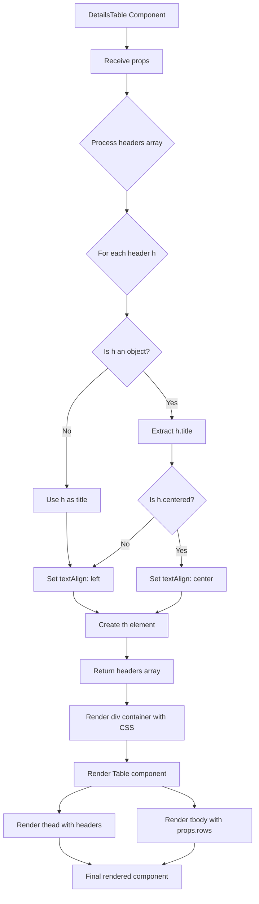
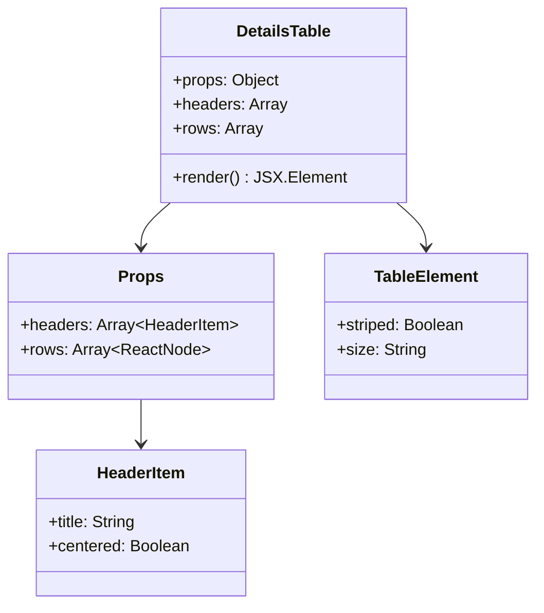
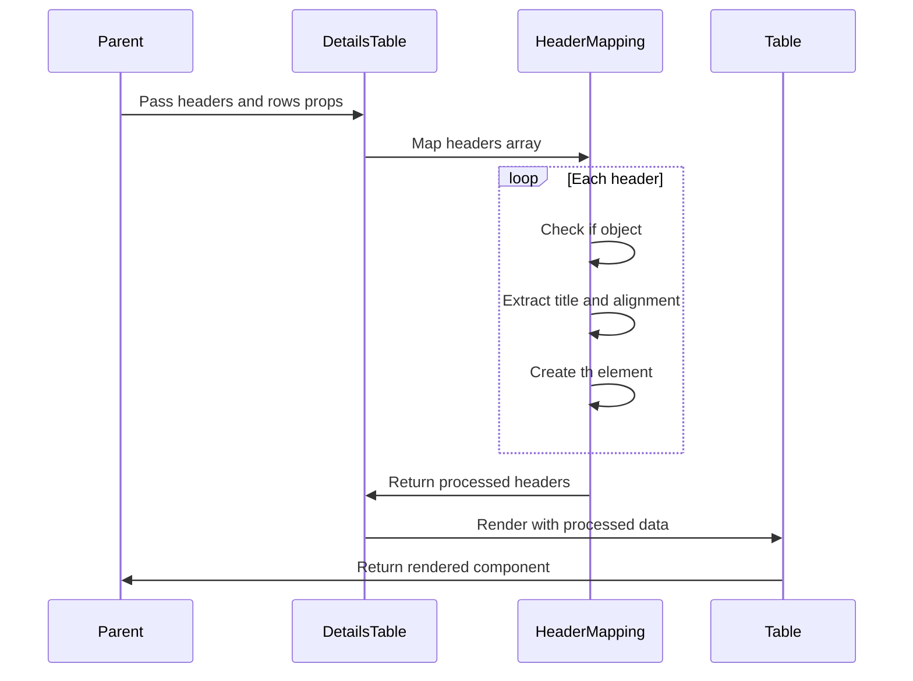

# Diagram: web/portal/src/components-old/DetailsTable.js

> Auto-generated by Obscura crawlers

## Diagram 1

### SVG

<svg id="container" width="582.1875" xmlns="http://www.w3.org/2000/svg" class="flowchart" height="2012.03125" viewBox="0 0 582.1875 2012.03125" role="graphics-document document" aria-roledescription="flowchart-v2"><g><marker id="container_flowchart-v2-pointEnd" class="marker flowchart-v2" viewBox="0 0 10 10" refX="5" refY="5" markerUnits="userSpaceOnUse" markerWidth="8" markerHeight="8" orient="auto"><path d="M 0 0 L 10 5 L 0 10 z" class="arrowMarkerPath" style="stroke-width: 1; stroke-dasharray: 1, 0;"></path></marker><marker id="container_flowchart-v2-pointStart" class="marker flowchart-v2" viewBox="0 0 10 10" refX="4.5" refY="5" markerUnits="userSpaceOnUse" markerWidth="8" markerHeight="8" orient="auto"><path d="M 0 5 L 10 10 L 10 0 z" class="arrowMarkerPath" style="stroke-width: 1; stroke-dasharray: 1, 0;"></path></marker><marker id="container_flowchart-v2-circleEnd" class="marker flowchart-v2" viewBox="0 0 10 10" refX="11" refY="5" markerUnits="userSpaceOnUse" markerWidth="11" markerHeight="11" orient="auto"><circle cx="5" cy="5" r="5" class="arrowMarkerPath" style="stroke-width: 1; stroke-dasharray: 1, 0;"></circle></marker><marker id="container_flowchart-v2-circleStart" class="marker flowchart-v2" viewBox="0 0 10 10" refX="-1" refY="5" markerUnits="userSpaceOnUse" markerWidth="11" markerHeight="11" orient="auto"><circle cx="5" cy="5" r="5" class="arrowMarkerPath" style="stroke-width: 1; stroke-dasharray: 1, 0;"></circle></marker><marker id="container_flowchart-v2-crossEnd" class="marker cross flowchart-v2" viewBox="0 0 11 11" refX="12" refY="5.2" markerUnits="userSpaceOnUse" markerWidth="11" markerHeight="11" orient="auto"><path d="M 1,1 l 9,9 M 10,1 l -9,9" class="arrowMarkerPath" style="stroke-width: 2; stroke-dasharray: 1, 0;"></path></marker><marker id="container_flowchart-v2-crossStart" class="marker cross flowchart-v2" viewBox="0 0 11 11" refX="-1" refY="5.2" markerUnits="userSpaceOnUse" markerWidth="11" markerHeight="11" orient="auto"><path d="M 1,1 l 9,9 M 10,1 l -9,9" class="arrowMarkerPath" style="stroke-width: 2; stroke-dasharray: 1, 0;"></path></marker><g class="root"><g class="clusters"></g><g class="edgePaths"><path d="M290.141,62L290.141,66.167C290.141,70.333,290.141,78.667,290.141,86.333C290.141,94,290.141,101,290.141,104.5L290.141,108" id="L_A_B_0" class="edge-thickness-normal edge-pattern-solid edge-thickness-normal edge-pattern-solid flowchart-link" style=";" data-edge="true" data-et="edge" data-id="L_A_B_0" data-points="W3sieCI6MjkwLjE0MDYyNSwieSI6NjJ9LHsieCI6MjkwLjE0MDYyNSwieSI6ODd9LHsieCI6MjkwLjE0MDYyNSwieSI6MTEyfV0=" marker-end="url(#container_flowchart-v2-pointEnd)"></path><path d="M290.141,166L290.141,170.167C290.141,174.333,290.141,182.667,290.141,190.333C290.141,198,290.141,205,290.141,208.5L290.141,212" id="L_B_C_0" class="edge-thickness-normal edge-pattern-solid edge-thickness-normal edge-pattern-solid flowchart-link" style=";" data-edge="true" data-et="edge" data-id="L_B_C_0" data-points="W3sieCI6MjkwLjE0MDYyNSwieSI6MTY2fSx7IngiOjI5MC4xNDA2MjUsInkiOjE5MX0seyJ4IjoyOTAuMTQwNjI1LCJ5IjoyMTZ9XQ==" marker-end="url(#container_flowchart-v2-pointEnd)"></path><path d="M290.141,428.5L290.141,432.667C290.141,436.833,290.141,445.167,290.141,452.833C290.141,460.5,290.141,467.5,290.141,471L290.141,474.5" id="L_C_D_0" class="edge-thickness-normal edge-pattern-solid edge-thickness-normal edge-pattern-solid flowchart-link" style=";" data-edge="true" data-et="edge" data-id="L_C_D_0" data-points="W3sieCI6MjkwLjE0MDYyNSwieSI6NDI4LjV9LHsieCI6MjkwLjE0MDYyNSwieSI6NDUzLjV9LHsieCI6MjkwLjE0MDYyNSwieSI6NDc4LjV9XQ==" marker-end="url(#container_flowchart-v2-pointEnd)"></path><path d="M290.141,662.813L290.141,666.979C290.141,671.146,290.141,679.479,290.141,687.146C290.141,694.813,290.141,701.813,290.141,705.313L290.141,708.813" id="L_D_E_0" class="edge-thickness-normal edge-pattern-solid edge-thickness-normal edge-pattern-solid flowchart-link" style=";" data-edge="true" data-et="edge" data-id="L_D_E_0" data-points="W3sieCI6MjkwLjE0MDYyNSwieSI6NjYyLjgxMjV9LHsieCI6MjkwLjE0MDYyNSwieSI6Njg3LjgxMjV9LHsieCI6MjkwLjE0MDYyNSwieSI6NzEyLjgxMjV9XQ==" marker-end="url(#container_flowchart-v2-pointEnd)"></path><path d="M327.238,834.434L338.079,846.783C348.919,859.133,370.6,883.832,381.441,901.682C392.281,919.531,392.281,930.531,392.281,936.031L392.281,941.531" id="L_E_F_0" class="edge-thickness-normal edge-pattern-solid edge-thickness-normal edge-pattern-solid flowchart-link" style=";" data-edge="true" data-et="edge" data-id="L_E_F_0" data-points="W3sieCI6MzI3LjIzODE4MTgwNTk5MjU1LCJ5Ijo4MzQuNDMzNjkzMTk0MDA3NH0seyJ4IjozOTIuMjgxMjUsInkiOjkwOC41MzEyNX0seyJ4IjozOTIuMjgxMjUsInkiOjk0NS41MzEyNX1d" marker-end="url(#container_flowchart-v2-pointEnd)"></path><path d="M247.188,828.579L231.468,841.904C215.747,855.23,184.305,881.881,168.584,905.873C152.863,929.865,152.863,951.198,152.863,970.531C152.863,989.865,152.863,1007.198,152.863,1027.74C152.863,1048.281,152.863,1072.031,152.863,1083.906L152.863,1095.781" id="L_E_G_0" class="edge-thickness-normal edge-pattern-solid edge-thickness-normal edge-pattern-solid flowchart-link" style=";" data-edge="true" data-et="edge" data-id="L_E_G_0" data-points="W3sieCI6MjQ3LjE4ODQ2Nzg1NDMzNzcsInkiOjgyOC41NzkwOTI4NTQzMzc3fSx7IngiOjE1Mi44NjMyODEyNSwieSI6OTA4LjUzMTI1fSx7IngiOjE1Mi44NjMyODEyNSwieSI6OTcyLjUzMTI1fSx7IngiOjE1Mi44NjMyODEyNSwieSI6MTAyNC41MzEyNX0seyJ4IjoxNTIuODYzMjgxMjUsInkiOjEwOTkuNzgxMjV9XQ==" marker-end="url(#container_flowchart-v2-pointEnd)"></path><path d="M392.281,999.531L392.281,1003.698C392.281,1007.865,392.281,1016.198,392.281,1023.865C392.281,1031.531,392.281,1038.531,392.281,1042.031L392.281,1045.531" id="L_F_H_0" class="edge-thickness-normal edge-pattern-solid edge-thickness-normal edge-pattern-solid flowchart-link" style=";" data-edge="true" data-et="edge" data-id="L_F_H_0" data-points="W3sieCI6MzkyLjI4MTI1LCJ5Ijo5OTkuNTMxMjV9LHsieCI6MzkyLjI4MTI1LCJ5IjoxMDI0LjUzMTI1fSx7IngiOjM5Mi4yODEyNSwieSI6MTA0OS41MzEyNX1d" marker-end="url(#container_flowchart-v2-pointEnd)"></path><path d="M152.863,1153.781L152.863,1168.323C152.863,1182.865,152.863,1211.948,154.163,1232.007C155.462,1252.067,158.06,1263.102,159.36,1268.62L160.659,1274.138" id="L_G_I_0" class="edge-thickness-normal edge-pattern-solid edge-thickness-normal edge-pattern-solid flowchart-link" style=";" data-edge="true" data-et="edge" data-id="L_G_I_0" data-points="W3sieCI6MTUyLjg2MzI4MTI1LCJ5IjoxMTUzLjc4MTI1fSx7IngiOjE1Mi44NjMyODEyNSwieSI6MTI0MS4wMzEyNX0seyJ4IjoxNjEuNTc1ODA1NjY0MDYyNSwieSI6MTI3OC4wMzEyNX1d" marker-end="url(#container_flowchart-v2-pointEnd)"></path><path d="M404.317,1191.995L405.825,1200.168C407.334,1208.341,410.351,1224.686,411.859,1238.359C413.367,1252.031,413.367,1263.031,413.367,1268.531L413.367,1274.031" id="L_H_J_0" class="edge-thickness-normal edge-pattern-solid edge-thickness-normal edge-pattern-solid flowchart-link" style=";" data-edge="true" data-et="edge" data-id="L_H_J_0" data-points="W3sieCI6NDA0LjMxNzE0MTU4OTIxNjY1LCJ5IjoxMTkxLjk5NTM1ODQxMDc4MzR9LHsieCI6NDEzLjM2NzE4NzUsInkiOjEyNDEuMDMxMjV9LHsieCI6NDEzLjM2NzE4NzUsInkiOjEyNzguMDMxMjV9XQ==" marker-end="url(#container_flowchart-v2-pointEnd)"></path><path d="M352.356,1164.106L338.643,1176.927C324.929,1189.748,297.502,1215.39,274.511,1234.023C251.521,1252.657,232.967,1264.282,223.69,1270.095L214.414,1275.907" id="L_H_I_0" class="edge-thickness-normal edge-pattern-solid edge-thickness-normal edge-pattern-solid flowchart-link" style=";" data-edge="true" data-et="edge" data-id="L_H_I_0" data-points="W3sieCI6MzUyLjM1NjQ3NzU2MTgyNTgsInkiOjExNjQuMTA2NDc3NTYxODI1OH0seyJ4IjoyNzAuMDc0MjE4NzUsInkiOjEyNDEuMDMxMjV9LHsieCI6MjExLjAyNDE2OTkyMTg3NSwieSI6MTI3OC4wMzEyNX1d" marker-end="url(#container_flowchart-v2-pointEnd)"></path><path d="M167.934,1332.031L167.934,1336.198C167.934,1340.365,167.934,1348.698,177.112,1356.77C186.291,1364.843,204.649,1372.654,213.828,1376.559L223.006,1380.465" id="L_I_K_0" class="edge-thickness-normal edge-pattern-solid edge-thickness-normal edge-pattern-solid flowchart-link" style=";" data-edge="true" data-et="edge" data-id="L_I_K_0" data-points="W3sieCI6MTY3LjkzMzU5Mzc1LCJ5IjoxMzMyLjAzMTI1fSx7IngiOjE2Ny45MzM1OTM3NSwieSI6MTM1Ny4wMzEyNX0seyJ4IjoyMjYuNjg2OTc0MTU4NjUzODQsInkiOjEzODIuMDMxMjV9XQ==" marker-end="url(#container_flowchart-v2-pointEnd)"></path><path d="M413.367,1332.031L413.367,1336.198C413.367,1340.365,413.367,1348.698,404.107,1356.772C394.848,1364.846,376.328,1372.661,367.069,1376.569L357.809,1380.476" id="L_J_K_0" class="edge-thickness-normal edge-pattern-solid edge-thickness-normal edge-pattern-solid flowchart-link" style=";" data-edge="true" data-et="edge" data-id="L_J_K_0" data-points="W3sieCI6NDEzLjM2NzE4NzUsInkiOjEzMzIuMDMxMjV9LHsieCI6NDEzLjM2NzE4NzUsInkiOjEzNTcuMDMxMjV9LHsieCI6MzU0LjEyMzY0NzgzNjUzODQ1LCJ5IjoxMzgyLjAzMTI1fV0=" marker-end="url(#container_flowchart-v2-pointEnd)"></path><path d="M290.141,1436.031L290.141,1440.198C290.141,1444.365,290.141,1452.698,290.141,1460.365C290.141,1468.031,290.141,1475.031,290.141,1478.531L290.141,1482.031" id="L_K_L_0" class="edge-thickness-normal edge-pattern-solid edge-thickness-normal edge-pattern-solid flowchart-link" style=";" data-edge="true" data-et="edge" data-id="L_K_L_0" data-points="W3sieCI6MjkwLjE0MDYyNSwieSI6MTQzNi4wMzEyNX0seyJ4IjoyOTAuMTQwNjI1LCJ5IjoxNDYxLjAzMTI1fSx7IngiOjI5MC4xNDA2MjUsInkiOjE0ODYuMDMxMjV9XQ==" marker-end="url(#container_flowchart-v2-pointEnd)"></path><path d="M290.141,1540.031L290.141,1544.198C290.141,1548.365,290.141,1556.698,290.141,1564.365C290.141,1572.031,290.141,1579.031,290.141,1582.531L290.141,1586.031" id="L_L_M_0" class="edge-thickness-normal edge-pattern-solid edge-thickness-normal edge-pattern-solid flowchart-link" style=";" data-edge="true" data-et="edge" data-id="L_L_M_0" data-points="W3sieCI6MjkwLjE0MDYyNSwieSI6MTU0MC4wMzEyNX0seyJ4IjoyOTAuMTQwNjI1LCJ5IjoxNTY1LjAzMTI1fSx7IngiOjI5MC4xNDA2MjUsInkiOjE1OTAuMDMxMjV9XQ==" marker-end="url(#container_flowchart-v2-pointEnd)"></path><path d="M290.141,1668.031L290.141,1672.198C290.141,1676.365,290.141,1684.698,290.141,1692.365C290.141,1700.031,290.141,1707.031,290.141,1710.531L290.141,1714.031" id="L_M_N_0" class="edge-thickness-normal edge-pattern-solid edge-thickness-normal edge-pattern-solid flowchart-link" style=";" data-edge="true" data-et="edge" data-id="L_M_N_0" data-points="W3sieCI6MjkwLjE0MDYyNSwieSI6MTY2OC4wMzEyNX0seyJ4IjoyOTAuMTQwNjI1LCJ5IjoxNjkzLjAzMTI1fSx7IngiOjI5MC4xNDA2MjUsInkiOjE3MTguMDMxMjV9XQ==" marker-end="url(#container_flowchart-v2-pointEnd)"></path><path d="M210.155,1772.031L197.811,1776.198C185.468,1780.365,160.781,1788.698,148.437,1798.365C136.094,1808.031,136.094,1819.031,136.094,1824.531L136.094,1830.031" id="L_N_O_0" class="edge-thickness-normal edge-pattern-solid edge-thickness-normal edge-pattern-solid flowchart-link" style=";" data-edge="true" data-et="edge" data-id="L_N_O_0" data-points="W3sieCI6MjEwLjE1NDc0NzU5NjE1Mzg0LCJ5IjoxNzcyLjAzMTI1fSx7IngiOjEzNi4wOTM3NSwieSI6MTc5Ny4wMzEyNX0seyJ4IjoxMzYuMDkzNzUsInkiOjE4MzQuMDMxMjV9XQ==" marker-end="url(#container_flowchart-v2-pointEnd)"></path><path d="M370.127,1772.031L382.47,1776.198C394.814,1780.365,419.501,1788.698,431.844,1796.365C444.188,1804.031,444.188,1811.031,444.188,1814.531L444.188,1818.031" id="L_N_P_0" class="edge-thickness-normal edge-pattern-solid edge-thickness-normal edge-pattern-solid flowchart-link" style=";" data-edge="true" data-et="edge" data-id="L_N_P_0" data-points="W3sieCI6MzcwLjEyNjUwMjQwMzg0NjIsInkiOjE3NzIuMDMxMjV9LHsieCI6NDQ0LjE4NzUsInkiOjE3OTcuMDMxMjV9LHsieCI6NDQ0LjE4NzUsInkiOjE4MjIuMDMxMjV9XQ==" marker-end="url(#container_flowchart-v2-pointEnd)"></path><path d="M136.094,1888.031L136.094,1894.198C136.094,1900.365,136.094,1912.698,147.806,1922.818C159.517,1932.938,182.941,1940.845,194.653,1944.798L206.365,1948.752" id="L_O_Q_0" class="edge-thickness-normal edge-pattern-solid edge-thickness-normal edge-pattern-solid flowchart-link" style=";" data-edge="true" data-et="edge" data-id="L_O_Q_0" data-points="W3sieCI6MTM2LjA5Mzc1LCJ5IjoxODg4LjAzMTI1fSx7IngiOjEzNi4wOTM3NSwieSI6MTkyNS4wMzEyNX0seyJ4IjoyMTAuMTU0NzQ3NTk2MTUzODQsInkiOjE5NTAuMDMxMjV9XQ==" marker-end="url(#container_flowchart-v2-pointEnd)"></path><path d="M444.188,1900.031L444.188,1904.198C444.188,1908.365,444.188,1916.698,432.476,1924.818C420.764,1932.938,397.34,1940.845,385.628,1944.798L373.916,1948.752" id="L_P_Q_0" class="edge-thickness-normal edge-pattern-solid edge-thickness-normal edge-pattern-solid flowchart-link" style=";" data-edge="true" data-et="edge" data-id="L_P_Q_0" data-points="W3sieCI6NDQ0LjE4NzUsInkiOjE5MDAuMDMxMjV9LHsieCI6NDQ0LjE4NzUsInkiOjE5MjUuMDMxMjV9LHsieCI6MzcwLjEyNjUwMjQwMzg0NjIsInkiOjE5NTAuMDMxMjV9XQ==" marker-end="url(#container_flowchart-v2-pointEnd)"></path></g><g class="edgeLabels"><g class="edgeLabel"><g class="label" data-id="L_A_B_0" transform="translate(0, 0)"><foreignObject width="0" height="0">

</foreignObject></g></g><g class="edgeLabel"><g class="label" data-id="L_B_C_0" transform="translate(0, 0)"><foreignObject width="0" height="0">

</foreignObject></g></g><g class="edgeLabel"><g class="label" data-id="L_C_D_0" transform="translate(0, 0)"><foreignObject width="0" height="0">

</foreignObject></g></g><g class="edgeLabel"><g class="label" data-id="L_D_E_0" transform="translate(0, 0)"><foreignObject width="0" height="0">

</foreignObject></g></g><g class="edgeLabel" transform="translate(392.28125, 908.53125)"><g class="label" data-id="L_E_F_0" transform="translate(-12.03125, -12)"><foreignObject width="24.0625" height="24">

Yes

</foreignObject></g></g><g class="edgeLabel" transform="translate(152.86328125, 972.53125)"><g class="label" data-id="L_E_G_0" transform="translate(-10.140625, -12)"><foreignObject width="20.28125" height="24">

No

</foreignObject></g></g><g class="edgeLabel"><g class="label" data-id="L_F_H_0" transform="translate(0, 0)"><foreignObject width="0" height="0">

</foreignObject></g></g><g class="edgeLabel"><g class="label" data-id="L_G_I_0" transform="translate(0, 0)"><foreignObject width="0" height="0">

</foreignObject></g></g><g class="edgeLabel" transform="translate(413.3671875, 1241.03125)"><g class="label" data-id="L_H_J_0" transform="translate(-12.03125, -12)"><foreignObject width="24.0625" height="24">

Yes

</foreignObject></g></g><g class="edgeLabel" transform="translate(270.07421875, 1241.03125)"><g class="label" data-id="L_H_I_0" transform="translate(-10.140625, -12)"><foreignObject width="20.28125" height="24">

No

</foreignObject></g></g><g class="edgeLabel"><g class="label" data-id="L_I_K_0" transform="translate(0, 0)"><foreignObject width="0" height="0">

</foreignObject></g></g><g class="edgeLabel"><g class="label" data-id="L_J_K_0" transform="translate(0, 0)"><foreignObject width="0" height="0">

</foreignObject></g></g><g class="edgeLabel"><g class="label" data-id="L_K_L_0" transform="translate(0, 0)"><foreignObject width="0" height="0">

</foreignObject></g></g><g class="edgeLabel"><g class="label" data-id="L_L_M_0" transform="translate(0, 0)"><foreignObject width="0" height="0">

</foreignObject></g></g><g class="edgeLabel"><g class="label" data-id="L_M_N_0" transform="translate(0, 0)"><foreignObject width="0" height="0">

</foreignObject></g></g><g class="edgeLabel"><g class="label" data-id="L_N_O_0" transform="translate(0, 0)"><foreignObject width="0" height="0">

</foreignObject></g></g><g class="edgeLabel"><g class="label" data-id="L_N_P_0" transform="translate(0, 0)"><foreignObject width="0" height="0">

</foreignObject></g></g><g class="edgeLabel"><g class="label" data-id="L_O_Q_0" transform="translate(0, 0)"><foreignObject width="0" height="0">

</foreignObject></g></g><g class="edgeLabel"><g class="label" data-id="L_P_Q_0" transform="translate(0, 0)"><foreignObject width="0" height="0">

</foreignObject></g></g></g><g class="nodes"><g class="node default" id="flowchart-A-0" transform="translate(290.140625, 35)"><rect class="basic label-container" style="" x="-118.5546875" y="-27" width="237.109375" height="54"></rect><g class="label" style="" transform="translate(-88.5546875, -12)"><rect></rect><foreignObject width="177.109375" height="24">

DetailsTable Component

</foreignObject></g></g><g class="node default" id="flowchart-B-1" transform="translate(290.140625, 139)"><rect class="basic label-container" style="" x="-80.5078125" y="-27" width="161.015625" height="54"></rect><g class="label" style="" transform="translate(-50.5078125, -12)"><rect></rect><foreignObject width="101.015625" height="24">

Receive props

</foreignObject></g></g><g class="node default" id="flowchart-C-3" transform="translate(290.140625, 322.25)"><polygon points="106.25,0 212.5,-106.25 106.25,-212.5 0,-106.25" class="label-container" transform="translate(-105.75, 106.25)"></polygon><g class="label" style="" transform="translate(-79.25, -12)"><rect></rect><foreignObject width="158.5" height="24">

Process headers array

</foreignObject></g></g><g class="node default" id="flowchart-D-5" transform="translate(290.140625, 570.65625)"><polygon points="92.15625,0 184.3125,-92.15625 92.15625,-184.3125 0,-92.15625" class="label-container" transform="translate(-91.65625, 92.15625)"></polygon><g class="label" style="" transform="translate(-65.15625, -12)"><rect></rect><foreignObject width="130.3125" height="24">

For each header h

</foreignObject></g></g><g class="node default" id="flowchart-E-7" transform="translate(290.140625, 792.171875)"><polygon points="79.359375,0 158.71875,-79.359375 79.359375,-158.71875 0,-79.359375" class="label-container" transform="translate(-78.859375, 79.359375)"></polygon><g class="label" style="" transform="translate(-52.359375, -12)"><rect></rect><foreignObject width="104.71875" height="24">

Is h an object?

</foreignObject></g></g><g class="node default" id="flowchart-F-9" transform="translate(392.28125, 972.53125)"><rect class="basic label-container" style="" x="-78.03125" y="-27" width="156.0625" height="54"></rect><g class="label" style="" transform="translate(-48.03125, -12)"><rect></rect><foreignObject width="96.0625" height="24">

Extract h.title

</foreignObject></g></g><g class="node default" id="flowchart-G-11" transform="translate(152.86328125, 1126.78125)"><rect class="basic label-container" style="" x="-77.03125" y="-27" width="154.0625" height="54"></rect><g class="label" style="" transform="translate(-47.03125, -12)"><rect></rect><foreignObject width="94.0625" height="24">

Use h as title

</foreignObject></g></g><g class="node default" id="flowchart-H-13" transform="translate(392.28125, 1126.78125)"><polygon points="77.25,0 154.5,-77.25 77.25,-154.5 0,-77.25" class="label-container" transform="translate(-76.75, 77.25)"></polygon><g class="label" style="" transform="translate(-50.25, -12)"><rect></rect><foreignObject width="100.5" height="24">

Is h.centered?

</foreignObject></g></g><g class="node default" id="flowchart-I-15" transform="translate(167.93359375, 1305.03125)"><rect class="basic label-container" style="" x="-91.859375" y="-27" width="183.71875" height="54"></rect><g class="label" style="" transform="translate(-61.859375, -12)"><rect></rect><foreignObject width="123.71875" height="24">

Set textAlign: left

</foreignObject></g></g><g class="node default" id="flowchart-J-17" transform="translate(413.3671875, 1305.03125)"><rect class="basic label-container" style="" x="-102.5546875" y="-27" width="205.109375" height="54"></rect><g class="label" style="" transform="translate(-72.5546875, -12)"><rect></rect><foreignObject width="145.109375" height="24">

Set textAlign: center

</foreignObject></g></g><g class="node default" id="flowchart-K-21" transform="translate(290.140625, 1409.03125)"><rect class="basic label-container" style="" x="-94.6015625" y="-27" width="189.203125" height="54"></rect><g class="label" style="" transform="translate(-64.6015625, -12)"><rect></rect><foreignObject width="129.203125" height="24">

Create th element

</foreignObject></g></g><g class="node default" id="flowchart-L-25" transform="translate(290.140625, 1513.03125)"><rect class="basic label-container" style="" x="-106.2265625" y="-27" width="212.453125" height="54"></rect><g class="label" style="" transform="translate(-76.2265625, -12)"><rect></rect><foreignObject width="152.453125" height="24">

Return headers array

</foreignObject></g></g><g class="node default" id="flowchart-M-27" transform="translate(290.140625, 1629.03125)"><rect class="basic label-container" style="" x="-130" y="-39" width="260" height="78"></rect><g class="label" style="" transform="translate(-100, -24)"><rect></rect><foreignObject width="200" height="48">

Render div container with CSS

</foreignObject></g></g><g class="node default" id="flowchart-N-29" transform="translate(290.140625, 1745.03125)"><rect class="basic label-container" style="" x="-120.984375" y="-27" width="241.96875" height="54"></rect><g class="label" style="" transform="translate(-90.984375, -12)"><rect></rect><foreignObject width="181.96875" height="24">

Render Table component

</foreignObject></g></g><g class="node default" id="flowchart-O-31" transform="translate(136.09375, 1861.03125)"><rect class="basic label-container" style="" x="-128.09375" y="-27" width="256.1875" height="54"></rect><g class="label" style="" transform="translate(-98.09375, -12)"><rect></rect><foreignObject width="196.1875" height="24">

Render thead with headers

</foreignObject></g></g><g class="node default" id="flowchart-P-33" transform="translate(444.1875, 1861.03125)"><rect class="basic label-container" style="" x="-130" y="-39" width="260" height="78"></rect><g class="label" style="" transform="translate(-100, -24)"><rect></rect><foreignObject width="200" height="48">

Render tbody with props.rows

</foreignObject></g></g><g class="node default" id="flowchart-Q-35" transform="translate(290.140625, 1977.03125)"><rect class="basic label-container" style="" x="-125.7265625" y="-27" width="251.453125" height="54"></rect><g class="label" style="" transform="translate(-95.7265625, -12)"><rect></rect><foreignObject width="191.453125" height="24">

Final rendered component

</foreignObject></g></g></g></g></g></svg>

## Diagram 2

### SVG

<svg id="container" width="524.9921875" xmlns="http://www.w3.org/2000/svg" class="classDiagram" height="596" viewBox="0 0 524.9921875 596" role="graphics-document document" aria-roledescription="class"><g><defs><marker id="container_class-aggregationStart" class="marker aggregation class" refX="18" refY="7" markerWidth="190" markerHeight="240" orient="auto"><path d="M 18,7 L9,13 L1,7 L9,1 Z"></path></marker></defs><defs><marker id="container_class-aggregationEnd" class="marker aggregation class" refX="1" refY="7" markerWidth="20" markerHeight="28" orient="auto"><path d="M 18,7 L9,13 L1,7 L9,1 Z"></path></marker></defs><defs><marker id="container_class-extensionStart" class="marker extension class" refX="18" refY="7" markerWidth="190" markerHeight="240" orient="auto"><path d="M 1,7 L18,13 V 1 Z"></path></marker></defs><defs><marker id="container_class-extensionEnd" class="marker extension class" refX="1" refY="7" markerWidth="20" markerHeight="28" orient="auto"><path d="M 1,1 V 13 L18,7 Z"></path></marker></defs><defs><marker id="container_class-compositionStart" class="marker composition class" refX="18" refY="7" markerWidth="190" markerHeight="240" orient="auto"><path d="M 18,7 L9,13 L1,7 L9,1 Z"></path></marker></defs><defs><marker id="container_class-compositionEnd" class="marker composition class" refX="1" refY="7" markerWidth="20" markerHeight="28" orient="auto"><path d="M 18,7 L9,13 L1,7 L9,1 Z"></path></marker></defs><defs><marker id="container_class-dependencyStart" class="marker dependency class" refX="6" refY="7" markerWidth="190" markerHeight="240" orient="auto"><path d="M 5,7 L9,13 L1,7 L9,1 Z"></path></marker></defs><defs><marker id="container_class-dependencyEnd" class="marker dependency class" refX="13" refY="7" markerWidth="20" markerHeight="28" orient="auto"><path d="M 18,7 L9,13 L14,7 L9,1 Z"></path></marker></defs><defs><marker id="container_class-lollipopStart" class="marker lollipop class" refX="13" refY="7" markerWidth="190" markerHeight="240" orient="auto"><circle stroke="black" fill="transparent" cx="7" cy="7" r="6"></circle></marker></defs><defs><marker id="container_class-lollipopEnd" class="marker lollipop class" refX="1" refY="7" markerWidth="190" markerHeight="240" orient="auto"><circle stroke="black" fill="transparent" cx="7" cy="7" r="6"></circle></marker></defs><g class="root"><g class="clusters"></g><g class="edgePaths"><path d="M165.835,200L161.022,204.167C156.21,208.333,146.585,216.667,141.773,224C136.961,231.333,136.961,237.667,136.961,240.833L136.961,244" id="id_DetailsTable_Props_1" class="edge-thickness-normal edge-pattern-solid relation" style=";;;" data-edge="true" data-et="edge" data-id="id_DetailsTable_Props_1" data-points="W3sieCI6MTY1LjgzNDUwMDkwMzkyNTYzLCJ5IjoyMDB9LHsieCI6MTM2Ljk2MDkzNzUsInkiOjIyNX0seyJ4IjoxMzYuOTYwOTM3NSwieSI6MjUwfV0=" marker-end="url(#container_class-dependencyEnd)"></path><path d="M136.961,394L136.961,398.167C136.961,402.333,136.961,410.667,136.961,418C136.961,425.333,136.961,431.667,136.961,434.833L136.961,438" id="id_Props_HeaderItem_2" class="edge-thickness-normal edge-pattern-solid relation" style=";;;" data-edge="true" data-et="edge" data-id="id_Props_HeaderItem_2" data-points="W3sieCI6MTM2Ljk2MDkzNzUsInkiOjM5NH0seyJ4IjoxMzYuOTYwOTM3NSwieSI6NDE5fSx7IngiOjEzNi45NjA5Mzc1LCJ5Ijo0NDR9XQ==" marker-end="url(#container_class-dependencyEnd)"></path><path d="M387.583,200L392.396,204.167C397.208,208.333,406.833,216.667,411.645,224C416.457,231.333,416.457,237.667,416.457,240.833L416.457,244" id="id_DetailsTable_TableElement_3" class="edge-thickness-normal edge-pattern-solid relation" style=";;;" data-edge="true" data-et="edge" data-id="id_DetailsTable_TableElement_3" data-points="W3sieCI6Mzg3LjU4MzQ2Nzg0NjA3NDM3LCJ5IjoyMDB9LHsieCI6NDE2LjQ1NzAzMTI1LCJ5IjoyMjV9LHsieCI6NDE2LjQ1NzAzMTI1LCJ5IjoyNTB9XQ==" marker-end="url(#container_class-dependencyEnd)"></path></g><g class="edgeLabels"><g class="edgeLabel"><g class="label" data-id="id_DetailsTable_Props_1" transform="translate(0, 0)"><foreignObject width="0" height="0">

</foreignObject></g></g><g class="edgeLabel"><g class="label" data-id="id_Props_HeaderItem_2" transform="translate(0, 0)"><foreignObject width="0" height="0">

</foreignObject></g></g><g class="edgeLabel"><g class="label" data-id="id_DetailsTable_TableElement_3" transform="translate(0, 0)"><foreignObject width="0" height="0">

</foreignObject></g></g></g><g class="nodes"><g class="node default" id="classId-DetailsTable-0" transform="translate(276.708984375, 104)"><g class="basic label-container"><path d="M-116.796875 -96 L116.796875 -96 L116.796875 96 L-116.796875 96" stroke="none" stroke-width="0" fill="#ECECFF" style=""></path><path d="M-116.796875 -96 C-36.861642936932924 -96, 43.07358912613415 -96, 116.796875 -96 M-116.796875 -96 C-54.9098729790807 -96, 6.9771290418385945 -96, 116.796875 -96 M116.796875 -96 C116.796875 -24.469757240185032, 116.796875 47.060485519629935, 116.796875 96 M116.796875 -96 C116.796875 -36.515480183242055, 116.796875 22.96903963351589, 116.796875 96 M116.796875 96 C49.80439788208112 96, -17.188079235837762 96, -116.796875 96 M116.796875 96 C51.23362658045458 96, -14.329621839090834 96, -116.796875 96 M-116.796875 96 C-116.796875 30.32595512634893, -116.796875 -35.34808974730214, -116.796875 -96 M-116.796875 96 C-116.796875 33.4097277960201, -116.796875 -29.1805444079598, -116.796875 -96" stroke="#9370DB" stroke-width="1.3" fill="none" stroke-dasharray="0 0" style=""></path></g><g class="annotation-group text" transform="translate(0, -72)"></g><g class="label-group text" transform="translate(-45.328125, -72)"><g class="label" style="font-weight: bolder" transform="translate(0,-12)"><foreignObject width="90.65625" height="24">

DetailsTable

</foreignObject></g></g><g class="members-group text" transform="translate(-104.796875, -24)"><g class="label" style="" transform="translate(0,-12)"><foreignObject width="104.796875" height="24">

+props: Object

</foreignObject></g><g class="label" style="" transform="translate(0,12)"><foreignObject width="111.703125" height="24">

+headers: Array

</foreignObject></g><g class="label" style="" transform="translate(0,36)"><foreignObject width="87.359375" height="24">

+rows: Array

</foreignObject></g></g><g class="methods-group text" transform="translate(-104.796875, 72)"><g class="label" style="" transform="translate(0,-12)"><foreignObject width="164.265625" height="24">

+render() : JSX.Element

</foreignObject></g></g><g class="divider" style=""><path d="M-116.796875 -48 C-46.54097328537982 -48, 23.71492842924036 -48, 116.796875 -48 M-116.796875 -48 C-67.62397551788783 -48, -18.45107603577567 -48, 116.796875 -48" stroke="#9370DB" stroke-width="1.3" fill="none" stroke-dasharray="0 0" style=""></path></g><g class="divider" style=""><path d="M-116.796875 48 C-51.32892351001236 48, 14.139027979975282 48, 116.796875 48 M-116.796875 48 C-61.550418732883315 48, -6.303962465766631 48, 116.796875 48" stroke="#9370DB" stroke-width="1.3" fill="none" stroke-dasharray="0 0" style=""></path></g></g><g class="node default" id="classId-Props-1" transform="translate(136.9609375, 322)"><g class="basic label-container"><path d="M-128.9609375 -72 L128.9609375 -72 L128.9609375 72 L-128.9609375 72" stroke="none" stroke-width="0" fill="#ECECFF" style=""></path><path d="M-128.9609375 -72 C-68.51610910517587 -72, -8.071280710351743 -72, 128.9609375 -72 M-128.9609375 -72 C-40.62932792846257 -72, 47.702281643074855 -72, 128.9609375 -72 M128.9609375 -72 C128.9609375 -24.724294645427356, 128.9609375 22.551410709145287, 128.9609375 72 M128.9609375 -72 C128.9609375 -23.998074483342712, 128.9609375 24.003851033314575, 128.9609375 72 M128.9609375 72 C56.80749773769843 72, -15.345942024603147 72, -128.9609375 72 M128.9609375 72 C53.143507757024864 72, -22.673921985950273 72, -128.9609375 72 M-128.9609375 72 C-128.9609375 33.72677668845885, -128.9609375 -4.5464466230823035, -128.9609375 -72 M-128.9609375 72 C-128.9609375 27.907358115463467, -128.9609375 -16.185283769073067, -128.9609375 -72" stroke="#9370DB" stroke-width="1.3" fill="none" stroke-dasharray="0 0" style=""></path></g><g class="annotation-group text" transform="translate(0, -48)"></g><g class="label-group text" transform="translate(-20.921875, -48)"><g class="label" style="font-weight: bolder" transform="translate(0,-12)"><foreignObject width="41.84375" height="24">

Props

</foreignObject></g></g><g class="members-group text" transform="translate(-116.9609375, 0)"><g class="label" style="" transform="translate(0,-12)"><foreignObject width="213" height="24">

+headers: Array&lt;HeaderItem&gt;

</foreignObject></g><g class="label" style="" transform="translate(0,12)"><foreignObject width="182.046875" height="24">

+rows: Array&lt;ReactNode&gt;

</foreignObject></g></g><g class="methods-group text" transform="translate(-116.9609375, 72)"></g><g class="divider" style=""><path d="M-128.9609375 -24 C-71.0601024658448 -24, -13.1592674316896 -24, 128.9609375 -24 M-128.9609375 -24 C-50.44902358679319 -24, 28.062890326413623 -24, 128.9609375 -24" stroke="#9370DB" stroke-width="1.3" fill="none" stroke-dasharray="0 0" style=""></path></g><g class="divider" style=""><path d="M-128.9609375 48 C-51.342548873500604 48, 26.27583975299879 48, 128.9609375 48 M-128.9609375 48 C-51.95496988685886 48, 25.050997726282276 48, 128.9609375 48" stroke="#9370DB" stroke-width="1.3" fill="none" stroke-dasharray="0 0" style=""></path></g></g><g class="node default" id="classId-HeaderItem-2" transform="translate(136.9609375, 516)"><g class="basic label-container"><path d="M-103.171875 -72 L103.171875 -72 L103.171875 72 L-103.171875 72" stroke="none" stroke-width="0" fill="#ECECFF" style=""></path><path d="M-103.171875 -72 C-38.55693076694071 -72, 26.05801346611858 -72, 103.171875 -72 M-103.171875 -72 C-26.084313133555213 -72, 51.003248732889574 -72, 103.171875 -72 M103.171875 -72 C103.171875 -42.73466538718124, 103.171875 -13.469330774362483, 103.171875 72 M103.171875 -72 C103.171875 -36.61410636640411, 103.171875 -1.2282127328082169, 103.171875 72 M103.171875 72 C27.054679745020437 72, -49.06251550995913 72, -103.171875 72 M103.171875 72 C53.607363898367964 72, 4.042852796735929 72, -103.171875 72 M-103.171875 72 C-103.171875 21.686103425073426, -103.171875 -28.627793149853147, -103.171875 -72 M-103.171875 72 C-103.171875 25.362407606750395, -103.171875 -21.27518478649921, -103.171875 -72" stroke="#9370DB" stroke-width="1.3" fill="none" stroke-dasharray="0 0" style=""></path></g><g class="annotation-group text" transform="translate(0, -48)"></g><g class="label-group text" transform="translate(-42.9375, -48)"><g class="label" style="font-weight: bolder" transform="translate(0,-12)"><foreignObject width="85.875" height="24">

HeaderItem

</foreignObject></g></g><g class="members-group text" transform="translate(-91.171875, 0)"><g class="label" style="" transform="translate(0,-12)"><foreignObject width="88.109375" height="24">

+title: String

</foreignObject></g><g class="label" style="" transform="translate(0,12)"><foreignObject width="139.40625" height="24">

+centered: Boolean

</foreignObject></g></g><g class="methods-group text" transform="translate(-91.171875, 72)"></g><g class="divider" style=""><path d="M-103.171875 -24 C-21.28900577304036 -24, 60.59386345391928 -24, 103.171875 -24 M-103.171875 -24 C-21.537187660307126 -24, 60.09749967938575 -24, 103.171875 -24" stroke="#9370DB" stroke-width="1.3" fill="none" stroke-dasharray="0 0" style=""></path></g><g class="divider" style=""><path d="M-103.171875 48 C-43.00502304749227 48, 17.161828905015454 48, 103.171875 48 M-103.171875 48 C-32.78716426064034 48, 37.59754647871932 48, 103.171875 48" stroke="#9370DB" stroke-width="1.3" fill="none" stroke-dasharray="0 0" style=""></path></g></g><g class="node default" id="classId-TableElement-3" transform="translate(416.45703125, 322)"><g class="basic label-container"><path d="M-100.53515625 -72 L100.53515625 -72 L100.53515625 72 L-100.53515625 72" stroke="none" stroke-width="0" fill="#ECECFF" style=""></path><path d="M-100.53515625 -72 C-23.05528549548187 -72, 54.42458525903626 -72, 100.53515625 -72 M-100.53515625 -72 C-35.02049252158204 -72, 30.494171206835915 -72, 100.53515625 -72 M100.53515625 -72 C100.53515625 -24.848608496400423, 100.53515625 22.302783007199153, 100.53515625 72 M100.53515625 -72 C100.53515625 -41.80426913508437, 100.53515625 -11.60853827016873, 100.53515625 72 M100.53515625 72 C53.17256319029261 72, 5.809970130585214 72, -100.53515625 72 M100.53515625 72 C27.179164833611537 72, -46.176826582776926 72, -100.53515625 72 M-100.53515625 72 C-100.53515625 30.704837365979294, -100.53515625 -10.590325268041411, -100.53515625 -72 M-100.53515625 72 C-100.53515625 25.74172655712664, -100.53515625 -20.51654688574672, -100.53515625 -72" stroke="#9370DB" stroke-width="1.3" fill="none" stroke-dasharray="0 0" style=""></path></g><g class="annotation-group text" transform="translate(0, -48)"></g><g class="label-group text" transform="translate(-49.6015625, -48)"><g class="label" style="font-weight: bolder" transform="translate(0,-12)"><foreignObject width="99.203125" height="24">

TableElement

</foreignObject></g></g><g class="members-group text" transform="translate(-88.53515625, 0)"><g class="label" style="" transform="translate(0,-12)"><foreignObject width="127.46875" height="24">

+striped: Boolean

</foreignObject></g><g class="label" style="" transform="translate(0,12)"><foreignObject width="86.53125" height="24">

+size: String

</foreignObject></g></g><g class="methods-group text" transform="translate(-88.53515625, 72)"></g><g class="divider" style=""><path d="M-100.53515625 -24 C-31.263283749015443 -24, 38.008588751969114 -24, 100.53515625 -24 M-100.53515625 -24 C-22.83954210393918 -24, 54.85607204212164 -24, 100.53515625 -24" stroke="#9370DB" stroke-width="1.3" fill="none" stroke-dasharray="0 0" style=""></path></g><g class="divider" style=""><path d="M-100.53515625 48 C-29.262225523294617 48, 42.010705203410765 48, 100.53515625 48 M-100.53515625 48 C-40.235772817899786 48, 20.063610614200428 48, 100.53515625 48" stroke="#9370DB" stroke-width="1.3" fill="none" stroke-dasharray="0 0" style=""></path></g></g></g></g></g></svg>

## Diagram 3

### SVG

<svg id="container" width="989" xmlns="http://www.w3.org/2000/svg" height="730" viewBox="-50 -10 989 730" role="graphics-document document" aria-roledescription="sequence"><g><rect x="739" y="644" fill="#eaeaea" stroke="#666" width="150" height="65" name="Table" rx="3" ry="3" class="actor actor-bottom"></rect><text x="814" y="676.5" dominant-baseline="central" alignment-baseline="central" class="actor actor-box" style="text-anchor: middle; font-size: 16px; font-weight: 400;"><tspan x="814" dy="0">Table</tspan></text></g><g><rect x="539" y="644" fill="#eaeaea" stroke="#666" width="150" height="65" name="HeaderMapping" rx="3" ry="3" class="actor actor-bottom"></rect><text x="614" y="676.5" dominant-baseline="central" alignment-baseline="central" class="actor actor-box" style="text-anchor: middle; font-size: 16px; font-weight: 400;"><tspan x="614" dy="0">HeaderMapping</tspan></text></g><g><rect x="280" y="644" fill="#eaeaea" stroke="#666" width="150" height="65" name="DetailsTable" rx="3" ry="3" class="actor actor-bottom"></rect><text x="355" y="676.5" dominant-baseline="central" alignment-baseline="central" class="actor actor-box" style="text-anchor: middle; font-size: 16px; font-weight: 400;"><tspan x="355" dy="0">DetailsTable</tspan></text></g><g><rect x="0" y="644" fill="#eaeaea" stroke="#666" width="150" height="65" name="Parent" rx="3" ry="3" class="actor actor-bottom"></rect><text x="75" y="676.5" dominant-baseline="central" alignment-baseline="central" class="actor actor-box" style="text-anchor: middle; font-size: 16px; font-weight: 400;"><tspan x="75" dy="0">Parent</tspan></text></g><g><line id="actor3" x1="814" y1="65" x2="814" y2="644" class="actor-line 200" stroke-width="0.5px" stroke="#999" name="Table"></line><g id="root-3"><rect x="739" y="0" fill="#eaeaea" stroke="#666" width="150" height="65" name="Table" rx="3" ry="3" class="actor actor-top"></rect><text x="814" y="32.5" dominant-baseline="central" alignment-baseline="central" class="actor actor-box" style="text-anchor: middle; font-size: 16px; font-weight: 400;"><tspan x="814" dy="0">Table</tspan></text></g></g><g><line id="actor2" x1="614" y1="65" x2="614" y2="644" class="actor-line 200" stroke-width="0.5px" stroke="#999" name="HeaderMapping"></line><g id="root-2"><rect x="539" y="0" fill="#eaeaea" stroke="#666" width="150" height="65" name="HeaderMapping" rx="3" ry="3" class="actor actor-top"></rect><text x="614" y="32.5" dominant-baseline="central" alignment-baseline="central" class="actor actor-box" style="text-anchor: middle; font-size: 16px; font-weight: 400;"><tspan x="614" dy="0">HeaderMapping</tspan></text></g></g><g><line id="actor1" x1="355" y1="65" x2="355" y2="644" class="actor-line 200" stroke-width="0.5px" stroke="#999" name="DetailsTable"></line><g id="root-1"><rect x="280" y="0" fill="#eaeaea" stroke="#666" width="150" height="65" name="DetailsTable" rx="3" ry="3" class="actor actor-top"></rect><text x="355" y="32.5" dominant-baseline="central" alignment-baseline="central" class="actor actor-box" style="text-anchor: middle; font-size: 16px; font-weight: 400;"><tspan x="355" dy="0">DetailsTable</tspan></text></g></g><g><line id="actor0" x1="75" y1="65" x2="75" y2="644" class="actor-line 200" stroke-width="0.5px" stroke="#999" name="Parent"></line><g id="root-0"><rect x="0" y="0" fill="#eaeaea" stroke="#666" width="150" height="65" name="Parent" rx="3" ry="3" class="actor actor-top"></rect><text x="75" y="32.5" dominant-baseline="central" alignment-baseline="central" class="actor actor-box" style="text-anchor: middle; font-size: 16px; font-weight: 400;"><tspan x="75" dy="0">Parent</tspan></text></g></g><g></g><defs><symbol id="computer" width="24" height="24"><path transform="scale(.5)" d="M2 2v13h20v-13h-20zm18 11h-16v-9h16v9zm-10.228 6l.466-1h3.524l.467 1h-4.457zm14.228 3h-24l2-6h2.104l-1.33 4h18.45l-1.297-4h2.073l2 6zm-5-10h-14v-7h14v7z"></path></symbol></defs><defs><symbol id="database" fill-rule="evenodd" clip-rule="evenodd"><path transform="scale(.5)" d="M12.258.001l.256.004.255.005.253.008.251.01.249.012.247.015.246.016.242.019.241.02.239.023.236.024.233.027.231.028.229.031.225.032.223.034.22.036.217.038.214.04.211.041.208.043.205.045.201.046.198.048.194.05.191.051.187.053.183.054.18.056.175.057.172.059.168.06.163.061.16.063.155.064.15.066.074.033.073.033.071.034.07.034.069.035.068.035.067.035.066.035.064.036.064.036.062.036.06.036.06.037.058.037.058.037.055.038.055.038.053.038.052.038.051.039.05.039.048.039.047.039.045.04.044.04.043.04.041.04.04.041.039.041.037.041.036.041.034.041.033.042.032.042.03.042.029.042.027.042.026.043.024.043.023.043.021.043.02.043.018.044.017.043.015.044.013.044.012.044.011.045.009.044.007.045.006.045.004.045.002.045.001.045v17l-.001.045-.002.045-.004.045-.006.045-.007.045-.009.044-.011.045-.012.044-.013.044-.015.044-.017.043-.018.044-.02.043-.021.043-.023.043-.024.043-.026.043-.027.042-.029.042-.03.042-.032.042-.033.042-.034.041-.036.041-.037.041-.039.041-.04.041-.041.04-.043.04-.044.04-.045.04-.047.039-.048.039-.05.039-.051.039-.052.038-.053.038-.055.038-.055.038-.058.037-.058.037-.06.037-.06.036-.062.036-.064.036-.064.036-.066.035-.067.035-.068.035-.069.035-.07.034-.071.034-.073.033-.074.033-.15.066-.155.064-.16.063-.163.061-.168.06-.172.059-.175.057-.18.056-.183.054-.187.053-.191.051-.194.05-.198.048-.201.046-.205.045-.208.043-.211.041-.214.04-.217.038-.22.036-.223.034-.225.032-.229.031-.231.028-.233.027-.236.024-.239.023-.241.02-.242.019-.246.016-.247.015-.249.012-.251.01-.253.008-.255.005-.256.004-.258.001-.258-.001-.256-.004-.255-.005-.253-.008-.251-.01-.249-.012-.247-.015-.245-.016-.243-.019-.241-.02-.238-.023-.236-.024-.234-.027-.231-.028-.228-.031-.226-.032-.223-.034-.22-.036-.217-.038-.214-.04-.211-.041-.208-.043-.204-.045-.201-.046-.198-.048-.195-.05-.19-.051-.187-.053-.184-.054-.179-.056-.176-.057-.172-.059-.167-.06-.164-.061-.159-.063-.155-.064-.151-.066-.074-.033-.072-.033-.072-.034-.07-.034-.069-.035-.068-.035-.067-.035-.066-.035-.064-.036-.063-.036-.062-.036-.061-.036-.06-.037-.058-.037-.057-.037-.056-.038-.055-.038-.053-.038-.052-.038-.051-.039-.049-.039-.049-.039-.046-.039-.046-.04-.044-.04-.043-.04-.041-.04-.04-.041-.039-.041-.037-.041-.036-.041-.034-.041-.033-.042-.032-.042-.03-.042-.029-.042-.027-.042-.026-.043-.024-.043-.023-.043-.021-.043-.02-.043-.018-.044-.017-.043-.015-.044-.013-.044-.012-.044-.011-.045-.009-.044-.007-.045-.006-.045-.004-.045-.002-.045-.001-.045v-17l.001-.045.002-.045.004-.045.006-.045.007-.045.009-.044.011-.045.012-.044.013-.044.015-.044.017-.043.018-.044.02-.043.021-.043.023-.043.024-.043.026-.043.027-.042.029-.042.03-.042.032-.042.033-.042.034-.041.036-.041.037-.041.039-.041.04-.041.041-.04.043-.04.044-.04.046-.04.046-.039.049-.039.049-.039.051-.039.052-.038.053-.038.055-.038.056-.038.057-.037.058-.037.06-.037.061-.036.062-.036.063-.036.064-.036.066-.035.067-.035.068-.035.069-.035.07-.034.072-.034.072-.033.074-.033.151-.066.155-.064.159-.063.164-.061.167-.06.172-.059.176-.057.179-.056.184-.054.187-.053.19-.051.195-.05.198-.048.201-.046.204-.045.208-.043.211-.041.214-.04.217-.038.22-.036.223-.034.226-.032.228-.031.231-.028.234-.027.236-.024.238-.023.241-.02.243-.019.245-.016.247-.015.249-.012.251-.01.253-.008.255-.005.256-.004.258-.001.258.001zm-9.258 20.499v.01l.001.021.003.021.004.022.005.021.006.022.007.022.009.023.01.022.011.023.012.023.013.023.015.023.016.024.017.023.018.024.019.024.021.024.022.025.023.024.024.025.052.049.056.05.061.051.066.051.07.051.075.051.079.052.084.052.088.052.092.052.097.052.102.051.105.052.11.052.114.051.119.051.123.051.127.05.131.05.135.05.139.048.144.049.147.047.152.047.155.047.16.045.163.045.167.043.171.043.176.041.178.041.183.039.187.039.19.037.194.035.197.035.202.033.204.031.209.03.212.029.216.027.219.025.222.024.226.021.23.02.233.018.236.016.24.015.243.012.246.01.249.008.253.005.256.004.259.001.26-.001.257-.004.254-.005.25-.008.247-.011.244-.012.241-.014.237-.016.233-.018.231-.021.226-.021.224-.024.22-.026.216-.027.212-.028.21-.031.205-.031.202-.034.198-.034.194-.036.191-.037.187-.039.183-.04.179-.04.175-.042.172-.043.168-.044.163-.045.16-.046.155-.046.152-.047.148-.048.143-.049.139-.049.136-.05.131-.05.126-.05.123-.051.118-.052.114-.051.11-.052.106-.052.101-.052.096-.052.092-.052.088-.053.083-.051.079-.052.074-.052.07-.051.065-.051.06-.051.056-.05.051-.05.023-.024.023-.025.021-.024.02-.024.019-.024.018-.024.017-.024.015-.023.014-.024.013-.023.012-.023.01-.023.01-.022.008-.022.006-.022.006-.022.004-.022.004-.021.001-.021.001-.021v-4.127l-.077.055-.08.053-.083.054-.085.053-.087.052-.09.052-.093.051-.095.05-.097.05-.1.049-.102.049-.105.048-.106.047-.109.047-.111.046-.114.045-.115.045-.118.044-.12.043-.122.042-.124.042-.126.041-.128.04-.13.04-.132.038-.134.038-.135.037-.138.037-.139.035-.142.035-.143.034-.144.033-.147.032-.148.031-.15.03-.151.03-.153.029-.154.027-.156.027-.158.026-.159.025-.161.024-.162.023-.163.022-.165.021-.166.02-.167.019-.169.018-.169.017-.171.016-.173.015-.173.014-.175.013-.175.012-.177.011-.178.01-.179.008-.179.008-.181.006-.182.005-.182.004-.184.003-.184.002h-.37l-.184-.002-.184-.003-.182-.004-.182-.005-.181-.006-.179-.008-.179-.008-.178-.01-.176-.011-.176-.012-.175-.013-.173-.014-.172-.015-.171-.016-.17-.017-.169-.018-.167-.019-.166-.02-.165-.021-.163-.022-.162-.023-.161-.024-.159-.025-.157-.026-.156-.027-.155-.027-.153-.029-.151-.03-.15-.03-.148-.031-.146-.032-.145-.033-.143-.034-.141-.035-.14-.035-.137-.037-.136-.037-.134-.038-.132-.038-.13-.04-.128-.04-.126-.041-.124-.042-.122-.042-.12-.044-.117-.043-.116-.045-.113-.045-.112-.046-.109-.047-.106-.047-.105-.048-.102-.049-.1-.049-.097-.05-.095-.05-.093-.052-.09-.051-.087-.052-.085-.053-.083-.054-.08-.054-.077-.054v4.127zm0-5.654v.011l.001.021.003.021.004.021.005.022.006.022.007.022.009.022.01.022.011.023.012.023.013.023.015.024.016.023.017.024.018.024.019.024.021.024.022.024.023.025.024.024.052.05.056.05.061.05.066.051.07.051.075.052.079.051.084.052.088.052.092.052.097.052.102.052.105.052.11.051.114.051.119.052.123.05.127.051.131.05.135.049.139.049.144.048.147.048.152.047.155.046.16.045.163.045.167.044.171.042.176.042.178.04.183.04.187.038.19.037.194.036.197.034.202.033.204.032.209.03.212.028.216.027.219.025.222.024.226.022.23.02.233.018.236.016.24.014.243.012.246.01.249.008.253.006.256.003.259.001.26-.001.257-.003.254-.006.25-.008.247-.01.244-.012.241-.015.237-.016.233-.018.231-.02.226-.022.224-.024.22-.025.216-.027.212-.029.21-.03.205-.032.202-.033.198-.035.194-.036.191-.037.187-.039.183-.039.179-.041.175-.042.172-.043.168-.044.163-.045.16-.045.155-.047.152-.047.148-.048.143-.048.139-.05.136-.049.131-.05.126-.051.123-.051.118-.051.114-.052.11-.052.106-.052.101-.052.096-.052.092-.052.088-.052.083-.052.079-.052.074-.051.07-.052.065-.051.06-.05.056-.051.051-.049.023-.025.023-.024.021-.025.02-.024.019-.024.018-.024.017-.024.015-.023.014-.023.013-.024.012-.022.01-.023.01-.023.008-.022.006-.022.006-.022.004-.021.004-.022.001-.021.001-.021v-4.139l-.077.054-.08.054-.083.054-.085.052-.087.053-.09.051-.093.051-.095.051-.097.05-.1.049-.102.049-.105.048-.106.047-.109.047-.111.046-.114.045-.115.044-.118.044-.12.044-.122.042-.124.042-.126.041-.128.04-.13.039-.132.039-.134.038-.135.037-.138.036-.139.036-.142.035-.143.033-.144.033-.147.033-.148.031-.15.03-.151.03-.153.028-.154.028-.156.027-.158.026-.159.025-.161.024-.162.023-.163.022-.165.021-.166.02-.167.019-.169.018-.169.017-.171.016-.173.015-.173.014-.175.013-.175.012-.177.011-.178.009-.179.009-.179.007-.181.007-.182.005-.182.004-.184.003-.184.002h-.37l-.184-.002-.184-.003-.182-.004-.182-.005-.181-.007-.179-.007-.179-.009-.178-.009-.176-.011-.176-.012-.175-.013-.173-.014-.172-.015-.171-.016-.17-.017-.169-.018-.167-.019-.166-.02-.165-.021-.163-.022-.162-.023-.161-.024-.159-.025-.157-.026-.156-.027-.155-.028-.153-.028-.151-.03-.15-.03-.148-.031-.146-.033-.145-.033-.143-.033-.141-.035-.14-.036-.137-.036-.136-.037-.134-.038-.132-.039-.13-.039-.128-.04-.126-.041-.124-.042-.122-.043-.12-.043-.117-.044-.116-.044-.113-.046-.112-.046-.109-.046-.106-.047-.105-.048-.102-.049-.1-.049-.097-.05-.095-.051-.093-.051-.09-.051-.087-.053-.085-.052-.083-.054-.08-.054-.077-.054v4.139zm0-5.666v.011l.001.02.003.022.004.021.005.022.006.021.007.022.009.023.01.022.011.023.012.023.013.023.015.023.016.024.017.024.018.023.019.024.021.025.022.024.023.024.024.025.052.05.056.05.061.05.066.051.07.051.075.052.079.051.084.052.088.052.092.052.097.052.102.052.105.051.11.052.114.051.119.051.123.051.127.05.131.05.135.05.139.049.144.048.147.048.152.047.155.046.16.045.163.045.167.043.171.043.176.042.178.04.183.04.187.038.19.037.194.036.197.034.202.033.204.032.209.03.212.028.216.027.219.025.222.024.226.021.23.02.233.018.236.017.24.014.243.012.246.01.249.008.253.006.256.003.259.001.26-.001.257-.003.254-.006.25-.008.247-.01.244-.013.241-.014.237-.016.233-.018.231-.02.226-.022.224-.024.22-.025.216-.027.212-.029.21-.03.205-.032.202-.033.198-.035.194-.036.191-.037.187-.039.183-.039.179-.041.175-.042.172-.043.168-.044.163-.045.16-.045.155-.047.152-.047.148-.048.143-.049.139-.049.136-.049.131-.051.126-.05.123-.051.118-.052.114-.051.11-.052.106-.052.101-.052.096-.052.092-.052.088-.052.083-.052.079-.052.074-.052.07-.051.065-.051.06-.051.056-.05.051-.049.023-.025.023-.025.021-.024.02-.024.019-.024.018-.024.017-.024.015-.023.014-.024.013-.023.012-.023.01-.022.01-.023.008-.022.006-.022.006-.022.004-.022.004-.021.001-.021.001-.021v-4.153l-.077.054-.08.054-.083.053-.085.053-.087.053-.09.051-.093.051-.095.051-.097.05-.1.049-.102.048-.105.048-.106.048-.109.046-.111.046-.114.046-.115.044-.118.044-.12.043-.122.043-.124.042-.126.041-.128.04-.13.039-.132.039-.134.038-.135.037-.138.036-.139.036-.142.034-.143.034-.144.033-.147.032-.148.032-.15.03-.151.03-.153.028-.154.028-.156.027-.158.026-.159.024-.161.024-.162.023-.163.023-.165.021-.166.02-.167.019-.169.018-.169.017-.171.016-.173.015-.173.014-.175.013-.175.012-.177.01-.178.01-.179.009-.179.007-.181.006-.182.006-.182.004-.184.003-.184.001-.185.001-.185-.001-.184-.001-.184-.003-.182-.004-.182-.006-.181-.006-.179-.007-.179-.009-.178-.01-.176-.01-.176-.012-.175-.013-.173-.014-.172-.015-.171-.016-.17-.017-.169-.018-.167-.019-.166-.02-.165-.021-.163-.023-.162-.023-.161-.024-.159-.024-.157-.026-.156-.027-.155-.028-.153-.028-.151-.03-.15-.03-.148-.032-.146-.032-.145-.033-.143-.034-.141-.034-.14-.036-.137-.036-.136-.037-.134-.038-.132-.039-.13-.039-.128-.041-.126-.041-.124-.041-.122-.043-.12-.043-.117-.044-.116-.044-.113-.046-.112-.046-.109-.046-.106-.048-.105-.048-.102-.048-.1-.05-.097-.049-.095-.051-.093-.051-.09-.052-.087-.052-.085-.053-.083-.053-.08-.054-.077-.054v4.153zm8.74-8.179l-.257.004-.254.005-.25.008-.247.011-.244.012-.241.014-.237.016-.233.018-.231.021-.226.022-.224.023-.22.026-.216.027-.212.028-.21.031-.205.032-.202.033-.198.034-.194.036-.191.038-.187.038-.183.04-.179.041-.175.042-.172.043-.168.043-.163.045-.16.046-.155.046-.152.048-.148.048-.143.048-.139.049-.136.05-.131.05-.126.051-.123.051-.118.051-.114.052-.11.052-.106.052-.101.052-.096.052-.092.052-.088.052-.083.052-.079.052-.074.051-.07.052-.065.051-.06.05-.056.05-.051.05-.023.025-.023.024-.021.024-.02.025-.019.024-.018.024-.017.023-.015.024-.014.023-.013.023-.012.023-.01.023-.01.022-.008.022-.006.023-.006.021-.004.022-.004.021-.001.021-.001.021.001.021.001.021.004.021.004.022.006.021.006.023.008.022.01.022.01.023.012.023.013.023.014.023.015.024.017.023.018.024.019.024.02.025.021.024.023.024.023.025.051.05.056.05.06.05.065.051.07.052.074.051.079.052.083.052.088.052.092.052.096.052.101.052.106.052.11.052.114.052.118.051.123.051.126.051.131.05.136.05.139.049.143.048.148.048.152.048.155.046.16.046.163.045.168.043.172.043.175.042.179.041.183.04.187.038.191.038.194.036.198.034.202.033.205.032.21.031.212.028.216.027.22.026.224.023.226.022.231.021.233.018.237.016.241.014.244.012.247.011.25.008.254.005.257.004.26.001.26-.001.257-.004.254-.005.25-.008.247-.011.244-.012.241-.014.237-.016.233-.018.231-.021.226-.022.224-.023.22-.026.216-.027.212-.028.21-.031.205-.032.202-.033.198-.034.194-.036.191-.038.187-.038.183-.04.179-.041.175-.042.172-.043.168-.043.163-.045.16-.046.155-.046.152-.048.148-.048.143-.048.139-.049.136-.05.131-.05.126-.051.123-.051.118-.051.114-.052.11-.052.106-.052.101-.052.096-.052.092-.052.088-.052.083-.052.079-.052.074-.051.07-.052.065-.051.06-.05.056-.05.051-.05.023-.025.023-.024.021-.024.02-.025.019-.024.018-.024.017-.023.015-.024.014-.023.013-.023.012-.023.01-.023.01-.022.008-.022.006-.023.006-.021.004-.022.004-.021.001-.021.001-.021-.001-.021-.001-.021-.004-.021-.004-.022-.006-.021-.006-.023-.008-.022-.01-.022-.01-.023-.012-.023-.013-.023-.014-.023-.015-.024-.017-.023-.018-.024-.019-.024-.02-.025-.021-.024-.023-.024-.023-.025-.051-.05-.056-.05-.06-.05-.065-.051-.07-.052-.074-.051-.079-.052-.083-.052-.088-.052-.092-.052-.096-.052-.101-.052-.106-.052-.11-.052-.114-.052-.118-.051-.123-.051-.126-.051-.131-.05-.136-.05-.139-.049-.143-.048-.148-.048-.152-.048-.155-.046-.16-.046-.163-.045-.168-.043-.172-.043-.175-.042-.179-.041-.183-.04-.187-.038-.191-.038-.194-.036-.198-.034-.202-.033-.205-.032-.21-.031-.212-.028-.216-.027-.22-.026-.224-.023-.226-.022-.231-.021-.233-.018-.237-.016-.241-.014-.244-.012-.247-.011-.25-.008-.254-.005-.257-.004-.26-.001-.26.001z"></path></symbol></defs><defs><symbol id="clock" width="24" height="24"><path transform="scale(.5)" d="M12 2c5.514 0 10 4.486 10 10s-4.486 10-10 10-10-4.486-10-10 4.486-10 10-10zm0-2c-6.627 0-12 5.373-12 12s5.373 12 12 12 12-5.373 12-12-5.373-12-12-12zm5.848 12.459c.202.038.202.333.001.372-1.907.361-6.045 1.111-6.547 1.111-.719 0-1.301-.582-1.301-1.301 0-.512.77-5.447 1.125-7.445.034-.192.312-.181.343.014l.985 6.238 5.394 1.011z"></path></symbol></defs><defs><marker id="arrowhead" refX="7.9" refY="5" markerUnits="userSpaceOnUse" markerWidth="12" markerHeight="12" orient="auto-start-reverse"><path d="M -1 0 L 10 5 L 0 10 z"></path></marker></defs><defs><marker id="crosshead" markerWidth="15" markerHeight="8" orient="auto" refX="4" refY="4.5"><path fill="none" stroke="#000000" stroke-width="1pt" d="M 1,2 L 6,7 M 6,2 L 1,7" style="stroke-dasharray: 0, 0;"></path></marker></defs><defs><marker id="filled-head" refX="15.5" refY="7" markerWidth="20" markerHeight="28" orient="auto"><path d="M 18,7 L9,13 L14,7 L9,1 Z"></path></marker></defs><defs><marker id="sequencenumber" refX="15" refY="15" markerWidth="60" markerHeight="40" orient="auto"><circle cx="15" cy="15" r="6"></circle></marker></defs><g><line x1="508.5" y1="171" x2="721.5" y2="171" class="loopLine"></line><line x1="721.5" y1="171" x2="721.5" y2="480" class="loopLine"></line><line x1="508.5" y1="480" x2="721.5" y2="480" class="loopLine"></line><line x1="508.5" y1="171" x2="508.5" y2="480" class="loopLine"></line><polygon points="508.5,171 558.5,171 558.5,184 550.1,191 508.5,191" class="labelBox"></polygon><text x="534" y="184" text-anchor="middle" dominant-baseline="middle" alignment-baseline="middle" class="labelText" style="font-size: 16px; font-weight: 400;">loop</text><text x="640" y="189" text-anchor="middle" class="loopText" style="font-size: 16px; font-weight: 400;"><tspan x="640">[Each header]</tspan></text></g><text x="214" y="80" text-anchor="middle" dominant-baseline="middle" alignment-baseline="middle" class="messageText" dy="1em" style="font-size: 16px; font-weight: 400;">Pass headers and rows props</text><line x1="76" y1="113" x2="351" y2="113" class="messageLine0" stroke-width="2" stroke="none" marker-end="url(#arrowhead)" style="fill: none;"></line><text x="483" y="128" text-anchor="middle" dominant-baseline="middle" alignment-baseline="middle" class="messageText" dy="1em" style="font-size: 16px; font-weight: 400;">Map headers array</text><line x1="356" y1="161" x2="610" y2="161" class="messageLine0" stroke-width="2" stroke="none" marker-end="url(#arrowhead)" style="fill: none;"></line><text x="615" y="221" text-anchor="middle" dominant-baseline="middle" alignment-baseline="middle" class="messageText" dy="1em" style="font-size: 16px; font-weight: 400;">Check if object</text><path d="M 615,254 C 675,244 675,284 615,274" class="messageLine0" stroke-width="2" stroke="none" marker-end="url(#arrowhead)" style="fill: none;"></path><text x="615" y="299" text-anchor="middle" dominant-baseline="middle" alignment-baseline="middle" class="messageText" dy="1em" style="font-size: 16px; font-weight: 400;">Extract title and alignment</text><path d="M 615,332 C 675,322 675,362 615,352" class="messageLine0" stroke-width="2" stroke="none" marker-end="url(#arrowhead)" style="fill: none;"></path><text x="615" y="377" text-anchor="middle" dominant-baseline="middle" alignment-baseline="middle" class="messageText" dy="1em" style="font-size: 16px; font-weight: 400;">Create th element</text><path d="M 615,410 C 675,400 675,440 615,430" class="messageLine0" stroke-width="2" stroke="none" marker-end="url(#arrowhead)" style="fill: none;"></path><text x="486" y="495" text-anchor="middle" dominant-baseline="middle" alignment-baseline="middle" class="messageText" dy="1em" style="font-size: 16px; font-weight: 400;">Return processed headers</text><line x1="613" y1="528" x2="359" y2="528" class="messageLine0" stroke-width="2" stroke="none" marker-end="url(#arrowhead)" style="fill: none;"></line><text x="583" y="543" text-anchor="middle" dominant-baseline="middle" alignment-baseline="middle" class="messageText" dy="1em" style="font-size: 16px; font-weight: 400;">Render with processed data</text><line x1="356" y1="576" x2="810" y2="576" class="messageLine0" stroke-width="2" stroke="none" marker-end="url(#arrowhead)" style="fill: none;"></line><text x="446" y="591" text-anchor="middle" dominant-baseline="middle" alignment-baseline="middle" class="messageText" dy="1em" style="font-size: 16px; font-weight: 400;">Return rendered component</text><line x1="813" y1="624" x2="79" y2="624" class="messageLine0" stroke-width="2" stroke="none" marker-end="url(#arrowhead)" style="fill: none;"></line></svg>
