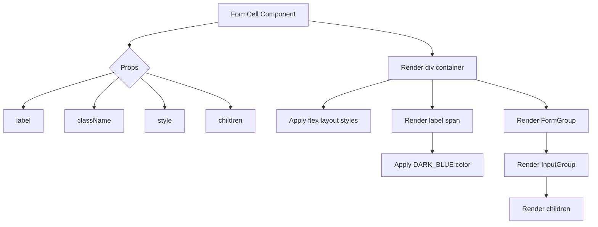
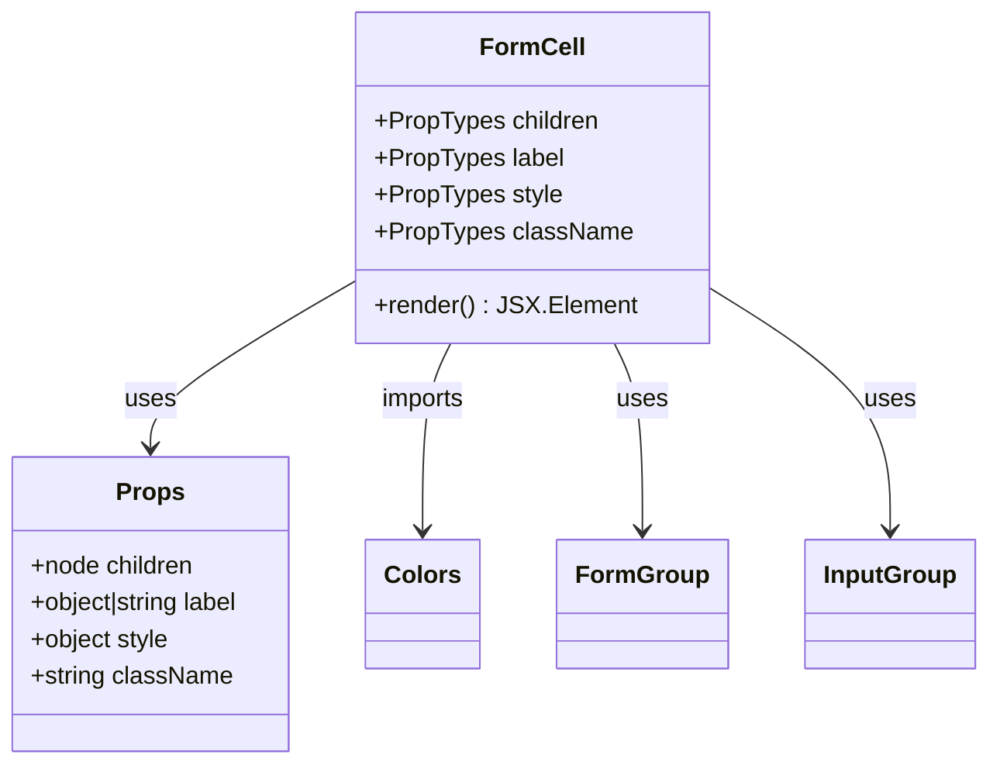

# Diagram: web/portal/src/components-old/forms/FormCell.js

> Auto-generated by Obscura crawlers

## Diagram 1

### SVG

<svg id="container" width="1399.1875" xmlns="http://www.w3.org/2000/svg" class="flowchart" height="527" viewBox="0 0 1399.1875 527" role="graphics-document document" aria-roledescription="flowchart-v2"><g><marker id="container_flowchart-v2-pointEnd" class="marker flowchart-v2" viewBox="0 0 10 10" refX="5" refY="5" markerUnits="userSpaceOnUse" markerWidth="8" markerHeight="8" orient="auto"><path d="M 0 0 L 10 5 L 0 10 z" class="arrowMarkerPath" style="stroke-width: 1; stroke-dasharray: 1, 0;"></path></marker><marker id="container_flowchart-v2-pointStart" class="marker flowchart-v2" viewBox="0 0 10 10" refX="4.5" refY="5" markerUnits="userSpaceOnUse" markerWidth="8" markerHeight="8" orient="auto"><path d="M 0 5 L 10 10 L 10 0 z" class="arrowMarkerPath" style="stroke-width: 1; stroke-dasharray: 1, 0;"></path></marker><marker id="container_flowchart-v2-circleEnd" class="marker flowchart-v2" viewBox="0 0 10 10" refX="11" refY="5" markerUnits="userSpaceOnUse" markerWidth="11" markerHeight="11" orient="auto"><circle cx="5" cy="5" r="5" class="arrowMarkerPath" style="stroke-width: 1; stroke-dasharray: 1, 0;"></circle></marker><marker id="container_flowchart-v2-circleStart" class="marker flowchart-v2" viewBox="0 0 10 10" refX="-1" refY="5" markerUnits="userSpaceOnUse" markerWidth="11" markerHeight="11" orient="auto"><circle cx="5" cy="5" r="5" class="arrowMarkerPath" style="stroke-width: 1; stroke-dasharray: 1, 0;"></circle></marker><marker id="container_flowchart-v2-crossEnd" class="marker cross flowchart-v2" viewBox="0 0 11 11" refX="12" refY="5.2" markerUnits="userSpaceOnUse" markerWidth="11" markerHeight="11" orient="auto"><path d="M 1,1 l 9,9 M 10,1 l -9,9" class="arrowMarkerPath" style="stroke-width: 2; stroke-dasharray: 1, 0;"></path></marker><marker id="container_flowchart-v2-crossStart" class="marker cross flowchart-v2" viewBox="0 0 11 11" refX="-1" refY="5.2" markerUnits="userSpaceOnUse" markerWidth="11" markerHeight="11" orient="auto"><path d="M 1,1 l 9,9 M 10,1 l -9,9" class="arrowMarkerPath" style="stroke-width: 2; stroke-dasharray: 1, 0;"></path></marker><g class="root"><g class="clusters"></g><g class="edgePaths"><path d="M519.77,52.203L484.153,58.002C448.536,63.802,377.303,75.401,341.687,84.7C306.07,94,306.07,101,306.07,104.5L306.07,108" id="L_A_B_0" class="edge-thickness-normal edge-pattern-solid edge-thickness-normal edge-pattern-solid flowchart-link" style=";" data-edge="true" data-et="edge" data-id="L_A_B_0" data-points="W3sieCI6NTE5Ljc2OTUzMTI1LCJ5Ijo1Mi4yMDI5NDA1NjQ4NzIyMzZ9LHsieCI6MzA2LjA3MDMxMjUsInkiOjg3fSx7IngiOjMwNi4wNzAzMTI1LCJ5IjoxMTJ9XQ==" marker-end="url(#container_flowchart-v2-pointEnd)"></path><path d="M269.25,170.18L233.728,180.483C198.206,190.787,127.162,211.393,91.639,225.197C56.117,239,56.117,246,56.117,249.5L56.117,253" id="L_B_C_0" class="edge-thickness-normal edge-pattern-solid edge-thickness-normal edge-pattern-solid flowchart-link" style=";" data-edge="true" data-et="edge" data-id="L_B_C_0" data-points="W3sieCI6MjY5LjI1MDE1OTM3Njk2ODU1LCJ5IjoxNzAuMTc5ODQ2ODc2OTY4NTV9LHsieCI6NTYuMTE3MTg3NSwieSI6MjMyfSx7IngiOjU2LjExNzE4NzUsInkiOjI1N31d" marker-end="url(#container_flowchart-v2-pointEnd)"></path><path d="M280.716,181.645L271.107,190.038C261.498,198.43,242.28,215.215,232.671,227.108C223.063,239,223.063,246,223.063,249.5L223.063,253" id="L_B_D_0" class="edge-thickness-normal edge-pattern-solid edge-thickness-normal edge-pattern-solid flowchart-link" style=";" data-edge="true" data-et="edge" data-id="L_B_D_0" data-points="W3sieCI6MjgwLjcxNTUwMjE1MDg0MTUsInkiOjE4MS42NDUxODk2NTA4NDE1fSx7IngiOjIyMy4wNjI1LCJ5IjoyMzJ9LHsieCI6MjIzLjA2MjUsInkiOjI1N31d" marker-end="url(#container_flowchart-v2-pointEnd)"></path><path d="M331.425,181.645L341.034,190.038C350.643,198.43,369.86,215.215,379.469,227.108C389.078,239,389.078,246,389.078,249.5L389.078,253" id="L_B_E_0" class="edge-thickness-normal edge-pattern-solid edge-thickness-normal edge-pattern-solid flowchart-link" style=";" data-edge="true" data-et="edge" data-id="L_B_E_0" data-points="W3sieCI6MzMxLjQyNTEyMjg0OTE1ODUsInkiOjE4MS42NDUxODk2NTA4NDE1fSx7IngiOjM4OS4wNzgxMjUsInkiOjIzMn0seyJ4IjozODkuMDc4MTI1LCJ5IjoyNTd9XQ==" marker-end="url(#container_flowchart-v2-pointEnd)"></path><path d="M342.549,170.522L376.461,180.768C410.374,191.014,478.199,211.507,512.111,225.254C546.023,239,546.023,246,546.023,249.5L546.023,253" id="L_B_F_0" class="edge-thickness-normal edge-pattern-solid edge-thickness-normal edge-pattern-solid flowchart-link" style=";" data-edge="true" data-et="edge" data-id="L_B_F_0" data-points="W3sieCI6MzQyLjU0ODY1OTI1MjAxMjgsInkiOjE3MC41MjE2NTMyNDc5ODcyfSx7IngiOjU0Ni4wMjM0Mzc1LCJ5IjoyMzJ9LHsieCI6NTQ2LjAyMzQzNzUsInkiOjI1N31d" marker-end="url(#container_flowchart-v2-pointEnd)"></path><path d="M731.066,48.654L780.518,55.045C829.969,61.436,928.871,74.218,978.322,87.526C1027.773,100.833,1027.773,114.667,1027.773,121.583L1027.773,128.5" id="L_A_G_0" class="edge-thickness-normal edge-pattern-solid edge-thickness-normal edge-pattern-solid flowchart-link" style=";" data-edge="true" data-et="edge" data-id="L_A_G_0" data-points="W3sieCI6NzMxLjA2NjQwNjI1LCJ5Ijo0OC42NTM4OTM1NzU5MTUyNn0seyJ4IjoxMDI3Ljc3MzQzNzUsInkiOjg3fSx7IngiOjEwMjcuNzczNDM3NSwieSI6MTMyLjV9XQ==" marker-end="url(#container_flowchart-v2-pointEnd)"></path><path d="M931.356,186.5L904.276,194.083C877.196,201.667,823.035,216.833,795.955,227.917C768.875,239,768.875,246,768.875,249.5L768.875,253" id="L_G_H_0" class="edge-thickness-normal edge-pattern-solid edge-thickness-normal edge-pattern-solid flowchart-link" style=";" data-edge="true" data-et="edge" data-id="L_G_H_0" data-points="W3sieCI6OTMxLjM1NjA4ODM2MjA2ODksInkiOjE4Ni41fSx7IngiOjc2OC44NzUsInkiOjIzMn0seyJ4Ijo3NjguODc1LCJ5IjoyNTd9XQ==" marker-end="url(#container_flowchart-v2-pointEnd)"></path><path d="M1027.773,186.5L1027.773,194.083C1027.773,201.667,1027.773,216.833,1027.773,227.917C1027.773,239,1027.773,246,1027.773,249.5L1027.773,253" id="L_G_I_0" class="edge-thickness-normal edge-pattern-solid edge-thickness-normal edge-pattern-solid flowchart-link" style=";" data-edge="true" data-et="edge" data-id="L_G_I_0" data-points="W3sieCI6MTAyNy43NzM0Mzc1LCJ5IjoxODYuNX0seyJ4IjoxMDI3Ljc3MzQzNzUsInkiOjIzMn0seyJ4IjoxMDI3Ljc3MzQzNzUsInkiOjI1N31d" marker-end="url(#container_flowchart-v2-pointEnd)"></path><path d="M1027.773,311L1027.773,315.167C1027.773,319.333,1027.773,327.667,1027.773,335.333C1027.773,343,1027.773,350,1027.773,353.5L1027.773,357" id="L_I_J_0" class="edge-thickness-normal edge-pattern-solid edge-thickness-normal edge-pattern-solid flowchart-link" style=";" data-edge="true" data-et="edge" data-id="L_I_J_0" data-points="W3sieCI6MTAyNy43NzM0Mzc1LCJ5IjozMTF9LHsieCI6MTAyNy43NzM0Mzc1LCJ5IjozMzZ9LHsieCI6MTAyNy43NzM0Mzc1LCJ5IjozNjF9XQ==" marker-end="url(#container_flowchart-v2-pointEnd)"></path><path d="M1126.079,186.5L1153.69,194.083C1181.3,201.667,1236.521,216.833,1264.132,227.917C1291.742,239,1291.742,246,1291.742,249.5L1291.742,253" id="L_G_K_0" class="edge-thickness-normal edge-pattern-solid edge-thickness-normal edge-pattern-solid flowchart-link" style=";" data-edge="true" data-et="edge" data-id="L_G_K_0" data-points="W3sieCI6MTEyNi4wNzkwNDA5NDgyNzU5LCJ5IjoxODYuNX0seyJ4IjoxMjkxLjc0MjE4NzUsInkiOjIzMn0seyJ4IjoxMjkxLjc0MjE4NzUsInkiOjI1N31d" marker-end="url(#container_flowchart-v2-pointEnd)"></path><path d="M1291.742,311L1291.742,315.167C1291.742,319.333,1291.742,327.667,1291.742,335.333C1291.742,343,1291.742,350,1291.742,353.5L1291.742,357" id="L_K_L_0" class="edge-thickness-normal edge-pattern-solid edge-thickness-normal edge-pattern-solid flowchart-link" style=";" data-edge="true" data-et="edge" data-id="L_K_L_0" data-points="W3sieCI6MTI5MS43NDIxODc1LCJ5IjozMTF9LHsieCI6MTI5MS43NDIxODc1LCJ5IjozMzZ9LHsieCI6MTI5MS43NDIxODc1LCJ5IjozNjF9XQ==" marker-end="url(#container_flowchart-v2-pointEnd)"></path><path d="M1291.742,415L1291.742,419.167C1291.742,423.333,1291.742,431.667,1291.742,439.333C1291.742,447,1291.742,454,1291.742,457.5L1291.742,461" id="L_L_M_0" class="edge-thickness-normal edge-pattern-solid edge-thickness-normal edge-pattern-solid flowchart-link" style=";" data-edge="true" data-et="edge" data-id="L_L_M_0" data-points="W3sieCI6MTI5MS43NDIxODc1LCJ5Ijo0MTV9LHsieCI6MTI5MS43NDIxODc1LCJ5Ijo0NDB9LHsieCI6MTI5MS43NDIxODc1LCJ5Ijo0NjV9XQ==" marker-end="url(#container_flowchart-v2-pointEnd)"></path></g><g class="edgeLabels"><g class="edgeLabel"><g class="label" data-id="L_A_B_0" transform="translate(0, 0)"><foreignObject width="0" height="0">

</foreignObject></g></g><g class="edgeLabel"><g class="label" data-id="L_B_C_0" transform="translate(0, 0)"><foreignObject width="0" height="0">

</foreignObject></g></g><g class="edgeLabel"><g class="label" data-id="L_B_D_0" transform="translate(0, 0)"><foreignObject width="0" height="0">

</foreignObject></g></g><g class="edgeLabel"><g class="label" data-id="L_B_E_0" transform="translate(0, 0)"><foreignObject width="0" height="0">

</foreignObject></g></g><g class="edgeLabel"><g class="label" data-id="L_B_F_0" transform="translate(0, 0)"><foreignObject width="0" height="0">

</foreignObject></g></g><g class="edgeLabel"><g class="label" data-id="L_A_G_0" transform="translate(0, 0)"><foreignObject width="0" height="0">

</foreignObject></g></g><g class="edgeLabel"><g class="label" data-id="L_G_H_0" transform="translate(0, 0)"><foreignObject width="0" height="0">

</foreignObject></g></g><g class="edgeLabel"><g class="label" data-id="L_G_I_0" transform="translate(0, 0)"><foreignObject width="0" height="0">

</foreignObject></g></g><g class="edgeLabel"><g class="label" data-id="L_I_J_0" transform="translate(0, 0)"><foreignObject width="0" height="0">

</foreignObject></g></g><g class="edgeLabel"><g class="label" data-id="L_G_K_0" transform="translate(0, 0)"><foreignObject width="0" height="0">

</foreignObject></g></g><g class="edgeLabel"><g class="label" data-id="L_K_L_0" transform="translate(0, 0)"><foreignObject width="0" height="0">

</foreignObject></g></g><g class="edgeLabel"><g class="label" data-id="L_L_M_0" transform="translate(0, 0)"><foreignObject width="0" height="0">

</foreignObject></g></g></g><g class="nodes"><g class="node default" id="flowchart-A-0" transform="translate(625.41796875, 35)"><rect class="basic label-container" style="" x="-105.6484375" y="-27" width="211.296875" height="54"></rect><g class="label" style="" transform="translate(-75.6484375, -12)"><rect></rect><foreignObject width="151.296875" height="24">

FormCell Component

</foreignObject></g></g><g class="node default" id="flowchart-B-1" transform="translate(306.0703125, 159.5)"><polygon points="47.5,0 95,-47.5 47.5,-95 0,-47.5" class="label-container" transform="translate(-47, 47.5)"></polygon><g class="label" style="" transform="translate(-20.5, -12)"><rect></rect><foreignObject width="41" height="24">

Props

</foreignObject></g></g><g class="node default" id="flowchart-C-3" transform="translate(56.1171875, 284)"><rect class="basic label-container" style="" x="-48.1171875" y="-27" width="96.234375" height="54"></rect><g class="label" style="" transform="translate(-18.1171875, -12)"><rect></rect><foreignObject width="36.234375" height="24">

label

</foreignObject></g></g><g class="node default" id="flowchart-D-5" transform="translate(223.0625, 284)"><rect class="basic label-container" style="" x="-68.828125" y="-27" width="137.65625" height="54"></rect><g class="label" style="" transform="translate(-38.828125, -12)"><rect></rect><foreignObject width="77.65625" height="24">

className

</foreignObject></g></g><g class="node default" id="flowchart-E-7" transform="translate(389.078125, 284)"><rect class="basic label-container" style="" x="-47.1875" y="-27" width="94.375" height="54"></rect><g class="label" style="" transform="translate(-17.1875, -12)"><rect></rect><foreignObject width="34.375" height="24">

style

</foreignObject></g></g><g class="node default" id="flowchart-F-9" transform="translate(546.0234375, 284)"><rect class="basic label-container" style="" x="-59.7578125" y="-27" width="119.515625" height="54"></rect><g class="label" style="" transform="translate(-29.7578125, -12)"><rect></rect><foreignObject width="59.515625" height="24">

children

</foreignObject></g></g><g class="node default" id="flowchart-G-11" transform="translate(1027.7734375, 159.5)"><rect class="basic label-container" style="" x="-105.8203125" y="-27" width="211.640625" height="54"></rect><g class="label" style="" transform="translate(-75.8203125, -12)"><rect></rect><foreignObject width="151.640625" height="24">

Render div container

</foreignObject></g></g><g class="node default" id="flowchart-H-13" transform="translate(768.875, 284)"><rect class="basic label-container" style="" x="-113.09375" y="-27" width="226.1875" height="54"></rect><g class="label" style="" transform="translate(-83.09375, -12)"><rect></rect><foreignObject width="166.1875" height="24">

Apply flex layout styles

</foreignObject></g></g><g class="node default" id="flowchart-I-15" transform="translate(1027.7734375, 284)"><rect class="basic label-container" style="" x="-95.8046875" y="-27" width="191.609375" height="54"></rect><g class="label" style="" transform="translate(-65.8046875, -12)"><rect></rect><foreignObject width="131.609375" height="24">

Render label span

</foreignObject></g></g><g class="node default" id="flowchart-J-17" transform="translate(1027.7734375, 388)"><rect class="basic label-container" style="" x="-114.5234375" y="-27" width="229.046875" height="54"></rect><g class="label" style="" transform="translate(-84.5234375, -12)"><rect></rect><foreignObject width="169.046875" height="24">

Apply DARK_BLUE color

</foreignObject></g></g><g class="node default" id="flowchart-K-19" transform="translate(1291.7421875, 284)"><rect class="basic label-container" style="" x="-98.3671875" y="-27" width="196.734375" height="54"></rect><g class="label" style="" transform="translate(-68.3671875, -12)"><rect></rect><foreignObject width="136.734375" height="24">

Render FormGroup

</foreignObject></g></g><g class="node default" id="flowchart-L-21" transform="translate(1291.7421875, 388)"><rect class="basic label-container" style="" x="-99.4453125" y="-27" width="198.890625" height="54"></rect><g class="label" style="" transform="translate(-69.4453125, -12)"><rect></rect><foreignObject width="138.890625" height="24">

Render InputGroup

</foreignObject></g></g><g class="node default" id="flowchart-M-23" transform="translate(1291.7421875, 492)"><rect class="basic label-container" style="" x="-87.875" y="-27" width="175.75" height="54"></rect><g class="label" style="" transform="translate(-57.875, -12)"><rect></rect><foreignObject width="115.75" height="24">

Render children

</foreignObject></g></g></g></g></g></svg>

## Diagram 2

### SVG

<svg id="container" width="635.078125" xmlns="http://www.w3.org/2000/svg" class="classDiagram" height="498" viewBox="0 0 635.078125 498" role="graphics-document document" aria-roledescription="class"><g><defs><marker id="container_class-aggregationStart" class="marker aggregation class" refX="18" refY="7" markerWidth="190" markerHeight="240" orient="auto"><path d="M 18,7 L9,13 L1,7 L9,1 Z"></path></marker></defs><defs><marker id="container_class-aggregationEnd" class="marker aggregation class" refX="1" refY="7" markerWidth="20" markerHeight="28" orient="auto"><path d="M 18,7 L9,13 L1,7 L9,1 Z"></path></marker></defs><defs><marker id="container_class-extensionStart" class="marker extension class" refX="18" refY="7" markerWidth="190" markerHeight="240" orient="auto"><path d="M 1,7 L18,13 V 1 Z"></path></marker></defs><defs><marker id="container_class-extensionEnd" class="marker extension class" refX="1" refY="7" markerWidth="20" markerHeight="28" orient="auto"><path d="M 1,1 V 13 L18,7 Z"></path></marker></defs><defs><marker id="container_class-compositionStart" class="marker composition class" refX="18" refY="7" markerWidth="190" markerHeight="240" orient="auto"><path d="M 18,7 L9,13 L1,7 L9,1 Z"></path></marker></defs><defs><marker id="container_class-compositionEnd" class="marker composition class" refX="1" refY="7" markerWidth="20" markerHeight="28" orient="auto"><path d="M 18,7 L9,13 L1,7 L9,1 Z"></path></marker></defs><defs><marker id="container_class-dependencyStart" class="marker dependency class" refX="6" refY="7" markerWidth="190" markerHeight="240" orient="auto"><path d="M 5,7 L9,13 L1,7 L9,1 Z"></path></marker></defs><defs><marker id="container_class-dependencyEnd" class="marker dependency class" refX="13" refY="7" markerWidth="20" markerHeight="28" orient="auto"><path d="M 18,7 L9,13 L14,7 L9,1 Z"></path></marker></defs><defs><marker id="container_class-lollipopStart" class="marker lollipop class" refX="13" refY="7" markerWidth="190" markerHeight="240" orient="auto"><circle stroke="black" fill="transparent" cx="7" cy="7" r="6"></circle></marker></defs><defs><marker id="container_class-lollipopEnd" class="marker lollipop class" refX="1" refY="7" markerWidth="190" markerHeight="240" orient="auto"><circle stroke="black" fill="transparent" cx="7" cy="7" r="6"></circle></marker></defs><g class="root"><g class="clusters"></g><g class="edgePaths"><path d="M238.566,180.624L215.717,194.02C192.867,207.416,147.168,234.208,124.318,252.771C101.469,271.333,101.469,281.667,101.469,286.833L101.469,292" id="id_FormCell_Props_1" class="edge-thickness-normal edge-pattern-solid relation" style=";;;" data-edge="true" data-et="edge" data-id="id_FormCell_Props_1" data-points="W3sieCI6MjM4LjU2NjQwNjI1LCJ5IjoxODAuNjI0MzQ0NTU3NDU3ODV9LHsieCI6MTAxLjQ2ODc1LCJ5IjoyNjF9LHsieCI6MTAxLjQ2ODc1LCJ5IjoyOTh9XQ==" marker-end="url(#container_class-dependencyEnd)"></path><path d="M297.584,224L294.66,230.167C291.736,236.333,285.887,248.667,282.963,269C280.039,289.333,280.039,317.667,280.039,331.833L280.039,346" id="id_FormCell_Colors_2" class="edge-thickness-normal edge-pattern-solid relation" style=";;;" data-edge="true" data-et="edge" data-id="id_FormCell_Colors_2" data-points="W3sieCI6Mjk3LjU4NDE1OTQ4Mjc1ODY1LCJ5IjoyMjR9LHsieCI6MjgwLjAzOTA2MjUsInkiOjI2MX0seyJ4IjoyODAuMDM5MDYyNSwieSI6MzUyfV0=" marker-end="url(#container_class-dependencyEnd)"></path><path d="M400.01,224L402.934,230.167C405.858,236.333,411.706,248.667,414.631,269C417.555,289.333,417.555,317.667,417.555,331.833L417.555,346" id="id_FormCell_FormGroup_3" class="edge-thickness-normal edge-pattern-solid relation" style=";;;" data-edge="true" data-et="edge" data-id="id_FormCell_FormGroup_3" data-points="W3sieCI6NDAwLjAwOTU5MDUxNzI0MTM1LCJ5IjoyMjR9LHsieCI6NDE3LjU1NDY4NzUsInkiOjI2MX0seyJ4Ijo0MTcuNTU0Njg3NSwieSI6MzUyfV0=" marker-end="url(#container_class-dependencyEnd)"></path><path d="M459.027,187.124L478.11,199.437C497.193,211.749,535.358,236.375,554.441,262.854C573.523,289.333,573.523,317.667,573.523,331.833L573.523,346" id="id_FormCell_InputGroup_4" class="edge-thickness-normal edge-pattern-solid relation" style=";;;" data-edge="true" data-et="edge" data-id="id_FormCell_InputGroup_4" data-points="W3sieCI6NDU5LjAyNzM0Mzc1LCJ5IjoxODcuMTIzODQ4NDI2OTA3N30seyJ4Ijo1NzMuNTIzNDM3NSwieSI6MjYxfSx7IngiOjU3My41MjM0Mzc1LCJ5IjozNTJ9XQ==" marker-end="url(#container_class-dependencyEnd)"></path></g><g class="edgeLabels"><g class="edgeLabel" transform="translate(101.46875, 261)"><g class="label" data-id="id_FormCell_Props_1" transform="translate(-16.4921875, -12)"><foreignObject width="32.984375" height="24">

uses

</foreignObject></g></g><g class="edgeLabel" transform="translate(280.0390625, 261)"><g class="label" data-id="id_FormCell_Colors_2" transform="translate(-28.25, -12)"><foreignObject width="56.5" height="24">

imports

</foreignObject></g></g><g class="edgeLabel" transform="translate(417.5546875, 261)"><g class="label" data-id="id_FormCell_FormGroup_3" transform="translate(-16.4921875, -12)"><foreignObject width="32.984375" height="24">

uses

</foreignObject></g></g><g class="edgeLabel" transform="translate(573.5234375, 261)"><g class="label" data-id="id_FormCell_InputGroup_4" transform="translate(-16.4921875, -12)"><foreignObject width="32.984375" height="24">

uses

</foreignObject></g></g></g><g class="nodes"><g class="node default" id="classId-FormCell-0" transform="translate(348.796875, 116)"><g class="basic label-container"><path d="M-110.23046875 -108 L110.23046875 -108 L110.23046875 108 L-110.23046875 108" stroke="none" stroke-width="0" fill="#ECECFF" style=""></path><path d="M-110.23046875 -108 C-49.21479752962384 -108, 11.800873690752326 -108, 110.23046875 -108 M-110.23046875 -108 C-55.504586565806825 -108, -0.7787043816136503 -108, 110.23046875 -108 M110.23046875 -108 C110.23046875 -26.415367109486084, 110.23046875 55.16926578102783, 110.23046875 108 M110.23046875 -108 C110.23046875 -37.1063380116437, 110.23046875 33.7873239767126, 110.23046875 108 M110.23046875 108 C25.36622523079484 108, -59.49801828841032 108, -110.23046875 108 M110.23046875 108 C41.532837869498934 108, -27.164793011002132 108, -110.23046875 108 M-110.23046875 108 C-110.23046875 38.375939198350125, -110.23046875 -31.24812160329975, -110.23046875 -108 M-110.23046875 108 C-110.23046875 38.47650556761339, -110.23046875 -31.046988864773226, -110.23046875 -108" stroke="#9370DB" stroke-width="1.3" fill="none" stroke-dasharray="0 0" style=""></path></g><g class="annotation-group text" transform="translate(0, -84)"></g><g class="label-group text" transform="translate(-31.8671875, -84)"><g class="label" style="font-weight: bolder" transform="translate(0,-12)"><foreignObject width="63.734375" height="24">

FormCell

</foreignObject></g></g><g class="members-group text" transform="translate(-98.23046875, -36)"><g class="label" style="" transform="translate(0,-12)"><foreignObject width="146.453125" height="24">

+PropTypes children

</foreignObject></g><g class="label" style="" transform="translate(0,12)"><foreignObject width="123.171875" height="24">

+PropTypes label

</foreignObject></g><g class="label" style="" transform="translate(0,36)"><foreignObject width="121.3125" height="24">

+PropTypes style

</foreignObject></g><g class="label" style="" transform="translate(0,60)"><foreignObject width="164.59375" height="24">

+PropTypes className

</foreignObject></g></g><g class="methods-group text" transform="translate(-98.23046875, 84)"><g class="label" style="" transform="translate(0,-12)"><foreignObject width="164.265625" height="24">

+render() : JSX.Element

</foreignObject></g></g><g class="divider" style=""><path d="M-110.23046875 -60 C-54.98648770740909 -60, 0.25749333518182027 -60, 110.23046875 -60 M-110.23046875 -60 C-38.77030808400626 -60, 32.68985258198748 -60, 110.23046875 -60" stroke="#9370DB" stroke-width="1.3" fill="none" stroke-dasharray="0 0" style=""></path></g><g class="divider" style=""><path d="M-110.23046875 60 C-38.6621186650633 60, 32.90623141987339 60, 110.23046875 60 M-110.23046875 60 C-64.31261720349019 60, -18.39476565698037 60, 110.23046875 60" stroke="#9370DB" stroke-width="1.3" fill="none" stroke-dasharray="0 0" style=""></path></g></g><g class="node default" id="classId-Props-1" transform="translate(101.46875, 394)"><g class="basic label-container"><path d="M-93.46875 -96 L93.46875 -96 L93.46875 96 L-93.46875 96" stroke="none" stroke-width="0" fill="#ECECFF" style=""></path><path d="M-93.46875 -96 C-41.93537519656273 -96, 9.597999606874538 -96, 93.46875 -96 M-93.46875 -96 C-49.37602621834925 -96, -5.283302436698506 -96, 93.46875 -96 M93.46875 -96 C93.46875 -57.29150094817521, 93.46875 -18.583001896350424, 93.46875 96 M93.46875 -96 C93.46875 -51.90061331702542, 93.46875 -7.801226634050835, 93.46875 96 M93.46875 96 C20.091316931156697 96, -53.286116137686605 96, -93.46875 96 M93.46875 96 C38.013375339317115 96, -17.44199932136577 96, -93.46875 96 M-93.46875 96 C-93.46875 29.89927750509409, -93.46875 -36.20144498981182, -93.46875 -96 M-93.46875 96 C-93.46875 55.59658482390614, -93.46875 15.193169647812283, -93.46875 -96" stroke="#9370DB" stroke-width="1.3" fill="none" stroke-dasharray="0 0" style=""></path></g><g class="annotation-group text" transform="translate(0, -72)"></g><g class="label-group text" transform="translate(-20.921875, -72)"><g class="label" style="font-weight: bolder" transform="translate(0,-12)"><foreignObject width="41.84375" height="24">

Props

</foreignObject></g></g><g class="members-group text" transform="translate(-81.46875, -24)"><g class="label" style="" transform="translate(0,-12)"><foreignObject width="108.75" height="24">

+node children

</foreignObject></g><g class="label" style="" transform="translate(0,12)"><foreignObject width="142.015625" height="24">

+object|string label

</foreignObject></g><g class="label" style="" transform="translate(0,36)"><foreignObject width="92.078125" height="24">

+object style

</foreignObject></g><g class="label" style="" transform="translate(0,60)"><foreignObject width="131.515625" height="24">

+string className

</foreignObject></g></g><g class="methods-group text" transform="translate(-81.46875, 96)"></g><g class="divider" style=""><path d="M-93.46875 -48 C-39.712160328234255 -48, 14.04442934353149 -48, 93.46875 -48 M-93.46875 -48 C-19.577642345809082 -48, 54.313465308381836 -48, 93.46875 -48" stroke="#9370DB" stroke-width="1.3" fill="none" stroke-dasharray="0 0" style=""></path></g><g class="divider" style=""><path d="M-93.46875 72 C-24.398158113148085 72, 44.67243377370383 72, 93.46875 72 M-93.46875 72 C-48.54419297858122 72, -3.619635957162444 72, 93.46875 72" stroke="#9370DB" stroke-width="1.3" fill="none" stroke-dasharray="0 0" style=""></path></g></g><g class="node default" id="classId-Colors-2" transform="translate(280.0390625, 394)"><g class="basic label-container"><path d="M-35.1015625 -42 L35.1015625 -42 L35.1015625 42 L-35.1015625 42" stroke="none" stroke-width="0" fill="#ECECFF" style=""></path><path d="M-35.1015625 -42 C-15.336234770453856 -42, 4.429092959092287 -42, 35.1015625 -42 M-35.1015625 -42 C-7.2982051888578 -42, 20.5051521222844 -42, 35.1015625 -42 M35.1015625 -42 C35.1015625 -22.504217771736798, 35.1015625 -3.0084355434735954, 35.1015625 42 M35.1015625 -42 C35.1015625 -11.825496718162448, 35.1015625 18.349006563675104, 35.1015625 42 M35.1015625 42 C17.721154246737065 42, 0.3407459934741297 42, -35.1015625 42 M35.1015625 42 C10.52351659775514 42, -14.05452930448972 42, -35.1015625 42 M-35.1015625 42 C-35.1015625 12.370451012520327, -35.1015625 -17.259097974959346, -35.1015625 -42 M-35.1015625 42 C-35.1015625 15.362979389471924, -35.1015625 -11.274041221056152, -35.1015625 -42" stroke="#9370DB" stroke-width="1.3" fill="none" stroke-dasharray="0 0" style=""></path></g><g class="annotation-group text" transform="translate(0, -18)"></g><g class="label-group text" transform="translate(-23.1015625, -18)"><g class="label" style="font-weight: bolder" transform="translate(0,-12)"><foreignObject width="46.203125" height="24">

Colors

</foreignObject></g></g><g class="members-group text" transform="translate(-23.1015625, 30)"></g><g class="methods-group text" transform="translate(-23.1015625, 60)"></g><g class="divider" style=""><path d="M-35.1015625 6 C-14.022074153775108 6, 7.057414192449784 6, 35.1015625 6 M-35.1015625 6 C-14.571819934519215 6, 5.957922630961569 6, 35.1015625 6" stroke="#9370DB" stroke-width="1.3" fill="none" stroke-dasharray="0 0" style=""></path></g><g class="divider" style=""><path d="M-35.1015625 24 C-11.10427278156845 24, 12.893016936863098 24, 35.1015625 24 M-35.1015625 24 C-7.046020472771314 24, 21.009521554457372 24, 35.1015625 24" stroke="#9370DB" stroke-width="1.3" fill="none" stroke-dasharray="0 0" style=""></path></g></g><g class="node default" id="classId-FormGroup-3" transform="translate(417.5546875, 394)"><g class="basic label-container"><path d="M-52.4140625 -42 L52.4140625 -42 L52.4140625 42 L-52.4140625 42" stroke="none" stroke-width="0" fill="#ECECFF" style=""></path><path d="M-52.4140625 -42 C-15.348896544497535 -42, 21.71626941100493 -42, 52.4140625 -42 M-52.4140625 -42 C-29.025696475284505 -42, -5.63733045056901 -42, 52.4140625 -42 M52.4140625 -42 C52.4140625 -16.116093427765637, 52.4140625 9.767813144468725, 52.4140625 42 M52.4140625 -42 C52.4140625 -15.92211010310384, 52.4140625 10.15577979379232, 52.4140625 42 M52.4140625 42 C15.74829064055524 42, -20.91748121888952 42, -52.4140625 42 M52.4140625 42 C21.247172455976965 42, -9.919717588046069 42, -52.4140625 42 M-52.4140625 42 C-52.4140625 22.515147472979784, -52.4140625 3.030294945959568, -52.4140625 -42 M-52.4140625 42 C-52.4140625 17.556443482480297, -52.4140625 -6.887113035039405, -52.4140625 -42" stroke="#9370DB" stroke-width="1.3" fill="none" stroke-dasharray="0 0" style=""></path></g><g class="annotation-group text" transform="translate(0, -18)"></g><g class="label-group text" transform="translate(-40.4140625, -18)"><g class="label" style="font-weight: bolder" transform="translate(0,-12)"><foreignObject width="80.828125" height="24">

FormGroup

</foreignObject></g></g><g class="members-group text" transform="translate(-40.4140625, 30)"></g><g class="methods-group text" transform="translate(-40.4140625, 60)"></g><g class="divider" style=""><path d="M-52.4140625 6 C-13.802311661801376 6, 24.809439176397248 6, 52.4140625 6 M-52.4140625 6 C-29.628334649081737 6, -6.842606798163473 6, 52.4140625 6" stroke="#9370DB" stroke-width="1.3" fill="none" stroke-dasharray="0 0" style=""></path></g><g class="divider" style=""><path d="M-52.4140625 24 C-11.721097374760788 24, 28.971867750478424 24, 52.4140625 24 M-52.4140625 24 C-26.6596254537127 24, -0.9051884074253991 24, 52.4140625 24" stroke="#9370DB" stroke-width="1.3" fill="none" stroke-dasharray="0 0" style=""></path></g></g><g class="node default" id="classId-InputGroup-4" transform="translate(573.5234375, 394)"><g class="basic label-container"><path d="M-53.5546875 -42 L53.5546875 -42 L53.5546875 42 L-53.5546875 42" stroke="none" stroke-width="0" fill="#ECECFF" style=""></path><path d="M-53.5546875 -42 C-27.668561420754582 -42, -1.7824353415091636 -42, 53.5546875 -42 M-53.5546875 -42 C-31.23918499801069 -42, -8.923682496021378 -42, 53.5546875 -42 M53.5546875 -42 C53.5546875 -22.542007751002075, 53.5546875 -3.0840155020041493, 53.5546875 42 M53.5546875 -42 C53.5546875 -9.073371232010047, 53.5546875 23.853257535979907, 53.5546875 42 M53.5546875 42 C11.983149037365017 42, -29.588389425269966 42, -53.5546875 42 M53.5546875 42 C24.688061502677265 42, -4.178564494645471 42, -53.5546875 42 M-53.5546875 42 C-53.5546875 11.640902068150368, -53.5546875 -18.718195863699265, -53.5546875 -42 M-53.5546875 42 C-53.5546875 17.535175320633904, -53.5546875 -6.929649358732192, -53.5546875 -42" stroke="#9370DB" stroke-width="1.3" fill="none" stroke-dasharray="0 0" style=""></path></g><g class="annotation-group text" transform="translate(0, -18)"></g><g class="label-group text" transform="translate(-41.5546875, -18)"><g class="label" style="font-weight: bolder" transform="translate(0,-12)"><foreignObject width="83.109375" height="24">

InputGroup

</foreignObject></g></g><g class="members-group text" transform="translate(-41.5546875, 30)"></g><g class="methods-group text" transform="translate(-41.5546875, 60)"></g><g class="divider" style=""><path d="M-53.5546875 6 C-27.342751781494727 6, -1.130816062989453 6, 53.5546875 6 M-53.5546875 6 C-14.644447824356725 6, 24.26579185128655 6, 53.5546875 6" stroke="#9370DB" stroke-width="1.3" fill="none" stroke-dasharray="0 0" style=""></path></g><g class="divider" style=""><path d="M-53.5546875 24 C-12.464148455639382 24, 28.626390588721236 24, 53.5546875 24 M-53.5546875 24 C-12.473767618834877 24, 28.607152262330246 24, 53.5546875 24" stroke="#9370DB" stroke-width="1.3" fill="none" stroke-dasharray="0 0" style=""></path></g></g></g></g></g></svg>
