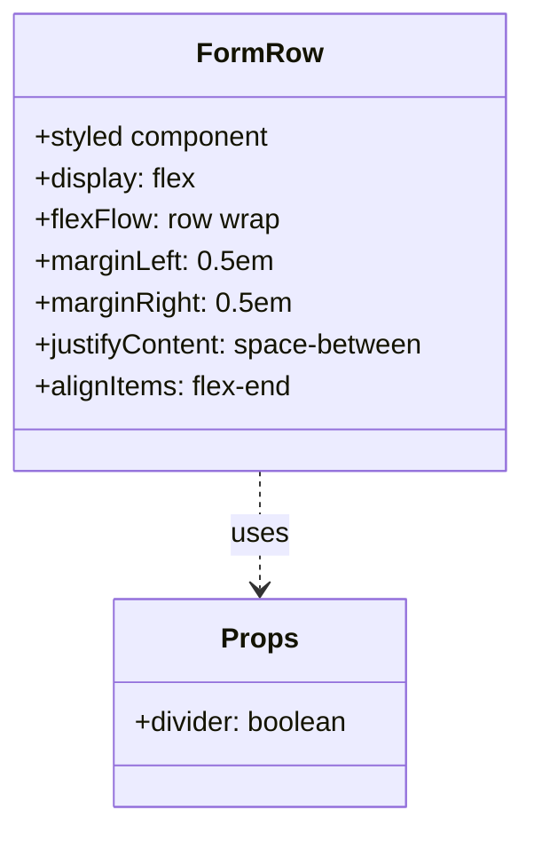
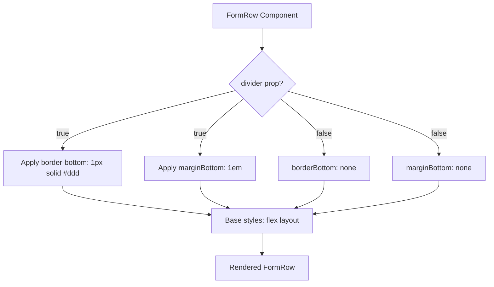

# Diagram: web/portal/src/components-old/forms/FormRow.js

> Auto-generated by Obscura crawlers

## Diagram 1

### SVG

<svg id="container" width="301.5703125" xmlns="http://www.w3.org/2000/svg" class="classDiagram" height="474" viewBox="0 0 301.5703125 474" role="graphics-document document" aria-roledescription="class"><g><defs><marker id="container_class-aggregationStart" class="marker aggregation class" refX="18" refY="7" markerWidth="190" markerHeight="240" orient="auto"><path d="M 18,7 L9,13 L1,7 L9,1 Z"></path></marker></defs><defs><marker id="container_class-aggregationEnd" class="marker aggregation class" refX="1" refY="7" markerWidth="20" markerHeight="28" orient="auto"><path d="M 18,7 L9,13 L1,7 L9,1 Z"></path></marker></defs><defs><marker id="container_class-extensionStart" class="marker extension class" refX="18" refY="7" markerWidth="190" markerHeight="240" orient="auto"><path d="M 1,7 L18,13 V 1 Z"></path></marker></defs><defs><marker id="container_class-extensionEnd" class="marker extension class" refX="1" refY="7" markerWidth="20" markerHeight="28" orient="auto"><path d="M 1,1 V 13 L18,7 Z"></path></marker></defs><defs><marker id="container_class-compositionStart" class="marker composition class" refX="18" refY="7" markerWidth="190" markerHeight="240" orient="auto"><path d="M 18,7 L9,13 L1,7 L9,1 Z"></path></marker></defs><defs><marker id="container_class-compositionEnd" class="marker composition class" refX="1" refY="7" markerWidth="20" markerHeight="28" orient="auto"><path d="M 18,7 L9,13 L1,7 L9,1 Z"></path></marker></defs><defs><marker id="container_class-dependencyStart" class="marker dependency class" refX="6" refY="7" markerWidth="190" markerHeight="240" orient="auto"><path d="M 5,7 L9,13 L1,7 L9,1 Z"></path></marker></defs><defs><marker id="container_class-dependencyEnd" class="marker dependency class" refX="13" refY="7" markerWidth="20" markerHeight="28" orient="auto"><path d="M 18,7 L9,13 L14,7 L9,1 Z"></path></marker></defs><defs><marker id="container_class-lollipopStart" class="marker lollipop class" refX="13" refY="7" markerWidth="190" markerHeight="240" orient="auto"><circle stroke="black" fill="transparent" cx="7" cy="7" r="6"></circle></marker></defs><defs><marker id="container_class-lollipopEnd" class="marker lollipop class" refX="1" refY="7" markerWidth="190" markerHeight="240" orient="auto"><circle stroke="black" fill="transparent" cx="7" cy="7" r="6"></circle></marker></defs><g class="root"><g class="clusters"></g><g class="edgePaths"><path d="M150.785,272L150.785,278.167C150.785,284.333,150.785,296.667,150.785,308C150.785,319.333,150.785,329.667,150.785,334.833L150.785,340" id="id_FormRow_Props_1" class="edge-thickness-normal edge-pattern-dashed relation" style=";;;" data-edge="true" data-et="edge" data-id="id_FormRow_Props_1" data-points="W3sieCI6MTUwLjc4NTE1NjI1LCJ5IjoyNzJ9LHsieCI6MTUwLjc4NTE1NjI1LCJ5IjozMDl9LHsieCI6MTUwLjc4NTE1NjI1LCJ5IjozNDZ9XQ==" marker-end="url(#container_class-dependencyEnd)"></path></g><g class="edgeLabels"><g class="edgeLabel" transform="translate(150.78515625, 309)"><g class="label" data-id="id_FormRow_Props_1" transform="translate(-16.4921875, -12)"><foreignObject width="32.984375" height="24">

uses

</foreignObject></g></g></g><g class="nodes"><g class="node default" id="classId-FormRow-0" transform="translate(150.78515625, 140)"><g class="basic label-container"><path d="M-142.78515625 -132 L142.78515625 -132 L142.78515625 132 L-142.78515625 132" stroke="none" stroke-width="0" fill="#ECECFF" style=""></path><path d="M-142.78515625 -132 C-36.326498695855065 -132, 70.13215885828987 -132, 142.78515625 -132 M-142.78515625 -132 C-76.85061441742668 -132, -10.916072584853367 -132, 142.78515625 -132 M142.78515625 -132 C142.78515625 -29.736579989738686, 142.78515625 72.52684002052263, 142.78515625 132 M142.78515625 -132 C142.78515625 -64.07121472099794, 142.78515625 3.857570558004113, 142.78515625 132 M142.78515625 132 C36.90969797902267 132, -68.96576029195467 132, -142.78515625 132 M142.78515625 132 C41.52765945224199 132, -59.72983734551602 132, -142.78515625 132 M-142.78515625 132 C-142.78515625 38.44176049185879, -142.78515625 -55.116479016282426, -142.78515625 -132 M-142.78515625 132 C-142.78515625 77.01629933143043, -142.78515625 22.032598662860863, -142.78515625 -132" stroke="#9370DB" stroke-width="1.3" fill="none" stroke-dasharray="0 0" style=""></path></g><g class="annotation-group text" transform="translate(0, -108)"></g><g class="label-group text" transform="translate(-33.7421875, -108)"><g class="label" style="font-weight: bolder" transform="translate(0,-12)"><foreignObject width="67.484375" height="24">

FormRow

</foreignObject></g></g><g class="members-group text" transform="translate(-130.78515625, -60)"><g class="label" style="" transform="translate(0,-12)"><foreignObject width="138.640625" height="24">

+styled component

</foreignObject></g><g class="label" style="" transform="translate(0,12)"><foreignObject width="93.859375" height="24">

+display: flex

</foreignObject></g><g class="label" style="" transform="translate(0,36)"><foreignObject width="140.796875" height="24">

+flexFlow: row wrap

</foreignObject></g><g class="label" style="" transform="translate(0,60)"><foreignObject width="137.296875" height="24">

+marginLeft: 0.5em

</foreignObject></g><g class="label" style="" transform="translate(0,84)"><foreignObject width="147.546875" height="24">

+marginRight: 0.5em

</foreignObject></g><g class="label" style="" transform="translate(0,108)"><foreignObject width="227.828125" height="24">

+justifyContent: space-between

</foreignObject></g><g class="label" style="" transform="translate(0,132)"><foreignObject width="150.71875" height="24">

+alignItems: flex-end

</foreignObject></g></g><g class="methods-group text" transform="translate(-130.78515625, 132)"></g><g class="divider" style=""><path d="M-142.78515625 -84 C-57.630202517833865 -84, 27.52475121433227 -84, 142.78515625 -84 M-142.78515625 -84 C-63.388086027529454 -84, 16.008984194941092 -84, 142.78515625 -84" stroke="#9370DB" stroke-width="1.3" fill="none" stroke-dasharray="0 0" style=""></path></g><g class="divider" style=""><path d="M-142.78515625 108 C-45.79447579914462 108, 51.19620465171076 108, 142.78515625 108 M-142.78515625 108 C-58.635745254420414 108, 25.513665741159173 108, 142.78515625 108" stroke="#9370DB" stroke-width="1.3" fill="none" stroke-dasharray="0 0" style=""></path></g></g><g class="node default" id="classId-Props-1" transform="translate(150.78515625, 406)"><g class="basic label-container"><path d="M-85.7578125 -60 L85.7578125 -60 L85.7578125 60 L-85.7578125 60" stroke="none" stroke-width="0" fill="#ECECFF" style=""></path><path d="M-85.7578125 -60 C-31.99230399077421 -60, 21.77320451845158 -60, 85.7578125 -60 M-85.7578125 -60 C-32.835743599882484 -60, 20.086325300235032 -60, 85.7578125 -60 M85.7578125 -60 C85.7578125 -12.530081106622795, 85.7578125 34.93983778675441, 85.7578125 60 M85.7578125 -60 C85.7578125 -24.191632261176828, 85.7578125 11.616735477646344, 85.7578125 60 M85.7578125 60 C29.24740251416371 60, -27.26300747167258 60, -85.7578125 60 M85.7578125 60 C32.672284254584184 60, -20.41324399083163 60, -85.7578125 60 M-85.7578125 60 C-85.7578125 32.89544563668335, -85.7578125 5.790891273366697, -85.7578125 -60 M-85.7578125 60 C-85.7578125 32.79105787673639, -85.7578125 5.582115753472777, -85.7578125 -60" stroke="#9370DB" stroke-width="1.3" fill="none" stroke-dasharray="0 0" style=""></path></g><g class="annotation-group text" transform="translate(0, -36)"></g><g class="label-group text" transform="translate(-20.921875, -36)"><g class="label" style="font-weight: bolder" transform="translate(0,-12)"><foreignObject width="41.84375" height="24">

Props

</foreignObject></g></g><g class="members-group text" transform="translate(-73.7578125, 12)"><g class="label" style="" transform="translate(0,-12)"><foreignObject width="126.59375" height="24">

+divider: boolean

</foreignObject></g></g><g class="methods-group text" transform="translate(-73.7578125, 60)"></g><g class="divider" style=""><path d="M-85.7578125 -12 C-44.56370360304546 -12, -3.369594706090922 -12, 85.7578125 -12 M-85.7578125 -12 C-19.282795225265872 -12, 47.192222049468256 -12, 85.7578125 -12" stroke="#9370DB" stroke-width="1.3" fill="none" stroke-dasharray="0 0" style=""></path></g><g class="divider" style=""><path d="M-85.7578125 36 C-35.8704176831835 36, 14.016977133633006 36, 85.7578125 36 M-85.7578125 36 C-27.965090578621947 36, 29.827631342756106 36, 85.7578125 36" stroke="#9370DB" stroke-width="1.3" fill="none" stroke-dasharray="0 0" style=""></path></g></g></g></g></g></svg>

## Diagram 2

### SVG

<svg id="container" width="1088.53125" xmlns="http://www.w3.org/2000/svg" class="flowchart" height="629.921875" viewBox="0 0 1088.53125 629.921875" role="graphics-document document" aria-roledescription="flowchart-v2"><g><marker id="container_flowchart-v2-pointEnd" class="marker flowchart-v2" viewBox="0 0 10 10" refX="5" refY="5" markerUnits="userSpaceOnUse" markerWidth="8" markerHeight="8" orient="auto"><path d="M 0 0 L 10 5 L 0 10 z" class="arrowMarkerPath" style="stroke-width: 1; stroke-dasharray: 1, 0;"></path></marker><marker id="container_flowchart-v2-pointStart" class="marker flowchart-v2" viewBox="0 0 10 10" refX="4.5" refY="5" markerUnits="userSpaceOnUse" markerWidth="8" markerHeight="8" orient="auto"><path d="M 0 5 L 10 10 L 10 0 z" class="arrowMarkerPath" style="stroke-width: 1; stroke-dasharray: 1, 0;"></path></marker><marker id="container_flowchart-v2-circleEnd" class="marker flowchart-v2" viewBox="0 0 10 10" refX="11" refY="5" markerUnits="userSpaceOnUse" markerWidth="11" markerHeight="11" orient="auto"><circle cx="5" cy="5" r="5" class="arrowMarkerPath" style="stroke-width: 1; stroke-dasharray: 1, 0;"></circle></marker><marker id="container_flowchart-v2-circleStart" class="marker flowchart-v2" viewBox="0 0 10 10" refX="-1" refY="5" markerUnits="userSpaceOnUse" markerWidth="11" markerHeight="11" orient="auto"><circle cx="5" cy="5" r="5" class="arrowMarkerPath" style="stroke-width: 1; stroke-dasharray: 1, 0;"></circle></marker><marker id="container_flowchart-v2-crossEnd" class="marker cross flowchart-v2" viewBox="0 0 11 11" refX="12" refY="5.2" markerUnits="userSpaceOnUse" markerWidth="11" markerHeight="11" orient="auto"><path d="M 1,1 l 9,9 M 10,1 l -9,9" class="arrowMarkerPath" style="stroke-width: 2; stroke-dasharray: 1, 0;"></path></marker><marker id="container_flowchart-v2-crossStart" class="marker cross flowchart-v2" viewBox="0 0 11 11" refX="-1" refY="5.2" markerUnits="userSpaceOnUse" markerWidth="11" markerHeight="11" orient="auto"><path d="M 1,1 l 9,9 M 10,1 l -9,9" class="arrowMarkerPath" style="stroke-width: 2; stroke-dasharray: 1, 0;"></path></marker><g class="root"><g class="clusters"></g><g class="edgePaths"><path d="M579.539,62L579.539,66.167C579.539,70.333,579.539,78.667,579.539,86.333C579.539,94,579.539,101,579.539,104.5L579.539,108" id="L_A_B_0" class="edge-thickness-normal edge-pattern-solid edge-thickness-normal edge-pattern-solid flowchart-link" style=";" data-edge="true" data-et="edge" data-id="L_A_B_0" data-points="W3sieCI6NTc5LjUzOTA2MjUsInkiOjYyfSx7IngiOjU3OS41MzkwNjI1LCJ5Ijo4N30seyJ4Ijo1NzkuNTM5MDYyNSwieSI6MTEyfV0=" marker-end="url(#container_flowchart-v2-pointEnd)"></path><path d="M519.741,202.124L456.118,218.257C392.494,234.39,265.247,266.656,201.624,288.289C138,309.922,138,320.922,138,326.422L138,331.922" id="L_B_C_0" class="edge-thickness-normal edge-pattern-solid edge-thickness-normal edge-pattern-solid flowchart-link" style=";" data-edge="true" data-et="edge" data-id="L_B_C_0" data-points="W3sieCI6NTE5Ljc0MTA4MjI1MDkxMDQsInkiOjIwMi4xMjM4OTQ3NTA5MTA0fSx7IngiOjEzOCwieSI6Mjk4LjkyMTg3NX0seyJ4IjoxMzgsInkiOjMzNS45MjE4NzV9XQ==" marker-end="url(#container_flowchart-v2-pointEnd)"></path><path d="M538.1,220.482L521.939,233.556C505.777,246.629,473.455,272.775,457.294,293.349C441.133,313.922,441.133,328.922,441.133,336.422L441.133,343.922" id="L_B_D_0" class="edge-thickness-normal edge-pattern-solid edge-thickness-normal edge-pattern-solid flowchart-link" style=";" data-edge="true" data-et="edge" data-id="L_B_D_0" data-points="W3sieCI6NTM4LjA5OTY3NzU3MzE3MzcsInkiOjIyMC40ODI0OTAwNzMxNzM3OH0seyJ4Ijo0NDEuMTMyODEyNSwieSI6Mjk4LjkyMTg3NX0seyJ4Ijo0NDEuMTMyODEyNSwieSI6MzQ3LjkyMTg3NX1d" marker-end="url(#container_flowchart-v2-pointEnd)"></path><path d="M620.978,220.482L637.14,233.556C653.301,246.629,685.623,272.775,701.784,293.349C717.945,313.922,717.945,328.922,717.945,336.422L717.945,343.922" id="L_B_E_0" class="edge-thickness-normal edge-pattern-solid edge-thickness-normal edge-pattern-solid flowchart-link" style=";" data-edge="true" data-et="edge" data-id="L_B_E_0" data-points="W3sieCI6NjIwLjk3ODQ0NzQyNjgyNjMsInkiOjIyMC40ODI0OTAwNzMxNzM3OH0seyJ4Ijo3MTcuOTQ1MzEyNSwieSI6Mjk4LjkyMTg3NX0seyJ4Ijo3MTcuOTQ1MzEyNSwieSI6MzQ3LjkyMTg3NX1d" marker-end="url(#container_flowchart-v2-pointEnd)"></path><path d="M637.995,203.466L694.342,219.375C750.69,235.284,863.384,267.103,919.731,290.513C976.078,313.922,976.078,328.922,976.078,336.422L976.078,343.922" id="L_B_F_0" class="edge-thickness-normal edge-pattern-solid edge-thickness-normal edge-pattern-solid flowchart-link" style=";" data-edge="true" data-et="edge" data-id="L_B_F_0" data-points="W3sieCI6NjM3Ljk5NTE4ODEyNTExNTIsInkiOjIwMy40NjU3NDkzNzQ4ODQ3OH0seyJ4Ijo5NzYuMDc4MTI1LCJ5IjoyOTguOTIxODc1fSx7IngiOjk3Ni4wNzgxMjUsInkiOjM0Ny45MjE4NzV9XQ==" marker-end="url(#container_flowchart-v2-pointEnd)"></path><path d="M138,413.922L138,418.089C138,422.255,138,430.589,192.269,441.146C246.538,451.704,355.076,464.487,409.344,470.878L463.613,477.269" id="L_C_G_0" class="edge-thickness-normal edge-pattern-solid edge-thickness-normal edge-pattern-solid flowchart-link" style=";" data-edge="true" data-et="edge" data-id="L_C_G_0" data-points="W3sieCI6MTM4LCJ5Ijo0MTMuOTIxODc1fSx7IngiOjEzOCwieSI6NDM4LjkyMTg3NX0seyJ4Ijo0NjcuNTg1OTM3NSwieSI6NDc3LjczNzE2OTUxMzE1NTN9XQ==" marker-end="url(#container_flowchart-v2-pointEnd)"></path><path d="M441.133,401.922L441.133,408.089C441.133,414.255,441.133,426.589,451.599,436.687C462.065,446.786,482.997,454.651,493.464,458.583L503.93,462.515" id="L_D_G_0" class="edge-thickness-normal edge-pattern-solid edge-thickness-normal edge-pattern-solid flowchart-link" style=";" data-edge="true" data-et="edge" data-id="L_D_G_0" data-points="W3sieCI6NDQxLjEzMjgxMjUsInkiOjQwMS45MjE4NzV9LHsieCI6NDQxLjEzMjgxMjUsInkiOjQzOC45MjE4NzV9LHsieCI6NTA3LjY3NDI3ODg0NjE1MzgsInkiOjQ2My45MjE4NzV9XQ==" marker-end="url(#container_flowchart-v2-pointEnd)"></path><path d="M717.945,401.922L717.945,408.089C717.945,414.255,717.945,426.589,707.479,436.687C697.013,446.786,676.081,454.651,665.614,458.583L655.148,462.515" id="L_E_G_0" class="edge-thickness-normal edge-pattern-solid edge-thickness-normal edge-pattern-solid flowchart-link" style=";" data-edge="true" data-et="edge" data-id="L_E_G_0" data-points="W3sieCI6NzE3Ljk0NTMxMjUsInkiOjQwMS45MjE4NzV9LHsieCI6NzE3Ljk0NTMxMjUsInkiOjQzOC45MjE4NzV9LHsieCI6NjUxLjQwMzg0NjE1Mzg0NjIsInkiOjQ2My45MjE4NzV9XQ==" marker-end="url(#container_flowchart-v2-pointEnd)"></path><path d="M976.078,401.922L976.078,408.089C976.078,414.255,976.078,426.589,929.308,438.888C882.538,451.188,788.998,463.455,742.228,469.588L695.458,475.721" id="L_F_G_0" class="edge-thickness-normal edge-pattern-solid edge-thickness-normal edge-pattern-solid flowchart-link" style=";" data-edge="true" data-et="edge" data-id="L_F_G_0" data-points="W3sieCI6OTc2LjA3ODEyNSwieSI6NDAxLjkyMTg3NX0seyJ4Ijo5NzYuMDc4MTI1LCJ5Ijo0MzguOTIxODc1fSx7IngiOjY5MS40OTIxODc1LCJ5Ijo0NzYuMjQwOTQ0MjkwOTM1MjZ9XQ==" marker-end="url(#container_flowchart-v2-pointEnd)"></path><path d="M579.539,517.922L579.539,522.089C579.539,526.255,579.539,534.589,579.539,542.255C579.539,549.922,579.539,556.922,579.539,560.422L579.539,563.922" id="L_G_H_0" class="edge-thickness-normal edge-pattern-solid edge-thickness-normal edge-pattern-solid flowchart-link" style=";" data-edge="true" data-et="edge" data-id="L_G_H_0" data-points="W3sieCI6NTc5LjUzOTA2MjUsInkiOjUxNy45MjE4NzV9LHsieCI6NTc5LjUzOTA2MjUsInkiOjU0Mi45MjE4NzV9LHsieCI6NTc5LjUzOTA2MjUsInkiOjU2Ny45MjE4NzV9XQ==" marker-end="url(#container_flowchart-v2-pointEnd)"></path></g><g class="edgeLabels"><g class="edgeLabel"><g class="label" data-id="L_A_B_0" transform="translate(0, 0)"><foreignObject width="0" height="0">

</foreignObject></g></g><g class="edgeLabel" transform="translate(138, 298.921875)"><g class="label" data-id="L_B_C_0" transform="translate(-14.9921875, -12)"><foreignObject width="29.984375" height="24">

true

</foreignObject></g></g><g class="edgeLabel" transform="translate(441.1328125, 298.921875)"><g class="label" data-id="L_B_D_0" transform="translate(-14.9921875, -12)"><foreignObject width="29.984375" height="24">

true

</foreignObject></g></g><g class="edgeLabel" transform="translate(717.9453125, 298.921875)"><g class="label" data-id="L_B_E_0" transform="translate(-17.21875, -12)"><foreignObject width="34.4375" height="24">

false

</foreignObject></g></g><g class="edgeLabel" transform="translate(976.078125, 298.921875)"><g class="label" data-id="L_B_F_0" transform="translate(-17.21875, -12)"><foreignObject width="34.4375" height="24">

false

</foreignObject></g></g><g class="edgeLabel"><g class="label" data-id="L_C_G_0" transform="translate(0, 0)"><foreignObject width="0" height="0">

</foreignObject></g></g><g class="edgeLabel"><g class="label" data-id="L_D_G_0" transform="translate(0, 0)"><foreignObject width="0" height="0">

</foreignObject></g></g><g class="edgeLabel"><g class="label" data-id="L_E_G_0" transform="translate(0, 0)"><foreignObject width="0" height="0">

</foreignObject></g></g><g class="edgeLabel"><g class="label" data-id="L_F_G_0" transform="translate(0, 0)"><foreignObject width="0" height="0">

</foreignObject></g></g><g class="edgeLabel"><g class="label" data-id="L_G_H_0" transform="translate(0, 0)"><foreignObject width="0" height="0">

</foreignObject></g></g></g><g class="nodes"><g class="node default" id="flowchart-A-0" transform="translate(579.5390625, 35)"><rect class="basic label-container" style="" x="-107.4140625" y="-27" width="214.828125" height="54"></rect><g class="label" style="" transform="translate(-77.4140625, -12)"><rect></rect><foreignObject width="154.828125" height="24">

FormRow Component

</foreignObject></g></g><g class="node default" id="flowchart-B-1" transform="translate(579.5390625, 186.9609375)"><polygon points="74.9609375,0 149.921875,-74.9609375 74.9609375,-149.921875 0,-74.9609375" class="label-container" transform="translate(-74.4609375, 74.9609375)"></polygon><g class="label" style="" transform="translate(-47.9609375, -12)"><rect></rect><foreignObject width="95.921875" height="24">

divider prop?

</foreignObject></g></g><g class="node default" id="flowchart-C-3" transform="translate(138, 374.921875)"><rect class="basic label-container" style="" x="-130" y="-39" width="260" height="78"></rect><g class="label" style="" transform="translate(-100, -24)"><rect></rect><foreignObject width="200" height="48">

Apply border-bottom: 1px solid #ddd

</foreignObject></g></g><g class="node default" id="flowchart-D-5" transform="translate(441.1328125, 374.921875)"><rect class="basic label-container" style="" x="-123.1328125" y="-27" width="246.265625" height="54"></rect><g class="label" style="" transform="translate(-93.1328125, -12)"><rect></rect><foreignObject width="186.265625" height="24">

Apply marginBottom: 1em

</foreignObject></g></g><g class="node default" id="flowchart-E-7" transform="translate(717.9453125, 374.921875)"><rect class="basic label-container" style="" x="-103.6796875" y="-27" width="207.359375" height="54"></rect><g class="label" style="" transform="translate(-73.6796875, -12)"><rect></rect><foreignObject width="147.359375" height="24">

borderBottom: none

</foreignObject></g></g><g class="node default" id="flowchart-F-9" transform="translate(976.078125, 374.921875)"><rect class="basic label-container" style="" x="-104.453125" y="-27" width="208.90625" height="54"></rect><g class="label" style="" transform="translate(-74.453125, -12)"><rect></rect><foreignObject width="148.90625" height="24">

marginBottom: none

</foreignObject></g></g><g class="node default" id="flowchart-G-11" transform="translate(579.5390625, 490.921875)"><rect class="basic label-container" style="" x="-111.953125" y="-27" width="223.90625" height="54"></rect><g class="label" style="" transform="translate(-81.953125, -12)"><rect></rect><foreignObject width="163.90625" height="24">

Base styles: flex layout

</foreignObject></g></g><g class="node default" id="flowchart-H-19" transform="translate(579.5390625, 594.921875)"><rect class="basic label-container" style="" x="-100.421875" y="-27" width="200.84375" height="54"></rect><g class="label" style="" transform="translate(-70.421875, -12)"><rect></rect><foreignObject width="140.84375" height="24">

Rendered FormRow

</foreignObject></g></g></g></g></g></svg>
