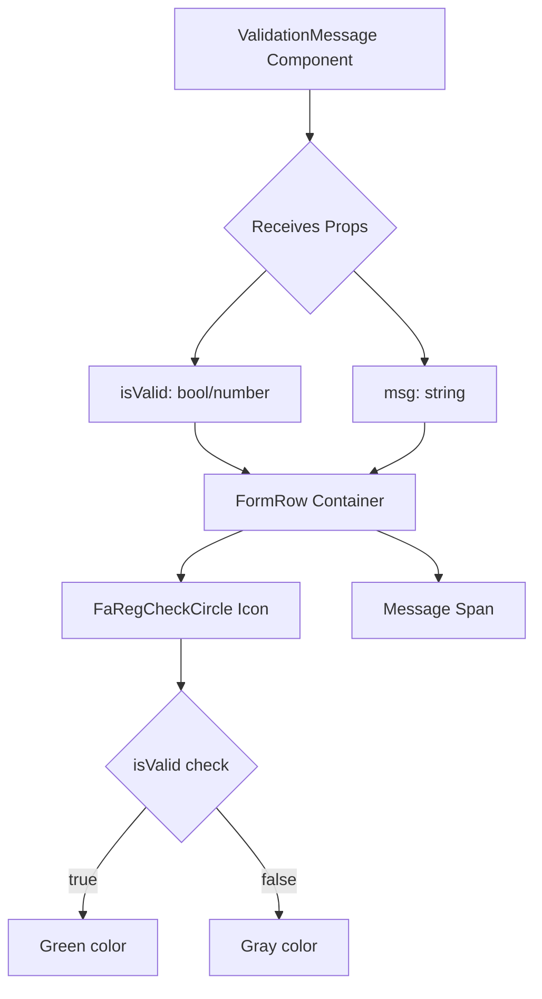
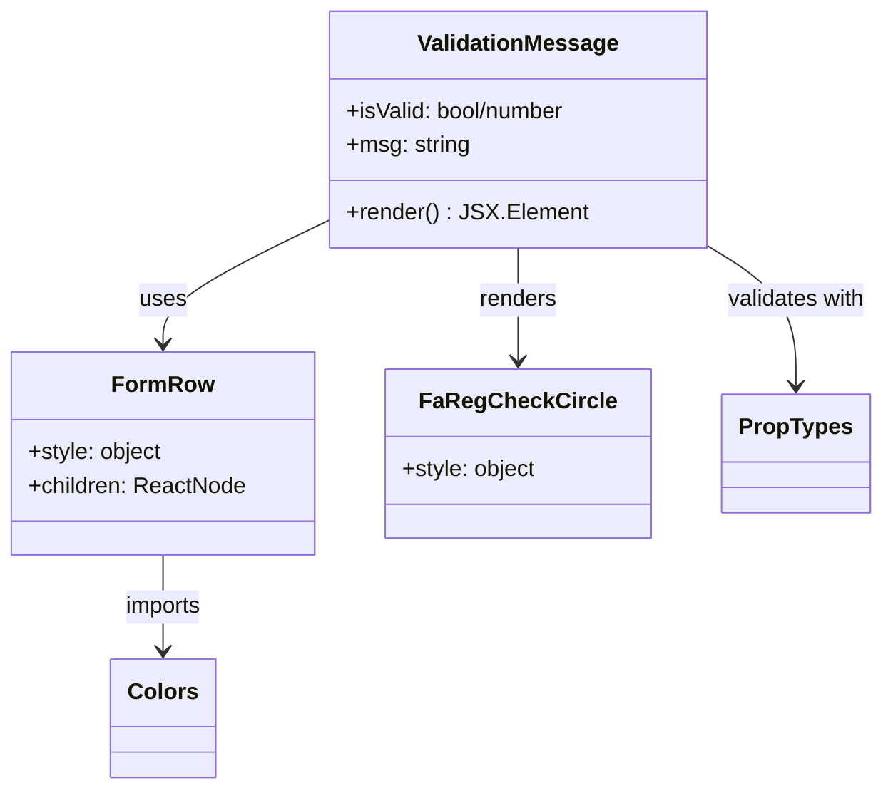

# Diagram: web/portal/src/components-old/forms/ValidationMessage.js

> Auto-generated by Obscura crawlers

## Diagram 1

### SVG

<svg id="container" width="503.515625" xmlns="http://www.w3.org/2000/svg" class="flowchart" height="943.34375" viewBox="0 0 503.515625 943.34375" role="graphics-document document" aria-roledescription="flowchart-v2"><g><marker id="container_flowchart-v2-pointEnd" class="marker flowchart-v2" viewBox="0 0 10 10" refX="5" refY="5" markerUnits="userSpaceOnUse" markerWidth="8" markerHeight="8" orient="auto"><path d="M 0 0 L 10 5 L 0 10 z" class="arrowMarkerPath" style="stroke-width: 1; stroke-dasharray: 1, 0;"></path></marker><marker id="container_flowchart-v2-pointStart" class="marker flowchart-v2" viewBox="0 0 10 10" refX="4.5" refY="5" markerUnits="userSpaceOnUse" markerWidth="8" markerHeight="8" orient="auto"><path d="M 0 5 L 10 10 L 10 0 z" class="arrowMarkerPath" style="stroke-width: 1; stroke-dasharray: 1, 0;"></path></marker><marker id="container_flowchart-v2-circleEnd" class="marker flowchart-v2" viewBox="0 0 10 10" refX="11" refY="5" markerUnits="userSpaceOnUse" markerWidth="11" markerHeight="11" orient="auto"><circle cx="5" cy="5" r="5" class="arrowMarkerPath" style="stroke-width: 1; stroke-dasharray: 1, 0;"></circle></marker><marker id="container_flowchart-v2-circleStart" class="marker flowchart-v2" viewBox="0 0 10 10" refX="-1" refY="5" markerUnits="userSpaceOnUse" markerWidth="11" markerHeight="11" orient="auto"><circle cx="5" cy="5" r="5" class="arrowMarkerPath" style="stroke-width: 1; stroke-dasharray: 1, 0;"></circle></marker><marker id="container_flowchart-v2-crossEnd" class="marker cross flowchart-v2" viewBox="0 0 11 11" refX="12" refY="5.2" markerUnits="userSpaceOnUse" markerWidth="11" markerHeight="11" orient="auto"><path d="M 1,1 l 9,9 M 10,1 l -9,9" class="arrowMarkerPath" style="stroke-width: 2; stroke-dasharray: 1, 0;"></path></marker><marker id="container_flowchart-v2-crossStart" class="marker cross flowchart-v2" viewBox="0 0 11 11" refX="-1" refY="5.2" markerUnits="userSpaceOnUse" markerWidth="11" markerHeight="11" orient="auto"><path d="M 1,1 l 9,9 M 10,1 l -9,9" class="arrowMarkerPath" style="stroke-width: 2; stroke-dasharray: 1, 0;"></path></marker><g class="root"><g class="clusters"></g><g class="edgePaths"><path d="M294.387,86L294.387,90.167C294.387,94.333,294.387,102.667,294.387,110.333C294.387,118,294.387,125,294.387,128.5L294.387,132" id="L_A_B_0" class="edge-thickness-normal edge-pattern-solid edge-thickness-normal edge-pattern-solid flowchart-link" style=";" data-edge="true" data-et="edge" data-id="L_A_B_0" data-points="W3sieCI6Mjk0LjM4NjcxODc1LCJ5Ijo4Nn0seyJ4IjoyOTQuMzg2NzE4NzUsInkiOjExMX0seyJ4IjoyOTQuMzg2NzE4NzUsInkiOjEzNn1d" marker-end="url(#container_flowchart-v2-pointEnd)"></path><path d="M252.583,256.149L240.701,267.283C228.82,278.417,205.056,300.685,193.175,315.319C181.293,329.953,181.293,336.953,181.293,340.453L181.293,343.953" id="L_B_C_0" class="edge-thickness-normal edge-pattern-solid edge-thickness-normal edge-pattern-solid flowchart-link" style=";" data-edge="true" data-et="edge" data-id="L_B_C_0" data-points="W3sieCI6MjUyLjU4MzA0ODQ1NDcxODEsInkiOjI1Ni4xNDk0NTQ3MDQ3MTgxfSx7IngiOjE4MS4yOTI5Njg3NSwieSI6MzIyLjk1MzEyNX0seyJ4IjoxODEuMjkyOTY4NzUsInkiOjM0Ny45NTMxMjV9XQ==" marker-end="url(#container_flowchart-v2-pointEnd)"></path><path d="M336.19,256.149L348.072,267.283C359.954,278.417,383.717,300.685,395.599,315.319C407.48,329.953,407.48,336.953,407.48,340.453L407.48,343.953" id="L_B_D_0" class="edge-thickness-normal edge-pattern-solid edge-thickness-normal edge-pattern-solid flowchart-link" style=";" data-edge="true" data-et="edge" data-id="L_B_D_0" data-points="W3sieCI6MzM2LjE5MDM4OTA0NTI4MTksInkiOjI1Ni4xNDk0NTQ3MDQ3MTgxfSx7IngiOjQwNy40ODA0Njg3NSwieSI6MzIyLjk1MzEyNX0seyJ4Ijo0MDcuNDgwNDY4NzUsInkiOjM0Ny45NTMxMjV9XQ==" marker-end="url(#container_flowchart-v2-pointEnd)"></path><path d="M181.293,401.953L181.293,406.12C181.293,410.286,181.293,418.62,189.749,426.675C198.206,434.729,215.118,442.506,223.574,446.394L232.031,450.282" id="L_C_E_0" class="edge-thickness-normal edge-pattern-solid edge-thickness-normal edge-pattern-solid flowchart-link" style=";" data-edge="true" data-et="edge" data-id="L_C_E_0" data-points="W3sieCI6MTgxLjI5Mjk2ODc1LCJ5Ijo0MDEuOTUzMTI1fSx7IngiOjE4MS4yOTI5Njg3NSwieSI6NDI2Ljk1MzEyNX0seyJ4IjoyMzUuNjY0OTYzOTQyMzA3NjgsInkiOjQ1MS45NTMxMjV9XQ==" marker-end="url(#container_flowchart-v2-pointEnd)"></path><path d="M407.48,401.953L407.48,406.12C407.48,410.286,407.48,418.62,399.024,426.675C390.568,434.729,373.655,442.506,365.199,446.394L356.743,450.282" id="L_D_E_0" class="edge-thickness-normal edge-pattern-solid edge-thickness-normal edge-pattern-solid flowchart-link" style=";" data-edge="true" data-et="edge" data-id="L_D_E_0" data-points="W3sieCI6NDA3LjQ4MDQ2ODc1LCJ5Ijo0MDEuOTUzMTI1fSx7IngiOjQwNy40ODA0Njg3NSwieSI6NDI2Ljk1MzEyNX0seyJ4IjozNTMuMTA4NDczNTU3NjkyMywieSI6NDUxLjk1MzEyNX1d" marker-end="url(#container_flowchart-v2-pointEnd)"></path><path d="M231.886,505.953L222.241,510.12C212.596,514.286,193.306,522.62,183.661,530.286C174.016,537.953,174.016,544.953,174.016,548.453L174.016,551.953" id="L_E_F_0" class="edge-thickness-normal edge-pattern-solid edge-thickness-normal edge-pattern-solid flowchart-link" style=";" data-edge="true" data-et="edge" data-id="L_E_F_0" data-points="W3sieCI6MjMxLjg4NjM0MzE0OTAzODQ1LCJ5Ijo1MDUuOTUzMTI1fSx7IngiOjE3NC4wMTU2MjUsInkiOjUzMC45NTMxMjV9LHsieCI6MTc0LjAxNTYyNSwieSI6NTU1Ljk1MzEyNX1d" marker-end="url(#container_flowchart-v2-pointEnd)"></path><path d="M356.887,505.953L366.532,510.12C376.177,514.286,395.468,522.62,405.113,530.286C414.758,537.953,414.758,544.953,414.758,548.453L414.758,551.953" id="L_E_G_0" class="edge-thickness-normal edge-pattern-solid edge-thickness-normal edge-pattern-solid flowchart-link" style=";" data-edge="true" data-et="edge" data-id="L_E_G_0" data-points="W3sieCI6MzU2Ljg4NzA5NDM1MDk2MTU1LCJ5Ijo1MDUuOTUzMTI1fSx7IngiOjQxNC43NTc4MTI1LCJ5Ijo1MzAuOTUzMTI1fSx7IngiOjQxNC43NTc4MTI1LCJ5Ijo1NTUuOTUzMTI1fV0=" marker-end="url(#container_flowchart-v2-pointEnd)"></path><path d="M174.016,609.953L174.016,614.12C174.016,618.286,174.016,626.62,174.016,634.286C174.016,641.953,174.016,648.953,174.016,652.453L174.016,655.953" id="L_F_H_0" class="edge-thickness-normal edge-pattern-solid edge-thickness-normal edge-pattern-solid flowchart-link" style=";" data-edge="true" data-et="edge" data-id="L_F_H_0" data-points="W3sieCI6MTc0LjAxNTYyNSwieSI6NjA5Ljk1MzEyNX0seyJ4IjoxNzQuMDE1NjI1LCJ5Ijo2MzQuOTUzMTI1fSx7IngiOjE3NC4wMTU2MjUsInkiOjY1OS45NTMxMjV9XQ==" marker-end="url(#container_flowchart-v2-pointEnd)"></path><path d="M140.137,773.465L130.085,785.278C120.034,797.091,99.931,820.717,89.88,838.031C79.828,855.344,79.828,866.344,79.828,871.844L79.828,877.344" id="L_H_I_0" class="edge-thickness-normal edge-pattern-solid edge-thickness-normal edge-pattern-solid flowchart-link" style=";" data-edge="true" data-et="edge" data-id="L_H_I_0" data-points="W3sieCI6MTQwLjEzNjg1NzEyNTgzNDEzLCJ5Ijo3NzMuNDY0OTgyMTI1ODM0MX0seyJ4Ijo3OS44MjgxMjUsInkiOjg0NC4zNDM3NX0seyJ4Ijo3OS44MjgxMjUsInkiOjg4MS4zNDM3NX1d" marker-end="url(#container_flowchart-v2-pointEnd)"></path><path d="M207.894,773.465L217.946,785.278C227.997,797.091,248.1,820.717,258.152,838.031C268.203,855.344,268.203,866.344,268.203,871.844L268.203,877.344" id="L_H_J_0" class="edge-thickness-normal edge-pattern-solid edge-thickness-normal edge-pattern-solid flowchart-link" style=";" data-edge="true" data-et="edge" data-id="L_H_J_0" data-points="W3sieCI6MjA3Ljg5NDM5Mjg3NDE2NTg3LCJ5Ijo3NzMuNDY0OTgyMTI1ODM0MX0seyJ4IjoyNjguMjAzMTI1LCJ5Ijo4NDQuMzQzNzV9LHsieCI6MjY4LjIwMzEyNSwieSI6ODgxLjM0Mzc1fV0=" marker-end="url(#container_flowchart-v2-pointEnd)"></path></g><g class="edgeLabels"><g class="edgeLabel"><g class="label" data-id="L_A_B_0" transform="translate(0, 0)"><foreignObject width="0" height="0">

</foreignObject></g></g><g class="edgeLabel"><g class="label" data-id="L_B_C_0" transform="translate(0, 0)"><foreignObject width="0" height="0">

</foreignObject></g></g><g class="edgeLabel"><g class="label" data-id="L_B_D_0" transform="translate(0, 0)"><foreignObject width="0" height="0">

</foreignObject></g></g><g class="edgeLabel"><g class="label" data-id="L_C_E_0" transform="translate(0, 0)"><foreignObject width="0" height="0">

</foreignObject></g></g><g class="edgeLabel"><g class="label" data-id="L_D_E_0" transform="translate(0, 0)"><foreignObject width="0" height="0">

</foreignObject></g></g><g class="edgeLabel"><g class="label" data-id="L_E_F_0" transform="translate(0, 0)"><foreignObject width="0" height="0">

</foreignObject></g></g><g class="edgeLabel"><g class="label" data-id="L_E_G_0" transform="translate(0, 0)"><foreignObject width="0" height="0">

</foreignObject></g></g><g class="edgeLabel"><g class="label" data-id="L_F_H_0" transform="translate(0, 0)"><foreignObject width="0" height="0">

</foreignObject></g></g><g class="edgeLabel" transform="translate(79.828125, 844.34375)"><g class="label" data-id="L_H_I_0" transform="translate(-14.9921875, -12)"><foreignObject width="29.984375" height="24">

true

</foreignObject></g></g><g class="edgeLabel" transform="translate(268.203125, 844.34375)"><g class="label" data-id="L_H_J_0" transform="translate(-17.21875, -12)"><foreignObject width="34.4375" height="24">

false

</foreignObject></g></g></g><g class="nodes"><g class="node default" id="flowchart-A-0" transform="translate(294.38671875, 47)"><rect class="basic label-container" style="" x="-130" y="-39" width="260" height="78"></rect><g class="label" style="" transform="translate(-100, -24)"><rect></rect><foreignObject width="200" height="48">

ValidationMessage Component

</foreignObject></g></g><g class="node default" id="flowchart-B-1" transform="translate(294.38671875, 216.9765625)"><polygon points="80.9765625,0 161.953125,-80.9765625 80.9765625,-161.953125 0,-80.9765625" class="label-container" transform="translate(-80.4765625, 80.9765625)"></polygon><g class="label" style="" transform="translate(-53.9765625, -12)"><rect></rect><foreignObject width="107.953125" height="24">

Receives Props

</foreignObject></g></g><g class="node default" id="flowchart-C-3" transform="translate(181.29296875, 374.953125)"><rect class="basic label-container" style="" x="-106.578125" y="-27" width="213.15625" height="54"></rect><g class="label" style="" transform="translate(-76.578125, -12)"><rect></rect><foreignObject width="153.15625" height="24">

isValid: bool/number

</foreignObject></g></g><g class="node default" id="flowchart-D-5" transform="translate(407.48046875, 374.953125)"><rect class="basic label-container" style="" x="-69.609375" y="-27" width="139.21875" height="54"></rect><g class="label" style="" transform="translate(-39.609375, -12)"><rect></rect><foreignObject width="79.21875" height="24">

msg: string

</foreignObject></g></g><g class="node default" id="flowchart-E-7" transform="translate(294.38671875, 478.953125)"><rect class="basic label-container" style="" x="-100.7734375" y="-27" width="201.546875" height="54"></rect><g class="label" style="" transform="translate(-70.7734375, -12)"><rect></rect><foreignObject width="141.546875" height="24">

FormRow Container

</foreignObject></g></g><g class="node default" id="flowchart-F-11" transform="translate(174.015625, 582.953125)"><rect class="basic label-container" style="" x="-109.984375" y="-27" width="219.96875" height="54"></rect><g class="label" style="" transform="translate(-79.984375, -12)"><rect></rect><foreignObject width="159.96875" height="24">

FaRegCheckCircle Icon

</foreignObject></g></g><g class="node default" id="flowchart-G-13" transform="translate(414.7578125, 582.953125)"><rect class="basic label-container" style="" x="-80.7578125" y="-27" width="161.515625" height="54"></rect><g class="label" style="" transform="translate(-50.7578125, -12)"><rect></rect><foreignObject width="101.515625" height="24">

Message Span

</foreignObject></g></g><g class="node default" id="flowchart-H-15" transform="translate(174.015625, 733.6484375)"><polygon points="73.6953125,0 147.390625,-73.6953125 73.6953125,-147.390625 0,-73.6953125" class="label-container" transform="translate(-73.1953125, 73.6953125)"></polygon><g class="label" style="" transform="translate(-46.6953125, -12)"><rect></rect><foreignObject width="93.390625" height="24">

isValid check

</foreignObject></g></g><g class="node default" id="flowchart-I-17" transform="translate(79.828125, 908.34375)"><rect class="basic label-container" style="" x="-71.828125" y="-27" width="143.65625" height="54"></rect><g class="label" style="" transform="translate(-41.828125, -12)"><rect></rect><foreignObject width="83.65625" height="24">

Green color

</foreignObject></g></g><g class="node default" id="flowchart-J-19" transform="translate(268.203125, 908.34375)"><rect class="basic label-container" style="" x="-66.546875" y="-27" width="133.09375" height="54"></rect><g class="label" style="" transform="translate(-36.546875, -12)"><rect></rect><foreignObject width="73.09375" height="24">

Gray color

</foreignObject></g></g></g></g></g></svg>

## Diagram 2

### SVG

<svg id="container" width="612.1953125" xmlns="http://www.w3.org/2000/svg" class="classDiagram" height="560" viewBox="0 0 612.1953125 560" role="graphics-document document" aria-roledescription="class"><g><defs><marker id="container_class-aggregationStart" class="marker aggregation class" refX="18" refY="7" markerWidth="190" markerHeight="240" orient="auto"><path d="M 18,7 L9,13 L1,7 L9,1 Z"></path></marker></defs><defs><marker id="container_class-aggregationEnd" class="marker aggregation class" refX="1" refY="7" markerWidth="20" markerHeight="28" orient="auto"><path d="M 18,7 L9,13 L1,7 L9,1 Z"></path></marker></defs><defs><marker id="container_class-extensionStart" class="marker extension class" refX="18" refY="7" markerWidth="190" markerHeight="240" orient="auto"><path d="M 1,7 L18,13 V 1 Z"></path></marker></defs><defs><marker id="container_class-extensionEnd" class="marker extension class" refX="1" refY="7" markerWidth="20" markerHeight="28" orient="auto"><path d="M 1,1 V 13 L18,7 Z"></path></marker></defs><defs><marker id="container_class-compositionStart" class="marker composition class" refX="18" refY="7" markerWidth="190" markerHeight="240" orient="auto"><path d="M 18,7 L9,13 L1,7 L9,1 Z"></path></marker></defs><defs><marker id="container_class-compositionEnd" class="marker composition class" refX="1" refY="7" markerWidth="20" markerHeight="28" orient="auto"><path d="M 18,7 L9,13 L1,7 L9,1 Z"></path></marker></defs><defs><marker id="container_class-dependencyStart" class="marker dependency class" refX="6" refY="7" markerWidth="190" markerHeight="240" orient="auto"><path d="M 5,7 L9,13 L1,7 L9,1 Z"></path></marker></defs><defs><marker id="container_class-dependencyEnd" class="marker dependency class" refX="13" refY="7" markerWidth="20" markerHeight="28" orient="auto"><path d="M 18,7 L9,13 L14,7 L9,1 Z"></path></marker></defs><defs><marker id="container_class-lollipopStart" class="marker lollipop class" refX="13" refY="7" markerWidth="190" markerHeight="240" orient="auto"><circle stroke="black" fill="transparent" cx="7" cy="7" r="6"></circle></marker></defs><defs><marker id="container_class-lollipopEnd" class="marker lollipop class" refX="1" refY="7" markerWidth="190" markerHeight="240" orient="auto"><circle stroke="black" fill="transparent" cx="7" cy="7" r="6"></circle></marker></defs><g class="root"><g class="clusters"></g><g class="edgePaths"><path d="M233.531,154.631L213.61,164.359C193.689,174.087,153.846,193.544,133.925,208.438C114.004,223.333,114.004,233.667,114.004,238.833L114.004,244" id="id_ValidationMessage_FormRow_1" class="edge-thickness-normal edge-pattern-solid relation" style=";;;" data-edge="true" data-et="edge" data-id="id_ValidationMessage_FormRow_1" data-points="W3sieCI6MjMzLjUzMTI1LCJ5IjoxNTQuNjMwNzM4NDI4NTUzNH0seyJ4IjoxMTQuMDAzOTA2MjUsInkiOjIxM30seyJ4IjoxMTQuMDAzOTA2MjUsInkiOjI1MH1d" marker-end="url(#container_class-dependencyEnd)"></path><path d="M361.785,176L361.785,182.167C361.785,188.333,361.785,200.667,361.785,214C361.785,227.333,361.785,241.667,361.785,248.833L361.785,256" id="id_ValidationMessage_FaRegCheckCircle_2" class="edge-thickness-normal edge-pattern-solid relation" style=";;;" data-edge="true" data-et="edge" data-id="id_ValidationMessage_FaRegCheckCircle_2" data-points="W3sieCI6MzYxLjc4NTE1NjI1LCJ5IjoxNzZ9LHsieCI6MzYxLjc4NTE1NjI1LCJ5IjoyMTN9LHsieCI6MzYxLjc4NTE1NjI1LCJ5IjoyNjJ9XQ==" marker-end="url(#container_class-dependencyEnd)"></path><path d="M114.004,394L114.004,400.167C114.004,406.333,114.004,418.667,114.004,430C114.004,441.333,114.004,451.667,114.004,456.833L114.004,462" id="id_FormRow_Colors_3" class="edge-thickness-normal edge-pattern-solid relation" style=";;;" data-edge="true" data-et="edge" data-id="id_FormRow_Colors_3" data-points="W3sieCI6MTE0LjAwMzkwNjI1LCJ5IjozOTR9LHsieCI6MTE0LjAwMzkwNjI1LCJ5Ijo0MzF9LHsieCI6MTE0LjAwMzkwNjI1LCJ5Ijo0Njh9XQ==" marker-end="url(#container_class-dependencyEnd)"></path><path d="M490.039,172.812L500.669,179.51C511.299,186.208,532.56,199.604,543.19,216.469C553.82,233.333,553.82,253.667,553.82,263.833L553.82,274" id="id_ValidationMessage_PropTypes_4" class="edge-thickness-normal edge-pattern-solid relation" style=";;;" data-edge="true" data-et="edge" data-id="id_ValidationMessage_PropTypes_4" data-points="W3sieCI6NDkwLjAzOTA2MjUsInkiOjE3Mi44MTE4ODM0MDM1MTA5M30seyJ4Ijo1NTMuODIwMzEyNSwieSI6MjEzfSx7IngiOjU1My44MjAzMTI1LCJ5IjoyODB9XQ==" marker-end="url(#container_class-dependencyEnd)"></path></g><g class="edgeLabels"><g class="edgeLabel" transform="translate(114.00390625, 213)"><g class="label" data-id="id_ValidationMessage_FormRow_1" transform="translate(-16.4921875, -12)"><foreignObject width="32.984375" height="24">

uses

</foreignObject></g></g><g class="edgeLabel" transform="translate(361.78515625, 213)"><g class="label" data-id="id_ValidationMessage_FaRegCheckCircle_2" transform="translate(-27.75, -12)"><foreignObject width="55.5" height="24">

renders

</foreignObject></g></g><g class="edgeLabel" transform="translate(114.00390625, 431)"><g class="label" data-id="id_FormRow_Colors_3" transform="translate(-28.25, -12)"><foreignObject width="56.5" height="24">

imports

</foreignObject></g></g><g class="edgeLabel" transform="translate(553.8203125, 213)"><g class="label" data-id="id_ValidationMessage_PropTypes_4" transform="translate(-50.375, -12)"><foreignObject width="100.75" height="24">

validates with

</foreignObject></g></g></g><g class="nodes"><g class="node default" id="classId-ValidationMessage-0" transform="translate(361.78515625, 92)"><g class="basic label-container"><path d="M-128.25390625 -84 L128.25390625 -84 L128.25390625 84 L-128.25390625 84" stroke="none" stroke-width="0" fill="#ECECFF" style=""></path><path d="M-128.25390625 -84 C-66.56393100307119 -84, -4.873955756142394 -84, 128.25390625 -84 M-128.25390625 -84 C-52.1271218649987 -84, 23.9996625200026 -84, 128.25390625 -84 M128.25390625 -84 C128.25390625 -36.49908074141938, 128.25390625 11.001838517161247, 128.25390625 84 M128.25390625 -84 C128.25390625 -29.007096156771816, 128.25390625 25.98580768645637, 128.25390625 84 M128.25390625 84 C46.569959857262305 84, -35.11398653547539 84, -128.25390625 84 M128.25390625 84 C34.59088449784744 84, -59.07213725430512 84, -128.25390625 84 M-128.25390625 84 C-128.25390625 35.01238684103157, -128.25390625 -13.975226317936858, -128.25390625 -84 M-128.25390625 84 C-128.25390625 18.38237328309789, -128.25390625 -47.23525343380422, -128.25390625 -84" stroke="#9370DB" stroke-width="1.3" fill="none" stroke-dasharray="0 0" style=""></path></g><g class="annotation-group text" transform="translate(0, -60)"></g><g class="label-group text" transform="translate(-68.2421875, -60)"><g class="label" style="font-weight: bolder" transform="translate(0,-12)"><foreignObject width="136.484375" height="24">

ValidationMessage

</foreignObject></g></g><g class="members-group text" transform="translate(-116.25390625, -12)"><g class="label" style="" transform="translate(0,-12)"><foreignObject width="161.140625" height="24">

+isValid: bool/number

</foreignObject></g><g class="label" style="" transform="translate(0,12)"><foreignObject width="87.203125" height="24">

+msg: string

</foreignObject></g></g><g class="methods-group text" transform="translate(-116.25390625, 60)"><g class="label" style="" transform="translate(0,-12)"><foreignObject width="164.265625" height="24">

+render() : JSX.Element

</foreignObject></g></g><g class="divider" style=""><path d="M-128.25390625 -36 C-50.51825382702971 -36, 27.21739859594058 -36, 128.25390625 -36 M-128.25390625 -36 C-62.06377806221602 -36, 4.126350125567967 -36, 128.25390625 -36" stroke="#9370DB" stroke-width="1.3" fill="none" stroke-dasharray="0 0" style=""></path></g><g class="divider" style=""><path d="M-128.25390625 36 C-36.185765494597604 36, 55.88237526080479 36, 128.25390625 36 M-128.25390625 36 C-62.05522703590573 36, 4.143452178188539 36, 128.25390625 36" stroke="#9370DB" stroke-width="1.3" fill="none" stroke-dasharray="0 0" style=""></path></g></g><g class="node default" id="classId-FormRow-1" transform="translate(114.00390625, 322)"><g class="basic label-container"><path d="M-106.00390625 -72 L106.00390625 -72 L106.00390625 72 L-106.00390625 72" stroke="none" stroke-width="0" fill="#ECECFF" style=""></path><path d="M-106.00390625 -72 C-45.781871520981305 -72, 14.44016320803739 -72, 106.00390625 -72 M-106.00390625 -72 C-57.80055051953414 -72, -9.597194789068283 -72, 106.00390625 -72 M106.00390625 -72 C106.00390625 -34.805589415168726, 106.00390625 2.388821169662549, 106.00390625 72 M106.00390625 -72 C106.00390625 -25.46507014601511, 106.00390625 21.069859707969783, 106.00390625 72 M106.00390625 72 C33.61340814147684 72, -38.77708996704632 72, -106.00390625 72 M106.00390625 72 C27.908515503774765 72, -50.18687524245047 72, -106.00390625 72 M-106.00390625 72 C-106.00390625 15.56396417948703, -106.00390625 -40.87207164102594, -106.00390625 -72 M-106.00390625 72 C-106.00390625 20.610325445683003, -106.00390625 -30.779349108633994, -106.00390625 -72" stroke="#9370DB" stroke-width="1.3" fill="none" stroke-dasharray="0 0" style=""></path></g><g class="annotation-group text" transform="translate(0, -48)"></g><g class="label-group text" transform="translate(-33.7421875, -48)"><g class="label" style="font-weight: bolder" transform="translate(0,-12)"><foreignObject width="67.484375" height="24">

FormRow

</foreignObject></g></g><g class="members-group text" transform="translate(-94.00390625, 0)"><g class="label" style="" transform="translate(0,-12)"><foreignObject width="95.90625" height="24">

+style: object

</foreignObject></g><g class="label" style="" transform="translate(0,12)"><foreignObject width="154.265625" height="24">

+children: ReactNode

</foreignObject></g></g><g class="methods-group text" transform="translate(-94.00390625, 72)"></g><g class="divider" style=""><path d="M-106.00390625 -24 C-36.04687405139558 -24, 33.91015814720885 -24, 106.00390625 -24 M-106.00390625 -24 C-54.305910646590604 -24, -2.607915043181208 -24, 106.00390625 -24" stroke="#9370DB" stroke-width="1.3" fill="none" stroke-dasharray="0 0" style=""></path></g><g class="divider" style=""><path d="M-106.00390625 48 C-36.177779731940575 48, 33.64834678611885 48, 106.00390625 48 M-106.00390625 48 C-40.819338034971054 48, 24.365230180057893 48, 106.00390625 48" stroke="#9370DB" stroke-width="1.3" fill="none" stroke-dasharray="0 0" style=""></path></g></g><g class="node default" id="classId-FaRegCheckCircle-2" transform="translate(361.78515625, 322)"><g class="basic label-container"><path d="M-91.77734375 -60 L91.77734375 -60 L91.77734375 60 L-91.77734375 60" stroke="none" stroke-width="0" fill="#ECECFF" style=""></path><path d="M-91.77734375 -60 C-33.34494311103875 -60, 25.087457527922496 -60, 91.77734375 -60 M-91.77734375 -60 C-28.216833477797266 -60, 35.34367679440547 -60, 91.77734375 -60 M91.77734375 -60 C91.77734375 -12.357847533123582, 91.77734375 35.284304933752836, 91.77734375 60 M91.77734375 -60 C91.77734375 -23.876166232386076, 91.77734375 12.247667535227848, 91.77734375 60 M91.77734375 60 C24.184458732590116 60, -43.40842628481977 60, -91.77734375 60 M91.77734375 60 C51.30803990588256 60, 10.838736061765118 60, -91.77734375 60 M-91.77734375 60 C-91.77734375 24.756179619253338, -91.77734375 -10.487640761493324, -91.77734375 -60 M-91.77734375 60 C-91.77734375 14.371906093598142, -91.77734375 -31.256187812803716, -91.77734375 -60" stroke="#9370DB" stroke-width="1.3" fill="none" stroke-dasharray="0 0" style=""></path></g><g class="annotation-group text" transform="translate(0, -36)"></g><g class="label-group text" transform="translate(-63.6484375, -36)"><g class="label" style="font-weight: bolder" transform="translate(0,-12)"><foreignObject width="127.296875" height="24">

FaRegCheckCircle

</foreignObject></g></g><g class="members-group text" transform="translate(-79.77734375, 12)"><g class="label" style="" transform="translate(0,-12)"><foreignObject width="95.90625" height="24">

+style: object

</foreignObject></g></g><g class="methods-group text" transform="translate(-79.77734375, 60)"></g><g class="divider" style=""><path d="M-91.77734375 -12 C-47.52706546074217 -12, -3.2767871714843437 -12, 91.77734375 -12 M-91.77734375 -12 C-49.346317611775675 -12, -6.915291473551349 -12, 91.77734375 -12" stroke="#9370DB" stroke-width="1.3" fill="none" stroke-dasharray="0 0" style=""></path></g><g class="divider" style=""><path d="M-91.77734375 36 C-33.756099410916946 36, 24.26514492816611 36, 91.77734375 36 M-91.77734375 36 C-46.4681288575571 36, -1.1589139651141949 36, 91.77734375 36" stroke="#9370DB" stroke-width="1.3" fill="none" stroke-dasharray="0 0" style=""></path></g></g><g class="node default" id="classId-Colors-3" transform="translate(114.00390625, 510)"><g class="basic label-container"><path d="M-35.1015625 -42 L35.1015625 -42 L35.1015625 42 L-35.1015625 42" stroke="none" stroke-width="0" fill="#ECECFF" style=""></path><path d="M-35.1015625 -42 C-7.85493819881626 -42, 19.39168610236748 -42, 35.1015625 -42 M-35.1015625 -42 C-20.17920633757599 -42, -5.256850175151985 -42, 35.1015625 -42 M35.1015625 -42 C35.1015625 -15.920048991700408, 35.1015625 10.159902016599183, 35.1015625 42 M35.1015625 -42 C35.1015625 -12.388107158727323, 35.1015625 17.223785682545355, 35.1015625 42 M35.1015625 42 C14.22780504992437 42, -6.645952400151259 42, -35.1015625 42 M35.1015625 42 C15.954528484017448 42, -3.1925055319651037 42, -35.1015625 42 M-35.1015625 42 C-35.1015625 20.28913304002059, -35.1015625 -1.4217339199588181, -35.1015625 -42 M-35.1015625 42 C-35.1015625 11.150068887740659, -35.1015625 -19.699862224518682, -35.1015625 -42" stroke="#9370DB" stroke-width="1.3" fill="none" stroke-dasharray="0 0" style=""></path></g><g class="annotation-group text" transform="translate(0, -18)"></g><g class="label-group text" transform="translate(-23.1015625, -18)"><g class="label" style="font-weight: bolder" transform="translate(0,-12)"><foreignObject width="46.203125" height="24">

Colors

</foreignObject></g></g><g class="members-group text" transform="translate(-23.1015625, 30)"></g><g class="methods-group text" transform="translate(-23.1015625, 60)"></g><g class="divider" style=""><path d="M-35.1015625 6 C-18.990544217506603 6, -2.8795259350132056 6, 35.1015625 6 M-35.1015625 6 C-10.020125221416794 6, 15.061312057166411 6, 35.1015625 6" stroke="#9370DB" stroke-width="1.3" fill="none" stroke-dasharray="0 0" style=""></path></g><g class="divider" style=""><path d="M-35.1015625 24 C-13.767437492965023 24, 7.5666875140699545 24, 35.1015625 24 M-35.1015625 24 C-20.879084726762724 24, -6.656606953525447 24, 35.1015625 24" stroke="#9370DB" stroke-width="1.3" fill="none" stroke-dasharray="0 0" style=""></path></g></g><g class="node default" id="classId-PropTypes-4" transform="translate(553.8203125, 322)"><g class="basic label-container"><path d="M-50.2578125 -42 L50.2578125 -42 L50.2578125 42 L-50.2578125 42" stroke="none" stroke-width="0" fill="#ECECFF" style=""></path><path d="M-50.2578125 -42 C-22.37525788510371 -42, 5.507296729792579 -42, 50.2578125 -42 M-50.2578125 -42 C-20.175352039465295 -42, 9.90710842106941 -42, 50.2578125 -42 M50.2578125 -42 C50.2578125 -12.991255309863757, 50.2578125 16.017489380272487, 50.2578125 42 M50.2578125 -42 C50.2578125 -19.166871309791908, 50.2578125 3.6662573804161838, 50.2578125 42 M50.2578125 42 C17.93808200763057 42, -14.38164848473886 42, -50.2578125 42 M50.2578125 42 C18.59537648458449 42, -13.067059530831017 42, -50.2578125 42 M-50.2578125 42 C-50.2578125 18.063500159641187, -50.2578125 -5.872999680717626, -50.2578125 -42 M-50.2578125 42 C-50.2578125 24.155245335236145, -50.2578125 6.310490670472291, -50.2578125 -42" stroke="#9370DB" stroke-width="1.3" fill="none" stroke-dasharray="0 0" style=""></path></g><g class="annotation-group text" transform="translate(0, -18)"></g><g class="label-group text" transform="translate(-38.2578125, -18)"><g class="label" style="font-weight: bolder" transform="translate(0,-12)"><foreignObject width="76.515625" height="24">

PropTypes

</foreignObject></g></g><g class="members-group text" transform="translate(-38.2578125, 30)"></g><g class="methods-group text" transform="translate(-38.2578125, 60)"></g><g class="divider" style=""><path d="M-50.2578125 6 C-25.406291587098266 6, -0.5547706741965328 6, 50.2578125 6 M-50.2578125 6 C-21.472952088029245 6, 7.311908323941509 6, 50.2578125 6" stroke="#9370DB" stroke-width="1.3" fill="none" stroke-dasharray="0 0" style=""></path></g><g class="divider" style=""><path d="M-50.2578125 24 C-28.35850532489289 24, -6.459198149785777 24, 50.2578125 24 M-50.2578125 24 C-10.165429682283232 24, 29.926953135433536 24, 50.2578125 24" stroke="#9370DB" stroke-width="1.3" fill="none" stroke-dasharray="0 0" style=""></path></g></g></g></g></g></svg>
