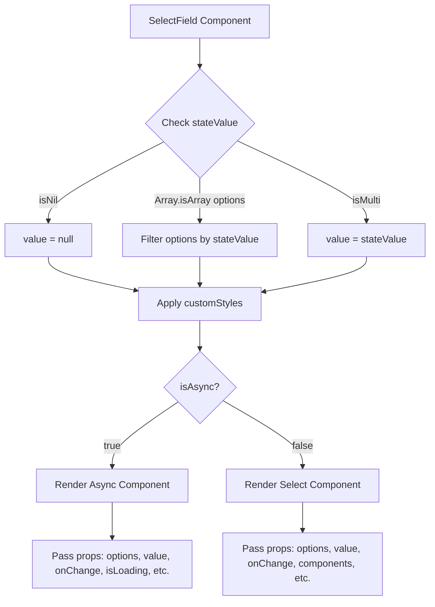
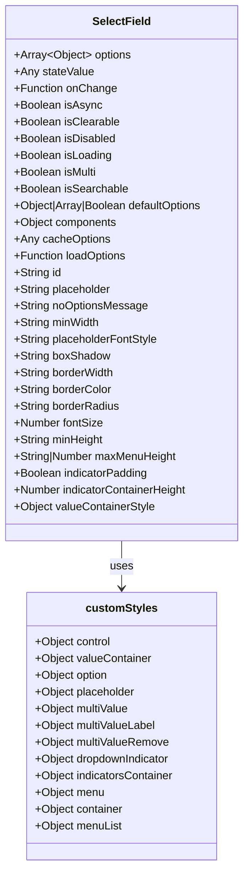
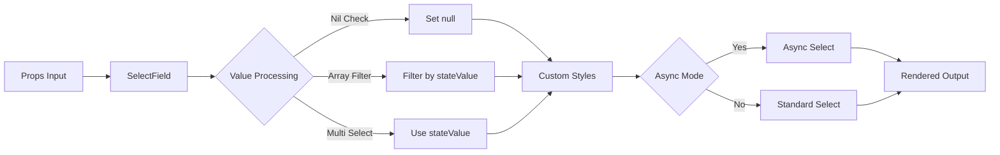

# Diagram: web/portal/src/components-old/forms/fields/SelectField.js


> Auto-generated by Obscura crawlers

## Diagram 1

```mermaid
flowchart TD
      A[SelectField Component] --> B{Check stateValue}
      B -->|isNil| C[value = null]
      B -->|Array.isArray options| D[Filter options by stateValue]...
  └ 149 lines...
```

> SVG rendering failed for this diagram.

## Diagram 2



### SVG

<svg id="container" width="708.328125" xmlns="http://www.w3.org/2000/svg" class="flowchart" height="972.640625" viewBox="0 0 708.328125 972.640625" role="graphics-document document" aria-roledescription="flowchart-v2"><style>#container{font-family:"trebuchet ms",verdana,arial,sans-serif;font-size:16px;fill:#333;}@keyframes edge-animation-frame{from{stroke-dashoffset:0;}}@keyframes dash{to{stroke-dashoffset:0;}}#container .edge-animation-slow{stroke-dasharray:9,5!important;stroke-dashoffset:900;animation:dash 50s linear infinite;stroke-linecap:round;}#container .edge-animation-fast{stroke-dasharray:9,5!important;stroke-dashoffset:900;animation:dash 20s linear infinite;stroke-linecap:round;}#container .error-icon{fill:#552222;}#container .error-text{fill:#552222;stroke:#552222;}#container .edge-thickness-normal{stroke-width:1px;}#container .edge-thickness-thick{stroke-width:3.5px;}#container .edge-pattern-solid{stroke-dasharray:0;}#container .edge-thickness-invisible{stroke-width:0;fill:none;}#container .edge-pattern-dashed{stroke-dasharray:3;}#container .edge-pattern-dotted{stroke-dasharray:2;}#container .marker{fill:#333333;stroke:#333333;}#container .marker.cross{stroke:#333333;}#container svg{font-family:"trebuchet ms",verdana,arial,sans-serif;font-size:16px;}#container p{margin:0;}#container .label{font-family:"trebuchet ms",verdana,arial,sans-serif;color:#333;}#container .cluster-label text{fill:#333;}#container .cluster-label span{color:#333;}#container .cluster-label span p{background-color:transparent;}#container .label text,#container span{fill:#333;color:#333;}#container .node rect,#container .node circle,#container .node ellipse,#container .node polygon,#container .node path{fill:#ECECFF;stroke:#9370DB;stroke-width:1px;}#container .rough-node .label text,#container .node .label text,#container .image-shape .label,#container .icon-shape .label{text-anchor:middle;}#container .node .katex path{fill:#000;stroke:#000;stroke-width:1px;}#container .rough-node .label,#container .node .label,#container .image-shape .label,#container .icon-shape .label{text-align:center;}#container .node.clickable{cursor:pointer;}#container .root .anchor path{fill:#333333!important;stroke-width:0;stroke:#333333;}#container .arrowheadPath{fill:#333333;}#container .edgePath .path{stroke:#333333;stroke-width:2.0px;}#container .flowchart-link{stroke:#333333;fill:none;}#container .edgeLabel{background-color:rgba(232,232,232, 0.8);text-align:center;}#container .edgeLabel p{background-color:rgba(232,232,232, 0.8);}#container .edgeLabel rect{opacity:0.5;background-color:rgba(232,232,232, 0.8);fill:rgba(232,232,232, 0.8);}#container .labelBkg{background-color:rgba(232, 232, 232, 0.5);}#container .cluster rect{fill:#ffffde;stroke:#aaaa33;stroke-width:1px;}#container .cluster text{fill:#333;}#container .cluster span{color:#333;}#container div.mermaidTooltip{position:absolute;text-align:center;max-width:200px;padding:2px;font-family:"trebuchet ms",verdana,arial,sans-serif;font-size:12px;background:hsl(80, 100%, 96.2745098039%);border:1px solid #aaaa33;border-radius:2px;pointer-events:none;z-index:100;}#container .flowchartTitleText{text-anchor:middle;font-size:18px;fill:#333;}#container rect.text{fill:none;stroke-width:0;}#container .icon-shape,#container .image-shape{background-color:rgba(232,232,232, 0.8);text-align:center;}#container .icon-shape p,#container .image-shape p{background-color:rgba(232,232,232, 0.8);padding:2px;}#container .icon-shape rect,#container .image-shape rect{opacity:0.5;background-color:rgba(232,232,232, 0.8);fill:rgba(232,232,232, 0.8);}#container .label-icon{display:inline-block;height:1em;overflow:visible;vertical-align:-0.125em;}#container .node .label-icon path{fill:currentColor;stroke:revert;stroke-width:revert;}#container :root{--mermaid-font-family:"trebuchet ms",verdana,arial,sans-serif;}</style><g><marker id="container_flowchart-v2-pointEnd" class="marker flowchart-v2" viewBox="0 0 10 10" refX="5" refY="5" markerUnits="userSpaceOnUse" markerWidth="8" markerHeight="8" orient="auto"><path d="M 0 0 L 10 5 L 0 10 z" class="arrowMarkerPath" style="stroke-width: 1; stroke-dasharray: 1, 0;"></path></marker><marker id="container_flowchart-v2-pointStart" class="marker flowchart-v2" viewBox="0 0 10 10" refX="4.5" refY="5" markerUnits="userSpaceOnUse" markerWidth="8" markerHeight="8" orient="auto"><path d="M 0 5 L 10 10 L 10 0 z" class="arrowMarkerPath" style="stroke-width: 1; stroke-dasharray: 1, 0;"></path></marker><marker id="container_flowchart-v2-circleEnd" class="marker flowchart-v2" viewBox="0 0 10 10" refX="11" refY="5" markerUnits="userSpaceOnUse" markerWidth="11" markerHeight="11" orient="auto"><circle cx="5" cy="5" r="5" class="arrowMarkerPath" style="stroke-width: 1; stroke-dasharray: 1, 0;"></circle></marker><marker id="container_flowchart-v2-circleStart" class="marker flowchart-v2" viewBox="0 0 10 10" refX="-1" refY="5" markerUnits="userSpaceOnUse" markerWidth="11" markerHeight="11" orient="auto"><circle cx="5" cy="5" r="5" class="arrowMarkerPath" style="stroke-width: 1; stroke-dasharray: 1, 0;"></circle></marker><marker id="container_flowchart-v2-crossEnd" class="marker cross flowchart-v2" viewBox="0 0 11 11" refX="12" refY="5.2" markerUnits="userSpaceOnUse" markerWidth="11" markerHeight="11" orient="auto"><path d="M 1,1 l 9,9 M 10,1 l -9,9" class="arrowMarkerPath" style="stroke-width: 2; stroke-dasharray: 1, 0;"></path></marker><marker id="container_flowchart-v2-crossStart" class="marker cross flowchart-v2" viewBox="0 0 11 11" refX="-1" refY="5.2" markerUnits="userSpaceOnUse" markerWidth="11" markerHeight="11" orient="auto"><path d="M 1,1 l 9,9 M 10,1 l -9,9" class="arrowMarkerPath" style="stroke-width: 2; stroke-dasharray: 1, 0;"></path></marker><g class="root"><g class="clusters"></g><g class="edgePaths"><path d="M330.391,62L330.391,66.167C330.391,70.333,330.391,78.667,330.391,86.333C330.391,94,330.391,101,330.391,104.5L330.391,108" id="L_A_B_0" class="edge-thickness-normal edge-pattern-solid edge-thickness-normal edge-pattern-solid flowchart-link" style=";" data-edge="true" data-et="edge" data-id="L_A_B_0" data-points="W3sieCI6MzMwLjM5MDYyNSwieSI6NjJ9LHsieCI6MzMwLjM5MDYyNSwieSI6ODd9LHsieCI6MzMwLjM5MDYyNSwieSI6MTEyfV0=" marker-end="url(#container_flowchart-v2-pointEnd)"></path><path d="M271.52,229.723L239.553,245.702C207.586,261.68,143.652,293.637,111.686,315.115C79.719,336.594,79.719,347.594,79.719,353.094L79.719,358.594" id="L_B_C_0" class="edge-thickness-normal edge-pattern-solid edge-thickness-normal edge-pattern-solid flowchart-link" style=";" data-edge="true" data-et="edge" data-id="L_B_C_0" data-points="W3sieCI6MjcxLjUxOTkyNTczODcxNjY3LCJ5IjoyMjkuNzIzMDUwNzM4NzE2NjR9LHsieCI6NzkuNzE4NzUsInkiOjMyNS41OTM3NX0seyJ4Ijo3OS43MTg3NSwieSI6MzYyLjU5Mzc1fV0=" marker-end="url(#container_flowchart-v2-pointEnd)"></path><path d="M330.391,288.594L330.391,294.76C330.391,300.927,330.391,313.26,330.391,324.927C330.391,336.594,330.391,347.594,330.391,353.094L330.391,358.594" id="L_B_D_0" class="edge-thickness-normal edge-pattern-solid edge-thickness-normal edge-pattern-solid flowchart-link" style=";" data-edge="true" data-et="edge" data-id="L_B_D_0" data-points="W3sieCI6MzMwLjM5MDYyNSwieSI6Mjg4LjU5Mzc1fSx7IngiOjMzMC4zOTA2MjUsInkiOjMyNS41OTM3NX0seyJ4IjozMzAuMzkwNjI1LCJ5IjozNjIuNTkzNzV9XQ==" marker-end="url(#container_flowchart-v2-pointEnd)"></path><path d="M391.011,227.973L426.649,244.243C462.286,260.513,533.561,293.054,569.199,314.824C604.836,336.594,604.836,347.594,604.836,353.094L604.836,358.594" id="L_B_E_0" class="edge-thickness-normal edge-pattern-solid edge-thickness-normal edge-pattern-solid flowchart-link" style=";" data-edge="true" data-et="edge" data-id="L_B_E_0" data-points="W3sieCI6MzkxLjAxMTM1NTU4NTYzMTM1LCJ5IjoyMjcuOTczMDE5NDE0MzY4NjJ9LHsieCI6NjA0LjgzNTkzNzUsInkiOjMyNS41OTM3NX0seyJ4Ijo2MDQuODM1OTM3NSwieSI6MzYyLjU5Mzc1fV0=" marker-end="url(#container_flowchart-v2-pointEnd)"></path><path d="M79.719,416.594L79.719,420.76C79.719,424.927,79.719,433.26,104.113,442.487C128.507,451.714,177.295,461.835,201.689,466.896L226.083,471.956" id="L_C_F_0" class="edge-thickness-normal edge-pattern-solid edge-thickness-normal edge-pattern-solid flowchart-link" style=";" data-edge="true" data-et="edge" data-id="L_C_F_0" data-points="W3sieCI6NzkuNzE4NzUsInkiOjQxNi41OTM3NX0seyJ4Ijo3OS43MTg3NSwieSI6NDQxLjU5Mzc1fSx7IngiOjIzMCwieSI6NDcyLjc2ODQ2Nzk0NTUyMTR9XQ==" marker-end="url(#container_flowchart-v2-pointEnd)"></path><path d="M330.391,416.594L330.391,420.76C330.391,424.927,330.391,433.26,330.391,440.927C330.391,448.594,330.391,455.594,330.391,459.094L330.391,462.594" id="L_D_F_0" class="edge-thickness-normal edge-pattern-solid edge-thickness-normal edge-pattern-solid flowchart-link" style=";" data-edge="true" data-et="edge" data-id="L_D_F_0" data-points="W3sieCI6MzMwLjM5MDYyNSwieSI6NDE2LjU5Mzc1fSx7IngiOjMzMC4zOTA2MjUsInkiOjQ0MS41OTM3NX0seyJ4IjozMzAuMzkwNjI1LCJ5Ijo0NjYuNTkzNzV9XQ==" marker-end="url(#container_flowchart-v2-pointEnd)"></path><path d="M604.836,416.594L604.836,420.76C604.836,424.927,604.836,433.26,576.482,442.799C548.128,452.338,491.42,463.083,463.065,468.455L434.711,473.828" id="L_E_F_0" class="edge-thickness-normal edge-pattern-solid edge-thickness-normal edge-pattern-solid flowchart-link" style=";" data-edge="true" data-et="edge" data-id="L_E_F_0" data-points="W3sieCI6NjA0LjgzNTkzNzUsInkiOjQxNi41OTM3NX0seyJ4Ijo2MDQuODM1OTM3NSwieSI6NDQxLjU5Mzc1fSx7IngiOjQzMC43ODEyNSwieSI6NDc0LjU3MjQyODU4NDY0NTJ9XQ==" marker-end="url(#container_flowchart-v2-pointEnd)"></path><path d="M330.391,520.594L330.391,524.76C330.391,528.927,330.391,537.26,330.391,544.927C330.391,552.594,330.391,559.594,330.391,563.094L330.391,566.594" id="L_F_G_0" class="edge-thickness-normal edge-pattern-solid edge-thickness-normal edge-pattern-solid flowchart-link" style=";" data-edge="true" data-et="edge" data-id="L_F_G_0" data-points="W3sieCI6MzMwLjM5MDYyNSwieSI6NTIwLjU5Mzc1fSx7IngiOjMzMC4zOTA2MjUsInkiOjU0NS41OTM3NX0seyJ4IjozMzAuMzkwNjI1LCJ5Ijo1NzAuNTkzNzV9XQ==" marker-end="url(#container_flowchart-v2-pointEnd)"></path><path d="M295.977,650.227L277.86,662.129C259.744,674.031,223.51,697.836,205.394,715.238C187.277,732.641,187.277,743.641,187.277,749.141L187.277,754.641" id="L_G_H_0" class="edge-thickness-normal edge-pattern-solid edge-thickness-normal edge-pattern-solid flowchart-link" style=";" data-edge="true" data-et="edge" data-id="L_G_H_0" data-points="W3sieCI6Mjk1Ljk3NjY3NDcxOTM0ODcsInkiOjY1MC4yMjY2NzQ3MTkzNDg3fSx7IngiOjE4Ny4yNzczNDM3NSwieSI6NzIxLjY0MDYyNX0seyJ4IjoxODcuMjc3MzQzNzUsInkiOjc1OC42NDA2MjV9XQ==" marker-end="url(#container_flowchart-v2-pointEnd)"></path><path d="M366.865,648.167L388.6,660.412C410.336,672.658,453.806,697.149,475.542,714.895C497.277,732.641,497.277,743.641,497.277,749.141L497.277,754.641" id="L_G_I_0" class="edge-thickness-normal edge-pattern-solid edge-thickness-normal edge-pattern-solid flowchart-link" style=";" data-edge="true" data-et="edge" data-id="L_G_I_0" data-points="W3sieCI6MzY2Ljg2NDY5MTQ0ODc2NzEsInkiOjY0OC4xNjY1NTg1NTEyMzI5fSx7IngiOjQ5Ny4yNzczNDM3NSwieSI6NzIxLjY0MDYyNX0seyJ4Ijo0OTcuMjc3MzQzNzUsInkiOjc1OC42NDA2MjV9XQ==" marker-end="url(#container_flowchart-v2-pointEnd)"></path><path d="M187.277,812.641L187.277,816.807C187.277,820.974,187.277,829.307,187.277,838.974C187.277,848.641,187.277,859.641,187.277,865.141L187.277,870.641" id="L_H_J_0" class="edge-thickness-normal edge-pattern-solid edge-thickness-normal edge-pattern-solid flowchart-link" style=";" data-edge="true" data-et="edge" data-id="L_H_J_0" data-points="W3sieCI6MTg3LjI3NzM0Mzc1LCJ5Ijo4MTIuNjQwNjI1fSx7IngiOjE4Ny4yNzczNDM3NSwieSI6ODM3LjY0MDYyNX0seyJ4IjoxODcuMjc3MzQzNzUsInkiOjg3NC42NDA2MjV9XQ==" marker-end="url(#container_flowchart-v2-pointEnd)"></path><path d="M497.277,812.641L497.277,816.807C497.277,820.974,497.277,829.307,497.277,836.974C497.277,844.641,497.277,851.641,497.277,855.141L497.277,858.641" id="L_I_K_0" class="edge-thickness-normal edge-pattern-solid edge-thickness-normal edge-pattern-solid flowchart-link" style=";" data-edge="true" data-et="edge" data-id="L_I_K_0" data-points="W3sieCI6NDk3LjI3NzM0Mzc1LCJ5Ijo4MTIuNjQwNjI1fSx7IngiOjQ5Ny4yNzczNDM3NSwieSI6ODM3LjY0MDYyNX0seyJ4Ijo0OTcuMjc3MzQzNzUsInkiOjg2Mi42NDA2MjV9XQ==" marker-end="url(#container_flowchart-v2-pointEnd)"></path></g><g class="edgeLabels"><g class="edgeLabel"><g class="label" data-id="L_A_B_0" transform="translate(0, 0)"><foreignObject width="0" height="0"><div xmlns="http://www.w3.org/1999/xhtml" class="labelBkg" style="display: table-cell; white-space: nowrap; line-height: 1.5; max-width: 200px; text-align: center;"><span class="edgeLabel"></span></div></foreignObject></g></g><g class="edgeLabel" transform="translate(79.71875, 325.59375)"><g class="label" data-id="L_B_C_0" transform="translate(-16.0625, -12)"><foreignObject width="32.125" height="24"><div xmlns="http://www.w3.org/1999/xhtml" class="labelBkg" style="display: table-cell; white-space: nowrap; line-height: 1.5; max-width: 200px; text-align: center;"><span class="edgeLabel"><p>isNil</p></span></div></foreignObject></g></g><g class="edgeLabel" transform="translate(330.390625, 325.59375)"><g class="label" data-id="L_B_D_0" transform="translate(-74.6796875, -12)"><foreignObject width="149.359375" height="24"><div xmlns="http://www.w3.org/1999/xhtml" class="labelBkg" style="display: table-cell; white-space: nowrap; line-height: 1.5; max-width: 200px; text-align: center;"><span class="edgeLabel"><p>Array.isArray options</p></span></div></foreignObject></g></g><g class="edgeLabel" transform="translate(604.8359375, 325.59375)"><g class="label" data-id="L_B_E_0" transform="translate(-24.3671875, -12)"><foreignObject width="48.734375" height="24"><div xmlns="http://www.w3.org/1999/xhtml" class="labelBkg" style="display: table-cell; white-space: nowrap; line-height: 1.5; max-width: 200px; text-align: center;"><span class="edgeLabel"><p>isMulti</p></span></div></foreignObject></g></g><g class="edgeLabel"><g class="label" data-id="L_C_F_0" transform="translate(0, 0)"><foreignObject width="0" height="0"><div xmlns="http://www.w3.org/1999/xhtml" class="labelBkg" style="display: table-cell; white-space: nowrap; line-height: 1.5; max-width: 200px; text-align: center;"><span class="edgeLabel"></span></div></foreignObject></g></g><g class="edgeLabel"><g class="label" data-id="L_D_F_0" transform="translate(0, 0)"><foreignObject width="0" height="0"><div xmlns="http://www.w3.org/1999/xhtml" class="labelBkg" style="display: table-cell; white-space: nowrap; line-height: 1.5; max-width: 200px; text-align: center;"><span class="edgeLabel"></span></div></foreignObject></g></g><g class="edgeLabel"><g class="label" data-id="L_E_F_0" transform="translate(0, 0)"><foreignObject width="0" height="0"><div xmlns="http://www.w3.org/1999/xhtml" class="labelBkg" style="display: table-cell; white-space: nowrap; line-height: 1.5; max-width: 200px; text-align: center;"><span class="edgeLabel"></span></div></foreignObject></g></g><g class="edgeLabel"><g class="label" data-id="L_F_G_0" transform="translate(0, 0)"><foreignObject width="0" height="0"><div xmlns="http://www.w3.org/1999/xhtml" class="labelBkg" style="display: table-cell; white-space: nowrap; line-height: 1.5; max-width: 200px; text-align: center;"><span class="edgeLabel"></span></div></foreignObject></g></g><g class="edgeLabel" transform="translate(187.27734375, 721.640625)"><g class="label" data-id="L_G_H_0" transform="translate(-14.9921875, -12)"><foreignObject width="29.984375" height="24"><div xmlns="http://www.w3.org/1999/xhtml" class="labelBkg" style="display: table-cell; white-space: nowrap; line-height: 1.5; max-width: 200px; text-align: center;"><span class="edgeLabel"><p>true</p></span></div></foreignObject></g></g><g class="edgeLabel" transform="translate(497.27734375, 721.640625)"><g class="label" data-id="L_G_I_0" transform="translate(-17.21875, -12)"><foreignObject width="34.4375" height="24"><div xmlns="http://www.w3.org/1999/xhtml" class="labelBkg" style="display: table-cell; white-space: nowrap; line-height: 1.5; max-width: 200px; text-align: center;"><span class="edgeLabel"><p>false</p></span></div></foreignObject></g></g><g class="edgeLabel"><g class="label" data-id="L_H_J_0" transform="translate(0, 0)"><foreignObject width="0" height="0"><div xmlns="http://www.w3.org/1999/xhtml" class="labelBkg" style="display: table-cell; white-space: nowrap; line-height: 1.5; max-width: 200px; text-align: center;"><span class="edgeLabel"></span></div></foreignObject></g></g><g class="edgeLabel"><g class="label" data-id="L_I_K_0" transform="translate(0, 0)"><foreignObject width="0" height="0"><div xmlns="http://www.w3.org/1999/xhtml" class="labelBkg" style="display: table-cell; white-space: nowrap; line-height: 1.5; max-width: 200px; text-align: center;"><span class="edgeLabel"></span></div></foreignObject></g></g></g><g class="nodes"><g class="node default" id="flowchart-A-0" transform="translate(330.390625, 35)"><rect class="basic label-container" style="" x="-113.46875" y="-27" width="226.9375" height="54"></rect><g class="label" style="" transform="translate(-83.46875, -12)"><rect></rect><foreignObject width="166.9375" height="24"><div xmlns="http://www.w3.org/1999/xhtml" style="display: table-cell; white-space: nowrap; line-height: 1.5; max-width: 200px; text-align: center;"><span class="nodeLabel"><p>SelectField Component</p></span></div></foreignObject></g></g><g class="node default" id="flowchart-B-1" transform="translate(330.390625, 200.296875)"><polygon points="88.296875,0 176.59375,-88.296875 88.296875,-176.59375 0,-88.296875" class="label-container" transform="translate(-87.796875, 88.296875)"></polygon><g class="label" style="" transform="translate(-61.296875, -12)"><rect></rect><foreignObject width="122.59375" height="24"><div xmlns="http://www.w3.org/1999/xhtml" style="display: table-cell; white-space: nowrap; line-height: 1.5; max-width: 200px; text-align: center;"><span class="nodeLabel"><p>Check stateValue</p></span></div></foreignObject></g></g><g class="node default" id="flowchart-C-3" transform="translate(79.71875, 389.59375)"><rect class="basic label-container" style="" x="-71.71875" y="-27" width="143.4375" height="54"></rect><g class="label" style="" transform="translate(-41.71875, -12)"><rect></rect><foreignObject width="83.4375" height="24"><div xmlns="http://www.w3.org/1999/xhtml" style="display: table-cell; white-space: nowrap; line-height: 1.5; max-width: 200px; text-align: center;"><span class="nodeLabel"><p>value = null</p></span></div></foreignObject></g></g><g class="node default" id="flowchart-D-5" transform="translate(330.390625, 389.59375)"><rect class="basic label-container" style="" x="-128.953125" y="-27" width="257.90625" height="54"></rect><g class="label" style="" transform="translate(-98.953125, -12)"><rect></rect><foreignObject width="197.90625" height="24"><div xmlns="http://www.w3.org/1999/xhtml" style="display: table-cell; white-space: nowrap; line-height: 1.5; max-width: 200px; text-align: center;"><span class="nodeLabel"><p>Filter options by stateValue</p></span></div></foreignObject></g></g><g class="node default" id="flowchart-E-7" transform="translate(604.8359375, 389.59375)"><rect class="basic label-container" style="" x="-95.4921875" y="-27" width="190.984375" height="54"></rect><g class="label" style="" transform="translate(-65.4921875, -12)"><rect></rect><foreignObject width="130.984375" height="24"><div xmlns="http://www.w3.org/1999/xhtml" style="display: table-cell; white-space: nowrap; line-height: 1.5; max-width: 200px; text-align: center;"><span class="nodeLabel"><p>value = stateValue</p></span></div></foreignObject></g></g><g class="node default" id="flowchart-F-9" transform="translate(330.390625, 493.59375)"><rect class="basic label-container" style="" x="-100.390625" y="-27" width="200.78125" height="54"></rect><g class="label" style="" transform="translate(-70.390625, -12)"><rect></rect><foreignObject width="140.78125" height="24"><div xmlns="http://www.w3.org/1999/xhtml" style="display: table-cell; white-space: nowrap; line-height: 1.5; max-width: 200px; text-align: center;"><span class="nodeLabel"><p>Apply customStyles</p></span></div></foreignObject></g></g><g class="node default" id="flowchart-G-15" transform="translate(330.390625, 627.6171875)"><polygon points="57.0234375,0 114.046875,-57.0234375 57.0234375,-114.046875 0,-57.0234375" class="label-container" transform="translate(-56.5234375, 57.0234375)"></polygon><g class="label" style="" transform="translate(-30.0234375, -12)"><rect></rect><foreignObject width="60.046875" height="24"><div xmlns="http://www.w3.org/1999/xhtml" style="display: table-cell; white-space: nowrap; line-height: 1.5; max-width: 200px; text-align: center;"><span class="nodeLabel"><p>isAsync?</p></span></div></foreignObject></g></g><g class="node default" id="flowchart-H-17" transform="translate(187.27734375, 785.640625)"><rect class="basic label-container" style="" x="-122.7734375" y="-27" width="245.546875" height="54"></rect><g class="label" style="" transform="translate(-92.7734375, -12)"><rect></rect><foreignObject width="185.546875" height="24"><div xmlns="http://www.w3.org/1999/xhtml" style="display: table-cell; white-space: nowrap; line-height: 1.5; max-width: 200px; text-align: center;"><span class="nodeLabel"><p>Render Async Component</p></span></div></foreignObject></g></g><g class="node default" id="flowchart-I-19" transform="translate(497.27734375, 785.640625)"><rect class="basic label-container" style="" x="-124.234375" y="-27" width="248.46875" height="54"></rect><g class="label" style="" transform="translate(-94.234375, -12)"><rect></rect><foreignObject width="188.46875" height="24"><div xmlns="http://www.w3.org/1999/xhtml" style="display: table-cell; white-space: nowrap; line-height: 1.5; max-width: 200px; text-align: center;"><span class="nodeLabel"><p>Render Select Component</p></span></div></foreignObject></g></g><g class="node default" id="flowchart-J-21" transform="translate(187.27734375, 913.640625)"><rect class="basic label-container" style="" x="-130" y="-39" width="260" height="78"></rect><g class="label" style="" transform="translate(-100, -24)"><rect></rect><foreignObject width="200" height="48"><div xmlns="http://www.w3.org/1999/xhtml" style="display: table; white-space: break-spaces; line-height: 1.5; max-width: 200px; text-align: center; width: 200px;"><span class="nodeLabel"><p>Pass props: options, value, onChange, isLoading, etc.</p></span></div></foreignObject></g></g><g class="node default" id="flowchart-K-23" transform="translate(497.27734375, 913.640625)"><rect class="basic label-container" style="" x="-130" y="-51" width="260" height="102"></rect><g class="label" style="" transform="translate(-100, -36)"><rect></rect><foreignObject width="200" height="72"><div xmlns="http://www.w3.org/1999/xhtml" style="display: table; white-space: break-spaces; line-height: 1.5; max-width: 200px; text-align: center; width: 200px;"><span class="nodeLabel"><p>Pass props: options, value, onChange, components, etc.</p></span></div></foreignObject></g></g></g></g></g></svg>

## Diagram 3



### SVG

<svg id="container" width="358.265625" xmlns="http://www.w3.org/2000/svg" class="classDiagram" height="1242" viewBox="0 0 358.265625 1242" role="graphics-document document" aria-roledescription="class"><style>#container{font-family:"trebuchet ms",verdana,arial,sans-serif;font-size:16px;fill:#333;}@keyframes edge-animation-frame{from{stroke-dashoffset:0;}}@keyframes dash{to{stroke-dashoffset:0;}}#container .edge-animation-slow{stroke-dasharray:9,5!important;stroke-dashoffset:900;animation:dash 50s linear infinite;stroke-linecap:round;}#container .edge-animation-fast{stroke-dasharray:9,5!important;stroke-dashoffset:900;animation:dash 20s linear infinite;stroke-linecap:round;}#container .error-icon{fill:#552222;}#container .error-text{fill:#552222;stroke:#552222;}#container .edge-thickness-normal{stroke-width:1px;}#container .edge-thickness-thick{stroke-width:3.5px;}#container .edge-pattern-solid{stroke-dasharray:0;}#container .edge-thickness-invisible{stroke-width:0;fill:none;}#container .edge-pattern-dashed{stroke-dasharray:3;}#container .edge-pattern-dotted{stroke-dasharray:2;}#container .marker{fill:#333333;stroke:#333333;}#container .marker.cross{stroke:#333333;}#container svg{font-family:"trebuchet ms",verdana,arial,sans-serif;font-size:16px;}#container p{margin:0;}#container g.classGroup text{fill:#9370DB;stroke:none;font-family:"trebuchet ms",verdana,arial,sans-serif;font-size:10px;}#container g.classGroup text .title{font-weight:bolder;}#container .nodeLabel,#container .edgeLabel{color:#131300;}#container .edgeLabel .label rect{fill:#ECECFF;}#container .label text{fill:#131300;}#container .labelBkg{background:#ECECFF;}#container .edgeLabel .label span{background:#ECECFF;}#container .classTitle{font-weight:bolder;}#container .node rect,#container .node circle,#container .node ellipse,#container .node polygon,#container .node path{fill:#ECECFF;stroke:#9370DB;stroke-width:1px;}#container .divider{stroke:#9370DB;stroke-width:1;}#container g.clickable{cursor:pointer;}#container g.classGroup rect{fill:#ECECFF;stroke:#9370DB;}#container g.classGroup line{stroke:#9370DB;stroke-width:1;}#container .classLabel .box{stroke:none;stroke-width:0;fill:#ECECFF;opacity:0.5;}#container .classLabel .label{fill:#9370DB;font-size:10px;}#container .relation{stroke:#333333;stroke-width:1;fill:none;}#container .dashed-line{stroke-dasharray:3;}#container .dotted-line{stroke-dasharray:1 2;}#container #compositionStart,#container .composition{fill:#333333!important;stroke:#333333!important;stroke-width:1;}#container #compositionEnd,#container .composition{fill:#333333!important;stroke:#333333!important;stroke-width:1;}#container #dependencyStart,#container .dependency{fill:#333333!important;stroke:#333333!important;stroke-width:1;}#container #dependencyStart,#container .dependency{fill:#333333!important;stroke:#333333!important;stroke-width:1;}#container #extensionStart,#container .extension{fill:transparent!important;stroke:#333333!important;stroke-width:1;}#container #extensionEnd,#container .extension{fill:transparent!important;stroke:#333333!important;stroke-width:1;}#container #aggregationStart,#container .aggregation{fill:transparent!important;stroke:#333333!important;stroke-width:1;}#container #aggregationEnd,#container .aggregation{fill:transparent!important;stroke:#333333!important;stroke-width:1;}#container #lollipopStart,#container .lollipop{fill:#ECECFF!important;stroke:#333333!important;stroke-width:1;}#container #lollipopEnd,#container .lollipop{fill:#ECECFF!important;stroke:#333333!important;stroke-width:1;}#container .edgeTerminals{font-size:11px;line-height:initial;}#container .classTitleText{text-anchor:middle;font-size:18px;fill:#333;}#container .label-icon{display:inline-block;height:1em;overflow:visible;vertical-align:-0.125em;}#container .node .label-icon path{fill:currentColor;stroke:revert;stroke-width:revert;}#container :root{--mermaid-font-family:"trebuchet ms",verdana,arial,sans-serif;}</style><g><defs><marker id="container_class-aggregationStart" class="marker aggregation class" refX="18" refY="7" markerWidth="190" markerHeight="240" orient="auto"><path d="M 18,7 L9,13 L1,7 L9,1 Z"></path></marker></defs><defs><marker id="container_class-aggregationEnd" class="marker aggregation class" refX="1" refY="7" markerWidth="20" markerHeight="28" orient="auto"><path d="M 18,7 L9,13 L1,7 L9,1 Z"></path></marker></defs><defs><marker id="container_class-extensionStart" class="marker extension class" refX="18" refY="7" markerWidth="190" markerHeight="240" orient="auto"><path d="M 1,7 L18,13 V 1 Z"></path></marker></defs><defs><marker id="container_class-extensionEnd" class="marker extension class" refX="1" refY="7" markerWidth="20" markerHeight="28" orient="auto"><path d="M 1,1 V 13 L18,7 Z"></path></marker></defs><defs><marker id="container_class-compositionStart" class="marker composition class" refX="18" refY="7" markerWidth="190" markerHeight="240" orient="auto"><path d="M 18,7 L9,13 L1,7 L9,1 Z"></path></marker></defs><defs><marker id="container_class-compositionEnd" class="marker composition class" refX="1" refY="7" markerWidth="20" markerHeight="28" orient="auto"><path d="M 18,7 L9,13 L1,7 L9,1 Z"></path></marker></defs><defs><marker id="container_class-dependencyStart" class="marker dependency class" refX="6" refY="7" markerWidth="190" markerHeight="240" orient="auto"><path d="M 5,7 L9,13 L1,7 L9,1 Z"></path></marker></defs><defs><marker id="container_class-dependencyEnd" class="marker dependency class" refX="13" refY="7" markerWidth="20" markerHeight="28" orient="auto"><path d="M 18,7 L9,13 L14,7 L9,1 Z"></path></marker></defs><defs><marker id="container_class-lollipopStart" class="marker lollipop class" refX="13" refY="7" markerWidth="190" markerHeight="240" orient="auto"><circle stroke="black" fill="transparent" cx="7" cy="7" r="6"></circle></marker></defs><defs><marker id="container_class-lollipopEnd" class="marker lollipop class" refX="1" refY="7" markerWidth="190" markerHeight="240" orient="auto"><circle stroke="black" fill="transparent" cx="7" cy="7" r="6"></circle></marker></defs><g class="root"><g class="clusters"></g><g class="edgePaths"><path d="M179.133,776L179.133,782.167C179.133,788.333,179.133,800.667,179.133,812C179.133,823.333,179.133,833.667,179.133,838.833L179.133,844" id="id_SelectField_customStyles_1" class="edge-thickness-normal edge-pattern-solid relation" style=";;;" data-edge="true" data-et="edge" data-id="id_SelectField_customStyles_1" data-points="W3sieCI6MTc5LjEzMjgxMjUsInkiOjc3Nn0seyJ4IjoxNzkuMTMyODEyNSwieSI6ODEzfSx7IngiOjE3OS4xMzI4MTI1LCJ5Ijo4NTB9XQ==" marker-end="url(#container_class-dependencyEnd)"></path></g><g class="edgeLabels"><g class="edgeLabel" transform="translate(179.1328125, 813)"><g class="label" data-id="id_SelectField_customStyles_1" transform="translate(-16.4921875, -12)"><foreignObject width="32.984375" height="24"><div xmlns="http://www.w3.org/1999/xhtml" class="labelBkg" style="display: table-cell; white-space: nowrap; line-height: 1.5; max-width: 200px; text-align: center;"><span class="edgeLabel"><p>uses</p></span></div></foreignObject></g></g></g><g class="nodes"><g class="node default" id="classId-SelectField-0" transform="translate(179.1328125, 392)"><g class="basic label-container"><path d="M-171.1328125 -384 L171.1328125 -384 L171.1328125 384 L-171.1328125 384" stroke="none" stroke-width="0" fill="#ECECFF" style=""></path><path d="M-171.1328125 -384 C-90.70244645512308 -384, -10.272080410246161 -384, 171.1328125 -384 M-171.1328125 -384 C-65.62362609667427 -384, 39.885560306651456 -384, 171.1328125 -384 M171.1328125 -384 C171.1328125 -86.26629635520834, 171.1328125 211.46740728958332, 171.1328125 384 M171.1328125 -384 C171.1328125 -210.8421865558561, 171.1328125 -37.684373111712205, 171.1328125 384 M171.1328125 384 C64.36603812234762 384, -42.400736255304764 384, -171.1328125 384 M171.1328125 384 C65.96134000051975 384, -39.21013249896049 384, -171.1328125 384 M-171.1328125 384 C-171.1328125 173.2406488139225, -171.1328125 -37.51870237215502, -171.1328125 -384 M-171.1328125 384 C-171.1328125 103.51736392262012, -171.1328125 -176.96527215475976, -171.1328125 -384" stroke="#9370DB" stroke-width="1.3" fill="none" stroke-dasharray="0 0" style=""></path></g><g class="annotation-group text" transform="translate(0, -360)"></g><g class="label-group text" transform="translate(-40.140625, -360)"><g class="label" style="font-weight: bolder" transform="translate(0,-12)"><foreignObject width="80.28125" height="24"><div xmlns="http://www.w3.org/1999/xhtml" style="display: table-cell; white-space: nowrap; line-height: 1.5; max-width: 129px; text-align: center;"><span class="nodeLabel markdown-node-label" style=""><p>SelectField</p></span></div></foreignObject></g></g><g class="members-group text" transform="translate(-159.1328125, -312)"><g class="label" style="" transform="translate(0,-12)"><foreignObject width="167.890625" height="24"><div xmlns="http://www.w3.org/1999/xhtml" style="display: table-cell; white-space: nowrap; line-height: 1.5; max-width: 265px; text-align: center;"><span class="nodeLabel markdown-node-label" style=""><p>+Array&lt;Object&gt; options</p></span></div></foreignObject></g><g class="label" style="" transform="translate(0,12)"><foreignObject width="113.984375" height="24"><div xmlns="http://www.w3.org/1999/xhtml" style="display: table-cell; white-space: nowrap; line-height: 1.5; max-width: 171px; text-align: center;"><span class="nodeLabel markdown-node-label" style=""><p>+Any stateValue</p></span></div></foreignObject></g><g class="label" style="" transform="translate(0,36)"><foreignObject width="146.59375" height="24"><div xmlns="http://www.w3.org/1999/xhtml" style="display: table-cell; white-space: nowrap; line-height: 1.5; max-width: 204px; text-align: center;"><span class="nodeLabel markdown-node-label" style=""><p>+Function onChange</p></span></div></foreignObject></g><g class="label" style="" transform="translate(0,60)"><foreignObject width="125.140625" height="24"><div xmlns="http://www.w3.org/1999/xhtml" style="display: table-cell; white-space: nowrap; line-height: 1.5; max-width: 183px; text-align: center;"><span class="nodeLabel markdown-node-label" style=""><p>+Boolean isAsync</p></span></div></foreignObject></g><g class="label" style="" transform="translate(0,84)"><foreignObject width="151.703125" height="24"><div xmlns="http://www.w3.org/1999/xhtml" style="display: table-cell; white-space: nowrap; line-height: 1.5; max-width: 209px; text-align: center;"><span class="nodeLabel markdown-node-label" style=""><p>+Boolean isClearable</p></span></div></foreignObject></g><g class="label" style="" transform="translate(0,108)"><foreignObject width="147.109375" height="24"><div xmlns="http://www.w3.org/1999/xhtml" style="display: table-cell; white-space: nowrap; line-height: 1.5; max-width: 204px; text-align: center;"><span class="nodeLabel markdown-node-label" style=""><p>+Boolean isDisabled</p></span></div></foreignObject></g><g class="label" style="" transform="translate(0,132)"><foreignObject width="141.109375" height="24"><div xmlns="http://www.w3.org/1999/xhtml" style="display: table-cell; white-space: nowrap; line-height: 1.5; max-width: 199px; text-align: center;"><span class="nodeLabel markdown-node-label" style=""><p>+Boolean isLoading</p></span></div></foreignObject></g><g class="label" style="" transform="translate(0,156)"><foreignObject width="120.609375" height="24"><div xmlns="http://www.w3.org/1999/xhtml" style="display: table-cell; white-space: nowrap; line-height: 1.5; max-width: 178px; text-align: center;"><span class="nodeLabel markdown-node-label" style=""><p>+Boolean isMulti</p></span></div></foreignObject></g><g class="label" style="" transform="translate(0,180)"><foreignObject width="164.125" height="24"><div xmlns="http://www.w3.org/1999/xhtml" style="display: table-cell; white-space: nowrap; line-height: 1.5; max-width: 221px; text-align: center;"><span class="nodeLabel markdown-node-label" style=""><p>+Boolean isSearchable</p></span></div></foreignObject></g><g class="label" style="" transform="translate(0,204)"><foreignObject width="278.125" height="24"><div xmlns="http://www.w3.org/1999/xhtml" style="display: table-cell; white-space: nowrap; line-height: 1.5; max-width: 335px; text-align: center;"><span class="nodeLabel markdown-node-label" style=""><p>+Object|Array|Boolean defaultOptions</p></span></div></foreignObject></g><g class="label" style="" transform="translate(0,228)"><foreignObject width="149.390625" height="24"><div xmlns="http://www.w3.org/1999/xhtml" style="display: table-cell; white-space: nowrap; line-height: 1.5; max-width: 207px; text-align: center;"><span class="nodeLabel markdown-node-label" style=""><p>+Object components</p></span></div></foreignObject></g><g class="label" style="" transform="translate(0,252)"><foreignObject width="137.375" height="24"><div xmlns="http://www.w3.org/1999/xhtml" style="display: table-cell; white-space: nowrap; line-height: 1.5; max-width: 195px; text-align: center;"><span class="nodeLabel markdown-node-label" style=""><p>+Any cacheOptions</p></span></div></foreignObject></g><g class="label" style="" transform="translate(0,276)"><foreignObject width="163.953125" height="24"><div xmlns="http://www.w3.org/1999/xhtml" style="display: table-cell; white-space: nowrap; line-height: 1.5; max-width: 221px; text-align: center;"><span class="nodeLabel markdown-node-label" style=""><p>+Function loadOptions</p></span></div></foreignObject></g><g class="label" style="" transform="translate(0,300)"><foreignObject width="68.546875" height="24"><div xmlns="http://www.w3.org/1999/xhtml" style="display: table-cell; white-space: nowrap; line-height: 1.5; max-width: 126px; text-align: center;"><span class="nodeLabel markdown-node-label" style=""><p>+String id</p></span></div></foreignObject></g><g class="label" style="" transform="translate(0,324)"><foreignObject width="141.125" height="24"><div xmlns="http://www.w3.org/1999/xhtml" style="display: table-cell; white-space: nowrap; line-height: 1.5; max-width: 199px; text-align: center;"><span class="nodeLabel markdown-node-label" style=""><p>+String placeholder</p></span></div></foreignObject></g><g class="label" style="" transform="translate(0,348)"><foreignObject width="191.375" height="24"><div xmlns="http://www.w3.org/1999/xhtml" style="display: table-cell; white-space: nowrap; line-height: 1.5; max-width: 249px; text-align: center;"><span class="nodeLabel markdown-node-label" style=""><p>+String noOptionsMessage</p></span></div></foreignObject></g><g class="label" style="" transform="translate(0,372)"><foreignObject width="124.515625" height="24"><div xmlns="http://www.w3.org/1999/xhtml" style="display: table-cell; white-space: nowrap; line-height: 1.5; max-width: 182px; text-align: center;"><span class="nodeLabel markdown-node-label" style=""><p>+String minWidth</p></span></div></foreignObject></g><g class="label" style="" transform="translate(0,396)"><foreignObject width="208.53125" height="24"><div xmlns="http://www.w3.org/1999/xhtml" style="display: table-cell; white-space: nowrap; line-height: 1.5; max-width: 266px; text-align: center;"><span class="nodeLabel markdown-node-label" style=""><p>+String placeholderFontStyle</p></span></div></foreignObject></g><g class="label" style="" transform="translate(0,420)"><foreignObject width="138.125" height="24"><div xmlns="http://www.w3.org/1999/xhtml" style="display: table-cell; white-space: nowrap; line-height: 1.5; max-width: 196px; text-align: center;"><span class="nodeLabel markdown-node-label" style=""><p>+String boxShadow</p></span></div></foreignObject></g><g class="label" style="" transform="translate(0,444)"><foreignObject width="145.921875" height="24"><div xmlns="http://www.w3.org/1999/xhtml" style="display: table-cell; white-space: nowrap; line-height: 1.5; max-width: 203px; text-align: center;"><span class="nodeLabel markdown-node-label" style=""><p>+String borderWidth</p></span></div></foreignObject></g><g class="label" style="" transform="translate(0,468)"><foreignObject width="141.59375" height="24"><div xmlns="http://www.w3.org/1999/xhtml" style="display: table-cell; white-space: nowrap; line-height: 1.5; max-width: 200px; text-align: center;"><span class="nodeLabel markdown-node-label" style=""><p>+String borderColor</p></span></div></foreignObject></g><g class="label" style="" transform="translate(0,492)"><foreignObject width="152.5625" height="24"><div xmlns="http://www.w3.org/1999/xhtml" style="display: table-cell; white-space: nowrap; line-height: 1.5; max-width: 210px; text-align: center;"><span class="nodeLabel markdown-node-label" style=""><p>+String borderRadius</p></span></div></foreignObject></g><g class="label" style="" transform="translate(0,516)"><foreignObject width="129.109375" height="24"><div xmlns="http://www.w3.org/1999/xhtml" style="display: table-cell; white-space: nowrap; line-height: 1.5; max-width: 186px; text-align: center;"><span class="nodeLabel markdown-node-label" style=""><p>+Number fontSize</p></span></div></foreignObject></g><g class="label" style="" transform="translate(0,540)"><foreignObject width="129.65625" height="24"><div xmlns="http://www.w3.org/1999/xhtml" style="display: table-cell; white-space: nowrap; line-height: 1.5; max-width: 187px; text-align: center;"><span class="nodeLabel markdown-node-label" style=""><p>+String minHeight</p></span></div></foreignObject></g><g class="label" style="" transform="translate(0,564)"><foreignObject width="236.890625" height="24"><div xmlns="http://www.w3.org/1999/xhtml" style="display: table-cell; white-space: nowrap; line-height: 1.5; max-width: 294px; text-align: center;"><span class="nodeLabel markdown-node-label" style=""><p>+String|Number maxMenuHeight</p></span></div></foreignObject></g><g class="label" style="" transform="translate(0,588)"><foreignObject width="195.578125" height="24"><div xmlns="http://www.w3.org/1999/xhtml" style="display: table-cell; white-space: nowrap; line-height: 1.5; max-width: 254px; text-align: center;"><span class="nodeLabel markdown-node-label" style=""><p>+Boolean indicatorPadding</p></span></div></foreignObject></g><g class="label" style="" transform="translate(0,612)"><foreignObject width="253.890625" height="24"><div xmlns="http://www.w3.org/1999/xhtml" style="display: table-cell; white-space: nowrap; line-height: 1.5; max-width: 311px; text-align: center;"><span class="nodeLabel markdown-node-label" style=""><p>+Number indicatorContainerHeight</p></span></div></foreignObject></g><g class="label" style="" transform="translate(0,636)"><foreignObject width="204.4375" height="24"><div xmlns="http://www.w3.org/1999/xhtml" style="display: table-cell; white-space: nowrap; line-height: 1.5; max-width: 262px; text-align: center;"><span class="nodeLabel markdown-node-label" style=""><p>+Object valueContainerStyle</p></span></div></foreignObject></g></g><g class="methods-group text" transform="translate(-159.1328125, 384)"></g><g class="divider" style=""><path d="M-171.1328125 -336 C-63.824115258260406 -336, 43.48458198347919 -336, 171.1328125 -336 M-171.1328125 -336 C-72.76339120400425 -336, 25.6060300919915 -336, 171.1328125 -336" stroke="#9370DB" stroke-width="1.3" fill="none" stroke-dasharray="0 0" style=""></path></g><g class="divider" style=""><path d="M-171.1328125 360 C-56.219293914176106 360, 58.69422467164779 360, 171.1328125 360 M-171.1328125 360 C-36.05875400690189 360, 99.01530448619621 360, 171.1328125 360" stroke="#9370DB" stroke-width="1.3" fill="none" stroke-dasharray="0 0" style=""></path></g></g><g class="node default" id="classId-customStyles-1" transform="translate(179.1328125, 1042)"><g class="basic label-container"><path d="M-137.671875 -192 L137.671875 -192 L137.671875 192 L-137.671875 192" stroke="none" stroke-width="0" fill="#ECECFF" style=""></path><path d="M-137.671875 -192 C-78.59576900271138 -192, -19.519663005422757 -192, 137.671875 -192 M-137.671875 -192 C-76.16830089394756 -192, -14.664726787895134 -192, 137.671875 -192 M137.671875 -192 C137.671875 -81.34025724104762, 137.671875 29.319485517904752, 137.671875 192 M137.671875 -192 C137.671875 -106.60967378035362, 137.671875 -21.219347560707234, 137.671875 192 M137.671875 192 C66.64158615062853 192, -4.3887026987429465 192, -137.671875 192 M137.671875 192 C64.14876124002993 192, -9.374352519940146 192, -137.671875 192 M-137.671875 192 C-137.671875 45.95476768896526, -137.671875 -100.09046462206948, -137.671875 -192 M-137.671875 192 C-137.671875 82.62853913220636, -137.671875 -26.742921735587288, -137.671875 -192" stroke="#9370DB" stroke-width="1.3" fill="none" stroke-dasharray="0 0" style=""></path></g><g class="annotation-group text" transform="translate(0, -168)"></g><g class="label-group text" transform="translate(-48.953125, -168)"><g class="label" style="font-weight: bolder" transform="translate(0,-12)"><foreignObject width="97.90625" height="24"><div xmlns="http://www.w3.org/1999/xhtml" style="display: table-cell; white-space: nowrap; line-height: 1.5; max-width: 146px; text-align: center;"><span class="nodeLabel markdown-node-label" style=""><p>customStyles</p></span></div></foreignObject></g></g><g class="members-group text" transform="translate(-125.671875, -120)"><g class="label" style="" transform="translate(0,-12)"><foreignObject width="110.984375" height="24"><div xmlns="http://www.w3.org/1999/xhtml" style="display: table-cell; white-space: nowrap; line-height: 1.5; max-width: 169px; text-align: center;"><span class="nodeLabel markdown-node-label" style=""><p>+Object control</p></span></div></foreignObject></g><g class="label" style="" transform="translate(0,12)"><foreignObject width="168.828125" height="24"><div xmlns="http://www.w3.org/1999/xhtml" style="display: table-cell; white-space: nowrap; line-height: 1.5; max-width: 227px; text-align: center;"><span class="nodeLabel markdown-node-label" style=""><p>+Object valueContainer</p></span></div></foreignObject></g><g class="label" style="" transform="translate(0,36)"><foreignObject width="107.28125" height="24"><div xmlns="http://www.w3.org/1999/xhtml" style="display: table-cell; white-space: nowrap; line-height: 1.5; max-width: 165px; text-align: center;"><span class="nodeLabel markdown-node-label" style=""><p>+Object option</p></span></div></foreignObject></g><g class="label" style="" transform="translate(0,60)"><foreignObject width="146.09375" height="24"><div xmlns="http://www.w3.org/1999/xhtml" style="display: table-cell; white-space: nowrap; line-height: 1.5; max-width: 204px; text-align: center;"><span class="nodeLabel markdown-node-label" style=""><p>+Object placeholder</p></span></div></foreignObject></g><g class="label" style="" transform="translate(0,84)"><foreignObject width="136.953125" height="24"><div xmlns="http://www.w3.org/1999/xhtml" style="display: table-cell; white-space: nowrap; line-height: 1.5; max-width: 194px; text-align: center;"><span class="nodeLabel markdown-node-label" style=""><p>+Object multiValue</p></span></div></foreignObject></g><g class="label" style="" transform="translate(0,108)"><foreignObject width="176.375" height="24"><div xmlns="http://www.w3.org/1999/xhtml" style="display: table-cell; white-space: nowrap; line-height: 1.5; max-width: 234px; text-align: center;"><span class="nodeLabel markdown-node-label" style=""><p>+Object multiValueLabel</p></span></div></foreignObject></g><g class="label" style="" transform="translate(0,132)"><foreignObject width="194.625" height="24"><div xmlns="http://www.w3.org/1999/xhtml" style="display: table-cell; white-space: nowrap; line-height: 1.5; max-width: 252px; text-align: center;"><span class="nodeLabel markdown-node-label" style=""><p>+Object multiValueRemove</p></span></div></foreignObject></g><g class="label" style="" transform="translate(0,156)"><foreignObject width="198.734375" height="24"><div xmlns="http://www.w3.org/1999/xhtml" style="display: table-cell; white-space: nowrap; line-height: 1.5; max-width: 257px; text-align: center;"><span class="nodeLabel markdown-node-label" style=""><p>+Object dropdownIndicator</p></span></div></foreignObject></g><g class="label" style="" transform="translate(0,180)"><foreignObject width="202.390625" height="24"><div xmlns="http://www.w3.org/1999/xhtml" style="display: table-cell; white-space: nowrap; line-height: 1.5; max-width: 261px; text-align: center;"><span class="nodeLabel markdown-node-label" style=""><p>+Object indicatorsContainer</p></span></div></foreignObject></g><g class="label" style="" transform="translate(0,204)"><foreignObject width="100.546875" height="24"><div xmlns="http://www.w3.org/1999/xhtml" style="display: table-cell; white-space: nowrap; line-height: 1.5; max-width: 158px; text-align: center;"><span class="nodeLabel markdown-node-label" style=""><p>+Object menu</p></span></div></foreignObject></g><g class="label" style="" transform="translate(0,228)"><foreignObject width="128.625" height="24"><div xmlns="http://www.w3.org/1999/xhtml" style="display: table-cell; white-space: nowrap; line-height: 1.5; max-width: 187px; text-align: center;"><span class="nodeLabel markdown-node-label" style=""><p>+Object container</p></span></div></foreignObject></g><g class="label" style="" transform="translate(0,252)"><foreignObject width="126.28125" height="24"><div xmlns="http://www.w3.org/1999/xhtml" style="display: table-cell; white-space: nowrap; line-height: 1.5; max-width: 184px; text-align: center;"><span class="nodeLabel markdown-node-label" style=""><p>+Object menuList</p></span></div></foreignObject></g></g><g class="methods-group text" transform="translate(-125.671875, 192)"></g><g class="divider" style=""><path d="M-137.671875 -144 C-53.017693206491145 -144, 31.63648858701771 -144, 137.671875 -144 M-137.671875 -144 C-30.707191878051106 -144, 76.25749124389779 -144, 137.671875 -144" stroke="#9370DB" stroke-width="1.3" fill="none" stroke-dasharray="0 0" style=""></path></g><g class="divider" style=""><path d="M-137.671875 168 C-80.92171358726071 168, -24.17155217452141 168, 137.671875 168 M-137.671875 168 C-52.7032445574455 168, 32.265385885109 168, 137.671875 168" stroke="#9370DB" stroke-width="1.3" fill="none" stroke-dasharray="0 0" style=""></path></g></g></g></g></g></svg>

## Diagram 4



### SVG

<svg id="container" width="1791.484375" xmlns="http://www.w3.org/2000/svg" class="flowchart" height="278" viewBox="0 0 1791.484375 278" role="graphics-document document" aria-roledescription="flowchart-v2"><style>#container{font-family:"trebuchet ms",verdana,arial,sans-serif;font-size:16px;fill:#333;}@keyframes edge-animation-frame{from{stroke-dashoffset:0;}}@keyframes dash{to{stroke-dashoffset:0;}}#container .edge-animation-slow{stroke-dasharray:9,5!important;stroke-dashoffset:900;animation:dash 50s linear infinite;stroke-linecap:round;}#container .edge-animation-fast{stroke-dasharray:9,5!important;stroke-dashoffset:900;animation:dash 20s linear infinite;stroke-linecap:round;}#container .error-icon{fill:#552222;}#container .error-text{fill:#552222;stroke:#552222;}#container .edge-thickness-normal{stroke-width:1px;}#container .edge-thickness-thick{stroke-width:3.5px;}#container .edge-pattern-solid{stroke-dasharray:0;}#container .edge-thickness-invisible{stroke-width:0;fill:none;}#container .edge-pattern-dashed{stroke-dasharray:3;}#container .edge-pattern-dotted{stroke-dasharray:2;}#container .marker{fill:#333333;stroke:#333333;}#container .marker.cross{stroke:#333333;}#container svg{font-family:"trebuchet ms",verdana,arial,sans-serif;font-size:16px;}#container p{margin:0;}#container .label{font-family:"trebuchet ms",verdana,arial,sans-serif;color:#333;}#container .cluster-label text{fill:#333;}#container .cluster-label span{color:#333;}#container .cluster-label span p{background-color:transparent;}#container .label text,#container span{fill:#333;color:#333;}#container .node rect,#container .node circle,#container .node ellipse,#container .node polygon,#container .node path{fill:#ECECFF;stroke:#9370DB;stroke-width:1px;}#container .rough-node .label text,#container .node .label text,#container .image-shape .label,#container .icon-shape .label{text-anchor:middle;}#container .node .katex path{fill:#000;stroke:#000;stroke-width:1px;}#container .rough-node .label,#container .node .label,#container .image-shape .label,#container .icon-shape .label{text-align:center;}#container .node.clickable{cursor:pointer;}#container .root .anchor path{fill:#333333!important;stroke-width:0;stroke:#333333;}#container .arrowheadPath{fill:#333333;}#container .edgePath .path{stroke:#333333;stroke-width:2.0px;}#container .flowchart-link{stroke:#333333;fill:none;}#container .edgeLabel{background-color:rgba(232,232,232, 0.8);text-align:center;}#container .edgeLabel p{background-color:rgba(232,232,232, 0.8);}#container .edgeLabel rect{opacity:0.5;background-color:rgba(232,232,232, 0.8);fill:rgba(232,232,232, 0.8);}#container .labelBkg{background-color:rgba(232, 232, 232, 0.5);}#container .cluster rect{fill:#ffffde;stroke:#aaaa33;stroke-width:1px;}#container .cluster text{fill:#333;}#container .cluster span{color:#333;}#container div.mermaidTooltip{position:absolute;text-align:center;max-width:200px;padding:2px;font-family:"trebuchet ms",verdana,arial,sans-serif;font-size:12px;background:hsl(80, 100%, 96.2745098039%);border:1px solid #aaaa33;border-radius:2px;pointer-events:none;z-index:100;}#container .flowchartTitleText{text-anchor:middle;font-size:18px;fill:#333;}#container rect.text{fill:none;stroke-width:0;}#container .icon-shape,#container .image-shape{background-color:rgba(232,232,232, 0.8);text-align:center;}#container .icon-shape p,#container .image-shape p{background-color:rgba(232,232,232, 0.8);padding:2px;}#container .icon-shape rect,#container .image-shape rect{opacity:0.5;background-color:rgba(232,232,232, 0.8);fill:rgba(232,232,232, 0.8);}#container .label-icon{display:inline-block;height:1em;overflow:visible;vertical-align:-0.125em;}#container .node .label-icon path{fill:currentColor;stroke:revert;stroke-width:revert;}#container :root{--mermaid-font-family:"trebuchet ms",verdana,arial,sans-serif;}</style><g><marker id="container_flowchart-v2-pointEnd" class="marker flowchart-v2" viewBox="0 0 10 10" refX="5" refY="5" markerUnits="userSpaceOnUse" markerWidth="8" markerHeight="8" orient="auto"><path d="M 0 0 L 10 5 L 0 10 z" class="arrowMarkerPath" style="stroke-width: 1; stroke-dasharray: 1, 0;"></path></marker><marker id="container_flowchart-v2-pointStart" class="marker flowchart-v2" viewBox="0 0 10 10" refX="4.5" refY="5" markerUnits="userSpaceOnUse" markerWidth="8" markerHeight="8" orient="auto"><path d="M 0 5 L 10 10 L 10 0 z" class="arrowMarkerPath" style="stroke-width: 1; stroke-dasharray: 1, 0;"></path></marker><marker id="container_flowchart-v2-circleEnd" class="marker flowchart-v2" viewBox="0 0 10 10" refX="11" refY="5" markerUnits="userSpaceOnUse" markerWidth="11" markerHeight="11" orient="auto"><circle cx="5" cy="5" r="5" class="arrowMarkerPath" style="stroke-width: 1; stroke-dasharray: 1, 0;"></circle></marker><marker id="container_flowchart-v2-circleStart" class="marker flowchart-v2" viewBox="0 0 10 10" refX="-1" refY="5" markerUnits="userSpaceOnUse" markerWidth="11" markerHeight="11" orient="auto"><circle cx="5" cy="5" r="5" class="arrowMarkerPath" style="stroke-width: 1; stroke-dasharray: 1, 0;"></circle></marker><marker id="container_flowchart-v2-crossEnd" class="marker cross flowchart-v2" viewBox="0 0 11 11" refX="12" refY="5.2" markerUnits="userSpaceOnUse" markerWidth="11" markerHeight="11" orient="auto"><path d="M 1,1 l 9,9 M 10,1 l -9,9" class="arrowMarkerPath" style="stroke-width: 2; stroke-dasharray: 1, 0;"></path></marker><marker id="container_flowchart-v2-crossStart" class="marker cross flowchart-v2" viewBox="0 0 11 11" refX="-1" refY="5.2" markerUnits="userSpaceOnUse" markerWidth="11" markerHeight="11" orient="auto"><path d="M 1,1 l 9,9 M 10,1 l -9,9" class="arrowMarkerPath" style="stroke-width: 2; stroke-dasharray: 1, 0;"></path></marker><g class="root"><g class="clusters"></g><g class="edgePaths"><path d="M151.922,139L156.089,139C160.255,139,168.589,139,176.255,139C183.922,139,190.922,139,194.422,139L197.922,139" id="L_A_B_0" class="edge-thickness-normal edge-pattern-solid edge-thickness-normal edge-pattern-solid flowchart-link" style=";" data-edge="true" data-et="edge" data-id="L_A_B_0" data-points="W3sieCI6MTUxLjkyMTg3NSwieSI6MTM5fSx7IngiOjE3Ni45MjE4NzUsInkiOjEzOX0seyJ4IjoyMDEuOTIxODc1LCJ5IjoxMzl9XQ==" marker-end="url(#container_flowchart-v2-pointEnd)"></path><path d="M340.828,139L344.995,139C349.161,139,357.495,139,365.161,139C372.828,139,379.828,139,383.328,139L386.828,139" id="L_B_C_0" class="edge-thickness-normal edge-pattern-solid edge-thickness-normal edge-pattern-solid flowchart-link" style=";" data-edge="true" data-et="edge" data-id="L_B_C_0" data-points="W3sieCI6MzQwLjgyODEyNSwieSI6MTM5fSx7IngiOjM2NS44MjgxMjUsInkiOjEzOX0seyJ4IjozOTAuODI4MTI1LCJ5IjoxMzl9XQ==" marker-end="url(#container_flowchart-v2-pointEnd)"></path><path d="M530.556,103.899L547.67,92.416C564.784,80.933,599.013,57.966,633.626,46.483C668.24,35,703.237,35,720.736,35L738.234,35" id="L_C_D_0" class="edge-thickness-normal edge-pattern-solid edge-thickness-normal edge-pattern-solid flowchart-link" style=";" data-edge="true" data-et="edge" data-id="L_C_D_0" data-points="W3sieCI6NTMwLjU1NTYyMjU4Njg3MjYsInkiOjEwMy44OTkzNzI1ODY4NzI1OX0seyJ4Ijo2MzMuMjQyMTg3NSwieSI6MzV9LHsieCI6NzQyLjIzNDM3NSwieSI6MzV9XQ==" marker-end="url(#container_flowchart-v2-pointEnd)"></path><path d="M565.656,139L576.921,139C588.185,139,610.714,139,632.576,139C654.438,139,675.633,139,686.23,139L696.828,139" id="L_C_E_0" class="edge-thickness-normal edge-pattern-solid edge-thickness-normal edge-pattern-solid flowchart-link" style=";" data-edge="true" data-et="edge" data-id="L_C_E_0" data-points="W3sieCI6NTY1LjY1NjI1LCJ5IjoxMzl9LHsieCI6NjMzLjI0MjE4NzUsInkiOjEzOX0seyJ4Ijo3MDAuODI4MTI1LCJ5IjoxMzl9XQ==" marker-end="url(#container_flowchart-v2-pointEnd)"></path><path d="M530.556,174.101L547.67,185.584C564.784,197.067,599.013,220.034,629.374,231.517C659.734,243,686.227,243,699.473,243L712.719,243" id="L_C_F_0" class="edge-thickness-normal edge-pattern-solid edge-thickness-normal edge-pattern-solid flowchart-link" style=";" data-edge="true" data-et="edge" data-id="L_C_F_0" data-points="W3sieCI6NTMwLjU1NTYyMjU4Njg3MjYsInkiOjE3NC4xMDA2Mjc0MTMxMjc0M30seyJ4Ijo2MzMuMjQyMTg3NSwieSI6MjQzfSx7IngiOjcxNi43MTg3NSwieSI6MjQzfV0=" marker-end="url(#container_flowchart-v2-pointEnd)"></path><path d="M857.766,35L868.833,35C879.901,35,902.036,35,925.672,47.366C949.308,59.732,974.445,84.463,987.013,96.829L999.582,109.195" id="L_D_G_0" class="edge-thickness-normal edge-pattern-solid edge-thickness-normal edge-pattern-solid flowchart-link" style=";" data-edge="true" data-et="edge" data-id="L_D_G_0" data-points="W3sieCI6ODU3Ljc2NTYyNSwieSI6MzV9LHsieCI6OTI0LjE3MTg3NSwieSI6MzV9LHsieCI6MTAwMi40MzI4NDI1NDgwNzY5LCJ5IjoxMTJ9XQ==" marker-end="url(#container_flowchart-v2-pointEnd)"></path><path d="M899.172,139L903.339,139C907.505,139,915.839,139,923.505,139C931.172,139,938.172,139,941.672,139L945.172,139" id="L_E_G_0" class="edge-thickness-normal edge-pattern-solid edge-thickness-normal edge-pattern-solid flowchart-link" style=";" data-edge="true" data-et="edge" data-id="L_E_G_0" data-points="W3sieCI6ODk5LjE3MTg3NSwieSI6MTM5fSx7IngiOjkyNC4xNzE4NzUsInkiOjEzOX0seyJ4Ijo5NDkuMTcxODc1LCJ5IjoxMzl9XQ==" marker-end="url(#container_flowchart-v2-pointEnd)"></path><path d="M883.281,243L890.096,243C896.911,243,910.542,243,929.925,230.634C949.308,218.268,974.445,193.537,987.013,181.171L999.582,168.805" id="L_F_G_0" class="edge-thickness-normal edge-pattern-solid edge-thickness-normal edge-pattern-solid flowchart-link" style=";" data-edge="true" data-et="edge" data-id="L_F_G_0" data-points="W3sieCI6ODgzLjI4MTI1LCJ5IjoyNDN9LHsieCI6OTI0LjE3MTg3NSwieSI6MjQzfSx7IngiOjEwMDIuNDMyODQyNTQ4MDc2OSwieSI6MTY2fV0=" marker-end="url(#container_flowchart-v2-pointEnd)"></path><path d="M1110.578,139L1114.745,139C1118.911,139,1127.245,139,1134.911,139C1142.578,139,1149.578,139,1153.078,139L1156.578,139" id="L_G_H_0" class="edge-thickness-normal edge-pattern-solid edge-thickness-normal edge-pattern-solid flowchart-link" style=";" data-edge="true" data-et="edge" data-id="L_G_H_0" data-points="W3sieCI6MTExMC41NzgxMjUsInkiOjEzOX0seyJ4IjoxMTM1LjU3ODEyNSwieSI6MTM5fSx7IngiOjExNjAuNTc4MTI1LCJ5IjoxMzl9XQ==" marker-end="url(#container_flowchart-v2-pointEnd)"></path><path d="M1277.321,116.149L1287.301,111.291C1297.281,106.432,1317.242,96.716,1334.789,91.858C1352.336,87,1367.469,87,1375.035,87L1382.602,87" id="L_H_I_0" class="edge-thickness-normal edge-pattern-solid edge-thickness-normal edge-pattern-solid flowchart-link" style=";" data-edge="true" data-et="edge" data-id="L_H_I_0" data-points="W3sieCI6MTI3Ny4zMjA1MjIzMTkyMzI2LCJ5IjoxMTYuMTQ4NjQ3MzE5MjMyNjd9LHsieCI6MTMzNy4yMDMxMjUsInkiOjg3fSx7IngiOjEzODYuNjAxNTYyNSwieSI6ODd9XQ==" marker-end="url(#container_flowchart-v2-pointEnd)"></path><path d="M1277.321,161.851L1287.301,166.709C1297.281,171.568,1317.242,181.284,1332.728,186.142C1348.214,191,1359.224,191,1364.729,191L1370.234,191" id="L_H_J_0" class="edge-thickness-normal edge-pattern-solid edge-thickness-normal edge-pattern-solid flowchart-link" style=";" data-edge="true" data-et="edge" data-id="L_H_J_0" data-points="W3sieCI6MTI3Ny4zMjA1MjIzMTkyMzI2LCJ5IjoxNjEuODUxMzUyNjgwNzY3MzV9LHsieCI6MTMzNy4yMDMxMjUsInkiOjE5MX0seyJ4IjoxMzc0LjIzNDM3NSwieSI6MTkxfV0=" marker-end="url(#container_flowchart-v2-pointEnd)"></path><path d="M1536.305,87L1542.533,87C1548.76,87,1561.216,87,1576.242,90.897C1591.268,94.793,1608.864,102.587,1617.662,106.483L1626.46,110.38" id="L_I_K_0" class="edge-thickness-normal edge-pattern-solid edge-thickness-normal edge-pattern-solid flowchart-link" style=";" data-edge="true" data-et="edge" data-id="L_I_K_0" data-points="W3sieCI6MTUzNi4zMDQ2ODc1LCJ5Ijo4N30seyJ4IjoxNTczLjY3MTg3NSwieSI6ODd9LHsieCI6MTYzMC4xMTcxODc1LCJ5IjoxMTJ9XQ==" marker-end="url(#container_flowchart-v2-pointEnd)"></path><path d="M1548.672,191L1552.839,191C1557.005,191,1565.339,191,1578.303,187.103C1591.268,183.207,1608.864,175.413,1617.662,171.517L1626.46,167.62" id="L_J_K_0" class="edge-thickness-normal edge-pattern-solid edge-thickness-normal edge-pattern-solid flowchart-link" style=";" data-edge="true" data-et="edge" data-id="L_J_K_0" data-points="W3sieCI6MTU0OC42NzE4NzUsInkiOjE5MX0seyJ4IjoxNTczLjY3MTg3NSwieSI6MTkxfSx7IngiOjE2MzAuMTE3MTg3NSwieSI6MTY2fV0=" marker-end="url(#container_flowchart-v2-pointEnd)"></path></g><g class="edgeLabels"><g class="edgeLabel"><g class="label" data-id="L_A_B_0" transform="translate(0, 0)"><foreignObject width="0" height="0"><div xmlns="http://www.w3.org/1999/xhtml" class="labelBkg" style="display: table-cell; white-space: nowrap; line-height: 1.5; max-width: 200px; text-align: center;"><span class="edgeLabel"></span></div></foreignObject></g></g><g class="edgeLabel"><g class="label" data-id="L_B_C_0" transform="translate(0, 0)"><foreignObject width="0" height="0"><div xmlns="http://www.w3.org/1999/xhtml" class="labelBkg" style="display: table-cell; white-space: nowrap; line-height: 1.5; max-width: 200px; text-align: center;"><span class="edgeLabel"></span></div></foreignObject></g></g><g class="edgeLabel" transform="translate(633.2421875, 35)"><g class="label" data-id="L_C_D_0" transform="translate(-33.5546875, -12)"><foreignObject width="67.109375" height="24"><div xmlns="http://www.w3.org/1999/xhtml" class="labelBkg" style="display: table-cell; white-space: nowrap; line-height: 1.5; max-width: 200px; text-align: center;"><span class="edgeLabel"><p>Nil Check</p></span></div></foreignObject></g></g><g class="edgeLabel" transform="translate(633.2421875, 139)"><g class="label" data-id="L_C_E_0" transform="translate(-39.234375, -12)"><foreignObject width="78.46875" height="24"><div xmlns="http://www.w3.org/1999/xhtml" class="labelBkg" style="display: table-cell; white-space: nowrap; line-height: 1.5; max-width: 200px; text-align: center;"><span class="edgeLabel"><p>Array Filter</p></span></div></foreignObject></g></g><g class="edgeLabel" transform="translate(633.2421875, 243)"><g class="label" data-id="L_C_F_0" transform="translate(-42.5859375, -12)"><foreignObject width="85.171875" height="24"><div xmlns="http://www.w3.org/1999/xhtml" class="labelBkg" style="display: table-cell; white-space: nowrap; line-height: 1.5; max-width: 200px; text-align: center;"><span class="edgeLabel"><p>Multi Select</p></span></div></foreignObject></g></g><g class="edgeLabel"><g class="label" data-id="L_D_G_0" transform="translate(0, 0)"><foreignObject width="0" height="0"><div xmlns="http://www.w3.org/1999/xhtml" class="labelBkg" style="display: table-cell; white-space: nowrap; line-height: 1.5; max-width: 200px; text-align: center;"><span class="edgeLabel"></span></div></foreignObject></g></g><g class="edgeLabel"><g class="label" data-id="L_E_G_0" transform="translate(0, 0)"><foreignObject width="0" height="0"><div xmlns="http://www.w3.org/1999/xhtml" class="labelBkg" style="display: table-cell; white-space: nowrap; line-height: 1.5; max-width: 200px; text-align: center;"><span class="edgeLabel"></span></div></foreignObject></g></g><g class="edgeLabel"><g class="label" data-id="L_F_G_0" transform="translate(0, 0)"><foreignObject width="0" height="0"><div xmlns="http://www.w3.org/1999/xhtml" class="labelBkg" style="display: table-cell; white-space: nowrap; line-height: 1.5; max-width: 200px; text-align: center;"><span class="edgeLabel"></span></div></foreignObject></g></g><g class="edgeLabel"><g class="label" data-id="L_G_H_0" transform="translate(0, 0)"><foreignObject width="0" height="0"><div xmlns="http://www.w3.org/1999/xhtml" class="labelBkg" style="display: table-cell; white-space: nowrap; line-height: 1.5; max-width: 200px; text-align: center;"><span class="edgeLabel"></span></div></foreignObject></g></g><g class="edgeLabel" transform="translate(1337.203125, 87)"><g class="label" data-id="L_H_I_0" transform="translate(-12.03125, -12)"><foreignObject width="24.0625" height="24"><div xmlns="http://www.w3.org/1999/xhtml" class="labelBkg" style="display: table-cell; white-space: nowrap; line-height: 1.5; max-width: 200px; text-align: center;"><span class="edgeLabel"><p>Yes</p></span></div></foreignObject></g></g><g class="edgeLabel" transform="translate(1337.203125, 191)"><g class="label" data-id="L_H_J_0" transform="translate(-10.140625, -12)"><foreignObject width="20.28125" height="24"><div xmlns="http://www.w3.org/1999/xhtml" class="labelBkg" style="display: table-cell; white-space: nowrap; line-height: 1.5; max-width: 200px; text-align: center;"><span class="edgeLabel"><p>No</p></span></div></foreignObject></g></g><g class="edgeLabel"><g class="label" data-id="L_I_K_0" transform="translate(0, 0)"><foreignObject width="0" height="0"><div xmlns="http://www.w3.org/1999/xhtml" class="labelBkg" style="display: table-cell; white-space: nowrap; line-height: 1.5; max-width: 200px; text-align: center;"><span class="edgeLabel"></span></div></foreignObject></g></g><g class="edgeLabel"><g class="label" data-id="L_J_K_0" transform="translate(0, 0)"><foreignObject width="0" height="0"><div xmlns="http://www.w3.org/1999/xhtml" class="labelBkg" style="display: table-cell; white-space: nowrap; line-height: 1.5; max-width: 200px; text-align: center;"><span class="edgeLabel"></span></div></foreignObject></g></g></g><g class="nodes"><g class="node default" id="flowchart-A-0" transform="translate(79.9609375, 139)"><rect class="basic label-container" style="" x="-71.9609375" y="-27" width="143.921875" height="54"></rect><g class="label" style="" transform="translate(-41.9609375, -12)"><rect></rect><foreignObject width="83.921875" height="24"><div xmlns="http://www.w3.org/1999/xhtml" style="display: table-cell; white-space: nowrap; line-height: 1.5; max-width: 200px; text-align: center;"><span class="nodeLabel"><p>Props Input</p></span></div></foreignObject></g></g><g class="node default" id="flowchart-B-1" transform="translate(271.375, 139)"><rect class="basic label-container" style="" x="-69.453125" y="-27" width="138.90625" height="54"></rect><g class="label" style="" transform="translate(-39.453125, -12)"><rect></rect><foreignObject width="78.90625" height="24"><div xmlns="http://www.w3.org/1999/xhtml" style="display: table-cell; white-space: nowrap; line-height: 1.5; max-width: 200px; text-align: center;"><span class="nodeLabel"><p>SelectField</p></span></div></foreignObject></g></g><g class="node default" id="flowchart-C-3" transform="translate(478.2421875, 139)"><polygon points="87.4140625,0 174.828125,-87.4140625 87.4140625,-174.828125 0,-87.4140625" class="label-container" transform="translate(-86.9140625, 87.4140625)"></polygon><g class="label" style="" transform="translate(-60.4140625, -12)"><rect></rect><foreignObject width="120.828125" height="24"><div xmlns="http://www.w3.org/1999/xhtml" style="display: table-cell; white-space: nowrap; line-height: 1.5; max-width: 200px; text-align: center;"><span class="nodeLabel"><p>Value Processing</p></span></div></foreignObject></g></g><g class="node default" id="flowchart-D-5" transform="translate(800, 35)"><rect class="basic label-container" style="" x="-57.765625" y="-27" width="115.53125" height="54"></rect><g class="label" style="" transform="translate(-27.765625, -12)"><rect></rect><foreignObject width="55.53125" height="24"><div xmlns="http://www.w3.org/1999/xhtml" style="display: table-cell; white-space: nowrap; line-height: 1.5; max-width: 200px; text-align: center;"><span class="nodeLabel"><p>Set null</p></span></div></foreignObject></g></g><g class="node default" id="flowchart-E-7" transform="translate(800, 139)"><rect class="basic label-container" style="" x="-99.171875" y="-27" width="198.34375" height="54"></rect><g class="label" style="" transform="translate(-69.171875, -12)"><rect></rect><foreignObject width="138.34375" height="24"><div xmlns="http://www.w3.org/1999/xhtml" style="display: table-cell; white-space: nowrap; line-height: 1.5; max-width: 200px; text-align: center;"><span class="nodeLabel"><p>Filter by stateValue</p></span></div></foreignObject></g></g><g class="node default" id="flowchart-F-9" transform="translate(800, 243)"><rect class="basic label-container" style="" x="-83.28125" y="-27" width="166.5625" height="54"></rect><g class="label" style="" transform="translate(-53.28125, -12)"><rect></rect><foreignObject width="106.5625" height="24"><div xmlns="http://www.w3.org/1999/xhtml" style="display: table-cell; white-space: nowrap; line-height: 1.5; max-width: 200px; text-align: center;"><span class="nodeLabel"><p>Use stateValue</p></span></div></foreignObject></g></g><g class="node default" id="flowchart-G-11" transform="translate(1029.875, 139)"><rect class="basic label-container" style="" x="-80.703125" y="-27" width="161.40625" height="54"></rect><g class="label" style="" transform="translate(-50.703125, -12)"><rect></rect><foreignObject width="101.40625" height="24"><div xmlns="http://www.w3.org/1999/xhtml" style="display: table-cell; white-space: nowrap; line-height: 1.5; max-width: 200px; text-align: center;"><span class="nodeLabel"><p>Custom Styles</p></span></div></foreignObject></g></g><g class="node default" id="flowchart-H-17" transform="translate(1230.375, 139)"><polygon points="69.796875,0 139.59375,-69.796875 69.796875,-139.59375 0,-69.796875" class="label-container" transform="translate(-69.296875, 69.796875)"></polygon><g class="label" style="" transform="translate(-42.796875, -12)"><rect></rect><foreignObject width="85.59375" height="24"><div xmlns="http://www.w3.org/1999/xhtml" style="display: table-cell; white-space: nowrap; line-height: 1.5; max-width: 200px; text-align: center;"><span class="nodeLabel"><p>Async Mode</p></span></div></foreignObject></g></g><g class="node default" id="flowchart-I-19" transform="translate(1461.453125, 87)"><rect class="basic label-container" style="" x="-74.8515625" y="-27" width="149.703125" height="54"></rect><g class="label" style="" transform="translate(-44.8515625, -12)"><rect></rect><foreignObject width="89.703125" height="24"><div xmlns="http://www.w3.org/1999/xhtml" style="display: table-cell; white-space: nowrap; line-height: 1.5; max-width: 200px; text-align: center;"><span class="nodeLabel"><p>Async Select</p></span></div></foreignObject></g></g><g class="node default" id="flowchart-J-21" transform="translate(1461.453125, 191)"><rect class="basic label-container" style="" x="-87.21875" y="-27" width="174.4375" height="54"></rect><g class="label" style="" transform="translate(-57.21875, -12)"><rect></rect><foreignObject width="114.4375" height="24"><div xmlns="http://www.w3.org/1999/xhtml" style="display: table-cell; white-space: nowrap; line-height: 1.5; max-width: 200px; text-align: center;"><span class="nodeLabel"><p>Standard Select</p></span></div></foreignObject></g></g><g class="node default" id="flowchart-K-23" transform="translate(1691.078125, 139)"><rect class="basic label-container" style="" x="-92.40625" y="-27" width="184.8125" height="54"></rect><g class="label" style="" transform="translate(-62.40625, -12)"><rect></rect><foreignObject width="124.8125" height="24"><div xmlns="http://www.w3.org/1999/xhtml" style="display: table-cell; white-space: nowrap; line-height: 1.5; max-width: 200px; text-align: center;"><span class="nodeLabel"><p>Rendered Output</p></span></div></foreignObject></g></g></g></g></g></svg>
