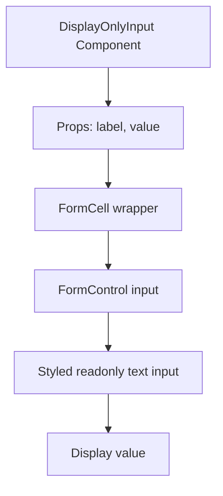
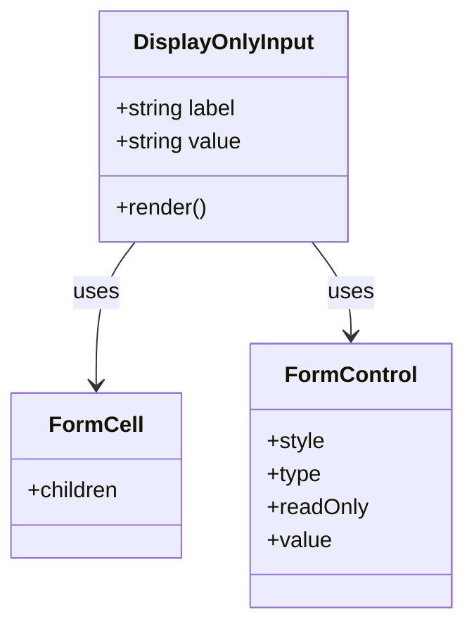

# Diagram: web/portal/src/components-old/forms/inputs/DisplayOnlyInput.js

> Auto-generated by Obscura crawlers

## Diagram 1

### SVG

<svg id="container" width="276" xmlns="http://www.w3.org/2000/svg" class="flowchart" height="614" viewBox="0 0 276 614" role="graphics-document document" aria-roledescription="flowchart-v2"><g><marker id="container_flowchart-v2-pointEnd" class="marker flowchart-v2" viewBox="0 0 10 10" refX="5" refY="5" markerUnits="userSpaceOnUse" markerWidth="8" markerHeight="8" orient="auto"><path d="M 0 0 L 10 5 L 0 10 z" class="arrowMarkerPath" style="stroke-width: 1; stroke-dasharray: 1, 0;"></path></marker><marker id="container_flowchart-v2-pointStart" class="marker flowchart-v2" viewBox="0 0 10 10" refX="4.5" refY="5" markerUnits="userSpaceOnUse" markerWidth="8" markerHeight="8" orient="auto"><path d="M 0 5 L 10 10 L 10 0 z" class="arrowMarkerPath" style="stroke-width: 1; stroke-dasharray: 1, 0;"></path></marker><marker id="container_flowchart-v2-circleEnd" class="marker flowchart-v2" viewBox="0 0 10 10" refX="11" refY="5" markerUnits="userSpaceOnUse" markerWidth="11" markerHeight="11" orient="auto"><circle cx="5" cy="5" r="5" class="arrowMarkerPath" style="stroke-width: 1; stroke-dasharray: 1, 0;"></circle></marker><marker id="container_flowchart-v2-circleStart" class="marker flowchart-v2" viewBox="0 0 10 10" refX="-1" refY="5" markerUnits="userSpaceOnUse" markerWidth="11" markerHeight="11" orient="auto"><circle cx="5" cy="5" r="5" class="arrowMarkerPath" style="stroke-width: 1; stroke-dasharray: 1, 0;"></circle></marker><marker id="container_flowchart-v2-crossEnd" class="marker cross flowchart-v2" viewBox="0 0 11 11" refX="12" refY="5.2" markerUnits="userSpaceOnUse" markerWidth="11" markerHeight="11" orient="auto"><path d="M 1,1 l 9,9 M 10,1 l -9,9" class="arrowMarkerPath" style="stroke-width: 2; stroke-dasharray: 1, 0;"></path></marker><marker id="container_flowchart-v2-crossStart" class="marker cross flowchart-v2" viewBox="0 0 11 11" refX="-1" refY="5.2" markerUnits="userSpaceOnUse" markerWidth="11" markerHeight="11" orient="auto"><path d="M 1,1 l 9,9 M 10,1 l -9,9" class="arrowMarkerPath" style="stroke-width: 2; stroke-dasharray: 1, 0;"></path></marker><g class="root"><g class="clusters"></g><g class="edgePaths"><path d="M138,86L138,90.167C138,94.333,138,102.667,138,110.333C138,118,138,125,138,128.5L138,132" id="L_A_B_0" class="edge-thickness-normal edge-pattern-solid edge-thickness-normal edge-pattern-solid flowchart-link" style=";" data-edge="true" data-et="edge" data-id="L_A_B_0" data-points="W3sieCI6MTM4LCJ5Ijo4Nn0seyJ4IjoxMzgsInkiOjExMX0seyJ4IjoxMzgsInkiOjEzNn1d" marker-end="url(#container_flowchart-v2-pointEnd)"></path><path d="M138,190L138,194.167C138,198.333,138,206.667,138,214.333C138,222,138,229,138,232.5L138,236" id="L_B_C_0" class="edge-thickness-normal edge-pattern-solid edge-thickness-normal edge-pattern-solid flowchart-link" style=";" data-edge="true" data-et="edge" data-id="L_B_C_0" data-points="W3sieCI6MTM4LCJ5IjoxOTB9LHsieCI6MTM4LCJ5IjoyMTV9LHsieCI6MTM4LCJ5IjoyNDB9XQ==" marker-end="url(#container_flowchart-v2-pointEnd)"></path><path d="M138,294L138,298.167C138,302.333,138,310.667,138,318.333C138,326,138,333,138,336.5L138,340" id="L_C_D_0" class="edge-thickness-normal edge-pattern-solid edge-thickness-normal edge-pattern-solid flowchart-link" style=";" data-edge="true" data-et="edge" data-id="L_C_D_0" data-points="W3sieCI6MTM4LCJ5IjoyOTR9LHsieCI6MTM4LCJ5IjozMTl9LHsieCI6MTM4LCJ5IjozNDR9XQ==" marker-end="url(#container_flowchart-v2-pointEnd)"></path><path d="M138,398L138,402.167C138,406.333,138,414.667,138,422.333C138,430,138,437,138,440.5L138,444" id="L_D_E_0" class="edge-thickness-normal edge-pattern-solid edge-thickness-normal edge-pattern-solid flowchart-link" style=";" data-edge="true" data-et="edge" data-id="L_D_E_0" data-points="W3sieCI6MTM4LCJ5IjozOTh9LHsieCI6MTM4LCJ5Ijo0MjN9LHsieCI6MTM4LCJ5Ijo0NDh9XQ==" marker-end="url(#container_flowchart-v2-pointEnd)"></path><path d="M138,502L138,506.167C138,510.333,138,518.667,138,526.333C138,534,138,541,138,544.5L138,548" id="L_E_F_0" class="edge-thickness-normal edge-pattern-solid edge-thickness-normal edge-pattern-solid flowchart-link" style=";" data-edge="true" data-et="edge" data-id="L_E_F_0" data-points="W3sieCI6MTM4LCJ5Ijo1MDJ9LHsieCI6MTM4LCJ5Ijo1Mjd9LHsieCI6MTM4LCJ5Ijo1NTJ9XQ==" marker-end="url(#container_flowchart-v2-pointEnd)"></path></g><g class="edgeLabels"><g class="edgeLabel"><g class="label" data-id="L_A_B_0" transform="translate(0, 0)"><foreignObject width="0" height="0">

</foreignObject></g></g><g class="edgeLabel"><g class="label" data-id="L_B_C_0" transform="translate(0, 0)"><foreignObject width="0" height="0">

</foreignObject></g></g><g class="edgeLabel"><g class="label" data-id="L_C_D_0" transform="translate(0, 0)"><foreignObject width="0" height="0">

</foreignObject></g></g><g class="edgeLabel"><g class="label" data-id="L_D_E_0" transform="translate(0, 0)"><foreignObject width="0" height="0">

</foreignObject></g></g><g class="edgeLabel"><g class="label" data-id="L_E_F_0" transform="translate(0, 0)"><foreignObject width="0" height="0">

</foreignObject></g></g></g><g class="nodes"><g class="node default" id="flowchart-A-0" transform="translate(138, 47)"><rect class="basic label-container" style="" x="-130" y="-39" width="260" height="78"></rect><g class="label" style="" transform="translate(-100, -24)"><rect></rect><foreignObject width="200" height="48">

DisplayOnlyInput Component

</foreignObject></g></g><g class="node default" id="flowchart-B-1" transform="translate(138, 163)"><rect class="basic label-container" style="" x="-96.1640625" y="-27" width="192.328125" height="54"></rect><g class="label" style="" transform="translate(-66.1640625, -12)"><rect></rect><foreignObject width="132.328125" height="24">

Props: label, value

</foreignObject></g></g><g class="node default" id="flowchart-C-3" transform="translate(138, 267)"><rect class="basic label-container" style="" x="-93.6015625" y="-27" width="187.203125" height="54"></rect><g class="label" style="" transform="translate(-63.6015625, -12)"><rect></rect><foreignObject width="127.203125" height="24">

FormCell wrapper

</foreignObject></g></g><g class="node default" id="flowchart-D-5" transform="translate(138, 371)"><rect class="basic label-container" style="" x="-96.0625" y="-27" width="192.125" height="54"></rect><g class="label" style="" transform="translate(-66.0625, -12)"><rect></rect><foreignObject width="132.125" height="24">

FormControl input

</foreignObject></g></g><g class="node default" id="flowchart-E-7" transform="translate(138, 475)"><rect class="basic label-container" style="" x="-123.84375" y="-27" width="247.6875" height="54"></rect><g class="label" style="" transform="translate(-93.84375, -12)"><rect></rect><foreignObject width="187.6875" height="24">

Styled readonly text input

</foreignObject></g></g><g class="node default" id="flowchart-F-9" transform="translate(138, 579)"><rect class="basic label-container" style="" x="-77.9296875" y="-27" width="155.859375" height="54"></rect><g class="label" style="" transform="translate(-47.9296875, -12)"><rect></rect><foreignObject width="95.859375" height="24">

Display value

</foreignObject></g></g></g></g></g></svg>

## Diagram 2

### SVG

<svg id="container" width="331.8359375" xmlns="http://www.w3.org/2000/svg" class="classDiagram" height="450" viewBox="0 0 331.8359375 450" role="graphics-document document" aria-roledescription="class"><g><defs><marker id="container_class-aggregationStart" class="marker aggregation class" refX="18" refY="7" markerWidth="190" markerHeight="240" orient="auto"><path d="M 18,7 L9,13 L1,7 L9,1 Z"></path></marker></defs><defs><marker id="container_class-aggregationEnd" class="marker aggregation class" refX="1" refY="7" markerWidth="20" markerHeight="28" orient="auto"><path d="M 18,7 L9,13 L1,7 L9,1 Z"></path></marker></defs><defs><marker id="container_class-extensionStart" class="marker extension class" refX="18" refY="7" markerWidth="190" markerHeight="240" orient="auto"><path d="M 1,7 L18,13 V 1 Z"></path></marker></defs><defs><marker id="container_class-extensionEnd" class="marker extension class" refX="1" refY="7" markerWidth="20" markerHeight="28" orient="auto"><path d="M 1,1 V 13 L18,7 Z"></path></marker></defs><defs><marker id="container_class-compositionStart" class="marker composition class" refX="18" refY="7" markerWidth="190" markerHeight="240" orient="auto"><path d="M 18,7 L9,13 L1,7 L9,1 Z"></path></marker></defs><defs><marker id="container_class-compositionEnd" class="marker composition class" refX="1" refY="7" markerWidth="20" markerHeight="28" orient="auto"><path d="M 18,7 L9,13 L1,7 L9,1 Z"></path></marker></defs><defs><marker id="container_class-dependencyStart" class="marker dependency class" refX="6" refY="7" markerWidth="190" markerHeight="240" orient="auto"><path d="M 5,7 L9,13 L1,7 L9,1 Z"></path></marker></defs><defs><marker id="container_class-dependencyEnd" class="marker dependency class" refX="13" refY="7" markerWidth="20" markerHeight="28" orient="auto"><path d="M 18,7 L9,13 L14,7 L9,1 Z"></path></marker></defs><defs><marker id="container_class-lollipopStart" class="marker lollipop class" refX="13" refY="7" markerWidth="190" markerHeight="240" orient="auto"><circle stroke="black" fill="transparent" cx="7" cy="7" r="6"></circle></marker></defs><defs><marker id="container_class-lollipopEnd" class="marker lollipop class" refX="1" refY="7" markerWidth="190" markerHeight="240" orient="auto"><circle stroke="black" fill="transparent" cx="7" cy="7" r="6"></circle></marker></defs><g class="root"><g class="clusters"></g><g class="edgePaths"><path d="M97.65,176L92.989,182.167C88.328,188.333,79.006,200.667,74.345,218C69.684,235.333,69.684,257.667,69.684,268.833L69.684,280" id="id_DisplayOnlyInput_FormCell_1" class="edge-thickness-normal edge-pattern-solid relation" style=";;;" data-edge="true" data-et="edge" data-id="id_DisplayOnlyInput_FormCell_1" data-points="W3sieCI6OTcuNjUwMzkwNjI1LCJ5IjoxNzZ9LHsieCI6NjkuNjgzNTkzNzUsInkiOjIxM30seyJ4Ijo2OS42ODM1OTM3NSwieSI6Mjg2fV0=" marker-end="url(#container_class-dependencyEnd)"></path><path d="M224.635,176L229.296,182.167C233.957,188.333,243.279,200.667,247.94,212C252.602,223.333,252.602,233.667,252.602,238.833L252.602,244" id="id_DisplayOnlyInput_FormControl_2" class="edge-thickness-normal edge-pattern-solid relation" style=";;;" data-edge="true" data-et="edge" data-id="id_DisplayOnlyInput_FormControl_2" data-points="W3sieCI6MjI0LjYzNDc2NTYyNSwieSI6MTc2fSx7IngiOjI1Mi42MDE1NjI1LCJ5IjoyMTN9LHsieCI6MjUyLjYwMTU2MjUsInkiOjI1MH1d" marker-end="url(#container_class-dependencyEnd)"></path></g><g class="edgeLabels"><g class="edgeLabel" transform="translate(69.68359375, 213)"><g class="label" data-id="id_DisplayOnlyInput_FormCell_1" transform="translate(-16.4921875, -12)"><foreignObject width="32.984375" height="24">

uses

</foreignObject></g></g><g class="edgeLabel" transform="translate(252.6015625, 213)"><g class="label" data-id="id_DisplayOnlyInput_FormControl_2" transform="translate(-16.4921875, -12)"><foreignObject width="32.984375" height="24">

uses

</foreignObject></g></g></g><g class="nodes"><g class="node default" id="classId-DisplayOnlyInput-0" transform="translate(161.142578125, 92)"><g class="basic label-container"><path d="M-89.79296875 -84 L89.79296875 -84 L89.79296875 84 L-89.79296875 84" stroke="none" stroke-width="0" fill="#ECECFF" style=""></path><path d="M-89.79296875 -84 C-46.811989539780285 -84, -3.83101032956057 -84, 89.79296875 -84 M-89.79296875 -84 C-50.43472434961477 -84, -11.076479949229537 -84, 89.79296875 -84 M89.79296875 -84 C89.79296875 -49.51449063773727, 89.79296875 -15.028981275474536, 89.79296875 84 M89.79296875 -84 C89.79296875 -22.13068760702418, 89.79296875 39.73862478595164, 89.79296875 84 M89.79296875 84 C31.822610039698596 84, -26.14774867060281 84, -89.79296875 84 M89.79296875 84 C39.976772899889134 84, -9.839422950221731 84, -89.79296875 84 M-89.79296875 84 C-89.79296875 18.849001779905308, -89.79296875 -46.301996440189384, -89.79296875 -84 M-89.79296875 84 C-89.79296875 44.05591226185756, -89.79296875 4.111824523715114, -89.79296875 -84" stroke="#9370DB" stroke-width="1.3" fill="none" stroke-dasharray="0 0" style=""></path></g><g class="annotation-group text" transform="translate(0, -60)"></g><g class="label-group text" transform="translate(-62.8359375, -60)"><g class="label" style="font-weight: bolder" transform="translate(0,-12)"><foreignObject width="125.671875" height="24">

DisplayOnlyInput

</foreignObject></g></g><g class="members-group text" transform="translate(-77.79296875, -12)"><g class="label" style="" transform="translate(0,-12)"><foreignObject width="90.09375" height="24">

+string label

</foreignObject></g><g class="label" style="" transform="translate(0,12)"><foreignObject width="92.75" height="24">

+string value

</foreignObject></g></g><g class="methods-group text" transform="translate(-77.79296875, 60)"><g class="label" style="" transform="translate(0,-12)"><foreignObject width="66.609375" height="24">

+render()

</foreignObject></g></g><g class="divider" style=""><path d="M-89.79296875 -36 C-44.93650932502745 -36, -0.08004990005490242 -36, 89.79296875 -36 M-89.79296875 -36 C-30.820233802416254 -36, 28.15250114516749 -36, 89.79296875 -36" stroke="#9370DB" stroke-width="1.3" fill="none" stroke-dasharray="0 0" style=""></path></g><g class="divider" style=""><path d="M-89.79296875 36 C-30.133750936899403 36, 29.525466876201193 36, 89.79296875 36 M-89.79296875 36 C-26.999578661003746 36, 35.79381142799251 36, 89.79296875 36" stroke="#9370DB" stroke-width="1.3" fill="none" stroke-dasharray="0 0" style=""></path></g></g><g class="node default" id="classId-FormCell-1" transform="translate(69.68359375, 346)"><g class="basic label-container"><path d="M-61.68359375 -60 L61.68359375 -60 L61.68359375 60 L-61.68359375 60" stroke="none" stroke-width="0" fill="#ECECFF" style=""></path><path d="M-61.68359375 -60 C-29.21136227814287 -60, 3.2608691937142567 -60, 61.68359375 -60 M-61.68359375 -60 C-32.272153597553846 -60, -2.8607134451076917 -60, 61.68359375 -60 M61.68359375 -60 C61.68359375 -30.5026913119122, 61.68359375 -1.0053826238244028, 61.68359375 60 M61.68359375 -60 C61.68359375 -34.64497931278634, 61.68359375 -9.28995862557268, 61.68359375 60 M61.68359375 60 C24.11256192949267 60, -13.458469891014659 60, -61.68359375 60 M61.68359375 60 C27.254094157081582 60, -7.175405435836836 60, -61.68359375 60 M-61.68359375 60 C-61.68359375 12.115549892011046, -61.68359375 -35.76890021597791, -61.68359375 -60 M-61.68359375 60 C-61.68359375 29.44037064626485, -61.68359375 -1.1192587074703013, -61.68359375 -60" stroke="#9370DB" stroke-width="1.3" fill="none" stroke-dasharray="0 0" style=""></path></g><g class="annotation-group text" transform="translate(0, -36)"></g><g class="label-group text" transform="translate(-31.8671875, -36)"><g class="label" style="font-weight: bolder" transform="translate(0,-12)"><foreignObject width="63.734375" height="24">

FormCell

</foreignObject></g></g><g class="members-group text" transform="translate(-49.68359375, 12)"><g class="label" style="" transform="translate(0,-12)"><foreignObject width="67.5" height="24">

+children

</foreignObject></g></g><g class="methods-group text" transform="translate(-49.68359375, 60)"></g><g class="divider" style=""><path d="M-61.68359375 -12 C-23.871879180840516 -12, 13.939835388318969 -12, 61.68359375 -12 M-61.68359375 -12 C-34.93700955166013 -12, -8.190425353320265 -12, 61.68359375 -12" stroke="#9370DB" stroke-width="1.3" fill="none" stroke-dasharray="0 0" style=""></path></g><g class="divider" style=""><path d="M-61.68359375 36 C-12.473984139949003 36, 36.73562547010199 36, 61.68359375 36 M-61.68359375 36 C-34.34130346900452 36, -6.9990131880090445 36, 61.68359375 36" stroke="#9370DB" stroke-width="1.3" fill="none" stroke-dasharray="0 0" style=""></path></g></g><g class="node default" id="classId-FormControl-2" transform="translate(252.6015625, 346)"><g class="basic label-container"><path d="M-71.234375 -96 L71.234375 -96 L71.234375 96 L-71.234375 96" stroke="none" stroke-width="0" fill="#ECECFF" style=""></path><path d="M-71.234375 -96 C-16.1219716951843 -96, 38.9904316096314 -96, 71.234375 -96 M-71.234375 -96 C-27.247591891152894 -96, 16.739191217694213 -96, 71.234375 -96 M71.234375 -96 C71.234375 -50.67578496852361, 71.234375 -5.351569937047216, 71.234375 96 M71.234375 -96 C71.234375 -49.89722533129114, 71.234375 -3.7944506625822783, 71.234375 96 M71.234375 96 C37.252370394515374 96, 3.2703657890307483 96, -71.234375 96 M71.234375 96 C21.33734788234512 96, -28.55967923530976 96, -71.234375 96 M-71.234375 96 C-71.234375 38.757331068658715, -71.234375 -18.48533786268257, -71.234375 -96 M-71.234375 96 C-71.234375 47.51605336978452, -71.234375 -0.9678932604309551, -71.234375 -96" stroke="#9370DB" stroke-width="1.3" fill="none" stroke-dasharray="0 0" style=""></path></g><g class="annotation-group text" transform="translate(0, -72)"></g><g class="label-group text" transform="translate(-45.09375, -72)"><g class="label" style="font-weight: bolder" transform="translate(0,-12)"><foreignObject width="90.1875" height="24">

FormControl

</foreignObject></g></g><g class="members-group text" transform="translate(-59.234375, -24)"><g class="label" style="" transform="translate(0,-12)"><foreignObject width="42.359375" height="24">

+style

</foreignObject></g><g class="label" style="" transform="translate(0,12)"><foreignObject width="39.703125" height="24">

+type

</foreignObject></g><g class="label" style="" transform="translate(0,36)"><foreignObject width="73.375" height="24">

+readOnly

</foreignObject></g><g class="label" style="" transform="translate(0,60)"><foreignObject width="46.71875" height="24">

+value

</foreignObject></g></g><g class="methods-group text" transform="translate(-59.234375, 96)"></g><g class="divider" style=""><path d="M-71.234375 -48 C-39.56063223405552 -48, -7.886889468111043 -48, 71.234375 -48 M-71.234375 -48 C-33.631068195372606 -48, 3.972238609254788 -48, 71.234375 -48" stroke="#9370DB" stroke-width="1.3" fill="none" stroke-dasharray="0 0" style=""></path></g><g class="divider" style=""><path d="M-71.234375 72 C-26.234947267490433 72, 18.764480465019133 72, 71.234375 72 M-71.234375 72 C-17.492918186080757 72, 36.248538627838485 72, 71.234375 72" stroke="#9370DB" stroke-width="1.3" fill="none" stroke-dasharray="0 0" style=""></path></g></g></g></g></g></svg>
