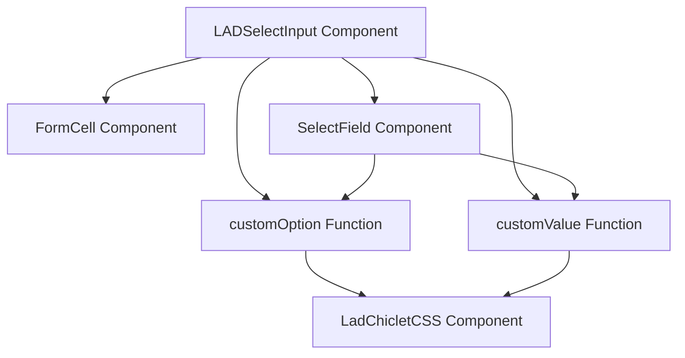
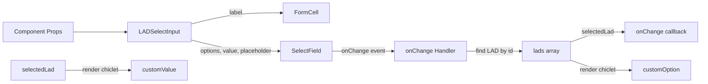
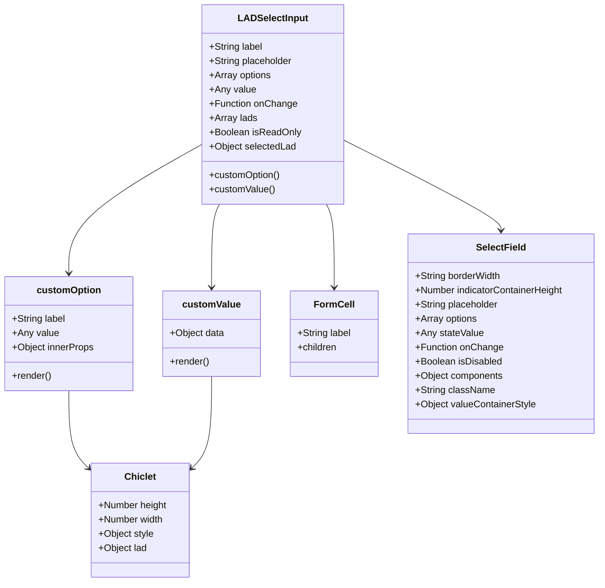
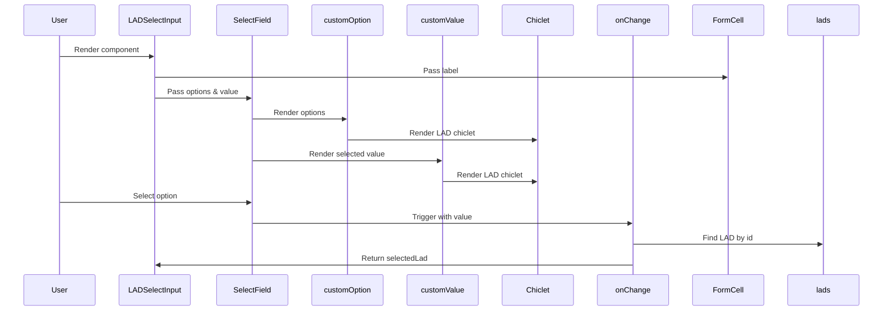

# Diagram: web/portal/src/components-old/forms/inputs/LADSelectInput.js


> Auto-generated by Obscura crawlers

## Diagram 1

```mermaid
graph TD
      LADSelectInput[LADSelectInput Component]
      FormCell[FormCell Component]
      SelectField[SelectField Component]...
  └ 209 lines...
```

> SVG rendering failed for this diagram.

## Diagram 2



### SVG

<svg id="container" width="731.75" xmlns="http://www.w3.org/2000/svg" class="flowchart" height="382" viewBox="0 0 731.75 382" role="graphics-document document" aria-roledescription="flowchart-v2"><style>#container{font-family:"trebuchet ms",verdana,arial,sans-serif;font-size:16px;fill:#333;}@keyframes edge-animation-frame{from{stroke-dashoffset:0;}}@keyframes dash{to{stroke-dashoffset:0;}}#container .edge-animation-slow{stroke-dasharray:9,5!important;stroke-dashoffset:900;animation:dash 50s linear infinite;stroke-linecap:round;}#container .edge-animation-fast{stroke-dasharray:9,5!important;stroke-dashoffset:900;animation:dash 20s linear infinite;stroke-linecap:round;}#container .error-icon{fill:#552222;}#container .error-text{fill:#552222;stroke:#552222;}#container .edge-thickness-normal{stroke-width:1px;}#container .edge-thickness-thick{stroke-width:3.5px;}#container .edge-pattern-solid{stroke-dasharray:0;}#container .edge-thickness-invisible{stroke-width:0;fill:none;}#container .edge-pattern-dashed{stroke-dasharray:3;}#container .edge-pattern-dotted{stroke-dasharray:2;}#container .marker{fill:#333333;stroke:#333333;}#container .marker.cross{stroke:#333333;}#container svg{font-family:"trebuchet ms",verdana,arial,sans-serif;font-size:16px;}#container p{margin:0;}#container .label{font-family:"trebuchet ms",verdana,arial,sans-serif;color:#333;}#container .cluster-label text{fill:#333;}#container .cluster-label span{color:#333;}#container .cluster-label span p{background-color:transparent;}#container .label text,#container span{fill:#333;color:#333;}#container .node rect,#container .node circle,#container .node ellipse,#container .node polygon,#container .node path{fill:#ECECFF;stroke:#9370DB;stroke-width:1px;}#container .rough-node .label text,#container .node .label text,#container .image-shape .label,#container .icon-shape .label{text-anchor:middle;}#container .node .katex path{fill:#000;stroke:#000;stroke-width:1px;}#container .rough-node .label,#container .node .label,#container .image-shape .label,#container .icon-shape .label{text-align:center;}#container .node.clickable{cursor:pointer;}#container .root .anchor path{fill:#333333!important;stroke-width:0;stroke:#333333;}#container .arrowheadPath{fill:#333333;}#container .edgePath .path{stroke:#333333;stroke-width:2.0px;}#container .flowchart-link{stroke:#333333;fill:none;}#container .edgeLabel{background-color:rgba(232,232,232, 0.8);text-align:center;}#container .edgeLabel p{background-color:rgba(232,232,232, 0.8);}#container .edgeLabel rect{opacity:0.5;background-color:rgba(232,232,232, 0.8);fill:rgba(232,232,232, 0.8);}#container .labelBkg{background-color:rgba(232, 232, 232, 0.5);}#container .cluster rect{fill:#ffffde;stroke:#aaaa33;stroke-width:1px;}#container .cluster text{fill:#333;}#container .cluster span{color:#333;}#container div.mermaidTooltip{position:absolute;text-align:center;max-width:200px;padding:2px;font-family:"trebuchet ms",verdana,arial,sans-serif;font-size:12px;background:hsl(80, 100%, 96.2745098039%);border:1px solid #aaaa33;border-radius:2px;pointer-events:none;z-index:100;}#container .flowchartTitleText{text-anchor:middle;font-size:18px;fill:#333;}#container rect.text{fill:none;stroke-width:0;}#container .icon-shape,#container .image-shape{background-color:rgba(232,232,232, 0.8);text-align:center;}#container .icon-shape p,#container .image-shape p{background-color:rgba(232,232,232, 0.8);padding:2px;}#container .icon-shape rect,#container .image-shape rect{opacity:0.5;background-color:rgba(232,232,232, 0.8);fill:rgba(232,232,232, 0.8);}#container .label-icon{display:inline-block;height:1em;overflow:visible;vertical-align:-0.125em;}#container .node .label-icon path{fill:currentColor;stroke:revert;stroke-width:revert;}#container :root{--mermaid-font-family:"trebuchet ms",verdana,arial,sans-serif;}</style><g><marker id="container_flowchart-v2-pointEnd" class="marker flowchart-v2" viewBox="0 0 10 10" refX="5" refY="5" markerUnits="userSpaceOnUse" markerWidth="8" markerHeight="8" orient="auto"><path d="M 0 0 L 10 5 L 0 10 z" class="arrowMarkerPath" style="stroke-width: 1; stroke-dasharray: 1, 0;"></path></marker><marker id="container_flowchart-v2-pointStart" class="marker flowchart-v2" viewBox="0 0 10 10" refX="4.5" refY="5" markerUnits="userSpaceOnUse" markerWidth="8" markerHeight="8" orient="auto"><path d="M 0 5 L 10 10 L 10 0 z" class="arrowMarkerPath" style="stroke-width: 1; stroke-dasharray: 1, 0;"></path></marker><marker id="container_flowchart-v2-circleEnd" class="marker flowchart-v2" viewBox="0 0 10 10" refX="11" refY="5" markerUnits="userSpaceOnUse" markerWidth="11" markerHeight="11" orient="auto"><circle cx="5" cy="5" r="5" class="arrowMarkerPath" style="stroke-width: 1; stroke-dasharray: 1, 0;"></circle></marker><marker id="container_flowchart-v2-circleStart" class="marker flowchart-v2" viewBox="0 0 10 10" refX="-1" refY="5" markerUnits="userSpaceOnUse" markerWidth="11" markerHeight="11" orient="auto"><circle cx="5" cy="5" r="5" class="arrowMarkerPath" style="stroke-width: 1; stroke-dasharray: 1, 0;"></circle></marker><marker id="container_flowchart-v2-crossEnd" class="marker cross flowchart-v2" viewBox="0 0 11 11" refX="12" refY="5.2" markerUnits="userSpaceOnUse" markerWidth="11" markerHeight="11" orient="auto"><path d="M 1,1 l 9,9 M 10,1 l -9,9" class="arrowMarkerPath" style="stroke-width: 2; stroke-dasharray: 1, 0;"></path></marker><marker id="container_flowchart-v2-crossStart" class="marker cross flowchart-v2" viewBox="0 0 11 11" refX="-1" refY="5.2" markerUnits="userSpaceOnUse" markerWidth="11" markerHeight="11" orient="auto"><path d="M 1,1 l 9,9 M 10,1 l -9,9" class="arrowMarkerPath" style="stroke-width: 2; stroke-dasharray: 1, 0;"></path></marker><g class="root"><g class="clusters"></g><g class="edgePaths"><path d="M216.957,62L199.739,66.167C182.521,70.333,148.085,78.667,130.867,86.333C113.648,94,113.648,101,113.648,104.5L113.648,108" id="L_LADSelectInput_FormCell_0" class="edge-thickness-normal edge-pattern-solid edge-thickness-normal edge-pattern-solid flowchart-link" style=";" data-edge="true" data-et="edge" data-id="L_LADSelectInput_FormCell_0" data-points="W3sieCI6MjE2Ljk1NzQ4MTk3MTE1Mzg0LCJ5Ijo2Mn0seyJ4IjoxMTMuNjQ4NDM3NSwieSI6ODd9LHsieCI6MTEzLjY0ODQzNzUsInkiOjExMn1d" marker-end="url(#container_flowchart-v2-pointEnd)"></path><path d="M367.076,62L373.024,66.167C378.973,70.333,390.869,78.667,396.817,86.333C402.766,94,402.766,101,402.766,104.5L402.766,108" id="L_LADSelectInput_SelectField_0" class="edge-thickness-normal edge-pattern-solid edge-thickness-normal edge-pattern-solid flowchart-link" style=";" data-edge="true" data-et="edge" data-id="L_LADSelectInput_SelectField_0" data-points="W3sieCI6MzY3LjA3NjAyMTYzNDYxNTM2LCJ5Ijo2Mn0seyJ4Ijo0MDIuNzY1NjI1LCJ5Ijo4N30seyJ4Ijo0MDIuNzY1NjI1LCJ5IjoxMTJ9XQ==" marker-end="url(#container_flowchart-v2-pointEnd)"></path><path d="M289.986,62L284.038,66.167C278.09,70.333,266.193,78.667,260.245,91.5C254.297,104.333,254.297,121.667,254.297,139C254.297,156.333,254.297,173.667,259.699,186.118C265.101,198.568,275.906,206.137,281.308,209.921L286.71,213.705" id="L_LADSelectInput_customOption_0" class="edge-thickness-normal edge-pattern-solid edge-thickness-normal edge-pattern-solid flowchart-link" style=";" data-edge="true" data-et="edge" data-id="L_LADSelectInput_customOption_0" data-points="W3sieCI6Mjg5Ljk4NjQ3ODM2NTM4NDY0LCJ5Ijo2Mn0seyJ4IjoyNTQuMjk2ODc1LCJ5Ijo4N30seyJ4IjoyNTQuMjk2ODc1LCJ5IjoxMzl9LHsieCI6MjU0LjI5Njg3NSwieSI6MTkxfSx7IngiOjI4OS45ODY0NzgzNjUzODQ2NCwieSI6MjE2fV0=" marker-end="url(#container_flowchart-v2-pointEnd)"></path><path d="M444.166,62L462.01,66.167C479.855,70.333,515.545,78.667,533.39,91.5C551.234,104.333,551.234,121.667,551.234,139C551.234,156.333,551.234,173.667,555.761,186.075C560.287,198.484,569.339,205.968,573.865,209.709L578.391,213.451" id="L_LADSelectInput_customValue_0" class="edge-thickness-normal edge-pattern-solid edge-thickness-normal edge-pattern-solid flowchart-link" style=";" data-edge="true" data-et="edge" data-id="L_LADSelectInput_customValue_0" data-points="W3sieCI6NDQ0LjE2NTU2NDkwMzg0NjIsInkiOjYyfSx7IngiOjU1MS4yMzQzNzUsInkiOjg3fSx7IngiOjU1MS4yMzQzNzUsInkiOjEzOX0seyJ4Ijo1NTEuMjM0Mzc1LCJ5IjoxOTF9LHsieCI6NTgxLjQ3NDAwODQxMzQ2MTUsInkiOjIxNn1d" marker-end="url(#container_flowchart-v2-pointEnd)"></path><path d="M328.531,270L328.531,274.167C328.531,278.333,328.531,286.667,338.896,294.764C349.261,302.861,369.991,310.721,380.356,314.651L390.72,318.582" id="L_customOption_Chiclet_0" class="edge-thickness-normal edge-pattern-solid edge-thickness-normal edge-pattern-solid flowchart-link" style=";" data-edge="true" data-et="edge" data-id="L_customOption_Chiclet_0" data-points="W3sieCI6MzI4LjUzMTI1LCJ5IjoyNzB9LHsieCI6MzI4LjUzMTI1LCJ5IjoyOTV9LHsieCI6Mzk0LjQ2MDQ4Njc3ODg0NjIsInkiOjMyMH1d" marker-end="url(#container_flowchart-v2-pointEnd)"></path><path d="M614.133,270L614.133,274.167C614.133,278.333,614.133,286.667,602.865,294.78C591.598,302.893,569.063,310.785,557.796,314.731L546.529,318.678" id="L_customValue_Chiclet_0" class="edge-thickness-normal edge-pattern-solid edge-thickness-normal edge-pattern-solid flowchart-link" style=";" data-edge="true" data-et="edge" data-id="L_customValue_Chiclet_0" data-points="W3sieCI6NjE0LjEzMjgxMjUsInkiOjI3MH0seyJ4Ijo2MTQuMTMyODEyNSwieSI6Mjk1fSx7IngiOjU0Mi43NTM2MDU3NjkyMzA3LCJ5IjozMjB9XQ==" marker-end="url(#container_flowchart-v2-pointEnd)"></path><path d="M402.766,166L402.766,170.167C402.766,174.333,402.766,182.667,397.363,190.618C391.961,198.568,381.157,206.137,375.754,209.921L370.352,213.705" id="L_SelectField_customOption_0" class="edge-thickness-normal edge-pattern-solid edge-thickness-normal edge-pattern-solid flowchart-link" style=";" data-edge="true" data-et="edge" data-id="L_SelectField_customOption_0" data-points="W3sieCI6NDAyLjc2NTYyNSwieSI6MTY2fSx7IngiOjQwMi43NjU2MjUsInkiOjE5MX0seyJ4IjozNjcuMDc2MDIxNjM0NjE1MzYsInkiOjIxNn1d" marker-end="url(#container_flowchart-v2-pointEnd)"></path><path d="M516.234,165.654L534.217,169.879C552.201,174.103,588.167,182.551,605.474,190.288C622.782,198.024,621.431,205.048,620.756,208.56L620.081,212.072" id="L_SelectField_customValue_0" class="edge-thickness-normal edge-pattern-solid edge-thickness-normal edge-pattern-solid flowchart-link" style=";" data-edge="true" data-et="edge" data-id="L_SelectField_customValue_0" data-points="W3sieCI6NTE2LjIzNDM3NSwieSI6MTY1LjY1NDI0Mzg2ODAwNzc3fSx7IngiOjYyNC4xMzI4MTI1LCJ5IjoxOTF9LHsieCI6NjE5LjMyNTEyMDE5MjMwNzcsInkiOjIxNn1d" marker-end="url(#container_flowchart-v2-pointEnd)"></path></g><g class="edgeLabels"><g class="edgeLabel"><g class="label" data-id="L_LADSelectInput_FormCell_0" transform="translate(0, 0)"><foreignObject width="0" height="0"><div xmlns="http://www.w3.org/1999/xhtml" class="labelBkg" style="display: table-cell; white-space: nowrap; line-height: 1.5; max-width: 200px; text-align: center;"><span class="edgeLabel"></span></div></foreignObject></g></g><g class="edgeLabel"><g class="label" data-id="L_LADSelectInput_SelectField_0" transform="translate(0, 0)"><foreignObject width="0" height="0"><div xmlns="http://www.w3.org/1999/xhtml" class="labelBkg" style="display: table-cell; white-space: nowrap; line-height: 1.5; max-width: 200px; text-align: center;"><span class="edgeLabel"></span></div></foreignObject></g></g><g class="edgeLabel"><g class="label" data-id="L_LADSelectInput_customOption_0" transform="translate(0, 0)"><foreignObject width="0" height="0"><div xmlns="http://www.w3.org/1999/xhtml" class="labelBkg" style="display: table-cell; white-space: nowrap; line-height: 1.5; max-width: 200px; text-align: center;"><span class="edgeLabel"></span></div></foreignObject></g></g><g class="edgeLabel"><g class="label" data-id="L_LADSelectInput_customValue_0" transform="translate(0, 0)"><foreignObject width="0" height="0"><div xmlns="http://www.w3.org/1999/xhtml" class="labelBkg" style="display: table-cell; white-space: nowrap; line-height: 1.5; max-width: 200px; text-align: center;"><span class="edgeLabel"></span></div></foreignObject></g></g><g class="edgeLabel"><g class="label" data-id="L_customOption_Chiclet_0" transform="translate(0, 0)"><foreignObject width="0" height="0"><div xmlns="http://www.w3.org/1999/xhtml" class="labelBkg" style="display: table-cell; white-space: nowrap; line-height: 1.5; max-width: 200px; text-align: center;"><span class="edgeLabel"></span></div></foreignObject></g></g><g class="edgeLabel"><g class="label" data-id="L_customValue_Chiclet_0" transform="translate(0, 0)"><foreignObject width="0" height="0"><div xmlns="http://www.w3.org/1999/xhtml" class="labelBkg" style="display: table-cell; white-space: nowrap; line-height: 1.5; max-width: 200px; text-align: center;"><span class="edgeLabel"></span></div></foreignObject></g></g><g class="edgeLabel"><g class="label" data-id="L_SelectField_customOption_0" transform="translate(0, 0)"><foreignObject width="0" height="0"><div xmlns="http://www.w3.org/1999/xhtml" class="labelBkg" style="display: table-cell; white-space: nowrap; line-height: 1.5; max-width: 200px; text-align: center;"><span class="edgeLabel"></span></div></foreignObject></g></g><g class="edgeLabel"><g class="label" data-id="L_SelectField_customValue_0" transform="translate(0, 0)"><foreignObject width="0" height="0"><div xmlns="http://www.w3.org/1999/xhtml" class="labelBkg" style="display: table-cell; white-space: nowrap; line-height: 1.5; max-width: 200px; text-align: center;"><span class="edgeLabel"></span></div></foreignObject></g></g></g><g class="nodes"><g class="node default" id="flowchart-LADSelectInput-0" transform="translate(328.53125, 35)"><rect class="basic label-container" style="" x="-129.1796875" y="-27" width="258.359375" height="54"></rect><g class="label" style="" transform="translate(-99.1796875, -12)"><rect></rect><foreignObject width="198.359375" height="24"><div xmlns="http://www.w3.org/1999/xhtml" style="display: table-cell; white-space: nowrap; line-height: 1.5; max-width: 200px; text-align: center;"><span class="nodeLabel"><p>LADSelectInput Component</p></span></div></foreignObject></g></g><g class="node default" id="flowchart-FormCell-1" transform="translate(113.6484375, 139)"><rect class="basic label-container" style="" x="-105.6484375" y="-27" width="211.296875" height="54"></rect><g class="label" style="" transform="translate(-75.6484375, -12)"><rect></rect><foreignObject width="151.296875" height="24"><div xmlns="http://www.w3.org/1999/xhtml" style="display: table-cell; white-space: nowrap; line-height: 1.5; max-width: 200px; text-align: center;"><span class="nodeLabel"><p>FormCell Component</p></span></div></foreignObject></g></g><g class="node default" id="flowchart-SelectField-2" transform="translate(402.765625, 139)"><rect class="basic label-container" style="" x="-113.46875" y="-27" width="226.9375" height="54"></rect><g class="label" style="" transform="translate(-83.46875, -12)"><rect></rect><foreignObject width="166.9375" height="24"><div xmlns="http://www.w3.org/1999/xhtml" style="display: table-cell; white-space: nowrap; line-height: 1.5; max-width: 200px; text-align: center;"><span class="nodeLabel"><p>SelectField Component</p></span></div></foreignObject></g></g><g class="node default" id="flowchart-Chiclet-3" transform="translate(465.6640625, 347)"><rect class="basic label-container" style="" x="-124.8046875" y="-27" width="249.609375" height="54"></rect><g class="label" style="" transform="translate(-94.8046875, -12)"><rect></rect><foreignObject width="189.609375" height="24"><div xmlns="http://www.w3.org/1999/xhtml" style="display: table-cell; white-space: nowrap; line-height: 1.5; max-width: 200px; text-align: center;"><span class="nodeLabel"><p>LadChicletCSS Component</p></span></div></foreignObject></g></g><g class="node default" id="flowchart-customOption-4" transform="translate(328.53125, 243)"><rect class="basic label-container" style="" x="-114.6484375" y="-27" width="229.296875" height="54"></rect><g class="label" style="" transform="translate(-84.6484375, -12)"><rect></rect><foreignObject width="169.296875" height="24"><div xmlns="http://www.w3.org/1999/xhtml" style="display: table-cell; white-space: nowrap; line-height: 1.5; max-width: 200px; text-align: center;"><span class="nodeLabel"><p>customOption Function</p></span></div></foreignObject></g></g><g class="node default" id="flowchart-customValue-5" transform="translate(614.1328125, 243)"><rect class="basic label-container" style="" x="-109.6171875" y="-27" width="219.234375" height="54"></rect><g class="label" style="" transform="translate(-79.6171875, -12)"><rect></rect><foreignObject width="159.234375" height="24"><div xmlns="http://www.w3.org/1999/xhtml" style="display: table-cell; white-space: nowrap; line-height: 1.5; max-width: 200px; text-align: center;"><span class="nodeLabel"><p>customValue Function</p></span></div></foreignObject></g></g></g></g></g></svg>

## Diagram 3



### SVG

<svg id="container" width="1899.5625" xmlns="http://www.w3.org/2000/svg" class="flowchart" height="226" viewBox="0 0 1899.5625 226" role="graphics-document document" aria-roledescription="flowchart-v2"><style>#container{font-family:"trebuchet ms",verdana,arial,sans-serif;font-size:16px;fill:#333;}@keyframes edge-animation-frame{from{stroke-dashoffset:0;}}@keyframes dash{to{stroke-dashoffset:0;}}#container .edge-animation-slow{stroke-dasharray:9,5!important;stroke-dashoffset:900;animation:dash 50s linear infinite;stroke-linecap:round;}#container .edge-animation-fast{stroke-dasharray:9,5!important;stroke-dashoffset:900;animation:dash 20s linear infinite;stroke-linecap:round;}#container .error-icon{fill:#552222;}#container .error-text{fill:#552222;stroke:#552222;}#container .edge-thickness-normal{stroke-width:1px;}#container .edge-thickness-thick{stroke-width:3.5px;}#container .edge-pattern-solid{stroke-dasharray:0;}#container .edge-thickness-invisible{stroke-width:0;fill:none;}#container .edge-pattern-dashed{stroke-dasharray:3;}#container .edge-pattern-dotted{stroke-dasharray:2;}#container .marker{fill:#333333;stroke:#333333;}#container .marker.cross{stroke:#333333;}#container svg{font-family:"trebuchet ms",verdana,arial,sans-serif;font-size:16px;}#container p{margin:0;}#container .label{font-family:"trebuchet ms",verdana,arial,sans-serif;color:#333;}#container .cluster-label text{fill:#333;}#container .cluster-label span{color:#333;}#container .cluster-label span p{background-color:transparent;}#container .label text,#container span{fill:#333;color:#333;}#container .node rect,#container .node circle,#container .node ellipse,#container .node polygon,#container .node path{fill:#ECECFF;stroke:#9370DB;stroke-width:1px;}#container .rough-node .label text,#container .node .label text,#container .image-shape .label,#container .icon-shape .label{text-anchor:middle;}#container .node .katex path{fill:#000;stroke:#000;stroke-width:1px;}#container .rough-node .label,#container .node .label,#container .image-shape .label,#container .icon-shape .label{text-align:center;}#container .node.clickable{cursor:pointer;}#container .root .anchor path{fill:#333333!important;stroke-width:0;stroke:#333333;}#container .arrowheadPath{fill:#333333;}#container .edgePath .path{stroke:#333333;stroke-width:2.0px;}#container .flowchart-link{stroke:#333333;fill:none;}#container .edgeLabel{background-color:rgba(232,232,232, 0.8);text-align:center;}#container .edgeLabel p{background-color:rgba(232,232,232, 0.8);}#container .edgeLabel rect{opacity:0.5;background-color:rgba(232,232,232, 0.8);fill:rgba(232,232,232, 0.8);}#container .labelBkg{background-color:rgba(232, 232, 232, 0.5);}#container .cluster rect{fill:#ffffde;stroke:#aaaa33;stroke-width:1px;}#container .cluster text{fill:#333;}#container .cluster span{color:#333;}#container div.mermaidTooltip{position:absolute;text-align:center;max-width:200px;padding:2px;font-family:"trebuchet ms",verdana,arial,sans-serif;font-size:12px;background:hsl(80, 100%, 96.2745098039%);border:1px solid #aaaa33;border-radius:2px;pointer-events:none;z-index:100;}#container .flowchartTitleText{text-anchor:middle;font-size:18px;fill:#333;}#container rect.text{fill:none;stroke-width:0;}#container .icon-shape,#container .image-shape{background-color:rgba(232,232,232, 0.8);text-align:center;}#container .icon-shape p,#container .image-shape p{background-color:rgba(232,232,232, 0.8);padding:2px;}#container .icon-shape rect,#container .image-shape rect{opacity:0.5;background-color:rgba(232,232,232, 0.8);fill:rgba(232,232,232, 0.8);}#container .label-icon{display:inline-block;height:1em;overflow:visible;vertical-align:-0.125em;}#container .node .label-icon path{fill:currentColor;stroke:revert;stroke-width:revert;}#container :root{--mermaid-font-family:"trebuchet ms",verdana,arial,sans-serif;}</style><g><marker id="container_flowchart-v2-pointEnd" class="marker flowchart-v2" viewBox="0 0 10 10" refX="5" refY="5" markerUnits="userSpaceOnUse" markerWidth="8" markerHeight="8" orient="auto"><path d="M 0 0 L 10 5 L 0 10 z" class="arrowMarkerPath" style="stroke-width: 1; stroke-dasharray: 1, 0;"></path></marker><marker id="container_flowchart-v2-pointStart" class="marker flowchart-v2" viewBox="0 0 10 10" refX="4.5" refY="5" markerUnits="userSpaceOnUse" markerWidth="8" markerHeight="8" orient="auto"><path d="M 0 5 L 10 10 L 10 0 z" class="arrowMarkerPath" style="stroke-width: 1; stroke-dasharray: 1, 0;"></path></marker><marker id="container_flowchart-v2-circleEnd" class="marker flowchart-v2" viewBox="0 0 10 10" refX="11" refY="5" markerUnits="userSpaceOnUse" markerWidth="11" markerHeight="11" orient="auto"><circle cx="5" cy="5" r="5" class="arrowMarkerPath" style="stroke-width: 1; stroke-dasharray: 1, 0;"></circle></marker><marker id="container_flowchart-v2-circleStart" class="marker flowchart-v2" viewBox="0 0 10 10" refX="-1" refY="5" markerUnits="userSpaceOnUse" markerWidth="11" markerHeight="11" orient="auto"><circle cx="5" cy="5" r="5" class="arrowMarkerPath" style="stroke-width: 1; stroke-dasharray: 1, 0;"></circle></marker><marker id="container_flowchart-v2-crossEnd" class="marker cross flowchart-v2" viewBox="0 0 11 11" refX="12" refY="5.2" markerUnits="userSpaceOnUse" markerWidth="11" markerHeight="11" orient="auto"><path d="M 1,1 l 9,9 M 10,1 l -9,9" class="arrowMarkerPath" style="stroke-width: 2; stroke-dasharray: 1, 0;"></path></marker><marker id="container_flowchart-v2-crossStart" class="marker cross flowchart-v2" viewBox="0 0 11 11" refX="-1" refY="5.2" markerUnits="userSpaceOnUse" markerWidth="11" markerHeight="11" orient="auto"><path d="M 1,1 l 9,9 M 10,1 l -9,9" class="arrowMarkerPath" style="stroke-width: 2; stroke-dasharray: 1, 0;"></path></marker><g class="root"><g class="clusters"></g><g class="edgePaths"><path d="M197.031,87L209.598,87C222.164,87,247.297,87,271.763,87C296.229,87,320.029,87,331.928,87L343.828,87" id="L_Props_LADSelectInput_0" class="edge-thickness-normal edge-pattern-solid edge-thickness-normal edge-pattern-solid flowchart-link" style=";" data-edge="true" data-et="edge" data-id="L_Props_LADSelectInput_0" data-points="W3sieCI6MTk3LjAzMTI1LCJ5Ijo4N30seyJ4IjoyNzIuNDI5Njg3NSwieSI6ODd9LHsieCI6MzQ3LjgyODEyNSwieSI6ODd9XQ==" marker-end="url(#container_flowchart-v2-pointEnd)"></path><path d="M518.156,65.77L538.729,60.642C559.302,55.514,600.448,45.257,642.23,40.128C684.013,35,726.432,35,747.642,35L768.852,35" id="L_LADSelectInput_FormCell_0" class="edge-thickness-normal edge-pattern-solid edge-thickness-normal edge-pattern-solid flowchart-link" style=";" data-edge="true" data-et="edge" data-id="L_LADSelectInput_FormCell_0" data-points="W3sieCI6NTE4LjE1NjI1LCJ5Ijo2NS43NzAzODMxMzE3MTc5Mn0seyJ4Ijo2NDEuNTkzNzUsInkiOjM1fSx7IngiOjc3Mi44NTE1NjI1LCJ5IjozNX1d" marker-end="url(#container_flowchart-v2-pointEnd)"></path><path d="M518.156,108.23L538.729,113.358C559.302,118.486,600.448,128.743,640.927,133.872C681.406,139,721.219,139,741.125,139L761.031,139" id="L_LADSelectInput_SelectField_0" class="edge-thickness-normal edge-pattern-solid edge-thickness-normal edge-pattern-solid flowchart-link" style=";" data-edge="true" data-et="edge" data-id="L_LADSelectInput_SelectField_0" data-points="W3sieCI6NTE4LjE1NjI1LCJ5IjoxMDguMjI5NjE2ODY4MjgyMDh9LHsieCI6NjQxLjU5Mzc1LCJ5IjoxMzl9LHsieCI6NzY1LjAzMTI1LCJ5IjoxMzl9XQ==" marker-end="url(#container_flowchart-v2-pointEnd)"></path><path d="M903.938,139L917.799,139C931.661,139,959.385,139,986.443,139C1013.5,139,1039.891,139,1053.086,139L1066.281,139" id="L_SelectField_Handler_0" class="edge-thickness-normal edge-pattern-solid edge-thickness-normal edge-pattern-solid flowchart-link" style=";" data-edge="true" data-et="edge" data-id="L_SelectField_Handler_0" data-points="W3sieCI6OTAzLjkzNzUsInkiOjEzOX0seyJ4Ijo5ODcuMTA5Mzc1LCJ5IjoxMzl9LHsieCI6MTA3MC4yODEyNSwieSI6MTM5fV0=" marker-end="url(#container_flowchart-v2-pointEnd)"></path><path d="M1264.328,139L1276.803,139C1289.279,139,1314.229,139,1338.513,139C1362.797,139,1386.414,139,1398.223,139L1410.031,139" id="L_Handler_lads_0" class="edge-thickness-normal edge-pattern-solid edge-thickness-normal edge-pattern-solid flowchart-link" style=";" data-edge="true" data-et="edge" data-id="L_Handler_lads_0" data-points="W3sieCI6MTI2NC4zMjgxMjUsInkiOjEzOX0seyJ4IjoxMzM5LjE3OTY4NzUsInkiOjEzOX0seyJ4IjoxNDE0LjAzMTI1LCJ5IjoxMzl9XQ==" marker-end="url(#container_flowchart-v2-pointEnd)"></path><path d="M1545.469,114.783L1558.035,110.153C1570.602,105.522,1595.734,96.261,1620.201,91.631C1644.667,87,1668.466,87,1680.366,87L1692.266,87" id="L_lads_onChange_0" class="edge-thickness-normal edge-pattern-solid edge-thickness-normal edge-pattern-solid flowchart-link" style=";" data-edge="true" data-et="edge" data-id="L_lads_onChange_0" data-points="W3sieCI6MTU0NS40Njg3NSwieSI6MTE0Ljc4MzQyNDY4MDI4NTY2fSx7IngiOjE2MjAuODY3MTg3NSwieSI6ODd9LHsieCI6MTY5Ni4yNjU2MjUsInkiOjg3fV0=" marker-end="url(#container_flowchart-v2-pointEnd)"></path><path d="M1545.469,163.217L1558.035,167.847C1570.602,172.478,1595.734,181.739,1622.938,186.369C1650.141,191,1679.414,191,1694.051,191L1708.688,191" id="L_lads_customOption_0" class="edge-thickness-normal edge-pattern-solid edge-thickness-normal edge-pattern-solid flowchart-link" style=";" data-edge="true" data-et="edge" data-id="L_lads_customOption_0" data-points="W3sieCI6MTU0NS40Njg3NSwieSI6MTYzLjIxNjU3NTMxOTcxNDM0fSx7IngiOjE2MjAuODY3MTg3NSwieSI6MTkxfSx7IngiOjE3MTIuNjg3NSwieSI6MTkxfV0=" marker-end="url(#container_flowchart-v2-pointEnd)"></path><path d="M176.055,191L192.117,191C208.18,191,240.305,191,269.762,191C299.219,191,326.008,191,339.402,191L352.797,191" id="L_selectedLad_customValue_0" class="edge-thickness-normal edge-pattern-solid edge-thickness-normal edge-pattern-solid flowchart-link" style=";" data-edge="true" data-et="edge" data-id="L_selectedLad_customValue_0" data-points="W3sieCI6MTc2LjA1NDY4NzUsInkiOjE5MX0seyJ4IjoyNzIuNDI5Njg3NSwieSI6MTkxfSx7IngiOjM1Ni43OTY4NzUsInkiOjE5MX1d" marker-end="url(#container_flowchart-v2-pointEnd)"></path></g><g class="edgeLabels"><g class="edgeLabel"><g class="label" data-id="L_Props_LADSelectInput_0" transform="translate(0, 0)"><foreignObject width="0" height="0"><div xmlns="http://www.w3.org/1999/xhtml" class="labelBkg" style="display: table-cell; white-space: nowrap; line-height: 1.5; max-width: 200px; text-align: center;"><span class="edgeLabel"></span></div></foreignObject></g></g><g class="edgeLabel" transform="translate(641.59375, 35)"><g class="label" data-id="L_LADSelectInput_FormCell_0" transform="translate(-18.1171875, -12)"><foreignObject width="36.234375" height="24"><div xmlns="http://www.w3.org/1999/xhtml" class="labelBkg" style="display: table-cell; white-space: nowrap; line-height: 1.5; max-width: 200px; text-align: center;"><span class="edgeLabel"><p>label</p></span></div></foreignObject></g></g><g class="edgeLabel" transform="translate(641.59375, 139)"><g class="label" data-id="L_LADSelectInput_SelectField_0" transform="translate(-98.4375, -12)"><foreignObject width="196.875" height="24"><div xmlns="http://www.w3.org/1999/xhtml" class="labelBkg" style="display: table-cell; white-space: nowrap; line-height: 1.5; max-width: 200px; text-align: center;"><span class="edgeLabel"><p>options, value, placeholder</p></span></div></foreignObject></g></g><g class="edgeLabel" transform="translate(987.109375, 139)"><g class="label" data-id="L_SelectField_Handler_0" transform="translate(-58.171875, -12)"><foreignObject width="116.34375" height="24"><div xmlns="http://www.w3.org/1999/xhtml" class="labelBkg" style="display: table-cell; white-space: nowrap; line-height: 1.5; max-width: 200px; text-align: center;"><span class="edgeLabel"><p>onChange event</p></span></div></foreignObject></g></g><g class="edgeLabel" transform="translate(1339.1796875, 139)"><g class="label" data-id="L_Handler_lads_0" transform="translate(-49.8515625, -12)"><foreignObject width="99.703125" height="24"><div xmlns="http://www.w3.org/1999/xhtml" class="labelBkg" style="display: table-cell; white-space: nowrap; line-height: 1.5; max-width: 200px; text-align: center;"><span class="edgeLabel"><p>find LAD by id</p></span></div></foreignObject></g></g><g class="edgeLabel" transform="translate(1620.8671875, 87)"><g class="label" data-id="L_lads_onChange_0" transform="translate(-43.5390625, -12)"><foreignObject width="87.078125" height="24"><div xmlns="http://www.w3.org/1999/xhtml" class="labelBkg" style="display: table-cell; white-space: nowrap; line-height: 1.5; max-width: 200px; text-align: center;"><span class="edgeLabel"><p>selectedLad</p></span></div></foreignObject></g></g><g class="edgeLabel" transform="translate(1620.8671875, 191)"><g class="label" data-id="L_lads_customOption_0" transform="translate(-50.3984375, -12)"><foreignObject width="100.796875" height="24"><div xmlns="http://www.w3.org/1999/xhtml" class="labelBkg" style="display: table-cell; white-space: nowrap; line-height: 1.5; max-width: 200px; text-align: center;"><span class="edgeLabel"><p>render chiclet</p></span></div></foreignObject></g></g><g class="edgeLabel" transform="translate(272.4296875, 191)"><g class="label" data-id="L_selectedLad_customValue_0" transform="translate(-50.3984375, -12)"><foreignObject width="100.796875" height="24"><div xmlns="http://www.w3.org/1999/xhtml" class="labelBkg" style="display: table-cell; white-space: nowrap; line-height: 1.5; max-width: 200px; text-align: center;"><span class="edgeLabel"><p>render chiclet</p></span></div></foreignObject></g></g></g><g class="nodes"><g class="node default" id="flowchart-Props-0" transform="translate(102.515625, 87)"><rect class="basic label-container" style="" x="-94.515625" y="-27" width="189.03125" height="54"></rect><g class="label" style="" transform="translate(-64.515625, -12)"><rect></rect><foreignObject width="129.03125" height="24"><div xmlns="http://www.w3.org/1999/xhtml" style="display: table-cell; white-space: nowrap; line-height: 1.5; max-width: 200px; text-align: center;"><span class="nodeLabel"><p>Component Props</p></span></div></foreignObject></g></g><g class="node default" id="flowchart-LADSelectInput-1" transform="translate(432.9921875, 87)"><rect class="basic label-container" style="" x="-85.1640625" y="-27" width="170.328125" height="54"></rect><g class="label" style="" transform="translate(-55.1640625, -12)"><rect></rect><foreignObject width="110.328125" height="24"><div xmlns="http://www.w3.org/1999/xhtml" style="display: table-cell; white-space: nowrap; line-height: 1.5; max-width: 200px; text-align: center;"><span class="nodeLabel"><p>LADSelectInput</p></span></div></foreignObject></g></g><g class="node default" id="flowchart-FormCell-3" transform="translate(834.484375, 35)"><rect class="basic label-container" style="" x="-61.6328125" y="-27" width="123.265625" height="54"></rect><g class="label" style="" transform="translate(-31.6328125, -12)"><rect></rect><foreignObject width="63.265625" height="24"><div xmlns="http://www.w3.org/1999/xhtml" style="display: table-cell; white-space: nowrap; line-height: 1.5; max-width: 200px; text-align: center;"><span class="nodeLabel"><p>FormCell</p></span></div></foreignObject></g></g><g class="node default" id="flowchart-SelectField-5" transform="translate(834.484375, 139)"><rect class="basic label-container" style="" x="-69.453125" y="-27" width="138.90625" height="54"></rect><g class="label" style="" transform="translate(-39.453125, -12)"><rect></rect><foreignObject width="78.90625" height="24"><div xmlns="http://www.w3.org/1999/xhtml" style="display: table-cell; white-space: nowrap; line-height: 1.5; max-width: 200px; text-align: center;"><span class="nodeLabel"><p>SelectField</p></span></div></foreignObject></g></g><g class="node default" id="flowchart-Handler-7" transform="translate(1167.3046875, 139)"><rect class="basic label-container" style="" x="-97.0234375" y="-27" width="194.046875" height="54"></rect><g class="label" style="" transform="translate(-67.0234375, -12)"><rect></rect><foreignObject width="134.046875" height="24"><div xmlns="http://www.w3.org/1999/xhtml" style="display: table-cell; white-space: nowrap; line-height: 1.5; max-width: 200px; text-align: center;"><span class="nodeLabel"><p>onChange Handler</p></span></div></foreignObject></g></g><g class="node default" id="flowchart-lads-9" transform="translate(1479.75, 139)"><rect class="basic label-container" style="" x="-65.71875" y="-27" width="131.4375" height="54"></rect><g class="label" style="" transform="translate(-35.71875, -12)"><rect></rect><foreignObject width="71.4375" height="24"><div xmlns="http://www.w3.org/1999/xhtml" style="display: table-cell; white-space: nowrap; line-height: 1.5; max-width: 200px; text-align: center;"><span class="nodeLabel"><p>lads array</p></span></div></foreignObject></g></g><g class="node default" id="flowchart-onChange-11" transform="translate(1793.9140625, 87)"><rect class="basic label-container" style="" x="-97.6484375" y="-27" width="195.296875" height="54"></rect><g class="label" style="" transform="translate(-67.6484375, -12)"><rect></rect><foreignObject width="135.296875" height="24"><div xmlns="http://www.w3.org/1999/xhtml" style="display: table-cell; white-space: nowrap; line-height: 1.5; max-width: 200px; text-align: center;"><span class="nodeLabel"><p>onChange callback</p></span></div></foreignObject></g></g><g class="node default" id="flowchart-customOption-13" transform="translate(1793.9140625, 191)"><rect class="basic label-container" style="" x="-81.2265625" y="-27" width="162.453125" height="54"></rect><g class="label" style="" transform="translate(-51.2265625, -12)"><rect></rect><foreignObject width="102.453125" height="24"><div xmlns="http://www.w3.org/1999/xhtml" style="display: table-cell; white-space: nowrap; line-height: 1.5; max-width: 200px; text-align: center;"><span class="nodeLabel"><p>customOption</p></span></div></foreignObject></g></g><g class="node default" id="flowchart-selectedLad-14" transform="translate(102.515625, 191)"><rect class="basic label-container" style="" x="-73.5390625" y="-27" width="147.078125" height="54"></rect><g class="label" style="" transform="translate(-43.5390625, -12)"><rect></rect><foreignObject width="87.078125" height="24"><div xmlns="http://www.w3.org/1999/xhtml" style="display: table-cell; white-space: nowrap; line-height: 1.5; max-width: 200px; text-align: center;"><span class="nodeLabel"><p>selectedLad</p></span></div></foreignObject></g></g><g class="node default" id="flowchart-customValue-15" transform="translate(432.9921875, 191)"><rect class="basic label-container" style="" x="-76.1953125" y="-27" width="152.390625" height="54"></rect><g class="label" style="" transform="translate(-46.1953125, -12)"><rect></rect><foreignObject width="92.390625" height="24"><div xmlns="http://www.w3.org/1999/xhtml" style="display: table-cell; white-space: nowrap; line-height: 1.5; max-width: 200px; text-align: center;"><span class="nodeLabel"><p>customValue</p></span></div></foreignObject></g></g></g></g></g></svg>

## Diagram 4



### SVG

<svg id="container" width="1007.25" xmlns="http://www.w3.org/2000/svg" class="classDiagram" height="980" viewBox="0 0 1007.25 980" role="graphics-document document" aria-roledescription="class"><style>#container{font-family:"trebuchet ms",verdana,arial,sans-serif;font-size:16px;fill:#333;}@keyframes edge-animation-frame{from{stroke-dashoffset:0;}}@keyframes dash{to{stroke-dashoffset:0;}}#container .edge-animation-slow{stroke-dasharray:9,5!important;stroke-dashoffset:900;animation:dash 50s linear infinite;stroke-linecap:round;}#container .edge-animation-fast{stroke-dasharray:9,5!important;stroke-dashoffset:900;animation:dash 20s linear infinite;stroke-linecap:round;}#container .error-icon{fill:#552222;}#container .error-text{fill:#552222;stroke:#552222;}#container .edge-thickness-normal{stroke-width:1px;}#container .edge-thickness-thick{stroke-width:3.5px;}#container .edge-pattern-solid{stroke-dasharray:0;}#container .edge-thickness-invisible{stroke-width:0;fill:none;}#container .edge-pattern-dashed{stroke-dasharray:3;}#container .edge-pattern-dotted{stroke-dasharray:2;}#container .marker{fill:#333333;stroke:#333333;}#container .marker.cross{stroke:#333333;}#container svg{font-family:"trebuchet ms",verdana,arial,sans-serif;font-size:16px;}#container p{margin:0;}#container g.classGroup text{fill:#9370DB;stroke:none;font-family:"trebuchet ms",verdana,arial,sans-serif;font-size:10px;}#container g.classGroup text .title{font-weight:bolder;}#container .nodeLabel,#container .edgeLabel{color:#131300;}#container .edgeLabel .label rect{fill:#ECECFF;}#container .label text{fill:#131300;}#container .labelBkg{background:#ECECFF;}#container .edgeLabel .label span{background:#ECECFF;}#container .classTitle{font-weight:bolder;}#container .node rect,#container .node circle,#container .node ellipse,#container .node polygon,#container .node path{fill:#ECECFF;stroke:#9370DB;stroke-width:1px;}#container .divider{stroke:#9370DB;stroke-width:1;}#container g.clickable{cursor:pointer;}#container g.classGroup rect{fill:#ECECFF;stroke:#9370DB;}#container g.classGroup line{stroke:#9370DB;stroke-width:1;}#container .classLabel .box{stroke:none;stroke-width:0;fill:#ECECFF;opacity:0.5;}#container .classLabel .label{fill:#9370DB;font-size:10px;}#container .relation{stroke:#333333;stroke-width:1;fill:none;}#container .dashed-line{stroke-dasharray:3;}#container .dotted-line{stroke-dasharray:1 2;}#container #compositionStart,#container .composition{fill:#333333!important;stroke:#333333!important;stroke-width:1;}#container #compositionEnd,#container .composition{fill:#333333!important;stroke:#333333!important;stroke-width:1;}#container #dependencyStart,#container .dependency{fill:#333333!important;stroke:#333333!important;stroke-width:1;}#container #dependencyStart,#container .dependency{fill:#333333!important;stroke:#333333!important;stroke-width:1;}#container #extensionStart,#container .extension{fill:transparent!important;stroke:#333333!important;stroke-width:1;}#container #extensionEnd,#container .extension{fill:transparent!important;stroke:#333333!important;stroke-width:1;}#container #aggregationStart,#container .aggregation{fill:transparent!important;stroke:#333333!important;stroke-width:1;}#container #aggregationEnd,#container .aggregation{fill:transparent!important;stroke:#333333!important;stroke-width:1;}#container #lollipopStart,#container .lollipop{fill:#ECECFF!important;stroke:#333333!important;stroke-width:1;}#container #lollipopEnd,#container .lollipop{fill:#ECECFF!important;stroke:#333333!important;stroke-width:1;}#container .edgeTerminals{font-size:11px;line-height:initial;}#container .classTitleText{text-anchor:middle;font-size:18px;fill:#333;}#container .label-icon{display:inline-block;height:1em;overflow:visible;vertical-align:-0.125em;}#container .node .label-icon path{fill:currentColor;stroke:revert;stroke-width:revert;}#container :root{--mermaid-font-family:"trebuchet ms",verdana,arial,sans-serif;}</style><g><defs><marker id="container_class-aggregationStart" class="marker aggregation class" refX="18" refY="7" markerWidth="190" markerHeight="240" orient="auto"><path d="M 18,7 L9,13 L1,7 L9,1 Z"></path></marker></defs><defs><marker id="container_class-aggregationEnd" class="marker aggregation class" refX="1" refY="7" markerWidth="20" markerHeight="28" orient="auto"><path d="M 18,7 L9,13 L1,7 L9,1 Z"></path></marker></defs><defs><marker id="container_class-extensionStart" class="marker extension class" refX="18" refY="7" markerWidth="190" markerHeight="240" orient="auto"><path d="M 1,7 L18,13 V 1 Z"></path></marker></defs><defs><marker id="container_class-extensionEnd" class="marker extension class" refX="1" refY="7" markerWidth="20" markerHeight="28" orient="auto"><path d="M 1,1 V 13 L18,7 Z"></path></marker></defs><defs><marker id="container_class-compositionStart" class="marker composition class" refX="18" refY="7" markerWidth="190" markerHeight="240" orient="auto"><path d="M 18,7 L9,13 L1,7 L9,1 Z"></path></marker></defs><defs><marker id="container_class-compositionEnd" class="marker composition class" refX="1" refY="7" markerWidth="20" markerHeight="28" orient="auto"><path d="M 18,7 L9,13 L1,7 L9,1 Z"></path></marker></defs><defs><marker id="container_class-dependencyStart" class="marker dependency class" refX="6" refY="7" markerWidth="190" markerHeight="240" orient="auto"><path d="M 5,7 L9,13 L1,7 L9,1 Z"></path></marker></defs><defs><marker id="container_class-dependencyEnd" class="marker dependency class" refX="13" refY="7" markerWidth="20" markerHeight="28" orient="auto"><path d="M 18,7 L9,13 L14,7 L9,1 Z"></path></marker></defs><defs><marker id="container_class-lollipopStart" class="marker lollipop class" refX="13" refY="7" markerWidth="190" markerHeight="240" orient="auto"><circle stroke="black" fill="transparent" cx="7" cy="7" r="6"></circle></marker></defs><defs><marker id="container_class-lollipopEnd" class="marker lollipop class" refX="1" refY="7" markerWidth="190" markerHeight="240" orient="auto"><circle stroke="black" fill="transparent" cx="7" cy="7" r="6"></circle></marker></defs><g class="root"><g class="clusters"></g><g class="edgePaths"><path d="M544.684,344L546.893,348.167C549.101,352.333,553.517,360.667,555.725,384C557.934,407.333,557.934,445.667,557.934,464.833L557.934,484" id="id_LADSelectInput_FormCell_1" class="edge-thickness-normal edge-pattern-solid relation" style=";;;" data-edge="true" data-et="edge" data-id="id_LADSelectInput_FormCell_1" data-points="W3sieCI6NTQ0LjY4NDQ3NDE3NDIyMjgsInkiOjM0NH0seyJ4Ijo1NTcuOTMzNTkzNzUsInkiOjM2OX0seyJ4Ijo1NTcuOTMzNTkzNzUsInkiOjQ5MH1d" marker-end="url(#container_class-dependencyEnd)"></path><path d="M572.201,234.49L616.873,256.908C661.546,279.327,750.89,324.163,795.562,349.748C840.234,375.333,840.234,381.667,840.234,384.833L840.234,388" id="id_LADSelectInput_SelectField_2" class="edge-thickness-normal edge-pattern-solid relation" style=";;;" data-edge="true" data-et="edge" data-id="id_LADSelectInput_SelectField_2" data-points="W3sieCI6NTcyLjIwMTE3MTg3NSwieSI6MjM0LjQ4OTk1NzE4NzkxMTA1fSx7IngiOjg0MC4yMzQzNzUsInkiOjM2OX0seyJ4Ijo4NDAuMjM0Mzc1LCJ5IjozOTR9XQ==" marker-end="url(#container_class-dependencyEnd)"></path><path d="M339.1,242.042L301.757,263.201C264.414,284.361,189.729,326.681,152.386,363.007C115.043,399.333,115.043,429.667,115.043,444.833L115.043,460" id="id_LADSelectInput_customOption_3" class="edge-thickness-normal edge-pattern-solid relation" style=";;;" data-edge="true" data-et="edge" data-id="id_LADSelectInput_customOption_3" data-points="W3sieCI6MzM5LjA5OTYwOTM3NSwieSI6MjQyLjA0MTcyMjMzNjU4ODQ2fSx7IngiOjExNS4wNDI5Njg3NSwieSI6MzY5fSx7IngiOjExNS4wNDI5Njg3NSwieSI6NDY2fV0=" marker-end="url(#container_class-dependencyEnd)"></path><path d="M366.616,344L364.408,348.167C362.2,352.333,357.784,360.667,355.575,384C353.367,407.333,353.367,445.667,353.367,464.833L353.367,484" id="id_LADSelectInput_customValue_4" class="edge-thickness-normal edge-pattern-solid relation" style=";;;" data-edge="true" data-et="edge" data-id="id_LADSelectInput_customValue_4" data-points="W3sieCI6MzY2LjYxNjMwNzA3NTc3NzIsInkiOjM0NH0seyJ4IjozNTMuMzY3MTg3NSwieSI6MzY5fSx7IngiOjM1My4zNjcxODc1LCJ5Ijo0OTB9XQ==" marker-end="url(#container_class-dependencyEnd)"></path><path d="M115.043,658L115.043,674.167C115.043,690.333,115.043,722.667,120.391,744.264C125.739,765.861,136.435,776.722,141.784,782.153L147.132,787.584" id="id_customOption_Chiclet_5" class="edge-thickness-normal edge-pattern-solid relation" style=";;;" data-edge="true" data-et="edge" data-id="id_customOption_Chiclet_5" data-points="W3sieCI6MTE1LjA0Mjk2ODc1LCJ5Ijo2NTh9LHsieCI6MTE1LjA0Mjk2ODc1LCJ5Ijo3NTV9LHsieCI6MTUxLjM0MTc5Njg3NSwieSI6NzkxLjg1ODY4MTIyMTQxOTF9XQ==" marker-end="url(#container_class-dependencyEnd)"></path><path d="M353.367,634L353.367,654.167C353.367,674.333,353.367,714.667,348.019,740.264C342.671,765.861,331.975,776.722,326.627,782.153L321.278,787.584" id="id_customValue_Chiclet_6" class="edge-thickness-normal edge-pattern-solid relation" style=";;;" data-edge="true" data-et="edge" data-id="id_customValue_Chiclet_6" data-points="W3sieCI6MzUzLjM2NzE4NzUsInkiOjYzNH0seyJ4IjozNTMuMzY3MTg3NSwieSI6NzU1fSx7IngiOjMxNy4wNjgzNTkzNzUsInkiOjc5MS44NTg2ODEyMjE0MTkxfV0=" marker-end="url(#container_class-dependencyEnd)"></path></g><g class="edgeLabels"><g class="edgeLabel"><g class="label" data-id="id_LADSelectInput_FormCell_1" transform="translate(0, 0)"><foreignObject width="0" height="0"><div xmlns="http://www.w3.org/1999/xhtml" class="labelBkg" style="display: table-cell; white-space: nowrap; line-height: 1.5; max-width: 200px; text-align: center;"><span class="edgeLabel"></span></div></foreignObject></g></g><g class="edgeLabel"><g class="label" data-id="id_LADSelectInput_SelectField_2" transform="translate(0, 0)"><foreignObject width="0" height="0"><div xmlns="http://www.w3.org/1999/xhtml" class="labelBkg" style="display: table-cell; white-space: nowrap; line-height: 1.5; max-width: 200px; text-align: center;"><span class="edgeLabel"></span></div></foreignObject></g></g><g class="edgeLabel"><g class="label" data-id="id_LADSelectInput_customOption_3" transform="translate(0, 0)"><foreignObject width="0" height="0"><div xmlns="http://www.w3.org/1999/xhtml" class="labelBkg" style="display: table-cell; white-space: nowrap; line-height: 1.5; max-width: 200px; text-align: center;"><span class="edgeLabel"></span></div></foreignObject></g></g><g class="edgeLabel"><g class="label" data-id="id_LADSelectInput_customValue_4" transform="translate(0, 0)"><foreignObject width="0" height="0"><div xmlns="http://www.w3.org/1999/xhtml" class="labelBkg" style="display: table-cell; white-space: nowrap; line-height: 1.5; max-width: 200px; text-align: center;"><span class="edgeLabel"></span></div></foreignObject></g></g><g class="edgeLabel"><g class="label" data-id="id_customOption_Chiclet_5" transform="translate(0, 0)"><foreignObject width="0" height="0"><div xmlns="http://www.w3.org/1999/xhtml" class="labelBkg" style="display: table-cell; white-space: nowrap; line-height: 1.5; max-width: 200px; text-align: center;"><span class="edgeLabel"></span></div></foreignObject></g></g><g class="edgeLabel"><g class="label" data-id="id_customValue_Chiclet_6" transform="translate(0, 0)"><foreignObject width="0" height="0"><div xmlns="http://www.w3.org/1999/xhtml" class="labelBkg" style="display: table-cell; white-space: nowrap; line-height: 1.5; max-width: 200px; text-align: center;"><span class="edgeLabel"></span></div></foreignObject></g></g></g><g class="nodes"><g class="node default" id="classId-LADSelectInput-0" transform="translate(455.650390625, 176)"><g class="basic label-container"><path d="M-116.55078125 -168 L116.55078125 -168 L116.55078125 168 L-116.55078125 168" stroke="none" stroke-width="0" fill="#ECECFF" style=""></path><path d="M-116.55078125 -168 C-39.91015868871423 -168, 36.730463872571534 -168, 116.55078125 -168 M-116.55078125 -168 C-59.312694975339724 -168, -2.0746087006794482 -168, 116.55078125 -168 M116.55078125 -168 C116.55078125 -66.10600906821419, 116.55078125 35.787981863571616, 116.55078125 168 M116.55078125 -168 C116.55078125 -69.37338390113834, 116.55078125 29.25323219772332, 116.55078125 168 M116.55078125 168 C63.37906186880048 168, 10.207342487600954 168, -116.55078125 168 M116.55078125 168 C25.483715335794912 168, -65.58335057841018 168, -116.55078125 168 M-116.55078125 168 C-116.55078125 85.19451880711897, -116.55078125 2.3890376142379353, -116.55078125 -168 M-116.55078125 168 C-116.55078125 45.41985406355285, -116.55078125 -77.1602918728943, -116.55078125 -168" stroke="#9370DB" stroke-width="1.3" fill="none" stroke-dasharray="0 0" style=""></path></g><g class="annotation-group text" transform="translate(0, -144)"></g><g class="label-group text" transform="translate(-56.1015625, -144)"><g class="label" style="font-weight: bolder" transform="translate(0,-12)"><foreignObject width="112.203125" height="24"><div xmlns="http://www.w3.org/1999/xhtml" style="display: table-cell; white-space: nowrap; line-height: 1.5; max-width: 161px; text-align: center;"><span class="nodeLabel markdown-node-label" style=""><p>LADSelectInput</p></span></div></foreignObject></g></g><g class="members-group text" transform="translate(-104.55078125, -96)"><g class="label" style="" transform="translate(0,-12)"><foreignObject width="90.703125" height="24"><div xmlns="http://www.w3.org/1999/xhtml" style="display: table-cell; white-space: nowrap; line-height: 1.5; max-width: 148px; text-align: center;"><span class="nodeLabel markdown-node-label" style=""><p>+String label</p></span></div></foreignObject></g><g class="label" style="" transform="translate(0,12)"><foreignObject width="141.125" height="24"><div xmlns="http://www.w3.org/1999/xhtml" style="display: table-cell; white-space: nowrap; line-height: 1.5; max-width: 199px; text-align: center;"><span class="nodeLabel markdown-node-label" style=""><p>+String placeholder</p></span></div></foreignObject></g><g class="label" style="" transform="translate(0,36)"><foreignObject width="104.703125" height="24"><div xmlns="http://www.w3.org/1999/xhtml" style="display: table-cell; white-space: nowrap; line-height: 1.5; max-width: 162px; text-align: center;"><span class="nodeLabel markdown-node-label" style=""><p>+Array options</p></span></div></foreignObject></g><g class="label" style="" transform="translate(0,60)"><foreignObject width="77.25" height="24"><div xmlns="http://www.w3.org/1999/xhtml" style="display: table-cell; white-space: nowrap; line-height: 1.5; max-width: 135px; text-align: center;"><span class="nodeLabel markdown-node-label" style=""><p>+Any value</p></span></div></foreignObject></g><g class="label" style="" transform="translate(0,84)"><foreignObject width="146.59375" height="24"><div xmlns="http://www.w3.org/1999/xhtml" style="display: table-cell; white-space: nowrap; line-height: 1.5; max-width: 204px; text-align: center;"><span class="nodeLabel markdown-node-label" style=""><p>+Function onChange</p></span></div></foreignObject></g><g class="label" style="" transform="translate(0,108)"><foreignObject width="79.71875" height="24"><div xmlns="http://www.w3.org/1999/xhtml" style="display: table-cell; white-space: nowrap; line-height: 1.5; max-width: 137px; text-align: center;"><span class="nodeLabel markdown-node-label" style=""><p>+Array lads</p></span></div></foreignObject></g><g class="label" style="" transform="translate(0,132)"><foreignObject width="153" height="24"><div xmlns="http://www.w3.org/1999/xhtml" style="display: table-cell; white-space: nowrap; line-height: 1.5; max-width: 210px; text-align: center;"><span class="nodeLabel markdown-node-label" style=""><p>+Boolean isReadOnly</p></span></div></foreignObject></g><g class="label" style="" transform="translate(0,156)"><foreignObject width="146.5" height="24"><div xmlns="http://www.w3.org/1999/xhtml" style="display: table-cell; white-space: nowrap; line-height: 1.5; max-width: 204px; text-align: center;"><span class="nodeLabel markdown-node-label" style=""><p>+Object selectedLad</p></span></div></foreignObject></g></g><g class="methods-group text" transform="translate(-104.55078125, 120)"><g class="label" style="" transform="translate(0,-12)"><foreignObject width="120.8125" height="24"><div xmlns="http://www.w3.org/1999/xhtml" style="display: table-cell; white-space: nowrap; line-height: 1.5; max-width: 178px; text-align: center;"><span class="nodeLabel markdown-node-label" style=""><p>+customOption()</p></span></div></foreignObject></g><g class="label" style="" transform="translate(0,12)"><foreignObject width="110.75" height="24"><div xmlns="http://www.w3.org/1999/xhtml" style="display: table-cell; white-space: nowrap; line-height: 1.5; max-width: 168px; text-align: center;"><span class="nodeLabel markdown-node-label" style=""><p>+customValue()</p></span></div></foreignObject></g></g><g class="divider" style=""><path d="M-116.55078125 -120 C-55.55842626101333 -120, 5.433928727973338 -120, 116.55078125 -120 M-116.55078125 -120 C-59.409031081269106 -120, -2.2672809125382116 -120, 116.55078125 -120" stroke="#9370DB" stroke-width="1.3" fill="none" stroke-dasharray="0 0" style=""></path></g><g class="divider" style=""><path d="M-116.55078125 96 C-46.80288183225208 96, 22.945017585495833 96, 116.55078125 96 M-116.55078125 96 C-49.8065670941311 96, 16.937647061737806 96, 116.55078125 96" stroke="#9370DB" stroke-width="1.3" fill="none" stroke-dasharray="0 0" style=""></path></g></g><g class="node default" id="classId-customOption-1" transform="translate(115.04296875, 562)"><g class="basic label-container"><path d="M-107.04296875 -96 L107.04296875 -96 L107.04296875 96 L-107.04296875 96" stroke="none" stroke-width="0" fill="#ECECFF" style=""></path><path d="M-107.04296875 -96 C-55.193594863594036 -96, -3.3442209771880727 -96, 107.04296875 -96 M-107.04296875 -96 C-59.73067447029711 -96, -12.41838019059422 -96, 107.04296875 -96 M107.04296875 -96 C107.04296875 -36.74288549158356, 107.04296875 22.514229016832886, 107.04296875 96 M107.04296875 -96 C107.04296875 -26.543615263732647, 107.04296875 42.912769472534706, 107.04296875 96 M107.04296875 96 C46.87048639912767 96, -13.301995951744658 96, -107.04296875 96 M107.04296875 96 C54.88804274547744 96, 2.733116740954884 96, -107.04296875 96 M-107.04296875 96 C-107.04296875 25.969628900821476, -107.04296875 -44.06074219835705, -107.04296875 -96 M-107.04296875 96 C-107.04296875 44.07991820873253, -107.04296875 -7.840163582534942, -107.04296875 -96" stroke="#9370DB" stroke-width="1.3" fill="none" stroke-dasharray="0 0" style=""></path></g><g class="annotation-group text" transform="translate(0, -72)"></g><g class="label-group text" transform="translate(-51.5078125, -72)"><g class="label" style="font-weight: bolder" transform="translate(0,-12)"><foreignObject width="103.015625" height="24"><div xmlns="http://www.w3.org/1999/xhtml" style="display: table-cell; white-space: nowrap; line-height: 1.5; max-width: 152px; text-align: center;"><span class="nodeLabel markdown-node-label" style=""><p>customOption</p></span></div></foreignObject></g></g><g class="members-group text" transform="translate(-95.04296875, -24)"><g class="label" style="" transform="translate(0,-12)"><foreignObject width="90.703125" height="24"><div xmlns="http://www.w3.org/1999/xhtml" style="display: table-cell; white-space: nowrap; line-height: 1.5; max-width: 148px; text-align: center;"><span class="nodeLabel markdown-node-label" style=""><p>+String label</p></span></div></foreignObject></g><g class="label" style="" transform="translate(0,12)"><foreignObject width="77.25" height="24"><div xmlns="http://www.w3.org/1999/xhtml" style="display: table-cell; white-space: nowrap; line-height: 1.5; max-width: 135px; text-align: center;"><span class="nodeLabel markdown-node-label" style=""><p>+Any value</p></span></div></foreignObject></g><g class="label" style="" transform="translate(0,36)"><foreignObject width="138.578125" height="24"><div xmlns="http://www.w3.org/1999/xhtml" style="display: table-cell; white-space: nowrap; line-height: 1.5; max-width: 196px; text-align: center;"><span class="nodeLabel markdown-node-label" style=""><p>+Object innerProps</p></span></div></foreignObject></g></g><g class="methods-group text" transform="translate(-95.04296875, 72)"><g class="label" style="" transform="translate(0,-12)"><foreignObject width="66.609375" height="24"><div xmlns="http://www.w3.org/1999/xhtml" style="display: table-cell; white-space: nowrap; line-height: 1.5; max-width: 124px; text-align: center;"><span class="nodeLabel markdown-node-label" style=""><p>+render()</p></span></div></foreignObject></g></g><g class="divider" style=""><path d="M-107.04296875 -48 C-59.63910788086319 -48, -12.235247011726386 -48, 107.04296875 -48 M-107.04296875 -48 C-34.813755343099515 -48, 37.41545806380097 -48, 107.04296875 -48" stroke="#9370DB" stroke-width="1.3" fill="none" stroke-dasharray="0 0" style=""></path></g><g class="divider" style=""><path d="M-107.04296875 48 C-62.72186487255315 48, -18.400760995106296 48, 107.04296875 48 M-107.04296875 48 C-44.506574189541276 48, 18.02982037091745 48, 107.04296875 48" stroke="#9370DB" stroke-width="1.3" fill="none" stroke-dasharray="0 0" style=""></path></g></g><g class="node default" id="classId-customValue-2" transform="translate(353.3671875, 562)"><g class="basic label-container"><path d="M-81.28125 -72 L81.28125 -72 L81.28125 72 L-81.28125 72" stroke="none" stroke-width="0" fill="#ECECFF" style=""></path><path d="M-81.28125 -72 C-27.04192907495691 -72, 27.197391850086177 -72, 81.28125 -72 M-81.28125 -72 C-33.905114407046604 -72, 13.471021185906793 -72, 81.28125 -72 M81.28125 -72 C81.28125 -28.61713181248126, 81.28125 14.765736375037477, 81.28125 72 M81.28125 -72 C81.28125 -42.44253020426646, 81.28125 -12.88506040853293, 81.28125 72 M81.28125 72 C26.522974980122612 72, -28.235300039754776 72, -81.28125 72 M81.28125 72 C38.54120785514271 72, -4.198834289714583 72, -81.28125 72 M-81.28125 72 C-81.28125 19.735025236039228, -81.28125 -32.529949527921545, -81.28125 -72 M-81.28125 72 C-81.28125 16.070848913153334, -81.28125 -39.85830217369333, -81.28125 -72" stroke="#9370DB" stroke-width="1.3" fill="none" stroke-dasharray="0 0" style=""></path></g><g class="annotation-group text" transform="translate(0, -48)"></g><g class="label-group text" transform="translate(-46.484375, -48)"><g class="label" style="font-weight: bolder" transform="translate(0,-12)"><foreignObject width="92.96875" height="24"><div xmlns="http://www.w3.org/1999/xhtml" style="display: table-cell; white-space: nowrap; line-height: 1.5; max-width: 142px; text-align: center;"><span class="nodeLabel markdown-node-label" style=""><p>customValue</p></span></div></foreignObject></g></g><g class="members-group text" transform="translate(-69.28125, 0)"><g class="label" style="" transform="translate(0,-12)"><foreignObject width="92.078125" height="24"><div xmlns="http://www.w3.org/1999/xhtml" style="display: table-cell; white-space: nowrap; line-height: 1.5; max-width: 149px; text-align: center;"><span class="nodeLabel markdown-node-label" style=""><p>+Object data</p></span></div></foreignObject></g></g><g class="methods-group text" transform="translate(-69.28125, 48)"><g class="label" style="" transform="translate(0,-12)"><foreignObject width="66.609375" height="24"><div xmlns="http://www.w3.org/1999/xhtml" style="display: table-cell; white-space: nowrap; line-height: 1.5; max-width: 124px; text-align: center;"><span class="nodeLabel markdown-node-label" style=""><p>+render()</p></span></div></foreignObject></g></g><g class="divider" style=""><path d="M-81.28125 -24 C-48.653391619795755 -24, -16.02553323959151 -24, 81.28125 -24 M-81.28125 -24 C-17.147171701476267 -24, 46.986906597047465 -24, 81.28125 -24" stroke="#9370DB" stroke-width="1.3" fill="none" stroke-dasharray="0 0" style=""></path></g><g class="divider" style=""><path d="M-81.28125 24 C-45.967458560183864 24, -10.653667120367729 24, 81.28125 24 M-81.28125 24 C-21.19435426338736 24, 38.89254147322528 24, 81.28125 24" stroke="#9370DB" stroke-width="1.3" fill="none" stroke-dasharray="0 0" style=""></path></g></g><g class="node default" id="classId-FormCell-3" transform="translate(557.93359375, 562)"><g class="basic label-container"><path d="M-73.28515625 -72 L73.28515625 -72 L73.28515625 72 L-73.28515625 72" stroke="none" stroke-width="0" fill="#ECECFF" style=""></path><path d="M-73.28515625 -72 C-23.53700576031973 -72, 26.21114472936054 -72, 73.28515625 -72 M-73.28515625 -72 C-32.643779414439145 -72, 7.997597421121711 -72, 73.28515625 -72 M73.28515625 -72 C73.28515625 -27.13599683631186, 73.28515625 17.728006327376278, 73.28515625 72 M73.28515625 -72 C73.28515625 -20.862120744678826, 73.28515625 30.275758510642348, 73.28515625 72 M73.28515625 72 C43.04049260712233 72, 12.795828964244656 72, -73.28515625 72 M73.28515625 72 C34.085318316525594 72, -5.114519616948812 72, -73.28515625 72 M-73.28515625 72 C-73.28515625 19.208101556740857, -73.28515625 -33.583796886518286, -73.28515625 -72 M-73.28515625 72 C-73.28515625 22.177813816243187, -73.28515625 -27.644372367513625, -73.28515625 -72" stroke="#9370DB" stroke-width="1.3" fill="none" stroke-dasharray="0 0" style=""></path></g><g class="annotation-group text" transform="translate(0, -48)"></g><g class="label-group text" transform="translate(-31.8671875, -48)"><g class="label" style="font-weight: bolder" transform="translate(0,-12)"><foreignObject width="63.734375" height="24"><div xmlns="http://www.w3.org/1999/xhtml" style="display: table-cell; white-space: nowrap; line-height: 1.5; max-width: 114px; text-align: center;"><span class="nodeLabel markdown-node-label" style=""><p>FormCell</p></span></div></foreignObject></g></g><g class="members-group text" transform="translate(-61.28515625, 0)"><g class="label" style="" transform="translate(0,-12)"><foreignObject width="90.703125" height="24"><div xmlns="http://www.w3.org/1999/xhtml" style="display: table-cell; white-space: nowrap; line-height: 1.5; max-width: 148px; text-align: center;"><span class="nodeLabel markdown-node-label" style=""><p>+String label</p></span></div></foreignObject></g><g class="label" style="" transform="translate(0,12)"><foreignObject width="67.5" height="24"><div xmlns="http://www.w3.org/1999/xhtml" style="display: table-cell; white-space: nowrap; line-height: 1.5; max-width: 125px; text-align: center;"><span class="nodeLabel markdown-node-label" style=""><p>+children</p></span></div></foreignObject></g></g><g class="methods-group text" transform="translate(-61.28515625, 72)"></g><g class="divider" style=""><path d="M-73.28515625 -24 C-41.49294963084296 -24, -9.700743011685923 -24, 73.28515625 -24 M-73.28515625 -24 C-24.857728872344282 -24, 23.569698505311436 -24, 73.28515625 -24" stroke="#9370DB" stroke-width="1.3" fill="none" stroke-dasharray="0 0" style=""></path></g><g class="divider" style=""><path d="M-73.28515625 48 C-22.456695182029662 48, 28.371765885940675 48, 73.28515625 48 M-73.28515625 48 C-22.86129484565602 48, 27.562566558687962 48, 73.28515625 48" stroke="#9370DB" stroke-width="1.3" fill="none" stroke-dasharray="0 0" style=""></path></g></g><g class="node default" id="classId-SelectField-4" transform="translate(840.234375, 562)"><g class="basic label-container"><path d="M-159.015625 -168 L159.015625 -168 L159.015625 168 L-159.015625 168" stroke="none" stroke-width="0" fill="#ECECFF" style=""></path><path d="M-159.015625 -168 C-41.248359822762026 -168, 76.51890535447595 -168, 159.015625 -168 M-159.015625 -168 C-36.328239910527074 -168, 86.35914517894585 -168, 159.015625 -168 M159.015625 -168 C159.015625 -43.64468833675507, 159.015625 80.71062332648987, 159.015625 168 M159.015625 -168 C159.015625 -99.97620905909298, 159.015625 -31.95241811818596, 159.015625 168 M159.015625 168 C73.28470480362827 168, -12.446215392743454 168, -159.015625 168 M159.015625 168 C53.27621978969522 168, -52.46318542060956 168, -159.015625 168 M-159.015625 168 C-159.015625 81.81547541660939, -159.015625 -4.369049166781224, -159.015625 -168 M-159.015625 168 C-159.015625 46.29400244361575, -159.015625 -75.4119951127685, -159.015625 -168" stroke="#9370DB" stroke-width="1.3" fill="none" stroke-dasharray="0 0" style=""></path></g><g class="annotation-group text" transform="translate(0, -144)"></g><g class="label-group text" transform="translate(-40.140625, -144)"><g class="label" style="font-weight: bolder" transform="translate(0,-12)"><foreignObject width="80.28125" height="24"><div xmlns="http://www.w3.org/1999/xhtml" style="display: table-cell; white-space: nowrap; line-height: 1.5; max-width: 129px; text-align: center;"><span class="nodeLabel markdown-node-label" style=""><p>SelectField</p></span></div></foreignObject></g></g><g class="members-group text" transform="translate(-147.015625, -96)"><g class="label" style="" transform="translate(0,-12)"><foreignObject width="145.921875" height="24"><div xmlns="http://www.w3.org/1999/xhtml" style="display: table-cell; white-space: nowrap; line-height: 1.5; max-width: 203px; text-align: center;"><span class="nodeLabel markdown-node-label" style=""><p>+String borderWidth</p></span></div></foreignObject></g><g class="label" style="" transform="translate(0,12)"><foreignObject width="253.890625" height="24"><div xmlns="http://www.w3.org/1999/xhtml" style="display: table-cell; white-space: nowrap; line-height: 1.5; max-width: 311px; text-align: center;"><span class="nodeLabel markdown-node-label" style=""><p>+Number indicatorContainerHeight</p></span></div></foreignObject></g><g class="label" style="" transform="translate(0,36)"><foreignObject width="141.125" height="24"><div xmlns="http://www.w3.org/1999/xhtml" style="display: table-cell; white-space: nowrap; line-height: 1.5; max-width: 199px; text-align: center;"><span class="nodeLabel markdown-node-label" style=""><p>+String placeholder</p></span></div></foreignObject></g><g class="label" style="" transform="translate(0,60)"><foreignObject width="104.703125" height="24"><div xmlns="http://www.w3.org/1999/xhtml" style="display: table-cell; white-space: nowrap; line-height: 1.5; max-width: 162px; text-align: center;"><span class="nodeLabel markdown-node-label" style=""><p>+Array options</p></span></div></foreignObject></g><g class="label" style="" transform="translate(0,84)"><foreignObject width="113.984375" height="24"><div xmlns="http://www.w3.org/1999/xhtml" style="display: table-cell; white-space: nowrap; line-height: 1.5; max-width: 171px; text-align: center;"><span class="nodeLabel markdown-node-label" style=""><p>+Any stateValue</p></span></div></foreignObject></g><g class="label" style="" transform="translate(0,108)"><foreignObject width="146.59375" height="24"><div xmlns="http://www.w3.org/1999/xhtml" style="display: table-cell; white-space: nowrap; line-height: 1.5; max-width: 204px; text-align: center;"><span class="nodeLabel markdown-node-label" style=""><p>+Function onChange</p></span></div></foreignObject></g><g class="label" style="" transform="translate(0,132)"><foreignObject width="147.109375" height="24"><div xmlns="http://www.w3.org/1999/xhtml" style="display: table-cell; white-space: nowrap; line-height: 1.5; max-width: 204px; text-align: center;"><span class="nodeLabel markdown-node-label" style=""><p>+Boolean isDisabled</p></span></div></foreignObject></g><g class="label" style="" transform="translate(0,156)"><foreignObject width="149.390625" height="24"><div xmlns="http://www.w3.org/1999/xhtml" style="display: table-cell; white-space: nowrap; line-height: 1.5; max-width: 207px; text-align: center;"><span class="nodeLabel markdown-node-label" style=""><p>+Object components</p></span></div></foreignObject></g><g class="label" style="" transform="translate(0,180)"><foreignObject width="132.125" height="24"><div xmlns="http://www.w3.org/1999/xhtml" style="display: table-cell; white-space: nowrap; line-height: 1.5; max-width: 189px; text-align: center;"><span class="nodeLabel markdown-node-label" style=""><p>+String className</p></span></div></foreignObject></g><g class="label" style="" transform="translate(0,204)"><foreignObject width="204.4375" height="24"><div xmlns="http://www.w3.org/1999/xhtml" style="display: table-cell; white-space: nowrap; line-height: 1.5; max-width: 262px; text-align: center;"><span class="nodeLabel markdown-node-label" style=""><p>+Object valueContainerStyle</p></span></div></foreignObject></g></g><g class="methods-group text" transform="translate(-147.015625, 168)"></g><g class="divider" style=""><path d="M-159.015625 -120 C-65.80962702896167 -120, 27.396370942076658 -120, 159.015625 -120 M-159.015625 -120 C-82.14356216661874 -120, -5.271499333237472 -120, 159.015625 -120" stroke="#9370DB" stroke-width="1.3" fill="none" stroke-dasharray="0 0" style=""></path></g><g class="divider" style=""><path d="M-159.015625 144 C-57.758356969112825 144, 43.49891106177435 144, 159.015625 144 M-159.015625 144 C-76.14971737903048 144, 6.716190241939046 144, 159.015625 144" stroke="#9370DB" stroke-width="1.3" fill="none" stroke-dasharray="0 0" style=""></path></g></g><g class="node default" id="classId-Chiclet-5" transform="translate(234.205078125, 876)"><g class="basic label-container"><path d="M-82.86328125 -96 L82.86328125 -96 L82.86328125 96 L-82.86328125 96" stroke="none" stroke-width="0" fill="#ECECFF" style=""></path><path d="M-82.86328125 -96 C-24.33940820292422 -96, 34.18446484415156 -96, 82.86328125 -96 M-82.86328125 -96 C-22.076865218667024 -96, 38.70955081266595 -96, 82.86328125 -96 M82.86328125 -96 C82.86328125 -20.176941138114998, 82.86328125 55.646117723770004, 82.86328125 96 M82.86328125 -96 C82.86328125 -22.614817833585178, 82.86328125 50.770364332829644, 82.86328125 96 M82.86328125 96 C34.121181576267475 96, -14.62091809746505 96, -82.86328125 96 M82.86328125 96 C40.04195728584359 96, -2.779366678312826 96, -82.86328125 96 M-82.86328125 96 C-82.86328125 42.61482675480455, -82.86328125 -10.770346490390907, -82.86328125 -96 M-82.86328125 96 C-82.86328125 27.540886569343854, -82.86328125 -40.91822686131229, -82.86328125 -96" stroke="#9370DB" stroke-width="1.3" fill="none" stroke-dasharray="0 0" style=""></path></g><g class="annotation-group text" transform="translate(0, -72)"></g><g class="label-group text" transform="translate(-25.0703125, -72)"><g class="label" style="font-weight: bolder" transform="translate(0,-12)"><foreignObject width="50.140625" height="24"><div xmlns="http://www.w3.org/1999/xhtml" style="display: table-cell; white-space: nowrap; line-height: 1.5; max-width: 100px; text-align: center;"><span class="nodeLabel markdown-node-label" style=""><p>Chiclet</p></span></div></foreignObject></g></g><g class="members-group text" transform="translate(-70.86328125, -24)"><g class="label" style="" transform="translate(0,-12)"><foreignObject width="116.65625" height="24"><div xmlns="http://www.w3.org/1999/xhtml" style="display: table-cell; white-space: nowrap; line-height: 1.5; max-width: 174px; text-align: center;"><span class="nodeLabel markdown-node-label" style=""><p>+Number height</p></span></div></foreignObject></g><g class="label" style="" transform="translate(0,12)"><foreignObject width="111.28125" height="24"><div xmlns="http://www.w3.org/1999/xhtml" style="display: table-cell; white-space: nowrap; line-height: 1.5; max-width: 169px; text-align: center;"><span class="nodeLabel markdown-node-label" style=""><p>+Number width</p></span></div></foreignObject></g><g class="label" style="" transform="translate(0,36)"><foreignObject width="93.796875" height="24"><div xmlns="http://www.w3.org/1999/xhtml" style="display: table-cell; white-space: nowrap; line-height: 1.5; max-width: 151px; text-align: center;"><span class="nodeLabel markdown-node-label" style=""><p>+Object style</p></span></div></foreignObject></g><g class="label" style="" transform="translate(0,60)"><foreignObject width="82.3125" height="24"><div xmlns="http://www.w3.org/1999/xhtml" style="display: table-cell; white-space: nowrap; line-height: 1.5; max-width: 140px; text-align: center;"><span class="nodeLabel markdown-node-label" style=""><p>+Object lad</p></span></div></foreignObject></g></g><g class="methods-group text" transform="translate(-70.86328125, 96)"></g><g class="divider" style=""><path d="M-82.86328125 -48 C-32.99626653994117 -48, 16.870748170117665 -48, 82.86328125 -48 M-82.86328125 -48 C-37.73976798554821 -48, 7.383745278903575 -48, 82.86328125 -48" stroke="#9370DB" stroke-width="1.3" fill="none" stroke-dasharray="0 0" style=""></path></g><g class="divider" style=""><path d="M-82.86328125 72 C-20.654753608084945 72, 41.55377403383011 72, 82.86328125 72 M-82.86328125 72 C-28.9523345242622 72, 24.958612201475603 72, 82.86328125 72" stroke="#9370DB" stroke-width="1.3" fill="none" stroke-dasharray="0 0" style=""></path></g></g></g></g></g></svg>

## Diagram 5



### SVG

<svg id="container" width="1885" xmlns="http://www.w3.org/2000/svg" height="699" viewBox="-50 -10 1885 699" role="graphics-document document" aria-roledescription="sequence"><g><rect x="1635" y="613" fill="#eaeaea" stroke="#666" width="150" height="65" name="lads" rx="3" ry="3" class="actor actor-bottom"></rect><text x="1710" y="645.5" dominant-baseline="central" alignment-baseline="central" class="actor actor-box" style="text-anchor: middle; font-size: 16px; font-weight: 400;"><tspan x="1710" dy="0">lads</tspan></text></g><g><rect x="1435" y="613" fill="#eaeaea" stroke="#666" width="150" height="65" name="FormCell" rx="3" ry="3" class="actor actor-bottom"></rect><text x="1510" y="645.5" dominant-baseline="central" alignment-baseline="central" class="actor actor-box" style="text-anchor: middle; font-size: 16px; font-weight: 400;"><tspan x="1510" dy="0">FormCell</tspan></text></g><g><rect x="1235" y="613" fill="#eaeaea" stroke="#666" width="150" height="65" name="onChange" rx="3" ry="3" class="actor actor-bottom"></rect><text x="1310" y="645.5" dominant-baseline="central" alignment-baseline="central" class="actor actor-box" style="text-anchor: middle; font-size: 16px; font-weight: 400;"><tspan x="1310" dy="0">onChange</tspan></text></g><g><rect x="1035" y="613" fill="#eaeaea" stroke="#666" width="150" height="65" name="Chiclet" rx="3" ry="3" class="actor actor-bottom"></rect><text x="1110" y="645.5" dominant-baseline="central" alignment-baseline="central" class="actor actor-box" style="text-anchor: middle; font-size: 16px; font-weight: 400;"><tspan x="1110" dy="0">Chiclet</tspan></text></g><g><rect x="829" y="613" fill="#eaeaea" stroke="#666" width="150" height="65" name="customValue" rx="3" ry="3" class="actor actor-bottom"></rect><text x="904" y="645.5" dominant-baseline="central" alignment-baseline="central" class="actor actor-box" style="text-anchor: middle; font-size: 16px; font-weight: 400;"><tspan x="904" dy="0">customValue</tspan></text></g><g><rect x="629" y="613" fill="#eaeaea" stroke="#666" width="150" height="65" name="customOption" rx="3" ry="3" class="actor actor-bottom"></rect><text x="704" y="645.5" dominant-baseline="central" alignment-baseline="central" class="actor actor-box" style="text-anchor: middle; font-size: 16px; font-weight: 400;"><tspan x="704" dy="0">customOption</tspan></text></g><g><rect x="429" y="613" fill="#eaeaea" stroke="#666" width="150" height="65" name="SelectField" rx="3" ry="3" class="actor actor-bottom"></rect><text x="504" y="645.5" dominant-baseline="central" alignment-baseline="central" class="actor actor-box" style="text-anchor: middle; font-size: 16px; font-weight: 400;"><tspan x="504" dy="0">SelectField</tspan></text></g><g><rect x="209" y="613" fill="#eaeaea" stroke="#666" width="150" height="65" name="LADSelectInput" rx="3" ry="3" class="actor actor-bottom"></rect><text x="284" y="645.5" dominant-baseline="central" alignment-baseline="central" class="actor actor-box" style="text-anchor: middle; font-size: 16px; font-weight: 400;"><tspan x="284" dy="0">LADSelectInput</tspan></text></g><g><rect x="0" y="613" fill="#eaeaea" stroke="#666" width="150" height="65" name="User" rx="3" ry="3" class="actor actor-bottom"></rect><text x="75" y="645.5" dominant-baseline="central" alignment-baseline="central" class="actor actor-box" style="text-anchor: middle; font-size: 16px; font-weight: 400;"><tspan x="75" dy="0">User</tspan></text></g><g><line id="actor8" x1="1710" y1="65" x2="1710" y2="613" class="actor-line 200" stroke-width="0.5px" stroke="#999" name="lads"></line><g id="root-8"><rect x="1635" y="0" fill="#eaeaea" stroke="#666" width="150" height="65" name="lads" rx="3" ry="3" class="actor actor-top"></rect><text x="1710" y="32.5" dominant-baseline="central" alignment-baseline="central" class="actor actor-box" style="text-anchor: middle; font-size: 16px; font-weight: 400;"><tspan x="1710" dy="0">lads</tspan></text></g></g><g><line id="actor7" x1="1510" y1="65" x2="1510" y2="613" class="actor-line 200" stroke-width="0.5px" stroke="#999" name="FormCell"></line><g id="root-7"><rect x="1435" y="0" fill="#eaeaea" stroke="#666" width="150" height="65" name="FormCell" rx="3" ry="3" class="actor actor-top"></rect><text x="1510" y="32.5" dominant-baseline="central" alignment-baseline="central" class="actor actor-box" style="text-anchor: middle; font-size: 16px; font-weight: 400;"><tspan x="1510" dy="0">FormCell</tspan></text></g></g><g><line id="actor6" x1="1310" y1="65" x2="1310" y2="613" class="actor-line 200" stroke-width="0.5px" stroke="#999" name="onChange"></line><g id="root-6"><rect x="1235" y="0" fill="#eaeaea" stroke="#666" width="150" height="65" name="onChange" rx="3" ry="3" class="actor actor-top"></rect><text x="1310" y="32.5" dominant-baseline="central" alignment-baseline="central" class="actor actor-box" style="text-anchor: middle; font-size: 16px; font-weight: 400;"><tspan x="1310" dy="0">onChange</tspan></text></g></g><g><line id="actor5" x1="1110" y1="65" x2="1110" y2="613" class="actor-line 200" stroke-width="0.5px" stroke="#999" name="Chiclet"></line><g id="root-5"><rect x="1035" y="0" fill="#eaeaea" stroke="#666" width="150" height="65" name="Chiclet" rx="3" ry="3" class="actor actor-top"></rect><text x="1110" y="32.5" dominant-baseline="central" alignment-baseline="central" class="actor actor-box" style="text-anchor: middle; font-size: 16px; font-weight: 400;"><tspan x="1110" dy="0">Chiclet</tspan></text></g></g><g><line id="actor4" x1="904" y1="65" x2="904" y2="613" class="actor-line 200" stroke-width="0.5px" stroke="#999" name="customValue"></line><g id="root-4"><rect x="829" y="0" fill="#eaeaea" stroke="#666" width="150" height="65" name="customValue" rx="3" ry="3" class="actor actor-top"></rect><text x="904" y="32.5" dominant-baseline="central" alignment-baseline="central" class="actor actor-box" style="text-anchor: middle; font-size: 16px; font-weight: 400;"><tspan x="904" dy="0">customValue</tspan></text></g></g><g><line id="actor3" x1="704" y1="65" x2="704" y2="613" class="actor-line 200" stroke-width="0.5px" stroke="#999" name="customOption"></line><g id="root-3"><rect x="629" y="0" fill="#eaeaea" stroke="#666" width="150" height="65" name="customOption" rx="3" ry="3" class="actor actor-top"></rect><text x="704" y="32.5" dominant-baseline="central" alignment-baseline="central" class="actor actor-box" style="text-anchor: middle; font-size: 16px; font-weight: 400;"><tspan x="704" dy="0">customOption</tspan></text></g></g><g><line id="actor2" x1="504" y1="65" x2="504" y2="613" class="actor-line 200" stroke-width="0.5px" stroke="#999" name="SelectField"></line><g id="root-2"><rect x="429" y="0" fill="#eaeaea" stroke="#666" width="150" height="65" name="SelectField" rx="3" ry="3" class="actor actor-top"></rect><text x="504" y="32.5" dominant-baseline="central" alignment-baseline="central" class="actor actor-box" style="text-anchor: middle; font-size: 16px; font-weight: 400;"><tspan x="504" dy="0">SelectField</tspan></text></g></g><g><line id="actor1" x1="284" y1="65" x2="284" y2="613" class="actor-line 200" stroke-width="0.5px" stroke="#999" name="LADSelectInput"></line><g id="root-1"><rect x="209" y="0" fill="#eaeaea" stroke="#666" width="150" height="65" name="LADSelectInput" rx="3" ry="3" class="actor actor-top"></rect><text x="284" y="32.5" dominant-baseline="central" alignment-baseline="central" class="actor actor-box" style="text-anchor: middle; font-size: 16px; font-weight: 400;"><tspan x="284" dy="0">LADSelectInput</tspan></text></g></g><g><line id="actor0" x1="75" y1="65" x2="75" y2="613" class="actor-line 200" stroke-width="0.5px" stroke="#999" name="User"></line><g id="root-0"><rect x="0" y="0" fill="#eaeaea" stroke="#666" width="150" height="65" name="User" rx="3" ry="3" class="actor actor-top"></rect><text x="75" y="32.5" dominant-baseline="central" alignment-baseline="central" class="actor actor-box" style="text-anchor: middle; font-size: 16px; font-weight: 400;"><tspan x="75" dy="0">User</tspan></text></g></g><style>#container{font-family:"trebuchet ms",verdana,arial,sans-serif;font-size:16px;fill:#333;}@keyframes edge-animation-frame{from{stroke-dashoffset:0;}}@keyframes dash{to{stroke-dashoffset:0;}}#container .edge-animation-slow{stroke-dasharray:9,5!important;stroke-dashoffset:900;animation:dash 50s linear infinite;stroke-linecap:round;}#container .edge-animation-fast{stroke-dasharray:9,5!important;stroke-dashoffset:900;animation:dash 20s linear infinite;stroke-linecap:round;}#container .error-icon{fill:#552222;}#container .error-text{fill:#552222;stroke:#552222;}#container .edge-thickness-normal{stroke-width:1px;}#container .edge-thickness-thick{stroke-width:3.5px;}#container .edge-pattern-solid{stroke-dasharray:0;}#container .edge-thickness-invisible{stroke-width:0;fill:none;}#container .edge-pattern-dashed{stroke-dasharray:3;}#container .edge-pattern-dotted{stroke-dasharray:2;}#container .marker{fill:#333333;stroke:#333333;}#container .marker.cross{stroke:#333333;}#container svg{font-family:"trebuchet ms",verdana,arial,sans-serif;font-size:16px;}#container p{margin:0;}#container .actor{stroke:hsl(259.6261682243, 59.7765363128%, 87.9019607843%);fill:#ECECFF;}#container text.actor&gt;tspan{fill:black;stroke:none;}#container .actor-line{stroke:hsl(259.6261682243, 59.7765363128%, 87.9019607843%);}#container .innerArc{stroke-width:1.5;stroke-dasharray:none;}#container .messageLine0{stroke-width:1.5;stroke-dasharray:none;stroke:#333;}#container .messageLine1{stroke-width:1.5;stroke-dasharray:2,2;stroke:#333;}#container #arrowhead path{fill:#333;stroke:#333;}#container .sequenceNumber{fill:white;}#container #sequencenumber{fill:#333;}#container #crosshead path{fill:#333;stroke:#333;}#container .messageText{fill:#333;stroke:none;}#container .labelBox{stroke:hsl(259.6261682243, 59.7765363128%, 87.9019607843%);fill:#ECECFF;}#container .labelText,#container .labelText&gt;tspan{fill:black;stroke:none;}#container .loopText,#container .loopText&gt;tspan{fill:black;stroke:none;}#container .loopLine{stroke-width:2px;stroke-dasharray:2,2;stroke:hsl(259.6261682243, 59.7765363128%, 87.9019607843%);fill:hsl(259.6261682243, 59.7765363128%, 87.9019607843%);}#container .note{stroke:#aaaa33;fill:#fff5ad;}#container .noteText,#container .noteText&gt;tspan{fill:black;stroke:none;}#container .activation0{fill:#f4f4f4;stroke:#666;}#container .activation1{fill:#f4f4f4;stroke:#666;}#container .activation2{fill:#f4f4f4;stroke:#666;}#container .actorPopupMenu{position:absolute;}#container .actorPopupMenuPanel{position:absolute;fill:#ECECFF;box-shadow:0px 8px 16px 0px rgba(0,0,0,0.2);filter:drop-shadow(3px 5px 2px rgb(0 0 0 / 0.4));}#container .actor-man line{stroke:hsl(259.6261682243, 59.7765363128%, 87.9019607843%);fill:#ECECFF;}#container .actor-man circle,#container line{stroke:hsl(259.6261682243, 59.7765363128%, 87.9019607843%);fill:#ECECFF;stroke-width:2px;}#container :root{--mermaid-font-family:"trebuchet ms",verdana,arial,sans-serif;}</style><g></g><defs><symbol id="computer" width="24" height="24"><path transform="scale(.5)" d="M2 2v13h20v-13h-20zm18 11h-16v-9h16v9zm-10.228 6l.466-1h3.524l.467 1h-4.457zm14.228 3h-24l2-6h2.104l-1.33 4h18.45l-1.297-4h2.073l2 6zm-5-10h-14v-7h14v7z"></path></symbol></defs><defs><symbol id="database" fill-rule="evenodd" clip-rule="evenodd"><path transform="scale(.5)" d="M12.258.001l.256.004.255.005.253.008.251.01.249.012.247.015.246.016.242.019.241.02.239.023.236.024.233.027.231.028.229.031.225.032.223.034.22.036.217.038.214.04.211.041.208.043.205.045.201.046.198.048.194.05.191.051.187.053.183.054.18.056.175.057.172.059.168.06.163.061.16.063.155.064.15.066.074.033.073.033.071.034.07.034.069.035.068.035.067.035.066.035.064.036.064.036.062.036.06.036.06.037.058.037.058.037.055.038.055.038.053.038.052.038.051.039.05.039.048.039.047.039.045.04.044.04.043.04.041.04.04.041.039.041.037.041.036.041.034.041.033.042.032.042.03.042.029.042.027.042.026.043.024.043.023.043.021.043.02.043.018.044.017.043.015.044.013.044.012.044.011.045.009.044.007.045.006.045.004.045.002.045.001.045v17l-.001.045-.002.045-.004.045-.006.045-.007.045-.009.044-.011.045-.012.044-.013.044-.015.044-.017.043-.018.044-.02.043-.021.043-.023.043-.024.043-.026.043-.027.042-.029.042-.03.042-.032.042-.033.042-.034.041-.036.041-.037.041-.039.041-.04.041-.041.04-.043.04-.044.04-.045.04-.047.039-.048.039-.05.039-.051.039-.052.038-.053.038-.055.038-.055.038-.058.037-.058.037-.06.037-.06.036-.062.036-.064.036-.064.036-.066.035-.067.035-.068.035-.069.035-.07.034-.071.034-.073.033-.074.033-.15.066-.155.064-.16.063-.163.061-.168.06-.172.059-.175.057-.18.056-.183.054-.187.053-.191.051-.194.05-.198.048-.201.046-.205.045-.208.043-.211.041-.214.04-.217.038-.22.036-.223.034-.225.032-.229.031-.231.028-.233.027-.236.024-.239.023-.241.02-.242.019-.246.016-.247.015-.249.012-.251.01-.253.008-.255.005-.256.004-.258.001-.258-.001-.256-.004-.255-.005-.253-.008-.251-.01-.249-.012-.247-.015-.245-.016-.243-.019-.241-.02-.238-.023-.236-.024-.234-.027-.231-.028-.228-.031-.226-.032-.223-.034-.22-.036-.217-.038-.214-.04-.211-.041-.208-.043-.204-.045-.201-.046-.198-.048-.195-.05-.19-.051-.187-.053-.184-.054-.179-.056-.176-.057-.172-.059-.167-.06-.164-.061-.159-.063-.155-.064-.151-.066-.074-.033-.072-.033-.072-.034-.07-.034-.069-.035-.068-.035-.067-.035-.066-.035-.064-.036-.063-.036-.062-.036-.061-.036-.06-.037-.058-.037-.057-.037-.056-.038-.055-.038-.053-.038-.052-.038-.051-.039-.049-.039-.049-.039-.046-.039-.046-.04-.044-.04-.043-.04-.041-.04-.04-.041-.039-.041-.037-.041-.036-.041-.034-.041-.033-.042-.032-.042-.03-.042-.029-.042-.027-.042-.026-.043-.024-.043-.023-.043-.021-.043-.02-.043-.018-.044-.017-.043-.015-.044-.013-.044-.012-.044-.011-.045-.009-.044-.007-.045-.006-.045-.004-.045-.002-.045-.001-.045v-17l.001-.045.002-.045.004-.045.006-.045.007-.045.009-.044.011-.045.012-.044.013-.044.015-.044.017-.043.018-.044.02-.043.021-.043.023-.043.024-.043.026-.043.027-.042.029-.042.03-.042.032-.042.033-.042.034-.041.036-.041.037-.041.039-.041.04-.041.041-.04.043-.04.044-.04.046-.04.046-.039.049-.039.049-.039.051-.039.052-.038.053-.038.055-.038.056-.038.057-.037.058-.037.06-.037.061-.036.062-.036.063-.036.064-.036.066-.035.067-.035.068-.035.069-.035.07-.034.072-.034.072-.033.074-.033.151-.066.155-.064.159-.063.164-.061.167-.06.172-.059.176-.057.179-.056.184-.054.187-.053.19-.051.195-.05.198-.048.201-.046.204-.045.208-.043.211-.041.214-.04.217-.038.22-.036.223-.034.226-.032.228-.031.231-.028.234-.027.236-.024.238-.023.241-.02.243-.019.245-.016.247-.015.249-.012.251-.01.253-.008.255-.005.256-.004.258-.001.258.001zm-9.258 20.499v.01l.001.021.003.021.004.022.005.021.006.022.007.022.009.023.01.022.011.023.012.023.013.023.015.023.016.024.017.023.018.024.019.024.021.024.022.025.023.024.024.025.052.049.056.05.061.051.066.051.07.051.075.051.079.052.084.052.088.052.092.052.097.052.102.051.105.052.11.052.114.051.119.051.123.051.127.05.131.05.135.05.139.048.144.049.147.047.152.047.155.047.16.045.163.045.167.043.171.043.176.041.178.041.183.039.187.039.19.037.194.035.197.035.202.033.204.031.209.03.212.029.216.027.219.025.222.024.226.021.23.02.233.018.236.016.24.015.243.012.246.01.249.008.253.005.256.004.259.001.26-.001.257-.004.254-.005.25-.008.247-.011.244-.012.241-.014.237-.016.233-.018.231-.021.226-.021.224-.024.22-.026.216-.027.212-.028.21-.031.205-.031.202-.034.198-.034.194-.036.191-.037.187-.039.183-.04.179-.04.175-.042.172-.043.168-.044.163-.045.16-.046.155-.046.152-.047.148-.048.143-.049.139-.049.136-.05.131-.05.126-.05.123-.051.118-.052.114-.051.11-.052.106-.052.101-.052.096-.052.092-.052.088-.053.083-.051.079-.052.074-.052.07-.051.065-.051.06-.051.056-.05.051-.05.023-.024.023-.025.021-.024.02-.024.019-.024.018-.024.017-.024.015-.023.014-.024.013-.023.012-.023.01-.023.01-.022.008-.022.006-.022.006-.022.004-.022.004-.021.001-.021.001-.021v-4.127l-.077.055-.08.053-.083.054-.085.053-.087.052-.09.052-.093.051-.095.05-.097.05-.1.049-.102.049-.105.048-.106.047-.109.047-.111.046-.114.045-.115.045-.118.044-.12.043-.122.042-.124.042-.126.041-.128.04-.13.04-.132.038-.134.038-.135.037-.138.037-.139.035-.142.035-.143.034-.144.033-.147.032-.148.031-.15.03-.151.03-.153.029-.154.027-.156.027-.158.026-.159.025-.161.024-.162.023-.163.022-.165.021-.166.02-.167.019-.169.018-.169.017-.171.016-.173.015-.173.014-.175.013-.175.012-.177.011-.178.01-.179.008-.179.008-.181.006-.182.005-.182.004-.184.003-.184.002h-.37l-.184-.002-.184-.003-.182-.004-.182-.005-.181-.006-.179-.008-.179-.008-.178-.01-.176-.011-.176-.012-.175-.013-.173-.014-.172-.015-.171-.016-.17-.017-.169-.018-.167-.019-.166-.02-.165-.021-.163-.022-.162-.023-.161-.024-.159-.025-.157-.026-.156-.027-.155-.027-.153-.029-.151-.03-.15-.03-.148-.031-.146-.032-.145-.033-.143-.034-.141-.035-.14-.035-.137-.037-.136-.037-.134-.038-.132-.038-.13-.04-.128-.04-.126-.041-.124-.042-.122-.042-.12-.044-.117-.043-.116-.045-.113-.045-.112-.046-.109-.047-.106-.047-.105-.048-.102-.049-.1-.049-.097-.05-.095-.05-.093-.052-.09-.051-.087-.052-.085-.053-.083-.054-.08-.054-.077-.054v4.127zm0-5.654v.011l.001.021.003.021.004.021.005.022.006.022.007.022.009.022.01.022.011.023.012.023.013.023.015.024.016.023.017.024.018.024.019.024.021.024.022.024.023.025.024.024.052.05.056.05.061.05.066.051.07.051.075.052.079.051.084.052.088.052.092.052.097.052.102.052.105.052.11.051.114.051.119.052.123.05.127.051.131.05.135.049.139.049.144.048.147.048.152.047.155.046.16.045.163.045.167.044.171.042.176.042.178.04.183.04.187.038.19.037.194.036.197.034.202.033.204.032.209.03.212.028.216.027.219.025.222.024.226.022.23.02.233.018.236.016.24.014.243.012.246.01.249.008.253.006.256.003.259.001.26-.001.257-.003.254-.006.25-.008.247-.01.244-.012.241-.015.237-.016.233-.018.231-.02.226-.022.224-.024.22-.025.216-.027.212-.029.21-.03.205-.032.202-.033.198-.035.194-.036.191-.037.187-.039.183-.039.179-.041.175-.042.172-.043.168-.044.163-.045.16-.045.155-.047.152-.047.148-.048.143-.048.139-.05.136-.049.131-.05.126-.051.123-.051.118-.051.114-.052.11-.052.106-.052.101-.052.096-.052.092-.052.088-.052.083-.052.079-.052.074-.051.07-.052.065-.051.06-.05.056-.051.051-.049.023-.025.023-.024.021-.025.02-.024.019-.024.018-.024.017-.024.015-.023.014-.023.013-.024.012-.022.01-.023.01-.023.008-.022.006-.022.006-.022.004-.021.004-.022.001-.021.001-.021v-4.139l-.077.054-.08.054-.083.054-.085.052-.087.053-.09.051-.093.051-.095.051-.097.05-.1.049-.102.049-.105.048-.106.047-.109.047-.111.046-.114.045-.115.044-.118.044-.12.044-.122.042-.124.042-.126.041-.128.04-.13.039-.132.039-.134.038-.135.037-.138.036-.139.036-.142.035-.143.033-.144.033-.147.033-.148.031-.15.03-.151.03-.153.028-.154.028-.156.027-.158.026-.159.025-.161.024-.162.023-.163.022-.165.021-.166.02-.167.019-.169.018-.169.017-.171.016-.173.015-.173.014-.175.013-.175.012-.177.011-.178.009-.179.009-.179.007-.181.007-.182.005-.182.004-.184.003-.184.002h-.37l-.184-.002-.184-.003-.182-.004-.182-.005-.181-.007-.179-.007-.179-.009-.178-.009-.176-.011-.176-.012-.175-.013-.173-.014-.172-.015-.171-.016-.17-.017-.169-.018-.167-.019-.166-.02-.165-.021-.163-.022-.162-.023-.161-.024-.159-.025-.157-.026-.156-.027-.155-.028-.153-.028-.151-.03-.15-.03-.148-.031-.146-.033-.145-.033-.143-.033-.141-.035-.14-.036-.137-.036-.136-.037-.134-.038-.132-.039-.13-.039-.128-.04-.126-.041-.124-.042-.122-.043-.12-.043-.117-.044-.116-.044-.113-.046-.112-.046-.109-.046-.106-.047-.105-.048-.102-.049-.1-.049-.097-.05-.095-.051-.093-.051-.09-.051-.087-.053-.085-.052-.083-.054-.08-.054-.077-.054v4.139zm0-5.666v.011l.001.02.003.022.004.021.005.022.006.021.007.022.009.023.01.022.011.023.012.023.013.023.015.023.016.024.017.024.018.023.019.024.021.025.022.024.023.024.024.025.052.05.056.05.061.05.066.051.07.051.075.052.079.051.084.052.088.052.092.052.097.052.102.052.105.051.11.052.114.051.119.051.123.051.127.05.131.05.135.05.139.049.144.048.147.048.152.047.155.046.16.045.163.045.167.043.171.043.176.042.178.04.183.04.187.038.19.037.194.036.197.034.202.033.204.032.209.03.212.028.216.027.219.025.222.024.226.021.23.02.233.018.236.017.24.014.243.012.246.01.249.008.253.006.256.003.259.001.26-.001.257-.003.254-.006.25-.008.247-.01.244-.013.241-.014.237-.016.233-.018.231-.02.226-.022.224-.024.22-.025.216-.027.212-.029.21-.03.205-.032.202-.033.198-.035.194-.036.191-.037.187-.039.183-.039.179-.041.175-.042.172-.043.168-.044.163-.045.16-.045.155-.047.152-.047.148-.048.143-.049.139-.049.136-.049.131-.051.126-.05.123-.051.118-.052.114-.051.11-.052.106-.052.101-.052.096-.052.092-.052.088-.052.083-.052.079-.052.074-.052.07-.051.065-.051.06-.051.056-.05.051-.049.023-.025.023-.025.021-.024.02-.024.019-.024.018-.024.017-.024.015-.023.014-.024.013-.023.012-.023.01-.022.01-.023.008-.022.006-.022.006-.022.004-.022.004-.021.001-.021.001-.021v-4.153l-.077.054-.08.054-.083.053-.085.053-.087.053-.09.051-.093.051-.095.051-.097.05-.1.049-.102.048-.105.048-.106.048-.109.046-.111.046-.114.046-.115.044-.118.044-.12.043-.122.043-.124.042-.126.041-.128.04-.13.039-.132.039-.134.038-.135.037-.138.036-.139.036-.142.034-.143.034-.144.033-.147.032-.148.032-.15.03-.151.03-.153.028-.154.028-.156.027-.158.026-.159.024-.161.024-.162.023-.163.023-.165.021-.166.02-.167.019-.169.018-.169.017-.171.016-.173.015-.173.014-.175.013-.175.012-.177.01-.178.01-.179.009-.179.007-.181.006-.182.006-.182.004-.184.003-.184.001-.185.001-.185-.001-.184-.001-.184-.003-.182-.004-.182-.006-.181-.006-.179-.007-.179-.009-.178-.01-.176-.01-.176-.012-.175-.013-.173-.014-.172-.015-.171-.016-.17-.017-.169-.018-.167-.019-.166-.02-.165-.021-.163-.023-.162-.023-.161-.024-.159-.024-.157-.026-.156-.027-.155-.028-.153-.028-.151-.03-.15-.03-.148-.032-.146-.032-.145-.033-.143-.034-.141-.034-.14-.036-.137-.036-.136-.037-.134-.038-.132-.039-.13-.039-.128-.041-.126-.041-.124-.041-.122-.043-.12-.043-.117-.044-.116-.044-.113-.046-.112-.046-.109-.046-.106-.048-.105-.048-.102-.048-.1-.05-.097-.049-.095-.051-.093-.051-.09-.052-.087-.052-.085-.053-.083-.053-.08-.054-.077-.054v4.153zm8.74-8.179l-.257.004-.254.005-.25.008-.247.011-.244.012-.241.014-.237.016-.233.018-.231.021-.226.022-.224.023-.22.026-.216.027-.212.028-.21.031-.205.032-.202.033-.198.034-.194.036-.191.038-.187.038-.183.04-.179.041-.175.042-.172.043-.168.043-.163.045-.16.046-.155.046-.152.048-.148.048-.143.048-.139.049-.136.05-.131.05-.126.051-.123.051-.118.051-.114.052-.11.052-.106.052-.101.052-.096.052-.092.052-.088.052-.083.052-.079.052-.074.051-.07.052-.065.051-.06.05-.056.05-.051.05-.023.025-.023.024-.021.024-.02.025-.019.024-.018.024-.017.023-.015.024-.014.023-.013.023-.012.023-.01.023-.01.022-.008.022-.006.023-.006.021-.004.022-.004.021-.001.021-.001.021.001.021.001.021.004.021.004.022.006.021.006.023.008.022.01.022.01.023.012.023.013.023.014.023.015.024.017.023.018.024.019.024.02.025.021.024.023.024.023.025.051.05.056.05.06.05.065.051.07.052.074.051.079.052.083.052.088.052.092.052.096.052.101.052.106.052.11.052.114.052.118.051.123.051.126.051.131.05.136.05.139.049.143.048.148.048.152.048.155.046.16.046.163.045.168.043.172.043.175.042.179.041.183.04.187.038.191.038.194.036.198.034.202.033.205.032.21.031.212.028.216.027.22.026.224.023.226.022.231.021.233.018.237.016.241.014.244.012.247.011.25.008.254.005.257.004.26.001.26-.001.257-.004.254-.005.25-.008.247-.011.244-.012.241-.014.237-.016.233-.018.231-.021.226-.022.224-.023.22-.026.216-.027.212-.028.21-.031.205-.032.202-.033.198-.034.194-.036.191-.038.187-.038.183-.04.179-.041.175-.042.172-.043.168-.043.163-.045.16-.046.155-.046.152-.048.148-.048.143-.048.139-.049.136-.05.131-.05.126-.051.123-.051.118-.051.114-.052.11-.052.106-.052.101-.052.096-.052.092-.052.088-.052.083-.052.079-.052.074-.051.07-.052.065-.051.06-.05.056-.05.051-.05.023-.025.023-.024.021-.024.02-.025.019-.024.018-.024.017-.023.015-.024.014-.023.013-.023.012-.023.01-.023.01-.022.008-.022.006-.023.006-.021.004-.022.004-.021.001-.021.001-.021-.001-.021-.001-.021-.004-.021-.004-.022-.006-.021-.006-.023-.008-.022-.01-.022-.01-.023-.012-.023-.013-.023-.014-.023-.015-.024-.017-.023-.018-.024-.019-.024-.02-.025-.021-.024-.023-.024-.023-.025-.051-.05-.056-.05-.06-.05-.065-.051-.07-.052-.074-.051-.079-.052-.083-.052-.088-.052-.092-.052-.096-.052-.101-.052-.106-.052-.11-.052-.114-.052-.118-.051-.123-.051-.126-.051-.131-.05-.136-.05-.139-.049-.143-.048-.148-.048-.152-.048-.155-.046-.16-.046-.163-.045-.168-.043-.172-.043-.175-.042-.179-.041-.183-.04-.187-.038-.191-.038-.194-.036-.198-.034-.202-.033-.205-.032-.21-.031-.212-.028-.216-.027-.22-.026-.224-.023-.226-.022-.231-.021-.233-.018-.237-.016-.241-.014-.244-.012-.247-.011-.25-.008-.254-.005-.257-.004-.26-.001-.26.001z"></path></symbol></defs><defs><symbol id="clock" width="24" height="24"><path transform="scale(.5)" d="M12 2c5.514 0 10 4.486 10 10s-4.486 10-10 10-10-4.486-10-10 4.486-10 10-10zm0-2c-6.627 0-12 5.373-12 12s5.373 12 12 12 12-5.373 12-12-5.373-12-12-12zm5.848 12.459c.202.038.202.333.001.372-1.907.361-6.045 1.111-6.547 1.111-.719 0-1.301-.582-1.301-1.301 0-.512.77-5.447 1.125-7.445.034-.192.312-.181.343.014l.985 6.238 5.394 1.011z"></path></symbol></defs><defs><marker id="arrowhead" refX="7.9" refY="5" markerUnits="userSpaceOnUse" markerWidth="12" markerHeight="12" orient="auto-start-reverse"><path d="M -1 0 L 10 5 L 0 10 z"></path></marker></defs><defs><marker id="crosshead" markerWidth="15" markerHeight="8" orient="auto" refX="4" refY="4.5"><path fill="none" stroke="#000000" stroke-width="1pt" d="M 1,2 L 6,7 M 6,2 L 1,7" style="stroke-dasharray: 0, 0;"></path></marker></defs><defs><marker id="filled-head" refX="15.5" refY="7" markerWidth="20" markerHeight="28" orient="auto"><path d="M 18,7 L9,13 L14,7 L9,1 Z"></path></marker></defs><defs><marker id="sequencenumber" refX="15" refY="15" markerWidth="60" markerHeight="40" orient="auto"><circle cx="15" cy="15" r="6"></circle></marker></defs><text x="178" y="80" text-anchor="middle" dominant-baseline="middle" alignment-baseline="middle" class="messageText" dy="1em" style="font-size: 16px; font-weight: 400;">Render component</text><line x1="76" y1="113" x2="280" y2="113" class="messageLine0" stroke-width="2" stroke="none" marker-end="url(#arrowhead)" style="fill: none;"></line><text x="896" y="128" text-anchor="middle" dominant-baseline="middle" alignment-baseline="middle" class="messageText" dy="1em" style="font-size: 16px; font-weight: 400;">Pass label</text><line x1="285" y1="161" x2="1506" y2="161" class="messageLine0" stroke-width="2" stroke="none" marker-end="url(#arrowhead)" style="fill: none;"></line><text x="393" y="176" text-anchor="middle" dominant-baseline="middle" alignment-baseline="middle" class="messageText" dy="1em" style="font-size: 16px; font-weight: 400;">Pass options &amp; value</text><line x1="285" y1="209" x2="500" y2="209" class="messageLine0" stroke-width="2" stroke="none" marker-end="url(#arrowhead)" style="fill: none;"></line><text x="603" y="224" text-anchor="middle" dominant-baseline="middle" alignment-baseline="middle" class="messageText" dy="1em" style="font-size: 16px; font-weight: 400;">Render options</text><line x1="505" y1="257" x2="700" y2="257" class="messageLine0" stroke-width="2" stroke="none" marker-end="url(#arrowhead)" style="fill: none;"></line><text x="906" y="272" text-anchor="middle" dominant-baseline="middle" alignment-baseline="middle" class="messageText" dy="1em" style="font-size: 16px; font-weight: 400;">Render LAD chiclet</text><line x1="705" y1="305" x2="1106" y2="305" class="messageLine0" stroke-width="2" stroke="none" marker-end="url(#arrowhead)" style="fill: none;"></line><text x="703" y="320" text-anchor="middle" dominant-baseline="middle" alignment-baseline="middle" class="messageText" dy="1em" style="font-size: 16px; font-weight: 400;">Render selected value</text><line x1="505" y1="353" x2="900" y2="353" class="messageLine0" stroke-width="2" stroke="none" marker-end="url(#arrowhead)" style="fill: none;"></line><text x="1006" y="368" text-anchor="middle" dominant-baseline="middle" alignment-baseline="middle" class="messageText" dy="1em" style="font-size: 16px; font-weight: 400;">Render LAD chiclet</text><line x1="905" y1="401" x2="1106" y2="401" class="messageLine0" stroke-width="2" stroke="none" marker-end="url(#arrowhead)" style="fill: none;"></line><text x="288" y="416" text-anchor="middle" dominant-baseline="middle" alignment-baseline="middle" class="messageText" dy="1em" style="font-size: 16px; font-weight: 400;">Select option</text><line x1="76" y1="449" x2="500" y2="449" class="messageLine0" stroke-width="2" stroke="none" marker-end="url(#arrowhead)" style="fill: none;"></line><text x="906" y="464" text-anchor="middle" dominant-baseline="middle" alignment-baseline="middle" class="messageText" dy="1em" style="font-size: 16px; font-weight: 400;">Trigger with value</text><line x1="505" y1="497" x2="1306" y2="497" class="messageLine0" stroke-width="2" stroke="none" marker-end="url(#arrowhead)" style="fill: none;"></line><text x="1509" y="512" text-anchor="middle" dominant-baseline="middle" alignment-baseline="middle" class="messageText" dy="1em" style="font-size: 16px; font-weight: 400;">Find LAD by id</text><line x1="1311" y1="545" x2="1706" y2="545" class="messageLine0" stroke-width="2" stroke="none" marker-end="url(#arrowhead)" style="fill: none;"></line><text x="799" y="560" text-anchor="middle" dominant-baseline="middle" alignment-baseline="middle" class="messageText" dy="1em" style="font-size: 16px; font-weight: 400;">Return selectedLad</text><line x1="1309" y1="593" x2="288" y2="593" class="messageLine0" stroke-width="2" stroke="none" marker-end="url(#arrowhead)" style="fill: none;"></line></svg>
