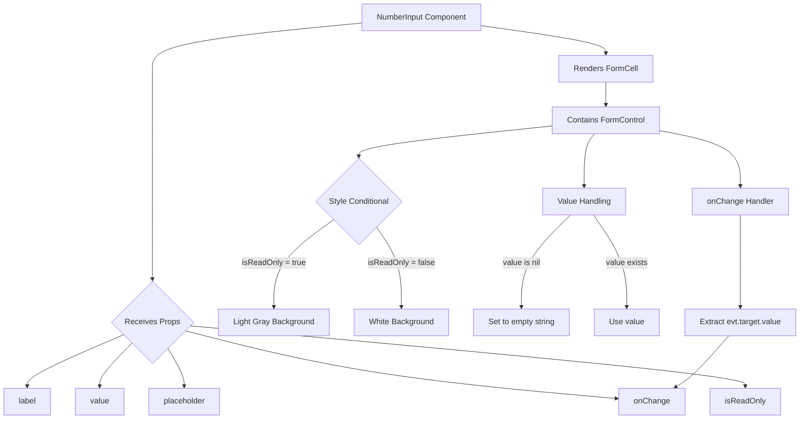
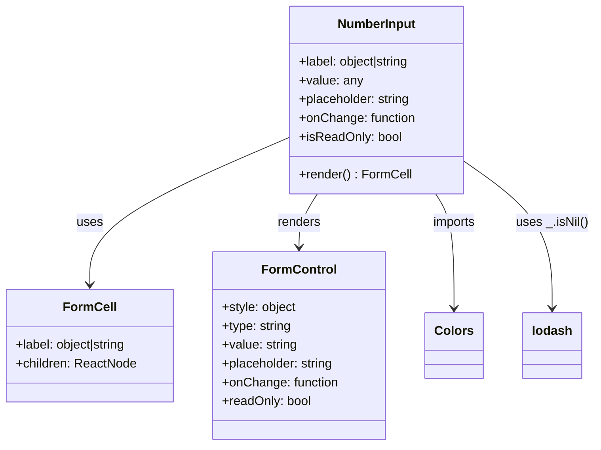
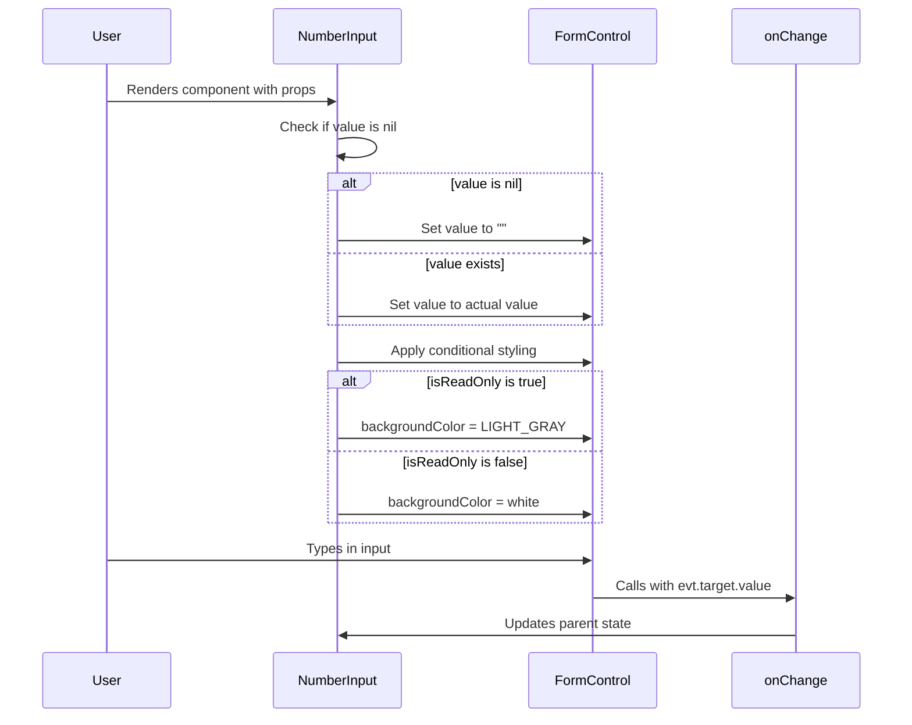

# Diagram: web/portal/src/components-old/forms/inputs/NumberInput.js

> Auto-generated by Obscura crawlers

## Diagram 1

### SVG

<svg id="container" width="1616.890625" xmlns="http://www.w3.org/2000/svg" class="flowchart" height="845.5" viewBox="0 0 1616.890625 845.5" role="graphics-document document" aria-roledescription="flowchart-v2"><g><marker id="container_flowchart-v2-pointEnd" class="marker flowchart-v2" viewBox="0 0 10 10" refX="5" refY="5" markerUnits="userSpaceOnUse" markerWidth="8" markerHeight="8" orient="auto"><path d="M 0 0 L 10 5 L 0 10 z" class="arrowMarkerPath" style="stroke-width: 1; stroke-dasharray: 1, 0;"></path></marker><marker id="container_flowchart-v2-pointStart" class="marker flowchart-v2" viewBox="0 0 10 10" refX="4.5" refY="5" markerUnits="userSpaceOnUse" markerWidth="8" markerHeight="8" orient="auto"><path d="M 0 5 L 10 10 L 10 0 z" class="arrowMarkerPath" style="stroke-width: 1; stroke-dasharray: 1, 0;"></path></marker><marker id="container_flowchart-v2-circleEnd" class="marker flowchart-v2" viewBox="0 0 10 10" refX="11" refY="5" markerUnits="userSpaceOnUse" markerWidth="11" markerHeight="11" orient="auto"><circle cx="5" cy="5" r="5" class="arrowMarkerPath" style="stroke-width: 1; stroke-dasharray: 1, 0;"></circle></marker><marker id="container_flowchart-v2-circleStart" class="marker flowchart-v2" viewBox="0 0 10 10" refX="-1" refY="5" markerUnits="userSpaceOnUse" markerWidth="11" markerHeight="11" orient="auto"><circle cx="5" cy="5" r="5" class="arrowMarkerPath" style="stroke-width: 1; stroke-dasharray: 1, 0;"></circle></marker><marker id="container_flowchart-v2-crossEnd" class="marker cross flowchart-v2" viewBox="0 0 11 11" refX="12" refY="5.2" markerUnits="userSpaceOnUse" markerWidth="11" markerHeight="11" orient="auto"><path d="M 1,1 l 9,9 M 10,1 l -9,9" class="arrowMarkerPath" style="stroke-width: 2; stroke-dasharray: 1, 0;"></path></marker><marker id="container_flowchart-v2-crossStart" class="marker cross flowchart-v2" viewBox="0 0 11 11" refX="-1" refY="5.2" markerUnits="userSpaceOnUse" markerWidth="11" markerHeight="11" orient="auto"><path d="M 1,1 l 9,9 M 10,1 l -9,9" class="arrowMarkerPath" style="stroke-width: 2; stroke-dasharray: 1, 0;"></path></marker><g class="root"><g class="clusters"></g><g class="edgePaths"><path d="M732.664,46.677L662.137,53.397C591.611,60.118,450.557,73.559,380.031,88.946C309.504,104.333,309.504,121.667,309.504,139C309.504,156.333,309.504,173.667,309.504,191C309.504,208.333,309.504,225.667,309.504,243C309.504,260.333,309.504,277.667,309.504,305.296C309.504,332.924,309.504,370.849,309.504,410.773C309.504,450.698,309.504,492.622,309.504,519.085C309.504,545.547,309.504,556.547,309.504,562.047L309.504,567.547" id="L_A_B_0" class="edge-thickness-normal edge-pattern-solid edge-thickness-normal edge-pattern-solid flowchart-link" style=";" data-edge="true" data-et="edge" data-id="L_A_B_0" data-points="W3sieCI6NzMyLjY2NDA2MjUsInkiOjQ2LjY3NjgxOTQ0NzUyNjQ3fSx7IngiOjMwOS41MDM5MDYyNSwieSI6ODd9LHsieCI6MzA5LjUwMzkwNjI1LCJ5IjoxMzl9LHsieCI6MzA5LjUwMzkwNjI1LCJ5IjoxOTF9LHsieCI6MzA5LjUwMzkwNjI1LCJ5IjoyNDN9LHsieCI6MzA5LjUwMzkwNjI1LCJ5IjoyOTV9LHsieCI6MzA5LjUwMzkwNjI1LCJ5Ijo0MDguNzczNDM3NX0seyJ4IjozMDkuNTAzOTA2MjUsInkiOjUzNC41NDY4NzV9LHsieCI6MzA5LjUwMzkwNjI1LCJ5Ijo1NzEuNTQ2ODc1fV0=" marker-end="url(#container_flowchart-v2-pointEnd)"></path><path d="M252.407,676.404L219.692,690.086C186.977,703.769,121.547,731.135,88.832,748.317C56.117,765.5,56.117,772.5,56.117,776L56.117,779.5" id="L_B_C_0" class="edge-thickness-normal edge-pattern-solid edge-thickness-normal edge-pattern-solid flowchart-link" style=";" data-edge="true" data-et="edge" data-id="L_B_C_0" data-points="W3sieCI6MjUyLjQwNzQwNjU4NDkyOTQsInkiOjY3Ni40MDM1MDAzMzQ5Mjk0fSx7IngiOjU2LjExNzE4NzUsInkiOjc1OC41fSx7IngiOjU2LjExNzE4NzUsInkiOjc4My41fV0=" marker-end="url(#container_flowchart-v2-pointEnd)"></path><path d="M269.045,693.041L258.151,703.951C247.256,714.861,225.468,736.68,214.574,751.09C203.68,765.5,203.68,772.5,203.68,776L203.68,779.5" id="L_B_D_0" class="edge-thickness-normal edge-pattern-solid edge-thickness-normal edge-pattern-solid flowchart-link" style=";" data-edge="true" data-et="edge" data-id="L_B_D_0" data-points="W3sieCI6MjY5LjA0NDc0NzM1MDU0MjI1LCJ5Ijo2OTMuMDQwODQxMTAwNTQyM30seyJ4IjoyMDMuNjc5Njg3NSwieSI6NzU4LjV9LHsieCI6MjAzLjY3OTY4NzUsInkiOjc4My41fV0=" marker-end="url(#container_flowchart-v2-pointEnd)"></path><path d="M340.854,702.149L346.788,711.541C352.721,720.933,364.587,739.716,370.52,752.608C376.453,765.5,376.453,772.5,376.453,776L376.453,779.5" id="L_B_E_0" class="edge-thickness-normal edge-pattern-solid edge-thickness-normal edge-pattern-solid flowchart-link" style=";" data-edge="true" data-et="edge" data-id="L_B_E_0" data-points="W3sieCI6MzQwLjg1NDQ1MTg4NDM2MDQsInkiOjcwMi4xNDk0NTQzNjU2Mzk2fSx7IngiOjM3Ni40NTMxMjUsInkiOjc1OC41fSx7IngiOjM3Ni40NTMxMjUsInkiOjc4My41fV0=" marker-end="url(#container_flowchart-v2-pointEnd)"></path><path d="M374.348,668.656L434.537,683.63C494.726,698.604,615.103,728.552,761.074,751.157C907.044,773.762,1078.608,789.023,1164.39,796.654L1250.172,804.285" id="L_B_F_0" class="edge-thickness-normal edge-pattern-solid edge-thickness-normal edge-pattern-solid flowchart-link" style=";" data-edge="true" data-et="edge" data-id="L_B_F_0" data-points="W3sieCI6Mzc0LjM0ODE4NjkxMjU0MjI1LCJ5Ijo2NjguNjU1NzE5MzM3NDU3OH0seyJ4Ijo3MzUuNDgwNDY4NzUsInkiOjc1OC41fSx7IngiOjEyNTQuMTU2MjUsInkiOjgwNC42MzkzMjc4ODQ5NTZ9XQ==" marker-end="url(#container_flowchart-v2-pointEnd)"></path><path d="M383.894,659.11L570.991,675.675C758.088,692.24,1132.282,725.37,1319.379,745.435C1506.477,765.5,1506.477,772.5,1506.477,776L1506.477,779.5" id="L_B_G_0" class="edge-thickness-normal edge-pattern-solid edge-thickness-normal edge-pattern-solid flowchart-link" style=";" data-edge="true" data-et="edge" data-id="L_B_G_0" data-points="W3sieCI6MzgzLjg5NDE2NjIxOTMwNzksInkiOjY1OS4xMDk3NDAwMzA2OTIxfSx7IngiOjE1MDYuNDc2NTYyNSwieSI6NzU4LjV9LHsieCI6MTUwNi40NzY1NjI1LCJ5Ijo3ODMuNX1d" marker-end="url(#container_flowchart-v2-pointEnd)"></path><path d="M977.742,52.138L1019.286,57.948C1060.831,63.759,1143.919,75.379,1185.464,84.69C1227.008,94,1227.008,101,1227.008,104.5L1227.008,108" id="L_A_H_0" class="edge-thickness-normal edge-pattern-solid edge-thickness-normal edge-pattern-solid flowchart-link" style=";" data-edge="true" data-et="edge" data-id="L_A_H_0" data-points="W3sieCI6OTc3Ljc0MjE4NzUsInkiOjUyLjEzODExNDM0OTM1MTc3fSx7IngiOjEyMjcuMDA3ODEyNSwieSI6ODd9LHsieCI6MTIyNy4wMDc4MTI1LCJ5IjoxMTJ9XQ==" marker-end="url(#container_flowchart-v2-pointEnd)"></path><path d="M1227.008,166L1227.008,170.167C1227.008,174.333,1227.008,182.667,1227.008,190.333C1227.008,198,1227.008,205,1227.008,208.5L1227.008,212" id="L_H_I_0" class="edge-thickness-normal edge-pattern-solid edge-thickness-normal edge-pattern-solid flowchart-link" style=";" data-edge="true" data-et="edge" data-id="L_H_I_0" data-points="W3sieCI6MTIyNy4wMDc4MTI1LCJ5IjoxNjZ9LHsieCI6MTIyNy4wMDc4MTI1LCJ5IjoxOTF9LHsieCI6MTIyNy4wMDc4MTI1LCJ5IjoyMTZ9XQ==" marker-end="url(#container_flowchart-v2-pointEnd)"></path><path d="M1118.641,254.182L1052.714,260.985C986.786,267.788,854.932,281.394,789.005,291.697C723.078,302,723.078,309,723.078,312.5L723.078,316" id="L_I_J_0" class="edge-thickness-normal edge-pattern-solid edge-thickness-normal edge-pattern-solid flowchart-link" style=";" data-edge="true" data-et="edge" data-id="L_I_J_0" data-points="W3sieCI6MTExOC42NDA2MjUsInkiOjI1NC4xODIzMDE1OTgzNzUyNn0seyJ4Ijo3MjMuMDc4MTI1LCJ5IjoyOTV9LHsieCI6NzIzLjA3ODEyNSwieSI6MzIwfV0=" marker-end="url(#container_flowchart-v2-pointEnd)"></path><path d="M671.868,446.337L651.826,461.039C631.783,475.74,591.698,505.144,571.656,534.341C551.613,563.539,551.613,592.531,551.613,607.027L551.613,621.523" id="L_J_K_0" class="edge-thickness-normal edge-pattern-solid edge-thickness-normal edge-pattern-solid flowchart-link" style=";" data-edge="true" data-et="edge" data-id="L_J_K_0" data-points="W3sieCI6NjcxLjg2ODI4OTE1MzU2ODYsInkiOjQ0Ni4zMzcwMzkxNTM1Njg2NH0seyJ4Ijo1NTEuNjEzMjgxMjUsInkiOjUzNC41NDY4NzV9LHsieCI6NTUxLjYxMzI4MTI1LCJ5Ijo2MjUuNTIzNDM3NX1d" marker-end="url(#container_flowchart-v2-pointEnd)"></path><path d="M758.97,461.655L767.215,473.804C775.46,485.953,791.951,510.25,800.196,536.894C808.441,563.539,808.441,592.531,808.441,607.027L808.441,621.523" id="L_J_L_0" class="edge-thickness-normal edge-pattern-solid edge-thickness-normal edge-pattern-solid flowchart-link" style=";" data-edge="true" data-et="edge" data-id="L_J_L_0" data-points="W3sieCI6NzU4Ljk2OTUyMjU2MzE4MSwieSI6NDYxLjY1NTQ3NzQzNjgxODk2fSx7IngiOjgwOC40NDE0MDYyNSwieSI6NTM0LjU0Njg3NX0seyJ4Ijo4MDguNDQxNDA2MjUsInkiOjYyNS41MjM0Mzc1fV0=" marker-end="url(#container_flowchart-v2-pointEnd)"></path><path d="M1203.452,270L1199.817,274.167C1196.181,278.333,1188.911,286.667,1185.276,304.629C1181.641,322.591,1181.641,350.182,1181.641,363.978L1181.641,377.773" id="L_I_M_0" class="edge-thickness-normal edge-pattern-solid edge-thickness-normal edge-pattern-solid flowchart-link" style=";" data-edge="true" data-et="edge" data-id="L_I_M_0" data-points="W3sieCI6MTIwMy40NTE3NzI4MzY1Mzg2LCJ5IjoyNzB9LHsieCI6MTE4MS42NDA2MjUsInkiOjI5NX0seyJ4IjoxMTgxLjY0MDYyNSwieSI6MzgxLjc3MzQzNzV9XQ==" marker-end="url(#container_flowchart-v2-pointEnd)"></path><path d="M1154.049,435.773L1137.227,452.236C1120.404,468.698,1086.759,501.622,1069.936,532.581C1053.113,563.539,1053.113,592.531,1053.113,607.027L1053.113,621.523" id="L_M_N_0" class="edge-thickness-normal edge-pattern-solid edge-thickness-normal edge-pattern-solid flowchart-link" style=";" data-edge="true" data-et="edge" data-id="L_M_N_0" data-points="W3sieCI6MTE1NC4wNDk0MzkyMTIwNjMsInkiOjQzNS43NzM0Mzc1fSx7IngiOjEwNTMuMTEzMjgxMjUsInkiOjUzNC41NDY4NzV9LHsieCI6MTA1My4xMTMyODEyNSwieSI6NjI1LjUyMzQzNzV9XQ==" marker-end="url(#container_flowchart-v2-pointEnd)"></path><path d="M1199.966,435.773L1211.139,452.236C1222.312,468.698,1244.658,501.622,1255.831,532.581C1267.004,563.539,1267.004,592.531,1267.004,607.027L1267.004,621.523" id="L_M_O_0" class="edge-thickness-normal edge-pattern-solid edge-thickness-normal edge-pattern-solid flowchart-link" style=";" data-edge="true" data-et="edge" data-id="L_M_O_0" data-points="W3sieCI6MTE5OS45NjU3MDczMDMyNDg2LCJ5Ijo0MzUuNzczNDM3NX0seyJ4IjoxMjY3LjAwMzkwNjI1LCJ5Ijo1MzQuNTQ2ODc1fSx7IngiOjEyNjcuMDAzOTA2MjUsInkiOjYyNS41MjM0Mzc1fV0=" marker-end="url(#container_flowchart-v2-pointEnd)"></path><path d="M1335.375,263.912L1362.225,269.093C1389.076,274.275,1442.776,284.637,1469.626,303.614C1496.477,322.591,1496.477,350.182,1496.477,363.978L1496.477,377.773" id="L_I_P_0" class="edge-thickness-normal edge-pattern-solid edge-thickness-normal edge-pattern-solid flowchart-link" style=";" data-edge="true" data-et="edge" data-id="L_I_P_0" data-points="W3sieCI6MTMzNS4zNzUsInkiOjI2My45MTE4NjM2MjA1NDk3fSx7IngiOjE0OTYuNDc2NTYyNSwieSI6Mjk1fSx7IngiOjE0OTYuNDc2NTYyNSwieSI6MzgxLjc3MzQzNzV9XQ==" marker-end="url(#container_flowchart-v2-pointEnd)"></path><path d="M1496.477,435.773L1496.477,452.236C1496.477,468.698,1496.477,501.622,1496.477,532.581C1496.477,563.539,1496.477,592.531,1496.477,607.027L1496.477,621.523" id="L_P_Q_0" class="edge-thickness-normal edge-pattern-solid edge-thickness-normal edge-pattern-solid flowchart-link" style=";" data-edge="true" data-et="edge" data-id="L_P_Q_0" data-points="W3sieCI6MTQ5Ni40NzY1NjI1LCJ5Ijo0MzUuNzczNDM3NX0seyJ4IjoxNDk2LjQ3NjU2MjUsInkiOjUzNC41NDY4NzV9LHsieCI6MTQ5Ni40NzY1NjI1LCJ5Ijo2MjUuNTIzNDM3NX1d" marker-end="url(#container_flowchart-v2-pointEnd)"></path><path d="M1472.727,679.523L1461.149,692.686C1449.571,705.849,1426.414,732.174,1408.733,749.151C1391.052,766.127,1378.847,773.754,1372.744,777.567L1366.641,781.38" id="L_Q_F_0" class="edge-thickness-normal edge-pattern-solid edge-thickness-normal edge-pattern-solid flowchart-link" style=";" data-edge="true" data-et="edge" data-id="L_Q_F_0" data-points="W3sieCI6MTQ3Mi43MjY5MTI2NjU4NjgsInkiOjY3OS41MjM0Mzc1fSx7IngiOjE0MDMuMjU3ODEyNSwieSI6NzU4LjV9LHsieCI6MTM2My4yNDg3OTgwNzY5MjMsInkiOjc4My41fV0=" marker-end="url(#container_flowchart-v2-pointEnd)"></path></g><g class="edgeLabels"><g class="edgeLabel"><g class="label" data-id="L_A_B_0" transform="translate(0, 0)"><foreignObject width="0" height="0">

</foreignObject></g></g><g class="edgeLabel"><g class="label" data-id="L_B_C_0" transform="translate(0, 0)"><foreignObject width="0" height="0">

</foreignObject></g></g><g class="edgeLabel"><g class="label" data-id="L_B_D_0" transform="translate(0, 0)"><foreignObject width="0" height="0">

</foreignObject></g></g><g class="edgeLabel"><g class="label" data-id="L_B_E_0" transform="translate(0, 0)"><foreignObject width="0" height="0">

</foreignObject></g></g><g class="edgeLabel"><g class="label" data-id="L_B_F_0" transform="translate(0, 0)"><foreignObject width="0" height="0">

</foreignObject></g></g><g class="edgeLabel"><g class="label" data-id="L_B_G_0" transform="translate(0, 0)"><foreignObject width="0" height="0">

</foreignObject></g></g><g class="edgeLabel"><g class="label" data-id="L_A_H_0" transform="translate(0, 0)"><foreignObject width="0" height="0">

</foreignObject></g></g><g class="edgeLabel"><g class="label" data-id="L_H_I_0" transform="translate(0, 0)"><foreignObject width="0" height="0">

</foreignObject></g></g><g class="edgeLabel"><g class="label" data-id="L_I_J_0" transform="translate(0, 0)"><foreignObject width="0" height="0">

</foreignObject></g></g><g class="edgeLabel" transform="translate(551.61328125, 534.546875)"><g class="label" data-id="L_J_K_0" transform="translate(-63.7890625, -12)"><foreignObject width="127.578125" height="24">

isReadOnly = true

</foreignObject></g></g><g class="edgeLabel" transform="translate(808.44140625, 534.546875)"><g class="label" data-id="L_J_L_0" transform="translate(-66.015625, -12)"><foreignObject width="132.03125" height="24">

isReadOnly = false

</foreignObject></g></g><g class="edgeLabel"><g class="label" data-id="L_I_M_0" transform="translate(0, 0)"><foreignObject width="0" height="0">

</foreignObject></g></g><g class="edgeLabel" transform="translate(1053.11328125, 534.546875)"><g class="label" data-id="L_M_N_0" transform="translate(-38.9609375, -12)"><foreignObject width="77.921875" height="24">

value is nil

</foreignObject></g></g><g class="edgeLabel" transform="translate(1267.00390625, 534.546875)"><g class="label" data-id="L_M_O_0" transform="translate(-42.3515625, -12)"><foreignObject width="84.703125" height="24">

value exists

</foreignObject></g></g><g class="edgeLabel"><g class="label" data-id="L_I_P_0" transform="translate(0, 0)"><foreignObject width="0" height="0">

</foreignObject></g></g><g class="edgeLabel"><g class="label" data-id="L_P_Q_0" transform="translate(0, 0)"><foreignObject width="0" height="0">

</foreignObject></g></g><g class="edgeLabel"><g class="label" data-id="L_Q_F_0" transform="translate(0, 0)"><foreignObject width="0" height="0">

</foreignObject></g></g></g><g class="nodes"><g class="node default" id="flowchart-A-0" transform="translate(855.203125, 35)"><rect class="basic label-container" style="" x="-122.5390625" y="-27" width="245.078125" height="54"></rect><g class="label" style="" transform="translate(-92.5390625, -12)"><rect></rect><foreignObject width="185.078125" height="24">

NumberInput Component

</foreignObject></g></g><g class="node default" id="flowchart-B-1" transform="translate(309.50390625, 652.5234375)"><polygon points="80.9765625,0 161.953125,-80.9765625 80.9765625,-161.953125 0,-80.9765625" class="label-container" transform="translate(-80.4765625, 80.9765625)"></polygon><g class="label" style="" transform="translate(-53.9765625, -12)"><rect></rect><foreignObject width="107.953125" height="24">

Receives Props

</foreignObject></g></g><g class="node default" id="flowchart-C-3" transform="translate(56.1171875, 810.5)"><rect class="basic label-container" style="" x="-48.1171875" y="-27" width="96.234375" height="54"></rect><g class="label" style="" transform="translate(-18.1171875, -12)"><rect></rect><foreignObject width="36.234375" height="24">

label

</foreignObject></g></g><g class="node default" id="flowchart-D-5" transform="translate(203.6796875, 810.5)"><rect class="basic label-container" style="" x="-49.4453125" y="-27" width="98.890625" height="54"></rect><g class="label" style="" transform="translate(-19.4453125, -12)"><rect></rect><foreignObject width="38.890625" height="24">

value

</foreignObject></g></g><g class="node default" id="flowchart-E-7" transform="translate(376.453125, 810.5)"><rect class="basic label-container" style="" x="-73.328125" y="-27" width="146.65625" height="54"></rect><g class="label" style="" transform="translate(-43.328125, -12)"><rect></rect><foreignObject width="86.65625" height="24">

placeholder

</foreignObject></g></g><g class="node default" id="flowchart-F-9" transform="translate(1320.0390625, 810.5)"><rect class="basic label-container" style="" x="-65.8828125" y="-27" width="131.765625" height="54"></rect><g class="label" style="" transform="translate(-35.8828125, -12)"><rect></rect><foreignObject width="71.765625" height="24">

onChange

</foreignObject></g></g><g class="node default" id="flowchart-G-11" transform="translate(1506.4765625, 810.5)"><rect class="basic label-container" style="" x="-70.5546875" y="-27" width="141.109375" height="54"></rect><g class="label" style="" transform="translate(-40.5546875, -12)"><rect></rect><foreignObject width="81.109375" height="24">

isReadOnly

</foreignObject></g></g><g class="node default" id="flowchart-H-13" transform="translate(1227.0078125, 139)"><rect class="basic label-container" style="" x="-93.375" y="-27" width="186.75" height="54"></rect><g class="label" style="" transform="translate(-63.375, -12)"><rect></rect><foreignObject width="126.75" height="24">

Renders FormCell

</foreignObject></g></g><g class="node default" id="flowchart-I-15" transform="translate(1227.0078125, 243)"><rect class="basic label-container" style="" x="-108.3671875" y="-27" width="216.734375" height="54"></rect><g class="label" style="" transform="translate(-78.3671875, -12)"><rect></rect><foreignObject width="156.734375" height="24">

Contains FormControl

</foreignObject></g></g><g class="node default" id="flowchart-J-17" transform="translate(723.078125, 408.7734375)"><polygon points="88.7734375,0 177.546875,-88.7734375 88.7734375,-177.546875 0,-88.7734375" class="label-container" transform="translate(-88.2734375, 88.7734375)"></polygon><g class="label" style="" transform="translate(-61.7734375, -12)"><rect></rect><foreignObject width="123.546875" height="24">

Style Conditional

</foreignObject></g></g><g class="node default" id="flowchart-K-19" transform="translate(551.61328125, 652.5234375)"><rect class="basic label-container" style="" x="-111.1328125" y="-27" width="222.265625" height="54"></rect><g class="label" style="" transform="translate(-81.1328125, -12)"><rect></rect><foreignObject width="162.265625" height="24">

Light Gray Background

</foreignObject></g></g><g class="node default" id="flowchart-L-21" transform="translate(808.44140625, 652.5234375)"><rect class="basic label-container" style="" x="-95.6953125" y="-27" width="191.390625" height="54"></rect><g class="label" style="" transform="translate(-65.6953125, -12)"><rect></rect><foreignObject width="131.390625" height="24">

White Background

</foreignObject></g></g><g class="node default" id="flowchart-M-23" transform="translate(1181.640625, 408.7734375)"><rect class="basic label-container" style="" x="-84.59375" y="-27" width="169.1875" height="54"></rect><g class="label" style="" transform="translate(-54.59375, -12)"><rect></rect><foreignObject width="109.1875" height="24">

Value Handling

</foreignObject></g></g><g class="node default" id="flowchart-N-25" transform="translate(1053.11328125, 652.5234375)"><rect class="basic label-container" style="" x="-98.9765625" y="-27" width="197.953125" height="54"></rect><g class="label" style="" transform="translate(-68.9765625, -12)"><rect></rect><foreignObject width="137.953125" height="24">

Set to empty string

</foreignObject></g></g><g class="node default" id="flowchart-O-27" transform="translate(1267.00390625, 652.5234375)"><rect class="basic label-container" style="" x="-64.9140625" y="-27" width="129.828125" height="54"></rect><g class="label" style="" transform="translate(-34.9140625, -12)"><rect></rect><foreignObject width="69.828125" height="24">

Use value

</foreignObject></g></g><g class="node default" id="flowchart-P-29" transform="translate(1496.4765625, 408.7734375)"><rect class="basic label-container" style="" x="-97.0234375" y="-27" width="194.046875" height="54"></rect><g class="label" style="" transform="translate(-67.0234375, -12)"><rect></rect><foreignObject width="134.046875" height="24">

onChange Handler

</foreignObject></g></g><g class="node default" id="flowchart-Q-31" transform="translate(1496.4765625, 652.5234375)"><rect class="basic label-container" style="" x="-112.4140625" y="-27" width="224.828125" height="54"></rect><g class="label" style="" transform="translate(-82.4140625, -12)"><rect></rect><foreignObject width="164.828125" height="24">

Extract evt.target.value

</foreignObject></g></g></g></g></g></svg>

## Diagram 2

### SVG

<svg id="container" width="746.484375" xmlns="http://www.w3.org/2000/svg" class="classDiagram" height="570" viewBox="0 0 746.484375 570" role="graphics-document document" aria-roledescription="class"><g><defs><marker id="container_class-aggregationStart" class="marker aggregation class" refX="18" refY="7" markerWidth="190" markerHeight="240" orient="auto"><path d="M 18,7 L9,13 L1,7 L9,1 Z"></path></marker></defs><defs><marker id="container_class-aggregationEnd" class="marker aggregation class" refX="1" refY="7" markerWidth="20" markerHeight="28" orient="auto"><path d="M 18,7 L9,13 L1,7 L9,1 Z"></path></marker></defs><defs><marker id="container_class-extensionStart" class="marker extension class" refX="18" refY="7" markerWidth="190" markerHeight="240" orient="auto"><path d="M 1,7 L18,13 V 1 Z"></path></marker></defs><defs><marker id="container_class-extensionEnd" class="marker extension class" refX="1" refY="7" markerWidth="20" markerHeight="28" orient="auto"><path d="M 1,1 V 13 L18,7 Z"></path></marker></defs><defs><marker id="container_class-compositionStart" class="marker composition class" refX="18" refY="7" markerWidth="190" markerHeight="240" orient="auto"><path d="M 18,7 L9,13 L1,7 L9,1 Z"></path></marker></defs><defs><marker id="container_class-compositionEnd" class="marker composition class" refX="1" refY="7" markerWidth="20" markerHeight="28" orient="auto"><path d="M 18,7 L9,13 L1,7 L9,1 Z"></path></marker></defs><defs><marker id="container_class-dependencyStart" class="marker dependency class" refX="6" refY="7" markerWidth="190" markerHeight="240" orient="auto"><path d="M 5,7 L9,13 L1,7 L9,1 Z"></path></marker></defs><defs><marker id="container_class-dependencyEnd" class="marker dependency class" refX="13" refY="7" markerWidth="20" markerHeight="28" orient="auto"><path d="M 18,7 L9,13 L14,7 L9,1 Z"></path></marker></defs><defs><marker id="container_class-lollipopStart" class="marker lollipop class" refX="13" refY="7" markerWidth="190" markerHeight="240" orient="auto"><circle stroke="black" fill="transparent" cx="7" cy="7" r="6"></circle></marker></defs><defs><marker id="container_class-lollipopEnd" class="marker lollipop class" refX="1" refY="7" markerWidth="190" markerHeight="240" orient="auto"><circle stroke="black" fill="transparent" cx="7" cy="7" r="6"></circle></marker></defs><g class="root"><g class="clusters"></g><g class="edgePaths"><path d="M363.414,176.074L321.689,194.228C279.965,212.382,196.516,248.691,154.791,280.012C113.066,311.333,113.066,337.667,113.066,350.833L113.066,364" id="id_NumberInput_FormCell_1" class="edge-thickness-normal edge-pattern-solid relation" style=";;;" data-edge="true" data-et="edge" data-id="id_NumberInput_FormCell_1" data-points="W3sieCI6MzYzLjQxNDA2MjUsInkiOjE3Ni4wNzM1MzgwMDg1MzA1M30seyJ4IjoxMTMuMDY2NDA2MjUsInkiOjI4NX0seyJ4IjoxMTMuMDY2NDA2MjUsInkiOjM3MH1d" marker-end="url(#container_class-dependencyEnd)"></path><path d="M399.795,248L395.987,254.167C392.178,260.333,384.562,272.667,380.754,284C376.945,295.333,376.945,305.667,376.945,310.833L376.945,316" id="id_NumberInput_FormControl_2" class="edge-thickness-normal edge-pattern-solid relation" style=";;;" data-edge="true" data-et="edge" data-id="id_NumberInput_FormControl_2" data-points="W3sieCI6Mzk5Ljc5NTA1ODcxODE1Mjg2LCJ5IjoyNDh9LHsieCI6Mzc2Ljk0NTMxMjUsInkiOjI4NX0seyJ4IjozNzYuOTQ1MzEyNSwieSI6MzIyfV0=" marker-end="url(#container_class-dependencyEnd)"></path><path d="M548.01,248L551.818,254.167C555.626,260.333,563.243,272.667,567.051,297C570.859,321.333,570.859,357.667,570.859,375.833L570.859,394" id="id_NumberInput_Colors_3" class="edge-thickness-normal edge-pattern-solid relation" style=";;;" data-edge="true" data-et="edge" data-id="id_NumberInput_Colors_3" data-points="W3sieCI6NTQ4LjAwOTYyODc4MTg0NzEsInkiOjI0OH0seyJ4Ijo1NzAuODU5Mzc1LCJ5IjoyODV9LHsieCI6NTcwLjg1OTM3NSwieSI6NDAwfV0=" marker-end="url(#container_class-dependencyEnd)"></path><path d="M584.391,207.334L602.418,220.279C620.445,233.223,656.5,259.111,674.527,290.222C692.555,321.333,692.555,357.667,692.555,375.833L692.555,394" id="id_NumberInput_lodash_4" class="edge-thickness-normal edge-pattern-solid relation" style=";;;" data-edge="true" data-et="edge" data-id="id_NumberInput_lodash_4" data-points="W3sieCI6NTg0LjM5MDYyNSwieSI6MjA3LjMzNDQzNTAxNTYzMTk4fSx7IngiOjY5Mi41NTQ2ODc1LCJ5IjoyODV9LHsieCI6NjkyLjU1NDY4NzUsInkiOjQwMH1d" marker-end="url(#container_class-dependencyEnd)"></path></g><g class="edgeLabels"><g class="edgeLabel" transform="translate(113.06640625, 285)"><g class="label" data-id="id_NumberInput_FormCell_1" transform="translate(-16.4921875, -12)"><foreignObject width="32.984375" height="24">

uses

</foreignObject></g></g><g class="edgeLabel" transform="translate(376.9453125, 285)"><g class="label" data-id="id_NumberInput_FormControl_2" transform="translate(-27.75, -12)"><foreignObject width="55.5" height="24">

renders

</foreignObject></g></g><g class="edgeLabel" transform="translate(570.859375, 285)"><g class="label" data-id="id_NumberInput_Colors_3" transform="translate(-28.25, -12)"><foreignObject width="56.5" height="24">

imports

</foreignObject></g></g><g class="edgeLabel" transform="translate(692.5546875, 285)"><g class="label" data-id="id_NumberInput_lodash_4" transform="translate(-45.9296875, -12)"><foreignObject width="91.859375" height="24">

uses _.isNil()

</foreignObject></g></g></g><g class="nodes"><g class="node default" id="classId-NumberInput-0" transform="translate(473.90234375, 128)"><g class="basic label-container"><path d="M-110.48828125 -120 L110.48828125 -120 L110.48828125 120 L-110.48828125 120" stroke="none" stroke-width="0" fill="#ECECFF" style=""></path><path d="M-110.48828125 -120 C-26.558111754438585 -120, 57.37205774112283 -120, 110.48828125 -120 M-110.48828125 -120 C-60.4573628801737 -120, -10.426444510347395 -120, 110.48828125 -120 M110.48828125 -120 C110.48828125 -66.30577520018079, 110.48828125 -12.611550400361594, 110.48828125 120 M110.48828125 -120 C110.48828125 -26.1006545959943, 110.48828125 67.7986908080114, 110.48828125 120 M110.48828125 120 C46.784672047547076 120, -16.918937154905848 120, -110.48828125 120 M110.48828125 120 C33.76491797396804 120, -42.95844530206392 120, -110.48828125 120 M-110.48828125 120 C-110.48828125 41.357346391660926, -110.48828125 -37.28530721667815, -110.48828125 -120 M-110.48828125 120 C-110.48828125 71.38180400376976, -110.48828125 22.763608007539503, -110.48828125 -120" stroke="#9370DB" stroke-width="1.3" fill="none" stroke-dasharray="0 0" style=""></path></g><g class="annotation-group text" transform="translate(0, -96)"></g><g class="label-group text" transform="translate(-48.4453125, -96)"><g class="label" style="font-weight: bolder" transform="translate(0,-12)"><foreignObject width="96.890625" height="24">

NumberInput

</foreignObject></g></g><g class="members-group text" transform="translate(-98.48828125, -48)"><g class="label" style="" transform="translate(0,-12)"><foreignObject width="146.015625" height="24">

+label: object|string

</foreignObject></g><g class="label" style="" transform="translate(0,12)"><foreignObject width="80.625" height="24">

+value: any

</foreignObject></g><g class="label" style="" transform="translate(0,36)"><foreignObject width="144.515625" height="24">

+placeholder: string

</foreignObject></g><g class="label" style="" transform="translate(0,60)"><foreignObject width="148.53125" height="24">

+onChange: function

</foreignObject></g><g class="label" style="" transform="translate(0,84)"><foreignObject width="130.125" height="24">

+isReadOnly: bool

</foreignObject></g></g><g class="methods-group text" transform="translate(-98.48828125, 96)"><g class="label" style="" transform="translate(0,-12)"><foreignObject width="142.203125" height="24">

+render() : FormCell

</foreignObject></g></g><g class="divider" style=""><path d="M-110.48828125 -72 C-48.75189335849235 -72, 12.984494533015294 -72, 110.48828125 -72 M-110.48828125 -72 C-64.78349507549606 -72, -19.078708900992112 -72, 110.48828125 -72" stroke="#9370DB" stroke-width="1.3" fill="none" stroke-dasharray="0 0" style=""></path></g><g class="divider" style=""><path d="M-110.48828125 72 C-64.2640123051749 72, -18.039743360349803 72, 110.48828125 72 M-110.48828125 72 C-28.293199673600256 72, 53.90188190279949 72, 110.48828125 72" stroke="#9370DB" stroke-width="1.3" fill="none" stroke-dasharray="0 0" style=""></path></g></g><g class="node default" id="classId-FormCell-1" transform="translate(113.06640625, 442)"><g class="basic label-container"><path d="M-105.06640625 -72 L105.06640625 -72 L105.06640625 72 L-105.06640625 72" stroke="none" stroke-width="0" fill="#ECECFF" style=""></path><path d="M-105.06640625 -72 C-39.41152766268881 -72, 26.243350924622376 -72, 105.06640625 -72 M-105.06640625 -72 C-58.24849832196354 -72, -11.430590393927076 -72, 105.06640625 -72 M105.06640625 -72 C105.06640625 -27.098882345412854, 105.06640625 17.802235309174293, 105.06640625 72 M105.06640625 -72 C105.06640625 -31.29445326652936, 105.06640625 9.411093466941281, 105.06640625 72 M105.06640625 72 C29.956731337169472 72, -45.152943575661055 72, -105.06640625 72 M105.06640625 72 C33.4038836312353 72, -38.258638987529395 72, -105.06640625 72 M-105.06640625 72 C-105.06640625 42.02076721962598, -105.06640625 12.041534439251961, -105.06640625 -72 M-105.06640625 72 C-105.06640625 36.87914229756429, -105.06640625 1.7582845951285861, -105.06640625 -72" stroke="#9370DB" stroke-width="1.3" fill="none" stroke-dasharray="0 0" style=""></path></g><g class="annotation-group text" transform="translate(0, -48)"></g><g class="label-group text" transform="translate(-31.8671875, -48)"><g class="label" style="font-weight: bolder" transform="translate(0,-12)"><foreignObject width="63.734375" height="24">

FormCell

</foreignObject></g></g><g class="members-group text" transform="translate(-93.06640625, 0)"><g class="label" style="" transform="translate(0,-12)"><foreignObject width="146.015625" height="24">

+label: object|string

</foreignObject></g><g class="label" style="" transform="translate(0,12)"><foreignObject width="154.265625" height="24">

+children: ReactNode

</foreignObject></g></g><g class="methods-group text" transform="translate(-93.06640625, 72)"></g><g class="divider" style=""><path d="M-105.06640625 -24 C-58.428211600311826 -24, -11.790016950623652 -24, 105.06640625 -24 M-105.06640625 -24 C-42.984452138604325 -24, 19.09750197279135 -24, 105.06640625 -24" stroke="#9370DB" stroke-width="1.3" fill="none" stroke-dasharray="0 0" style=""></path></g><g class="divider" style=""><path d="M-105.06640625 48 C-25.372410450771795 48, 54.32158534845641 48, 105.06640625 48 M-105.06640625 48 C-21.39667052344751 48, 62.27306520310498 48, 105.06640625 48" stroke="#9370DB" stroke-width="1.3" fill="none" stroke-dasharray="0 0" style=""></path></g></g><g class="node default" id="classId-FormControl-2" transform="translate(376.9453125, 442)"><g class="basic label-container"><path d="M-108.8125 -120 L108.8125 -120 L108.8125 120 L-108.8125 120" stroke="none" stroke-width="0" fill="#ECECFF" style=""></path><path d="M-108.8125 -120 C-52.65377820703707 -120, 3.504943585925858 -120, 108.8125 -120 M-108.8125 -120 C-48.75095369388692 -120, 11.31059261222616 -120, 108.8125 -120 M108.8125 -120 C108.8125 -38.966523872177405, 108.8125 42.06695225564519, 108.8125 120 M108.8125 -120 C108.8125 -66.00747441847454, 108.8125 -12.014948836949088, 108.8125 120 M108.8125 120 C30.053421788553464 120, -48.70565642289307 120, -108.8125 120 M108.8125 120 C51.43395575682642 120, -5.944588486347158 120, -108.8125 120 M-108.8125 120 C-108.8125 57.371963756957854, -108.8125 -5.2560724860842924, -108.8125 -120 M-108.8125 120 C-108.8125 57.41746219961943, -108.8125 -5.165075600761142, -108.8125 -120" stroke="#9370DB" stroke-width="1.3" fill="none" stroke-dasharray="0 0" style=""></path></g><g class="annotation-group text" transform="translate(0, -96)"></g><g class="label-group text" transform="translate(-45.09375, -96)"><g class="label" style="font-weight: bolder" transform="translate(0,-12)"><foreignObject width="90.1875" height="24">

FormControl

</foreignObject></g></g><g class="members-group text" transform="translate(-96.8125, -48)"><g class="label" style="" transform="translate(0,-12)"><foreignObject width="95.90625" height="24">

+style: object

</foreignObject></g><g class="label" style="" transform="translate(0,12)"><foreignObject width="89.421875" height="24">

+type: string

</foreignObject></g><g class="label" style="" transform="translate(0,36)"><foreignObject width="96.421875" height="24">

+value: string

</foreignObject></g><g class="label" style="" transform="translate(0,60)"><foreignObject width="144.515625" height="24">

+placeholder: string

</foreignObject></g><g class="label" style="" transform="translate(0,84)"><foreignObject width="148.53125" height="24">

+onChange: function

</foreignObject></g><g class="label" style="" transform="translate(0,108)"><foreignObject width="114.390625" height="24">

+readOnly: bool

</foreignObject></g></g><g class="methods-group text" transform="translate(-96.8125, 120)"></g><g class="divider" style=""><path d="M-108.8125 -72 C-30.691296926452353 -72, 47.429906147095295 -72, 108.8125 -72 M-108.8125 -72 C-34.13211912580098 -72, 40.54826174839803 -72, 108.8125 -72" stroke="#9370DB" stroke-width="1.3" fill="none" stroke-dasharray="0 0" style=""></path></g><g class="divider" style=""><path d="M-108.8125 96 C-22.77431377901098 96, 63.26387244197804 96, 108.8125 96 M-108.8125 96 C-34.70945498428054 96, 39.39359003143892 96, 108.8125 96" stroke="#9370DB" stroke-width="1.3" fill="none" stroke-dasharray="0 0" style=""></path></g></g><g class="node default" id="classId-Colors-3" transform="translate(570.859375, 442)"><g class="basic label-container"><path d="M-35.1015625 -42 L35.1015625 -42 L35.1015625 42 L-35.1015625 42" stroke="none" stroke-width="0" fill="#ECECFF" style=""></path><path d="M-35.1015625 -42 C-15.012693156071911 -42, 5.076176187856177 -42, 35.1015625 -42 M-35.1015625 -42 C-14.089154313865183 -42, 6.923253872269633 -42, 35.1015625 -42 M35.1015625 -42 C35.1015625 -19.3140571287039, 35.1015625 3.371885742592198, 35.1015625 42 M35.1015625 -42 C35.1015625 -16.658226557795423, 35.1015625 8.683546884409154, 35.1015625 42 M35.1015625 42 C20.208587534351054 42, 5.315612568702107 42, -35.1015625 42 M35.1015625 42 C11.486843024227898 42, -12.127876451544203 42, -35.1015625 42 M-35.1015625 42 C-35.1015625 12.074091081962255, -35.1015625 -17.85181783607549, -35.1015625 -42 M-35.1015625 42 C-35.1015625 21.67200963588385, -35.1015625 1.3440192717676993, -35.1015625 -42" stroke="#9370DB" stroke-width="1.3" fill="none" stroke-dasharray="0 0" style=""></path></g><g class="annotation-group text" transform="translate(0, -18)"></g><g class="label-group text" transform="translate(-23.1015625, -18)"><g class="label" style="font-weight: bolder" transform="translate(0,-12)"><foreignObject width="46.203125" height="24">

Colors

</foreignObject></g></g><g class="members-group text" transform="translate(-23.1015625, 30)"></g><g class="methods-group text" transform="translate(-23.1015625, 60)"></g><g class="divider" style=""><path d="M-35.1015625 6 C-15.289576145108885 6, 4.52241020978223 6, 35.1015625 6 M-35.1015625 6 C-15.115053668962307 6, 4.871455162075385 6, 35.1015625 6" stroke="#9370DB" stroke-width="1.3" fill="none" stroke-dasharray="0 0" style=""></path></g><g class="divider" style=""><path d="M-35.1015625 24 C-8.644518682557663 24, 17.812525134884673 24, 35.1015625 24 M-35.1015625 24 C-7.406576442302196 24, 20.288409615395608 24, 35.1015625 24" stroke="#9370DB" stroke-width="1.3" fill="none" stroke-dasharray="0 0" style=""></path></g></g><g class="node default" id="classId-lodash-4" transform="translate(692.5546875, 442)"><g class="basic label-container"><path d="M-36.59375 -42 L36.59375 -42 L36.59375 42 L-36.59375 42" stroke="none" stroke-width="0" fill="#ECECFF" style=""></path><path d="M-36.59375 -42 C-11.167277942521743 -42, 14.259194114956514 -42, 36.59375 -42 M-36.59375 -42 C-21.320050238787132 -42, -6.0463504775742685 -42, 36.59375 -42 M36.59375 -42 C36.59375 -11.463072289756134, 36.59375 19.07385542048773, 36.59375 42 M36.59375 -42 C36.59375 -22.69821361154806, 36.59375 -3.3964272230961186, 36.59375 42 M36.59375 42 C11.165219665265912 42, -14.263310669468176 42, -36.59375 42 M36.59375 42 C13.681954743492337 42, -9.229840513015326 42, -36.59375 42 M-36.59375 42 C-36.59375 23.586226430204455, -36.59375 5.17245286040891, -36.59375 -42 M-36.59375 42 C-36.59375 14.695091145181614, -36.59375 -12.609817709636772, -36.59375 -42" stroke="#9370DB" stroke-width="1.3" fill="none" stroke-dasharray="0 0" style=""></path></g><g class="annotation-group text" transform="translate(0, -18)"></g><g class="label-group text" transform="translate(-24.59375, -18)"><g class="label" style="font-weight: bolder" transform="translate(0,-12)"><foreignObject width="49.1875" height="24">

lodash

</foreignObject></g></g><g class="members-group text" transform="translate(-24.59375, 30)"></g><g class="methods-group text" transform="translate(-24.59375, 60)"></g><g class="divider" style=""><path d="M-36.59375 6 C-12.773613458399975 6, 11.04652308320005 6, 36.59375 6 M-36.59375 6 C-7.788601375670275 6, 21.01654724865945 6, 36.59375 6" stroke="#9370DB" stroke-width="1.3" fill="none" stroke-dasharray="0 0" style=""></path></g><g class="divider" style=""><path d="M-36.59375 24 C-18.10012172672761 24, 0.3935065465447778 24, 36.59375 24 M-36.59375 24 C-12.640470649120903 24, 11.312808701758193 24, 36.59375 24" stroke="#9370DB" stroke-width="1.3" fill="none" stroke-dasharray="0 0" style=""></path></g></g></g></g></g></svg>

## Diagram 3

### SVG

<svg id="container" width="1098" xmlns="http://www.w3.org/2000/svg" height="881" viewBox="-50 -10 1098 881" role="graphics-document document" aria-roledescription="sequence"><g><rect x="848" y="795" fill="#eaeaea" stroke="#666" width="150" height="65" name="onChange" rx="3" ry="3" class="actor actor-bottom"></rect><text x="923" y="827.5" dominant-baseline="central" alignment-baseline="central" class="actor actor-box" style="text-anchor: middle; font-size: 16px; font-weight: 400;"><tspan x="923" dy="0">onChange</tspan></text></g><g><rect x="593" y="795" fill="#eaeaea" stroke="#666" width="150" height="65" name="FormControl" rx="3" ry="3" class="actor actor-bottom"></rect><text x="668" y="827.5" dominant-baseline="central" alignment-baseline="central" class="actor actor-box" style="text-anchor: middle; font-size: 16px; font-weight: 400;"><tspan x="668" dy="0">FormControl</tspan></text></g><g><rect x="297" y="795" fill="#eaeaea" stroke="#666" width="150" height="65" name="NumberInput" rx="3" ry="3" class="actor actor-bottom"></rect><text x="372" y="827.5" dominant-baseline="central" alignment-baseline="central" class="actor actor-box" style="text-anchor: middle; font-size: 16px; font-weight: 400;"><tspan x="372" dy="0">NumberInput</tspan></text></g><g><rect x="0" y="795" fill="#eaeaea" stroke="#666" width="150" height="65" name="User" rx="3" ry="3" class="actor actor-bottom"></rect><text x="75" y="827.5" dominant-baseline="central" alignment-baseline="central" class="actor actor-box" style="text-anchor: middle; font-size: 16px; font-weight: 400;"><tspan x="75" dy="0">User</tspan></text></g><g><line id="actor3" x1="923" y1="65" x2="923" y2="795" class="actor-line 200" stroke-width="0.5px" stroke="#999" name="onChange"></line><g id="root-3"><rect x="848" y="0" fill="#eaeaea" stroke="#666" width="150" height="65" name="onChange" rx="3" ry="3" class="actor actor-top"></rect><text x="923" y="32.5" dominant-baseline="central" alignment-baseline="central" class="actor actor-box" style="text-anchor: middle; font-size: 16px; font-weight: 400;"><tspan x="923" dy="0">onChange</tspan></text></g></g><g><line id="actor2" x1="668" y1="65" x2="668" y2="795" class="actor-line 200" stroke-width="0.5px" stroke="#999" name="FormControl"></line><g id="root-2"><rect x="593" y="0" fill="#eaeaea" stroke="#666" width="150" height="65" name="FormControl" rx="3" ry="3" class="actor actor-top"></rect><text x="668" y="32.5" dominant-baseline="central" alignment-baseline="central" class="actor actor-box" style="text-anchor: middle; font-size: 16px; font-weight: 400;"><tspan x="668" dy="0">FormControl</tspan></text></g></g><g><line id="actor1" x1="372" y1="65" x2="372" y2="795" class="actor-line 200" stroke-width="0.5px" stroke="#999" name="NumberInput"></line><g id="root-1"><rect x="297" y="0" fill="#eaeaea" stroke="#666" width="150" height="65" name="NumberInput" rx="3" ry="3" class="actor actor-top"></rect><text x="372" y="32.5" dominant-baseline="central" alignment-baseline="central" class="actor actor-box" style="text-anchor: middle; font-size: 16px; font-weight: 400;"><tspan x="372" dy="0">NumberInput</tspan></text></g></g><g><line id="actor0" x1="75" y1="65" x2="75" y2="795" class="actor-line 200" stroke-width="0.5px" stroke="#999" name="User"></line><g id="root-0"><rect x="0" y="0" fill="#eaeaea" stroke="#666" width="150" height="65" name="User" rx="3" ry="3" class="actor actor-top"></rect><text x="75" y="32.5" dominant-baseline="central" alignment-baseline="central" class="actor actor-box" style="text-anchor: middle; font-size: 16px; font-weight: 400;"><tspan x="75" dy="0">User</tspan></text></g></g><g></g><defs><symbol id="computer" width="24" height="24"><path transform="scale(.5)" d="M2 2v13h20v-13h-20zm18 11h-16v-9h16v9zm-10.228 6l.466-1h3.524l.467 1h-4.457zm14.228 3h-24l2-6h2.104l-1.33 4h18.45l-1.297-4h2.073l2 6zm-5-10h-14v-7h14v7z"></path></symbol></defs><defs><symbol id="database" fill-rule="evenodd" clip-rule="evenodd"><path transform="scale(.5)" d="M12.258.001l.256.004.255.005.253.008.251.01.249.012.247.015.246.016.242.019.241.02.239.023.236.024.233.027.231.028.229.031.225.032.223.034.22.036.217.038.214.04.211.041.208.043.205.045.201.046.198.048.194.05.191.051.187.053.183.054.18.056.175.057.172.059.168.06.163.061.16.063.155.064.15.066.074.033.073.033.071.034.07.034.069.035.068.035.067.035.066.035.064.036.064.036.062.036.06.036.06.037.058.037.058.037.055.038.055.038.053.038.052.038.051.039.05.039.048.039.047.039.045.04.044.04.043.04.041.04.04.041.039.041.037.041.036.041.034.041.033.042.032.042.03.042.029.042.027.042.026.043.024.043.023.043.021.043.02.043.018.044.017.043.015.044.013.044.012.044.011.045.009.044.007.045.006.045.004.045.002.045.001.045v17l-.001.045-.002.045-.004.045-.006.045-.007.045-.009.044-.011.045-.012.044-.013.044-.015.044-.017.043-.018.044-.02.043-.021.043-.023.043-.024.043-.026.043-.027.042-.029.042-.03.042-.032.042-.033.042-.034.041-.036.041-.037.041-.039.041-.04.041-.041.04-.043.04-.044.04-.045.04-.047.039-.048.039-.05.039-.051.039-.052.038-.053.038-.055.038-.055.038-.058.037-.058.037-.06.037-.06.036-.062.036-.064.036-.064.036-.066.035-.067.035-.068.035-.069.035-.07.034-.071.034-.073.033-.074.033-.15.066-.155.064-.16.063-.163.061-.168.06-.172.059-.175.057-.18.056-.183.054-.187.053-.191.051-.194.05-.198.048-.201.046-.205.045-.208.043-.211.041-.214.04-.217.038-.22.036-.223.034-.225.032-.229.031-.231.028-.233.027-.236.024-.239.023-.241.02-.242.019-.246.016-.247.015-.249.012-.251.01-.253.008-.255.005-.256.004-.258.001-.258-.001-.256-.004-.255-.005-.253-.008-.251-.01-.249-.012-.247-.015-.245-.016-.243-.019-.241-.02-.238-.023-.236-.024-.234-.027-.231-.028-.228-.031-.226-.032-.223-.034-.22-.036-.217-.038-.214-.04-.211-.041-.208-.043-.204-.045-.201-.046-.198-.048-.195-.05-.19-.051-.187-.053-.184-.054-.179-.056-.176-.057-.172-.059-.167-.06-.164-.061-.159-.063-.155-.064-.151-.066-.074-.033-.072-.033-.072-.034-.07-.034-.069-.035-.068-.035-.067-.035-.066-.035-.064-.036-.063-.036-.062-.036-.061-.036-.06-.037-.058-.037-.057-.037-.056-.038-.055-.038-.053-.038-.052-.038-.051-.039-.049-.039-.049-.039-.046-.039-.046-.04-.044-.04-.043-.04-.041-.04-.04-.041-.039-.041-.037-.041-.036-.041-.034-.041-.033-.042-.032-.042-.03-.042-.029-.042-.027-.042-.026-.043-.024-.043-.023-.043-.021-.043-.02-.043-.018-.044-.017-.043-.015-.044-.013-.044-.012-.044-.011-.045-.009-.044-.007-.045-.006-.045-.004-.045-.002-.045-.001-.045v-17l.001-.045.002-.045.004-.045.006-.045.007-.045.009-.044.011-.045.012-.044.013-.044.015-.044.017-.043.018-.044.02-.043.021-.043.023-.043.024-.043.026-.043.027-.042.029-.042.03-.042.032-.042.033-.042.034-.041.036-.041.037-.041.039-.041.04-.041.041-.04.043-.04.044-.04.046-.04.046-.039.049-.039.049-.039.051-.039.052-.038.053-.038.055-.038.056-.038.057-.037.058-.037.06-.037.061-.036.062-.036.063-.036.064-.036.066-.035.067-.035.068-.035.069-.035.07-.034.072-.034.072-.033.074-.033.151-.066.155-.064.159-.063.164-.061.167-.06.172-.059.176-.057.179-.056.184-.054.187-.053.19-.051.195-.05.198-.048.201-.046.204-.045.208-.043.211-.041.214-.04.217-.038.22-.036.223-.034.226-.032.228-.031.231-.028.234-.027.236-.024.238-.023.241-.02.243-.019.245-.016.247-.015.249-.012.251-.01.253-.008.255-.005.256-.004.258-.001.258.001zm-9.258 20.499v.01l.001.021.003.021.004.022.005.021.006.022.007.022.009.023.01.022.011.023.012.023.013.023.015.023.016.024.017.023.018.024.019.024.021.024.022.025.023.024.024.025.052.049.056.05.061.051.066.051.07.051.075.051.079.052.084.052.088.052.092.052.097.052.102.051.105.052.11.052.114.051.119.051.123.051.127.05.131.05.135.05.139.048.144.049.147.047.152.047.155.047.16.045.163.045.167.043.171.043.176.041.178.041.183.039.187.039.19.037.194.035.197.035.202.033.204.031.209.03.212.029.216.027.219.025.222.024.226.021.23.02.233.018.236.016.24.015.243.012.246.01.249.008.253.005.256.004.259.001.26-.001.257-.004.254-.005.25-.008.247-.011.244-.012.241-.014.237-.016.233-.018.231-.021.226-.021.224-.024.22-.026.216-.027.212-.028.21-.031.205-.031.202-.034.198-.034.194-.036.191-.037.187-.039.183-.04.179-.04.175-.042.172-.043.168-.044.163-.045.16-.046.155-.046.152-.047.148-.048.143-.049.139-.049.136-.05.131-.05.126-.05.123-.051.118-.052.114-.051.11-.052.106-.052.101-.052.096-.052.092-.052.088-.053.083-.051.079-.052.074-.052.07-.051.065-.051.06-.051.056-.05.051-.05.023-.024.023-.025.021-.024.02-.024.019-.024.018-.024.017-.024.015-.023.014-.024.013-.023.012-.023.01-.023.01-.022.008-.022.006-.022.006-.022.004-.022.004-.021.001-.021.001-.021v-4.127l-.077.055-.08.053-.083.054-.085.053-.087.052-.09.052-.093.051-.095.05-.097.05-.1.049-.102.049-.105.048-.106.047-.109.047-.111.046-.114.045-.115.045-.118.044-.12.043-.122.042-.124.042-.126.041-.128.04-.13.04-.132.038-.134.038-.135.037-.138.037-.139.035-.142.035-.143.034-.144.033-.147.032-.148.031-.15.03-.151.03-.153.029-.154.027-.156.027-.158.026-.159.025-.161.024-.162.023-.163.022-.165.021-.166.02-.167.019-.169.018-.169.017-.171.016-.173.015-.173.014-.175.013-.175.012-.177.011-.178.01-.179.008-.179.008-.181.006-.182.005-.182.004-.184.003-.184.002h-.37l-.184-.002-.184-.003-.182-.004-.182-.005-.181-.006-.179-.008-.179-.008-.178-.01-.176-.011-.176-.012-.175-.013-.173-.014-.172-.015-.171-.016-.17-.017-.169-.018-.167-.019-.166-.02-.165-.021-.163-.022-.162-.023-.161-.024-.159-.025-.157-.026-.156-.027-.155-.027-.153-.029-.151-.03-.15-.03-.148-.031-.146-.032-.145-.033-.143-.034-.141-.035-.14-.035-.137-.037-.136-.037-.134-.038-.132-.038-.13-.04-.128-.04-.126-.041-.124-.042-.122-.042-.12-.044-.117-.043-.116-.045-.113-.045-.112-.046-.109-.047-.106-.047-.105-.048-.102-.049-.1-.049-.097-.05-.095-.05-.093-.052-.09-.051-.087-.052-.085-.053-.083-.054-.08-.054-.077-.054v4.127zm0-5.654v.011l.001.021.003.021.004.021.005.022.006.022.007.022.009.022.01.022.011.023.012.023.013.023.015.024.016.023.017.024.018.024.019.024.021.024.022.024.023.025.024.024.052.05.056.05.061.05.066.051.07.051.075.052.079.051.084.052.088.052.092.052.097.052.102.052.105.052.11.051.114.051.119.052.123.05.127.051.131.05.135.049.139.049.144.048.147.048.152.047.155.046.16.045.163.045.167.044.171.042.176.042.178.04.183.04.187.038.19.037.194.036.197.034.202.033.204.032.209.03.212.028.216.027.219.025.222.024.226.022.23.02.233.018.236.016.24.014.243.012.246.01.249.008.253.006.256.003.259.001.26-.001.257-.003.254-.006.25-.008.247-.01.244-.012.241-.015.237-.016.233-.018.231-.02.226-.022.224-.024.22-.025.216-.027.212-.029.21-.03.205-.032.202-.033.198-.035.194-.036.191-.037.187-.039.183-.039.179-.041.175-.042.172-.043.168-.044.163-.045.16-.045.155-.047.152-.047.148-.048.143-.048.139-.05.136-.049.131-.05.126-.051.123-.051.118-.051.114-.052.11-.052.106-.052.101-.052.096-.052.092-.052.088-.052.083-.052.079-.052.074-.051.07-.052.065-.051.06-.05.056-.051.051-.049.023-.025.023-.024.021-.025.02-.024.019-.024.018-.024.017-.024.015-.023.014-.023.013-.024.012-.022.01-.023.01-.023.008-.022.006-.022.006-.022.004-.021.004-.022.001-.021.001-.021v-4.139l-.077.054-.08.054-.083.054-.085.052-.087.053-.09.051-.093.051-.095.051-.097.05-.1.049-.102.049-.105.048-.106.047-.109.047-.111.046-.114.045-.115.044-.118.044-.12.044-.122.042-.124.042-.126.041-.128.04-.13.039-.132.039-.134.038-.135.037-.138.036-.139.036-.142.035-.143.033-.144.033-.147.033-.148.031-.15.03-.151.03-.153.028-.154.028-.156.027-.158.026-.159.025-.161.024-.162.023-.163.022-.165.021-.166.02-.167.019-.169.018-.169.017-.171.016-.173.015-.173.014-.175.013-.175.012-.177.011-.178.009-.179.009-.179.007-.181.007-.182.005-.182.004-.184.003-.184.002h-.37l-.184-.002-.184-.003-.182-.004-.182-.005-.181-.007-.179-.007-.179-.009-.178-.009-.176-.011-.176-.012-.175-.013-.173-.014-.172-.015-.171-.016-.17-.017-.169-.018-.167-.019-.166-.02-.165-.021-.163-.022-.162-.023-.161-.024-.159-.025-.157-.026-.156-.027-.155-.028-.153-.028-.151-.03-.15-.03-.148-.031-.146-.033-.145-.033-.143-.033-.141-.035-.14-.036-.137-.036-.136-.037-.134-.038-.132-.039-.13-.039-.128-.04-.126-.041-.124-.042-.122-.043-.12-.043-.117-.044-.116-.044-.113-.046-.112-.046-.109-.046-.106-.047-.105-.048-.102-.049-.1-.049-.097-.05-.095-.051-.093-.051-.09-.051-.087-.053-.085-.052-.083-.054-.08-.054-.077-.054v4.139zm0-5.666v.011l.001.02.003.022.004.021.005.022.006.021.007.022.009.023.01.022.011.023.012.023.013.023.015.023.016.024.017.024.018.023.019.024.021.025.022.024.023.024.024.025.052.05.056.05.061.05.066.051.07.051.075.052.079.051.084.052.088.052.092.052.097.052.102.052.105.051.11.052.114.051.119.051.123.051.127.05.131.05.135.05.139.049.144.048.147.048.152.047.155.046.16.045.163.045.167.043.171.043.176.042.178.04.183.04.187.038.19.037.194.036.197.034.202.033.204.032.209.03.212.028.216.027.219.025.222.024.226.021.23.02.233.018.236.017.24.014.243.012.246.01.249.008.253.006.256.003.259.001.26-.001.257-.003.254-.006.25-.008.247-.01.244-.013.241-.014.237-.016.233-.018.231-.02.226-.022.224-.024.22-.025.216-.027.212-.029.21-.03.205-.032.202-.033.198-.035.194-.036.191-.037.187-.039.183-.039.179-.041.175-.042.172-.043.168-.044.163-.045.16-.045.155-.047.152-.047.148-.048.143-.049.139-.049.136-.049.131-.051.126-.05.123-.051.118-.052.114-.051.11-.052.106-.052.101-.052.096-.052.092-.052.088-.052.083-.052.079-.052.074-.052.07-.051.065-.051.06-.051.056-.05.051-.049.023-.025.023-.025.021-.024.02-.024.019-.024.018-.024.017-.024.015-.023.014-.024.013-.023.012-.023.01-.022.01-.023.008-.022.006-.022.006-.022.004-.022.004-.021.001-.021.001-.021v-4.153l-.077.054-.08.054-.083.053-.085.053-.087.053-.09.051-.093.051-.095.051-.097.05-.1.049-.102.048-.105.048-.106.048-.109.046-.111.046-.114.046-.115.044-.118.044-.12.043-.122.043-.124.042-.126.041-.128.04-.13.039-.132.039-.134.038-.135.037-.138.036-.139.036-.142.034-.143.034-.144.033-.147.032-.148.032-.15.03-.151.03-.153.028-.154.028-.156.027-.158.026-.159.024-.161.024-.162.023-.163.023-.165.021-.166.02-.167.019-.169.018-.169.017-.171.016-.173.015-.173.014-.175.013-.175.012-.177.01-.178.01-.179.009-.179.007-.181.006-.182.006-.182.004-.184.003-.184.001-.185.001-.185-.001-.184-.001-.184-.003-.182-.004-.182-.006-.181-.006-.179-.007-.179-.009-.178-.01-.176-.01-.176-.012-.175-.013-.173-.014-.172-.015-.171-.016-.17-.017-.169-.018-.167-.019-.166-.02-.165-.021-.163-.023-.162-.023-.161-.024-.159-.024-.157-.026-.156-.027-.155-.028-.153-.028-.151-.03-.15-.03-.148-.032-.146-.032-.145-.033-.143-.034-.141-.034-.14-.036-.137-.036-.136-.037-.134-.038-.132-.039-.13-.039-.128-.041-.126-.041-.124-.041-.122-.043-.12-.043-.117-.044-.116-.044-.113-.046-.112-.046-.109-.046-.106-.048-.105-.048-.102-.048-.1-.05-.097-.049-.095-.051-.093-.051-.09-.052-.087-.052-.085-.053-.083-.053-.08-.054-.077-.054v4.153zm8.74-8.179l-.257.004-.254.005-.25.008-.247.011-.244.012-.241.014-.237.016-.233.018-.231.021-.226.022-.224.023-.22.026-.216.027-.212.028-.21.031-.205.032-.202.033-.198.034-.194.036-.191.038-.187.038-.183.04-.179.041-.175.042-.172.043-.168.043-.163.045-.16.046-.155.046-.152.048-.148.048-.143.048-.139.049-.136.05-.131.05-.126.051-.123.051-.118.051-.114.052-.11.052-.106.052-.101.052-.096.052-.092.052-.088.052-.083.052-.079.052-.074.051-.07.052-.065.051-.06.05-.056.05-.051.05-.023.025-.023.024-.021.024-.02.025-.019.024-.018.024-.017.023-.015.024-.014.023-.013.023-.012.023-.01.023-.01.022-.008.022-.006.023-.006.021-.004.022-.004.021-.001.021-.001.021.001.021.001.021.004.021.004.022.006.021.006.023.008.022.01.022.01.023.012.023.013.023.014.023.015.024.017.023.018.024.019.024.02.025.021.024.023.024.023.025.051.05.056.05.06.05.065.051.07.052.074.051.079.052.083.052.088.052.092.052.096.052.101.052.106.052.11.052.114.052.118.051.123.051.126.051.131.05.136.05.139.049.143.048.148.048.152.048.155.046.16.046.163.045.168.043.172.043.175.042.179.041.183.04.187.038.191.038.194.036.198.034.202.033.205.032.21.031.212.028.216.027.22.026.224.023.226.022.231.021.233.018.237.016.241.014.244.012.247.011.25.008.254.005.257.004.26.001.26-.001.257-.004.254-.005.25-.008.247-.011.244-.012.241-.014.237-.016.233-.018.231-.021.226-.022.224-.023.22-.026.216-.027.212-.028.21-.031.205-.032.202-.033.198-.034.194-.036.191-.038.187-.038.183-.04.179-.041.175-.042.172-.043.168-.043.163-.045.16-.046.155-.046.152-.048.148-.048.143-.048.139-.049.136-.05.131-.05.126-.051.123-.051.118-.051.114-.052.11-.052.106-.052.101-.052.096-.052.092-.052.088-.052.083-.052.079-.052.074-.051.07-.052.065-.051.06-.05.056-.05.051-.05.023-.025.023-.024.021-.024.02-.025.019-.024.018-.024.017-.023.015-.024.014-.023.013-.023.012-.023.01-.023.01-.022.008-.022.006-.023.006-.021.004-.022.004-.021.001-.021.001-.021-.001-.021-.001-.021-.004-.021-.004-.022-.006-.021-.006-.023-.008-.022-.01-.022-.01-.023-.012-.023-.013-.023-.014-.023-.015-.024-.017-.023-.018-.024-.019-.024-.02-.025-.021-.024-.023-.024-.023-.025-.051-.05-.056-.05-.06-.05-.065-.051-.07-.052-.074-.051-.079-.052-.083-.052-.088-.052-.092-.052-.096-.052-.101-.052-.106-.052-.11-.052-.114-.052-.118-.051-.123-.051-.126-.051-.131-.05-.136-.05-.139-.049-.143-.048-.148-.048-.152-.048-.155-.046-.16-.046-.163-.045-.168-.043-.172-.043-.175-.042-.179-.041-.183-.04-.187-.038-.191-.038-.194-.036-.198-.034-.202-.033-.205-.032-.21-.031-.212-.028-.216-.027-.22-.026-.224-.023-.226-.022-.231-.021-.233-.018-.237-.016-.241-.014-.244-.012-.247-.011-.25-.008-.254-.005-.257-.004-.26-.001-.26.001z"></path></symbol></defs><defs><symbol id="clock" width="24" height="24"><path transform="scale(.5)" d="M12 2c5.514 0 10 4.486 10 10s-4.486 10-10 10-10-4.486-10-10 4.486-10 10-10zm0-2c-6.627 0-12 5.373-12 12s5.373 12 12 12 12-5.373 12-12-5.373-12-12-12zm5.848 12.459c.202.038.202.333.001.372-1.907.361-6.045 1.111-6.547 1.111-.719 0-1.301-.582-1.301-1.301 0-.512.77-5.447 1.125-7.445.034-.192.312-.181.343.014l.985 6.238 5.394 1.011z"></path></symbol></defs><defs><marker id="arrowhead" refX="7.9" refY="5" markerUnits="userSpaceOnUse" markerWidth="12" markerHeight="12" orient="auto-start-reverse"><path d="M -1 0 L 10 5 L 0 10 z"></path></marker></defs><defs><marker id="crosshead" markerWidth="15" markerHeight="8" orient="auto" refX="4" refY="4.5"><path fill="none" stroke="#000000" stroke-width="1pt" d="M 1,2 L 6,7 M 6,2 L 1,7" style="stroke-dasharray: 0, 0;"></path></marker></defs><defs><marker id="filled-head" refX="15.5" refY="7" markerWidth="20" markerHeight="28" orient="auto"><path d="M 18,7 L9,13 L14,7 L9,1 Z"></path></marker></defs><defs><marker id="sequencenumber" refX="15" refY="15" markerWidth="60" markerHeight="40" orient="auto"><circle cx="15" cy="15" r="6"></circle></marker></defs><g><line x1="361" y1="201" x2="679" y2="201" class="loopLine"></line><line x1="679" y1="201" x2="679" y2="387" class="loopLine"></line><line x1="361" y1="387" x2="679" y2="387" class="loopLine"></line><line x1="361" y1="201" x2="361" y2="387" class="loopLine"></line><line x1="361" y1="299" x2="679" y2="299" class="loopLine" style="stroke-dasharray: 3, 3;"></line><polygon points="361,201 411,201 411,214 402.6,221 361,221" class="labelBox"></polygon><text x="386" y="214" text-anchor="middle" dominant-baseline="middle" alignment-baseline="middle" class="labelText" style="font-size: 16px; font-weight: 400;">alt</text><text x="545" y="219" text-anchor="middle" class="loopText" style="font-size: 16px; font-weight: 400;"><tspan x="545">[value is nil]</tspan></text><text x="520" y="317" text-anchor="middle" class="loopText" style="font-size: 16px; font-weight: 400;">[value exists]</text></g><g><line x1="361" y1="445" x2="679" y2="445" class="loopLine"></line><line x1="679" y1="445" x2="679" y2="631" class="loopLine"></line><line x1="361" y1="631" x2="679" y2="631" class="loopLine"></line><line x1="361" y1="445" x2="361" y2="631" class="loopLine"></line><line x1="361" y1="543" x2="679" y2="543" class="loopLine" style="stroke-dasharray: 3, 3;"></line><polygon points="361,445 411,445 411,458 402.6,465 361,465" class="labelBox"></polygon><text x="386" y="458" text-anchor="middle" dominant-baseline="middle" alignment-baseline="middle" class="labelText" style="font-size: 16px; font-weight: 400;">alt</text><text x="545" y="463" text-anchor="middle" class="loopText" style="font-size: 16px; font-weight: 400;"><tspan x="545">[isReadOnly is true]</tspan></text><text x="520" y="561" text-anchor="middle" class="loopText" style="font-size: 16px; font-weight: 400;">[isReadOnly is false]</text></g><text x="222" y="80" text-anchor="middle" dominant-baseline="middle" alignment-baseline="middle" class="messageText" dy="1em" style="font-size: 16px; font-weight: 400;">Renders component with props</text><line x1="76" y1="113" x2="368" y2="113" class="messageLine0" stroke-width="2" stroke="none" marker-end="url(#arrowhead)" style="fill: none;"></line><text x="373" y="128" text-anchor="middle" dominant-baseline="middle" alignment-baseline="middle" class="messageText" dy="1em" style="font-size: 16px; font-weight: 400;">Check if value is nil</text><path d="M 373,161 C 433,151 433,191 373,181" class="messageLine0" stroke-width="2" stroke="none" marker-end="url(#arrowhead)" style="fill: none;"></path><text x="519" y="251" text-anchor="middle" dominant-baseline="middle" alignment-baseline="middle" class="messageText" dy="1em" style="font-size: 16px; font-weight: 400;">Set value to ""</text><line x1="373" y1="284" x2="664" y2="284" class="messageLine0" stroke-width="2" stroke="none" marker-end="url(#arrowhead)" style="fill: none;"></line><text x="519" y="344" text-anchor="middle" dominant-baseline="middle" alignment-baseline="middle" class="messageText" dy="1em" style="font-size: 16px; font-weight: 400;">Set value to actual value</text><line x1="373" y1="377" x2="664" y2="377" class="messageLine0" stroke-width="2" stroke="none" marker-end="url(#arrowhead)" style="fill: none;"></line><text x="519" y="402" text-anchor="middle" dominant-baseline="middle" alignment-baseline="middle" class="messageText" dy="1em" style="font-size: 16px; font-weight: 400;">Apply conditional styling</text><line x1="373" y1="435" x2="664" y2="435" class="messageLine0" stroke-width="2" stroke="none" marker-end="url(#arrowhead)" style="fill: none;"></line><text x="519" y="495" text-anchor="middle" dominant-baseline="middle" alignment-baseline="middle" class="messageText" dy="1em" style="font-size: 16px; font-weight: 400;">backgroundColor = LIGHT_GRAY</text><line x1="373" y1="528" x2="664" y2="528" class="messageLine0" stroke-width="2" stroke="none" marker-end="url(#arrowhead)" style="fill: none;"></line><text x="519" y="588" text-anchor="middle" dominant-baseline="middle" alignment-baseline="middle" class="messageText" dy="1em" style="font-size: 16px; font-weight: 400;">backgroundColor = white</text><line x1="373" y1="621" x2="664" y2="621" class="messageLine0" stroke-width="2" stroke="none" marker-end="url(#arrowhead)" style="fill: none;"></line><text x="370" y="646" text-anchor="middle" dominant-baseline="middle" alignment-baseline="middle" class="messageText" dy="1em" style="font-size: 16px; font-weight: 400;">Types in input</text><line x1="76" y1="679" x2="664" y2="679" class="messageLine0" stroke-width="2" stroke="none" marker-end="url(#arrowhead)" style="fill: none;"></line><text x="794" y="694" text-anchor="middle" dominant-baseline="middle" alignment-baseline="middle" class="messageText" dy="1em" style="font-size: 16px; font-weight: 400;">Calls with evt.target.value</text><line x1="669" y1="727" x2="919" y2="727" class="messageLine0" stroke-width="2" stroke="none" marker-end="url(#arrowhead)" style="fill: none;"></line><text x="649" y="742" text-anchor="middle" dominant-baseline="middle" alignment-baseline="middle" class="messageText" dy="1em" style="font-size: 16px; font-weight: 400;">Updates parent state</text><line x1="922" y1="775" x2="376" y2="775" class="messageLine0" stroke-width="2" stroke="none" marker-end="url(#arrowhead)" style="fill: none;"></line></svg>
