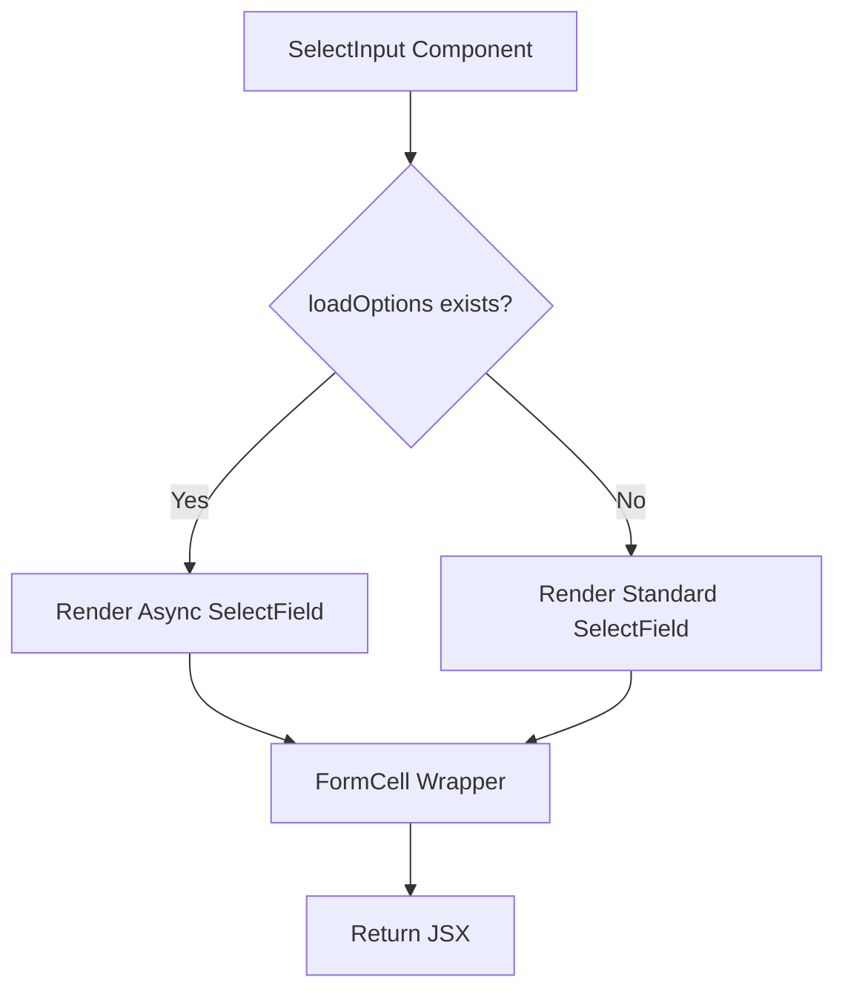
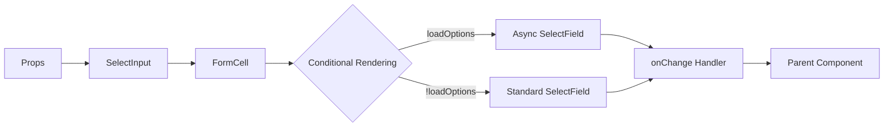
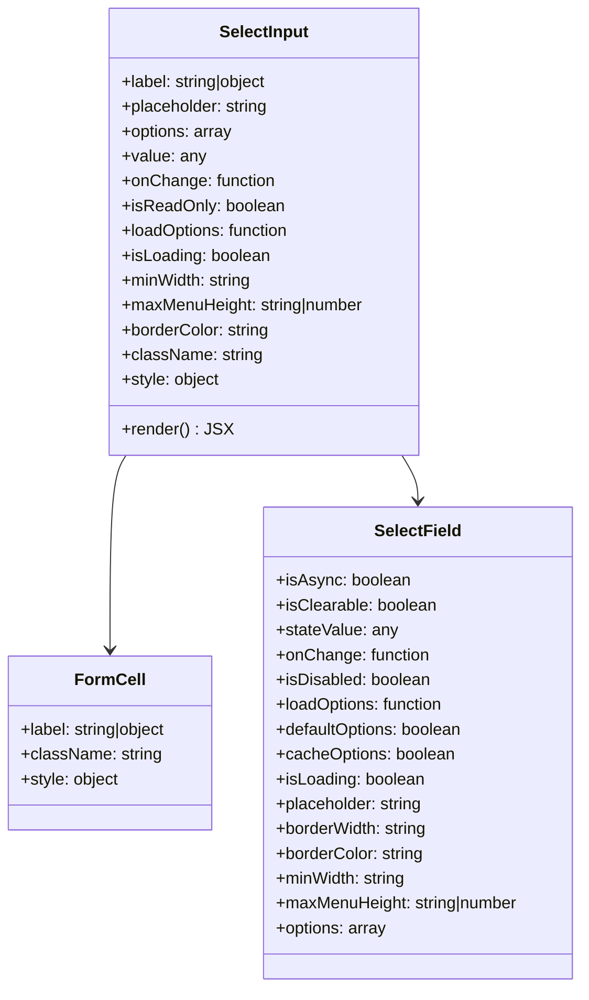

# Diagram: web/portal/src/components-old/forms/inputs/SelectInput.js

> Auto-generated by Obscura crawlers

## Diagram 1

### SVG

<svg id="container" width="566.640625" xmlns="http://www.w3.org/2000/svg" class="flowchart" height="675.796875" viewBox="0 0 566.640625 675.796875" role="graphics-document document" aria-roledescription="flowchart-v2"><g><marker id="container_flowchart-v2-pointEnd" class="marker flowchart-v2" viewBox="0 0 10 10" refX="5" refY="5" markerUnits="userSpaceOnUse" markerWidth="8" markerHeight="8" orient="auto"><path d="M 0 0 L 10 5 L 0 10 z" class="arrowMarkerPath" style="stroke-width: 1; stroke-dasharray: 1, 0;"></path></marker><marker id="container_flowchart-v2-pointStart" class="marker flowchart-v2" viewBox="0 0 10 10" refX="4.5" refY="5" markerUnits="userSpaceOnUse" markerWidth="8" markerHeight="8" orient="auto"><path d="M 0 5 L 10 10 L 10 0 z" class="arrowMarkerPath" style="stroke-width: 1; stroke-dasharray: 1, 0;"></path></marker><marker id="container_flowchart-v2-circleEnd" class="marker flowchart-v2" viewBox="0 0 10 10" refX="11" refY="5" markerUnits="userSpaceOnUse" markerWidth="11" markerHeight="11" orient="auto"><circle cx="5" cy="5" r="5" class="arrowMarkerPath" style="stroke-width: 1; stroke-dasharray: 1, 0;"></circle></marker><marker id="container_flowchart-v2-circleStart" class="marker flowchart-v2" viewBox="0 0 10 10" refX="-1" refY="5" markerUnits="userSpaceOnUse" markerWidth="11" markerHeight="11" orient="auto"><circle cx="5" cy="5" r="5" class="arrowMarkerPath" style="stroke-width: 1; stroke-dasharray: 1, 0;"></circle></marker><marker id="container_flowchart-v2-crossEnd" class="marker cross flowchart-v2" viewBox="0 0 11 11" refX="12" refY="5.2" markerUnits="userSpaceOnUse" markerWidth="11" markerHeight="11" orient="auto"><path d="M 1,1 l 9,9 M 10,1 l -9,9" class="arrowMarkerPath" style="stroke-width: 2; stroke-dasharray: 1, 0;"></path></marker><marker id="container_flowchart-v2-crossStart" class="marker cross flowchart-v2" viewBox="0 0 11 11" refX="-1" refY="5.2" markerUnits="userSpaceOnUse" markerWidth="11" markerHeight="11" orient="auto"><path d="M 1,1 l 9,9 M 10,1 l -9,9" class="arrowMarkerPath" style="stroke-width: 2; stroke-dasharray: 1, 0;"></path></marker><g class="root"><g class="clusters"></g><g class="edgePaths"><path d="M278.48,62L278.48,66.167C278.48,70.333,278.48,78.667,278.48,86.333C278.48,94,278.48,101,278.48,104.5L278.48,108" id="L_A_B_0" class="edge-thickness-normal edge-pattern-solid edge-thickness-normal edge-pattern-solid flowchart-link" style=";" data-edge="true" data-et="edge" data-id="L_A_B_0" data-points="W3sieCI6Mjc4LjQ4MDQ2ODc1LCJ5Ijo2Mn0seyJ4IjoyNzguNDgwNDY4NzUsInkiOjg3fSx7IngiOjI3OC40ODA0Njg3NSwieSI6MTEyfV0=" marker-end="url(#container_flowchart-v2-pointEnd)"></path><path d="M226.911,256.227L210.479,270.989C194.047,285.75,161.184,315.274,144.752,337.535C128.32,359.797,128.32,374.797,128.32,382.297L128.32,389.797" id="L_B_C_0" class="edge-thickness-normal edge-pattern-solid edge-thickness-normal edge-pattern-solid flowchart-link" style=";" data-edge="true" data-et="edge" data-id="L_B_C_0" data-points="W3sieCI6MjI2LjkxMDU2MzQ5NTYzMjA2LCJ5IjoyNTYuMjI2OTY5NzQ1NjMyMDZ9LHsieCI6MTI4LjMyMDMxMjUsInkiOjM0NC43OTY4NzV9LHsieCI6MTI4LjMyMDMxMjUsInkiOjM5My43OTY4NzV9XQ==" marker-end="url(#container_flowchart-v2-pointEnd)"></path><path d="M330.05,256.227L346.482,270.989C362.914,285.75,395.777,315.274,412.209,335.535C428.641,355.797,428.641,366.797,428.641,372.297L428.641,377.797" id="L_B_D_0" class="edge-thickness-normal edge-pattern-solid edge-thickness-normal edge-pattern-solid flowchart-link" style=";" data-edge="true" data-et="edge" data-id="L_B_D_0" data-points="W3sieCI6MzMwLjA1MDM3NDAwNDM2Nzk0LCJ5IjoyNTYuMjI2OTY5NzQ1NjMyMDZ9LHsieCI6NDI4LjY0MDYyNSwieSI6MzQ0Ljc5Njg3NX0seyJ4Ijo0MjguNjQwNjI1LCJ5IjozODEuNzk2ODc1fV0=" marker-end="url(#container_flowchart-v2-pointEnd)"></path><path d="M128.32,447.797L128.32,453.964C128.32,460.13,128.32,472.464,139.722,482.579C151.125,492.694,173.929,500.591,185.331,504.539L196.733,508.488" id="L_C_E_0" class="edge-thickness-normal edge-pattern-solid edge-thickness-normal edge-pattern-solid flowchart-link" style=";" data-edge="true" data-et="edge" data-id="L_C_E_0" data-points="W3sieCI6MTI4LjMyMDMxMjUsInkiOjQ0Ny43OTY4NzV9LHsieCI6MTI4LjMyMDMxMjUsInkiOjQ4NC43OTY4NzV9LHsieCI6MjAwLjUxMjY5NTMxMjUsInkiOjUwOS43OTY4NzV9XQ==" marker-end="url(#container_flowchart-v2-pointEnd)"></path><path d="M428.641,459.797L428.641,463.964C428.641,468.13,428.641,476.464,417.239,484.579C405.836,492.694,383.032,500.591,371.63,504.539L360.228,508.488" id="L_D_E_0" class="edge-thickness-normal edge-pattern-solid edge-thickness-normal edge-pattern-solid flowchart-link" style=";" data-edge="true" data-et="edge" data-id="L_D_E_0" data-points="W3sieCI6NDI4LjY0MDYyNSwieSI6NDU5Ljc5Njg3NX0seyJ4Ijo0MjguNjQwNjI1LCJ5Ijo0ODQuNzk2ODc1fSx7IngiOjM1Ni40NDgyNDIxODc1LCJ5Ijo1MDkuNzk2ODc1fV0=" marker-end="url(#container_flowchart-v2-pointEnd)"></path><path d="M278.48,563.797L278.48,567.964C278.48,572.13,278.48,580.464,278.48,588.13C278.48,595.797,278.48,602.797,278.48,606.297L278.48,609.797" id="L_E_F_0" class="edge-thickness-normal edge-pattern-solid edge-thickness-normal edge-pattern-solid flowchart-link" style=";" data-edge="true" data-et="edge" data-id="L_E_F_0" data-points="W3sieCI6Mjc4LjQ4MDQ2ODc1LCJ5Ijo1NjMuNzk2ODc1fSx7IngiOjI3OC40ODA0Njg3NSwieSI6NTg4Ljc5Njg3NX0seyJ4IjoyNzguNDgwNDY4NzUsInkiOjYxMy43OTY4NzV9XQ==" marker-end="url(#container_flowchart-v2-pointEnd)"></path></g><g class="edgeLabels"><g class="edgeLabel"><g class="label" data-id="L_A_B_0" transform="translate(0, 0)"><foreignObject width="0" height="0">

</foreignObject></g></g><g class="edgeLabel" transform="translate(128.3203125, 344.796875)"><g class="label" data-id="L_B_C_0" transform="translate(-12.03125, -12)"><foreignObject width="24.0625" height="24">

Yes

</foreignObject></g></g><g class="edgeLabel" transform="translate(428.640625, 344.796875)"><g class="label" data-id="L_B_D_0" transform="translate(-10.140625, -12)"><foreignObject width="20.28125" height="24">

No

</foreignObject></g></g><g class="edgeLabel"><g class="label" data-id="L_C_E_0" transform="translate(0, 0)"><foreignObject width="0" height="0">

</foreignObject></g></g><g class="edgeLabel"><g class="label" data-id="L_D_E_0" transform="translate(0, 0)"><foreignObject width="0" height="0">

</foreignObject></g></g><g class="edgeLabel"><g class="label" data-id="L_E_F_0" transform="translate(0, 0)"><foreignObject width="0" height="0">

</foreignObject></g></g></g><g class="nodes"><g class="node default" id="flowchart-A-0" transform="translate(278.48046875, 35)"><rect class="basic label-container" style="" x="-115.4609375" y="-27" width="230.921875" height="54"></rect><g class="label" style="" transform="translate(-85.4609375, -12)"><rect></rect><foreignObject width="170.921875" height="24">

SelectInput Component

</foreignObject></g></g><g class="node default" id="flowchart-B-1" transform="translate(278.48046875, 209.8984375)"><polygon points="97.8984375,0 195.796875,-97.8984375 97.8984375,-195.796875 0,-97.8984375" class="label-container" transform="translate(-97.3984375, 97.8984375)"></polygon><g class="label" style="" transform="translate(-70.8984375, -12)"><rect></rect><foreignObject width="141.796875" height="24">

loadOptions exists?

</foreignObject></g></g><g class="node default" id="flowchart-C-3" transform="translate(128.3203125, 420.796875)"><rect class="basic label-container" style="" x="-120.3203125" y="-27" width="240.640625" height="54"></rect><g class="label" style="" transform="translate(-90.3203125, -12)"><rect></rect><foreignObject width="180.640625" height="24">

Render Async SelectField

</foreignObject></g></g><g class="node default" id="flowchart-D-5" transform="translate(428.640625, 420.796875)"><rect class="basic label-container" style="" x="-130" y="-39" width="260" height="78"></rect><g class="label" style="" transform="translate(-100, -24)"><rect></rect><foreignObject width="200" height="48">

Render Standard SelectField

</foreignObject></g></g><g class="node default" id="flowchart-E-7" transform="translate(278.48046875, 536.796875)"><rect class="basic label-container" style="" x="-94.4375" y="-27" width="188.875" height="54"></rect><g class="label" style="" transform="translate(-64.4375, -12)"><rect></rect><foreignObject width="128.875" height="24">

FormCell Wrapper

</foreignObject></g></g><g class="node default" id="flowchart-F-11" transform="translate(278.48046875, 640.796875)"><rect class="basic label-container" style="" x="-67.5859375" y="-27" width="135.171875" height="54"></rect><g class="label" style="" transform="translate(-37.5859375, -12)"><rect></rect><foreignObject width="75.171875" height="24">

Return JSX

</foreignObject></g></g></g></g></g></svg>

## Diagram 2

### SVG

<svg id="container" width="1590.203125" xmlns="http://www.w3.org/2000/svg" class="flowchart" height="232.140625" viewBox="0 0 1590.203125 232.140625" role="graphics-document document" aria-roledescription="flowchart-v2"><g><marker id="container_flowchart-v2-pointEnd" class="marker flowchart-v2" viewBox="0 0 10 10" refX="5" refY="5" markerUnits="userSpaceOnUse" markerWidth="8" markerHeight="8" orient="auto"><path d="M 0 0 L 10 5 L 0 10 z" class="arrowMarkerPath" style="stroke-width: 1; stroke-dasharray: 1, 0;"></path></marker><marker id="container_flowchart-v2-pointStart" class="marker flowchart-v2" viewBox="0 0 10 10" refX="4.5" refY="5" markerUnits="userSpaceOnUse" markerWidth="8" markerHeight="8" orient="auto"><path d="M 0 5 L 10 10 L 10 0 z" class="arrowMarkerPath" style="stroke-width: 1; stroke-dasharray: 1, 0;"></path></marker><marker id="container_flowchart-v2-circleEnd" class="marker flowchart-v2" viewBox="0 0 10 10" refX="11" refY="5" markerUnits="userSpaceOnUse" markerWidth="11" markerHeight="11" orient="auto"><circle cx="5" cy="5" r="5" class="arrowMarkerPath" style="stroke-width: 1; stroke-dasharray: 1, 0;"></circle></marker><marker id="container_flowchart-v2-circleStart" class="marker flowchart-v2" viewBox="0 0 10 10" refX="-1" refY="5" markerUnits="userSpaceOnUse" markerWidth="11" markerHeight="11" orient="auto"><circle cx="5" cy="5" r="5" class="arrowMarkerPath" style="stroke-width: 1; stroke-dasharray: 1, 0;"></circle></marker><marker id="container_flowchart-v2-crossEnd" class="marker cross flowchart-v2" viewBox="0 0 11 11" refX="12" refY="5.2" markerUnits="userSpaceOnUse" markerWidth="11" markerHeight="11" orient="auto"><path d="M 1,1 l 9,9 M 10,1 l -9,9" class="arrowMarkerPath" style="stroke-width: 2; stroke-dasharray: 1, 0;"></path></marker><marker id="container_flowchart-v2-crossStart" class="marker cross flowchart-v2" viewBox="0 0 11 11" refX="-1" refY="5.2" markerUnits="userSpaceOnUse" markerWidth="11" markerHeight="11" orient="auto"><path d="M 1,1 l 9,9 M 10,1 l -9,9" class="arrowMarkerPath" style="stroke-width: 2; stroke-dasharray: 1, 0;"></path></marker><g class="root"><g class="clusters"></g><g class="edgePaths"><path d="M109,116.07L113.167,116.07C117.333,116.07,125.667,116.07,133.333,116.07C141,116.07,148,116.07,151.5,116.07L155,116.07" id="L_A_B_0" class="edge-thickness-normal edge-pattern-solid edge-thickness-normal edge-pattern-solid flowchart-link" style=";" data-edge="true" data-et="edge" data-id="L_A_B_0" data-points="W3sieCI6MTA5LCJ5IjoxMTYuMDcwMzEyNX0seyJ4IjoxMzQsInkiOjExNi4wNzAzMTI1fSx7IngiOjE1OSwieSI6MTE2LjA3MDMxMjV9XQ==" marker-end="url(#container_flowchart-v2-pointEnd)"></path><path d="M301.891,116.07L306.057,116.07C310.224,116.07,318.557,116.07,326.224,116.07C333.891,116.07,340.891,116.07,344.391,116.07L347.891,116.07" id="L_B_C_0" class="edge-thickness-normal edge-pattern-solid edge-thickness-normal edge-pattern-solid flowchart-link" style=";" data-edge="true" data-et="edge" data-id="L_B_C_0" data-points="W3sieCI6MzAxLjg5MDYyNSwieSI6MTE2LjA3MDMxMjV9LHsieCI6MzI2Ljg5MDYyNSwieSI6MTE2LjA3MDMxMjV9LHsieCI6MzUxLjg5MDYyNSwieSI6MTE2LjA3MDMxMjV9XQ==" marker-end="url(#container_flowchart-v2-pointEnd)"></path><path d="M475.156,116.07L479.323,116.07C483.49,116.07,491.823,116.07,499.49,116.07C507.156,116.07,514.156,116.07,517.656,116.07L521.156,116.07" id="L_C_D_0" class="edge-thickness-normal edge-pattern-solid edge-thickness-normal edge-pattern-solid flowchart-link" style=";" data-edge="true" data-et="edge" data-id="L_C_D_0" data-points="W3sieCI6NDc1LjE1NjI1LCJ5IjoxMTYuMDcwMzEyNX0seyJ4Ijo1MDAuMTU2MjUsInkiOjExNi4wNzAzMTI1fSx7IngiOjUyNS4xNTYyNSwieSI6MTE2LjA3MDMxMjV9XQ==" marker-end="url(#container_flowchart-v2-pointEnd)"></path><path d="M717.028,91.802L732.989,87.18C748.949,82.558,780.869,73.314,810.139,68.692C839.409,64.07,866.029,64.07,879.339,64.07L892.648,64.07" id="L_D_E_0" class="edge-thickness-normal edge-pattern-solid edge-thickness-normal edge-pattern-solid flowchart-link" style=";" data-edge="true" data-et="edge" data-id="L_D_E_0" data-points="W3sieCI6NzE3LjAyODQ1Mzk0NzM2ODUsInkiOjkxLjgwMTg5MTQ0NzM2ODQyfSx7IngiOjgxMi43ODkwNjI1LCJ5Ijo2NC4wNzAzMTI1fSx7IngiOjg5Ni42NDg0Mzc1LCJ5Ijo2NC4wNzAzMTI1fV0=" marker-end="url(#container_flowchart-v2-pointEnd)"></path><path d="M717.028,140.339L732.989,144.961C748.949,149.583,780.869,158.826,808.078,163.448C835.286,168.07,857.784,168.07,869.033,168.07L880.281,168.07" id="L_D_F_0" class="edge-thickness-normal edge-pattern-solid edge-thickness-normal edge-pattern-solid flowchart-link" style=";" data-edge="true" data-et="edge" data-id="L_D_F_0" data-points="W3sieCI6NzE3LjAyODQ1Mzk0NzM2ODUsInkiOjE0MC4zMzg3MzM1NTI2MzE1N30seyJ4Ijo4MTIuNzg5MDYyNSwieSI6MTY4LjA3MDMxMjV9LHsieCI6ODg0LjI4MTI1LCJ5IjoxNjguMDcwMzEyNX1d" marker-end="url(#container_flowchart-v2-pointEnd)"></path><path d="M1081.055,64.07L1087.283,64.07C1093.51,64.07,1105.966,64.07,1121.358,67.976C1136.75,71.881,1155.079,79.692,1164.243,83.597L1173.407,87.502" id="L_E_G_0" class="edge-thickness-normal edge-pattern-solid edge-thickness-normal edge-pattern-solid flowchart-link" style=";" data-edge="true" data-et="edge" data-id="L_E_G_0" data-points="W3sieCI6MTA4MS4wNTQ2ODc1LCJ5Ijo2NC4wNzAzMTI1fSx7IngiOjExMTguNDIxODc1LCJ5Ijo2NC4wNzAzMTI1fSx7IngiOjExNzcuMDg2OTg5MTgyNjkyNCwieSI6ODkuMDcwMzEyNX1d" marker-end="url(#container_flowchart-v2-pointEnd)"></path><path d="M1093.422,168.07L1097.589,168.07C1101.755,168.07,1110.089,168.07,1123.419,164.165C1136.75,160.26,1155.079,152.449,1164.243,148.544L1173.407,144.638" id="L_F_G_0" class="edge-thickness-normal edge-pattern-solid edge-thickness-normal edge-pattern-solid flowchart-link" style=";" data-edge="true" data-et="edge" data-id="L_F_G_0" data-points="W3sieCI6MTA5My40MjE4NzUsInkiOjE2OC4wNzAzMTI1fSx7IngiOjExMTguNDIxODc1LCJ5IjoxNjguMDcwMzEyNX0seyJ4IjoxMTc3LjA4Njk4OTE4MjY5MjQsInkiOjE0My4wNzAzMTI1fV0=" marker-end="url(#container_flowchart-v2-pointEnd)"></path><path d="M1337.469,116.07L1341.635,116.07C1345.802,116.07,1354.135,116.07,1361.802,116.07C1369.469,116.07,1376.469,116.07,1379.969,116.07L1383.469,116.07" id="L_G_H_0" class="edge-thickness-normal edge-pattern-solid edge-thickness-normal edge-pattern-solid flowchart-link" style=";" data-edge="true" data-et="edge" data-id="L_G_H_0" data-points="W3sieCI6MTMzNy40Njg3NSwieSI6MTE2LjA3MDMxMjV9LHsieCI6MTM2Mi40Njg3NSwieSI6MTE2LjA3MDMxMjV9LHsieCI6MTM4Ny40Njg3NSwieSI6MTE2LjA3MDMxMjV9XQ==" marker-end="url(#container_flowchart-v2-pointEnd)"></path></g><g class="edgeLabels"><g class="edgeLabel"><g class="label" data-id="L_A_B_0" transform="translate(0, 0)"><foreignObject width="0" height="0">

</foreignObject></g></g><g class="edgeLabel"><g class="label" data-id="L_B_C_0" transform="translate(0, 0)"><foreignObject width="0" height="0">

</foreignObject></g></g><g class="edgeLabel"><g class="label" data-id="L_C_D_0" transform="translate(0, 0)"><foreignObject width="0" height="0">

</foreignObject></g></g><g class="edgeLabel" transform="translate(812.7890625, 64.0703125)"><g class="label" data-id="L_D_E_0" transform="translate(-44.5625, -12)"><foreignObject width="89.125" height="24">

loadOptions

</foreignObject></g></g><g class="edgeLabel" transform="translate(812.7890625, 168.0703125)"><g class="label" data-id="L_D_F_0" transform="translate(-46.4921875, -12)"><foreignObject width="92.984375" height="24">

!loadOptions

</foreignObject></g></g><g class="edgeLabel"><g class="label" data-id="L_E_G_0" transform="translate(0, 0)"><foreignObject width="0" height="0">

</foreignObject></g></g><g class="edgeLabel"><g class="label" data-id="L_F_G_0" transform="translate(0, 0)"><foreignObject width="0" height="0">

</foreignObject></g></g><g class="edgeLabel"><g class="label" data-id="L_G_H_0" transform="translate(0, 0)"><foreignObject width="0" height="0">

</foreignObject></g></g></g><g class="nodes"><g class="node default" id="flowchart-A-0" transform="translate(58.5, 116.0703125)"><rect class="basic label-container" style="" x="-50.5" y="-27" width="101" height="54"></rect><g class="label" style="" transform="translate(-20.5, -12)"><rect></rect><foreignObject width="41" height="24">

Props

</foreignObject></g></g><g class="node default" id="flowchart-B-1" transform="translate(230.4453125, 116.0703125)"><rect class="basic label-container" style="" x="-71.4453125" y="-27" width="142.890625" height="54"></rect><g class="label" style="" transform="translate(-41.4453125, -12)"><rect></rect><foreignObject width="82.890625" height="24">

SelectInput

</foreignObject></g></g><g class="node default" id="flowchart-C-3" transform="translate(413.5234375, 116.0703125)"><rect class="basic label-container" style="" x="-61.6328125" y="-27" width="123.265625" height="54"></rect><g class="label" style="" transform="translate(-31.6328125, -12)"><rect></rect><foreignObject width="63.265625" height="24">

FormCell

</foreignObject></g></g><g class="node default" id="flowchart-D-5" transform="translate(633.2265625, 116.0703125)"><polygon points="108.0703125,0 216.140625,-108.0703125 108.0703125,-216.140625 0,-108.0703125" class="label-container" transform="translate(-107.5703125, 108.0703125)"></polygon><g class="label" style="" transform="translate(-81.0703125, -12)"><rect></rect><foreignObject width="162.140625" height="24">

Conditional Rendering

</foreignObject></g></g><g class="node default" id="flowchart-E-7" transform="translate(988.8515625, 64.0703125)"><rect class="basic label-container" style="" x="-92.203125" y="-27" width="184.40625" height="54"></rect><g class="label" style="" transform="translate(-62.203125, -12)"><rect></rect><foreignObject width="124.40625" height="24">

Async SelectField

</foreignObject></g></g><g class="node default" id="flowchart-F-9" transform="translate(988.8515625, 168.0703125)"><rect class="basic label-container" style="" x="-104.5703125" y="-27" width="209.140625" height="54"></rect><g class="label" style="" transform="translate(-74.5703125, -12)"><rect></rect><foreignObject width="149.140625" height="24">

Standard SelectField

</foreignObject></g></g><g class="node default" id="flowchart-G-11" transform="translate(1240.4453125, 116.0703125)"><rect class="basic label-container" style="" x="-97.0234375" y="-27" width="194.046875" height="54"></rect><g class="label" style="" transform="translate(-67.0234375, -12)"><rect></rect><foreignObject width="134.046875" height="24">

onChange Handler

</foreignObject></g></g><g class="node default" id="flowchart-H-15" transform="translate(1484.8359375, 116.0703125)"><rect class="basic label-container" style="" x="-97.3671875" y="-27" width="194.734375" height="54"></rect><g class="label" style="" transform="translate(-67.3671875, -12)"><rect></rect><foreignObject width="134.734375" height="24">

Parent Component

</foreignObject></g></g></g></g></g></svg>

## Diagram 3

### SVG

<svg id="container" width="570.6484375" xmlns="http://www.w3.org/2000/svg" class="classDiagram" height="954" viewBox="0 0 570.6484375 954" role="graphics-document document" aria-roledescription="class"><g><defs><marker id="container_class-aggregationStart" class="marker aggregation class" refX="18" refY="7" markerWidth="190" markerHeight="240" orient="auto"><path d="M 18,7 L9,13 L1,7 L9,1 Z"></path></marker></defs><defs><marker id="container_class-aggregationEnd" class="marker aggregation class" refX="1" refY="7" markerWidth="20" markerHeight="28" orient="auto"><path d="M 18,7 L9,13 L1,7 L9,1 Z"></path></marker></defs><defs><marker id="container_class-extensionStart" class="marker extension class" refX="18" refY="7" markerWidth="190" markerHeight="240" orient="auto"><path d="M 1,7 L18,13 V 1 Z"></path></marker></defs><defs><marker id="container_class-extensionEnd" class="marker extension class" refX="1" refY="7" markerWidth="20" markerHeight="28" orient="auto"><path d="M 1,1 V 13 L18,7 Z"></path></marker></defs><defs><marker id="container_class-compositionStart" class="marker composition class" refX="18" refY="7" markerWidth="190" markerHeight="240" orient="auto"><path d="M 18,7 L9,13 L1,7 L9,1 Z"></path></marker></defs><defs><marker id="container_class-compositionEnd" class="marker composition class" refX="1" refY="7" markerWidth="20" markerHeight="28" orient="auto"><path d="M 18,7 L9,13 L1,7 L9,1 Z"></path></marker></defs><defs><marker id="container_class-dependencyStart" class="marker dependency class" refX="6" refY="7" markerWidth="190" markerHeight="240" orient="auto"><path d="M 5,7 L9,13 L1,7 L9,1 Z"></path></marker></defs><defs><marker id="container_class-dependencyEnd" class="marker dependency class" refX="13" refY="7" markerWidth="20" markerHeight="28" orient="auto"><path d="M 18,7 L9,13 L14,7 L9,1 Z"></path></marker></defs><defs><marker id="container_class-lollipopStart" class="marker lollipop class" refX="13" refY="7" markerWidth="190" markerHeight="240" orient="auto"><circle stroke="black" fill="transparent" cx="7" cy="7" r="6"></circle></marker></defs><defs><marker id="container_class-lollipopEnd" class="marker lollipop class" refX="1" refY="7" markerWidth="190" markerHeight="240" orient="auto"><circle stroke="black" fill="transparent" cx="7" cy="7" r="6"></circle></marker></defs><g class="root"><g class="clusters"></g><g class="edgePaths"><path d="M124.622,440L122.009,444.167C119.395,448.333,114.168,456.667,111.555,488C108.941,519.333,108.941,573.667,108.941,600.833L108.941,628" id="id_SelectInput_FormCell_1" class="edge-thickness-normal edge-pattern-solid relation" style=";;;" data-edge="true" data-et="edge" data-id="id_SelectInput_FormCell_1" data-points="W3sieCI6MTI0LjYyMjEyMjk5MDE0NTIxLCJ5Ijo0NDB9LHsieCI6MTA4Ljk0MTQwNjI1LCJ5Ijo0NjV9LHsieCI6MTA4Ljk0MTQwNjI1LCJ5Ijo2MzR9XQ==" marker-end="url(#container_class-dependencyEnd)"></path><path d="M395.585,440L398.198,444.167C400.812,448.333,406.039,456.667,408.652,464C411.266,471.333,411.266,477.667,411.266,480.833L411.266,484" id="id_SelectInput_SelectField_2" class="edge-thickness-normal edge-pattern-solid relation" style=";;;" data-edge="true" data-et="edge" data-id="id_SelectInput_SelectField_2" data-points="W3sieCI6Mzk1LjU4NDkwODI1OTg1NDgsInkiOjQ0MH0seyJ4Ijo0MTEuMjY1NjI1LCJ5Ijo0NjV9LHsieCI6NDExLjI2NTYyNSwieSI6NDkwfV0=" marker-end="url(#container_class-dependencyEnd)"></path></g><g class="edgeLabels"><g class="edgeLabel"><g class="label" data-id="id_SelectInput_FormCell_1" transform="translate(0, 0)"><foreignObject width="0" height="0">

</foreignObject></g></g><g class="edgeLabel"><g class="label" data-id="id_SelectInput_SelectField_2" transform="translate(0, 0)"><foreignObject width="0" height="0">

</foreignObject></g></g></g><g class="nodes"><g class="node default" id="classId-SelectInput-0" transform="translate(260.103515625, 224)"><g class="basic label-container"><path d="M-152.34765625 -216 L152.34765625 -216 L152.34765625 216 L-152.34765625 216" stroke="none" stroke-width="0" fill="#ECECFF" style=""></path><path d="M-152.34765625 -216 C-81.09093321513262 -216, -9.834210180265245 -216, 152.34765625 -216 M-152.34765625 -216 C-91.31242574799262 -216, -30.27719524598524 -216, 152.34765625 -216 M152.34765625 -216 C152.34765625 -111.29025143970452, 152.34765625 -6.580502879409039, 152.34765625 216 M152.34765625 -216 C152.34765625 -65.0288819504078, 152.34765625 85.94223609918441, 152.34765625 216 M152.34765625 216 C48.791898824377725 216, -54.76385860124455 216, -152.34765625 216 M152.34765625 216 C34.37531847689546 216, -83.59701929620908 216, -152.34765625 216 M-152.34765625 216 C-152.34765625 118.0135678268014, -152.34765625 20.027135653602812, -152.34765625 -216 M-152.34765625 216 C-152.34765625 57.21931616883589, -152.34765625 -101.56136766232822, -152.34765625 -216" stroke="#9370DB" stroke-width="1.3" fill="none" stroke-dasharray="0 0" style=""></path></g><g class="annotation-group text" transform="translate(0, -192)"></g><g class="label-group text" transform="translate(-42.0703125, -192)"><g class="label" style="font-weight: bolder" transform="translate(0,-12)"><foreignObject width="84.140625" height="24">

SelectInput

</foreignObject></g></g><g class="members-group text" transform="translate(-140.34765625, -144)"><g class="label" style="" transform="translate(0,-12)"><foreignObject width="146.015625" height="24">

+label: string|object

</foreignObject></g><g class="label" style="" transform="translate(0,12)"><foreignObject width="144.515625" height="24">

+placeholder: string

</foreignObject></g><g class="label" style="" transform="translate(0,36)"><foreignObject width="108.234375" height="24">

+options: array

</foreignObject></g><g class="label" style="" transform="translate(0,60)"><foreignObject width="80.625" height="24">

+value: any

</foreignObject></g><g class="label" style="" transform="translate(0,84)"><foreignObject width="148.53125" height="24">

+onChange: function

</foreignObject></g><g class="label" style="" transform="translate(0,108)"><foreignObject width="156.6875" height="24">

+isReadOnly: boolean

</foreignObject></g><g class="label" style="" transform="translate(0,132)"><foreignObject width="165.890625" height="24">

+loadOptions: function

</foreignObject></g><g class="label" style="" transform="translate(0,156)"><foreignObject width="144.734375" height="24">

+isLoading: boolean

</foreignObject></g><g class="label" style="" transform="translate(0,180)"><foreignObject width="127.75" height="24">

+minWidth: string

</foreignObject></g><g class="label" style="" transform="translate(0,204)"><foreignObject width="238.625" height="24">

+maxMenuHeight: string|number

</foreignObject></g><g class="label" style="" transform="translate(0,228)"><foreignObject width="144.984375" height="24">

+borderColor: string

</foreignObject></g><g class="label" style="" transform="translate(0,252)"><foreignObject width="135.359375" height="24">

+className: string

</foreignObject></g><g class="label" style="" transform="translate(0,276)"><foreignObject width="95.90625" height="24">

+style: object

</foreignObject></g></g><g class="methods-group text" transform="translate(-140.34765625, 192)"><g class="label" style="" transform="translate(0,-12)"><foreignObject width="101.0625" height="24">

+render() : JSX

</foreignObject></g></g><g class="divider" style=""><path d="M-152.34765625 -168 C-87.68434323265261 -168, -23.021030215305217 -168, 152.34765625 -168 M-152.34765625 -168 C-89.96698593801023 -168, -27.58631562602045 -168, 152.34765625 -168" stroke="#9370DB" stroke-width="1.3" fill="none" stroke-dasharray="0 0" style=""></path></g><g class="divider" style=""><path d="M-152.34765625 168 C-89.85715219120138 168, -27.36664813240276 168, 152.34765625 168 M-152.34765625 168 C-70.71727430068515 168, 10.913107648629705 168, 152.34765625 168" stroke="#9370DB" stroke-width="1.3" fill="none" stroke-dasharray="0 0" style=""></path></g></g><g class="node default" id="classId-FormCell-1" transform="translate(108.94140625, 718)"><g class="basic label-container"><path d="M-100.94140625 -84 L100.94140625 -84 L100.94140625 84 L-100.94140625 84" stroke="none" stroke-width="0" fill="#ECECFF" style=""></path><path d="M-100.94140625 -84 C-41.68785547515242 -84, 17.565695299695165 -84, 100.94140625 -84 M-100.94140625 -84 C-49.11705721841986 -84, 2.707291813160282 -84, 100.94140625 -84 M100.94140625 -84 C100.94140625 -33.33745008195766, 100.94140625 17.325099836084675, 100.94140625 84 M100.94140625 -84 C100.94140625 -29.755429386896672, 100.94140625 24.489141226206655, 100.94140625 84 M100.94140625 84 C25.01072375167574 84, -50.91995874664852 84, -100.94140625 84 M100.94140625 84 C38.098950811981965 84, -24.74350462603607 84, -100.94140625 84 M-100.94140625 84 C-100.94140625 43.22044942478062, -100.94140625 2.4408988495612363, -100.94140625 -84 M-100.94140625 84 C-100.94140625 26.833951844617275, -100.94140625 -30.33209631076545, -100.94140625 -84" stroke="#9370DB" stroke-width="1.3" fill="none" stroke-dasharray="0 0" style=""></path></g><g class="annotation-group text" transform="translate(0, -60)"></g><g class="label-group text" transform="translate(-31.8671875, -60)"><g class="label" style="font-weight: bolder" transform="translate(0,-12)"><foreignObject width="63.734375" height="24">

FormCell

</foreignObject></g></g><g class="members-group text" transform="translate(-88.94140625, -12)"><g class="label" style="" transform="translate(0,-12)"><foreignObject width="146.015625" height="24">

+label: string|object

</foreignObject></g><g class="label" style="" transform="translate(0,12)"><foreignObject width="135.359375" height="24">

+className: string

</foreignObject></g><g class="label" style="" transform="translate(0,36)"><foreignObject width="95.90625" height="24">

+style: object

</foreignObject></g></g><g class="methods-group text" transform="translate(-88.94140625, 84)"></g><g class="divider" style=""><path d="M-100.94140625 -36 C-28.287190521450526 -36, 44.36702520709895 -36, 100.94140625 -36 M-100.94140625 -36 C-53.40960262717678 -36, -5.877799004353562 -36, 100.94140625 -36" stroke="#9370DB" stroke-width="1.3" fill="none" stroke-dasharray="0 0" style=""></path></g><g class="divider" style=""><path d="M-100.94140625 60 C-60.50948362634769 60, -20.077561002695376 60, 100.94140625 60 M-100.94140625 60 C-41.72730168546178 60, 17.486802879076436 60, 100.94140625 60" stroke="#9370DB" stroke-width="1.3" fill="none" stroke-dasharray="0 0" style=""></path></g></g><g class="node default" id="classId-SelectField-2" transform="translate(411.265625, 718)"><g class="basic label-container"><path d="M-151.3828125 -228 L151.3828125 -228 L151.3828125 228 L-151.3828125 228" stroke="none" stroke-width="0" fill="#ECECFF" style=""></path><path d="M-151.3828125 -228 C-71.77554015350759 -228, 7.831732192984816 -228, 151.3828125 -228 M-151.3828125 -228 C-53.73191765217466 -228, 43.91897719565068 -228, 151.3828125 -228 M151.3828125 -228 C151.3828125 -123.01465593613902, 151.3828125 -18.029311872278043, 151.3828125 228 M151.3828125 -228 C151.3828125 -47.79662871136651, 151.3828125 132.40674257726698, 151.3828125 228 M151.3828125 228 C51.56932418559305 228, -48.24416412881391 228, -151.3828125 228 M151.3828125 228 C54.5528900477606 228, -42.2770324044788 228, -151.3828125 228 M-151.3828125 228 C-151.3828125 86.21238122211932, -151.3828125 -55.57523755576136, -151.3828125 -228 M-151.3828125 228 C-151.3828125 55.53823843022599, -151.3828125 -116.92352313954802, -151.3828125 -228" stroke="#9370DB" stroke-width="1.3" fill="none" stroke-dasharray="0 0" style=""></path></g><g class="annotation-group text" transform="translate(0, -204)"></g><g class="label-group text" transform="translate(-40.140625, -204)"><g class="label" style="font-weight: bolder" transform="translate(0,-12)"><foreignObject width="80.28125" height="24">

SelectField

</foreignObject></g></g><g class="members-group text" transform="translate(-139.3828125, -156)"><g class="label" style="" transform="translate(0,-12)"><foreignObject width="128.828125" height="24">

+isAsync: boolean

</foreignObject></g><g class="label" style="" transform="translate(0,12)"><foreignObject width="155.3125" height="24">

+isClearable: boolean

</foreignObject></g><g class="label" style="" transform="translate(0,36)"><foreignObject width="117.53125" height="24">

+stateValue: any

</foreignObject></g><g class="label" style="" transform="translate(0,60)"><foreignObject width="148.53125" height="24">

+onChange: function

</foreignObject></g><g class="label" style="" transform="translate(0,84)"><foreignObject width="150.734375" height="24">

+isDisabled: boolean

</foreignObject></g><g class="label" style="" transform="translate(0,108)"><foreignObject width="165.890625" height="24">

+loadOptions: function

</foreignObject></g><g class="label" style="" transform="translate(0,132)"><foreignObject width="184.34375" height="24">

+defaultOptions: boolean

</foreignObject></g><g class="label" style="" transform="translate(0,156)"><foreignObject width="174.5" height="24">

+cacheOptions: boolean

</foreignObject></g><g class="label" style="" transform="translate(0,180)"><foreignObject width="144.734375" height="24">

+isLoading: boolean

</foreignObject></g><g class="label" style="" transform="translate(0,204)"><foreignObject width="144.515625" height="24">

+placeholder: string

</foreignObject></g><g class="label" style="" transform="translate(0,228)"><foreignObject width="149.15625" height="24">

+borderWidth: string

</foreignObject></g><g class="label" style="" transform="translate(0,252)"><foreignObject width="144.984375" height="24">

+borderColor: string

</foreignObject></g><g class="label" style="" transform="translate(0,276)"><foreignObject width="127.75" height="24">

+minWidth: string

</foreignObject></g><g class="label" style="" transform="translate(0,300)"><foreignObject width="238.625" height="24">

+maxMenuHeight: string|number

</foreignObject></g><g class="label" style="" transform="translate(0,324)"><foreignObject width="108.234375" height="24">

+options: array

</foreignObject></g></g><g class="methods-group text" transform="translate(-139.3828125, 228)"></g><g class="divider" style=""><path d="M-151.3828125 -180 C-42.0962282701807 -180, 67.1903559596386 -180, 151.3828125 -180 M-151.3828125 -180 C-46.15751126797825 -180, 59.0677899640435 -180, 151.3828125 -180" stroke="#9370DB" stroke-width="1.3" fill="none" stroke-dasharray="0 0" style=""></path></g><g class="divider" style=""><path d="M-151.3828125 204 C-33.74972367540008 204, 83.88336514919985 204, 151.3828125 204 M-151.3828125 204 C-83.45644390755793 204, -15.530075315115852 204, 151.3828125 204" stroke="#9370DB" stroke-width="1.3" fill="none" stroke-dasharray="0 0" style=""></path></g></g></g></g></g></svg>
