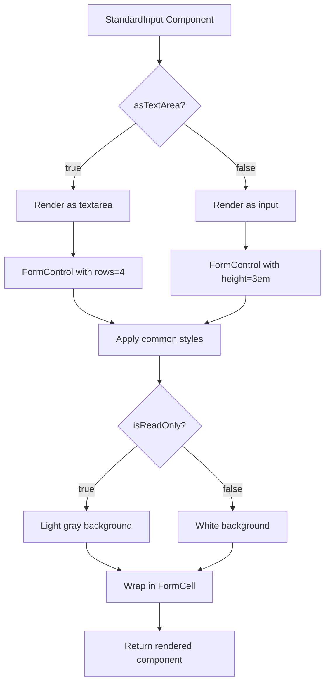
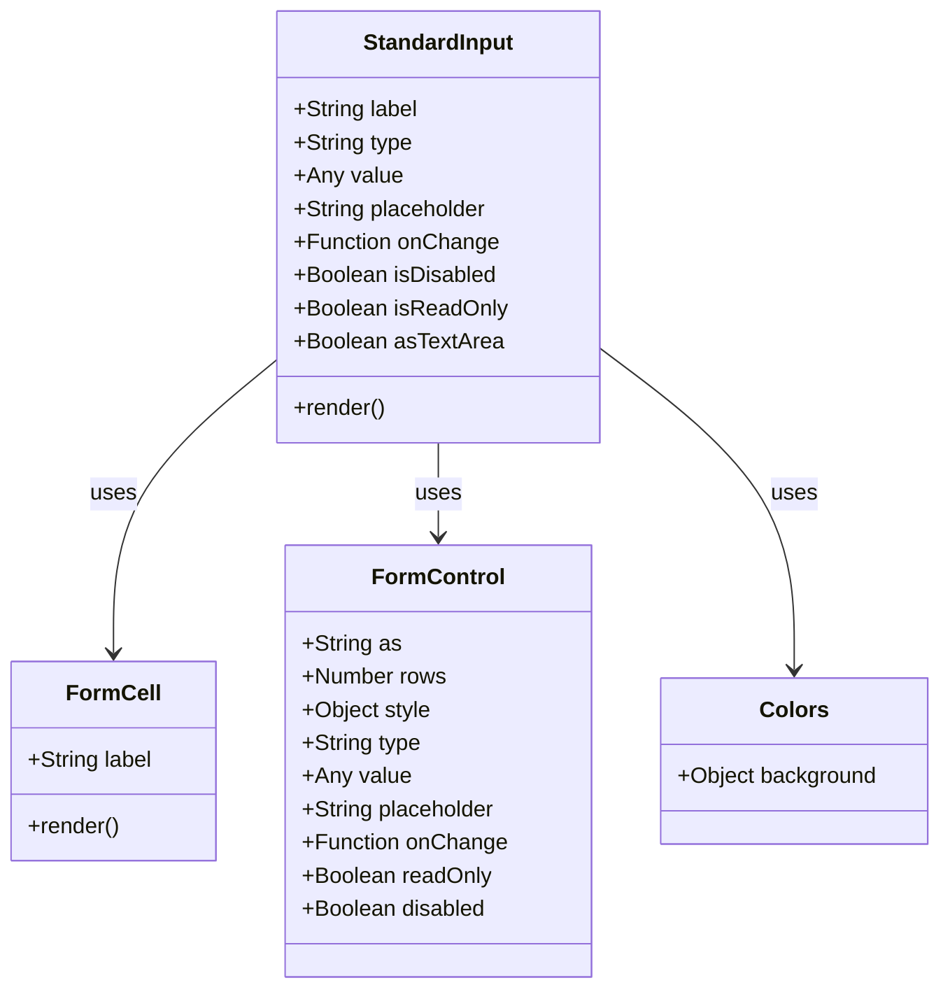
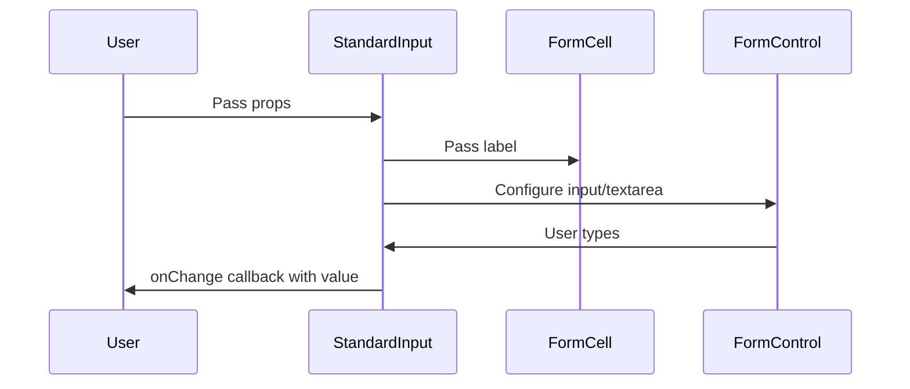

# Diagram: web/portal/src/components-old/forms/inputs/StandardInput.js

> Auto-generated by Obscura crawlers

## Diagram 1

### SVG

<svg id="container" width="565.515625" xmlns="http://www.w3.org/2000/svg" class="flowchart" height="1170.484375" viewBox="0 0 565.515625 1170.484375" role="graphics-document document" aria-roledescription="flowchart-v2"><g><marker id="container_flowchart-v2-pointEnd" class="marker flowchart-v2" viewBox="0 0 10 10" refX="5" refY="5" markerUnits="userSpaceOnUse" markerWidth="8" markerHeight="8" orient="auto"><path d="M 0 0 L 10 5 L 0 10 z" class="arrowMarkerPath" style="stroke-width: 1; stroke-dasharray: 1, 0;"></path></marker><marker id="container_flowchart-v2-pointStart" class="marker flowchart-v2" viewBox="0 0 10 10" refX="4.5" refY="5" markerUnits="userSpaceOnUse" markerWidth="8" markerHeight="8" orient="auto"><path d="M 0 5 L 10 10 L 10 0 z" class="arrowMarkerPath" style="stroke-width: 1; stroke-dasharray: 1, 0;"></path></marker><marker id="container_flowchart-v2-circleEnd" class="marker flowchart-v2" viewBox="0 0 10 10" refX="11" refY="5" markerUnits="userSpaceOnUse" markerWidth="11" markerHeight="11" orient="auto"><circle cx="5" cy="5" r="5" class="arrowMarkerPath" style="stroke-width: 1; stroke-dasharray: 1, 0;"></circle></marker><marker id="container_flowchart-v2-circleStart" class="marker flowchart-v2" viewBox="0 0 10 10" refX="-1" refY="5" markerUnits="userSpaceOnUse" markerWidth="11" markerHeight="11" orient="auto"><circle cx="5" cy="5" r="5" class="arrowMarkerPath" style="stroke-width: 1; stroke-dasharray: 1, 0;"></circle></marker><marker id="container_flowchart-v2-crossEnd" class="marker cross flowchart-v2" viewBox="0 0 11 11" refX="12" refY="5.2" markerUnits="userSpaceOnUse" markerWidth="11" markerHeight="11" orient="auto"><path d="M 1,1 l 9,9 M 10,1 l -9,9" class="arrowMarkerPath" style="stroke-width: 2; stroke-dasharray: 1, 0;"></path></marker><marker id="container_flowchart-v2-crossStart" class="marker cross flowchart-v2" viewBox="0 0 11 11" refX="-1" refY="5.2" markerUnits="userSpaceOnUse" markerWidth="11" markerHeight="11" orient="auto"><path d="M 1,1 l 9,9 M 10,1 l -9,9" class="arrowMarkerPath" style="stroke-width: 2; stroke-dasharray: 1, 0;"></path></marker><g class="root"><g class="clusters"></g><g class="edgePaths"><path d="M277.637,62L277.637,66.167C277.637,70.333,277.637,78.667,277.637,86.333C277.637,94,277.637,101,277.637,104.5L277.637,108" id="L_A_B_0" class="edge-thickness-normal edge-pattern-solid edge-thickness-normal edge-pattern-solid flowchart-link" style=";" data-edge="true" data-et="edge" data-id="L_A_B_0" data-points="W3sieCI6Mjc3LjYzNjcxODc1LCJ5Ijo2Mn0seyJ4IjoyNzcuNjM2NzE4NzUsInkiOjg3fSx7IngiOjI3Ny42MzY3MTg3NSwieSI6MTEyfV0=" marker-end="url(#container_flowchart-v2-pointEnd)"></path><path d="M237.11,209.989L218.885,222.91C200.66,235.831,164.209,261.674,145.983,280.095C127.758,298.516,127.758,309.516,127.758,315.016L127.758,320.516" id="L_B_C_0" class="edge-thickness-normal edge-pattern-solid edge-thickness-normal edge-pattern-solid flowchart-link" style=";" data-edge="true" data-et="edge" data-id="L_B_C_0" data-points="W3sieCI6MjM3LjExMDM3MzE0Mjc1NzQ4LCJ5IjoyMDkuOTg5Mjc5MzkyNzU3NDh9LHsieCI6MTI3Ljc1NzgxMjUsInkiOjI4Ny41MTU2MjV9LHsieCI6MTI3Ljc1NzgxMjUsInkiOjMyNC41MTU2MjV9XQ==" marker-end="url(#container_flowchart-v2-pointEnd)"></path><path d="M318.163,209.989L336.388,222.91C354.614,235.831,391.065,261.674,409.29,280.095C427.516,298.516,427.516,309.516,427.516,315.016L427.516,320.516" id="L_B_D_0" class="edge-thickness-normal edge-pattern-solid edge-thickness-normal edge-pattern-solid flowchart-link" style=";" data-edge="true" data-et="edge" data-id="L_B_D_0" data-points="W3sieCI6MzE4LjE2MzA2NDM1NzI0MjU1LCJ5IjoyMDkuOTg5Mjc5MzkyNzU3NDh9LHsieCI6NDI3LjUxNTYyNSwieSI6Mjg3LjUxNTYyNX0seyJ4Ijo0MjcuNTE1NjI1LCJ5IjozMjQuNTE1NjI1fV0=" marker-end="url(#container_flowchart-v2-pointEnd)"></path><path d="M127.758,378.516L127.758,382.682C127.758,386.849,127.758,395.182,127.758,404.849C127.758,414.516,127.758,425.516,127.758,431.016L127.758,436.516" id="L_C_E_0" class="edge-thickness-normal edge-pattern-solid edge-thickness-normal edge-pattern-solid flowchart-link" style=";" data-edge="true" data-et="edge" data-id="L_C_E_0" data-points="W3sieCI6MTI3Ljc1NzgxMjUsInkiOjM3OC41MTU2MjV9LHsieCI6MTI3Ljc1NzgxMjUsInkiOjQwMy41MTU2MjV9LHsieCI6MTI3Ljc1NzgxMjUsInkiOjQ0MC41MTU2MjV9XQ==" marker-end="url(#container_flowchart-v2-pointEnd)"></path><path d="M427.516,378.516L427.516,382.682C427.516,386.849,427.516,395.182,427.516,402.849C427.516,410.516,427.516,417.516,427.516,421.016L427.516,424.516" id="L_D_F_0" class="edge-thickness-normal edge-pattern-solid edge-thickness-normal edge-pattern-solid flowchart-link" style=";" data-edge="true" data-et="edge" data-id="L_D_F_0" data-points="W3sieCI6NDI3LjUxNTYyNSwieSI6Mzc4LjUxNTYyNX0seyJ4Ijo0MjcuNTE1NjI1LCJ5Ijo0MDMuNTE1NjI1fSx7IngiOjQyNy41MTU2MjUsInkiOjQyOC41MTU2MjV9XQ==" marker-end="url(#container_flowchart-v2-pointEnd)"></path><path d="M127.758,494.516L127.758,500.682C127.758,506.849,127.758,519.182,139.138,529.297C150.517,539.412,173.277,547.308,184.656,551.256L196.036,555.205" id="L_E_G_0" class="edge-thickness-normal edge-pattern-solid edge-thickness-normal edge-pattern-solid flowchart-link" style=";" data-edge="true" data-et="edge" data-id="L_E_G_0" data-points="W3sieCI6MTI3Ljc1NzgxMjUsInkiOjQ5NC41MTU2MjV9LHsieCI6MTI3Ljc1NzgxMjUsInkiOjUzMS41MTU2MjV9LHsieCI6MTk5LjgxNDk3ODk2NjM0NjE2LCJ5Ijo1NTYuNTE1NjI1fV0=" marker-end="url(#container_flowchart-v2-pointEnd)"></path><path d="M427.516,506.516L427.516,510.682C427.516,514.849,427.516,523.182,416.136,531.297C404.756,539.412,381.997,547.308,370.617,551.256L359.237,555.205" id="L_F_G_0" class="edge-thickness-normal edge-pattern-solid edge-thickness-normal edge-pattern-solid flowchart-link" style=";" data-edge="true" data-et="edge" data-id="L_F_G_0" data-points="W3sieCI6NDI3LjUxNTYyNSwieSI6NTA2LjUxNTYyNX0seyJ4Ijo0MjcuNTE1NjI1LCJ5Ijo1MzEuNTE1NjI1fSx7IngiOjM1NS40NTg0NTg1MzM2NTM4LCJ5Ijo1NTYuNTE1NjI1fV0=" marker-end="url(#container_flowchart-v2-pointEnd)"></path><path d="M277.637,610.516L277.637,614.682C277.637,618.849,277.637,627.182,277.637,634.849C277.637,642.516,277.637,649.516,277.637,653.016L277.637,656.516" id="L_G_H_0" class="edge-thickness-normal edge-pattern-solid edge-thickness-normal edge-pattern-solid flowchart-link" style=";" data-edge="true" data-et="edge" data-id="L_G_H_0" data-points="W3sieCI6Mjc3LjYzNjcxODc1LCJ5Ijo2MTAuNTE1NjI1fSx7IngiOjI3Ny42MzY3MTg3NSwieSI6NjM1LjUxNTYyNX0seyJ4IjoyNzcuNjM2NzE4NzUsInkiOjY2MC41MTU2MjV9XQ==" marker-end="url(#container_flowchart-v2-pointEnd)"></path><path d="M239.165,764.013L224.281,776.591C209.396,789.17,179.628,814.327,164.744,832.406C149.859,850.484,149.859,861.484,149.859,866.984L149.859,872.484" id="L_H_I_0" class="edge-thickness-normal edge-pattern-solid edge-thickness-normal edge-pattern-solid flowchart-link" style=";" data-edge="true" data-et="edge" data-id="L_H_I_0" data-points="W3sieCI6MjM5LjE2NDg0NTgyMTA3OTQ0LCJ5Ijo3NjQuMDEyNTAyMDcxMDc5NH0seyJ4IjoxNDkuODU5Mzc1LCJ5Ijo4MzkuNDg0Mzc1fSx7IngiOjE0OS44NTkzNzUsInkiOjg3Ni40ODQzNzV9XQ==" marker-end="url(#container_flowchart-v2-pointEnd)"></path><path d="M316.109,764.013L330.993,776.591C345.877,789.17,375.646,814.327,390.53,832.406C405.414,850.484,405.414,861.484,405.414,866.984L405.414,872.484" id="L_H_J_0" class="edge-thickness-normal edge-pattern-solid edge-thickness-normal edge-pattern-solid flowchart-link" style=";" data-edge="true" data-et="edge" data-id="L_H_J_0" data-points="W3sieCI6MzE2LjEwODU5MTY3ODkyMDU2LCJ5Ijo3NjQuMDEyNTAyMDcxMDc5NH0seyJ4Ijo0MDUuNDE0MDYyNSwieSI6ODM5LjQ4NDM3NX0seyJ4Ijo0MDUuNDE0MDYyNSwieSI6ODc2LjQ4NDM3NX1d" marker-end="url(#container_flowchart-v2-pointEnd)"></path><path d="M149.859,930.484L149.859,934.651C149.859,938.818,149.859,947.151,159.48,955.233C169.102,963.315,188.344,971.146,197.965,975.061L207.586,978.977" id="L_I_K_0" class="edge-thickness-normal edge-pattern-solid edge-thickness-normal edge-pattern-solid flowchart-link" style=";" data-edge="true" data-et="edge" data-id="L_I_K_0" data-points="W3sieCI6MTQ5Ljg1OTM3NSwieSI6OTMwLjQ4NDM3NX0seyJ4IjoxNDkuODU5Mzc1LCJ5Ijo5NTUuNDg0Mzc1fSx7IngiOjIxMS4yOTA3OTAyNjQ0MjMxLCJ5Ijo5ODAuNDg0Mzc1fV0=" marker-end="url(#container_flowchart-v2-pointEnd)"></path><path d="M405.414,930.484L405.414,934.651C405.414,938.818,405.414,947.151,395.793,955.233C386.172,963.315,366.93,971.146,357.309,975.061L347.688,978.977" id="L_J_K_0" class="edge-thickness-normal edge-pattern-solid edge-thickness-normal edge-pattern-solid flowchart-link" style=";" data-edge="true" data-et="edge" data-id="L_J_K_0" data-points="W3sieCI6NDA1LjQxNDA2MjUsInkiOjkzMC40ODQzNzV9LHsieCI6NDA1LjQxNDA2MjUsInkiOjk1NS40ODQzNzV9LHsieCI6MzQzLjk4MjY0NzIzNTU3NjksInkiOjk4MC40ODQzNzV9XQ==" marker-end="url(#container_flowchart-v2-pointEnd)"></path><path d="M277.637,1034.484L277.637,1038.651C277.637,1042.818,277.637,1051.151,277.637,1058.818C277.637,1066.484,277.637,1073.484,277.637,1076.984L277.637,1080.484" id="L_K_L_0" class="edge-thickness-normal edge-pattern-solid edge-thickness-normal edge-pattern-solid flowchart-link" style=";" data-edge="true" data-et="edge" data-id="L_K_L_0" data-points="W3sieCI6Mjc3LjYzNjcxODc1LCJ5IjoxMDM0LjQ4NDM3NX0seyJ4IjoyNzcuNjM2NzE4NzUsInkiOjEwNTkuNDg0Mzc1fSx7IngiOjI3Ny42MzY3MTg3NSwieSI6MTA4NC40ODQzNzV9XQ==" marker-end="url(#container_flowchart-v2-pointEnd)"></path></g><g class="edgeLabels"><g class="edgeLabel"><g class="label" data-id="L_A_B_0" transform="translate(0, 0)"><foreignObject width="0" height="0">

</foreignObject></g></g><g class="edgeLabel" transform="translate(127.7578125, 287.515625)"><g class="label" data-id="L_B_C_0" transform="translate(-14.9921875, -12)"><foreignObject width="29.984375" height="24">

true

</foreignObject></g></g><g class="edgeLabel" transform="translate(427.515625, 287.515625)"><g class="label" data-id="L_B_D_0" transform="translate(-17.21875, -12)"><foreignObject width="34.4375" height="24">

false

</foreignObject></g></g><g class="edgeLabel"><g class="label" data-id="L_C_E_0" transform="translate(0, 0)"><foreignObject width="0" height="0">

</foreignObject></g></g><g class="edgeLabel"><g class="label" data-id="L_D_F_0" transform="translate(0, 0)"><foreignObject width="0" height="0">

</foreignObject></g></g><g class="edgeLabel"><g class="label" data-id="L_E_G_0" transform="translate(0, 0)"><foreignObject width="0" height="0">

</foreignObject></g></g><g class="edgeLabel"><g class="label" data-id="L_F_G_0" transform="translate(0, 0)"><foreignObject width="0" height="0">

</foreignObject></g></g><g class="edgeLabel"><g class="label" data-id="L_G_H_0" transform="translate(0, 0)"><foreignObject width="0" height="0">

</foreignObject></g></g><g class="edgeLabel" transform="translate(149.859375, 839.484375)"><g class="label" data-id="L_H_I_0" transform="translate(-14.9921875, -12)"><foreignObject width="29.984375" height="24">

true

</foreignObject></g></g><g class="edgeLabel" transform="translate(405.4140625, 839.484375)"><g class="label" data-id="L_H_J_0" transform="translate(-17.21875, -12)"><foreignObject width="34.4375" height="24">

false

</foreignObject></g></g><g class="edgeLabel"><g class="label" data-id="L_I_K_0" transform="translate(0, 0)"><foreignObject width="0" height="0">

</foreignObject></g></g><g class="edgeLabel"><g class="label" data-id="L_J_K_0" transform="translate(0, 0)"><foreignObject width="0" height="0">

</foreignObject></g></g><g class="edgeLabel"><g class="label" data-id="L_K_L_0" transform="translate(0, 0)"><foreignObject width="0" height="0">

</foreignObject></g></g></g><g class="nodes"><g class="node default" id="flowchart-A-0" transform="translate(277.63671875, 35)"><rect class="basic label-container" style="" x="-126.3671875" y="-27" width="252.734375" height="54"></rect><g class="label" style="" transform="translate(-96.3671875, -12)"><rect></rect><foreignObject width="192.734375" height="24">

StandardInput Component

</foreignObject></g></g><g class="node default" id="flowchart-B-1" transform="translate(277.63671875, 181.2578125)"><polygon points="69.2578125,0 138.515625,-69.2578125 69.2578125,-138.515625 0,-69.2578125" class="label-container" transform="translate(-68.7578125, 69.2578125)"></polygon><g class="label" style="" transform="translate(-42.2578125, -12)"><rect></rect><foreignObject width="84.515625" height="24">

asTextArea?

</foreignObject></g></g><g class="node default" id="flowchart-C-3" transform="translate(127.7578125, 351.515625)"><rect class="basic label-container" style="" x="-97.8515625" y="-27" width="195.703125" height="54"></rect><g class="label" style="" transform="translate(-67.8515625, -12)"><rect></rect><foreignObject width="135.703125" height="24">

Render as textarea

</foreignObject></g></g><g class="node default" id="flowchart-D-5" transform="translate(427.515625, 351.515625)"><rect class="basic label-container" style="" x="-87.4921875" y="-27" width="174.984375" height="54"></rect><g class="label" style="" transform="translate(-57.4921875, -12)"><rect></rect><foreignObject width="114.984375" height="24">

Render as input

</foreignObject></g></g><g class="node default" id="flowchart-E-7" transform="translate(127.7578125, 467.515625)"><rect class="basic label-container" style="" x="-119.7578125" y="-27" width="239.515625" height="54"></rect><g class="label" style="" transform="translate(-89.7578125, -12)"><rect></rect><foreignObject width="179.515625" height="24">

FormControl with rows=4

</foreignObject></g></g><g class="node default" id="flowchart-F-9" transform="translate(427.515625, 467.515625)"><rect class="basic label-container" style="" x="-130" y="-39" width="260" height="78"></rect><g class="label" style="" transform="translate(-100, -24)"><rect></rect><foreignObject width="200" height="48">

FormControl with height=3em

</foreignObject></g></g><g class="node default" id="flowchart-G-11" transform="translate(277.63671875, 583.515625)"><rect class="basic label-container" style="" x="-106.859375" y="-27" width="213.71875" height="54"></rect><g class="label" style="" transform="translate(-76.859375, -12)"><rect></rect><foreignObject width="153.71875" height="24">

Apply common styles

</foreignObject></g></g><g class="node default" id="flowchart-H-15" transform="translate(277.63671875, 731.5)"><polygon points="70.984375,0 141.96875,-70.984375 70.984375,-141.96875 0,-70.984375" class="label-container" transform="translate(-70.484375, 70.984375)"></polygon><g class="label" style="" transform="translate(-43.984375, -12)"><rect></rect><foreignObject width="87.96875" height="24">

isReadOnly?

</foreignObject></g></g><g class="node default" id="flowchart-I-17" transform="translate(149.859375, 903.484375)"><rect class="basic label-container" style="" x="-110.0546875" y="-27" width="220.109375" height="54"></rect><g class="label" style="" transform="translate(-80.0546875, -12)"><rect></rect><foreignObject width="160.109375" height="24">

Light gray background

</foreignObject></g></g><g class="node default" id="flowchart-J-19" transform="translate(405.4140625, 903.484375)"><rect class="basic label-container" style="" x="-95.5" y="-27" width="191" height="54"></rect><g class="label" style="" transform="translate(-65.5, -12)"><rect></rect><foreignObject width="131" height="24">

White background

</foreignObject></g></g><g class="node default" id="flowchart-K-21" transform="translate(277.63671875, 1007.484375)"><rect class="basic label-container" style="" x="-91.296875" y="-27" width="182.59375" height="54"></rect><g class="label" style="" transform="translate(-61.296875, -12)"><rect></rect><foreignObject width="122.59375" height="24">

Wrap in FormCell

</foreignObject></g></g><g class="node default" id="flowchart-L-25" transform="translate(277.63671875, 1123.484375)"><rect class="basic label-container" style="" x="-130" y="-39" width="260" height="78"></rect><g class="label" style="" transform="translate(-100, -24)"><rect></rect><foreignObject width="200" height="48">

Return rendered component

</foreignObject></g></g></g></g></g></svg>

## Diagram 2

### SVG

<svg id="container" width="670.1875" xmlns="http://www.w3.org/2000/svg" class="classDiagram" height="714" viewBox="0 0 670.1875 714" role="graphics-document document" aria-roledescription="class"><g><defs><marker id="container_class-aggregationStart" class="marker aggregation class" refX="18" refY="7" markerWidth="190" markerHeight="240" orient="auto"><path d="M 18,7 L9,13 L1,7 L9,1 Z"></path></marker></defs><defs><marker id="container_class-aggregationEnd" class="marker aggregation class" refX="1" refY="7" markerWidth="20" markerHeight="28" orient="auto"><path d="M 18,7 L9,13 L1,7 L9,1 Z"></path></marker></defs><defs><marker id="container_class-extensionStart" class="marker extension class" refX="18" refY="7" markerWidth="190" markerHeight="240" orient="auto"><path d="M 1,7 L18,13 V 1 Z"></path></marker></defs><defs><marker id="container_class-extensionEnd" class="marker extension class" refX="1" refY="7" markerWidth="20" markerHeight="28" orient="auto"><path d="M 1,1 V 13 L18,7 Z"></path></marker></defs><defs><marker id="container_class-compositionStart" class="marker composition class" refX="18" refY="7" markerWidth="190" markerHeight="240" orient="auto"><path d="M 18,7 L9,13 L1,7 L9,1 Z"></path></marker></defs><defs><marker id="container_class-compositionEnd" class="marker composition class" refX="1" refY="7" markerWidth="20" markerHeight="28" orient="auto"><path d="M 18,7 L9,13 L1,7 L9,1 Z"></path></marker></defs><defs><marker id="container_class-dependencyStart" class="marker dependency class" refX="6" refY="7" markerWidth="190" markerHeight="240" orient="auto"><path d="M 5,7 L9,13 L1,7 L9,1 Z"></path></marker></defs><defs><marker id="container_class-dependencyEnd" class="marker dependency class" refX="13" refY="7" markerWidth="20" markerHeight="28" orient="auto"><path d="M 18,7 L9,13 L14,7 L9,1 Z"></path></marker></defs><defs><marker id="container_class-lollipopStart" class="marker lollipop class" refX="13" refY="7" markerWidth="190" markerHeight="240" orient="auto"><circle stroke="black" fill="transparent" cx="7" cy="7" r="6"></circle></marker></defs><defs><marker id="container_class-lollipopEnd" class="marker lollipop class" refX="1" refY="7" markerWidth="190" markerHeight="240" orient="auto"><circle stroke="black" fill="transparent" cx="7" cy="7" r="6"></circle></marker></defs><g class="root"><g class="clusters"></g><g class="edgePaths"><path d="M197.453,259.996L178.092,276.163C158.73,292.331,120.008,324.665,100.646,359.999C81.285,395.333,81.285,433.667,81.285,452.833L81.285,472" id="id_StandardInput_FormCell_1" class="edge-thickness-normal edge-pattern-solid relation" style=";;;" data-edge="true" data-et="edge" data-id="id_StandardInput_FormCell_1" data-points="W3sieCI6MTk3LjQ1MzEyNSwieSI6MjU5Ljk5NjA0NTIyNjM4NTQzfSx7IngiOjgxLjI4NTE1NjI1LCJ5IjozNTd9LHsieCI6ODEuMjg1MTU2MjUsInkiOjQ3OH1d" marker-end="url(#container_class-dependencyEnd)"></path><path d="M312.414,320L312.414,326.167C312.414,332.333,312.414,344.667,312.414,356C312.414,367.333,312.414,377.667,312.414,382.833L312.414,388" id="id_StandardInput_FormControl_2" class="edge-thickness-normal edge-pattern-solid relation" style=";;;" data-edge="true" data-et="edge" data-id="id_StandardInput_FormControl_2" data-points="W3sieCI6MzEyLjQxNDA2MjUsInkiOjMyMH0seyJ4IjozMTIuNDE0MDYyNSwieSI6MzU3fSx7IngiOjMxMi40MTQwNjI1LCJ5IjozOTR9XQ==" marker-end="url(#container_class-dependencyEnd)"></path><path d="M427.375,251.418L450.516,269.015C473.658,286.612,519.94,321.806,543.081,360.57C566.223,399.333,566.223,441.667,566.223,462.833L566.223,484" id="id_StandardInput_Colors_3" class="edge-thickness-normal edge-pattern-solid relation" style=";;;" data-edge="true" data-et="edge" data-id="id_StandardInput_Colors_3" data-points="W3sieCI6NDI3LjM3NSwieSI6MjUxLjQxODA4Mzg3ODQxNDh9LHsieCI6NTY2LjIyMjY1NjI1LCJ5IjozNTd9LHsieCI6NTY2LjIyMjY1NjI1LCJ5Ijo0OTB9XQ==" marker-end="url(#container_class-dependencyEnd)"></path></g><g class="edgeLabels"><g class="edgeLabel" transform="translate(81.28515625, 357)"><g class="label" data-id="id_StandardInput_FormCell_1" transform="translate(-16.4921875, -12)"><foreignObject width="32.984375" height="24">

uses

</foreignObject></g></g><g class="edgeLabel" transform="translate(312.4140625, 357)"><g class="label" data-id="id_StandardInput_FormControl_2" transform="translate(-16.4921875, -12)"><foreignObject width="32.984375" height="24">

uses

</foreignObject></g></g><g class="edgeLabel" transform="translate(566.22265625, 357)"><g class="label" data-id="id_StandardInput_Colors_3" transform="translate(-16.4921875, -12)"><foreignObject width="32.984375" height="24">

uses

</foreignObject></g></g></g><g class="nodes"><g class="node default" id="classId-StandardInput-0" transform="translate(312.4140625, 164)"><g class="basic label-container"><path d="M-114.9609375 -156 L114.9609375 -156 L114.9609375 156 L-114.9609375 156" stroke="none" stroke-width="0" fill="#ECECFF" style=""></path><path d="M-114.9609375 -156 C-55.46042913554851 -156, 4.040079228902982 -156, 114.9609375 -156 M-114.9609375 -156 C-62.25817410314006 -156, -9.555410706280114 -156, 114.9609375 -156 M114.9609375 -156 C114.9609375 -59.693151771845635, 114.9609375 36.61369645630873, 114.9609375 156 M114.9609375 -156 C114.9609375 -50.89207500763078, 114.9609375 54.21584998473844, 114.9609375 156 M114.9609375 156 C37.6603913850726 156, -39.6401547298548 156, -114.9609375 156 M114.9609375 156 C67.22939610141765 156, 19.497854702835284 156, -114.9609375 156 M-114.9609375 156 C-114.9609375 79.6063316955447, -114.9609375 3.212663391089393, -114.9609375 -156 M-114.9609375 156 C-114.9609375 40.714053446879504, -114.9609375 -74.57189310624099, -114.9609375 -156" stroke="#9370DB" stroke-width="1.3" fill="none" stroke-dasharray="0 0" style=""></path></g><g class="annotation-group text" transform="translate(0, -132)"></g><g class="label-group text" transform="translate(-52.921875, -132)"><g class="label" style="font-weight: bolder" transform="translate(0,-12)"><foreignObject width="105.84375" height="24">

StandardInput

</foreignObject></g></g><g class="members-group text" transform="translate(-102.9609375, -84)"><g class="label" style="" transform="translate(0,-12)"><foreignObject width="90.703125" height="24">

+String label

</foreignObject></g><g class="label" style="" transform="translate(0,12)"><foreignObject width="86.265625" height="24">

+String type

</foreignObject></g><g class="label" style="" transform="translate(0,36)"><foreignObject width="77.25" height="24">

+Any value

</foreignObject></g><g class="label" style="" transform="translate(0,60)"><foreignObject width="141.125" height="24">

+String placeholder

</foreignObject></g><g class="label" style="" transform="translate(0,84)"><foreignObject width="146.59375" height="24">

+Function onChange

</foreignObject></g><g class="label" style="" transform="translate(0,108)"><foreignObject width="147.109375" height="24">

+Boolean isDisabled

</foreignObject></g><g class="label" style="" transform="translate(0,132)"><foreignObject width="153" height="24">

+Boolean isReadOnly

</foreignObject></g><g class="label" style="" transform="translate(0,156)"><foreignObject width="149.546875" height="24">

+Boolean asTextArea

</foreignObject></g></g><g class="methods-group text" transform="translate(-102.9609375, 132)"><g class="label" style="" transform="translate(0,-12)"><foreignObject width="66.609375" height="24">

+render()

</foreignObject></g></g><g class="divider" style=""><path d="M-114.9609375 -108 C-32.82170864162714 -108, 49.31752021674572 -108, 114.9609375 -108 M-114.9609375 -108 C-67.12542341673739 -108, -19.289909333474768 -108, 114.9609375 -108" stroke="#9370DB" stroke-width="1.3" fill="none" stroke-dasharray="0 0" style=""></path></g><g class="divider" style=""><path d="M-114.9609375 108 C-57.51871404275827 108, -0.07649058551653809 108, 114.9609375 108 M-114.9609375 108 C-66.08420987189538 108, -17.20748224379078 108, 114.9609375 108" stroke="#9370DB" stroke-width="1.3" fill="none" stroke-dasharray="0 0" style=""></path></g></g><g class="node default" id="classId-FormCell-1" transform="translate(81.28515625, 550)"><g class="basic label-container"><path d="M-73.28515625 -72 L73.28515625 -72 L73.28515625 72 L-73.28515625 72" stroke="none" stroke-width="0" fill="#ECECFF" style=""></path><path d="M-73.28515625 -72 C-31.101701708568065 -72, 11.08175283286387 -72, 73.28515625 -72 M-73.28515625 -72 C-22.402237937408593 -72, 28.480680375182814 -72, 73.28515625 -72 M73.28515625 -72 C73.28515625 -24.36283620543624, 73.28515625 23.274327589127523, 73.28515625 72 M73.28515625 -72 C73.28515625 -19.512358835182127, 73.28515625 32.975282329635746, 73.28515625 72 M73.28515625 72 C29.614651247934567 72, -14.055853754130865 72, -73.28515625 72 M73.28515625 72 C32.7328865496427 72, -7.8193831507146 72, -73.28515625 72 M-73.28515625 72 C-73.28515625 24.180784070075767, -73.28515625 -23.638431859848467, -73.28515625 -72 M-73.28515625 72 C-73.28515625 35.030798223717156, -73.28515625 -1.9384035525656884, -73.28515625 -72" stroke="#9370DB" stroke-width="1.3" fill="none" stroke-dasharray="0 0" style=""></path></g><g class="annotation-group text" transform="translate(0, -48)"></g><g class="label-group text" transform="translate(-31.8671875, -48)"><g class="label" style="font-weight: bolder" transform="translate(0,-12)"><foreignObject width="63.734375" height="24">

FormCell

</foreignObject></g></g><g class="members-group text" transform="translate(-61.28515625, 0)"><g class="label" style="" transform="translate(0,-12)"><foreignObject width="90.703125" height="24">

+String label

</foreignObject></g></g><g class="methods-group text" transform="translate(-61.28515625, 48)"><g class="label" style="" transform="translate(0,-12)"><foreignObject width="66.609375" height="24">

+render()

</foreignObject></g></g><g class="divider" style=""><path d="M-73.28515625 -24 C-24.55561125202523 -24, 24.17393374594954 -24, 73.28515625 -24 M-73.28515625 -24 C-17.085299037438574 -24, 39.11455817512285 -24, 73.28515625 -24" stroke="#9370DB" stroke-width="1.3" fill="none" stroke-dasharray="0 0" style=""></path></g><g class="divider" style=""><path d="M-73.28515625 24 C-38.5391227066064 24, -3.793089163212798 24, 73.28515625 24 M-73.28515625 24 C-22.436680674694117 24, 28.411794900611767 24, 73.28515625 24" stroke="#9370DB" stroke-width="1.3" fill="none" stroke-dasharray="0 0" style=""></path></g></g><g class="node default" id="classId-FormControl-2" transform="translate(312.4140625, 550)"><g class="basic label-container"><path d="M-107.84375 -156 L107.84375 -156 L107.84375 156 L-107.84375 156" stroke="none" stroke-width="0" fill="#ECECFF" style=""></path><path d="M-107.84375 -156 C-36.042096102730284 -156, 35.75955779453943 -156, 107.84375 -156 M-107.84375 -156 C-46.704111186519704 -156, 14.435527626960592 -156, 107.84375 -156 M107.84375 -156 C107.84375 -64.09608737334673, 107.84375 27.807825253306532, 107.84375 156 M107.84375 -156 C107.84375 -58.82578062115361, 107.84375 38.348438757692776, 107.84375 156 M107.84375 156 C25.038463070737578 156, -57.766823858524845 156, -107.84375 156 M107.84375 156 C62.49180111113254 156, 17.139852222265077 156, -107.84375 156 M-107.84375 156 C-107.84375 60.45276290323325, -107.84375 -35.0944741935335, -107.84375 -156 M-107.84375 156 C-107.84375 68.64970394963318, -107.84375 -18.700592100733644, -107.84375 -156" stroke="#9370DB" stroke-width="1.3" fill="none" stroke-dasharray="0 0" style=""></path></g><g class="annotation-group text" transform="translate(0, -132)"></g><g class="label-group text" transform="translate(-45.09375, -132)"><g class="label" style="font-weight: bolder" transform="translate(0,-12)"><foreignObject width="90.1875" height="24">

FormControl

</foreignObject></g></g><g class="members-group text" transform="translate(-95.84375, -84)"><g class="label" style="" transform="translate(0,-12)"><foreignObject width="70.484375" height="24">

+String as

</foreignObject></g><g class="label" style="" transform="translate(0,12)"><foreignObject width="104.5625" height="24">

+Number rows

</foreignObject></g><g class="label" style="" transform="translate(0,36)"><foreignObject width="93.796875" height="24">

+Object style

</foreignObject></g><g class="label" style="" transform="translate(0,60)"><foreignObject width="86.265625" height="24">

+String type

</foreignObject></g><g class="label" style="" transform="translate(0,84)"><foreignObject width="77.25" height="24">

+Any value

</foreignObject></g><g class="label" style="" transform="translate(0,108)"><foreignObject width="141.125" height="24">

+String placeholder

</foreignObject></g><g class="label" style="" transform="translate(0,132)"><foreignObject width="146.59375" height="24">

+Function onChange

</foreignObject></g><g class="label" style="" transform="translate(0,156)"><foreignObject width="137.265625" height="24">

+Boolean readOnly

</foreignObject></g><g class="label" style="" transform="translate(0,180)"><foreignObject width="134.390625" height="24">

+Boolean disabled

</foreignObject></g></g><g class="methods-group text" transform="translate(-95.84375, 156)"></g><g class="divider" style=""><path d="M-107.84375 -108 C-26.049067780139467 -108, 55.745614439721066 -108, 107.84375 -108 M-107.84375 -108 C-25.664978298980543 -108, 56.513793402038914 -108, 107.84375 -108" stroke="#9370DB" stroke-width="1.3" fill="none" stroke-dasharray="0 0" style=""></path></g><g class="divider" style=""><path d="M-107.84375 132 C-46.192384894538634 132, 15.458980210922732 132, 107.84375 132 M-107.84375 132 C-29.865511788121125 132, 48.11272642375775 132, 107.84375 132" stroke="#9370DB" stroke-width="1.3" fill="none" stroke-dasharray="0 0" style=""></path></g></g><g class="node default" id="classId-Colors-3" transform="translate(566.22265625, 550)"><g class="basic label-container"><path d="M-95.96484375 -60 L95.96484375 -60 L95.96484375 60 L-95.96484375 60" stroke="none" stroke-width="0" fill="#ECECFF" style=""></path><path d="M-95.96484375 -60 C-40.27246006615951 -60, 15.419923617680979 -60, 95.96484375 -60 M-95.96484375 -60 C-36.93746112106901 -60, 22.089921507861973 -60, 95.96484375 -60 M95.96484375 -60 C95.96484375 -24.387765228948993, 95.96484375 11.224469542102014, 95.96484375 60 M95.96484375 -60 C95.96484375 -15.091550121913386, 95.96484375 29.81689975617323, 95.96484375 60 M95.96484375 60 C35.25573062063811 60, -25.453382508723777 60, -95.96484375 60 M95.96484375 60 C38.22732399053897 60, -19.51019576892206 60, -95.96484375 60 M-95.96484375 60 C-95.96484375 34.92832287509508, -95.96484375 9.856645750190154, -95.96484375 -60 M-95.96484375 60 C-95.96484375 13.654234479544556, -95.96484375 -32.69153104091089, -95.96484375 -60" stroke="#9370DB" stroke-width="1.3" fill="none" stroke-dasharray="0 0" style=""></path></g><g class="annotation-group text" transform="translate(0, -36)"></g><g class="label-group text" transform="translate(-23.1015625, -36)"><g class="label" style="font-weight: bolder" transform="translate(0,-12)"><foreignObject width="46.203125" height="24">

Colors

</foreignObject></g></g><g class="members-group text" transform="translate(-83.96484375, 12)"><g class="label" style="" transform="translate(0,-12)"><foreignObject width="144.828125" height="24">

+Object background

</foreignObject></g></g><g class="methods-group text" transform="translate(-83.96484375, 60)"></g><g class="divider" style=""><path d="M-95.96484375 -12 C-31.644210829770984 -12, 32.67642209045803 -12, 95.96484375 -12 M-95.96484375 -12 C-54.50570493452282 -12, -13.046566119045636 -12, 95.96484375 -12" stroke="#9370DB" stroke-width="1.3" fill="none" stroke-dasharray="0 0" style=""></path></g><g class="divider" style=""><path d="M-95.96484375 36 C-46.85250743586489 36, 2.259828878270227 36, 95.96484375 36 M-95.96484375 36 C-41.24390530463614 36, 13.477033140727727 36, 95.96484375 36" stroke="#9370DB" stroke-width="1.3" fill="none" stroke-dasharray="0 0" style=""></path></g></g></g></g></g></svg>

## Diagram 3

### SVG

<svg id="container" width="934" xmlns="http://www.w3.org/2000/svg" height="411" viewBox="-50 -10 934 411" role="graphics-document document" aria-roledescription="sequence"><g><rect x="684" y="325" fill="#eaeaea" stroke="#666" width="150" height="65" name="FormControl" rx="3" ry="3" class="actor actor-bottom"></rect><text x="759" y="357.5" dominant-baseline="central" alignment-baseline="central" class="actor actor-box" style="text-anchor: middle; font-size: 16px; font-weight: 400;"><tspan x="759" dy="0">FormControl</tspan></text></g><g><rect x="484" y="325" fill="#eaeaea" stroke="#666" width="150" height="65" name="FormCell" rx="3" ry="3" class="actor actor-bottom"></rect><text x="559" y="357.5" dominant-baseline="central" alignment-baseline="central" class="actor actor-box" style="text-anchor: middle; font-size: 16px; font-weight: 400;"><tspan x="559" dy="0">FormCell</tspan></text></g><g><rect x="284" y="325" fill="#eaeaea" stroke="#666" width="150" height="65" name="StandardInput" rx="3" ry="3" class="actor actor-bottom"></rect><text x="359" y="357.5" dominant-baseline="central" alignment-baseline="central" class="actor actor-box" style="text-anchor: middle; font-size: 16px; font-weight: 400;"><tspan x="359" dy="0">StandardInput</tspan></text></g><g><rect x="0" y="325" fill="#eaeaea" stroke="#666" width="150" height="65" name="User" rx="3" ry="3" class="actor actor-bottom"></rect><text x="75" y="357.5" dominant-baseline="central" alignment-baseline="central" class="actor actor-box" style="text-anchor: middle; font-size: 16px; font-weight: 400;"><tspan x="75" dy="0">User</tspan></text></g><g><line id="actor3" x1="759" y1="65" x2="759" y2="325" class="actor-line 200" stroke-width="0.5px" stroke="#999" name="FormControl"></line><g id="root-3"><rect x="684" y="0" fill="#eaeaea" stroke="#666" width="150" height="65" name="FormControl" rx="3" ry="3" class="actor actor-top"></rect><text x="759" y="32.5" dominant-baseline="central" alignment-baseline="central" class="actor actor-box" style="text-anchor: middle; font-size: 16px; font-weight: 400;"><tspan x="759" dy="0">FormControl</tspan></text></g></g><g><line id="actor2" x1="559" y1="65" x2="559" y2="325" class="actor-line 200" stroke-width="0.5px" stroke="#999" name="FormCell"></line><g id="root-2"><rect x="484" y="0" fill="#eaeaea" stroke="#666" width="150" height="65" name="FormCell" rx="3" ry="3" class="actor actor-top"></rect><text x="559" y="32.5" dominant-baseline="central" alignment-baseline="central" class="actor actor-box" style="text-anchor: middle; font-size: 16px; font-weight: 400;"><tspan x="559" dy="0">FormCell</tspan></text></g></g><g><line id="actor1" x1="359" y1="65" x2="359" y2="325" class="actor-line 200" stroke-width="0.5px" stroke="#999" name="StandardInput"></line><g id="root-1"><rect x="284" y="0" fill="#eaeaea" stroke="#666" width="150" height="65" name="StandardInput" rx="3" ry="3" class="actor actor-top"></rect><text x="359" y="32.5" dominant-baseline="central" alignment-baseline="central" class="actor actor-box" style="text-anchor: middle; font-size: 16px; font-weight: 400;"><tspan x="359" dy="0">StandardInput</tspan></text></g></g><g><line id="actor0" x1="75" y1="65" x2="75" y2="325" class="actor-line 200" stroke-width="0.5px" stroke="#999" name="User"></line><g id="root-0"><rect x="0" y="0" fill="#eaeaea" stroke="#666" width="150" height="65" name="User" rx="3" ry="3" class="actor actor-top"></rect><text x="75" y="32.5" dominant-baseline="central" alignment-baseline="central" class="actor actor-box" style="text-anchor: middle; font-size: 16px; font-weight: 400;"><tspan x="75" dy="0">User</tspan></text></g></g><g></g><defs><symbol id="computer" width="24" height="24"><path transform="scale(.5)" d="M2 2v13h20v-13h-20zm18 11h-16v-9h16v9zm-10.228 6l.466-1h3.524l.467 1h-4.457zm14.228 3h-24l2-6h2.104l-1.33 4h18.45l-1.297-4h2.073l2 6zm-5-10h-14v-7h14v7z"></path></symbol></defs><defs><symbol id="database" fill-rule="evenodd" clip-rule="evenodd"><path transform="scale(.5)" d="M12.258.001l.256.004.255.005.253.008.251.01.249.012.247.015.246.016.242.019.241.02.239.023.236.024.233.027.231.028.229.031.225.032.223.034.22.036.217.038.214.04.211.041.208.043.205.045.201.046.198.048.194.05.191.051.187.053.183.054.18.056.175.057.172.059.168.06.163.061.16.063.155.064.15.066.074.033.073.033.071.034.07.034.069.035.068.035.067.035.066.035.064.036.064.036.062.036.06.036.06.037.058.037.058.037.055.038.055.038.053.038.052.038.051.039.05.039.048.039.047.039.045.04.044.04.043.04.041.04.04.041.039.041.037.041.036.041.034.041.033.042.032.042.03.042.029.042.027.042.026.043.024.043.023.043.021.043.02.043.018.044.017.043.015.044.013.044.012.044.011.045.009.044.007.045.006.045.004.045.002.045.001.045v17l-.001.045-.002.045-.004.045-.006.045-.007.045-.009.044-.011.045-.012.044-.013.044-.015.044-.017.043-.018.044-.02.043-.021.043-.023.043-.024.043-.026.043-.027.042-.029.042-.03.042-.032.042-.033.042-.034.041-.036.041-.037.041-.039.041-.04.041-.041.04-.043.04-.044.04-.045.04-.047.039-.048.039-.05.039-.051.039-.052.038-.053.038-.055.038-.055.038-.058.037-.058.037-.06.037-.06.036-.062.036-.064.036-.064.036-.066.035-.067.035-.068.035-.069.035-.07.034-.071.034-.073.033-.074.033-.15.066-.155.064-.16.063-.163.061-.168.06-.172.059-.175.057-.18.056-.183.054-.187.053-.191.051-.194.05-.198.048-.201.046-.205.045-.208.043-.211.041-.214.04-.217.038-.22.036-.223.034-.225.032-.229.031-.231.028-.233.027-.236.024-.239.023-.241.02-.242.019-.246.016-.247.015-.249.012-.251.01-.253.008-.255.005-.256.004-.258.001-.258-.001-.256-.004-.255-.005-.253-.008-.251-.01-.249-.012-.247-.015-.245-.016-.243-.019-.241-.02-.238-.023-.236-.024-.234-.027-.231-.028-.228-.031-.226-.032-.223-.034-.22-.036-.217-.038-.214-.04-.211-.041-.208-.043-.204-.045-.201-.046-.198-.048-.195-.05-.19-.051-.187-.053-.184-.054-.179-.056-.176-.057-.172-.059-.167-.06-.164-.061-.159-.063-.155-.064-.151-.066-.074-.033-.072-.033-.072-.034-.07-.034-.069-.035-.068-.035-.067-.035-.066-.035-.064-.036-.063-.036-.062-.036-.061-.036-.06-.037-.058-.037-.057-.037-.056-.038-.055-.038-.053-.038-.052-.038-.051-.039-.049-.039-.049-.039-.046-.039-.046-.04-.044-.04-.043-.04-.041-.04-.04-.041-.039-.041-.037-.041-.036-.041-.034-.041-.033-.042-.032-.042-.03-.042-.029-.042-.027-.042-.026-.043-.024-.043-.023-.043-.021-.043-.02-.043-.018-.044-.017-.043-.015-.044-.013-.044-.012-.044-.011-.045-.009-.044-.007-.045-.006-.045-.004-.045-.002-.045-.001-.045v-17l.001-.045.002-.045.004-.045.006-.045.007-.045.009-.044.011-.045.012-.044.013-.044.015-.044.017-.043.018-.044.02-.043.021-.043.023-.043.024-.043.026-.043.027-.042.029-.042.03-.042.032-.042.033-.042.034-.041.036-.041.037-.041.039-.041.04-.041.041-.04.043-.04.044-.04.046-.04.046-.039.049-.039.049-.039.051-.039.052-.038.053-.038.055-.038.056-.038.057-.037.058-.037.06-.037.061-.036.062-.036.063-.036.064-.036.066-.035.067-.035.068-.035.069-.035.07-.034.072-.034.072-.033.074-.033.151-.066.155-.064.159-.063.164-.061.167-.06.172-.059.176-.057.179-.056.184-.054.187-.053.19-.051.195-.05.198-.048.201-.046.204-.045.208-.043.211-.041.214-.04.217-.038.22-.036.223-.034.226-.032.228-.031.231-.028.234-.027.236-.024.238-.023.241-.02.243-.019.245-.016.247-.015.249-.012.251-.01.253-.008.255-.005.256-.004.258-.001.258.001zm-9.258 20.499v.01l.001.021.003.021.004.022.005.021.006.022.007.022.009.023.01.022.011.023.012.023.013.023.015.023.016.024.017.023.018.024.019.024.021.024.022.025.023.024.024.025.052.049.056.05.061.051.066.051.07.051.075.051.079.052.084.052.088.052.092.052.097.052.102.051.105.052.11.052.114.051.119.051.123.051.127.05.131.05.135.05.139.048.144.049.147.047.152.047.155.047.16.045.163.045.167.043.171.043.176.041.178.041.183.039.187.039.19.037.194.035.197.035.202.033.204.031.209.03.212.029.216.027.219.025.222.024.226.021.23.02.233.018.236.016.24.015.243.012.246.01.249.008.253.005.256.004.259.001.26-.001.257-.004.254-.005.25-.008.247-.011.244-.012.241-.014.237-.016.233-.018.231-.021.226-.021.224-.024.22-.026.216-.027.212-.028.21-.031.205-.031.202-.034.198-.034.194-.036.191-.037.187-.039.183-.04.179-.04.175-.042.172-.043.168-.044.163-.045.16-.046.155-.046.152-.047.148-.048.143-.049.139-.049.136-.05.131-.05.126-.05.123-.051.118-.052.114-.051.11-.052.106-.052.101-.052.096-.052.092-.052.088-.053.083-.051.079-.052.074-.052.07-.051.065-.051.06-.051.056-.05.051-.05.023-.024.023-.025.021-.024.02-.024.019-.024.018-.024.017-.024.015-.023.014-.024.013-.023.012-.023.01-.023.01-.022.008-.022.006-.022.006-.022.004-.022.004-.021.001-.021.001-.021v-4.127l-.077.055-.08.053-.083.054-.085.053-.087.052-.09.052-.093.051-.095.05-.097.05-.1.049-.102.049-.105.048-.106.047-.109.047-.111.046-.114.045-.115.045-.118.044-.12.043-.122.042-.124.042-.126.041-.128.04-.13.04-.132.038-.134.038-.135.037-.138.037-.139.035-.142.035-.143.034-.144.033-.147.032-.148.031-.15.03-.151.03-.153.029-.154.027-.156.027-.158.026-.159.025-.161.024-.162.023-.163.022-.165.021-.166.02-.167.019-.169.018-.169.017-.171.016-.173.015-.173.014-.175.013-.175.012-.177.011-.178.01-.179.008-.179.008-.181.006-.182.005-.182.004-.184.003-.184.002h-.37l-.184-.002-.184-.003-.182-.004-.182-.005-.181-.006-.179-.008-.179-.008-.178-.01-.176-.011-.176-.012-.175-.013-.173-.014-.172-.015-.171-.016-.17-.017-.169-.018-.167-.019-.166-.02-.165-.021-.163-.022-.162-.023-.161-.024-.159-.025-.157-.026-.156-.027-.155-.027-.153-.029-.151-.03-.15-.03-.148-.031-.146-.032-.145-.033-.143-.034-.141-.035-.14-.035-.137-.037-.136-.037-.134-.038-.132-.038-.13-.04-.128-.04-.126-.041-.124-.042-.122-.042-.12-.044-.117-.043-.116-.045-.113-.045-.112-.046-.109-.047-.106-.047-.105-.048-.102-.049-.1-.049-.097-.05-.095-.05-.093-.052-.09-.051-.087-.052-.085-.053-.083-.054-.08-.054-.077-.054v4.127zm0-5.654v.011l.001.021.003.021.004.021.005.022.006.022.007.022.009.022.01.022.011.023.012.023.013.023.015.024.016.023.017.024.018.024.019.024.021.024.022.024.023.025.024.024.052.05.056.05.061.05.066.051.07.051.075.052.079.051.084.052.088.052.092.052.097.052.102.052.105.052.11.051.114.051.119.052.123.05.127.051.131.05.135.049.139.049.144.048.147.048.152.047.155.046.16.045.163.045.167.044.171.042.176.042.178.04.183.04.187.038.19.037.194.036.197.034.202.033.204.032.209.03.212.028.216.027.219.025.222.024.226.022.23.02.233.018.236.016.24.014.243.012.246.01.249.008.253.006.256.003.259.001.26-.001.257-.003.254-.006.25-.008.247-.01.244-.012.241-.015.237-.016.233-.018.231-.02.226-.022.224-.024.22-.025.216-.027.212-.029.21-.03.205-.032.202-.033.198-.035.194-.036.191-.037.187-.039.183-.039.179-.041.175-.042.172-.043.168-.044.163-.045.16-.045.155-.047.152-.047.148-.048.143-.048.139-.05.136-.049.131-.05.126-.051.123-.051.118-.051.114-.052.11-.052.106-.052.101-.052.096-.052.092-.052.088-.052.083-.052.079-.052.074-.051.07-.052.065-.051.06-.05.056-.051.051-.049.023-.025.023-.024.021-.025.02-.024.019-.024.018-.024.017-.024.015-.023.014-.023.013-.024.012-.022.01-.023.01-.023.008-.022.006-.022.006-.022.004-.021.004-.022.001-.021.001-.021v-4.139l-.077.054-.08.054-.083.054-.085.052-.087.053-.09.051-.093.051-.095.051-.097.05-.1.049-.102.049-.105.048-.106.047-.109.047-.111.046-.114.045-.115.044-.118.044-.12.044-.122.042-.124.042-.126.041-.128.04-.13.039-.132.039-.134.038-.135.037-.138.036-.139.036-.142.035-.143.033-.144.033-.147.033-.148.031-.15.03-.151.03-.153.028-.154.028-.156.027-.158.026-.159.025-.161.024-.162.023-.163.022-.165.021-.166.02-.167.019-.169.018-.169.017-.171.016-.173.015-.173.014-.175.013-.175.012-.177.011-.178.009-.179.009-.179.007-.181.007-.182.005-.182.004-.184.003-.184.002h-.37l-.184-.002-.184-.003-.182-.004-.182-.005-.181-.007-.179-.007-.179-.009-.178-.009-.176-.011-.176-.012-.175-.013-.173-.014-.172-.015-.171-.016-.17-.017-.169-.018-.167-.019-.166-.02-.165-.021-.163-.022-.162-.023-.161-.024-.159-.025-.157-.026-.156-.027-.155-.028-.153-.028-.151-.03-.15-.03-.148-.031-.146-.033-.145-.033-.143-.033-.141-.035-.14-.036-.137-.036-.136-.037-.134-.038-.132-.039-.13-.039-.128-.04-.126-.041-.124-.042-.122-.043-.12-.043-.117-.044-.116-.044-.113-.046-.112-.046-.109-.046-.106-.047-.105-.048-.102-.049-.1-.049-.097-.05-.095-.051-.093-.051-.09-.051-.087-.053-.085-.052-.083-.054-.08-.054-.077-.054v4.139zm0-5.666v.011l.001.02.003.022.004.021.005.022.006.021.007.022.009.023.01.022.011.023.012.023.013.023.015.023.016.024.017.024.018.023.019.024.021.025.022.024.023.024.024.025.052.05.056.05.061.05.066.051.07.051.075.052.079.051.084.052.088.052.092.052.097.052.102.052.105.051.11.052.114.051.119.051.123.051.127.05.131.05.135.05.139.049.144.048.147.048.152.047.155.046.16.045.163.045.167.043.171.043.176.042.178.04.183.04.187.038.19.037.194.036.197.034.202.033.204.032.209.03.212.028.216.027.219.025.222.024.226.021.23.02.233.018.236.017.24.014.243.012.246.01.249.008.253.006.256.003.259.001.26-.001.257-.003.254-.006.25-.008.247-.01.244-.013.241-.014.237-.016.233-.018.231-.02.226-.022.224-.024.22-.025.216-.027.212-.029.21-.03.205-.032.202-.033.198-.035.194-.036.191-.037.187-.039.183-.039.179-.041.175-.042.172-.043.168-.044.163-.045.16-.045.155-.047.152-.047.148-.048.143-.049.139-.049.136-.049.131-.051.126-.05.123-.051.118-.052.114-.051.11-.052.106-.052.101-.052.096-.052.092-.052.088-.052.083-.052.079-.052.074-.052.07-.051.065-.051.06-.051.056-.05.051-.049.023-.025.023-.025.021-.024.02-.024.019-.024.018-.024.017-.024.015-.023.014-.024.013-.023.012-.023.01-.022.01-.023.008-.022.006-.022.006-.022.004-.022.004-.021.001-.021.001-.021v-4.153l-.077.054-.08.054-.083.053-.085.053-.087.053-.09.051-.093.051-.095.051-.097.05-.1.049-.102.048-.105.048-.106.048-.109.046-.111.046-.114.046-.115.044-.118.044-.12.043-.122.043-.124.042-.126.041-.128.04-.13.039-.132.039-.134.038-.135.037-.138.036-.139.036-.142.034-.143.034-.144.033-.147.032-.148.032-.15.03-.151.03-.153.028-.154.028-.156.027-.158.026-.159.024-.161.024-.162.023-.163.023-.165.021-.166.02-.167.019-.169.018-.169.017-.171.016-.173.015-.173.014-.175.013-.175.012-.177.01-.178.01-.179.009-.179.007-.181.006-.182.006-.182.004-.184.003-.184.001-.185.001-.185-.001-.184-.001-.184-.003-.182-.004-.182-.006-.181-.006-.179-.007-.179-.009-.178-.01-.176-.01-.176-.012-.175-.013-.173-.014-.172-.015-.171-.016-.17-.017-.169-.018-.167-.019-.166-.02-.165-.021-.163-.023-.162-.023-.161-.024-.159-.024-.157-.026-.156-.027-.155-.028-.153-.028-.151-.03-.15-.03-.148-.032-.146-.032-.145-.033-.143-.034-.141-.034-.14-.036-.137-.036-.136-.037-.134-.038-.132-.039-.13-.039-.128-.041-.126-.041-.124-.041-.122-.043-.12-.043-.117-.044-.116-.044-.113-.046-.112-.046-.109-.046-.106-.048-.105-.048-.102-.048-.1-.05-.097-.049-.095-.051-.093-.051-.09-.052-.087-.052-.085-.053-.083-.053-.08-.054-.077-.054v4.153zm8.74-8.179l-.257.004-.254.005-.25.008-.247.011-.244.012-.241.014-.237.016-.233.018-.231.021-.226.022-.224.023-.22.026-.216.027-.212.028-.21.031-.205.032-.202.033-.198.034-.194.036-.191.038-.187.038-.183.04-.179.041-.175.042-.172.043-.168.043-.163.045-.16.046-.155.046-.152.048-.148.048-.143.048-.139.049-.136.05-.131.05-.126.051-.123.051-.118.051-.114.052-.11.052-.106.052-.101.052-.096.052-.092.052-.088.052-.083.052-.079.052-.074.051-.07.052-.065.051-.06.05-.056.05-.051.05-.023.025-.023.024-.021.024-.02.025-.019.024-.018.024-.017.023-.015.024-.014.023-.013.023-.012.023-.01.023-.01.022-.008.022-.006.023-.006.021-.004.022-.004.021-.001.021-.001.021.001.021.001.021.004.021.004.022.006.021.006.023.008.022.01.022.01.023.012.023.013.023.014.023.015.024.017.023.018.024.019.024.02.025.021.024.023.024.023.025.051.05.056.05.06.05.065.051.07.052.074.051.079.052.083.052.088.052.092.052.096.052.101.052.106.052.11.052.114.052.118.051.123.051.126.051.131.05.136.05.139.049.143.048.148.048.152.048.155.046.16.046.163.045.168.043.172.043.175.042.179.041.183.04.187.038.191.038.194.036.198.034.202.033.205.032.21.031.212.028.216.027.22.026.224.023.226.022.231.021.233.018.237.016.241.014.244.012.247.011.25.008.254.005.257.004.26.001.26-.001.257-.004.254-.005.25-.008.247-.011.244-.012.241-.014.237-.016.233-.018.231-.021.226-.022.224-.023.22-.026.216-.027.212-.028.21-.031.205-.032.202-.033.198-.034.194-.036.191-.038.187-.038.183-.04.179-.041.175-.042.172-.043.168-.043.163-.045.16-.046.155-.046.152-.048.148-.048.143-.048.139-.049.136-.05.131-.05.126-.051.123-.051.118-.051.114-.052.11-.052.106-.052.101-.052.096-.052.092-.052.088-.052.083-.052.079-.052.074-.051.07-.052.065-.051.06-.05.056-.05.051-.05.023-.025.023-.024.021-.024.02-.025.019-.024.018-.024.017-.023.015-.024.014-.023.013-.023.012-.023.01-.023.01-.022.008-.022.006-.023.006-.021.004-.022.004-.021.001-.021.001-.021-.001-.021-.001-.021-.004-.021-.004-.022-.006-.021-.006-.023-.008-.022-.01-.022-.01-.023-.012-.023-.013-.023-.014-.023-.015-.024-.017-.023-.018-.024-.019-.024-.02-.025-.021-.024-.023-.024-.023-.025-.051-.05-.056-.05-.06-.05-.065-.051-.07-.052-.074-.051-.079-.052-.083-.052-.088-.052-.092-.052-.096-.052-.101-.052-.106-.052-.11-.052-.114-.052-.118-.051-.123-.051-.126-.051-.131-.05-.136-.05-.139-.049-.143-.048-.148-.048-.152-.048-.155-.046-.16-.046-.163-.045-.168-.043-.172-.043-.175-.042-.179-.041-.183-.04-.187-.038-.191-.038-.194-.036-.198-.034-.202-.033-.205-.032-.21-.031-.212-.028-.216-.027-.22-.026-.224-.023-.226-.022-.231-.021-.233-.018-.237-.016-.241-.014-.244-.012-.247-.011-.25-.008-.254-.005-.257-.004-.26-.001-.26.001z"></path></symbol></defs><defs><symbol id="clock" width="24" height="24"><path transform="scale(.5)" d="M12 2c5.514 0 10 4.486 10 10s-4.486 10-10 10-10-4.486-10-10 4.486-10 10-10zm0-2c-6.627 0-12 5.373-12 12s5.373 12 12 12 12-5.373 12-12-5.373-12-12-12zm5.848 12.459c.202.038.202.333.001.372-1.907.361-6.045 1.111-6.547 1.111-.719 0-1.301-.582-1.301-1.301 0-.512.77-5.447 1.125-7.445.034-.192.312-.181.343.014l.985 6.238 5.394 1.011z"></path></symbol></defs><defs><marker id="arrowhead" refX="7.9" refY="5" markerUnits="userSpaceOnUse" markerWidth="12" markerHeight="12" orient="auto-start-reverse"><path d="M -1 0 L 10 5 L 0 10 z"></path></marker></defs><defs><marker id="crosshead" markerWidth="15" markerHeight="8" orient="auto" refX="4" refY="4.5"><path fill="none" stroke="#000000" stroke-width="1pt" d="M 1,2 L 6,7 M 6,2 L 1,7" style="stroke-dasharray: 0, 0;"></path></marker></defs><defs><marker id="filled-head" refX="15.5" refY="7" markerWidth="20" markerHeight="28" orient="auto"><path d="M 18,7 L9,13 L14,7 L9,1 Z"></path></marker></defs><defs><marker id="sequencenumber" refX="15" refY="15" markerWidth="60" markerHeight="40" orient="auto"><circle cx="15" cy="15" r="6"></circle></marker></defs><text x="216" y="80" text-anchor="middle" dominant-baseline="middle" alignment-baseline="middle" class="messageText" dy="1em" style="font-size: 16px; font-weight: 400;">Pass props</text><line x1="76" y1="113" x2="355" y2="113" class="messageLine0" stroke-width="2" stroke="none" marker-end="url(#arrowhead)" style="fill: none;"></line><text x="458" y="128" text-anchor="middle" dominant-baseline="middle" alignment-baseline="middle" class="messageText" dy="1em" style="font-size: 16px; font-weight: 400;">Pass label</text><line x1="360" y1="161" x2="555" y2="161" class="messageLine0" stroke-width="2" stroke="none" marker-end="url(#arrowhead)" style="fill: none;"></line><text x="558" y="176" text-anchor="middle" dominant-baseline="middle" alignment-baseline="middle" class="messageText" dy="1em" style="font-size: 16px; font-weight: 400;">Configure input/textarea</text><line x1="360" y1="209" x2="755" y2="209" class="messageLine0" stroke-width="2" stroke="none" marker-end="url(#arrowhead)" style="fill: none;"></line><text x="561" y="224" text-anchor="middle" dominant-baseline="middle" alignment-baseline="middle" class="messageText" dy="1em" style="font-size: 16px; font-weight: 400;">User types</text><line x1="758" y1="257" x2="363" y2="257" class="messageLine0" stroke-width="2" stroke="none" marker-end="url(#arrowhead)" style="fill: none;"></line><text x="219" y="272" text-anchor="middle" dominant-baseline="middle" alignment-baseline="middle" class="messageText" dy="1em" style="font-size: 16px; font-weight: 400;">onChange callback with value</text><line x1="358" y1="305" x2="79" y2="305" class="messageLine0" stroke-width="2" stroke="none" marker-end="url(#arrowhead)" style="fill: none;"></line></svg>
