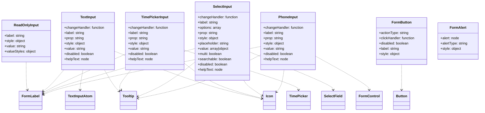
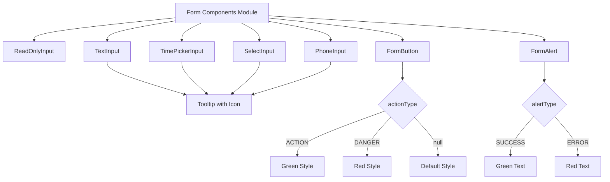

# Diagram: web/portal/src/components-old/modal-elems.js

> Auto-generated by Obscura crawlers

## Diagram 1

### SVG

<svg id="container" width="2195.0234375" xmlns="http://www.w3.org/2000/svg" class="classDiagram" height="510" viewBox="0 0 2195.0234375 510" role="graphics-document document" aria-roledescription="class"><g><defs><marker id="container_class-aggregationStart" class="marker aggregation class" refX="18" refY="7" markerWidth="190" markerHeight="240" orient="auto"><path d="M 18,7 L9,13 L1,7 L9,1 Z"></path></marker></defs><defs><marker id="container_class-aggregationEnd" class="marker aggregation class" refX="1" refY="7" markerWidth="20" markerHeight="28" orient="auto"><path d="M 18,7 L9,13 L1,7 L9,1 Z"></path></marker></defs><defs><marker id="container_class-extensionStart" class="marker extension class" refX="18" refY="7" markerWidth="190" markerHeight="240" orient="auto"><path d="M 1,7 L18,13 V 1 Z"></path></marker></defs><defs><marker id="container_class-extensionEnd" class="marker extension class" refX="1" refY="7" markerWidth="20" markerHeight="28" orient="auto"><path d="M 1,1 V 13 L18,7 Z"></path></marker></defs><defs><marker id="container_class-compositionStart" class="marker composition class" refX="18" refY="7" markerWidth="190" markerHeight="240" orient="auto"><path d="M 18,7 L9,13 L1,7 L9,1 Z"></path></marker></defs><defs><marker id="container_class-compositionEnd" class="marker composition class" refX="1" refY="7" markerWidth="20" markerHeight="28" orient="auto"><path d="M 18,7 L9,13 L1,7 L9,1 Z"></path></marker></defs><defs><marker id="container_class-dependencyStart" class="marker dependency class" refX="6" refY="7" markerWidth="190" markerHeight="240" orient="auto"><path d="M 5,7 L9,13 L1,7 L9,1 Z"></path></marker></defs><defs><marker id="container_class-dependencyEnd" class="marker dependency class" refX="13" refY="7" markerWidth="20" markerHeight="28" orient="auto"><path d="M 18,7 L9,13 L14,7 L9,1 Z"></path></marker></defs><defs><marker id="container_class-lollipopStart" class="marker lollipop class" refX="13" refY="7" markerWidth="190" markerHeight="240" orient="auto"><circle stroke="black" fill="transparent" cx="7" cy="7" r="6"></circle></marker></defs><defs><marker id="container_class-lollipopEnd" class="marker lollipop class" refX="1" refY="7" markerWidth="190" markerHeight="240" orient="auto"><circle stroke="black" fill="transparent" cx="7" cy="7" r="6"></circle></marker></defs><g class="root"><g class="clusters"></g><g class="edgePaths"><path d="M118.84,284L118.84,302.167C118.84,320.333,118.84,356.667,119.798,378.042C120.755,399.417,122.671,405.834,123.629,409.042L124.586,412.251" id="id_ReadOnlyInput_FormLabel_1" class="edge-thickness-normal edge-pattern-dashed relation" style=";;;" data-edge="true" data-et="edge" data-id="id_ReadOnlyInput_FormLabel_1" data-points="W3sieCI6MTE4LjgzOTg0Mzc1LCJ5IjoyODR9LHsieCI6MTE4LjgzOTg0Mzc1LCJ5IjozOTN9LHsieCI6MTI2LjMwMjUzMDMxNzE2NDE4LCJ5Ijo0MTh9XQ==" marker-end="url(#container_class-dependencyEnd)"></path><path d="M291.858,320L281.66,332.167C271.462,344.333,251.066,368.667,234.743,385.302C218.42,401.937,206.171,410.875,200.046,415.343L193.921,419.812" id="id_TextInput_FormLabel_2" class="edge-thickness-normal edge-pattern-dashed relation" style=";;;" data-edge="true" data-et="edge" data-id="id_TextInput_FormLabel_2" data-points="W3sieCI6MjkxLjg1ODE5MzU5NzU2MDk2LCJ5IjozMjB9LHsieCI6MjMwLjY2OTkyMTg3NSwieSI6MzkzfSx7IngiOjE4OS4wNzQyMTg3NSwieSI6NDIzLjM0ODU3NjA0Njk2MTc0fV0=" marker-end="url(#container_class-dependencyEnd)"></path><path d="M377.532,320L375.231,332.167C372.93,344.333,368.327,368.667,366.026,384C363.725,399.333,363.725,405.667,363.725,408.833L363.725,412" id="id_TextInput_TextInputAtom_3" class="edge-thickness-normal edge-pattern-dashed relation" style=";;;" data-edge="true" data-et="edge" data-id="id_TextInput_TextInputAtom_3" data-points="W3sieCI6Mzc3LjUzMjQzMTQwMjQzOTA0LCJ5IjozMjB9LHsieCI6MzYzLjcyNDYwOTM3NSwieSI6MzkzfSx7IngiOjM2My43MjQ2MDkzNzUsInkiOjQxOH1d" marker-end="url(#container_class-dependencyEnd)"></path><path d="M476.77,320L483.616,332.167C490.461,344.333,504.153,368.667,515.138,384.985C526.123,401.304,534.402,409.608,538.542,413.76L542.682,417.912" id="id_TextInput_Tooltip_4" class="edge-thickness-normal edge-pattern-dashed relation" style=";;;" data-edge="true" data-et="edge" data-id="id_TextInput_Tooltip_4" data-points="W3sieCI6NDc2Ljc3MDEyMTk1MTIxOTUsInkiOjMyMH0seyJ4Ijo1MTcuODQzNzUsInkiOjM5M30seyJ4Ijo1NDYuOTE3OTY4NzUsInkiOjQyMi4xNjA5MjYyNjE2MjIxNH1d" marker-end="url(#container_class-dependencyEnd)"></path><path d="M525.32,235.54L593.121,261.783C660.922,288.026,796.523,340.513,911.247,376.746C1025.971,412.979,1119.817,432.958,1166.74,442.948L1213.663,452.938" id="id_TextInput_Icon_5" class="edge-thickness-normal edge-pattern-dashed relation" style=";;;" data-edge="true" data-et="edge" data-id="id_TextInput_Icon_5" data-points="W3sieCI6NTI1LjMyMDMxMjUsInkiOjIzNS41Mzk2MDY0NDMyMzgxNH0seyJ4Ijo5MzIuMTI1LCJ5IjozOTN9LHsieCI6MTIxOS41MzEyNSwieSI6NDU0LjE4NzAwMTk2MTEyNX1d" marker-end="url(#container_class-dependencyEnd)"></path><path d="M575.32,248.34L521.212,272.45C467.104,296.56,358.887,344.78,295.37,374.527C231.854,404.273,213.037,415.547,203.629,421.183L194.221,426.82" id="id_TimePickerInput_FormLabel_6" class="edge-thickness-normal edge-pattern-dashed relation" style=";;;" data-edge="true" data-et="edge" data-id="id_TimePickerInput_FormLabel_6" data-points="W3sieCI6NTc1LjMyMDMxMjUsInkiOjI0OC4zNDAzNDUxNDIzMjM0Nn0seyJ4IjoyNTAuNjY5OTIxODc1LCJ5IjozOTN9LHsieCI6MTg5LjA3NDIxODc1LCJ5Ijo0MjkuOTAzNDE3OTIyNjk5NH1d" marker-end="url(#container_class-dependencyEnd)"></path><path d="M846.156,229.684L934.583,256.903C1023.01,284.123,1199.865,338.561,1288.292,368.947C1376.719,399.333,1376.719,405.667,1376.719,408.833L1376.719,412" id="id_TimePickerInput_TimePicker_7" class="edge-thickness-normal edge-pattern-dashed relation" style=";;;" data-edge="true" data-et="edge" data-id="id_TimePickerInput_TimePicker_7" data-points="W3sieCI6ODQ2LjE1NjI1LCJ5IjoyMjkuNjgzOTMwNTMwMDU3M30seyJ4IjoxMzc2LjcxODc1LCJ5IjozOTN9LHsieCI6MTM3Ni43MTg3NSwieSI6NDE4fV0=" marker-end="url(#container_class-dependencyEnd)"></path><path d="M599.411,320L589.15,332.167C578.889,344.333,558.366,368.667,550.443,384.18C542.519,399.694,547.195,406.387,549.533,409.734L551.871,413.081" id="id_TimePickerInput_Tooltip_8" class="edge-thickness-normal edge-pattern-dashed relation" style=";;;" data-edge="true" data-et="edge" data-id="id_TimePickerInput_Tooltip_8" data-points="W3sieCI6NTk5LjQxMTA3MDg4NDE0NjMsInkiOjMyMH0seyJ4Ijo1MzcuODQzNzUsInkiOjM5M30seyJ4Ijo1NTUuMzA2NzI4MDc4MzU4MiwieSI6NDE4fV0=" marker-end="url(#container_class-dependencyEnd)"></path><path d="M846.156,292.235L867.975,309.029C889.793,325.823,933.43,359.412,994.688,386.001C1055.947,412.591,1134.828,432.182,1174.268,441.977L1213.708,451.772" id="id_TimePickerInput_Icon_9" class="edge-thickness-normal edge-pattern-dashed relation" style=";;;" data-edge="true" data-et="edge" data-id="id_TimePickerInput_Icon_9" data-points="W3sieCI6ODQ2LjE1NjI1LCJ5IjoyOTIuMjM0ODkyOTMwNDc4MTd9LHsieCI6OTc3LjA2NjQwNjI1LCJ5IjozOTN9LHsieCI6MTIxOS41MzEyNSwieSI6NDUzLjIxODYwMzg0Mjk3OTR9XQ==" marker-end="url(#container_class-dependencyEnd)"></path><path d="M896.156,222.477L791.909,250.898C687.661,279.318,479.165,336.159,362.21,371.038C245.254,405.917,219.839,418.834,207.131,425.292L194.423,431.751" id="id_SelectInput_FormLabel_10" class="edge-thickness-normal edge-pattern-dashed relation" style=";;;" data-edge="true" data-et="edge" data-id="id_SelectInput_FormLabel_10" data-points="W3sieCI6ODk2LjE1NjI1LCJ5IjoyMjIuNDc3MzYyMjc4ODYzMDd9LHsieCI6MjcwLjY2OTkyMTg3NSwieSI6MzkzfSx7IngiOjE4OS4wNzQyMTg3NSwieSI6NDM0LjQ2OTM4MzgyNDQ2NjI2fV0=" marker-end="url(#container_class-dependencyEnd)"></path><path d="M1149.086,238.952L1212.811,264.627C1276.536,290.301,1403.987,341.651,1467.712,370.492C1531.438,399.333,1531.438,405.667,1531.438,408.833L1531.438,412" id="id_SelectInput_SelectField_11" class="edge-thickness-normal edge-pattern-dashed relation" style=";;;" data-edge="true" data-et="edge" data-id="id_SelectInput_SelectField_11" data-points="W3sieCI6MTE0OS4wODU5Mzc1LCJ5IjoyMzguOTUyMTU2MTIyMTI3OH0seyJ4IjoxNTMxLjQzNzUsInkiOjM5M30seyJ4IjoxNTMxLjQzNzUsInkiOjQxOH1d" marker-end="url(#container_class-dependencyEnd)"></path><path d="M896.156,283.301L871.895,301.584C847.633,319.868,799.109,356.434,754.406,382.97C709.702,409.507,668.818,426.014,648.377,434.268L627.935,442.521" id="id_SelectInput_Tooltip_12" class="edge-thickness-normal edge-pattern-dashed relation" style=";;;" data-edge="true" data-et="edge" data-id="id_SelectInput_Tooltip_12" data-points="W3sieCI6ODk2LjE1NjI1LCJ5IjoyODMuMzAxMjU5MzE1NjMzMDV9LHsieCI6NzUwLjU4NTkzNzUsInkiOjM5M30seyJ4Ijo2MjIuMzcxMDkzNzUsInkiOjQ0NC43Njc2MzcyOTY2NzM4fV0=" marker-end="url(#container_class-dependencyEnd)"></path><path d="M1125.895,368L1128.285,372.167C1130.676,376.333,1135.457,384.667,1150.217,396.608C1164.976,408.548,1189.714,424.097,1202.082,431.871L1214.451,439.645" id="id_SelectInput_Icon_13" class="edge-thickness-normal edge-pattern-dashed relation" style=";;;" data-edge="true" data-et="edge" data-id="id_SelectInput_Icon_13" data-points="W3sieCI6MTEyNS44OTQ3MjE3OTg3ODA0LCJ5IjozNjh9LHsieCI6MTE0MC4yMzgyODEyNSwieSI6MzkzfSx7IngiOjEyMTkuNTMxMjUsInkiOjQ0Mi44MzgxMzk5MDk4NTM4fV0=" marker-end="url(#container_class-dependencyEnd)"></path><path d="M1199.086,213.077L1047.683,243.064C896.281,273.052,593.475,333.026,426.055,370.081C258.634,407.137,226.599,421.273,210.581,428.342L194.564,435.41" id="id_PhoneInput_FormLabel_14" class="edge-thickness-normal edge-pattern-dashed relation" style=";;;" data-edge="true" data-et="edge" data-id="id_PhoneInput_FormLabel_14" data-points="W3sieCI6MTE5OS4wODU5Mzc1LCJ5IjoyMTMuMDc3MjgzMDYzMDE3MTV9LHsieCI6MjkwLjY2OTkyMTg3NSwieSI6MzkzfSx7IngiOjE4OS4wNzQyMTg3NSwieSI6NDM3LjgzMjQzNTAwNTIwOTg1fV0=" marker-end="url(#container_class-dependencyEnd)"></path><path d="M1452.313,259.117L1492.039,281.431C1531.766,303.745,1611.219,348.372,1650.945,373.853C1690.672,399.333,1690.672,405.667,1690.672,408.833L1690.672,412" id="id_PhoneInput_FormControl_15" class="edge-thickness-normal edge-pattern-dashed relation" style=";;;" data-edge="true" data-et="edge" data-id="id_PhoneInput_FormControl_15" data-points="W3sieCI6MTQ1Mi4zMTI1LCJ5IjoyNTkuMTE2ODk2NTk5NzAyNDR9LHsieCI6MTY5MC42NzE4NzUsInkiOjM5M30seyJ4IjoxNjkwLjY3MTg3NSwieSI6NDE4fV0=" marker-end="url(#container_class-dependencyEnd)"></path><path d="M1199.086,250.76L1151.259,274.466C1103.432,298.173,1007.779,345.587,912.639,378.973C817.5,412.36,722.875,431.719,675.562,441.399L628.249,451.079" id="id_PhoneInput_Tooltip_16" class="edge-thickness-normal edge-pattern-dashed relation" style=";;;" data-edge="true" data-et="edge" data-id="id_PhoneInput_Tooltip_16" data-points="W3sieCI6MTE5OS4wODU5Mzc1LCJ5IjoyNTAuNzU5NTI3NzQ0OTgyMjh9LHsieCI6OTEyLjEyNSwieSI6MzkzfSx7IngiOjYyMi4zNzEwOTM3NSwieSI6NDUyLjI4MTQzMzc2ODcxMjM2fV0=" marker-end="url(#container_class-dependencyEnd)"></path><path d="M1310.296,320L1308.876,332.167C1307.456,344.333,1304.617,368.667,1299.225,385.677C1293.833,402.688,1285.889,412.375,1281.917,417.219L1277.945,422.063" id="id_PhoneInput_Icon_17" class="edge-thickness-normal edge-pattern-dashed relation" style=";;;" data-edge="true" data-et="edge" data-id="id_PhoneInput_Icon_17" data-points="W3sieCI6MTMxMC4yOTU4NjUwOTE0NjM0LCJ5IjozMjB9LHsieCI6MTMwMS43NzczNDM3NSwieSI6MzkzfSx7IngiOjEyNzQuMTQwNjI1LCJ5Ijo0MjYuNzAyNDUyODk3MjYyNzN9XQ==" marker-end="url(#container_class-dependencyEnd)"></path><path d="M1834.602,296L1834.602,312.167C1834.602,328.333,1834.602,360.667,1834.602,380C1834.602,399.333,1834.602,405.667,1834.602,408.833L1834.602,412" id="id_FormButton_Button_18" class="edge-thickness-normal edge-pattern-dashed relation" style=";;;" data-edge="true" data-et="edge" data-id="id_FormButton_Button_18" data-points="W3sieCI6MTgzNC42MDE1NjI1LCJ5IjoyOTZ9LHsieCI6MTgzNC42MDE1NjI1LCJ5IjozOTN9LHsieCI6MTgzNC42MDE1NjI1LCJ5Ijo0MTh9XQ==" marker-end="url(#container_class-dependencyEnd)"></path></g><g class="edgeLabels"><g class="edgeLabel"><g class="label" data-id="id_ReadOnlyInput_FormLabel_1" transform="translate(0, 0)"><foreignObject width="0" height="0">

</foreignObject></g></g><g class="edgeLabel"><g class="label" data-id="id_TextInput_FormLabel_2" transform="translate(0, 0)"><foreignObject width="0" height="0">

</foreignObject></g></g><g class="edgeLabel"><g class="label" data-id="id_TextInput_TextInputAtom_3" transform="translate(0, 0)"><foreignObject width="0" height="0">

</foreignObject></g></g><g class="edgeLabel"><g class="label" data-id="id_TextInput_Tooltip_4" transform="translate(0, 0)"><foreignObject width="0" height="0">

</foreignObject></g></g><g class="edgeLabel"><g class="label" data-id="id_TextInput_Icon_5" transform="translate(0, 0)"><foreignObject width="0" height="0">

</foreignObject></g></g><g class="edgeLabel"><g class="label" data-id="id_TimePickerInput_FormLabel_6" transform="translate(0, 0)"><foreignObject width="0" height="0">

</foreignObject></g></g><g class="edgeLabel"><g class="label" data-id="id_TimePickerInput_TimePicker_7" transform="translate(0, 0)"><foreignObject width="0" height="0">

</foreignObject></g></g><g class="edgeLabel"><g class="label" data-id="id_TimePickerInput_Tooltip_8" transform="translate(0, 0)"><foreignObject width="0" height="0">

</foreignObject></g></g><g class="edgeLabel"><g class="label" data-id="id_TimePickerInput_Icon_9" transform="translate(0, 0)"><foreignObject width="0" height="0">

</foreignObject></g></g><g class="edgeLabel"><g class="label" data-id="id_SelectInput_FormLabel_10" transform="translate(0, 0)"><foreignObject width="0" height="0">

</foreignObject></g></g><g class="edgeLabel"><g class="label" data-id="id_SelectInput_SelectField_11" transform="translate(0, 0)"><foreignObject width="0" height="0">

</foreignObject></g></g><g class="edgeLabel"><g class="label" data-id="id_SelectInput_Tooltip_12" transform="translate(0, 0)"><foreignObject width="0" height="0">

</foreignObject></g></g><g class="edgeLabel"><g class="label" data-id="id_SelectInput_Icon_13" transform="translate(0, 0)"><foreignObject width="0" height="0">

</foreignObject></g></g><g class="edgeLabel"><g class="label" data-id="id_PhoneInput_FormLabel_14" transform="translate(0, 0)"><foreignObject width="0" height="0">

</foreignObject></g></g><g class="edgeLabel"><g class="label" data-id="id_PhoneInput_FormControl_15" transform="translate(0, 0)"><foreignObject width="0" height="0">

</foreignObject></g></g><g class="edgeLabel"><g class="label" data-id="id_PhoneInput_Tooltip_16" transform="translate(0, 0)"><foreignObject width="0" height="0">

</foreignObject></g></g><g class="edgeLabel"><g class="label" data-id="id_PhoneInput_Icon_17" transform="translate(0, 0)"><foreignObject width="0" height="0">

</foreignObject></g></g><g class="edgeLabel"><g class="label" data-id="id_FormButton_Button_18" transform="translate(0, 0)"><foreignObject width="0" height="0">

</foreignObject></g></g></g><g class="nodes"><g class="node default" id="classId-ReadOnlyInput-0" transform="translate(118.83984375, 188)"><g class="basic label-container"><path d="M-110.83984375 -96 L110.83984375 -96 L110.83984375 96 L-110.83984375 96" stroke="none" stroke-width="0" fill="#ECECFF" style=""></path><path d="M-110.83984375 -96 C-52.32317411560934 -96, 6.193495518781319 -96, 110.83984375 -96 M-110.83984375 -96 C-33.052786649880005 -96, 44.73427045023999 -96, 110.83984375 -96 M110.83984375 -96 C110.83984375 -19.690060191430348, 110.83984375 56.619879617139304, 110.83984375 96 M110.83984375 -96 C110.83984375 -38.69410968092138, 110.83984375 18.611780638157242, 110.83984375 96 M110.83984375 96 C22.700360197526948 96, -65.4391233549461 96, -110.83984375 96 M110.83984375 96 C61.76911082603421 96, 12.698377902068415 96, -110.83984375 96 M-110.83984375 96 C-110.83984375 44.37424530294322, -110.83984375 -7.251509394113555, -110.83984375 -96 M-110.83984375 96 C-110.83984375 53.00154429938458, -110.83984375 10.003088598769153, -110.83984375 -96" stroke="#9370DB" stroke-width="1.3" fill="none" stroke-dasharray="0 0" style=""></path></g><g class="annotation-group text" transform="translate(0, -72)"></g><g class="label-group text" transform="translate(-54.3203125, -72)"><g class="label" style="font-weight: bolder" transform="translate(0,-12)"><foreignObject width="108.640625" height="24">

ReadOnlyInput

</foreignObject></g></g><g class="members-group text" transform="translate(-98.83984375, -24)"><g class="label" style="" transform="translate(0,-12)"><foreignObject width="94.09375" height="24">

+label: string

</foreignObject></g><g class="label" style="" transform="translate(0,12)"><foreignObject width="95.90625" height="24">

+style: object

</foreignObject></g><g class="label" style="" transform="translate(0,36)"><foreignObject width="96.421875" height="24">

+value: string

</foreignObject></g><g class="label" style="" transform="translate(0,60)"><foreignObject width="143.359375" height="24">

+valueStyles: object

</foreignObject></g></g><g class="methods-group text" transform="translate(-98.83984375, 96)"></g><g class="divider" style=""><path d="M-110.83984375 -48 C-49.68123600444166 -48, 11.477371741116684 -48, 110.83984375 -48 M-110.83984375 -48 C-62.080970206202245 -48, -13.32209666240449 -48, 110.83984375 -48" stroke="#9370DB" stroke-width="1.3" fill="none" stroke-dasharray="0 0" style=""></path></g><g class="divider" style=""><path d="M-110.83984375 72 C-56.991244615110546 72, -3.1426454802210912 72, 110.83984375 72 M-110.83984375 72 C-64.5761682935017 72, -18.312492837003376 72, 110.83984375 72" stroke="#9370DB" stroke-width="1.3" fill="none" stroke-dasharray="0 0" style=""></path></g></g><g class="node default" id="classId-TextInput-1" transform="translate(402.5, 188)"><g class="basic label-container"><path d="M-122.8203125 -132 L122.8203125 -132 L122.8203125 132 L-122.8203125 132" stroke="none" stroke-width="0" fill="#ECECFF" style=""></path><path d="M-122.8203125 -132 C-61.7854967912899 -132, -0.7506810825798027 -132, 122.8203125 -132 M-122.8203125 -132 C-65.34870284186476 -132, -7.877093183729542 -132, 122.8203125 -132 M122.8203125 -132 C122.8203125 -34.995274748571816, 122.8203125 62.00945050285637, 122.8203125 132 M122.8203125 -132 C122.8203125 -59.72039287513931, 122.8203125 12.559214249721379, 122.8203125 132 M122.8203125 132 C57.12146747155492 132, -8.577377556890156 132, -122.8203125 132 M122.8203125 132 C47.517224106573394 132, -27.78586428685321 132, -122.8203125 132 M-122.8203125 132 C-122.8203125 68.34322974885114, -122.8203125 4.6864594977022875, -122.8203125 -132 M-122.8203125 132 C-122.8203125 40.692756010123446, -122.8203125 -50.61448797975311, -122.8203125 -132" stroke="#9370DB" stroke-width="1.3" fill="none" stroke-dasharray="0 0" style=""></path></g><g class="annotation-group text" transform="translate(0, -108)"></g><g class="label-group text" transform="translate(-34.78125, -108)"><g class="label" style="font-weight: bolder" transform="translate(0,-12)"><foreignObject width="69.5625" height="24">

TextInput

</foreignObject></g></g><g class="members-group text" transform="translate(-110.8203125, -60)"><g class="label" style="" transform="translate(0,-12)"><foreignObject width="186.859375" height="24">

+changeHandler: function

</foreignObject></g><g class="label" style="" transform="translate(0,12)"><foreignObject width="94.09375" height="24">

+label: string

</foreignObject></g><g class="label" style="" transform="translate(0,36)"><foreignObject width="91.75" height="24">

+prop: string

</foreignObject></g><g class="label" style="" transform="translate(0,60)"><foreignObject width="95.90625" height="24">

+style: object

</foreignObject></g><g class="label" style="" transform="translate(0,84)"><foreignObject width="96.421875" height="24">

+value: string

</foreignObject></g><g class="label" style="" transform="translate(0,108)"><foreignObject width="138.015625" height="24">

+disabled: boolean

</foreignObject></g><g class="label" style="" transform="translate(0,132)"><foreignObject width="114.9375" height="24">

+helpText: node

</foreignObject></g></g><g class="methods-group text" transform="translate(-110.8203125, 132)"></g><g class="divider" style=""><path d="M-122.8203125 -84 C-41.49027136595329 -84, 39.83976976809342 -84, 122.8203125 -84 M-122.8203125 -84 C-25.374130551233236 -84, 72.07205139753353 -84, 122.8203125 -84" stroke="#9370DB" stroke-width="1.3" fill="none" stroke-dasharray="0 0" style=""></path></g><g class="divider" style=""><path d="M-122.8203125 108 C-61.340722670006556 108, 0.13886715998688715 108, 122.8203125 108 M-122.8203125 108 C-31.51410037100959 108, 59.79211175798082 108, 122.8203125 108" stroke="#9370DB" stroke-width="1.3" fill="none" stroke-dasharray="0 0" style=""></path></g></g><g class="node default" id="classId-TimePickerInput-2" transform="translate(710.73828125, 188)"><g class="basic label-container"><path d="M-135.41796875 -132 L135.41796875 -132 L135.41796875 132 L-135.41796875 132" stroke="none" stroke-width="0" fill="#ECECFF" style=""></path><path d="M-135.41796875 -132 C-42.4484287144698 -132, 50.5211113210604 -132, 135.41796875 -132 M-135.41796875 -132 C-35.325129839386264 -132, 64.76770907122747 -132, 135.41796875 -132 M135.41796875 -132 C135.41796875 -47.962834877696906, 135.41796875 36.07433024460619, 135.41796875 132 M135.41796875 -132 C135.41796875 -52.709504633861556, 135.41796875 26.580990732276888, 135.41796875 132 M135.41796875 132 C37.60314800591843 132, -60.211672738163145 132, -135.41796875 132 M135.41796875 132 C67.44436684887329 132, -0.5292350522534264 132, -135.41796875 132 M-135.41796875 132 C-135.41796875 44.80862129338412, -135.41796875 -42.38275741323176, -135.41796875 -132 M-135.41796875 132 C-135.41796875 67.24111802218802, -135.41796875 2.4822360443760374, -135.41796875 -132" stroke="#9370DB" stroke-width="1.3" fill="none" stroke-dasharray="0 0" style=""></path></g><g class="annotation-group text" transform="translate(0, -108)"></g><g class="label-group text" transform="translate(-59.9765625, -108)"><g class="label" style="font-weight: bolder" transform="translate(0,-12)"><foreignObject width="119.953125" height="24">

TimePickerInput

</foreignObject></g></g><g class="members-group text" transform="translate(-123.41796875, -60)"><g class="label" style="" transform="translate(0,-12)"><foreignObject width="186.859375" height="24">

+changeHandler: function

</foreignObject></g><g class="label" style="" transform="translate(0,12)"><foreignObject width="94.09375" height="24">

+label: string

</foreignObject></g><g class="label" style="" transform="translate(0,36)"><foreignObject width="91.75" height="24">

+prop: string

</foreignObject></g><g class="label" style="" transform="translate(0,60)"><foreignObject width="95.90625" height="24">

+style: object

</foreignObject></g><g class="label" style="" transform="translate(0,84)"><foreignObject width="96.421875" height="24">

+value: string

</foreignObject></g><g class="label" style="" transform="translate(0,108)"><foreignObject width="138.015625" height="24">

+disabled: boolean

</foreignObject></g><g class="label" style="" transform="translate(0,132)"><foreignObject width="114.9375" height="24">

+helpText: node

</foreignObject></g></g><g class="methods-group text" transform="translate(-123.41796875, 132)"></g><g class="divider" style=""><path d="M-135.41796875 -84 C-53.30747462577776 -84, 28.803019498444485 -84, 135.41796875 -84 M-135.41796875 -84 C-63.651190132717915 -84, 8.11558848456417 -84, 135.41796875 -84" stroke="#9370DB" stroke-width="1.3" fill="none" stroke-dasharray="0 0" style=""></path></g><g class="divider" style=""><path d="M-135.41796875 108 C-75.9233818510213 108, -16.428794952042594 108, 135.41796875 108 M-135.41796875 108 C-54.515356945773206 108, 26.387254858453588 108, 135.41796875 108" stroke="#9370DB" stroke-width="1.3" fill="none" stroke-dasharray="0 0" style=""></path></g></g><g class="node default" id="classId-SelectInput-3" transform="translate(1022.62109375, 188)"><g class="basic label-container"><path d="M-126.46484375 -180 L126.46484375 -180 L126.46484375 180 L-126.46484375 180" stroke="none" stroke-width="0" fill="#ECECFF" style=""></path><path d="M-126.46484375 -180 C-44.448643686872586 -180, 37.56755637625483 -180, 126.46484375 -180 M-126.46484375 -180 C-74.71581736174052 -180, -22.96679097348104 -180, 126.46484375 -180 M126.46484375 -180 C126.46484375 -45.60859654817065, 126.46484375 88.7828069036587, 126.46484375 180 M126.46484375 -180 C126.46484375 -87.7275720382079, 126.46484375 4.544855923584208, 126.46484375 180 M126.46484375 180 C43.785586972074626 180, -38.89366980585075 180, -126.46484375 180 M126.46484375 180 C69.58305265771571 180, 12.701261565431437 180, -126.46484375 180 M-126.46484375 180 C-126.46484375 70.81707121072512, -126.46484375 -38.365857578549765, -126.46484375 -180 M-126.46484375 180 C-126.46484375 84.56745836779668, -126.46484375 -10.86508326440665, -126.46484375 -180" stroke="#9370DB" stroke-width="1.3" fill="none" stroke-dasharray="0 0" style=""></path></g><g class="annotation-group text" transform="translate(0, -156)"></g><g class="label-group text" transform="translate(-42.0703125, -156)"><g class="label" style="font-weight: bolder" transform="translate(0,-12)"><foreignObject width="84.140625" height="24">

SelectInput

</foreignObject></g></g><g class="members-group text" transform="translate(-114.46484375, -108)"><g class="label" style="" transform="translate(0,-12)"><foreignObject width="186.859375" height="24">

+changeHandler: function

</foreignObject></g><g class="label" style="" transform="translate(0,12)"><foreignObject width="94.09375" height="24">

+label: string

</foreignObject></g><g class="label" style="" transform="translate(0,36)"><foreignObject width="108.234375" height="24">

+options: array

</foreignObject></g><g class="label" style="" transform="translate(0,60)"><foreignObject width="91.75" height="24">

+prop: string

</foreignObject></g><g class="label" style="" transform="translate(0,84)"><foreignObject width="95.90625" height="24">

+style: object

</foreignObject></g><g class="label" style="" transform="translate(0,108)"><foreignObject width="144.515625" height="24">

+placeholder: string

</foreignObject></g><g class="label" style="" transform="translate(0,132)"><foreignObject width="143.546875" height="24">

+value: array|object

</foreignObject></g><g class="label" style="" transform="translate(0,156)"><foreignObject width="113.515625" height="24">

+multi: boolean

</foreignObject></g><g class="label" style="" transform="translate(0,180)"><foreignObject width="154.5" height="24">

+searchable: boolean

</foreignObject></g><g class="label" style="" transform="translate(0,204)"><foreignObject width="138.015625" height="24">

+disabled: boolean

</foreignObject></g><g class="label" style="" transform="translate(0,228)"><foreignObject width="114.9375" height="24">

+helpText: node

</foreignObject></g></g><g class="methods-group text" transform="translate(-114.46484375, 180)"></g><g class="divider" style=""><path d="M-126.46484375 -132 C-54.47891677590323 -132, 17.50701019819354 -132, 126.46484375 -132 M-126.46484375 -132 C-54.23684410178964 -132, 17.991155546420714 -132, 126.46484375 -132" stroke="#9370DB" stroke-width="1.3" fill="none" stroke-dasharray="0 0" style=""></path></g><g class="divider" style=""><path d="M-126.46484375 156 C-74.31144020555584 156, -22.158036661111666 156, 126.46484375 156 M-126.46484375 156 C-63.58786037618655 156, -0.7108770023730955 156, 126.46484375 156" stroke="#9370DB" stroke-width="1.3" fill="none" stroke-dasharray="0 0" style=""></path></g></g><g class="node default" id="classId-PhoneInput-4" transform="translate(1325.69921875, 188)"><g class="basic label-container"><path d="M-126.61328125 -132 L126.61328125 -132 L126.61328125 132 L-126.61328125 132" stroke="none" stroke-width="0" fill="#ECECFF" style=""></path><path d="M-126.61328125 -132 C-68.10973765454222 -132, -9.60619405908443 -132, 126.61328125 -132 M-126.61328125 -132 C-53.14842836549657 -132, 20.31642451900686 -132, 126.61328125 -132 M126.61328125 -132 C126.61328125 -49.49620807475593, 126.61328125 33.007583850488146, 126.61328125 132 M126.61328125 -132 C126.61328125 -54.72244617809001, 126.61328125 22.55510764381998, 126.61328125 132 M126.61328125 132 C48.52986895460947 132, -29.55354334078106 132, -126.61328125 132 M126.61328125 132 C28.199569052246844 132, -70.21414314550631 132, -126.61328125 132 M-126.61328125 132 C-126.61328125 44.79487491732189, -126.61328125 -42.41025016535622, -126.61328125 -132 M-126.61328125 132 C-126.61328125 51.98659508830853, -126.61328125 -28.026809823382933, -126.61328125 -132" stroke="#9370DB" stroke-width="1.3" fill="none" stroke-dasharray="0 0" style=""></path></g><g class="annotation-group text" transform="translate(0, -108)"></g><g class="label-group text" transform="translate(-42.3671875, -108)"><g class="label" style="font-weight: bolder" transform="translate(0,-12)"><foreignObject width="84.734375" height="24">

PhoneInput

</foreignObject></g></g><g class="members-group text" transform="translate(-114.61328125, -60)"><g class="label" style="" transform="translate(0,-12)"><foreignObject width="186.859375" height="24">

+changeHandler: function

</foreignObject></g><g class="label" style="" transform="translate(0,12)"><foreignObject width="94.09375" height="24">

+label: string

</foreignObject></g><g class="label" style="" transform="translate(0,36)"><foreignObject width="91.75" height="24">

+prop: string

</foreignObject></g><g class="label" style="" transform="translate(0,60)"><foreignObject width="95.90625" height="24">

+style: object

</foreignObject></g><g class="label" style="" transform="translate(0,84)"><foreignObject width="96.421875" height="24">

+value: string

</foreignObject></g><g class="label" style="" transform="translate(0,108)"><foreignObject width="138.015625" height="24">

+disabled: boolean

</foreignObject></g><g class="label" style="" transform="translate(0,132)"><foreignObject width="114.9375" height="24">

+helpText: node

</foreignObject></g></g><g class="methods-group text" transform="translate(-114.61328125, 132)"></g><g class="divider" style=""><path d="M-126.61328125 -84 C-27.617465275346348 -84, 71.3783506993073 -84, 126.61328125 -84 M-126.61328125 -84 C-53.385370062394315 -84, 19.84254112521137 -84, 126.61328125 -84" stroke="#9370DB" stroke-width="1.3" fill="none" stroke-dasharray="0 0" style=""></path></g><g class="divider" style=""><path d="M-126.61328125 108 C-57.93640227983383 108, 10.740476690332343 108, 126.61328125 108 M-126.61328125 108 C-42.51669224095819 108, 41.579896768083614 108, 126.61328125 108" stroke="#9370DB" stroke-width="1.3" fill="none" stroke-dasharray="0 0" style=""></path></g></g><g class="node default" id="classId-FormButton-5" transform="translate(1834.6015625, 188)"><g class="basic label-container"><path d="M-117.375 -108 L117.375 -108 L117.375 108 L-117.375 108" stroke="none" stroke-width="0" fill="#ECECFF" style=""></path><path d="M-117.375 -108 C-47.31306704773027 -108, 22.748865904539457 -108, 117.375 -108 M-117.375 -108 C-36.3294912102764 -108, 44.7160175794472 -108, 117.375 -108 M117.375 -108 C117.375 -36.217721190066314, 117.375 35.56455761986737, 117.375 108 M117.375 -108 C117.375 -55.89783398767705, 117.375 -3.7956679753541067, 117.375 108 M117.375 108 C26.075723965319085 108, -65.22355206936183 108, -117.375 108 M117.375 108 C29.015252311847817 108, -59.344495376304366 108, -117.375 108 M-117.375 108 C-117.375 26.702719597223336, -117.375 -54.59456080555333, -117.375 -108 M-117.375 108 C-117.375 28.542206363562997, -117.375 -50.915587272874006, -117.375 -108" stroke="#9370DB" stroke-width="1.3" fill="none" stroke-dasharray="0 0" style=""></path></g><g class="annotation-group text" transform="translate(0, -84)"></g><g class="label-group text" transform="translate(-43.09375, -84)"><g class="label" style="font-weight: bolder" transform="translate(0,-12)"><foreignObject width="86.1875" height="24">

FormButton

</foreignObject></g></g><g class="members-group text" transform="translate(-105.375, -36)"><g class="label" style="" transform="translate(0,-12)"><foreignObject width="136.546875" height="24">

+actionType: string

</foreignObject></g><g class="label" style="" transform="translate(0,12)"><foreignObject width="167.65625" height="24">

+clickHandler: function

</foreignObject></g><g class="label" style="" transform="translate(0,36)"><foreignObject width="138.015625" height="24">

+disabled: boolean

</foreignObject></g><g class="label" style="" transform="translate(0,60)"><foreignObject width="94.09375" height="24">

+label: string

</foreignObject></g><g class="label" style="" transform="translate(0,84)"><foreignObject width="95.90625" height="24">

+style: object

</foreignObject></g></g><g class="methods-group text" transform="translate(-105.375, 108)"></g><g class="divider" style=""><path d="M-117.375 -60 C-51.99436039269115 -60, 13.386279214617701 -60, 117.375 -60 M-117.375 -60 C-29.13289539157067 -60, 59.10920921685866 -60, 117.375 -60" stroke="#9370DB" stroke-width="1.3" fill="none" stroke-dasharray="0 0" style=""></path></g><g class="divider" style=""><path d="M-117.375 84 C-28.75590886922967 84, 59.86318226154066 84, 117.375 84 M-117.375 84 C-29.81030210340367 84, 57.75439579319266 84, 117.375 84" stroke="#9370DB" stroke-width="1.3" fill="none" stroke-dasharray="0 0" style=""></path></g></g><g class="node default" id="classId-FormAlert-6" transform="translate(2094.5, 188)"><g class="basic label-container"><path d="M-92.5234375 -84 L92.5234375 -84 L92.5234375 84 L-92.5234375 84" stroke="none" stroke-width="0" fill="#ECECFF" style=""></path><path d="M-92.5234375 -84 C-44.33783588773595 -84, 3.8477657245281023 -84, 92.5234375 -84 M-92.5234375 -84 C-54.52874532415872 -84, -16.53405314831744 -84, 92.5234375 -84 M92.5234375 -84 C92.5234375 -31.600433797705797, 92.5234375 20.799132404588406, 92.5234375 84 M92.5234375 -84 C92.5234375 -47.67336120649779, 92.5234375 -11.346722412995575, 92.5234375 84 M92.5234375 84 C40.59555644024041 84, -11.332324619519184 84, -92.5234375 84 M92.5234375 84 C39.85500602866802 84, -12.813425442663956 84, -92.5234375 84 M-92.5234375 84 C-92.5234375 21.723491123837164, -92.5234375 -40.55301775232567, -92.5234375 -84 M-92.5234375 84 C-92.5234375 29.57145511226051, -92.5234375 -24.857089775478983, -92.5234375 -84" stroke="#9370DB" stroke-width="1.3" fill="none" stroke-dasharray="0 0" style=""></path></g><g class="annotation-group text" transform="translate(0, -60)"></g><g class="label-group text" transform="translate(-36.03125, -60)"><g class="label" style="font-weight: bolder" transform="translate(0,-12)"><foreignObject width="72.0625" height="24">

FormAlert

</foreignObject></g></g><g class="members-group text" transform="translate(-80.5234375, -12)"><g class="label" style="" transform="translate(0,-12)"><foreignObject width="86.734375" height="24">

+alert: node

</foreignObject></g><g class="label" style="" transform="translate(0,12)"><foreignObject width="125.015625" height="24">

+alertType: string

</foreignObject></g><g class="label" style="" transform="translate(0,36)"><foreignObject width="95.90625" height="24">

+style: object

</foreignObject></g></g><g class="methods-group text" transform="translate(-80.5234375, 84)"></g><g class="divider" style=""><path d="M-92.5234375 -36 C-25.805952958559388 -36, 40.911531582881224 -36, 92.5234375 -36 M-92.5234375 -36 C-26.41054339855063 -36, 39.70235070289874 -36, 92.5234375 -36" stroke="#9370DB" stroke-width="1.3" fill="none" stroke-dasharray="0 0" style=""></path></g><g class="divider" style=""><path d="M-92.5234375 60 C-22.811921200195044 60, 46.89959509960991 60, 92.5234375 60 M-92.5234375 60 C-18.76717705565217 60, 54.98908338869566 60, 92.5234375 60" stroke="#9370DB" stroke-width="1.3" fill="none" stroke-dasharray="0 0" style=""></path></g></g><g class="node default" id="classId-FormLabel-7" transform="translate(138.83984375, 460)"><g class="basic label-container"><path d="M-50.234375 -42 L50.234375 -42 L50.234375 42 L-50.234375 42" stroke="none" stroke-width="0" fill="#ECECFF" style=""></path><path d="M-50.234375 -42 C-29.06709203577631 -42, -7.8998090715526175 -42, 50.234375 -42 M-50.234375 -42 C-26.094566035385938 -42, -1.9547570707718762 -42, 50.234375 -42 M50.234375 -42 C50.234375 -13.868538263756875, 50.234375 14.26292347248625, 50.234375 42 M50.234375 -42 C50.234375 -15.372585534200883, 50.234375 11.254828931598233, 50.234375 42 M50.234375 42 C27.93154105879053 42, 5.628707117581058 42, -50.234375 42 M50.234375 42 C23.74575136428579 42, -2.7428722714284177 42, -50.234375 42 M-50.234375 42 C-50.234375 19.54317813016675, -50.234375 -2.9136437396664974, -50.234375 -42 M-50.234375 42 C-50.234375 12.740006641843046, -50.234375 -16.51998671631391, -50.234375 -42" stroke="#9370DB" stroke-width="1.3" fill="none" stroke-dasharray="0 0" style=""></path></g><g class="annotation-group text" transform="translate(0, -18)"></g><g class="label-group text" transform="translate(-38.234375, -18)"><g class="label" style="font-weight: bolder" transform="translate(0,-12)"><foreignObject width="76.46875" height="24">

FormLabel

</foreignObject></g></g><g class="members-group text" transform="translate(-38.234375, 30)"></g><g class="methods-group text" transform="translate(-38.234375, 60)"></g><g class="divider" style=""><path d="M-50.234375 6 C-29.914993883456837 6, -9.595612766913675 6, 50.234375 6 M-50.234375 6 C-25.068533598898505 6, 0.09730780220299096 6, 50.234375 6" stroke="#9370DB" stroke-width="1.3" fill="none" stroke-dasharray="0 0" style=""></path></g><g class="divider" style=""><path d="M-50.234375 24 C-25.865067299107213 24, -1.495759598214427 24, 50.234375 24 M-50.234375 24 C-11.183207851557867 24, 27.867959296884266 24, 50.234375 24" stroke="#9370DB" stroke-width="1.3" fill="none" stroke-dasharray="0 0" style=""></path></g></g><g class="node default" id="classId-TextInputAtom-8" transform="translate(363.724609375, 460)"><g class="basic label-container"><path d="M-65.875 -42 L65.875 -42 L65.875 42 L-65.875 42" stroke="none" stroke-width="0" fill="#ECECFF" style=""></path><path d="M-65.875 -42 C-35.886426415420885 -42, -5.897852830841778 -42, 65.875 -42 M-65.875 -42 C-18.80231832405441 -42, 28.270363351891177 -42, 65.875 -42 M65.875 -42 C65.875 -24.38746520571397, 65.875 -6.774930411427938, 65.875 42 M65.875 -42 C65.875 -12.761893867379605, 65.875 16.47621226524079, 65.875 42 M65.875 42 C19.809241726925073 42, -26.256516546149854 42, -65.875 42 M65.875 42 C23.216048142430424 42, -19.442903715139153 42, -65.875 42 M-65.875 42 C-65.875 20.919637109577092, -65.875 -0.1607257808458158, -65.875 -42 M-65.875 42 C-65.875 20.9631231336348, -65.875 -0.07375373273040253, -65.875 -42" stroke="#9370DB" stroke-width="1.3" fill="none" stroke-dasharray="0 0" style=""></path></g><g class="annotation-group text" transform="translate(0, -18)"></g><g class="label-group text" transform="translate(-53.875, -18)"><g class="label" style="font-weight: bolder" transform="translate(0,-12)"><foreignObject width="107.75" height="24">

TextInputAtom

</foreignObject></g></g><g class="members-group text" transform="translate(-53.875, 30)"></g><g class="methods-group text" transform="translate(-53.875, 60)"></g><g class="divider" style=""><path d="M-65.875 6 C-21.64624231669368 6, 22.58251536661264 6, 65.875 6 M-65.875 6 C-13.575912883262312 6, 38.723174233475376 6, 65.875 6" stroke="#9370DB" stroke-width="1.3" fill="none" stroke-dasharray="0 0" style=""></path></g><g class="divider" style=""><path d="M-65.875 24 C-21.165250809116685 24, 23.54449838176663 24, 65.875 24 M-65.875 24 C-29.483296591900505 24, 6.90840681619899 24, 65.875 24" stroke="#9370DB" stroke-width="1.3" fill="none" stroke-dasharray="0 0" style=""></path></g></g><g class="node default" id="classId-Tooltip-9" transform="translate(584.64453125, 460)"><g class="basic label-container"><path d="M-37.7265625 -42 L37.7265625 -42 L37.7265625 42 L-37.7265625 42" stroke="none" stroke-width="0" fill="#ECECFF" style=""></path><path d="M-37.7265625 -42 C-9.945070856505357 -42, 17.836420786989287 -42, 37.7265625 -42 M-37.7265625 -42 C-17.11649255402027 -42, 3.4935773919594624 -42, 37.7265625 -42 M37.7265625 -42 C37.7265625 -17.70173021032425, 37.7265625 6.5965395793515, 37.7265625 42 M37.7265625 -42 C37.7265625 -20.540392115361964, 37.7265625 0.9192157692760716, 37.7265625 42 M37.7265625 42 C13.04228481457136 42, -11.64199287085728 42, -37.7265625 42 M37.7265625 42 C15.89866422648958 42, -5.929234047020842 42, -37.7265625 42 M-37.7265625 42 C-37.7265625 14.863734538583738, -37.7265625 -12.272530922832523, -37.7265625 -42 M-37.7265625 42 C-37.7265625 20.65237158855739, -37.7265625 -0.6952568228852201, -37.7265625 -42" stroke="#9370DB" stroke-width="1.3" fill="none" stroke-dasharray="0 0" style=""></path></g><g class="annotation-group text" transform="translate(0, -18)"></g><g class="label-group text" transform="translate(-25.7265625, -18)"><g class="label" style="font-weight: bolder" transform="translate(0,-12)"><foreignObject width="51.453125" height="24">

Tooltip

</foreignObject></g></g><g class="members-group text" transform="translate(-25.7265625, 30)"></g><g class="methods-group text" transform="translate(-25.7265625, 60)"></g><g class="divider" style=""><path d="M-37.7265625 6 C-11.906437319787127 6, 13.913687860425746 6, 37.7265625 6 M-37.7265625 6 C-12.021596298801256 6, 13.683369902397487 6, 37.7265625 6" stroke="#9370DB" stroke-width="1.3" fill="none" stroke-dasharray="0 0" style=""></path></g><g class="divider" style=""><path d="M-37.7265625 24 C-21.391319015382148 24, -5.056075530764296 24, 37.7265625 24 M-37.7265625 24 C-8.685039864383338 24, 20.356482771233324 24, 37.7265625 24" stroke="#9370DB" stroke-width="1.3" fill="none" stroke-dasharray="0 0" style=""></path></g></g><g class="node default" id="classId-Icon-10" transform="translate(1246.8359375, 460)"><g class="basic label-container"><path d="M-27.3046875 -42 L27.3046875 -42 L27.3046875 42 L-27.3046875 42" stroke="none" stroke-width="0" fill="#ECECFF" style=""></path><path d="M-27.3046875 -42 C-7.794020377086785 -42, 11.71664674582643 -42, 27.3046875 -42 M-27.3046875 -42 C-13.412249957434671 -42, 0.4801875851306576 -42, 27.3046875 -42 M27.3046875 -42 C27.3046875 -11.106272502582517, 27.3046875 19.787454994834967, 27.3046875 42 M27.3046875 -42 C27.3046875 -22.009366426870088, 27.3046875 -2.0187328537401754, 27.3046875 42 M27.3046875 42 C10.995351515117996 42, -5.313984469764009 42, -27.3046875 42 M27.3046875 42 C15.03521901124311 42, 2.7657505224862184 42, -27.3046875 42 M-27.3046875 42 C-27.3046875 22.647432001816842, -27.3046875 3.294864003633684, -27.3046875 -42 M-27.3046875 42 C-27.3046875 19.180430707335027, -27.3046875 -3.6391385853299454, -27.3046875 -42" stroke="#9370DB" stroke-width="1.3" fill="none" stroke-dasharray="0 0" style=""></path></g><g class="annotation-group text" transform="translate(0, -18)"></g><g class="label-group text" transform="translate(-15.3046875, -18)"><g class="label" style="font-weight: bolder" transform="translate(0,-12)"><foreignObject width="30.609375" height="24">

Icon

</foreignObject></g></g><g class="members-group text" transform="translate(-15.3046875, 30)"></g><g class="methods-group text" transform="translate(-15.3046875, 60)"></g><g class="divider" style=""><path d="M-27.3046875 6 C-11.109149417594562 6, 5.086388664810876 6, 27.3046875 6 M-27.3046875 6 C-6.45467742482305 6, 14.3953326503539 6, 27.3046875 6" stroke="#9370DB" stroke-width="1.3" fill="none" stroke-dasharray="0 0" style=""></path></g><g class="divider" style=""><path d="M-27.3046875 24 C-15.801387095671187 24, -4.298086691342373 24, 27.3046875 24 M-27.3046875 24 C-7.118519536859576 24, 13.067648426280847 24, 27.3046875 24" stroke="#9370DB" stroke-width="1.3" fill="none" stroke-dasharray="0 0" style=""></path></g></g><g class="node default" id="classId-TimePicker-11" transform="translate(1376.71875, 460)"><g class="basic label-container"><path d="M-52.578125 -42 L52.578125 -42 L52.578125 42 L-52.578125 42" stroke="none" stroke-width="0" fill="#ECECFF" style=""></path><path d="M-52.578125 -42 C-25.25037884746354 -42, 2.0773673050729187 -42, 52.578125 -42 M-52.578125 -42 C-30.600762850971453 -42, -8.623400701942906 -42, 52.578125 -42 M52.578125 -42 C52.578125 -13.624177486474586, 52.578125 14.751645027050827, 52.578125 42 M52.578125 -42 C52.578125 -14.32889975193148, 52.578125 13.342200496137039, 52.578125 42 M52.578125 42 C14.441946346876811 42, -23.694232306246377 42, -52.578125 42 M52.578125 42 C21.987818489007427 42, -8.602488021985145 42, -52.578125 42 M-52.578125 42 C-52.578125 21.229388237816448, -52.578125 0.45877647563289514, -52.578125 -42 M-52.578125 42 C-52.578125 19.737490141252383, -52.578125 -2.5250197174952334, -52.578125 -42" stroke="#9370DB" stroke-width="1.3" fill="none" stroke-dasharray="0 0" style=""></path></g><g class="annotation-group text" transform="translate(0, -18)"></g><g class="label-group text" transform="translate(-40.578125, -18)"><g class="label" style="font-weight: bolder" transform="translate(0,-12)"><foreignObject width="81.15625" height="24">

TimePicker

</foreignObject></g></g><g class="members-group text" transform="translate(-40.578125, 30)"></g><g class="methods-group text" transform="translate(-40.578125, 60)"></g><g class="divider" style=""><path d="M-52.578125 6 C-10.746463404329297 6, 31.085198191341405 6, 52.578125 6 M-52.578125 6 C-21.302957635398325 6, 9.97220972920335 6, 52.578125 6" stroke="#9370DB" stroke-width="1.3" fill="none" stroke-dasharray="0 0" style=""></path></g><g class="divider" style=""><path d="M-52.578125 24 C-24.562132698898484 24, 3.453859602203032 24, 52.578125 24 M-52.578125 24 C-30.260927596231998 24, -7.943730192463995 24, 52.578125 24" stroke="#9370DB" stroke-width="1.3" fill="none" stroke-dasharray="0 0" style=""></path></g></g><g class="node default" id="classId-SelectField-12" transform="translate(1531.4375, 460)"><g class="basic label-container"><path d="M-52.140625 -42 L52.140625 -42 L52.140625 42 L-52.140625 42" stroke="none" stroke-width="0" fill="#ECECFF" style=""></path><path d="M-52.140625 -42 C-24.280865190188845 -42, 3.578894619622311 -42, 52.140625 -42 M-52.140625 -42 C-19.63622687527318 -42, 12.868171249453638 -42, 52.140625 -42 M52.140625 -42 C52.140625 -13.880933662921148, 52.140625 14.238132674157704, 52.140625 42 M52.140625 -42 C52.140625 -16.585127174080558, 52.140625 8.829745651838884, 52.140625 42 M52.140625 42 C20.075475306300454 42, -11.989674387399091 42, -52.140625 42 M52.140625 42 C21.2995409258587 42, -9.5415431482826 42, -52.140625 42 M-52.140625 42 C-52.140625 11.983118699454934, -52.140625 -18.03376260109013, -52.140625 -42 M-52.140625 42 C-52.140625 15.860042054137615, -52.140625 -10.27991589172477, -52.140625 -42" stroke="#9370DB" stroke-width="1.3" fill="none" stroke-dasharray="0 0" style=""></path></g><g class="annotation-group text" transform="translate(0, -18)"></g><g class="label-group text" transform="translate(-40.140625, -18)"><g class="label" style="font-weight: bolder" transform="translate(0,-12)"><foreignObject width="80.28125" height="24">

SelectField

</foreignObject></g></g><g class="members-group text" transform="translate(-40.140625, 30)"></g><g class="methods-group text" transform="translate(-40.140625, 60)"></g><g class="divider" style=""><path d="M-52.140625 6 C-18.712396221870215 6, 14.71583255625957 6, 52.140625 6 M-52.140625 6 C-21.30146268775573 6, 9.537699624488539 6, 52.140625 6" stroke="#9370DB" stroke-width="1.3" fill="none" stroke-dasharray="0 0" style=""></path></g><g class="divider" style=""><path d="M-52.140625 24 C-24.393634797225392 24, 3.353355405549216 24, 52.140625 24 M-52.140625 24 C-13.665764749688172 24, 24.809095500623656 24, 52.140625 24" stroke="#9370DB" stroke-width="1.3" fill="none" stroke-dasharray="0 0" style=""></path></g></g><g class="node default" id="classId-FormControl-13" transform="translate(1690.671875, 460)"><g class="basic label-container"><path d="M-57.09375 -42 L57.09375 -42 L57.09375 42 L-57.09375 42" stroke="none" stroke-width="0" fill="#ECECFF" style=""></path><path d="M-57.09375 -42 C-27.28871061682572 -42, 2.5163287663485576 -42, 57.09375 -42 M-57.09375 -42 C-22.157887246756573 -42, 12.777975506486854 -42, 57.09375 -42 M57.09375 -42 C57.09375 -13.740530337745554, 57.09375 14.518939324508892, 57.09375 42 M57.09375 -42 C57.09375 -19.4114685405086, 57.09375 3.1770629189827986, 57.09375 42 M57.09375 42 C17.89248816319062 42, -21.30877367361876 42, -57.09375 42 M57.09375 42 C18.405179279267777 42, -20.283391441464445 42, -57.09375 42 M-57.09375 42 C-57.09375 18.472925945476348, -57.09375 -5.054148109047304, -57.09375 -42 M-57.09375 42 C-57.09375 11.549391646175014, -57.09375 -18.901216707649972, -57.09375 -42" stroke="#9370DB" stroke-width="1.3" fill="none" stroke-dasharray="0 0" style=""></path></g><g class="annotation-group text" transform="translate(0, -18)"></g><g class="label-group text" transform="translate(-45.09375, -18)"><g class="label" style="font-weight: bolder" transform="translate(0,-12)"><foreignObject width="90.1875" height="24">

FormControl

</foreignObject></g></g><g class="members-group text" transform="translate(-45.09375, 30)"></g><g class="methods-group text" transform="translate(-45.09375, 60)"></g><g class="divider" style=""><path d="M-57.09375 6 C-29.008463428528664 6, -0.923176857057328 6, 57.09375 6 M-57.09375 6 C-19.12829098330169 6, 18.837168033396622 6, 57.09375 6" stroke="#9370DB" stroke-width="1.3" fill="none" stroke-dasharray="0 0" style=""></path></g><g class="divider" style=""><path d="M-57.09375 24 C-27.82498195595375 24, 1.4437860880925015 24, 57.09375 24 M-57.09375 24 C-28.31286115433661 24, 0.4680276913267818 24, 57.09375 24" stroke="#9370DB" stroke-width="1.3" fill="none" stroke-dasharray="0 0" style=""></path></g></g><g class="node default" id="classId-Button-14" transform="translate(1834.6015625, 460)"><g class="basic label-container"><path d="M-36.8359375 -42 L36.8359375 -42 L36.8359375 42 L-36.8359375 42" stroke="none" stroke-width="0" fill="#ECECFF" style=""></path><path d="M-36.8359375 -42 C-14.681268573383147 -42, 7.473400353233707 -42, 36.8359375 -42 M-36.8359375 -42 C-14.446284143320636 -42, 7.943369213358729 -42, 36.8359375 -42 M36.8359375 -42 C36.8359375 -8.681843369701049, 36.8359375 24.636313260597902, 36.8359375 42 M36.8359375 -42 C36.8359375 -21.432726498293444, 36.8359375 -0.8654529965868889, 36.8359375 42 M36.8359375 42 C18.944577022131515 42, 1.0532165442630301 42, -36.8359375 42 M36.8359375 42 C9.768217177105239 42, -17.299503145789522 42, -36.8359375 42 M-36.8359375 42 C-36.8359375 12.95921203689204, -36.8359375 -16.08157592621592, -36.8359375 -42 M-36.8359375 42 C-36.8359375 9.329628837812471, -36.8359375 -23.340742324375057, -36.8359375 -42" stroke="#9370DB" stroke-width="1.3" fill="none" stroke-dasharray="0 0" style=""></path></g><g class="annotation-group text" transform="translate(0, -18)"></g><g class="label-group text" transform="translate(-24.8359375, -18)"><g class="label" style="font-weight: bolder" transform="translate(0,-12)"><foreignObject width="49.671875" height="24">

Button

</foreignObject></g></g><g class="members-group text" transform="translate(-24.8359375, 30)"></g><g class="methods-group text" transform="translate(-24.8359375, 60)"></g><g class="divider" style=""><path d="M-36.8359375 6 C-13.571409075661958 6, 9.693119348676085 6, 36.8359375 6 M-36.8359375 6 C-9.07255346411526 6, 18.69083057176948 6, 36.8359375 6" stroke="#9370DB" stroke-width="1.3" fill="none" stroke-dasharray="0 0" style=""></path></g><g class="divider" style=""><path d="M-36.8359375 24 C-9.581409153496676 24, 17.67311919300665 24, 36.8359375 24 M-36.8359375 24 C-18.091067200835838 24, 0.653803098328325 24, 36.8359375 24" stroke="#9370DB" stroke-width="1.3" fill="none" stroke-dasharray="0 0" style=""></path></g></g></g></g></g></svg>

## Diagram 2

### SVG

<svg id="container" width="1629.53125" xmlns="http://www.w3.org/2000/svg" class="flowchart" height="485.09375" viewBox="0 0 1629.53125 485.09375" role="graphics-document document" aria-roledescription="flowchart-v2"><g><marker id="container_flowchart-v2-pointEnd" class="marker flowchart-v2" viewBox="0 0 10 10" refX="5" refY="5" markerUnits="userSpaceOnUse" markerWidth="8" markerHeight="8" orient="auto"><path d="M 0 0 L 10 5 L 0 10 z" class="arrowMarkerPath" style="stroke-width: 1; stroke-dasharray: 1, 0;"></path></marker><marker id="container_flowchart-v2-pointStart" class="marker flowchart-v2" viewBox="0 0 10 10" refX="4.5" refY="5" markerUnits="userSpaceOnUse" markerWidth="8" markerHeight="8" orient="auto"><path d="M 0 5 L 10 10 L 10 0 z" class="arrowMarkerPath" style="stroke-width: 1; stroke-dasharray: 1, 0;"></path></marker><marker id="container_flowchart-v2-circleEnd" class="marker flowchart-v2" viewBox="0 0 10 10" refX="11" refY="5" markerUnits="userSpaceOnUse" markerWidth="11" markerHeight="11" orient="auto"><circle cx="5" cy="5" r="5" class="arrowMarkerPath" style="stroke-width: 1; stroke-dasharray: 1, 0;"></circle></marker><marker id="container_flowchart-v2-circleStart" class="marker flowchart-v2" viewBox="0 0 10 10" refX="-1" refY="5" markerUnits="userSpaceOnUse" markerWidth="11" markerHeight="11" orient="auto"><circle cx="5" cy="5" r="5" class="arrowMarkerPath" style="stroke-width: 1; stroke-dasharray: 1, 0;"></circle></marker><marker id="container_flowchart-v2-crossEnd" class="marker cross flowchart-v2" viewBox="0 0 11 11" refX="12" refY="5.2" markerUnits="userSpaceOnUse" markerWidth="11" markerHeight="11" orient="auto"><path d="M 1,1 l 9,9 M 10,1 l -9,9" class="arrowMarkerPath" style="stroke-width: 2; stroke-dasharray: 1, 0;"></path></marker><marker id="container_flowchart-v2-crossStart" class="marker cross flowchart-v2" viewBox="0 0 11 11" refX="-1" refY="5.2" markerUnits="userSpaceOnUse" markerWidth="11" markerHeight="11" orient="auto"><path d="M 1,1 l 9,9 M 10,1 l -9,9" class="arrowMarkerPath" style="stroke-width: 2; stroke-dasharray: 1, 0;"></path></marker><g class="root"><g class="clusters"></g><g class="edgePaths"><path d="M477.652,47.737L413.361,54.281C349.07,60.825,220.488,73.912,156.197,83.956C91.906,94,91.906,101,91.906,104.5L91.906,108" id="L_A_B_0" class="edge-thickness-normal edge-pattern-solid edge-thickness-normal edge-pattern-solid flowchart-link" style=";" data-edge="true" data-et="edge" data-id="L_A_B_0" data-points="W3sieCI6NDc3LjY1MjM0Mzc1LCJ5Ijo0Ny43MzcyOTA0MDM0ODA0N30seyJ4Ijo5MS45MDYyNSwieSI6ODd9LHsieCI6OTEuOTA2MjUsInkiOjExMn1d" marker-end="url(#container_flowchart-v2-pointEnd)"></path><path d="M477.652,55.798L446.363,60.998C415.073,66.199,352.493,76.599,321.204,85.3C289.914,94,289.914,101,289.914,104.5L289.914,108" id="L_A_C_0" class="edge-thickness-normal edge-pattern-solid edge-thickness-normal edge-pattern-solid flowchart-link" style=";" data-edge="true" data-et="edge" data-id="L_A_C_0" data-points="W3sieCI6NDc3LjY1MjM0Mzc1LCJ5Ijo1NS43OTgxODIyMDQwNzc1NTV9LHsieCI6Mjg5LjkxNDA2MjUsInkiOjg3fSx7IngiOjI4OS45MTQwNjI1LCJ5IjoxMTJ9XQ==" marker-end="url(#container_flowchart-v2-pointEnd)"></path><path d="M545.874,62L537.091,66.167C528.307,70.333,510.739,78.667,501.956,86.333C493.172,94,493.172,101,493.172,104.5L493.172,108" id="L_A_D_0" class="edge-thickness-normal edge-pattern-solid edge-thickness-normal edge-pattern-solid flowchart-link" style=";" data-edge="true" data-et="edge" data-id="L_A_D_0" data-points="W3sieCI6NTQ1Ljg3NDMyMzkxODI2OTMsInkiOjYyfSx7IngiOjQ5My4xNzE4NzUsInkiOjg3fSx7IngiOjQ5My4xNzE4NzUsInkiOjExMn1d" marker-end="url(#container_flowchart-v2-pointEnd)"></path><path d="M655.225,62L663.317,66.167C671.408,70.333,687.591,78.667,695.682,86.333C703.773,94,703.773,101,703.773,104.5L703.773,108" id="L_A_E_0" class="edge-thickness-normal edge-pattern-solid edge-thickness-normal edge-pattern-solid flowchart-link" style=";" data-edge="true" data-et="edge" data-id="L_A_E_0" data-points="W3sieCI6NjU1LjIyNTEzNTIxNjM0NjIsInkiOjYyfSx7IngiOjcwMy43NzM0Mzc1LCJ5Ijo4N30seyJ4Ijo3MDMuNzczNDM3NSwieSI6MTEyfV0=" marker-end="url(#container_flowchart-v2-pointEnd)"></path><path d="M727.934,57.084L756.188,62.07C784.443,67.056,840.952,77.028,869.206,85.514C897.461,94,897.461,101,897.461,104.5L897.461,108" id="L_A_F_0" class="edge-thickness-normal edge-pattern-solid edge-thickness-normal edge-pattern-solid flowchart-link" style=";" data-edge="true" data-et="edge" data-id="L_A_F_0" data-points="W3sieCI6NzI3LjkzMzU5Mzc1LCJ5Ijo1Ny4wODM1NDIxMjIzNTY5OTV9LHsieCI6ODk3LjQ2MDkzNzUsInkiOjg3fSx7IngiOjg5Ny40NjA5Mzc1LCJ5IjoxMTJ9XQ==" marker-end="url(#container_flowchart-v2-pointEnd)"></path><path d="M727.934,48.288L788.696,54.74C849.458,61.192,970.983,74.096,1031.745,84.048C1092.508,94,1092.508,101,1092.508,104.5L1092.508,108" id="L_A_G_0" class="edge-thickness-normal edge-pattern-solid edge-thickness-normal edge-pattern-solid flowchart-link" style=";" data-edge="true" data-et="edge" data-id="L_A_G_0" data-points="W3sieCI6NzI3LjkzMzU5Mzc1LCJ5Ijo0OC4yODc5NjI1NDE5NzY3NX0seyJ4IjoxMDkyLjUwNzgxMjUsInkiOjg3fSx7IngiOjEwOTIuNTA3ODEyNSwieSI6MTEyfV0=" marker-end="url(#container_flowchart-v2-pointEnd)"></path><path d="M727.934,42.492L851.833,49.91C975.732,57.328,1223.53,72.164,1347.429,83.082C1471.328,94,1471.328,101,1471.328,104.5L1471.328,108" id="L_A_H_0" class="edge-thickness-normal edge-pattern-solid edge-thickness-normal edge-pattern-solid flowchart-link" style=";" data-edge="true" data-et="edge" data-id="L_A_H_0" data-points="W3sieCI6NzI3LjkzMzU5Mzc1LCJ5Ijo0Mi40OTIyODQ1MTI4MDY2OH0seyJ4IjoxNDcxLjMyODEyNSwieSI6ODd9LHsieCI6MTQ3MS4zMjgxMjUsInkiOjExMn1d" marker-end="url(#container_flowchart-v2-pointEnd)"></path><path d="M289.914,166L289.914,170.167C289.914,174.333,289.914,182.667,325.049,197.399C360.183,212.132,430.453,233.263,465.587,243.829L500.722,254.395" id="L_C_I_0" class="edge-thickness-normal edge-pattern-solid edge-thickness-normal edge-pattern-solid flowchart-link" style=";" data-edge="true" data-et="edge" data-id="L_C_I_0" data-points="W3sieCI6Mjg5LjkxNDA2MjUsInkiOjE2Nn0seyJ4IjoyODkuOTE0MDYyNSwieSI6MTkxfSx7IngiOjUwNC41NTI1MjczNjE3NTExLCJ5IjoyNTUuNTQ2ODc1fV0=" marker-end="url(#container_flowchart-v2-pointEnd)"></path><path d="M493.172,166L493.172,170.167C493.172,174.333,493.172,182.667,504.566,197.144C515.959,211.621,538.746,232.242,550.14,242.552L561.534,252.863" id="L_D_I_0" class="edge-thickness-normal edge-pattern-solid edge-thickness-normal edge-pattern-solid flowchart-link" style=";" data-edge="true" data-et="edge" data-id="L_D_I_0" data-points="W3sieCI6NDkzLjE3MTg3NSwieSI6MTY2fSx7IngiOjQ5My4xNzE4NzUsInkiOjE5MX0seyJ4Ijo1NjQuNDk5NTMxOTcwMDQ2MSwieSI6MjU1LjU0Njg3NX1d" marker-end="url(#container_flowchart-v2-pointEnd)"></path><path d="M703.773,166L703.773,170.167C703.773,174.333,703.773,182.667,691.425,197.163C679.076,211.66,654.378,232.32,642.029,242.65L629.681,252.98" id="L_E_I_0" class="edge-thickness-normal edge-pattern-solid edge-thickness-normal edge-pattern-solid flowchart-link" style=";" data-edge="true" data-et="edge" data-id="L_E_I_0" data-points="W3sieCI6NzAzLjc3MzQzNzUsInkiOjE2Nn0seyJ4Ijo3MDMuNzczNDM3NSwieSI6MTkxfSx7IngiOjYyNi42MTI0MzUxOTU4NTI1LCJ5IjoyNTUuNTQ2ODc1fV0=" marker-end="url(#container_flowchart-v2-pointEnd)"></path><path d="M897.461,166L897.461,170.167C897.461,174.333,897.461,182.667,862.478,197.398C827.496,212.13,757.531,233.26,722.549,243.825L687.566,254.39" id="L_F_I_0" class="edge-thickness-normal edge-pattern-solid edge-thickness-normal edge-pattern-solid flowchart-link" style=";" data-edge="true" data-et="edge" data-id="L_F_I_0" data-points="W3sieCI6ODk3LjQ2MDkzNzUsInkiOjE2Nn0seyJ4Ijo4OTcuNDYwOTM3NSwieSI6MTkxfSx7IngiOjY4My43MzY4NTkxNTg5ODYxLCJ5IjoyNTUuNTQ2ODc1fV0=" marker-end="url(#container_flowchart-v2-pointEnd)"></path><path d="M1092.508,166L1092.508,170.167C1092.508,174.333,1092.508,182.667,1092.508,190.333C1092.508,198,1092.508,205,1092.508,208.5L1092.508,212" id="L_G_J_0" class="edge-thickness-normal edge-pattern-solid edge-thickness-normal edge-pattern-solid flowchart-link" style=";" data-edge="true" data-et="edge" data-id="L_G_J_0" data-points="W3sieCI6MTA5Mi41MDc4MTI1LCJ5IjoxNjZ9LHsieCI6MTA5Mi41MDc4MTI1LCJ5IjoxOTF9LHsieCI6MTA5Mi41MDc4MTI1LCJ5IjoyMTZ9XQ==" marker-end="url(#container_flowchart-v2-pointEnd)"></path><path d="M1043.926,300.512L1005.352,314.775C966.779,329.039,889.631,357.566,851.058,377.33C812.484,397.094,812.484,408.094,812.484,413.594L812.484,419.094" id="L_J_K_0" class="edge-thickness-normal edge-pattern-solid edge-thickness-normal edge-pattern-solid flowchart-link" style=";" data-edge="true" data-et="edge" data-id="L_J_K_0" data-points="W3sieCI6MTA0My45MjU2MjUzODgyNjIsInkiOjMwMC41MTE1NjI4ODgyNjJ9LHsieCI6ODEyLjQ4NDM3NSwieSI6Mzg2LjA5Mzc1fSx7IngiOjgxMi40ODQzNzUsInkiOjQyMy4wOTM3NX1d" marker-end="url(#container_flowchart-v2-pointEnd)"></path><path d="M1060.668,317.254L1050.143,328.727C1039.617,340.201,1018.566,363.147,1008.041,380.12C997.516,397.094,997.516,408.094,997.516,413.594L997.516,419.094" id="L_J_L_0" class="edge-thickness-normal edge-pattern-solid edge-thickness-normal edge-pattern-solid flowchart-link" style=";" data-edge="true" data-et="edge" data-id="L_J_L_0" data-points="W3sieCI6MTA2MC42NjgwNjY5NzExMzY4LCJ5IjozMTcuMjU0MDA0NDcxMTM2OH0seyJ4Ijo5OTcuNTE1NjI1LCJ5IjozODYuMDkzNzV9LHsieCI6OTk3LjUxNTYyNSwieSI6NDIzLjA5Mzc1fV0=" marker-end="url(#container_flowchart-v2-pointEnd)"></path><path d="M1124.348,317.254L1134.873,328.727C1145.398,340.201,1166.449,363.147,1176.975,380.12C1187.5,397.094,1187.5,408.094,1187.5,413.594L1187.5,419.094" id="L_J_M_0" class="edge-thickness-normal edge-pattern-solid edge-thickness-normal edge-pattern-solid flowchart-link" style=";" data-edge="true" data-et="edge" data-id="L_J_M_0" data-points="W3sieCI6MTEyNC4zNDc1NTgwMjg4NjMyLCJ5IjozMTcuMjU0MDA0NDcxMTM2OH0seyJ4IjoxMTg3LjUsInkiOjM4Ni4wOTM3NX0seyJ4IjoxMTg3LjUsInkiOjQyMy4wOTM3NX1d" marker-end="url(#container_flowchart-v2-pointEnd)"></path><path d="M1471.328,166L1471.328,170.167C1471.328,174.333,1471.328,182.667,1471.328,191.294C1471.328,199.922,1471.328,208.844,1471.328,213.305L1471.328,217.766" id="L_H_N_0" class="edge-thickness-normal edge-pattern-solid edge-thickness-normal edge-pattern-solid flowchart-link" style=";" data-edge="true" data-et="edge" data-id="L_H_N_0" data-points="W3sieCI6MTQ3MS4zMjgxMjUsInkiOjE2Nn0seyJ4IjoxNDcxLjMyODEyNSwieSI6MTkxfSx7IngiOjE0NzEuMzI4MTI1LCJ5IjoyMjEuNzY1NjI1fV0=" marker-end="url(#container_flowchart-v2-pointEnd)"></path><path d="M1443.155,315.155L1432.941,326.978C1422.726,338.802,1402.297,362.448,1392.082,379.771C1381.867,397.094,1381.867,408.094,1381.867,413.594L1381.867,419.094" id="L_N_O_0" class="edge-thickness-normal edge-pattern-solid edge-thickness-normal edge-pattern-solid flowchart-link" style=";" data-edge="true" data-et="edge" data-id="L_N_O_0" data-points="W3sieCI6MTQ0My4xNTU0NDM2MDk1OTMyLCJ5IjozMTUuMTU1NDQzNjA5NTkzMn0seyJ4IjoxMzgxLjg2NzE4NzUsInkiOjM4Ni4wOTM3NX0seyJ4IjoxMzgxLjg2NzE4NzUsInkiOjQyMy4wOTM3NX1d" marker-end="url(#container_flowchart-v2-pointEnd)"></path><path d="M1499.501,315.155L1509.716,326.978C1519.93,338.802,1540.36,362.448,1550.574,379.771C1560.789,397.094,1560.789,408.094,1560.789,413.594L1560.789,419.094" id="L_N_P_0" class="edge-thickness-normal edge-pattern-solid edge-thickness-normal edge-pattern-solid flowchart-link" style=";" data-edge="true" data-et="edge" data-id="L_N_P_0" data-points="W3sieCI6MTQ5OS41MDA4MDYzOTA0MDY4LCJ5IjozMTUuMTU1NDQzNjA5NTkzMn0seyJ4IjoxNTYwLjc4OTA2MjUsInkiOjM4Ni4wOTM3NX0seyJ4IjoxNTYwLjc4OTA2MjUsInkiOjQyMy4wOTM3NX1d" marker-end="url(#container_flowchart-v2-pointEnd)"></path></g><g class="edgeLabels"><g class="edgeLabel"><g class="label" data-id="L_A_B_0" transform="translate(0, 0)"><foreignObject width="0" height="0">

</foreignObject></g></g><g class="edgeLabel"><g class="label" data-id="L_A_C_0" transform="translate(0, 0)"><foreignObject width="0" height="0">

</foreignObject></g></g><g class="edgeLabel"><g class="label" data-id="L_A_D_0" transform="translate(0, 0)"><foreignObject width="0" height="0">

</foreignObject></g></g><g class="edgeLabel"><g class="label" data-id="L_A_E_0" transform="translate(0, 0)"><foreignObject width="0" height="0">

</foreignObject></g></g><g class="edgeLabel"><g class="label" data-id="L_A_F_0" transform="translate(0, 0)"><foreignObject width="0" height="0">

</foreignObject></g></g><g class="edgeLabel"><g class="label" data-id="L_A_G_0" transform="translate(0, 0)"><foreignObject width="0" height="0">

</foreignObject></g></g><g class="edgeLabel"><g class="label" data-id="L_A_H_0" transform="translate(0, 0)"><foreignObject width="0" height="0">

</foreignObject></g></g><g class="edgeLabel"><g class="label" data-id="L_C_I_0" transform="translate(0, 0)"><foreignObject width="0" height="0">

</foreignObject></g></g><g class="edgeLabel"><g class="label" data-id="L_D_I_0" transform="translate(0, 0)"><foreignObject width="0" height="0">

</foreignObject></g></g><g class="edgeLabel"><g class="label" data-id="L_E_I_0" transform="translate(0, 0)"><foreignObject width="0" height="0">

</foreignObject></g></g><g class="edgeLabel"><g class="label" data-id="L_F_I_0" transform="translate(0, 0)"><foreignObject width="0" height="0">

</foreignObject></g></g><g class="edgeLabel"><g class="label" data-id="L_G_J_0" transform="translate(0, 0)"><foreignObject width="0" height="0">

</foreignObject></g></g><g class="edgeLabel" transform="translate(812.484375, 386.09375)"><g class="label" data-id="L_J_K_0" transform="translate(-26.40625, -12)"><foreignObject width="52.8125" height="24">

ACTION

</foreignObject></g></g><g class="edgeLabel" transform="translate(997.515625, 386.09375)"><g class="label" data-id="L_J_L_0" transform="translate(-29.2890625, -12)"><foreignObject width="58.578125" height="24">

DANGER

</foreignObject></g></g><g class="edgeLabel" transform="translate(1187.5, 386.09375)"><g class="label" data-id="L_J_M_0" transform="translate(-14.0390625, -12)"><foreignObject width="28.078125" height="24">

null

</foreignObject></g></g><g class="edgeLabel"><g class="label" data-id="L_H_N_0" transform="translate(0, 0)"><foreignObject width="0" height="0">

</foreignObject></g></g><g class="edgeLabel" transform="translate(1381.8671875, 386.09375)"><g class="label" data-id="L_N_O_0" transform="translate(-31.28125, -12)"><foreignObject width="62.5625" height="24">

SUCCESS

</foreignObject></g></g><g class="edgeLabel" transform="translate(1560.7890625, 386.09375)"><g class="label" data-id="L_N_P_0" transform="translate(-24.265625, -12)"><foreignObject width="48.53125" height="24">

ERROR

</foreignObject></g></g></g><g class="nodes"><g class="node default" id="flowchart-A-0" transform="translate(602.79296875, 35)"><rect class="basic label-container" style="" x="-125.140625" y="-27" width="250.28125" height="54"></rect><g class="label" style="" transform="translate(-95.140625, -12)"><rect></rect><foreignObject width="190.28125" height="24">

Form Components Module

</foreignObject></g></g><g class="node default" id="flowchart-B-1" transform="translate(91.90625, 139)"><rect class="basic label-container" style="" x="-83.90625" y="-27" width="167.8125" height="54"></rect><g class="label" style="" transform="translate(-53.90625, -12)"><rect></rect><foreignObject width="107.8125" height="24">

ReadOnlyInput

</foreignObject></g></g><g class="node default" id="flowchart-C-3" transform="translate(289.9140625, 139)"><rect class="basic label-container" style="" x="-64.1015625" y="-27" width="128.203125" height="54"></rect><g class="label" style="" transform="translate(-34.1015625, -12)"><rect></rect><foreignObject width="68.203125" height="24">

TextInput

</foreignObject></g></g><g class="node default" id="flowchart-D-5" transform="translate(493.171875, 139)"><rect class="basic label-container" style="" x="-89.15625" y="-27" width="178.3125" height="54"></rect><g class="label" style="" transform="translate(-59.15625, -12)"><rect></rect><foreignObject width="118.3125" height="24">

TimePickerInput

</foreignObject></g></g><g class="node default" id="flowchart-E-7" transform="translate(703.7734375, 139)"><rect class="basic label-container" style="" x="-71.4453125" y="-27" width="142.890625" height="54"></rect><g class="label" style="" transform="translate(-41.4453125, -12)"><rect></rect><foreignObject width="82.890625" height="24">

SelectInput

</foreignObject></g></g><g class="node default" id="flowchart-F-9" transform="translate(897.4609375, 139)"><rect class="basic label-container" style="" x="-72.2421875" y="-27" width="144.484375" height="54"></rect><g class="label" style="" transform="translate(-42.2421875, -12)"><rect></rect><foreignObject width="84.484375" height="24">

PhoneInput

</foreignObject></g></g><g class="node default" id="flowchart-G-11" transform="translate(1092.5078125, 139)"><rect class="basic label-container" style="" x="-72.8046875" y="-27" width="145.609375" height="54"></rect><g class="label" style="" transform="translate(-42.8046875, -12)"><rect></rect><foreignObject width="85.609375" height="24">

FormButton

</foreignObject></g></g><g class="node default" id="flowchart-H-13" transform="translate(1471.328125, 139)"><rect class="basic label-container" style="" x="-65.4921875" y="-27" width="130.984375" height="54"></rect><g class="label" style="" transform="translate(-35.4921875, -12)"><rect></rect><foreignObject width="70.984375" height="24">

FormAlert

</foreignObject></g></g><g class="node default" id="flowchart-I-15" transform="translate(594.3359375, 282.546875)"><rect class="basic label-container" style="" x="-90.4765625" y="-27" width="180.953125" height="54"></rect><g class="label" style="" transform="translate(-60.4765625, -12)"><rect></rect><foreignObject width="120.953125" height="24">

Tooltip with Icon

</foreignObject></g></g><g class="node default" id="flowchart-J-23" transform="translate(1092.5078125, 282.546875)"><polygon points="66.546875,0 133.09375,-66.546875 66.546875,-133.09375 0,-66.546875" class="label-container" transform="translate(-66.046875, 66.546875)"></polygon><g class="label" style="" transform="translate(-39.546875, -12)"><rect></rect><foreignObject width="79.09375" height="24">

actionType

</foreignObject></g></g><g class="node default" id="flowchart-K-25" transform="translate(812.484375, 450.09375)"><rect class="basic label-container" style="" x="-71.234375" y="-27" width="142.46875" height="54"></rect><g class="label" style="" transform="translate(-41.234375, -12)"><rect></rect><foreignObject width="82.46875" height="24">

Green Style

</foreignObject></g></g><g class="node default" id="flowchart-L-27" transform="translate(997.515625, 450.09375)"><rect class="basic label-container" style="" x="-63.796875" y="-27" width="127.59375" height="54"></rect><g class="label" style="" transform="translate(-33.796875, -12)"><rect></rect><foreignObject width="67.59375" height="24">

Red Style

</foreignObject></g></g><g class="node default" id="flowchart-M-29" transform="translate(1187.5, 450.09375)"><rect class="basic label-container" style="" x="-76.1875" y="-27" width="152.375" height="54"></rect><g class="label" style="" transform="translate(-46.1875, -12)"><rect></rect><foreignObject width="92.375" height="24">

Default Style

</foreignObject></g></g><g class="node default" id="flowchart-N-31" transform="translate(1471.328125, 282.546875)"><polygon points="60.78125,0 121.5625,-60.78125 60.78125,-121.5625 0,-60.78125" class="label-container" transform="translate(-60.28125, 60.78125)"></polygon><g class="label" style="" transform="translate(-33.78125, -12)"><rect></rect><foreignObject width="67.5625" height="24">

alertType

</foreignObject></g></g><g class="node default" id="flowchart-O-33" transform="translate(1381.8671875, 450.09375)"><rect class="basic label-container" style="" x="-68.1796875" y="-27" width="136.359375" height="54"></rect><g class="label" style="" transform="translate(-38.1796875, -12)"><rect></rect><foreignObject width="76.359375" height="24">

Green Text

</foreignObject></g></g><g class="node default" id="flowchart-P-35" transform="translate(1560.7890625, 450.09375)"><rect class="basic label-container" style="" x="-60.7421875" y="-27" width="121.484375" height="54"></rect><g class="label" style="" transform="translate(-30.7421875, -12)"><rect></rect><foreignObject width="61.484375" height="24">

Red Text

</foreignObject></g></g></g></g></g></svg>
